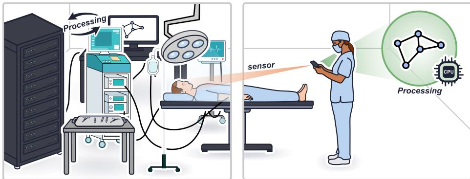
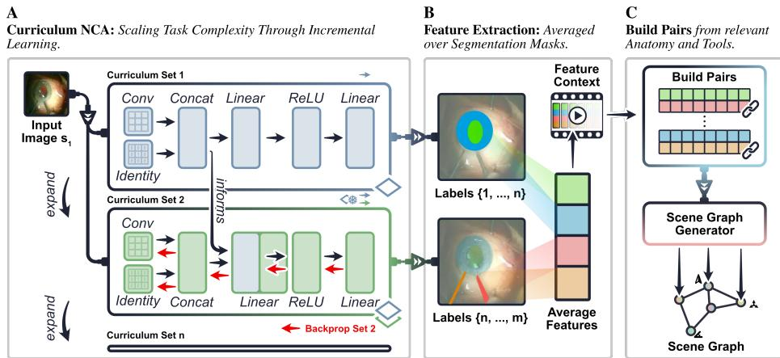
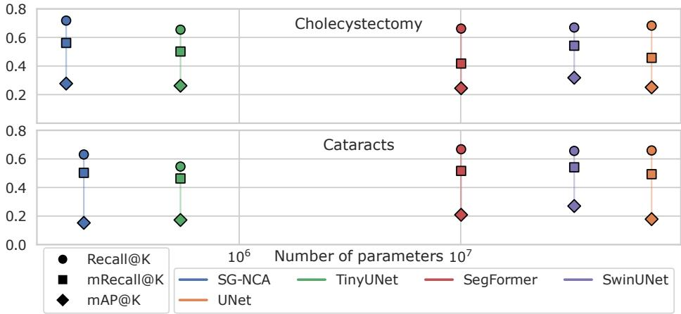
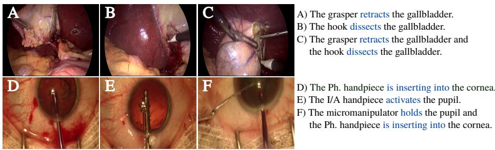

# Sterilizable Scene Graph Generation for Operating Rooms

Nick Lemke1,2, Ssharvien Kumar Sivakumar1,3, Antoine P. Sanner4, John Kalkhof5, Henry John Krumb1, Ghazal Ghazaei3, and Anirban Mukhopadhyay1

1 Technical University of Darmstadt, Darmstadt, Germany

nick.lemke@gris.informatik.tu-darmstadt.de

2 ImFusion GmbH, Munich, Germany

3 Carl Zeiss AG, Munich, Germany

4 University Medical Center Mainz, Mainz, Germany

5 Inria Center at University Côte d’Azur, Sophia Antipolis, France

Abstract. Scene graph generation from surgical video enables a holistic and structured understanding of surgical scenes by modeling objects and their semantic relationships. Despite recent advances, state-of-theart approaches rely on large, parameter-heavy deep learning models that are impractical for deployment in the operating room (OR) due to hardware footprint, hygiene constraints, latency, and data privacy concerns. To the best of our knowledge, this is the first scene graph generation method built on NCAs and the first NCA framework capable of learning structured representations. We introduce SG-NCA, a lightweight scene graph generation framework based on Neural Cellular Automata (NCA), designed for inference in fanless devices critical for OR hygiene protocols. SG-NCA is the first scene graph generation combining NCA-based multiclass segmentation for eficient object detection and feature extraction with a lightweight relation predictor. We evaluate SG-NCA on videos of cataract surgery and cholecystectomy, demonstrating performance comparable to established baselines while requiring 55× fewer parameters. We showcase deployment on fanless edge devices better suited for the OR and demonstrate downstream applications such as surgical video captioning, highlighting SG-NCA’s potential for afordable, privacy-preserving, and OR-ready intraoperative scene understanding. Our code is publicly available at: https://github.com/MECLabTUDA/SG-NCA

Keywords: Neural Cellular Automaton · Scene Graph · Operating Room.

## 1 Introduction

Scene graph generation from surgical videos is leading to a holistic understanding of the surgery, especially structured representations of the scene semantics relationships and interactions [1]. State-of-the-art (SOTA) scene graph generation relies on huge deep learning models consisting of millions of parameters [2], which demand massive workstations for deployment in the operating room (OR).

B

A

Current Systems: Need of strong infrastructure difficult in a cluttered OR

Scene Graph NCA: Enables lightweight application on minimal hardware.

  
Fig. 1. Lightweight scene graph generation on fanless devices such as smartphones.

However, such workstations sufer from practical concerns, such as: 1) Hygiene: Workstations are dificult to sterilize, and the fans distribute dirt across the OR [3]. 2) Footprint: Big workstations further reduce the already narrow space in the OR, and tethered connections add logistical complexity. Utilizing cloud computing is not feasible either, as this demands a stable internet connectivity and introduces high latency and data sovereignty issues. A lightweight scene graph generation alternative that infers on edge devices provides an afordable, responsive, and secure solution that 1) runs on fanless, sealed machines, which are easily sterilizable, 2) keeps data in the OR, ofering privacy-by-design, and 3) democratizes access by leveraging ubiquitous hardware (Fig. 1).

SOTA scene graph generation tailored for the clinical setting uses large vision language models [2], vision transformers [4], or convolutional neural networks [5]. All of those methods are parameter-heavy, rendering the proposed methods impractical for clinical deployment on low-power fanless devices. Neural Cellular Automata (NCA), on the other hand, are lightweight deep learning models, well-suited for medical applications. NCAs have previously been used for binary segmentation of single anatomies on modalities like MRI [6,7], X-Ray [8], and ultrasound [9]. To the best of our knowledge, only one NCA [10] has been trained for multi-class segmentation; however, no previous NCA has been trained for learning structured representations, such as scene graphs.

We design our scene graph generation algorithm, SG-NCA, based on NCAs combined with an octree data structure [10] for eficient object detection and feature retrieval from surgical videos. We design a class-incremental curriculum for eficient NCA training, tailored for the complex clinical setting. After the NCA segments the anatomies and tools in the frames, graph nodes and geometric relations are automatically inferred from the segmentation mask. Finally, our parameter-eficient segmentation-grounded [11] relation predictor infers semantic relations based on the features produced by the segmentation NCA.

  
Fig. 2. The curriculum-based training (A), the segmentation-grounded feature extraction (B) and the relation classification (C).

Our contributions are as follows: 1) We propose the first scene graph generation algorithm based on NCA, the first NCA for structured representation learning. 2) We evaluate our algorithm on two video recordings of cataract surgery and cholecystectomy, showing that SG-NCA holds up to established baselines while requiring 55× fewer parameters. 3) We deploy our model on edge devices that run within the thermal and hygiene constraints of the OR and automatically generate captions for surgical scenes right on the edge of the bedside.

## 2 Methodology

We describe our segmentation-grounded scene graph generation algorithm. First, we briefly introduce the NCA-based scene graph generation. After that, we outline the NCA segmentation model and, finally, we elucidate how we adapt the NCA to the surgical setting.

## 2.1 Segmentation-Grounded Scene Graph Generation

We infer scene graphs from the probability distribution $p ( G | I )$ of the scene graph G conditioned on the image I. Since learning this distribution is dificult, we decompose it into

$$
p ( G | I ) = p ( O | I ) \cdot p ( R | O , I )
$$

where O are the objects, and R are their relationships. The objects O are inferred by segmenting tools and anatomies in the given frame with the NCA. In the second stage, we infer semantic relationships (e.g. retracting, holding, inserting) from $p ( R | O , I )$ , which includes the surgery-specific prior.

Algorithm 1 Scene Graph Generation with SG-NCA   
1: Inputs:   
2: $I _ { t }$ : image at time t   
3: $f _ { \theta }$ : segmentation + feature NCA   
4: gθ : relation classifier   
5: C : object feature cache from previous frames   
6: Output:   
7: $G _ { t } = ( O _ { t } , R _ { t } )$ : scene graph with objects $O _ { t }$ and relations $R _ { t }$   
8: C : updated cache for subsequent frames   
9: function UpdateSceneGraph $( I _ { t } , C )$   
10: $S , Z \gets f _ { \theta } ( I _ { t } )$ ▷ segmentation labels and features   
11: $O _ { t } \gets \emptyset$ ▷ initialize objects   
12: for each class c in $S$ do   
13: $M _ { c } \gets \{ p \ | \ S ( p ) = c \}$ ▷ segmentation mask   
14: if $| M _ { c } | > \tau$ then   
15: $z _ { c } \gets \mathrm { P o o L } ( Z , M _ { c } )$ ▷ segmentation-grounding   
16: $z _ { c } \gets \mathrm { T }$ emporalFuse $( z _ { c } , c , C )$   
17: add node $o _ { c } = \left( c , z _ { c } \right)$ to $O _ { t }$   
18: end if   
19: end for   
20: $R _ { t } \gets \emptyset$ ▷ initialize relations   
21: for each ordered pair $( o _ { i } , o _ { j } ) \in O _ { t }$ do   
22: $r _ { i j } \gets g _ { \theta } ( z _ { i } , z _ { j } )$ ▷ predict relation from feature pair   
23: add edge $\left( o _ { i } , r _ { i j } , o _ { j } \right)$ to $R _ { t }$   
24: end for   
25: C ← UpdateCache(C, Ot)   
26: return $( O _ { t } , R _ { t } ) , C$   
27: end function

Algorithm 1 describes our video scene graph generation in pseudo-code. First, SG-NCA $f _ { \theta }$ generates the segmentation mask $S$ and the features $Z$ for the latest frame $I _ { t } .$ , as outlined in Sec. 2.2. Segmentation masks that are larger than a pre-defined threshold $\tau = 1 5 0$ pixels constitute nodes $O _ { t }$ in the graph. Taking inspiration from segmentation-grounded scene graph generation [11], we average the pixel-wise features $z _ { c }$ corresponding to each object $o _ { c } \ ( \mathrm { F i g . \ 2 \ B } )$ . Since object features are high-dimensional, we learn a projection matrix that embeds object features in a 64-dimensional embedding space. A second projection mechanism fuses the features with those of $7$ previous frames within a 1-second window stored in the cache $C ,$ and projects them to a temporally-enriched 256- dimensional feature vector for each vector. Based on those features, the 3-layer relation classifier $g _ { \theta }$ predicts the semantic relationships $r _ { i j }$ for all possible pairs $( o _ { i } , o _ { j } )$ , taking the data-specific prior $p ( R )$ into consideration (Fig. 2 C). Finally, the geometric close to relation is inferred from objects with touching segmentation masks.

## 2.2 NCA for High-resolution Scene Graph Generation

NCAs are lightweight segmentation and feature extraction models inspired by cellular automata such as Conway’s Game of Life. However, instead of handengineered update rules, the NCA uses a neural network to learn its update rule. The recently proposed OctreeNCA [10] generalizes the neighborhood definition by embedding the image in an octree data structure for eficient knowledge difusion on a coarse scale, and fine-grained segmentation on a fine scale. The OctreeNCA downscales the input image to a $\textstyle { \bar { \frac { 1 } { 2 ^ { 5 } } } }$ of its original resolution and difuses global knowledge using the first NCA. After that, the hidden states are upscaled by 2× and concatenated with the next-finer scale of the image in the next octree level. The procedure is repeated until the final NCA delivers the segmentation masks. The other segmentation logits and the other states from all octree levels (including the last) are concatenated and used for relation prediction.

## 2.3 Curriculum NCA Training for Many Classes

As the only way NCAs can emit segmentation masks is within their cellular grid, NCAs are inherently constrained in the number of classes they can learn to segment. Assuming the NCA has a C-dimensional input lattice, and 3 input channels (RGB), the NCA can segment at most C − 3 classes. Simply increasing the number of dimensions C increases computational demand and, due to the repetitive nature of NCA, scales very poorly in terms of computational requirements during training.

Instead, we propose an eficient class-curriculum learning algorithm for NCAs by introducing classes in small batches. Our SG-NCA first establishes a basic understanding of the surgical scene by training on 5 of the most frequent classes. After that, the dimension $C _ { 0 }$ of the hidden states is extended by $C _ { + }$ to account for the new classes and additional hidden states $C _ { T + 1 } = C _ { T } + C _ { + }$ . Since old parameters are frozen, only the lightweight set of new parameters must be trained. This significantly reduces the size of the computational graph needed for backpropagation, rendering multi-class training feasible and eficient (Fig. 2 A).

## 3 Experimental Setup

In this section, we highlight the data used in our study and the baseline algorithms for scene graph generation.

Cholecystectomy: For our experiments on cholecystectomy, we leverage videos of the Cholec80 dataset [12]. It contains videos captured at 25 FPS of 80 patients. The CholecSeg-8k dataset [13] is a subset of Cholec80 containing roughly 8,000 frames with dense segmentation masks. We use CholecT50 [14], which is annotated with action triplets, for training and evaluation of the scene graph generation.

Cataract surgery: We conduct experiments on the CATARACTS dataset [15], which comprises 50 videos of surgeons performing cataract surgery recorded at

Table 1. Segmentation results and number of parameters for each segmentation model.
<table><tr><td rowspan=1 colspan=1></td><td rowspan=1 colspan=1>Cholecystectomymacro Dice micro Dice #Params</td><td rowspan=1 colspan=2>Cataractsmacro Dice micro Dice #Params</td></tr><tr><td rowspan=1 colspan=1>SG-NCA</td><td rowspan=1 colspan=1> $[ 7 0 . 9 \pm 1 6 . 4 7 6 . 6 \pm 2 1 . 9$    27,465</td><td rowspan=1 colspan=1> $7 5 . 0 \pm 1 5 . 9 8 2 . 1 \pm 1 8 . 0$ </td><td rowspan=1 colspan=1>42,505</td></tr><tr><td rowspan=1 colspan=1>SegFormer</td><td rowspan=1 colspan=1> $7 1 . 3 \pm 2 8 . 4 8 1 . 7 \pm 2 2 . 1$ 3,717,484</td><td rowspan=1 colspan=1> $7 0 . 8 \pm 2 1 . 2 8 2 . 9 \pm 2 0 . 5$ </td><td rowspan=1 colspan=1>3,719,283</td></tr><tr><td rowspan=1 colspan=1>UNetSwinUNetv2</td><td rowspan=1 colspan=1> $4 4 . 4 \pm 2 5 . 7 5 3 . 6 \pm 2 5 . 2 6 8 , 3 3 1 , 6 7 0$  $6 7 . 4 \pm 2 7 . 9 7 8 . 0 \pm 2 3 . 2 2 7 , 9 4 1 , 0 2 8$ </td><td rowspan=1 colspan=2> $4 3 . 1 \pm 2 9 . 5 6 3 . 7 \pm 2 5 . 9$ 68,332,580 $6 7 . 4 \pm 2 0 . 2 7 9 . 0 \pm 2 0 . 8 2 7 , 9 4 1 , 7 0 0$ </td></tr></table>

30 FPS. Since this data does not contain segmentation labels, we evaluate on Cadis [16], which is a subset containing dense segmentation labels. For training and evaluation of our scene graph generation, we use the CAT-SG dataset [17].

Since segmentation annotations are scarce for both cases, we leverage pseudomasks generated from SASVi [18], which relies on SAM2 [19] augmented with an automated prompting network. For evaluating the segmentation performance of our method, we ensure all ground-truth segmentation masks are in the validation and test split. The remaining cases are split randomly. For both domains, we ensure a consistent patient split between training, validation, and test data.

Evaluation: We evaluate the segmentation models using the Dice score, which measures the overlap of the predicted and the true segmentation mask.

The scene graph generation is evaluated using the unconstrained Recall@K, mRecall@K, and mAP@K metrics. Since there can be up to 3 relations at once in the Cholecystectomy data, we use K = 4 for this data and K = 6 for the Cataracts data, as there can be up to 5 relations in a single frame. Our metrics do not impose graph constraints, meaning one pair of objects can have multiple relationships, e.g., the grasper grasping and retracting at the same time.

Baselines: We implement several segmentation baselines and combine them with the MotifNet [20] relation prediction network. MotifNet uses a biLSTM to transfer knowledge between objects. A final linear layer predicts the relations based on the enriched features. For segmentation, we use UNet [21], which is a fully convolutional network, and SegFormer [22] and SwinUNet [23], which are transformer-based architectures. We replace the Swin transformer layers with more eficient variants from SwinV2 [24]. We develop a parameter-eficient UNet variant, which we refer to as tinyUNet.

## 4 Results

In this section, we evaluate SG-NCA’s segmentation and scene graph generation capabilities, and present an ablation study demonstrating the robustness of our algorithm. Finally, we show video captions generated by SG-NCA and compare diferent edge devices with a clinical workstation for deployment.

Segmentation: Segmentation accuracy has a significant impact on relation prediction, as objects must be localized accurately, and low-quality segmentations can degrade downstream performance [5]. Table 1 reports the segmentation results, together with the number of parameters. Due to the class-curriculum training, our SG-NCA achieves good Dice scores on all classes, leading to an overall high macro Dice score. SG-NCA performs slightly worse than the SOTA in delineating the common anatomies, while requiring 87× fewer parameters. Overall, our segmentation backbone requires less than 1.2% of the parameters of its baselines.

  
Fig. 3. Scene graph generation evaluation of semantic relationships. SG-NCA requires 55× fewer parameters while achieving comparable performance, running on an edge device.

Table 2. Ablation on the increments of channels $C _ { + }$ and hidden size $H _ { + }$ during SG-NCA training.
<table><tr><td rowspan="2"> $C _ { + }$ </td><td rowspan="2">H+</td><td colspan="3">Cholecystectomy</td><td colspan="3">Cataracts</td></tr><tr><td>macro Dice micro Dice</td><td></td><td> $\# \mathrm { P a r a m s }$ </td><td>macro Dice micro Dice #Params</td><td></td><td></td></tr><tr><td rowspan="3">8</td><td>32</td><td> $7 3 . 7 \pm 1 1 . 7$ </td><td> $7 7 . 4 \pm 2 0 . 8$ </td><td>59,625</td><td> $7 5 . 9 \pm 1 3 . 6$ </td><td> $8 1 . 7 \pm 1 7 . 7$ </td><td>148,905</td></tr><tr><td>16</td><td> $7 3 . 9 \pm 1 2 . 0$ </td><td> $7 7 . 6 \pm 2 1 . 4$ </td><td>40,185</td><td> $7 6 . 4 \pm 1 2 . 7$ </td><td> $8 2 . 6 \pm 1 7 . 6$ </td><td>85,625</td></tr><tr><td>8</td><td> $7 4 . 3 \pm 1 1 . 9$ </td><td> $7 7 . 7 \pm 2 0 . 7$ </td><td>30,465</td><td> $7 5 . 2 \pm 1 3 . 6$ </td><td> $8 1 . 6 \pm 1 8 . 4$ </td><td>53,985</td></tr><tr><td rowspan="2">4</td><td>16</td><td> $7 4 . 0 \pm 1 2 . 0$ </td><td> $7 7 . 6 \pm 2 1 . 0$ </td><td>34,785</td><td> $7 8 . 0 \pm 0 9 . 7$ </td><td> $8 2 . 5 \pm 1 7 . 6$ </td><td>55,785</td></tr><tr><td>8</td><td> $7 2 . 6 \pm 1 3 . 1$ </td><td> $7 6 . 8 \pm 2 1 . 6$ </td><td>27,465</td><td> $7 5 . 6 \pm 1 4 . 1$ </td><td> $8 2 . 1 \pm 1 7 . 8$ </td><td>42,505</td></tr></table>

Scene Graph Generation: Figure 3 reports the scene graph generation results of SG-NCA and its baselines. Our SG-NCA achieves similar results to its baselines, while requiring 55× fewer parameters than the most lightweight baseline SegFormer. Our method’s lightweight design allows inference right on the edge without requiring a GPU.

Ablation Study: We report results of our ablation study on the curriculumbased segmentation training in Tab. 2. Essentially, the increment of the number of channels $C _ { + }$ and the corresponding hidden size $H _ { + }$ has minimal influence on the segmentation performance. Even our smallest configuration with very small increments of $C _ { + } = 4$ channels and $H _ { + } = 8$ maintains reasonable segmentation performance. Hence, we select this configuration for our experiments on scene graph generation.

  
Fig. 4. Captions generated from SG-NCA. See supplementary material for videos.

Table 3. Maximum Memory demand (in MB), Temperature increase (in °K), and Energy consumption (in W) during inference of SG-NCA on various hardware. Due to thermal and power requirements, other models exceed the OR-limits.
<table><tr><td rowspan=1 colspan=1></td><td rowspan=1 colspan=1>Mem.</td><td rowspan=1 colspan=1>WorkstationTemp. Energy</td><td rowspan=1 colspan=1>SmartphoneTemp. Energy</td><td rowspan=1 colspan=1>Raspberry PiTemp. Energy</td></tr><tr><td rowspan=1 colspan=1>SG-NCA</td><td rowspan=1 colspan=1>44.25</td><td rowspan=1 colspan=1>4.18   223</td><td rowspan=1 colspan=1>0.66   1.6</td><td rowspan=1 colspan=1>0.62   4.5</td></tr></table>

Caption Generation: Based on the inferred scene graphs, we demonstrate rule-based caption generation, describing the workflow of the surgery. Figure 4 shows examples of those captions. Videos augmented with scene graphs and captions can be found in the supplementary material. The close to relations are indicated by thin lines, whereas bold green ones indicate semantic relations.

Deployment on the Edge: Next to the large workstation, we deploy and benchmark our model on a smartphone and a Raspberry Pi, both of which are low-energy computing devices. In Tab. 3, we report the room temperature increase after 40 minutes of runtime, and the average power draw during inference on all three devices. The smartphone and the Raspberry Pi are both developed for minimal energy consumption and hence have very little impact on the temperature of the room, whereas the workstation PC significantly heats the room, while contaminating the room with its fans.

## 5 Conclusion

We propose SG-NCA, a lightweight model for scene graph generation using NCAs. The proposed curriculum-based training enables training large NCAs with minimal computational overhead, efectively equipping them with the ability to segment a wide range of surgical anatomies and tools. Combined with the lightweight relation classifier, SG-NCA generates scene graphs without increasing computational demand.

Our experiments show that SG-NCA competes with models that are much larger in terms of scene graph generation and segmentation performance. Hence, our model can run on fanless, easily sanitizable hardware, as required by operating room hygiene standards. SG-NCA enables a holistic understanding of surgery at the edge of the bedside.

Acknowledgments. This work has been partially funded by the Federal Ministry of Research, Technology and Space project “Advice” (grant 13GW0817C).

Disclosure of Interests. The authors have no competing interests to declare that are relevant to the content of this article.

## References

1. Angelo Henriques, Korab Hoxha, Daniel Zapp, Peter C Issa, Nassir Navab, and M Ali Nasseri. Decoding the surgical scene: A scoping review of scene graphs in surgery. arXiv preprint arXiv:2509.20941, 2025.

2. Ege Özsoy, Chantal Pellegrini, Matthias Keicher, and Nassir Navab. Oracle: Large vision-language models for knowledge-guided holistic or domain modeling. In International Conference on Medical Image Computing and Computer-Assisted Intervention, pages 455–465. Springer, 2024.

3. World Health Organization et al. Global guidelines for the prevention of surgical site infection. World Health Organization, 2016.

4. Jialun Pei, Diandian Guo, Jingyang Zhang, Manxi Lin, Yueming Jin, and Pheng-Ann Heng. S 2 former-or: Single-stage bi-modal transformer for scene graph generation in or. IEEE Transactions on Medical Imaging, 2024.

5. Antoine P Sanner, Nils F Grauhan, Marc A Brockmann, Ahmed E Othman, and Anirban Mukhopadhyay. Voxel scene graph for intracranial hemorrhage. In International Conference on Medical Image Computing and Computer-Assisted Intervention, pages 519–529. Springer, 2024.

6. John Kalkhof, Camila González, and Anirban Mukhopadhyay. Med-nca: Robust and lightweight segmentation with neural cellular automata. In International Conference on Information Processing in Medical Imaging, pages 705–716. Springer, 2023.

7. John Kalkhof and Anirban Mukhopadhyay. M3d-nca: Robust 3d segmentation with built-in quality control. In International Conference on Medical Image Computing and Computer-Assisted Intervention, pages 169–178. Springer, 2023.

8. John Kalkhof, Amin Ranem, and Anirban Mukhopadhyay. Unsupervised training of neural cellular automata on edge devices. In International Conference on Medical Image Computing and Computer-Assisted Intervention, pages 498–507. Springer, 2024.

9. Nick Lemke, Mirko Konstantin, Henry John Krumb, John Kalkhof, Jonathan Stieber, and Anirban Mukhopadhyay. Equitable federated learning with nca. In International Conference on Medical Image Computing and Computer-Assisted Intervention, pages 168–177. Springer, 2025.

10. Nick Lemke, John Kalkhof, Niklas Babendererde, and Anirban Mukhopadhyay. Octreenca: Single-pass 184 mp segmentation on consumer hardware. In 36th British Machine Vision Conference 2025, BMVC 2025, Shefield, UK, November 24-27, 2025. BMVA, 2025.

11. Siddhesh Khandelwal, Mohammed Suhail, and Leonid Sigal. Segmentationgrounded scene graph generation. In Proceedings of the IEEE/CVF International Conference on Computer Vision, pages 15879–15889, 2021.

12. Didier Mutter Jacques Marescaux Michel De Mathelin Nicolas Padoy Andru Twinanda, Sherif Shehata. Endonet: A deep architecture for recognition tasks on laparoscopic videos. IEEE Transactions on Medical Imaging, 36, 02 2016.

13. W-Y Hong, C-L Kao, Y-H Kuo, J-R Wang, W-L Chang, and C-S Shih. Cholecseg8k: a semantic segmentation dataset for laparoscopic cholecystectomy based on cholec80. arXiv preprint arXiv:2012.12453, 2020.

14. Chinedu Innocent Nwoye, Cristians Gonzalez, Tong Yu, Pietro Mascagni, Didier Mutter, Jacques Marescaux, and Nicolas Padoy. Recognition of instrument-tissue interactions in endoscopic videos via action triplets. In International Conference on Medical Image Computing and Computer-Assisted Intervention (MICCAI), pages 364–374. Springer, 2020.

15. Hassan Al Hajj, Mathieu Lamard, Pierre-Henri Conze, Soumali Roychowdhury, Xiaowei Hu, Gabija Maršalkait˙e, Odysseas Zisimopoulos, Muneer Ahmad Dedmari, Fenqiang Zhao, Jonas Prellberg, et al. Cataracts: Challenge on automatic tool annotation for cataract surgery. Medical image analysis, 52:24–41, 2019.

16. Maria Grammatikopoulou, Evangello Flouty, Abdolrahim Kadkhodamohammadi, Gwenolé Quellec, Andre Chow, Jean Nehme, Imanol Luengo, and Danail Stoyanov. Cadis: Cataract dataset for surgical rgb-image segmentation. Medical Image Analysis, 71:102053, 2021.

17. Felix Holm, Gözde Ünver, Ghazal Ghazaei, and Nassir Navab. Cat-sg: A large dynamic scene graph dataset for fine-grained understanding of cataract surgery. In International Conference on Medical Image Computing and Computer-Assisted Intervention, pages 96–106. Springer, 2025.

18. Ssharvien Kumar Sivakumar, Yannik Frisch, Amin Ranem, and Anirban Mukhopadhyay. Sasvi: segment any surgical video. International Journal of Computer Assisted Radiology and Surgery, pages 1–11, 2025.

19. Nikhila Ravi, Valentin Gabeur, Yuan-Ting Hu, Ronghang Hu, Chaitanya Ryali, Tengyu Ma, Haitham Khedr, Roman Rädle, Chloe Rolland, Laura Gustafson, et al. Sam 2: Segment anything in images and videos. arXiv preprint arXiv:2408.00714, 2024.

20. Rowan Zellers, Mark Yatskar, Sam Thomson, and Yejin Choi. Neural motifs: Scene graph parsing with global context. In Proceedings of the IEEE conference on computer vision and pattern recognition, pages 5831–5840, 2018.

21. Olaf Ronneberger, Philipp Fischer, and Thomas Brox. U-net: Convolutional networks for biomedical image segmentation. In International Conference on Medical image computing and computer-assisted intervention, pages 234–241. Springer, 2015.

22. Enze Xie, Wenhai Wang, Zhiding Yu, Anima Anandkumar, Jose M Alvarez, and Ping Luo. Segformer: Simple and eficient design for semantic segmentation with transformers. Advances in neural information processing systems, 34:12077–12090, 2021.

23. Hu Cao, Yueyue Wang, Joy Chen, Dongsheng Jiang, Xiaopeng Zhang, Qi Tian, and Manning Wang. Swin-unet: Unet-like pure transformer for medical image segmentation. In European conference on computer vision, pages 205–218. Springer, 2022.

24. Ze Liu, Han Hu, Yutong Lin, Zhuliang Yao, Zhenda Xie, Yixuan Wei, Jia Ning, Yue Cao, Zheng Zhang, Li Dong, et al. Swin transformer v2: Scaling up capacity

and resolution. In Proceedings of the IEEE/CVF conference on computer vision and pattern recognition, pages 12009–12019, 2022.