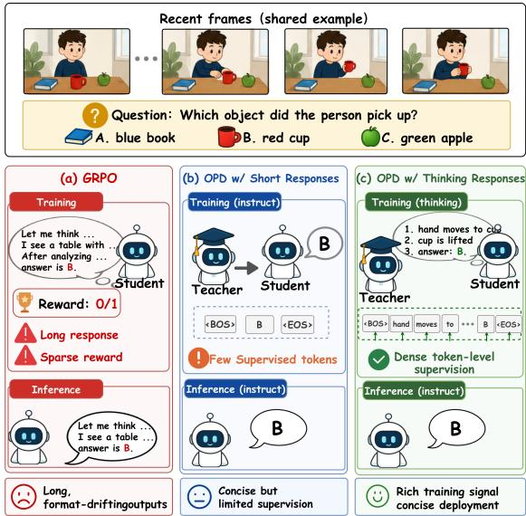
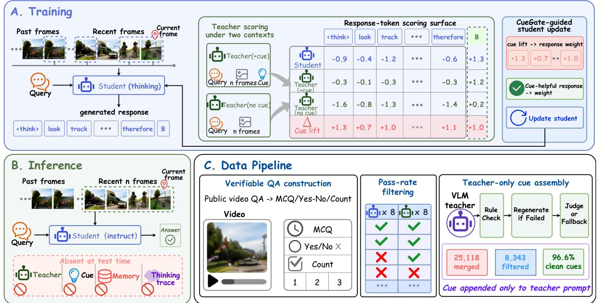
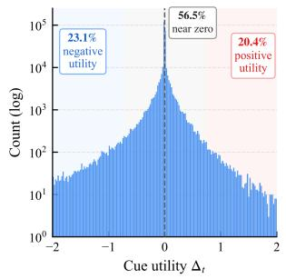
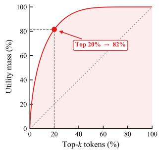
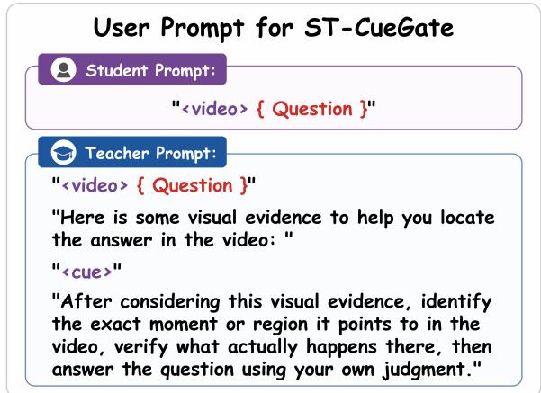
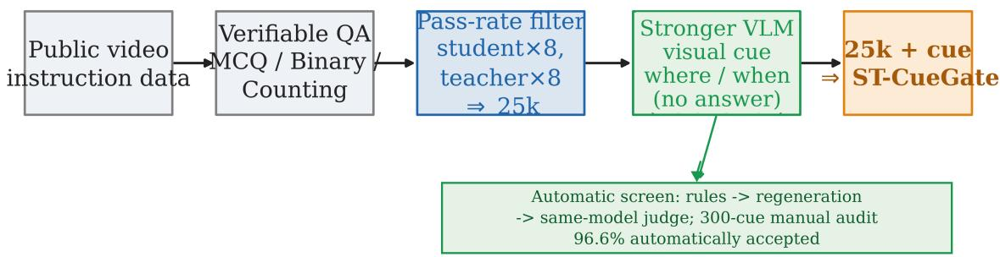
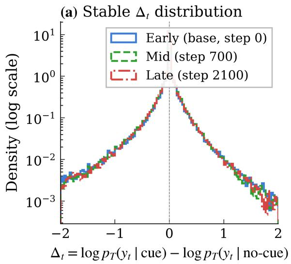
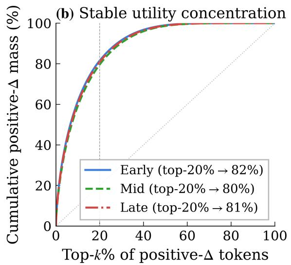
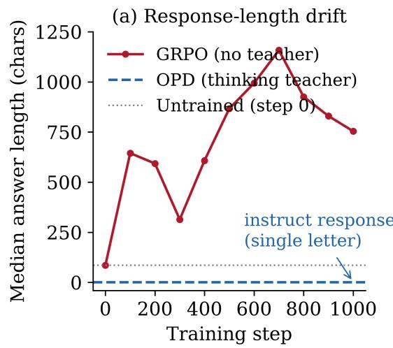
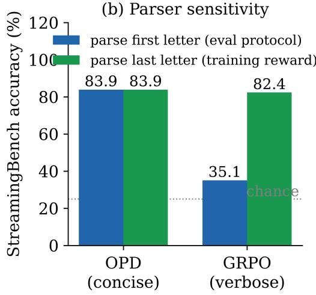

# StreamOPD: A Post-Training Recipe with Spatio-Temporal Cue Gating for Streaming Video Understanding

Keming Wu<sup>1</sup>, Baoyi Wang<sup>2</sup>, Kaichen Zhang<sup>3</sup>, Xiang An<sup>4</sup>, Zuhao Yang<sup>5</sup>, Sudong Wang<sup>6</sup>, Haowei Zhu<sup>1</sup>, Tingxuan Huang<sup>1</sup>, Hongcheng Gao<sup>1</sup>, Bin Wang<sup>1∗</sup>

<sup>1</sup>Tsinghua University, <sup>2</sup>Zhejiang University, <sup>3</sup>The University of Hong Kong,

<sup>4</sup>LMM<sub>s-</sub>L<sub>a</sub>b<sub>,</sub> <sup>5</sup>N<sub>a</sub>n<sub>ya</sub>n<sub>g</sub> T<sub>ec</sub>hn<sub>o</sub>l<sub>og</sub>i<sub>ca</sub>l Uni<sub>ve</sub>r<sub>s</sub>it<sub>y,</sub>

<sup>6</sup>Hon<sub>g</sub> Kon<sub>g</sub> Universit<sub>y</sub> of Science and Technolo<sub>gy</sub> (Guan<sub>g</sub>zhou) Project page: https://unix-ai-lab.github.io/StreamOPD

## Abstract

St<sub>ream</sub>i<sub>ng v</sub>id<sub>eo un</sub>d<sub>ers</sub>t<sub>an</sub>di<sub>ng</sub> d<sub>eman</sub>d<sub>s</sub> di<sub>rec</sub>t <sub>responses</sub> f<sub>rom</sub> th<sub>e causa</sub>ll<sub>y o</sub>b<sub>serve</sub>d <sub>pre</sub>fi<sub>x o</sub>f <sub>an un</sub>f<sub>o</sub>ldi<sub>ng v</sub>id<sub>eo.</sub> E<sub>x-</sub> i<sub>s</sub>ti<sub>ng sys</sub>t<sub>ems a</sub>dd i<sub>n</sub>f<sub>erence-</sub>ti<sub>me memory, re</sub>t<sub>r</sub>i<sub>eva</sub>l<sub>, an</sub>d <sub>com-</sub> <sub>press</sub>i<sub>on,</sub> <sub>ye</sub>t <sub>a</sub> t<sub>ra</sub>i<sub>n</sub>i<sub>ng-</sub>f<sub>ree</sub> <sub>s</sub>lidi<sub>ng-w</sub>i<sub>n</sub>d<sub>ow</sub> b<sub>ase</sub>li<sub>ne</sub> <sub>a</sub>l<sub>rea</sub>d<sub>y</sub> <sub>ma</sub>t<sub>c</sub>h<sub>es</sub> th<sub>em.</sub> W<sub>e</sub> th<sub>ere</sub>f<sub>ore</sub> fi<sub>x a memory-</sub>f<sub>ree recen</sub>t<sub>-w</sub>i<sub>n</sub>d<sub>ow</sub> <sub>pro</sub>t<sub>oco</sub>l <sub>an</sub>d <sub>as</sub>k h<sub>ow</sub> f<sub>ar pos</sub>t<sub>-</sub>t<sub>ra</sub>i<sub>n</sub>i<sub>ng a</sub>l<sub>one can go.</sub> R<sub>e</sub>i<sub>n</sub>f<sub>orce-</sub> <sub>men</sub>t l<sub>earn</sub>i<sub>ng</sub> <sub>w</sub>ith <sub>ver</sub>ifi<sub>a</sub>bl<sub>e</sub> <sub>rewar</sub>d<sub>s</sub> fit<sub>s</sub> thi<sub>s</sub> <sub>reg</sub>i<sub>me</sub> <sub>poor</sub>l<sub>y,</sub> <sub>encourag</sub>i<sub>ng</sub> l<sub>ong</sub> “thi<sub>n</sub>k<sub>-</sub>th<sub>en-answer</sub>” <sub>genera</sub>ti<sub>ons, w</sub>hil<sub>e on-</sub> <sub>p</sub>olic<sub>y</sub> distillation (OPD) su<sub>pp</sub>lies dense token-level teacher supervision on student trajectories but is stable only when both <sub>mo</sub>d<sub>e</sub>l<sub>s</sub> t<sub>ra</sub>i<sub>n</sub> i<sub>n</sub> thi<sub>n</sub>ki<sub>ng mo</sub>d<sub>e.</sub> Th<sub>ese o</sub>b<sub>serva</sub>ti<sub>ons</sub> l<sub>ea</sub>d t<sub>o</sub> S<sub>tream</sub>OPD<sub>, a rec</sub>i<sub>pe com</sub>bi<sub>n</sub>i<sub>ng ver</sub>ifi<sub>a</sub>bl<sub>e s</sub>t<sub>ream</sub>i<sub>ng-v</sub>id<sub>eo</sub> d<sub>a</sub>t<sub>a,</sub> thi<sub>n</sub>ki<sub>ng-mo</sub>d<sub>e</sub> OPD<sub>, an</sub>d i<sub>ns</sub>t<sub>ruc</sub>t<sub>-mo</sub>d<sub>e</sub> d<sub>ep</sub>l<sub>oymen</sub>t<sub>.</sub> It raises StreamingBench from 77.9% to 83.9%—within 0.3 <sub>po</sub>i<sub>n</sub>t<sub>s o</sub>f th<sub>e</sub> 9B t<sub>eac</sub>h<sub>er—an</sub>d i<sub>mproves</sub> OVO<sub>-</sub>B<sub>enc</sub>h <sub>exc</sub>l<sub>u</sub>d<sub>-</sub> ing its hallucination-detection subtask (HLD) by 9.1 points <sub>un</sub>d<sub>er unc</sub>h<sub>ange</sub>d i<sub>n</sub>f<sub>erence.</sub> A<sub>s a</sub> t<sub>eac</sub>h<sub>er-pr</sub>i<sub>v</sub>il<sub>ege ex</sub>t<sub>en-</sub> sion, Spatio-Temporal CueGate (ST-CueGate) aggregates cue-<sub>versus-no-cue</sub> t<sub>eac</sub>h<sub>er</sub> lik<sub>e</sub>lih<sub>oo</sub>d <sub>ra</sub>ti<sub>os</sub> i<sub>n</sub>t<sub>o a group-re</sub>l<sub>a</sub>ti<sub>ve</sub> response score that reweights OPD. It reaches 71.9% on OVO-Bench (excluding HLD) and 64.9% on Video-MME, and i<sub>s</sub> th<sub>e on</sub>l<sub>y var</sub>i<sub>an</sub>t th<sub>a</sub>t <sub>s</sub>t<sub>ays a</sub>b<sub>ove</sub> th<sub>e</sub> b<sub>ase mo</sub>d<sub>e</sub>l <sub>on a</sub>ll f<sub>our</sub> b<sub>enc</sub>h<sub>mar</sub>k<sub>s.</sub> R<sub>ep</sub>l<sub>ac</sub>i<sub>ng</sub> th<sub>e</sub> t<sub>eac</sub>h<sub>er w</sub>ith <sub>a</sub> f<sub>rozen copy</sub> <sub>o</sub>f th<sub>e s</sub>t<sub>u</sub>d<sub>en</sub>t’<sub>s</sub> i<sub>n</sub>iti<sub>a</sub>l <sub>po</sub>li<sub>cy—on-po</sub>li<sub>cy se</sub>lf<sub>-</sub>di<sub>s</sub>till<sub>a</sub>ti<sub>on—</sub> retains most of these gains and lifts HLD to 57.0%, above b<sub>o</sub>th th<sub>e</sub> <sub>un</sub>t<sub>ra</sub>i<sub>ne</sub>d <sub>s</sub>t<sub>u</sub>d<sub>en</sub>t <sub>an</sub>d th<sub>e</sub> 9B t<sub>eac</sub>h<sub>er,</sub> <sub>so</sub> <sub>a</sub>b<sub>s</sub>t<sub>en</sub>ti<sub>on</sub> l<sub>oss</sub> i<sub>s</sub> <sub>no</sub>t i<sub>n</sub>t<sub>r</sub>i<sub>ns</sub>i<sub>c</sub> t<sub>o</sub> th<sub>e</sub> <sub>rec</sub>i<sub>pe.</sub> W<sub>e</sub> <sub>prov</sub>id<sub>e</sub> <sub>a</sub> t<sub>ransparen</sub>t <sub>an</sub>d <sub>repro</sub>d<sub>uc</sub>ibl<sub>e</sub> <sub>re</sub>f<sub>erence</sub> f<sub>or</sub> <sub>open-source</sub> <sub>s</sub>t<sub>ream</sub>i<sub>ng-v</sub>id<sub>eo</sub> <sub>researc</sub>h<sub>.</sub>

## Introduction

St<sub>ream</sub>i<sub>ng v</sub>id<sub>eo un</sub>d<sub>ers</sub>t<sub>an</sub>di<sub>ng as</sub>k<sub>s a mu</sub>lti<sub>mo</sub>d<sub>a</sub>l l<sub>arge</sub> l<sub>an-</sub> <sub>g</sub>ua<sub>g</sub>e model (MLLM) to answer questions while a video is still unfoldin<sub>g</sub> (Lin et al. 2026; Niu et al. 2025; Chen et al. 2024). Unlike ofline video QA, the model cannot look <sub>a</sub>h<sub>ea</sub>d <sub>or repea</sub>t<sub>e</sub>dl<sub>y rev</sub>i<sub>s</sub>it th<sub>e</sub> f<sub>u</sub>ll <sub>c</sub>li<sub>p:</sub> it <sub>mus</sub>t <sub>respon</sub>d di<sub>-</sub> <sub>rec</sub>tl<sub>y</sub> f<sub>rom</sub> th<sub>e</sub> <sub>causa</sub>ll<sub>y</sub> <sub>o</sub>b<sub>serve</sub>d <sub>pre</sub>fi<sub>x</sub> <sub>ava</sub>il<sub>a</sub>bl<sub>e</sub> <sub>w</sub>h<sub>en</sub> th<sub>e</sub> <sub>ques</sub>ti<sub>on arr</sub>i<sub>ves.</sub> Thi<sub>s reg</sub>i<sub>me</sub> i<sub>s cen</sub>t<sub>ra</sub>l t<sub>o</sub> li<sub>ve ass</sub>i<sub>s</sub>t<sub>an</sub>t<sub>s,</sub> <sub>weara</sub>bl<sub>e cameras, an</sub>d <sub>mon</sub>it<sub>ore</sub>d <sub>env</sub>i<sub>ronmen</sub>t<sub>s, ye</sub>t <sub>rema</sub>i<sub>ns</sub> dificult for o<sub>p</sub>en MLLMs. Streamin<sub>g</sub>Bench (Lin et al. 2026) and OVO-Bench (Niu et al. 2025) ex<sub>p</sub>ose this <sub>g</sub>a<sub>p</sub> throu<sub>g</sub>h <sub>rea</sub>l<sub>-</sub>ti<sub>me</sub> <sub>percep</sub>ti<sub>on,</sub> b<sub>ac</sub>k<sub>war</sub>d t<sub>rac</sub>i<sub>ng,</sub> <sub>an</sub>d f<sub>orwar</sub>d<sub>-</sub>l<sub>oo</sub>ki<sub>ng</sub> <sub>q</sub>uer<sup>i</sup>es.

M<sub>os</sub>t <sub>s</sub>t<sub>ream</sub>i<sub>ng</sub> <sub>me</sub>th<sub>o</sub>d<sub>s</sub> <sub>a</sub>dd<sub>ress</sub> thi<sub>s</sub> <sub>c</sub>h<sub>a</sub>ll<sub>enge</sub> <sub>w</sub>ith <sub>mem-</sub> <sub>ory</sub> b<sub>an</sub>k<sub>s,</sub> KV<sub>-cac</sub>h<sub>e compress</sub>i<sub>on, re</sub>t<sub>r</sub>i<sub>eva</sub>l<sub>, or spec</sub>i<sub>a</sub>li<sub>ze</sub>d streamin<sub>g</sub> modules. Sim<sub>p</sub>leStream (Shen et al. 2026), how-<sub>ever, s</sub>h<sub>ows</sub> th<sub>a</sub>t <sub>a s</sub>t<sub>rong,</sub> t<sub>ra</sub>i<sub>n</sub>i<sub>ng-</sub>f<sub>ree recen</sub>t<sub>-w</sub>i<sub>n</sub>d<sub>ow</sub> b<sub>ase-</sub> li<sub>ne can a</sub>l<sub>rea</sub>d<sub>y ma</sub>t<sub>c</sub>h <sub>or surpass su</sub>b<sub>s</sub>t<sub>an</sub>ti<sub>a</sub>ll<sub>y more com-</sub> plex systems, reaching 67.7% on OVO-Bench and 80.6% on St<sub>ream</sub>i<sub>ng</sub>B<sub>enc</sub>h <sub>w</sub>ith <sub>on</sub>l<sub>y</sub> f<sub>our recen</sub>t f<sub>rames.</sub> Thi<sub>s</sub> fi<sub>n</sub>di<sub>ng</sub> <sub>sugges</sub>t<sub>s</sub> th<sub>a</sub>t <sub>arc</sub>hit<sub>ec</sub>t<sub>ura</sub>l <sub>comp</sub>l<sub>ex</sub>it<sub>y</sub> i<sub>s no</sub>t <sub>necessar</sub>il<sub>y</sub> th<sub>e</sub> <sub>pr</sub>i<sub>mary</sub> b<sub>o</sub>ttl<sub>enec</sub>k<sub>.</sub> W<sub>e</sub> th<sub>ere</sub>f<sub>ore</sub> fi<sub>x</sub> th<sub>e same s</sub>i<sub>mp</sub>l<sub>e</sub> i<sub>n</sub>f<sub>er-</sub> <sub>ence pro</sub>t<sub>oco</sub>l th<sub>roug</sub>h<sub>ou</sub>t<sub>—no memory</sub> b<sub>an</sub>k<sub>, re</sub>t<sub>r</sub>i<sub>eva</sub>l<sub>, com-</sub> <sub>press</sub>i<sub>on, or on</sub>li<sub>ne reason</sub>i<sub>ng mo</sub>d<sub>u</sub>l<sub>e—an</sub>d i<sub>so</sub>l<sub>a</sub>t<sub>e a c</sub>l<sub>eaner</sub> <sub>ques</sub>ti<sub>on: can pos</sub>t<sub>-</sub>t<sub>ra</sub>i<sub>n</sub>i<sub>ng c</sub>l<sub>ose</sub> th<sub>e sma</sub>ll<sub>-</sub>t<sub>o-</sub>l<sub>arge mo</sub>d<sub>e</sub>l <sub>gap w</sub>hil<sub>e</sub> l<sub>eav</sub>i<sub>ng</sub> th<sub>e s</sub>t<sub>ream</sub>i<sub>ng</sub> i<sub>n</sub>f<sub>erence pa</sub>th <sub>unc</sub>h<sub>ange</sub>d? C<sub>oncurren</sub>t <sub>wor</sub>k b<sub>r</sub>i<sub>ngs reason</sub>i<sub>ng</sub> i<sub>n</sub>t<sub>o</sub> th<sub>e s</sub>t<sub>ream an</sub>d l<sub>earns</sub> when to answer (Liu et al. 2026); we instead move reasonin<sub>g</sub> t<sub>o</sub> t<sub>ra</sub>i<sub>n</sub>i<sub>ng</sub> ti<sub>me an</sub>d <sub>preserve</sub> di<sub>rec</sub>t i<sub>ns</sub>t<sub>ruc</sub>t<sub>-mo</sub>d<sub>e</sub> d<sub>ep</sub>l<sub>oy-</sub> ment.

M<sub>o</sub>d<sub>ern pos</sub>t<sub>-</sub>t<sub>ra</sub>i<sub>n</sub>i<sub>ng</sub> i<sub>n</sub>t<sub>ro</sub>d<sub>uces a</sub> dif<sub>eren</sub>t t<sub>ens</sub>i<sub>on.</sub> R<sub>e-</sub> inforcement learnin<sub>g</sub> with verifiable rewards (RLVR) (Lambert et al. 2024; Guo et al. 2025), GRPO (Shao et al. 2024), and multimodal reasonin<sub>g</sub> reci<sub>p</sub>es (Zhan<sub>g</sub> et al. 2025; Yan<sub>g</sub> et al. 2025, 2026) elicit stron<sub>g</sub>er reasonin<sub>g</sub> throu<sub>g</sub>h extended <sub>genera</sub>ti<sub>ons,</sub> b<sub>u</sub>t th<sub>ose reason</sub>i<sub>ng</sub> t<sub>o</sub>k<sub>ens mus</sub>t b<sub>e pro</sub>d<sub>uce</sub>d b<sub>e</sub>f<sub>ore</sub> th<sub>e</sub> fi<sub>na</sub>l <sub>answer an</sub>d <sub>are</sub> th<sub>ere</sub>f<sub>ore poor</sub>l<sub>y ma</sub>t<sub>c</sub>h<sub>e</sub>d t<sub>o</sub> di<sub>rec</sub>t<sub>-response s</sub>t<sub>ream</sub>i<sub>ng.</sub> O<sub>ur</sub> t<sub>eac</sub>h<sub>er-</sub>f<sub>ree</sub> GRPO b<sub>ase</sub>li<sub>ne</sub> <sub>ma</sub>k<sub>es</sub> th<sub>e</sub> <sub>m</sub>i<sub>sma</sub>t<sub>c</sub>h <sub>concre</sub>t<sub>e:</sub> it <sub>ma</sub>i<sub>n</sub>t<sub>a</sub>i<sub>ns</sub> <sub>a</sub> <sub>s</sub>t<sub>rong</sub> <sub>rewar</sub>d<sub>-</sub> <sub>compa</sub>tibl<sub>e score w</sub>hil<sub>e</sub> d<sub>r</sub>ifti<sub>ng</sub> t<sub>owar</sub>d l<sub>ong ra</sub>ti<sub>ona</sub>l<sub>es</sub> th<sub>a</sub>t f<sub>a</sub>il <sub>un</sub>d<sub>er</sub> th<sub>e</sub> d<sub>ep</sub>l<sub>oye</sub>d di<sub>rec</sub>t<sub>-answer</sub> f<sub>orma</sub>t<sub>.</sub> S<sub>parse</sub> t<sub>as</sub>k <sub>re-</sub> ward constrains the final answer but not the trajectory that <sub>prece</sub>d<sub>es</sub> it<sub>.</sub>

On-<sub>p</sub>olic<sub>y</sub> distillation (OPD) has recentl<sub>y</sub> emer<sub>g</sub>ed as an <sub>a</sub>lt<sub>erna</sub>ti<sub>ve</sub> th<sub>a</sub>t <sub>eva</sub>l<sub>ua</sub>t<sub>es a</sub> t<sub>eac</sub>h<sub>er on s</sub>t<sub>u</sub>d<sub>en</sub>t<sub>-genera</sub>t<sub>e</sub>d t<sub>ra-</sub> jectories and supplies dense token-level supervision (Agarwal et al. 2024; Gu et al. 2024; Zhao et al. 2026). In our mode <sub>compar</sub>i<sub>son,</sub> b<sub>o</sub>th<sub>-</sub>i<sub>ns</sub>t<sub>ruc</sub>t <sub>an</sub>d t<sub>eac</sub>h<sub>er-</sub>thi<sub>n</sub>ki<sub>ng</sub>/<sub>s</sub>t<sub>u</sub>d<sub>en</sub>t<sub>-</sub> i<sub>ns</sub>t<sub>ruc</sub>t t<sub>ra</sub>i<sub>n</sub>i<sub>ng co</sub>ll<sub>apse ear</sub>l<sub>y, w</sub>h<sub>ereas</sub> b<sub>o</sub>th<sub>-</sub>thi<sub>n</sub>ki<sub>ng</sub> t<sub>ra</sub>i<sub>n-</sub> i<sub>ng</sub> <sub>converges.</sub> Th<sub>e</sub> f<sub>a</sub>il<sub>e</sub>d <sub>runs</sub> <sub>com</sub>bi<sub>ne</sub> <sub>one-</sub> <sub>or</sub> f<sub>ew-</sub>t<sub>o</sub>k<sub>en</sub> <sub>responses w</sub>ith <sub>su</sub>b<sub>s</sub>t<sub>an</sub>ti<sub>a</sub>ll<sub>y</sub> l<sub>arger gra</sub>di<sub>en</sub>t <sub>norms, w</sub>hi<sub>c</sub>h i<sub>s</sub> consistent with a short-trajectory scale hypothesis. Response l<sub>eng</sub>th i<sub>s no</sub>t i<sub>n</sub>d<sub>epen</sub>d<sub>en</sub>tl<sub>y con</sub>t<sub>ro</sub>ll<sub>e</sub>d<sub>,</sub> h<sub>owever, so mo</sub>d<sub>e-</sub> <sub>spec</sub>ifi<sub>c po</sub>li<sub>cy</sub> di<sub>s</sub>t<sub>r</sub>ib<sub>u</sub>ti<sub>ons,</sub> t<sub>eac</sub>h<sub>er–s</sub>t<sub>u</sub>d<sub>en</sub>t KL<sub>, es</sub>ti<sub>ma</sub>t<sub>or</sub> <sub>var</sub>i<sub>ance,</sub> <sub>norma</sub>li<sub>za</sub>ti<sub>on,</sub> <sub>an</sub>d <sub>c</sub>li<sub>pp</sub>i<sub>ng</sub> <sub>rema</sub>i<sub>n</sub> <sub>compe</sub>ti<sub>ng</sub> <sub>ex-</sub> <sub>p</sub>l<sub>ana</sub>ti<sub>ons.</sub> W<sub>e</sub> th<sub>ere</sub>f<sub>ore</sub> t<sub>rea</sub>t l<sub>eng</sub>th <sub>as</sub> <sub>a</sub> <sub>mec</sub>h<sub>an</sub>i<sub>s</sub>ti<sub>c</sub> h<sub>y-</sub> <sub>po</sub>th<sub>es</sub>i<sub>s an</sub>d th<sub>e</sub> thi<sub>n</sub>ki<sub>ng-</sub>t<sub>ra</sub>i<sub>n</sub>/i<sub>ns</sub>t<sub>ruc</sub>t<sub>-</sub>i<sub>n</sub>f<sub>er pa</sub>i<sub>r</sub>i<sub>ng as</sub> th<sub>e</sub> em<sub>p</sub>irical reci<sub>p</sub>e su<sub>pp</sub>orted b<sub>y</sub> our ex<sub>p</sub>eriments (Fi<sub>g</sub>. 1).

  
Fi<sub>gure</sub> 1<sub>:</sub> T<sub>eac</sub>h<sub>er</sub>/<sub>s</sub>t<sub>u</sub>d<sub>en</sub>t t<sub>ra</sub>i<sub>n</sub>i<sub>ng-mo</sub>d<sub>e pa</sub>i<sub>r</sub>i<sub>ngs.</sub> All <sub>mo</sub>d<sub>-</sub> <sub>e</sub>l<sub>s are eva</sub>l<sub>ua</sub>t<sub>e</sub>d i<sub>n</sub> i<sub>ns</sub>t<sub>ruc</sub>t <sub>mo</sub>d<sub>e un</sub>d<sub>er</sub> th<sub>e</sub> fi<sub>xe</sub>d <sub>recen</sub>t<sub>-</sub> <sub>w</sub>i<sub>n</sub>d<sub>ow pro</sub>t<sub>oco</sub>l<sub>.</sub> A<sub>mong</sub> th<sub>e</sub> t<sub>es</sub>t<sub>e</sub>d <sub>pa</sub>i<sub>r</sub>i<sub>ngs, on</sub>l<sub>y</sub> b<sub>o</sub>th<sub>-</sub> thinkin trainin conver es in our runs and reaches 83.9% <sub>o</sub>n Str<sub>ea</sub>min<sub>g</sub>B<sub>e</sub>n<sub>c</sub>h<sub>.</sub>

Under this recipe, standard OPD raises a Qwen3.5- 4B (Team 2026) student from 77.9% to 83.9% on StreamingBench—within 0.3 points of a Qwen3.5-9B teacher—without changing inference, and gains 9.1 points on OVO-Bench excludin<sub>g</sub> its hallucination-detection (HLD) <sub>su</sub>bt<sub>as</sub>k<sub>, w</sub>hi<sub>c</sub>h <sub>scores a</sub>b<sub>s</sub>t<sub>en</sub>ti<sub>on on unanswera</sub>bl<sub>e quer</sub>i<sub>es</sub> <sub>ra</sub>th<sub>er</sub> th<sub>an s</sub>t<sub>ream</sub>i<sub>ng even</sub>t <sub>reca</sub>ll<sub>.</sub> Th<sub>ese ga</sub>i<sub>ns mo</sub>ti<sub>va</sub>t<sub>e a</sub> <sub>secon</sub>d <sub>ques</sub>ti<sub>on:</sub> b<sub>eyon</sub>d <sub>c</sub>h<sub>oos</sub>i<sub>ng a</sub> t<sub>eac</sub>h<sub>er, w</sub>h<sub>a</sub>t i<sub>n</sub>f<sub>orma-</sub> ti<sub>on s</sub>h<sub>ou</sub>ld th<sub>e</sub> t<sub>eac</sub>h<sub>er rece</sub>i<sub>ve</sub>? W<sub>e s</sub>t<sub>u</sub>d<sub>y</sub> t<sub>eac</sub>h<sub>er</sub> i<sub>npu</sub>t<sub>s as</sub> privileged information, distinguishing signals derived from th<sub>e</sub> <sub>same</sub> <sub>un</sub>d<sub>er</sub>l<sub>y</sub>i<sub>ng</sub> t<sub>ra</sub>i<sub>n</sub>i<sub>ng</sub> <sub>c</sub>li<sub>p</sub> f<sub>rom</sub> <sub>ungroun</sub>d<sub>e</sub>d <sub>man</sub>i<sub>pu-</sub> l<sub>a</sub>ti<sub>ons o</sub>fth<sub>e</sub> l<sub>earn</sub>i<sub>ng s</sub>i<sub>gna</sub>l<sub>.</sub> P<sub>ass</sub>i<sub>ve</sub> t<sub>eac</sub>h<sub>er-on</sub>l<sub>y v</sub>i<sub>sua</sub>l <sub>cues</sub> d<sub>o no</sub>t <sub>cons</sub>i<sub>s</sub>t<sub>en</sub>tl<sub>y ou</sub>t<sub>per</sub>f<sub>orm s</sub>t<sub>an</sub>d<sub>ar</sub>d OPD<sub>.</sub> C<sub>ue-versus-</sub> no-cue scoring shows a sparse teacher response: 56.5% of token-level contrasts are near zero, while the top 20% of positive-score tokens account for 82% of the total positive mass. We therefore propose Spatio-Temporal CueGate (ST-CueGate), a nested-context gate that aggregates these cont<sub>ras</sub>t<sub>s</sub> i<sub>n</sub>t<sub>o</sub> <sub>a</sub> <sub>group-re</sub>l<sub>a</sub>ti<sub>ve,</sub> <sub>response-</sub>l<sub>eve</sub>l lik<sub>e</sub>lih<sub>oo</sub>d <sub>proxy</sub> <sub>w</sub>hil<sub>e</sub> l<sub>eav</sub>i<sub>ng</sub> th<sub>e</sub> <sub>s</sub>t<sub>u</sub>d<sub>en</sub>t <sub>an</sub>d i<sub>n</sub>f<sub>erence</sub> <sub>pa</sub>th <sub>unc</sub>h<sub>ange</sub>d<sub>.</sub> ST-CueGate reaches 84.6% on StreamingBench, 71.9% on OVO-Bench (excludin HLD), 64.9% on Video-MME, and 61.4% on Lon VideoBench. We use StreamOPD for the <sub>comp</sub>l<sub>e</sub>t<sub>e rec</sub>i<sub>pe an</sub>d ST<sub>-</sub>C<sub>ue</sub>G<sub>a</sub>t<sub>e</sub> f<sub>or</sub> it<sub>s op</sub>ti<sub>ona</sub>l t<sub>eac</sub>h<sub>er-</sub> <sub>pr</sub>i<sub>v</sub>il<sub>ege ex</sub>t<sub>ens</sub>i<sub>on.</sub>

O<sub>ur ma</sub>i<sub>n con</sub>t<sub>r</sub>ib<sub>u</sub>ti<sub>ons are:</sub>

• We document two <sub>p</sub>ost-trainin<sub>g</sub> mismatches in streamin<sub>g</sub> <sub>v</sub>id<sub>eo:</sub> t<sub>eac</sub>h<sub>er-</sub>f<sub>ree</sub> GRPO <sub>op</sub>ti<sub>m</sub>i<sub>zes</sub> it<sub>s</sub> t<sub>as</sub>k <sub>rewar</sub>d <sub>w</sub>hil<sub>e</sub> d<sub>r</sub>ifti<sub>ng</sub> t<sub>owar</sub>d i<sub>ncreas</sub>i<sub>ng</sub>l<sub>y</sub> <sub>ver</sub>b<sub>ose</sub> <sub>responses,</sub> <sub>w</sub>h<sub>ereas</sub> th<sub>e</sub> t<sub>es</sub>t<sub>e</sub>d OPD <sub>con</sub>fi<sub>gura</sub>ti<sub>ons</sub> i<sub>nvo</sub>l<sub>v</sub>i<sub>ng</sub> i<sub>ns</sub>t<sub>ruc</sub>t<sub>-mo</sub>d<sub>e</sub> t<sub>ra</sub>i<sub>n</sub>i<sub>ng</sub> <sub>co</sub>ll<sub>apse.</sub>

• We establish StreamOPD<sub>,</sub> a <sub>p</sub>ractical reci<sub>p</sub>e that combines <sub>a repro</sub>d<sub>uc</sub>ibl<sub>e</sub> 25k <sub>ver</sub>ifi<sub>a</sub>bl<sub>e-</sub>d<sub>a</sub>t<sub>a p</sub>i<sub>pe</sub>li<sub>ne,</sub> th<sub>e emp</sub>i<sub>r</sub>i<sub>-</sub> <sub>ca</sub>ll<sub>y s</sub>t<sub>a</sub>bl<sub>e</sub> thi<sub>n</sub>ki<sub>ng-</sub>t<sub>ra</sub>i<sub>n</sub>/i<sub>ns</sub>t<sub>ruc</sub>t<sub>-</sub>i<sub>n</sub>f<sub>er</sub> OPD <sub>con</sub>fi<sub>gura-</sub> ti<sub>on,</sub> <sub>an</sub>d <sub>a</sub> fi<sub>xe</sub>d <sub>memory-</sub>f<sub>ree</sub> <sub>eva</sub>l<sub>ua</sub>ti<sub>on</sub> <sub>pro</sub>t<sub>oco</sub>l<sub>.</sub> O<sub>n</sub> t<sub>op</sub> <sub>o</sub>f thi<sub>s core,</sub> ST<sub>-</sub>C<sub>ue</sub>G<sub>a</sub>t<sub>e uses cue-versus-no-cue</sub> t<sub>eac</sub>h<sub>er</sub> lik<sub>e</sub>lih<sub>oo</sub>d <sub>ra</sub>ti<sub>os</sub> t<sub>o rewe</sub>i<sub>g</sub>ht <sub>s</sub>t<sub>u</sub>d<sub>en</sub>t <sub>responses w</sub>ith<sub>ou</sub>t <sub>mo</sub>dif<sub>y</sub>i<sub>ng</sub> d<sub>ep</sub>l<sub>oymen</sub>t<sub>.</sub>

• We re<sub>p</sub>ort cross-benchmark <sub>g</sub>ains under unchan<sub>g</sub>ed inf<sub>erence:</sub> St<sub>ream</sub>OPD i<sub>mproves over</sub> th<sub>e un</sub>t<sub>ra</sub>i<sub>ne</sub>d <sub>s</sub>t<sub>u</sub>d<sub>en</sub>t <sub>o</sub>n Str<sub>ea</sub>min<sub>g</sub>B<sub>e</sub>n<sub>c</sub>h <sub>a</sub>nd OVO<sub>-</sub>B<sub>e</sub>n<sub>c</sub>h<sub>, w</sub>hil<sub>e</sub> ST<sub>-</sub>C<sub>ue</sub>G<sub>a</sub>t<sub>e</sub> <sub>a</sub>l<sub>so</sub> i<sub>mproves</sub> b<sub>o</sub>th <sub>genera</sub>l<sub>-v</sub>id<sub>eo</sub> b<sub>enc</sub>h<sub>mar</sub>k<sub>s.</sub>

T<sub>oge</sub>th<sub>er,</sub> th<sub>ese resu</sub>lt<sub>s</sub> i<sub>n</sub>di<sub>ca</sub>t<sub>e</sub> th<sub>a</sub>t <sub>a</sub> fi<sub>xe</sub>d <sub>s</sub>t<sub>ream</sub>i<sub>ng</sub> i<sub>n</sub>f<sub>er-</sub> <sub>ence</sub> <sub>pa</sub>th <sub>s</sub>till l<sub>eaves</sub> <sub>su</sub>b<sub>s</sub>t<sub>an</sub>ti<sub>a</sub>l h<sub>ea</sub>d<sub>room</sub> f<sub>or</sub> <sub>pos</sub>t<sub>-</sub>t<sub>ra</sub>i<sub>n</sub>i<sub>ng</sub> <sub>a</sub>l<sub>one</sub> t<sub>o recover, an</sub>d th<sub>a</sub>t <sub>w</sub>h<sub>a</sub>t th<sub>e</sub> t<sub>eac</sub>h<sub>er</sub> i<sub>s s</sub>h<sub>own can</sub> <sub>ma</sub>tt<sub>er as muc</sub>h <sub>as</sub> h<sub>ow</sub> l<sub>arge</sub> th<sub>e</sub> t<sub>eac</sub>h<sub>er</sub> i<sub>s.</sub>

## Method

S<sub>tream</sub>OPD <sub>co</sub>n<sub>s</sub>i<sub>s</sub>t<sub>s</sub> <sub>o</sub>f <sub>a</sub> <sub>co</sub>r<sub>e</sub> <sub>pos</sub>t<sub>-</sub>tr<sub>a</sub>inin<sub>g</sub> r<sub>ec</sub>i<sub>pe</sub> <sub>a</sub>nd <sub>an op</sub>ti<sub>ona</sub>l t<sub>eac</sub>h<sub>er-pr</sub>i<sub>v</sub>il<sub>ege ex</sub>t<sub>ens</sub>i<sub>on.</sub> Th<sub>e core</sub> fi<sub>xes</sub> th<sub>e</sub> <sub>recen</sub>t<sub>-w</sub>i<sub>n</sub>d<sub>ow</sub> d<sub>ep</sub>l<sub>oymen</sub>t <sub>pro</sub>t<sub>oco</sub>l<sub>,</sub> <sub>cons</sub>t<sub>ruc</sub>t<sub>s</sub> <sub>ver</sub>ifi<sub>a</sub>bl<sub>e</sub> t<sub>ra</sub>i<sub>n</sub>i<sub>ng</sub> d<sub>a</sub>t<sub>a,</sub> t<sub>ra</sub>i<sub>ns s</sub>t<sub>u</sub>d<sub>en</sub>t <sub>an</sub>d t<sub>eac</sub>h<sub>er</sub> i<sub>n</sub> thi<sub>n</sub>ki<sub>ng mo</sub>d<sub>e,</sub> <sub>an</sub>d d<sub>ep</sub>l<sub>oys</sub> th<sub>e s</sub>t<sub>u</sub>d<sub>en</sub>t i<sub>n</sub> i<sub>ns</sub>t<sub>ruc</sub>t <sub>mo</sub>d<sub>e.</sub> Thi<sub>s</sub> d<sub>es</sub>i<sub>gn</sub> f<sub>o</sub>l<sub>-</sub> l<sub>ows</sub> t<sub>wo emp</sub>i<sub>r</sub>i<sub>ca</sub>l f<sub>a</sub>il<sub>ures:</sub> t<sub>eac</sub>h<sub>er-</sub>f<sub>ree</sub> GRPO d<sub>r</sub>ift<sub>s</sub> t<sub>o-</sub> ward long, deployment-incompatible trajectories, whereas th<sub>e</sub> t<sub>es</sub>t<sub>e</sub>d OPD <sub>con</sub>fi<sub>gura</sub>ti<sub>ons</sub> i<sub>nvo</sub>l<sub>v</sub>i<sub>ng</sub> i<sub>ns</sub>t<sub>ruc</sub>t<sub>-mo</sub>d<sub>e</sub> t<sub>ra</sub>i<sub>n-</sub> i<sub>ng</sub> <sub>co</sub>ll<sub>apse.</sub>

O<sub>n</sub> t<sub>op</sub> <sub>o</sub>f thi<sub>s</sub> <sub>core</sub> <sub>rec</sub>i<sub>pe,</sub> <sub>we</sub> <sub>as</sub>k <sub>no</sub>t <sub>on</sub>l<sub>y</sub> <sub>w</sub>hi<sub>c</sub>h t<sub>eac</sub>h<sub>er</sub> t<sub>o</sub> <sub>use,</sub> b<sub>u</sub>t h<sub>ow</sub> th<sub>e</sub> t<sub>eac</sub>h<sub>er respon</sub>d<sub>s</sub> t<sub>o pr</sub>i<sub>v</sub>il<sub>ege</sub>d i<sub>n</sub>f<sub>orma</sub>ti<sub>on</sub> on each student-generated trajectory. Our cue-versus-no-cue <sub>ana</sub>l<sub>ys</sub>i<sub>s</sub> <sub>s</sub>h<sub>ows</sub> th<sub>a</sub>t th<sub>e</sub> t<sub>eac</sub>h<sub>er</sub>’<sub>s</sub> lik<sub>e</sub>lih<sub>oo</sub>d <sub>s</sub>hift i<sub>s</sub> <sub>sparse</sub> <sub>an</sub>d hi<sub>g</sub>hl<sub>y concen</sub>t<sub>ra</sub>t<sub>e</sub>d<sub>, so un</sub>if<sub>orm cue con</sub>diti<sub>on</sub>i<sub>ng</sub> d<sub>oes</sub> not distinguish trajectories with diferent cue sensitivity. We th<sub>ere</sub>f<sub>ore</sub> i<sub>n</sub>t<sub>ro</sub>d<sub>uce</sub> ST<sub>-</sub>C<sub>ue</sub>G<sub>a</sub>t<sub>e as an ex</sub>t<sub>ens</sub>i<sub>on</sub> th<sub>a</sub>t <sub>aggre-</sub> <sub>ga</sub>t<sub>es</sub> t<sub>o</sub>k<sub>en-</sub>l<sub>eve</sub>l <sub>con</sub>diti<sub>ona</sub>l lik<sub>e</sub>lih<sub>oo</sub>d <sub>ra</sub>ti<sub>os</sub> i<sub>n</sub>t<sub>o</sub> <sub>a</sub> <sub>group-</sub> r<sub>e</sub>l<sub>a</sub>ti<sub>ve</sub> r<sub>espo</sub>n<sub>se p</sub>r<sub>oxy</sub> f<sub>o</sub>r r<sub>ewe</sub>i<sub>g</sub>htin<sub>g</sub> OPD<sub>.</sub>

Problem Setup and Inference Protocol. A streaming VLM receives a question q and a sequence of frames ar-<sub>r</sub>i<sub>v</sub>i<sub>ng over</sub> ti<sub>me; a</sub>t th<sub>e query momen</sub>t it <sub>mus</sub>t <sub>answer</sub> f<sub>rom</sub> the frames seen so far. Followin<sub>g</sub> Sim<sub>p</sub>leStream (Shen et al. 2026), we fix a memory-free recent-window inference prot<sub>oco</sub>l<sub>:</sub> th<sub>e mo</sub>d<sub>e</sub>l <sub>con</sub>diti<sub>ons on</sub>l<sub>y on</sub> th<sub>e mos</sub>t <sub>recen</sub>t f<sub>rames</sub> within a small bud<sub>g</sub>et (a recent-4-frame window at 1 f<sub>p</sub>s), <sub>w</sub>ith <sub>no memory</sub> b<sub>an</sub>k<sub>, re</sub>t<sub>r</sub>i<sub>eva</sub>l<sub>, or compress</sub>i<sub>on.</sub> Thi<sub>s</sub> k<sub>eeps</sub> i<sub>n</sub>f<sub>erence cos</sub>t <sub>an</sub>d <sub>arc</sub>hit<sub>ec</sub>t<sub>ure cons</sub>t<sub>an</sub>t<sub>, so any</sub> i<sub>mprove-</sub> <sub>men</sub>t i<sub>s</sub> <sub>a</sub>tt<sub>r</sub>ib<sub>u</sub>t<sub>a</sub>bl<sub>e</sub> t<sub>o</sub> th<sub>e</sub> <sub>mo</sub>d<sub>e</sub>l’<sub>s</sub> <sub>we</sub>i<sub>g</sub>ht<sub>s</sub> <sub>ra</sub>th<sub>er</sub> th<sub>an</sub> t<sub>es</sub>t<sub>-</sub> ti<sub>me mac</sub>hi<sub>nery.</sub> A<sub>nswers</sub> f<sub>a</sub>ll i<sub>n</sub>t<sub>o</sub> th<sub>ree ver</sub>ifi<sub>a</sub>bl<sub>e</sub> f<sub>orma</sub>t<sub>s—</sub> multi<sub>p</sub>le choice (MCQ), binar<sub>y</sub> (Yes/No), and countin<sub>g</sub>. Th<sub>e</sub>i<sub>r ru</sub>l<sub>e-</sub>b<sub>ase</sub>d <sub>rewar</sub>d $r ~ \in ~ \{ 0 , 1 \}$ i<sub>s</sub> <sub>use</sub>d <sub>on</sub>l<sub>y</sub> b<sub>y</sub> th<sub>e</sub> GRPO diagnostic in Experiments; the main OPD objective <sub>uses</sub> t<sub>eac</sub>h<sub>er</sub> l<sub>og-pro</sub>b<sub>a</sub>biliti<sub>es</sub> <sub>ra</sub>th<sub>er</sub> th<sub>an</sub> t<sub>as</sub>k <sub>rewar</sub>d<sub>.</sub> Th<sub>e</sub> <sub>un</sub>ifi<sub>e</sub>d b<sub>ac</sub>kb<sub>one suppor</sub>t<sub>s</sub> b<sub>o</sub>th thi<sub>n</sub>ki<sub>ng an</sub>d di<sub>rec</sub>t i<sub>ns</sub>t<sub>ruc</sub>t <sub>mo</sub>d<sub>es; s</sub>i<sub>nce on</sub>l<sub>y</sub> b<sub>o</sub>th<sub>-</sub>thi<sub>n</sub>ki<sub>ng</sub> t<sub>ra</sub>i<sub>n</sub>i<sub>ng converges among</sub> th<sub>e</sub> t<sub>es</sub>t<sub>e</sub>d <sub>pa</sub>i<sub>r</sub>i<sub>ngs, we</sub> t<sub>ra</sub>i<sub>n</sub> t<sub>eac</sub>h<sub>er an</sub>d <sub>s</sub>t<sub>u</sub>d<sub>en</sub>t i<sub>n</sub> thi<sub>n</sub>ki<sub>ng</sub> <sub>mo</sub>d<sub>e an</sub>d d<sub>ep</sub>l<sub>oy</sub> th<sub>e s</sub>t<sub>u</sub>d<sub>en</sub>t i<sub>n</sub> i<sub>ns</sub>t<sub>ruc</sub>t <sub>mo</sub>d<sub>e.</sub>

On-Policy Distillation Backbone. Let $\mathcal { D } = \{ q _ { i } \} _ { i = } ^ { N }$ <sub>=1</sub> d<sub>e-</sub> note the trainin<sub>g p</sub>rom<sub>p</sub>ts (each <sub>p</sub>aired with its video in<sub>p</sub>ut), $\pi _ { \theta }$ th<sub>e</sub> <sub>s</sub>t<sub>u</sub>d<sub>en</sub>t<sub>,</sub> <sub>an</sub>d $\pi _ { \tau } \mathrm { ~ a ~ }$ f<sub>rozen</sub> t<sub>eac</sub>h<sub>er.</sub> F<sub>or</sub> <sub>eac</sub>h $q _ { i }$ <sub>,</sub> th<sub>e</sub> <sub>s</sub>t<sub>u-</sub> <sup>d</sup>ent sam<sub>p</sub><sup>l</sup>es an on-<sub>p</sub>o<sup>li</sup>c<sub>y</sub> res<sub>p</sub>onse $y _ { i } = ( y _ { i , 1 } , \dots , y _ { i , T _ { i } } ) \sim$ $\pi _ { \boldsymbol { \theta } } ( \cdot \mid q _ { i } )$ . On a valid response token t, define

  
Fi<sub>g</sub>ure 2: StreamOPD <sub>p</sub>i<sub>p</sub>eline with ST-CueGate. (a) Durin<sub>g</sub> thinkin<sub>g</sub>-mode trainin<sub>g</sub>, the student <sub>g</sub>enerates an on-<sub>p</sub>olic<sub>y</sub> res<sub>p</sub>onse y from a video sampled with the standard training pipeline. The cue-augmented teacher forward provides the distillation target $\bar { \tau } ^ { + }$ <sub>w</sub>hil<sub>e</sub> th<sub>e no-cue</sub> f<sub>orwar</sub>d <sub>rov</sub>id<sub>es a nes</sub>t<sub>e</sub>d <sub>re</sub>f<sub>erence</sub> $\tau ^ { - }$ <sub>on</sub> th<sub>e same</sub> f<sub>rames an</sub>d <sub>res onse.</sub> Th<sub>e</sub>i<sub>r</sub> t<sub>o</sub>k<sub>en-w</sub>i<sub>se con</sub>diti<sub>ona</sub>l lo<sub>g</sub>-likelihood ratio is a<sub>gg</sub>re<sub>g</sub>ated into a res<sub>p</sub>onse-level wei<sub>g</sub>ht w that <sub>g</sub>ates the OPD advanta<sub>g</sub>e. (b) Durin<sub>g</sub> instruct-mode i<sub>n</sub>f<sub>erence,</sub> th<sub>e s</sub>t<sub>u</sub>d<sub>en</sub>t <sub>uses</sub> th<sub>e recen</sub>t<sub>-w</sub>i<sub>n</sub>d<sub>ow pro</sub>t<sub>oco</sub>l<sub>—</sub>f<sub>rames on</sub>l<sub>y, w</sub>ith <sub>no cue, memory mo</sub>d<sub>u</sub>l<sub>e, or genera</sub>t<sub>e</sub>d thi<sub>n</sub>ki<sub>ng</sub> t<sub>race</sub>

$$
s _ { i , t } = \log \pi _ { \theta } ( y _ { i , t } \mid y _ { i , < t } , q _ { i } ) , \qquad \tau _ { i , t } = \log \pi _ { \tau } ( y _ { i , t } \mid y _ { i , < t } , q _ { i } ) .
$$

St<sub>an</sub>d<sub>ar</sub>d OPD <sub>uses</sub> th<sub>e samp</sub>l<sub>e</sub>d<sub>-</sub>t<sub>o</sub>k<sub>en</sub> k1 <sub>reverse-</sub>KL <sub>s</sub>i<sub>gna</sub>l

$$
A _ { i , t } ^ { \mathrm { O P D } } = \tau _ { i , t } - s _ { i , t } ,\tag{1}
$$

t<sub>rea</sub>t<sub>e</sub>d <sub>as a s</sub>t<sub>op-gra</sub>di<sub>en</sub>t <sub>a</sub>d<sub>van</sub>t<sub>age on</sub> th<sub>e s</sub>t<sub>u</sub>d<sub>en</sub>t’<sub>s own</sub> <sub>ro</sub>ll<sub>ou</sub>t<sub>.</sub> C<sub>oncep</sub>t<sub>ua</sub>ll<sub>y, a</sub>ll <sub>var</sub>i<sub>an</sub>t<sub>s op</sub>ti<sub>m</sub>i<sub>ze</sub> th<sub>e same</sub> t<sub>o</sub>k<sub>en-</sub> level policy-gradient objective,

$$
\mathcal { L } _ { \mathrm { P G } } ( \boldsymbol { \theta } ; A ) = - \mathbb { E } _ { q _ { i } , y _ { i } } \left[ \frac { 1 } { T _ { i } } \sum _ { t = 1 } ^ { T _ { i } } \log \pi _ { \boldsymbol { \theta } } ( y _ { i , t } \mid y _ { i , < t } , q _ { i } ) \operatorname { s g } [ A _ { i , t } ] \right]\tag{2}
$$

im<sub>p</sub>lemented with cli<sub>pp</sub>ed im<sub>p</sub>ortance ratios (Schulman et al. 2017) to the rollout <sub>p</sub>olic<sub>y</sub>. Standard OPD sets $A _ { i , t } = A _ { i , t } ^ { \mathrm { O P D } } ;$ th<sub>e pr</sub>i<sub>v</sub>il<sub>ege var</sub>i<sub>an</sub>t<sub>s</sub> b<sub>e</sub>l<sub>ow mo</sub>dif<sub>y on</sub>l<sub>y</sub> thi<sub>s a</sub>d<sub>van</sub>t<sub>age.</sub> Th<sub>e</sub> t<sub>eac</sub>h<sub>er nee</sub>d <sub>no</sub>t b<sub>e</sub> l<sub>arger:</sub> th<sub>e same</sub> f<sub>ormu</sub>l<sub>a</sub>ti<sub>on suppor</sub>t<sub>s on-</sub> <sub>p</sub>olic<sub>y</sub> self-distillation (OPSD) (Zhao et al. 2026) b<sub>y</sub> usin<sub>g</sub> a f<sub>rozen</sub> <sub>copy</sub> <sub>o</sub>f th<sub>e</sub> <sub>s</sub>t<sub>u</sub>d<sub>en</sub>t’<sub>s</sub> i<sub>n</sub>iti<sub>a</sub>l <sub>po</sub>li<sub>cy</sub> <sub>un</sub>d<sub>er</sub> <sub>a</sub> dif<sub>eren</sub>t <sub>con</sub>diti<sub>on</sub>i<sub>ng con</sub>t<sub>ex</sub>t<sub>.</sub>

A <sub>prac</sub>ti<sub>ca</sub>l <sub>su</sub>btl<sub>e</sub>t<sub>y</sub> i<sub>s</sub> th<sub>a</sub>t t<sub>eac</sub>h<sub>er an</sub>d <sub>s</sub>t<sub>u</sub>d<sub>en</sub>t <sub>consume</sub> dif<sub>eren</sub>t <sub>mu</sub>lti<sub>mo</sub>d<sub>a</sub>l <sub>promp</sub>t<sub>s once</sub> t<sub>eac</sub>h<sub>er-s</sub>id<sub>e pr</sub>i<sub>v</sub>il<sub>ege</sub> i<sub>s</sub> i<sub>n</sub>t<sub>ro</sub>d<sub>uce</sub>d<sub>,</sub> <sub>so</sub> th<sub>e</sub>i<sub>r</sub> <sub>promp</sub>t l<sub>eng</sub>th<sub>s</sub> dif<sub>er.</sub> W<sub>e</sub> th<sub>ere</sub>f<sub>ore</sub> <sub>ex-</sub> t<sub>rac</sub>t t<sub>eac</sub>h<sub>er</sub> l<sub>og-pro</sub>b<sub>a</sub>biliti<sub>es over</sub> th<sub>e response</sub> t<sub>o</sub>k<sub>ens on</sub>l<sub>y</sub> <sub>an</sub>d <sub>a</sub>li<sub>gn</sub> th<sub>em</sub> t<sub>o</sub> th<sub>e</sub> <sub>s</sub>t<sub>u</sub>d<sub>en</sub>t’<sub>s</sub> <sub>genera</sub>t<sub>e</sub>d t<sub>o</sub>k<sub>ens,</sub> d<sub>ecoup</sub>li<sub>ng</sub> t<sub>eac</sub>h<sub>er-s</sub>id<sub>e con</sub>t<sub>ex</sub>t f<sub>rom</sub> t<sub>o</sub>k<sub>en-</sub>l<sub>eve</sub>l <sub>superv</sub>i<sub>s</sub>i<sub>on.</sub>

From Giving to Gating Teacher Privilege. Beyond “how <sub>s</sub>t<sub>rong</sub> i<sub>s</sub> th<sub>e</sub> t<sub>eac</sub>h<sub>er,</sub>” <sub>we as</sub>k “<sub>w</sub>h<sub>a</sub>t i<sub>s</sub> th<sub>e</sub> t<sub>eac</sub>h<sub>er g</sub>i<sub>ven</sub>”<sub>—</sub> <sub>an</sub>d h<sub>ow</sub> it<sub>s pre</sub>di<sub>c</sub>ti<sub>ve</sub> di<sub>s</sub>t<sub>r</sub>ib<sub>u</sub>ti<sub>on c</sub>h<sub>anges un</sub>d<sub>er</sub> th<sub>a</sub>t <sub>con-</sub> diti<sub>on.</sub> W<sub>e ca</sub>ll <sub>a</sub> t<sub>eac</sub>h<sub>er con</sub>diti<sub>on c</sub>li<sub>p-groun</sub>d<sub>e</sub>d <sub>w</sub>h<sub>en</sub> it<sub>s</sub> <sub>con</sub>t<sub>en</sub>t i<sub>s genera</sub>t<sub>e</sub>d f<sub>rom</sub> th<sub>e same</sub> t<sub>ra</sub>i<sub>n</sub>i<sub>ng c</sub>li<sub>p ra</sub>th<sub>er</sub> th<sub>an</sub> <sub>cop</sub>i<sub>e</sub>d f<sub>rom an answer-s</sub>id<sub>e orac</sub>l<sub>e;</sub> th<sub>e s</sub>t<sub>ore</sub>d <sub>answer</sub> i<sub>s use</sub>d only to reject potentially leaking cue candidates. This defi-<sub>n</sub>iti<sub>on</sub> <sub>concerns</sub> t<sub>ra</sub>i<sub>n</sub>i<sub>ng-</sub>ti<sub>me</sub> <sub>provenance:</sub> th<sub>e</sub> <sub>cue</sub> t<sub>ex</sub>t it<sub>se</sub>lf i<sub>s</sub> t<sub>eac</sub>h<sub>er-on</sub>l<sub>y an</sub>d i<sub>s never ava</sub>il<sub>a</sub>bl<sub>e</sub> d<sub>ur</sub>i<sub>ng causa</sub>l <sub>recen</sub>t<sub>-</sub> <sub>w</sub>i<sub>n</sub>d<sub>ow</sub> i<sub>n</sub>f<sub>erence.</sub> W<sub>e</sub> fi<sub>rs</sub>t <sub>rev</sub>i<sub>ew con</sub>diti<sub>ons</sub> th<sub>a</sub>t <sub>on</sub>l<sub>y sup-</sub> ply privilege, then present Spatio-Temporal CueGate (ST-CueGate), which computes a likelihood-based sensitivity <sub>proxy</sub> <sub>an</sub>d <sub>uses</sub> it t<sub>o</sub> <sub>rewe</sub>i<sub>g</sub>ht OPD<sub>.</sub> All <sub>var</sub>i<sub>an</sub>t<sub>s</sub> <sub>s</sub>h<sub>are</sub> <sub>an</sub> id<sub>en</sub>ti<sub>ca</sub>l b<sub>ac</sub>kb<sub>one,</sub> d<sub>a</sub>t<sub>ase</sub>t<sub>, an</sub>d <sub>op</sub>ti<sub>m</sub>i<sub>zer, so</sub> dif<sub>erences are</sub> <sub>a</sub>tt<sub>r</sub>ib<sub>u</sub>t<sub>a</sub>bl<sub>e</sub> t<sub>o</sub> th<sub>e</sub> t<sub>eac</sub>h<sub>er con</sub>diti<sub>on a</sub>l<sub>one.</sub> F<sub>or</sub> th<sub>e ex</sub>t<sub>rapo</sub>l<sub>a-</sub> ti<sub>on</sub> b<sub>ase</sub>li<sub>ne we a</sub>l<sub>so use</sub> $b _ { i , t } ,$ <sub>,</sub> th<sub>e</sub> t<sub>o</sub>k<sub>en</sub> l<sub>og-pro</sub>b<sub>a</sub>bilit<sub>y un</sub>d<sub>er</sub> th<sub>e</sub> f<sub>rozen s</sub>t<sub>u</sub>d<sub>en</sub>t i<sub>n</sub>iti<sub>a</sub>li<sub>za</sub>ti<sub>on.</sub>

Ungrounded Baselines. Reward extrapolation (ExOPD) t<sub>r</sub>i<sub>es</sub> t<sub>o</sub> <sub>excee</sub>d th<sub>e</sub> t<sub>eac</sub>h<sub>er</sub> b<sub>y</sub> <sub>ex</sub>t<sub>rapo</sub>l<sub>a</sub>ti<sub>ng</sub> it<sub>s</sub> i<sub>mprovemen</sub>t <sub>over</sub> th<sub>e</sub> b<sub>ase</sub> b<sub>y a</sub> f<sub>ac</sub>t<sub>or</sub> $\lambda \ge 1$

$$
A _ { i , t } ^ { \mathrm { E x O P D } } = - \left[ ( s _ { i , t } - b _ { i , t } ) - \lambda ( \tau _ { i , t } - b _ { i , t } ) \right] ,\tag{3}
$$

<sub>w</sub>ith $\lambda = 1$ <sub>recover</sub>i<sub>ng s</sub>t<sub>an</sub>d<sub>ar</sub>d OPD<sub>.</sub> Thi<sub>s</sub> b<sub>ase</sub>li<sub>ne ma-</sub> <sub>n</sub>i<sub>pu</sub>l<sub>a</sub>t<sub>es</sub> th<sub>e</sub> l<sub>earn</sub>i<sub>ng s</sub>i<sub>gna</sub>l <sub>w</sub>ith<sub>ou</sub>t <sub>con</sub>diti<sub>on</sub>i<sub>ng</sub> it <sub>on an</sub> <sub>o</sub>b<sub>serva</sub>ti<sub>on ava</sub>il<sub>a</sub>bl<sub>e</sub> t<sub>o</sub> th<sub>e s</sub>t<sub>u</sub>d<sub>en</sub>t<sub>.</sub> Additi<sub>ona</sub>l <sub>ungroun</sub>d<sub>e</sub>d <sub>rewe</sub>i<sub>g</sub>hti<sub>ng con</sub>t<sub>ro</sub>l<sub>s are</sub> d<sub>e</sub>f<sub>erre</sub>d t<sub>o</sub> th<sub>e appen</sub>di<sub>x.</sub>

Passive Cue Conditioning. ViCuR (Tian et al. 2026) treats <sub>v</sub>i<sub>sua</sub>l <sub>cues</sub> <sub>as</sub> <sub>recovera</sub>bl<sub>e</sub> t<sub>eac</sub>h<sub>er</sub> <sub>pr</sub>i<sub>v</sub>il<sub>ege</sub> <sub>an</sub>d <sub>a</sub>dditi<sub>ona</sub>ll<sub>y</sub> t<sub>ra</sub>i<sub>ns a s</sub>t<sub>u</sub>d<sub>en</sub>t<sub>-s</sub>id<sub>e cue recovery mo</sub>d<sub>u</sub>l<sub>e.</sub> T<sub>o</sub> i<sub>so</sub>l<sub>a</sub>t<sub>e</sub> t<sub>eac</sub>h<sub>er-</sub> <sub>s</sub>id<sub>e con</sub>diti<sub>on</sub>i<sub>ng w</sub>hil<sub>e</sub> k<sub>eep</sub>i<sub>ng</sub> th<sub>e s</sub>t<sub>u</sub>d<sub>en</sub>t fi<sub>xe</sub>d<sub>, we use</sub> it<sub>s</sub> cue-only variant, denoted ViCuR (cue-only): a short, auto-<sub>ma</sub>ti<sub>ca</sub>ll<sub>y screene</sub>d <sub>spa</sub>ti<sub>o-</sub>t<sub>empora</sub>l <sub>cue</sub> i<sub>s appen</sub>d<sub>e</sub>d <sub>on</sub>l<sub>y</sub> t<sub>o</sub> th<sub>e</sub> t<sub>eac</sub>h<sub>er</sub> <sub>promp</sub>t<sub>.</sub> Thi<sub>s</sub> b<sub>ase</sub>li<sub>ne</sub> <sub>supp</sub>li<sub>es</sub> th<sub>e</sub> <sub>cue</sub> <sub>un</sub>if<sub>orm</sub>l<sub>y;</sub> ST<sub>-</sub>C<sub>ue</sub>G<sub>a</sub>t<sub>e</sub> i<sub>ns</sub>t<sub>ea</sub>d <sub>measures</sub> th<sub>e cue-</sub>i<sub>n</sub>d<sub>uce</sub>d t<sub>eac</sub>h<sub>er s</sub>hift <sub>on eac</sub>h <sub>s</sub>t<sub>u</sub>d<sub>en</sub>t <sub>response an</sub>d <sub>ga</sub>t<sub>es</sub> di<sub>s</sub>till<sub>a</sub>ti<sub>on</sub> b<sub>y</sub> th<sub>a</sub>t <sub>con-</sub> trast.



  
(a) Distribution  
(b) Concentration  
Fi<sub>gure</sub> 3<sub>:</sub> Di<sub>s</sub>t<sub>r</sub>ib<sub>u</sub>ti<sub>on an</sub>d <sub>concen</sub>t<sub>ra</sub>ti<sub>on o</sub>f th<sub>e cue-</sub> <sub>con</sub>diti<sub>ona</sub>l l<sub>og-</sub>lik<sub>e</sub>lih<sub>oo</sub>d <sub>ra</sub>ti<sub>o over</sub> 300<sub>,</sub>866 <sub>s</sub>t<sub>u</sub>d<sub>en</sub>t<sub>-</sub> res<sub>p</sub>onse tokens. (a) Most token scores are near zero, while th<sub>e rema</sub>i<sub>n</sub>i<sub>ng</sub> di<sub>s</sub>t<sub>r</sub>ib<sub>u</sub>ti<sub>on</sub> i<sub>s</sub> h<sub>eavy-</sub>t<sub>a</sub>il<sub>e</sub>d <sub>an</sub>d i<sub>nc</sub>l<sub>u</sub>d<sub>es</sub> b<sub>o</sub>th positive and negative shifts. (b) The top 20% of positivescore tokens account for 82% of the total positive mass.

ST-CueGate: Nested Cue-Removal Gating. Passive conditi<sub>on</sub>i<sub>ng</sub> <sub>assumes</sub> th<sub>a</sub>t th<sub>e</sub> <sub>cue</sub> b<sub>ene</sub>fit<sub>s</sub> <sub>every</sub> <sub>ro</sub>ll<sub>ou</sub>t <sub>equa</sub>ll<sub>y.</sub> ST<sub>-</sub>C<sub>ue</sub>G<sub>a</sub>t<sub>e</sub> i<sub>ns</sub>t<sub>ea</sub>d <sub>measures</sub> it<sub>s con</sub>t<sub>r</sub>ib<sub>u</sub>ti<sub>on on</sub> th<sub>e s</sub>t<sub>u-</sub> dent’s own res<sub>p</sub>onse (Fi<sub>g</sub>. 2). Given an automaticall<sub>y</sub> acce<sub>p</sub>te<sup>d</sup> s<sub>p</sub>at<sup>i</sup>o-tem<sub>p</sub>ora<sup>l</sup> cue $c _ { i } .$ <sub>,</sub> th<sub>e</sub> f<sub>rozen</sub> t<sub>eac</sub>h<sub>er</sub> <sub>scores</sub> th<sub>e</sub> <sub>same response un</sub>d<sub>er</sub> t<sub>wo con</sub>diti<sub>on</sub>i<sub>ng con</sub>t<sub>ex</sub>t<sub>s:</sub>

$$
\begin{array} { r l } & { \tau _ { i , t } ^ { + } = \log \pi _ { \tau } ( y _ { i , t } \mid y _ { i , < t } , q _ { i } , c _ { i } ) , } \\ & { \tau _ { i , t } ^ { - } = \log \pi _ { \tau } ( y _ { i , t } \mid y _ { i , < t } , q _ { i } ) . } \end{array}\tag{4}
$$

Th<sub>e</sub> <sub>cue-augmen</sub>t<sub>e</sub>d <sub>score</sub> $\tau _ { i , t } ^ { + }$ i<sub>s</sub> th<sub>e</sub> di<sub>s</sub>till<sub>a</sub>ti<sub>on</sub> t<sub>arge</sub>t <sub>use</sub>d b<sub>y</sub> b<sub>o</sub>th <sub>cue-o</sub>nl<sub>y</sub> ViC<sub>u</sub>R <sub>a</sub>nd ST<sub>-</sub>C<sub>ue</sub>G<sub>a</sub>t<sub>e,</sub> i<sub>.e.,</sub> $\tau _ { i , t } = \tau _ { i , t } ^ { + }$ i<sub>n</sub> E<sub>q.</sub> 1<sub>.</sub> Th<sub>e</sub> n<sub>o-cue sco</sub>r<sub>e</sub> $\tau _ { i , t } ^ { - }$ i<sub>s use</sub>d <sub>on</sub>l<sub>y</sub> t<sub>o</sub> f<sub>orm</sub> th<sub>e</sub> t<sub>o</sub>k<sub>en-</sub> l<sub>eve</sub>l <sub>con</sub>diti<sub>ona</sub>l <sub>con</sub>t<sub>ras</sub>t<sub>,</sub>

$$
\begin{array} { r l } & { \Delta _ { i , t } = \tau _ { i , t } ^ { + } - \tau _ { i , t } ^ { - } } \\ & { \qquad = \log \frac { \pi _ { \tau } ( y _ { i , t } \mid y _ { i , < t } , q _ { i } , c _ { i } ) } { \pi _ { \tau } ( y _ { i , t } \mid y _ { i , < t } , q _ { i } ) } . } \end{array}\tag{5}
$$

A <sub>pos</sub>iti<sub>ve</sub> $\Delta _ { i , t }$ <sub>means</sub> th<sub>a</sub>t th<sub>e cue</sub> i<sub>ncreases</sub> th<sub>e</sub> f<sub>rozen</sub> t<sub>eac</sub>h<sub>er</sub>’<sub>s con</sub>fid<sub>ence</sub> i<sub>n</sub> th<sub>e rea</sub>li<sub>ze</sub>d t<sub>o</sub>k<sub>en</sub> $y _ { i , t } .$ <sub>.</sub> Thi<sub>s</sub> i<sub>s a po</sub>i<sub>n</sub>t<sub>-</sub> <sub>w</sub>i<sub>se</sub> <sub>con</sub>diti<sub>ona</sub>l l<sub>og-</sub>lik<sub>e</sub>lih<sub>oo</sub>d <sub>ra</sub>ti<sub>o</sub> b<sub>e</sub>t<sub>ween</sub> t<sub>wo</sub> <sub>nes</sub>t<sub>e</sub>d <sub>con</sub>t<sub>ex</sub>t<sub>s</sub> th<sub>a</sub>t h<sub>o</sub>ld th<sub>e</sub> t<sub>eac</sub>h<sub>er,</sub> f<sub>rames,</sub> <sub>ques</sub>ti<sub>on,</sub> <sub>pre</sub>fi<sub>x,</sub> <sub>an</sub>d t<sub>o</sub>k<sub>en</sub> fi<sub>xe</sub>d<sub>.</sub> E<sub>mp</sub>i<sub>r</sub>i<sub>ca</sub>ll<sub>y,</sub> thi<sub>s</sub> t<sub>eac</sub>h<sub>er-s</sub>id<sub>e</sub> <sub>con</sub>t<sub>ras</sub>t i<sub>s</sub> hi<sub>g</sub>hl<sub>y</sub> non-uniform (Fig. 3): 56.5% of tokens have near-zero scores $( | \Delta | \leq 0 . 0 1 )$ , 23.1% have negative scores, and the top 20% of positive-score tokens carry 82% of the total positive mass. Thi<sub>s</sub> <sub>concen</sub>t<sub>ra</sub>ti<sub>on</sub> <sub>mo</sub>ti<sub>va</sub>t<sub>es</sub> <sub>measur</sub>i<sub>ng</sub> <sub>cue</sub> <sub>sens</sub>iti<sub>v</sub>it<sub>y</sub> b<sub>e-</sub> f<sub>ore</sub> <sub>rewe</sub>i<sub>g</sub>hti<sub>ng.</sub>

W<sub>e</sub> <sub>aggrega</sub>t<sub>e</sub> th<sub>e</sub> t<sub>o</sub>k<sub>en-</sub>l<sub>eve</sub>l <sub>con</sub>t<sub>ras</sub>t i<sub>n</sub>t<sub>o</sub> <sub>a</sub> l<sub>eng</sub>th<sub>-</sub> norma<sup>li</sup>ze<sup>d</sup> res<sub>p</sub>onse <sub>p</sub>rox<sub>y</sub>,

$$
\begin{array} { l } { { \displaystyle g _ { i } = \frac { 1 } { T _ { i } } \sum _ { t = 1 } ^ { T _ { i } } \Delta _ { i , t } } } \\ { { \displaystyle \ = \frac { 1 } { T _ { i } } \log \frac { \pi _ { \tau } ( y _ { i } \mid q _ { i } , c _ { i } ) } { \pi _ { \tau } ( y _ { i } \mid q _ { i } ) } . } } \end{array}\tag{6}
$$

<sub>w</sub>hi<sub>c</sub>h <sub>summar</sub>i<sub>zes</sub> th<sub>e cue-</sub>i<sub>n</sub>d<sub>uce</sub>d <sub>s</sub>hift i<sub>n</sub> th<sub>e</sub> t<sub>eac</sub>h<sub>er</sub>’<sub>s</sub> lik<sub>e-</sub> lih<sub>oo</sub>d <sub>o</sub>f th<sub>e same rea</sub>li<sub>ze</sub>d <sub>response.</sub> W<sub>e</sub> th<sub>en s</sub>t<sub>an</sub>d<sub>ar</sub>di<sub>ze</sub> it <sup>o</sup>v<sup>er a com</sup>p<sup>arison</sup> g<sup>ro</sup>up $\mathcal { G } ( i )$ <sub>.</sub> F<sub>or</sub> $\scriptstyle n = 1 , \mathcal { G } ( i )$ i<sub>s</sub> th<sub>e m</sub>i<sub>n</sub>i<sub>-</sub> b<sub>a</sub>t<sub>c</sub>h<sub>;</sub> f<sub>or</sub> $n { > } 1$ <sub>,</sub> it <sub>can</sub> b<sub>e</sub> th<sub>e s</sub>ibli<sub>ng ro</sub>ll<sub>ou</sub>t<sub>s s</sub>h<sub>ar</sub>i<sub>ng</sub> th<sub>e same</sub> <sub>p</sub>rom<sub>p</sub>t<sub>.</sub> Usin<sub>g</sub> <sub>p</sub>o<sub>pu</sub>lation statistics<sub>,</sub>

$$
\begin{array} { r l } & { \mu \varrho = \displaystyle \frac { 1 } { | \mathcal { G } | } \displaystyle \sum _ { j \in \mathcal { G } ( i ) } g _ { j } , } \\ & { \sigma _ { \mathcal { G } } = \sqrt { \displaystyle \frac { 1 } { | \mathcal { G } | } \displaystyle \sum _ { j \in \mathcal { G } ( i ) } \sum _ { \ell = j } ^ { \ell } \left( g _ { j } - \mu _ { \mathcal { G } } \right) ^ { 2 } } , } \\ & { \widetilde { g } _ { i } = \displaystyle \frac { g _ { i } - \mu _ { \mathcal { G } } } { \sigma _ { \mathcal { G } } + \epsilon } , } \\ & { w _ { i } = \mathrm { s g } \left[ \mathrm { c l p } \left( 1 + \alpha _ { \mathrm { g } } \widetilde { g } _ { i } , w _ { \mathrm { m i n } } , w _ { \mathrm { m a x } } \right) \right] , } \\ & { A _ { i , t } ^ { \mathrm { S T . C u e G a t e } } = w _ { i } ( \tau _ { i \mathrm { f } } ^ { * } - s _ { i , t } ) . } \end{array}\tag{7}
$$

R<sub>esponses w</sub>ith <sub>an a</sub>b<sub>ove-group-mean score rece</sub>i<sub>ve</sub> $w _ { i } > 1$ <sub>w</sub>hil<sub>e</sub> b<sub>e</sub>l<sub>ow-mean responses rece</sub>i<sub>ve</sub> $w _ { i } < 1$ <sub>.</sub> Thi<sub>s</sub> <sub>ran</sub>ki<sub>ng</sub> i<sub>s</sub> <sub>re</sub>l<sub>a</sub>ti<sub>ve,</sub> <sub>no</sub>t <sub>a</sub>b<sub>so</sub>l<sub>u</sub>t<sub>e:</sub> if <sub>every</sub> $g _ { i }$ <sup>i</sup>n a <sub>g</sub>rou<sub>p</sub> <sup>i</sup>s ne<sub>g</sub>at<sup>i</sup>ve, <sub>a</sub> l<sub>ess-nega</sub>ti<sub>ve</sub> <sub>response</sub> <sub>can</sub> <sub>s</sub>till b<sub>e</sub> <sub>up-we</sub>i<sub>g</sub>ht<sub>e</sub>d<sub>.</sub> M<sub>oreover,</sub> <sub>a</sub>lth<sub>oug</sub>h $\Delta _ { i , t }$ i<sub>s</sub> <sub>co</sub>m<sub>pu</sub>t<sub>e</sub>d <sub>pe</sub>r t<sub>o</sub>k<sub>e</sub>n<sub>,</sub> ST<sub>-</sub>C<sub>ue</sub>G<sub>a</sub>t<sub>e</sub> <sub>app</sub>li<sub>es</sub> <sub>one sca</sub>l<sub>ar</sub> $w _ { i }$ t<sub>o eve</sub>r<sub>y</sub> OPD t<sub>o</sub>k<sub>e</sub>n <sub>a</sub>d<sub>va</sub>nt<sub>age</sub> in th<sub>e</sub> r<sub>e-</sub> <sub>sponse;</sub> it th<sub>ere</sub>f<sub>ore</sub> d<sub>oes</sub> <sub>no</sub>t l<sub>oca</sub>li<sub>ze</sub> <sub>w</sub>hi<sub>c</sub>h t<sub>o</sub>k<sub>ens</sub> b<sub>ene</sub>fit f<sub>rom</sub> th<sub>e cue.</sub> A<sub>verag</sub>i<sub>ng removes</sub> fi<sub>rs</sub>t<sub>-or</sub>d<sub>er sca</sub>li<sub>ng w</sub>ith t<sub>o-</sub> k<sub>en coun</sub>t b<sub>u</sub>t <sub>rema</sub>i<sub>ns sens</sub>iti<sub>ve</sub> t<sub>o response compos</sub>iti<sub>on,</sub> f<sub>or-</sub> <sub>ma</sub>tti<sub>ng</sub> t<sub>o</sub>k<sub>ens,</sub> <sub>an</sub>d t<sub>eac</sub>h<sub>er</sub> <sub>ca</sub>lib<sub>ra</sub>ti<sub>on.</sub> W<sub>e</sub> <sub>consequen</sub>tl<sub>y</sub> i<sub>n-</sub> <sup>ter</sup>p<sup>ret</sup> $g _ { i }$ <sub>as</sub> <sub>a</sub> lik<sub>e</sub>lih<sub>oo</sub>d<sub>-</sub>b<sub>ase</sub>d <sub>re</sub>l<sub>a</sub>ti<sub>ve</sub> <sub>cue-sens</sub>iti<sub>v</sub>it<sub>y</sub> <sub>proxy</sub> <sub>ra</sub>th<sub>er</sub> th<sub>an</sub> f<sub>a</sub>ithf<sub>u</sub>l <sub>u</sub>tilit<sub>y a</sub>tt<sub>r</sub>ib<sub>u</sub>ti<sub>on.</sub> W<sub>e use</sub> $\alpha _ { \mathrm { g } } ~ = ~ 0 . 5$ <sub>an</sub>d $[ w _ { \mathrm { m i n } } , w _ { \mathrm { m a x } } ] = [ 0 , \dot { 2 } ]$ ; <sup>a</sup> <sup>sin</sup>g<sup>leton</sup> <sup>com</sup>p<sup>arison</sup> g<sup>ro</sup>up i<sub>s</sub> <sub>ass</sub>i<sub>gne</sub>d th<sub>e</sub> <sub>neu</sub>t<sub>ra</sub>l <sub>ga</sub>t<sub>e</sub> $w _ { i } = 1$ <sub>.</sub> S<sub>e</sub>ttin<sub>g</sub> $\alpha _ { \mathrm { g } } = 0$ <sub>y</sub>i<sub>e</sub>ld<sub>s</sub> $w _ { i } \equiv 1$ <sub>an</sub>d th<sub>ere</sub>f<sub>ore</sub> th<sub>e same</sub> di<sub>s</sub>till<sub>a</sub>ti<sub>on gra</sub>di<sub>en</sub>t <sub>as cue-</sub> <sub>on</sub>l<sub>y</sub> ViC<sub>u</sub>R<sub>.</sub> Th<sub>e no-cue</sub> f<sub>orwar</sub>d <sub>reuses</sub> th<sub>e s</sub>t<sub>u</sub>d<sub>en</sub>t’<sub>s</sub> d<sub>e-</sub> <sub>co</sub>d<sub>e</sub>d f<sub>rames an</sub>d th<sub>e same</sub> t<sub>eac</sub>h<sub>er poo</sub>l<sub>, a</sub>ddi<sub>ng no</sub> GPU <sub>a</sub>ll<sub>oca</sub>ti<sub>on;</sub> it <sub>a</sub>f<sub>ec</sub>t<sub>s</sub> t<sub>ra</sub>i<sub>n</sub>i<sub>ng on</sub>l<sub>y</sub> th<sub>roug</sub>h $w _ { i }$

Training Data and Visual Cues. We construct an approxi<sub>ma</sub>t<sub>e</sub>l<sub>y</sub> 25k<sub>-</sub>it<sub>em</sub> t<sub>ra</sub>i<sub>n</sub>i<sub>ng se</sub>t <sub>o</sub>f <sub>ver</sub>ifi<sub>a</sub>bl<sub>e v</sub>id<sub>eo ques</sub>ti<sub>ons</sub> in MCQ, binar<sub>y</sub>, and countin<sub>g</sub> formats from public instruction data (Zhan<sub>g</sub> et al. 2024b; Yuan et al. 2025). A stron<sub>g</sub>er f<sub>rozen</sub> VLM <sub>processes eac</sub>h <sub>comp</sub>l<sub>e</sub>t<sub>e s</sub>h<sub>or</sub>t t<sub>ra</sub>i<sub>n</sub>i<sub>ng c</sub>li<sub>p an</sub>d <sub>g</sub>enerates a s<sub>p</sub>at<sup>i</sup>o-tem<sub>p</sub>ora<sup>l</sup> <sub>p</sub>o<sup>i</sup>nter a<sup>f</sup>ter answer o<sub>p</sub>t<sup>i</sup>ons are <sub>remove</sub>d f<sub>rom</sub> it<sub>s</sub> i<sub>npu</sub>t<sub>.</sub> R<sub>u</sub>l<sub>e-</sub>b<sub>ase</sub>d <sub>screen</sub>i<sub>ng,</sub> <sub>regenera</sub>ti<sub>on,</sub> and a deterministic judging pass by the same generator model automatically accept ∼96.6% of cues; rejected samples fall b<sub>ac</sub>k t<sub>o</sub> th<sub>e or</sub>i<sub>g</sub>i<sub>na</sub>l t<sub>eac</sub>h<sub>er promp</sub>t<sub>.</sub> T<sub>o comp</sub>l<sub>emen</sub>t thi<sub>s cor-</sub> related self-check, two annotators jointly review a random sample of 300 accepted cues and flag 3 direct-answer leaks, 4 indirect semantic leaks, and 6 visually unsupported or incorrectly grounded pointers, i.e. a residual leakage rate of 7/300 <sub>among accep</sub>t<sub>e</sub>d <sub>cues.</sub> Th<sub>e cue</sub> i<sub>s a</sub>dd<sub>e</sub>d <sub>on</sub>l<sub>y</sub> t<sub>o</sub> th<sub>e</sub> t<sub>eac</sub>h<sub>er</sub> th<sub>roug</sub>h th<sub>e</sub> <sub>exp</sub>li<sub>c</sub>it i<sub>ns</sub>t<sub>ruc</sub>ti<sub>on</sub> t<sub>emp</sub>l<sub>a</sub>t<sub>e</sub> i<sub>n</sub> Fi<sub>g.</sub> 4<sub>;</sub> th<sub>e</sub> <sub>s</sub>t<sub>u-</sub> d<sub>en</sub>t <sub>promp</sub>t <sub>an</sub>d i<sub>n</sub>f<sub>erence</sub> <sub>pro</sub>t<sub>oco</sub>l <sub>rema</sub>i<sub>n</sub> <sub>unc</sub>h<sub>ange</sub>d<sub>.</sub> F<sub>u</sub>ll <sub>cons</sub>t<sub>ruc</sub>ti<sub>on,</sub> <sub>mo</sub>d<sub>e</sub>l <sub>c</sub>h<sub>o</sub>i<sub>ce,</sub> <sub>an</sub>d <sub>au</sub>dit d<sub>e</sub>t<sub>a</sub>il<sub>s</sub> <sub>are</sub> <sub>prov</sub>id<sub>e</sub>d i<sub>n</sub> th<sub>e</sub> S<sub>upp</sub>l<sub>e</sub>m<sub>e</sub>nt<sub>a</sub>r<sub>y</sub> M<sub>a</sub>t<sub>e</sub>ri<sub>a</sub>l<sub>.</sub>

  
Fi<sub>gu</sub>r<sub>e</sub> 4<sub>:</sub> Pr<sub>o</sub>m<sub>p</sub>t f<sub>o</sub>rm<sub>a</sub>t<sub>s</sub> f<sub>o</sub>r ST<sub>-</sub>C<sub>ue</sub>G<sub>a</sub>t<sub>e.</sub> Th<sub>e s</sub>t<sub>u</sub>d<sub>e</sub>nt r<sub>e-</sub> <sub>ce</sub>i<sub>ves</sub> th<sub>e or</sub>i<sub>g</sub>i<sub>na</sub>l <sub>v</sub>id<sub>eo ques</sub>ti<sub>on, w</sub>hil<sub>e</sub> th<sub>e</sub> t<sub>eac</sub>h<sub>er a</sub>ddi<sub>-</sub> ti<sub>ona</sub>ll<sub>y rece</sub>i<sub>ves an au</sub>t<sub>oma</sub>ti<sub>ca</sub>ll<sub>y screene</sub>d <sub>spa</sub>ti<sub>o-</sub>t<sub>empora</sub>l <sub>cue.</sub> ST<sub>-</sub>C<sub>ue</sub>G<sub>a</sub>t<sub>e a</sub>l<sub>so sco</sub>r<sub>es</sub> th<sub>e sa</sub>m<sub>e</sub> r<sub>espo</sub>n<sub>se u</sub>nd<sub>e</sub>r th<sub>e</sub> or<sup>i</sup><sub>g</sub><sup>i</sup>na<sup>l</sup> no-cue <sub>p</sub>rom<sub>p</sub>t.

## Experiments

Setup. We use a Qwen3.5-4B student and Qwen3.5-9B teacher. Both train in thinking mode with the OPD objective (Eq. 1) and de<sub>p</sub>lo<sub>y</sub> in instruct mode. Each in-house confi<sub>g</sub>u-<sub>ra</sub>ti<sub>on</sub> i<sub>s</sub> t<sub>ra</sub>i<sub>ne</sub>d <sub>w</sub>ith th<sub>ree</sub> i<sub>n</sub>d<sub>epen</sub>d<sub>en</sub>t <sub>see</sub>d<sub>s; w</sub>ithi<sub>n a run</sub> <sub>we se</sub>l<sub>ec</sub>t <sub>a s</sub>i<sub>ng</sub>l<sub>e mo</sub>d<sub>e</sub>l <sub>on a</sub> h<sub>e</sub>ld<sub>-ou</sub>t <sub>va</sub>lid<sub>a</sub>ti<sub>on aggrega</sub>t<sub>e</sub> <sub>an</sub>d <sub>eva</sub>l<sub>ua</sub>t<sub>e</sub> th<sub>a</sub>t <sub>same mo</sub>d<sub>e</sub>l <sub>on a</sub>ll f<sub>our</sub> b<sub>enc</sub>h<sub>mar</sub>k<sub>s, an</sub>d <sub>repor</sub>t<sub>e</sub>d <sub>en</sub>t<sub>r</sub>i<sub>es are means over</sub> th<sub>e</sub> th<sub>ree runs.</sub> St<sub>ream</sub>i<sub>ng-</sub> Bench (Lin et al. 2026) and OVO-Bench (Niu et al. 2025) use recent-4 frames at 1 f<sub>p</sub>s; Video-MME (Fu et al. 2025) and Lon<sub>g</sub>VideoBench (Wu et al. 2024) use their standard <sub>pro</sub>t<sub>oco</sub>l<sub>s w</sub>ith <sub>a</sub>t <sub>mos</sub>t 32 f<sub>rames.</sub> All <sub>eva</sub>l<sub>ua</sub>ti<sub>ons use gree</sub>d<sub>y</sub> d<sub>eco</sub>di<sub>ng, an</sub>d OVO i<sub>s repor</sub>t<sub>e</sub>d <sub>w</sub>ith <sub>an</sub>d <sub>w</sub>ith<sub>ou</sub>t HLD<sub>.</sub> F<sub>u</sub>ll t<sub>ra</sub>i<sub>n</sub>i<sub>ng,</sub> i<sub>mp</sub>l<sub>emen</sub>t<sub>a</sub>ti<sub>on, an</sub>d <sub>s</sub>t<sub>a</sub>ti<sub>s</sub>ti<sub>ca</sub>l d<sub>e</sub>t<sub>a</sub>il<sub>s are prov</sub>id<sub>e</sub>d i<sub>n</sub> th<sub>e</sub> S<sub>upp</sub>l<sub>emen</sub>t<sub>ary</sub> M<sub>a</sub>t<sub>er</sub>i<sub>a</sub>l<sub>.</sub>

StreamOPD Core Recipe Under Fixed Recent-Window Inference. Table 1 shows that standard OPD closes most of th<sub>e</sub> 4B<sub>–</sub>9B <sub>gap un</sub>d<sub>er unc</sub>h<sub>ange</sub>d i<sub>n</sub>f<sub>erence:</sub> St<sub>ream</sub>i<sub>ng</sub>B<sub>enc</sub>h rises from 77.9% to 83.9%, and OVO-Bench excluding HLD improves by 9.1 points. The gains span both real-time percepti<sub>on an</sub>d b<sub>ac</sub>k<sub>war</sub>d t<sub>rac</sub>i<sub>ng,</sub> b<sub>u</sub>t th<sub>ey are uneven</sub>l<sub>y</sub> di<sub>s</sub>t<sub>r</sub>ib<sub>u</sub>t<sub>e</sub>d across subtasks: STU (+20.7) and OCR (+13.4) improve most, the remaining real-time subtasks gain between 3.0 and 9.2 points, and backward tracing improves on both EPM (+9.1) and ASI (+7.4). LongVideoBench improves mod-<sub>es</sub>tl<sub>y an</sub>d Vid<sub>eo-</sub>MME <sub>s</sub>li<sub>ps s</sub>li<sub>g</sub>htl<sub>y</sub> b<sub>e</sub>l<sub>ow</sub> th<sub>e</sub> b<sub>ase mo</sub>d<sub>e</sub>l<sub>.</sub> HLD <sub>moves</sub> i<sub>n</sub> th<sub>e</sub> <sub>oppos</sub>it<sub>e</sub> di<sub>rec</sub>ti<sub>on,</sub> i<sub>n</sub>di<sub>ca</sub>ti<sub>ng</sub> th<sub>a</sub>t d<sub>ense</sub> t<sub>eac</sub>h<sub>er superv</sub>i<sub>s</sub>i<sub>on s</sub>t<sub>reng</sub>th<sub>ens answera</sub>bl<sub>e-</sub>t<sub>as</sub>k <sub>compe</sub>t<sub>ence</sub> b<sub>u</sub>t <sub>can</sub> <sub>wea</sub>k<sub>en</sub> <sub>a</sub>b<sub>s</sub>t<sub>en</sub>ti<sub>on;</sub> <sub>we</sub> th<sub>ere</sub>f<sub>ore</sub> <sub>repor</sub>t it <sub>separa</sub>t<sub>e</sub>l<sub>y</sub> followin<sub>g</sub> Sim<sub>p</sub>leStream (Shen et al. 2026).

Training–Deployment Mode Decoupling and Stability. B<sub>ecause</sub> th<sub>e</sub> b<sub>ac</sub>kb<sub>one</sub> i<sub>s a un</sub>ifi<sub>e</sub>d thi<sub>n</sub>ki<sub>ng</sub>/i<sub>ns</sub>t<sub>ruc</sub>t <sub>mo</sub>d<sub>e</sub>l<sub>,</sub> <sub>we can</sub> d<sub>ecoup</sub>l<sub>e</sub> th<sub>e</sub> t<sub>ra</sub>i<sub>n</sub>i<sub>ng con</sub>fi<sub>gura</sub>ti<sub>on</sub> f<sub>rom</sub> th<sub>e response</sub> <sub>mo</sub>d<sub>e use</sub>d <sub>a</sub>t d<sub>ep</sub>l<sub>oymen</sub>t<sub>.</sub> A<sub>mong</sub> th<sub>e</sub> t<sub>es</sub>t<sub>e</sub>d <sub>pa</sub>i<sub>r</sub>i<sub>ngs,</sub> b<sub>o</sub>th<sub>-</sub> i<sub>ns</sub>t<sub>ruc</sub>t <sub>an</sub>d t<sub>eac</sub>h<sub>er-</sub>thi<sub>n</sub>ki<sub>ng</sub>/<sub>s</sub>t<sub>u</sub>d<sub>en</sub>t<sub>-</sub>i<sub>ns</sub>t<sub>ruc</sub>t t<sub>ra</sub>i<sub>n</sub>i<sub>ng co</sub>l<sub>-</sub> l<sub>apse, w</sub>h<sub>ereas</sub> b<sub>o</sub>th<sub>-</sub>thi<sub>n</sub>ki<sub>ng</sub> t<sub>ra</sub>i<sub>n</sub>i<sub>ng converges.</sub> Thi<sub>s com-</sub> parison jointly changes response length, policy distributions, <sub>an</sub>d t<sub>eac</sub>h<sub>er–s</sub>t<sub>u</sub>d<sub>en</sub>t <sub>a</sub>li<sub>gnmen</sub>t<sub>;</sub> it th<sub>ere</sub>f<sub>ore es</sub>t<sub>a</sub>bli<sub>s</sub>h<sub>es mo</sub>d<sub>e-</sub> d<sub>epen</sub>d<sub>en</sub>t i<sub>ns</sub>t<sub>a</sub>bilit<sub>y</sub> i<sub>n our se</sub>tti<sub>ng</sub> b<sub>u</sub>t <sub>no</sub>t <sub>response</sub> l<sub>eng</sub>th <sub>as</sub> it<sub>s</sub> <sub>so</sub>l<sub>e</sub> <sub>cause.</sub> W<sub>e</sub> t<sub>ra</sub>i<sub>n</sub> OPD <sub>w</sub>ith b<sub>o</sub>th <sub>po</sub>li<sub>c</sub>i<sub>es</sub> i<sub>n</sub> thi<sub>n</sub>ki<sub>ng</sub> <sub>mo</sub>d<sub>e an</sub>d <sub>eva</sub>l<sub>ua</sub>t<sub>e</sub> th<sub>e same</sub> di<sub>s</sub>till<sub>e</sub>d <sub>po</sub>li<sub>cy</sub> i<sub>n</sub> b<sub>o</sub>th d<sub>eco</sub>di<sub>ng</sub> <sub>mo</sub>d<sub>es.</sub> I<sub>ns</sub>t<sub>ruc</sub>t<sub>-mo</sub>d<sub>e eva</sub>l<sub>ua</sub>ti<sub>on per</sub>f<sub>orms</sub> b<sub>e</sub>tt<sub>er w</sub>hil<sub>e pre-</sub> <sub>serv</sub>i<sub>ng</sub> <sub>conc</sub>i<sub>se</sub> <sub>op</sub>ti<sub>on-</sub>f<sub>orma</sub>t <sub>ou</sub>t<sub>pu</sub>t<sub>s,</sub> <sub>ma</sub>t<sub>c</sub>hi<sub>ng</sub> th<sub>e</sub> b<sub>enc</sub>h<sub>-</sub> <sub>mar</sub>k’<sub>s</sub> di<sub>rec</sub>t<sub>-answer</sub> f<sub>orma</sub>t<sub>.</sub> W<sub>e use</sub> thi<sub>s emp</sub>i<sub>r</sub>i<sub>ca</sub>ll<sub>y se-</sub> l<sub>ec</sub>t<sub>e</sub>d t<sub>ra</sub>i<sub>n-</sub>thi<sub>n</sub>ki<sub>ng</sub> / d<sub>ep</sub>l<sub>oy-</sub>i<sub>ns</sub>t<sub>ruc</sub>t <sub>pa</sub>i<sub>r</sub>i<sub>ng</sub> th<sub>roug</sub>h<sub>ou</sub>t<sub>.</sub>

With<sub>ou</sub>t <sub>a</sub> t<sub>eac</sub>h<sub>er,</sub> GRPO d<sub>r</sub>ift<sub>s</sub> f<sub>rom conc</sub>i<sub>se answers</sub> t<sub>o</sub> l<sub>ong ra</sub>ti<sub>ona</sub>l<sub>es</sub> th<sub>a</sub>t <sub>p</sub>l<sub>ace</sub> th<sub>e answer a</sub>t th<sub>e en</sub>d<sub>.</sub> It th<sub>ere</sub>f<sub>ore</sub> <sub>appears s</sub>t<sub>rong un</sub>d<sub>er</sub> th<sub>e rewar</sub>d’<sub>s</sub> l<sub>as</sub>t<sub>-</sub>l<sub>e</sub>tt<sub>er parser</sub> b<sub>u</sub>t f<sub>a</sub>il<sub>s</sub> <sub>un</sub>d<sub>er</sub> th<sub>e</sub> d<sub>ep</sub>l<sub>oye</sub>d fi<sub>rs</sub>t<sub>-answer parser:</sub> th<sub>e same c</sub>h<sub>ec</sub>k<sub>po</sub>i<sub>n</sub>t scores 82.4% under the former and only 35.1% under the l<sub>a</sub>tt<sub>er, w</sub>hil<sub>e</sub> it<sub>s me</sub>di<sub>an response</sub> l<sub>eng</sub>th <sub>grows more</sub> th<sub>an</sub> t<sub>en</sub>f<sub>o</sub>ld <sub>over</sub> t<sub>ra</sub>i<sub>n</sub>i<sub>ng.</sub> Di<sub>s</sub>till<sub>e</sub>d <sub>mo</sub>d<sub>e</sub>l<sub>s rema</sub>i<sub>n conc</sub>i<sub>se an</sub>d <sub>parser-</sub>i<sub>nvar</sub>i<sub>an</sub>t<sub>,</sub> i<sub>n</sub>di<sub>ca</sub>ti<sub>ng</sub> th<sub>a</sub>t d<sub>ense superv</sub>i<sub>s</sub>i<sub>on anc</sub>h<sub>ors</sub> <sub>response</sub> f<sub>orma</sub>t <sub>as we</sub>ll <sub>as answer con</sub>t<sub>en</sub>t<sub>;</sub> d<sub>e</sub>t<sub>a</sub>il<sub>e</sub>d di<sub>agnos-</sub> ti<sub>cs are prov</sub>id<sub>e</sub>d i<sub>n</sub> th<sub>e</sub> S<sub>upp</sub>l<sub>emen</sub>t<sub>ary</sub> M<sub>a</sub>t<sub>er</sub>i<sub>a</sub>l<sub>.</sub>

Teacher-Privilege Extension: ST-CueGate. With the <sub>core rec</sub>i<sub>pe</sub> fi<sub>xe</sub>d<sub>, we nex</sub>t <sub>as</sub>k <sub>w</sub>h<sub>e</sub>th<sub>er</sub> th<sub>e way</sub> th<sub>e</sub> t<sub>eac</sub>h<sub>er</sub> i<sub>s con</sub>diti<sub>one</sub>d <sub>can</sub> i<sub>mprove axes</sub> l<sub>e</sub>ft <sub>unreso</sub>l<sub>ve</sub>d b<sub>y s</sub>t<sub>an</sub>d<sub>ar</sub>d OPD<sub>.</sub> T<sub>a</sub>bl<sub>e</sub> 2 <sub>compares</sub> t<sub>eac</sub>h<sub>er-s</sub>id<sub>e</sub> <sub>con</sub>diti<sub>on</sub>i<sub>ng</sub> <sub>an</sub>d <sub>ga</sub>ti<sub>ng</sub> d<sub>es</sub>i<sub>gns on</sub> th<sub>e same</sub> 25k d<sub>a</sub>t<sub>a poo</sub>l<sub>.</sub> U<sub>ngroun</sub>d<sub>e</sub>d <sub>ex</sub>t<sub>rapo</sub>l<sub>a</sub>ti<sub>on</sub> <sub>an</sub>d <sub>pass</sub>i<sub>ve</sub> <sub>cue</sub> <sub>con</sub>diti<sub>on</sub>i<sub>ng</sub> d<sub>o</sub> <sub>no</sub>t <sub>cons</sub>i<sub>s</sub>t<sub>en</sub>tl<sub>y</sub> i<sub>mprove</sub> th<sub>e</sub> f<sub>our</sub> b<sub>enc</sub>h<sub>mar</sub>k<sub>s, mo</sub>ti<sub>va</sub>ti<sub>ng a cue-spec</sub>ifi<sub>c ga</sub>t<sub>e.</sub> Additi<sub>ona</sub>l <sub>con</sub>t<sub>ro</sub>l<sub>s are repor</sub>t<sub>e</sub>d i<sub>n</sub> th<sub>e</sub> S<sub>upp</sub>l<sub>emen</sub>t<sub>ary</sub> M<sub>a</sub>t<sub>er</sub>i<sub>a</sub>l<sub>.</sub>

ST-CueGate im roves all four benchmarks over both n=1 and rollout-matched n=4 OPD. Against the latter, the gains are +0.7, +1.8, +0.8, and +0.2 points, raising the crossbenchmark mean from 69.81 to 70.69. The largest improvem<sub>e</sub>nt <sub>occu</sub>r<sub>s o</sub>n OVO<sub>-</sub>B<sub>e</sub>n<sub>c</sub>h<sub>, sugges</sub>tin<sub>g</sub> th<sub>a</sub>t <sub>cue-spec</sub>ifi<sub>c</sub> <sub>rewe</sub>i<sub>g</sub>hti<sub>ng</sub> i<sub>s espec</sub>i<sub>a</sub>ll<sub>y use</sub>f<sub>u</sub>l <sub>w</sub>h<sub>en answers</sub> d<sub>epen</sub>d <sub>on</sub> l<sub>oca</sub>ti<sub>ng</sub> t<sub>empora</sub>l <sub>ev</sub>id<sub>ence.</sub> ST<sub>-</sub>C<sub>ue</sub>G<sub>a</sub>t<sub>e a</sub>l<sub>so excee</sub>d<sub>s cue-</sub> <sub>on</sub>l<sub>y</sub> ViC<sub>u</sub>R <sub>on a</sub>ll f<sub>our</sub> b<sub>enc</sub>h<sub>mar</sub>k<sub>s, s</sub>h<sub>ow</sub>i<sub>ng</sub> th<sub>a</sub>t th<sub>e ga</sub>i<sub>n</sub> <sub>comes</sub> f<sub>rom se</sub>l<sub>ec</sub>ti<sub>ve</sub>l<sub>y we</sub>i<sub>g</sub>hti<sub>ng cue-con</sub>diti<sub>one</sub>d <sub>superv</sub>i<sub>-</sub> <sub>s</sub>i<sub>on</sub> <sub>ra</sub>th<sub>er</sub> th<sub>an</sub> f<sub>rom</sub> <sub>supp</sub>l<sub>y</sub>i<sub>ng</sub> th<sub>e</sub> <sub>cue</sub> <sub>a</sub>l<sub>one.</sub> R<sub>ea</sub>di<sub>ng</sub> th<sub>e</sub> t<sub>a</sub>bl<sub>e</sub> <sub>aga</sub>i<sub>ns</sub>t th<sub>e</sub> <sub>un</sub>t<sub>ra</sub>i<sub>ne</sub>d <sub>s</sub>t<sub>u</sub>d<sub>en</sub>t i<sub>n</sub> it<sub>s</sub> fi<sub>rs</sub>t <sub>row</sub> <sub>exposes</sub> <sub>a</sub> <sub>cos</sub>t th<sub>a</sub>t th<sub>e</sub> <sub>s</sub>t<sub>ream</sub>i<sub>ng</sub> <sub>num</sub>b<sub>ers</sub> <sub>a</sub>l<sub>one</sub> hid<sub>e:</sub> <sub>every</sub> <sub>o</sub>th<sub>er</sub> <sub>var</sub>i<sub>an</sub>t t<sub>ra</sub>d<sub>es</sub> <sub>genera</sub>l<sub>-v</sub>id<sub>eo</sub> <sub>a</sub>bilit<sub>y</sub> f<sub>or</sub> <sub>s</sub>t<sub>ream</sub>i<sub>ng</sub> <sub>ga</sub>i<sub>ns</sub> <sub>an</sub>d <sub>en</sub>d<sub>s up</sub> b<sub>e</sub>l<sub>ow</sub> th<sub>e</sub> b<sub>ase mo</sub>d<sub>e</sub>l <sub>on</sub> Vid<sub>eo-</sub>MME<sub>, w</sub>h<sub>ereas</sub> ST<sub>-</sub> C<sub>ue</sub>G<sub>a</sub>t<sub>e</sub> i<sub>s</sub> th<sub>e on</sub>l<sub>y con</sub>fi<sub>gura</sub>ti<sub>on</sub> th<sub>a</sub>t <sub>s</sub>t<sub>ays a</sub>b<sub>ove</sub> th<sub>e</sub> b<sub>ase</sub> <sub>on a</sub>ll f<sub>our</sub> b<sub>enc</sub>h<sub>mar</sub>k<sub>s.</sub>

Th<sub>e per-su</sub>bt<sub>as</sub>k b<sub>rea</sub>kd<sub>own</sub> i<sub>n</sub> T<sub>a</sub>bl<sub>e</sub> 1 <sub>s</sub>h<sub>ows</sub> th<sub>a</sub>t <sub>ga</sub>t<sub>-</sub> i<sub>ng</sub> d<sub>oes more</sub> th<sub>an move</sub> th<sub>e s</sub>t<sub>u</sub>d<sub>en</sub>t <sub>c</sub>l<sub>oser</sub> t<sub>o</sub> it<sub>s</sub> t<sub>eac</sub>h<sub>er.</sub> ST<sub>-</sub>C<sub>ue</sub>G<sub>a</sub>t<sub>e excee</sub>d<sub>s</sub> th<sub>e</sub> 9B t<sub>eac</sub>h<sub>e</sub>r <sub>o</sub>n <sub>s</sub>i<sub>x o</sub>f th<sub>e</sub> nin<sub>e</sub> OVO<sub>-</sub> B<sub>e</sub>n<sub>c</sub>h <sub>su</sub>bt<sub>as</sub>k<sub>s—</sub>OCR<sub>,</sub> ACR<sub>,</sub> STU<sub>,</sub> FPD<sub>,</sub> EPM<sub>, a</sub>nd ASI<sub>,</sub> b<sub>y</sub> 1.1 to 4.0 points—as well as on the OVO-Bench macro (69.34 versus 67.95) and on StreamingBench (84.55 versus 84.15). Th<sub>e res</sub>id<sub>ua</sub>l t<sub>eac</sub>h<sub>er a</sub>d<sub>van</sub>t<sub>age</sub> i<sub>s concen</sub>t<sub>ra</sub>t<sub>e</sub>d i<sub>n</sub> ATR<sub>,</sub> OJR<sub>,</sub> <sub>an</sub>d HLD<sub>.</sub> A 4B <sub>s</sub>t<sub>u</sub>d<sub>en</sub>t <sub>can</sub> th<sub>ere</sub>f<sub>ore over</sub>t<sub>a</sub>k<sub>e</sub> th<sub>e</sub> 9B t<sub>eac</sub>h<sub>er</sub> th<sub>a</sub>t <sub>superv</sub>i<sub>ses</sub> it <sub>on mos</sub>t <sub>s</sub>t<sub>ream</sub>i<sub>ng su</sub>bt<sub>as</sub>k<sub>s, w</sub>hi<sub>c</sub>h i<sub>s con-</sub> <sub>s</sub>i<sub>s</sub>t<sub>en</sub>t <sub>w</sub>ith <sub>on-po</sub>li<sub>cy superv</sub>i<sub>s</sub>i<sub>on s</sub>h<sub>ap</sub>i<sub>ng</sub> th<sub>e s</sub>t<sub>u</sub>d<sub>en</sub>t <sub>a</sub>l<sub>ong</sub> its own trajectory distribution rather than transferring a fixed t<sub>eac</sub>h<sub>er ce</sub>ili<sub>ng.</sub> Th<sub>e excep</sub>ti<sub>on</sub> i<sub>s aga</sub>i<sub>n a</sub>b<sub>s</sub>t<sub>en</sub>ti<sub>on.</sub> Th<sub>e pos</sub>t<sub>-</sub> t<sub>ra</sub>i<sub>ne</sub>d 4B <sub>mo</sub>d<sub>e</sub>l <sub>a</sub>l<sub>so compares</sub> f<sub>avora</sub>bl<sub>y w</sub>ith th<sub>e</sub> l<sub>arger</sub> <sub>s</sub>tr<sub>ea</sub>min<sub>g sys</sub>t<sub>e</sub>m<sub>s</sub> in T<sub>a</sub>bl<sub>e</sub> 1<sub>:</sub> it <sub>excee</sub>d<sub>s</sub> HERMES<sub>-</sub>7B<sub>,</sub> th<sub>e</sub> strongest listed streaming design, by 5.1 points on StreamingBench and 10.1 points on the OVO-Bench macro, while <sub>opera</sub>ti<sub>ng on a s</sub>t<sub>r</sub>i<sub>c</sub>tl<sub>y memory-</sub>f<sub>ree</sub> f<sub>our-</sub>f<sub>rame con</sub>t<sub>ex</sub>t<sub>.</sub>

<table><tr><td rowspan="3">Model</td><td rowspan="3">#Frames</td><td rowspan="3">Streaming Bench</td><td colspan="10">OVO-Bench</td></tr><tr><td colspan="5">Real-Time Visual Perception</td><td colspan="3">Backward Tracing</td><td rowspan="2"></td><td rowspan="2">Avg.</td></tr><tr><td>OCR</td><td>ACR</td><td></td><td>ATR STU</td><td>FPD</td><td>OJR Avg.</td><td>EPM</td><td>ASI</td><td>HLD</td></tr><tr><td colspan="10"></td><td>93.0</td><td>91.4</td><td>92.3</td><td>92.77</td></tr><tr><td colspan="10">Offline Video LLMs</td><td></td><td></td><td></td><td>44.7</td></tr><tr><td>Qwen2.5-VL-7B (Bai et al. 2025)</td><td>1 fps</td><td>73.31</td><td>67.8</td><td>55.1</td><td>67.2 42.1</td><td>66.3</td><td>60.9</td><td>59.9</td><td>51.5</td><td>58.8</td><td>23.7</td><td>52.28</td><td></td></tr><tr><td>LLaVA-OneVision-7B (Li et al. 2024)</td><td>32 64</td><td>71.12</td><td>66.4</td><td>57.8</td><td>73.3 53.4</td><td>71.3</td><td>62.0</td><td>64.0</td><td>54.2 56.2</td><td>55.4</td><td>21.5</td><td>43.7</td><td>53.85</td></tr><tr><td>LLaVA-Video-7B (Zhang et al. 2024b) LongVU-7B (Shen et al. 2024)</td><td>1 fps</td><td></td><td>69.1 55.7</td><td>58.7 49.5</td><td>68.8 59.5</td><td>49.4 74.3 48.3 68.3</td><td>59.8 63.0</td><td>63.5 57.4</td><td>43.1</td><td>57.4 66.2</td><td>7.5 9.1</td><td>40.4 39.5</td><td>51.95 48.45</td></tr><tr><td colspan="10">Online / Streaming Video LLMs</td><td colspan="3"></td></tr><tr><td>Dispider-7B (Qian et al. 2025)</td><td>1 fps</td><td>67.63</td><td>57.7</td><td>49.5</td><td>62.1</td><td>44.9</td><td>61.4</td><td></td><td>54.6</td><td>48.5</td><td>4.3</td><td></td><td>45.35</td></tr><tr><td>TimeChat-Online-7B (Yao et al. 2025)</td><td>1 fps</td><td>75.28</td><td>75.2</td><td>46.8</td><td>70.7</td><td>47.8 69.3</td><td>51.6 61.4</td><td>61.9</td><td>55.9</td><td>55.4 59.5</td><td>9.7</td><td>36.1 41.7</td><td>51.80</td></tr><tr><td>StreamForest-7B (Zeng et al. 2026)</td><td>1 fps</td><td>77.26</td><td>68.5</td><td>53.2</td><td>71.6 47.8</td><td>65.4</td><td>60.9</td><td>61.2</td><td>58.9</td><td>64.9</td><td>32.3</td><td>52.0</td><td>56.60</td></tr><tr><td>HERMES-7B† (Zhang et al. 2026)</td><td>1 fps</td><td>79.44</td><td>85.2</td><td>64.2</td><td>71.6</td><td>53.4 74.3</td><td>65.2</td><td>69.0</td><td>48.5</td><td>62.2</td><td>37.6</td><td>49.4</td><td>59.20</td></tr><tr><td colspan="10">Post-Trained Models and References (STREAmOPD, Ours)</td><td colspan="7"></td></tr><tr><td colspan="10"></td><td colspan="7"></td></tr><tr><td>Qwen3.5-9B (teacher)</td><td>4</td><td>84.15</td><td>95.3</td><td>78.0</td><td>87.9</td><td>70.8</td><td>74.3</td><td>85.9</td><td>82.0</td><td>54.9</td><td>59.5</td><td>47.3</td><td>53.9</td><td>67.95</td></tr><tr><td>Qwen3.5-4B (student) + OPD</td><td>4</td><td>77.87 83.91</td><td>81.9</td><td>67.9</td><td>78.5</td><td>52.3</td><td>68.3</td><td>75.0</td><td>70.6</td><td>47.1</td><td>51.4</td><td>47.9</td><td>48.8 51.2</td><td>59.71 65.89</td></tr><tr><td>+ ST-CueGate (OPD)</td><td>4 4</td><td>84.55</td><td>95.3 98.0</td><td>77.1</td><td>84.5</td><td>73.0 71.9</td><td>71.3</td><td>82.1</td><td>80.5 82.6</td><td>56.2</td><td>58.8</td><td>38.7</td><td>56.0</td><td>69.34</td></tr><tr><td>+ ST-CueGate (OPSD)</td><td>4</td><td>83.35</td><td>93.3</td><td>80.7 74.3</td><td>83.6 82.8</td><td>71.4</td><td>76.2 74.3</td><td>85.3 79.4</td><td>79.2</td><td>58.9 54.2</td><td>63.5 56.8</td><td>45.7 57.0</td><td>56.0</td><td>67.60</td></tr></table>

Table 1: Main results on OVO-Bench (Niu et al. 2025) and Streamin<sub>g</sub>Bench (Lin et al. 2026). We re<sub>p</sub>ort OVO-Bench <sub>p</sub>er-task <sub>accuracy un</sub>d<sub>er</sub> it<sub>s</sub> R<sub>ea</sub>l<sub>-</sub>Ti<sub>me an</sub>d B<sub>ac</sub>k<sub>war</sub>d t<sub>rac</sub>k<sub>s;</sub> “A<sub>vg.</sub>” i<sub>s</sub> th<sub>e</sub>i<sub>r mean an</sub>d “<sub>–</sub>” d<sub>eno</sub>t<sub>es unrepor</sub>t<sub>e</sub>d <sub>resu</sub>lt<sub>s.</sub> All S<sub>tream</sub>OPD models are evaluated in instruct mode with a recent-4-frame window. ST-CueGate (OPD) uses the 9B teacher, while ST-CueGate (OPSD) (Zhao et al. 2026) uses the frozen 4B initial <sub>p</sub>olic<sub>y</sub>; † denotes Qwen2.5-VL-7B + HERMES (4K tokens).

T<sub>o</sub> t<sub>es</sub>t <sub>por</sub>t<sub>a</sub>bilit<sub>y</sub> b<sub>eyon</sub>d l<sub>arger-</sub>t<sub>eac</sub>h<sub>er</sub> OPD<sub>, we a</sub>l<sub>so</sub> instantiate the n=4 ST-CueGate configuration within OPSD <sub>us</sub>i<sub>ng a</sub> f<sub>rozen</sub> 4B <sub>same-</sub>b<sub>ac</sub>kb<sub>one</sub> t<sub>eac</sub>h<sub>er.</sub> With<sub>ou</sub>t <sub>a</sub> l<sub>arger</sub> model, this variant reaches 83.35% on StreamingBench and 67.35% on OVO-Bench excluding HLD, so ST-CueGate is <sub>compa</sub>tibl<sub>e</sub> <sub>w</sub>ith <sub>se</sub>lf<sub>-</sub>di<sub>s</sub>till<sub>a</sub>ti<sub>on</sub> <sub>ra</sub>th<sub>er</sub> th<sub>an</sub> b<sub>e</sub>i<sub>ng</sub> ti<sub>e</sub>d t<sub>o</sub> t<sub>eac</sub>h<sub>er sca</sub>l<sub>e.</sub> It <sub>a</sub>l<sub>so a</sub>tt<sub>a</sub>i<sub>ns</sub> th<sub>e</sub> hi<sub>g</sub>h<sub>es</sub>t HLD <sub>score</sub> i<sub>n</sub> T<sub>a</sub>bl<sub>e</sub> 1 at 57.0%, above both the untrained student (47.9%) and the 9B teacher (47.3%). The abstention loss seen under largert<sub>eac</sub>h<sub>er</sub> di<sub>s</sub>till<sub>a</sub>ti<sub>on</sub> i<sub>s</sub> th<sub>ere</sub>f<sub>ore no</sub>t i<sub>n</sub>t<sub>r</sub>i<sub>ns</sub>i<sub>c</sub> t<sub>o</sub> th<sub>e rec</sub>i<sub>pe, an</sub>d d<sub>oes no</sub>t <sub>appear</sub> i<sub>n our same-</sub>b<sub>ac</sub>kb<sub>one</sub> i<sub>ns</sub>t<sub>an</sub>ti<sub>a</sub>ti<sub>on.</sub>

Th<sub>e</sub> <sub>un</sub>if<sub>y</sub>i<sub>ng</sub> <sub>pa</sub>tt<sub>ern</sub> i<sub>s</sub> <sub>c</sub>li<sub>p-groun</sub>d<sub>e</sub>d <sub>provenance</sub> <sub>w</sub>ith a cue-specific reference. Injecting a signal unanchored to th<sub>e</sub> t<sub>ra</sub>i<sub>n</sub>i<sub>ng</sub> <sub>v</sub>id<sub>eo</sub> d<sub>oes</sub> <sub>no</sub>t h<sub>e</sub>l<sub>p,</sub> <sub>w</sub>hil<sub>e</sub> <sub>groun</sub>d<sub>e</sub>d <sub>pr</sub>i<sub>v</sub>il<sub>ege</sub> <sub>rema</sub>i<sub>ns</sub> i<sub>nsu</sub>fi<sub>c</sub>i<sub>en</sub>t <sub>w</sub>h<sub>en supp</sub>li<sub>e</sub>d <sub>pass</sub>i<sub>ve</sub>l<sub>y.</sub> ST<sub>-</sub>C<sub>ue</sub>G<sub>a</sub>t<sub>e</sub> instead holds the frames and realized trajectory fixed while <sub>remov</sub>i<sub>ng</sub> <sub>on</sub>l<sub>y</sub> th<sub>e</sub> <sub>cue;</sub> thi<sub>s</sub> <sub>re</sub>f<sub>erence</sub> <sub>per</sub>f<sub>orms</sub> b<sub>e</sub>tt<sub>er</sub> th<sub>an</sub> <sub>a</sub> <sub>s</sub>h<sub>u</sub>fl<sub>e</sub>d<sub>-v</sub>id<sub>eo nega</sub>ti<sub>ve v</sub>i<sub>ew.</sub>

Table 3 shows that response-level n=4 gating <sub>pe</sub>rf<sub>o</sub>rm<sub>s</sub> b<sub>es</sub>t <sub>o</sub>n Str<sub>ea</sub>min<sub>g</sub>B<sub>e</sub>n<sub>c</sub>h<sub>,</sub> OVO<sub>-</sub>B<sub>e</sub>n<sub>c</sub>h<sub>,</sub> <sub>a</sub>nd

LongVideoBench, whereas n=1 slightly favors Video-MME. Token-wise gating loses most on OVO-Bench (−3.2) and LongVideoBench (−1.4), suggesting that individual tok<sub>en con</sub>t<sub>ras</sub>t<sub>s are</sub> t<sub>oo no</sub>i<sub>sy</sub> t<sub>o serve as</sub> i<sub>n</sub>d<sub>epen</sub>d<sub>en</sub>t <sub>we</sub>i<sub>g</sub>ht<sub>s;</sub> <sub>aggrega</sub>ti<sub>ng</sub> th<sub>em</sub> <sub>a</sub>t th<sub>e</sub> <sub>response</sub> l<sub>eve</sub>l <sub>prov</sub>id<sub>es</sub> <sub>a</sub> <sub>more</sub> <sub>s</sub>t<sub>a</sub>bl<sub>e</sub> <sub>s</sub>i<sub>gna</sub>l<sub>.</sub>

T<sub>a</sub>bl<sub>e</sub> 4 <sub>var</sub>i<sub>es</sub> th<sub>e ga</sub>t<sub>e s</sub>t<sub>reng</sub>th<sub>:</sub> $\alpha _ { \mathrm { g } } = 0 . 5$ <sub>g</sub>i<sub>ves</sub> th<sub>e</sub> hi<sub>g</sub>h<sub>es</sub>t result on all four benchmarks. Increasing the strength to 1.0 <sub>cons</sub>i<sub>s</sub>t<sub>en</sub>tl<sub>y</sub> h<sub>ur</sub>t<sub>s per</sub>f<sub>ormance,</sub> i<sub>n</sub>di<sub>ca</sub>ti<sub>ng</sub> th<sub>a</sub>t th<sub>e</sub> lik<sub>e</sub>lih<sub>oo</sub>d <sub>con</sub>t<sub>ras</sub>t i<sub>s mos</sub>t <sub>use</sub>f<sub>u</sub>l <sub>as a mo</sub>d<sub>era</sub>t<sub>e ran</sub>ki<sub>ng s</sub>i<sub>gna</sub>l <sub>ra</sub>th<sub>er</sub> th<sub>an an aggress</sub>i<sub>ve</sub>l<sub>y amp</sub>lifi<sub>e</sub>d <sub>we</sub>i<sub>g</sub>ht<sub>.</sub>

T<sub>a</sub>bl<sub>e</sub> 5 <sub>var</sub>i<sub>es</sub> t<sub>eac</sub>h<sub>er sca</sub>l<sub>e w</sub>ith th<sub>e s</sub>t<sub>u</sub>d<sub>en</sub>t fi<sub>xe</sub>d<sub>.</sub> Th<sub>e</sub> l<sub>arger</sub> t<sub>eac</sub>h<sub>er</sub> i<sub>s worse on a</sub>ll f<sub>our</sub> b<sub>enc</sub>h<sub>mar</sub>k<sub>s, w</sub>ith th<sub>e</sub> smallest deficit on StreamingBench (−1.0) and the largest on LongVideoBench (−7.0). This run reuses the 9B opti-<sub>m</sub>i<sub>za</sub>ti<sub>on an</sub>d <sub>ga</sub>t<sub>e se</sub>tti<sub>ngs w</sub>ith<sub>ou</sub>t <sub>re-</sub>t<sub>un</sub>i<sub>ng, so</sub> it <sub>s</sub>h<sub>ou</sub>ld b<sub>e</sub> <sub>rea</sub>d <sub>as ev</sub>id<sub>ence</sub> th<sub>a</sub>t t<sub>eac</sub>h<sub>er sca</sub>l<sub>e a</sub>l<sub>one</sub> d<sub>oes no</sub>t <sub>guaran</sub>t<sub>ee</sub> b<sub>e</sub>tt<sub>er on-po</sub>li<sub>cy superv</sub>i<sub>s</sub>i<sub>on, no</sub>t <sub>as a</sub> t<sub>une</sub>d <sub>upper</sub> b<sub>oun</sub>d f<sub>or</sub> <sub>a</sub> 27B t<sub>eac</sub>h<sub>er: a c</sub>l<sub>oser-capac</sub>it<sub>y</sub> t<sub>eac</sub>h<sub>er may prov</sub>id<sub>e</sub> t<sub>o</sub>k<sub>en</sub> distributions better aligned with the student’s trajectories, <sub>w</sub>hil<sub>e a</sub> l<sub>arger</sub> t<sub>eac</sub>h<sub>er may requ</sub>i<sub>re</sub> dif<sub>eren</sub>t <sub>op</sub>ti<sub>m</sub>i<sub>za</sub>ti<sub>on or</sub> <sub>ga</sub>ti<sub>ng</sub> <sub>ca</sub>lib<sub>ra</sub>ti<sub>on.</sub>

## Related Work

Streaming Video Understanding. Unlike ofline video MLLMs that process complete clips (Qwen Team 2026; Bai <sub>e</sub>t <sub>a</sub>l<sub>.</sub> 2023<sub>;</sub> W<sub>ang</sub> <sub>e</sub>t <sub>a</sub>l<sub>.</sub> 2024<sub>;</sub> B<sub>a</sub>i <sub>e</sub>t <sub>a</sub>l<sub>.</sub> 2025<sub>;</sub> Zh<sub>ang</sub> <sub>e</sub>t <sub>a</sub>l<sub>.</sub> 2024b), streamin<sub>g</sub> models o<sub>p</sub>erate on a causal video <sub>p</sub>refix. P<sub>r</sub>i<sub>or sys</sub>t<sub>ems re</sub>l<sub>y on memory, re</sub>t<sub>r</sub>i<sub>eva</sub>l<sub>, or</sub> KV<sub>-cac</sub>h<sub>e com-</sub> pression (Chen et al. 2024; Zhan<sub>g</sub> et al. 2024a; Qian et al. 2025<sub>;</sub> Y<sub>ao</sub> <sub>e</sub>t <sub>a</sub>l<sub>.</sub> 2025<sub>;</sub> Z<sub>eng</sub> <sub>e</sub>t <sub>a</sub>l<sub>.</sub> 2026<sub>;</sub> Zh<sub>ang</sub> <sub>e</sub>t <sub>a</sub>l<sub>.</sub> 2026<sub>;</sub> Xiao et al. 2024), with Streamin<sub>g</sub>Bench and OVO-Bench evaluatin<sub>g</sub> real-time and historical reasonin<sub>g</sub> (Lin et al. 2026; Niu et al. 2025). Sim<sub>p</sub>leStream (Shen et al. 2026) shows that a <sub>recen</sub>t<sub>-w</sub>i<sub>n</sub>d<sub>ow</sub> b<sub>ase</sub>li<sub>ne can ma</sub>t<sub>c</sub>h h<sub>eav</sub>i<sub>er</sub> d<sub>es</sub>i<sub>gns, w</sub>h<sub>ereas</sub> ThinkStream (Liu et al. 2026) combines memor<sub>y</sub> with online reason<sup>i</sup>n<sub>g</sub>.

<table><tr><td>Method</td><td>Grounded</td><td>StreamingBench</td><td>OVO-Bench (excl. HLD)</td><td>Video-MME</td><td>LongVideoBench</td><td>Avg.</td></tr><tr><td>Qwen3.5-4B (student)</td><td>1</td><td>77.87</td><td>59.94</td><td>64.22</td><td>57.74</td><td>64.94</td></tr><tr><td>OPD (n=1)</td><td>一</td><td>83.91</td><td>69.02</td><td>63.33</td><td>59.84</td><td>69.03</td></tr><tr><td>OPD (n=4)</td><td>一</td><td>83.83</td><td>70.09</td><td>64.07</td><td>61.26</td><td>69.81</td></tr><tr><td>ExOPD (n=1)</td><td>x</td><td>84.29</td><td>68.38</td><td>63.78</td><td>60.36</td><td>69.20</td></tr><tr><td>ViCuR (cue-only, n=1)</td><td>√</td><td>84.27</td><td>67.98</td><td>60.56</td><td>54.00</td><td>66.70</td></tr><tr><td>ViCuR (cue-only, n=4)</td><td>√</td><td>84.49</td><td>67.86</td><td>64.11</td><td>60.73</td><td>69.30</td></tr><tr><td>V-Zero (n=4)</td><td>√</td><td>83.99</td><td>67.71</td><td>61.67</td><td>60.06</td><td>68.36</td></tr><tr><td>ST-CueGate (n=4)</td><td>√*</td><td>84.55</td><td>71.93</td><td>64.85</td><td>61.41</td><td>70.69</td></tr></table>

T<sub>a</sub>bl<sub>e</sub> 2<sub>:</sub> Abl<sub>a</sub>ti<sub>on o</sub>f t<sub>eac</sub>h<sub>er con</sub>diti<sub>on</sub>i<sub>ng an</sub>d <sub>cue ga</sub>ti<sub>ng on</sub> th<sub>e</sub> 25k d<sub>a</sub>t<sub>a poo</sub>l<sub>.</sub> Th<sub>e</sub> fi<sub>rs</sub>t <sub>row</sub> i<sub>s</sub> th<sub>e un</sub>t<sub>ra</sub>i<sub>ne</sub>d <sub>s</sub>t<sub>u</sub>d<sub>en</sub>t<sub>.</sub> “ViC<sub>u</sub>R (cue-onl<sub>y</sub>)” retains onl<sub>y</sub> ViCuR’s teacher-side visual cue, without its student recover<sub>y</sub> module (Tian et al. 2026); our video im<sub>p</sub>lementation of V-Zero (Sun et al. 2026) uses a tem<sub>p</sub>orall<sub>y</sub> shufled video as the ne<sub>g</sub>ative evidence view. Grounded denotes <sub>a</sub> t<sub>eac</sub>h<sub>er-s</sub>id<sub>e s</sub>i<sub>gna</sub>l d<sub>er</sub>i<sub>ve</sub>d f<sub>rom</sub> th<sub>e same un</sub>d<sub>er</sub>l<sub>y</sub>i<sub>ng</sub> t<sub>ra</sub>i<sub>n</sub>i<sub>ng c</sub>li<sub>p;</sub> <sup>∗</sup> d<sub>eno</sub>t<sub>es nes</sub>t<sub>e</sub>d <sub>cue-remova</sub>l <sub>ga</sub>ti<sub>ng.</sub> Th<sub>e</sub> OVO<sub>-</sub>B<sub>enc</sub>h <sub>co</sub>l<sub>umn</sub> <sub>exc</sub>l<sub>u</sub>d<sub>es</sub> HLD<sub>;</sub> <sub>raw</sub> HLD <sub>an</sub>d th<sub>e</sub> f<sub>u</sub>ll <sub>macro</sub> <sub>are</sub> <sub>repor</sub>t<sub>e</sub>d <sub>separa</sub>t<sub>e</sub>l<sub>y</sub> i<sub>n</sub> T<sub>a</sub>bl<sub>e</sub> 1<sub>.</sub> A<sub>vg.</sub> i<sub>s</sub> th<sub>e</sub> <sub>unwe</sub>i<sub>g</sub>ht<sub>e</sub>d <sub>mean</sub> <sub>over</sub> th<sub>e</sub> f<sub>our</sub> b<sub>enc</sub>h<sub>mar</sub>k<sub>s.</sub>

<table><tr><td colspan="4">Streaming OVO-Bench Video- LongVideo</td><td colspan="3"></td></tr><tr><td>Gate Setting</td><td>Bench</td><td>(excl. HLD)</td><td>MME</td><td></td><td>Bench</td><td>Avg.</td></tr><tr><td>n=1, batch, seq.</td><td>84.23</td><td>68.93</td><td>65.11</td><td></td><td>59.69</td><td>69.49</td></tr><tr><td>n=4, uid, seq.</td><td>84.55</td><td>71.93</td><td>64.85</td><td></td><td>61.41</td><td>70.69</td></tr><tr><td>n=4, uid, token</td><td>84.23</td><td>68.72</td><td>63.52</td><td></td><td>59.99</td><td>69.12</td></tr><tr><td>n=8, uid, seq.</td><td>84.11</td><td>68.81</td><td>64.41</td><td></td><td>60.66</td><td>69.50</td></tr></table>

T<sub>a</sub>bl<sub>e</sub> 3<sub>:</sub> Abl<sub>a</sub>ti<sub>on o</sub>f ST<sub>-</sub>C<sub>ue</sub>G<sub>a</sub>t<sub>e ro</sub>ll<sub>ou</sub>t <sub>group</sub>i<sub>ng an</sub>d <sub>ga</sub>t<sub>e</sub> <sub>granu</sub>l<sub>ar</sub>it<sub>y</sub> <sub>on</sub> th<sub>e</sub> 25k d<sub>a</sub>t<sub>a</sub> <sub>poo</sub>l<sub>.</sub> “<sub>seq.</sub>” d<sub>eno</sub>t<sub>es</sub> <sub>one</sub> <sub>response-</sub>l<sub>eve</sub>l <sub>ga</sub>t<sub>e;</sub> “t<sub>o</sub>k<sub>en</sub>” d<sub>eno</sub>t<sub>es</sub> t<sub>o</sub>k<sub>en-w</sub>i<sub>se</sub> <sub>ga</sub>t<sub>es.</sub> A<sub>vg.</sub> i<sub>s</sub> th<sub>e unwe</sub>i<sub>g</sub>ht<sub>e</sub>d <sub>mean over</sub> th<sub>e</sub> f<sub>our</sub> b<sub>enc</sub>h<sub>mar</sub>k<sub>s.</sub>

<table><tr><td colspan="6">Streaming OVO-Bench Video-</td></tr><tr><td> $\alpha _ { \mathrm { { g } } }$ </td><td>Bench</td><td>(excl. HLD)</td><td>MME</td><td>LongVideo Bench</td><td>Avg.</td></tr><tr><td>0.25</td><td>84.19</td><td>69.09</td><td>64.19</td><td>60.73</td><td>69.55</td></tr><tr><td>0.50</td><td>84.55</td><td>71.93</td><td>64.85</td><td>61.41</td><td>70.69</td></tr><tr><td>1.00</td><td>84.39</td><td>68.97</td><td>63.22</td><td>59.76</td><td>69.09</td></tr></table>

T<sub>a</sub>bl<sub>e</sub> 4<sub>:</sub> Abl<sub>a</sub>ti<sub>on o</sub>f th<sub>e</sub> ST<sub>-</sub>C<sub>ue</sub>G<sub>a</sub>t<sub>e s</sub>t<sub>reng</sub>th $\alpha _ { \mathrm { g } }$ <sub>w</sub>ith fi<sub>xe</sub>d n=4, UID sibling normalization, γ=1, and gate range [0, 2]. A<sub>vg.</sub> i<sub>s</sub> th<sub>e unwe</sub>i<sub>g</sub>ht<sub>e</sub>d <sub>mean over</sub> th<sub>e</sub> f<sub>our</sub> b<sub>enc</sub>h<sub>mar</sub>k<sub>s.</sub>

On-Policy Distillation and Teacher Privilege. Classical distillation uses teacher tar<sub>g</sub>ets on fixed data (Hinton, Vin<sub>y</sub>als, and Dean 2015), whereas OPD scores student-<sub>g</sub>enerated trajectories (A<sub>g</sub>arwal et al. 2024; Gu et al. 2024) and has been extended to text reasonin<sub>g</sub> (Zhao et al. 2026), multimodal <sub>p</sub>re-ali<sub>g</sub>nment (Wan<sub>g</sub> et al. 2026), and tem<sub>p</sub>oral video <sub>g</sub>roundin<sub>g</sub> (Li et al. 2026). Privile<sub>g</sub>ed-information methods <sub>p</sub>rovide trainin<sub>g</sub>-onl<sub>y</sub> side information (Va<sub>p</sub>nik and

<table><tr><td colspan="6">Streaming OVO-Bench Video-</td></tr><tr><td>Teacher</td><td>Bench</td><td>(excl. HLD)</td><td>MME</td><td>LongVideo Bench</td><td>Avg.</td></tr><tr><td>Qwen3.5-9B</td><td>84.55</td><td>71.93</td><td>64.85</td><td>61.41</td><td>70.69</td></tr><tr><td>Qwen3.5-27B</td><td>83.59</td><td>67.52</td><td>61.04</td><td>54.38</td><td>66.63</td></tr></table>

T<sub>a</sub>bl<sub>e</sub> 5<sub>:</sub> Abl<sub>a</sub>ti<sub>on o</sub>f t<sub>eac</sub>h<sub>er mo</sub>d<sub>e</sub>l <sub>s</sub>i<sub>ze</sub> f<sub>or</sub> ST<sub>-</sub>C<sub>ue</sub>G<sub>a</sub>t<sub>e w</sub>ith a fixed Qwen3.5-4B student. Av<sub>g</sub>. is the unwei<sub>g</sub>hted mean <sub>over</sub> th<sub>e</sub> f<sub>our</sub> b<sub>enc</sub>h<sub>mar</sub>k<sub>s.</sub>

Izmailov 2015; Lo<sub>p</sub>ez-Paz et al. 2015), with recent work <sub>exp</sub>l<sub>or</sub>i<sub>ng v</sub>i<sub>sua</sub>l<sub>-cue pr</sub>i<sub>v</sub>il<sub>ege an</sub>d <sub>con</sub>t<sub>ras</sub>ti<sub>ve ev</sub>id<sub>ence ga</sub>t<sub>-</sub> in<sub>g</sub> (Tian et al. 2026; Sun et al. 2026). V-Zero contrasts <sub>ques</sub>ti<sub>on-re</sub>l<sub>evan</sub>t <sub>ev</sub>id<sub>ence</sub> <sub>w</sub>ith <sub>a</sub> <sub>nega</sub>ti<sub>ve</sub> <sub>v</sub>i<sub>sua</sub>l <sub>v</sub>i<sub>ew</sub> t<sub>o</sub> <sub>ga</sub>t<sub>e</sub> <sub>a</sub>n<sub>swe</sub>r<sub>-</sub>l<sub>a</sub>b<sub>e</sub>l<sub>-</sub>fr<sub>ee</sub> OPD<sub>.</sub> ST<sub>-</sub>C<sub>ue</sub>G<sub>a</sub>t<sub>e s</sub>h<sub>a</sub>r<sub>es</sub> th<sub>e</sub> r<sub>espo</sub>n<sub>se-</sub> l<sub>eve</sub>l <sub>con</sub>t<sub>ras</sub>ti<sub>ve rewe</sub>i<sub>g</sub>hti<sub>ng s</sub>t<sub>ruc</sub>t<sub>ure,</sub> b<sub>u</sub>t <sub>uses a nes</sub>t<sub>e</sub>d <sub>cue-remova</sub>l <sub>re</sub>f<sub>erence</sub> th<sub>a</sub>t h<sub>o</sub>ld<sub>s</sub> th<sub>e</sub> f<sub>rames,</sub> <sub>ques</sub>ti<sub>on,</sub> <sub>an</sub>d realized student trajectory fixed and changes only the teacher-<sub>s</sub>id<sub>e</sub> <sub>spa</sub>ti<sub>o-</sub>t<sub>empora</sub>l <sub>cue.</sub>

## Conclusion

U<sub>n</sub>d<sub>er a</sub> fi<sub>xe</sub>d <sub>memory-</sub>f<sub>ree recen</sub>t<sub>-w</sub>i<sub>n</sub>d<sub>ow pro</sub>t<sub>oco</sub>l<sub>, we</sub> i<sub>so-</sub> l<sub>a</sub>t<sub>e pos</sub>t<sub>-</sub>t<sub>ra</sub>i<sub>n</sub>i<sub>ng</sub> f<sub>rom a</sub>dd<sub>e</sub>d i<sub>n</sub>f<sub>erence mac</sub>hi<sub>nery.</sub> O<sub>ur s</sub>t<sub>u</sub>d<sub>y</sub> <sub>exposes</sub> t<sub>wo emp</sub>i<sub>r</sub>i<sub>ca</sub>l f<sub>a</sub>il<sub>ure mo</sub>d<sub>es:</sub> t<sub>eac</sub>h<sub>er-</sub>f<sub>ree</sub> GRPO d<sub>r</sub>ift<sub>s</sub> t<sub>owar</sub>d <sub>ver</sub>b<sub>ose,</sub> d<sub>ep</sub>l<sub>oymen</sub>t<sub>-</sub>i<sub>ncompa</sub>tibl<sub>e responses,</sub> <sub>w</sub>hil<sub>e</sub> th<sub>e</sub> t<sub>es</sub>t<sub>e</sub>d OPD <sub>con</sub>fi<sub>gura</sub>ti<sub>ons</sub> i<sub>nvo</sub>l<sub>v</sub>i<sub>ng</sub> i<sub>ns</sub>t<sub>ruc</sub>t<sub>-</sub> <sub>mo</sub>d<sub>e</sub> t<sub>ra</sub>i<sub>n</sub>i<sub>ng co</sub>ll<sub>apse.</sub> T<sub>oge</sub>th<sub>er w</sub>ith th<sub>e</sub> 25k <sub>ver</sub>ifi<sub>a</sub>bl<sub>e-</sub> d<sub>a</sub>t<sub>a p</sub>i<sub>pe</sub>li<sub>ne an</sub>d thi<sub>n</sub>ki<sub>ng-</sub>t<sub>ra</sub>i<sub>n</sub>/i<sub>ns</sub>t<sub>ruc</sub>t<sub>-</sub>i<sub>n</sub>f<sub>er con</sub>fi<sub>gura</sub>ti<sub>on,</sub> th<sub>ese</sub> di<sub>agnos</sub>ti<sub>cs</sub> f<sub>orm</sub> th<sub>e</sub> St<sub>ream</sub>OPD <sub>core rec</sub>i<sub>pe.</sub> St<sub>an-</sub> dard OPD places the 4B student within 0.3 points of the 9B t<sub>eac</sub>h<sub>er on</sub> St<sub>ream</sub>i<sub>ng</sub>B<sub>enc</sub>h <sub>an</sub>d <sub>su</sub>b<sub>s</sub>t<sub>an</sub>ti<sub>a</sub>ll<sub>y</sub> i<sub>mproves</sub> OVO<sub>-</sub> B<sub>enc</sub>h <sub>un</sub>d<sub>er unc</sub>h<sub>ange</sub>d i<sub>n</sub>f<sub>erence.</sub> A<sub>s a</sub> t<sub>eac</sub>h<sub>er-pr</sub>i<sub>v</sub>il<sub>ege</sub> <sub>ex</sub>t<sub>ens</sub>i<sub>on,</sub> ST<sub>-</sub>C<sub>ue</sub>G<sub>a</sub>t<sub>e uses a nes</sub>t<sub>e</sub>d <sub>cue-remova</sub>l lik<sub>e</sub>lih<sub>oo</sub>d <sub>ra</sub>ti<sub>o</sub> t<sub>o</sub> f<sub>orm</sub> <sub>a</sub> <sub>group-re</sub>l<sub>a</sub>ti<sub>ve</sub> <sub>response</sub> <sub>proxy</sub> <sub>w</sub>hil<sub>e</sub> k<sub>eep</sub>i<sub>ng</sub> th<sub>e s</sub>t<sub>u</sub>d<sub>en</sub>t <sub>arc</sub>hit<sub>ec</sub>t<sub>ure</sub> fi<sub>xe</sub>d<sub>, y</sub>i<sub>e</sub>ldi<sub>ng a</sub>dditi<sub>ona</sub>l <sub>ga</sub>i<sub>ns on</sub> OVO<sub>-</sub>B<sub>enc</sub>h <sub>an</sub>d Vid<sub>eo-</sub>MME<sub>.</sub> It<sub>s success</sub>f<sub>u</sub>l <sub>same-</sub>b<sub>ac</sub>kb<sub>one</sub> OPSD i<sub>ns</sub>t<sub>an</sub>ti<sub>a</sub>ti<sub>on</sub> f<sub>ur</sub>th<sub>er s</sub>h<sub>ows</sub> th<sub>a</sub>t th<sub>e mec</sub>h<sub>an</sub>i<sub>sm</sub> i<sub>s no</sub>t ti<sub>e</sub>d t<sub>o a</sub> l<sub>a</sub>r<sub>ge</sub>r t<sub>eac</sub>h<sub>e</sub>r<sub>.</sub> W<sub>e</sub> h<sub>ope</sub> S<sub>tream</sub>OPD <sub>se</sub>r<sub>ves as a</sub> t<sub>ransparen</sub>t <sub>emp</sub>i<sub>r</sub>i<sub>ca</sub>l f<sub>oun</sub>d<sub>a</sub>ti<sub>on</sub> <sub>an</sub>d <sub>open-source</sub> <sub>re</sub>f<sub>erence</sub> f<sub>or</sub> <sub>repro</sub>d<sub>uc</sub>ibl<sub>e</sub> <sub>s</sub>t<sub>ream</sub>i<sub>ng-v</sub>id<sub>eo</sub> <sub>pos</sub>t<sub>-</sub>t<sub>ra</sub>i<sub>n</sub>i<sub>ng.</sub>

A<sub>garwa</sub>l<sub>,</sub> R<sub>.;</sub> Vi<sub>e</sub>ill<sub>ar</sub>d<sub>,</sub> N<sub>.;</sub> Zh<sub>ou,</sub> Y<sub>.;</sub> St<sub>anczy</sub>k<sub>,</sub> P<sub>.;</sub> R<sub>a</sub>m<sub>os</sub> G<sub>a</sub>r<sub>ea,</sub> S<sub>.;</sub> G<sub>e</sub>i<sub>s</sub>t<sub>,</sub> M<sub>.; a</sub>nd B<sub>ac</sub>h<sub>e</sub>m<sub>,</sub> O<sub>.</sub> 2024<sub>.</sub> On<sub>-</sub> <sub>po</sub>li<sub>cy</sub> di<sub>s</sub>till<sub>a</sub>ti<sub>on</sub> <sub>o</sub>f l<sub>anguage</sub> <sub>mo</sub>d<sub>e</sub>l<sub>s:</sub> L<sub>earn</sub>i<sub>ng</sub> f<sub>rom</sub> <sub>se</sub>lf<sub>-</sub> generated mistakes. In International Conference on Learning R<sub>epresen</sub>t<sub>a</sub>ti<sub>ons, vo</sub>l<sub>ume</sub> 2024<sub>,</sub> 21246<sub>–</sub>21263<sub>.</sub>

B<sub>a</sub>i<sub>,</sub> J<sub>.;</sub> B<sub>a</sub>i<sub>,</sub> S<sub>.;</sub> Y<sub>a</sub>n<sub>g,</sub> S<sub>.;</sub> W<sub>a</sub>n<sub>g,</sub> S<sub>.;</sub> T<sub>a</sub>n<sub>,</sub> S<sub>.;</sub> W<sub>a</sub>n<sub>g,</sub> P<sub>.;</sub> Lin<sub>,</sub> J.; Zhou, C.; and Zhou, J. 2023. Qwen-vl: A versatile visionl<sub>anguage</sub> <sub>mo</sub>d<sub>e</sub>l f<sub>or</sub> <sub>un</sub>d<sub>ers</sub>t<sub>an</sub>di<sub>ng,</sub> l<sub>oca</sub>li<sub>za</sub>ti<sub>on.</sub> T<sub>ex</sub>t R<sub>ea</sub>d<sub>-</sub> in<sub>g</sub>, and Be<sub>y</sub>ond, 2(1): 1.

B<sub>a</sub>i<sub>,</sub> S<sub>.;</sub> Ch<sub>e</sub>n<sub>,</sub> K<sub>.;</sub> Li<sub>u,</sub> X<sub>.;</sub> W<sub>a</sub>n<sub>g,</sub> J<sub>.;</sub> G<sub>e,</sub> W<sub>.;</sub> S<sub>o</sub>n<sub>g,</sub> S<sub>.;</sub> D<sub>a</sub>n<sub>g,</sub>K<sub>.;</sub> W<sub>ang,</sub> P<sub>.;</sub> W<sub>ang,</sub> S<sub>.;</sub> T<sub>ang,</sub> J<sub>.;</sub> Zh<sub>ong,</sub> H<sub>.;</sub> Zh<sub>u,</sub> Y<sub>.;</sub> Y<sub>ang,</sub>M<sub>.;</sub> Li<sub>,</sub> Z<sub>.;</sub> W<sub>an,</sub> J<sub>.;</sub> W<sub>ang,</sub> P<sub>.;</sub> Di<sub>ng,</sub> W<sub>.;</sub> F<sub>u,</sub> Z<sub>.;</sub> X<sub>u,</sub> Y<sub>.;</sub>Y<sub>e,</sub> J<sub>.;</sub> Zh<sub>ang,</sub> X<sub>.;</sub> Xi<sub>e,</sub> T<sub>.;</sub> Ch<sub>eng,</sub> Z<sub>.;</sub> Zh<sub>ang,</sub> H<sub>.;</sub> Y<sub>ang,</sub> Z<sub>.;</sub>Xu, H.; and Lin, J. 2025. Qwen2.5-VL Technical Report.<sub>ar</sub>Xi<sub>v:</sub>2502<sub>.</sub>13923<sub>.</sub>

Chen, J.; Lv, Z.; Wu, S.; Lin, K. Q.; Son<sub>g</sub>, C.; Gao, D.; Liu, J<sub>.-</sub>W<sub>.;</sub> G<sub>ao,</sub> Z<sub>.;</sub> M<sub>ao,</sub> D<sub>.; an</sub>d Sh<sub>ou,</sub> M<sub>.</sub> Z<sub>.</sub> 2024<sub>.</sub> Vid<sub>eo</sub>ll<sub>m-</sub> <sub>on</sub>li<sub>ne:</sub> O<sub>n</sub>li<sub>ne v</sub>id<sub>eo</sub> l<sub>arge</sub> l<sub>anguage mo</sub>d<sub>e</sub>l f<sub>or s</sub>t<sub>ream</sub>i<sub>ng</sub> video. In Proceedings ofthe IEEE/CVF Conference on Com-<sub>pu</sub>t<sub>er</sub> Vi<sub>s</sub>i<sub>on</sub> <sub>an</sub>d P<sub>a</sub>tt<sub>ern</sub> R<sub>ecogn</sub>iti<sub>on,</sub> 18407<sub>–</sub>18418<sub>.</sub>

F<sub>u,</sub> C<sub>.;</sub> D<sub>a</sub>i<sub>,</sub> Y<sub>.;</sub> L<sub>uo,</sub> Y<sub>.;</sub> Li<sub>,</sub> L<sub>.;</sub> R<sub>en,</sub> S<sub>.;</sub> Zh<sub>ang,</sub> R<sub>.;</sub> W<sub>ang,</sub> Z<sub>.;</sub> Zh<sub>ou,</sub> C<sub>.;</sub> Sh<sub>e</sub>n<sub>,</sub> Y<sub>.;</sub> Zh<sub>a</sub>n<sub>g,</sub> M<sub>.;</sub> <sub>e</sub>t <sub>a</sub>l<sub>.</sub> 2025<sub>.</sub> Vid<sub>eo-</sub> <sub>mme:</sub> Th<sub>e</sub> fi<sub>rs</sub>t<sub>-ever compre</sub>h<sub>ens</sub>i<sub>ve eva</sub>l<sub>ua</sub>ti<sub>on</sub> b<sub>enc</sub>h<sub>mar</sub>k of multi-modal llms in video analysis. In Proceedings of the IEEE/CVF conference on computer vision and pattern <sub>recogn</sub>iti<sub>on,</sub> 24108<sub>–</sub>24118<sub>.</sub>

G<sub>u,</sub> Y<sub>.;</sub> D<sub>ong,</sub> L<sub>.;</sub> W<sub>e</sub>i<sub>,</sub> F<sub>.; an</sub>d H<sub>uang,</sub> M<sub>.</sub> 2024<sub>.</sub> Mi<sub>n</sub>ill<sub>m:</sub> K<sub>now</sub>l<sub>e</sub>d<sub>ge</sub> di<sub>s</sub>till<sub>a</sub>ti<sub>on o</sub>f l<sub>arge</sub> l<sub>anguage mo</sub>d<sub>e</sub>l<sub>s.</sub> I<sub>n</sub> I<sub>n</sub>t<sub>er-</sub> national Conference on Learning Representations, volume 2024<sub>,</sub> 32694<sub>–</sub>32717<sub>.</sub>

Guo, D.; Yan<sub>g</sub>, D.; Zhan<sub>g</sub>, H.; Son<sub>g</sub>, J.; Wan<sub>g</sub>, P.; Zhu, Q.; X<sub>u,</sub> R<sub>.;</sub> Zh<sub>a</sub>n<sub>g,</sub> R<sub>.;</sub> M<sub>a,</sub> S<sub>.;</sub> Bi<sub>,</sub> X<sub>.;</sub> <sub>e</sub>t <sub>a</sub>l<sub>.</sub> 2025<sub>.</sub> D<sub>eepsee</sub>k<sub>-</sub>r1<sub>:</sub> I<sub>ncen</sub>ti<sub>v</sub>i<sub>z</sub>i<sub>ng reason</sub>i<sub>ng capa</sub>bilit<sub>y</sub> i<sub>n</sub> ll<sub>ms v</sub>i<sub>a re</sub>i<sub>n</sub>f<sub>orcemen</sub>t l<sub>ea</sub>rnin<sub>g. ar</sub>Xi<sub>v prepr</sub>i<sub>n</sub>t <sub>ar</sub>Xi<sub>v:</sub>2501<sub>.</sub>12948<sub>.</sub>

Hi<sub>n</sub>t<sub>on,</sub> G<sub>.;</sub> Vi<sub>nya</sub>l<sub>s,</sub> O<sub>.; an</sub>d D<sub>ean,</sub> J<sub>.</sub> 2015<sub>.</sub> Di<sub>s</sub>till<sub>-</sub> i<sub>ng</sub> th<sub>e</sub> k<sub>now</sub>l<sub>e</sub>d<sub>ge</sub> i<sub>n a neura</sub>l <sub>ne</sub>t<sub>wor</sub>k<sub>. ar</sub>Xi<sub>v prepr</sub>i<sub>n</sub>t <sub>ar</sub>Xi<sub>v:</sub>1503<sub>.</sub>02531<sub>.</sub>

K<sub>wo</sub>n<sub>,</sub> W<sub>.;</sub> Li<sub>,</sub> Z<sub>.;</sub> Zh<sub>ua</sub>n<sub>g,</sub> S<sub>.;</sub> Sh<sub>e</sub>n<sub>g,</sub> Y<sub>.;</sub> Zh<sub>e</sub>n<sub>g,</sub> L<sub>.;</sub> Y<sub>u,</sub> C<sub>.</sub> H<sub>.;</sub> G<sub>o</sub>n<sub>za</sub>l<sub>ez,</sub> J<sub>.;</sub> Zh<sub>a</sub>n<sub>g,</sub> H<sub>.; a</sub>nd St<sub>o</sub>i<sub>ca,</sub> I<sub>.</sub> 2023<sub>.</sub> Efi<sub>c</sub>i<sub>e</sub>nt <sub>memory</sub> <sub>managemen</sub>t f<sub>or</sub> l<sub>arge</sub> l<sub>anguage</sub> <sub>mo</sub>d<sub>e</sub>l <sub>serv</sub>i<sub>ng</sub> <sub>w</sub>ith pagedattention. In Proceedings of the 29th symposium on <sub>opera</sub>ti<sub>ng sys</sub>t<sub>ems pr</sub>i<sub>nc</sub>i<sub>p</sub>l<sub>es,</sub> 611–626<sub>.</sub>

L<sub>a</sub>mb<sub>e</sub>rt<sub>,</sub> N<sub>.;</sub> M<sub>o</sub>rri<sub>so</sub>n<sub>,</sub> J<sub>.;</sub> P<sub>ya</sub>tkin<sub>,</sub> V<sub>.;</sub> H<sub>ua</sub>n<sub>g,</sub> S<sub>.;</sub> I<sub>v</sub>i<sub>so</sub>n<sub>,</sub> H<sub>.;</sub> B<sub>ra</sub>h<sub>man,</sub> F<sub>.;</sub> Mi<sub>ran</sub>d<sub>a,</sub> L<sub>.</sub> J<sub>.</sub> V<sub>.;</sub> Li<sub>u,</sub> A<sub>.;</sub> D<sub>z</sub>i<sub>r</sub>i<sub>,</sub> N<sub>.;</sub> L<sub>yu,</sub> S<sub>.; e</sub>t <sub>a</sub>l<sub>.</sub> 2024<sub>.</sub> T<sub>u</sub>l<sub>u</sub> 3<sub>:</sub> P<sub>us</sub>hi<sub>ng</sub> f<sub>ron</sub>ti<sub>ers</sub> i<sub>n open</sub> l<sub>anguage</sub> <sub>mo</sub>d<sub>e</sub>l <sub>pos</sub>t<sub>-</sub>t<sub>ra</sub>i<sub>n</sub>i<sub>ng. ar</sub>Xi<sub>v prepr</sub>i<sub>n</sub>t <sub>ar</sub>Xi<sub>v:</sub>2411<sub>.</sub>15124<sub>.</sub>

Li<sub>,</sub> B<sub>.;</sub> Zh<sub>ang,</sub> Y<sub>.;</sub> G<sub>uo,</sub> D<sub>.;</sub> Zh<sub>ang,</sub> R<sub>.;</sub> Li<sub>,</sub> F<sub>.;</sub> Zh<sub>ang,</sub> H<sub>.;</sub> Zh<sub>a</sub>n<sub>g,</sub> K<sub>.;</sub> Zh<sub>a</sub>n<sub>g,</sub> P<sub>.;</sub> Li<sub>,</sub> Y<sub>.;</sub> Li<sub>u,</sub> Z<sub>.; e</sub>t <sub>a</sub>l<sub>.</sub> 2024<sub>.</sub> Ll<sub>ava-onev</sub>i<sub>s</sub>i<sub>on:</sub> E<sub>asy v</sub>i<sub>sua</sub>l t<sub>as</sub>k t<sub>rans</sub>f<sub>er. ar</sub>Xi<sub>v prepr</sub>i<sub>n</sub>t <sub>ar</sub>Xi<sub>v:</sub>2408<sub>.</sub>03326<sub>.</sub>

Li<sub>,</sub> J<sub>.;</sub> Yi<sub>n,</sub> H<sub>.;</sub> X<sub>u,</sub> H<sub>.;</sub> X<sub>u,</sub> B<sub>.;</sub> T<sub>an,</sub> W<sub>.;</sub> H<sub>e,</sub> Z<sub>.;</sub> J<sub>u,</sub> J<sub>.;</sub> L<sub>uo,</sub> Z<sub>.;</sub> <sub>an</sub>d L<sub>uan,</sub> J<sub>.</sub> 2026<sub>.</sub> Vid<sub>eo-</sub>OPD<sub>:</sub> Efi<sub>c</sub>i<sub>en</sub>t P<sub>os</sub>t<sub>-</sub> T<sub>ra</sub>i<sub>n</sub>i<sub>ng</sub> <sub>o</sub>f M<sub>u</sub>lti<sub>mo</sub>d<sub>a</sub>l L<sub>arge</sub> L<sub>anguage</sub> M<sub>o</sub>d<sub>e</sub>l<sub>s</sub> f<sub>or</sub> T<sub>em-</sub> <sub>pora</sub>l Vid<sub>eo</sub> G<sub>roun</sub>di<sub>ng</sub> <sub>v</sub>i<sub>a</sub> O<sub>n-</sub>P<sub>o</sub>li<sub>cy</sub> Di<sub>s</sub>till<sub>a</sub>ti<sub>on.</sub> <sub>ar</sub>Xi<sub>v</sub> <sub>prepr</sub>i<sub>n</sub>t <sub>ar</sub>Xi<sub>v:</sub>2602<sub>.</sub>02994<sub>.</sub>

Lin<sub>,</sub> J<sub>.;</sub> F<sub>a</sub>n<sub>g,</sub> Z<sub>.;</sub> Ch<sub>e</sub>n<sub>,</sub> C<sub>.;</sub> Ch<sub>e</sub>n<sub>g,</sub> H<sub>.;</sub> W<sub>a</sub>n<sub>,</sub> Z<sub>.;</sub> L<sub>uo,</sub> F<sub>.;</sub> W<sub>a</sub>n<sub>g,</sub> Z<sub>.;</sub> Li<sub>,</sub> P<sub>.;</sub> Li<sub>u,</sub> Y<sub>.;</sub> <sub>a</sub>nd S<sub>u</sub>n<sub>,</sub> M<sub>.</sub> 2026<sub>.</sub> Str<sub>ea</sub>min<sub>g-</sub> b<sub>enc</sub>h<sub>:</sub> A<sub>ssess</sub>i<sub>ng</sub> th<sub>e</sub> <sub>gap</sub> f<sub>or</sub> <sub>m</sub>ll<sub>ms</sub> t<sub>o</sub> <sub>ac</sub>hi<sub>eve</sub> <sub>s</sub>t<sub>ream</sub>i<sub>ng</sub> <sub>v</sub>id<sub>eo un</sub>d<sub>ers</sub>t<sub>an</sub>di<sub>ng.</sub> I<sub>n</sub> ICASSP 2026<sub>-</sub>2026 IEEE I<sub>n</sub>t<sub>erna-</sub> tional Conference on Acoustics, Speech and Signal Processing (ICASSP), 12147–12151. IEEE.

Li<sub>u,</sub> Z<sub>.;</sub> G<sub>uo,</sub> L<sub>.;</sub> Li<sub>,</sub> H<sub>.;</sub> Zh<sub>en,</sub> R<sub>.;</sub> H<sub>e,</sub> X<sub>.;</sub> Ji<sub>,</sub> R<sub>.;</sub> R<sub>en,</sub> X<sub>.;</sub> Zh<sub>ang,</sub> Y<sub>.;</sub> L<sub>u,</sub> H<sub>.;</sub> <sub>an</sub>d Li<sub>u,</sub> J<sub>.</sub> 2026<sub>.</sub> Thi<sub>n</sub>ki<sub>ng</sub> i<sub>n</sub> <sub>s</sub>t<sub>ream</sub>i<sub>ng</sub> <sub>v</sub>id<sub>eo. ar</sub>Xi<sub>v prepr</sub>i<sub>n</sub>t <sub>ar</sub>Xi<sub>v:</sub>2603<sub>.</sub>12938<sub>.</sub>

L<sub>opez-</sub>P<sub>az,</sub> D<sub>.;</sub> B<sub>o</sub>tt<sub>ou,</sub> L<sub>.;</sub> S<sub>c</sub>hölk<sub>op</sub>f<sub>,</sub> B<sub>.; a</sub>nd V<sub>ap</sub>nik<sub>,</sub> V<sub>.</sub> 2015<sub>.</sub> U<sub>n</sub>if<sub>y</sub>i<sub>ng</sub> di<sub>s</sub>till<sub>a</sub>ti<sub>on an</sub>d <sub>pr</sub>i<sub>v</sub>il<sub>ege</sub>d i<sub>n</sub>f<sub>orma</sub>ti<sub>on. ar</sub>Xi<sub>v</sub> <sub>prepr</sub>i<sub>n</sub>t <sub>ar</sub>Xi<sub>v:</sub>1511<sub>.</sub>03643<sub>.</sub>

Niu, J.; Li, Y.; Miao, Z.; Ge, C.; Zhou, Y.; He, Q.; Don<sub>g</sub>, X.; Duan, H.; Din<sub>g</sub>, S.; Qian, R.; et al. 2025. Ovo-bench: H<sub>ow</sub> f<sub>ar</sub> i<sub>s your v</sub>id<sub>eo-</sub>ll<sub>ms</sub> f<sub>rom rea</sub>l<sub>-wor</sub>ld <sub>on</sub>li<sub>ne v</sub>id<sub>eo</sub> understanding? In Proceedings ofthe Computer Vision and Pattern Recognition Conference, 18902–18913.

Qian, R.; Din<sub>g</sub>, S.; Don<sub>g</sub>, X.; Zhan<sub>g</sub>, P.; Zan<sub>g</sub>, Y.; Cao, Y.; Li<sub>n,</sub> D<sub>.; an</sub>d W<sub>ang,</sub> J<sub>.</sub> 2025<sub>.</sub> Di<sub>sp</sub>id<sub>er:</sub> E<sub>na</sub>bli<sub>ng v</sub>id<sub>eo</sub> ll<sub>ms</sub> <sub>w</sub>ith <sub>ac</sub>ti<sub>ve</sub> <sub>rea</sub>l<sub>-</sub>ti<sub>me</sub> i<sub>n</sub>t<sub>erac</sub>ti<sub>on</sub> <sub>v</sub>i<sub>a</sub> di<sub>sen</sub>t<sub>ang</sub>l<sub>e</sub>d <sub>percep</sub>ti<sub>on,</sub> decision, and reaction. In Proceedings of the Computer Vision and Pattern Recognition Conference, 24045–24055.

Qwen Team. 2026. Qwen3.7: The A<sub>g</sub>ent Frontier.

S<sub>c</sub>h<sub>u</sub>l<sub>man,</sub> J<sub>.;</sub> W<sub>o</sub>l<sub>s</sub>ki<sub>,</sub> F<sub>.;</sub> Dh<sub>ar</sub>i<sub>wa</sub>l<sub>,</sub> P<sub>.;</sub> R<sub>a</sub>df<sub>or</sub>d<sub>,</sub> A<sub>.; an</sub>d Kli<sub>mov,</sub> O<sub>.</sub> 2017<sub>.</sub> P<sub>rox</sub>i<sub>ma</sub>l <sub>po</sub>li<sub>cy</sub> <sub>op</sub>ti<sub>m</sub>i<sub>za</sub>ti<sub>on</sub> <sub>a</sub>l<sub>gor</sub>ith<sub>ms.</sub> <sub>ar</sub>Xi<sub>v prepr</sub>i<sub>n</sub>t <sub>ar</sub>Xi<sub>v:</sub>1707<sub>.</sub>06347<sub>.</sub>

Shao, Z.; Wan<sub>g</sub>, P.; Zhu, Q.; Xu, R.; Son<sub>g</sub>, J.; Bi, X.; Zhan<sub>g</sub>, H<sub>.;</sub> Zh<sub>a</sub>n<sub>g,</sub> M<sub>.;</sub> Li<sub>,</sub> Y<sub>.;</sub> W<sub>u,</sub> Y<sub>.; e</sub>t <sub>a</sub>l<sub>.</sub> 2024<sub>.</sub> D<sub>eepsee</sub>km<sub>a</sub>th<sub>:</sub> P<sub>us</sub>hi<sub>ng</sub> th<sub>e</sub> li<sub>m</sub>it<sub>s o</sub>f <sub>ma</sub>th<sub>ema</sub>ti<sub>ca</sub>l <sub>reason</sub>i<sub>ng</sub> i<sub>n open</sub> l<sub>an-</sub> <sub>guage mo</sub>d<sub>e</sub>l<sub>s. ar</sub>Xi<sub>v prepr</sub>i<sub>n</sub>t <sub>ar</sub>Xi<sub>v:</sub>2402<sub>.</sub>03300<sub>.</sub>

Sh<sub>e</sub>n<sub>,</sub> X<sub>.;</sub> Xi<sub>o</sub>n<sub>g,</sub> Y<sub>.;</sub> Zh<sub>ao,</sub> C<sub>.;</sub> W<sub>u,</sub> L<sub>.;</sub> Ch<sub>e</sub>n<sub>,</sub> J<sub>.;</sub> Zh<sub>u,</sub> C.; Liu, Z.; Xiao, F.; Varadarajan, B.; Bordes, F.; et al. 2024<sub>.</sub> L<sub>ongvu:</sub> S<sub>pa</sub>ti<sub>o</sub>t<sub>empora</sub>l <sub>a</sub>d<sub>ap</sub>ti<sub>ve</sub> <sub>compress</sub>i<sub>on</sub> for lon<sub>g v</sub>ideo-lan<sub>gu</sub>a<sub>g</sub>e <sub>u</sub>nderstandin<sub>g. ar</sub>Xi<sub>v prepr</sub>i<sub>n</sub>t <sub>ar</sub>Xi<sub>v:</sub>2410<sub>.</sub>17434<sub>.</sub>

Sh<sub>e</sub>n<sub>,</sub> Y<sub>.;</sub> Ti<sub>a</sub>n<sub>,</sub> S<sub>.;</sub> Y<sub>a</sub>n<sub>g,</sub> J<sub>.; a</sub>nd Li<sub>u,</sub> Z<sub>.</sub> 2026<sub>.</sub> A <sub>s</sub>im<sub>p</sub>l<sub>e</sub> b<sub>ase</sub>li<sub>ne</sub> f<sub>or</sub> <sub>s</sub>t<sub>ream</sub>i<sub>ng</sub> <sub>v</sub>id<sub>eo</sub> <sub>un</sub>d<sub>ers</sub>t<sub>an</sub>di<sub>ng.</sub> <sub>ar</sub>Xi<sub>v</sub> <sub>prepr</sub>i<sub>n</sub>t <sub>ar</sub>Xi<sub>v:</sub>2604<sub>.</sub>02317<sub>.</sub>

Sh<sub>e</sub>n<sub>g,</sub> G<sub>.;</sub> Zh<sub>a</sub>n<sub>g,</sub> C<sub>.;</sub> Y<sub>e,</sub> Z<sub>.;</sub> W<sub>u,</sub> X<sub>.;</sub> Zh<sub>a</sub>n<sub>g,</sub> W<sub>.;</sub> Zh<sub>a</sub>n<sub>g,</sub> R<sub>.;</sub> P<sub>eng,</sub> Y<sub>.;</sub> Li<sub>n,</sub> H<sub>.; an</sub>d W<sub>u,</sub> C<sub>.</sub> 2025<sub>.</sub> H<sub>y</sub>b<sub>r</sub>idfl<sub>ow:</sub> A fl<sub>ex</sub>ibl<sub>e</sub> and eficient rlhf framework. In Proceedings ofthe Twentieth European Conference on Computer Systems, 1279–1297.

S<sub>un,</sub> H<sub>.;</sub> Yi<sub>,</sub> Z<sub>.;</sub> D<sub>eng,</sub> L<sub>.;</sub> Zh<sub>ou,</sub> Y<sub>.;</sub> Ji<sub>a,</sub> P<sub>.;</sub> Zh<sub>ao,</sub> J<sub>.;</sub> Y<sub>ua</sub>n<sub>,</sub> L<sub>.;</sub> L<sub>v,</sub> J<sub>.; a</sub>nd W<sub>a</sub>n<sub>g,</sub> T<sub>.</sub> 2026<sub>.</sub> V<sub>-</sub>Z<sub>e</sub>r<sub>o:</sub> An<sub>swe</sub>r<sub>-</sub> L<sub>a</sub>b<sub>e</sub>l<sub>-</sub>F<sub>ree</sub> O<sub>n-</sub>P<sub>o</sub>li<sub>c</sub> Di<sub>s</sub>till<sub>a</sub>ti<sub>on w</sub>ith C<sub>on</sub>t<sub>ras</sub>ti<sub>ve</sub> E<sub>v</sub>id<sub>ence</sub> G<sub>a</sub>tin<sub>g</sub> f<sub>o</sub>r Fin<sub>e-</sub>Gr<sub>a</sub>in<sub>e</sub>d Vi<sub>sua</sub>l R<sub>easo</sub>nin<sub>g.</sub> <sub>ar</sub>Xi<sub>v</sub> <sub>prepr</sub>i<sub>n</sub>t <sub>ar</sub>Xi<sub>v:</sub>2606<sub>.</sub>25319<sub>.</sub>

Team, Q. 2026. Qwen3.5: Acceleratin<sub>g</sub> Productivit<sub>y</sub> with N<sub>a</sub>ti<sub>ve</sub> M<sub>u</sub>lti<sub>mo</sub>d<sub>a</sub>l A<sub>gen</sub>t<sub>s.</sub>

Ti<sub>a</sub>n<sub>,</sub> K<sub>.;</sub> Li<sub>u,</sub> S<sub>.;</sub> Y<sub>a</sub>n<sub>,</sub> Z<sub>.;</sub> Xi<sub>a,</sub> S<sub>.;</sub> D<sub>o</sub>n<sub>g,</sub> S<sub>.; a</sub>nd W<sub>a</sub>n<sub>g,</sub> Y<sub>.</sub> 2026<sub>.</sub> ViC<sub>u</sub>R<sub>:</sub> Vi<sub>sua</sub>l C<sub>ues as</sub> R<sub>ecovera</sub>bl<sub>e</sub> P<sub>r</sub>i<sub>v</sub>il<sub>ege</sub> f<sub>or</sub> M<sub>u</sub>lti<sub>mo</sub>d<sub>a</sub>l O<sub>n-</sub>P<sub>o</sub>li<sub>cy</sub> Di<sub>s</sub>till<sub>a</sub>ti<sub>on.</sub> <sub>ar</sub>Xi<sub>v</sub> <sub>prepr</sub>i<sub>n</sub>t <sub>ar</sub>Xi<sub>v:</sub>2606<sub>.</sub>05718<sub>.</sub>

V<sub>apn</sub>ik<sub>,</sub> V<sub>.;</sub> <sub>an</sub>d I<sub>zma</sub>il<sub>ov,</sub> R<sub>.</sub> 2015<sub>.</sub> L<sub>earn</sub>i<sub>ng</sub> <sub>us</sub>i<sub>ng</sub> <sub>pr</sub>i<sub>v</sub>il<sub>ege</sub>d i<sub>n</sub>f<sub>orma</sub>ti<sub>on: s</sub>i<sub>m</sub>il<sub>ar</sub>it<sub>y con</sub>t<sub>ro</sub>l <sub>an</sub>d k<sub>now</sub>l<sub>e</sub>d<sub>ge</sub> t<sub>rans</sub>f<sub>er.</sub> Th<sub>e</sub> Journal ofMachine Learnin<sub>g</sub> Research, 16(1): 2023–2049.

W<sub>a</sub>n<sub>g,</sub> P<sub>.;</sub> B<sub>a</sub>i<sub>,</sub> S<sub>.;</sub> T<sub>a</sub>n<sub>,</sub> S<sub>.;</sub> W<sub>a</sub>n<sub>g,</sub> S<sub>.;</sub> F<sub>a</sub>n<sub>,</sub> Z<sub>.;</sub> B<sub>a</sub>i<sub>,</sub> J<sub>.;</sub> Ch<sub>e</sub>n<sub>,</sub> K.; Liu, X.; Wan<sub>g</sub>, J.; Ge, W.; et al. 2024. Qwen2-vl: Enh<sub>anc</sub>i<sub>ng</sub> <sub>v</sub>i<sub>s</sub>i<sub>on-</sub>l<sub>anguage</sub> <sub>mo</sub>d<sub>e</sub>l’<sub>s</sub> <sub>percep</sub>ti<sub>on</sub> <sub>o</sub>f th<sub>e</sub> <sub>wor</sub>ld <sub>a</sub>t <sub>a</sub>n<sub>y</sub> r<sub>eso</sub>l<sub>u</sub>ti<sub>o</sub>n<sub>. ar</sub>Xi<sub>v prepr</sub>i<sub>n</sub>t <sub>ar</sub>Xi<sub>v:</sub>2409<sub>.</sub>12191<sub>.</sub>

W<sub>ang,</sub> S<sub>.;</sub> H<sub>uang,</sub> W<sub>.;</sub> Y<sub>u,</sub> X<sub>.;</sub> Y<sub>ang,</sub> Z<sub>.;</sub> Li<sub>n,</sub> H<sub>.;</sub> W<sub>u,</sub> K<sub>.;</sub> Xi<sub>ao,</sub> C<sub>.;</sub> Ch<sub>e</sub>n<sub>,</sub> C<sub>.;</sub> W<sub>a</sub>n<sub>g,</sub> W<sub>.;</sub> Zh<sub>u,</sub> B<sub>.; e</sub>t <sub>a</sub>l<sub>.</sub> 2026<sub>.</sub> B<sub>eyo</sub>nd SFT<sub>-</sub> t<sub>o-</sub>RL<sub>:</sub> P<sub>re-a</sub>li<sub>gnmen</sub>t <sub>v</sub>i<sub>a</sub> Bl<sub>ac</sub>k<sub>-</sub>B<sub>ox</sub> O<sub>n-</sub>P<sub>o</sub>li<sub>cy</sub> Di<sub>s</sub>till<sub>a</sub>ti<sub>on</sub> f<sub>or</sub> M<sub>u</sub>lti<sub>mo</sub>d<sub>a</sub>l RL<sub>. ar</sub>Xi<sub>v prepr</sub>i<sub>n</sub>t <sub>ar</sub>Xi<sub>v:</sub>2604<sub>.</sub>28123<sub>.</sub>

W<sub>u,</sub> H<sub>.;</sub> Li<sub>,</sub> D<sub>.;</sub> Ch<sub>en,</sub> B<sub>.; an</sub>d Li<sub>,</sub> J<sub>.</sub> 2024<sub>.</sub> L<sub>ongv</sub>id<sub>eo</sub>b<sub>enc</sub>h<sub>:</sub> A b<sub>enc</sub>h<sub>mar</sub>k f<sub>or</sub> l<sub>ong-con</sub>t<sub>ex</sub>t i<sub>n</sub>t<sub>er</sub>l<sub>eave</sub>d <sub>v</sub>id<sub>eo-</sub>l<sub>anguage</sub> understanding. Advances in Neural Information Processing S<sub>ys</sub>t<sub>ems,</sub> 37<sub>:</sub> 28828<sub>–</sub>28857<sub>.</sub>

Xi<sub>ao,</sub> G<sub>.;</sub> Ti<sub>an,</sub> Y<sub>.;</sub> Ch<sub>en,</sub> B<sub>.;</sub> H<sub>an,</sub> S<sub>.; an</sub>d L<sub>ew</sub>i<sub>s,</sub> M<sub>.</sub> 2024<sub>.</sub> Efi<sub>c</sub>i<sub>en</sub>t <sub>s</sub>t<sub>ream</sub>i<sub>ng</sub> l<sub>anguage mo</sub>d<sub>e</sub>l<sub>s w</sub>ith <sub>a</sub>tt<sub>en</sub>ti<sub>on s</sub>i<sub>n</sub>k<sub>s.</sub> In International Conference on Learning Representations, <sub>vo</sub>l<sub>ume</sub> 2024<sub>,</sub> 21875<sub>–</sub>21895<sub>.</sub>

Y<sub>a</sub>n<sub>g,</sub> Z<sub>.;</sub> W<sub>a</sub>n<sub>g,</sub> S<sub>.;</sub> Zh<sub>a</sub>n<sub>g,</sub> K<sub>.;</sub> W<sub>u,</sub> K<sub>.;</sub> L<sub>e</sub>n<sub>g,</sub> S<sub>.;</sub> Zh<sub>a</sub>n<sub>g,</sub> Y.; Li, B.; Qin, C.; Lu, S.; Li, X.; et al. 2025. Lon<sub>g</sub>VT: I<sub>ncen</sub>ti<sub>v</sub>i<sub>z</sub>i<sub>ng</sub> “Thi<sub>n</sub>ki<sub>ng</sub> <sub>w</sub>ith L<sub>ong</sub> Vid<sub>eos</sub>” <sub>v</sub>i<sub>a</sub> N<sub>a</sub>ti<sub>ve</sub> T<sub>oo</sub>l C<sub>a</sub>llin<sub>g.</sub> <sub>ar</sub>Xi<sub>v</sub> <sub>prepr</sub>i<sub>n</sub>t <sub>ar</sub>Xi<sub>v:</sub>2511<sub>.</sub>20785<sub>.</sub>

S<sub>e</sub>lf<sub>-</sub>Di<sub>s</sub>till<sub>a</sub>ti<sub>o</sub>n f<sub>o</sub>r L<sub>a</sub>r<sub>ge</sub> L<sub>a</sub>n<sub>guage</sub> M<sub>o</sub>d<sub>e</sub>l<sub>s.</sub> <sub>ar</sub>Xi<sub>v</sub> <sub>prepr</sub>i<sub>n</sub>t <sub>ar</sub>Xi<sub>v:</sub>2601<sub>.</sub>18734<sub>.</sub>

Yan<sub>g</sub>, Z.; Zhan<sub>g</sub>, K.; Wan<sub>g</sub>, S.; Wu, K.; Yan<sub>g</sub>, Z.; Li, B.; Qi, X<sub>.;</sub> L<sub>u,</sub> S<sub>.;</sub> Li<sub>,</sub> X<sub>.; a</sub>nd Bin<sub>g,</sub> L<sub>.</sub> 2026<sub>.</sub> P<sub>a</sub>r<sub>a</sub>VT<sub>:</sub> T<sub>a</sub>min<sub>g</sub> th<sub>e</sub> T<sub>oo</sub>l P<sub>r</sub>i<sub>or</sub> P<sub>ara</sub>d<sub>ox</sub> f<sub>or</sub> P<sub>ara</sub>ll<sub>e</sub>l T<sub>oo</sub>l U<sub>se</sub> i<sub>n</sub> A<sub>gen</sub>ti<sub>c</sub> Vid<sub>eo</sub> R<sub>e</sub>i<sub>n</sub>f<sub>orcemen</sub>t L<sub>earn</sub>i<sub>ng. ar</sub>Xi<sub>v prepr</sub>i<sub>n</sub>t <sub>ar</sub>Xi<sub>v:</sub>2605<sub>.</sub>20342<sub>.</sub>

Y<sub>ao,</sub> L<sub>.;</sub> Li<sub>,</sub> Y<sub>.;</sub> W<sub>e</sub>i<sub>,</sub> Y<sub>.;</sub> Li<sub>,</sub> L<sub>.;</sub> R<sub>en,</sub> S<sub>.;</sub> Li<sub>u,</sub> Y<sub>.;</sub> O<sub>uyang,</sub> K<sub>.;</sub> W<sub>a</sub>n<sub>g,</sub> L<sub>.;</sub> Li<sub>,</sub> S<sub>.;</sub> Li<sub>,</sub> S<sub>.;</sub> <sub>e</sub>t <sub>a</sub>l<sub>.</sub> 2025<sub>.</sub> Tim<sub>ec</sub>h<sub>a</sub>t<sub>-o</sub>nlin<sub>e:</sub> 80% <sub>v</sub>i<sub>sua</sub>l t<sub>o</sub>k<sub>ens are na</sub>t<sub>ura</sub>ll<sub>y re</sub>d<sub>un</sub>d<sub>an</sub>t i<sub>n s</sub>t<sub>ream</sub>i<sub>ng v</sub>id<sub>eos.</sub> I<sub>n</sub> Proceedings of the 33rd ACM International Conference on M<sub>u</sub>lti<sub>me</sub>di<sub>a,</sub> 10807<sub>–</sub>10816<sub>.</sub>

Y<sub>ua</sub>n<sub>,</sub> L<sub>.;</sub> W<sub>a</sub>n<sub>g,</sub> J<sub>.;</sub> S<sub>u</sub>n<sub>,</sub> H<sub>.;</sub> Zh<sub>a</sub>n<sub>g,</sub> Y<sub>.; a</sub>nd Lin<sub>,</sub> Y<sub>.</sub> 2025<sub>.</sub> T<sub>ars</sub>i<sub>er</sub>2<sub>:</sub> Ad<sub>vanc</sub>i<sub>ng</sub> l<sub>arge v</sub>i<sub>s</sub>i<sub>on-</sub>l<sub>anguage mo</sub>d<sub>e</sub>l<sub>s</sub> f<sub>rom</sub> d<sub>e-</sub> t<sub>a</sub>il<sub>e</sub>d <sub>v</sub>id<sub>eo</sub> d<sub>escr</sub>i<sub>p</sub>ti<sub>on</sub> t<sub>o compre</sub>h<sub>ens</sub>i<sub>ve v</sub>id<sub>eo un</sub>d<sub>ers</sub>t<sub>an</sub>d<sub>-</sub> in<sub>g. ar</sub>Xi<sub>v prepr</sub>i<sub>n</sub>t <sub>ar</sub>Xi<sub>v:</sub>2501<sub>.</sub>07888<sub>.</sub>

Zen<sub>g</sub>, X.; Qiu, K.; Zhan<sub>g</sub>, Q.; Li, X.; Wan<sub>g</sub>, J.; Li, J.; Yan, Z<sub>.;</sub> Ti<sub>an,</sub> K<sub>.;</sub> Ti<sub>an,</sub> M<sub>.;</sub> Zh<sub>ao,</sub> X<sub>.; e</sub>t <sub>a</sub>l<sub>.</sub> 2026<sub>.</sub> St<sub>ream</sub>f<sub>ores</sub>t<sub>:</sub> Efi<sub>c</sub>i<sub>en</sub>t <sub>on</sub>li<sub>ne</sub> <sub>v</sub>id<sub>eo</sub> <sub>un</sub>d<sub>ers</sub>t<sub>an</sub>di<sub>ng</sub> <sub>w</sub>ith <sub>pers</sub>i<sub>s</sub>t<sub>en</sub>t <sub>even</sub>t memory. Advances in Neural Information Processing Syst<sub>ems,</sub> 38<sub>:</sub> 75804<sub>–</sub>75835<sub>.</sub>

Zh<sub>ang,</sub> H<sub>.;</sub> W<sub>ang,</sub> Y<sub>.;</sub> T<sub>ang,</sub> Y<sub>.;</sub> Li<sub>u,</sub> Y<sub>.;</sub> F<sub>eng,</sub> J<sub>.;</sub> D<sub>a</sub>i<sub>,</sub> J<sub>.;</sub> <sub>an</sub>d Ji<sub>n,</sub> X<sub>.</sub> 2024<sub>a.</sub> Fl<sub>as</sub>h<sub>-vs</sub>t<sub>ream:</sub> M<sub>emory-</sub>b<sub>ase</sub>d <sub>rea</sub>l<sub>-</sub> ti<sub>me</sub> <sub>un</sub>d<sub>ers</sub>t<sub>an</sub>di<sub>ng</sub> f<sub>or</sub> l<sub>ong</sub> <sub>v</sub>id<sub>eo</sub> <sub>s</sub>t<sub>reams.</sub> <sub>ar</sub>Xi<sub>v</sub> <sub>prepr</sub>i<sub>n</sub>t <sub>ar</sub>Xi<sub>v:</sub>2406<sub>.</sub>08085<sub>.</sub>

Zhan<sub>g</sub>, H.; Yan<sub>g</sub>, S.; Fu, J.; N<sub>g</sub>, S. K.; and Qiu, X. 2026. Her-<sub>mes:</sub> K<sub>v cac</sub>h<sub>e as</sub> hi<sub>erarc</sub>hi<sub>ca</sub>l <sub>memory</sub> f<sub>or e</sub>fi<sub>c</sub>i<sub>en</sub>t <sub>s</sub>t<sub>ream-</sub> ing video understanding. In Proceedings of the 64th Annual Meeting of the Association for Computational Linguistics (Volume 1: Long Papers), 8411–8430.

Zh<sub>ang,</sub> K<sub>.;</sub> W<sub>u,</sub> K<sub>.;</sub> Y<sub>ang,</sub> Z<sub>.;</sub> Li<sub>,</sub> B<sub>.;</sub> H<sub>u,</sub> K<sub>.;</sub> W<sub>ang,</sub> B<sub>.;</sub> Li<sub>u,</sub> Z<sub>.;</sub> Li<sub>,</sub> X<sub>.;</sub> <sub>a</sub>nd Bin<sub>g,</sub> L<sub>.</sub> 2025<sub>.</sub> O<sub>pe</sub>nMMR<sub>easo</sub>n<sub>e</sub>r<sub>:</sub> P<sub>us</sub>hin<sub>g</sub> th<sub>e</sub> F<sub>ron</sub>ti<sub>ers</sub> f<sub>or</sub> M<sub>u</sub>lti<sub>mo</sub>d<sub>a</sub>l R<sub>eason</sub>i<sub>ng w</sub>ith <sub>an</sub> O<sub>pen an</sub>d G<sub>enera</sub>l R<sub>ec</sub>i<sub>pe. ar</sub>Xi<sub>v prepr</sub>i<sub>n</sub>t <sub>ar</sub>Xi<sub>v:</sub>2511<sub>.</sub>16334<sub>.</sub>

Zh<sub>ang,</sub> Y<sub>.;</sub> W<sub>u,</sub> J<sub>.;</sub> Li<sub>,</sub> W<sub>.;</sub> Li<sub>,</sub> B<sub>.;</sub> M<sub>a,</sub> Z<sub>.;</sub> Li<sub>u,</sub> Z<sub>.; an</sub>d Li<sub>,</sub> C<sub>.</sub> 2024b<sub>.</sub> Ll<sub>ava-v</sub>id<sub>eo:</sub> Vid<sub>eo</sub> i<sub>ns</sub>t<sub>ruc</sub>ti<sub>on</sub> t<sub>un</sub>i<sub>ng w</sub>ith <sub>syn</sub>th<sub>e</sub>ti<sub>c</sub> d<sub>a</sub>t<sub>a. ar</sub>Xi<sub>v prepr</sub>i<sub>n</sub>t <sub>ar</sub>Xi<sub>v:</sub>2410<sub>.</sub>02713<sub>.</sub>

Zh<sub>ao,</sub> S<sub>.;</sub> Xi<sub>e,</sub> Z<sub>.;</sub> Li<sub>u,</sub> M<sub>.;</sub> H<sub>ua</sub>n<sub>g,</sub> J<sub>.;</sub> P<sub>a</sub>n<sub>g,</sub> G<sub>.;</sub> Ch<sub>e</sub>n<sub>,</sub> F<sub>.;</sub> <sub>an</sub>d G<sub>rover,</sub> A<sub>.</sub> 2026<sub>.</sub> S<sub>e</sub>lf<sub>-</sub>Di<sub>s</sub>till<sub>e</sub>d R<sub>easoner:</sub> O<sub>n-</sub>P<sub>o</sub>li<sub>cy</sub>

<table><tr><td>Parameter</td><td>Value</td></tr><tr><td>Student / teacher</td><td>Qwen3.5-4B / Qwen3.5-9B</td></tr><tr><td>Training / evaluation mode</td><td>thinking / instruct</td></tr><tr><td>Training visual input</td><td>default 2 fps; no explicit frame cap 25,118 cueinstruct samples</td></tr><tr><td>Training data Epochs</td><td>4</td></tr><tr><td>Random seeds</td><td>42, 43, 44</td></tr><tr><td>Batch / mini-batch size</td><td>32 / 32</td></tr><tr><td>Learning rate</td><td> $1 \times 1 0 ^ { - 6 }$ </td></tr><tr><td>Rollouts per prompt</td><td> $n = 4$ </td></tr><tr><td>Max prompt / response length 16,000 / 512 tokens</td><td></td></tr><tr><td>Distillation</td><td>sampled-token k1 + clipped policy gradient; top-k = 64</td></tr><tr><td>Gate</td><td>sequence level; UID grouping;  $\alpha _ { \mathrm { g } } =$ </td></tr><tr><td>GPU allocation</td><td> $0 . { \dot { 5 } } ; \gamma = 1 ; w \in [ 0 , 2 ]$  4 student + 4 teacher NVIDIA H200</td></tr><tr><td>Checkpoint frequency</td><td>GPUs every 100 steps</td></tr></table>

T<sub>a</sub>bl<sub>e</sub> 6<sub>:</sub> T<sub>ra</sub>i<sub>n</sub>i<sub>ng con</sub>fi<sub>gura</sub>ti<sub>on</sub> f<sub>or</sub> th<sub>e ma</sub>i<sub>n</sub> ST<sub>-</sub>C<sub>ue</sub>G<sub>a</sub>t<sub>e</sub> ex<sub>p</sub>er<sup>i</sup>ment.

## Implementation and Data Details

Systems Implementation. We build on a HybridFlowst<sub>y</sub>le RL framework (Shen<sub>g</sub> et al. 2025) with vLLM (Kwon et al. 2023) rollouts, and run all trainin<sub>g</sub> ex<sub>p</sub>eriments on NVIDIA H200 GPU<sub>s.</sub> F<sub>ou</sub>r <sub>co</sub>m<sub>po</sub>n<sub>e</sub>nt<sub>s we</sub>r<sub>e cus</sub>t<sub>o</sub>mi<sub>ze</sub>d f<sub>o</sub>r video OPD and teacher <sub>p</sub>rivile<sub>g</sub>e: (1) res<sub>p</sub>onse-onl<sub>y</sub> teacher l<sub>og-pro</sub>b<sub>a</sub>bilit<sub>y ex</sub>t<sub>rac</sub>ti<sub>on, w</sub>hi<sub>c</sub>h <sub>a</sub>li<sub>gns</sub> t<sub>eac</sub>h<sub>er an</sub>d <sub>s</sub>t<sub>u</sub>d<sub>en</sub>t des<sub>p</sub>ite diferin<sub>g</sub> <sub>p</sub>rom<sub>p</sub>t len<sub>g</sub>ths; (2) a corru<sub>p</sub>t-video-tolerant data <sub>p</sub>ath that ski<sub>p</sub>s unreadable cli<sub>p</sub>s; (3) verifiable reward functions for MCQ, binar<sub>y</sub>, and countin<sub>g</sub> formats; and (4) <sub>an</sub> i<sub>n</sub>d<sub>epen</sub>d<sub>en</sub>t t<sub>eac</sub>h<sub>er-</sub>i<sub>npu</sub>t b<sub>u</sub>ild<sub>er</sub> th<sub>a</sub>t <sub>suppor</sub>t<sub>s</sub> dif<sub>eren</sub>t f<sub>rame</sub> b<sub>u</sub>d<sub>ge</sub>t<sub>s or promp</sub>t<sub>s.</sub> F<sub>or</sub> ST<sub>-</sub>C<sub>ue</sub>G<sub>a</sub>t<sub>e,</sub> th<sub>e</sub> b<sub>u</sub>ild<sub>er</sub> i<sub>s-</sub> <sub>sues</sub> th<sub>e secon</sub>d <sub>no-cue</sub> t<sub>eac</sub>h<sub>er</sub> f<sub>orwar</sub>d <sub>on</sub> th<sub>e same</sub> t<sub>eac</sub>h<sub>er</sub> <sub>poo</sub>l <sub>w</sub>hil<sub>e reus</sub>i<sub>ng</sub> th<sub>e s</sub>t<sub>u</sub>d<sub>en</sub>t’<sub>s</sub> d<sub>eco</sub>d<sub>e</sub>d f<sub>rames.</sub> S<sub>amp</sub>l<sub>es</sub> <sub>are rou</sub>t<sub>e</sub>d t<sub>o</sub> t<sub>eac</sub>h<sub>ers</sub> b<sub>y</sub> d<sub>a</sub>t<sub>a source, an</sub>d <sub>a</sub>ll <sub>pr</sub>i<sub>v</sub>il<sub>ege pa</sub>th<sub>s</sub> d<sub>e</sub>f<sub>au</sub>lt t<sub>o a no-op w</sub>h<sub>en</sub> di<sub>sa</sub>bl<sub>e</sub>d<sub>.</sub>

Training Configuration. Table 6 lists the configuration <sub>use</sub>d b<sub>y</sub> th<sub>e</sub> m<sub>a</sub>in ST<sub>-</sub>C<sub>ue</sub>G<sub>a</sub>t<sub>e</sub> r<sub>u</sub>n<sub>.</sub> St<sub>a</sub>nd<sub>a</sub>rd OPD <sub>s</sub>h<sub>a</sub>r<sub>es</sub> th<sub>e</sub> <sub>same</sub> <sub>op</sub>ti<sub>m</sub>i<sub>zer,</sub> <sub>sequence</sub> li<sub>m</sub>it<sub>s,</sub> <sub>an</sub>d <sub>mo</sub>d<sub>e</sub>l <sub>pa</sub>i<sub>r,</sub> b<sub>u</sub>t <sub>uses</sub> n=1 and disables teacher-side cue conditioning and gating.

Searched Values and Selection Criterion. Table 7 lists <sub>every va</sub>l<sub>ue we</sub> t<sub>r</sub>i<sub>e</sub>d <sub>per ax</sub>i<sub>s</sub> t<sub>oge</sub>th<sub>er w</sub>ith th<sub>e se</sub>tti<sub>ng use</sub>d i<sub>n</sub> th<sub>e ma</sub>i<sub>n resu</sub>lt<sub>s.</sub> A<sub>xes were exp</sub>l<sub>ore</sub>d <sub>one a</sub>t <sub>a</sub> ti<sub>me</sub> f<sub>rom</sub> th<sub>e</sub> default configuration rather than through a joint grid search. S<sub>e</sub>l<sub>ec</sub>ti<sub>on</sub> <sub>a</sub>l<sub>ways</sub> <sub>uses</sub> th<sub>e</sub> h<sub>e</sub>ld<sub>-ou</sub>t <sub>va</sub>lid<sub>a</sub>ti<sub>on</sub> <sub>aggrega</sub>t<sub>e;</sub> <sub>no</sub> d<sub>owns</sub>t<sub>ream</sub> b<sub>enc</sub>h<sub>mar</sub>k <sub>score</sub> <sub>was</sub> <sub>consu</sub>lt<sub>e</sub>d <sub>w</sub>h<sub>en</sub> <sub>c</sub>h<sub>oos</sub>i<sub>ng</sub> a sett<sup>i</sup>n<sub>g</sub>.

Same-Backbone OPSD Instantiation. For ST-CueGate– OPSD<sub>,</sub> <sub>we</sub> r<sub>ep</sub>l<sub>ace</sub> th<sub>e</sub> 9B t<sub>eac</sub>h<sub>e</sub>r <sub>w</sub>ith <sub>a</sub> fr<sub>oze</sub>n <sub>copy</sub> <sub>o</sub>f th<sub>e</sub> 4B <sub>s</sub>t<sub>u</sub>d<sub>en</sub>t’<sub>s</sub> i<sub>n</sub>iti<sub>a</sub>l <sub>po</sub>li<sub>cy,</sub> f<sub>o</sub>ll<sub>ow</sub>i<sub>ng</sub> th<sub>e same-mo</sub>d<sub>e</sub>l t<sub>eac</sub>h<sub>er–</sub> student construction of OPSD (Zhao et al. 2026). The frozen <sub>copy</sub> <sub>rece</sub>i<sub>ves</sub> th<sub>e</sub> <sub>cue</sub> <sub>an</sub>d <sub>no-cue</sub> t<sub>eac</sub>h<sub>er</sub> <sub>con</sub>t<sub>ex</sub>t<sub>s,</sub> <sub>w</sub>hil<sub>e</sub> th<sub>e</sub> <sub>up</sub>d<sub>a</sub>ti<sub>ng</sub> <sub>s</sub>t<sub>u</sub>d<sub>en</sub>t <sub>re</sub>t<sub>a</sub>i<sub>ns</sub> it<sub>s</sub> <sub>or</sub>i<sub>g</sub>i<sub>na</sub>l <sub>promp</sub>t<sub>;</sub> th<sub>e</sub> <sub>rema</sub>i<sub>n</sub>i<sub>ng</sub> t<sub>ra</sub>i<sub>n</sub>i<sub>ng an</sub>d <sub>eva</sub>l<sub>ua</sub>ti<sub>on se</sub>tti<sub>ngs are unc</sub>h<sub>ange</sub>d<sub>.</sub>

<table><tr><td>Axis</td><td>Values tried</td><td>Used</td></tr><tr><td>Gate strength  $\alpha _ { \mathrm { g } }$ </td><td>0.25, 0.5, 1.0</td><td>0.5</td></tr><tr><td>Rollouts per prompt n</td><td>1,4,8</td><td>4</td></tr><tr><td>Gate granularity</td><td>sequence, token</td><td>sequence</td></tr><tr><td>Comparison group</td><td>minibatch, prompt UID</td><td>prompt UID</td></tr><tr><td>Teacher</td><td>Qwen3.5-9B, Qwen3.5- Qwen3.5-9B  $2 7 \mathrm { B } , \mathrm { f r o z e n 4 \mathrm { B } \ c o p y }$ </td><td></td></tr><tr><td>Learning rate</td><td> $1 \times 1 0 ^ { - 6 } , 2 \times 1 0 ^ { \dot { - } \dot { 7 } }$ </td><td> $1 \times 1 0 ^ { - 6 }$ </td></tr><tr><td>Training pool</td><td> $8 . 3 \mathrm { k } , 2 0 \mathrm { k } , 2 5 \mathrm { k } , 2 6 \mathrm { k } , 5 7 \mathrm { k }$ </td><td>25k</td></tr><tr><td>ExOPDλ</td><td> $1 . 0 , \qquad 1 . 2 5 ;$  two-axis  $\lambda _ { t } { = } 1 . 5 , \lambda _ { c } { = } 1 . 0$ </td><td>not used</td></tr><tr><td>DAD αDAD</td><td>1.0</td><td>not used</td></tr></table>

T<sub>a</sub>bl<sub>e</sub> 7<sub>:</sub> V<sub>a</sub>l<sub>ues</sub> <sub>exp</sub>l<sub>ore</sub>d <sub>per</sub> h<sub>yperparame</sub>t<sub>er</sub> <sub>an</sub>d th<sub>e</sub> <sub>se</sub>tti<sub>ng</sub> <sub>use</sub>d i<sub>n</sub> th<sub>e</sub> <sub>repor</sub>t<sub>e</sub>d <sub>runs.</sub> G<sub>a</sub>t<sub>e</sub> <sub>range</sub> $[ w _ { \mathrm { m i n } } , w _ { \mathrm { m a x } } ] { = } [ 0 , 2 ]$ γ=1, and four epochs were fixed throughout.

Evaluation Protocol. Table 8 summarizes the perb<sub>enc</sub>h<sub>mar</sub>k <sub>se</sub>tti<sub>ngs.</sub> All <sub>c</sub>h<sub>ec</sub>k<sub>po</sub>i<sub>n</sub>t<sub>s are eva</sub>l<sub>ua</sub>t<sub>e</sub>d <sub>w</sub>ith i<sub>ns</sub>t<sub>ruc</sub>t<sub>-mo</sub>d<sub>e gree</sub>d<sub>y</sub> d<sub>eco</sub>di<sub>ng.</sub> St<sub>ream</sub>i<sub>ng</sub>B<sub>enc</sub>h <sub>an</sub>d OVO<sub>-</sub> B<sub>enc</sub>h <sub>use</sub> th<sub>e</sub> d<sub>ep</sub>l<sub>oymen</sub>t<sub>-a</sub>li<sub>gne</sub>d <sub>recen</sub>t<sub>-w</sub>i<sub>n</sub>d<sub>ow pro</sub>t<sub>oco</sub>l<sub>,</sub> <sub>w</sub>h<sub>ereas</sub> th<sub>e</sub> t<sub>wo genera</sub>l<sub>-v</sub>id<sub>eo</sub> b<sub>enc</sub>h<sub>mar</sub>k<sub>s</sub> f<sub>o</sub>ll<sub>ow</sub> th<sub>e</sub>i<sub>r s</sub>t<sub>an-</sub> d<sub>ar</sub>d <sub>eva</sub>l<sub>ua</sub>ti<sub>on</sub> <sub>se</sub>tti<sub>ngs.</sub> F<sub>or</sub> OVO<sub>-</sub>B<sub>enc</sub>h<sub>,</sub> <sub>we</sub> <sub>repor</sub>t th<sub>e</sub> f<sub>u</sub>ll m<sub>ac</sub>r<sub>o,</sub> th<sub>e</sub> <sub>sco</sub>r<sub>e</sub> <sub>exc</sub>l<sub>u</sub>din<sub>g</sub> HLD<sub>,</sub> <sub>a</sub>nd r<sub>aw</sub> HLD<sub>.</sub> Th<sub>e</sub> <sub>sepa</sub>r<sub>a-</sub> ti<sub>on</sub> f<sub>o</sub>ll<sub>ows</sub> Si<sub>mp</sub>l<sub>e</sub>St<sub>ream</sub>’<sub>s o</sub>b<sub>serva</sub>ti<sub>on</sub> th<sub>a</sub>t HLD t<sub>es</sub>t<sub>s</sub> h<sub>a</sub>l<sub>-</sub> lucination robustness rather than e<sub>p</sub>isodic event recall (Shen et al. 2026); it does not remove HLD from the de<sub>p</sub>lo<sub>y</sub>ment <sub>ana</sub>l<sub>ys</sub>i<sub>s.</sub>

M<sub>o</sub>d<sub>e</sub>l <sub>se</sub>l<sub>ec</sub>ti<sub>on</sub> <sub>uses</sub> <sub>on</sub>l<sub>y</sub> <sub>a</sub> h<sub>e</sub>ld<sub>-ou</sub>t <sub>va</sub>lid<sub>a</sub>ti<sub>on</sub> <sub>aggre-</sub> <sub>ga</sub>t<sub>e, never</sub> d<sub>owns</sub>t<sub>ream</sub> t<sub>es</sub>t <sub>scores.</sub> E<sub>ac</sub>h <sub>run con</sub>t<sub>r</sub>ib<sub>u</sub>t<sub>es</sub> <sub>one se</sub>l<sub>ec</sub>t<sub>e</sub>d <sub>mo</sub>d<sub>e</sub>l<sub>, an</sub>d th<sub>a</sub>t <sub>same mo</sub>d<sub>e</sub>l i<sub>s eva</sub>l<sub>ua</sub>t<sub>e</sub>d <sub>on</sub> <sub>a</sub>ll f<sub>our</sub> b<sub>enc</sub>h<sub>mar</sub>k<sub>s</sub> <sub>an</sub>d <sub>a</sub>ll <sub>repor</sub>t<sub>e</sub>d <sub>su</sub>bt<sub>as</sub>k<sub>s.</sub> Di<sub>s-</sub> t<sub>r</sub>ib<sub>u</sub>t<sub>e</sub>d <sub>c</sub>h<sub>ec</sub>k<sub>po</sub>i<sub>n</sub>t<sub>s</sub> <sub>are</sub> <sub>merge</sub>d t<sub>o</sub> H<sub>ugg</sub>i<sub>ng</sub> F<sub>ace</sub> f<sub>or-</sub> <sub>ma</sub>t b<sub>e</sub>f<sub>ore</sub> <sub>eva</sub>l<sub>ua</sub>ti<sub>on.</sub> Th<sub>e</sub> <sub>repos</sub>it<sub>ory</sub> <sub>en</sub>t<sub>ry</sub> <sub>po</sub>i<sub>n</sub>t<sub>s</sub> <sub>are</sub> scripts/eval\_all.sh for the four benchmarkjobs and scripts/score\_all.sh for a<sub>gg</sub>re<sub>g</sub>ation.

Statistical Reporting. Each in-house trained configuration <sub>uses</sub> <sub>see</sub>d<sub>s</sub> 42<sub>,</sub> 43<sub>,</sub> <sub>an</sub>d 44<sub>.</sub> E<sub>ac</sub>h <sub>run</sub> <sub>con</sub>t<sub>r</sub>ib<sub>u</sub>t<sub>es</sub> <sub>a</sub> <sub>s</sub>i<sub>ng</sub>l<sub>e</sub> <sub>mo</sub>d<sub>e</sub>l <sub>se</sub>l<sub>ec</sub>t<sub>e</sub>d <sub>on</sub> th<sub>e</sub> h<sub>e</sub>ld<sub>-ou</sub>t <sub>va</sub>lid<sub>a</sub>ti<sub>on aggrega</sub>t<sub>e, w</sub>hi<sub>c</sub>h i<sub>s</sub> th<sub>en eva</sub>l<sub>ua</sub>t<sub>e</sub>d <sub>on a</sub>ll f<sub>our</sub> b<sub>enc</sub>h<sub>mar</sub>k<sub>s, an</sub>d t<sub>a</sub>bl<sub>e en</sub>t<sub>r</sub>i<sub>es are</sub> <sub>ar</sub>ith<sub>me</sub>ti<sub>c</sub> <sub>means</sub> <sub>over</sub> th<sub>e</sub> th<sub>ree</sub> <sub>se</sub>l<sub>ec</sub>t<sub>e</sub>d <sub>mo</sub>d<sub>e</sub>l<sub>s.</sub> O<sub>n</sub>l<sub>y</sub> <sub>aggre-</sub> <sub>ga</sub>t<sub>e</sub> <sub>means</sub> <sub>were</sub> <sub>re</sub>t<sub>a</sub>i<sub>ne</sub>d<sub>,</sub> <sub>so</sub> <sub>s</sub>t<sub>an</sub>d<sub>ar</sub>d d<sub>ev</sub>i<sub>a</sub>ti<sub>ons</sub> <sub>an</sub>d <sub>pa</sub>i<sub>re</sub>d <sub>s</sub>i<sub>gn</sub>ifi<sub>cance</sub> t<sub>es</sub>t<sub>s</sub> <sub>are</sub> <sub>unava</sub>il<sub>a</sub>bl<sub>e.</sub> D<sub>e</sub>t<sub>erm</sub>i<sub>n</sub>i<sub>s</sub>ti<sub>c</sub> <sub>gree</sub>d<sub>y</sub> d<sub>e-</sub> <sub>co</sub>di<sub>ng</sub> <sub>removes</sub> <sub>samp</sub>li<sub>ng</sub> <sub>no</sub>i<sub>se</sub> <sub>a</sub>t <sub>eva</sub>l<sub>ua</sub>ti<sub>on</sub> b<sub>u</sub>t <sub>no</sub>t t<sub>ra</sub>i<sub>n</sub>i<sub>ng</sub> <sub>or c</sub>h<sub>ec</sub>k<sub>po</sub>i<sub>n</sub>t <sub>var</sub>i<sub>ance.</sub>

## Recent-Window vs. Dense-Uniform Context

W<sub>e a</sub>dditi<sub>ona</sub>ll<sub>y eva</sub>l<sub>ua</sub>t<sub>e a s</sub>i<sub>ng</sub>l<sub>e</sub> fi<sub>xe</sub>d ST<sub>-</sub>C<sub>ue</sub>G<sub>a</sub>t<sub>e mo</sub>d<sub>e</sub>l <sub>un</sub>d<sub>er</sub> t<sub>wo causa</sub>l <sub>con</sub>t<sub>ex</sub>t <sub>po</sub>li<sub>c</sub>i<sub>es.</sub> Th<sub>e ma</sub>i<sub>n pro</sub>t<sub>oco</sub>l <sub>o</sub>b<sub>-</sub> <sub>serves</sub> th<sub>e</sub> <sub>mos</sub>t <sub>recen</sub>t f<sub>our</sub> f<sub>rames</sub> <sub>a</sub>t 1 f<sub>ps.</sub> Th<sub>e</sub> d<sub>ense-</sub> <sub>un</sub>if<sub>orm pro</sub>t<sub>oco</sub>l i<sub>ns</sub>t<sub>ea</sub>d <sub>samp</sub>l<sub>es up</sub> t<sub>o</sub> 32 f<sub>rames un</sub>if<sub>orm</sub>l<sub>y</sub> from the full visible prefix [0, t], matching the frame-count <sub>conven</sub>ti<sub>on use</sub>d b<sub>y s</sub>t<sub>an</sub>d<sub>ar</sub>d <sub>o</sub>fli<sub>ne v</sub>id<sub>eo eva</sub>l<sub>ua</sub>ti<sub>on.</sub> All <sub>o</sub>th<sub>er</sub> d<sub>eco</sub>di<sub>ng an</sub>d <sub>scor</sub>i<sub>ng se</sub>tti<sub>ngs are unc</sub>h<sub>ange</sub>d<sub>.</sub>

T<sub>a</sub>bl<sub>e</sub> 9 <sub>revea</sub>l<sub>s</sub> <sub>a</sub> <sub>c</sub>l<sub>ear</sub> <sub>percep</sub>ti<sub>on–memory</sub> t<sub>ra</sub>d<sub>e-o</sub>f<sub>.</sub> D<sub>ense</sub> hi<sub>s</sub>t<sub>or</sub>i<sub>ca</sub>l <sub>con</sub>t<sub>ex</sub>t <sub>su</sub>b<sub>s</sub>t<sub>an</sub>ti<sub>a</sub>ll<sub>y</sub> i<sub>mproves</sub> b<sub>ac</sub>k<sub>war</sub>d memory reasoning, especially ASI (+12.17) and EPM (+7.48), but dilutes recent-event evidence: the realtime macro drops by 10.50 points and HLD by 15.05 points. StreamingBench likewise decreases by 3.04 points. Thus, d<sub>ense-un</sub>if<sub>orm con</sub>t<sub>ex</sub>t i<sub>s use</sub>f<sub>u</sub>l f<sub>or</sub> hi<sub>s</sub>t<sub>or</sub>i<sub>ca</sub>l <sub>reca</sub>ll b<sub>u</sub>t i<sub>s no</sub>t <sub>un</sub>if<sub>orm</sub>l<sub>y</sub> b<sub>e</sub>tt<sub>er</sub> f<sub>or s</sub>t<sub>ream</sub>i<sub>ng;</sub> th<sub>e recen</sub>t<sub>-w</sub>i<sub>n</sub>d<sub>ow pro</sub>t<sub>oco</sub>l d<sub>e</sub>lib<sub>era</sub>t<sub>e</sub>l<sub>y pr</sub>i<sub>or</sub>iti<sub>zes curren</sub>t<sub>-even</sub>t <sub>percep</sub>ti<sub>on an</sub>d d<sub>ep</sub>l<sub>oy-</sub> <sub>men</sub>t <sub>e</sub>fi<sub>c</sub>i<sub>ency.</sub>

<table><tr><td>Benchmark</td><td>Visual Input</td><td>Decoding</td><td>Reported Metric</td></tr><tr><td>StreamingBench</td><td>recent 4 frames at 1 fps</td><td>instruct, greedy</td><td>answer accuracy</td></tr><tr><td>OVO-Bench</td><td>recent 4 frames at 1 fps</td><td>instruct, greedy</td><td>backward+realtime macro, with/without HLD</td></tr><tr><td>Video-MME</td><td>standard lmms-eval, max 32 frames</td><td>instruct, greedy</td><td>overall accuracy</td></tr><tr><td>LongVideoBench</td><td>standard lmms-eval, max 32 frames</td><td>instruct, greedy</td><td>overall accuracy</td></tr></table>

T<sub>a</sub>bl<sub>e</sub> 8<sub>:</sub> E<sub>va</sub>l<sub>ua</sub>ti<sub>on pro</sub>t<sub>oco</sub>l<sub>s.</sub> Th<sub>e recen</sub>t<sub>-w</sub>i<sub>n</sub>d<sub>ow cons</sub>t<sub>ra</sub>i<sub>n</sub>t <sub>app</sub>li<sub>es</sub> t<sub>o</sub> th<sub>e s</sub>t<sub>ream</sub>i<sub>ng</sub> b<sub>enc</sub>h<sub>mar</sub>k<sub>s;</sub> Vid<sub>eo-</sub>MME <sub>an</sub>d L<sub>ong</sub>Vid<sub>eo</sub>B<sub>enc</sub>h <sub>use</sub> th<sub>e</sub>i<sub>r s</sub>t<sub>an</sub>d<sub>ar</sub>d <sub>genera</sub>l<sub>-v</sub>id<sub>eo pro</sub>t<sub>oco</sub>l<sub>s.</sub>

<table><tr><td>Metric</td><td>Recent-4</td><td>Dense-32</td><td>∆</td></tr><tr><td>StreamingBench</td><td>84.19</td><td>81.15</td><td>-3.04</td></tr><tr><td>OVO incl. HLD</td><td>68.29</td><td>63.06</td><td>-5.23</td></tr><tr><td>OVO excl. HLD</td><td>70.48</td><td>69.03</td><td>-1.45</td></tr><tr><td>Backward Avg. incl. HLD</td><td>54.47</td><td>54.51</td><td>+0.04</td></tr><tr><td>Backward Avg. excl. HLD</td><td>58.85</td><td>66.45</td><td>+7.60</td></tr><tr><td>Realtime Avg.</td><td>82.11</td><td>71.61</td><td>-10.50</td></tr><tr><td>EPM</td><td>54.47</td><td>61.95</td><td>+7.48</td></tr><tr><td>ASI</td><td>58.78</td><td>70.95</td><td>+12.17</td></tr><tr><td>HLD</td><td>45.70</td><td>30.65</td><td>-15.05</td></tr></table>

T<sub>a</sub>bl<sub>e</sub> 9<sub>:</sub> C<sub>on</sub>t<sub>ex</sub>t<sub>-po</sub>li<sub>cy</sub> <sub>compar</sub>i<sub>son</sub> <sub>on</sub> th<sub>e</sub> <sub>same</sub> fi<sub>xe</sub>d ST<sub>-</sub> C<sub>ue</sub>G<sub>a</sub>t<sub>e</sub> <sub>mo</sub>d<sub>e</sub>l<sub>.</sub> D<sub>ense-</sub>32 <sub>un</sub>if<sub>orm</sub>l<sub>y</sub> <sub>samp</sub>l<sub>es</sub> th<sub>e</sub> <sub>v</sub>i<sub>s</sub>ibl<sub>e</sub> <sub>pre</sub>fi<sub>x,</sub> <sub>w</sub>hil<sub>e</sub> R<sub>ecen</sub>t<sub>-</sub>4 <sub>re</sub>t<sub>a</sub>i<sub>ns</sub> <sub>on</sub>l<sub>y</sub> th<sub>e</sub> l<sub>a</sub>t<sub>es</sub>t f<sub>our</sub> f<sub>rames.</sub> EPM<sub>:</sub> E<sub>p</sub>i<sub>so</sub>di<sub>c</sub> M<sub>emory;</sub> ASI<sub>:</sub> A<sub>c</sub>ti<sub>on</sub> S<sub>equence</sub> Id<sub>en</sub>tifi<sub>ca-</sub> ti<sub>on;</sub> HLD<sub>:</sub> H<sub>a</sub>ll<sub>uc</sub>i<sub>na</sub>ti<sub>on</sub> D<sub>e</sub>t<sub>ec</sub>ti<sub>on.</sub>

## Prompt Templates

Thi<sub>s</sub> <sub>sec</sub>ti<sub>on</sub> <sub>repro</sub>d<sub>uces</sub> <sub>ver</sub>b<sub>a</sub>ti<sub>m</sub> <sub>every</sub> <sub>promp</sub>t <sub>use</sub>d f<sub>or</sub> t<sub>ra</sub>i<sub>n-</sub> i<sub>ng, cue cons</sub>t<sub>ruc</sub>ti<sub>on, an</sub>d <sub>eva</sub>l<sub>ua</sub>ti<sub>on.</sub> C<sub>ur</sub>l<sub>y</sub> b<sub>races mar</sub>k <sub>run-</sub> ti<sub>me su</sub>b<sub>s</sub>tit<sub>u</sub>ti<sub>ons.</sub>

Student Prompt. The student prompt is identical during t<sub>ra</sub>i<sub>n</sub>i<sub>ng an</sub>d d<sub>ep</sub>l<sub>oymen</sub>t <sub>an</sub>d <sub>never con</sub>t<sub>a</sub>i<sub>ns a cue.</sub>

Student prompt (training and deployment)   
<video>{question}   
A. {option A}   
B. {option B}   
C. {option C}   
D. {option D}   
(Binary and counting items carry the question only,   
,→ with no option block.)

Cue-Augmented Teacher Prompt. For cue-only ViCuR <sub>an</sub>d ST<sub>-</sub>C<sub>ue</sub>G<sub>a</sub>t<sub>e,</sub> th<sub>e</sub> t<sub>eac</sub>h<sub>er</sub> <sub>rece</sub>i<sub>ves</sub> th<sub>e</sub> <sub>unc</sub>h<sub>ange</sub>d <sub>s</sub>t<sub>u</sub>d<sub>en</sub>t <sub>con</sub>t<sub>en</sub>t <sub>p</sub>l<sub>us an exp</sub>li<sub>c</sub>it i<sub>ns</sub>t<sub>ruc</sub>ti<sub>on</sub> bl<sub>oc</sub>k<sub>.</sub> Th<sub>e</sub> f<sub>ram</sub>i<sub>ng</sub> f<sub>o</sub>l<sub>-</sub> lows reference-solution <sub>p</sub>rom<sub>p</sub>tin<sub>g</sub> (Zhao et al. 2026), with th<sub>e re</sub>f<sub>erence so</sub>l<sub>u</sub>ti<sub>on rep</sub>l<sub>ace</sub>d b<sub>y v</sub>i<sub>sua</sub>l <sub>ev</sub>id<sub>ence.</sub>

Teacher prompt with spatio-temporal cue   
<video>{question}   
A. {option A}   
B. {option B}   
C. {option C}   
D. {option D}   
Here is some visual evidence to help you locate the   
,→ answer in the video:   
{cue}   
After considering this visual evidence, identify the   
,→ exact moment or region it points to in the video,   
,→ verify what actually happens there, then answer   
,→ the question using your own judgment.

Th<sub>e</sub> ST<sub>-</sub>C<sub>ue</sub>G<sub>a</sub>t<sub>e no-cue</sub> f<sub>orwar</sub>d <sub>reuses</sub> thi<sub>s same</sub> t<sub>eac</sub>h<sub>er,</sub> th<sub>e</sub> d<sub>eco</sub>d<sub>e</sub>d <sub>s</sub>t<sub>u</sub>d<sub>en</sub>t f<sub>rames, an</sub>d th<sub>e or</sub>i<sub>g</sub>i<sub>na</sub>l <sub>s</sub>t<sub>u</sub>d<sub>en</sub>t <sub>promp</sub>t<sub>.</sub> F<sub>a</sub>llb<sub>ac</sub>k <sub>samp</sub>l<sub>es w</sub>ith<sub>ou</sub>t <sub>an accep</sub>t<sub>e</sub>d <sub>cue</sub> th<sub>ere</sub>f<sub>ore sa</sub>ti<sub>s</sub>f<sub>y</sub> τ<sup>+</sup> = τ<sup>−</sup>, ∆ = 0, and a neutral gate.

Cue Generator. The generator sees the complete training <sub>c</sub>li<sub>p</sub> <sub>an</sub>d th<sub>e</sub> <sub>ques</sub>ti<sub>on</sub> <sub>s</sub>t<sub>em</sub> <sub>a</sub>ft<sub>er</sub> <sub>answer</sub> <sub>op</sub>ti<sub>ons</sub> <sub>are</sub> <sub>s</sub>t<sub>r</sub>i<sub>ppe</sub>d f<sub>rom</sub> it<sub>s</sub> i<sub>npu</sub>t<sub>.</sub> M<sub>u</sub>lti<sub>p</sub>l<sub>e-c</sub>h<sub>o</sub>i<sub>ce</sub> it<sub>ems</sub> <sub>use</sub> th<sub>e</sub> f<sub>o</sub>ll<sub>ow</sub>i<sub>ng</sub> <sub>sys-</sub> <sup>tem</sup> p<sup>rom</sup>p<sup>t</sup>.

```csv
Cue generator: multiple-choice items
You are a video analyst. For a multiple-choice
,→ question about a video, output a POINTER that
,→ tells the student WHEN and WHERE to look --
,→ WITHOUT answering the question.
Think of it as pointing a flashlight: you reveal the
,→ location and moment, never the finding.
ABSOLUTE PROHIBITIONS (any violation = total failure)
,→ :
1. NEVER output an option letter or option text (no ’
,→ A)’, ’B.’, ’E) To ...’, and no sentence that
,→ restates any option).
2. NEVER name the specific entity/attribute the
,→ question asks about. If it asks WHO/WHICH PERSON,
,→ don’t name the person; if WHERE/POSITION, don’t
,→ state the position; if WHAT OBJECT, don’t name the
,→ object; if WHAT COLOR, don’t say the color; if
,→ WHAT HAPPENS NEXT, don’t say the outcome. Refer
,→ only generically (’that person’, ’the object in
,→ their hand’, ’their position’).
3. NEVER quote or transcribe on-screen text, captions
,→ , subtitles, or spoken dialogue. Only say WHEN/
,→ WHERE text appears (e.g. ’a subtitle appears
```

Q: where is the chair relative to the basket? Hint:   
,→ ’look at the object directly underneath the   
,→ basket.’ -> SAFE (points to a location to inspect,   
,→ does not state the spatial answer)   
Q: what does the on-screen text say? Hint: "the   
,→ text ’Pregnant’ is visible" -> LEAK (quotes the   
,→ answer text)   
Q: what happens next? Hint: ’she rolls forward and   
,→ rises, preparing for the next drill’ -> LEAK (   
,→ describes the outcome asked)   
Q: next action of the bull? Hint: ’look at the bull   
,→ ’s body orientation and the man’s posture’ -> SAFE   
,→ (points to what to observe, does not state the   
,→ action)

,→ around 0:09’), never its wording.   
4. NEVER describe the outcome, result, or a   
,→ conclusion. Pointer only, no interpretation.   
FORMAT: exactly ONE sentence, under 25 words, shape   
,→ ’Around <when/which action>, look at <which   
,→ region/subject>.’ No extra clauses, no ’   
,→ suggesting’, no ’indicating’.   
GOOD (Q: what color are the sneakers when the hand   
,→ enters?):   
’Around the moment the hand first enters the frame,   
,→ look at the person’s feet.’   
GOOD (Q: who places a tile next after the man with   
,→ glasses?):   
’Right after the man with glasses moves, look at   
,→ the other players seated around the board.’   
GOOD (Q: where is the red bowl relative to the pizza   
,→ ?):   
’As the woman slices the pizza, look at the area   
,→ surrounding the cutting board.’   
BAD -- all leak, never do these:   
’E) To make sure the image is captured.’ (option   
,→ letter+text)   
’The girl in the purple shirt.’ (names the answer   
,→ entity)   
’To the right of the pizza.’ (states the position   
,→ asked)   
’The caption says "Pregnant".’ (transcribes text)   
’...standing together, suggesting they are on a   
,→ break.’ (describes outcome/conclusion)

Bi<sub>nary</sub> it<sub>ems em</sub>b<sub>e</sub>d th<sub>e quer</sub>i<sub>e</sub>d <sub>a</sub>tt<sub>r</sub>ib<sub>u</sub>t<sub>e</sub> i<sub>n</sub> th<sub>e ques</sub>ti<sub>on</sub> it<sub>se</sub>lf<sub>, so any</sub> d<sub>escr</sub>i<sub>p</sub>ti<sub>on o</sub>f th<sub>e ev</sub>id<sub>ence r</sub>i<sub>s</sub>k<sub>s</sub> t<sub>ouc</sub>hi<sub>ng</sub> th<sub>e</sub> <sub>answer.</sub> Th<sub>ey</sub> th<sub>ere</sub>f<sub>ore use a s</sub>t<sub>r</sub>i<sub>c</sub>t<sub>er var</sub>i<sub>an</sub>t th<sub>a</sub>t d<sub>egenera</sub>t<sub>es</sub> th<sub>e cue</sub> i<sub>n</sub>t<sub>o a pure spa</sub>ti<sub>o-</sub>t<sub>empora</sub>l <sub>po</sub>i<sub>n</sub>t<sub>er.</sub>

## Cue generator: binary items

You are a video analyst helping a student LOCATE   
,→ where to look for a yes/no question, WITHOUT   
,→ answering it.   
The question asks whether some attribute/event holds   
,→ at a moment. Your job is ONLY to point to WHEN and   
,→ WHO/WHERE to inspect -- NEVER to say whether it   
,→ holds.

Good example (Q: Is the child in the red canoe   
,→ wearing a blue helmet?): "Around the segment   
,→ showing the child in the red canoe, look closely   
,→ at the head area."   
Bad examples (all leak): "No, the helmet is yellow."   
,→ / "The child wears a red helmet." / "Yes, there is   
,→ a blue helmet."

Regeneration and Automatic Judging. When rule-based <sub>screen</sub>i<sub>ng</sub> fl<sub>ags</sub> <sub>a</sub> <sub>can</sub>did<sub>a</sub>t<sub>e,</sub> th<sub>e</sub> <sub>genera</sub>t<sub>or</sub> i<sub>s</sub> <sub>re-quer</sub>i<sub>e</sub>d <sub>w</sub>ith th<sub>e or</sub>i<sub>g</sub>i<sub>na</sub>l <sub>messages,</sub> it<sub>s</sub> fl<sub>agge</sub>d <sub>ou</sub>t<sub>pu</sub>t<sub>, an</sub>d th<sub>e</sub> i<sub>ns</sub>t<sub>ruc</sub>ti<sub>on</sub> below, at temperatures 0.5, 0.7, and 0.9.

## Cue regeneration after a flagged candidate

Your previous response LEAKED the answer (it stated   
,→ or restated an option/answer/color/count/yes-no/on   
,→ -screen text). Rewrite it as a PURE POINTER: one   
,→ short sentence ’Around <when/action>, look at <   
,→ which region/subject>.’ Do NOT state or hint the   
,→ answer, do NOT output any option letter, and do   
,→ NOT quote on-screen text. Output only the pointer.

A temperature-zero pass of the same model then judges th<sub>e ques</sub>ti<sub>on–answer–cue</sub> t<sub>up</sub>l<sub>e an</sub>d <sub>em</sub>it<sub>s a s</sub>i<sub>ng</sub>l<sub>e wor</sub>d<sub>.</sub>

## Automatic leakage judge

You grade whether a HINT leaks the answer to a video   
,→ question. A good hint ONLY points to WHERE/WHEN to   
,→ look; it may name a region, object, or moment,   
,→ but must not reveal the ANSWER.

## Examples:

Reply with EXACTLY one word: LEAK or SAFE.   
--- user message   
Question: {question}   
Correct answer: {ground truth}   
Hint: {cue}   
Verdict (LEAK or SAFE):

Evaluation Prompts. StreamingBench items are pre-<sub>sen</sub>t<sub>e</sub>d <sub>w</sub>ith <sub>an exp</sub>li<sub>c</sub>it di<sub>rec</sub>t<sub>-answer</sub> i<sub>ns</sub>t<sub>ruc</sub>ti<sub>on.</sub>

Evaluation: StreamingBench Evaluation: StreamingBench

You are an advanced video question-answering AI   
,→ assistant. You have been provided with some frames   
,→ from the video and a multiple-choice question.   
,→ Your task is to analyze the video and provide the   
,→ best answer.   
Question: {question}   
Options:   
{options}   
Only give the best option’s letter (A, B, C, or D)   
,→ directly.

Th<sub>e</sub> OVO<sub>-</sub>B<sub>enc</sub>h b<sub>ac</sub>k<sub>war</sub>d<sub>-</sub>t<sub>rac</sub>i<sub>ng an</sub>d <sub>rea</sub>l<sub>-</sub>ti<sub>me su</sub>bt<sub>as</sub>k<sub>s</sub> <sub>use a s</sub>h<sub>or</sub>t<sub>er</sub> t<sub>emp</sub>l<sub>a</sub>t<sub>e w</sub>ith th<sub>e same</sub> di<sub>rec</sub>t<sub>-answer cons</sub>t<sub>ra</sub>i<sub>n</sub>t<sub>.</sub>

Evaluation: OVO-Bench backward and real-time subtasks

{question}   
Options: {options}   
Only give the best option’s letter directly.

Vid<sub>eo-</sub>MME <sub>an</sub>d L<sub>ong</sub>Vid<sub>eo</sub>B<sub>enc</sub>h k<sub>eep</sub> th<sub>e unmo</sub>difi<sub>e</sub>d l<sub>mms-eva</sub>l <sub>promp</sub>t<sub>s o</sub>f th<sub>e</sub>i<sub>r s</sub>t<sub>an</sub>d<sub>ar</sub>d <sub>pro</sub>t<sub>oco</sub>l<sub>s.</sub>

## Cue Construction and Screening

Ofline Cue Generation. The cue pipeline accepts any suffi<sub>c</sub>i<sub>en</sub>tl<sub>y s</sub>t<sub>rong</sub> f<sub>rozen v</sub>id<sub>eo-</sub>l<sub>anguage mo</sub>d<sub>e</sub>l <sub>as</sub> it<sub>s genera</sub>t<sub>or;</sub> we use Qwen3.5-27B in our implementation. The <sub>g</sub>enerat<sub>or processes</sub> th<sub>e comp</sub>l<sub>e</sub>t<sub>e s</sub>h<sub>or</sub>t t<sub>ra</sub>i<sub>n</sub>i<sub>ng c</sub>li<sub>p an</sub>d <sub>pro</sub>d<sub>uces</sub> <sub>one</sub> <sub>spa</sub>ti<sub>o-</sub>t<sub>empora</sub>l <sub>po</sub>i<sub>n</sub>t<sub>er</sub> <sub>per</sub> <sub>samp</sub>l<sub>e.</sub> It i<sub>s</sub> i<sub>ns</sub>t<sub>ruc</sub>t<sub>e</sub>d t<sub>o</sub> <sub>ou</sub>t<sub>pu</sub>t <sub>a s</sub>i<sub>ng</sub>l<sub>e sen</sub>t<sub>ence o</sub>f <sub>a</sub>t <sub>mos</sub>t 25 <sub>wor</sub>d<sub>s</sub> i<sub>n</sub> th<sub>e</sub> f<sub>orm</sub> “Around {when/action}, look at {region/subject},” without <sub>op</sub>ti<sub>on</sub> l<sub>e</sub>tt<sub>ers, answer en</sub>titi<sub>es or a</sub>tt<sub>r</sub>ib<sub>u</sub>t<sub>es, quo</sub>t<sub>e</sub>d <sub>on-screen</sub> t<sub>ex</sub>t<sub>,</sub> bi<sub>nary</sub> l<sub>a</sub>b<sub>e</sub>l<sub>s, or ou</sub>t<sub>come</sub> d<sub>escr</sub>i<sub>p</sub>ti<sub>ons.</sub> Th<sub>us,</sub> th<sub>e cue</sub> i<sub>s</sub> <sub>groun</sub>d<sub>e</sub>d <sub>a</sub>t th<sub>e</sub> l<sub>eve</sub>l <sub>o</sub>f th<sub>e un</sub>d<sub>er</sub>l<sub>y</sub>i<sub>ng</sub> t<sub>ra</sub>i<sub>n</sub>i<sub>ng c</sub>li<sub>p;</sub> it i<sub>s no</sub>t <sub>genera</sub>t<sub>e</sub>d f<sub>rom</sub> th<sub>e recen</sub>t<sub>-</sub>4<sub>-</sub>f<sub>rame eva</sub>l<sub>ua</sub>ti<sub>on w</sub>i<sub>n</sub>d<sub>ow an</sub>d i<sub>s</sub> <sub>never prov</sub>id<sub>e</sub>d <sub>a</sub>t d<sub>ep</sub>l<sub>oymen</sub>t<sub>.</sub>

Leakage Taxonomy, Automatic Screening, and Manual Audit. We operationally treat a cue as leaking if it reveals th<sub>e answer w</sub>ith<sub>ou</sub>t <sub>requ</sub>i<sub>r</sub>i<sub>ng</sub> th<sub>e</sub> i<sub>n</sub>t<sub>en</sub>d<sub>e</sub>d <sub>v</sub>i<sub>sua</sub>l i<sub>nspec</sub>ti<sub>on.</sub> The audit taxonom<sub>y</sub> covers (1) exact answer strin<sub>g</sub>s or o<sub>p</sub>- tion identifiers, (2) s<sub>y</sub>non<sub>y</sub>ms and semantic <sub>p</sub>ara<sub>p</sub>hrases, (3) di<sub>scr</sub>i<sub>m</sub>i<sub>na</sub>ti<sub>ve</sub> <sub>a</sub>tt<sub>r</sub>ib<sub>u</sub>t<sub>es</sub> <sub>suc</sub>h <sub>as</sub> <sub>co</sub>l<sub>or,</sub> <sub>coun</sub>t<sub>,</sub> id<sub>en</sub>tit<sub>y,</sub> <sub>or</sub> <sub>po-</sub> sition, (4) event or outcome <sub>p</sub>ara<sub>p</sub>hrases, and (5) clues that <sub>e</sub>li<sub>m</sub>i<sub>na</sub>t<sub>e a</sub>lt<sub>erna</sub>ti<sub>ves an</sub>d <sub>ma</sub>k<sub>e</sub> th<sub>e correc</sub>t <sub>op</sub>ti<sub>on e</sub>f<sub>ec</sub>ti<sub>ve</sub>l<sub>y</sub> id<sub>en</sub>tifi<sub>a</sub>bl<sub>e.</sub> R<sub>u</sub>l<sub>e-</sub>b<sub>ase</sub>d <sub>c</sub>h<sub>ec</sub>k<sub>s</sub> <sub>cover</sub> <sub>op</sub>ti<sub>on</sub> l<sub>e</sub>tt<sub>ers,</sub> bi<sub>nary</sub> <sub>asser</sub>ti<sub>ons, exp</sub>li<sub>c</sub>it <sub>coun</sub>t<sub>s, quo</sub>t<sub>e</sub>d <sub>answer</sub> t<sub>ex</sub>t<sub>, an</sub>d l<sub>ex</sub>i<sub>ca</sub>l overlap with the correct MCQ option (word Jaccard at least 0.35, or at least two answer keywords covering 60% of its content words). Candidates that fail are re<sub>g</sub>enerated u<sub>p</sub> to th<sub>ree</sub> ti<sub>mes w</sub>ith <sub>an exp</sub>li<sub>c</sub>it <sub>answer-w</sub>ithh<sub>o</sub>ldi<sub>ng rem</sub>i<sub>n</sub>d<sub>er</sub> and temperatures 0.5, 0.7, and 0.9. A temperature-zero pass <sub>o</sub>f th<sub>e same genera</sub>t<sub>or mo</sub>d<sub>e</sub>l th<sub>en c</sub>l<sub>ass</sub>ifi<sub>es</sub> th<sub>e ques</sub>ti<sub>on–</sub> ground-truth–cue tuple as SAFE or LEAK; judge failures are conservatively rejected.

Of 25,118 samples, 24,257 (96.6%) are automatically accepted and 861 (3.4%) fall back to the original teacher prompt. Because generation and automatic judging use the <sub>same mo</sub>d<sub>e</sub>l<sub>, we comp</sub>l<sub>emen</sub>t thi<sub>s se</sub>lf<sub>-c</sub>h<sub>ec</sub>k <sub>w</sub>ith <sub>a ran</sub>d<sub>om</sub> manual audit of 300 accepted cues. Two annotators jointly i<sub>nspec</sub>t th<sub>e v</sub>id<sub>eo, ques</sub>ti<sub>on, op</sub>ti<sub>ons, s</sub>t<sub>ore</sub>d <sub>answer, an</sub>d <sub>cue</sub> f<sub>or</sub> th<sub>e</sub> fi<sub>ve</sub> l<sub>ea</sub>k<sub>age ca</sub>t<sub>egor</sub>i<sub>es a</sub>b<sub>ove as we</sub>ll <sub>as w</sub>h<sub>e</sub>th<sub>er</sub> th<sub>e</sub> pointer is visually grounded. The audit flags 3 direct-answer leaks (cate<sub>g</sub>or<sub>y</sub> 1), 4 indirect semantic leaks (cate<sub>g</sub>ories 2–5), and 6 visually unsupported or incorrectly grounded pointers, i.e. 13 of the 300 sampled cues. Both annotators review each <sub>samp</sub>l<sub>e</sub> t<sub>oge</sub>th<sub>er an</sub>d <sub>reso</sub>l<sub>ve</sub> di<sub>sagreemen</sub>t<sub>s</sub> b<sub>y</sub> di<sub>scuss</sub>i<sub>on, so</sub> th<sub>ese are consensus coun</sub>t<sub>s an</sub>d <sub>we</sub> d<sub>o no</sub>t <sub>repor</sub>t <sub>an</sub> i<sub>n</sub>t<sub>er-</sub> <sub>anno</sub>t<sub>a</sub>t<sub>or</sub> <sub>agreemen</sub>t <sub>coe</sub>fi<sub>c</sub>i<sub>en</sub>t<sub>.</sub>

T<sub>rea</sub>ti<sub>ng</sub> l<sub>ea</sub>k<sub>age as</sub> th<sub>e un</sub>i<sub>on o</sub>f th<sub>e</sub> fi<sub>rs</sub>t t<sub>wo groups g</sub>i<sub>ves</sub> a residual leakage rate of 7/300 = 2.3% among accepted cues (95% Wilson interval 1.1–4.7%), so the accept decision has an estimated precision of ∼97.7% and the end-to-end <sub>non-</sub>l<sub>ea</sub>ki<sub>ng</sub> f<sub>rac</sub>ti<sub>on</sub> <sub>o</sub>f th<sub>e</sub> t<sub>ra</sub>i<sub>n</sub>i<sub>ng</sub> <sub>poo</sub>l i<sub>s</sub> <sub>approx</sub>i<sub>ma</sub>t<sub>e</sub>l<sub>y</sub> 94%. Because the audit samples only accepted cues, it estimates this precision but not the false-rejection rate on the 861 fallback samples. The audit is a post-hoc quality estimate and does not retroactively re-filter the training pool; 96.6% th<sub>ere</sub>f<sub>ore rema</sub>i<sub>ns an au</sub>t<sub>oma</sub>ti<sub>c accep</sub>t<sub>ance ra</sub>t<sub>e ra</sub>th<sub>er</sub> th<sub>an a</sub> h<sub>uman-ver</sub>ifi<sub>e</sub>d <sub>c</sub>l<sub>ean ra</sub>t<sub>e.</sub>

Representative Accepted Cues. Table 10 lists cues sam-<sub>p</sub>l<sub>e</sub>d f<sub>rom</sub> th<sub>e re</sub>l<sub>ease</sub>d t<sub>ra</sub>i<sub>n</sub>i<sub>ng poo</sub>l<sub>,</sub> t<sub>wo per answer</sub> f<sub>orma</sub>t<sub>.</sub> Th<sub>ey</sub> ill<sub>us</sub>t<sub>ra</sub>t<sub>e</sub> th<sub>e</sub> i<sub>n</sub>t<sub>en</sub>d<sub>e</sub>d b<sub>e</sub>h<sub>av</sub>i<sub>our o</sub>f th<sub>e screen</sub>i<sub>ng ru</sub>l<sub>es.</sub> Th<sub>e</sub> bi<sub>nary examp</sub>l<sub>e a</sub>b<sub>ou</sub>t <sub>s</sub>t<sub>rap co</sub>l<sub>our po</sub>i<sub>n</sub>t<sub>s a</sub>t th<sub>e wr</sub>i<sub>s</sub>t<sub>s</sub> <sub>w</sub>ith<sub>ou</sub>t <sub>nam</sub>i<sub>ng a co</sub>l<sub>our;</sub> th<sub>e coun</sub>ti<sub>ng examp</sub>l<sub>e po</sub>i<sub>n</sub>t<sub>s a</sub>t <sub>a</sub> <sub>reg</sub>i<sub>on w</sub>ith<sub>ou</sub>t <sub>s</sub>t<sub>a</sub>ti<sub>ng a coun</sub>t<sub>; an</sub>d th<sub>e mu</sub>lti<sub>p</sub>l<sub>e-c</sub>h<sub>o</sub>i<sub>ce ex-</sub> amples localise a moment and a subject without restating any <sub>op</sub>ti<sub>on.</sub> E<sub>ac</sub>h <sub>cue</sub> i<sub>s s</sub>h<sub>or</sub>t <sub>an</sub>d <sub>pure</sub>l<sub>y</sub> d<sub>e</sub>i<sub>c</sub>ti<sub>c, so</sub> th<sub>e</sub> t<sub>eac</sub>h<sub>er</sub> <sub>s</sub>till h<sub>as</sub> t<sub>o</sub> i<sub>nspec</sub>t th<sub>e c</sub>li<sub>p</sub> t<sub>o answer.</sub>

## Answer Parsing and Verifiable Reward

G<sub>roun</sub>d t<sub>ru</sub>th<sub>s</sub> <sub>are</sub> t<sub>ype</sub>d <sub>au</sub>t<sub>oma</sub>ti<sub>ca</sub>ll<sub>y:</sub> <sub>a</sub> <sub>s</sub>i<sub>ng</sub>l<sub>e</sub> l<sub>e</sub>tt<sub>er</sub> A<sub>–</sub>H marks a multi<sub>p</sub>le-choice item, yes/no marks a binar<sub>y</sub> item, <sub>an</sub>d <sub>a</sub> <sub>non-nega</sub>ti<sub>ve</sub> i<sub>n</sub>t<sub>eger</sub> <sub>mar</sub>k<sub>s</sub> <sub>a</sub> <sub>coun</sub>ti<sub>ng</sub> it<sub>em.</sub> E<sub>ac</sub>h t<sub>ype</sub> has its own extractor, and the reward is 1 on an exact match after extraction and 0 otherwise. This rule-based reward drives only the GRPO diagnostic; the OPD objective never consults it<sub>.</sub>

M<sub>u</sub>lti<sub>p</sub>l<sub>e-c</sub>h<sub>o</sub>i<sub>ce ex</sub>t<sub>rac</sub>ti<sub>on</sub> fi<sub>rs</sub>t l<sub>oo</sub>k<sub>s</sub> f<sub>or an exp</sub>li<sub>c</sub>it <sub>an-</sub> <sub>swer cue suc</sub>h <sub>as</sub> “th<sub>e answer</sub> i<sub>s</sub>” <sub>an</sub>d t<sub>a</sub>k<sub>es</sub> th<sub>e</sub> l<sub>as</sub>t <sub>suc</sub>h <sub>occurrence,</sub> <sub>s</sub>i<sub>nce</sub> <sub>mo</sub>d<sub>e</sub>l<sub>s</sub> f<sub>requen</sub>tl<sub>y</sub> <sub>res</sub>t<sub>a</sub>t<sub>e.</sub> Ab<sub>sen</sub>t <sub>a</sub> <sub>cue,</sub> <sub>on</sub>l<sub>y upper-case s</sub>t<sub>an</sub>d<sub>a</sub>l<sub>one</sub> l<sub>e</sub>tt<sub>ers are accep</sub>t<sub>e</sub>d<sub>, w</sub>hi<sub>c</sub>h <sub>pre-</sub> <sub>ven</sub>t<sub>s</sub> th<sub>e</sub> E<sub>ng</sub>li<sub>s</sub>h <sub>ar</sub>ti<sub>c</sub>l<sub>e</sub> $\mathbf { \ddot { a } } ^ { , , }$ <sub>an</sub>d th<sub>e pronoun</sub> $^ { 6 6 } \mathrm { I } ^ { 9 }$ f<sub>rom</sub> b<sub>e</sub>i<sub>ng</sub> <sub>rea</sub>d <sub>as</sub> <sub>op</sub>ti<sub>ons,</sub> <sub>an</sub>d th<sub>e</sub> l<sub>as</sub>t <sub>qua</sub>lif<sub>y</sub>i<sub>ng</sub> l<sub>e</sub>tt<sub>er</sub> <sub>w</sub>i<sub>ns.</sub> Bi<sub>nary</sub> <sub>ex-</sub> traction takes the first yes/no token, because binary answers <sub>norma</sub>ll<sub>y</sub> l<sub>ea</sub>d th<sub>e response.</sub> C<sub>oun</sub>ti<sub>ng ex</sub>t<sub>rac</sub>ti<sub>on pre</sub>f<sub>ers</sub> th<sub>e</sub> fi<sub>rs</sub>t i<sub>n</sub>t<sub>eger</sub> <sub>a</sub>ft<sub>er</sub> <sub>an</sub> <sub>answer</sub> <sub>cue</sub> <sub>an</sub>d <sub>o</sub>th<sub>erw</sub>i<sub>se</sub> th<sub>e</sub> fi<sub>rs</sub>t i<sub>n</sub>t<sub>eger</sub> i<sub>n</sub> th<sub>e</sub> <sub>response.</sub>

<table><tr><td>Format</td><td>Answer</td><td>Question</td><td>Accepted cue</td></tr><tr><td>Multiple choice</td><td>C</td><td>As the camera focuses on the man in the tank top, what specific exercise is he performing?</td><td>Around 0:04, when the man in the tank top is shown, look at the movement of his arms and the cable ma- chine he is using.</td></tr><tr><td>Multiple choice</td><td>D</td><td>As the man finishes sniffing the collar of his striped shirt, what is he about to do next?</td><td>Around 0:09, as he lowers his hand from his collar, look at his face and the direction he turns his head.</td></tr><tr><td>Binary</td><td>Yes</td><td>As the man wraps his wrists before lifting, are the straps he is using black and purple?</td><td>Around the segment where the man is preparing to lift, look closely at the straps on his wrists.</td></tr><tr><td>Binary</td><td>Yes</td><td>As the person is shown laughing, are their eyes closed?</td><td>Around the segment from 6.5 to 7.5 seconds, look at the person&#x27;s face.</td></tr><tr><td>Counting</td><td>0</td><td>As the woman in the blue dress is laughing, how many lollipops are visible?</td><td>Around the time the woman in the blue dress is laugh- ing, look at the hand in the foreground.</td></tr><tr><td>Counting</td><td>2</td><td>Just before the scene transitions, how many men are giving a thumbs-up gesture?</td><td>Around the moment the second text overlay appears, look at the hands of both men standing in the frame.</td></tr></table>

T<sub>a</sub>bl<sub>e</sub> 10<sub>:</sub> R<sub>epresen</sub>t<sub>a</sub>ti<sub>ve cues</sub> d<sub>rawn</sub> f<sub>rom</sub> th<sub>e accep</sub>t<sub>e</sub>d t<sub>ra</sub>i<sub>n</sub>i<sub>ng poo</sub>l<sub>,</sub> t<sub>wo per answer</sub> f<sub>orma</sub>t<sub>.</sub> Th<sub>e answer co</sub>l<sub>umn</sub> i<sub>s s</sub>h<sub>own</sub> h<sub>ere</sub> f<sub>or</sub> i<sub>nspec</sub>ti<sub>on on</sub>l<sub>y;</sub> it i<sub>s never par</sub>t <sub>o</sub>f th<sub>e</sub> t<sub>eac</sub>h<sub>er promp</sub>t<sub>.</sub>

Th<sub>e</sub> di<sub>rec</sub>ti<sub>on o</sub>f th<sub>e mu</sub>lti<sub>p</sub>l<sub>e-c</sub>h<sub>o</sub>i<sub>ce ru</sub>l<sub>e ma</sub>tt<sub>ers</sub> f<sub>or</sub> th<sub>e</sub> f<sub>orma</sub>t<sub>-</sub>d<sub>r</sub>ift di<sub>agnos</sub>ti<sub>c.</sub> Th<sub>e</sub> t<sub>ra</sub>i<sub>n</sub>i<sub>ng rewar</sub>d <sub>rea</sub>d<sub>s</sub> th<sub>e</sub> l<sub>as</sub>t <sub>op</sub>ti<sub>on</sub> l<sub>e</sub>tt<sub>er,</sub> <sub>w</sub>h<sub>ereas</sub> <sub>a</sub> d<sub>ep</sub>l<sub>oye</sub>d <sub>s</sub>t<sub>ream</sub>i<sub>ng</sub> <sub>parser</sub> <sub>rea</sub>d<sub>s</sub> th<sub>e</sub> fi<sub>rs</sub>t <sub>answer</sub> t<sub>o</sub>k<sub>en</sub> it <sub>encoun</sub>t<sub>ers.</sub> A <sub>mo</sub>d<sub>e</sub>l th<sub>a</sub>t <sub>em</sub>it<sub>s</sub> <sub>a</sub> l<sub>ong</sub> <sub>ra</sub>ti<sub>ona</sub>l<sub>e</sub> b<sub>e</sub>f<sub>ore</sub> it<sub>s answer scores we</sub>ll <sub>un</sub>d<sub>er</sub> th<sub>e</sub> f<sub>ormer an</sub>d <sub>poor</sub>l<sub>y</sub> <sub>un</sub>d<sub>er</sub> th<sub>e</sub> l<sub>a</sub>tt<sub>er,</sub> <sub>w</sub>hi<sub>c</sub>h i<sub>s</sub> <sub>prec</sub>i<sub>se</sub>l<sub>y</sub> th<sub>e</sub> <sub>gap</sub> <sub>repor</sub>t<sub>e</sub>d f<sub>or</sub> GRPO i<sub>n</sub> th<sub>e</sub> <sub>ma</sub>i<sub>n</sub> t<sub>ex</sub>t<sub>.</sub> Di<sub>s</sub>till<sub>e</sub>d <sub>mo</sub>d<sub>e</sub>l<sub>s</sub> <sub>em</sub>it <sub>a</sub> b<sub>are</sub> <sub>op</sub>ti<sub>on</sub> l<sub>e</sub>tt<sub>er, so</sub> b<sub>o</sub>th <sub>parsers agree.</sub>

## Training Algorithm

Al<sub>gor</sub>ith<sub>m</sub> 1 <sub>g</sub>i<sub>ves</sub> th<sub>e</sub> <sub>per-</sub>b<sub>a</sub>t<sub>c</sub>h <sub>proce</sub>d<sub>ure</sub> f<sub>or</sub> ST<sub>-</sub>C<sub>ue</sub>G<sub>a</sub>t<sub>e</sub> t<sub>ra</sub>i<sub>n</sub>i<sub>ng,</sub> i<sub>nc</sub>l<sub>u</sub>di<sub>ng</sub> th<sub>e</sub> t<sub>wo</sub> t<sub>eac</sub>h<sub>er</sub> <sub>rep</sub>l<sub>ays</sub> <sub>an</sub>d th<sub>e</sub> <sub>group-</sub> <sub>re</sub>l<sub>a</sub>ti<sub>ve</sub> <sub>ga</sub>t<sub>e.</sub>

Gate Interpretation and Unexplored Aggregations. The <sub>ga</sub>t<sub>e</sub> i<sub>s a group-re</sub>l<sub>a</sub>ti<sub>ve response rewe</sub>i<sub>g</sub>ht<sub>, no</sub>t <sub>an a</sub>b<sub>so</sub>l<sub>u</sub>t<sub>e</sub> t<sub>es</sub>t <sub>o</sub>f <sub>w</sub>h<sub>e</sub>th<sub>er a cue</sub> h<sub>e</sub>l<sub>pe</sub>d<sub>.</sub> I<sub>n par</sub>ti<sub>cu</sub>l<sub>ar, an a</sub>b<sub>ove-mean</sub> res<sub>p</sub>onse can rece<sup>i</sup>ve $w _ { i } > 1$ <sub>even w</sub>h<sub>en a</sub>ll $g _ { i }$ <sub>va</sub>l<sub>ues</sub> i<sub>n</sub> it<sub>s</sub> <sub>s</sub>ibli<sub>ng group are nega</sub>ti<sub>ve.</sub> Th<sub>e response mean a</sub>l<sub>so m</sub>i<sub>xes</sub> <sub>reason</sub>i<sub>ng, answer, punc</sub>t<sub>ua</sub>ti<sub>on, an</sub>d f<sub>orma</sub>tti<sub>ng</sub> t<sub>o</sub>k<sub>ens, an</sub>d th<sub>e resu</sub>lti<sub>ng sca</sub>l<sub>ar mu</sub>lti<sub>p</sub>li<sub>es every</sub> t<sub>o</sub>k<sub>en-</sub>l<sub>eve</sub>l OPD <sub>a</sub>d<sub>van-</sub> t<sub>age.</sub> W<sub>e</sub> did <sub>no</sub>t <sub>eva</sub>l<sub>ua</sub>t<sub>e a</sub>b<sub>so</sub>l<sub>u</sub>t<sub>e pos</sub>iti<sub>ve-c</sub>li<sub>ppe</sub>d <sub>ga</sub>t<sub>es,</sub> <sub>p</sub>os<sup>i</sup>t<sup>i</sup>ve-to<sup>k</sup>en-on<sup>l</sup><sub>y</sub> or answer-to<sup>k</sup>en-on<sup>l</sup><sub>y</sub> a<sub>gg</sub>re<sub>g</sub>at<sup>i</sup>on, to<sub>p</sub>- k/quantile/trimmed means, or hard suppression of negative-<sub>score responses.</sub> Th<sub>ese a</sub>lt<sub>erna</sub>ti<sub>ves cou</sub>ld b<sub>e</sub>tt<sub>er separa</sub>t<sub>e a</sub>b<sub>-</sub> <sub>so</sub>l<sub>u</sub>t<sub>e cue</sub> b<sub>ene</sub>fit f<sub>rom re</sub>l<sub>a</sub>ti<sub>ve ran</sub>ki<sub>ng an</sub>d <sub>re</sub>d<sub>uce sens</sub>iti<sub>v</sub>it<sub>y</sub> t<sub>o response compos</sub>iti<sub>on.</sub> O<sub>ur resu</sub>lt<sub>s</sub> th<sub>ere</sub>f<sub>ore es</sub>t<sub>a</sub>bli<sub>s</sub>h th<sub>e</sub> <sub>per</sub>f<sub>ormance</sub> <sub>o</sub>f <sub>one</sub> lik<sub>e</sub>lih<sub>oo</sub>d<sub>-</sub>b<sub>ase</sub>d <sub>response</sub> <sub>proxy,</sub> <sub>no</sub>t th<sub>e</sub> f<sub>a</sub>ithf<sub>u</sub>l<sub>ness or op</sub>ti<sub>ma</sub>lit<sub>y o</sub>f it<sub>s aggrega</sub>ti<sub>on ru</sub>l<sub>e.</sub> Th<sub>e</sub> i<sub>mp</sub>l<sub>e-</sub> <sub>men</sub>t<sub>a</sub>ti<sub>on</sub> <sub>a</sub>dditi<sub>ona</sub>ll<sub>y</sub> <sub>suppor</sub>t<sub>s</sub> <sub>asymme</sub>t<sub>r</sub>i<sub>c</sub> <sub>pena</sub>li<sub>za</sub>ti<sub>on</sub> <sub>o</sub>f <sub>nega</sub>ti<sub>ve-score</sub> t<sub>o</sub>k<sub>ens</sub> th<sub>roug</sub>h <sub>a coe</sub>fi<sub>c</sub>i<sub>en</sub>t $\gamma ,$ b<sub>u</sub>t <sub>a</sub>ll <sub>repor</sub>t<sub>e</sub>d runs use $\gamma = 1$ <sub>, w</sub>hi<sub>c</sub>h <sub>re</sub>d<sub>uces</sub> th<sub>a</sub>t <sub>ex</sub>t<sub>ens</sub>i<sub>on exac</sub>tl<sub>y</sub> t<sub>o</sub> th<sub>e</sub> l<sub>eng</sub>th<sub>-norma</sub>li<sub>ze</sub>d <sub>response mean</sub> d<sub>e</sub>fi<sub>ne</sub>d i<sub>n</sub> th<sub>e ma</sub>i<sub>n paper.</sub>

Algorithm 1 ST-CueGate Training   
Require: batch of prompts $q _ { i } ,$ cues $c _ { i } ,$ <sub>s</sub>t<sub>u</sub>d<sub>en</sub>t $\pi _ { \theta } ,$ f<sub>rozen</sub>   
t<sub>eac</sub>h<sub>er</sub> $\pi _ { \tau }$   
1: for each prompt $q _ { i }$ do   
2: <sup>S</sup>am<sub>p</sub><sup>l</sup>e an on-<sub>p</sub>o<sup>li</sup>c<sub>y</sub> res<sub>p</sub>onse $y _ { i } \sim \pi _ { \boldsymbol { \theta } } ( \cdot \ | \ q _ { i } )$ i<sub>n</sub>   
thi<sub>n</sub>ki<sub>ng mo</sub>d<sub>e.</sub>   
3<sub>:</sub> C<sub>ompu</sub>t<sub>e</sub> <sub>s</sub>t<sub>u</sub>d<sub>en</sub>t t<sub>o</sub>k<sub>en</sub> l<sub>og-pro</sub>b<sub>a</sub>biliti<sub>es</sub> $s _ { i , t }$ on re  
s<sub>p</sub>onse to<sup>k</sup>ens.   
4<sub>:</sub> <sup>R</sup>e<sub>p</sub><sup>l</sup>a<sub>y</sub> $y _ { i }$ <sub>w</sub>ith th<sub>e</sub> t<sub>eac</sub>h<sub>er</sub> <sub>un</sub>d<sub>er</sub> th<sub>e</sub> <sub>cue</sub> <sub>promp</sub>t t<sub>o</sub>   
<sub>o</sub>bt<sub>a</sub>i<sub>n</sub> $\tau _ { i , t } ^ { + } .$   
5<sub>:</sub> Replay y<sub>i</sub> with the same teacher and frames under the   
<sub>or</sub>i<sub>g</sub>i<sub>na</sub>l <sub>promp</sub>t t<sub>o o</sub>bt<sub>a</sub>i<sub>n</sub> $\tau _ { i , t } ^ { - } .$   
6: Com<sub>p</sub>ute $\Delta _ { i , t } = \tau _ { i , t } ^ { + } - \tau _ { i , t } ^ { - }$ <sub>an</sub>d $\begin{array} { r } { g _ { i } = T _ { i } ^ { - 1 } \sum _ { t } \Delta _ { i , t } . } \end{array}$   
7: end for   
8<sub>:</sub> St<sub>an</sub>d<sub>ar</sub>di<sub>ze</sub> $g _ { i }$ <sub>w</sub>ithi<sub>n eac</sub>h <sub>promp</sub>t’<sub>s s</sub>ibli<sub>ng ro</sub>ll<sub>ou</sub>t   
g<sup>ro</sup>up.   
9<sub>:</sub> Set $\dot { w } _ { i } = \mathrm { c l i p } ( 1 + \alpha _ { \mathrm { { g } } } \widetilde { g } _ { i } , w _ { \mathrm { { m i n } } } , w _ { \mathrm { { m a x } } } ) .$   
10<sub>:</sub> Form $A _ { i , t } ^ { \mathrm { S T - C u e G a t e } } = w _ { i } ( \tau _ { i , t } ^ { + } - s _ { i , t } ) .$   
11<sub>:</sub> U<sub>p</sub>date $\scriptstyle { \bar { \pi } } _ { \theta }$ with the clipped policy-gradient objective.

## Objective Derivations and Policy-Gradient View

Notation. Let $q _ { i }$ denote the i-th prompt, consisting of the d<sub>eco</sub>d<sub>e</sub>d <sub>v</sub>id<sub>eo</sub> f<sub>rames an</sub>d th<sub>e ques</sub>ti<sub>on</sub> t<sub>ex</sub>t<sub>,</sub> $\pi _ { \theta }$ th<sub>e s</sub>t<sub>u</sub>d<sub>en</sub>t<sub>,</sub> $\pi _ { \tau }$ th<sub>e</sub> f<sub>rozen</sub> t<sub>eac</sub>h<sub>er, an</sub>d $\pi _ { b }$ th<sub>e</sub> f<sub>rozen s</sub>t<sub>u</sub>d<sub>en</sub>t i<sub>n</sub>iti<sub>a</sub>li<sub>za</sub>ti<sub>on</sub> <sub>use</sub>d b<sub>y</sub> th<sub>e</sub> <sub>ex</sub>t<sub>rapo</sub>l<sub>a</sub>ti<sub>on</sub> b<sub>ase</sub>li<sub>nes.</sub> F<sub>or</sub> <sub>a</sub> <sub>samp</sub>l<sub>e</sub>d <sub>response</sub> $y _ { i }$ <sub>o</sub>f l<sub>eng</sub>th $T _ { i }$ <sub>we wr</sub>it<sub>e</sub> $s _ { i , t } , \tau _ { i , t }$ <sub>,</sub> <sub>an</sub>d $b _ { i , t }$ f<sub>or</sub> th<sub>e</sub> <sub>correspon</sub>d<sub>-</sub> i<sub>ng</sub> t<sub>o</sub>k<sub>en</sub> l<sub>og-pro</sub>b<sub>a</sub>biliti<sub>es, as</sub> i<sub>n</sub> th<sub>e ma</sub>i<sub>n</sub> t<sub>ex</sub>t<sub>.</sub>

From Reverse KL to the Sampled-Token Estimator. On-<sub>po</sub>li<sub>cy</sub> di<sub>s</sub>till<sub>a</sub>ti<sub>on m</sub>i<sub>n</sub>i<sub>m</sub>i<sub>zes</sub> th<sub>e reverse</sub> KL b<sub>e</sub>t<sub>ween s</sub>t<sub>u</sub>d<sub>en</sub>t and teacher at every position along the student’s own trajec-<sup>tor</sup>y,

$$
\operatorname { K L } _ { i , t } = \sum _ { v \in \mathcal { V } } \pi _ { \theta } ( v \mid y _ { i , < t } , q _ { i } ) \log \frac { \pi _ { \theta } ( v \mid y _ { i , < t } , q _ { i } ) } { \pi _ { \tau } ( v \mid y _ { i , < t } , q _ { i } ) } .\tag{8}
$$

S<sub>umm</sub>i<sub>ng</sub> <sub>over</sub> th<sub>e</sub> f<sub>u</sub>ll <sub>voca</sub>b<sub>u</sub>l<sub>ary</sub> <sub>a</sub>t <sub>every</sub> <sub>pos</sub>iti<sub>on</sub> i<sub>s</sub> <sub>ex-</sub> <sub>pens</sub>i<sub>ve</sub> f<sub>or</sub> l<sub>ong</sub> <sub>mu</sub>lti<sub>mo</sub>d<sub>a</sub>l <sub>promp</sub>t<sub>s,</sub> <sub>so</sub> <sub>we</sub> <sub>use</sub> th<sub>e</sub> <sub>s</sub>i<sub>ng</sub>l<sub>e-</sub>

<sub>samp</sub>l<sub>e es</sub>ti<sub>ma</sub>t<sub>or eva</sub>l<sub>ua</sub>t<sub>e</sub>d <sub>a</sub>t th<sub>e rea</sub>li<sub>ze</sub>d t<sub>o</sub>k<sub>en,</sub>

$$
k _ { i , t } ^ { ( 1 ) } = s _ { i , t } - \tau _ { i , t } ,\tag{9}
$$

<sub>w</sub>hi<sub>c</sub>h i<sub>s un</sub>bi<sub>ase</sub>d f<sub>or</sub> $\mathrm { K L } _ { i , t }$ b<sub>ecause</sub> $y _ { i , t } \sim \pi _ { \theta } ( \cdot \mid y _ { i , < t } , q _ { i } )$ Th<sub>e</sub> OPD <sub>a</sub>d<sub>van</sub>t<sub>age o</sub>f th<sub>e ma</sub>i<sub>n</sub> t<sub>ex</sub>t i<sub>s exac</sub>tl<sub>y</sub> it<sub>s nega</sub>ti<sub>on,</sub> $A _ { i , t } ^ { \mathrm { O P D } } = - k _ { i , t } ^ { ( 1 ) }$ <sub>.</sub> Th<sub>e</sub> i<sub>mp</sub>l<sub>emen</sub>t<sub>a</sub>ti<sub>on a</sub>l<sub>so o</sub>f<sub>ers</sub> th<sub>e</sub> l<sub>ower-</sub> <sub>var</sub>i<sub>ance</sub> $k ^ { ( 2 ) }$ <sub>an</sub>d $k ^ { ( 3 ) }$ <sub>es</sub>ti<sub>ma</sub>t<sub>ors,</sub> b<sub>u</sub>t <sub>a</sub>ll <sub>repor</sub>t<sub>e</sub>d <sub>runs</sub> <sub>use</sub> $k ^ { ( 1 ) }$ <sub>:</sub> it i<sub>s s</sub>i<sub>gne</sub>d<sub>, w</sub>hi<sub>c</sub>h i<sub>s w</sub>h<sub>a</sub>t <sub>ma</sub>k<sub>es</sub> th<sub>e a</sub>d<sub>van</sub>t<sub>age rea</sub>di<sub>ng</sub> b<sub>e</sub>l<sub>ow poss</sub>ibl<sub>e, w</sub>h<sub>ereas</sub> th<sub>e</sub> l<sub>ow-var</sub>i<sub>ance es</sub>ti<sub>ma</sub>t<sub>ors are non-</sub> <sub>nega</sub>ti<sub>ve</sub> b<sub>y cons</sub>t<sub>ruc</sub>ti<sub>on.</sub>

OPD as a Dense-Reward Policy Gradient. Because the <sub>a</sub>d<sub>van</sub>t<sub>age carr</sub>i<sub>es a s</sub>t<sub>op-gra</sub>di<sub>en</sub>t<sub>,</sub> dif<sub>eren</sub>ti<sub>a</sub>ti<sub>ng</sub> th<sub>e</sub> t<sub>o</sub>k<sub>en-</sub> level policy-gradient objective of the main text gives

$$
\nabla _ { \theta } \mathcal { L } _ { \mathrm { P G } } = - \mathbb { E } \left[ \frac { 1 } { T _ { i } } \sum _ { t = 1 } ^ { T _ { i } } A _ { i , t } \nabla _ { \theta } \log \pi _ { \theta } ( y _ { i , t } \mid y _ { i , < t } , q _ { i } ) \right] ,\tag{10}
$$

<sub>so</sub> OPD <sub>pe</sub>rf<sub>o</sub>rm<sub>s g</sub>r<sub>a</sub>di<sub>e</sub>nt <sub>asce</sub>nt <sub>o</sub>n th<sub>e expec</sub>t<sub>e</sub>d <sub>pe</sub>r<sub>-</sub>t<sub>o</sub>k<sub>e</sub>n <sub>rewar</sub>d ${ r } _ { i , t } = \tau _ { i , t } - s _ { i , t }$ <sub>a</sub>l<sub>ong on-po</sub>li<sub>cy ro</sub>ll<sub>ou</sub>t<sub>s.</sub> Thi<sub>s rewar</sub>d i<sub>s</sub> d<sub>ense an</sub>d <sub>se</sub>lf<sub>-ann</sub>ihil<sub>a</sub>ti<sub>ng:</sub> it i<sub>s pos</sub>iti<sub>ve exac</sub>tl<sub>y w</sub>h<sub>ere</sub> th<sub>e</sub> t<sub>eac</sub>h<sub>er p</sub>l<sub>aces more mass</sub> th<sub>an</sub> th<sub>e s</sub>t<sub>u</sub>d<sub>en</sub>t <sub>on</sub> th<sub>e rea</sub>li<sub>ze</sub>d t<sub>o</sub>k<sub>en, an</sub>d it <sub>van</sub>i<sub>s</sub>h<sub>es</sub> id<sub>en</sub>ti<sub>ca</sub>ll<sub>y once</sub> th<sub>e s</sub>t<sub>u</sub>d<sub>en</sub>t <sub>ma</sub>t<sub>c</sub>h<sub>es</sub> th<sub>e</sub> t<sub>eac</sub>h<sub>er on</sub> th<sub>e samp</sub>l<sub>e</sub>d <sub>suppor</sub>t<sub>.</sub> Th<sub>e</sub> GRPO di<sub>agnos</sub>ti<sub>c</sub> dif<sub>ers</sub> <sub>s</sub>t<sub>ruc</sub>t<sub>ura</sub>ll<sub>y on</sub> b<sub>o</sub>th <sub>coun</sub>t<sub>s.</sub> It<sub>s a</sub>d<sub>van</sub>t<sub>age</sub> i<sub>s cons</sub>t<sub>an</sub>t <sub>across</sub> <sub>a</sub>ll t<sub>o</sub>k<sub>ens o</sub>f <sub>a response, an</sub>d it <sub>van</sub>i<sub>s</sub>h<sub>es w</sub>h<sub>enever every</sub> <sub>ro</sub>ll<sub>ou</sub>t i<sub>n a group rece</sub>i<sub>ves</sub> th<sub>e same ver</sub>ifi<sub>a</sub>bl<sub>e rewar</sub>d<sub>, w</sub>hi<sub>c</sub>h i<sub>s w</sub>h<sub>y sparse</sub> t<sub>as</sub>k <sub>rewar</sub>d <sub>can cons</sub>t<sub>ra</sub>i<sub>n</sub> th<sub>e</sub> fi<sub>na</sub>l <sub>answer</sub> without constraining the trajectory that precedes it.

Extrapolated Targets and Why They Are Ungrounded. E<sub>x</sub>OPD <sub>rep</sub>l<sub>aces</sub> th<sub>e</sub> t<sub>eac</sub>h<sub>er</sub> l<sub>og-pro</sub>b<sub>a</sub>bilit<sub>y w</sub>ith <sub>a po</sub>i<sub>n</sub>t <sub>ex-</sub> t<sub>rapo</sub>l<sub>a</sub>t<sub>e</sub>d <sub>a</sub>l<sub>ong</sub> th<sub>e</sub> t<sub>eac</sub>h<sub>er</sub>’<sub>s</sub> i<sub>mprovemen</sub>t <sub>over</sub> th<sub>e</sub> b<sub>ase,</sub> $\Vec { b _ { i , t } } + \lambda ( \tau _ { i , t } - \bar { b _ { i , t } } )$ <sub>,</sub> <sub>w</sub>hi<sub>c</sub>h <sub>y</sub>i<sub>e</sub>ld<sub>s</sub> th<sub>e</sub> E<sub>x</sub>OPD <sub>a</sub>d<sub>van</sub>t<sub>age</sub> <sub>g</sub>i<sub>ven</sub> i<sub>n</sub> th<sub>e ma</sub>i<sub>n</sub> t<sub>ex</sub>t<sub>;</sub> $\lambda = 1$ r<sub>e</sub>t<sub>u</sub>rn<sub>s s</sub>t<sub>a</sub>nd<sub>a</sub>rd OPD<sub>.</sub> F<sub>o</sub>r $\bar { \lambda > 1 }$ th<sub>e</sub> <sub>ex</sub>t<sub>rapo</sub>l<sub>a</sub>t<sub>e</sub>d <sub>vec</sub>t<sub>or</sub> i<sub>s</sub> i<sub>n genera</sub>l <sub>no</sub>t th<sub>e</sub> l<sub>og-</sub>d<sub>ens</sub>it<sub>y o</sub>f <sub>any</sub> <sub>norma</sub>li<sub>ze</sub>d di<sub>s</sub>t<sub>r</sub>ib<sub>u</sub>ti<sub>on, s</sub>i<sub>nce</sub> $\begin{array} { r } { \sum _ { v } \exp [ b + \dot { \lambda } ( \tau - \dot { b } ) ] \ne \dot { 1 } } \end{array}$ <sub>so no</sub> t<sub>eac</sub>h<sub>er po</sub>li<sub>cy rea</sub>li<sub>zes</sub> th<sub>e</sub> t<sub>arge</sub>t<sub>.</sub> Th<sub>e up</sub>d<sub>a</sub>t<sub>e</sub> th<sub>ere</sub>f<sub>ore</sub> <sub>pus</sub>h<sub>es</sub> th<sub>e s</sub>t<sub>u</sub>d<sub>en</sub>t t<sub>owar</sub>d <sub>a po</sub>i<sub>n</sub>t th<sub>a</sub>t <sub>no ac</sub>hi<sub>eva</sub>bl<sub>e con</sub>di<sub>-</sub> ti<sub>ona</sub>l di<sub>s</sub>t<sub>r</sub>ib<sub>u</sub>ti<sub>on occup</sub>i<sub>es, an</sub>d<sub>, un</sub>lik<sub>e a cue,</sub> th<sub>e</sub> di<sub>rec</sub>ti<sub>on</sub> i<sub>s no</sub>t ti<sub>e</sub>d t<sub>o any</sub>thi<sub>ng o</sub>b<sub>serva</sub>bl<sub>e</sub> i<sub>n</sub> th<sub>e</sub> t<sub>ra</sub>i<sub>n</sub>i<sub>ng c</sub>li<sub>p.</sub> Thi<sub>s</sub> i<sub>s</sub> th<sub>e</sub> <sub>prec</sub>i<sub>se</sub> <sub>sense</sub> i<sub>n</sub> <sub>w</sub>hi<sub>c</sub>h <sub>we</sub> <sub>ca</sub>ll th<sub>e</sub> <sub>s</sub>i<sub>gna</sub>l <sub>ungroun</sub>d<sub>e</sub>d<sub>,</sub> <sub>an</sub>d it i<sub>s cons</sub>i<sub>s</sub>t<sub>en</sub>t <sub>w</sub>ith th<sub>e</sub> i<sub>ns</sub>t<sub>a</sub>bilit<sub>y repor</sub>t<sub>e</sub>d b<sub>e</sub>l<sub>ow.</sub>

Axis-Decomposed Extrapolation. AD-ExOPD adds a <sub>secon</sub>d f<sub>rozen re</sub>f<sub>erence</sub> $\pi _ { b } ^ { \mathrm { { d e n s e } } }$ <sub>,</sub> th<sub>e same</sub> b<sub>ase mo</sub>d<sub>e</sub>l <sub>g</sub>i<sub>ven</sub> th<sub>e</sub> t<sub>eac</sub>h<sub>er</sub>’<sub>s</sub> d<sub>ense</sub> f<sub>rame</sub> b<sub>u</sub>d<sub>ge</sub>t<sub>, an</sub>d <sub>sp</sub>lit<sub>s</sub> th<sub>e</sub> t<sub>eac</sub>h<sub>er</sub>’<sub>s</sub> i<sub>mprovemen</sub>t i<sub>n</sub>t<sub>o</sub> <sub>a</sub> f<sub>rame</sub> <sub>ax</sub>i<sub>s</sub> <sub>an</sub>d <sub>a</sub> <sub>capac</sub>it<sub>y</sub> <sub>ax</sub>i<sub>s,</sub>

$$
\tau - b = \underbrace { ( b ^ { \mathrm { d e n s e } } - b ) } _ { \mathrm { m o r e ~ f r a m e s } } + \underbrace { ( \tau - b ^ { \mathrm { d e n s e } } ) } _ { \mathrm { m o r e ~ c a p a c i t y } } ,\tag{11}
$$

<sub>ex</sub>t<sub>rapo</sub>l<sub>a</sub>ti<sub>ng</sub> <sub>eac</sub>h <sub>w</sub>ith it<sub>s</sub> <sub>own</sub> <sub>ga</sub>i<sub>n:</sub>

$$
A _ { i , t } ^ { \mathrm { A D } } = - ( s - b ) + \lambda _ { t } ( b ^ { \mathrm { d e n s e } } - b ) + \lambda _ { c } ( \tau - b ^ { \mathrm { d e n s e } } ) .\tag{12}
$$

S<sub>e</sub>ttin<sub>g</sub> $\lambda _ { t } = \lambda _ { c }$ <sub>recovers</sub> E<sub>x</sub>OPD<sub>.</sub> W<sub>e ran</sub> $\lambda _ { t } { = } 1 . 5 , \lambda _ { c } { = } 1 . 0 $ <sub>on</sub> th<sub>e reason</sub>i<sub>ng</sub> th<sub>a</sub>t <sub>a s</sub>lidi<sub>ng-w</sub>i<sub>n</sub>d<sub>ow s</sub>t<sub>u</sub>d<sub>en</sub>t <sub>can exp</sub>l<sub>o</sub>it <sub>a</sub>dditi<sub>ona</sub>l f<sub>rames</sub> b<sub>u</sub>t <sub>canno</sub>t <sub>acqu</sub>i<sub>re</sub> 9B <sub>capac</sub>it<sub>y;</sub> th<sub>e ou</sub>t<sub>-</sub> <sub>come</sub> i<sub>s repor</sub>t<sub>e</sub>d b<sub>e</sub>l<sub>ow.</sub>

<table><tr><td>n</td><td> $\alpha _ { \mathrm { g } }$ </td><td>Attainable w range</td><td>Clip reachable</td></tr><tr><td>4</td><td>0.25</td><td>[0.57, 1.43]</td><td>no</td></tr><tr><td>4</td><td>0.50</td><td>[0.13, 1.87]</td><td>no</td></tr><tr><td>4</td><td>1.00</td><td>[−0.73, 2.73]</td><td>yes</td></tr><tr><td>8</td><td>0.50</td><td>[−0.32, 2.32]</td><td>yes</td></tr></table>

T<sub>a</sub>bl<sub>e</sub> 11<sub>:</sub> Att<sub>a</sub>i<sub>na</sub>bl<sub>e ga</sub>t<sub>e va</sub>l<sub>ues</sub> b<sub>e</sub>f<sub>ore c</sub>li<sub>pp</sub>i<sub>ng</sub> t<sub>o</sub> $[ w \mathrm { m i n } , w \mathrm { m a x } ] { = } [ 0 , 2 ]$ <sub>,</sub> f<sub>rom</sub> th<sub>e</sub> b<sub>oun</sub>d $| { \widetilde { g } } | \leq { \sqrt { n - 1 } } .$ <sub>.</sub> Th<sub>e</sub> <sub>repor</sub>t<sub>e</sub>d <sub>con</sub>fi<sub>gura</sub>ti<sub>on</sub> $( n { = } 4 , \alpha _ { \mathrm { g } } { = } 0 . 5 )$ <sub>canno</sub>t <sub>reac</sub>h <sub>e</sub>ith<sub>er</sub> b<sub>oun</sub>d<sub>ary.</sub>

The Gate as a Length-Normalized Likelihood Ratio. B<sub>ecause</sub> b<sub>o</sub>th t<sub>eac</sub>h<sub>er passes score</sub> th<sub>e same rea</sub>li<sub>ze</sub>d <sub>re-</sub> <sub>sponse,</sub> th<sub>e</sub> t<sub>o</sub>k<sub>en</sub> <sub>con</sub>t<sub>ras</sub>t<sub>s</sub> t<sub>e</sub>l<sub>escope</sub> i<sub>n</sub>t<sub>o</sub> <sub>a</sub> <sub>sequence-</sub>l<sub>eve</sub>l qu<sup>antit</sup>y<sup>:</sup>

$$
\sum _ { t = 1 } ^ { T _ { i } } \Delta _ { i , t } = \log \pi _ { \tau } ( y _ { i } \mid q _ { i } , c _ { i } ) - \log \pi _ { \tau } ( y _ { i } \mid q _ { i } ) ,\tag{13}
$$

so $g _ { i }$ i<sub>s</sub> th<sub>e</sub> l<sub>eng</sub>th<sub>-norma</sub>li<sub>ze</sub>d l<sub>og-</sub>lik<sub>e</sub>lih<sub>oo</sub>d <sub>ra</sub>ti<sub>o o</sub>f <sub>one</sub> <sub>response un</sub>d<sub>er</sub> t<sub>wo nes</sub>t<sub>e</sub>d t<sub>eac</sub>h<sub>er con</sub>t<sub>ex</sub>t<sub>s.</sub> Al<sub>ge</sub>b<sub>ra</sub>i<sub>ca</sub>ll<sub>y</sub> thi<sub>s</sub> h<sub>as</sub> th<sub>e</sub> f<sub>orm o</sub>f <sub>a po</sub>i<sub>n</sub>t<sub>w</sub>i<sub>se mu</sub>t<sub>ua</sub>l i<sub>n</sub>f<sub>orma</sub>ti<sub>on</sub> b<sub>e</sub>t<sub>ween</sub> th<sub>e cue an</sub>d th<sub>e rea</sub>li<sub>ze</sub>d <sub>response.</sub> W<sub>e</sub> d<sub>e</sub>lib<sub>era</sub>t<sub>e</sub>l<sub>y avo</sub>id th<sub>a</sub>t <sub>rea</sub>di<sub>ng:</sub> th<sub>e</sub> t<sub>wo con</sub>diti<sub>ona</sub>l<sub>s are o</sub>bt<sub>a</sub>i<sub>ne</sub>d b<sub>y promp</sub>ti<sub>ng a</sub> <sub>s</sub>i<sub>ng</sub>l<sub>e ne</sub>t<sub>wor</sub>k i<sub>n</sub> t<sub>wo ways an</sub>d <sub>nee</sub>d <sub>no</sub>t b<sub>e cons</sub>i<sub>s</sub>t<sub>en</sub>t <sub>w</sub>ith any joint distribution over cues and responses, so we treat $g _ { i }$ <sub>as a</sub> lik<sub>e</sub>lih<sub>oo</sub>d<sub>-ra</sub>ti<sub>o s</sub>t<sub>a</sub>ti<sub>s</sub>ti<sub>c ra</sub>th<sub>er</sub> th<sub>an an</sub> i<sub>n</sub>f<sub>orma</sub>ti<sub>on-</sub> th<sub>eore</sub>ti<sub>c</sub> <sub>quan</sub>tit<sub>y.</sub>

The Gate Is Mean-Preserving, and When It Saturates. Standardizing within a group of n sibling rollouts with pop-<sub>u</sub>l<sub>a</sub>ti<sub>on s</sub>t<sub>a</sub>ti<sub>s</sub>ti<sub>cs g</sub>i<sub>ves</sub> $\bar { \sum } _ { j \in { \mathcal { G } } } \widetilde { g } _ { j } = 0$ <sub>,</sub> <sub>so</sub> b<sub>e</sub>f<sub>ore</sub> <sub>c</sub>li<sub>pp</sub>i<sub>ng</sub>

$$
\frac { 1 } { | \mathcal { G } | } \sum _ { i \in \mathcal { G } } w _ { i } = 1 + \frac { \alpha _ { \mathrm { g } } } { | \mathcal { G } | } \sum _ { i \in \mathcal { G } } \widetilde { g } _ { i } = 1\tag{14}
$$

<sub>exac</sub>tl<sub>y.</sub> Th<sub>e ga</sub>t<sub>e</sub> th<sub>ere</sub>f<sub>ore re</sub>di<sub>s</sub>t<sub>r</sub>ib<sub>u</sub>t<sub>es we</sub>i<sub>g</sub>ht i<sub>ns</sub>id<sub>e a group</sub> <sub>ra</sub>th<sub>er</sub> th<sub>an resca</sub>li<sub>ng</sub> th<sub>e group</sub>’<sub>s</sub> t<sub>o</sub>t<sub>a</sub>l <sub>con</sub>t<sub>r</sub>ib<sub>u</sub>ti<sub>on, an</sub>d $\alpha _ { \mathrm { g } }$ <sub>con</sub>t<sub>ro</sub>l<sub>s on</sub>l<sub>y</sub> th<sub>e sprea</sub>d<sub>.</sub> St<sub>an</sub>d<sub>ar</sub>di<sub>ze</sub>d <sub>scores are a</sub>l<sub>so</sub> bounded: for n values, $| \widetilde { g } | \le \sqrt { n - 1 }$ <sub>, w</sub>ith <sub>equa</sub>lit<sub>y w</sub>h<sub>en</sub> <sub>one mem</sub>b<sub>er</sub> dif<sub>ers</sub> f<sub>rom</sub> th<sub>e o</sub>th<sub>er</sub> $n - 1$ <sub>.</sub> Th<sub>e a</sub>tt<sub>a</sub>i<sub>na</sub>bl<sub>e</sub> <sub>we</sub>i<sub>g</sub>ht <sub>range</sub> i<sub>s</sub> th<sub>us</sub> $[ 1 - \alpha _ { \mathrm { g } } \sqrt { n - 1 } , 1 + \alpha _ { \mathrm { g } } \sqrt { n - 1 } ]$ , sum-<sub>mar</sub>i<sub>ze</sub>d i<sub>n</sub> T<sub>a</sub>bl<sub>e</sub> 11<sub>.</sub>

F<sub>or</sub> th<sub>e repor</sub>t<sub>e</sub>d <sub>con</sub>fi<sub>gura</sub>ti<sub>on</sub> th<sub>e range</sub> li<sub>es s</sub>t<sub>r</sub>i<sub>c</sub>tl<sub>y</sub> i<sub>ns</sub>id<sub>e</sub> th<sub>e</sub> <sub>c</sub>li<sub>p</sub> i<sub>n</sub>t<sub>erva</sub>l<sub>,</sub> <sub>so</sub> th<sub>e</sub> <sub>ga</sub>t<sub>e</sub> i<sub>s</sub> <sub>prova</sub>bl<sub>y</sub> <sub>a</sub> <sub>smoo</sub>th <sub>mono</sub>t<sub>one</sub> <sub>rewe</sub>i<sub>g</sub>hti<sub>ng an</sub>d th<sub>e</sub> b<sub>oun</sub>d<sub>s never</sub> bi<sub>n</sub>d<sub>.</sub> R<sub>a</sub>i<sub>s</sub>i<sub>ng</sub> $\alpha _ { \mathrm { g } }$ to 1.0 at $n { = } 4$ <sub>,</sub> <sub>or</sub> <sub>w</sub>id<sub>en</sub>i<sub>ng</sub> th<sub>e</sub> <sub>group</sub> t<sub>o</sub> $n { = } 8$ at $\alpha _ { \mathrm { g } } { = } 0 . 5$ <sub>,</sub> <sub>ma</sub>k<sub>es</sub> b<sub>o</sub>th b<sub>oun</sub>d<sub>ar</sub>i<sub>es</sub> <sub>reac</sub>h<sub>a</sub>bl<sub>e,</sub> <sub>so</sub> <sub>a</sub> <sub>s</sub>i<sub>ng</sub>l<sub>e</sub> <sub>ex</sub>t<sub>reme</sub> <sub>ro</sub>ll<sub>ou</sub>t <sub>can</sub> b<sub>e suppresse</sub>d t<sub>o zero or</sub> d<sub>ou</sub>bl<sub>e</sub>d<sub>.</sub> Th<sub>ose are a</sub>l<sub>so</sub> th<sub>e</sub> t<sub>wo</sub> <sub>se</sub>tti<sub>ngs</sub> th<sub>a</sub>t l<sub>ose accuracy</sub> i<sub>n</sub> th<sub>e correspon</sub>di<sub>ng a</sub>bl<sub>a</sub>ti<sub>ons.</sub> W<sub>e repor</sub>t thi<sub>s as a cons</sub>i<sub>s</sub>t<sub>ency o</sub>b<sub>serva</sub>ti<sub>on ra</sub>th<sub>er</sub> th<sub>an an</sub> identified cause, since changing n and $\alpha _ { \mathrm { g } }$ <sub>a</sub>l<sub>so c</sub>h<sub>anges</sub> th<sub>e</sub> <sub>var</sub>i<sub>ance o</sub>f th<sub>e s</sub>t<sub>an</sub>d<sub>ar</sub>di<sub>ze</sub>d <sub>score</sub> it<sub>se</sub>lf<sub>.</sub>

A Common Reweighting Family. Standard OPD, the un <sub>groun</sub>d<sub>e</sub>d <sub>con</sub>t<sub>ro</sub>l<sub>s,</sub> <sub>an</sub>d th<sub>e</sub> <sub>con</sub>t<sub>ras</sub>ti<sub>ve</sub> <sub>ga</sub>t<sub>es</sub> <sub>are</sub> <sub>a</sub>ll i<sub>ns</sub>t<sub>ances</sub> <sub>o</sub>f

$$
A _ { i , t } = w _ { i } ( \tau _ { i , t } - s _ { i , t } ) ,\tag{15}
$$

<table><tr><td>Dataset</td><td>Size</td><td>Composition</td></tr><tr><td>8.3k filtered</td><td>8,343</td><td>20k after pass-rate filter</td></tr><tr><td>20k full</td><td>20,031</td><td>rlvr ∪ cot_rlvr</td></tr><tr><td>cot_verifiable</td><td>23,884</td><td>verifiable CoT pool</td></tr><tr><td>25k merged</td><td>25,118</td><td>8.3k ∪ cot_verifiable</td></tr><tr><td>Cue injected</td><td>24,257</td><td>automatically accepted teacher cue</td></tr><tr><td>Cue fallback</td><td>861</td><td>original teacher prompt</td></tr></table>

T<sub>a</sub>bl<sub>e</sub> 12<sub>:</sub> T<sub>ra</sub>i<sub>n</sub>i<sub>ng-</sub>d<sub>a</sub>t<sub>a</sub> <sub>cons</sub>t<sub>ruc</sub>ti<sub>on.</sub> Th<sub>e</sub> 25k <sub>merge</sub>d <sub>se</sub>t i<sub>s</sub> th<sub>e</sub> d<sub>e</sub>f<sub>au</sub>lt t<sub>ra</sub>i<sub>n</sub>i<sub>ng</sub> <sub>con</sub>fi<sub>gura</sub>ti<sub>on.</sub>

<sub>an</sub>d dif<sub>er on</sub>l<sub>y</sub> i<sub>n w</sub>h<sub>a</sub>t <sub>genera</sub>t<sub>es</sub> $w _ { i } \colon$ it i<sub>s cons</sub>t<sub>an</sub>t f<sub>or</sub> OPD<sub>;</sub> d<sub>er</sub>i<sub>ve</sub>d f<sub>rom s</sub>t<sub>u</sub>d<sub>en</sub>t<sub>–</sub>t<sub>eac</sub>h<sub>er</sub> di<sub>sagreemen</sub>t $| s - \tau |$ f<sub>or</sub> DAD<sub>,</sub> <sub>w</sub>hi<sub>c</sub>h <sub>uses</sub> <sub>no</sub> <sub>ex</sub>t<sub>erna</sub>l <sub>con</sub>t<sub>ex</sub>t<sub>;</sub> d<sub>er</sub>i<sub>ve</sub>d f<sub>rom</sub> <sub>a</sub> <sub>pos</sub>iti<sub>ve</sub> <sub>an</sub>d <sub>a</sub> d<sub>egra</sub>d<sub>e</sub>d <sub>v</sub>i<sub>sua</sub>l <sub>v</sub>i<sub>ew</sub> f<sub>or</sub> th<sub>e</sub> V<sub>-</sub>Z<sub>ero</sub> <sub>a</sub>d<sub>ap</sub>t<sub>a</sub>ti<sub>on;</sub> <sub>an</sub>d d<sub>er</sub>i<sub>ve</sub>d f<sub>rom</sub> <sub>cue</sub> <sub>an</sub>d <sub>no-cue</sub> t<sub>eac</sub>h<sub>er</sub> <sub>con</sub>t<sub>ex</sub>t<sub>s</sub> <sub>over</sub> th<sub>e</sub> <sub>same</sub> f<sub>rames</sub> <sub>an</sub>d <sub>response</sub> f<sub>or</sub> ST<sub>-</sub>C<sub>ue</sub>G<sub>a</sub>t<sub>e.</sub> Th<sub>e rewe</sub>i<sub>g</sub>hti<sub>ng mec</sub>h<sub>an</sub>i<sub>sm</sub> i<sub>s</sub> th<sub>ere</sub>f<sub>ore s</sub>h<sub>are</sub>d<sub>, an</sub>d <sub>our con</sub>t<sub>r</sub>ib<sub>u</sub>ti<sub>on</sub> li<sub>es</sub> i<sub>n</sub> th<sub>e c</sub>h<sub>o</sub>i<sub>ce o</sub>f <sub>re</sub>f<sub>erence,</sub> <sub>no</sub>t i<sub>n</sub> th<sub>e</sub> <sub>ex</sub>i<sub>s</sub>t<sub>ence</sub> <sub>o</sub>f <sub>a</sub> <sub>group-re</sub>l<sub>a</sub>ti<sub>ve</sub> <sub>ga</sub>t<sub>e.</sub>

## Data Construction and Statistics

Trainin<sub>g</sub> data are streamin<sub>g</sub>-video QA items constructed from <sub>p</sub>ublic instruction data (Zhan<sub>g</sub> et al. 2024b; Yuan et al. 2025). Videos are short (median ∼5.5s, 89% under 15s) and heavily temporal (71.8% of questions require temporal reasoning); 69.7% are MCQ, 25.3% binary, and 5.0% counting. Fi<sub>gure</sub> 5 <sub>summar</sub>i<sub>zes</sub> th<sub>e p</sub>i<sub>pe</sub>li<sub>ne an</sub>d T<sub>a</sub>bl<sub>e</sub> 12 <sub>g</sub>i<sub>ves</sub> th<sub>e</sub> <sub>exac</sub>t d<sub>a</sub>t<sub>a</sub> li<sub>neage.</sub>

Pass-Rate Filtering. We sample the student and teacher eight times each at temperature 0.7 and estimate per-sample <sub>pass ra</sub>t<sub>es.</sub> R<sub>emov</sub>i<sub>ng samp</sub>l<sub>es</sub> th<sub>a</sub>t <sub>are a</sub>l<sub>rea</sub>d<sub>y easy</sub> f<sub>or</sub> b<sub>o</sub>th models yields an 8,343-item filtered set. Among the 4.6% of samples where the teacher underperforms the student, 40.7% <sub>are response-</sub>f<sub>orma</sub>t d<sub>ev</sub>i<sub>a</sub>ti<sub>ons ra</sub>th<sub>er</sub> th<sub>an genu</sub>i<sub>ne capa</sub>bilit<sub>y</sub> g<sup>a</sup>p<sup>s</sup>.

## Cue-Conditional Contrast Analysis

Collection Protocol. For each sampled student response, <sub>we re</sub>t<sub>a</sub>i<sub>n on</sub>l<sub>y va</sub>lid <sub>response-</sub>t<sub>o</sub>k<sub>en pos</sub>iti<sub>ons an</sub>d <sub>compu</sub>t<sub>e</sub> $\Delta _ { t } = \log p _ { T } ( y _ { t } \mid \mathrm { c u e } ) - \log p _ { T } ( y _ { t } \mid \mathrm { n o - c u e } )$ <sub>us</sub>i<sub>ng</sub> th<sub>e</sub> <sub>same</sub> t<sub>eac</sub>h<sub>er</sub> <sub>an</sub>d d<sub>eco</sub>d<sub>e</sub>d f<sub>rames.</sub> Th<sub>e</sub> <sub>ma</sub>i<sub>n</sub> di<sub>s</sub>t<sub>r</sub>ib<sub>u</sub>ti<sub>on</sub> <sub>poo</sub>l<sub>s</sub> 300<sub>,</sub>866 t<sub>o</sub>k<sub>ens</sub> <sub>co</sub>ll<sub>ec</sub>t<sub>e</sub>d <sub>over</sub> fi<sub>ve</sub> di<sub>agnos</sub>ti<sub>c</sub> t<sub>ra</sub>i<sub>n</sub>i<sub>ng</sub> <sub>s</sub>t<sub>eps.</sub> W<sub>e c</sub>l<sub>ass</sub>if<sub>y</sub> t<sub>o</sub>k<sub>ens w</sub>ith $| \Delta _ { t } | \leq 0 . 0 1$ <sub>as</sub> i<sub>nac</sub>ti<sub>ve</sub> <sub>an</sub>d <sub>compu</sub>t<sub>e</sub> concentration after sortin<sub>g</sub> <sub>p</sub>ositive-∆ tokens b<sub>y</sub> score.

T<sub>o</sub> t<sub>es</sub>t <sub>w</sub>h<sub>e</sub>th<sub>er</sub> th<sub>e sparse cue-con</sub>diti<sub>ona</sub>l <sub>pa</sub>tt<sub>ern</sub> i<sub>s</sub> li<sub>m-</sub> it<sub>e</sub>d t<sub>o</sub> i<sub>n</sub>iti<sub>a</sub>li<sub>za</sub>ti<sub>on, we repea</sub>t <sub>cue-versus-no-cue</sub> t<sub>eac</sub>h<sub>er</sub> <sub>scor</sub>i<sub>ng</sub> <sub>a</sub>t th<sub>ree</sub> <sub>s</sub>t<sub>u</sub>d<sub>en</sub>t <sub>c</sub>h<sub>ec</sub>k<sub>po</sub>i<sub>n</sub>t<sub>s:</sub> th<sub>e</sub> b<sub>ase</sub> <sub>mo</sub>d<sub>e</sub>l<sub>,</sub> <sub>s</sub>t<sub>ep</sub> 700<sub>, an</sub>d <sub>s</sub>t<sub>ep</sub> 2100<sub>.</sub> Fi<sub>gure</sub> 6 <sub>s</sub>h<sub>ows</sub> th<sub>a</sub>t th<sub>e</sub> di<sub>s</sub>t<sub>r</sub>ib<sub>u</sub>ti<sub>ons</sub> <sub>rema</sub>i<sub>n</sub> <sub>c</sub>l<sub>ose</sub>l<sub>y</sub> <sub>a</sub>li<sub>gne</sub>d<sub>.</sub> Th<sub>e</sub> i<sub>nac</sub>ti<sub>ve-</sub>t<sub>o</sub>k<sub>en</sub> f<sub>rac</sub>ti<sub>on</sub> <sub>s</sub>t<sub>ays</sub> b<sub>e-</sub> tween 52.4% and 56.5%, while the top 20% of positive-∆ tokens consistently account for 80–82% of the total positi<sub>ve</sub> <sub>mass.</sub> Th<sub>us,</sub> th<sub>e</sub> <sub>sparse,</sub> h<sub>eavy-</sub>t<sub>a</sub>il<sub>e</sub>d<sub>,</sub> <sub>an</sub>d <sub>concen</sub>t<sub>ra</sub>t<sub>e</sub>d <sub>s</sub>tr<sub>uc</sub>t<sub>u</sub>r<sub>e</sub> m<sub>o</sub>ti<sub>va</sub>tin<sub>g</sub> ST<sub>-</sub>C<sub>ue</sub>G<sub>a</sub>t<sub>e</sub> <sub>pe</sub>r<sub>s</sub>i<sub>s</sub>t<sub>s</sub> thr<sub>oug</sub>h<sub>ou</sub>t <sub>op</sub>ti<sub>-</sub> <sub>m</sub>i<sub>za</sub>ti<sub>on</sub> <sub>ra</sub>th<sub>er</sub> th<sub>an</sub> <sub>appear</sub>i<sub>ng</sub> <sub>on</sub>l<sub>y</sub> <sub>a</sub>t i<sub>n</sub>iti<sub>a</sub>li<sub>za</sub>ti<sub>on.</sub>

## Negative Results: A Map of the Design Space

F<sub>or comp</sub>l<sub>e</sub>t<sub>eness we</sub> d<sub>ocumen</sub>t t<sub>eac</sub>h<sub>er-con</sub>diti<sub>on an</sub>d t<sub>ra</sub>i<sub>n-</sub> i<sub>ng</sub> <sub>var</sub>i<sub>an</sub>t<sub>s</sub> th<sub>a</sub>t did <sub>no</sub>t i<sub>mprove</sub> <sub>cons</sub>i<sub>s</sub>t<sub>en</sub>tl<sub>y</sub> <sub>over</sub> <sub>s</sub>t<sub>an</sub>d<sub>ar</sub>d OPD <sub>or</sub> ST<sub>-</sub>C<sub>ue</sub>G<sub>a</sub>t<sub>e.</sub> Th<sub>ese resu</sub>lt<sub>s</sub> d<sub>e</sub>li<sub>nea</sub>t<sub>e</sub> th<sub>e</sub> b<sub>oun</sub>d<sub>ary o</sub>f <sub>pos</sub>t<sub>-</sub>t<sub>ra</sub>i<sub>n</sub>i<sub>ng an</sub>d <sub>pr</sub>i<sub>v</sub>il<sub>ege</sub> d<sub>es</sub>i<sub>gn un</sub>d<sub>er our</sub> fi<sub>xe</sub>d i<sub>n</sub>f<sub>erence</sub> <sub>pro</sub>t<sub>oco</sub>l<sub>.</sub> All <sub>runs</sub> <sub>use</sub> th<sub>e</sub> id<sub>en</sub>ti<sub>ca</sub>l 25k b<sub>ac</sub>kb<sub>one,</sub> <sub>op</sub>ti<sub>m</sub>i<sub>zer,</sub> <sub>an</sub>d <sub>eva</sub>l<sub>ua</sub>ti<sub>on pro</sub>t<sub>oco</sub>l <sub>as</sub> th<sub>e ma</sub>i<sub>n paper un</sub>l<sub>ess no</sub>t<sub>e</sub>d<sub>.</sub>

Two-Axis Reward Extrapolation (AD-ExOPD). Decomposing the teacher’s advantage over the base into a frame axis (seein<sub>g</sub> more frames) and a ca<sub>p</sub>acit<sub>y</sub> axis (a lar<sub>g</sub>er model) with se<sub>p</sub>arate extra<sub>p</sub>olation <sub>g</sub>ains $\lambda _ { t } , \lambda _ { c } ,$ , we ran $\lambda _ { t } { = } 1 . 5 , \lambda _ { c } { = } 1 . 0 .$ . Validation oscillated between 50–65% for the entire run (peak ∼65% at step 1600), never approaching the ∼70% that standard OPD reaches on the same data, and th<sub>e ex</sub>t<sub>rapo</sub>l<sub>a</sub>ti<sub>on</sub> h<sub>arme</sub>d <sub>ear</sub>l<sub>y convergence.</sub> Lik<sub>e s</sub>i<sub>ng</sub>l<sub>e-ax</sub>i<sub>s</sub> extra<sub>p</sub>olation (ExOPD in the main text), <sub>p</sub>ushin<sub>g</sub> the student b<sub>eyon</sub>d th<sub>e</sub> t<sub>eac</sub>h<sub>er a</sub>l<sub>ong an ungroun</sub>d<sub>e</sub>d di<sub>rec</sub>ti<sub>on</sub> d<sub>oes no</sub>t h<sub>e</sub>l<sub>p; a</sub>ddi<sub>ng a secon</sub>d <sub>suc</sub>h <sub>ax</sub>i<sub>s on</sub>l<sub>y</sub> d<sub>es</sub>t<sub>a</sub>bili<sub>zes</sub> t<sub>ra</sub>i<sub>n</sub>i<sub>ng.</sub>

Dificulty-Adaptive Distillation (DAD). As an un-<sub>groun</sub>d<sub>e</sub>d <sub>rewe</sub>i<sub>g</sub>hti<sub>ng con</sub>t<sub>ro</sub>l<sub>,</sub> DAD <sub>ass</sub>i<sub>gns</sub> l<sub>arger we</sub>i<sub>g</sub>ht<sub>s</sub> t<sub>o</sub> <sub>responses</sub> <sub>on</sub> <sub>w</sub>hi<sub>c</sub>h <sub>s</sub>t<sub>u</sub>d<sub>en</sub>t <sub>an</sub>d t<sub>eac</sub>h<sub>er</sub> di<sub>sagree.</sub> F<sub>or</sub> <sub>re-</sub> <sup>s</sup>p<sup>onse</sup> $y _ { i } ,$ l<sub>e</sub>t $\begin{array} { r } { d _ { i } = T _ { i } ^ { - 1 } \sum _ { t } \left| s _ { i , t } - \tau _ { i , t } \right| } \end{array}$ <sub>.</sub> W<sub>e</sub> fi<sub>rs</sub>t <sub>compu</sub>t<sub>e an</sub> <sub>unnorma</sub>li<sub>ze</sub>d <sub>score an</sub>d th<sub>en norma</sub>li<sub>ze</sub> it <sub>w</sub>ithi<sub>n</sub> th<sub>e</sub> b<sub>a</sub>t<sub>c</sub>h<sub>:</sub>

$$
\begin{array} { r l } & { \widetilde { u } _ { i } = \exp \left( \alpha _ { \mathrm { D A D } } \operatorname { z s c o r e } ( d _ { i } ) \right) , } \\ & { \quad u _ { i } = \mathrm { c l i p } \left( \frac { \widetilde { u } _ { i } } { \mathbb { E } _ { j } \left[ \widetilde { u } _ { j } \right] } , 0 . 2 , 3 \right) , } \\ & { \quad \quad u _ { i , t } ^ { \mathrm { D A D } } = u _ { i } A _ { i , t } ^ { \mathrm { O P D } } . } \end{array}\tag{16}
$$

With $\alpha _ { \mathrm { D A D } } ~ = ~ 1 . 0$ , DAD reaches 84.27% on Streaming-Bench but only 68.10% on OVO-Bench (excl. HLD) and 62.93% on Video-MME, providing no consistent improve-<sub>men</sub>t <sub>over</sub> <sub>s</sub>t<sub>an</sub>d<sub>ar</sub>d OPD<sub>.</sub> Thi<sub>s</sub> <sub>suppor</sub>t<sub>s</sub> <sub>our</sub> d<sub>ec</sub>i<sub>s</sub>i<sub>on</sub> t<sub>o</sub> k<sub>eep</sub> th<sub>e ma</sub>i<sub>n me</sub>th<sub>o</sub>d f<sub>ocuse</sub>d <sub>on</sub> t<sub>eac</sub>h<sub>er-s</sub>id<sub>e groun</sub>d<sub>e</sub>d <sub>pr</sub>i<sub>v</sub>il<sub>ege</sub> <sub>ra</sub>th<sub>er</sub> th<sub>an</sub> <sub>o</sub>b<sub>serva</sub>ti<sub>on-agnos</sub>ti<sub>c</sub> difi<sub>cu</sub>lt<sub>y</sub> <sub>we</sub>i<sub>g</sub>hti<sub>ng.</sub>

Mode-Dependent OPD Instability. Our recipe trains t<sub>eac</sub>h<sub>er an</sub>d <sub>s</sub>t<sub>u</sub>d<sub>en</sub>t b<sub>o</sub>th i<sub>n</sub> thi<sub>n</sub>ki<sub>ng mo</sub>d<sub>e.</sub> W<sub>e</sub> t<sub>es</sub>t<sub>e</sub>d th<sub>e</sub> t<sub>wo a</sub>dditi<sub>ona</sub>l <sub>pa</sub>i<sub>r</sub>i<sub>ngs summar</sub>i<sub>ze</sub>d b<sub>y</sub> th<sub>e</sub> t<sub>ra</sub>i<sub>n</sub>i<sub>ng-mo</sub>d<sub>e</sub> fi<sub>gu</sub>r<sub>e</sub> in th<sub>e</sub> m<sub>a</sub>in <sub>pape</sub>r<sub>.</sub> T<sub>eac</sub>h<sub>er-</sub>thi<sub>n</sub>ki<sub>ng</sub> / <sub>s</sub>t<sub>u</sub>d<sub>en</sub>t<sub>-</sub>i<sub>ns</sub>t<sub>ruc</sub>t<sub>:</sub> <sub>w</sub>ith th<sub>e s</sub>t<sub>u</sub>d<sub>en</sub>t <sub>answer</sub>i<sub>ng</sub> di<sub>rec</sub>tl<sub>y</sub> b<sub>u</sub>t th<sub>e</sub> t<sub>eac</sub>h<sub>er scor</sub>i<sub>ng</sub> in thinking mode, validation falls from 69.3% at step 0 to 26% by step 100 and below 2% by step 600. Both-instruct: validation similarly drops from 69.9% to 23.6% by step 100. Th<sub>e</sub> f<sub>a</sub>il<sub>e</sub>d <sub>runs pro</sub>d<sub>uce very s</sub>h<sub>or</sub>t <sub>responses an</sub>d <sub>gra</sub>di<sub>en</sub>t<sub>-</sub> norm spikes of 70–120, compared with 1–10 in the stable b<sub>o</sub>th<sub>-</sub>thi<sub>n</sub>ki<sub>ng run.</sub> Th<sub>ese o</sub>b<sub>serva</sub>ti<sub>ons are cons</sub>i<sub>s</sub>t<sub>en</sub>t <sub>w</sub>ith a short-trajectory scale hypothesis: sampled-token reverse-KL <sub>up</sub>d<sub>a</sub>t<sub>es</sub> <sub>are</sub> <sub>suppor</sub>t<sub>e</sub>d b<sub>y</sub> f<sub>ewer</sub> t<sub>o</sub>k<sub>en</sub> <sub>pos</sub>iti<sub>ons</sub> <sub>an</sub>d <sub>may</sub> h<sub>ave</sub> hi<sub>g</sub>h<sub>er e</sub>f<sub>ec</sub>ti<sub>ve var</sub>i<sub>ance.</sub> Th<sub>ey</sub> d<sub>o no</sub>t i<sub>so</sub>l<sub>a</sub>t<sub>e re-</sub> <sub>sponse</sub> l<sub>eng</sub>th<sub>,</sub> h<sub>owever.</sub> M<sub>o</sub>d<sub>e-spec</sub>ifi<sub>c</sub> i<sub>n</sub>iti<sub>a</sub>li<sub>za</sub>ti<sub>on an</sub>d <sub>po</sub>l<sub>-</sub> i<sub>cy</sub> di<sub>s</sub>t<sub>r</sub>ib<sub>u</sub>ti<sub>ons,</sub> t<sub>eac</sub>h<sub>er–s</sub>t<sub>u</sub>d<sub>en</sub>t KL<sub>, promp</sub>t<sub>-</sub>i<sub>n</sub>d<sub>uce</sub>d di<sub>s</sub>t<sub>r</sub>i<sub>-</sub> b<sub>u</sub>ti<sub>on s</sub>hift<sub>, response norma</sub>li<sub>za</sub>ti<sub>on, es</sub>ti<sub>ma</sub>t<sub>or var</sub>i<sub>ance, an</sub>d i<sub>mpor</sub>t<sub>ance-ra</sub>ti<sub>o</sub> <sub>c</sub>li<sub>pp</sub>i<sub>ng</sub> <sub>may</sub> <sub>a</sub>l<sub>so</sub> <sub>con</sub>t<sub>r</sub>ib<sub>u</sub>t<sub>e.</sub> W<sub>e</sub> th<sub>ere</sub>f<sub>ore</sub> <sub>repor</sub>t th<sub>e</sub> l<sub>eng</sub>th<sub>-</sub>b<sub>ase</sub>d <sub>accoun</sub>t <sub>as</sub> <sub>a</sub> <sub>mec</sub>h<sub>an</sub>i<sub>s</sub>ti<sub>c</sub> h<sub>ypo</sub>th<sub>e-</sub> <sub>s</sub>i<sub>s ra</sub>th<sub>er</sub> th<sub>an an</sub> id<sub>en</sub>tifi<sub>e</sub>d <sub>cause.</sub> W<sub>e o</sub>b<sub>serve</sub> t<sub>o</sub>k<sub>en-mean</sub> l<sub>oss aggrega</sub>ti<sub>on an</sub>d <sub>no</sub> N<sub>a</sub>N<sub>s</sub> i<sub>n</sub> th<sub>ese runs.</sub> L<sub>eng</sub>th<sub>-ma</sub>t<sub>c</sub>h<sub>e</sub>d <sub>con</sub>t<sub>ro</sub>l<sub>s an</sub>d <sub>mu</sub>lti<sub>-see</sub>d <sub>co</sub>ll<sub>apse ra</sub>t<sub>es are nee</sub>d<sub>e</sub>d f<sub>or causa</sub>l id<sub>en</sub>tifi<sub>ca</sub>ti<sub>on.</sub>

  
Figure 5: Data construction pipeline. Public video instruction data are cast into verifiable QA, pass-rate filtered b<sub>y</sub> 8-sample <sub>s</sub>t<sub>u</sub>d<sub>en</sub>t/t<sub>eac</sub>h<sub>er agreemen</sub>t<sub>, an</sub>d <sub>anno</sub>t<sub>a</sub>t<sub>e</sub>d <sub>o</sub>fli<sub>ne</sub> b<sub>y a s</sub>t<sub>ronger</sub> VLM <sub>w</sub>ith <sub>an au</sub>t<sub>oma</sub>ti<sub>ca</sub>ll<sub>y screene</sub>d <sub>spa</sub>ti<sub>o-</sub>t<sub>empora</sub>l <sub>v</sub>i<sub>sua</sub>l <sub>cue.</sub> Th<sub>e</sub> <sub>cue</sub> i<sub>s</sub> <sub>wrappe</sub>d i<sub>n</sub> <sub>an</sub> <sub>exp</sub>li<sub>c</sub>it i<sub>ns</sub>t<sub>ruc</sub>ti<sub>on</sub> f<sub>rame</sub> <sub>an</sub>d <sub>appen</sub>d<sub>e</sub>d <sub>on</sub>l<sub>y</sub> t<sub>o</sub> th<sub>e</sub> t<sub>eac</sub>h<sub>er</sub> <sub>promp</sub>t<sub>.</sub>

Teacher-Free RL in No-Think Mode (GRPO). Figure 7 <sub>p</sub>l<sub>o</sub>t<sub>s</sub> th<sub>e</sub> t<sub>wo</sub> f<sub>orma</sub>t<sub>-</sub>d<sub>r</sub>ift di<sub>agnos</sub>ti<sub>cs summar</sub>i<sub>ze</sub>d i<sub>n</sub> th<sub>e</sub> <sub>ma</sub>i<sub>n</sub> t<sub>ex</sub>t<sub>: response-</sub>l<sub>eng</sub>th <sub>grow</sub>th <sub>over</sub> t<sub>ra</sub>i<sub>n</sub>i<sub>ng, an</sub>d <sub>sens</sub>iti<sub>v-</sub> it<sub>y</sub> t<sub>o w</sub>h<sub>e</sub>th<sub>er</sub> th<sub>e eva</sub>l<sub>ua</sub>t<sub>or rea</sub>d<sub>s</sub> th<sub>e</sub> fi<sub>rs</sub>t <sub>or</sub> th<sub>e</sub> l<sub>as</sub>t <sub>answer.</sub> C<sub>ons</sub>i<sub>s</sub>t<sub>en</sub>t <sub>w</sub>ith th<sub>a</sub>t <sub>ana</sub>l<sub>ys</sub>i<sub>s,</sub> t<sub>ra</sub>i<sub>n</sub>i<sub>ng</sub> GRPO di<sub>rec</sub>tl<sub>y</sub> i<sub>n</sub> i<sub>n-</sub> <sub>s</sub>t<sub>ruc</sub>t <sub>mo</sub>d<sub>e</sub> di<sub>verges ear</sub>l<sub>y, w</sub>hil<sub>e</sub> GRPO i<sub>n</sub> thi<sub>n</sub>ki<sub>ng mo</sub>d<sub>e</sub> <sub>p</sub>l<sub>a</sub>t<sub>eaus near</sub> th<sub>e un</sub>t<sub>ra</sub>i<sub>ne</sub>d <sub>s</sub>t<sub>u</sub>d<sub>en</sub>t<sub>.</sub> B<sub>ecause</sub> thi<sub>s compar</sub>i<sub>-</sub> <sub>son a</sub>l<sub>so c</sub>h<sub>anges mo</sub>d<sub>e-</sub>d<sub>epen</sub>d<sub>en</sub>t <sub>genera</sub>ti<sub>on an</sub>d <sub>op</sub>ti<sub>m</sub>i<sub>za-</sub> tion behavior, we do not assign it the same short-trajectory <sub>mec</sub>h<sub>an</sub>i<sub>sm w</sub>ith<sub>ou</sub>t <sub>a</sub>dditi<sub>ona</sub>l <sub>con</sub>t<sub>ro</sub>l<sub>s.</sub>

V-Zero Adaptation for Video. ST-CueGate uses the no-<sub>cue con</sub>t<sub>ex</sub>t <sub>as a nes</sub>t<sub>e</sub>d <sub>re</sub>f<sub>erence:</sub> b<sub>o</sub>th t<sub>eac</sub>h<sub>er passes s</sub>h<sub>are</sub> th<sub>e</sub> f<sub>rames,</sub> <sub>ques</sub>ti<sub>on,</sub> <sub>an</sub>d <sub>rea</sub>li<sub>ze</sub>d <sub>response,</sub> <sub>an</sub>d dif<sub>er</sub> <sub>on</sub>l<sub>y</sub> in cue <sub>p</sub>resence. For the V-Zero ada<sub>p</sub>tation (Sun et al. 2026), <sub>we re</sub>t<sub>a</sub>i<sub>n</sub> it<sub>s pa</sub>i<sub>re</sub>d<sub>-ev</sub>id<sub>ence ga</sub>ti<sub>ng pr</sub>i<sub>nc</sub>i<sub>p</sub>l<sub>e an</sub>d <sub>cons</sub>t<sub>ruc</sub>t th<sub>e nega</sub>ti<sub>ve ev</sub>id<sub>ence v</sub>i<sub>ew</sub> b<sub>y</sub> t<sub>empora</sub>ll<sub>y s</sub>h<sub>u</sub>fli<sub>ng</sub> th<sub>e v</sub>id<sub>eo.</sub> W<sub>e</sub> <sub>a</sub>l<sub>so</sub> i<sub>mp</sub>l<sub>emen</sub>t<sub>e</sub>d <sub>a</sub> bl<sub>ac</sub>k<sub>e</sub>d<sub>-ou</sub>t <sub>nega</sub>ti<sub>ve</sub> <sub>v</sub>i<sub>ew,</sub> b<sub>u</sub>t <sub>repor</sub>t th<sub>e s</sub>h<sub>u</sub>fl<sub>e</sub>d <sub>var</sub>i<sub>an</sub>t b<sub>ecause</sub> it <sub>preserves appearance s</sub>t<sub>a</sub>ti<sub>s-</sub> ti<sub>cs w</sub>hil<sub>e</sub> d<sub>es</sub>t<sub>roy</sub>i<sub>ng on</sub>l<sub>y</sub> t<sub>empora</sub>l <sub>or</sub>d<sub>er, w</sub>hi<sub>c</sub>h i<sub>s</sub> th<sub>e ax</sub>i<sub>s a</sub> <sub>s</sub>t<sub>ream</sub>i<sub>ng cue</sub> i<sub>s mean</sub>t t<sub>o</sub> l<sub>oca</sub>li<sub>ze.</sub> Thi<sub>s v</sub>id<sub>eo var</sub>i<sub>an</sub>t <sub>scores</sub> below ST-CueGate on ever<sub>y</sub> re<sub>p</sub>orted axis (Streamin<sub>g</sub>Bench 83.5–84.0, with OVO and Video-MME also lower), indicati<sub>ng</sub> th<sub>a</sub>t <sub>a s</sub>h<sub>u</sub>fl<sub>e</sub>d<sub>-v</sub>id<sub>eo re</sub>f<sub>erence</sub> i<sub>s</sub> l<sub>ess e</sub>f<sub>ec</sub>ti<sub>ve</sub> th<sub>an cue</sub> <sub>remova</sub>l f<sub>or our cue-con</sub>diti<sub>one</sub>d <sub>s</sub>t<sub>ream</sub>i<sub>ng se</sub>tti<sub>ng.</sub>

Asymmetric Frame Budget, Extended (AFD v2/v3). Be-<sub>y</sub>ond the AFD (t32/s8) confi<sub>g</sub>uration, we tried a denser teacher bud<sub>g</sub>et (f<sub>p</sub>s 4, u<sub>p</sub> to 64 frames; “v2”) and a frame-<sub>superse</sub>t d<sub>es</sub>i<sub>gn w</sub>h<sub>ere</sub> th<sub>e</sub> t<sub>eac</sub>h<sub>er</sub>’<sub>s</sub> f<sub>rames s</sub>t<sub>r</sub>i<sub>c</sub>tl<sub>y con</sub>t<sub>a</sub>i<sub>n</sub> the student’s (“v3”). Both plateaued around ∼60% validati<sub>on an</sub>d <sub>never excee</sub>d<sub>e</sub>d <sub>s</sub>t<sub>an</sub>d<sub>ar</sub>d OPD <sub>on</sub> th<sub>e same</sub> 25k data (which peaks at 70.6%); at matched training steps AFD trailed OPD by ∼10 points. Simply letting the teacher see <sub>more</sub> f<sub>rames</sub> d<sub>oes no</sub>t t<sub>rans</sub>l<sub>a</sub>t<sub>e</sub> i<sub>n</sub>t<sub>o</sub> b<sub>e</sub>tt<sub>er</sub> di<sub>s</sub>till<sub>e</sub>d <sub>superv</sub>i<sub>-</sub> <sub>s</sub>i<sub>on on our s</sub>h<sub>or</sub>t<sub>-v</sub>id<sub>eo</sub> d<sub>a</sub>t<sub>a—</sub>th<sub>e ex</sub>t<sub>ra v</sub>i<sub>sua</sub>l <sub>ev</sub>id<sub>ence</sub> i<sub>s</sub> <sub>unava</sub>il<sub>a</sub>bl<sub>e</sub> t<sub>o</sub> th<sub>e s</sub>t<sub>u</sub>d<sub>en</sub>t <sub>a</sub>t it<sub>s own</sub> f<sub>rame</sub> b<sub>u</sub>d<sub>ge</sub>t<sub>—w</sub>hi<sub>c</sub>h <sub>mo</sub>ti<sub>va</sub>t<sub>es measur</sub>i<sub>ng</sub> th<sub>e cue-con</sub>diti<sub>ona</sub>l t<sub>eac</sub>h<sub>er s</sub>hift <sub>ra</sub>th<sub>er</sub> th<sub>an</sub> <sub>supp</sub>l<sub>y</sub>i<sub>ng</sub> <sub>pr</sub>i<sub>v</sub>il<sub>ege</sub> bli<sub>n</sub>dl<sub>y.</sub>

## Broader Impact and Deployment Considerations

St<sub>ream</sub>i<sub>ng v</sub>id<sub>eo mo</sub>d<sub>e</sub>l<sub>s ra</sub>i<sub>se pr</sub>i<sub>vacy cons</sub>id<sub>era</sub>ti<sub>ons w</sub>h<sub>en</sub> d<sub>ep</sub>l<sub>oye</sub>d <sub>on</sub> li<sub>ve camera</sub> f<sub>ee</sub>d<sub>s.</sub> O<sub>ur wor</sub>k <sub>uses pu</sub>bli<sub>c</sub> b<sub>enc</sub>h<sub>-</sub> <sub>mar</sub>k <sub>an</sub>d i<sub>ns</sub>t<sub>ruc</sub>ti<sub>on</sub> d<sub>a</sub>t<sub>a an</sub>d t<sub>arge</sub>t<sub>s compu</sub>t<sub>e-e</sub>fi<sub>c</sub>i<sub>en</sub>t <sub>mo</sub>d<sub>-</sub> <sub>e</sub>l<sub>s, w</sub>hi<sub>c</sub>h l<sub>owers</sub> th<sub>e energy cos</sub>t <sub>o</sub>f d<sub>ep</sub>l<sub>oymen</sub>t<sub>.</sub> Th<sub>e</sub> HLD d<sub>egra</sub>d<sub>a</sub>ti<sub>on we</sub> id<sub>en</sub>tif<sub>y</sub> i<sub>s sa</sub>f<sub>e</sub>t<sub>y-re</sub>l<sub>evan</sub>t <sub>even</sub> th<sub>oug</sub>h HLD i<sub>s</sub> di<sub>s</sub>ti<sub>nc</sub>t f<sub>rom</sub> <sub>s</sub>t<sub>ream</sub>i<sub>ng</sub> <sub>even</sub>t <sub>reca</sub>ll<sub>:</sub> <sub>prac</sub>titi<sub>oners</sub> <sub>s</sub>h<sub>ou</sub>ld b<sub>e</sub> <sub>aware</sub> th<sub>a</sub>t di<sub>s</sub>till<sub>e</sub>d <sub>mo</sub>d<sub>e</sub>l<sub>s</sub> <sub>can</sub> b<sub>ecome</sub> <sub>more</sub> <sub>prone</sub> t<sub>o</sub> <sub>answer</sub>i<sub>ng unanswera</sub>bl<sub>e quer</sub>i<sub>es an</sub>d <sub>s</sub>h<sub>ou</sub>ld <sub>eva</sub>l<sub>ua</sub>t<sub>e a</sub>b<sub>s</sub>t<sub>en-</sub> ti<sub>on</sub> <sub>exp</sub>li<sub>c</sub>itl<sub>y</sub> b<sub>e</sub>f<sub>ore</sub> d<sub>ep</sub>l<sub>oymen</sub>t<sub>.</sub>



  
Fi<sub>g</sub>ure 6: Evolution of the cue-conditional lo<sub>g</sub>-likelihood ratio across student check<sub>p</sub>oints. (a) The cue-versus-no-cue $\Delta _ { t }$ distributions remain similar from the base model throu<sub>g</sub>h ste<sub>p</sub>s 700 and 2100. (b) Positive-score concentration is also stable: the top 20% of positive-∆ tokens carry approximately 80–82% of the total positive mass at every stage.



  
Fi ure 7: Pure RL drifts from the de lo ed res onse format. (a) GRPO out uts row from concise answers into lon rationales, while OPD remains concise. (b) GRPO becomes sensitive to whether the evaluator reads the first or last answer, whereas the <sub>conc</sub>i<sub>se</sub> OPD <sub>mo</sub>d<sub>e</sub>l i<sub>s</sub> <sub>parser-</sub>i<sub>nvar</sub>i<sub>an</sub>t<sub>.</sub> Thi<sub>s</sub> <sub>gap</sub> di<sub>agnoses</sub> <sub>response-</sub>f<sub>orma</sub>t d<sub>r</sub>ift <sub>un</sub>d<sub>er</sub> <sub>sparse</sub> <sub>rewar</sub>d<sub>.</sub>