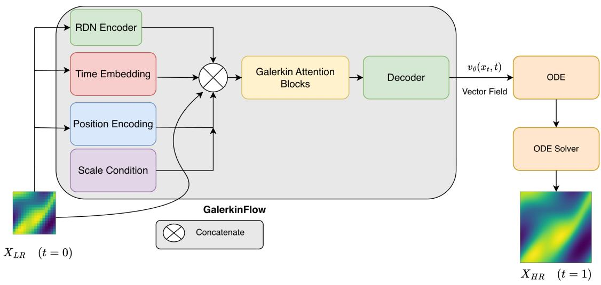
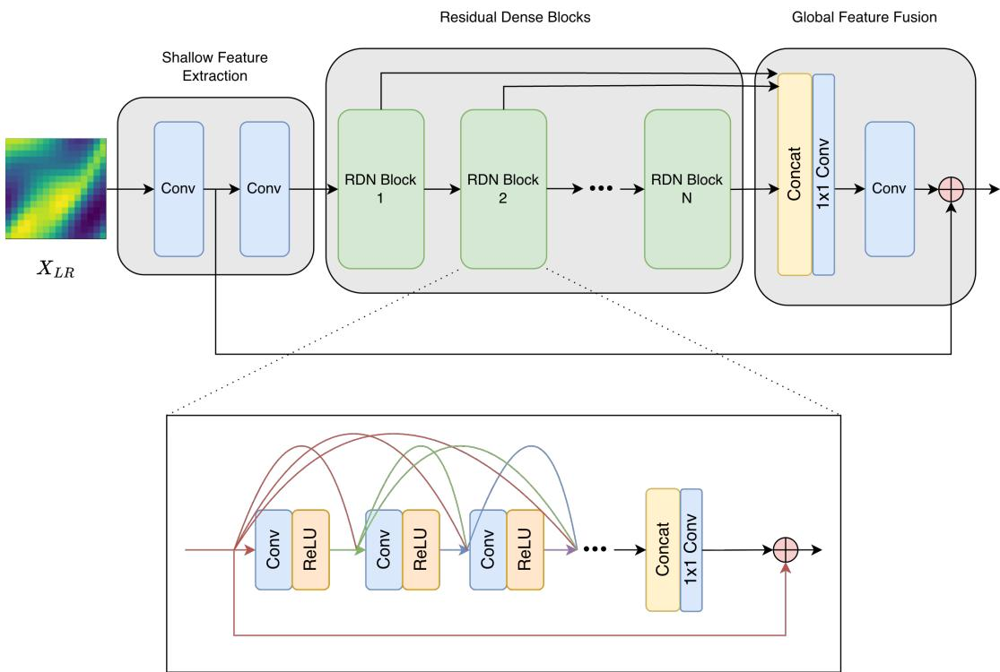

# Supervising the Path to Fine Scales: GalerkinFlow for Scientific-Field and Image Super-Resolution

Zikang Zhan

University College London London, United Kingdom zikang.zhan.22@ucl.ac.uk

## Abstract

Most super-resolution models learn from paired data by supervising only the final high-resolution output. This provides little control over how the prediction should evolve between the downsampled observation and its fine target. We introduce GalerkinFlow, an equation-agnostic framework that turns each coarse–fine pair into supervision along an entire reconstruction path. At a random sample of intermediate states on the reconstruction path, the model predicts the coarse-to-fine residual velocity and uses coarse-anchor point to define a pseudo-endpoint. We show that the reconstruction loss of this pseudo-endpoint is exactly related to the intermediate velocity loss through a known time-dependent weight. Consequently, every intermediate state contributes supervision toward the same fine target, rather than serving only as an internal step toward an endpoint loss. Because intermediate states already reveal part of the missing fine-scale structure, we additionally supervise the coarse endpoint used during one-step inference. A finite-diference objective further constrains local spatial variation. GalerkinFlow combines convolutional features with scale-conditioned Galerkin operator mixing and requires no governing equation or physical metadata. It achieves the lowest raw-space errors among the evaluated equation-agnostic baselines on Navier–Stokes and Darcy Flow, while remaining competitive on DIV2K.

## Introduction

Super-resolution (SR) is typically framed as a problem of architectural design and model expressiveness. While imagebased methods focus on developing stronger local feature extractors, implicit representations, or generative priors, scientific methods often incorporate operator layers, spectral structures, or knowledge of the underlying dynamics. Although these directions are valuable, they leave a fundamental question relatively underexplored: how much supervision can actually be extracted from a single paired coarse-and-fine sample?

We investigate this question within scientific domains where governing equations and physical metadata are unavailable. In our setting, the model receives only a downsampled field, its paired fine target during training, and a requested scale. It is not provided with diferential operators, coeficients, forcing terms, boundary conditions, temporal derivatives, or PDE residuals. While this equation-agnostic setting is more restricted than physics-informed reconstruction, it is broadly applicable: the identical training procedure can be utilized whether the data is simulated, empirically measured, or completely decoupled from its original solver.

Most deterministic methods treat a coarse-fine pair merely as a single endpoint constraint. After aligning the coarse observation onto the target grid, they learn the maximum corrective mapping directly from the coarse anchor to the fine target. While this trains the model to match the exact state encountered during inference, it fails to capture how a progressively refined field should behave when part of the missing structure is already present. Numerous endpoint mappings can perfectly fit the observed pairs without establishing a consistent trajectory across partially restored fields. Fundamentally, a direct decoder lacks an explicit restoration state or progress variable upon which a sequential constraint could act.

Our foundational observation is that a paired sample defines strictly more than its two endpoints. The linear trajectory between the coarse anchor and the fine target yields a continuum of partially restored states, and the pair determines the exact residual from each such state back to the fine endpoint. Consequently, GalerkinFlow samples these intermediate states and learns a progress-conditioned residual field. This shifts the training paradigm from enforcing a single terminal constraint per pair to imposing state-residual constraints along a task-relevant trajectory. This formulation does not produce new information; rather, it fully exploits the geometric relationship already embedded within the pair. Unlike noise-to-data generative flows, our source is the deterministic coarse observation, rendering the entire restoration path strictly deterministic.

Nevertheless, intermediate states must be handled cautiously. Except at the strict coarse endpoint (t = 0), any constructed intermediate state inherently leaks partial information regarding the fine displacement. A model conditioned on both this intermediate state and the coarse anchor could exploit this partial target information as a shortcut. In contrast, one-step inference during testing begins solely at the coarse endpoint and lacks this advantage. To mitigate this training-inference discrepancy, we retain an explicit coarseanchor reconstruction objective. Path and endpoint supervision thus play complementary roles: the former constrains the residual field across the restoration progress, while the latter anchors the actual inverse problem at t = 0. Additionally, a finite-diference loss is applied to constrain spatial variations at the reconstructed endpoint. Notably, none of these terms requires evaluating a governing PDE.

We parameterize the residual field using an established local-global architecture. A Residual Dense Network (RDN) encoder (Zhang et al. 2018b) extracts neighborhood-aware features from the coarse anchor, while Galerkin attention (Cao 2021) provides domain-wide mixing using parameters independent of the target grid’s spatial resolution. Scale and target-cell mappings enable this unified model definition to operate across various uniform grids. We do not claim the CNN-Galerkin combination itself as a novelty; SRNO (Wei and Zhang 2023) has successfully applied convolutional encoders with Galerkin-type operator layers for image SR. Instead, our core contribution lies in the coarse-anchored path objective built around this backbone.

Our primary empirical claims center on scientific reconstruction. On Navier-Stokes and Darcy Flow datasets, GalerkinFlow improves upon all evaluated equation-agnostic baselines (including U-Net, FNO, U-NO, and SRNO) across all reported raw-space error metrics at both 2× and 4× scales. Furthermore, we conduct RGB experiments on DIV2K and four transfer datasets as a cross-domain stress test. In these settings, GalerkinFlow obtains strong PSNR and SSIM, while LPIPS reveals a more mixed perceptual comparison with image-specialized baselines.

Our contributions are:

• We formulate each coarse-fine pair as a deterministic path, where intermediate states carry exact endpoint-residual targets. We explicitly relate residual-field error along this restorative path to the one-step endpoint error derived from each sampled state.

• We introduce a coarse-anchored Galerkin residual-field model that combines pathwise supervision with an explicit t = 0 reconstruction objective. The latter prevents training from relying only on fine structure already exposed by intermediate states.

• We demonstrate comprehensive evaluations across two PDE-field benchmarks and natural RGB images. GalerkinFlow yields substantial improvements in raw-space PDE accuracy and strong RGB fidelity scores. Concurrently, the LPIPS results delimit the scope of our claims: perceptual-feature alignment is not uniformly improved by the current objective and backbone.

## Related Work

## Endpoint Super-Resolution

Most supervised SR methods learn a direct map from a coarse input to a fine endpoint. U-Net-style encoder–decoders (Ronneberger, Fischer, and Brox 2015) and RDN residual dense blocks (Zhang et al. 2018b) construct robust local representations. LIIF instead queries local latent codes and coordinates, decoupling the output grid from a fixed pixel-shufle head (Chen, Liu, and Wang 2021). SwinIR introduces shiftedwindow transformer blocks to image restoration, remaining a strong image-SR baseline for image SR (Liang et al. 2021). Fundamentally, these methods rely exclusively on paired endpoints for training. In scientific data, convolutional networks have similarly reconstructed turbulent fields without placing a governing equation in the network or loss function (Fukami, Fukagata, and Taira 2019). While such methods are equation-agnostic, their standard objectives do not specify how the predictor should behave on partially restored intermediate fields.

Neural operators learn mappings between function spaces and can reuse parameters across compatible discretizations (Kovachki et al. 2023). FNO performs global kernel operations in Fourier space (Li et al. 2021), while U-NO uses a Ushaped multiresolution operator to increase depth with controlled memory (Rahman, Ross, and Azizzadenesheli 2023). SRNO combines an image encoder with Galerkin-type attention for continuous image SR (Wei and Zhang 2023). More recently, HiNOTE develops a hierarchical Galerkin operator and a frequency-aware loss prior for arbitrary-scale scientific SR (Luo, Qian, and Yoon 2024). These works motivate resolution-compatible and global architectures. GalerkinFlow adopts related components but changes the supervised object from a terminal field to a progress-conditioned endpoint residual field.

## Trajectory-Based Super-Resolution

Flow matching fits vector fields at sampled states along prescribed probability paths (Lipman et al. 2023), while rectified flow studies straight transport and eficient integration (Liu, Gong, and Liu 2023). Functional Flow Matching (FFM) extends this construction to function spaces (Kerrigan, Migliorini, and Smyth 2024). Conditional generative models have also represented the multiple fine outputs compatible with a coarse input. SRFlow learns a conditional image distribution with a normalizing flow (Lugmayr et al. 2020), and PSRFlow uses a flow-based latent distribution to quantify uncertainty in scientific SR (Shen and Shen 2023). Adaptive Flow Matching separates deterministic large scales from stochastic small-scale content for weather and Kolmogorovflow downscaling (Fotiadis et al. 2025).

Recent image methods bring trajectory and endpoint constraints closer together. FlowSR combines rectified flow, consistency learning, and explicit high-resolution regularization for one-step image SR (Xu et al. 2025). CTMSR maps points on a probability-flow trajectory to a common output and adds distribution trajectory matching (You et al. 2025). RFMSR starts from a low-quality-centered latent distribution and retains velocity supervision while adding end-to-end singlestep training (Huang et al. 2026). These works show that path and endpoint supervision have already been successfully combined for image SR tasks.

In contrast, our objective is deterministic and conceptually more constrained. Unlike generative frameworks, our source is strictly the observed coarse field rather than Gaussian noise, and we do not employ a teacher model or a distribution-matching loss. The supervised vector-field target is the paired endpoint residual from each sampled intermediate state. The main experiments use one Euler step from the lifted coarse anchor. During training, intermediate states define additional residual targets along the restoration path, and t strictly denotes restoration progress.

## Derivative-Aware Supervision

Pointwise values and spatial derivatives describe diferent aspects of a field. Sobolev training explores objectives that match function values together with derivatives (Czarnecki et al. 2017). GalerkinFlow uses the simpler finite-diference analogue: adjacent output diferences are compared with those of the paired fine target. This term is computed entirely from observed samples. It encourages local variation shared by image edges and scientific fields, but it is neither a dimensionally scaled physical-gradient norm nor related to a governing equation.

## Method

## Problem Setting

Let $\mathbf { x } _ { \mathrm { l r } } \in \mathbf { R } ^ { C \times h \times w }$ be a C-channel downsampled observation, let $s > 1$ be the requested scale, and let $\mathbf { y } \in \mathbf { R } ^ { C \times }$ H×W be the paired fine target. The target dimensions are determined by s and the input grid. Super-resolution learns

$$
\begin{array} { c c c } { \mathcal { G } _ { \boldsymbol { \theta } } : \mathbf { R } ^ { C \times h \times w } \times \mathcal { S } } & { \longrightarrow } & { \mathbf { R } ^ { C \times H \times W } } \\ { ( \mathbf { x } _ { \mathrm { l r } } , \boldsymbol { s } ) } & { \longmapsto } & { \widehat { \mathbf { y } } } \end{array}\tag{1}
$$

Here θ denotes all trainable parameters and S is either one fixed scale or a set of training scales. No diferential operator, physical coeficient, forcing, boundary condition, or temporal derivative is supplied to $\mathcal { G } _ { \theta }$ or its loss.

The downsampled observation and target lie on diferent grids. We apply a fixed lifting operator $\mathcal { U } _ { s }$ to place the observation on the target grid,

$$
\begin{array} { r } { \mathbf { x } _ { 0 } = \mathcal { U } _ { s } ( \mathbf { x } _ { \mathrm { l r } } ) , \qquad \mathbf { d } _ { s } = \mathbf { y } - \mathbf { x } _ { 0 } , \qquad \mathbf { x } _ { 0 } \in \mathbf { R } ^ { C \times H \times W } } \end{array}\tag{2}
$$

where $\mathbf { x } _ { \mathrm { 0 } }$ is the coarse anchor and $\mathbf { d } _ { s }$ is the paired coarse-tofine displacement. The experiments use bicubic lifting, so it has no trainable parameters.

The condition $\mathbf { c } _ { s }$ denotes the lifted coarse anchor together with four broadcast maps: vertical and horizontal scale values and target-cell sizes $1 / H$ and $1 / W$ . In the network, the coarse anchor is first encoded by an RDN feature extractor, while the scale-cell maps are concatenated directly. Fully convolutional features and Galerkin aggregation keep the learned parameter shapes independent of H and W. This gives architectural support for arbitrary uniform output grids. Generalization to an unseen scale is still an empirical property and depends on which scales are represented during training.

## Model Architecture

As shown in Figure 1, the GalerkinFlow combines local convolutional features with global operator mixing. An RDN encoder maps the lifted coarse anchor $\mathbf { x } _ { \mathrm { 0 } }$ to neighborhoodaware features (Zhang et al. 2018b), as illustrated in Figure 2. At every target-grid location, the network concatenates the current state $\mathbf { x } _ { t } ,$ positional encodings, a broadcast time embedding, the encoded features, and the scale conditions. $\mathbf { A } 1 \times 1$ convolution lifts this tensor to d hidden channels.

The lifted field passes through Galerkin attention blocks (Cao 2021). For one head, let $\breve { \mathbf { Q } } , \mathbf { K } , \mathbf { V } \in \mathbf { R } ^ { n \times d _ { h } }$ be query, key, and value arrays over $n = H W$ target locations. After normalizing keys and values, the global association is

$$
\mathcal { A } ( \mathbf { Q } , \mathbf { K } , \mathbf { V } ) = \mathbf { Q } \left( \frac { \mathbf { K } ^ { T } \mathbf { V } } { n } \right) .\tag{3}
$$

The multiplication order avoids forming an n×n matrix. One head costs $O ( n d _ { h } ^ { 2 } )$ rather than $O ( n ^ { 2 } d _ { h } ^ { \overline { { \mathbf { \Gamma } } } } )$ . On a uniform grid with locations $\{ \xi _ { i } ^ { \cdot } \} _ { i = 1 } ^ { n }$ , the central matrix has the quadrature form

$$
{ \frac { \mathbf { K } ^ { T } \mathbf { V } } { n } } = { \frac { 1 } { n } } \sum _ { i = 1 } ^ { n } \mathbf { k } ( \xi _ { i } ) ^ { T } \mathbf { v } ( \xi _ { i } ) \simeq \int _ { \Omega } \mathbf { k } ( \xi ) ^ { T } \mathbf { v } ( \xi ) d \mu ( \xi ) .\tag{4}
$$

This normalized association has been interpreted as a learned Petrov–Galerkin-type projection (Cao 2021). Coordinates and cell sizes preserve information about the requested discretization, while the learned attention parameters remain defined as the target grid changes. A final projection layer produces the residual field.

## Path-Conditioned Endpoint Residual Field

Conventional endpoint regression uses $\left( \mathbf { x } _ { \mathrm { l r } } , \mathbf { y } \right)$ only through a terminal reconstruction loss. We instead define the straight paired path

$$
\mathbf { x } _ { t } = ( 1 - t ) \mathbf { x } _ { 0 } + t \mathbf { y } = \mathbf { x } _ { 0 } + t \mathbf { d } _ { s } , \qquad t \in [ 0 , 1 ]\tag{5}
$$

The parameter t denotes restoration progress. The implementation supervises the residual vector field from each sampled state to the fine endpoint,

$$
\mathbf { r } _ { t } = \mathbf { y } - \mathbf { x } _ { t } = ( 1 - t ) \mathbf { d } _ { s }\tag{6}
$$

Thus the learned vector field is endpoint-directed rather than the constant derivative $d \mathbf { x } _ { t } / d t = \mathbf { d } _ { \boldsymbol { \mathfrak { s } } }$ s of the linear path:

$$
{ \bf v } _ { \theta } ( { \bf x } _ { t } , t , { \bf c } _ { s } ) \simeq { \bf r } _ { t }\tag{7}
$$

At training time, t is sampled uniformly from [0, 1), so each pair supplies residual-field constraints at many partially restored states. This does not create independent labels; it reuses the same observed pair while changing the state at which the predictor is supervised.

This target has a direct one-step reconstruction interpretation. From a sampled state, define

$$
\widetilde { \mathbf { y } } _ { t } = \mathbf { x } _ { t } + \mathbf { v } _ { \theta } ( \mathbf { x } _ { t } , t , \mathbf { c } _ { s } )\tag{8}
$$

Because $\mathbf { y } = \mathbf { x } _ { t } + \mathbf { r } _ { t }$

$$
\begin{array} { r l r } { \| \widetilde { { \bf y } } _ { t } - { \bf y } \| _ { 1 } } & { = } & { \| { \bf v } _ { \theta } - { \bf r } _ { t } \| _ { 1 } } \\ { \| \widetilde { { \bf y } } _ { t } - { \bf y } \| _ { 2 } ^ { 2 } } & { = } & { \| { \bf v } _ { \theta } - { \bf r } _ { t } \| _ { 2 } ^ { 2 } } \end{array}\tag{9}
$$

Residual-field regression therefore controls the endpoint predicted from every sampled state. This relation motivates path supervision without claiming that the constructed segment is a physical evolution.

The implemented residual field loss is

$$
\begin{array} { r c l } { \mathcal { L } _ { \mathrm { v f } } } & { = } & { \lambda _ { 1 } \mathbb { E } \left[ D ^ { - 1 } \lVert \mathbf { v } _ { \theta } - \mathbf { r } _ { t } \rVert _ { 1 } \right] } \\ & & { + \lambda _ { 2 } \mathbb { E } \left[ D ^ { - 1 } \lVert \mathbf { v } _ { \theta } - \mathbf { r } _ { t } \rVert _ { 2 } ^ { 2 } \right] } \end{array}\tag{10}
$$

where $\lambda _ { 1 }$ and $\lambda _ { 2 }$ denote the coeficients, $D = C H W$ and the arguments of $\mathbf { v } _ { \theta }$ follow Equation 7.

  
Figure 1: The Architecture of GalerkinFlow model.

## ODE Endpoint Reconstruction Loss

The residual-field loss supervises the direction from sampled intermediate states to the paired endpoint. At test time, however, the target endpoint is unknown and the model must recover it only from the coarse anchor. The field loss in Equation 10 provides local residual supervision along the constructed path, but it does not directly penalize the endpoint produced by this inference procedure. To align training with inference, we run the same endpoint solver during training and compare its output with the paired target.

$$
\begin{array} { r } { \widehat { \mathbf { y } } = \mathbf { x } _ { 0 } + \mathbf { v } _ { \theta } ( \mathbf { x } _ { 0 } , 0 , \mathbf { c } _ { s } ) . } \end{array}\tag{11}
$$

The implementation evaluates Equation 11 with explicit Euler updates

$$
\begin{array} { r } { \mathbf { x } ^ { ( k + 1 ) } = \mathbf { x } ^ { ( k ) } + \Delta t \mathbf { v } _ { \theta } ( \mathbf { x } ^ { ( k ) } , t _ { k } , \mathbf { c } _ { s } ) . } \end{array}\tag{12}
$$

The reconstruction term trains this predicted endpoint with

$$
\begin{array} { r } { \mathcal { L } _ { \mathrm { r e c } } = D ^ { - 1 } \| \widehat { \mathbf { y } } - \mathbf { y } \| _ { 1 } . } \end{array}\tag{13}
$$

## Endpoint Gradient Consistency Loss

The reconstruction loss aligns the endpoint values produced by the ODE solver with the paired target. For superresolution, value agreement alone does not explicitly constrain how neighboring cells or pixels change relative to one another. This matters for image edges and textures, and also for sharp spatial variations in PDE fields. We therefore add a second endpoint-level penalty that compares first-order finite diferences of the predicted and target endpoints.

Let $\mathbf { e } = { \widehat { \mathbf { y } } } - \mathbf { y }$ , and let $\Delta _ { x }$ and $\Delta _ { y }$ denote adjacent horizontal and vertical diferences. The endpoint variation term is

$$
\begin{array} { r } { \mathcal { L } _ { \mathrm { g r a d } } = D _ { x } ^ { - 1 } \| \Delta _ { x } \mathbf { e } \| _ { 1 } + D _ { y } ^ { - 1 } \| \Delta _ { y } \mathbf { e } \| _ { 1 } , } \end{array}\tag{14}
$$

where $D _ { x }$ and $D _ { y }$ are the corresponding numbers of diferences. Pointwise reconstruction controls values, while this term penalizes disagreement between neighboring changes. It follows the motivation of derivative-aware and Sobolev training (Czarnecki et al. 2017), but it is computed on the reconstructed endpoint, does not divide by physical grid spacing, and is not a PDE residual.

## Full Training Objective

The complete training objective is

$$
\begin{array} { r } { \mathcal { L } = \mathcal { L } _ { \mathrm { v f } } + \lambda _ { r e c } \mathcal { L } _ { \mathrm { r e c } } + \lambda _ { g r a d } \mathcal { L } _ { \mathrm { g r a d } } . } \end{array}\tag{15}
$$

where $\lambda _ { r e c }$ and $\lambda _ { g r a d }$ denote the coeficients for the reconstruction and gradient losses.

The source, target, and intermediate states are paired and deterministic. GalerkinFlow is therefore a reconstruction model rather than a calibrated conditional generator, and its path is not a trajectory of the PDE that produced the field.

## Experimental Setup

## Datasets and Protocol

The controlled PDE benchmark uses fixed-scale specialists at 2× and 4× for every learned method. This separates reconstruction accuracy from unseen-scale generalization. The architecture can also be trained across scales, but an arbitraryscale claim requires a separate protocol with held-out integer and non-integer scales. All experiments are run on Nvidia GH200 GPUs.

Navier–Stokes (Zappala 2024) The scalar field is stored as trajectories of 64 × 64 frames. Training draws frames from the first 4,000 trajectories. Evaluation uses 1,000 frames from 1,000 held-out trajectories. For 2×, each fine frame is downsampled to 32×32; for 4×, it is downsampled to 16×16. The coarse field is lifted back to the target grid by the same bicubic operator supplied to every method.

Darcy Flow (Takamoto et al. 2022) The target scalar field comes from the PDEBench dataset collection and has a nonsquare 64×128 grid. We use the provided train and test splits and evaluate all 1,000 test samples. Coarse observations have resolution 32 × 64 at 2× and 16 × 32 at 4×.

  
Figure 2: Architecture of Residual Dense Networks (RDN). There are skip connections at the end of each dense block, and convolution layers in the block are densely connected to each other.

## Metrics

RGB images. The in-domain image benchmark uses the DIV2K validation images (Agustsson and Timofte 2017). To test transfer of DIV2K-trained checkpoints, we also evaluate Set5 (Bevilacqua et al. 2012), Set14 (Zeyde, Elad, and Protter 2012), BSD100 (Martin et al. 2001), and Urban100 (Huang, Singh, and Ahuja 2015). The benchmark uses one crop of 128 × 128 RGB pixels per image. The low-resolution input is generated by bicubic downsampling to 64 × 64 at 2× or 32 × 32 at 4×, and predictions are compared on the original 128 × 128 crop.

## Baselines and Implementation

For PDE fields, we compare with bicubic interpolation, U-Net (Ronneberger, Fischer, and Brox 2015), FNO (Li et al. 2021), U-NO (Rahman, Ross, and Azizzadenesheli 2023), and SRNO (Wei and Zhang 2023). Each learned PDE method has a separately trained checkpoint for the same dataset and scale. The evaluation harness supplies identical raw input– target pairs and maps every prediction back from its training normalization before metrics are accumulated.

For RGB images, all learned checkpoints were trained on DIV2K. The baselines are bicubic interpolation, LIIF (Chen, Liu, and Wang 2021), SRNO (Wei and Zhang 2023), RDN (Zhang et al. 2018b), and SwinIR (Liang et al. 2021).

The evaluated GalerkinFlow PDE checkpoints use 4 Galerkin blocks, 8 heads, and 128 hidden-channel width. The RGB checkpoints use 256 hidden-channel width and 16 heads. Training samples one t per example and uses the loss weights in Equation 15.

For N samples, raw-space relative $L _ { 2 }$ is the mean of persample ratios

$$
\mathrm { R e l - } L _ { 2 } = \frac { 1 } { N } \sum _ { i = 1 } ^ { N } \frac { \lVert \widehat { \mathbf { y } } _ { i } - \mathbf { y } _ { i } \rVert _ { 2 } } { \lVert \mathbf { y } _ { i } \rVert _ { 2 } } .\tag{16}
$$

MSE and MAE are pooled over raw scalar values. Relative $L _ { 2 }$ is the primary metric because it normalizes field magnitude; MSE and MAE expose squared and absolute pointwise behavior. For RGB images, PSNR is averaged over the cropped RGB patches, SSIM is computed with data range 1 (Wang et al. 2004), and LPIPS uses VGG features with normalized RGB inputs (Zhang et al. 2018a). Higher PSNR and SSIM are better; lower LPIPS is better.

## Results and Analysis

## PDE Super-Resolution

Table 1 shows the strongest evidence for GalerkinFlow. It obtains the lowest raw relative $L _ { 2 } .$ , MSE, and MAE on every PDE dataset and scale. Relative to SRNO, the relative-$L _ { 2 }$ reductions are 94.6% on Navier–Stokes 2×, 98.3% on Navier–Stokes 4×, 78.3% on Darcy Flow 2×, and 83.9% on Darcy Flow 4×. The same ordering under squared and absolute pointwise errors indicates that the improvement is not an artifact of one metric.

The scale efect difers by baseline. Bicubic and SRNO degrade substantially from 2× to 4×, FNO improves over

<table><tr><td colspan="4">Navier-Stokes</td></tr><tr><td>Scale Method</td><td>Rel-L2</td><td>MSE</td><td>MAE</td></tr><tr><td>2×</td><td>Bicubic</td><td>0.015335  $1 . 7 7 7 \times 1 0 ^ { - 4 }$ </td><td> $9 . 6 7 1 \times 1 0 ^ { - 3 }$ </td></tr><tr><td>2×</td><td>U-Net</td><td>0.024337  $3 . 8 3 1 \times 1 0 ^ { - 4 }$ </td><td> $1 . 2 0 8 \times 1 0 ^ { - 2 }$ </td></tr><tr><td>2×</td><td>FNO</td><td>0.009255  $5 . 8 1 7 \times 1 0 ^ { - 5 }$ </td><td> $5 . 8 0 9 \times 1 0 ^ { - 3 }$ </td></tr><tr><td>2×</td><td>U-NO</td><td>0.104592  $8 . 3 5 1 \times 1 0 ^ { - 3 }$ </td><td> $6 . 8 1 1 \times 1 0 ^ { - 2 }$ </td></tr><tr><td>2×</td><td>SRNO</td><td>0.006291  $3 . 1 5 5 \times 1 0 ^ { - 5 }$ </td><td> $1 . 7 9 5 \times 1 0 ^ { - 3 }$ </td></tr><tr><td>2×</td><td>GalerkinFlow (ours) 0.000337</td><td> $8 . 0 9 4 \times 1 0 ^ { - 8 }$ </td><td> $1 . 7 3 1 \times 1 0 ^ { - 4 }$ </td></tr><tr><td>4×</td><td>Bicubic</td><td>0.036574  $1 . 0 2 3 \times 1 0 ^ { - 3 }$ </td><td> $1 . 9 7 7 \times 1 0 ^ { - 2 }$ </td></tr><tr><td>4×</td><td>U-Net</td><td>0.026176  $4 . 5 2 0 \times 1 0 ^ { - 4 }$ </td><td> $1 . 3 3 9 \times 1 0 ^ { - 2 }$ </td></tr><tr><td>4×</td><td>FNO</td><td>0.030712  $6 . 6 9 2 \times 1 0 ^ { - 4 }$ </td><td> $1 . 8 9 7 \times 1 0 ^ { - 2 }$ </td></tr><tr><td>4×</td><td>U-NO</td><td>0.295490  $6 . 0 6 6 \times 1 0 ^ { - 2 }$ </td><td> $1 . 9 4 6 \times 1 0 ^ { - 1 }$ </td></tr><tr><td>4×</td><td>SRNO</td><td>0.021681  $3 . 7 8 5 \times 1 0 ^ { - 4 }$ </td><td> $6 . 7 0 9 \times 1 0 ^ { - 3 }$ </td></tr><tr><td>4×</td><td>GalerkinFlow (ours) 0.000365</td><td> $1 . 4 0 4 \times 1 0 ^ { - 7 }$ </td><td> $6 . 3 2 1 \times 1 0 ^ { - 5 }$ </td></tr></table>

<table><tr><td colspan="4">Darcy Flow</td></tr><tr><td>Scale Method</td><td>Rel-L2</td><td>MSE</td><td>MAE</td></tr><tr><td>2×</td><td>Bicubic</td><td>0.011960  $3 . 6 6 3 \times 1 0 ^ { - 5 }$ </td><td> $3 . 7 0 9 \times 1 0 ^ { - 3 }$ </td></tr><tr><td>2×</td><td>U-Net</td><td>0.013411  $7 . 6 2 4 \times 1 0 ^ { - 5 }$ </td><td> $4 . 3 1 6 \times 1 0 ^ { - 3 }$ </td></tr><tr><td>2×</td><td>FNO</td><td>0.009905  $2 . 7 2 7 \times 1 0 ^ { - 5 }$ </td><td> $3 . 3 7 2 \times 1 0 ^ { - 3 }$ </td></tr><tr><td>2×</td><td>U-NO</td><td>0.061559  $9 . 7 2 1 \times 1 0 ^ { - 4 }$ </td><td> $2 . 0 3 9 \times 1 0 ^ { - 2 }$ </td></tr><tr><td>2×</td><td>SRNO</td><td>0.004657  $6 . 1 9 4 \times 1 0 ^ { - 6 }$ </td><td> $7 . 4 9 9 \times 1 0 ^ { - 4 }$ </td></tr><tr><td>2×</td><td>GalerkinFlow (ours)</td><td>0.001010  $8 . 9 4 3 \times 1 0 ^ { - 7 }$ </td><td> $2 . 2 7 1 \times 1 0 ^ { - 4 }$ </td></tr><tr><td>4×</td><td>Bicubic</td><td>0.036394  $3 . 3 5 4 \times 1 0 ^ { - 4 }$ </td><td> $9 . 1 9 2 \times 1 0 ^ { - 3 }$ </td></tr><tr><td>4×</td><td>U-Net</td><td>0.020486  $1 . 3 5 6 \times 1 0 ^ { - 4 }$ </td><td> $6 . 3 5 9 \times 1 0 ^ { - 3 }$ </td></tr><tr><td>4×</td><td>FNO</td><td>0.023478  $1 . 3 9 8 \times 1 0 ^ { - 4 }$ </td><td> $7 . 7 3 2 \times 1 0 ^ { - 3 }$ </td></tr><tr><td>4×</td><td>U-NO</td><td>0.110599  $3 . 1 3 7 \times 1 0 ^ { - 3 }$ </td><td> $3 . 9 9 4 \times 1 0 ^ { - 2 }$ </td></tr><tr><td>4×</td><td>SRNO</td><td>0.012141  $3 . 8 8 9 \times 1 0 ^ { - 5 }$ </td><td> $2 . 4 3 4 \times 1 0 ^ { - 3 }$ </td></tr><tr><td>4×</td><td>GalerkinFlow (ours) 0.001949</td><td> $1 . 8 5 1 \times 1 0 ^ { - 6 }$ </td><td> $1 . 8 8 4 \times 1 0 ^ { - 4 }$ </td></tr></table>

Table 3 shows that the DIV2K-trained GalerkinFlow checkpoints also transfer well to the four external image datasets. GalerkinFlow has the highest PSNR in every dataset-scale setting, with gains over the best nonbicubic but trails SRNO on all four PDE settings, and U-NO is unstable in these checkpoint evaluations. U-Net improves over bicubic at 4× but remains far from GalerkinFlow. GalerkinFlow keeps very small errors at both scales, which is consistent with the coarse-anchored path objective: the model is trained on residual targets from sampled restoration states while also being constrained at the actual coarse endpoint used during one-step inference.

The DIV2K results in Table 2 show that the GalerkinFlow are strong on distortion-oriented RGB metrics. GalerkinFlow obtains the highest PSNR and SSIM at both scales, improving over the best non-GalerkinFlow PSNR by 4.03 dB at 2× and 5.34 dB at 4×. The perceptual metric gives a more mixed view: GalerkinFlow has the lowest LPIPS at 4×, but SwinIR remains better at 2×. Thus the RGB evidence is not only a transfer sanity check, but also supports competitive naturalimage reconstruction under this protocol.

## RGB Super-Resolution

Table 1: PDE super-resolution at $2 \times$ and 4×.
<table><tr><td>Scale</td><td>Method</td><td>PSNR↑</td><td>SSIM ↑</td><td>LPIPS ↓</td></tr><tr><td>2×</td><td>Bicubic</td><td>29.86</td><td>0.8586</td><td>0.1885</td></tr><tr><td>2×</td><td>SRNO</td><td>34.10</td><td>0.9300</td><td>0.1130</td></tr><tr><td>2×</td><td>LIIF</td><td>33.89</td><td>0.9279</td><td>0.1157</td></tr><tr><td>2×</td><td>SwinIR</td><td>34.16</td><td>0.9313</td><td>0.1118</td></tr><tr><td>2×</td><td>RDN</td><td>33.72</td><td>0.9264</td><td>0.1177</td></tr><tr><td>2×</td><td>GalerkinFlow (ours)</td><td>38.19</td><td>0.9410</td><td>0.1271</td></tr><tr><td>4×</td><td>Bicubic</td><td>25.73</td><td>0.6748</td><td>0.3784</td></tr><tr><td>4×</td><td>SRNO</td><td>28.39</td><td>0.7810</td><td>0.2932</td></tr><tr><td>4×</td><td>LIIF</td><td>28.22</td><td>0.7763</td><td>0.2984</td></tr><tr><td>4×</td><td>SwinIR</td><td>28.43</td><td>0.7825</td><td>0.2915</td></tr><tr><td>4×</td><td>RDN</td><td>28.12</td><td>0.7723</td><td>0.3022</td></tr><tr><td>4×</td><td>GalerkinFlow (ours)</td><td>33.77</td><td>0.8228</td><td>0.2867</td></tr></table>

Table 2: DIV2K RGB super-resolution.

GalerkinFlow baseline ranging from 0.27 dB on Set5 to 1.94 dB on Urban100 4×. SSIM is also strongest in most settings, except Set14 4× and Urban100 2×. LPIPS is less uniformly favorable. GalerkinFlow is best on Set5 4×, but imagespecialized baselines especially SwinIR, remain stronger on several validation cases.

## Ablation Study

Table 4 shows a consistent improvement as the two endpointlevel objectives are added on Navier–Stokes 2×. Relative to vector-field supervision alone, adding endpoint reconstruction reduces $\mathrm { R e l - } L _ { 2 } ,$ MSE, and MAE by 51.8%, 78.7%, and 52.1%, respectively. This supports the role of $\mathcal { L } _ { \mathrm { r e c } }$ in anchoring training to the coarse state encountered by the ODE solver at inference. Adding gradient consistency yields a further reduction of 68.5%, 88.8%, and 60.4% over the no-gradient variant, giving the full objective the lowest error under all three metrics. Thus, in this setting, residual-field supervision establishes the restoration direction, endpoint reconstruction constrains the integrated solution, and gradient consistency provides complementary control of local spatial variation.

All tables report one-step reconstruction from the lifted coarse anchor. Intermediate path states enlarge the supervised region during training, but they are not additional inference iterations in these results. The same learned field can be evaluated with more Euler intervals, yet that changes the compute budget and should be considered as an accuracy– cost tradeof.

The PDE and RGB outcomes also clarify where the current backbone matters. On PDE fields, the CNN–Galerkin residual-field model and coarse-anchored objective are evaluated in the same scalar raw space used to train the checkpoints, and the gains are large across every error metric. On RGB images, the same design now gives strong PSNR and SSIM, but LPIPS shows that perceptual-feature alignment remains less consistently improved than pointwise fidelity. This split motivates future work on lighter imagespecialized residual-field models, explicit perceptual objectives, and parameter-matched PDE retraining before attributing all gains to any single architectural component.

<table><tr><td>Scale</td><td>Method</td><td>Set5</td><td>Set14</td><td>BSD100</td><td>Urban100</td></tr><tr><td>2×</td><td>Bicubic</td><td>33.27/0.910/0.135</td><td>28.39/0.842/0.182</td><td>27.09/0.813/0.208</td><td>25.03/0.779/0.206</td></tr><tr><td>2×</td><td>SRNO</td><td>38.20/0.943/0.079</td><td>31.91/0.903/0.120</td><td>30.18/0.889/0.146</td><td>31.31/0.913/0.101</td></tr><tr><td>2×</td><td>LIIF</td><td>38.00/0.942/0.080</td><td>31.75/0.900/0.122</td><td>30.09/0.887/0.147</td><td>30.93/0.906/0.106</td></tr><tr><td>2×</td><td>SwinIR</td><td>38.22/0.943/0.078</td><td>31.92/0.903/0.118</td><td>30.20/0.889/0.146</td><td>31.49/0.913/0.100</td></tr><tr><td>2×</td><td>RDN</td><td>38.06/0.943/0.081</td><td>31.64/0.899/0.124</td><td>30.03/0.886/0.149</td><td>30.55/0.900/0.110</td></tr><tr><td>2×</td><td>GalerkinFlow (ours)</td><td>38.49/0.967/0.084</td><td>32.87/0.904/0.120</td><td>31.44/0.890/0.155</td><td>31.91/0.909/0.121</td></tr><tr><td>4×</td><td>Bicubic</td><td>28.28/0.797/0.261</td><td>24.37/0.656/0.343</td><td>23.47/0.603/0.401</td><td>21.52/0.558/0.405</td></tr><tr><td>4×</td><td>SRNO</td><td>33.26/0.888/0.189</td><td>27.31/0.765/0.265</td><td>25.48/0.702/0.338</td><td>25.19/0.729/0.276</td></tr><tr><td>4×</td><td>LIIF</td><td>33.16/0.886/0.190</td><td>27.23/0.763/0.268</td><td>25.40/0.698/0.341</td><td>25.01/0.721/0.284</td></tr><tr><td>4×</td><td>SwinIR</td><td>33.28/0.888/0.192</td><td>27.36/0.767/0.264</td><td>25.48/0.702/0.337</td><td>25.29/0.735/0.269</td></tr><tr><td>4×</td><td>RDN</td><td>33.02/0.885/0.192</td><td>27.22/0.762/0.270</td><td>25.33/0.694/0.345</td><td>24.69/0.709/0.293</td></tr><tr><td>4×</td><td></td><td>GalerkinFlow (ours) 33.55/0.913/0.189</td><td></td><td>28.12/0.755/0.283 27.03/0.707/0.349</td><td>27.23/0.755/0.295</td></tr></table>

Table 3: Validation dataset of DIV2K-trained RGB checkpoints to Set5, Set14, BSD100, and Urban100. Each entry is PSNR/S-SIM/LPIPS. Higher PSNR/SSIM and lower LPIPS are better.

<table><tr><td>Losses</td><td>Rel-L2 raw</td><td>MSE raw</td><td>MAE raw</td></tr><tr><td>Vector field + rec + grad</td><td> $3 . 3 6 9 \times 1 0 ^ { - 4 }$  8</td><td> $\phantom { + } 3 . 0 9 4 \times 1 0 ^ { - 8 }$ </td><td> $1 . 7 3 1 \times 1 0 ^ { - 4 }$ </td></tr><tr><td>Vector field + rec</td><td></td><td>1.068×10−3 7.255×10−7</td><td> $4 . 3 7 4 \times 1 0 ^ { - 4 }$ </td></tr><tr><td>Vector field only</td><td> $2 . 2 1 5 { \times } 1 0 ^ { - 3 }$ </td><td> $3 . 4 0 7 \times 1 0 ^ { - 6 }$ </td><td> $9 . 1 2 9 \times 1 0 ^ { - 4 }$ </td></tr></table>

Table 4: Loss ablation on Navier–Stokes 2×.

## Conclusion

This work investigated how much supervision can be extracted from a paired coarse–fine sample beyond conventional endpoint regression. GalerkinFlow interprets each pair as a deterministic restoration path and trains a scaleconditioned residual field at sampled intermediate states, where the exact target is the remaining displacement to the fine endpoint. The pathwise objective is complemented by ODE endpoint reconstruction from the coarse anchor actually encountered at inference and by finite-diference consistency at the reconstructed endpoint. Together, these terms connect intermediate-state supervision, final-value accuracy, and local spatial variation without requiring a governing equation, physical coeficients, or solver metadata. A CNN encoder and Galerkin operator backbone provide the local feature extraction and global mixing needed to realize this objective on both scientific fields and RGB images.

Fresh checkpoint evaluations establish the strongest evidence on scientific super-resolution. GalerkinFlow achieves the lowest Rel-L , MSE, and MAE among the evaluated equation-agnostic baselines on both Navier–Stokes and Darcy Flow at 2× and 4×. The Navier–Stokes 2× ablation further shows a consistent progression: endpoint reconstruction improves over vector-field supervision alone, and gradient consistency improves all three errors again. GalerkinFlow also obtains the highest PSNR and SSIM on DIV2K at both scales and the highest PSNR across all reported Set5, Set14, BSD100, and Urban100 transfer settings. LPIPS is less uniform, with image-specialized models retaining an advantage in several cases, so the evidence is strongest for distortionoriented fidelity rather than perceptual-feature alignment.

Taken together, these results support a supervision principle: a paired endpoint does not provide only one training constraint, but determines a continuum of endpoint-directed residual targets along a task-relevant path. Exploiting this structure can constrain how reconstruction behaves before reaching the endpoint while the explicit coarse-anchor loss preserves alignment with one-step inference. The contribution is therefore neither a new physical solver nor a conditional generative model; it is an equation-agnostic way to organize supervision already contained in paired data. This perspective is especially useful when only low-resolution observations are available and the equations or acquisition process are unknown.

Several limitations define the next steps. The current benchmarks use dataset-specific checkpoints, and most use scale-specific checkpoints, so they do not show arbitraryscale reconstruction with one shared model. Though GalerkinFLow can query one checkpoint on arbitrary uniform target scales, the accuracy is decreased. The loss ablation covers only Navier–Stokes at 2×, and therefore does not establish universal loss weights. Moreover, the constructed path is not a physical trajectory, the finite-diference term is not a PDE residual, and no conservation law or boundary condition is guaranteed. Future work should evaluate shared-scale checkpoints, and perceptual objectives, parameter-matched backbones, and physically constrained variants, while also quantifying the accuracy–cost tradeof of multi-step ODE integration.

## References

Agustsson, E.; and Timofte, R. 2017. NTIRE 2017 Challenge on Single Image Super-Resolution: Dataset and Study. In Proceedings of the IEEE Conference on Computer Vision and Pattern Recognition Workshops, 126–135.

Bevilacqua, M.; Roumy, A.; Guillemot, C.; and Alberi-Morel, M. L. 2012. Low-Complexity Single-Image Super-Resolution Based on Nonnegative Neighbor Embedding. In Proceedings ofthe British Machine Vision Conference.

Cao, S. 2021. Choose a Transformer: Fourier or Galerkin. In Advances in Neural Information Processing Systems, volume 34.

Chen, Y.; Liu, S.; and Wang, X. 2021. Learning Continuous Image Representation with Local Implicit Image Function. In Proceedings of the IEEE/CVF Conference on Computer Vision and Pattern Recognition, 8628–8638.

Czarnecki, W. M.; Osindero, S.; Jaderberg, M.; Swirszcz, G.; and Pascanu, R. 2017. Sobolev Training for Neural Networks. In Advances in Neural Information Processing Systems, volume 30.

Fotiadis, S.; Brenowitz, N. D.; Gefner, T.; Cohen, Y.; Pritchard, M.; Vahdat, A.; and Mardani, M. 2025. Adaptive Flow Matching for Resolving Small-Scale Physics. In Proceedings of the 42nd International Conference on Machine Learning, volume 267 of Proceedings of Machine Learning Research, 17489–17521. PMLR.

Fukami, K.; Fukagata, K.; and Taira, K. 2019. Super-Resolution Reconstruction of Turbulent Flows with Machine Learning. Journal ofFluid Mechanics, 870: 106–120.

Huang, J.-B.; Singh, A.; and Ahuja, N. 2015. Single Image Super-Resolution from Transformed Self-Exemplars. In Proceedings of the IEEE Conference on Computer Vision and Pattern Recognition, 5197–5206.

Huang, S.; Luo, T.; Liu, J.; Liu, D.; and Zhou, P. 2026. RFMSR: Residual Flow Matching for Image Super-Resolution. arXiv:2607.12753.

Kerrigan, G.; Migliorini, G.; and Smyth, P. 2024. Functional Flow Matching. In Proceedings of the 27th International Conference on Artificial Intelligence and Statistics, volume 238 of Proceedings of Machine Learning Research, 3934– 3942. PMLR.

Kovachki, N. B.; Li, Z.; Liu, B.; Azizzadenesheli, K.; Bhattacharya, K.; Stuart, A. M.; and Anandkumar, A. 2023. Neural Operator: Learning Maps Between Function Spaces with Applications to PDEs. Journal of Machine Learning Research, 24(89): 1–97.

Li, Z.; Kovachki, N.; Azizzadenesheli, K.; Liu, B.; Bhattacharya, K.; Stuart, A.; and Anandkumar, A. 2021. Fourier Neural Operator for Parametric Partial Diferential Equations. In International Conference on Learning Representations.

Liang, J.; Cao, J.; Sun, G.; Zhang, K.; Van Gool, L.; and Timofte, R. 2021. SwinIR: Image Restoration Using Swin Transformer. In Proceedings ofthe IEEE/CVF International Conference on Computer Vision Workshops, 1833–1844.

Lipman, Y.; Chen, R. T. Q.; Ben-Hamu, H.; Nickel, M.; and Le, M. 2023. Flow Matching for Generative Modeling. In International Conference on Learning Representations.

Liu, X.; Gong, C.; and Liu, Q. 2023. Flow Straight and Fast: Learning to Generate and Transfer Data with Rectified Flow. In International Conference on Learning Representations.

Lugmayr, A.; Danelljan, M.; Van Gool, L.; and Timofte, R. 2020. SRFlow: Learning the Super-Resolution Space with Normalizing Flow. In European Conference on Computer Vision.

Luo, X.; Qian, X.; and Yoon, B.-J. 2024. Hierarchical Neural Operator Transformer with Learnable Frequency-Aware

Loss Prior for Arbitrary-Scale Super-Resolution. In Proceedings of the 41st International Conference on Machine Learning, volume 235 of Proceedings of Machine Learning Research, 33466–33485. PMLR.

Martin, D.; Fowlkes, C.; Tal, D.; and Malik, J. 2001. A Database of Human Segmented Natural Images and Its Application to Evaluating Segmentation Algorithms and Measuring Ecological Statistics. In Proceedings of the IEEE International Conference on Computer Vision, volume 2, 416–423.

Rahman, M. A.; Ross, Z. E.; and Azizzadenesheli, K. 2023. U-NO: U-Shaped Neural Operators. Transactions on Machine Learning Research.

Ronneberger, O.; Fischer, P.; and Brox, T. 2015. U-Net: Convolutional Networks for Biomedical Image Segmentation. In Medical Image Computing and Computer-Assisted Intervention, 234–241.

Shen, J.; and Shen, H.-W. 2023. PSRFlow: Probabilistic Super Resolution with Flow-Based Models for Scientific Data. arXiv:2308.04605.

Takamoto, M.; Praditia, T.; Leiteritz, R.; MacKinlay, D.; Alesiani, F.; Pflüger, D.; and Niepert, M. 2022. PDEBench Datasets. DaRUS.

Wang, Z.; Bovik, A. C.; Sheikh, H. R.; and Simoncelli, E. P. 2004. Image Quality Assessment: From Error Visibility to Structural Similarity. IEEE Transactions on Image Processing, 13(4): 600–612.

Wei, M.; and Zhang, X. 2023. Super-Resolution Neural Operator. In Proceedings of the IEEE/CVF Conference on Computer Vision and Pattern Recognition, 18247–18256.

Xu, J.; Li, W.; Sun, H.; Li, F.; Wang, Z.; Peng, L.; Ren, J.; Yang, H.; Hu, X.; Pei, R.; and Heng, P.-A. 2025. Fast Image Super-Resolution via Consistency Rectified Flow. In Proceedings of the IEEE/CVF International Conference on Computer Vision, 11755–11765.

You, W.; Zhang, M.; Zhang, L.; Zhou, X.; Shi, K.; and Gu, S. 2025. Consistency Trajectory Matching for One-Step Generative Super-Resolution. In Proceedings ofthe IEEE/CVF International Conference on Computer Vision, 12747–12756.

Zappala, E. 2024. Navier\_Stokes\_Dataset.mat. Figshare.

Zeyde, R.; Elad, M.; and Protter, M. 2012. On Single Image Scale-Up Using Sparse-Representations. In Curves and Surfaces, 711–730.

Zhang, R.; Isola, P.; Efros, A. A.; Shechtman, E.; and Wang, O. 2018a. The Unreasonable Efectiveness of Deep Features as a Perceptual Metric. In Proceedings of the IEEE Conference on Computer Vision and Pattern Recognition, 586–595.

Zhang, Y.; Tian, Y.; Kong, Y.; Zhong, B.; and Fu, Y. 2018b. Residual Dense Network for Image Super-Resolution. In Proceedings of the IEEE Conference on Computer Vision and Pattern Recognition, 2472–2481.