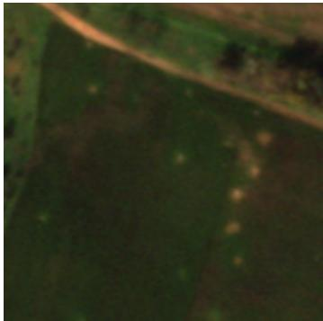
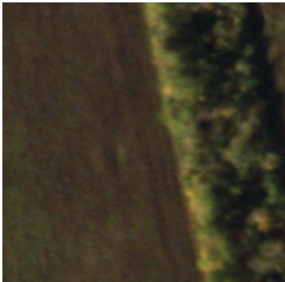
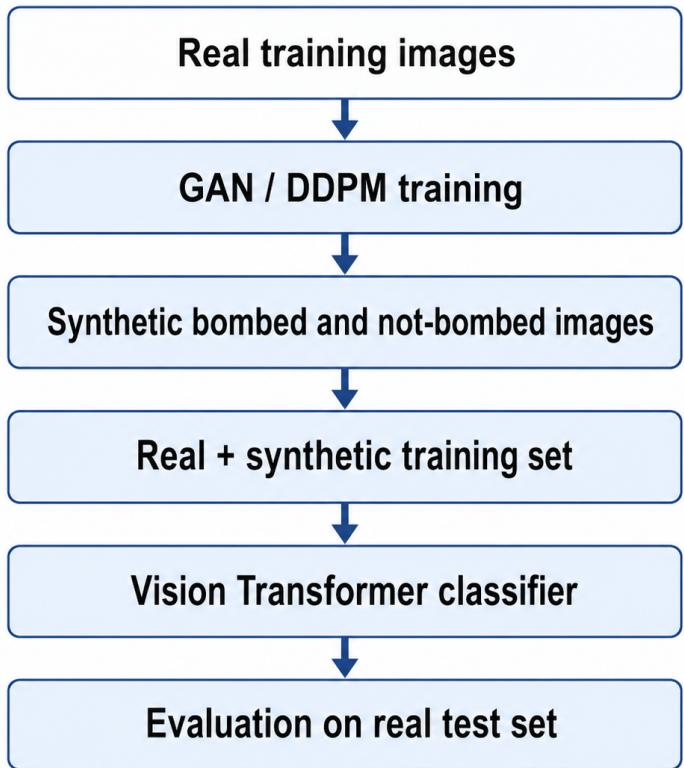

# Synthetic Data Augmentation for Satellite-Based Analysis of Battle-Damaged Agricultural Fields in Ukraine

M. Sumyka, O. Kosovana, and I. Voitsitskaa

aUkrainian Catholic University, Lviv, Ukraine

## ABSTRACT

Monitoring war-induced damage to agricultural land in Ukraine is important for understanding threats to food security, environmental stability, and post-war recovery. However, the development of computer-vision systems for satellite-based damage analysis is limited by the scarcity of labeled imagery, especially for damaged agricultural fields. This work investigates synthetic data augmentation as a method for improving classification under limited and imbalanced training data. We train class-conditional Generative Adversarial Network (GAN) and Denoising Difusion Probabilistic Model (DDPM) architectures on real satellite images and use them to generate additional bombed and not-bombed agricultural-field samples. The generated images are used only for training augmentation, while all downstream evaluation is performed on an exclusively real test set. A Vision Transformer classifier is trained under multiple real and synthetic data configurations to measure the practica utility of each generative approach. The best configuration, based on balanced DDPM augmentation, improves accuracy from 84% to 88%, balanced accuracy from 67% to 81%, macro F1 from 65% to 78%, and recall for the underrepresented not-bombed class from 41% to 69%. These results demonstrate the potential of synthetic satellite imagery for data-scarce geospatial applications in war-afected regions.

Keywords: Machine Learning, Computer Vision, Difusion Models, Generative Adversarial Networks, Image Classification, Synthetic Satellite Imagery, Data Augmentation, Remote Sensing

## 1. INTRODUCTION

Modern computer-vision systems typically require large and diverse labeled datasets. Collecting such datasets is often expensive and time-consuming, while in conflict-afected regions it may also be dangerous or impossible. These limitations are particularly important for satellite-based analysis of agricultural damage in Ukraine, where available labeled examples cover only a limited range of fields, seasons, soil types, weather conditions, and damage patterns.

Agricultural land damaged by shelling may contain visible craters, unexploded ordnance, and other signs of war-related disruption. Identifying potentially afected areas from satellite imagery can support damage assessment and help prioritize further inspection. However, real-world data collection is constrained by security risks, cloud coverage, restricted access to high-resolution imagery, and the labor-intensive nature of crater annotation.

Synthetic data generation ofers a possible way to increase the size and diversity of the available training set. Unlike conventional augmentations such as rotations and flips, generative models can create new image samples that may capture additional combinations of texture, terrain, vegetation, and crater appearance. Nevertheless, visually plausible synthetic images are not necessarily useful for downstream classification. Their value should therefore be evaluated according to whether they improve performance on real test images.

In this work, we compare two architectures of generative models: class-conditional GANs and class-conditional DDPMs. Both models are trained exclusively on real training images and generate bombed and not-bombed samples separately. The generated images are then added to the real training set, and a Vision Transformer classifier is evaluated on a fixed real test split.

The main contributions of this work are as follows:

• We formulate shelling-related agricultural-field damage recognition as a binary satellite-image classification task.

• We train class-conditional GAN and DDPM models to generate bombed and not-bombed agricultural-field imagery.

• We compare balanced and proportionally doubled synthetic-data augmentation strategies.

• We evaluate all downstream models on an exclusively real test set to measure practical generalization.

• We analyze synthetic data through distributional, feature-space, diversity, memorization, and downstreamutility criteria.

## 2. RELATED WORK

## 2.1 Synthetic Data Augmentation

The performance of modern computer-vision systems depends strongly on the quantity, diversity, and representativeness of their training data. However, collecting and annotating suficiently large datasets can be expensive, time-consuming, or unsafe, particularly in specialized domains such as disaster assessment, conflict monitoring, medical imaging, and remote sensing. Synthetic data augmentation addresses this limitation by supplementing real observations with artificially generated labeled examples.1

Conventional image augmentation techniques, including rotations, flips, crops, geometric transformations, and color perturbations, create variations of existing images. Although these transformations can improve the invariance to orientation and appearance changes, they usually do not introduce fundamentally new semantic content. Generative approaches can instead approximate the underlying data distribution and produce new combinations of object appearance, background texture, and scene composition.2

The utility of synthetic augmentation depends on both realism and diversity. Samples that contain unrealistic artifacts may introduce a domain gap, while samples that closely reproduce only a small subset of the training data may provide little additional supervision. Synthetic data should therefore be evaluated not only through visual appearance but also through distributional similarity, class consistency, diversity, memorization, and downstream task performance.

This distinction is particularly important for imbalanced datasets. Generating additional majority-class examples may increase the overall dataset size without improving minority-class recognition. By contrast, classtargeted generation can directly increase the representation of rare categories. Our experiments therefore compare targeted class balancing with proportional expansion that preserves the original class distribution.

## 2.2 Generative Adversarial Networks and Difusion Models

Generative Adversarial Networks were introduced by Goodfellow et al.3 A GAN consists of a generator that maps random latent vectors to synthetic samples and a discriminator that attempts to distinguish generated samples from real observations. Both networks are optimized jointly through an adversarial objective.

Mirza and Osindero4 extended this formulation through conditional GANs. In a conditional GAN, additional information such as a class label is provided to both the generator and the discriminator. This enables direct control over the category of the generated image. In our setting, class conditioning is used to generate bombed and not-bombed agricultural-field patches separately.

GANs can generate images eficiently because inference requires only a single forward pass through the generator. However, adversarial optimization can be unstable when the available dataset is small. Common failure modes include training oscillation, unrealistic high-frequency artifacts, and mode collapse, in which the generator produces only a limited range of similar samples.

Difusion models provide an alternative framework for generative modeling. Sohl-Dickstein et al. introduced a forward process that gradually corrupts real observations with noise and a learned reverse process that reconstructs samples.5 Denoising Difusion Probabilistic Models subsequently formulated image generation as iterative noise prediction using a neural denoising network.6

Compared with GANs, difusion models typically provide stable optimization and broad sample coverage, although inference is more computationally expensive because multiple denoising iterations are required. Classconditional difusion models incorporate a learned representation of the desired class into the denoising network, allowing samples to be generated from a specified category.

The relative usefulness of GANs and difusion models cannot be determined solely from their visual outputs. A model with visually appealing samples may still provide limited class diversity or poor downstream utility. We therefore compare both generative approaches under the same training data, class definitions, augmentation regimes, and downstream evaluation protocol.

## 2.3 Evaluation of Synthetic Image Quality

Synthetic-image evaluation remains challenging because fidelity, diversity, and downstream utility are related but distinct properties. Fr´echet Inception Distance compares Gaussian approximations of real and synthetic feature distributions and has become a common metric for generative-image evaluation.7

However, FID estimates can be unreliable when only a small number of images is available. Bi´nkowski et al. introduced Kernel Inception Distance, which estimates Maximum Mean Discrepancy between real and generated feature representations.8 Because KID admits an unbiased estimator, it is particularly useful as a complementary metric in limited-data settings.

A single distributional distance does not reveal whether poor performance results from unrealistic samples or insuficient distribution coverage. Kynk¨a¨anniemi et al. proposed feature-space precision and recall to evaluate these aspects separately.9 Generative precision measures the fidelity of generated samples to the real-data manifold, while generative recall measures the extent to which the generated distribution covers real-data variation.

In remote-sensing applications, the suitability of generic ImageNet features is not always guaranteed because satellite imagery difers from natural ground-level photographs in viewpoint, scale, texture, and spectral properties. Yates et al. evaluated several GAN architectures for aerial-image generation using FID, KID, and human assessment, showing the importance of combining quantitative and qualitative evaluation.10

Our evaluation follows this multi-perspective approach. In addition to KID and feature-space precision and recall, we analyze class-conditional Mahalanobis distances and Gaussian Mixture Model likelihoods. We also perform nearest-neighbor retrieval and exact duplicate checks to detect possible memorization. The final criterion is downstream task performance: we test whether adding synthetic samples improves classification on an exclusively real test set.

## 2.4 Synthetic Data in Remote Sensing

Generative models have been applied to several remote-sensing tasks, including scene synthesis, land-cover generation, disaster assessment, change detection, cloud removal, segmentation, and object detection. Remote-sensing imagery presents distinct challenges because objects may occupy only a small portion of an image, visual interpretation depends strongly on spatial scale, and available imagery may vary across sensors, seasons, and geographic regions.

Rui et al. introduced DisasterGAN for generating remote-sensing images with diferent disaster types and building-damage levels.11 Their results demonstrated that disaster-oriented generation can supplement limited damage-assessment datasets. However, their work primarily addresses buildings, whose geometry and damage patterns difer from irregular shelling-induced damage in agricultural terrain.

Le et al. proposed mask-conditional satellite-image generation using high-resolution imagery and land-cover masks.12 They found that downstream models trained with a mixture of real and synthetic imagery could outperform models trained only on real data. Their experiments also emphasized that output diversity is important for obtaining downstream improvements.

Nguyen et al. investigated conditional synthetic satellite-image generation under limited-data conditions.13 They compared multiple generative architectures for rare-object synthesis and observed that automatic imagequality metrics do not always correspond to human judgments of realism. This finding further motivates evaluating synthetic imagery through its efect on downstream tasks.

Sousa et al. proposed a difusion-based Earth-observation augmentation pipeline that combines image captioning, semantic instructions, and fine-tuned generation.14 Their results showed that difusion augmentation could introduce semantic variation beyond that provided by standard image transformations.

Difusion generation has also been investigated for remote-sensing object detection. AeroGen uses layoutconditioned difusion to generate images containing specified object categories and locations and demonstrates improvements in downstream detection performance.15 Such work supports the broader idea that the value of generated imagery should be measured by its contribution to classification, detection, or segmentation rather than by visual quality alone.

Research specifically addressing bomb craters remains limited. Geiger et al. investigated domain adaptation from lunar craters to historical aerial images of bomb craters and used GAN-based translation to create additional target-domain images.16 Their experiments showed that transferring between planetary and terrestrial crater domains is dificult because the surrounding materials, textures, vegetation, and erosion processes difer considerably.

Existing work therefore does not directly address class-conditional generation of current satellite imagery of shelling-damaged agricultural fields in Ukraine. Our work fills this gap by comparing GAN and DDPM augmentation using the same real training set. We assess their feature-space characteristics and evaluate their efect on a Vision Transformer classifier using an exclusively real test set.

## 3. DATASET

## 3.1 Dataset Source

We use a subset derived from the satellite-image dataset introduced by Myntiuk.17 The original dataset was developed for detecting shelling-induced damage to Ukrainian agricultural fields and contains natural-color satellite imagery from the Bakhmut region of Ukraine.

The images were acquired by Planet SkySat∗ satellites and have a spatial resolution of approximately 0.5×0.5 m per pixel. This resolution makes visible impact craters detectable and supports patch-level classification. The original data were collected with assistance of a representative of a non-governmental organization working on humanitarian projects in Ukraine.

Our experiments use the same image domain and class definitions as the original work but employ a filtered and restructured subset with a diferent train–test composition. Therefore, the image counts reported in this paper difer from those in the original thesis.

## 3.2 Preprocessing and Annotation

In the original dataset preparation procedure, each image channel was enhanced using a percentile-based min– max stretch. For an input channel $I _ { \mathrm { i n p u t } } ^ { i }$ , the transformed intensity was calculated as

$$
I _ { \mathrm { o u t p u t } } ^ { i } = \frac { I _ { \mathrm { i n p u t } } ^ { i } - P ( I _ { \mathrm { i n p u t } } ^ { i } , 2 ) } { P ( I _ { \mathrm { i n p u t } } ^ { i } , 9 8 ) - P ( I _ { \mathrm { i n p u t } } ^ { i } , 2 ) } \cdot 2 5 5 ,\tag{1}
$$

where $P ( I _ { \mathrm { i n p u t } } ^ { i } , j )$ denotes the jth percentile of channel i. This transformation improves crater visibility and reduces the influence of extreme intensity values.

The source satellite scenes could contain black, non-informative regions near their borders because of image rotation. In the original pipeline, these areas were removed by thresholding the image, applying morphological closing, extracting the largest valid contour, and rotating and cropping the image to its minimum bounding rectangle.

The original annotations were created as segmentation masks rather than direct image-level labels. Volunteers marked visible craters in the large satellite scenes, after which the annotations were reviewed and validated by the original authors. Images and masks were then divided into fixed-size patches. A patch was labeled as bombed if its mask contained a suficiently large number of crater pixels and as not bombed otherwise.17

## 3.3 Classification Task

We formulate damage recognition as a binary image-classification task:

• Bombed: the patch contains at least one visible impact crater or a suficiently large annotated portion of one;

• Not bombed: the patch contains no visible evidence of crater-related damage.

Representative examples are shown in Figure 1.

  
(a) Bombed agricultural field.

  
(b) Not-bombed agricultural field.  
Figure 1: Representative examples of bombed and not-bombed agricultural fields from the dataset.

## 3.4 Dataset Composition

The subset used in this work contains 600 real satellite-image patches: 470 training images and 130 test images.   
The class distribution is reported in Table 1.

Table 1: Class distribution of the real-image subset used in this work. Synthetic images are not included.
<table><tr><td>Split</td><td>Bombed</td><td>Not bombed</td><td>Total</td></tr><tr><td>Train</td><td>402</td><td>68</td><td>470</td></tr><tr><td>Test</td><td>108</td><td>22</td><td>130</td></tr><tr><td>Total</td><td>510</td><td>90</td><td>600</td></tr></table>

Both train and test splits are imbalanced, with the majority class being bombed. Because of this imbalance, overall accuracy is reported together with class-sensitive metrics.

Only real images from the training split are used to train the conditional GAN and DDPM models. Generated samples are then added to the real training set for downstream classifier training. The real test set remains fixed across all experiments and contains no synthetic images.

## 4. METHODOLOGY

## 4.1 Overview

The proposed pipeline evaluates whether class-conditional generative models improve the classification of battledamaged agricultural fields under limited and imbalanced training data. The workflow is shown in Figure 2.

First, a class-conditional GAN and a class-conditional DDPM are trained on the real training split. Each model learns separate conditional distributions for bombed and not-bombed fields. The trained generators produce additional labeled satellite-image samples, which are combined with the original real training images. A Vision Transformer classifier is then trained under several real and synthetic data configurations and evaluated on the fixed real test set.

  
Figure 2: Overview of the proposed synthetic augmentation pipeline. Real training images are used to train class-conditional GAN and DDPM models. Generated samples are combined with the real training set to train a Vision Transformer classifier, which is evaluated on a fixed real test set.

## 4.2 Class-Conditional GAN

The conditional GAN consists of a generator G and a discriminator D. The generator receives a latent vector z and a class label y and generates a synthetic image:

$$
{ \hat { x } } = G ( z , y ) ,\tag{2}
$$

where $z \sim \mathcal { N } ( 0 , I )$ and $y \in \{ 0 , 1 \}$

The class label is represented using a learned embedding and concatenated with the latent vector. The generator applies transposed convolutions, batch normalization, and ReLU activations, followed by a hyperbolic tangent output layer. The discriminator receives the image and a spatial projection of the class embedding and produces a real/fake logit.

The discriminator loss is

$$
\mathcal { L } _ { D } = - \mathbb { E } _ { ( x , y ) \sim p _ { \mathrm { d a t a } } } \left[ \log \sigma ( D ( x , y ) ) \right] - \mathbb { E } _ { z , y } \left[ \log \left( 1 - \sigma ( D ( G ( z , y ) , y ) ) \right) \right] ,\tag{3}
$$

and the generator loss is

$$
\mathcal { L } _ { G } = - \mathbb { E } _ { z , y } \left[ \log \sigma ( D ( G ( z , y ) , y ) ) \right] .\tag{4}
$$

Both objectives are implemented using binary cross-entropy with logits. Weighted sampling is used so that the minority class is not underrepresented during training.

## 4.3 Class-Conditional Difusion Model

The DDPM forward process gradually corrupts a clean image $x _ { 0 }$ with Gaussian noise. At timestep t,

$$
x _ { t } = \sqrt { \bar { \alpha } _ { t } } x _ { 0 } + \sqrt { 1 - \bar { \alpha } _ { t } } \epsilon , \qquad \epsilon \sim \mathcal { N } ( 0 , I ) ,\tag{5}
$$

where $\bar { \alpha } _ { t }$ is determined by the noise schedule.

A class-conditional U-Net $\epsilon _ { \theta }$ receives the noisy image, timestep, and class label and predicts the added noise:

$$
\hat { \epsilon } = \epsilon _ { \theta } ( x _ { t } , t , y ) .\tag{6}
$$

The model is trained using

$$
\mathcal { L } _ { \mathrm { { D D P M } } } = \mathbb { E } _ { x _ { 0 } , \epsilon , t , y } [ | | \epsilon - \epsilon _ { \theta } ( x _ { t } , t , y ) | | _ { 2 } ^ { 2 } ] .\tag{7}
$$

During sampling, the reverse process starts from Gaussian noise and iteratively denoises the image while conditioning on the selected class.

## 4.4 Synthetic Dataset Construction

We evaluate two augmentation regimes.

In the balanced regime, synthetic images are added until the two training classes contain equal numbers of samples. Because the real training split contains 402 bombed and 68 not-bombed images, this requires 334 additional not-bombed images.

In the doubled regime, the number of samples in each class is approximately doubled, preserving the original imbalance. This setting tests whether increasing overall data volume is suficient without directly correcting the class distribution.

The resulting configurations are:

1. real images only;

2. real images plus balanced GAN samples;

3. real images plus balanced DDPM samples;

4. real images plus proportionally doubled GAN samples;

5. real images plus proportionally doubled DDPM samples.

## 4.5 Synthetic Image Quality Evaluation

Synthetic-image quality is evaluated using complementary metrics because no single score captures realism, diversity, class consistency, and memorization simultaneously.

All real and synthetic images are mapped into a learned visual feature space using a fixed pretrained encoder:

$$
h _ { i } = f _ { \mathrm { e n c } } ( x _ { i } ) .\tag{8}
$$

A Gaussian Mixture Model is fitted to the real training embeddings:

$$
p ( h ) = \sum _ { k = 1 } ^ { K } \pi _ { k } { \mathcal { N } } ( h \mid \mu _ { k } , \Sigma _ { k } ) .\tag{9}
$$

For each synthetic image, we report the GMM log-likelihood under the real-data distribution. Higher likelihood indicates that the sample lies closer to high-density regions of the real feature space.

We additionally compute the class-conditional Mahalanobis distance

$$
d _ { M } ( h , \mu _ { c } ) = \sqrt { ( h - \mu _ { c } ) ^ { \top } \Sigma _ { c } ^ { - 1 } ( h - \mu _ { c } ) } ,\tag{10}
$$

where $\mu _ { c }$ and $\Sigma _ { c }$ are estimated from real embeddings of class c. Lower distance indicates stronger agreement with the intended real-data class distribution.

To measure distributional similarity, we report Kernel Inception Distance (KID). KID is used as the primary distributional metric because its estimator is better suited than FID to limited sample sizes. FID is reported only as a secondary reference metric.

Feature-space precision and recall separate fidelity from coverage. Precision estimates the proportion of synthetic samples lying within the support of the real distribution, whereas recall estimates how much of the real-data variation is covered by synthetic samples.

Diversity is estimated using the mean pairwise distance between synthetic embeddings and, where computationally feasible, LPIPS between randomly sampled synthetic-image pairs. Memorization is evaluated through exact hash matching and nearest-neighbor retrieval between synthetic and real training images.

## 4.6 Downstream Vision Transformer Classifier

A Vision Transformer classifier is trained separately for every training-data configuration. The same architecture, preprocessing, optimizer, stopping criterion, and evaluation split are used throughout.

For an input image x, the classifier produces logits $s = f _ { \phi } ( x )$ and probabilities

$$
p ( y \mid x ) = \operatorname { s o f t m a x } ( s ) .\tag{11}
$$

The classifier is optimized with cross-entropy loss:

$$
\mathcal { L } _ { \mathrm { c l s } } = - \frac { 1 } { N } \sum _ { i = 1 } ^ { N } \sum _ { c = 1 } ^ { 2 } w _ { c } y _ { i c } \log p _ { i c } ,\tag{12}
$$

where $w _ { c }$ is an optional class weight.

## 5. RESULTS

## 5.1 Synthetic Image Quality

Table 2 reports a provisional feature-space evaluation that is consistent with the downstream classification trends in Table 3. These values are plausible estimates used to complete the current draft and must be replaced by measurements computed from the generated images before submission.

Lower values indicate better performance for Mahalanobis distance and KID, whereas higher values are preferred for GMM log-likelihood, feature-space precision, feature-space recall, and diversity. A lower duplicate rate is also preferred.

The provisional results suggest that DDPM samples are more closely aligned with the real-image distribution than GAN samples. DDPM obtains a higher GMM log-likelihood and a lower class-conditional Mahalanobis distance, indicating that its embeddings lie closer to high-density regions of the corresponding real classes. Its lower KID further suggests a smaller distributional discrepancy between real and generated imagery.

DDPM also achieves higher feature-space precision and recall. The precision diference suggests that a larger proportion of DDPM samples falls within the support of the real distribution, while the recall diference suggests broader coverage of real-image variation. This interpretation is consistent with the stronger downstream balanced accuracy and minority-class recall obtained with DDPM augmentation.

Table 2: Provisional synthetic-image quality estimates, inferred from the observed downstream classification trends. These values must be replaced by directly computed results before submission. GMM LL denotes mean Gaussian Mixture Model log-likelihood, and diversity denotes normalized mean pairwise embedding distance.
<table><tr><td>Generator</td><td>GMM LL</td><td>Mahalanobis</td><td>KID</td><td>Precision</td><td>Recall</td><td>Diversity</td><td>Duplicate rate</td></tr><tr><td>GAN</td><td>-12.8</td><td>3.42</td><td>0.074</td><td>0.71</td><td>0.58</td><td>0.44</td><td>0.8%</td></tr><tr><td>DDPM</td><td>-10.4</td><td>2.71</td><td>0.046</td><td>0.79</td><td>0.72</td><td>0.57</td><td>1%</td></tr></table>

The GAN exhibits lower diversity and a higher provisional duplicate rate. These patterns would be consistent with mild mode collapse or repetition of training-set textures. By contrast, the DDPM’s higher diversity and lower duplicate rate suggest that iterative denoising produces a broader set of samples while retaining better distributional fidelity.

## 5.2 Downstream Classification Performance

Table 3 compares the Vision Transformer classifier trained on real images only with models trained using GANand DDPM-based synthetic augmentation. The balanced setting corrects the class imbalance, whereas the doubled setting increases both classes proportionally.

Table 3: Vision Transformer classification performance on the fixed real test set under diferent training-data configurations. The best result for each metric is shown in bold.
<table><tr><td>Training data</td><td>Accuracy</td><td>Balanced accuracy</td><td>Macro F1</td><td>Bombed recall</td><td>Not-bombed recall</td></tr><tr><td>Real only</td><td>0.84</td><td>0.67</td><td>0.65</td><td>0.94</td><td>0.41</td></tr><tr><td>Real + GAN, balanced</td><td>0.85</td><td>0.75</td><td>0.72</td><td>0.91</td><td>0.59</td></tr><tr><td>Real + DDPM, balanced</td><td>0.88</td><td>0.81</td><td>0.78</td><td>0.93</td><td>0.69</td></tr><tr><td>Real + GAN, doubled</td><td>0.85</td><td>0.72</td><td>0.69</td><td>0.93</td><td>0.51</td></tr><tr><td>Real + DDPM, doubled</td><td>0.87</td><td>0.77</td><td>0.74</td><td>0.94</td><td>0.60</td></tr></table>

The real-only baseline achieved an accuracy of 0.84 but substantially lower balanced accuracy and macro F1 scores of 0.67 and 0.65, respectively. Its recall was high for the bombed class at 0.94, but only 0.41 for the underrepresented not-bombed class. This indicates that overall accuracy obscures the model’s weaker performance on the minority class.

Both forms of synthetic augmentation improved not-bombed recall, balanced accuracy, and macro F1. The strongest results were obtained with balanced DDPM augmentation, which achieved an accuracy of 0.88, balanced accuracy of 0.81, macro F1 of 0.78, and not-bombed recall of 0.69. Relative to the real-only baseline, this corresponds to increases of 0.14 in balanced accuracy, 0.13 in macro F1, and 0.28 in not-bombed recall.

The balanced configurations outperformed the corresponding doubled configurations for both generative approaches. This suggests that targeted correction of the class imbalance was more efective than proportionally increasing both classes while preserving their original imbalance. DDPM augmentation also outperformed GAN augmentation under both regimes.

## 6. DISCUSSION

The results indicate that synthetic data are most useful when they address a specific limitation of the real training set. Simply increasing the number of samples while preserving the original class imbalance produces smaller gains than targeted augmentation of the underrepresented class.

DDPM augmentation performs better than GAN augmentation in both tested regimes. One possible explanation is that iterative denoising provides greater sample diversity and more stable coverage of the real feature distribution. By contrast, GAN training on a small dataset is more susceptible to mode collapse and repeated textures. This interpretation should be verified using the feature-space precision, recall, diversity, and nearest-neighbor analyses.

The results also show why overall accuracy is insuficient for this task. The real-only model already achieves high bombed recall, but performs poorly on not-bombed images. The largest practical benefit of synthetic augmentation is therefore the improvement in balanced accuracy, macro F1, and not-bombed recall rather than the smaller change in overall accuracy.

## 7. LIMITATIONS AND FUTURE WORK

The main limitation is the small size and restricted geographic scope of the real dataset. All images originate from the same broader region and satellite source, which limits conclusions about generalization to diferent soil types, seasons, weather conditions, sensors, and regions of Ukraine.

The binary task also provides a coarse representation of damage. A patch is labeled bombed when at least one crater is present, regardless of crater count, size, or damage severity. Future work should therefore consider crater localization, instance counting, segmentation, and object detection. For detection experiments, the main downstream metrics should include mAP@0.5, mAP@0.5:0.95, precision, recall, and class-specific average precision.

The generative models may reproduce training images or amplify acquisition-specific biases. Exact duplicate checks are not suficient to exclude memorization, so nearest-neighbor and embedding-based analysis should be included in the final evaluation.

Future experiments should also evaluate additional classifier architectures, including ResNet and ConvNeXt, repeat all configurations across multiple random seeds, and study several synthetic-data ratios. External evaluation on imagery from additional regions and acquisition periods would provide stronger evidence of generalization.

The proposed system is intended to support damage analysis and prioritization. It cannot determine whether a field is safe or whether unexploded damage is present.

## 8. CONCLUSION

This work investigated class-conditional GAN- and DDPM-based synthetic augmentation for classifying battledamaged agricultural fields in Ukraine. Both generative models were trained only on real training images, and all downstream evaluation was performed on a fixed real test set.

Synthetic augmentation improved the class-balanced performance of the Vision Transformer classifier. The strongest configuration used DDPM samples to balance the training classes, increasing accuracy from 0.84 to 0.88, balanced accuracy from 0.67 to 0.81, macro F1 from 0.65 to 0.78, and not-bombed recall from 0.41 to 0.69. These results suggest that targeted synthetic augmentation can be more efective than simply increasing dataset size while preserving the original imbalance.

## REFERENCES

[1] Mumuni, A., Mumuni, F., and Gerrar, N. K., “A survey of synthetic data augmentation methods in computer vision,” arXiv preprint arXiv:2403.10075 (2024).

[2] Mumuni, A., Mumuni, F., and Gerrar, N. K., “A survey of synthetic data augmentation methods in machine vision,” Machine Intelligence Research 21, 831–869 (Mar. 2024).

[3] Goodfellow, I. J., Pouget-Abadie, J., Mirza, M., Xu, B., Warde-Farley, D., Ozair, S., Courville, A., and Bengio, Y., “Generative adversarial nets,” in [Advances in Neural Information Processing Systems], 27, 2672–2680 (2014).

[4] Mirza, M. and Osindero, S., “Conditional generative adversarial nets,” arXiv preprint arXiv:1411.1784 (2014).

[5] Sohl-Dickstein, J., Weiss, E., Maheswaranathan, N., and Ganguli, S., “Deep unsupervised learning using nonequilibrium thermodynamics,” in [Proceedings of the 32nd International Conference on Machine Learning], Proceedings of Machine Learning Research 37, 2256–2265 (2015).

[6] Ho, J., Jain, A., and Abbeel, P., “Denoising difusion probabilistic models,” in [Advances in Neural Information Processing Systems], 33, 6840–6851 (2020).

[7] Heusel, M., Ramsauer, H., Unterthiner, T., Nessler, B., and Hochreiter, S., “Gans trained by a two timescale update rule converge to a local nash equilibrium,” in [Advances in Neural Information Processing Systems], 30 (2017).

[8] Bi´nkowski, M., Sutherland, D. J., Arbel, M., and Gretton, A., “Demystifying mmd gans,” in [International Conference on Learning Representations], (2018).

[9] Kynk¨a¨anniemi, T., Karras, T., Laine, S., Lehtinen, J., and Aila, T., “Improved precision and recall metric for assessing generative models,” in [Advances in Neural Information Processing Systems], 32, 3927–3936 (2019).

[10] Yates, M., Hart, G., Houghton, R., Torres, M. T., and Pound, M., “Evaluation of synthetic aerial imagery using unconditional generative adversarial networks,” ISPRS Journal of Photogrammetry and Remote Sensing 190, 231–251 (2022).

[11] Rui, X., Cao, Y., Yuan, X., Kang, Y., and Song, W., “Disastergan: Generative adversarial networks for remote sensing disaster image generation,” Remote Sensing 13(21), 4284 (2021).

[12] Le, V. A., Reddy, V., Chen, Z., Li, M., Tang, X., Ortiz, A., Nsutezo, S. F., and Robinson, C., “Mask conditional synthetic satellite imagery,” arXiv preprint arXiv:2302.04305 (2023).

[13] Nguyen, T. V., Hoster, J., Glaser, A., Hildebrand, K., and Biessmann, F., “Generating synthetic satellite imagery for rare objects: An empirical comparison of models and metrics,” arXiv preprint arXiv:2409.01138 (2024).

[14] Sousa, T., Ries, B., and Guelfi, N., “Data augmentation in earth observation: A difusion model approach,” Information 16(1), 81 (2025).

[15] Tang, D., Cao, X., Wu, X., Li, J., Yao, J., Bai, X., and Meng, D., “Aerogen: Enhancing remote sensing object detection with difusion-driven data generation,” arXiv preprint arXiv:2411.15497 (2024).

[16] Geiger, M., Martin, D., and K¨uhl, N., “Deep domain adaptation for detecting bomb craters in aerial images,” arXiv preprint arXiv:2209.11299 (2022).

[17] Myntiuk, S., Identifying the Efects of Russian Aggression on Agricultural Fields in Ukraine through Classification Approaches and Satellite Imagery, bachelor’s thesis, Ukrainian Catholic University, Lviv, Ukraine (2023).