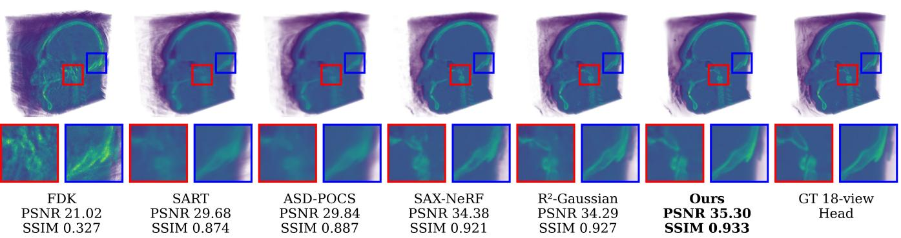
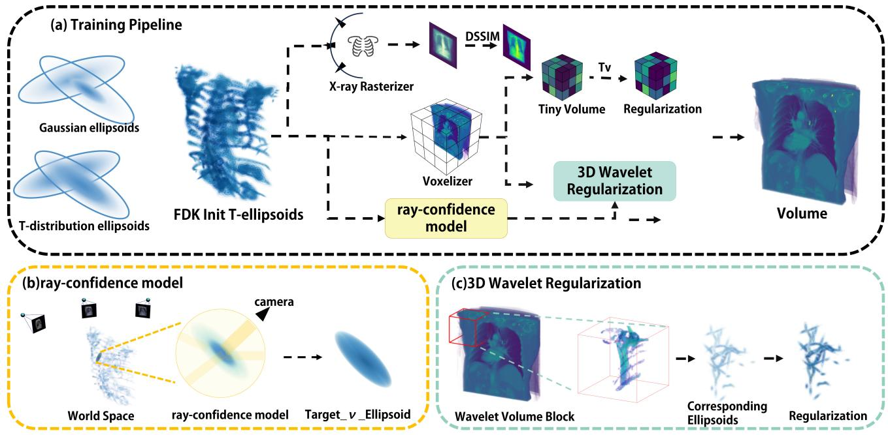
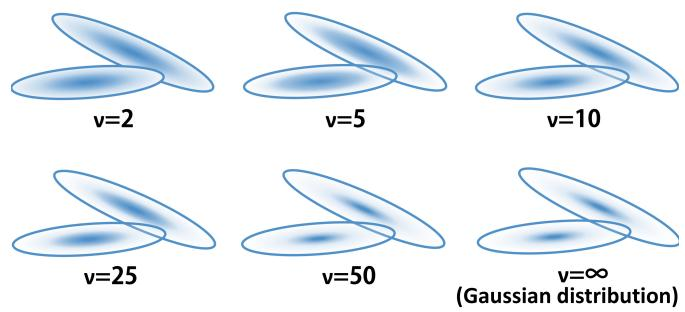
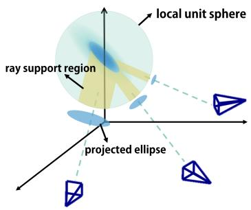
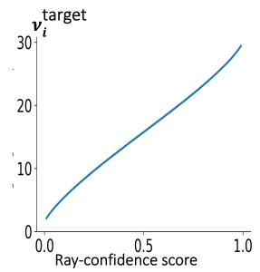
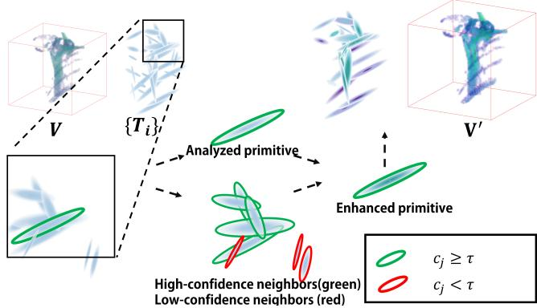
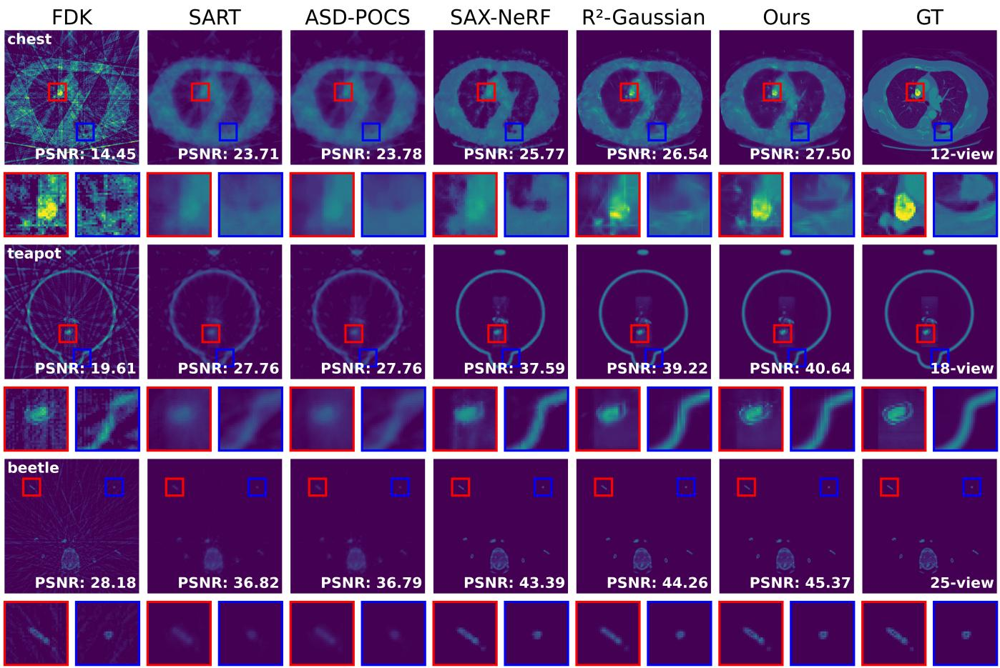
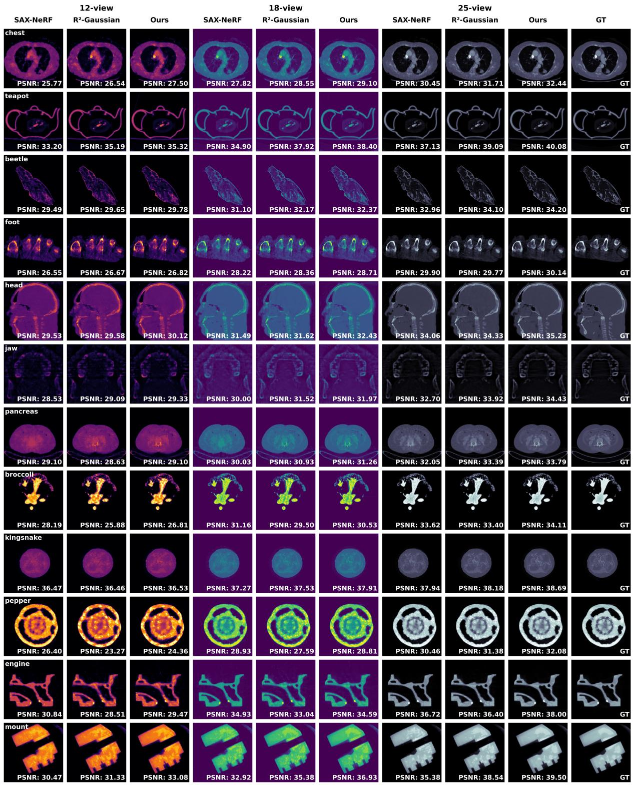
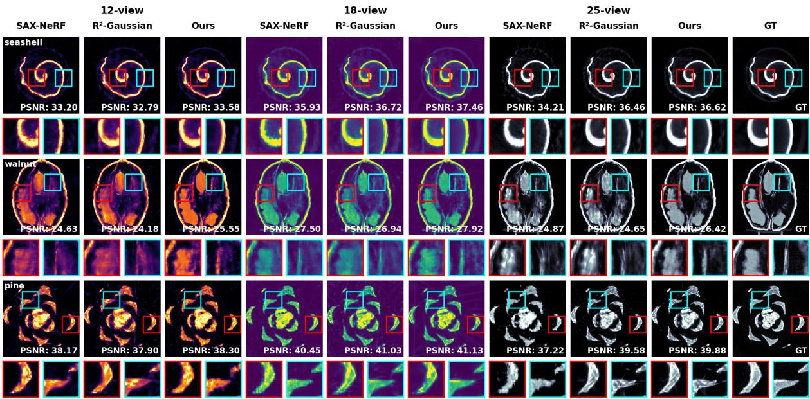

# TR-GS: High-Fidelity Sparse-View CT Volumetric Rendering via t-Distribution Gaussian Splating and Ray-Confidence Modeling

Zedong Xiao Shenzhen University Shenzhen, China 2023111035@email.szu.edu.cn

Yiren Wang Shenzhen University Shenzhen, China 2510232069@mails.szu.edu.cn

Xiaolin Liu   
Shenzhen University   
Shenzhen, China   
liuxiaolinszu@163.com Zhou Liu   
Guangdong Laboratory of Artificial   
Intelligence and Digital Economy (SZ) Shenzhen, China liuzhou@gml.ac.cn

Zhangji Lu Shenzhen University Shenzhen, China zjlu@szu.edu.cn

  
Figure 1: Sparse-view CT reconstruction comparison at 18 views. In this example, TR-GS reconstructs clear anatomical structures and obtains a PSNR of 35.30 dB and an SSIM of 0.933.

## Abstract

High-fidelity 3D medical visualization supports applications such as clinical assessment and surgical planning. Sparse-view computed tomography (CT) can reduce projection requirements and associated radiation exposure, but limited observations may introduce structural artifacts and reconstruction uncertainty. Although 3D Gaussian Splatting (3DGS) provides an eficient explicit representation for volumetric rendering, existing CT methods based on standard Gaussian primitives may be sensitive to unreliable observations under sparse-view acquisition.

We present TR-GS, a Gaussian-splatting framework for sparseview CT volumetric rendering. TR-GS replaces standard Gaussian primitives with projectable Student’s �-distribution primitives and introduces a ray-confidence model that regulates their degrees of freedom according to local ray observability. Confidence-guided 3D wavelet regularization is further used to balance high-frequency detail preservation and noise suppression.

Experiments on synthetic and real-world datasets show that TR-GS improves over representative baselines in most evaluated settings and remains competitive in the remaining cases. The resulting volumetric representations may support downstream medical multimedia applications, including XR-based visualization and interactive clinical rendering.

## CCS Concepts

• Computing methodologies → Computer graphics; Com puter vision.

## Keywords

Medical Multimedia, Gaussian Splatting, Volumetric Rendering

## ACM Reference Format:

Zedong Xiao, Yiren Wang, Zhou Liu, Xiaolin Liu, and Zhangji Lu. 2026. TR-GS: High-Fidelity Sparse-View CT Volumetric Rendering via t-Distribution Gaussian Splatting and Ray-Confidence Modeling. In Proceedings of the 34th ACM International Conference on Multimedia (MM ’26), November 10–14, 2026, Rio de Janeiro, Brazil. ACM, New York, NY, USA, 15 pages. https: //doi.org/10.1145/3767308.3835527

## 1 Introduction

Computed tomography (CT) is a fundamental imaging technique for non-invasive visualization of internal structures and has been widely used in medical diagnosis, biological imaging, and industrial inspection [10, 11, 16, 17]. In clinical applications, CT-based volumetric reconstruction is closely related to medical visualization, surgical planning, and image-guided intervention. However, high-quality CT imaging usually requires a large number of X-ray projections, leading to increased radiation exposure and potential long-term health risks [5, 20, 32]. Sparse-view CT aims to alleviate this issue by reconstructing volumetric images from a limited number ofprojections, thereby reducing radiation dose while preserving diagnostically useful anatomical information [9, 18, 30, 39].

Despite its practical value, sparse-view CT reconstruction remains a highly ill-posed inverse problem. With insuficient projection views, conventional analytical reconstruction methods such as FBP [37] and FDK [12] often sufer from severe streak artifacts and structural distortion. Iterative approaches, including SART [1] and ASD-POCS [41], can partially improve reconstruction quality by incorporating handcrafted priors, but they typically require expensive optimization and may over-smooth fine details under aggressive sparsity. To overcome these limitations, a large body of recent work has explored learning-based sparse-view CT reconstruction, including adversarial learning [44], implicit neural representations, and difusion-based priors [2, 8, 21, 24, 25, 45]. However, many supervised methods depend on large paired datasets and may generalize poorly to unseen anatomies [8, 21].

To reduce the reliance on external supervision, self-supervised neural rendering methods have recently been introduced into CT reconstruction. Inspired by NeRF [31], methods such as IntraTomo [46], NAF [48], and SAX-NeRF [7] reconstruct volumetric attenuation fields directly from sparse projections of a single object or patient. These approaches have demonstrated encouraging performance by optimizing continuous scene representations with diferentiable volume rendering. Nevertheless, NeRF-based methods require repeated neural network evaluation along sampled rays, resulting in high computational cost and slow convergence, especially for high-resolution CT volumes [7, 48].

Recently, 3D Gaussian Splatting (3DGS) has emerged as an eficient explicit scene representation for diferentiable rendering [19]. Owing to its explicit primitive-based formulation and fast rasterization, Gaussian splatting has been extended from natural scene rendering to tomographic imaging and X-ray reconstruction [6, 23, 35, 47]. In particular, R2-Gaussian [47] shows that explicit Gaussianbased representations can significantly improve the eficiency of sparse-view tomographic reconstruction while maintaining competitive reconstruction quality. However, existing Gaussian-splattingbased CT methods still rely on standard Gaussian primitives. Under sparse-view acquisition, the reconstruction process is often afected by outliers, missing constraints, and local uncertainty caused by incomplete angular coverage. Since Gaussian distributions are thintailed, they are less robust to these unreliable observations, which can lead to unstable primitive optimization, residual artifacts, and loss of structural detail in the reconstructed volume.

To address this limitation, we propose TR-GS, a sparse-view CT reconstruction framework based on t-distribution radiative splatting. Instead of modeling each primitive with a Gaussian kernel, TR-GS adopts a heavy-tailed Student’s t-distribution to improve robustness against sparse-view ambiguity and outlier contamination. Furthermore, we introduce a ray-confidence modeling strategy to estimate the reliability of each primitive according to the geometric support provided by the observed X-ray rays. This confidence is used to adaptively regulate the primitive distribution during optimization, allowing well-constrained regions to preserve precision while encouraging under-constrained regions to remain robust. We further incorporate a confidence-guided 3D wavelet regularization to suppress sparse-view artifacts and noise while preserving high-frequency anatomical structures that are critical for CT visualization. The main contributions of this work are summarized as follows:

• We formulate Student’s �-distributions as explicit, projectable radiative primitives for sparse-view CT, and couple their degrees of freedom with local ray observability through a ray-confidence model.

• We develop a ray-confidence model that adaptively regulates the degrees of freedom for each rendering primitive, and introduce a 3D wavelet regularization guided by the rayconfidence model to preserve high-frequency clinical details.

• Extensive experiments on synthetic and real-world datasets show that TR-GS improves over representative baselines in most evaluated settings and remains competitive in the remaining cases, supporting its value for high-fidelity medical visualization and sparse-view CT rendering.

• The resulting artifact-reduced volumetric representations may support medical multimedia applications such as XRbased visualization and interactive clinical rendering [3].

Our implementation is publicly available at https://github.com/ zd-X/TR-GS.

## 2 Related Work

In medical imaging literature, the process of inferring 3D volumetric data from 2D projections is commonly referred to as CT reconstruction. In computer graphics and multimedia domains, the same process of synthesizing novel views from volumetric representations is termed volumetric rendering. Throughout this paper, we use these terms interchangeably to bridge the medical imaging and multimedia communities.

## 2.1 Sparse-View CT Reconstruction

CT reconstruction has been extensively studied to reduce radiation dose while maintaining acceptable image quality [9, 18, 20, 32, 39]. Classical methods mainly include analytical and iterative reconstruction algorithms. Analytical methods such as FBP [37] and FDK [12], derived from the Radon transform [36], are computationally eficient but are highly sensitive to view sparsity and usually produce strong streak artifacts when projections are insufficient [17, 41]. They are derived from the Radon transform theory [36]. Iterative reconstruction methods, including SART [1] and ASD-POCS [40, 41], improve reconstruction quality by incorporating prior constraints into the inverse problem. Nevertheless, these methods often rely on carefully designed regularization terms and may lose fine structural details in highly sparse settings.

With the development of deep learning, data-driven reconstruction methods have achieved significant progress in sparse-view CT. Earlier studies used adversarial learning and convolutional networks to recover CT volumes from limited projections or degraded reconstructions [25, 45]. More recent methods have explored difusion priors and model-based generative frameworks to further improve reconstruction quality in sparse or limited-angle scenarios [2, 8, 24]. Although these methods can produce strong quantitative performance, many of them require large-scale paired training data and may sufer from limited generalization to unseen domains [8, 21].

## 2.2 Neural Fields for CT Reconstruction

Neural field methods have recently provided a self-supervised alternative for tomographic reconstruction by directly optimizing a continuous volumetric representation from acquired projections. NeRF [31] first demonstrated the efectiveness of neural scene representations for view synthesis, and subsequent work extended this idea to tomography and X-ray imaging [7, 22, 38, 46, 48]. IntraTomo [46] formulates tomographic reconstruction as self-supervised learning via sinogram synthesis and prediction. NAF [48] introduces neural attenuation fields for sparse-view conebeam CT reconstruction and improves eficiency with hash-based encodings [33]. SAX-NeRF [7] exploits X-ray structure information through line-segment-based transformers and structure-aware ray sampling. NeAT [38] proposes adaptive neural representations for tomography.

These methods reduce the need for external annotations and can flexibly adapt to instance-specific reconstruction. However, because they repeatedly evaluate neural networks along many sampled points on each ray, neural-field-based methods [7, 31, 48] are usually computationally expensive and slow to optimize, especially for large-scale 3D medical volumes.

## 2.3 Gaussian Splatting for CT Reconstruction

3D Gaussian Splatting (3DGS) [19] has recently become an eficient alternative to implicit neural rendering due to its explicit primitive representation and real-time diferentiable rasterization. Beyond natural scene rendering, Gaussian splatting has been rapidly extended to 3D reconstruction, surface representation, generation, and SLAM [14, 26, 29, 42]. This progress has motivated its application to radiographic imaging and CT reconstruction [6, 23, 35, 47].

X-Gaussian [6] introduces Gaussian-based radiative primitives for X-ray rendering and redesigns the point cloud model to exclude view-direction influence, inspired by the isotropic nature of X-ray imaging. GASPCT [35] uses Gaussian splatting for novel CT projection view synthesis. Sparse-view CT reconstruction with 3D Gaussian volumetric representation further explores explicit Gaussian representations for density estimation [23]. R2-Gaussian [47] identifies an integration bias in conventional 3DGS when applied to tomography and proposes a rectified radiative Gaussian splatting framework for sparse-view reconstruction. These works show that Gaussian-splatting-based reconstruction is much more eficient than NeRF-style volumetric rendering while maintaining strong performance.

## 3 Method

We present TR-GS, a framework for high-fidelity sparse-view CT reconstruction. It comprises three components: (1) Student’s �- primitive volumetric representation, (2) ray-confidence modeling with target degree-of-freedom regularization, and (3) confidenceguided 3D wavelet volume enhancement.

## 3.1 Student’s t-Primitive Representation

As shown in Fig. 2(a), our framework has three parallel branches: diferentiable X-ray rasterization, density voxelization with wavelet regularization, and ray-confidence modeling. This section focuses on the t-primitive representation and its projection; the latter two are detailed in Sec. 3.2 and Sec. 3.3.

We represent the object with learnable 3D Student’s � kernels $T = \{ T _ { i } \} _ { i = 1 } ^ { M }$

The density field is a weighted sum of anisotropic Student’s � primitives:

$$
f ( \mathbf { x } ) = \sum _ { i = 1 } ^ { M } \rho _ { i } T _ { i } ( \mathbf { x } ) ,\tag{1}
$$

with $\rho _ { i }$ the density coeficient and $T _ { i } ( \mathbf { x } )$ the unnormalized kernel:

$$
T _ { i } ( \mathbf { x } ) = \left[ 1 + \frac { 1 } { \nu _ { i } } ( \mathbf { x } - { \pmb \mu } _ { i } ) ^ { \top } \Sigma _ { i } ^ { - 1 } ( \mathbf { x } - { \pmb \mu } _ { i } ) \right] ^ { - \frac { \nu _ { i } + 3 } { 2 } } .\tag{2}
$$

Here $\pmb { \mu } _ { i }$ is the center, $\Sigma _ { i }$ the covariance, and $\nu _ { i } > 0$ the degrees of freedom controlling tail heaviness (Fig. 3). The Student’s t distribution is a classic robust alternative to the Gaussian in statistical modeling [34]. The covariance is parameterized by principal scales $( a _ { i } , b _ { i } , c _ { i } )$ and rotation $\mathbf { R } _ { i } \mathbf { : }$

$$
\Sigma _ { i } = \mathbf { R } _ { i } \operatorname { d i a g } ( a _ { i } ^ { 2 } , b _ { i } ^ { 2 } , c _ { i } ^ { 2 } ) \mathbf { R } _ { i } ^ { \top } .\tag{3}
$$

Projection along an X-ray ray is analytic: marginalization preserves the �-form. Each ellipsoid contributes to the 2D projection according to its density distribution and viewing geometry. Let x˜ be ray-aligned coordinates and xˆ detector coordinates. The projected intensity is

$$
\begin{array} { l } { { \displaystyle I _ { i } ( { \hat { \mathbf { x } } } ) = \rho _ { i } \int _ { - \infty } ^ { \infty } T _ { i } ( { \tilde { \mathbf { x } } } ) d x _ { 3 } } } \\ { { \displaystyle \ } } \\ { { \displaystyle = \rho _ { i } C ( \nu _ { i } , { \tilde { \Sigma } } _ { i } ) \left[ 1 + \frac { 1 } { \nu _ { i } } ( { \hat { \mathbf { x } } } - { \hat { \pmb { \mu } } } _ { i } ) ^ { \top } { \hat { \boldsymbol { \Sigma } } } _ { i } ^ { - 1 } ( { \hat { \mathbf { x } } } - { \hat { \pmb { \mu } } } _ { i } ) \right] ^ { - \frac { \nu _ { i } + 2 } { 2 } } } , } \end{array}\tag{4}
$$

with the integral factor

$$
C ( \nu _ { i } , \tilde { \Sigma } _ { i } ) = \frac { \Gamma \left( \frac { \nu _ { i } + 2 } { 2 } \right) } { \Gamma \left( \frac { \nu _ { i } + 3 } { 2 } \right) } \sqrt { \nu _ { i } \pi } \frac { | \tilde { \Sigma } _ { i } | ^ { 1 / 2 } } { | \hat { \Sigma } _ { i } | ^ { 1 / 2 } }\tag{5}
$$

where $\hat { \Sigma } _ { i }$ is the 2D covariance in the detector plane from the ray-aligned 3D covariance $\tilde { \Sigma } _ { i } .$ . Summing over primitives gives the final ray intensity.

## 3.2 Ray-Confidence Modeling

We compute a target degree offreedom $\nu _ { i } ^ { \mathrm { t a r g e t } }$ per primitive from ray coverage and regularize the actual $\nu _ { i }$ toward it; the ray-confidence score $c _ { i } \in [ 0 , 1 ]$ is based on coverage of the unit sphere around each primitive (Fig. 2(b)).

Figure 2: Training pipeline of TR-GS. (a) Overall training pipeline: TR-GS replaces Gaussian ellipsoids (thin-tail) with tdistribution ellipsoids (heavy-tail) for robustness. FDK-initialized t-ellipsoids are optimized via three parallel branches: X-ray rasterization for projection rendering, voxelization with wavelet regularization, and ray-confidence modeling. (b) Conceptual ray-confidence pipeline: geometric confidence from ray coverage is used to compute a target degree of freedom (denoted as target\_v in the figure, and as $\nu _ { i } ^ { \mathrm { t a r g e t } }$ in the text), which regularizes the actual $\nu _ { i }$ to enhance robustness for poorly-observed primitives. (c) 3D wavelet regularization: local volumetric patches are mapped to ellipsoids and enhanced in the wavelet domain to preserve anatomical details.  
  
Figure 3: �-ellipsoids with varying �. As � decreases, the ellipsoids exhibit heavier tails (more robust to outliers); as $\nu \to \infty ,$ the � distribution converges to Gaussian.

For primitive � and camera $j ,$ let $\mathbf { u } _ { i j }$ be the normalized direction from the primitive center to camera in local coordinates. The efective directional ratio $e _ { i j }$ is

$$
e _ { i j } = \frac { \alpha } { \sqrt { ( a _ { i } u _ { i j } ^ { x } ) ^ { 2 } + ( b _ { i } u _ { i j } ^ { y } ) ^ { 2 } + ( c _ { i } u _ { i j } ^ { z } ) ^ { 2 } } } ,\tag{6}
$$

with $( a _ { i } , b _ { i } , c _ { i } )$ from Eq. (3) and scaling factor �. This makes primitives of diferent shapes comparable.

  
Figure 4: Illustration of ray-confidence modeling. (Left) Geometric reliability: rays intersect the local unit sphere, forming ray support regions of varying thickness; the projected ellipse indicates the detector footprint. (Right) Mapping from confidence score $c _ { i }$ to target degree of freedom.

The normalized support radius is

$$
r _ { i j } = r _ { \mathrm { m a x } } ~ \mathrm { m i n } \left( \frac { e _ { i j } } { \kappa } , 1 \right) ,\tag{7}
$$

  
Figure 5: Confidence-guided wavelet regularization. Symbols: V: local volume block; {�� }: set of primitives; green/red neighbors: high-/low-confidence $( c _ { j } \ge \tau / c _ { j } < \tau ) ;$ enhanced primitive (darkened) results from the wavelet loss $\begin{array} { r } { \mathcal { L } _ { \mathrm { w a v e l e t } } = } \end{array}$ $\lambda _ { \mathbf { s u p p } } S - \lambda _ { \mathbf { e n h } } E ( \mathbf { E q }$ . 15); final volume $\mathbf { V } ^ { \prime }$

with empirical $r _ { \mathrm { m a x } } ,$ �. We sample $N _ { s }$ points ${ \bf p } _ { s }$ on the unit sphere and define

$$
c _ { i } = \frac { 1 } { N _ { s } } \sum _ { s = 1 } ^ { N _ { s } } \mathbf { 1 } \left( \exists j : \mathrm { d i s t } \left( \mathbf { p } _ { s } , \mathrm { r a y ~ s e g m e n t } S _ { i j } \right) \leq r _ { i j } \right) ,\tag{8}
$$

with $S _ { i j }$ the ray segment inside the sphere. $c _ { i }$ measures the fraction of the sphere covered by rays.

We then compute the target degree of freedom:

$$
\nu _ { i } ^ { \mathrm { t a r g e t } } = \nu _ { \mathrm { m i n } } + \left( \nu _ { \mathrm { m a x } } - \nu _ { \mathrm { m i n } } \right) \sigma \left( \frac { \log \mathrm { i t } ( c _ { i } ) } { T } \right) ,\tag{9}
$$

with logit(�� ) = log $\frac { c _ { i } } { 1 - c _ { i } }$ , sigmoid $\sigma ,$ and temperature �. The sigmoid mapping is shown in Fig. 4 (right). High confidence yields larger $\nu _ { i } ^ { \mathrm { t a r g e t } }$ (Gaussian-like), low confidence yields smaller $\dot { \nu } _ { i } ^ { \mathrm { t a r g e t } }$ (heavier tails).

We regularize �� toward its target with a soft log-space MSE loss:

$$
\mathcal { L } _ { \nu } = \frac { 1 } { M } \sum _ { i = 1 } ^ { M } \lambda _ { \nu } \omega ( c _ { i } ) \big ( \log \nu _ { i } - \log \nu _ { i } ^ { \mathrm { t a r g e t } } \big ) ^ { 2 } ,\tag{10}
$$

where $\omega _ { } ^ { } ( { \boldsymbol { c } } _ { i } )$ emphasizes low-confidence primitives.

## 3.3 3D Wavelet Regularization Guided by Confidence

For smaller �, the wider spatial support of Student’s � primitives may attenuate high-frequency details. We introduce confidence-guided 3D wavelet regularization to mitigate this efect while suppressing noise.

During training, we periodically sample a local volumetric block V (Fig. 5) and apply a 3D discrete wavelet transform [28]:

$$
\mathcal { W } ( \mathbf { V } ) = \{ \mathbf { B } _ { 0 } , \mathbf { B } _ { 1 } , \dots , \mathbf { B } _ { M _ { b } - 1 } \} ,\tag{11}
$$

with ${ \bf { B } } _ { 0 }$ low-frequency and the rest high-frequency. We focus on mid-frequency subbands (indices $1 , \ldots , 6$ in 8-subband decomposition), which capture structured features.

For each selected subband, we reconstruct it and compute a voxel-wise high-frequency strength �(p) (gradient magnitude). To incorporate confidence, a �-nearest neighbor search over primitives for each voxel p (visualized as {�� } in Fig. 5) retrieves indices $N _ { K } ( { \mathfrak { p } } )$ of the � closest Gaussians, with confidence $c _ { j } .$ A threshold $\tau = 0 . 3 5$ partitions neighbors into high- and low-confidence groups:

$$
N ^ { \mathrm { h i g h } } ( { \bf p } ) = \{ j \in N _ { K } ( { \bf p } ) \mid c _ { j } \geq \tau \} ,
$$

$$
N ^ { \mathrm { l o w } } ( { \bf p } ) = \{ j \in N _ { K } ( { \bf p } ) \mid c _ { j } < \tau \} ,\tag{12}
$$

(13)

colored green and red in Fig. 5. The enhancement and suppression contributions per voxel are

$$
e ( { \bf p } ) = \frac { | N ^ { \mathrm { h i g h } } ( { \bf p } ) | } { K } g ( { \bf p } ) , \qquad s ( { \bf p } ) = \frac { | N ^ { \mathrm { l o w } } ( { \bf p } ) | } { K } g ( { \bf p } ) .\tag{14}
$$

Averaging over all voxels gives � and �. The wavelet loss is

$$
\mathcal { L } _ { \mathrm { w a v e l e t } } = \lambda _ { \mathrm { s u p p } } S - \lambda _ { \mathrm { e n h } } E ,\tag{15}
$$

with hyperparameters $\lambda _ { \mathrm { s u p p } } , \lambda _ { \mathrm { e n h } }$ . This encourages enhancing highfrequency details where confidence is high (negative term reduces loss) and suppressing them where confidence is low (positive term increases loss).

This regularization complements the � representation by recovering fine structures blurred by heavy tails, preserving details without amplifying noise.

## 4 Experiments

## 4.1 Experimental Setup

We evaluate TR-GS on sparse-view CT reconstruction, focusing on volumetric rendering under severely limited projection views. The experiments investigate three aspects: (1) the efect of replacing Gaussian primitives with Student’s � primitives on reconstruction robustness in underconstrained settings, (2) the contribution of the ray-confidence model and wavelet regularization to reconstruction quality, and (3) the volumetric fidelity and projection consistency of TR-GS compared to representative baselines.

Datasets. We use the synthetic and real-world CT datasets from $\mathrm { R } ^ { 2 } \cdot$ -Gaussian [47], covering diverse anatomies. Main comparisons use 12, 18, and 25 uniformly sampled views over the full scanning trajectory [15]. For the ablation studies, we additionally use 6- and 50-view settings to examine the components under more extreme sparse-view and relatively denser-view conditions.

Baselines and metrics. We compare TR-GS with representative methods from three categories: the analytical method FDK [12], the iterative methods ASD-POCS [41] and SART [1], and neural rendering methods SAX-NeRF [7] and R2-Gaussian [47]. Following prior work, we report both volumetric and projection-domain metrics: $\mathrm { P S N R } _ { 3 D } , \mathrm { S S I M } _ { 3 D }$ evaluate the fidelity of the reconstructed 3D volume, while $\mathrm { P S N R } _ { 2 D } , \mathrm { S S I M } _ { 2 D }$ measure the consistency between rendered projections and ground-truth projections.

Implementation details. All methods use the same sparse-view settings and evaluation protocol. Projection generation and classical baseline reconstruction are performed with TIGRE [4]. Unless otherwise specified, all quantitative results are computed on the same test split using the same preprocessing and normalization.

Table 1: Volumetric reconstruction results on the synthetic and real-world datasets under 12, 18, and 25 views. The top three results are highlighted in red, orange, and yellow, respectively.
<table><tr><td rowspan="2">Methods</td><td colspan="2">12</td><td colspan="2">18</td><td colspan="2">25</td></tr><tr><td> $\mathbf { P S N R } _ { 3 D }$ </td><td> $\mathbf { S S I M } _ { 3 D }$ </td><td> $\mathbf { P S N R } _ { 3 D }$ </td><td> $\mathbf { S S I M } _ { 3 D }$ </td><td> $\mathbf { P S N R } _ { 3 D }$ </td><td> $\mathbf { S S I M } _ { 3 D }$ </td></tr><tr><td colspan="7">Synthetic dataset</td></tr><tr><td>FDK</td><td>16.74</td><td>0.224</td><td>18.78</td><td>0.296</td><td>20.77</td><td>0.371</td></tr><tr><td>ASD-POCS</td><td>26.10</td><td>0.813</td><td>27.66</td><td>0.856</td><td>29.26</td><td>0.893</td></tr><tr><td>SART</td><td>26.06</td><td>0.807</td><td>27.60</td><td>0.849</td><td>29.17</td><td>0.885</td></tr><tr><td>SAX-NeRF</td><td>30.21</td><td>0.840</td><td>32.18</td><td>0.886</td><td>34.12</td><td>0.904</td></tr><tr><td>R²-Gaussian</td><td>30.73</td><td>0.861</td><td>33.28</td><td>0.900</td><td>35.39</td><td>0.926</td></tr><tr><td>Ours</td><td>31.03</td><td>0.872</td><td>33.66</td><td>0.907</td><td>35.77</td><td>0.930</td></tr><tr><td colspan="7">Real-world dataset</td></tr><tr><td>FDK</td><td>18.58</td><td>0.236</td><td>20.82</td><td>0.319</td><td>20.50</td><td>0.328</td></tr><tr><td>ASD-POCS</td><td>27.56</td><td>0.825</td><td>29.20</td><td>0.863</td><td>30.07</td><td>0.904</td></tr><tr><td>SART</td><td>27.54</td><td>0.821</td><td>29.15</td><td>0.858</td><td>29.97</td><td>0.899</td></tr><tr><td>SAX-NeRF</td><td>34.19</td><td>0.875</td><td>36.88</td><td>0.904</td><td>34.34</td><td>0.840</td></tr><tr><td>R²-Gaussian</td><td>34.33</td><td>0.867</td><td>37.29</td><td>0.902</td><td>35.45</td><td>0.842</td></tr><tr><td>Ours</td><td>34.84</td><td>0.892</td><td>37.81</td><td>0.915</td><td>35.71</td><td>0.837</td></tr></table>

## 4.2 Comparison with Baselines

We compare TR-GS against the baselines on both synthetic and real world datasets using the 12-, 18-, and 25-view settings described above. The quantitative results are reported in Table 1 (3D metrics) and Table 2 (2D metrics). Figure 6 shows visual comparisons of reconstructed slices.

As shown in Table 1 and Table 2, TR-GS achieves the best or competitive performance in most evaluated settings. On the synthetic dataset, it ranks first across all three view numbers in all four metrics, outperforming R2-Gaussian by up to 0.38 dB in $\mathrm { P S N R } _ { 3 D }$ and 0.011 in $\mathrm { S S I M } _ { 3 D }$ . On the real-world dataset, TR-GS achieves the best or tied-best results in all 12- and 18-view metrics, while remaining competitive at 25 views, with $\mathrm { S S I M } _ { 3 D }$ (0.837) close to the best result (0.842). These results indicate that replacing Gaussian primitives with Student’s � primitives improves reconstruction robustness under sparse-view acquisition.

For projection-domain metrics (Table 2), TR-GS shows advantages in most cases. On the synthetic dataset, it achieves the best $\mathrm { P S N R } _ { 2 D }$ and $\mathrm { S S I M _ { 2 D } }$ for all three view settings. On the real-world dataset, it performs best at 12 and 18 views and remains competitive at 25 views. These results suggest that the proposed method improves both volumetric fidelity and projection consistency during diferentiable rendering.

Overall, the improvements in both 3D and 2D metrics indicate that TR-GS provides a better balance between volumetric fidelity and rendering accuracy under sparse-view acquisition.

## 4.3 Noise Robustness Study

We now evaluate robustness to measurement noise on the synthetic dataset under 12, 18, and 25 views, using a mixed Poisson–Gaussian noise model [13, 43] which is widely used to characterize X-ray detector noise. Three noise levels are considered: Low (Poisson parameter 100000, Gaussian std 10), Medium (Poisson 50000, Gaussian std 20), and High (Poisson 10000, Gaussian std 40), chosen to mimic realistic low-dose conditions [27]. We compare TR-GS with $\mathrm { R } ^ { 2 } \cdot$ -Gaussian to examine robustness under noisy sparse-view conditions.

Table 2: Projection-domain results on the synthetic and realworld datasets under $^ { 1 2 , }$ 18, and 25 views. The top three results are highlighted in red, orange, and yellow, respectively.
<table><tr><td rowspan="2">Methods</td><td colspan="2">12</td><td colspan="2">18</td><td colspan="2">25</td></tr><tr><td> $\mathbf { P S N R } _ { 2 D }$ </td><td> $\mathbf { S S I M } _ { 2 D }$ </td><td> $\mathbf { P S N R } _ { 2 D }$ </td><td> $\mathbf { S S I M } _ { 2 D }$ </td><td> $\mathbf { P S N R } _ { 2 D }$ </td><td> $\mathbf { S S I M } _ { 2 D }$ </td></tr><tr><td colspan="7">Synthetic dataset</td></tr><tr><td>SAX-NeRF</td><td>40.08</td><td>0.965</td><td>42.46</td><td>0.973</td><td>45.36</td><td>0.980</td></tr><tr><td>R²-Gaussian</td><td>40.14</td><td>0.968</td><td>43.90</td><td>0.978</td><td>46.64</td><td>0.982</td></tr><tr><td>Ours</td><td>40.73</td><td>0.972</td><td>44.54</td><td>0.981</td><td>47.29</td><td>0.984</td></tr><tr><td colspan="7">Real-world dataset</td></tr><tr><td>SAX-NeRF</td><td>41.33</td><td>0.974</td><td>43.57</td><td>0.980</td><td>31.71</td><td>0.910</td></tr><tr><td>R2-Gaussian</td><td>40.62</td><td>0.975</td><td>44.79</td><td>0.985</td><td>34.31</td><td>0.948</td></tr><tr><td>Ours</td><td>41.55</td><td>0.978</td><td>45.77</td><td>0.985</td><td>33.95</td><td>0.948</td></tr></table>

Table 3: Noise robustness on the synthetic dataset under 12, 18, and 25 views. Low, Medium, and High denote increasing mixed Poisson–Gaussian noise levels. Best results are highlighted in red.
<table><tr><td rowspan="2">Methods</td><td colspan="2">Low Noise</td><td colspan="2">Medium Noise</td><td colspan="2">High Noise</td></tr><tr><td> $\mathbf { P S N R } _ { 3 D }$ </td><td> $\mathbf { S S I M } _ { 3 D }$ </td><td> $\mathbf { P S N R } _ { 3 D }$ </td><td> $\mathbf { S S I M } _ { 3 D }$ </td><td> $\mathbf { P S N R } _ { 3 D }$ </td><td> $\mathbf { S S I M } _ { 3 D }$ </td></tr><tr><td></td><td colspan="6">Synthetic dataset - 12-view</td></tr><tr><td>R²-Gaussian</td><td>30.73</td><td>0.861</td><td>30.31</td><td>0.843</td><td>28.97</td><td>0.820</td></tr><tr><td>TR-GS</td><td>31.03</td><td>0.872</td><td>30.55</td><td>0.857</td><td>28.85</td><td>0.825</td></tr><tr><td></td><td colspan="6">Synthetic dataset - 18-view</td></tr><tr><td>R2-Gaussian</td><td>33.28</td><td>0.900</td><td>33.04</td><td>0.893</td><td>29.89</td><td>0.828</td></tr><tr><td>TR-GS</td><td>33.66</td><td>0.907</td><td>33.30</td><td>0.901</td><td>30.05</td><td>0.841</td></tr><tr><td></td><td colspan="6">Synthetic dataset - 25-view</td></tr><tr><td>R²-Gaussian</td><td>35.39</td><td>0.926</td><td>33.95</td><td>0.914</td><td>31.41</td><td>0.872</td></tr><tr><td>TR-GS</td><td>35.77</td><td>0.930</td><td>34.00</td><td>0.912</td><td>31.38</td><td>0.889</td></tr></table>

Table 3 shows that TR-GS performs better in most configurations, with three exceptions: 12-view high-noise PSNR, 25-view mediumnoise SSIM, and 25-view high-noise PSNR. Its advantage is more consistent at 12 and 18 views.

Overall, these results indicate that TR-GS improves robustness to measurement noise in most evaluated settings, where reconstruction is more challenging due to the increased ambiguity at fewer views.

## 4.4 Ablation Study on Core Modules

To understand the contribution of each proposed component, we conduct ablation experiments beyond the basic Student’s � primitive representation, specifically evaluating the ray-confidence model and the confidence-guided 3D wavelet regularization. Four variants are compared: (1) the base model (Student’s � primitives only), (2) base + ray-confidence model, (3) base + 3D wavelet regularization, and (4) the full model combining both. All ablation results are reported on the synthetic dataset under 6, 12, 18, 25, and 50 views.

Table 4 shows that the full model achieves the best or near-best performance in most settings. Individual variants achieve the best results for several specific metrics, indicating that the two modules are complementary but not strictly additive across all view settings and evaluation metrics.

The ray-confidence model mainly improves volumetric optimization in sparse settings where adaptive regulation of the degrees of freedom is critical, as reflected by gains in $\mathrm { P S N R } _ { 3 D }$ and $\mathrm { S S I M } _ { 3 D }$ $( \mathrm { e . g . }$ , at 18 views, $\mathrm { P S N R } _ { 3 D }$ increases from 33.50 to 33.61, and $\mathrm { S S I M } _ { 3 D }$ from 0.891 to 0.900). In contrast, the 3D wavelet regularization contributes more to structural preservation and projection consistency, as reflected by improvements in $\mathrm { P S N R } _ { 2 D }$ and $\mathrm { S S I M _ { 2 D } }$ (e.g., at 50 views, $\mathrm { P S N R } _ { 2 D }$ rises from 49.42 to 49.71 when adding wavelet regularization).

When combined, the two modules provide balanced performance across the evaluated metrics. The strongest configuration can vary with the view number and evaluation metric. Overall, these results suggest that while Student’s � primitives provide a robust basis for sparse-view reconstruction, the ray-confidence model and wavelet regularization each contribute to reconstruction quality and structural recovery.

## 4.5 Ablation Study on Optimizer and Density Control

In addition to the proposed algorithmic modules, TR-GS adopts specific engineering choices for training. TR-GS uses Stochastic Gradient Hamiltonian Monte Carlo (SGHMC) for position parameters � and Adam for the remaining parameters, with an Adding & Recycling (AR) densification mechanism following [49]. R2-Gaussian uses Adaptive Density Control (ADC) and Adam by default. These engineering choices are not claimed as primary innovations. We evaluate all four combinations of density control (ADC vs. AR) and optimizer (Adam vs. SGHMC) for both methods under the 18-view low-noise setting to assess whether the performance diference stems from these engineering choices.

Table 6 reports the results. For $\mathrm { R ^ { 2 } \mathrm { - G a u s s i a n } } .$ , the default configuration (ADC+Adam) achieves the highest $\mathrm { P S N R } _ { 3 D }$ (33.28 dB) and $\mathrm { S S I M } _ { 3 D }$ (0.900), confirming that ADC and Adam are well suited for Gaussian primitives. For TR-GS, the best performance is obtained with AR+SGHMC (33.66 dB, 0.907), which is our default configuration. Within TR-GS, AR outperforms ADC when paired with the same optimizer (e.g., AR+SGHMC vs. ADC+SGHMC: 33.66 vs. 33.57), and SGHMC yields higher results than Adam. Under matched ADC+Adam, TR-GS retains a small numerical advantage (33.37 dB vs. 33.28 dB), while applying AR+SGHMC to R2-Gaussian does not close the gap (32.47 dB vs. 33.66 dB).

These results provide two observations. First, each method performs best with its own default configuration, and the Student’s �- based model retains an advantage even under matched engineering choices. Second, the optimizer and densification mechanism alone cannot account for the observed performance diference, suggesting that the primitive representation contributes to the improvement. We therefore adopt AR+SGHMC as it is empirically validated for the Student’s � setting, while noting that these are implementation choices rather than core contributions.

Table 4: Core-module ablation on the synthetic dataset under 6, 12, 18, 25, and 50 views. Best results are highlighted in red.
<table><tr><td colspan="5">6-view</td></tr><tr><td>Synthetic</td><td> $\mathbf { P S N R } _ { 3 D }$ </td><td> $\mathbf { S S I M } _ { 3 D }$ </td><td> $\mathbf { P S N R } _ { 2 D }$ </td><td> $\mathbf { S S I M } _ { 2 D }$ </td></tr><tr><td>Base</td><td>26.67</td><td>0.798</td><td>33.94</td><td>0.947</td></tr><tr><td>Base + Ray-confidence model</td><td>26.73</td><td>0.803</td><td>33.97</td><td>0.946</td></tr><tr><td> $\mathrm { B a s e } + 3 \mathrm { D }$  wavelet regularization</td><td>26.68</td><td>0.798</td><td>33.96</td><td>0.947</td></tr><tr><td>Full</td><td>26.70</td><td>0.805</td><td>33.99</td><td>0.949</td></tr><tr><td colspan="5">12-view</td></tr><tr><td>Synthetic</td><td> $\mathbf { P S N R } _ { 3 D }$ </td><td> $\mathbf { S S I M } _ { 3 D }$ </td><td> $\mathbf { P S N R } _ { 2 D }$ </td><td> $\mathbf { S S I M } _ { 2 D }$ </td></tr><tr><td>Base</td><td>30.95</td><td>0.870</td><td>40.71</td><td>0.970</td></tr><tr><td>Base + Ray-confidence model</td><td>30.99</td><td>0.871</td><td>40.74</td><td>0.973</td></tr><tr><td>Base + 3D wavelet regularization</td><td>30.96</td><td>0.868</td><td>40.73</td><td>0.972</td></tr><tr><td>Full</td><td>31.03</td><td>0.872</td><td>40.78</td><td>0.974</td></tr><tr><td colspan="5">18-view</td></tr><tr><td>Synthetic</td><td> $\mathbf { P S N R } _ { 3 D }$ </td><td> $\mathbf { S S I M } _ { 3 D }$ </td><td> $\mathbf { P S N R } _ { 2 D }$ </td><td> $\mathbf { S S I M } _ { 2 D }$ </td></tr><tr><td>Base</td><td>33.50</td><td>0.891</td><td>44.50</td><td>0.979</td></tr><tr><td>Base + Ray-confidence model</td><td>33.61</td><td>0.900</td><td>44.53</td><td>0.980</td></tr><tr><td>Base + 3D wavelet regularization</td><td>33.53</td><td>0.896</td><td>44.58</td><td>0.980</td></tr><tr><td>Full</td><td>33.66</td><td>0.907</td><td>44.54</td><td>0.981</td></tr><tr><td colspan="5">25-view</td></tr><tr><td>Synthetic</td><td> $\mathbf { P S N R } _ { 3 D }$ </td><td> $\mathbf { S S I M } _ { 3 D }$ </td><td> $\mathbf { P S N R } _ { 2 D }$ </td><td> $\mathbf { S S I M } _ { 2 D }$ </td></tr><tr><td>Base</td><td>35.71</td><td>0.928</td><td>47.22</td><td>0.983</td></tr><tr><td>Base + Ray-confidence model</td><td>35.74</td><td>0.930</td><td>47.25</td><td>0.983</td></tr><tr><td>Base + 3D wavelet regularization</td><td>35.75</td><td>0.928</td><td>47.27</td><td>0.984</td></tr><tr><td>Full</td><td>35.77</td><td>0.930</td><td>47.29</td><td>0.984</td></tr><tr><td colspan="5">50-view</td></tr><tr><td>Synthetic</td><td> $\mathbf { P S N R } _ { 3 D }$ </td><td> $\mathbf { S S I M } _ { 3 D }$ </td><td> $\mathbf { P S N R } _ { 2 D }$ </td><td> $\mathbf { S S I M } _ { 2 D }$ </td></tr><tr><td>Base</td><td>38.04</td><td>0.946</td><td>49.42</td><td>0.985</td></tr><tr><td>Base + Ray-confidence model</td><td>38.08</td><td>0.946</td><td>49.75</td><td>0.985</td></tr><tr><td> $\mathrm { B a s e } + 3 \mathrm { D }$  wavelet regularization</td><td>38.10</td><td>0.947</td><td>49.71</td><td>0.986</td></tr><tr><td>Full</td><td>38.17</td><td>0.947</td><td>49.77</td><td>0.985</td></tr></table>

Table 5: Sensitivity of the ray-confidence temperature � on the synthetic 12-view setting.
<table><tr><td> $T$ </td><td>Spearman  $\rho$ </td><td> $\mathrm { P S N R } _ { 3 D }$  1</td><td> $\mathrm { S S I M } _ { 3 D }$  ←</td><td> $\mathrm { P S N R } _ { 2 D }$  ←</td><td> $\mathrm { S S I M } _ { 2 D } \uparrow$ </td></tr><tr><td>0.10</td><td>0.87</td><td>30.90</td><td>0.870</td><td>40.79</td><td>0.972</td></tr><tr><td>0.25</td><td>0.66</td><td>31.05</td><td>0.874</td><td>40.79</td><td>0.974</td></tr><tr><td>0.50</td><td>0.56</td><td>30.96</td><td>0.867</td><td>40.75</td><td>0.973</td></tr></table>

As an additional analysis, we examined whether the learned degrees of freedom �� align with the ray-confidence scores $c _ { i } ,$ to verify that the confidence model meaningfully conditions the primitive distribution. Table 5 reports the Spearman rank correlation and reconstruction metrics under diferent temperature settings on the synthetic 12-view setting. While reducing $T$ to 0.1 strengthens the $\nu { - } c$ alignment $( \rho = 0 . 8 7 )$ , it does not yield the best reconstruction quality. The default $T = 0 . 2 5$ achieves the best PSNR and SSIM with a moderate correlation $( \rho = 0 . 6 6 )$ , indicating that the learned � values spatially track ray-confidence scores and that a balanced rather than maximal alignment is preferable.

  
Figure 6: Colorized slice examples of diferent methods, with PSNR (dB) shown at the bottom right of each image. In the shown examples, TR-GS recovers finer anatomical structures and exhibits fewer streak artifacts than the compared methods, particularly at 12 and 18 views.

Table 6: Optimizer and density-control ablation under the 18-view low-noise setting. Best results within each method are highlighted in red.
<table><tr><td>Method</td><td>Density Control Optimizer</td><td> $\mathbf { P S N R } _ { 3 D }$ </td><td>(dB)</td><td> $\mathbf { S S I M } _ { 3 D }$ </td></tr><tr><td rowspan="5">R²-Gaussian</td><td>ADC</td><td>Adam</td><td>33.28</td><td>0.900</td></tr><tr><td>AR</td><td>Adam</td><td>32.44</td><td>0.891</td></tr><tr><td>AR</td><td>SGHMC</td><td>32.47</td><td>0.892</td></tr><tr><td>ADC</td><td>SGHMC</td><td>32.41</td><td>0.891</td></tr><tr><td>AR</td><td>SGHMC</td><td>33.66</td><td>0.907</td></tr><tr><td rowspan="3">TR-GS (Ours)</td><td>AR</td><td>Adam</td><td>33.45</td><td>0.904</td></tr><tr><td>ADC</td><td>Adam</td><td>33.37</td><td>0.903</td></tr><tr><td>ADC</td><td>SGHMC</td><td>33.57</td><td>0.905</td></tr></table>

## 5 Discussion and Conclusion

We presented TR-GS, a Gaussian-splatting-based framework that replaces conventional Gaussian primitives with Student’s �-distributions to improve robustness to outliers and incomplete observations in

sparse-view CT reconstruction. The key components include a rayconfidence model that adaptively regulates the degrees of freedom according to local ray observability, and a confidence-guided 3D wavelet regularization that balances high-frequency detail preservation with noise suppression. Across the evaluated datasets and view settings, TR-GS improves over representative baselines in most cases and remains competitive in the remaining cases, with particularly strong results in highly sparse settings such as 12 and 18 views. The resulting volumetric representations may support medical multimedia applications including XR-based visualization and interactive clinical rendering. Future work includes extending the evaluation to limited-angle acquisition and broader anatomical regions, and investigating learning-based confidence estimation strategies.

In summary, we presented a reconstruction framework that replaces Gaussian primitives with projectable Student’s �-distributions and couples their degrees of freedom with local ray observability, supported by confidence-guided wavelet regularization.

## Acknowledgments

We sincerely thank the anonymous reviewers for their valuable feedback and suggestions. We also thank the members of our laboratory for their helpful discussions and support during this work. This work was supported by the National Key Research and Development Program of China (2024YFF0507801), the National Natural Science Foundation of China (62505189) and the Scientific Foundation for Youth Scholars of Shenzhen University (868-000001033229).

## References

[1] Anders H. Andersen and Avinash C. Kak. 1984. Simultaneous algebraic reconstruction technique (SART): a superior implementation of the ART algorithm. Ultrasonic Imaging 6, 1 (1984), 81–94.

[2] Rushil Anirudh, Hyojin Kim, Jayaraman J. Thiagarajan, K. Aditya Mohan, Kyle Champley, and Timo Bremer. 2018. Lose the views: Limited angle CT reconstruc tion via implicit sinogram completion. In Proceedings ofthe IEEE Conference on Computer Vision and Pattern Recognition. 6343–6352.

[3] Esther Z Barsom, Maurits Graafland, and Marlies P Schijven. 2016. Systematic review on the efectiveness of augmented reality applications in medical training. Surgical endoscopy 30, 10 (2016), 4174–4183.

[4] Ander Biguri, Manjit Dosanjh, Steven Hancock, and Manuchehr Soleimani. 2016. TIGRE: a MATLAB-GPU toolbox for CBCT image reconstruction. Biomedical Physics & Engineering Express 2, 5 (2016), 055010.

[5] David J Brenner and Eric J Hall. 2007. Computed tomography—an increasing source of radiation exposure. New England journal ofmedicine 357, 22 (2007), 2277–2284.

[6] Yuanhao Cai, Yixun Liang, Jiahao Wang, Angtian Wang, Yulun Zhang, Xiaokang Yang, Zongwei Zhou, and Alan Yuille. 2025. Radiative Gaussian Splatting for Eficient X-Ray Novel View Synthesis. In Computer Vision — ECCV 2024. Springer, 283–299.

[7] Yuanhao Cai, Jiahao Wang, Alan Yuille, Zongwei Zhou, and Angtian Wang. 2024. Structure-aware sparse-view X-ray 3D reconstruction. In Proceedings ofthe IEEE/CVF Conference on Computer Vision and Pattern Recognition. 11174–11183.

[8] Hyungjin Chung, Dohoon Ryu, Michael T. McCann, Marc L. Klasky, and Jong Chul Ye. 2023. Solving 3D inverse problems using pre-trained 2D difusion models. In Proceedings of the IEEE/CVF Conference on Computer Vision and Pattern Recognition. 22542–22551.

[9] Aanuoluwapo Clement David-Olawade, David B. Olawade, Laura Vanderbloe men, Oluwayomi B. Rotifa, Sandra Chinaza Fidelis, Eghosasere Egbon, Akwaowo Owoidighe Akpan, Sola Adeleke, Aruni Ghose, and Stergios Boussios. 2025. AI-driven advances in low-dose imaging and enhancement—a review. Diagnostics 15, 6 (2025), 689.

[10] A. M. Cormack. 1963. Representation of a function by its line integrals, with some radiological applications. Journal ofApplied Physics 34 (1963), 2722–2727.

[11] Leonardo De Chifre, Simone Carmignato, J.-P. Kruth, Robert Schmitt, and Albert Weckenmann. 2014. Industrial applications of computed tomography. CIRP Annals 63, 2 (2014), 655–677.

[12] Lee A. Feldkamp, Lloyd C. Davis, and James W. Kress. 1984. Practical cone-beam algorithm. Journal of the Optical Society of America A 1, 6 (1984), 612–619.

[13] Alessandro Foi, Mejdi Trimeche, Vladimir Katkovnik, and Karen Egiazarian. 2008. Practical Poissonian-Gaussian noise modeling and fitting for single-image raw-data. IEEE transactions on image processing 17, 10 (2008), 1737–1754.

[14] Antoine Guédon and Vincent Lepetit. 2024. SuGaR: Surface-Aligned Gaussian Splatting for Eficient 3D Mesh Reconstruction and High-Quality Mesh Render ing. In Proceedings ofthe IEEE/CVF Conference on Computer Vision and Pattern Recognition (CVPR). 5354–5363.

[15] Kenneth M Hanson. 1979. Detectability in computed tomographic images. Medical Physics 6, 5 (1979), 441–451.

[16] G. N. Hounsfield. 1980. Computed medical imaging. Science 210, 4465 (1980), 22–28.

[17] Avinash C. Kak and Malcolm Slaney. 2001. Principles of Computerized Tomographic Imaging. SIAM.

[18] Paul Keall. 2004. 4-Dimensional Computed Tomography Imaging and Treatment Planning. Seminars in Radiation Oncology 14, 1 (2004), 81–90. doi:10.1053/j. semradonc.2003.10.006

[19] Bernhard Kerbl, Georgios Kopanas, Thomas Leimkühler, and George Drettakis. 2023. 3D Gaussian Splatting for Real-Time Radiance Field Rendering. ACM Trans. Graph. 42, 4 (2023), 139:1–139:14. doi:10.1145/3592433

[20] A. Koch, Tatjana Gruber-Rouh, Stephan Zangos, Katrin Eichler, T. Vogl, and L. Basten. 2024. Radiation protection in CT-guided interventions: does realtime dose visualisation lead to a reduction in radiation dose to participating radiologists? A single-centre evaluation. Clinical Radiology 79, 6 (2024), e785– e790.

[21] Megan Lantz, Emil Y. Sidky, Ingrid S. Reiser, Xiaochuan Pan, and Gregory Ongie. 2024. Enhancing signal detectability in learning-based CT reconstruction with a model-observer inspired loss function. arXiv preprint arXiv:2402.10010 (2024).

[22] Yiqun Lin, Zhongjin Luo, Wei Zhao, and Xiaomeng Li. 2023. Learning deep intensity field for extremely sparse-view CBCT reconstruction. In MICCAI. 13– 23.

[23] Yiqun Lin, Zhongjin Luo, Wei Zhao, and Xiaomeng Li. 2023. Sparse-view CT reconstruction with 3D Gaussian volumetric representation. arXiv preprint arXiv:2312.15676 (2023).

[24] Jiaming Liu, Rushil Anirudh, Jayaraman J. Thiagarajan, Stewart He, K. Aditya Mohan, Ulugbek S. Kamilov, and Hyojin Kim. 2023. DOLCE: A Model-Based Probabilistic Difusion Framework for Limited-Angle CT Reconstruction. In Proceedings ofthe IEEE/CVF International Conference on Computer Vision (ICCV). 10464–10474.

[25] Zhengchun Liu, Tekin Bicer, Rajkumar Kettimuthu, Doga Gursoy, Francesco De Carlo, and Ian Foster. 2020. TomoGAN: low-dose synchrotron X-ray tomog raphy with generative adversarial networks. JOSA A 37, 3 (2020), 422–434.

[26] Tao Lu, Mulin Yu, Linning Xu, Yuanbo Xiangli, Limin Wang, Dahua Lin, and Bo Dai. 2024. Scafold-GS: Structured 3D Gaussians for View-Adaptive Rendering. In Proceedings ofthe IEEE/CVFConference on ComputerVision and Pattern Recognition (CVPR). 20654–20664.

[27] Jianhua Ma, Jing Huang, Qianjin Feng, Hua Zhang, Hongbing Lu, Zhengrong Liang, and Wufan Chen. 2011. Low-dose computed tomography image restoration using previous normal-dose scan. Medical physics 38, 10 (2011), 5713–5731.

[28] Stephane G Mallat. 1989. A theory for multiresolution signal decomposition: the wavelet representation. IEEE transactions on pattern analysis and machine intelligence 11, 7 (1989), 674–693

[29] Hidenobu Matsuki, Riku Murai, Paul H. J. Kelly, and Andrew J. Davison. 2024. Gaussian Splatting SLAM. In Proceedings ofthe IEEE/CVF Conference on Computer Vision and Pattern Recognition. 18039–18048.

[30] Cynthia H McCollough, Andrew N Primak, Natalie Braun, James Kofler, Lifeng Yu, and Jodie Christner. 2009. Strategies for reducing radiation dose in CT. Radiologic Clinics ofNorth America 47, 1 (2009), 27.

[31] Ben Mildenhall, Pratul P. Srinivasan, Matthew Tancik, Jonathan T. Barron, Ravi Ramamoorthi, and Ren Ng. 2022. NeRF: Representing Scenes as Neural Radiance Fields for View Synthesis. Commun. ACM 65, 1 (2022), 99–106. doi:10.1145/ 3503250

[32] Samaneh Mostafapour, Marcel Greuter, Johannes H. van Snick, Adrienne H. Brouwers, Rudi A. J. O. Dierckx, Joyce van Sluis, Adriaan A. Lammertsma, and Charalampos Tsoumpas. 2024. Ultra-low dose CT scanning for PET/CT. Medical Physics 51, 1 (2024), 139–155.

[33] Thomas Müller, Alex Evans, Christoph Schied, and Alexander Keller. 2022. Instant Neural Graphics Primitives with a Multiresolution Hash Encoding. ACM Trans. Graph. 41, 4 (2022), 1–15.

[34] Kevin P Murphy. 2012. Machine learning: a probabilistic perspective. MIT press.

[35] Emmanouil Nikolakakis, Utkarsh Gupta, Jonathan Vengosh, Justin Bui, and Razvan Marinescu. 2024. GASPCT: Gaussian splatting for novel CT projection view synthesis. arXiv preprint arXiv:2404.03126 (2024).

[36] Johann Radon. 1986. On the determination of functions from their integral values along certain manifolds. IEEE transactions on medical imaging 5, 4 (1986), 170–176.

[37] G. N. Ramachandran and A. V. Lakshminarayanan. 1971. Three-dimensional reconstruction from radiographs and electron micrographs: application of convolutions instead of Fourier transforms. Proceedings of the National Academy of Sciences 68, 9 (1971), 2236–2240.

[38] Darius Rückert, Yuanhao Wang, Rui Li, Ramzi Idoughi, and Wolfgang Heidrich. 2022. NeAT: Neural adaptive tomography. ACM Transactions on Graphics 41, 4 (2022).

[39] Chun-Chien Shieh, Yesenia Gonzalez, Bin Li, Xun Jia, Simon Rit, Cyril Mory, Matthew Riblett, Geofrey Hugo, Yawei Zhang, Zhuoran Jiang, et al. 2019. SPARE: Sparse-view reconstruction challenge for 4D cone-beam CT from a 1-min scan. Medical Physics 46, 9 (2019), 3799–3811.

[40] Emil Y Sidky, Chien-Min Kao, and Xiaochuan Pan. 2006. Accurate image reconstruction from few-views and limited-angle data in divergent-beam CT. Journal ofX-ray Science and Technology 14, 2 (2006), 119–139.

[41] Emil Y. Sidky and Xiaochuan Pan. 2008. Image reconstruction in circular cone-beam computed tomography by constrained, total-variation minimization. Physics in Medicine & Biology 53, 17 (2008), 4777.

[42] Jiaxiang Tang, Jiawei Ren, Hang Zhou, Ziwei Liu, and Gang Zeng. 2024. Dream-Gaussian: Generative Gaussian Splatting for Eficient 3D Content Creation. In International Conference on Learning Representations (ICLR). 33879–33896.

[43] MJ Tapiovaara and RF Wagner. 1993. SNR and noise measurements for medical imaging: I. A practical approach based on statistical decision theory. Physics in Medicine & Biology 38, 1 (1993), 71–92.

[44] Jelmer M Wolterink, Tim Leiner, Max A Viergever, and Ivana Išgum. 2017. Generative adversarial networks for noise reduction in low-dose CT. IEEE transactions on medical imaging 36, 12 (2017), 2536–2545.

[45] Xingde Ying, Heng Guo, Kai Ma, Jian Wu, Zhengxin Weng, and Yefeng Zheng. 2019. X2CT-GAN: Reconstructing CT from biplanar X-rays with generative adversarial networks. In Proceedings of the IEEE/CVF Conference on Computer Vision and Pattern Recognition. 10619–10628.

[46] Guangming Zang, Ramzi Idoughi, Rui Li, Peter Wonka, and Wolfgang Heidrich. 2021. IntraTomo: Self-supervised learning-based tomography via sinogram synthesis and prediction. In Proceedings ofthe IEEE/CVF International Conference on Computer Vision. 1960–1970

[47] Ruyi Zha, Tao Jun Lin, Yuanhao Cai, Jiwen Cao, Yanhao Zhang, and Hongdong Li. 2024. R2-Gaussian: Rectifying radiative Gaussian splatting for tomographic reconstruction. arXiv preprint arXiv:2405.20693 (2024).

[48] Ruyi Zha, Yanhao Zhang, and Hongdong Li. 2022. NAF: Neural Attenuation Fields for Sparse-View CBCT Reconstruction. In International Conference on Medical Image Computing and Computer-Assisted Intervention (MICCAI). Springer, 442–452.

[49] Jialin Zhu, Jiangbei Yue, Feixiang He, and He Wang. 2025. 3d student splatting and scooping. In Proceedings of the Computer Vision and Pattern Recognition Conference. 21045–21054.

# Supplementary Material

## A Detailed Derivation of the Projected Student’s �-Primitive

This appendix provides the intermediate derivation steps omitted in the main paper. In particular, we expand the closed-form $\mathrm { X } -$ ray projection of a single 3D Student’s �-primitive, as well as the corresponding amplitude factor. Throughout this appendix, we follow exactly the notation in the main text and only make the ray-aligned coordinates more explicit for derivation purposes.

## A.1 Ray-aligned coordinates

In the main text, the �-th 3D Student’s �-primitive is defined as

$$
T _ { i } ( \mathbf { x } ) = \left[ 1 + \frac { 1 } { \nu _ { i } } ( \mathbf { x } - { \pmb \mu } _ { i } ) ^ { \top } \Sigma _ { i } ^ { - 1 } ( \mathbf { x } - { \pmb \mu } _ { i } ) \right] ^ { - \frac { \nu _ { i } + 3 } { 2 } } .\tag{16}
$$

To evaluate its contribution along an X-ray ray, we rewrite it in a local ray-aligned coordinate system. Let

$$
\tilde { \mathbf { x } } = \left( x _ { 1 } , x _ { 2 } , x _ { 3 } \right)\tag{17}
$$

denote the ray-aligned 3D coordinates, where $x _ { 3 }$ is aligned with the ray direction and $( x _ { 1 } , x _ { 2 } )$ span the detector plane. We denote the corresponding detector-plane coordinate by

$$
\hat { \bf x } = ( x _ { 1 } , x _ { 2 } ) .\tag{18}
$$

Under an orthonormal change of basis, the primitive parameters become

$$
\tilde { { \pmb { \mu } } } _ { i } \in \mathbb { R } ^ { 3 } , \qquad \tilde { \Sigma } _ { i } \in \mathbb { R } ^ { 3 \times 3 } ,\tag{19}
$$

and the kernel can be written equivalently as

$$
T _ { i } ( \tilde { \mathbf { x } } ) = \left[ 1 + \frac { 1 } { \nu _ { i } } ( \tilde { \mathbf { x } } - \tilde { \pmb { \mu } } _ { i } ) ^ { \top } \tilde { \boldsymbol { \Sigma } } _ { i } ^ { - 1 } ( \tilde { \mathbf { x } } - \tilde { \pmb { \mu } } _ { i } ) \right] ^ { - \frac { \nu _ { i } + 3 } { 2 } } .\tag{20}
$$

Since the orthonormal transform has unit Jacobian, the line integral is unchanged. Therefore, the projected contribution of the �-th primitive is

$$
I _ { i } ( \hat { \mathbf { x } } ) = \rho _ { i } \int _ { - \infty } ^ { \infty } T _ { i } ( \tilde { \mathbf { x } } ) d x _ { 3 } .\tag{21}
$$

## A.2 Quadratic-form decomposition

Define the precision matrix

$$
\begin{array} { r } { \tilde { \mathbf { \Gamma } } _ { i } : = \tilde { \boldsymbol { \Sigma } } _ { i } ^ { - 1 } = [ \mathbf { A } _ { i } \quad \mathbf { b } _ { i } ] , } \\ { \mathbf { \tilde { b } } _ { i } ^ { \top } \quad c _ { i } ] , } \end{array}\tag{22}
$$

where $\mathbf { A } _ { i } \in \mathbb { R } ^ { 2 \times 2 } , \mathbf { b } _ { i } \in \mathbb { R } ^ { 2 }$ , and $c _ { i } \in \mathbb { R } .$ Since $\tilde { \Sigma } _ { i }$ is positive definite, $c _ { i } > 0 .$

Writing

$$
\tilde { \mathbf { x } } - \tilde { \pmb { \mu } } _ { i } = \left[ \hat { \mathbf { x } } - \hat { \pmb { \mu } } _ { i } \right] ,\tag{23}
$$

the quadratic form can be decomposed by completing the square as

$$
\begin{array} { r } { ( \tilde { \mathbf { x } } - \tilde { \pmb { \mu } } _ { i } ) ^ { \top } \tilde { \Sigma } _ { i } ^ { - 1 } ( \tilde { \mathbf { x } } - \tilde { \pmb { \mu } } _ { i } ) = c _ { i } \left( x _ { 3 } - \tilde { \mu } _ { i , 3 } + \frac { \mathbf { b } _ { i } ^ { \top } ( \hat { \mathbf { x } } - \hat { \pmb { \mu } } _ { i } ) } { c _ { i } } \right) ^ { 2 } \qquad } \\ { + \left( \hat { \mathbf { x } } - \hat { \pmb { \mu } } _ { i } \right) ^ { \top } \left( \mathbf { A } _ { i } - \frac { \mathbf { b } _ { i } \mathbf { b } _ { i } ^ { \top } } { c _ { i } } \right) ( \hat { \mathbf { x } } - \hat { \pmb { \mu } } _ { i } ) . } \end{array}\tag{24}
$$

We therefore define the efective 2D precision matrix on the detector plane as

$$
\hat { \bf A } _ { i } = { \bf A } _ { i } - \frac { { \bf b } _ { i } { \bf b } _ { i } ^ { \top } } { c _ { i } } , \qquad \hat { \bf \Sigma } _ { i } = \hat { \bf A } _ { i } ^ { - 1 } .\tag{25}
$$

## A.3 Closed-form integration along the ray direction

Define

$$
\delta _ { i } ( \hat { \mathbf x } ) = ( \hat { \mathbf x } - \hat { \pmb \mu } _ { i } ) ^ { \top } \hat { \Sigma } _ { i } ^ { - 1 } ( \hat { \mathbf x } - \hat { \pmb \mu } _ { i } ) ,\tag{26}
$$

$$
m _ { i } ( \hat { \mathbf { x } } ) = \frac { \mathbf { b } _ { i } ^ { \top } ( \hat { \mathbf { x } } - \hat { \pmb { \mu } } _ { i } ) } { c _ { i } } .\tag{27}
$$

Substituting Eq. (24) into Eq. (21), we obtain

$$
I _ { i } ( \hat { \mathbf { x } } ) = \rho _ { i } \int _ { - \infty } ^ { \infty } \left[ 1 + \frac { \delta _ { i } ( \hat { \mathbf { x } } ) } { \nu _ { i } } + \frac { c _ { i } } { \nu _ { i } } \left( x _ { 3 } - \tilde { \mu } _ { i , 3 } + m _ { i } ( \hat { \mathbf { x } } ) \right) ^ { 2 } \right] ^ { - \frac { \nu _ { i } + 3 } { 2 } } d x _ { 3 } .\tag{28}
$$

Using the change of variable

$$
u = \sqrt { \frac { c _ { i } } { \nu _ { i } + \delta _ { i } ( \hat { \bf x } ) } } \big ( x _ { 3 } - \tilde { \mu } _ { i , 3 } + m _ { i } ( \hat { \bf x } ) \big ) ,\tag{29}
$$

we have

$$
d x _ { 3 } = { \sqrt { \frac { \nu _ { i } + \delta _ { i } ( { \hat { \mathbf { x } } } ) } { c _ { i } } } } d u .\tag{30}
$$

Substituting this into Eq. (28) gives

$$
I _ { i } ( \hat { \mathbf { x } } ) = \rho _ { i } \left( 1 + \frac { \delta _ { i } ( \hat { \mathbf { x } } ) } { \nu _ { i } } \right) ^ { - \frac { \nu _ { i } + 2 } { 2 } } \sqrt { \frac { \nu _ { i } } { c _ { i } } } \int _ { - \infty } ^ { \infty } ( 1 + u ^ { 2 } ) ^ { - \frac { \nu _ { i } + 3 } { 2 } } d u .\tag{31}
$$

Applying the standard identity

$$
\int _ { - \infty } ^ { \infty } ( 1 + u ^ { 2 } ) ^ { - p } d u = \sqrt { \pi } \frac { \Gamma \left( p - \frac { 1 } { 2 } \right) } { \Gamma ( p ) } , \qquad p > \frac { 1 } { 2 } ,\tag{32}
$$

with $\textstyle p = { \frac { \nu _ { i } + 3 } { 2 } }$ , we obtain

$$
I _ { i } ( \hat { \mathbf { x } } ) = \rho _ { i } \sqrt { \frac { \nu _ { i } \pi } { c _ { i } } } \frac { \Gamma \left( \frac { \nu _ { i } + 2 } { 2 } \right) } { \Gamma \left( \frac { \nu _ { i } + 3 } { 2 } \right) } \left[ 1 + \frac { 1 } { \nu _ { i } } \big ( \hat { \mathbf { x } } - \hat { \pmb { \mu } } _ { i } \big ) ^ { \top } \hat { \Sigma } _ { i } ^ { - 1 } \big ( \hat { \mathbf { x } } - \hat { \pmb { \mu } } _ { i } \big ) \right] ^ { - \frac { \nu _ { i } + 2 } { 2 } } .\tag{33}
$$

## A.4 Determinant form of the amplitude factor From the block determinant identity,

$$
| \tilde { \Lambda } _ { i } | = c _ { i } | \hat { \Lambda } _ { i } | ,\tag{34}
$$

and using $\tilde { \Lambda } _ { i } = \tilde { \Sigma } _ { i } ^ { - 1 }$ and $\hat { \bf A } _ { i } = \hat { \Sigma } _ { i } ^ { - 1 }$ , we obtain

$$
\frac { 1 } { \left| \tilde { \Sigma } _ { i } \right| } = c _ { i } \frac { 1 } { \left| \hat { \Sigma } _ { i } \right| } , \qquad c _ { i } = \frac { \left| \hat { \Sigma } _ { i } \right| } { \left| \tilde { \Sigma } _ { i } \right| } .\tag{35}
$$

Therefore,

$$
\sqrt { \frac { 1 } { c _ { i } } } = \frac { | \tilde { \Sigma } _ { i } | ^ { 1 / 2 } } { | \hat { \Sigma } _ { i } | ^ { 1 / 2 } } .\tag{36}
$$

Substituting into Eq. (33) yields

$$
I _ { i } ( \hat { \mathbf { x } } ) = \rho _ { i } \frac { \Gamma \left( \frac { \nu _ { i } + 2 } { 2 } \right) } { \Gamma \left( \frac { \nu _ { i } + 3 } { 2 } \right) } \sqrt { \nu _ { i } \pi } \frac { | \tilde { \Sigma } _ { i } | ^ { 1 / 2 } } { | \hat { \Sigma } _ { i } | ^ { 1 / 2 } } \left[ 1 + \frac { 1 } { \nu _ { i } } ( \hat { \mathbf { x } } - \hat { \pmb { \mu } } _ { i } ) ^ { \top } \hat { \Sigma } _ { i } ^ { - 1 } ( \hat { \mathbf { x } } - \hat { \pmb { \mu } } _ { i } ) \right] ^ { - \frac { \nu _ { i } + 2 } { 2 } }\tag{37}
$$

Hence,

$$
C ( \nu _ { i } , \tilde { \Sigma } _ { i } ) = \frac { \Gamma \left( \frac { \nu _ { i } + 2 } { 2 } \right) } { \Gamma \left( \frac { \nu _ { i } + 3 } { 2 } \right) } \sqrt { \nu _ { i } \pi } \frac { | \tilde { \Sigma } _ { i } | ^ { 1 / 2 } } { | \hat { \Sigma } _ { i } | ^ { 1 / 2 } } .\tag{38}
$$

## A.5 Final projected form

Combining the above results, the projected contribution of a single primitive is

$$
I _ { i } ( \hat { \mathbf { x } } ) = \rho _ { i } C ( \nu _ { i } , \tilde { \Sigma } _ { i } ) \left[ 1 + \frac { 1 } { \nu _ { i } } ( \hat { \mathbf { x } } - \hat { \pmb { \mu } } _ { i } ) ^ { \top } \hat { \Sigma } _ { i } ^ { - 1 } ( \hat { \mathbf { x } } - \hat { \pmb { \mu } } _ { i } ) \right] ^ { - \frac { \nu _ { i } + 2 } { 2 } } ,\tag{39}
$$

which matches the projected form in the main text. Summing over all primitives gives the final detector-plane projection.

The key result is that integrating a 3D Student’s �-primitive along the ray direction preserves the Student’s �-form on the detector plane, while the amplitude factor is obtained in closed form as Eq. (38).

## B Dataset and Preprocessing Details

This appendix provides additional details on the datasets, preprocessing, projection generation, and sparse-view protocols used in the main paper. It supplements the Datasets and Implementation Details in the experimental setup.

## B.1 Synthetic Dataset

As described in the main paper, we evaluate TR-GS on a synthetic dataset covering representative CT application scenarios in medical diagnosis, biological research, and industrial inspection. Following the protocol of R2-Gaussian [47], the synthetic dataset contains 15 cases from three categories: human organs, animals and plants, and artificial objects.

The human-organ category includes chest, foot, head, jaw, and pancreas, providing anatomically meaningful structures with diverse layouts and boundaries. The animals and plants category contains beetle, bonsai, broccoli, kingsnake, and pepper, which typically exhibit more irregular geometries and finer details. The artificialobject category consists of backpack, engine, present, teapot, and mount, and serves as a complementary set with sharper edges, rigid patterns, and repeated structural components.

All raw volumes are normalized to [0, 1] and resized to 256×256× 256. We use the TIGRE toolbox [4] to simulate X-ray projections with resolution 512 × 512 over a full circular trajectory from 0◦ to 360◦.

Unless otherwise specified, the synthetic experiments follow the same sparse-view settings as in the main paper: 12, 18, and 25 views for the main comparisons, and 6 and 50 views for the ablation studies. The default synthetic projection generation uses mixed Poisson–Gaussian noise, where Gaussian noise models electronic readout noise and Poisson noise models photon counting fluctuations. The low-, medium-, and high-noise settings in the robustness study follow the same protocol as in the main paper.

Figure 7 shows additional qualitative reconstruction results on the synthetic dataset, complementing the quantitative comparisons in the main paper.

## B.2 Real-World Dataset

For real-world evaluation, we follow the same real-data protocol as R2-Gaussian [47], using a public dataset of real captured 2D X-ray projections. The real dataset contains three objects: pine, seashell, and walnut. Although limited in size, these objects provide comple mentary real acquisition characteristics, including diferent outer shapes, internal attenuation patterns, and fine structural details.

Each case contains densely sampled projections over a full $0 ^ { \circ } -$ $3 6 0 ^ { \circ }$ rotation. We resize the 2D projections to 560 × 560 and normalize intensities to [0, 1]. Since ground-truth 3D volumes are unavailable, we reconstruct pseudo-ground-truth volumes using FDK with all available views. The target volume resolution is 256 × 256 × 256.

For sparse-view experiments, we subsample projections accord ing to the same settings as in the main paper, namely 12, 18, and 25 views for the main comparisons.

Figure 8 presents additional qualitative reconstruction results on the real dataset, complementing the quantitative comparisons in the main paper.

## C Sensitivity Analysis of the Wavelet Module

The main paper has already validated the efectiveness of the confidence-guided wavelet regularization through the module-level ablations and reported the sensitivity of the ray-confidence temperature. This appendix therefore focuses on the sensitivity of the remaining control variables in the wavelet module. Unless otherwise specified, all experiments are conducted on the synthetic dataset under the 12-view setting, using the same preprocessing, normalization, training budget, and evaluation protocol as in the main paper. All studies are performed on the full model with all proposed components enabled; only the corresponding internal hyperparameter is varied in each case. We report $\mathrm { P S N R } _ { 3 D } , \mathrm { S S I M } _ { 3 D }$ $\mathrm { P S N R } _ { 2 D } ,$ , and $\mathrm { S S I M _ { 2 D } }$

## C.1 Sensitivity of the Confidence Threshold � in the Wavelet Module

In the main paper, the confidence threshold � partitions neighboring primitives into high-confidence and low-confidence groups, and therefore controls the routing boundary between enhancement and suppression. We vary $\tau \in \{ 0 . 1 , 0 . 3 5 , 0 . 5 , 0 . 8 \}$ , where $\tau = 0 . 3 5$ is the default setting.

Table 7 shows that the default threshold $\tau = 0 . 3 5$ achieves the best overall performance. When $\tau = 0 . 1$ , the enhancement branch is triggered too easily, which weakens the selectivity of the wavelet gating and slightly degrades reconstruction quality. When $\tau = 0 . 5$ the performance remains close to the default, suggesting that the wavelet module is relatively stable around this range. In contrast, when $\tau = 0 . 8 ,$ , the routing becomes overly conservative and more structurally useful primitives are pushed into suppression, leading

Table 7: Sensitivity to the confidence threshold � in the confidence-guided wavelet regularization.
<table><tr><td colspan="4">Synthetic, 12-view</td></tr><tr><td>τ</td><td> $\mathrm { P S N R } _ { 3 D }$  ↑</td><td> $\mathrm { S S I M } _ { 3 D }$  ↑</td><td> $\mathrm { P S N R } _ { 2 D }$  ↑  $\mathrm { S S I M } _ { 2 D } \uparrow$ </td></tr><tr><td>0.10</td><td>30.95</td><td>0.870</td><td>40.74</td></tr><tr><td>0.35</td><td>31.05√</td><td>0.874√ 40.79√</td><td>0.974√</td></tr><tr><td>0.50</td><td>30.99 0.870</td><td>40.78</td><td>0.972</td></tr><tr><td>0.80</td><td>30.94</td><td>0.866 40.65</td><td>0.969</td></tr></table>

Table 8: Sensitivity to the enhancement strength in the confidence-guided wavelet module.

Therefore, the results in this appendix should be viewed as a sensitivity analysis of the internal control variables of the proposed mechanisms, rather than an additional module-level ablation.

<table><tr><td colspan="5">Synthetic, 12-view</td></tr><tr><td>Enhancement factor</td><td>PSNR3D ↑</td><td> $\mathrm { S S I M } _ { 3 D }$  ↑</td><td> $\mathrm { P S N R } _ { 2 D }$  ←</td><td> $\mathrm { S S I M } _ { 2 D } \uparrow$ </td></tr><tr><td>1.50</td><td>31.05√</td><td>0.874√</td><td>40.79√</td><td>0.974√</td></tr><tr><td>2.00</td><td>31.03</td><td>0.873</td><td>40.78</td><td>0.972</td></tr><tr><td>4.00</td><td>31.02</td><td>0.870</td><td>40.71</td><td>0.972</td></tr><tr><td>8.00</td><td>30.96</td><td>0.870</td><td>40.69</td><td>0.968</td></tr></table>

to a clearer drop in both 3D and 2D metrics. These results indicate that the wavelet module benefits from a moderate routing boundary rather than an extreme one.

## C.2 Sensitivity of the Enhancement Strength in the Wavelet Module

After the routing is determined by �, the enhancement branch further scales high-confidence high-frequency responses according to an enhancement factor. We fix � = 0.35 and vary the enhancement factor in {1.5, 2.0, 4.0, 8.0}.

As shown in Table 8, the default enhancement factor 1.5 achieves the best overall performance among the tested settings, confirming that moderate confidence-guided high-frequency enhancement is beneficial for recovering structural details blurred by the heavytailed �-primitive representation. Further increasing it to 2.0 does not lead to a uniform gain across all metrics, indicating that the performance has already entered a plateau regime. When the en hancement factor is increased to 4.0 and 8.0, the quantitative performance begins to degrade, especially in 2D consistency and ${ \mathrm { S S I M } } _ { 2 D } ,$ suggesting that excessive amplification tends to over-enhance local high-frequency responses rather than improve meaningful detail recovery. Overall, the results indicate a stable operating range around the default setting.

## C.3 Summary

Overall, these experiments show that the default settings used in the main paper lie in a stable operating regime under the synthetic 12-view setting. In the wavelet module, � controls the enhancement– suppression routing and should remain in a moderate range, while the enhancement factor should be strong enough to recover fine structures but not so large as to over-amplify local oscillations.

  
Figure 7: Reconstruction results on the synthetic dataset.

  
Figure 8: Reconstruction results on the real-world dataset.