# TRACE-Bench: Decomposing and Diagnosing Multi-Reference Image Generation

Haoran Wang<sup>∗</sup> a.museum@sjtu.edu.cn Shanghai Jiao Tong University

Ran Yi<sup>†</sup> ranyi@sjtu.edu.cn Shanghai Jiao Tong University

Chaofan Ma<sup>∗</sup> chaofanma@sjtu.edu.cn Shanghai Jiao Tong University

Lizhuang Ma<sup>‡</sup> ma-lz@cs.sjtu.edu.cn Shanghai Jiao Tong University

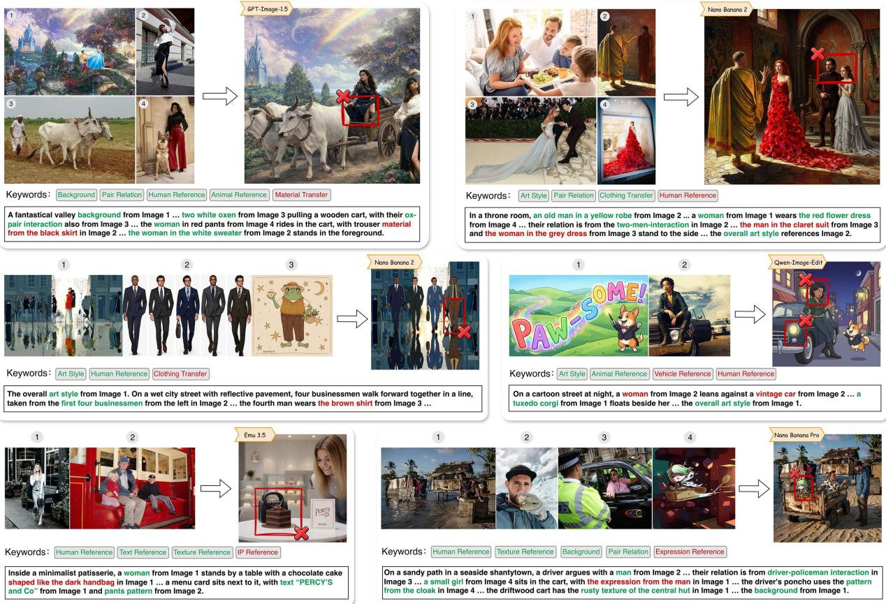  
Figure 1: Representative TRACE-Bench cases. Green/red tags indicate satisfied/failed requirements; red boxes localize failures.

## Abstract

Despite recent advances in unified multimodal models for multireference image generation, existing benchmarks remain organized around predefined task types (e.g., “subject composition”), which are ill-suited to this combinatorial setting and lead to fragmented coverage, uncontrolled complexity, and little diagnostic value. Recognizing that diverse multi-reference tasks share a common set of atomic operations, we adopt a capability-oriented perspective and formalize four operators: Anchor (� ), Disentangle (�), Apply (⊕), and Compose (�). Any multi-reference prompt can then be represented as a compositional formula over these operators, whose structural complexity is quantified by the number of operator slots. Building on this formulation, we construct TRACE-Bench, comprising approximately 1,600 evaluation cases across slot counts 1–8, built from 631 formula templates and around 4,000 reference images spanning diverse artistic styles and real-world subjects. The formula structure directly drives an operator-aligned evaluation protocol for per-capability scoring and a diagnostic tree analysis for recursive failure localization. Evaluating 9 leading models reveals insights invisible to holistic scoring: the primary bottleneck lies in disentanglement (�) and attribute binding (⊕) rather than scene-level composition (�), with even the best model scoring only 0.74 on attribute fidelity. Project page: https://amuseum-whr.github.io/TraceBench

## 1 Introduction

Text-to-image generation [5, 44] has achieved remarkable success, yet text alone is often insuficient to convey precise visual details. This limitation has motivated reference-based image generation, which allows users to ground outputs in user-provided visual content. A particularly challenging extension is multi-reference gen eration, where models must jointly condition on multiple visual elements—a capability essential to real-world workflows such as virtual try-on, group photo composition, and multi-source creative design. Recent models, both proprietary (GPT-Image-1.5 [36], Nano Banana 2 [41]) and open-source (OmniGen2 [56], Emu3.5 [3], Qwen-Image-Edit [55]), have demonstrated strong capabilities in following instructions that combine entities, attributes, and styles from diferent sources.

On the evaluation side, while existing benchmarks have extensively addressed text-to-image alignment [10, 13] and single-image editing [58, 72], evaluation of multi-reference generation remains in its early stages. Recent eforts like MultiBanana [37], MICON-Bench [57], and MacroBench [2] have pioneered this direction. However, while these works cover more complex reference settings, they do not fundamentally rethink the underlying evaluation structure. Following the design of earlier generation and editing benchmarks, they still organize test cases around predefined task types (e.g., “object composition”). In the combinatorial setting of multi-reference generation, this task-oriented organization exposes three critical limitations. (1) Incomplete coverage: predefined task categories cannot scale to the full combinatorial space of practical multi-reference usage. (2) No failure diagnosis: holistic task-level scoring cannot pinpoint which specific capability is responsible for a failure; for example, if a model fails to generate a person wearing a referenced outfit, a single score cannot reveal whether the failure stems from misidentifying the person, incorrectly extracting the outfit, or wrongly binding the outfit to the target. (3) Uncontrolled complexity: without a unifying structure that formally characterizes each case, it is dificult to systematically control or compare structural complexity across scenarios.

These limitations motivate us to rethink the evaluation of multireference generation from a capability-oriented perspective. Our key observation is that seemingly diverse multi-reference generation tasks share a common set of atomic operations. Consider a prompt such as “Generate a scene containing the blue car from [Image 1] and a cofee cup decorated with the floral pattern worn by the woman on the right in [Image 2], with the cup placed on a table to the lower right ofthe car.” As illustrated in Fig. 2, fulfilling this prompt requires the model to first anchor the intended blue car from a visually cluttered reference image while preserving its identity-defining characteristics; disentangle the floral pattern worn by the woman on the right, separating this transferable attribute from its original carrier; apply the disentangled pattern to a new carrier (the cofee cup), binding the extracted attribute to a target instance; and finally compose the anchored car together with the modified cup into a coherent scene, with the cup placed on a table to the lower right of the car. We formalize these as four capability operators: Anchor (�), Disentangle (�), Apply (⊕), and Compose (�). This capability-oriented formulation naturally overcomes the three limitations of task-oriented evaluation identified above. (1) Any complex multi-reference prompt can be expressed as a compositional formula over these operators, elegantly covering the infinite combinatorial space of real-world usage without needing ad-hoc task labels. (2) This formulation enables operatoraligned evaluation: rather than assigning a holistic score, we can precisely diagnose which capability (e.g., identity preservation in � or attribute exclusivity in ⊕) caused a failure. (3) The referenceconditioned structural complexity of any test case can be rigorously quantified and systematically controlled by the number of operator slots in its underlying formula. Moreover, common applications such as virtual try-on and group photo layout emerge naturally as specific instantiations of this compositional framework, demonstrating its expressiveness and practical coverage.

Table 1: Operator-aligned evaluation dimensions.
<table><tr><td>Operator</td><td>Dimension</td><td>Criteria</td></tr><tr><td>f : Anchor</td><td>Identity</td><td>Existence; appearance consistency with the reference</td></tr><tr><td>g : Disentangle Attribute</td><td></td><td>Presence; consistency with the ref-</td></tr><tr><td>⊕ : Apply</td><td>Fidelity Binding</td><td>erence source Carrier integrity; attribute exclu-</td></tr><tr><td></td><td></td><td>sivity; natural integration</td></tr><tr><td>C : Compose</td><td>Composition</td><td>Coexistence; relation satisfaction; spatial coherence; no duplication or leakage</td></tr></table>

Building on this formulation, we construct TRACE-Bench, a capability-oriented benchmark for multi-reference image generation. TRACE-Bench comprises approximately 1,600 cases built from 631 formula templates involving around 4,000 reference images, with slot counts ranging from 1 to 8 for systematic control over structural complexity. We collect reference images from multiple complementary sources spanning diverse artistic styles and real-world subjects, and apply structured tagging to extract entities and attributes in a fine-grained hierarchy for formula-driven prompt construction. Each sampled formula template is realized as a natural-language prompt by a vision-language model (VLM), and paired with an operator-aligned evaluation checklist scored by a VLM judge. As summarized in Table 1, this checklist associates each capability with a corresponding evaluation dimension and a set of fine-grained criteria. Fig. 1 shows representative benchmark cases and their operator-aligned evaluation results. Beyond case-level scoring, TRACE-Bench further supports diagnostic tree analysis, which recursively decomposes complex failure cases into simpler sub-cases to identify the responsible source of failure.

We evaluate 9 leading proprietary and open-source models on TRACE-Bench. Our operator-level analysis yields two key insights not captured by conventional holistic scoring. First, the primary bottleneck in current models lies in attribute disentanglement (�) and attribute binding (⊕) rather than scene-level composition (�), indicating that precise reference transfer remains substantially harder than plausible scene arrangement. Second, anchor dificulty is driven more by the number of entities in the reference image than by formula slot count, suggesting that reference-image clutter, not task structure, is the dominant source of error.

Our contributions are summarized as follows:

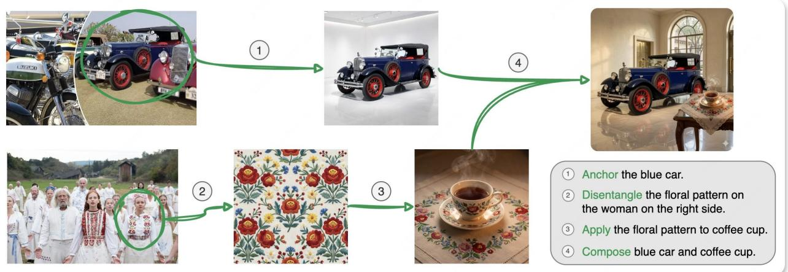  
Figure 2: A multi-reference request in TRACE-Bench is progressively resolved through Anchor, Disentangle, Apply, and Compose.

• We propose a capability-oriented formulation that decomposes reference-based image generation into four atomic operators, with a compositional formula for systematically characterizing diverse multi-reference settings.

• We construct TRACE-Bench, a benchmark of approximately 1,600 cases with slot-based complexity control (slot 1–8), built from 631 formula templates and around 4,000 reference images.

• We design an operator-aligned evaluation protocol and a diagnostic tree analysis method that enable fine-grained, per-capability assessment and failure localization.

• We benchmark 9 leading models and reveal that the primary bottleneck lies in attribute disentanglement and attribute binding rather than scene-level composition, among other insights invisible to holistic scoring.

## 2 Related Work

## 2.1 Reference-Based Image Generation

Early text-to-image models [42, 44] generate images purely from text prompts, ofering limited control over fine-grained visual details. To address this, reference-based methods enable users to condition generation on visual examples. DreamBooth [46] and Textual Inversion [9] fine-tune or learn embeddings from a small set of reference images to capture subject identity. ControlNet [70] and IP-Adapter [67] introduce auxiliary conditioning branches that accept spatial or semantic signals from a single reference image without fine-tuning.

While these methods achieve strong results in single-reference settings, they are not inherently designed for multi-reference generation, where inputs from several images must be jointly processed. Early multi-subject methods such as Custom Difusion [19] and FastComposer [60] extend personalization to multiple concepts but still require per-subject optimization or rely on localized attention mechanisms tied to a fixed set of subjects. More recently, unified multimodal models have emerged that natively support interleaved image-text inputs, enabling flexible multi-reference generation within a single forward pass. Proprietary systems such as

GPT-Image-1.5 [36] and the Nano Banana series [7, 40, 41] demonstrate strong multi-reference capabilities. On the open-source side, OmniGen2 [56], BAGEL [4], and Emu3.5 [3] adopt unified architectures that jointly handle understanding and generation; FLUX.1 Kontext [1], Qwen-Image-Edit [55], and FireRed Image Edit [48] support instruction-based generation and editing conditioned on reference images; DeepGen [50] and UniReason [51] emphasize lightweight and reasoning-centered unification of generation and editing. As these models grow increasingly capable, how to rigorously evaluate their multi-reference abilities at a fine-grained capability level remains an open challenge.

## 2.2 Multi-Reference Generation Benchmarks

Extensive benchmarks already exist for text-to-image alignment [10, 12, 13, 23] and single-image editing [15, 58, 72], yet evaluation of multi-reference generation remains nascent. MultiBanana [37] scales evaluation to 8 reference images and introduces dificulty factors such as domain mismatch and rare concepts. MICON-Bench [57] defines six compositional tasks for multi-image context generation. OmniContext [56] introduces 8 task categories for in-context generation, though its scope is limited to relatively simple subject-centric compositions. MacroBench [2] provides 4,000 samples across four task dimensions with up to 10 references.

Despite expanding the scope and scale of multi-reference evaluation, these benchmarks share a common design philosophy: organizing test cases around predefined task types or surface-level dificulty factors, and assessing results with holistic scores or coarse metrics such as FID [11] and CLIP similarity [39]. Although recent evaluation practices have advanced towards VLM-as-a-judge protocols [18] and structured checklist questions [23, 54], the underlying benchmark design still lacks two critical properties: it cannot systematically control evaluation complexity across structurally diferent cases, and it cannot localize failures to specific capability dimensions or distinguish standalone weaknesses from cross-reference interference. TRACE-Bench addresses both gaps by decomposing multi-reference generation into four atomic capability operators and using their compositional structure as the unified basis for benchmark construction, operator-aligned evaluation, and diagnostic failure analysis.

## 3 TRACE-Bench

## 3.1 Overview

Evaluating multi-reference image generation requires both diverse test cases and a structured representation of what each case demands. TRACE-Bench therefore couples capability-oriented benchmark construction with operator-aligned evaluation. Sec. 3.2 introduces the four core operators, and Sec. 3.3 defines the compositional formula that structures each prompt. Secs. 3.4 and 3.5 then detail benchmark construction and operator-aligned evaluation.

## 3.2 Capability Decomposition

A key dificulty in benchmarking multi-reference image generation is that holistic scores can obscure fine-grained task failures [10], while general perceptual quality can diverge from source-conditioned validity [45], making it hard to identify whether a failure comes from poor image generation or incorrect use of the references. To trace a model’s reference ability more explicitly, we decompose it into four core capabilities: Anchor, Disentangle, Apply, and Compose. Let � denote a reference image, � an entity in a reference image, $\varepsilon$ a referenced entity set, and � a referenced attribute. We use $T _ { e }$ to denote an entity specified in the text prompt.

• Anchor � (�, �): locating a specific entity � in reference image � and preserving its identity-defining visual information in the generated image. For example, $f ( I _ { 1 }$ , person) denotes the person in Image 1 as the target entity to preserve.

• Disentangle $g ( I , { \mathcal { E } } , a ) ;$ : extracting a referenced attribute � from entity set E in image �, while decoupling it from irrelevant properties. Here, E may contain a single entity or multiple entities, depending on the attribute type. For example, in Case 1 of Fig. 4, $g ( I _ { 1 } , \{ r o \mathsf { b e } \}$ , pattern) denotes extracting only the decorative pattern on the robe in Image 1, while discarding the robe’s shape and the identity of the camel wizard wearing it.

• Apply ⊕: binding a disentangled attribute to a designated entity. The designated entity may be either an anchored entity $f ( \cdot )$ from reference images or an entity specified in the text prompt. For example, $T _ { e } \oplus g _ { 1 }$ denotes applying the extracted attribute $g _ { 1 }$ to the text-described entity $T _ { e }$ (e.g., applying the running pose of the man from Image 1 to a robot).

• Compose $C ( \cdot ) { \mathrm { : } }$ : arranging multiple referenced or text-specified contents into a coherent scene, optionally under additional relational constraints. For example, $C ( f _ { 1 } , T _ { e } \oplus g _ { 1 } ) \oplus g _ { \mathrm { r e l } }$ denotes composing the anchored entity $f _ { 1 }$ with a text-described entity $T _ { e }$ modified by $g _ { 1 }$ , while further enforcing a referenced relation $g _ { \mathrm { r e l } } ~ = ~ g ( I _ { 3 } , \{ e _ { i } , e _ { j } \} , a _ { \mathrm { r e l } } )$ between them. If the desired relation is specified in the text prompt rather than referenced from an image, we denote it by $T _ { \mathrm { r e l } }$

These four operators form the atomic capability space of multireference generation, but a real prompt typically nests several of them at once. We next organize such nested structure into a com positional formula.

## 3.3 Formula Composition

The four operators of Sec. 3.2 give us the atomic vocabulary, but describing how a real case combines them purely in natural language leaves the underlying structure implicit: which references are involved, how they interact, and how dificult the overall case is are all buried inside free-form text. We therefore represent each prompt’s reference-conditioned part as a compositional formula over these operators. Making this structure symbolic turns each case into a shared backbone that the rest of TRACE-Bench builds on: its operator terms can be systematically enumerated to form a template space of diverse cases, the number of reference-dependent terms provides a controllable measure of structural complexity, and each operator instance seeds an evaluation question aligned with the corresponding capability. The formula only captures referenceconditioned content, namely which entities are anchored, which attributes are disentangled, where they are applied, and how the resulting contents are composed. Text-only descriptions that do not depend on any reference stay in natural language.

We organize the formula from local to global with three levels: entity expressions (single target objects) → scene expressions (compositions of entities) → the complete prompt formula (entire reference-conditioned structure).

Entity Expressions. An entity expression � describes a target subject in the generated image. It may be an anchored reference entity $f ,$ a text-specified carrier modified by a disentangled attribute $T _ { e }$ ⊕<sub>�</sub>, or an existing entity expression further augmented with additional attributes, written as $E \oplus g .$ . Thus, the entity level answers what each generated subject is and which reference-derived attributes are bound to it.

Scene Expressions. A scene expression � composes multiple entity expressions through $C ( E _ { 1 } , E _ { 2 } , \ldots , E _ { n } )$ , optionally together with a relation term. The relation may be specified by text, $T _ { \mathrm { r e l } } .$ , or extracted from a reference image, $g _ { \mathrm { r e l } } .$ . When a referenced relation applies only to a subset of entities, we represent that subset as a nested subscene such as $C ( E _ { i } , E _ { j } )$ ⊕ $\scriptstyle g _ { \mathrm { r e l } } .$ , and then compose it into the larger scene. The scene level therefore answers how the target objects coexist and interact.

Complete Prompt Formulas. A complete prompt formula � further augments the scene expression � with optional global reference conditions, such as style, lighting, layout, or color tone, denoted by $g _ { \mathrm { g l o b a l } } .$ For example, $\boldsymbol { F } = C \left( C ( f _ { 1 } , T _ { e } \oplus g _ { 1 } ) \oplus g _ { \mathrm { r e l } } , f _ { 2 } \oplus g _ { 2 } \oplus g _ { 3 } \right)$ ⊕<sub>�global</sub>. Here, the inner composition groups two entities $( f _ { 1 }$ and $T _ { e } \oplus g _ { 1 } )$ under $\boldsymbol { g } _ { \mathrm { r e l } }$ , the outer composition combines this sub-scene with another attribute-modified entity $\left( f _ { 2 } \oplus g _ { 2 } \oplus g _ { 3 } \right)$ , and the final globa term applies a scene-level reference condition. We use this formula as the canonical structure for benchmark construction and evaluation. For readability, Fig. 4 also presents the same formula as a noun-based expression while preserving the underlying structure.

## 3.4 Benchmark Construction

The remaining question is how to instantiate many diverse formulas into concrete benchmark prompts. To this end, we design a structured construction pipeline that combines multi-source image curation, structured tagging, balanced sampling, formula-template sampling, and prompt generation. Fig. 3 illustrates the overall pipeline, and we describe its stages below.

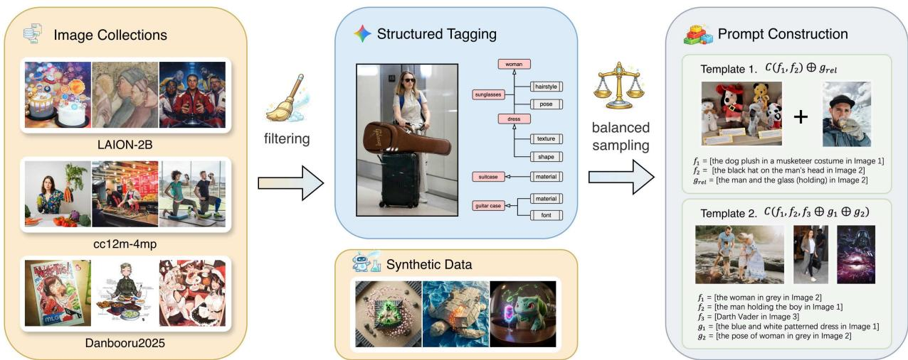  
Figure 3: Overview of the benchmark construction pipeline. Candidate images are first collected and filtered from multiple sources, then annotated through structured tagging. The tagged pool is then balanced through source-wise sampling and augmented with synthetic data. It is subsequently used for formula-template sampling and prompt construction.

Image Collection and Filtering. We collect candidate reference images from three complementary sources: Danbooru2025 [49], a large-scale anime and illustration dataset with rich stylistic diversity and well-defined character designs; LAION-2B-en-Aesthetics [20], a subset of LAION-5B covering diverse internet image-text data; and cc12m-4mp-realistic [35], a human-focused subset of Conceptual Captions that strengthens coverage of real human subjects. We then apply source-specific filtering: for Danbooru, we retain only images with score > 26.15 that satisfy the safety filter; for LAION, we retain only samples with aesthe $\ t i c > 6 . 5$ and similarity > 30. After filtering, we sample approximately 50,000 candidate images spanning diverse artistic styles and visual themes.

Structured Tagging. Each image is annotated by a Gemini-2.5- pro-based tagging pipeline that summarizes foreground entities and their associated attributes in a structured form. Entities are assigned category labels from a predefined ontology, including Human, Animal, Object, Food, Clothing, Transportation, Structure, and Text. Attributes are organized into four layers—Appearance, Form, Dynamics, and Global—each further divided into finer-grained sub categories. In addition, each entity is associated with a grounding phrase for localizing it in the image, and each attribute is accompanied by a short textual description to facilitate downstream prompt construction.

Balanced Sampling. Since category and attribute distributions differ substantially across sources, we perform source-wise balanced sampling to improve long-tail coverage. For each source, each candidate image is represented by a feature vector $\mathbf { x } _ { i }$ derived from the tagging results. We then greedily select samples according to

$$
i ^ { \star } = \arg \operatorname* { m a x } _ { i } \mathbf { x } _ { i } ^ { \top } \mathbf { w } ^ { ( t ) } , \qquad w _ { j } ^ { ( t ) } = \frac { 1 } { 1 + c _ { j } ^ { ( t ) } } ,\tag{1}
$$

where $\mathbf { c } ^ { ( t ) }$ denotes the accumulated feature counts of the selected subset at iteration �. This helps to yield a more balanced reference pool while preserving visual diversity. Balanced sampling selects approximately 4,000 images (about 8% of the candidate pool), after which full manual image-quality inspection retains 3,839 images. We further augment the pool with about 200 synthetic samples generated by Nano Banana Pro to supplement rare cases.

Structural Complexity Control. Each benchmark prompt is associated with a compositional formula, and we use its slot count as a controllable measure of structural complexity:

$$
\mathrm { s l o t } ( F ) : = | f | + | g | ,\tag{2}
$$

where |� | and |�| count anchored and disentangled terms in � , respectively; slot count measures formula structure rather than fully determining case dificulty. TRACE-Bench covers slots 1–8, from simple single-reference to highly compositional cases. For example, formula �(� , $T _ { e } \oplus g _ { 1 } \oplus g _ { 2 } )$ ⊕ $g _ { \mathrm { g l o b a l } }$ is a slot-4 case.

Template Sampling. We first construct each benchmark instance as a formula template composed of the operators defined above. In the standard case, both $f$ and $g$ are sampled from the structured tagging results. To better cover practical applications, we further introduce two special designs in which an anchored instance $f$ is used as an attribute-like reference term �: attachment reference $( g _ { \mathrm { a t t a c h } } )$ where a referenced instance serves as an attachable component of another entity, and IP-style reference $( g _ { \mathrm { i p } } ) ,$ where the holistic design identity is transferred to another entity. Across all slot levels, we sample from the template space under controlled distributions.

Prompt Generation. Each sampled template is paired with tagged reference images and fed into a VLM (Gemini-2.5-Pro) through a customized prompting interface, which realizes it as a naturallanguage prompt. We require that the resulting prompt describe a coherent scene, clearly bind each reference to a specific target, and use every referenced image at least once. For quality control, we first use GPT-5.4 to filter out 4.3% of the constructed prompts. We then manually inspect the remaining cases and remove another 9%. For each benchmark prompt, we additionally construct a text-only counterpart in which all image-referenced descriptions are replaced by textual ones, providing a no-reference baseline.

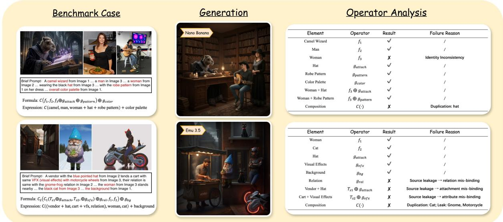  
Figure 4: Representative operator-aligned evaluation examples from TRACE-Bench. Each row shows one benchmark case with its references, brief prompt, compositional formula, readable expression, generated result, and operator-level analysis. The examples illustrate how formula terms are mapped to capability-specific checks and how failures such as identity mismatch, duplication, and leakage-induced mis-binding can be localized.

Benchmark Statistics. For the general benchmark, we construct 180 cases for each slot level, and further include several applicationspecific cases. In total, the benchmark contains approximately 1,600 cases, built from 631 distinct formula templates and involving around 4,000 reference images.

## 3.5 Evaluation Protocol

Operator-Aligned Question Generation. Our formula-based construction explicitly grounds each referenced term to its source image, enabling evaluation questions to be derived automatically from the formula structure. Rather than assigning a single holistic score to the generated result, we decompose evaluation into operator-aligned question sets following Table 1.

Specifically, anchor (f) evaluates entity existence and consistency; disentangle (g) evaluates attribute existence and consistency; apply (⊕) evaluates binding correctness and integration quality; and compose (C) evaluates compositional coherence and the absence of anomalies such as duplication or leakage.

VLM-BasedJudging. A representative evaluation example is shown in Fig. 4. For each benchmark sample, we assess referenced entities with �, referenced attributes with �, attribute application with ⊕, and scene composition with �. All questions are scored in a binary manner by a VLM judge (Gemini-2.5-Pro), which receives the reference images, the generated image, and the operator-aligned question set, and outputs a pass/fail decision for each question.

Evaluation Metrics. For each operator instance, we instantiate a set of fine-grained evaluation questions that assess complementary aspects of the same capability. Their scores are normalized such that the aggregate contribution of each operator instance equals 1.

Case-level scores are then obtained by aggregating the normalized scores across all operator instances in the case.

Diagnostic Tree Analysis. Diagnostic-tree decomposition reverses the local-to-global formula construction introduced in Sec. 3.3. Starting from the complete formula at the root, we progressively remove full-prompt-level terms to recover the underlying scene expression, separate the scene into entity expressions, and simplify multi-attribute bindings until each leaf contains a single anchored entity � or an atomic attribute transfer � ⊕ �. Whenever referenceconditioned content is removed, it is replaced with a corresponding text-only description to preserve the original prompt context. The resulting sub-cases form a tree. Evaluating and comparing its nodes allows us to localize the source of a failure observed at the root, as illustrated by the decomposition of a slot-4 formula in Fig. 5. The complete construction rules are detailed in Appendix C.2.

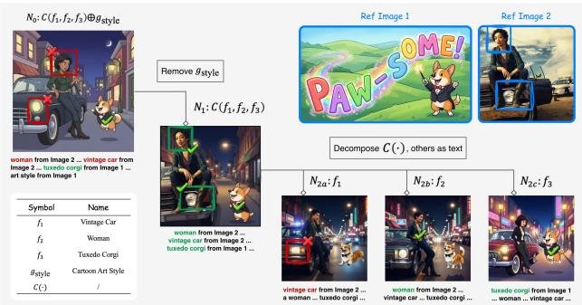  
Figure 5: Representative diagnostic tree analysis case.

Table 2: Overall results on TRACE-Bench averaged over slots 1–8. Avg. denotes the mean of the four operator-aligned metrics. Best results are in bold and second-best results are highlighted with a gray background.
<table><tr><td>Model</td><td>Anchor (f)</td><td>Disentangle (g)</td><td>Apply (⊕)</td><td>Compose (C)</td><td>Avg.</td><td>CLIP Sim</td></tr><tr><td>GPT-Image-1.5</td><td>0.7649</td><td>0.6890</td><td>0.7541</td><td>0.9259</td><td>0.8118</td><td>0.2969</td></tr><tr><td>Nano Banana</td><td>0.7650</td><td>0.6786</td><td>0.7631</td><td>0.8975</td><td>0.7981</td><td>0.2867</td></tr><tr><td>Nano Banana 2</td><td>0.7724</td><td>0.7384</td><td>0.7989</td><td>0.9100</td><td>0.8205</td><td>0.2944</td></tr><tr><td>Nano Banana Pro</td><td>0.7488</td><td>0.7148</td><td>0.7869</td><td>0.9214</td><td>0.8172</td><td>0.2962</td></tr><tr><td>Emu3.5</td><td>0.6587</td><td>0.4982</td><td>0.5434</td><td>0.7871</td><td>0.6561</td><td>0.2917</td></tr><tr><td>FireRed Image Edit 1.1 [6, 48]</td><td>0.6348</td><td>0.4703</td><td>0.4258</td><td>0.7218</td><td>0.5889</td><td>0.2603</td></tr><tr><td>Qwen-Image-Edit-2509</td><td>0.5210</td><td>0.3755</td><td>0.3282</td><td>0.7627</td><td>0.5483</td><td>0.2742</td></tr><tr><td>Qwen-Image-Edit-2511</td><td>0.6009</td><td>0.4097</td><td>0.3742</td><td>0.7776</td><td>0.5858</td><td>0.2758</td></tr><tr><td>OmniGen2 [56]</td><td>0.5635</td><td>0.3719</td><td>0.3195</td><td>0.7070</td><td>0.5348</td><td>0.2693</td></tr></table>

## 4 Experiments

## 4.1 Experimental Setup

Baselines. We compare against 9 representative baselines, including 4 proprietary models and 5 open-source models. The proprietary models are GPT-Image-1.5 [36], Nano Banana [7], Nano Banana Pro [40], and Nano Banana 2 [41]. The open-source models are Emu3.5 [3], FireRed Image Edit 1.1 [6, 48], Qwen-Image-Edit [38, 55] with two released versions (2509 and 2511), and OmniGen2 [56]. Evaluation Setup. Unless otherwise specified, all reported scores are computed on the full benchmark. Operator-aligned evaluation uses Gemini-2.5-Pro as the VLM judge. We retain a text-only prompt for each case and additionally report text-image similarity computed by CLIP ViT-L/14 [39] as a supplementary metric.

## 4.2 Overall Evaluation

Using the operator-aligned checklist in Sec. 3.5, we evaluate all baselines on TRACE-Bench. Table 2 reports the overall results. Proprietary models consistently outperform open-source baselines, with Nano Banana 2 achieving the best average score. However, the task is still far from solved. Since each operator score is normalized to an ideal value of 1, even the best model remains well below saturation: 0.7724 on anchor, 0.7384 on disentangle, 0.7989 on apply, and 0.9100 on compose.

The largest gaps appear on disentangle and apply, namely � and ⊕. Even the strongest models remain far below 1 on these dimensions, showing that correct attribute extraction and target assignment are still the main bottlenecks. Composition is relatively stronger: GPT-Image-1.5 reaches 0.9259 on �. Anchor is also more stable, but the best score is still only 0.7724.

Among open-source models, Emu3.5 performs best overall. Qwen-Image-Edit-2511 improves over Qwen-Image-Edit-2509 on all four metrics. Still, all open-source baselines remain substantially behind the leading proprietary systems, especially on � and ⊕. CLIP sim ilarity follows a similar ranking trend, but it is less sensitive to whether the referenced content is transferred to the correct target. Qualitative Case Analysis. Fig. 4 shows two representative cases from TRACE-Bench: one generated by Nano Banana and the other by Emu3.5. These examples illustrate the value of such fine-grained evaluation. In the Nano Banana case, the generated image appears plausible overall, but the analysis reveals an identity mismatch for the referenced woman and a composition error caused by hat duplication. In the Emu3.5 case, the referenced woman, cat, hat, visual efects, and background are all present in the scene, but the referenced relation and attribute application both fail because of source leakage. These examples show that TRACE-Bench can localize specific failure modes rather than collapsing them into a single overall judgment.

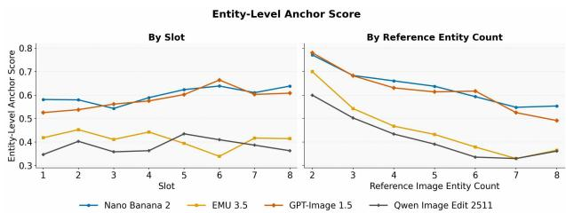  
Figure 6: Anchor performance versus template slot count (left) and reference-image entity count (right).

Anchor Under Diferent Dificulty Factors. To illustrate how diferent sources of dificulty can afect a specific capability, we take anchor as an example and compare its performance by slot level and by the number of entities in the reference image. As shown in Fig. 6, anchor performance varies only weakly across slot levels, but declines more clearly as the reference image contains more entities. This suggests that, for anchor, reference-image complexity is a more direct source of dificulty than slot count alone. More broadly, it highlights the value of operator-level analysis in TRACE-Bench: even when two cases have similar overall structural complexity, they may difer substantially in the dificulty of a specific capability.

## 4.3 Application-Oriented Analysis

During formula-template sampling and prompt construction, we observe that many common applications can be naturally expressed within our compositional framework. Rather than defining them as separate task types, we treat them as particular instantiations of the same core operators. Figure 7 illustrates two representative examples: virtual try-on and group-photo layout.

Virtual Try-On. Virtual try-on binds one or more clothing-related references to a target person:

$$
f ( { \mathsf { p e r s o n } } ) \oplus g _ { \mathrm { a t t a c h , 1 } } \oplus g _ { \mathrm { a t t a c h , 2 } } \oplus \cdots .\tag{3}
$$

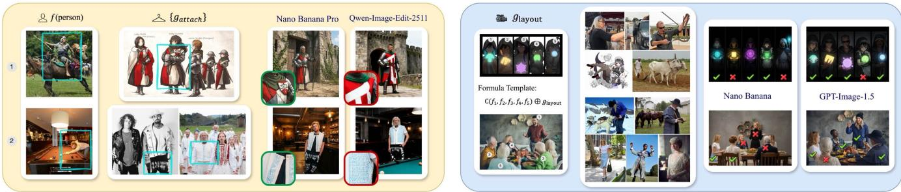  
Figure 7: Formula abstractions and representative results for virtual try-on (left) and group-photo layout (right).

This pattern covers diferent numbers and types of garments. In the left example of Fig. 7, the successful result preserves both the target person and the referenced clothing, whereas the failed result transfers incorrect garment attributes.

Group Photo Layout. Group-photo layout composes multiple anchored subjects under a shared layout reference:

$$
C ( f _ { 1 } , f _ { 2 } , \ldots , f _ { n } ) \oplus g _ { \mathrm { l a y o u t } } .\tag{4}
$$

The same pattern extends to diferent group sizes and spatial arrangements. As shown on the right, satisfying the shared layout may cause identity loss or subject duplication.

Table 3: Distribution of diagnostic outcomes across 200 cases.
<table><tr><td>Outcome / Source</td><td> $f$ </td><td>g</td><td>⊕</td><td>C</td><td>Overall</td></tr><tr><td>Stable Success</td><td>27.9</td><td>27.6</td><td>38.9</td><td>45.2</td><td>33.7</td></tr><tr><td>Persistent Failure</td><td>4.7</td><td>13.2</td><td>7.3</td><td>12.9</td><td>9.8</td></tr><tr><td>Global Reference</td><td>14.0</td><td>10.5</td><td>9.1</td><td>29.0</td><td>13.7</td></tr><tr><td>Joint Composition</td><td>48.8</td><td>43.4</td><td>41.1</td><td>9.7</td><td>38.5</td></tr><tr><td>Relation / Attribute</td><td>4.7</td><td>5.3</td><td>3.6</td><td>3.2</td><td>4.4</td></tr></table>

## 4.4 Diagnostic Tree Analysis

In Fig. 1, the Qwen-Image-Edit-2511 example fails on the woman and the vintage car. To better understand these errors, we further analyze this case with the diagnostic tree in Fig. 5, where we decompose the original formula into simpler sub-cases and evaluate the model on each node

Two distinct patterns emerge. For $f _ { 2 } ,$ , the woman is correct in $N _ { 1 }$ and $N _ { 2 b }$ , but becomes inconsistent in $N _ { 0 } .$ . This indicates that $f _ { 2 }$ itself is not the problem; rather, identity information is lost when the global style constraint is introduced. For $f _ { 1 ; }$ , the vintage car already changes in $N _ { 2 a } ,$ showing that this anchor is intrinsically harder. Yet it is preserved in $N _ { 1 }$ , suggesting that jointly referencing the interacting subject $f _ { 2 }$ can reinforce its identity.

This example shows that the diagnostic tree can distinguish two failure sources within the same case: style-induced interference for $f _ { 2 }$ , and intrinsic anchor dificulty for $f _ { 1 } ,$ , which is partially alleviated under composition.

Aggregate Diagnostic Patterns. We construct diagnostic trees for 200 Emu3.5 cases, generate an image at every node, and score each node using the operator-aligned evaluation. For each operator instance that fails at the root, we identify the first decomposition step at which it passes and attribute the failure to the referenceconditioned component removed at that step. Instances whose outcomes remain unchanged throughout the tree are categorized as Stable Success or Persistent Failure.

As shown in Table 3, joint-composition interference is the dominant localized source for �, �, and ⊕. This indicates that Emu3.5 often preserves isolated reference content but loses it when multiple reference-conditioned entities are composed. In contrast, failures in � are most frequently localized to global-reference interference (29.0%), suggesting that global style or scene constraints are a major source of compositional disruption. Overall, most localized failures arise from interactions introduced at higher compositional levels rather than from persistent failure on isolated reference units.

## 5 Conclusion

We presented TRACE-Bench, a capability-oriented benchmark for multi-reference image generation. Rather than organizing evaluation around predefined task types, we decompose multi-reference generation into four atomic operators (Anchor, Disentangle, Apply, Compose). Their compositional structure serves as the unified basis for benchmark construction, operator-aligned evaluation, and diagnostic tree analysis. Evaluation of 9 leading models reveals that the primary bottleneck lies in attribute disentanglement (�) and binding (⊕) rather than scene-level composition (�), and that diagnostic tree analysis can efectively separate cross-reference interference from standalone capability deficits. In the future, we hope the capability-oriented formulation can serve not only as an evaluation tool but also as a guide for targeted model improvement.

## Acknowledgments

This work was supported by the National Natural Science Foundation ofChina (No. 62302297, 72192821, 62472282, 62272447, 62472285), the Fundamental Research Funds for the Central Universities (project number: YG2023QNA35), YuCaiKe [2023] Project Number: 231111310300.

## References

[1] Black Forest Labs, Stephen Batifol, Andreas Blattmann, Frederic Boesel, Saksham Consul, Cyril Diagne, Tim Dockhorn, Jack English, Zion English, Patrick Esser, Sumith Kulal, Kyle Lacey, Yam Levi, Cheng Li, Dominik Lorenz, Jonas Müller, Dustin Podell, Robin Rombach, Harry Saini, Axel Sauer, and Luke Smith. 2025. FLUX.1 Kontext: Flow Matching for In-Context Image Generation and Editing in Latent Space. arXiv preprint arXiv:2506.15742 (2025).

[2] Zhekai Chen, Yuqing Wang, Manyuan Zhang, and Xihui Liu. 2026. MACRO: Advancing Multi-Reference Image Generation with Structured Long-Context Data. arXiv preprint arXiv:2603.25319 (2026).

[3] Yufeng Cui, Honghao Chen, Haoge Deng, Xu Huang, Xinghang Li, Jirong Liu, Yang Liu, Zhuoyan Luo, Jinsheng Wang, Wenxuan Wang, Yueze Wang, Chengyuan Wang, Fan Zhang, Yingli Zhao, Ting Pan, Xianduo Li, Zecheng Hao, Wenxuan Ma, Zhuo Chen, Yulong Ao, Tiejun Huang, Zhongyuan Wang, and Xinlong Wang. 2025. Emu3.5: Native Multimodal Models are World Learners. arXiv preprint arXiv:2510.26583 (2025).

[4] Chaorui Deng, Deyao Zhu, Kunchang Li, Chenhui Gou, Feng Li, Zeyu Wang, Shu Zhong, Weihao Yu, Xiaonan Nie, Ziang Song, Guang Shi, and Haoqi Fan. 2025. Emerging Properties in Unified Multimodal Pretraining. arXiv preprint arXiv:2505.14683 (2025).

[5] Patrick Esser, Sumith Kulal, Andreas Blattmann, Rahim Entezari, Jonas Müller, Harry Saini, Yam Levi, Dominik Lorenz, Axel Sauer, Frederic Boesel, Dustin Podell, Tim Dockhorn, Zion English, and Robin Rombach. 2024. Scaling Rectified Flow Transformers for High-Resolution Image Synthesis. In Proceedings ofthe 41st International Conference on Machine Learning.

[6] FireRedTeam. 2026. FireRed-Image-Edit. https://github.com/FireRedTeam/ FireRed-Image-Edit.

[7] Alisa Fortin, Guillaume Vernade, Kat Kampf, and Ammaar Reshi. 2025. Introducing Gemini 2.5 Flash Image, our state-of-the-art image model. https: //developers.googleblog.com/en/introducing-gemini-2-5-flash-image/.

[8] Samir Yitzhak Gadre, Gabriel Ilharco, Alex Fang, Jonathan Hayase, Georgios Smyrnis, Thao Nguyen, Ryan Marten, Mitchell Wortsman, Dhruba Ghosh, Jieyu Zhang, Eyal Orgad, Rahim Entezari, Giannis Daras, Sarah Pratt, Vivek Ramanu jan, Yonatan Bitton, Kalyani Marathe, Stephen Mussmann, Richard Vencu, Mehdi Cherti, Ranjay Krishna, Pang Wei Koh, Olga Saukh, Alexander J. Ratner, Shuran Song, Hannaneh Hajishirzi, Ali Farhadi, Romain Beaumont, Sewoong Oh, Alex Dimakis, Jenia Jitsev, Yair Carmon, Vaishaal Shankar, and Ludwig Schmidt. 2023. DataComp: In search of the next generation of multimodal datasets. In Advances in Neural Information Processing Systems (NeurIPS).

[9] Rinon Gal, Yuval Alaluf, Yuval Atzmon, Or Patashnik, Amit H. Bermano, Gal Chechik, and Daniel Cohen-Or. 2023. An Image is Worth One Word: Personalizing Text-to-Image Generation using Textual Inversion. In Proceedings of the International Conference on Learning Representations (ICLR).

[10] Dhruba Ghosh, Hannaneh Hajishirzi, and Ludwig Schmidt. 2023. GenEval: An Object-Focused Framework for Evaluating Text-to-Image Alignment. In Advances in Neural Information Processing Systems (NeurIPS).

[11] Martin Heusel, Hubert Ramsauer, Thomas Unterthiner, Bernhard Nessler, and Sepp Hochreiter. 2017. GANs Trained by a Two Time-Scale Update Rule Converge to a Local Nash Equilibrium. In Advances in Neural Information Processing Systems.

[12] Xiwei Hu, Rui Wang, Yixiao Fang, Bin Fu, Pei Cheng, and Gang Yu. 2024. ELLA: Equip Difusion Models with LLM for Enhanced Semantic Alignment. arXiv preprint arXiv:2403.05135 (2024).

[13] Kaiyi Huang, Kaiyue Sun, Enze Xie, Zhenguo Li, and Xihui Liu. 2023. T2I-CompBench: A Comprehensive Benchmark for Open-world Compositional Text-to-image Generation. In Advances in Neural Information Processing Systems (NeurIPS).

[14] Ziqi Huang, Yinan He, Jiashuo Yu, Fan Zhang, Chenyang Si, Yuming Jiang, Yuanhan Zhang, Tianxing Wu, Qingyang Jin, Nattapol Chanpaisit, Yaohui Wang, Xinyuan Chen, Limin Wang, Dahua Lin, Yu Qiao, and Ziwei Liu. 2024. VBench: Comprehensive Benchmark Suite for Video Generative Models. In Proceedings of the IEEE/CVF Conference on Computer Vision and Pattern Recognition (CVPR).

[15] Zhangqi Jiang, Zheng Sun, Xianfang Zeng, Yufeng Yang, Xuanyang Zhang, Yongliang Wu, Wei Cheng, Gang Yu, Xu Yang, and Bihan Wen. 2026. GEditBench v2: A Human-Aligned Benchmark for General Image Editing. arXiv preprint arXiv:2603.28547 (2026).

[16] Chen Ju, Haicheng Wang, Jinxiang Liu, Chaofan Ma, Ya Zhang, Peisen Zhao, Jianlong Chang, and Qi Tian. 2023. Constraint and Union for Partially-Supervised Temporal Sentence Grounding. arXiv preprint arXiv:2302.09850 (2023).

[17] Alexander Kirillov, Eric Mintun, Nikhila Ravi, Hanzi Mao, Chloe Rolland, Laura Gustafson, Tete Xiao, Spencer Whitehead, Alexander C. Berg, Wan-Yen Lo, Piotr Dollar, and Ross Girshick. 2023. Segment Anything. In Proceedings of the IEEE/CVF International Conference on Computer Vision (ICCV).

[18] Max Ku, Dongfu Jiang, Cong Wei, Xiang Yue, and Wenhu Chen. 2024. VIEScore: Towards Explainable Metrics for Conditional Image Synthesis Evaluation. In Proceedings of the 62nd Annual Meeting of the Association for Computational Linguistics (Volume 1: Long Papers).

[19] Nupur Kumari, Bingliang Zhang, Richard Zhang, Eli Shechtman, and Jun-Yan Zhu. 2023. Multi-Concept Customization of Text-to-Image Difusion. In Proceedings ofthe IEEE/CVF Conference on Computer Vision and Pattern Recognition (CVPR).

[20] LAION eV. 2025. laion2B-en-aesthetic. https://huggingface.co/datasets/laion/ laion2B-en-aesthetic.

[21] Jie Lei, Tamara L. Berg, and Mohit Bansal. 2021. Detecting Moments and Highlights in Videos via Natural Language Queries. In Advances in Neural Information Processing Systems (NeurIPS).

[22] Boyi Li, Kilian Q. Weinberger, Serge Belongie, Vladlen Koltun, and René Ranftl. 2022. Language-driven Semantic Segmentation. In International Conference on Learning Representations (ICLR).

[23] Ouxiang Li, Yuan Wang, Xinting Hu, Huijuan Huang, Rui Chen, Jiarong Ou, Xin Tao, Pengfei Wan, Xiaojuan Qi, and Fuli Feng. 2026. Easier Painting Than Thinking: Can Text-to-Image Models Set the Stage, but Not Direct the Play?. In International Conference on Learning Representations (ICLR)

[24] Jinxiang Liu, Chen Ju, Chaofan Ma, Yanfeng Wang, Yu Wang, and Ya Zhang. 2023. Audio-aware Query-enhanced Transformer for Audio-Visual Segmentation. arXiv preprint arXiv:2307.13236 (2023).

[25] Jinxiang Liu, Yu Wang, Chen Ju, Chaofan Ma, Ya Zhang, and Weidi Xie. 2024. Annotation-Free Audio-Visual Segmentation. In Proceedings of the IEEE/CVF Winter Conference on Applications ofComputer Vision (WACV).

[26] Wentao Liu, Chaofan Ma, Yuhuan Yang, Weidi Xie, and Ya Zhang. 2022. Transforming the Interactive Segmentation for Medical Imaging. In Medical Image Computing and Computer Assisted Intervention (MICCAI).

[27] Chaofan Ma, Zhenjie Mao, Yuhuan Yang, Fanqin Zeng, Yue Shi, Yingjie Zhou, Xiaofeng Cao, and Jiangchao Yao. 2026. Reason, Then Re-reason: Cross-view Revisiting Improves Spatial Reasoning. In International Conference on Machine Learning (ICML).

[28] Chaofan Ma, Qisen Xu, Xiangfeng Wang, Bo Jin, Xiaoyun Zhang, Yanfeng Wang, and Ya Zhang. 2021. Boundary-Aware Supervoxel-Level Iteratively Refined Interactive 3D Image Segmentation With Multi-Agent Reinforcement Learning. IEEE Transactions on Medical Imaging (2021).

[29] Chaofan Ma, Yuhuan Yang, Chen Ju, Yue Shi, Ya Zhang, and Yanfeng Wang. 2025. FreeSegDif: Annotation-free Saliency Segmentation with Difusion Models. In IEEE International Conference on Acoustics, Speech and Signal Processing (ICASSP).

[30] Chaofan Ma, Yuhuan Yang, Chen Ju, Fei Zhang, Jinxiang Liu, Yu Wang, Ya Zhang, and Yanfeng Wang. 2023. DifusionSeg: Adapting Difusion Towards Unsupervised Object Discovery. arXiv preprint arXiv:2303.09813 (2023).

[31] Chaofan Ma, Yuhuan Yang, Chen Ju, Fei Zhang, Ya Zhang, and Yanfeng Wang. 2023. AttrSeg: Open-Vocabulary Semantic Segmentation via Attribute Decomposition-Aggregation. In Advances in Neural Information Processing Systems (NeurIPS).

[32] Chaofan Ma, Yuhuan Yang, Yanfeng Wang, Ya Zhang, and Weidi Xie. 2022. Openvocabulary Semantic Segmentation with Frozen Vision-Language Models. In British Machine Vision Conference (BMVC).

[33] Zhenjie Mao, Yuhuan Yang, Chaofan Ma, Dongsheng Jiang, Jiangchao Yao, Ya Zhang, and Yanfeng Wang. 2025. SaFiRe: Saccade-Fixation Reiteration with Mamba for Referring Image Segmentation. In Advances in Neural Information Processing Systems (NeurIPS).

[34] Ben Mildenhall, Pratul P. Srinivasan, Matthew Tancik, Jonathan T. Barron, Ravi Ramamoorthi, and Ren Ng. 2020. NeRF: Representing Scenes as Neural Radiance Fields for View Synthesis. In European Conference on Computer Vision (ECCV).

[35] Open Difusion AI. 2025. cc12m-4mp-realistic. https://huggingface.co/datasets/ opendifusionai/cc12m-4mp-realistic

[36] OpenAI. 2025. GPT Image 1.5 Model. https://developers.openai.com/api/docs/ models/gpt-image-1.5.

[37] Yuta Oshima, Daiki Miyake, Kohsei Matsutani, Yusuke Iwasawa, Masahiro Suzuki, Yutaka Matsuo, and Hiroki Furuta. 2026. MultiBanana: A Challenging Benchmark for Multi-Reference Text-to-Image Generation. In Proceedings ofthe IEEE/CVF Conference on Computer Vision and Pattern Recognition (CVPR).

[38] Qwen Team. 2025. Qwen-Image. https://github.com/QwenLM/Qwen-Image.

[39] Alec Radford, Jong Wook Kim, Chris Hallacy, Aditya Ramesh, Gabriel Goh, Sandhini Agarwal, Girish Sastry, Amanda Askell, Pamela Mishkin, Jack Clark, Gretchen Krueger, and Ilya Sutskever. 2021. Learning Transferable Visual Models From Natural Language Supervision. In Proceedings ofthe 38th International Conference on Machine Learning.

[40] Naina Raisinghani. 2025. Introducing Nano Banana Pro. https://blog.google/ innovation-and-ai/products/nano-banana-pro/.

[41] Naina Raisinghani. 2026. Nano Banana 2: Combining Pro capabilities with lightning-fast speed. https://blog.google/innovation-and-ai/technology/ai/nanobanana-2/.

[42] Aditya Ramesh, Prafulla Dhariwal, Alex Nichol, Casey Chu, and Mark Chen. 2022. Hierarchical Text-Conditional Image Generation with CLIP Latents. arXiv preprint arXiv:2204.06125 (2022).

[43] Nikhila Ravi, Valentin Gabeur, Yuan-Ting Hu, Ronghang Hu, Chaitanya Ryali, Tengyu Ma, Haitham Khedr, Roman Rädle, Chloe Rolland, Laura Gustafson, Eric Mintun, Junting Pan, Kalyan Vasudev Alwala, Nicolas Carion, Chao-Yuan Wu, Ross Girshick, Piotr Dollar, and Christoph Feichtenhofer. 2025. SAM 2: Segment Anything in Images and Videos. In International Conference on Learning Representations (ICLR).

[44] Robin Rombach, Andreas Blattmann, Dominik Lorenz, Patrick Esser, and Björn Ommer. 2022. High-Resolution Image Synthesis With Latent Difusion Models. In Proceedings of the IEEE/CVF Conference on Computer Vision and Pattern Recognition (CVPR).

[45] Dingyi Rong, Yue Shi, Chaofan Ma, Jiezhang Cao, Zongrui Wang, Zeyu Zhang, Yao Mu, Guangtao Zhai, and Ning Liu. 2026. H2R-Bench: Benchmarking Humanto-Robot Manipulation Video Generation in World Models. arXiv preprint arXiv:2608.13049 (2026).

[46] Nataniel Ruiz, Yuanzhen Li, Varun Jampani, Yael Pritch, Michael Rubinstein, and Kfir Aberman. 2023. DreamBooth: Fine Tuning Text-to-Image Difusion Models for Subject-Driven Generation. In Proceedings ofthe IEEE/CVF Conference on Computer Vision and Pattern Recognition (CVPR).

[47] Yue Shi, Dingyi Rong, Chang Chen, Chaofan Ma, Bingbing Ni, and Wenjun Zhang. 2025. DARF: Depth-Aware Generalizable Neural Radiance Field. Displays (2025).

[48] Super Intelligence Team, Changhao Qiao, Chao Hui, Chen Li, Cunzheng Wang, Dejia Song, Jiale Zhang, Jing Li, Qiang Xiang, Runqi Wang, Shuang Sun, Wei Zhu, Xu Tang, Yao Hu, Yibo Chen, Yuhao Huang, Yuxuan Duan, Zhiyi Chen, and Ziyuan Guo. 2026. FireRed-Image-Edit-1.0 Technical Report. arXiv preprint arXiv:2602.13344 (2026).

[49] trojblue. 2025. Danbooru 2025 Metadata. https://huggingface.co/datasets/ trojblue/danbooru2025-metadata

[50] Dianyi Wang, Ruihang Li, Feng Han, Chaofan Ma, Wei Song, Siyuan Wang, Yibin Wang, Yi Xin, Hongjian Liu, Zhixiong Zhang, Shengyuan Ding, Tianhang Wang, Zhenglin Cheng, Tao Lin, Cheng Jin, Kaicheng Yu, Jingjing Chen, Wenjie Wang, Zhongyu Wei, and Jiaqi Wang. 2026. DeepGen 1.0: A Lightweight Unified Multimodal Model for Advancing Image Generation and Editing. arXiv preprint arXiv:2602.12205 (2026).

[51] Dianyi Wang, Chaofan Ma, Feng Han, Size Wu, Wei Song, Yibin Wang, Zhixiong Zhang, Tianhang Wang, Siyuan Wang, Zhongyu Wei, and Jiaqi Wang. 2026. UniReason 1.0: A Unified Reasoning Framework for World Knowledge Aligned Image Generation and Editing. arXiv preprint arXiv:2602.02437 (2026).

[52] Haicheng Wang, Chen Ju, Weixiong Lin, Chaofan Ma, Shuai Xiao, Ya Zhang, and Yanfeng Wang. 2025. Contrast-Unity for Partially-Supervised Temporal Sentence Grounding. In IEEE International Conference on Acoustics, Speech and Signal Processing (ICASSP).

[53] Zhaoqing Wang, Yu Lu, Qiang Li, Xunqiang Tao, Yandong Guo, Mingming Gong, and Tongliang Liu. 2022. CRIS: CLIP-Driven Referring Image Segmentation. In Proceedings ofthe IEEE/CVF Conference on Computer Vision and Pattern Recognition (CVPR).

[54] Xinyu Wei, Jinrui Zhang, Zeqing Wang, Hongyang Wei, Zhen Guo, Bairui Li, and Lei Zhang. 2025. TIIF-Bench: How Does Your T2I Model Follow Your Instructions? arXiv preprint arXiv:2506.02161 (2025).

[55] Chenfei Wu, Jiahao Li, Jingren Zhou, Junyang Lin, Kaiyuan Gao, Kun Yan, Sheng ming Yin, Shuai Bai, Xiao Xu, Yilei Chen, Yuxiang Chen, Zecheng Tang, Zekai Zhang, Zhengyi Wang, An Yang, Bowen Yu, Chen Cheng, Dayiheng Liu, Deqing Li, Hang Zhang, Hao Meng, Hu Wei, Jingyuan Ni, Kai Chen, Kuan Cao, Liang Peng, Lin Qu, Minggang Wu, Peng Wang, Shuting Yu, Tingkun Wen, Wensen Feng, Xiaoxiao Xu, Yi Wang, Yichang Zhang, Yongqiang Zhu, Yujia Wu, Yuxuan Cai, and Zenan Liu. 2025. Qwen-Image Technical Report. arXiv preprint arXiv:2508.02324 (2025).

[56] Chenyuan Wu, Pengfei Zheng, Ruiran Yan, Shitao Xiao, Xin Luo, Yueze Wang, Wanli Li, Xiyan Jiang, Yexin Liu, Junjie Zhou, Ze Liu, Ziyi Xia, Chaofan Li, Haoge Deng, Jiahao Wang, Kun Luo, Bo Zhang, Defu Lian, Xinlong Wang, Zhongyuan Wang, Tiejun Huang, and Zheng Liu. 2025. OmniGen2: Towards Instruction Aligned Multimodal Generation. arXiv preprint arXiv:2506.18871 (2025).

[57] Mingrui Wu, Hang Liu, Jiayi Ji, Xiaoshuai Sun, and Rongrong Ji. 2026. MICON-Bench: Benchmarking and Enhancing Multi-Image Context Image Generation in Unified Multimodal Models. In Proceedings ofthe IEEE/CVF Conference on Computer Vision and Pattern Recognition (CVPR).

[58] Yongliang Wu, Zonghui Li, Xinting Hu, Xinyu Ye, Xianfang Zeng, Gang Yu, Wenbo Zhu, Bernt Schiele, Ming-Hsuan Yang, and Xu Yang. 2025. KRIS-Bench: Benchmarking Next-Level Intelligent Image Editing Models. In Advances in Neural Information Processing Systems (NeurIPS).

[59] Dayu Xia, Yue Shi, Yao Mu, HuitingJi, Chaofan Ma, Yingjie Zhou, Hua Chen, Yang Liu, Jiezhang Cao, and Guangtao Zhai. 2026. RoboProcessBench: Benchmarking Process-Aware Understanding in Vision-Language Robotic Manipulation. arXiv preprint arXiv:2606.13040 (2026).

[60] Guangxuan Xiao, Tianwei Yin, William T. Freeman, Frédo Durand, and Song Han. 2025. FastComposer: Tuning-Free Multi-Subject Image Generation with Localized Attention. International Journal ofComputer Vision (2025).

[61] Jiazheng Xu, Xiao Liu, Yuchen Wu, Yuxuan Tong, Qinkai Li, Ming Ding, Jie Tang, and Yuxiao Dong. 2023. ImageReward: Learning and Evaluating Human Preferences for Text-to-Image Generation. In Advances in Neural Information Processing Systems (NeurIPS).

[62] Jiarui Xu, Shalini De Mello, Sifei Liu, Wonmin Byeon, Thomas Breuel, Jan Kautz, and Xiaolong Wang. 2022. GroupViT: Semantic Segmentation Emerges From Text Supervision. In Proceedings of the IEEE/CVF Conference on Computer Vision and Pattern Recognition (CVPR).

[63] Yuhuan Yang, Chaofan Ma, Chen Ju, Fei Zhang, Jiangchao Yao, Ya Zhang, and Yanfeng Wang. 2024. Multi-modal Prototypes for Open-World Semantic Segmen tation. International Journal ofComputer Vision (2024).

[64] Yuhuan Yang, Chaofan Ma, Zhenjie Mao, Jiangchao Yao, Ya Zhang, and Yanfeng Wang. 2025. MoMa: Modulating Mamba for Adapting Image Foundation Models to Video Recognition. In International Conference on Machine Learning (ICML).

[65] Yuhuan Yang, Chaofan Ma, Jiangchao Yao, Zhun Zhong, Ya Zhang, and Yanfeng Wang. 2024. ReMamber: Referring Image Segmentation with Mamba Twister. In European Conference on Computer Vision (ECCV).

[66] Yuhuan Yang, Xianwei Zhuang, Yuxuan Cai, Chaofan Ma, Shuai Bai, Jiangchao Yao, Ya Zhang, Junyang Lin, and Yanfeng Wang. 2026. GenMask: Adapting DiT for Segmentation via Direct Mask Generation. In Proceedings of the IEEE/CVF Conference on Computer Vision and Pattern Recognition (CVPR).

[67] Hu Ye, Jun Zhang, Sibo Liu, Xiao Han, and Wei Yang. 2023. IP-Adapter: Text Compatible Image Prompt Adapter for Text-to-Image Difusion Models. arXiv preprint arXiv:2308.06721 (2023).

[68] Ziyu Ye, Chen Ju, Chaofan Ma, and Xiaoyun Zhang. 2021. Unsupervised Domain Adaption via Similarity-Based Prototypes for Cross-Modality Segmentation. In MICCAI Workshop on Domain Adaptation and Representation Transfer (DART).

[69] Fei Zhang, Tianfei Zhou, Boyang Li, Hao He, Chaofan Ma, Tianjiao Zhang, Jiangchao Yao, Ya Zhang, and Yanfeng Wang. 2023. Uncovering Prototypical Knowledge for Weakly Open-Vocabulary Semantic Segmentation. In Advances in Neural Information Processing Systems (NeurIPS).

[70] Lvmin Zhang, Anyi Rao, and Maneesh Agrawala. 2023. Adding Conditional Control to Text-to-Image Difusion Models. In Proceedings ofthe IEEE/CVF International Conference on Computer Vision (ICCV).

[71] Tianjiao Zhang, Chaofan Ma, and Yanfeng Wang. 2024. Tracking the Rareness of Diseases: Improving Long-Tail Medical Detection with a Calibrated Difusion Model. Electronics (2024).

[72] Xiangyu Zhao, Peiyuan Zhang, Kexian Tang, Xiaorong Zhu, Hao Li, Wenhao Chai, Zicheng Zhang, Renqiu Xia, Guangtao Zhai, Junchi Yan, Hua Yang, Xue Yang, and Haodong Duan. 2025. Envisioning Beyond the Pixels: Benchmarking Reasoning-Informed Visual Editing. In Advances in Neural Information Processing Systems (NeurIPS).

## A Task Formulation and Symbolic Representation Details

## A.1 Comparison with Existing Benchmarks

Compared with existing benchmarks, TRACE-Bench difers in three main aspects, as summarized in Table 4.

Capability-oriented decomposition. A key diference lies in the principle used to organize the benchmark. Existing benchmarks are mostly decomposed by task categories, such as reference-count settings, predefined subtasks, or long-context task types. In contrast, TRACE-Bench is decomposed by atomic capabilities, namely Anchor (� ), Disentangle (�), Apply (⊕), and Compose (�). This capability-oriented design allows diferent generation scenarios to be analyzed within a shared capability space, rather than being treated as isolated task categories. In this sense, TRACE-Bench difers not only in benchmark split, but also in the basis on which benchmark cases are constructed.

Compositional case construction with aligned evaluation. A second key diference is the explicit connection between case construction and evaluation. Existing benchmarks typically define cases through task templates, subtasks, or task-specific settings, while the evaluation protocol is designed as a separate layer. In contrast, TRACE-Bench constructs cases from compositional formulas and uses the same underlying structure to define evaluation targets. During construction, the formula specifies how referenceconditioned contents are combined into a benchmark instance. During evaluation, the same structure determines the operator targets and the corresponding checklist items. As a result, benchmark construction and evaluation are explicitly aligned, which makes the overall pipeline more coherent and also makes the meaning of each evaluation item easier to interpret.

Richer reference content and harder grounding. A third diference lies in the richness of the reference content and the dificulty of grounding it correctly. Our candidate image pool is designed to contain more diverse and information-rich images, and the tagging system extracts more comprehensive referenceable content from each image. As a result, a single image may provide multiple usable reference contents, rather than serving only as a source for one object or one simple global attribute. This makes both Anchor and Disentangle more challenging: the intended reference may need to be distinguished through language-aligned, attributebased, or prototype representations [22, 31, 32, 62, 63, 69] and then grounded from referring descriptions in multi-object scenes [33, 53, 65], with TRACE-Bench further including same-class distractors. The examples in Fig. 2 illustrate this point: in Steps 1 and 2, the correct reference cannot be identified by a simple noun phrase alone, but instead requires more specific grounding. For this reason, Appendix B.4 further provides detailed prompt realization rules for such cases.

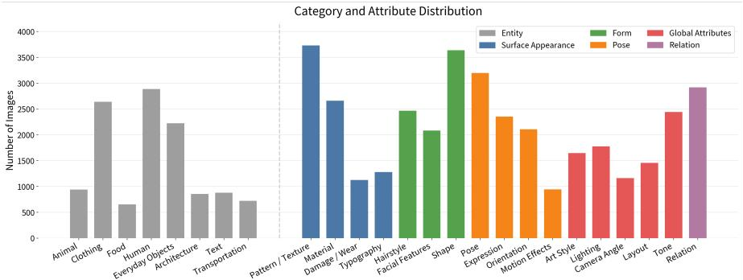

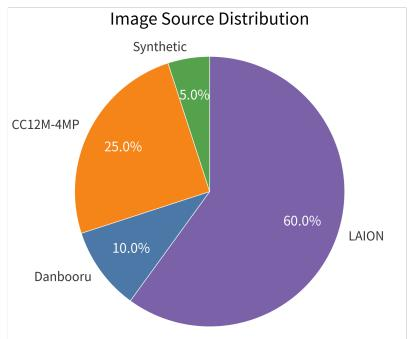  
Figure 8: Benchmark statistics after construction. The left panel shows the distributions of semantic categories and controllable attributes, and the right panel shows the composition of image sources.

## B Benchmark Construction Details

## B.1 Attribute Taxonomy and Tagging Criteria

Our attribute taxonomy is organized into four levels: Appearance, Form, Dynamics, and Global. A key design consideration is that human and humanoid entities require substantially finer-grained annotation than ordinary objects. Both in practical applications and in perceptual evaluation, users are typically more sensitive to identity and appearance errors on humans than on other categories. As a result, our taxonomy includes several tags that are especially important for human-centered references, such as hairstyle, facial features, and expression.

Appearance attributes describe visible local appearance details of an instance. Specifically, Pattern/Texture refers to repeated or local surface appearance, such as floral prints, stripes, embroidery, or decorative motifs. Material describes what the surface appears to be made of, such as metal, glass, wood, fur, or knitted fabric. Damage/Wear captures visible aging or usage traces, such as scratches, rust, cracks, folds, or worn edges. Font/Text Style is used when the visual identity of text itself is important, including letterform style, stroke shape, and decorative typography.

Form attributes describe relatively stable structural or morphologyrelated properties of an instance. Hairstyle describes hair-related appearance of human or humanoid entities, including length, curliness, bangs, braids, and overall styling. Facial Features refers to visually recognizable facial characteristics such as beard, makeup, eye shape, nose shape, or other salient facial details. Shape captures the overall geometric or morphological form of an entity, especially for objects, creatures, or clothing silhouettes.

Dynamics attributes capture transient states or motion-related properties. Action/Pose describes the body configuration or ongoing motion of an instance, such as running, sitting, raising one hand, or leaning forward. Expression is mainly used for humans or humanoid characters, and captures facial states such as smiling, frowning, surprise, or anger. Orientation/Position records how the instance is oriented or spatially placed, such as facing left, side view, front-facing, or lying on a surface. Motion Efect captures visible motion-related efects or dynamic cues, such as splashing water, flying sparks, motion trails, or magical glow produced during an action.

Finally, global attributes describe image-level properties that are not naturally attached to a single foreground instance. Style refers to the overall rendering style of the image, such as oil painting, anime, watercolor, or realistic photography. Lighting describes global illumination conditions, such as backlighting, warm indoor light, or strong contrast. Camera/Viewpoint captures the overall photographic perspective, such as close-up, top-down view, side shot, or wide-angle composition. Color Tone describes the overall palette or grading, such as warm-toned, low-saturation, or bluedominant. Layout/Composition refers to the global arrangement of major scene elements. Inter-instance Relation describes explicit relations among multiple instances, such as holding, standing beside, hugging, or facing each other.

Overall, this taxonomy is designed to balance transferability, perceptual salience, and annotation stability, while remaining aligned with the operator-based formulation used throughout the benchmark.

## B.2 Structured Tagging Format

Based on the attribute taxonomy above, we organize the tagging result of each reference image into a structured representation with three top-level fields: ent\_list, background, and global\_tag. Listing 1 shows the overall schema.

<table><tr><td>Benchmark</td><td>Split by</td><td>Case basis</td><td>Eval. alignment</td><td>Hard grounding</td></tr><tr><td>OmniContext</td><td>Tasks</td><td>Subtasks</td><td>x</td><td>x</td></tr><tr><td>MultiBanana</td><td>Tasks</td><td>Reference-count tasks</td><td>x</td><td>x</td></tr><tr><td>MICON-Bench</td><td>Tasks</td><td>Task templates</td><td>X</td><td>√</td></tr><tr><td>MacroBench</td><td>Tasks</td><td>Long-context tasks</td><td>√</td><td>X</td></tr><tr><td>TRACE-Bench (ours)</td><td>Capabilities</td><td>Compositional formulas</td><td>√</td><td>√</td></tr></table>

Table 4: Comparison with existing benchmarks. “Split by” indicates the primary principle used to decompose the benchmark. “Case basis” summarizes the main basis used to construct individual benchmark cases. “Eval. alignment” indicates whether the evaluation protocol is explicitly aligned with the benchmark construction logic. “Hard grounding” indicates whether identifying the intended reference content often requires detailed localization descriptions rather than simple noun phrases.

Listing 1: Schema of the structured tagging format.

```json
{
"ent_list": [
{
"category":
"ent_desc":
"tag_dict": {
"1_Appearance": {
"1.1_pattern_texture": ["..."],
"1.2_material": ["..."],
"1.3_damage_wear": ["..."],
"1.4_font": ["..."]
},
"2_Form": {
"2.1_hairstyle": ["..."],
"2.2_facial_features": ["..."],
"2.3_shape": ["..."]
},
"3_Dynamics": {
"3.1_action_pose": ["..."],
"3.2_expression": ["..."],
"3.3_orientation": ["..."],
"3.4_motion_effect": ["..."]
}
}
}
],
"background": "...",
"global_tag": {
"4.1_style": ["..."],
"4.2_lighting": ["..."],
"4.3_camera_viewpoint": ["..."],
"4.4_layout_sequence": ["..."],
"4.5_color_tone": ["..."],
"4.6_inter_instance_relation": ["..."]
}
}
```

The field ent\_list contains the foreground instances selected from the image. Each instance is represented by a groundingoriented description ent\_desc, a coarse category label category, and a nested attribute dictionary tag\_dict. In tag\_dict, attributes are grouped into three levels: appearance attributes, form attributes, and dynamics attributes. This design keeps each transferable attribute explicitly attached to the instance it belongs to.

Although our formulation separates Anchor and Disentangle, attribute extraction in real images is still naturally instance-based. We therefore represent each image using an “instance + attached attributes” format. The field background records visually salient background content that is useful for later prompt construction but is not treated as a foreground instance. The field global\_tag stores image-level attributes, including salient relations among foreground instances when these relations are useful for later case construction.

This structured format follows a simple principle: we first identify meaningful foreground instances, and then attach transferable attributes to them. In this way, the grounding of each attribute remains explicit, and the resulting representation is easier to use in later formula construction.

In addition to ordinary fine-grained attributes, the structured format also supports two special transferable types, namely �<sub>attach</sub> and $g _ { \mathrm { i p } }$ . We place them in this section because they are represented in a more holistic way than standard local tags.

� is used for attachment-like transferable content, such as clothing, accessories, or other attached components whose identity should be preserved as a whole during transfer. For example, when transferring the T-shirt worn by a man in Image 1 to a woman in the target image, the clothing item should remain intact, rather than being decomposed into a few isolated local attributes.

�<sub>ip</sub> is used for holistic IP-style transfer. In such cases, the transferable content is not a single local attribute, but the overall design language of an instance. For example, when generating “a hat in the style of the rabbit police oficer in Image 1,” the reference signal includes the characteristic silhouette, color scheme, and iconic motifs of the original design.

Overall, this structured tagging format serves as an intermediate representation between raw reference images and later formula instantiation. It preserves explicit grounding at the instance level, while also retaining background information and global attributes when needed.

## B.3 Template Construction and Sampling Strategy

This section provides additional details on how template construction is built upon the local-to-global formula levels introduced in the main paper.

Local-to-global formula levels. At the entity level, the formula describes individual reference-conditioned targets. At the scene level, multiple targets are composed through �, optionally together with relational terms. At the full-prompt level, the scene expression may be further augmented with a global reference term such as �<sub>global</sub>, yielding the final compositional formula used to instantiate a benchmark prompt.

<table><tr><td>Slot</td><td>Example formula templates</td></tr><tr><td>1</td><td>Te ⊕g; f</td></tr><tr><td>2</td><td>C(f, Te ⊕g); f ⊕g; Te ⊕g ⊕g; C(f, f)</td></tr><tr><td>3</td><td>f ⊕ g ⊕ g; C(f, Te ⊕ g) ⊕ gglobal; C(f, f) ⊕ gglobal; C(f, Te ⊕ g, Te ⊕ g)</td></tr><tr><td>4</td><td>C(Te ⊕ g, f, f) ⊕ global; C(Te ⊕ g, Te ⊕ g, f) ⊕ global; C(f, f ⊕ g) ⊕ global</td></tr><tr><td>5</td><td>C(Te ⊕ g, f, f, f) ⊕  $g _ { \mathrm { g l o b a l } } ;$  C(C(Te ⊕ g, f) ⊕ grel, f) ⊕ global; C(C(Te ⊕ g, Te ⊕ g) ⊕ grel, f) ⊕ gglobal</td></tr><tr><td>6</td><td>C(C(f, f) ⊕ grel, Te ⊕ g ⊕ g) ⊕ global; C(Te ⊕ g, f, f ⊕ g ⊕ g) ⊕ gglobal</td></tr><tr><td>7</td><td>C(C(f, f, f) ⊕ grel, f ⊕ g) ⊕ gglobal; C(C(Te ⊕ g, f, f) ⊕ grel, f ⊕ g) ⊕ gglobal</td></tr><tr><td>8</td><td>C(C(Te ⊕ g, f ⊕ g) ⊕ grel, Te ⊕ g, f ⊕ g) ⊕ gglobal; C(C(f, f) ⊕ grel, Te ⊕ g, Te ⊕ g, f) ⊕ gglobal ⊕ global</td></tr></table>

Table 5: Example formula templates across diferent slot levels.

Scope of the formula. The proposed formula is not intended to represent the full natural-language prompt. Instead, it only describes the combination structure ofreference content. We assume that the text-to-image backbone can already handle ordinary tex tual instructions reasonably well, and therefore focus only on the part of the prompt that involves reference-conditioned content. As a result, pure text-only modifications are not explicitly included in the formula unless they participate in a reference-dependent operation through �. For example, ordinary editing instructions such as changing a color are treated as textual modifications rather than part of the formula structure.

Structural constraint. In practice, the formula structure is deliberately kept simple. The scene representation uses at most two nested levels of the composition operator �. The inner level is mainly used to express reference-grounded relational composition, such as cases involving ${ \mathit { g } } _ { \mathrm { r e l } } ,$ while the outer level is used to form the complete scene expression. Text-specified relations are omitted from the formula unless they are necessary for disambiguation. As illustrated by the formula below, this assumption is suficient for the vast majority of benchmark cases while keeping the template space interpretable and manageable.

$$
\begin{array} { r l } & { F = C \Big ( \underbrace { C ( f _ { 1 } , T _ { e } \oplus g _ { 1 } ) \oplus g _ { \mathrm { r e l } } , f _ { 2 } \oplus g _ { 2 } \oplus g _ { 3 } } _ { \mathrm { i n n e r ~ c o m p o s i t i o n } } \Big ) \oplus g _ { \mathrm { g l o b a l } } . } \\ & { ~ } \end{array}\tag{5}
$$

Template construction and sampling. Based on the above representation, we sample valid templates across all slot levels under controlled distributions. We explicitly control the proportions of templates containing diferent numbers of $\boldsymbol { g } _ { \mathrm { r e l } }$ and �<sub>global</sub> terms, preventing the sampled cases from collapsing to a few repeated flat structures while maintaining diverse relational and global-reference patterns.

Design goal. This design serves two purposes. First, it increases reference-conditioned structural complexity with slot number in a controlled and interpretable way. Second, it prevents the benchmark from being dominated by a narrow set of repeated formula patterns, especially at larger slots. As a result, the final benchmark includes both simple reference transfer cases and more structured multireference compositions involving relational constraints and global reference attributes.

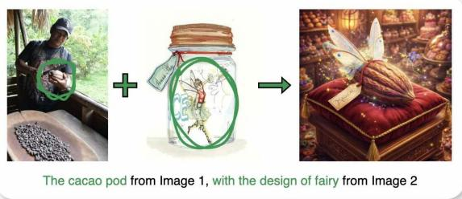  
Figure 9: A Cacao-pod Case

Representative templates. To give a concrete picture of the resulting distribution, Table 5 lists some example formula templates for slots 1–8 after template construction and sampling. As the slot number increases, the dominant patterns gradually shift from simple anchored entities or single-attribute transfer to more complex compositions of the same small set of atomic operators.

## B.4 Prompt Realization Format

Given a compositional formula and its associated reference images, we further convert them into a natural-language reference prompt for image generation. This step is particularly important in our setting because many images in the reference pool are visually complex, and the source objects for Anchor or Disentangle often require relatively detailed grounding descriptions. At the same time, we avoid using overly artificial placeholders or highly specialized prompt markup, since such forms may be unnatural for image generation models. We therefore adopt a natural-language prompt realization format that keeps the prompt fluent while preserving explicit source-target grounding.

Our realization format contains two parts. The first paragraph describes the target scene in natural language, where each referenceconditioned target object is introduced as a readable referring expression such as (’man\_A’). The second paragraph explicitly specifies the source-target assignments for all reference operations, including the reference source image, the source content to be extracted, and the target object in the realized prompt. In this way, the main prompt remains natural, while the reference mapping remains explicit. A real example is shown below (corresponding to Fig. 9).

Listing 2: Example of natural-language prompt realization.  
Generate a new scene. In a whimsical fantasy bakery, a special   
enchanted confection is displayed on a velvet cushion.   
This item is a unique ('cacao\_pod\_A'), which looks like a   
real cacao pod but has been magically altered.   
('cacao\_pod\_A') references [the cacao pod being cut in the   
man's hands in Image 1].   
('cacao\_pod\_A') references [the fairy in the jar in Image 2].

## B.5 Checklist Construction from Structured Prompts

Our evaluation checklist is generated from the structured information preserved during prompt realization. When converting a symbolic case into a natural-language reference prompt, we retain the corresponding source–target mappings and operator-level structure. This intermediate representation is then passed to an LLM, which produces checklist questions aligned with the evaluation target of each operator.

The main design principle is that each operator should be evaluated through multiple binary questions rather than a single scalar or holistic judgment. This is necessary because operator-level success is often not atomic. For example, an output may contain the correct target object but fail to match the referenced source faithfully, or an attribute may be transferred but bound to the wrong carrier. A single binary judgment would be too coarse to distinguish such cases, while fully open-ended or non-binary judgments may introduce additional bias and reduce consistency. We therefore decompose the evaluation of each operator into several binary questions, each focusing on one concrete aspect of correctness.

This principle is applied consistently to all four operators, namely � , �, ⊕, and �. For an anchored entity � , the checklist may separately verify whether the target exists and whether it matches the referenced source entity. For a disentangled attribute �, the checklist may separately ask whether the intended attribute appears on the target and whether it is faithful to the reference image. For ⊕, multiple questions are used to check whether the transferred attribute is present, whether it is correctly bound to the intended carrier, whether the carrier itself remains coherent, and whether the transferred content resembles the referenced source. For �, the checklist likewise separates coexistence, relation satisfaction, and structural coherence into diferent binary checks. In this way, operator-level failures can be localized more precisely instead of being collapsed into a single judgment.

Each generated question also records the corresponding target part in the structured representation. This design makes the checklist easy to trace back to the original formula and reference prompt, and also supports later grouping and aggregation by operator type, target entity, or failure mode. As a result, the checklist is both fine-grained enough to capture diverse operator-level errors and structured enough to support systematic analysis.

For completeness, we show the full checklist for the cacao-pod case (Fig. 9) below. Here, the Target field records the corresponding operator target or target part in the formula structure, which makes the generated questions easier to trace back to the original prompt representation.

## C Evaluation and Diagnostic Details

## C.1 Reliability of the Evaluation Protocol

To assess whether our evaluation depends on the choice of VLM judge, we conduct a human audit involving Gemini-2.5-Pro (G25P), Gemini-3-Pro (G3P), GPT-5.1, and GPT-5.4. We sample 200 benchmark cases and generate each case with both Nano Banana 2 and Emu3.5, yielding 400 outputs. For each output, human annotators answer the same binary checklist questions used by the VLM judges. We aggregate the checklist decisions associated with each operator and normalize the resulting operator-level scores. Pearson and Spearman measure linear and rank correlation, respectively, between VLM and human operator scores; MAE measures their normalized score diference, while agreement is the percentage of individual checklist decisions that match the human annotations.

As shown in Table 7, all four VLM judges achieve 85.4–88.4% checklist-level agreement with human annotations and exhibit broadly comparable operator-level correlations and errors. This indicates that the checklist-based evaluation is not tied to a single judge. We use G25P for full-benchmark evaluation because it provides a practical trade-of between reliability and evaluation cost. The ensemble further improves Pearson correlation and agreement, providing a higher-confidence option when additional evaluation cost is acceptable.

## C.2 Complete Diagnostic Tree Rules

The diagnostic tree is used to localize the source of failure in a complex multi-reference case. Starting from the full formula at the root node, we recursively simplify the case into a set of easier sub-cases and compare the model behavior across nodes.

General principle. Each child node should preserve the same overall scene as the root case, while reducing part of the referenceconditioned complexity. Removed reference content is not simply deleted; when necessary, it is downgraded to an ordinary text-only description so that the scene context remains comparable across nodes.

Rule 1: Global-reference stripping. If the formula contains one or more $g _ { \mathrm { g l o b a l } }$ terms, we remove them one by one. This rule is used to diagnose whether global references, such as style or scenelevel constraints, interfere with lower-level anchor or attribute fidelity.

Rule 2: Composition flattening. Ifthe formula contains a composition operator �(·), we flatten it into simpler branches. One child node keeps one reference-conditioned branch, while the remaining branches are downgraded to text-only scene descriptions. This rule is especially useful for identifying whether a failure only appears under joint composition. In particular, when multiple anchors cooccur in the same scene, composition flattening can isolate one anchor at a time while retaining the rest of the scene as ordinary textual context.

Rule 3: Relation simplification. If a node contains an explicit interaction term, the relation is simplified before removing the participating branches themselves. In the simplified child node, the original interaction is converted into a text-only relation description while the main scene context is preserved. This helps distinguish failures caused by relation grounding from failures caused by entity appearance or attribute transfer.

<table><tr><td> $\mathbf { O p . }$ </td><td>Target</td><td>Binary question</td></tr><tr><td colspan="3">Case formula: C(f1 ⊕ g1) Target object: (&#x27;cacao_pod_A&#x27;)</td></tr><tr><td>f</td><td>f1</td><td>Does a food item that is clearly a cacao pod, retaining its rugby-ball shape and vertically grooved surface, exist in the</td></tr><tr><td>f</td><td>f1</td><td>generated image? Does (&#x27;cacao_pod_A&#x27;) match the referenced cacao pod in terms of its core identity as a cacao pod?</td></tr><tr><td>g</td><td>91, IP on cacao_pod_A</td><td>Does (&#x27;cacao_pod_A&#x27;) incorporate the overall fairy-like design, including wings, pose, and magical effects?</td></tr><tr><td>g</td><td>91, IP on cacao_pod_A</td><td>Are recognizable fairy-design cues present in the overall design of (&#x27;cacao_pod_A&#x27;)?</td></tr><tr><td>g</td><td>9₁, IP on cacao_pod_A</td><td>Is the color scheme and motif of the referenced fairy transferred to the overall design of (&#x27;cacao_pod,</td></tr><tr><td>g</td><td>g1, IP on cacao_pod_A</td><td>Is the overall fairy design integrated with (&#x27;cacao_pod.  $\mathbf { \nabla } _ { - } \mathsf { A } ^ { \prime } \mathbf { \nabla } )$  while preserving its identity as a cacao pod?</td></tr><tr><td>⊕</td><td>⊕, fi ⊕ g1, carrier</td><td>After the fusion, is (&#x27;cacao_pod_A&#x27;) still clearly recognizable as itself and structurally intact?</td></tr><tr><td>⊕</td><td>⊕, fi ⊕ g1, fit</td><td>Is the transferred IP clearly visible on (&#x27;cacao_pod_A&#x27;) and naturally integrated?</td></tr><tr><td>⊕</td><td>⊕, fi ⊕ g1, fit</td><td>Does the fusion remain visually coherent and physically plausible on (&#x27;cacao_pod.  $. \mathsf { A } ^ { \prime } ) ?$ </td></tr><tr><td>⊕ C</td><td>⊕, fi ⊕ g1, exclusivity</td><td>Is the transferred IP confined to the intended scope (only on  $f _ { 1 } ) ,$  without leaking to other entities or the background? -</td></tr><tr><td></td><td>C, spatial</td><td>Is the scene composition spatially coherent and physically plausible?</td></tr><tr><td>C</td><td>C, relation</td><td>Does the generated image satisfy the intended scene relation?</td></tr><tr><td>C C</td><td>C, duplication</td><td>Does any prompted entity appear more times than intended in the generated image?</td></tr><tr><td>C</td><td>C, leakage</td><td>Does any unintended source content appear in the generated image beyond the referenced cacao-pod content?</td></tr><tr><td></td><td>C, leakage</td><td>Does any unintended source content appear in the generated image beyond the intended fairy-design transfer on (&#x27;cacao_pod_  $A ^ { \prime } ) ?$ </td></tr></table>

Table 6: Full checklist example for the cacao-pod case. The Target field records the corresponding operator target or target part in the formula structure, which supports tracing and later grouping.

Table 7: Alignment between VLM judges and human annotations on outputs from 200 sampled benchmark cases. The ensemble averages the four VLM judges.
<table><tr><td>Judge</td><td>Pear.↑</td><td>Spear.↑</td><td>MAE↓</td><td>Agree.↑</td></tr><tr><td>G3P</td><td>0.608</td><td>0.613</td><td>0.152</td><td>86.8%</td></tr><tr><td>G25P</td><td>0.554</td><td>0.537</td><td>0.173</td><td>85.4%</td></tr><tr><td>GPT-5.1</td><td>0.569</td><td>0.558</td><td>0.162</td><td>88.1%</td></tr><tr><td>GPT-5.4</td><td>0.580</td><td>0.542</td><td>0.156</td><td>88.4%</td></tr><tr><td>Ensemble</td><td>0.662</td><td>0.604</td><td>0.153</td><td>88.6%</td></tr></table>

Rule 4: Attribute removal. For expressions of the form � ⊕ ${ \mathit { g } } ,$ � ⊕ �<sub>ip</sub>, or $E \oplus g _ { \mathrm { a t t a c h } }$ , we may remove the added attribute while preserving the carrier entity �. This rule is used to determine whether the failure comes from the carrier anchor itself or from the added attribute transfer.

Stopping criterion. The decomposition stops when the remaining node contains only a single informative reference-conditioned unit, or when further simplification would no longer help isolate a more specific source of failure. In practice, leaf nodes usually correspond to a single anchor, a single attribute transfer, or a minimally composed scene.

Node-to-question mapping. Each diagnostic node is evaluated only with the checklist items that correspond to the retained operator targets in that node. Therefore, the diagnostic tree is not only a formula decomposition, but also an evaluation decomposition. The root node uses the full checklist of the original case, while each child node uses the subset of questions that remains relevant after simplification.

Figure 10 shows a formula-level example of diagnostic tree decomposition. Starting from the full case at $N _ { 0 }$ , we first apply Rule 1 to strip the global reference term ${ \mathit { g } } _ { \mathrm { g l o b a l } } ,$ yielding �<sub>1</sub>. We then apply Rule 2 to flatten the outer composition, which separates the left relational subscene $N _ { 2 a }$ from the right attribute-transfer branch $N _ { 2 b }$ . On the left branch, Rule 3 removes the relation term $\scriptstyle g _ { \mathrm { r e l } } .$ , and Rule 2 is applied again to flatten the remaining inner composition into two simpler nodes, $N _ { 4 a }$ and $N _ { 4 b }$ . On the right branch, Rule 4 removes one or more transferred attributes, producing the simplified nodes $N _ { 3 b 1 } , N _ { 3 b 2 } ,$ , and $N _ { 3 b 3 }$ . This example illustrates how the complete rule set recursively reduces a complex formula into a set of simpler diagnostic branches while preserving the same overall scene context.

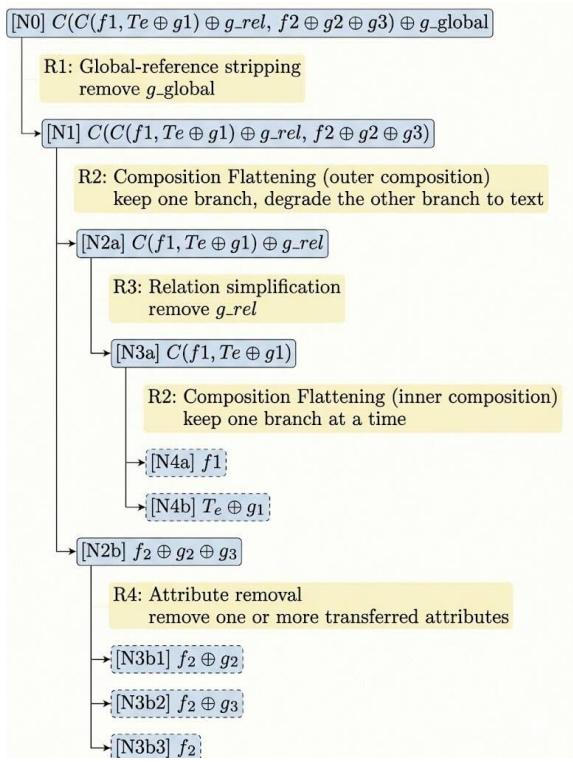  
Figure 10: A formula-level example of diagnostic tree decomposition.

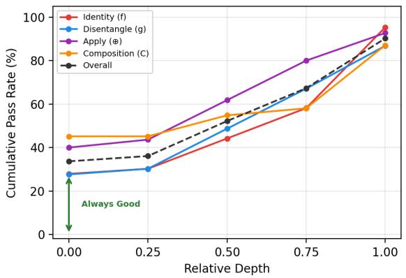  
Figure 11: Cumulative pass rate over relative diagnostic-tree depth on 200 Emu3.5 cases.

## C.3 Quantitative Validation of Diagnostic Trees

To validate diagnostic reliability, we construct diagnostic trees for 200 Emu3.5 cases and generate an image at every node. A VLM evaluates each node, after which the rules above localize the source of each operator-level failure. Independently, human annotators inspect the same trees and identify the node at which each failure originates. The automatic and human localizations agree in 82.6% of cases.

Table 3 in the main paper summarizes the localized failure sources. Here, we additionally examine where requirements become solvable along the simplification process. For each root-to-leaf path, we normalize node position as relative depth, with 0 denoting the original complete case and 1 the maximally simplified node. For each operator requirement, we record the earliest depth at which its evaluation changes from failure to success. The cumulative pass rate at a given depth is the proportion of requirements that are already successful at the root or first become successful by that point. Requirements that remain unsuccessful at every node are treated as persistent failures and therefore do not enter the cumulative count.

As shown in Fig. 11, the cumulative pass rate rises consistently with relative depth for all four operators. Thus, many requirements that fail in the complete case become solvable only after interfering reference-conditioned components are removed. Conversely, the endpoints remain below 100% because some requirements persistently fail even in the simplest diagnostic nodes. Together with the source distribution in Table 3, this result shows that many observed failures arise from interactions introduced by more complex formula structure, while a smaller subset reflects dificulty intrinsic to the isolated reference unit.


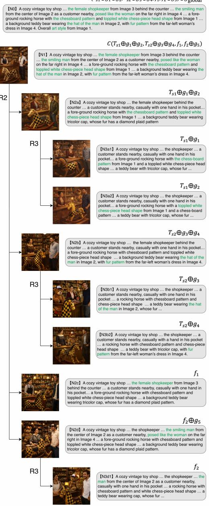  
Figure 12: A diagnostic tree example for a complex multireference case. Starting from the full case at $N _ { 0 } ,$ the tree is expanded by sequentially applying global-reference stripping, composition flattening, relation simplification, and attribute removal. The resulting branches isolate diferent potential sources of failure in a structured way.

## C.4 Additional Diagnostic Tree Examples

Figure 12 shows an additional diagnostic tree example, correspond ing to the third-from-last row in Fig. 15. In the root node $N _ { 0 } .$ GPT-Image-1.5 shows two visible problems. First, the chess-pieceinspired head shape of (horse\_A) does not appear at all. Second, the hat on (bear\_A) is present, but its color does not faithfully match the referenced hat. The diagnostic tree helps determine whether these errors are caused by the same underlying source.

For the horse branch, the chess-piece-inspired head shape never appears from the root node down to $N _ { 3 a 2 }$ . This indicates that GPT-Image-1.5 does not reliably realize this shape-related reference requirement itself. In other words, the disentangle-and-apply process for this structural attribute is already failing even after the case is simplified, rather than the error being introduced only by additional scene complexity.

The bear branch exhibits a diferent pattern. In $N _ { 0 } ,$ the bear is generated, but the transferred hat attribute is not faithful to the reference, since its color is mismatched. In $N _ { 2 b }$ , however, the failure changes form: the bear itself is not generated, so the error is no longer only about hat fidelity, but about the carrier entity collapsing altogether. By contrast, the hat becomes much more accurate in $N _ { 1 }$ and $N _ { 3 b 1 }$ . This suggests that the model is not uniformly incapable of realizing the hat transfer; instead, the corresponding content is preserved unstably, and the failure mode changes across compositional contexts.

Overall, this example shows that the diagnostic tree can distinguish between two qualitatively diferent situations: a reference requirement that is consistently not realized at all, and a reference requirement whose behavior is unstable, with the observed error shifting between attribute mismatch and carrier-level failure.

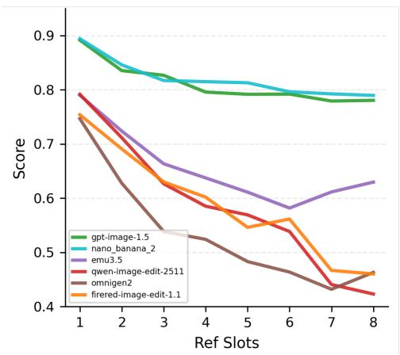  
Figure 13: Overall operator-aligned performance across slot levels.

## D Additional Experimental Results

## D.1 Performance across Slot Levels

Figure 13 reports average operator-aligned performance from slot 1 to slot 8. Performance generally declines as slot count increases, supporting its use as a controllable measure of formula structure. The decline is substantially sharper for open-source models, whereas the leading proprietary models remain comparatively stable as more reference-conditioned elements are introduced. The trend is not strictly monotonic for every model because slot count does not fully determine empirical dificulty, which also depends on content-level factors such as reference clutter, entity composition, and attribute granularity.

## D.2 Cross-Model Qualitative Comparisons

Figure 15 provides additional cross-model qualitative comparisons on several representative cases from TRACE-Bench. Several consistent patterns can be observed. First, under high-complexity settings such as slot-8 cases, open-source models are often able to retain multiple reference-conditioned contents simultaneously, whereas closed-source models more often drop part of the reference information and instead fall back to generic text-to-image generation. Second, among the open-source models, Emu3.5 tends to preserve more reference content overall, while FireRed occasionally produces unusual blurring artifacts in slot-8 cases. We also observe that Qwen-Image-Edit-2509 and Qwen-Image-Edit-2511 generate highly similar outputs in certain cases, suggesting closely related generation behavior. Finally, across closed-source models, the GPT and Gemini families exhibit noticeably diferent image-generation tendencies and stylistic preferences, even when given the same reference prompt.

## D.3 Performance across Attribute Subtypes

Since the disentangle operator covers a diverse set of attribute types, an overall � score may hide important diferences across sub-capabilities. We therefore further analyze model performance by attribute subtype, as shown in Fig. 14.

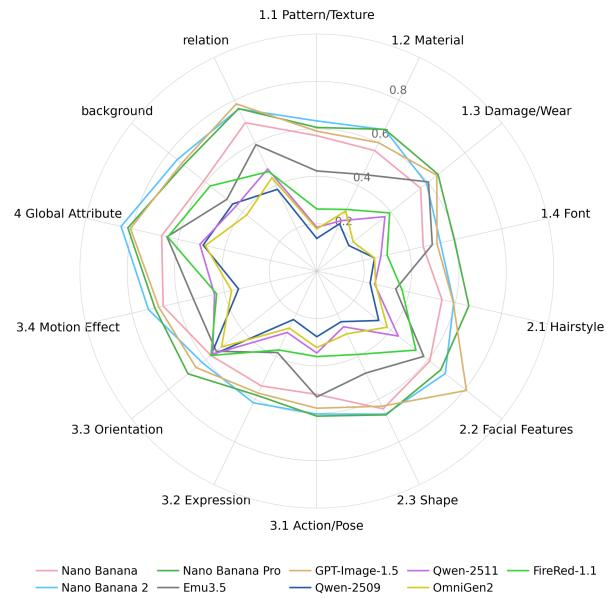  
Figure 14: Breakdown of disentangle performance across fine-grained attribute subtypes. Each axis corresponds to one subtype in the tagging taxonomy.

<table><tr><td>Benchmark / application task</td><td>Typical requirement</td><td>TRACE-Bench abstraction</td></tr><tr><td>MultiBanana: X Objects</td><td>multiple referenced objects</td><td> $C ( f _ { 1 } , f _ { 2 } , \dots . . . , f _ { X } )$ </td></tr><tr><td>MultiBanana: X-1 Objects + Local</td><td>objects + one local attribute reference</td><td> $C ( f _ { 1 } , . . . , f _ { X - 1 } \oplus g _ { \mathrm { l o c a l } } )$ </td></tr><tr><td>MultiBanana:  $\mathrm { X - 1 ~ O b j e c t s } + \mathrm { G l o b a l }$ </td><td>objects + one global reference</td><td> $C ( f _ { 1 } , \dots , f _ { X - 1 } ) \oplus g _ { \mathrm { g l o b a l } }$ </td></tr><tr><td>MultiBanana: X-1 Objects + Background</td><td>objects + one background reference</td><td> $C ( f _ { 1 } , \dots , f _ { X - 1 } ) \oplus g _ { \mathrm { b a c k g r o u n d } }$ </td></tr><tr><td>MICON: Object Composition</td><td>combine multiple referenced instances</td><td> $C ( f _ { 1 } , f _ { 2 } , \ldots , f _ { n } )$ </td></tr><tr><td>MICON: Spatial Composition</td><td>compose multiple instances with relation</td><td> $C ( f _ { 1 } , f _ { 2 } , . . . , f _ { n } ) \oplus T _ { \mathrm { r e l } }$ </td></tr><tr><td>MICON: Attribute Disentanglement</td><td>transfer one disentangled attribute</td><td> $T _ { e } \oplus g \quad { \mathrm { ~ o r ~ } } \quad f \oplus g$ </td></tr><tr><td>MICON: Component Transfer</td><td>transfer an attachable component</td><td> $T _ { e } \oplus g _ { \mathrm { a t t a c h } }$  or  $f \oplus g _ { \mathrm { a t t a c h } }$ </td></tr><tr><td>MICON: FG/BG Composition</td><td>combine foreground and background references</td><td> $C ( f _ { 1 } , . . . , f _ { n } ) \oplus g _ { \mathrm { b a c k g r o u n d } }$ </td></tr><tr><td>MICON: Story Generation</td><td>multi-entity narrative scene generation</td><td> $C ( f _ { 1 } , . . . , f _ { n } ) \oplus T _ { \mathrm { r e l } }$ </td></tr><tr><td>Application: Virtual Try-On</td><td>transfer garments or accessories to a target person</td><td> $f ( { \mathsf { p e r s o n } } ) \oplus g _ { \mathrm { a t t a c h , 1 } } \oplus g _ { \mathrm { a t t a c h , 2 } } \oplus \cdot \cdot \cdot$ </td></tr><tr><td>Application: Group Photo Layout</td><td>compose multiple subjects under a layout constraint</td><td> $C ( f _ { 1 } , f _ { 2 } , \ldots , f _ { n } )$  ⊕ Glayout</td></tr><tr><td>Application: Novel View Synthesis</td><td>preserve the same subject under a changed viewpoint</td><td> $f \oplus g _ { \mathrm { v i e w } }$ </td></tr><tr><td>Application: IP-style Reference</td><td>transfer overall design language to a target carrier</td><td></td></tr><tr><td>Application: Stylization</td><td>preserve scene content under a global style transfer</td><td> $T _ { e } \oplus g _ { \mathrm { i p } } \quad { \mathrm { ~ o r ~ } } \quad f \oplus g _ { \mathrm { i p } }$   $C ( f _ { 1 } , . . . , f _ { n } ) \oplus g _ { \mathrm { s t y l e } }$ </td></tr></table>

Table 8: Examples of mapping benchmark-defined and application-oriented tasks into the TRACE-Bench formula space.

## D.4 More Application-Oriented Formula Abstractions

To further illustrate the practical coverage of our formulation, Table 8 maps representative task categories from existing benchmarks, together with several common application-oriented settings, into the TRACE-Bench formula space.

The key point is that diverse and realistic task categories can be expressed within the same formula space by assigning diferent types of reference-conditioned content to the same compositional structure. In this way, our abstraction is not limited to benchmark-specific categories, but can also cover a broad range of practical generation settings within an operator-aligned framework. Moreover, by combining formula-level sampling with instance- and attribute-level sampling, our framework also has the potential to support large-scale generation of diverse multi-reference tasks in a systematic way.

## E Potential Extensions

TRACE-Bench currently focuses on diagnosing multi-reference image generation, while its operator formulation also suggests several concrete extensions that preserve the alignment between case construction, operator targets, and diagnostic questions. At the model level, Anchor could combine decoupled image-prompt attention with query-conditioned localization to retain reference-specific evidence while suppressing salient distractors [24, 67]. Disentangle and Apply could combine feature-level comparison and prototype memories with localized attention that reduces identity mixing when several references must be bound to distinct targets [26, 60, 68]. Future benchmark annotations could further include promptable region masks for individual operator instances, optionally bootstrapped with difusion-derived pseudo-masks or direct mask generation [17, 29, 30, 66]; these localized targets would allow diagnostic child cases to provide structured feedback for reward-guided model updates, iterative refinement, or evidence-based revisiting of an initial diagnosis [27, 28, 61]. For benchmark construction, detectorverifiable properties such as object co-occurrence, position, count, and color [10] could provide scalable checks for newly sampled formula templates. Future releases could treat rare concepts and underrepresented combinations of operators and attributes as explicit dificulty axes and expand them through generation with quality filtering [37, 71]; they could also reduce annotation costs through scalable multimodal data curation and composition of compatible labeled resources [8, 25]. Beyond the current image setting, a video extension could ground reference evidence to query-conditioned temporal moments and derive operator-level supervision from partial temporal annotations and progressive pseudo-label refinement [16, 21, 52]. Promptable masks could provide localized reference tracks across frames, while eficient spatiotemporal adaptation could support longer reference sequences [43, 64]. Its evaluation could combine intermediate state, motion, contact, and temporalorder checks with video-specific dimensions such as subject consistency, motion smoothness, and temporal flickering, rather than relying on final-frame quality alone [14, 59]. A separate cross-view variant could instantiate $g _ { \mathrm { v i e w } }$ through radiance-field view synthesis and depth-aware generalizable rendering, testing whether reference identity and geometry remain consistent across viewpoint changes [34, 47]. Together, these directions would preserve the central principle of TRACE-Bench by ensuring that each added capability remains explicit in case construction and independently diagnosable during evaluation.

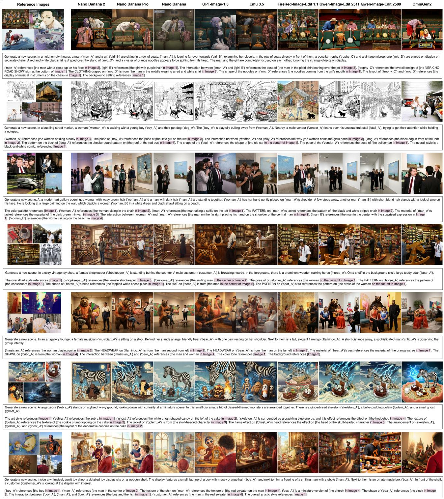  
Figure 15: Additional cross-model qualitative examples from TRACE-Bench. Each row presents one benchmark case, including the reference images, the realized natural-language reference prompt, and outputs from multiple representative models. These examples highlight recurring diferences in reference retention, compositional fidelity, and stylistic tendencies across models, especially under complex multi-reference settings.