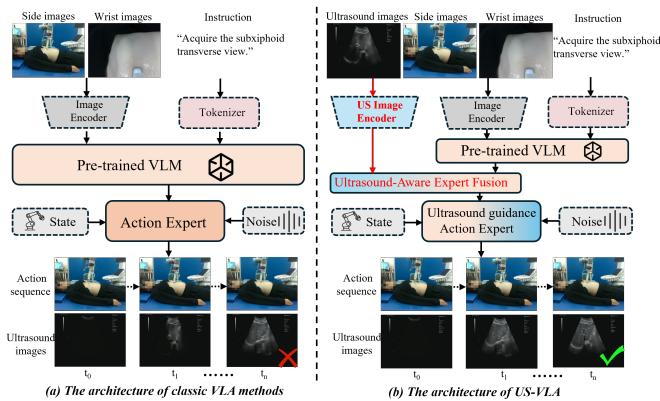
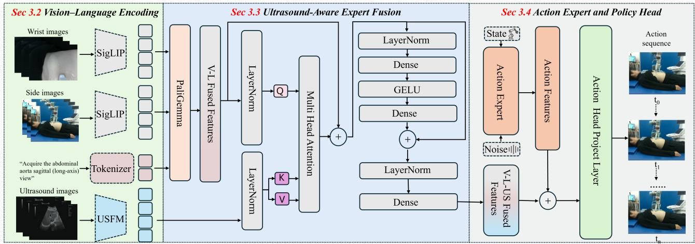
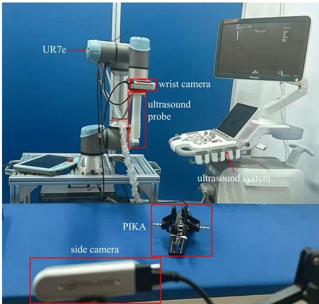
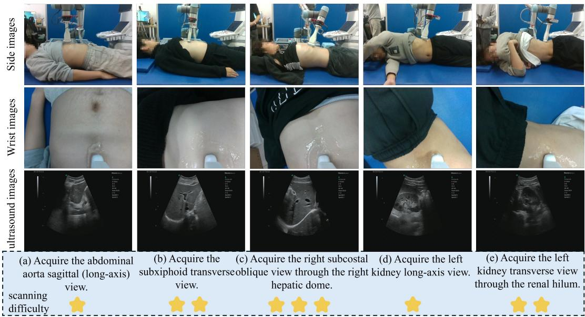
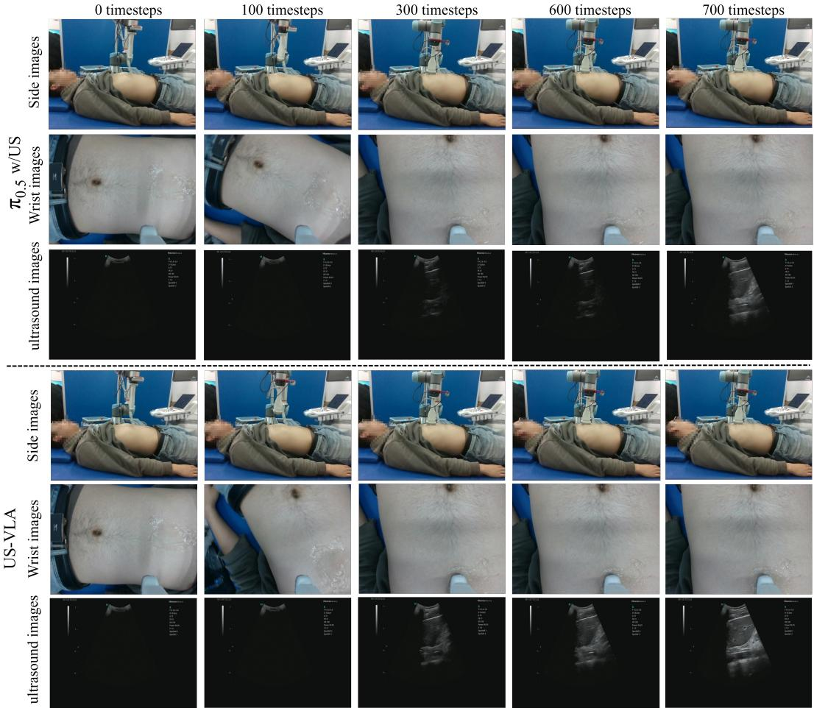
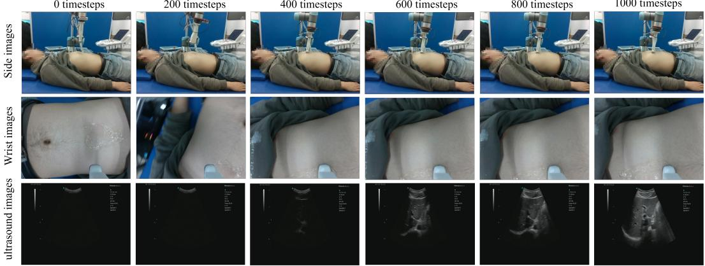
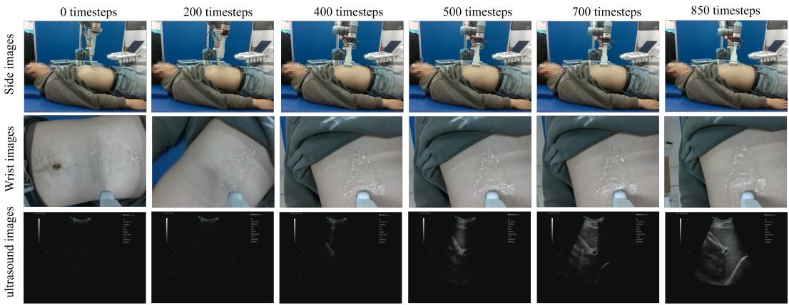
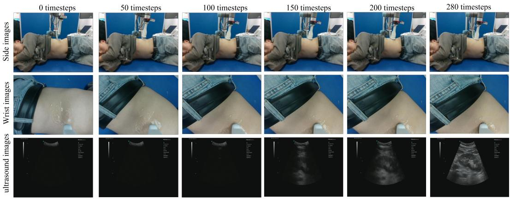
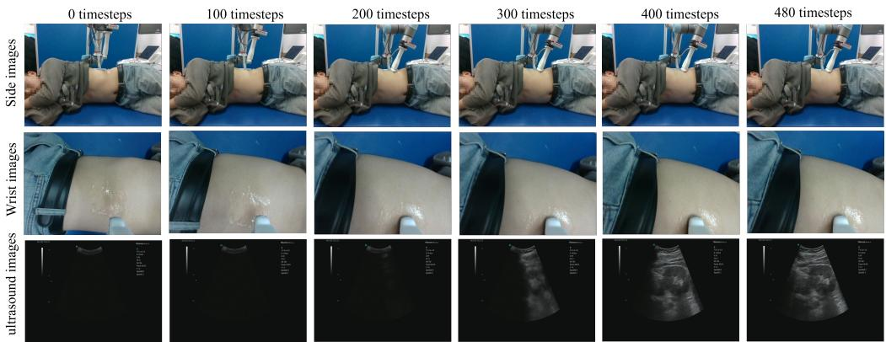
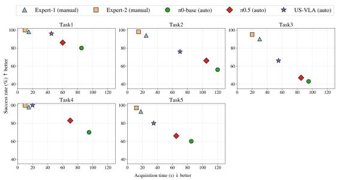

# US-VLA: An Ultrasound Vision-Language-Action Model for Embodied Abdominal Scanning

Cheng Zhang∗   
Faculty of Computer Science and   
Technology, Ocean University of   
China   
Qingdao, China   
zhangcheng@stu.ouc.edu.cn   
Xifeng Hu   
School of Information Science and   
Engineering, Shandong University   
Qingdao, China   
202220466@mail.sdu.edu.cn   
Xingzheng Wu∗   
Faculty of Computer Science and   
Technology, Ocean University of   
China   
Qingdao, China   
wuxingzheng@stu.ouc.edu.cn   
Zhi Liu   
School of Information Science and   
Engineering, Shandong University   
Qingdao, China   
liuzhi@sdu.edu.cn   
Qing Cai✉   
Innovation School of Artificial   
Intelligence, Hefei University of   
Technology   
Hefei, China   
caiqing@hfut.edu.cn   
Guihao Yan   
Faculty of Computer Science and   
Technology, Ocean University of   
China   
Qingdao, China   
yanguihao@stu.ouc.edu.cn   
Mei Wu   
Department of Ultrasound, the Qilu   
Second Hospital of Shandong   
University   
Jinan, China   
wumei0212@sdu.edu.cn

## Abstract

Artificial intelligence–assisted ultrasound scanning enhances diag nostic reliability and eficiency by providing real-time guidance for standardized image acquisition and reducing operator dependence. However, existing reinforcement learning and learning-assisted ultrasound scanning methods typically rely on carefully designed reward functions or extensive interaction data, which limits their generalization ability and stability across diferent devices, patient populations, and complex clinical scenarios. To address these challenges, we propose an ultrasound vision-language-action model (US-VLA) for automated ultrasound scanning that explicitly encodes clinical semantic goals and generates sequential probe manipulation actions under real-time ultrasound feedback. In particular, we first design an ultrasound-aware expert fusion module to jointly integrate ultrasound observations with auxiliary contextual information, enabling semantic ultrasound feedback to efectively guide the scanning process. Then, we construct US-VLA-Data, a real-world dataset covering liver and kidney examinations, which includes five clinically defined standard planes and comprises 320 expert scanning trajectories with approximately 80,000 synchronized timesteps. Extensive experiments demonstrate that US-VLA

achieves competitive performance in ultrasound probe manipulation tasks, indicating its efectiveness and promising generalization within the evaluated abdominal ultrasound setting. The source code is available at https://github.com/VMVLab/US-VLA.

## CCS Concepts

• Applied computing → Life and medical sciences.

## Keywords

Multimodal Medical AI, Embodied AI, Vision–Language–Action (VLA), Ultrasound Imaging, Abdominal Scanning

## ACM Reference Format:

Cheng Zhang, Xingzheng Wu, Guihao Yan, Xifeng Hu, Zhi Liu, Mei Wu, and Qing Cai. 2026. US-VLA: An Ultrasound Vision-Language-Action Model for Embodied Abdominal Scanning. In Proceedings ofthe 34th ACM International Conference on Multimedia (MM ’26), November 10–14, 2026, Rio de Janeiro, Brazil. ACM, New York, NY, USA, 10 pages. https://doi.org/10.1145/ 3767308.3836343

## 1 Introduction

Artificial intelligence–assisted ultrasound scanning plays a critical role in improving the reliability, eficiency, and accessibility of ultrasound-based diagnosis [6, 7, 16]. Conventional ultrasound examinations rely heavily on operator expertise to acquire clinically meaningful standard planes, resulting in substantial inter-operator variability and inconsistent diagnostic quality [1]. By providing real-time perception and action guidance during the scanning process, AI-assisted ultrasound systems facilitate standardized image acquisition, reduce operator workload, and enhance robustness across diferent devices and patient populations [12, 19, 44]. Moreover, such systems lay the foundation for intelligent and potentially autonomous ultrasound examinations, extending high-quality diagnostic services to resource-limited clinical settings.

  
Figure 1: Comparison between the architectures of classic VLA methods and the proposed US-VLA. US-VLA encodes ultrasound images and efectively integrates them with vi sion–language features, facilitating more precise and reliable acquisition of standard ultrasound planes.

Existing approaches to ultrasound scanning automation mainly fall into reinforcement learning–based [11, 32, 33, 40] and learningbased strategies [10, 15, 21, 29]. Reinforcement learning methods enable closed-loop probe control through environment interaction, but they heavily rely on carefully designed reward functions, are often trained in simplified settings, and show limited robustness under anatomical variability, patient motion, and real clinical constraints [11]. Learning-based methods driven by expert demonstrations can capture clinical scanning priors and achieve stable performance, yet they typically require costly data collection and primarily learn low-level motion patterns without explicitly modeling high-level clinical objectives, which restricts their adaptability to new protocols and scanning targets [21].

Beyond these paradigms, vision–language–action (VLA) models have shown strong performance in robotic environments by aligning language-specified goals with visual perception and sequential action generation [3, 18, 30, 31, 37]. Recent studies have begun to explore VLA paradigms in medical robotics [46], such as RoboNurse-VLA [23], which enables language-conditioned instrument handover via visual perception and large language models. However, existing medical VLA systems mainly focus on objectcentric manipulation under external visual observation, where task objectives are defined by tool or object states rather than by imagingderived semantic criteria. In contrast, ultrasound examination is inherently driven by semantic imaging goals, where success depends on acquiring clinically meaningful standard planes under continuous ultrasound feedback. To date, VLA frameworks have rarely been tailored for imaging-driven diagnostic scanning tasks, motivating the need for ultrasound-aware perception and closedloop action generation within a unified VLA framework.

Based on the above discussion, we present the VLA-based framework tailored for automated abdominal ultrasound scanning, which explicitly grounds clinical goals into ultrasound-aware perception and closed-loop probe control. As illustrated in Fig. 1, in contrast to conventional VLA pipelines that primarily rely on external visual observations, US-VLA explicitly incorporates real-time ultrasound feedback and clinical semantic goals to guide probe manipulation. Specifically, US-VLA augments a pre-trained VLM with a dedicated ultrasound image encoder and an ultrasound-aware expert fusion module, which injects task-relevant ultrasound semantics into the action generation pathway and enables an ultrasound-guided action expert to generate sequential probe manipulation actions under closed-loop ultrasound feedback. In addition, we introduce US-VLA-Data, a vision–language–action ultrasound dataset covering liver and kidney examinations, including five clinically defined standard planes, 320 expert scanning trajectories, and approximately 80,000 synchronized timesteps.

The main contributions of this work are summarized as follows:

• We present the first vision–language–action (VLA) framework tailored for ultrasound scanning, unifying clinical semantic goals, real-time perception, and probe manipulation within a single model.

• We construct US-VLA-Data1, a real-world VLA dataset for ultrasound scanning covering liver and kidney organs and their standard planes, supporting language-conditioned and action-driven learning.

• Extensive experiments demonstrate that US-VLA consistently outperforms strong baselines and exhibits robust generalization across diferent organs, scanning targets, and diverse clinical conditions.

## 2 Related Works

## 2.1 AI-Assisted Ultrasound Scanning

Ultrasound scanning is highly operator-dependent and requires substantial expertise to acquire clinically meaningful views, motivating extensive research on AI-assisted ultrasound analysis and scanning systems that provide real-time guidance or autonomous probe control [5, 14, 35]. Early studies mainly explored reinforcement learning and learning-based strategies to guide operators toward target standard planes using ultrasound image feedback, demonstrating feasibility in phantom studies and small-scale clinical trials. These methods typically formulate plane acquisition as a sequential control problem and optimize probe motions through reward-driven exploration or supervised regression of expert trajectories. Subsequent work further extended these paradigms to more realistic and automated settings, including vision-based imitation learning [9, 38], robot-assisted ultrasound scanning [34], and shared-control systems [27, 42], where deep models predict probe motion commands from ultrasound observations or fused multimodal inputs. Although these approaches show promising performance, they often rely on task-specific rewards or low-level motion supervision and mainly optimize geometric or appearance cues. Consequently, they lack explicit modeling of clinical semantics and diagnostic intent, limiting robustness, generalization, and adaptability across patients, devices, environments, and examination protocols.

  
Figure 2: The architecture of the US-VLA. The framework consists of three main components: (1) vision–language encoding for aligning clinical semantic goals with external visual observations, (2) ultrasound-aware expert fusion for injecting real-time ultrasound feedback into the decision process, and (3) an action expert and policy head for generating sequential probe manipulation actions under closed-loop ultrasound guidance.

## 2.2 Vision–Language–Action (VLA) Models

Vision–language–action (VLA) models map visual observations and language instructions to action sequences through multimodal pretraining, directly grounding semantic goals into embodied control. Existing methods employ end-to-end action decoders [4, 51], reasoning modules [22, 28, 39, 41], geometric representations [20, 49], and difusion policies [26, 50], achieving strong generalization in navigation and manipulation [41]. However, most rely primarily on RGB vision and language, limiting performance in contact-rich and safety-critical scenarios. Recent studies therefore incorporate depth [24, 36], force [25, 43, 47, 48], or tactile feedback [8, 13] to improve robustness. Extending VLA models to medical environments remains challenging because of perceptual ambiguity, specialized sensing, strict safety requirements, and limited interaction data. Existing medical VLA studies, such as RoboNurse-VLA [23], mainly address visually guided object manipulation in structured surgical settings. In contrast, ultrasound scanning requires continuous imaging feedback and semantic objectives such as standard-plane localization. Our framework integrates real-time ultrasound feedback to enable semantically guided, closed-loop probe manipulation, extending VLA models to imaging-driven medical embodied tasks.

## 3 US-VLA

## 3.1 Overview

As illustrated in Fig. 2, US-VLA jointly models multi-view RGB observations, clinical instructions, and real-time ultrasound feedback for automated standard-plane acquisition. Wrist- and sideview images with task instructions are encoded by a pre-trained vision–language model, while ultrasound images are processed by USFM [17] to capture anatomical and plane-quality information. The ultrasound-aware fusion module integrates both streams through cross-modal attention, and the action expert generates continuous probe commands.

## 3.2 Vision–Language Encoding

US-VLA first performs modality-specific encoding to obtain compact embeddings for downstream alignment and decision making. Specifically, RGB images from the wrist-mounted and side-view cameras are encoded using a SigLIP-based visual encoder [45], producing token sequences $\bar { F } _ { W } \in \mathrm { ~ \mathbb { R } ^ { \mathnormal { B } \times S } ~ } _ { W } \times D _ { v }$ and $F _ { S } \in \mathbb { R } ^ { B \times S _ { S } \times D _ { v } }$ for the wrist and side views, respectively, where � denotes the batch size, $S _ { W }$ and $S _ { S }$ are the numbers of visual tokens, and $D _ { v }$ is the visual embedding dimension.

Clinical scanning instructions describing target standard planes are tokenized and embedded by a language encoder, yielding language features $F _ { L } \in \mathbb { R } ^ { B \times S _ { L } \times D _ { l } }$ , where $S _ { L }$ is the number of language tokens and $D _ { l }$ is the language embedding dimension.

In parallel, we deliberately avoid feeding ultrasound images into the natural-image visual encoder, and instead adopt a universal US foundation model (USFM) [17] to mitigate the domain mismatch between natural images and ultrasound imaging. The USFM encoder captures ultrasound-specific anatomical structures and plane quality cues, producing ultrasound features $F _ { U S } ~ \in ~ \mathbb { R } ^ { B \times S _ { U S } \times D _ { u } }$ where ��� denotes the number of ultrasound tokens and $D _ { u }$ is the ultrasound feature dimension.

## 3.3 Ultrasound-Aware Expert Fusion

After vision–language encoding, RGB observations and clinical instructions are fused into representations capturing global context and semantic goals. However, they lack fine-grained anatomical and plane-quality cues available only in ultrasound images. We therefore introduce an ultrasound-aware expert fusion module that injects real-time ultrasound feedback by modulating vision–language features through cross-modal attention.

Let $F _ { V L } \in \bar { \mathbb { R } } ^ { B \times S \times D }$ denote the fused vision–language features produced by the PaliGemma encoder, and let $\bar { F _ { U S } } \ \in \ \mathsf { \bar { R } } ^ { B \times S _ { U S } \times D }$ denote the ultrasound features encoded by the USFM encoder and projected to the same embedding dimension $D .$ . Prior to fusion, both

feature streams are normalized:

$$
\begin{array} { r } { \tilde { F } _ { V L } = \mathrm { L N } ( F _ { V L } ) , \qquad \tilde { F } _ { U S } = \mathrm { L N } ( F _ { U S } ) . } \end{array}\tag{1}
$$

To selectively inject ultrasound cues into semantic representations, we adopt a cross-modal attention mechanism where vision– language features serve as queries and ultrasound features act as keys and values:

$$
Q = \tilde { F } _ { V L } W _ { Q } , \quad K = \tilde { F } _ { U S } W _ { K } , \quad V = \tilde { F } _ { U S } W _ { V } ,\tag{2}
$$

where $W _ { O } , W _ { K } , W _ { V } \in \mathbb { R } ^ { D \times D }$ are learnable projection matrices.

Cross-modal attention is computed as:

$$
\begin{array} { r } { \mathbb { C } \mathrm { A } ( F _ { V L } , F _ { U S } ) = \mathrm { M H A } ( Q , K , V ) , } \end{array}\tag{3}
$$

where MHA(·) denotes multi-head dot-product attention.

The attention output is first combined with the original vision– language features through residual connection:

$$
F ^ { \prime } = F _ { V L } + \mathrm { C A } ( F _ { V L } , F _ { U S } ) ,\tag{4}
$$

and then refined by an expert feed-forward block with another residual connection:

$$
F ^ { \prime \prime } = F ^ { \prime } + \mathrm { F F N } ( \mathrm { L N } ( F ^ { \prime } ) ) ,\tag{5}
$$

where FFN(·) denotes a two-layer MLP with GELU activation.

Finally, the refined features are projected to the action expert feature width:

$$
F _ { \mathrm { f u s e d } } = \mathrm { P r o j } ( \mathrm { L N } ( F ^ { \prime \prime } ) ) \in \mathbb { R } ^ { B \times S \times D _ { a } } ,\tag{6}
$$

where $\mathrm { P r o j } ( \cdot ) : \mathbb { R } ^ { D }  \mathbb { R } ^ { D _ { a } }$ . The resulting V–L–US fused features are used as the sole input to the subsequent action expert and policy head, enabling closed-loop probe control guided by both semantic goals and ultrasound imaging feedback.

## 3.4 Action Expert and Policy Head

After ultrasound-aware fusion, the resulting multimodal representations encode both task semantics and imaging feedback, which are then used to generate continuous probe control commands. We first extract the last $H _ { \mathrm { { a c t } } }$ most relevant action-related tokens from the fused sequence,

$$
F _ { \mathrm { a c t } } = F _ { \mathrm { f u s e d } } [ : , - H _ { \mathrm { a c t } } : ] \in \mathbb { R } ^ { B \times H _ { \mathrm { a c t } } \times D _ { a } } ,\tag{7}
$$

where $H _ { \mathrm { a c t } } = 5 0$ and $D _ { a } = 1 0 2 4$

These tokens are fed into an action expert network consisting of stacked fully connected layers with LayerNorm and nonlinear activations, yielding expert features $E _ { \mathrm { a c t } } \in \dot { \mathbb { R } } ^ { B \times H _ { \mathrm { a c t } } \times D _ { a } }$ . In parallel, a lightweight residual branch preserves direct information flow from $F _ { \mathrm { a c t } }$ . The two branches are combined via element-wise residual aggregation,

$$
F _ { \mathrm { o u t } } = E _ { \mathrm { a c t } } + F _ { \mathrm { a c t } } .\tag{8}
$$

Finally, a policy head linearly projects the aggregated features to continuous probe actions,

$$
{ \cal A } = { \cal F } _ { \mathrm { o u t } } W _ { \mathrm { p o l i c y } } ,\tag{9}
$$

where $W _ { \mathrm { p o l i c y } } \in \mathbb { R } ^ { D _ { a } \times D _ { \mathrm { a c t } } }$ . The resulting action sequence is denoted as $A \in \mathbb { R } ^ { B \times H _ { \mathrm { a c t } } \times D _ { \mathrm { a c t } } }$ , representing $H _ { \mathrm { { a c t } } }$ step-wise continuous probe control commands with $D _ { \mathrm { { a c t } } }$ action dimensions per step.

  
Figure 3: Data Collection Setup.

## 4 The Proposed Real-World Dataset

To train US-VLA, we construct a dedicated dataset for automated ultrasound scanning, in which visual observations, semantic instructions, and ultrasound images are synchronously captured.

As shown in Fig. 3, data collection is conducted using a UR7e 6-DOF robotic arm. Visual observations are acquired from two RGB-D cameras (Intel RealSense D435, 640×480, 30 FPS) and an ultrasound device, including a side camera and a wrist camera providing egocentric observations. Ultrasound images are captured using a HISENSE Medical HD60 system. All demonstrations are performed by clinically experienced sonographers who remotely control the robotic arm via the PIKA teleoperation system. The complete configuration and setup of the data collection system are provided in the supplementary material.

As shown in Fig. 4, two expert operators perform five contactrich ultrasound scanning tasks, including acquiring the abdominal aorta sagittal (long-axis) view, acquiring the subxiphoid transverse view, acquiring the right subcostal oblique view through the right hepatic dome, acquiring the left kidney long-axis view, and acquiring the left kidney transverse view through the renal hilum. During data collection, operators are instructed to complete each target view while exhibiting diverse interaction patterns and strategies. To further increase data diversity, subject postures are adjusted during acquisition to introduce variations in anatomy and conditions.

Task 1-Acquire the abdominal aorta sagittal (long-axis) view: This task mainly evaluates the ability to identify the abdominal aorta. The probe is required to rotate approximately $8 0 ^ { \circ } - 9 0 ^ { \circ }$ to align with the long-axis orientation, resulting in relatively low overall dificulty.

Task 2-Acquire the subxiphoid transverse view: This task requires more precise localization of key imaging regions. The probe must rotate approximately $1 7 0 ^ { \circ } - 1 8 0 ^ { \circ }$ , imposing higher demands on directional control, and thus exhibits moderate dificulty.

  
Figure 4: Overview of the abdominal ultrasound scanning dataset and task dificulty levels.

Task 3-Acquire the right subcostal oblique view through the right hepatic dome: This task requires accurate recognition of the liver contour. In addition to a rotation ofapproximately $8 0 ^ { \circ } - 9 0 ^ { \circ }$ the probe must be further tilted by about $3 0 ^ { \circ } .$ –40◦, which demands more complex pose control and spatial understanding, leading to greater overall dificulty.

Task 4-Acquire the left kidney long-axis view: This task focuses on locating the long-axis structure of the kidney. The probe needs to rotate approximately $8 0 ^ { \circ } - 9 0 ^ { \circ }$ , while the target anatomy is relatively prominent, resulting in lower dificulty.

Task 5-Acquire the left kidney transverse view through the renal hilum: This task requires identifying the transverse section around the renal hilum. Although the target region is relatively small, no probe rotation is required, and the overall operational dificulty remains low.

The resulting dataset, termed US-VLA-Data, consists of 320 expert demonstration trajectories with approximately 80,000 synchronized timesteps, collected from 8 participants. Each participant performed 5 distinct task types, with each task executed from 8 diferent positions to ensure diversity and robustness. It is worth noting that the scale of the collected dataset is suficient to support efective model training. For instance, the ForceVLA-Data dataset used in ForceVLA [43], which involves the same five action categories, comprises a total of 244 trajectories, demonstrating that comparable data scales have been shown to be adequate in related embodied learning tasks.

## 5 Experiments

## 5.1 Experimental Setups

Evaluation Metrics and Baselines. Model performance is primarily evaluated using the task success rate across the five challenging ultrasound scanning tasks, together with timesteps to target. To comprehensively assess the efectiveness of the proposed US-VLA, we compare it with several widely used baselines built upon the state-of-the-art $\pi _ { 0 }$ architecture [3]. Specifically, the baselines include $\pi _ { 0 }$ -base w/o US (standard $\pi _ { 0 }$ without ultrasound image input), $\pi _ { 0 } \cdot$ -base w/ US $( \pi _ { 0 }$ with ultrasound signals directly concatenated to the state input), and the corresponding $\pi _ { 0 . 5 }$ variants (with and without ultrasound input) [2], which represent faster execution alternatives under higher control frequencies.

Implementation Details. The model is trained for 30,000 steps on 8× NVIDIA RTX 3090 GPUs using AdamW $( \beta _ { 1 } = 0 . 9 , \beta _ { 2 } = 0 . 9 5 _ { ! }$ $\epsilon = 1 \times 1 0 ^ { - 8 } )$ , with a maximum learning rate of $5 \times 1 0 ^ { - 5 }$ and a batch size of 8. Checkpoints are saved every 5,000 steps. US-VLA is trained using 64 expert demonstrations per task and evaluated through 10 independent trials per task on three subjects with diferent BMI levels to assess stability and generalization under diferent subjectspecific scanning conditions. Both data collection and closed-loop inference operate at 15 Hz.

## 5.2 Comparison and Generalization

Quantitative comparison. As summarized in Table 1, we compare the success rates and scanning eficiency ofdiferent methods across five ultrasound scanning tasks on three held-out subjects with BMI values of 18.1, 22.9, and 26 $. 0 ,$ representing diverse body types. US-VLA consistently achieves the best overall performance across all tasks and scanning conditions.

US-VLA attains an average success rate of 84.0%, outperforming $\pi _ { 0 } \cdot$ -base w/o US (52.7%) by 31.3% and $\pi _ { 0 } \cdot$ -base w/ US (62.0%) by 22.0%. This indicates that simply adding ultrasound input is insuficient without efective ultrasound-aware feature modeling and fusion.

US-VLA also requires only 682 average timesteps to reach the target standard planes, reducing trajectory length by 54.8% compared with $\pi _ { 0 } \cdot$ -base w/o US (1510 steps) and by 52.2% compared with $\pi _ { 0 } \cdot$ -base w/ US (1426 steps). These results demonstrate that the proposed ultrasound-aware fusion strategy improves target localization and closed-loop probe control, resulting in higher success rates and more eficient scanning trajectories. Participant-level results and scanning videos are provided in the supplementary material for further reference.

  
Figure 5: Qualitative comparison results of our method and other methods on Task 1.

Table 1: Task performance results on five ultrasound scanning tasks. Bold values denote the best performance.
<table><tr><td rowspan="2">Model</td><td colspan="6">Success rates ↑</td><td colspan="6">Scanning timesteps ↓</td></tr><tr><td>Task1</td><td>Task2</td><td>Task3</td><td>Task4</td><td>Task5</td><td>Average</td><td>Task1</td><td>Task2</td><td>Task3</td><td>Task4</td><td>Task5</td><td>Average</td></tr><tr><td>π0-base w/o US</td><td>66.7</td><td>46.7</td><td>33.3</td><td>63.3</td><td>53.3</td><td>52.7</td><td>1329</td><td>1833</td><td>1527</td><td>1498</td><td>1364</td><td>1510</td></tr><tr><td> $\pi _ { 0 } \cdot$  -base w/ US</td><td>80.0</td><td>56.7</td><td>43.3</td><td>70.0</td><td>60.0</td><td>62.0</td><td>1244</td><td>1785</td><td>1439</td><td>1399</td><td>1263</td><td>1426</td></tr><tr><td> $\pi _ { 0 . 5 }$  w/o US</td><td>73.3</td><td>53.3</td><td>40.0</td><td>66.7</td><td>56.7</td><td>58.0</td><td>1034</td><td>1706</td><td>1355</td><td>1327</td><td>1115</td><td>1307</td></tr><tr><td> $\pi _ { 0 . 5 }$  w/ US</td><td>86.7</td><td>66.7</td><td>46.7</td><td>83.3</td><td>66.7</td><td>70.0</td><td>950</td><td>1633</td><td>1300</td><td>1020</td><td>972</td><td>1195</td></tr><tr><td>US-VLA(Ours)</td><td>96.7</td><td>76.7</td><td>66.7</td><td>100</td><td>80.0</td><td>84.0</td><td>733</td><td>1011</td><td>882</td><td>291</td><td>493</td><td>682</td></tr></table>

Table 2: Ablation study of key components in US-VLA.
<table><tr><td rowspan="2">US</td><td rowspan="2">USFM</td><td rowspan="2">UAEF</td><td colspan="6">Success rates ↑</td><td rowspan="2">Scanning timesteps ↓</td><td colspan="6"></td></tr><tr><td>Task1</td><td>Task2</td><td>Task3</td><td>Task4</td><td>Task5</td><td>Average</td><td>Task1</td><td>Task2</td><td>Task3</td><td>Task4</td><td>Task5</td><td>Average</td></tr><tr><td></td><td></td><td></td><td>73.3</td><td>53.3</td><td>40.0</td><td>66.7</td><td></td><td>56.7</td><td>58.0</td><td>1034</td><td>1706</td><td>1355</td><td>1327</td><td>1115</td><td>1307</td></tr><tr><td>√</td><td></td><td></td><td>86.7</td><td>66.7</td><td>46.7</td><td>83.3</td><td>66.7</td><td>70.0</td><td></td><td>950</td><td>1633</td><td>1300</td><td>1020</td><td>972</td><td>1195</td></tr><tr><td>√</td><td>√</td><td></td><td>90.0</td><td>70.0</td><td>53.5</td><td>90.0</td><td>73.3</td><td></td><td>75.3</td><td>853</td><td>1549</td><td>1009</td><td>708</td><td>894</td><td>1062</td></tr><tr><td>√</td><td>√</td><td>√</td><td>96.7</td><td>76.6</td><td>66.7</td><td>100</td><td>80.0</td><td>84.0</td><td></td><td>733</td><td>1011</td><td>882</td><td>291</td><td>493</td><td>682</td></tr></table>

1000 timesteps

0 timesteps

400 timesteps

200 timesteps  
  
Figure 6: Qualitative visualization of our method’s scanning process on Task 2.

  
Figure 7: Qualitative visualization of our method’s scanning process on Task 3.

  
Figure 8: Qualitative visualization of our method’s scanning process on Task 4.

Qualitative comparison. As shown in Fig. 5, we compare the scanning behavior of US-VLA and $\pi _ { 0 . 5 }$ using synchronized views of probe manipulation, probe–abdomen contact, and ultrasound imaging. US-VLA reaches clinically meaningful standard planes with fewer timesteps, whereas $\pi _ { 0 . 5 }$ requires longer exploration and exhibits delayed alignment. With ultrasound-aware perception and expert fusion, US-VLA adjusts the probe pose according to real-time ultrasound feedback and follows a coarse-to-fine strategy to refine plane quality. These visualizations further confirm its improved scanning eficiency and stability. Figs. 6–9 further demonstrate successful liver and kidney scanning performance, indicating strong generalization across diverse tasks.

  
Figure 9: Qualitative visualization of our method’s scanning process on Task 5.

  
Figure 10: Time–success trade-of compared with human experts of diferent experience levels.

## 5.3 Ablation Studies

As shown in Table 2, we perform a systematic ablation study to investigate the individual and combined efects of the three core components in US-VLA on the overall system performance.

Efectiveness of Ultrasound Input. When only RGB and language inputs are used without ultrasound information, the model achieves an average success rate of 58.0% across the five tasks, with an average of 1307 scanning timesteps. After introducing ul trasound input, the average success rate increases significantly to 70.0%, while the average number of timesteps decreases to 1195, indicating that real-time ultrasound feedback indeed plays a crucial and critical role in guiding target-plane search and fine-grained probe pose adjustments.

Efectiveness ofUltrasound Feature Modeling (USFM). With the inclusion of the USFM for ultrasound-specific representation learning, the performance is further improved to a 75.3% success rate with only 1062 timesteps, suggesting that ultrasound-aware encoding is crucial for extracting anatomy- and plane-quality–related features beyond generic visual representations.

Efectiveness of Ultrasound-Aware Expert Fusion (UAEF). With all components enabled, the full US-VLA model achieves the best performance, with the average success rate further improved to 84.0% and the average scanning timesteps dramatically reduced to 682. This demonstrates that the UAEF module efectively exploits ultrasound features at the decision-making stage and complements visual and language cues, leading to more accurate action generation and substantially shorter search trajectories.

## 5.4 Clinical Comparison

As shown in Fig. 10, Expert 1 and Expert 2 have one year and three years of clinical ultrasound experience, respectively. Overall, the more experienced expert achieves higher scanning eficiency, while both experts exhibit near-perfect reliability given suficient adjustment time. In contrast, all learning-based methods perform autonomous closed-loop scanning under limited interaction steps. Among autonomous policies, US-VLA consistently achieves superior time–success trade-of across all tasks, indicating greater acquisition reliability with shorter scanning trajectories compared to baseline methods. These results suggest US-VLA narrows the performance gap between autonomous scanning and manual operation, especially in tasks requiring probe adjustments.

## 6 Conclusion

We introduce US-VLA, a vision–language–action framework for automated ultrasound scanning that explicitly models clinical semantic objectives using real-time ultrasound feedback. An ultrasoundaware expert fusion module fully integrates ultrasound observations with auxiliary contextual information, enabling semanticdriven probe manipulation. We also present US-VLA-Data, a clinically motivated dataset comprising 320 expert scanning trajectories across liver and kidney examinations and five standard planes, representing a range of abdominal ultrasound scanning scenarios. Experimental results show that US-VLA achieves promising and competitive performance in standardized ultrasound scanning tasks. Future work extends the framework to a broader range of organs and clinically defined standard planes, while further incorporating additional sensory feedback, such as force information, to enhance robustness and physical interaction awareness.

## Acknowledgments

This work was supported in part by the National Science Foundation of China under Grant 62471448; in part by Shandong Provincial Natural Science Foundation under Grant ZR2024YQ004; in part by TaiShan Scholars Youth Expert Program of Shandong Province under Grant No.tsqn202312109.

## References

[1] Cristiana Baloescu, John Bailitz, Baljash Cheema, Ravi Agarwala, Madeline Jankowski, Onyinyechi Eke, Rachel Liu, Jason Nomura, Lori Stolz, Luna Gargani, et al. 2025. Artificial intelligence–guided lung ultrasound by nonexperts. JAMA cardiology 10, 3 (2025), 245–253.

[2] Kevin Black, Noah Brown, James Darpinian, Karan Dhabalia, Danny Driess, Adnan Esmail, Michael Robert Equi, Chelsea Finn, Niccolo Fusai, Manuel Y Galliker, et al. 2025. � .5: a Vision-Language-Action Model with Open-World Generalization. In 9th Annual Conference on Robot Learning.

[3] Kevin Black, Noah Brown, Danny Driess, Adnan Esmail, Michael Equi, Chelsea Finn, Niccolo Fusai, Lachy Groom, Karol Hausman, Brian Ichter, et al. 2024. � : A Vision–Language–Action Flow Model for General Robot Control. arXiv preprin arXiv:2410.24164 (2024).

[4] Anthony Brohan, Noah Brown, Justice Carbajal, Yevgen Chebotar, Joseph Dabis, Chelsea Finn, Keerthana Gopalakrishnan, Karol Hausman, Alex Herzog, Jasmine Hsu, et al. 2022. Rt-1: Robotics transformer for real-world control at scale. arXiv preprint arXiv:2212.06817 (2022)

[5] Qing Cai, Fan Zhang, Cheng Zhang, Zhi Liu, et al. 2026. SEMC: Structureenhanced mixture-of-experts contrastive learning for ultrasound standard plane recognition. In Proceedings ofthe AAAIConference on Artificial Intelligence, Vol. 40. 2543–2551.

[6] Zhiyan Cao, Yiwei Wang, Huan Zhao, Han Ding, and Shaohua Zhang. 2025. Robust Robotic Breast Ultrasound Scanning and Real-Time Lesion Localization. In 2025 IEEE International Conference on Robotics and Automation (ICRA). IEEE, 1–7.

[7] Ruoqu Chen, Xiangjie Yan, Kangchen Lv, Gao Huang, Zheng Li, and Xiang Li. 2025. UltraDP: Generalizable Carotid Ultrasound Scanning with Force-Aware Difusion Policy. In 2025 IEEE/RSJ International Conference on Intelligent Robots and Systems (IROS). IEEE, 20074–20080.

[8] Zhengxue Cheng, Yiqian Zhang, Wenkang Zhang, Haoyu Li, Keyu Wang, Li Song, and Hengdi Zhang. 2025. Omnivtla: Vision-tactile-language-action model with semantic-aligned tactile sensing. arXiv preprint arXiv:2508.08706 (2025).

[9] Diego Dall’Alba, Lorenzo Busellato, Thiusius Rajeeth Savarimuthu, Zhuoqi Cheng, and Iñigo Iturrate. 2024. Imitation Learning of Compression Pattern in Robotic Assisted Ultrasound Examination Using Kernelized Movement Primi tives. IEEE Transactions on Medical Robotics and Bionics (2024).

[10] L Drukker, H Sharma, JN Karim, R Droste, JA Noble, and AT Papageorghiou. 2022. Clinical workflow of sonographers performing fetal anomaly ultrasound scans: deep-learning-based analysis. Ultrasound in Obstetrics & Gynecology 60, 6 (2022), 759–765.

[11] Hanae Elmekki, Saidul Islam, Ahmed Alagha, Hani Sami, Amanda Spilkin, Ehsan Zakeri, Antonela Mariel Zanuttini, Jamal Bentahar, Lyes Kadem, Wen-Fang Xie, et al. 2025. Comprehensive review of reinforcement learning for medical ultra sound imaging. Artificial Intelligence Review 58, 9 (2025), 284.

[12] Mingrui Hao, Pengcheng Zhang, Xilong Hou, Xiaolin Gu, Xiao-Hu Zhou, Zeng-Guang Hou, Chen Chen, and Shuangyi Wang. 2025. Towards autonomous cardiac ultrasound scanning: Combining physician expertise and machine intelligence. IEEE Transactions on Medical Robotics and Bionics (2025).

[13] Jialei Huang, Shuo Wang, Fanqi Lin, Yihang Hu, Chuan Wen, and Yang Gao. 2025. Tactile-VLA: unlocking vision-language-action model’s physical knowledge for tactile generalization. arXiv preprint arXiv:2507.09160 (2025).

[14] Qinghua Huang, Bin Gao, and Mingliang Wang. 2024. Robot-assisted autonomous ultrasound imaging for carotid artery. IEEE Transactions on Instrumentation and Measurement 73 (2024), 1–9.

[15] Haojun Jiang, Andrew Zhao, Qian Yang, Xiangjie Yan, Teng Wang, Yulin Wang, NingJia,Jiangshan Wang, Guokun Wu, Yang Yue, et al. 2025. Towards expert-level autonomous carotid ultrasonography with large-scale learning-based robotic system. Nature Communications 16, 1 (2025), 7893.

[16] Zhongliang Jiang, Felix Duelmer, and Nassir Navab. 2023. Dopus-net: Qualityaware robotic ultrasound imaging based on doppler signal. IEEE Transactions on Automation Science and Engineering 21, 3 (2023), 3229–3242.

[17] Jing Jiao, Jin Zhou, Xiaokang Li, Menghua Xia, Yi Huang, Lihong Huang, Na Wang, Xiaofan Zhang, Shichong Zhou, Yuanyuan Wang, et al. 2024. Usfm: A universal ultrasound foundation model generalized to tasks and organs towards label eficient image analysis. Medical Image Analysis 96 (2024), 103202.

[18] Moo Jin Kim, Karl Pertsch, Siddharth Karamcheti, Ted Xiao, Ashwin Balakr ishna, Suraj Nair, Rafael Rafailov, Ethan Foster, Grace Lam, Pannag Sanketi, et al.

2024. Openvla: An open-source vision-language-action model. arXiv preprint arXiv:2406.09246 (2024).

[19] Long Lei, Yingbai Hu, Zixing Jiang, Juzheng Miao, Xiao Luo, Yu Zhang, Qiong Wang, Shujun Wang, Zheng Li, and Pheng-Ann Heng. 2025. Towards Lung Ultrasound Automation: Fully Autonomous Robotic Longitudinal and Transverse Scans Along Intercostal Spaces. IEEE Transactions on Medical Robotics and Bionics (2025).

[20] Chengmeng Li, Junjie Wen, Yan Peng, Yaxin Peng, Feifei Feng, and Yichen Zhu. 2025. Pointvla: Injecting the 3d world into vision-language-action models. arXiv preprint arXiv:2503.07511 (2025).

[21] Jiaming Li, Haohui Huang, Cong Guo, Qingguang Lin, Jing Guo, and Chenguang Yang. 2025. Image-Driven Imitation Learning: Acquiring Expert Scanning Skills in Robotics Ultrasound. IEEE Transactions on Automation Science and Engineering (2025).

[22] Jinming Li, Yichen Zhu, Zhibin Tang, Junjie Wen, Minjie Zhu, Xiaoyu Liu, Cheng meng Li, Ran Cheng, Yaxin Peng, Yan Peng, et al. 2025. Coa-vla: Improving vision-language-action models via visual-text chain-of-afordance. In Proceedings of the IEEE/CVF International Conference on Computer Vision. 9759–9769.

[23] Shunlei Li, Jin Wang, Rui Dai, Wanyu Ma, Wing Yin Ng, Yingbai Hu, and Zheng Li. 2025. Robonurse-vla: Robotic scrub nurse system based on vision-languageaction model. In 2025 IEEE/RSJ International Conference on Intelligent Robots and Systems. IEEE, 3986–3993.

[24] Yixuan Li, Yuhui Chen, Mingcai Zhou, Haoran Li, Zhengtao Zhang, and Dongbin Zhao. 2025. QDepth-VLA: quantized depth prediction as auxiliary supervision for vision-language-action models. arXiv preprint arXiv:2510.14836 (2025).

[25] Yao Li, Peiyuan Tang, Wuyang Zhang, Chengyang Zhu, Yifan Duan, Weikai Shi, Xiaodong Zhang, Zijiang Yang, Jianmin Ji, and Yanyong Zhang. 2026. FAVLA: A Force-Adaptive Fast-Slow VLA model for Contact-Rich Robotic Manipulation. arXiv preprint arXiv:2602.23648 (2026).

[26] Jiaming Liu, Hao Chen, Pengju An, Zhuoyang Liu, Renrui Zhang, Chenyang Gu, Xiaoqi Li, Ziyu Guo, Sixiang Chen, Mengzhen Liu, et al. 2025. Hybridvla: Collaborative difusion and autoregression in a unified vision-language-action model. arXiv preprint arXiv:2503.10631 (2025).

[27] Davide Nardi, Edoardo Lamon, Luca Beber, Daniele Fontanelli, Matteo Saveri ano, and Luigi Palopoli. 2024. An Anatomy-Aware Shared Control Approach for Assisted Teleoperation of Lung Ultrasound Examinations. arXiv preprint arXiv:2409.17395 (2024).

[28] Karl Pertsch, Kyle Stachowicz, Brian Ichter, Danny Driess, Suraj Nair, Quan Vuong, Oier Mees, Chelsea Finn, and Sergey Levine. 2025. Fast: Eficient action tokenization for vision-language-action models. arXiv preprint arXiv:2501.09747 (2025).

[29] Weiyong Si, Ning Wang, Rebecca Harris, and Chenguang Yang. 2025. Deep Multimodal Imitation Learning-Based Framework for Robot-Assisted Medical Examination. IEEE Transactions on Industrial Electronics (2025).

[30] Wenxuan Song, Jiayi Chen, Pengxiang Ding, Han Zhao, Wei Zhao, Zhide Zhong, Zongyuan Ge, Zhijun Li, Donglin Wang, Lujia Wang, et al. 2025. PD-VLA: Accelerating Vision-Language-Action Model Integrated with Action Chunking via Parallel Decoding. In 2025 IEEE/RSJ International Conference on Intelligent Robots and Systems (IROS). IEEE, 13162–13169.

[31] Wenxuan Song, Ziyang Zhou, Han Zhao, Jiayi Chen, Pengxiang Ding, Haodong Yan, Yuxin Huang, Feilong Tang, Donglin Wang, and Haoang Li. 2026. Reconvla: Reconstructive vision-language-action model as efective robot perceiver. In Proceedings ofthe AAAIConference on Artificial Intelligence, Vol. 40. 18549–18557.

[32] Kang Su, Guanglong Du, Xueqian Wang, and Quanlong Guan. 2025. Tissueview Map for Robotic Carotid Artery Ultrasound Scanning using Reinforcement Learning. IEEE Robotics and Automation Letters (2025).

[33] Kang Su, Jingwei Liu, Xiaoqi Ren, Yingxiang Huo, Guanglong Du, Wei Zhao, Xueqian Wang, Bin Liang, Di Li, and Peter Xiaoping Liu. 2024. A fully autonomous robotic ultrasound system for thyroid scanning. Nature Communications 15, 1 (2024), 4004.

[34] Jiyong Tan, Bing Li, Yuquan Leng, Yuanwei Li, Junhua Peng, Jiayi Wu, Baoming Luo, Xinxing Chen, Yiming Rong, and Chenglong Fu. 2022. Fully automatic dualprobe lung ultrasound scanning robot for screening triage. IEEE Transactions on Ultrasonics, Ferroelectrics, and Frequency Control 70, 9 (2022), 975–988.

[35] Jiyong Tan, Bing Li, Yuanwei Li, Bin Li, Xinxing Chen, Jiayi Wu, Baoming Luo, Yuquan Leng, Yiming Rong, and Chenglong Fu. 2022. A flexible and fully autonomous breast ultrasound scanning system. IEEE Transactions on Automation Science and Engineering 20, 3 (2022), 1920–1933.

[36] Yalcin Tur, Jalal Naghiyev, Haoquan Fang, Wei-Chuan Tsai, Jiafei Duan, Dieter Fox, and Ranjay Krishna. 2026. Recurrent-Depth VLA: Implicit Test-Time Com pute Scaling of Vision-Language-Action Models via Latent Iterative Reasoning. arXiv preprint arXiv:2602.07845 (2026).

[37] Yihao Wang, Pengxiang Ding, Lingxiao Li, Can Cui, Zirui Ge, Xinyang Tong, Wenxuan Song, Han Zhao, Wei Zhao, Pengxu Hou, et al. 2026. Vla-adapter: An efective paradigm for tiny-scale vision-language-action model. In Proceedings of the AAAI conference on artificial intelligence, Vol. 40. 18638–18646.

[38] Zihao Wang, Donghao Shi, Chenguang Yang, Weiyong Si, and Qinchuan Li. 2024. Autonomous Liver Ultrasound Examination Based on Imitation Learning

and Stifness Estimation. In 2024 IEEE International Conference on Industrial Technology. IEEE, 1–6.

[39] Junjie Wen, Yichen Zhu, Jinming Li, Zhibin Tang, Chaomin Shen, and Feifei Feng. 2025. Dexvla: Vision-language model with plug-in difusion expert for general robot control. arXiv preprint arXiv:2502.05855 (2025).

[40] Jiakai Xu, Haopeng Zhou, Qi Lu, Xiangyun Li, and Kang Li. 2025. An eficient deep reinforcement learning approach for autonomous ultrasound scanning robot based on multimodal sensing and distance probsparse self-attention. IEEE/ASME Transactions on Mechatronics (2025).

[41] Siyu Xu, Yunke Wang, Chenghao Xia, Dihao Zhu, Tao Huang, and Chang Xu. 2025. VLA-Cache: Eficient Vision-Language-Action Manipulation via Adaptive Token Caching. In The Thirty-ninth Annual Conference on Neural Information Processing Systems.

[42] Xiangjie Yan, Shaqi Luo, Yongpeng Jiang, Mingrui Yu, Chen Chen, Senqiang Zhu, Gao Huang, Shiji Song, and Xiang Li. 2024. A Unified Interaction Control Framework for Safe Robotic Ultrasound Scanning with Human-Intention-Aware Compliance. In 2024 IEEE/RSJ International Conference on Intelligent Robots and Systems. IEEE, 14004–14011.

[43] Jiawen Yu, Hairuo Liu, Qiaojun Yu, Jieji Ren, Ce Hao, Haitong Ding, Guangyu Huang, Guofan Huang, Yan Song, Panpan Cai, et al. 2025. ForceVLA: Enhancing VLA Models with a Force-aware MoE for Contact-rich Manipulation. arXiv preprint arXiv:2505.22159 (2025).

[44] Ehsan Zakeri, Amanda Spilkin, Hanae Elmekki, Antonela Zanuttini, Lyes Kadem, Jamal Bentahar, Wen-Fang Xie, and Philippe Pibarot. 2024. Ai-powered robust interaction force control of a cardiac ultrasound robotic system. IEEE Transactions on Industrial Electronics 72, 4 (2024), 3972–3983.

[45] Xiaohua Zhai, Basil Mustafa, Alexander Kolesnikov, and Lucas Beyer. 2023. Sigmoid loss for language image pre-training. In Proceedings ofthe IEEE/CVF International Conference on Computer Vision. 11975–11986.

[46] Cheng Zhang, Qing Cai, Xingzheng Wu, Xun Yang, Xiaojun Chang, Bingkun Bao, Liqiang Nie, Xinwang Liu, and Yi Yang. 2026. Towards Next-Generation Healthcare: A Survey of Medical Embodied AI for Perception, Decision-Making, and Action. arXiv preprint arXiv:2606.15647 (2026).

[47] Hongquan Zhang, Jinda Du, Yunsong Zhou, Jia Zeng, Ce Hao, Jieji Ren, Qiaojun Yu, Cewu Lu, Yu Qiao, and Jiangmiao Pang. 2026. ForceVLA2: Unleashing Hybrid Force-Position Control with Force Awareness for Contact-Rich Manipulation. arXiv preprint arXiv:2603.15169 (2026).

[48] Yike Zhang, Yaonan Wang, Xinxin Sun, Kaizhen Huang, Zhiyuan Xu, Junjie Ji, Zhengping Che, Jian Tang, and Jingtao Sun. 2026. CRAFT: Adapting VLA Models to Contact-rich Manipulation via Force-aware Curriculum Fine-tuning. arXiv preprint arXiv:2602.12532 (2026).

[49] Haoyu Zhen, Xiaowen Qiu, Peihao Chen, Jincheng Yang, Xin Yan, Yilun Du, Yining Hong, and Chuang Gan. 2024. 3d-vla: A 3d vision-language-action generative world model. arXiv preprint arXiv:2403.09631 (2024).

[50] Zhongyi Zhou, Yichen Zhu, Minjie Zhu, Junjie Wen, Ning Liu, Zhiyuan Xu, Weibin Meng, Yaxin Peng, Chaomin Shen, Feifei Feng, et al. 2025. Chatvla: Unified multimodal understanding and robot control with vision-language-action model. In Proceedings ofthe 2025 Conference on Empirical Methods in Natural Language Processing. 5377–5395.

[51] Brianna Zitkovich, Tianhe Yu, Sichun Xu, Peng Xu, Ted Xiao, Fei Xia, Jialin Wu, Paul Wohlhart, Stefan Welker, Ayzaan Wahid, et al. 2023. Rt-2: Vision-languageaction models transfer web knowledge to robotic control. In Conference on Robot Learning. 2165–2183.