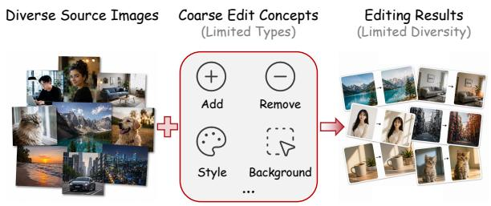
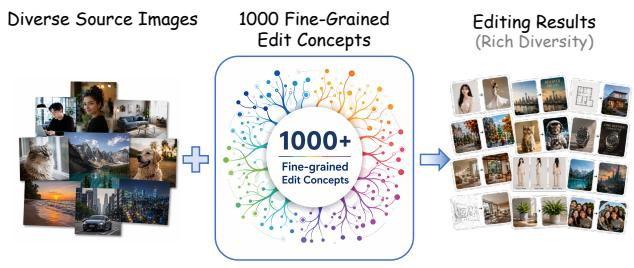
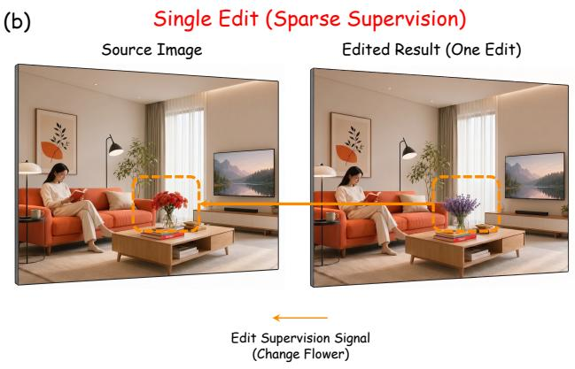
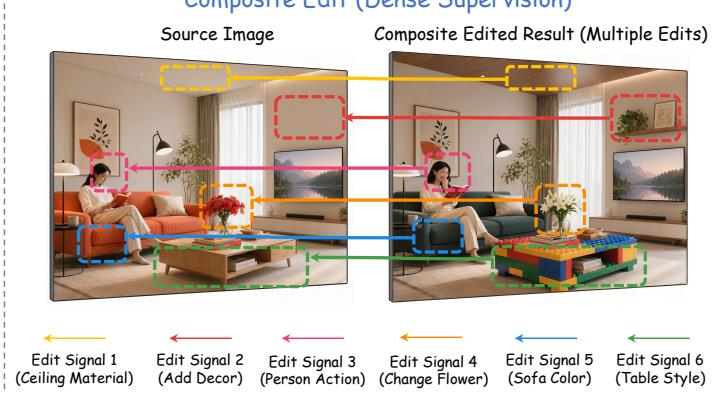
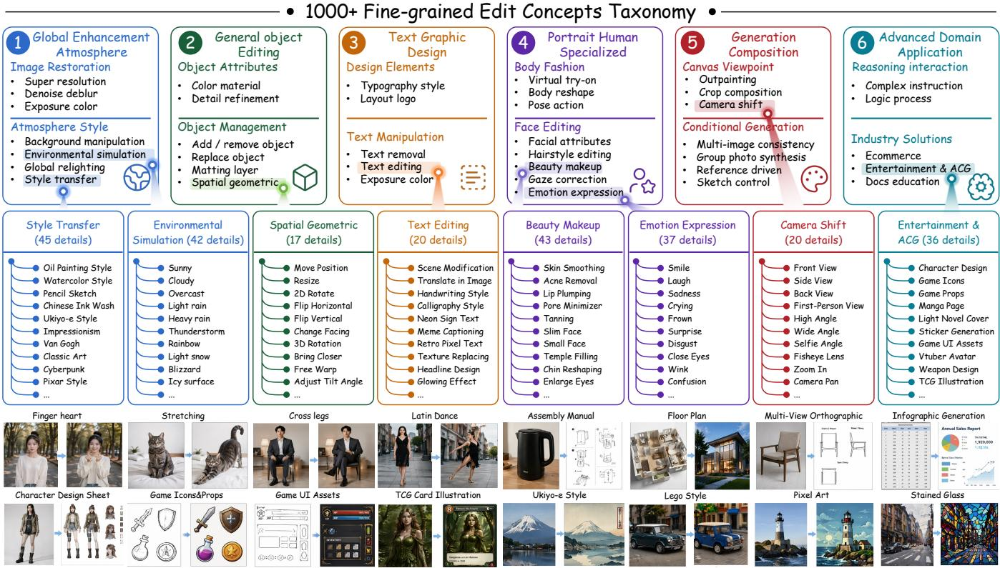
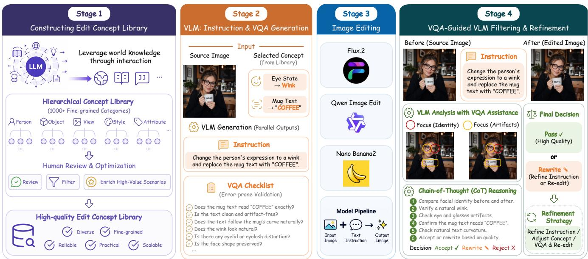
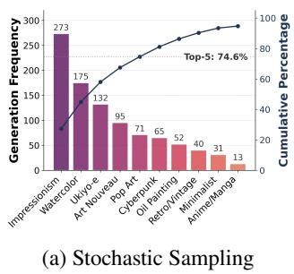
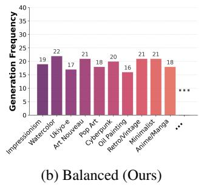
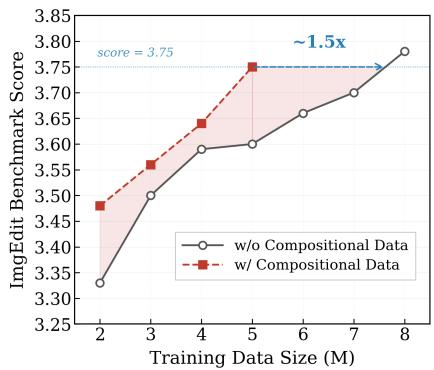

# Unlocking the Potential of Image Editing via Concept Scaling and Dense Supervision

Long Cui1,2, Xiaoqian Liu1, Qi Qin2, Yi Xin2, Tao Lin2,

Jianguo Li2,†, Linfeng Zhang1,†

1Shanghai Jiao Tong University 2Ant Group

GitHub Repo

https://github.com/inclusionAI/ConceptEdit

0 HuggingFace Dataset https://huggingface.co/collections/inclusionAI/conceptedit

## Abstract

Existing image editing frameworks predominantly follow the training paradigm of text-to-image difusion models. However, extending this paradigm to image editing highlights two inherent discrepancies, specifically, the insuficient attention to edit concept granularity and the training ineficiency caused by sparse supervision signals. To address these issues, we establish a comprehensive hierarchical taxonomy featuring over 1,000 fine-grained edit concepts and build ConceptEdit-12M, a massive dataset of 12 million high-quality editing pairs via an improved synthesis framework. This library-driven approach efectively rectifies the distribution collapse of generated data while ensuring high data fidelity. Furthermore, we propose a dense supervision training strategy that synthesizes multiple non-interfering concepts into single image pairs. By providing richer learning signals, this strategy significantly enhances both training eficiency and overall model performance. Training results validate our strategy, significantly outperforming prior works. Finally, we present ConceptEdit-Bench, a granular evaluation suite designed to diagnose model capabilities across a vast array of real-world scenarios.

## 1 Introduction

Recent advancements in Text-to-Image (T2I) difusion models [1, 2, 3, 4, 5, 6, 7] have achieved unprecedented success in generating diverse images of high quality. Building upon this, instruction-based image editing [8, 9, 10, 2, 11, 6] has emerged as a crucial application, allowing users to modify specific aspects of an image while preserving its original context. Most existing editing frameworks adopt a training paradigm similar to T2I, where the model is conditioned on both the source image and textual instructions to predict the edited target.

However, directly translating this training paradigm to image editing reveals two fundamental discrepancies. First, in the realm of T2I generation, it is a broad consensus that scaling up the diverse distribution of training data [12, 13, 14] is the key to enhancing generation capabilities. In contrast, an image editing sample fundamentally consists of two components: the source image and the edit concept (e.g., adding objects, replacing backgrounds, and altering attributes). While existing datasets [15, 16, 17, 18] have primarily scaled through the expansion of source image diversity, they pay insuficient attention to the diversity and granularity of the edit concepts (Fig. 1a). Second, unlike the global synthesis in T2I where generative signals apply to every pixel, image editing is fundamentally sparse. Specifically, only localized regions are actively modified, while the majority of the image serves as a static consistency constraint (Fig. 1b). Consequently, current research overlooks both the granularity of edit concepts and the training ineficiency caused by such sparse supervision.

In response to the first observation, we argue that the diversity of edit concepts is the true bottleneck for generalization in image editing. In this work, we move beyond simple data scaling and systematically investigate the impact of edit concept granularity on model performance. We hypothesize that the primary bottleneck in image editing training arises not from a lack of source image variety, but from insufficient exposure to a fine-grained distribution of potential modifications. To explore this, we establish a comprehensive taxonomy across multiple levels that defines over 1,000 finegrained edit concepts, aiming to exhaustively cover the vast landscape of editing scenarios in the real world. As illustrated in Fig. 2, this system subdivides coarse categories into precise modifications. For instance, character actions are refined into specific movements like “finger heart” or “shrugging,” while expressions are expanded to include nuanced states such as “anxious” or “confused.” Our empirical findings demonstrate that scaling the diversity of edit concepts more efectively unlocks the model’s potential and enhances its overall editing capabilities. Furthermore, this taxonomy enables us to establish a comprehensive benchmark that evaluates editing models at a fine granularity.

To resolve the second discrepancy, we rethink the eficiency of editing supervision signals. While compositional editing has been introduced as a specific task in several studies [18, 19], it is mostly treated as an end goal rather than a fundamental mechanism for training. We argue that the inherent sparsity of single edit samples, where often only a fraction of pixels provide active learning signals, limits training eficiency. However, we observe that localized edits are often distributed across spatial regions that do not interfere with one another, making them ideal candidates for compositional compression. To leverage this, we propose a training strategy that synthesizes multiple fine-grained edit concepts into a single image pair, thereby providing dense supervision signals. Our experiments reveal that training on these densely supervised samples not only enhances the model’s capability for complex editing but also broadly improves its performance on ordinary single edits, providing a more eficient training paradigm for general image editing.

Previous: Scaling Up Images Limited Edit Diversity  
  
Skewed distribution and restricted variety from neglected concepts.

Ours: Scaling Up Concepts Rich Edit Diversity through Fine-Grained Concepts  
  
Balanced distribution and rich diversity through granular concepts.

  
Figure 1: (a) Edit Concept Scaling. Left: The previous paradigm is restricted by coarse categories and limited diversity. Right: Our approach scales up to 1,000+ fine-grained concepts to ensure a balanced and rich distribution. (b) Dense Supervision. Left: Conventional training relies on single edit pairs with sparse supervision signals. Right: Our composite edit strategy provides dense supervision, enhancing training eficiency.

To operationalize these insights and ensure high training data fidelity, we propose an improved synthesis framework (Fig. 3) that enhances current editing pipelines [19, 20] by replacing stochastic sampling of coarse categories with a structured concept library. Rather than starting directly with instruction generation as in existing pipelines, we first distill extensive world knowledge from Large Language Models [21, 22] to proactively enumerate potential edit concepts across diverse domains. This allows us to controllably guide the distribution and diversity of the editing data to ensure exhaustive coverage of scenarios in the real world. To ensure the fidelity of our synthesis pipeline, we incorporate VQA filtering tailored to each instance. Rather than relying on generic templates, this mechanism generates customized pairs of questions and answers for every case. This guides the model to focus on localized regions prone to errors and directs a chain of thought (CoT) for systematic verification. This approach establishes a robust foundation for implementing concept scaling and dense supervision, supporting the construction of our dataset and a comprehensive, granular benchmark.

In summary, our main contributions are as follows:

• Edit Concept Scaling. We propose a paradigm shift in edit data scaling, moving from source image variety to edit concept richness. We establish a hierarchical taxonomy of 1,000 fine-grained categories to investigate concept diversity and enhance training performance.

• Dense Supervision Training. We propose a training methodology that leverages compositional edits to provide dense supervision signals, boosting training eficiency and performance for tasks involving both single and multiple concepts.

  
Figure 2: Hierarchical taxonomy of 1,000+ fine-grained edit concepts. Top: Overall hierarchical framework. Mid: Specific leaf nodes for detailed edit concepts. Bottom: Visualizations of edit samples.

• Improved Synthesis Framework. We develop a framework that distills LLM world knowledge for exhaustive scenario coverage. It incorporates VQA filtering tailored to each instance, directing focus toward localized regions and assisting CoT for verification.

• ConceptEdit Dataset and Benchmark. We construct a 12M high-quality editing dataset and benchmark across over 1,000 fine-grained categories, facilitating robust training and granular evaluation in realworld scenarios. To our knowledge, this scale represents the largest image editing dataset to date, tying with ScaleEdit-12M [20].

## 2 Related Work

Image Editing Models. Difusion priors [1, 23] catalyzed a paradigm shift in text-guided image editing. While early methods used manual latent engineering, Instruct-Pix2Pix [24] introduced instruction tuning, later refined by task-specific frameworks like OmniEdit [15]. Concurrently, unified multimodal models, such as Bagel [25], Emu3.5 [26], InternVL-U [27], and LLaDA2.0-Uni [28], demonstrate strong editing capabilities. However, open-source models still struggle to match the reasoning ceiling of proprietary systems like GPT-4o [29] and Nano Banana [6], highlighting the need for premium, knowledge-intensive datasets.

Image Editing Datasets. Image editing performance depends heavily on training data volume and diversity. Consequently, the field has transitioned from manual curation like MagicBrush [30] to automated pipelines. These pipelines synthesize data using multi-tool workflows in UltraEdit [17], ImgEdit [18], and Step1X-Edit [10], or generative models in NHR [31] and HQ-Edit [32]. Recent eforts like UnicEdit [19] and ScaleEdit [20] optimize these synthesis processes for refined data. However, despite growing data volume, existing datasets neglect edit concept distributions, limiting model generalization across real-world scenarios.

## 3 Methodology

## 3.1 Rethinking Data: VLM Distribution Collapse

Overcoming the generalization bottleneck in image editing requires scaling the diversity of edit concepts. However, current pipelines heavily rely on Vision-Language Models (VLMs) to stochastically generate instructions based on limited coarse-grained categories. This unconstrained dependency leads to a severe distribution collapse due to inherent VLM biases. As shown in Fig. 4, in the “style transfer” category, stochastic sampling causes the top 5 styles to dominate 74.6% of the generated instructions, leaving dozens of others at less than 1%. This collapse hinders domain generalization, where the “domain” is the precise edit concept defined by the instruction. Existing datasets thus draw sparse, biased samples from the vast instruction space. We therefore propose a paradigm shift from stochastic VLM generation to a structured, library-driven approach. Explicitly populating the instruction space with over 1,000 fine-grained categories ensures uniform exposure to diverse visual transformations and establishes a robust conceptual foundation.

  
Figure 3: Overview of the improved synthesis framework. Stage 1: Library Construction leveraging LLM world knowledge. Stage 2: Semantic Matching and Instruction Generation including VQA checklists. Stage 3: Image Synthesis using variou editing models. Stage 4: Instance Specific Verification using VQA.

  
Figure 4: Edit concept distributions. Stochastic sampling collapses while our library ensures diversity.

## 3.2 An Improved Synthesis Framework

Based on the insights discussed in Sec. 3.1, we propose an improved synthesis framework designed to generate highfidelity image editing pairs with a controllable concept distribution. Improving upon existing frameworks [19, 20], our pipeline consists of four key stages, as shown in Fig. 3: (1) Library Construction, where a structured Edit Concept Library is built to provide world knowledge; (2) Semantic Matching and Instruction Generation, where a VLM evaluates the compatibility between candidate concepts and specific source images to produce precise editing instructions and VQA verification metrics; (3) Image Synthesis, where an editing model is invoked to generate the target images based on the textual instructions; and (4) Instance-Specific Verification, where the results are filtered through localized VQA. Leveraging this improved pipeline, we produce ConceptEdit-12M, a large dataset containing 12 million verified, high-quality image editing pairs.

Edit Concept Library Construction The core of our framework lies in the construction of the comprehensive Edit Concept Library. While existing pipelines often rely on a handful of human-predefined coarse categories (typically 10–20), we aim to exhaustively cover the broad spectrum of common and valuable edit operations. As illustrated in Fig. 2, we scale these operations into over 1,000 fine-grained categories to ensure high conceptual density for robust generalization. To materialize this hierarchical taxonomy, we propose an automated, iterative workflow to distill world knowledge from Large Language Models.

Specifically, starting with a lightweight, manually initialized seed taxonomy, the LLM is prompted to continuously evaluate and dynamically expand the classification tree. During each iteration, the LLM is tasked to: (1) merge or prune redundant concepts, (2) extrapolate new intermediate subcategories, and (3) populate highly specific leaf nodes across diverse domains (e.g., physical attributes, complex human actions). This self-expanding loop repeats until the semantic expansion converges, efectively exhausting the LLM’s internal conceptual space for image manipulations. Finally, to ensure programmatic rigor, this LLM-generated taxonomy is meticulously refined by human experts to resolve remaining semantic overlaps and supplement missing high-value edge cases. As shown in Fig. 2, the resulting library comprises over 1,000 fine-grained edit concepts, providing a dense and structured conceptual space for downstream image editing.

Semantic Matching and Instruction Generation The extreme granularity of our library necessitates rigorous semantic grounding to ensure compatibility between concepts and image contexts $( \mathrm { e . g . }$ , avoiding “finger heart” edits on landscapes). We employ a VLM generator Φ. For a source image I, we sample a candidate concept subset $\mathcal { C } _ { \mathrm { c a n d } } \subset \mathcal { C } _ { \mathrm { l i b } }$ of size N, and formalize the matching process as:

  
Figure 5: Training eficiency for diferent strategies.

$$
\begin{array} { r } { \Phi \big ( \mathbf { I } , \mathcal { C } _ { \mathrm { c a n d } } \big ) \mapsto \big \{ ( c _ { k } , t _ { k } , v _ { k } ) \big \} _ { k = 1 } ^ { M } , \quad \mathrm { s . t . } ~ M \leq N } \end{array}\tag{1}
$$

where $c _ { k } \in \mathcal { C } _ { \mathrm { c a n d } }$ represents the matched concept, $t _ { k }$ is the generated editing instruction, and $v _ { k }$ denotes the accompanying VQA verification criteria generated concurrently. This fine-grained oversight enables dynamic distribution control. By tracking the frequencies of over 1,000 categories, we adaptively adjust sampling weights for $\mathcal { C } _ { \mathrm { c a n d } } .$ , which prevents distribution collapse and ensures conceptual diversity (Fig. 4b). Furthermore, to avoid restriction by the static taxonomy, we introduce a stochastic exploration mechanism. With a predefined probability, the VLM can bypass $\mathcal { C } _ { \mathrm { c a n d } }$ to autonomously propose novel concepts from its world knowledge, making the dataset both structured and diverse.

Instance-Specific VQA Filtering The quality of synthesized editing pairs depends on the precision of the filtering stage. VLM-based filtering typically utilizes generic prompts or predefined category-level templates for holistic assessment. However, these generalized approaches fail to account for the specific characteristics and potential failure modes of individual cases. To resolve this, we implement instancespecific VQA filtering as a supplementary verification layer.

Our framework utilizes the customized question-answer pairs vk generated during the instruction phase. In addition to the holistic assessment, these targeted queries direct the VLM to inspect localized regions that are particularly prone to editing failures. This structured inquiry facilitates CoT reasoning, enabling the VLM to systematically evaluate the correspondence between the instruction and the visual modification. By guiding the model to focus on critical, instruction-relevant areas while maintaining a global perspective, this mechanism improves the detection of subtle misalignments and provides a basis for either discarding low-quality samples or refining the associated instructions through recaptioning.

## 3.3 Dense Supervision via Composition

Consistent with the observations in Sec. 1, the inherent sparsity of single-concept edits limits overall training eficiency. As modified regions typically occupy only a small fraction of the image, the training objective becomes dominated by the reconstruction loss of the static background. This results in highly sparse editing supervision, where the model primarily optimizes for an identity mapping rather than active generative transformations.

To resolve this, we propose integrating multiple noninterfering edit concepts into a single image pair, a strategy we formulate as dense supervision via composition. To this end, we employ a VLM-driven aggregator $\Psi$ to perform compositional selection and instruction aggregation. For a source image I, we sample a candidate concept subset $\{ ( c _ { n } , m _ { n } ) \} _ { n = 1 } ^ { N }$ , where $c _ { n } \in \mathcal { C } _ { \mathrm { l i b } }$ is an edit concept and $m _ { n }$ is its corresponding edit region, and formalize the process as:

$$
\begin{array} { r } { \Psi \big ( \mathbf { I } , \{ ( c _ { n } , m _ { n } ) \} _ { n = 1 } ^ { N } \big ) \mapsto \big ( T _ { \mathrm { c o m p } } , V _ { \mathrm { c o m p } } , \{ ( c _ { k } , m _ { k } ) \} _ { k = 1 } ^ { M } \big ) , } \\ { \mathrm { s . t . } m _ { i } \cap m _ { j } = \emptyset , \quad i \neq j , \quad M \leq N . } \end{array}\tag{2}
$$

where M denotes the number of successfully selected concepts. In this formulation, the constraint $m _ { i } \cap m _ { j } = \emptyset$ is enforced on the output set to ensure that the selected edit regions are spatially disjoint, efectively preventing visual or conceptual interference. The mapping produces a single unified instruction $T _ { \mathrm { c o m p } } ,$ a global verification checklist $V _ { \mathrm { c o m p } } ,$ and the set of selected concept pairs $\{ ( c _ { k } , m _ { k } ) \} _ { k = 1 } ^ { M }$

This approach strategically distributes edit points across disparate regions to achieve balanced spatial coverage, while strictly mitigating regional overlaps to prevent visual or conceptual interference. Such complex data synthesis is facilitated by the high-fidelity framework detailed in Sec. 3.2, where we perform single or multiple model invocations to sequentially or concurrently apply various modifications. Our instance-specific VQA filtering serves as a linchpin in this process. By leveraging customized queries $V _ { \mathrm { c o m p } } .$ , the system can rigorously verify the execution of each independent edit within the composite pair. This strategy functions as a form of spatial data compression, significantly increasing the information entropy per sample. By providing dense supervision signals within a single forward pass, the model is forced to allocate more representation capacity to learning structural transformations rather than background preservation, empirically accelerating convergence (Fig. 5) and enhancing performance for both single and multi concept editing tasks.

## 3.4 The ConceptEdit Benchmark

While existing benchmarks for instruction-based image editing, such as ImgEdit-Bench [18] and GEdit-Bench [10], have advanced the field, they focus on coarse-grained capabilities under 50 generic types. However, in practice, a high-level aggregate score often obfuscates critical model failures in complex or long-tail cases. For instance, a model may excel at general action changes but fail at precise gestures like a “finger heart.” To address this, ConceptEdit-Bench provides a “microscopic” view through over 1,000 fine-grained concepts, ofering high controllability and modular diagnostic capability. Unlike benchmarks providing only a single aggregated score, our taxonomy allows selective monitoring of specific clusters of interest. This granular feedback is critical for iterative model development, enabling developers to precisely identify improvements in specific capabilities after training updates.

Table 1: Quantitative comparison and ablation study on the ImgEdit benchmark [18]. The models are trained on 2M and 5M data scales respectively. Abbreviations: Ext.: Extract, Rm.: Remove, Bg.: Background, Adj.: Adjust, Rep.: Replace, Act.: Action, Comp.: Compose. ∆ Comp. Gain indicates the improvement brought by dense supervision (w/ Comp) over ConceptEdit1000. ∆ Overall Gain highlights the total performance margin of our full framework over previous best-performing baseline (ScaleEdit). Best results per category at each scale are in bold.
<table><tr><td rowspan="2">Scale</td><td rowspan="2">Method</td><td colspan="9">Fine-Grained Editing Categories</td><td rowspan="2">Overall</td></tr><tr><td>Ext.</td><td>Add</td><td>Style</td><td>Rm.</td><td>Bg.</td><td>Adj.</td><td>Rep.</td><td>Act.</td><td>Comp.</td></tr><tr><td rowspan="7">2M</td><td>UnicEdit</td><td>2.20</td><td>3.71</td><td>3.62</td><td>1.52</td><td>3.48</td><td>3.24</td><td>3.24</td><td>3.46</td><td>2.07</td><td>2.95</td></tr><tr><td>ScaleEdit</td><td>2.10</td><td>3.71</td><td>4.35</td><td>3.22</td><td>2.86</td><td>2.70</td><td>3.57</td><td>3.58</td><td>2.42</td><td>3.17</td></tr><tr><td>ConceptEdit10</td><td>2.18</td><td>3.82</td><td>3.61</td><td>2.00</td><td>3.51</td><td>3.27</td><td>2.69</td><td>3.83</td><td>2.53</td><td>3.05</td></tr><tr><td>ConceptEdit500</td><td>2.19</td><td>4.02</td><td>4.49</td><td>2.46</td><td>3.58</td><td>3.66</td><td>2.43</td><td>3.78</td><td>2.75</td><td>3.26</td></tr><tr><td>ConceptEdit1000</td><td>2.17</td><td>3.96</td><td>4.55</td><td>2.71</td><td>3.49</td><td>3.59</td><td>3.33</td><td>3.63</td><td>2.52</td><td>3.33</td></tr><tr><td>ConceptEdit1000 w/ Comp</td><td>2.23</td><td>4.09</td><td>4.71</td><td>2.81</td><td>3.75</td><td>3.70</td><td>3.39</td><td>3.73</td><td>2.87</td><td>3.48</td></tr><tr><td>∆ Ċomp. Gain</td><td>+0.06</td><td>+0.13</td><td>+0.16</td><td>+0.10</td><td>+0.26</td><td>+0.11</td><td>+0.06</td><td>+0.10</td><td>+0.35</td><td>+0.15</td></tr><tr><td></td><td>∆ Overali Gain</td><td>+0.13</td><td>+0.38</td><td>+0.36</td><td>-0.41</td><td>+0.89</td><td>+1.00</td><td>-0.18</td><td>+0.15</td><td>+0.45</td><td>+0.31</td></tr><tr><td rowspan="7">5M</td><td>UnicEdit</td><td>2.26</td><td>3.80</td><td>3.70</td><td>2.22</td><td>3.57</td><td>3.40</td><td>2.89</td><td>4.01</td><td>2.62</td><td>3.16</td></tr><tr><td>ScaleEdit</td><td>2.19</td><td>3.64</td><td>4.57</td><td>3.64</td><td>2.75</td><td>2.79</td><td>3.91</td><td>3.84</td><td>2.42</td><td>3.31</td></tr><tr><td>ConceptEdit10</td><td>2.15</td><td>3.97</td><td>4.66</td><td>2.01</td><td>3.66</td><td>3.60</td><td>3.04</td><td>3.70</td><td>2.64</td><td>3.27</td></tr><tr><td>ConceptEdit500</td><td>2.35</td><td>4.05</td><td>4.75</td><td>2.56</td><td>3.82</td><td>3.59</td><td>3.12</td><td>4.30</td><td>2.75</td><td>3.48</td></tr><tr><td>ConceptEdit1000</td><td>2.32</td><td>4.12</td><td>4.83</td><td>3.35</td><td>3.92</td><td>3.78</td><td>3.52</td><td>3.98</td><td>2.61</td><td>3.60</td></tr><tr><td>ConceptEdit1000 w/ Comp</td><td>2.50</td><td>4.24</td><td>4.78</td><td>3.46</td><td>3.75</td><td>3.98</td><td>3.78</td><td>4.23</td><td>3.04</td><td>3.75</td></tr><tr><td>∆ Ċomp. Gain</td><td>+0.18</td><td>+0.12</td><td>-0.05</td><td>+0.11</td><td>-0.17</td><td>+0.20</td><td>+0.26</td><td>+0.25</td><td>+0.43</td><td>+0.15</td></tr><tr><td></td><td>∆ Overall Gain</td><td>+0.31</td><td>+0.60</td><td>+0.21</td><td>-0.18</td><td>+1.00</td><td>+1.19</td><td>-0.13</td><td>+0.39</td><td>+0.62</td><td>+0.44</td></tr></table>

Leveraging our fine-grained concept library, we introduce ConceptEdit-Bench to test the limits of instruction-following precision. We selected 1,000 distinct editing categories from our library, ensuring that each represents a unique, finegrained operation, such as distinguishing among a “smile,” “smirk,” and “laugh.” To guarantee broad visual distribution and high fidelity, source images are sampled from highquality open-source datasets [33, 34], covering diverse categories. Benchmark results are provided in the Supplementary Appendix.

## 4 Experiments

## 4.1 Implementation Details

We conduct our experiments using the Z-Image [4] framework as our base model. We evaluate our method on ImgEdit-Bench and GEdit-Bench using training scales of 2M and 5M samples. To avoid confounding variables in ablations, all samples are synthesized using Qwen3.5-122B-A10B [35] (instructions/filtering) and FLUX.2-klein-9B [36] (image synthesis). We employ a constant learning rate of $1 \times 1 0 ^ { - 5 }$ and a total batch size of 512. Other hyperparameters remain fixed for fair comparison, unless otherwise specified.

## 4.2 Comparative Study

We evaluate ConceptEdit against UnicEdit and ScaleEdit, two advanced open-source datasets, the latter of which has established its superiority through standardized training evaluations. All models are assessed on ImgEdit-Bench [18] and GEdit-Bench [10] at 2M and 5M scales across diverse categories to measure overall editing capability. For the 5M scale, UnicEdit utilized repeated samples as only a portion of its data has been released.

As reported in Table 1, ConceptEdi $\mathrm { 1 0 0 0 w / C o m p }$ consistently yields the highest overall scores on ImgEdit-Bench. At 2M and 5M scales, ConceptEdit achieves overall scores of 3.48 and 3.75, outperforming ScaleEdit by absolute margins of 0.31 and 0.44 points, respectively. ConceptEdit shows clear advantages in categories such as Add, Style, Bg., and Act.. Similarly, results on GEdit-Bench (Table 2) demonstrate the consistent superiority of ConceptEdit across both English and Chinese evaluations. Notably, the performance boost is primarily attributed to the increased accuracy in instruction following $( G _ { S C } )$ , which aligns with our theoretical expectations. These findings underscore the eficacy of scaling edit concepts to enhance model generalization.

## 4.3 Ablation Study

Efect of Concept Scaling To investigate the impact of edit concept diversity on model performance, we compare three variants of our dataset with increasing granularity: ConceptEdit10, ConceptEdit500, and ConceptEdit1000. On ImgEdit-Bench, scaling from 10 to 500 and 1,000+ categories improves 2M-scale scores from 3.05 to 3.26 and 3.33, respectively. At the 5M scale, ConceptEdit1000 (3.60) outperforms ConceptEdit10 (3.27) by 0.33 points. GEdit-Bench corroborates this trend. At the 5M scale, moving from 10 to 500 concepts boosts $G _ { S C }$ for English (5.91 to 6.84) and Chinese (5.83 to 6.80) evaluations, with ConceptEdit1000 maintaining these levels. These gains span tasks like Style, Adj., and Rep., proving that fine-grained concept distribution effectively outperforms naive scaling with coarse instructions.

Table 2: Quantitative comparison and ablation study on GEdit-Bench [10]. The models are evaluated at 2M and 5M training data scales. ∆ Comp. Gain indicates the improvement brought by dense supervision (w/ Comp) over the baseline ConceptEdit . ∆ Overall Gain highlights the performance margin of our full framework over the previous best baseline (ScaleEdit). Best results per metric at each scale are in bold.
<table><tr><td rowspan="2">Scale</td><td rowspan="2">Method</td><td colspan="3">GEdit-Bench-EN</td><td colspan="3">GEdit-Bench-CN</td></tr><tr><td> $G _ { S C } \uparrow$ </td><td> $G _ { P Q } ~ $  个</td><td> $G _ { O } \uparrow$ </td><td> $G _ { S C }$  ←</td><td> $G _ { P Q }$  ←</td><td> $G _ { O } \uparrow$ </td></tr><tr><td rowspan="7">2M</td><td>UnicEdit</td><td>4.87</td><td>7.03</td><td>4.79</td><td>4.83</td><td>7.00</td><td>4.65</td></tr><tr><td>ScaleEdit</td><td>5.30</td><td>6.79</td><td>5.38</td><td>5.33</td><td>6.66</td><td>5.25</td></tr><tr><td> $\mathrm { C o n c e p t E d i t _ { 1 0 } }$ </td><td>5.34</td><td>6.76</td><td>5.41</td><td>5.54</td><td>7.03</td><td>5.15</td></tr><tr><td> $\mathrm { C o n c e p t E d i t } _ { 5 0 0 }$ </td><td>5.90</td><td>7.13</td><td>5.54</td><td>5.51</td><td>6.70</td><td>5.45</td></tr><tr><td> $\mathrm { C o n c e p t E d i t _ { 1 0 0 0 } }$ </td><td>5.91</td><td>6.76</td><td>5.48</td><td>5.87</td><td>7.00</td><td>5.48</td></tr><tr><td> $\mathrm { C o n c e p t E d i t _ { 1 0 0 0 } w / C o m p }$ </td><td>6.34</td><td>6.79</td><td>5.81</td><td>6.32</td><td>6.93</td><td>5.83</td></tr><tr><td> $\Delta C o m p . ~ G a i n$ </td><td>+0.43</td><td>+0.03</td><td>+0.33</td><td>+0.45</td><td>-0.07</td><td>+0.35</td></tr><tr><td rowspan="7"></td><td> $\Delta \xrightarrow { } O v e r a l l G a i n$ </td><td>+1.04</td><td>+0.00</td><td>+0.43</td><td>+0.99</td><td>+0.27</td><td>+0.58</td></tr><tr><td>UnicEdit</td><td>5.39</td><td>7.17</td><td>5.25</td><td>5.32</td><td>7.13</td><td>5.07</td></tr><tr><td>ScaleEdit</td><td>5.77</td><td>6.69</td><td>5.77</td><td>5.62</td><td>6.97</td><td>5.63</td></tr><tr><td> $\mathrm { C o n c e p t E d i t _ { 1 0 } }$ </td><td>5.91</td><td>6.93</td><td>5.93</td><td>5.83</td><td>7.00</td><td>5.81</td></tr><tr><td> $\mathrm { C o n c e p t E d i t _ { 5 0 0 } }$ </td><td>6.84</td><td>7.00</td><td>6.30</td><td>6.80</td><td>7.05</td><td>6.31</td></tr><tr><td> $\mathrm { C o n c e p t E d i t _ { 1 0 0 0 } }$ </td><td>6.86</td><td>7.19</td><td>6.40</td><td>6.75</td><td>7.31</td><td>6.36</td></tr><tr><td>ConceptEdit1000 w/ Comp</td><td>7.07</td><td>7.30</td><td>6.62</td><td>7.07</td><td>7.42</td><td>6.60</td></tr><tr><td rowspan="2"></td><td>∆ Čomp. Gain</td><td>+0.21</td><td>+0.11</td><td>+0.22</td><td>+0.32</td><td>+0.11</td><td>+0.24</td></tr><tr><td>∆ Overali Gain</td><td>+1.30</td><td>+0.61</td><td>+0.85</td><td>+1.45</td><td>+0.45</td><td>+0.97</td></tr></table>

Efect of Dense Supervision To evaluate dense supervision, we mix ConceptEdit with composite edits in a 1:1 ratio. As shown in Table 1, this composition consistently improves ImgEdit-Bench scores by 0.15 points across scales. These gains extend beyond the Comp. task, boosting categories like Adj. (+0.20), Rep. (+0.26), and Act. (+0.25) at the 5M scale. On GEdit-Bench-EN, the $G _ { \mathrm { S C } }$ score at the 2M scale corroborates this with a ∆ Comp. Gain of up to 0.43 points, confirming that learning from spatially non-interfering composite edits improves core visual understanding. Furthermore, matching the w/ Comp performance without composite data requires 1.5× more samples (Fig. 5). This validates that compositional edits provide dense supervision, significantly compressing training time.

Table 3: Ablation study of our VQA filtering pipeline.
<table><tr><td>Filtering Strategy</td><td>Precision Recall F1-Score Accuracy (%)</td><td>(%)</td><td>(%)</td><td>(%)</td></tr><tr><td>Pseudo GT (Gemini)</td><td>100.0</td><td>100.0</td><td>100.0</td><td>100.0</td></tr><tr><td>Generic Validation</td><td>75.0</td><td>57.0</td><td>65.0</td><td>90.0</td></tr><tr><td>Instance-Specific (Ours)</td><td>84.0</td><td>87.0</td><td>86.0</td><td>95.0</td></tr><tr><td>∆ Gain</td><td>↑9.0</td><td>↑30.0</td><td>↑21.0</td><td>↑5.0</td></tr></table>

Efect of VQA Filtering To ensure high fidelity alignment and suppress hallucinations, we compare our instancespecific VQA filtering against a generic VLM validation baseline. While the baseline uses uniform prompts for holistic assessment, the ConceptEdit pipeline dynamically formulates fine-grained questions tailored to specific edit concepts (e.g., checking for localized artifacts). Metrics are evaluated against pseudo-labels from Gemini-3-Pro [37]. As shown in Table 3, our VQA pipeline significantly outperforms the baseline, boosting Precision, Recall, F1-score, and Accuracy by 9.0%, 30.0%, 21.0%, and 5.0%, respectively. While generic validation often overlooks subtle failures due to salient object bias, our region-aware verification successfully detects localized artifacts. This customized approach proves highly efective at identifying hallucinations, ensuring high-quality training data.

## 5 Conclusion

This work addresses the lack of edit concept granularity and sparse training signals in instruction-based image editing. We introduce ConceptEdit, a structured paradigm emphasizing edit concept scaling and dense supervision. Specifically, we build a 1,000-category hierarchical taxonomy and leverage composite edits for training. Our experiments show that granular edit concepts significantly enhance editing capabilities across diverse scenarios. Additionally, dense supervision accelerates training convergence by 1.5× and boosts performance on single-concept tasks. Our instance-specific VQA filtering also reduces errors compared to generic validation. Finally, we present the ConceptEdit-12M dataset and ConceptEdit-Bench. This suite achieves SOTA results, outperforming existing baselines like ScaleEdit and UnicEdit.

## References

[1] Robin Rombach, Andreas Blattmann, Dominik Lorenz, Patrick Esser, and Björn Ommer. High-resolution image synthesis with latent difusion models. In CVPR, 2022.

[2] Chenfei Wu, Jiahao Li, Jingren Zhou, Junyang Lin, Kaiyuan Gao, Kun Yan, Sheng-ming Yin, Shuai Bai, Xiao Xu, Yilei Chen, et al. Qwen-image technical report. arXiv preprint arXiv:2508.02324, 2025.

[3] Qi Qin, Le Zhuo, Yi Xin, Ruoyi Du, Zhen Li, Bin Fu, Yiting Lu, Xinyue Li, Dongyang Liu, Xiangyang Zhu, et al. Lumina-image 2.0: A unified and eficient image generative framework. In Int. Conf. Comput. Vis., 2025.

[4] Huanqia Cai, Sihan Cao, Ruoyi Du, Peng Gao, Steven Hoi, Zhaohui Hou, Shijie Huang, Dengyang Jiang, Xin Jin, Liangchen Li, et al. Z-image: An eficient image generation foundation model with single-stream diffusion transformer. arXiv preprint arXiv:2511.22699, 2025.

[5] Meituan LongCat Team, Hanghang Ma, Haoxian Tan, Jiale Huang, Junqiang Wu, Jun-Yan He, Lishuai Gao, Songlin Xiao, Xiaoming Wei, Xiaoqi Ma, et al. Longcat-image technical report. arXiv preprint arXiv:2512.07584, 2025.

[6] Google DeepMind. Nano banana: Gemini ai image generator and photo editor. https://gemini.google/ overview/image-generation/, 2025.

[7] OpenAI. Introducing 4o image generation. https://openai.com/index/introducing-4o-imagegeneration/, March 2025.

[8] Yichun Shi, Peng Wang, and Weilin Huang. Seededit: Align image re-generation to image editing. arXiv preprint arXiv:2411.06686, 2024.

[9] Black Forest Labs, Stephen Batifol, Andreas Blattmann, Frederic Boesel, Saksham Consul, Cyril Diagne, Tim Dockhorn, Jack English, Zion English, Patrick Esser, Sumith Kulal, Kyle Lacey, Yam Levi, Cheng Li, Dominik Lorenz, Jonas Müller, Dustin Podell, Robin Rombach, Harry Saini, Axel Sauer, and Luke Smith. Flux.1 kontext: Flow matching for incontext image generation and editing in latent space. arXiv preprint arXiv:2506.15742, 2025.

[10] Shiyu Liu, Yucheng Han, Peng Xing, Fukun Yin, Rui Wang, Wei Cheng, Jiaqi Liao, Yingming Wang, Honghao Fu, Chunrui Han, Guopeng Li, Yuang Peng, Quan Sun, Jingwei Wu, Yan Cai, Zheng Ge, Ranchen Ming, Lei Xia, Xianfang Zeng, Yibo Zhu, Binxing Jiao, Xiangyu Zhang, Gang Yu, and Daxin Jiang. Step1x-edit: A practical framework for general image editing. arXiv preprint arXiv:2504.17761, 2025.

[11] Yi Xin, Qi Qin, Siqi Luo, Kaiwen Zhu, Juncheng Yan, Yan Tai, Jiayi Lei, Yuewen Cao, Keqi Wang, Yibin Wang, et al. Lumina-dimoo: An omni difusion large language model for multi-modal generation and understanding. arXiv preprint arXiv:2510.06308, 2025.

[12] OpenAI. DALL·E 3. https://openai.com/research/dalle-3, September 2023.

[13] Patrick Esser, Sumith Kulal, Andreas Blattmann, Rahim Entezari, Jonas Müller, Harry Saini, Yam Levi, Dominik Lorenz, Axel Sauer, Frederic Boesel, Dustin Podell, Tim Dockhorn, Zion English, Kyle Lacey, Alex Goodwin, Yannik Marek, and Robin Rombach. Scaling rectified flow transformers for high-resolution image synthesis, 2024. URL https://arxiv.org/abs/2403. 03206.

[14] Dustin Podell, Zion English, Kyle Lacey, Andreas Blattmann, Tim Dockhorn, Jonas Müller, Joe Penna, and Robin Rombach. Sdxl: Improving latent difusion models for high-resolution image synthesis, 2023. URL https://arxiv.org/abs/2307.01952.

[15] Cong Wei, Zheyang Xiong, Weiming Ren, Xinrun Du, Ge Zhang, and Wenhu Chen. Omniedit: Building image editing generalist models through specialist supervision. arXiv preprint arXiv:2411.07199, 2024.

[16] Qifan Yu, Wei Chow, Zhongqi Yue, Kaihang Pan, Yang Wu, Xiaoyang Wan, Juncheng Li, Siliang Tang, Hanwang Zhang, and Yueting Zhuang. Anyedit: Mastering unified high-quality image editing for any idea. arXiv preprint arXiv:2411.15738, 2024.

[17] Haozhe Zhao, Xiaojian Shawn Ma, Liang Chen, Shuzheng Si, Rujie Wu, Kaikai An, Peiyu Yu, Minjia Zhang, Qing Li, and Baobao Chang. Ultraedit: Instruction-based fine-grained image editing at scale. Advances in Neural Information Processing Systems, 37:3058–3093, 2024.

[18] Yang Ye, Xianyi He, Zongjian Li, Bin Lin, Shenghai Yuan, Zhiyuan Yan, Bohan Hou, and Li Yuan. Imgedit: A unified image editing dataset and benchmark. arXiv preprint arXiv:2505.20275, 2025.

[19] Keming Ye, Zhipeng Huang, Canmiao Fu, Qingyang Liu, Jiani Cai, Zheqi Lv, Chen Li, Jing Lyu, Zhou Zhao, and Shengyu Zhang. Unicedit-10m: A dataset and benchmark breaking the scale-quality barrier via unified verification for reasoning-enriched edits, 2025. URL https://arxiv.org/abs/2512.02790.

[20] Guanzhou Chen, Erfei Cui, Changyao Tian, Danni Yang, Ganlin Yang, Yu Qiao, Hongsheng Li, Gen Luo, and Hongjie Zhang. Scaleedit-12m: Scaling open-source image editing data generation via multiagent framework, 2026. URL https://arxiv.org/abs/ 2603.20644.

[21] Josh Achiam, Steven Adler, Sandhini Agarwal, Lama Ahmad, Ilge Akkaya, Florencia Leoni Aleman, Diogo Almeida, Janko Altenschmidt, Sam Altman, Shyamal Anadkat, et al. Gpt-4 technical report. arXiv preprint arXiv:2303.08774, 2023.

[22] Google. Gemini. Large-scale multimodal model, 2024. URL https://deepmind.google/technologies/ gemini/. Gemini 1.5 Flash version.

[23] Dustin Podell, Zion English, Kyle Lacey, Andreas Blattmann, Tim Dockhorn, Jonas Müller, Joe Penna, and Robin Rombach. Sdxl: Improving latent difusion models for high-resolution image synthesis. arXiv preprint arXiv:2307.01952, 2023.

[24] Tim Brooks, Aleksander Holynski, and Alexei A Efros. Instructpix2pix: Learning to follow image editing instructions. In CVPR, 2023.

[25] Chaorui Deng, Deyao Zhu, Kunchang Li, Chenhui Gou, Feng Li, Zeyu Wang, Shu Zhong, Weihao Yu, Xiaonan Nie, Ziang Song, Guang Shi, and Haoqi Fan. Emerging properties in unified multimodal pretraining. arXiv preprint arXiv:2505.14683, 2025.

[26] Yufeng Cui, Honghao Chen, Haoge Deng, Xu Huang, Xinghang Li, Jirong Liu, Yang Liu, Zhuoyan Luo, Jinsheng Wang, Wenxuan Wang, et al. Emu3.5: Native multimodal models are world learners. arXiv preprint arXiv:2510.26583, 2025.

[27] Changyao Tian, Danni Yang, Guanzhou Chen, Erfei Cui, Zhaokai Wang, Yuchen Duan, Penghao Yin, Sitao Chen, Ganlin Yang, Mingxin Liu, et al. Internvl-u: Democratizing unified multimodal models for understanding, reasoning, generation and editing. arXiv preprint arXiv:2603.09877, 2026.

[28] Inclusion AI, Tiwei Bie, Haoxing Chen, Tieyuan Chen, Zhenglin Cheng, Long Cui, Kai Gan, Zhicheng Huang, Zhenzhong Lan, Haoquan Li, Jianguo Li, Tao Lin, Qi Qin, Hongjun Wang, Xiaomei Wang, Haoyuan Wu, Yi Xin, and Junbo Zhao. Llada2.0-uni: Unifying multimodal understanding and generation with difusion large language model, 2026. URL https: //arxiv.org/abs/2604.20796.

[29] OpenAI. GPT-4o. Large-scale multimodal model, May 2024. URL https://openai.com/index/hello-gpt-4o/. May 13, 2024 version.

[30] Kai Zhang, Lingbo Mo, Wenhu Chen, Huan Sun, and Yu Su. Magicbrush: A manually annotated dataset for instruction-guided image editing, 2024. URL https: //arxiv.org/abs/2306.10012.

[31] Maksim Kuprashevich, Grigorii Alekseenko, Irina Tolstykh, Georgii Fedorov, Bulat Suleimanov, Vladimir Dokholyan, and Aleksandr Gordeev. Nohumansrequired: Autonomous high-quality image editing triplet mining, 2025. URL https://arxiv.org/abs/2507.14119.

[32] Mude Hui, Siwei Yang, Bingchen Zhao, Yichun Shi, Heng Wang, Peng Wang, Yuyin Zhou, and Cihang Xie. Hq-edit: A high-quality dataset for instruction-based image editing, 2024. URL https://arxiv.org/abs/2404. 09990.

[33] Alina Kuznetsova, Hassan Rom, Neil Alldrin, Jasper Uijlings, Ivan Krasin, Jordi Pont-Tuset, Shahab Kamali, Stefan Popov, Matteo Malloci, Alexander Kolesnikov, et al. The open images dataset v4: Unified image classification, object detection, and visual relationship detection at scale. IJCV, 128(7):1956–1981, 2020.

[34] Xu Ma, Yitian Zhang, Qihua Dong, and Yun Fu. Finet2i: An open, large-scale, and diverse dataset for highquality t2i fine-tuning, 2026. URL https://arxiv.org/ abs/2602.09439.

[35] Qwen Team. Qwen3.5. https://huggingface.co/ collections/Qwen/qwen35, 2026.

[36] Black Forest Labs. Flux.2-klein. https://huggingface. co/collections/black-forest-labs/flux2, 2026.

[37] Google. Gemini. Large-scale multimodal model, 2025. URL https://aistudio.google.com/models/ gemini-3. Gemini 3.0 pro version.

[38] John Canny. A computational approach to edge detection. IEEE Trans. Pattern Anal. Mach. Intell., 1986.

[39] Saining Xie and Zhuowen Tu. Holistically-nested edge detection. In IEEE Conf. Comput. Vis. Pattern Recog., 2015.

[40] Geonmo Gu, Byungsoo Ko, SeoungHyun Go, Sung-Hyun Lee, Jingeun Lee, and Minchul Shin. Towards light-weight and real-time line segment detection. In AAAI, 2022.

[41] Kunchang Li, Yali Wang, Junhao Zhang, Peng Gao, Guanglu Song, Yu Liu, Hongsheng Li, and Yu Qiao. Uniformer: Unifying convolution and self-attention for visual recognition. IEEE Trans. Pattern Anal. Mach. Intell., 2023.

[42] Lihe Yang, Bingyi Kang, Zilong Huang, Zhen Zhao, Xiaogang Xu, Jiashi Feng, and Hengshuang Zhao. Depth anything v2. arXiv:2406.09414, 2024.

[43] Haofei Xu, Jing Zhang, Jianfei Cai, Hamid Rezatofighi, Fisher Yu, Dacheng Tao, and Andreas Geiger. Unifying flow, stereo and depth estimation. IEEE Trans. Pattern Anal. Mach. Intell., 2023.

[44] Z. Cao, G. Hidalgo Martinez, T. Simon, S. Wei, and Y. A. Sheikh. Openpose: Realtime multi-person 2d pose estimation using part afinity fields. IEEE Trans. Pattern Anal. Mach. Intell., 2019.

[45] Kai Zhang, Lingbo Mo, Wenhu Chen, Huan Sun, and Yu Su. Magicbrush: A manually annotated dataset for instruction-guided image editing. Advances in Neural Information Processing Systems, 36:31428–31449, 2023.

[46] Yuying Ge, Sijie Zhao, Chen Li, Yixiao Ge, and Ying Shan. Seed-data-edit technical report: A hybrid dataset for instructional image editing. arXiv preprint arXiv:2405.04007, 2024.

[47] Maksim Kuprashevich, Grigorii Alekseenko, Irina Tolstykh, Georgii Fedorov, Bulat Suleimanov, Vladimir Dokholyan, and Aleksandr Gordeev. Nohumansrequired: Autonomous high-quality image editing triplet mining. arXiv preprint arXiv:2507.14119, 2025.

[48] Yuhan Wang, Siwei Yang, Bingchen Zhao, Letian Zhang, Qing Liu, Yuyin Zhou, and Cihang Xie. Gptimage-edit-1.5 m: A million-scale, gpt-generated image dataset. arXiv preprint arXiv:2507.21033, 2025.

[49] Meituan LongCat Team, Hanghang Ma, Haoxian Tan, Jiale Huang, Junqiang Wu, Jun-Yan He, Lishuai Gao, Songlin Xiao, Xiaoming Wei, Xiaoqi Ma, Xunliang Cai, Yayong Guan, and Jie Hu. Longcat-image technical report, 2025. URL https://arxiv.org/abs/2512. 07584.

[50] Super Intelligence Team, Changhao Qiao, Chao Hui, Chen Li, Cunzheng Wang, Dejia Song, Jiale Zhang,

Jing Li, Qiang Xiang, Runqi Wang, Shuang Sun, Wei Zhu, Xu Tang, Yao Hu, Yibo Chen, Yuhao Huang, Yuxuan Duan, Zhiyi Chen, and Ziyuan Guo. Fireredimage-edit-1.0 technical report, 2026. URL https:// arxiv.org/abs/2602.13344.

[51] Team Seedream, :, Yunpeng Chen, Yu Gao, Lixue Gong, Meng Guo, Qiushan Guo, Zhiyao Guo, Xiaoxia Hou, Weilin Huang, Yixuan Huang, Xiaowen Jian, Huafeng Kuang, Zhichao Lai, Fanshi Li, Liang Li, Xiaochen Lian, Chao Liao, Liyang Liu, Wei Liu, Yanzuo Lu, Zhengxiong Luo, Tongtong Ou, Guang Shi, Yichun Shi, Shiqi Sun, Yu Tian, Zhi Tian, Peng Wang, Rui Wang, Xun Wang, Ye Wang, Guofeng Wu, Jie Wu, Wenxu Wu, Yonghui Wu, Xin Xia, Xuefeng Xiao, Shuang Xu, Xin Yan, Ceyuan Yang, Jianchao Yang, Zhonghua Zhai, Chenlin Zhang, Heng Zhang, Qi Zhang, Xinyu Zhang, Yuwei Zhang, Shijia Zhao, Wenliang Zhao, and Wenjia Zhu. Seedream 4.0: Toward next-generation multimodal image generation, 2025. URL https://arxiv.org/abs/2509.20427.

## Supplementary Material

## A Discussion on Generalized I2I Translation

Conceptually, any image-to-image (I2I) translation can be viewed as a generalized form of image editing, where the source image serves as a structural condition and the text instruction specifies the target domain mapping.

Our taxonomy of 1,000+ concepts primarily targets daily, user-centric interactive editing. We do not exhaustively categorize highly specialized or structural translation tasks, as they are typically treated as professional rendering or conditional generation rather than common interactive edits.

Nonetheless, to ensure broad scenario coverage and evaluate our model’s adaptability, we incorporate a representative subset of classic structural tasks into our dataset, including:

• Canny edges [38]

• HED edges [39]

• Hough lines [40]

• Semantic segmentation maps [41]

• Depth maps [42]

• Shape normal maps [43]

• Human keypoints [44]

This integration demonstrates that our framework remains robust and compatible with traditional, structurally constrained image translation paradigms.

As illustrated in Fig. 6, our dataset efectively supports these structurally conditioned transformations.

  
Figure 6: Visualizations of generalized image-to-image translation under various structural control signals.

## B Detailed Ablation on VQA Filtering Strategy

Table 4 presents the complete ablation results of our VQA filtering pipeline, including the raw confusion matrix counts.

By dynamically formulating tailored questions, our instance-specific strategy significantly reduces False Negatives (FN) from 72 to 21 and increases True Positives (TP) from 95 to 146 compared to the generic validation baseline. This targeted, region-aware verification efectively suppresses subtle edit failures, resulting in substantial gains across all metrics: +9.0% in Precision, +30.0% in Recall, +21.0% in F1-Score, and +5.0% in Accuracy.

We also evaluate the per-sample computational overhead on Qwen3.5-122B-A10B. As shown in Table 5, our instancespecific strategy incurs only a marginal total overhead of +0.069s per sample. Crucially, the entire data synthesis pipeline is heavily dominated by the DiT image generation phase, whereas the instruction generation and filtering stages together account for merely 2%–10% of the total runtime (depending on the image generation model used).

Table 4: Detailed ablation of our VQA filtering pipeline, including raw confusion matrix counts.
<table><tr><td>Metric</td><td>Ground Truth</td><td>Generic</td><td>Ours</td><td>∆ Gain</td></tr><tr><td>TN</td><td>833</td><td>802</td><td>805</td><td></td></tr><tr><td>FN</td><td>0</td><td>72</td><td>21</td><td></td></tr><tr><td>TP</td><td>167</td><td>95</td><td>146</td><td></td></tr><tr><td>FP</td><td>0</td><td>31</td><td>28</td><td></td></tr><tr><td>Precision (%)</td><td>100.0</td><td>75.0</td><td>84.0</td><td>↑9.0</td></tr><tr><td>Recall (%)</td><td>100.0</td><td>57.0</td><td>87.0</td><td>↑30.0</td></tr><tr><td>F1-Score (%)</td><td>100.0</td><td>65.0</td><td>86.0</td><td>↑21.0</td></tr><tr><td>Accuracy (%)</td><td>100.0</td><td>90.0</td><td>95.0</td><td>↑5.0</td></tr></table>

Table 5: Per-sample processing latency (seconds) benchmarked on Qwen3.5-122B-A10B.
<table><tr><td>Stage</td><td>Generic</td><td>Ours</td><td>Overhead</td></tr><tr><td>Instruction Generation</td><td>0.523s</td><td>0.567s</td><td>+0.044s</td></tr><tr><td>Filtering Stage</td><td>0.312s</td><td>0.337s</td><td>+0.025s</td></tr><tr><td>Total</td><td>0.835s</td><td>0.904s</td><td>+0.069s</td></tr></table>

## C Dataset Comparison

As compared in Table 6, we evaluate our proposed ConceptEdit dataset against existing mainstream image editing datasets across multiple dimensions. The comparison highlights several key advantages of ConceptEdit: First, it significantly scales up both data volume and task diversity, containing 12 million editing pairs across over 1,000 subtasks, which far exceeds the maximum of 23 found in previous datasets. Second, ConceptEdit establishes a more rigorous quality control pipeline. Notably, it is the only dataset that incorporates instance-specific filtering, which ensures high-fidelity alignment between editing instructions and visual changes. Third, it comprehensively supports both basic and complex editing scenarios, providing a more versatile resource for the community. Lastly, ConceptEdit is the only dataset that features distribution control, allowing for a more balanced and controllable training.

## D Model Performance on ConceptEdit-Bench

Table 7 presents a comprehensive evaluation of mainstream models on ConceptEdit-Bench. Closed-source models demonstrate strong performance, with Nano Banana 2 achieving the highest overall score of 66.19, while Seedream 4.5 records a score of 63.34. Within the open-source category, FireRed-Image-Edit-1.0 leads with a score of 65.86. A primary observation is that although most models successfully follow basic instructions, nearly all experience a notable decline in the Portrait and Composition categories. This indicates a general dificulty in performing edits that rely on detailed world knowledge, such as micro-expressions, or sophisticated spatial reasoning. Such findings highlight the value of our high-quality dataset and structured synthesis framework in addressing these persistent challenges.

Table 6: Comparison of Image Editing datasets.
<table><tr><td rowspan="2">Dataset</td><td rowspan="2">Sub- tasks</td><td rowspan="2">Size</td><td colspan="3">Post Verification</td><td rowspan="2">Edit</td><td rowspan="2">Basic Complex Edit</td><td rowspan="2">Dist. Control</td></tr><tr><td>Failed Filtration</td><td>Inst.-Spec. Filtering</td><td>Recaption</td></tr><tr><td>MagicBrush [45]</td><td>5</td><td>~10K</td><td></td><td>X</td><td>X</td><td></td><td></td><td></td></tr><tr><td>InstructPix2Pix [24]</td><td>4</td><td>~313K</td><td>X</td><td>X</td><td>X</td><td></td><td></td><td></td></tr><tr><td>HQ-Edit [32]</td><td>6</td><td>~197K</td><td>X</td><td>X</td><td></td><td></td><td></td><td></td></tr><tr><td>SEED-Data-Edit [46]</td><td>6</td><td>~3.7M</td><td></td><td>X</td><td>X</td><td></td><td></td><td></td></tr><tr><td>UltraEdit [17]</td><td>9</td><td>~4M</td><td></td><td></td><td>X</td><td></td><td></td><td></td></tr><tr><td>ImgEdit [18]</td><td>13</td><td>~1.2M</td><td></td><td></td><td>X</td><td></td><td></td><td></td></tr><tr><td>NHR-Edit [47]</td><td></td><td>~358K</td><td></td><td></td><td>X</td><td></td><td></td><td></td></tr><tr><td>GPT-Image-Edit-1.5M [48]</td><td></td><td>~1.5M</td><td>X</td><td></td><td></td><td></td><td></td><td></td></tr><tr><td>UnicEdit [19]</td><td>22</td><td>~10M</td><td></td><td></td><td></td><td></td><td></td><td></td></tr><tr><td>ScaleEdit [20]</td><td>23</td><td>~12M</td><td></td><td></td><td>X</td><td></td><td></td><td></td></tr><tr><td>ConceptEdit</td><td>1000</td><td>~12M</td><td></td><td></td><td></td><td></td><td></td><td></td></tr></table>

Table 7: Quantitative comparison on ConceptEdit-Bench. The “Overall” column represents the final aggregated performance across our 1,000 fine-grained categories.
<table><tr><td>Model</td><td>Advanced</td><td>Object</td><td>Compo.</td><td>Global</td><td>Portrait</td><td>Text</td><td>Overall</td></tr><tr><td colspan="8">Open-source Models</td></tr><tr><td>BAGEL-7B-MoT [25]</td><td>42.21</td><td>46.12</td><td>38.85</td><td>44.90</td><td>41.10</td><td>33.91</td><td>41.66</td></tr><tr><td>FLUX.1-Kontext-dev [9]</td><td>50.73</td><td>42.88</td><td>44.45</td><td>49.05</td><td>37.36</td><td>40.15</td><td>43.53</td></tr><tr><td>LongCat-Image-Edit [49]</td><td>64.06</td><td>61.46</td><td>57.51</td><td>65.39</td><td>51.68</td><td>62.08</td><td>59.05</td></tr><tr><td>Qwen-Image-Edit-2509 [2]</td><td>67.36</td><td>63.83</td><td>58.37</td><td>64.59</td><td>54.27</td><td>69.85</td><td>61.27</td></tr><tr><td>Qwen-Image-Edit-2511 [2]</td><td>66.78</td><td>68.45</td><td>60.38</td><td>70.39</td><td>53.75</td><td>73.50</td><td>63.29</td></tr><tr><td>FireRed-Image-Edit-1.0 [50]</td><td>70.12</td><td>72.40</td><td>63.52</td><td>71.21</td><td>56.42</td><td>74.72</td><td>65.86</td></tr><tr><td colspan="8">Closed-source Models</td></tr><tr><td>Seedream 4.5 [51]</td><td>69.10</td><td>68.00</td><td>63.62</td><td>68.60</td><td>52.90</td><td>71.32</td><td>63.34</td></tr><tr><td>Nano Banana 2 [6]</td><td>71.82</td><td>73.90</td><td>64.15</td><td>70.01</td><td>56.24</td><td>75.28</td><td>66.19</td></tr></table>

## E Semantic Overlap Across Categories

In constructing our 1,000+ fine-grained edit taxonomy, we deliberately permit moderate semantic overlaps across diferent high-level categories rather than enforcing strict mutual exclusion. We consider that such concept overlap across categories is largely harmless to the overall dataset distribution and can inherently enhance instructional and visual diversity.

Specifically, we view a single visual attribute or physical primitive as carrying distinct operational semantics depending on its underlying intent and editing context. For instance, in our framework, the concept of “neon lighting” naturally manifests across multiple categories with subtle functional nuances: in Style Transfer, it serves as a holistic stylistic constraint governing global aesthetics; in Environmental Simulation, it acts as a plausible ambient atmospheric element; and in Global Relighting, it functions as an explicit light source manipulation that dictates surface reflections and shadow interactions.

In our view, strictly purging these intersections might impose artificial boundaries that decouple concepts from their real-world contexts. We hypothesize that retaining them allows the dataset to expose the model to identical visual primitives under varied instructional phrasing and generative goals, thereby mitigating rote pattern matching and encouraging greater model flexibility.

## F Rationale for Downstream Evaluation

While evaluating datasets via single-image aesthetic scores is an intuitive alternative, we deliberately prioritize downstream model training performance as our primary evaluation protocol.

We consider that the core value of our dataset lies in its macro-level distribution richness, conceptual balance, and task coverage, rather than merely maximizing the visual polish of isolated samples. A dataset containing aesthetically pleasing images can still sufer from severe distribution collapse if it lacks diverse edit operations. Because single-image aesthetic scores fail to measure conceptual diversity or instruction alignment, in our view, downstream training gains provide a far more rigorous indicator of dataset utility and real-world generalization.

## G Hardware and Computing Infrastructure

All model training is conducted on NVIDIA H100 GPUs. Data synthesis, VQA filtering, and benchmark evaluations are performed on NVIDIA H20 GPUs. The entire frame-

work is implemented in PyTorch and executed within a Linux environment.

## H Dataset and Code Availability

The ConceptEdit dataset, evaluation benchmark, and source code will be publicly released prior to or upon paper publication.

## I Concept Library

Our concept library is organized as a three-level taxonomy consisting of 1028 fine-grained edit concepts. The hierarchy below lists all leaf concepts in the library.

## 1. Global Enhancement and Atmosphere

## Image Restoration and Enhancement

Super Resolution

• Image Upscaling

• Old Photo Restoration

• Anime Super-Resolution

• Text Sharpening

• Screenshot Repair

• Facial Detail Reconstruction

• Hair Detail Restoration

• Night Scene Clarity

• Lossless Zoom

## Denoise Deblur

• Motion Blur Removal

• Out-of-Focus Repair

• High ISO Denoising

• Moire Pattern Removal

• Camera Shake Correction

• Smart Sharpening

• Night Sight Clarity

• Lens Blur Removal

• Face Deblur

## Exposure Color

• Film Grain Removal

• Low Light Enhancement

• Dehaze

• Edge Enhancement

• Overexposure Repair

• Screen Pattern Removal

• Dehaze

• Background Denoising

• HDR Efect

• Vibrance & Saturation

• Brightness Adjustment

• Tone Unification

• Backlight Correction

• Faded Color Restoration

• Color Cast Removal

• Shadow & Highlight Recov-

• Contrast Enhancement

• Cinematic Color Grading

• Color Match

• Skin Tone Correction

• Remove background

## Atmosphere and Style

• Blur background

ground

## Background Manipulation

• E-commerce white back-

• Transparent background

• Bokeh efect

• ID photo blue

• Solid black background

• Gradient background

• ID photo red

• Desaturate background

• Morandi colors

• Sky replacement

• Darken background

• Studio lighting

• Wooden tabletop

• Product podium

• Nature landscape

• Marble texture

• Ofice interior

• Silk background

• Instagram style

• City street

• Home interior

• Minimalist geometry

• Abstract art

• Cyberpunk background

Environmental Simulation

• Holiday atmosphere

• Sunny

• Overcast

• Heavy rain

• Rainbow

• Blizzard

• Frost

• Heavy fog

• Haze

• Windy

• Sunset

• Blue hour

• Starry sky

• Aurora

• Lens flare

• Fireflies

• Floating dust

• Puddle reflections

• Summer vibe

• Winter chill

• Post-apocalyptic

• Gloomy atmosphere

## Style Transfer

• Oil Painting Style

• Pencil Sketch

• Ukiyo-e Style

• Classic Art/Renaissance

• Steampunk

• 3D Cartoon/Pixar Style

• American Comic Style

• Low Poly

• Glitch Art

• Pop Art

• Paper Cut/Origami

• Mosaic Art

• Vintage Film/Retro

## • Crayon/Doodle Style

• Line Art

• Charcoal Drawing

• Lego/Block Style

• Gothic Dark Style

• Wasteland Style

• Surrealism

• Voxel Art

• Acid Graphics

• Mechanical/Metallic Style

## Global Relighting

• Change Light Direction

• Blue Hour

• Noon Sunlight

• Moonlight

• Butterfly Lighting

• Studio Soft Light

• Window Light

• Cinematic Lighting

• Candlelight Atmosphere

• Underwater Caustics

• Remove Shadows

• Match Background Lighting

• Side Backlight

• Cloudy

• Light rain

• Thunderstorm

• Light snow

• Snow accumulation

• Icy surface

• Mist

• Sandstorm

• Sunrise

• Golden hour

• Midnight

• Moonlight

• God rays

• Bokeh efects

• Falling petals

• Wet pavement

• Spring bloom

• Autumn leaves

• Cyberpunk neon

• Dreamy atmosphere

• Underwater caustics

• Watercolor Style

• Chinese Ink Wash

• Impressionism/Van Gogh

• Cyberpunk

• Pixel Art

• Ghibli/Anime Style

• Flat Illustration

• Claymation

• Vaporwave

• Grafiti/Street Art

• Stained Glass

## 2. General Object and Entity Editing

• Neon Noir

• Film Noir/High Contrast B&W

• Game CG/Concept Art

• Woodblock Print

• Makoto Shinkai Style

• Relief/Emboss Style

• Fantasy Fairy Tale

• Rococo

• Chalk Drawing

• Polaroid Style

• Memphis Design

• Golden Hour

• Sunset Glow

• Overcast Soft Light

• Rembrandt Lighting

• Rim Light

• Spotlight/Hard Light

• Neon Lighting

• Volumetric Rays (God Rays)

• Stage Lighting

• Face Fill Light

• Cast Shadows

• Silhouette Efect

Object Management and Manipulation

## Add Remove Object

• Remove passersby

• Remove power lines

• Remove vehicles

• Remove street signs

• Remove jewelry

• Remove reflections

• Add furniture

• Add decorations

• Add accessories

• Generative fill

• Generate in area

• Universal Removal

• Keep Shape Replacement

## Replace Object

• Text-Guided Replacement

• Swap Object Positions

• Replace Furniture

• Replace Plants & Flowers

• Replace Handheld Objects

• Replace Food & Drinks

• Replace Signage

• Replace Background Props

• Replace Character Subject

• Replace Buildings

• Replace Sky

## Spatial Geometric

• Move Position

• 2D Rotate

• Flip Vertical

• 3D Object Rotation

• Bring Object Closer

• Straighten Object

• Mesh Transform

• Center Object

• Adjust Tilt Angle

• Portrait Matting

## Matting Layer

• Refine Hair Details

• One-click Background Re-

• Extract Sky

• Vehicle Cutout

• Head/Face Cutout

• Remove clutter

• Remove fences

• Split Foreground & Back-

• Remove trash

• Generate Alpha Mask

• Replace Decor

• Remove glasses

• Universal Addition

• Magic eraser

• Remove tattoos

• Remove shadows

• Add plants

• Add props

• Add animals

## • Reference Image Replace-

• Generate Variations

Color Material

• Replace Vehicles

• Free Form Replacement

• Green/Blue Screen Keying

• Replace Electronics

• Replace Wall Art & Posters

• Replace Packaging

• Replace Animals

• Complex Background Matting

• Replace Sculptures

Modificatior Modification

• Universal Replacement and

• Replace Ground Surface

• Resize

• Flip Horizontal

• Change Object Facing

• Perspective Correction

• Push Object Back

## Object Attribute Refinement

• Free Warp

• Match Background Perspective

• Non-rigid Deformation

• Make Background Transpar-

• Product Cutout

• Pet & Animal Cutout

• ID Photo Cutout

• Extract Text or Logo

• Clothing Segmentation

• Smart Object Selection

• Edge Refinement & Smoothing

• Food Cutout

• Batch Matting

• Precise local recoloring

• Change clothing fabric color

• Product color variant generation

• Reference color transfer

• Turn into silver chrome

• Turn into jade gemstone

• Turn into solid wood

• Turn into leather texture

• Turn into denim fabric

• Turn into knitted wool

• Turn into neon glowing

• Turn into LEGO bricks

• Turn into clay plasticine

• Apply glossy polish

• Add floral pattern

• Material aging weathering

## Detail Refinement

• Remove wrinkles

• Remove stains

• Remove fingerprints

• Remove moire patterns

• Repair cracks

• Smooth edges

• Remove mold

• Remove sticker residue

• Enhance texture

• Metal polishing

• Glass repair

• Turn into transparent glass

• Turn into marble texture

• Colorize black & white photo

• Turn into ceramic glaze

• Turn into silk satin

• Turn into gold material

• Turn into plush fur

• Turn into rusty metal

• Change vehicle color

• Smart object recoloring

• Turn into jelly gummy

• Turn into origami paper

• Remove dust

• Remove scratches

• Add camouflage pattern

• Apply matte finish

• Remove glare

• Add geometric plaid

• Remove lint/pilling

• Repair damage

• Remove rust

• Remove local shadows

• Repair peeling paint

• Leather repair

## Face Editing

• Ceramic repair

## 3. Portrait and Human-Centered Editing

## Beauty Makeup

• Auto Skin Smoothing

• Red-eye removal

• Acne & Blemish Removal

• Remove Nasolabial Folds

• Remove Neck Lines

• Tanning

• Pore Minimizer

• Small Face

• Cheekbone Reduction

• Chin Reshaping

• Hairline Filling

• Eye Tilt/Angle

• Eye Brightening

• Slim Nose

• Aegyo-sal (Under-eye fat)

• Eyelash Extension

• Nostril Reduction

• Eyebrow Reshaping

• Philtrum Shortening

Facial Attributes

• Teeth Correction

• 3D Contouring

• Smile Lift

• Facial Asymmetry Correc-

• Skin Whitening

• Remove Dark Circles

• Remove Tear Troughs

• Remove Shine/Oiliness

• Skin Tone Temperature

• Slim Face

• Jawline Definition

• Temple Filling

• Forehead Height Adjustment

• Enlarge Eyes

• Eye Distance Adjustment

• Double Eyelid Generation

• Red Eye Removal

• Nose Bridge Lift

• Nose Tip Reshaping

• Lip Plumping

• Teeth Whitening

• Lip Shape Adjustment

• Face Highlighting

• Eyebrow Density

• Lower Eyelid Down

• Make older

• Make younger

• Baby face

• Smile

• Gender swap

• Closed-mouth Smile

• Laugh

• Add bangs

• Smirk

• Long hair

• Bitter Smile

• Giggle

• Short hair

• Curly hair

• Sadness

• Crying

• Straight hair

• Make bald

• Anger

• Frown

• Buzz cut

• Dreadlocks

• Surprise

• Fear

• Twin tails

• Blonde hair

• Disgust

• Contempt

• Black hair

• Red hair

• Serious

• Silver/White hair

• Brown hair

• Poker Face/Cool

• Bored/Apathetic

• Highlights/Ombre hair

• Add full beard

• Pout

• Tongue Out

• Add mustache

• Add goatee

• Bite Lip

• Blow Kiss

• Remove beard

• Add freckles

• Wink

• Close Eyes

• Tanned skin

• Pale/Fair skin

• Roll Eyes

• Open Mouth/Gasp

• Change eye color

• Add eyeglasses

• Scream

• Yawn

• Add sunglasses

• Remove glasses

• Shy/Blush

• Flirty/Seductive

• Add hat

• Add baseball cap

• Confident

• Tired

• Add earrings

• Add necklace

• Tipsy/Drunk

• Pain

• Add face mask

• Heavy makeup

• Relieved

• Exaggerate Expression

• Remove makeup

• Change lipstick color

• Subtle Expression

• Double eyelids

## Gaze Correction

## Hairstyle Editing

• Look at Camera

• Adjust Gaze Direction

• Add Bangs

• French Bangs

• Open Closed Eyes

• Add Eye Catchlights

• Curtain Bangs

• Straight Bangs

• Remove Red-eye

• Fix Cross-eyed

• Side-swept Bangs

• Baby Hair Bangs

• Strabismus Correction

• Whiten Sclera

• Long Hair

• Short Hair

• Balance Asymmetric Eyes

• Enhance Iris Texture

• Curly Hair

• Big Wavy Hair

• Fix Lifeless Eyes

• Generate Wink

• Fleece Curls

• Straight Hair

• Simulate Squint

• Lift Droopy Eyelids

• Smooth Hair

• Bald

• Focus Gaze

• Soften Gaze

• Buzz Cut

• Dreadlocks

• Sharpen Gaze

• Adjust Eye Distance

• Twin Tails

• High Ponytail

• Resize Pupil

• Watery Eyes Efect

• Hair Bun

• Bob Cut

## Body and Fashion

• Slicked Back

• Middle Part

## Virtual Try On

• Side Part

• Wolf Cut/Mullet

• Change Bottoms

• Change Top

• Hime Cut

• Afro

• Full Outfit Change

• Try on Dress

• Braids

• Updo

• Try on Hoodie

• Try on Shirt

• Undercut

• Fill Hairline

• Try on Skirt

• Try on Jeans

• Recede Hairline

• Increase Hair Volume

• Try on Wedding Dress

• Try on Suit

• Volumize Hair Roots

• Remove Flyaways

• Try on Hanfu/Costume

• Try on Swimwear

• Frizz Control

• Enhance Hair Shine

• Try on Coat/Trench

• Wet Hair Efect

• Try on Sportswear

• Remove Greasy Hair

• Try on Pufer Jacket

• Flat Lay to Model

• Hair Dye

• Blonde Hair

• Mannequin to Model

• Ghost Mannequin Efect

• Black Hair

• Red Hair

• Preserve Logo Details

• Maintain Fabric Texture

• Silver/White Hair

• Brown Hair

• Recolor Garment

• Replace Clothing Pattern

• Flaxen/Ash Brown

• Rose Gold

• Adjust Hemline

• Oversized Fit

• Smoky Blue

• Hair Highlights

• Slim Fit

• Tuck in Shirt

• Inner Hair Color

• Ombre Hair

• Untucked Shirt

• Open Jacket

• Ash Blonde

• Pink Hair

• Add Full Beard

• Roll up Sleeves

• Zip Up

• Add Mustache

• Try on Glasses

• Try on Hat

• Add Goatee

• Remove Beard

• Stubble Efect

• Sideburns Trim

• Try on Shoes

• Try on Jewelry/Necklace

• Eyebrow Shaping

• Generate Virtual Model

• Try on Handbag

• Thicken Eyebrows

• Feathery Eyebrows

• Thin Eyebrows

• Batch E-commerce Try-on

• Street Snap Style

• Straight Eyebrows

Emotion Expression

• Arched Eyebrows

• Studio Lighting Style

Body Reshape

• Change Outfit Style

• Lingerie Model Gen

• Fix Garment Distortion

• Auto Body Slimming

• Waist Slimming

• Hip Enhancement

• Leg Lengthening

• Arm Slimming

• Swan Neck

• Right-angled Shoulders

• Abs Definition

• Head Size Reduction

• Shoulder Width Adjustment

• Thigh Slimming

• Full Body Height

• Hunchback Correction

• Body Proportion Adjust-

## Pose Action

• Reference pose transfer

• Turn head

• Look down

• Custom skeleton

• Flatten Belly

• Look at camera

• Look up

• Tilt head

• Look away

• Peace sign

• Fix deformed hands

• Thumbs up

• Pointing

• Finger heart

• Open palm

• Breast Enhancement

• Arms crossed

• Calf Slimming

• Clenched fist

• Hands in pockets

• Raise hands

• Praying hands

• Waving

• Standing straight

• Squatting

• Sitting cross-legged

• Lying down

• Hands behind head

• Muscle Line Enhancement

• Leaning

• Stretching

• Running

• Cross legs

• Dancing

• Kicking

• Sitting

• Side profile

• Kneeling

• Holding cup

• Posture Correction

• Lying on side

• Collarbone Definition

• Walking

• Jumping

• Yoga pose

Text Removal

## 4. Text and Graphic Design

## Text Manipulation

• Turn around

• Remove Grafiti

• Smart Text Removal

• Holding phone

• Remove TV Logo

• Hugging

• Remove Date Stamp

• Remove Stamp/Seal

• Clear Exam Answers

• Remove Street Sign Text

## Text Editing

• Remove Screenshot UI

• Remove Text on Clothing

• 3D Text Efect

• Scene Text Modification

• Remove Copyright Symbol

• Grafiti Text

• Handwriting Generation

• Remove Watermark

• Metallic/Gold Foil Text

• Embroidery Style Text

• Remove Subtitles

• Remove Handwriting

• Remove Manga Text

• Remove License Plate

• Perspective Text Matching

• Remove Product Logo

• Translate Text in Image

• Retro Pixel Text

• Artistic Font Generation

• Calligraphy Style

Background

• Remove Bullet Comments

• Remove Highlighter

• Neon Sign Text

Typography Style

• Remove Camera Watermark

• Elemental Text Efects

• Remove Text from Complex

## Design Elements

(Fire/Water)

• Engraved & Embossed Text

• Poster Headline Design

• Chalk/Crayon Text

• Neon Text

• Curved Surface Text

• 3D Text

• Metallic Text

• Meme Captioning

• Grafiti Style

• Text Texture Replacement

• Glowing Text Efect

• Calligraphy

• Handwritten Style

• Glitch Text

• Pixel Text

• Ice Efect

• Fire Efect

• Bubble Text

• Retro Serif

• Gothic Style

• Liquid Text

• Golden Text

• Stone Carving

• Glass Texture

• Chalk Style

• Wood Texture

• Cyberpunk Style

• Ink Style

• Furry Text

• Balloon Text

• Outline Text

• Sticker Style

• Gradient Text

• Food Texture

• Shadow Text

## Layout Logo

• Floral Text

• Poster Layout

• Glowing Text

• Photo Collage

• Smart Composition

• E-commerce Page Layout

• Logo Generation

• Magazine Cover Design

• Social Media Templates

• Make Logo Transparent

• Insert Logo

• Logo Stylization

• Logo Vectorization

• Tiled Watermark

• 3D Logo Efect

• Insert QR Code

• Invisible Watermark

• Add Borders

• Artistic QR Code

• Auto Alignment

• Add Stickers

• Negative Space Management

## 5. Generation and Composition

## Canvas and Viewpoint

## Outpainting

• Horizontal Expansion

• Expand All Sides

• Subject Re-centering

• Background Extension

• Panorama Generation

• 1:1 Square Expansion

• Zoom Out (Uncrop)

• Vertical Expansion

## Crop Composition

• Rule of Thirds

• ID Photo Crop

• Auto Straighten

• Cinematic Aspect Ratio

## Camera Shift

• Front View

• Back View

• Low Angle / Worm’s Eye

• First-Person View

• Smart Autofill

• Over-the-Shoulder

• Isometric View

• Fit to Wallpaper

• Fisheye Lens

• Panoramic View

• Complete Cut-of Objects

• Zoom Out

• Perspective Correction

Reference Driven

• Fill Rotated Corners

## Conditional Generation

• Feathered Expansion

• Perspective Crop

• Smart Subject Centering

• Three-quarter View

• Golden Ratio

• Selfie Angle

• Side View

• High Angle / Bird’s Eye

• Drone Shot

• Wide Angle

• Macro / Close-up

• Zoom In

• 3D Rotation

• Style Transfer

• Composition Reference

• Face Identity Lock

• Line Art Colorization

• Depth Reference

• Sketch to Realistic

• Photorealistic to Anime

• Outfit Style Reference

• Makeup Reference

• Lighting Layout Reference

• Background Reference

• Interior Design Reference

## • Motion Capture

• Hand Gesture Reference

• Artistic Brushstroke Copy

• Semantic Segmentation Guide

• Film Aesthetic Copy

## Sketch Control

• Sketch to Realistic Photo

• Line Art Colorization

• Architectural Sketch Rendering

• Product Design Rendering

• Refine Rough Sketch

• Generative Fill

• Add Element via Brush

• Fix Hands & Limbs

• Color Block Composition

• Structure-Preserved Redraw

## Multi Image Consistency

• Smart Collage

• Double Exposure

• Face Swap

• Panorama Stitching

• Color Palette Matching

• Anime to Photorealistic

• Edge Outline Lock

• Human Pose Copy

• Generate Variations

• Hairstyle Reference

• Character IP Consistency

• Spatial Structure Reference

• Expression Transfer

• Product Design Reference

• Material Texture Copy

• Atmosphere Copy

• Character Consistency

• Logo Shape Reference

• Architectural Structure Reference

• Local Area Reference

• Artistic QR Code

## • 3D Render Reference

• Local Redraw

• Silhouette to Image

• Scribble to Art

• Texture Inpainting

• Manga/Anime Coloring

• Fashion Sketch Rendering

• Interior Design Rendering

• Face Inpainting

• Palette Guided Generation

• Image Blending

• Long Image Stitching

• 360 Panorama

• Head Swap

• Multi-Angle Generation

• Character Sheet

• 4-Panel Comic

• Keep Character Change Pose

Background

## • Keep Character Change • Outfit Consistency

• Storyboard Generation

• Image Morphing

• Concept Blending

• HDR Merge

• Collage Art

• Creative Compositing

• 3-View Generation

## Group Photo Synthesis

• Comic Panel Generation

• Picture Book Consistency

• Cinematic Storyboard

• Style Mixing

• Seamless Texture Tiling

• Focus Stacking

• Montage Efect

• Photo Bash

• Celebrity Group Photo

• Add Person to Group Photo

• Multi-person Face Swap

• Family Portrait Generation

• Couple Photo Synthesis

• Cross-time Group Photo

• Center Position Adjustment

• Multi-person Lighting Unification

• Multi-person Perspective Correction

• Fix Closed Eyes in Group Photo

• Eye Contact Alignment

• Hugging Pose Generation

• Back-to-Back Pose

• Dense Crowd Generation

• Business Meeting Group Photo

• Team Uniform Unification

• Fix Group Photo Edge Distortion

• Cinematic Ensemble Poster

• Virtual Idol Co-framing

• Remove Person from Group Photo

• Multi-person Outfit Swap

• BFF Photo Synthesis

• Wedding Photo Synthesis

• Swap Character Positions

• Height Proportion Adjustment

• Multi-person Color Tone Matching

• Unified Skin Texture

• Multi-person Expression Sync

• Hold Hands Generation

• Put Arm Around Shoulder

• Multi-character Consistency

• Party Scene Generation

• Graduation Photo Generation

• Remove Passersby from Background

• Anime Character Crossover

• Historical Figure Photo Replica

## 6. Advanced and Domain-Specific Applications

## Reasoning and Interaction Complex Instruction

• Multiple Condition Stacking

• Precise Quantity Control

• Independent Multi-object Attributes

• Logical Causal Inference

• Abstract Concept Visualization

• Modification with Preservation

• Implicit Intent Inference

• Complex Composition De-

scription

• Specific Style Fusion

• Exclusionary Editing

## Logic Process

• Negative Constraints Handling

• Spatial Position Specification

• Referential Disambiguation

• Comparative Instructions

• Sequential Multi-step Operations

• Physics Common Sense Adherence

• Counterfactual Editing

• Relative Size Adjustment

• Reference-based Modification

• Multi-level Detail Description

• Storyboard Generation

• Assembly Instructions

• Science Experiment Procedure

• Spatial Position Constraints

• Component Breakdown (Knolling)

• Before and After Comparison

• Anatomical Structure

• Historical Timeline

• Maze Generation

• Hidden Object Game

• Visual Pun

• Logic Puzzle Illustration

• Comparison Diagram

• Inclusion Relationship

• Cyclic Process Diagram

## Industry Solutions

## Ecommerce

• AI Commercial Photography

• Mannequin to Model

• Model Face Swap/Localization

• AI Podium & Stand Generation

• White Background Shot

• Promotional Banner Design

• Product Infographic

• Apparel Pattern Preview

## • Amazon Main Image Optimization

• Jewelry Sparkle Efect

• Seasonal Marketing Theme

• Listing Long Image Stitching

• Brand Logo Integration

• Model Age/Ethnicity Ad-

justment

• Cosmetic Texture Display

• Digital Screen Replacement

## Docs Education

• Evolutionary Process

• Cooking Steps Breakdown

• Exact Count Generation

• Floor Plan Generation

• Cross-Section View

• Cause and Efect Visualization

• Infographic Generation

• Spot the Diference Game

• Optical Illusion

• Calligram (Text as Objects)

• Physics Simulation

• Flowchart Visualization

• Multi-View Orthographic

• Exclusion Logic Diagram

• Hierarchy Diagram

• Product Background Replacement

• Virtual Try-on

• Product Color Variation (SKU)

• Product Shadow & Reflection

• E-commerce Poster Generation

• Lifestyle Context Integration

• Packaging Design Mockup

• Social Media Marketing Image

• Food Photography Enhancement

• Furniture Scene Staging

• Batch Product Cutout

• Storefront Decoration Assets

• 3D Product Rendering

• Material Detail Zoom

• Flat Lay Generation

• Outfit Style Recommendation

• Remove Document Shadows

• Document Background Whitening

• Book Page Scanning En-

hancement

• Old Document Restoration

• Receipt Clarification

• Remove Grading Marks

• Whiteboard Glare Removal

## • Math Formula Beautification

• ID Photo Generation

• ID Photo Smart Layout

• Resume Photo Retouching

• Digital Signature Extraction

• Table Structure Restoration

• PPT Slide Generation

• Sketch to UI Design

• Mind Map Beautification

• Note Layout Optimization

• Educational Illustration Gen

## • Infographic Design

## Entertainment Acg

• Character Design Sheet

• Chibi/Nendoroid Style

• Game Icons & Props

• Manga Page/Layout

• Visual Novel Backgrounds

• 90s Retro Anime

• Monster & Creature Design

• Game Sprite Sheets

• Low Poly Style

• Impasto/Thick Painting

• Light Novel Cover

• Furry/Anthro

• Magic & Skill VFX

• Storyboard

• Makoto Shinkai Style

• Vtuber Avatar

• Game Map Tiles

• American Comic Style

• Document Straightening & Dewarping

• Remove Screen Moire Patterns

• Remove Page Creases

• Blueprint & Technical

Drawing Enhancement

• Remove Handwriting from Exam

• Blackboard Writing Clarification

• Error Problem Notebook Gen

• Flashcard Generation

• ID Photo Background Change

• ID Photo Virtual Suit Try-on

• ID Card Copy Generation

• Stamp & Seal Extraction

• Business Card Digitization

• UI Interface Generation

• Mind Map Generation

• Journal Sticker Generation

• Data Chart Generation

• Certificate & Award Creation

• Handwriting Simulation

• Character Turnaround

• Pixel Art

• Concept Art

• Webtoon/Manhwa

• TCG Card Illustration

• Mecha & Robot Design

• Isometric/2.5D View

• Voxel Art

• Cell Shading

• Sticker/Emoji Generation

• Game UI Assets

• Seamless Textures

• Character Variations

• Cyberpunk Anime

• Fan Art Illustration

• Ghibli Style

• Figurine/Model Rendering