# Unsupervised Anomaly Detection for Image Dataset Quality Assurance in Multi-Center Breast MRI

Chiara Tappermanna,∗, Stefen Renischa, Lars Ole Schwena, Hans Meinea, Horst K. Hahna,b and Eike Petersena,c

aFraunhofer Institute for Digital Medicine MEVIS, Max-Von-Laue-Straße 2, Bremen, 28359, Bremen, Germany

bUniversity of Bremen, Bibliothekstraße 1, Bremen, 28359, Bremen, Germany

cInstitute of Diagnostic and Interventional Radiology, Hannover Medical School, Carl-Neuberg-Str. 1, Hannover, 28359, Lower Saxony, Germany

## A R T I C L E I N F O

Keywords:   
Anomaly Detection   
Out-of-Distribution Detection   
Data Quality   
Breast MRI   
Dynamic Contrast-Enhanced MRI

## A BS T RA C T

Corrupted, inconsistent, or anomalous data represents a silent but significant threat to the quality, safety, and reliability of medical artificial intelligence (AI) systems. Despite the growing regulatory recognition of the importance of data governance, data integrity, and data quality assurance (QA) for high-risk medical AI systems, scalable automated methods for detecting these irregularities at dataset scale remain underdeveloped.

We systematically employ unsupervised anomaly detection (AD) and out-of-distribution (OOD) detection as an automated dataset QA mechanism within this regulatory context. As a clinically relevant and challenging use case, we consider dynamic contrast-enhanced breast MRI in a multicenter context. To this end, we construct a controlled AD/OOD detection benchmark comprising seventeen realistic QA-relevant anomaly types derived from six public datasets, including protocol violations, processing errors, and incorrect anatomical regions. Furthermore, we introduce a generalizable taxonomy for systematically categorizing radiological image data anomalies from a human visual perception perspective, enabling fine-grained analysis and targeted mitigation of AD failure modes, extending coarse near-/far-OOD and shift-severity gradings. Based on this taxonomy, we distinguish anomaly types into near-OOD, medium-far-OOD, and far-OOD categories. Our benchmark covers all three categories in addition to in-distribution and external normal (non-anomalous) data. Four unsupervised AD/OOD detection methods are evaluated, including a projection-based method that we extended with a domain-specific feature extractor and a novel positional encoding extension to capture spatial context, a reconstruction-based approach that we extended to full three-dimensional volumes with an augmented training objective, and two hybrid OOD detection methods, designed for volumetric radiological image data, applied without modification.

Medium-far- and far-OOD anomalies are detected reliably by the selected projection- and reconstruction-based methods, while near-OOD samples and external normal data from unseen institutions expose substantial method-specific diferences. The proposed 3D reconstruction-based approach achieves the best balance between detection performance (AUROC: 0.936 ± 0.007) and generalization to unseen institutions, while the projection-based method with positional encoding achieves the highest overall detection performance (AUROC: 0.954 ± 0.002). Both hybrid approaches exhibit critical failure modes, confirming that methods validated for one imaging modality or anatomical site may not generalize reliably without domain-specific adaptation. Across all methods, the reliable detection of implants and mastectomies remains an open challenge. Our findings establish a systematic foundation for scalable unsupervised QA in heterogeneous multi-center medical AI pipelines and provide practical guidance on method selection as well as trade-ofs in detection performance, transferability, and adaptation efort.

## 1. Introduction

Corrupted, inconsistent, or anomalous data represent a silent but significant threat to the quality, safety, and reliability of medical Artificial Intelligence (AI) systems, as they can propagate undetected through model training and deployment, leading to model failures that can directly compromise patient safety and clinical outcomes (Herath et al., 2025; Zimmerer et al., 2022; Petersen et al., 2022). Despite the growing regulatory recognition of the importance of data governance, data integrity, and dataset Quality Assurance (QA) as prerequisites for safe medical AI systems (Schwabe et al., 2024; Standards Committee of the IEEE Engineering in Medicine and Biology Society, 2022), the methodological approaches for automatically detecting such irregularities at scale remain underdeveloped (Schwabe et al., 2024). Regulations such as the EU AI Act define quality criteria for highrisk AI systems that not only concern model performance but also the underlying datasets (European Parliament and Council of the European Union, 2024). Dataset cleaning and error minimization become essential practices to ensure that training, validation, and test data support robust model development (Schwabe et al., 2024; European Parliament and Council of the European Union, 2024). This underscores the need for concrete methodological approaches in addition to conceptual frameworks to implement these requirements eficiently in practice. Existing approaches for dataset quality control in medical imaging are insuficient for this purpose.

They are not designed to capture semantic image content, are not scalable, focus on per-image scoring, or remain purely conceptual (Marziali et al., 2026; Herath et al., 2025; Galbusera and Cina, 2024; de Rooij et al., 2024; Schwabe et al., 2024; Kastryulin et al., 2023; Esteban et al., 2017).

Unsupervised Anomaly Detection (AD) and Out-of-Distribution (OOD) detection methods ofer a practical and scalable solution to this problem. By learning the distribution of normal In-Distribution (ID) data, they can identify anomalous, corrupted, or distributionally inconsistent samples, addressing the practical limitations of manual verification on large-scale multi-center datasets (Côté et al., 2024; Yang et al., 2024). While AD and OOD detection in imaging has been extensively studied in both industrial and medical contexts, their application has been almost exclusively limited to diagnostic tasks or defect detection. They are evaluated on synthetic anomalies, homogeneous datasets, or controlled settings, and do not explicitly address the heterogeneity of real-world, multi-center data as a QA challenge. We argue that they can be employed as QA mechanisms within this regulatory context to ensure dataset integrity for model development and deployment.

There is a significant gap in understanding how these methods translate and generalize across the heterogeneity of real-world, multi-center breast Magnetic Resonance Imaging (MRI) datasets for QA, what failure modes emerge under realistic institutional heterogeneity, and what the practical tradeofs are between detection performance, transferability, and methodological complexity. We directly address this gap by proposing a systematic benchmark for these challenges using unsupervised AD and OOD detection as a dataset QA mechanism. Using Dynamic Contrast Enhanced (DCE) breast Magnetic Resonance (MR) subtraction images as the main data source acquired across multiple centers, protocols, and scanner setups, we evaluate the detection of a broad range of clinically motivated anomalies, including protocol violations, processing errors, and incorrect anatomical regions. We provide a controlled AD/OOD detection benchmark, a systematic taxonomy, and domain-specific adaptations of methods for realistic multi-center heterogeneity. The adapted code and data splits are publicly available1. Our main contributions are as follows:

a) A benchmark for anomaly and out-of-distribution detection for dataset quality assurance: We apply unsupervised AD and OOD detection for image dataset QA in the context of development and deployment for medical AI, shifting the focus from pathology discovery to the automated identification of data-level irregularities. For the implementation and evaluation, we construct a controlled AD/OOD detection benchmark derived from a large multi-center breast cancer imaging study, incorporating samples from external datasets, systematic transformations of the original data, and data to model diferent modalities and anatomies. The dataset covers a wide range of clinically motivated anomaly types across six public datasets. This provides a realistic benchmark for evaluating AD and OOD detection methods in the context of multi-center heterogeneity.

b) Quality assurance anomaly taxonomy: Existing anomaly categorizations in medical imaging are not designed to capture dimensions relevant to dataset QA. We therefore propose a systematic taxonomy of radiological image data anomalies, categorizing them along four clinically motivated dimensions, including protocol and modality, anatomical and structural alterations, orientation and field of view, and spatial extent. Each dimension is graded on a three-point scale, and the aggregate grade provides a conceptual foundation for characterizing different anomaly types for medical imaging use cases.

c) Domain-specific adaptation ofanomaly detection methods: We extend two AD methods with domain-specific adaptations to enable their application to volumetric DCE breast MRI and to address failure modes that prevent reliable performance. For the projection-based method, we introduce a domain-specific feature extractor and a novel positional encoding extension to capture spatial context. For the reconstruction-based method, we extend the original method to enable full volumetric processing and augment the training objective to enable sharp and reliable reconstructions.

d) Systematic evaluation of anomaly detection methods: We evaluate four unsupervised AD and OOD detection techniques for multi-center breast MRI, including a projection-based method, a reconstruction-based method, and two hybrid approaches. Our evaluation reveals method-specific strengths, failure modes, and generalization behavior under realistic multi-center heterogeneity.

## 2. Literature Review

## 2.1. Data Quality Assurance in Medical Imaging

Existing approaches for data quality assurance in medical imaging are insuficient for medical AI development and deployment. Metadata-based checks and histogram analysis can identify a limited class of low-level errors, such as wrong file formats or implausible intensity ranges, but are insensitive to semantically inconsistent samples, subtle preprocessing errors, or distribution inconsistencies that are only apparent in the image content itself (Herath et al., 2025; Galbusera and Cina, 2024).

Manual radiologist review, while sensitive to contentlevel irregularities, is not scalable to thousands of samples, especially in multi-center studies. Existing radiological image quality assessment frameworks primarily focus on radiological, per-image scoring systems or MRI-specific image quality metrics (Marziali et al., 2026; de Rooij et al., 2024; Kastryulin et al., 2023). These methods are designed to assess individual scans for acquisition quality and diagnostic usability, not to capture dataset-level consistency, distributional shifts, or pre-processing-related irregularities.

Automated quality control pipelines have been proposed that predict per-scan usability from extracted image quality metrics, most prominently for brain MRI (Esteban et al., 2017). Such pipelines demonstrate that image-based quality control can be automated at scale, but they are typically supervised, require expert-labeled quality ratings, and are adapted to a single modality and anatomical region. To identify other anomalies, additional labeled data would have to be provided, and the models would have to be retrained.

Similarly, the METRIC framework introduced by Schwabe et al. (2024) provides an important conceptual foundation for data integrity and quality in medical AI, proposing a structured set of data quality dimensions for trustworthy medical AI in a specific clinical use case, rather than perimage radiological quality. Motivated by regulatory and trustworthiness considerations, it nonetheless ofers only a conceptual blueprint rather than algorithmic methods for identifying anomalous or inconsistent samples or for evaluating these methods under realistic clinical conditions (Schwabe et al., 2024).

In summary, none of these approaches are designed to capture the semantic content of the image at scale, are sufficiently scalable, move beyond a purely conceptual framework, or detect the full range of data-level irregularities that can cause harm during AI model development and deployment in heterogeneous multi-center settings.

## 2.2. Unsupervised Anomaly and Out-of-Distribution Detection

Unsupervised AD and OOD detection methods ofer a practical and scalable solution to this problem. Rather than requiring annotated examples of both normal and typically scarce anomalous samples, they learn only the distribution of normal ID data and detect anomalous, corrupted, or distributionally inconsistent samples that deviate from it (Yang et al., 2024). Therefore, it is essential to establish a clear and precise definition of what is considered normal or ID for a specific task, since it is not possible to identify and model every potential type of anomaly in advance (Yang et al., 2024). This concept lets such methods generalize to unseen anomaly types (Cai et al., 2025; Cui et al., 2023).

During data curation, AD and OOD detection methods enable the identification of anomalous samples, addressing the practical limitations of manual verification on large-scale multi-center datasets (Côté et al., 2024). During deployment, they provide a safeguard by detecting inputs that deviate from the training distribution and may lead to unreliable or overconfident predictions, compromising patient care (Zimmerer et al., 2022). Although in the medical domain these concepts are commonly applied to rare disease recognition and health screening tasks (Cai et al., 2025), we argue that they can be employed as QA mechanisms within this regulatory context to ensure dataset integrity for model development and deployment.

## 2.3. Application in Medical and Industrial Imaging

Unsupervised AD and OOD detection methods have been applied across various domains, particularly in industrial manufacturing and increasingly in medical imaging (Cai et al., 2025; Liu et al., 2024; Bao et al., 2023; Roth et al., 2022). In industrial settings, these methods are primarily applied to manufacturing defect detection (Roth et al., 2022). In the medical domain, a variety of use cases have been explored across a wide range of imaging modalities and anatomical regions, including brain MRI, head Computed Tomography (CT), liver CT, retinal Optical Coherence Tomography (OCT), chest X-ray, histopathology, pelvic MRI and colonoscopy predominantly for diagnostic purposes such as rare disease recognition or pathology detection (Kadhim et al., 2026; Cai et al., 2025; Bao et al., 2023; Bercea et al., 2024b,a; Graham et al., 2023, 2022; Tschuchnig and Gadermayr, 2022).

In breast cancer imaging specifically, AD and OOD detection methods have been proposed for mammography, ultrasound, and MRI (Oviedo et al., 2025; Zhang et al., 2025; Lang et al., 2023; Tschuchnig and Gadermayr, 2022). Oviedo et al. (2025) and Lang et al. (2023) apply an explainable AD model and a reconstruction-based AD model, respectively, to DCE breast MRI for cancer detection. Both have a purely diagnostic focus, framing malignant lesions as the anomaly of interest rather than data-level irregularities.

Existing applications remain almost exclusively studied in diagnostic use cases in medicine and defect detection in industry. These methods are typically developed and evaluated on synthetic anomalies, homogeneous datasets, or controlled settings, and do not explicitly address the heterogeneity of real-world, multi-center data as a QA challenge. In contrast, the use of AD and OOD detection as an automated QA mechanism to identify data-level irregularities is a fundamentally diferent problem that has received little systematic attention in the literature.

## 2.4. Anomaly and Out-of-Distribution Detection Method Categories

The literature proposes two broad categories of deep unsupervised AD approaches: reconstruction-based and projection-based methods, the latter also being referred to as feature embedding-based or feature reference-based methods (Cai et al., 2025; Bao et al., 2023; Liu et al., 2024). Reconstruction-based methods detect anomalies by measuring deviations between the input and its reconstructed pseudo-normal representation, with larger reconstruction errors indicating a mismatch with the learned normal data distribution (Cai et al., 2025; Bao et al., 2023; Bercea et al., 2024b). This can include image reconstruction and feature reconstruction (Cai et al., 2025). These methods employ architectures such as Generative Adversarial Networks (GANs), Variational Autoencoders (VAEs), transformers, and difusion models and train them on normal data (Bao et al., 2023; Liu et al., 2024). In contrast, projection-based methods map data into an embedding space to enhance the separability of normal and anomalous samples. Projectionbased methods include diferent one-class classification methods, teacher-student architectures, memory bank-based methods, normalizing flow methods, and distribution mapbased approaches (Bao et al., 2023; Liu et al., 2024).

## 2.5. Breast Cancer Screening

Breast cancer is one of the most common cancers among women worldwide. In 2022, breast cancer afected 2.3 million women globally, causing 670,000 deaths. Depending on the Human Development Index (HDI), up to one in twelve women will be diagnosed with breast cancer over the course of their lifetime (World Health Organization, 2026). Although the primary imaging modality for breast cancer screening is mammography, the European Society of Breast Imaging (EUSOBI) recommends MRI as an additional screening tool for certain conditions or characteristics, e.g., women with dense breast tissue (Mann et al., 2022). However, the examination of breast MRI is more time-consuming compared to reading mammograms and increases radiologist workload, amplifying the need for AIassisted tools (Müller-Franzes et al., 2025).

At the same time, DCE breast MRI exhibits substantial inter-center variability originating from diferent acquisition protocols, hardware manufacturers, contrast administration, and reconstruction settings in addition to variations in patient anatomy. This technical and biological heterogeneity complicates the definition of consistent normative data distributions, making it a highly relevant but particularly challenging use case for unsupervised AD and OOD detection methods. Nevertheless, the appropriate representation of the variation in the training data is crucial for training medical AI models that are reliable and robust in practice.

## 3. Material and Methods

To assess whether unsupervised AD and OOD detection methods can serve as a scalable dataset QA mechanism for heterogeneous, multi-center DCE breast MRI, we designed the experimental pipeline shown in Figure 1.

## 3.1. Anomaly Dataset

We construct an anomaly dataset that enables a comprehensive and practically relevant evaluation of AD and OOD detection methods. The dataset is designed to cover a wide range of representative, structurally diverse, and realistic anomalies that reflect deviations from the normal data distribution that may occur during both model training and model inference. The three datasets consist of 854 training, 70 validation, and 496 test samples. For details on the composition of normal, external, and anomalous samples within the test set, refer to Figure 5. Training and validation datasets for AD and OOD detection model development exclusively contain samples that conform to the definition of normality, ensuring that models learn only the normal data distribution without exposure to anomalous samples. In contrast, the test dataset contains a diverse set of anomalous samples in addition to semantically similar samples from external institutions as well as "normal" data from the same distribution as the training and validation datasets.

Normal Data Normal data is defined as unilateral DCE breast MR subtraction images. All images showing breast implants or post-mastectomy cases are excluded from this definition, as both events result in noticeable anatomical alterations. This ensures a consistent and homogeneous representation of normality and provides us with an additional category of anomalous data.

External Data The external dataset consists of unilateral DCE breast MR subtraction images acquired at external institutions that are not included in the training or validation datasets. These samples are considered normal but represent a domain shift due to diferences in acquisition protocols, scanners, or clinical practices. The external dataset simulates unseen institutional data encountered during deployment. Method behavior on this dataset is evaluated separately from AD performance, with the goal that external normal samples are not flagged as anomalous.

Anomaly Data Anomalies are defined as samples that deviate from the normal data distribution along one or more dimensions. This includes breast scans acquired using diferent imaging modalities, DCE MR subtraction images of diferent anatomical regions outside the breast region, unilateral breast MRI acquired with incorrect or inconsistent imaging protocols, structural or anatomical alterations such as implants or mastectomy, and artifacts or errors introduced during data pre-processing. We also include both spatial transformation errors and inconsistencies introduced during the subtraction image generation process.

## 3.1.1. Datasets

Six publicly available medical imaging datasets were used.

ODELIA Breast MRI The primary dataset we used is the ODELIA Breast MRI Challenge (ODELIA) dataset published in 2025, a multi-center breast MRI dataset curated by the ODELIA consortium within the European Horizon initiative on decentralized medical AI. It was collected between 2006 and 2024 across six clinical institutions in five European countries: University Hospital Aachen (UKA) in Germany, Cambridge University Hospitals (CAM) in the United Kingdom, Mitera Hospital (MHA) in Greece, Radboud University Medical Center (RUMC) in the Netherlands, University Medical Center Utrecht (UMCU) in the Netherlands, and Ribera Hospital (RSH) in Spain. It includes three diagnostic labels per breast: no lesion, benign lesion, and malignant lesion (Müller-Franzes et al., 2025).

Duke Breast Cancer MRI We used a subset of patients without mastectomy and implants from the Duke Breast Cancer MRI (DUKE) dataset as part of the external dataset. This single-center dataset was originally collected by Duke University School of Medicine, Durham (United States), from 2000 to 2014. It was intended to investigate the extent of disease in breast cancer patients using MRI and included patients with at least one breast having a malignant lesion (Saha et al., 2018).

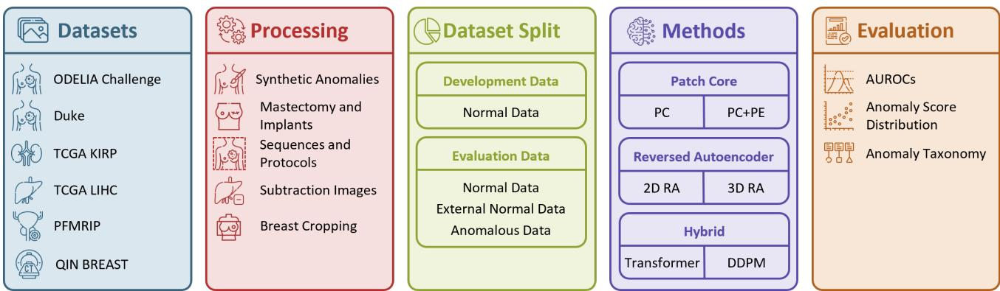  
Figure 1: Overview of the experimental pipeline. (1) Data sources, comprising six publicly available medical imaging datasets: the ODELIA Challenge dataset for normal, external, and anomalous data, the Duke dataset for external normal data, and TCGA KIRP, TCGA LIHC, PFMRIP, and QIN BREAST for anomalous data. (2) Data processing steps, including generation of synthetic anomalies, filtering of structural alterations, protocol-specific sequences, subtraction image generation for additional anatomical structures, and breast cropping. (3) Dataset split into development data (normal training and validation data) and evaluation data (normal, external, and anomalous data). (4) Evaluated methods, including PatchCore with and without Positional Encoding (PC, PC+PE), Reversed Autoencoder (2D RA, 3D RA), and two Transformer-based and Denoising Difusion Probabilistic Model-based hybrid OOD detection approaches. (5) Evaluation including anomaly classification AUROCs, anomaly score distributions, and anomaly taxonomy grading.

QIN-BREAST CT A subset of chest CT images is used from the QIN-BREAST dataset published in 2016. The data was originally provided by Vanderbilt University (United States) at multiple treatment time points to investigate treatment response in breast cancer patients (Li et al., 2016).

TCGA-KIRP, TCGA-LIHC, and Prostate Fused MRI Pathology Lastly, subsets of patients with available preand post-contrast agent images are included from the following three public datasets: the Cancer Genome Atlas Cervical Kidney Renal Papillary Cell Carcinoma Collection (TCGA-KIRP) (Linehan et al., 2016) from 2016, the Cancer Genome Atlas Liver Hepatocellular Carcinoma Collection (TCGA-LIHC) (Erickson et al., 2016) from 2016, and the Prostate Fused MRI Pathology (PFMRIP) dataset (Madabhushi and Feldman, 2016) from 2016, with these three datasets providing DCE MRI from kidney, liver, and prostate scans, respectively.

## 3.1.2. Data Pre-Processing

All images were resampled to match the input size of the original ODELIA unilateral DCE breast MR subtraction images (256, 256, 32). Normal data includes all unilateral DCE breast MR subtraction images from the original training and validation datasets provided in the ODELIA challenge dataset, excluding images with either implants or mastectomies, as well as data from the RSH hospital, which is used as part of the external dataset. We ensured that all three diagnostic labels were represented in each split and that left and right breast images from the same patient were always assigned to the same split. The external dataset contains the first ten patients from the DUKE dataset and the first 15 patients from the ODELIA RSH dataset, excluding mastectomy and implant patients. All images were pre-processed identically to the original ODELIA data using a geometry- and threshold-based cropping algorithm2.

Five datasets were used to simulate samples for the anomaly dataset. The first ten QIN-BREAST CT images were cropped to a region comparable to the breast MRI field of view to represent a diferent imaging modality, resulting in 20 unilateral images. DCE MR subtraction images of the kidney, liver, and prostate were generated from the TCGA-KIRP, the TCGA-LIHC, and the PFMRIP datasets to simulate incorrect anatomical regions. We included the first ten patients with available pre- and post-contrast agent images from each dataset. From the ODELIA dataset, the patients from the test split were used to generate the following anomalies. Incorrect imaging protocols were simulated using T2-weighted sequences and pre- and postcontrast agent DCE MRI. Spatial transformation errors were modeled as bilateral images, bilateral images cropped to the center, not the breast, breasts with wrong cropping and wrong translation, as well as vertical flipping of normal test images. The incorrect cropping and translation could shift up to 50% of the originally visible anatomy outside the image boundaries. Subtraction inconsistencies were modeled as wrong patient subtraction, wrong side subtraction, same image subtraction, and wrong subtraction order. Structural alterations were represented using mastectomy and implant images. The data processing pipeline is shown in Figure 2. Examples for normal, external, and anomalous data are illustrated in Figure 6.

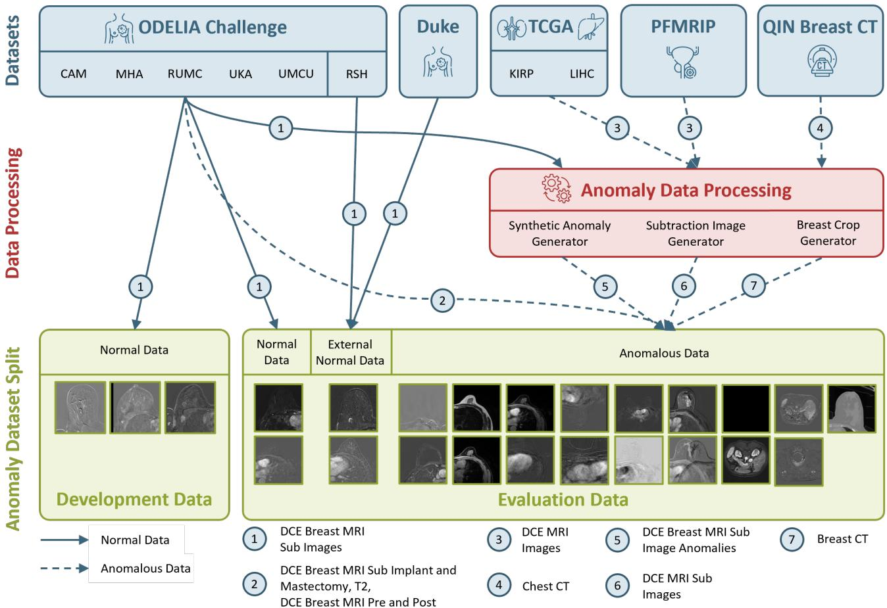  
Figure 2: Data flow and anomaly construction overview for the development and the evaluation data. Normal DCE breast MR subtraction images from the ODELIA dataset are included in the training, validation, and normal test data for both development and evaluation. External normal data from DUKE and RSH institutions simulate unseen sites for the external normal evaluation data. Anomalies from the ODELIA dataset, including implants, mastectomy, and protocol variants (T2, pre- and post-contrast DCE MRI), are only included in anomalous evaluation data. Normal test images from the ODELIA dataset are used to generate subtraction image inconsistencies and geometrical transformations. DCE MRI from anatomically distinct regions (kidney, liver, prostate) are further processed to generate DCE MR subtraction images. Chest CT images are cropped to the breast region to simulate a diferent imaging modality for anomalous evaluation data. All samples are resampled to the ODELIA input resolution (256, 256, 32). The arrows mark data flows from the source to the evaluation split.

## 3.2. Taxonomy of Anomalies

We introduce a taxonomy of radiological image data anomalies designed to support systematic evaluation of AD and OOD detection methods from a human visual perception perspective. The taxonomy provides a generalized framework for categorizing the diferent sources of error introduced by an anomaly as well as a perceptual distance to ID data, independent of any specific imaging modality or clinical task. It is intended to be transferable across medical use cases. While the dimensions themselves remain fixed, they can be used to identify and categorize anomaly types relevant to any given application, helping to identify potential sources of error during model evaluation. The taxonomy assigns each anomaly type a grade along four dimensions, each with three degrees of impact. The first three dimensions, protocol and modality, anatomical and structural alterations, and orientation andfield of view, describe the cause of the anomaly, while the fourth dimension, spatial extent, describes its impact.

Protocol and Modality This captures the overall style of the image, with grade being (0) for the same modality and protocol with technically correct execution of preprocessing, (1) for the same modality and diferent protocol, optionally with wrong pre-processing, and (2) for a diferent modality. In our setting, correct pre-processing refers to subtracting pre-contrast from a post-contrast DCE MRI.

Anatomical and Structural Alterations This describes the image content with (0) being the same organ with expected variations, (1) being the same organ with structural alterations, and (2) being a diferent organ or image content. Examples of structural alterations include local preprocessing artifacts, implants, pacemakers, etc.

Orientation and Field of View This focuses on the geometrical transformations of the image. (0) refers to no geometric misalignment with the organ being fully visible with the right orientation, (1) describes misalignment with the breast being partly visible or in the wrong orientation, and (2) describes major misalignment with the breast not being visible at all.

Spatial Extent This describes the extent of the anomaly, excluding constant background regions. No anomaly is graded as (0), a small artifact that afects the image locally is graded as (1), and a large artifact that afects the image globally is graded as (2).

The sum of the individual grades allows a categorization into ID (0), near-OOD (1-2), medium-far-OOD (3-4), and far-OOD (≥5), inspired by (Graham et al., 2022). The full grading for our anomalies is described in Table 1. We applied it to the anomalies for the head CT use case presented by Graham et al. (2022). This comparison serves as an initial test of the transferability of the taxonomy to a diferent medical use case, anatomy, and modality. The resulting categories assigned to the head CT anomalies are mostly consistent with the OOD categories reported by Graham et al. (2022) and Graham et al. (2023), see Table 3. This suggests that the four grading dimensions capture perceptually meaningful distinctions in distribution shift independent of imaging modality and anatomical region for volumetric radiological image data. However, this comparison reflects only a single external use case and a qualitative agreement in category groupings rather than a quantitative validation. A comprehensive evaluation of the taxonomy’s generalizability across additional modalities and tasks is left for future work.

## 3.3. Implementation and Experiments 3.3.1. Method Selection

We selected four approaches, one from each of the two main categories introduced in Section 2.4 and two hybrid approaches, with the primary selection criterion being imagelevel AD performance as demonstrated in prior work. From the category of projection-based methods, we selected the memory bank-based method PatchCore (PC), which demonstrated promising overall performance in two benchmarks for industrial and medical AD (Bao et al., 2023; Liu et al., 2024; Roth et al., 2022). While none of the reconstructionbased methods in the medical image-focused AD benchmark described by Bao et al. (2023) had comparable performance to the investigated memory bank-based methods (Bao et al., 2023), we included an approach by Bercea et al. (2024a) who proposed a two-dimensional Reversed Autoencoder (RA) approach specifically designed and validated for multiple medical imaging modalities (Bercea et al., 2024b,a). We extended these two approaches with domain-specific adaptations, as they were not originally designed to process volumetric radiological image data. Furthermore, we included two hybrid OOD detection approaches for volumetric radiological image data. Both approaches combine discrete latent space compression using reconstruction-based models with either sequential density estimation or a Denoising Difusion Probabilistic Model (DDPM) and were originally developed for brain CT (Graham et al., 2022).

## 3.3.2. Projection-based Method (PatchCore)

For the category of projection-based approaches, we employed the memory bank-based method $\mathrm { P C } ^ { 3 }$ , which was originally introduced by Roth et al. (2022) for industrial AD. PC extracts locally aware patch feature embeddings for normal samples from multiple hierarchical layers of a pretrained feature extractor and stores these representations in a compressed memory bank using coreset subsampling, where the memory bank is reduced to a percentage of the original number of patches. During inference, the embeddings of new samples are compared against the embeddings in the memory bank. The anomaly score for a sample is the maximum distance to the nearest stored embedding across all patches. This enables the detection of localized defects without requiring anomalous training data and supports the generation of spatial anomaly maps. These maps provide explainability by highlighting the specific regions in which the model identifies deviations from normal patterns (Roth et al., 2022).

Medical Feature Extractor The original PC relies on models pretrained on natural images, since it was initially developed for industrial AD. To obtain modality-specific and anatomically meaningful representations, we replaced the feature extractor with a medical foundation model4 introduced by Schäfer et al. (2024) and Nicke et al. (2025), which won the MICCAI 2025 Lighthouse UNICORN Challenge (UNICORN Challenge Organizers, 2025).

Positional Encoding Extension PC does not model global spatial context. In radiological imaging, consistent anatomical positioning across acquisitions creates strong spatial priors that can be leveraged to improve AD performance. In our dataset, if properly pre-processed, the thorax is consistently located near the bottom edge of the image in the axial view. At the same time, the breast is approximately centered, see Figure 6. We incorporated these priors by concatenating a normalized Positional Encoding (PE) $[ \alpha _ { p o s } x , \alpha _ { p o s } y , \alpha _ { p o s } z ]$ to each patch embedding, where $\alpha _ { p o s } \in \mathbb { R } _ { + }$ controls the relative influence of the spatial position over patch feature embeddings and $x , y , z \in [ 0 , 1 ]$ represent the relative patch position within the image. This modification afects both per-patch anomaly scoring and memory bank subsampling and may enhance sensitivity to position-dependent anomalies such as bilateral images, wrong cropping, in addition to wrong translation and vertical flipping.

Experimental Setup We established a stable baseline using the settings described in the original paper (Roth et al., 2022). To confirm the settings from the original paper for the medical feature extractor, we also systematically varied the selected feature maps, patch size, and stride. This did not result in consistent improvements over the baseline configuration. Our final configuration used feature maps from layers two and three, a patch size of (7, 7), a stride of five, and a coreset size of one percent. The input size for the feature extractor was kept at the original image size of (256, 256, 32) voxels. For the PE extension, we empirically set the weighting parameter $\alpha _ { p o s } = 1 0 . 0$ , see the comment in the limitations paragraph below in Section 5. We report both the baseline and the PE variant to quantify the contribution of spatial context.

Table 1 Anomaly taxonomy and grading. Each anomaly type is graded on four dimensions with a grade of 0-2 per dimension. Aggregate grades result in four categories. $0 = 1 \mathsf { D } , 1 \mathrm { - } 2 = \mathsf { n e a r \mathrm { - } O O D } , 3 \mathrm { - } 4 = \mathsf { m e d i u m \mathrm { - } f a r \mathrm { - } O O D } , \ge 5 = \mathsf { f a r \mathrm { - } O O D }$ data. External data receives a grade of 0. By definition, it is ID with respect to image content or near-OOD with domain shift arising from institutional factors.
<table><tr><td>Group</td><td>Protocol and Modality</td><td>Anatomical and Structural Alterations</td><td>Orientation and Field of View</td><td>Spatial Extent</td><td>Total Grade</td></tr><tr><td colspan="6">In-distribution</td></tr><tr><td>Normal Data</td><td>0</td><td>0</td><td>0</td><td>0</td><td>0</td></tr><tr><td colspan="6">External normal data</td></tr><tr><td>External Data</td><td>0</td><td>0</td><td>0</td><td>0</td><td>0</td></tr><tr><td colspan="6">Near-out-of-distribution</td></tr><tr><td>Vertical Flip</td><td>0</td><td>0</td><td>1</td><td>0</td><td>1</td></tr><tr><td>Wrong Crop + Wrong Translation</td><td>0</td><td>0</td><td>1</td><td>0</td><td>1</td></tr><tr><td>Bilateral +</td><td>0</td><td>0</td><td>1</td><td>0</td><td>1</td></tr><tr><td>Wrong Crop Bilateral</td><td>0</td><td>0</td><td>0</td><td>1</td><td>1</td></tr><tr><td>Implant</td><td>0</td><td>1</td><td>0</td><td>1</td><td>2</td></tr><tr><td>Mastectomy</td><td>0</td><td>1</td><td>0</td><td>1</td><td>2</td></tr><tr><td>Wrong Patients Subtracted</td><td>0</td><td>0</td><td>0</td><td>1</td><td>1</td></tr><tr><td>Wrong Side Subtracted</td><td>0</td><td>0</td><td>0</td><td>2</td><td>2</td></tr><tr><td colspan="6">Medium-far-out-of-distribution</td></tr><tr><td colspan="6">1</td></tr><tr><td>Wrong Subtraction Order</td><td></td><td>0</td><td>0</td><td>2</td><td>3</td></tr><tr><td>DCE Post</td><td>1</td><td>0</td><td>0</td><td>2</td><td>3</td></tr><tr><td>DCE Pre</td><td>1</td><td>0</td><td>0</td><td>2</td><td>3</td></tr><tr><td>T2 Breast CT</td><td>1</td><td>0</td><td>0</td><td>2</td><td>3</td></tr><tr><td></td><td>2</td><td>0</td><td>0</td><td>2</td><td>4</td></tr><tr><td colspan="6">Far-out-of-distribution</td></tr><tr><td>Kidney MRI</td><td>0</td><td>2</td><td>2</td><td>1</td><td>5</td></tr><tr><td>Liver MRI</td><td>0</td><td>2</td><td>2</td><td>1</td><td>5</td></tr><tr><td>Prostate MRI</td><td>0</td><td>2</td><td>2</td><td>1</td><td>5</td></tr><tr><td>Same Image Subtracted</td><td>1</td><td>2</td><td>0</td><td>2</td><td>5</td></tr></table>

## 3.3.3. Reconstruction-based Method (Reversed Autoencoder)

For the reconstruction-based approach, we adopted the RA framework proposed by Bercea et al. $( 2 0 2 4 \mathrm { a } , \mathrm { b } ) ^ { 5 }$ . They introduce a two-dimensional approach that operates on middle slices of brain MRI, pediatric wrist X-ray, and chest X-ray data. Their proposed RA framework uses a Soft-Introspective-Variational Autoencoder (SI-VAE) architecture combined with a reversed loss that minimizes embedding diferences between input and reconstruction at each encoder level. They identify anomalies by comparing reconstructed pseudo-normal images to the original input. Regions where the reconstruction deviates from the input indicate a mismatch with the learned normal data distribution and are used to compute the anomaly scores and maps (Bercea et al., 2024a,b).

Training Objective Extension The original RA framework was initially developed for dense, smooth brain MRI anatomy using Mean-Squared-Error (MSE) and Kullback-Leibler (KL) regularization. In contrast, DCE breast MR subtraction images are characterized by fine structures and sharp tissue boundaries on a near-zero background, where MSE alone results in over-smoothed reconstructions and poor model selection. This resulted in suboptimal reconstruction behavior for our use case. To address this, we extended the training objective for the encoder $E _ { \phi }$ and the decoder $D _ { \theta }$ with parameters $\phi$ and � for the baseline model.

Given a normal data sample �, the encoder models the posterior distribution $q _ { \phi } ( z \mid x )$ over latent variables, from which the latent representation � is sampled. The decoder then reconstructs the input from �. We augmented the original objective with an $L _ { 1 }$ loss ${ \mathcal { L } } _ { \mathrm { L 1 } } ,$ a perceptual loss ${ \mathcal { L } } _ { \mathrm { P L } }$ , and an SSIM loss $\mathcal { L } _ { \mathrm { S S I M } }$ (Zhao et al., 2017; Johnson et al., 2016). Together, these three additions guide both the encoder and decoder to produce sharper reconstructions without altering the underlying architecture, see Equation 1.

$$
\begin{array} { r l } & { \displaystyle \mathcal { L } _ { E _ { \phi } } ^ { \mathrm { R A } } \left( x , z \right) = \mathrm { E L B O } \left( x \right) - \frac { 1 } { \alpha } \left( \exp \left( \alpha \cdot \mathrm { E L B O } \left( D _ { \theta } \left( z \right) \right) \right) \right) } \\ & { \quad \quad \quad \quad \quad \quad + \lambda _ { \mathrm { E m b } } \cdot \mathcal { L } _ { \mathrm { E m b } } \left( E _ { \phi } \left( x \right) , E _ { \phi } \left( D _ { \theta } \left( z \right) \right) \right) } \\ & { \quad \quad \quad \quad \quad + \lambda _ { \mathrm { P L } } \cdot \mathcal { L } _ { \mathrm { P L } } \left( x , D _ { \theta } \left( z \right) \right) + \lambda _ { \mathrm { L 1 } } \cdot \mathcal { L } _ { \mathrm { L 1 } } \left( x , D _ { \theta } \left( z \right) \right) } \\ & { \quad \quad \quad \quad \quad \quad + \lambda _ { \mathrm { S S I M } } \cdot \mathcal { L } _ { \mathrm { S S I M } } \left( x , D _ { \theta } \left( z \right) \right) } \end{array}
$$

$$
\begin{array} { r l } & { \mathcal { L } _ { D _ { \theta } } ^ { \mathrm { R A } } \left( x , z \right) = \mathrm { E L B O } \left( x \right) + \gamma \cdot \mathrm { E L B O } \left( D _ { \theta } \left( z \right) \right) } \\ & { \phantom { \mathcal { L } } + \lambda _ { \mathrm { P L } } \cdot \mathcal { L } _ { \mathrm { P L } } \left( x , D _ { \theta } \left( z \right) \right) + \lambda _ { \mathrm { L 1 } } \cdot \mathcal { L } _ { \mathrm { L 1 } } \left( x , D _ { \theta } \left( z \right) \right) } \\ & { \phantom { \mathcal { L } } + \lambda _ { \mathrm { S S I M } } \cdot \mathcal { L } _ { \mathrm { S S I M } } \left( x , D _ { \theta } \left( z \right) \right) } \end{array}\tag{1}
$$

The hyperparameters $\alpha \geq 0$ and $\gamma \geq 0$ are set to $\alpha = 2 . 0$ and $\gamma ~ = ~ 1 . 0$ Daniel and Tamar (2021). The weight for the embedding loss was set to $\lambda _ { \mathrm { E m b } } = 0 . 0 0 5$ Bercea et al. (2024a). The additional loss weights were set empirically to $\lambda _ { \mathrm { P L } } = 1 . 0 , \lambda _ { \mathrm { L 1 } } = 3 . 0$ , and $\lambda _ { \mathrm { S S I M } } = 1 . 0$

Architectural 3D Extension The original RA operates on two-dimensional middle slices, discarding volumetric context. Anomalies located on other slices can not be detected in this setup. We propose an extension of the original method that incorporates volumetric context by introducing a 3D RA. All two-dimensional operations, such as convolutions, batch normalization, and pooling, were replaced with threedimensional operations in the residual blocks, encoder, and decoder. To keep memory requirements manageable for the volumetric context, we reduced the number of encoder and decoder stages from six to four. This extension allows the model to not only leverage inter-slice contextual information but also process full volumetric data samples, since it is not assumed that anomalies only occur on middle slices.

Experimental Setup The baseline 2D RA model uses the architecture and settings from the original paper by Bercea et al. (2024a) in combination with the extended training objective described in Equation 1, since the proposed original setup did not result in meaningful model training and model selection. It was trained for 300 epochs with early stopping based on validation MSE, a batch size of 16, and a learning rate of $5 \cdot 1 0 ^ { - 5 } $ . For each volume, the middle slice was extracted and resized to (128, 128) voxels. We did not apply intensity normalization to the 98th percentile from the original setup, as this would significantly reduce the relevant signal in our data. Model selection was performed based on the lowest validation MSE. The 3D RA uses the same extended training objective and hyperparameters, with batch size reduced to 8 and full volumes rescaled to (128, 128, 16) voxels. All other settings remain the same.

## 3.3.4. Hybrid Methods

We adopted two hybrid approaches for unsupervised OOD detection. Both methods were originally developed for brain CT scans by Graham et al. (2023, 2022) and can be applied to volumetric radiological image data. Both hybrid approaches utilize a Vector Quantized-Generative Adversarial Network (VQ-GAN) for discrete latent compression of three-dimensional volumes (Graham et al., 2023, 2022).

Transformer-based OOD Detection The first hybrid approach6 combines the VQ-GAN with a transformer-based density estimator that models the distribution on flattened sequences of these latent representations. Specifically, the discrete three-dimensional representation produced by the VQ-GAN is transformed into a one-dimensional sequence, which is then processed by a transformer trained to model the distribution of the conditional probabilities by maximizing the whole image log-likelihood over normal training data. This method allows us to reshape and up-sample the resulting likelihood estimates to generate volumetric spatial likelihood maps with the same dimensionality as the input image, enabling the visualization and localization of anomalous regions. The anomaly score is defined as the whole image likelihood (Graham et al., 2022).

Denoising Difusion Probabilistic Model-based OOD Detection The second hybrid approach7 uses the VQ-GAN together with a DDPM. Diferent levels of noise are applied multiple times to the compressed latent representations that are produced by the VQ-GAN. The DDPM takes these representations as input and learns to iteratively denoise them again. At inference, noise is added to the compressed latent representation of the original input image corresponding to a range of timesteps. The DDPM denoises each noisy representation, yielding multiple partial reconstructions. Each reconstruction is then decoded back to the input image space using the VQ-GAN and compared to the original input image using both MSE and perceptual similarity as reconstruction quality metrics.

These similarity values are z-scored using statistics from a validation set and averaged across timesteps and metrics, resulting in a single anomaly score. A high similarity score indicates an ID sample. Spatial anomaly maps are produced similarly, by aggregating pixel-wise, z-scored MSE maps from a subset of reconstructions at several timesteps. Since these models are trained only on ID data, they should fail to denoise OOD data. Compared to the first hybrid approach, this approach focuses primarily on the quality of the VQ-GAN image reconstructions. Furthermore, the DDPM can be trained on higher-resolution latent representations than the transformer architecture due to more eficient memory scaling behavior. Since the similarity is measured at input image resolution, this pipeline can produce higherresolution anomaly maps (Graham et al., 2023).

Experimental Setup Both baseline configurations use the original settings from Graham et al. (2023), with our input size being (256, 256, 32) voxels. The VQ-GAN for both setups was trained with four levels and with 128 channels per layer. The codebook size was 1024 with a codebook embedding dimensionality of 64. We kept the original loss weighting of 0.001 for the perceptual loss, 0.01 for the adversarial loss, and 1.0 for the remaining loss terms. For the training, we reduced the original batch size to 8, kept the Adam optimizer with a learning rate of 3⋅10−4, and included the proposed early stopping (Graham et al., 2023, 2022).

For the transformer, we adopted a 22-layer memoryeficient transformer proposed by Graham et al. (2023) and Graham et al. (2022). The attention layers had a dimensionality of 256 with 8 attention heads. Model training was performed for 100 epochs with a learning rate of 1 ⋅ 10−4 (Graham et al., 2023, 2022). Again, we had to reduce the batch size to 16. In contrast to the original implementation, we selected the model based on the best validation loss, not the training loss, as we observed signs of overfitting. For transformer-based OOD detection, we experimented with diferent architecture settings and an extended training objective, which improved reconstruction quality but did not result in better overall detection results. For the transformer-based OOD detection, additional architectural variants and training objectives of the VQ-GAN were explored, including modifications to the number of channels, codebook size, learning rate scheduling, and loss weighting, which improved reconstruction quality but did not result in consistent improvements over the baseline configuration and were therefore not pursued further.

The DDPM was constructed with three levels with channels [128, 256, 256] as proposed in the original paper. Graham et al. (2023) proposes a noise schedule with � = 1000 steps with a scaled linear noise schedule. $\beta _ { 0 }$ and $\beta _ { T }$ were set to 0.0015 and 0.0195, respectively, following Graham et al. (2023). The training was conducted over 12, 000 epochs with a reduced batch size of 16 and a learning rate of 2.5 ⋅ 10−5 with early stopping. For the image reconstructions, a pseudolinear multi-step scheduler was used with 100 timesteps. We tested 50 evenly spaced values between 0 and 1000 for this reconstruction process (Graham et al., 2023).

## 3.4. Method Evaluation

We ran all methods five times with diferent random seeds and evaluated the methods on a test set that includes normal samples, normal samples from external institutions, and a diverse range of anomalies, see Section 3.1. For each data sample, we computed a scalar anomaly score with each method. To evaluate the model performance, we computed the Area Under the Receiver Operating Characteristic Curve (AUROC) for each anomaly group defined in Table 1 individually against the normal data. In addition, we reported two aggregated AUROC metrics. The sample-weighted average AUROC reflects the overall performance across the test set for all anomalous samples against the normal samples as a whole, excluding external normal data. In contrast, the group-weighted average AUROC provides a measure where each anomaly group contributes equally regardless of sample count. The group-weighted metric was used as the primary summary statistic, as it prevents large anomaly groups from dominating the overall score.

For the external dataset, we reported the AUROC separately and excluded it from both overall metrics, as the external normal data are intended to assess transferability rather than AD performance. Accordingly, we aimed for an AUROC of 0.5 in this setting, not 1.0, since a wellgeneralizing model should produce indistinguishable score distributions for internal and external normal samples. To provide additional visual context for the plots, we computed two reference thresholds: a Receiver Operating Characteristic (ROC)-derived threshold that maximizes Youden’s J statistic, providing the optimal separation between normal and anomalous test samples, and a percentile-based threshold corresponding to the 97.5th percentile of the anomaly scores on the normal test set, estimated using linear interpolation between neighboring samples.

In practice, to classify new samples, both thresholds should be calculated on a validation dataset. However, compared to the ROC-based threshold, the percentile-based threshold does not require additional labeled anomalous data, making it fully unsupervised and therefore applicable in settings where only normal validation data is available. In our case, the calculation of both thresholds on the test dataset makes both optimistic estimates of achievable performance rather than a realistic assessment of performance in a realworld deployment setting.

## 4. Results

Transferability to External Normal Data For external normal data, an AUROC of 0.5 indicates that the method does not distinguish external normal data from the normal training distribution, as explained in Section 3.4. Reconstruction-based approaches achieved the best transferability to external normal data, with both the 2D and 3D RA models obtaining AUROCs closest to the optimum (2D RA: 0.553, 3D RA: 0.557). The 3D RA demonstrated particularly consistent behavior across the two external sources (3D RA DUKE: 0.556, 3D RA RSH: 0.558), whereas the 2D RA showed a larger gap between both external datasets (2D RA DUKE: 0.641, 2D RA RSH: 0.494). Importantly, the results from the 2D RA are not fully comparable to the other methods, as it was trained and evaluated solely on middle slices. In contrast, projection-based methods PC and PC+PE produced substantially higher separability (PC: 0.681, PC+PE: 0.738). For both variants, the generalization ability varied noticeably between the two diferent external datasets (PC DUKE: 0.828, PC+PE DUKE: 0.762, PC RSH: 0.678, PC+PE RSH: 0.626). Furthermore, both hybrid methods demonstrated comparably high separability between normal and external normal data (Transformer OOD: 0.737, DDPM OOD: 0.637). Between the two hybrid methods, the AUROC difered substantially between the diferent external sites (Transformer OOD DUKE: 0.909 vs. DDPM OOD DUKE: 0.348, Transformer OOD RSH: 0.622 vs. DDPM OOD RSH: 0.830), see Table 2.

Near-Out-of-Distribution Anomalies Next, we examined the detection performance on near-OOD samples with more subtle data-level irregularities. Orientation and field of view anomalies, such as vertical flip, wrong crop + wrong translation, bilateral + wrong crop, and bilateral images, were generally well detected by projection-based and reconstruction-based methods, with AUROCs above 0.9 for most configurations. The addition of PE substantially improved PC performance on these categories, most notably for vertical flip (PC: 0.816 vs. PC+PE: 0.978) and bilateral + wrong crop (PE: 0.799 vs. PC+PE: 0.973). This confirms the expected benefit of spatial context for position-dependent anomalies. In contrast, both hybrid approaches showed inconsistent AUROC performance on orientation and field of view anomalies. The Transformer OOD method detected bilateral + wrong crop (0.996) reliably but performed moderately on bilateral images (0.843), poorly on vertical flip (0.669), and poorly on wrong crop + wrong translation (0.464). The DDPM OOD exhibited a complementary but equally inconsistent pattern. Wrong crop + wrong translation was detected with moderate performance (0.882), while vertical flip (0.395), bilateral + wrong crop (0.548), and bilateral (0.554) were not detected reliably.

Subtraction errors, including wrong patients subtracted and wrong side subtracted, were detected reliably by projection-based, reconstruction-based, and transformer-based OOD detection methods (AUROCs ≥ 0.919), reflecting that these introduce globally inconsistent patterns that can be distinguished from normal subtraction images. The DDPM OOD, however, achieved substantially lower AUROCs.

Implants and mastectomy cases represent a notable exception across all methods, with substantially lower AUROCs (implant: 0.622 to 0.762, mastectomy: 0.281 to 0.835). However, a substantial improvement can be observed for PC+PE for mastectomy data, as the absence of breast tissue at expected spatial positions results in a larger distance to the patch embeddings in the memory bank (PC mastectomy: 0.679 vs. PC+PE mastectomy: 0.835), see Table 2.

Medium-Far-Out-of-Distribution Anomalies In contrast to the variable performance observed for near-OOD samples, detection becomes substantially more consistent across methods for medium-far-OOD samples. Almost all methods reliably detected these samples, including anomalies such as wrong subtraction order, DCE pre- and postcontrast agent breast MRI, T2, and breast CT, with AUROCs consistently above 0.9. One exception is the DDPM OOD method, which achieved high performance on protocol- and modality-level anomalies but completely failed to identify the wrong subtraction order (0.157), a processing error rather than a modality change, see Table 2.

Far-Out-of-Distribution Anomalies This consistently high detection performance continues for far-OOD samples. Almost all methods successfully identified far-OOD samples, such as kidney, liver, and prostate MRI, achieving AUROCs above 0.965 across all methods and categories, confirming that anatomically unrelated image data is reliably flagged as anomalous. An exception is the PC configuration without PE for the category of the same image being subtracted (0.000). Here, this sample consistently received lower anomaly scores than normal data, being a systematic inversion rather than an inability to distinguish between the two distributions. Since PC without PE operates on local patches without global context, it failed to recognize the global absence of local enhancements from the breast tissue as anomalous. Adding PE resolved this failure (PC+PE: 0.979). The Transformer OOD method exhibited the same critical failure (0.000). Both variants of the reconstructionbased methods and the DDPM-based OOD detection reliably identified this anomaly (1.000), see Table 2.

Dimensions ofAnomaly Taxonomy To better understand the source of these category-specific diferences, we further analyzed performance along the four individual dimensions of the proposed taxonomy. The first three dimensions, protocol and modality, anatomical and structural alterations, and orientation andfield of view, describe the causes of the anomaly. In contrast, the fourth dimension, spatial extent, describes the impact.

Within the protocol and modality category, all improved projection- and reconstruction-based methods successfully detected anomalies with the same modalities but used different protocols, with either correctly or incorrectly executed pre-processing, as well as anomalies with diferent modalities, achieving grades ≥ 1 on this dimension. In all these cases, the spatial extent grade was ≥ 2, meaning that the anomaly afected image patches globally. The hybrid approaches, in particular the DDPM OOD, were unable to detect all anomalies from the categoryprotocol and modality with grades ≥ 1 for this dimension. The Transformer OOD was unable to detect the same image subtraction sample.

For the anatomical and structural alterations dimension, all improved methods, as well as the Transformer OOD, detected anomalies involving diferent organs or image content with grades ≥ 2. Only the DDPM OOD was unable to detect images that show diferent image contents. Furthermore, none of our methods could detect anatomical and structural alterations within the same organ with grade = 1, specifically in combination with the spatial extent being = 1. Since our dataset did not include any anomalies having anatomical and structural alterations for the same organ with a global efect, we cannot report the detectability of such cases.

Within the orientation and field of view category, all improved methods again successfully detected all anomalies with grades ≥ 1, regardless of the corresponding grade from the spatial extent dimension. Neither hybrid approach could match this performance.

Considered independently, the spatial extent category showed that all our improved methods detect anomalies with a global efect reliably, having grades $\geq 2 .$ . The Transformer OOD performed similarly, with the exception being the samples with the same images being subtracted for spatial extent ≥ 2. The DDPM OOD showed deficiencies for the subtraction images with spatial extent grade $\geq 2 ,$ as well as for diferent anatomical regions with spatial extent = 1. Artifacts or corruptions afecting regional volumetric image patches could only be detected in some cases, consistent with the category-specific results described above.

Overall Performance Overall, PC+PE achieved the highest group-weighted and sample-weighted performance (PC+PE: 0.954 and 0.949), while reconstruction-based approaches demonstrated superior transferability to external normal data. The anomaly scores for all samples categorized by groups are illustrated in Figure 3. Figure 4 shows the anomaly score distribution, grouped by OOD level following the taxonomy. The 3D RA, in particular, achieved a strong combination of group-weighted and sample-weighted detection performance (3D RA: 0.936 and 0.926) and institutional transferability (3D RA: 0.557), supporting its suitability for cross-institutional deployment scenarios. The Transformer OOD method achieved moderate overall performance, which results primarily from its complete failure on same image subtraction and from poor detection of specific orientation and field of view anomalies, as well as mastectomy cases. Furthermore, this method showed high variability between runs for almost all categories. The DDPM OOD method achieved the lowest overall performance among all evaluated methods, with critical failures in all categories except for protocol and modality violations, together with the same images being subtracted. Despite both hybrid methods being built for volumetric radiological image data, neither generalized reliably to the structural characteristics of DCE breast MR subtraction images without further adaptation. Plots illustrating the anomaly scores and distribution for the 3D RA, the Transformer OOD, and the DDPM OOD are shown in the Appendix, see Figures 7, 8, 9, 10, 11, and 12.

## 5. Discussion

Method-Specific Strengths and Failure Modes The results confirm that no single method is superior across all evaluation criteria. The choice of method depends on the deployment scenario and the tolerance for specific failure modes. PC without PE was the most straightforward to deploy, as it requires no architectural modification or taskspecific optimization and achieves strong performance on globally anomalous and stylistically distinct samples. Depending on the imaging modality and task, replacing the default feature extraction model with a domain-specific feature extractor, as demonstrated here with a medical foundation model, can yield meaningful performance gains at minimal additional cost. However, PC without PE failed on the same image subtraction anomaly and showed poor detection of geometric anomalies, as locally correct patches from incorrect spatial positions are already represented in the memory bank. For the same image subtraction sample, the method consistently detected these invalid samples as more ID than normal data (AUROC: 0.000). For a QA pipeline, this may be more concerning than a near-chance result (AUROC: 0.5), as this actively suppresses detection of a clinically meaningful processing error rather than failing to flag it. Adding PE resolved both limitations and requires tuning only a single additional hyperparameter $\alpha _ { p o s }$ This makes it a low-cost extension recommended whenever geometric consistency is a relevant QA criterion and confirms that the failure originates from the absence of global spatial context.

Reconstruction-based methods, particularly the 3D RA, ofered the best balance between detection performance and institutional transferability. The reconstruction mechanism implicitly encodes global image structure rather than local patch statistics, making it less sensitive to institution-specific acquisition patterns. However, achieving this required substantially more careful adaptation than the projection-based approach. The original architecture, training objective, and input dimensionality, including the transition from twodimensional middle slices to full three-dimensional representations, all required modification to handle full volumetric data and produce reconstructions of suficient quality for reliable anomaly scoring. This represents a practical limitation for deployment, where domain experts may not have the resources to perform this level of tuning.

Both hybrid approaches achieved substantially lower overall performance than the projection-based and reconstruction-based methods, despite being specifically designed for volumetric radiological image data. In contrast to the other methods, these methods were applied without further modification. This finding suggests that methods developed and validated for one medical imaging modality do not necessarily transfer to diferent medical use cases without targeted adaptation. Both the Transformer OOD and the DDPM OOD methods were originally developed for brain CT, which exhibits lower structural heterogeneity, a more homogeneous background, and more stable anatomical positioning than DCE breast MR subtraction images, which are characterized by fine anatomical structures, sharp tissue boundaries, and near-zero background signal.

The Transformer OOD method exhibited consistent failure modes, showing high variability in the ability to detect geometric transformations as well as between runs. Codebook quantization suppresses fine-grained spatial and geometric information, and the transformer’s sequential likelihood model cannot recover the global context necessary to flag homogeneous volumes or spatially displaced content as anomalous. Furthermore, the method failed to detect the same image subtraction case as in PC without PE. The VQ-GAN latent representation of a zero-valued subtraction image appears locally indistinguishable from the constant background regions present in normal breast MRI, and the transformer consequently assigns high log-likelihood to the resulting latent sequence, incorrectly classifying it as ID. Furthermore, we observed high variability between diferent runs, making it harder to train a reliable model.

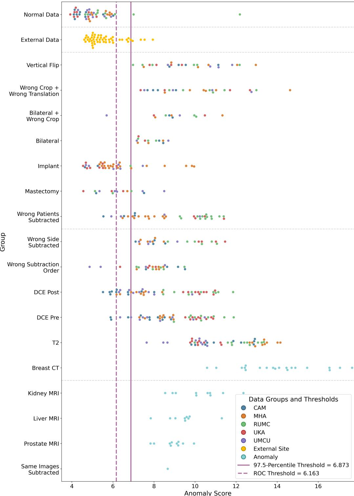  
Figure 3: Anomaly score distributions for PC with PE on the test set. Each group corresponds to an anomaly category from Table 1. The vertical dashed line indicates the 97.5-percentile-based decision threshold. The vertical solid line is the ROC-based decision threshold. The horizontal dashed lines represent the separation into ID, external, near-, medium-far-, and far-OOD samples.

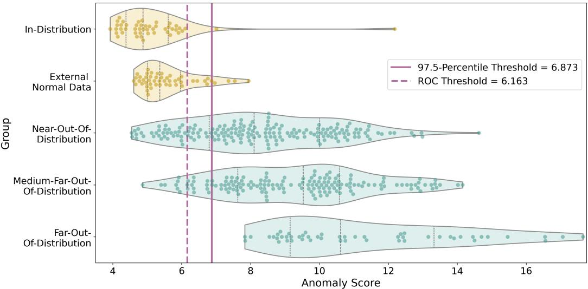  
Figure 4: Anomaly score distributions per distribution category for PC with PE on the test set.

The DDPM OOD method had even more failure modes. While it detected protocol- and modality-level deviations as well as the same image subtraction case reliably, it completely failed for all other cases. This is the opposite of the expected behavior for a far-OOD category that all other methods detected without dificulty. As noted by Graham et al. (2023), reconstruction quality is a key prerequisite for efective DDPM OOD detection, since the core idea of this method is that the denoising model will fail on OOD inputs. However, when the VQ-GAN reconstruction quality is poor, especially compared to the 3D RA, it produces blurry outputs that do not align with our fine-structured breast MR subtraction images, see Figure 13.

For both hybrid approaches, the multi-stage pipeline architecture with the VQ-GAN training followed by the transformer or the DDPM, respectively, further complicates diagnosis and correction of such failure modes, as errors introduced in the first stage propagate and interact with the second stage in non-transparent ways, making targeted adaptation substantially more resource-intensive than for single-stage approaches. Adapting these methods to a new imaging domain would require substantial retuning of the VQ-GAN architecture, codebook size, and loss weighting. Furthermore, we noticed signs of overfitting on the validation dataset during transformer training, indicating that testing diferent training strategies and loss functions should be considered. The DDPM model has to be considered as well, since it reduced the reconstruction quality even further when combined with the VQ-GAN model. This results in considerably higher engineering costs compared to the targeted modifications applied to the projection-based and reconstruction-based methods, further complicated by the multi-stage nature of these methods.

Implant and Mastectomy Anomalies For implant and mastectomy cases, AUROCs remained consistently low across all methods. Despite explicitly excluding these cases from the definition of normality during training, the failure of all evaluated methods to reliably detect these samples as anomalies suggests that local patch-level and global reconstruction-based representations are insuficiently sensitive to the specific structural changes introduced by these two anomaly categories. The PE extension partially improved mastectomy detection, suggesting that the spatial absence of breast tissue is a detectable signal when explicit position information is provided. Nevertheless, it should be noted that mastectomies and, in particular, implants can be more dificult to identify in subtraction images than in other protocols or sequences, such as pre- and post-contrast agent images before subtraction or T2-weighted images. Representative examples showing both good and poor implant visibility in subtraction images are provided in Figure 14. Furthermore, the high anatomical variability across patients, combined with the geometry- and threshold-based cropping algorithm from the ODELIA dataset, may result in partial truncation of breast tissue and inconsistent positioning of the breast, meaning the breast occupies variable positions and proportions within the image. This may prevent AD methods that implicitly rely on spatial regularity, a limitation that may be partially addressable through improved, anatomy-aware breast cropping through pre-processing.

Anomaly Taxonomyfor Evaluation The method-specific strengths and failure modes described above represent precisely the problem that the proposed taxonomy has been designed to solve. Without a structured taxonomy for characterizing anomaly types, it is dificult to interpret the observed performance diferences between methods, since a single aggregated AUROC value combines anomalies that difer significantly. The aggregate grade maps each anomaly type to a level of perceptual distance from ID data, explaining why detection is consistently strong for medium-far- and far-OOD anomalies and consistently weaker for some near-OOD cases such as implants and mastectomy. In addition, the four individual dimensions, protocol and modality, anatomical and structural alterations, orientation andfield ofview, and spatial extent, enable a more in-depth diagnosis of failure modes. Our taxonomy provides a transferable framework for the systematic evaluation and comparison of methods and anomaly types across various radiological image data use cases, as evidenced by its consistent application to the head CT anomaly categories in Graham et al. (2022).

Comparison of AUROC performance on the anomaly dataset between baseline and extended methods for projection-based, reconstruction-based, and hybrid approaches across five runs with diferent random seeds (error indication). The reconstructionbased two-dimensional model is only trained and evaluated on middle slices. For anomalous data $\mathsf { A U R O C s } \geq 0 . 9 5 0$ are highlighted. For external normal data $\mathsf { A U R O C s } \le 0 . 6$ are highlighted.
<table><tr><td></td><td colspan="2">Projection-based</td><td colspan="2">Reconstruction-based</td><td colspan="2">Hybrid</td></tr><tr><td>Groups</td><td>PC</td><td>PC+PE</td><td>2D RA</td><td>3D RA</td><td>Transformer OOD</td><td>DDPM OOD</td></tr><tr><td colspan="7">External normal data</td></tr><tr><td>External</td><td> $0 . 7 3 8 \pm 0 . 0 1 1$ </td><td> $0 . 6 8 1 \pm 0 . 0 3 8$ </td><td> $\mathbf { 0 . 5 5 3 \pm 0 . 1 5 6 }$ </td><td> $\mathbf { 0 . 5 5 7 \pm 0 . 0 1 3 }$ </td><td> $0 . 7 3 7 \pm 0 . 0 7 1$ </td><td> $0 . 6 3 7 \pm 0 . 0 1 0$ </td></tr><tr><td colspan="7">Near-out-of-distribution</td></tr><tr><td>Vertical Flip</td><td> $0 . 8 1 6 \pm 0 . 0 2 0$ </td><td> $\mathbf { 0 . 9 7 8 \pm 0 . 0 0 1 }$ </td><td> $\mathbf { 0 . 9 6 0 \pm 0 . 0 1 6 }$ </td><td> $\mathbf { 0 . 9 9 9 \pm 0 . 0 0 1 }$ </td><td> $0 . 6 6 9 \pm 0 . 0 1 2$ </td><td> $0 . 3 9 5 \pm 0 . 0 2 4$ </td></tr><tr><td>Wrong Crop +</td><td> $0 . 9 4 4 \pm 0 . 0 0 8$ </td><td> $\mathbf { 0 . 9 8 1 \pm 0 . 0 0 1 }$ </td><td> $0 . 9 3 6 \pm 0 . 0 1 4$ </td><td> $\mathbf { 0 . 9 7 1 \pm 0 . 0 0 9 }$ </td><td> $0 . 4 6 4 \pm 0 . 0 8 2$ </td><td> $0 . 8 8 2 \pm 0 . 0 2 2$ </td></tr><tr><td>Wrong Translation Bilateral +</td><td> $0 . 7 9 9 \pm 0 . 0 3 8$ </td><td> $\mathbf { 0 . 9 7 3 \pm 0 . 0 0 5 }$ </td><td> $0 . 9 2 2 \pm 0 . 0 1 8$ </td><td> $\pm 0 . 9 5 8 \pm 0 . 0 0 6$ </td><td> $\pm 0 . 9 9 6 \pm 0 . 0 4 0$ </td><td> $0 . 5 4 8 \pm 0 . 0 4 1$ </td></tr><tr><td>Wrong Crop Bilateral</td><td> $\mathbf { 0 . 9 7 7 \pm 0 . 0 0 5 }$ </td><td> $\mathbf { 0 . 9 7 0 \pm 0 . 0 0 6 }$ </td><td> $\mathbf { 0 . 9 7 2 \pm 0 . 0 1 4 }$ </td><td> $0 . 8 8 1 \pm 0 . 0 4 9$ </td><td> $0 . 8 4 3 \pm 0 . 0 7 6$ </td><td> $0 . 5 5 4 \pm 0 . 0 1 7$ </td></tr><tr><td>Implant</td><td> $0 . 7 4 6 \pm 0 . 0 0 9$ </td><td> $0 . 7 6 2 \pm 0 . 0 0 8$ </td><td> $0 . 6 3 4 \pm 0 . 0 1 2$ </td><td> $0 . 6 2 2 \pm 0 . 0 2 8$ </td><td> $0 . 7 5 9 \pm 0 . 0 7 3$ </td><td> $0 . 6 4 3 \pm 0 . 0 0 8$ </td></tr><tr><td>Mastectomy</td><td> $0 . 6 7 9 \pm 0 . 0 1 6$ </td><td> $0 . 8 3 5 \pm 0 . 0 0 8$ </td><td> $0 . 6 9 5 \pm 0 . 0 4 4$ </td><td> $0 . 7 1 8 \pm 0 . 0 3 5$ </td><td> $0 . 2 8 1 \pm 0 . 0 3 7$ </td><td> $0 . 6 8 7 \pm 0 . 0 0 9$ </td></tr><tr><td>Wrong Patients</td><td> $\mathbf { 0 . 9 9 3 \pm 0 . 0 0 1 }$ </td><td> $\mathbf { 0 . 9 6 6 \pm 0 . 0 0 2 }$ </td><td> $0 . 9 4 7 \pm 0 . 0 0 6$ </td><td> $\pm 0 . 9 5 4 \pm 0 . 0 0 0$ </td><td> $\mathbf { 0 . 9 8 9 \pm 0 . 0 1 9 }$ </td><td> $0 . 6 6 1 \pm 0 . 0 1 0$ </td></tr><tr><td>Subtracted Wrong Side Subtracted</td><td> $\mathbf { 0 . 9 9 8 \pm 0 . 0 0 1 }$ </td><td> $\mathbf { 0 . 9 7 5 \pm 0 . 0 0 3 }$ </td><td> $\pm 0 . 9 6 4 \pm 0 . 0 0 8$ </td><td> $\mathbf { 0 . 9 8 5 \pm 0 . 0 1 0 }$ </td><td> $\mathbf { 0 . 9 9 5 \pm 0 . 0 1 0 }$ </td><td> $0 . 7 1 1 \pm 0 . 0 1 1$ </td></tr><tr><td colspan="7">Medium-far-out-of-distribution</td></tr><tr><td>Wrong Subtraction</td><td> $\pm 0 . 9 5 4 \pm 0 . 0 0 6$ </td><td> $0 . 9 4 6 \pm 0 . 0 0 6$ </td><td> $\pm 0 . 9 5 5 \pm 0 . 0 0 8$ </td><td> $\mathbf { 0 . 9 9 0 \pm 0 . 0 0 9 }$ </td><td> $0 . 9 1 9 \pm 0 . 0 1 5$ </td><td> $0 . 1 5 7 \pm 0 . 0 1 7$ </td></tr><tr><td>Order DCE Post</td><td> $\mathbf { 0 . 9 8 9 \pm 0 . 0 0 1 }$ </td><td> $\mathbf { 0 . 9 6 0 \pm 0 . 0 0 3 }$ </td><td> $0 . 9 4 2 \pm 0 . 0 1 0$ </td><td> $0 . 9 0 8 \pm 0 . 0 2 0$ </td><td> $0 . 9 3 9 \pm 0 . 0 3 9$ </td><td> $0 . 9 4 5 \pm 0 . 0 0 3$ </td></tr><tr><td>DCE Pre</td><td> $\mathbf { 0 . 9 9 4 \pm 0 . 0 0 1 }$ </td><td> $\mathbf { 0 . 9 7 2 \pm 0 . 0 0 1 }$ </td><td> $\mathbf { 0 . 9 7 7 \pm 0 . 0 0 5 }$ </td><td> $\mathbf { 0 . 9 7 7 \pm 0 . 0 1 1 }$ </td><td> ${ \bf 0 . 9 7 0 \pm 0 . 0 3 5 }$ </td><td> $0 . 9 3 5 \pm 0 . 0 0 1$ </td></tr><tr><td>T2</td><td> $\mathbf { 1 . 0 0 0 \pm 0 . 0 0 0 }$ </td><td> $\mathbf { 0 . 9 8 7 \pm 0 . 0 0 1 }$ </td><td> $\pm 0 . 9 8 7 \pm 0 . 0 0 6$ </td><td> $\mathbf { 0 . 9 8 9 \pm 0 . 0 0 5 }$ </td><td> $\pm 0 . 9 6 7 \pm 0 . 0 4 0$ </td><td> $\mathbf { 0 . 9 7 3 \pm 0 . 0 0 4 }$ </td></tr><tr><td>Breast CT</td><td> $\mathbf { 1 . 0 0 0 \pm 0 . 0 0 0 }$ </td><td> $\mathbf { 0 . 9 9 6 \pm 0 . 0 0 2 }$ </td><td> $\mathbf { 1 . 0 0 0 \pm 0 . 0 0 0 }$ </td><td> $\mathbf { 1 . 0 0 0 \pm 0 . 0 0 0 }$ </td><td> $0 . 9 2 8 \pm 0 . 0 6 0$ </td><td> $\mathbf { 0 . 9 8 1 \pm 0 . 0 0 3 }$ </td></tr><tr><td colspan="7">Far-out-of-distribution</td></tr><tr><td>Kidney MRI</td><td> $\mathbf { 0 . 9 9 7 \pm 0 . 0 0 1 }$ </td><td> $\mathbf { 0 . 9 8 1 \pm 0 . 0 0 1 }$ </td><td> $\mathbf { 0 . 9 9 8 \pm 0 . 0 0 2 }$ </td><td> $\mathbf { 1 . 0 0 0 \pm 0 . 0 0 1 }$ </td><td> $\mathbf { 0 . 9 8 9 \pm 0 . 0 2 5 }$ </td><td> $0 . 5 6 0 \pm 0 . 4 8 2$ </td></tr><tr><td>Liver MRI</td><td> $\mathbf { 1 . 0 0 0 \pm 0 . 0 0 0 }$ </td><td> $\pm 0 . 9 8 1 \pm 0 . 0 0 0$ </td><td> $\mathbf { 0 . 9 9 6 \pm 0 . 0 0 5 }$ </td><td> $\pm { \bf 0 . 9 9 8 } \pm { \bf 0 . 0 3 0 }$ </td><td> ${ \bf 0 . 9 8 2 \pm 0 . 0 2 7 }$ </td><td> $0 . 4 8 2 \pm 0 . 0 4 7$ </td></tr><tr><td>Prostate MRI</td><td> $\mathbf { 0 . 9 9 9 \pm 0 . 0 0 1 }$ </td><td> $\mathbf { 0 . 9 7 7 \pm 0 . 0 0 2 }$ </td><td> $\mathbf { 0 . 9 8 3 \pm 0 . 0 1 7 }$ </td><td> $\pm 0 . 9 6 5 \pm 0 . 0 3 0$ </td><td> $\mathbf { 0 . 9 9 8 \pm 0 . 0 0 4 }$ </td><td> $0 . 2 3 1 \pm 0 . 0 3 0$ </td></tr><tr><td>Same Image Subtracted</td><td> $0 . 0 0 0 \pm 0 . 0 0 0$ </td><td> $\pm \ : 0 . 9 7 9 \pm \ : 0 . 0 0 0$ </td><td> $\mathbf { 1 . 0 0 0 \pm 0 . 0 0 0 }$ </td><td> $\mathbf { 1 . 0 0 0 \pm 0 . 0 0 0 }$ </td><td> $0 . 0 0 0 \pm 0 . 0 0 0$ </td><td> $\mathbf { 1 . 0 0 0 \pm 0 . 0 0 0 }$ </td></tr><tr><td colspan="7">Overall AUROC</td></tr><tr><td>Sample-weighted</td><td> $0 . 9 3 6 \pm 0 . 0 0 2$ </td><td> $0 . 9 4 9 \pm 0 . 0 0 2$ </td><td> $0 . 9 2 5 \pm 0 . 0 0 4$ </td><td> $0 . 9 2 6 \pm 0 . 0 0 8$ </td><td> $0 . 8 6 7 \pm 0 . 0 3 3$ </td><td> $0 . 7 2 5 \pm 0 . 0 0 7$ </td></tr><tr><td>Group-weighted</td><td> $0 . 8 7 6 \pm 0 . 0 0 3$ </td><td> $\pm 0 . 9 5 4 \pm 0 . 0 0 2$ </td><td> $0 . 9 3 4 \pm 0 . 0 0 6$ </td><td> $0 . 9 3 6 \pm 0 . 0 0 7$ </td><td> $0 . 8 0 4 \pm 0 . 0 2 8$ </td><td> $0 . 6 6 7 \pm 0 . 0 1 1$ </td></tr></table>

Implications for Multi-Center and Federated Deployment Although external normal data may appear ID from a task perspective, our results demonstrated that projectionbased methods in particular are sensitive to institutionspecific acquisition characteristics, producing AUROCs substantially above 0.5 for both external sites, whereas reconstruction-based approaches generalized considerably better. This has practical implications for deploying AD algorithms in federated and swarm learning settings, which is particularly relevant in the medical domain where multi-center collaborations are common but centralized datasets are often unavailable due to institutional data privacy restrictions. Concretely, these settings require dedicated strategies that address how anomaly and OOD detection methods can be developed in a distributed setup, whether models should be trained locally at each institution or collaboratively, and how to incorporate new partner institutions that join the collaboration at a later stage.

The 3D RA and the hybrid approaches could, in principle, be trained similarly to a classification model within a federated or swarm learning framework, and the resulting model could subsequently be distributed to new partner institutions joining the collaboration. For PC, a global memory bank could be constructed by aggregating locally extracted patches across sites, or locally generated memory banks could be merged into a unified global representation. The latter approach would also naturally extend to the integration of new institutions, whose local memory banks could be incrementally merged into the existing global memory bank.

In addition to method selection and training strategy, the external AUROC itself provides a practical diagnostic tool. Evaluating a small subset of normal samples from an unseen institution and measuring the resulting separability from the training distribution gives a direct, interpretable estimate of how strongly that institution deviates from the learned notion of normality for the selected AD or OOD detection method. A value close to 0.5 indicates that the new site can be considered ID with respect to the deployed model. In contrast, larger values signal a domain shift that requires investigation, e.g., retraining with local data, extending the memory bank, or applying site-specific normalization before relying on the model for QA at that institution.

Anomaly and Out-of-Distribution Detection in the METRIC framework An additional conceptual perspective on dataset QA is ofered by the METRIC framework by Schwabe et al. (2024), which defines a structured set of data quality dimensions for trustworthy medical AI and is motivated by regulatory requirements. Our work provided algorithmic methods that cover several of these dimensions. Specifically, the measurement process dimension, which covers protocol error, subtraction generation inconsistencies, and spatial transformation errors, maps directly to the anomaly categories in our dataset. The consistency dimension, which concerns distributional shifts and protocol heterogeneity across institutions, corresponds to evaluating the methods on external data. Our work did not address the informativeness, representativeness, and timeliness dimensions, which concern label quality, temporal data drift, and variety and balance of the data.

Limitations and Future Work Several limitations of the present work should be noted. First, the anomaly dataset did not include anomaly types that could be detected through non-imaging approaches, such as wrong file formats, incorrect dimensionality, or corrupted DICOM headers. These are important in practice but are more appropriately addressed by metadata-level checks than by image-level AD. Second, we did not compare our methods against simpler image-level approaches such as histogram analysis or signal-to-noise ratio metrics (Herath et al., 2025; Galbusera and Cina, 2024). Therefore, the relative advantages over these lightweight approaches, particularly for near-OOD categories such as implants or mastectomies, need to be addressed in future work. Third, the ODELIA challenge pre-processing pipeline introduces its own limitations. The rule-based breast crop ping algorithm can produce misalignment or truncation due to the high anatomical variability across patients, in which the breast occupies variable positions and proportions of the field of view across subjects. Furthermore, the resampling of the scans can introduce pre-processing artifacts that are more present in some institutions. This may represent noise in the normal data distribution that may have afected model train ing and evaluation. Fourth, the five-run evaluation provides limited statistical power for detecting small performance diferences between methods. Significance testing was not performed, and results should be interpreted accordingly. Fifth, the generated anomalies are specifically designed for DCE breast MR subtraction images. The transferability to other data is therefore limited. Sixth, we did not perform tests regarding the performance of the diferent methods based on the dataset size, which is also an important factor to consider, especially in medical imaging, where usually less data is available. Seventh, most evaluated methods operate on a single feature space without distinguishing between local and global representations. PatchCore is an exception, as it ag gregates features from multiple hierarchical encoder levels, but none of the evaluated methods explicitly combine local patch-level with global image-level representations. Incorporating such multi-scale feature hierarchies, as proposed by Kadhim et al. (2026), could improve detection performance, particularly for near-OOD anomalies where deviations are subtle and spatially limited. This should be investigated in future work. Eighth, all methods were trained and evaluated exclusively on DCE MR subtraction images. However, the ODELIA dataset also provides the pre- and post-contrast agent images, as well as T2-weighted sequences. In practice, utilizing all available sequences, for example, by training sequence- and protocol-specific models, would likely improve detection coverage. This is particularly relevant for implants and mastectomy cases, which are not always clearly visible in subtraction images compared to T2-weighted, pre and post-contrast agent images, see Figure 14. This may partly explain the consistently low detection performance observed for these categories across all methods. Ninth, the positional encoding weight was pragmatically determined from a set of 1.0, 10.0, and 100.0 based on test set perfor mance, whereas all other model tuning relied solely on vi sual inspection of the autoencoder outputs. Future practical, more in-depth method adaptation should include a separate validation split containing anomalous samples for extended parameter tuning.

## 6. Conclusion

This work establishes a comprehensive systematic foundation for evaluating AD as a dataset QA mechanism for the development and deployment of multi-center radiological imaging AI systems, using breast cancer MRI as a clinically relevant and technically challenging use case. We employed

AD and OOD detection as a QA mechanism and introduced an AD/OOD detection benchmark containing seventeen QA related anomaly categories as well as external and normal data across six public datasets.

Furthermore, we propose a four-dimensional grading based taxonomy for systematic categorization of anomalies in radiological image data from a human visual perception perspective. The taxonomy supports the identification of method-specific failure modes. It is transferable to other radiological imaging use cases, as demonstrated through its application to an independent head CT anomaly dataset.

Building on this benchmark and taxonomy, we introduce domain-specific extensions for two established unsupervised AD and OOD detection methods and test our benchmark on two additional hybrid OOD methods specifically devel oped for volumetric radiological image data. Our results demonstrate that the efectiveness of AD and OOD detection methods strongly depends on the degree and nature of the distribution shift, as well as the perceptual distance to the ID data, and is further amplified by the level of domain-specific adaptation of these methods.

Medium-far- and far-OOD samples are mostly detected reliably across projection-based, reconstruction-based, and transformer-based OOD detection methods, while near-OOD samples and external normal data reveal substantial method-specific diferences. Unlike the other methods, the DDPM-based OOD detection approach has substantial deficiencies in detecting most far-OOD samples, likely due to a lack of domain-specific adaptation.

Reconstruction-based approaches, in particular the proposed 3D RA, provide the best combination of detection performance and transferability to unseen institutions. Projection-based methods achieve strong overall detection performance with minimal setup at the cost of greater sensitivity to institutional domain shift. Both hybrid approaches achieve substantially lower performance despite being developed for volumetric radiological image data. These findings underscore that methods designed and validated for a specific imaging modality do not generalize out of the box to substantially diferent anatomies and modalities.

Unsupervised AD and OOD detection methods developed for the purpose of image dataset QA for a specific imaging modality must, by definition, be tailored to each target application’s dedicated normal distribution. Blanket generalization to arbitrary new applications or distributions is impossible and, indeed, undesirable. As such, the developed unsupervised AD methods are designed to address image dataset QA needs for diagnostic breast MRI models developed based on the ODELIA dataset as an example application. They are not intended to be applied to other applications or scenarios.

The adaptation efort scales with pipeline complexity, making multi-stage architectures such as the two hybrid approaches with shared compression bottlenecks particularly challenging to tune for new domains. The detection of implants and mastectomy cases remains an open challenge across all methods, representing a clinically significant limitation that future work must address.

Together, these findings demonstrate that unsupervised AD and OOD detection can be efectively utilized to address data integrity and dataset QA requirements for medical AI development and deployment, while revealing the methodspecific limitations in detection performance, transferability, and sensitivity to domain mismatch that must be carefully considered when selecting and adapting these methods for real-world multi-center pipelines.

## Ethics Statement

This study used only publicly available, fully anonymized retrospective imaging data (ODELIA, DUKE, QIN-BREAST, TCGA-KIRP, TCGA-LIHC, and PFMRIP). No new patient data was collected, and no additional ethical approval was required for this work. Ethical approval and informed consent for the original data collection were obtained by the respective data-contributing institutions as described in the original dataset publications by Müller-Franzes et al. (2025), Saha et al. (2018), Li et al. (2016), Linehan et al. (2016), Erickson et al. (2016), and Madabhushi and Feldman (2016).

## Acknowledgments

This work received funding by the European Union’s Horizon Europe research and innovation programme (No. 101057091).

## Disclosure of Interests

The authors declare no conflict of interest.

## Declaration of Generative AI Use

During the preparation of this work, the authors used Claude (Anthropic) in order to assist with language editing of the manuscript text. After using this tool, the authors reviewed and edited the content as needed and take full responsibility for the content of the published article.

## CRediT authorship contribution statement

Chiara Tappermann: Conceptualization, Investigation, Methodology, Software, Validation, Visualization, Writing – original draft. Stefen Renisch: Conceptualization, Methodology, Project administration, Validation, Writing – review and editing. Lars Ole Schwen: Conceptualization, Methodology, Validation, Writing – review and editing. Hans Meine: Conceptualization, Writing – review and editing. Horst K. Hahn: Writing – review and editing. Eike Petersen: Conceptualization, Methodology, Supervision, Validation, Writing – review and editing.

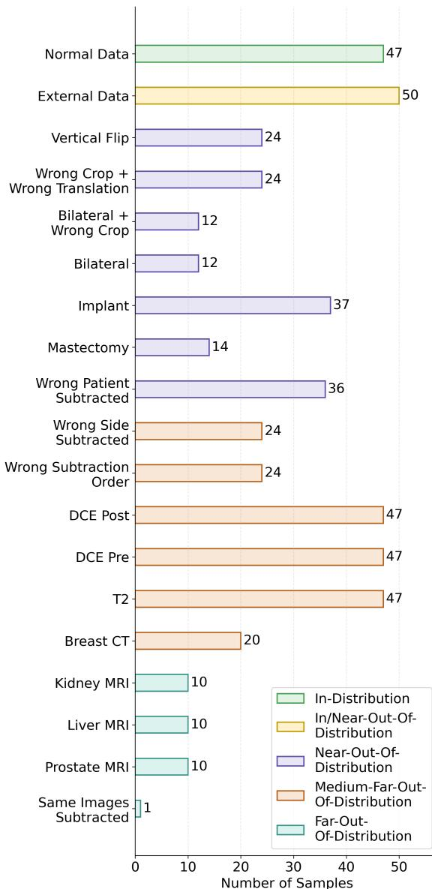  
Figure 5: Detailed view of the diferent categories of the test set, including normal, external, and anomalous data, and their assignment to the perceptual diference to the ID data based on the proposed anomaly taxonomy.

## A. Supplementary Material

A detailed overview of the diferent subgroups within the test dataset is shown in Figure 5. Figure 6 presents examples of normal, external, and anomalous data. The anomaly taxonomy and grading assigned to the anomaly types defined by Graham et al. (2023) and Graham et al. (2022) is shown in Table 3. Figures 7, 8, 9, 10, 11, and 12 present the anomaly score distributions for the 3D RA, the Transformer OOD, and the DDPM OOD, respectively, per anomaly category and per distribution category for on the test set. Examples of reconstructions for the 3D RA and the VQ-GAN on a representative validation sample are provided in Figure 13. Figure 14 shows the variability in implant visibility across MRI sequences.

## References

Bao, J., Sun, H., Deng, H., He, Y., Zhang, Z., et al., 2023. BMAD: Benchmarks for medical anomaly detection. doi:10.48550/ARXIV.2306. 11876.

Bercea, C.I., Wiestler, B., Rueckert, D., Schnabel, J.A., 2024a. Generalizing unsupervised anomaly detection: Towards unbiased pathology screening, in: Oguz, I., Noble, J., Li, X., Styner, M., Baumgartner, C., Rusu, M., Heinmann, T., Kontos, D., Landman, B., Dawant, B. (Eds.), Medical Imaging with Deep Learning, PMLR. pp. 39–52. URL: https: //proceedings.mlr.press/v227/bercea24a.html.

Bercea, C.I., Wiestler, B., Rueckert, D., Schnabel, J.A., 2024b. Towards universal unsupervised anomaly detection in medical imaging. doi:10. 48550/ARXIV.2401.10637.

Cai, Y., Zhang, W., Chen, H., Cheng, K.T., 2025. MedIAnomaly: A comparative study of anomaly detection in medical images. Medical Image Analysis 102, 103500. doi:10.1016/j.media.2025.103500.

Côté, P.O., Nikanjam, A., Ahmed, N., Humeniuk, D., Khomh, F., 2024. Data cleaning and machine learning: a systematic literature review. Automated Software Engineering 31. doi:10.1007/s10515-024-00453-w.

Cui, Y., Liu, Z., Lian, S., 2023. A survey on unsupervised anomaly detection algorithms for industrial images. IEEE Access 11, 55297– 55315. doi:10.1109/access.2023.3282993.

Daniel, T., Tamar, A., 2021. Soft-IntroVAE: Analyzing and improving the introspective variational autoencoder, in: 2021 IEEE/CVF Conference on Computer Vision and Pattern Recognition (CVPR), IEEE. pp. 4389– 4398. doi:10.1109/cvpr46437.2021.00437.

Erickson, B.J., Kirk, S., Lee, Y., Bathe, O., Kearns, M., et al., 2016. The cancer genome atlas liver hepatocellular carcinoma collection (TCGA-LIHC). doi:10.7937/K9/TCIA.2016.IMMQW8UQ.

Esteban, O., Birman, D., Schaer, M., Koyejo, O.O., Poldrack, R.A., Gorgolewski, K.J., 2017. Mriqc: Advancing the automatic prediction of image quality in mri from unseen sites. PLOS ONE 12, e0184661. doi:10.1371/journal.pone.0184661.

European Parliament and Council of the European Union, 2024. Regulation (EU) 2024/1689 of the European Parliament and of the Council of 13 June 2024 laying down harmonised rules on artificial intelligence and amending Regulations (EC) No 300/2008, (EU) No 167/2013, (EU) No 168/2013, (EU) 2018/858, (EU) 2018/1139 and (EU) 2019/2144 and Directives 2014/90/EU, (EU) 2016/797 and (EU) 2020/1828 (Artificial Intelligence Act). Oficial Journal of the European Union, L, 2024/1689, 12.7.2024. URL: http://data.europa.eu/eli/reg/2024/1689/oj.

Galbusera, F., Cina, A., 2024. Image annotation and curation in radiology: an overview for machine learning practitioners. European Radiology Experimental 8. doi:10.1186/s41747-023-00408-y.

Graham, M.S., Pinaya, W.H.L., Wright, P., Tudosiu, P.D., Mah, Y.H., et al., 2023. Unsupervised 3d out-of-distribution detection with latent difusion models, in: Medical Image Computing and Computer Assisted Intervention – MICCAI 2023, Springer Nature Switzerland. pp. 446– 456. doi:10.1007/978-3-031-43907-0\_43.

Graham, M.S., Tudosiu, P.D., Wright, P., Pinaya, W.H.L., U-King-Im, J.M., et al., 2022. Transformer-based out-of-distribution detection for clinically safe segmentation, in: Konukoglu, E., Menze, B., Venkataraman, A., Baumgartner, C., Dou, Q., Albarqouni, S. (Eds.), Proceedings of The 5th International Conference on Medical Imaging with Deep Learning, PMLR. pp. 457–476. URL: https://proceedings.mlr.press/ v172/graham22a.html.

Herath, H.M.S.S., Herath, H.M.K.K.M.B., Madusanka, N., Lee, B.I., 2025. A systematic review of medical image quality assessment. Journal of Imaging 11, 100. doi:10.3390/jimaging11040100.

Johnson, J., Alahi, A., Fei-Fei, L., 2016. Perceptual losses for realtime style transfer and super-resolution, in: Computer Vision – ECCV 2016, Springer International Publishing. pp. 694–711. doi:10.1007/ 978-3-319-46475-6\_43.

Kadhim, M., Rogowski, V., Persson, E., Gonzalez, C., Haraldsson, A., et al., 2026. Catching magnetic resonance imaging outliers in artificial intelligence-supported radiotherapy workflows: unsupervised detection and localization of image anomalies using deep learning. doi:10.48550/ ARXIV.2605.24609.

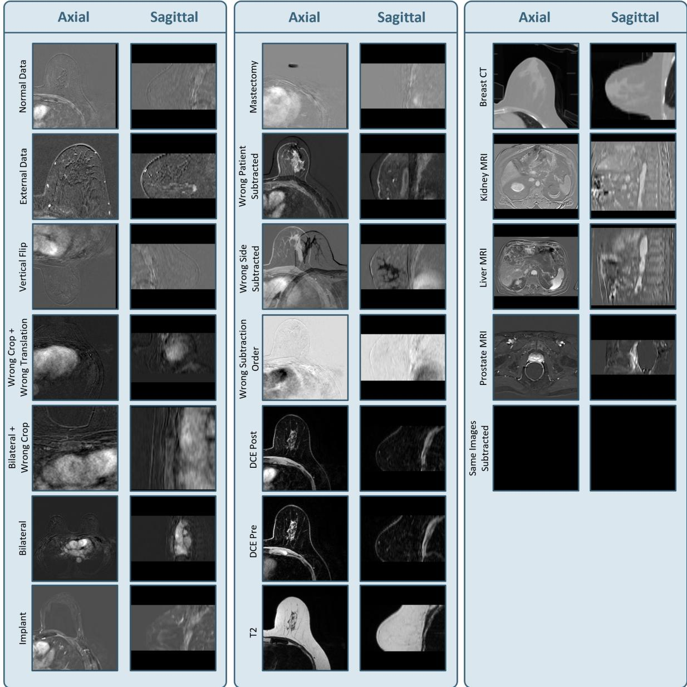  
Figure 6: Examples of normal, external, and anomalous data samples. Normal data from the ODELIA dataset include DCE breast MR subtraction images without mastectomy or implants. Anomalies from the ODELIA dataset include implants, mastectomy, and protocol variants (T2, pre- and post-contrast DCE MRI). DCE MR subtraction images from anatomically distinct regions (kidney, liver, prostate) are obtained from three TCGA datasets. Chest CT images from the QIN-Breast dataset are cropped to simulate a diferent imaging modality. Subtraction image inconsistencies and geometrical transformations are generated from the normal test images. External normal data from DUKE and RSH institutions simulate unseen deployment sites.

Kastryulin, S., Zakirov, J., Pezzotti, N., Dylov, D.V., 2023. Image quality assessment for magnetic resonance imaging. IEEE Access 11, 14154– 14168. doi:10.1109/access.2023.3243466.

Lang, D.M., Schwartz, E., Bercea, C.I., Giryes, R., Schnabel, J.A., 2023. Multispectral 3D masked autoencoders for anomaly detection in noncontrast enhanced breast MRI, in: Cancer Prevention Through Early Detection, Springer Nature Switzerland. pp. 55–67. doi:10.1007/ 978-3-031-45350-2\_5.

Li, X., Abramson, R.G., Arlinghaus, L.R., Chakravarthy, A.B., Abramson, V.G., et al., 2016. Data from QIN-breast. doi:10.7937/K9/TCIA.2016. 21JUEBH0.

Linehan, M., Gautam, R., Kirk, S., Lee, Y., Roche, C., et al., 2016. The cancer genome atlas cervical kidney renal papillary cell carcinoma collection (TCGA-KIRP). doi:10.7937/K9/TCIA.2016.ACWOGBEF.

Liu, J., Xie, G., Wang, J., Li, S., Wang, C., et al., 2024. Deep industrial image anomaly detection: A survey. Machine Intelligence Research 21, 104–135. doi:10.1007/s11633-023-1459-z.

Madabhushi, A., Feldman, M., 2016. Fused radiology-pathology prostate dataset. doi:10.7937/K9/TCIA.2016.TLPMR1AM.

Mann, R.M., Athanasiou, A., Baltzer, P.A.T., Camps-Herrero, J., Clauser, P., et al., 2022. Breast cancer screening in women with extremely dense breasts recommendations of the european society of breast imaging (eusobi). European Radiology 32, 4036–4045. doi:10.1007/ s00330-022-08617-6.

Marziali, S., Corradini, L., Depretto, C., Della Pepa, G., Irmici, G., et al., 2026. Assessing breast MRI image quality: the bMRI-QUAL scoring system. European Radiology doi:10.1007/s00330-026-12439-1.

Anomaly taxonomy and grading assigned to the anomaly types defined by Graham et al. (2023) and Graham et al. (2022), assuming that the brain CT scans were acquired under a dedicated head CT protocol, and that a diferent protocol was used for the CT scans of other anatomical regions.
<table><tr><td>Group</td><td>Protocol and Modality</td><td>Anatomical and Structural Alterations</td><td>Orientation and Field of View</td><td>Spatial Extent</td><td>Total Grade</td></tr><tr><td colspan="6">In-distribution</td></tr><tr><td>Brain CT</td><td>0</td><td>0</td><td>0</td><td>0</td><td>0</td></tr><tr><td colspan="6">Near-out-of-distribution</td></tr><tr><td>Background (0.3)</td><td>0</td><td>1</td><td>0</td><td>0</td><td>1</td></tr><tr><td>Background (0.6)</td><td>0</td><td>1</td><td>0</td><td>0</td><td>1</td></tr><tr><td>Background (1.0)</td><td>0</td><td>1</td><td>0</td><td>0</td><td>1</td></tr><tr><td>Flip L-R</td><td>0</td><td>0</td><td>1</td><td>0</td><td>1</td></tr><tr><td>Flip A-P</td><td>0</td><td>0</td><td>1</td><td>0</td><td>1</td></tr><tr><td>Flip l-S</td><td>0</td><td>0</td><td>1</td><td>0</td><td>1</td></tr><tr><td>Scaling (1%)</td><td>0</td><td>0</td><td>1</td><td>0</td><td>1</td></tr><tr><td>Scaling (10%)</td><td>0</td><td>0</td><td>1</td><td>0</td><td>1</td></tr><tr><td>Skull Stripped</td><td>0</td><td>1</td><td>0</td><td>1</td><td>2</td></tr><tr><td>Chunk top</td><td>0</td><td>1</td><td>0</td><td>1</td><td>2</td></tr><tr><td>Chunk middle</td><td>0</td><td>1</td><td>0</td><td>1</td><td>2</td></tr><tr><td>Noise (σ = 0.01)</td><td>0</td><td>0</td><td>0</td><td>2</td><td>2</td></tr><tr><td>Noise (σ = 0.1)</td><td>0</td><td>0</td><td>0</td><td>2</td><td>2</td></tr><tr><td>Noise (σ = 0.2)</td><td>0</td><td>0</td><td>0</td><td>2</td><td>2</td></tr><tr><td colspan="6">Medium-far-out-of-distribution</td></tr><tr><td>Head MR</td><td>2</td><td>0</td><td>0</td><td>2</td><td>4</td></tr><tr><td colspan="6">Far-out-of-distribution</td></tr><tr><td>Colon CT</td><td>1</td><td>2</td><td>2</td><td>1</td><td>6</td></tr><tr><td>Hepatic CT</td><td>1</td><td>2</td><td>2</td><td>1</td><td>6</td></tr><tr><td>Liver CT</td><td>1</td><td>2</td><td>2</td><td>1</td><td>6</td></tr><tr><td>Lung CT</td><td>1</td><td>2</td><td>2</td><td>1</td><td>6</td></tr><tr><td>Pancreas CT</td><td>1</td><td>2</td><td>2</td><td>1</td><td>6</td></tr><tr><td>Spleen CT</td><td>1</td><td>2</td><td>2</td><td>1</td><td>6</td></tr><tr><td>Prostate MR</td><td>2</td><td>2</td><td>2</td><td>2</td><td>8</td></tr><tr><td>Cardiac MR</td><td>2</td><td>2</td><td>2</td><td>2</td><td>8</td></tr></table>

Müller-Franzes, G., Sánchez, L.E., Payne, N., Athanasiou, A., Kalogeropoulos, M., et al., 2025. A european multi-center breast cancer MRI dataset. doi:10.48550/ARXIV.2506.00474.

Nicke, T., Schäfer, J.R., Höfener, H., Feuerhake, F., Merhof, D., et al., 2025. Tissue concepts: Supervised foundation models in computational pathology. Computers in Biology and Medicine 186, 109621. doi:10. 1016/j.compbiomed.2024.109621.

Oviedo, F., Kazerouni, A.S., Liznerski, P., Xu, Y., Hirano, M., et al., 2025. Cancer detection in breast MRI screening via explainable AI anomaly detection. Radiology 316. doi:10.1148/radiol.241629.

Petersen, E., Potdevin, Y., Mohammadi, E., Zidowitz, S., Breyer, S., et al., 2022. Responsible and regulatory conform machine learning for medicine: A survey of challenges and solutions. IEEE Access 10, 58375–58418. doi:10.1109/access.2022.3178382.

de Rooij, M., Allen, C., Twilt, J.J., Thijssen, L.C.P., Asbach, P., et al., 2024. PI-QUAL version 2: an update of a standardised scoring system for the assessment of image quality of prostate MRI. European Radiology 34, 7068–7079. doi:10.1007/s00330-024-10795-4.

Roth, K., Pemula, L., Zepeda, J., Scholkopf, B., Brox, T., et al., 2022. Towards total recall in industrial anomaly detection, in: 2022 IEEE/CVF Conference on Computer Vision and Pattern Recognition (CVPR), IEEE. pp. 14298–14308. doi:10.1109/cvpr52688.2022.01392.

Saha, A., Harowicz, M.R., Grimm, L.J., Kim, C.E., Ghate, S.V., et al., 2018. A machine learning approach to radiogenomics of breast cancer: a study of 922 subjects and 529 DCE-MRI features. British Journal of Cancer 119, 508–516. doi:10.1038/s41416-018-0185-8.

Schwabe, D., Becker, K., Seyferth, M., Klaß, A., Schaefter, T., 2024. The METRIC-framework for assessing data quality for trustworthy AI in medicine: a systematic review. npj Digital Medicine 7. doi:10.1038/ s41746-024-01196-4.

Schäfer, R., Nicke, T., Höfener, H., Lange, A., Merhof, D., et al., 2024. Overcoming data scarcity in biomedical imaging with a foundational multi-task model. Nature Computational Science 4, 495–509. doi:10. 1038/s43588-024-00662-z.

Standards Committee of the IEEE Engineering in Medicine and Biology Society, 2022. IEEE recommended practice for the quality management of datasets for medical artificial intelligence. IEEE Std 2801-2022 , 1– 31doi:10.1109/IEEESTD.2022.9812564.

Tschuchnig, M.E., Gadermayr, M., 2022. Anomaly detection in medical imaging - a mini review, in: Data Science – Analytics and Applications, Springer Fachmedien Wiesbaden. pp. 33–38. doi:10.1007/ 978-3-658-36295-9\_5.

UNICORN Challenge Organizers, 2025. UNICORN challenge. https: //unicorn.grand-challenge.org/. Accessed: 2026-01-12.

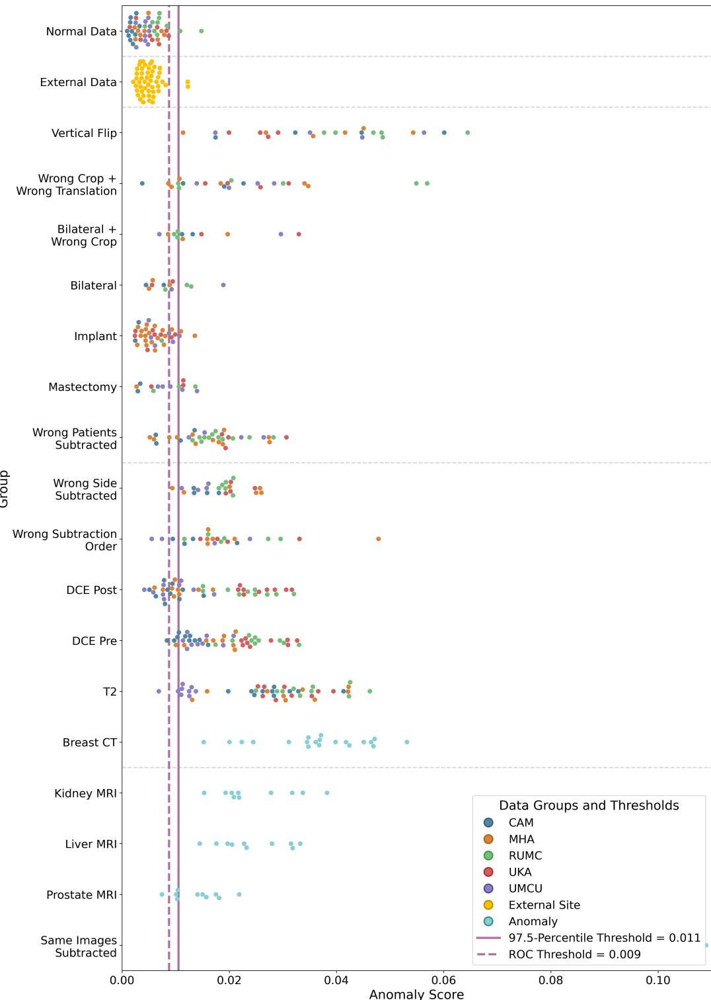  
Figure 7: Anomaly score distributions for the 3D RA on the test set. Each group corresponds to an anomaly category from Table 1. The vertical dashed line indicates the 97.5-percentile-based decision threshold. The vertical solid line is the ROC-based decision threshold. The horizontal dashed lines represent the separation into ID, external, near-, medium-far-, and far-OOD samples.

World Health Organization, 2026. Breast cancer. https://www.who.int/ news-room/fact-sheets/detail/breast-cancer. Accessed: 2026-05-20.

Yang, J., Zhou, K., Li, Y., Liu, Z., 2024. Generalized out-of-distribution detection: A survey. International Journal of Computer Vision 132, 5635–5662. doi:10.1007/s11263-024-02117-4.

Zhang, Z., Patel, B., Patel, B., Banerjee, I., 2025. Unsupervised generative approach for anomaly detection to enhance the quality of unseen medical

datasets, in: 2025 IEEE/CVF Winter Conference on Applications of Computer Vision Workshops (WACVW), IEEE. pp. 250–259. doi:10. 1109/wacvw65960.2025.00035.

Zhao, H., Gallo, O., Frosio, I., Kautz, J., 2017. Loss functions for image restoration with neural networks. IEEE Transactions on Computational Imaging 3, 47–57. doi:10.1109/tci.2016.2644865.

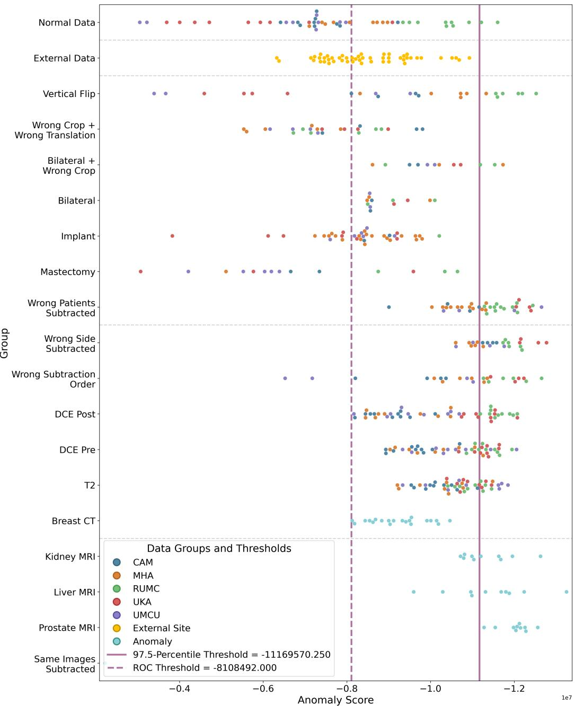  
Figure 8: Anomaly score distributions for the transformer-based OOD detection on the test set. Each group corresponds to an anomaly category from Table 1. The vertical dashed line indicates the 97.5-percentile-based decision threshold. The vertical solid line is the ROC-based decision threshold. The horizontal dashed lines represent the separation into ID, external, near-, medium-far-, and far-OOD samples.

Zimmerer, D., Full, P.M., Isensee, F., Jager, P., Adler, T., et al., 2022. MOOD 2020: A public benchmark for out-of-distribution detection and localization on medical images. IEEE Transactions on Medical Imaging 41, 2728–2738. doi:10.1109/tmi.2022.3170077.

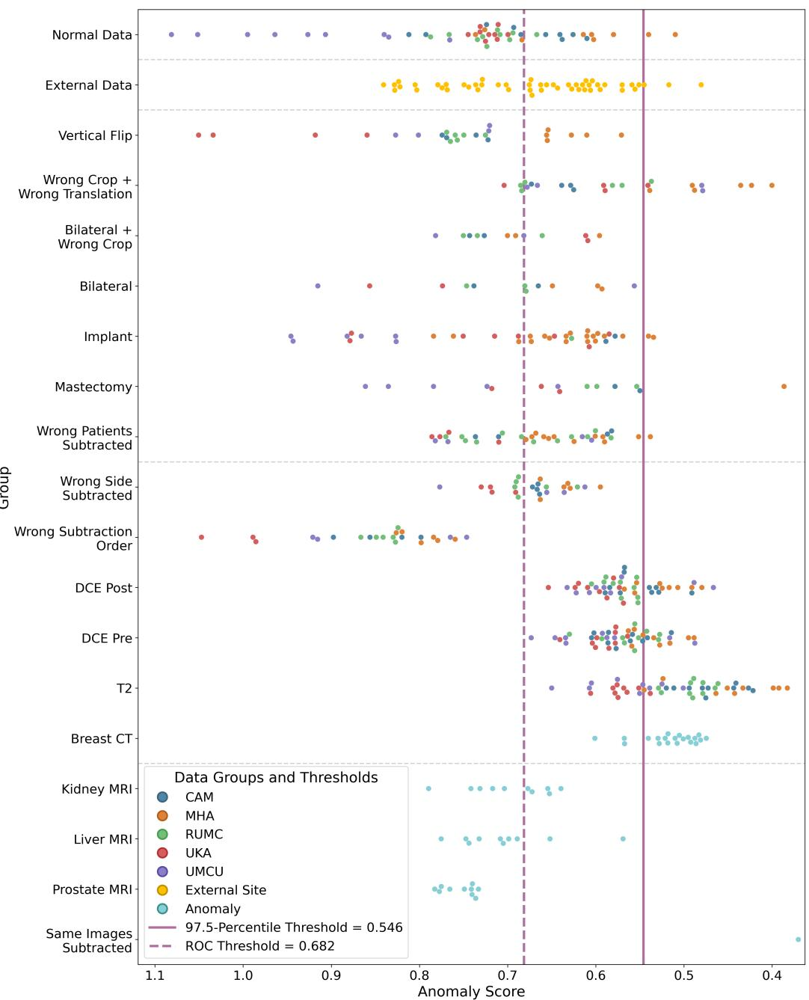  
Figure 9: Anomaly score distributions for the DDPM-based OOD detection on the test set. Each group corresponds to an anomaly category from Table 1. The vertical dashed line indicates the 97.5-percentile-based decision threshold. The vertical solid line is the ROC-based decision threshold. The horizontal dashed lines represent the separation into ID, external, near-, medium-far-, and far-OOD samples.

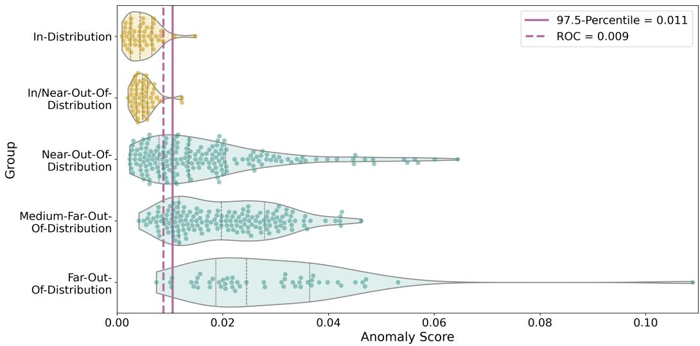  
Figure 10: Anomaly score distributions per distribution category for the 3D RA on the test set.

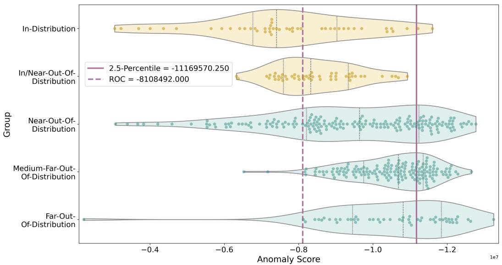  
Figure 11: Anomaly score distributions per distribution category for the transformer-based OOD detection on the test set.

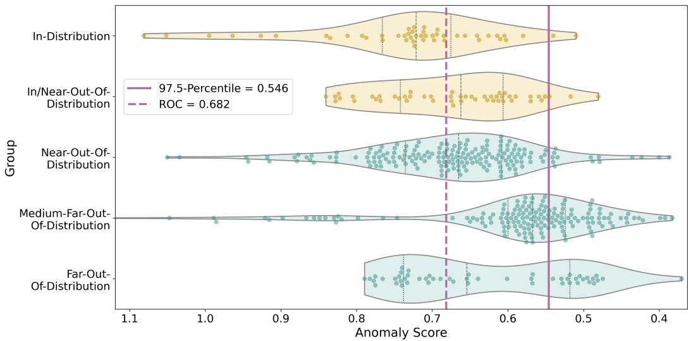  
Figure 12: Anomaly score distributions per distribution category for the DDPM-based OOD detection on the test set.

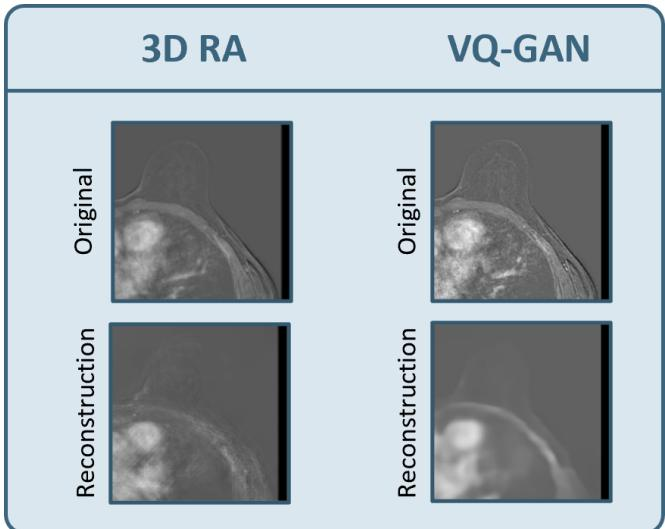  
Figure 13: Qualitative reconstruction comparison for the 3D RA and the VQ-GAN on a representative validation sample. For each model, the first row shows the input middle slice, and the second row shows the corresponding reconstruction. The 3D RA operates at a resolution of (128, 128) voxels, while the VQ-GAN operates on (256, 256) voxels, which directly influences the small details and sharpness of the input image.

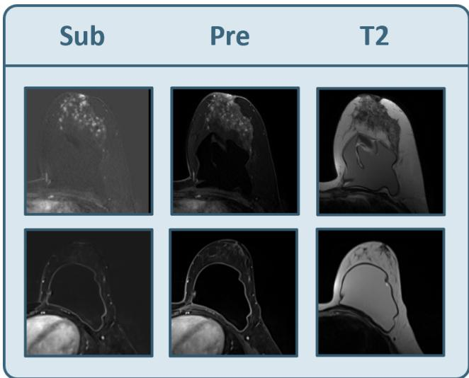  
Figure 14: Two examples illustrating variability in implant visibility across MRI sequences. Each row shows a diferent patient case. Columns show the DCE subtraction image (Sub), DCE pre-contrast agent image (Pre), and T2-weighted image (T2). Implants are more visible on T2-weighted and DCE precontrast agent images than on subtraction images, where the absence of enhancement makes implant detection particularly challenging for AD methods trained on subtraction images.