# VicEdit: Learning to Edit Videos from Visual In-Context Examples

Yuji Wang1∗ Teng Hu1∗ Yuheng Chen1 Ran Yi1 Han Feng2 Weijian Cao2 Chengjie Wang2 Lizhuang Ma1† Jiangning Zhang3‡

1Shanghai Jiao Tong University 2Tencent Youtu Lab 3Zhejiang University

## Abstract

Despite progress in instruction-based video editing, unimodal textual instructions inherently struggle to convey fine-grained textures and complex dynamics. To bridge this perceptual gap, we propose Visual In-context Editing, a new paradigm elevating video editing from textual instructions to multi-modal visual guidance encompassing single image, image pair, and video pair. To facilitate this paradigm, we curate VicEdit-400K, the first large-scale dataset for visual in-context video editing. We develop an automated pipeline to generate 400K high-quality samples across ten task types, ensuring superior visual fidelity and semantic consistency through multi-dimensional filtering. Leveraging this foundation, we introduce VicEdit, a unified framework to bridge visual and textual contexts. To adaptively extract editing semantics from heterogeneous references, we design Modality-Adaptive Semantic Distillation, which produces modality-specific semantic tokens from visual references. These tokens are then synergistically integrated with textual instructions through Dual-Context Injection, enabling the generation process to benefit from both visual and textual signals. Extensive evaluations on VicEdit-Bench demonstrate that VicEdit achieves state-of-the-art performance across both basic instruction editing and visual in-context editing tasks, establishing visual in-context learning as a powerful and controllable paradigm for video editing.

Project Page: https://rain152.github.io/VicEdit/

## 1 Introduction

Instruction-driven video editing [2–6] has achieved remarkable progress, enabling users to modify videos through natural language with increasing controllability. By leveraging large language models and diffusion architectures [7–9], recent methods have demonstrated impressive capabilities ranging from localized object manipulation to global style transfer, establishing text instructions as the dominant interface for controllable video editing. However, a fundamental gap remains: the semantic nature of language often fails to capture the perceptual nuances required for high-fidelity editing.

As illustrated in Fig. 1 (Top), this limitation manifests across three critical dimensions: 1) visual textures, where text-only baselines like DiTTO [10] and VideoCoF [4] often suffer from stylistic drift, as linguistic descriptors cannot precisely anchor specific textures; 2) spatial transformations, where linguistic instructions specify what but not where to edit, whereas image-pair references intuitively define spatial anchors that current MLLM-based methods [11, 12] fail to exploit; and 3) temporal dynamics, where complex motion patterns in creative editing exceed linguistic capacity, a gap that remains unaddressed by recent reference-based works like Kiwi-Edit [13] which only supports static single-image modality. The architectural evolution in Fig. 1 (Bottom) further highlights these gaps: traditional methods either rely on pure linguistic semantics (a) or employ rigid auxiliary branches (b), lacking the flexibility to reason across heterogeneous visual contexts. Furthermore, on the data front, existing benchmarks [13, 14, 1] are confined to text or single-image drivers, providing insufficient coverage for large-scale multi-modal training. These systemic deficiencies in both architectural reasoning and data resources motivate a paradigm shift from descriptive “telling” to prescriptive “showing” via visual in-context examples.

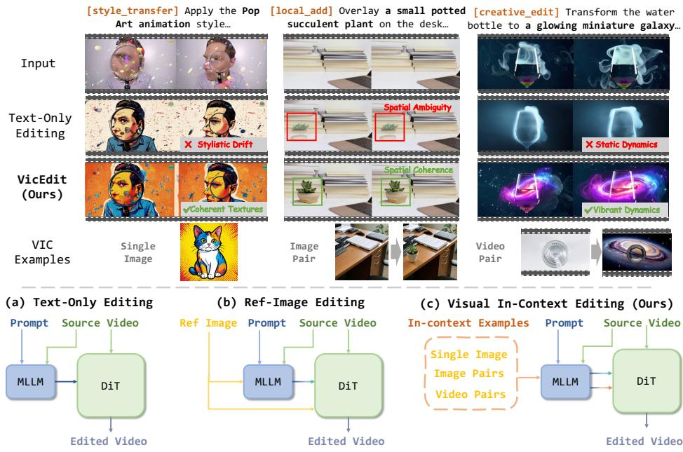  
Figure 1: Top: Qualitative comparison between VicEdit and text-only baselines. VicEdit precisely resolves stylistic drift (via Single Image), spatial drift (via Image Pair), and static dynamics (via Video Pair), demonstrating the necessity of visual exemplars. Bottom: Architectural evolution: (a) text-only methods rely on linguistic semantics; (b) ref-image methods employ auxiliary injection branches; (c) VicEdit extends MLLM contextual reasoning by distilling multi-modal priors into the video DiT for precise, reference-driven editing. All examples presented in the figure are collected from the open-source OpenVE [1].

Considering the limitations of text-only instructions in conveying complex intents, we formulate a unified visual in-context video editing paradigm. This paradigm leverages dense semantic cues across diverse visual modalities to provide richer guidance for precise video manipulation.

To bridge existing architectural and resource gaps, We first introduce VicEdit-400K (Sec. 3.2), the first large-scale dataset specifically designed for this paradigm, encompassing 400K high-quality samples across three reference modalities and ten distinct task types. Curated through an automated pipeline with structured instruction generation and rigorous quality filtering, VicEdit-400K provides a systematic foundation for modeling visual intent. Building upon this, we propose VicEdit (Sec. 3.3), a unified framework capable of processing heterogeneous reference inputs. To effectively capture editing semantics, we design Modality-Adaptive Semantic Distillation (MASD), which extracts visual context tokens via modality-conditioned learnable queries. These distilled semantics, alongside textual instructions, are integrated into the generation process through Dual-Context Injection (DCI), a mechanism that synergistically fuses instructional and visual context tokens into the video DiT via cross-attention. Extensive experiments demonstrate that VicEdit establishes new state-of-the-art performance across all reference modalities, consistently outperforming existing text-driven baselines. Our contributions are summarized as follows:

1) We formulate a unified visual in-context video editing paradigm, transitioning from descriptions to perceptual demonstrations. To support this, we introduce VicEdit-400K, the first large-scale dataset featuring 400K high-quality samples across three reference modalities and ten task types, providing a systematic foundation for visual in-context editing.

2) We propose the VicEdit framework designed for heterogeneous visual references. Specifically, we introduce Modality-Adaptive Semantic Distillation to adaptively extract editing semantics via modality-conditioned queries, and Dual-Context Injection to synergistically fuse distilled visual tokens with textual instructions into DiT via cross-attention.

3) Experiments demonstrate that VicEdit not only excels in base text-driven editing but also shows significant superiority on our proposed VicEdit-Bench, which comprehensively evaluates visual in-context editing across three reference modalities. Extensive ablation studies further validate the efficacy of each architectural component.

## 2 Related Work

Instruction-driven Video Editing. Instruction-driven video editing has evolved from training-free propagation [15–17] to large-scale trained systems [2–4, 14]. Recently, several works have begun exploring visual references: Kiwi-Edit [13] introduces single reference images via fixed queries, OmniTransfer [18] utilizes video references for generation, and EditVerse [19] encodes task types through in-context tokens. Despite these efforts, a unified framework supporting heterogeneous reference modalities remains absent. VicEdit addresses this gap by proposing a visual in-context paradigm that extends editing from text-only instructions to multi-modal guidance across single images, image pairs, and video pairs. To support this paradigm, we construct VicEdit-400K, the first large-scale dataset covering three reference modalities and ten task types with 400K samples.

In-Context Learning in Video Generation. In-context learning (ICL) [20] has emerged as a powerful paradigm where models learn to perform tasks by conditioning on demonstrations rather than explicit specifications [20]. In image generation, methods like Painter [21] and ImageBrush [22] demonstrate that visual exemplars enable more precise control than text alone. This paradigm has since extended to video generation. This paradigm has since extended to video: early works [23] explored prompt-level ICL for multi-scene tasks, while VICL [24] utilized an autoregressive DiT for viewpoint and motion transfer. Recent methods like EditVerse [19, 5] leverage global attention for context interaction, yet struggle with long-sequence references. Alternatively, OmniTransfer [11] employs an auxiliary DiT to learn from reference examples. In summary, existing methods are typically confined to video generation and support only limited reference modalities. VicEdit advances this field by introducing Modality-Adaptive Semantic Distillation to adaptively extract editing semantics from diverse references, and Dual-Context Injection to synergistically integrate these visual cues with textual instructions within the DiT latent space.

## 3 Method

## 3.1 Formulation: Visual In-Context Editing

We define the task of visual in-context video editing as a conditional generation process [19, 23]. Given a source video $V _ { s r c } \in \mathbb { R } ^ { T \times 3 \times H \times W }$ and a textual instruction ${ \bar { P } } ,$ , the goal is to synthesize an edited video $V _ { t g t }$ that manifests the editing intentions through an optional visual exemplar R. Formally, this transformation is represented as:

$$
V _ { t g t } = \mathcal { G } ( V _ { s r c } , P , \langle R \rangle ) ,\tag{1}
$$

where $\mathcal { G }$ denotes the generative model and $\langle \cdot \rangle$ represents an optional conditioning input [23, 11]. To encompass diverse editing scenarios, R is formulated as a set of heterogeneous modalities that encode editing semantics across different dimensions:

• Single Image $( R _ { s i } = I _ { r e f } )$ : Provides fine-grained visual anchors, including textures and appearances, to guide stylistic or identity-consistent synthesis.

• Image Pair $( R _ { i p } = \{ I _ { s } ^ { r e f } , I _ { t } ^ { r e f } \} )$ : Characterizes the transformation between reference domains, capturing shifts in spatial layouts and localized details.

• Video Pair $( R _ { v p } = \{ V _ { s } ^ { r e f } , V _ { t } ^ { r e f } \} ) \colon$ Provides dense temporal priors and dynamic semantic correspondences for motion-intensive editing.

This paradigm faces two challenges: the scarcity of large-scale unified datasets across these modalities and the structural heterogeneity that complicates semantic extraction and multimodal integration.

(b) Prompt Length Distribution  
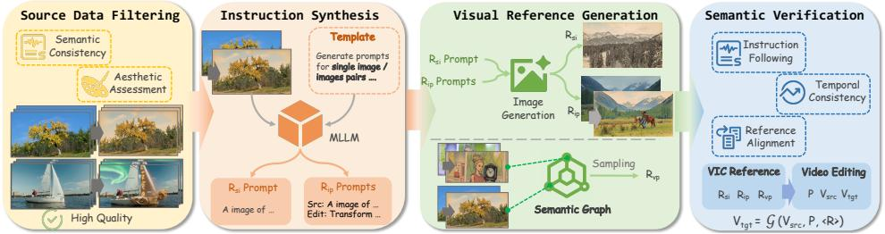  
Figure 2: Data construction pipeline that comprises four stages (Sec. 3.2), yielding a final dataset of 400K samples that covers basic editing and visual in-context editing tasks. All examples presented in the figure are collected from the open-source OpenVE [1].

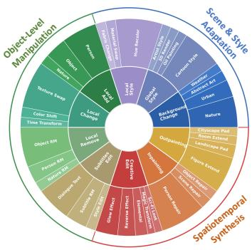  
(a) Theme Analysis

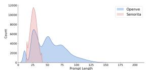

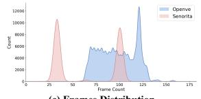

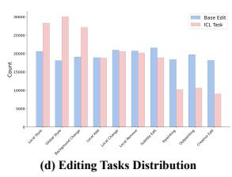  
(e) Prompt Word Cloud  
Figure 3: Statistics of VicEdit-400K.

## 3.2 Data Curation for Visual In-Context Editing

In this section, we present the construction pipeline of VicEdit-400K. By formulating visual instructions from editing tasks and efficiently generating corresponding visual references, coupled with a multi-stage quality filtering process, we curated 400K high-quality samples. Based on this dataset, we further establish VicEdit-Bench to rigorously evaluate performance across diverse visual in-context editing tasks. We provide further details regarding the dataset and benchmark in Appendix B and C.

Data Source. We build VicEdit-400K upon two recent large-scale datasets: Señorita-2M [25], which covers 18 editing sub-categories, and OpenVE-3M [1], containing approximately 3 million samples across 8 spatial and non-spatial categories. While extensive, both datasets rely solely on textual instructions and lack visual references. To address this, we systematically consolidate their editing tasks and curate a subset to construct multi-modal visual references.

Data Construction Pipeline. As shown in Fig. 2, our construction pipeline comprises four stages:

1) Source Data Filtering.We filter raw data for semantic consistency and aesthetic quality [26, 27]. By leveraging the LAION-Aesthetic [28] predictor and Qwen3-VL [29], we implement a dual-model filtering mechanism that selects only those samples possessing both superior visual appeal and high semantic editability for the downstream pipeline.

2) Instruction Synthesis. Leveraging MLLMs [30, 29], we synthesize modality-aware instructions tailored to each reference type. By employing structured prompting, we ensure the instructions maintain strict semantic alignment with the visual references while explicitly prescribing non-trivial edits that differentiate the target from the source content. This approach yields a diverse prompt set spanning 10 core tasks, ensuring both consistency and editability.

3) Visual Reference Generation. We employ modality-specific strategies for reference synthesis. For Single Image and Image Pair modalities, we utilize state-of-the-art generative models [31, 32] to synthesize target content guided by the generated instructions. For the Video Pair modality, to circumvent temporal artifacts in generative editing, we construct a Semantic Knowledge Graph and partition the task space via Spectral Clustering [33]. By sampling semantically-linked pairs from these clusters, we provide authentic references that maintain high visual fidelity.

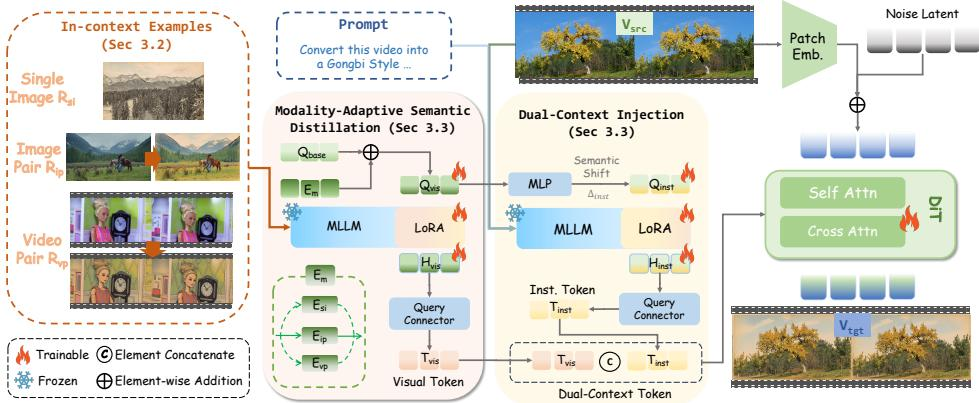  
Figure 4: Overview of VicEdit. It consists of 1) MASD modulates base queries $Q _ { b a s e }$ with modality embeddings $E _ { m }$ to distill visual tokens $T _ { v i s } ; 2 )$ DCI applies a semantic shift to calibrate instruction extraction, yielding dual-context tokens. These unified embeddings are injected into a Video DiT to steer the generation process. All examples presented in the figure are collected from the open-source OpenVE [1].

4) Semantic Verification. Final samples undergo MLLM-based multi-dimensional verification. By employing pre-defined scoring templates, we prompt MLLMs to rigorously assess instruction following, temporal consistency [13, 1], and reference alignment. This standardized evaluation allows us to filter out inconsistent samples and ensure the high reliability of the final dataset.

Data Statistics and Analysis. VicEdit-400K covers three categories and 10 fine-grained tasks as shown in Fig. 3. Statistical analysis reveals significant diversity, with video lengths primarily concentrated in the 30∼120 frame intervals. This bimodal distribution, coupled with a broad semantic prompt space (Fig. 3e), provides a robust foundation for advancing visual in-context editing.

Benchmark and Evaluation. We evaluate VicEdit on two paradigms: 1) Basic Editing, where we introduce OpenVE-Ext by augmenting OpenVE-Bench [1] with 3 additional tasks from Señorita [25]; and 2) Visual In-Context Editing, using our proposed VicEdit-Bench to assess heterogeneous reference following. VicEdit-Bench consists of 200 representative instances (10 per task-modality combination) strictly isolated from the training set to ensure zero-shot generalization. Following [1], we leverage MLLMs [29] for automated scoring, supplemented by fidelity and temporal metrics from VBench [26, 27] and IVE-bench [34].

## 3.3 Methodology: Visual In-context Editing (VicEdit)

We introduce VicEdit, a unified in-context learning framework that extends video editing to accommodate multi-modal visual guidance.

Overview of VicEdit. As illustrated in Figure 4, VicEdit employs a frozen MLLM for semantic understanding and a Video DiT for generation, connected by two lightweight modules: MASD, which extracts modality-aware visual tokens $\mathbf { T } _ { \mathrm { v i s } }$ from the in-context reference, and DCI, which produces instruction tokens $\mathbf { T } _ { \mathrm { i n s } }$ calibrated by the visual context. $\mathbf { T } _ { \mathrm { v i s } }$ and $\mathbf { T } _ { \mathrm { i n s } }$ encode complementary perceptual editing semantics and task-level edit directions, respectively. The two token sequences are concatenated and injected as cross-attention keys and values into the Video DiT to generate ${ \bf V } _ { e } .$

Modality-Adaptive Semantic Distillation. The three reference modalities capture structurally distinct editing semantics: image pairs reflect spatial transformations, video pairs provide temporal motion priors, and single images anchor global appearance attributes. Existing methods [11–13] often extract semantic tokens using a fixed set of learnable queries, implicitly assuming a universal pattern for all visual cues. However, this assumption fails under heterogeneous modalities, as a static query cannot adaptively distinguish between the localized spatial shifts in an image pair versus the global stylistic textures in a single reference image.

To resolve this, MASD modulates learnable queries via an additive, modality-conditioned shift:

$$
\mathbf { Q } _ { \mathrm { v i s } } = \mathbf { Q } _ { \mathrm { b a s e } } + \mathbf { E } _ { m } , \quad m \in \{ \mathrm { i p } , \mathrm { v p } , \mathrm { s i } \}\tag{2}
$$

where $\mathbf { Q } _ { \mathrm { b a s e } } \in \mathbb { R } ^ { N \times d }$ denotes shared base queries for cross-modal generalization, and $\mathbf { E } _ { m } \in \mathbb { R } ^ { N \times a }$ 1 is a learnable modality-specific embedding. Theoretically, this additive shift decomposes the search space into a common editing manifold and modality-specific sub-regions, steering attention toward relevant cues without losing foundational semantic knowledge. MASD then distills N semantic tokens $\mathbf { T } _ { \mathrm { v i s } }$ from the MLLM hidden states ${ \bf H } _ { \mathrm { v i s } } .$

$$
\mathbf { T } _ { \mathrm { v i s } } = \mathrm { C r o s s A t t n } \bigl ( \mathbf { Q } _ { \mathrm { v i s } } , \mathbf { H } _ { \mathrm { v i s } } , \mathbf { H } _ { \mathrm { v i s } } \bigr ) .\tag{3}
$$

By recalibrating the attention matrix, MASD selectively amplifies features consistent with the reference type. This enables specialization across heterogeneous modalities with negligible overhead: $\mathbf { Q } _ { \mathrm { b a s e } }$ captures what to modify, while $\mathbf { E } _ { m }$ refocuses attention on where (in space or time) to look.

Dual-Context Injection. While visual tokens $\mathbf { T } _ { \mathrm { v i s } }$ and instructions provide complementary editing information, A naive approach extracts instruction tokens independently of the visual context and simply concatenates the two sequences. Even with a semantically clear instruction, the visual reference provides the specific perceptual instantiation by specifying particular color palettes or textures that the text prompt describes. Without considering this interaction, the instruction branch may extract generic features that are not fully aligned with the fine-grained visual guidance provided in the reference.

To bridge this gap, DCI introduces a semantic shift mechanism that uses the visual context to calibrate instruction queries before token extraction. Specifically, we leverage the modality-conditioned queries $\mathbf { Q } _ { \mathrm { v i s } }$ from MASD to generate a shift vector via a lightweight MLP:

$$
\begin{array} { r } { \pmb { \Delta } _ { \mathrm { i n s t } } = \mathbf { M } \mathbf { L } \mathbf { P } \big ( \mathbf { Q } _ { \mathrm { v i s } } \big ) \in \mathbb { R } ^ { N \times d } . } \end{array}\tag{4}
$$

This shift is added to the base instruction queries $\mathbf { Q } _ { \mathrm { i n s t } }$ to produce visually-aware queries:

$$
\mathbf { Q } _ { \mathrm { i n s t } } ^ { \prime } = \mathbf { Q } _ { \mathrm { i n s t } } + \Delta _ { \mathrm { i n s t } } ,\tag{5}
$$

where $\mathbf { Q } _ { \mathrm { i n s t } }$ are learnable parameters, and $\Delta _ { \mathrm { i n s t } }$ adaptively adjusts the attention focus based on the reference content. These calibrated queries $\mathbf { Q } _ { \mathrm { i n s t } } ^ { \prime }$ then distill instruction tokens $\mathbf { T } _ { \mathrm { i n s t } }$ from the MLLM hidden states $\mathbf { H } _ { \mathrm { i n s t } }$ of the text prompt:

$$
\mathbf { T } _ { \mathrm { i n s t } } = \mathrm { C r o s s A t t n } \big ( \mathbf { Q } _ { \mathrm { i n s t } } ^ { \prime } , \mathbf { H } _ { \mathrm { i n s t } } , \mathbf { H } _ { \mathrm { i n s t } } \big ) .\tag{6}
$$

Finally, we concatenate the visual and instruction tokens into dual-context tokens $\mathbf { T } _ { \mathrm { d u a l } } = [ \mathbf { T } _ { \mathrm { v i s } } ; \mathbf { T } _ { \mathrm { i n s t } } ]$ These tokens are injected as keys and values into the cross-attention layers of the Video DiT to guide the generation process. Since the instruction extraction is already conditioned on the visual context, the two sequences are naturally aligned. This allows the DiT to coordinate both contexts through its standard attention layers.

Training Strategy. Our framework VicEdit builds upon Wan-TI2V-5B [8] and inherits pre-trained weights from Kiwi-Edit. VicEdit is trained in three stages to progressively incorporate in-context editing capability.

1) Base Editing. We first fine-tune the Video DiT on text-instructed editing tasks to extend the base model’s editing types and establish fundamental instruction-following ability with temporal consistency. Both the MLLM and the DiT backbone are initialized from pre-trained weights, and only the DiT is updated.

2) In-Context Branch. With both the DiT and MLLM frozen, we train the in-context modules, including MASD (base queries $\mathbf { Q } _ { \mathrm { b a s e } }$ and modality embeddings $\{ \mathbf { E } _ { m } \} )$ , the semantic shift MLP in DCI, and the instruction queries $\mathbf { Q } _ { \mathrm { i n s t } }$ . Each training batch mixes samples from all three modalities to ensure balanced learning of the modality embeddings.

3) Joint Fine-Tuning. We unfreeze the DiT and jointly fine-tune the entire pipeline (except the MLLM) to align the visual conditioning signals with the generative process. All stages are optimized with the standard denoising loss:

$$
\begin{array} { r } { \mathcal { L } = \mathbb { E } _ { \mathbf { V } _ { e } , \epsilon , t } \big [ \| \epsilon - \epsilon _ { \theta } ( \mathbf { V } _ { e } ^ { ( t ) } , t , \mathbf { T } _ { \mathrm { d u a l } } ) \| ^ { 2 } \big ] , } \end{array}\tag{7}
$$

where $\mathbf { V } _ { e } ^ { ( t ) }$ is the noised edited video at timestep $t , \epsilon$ is the ground-truth noise, and $\epsilon _ { \theta }$ denotes the DiT noise predictor conditioned on $\mathbf { T } _ { \mathrm { d u a l } }$

Table 1: Quantitative Comparison on OpenVE-Ext with MLLM.
<table><tr><td></td><td></td><td colspan="3">Scene &amp; Style Adaptation</td><td colspan="4">Object-Level Manipulation</td><td colspan="3">Spatiotemporal Synthesis</td></tr><tr><td>Methods</td><td>Overall</td><td>Global Style</td><td>Local Style</td><td>Background Change</td><td>Local Change</td><td>Local Remove</td><td>Local Add</td><td>Subtitle Edit</td><td>Creative Edit</td><td>Inpainting</td><td>Outpainting</td></tr><tr><td>VACE [35]</td><td>1.68</td><td>1.49</td><td>1.39</td><td>1.55</td><td>2.07</td><td>1.46</td><td>1.26</td><td>1.48</td><td>1.47</td><td>2.31</td><td>2.35</td></tr><tr><td>Lucy-Edit [36]</td><td>2.35</td><td>2.27</td><td>2.02</td><td>1.57</td><td>3.20</td><td>1.75</td><td>2.30</td><td>1.61</td><td>2.86</td><td>3.01</td><td>2.92</td></tr><tr><td>DITTO [10]</td><td>2.31</td><td>4.01</td><td>3.67</td><td>1.68</td><td>2.03</td><td>1.53</td><td>1.41</td><td>2.81</td><td>1.23</td><td>2.05</td><td>2.67</td></tr><tr><td>NovaEdit [3]</td><td>2.76</td><td>2.24</td><td>1.98</td><td>2.40</td><td>3.62</td><td>3.43</td><td>2.64</td><td>2.93</td><td>2.59</td><td>2.78</td><td>3.01</td></tr><tr><td>VideoCoF [4]</td><td>2.79</td><td>2.57</td><td>2.24</td><td>2.32</td><td>3.37</td><td>3.61</td><td>2.75</td><td>3.10</td><td>2.20</td><td>2.87</td><td>2.88</td></tr><tr><td>Kiwi-Edit [13]</td><td>3.08</td><td>3.64</td><td>2.85</td><td>2.64</td><td>3.83</td><td>2.63</td><td>2.36</td><td>3.20</td><td>3.39</td><td>3.35</td><td>2.86</td></tr><tr><td>VicEdit (Ours)</td><td>3.28</td><td>3.48</td><td>2.90</td><td>3.05</td><td>3.85</td><td>3.68</td><td>2.64</td><td>3.32</td><td>3.25</td><td>3.38</td><td>3.20</td></tr></table>

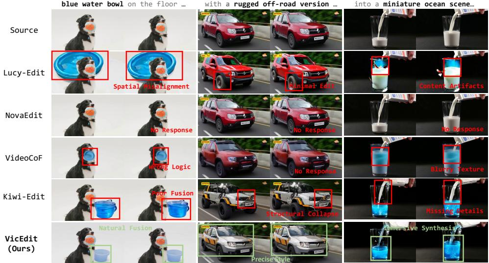  
Figure 5: Comparison with baselines on base editing tasks.

## 4 Experiments

## 4.1 Base Video Editing

Quantitative Analysis. We evaluate VicEdit against six state-of-the-art methods [35, 36, 10, 3, 4, 13] on OpenVE-Ext. As shown in Table 1, VicEdit achieves the best overall performance by a clear margin. VACE’s simplistic cross-attention mechanism fails to reconcile complex instruction-video alignment, leading to degraded performance across subtasks. Lucy-Edit, constrained by the limited semantic priors of the native Wan2.2 text encoder, exhibits suboptimal instruction-following. DITTO excels at style transfer but generalizes poorly to spatial edits due to imbalanced training data. NovaEdit and VideoCoF improve over earlier baselines via keyframe-based and temporal reasoning designs, yet both remain confined to text-only instructions. Although Kiwi-Edit utilizes MLLM guidance, its fixed query mechanism lacks the adaptability to handle diverse editing semantics.

Trained on our VicEdit-400K dataset with balanced multi-task supervision, VicEdit achieves wellrounded performance across all subtasks and reaches a new state-of-the-art. Notably, the additional categories beyond Kiwi-Edit’s native support (e.g., Outpainting) further validate the effectiveness of our dataset and framework design.

Qualitative Analysis. Fig. 5 presents several qualitative examples. As shown in the comparisons, our method achieves superior performance in spatial layout preservation, semantic comprehension, and visual quality. For instance, in the “local\_add” task, baselines struggle to handle the spatial relationships between the newly added object and existing objects in terms of position and scale, whereas VicEdit produces well-structured editing results. In the “local\_change” task, most baselines fail to understand the semantic transformation, and Kiwi-Edit, while demonstrating semantic understanding, introduces noticeable artifacts. In the “creative\_edit” example, videos generated by our method are more semantically coherent and logically consistent with the given prompts.

Table 2: Quantitative comparison on VicEdit-Bench with MLLM.
<table><tr><td></td><td></td><td colspan="3">Scene &amp; Style Adaptation</td><td colspan="4">Object-Level Manipulation</td><td colspan="3">Spatiotemporal Synthesis</td></tr><tr><td>Methods</td><td>Overall</td><td>Global Style</td><td>Local Style</td><td>Background Change</td><td>Local Change</td><td>Local Remove</td><td>Local Add</td><td>Subtitle Edit</td><td>Creative Edit</td><td>Inpainting</td><td>Outpainting</td></tr><tr><td>VACE [35]</td><td>1.85</td><td>1.45</td><td>2.03</td><td>1.50</td><td>2.25</td><td>1.49</td><td>1.33</td><td>1.43</td><td>2.17</td><td>2.23</td><td>2.60</td></tr><tr><td>Lucy-Edit [36]</td><td>2.25</td><td>1.94</td><td>1.67</td><td>1.89</td><td>3.30</td><td>2.05</td><td>2.15</td><td>1.43</td><td>2.45</td><td>2.63</td><td>2.97</td></tr><tr><td>DITTO [10]</td><td>2.33</td><td>3.03</td><td>3.60</td><td>2.29</td><td>2.45</td><td>1.64</td><td>1.43</td><td>2.61</td><td>1.46</td><td>2.48</td><td>2.32</td></tr><tr><td>NovaEdit [3]</td><td>2.61</td><td>2.08</td><td>2.23</td><td>2.62</td><td>3.07</td><td>3.65</td><td>2.05</td><td>2.46</td><td>2.13</td><td>2.65</td><td>3.18</td></tr><tr><td>VideoCoF [4]</td><td>2.90</td><td>2.66</td><td>2.43</td><td>2.37</td><td>3.67</td><td>3.60</td><td>2.44</td><td>3.65</td><td>1.83</td><td>3.06</td><td>3.33</td></tr><tr><td>Kiwi-Edit [13]</td><td>2.97</td><td>3.19</td><td>2.43</td><td>2.53</td><td>4.29</td><td>3.24</td><td>2.28</td><td>3.16</td><td>2.77</td><td>3.21</td><td>2.59</td></tr><tr><td>VicEdit (Ours)</td><td>3.45</td><td>3.68</td><td>3.03</td><td>3.05</td><td>4.17</td><td>3.86</td><td>2.85</td><td>3.62</td><td>3.30</td><td>3.45</td><td>3.47</td></tr></table>

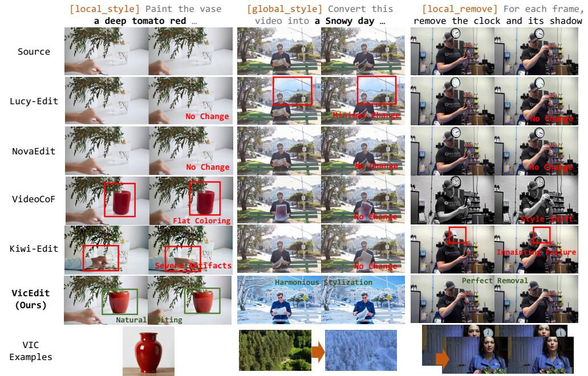  
Figure 6: Comparison with baselines on visual in-context editing tasks. All examples presented in the figure are collected from the open-source OpenVE [1] and Senorita [25].

## 4.2 Visual In-Context Video Editing

Quantitative Analysis. To comprehensively evaluate the effectiveness of our proposed task and model, we conduct experiments on the VicEdit-Bench benchmark. Crucially, unlike prior works that rely solely on textual instructions, our evaluation setting incorporates visual in-context examples as additional references, which is the key innovation of our VIC task. For a fair comparison, we equip all baselines with an instruction enhancement module to augment their text-only instructions. As shown in Table 2, VicEdit achieves a remarkable Overall score of 3.45. This performance surpasses the second-best method, Kiwi-Edit (2.97), by a substantial margin of 0.48 points (a 16% relative improvement). The significant gap underscores VicEdit’s superior capability in understanding and executing complex editing instructions. In contrast, previous text-only approaches often struggle to capture precise semantics from text descriptions alone, leading to suboptimal editing results.

Qualitative Analysis. We provide qualitative results on the visual in-context (VIC) task in Figure 6. A key observation is that our model, conditioned on diverse visual contexts (single images, image pairs, and video pairs), effectively captures the semantics of the instruction. Taking the Global Style task as an example, converting the scene to a snowy day proves challenging for existing text-only baselines, which struggle to synthesize a visually plausible snowy style. However, equipped with visual in-context image pairs, our model seamlessly adapts to the desired style, highlighting its robust editing capability.

## 4.3 Ablation Study

Ablation on MASD. Table 3 shows that MASD significantly enhances detail fidelity by adaptively distilling modality-specific priors from heterogeneous references. This mechanism mitigates the semantic blurring of traditional static queries, yielding more precise and contextually appropriate semantic tokens that provide a deterministic visual inductive bias for high-fidelity reconstruction.

Table 3: Quantitative Ablation Study on VicEdit-Bench. We evaluate the impact of MASD and DCI modules across VLM-based assessments and VBench [26] dimensions.
<table><tr><td colspan="3"></td><td colspan="4">VLM Evaluation</td><td colspan="5">VBench Metrics</td></tr><tr><td></td><td>Base MASD</td><td>DCI</td><td>Overall↑</td><td>Instr. Comp.↑</td><td>Detail Fid.↑</td><td>Visual Qual.↑</td><td>BC↑</td><td>MS↑</td><td>TF↑</td><td>IQ↑</td><td>AQ↑</td></tr><tr><td>√</td><td></td><td></td><td>3.02</td><td>3.12</td><td>2.98</td><td>2.96</td><td>0.968</td><td>0.995</td><td>0.986</td><td>0.711</td><td>0.564</td></tr><tr><td>√</td><td>√</td><td></td><td>3.25</td><td>3.40</td><td>3.20</td><td>3.14</td><td>0.969</td><td>0.994</td><td>0.986</td><td>0.712</td><td>0.566</td></tr><tr><td>√</td><td></td><td>√</td><td>3.34</td><td>3.56</td><td>3.22</td><td>3.24</td><td>0.971</td><td>0.995</td><td>0.986</td><td>0.715</td><td>0.567</td></tr><tr><td></td><td></td><td></td><td>3.45</td><td>3.65</td><td>3.34</td><td>3.35</td><td>0.975</td><td>0.994 0.987</td><td></td><td>0.718</td><td>0.568</td></tr></table>

Table 4: Quantitative Ablation on Training Stages. We evaluate the performance evolution across different training phases on the OpenVE-Ext and VicEdit-Bench benchmark.
<table><tr><td rowspan="3">Training Stage</td><td colspan="4">Base Editing</td><td colspan="4">Visual In-Context Editing</td></tr><tr><td>Overall↑</td><td>Instr. Comp.↑</td><td>Detail Fid.↑</td><td>Visual Qual.↑</td><td>Overall↑</td><td>Instr. Comp.↑</td><td>Detail Fid.↑</td><td>Visual Qual.↑</td></tr><tr><td>Base (Kiwi-Edit)</td><td>3.08</td><td>3.24</td><td>3.01</td><td>2.98</td><td>2.97</td><td>3.10</td><td>2.98</td><td>2.76</td></tr><tr><td>Stage 1</td><td>3.23</td><td>3.36</td><td>3.11</td><td>3.20</td><td>3.10</td><td>3.25</td><td>3.05</td><td>3.01</td></tr><tr><td>Stage 2</td><td>3.10</td><td>3.22</td><td>3.02</td><td>3.07</td><td>3.40</td><td>3.62</td><td>3.30</td><td>3.27</td></tr><tr><td>Stage 3</td><td>3.28</td><td>3.47</td><td>3.27</td><td>3.10</td><td>3.45</td><td>3.65</td><td>3.34</td><td>3.35</td></tr></table>

Ablation on DCI. The DCI module is pivotal for refining instruction-following precision, as it calibrates the interaction between textual instructions and the visual context through a semantic shift mechanism. Theoretically, DCI ensures that instruction queries are extracted within a visuallyaware manifold, effectively resolving the inherent ambiguities in natural language descriptions. By dynamically projecting textual semantics into the visual background, DCI significantly strengthens the model’s ability to execute both localized modifications and complex creative transformations.

The synergistic integration of both modules achieves the best overall performance, with detailed visual comparisons provided in Appendix E.4.

Ablation on Training Strategy. The phased training strategy demonstrates a clear evolution in the model’s multi-task capabilities. Stage 1 focuses on enhancing the base model’s versatility by exposing it to a broader range of editing tasks, which significantly enriches its fundamental editing capacity and leads to a marked improvement in base editing performance. In Stage 2, the training prioritizes visual in-context learning to master visual analogies. While this results in a substantial leap in VIC metrics, the model’s focus shifts heavily toward in-context tasks, leading to a slight decline in base editing proficiency. Finally, Stage 3 employs a joint training approach that harmonizes both task types. This balanced strategy allows the model to stabilize its fundamental editing performance while maintaining high proficiency in visual in-context scenarios. Such a phased regimen is essential for reconciling diverse editing paradigms and achieving a robust, final model.

## 5 Conclusion

In this paper, we present VicEdit, a unified visual in-context video editing framework that extends the conventional text-only paradigm to multi-modal visual guidance. By incorporating Modality-Adaptive Semantic Distillation (MASD), which adaptively extracts editing semantics from heterogeneous references via modality-conditioned learnable queries, and Dual-Context Injection (DCI), which couples visual context with textual instructions through a semantic shift mechanism, our framework enables fine-grained controllability across single images, image pairs, and video pairs. Furthermore, we construct VicEdit-400K, the first large-scale dataset for visual in-context video editing, comprising 400K samples across ten task types, and introduce VicEdit-Bench as a standardized evaluation protocol. Extensive experiments demonstrate that VicEdit achieves state-of-the-art performance on both instruction-based and visual in-context editing benchmarks, establishing visual in-context learning as a scalable paradigm for video editing. While our current design primarily targets semanticlevel editing, future work may explore finer-grained scenarios demanding pixel-level precision, and scale up the dataset to further enhance foundational editing capabilities.

## References

[1] Haoyang He, Jie Wang, Jiangning Zhang, Zhucun Xue, Xingyuan Bu, Qiangpeng Yang, Shilei Wen, and Lei Xie. Openve-3m: A large-scale high-quality dataset for instruction-guided video editing. arXiv preprint arXiv:2512.07826, 2025.

[2] Jinjie Mai, Chaoyang Wang, Guocheng Gordon Qian, Willi Menapace, Sergey Tulyakov, Bernard Ghanem, Peter Wonka, and Ashkan Mirzaei. Easyv2v: A high-quality instructionbased video editing framework. arXiv preprint arXiv:2512.16920, 2025.

[3] Tianlin Pan, Jiayi Dai, Chenpu Yuan, Zhengyao Lv, Binxin Yang, Hubery Yin, Chen Li, Jing Lyu, Caifeng Shan, and Chenyang Si. Nova: Sparse control, dense synthesis for pair-free video editing. arXiv preprint arXiv:2603.02802, 2026.

[4] Xiangpeng Yang, Ji Xie, Yiyuan Yang, Yan Huang, Min Xu, and Qiang Wu. Unified video editing with temporal reasoner. arXiv preprint arXiv:2512.07469, 2025.

[5] Kinam Kim, Junha Hyung, and Jaegul Choo. Temporal in-context fine-tuning with temporal reasoning for versatile control of video diffusion models. In The Thirty-ninth Annual Conference on Neural Information Processing Systems, 2025.

[6] Wenhao Sun, Rong-Cheng Tu, Jingyi Liao, and Dacheng Tao. Diffusion model-based video editing: A survey. arXiv preprint arXiv:2407.07111, 2024.

[7] Zangwei Zheng, Xiangyu Peng, Tianji Yang, Chenhui Shen, Shenggui Li, Hongxin Liu, Yukun Zhou, Tianyi Li, and Yang You. Open-sora: Democratizing efficient video production for all. arXiv preprint arXiv:2412.20404, 2024.

[8] Team Wan, Ang Wang, Baole Ai, Bin Wen, Chaojie Mao, Chen-Wei Xie, Di Chen, Feiwu Yu, Haiming Zhao, Jianxiao Yang, et al. Wan: Open and advanced large-scale video generative models. arXiv preprint arXiv:2503.20314, 2025.

[9] Weijie Kong, Qi Tian, Zijian Zhang, Rox Min, Zuozhuo Dai, Jin Zhou, Jiangfeng Xiong, Xin Li, Bo Wu, Jianwei Zhang, et al. Hunyuanvideo: A systematic framework for large video generative models. arXiv preprint arXiv:2412.03603, 2024.

[10] Qingyan Bai, Qiuyu Wang, Hao Ouyang, Yue Yu, Hanlin Wang, Wen Wang, Ka Leong Cheng, Shuailei Ma, Yanhong Zeng, Zichen Liu, Yinghao Xu, Yujun Shen, and Qifeng Chen. Scaling instruction-based video editing with a high-quality synthetic dataset. arXiv preprint arXiv:2510.15742, 2025.

[11] Zhiyu Tan, Hao Yang, Luozheng Qin, Jia Gong, Mengping Yang, and Hao Li. Omni-video: Democratizing unified video understanding and generation. arXiv preprint arXiv:2507.06119, 2025.

[12] Cong Wei, Quande Liu, Zixuan Ye, Qiulin Wang, Xintao Wang, Pengfei Wan, Kun Gai, and Wenhu Chen. Univideo: Unified understanding, generation, and editing for videos. arXiv preprint arXiv:2510.08377, 2025.

[13] Yiqi Lin, Guoqiang Liang, Ziyun Zeng, Zechen Bai, Yanzhe Chen, and Mike Zheng Shou. Kiwi-edit: Versatile video editing via instruction and reference guidance. arXiv preprint arXiv:2603.02175, 2026.

[14] Zhongwei Zhang, Fuchen Long, Wei Li, Zhaofan Qiu, Wu Liu, Ting Yao, and Tao Mei. Regionconstraint in-context generation for instructional video editing. arXiv preprint arXiv:2512.17650, 2025.

[15] Jay Zhangjie Wu, Yixiao Ge, Xintao Wang, Stan Weixian Lei, Yuchao Gu, Yufei Shi, Wynne Hsu, Ying Shan, Xiaohu Qie, and Mike Zheng Shou. Tune-a-video: One-shot tuning of image diffusion models for text-to-video generation. In Proceedings ofthe IEEE/CVF international conference on computer vision, pages 7623–7633, 2023.

[16] Michal Geyer, Omer Bar-Tal, Shai Bagon, and Tali Dekel. Tokenflow: Consistent diffusion features for consistent video editing. arXiv preprint arXiv:2307.10373, 2023.

[17] Max Ku, Cong Wei, Weiming Ren, Harry Yang, and Wenhu Chen. Anyv2v: A tuning-free framework for any video-to-video editing tasks. arXiv preprint arXiv:2403.14468, 2024.

[18] Pengze Zhang, Yanze Wu, Mengtian Li, Xu Bai, Songtao Zhao, Fulong Ye, Chong Mou, Xinghui Li, Zhuowei Chen, Qian He, et al. Omnitransfer: All-in-one framework for spatio-temporal video transfer. arXiv preprint arXiv:2601.14250, 2026.

[19] Xuan Ju, Tianyu Wang, Yuqian Zhou, He Zhang, Qing Liu, Nanxuan Zhao, Zhifei Zhang, Yijun Li, Yuanhao Cai, Shaoteng Liu, et al. Editverse: Unifying image and video editing and generation with in-context learning. arXiv preprint arXiv:2509.20360, 2025.

[20] Qingxiu Dong, Lei Li, Damai Dai, Ce Zheng, Jingyuan Ma, Rui Li, Heming Xia, Jingjing Xu, Zhiyong Wu, Baobao Chang, et al. A survey on in-context learning. In Proceedings ofthe 2024 conference on empirical methods in natural language processing, pages 1107–1128, 2024.

[21] Xinlong Wang, Wen Wang, Yue Cao, Chunhua Shen, and Tiejun Huang. Images speak in images: A generalist painter for in-context visual learning. In Proceedings ofthe IEEE/CVF Conference on Computer Vision and Pattern Recognition, pages 6830–6839, 2023.

[22] Yifan Yang, Houwen Peng, Yifei Shen, Yuqing Yang, Han Hu, Lili Qiu, Hideki Koike, et al. Imagebrush: Learning visual in-context instructions for exemplar-based image manipulation. Advances in Neural Information Processing Systems, 36:48723–48743, 2023.

[23] Zhengcong Fei, Di Qiu, Changqian Yu, Debang Li, Mingyuan Fan, and Xiang Wen. Video diffusion transformers are in-context learners. arXiv e-prints, pages arXiv–2412, 2024.

[24] Wentao Zhang, Junliang Guo, Tianyu He, Li Zhao, Linli Xu, and Jiang Bian. Video incontext learning: Autoregressive transformers are zero-shot video imitators. In The Thirteenth International Conference on Learning Representations, 2025.

[25] Bojia Zi, Penghui Ruan, Marco Chen, Xianbiao Qi, Shaozhe Hao, Shihao Zhao, Youze Huang, Bin Liang, Rong Xiao, and Kam-Fai Wong. Señorita-2m: A high-quality instruction-based dataset for general video editing by video specialists. In The Thirty-ninth Annual Conference on Neural Information Processing Systems Datasets and Benchmarks Track, 2025.

[26] Ziqi Huang, Yinan He, Jiashuo Yu, Fan Zhang, Chenyang Si, Yuming Jiang, Yuanhan Zhang, Tianxing Wu, Qingyang Jin, Nattapol Chanpaisit, et al. Vbench: Comprehensive benchmark suite for video generative models. In Proceedings ofthe IEEE/CVF Conference on Computer Vision and Pattern Recognition, pages 21807–21818, 2024.

[27] Dian Zheng, Ziqi Huang, Hongbo Liu, Kai Zou, Yinan He, Fan Zhang, Lulu Gu, Yuanhan Zhang, Jingwen He, Wei-Shi Zheng, et al. Vbench-2.0: Advancing video generation benchmark suite for intrinsic faithfulness. arXiv preprint arXiv:2503.21755, 2025.

[28] Christoph Schuhmann, Romain Beaumont, Richard Vencu, Cade Gordon, Ross Wightman, Mehdi Cherti, Theo Coombes, Aarush Katta, Clayton Mullis, Mitchell Wortsman, et al. Laion-5b: An open large-scale dataset for training next generation image-text models. Advances in neural information processing systems, 35:25278–25294, 2022.

[29] An Yang, Anfeng Li, Baosong Yang, Beichen Zhang, Binyuan Hui, Bo Zheng, Bowen Yu, Chang Gao, Chengen Huang, Chenxu Lv, et al. Qwen3 technical report. arXiv preprint arXiv:2505.09388, 2025.

[30] Shuai Bai, Yuxuan Cai, Ruizhe Chen, Keqin Chen, Xionghui Chen, Zesen Cheng, Lianghao Deng, Wei Ding, Chang Gao, Chunjiang Ge, et al. Qwen3-vl technical report. arXiv preprint arXiv:2511.21631, 2025.

[31] Black Forest Labs. FLUX.2: Frontier Visual Intelligence. https://bfl.ai/blog/flux-2, 2025.

[32] Chenfei Wu, Jiahao Li, Jingren Zhou, Junyang Lin, Kaiyuan Gao, Kun Yan, Sheng ming Yin, Shuai Bai, Xiao Xu, Yilei Chen, Yuxiang Chen, Zecheng Tang, Zekai Zhang, Zhengyi Wang, An Yang, Bowen Yu, Chen Cheng, Dayiheng Liu, Deqing Li, Hang Zhang, Hao Meng, Hu Wei, Jingyuan Ni, Kai Chen, Kuan Cao, Liang Peng, Lin Qu, Minggang Wu, Peng Wang, Shuting Yu, Tingkun Wen, Wensen Feng, Xiaoxiao Xu, Yi Wang, Yichang Zhang, Yongqiang Zhu, Yujia Wu, Yuxuan Cai, and Zenan Liu. Qwen-image technical report, 2025.

[33] Ulrike Von Luxburg. A tutorial on spectral clustering. Statistics and computing, 17(4):395–416, 2007.

[34] Yinan Chen, Jiangning Zhang, Teng Hu, Yuxiang Zeng, Zhucun Xue, Qingdong He, Chengjie Wang, Yong Liu, Xiaobin Hu, and Shuicheng Yan. Ivebench: Modern benchmark suite for instruction-guided video editing assessment. arXiv preprint arXiv:2510.11647, 2025.

[35] Zeyinzi Jiang, Zhen Han, Chaojie Mao, Jingfeng Zhang, Yulin Pan, and Yu Liu. Vace: All-inone video creation and editing. In Proceedings of the IEEE/CVF International Conference on Computer Vision, pages 17191–17202, 2025.

[36] DecartAI Team. Lucy edit: Open-weight text-guided video editing, 2025.

[37] Zhendong Wang, Yifan Jiang, Yadong Lu, Pengcheng He, Weizhu Chen, Zhangyang Wang, Mingyuan Zhou, et al. In-context learning unlocked for diffusion models. Advances in Neural Information Processing Systems, 36:8542–8562, 2023.

[38] Binxin Yang, Shuyang Gu, Bo Zhang, Ting Zhang, Xuejin Chen, Xiaoyan Sun, Dong Chen, and Fang Wen. Paint by example: Exemplar-based image editing with diffusion models. In Proceedings of the IEEE/CVF conference on computer vision and pattern recognition, pages 18381–18391, 2023.

[39] Lan Chen, Qi Mao, Yuchao Gu, and Mike Zheng Shou. Edit transfer: Learning image editing via vision in-context relations. arXiv preprint arXiv:2503.13327, 2025.

[40] Guojun Lei, Rong Zhang, Chi Wang, Tianhang Liu, Hong Li, Zhiyuan Ma, and Weiwei Xu. Unitransfer: Video concept transfer via progressive spatial and timestep decomposition. arXiv preprint arXiv:2509.21086, 2025.

[41] Paul Couairon, Clément Rambour, Jean-Emmanuel Haugeard, and Nicolas Thome. Videdit: Zero-shot and spatially aware text-driven video editing. Transactions on Machine Learning Research, 2023.

[42] Yuhui Wu, Liyi Chen, Ruibin Li, Shihao Wang, Chenxi Xie, and Lei Zhang. Insvie-1m: Effective instruction-based video editing with elaborate dataset construction. In Proceedings of the IEEE/CVF International Conference on Computer Vision, pages 16692–16701, 2025.

[43] Alec Radford, Jong Wook Kim, Chris Hallacy, Aditya Ramesh, Gabriel Goh, Sandhini Agarwal, Girish Sastry, Amanda Askell, Pamela Mishkin, Jack Clark, et al. Learning transferable visual models from natural language supervision. In International conference on machine learning, pages 8748–8763. PmLR, 2021.

[44] Zhen Li, Zuo-Liang Zhu, Ling-Hao Han, Qibin Hou, Chun-Le Guo, and Ming-Ming Cheng. Amt: All-pairs multi-field transforms for efficient frame interpolation. In Proceedings ofthe IEEE/CVF Conference on Computer Vision and Pattern Recognition, pages 9801–9810, 2023.

[45] Junjie Ke, Qifei Wang, Yilin Wang, Peyman Milanfar, and Feng Yang. Musiq: Multi-scale image quality transformer. In Proceedings of the IEEE/CVF international conference on computer vision, pages 5148–5157, 2021.

## A Detailed Related Work

## A.1 Instruction-driven Video Editing

Training-free methods adapt pre-trained image diffusion models for video editing without taskspecific training. Tune-A-Video [15] fine-tunes a text-to-video model on a single video for personalized editing. TokenFlow [16] propagates consistent image edits across frames through attention-space nearest-neighbor matching. AnyV2V [17] extends this into a plug-and-play framework that supports diverse editing tasks without retraining by using the first edited frame as guidance.

End-to-end trained systems learn editing policies directly from paired datasets to enable more robust editing for complex instructions. EasyV2V [2] systematically explores the data-architecture-control design space and identifies training data quality as the primary driver of performance. NOVA [3] decouples editing into sparse control signal prediction and conditional dense synthesis to improve both efficiency and fidelity. VideoCoF [4] decomposes the editing process into observe-reason-edit stages with chain-of-thought reasoning for enhanced temporal consistency. ReCo [14] introduces region-constrained generation for precise local editing via bounding box conditions. While these methods achieve significant progress, they rely exclusively on text instructions and cannot incorporate visual references.

Visual reference integration has recently emerged but remains limited in scope. Kiwi-Edit [13] incorporates a single reference image via a small set of fixed learnable queries, though these queries are not adaptive to the reference content. OmniTransfer [18] utilizes reference videos for spatiotemporal video generation, yet it targets generation from noise rather than the editing of an existing source video. EditVerse [19] encodes task types through interleaved in-context tokens and full selfattention, but it treats all reference modalities homogeneously without modality-specific adaptation. No existing method simultaneously supports heterogeneous reference types including single images, image pairs, and video pairs with adaptive semantic extraction. VicEdit provides this core capability to fill this critical research gap.

## A.2 In-Context Learning for Visual Generation

In-context learning (ICL) originated from large language models [20] and has been increasingly adopted for visual generation, where models perform tasks by conditioning on demonstration inputs without gradient updates.

Image generation. Painter [21] and PromptDiffusion [37] show that visual exemplars can steer generation via unified token sequences, achieving task-agnostic visual prompting. Paint by Example [38], ImageBrush [22], and Edit Transfer [39] further enable exemplar-based image editing via source-target image pairs, demonstrating that ICL can capture fine-grained spatial editing semantics.

Video generation. Extending ICL to video introduces additional challenges in temporal consistency and computational efficiency. Early work by Fei et al. [23] explored prompt-level ICL for multi-scene video generation. VICL [24] demonstrates zero-shot video imitation from demonstration clips using an autoregressive diffusion transformer. More recent methods have explored distinct technical routes for video ICL: EditVerse [19] adopts interleaved token sequences with full self-attention, enabling unified image and video editing within a single model, but suffers from attention dilution as sequence length grows. TIC-FT [5] proposes temporal in-context fine-tuning, concatenating condition and target frames along the temporal axis with learned buffer frames, enabling efficient adaptation with only 10–30 training samples. OmniTransfer [18] employs reference-decoupled causal learning to separate reference and target branches, supporting unified spatial and temporal video transfer. UniTransfer [40] introduces progressive spatial and timestep decomposition for fine-grained video concept transfer from reference videos.

Despite these advances, existing video ICL methods are predominantly designed for conditional generation from noise and assume homogeneous reference modalities. VicEdit addresses this gap by targeting heterogeneous multi-modal reference integration within an instruction-driven video editing framework, extracting editing semantics adaptively via Modality-Adaptive Semantic Distillation (MASD) and injecting them synergistically with textual instructions via Dual-Context Injection (DCI).

## A.3 Video Editing Datasets

Video editing datasets have evolved in parallel with editing paradigms. Early datasets focus on textonly editing: VidEdit [41] provides web-collected text-video editing pairs with mask annotations for region-aware training. OpenVE [1] curates diverse editing operations with human preference labels, enabling preference-aligned model training. Recent datasets begin to incorporate visual references: ReCo [14] introduces region-constrained editing pairs with spatial bounding box annotations, but remains limited to text-instruction conditioning. Kiwi-Edit [13] augments its training set with single reference images, representing the first step toward multi-modal reference support, yet covers only a single reference modality with fixed query extraction.

VicEdit-400K is the first dataset to systematically cover three heterogeneous reference modalities (single image, image pair, video pair) across ten editing task types, with 400K samples uniformly distributed across all modality-task combinations. This scale and diversity enable, for the first time, the training of a single model that adaptively handles diverse reference types within a unified editing framework.

## B More Details on Data Curation

## B.1 Task Taxonomy and Definitions

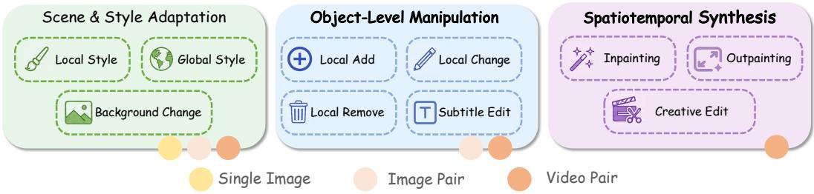  
Figure 7: Taxonomy of Editing Tasks and Modalities.

We categorize VicEdit-400K into three task groups aligned with increasing editing complexity along visual, spatial, and temporal dimensions (see Fig. 7). This taxonomy determines which reference modalities are supported for each task, ensuring that the model receives the minimal sufficient visual context for the target editing granularity.

Scene & Style Adaptation. This category focuses on global or regional visual transformation, including tasks such as Global Style, Local Style, and Background Change. All three reference modalities are supported. Single Image provides sufficient color, texture, and material priors to serve as an effective anchor for style transfer. Image Pair and Video Pair further clarify transformation boundaries via explicit before/after comparisons, which is particularly beneficial for background replacement or complex lighting transfer where global consistency must be preserved.

Object-Level Manipulation. This category targets localized object addition, removal, or attribute modification, covering tasks such as Local Add, Local Change, Local Remove, and Subtitle Edit. Only Image Pair and Video Pair are supported. Accurate spatial grounding requires source-target correspondence, which Single Image cannot provide because it lacks the “before” context to disambiguate between background preservation and object introduction. Image Pair explicitly defines the spatial displacement and local deformation through source-target mapping. Video Pair further supplies motion priors (e.g., deformation during object motion), which are critical for handling occlusion and temporal interaction in dynamic scenes.

Spatiotemporal Synthesis. This category covers structurally complex tasks including Inpainting, Outpainting, and Creative Edit. Only Video Pair is supported. These tasks elevate editing from pixel-level modification to spatiotemporal logic reconstruction. Static references (Single Image or Image Pair) cannot convey action continuity or object evolution. Video Pair provides dense temporal semantic correspondences that constrain the generation process, enabling the model to learn temporal regularities from reference videos and produce physically plausible completion and scene extrapolation.

Table 5 summarizes the supported modalities for each task type.

Table 5: Supported reference modalities for each task type in VicEdit-400K. SI = Single Image; IP = Image Pair; VP = Video Pair.
<table><tr><td>Category</td><td>Task Type</td><td>SI</td><td>IP</td><td>VP</td></tr><tr><td rowspan="3">Scene &amp; Style Adaptation</td><td>Global Style</td><td>√</td><td>√</td><td>√</td></tr><tr><td>Local Style</td><td>√</td><td>V</td><td>√</td></tr><tr><td>Background Change</td><td>√</td><td>√</td><td>V</td></tr><tr><td rowspan="4">Object-Level Manipulation</td><td>Local Add</td><td></td><td>√</td><td>√</td></tr><tr><td>Local Change</td><td></td><td>√</td><td>√</td></tr><tr><td>Local Remove</td><td></td><td>√</td><td>√</td></tr><tr><td>Subtitle Edit</td><td></td><td>√</td><td>√</td></tr><tr><td rowspan="3">Spatiotemporal Synthesis</td><td>Inpainting</td><td></td><td></td><td>√</td></tr><tr><td>Outpainting</td><td></td><td></td><td>√</td></tr><tr><td>Creative Edit</td><td></td><td></td><td>√</td></tr></table>

## B.2 Dataset Comparison

Table 6 compares VicEdit-400K with existing video editing datasets. Prior datasets are either textonly or support only a single visual reference modality, limiting their coverage of diverse editing scenarios. In contrast, VicEdit-400K is the first large-scale dataset that supports three reference modalities (Single Image, Image Pair, and Video Pair) across 10 distinct editing task types, providing a systematic foundation for visual in-context video editing research.

## B.3 More Details on Data Pipeline

The construction of VicEdit-400K follows a rigorous four-stage pipeline designed to ensure both large-scale diversity and fine-grained semantic alignment.

Source Data Filtering. We begin by curating a high-quality pool of approximately 1.0M video segments, applying an aesthetic cut-off of 0.5 to filter out low-quality raw footage. Given the scale of the source data, we employ the Qwen3-VL-8B model as an efficient initial rater to assess semantic consistency (see B.4.1). The filtered corpus is then split: a primary subset serves as the foundation for base editing tasks, while the remainder is reserved for synthesizing heterogeneous in-context exemplars.

Instruction Synthesis. To derive precise editing instructions, we utilize the more powerful Qwen3- VL-32B model. As detailed in B.4.2 and B.4.3, our synthesis strategy prioritizes two core objectives: (i) Semantic Adherence, ensuring reference content strictly aligns with the editing intent, and (ii) Visual Divergence, enforcing a clear distinction between references and source videos to robustly evaluate the model’s structural generalization rather than simple memorization.

Visual Reference Generation. For Single Image and Image Pair modalities, we feed the synthesized prompts into FLUX.2 [31], which achieves high-fidelity generation in approximately 4s per GPU, facilitating large-scale production. For Video Pair synthesis, we employ a hybrid matching strategy. For common tasks, we use Identity-based Grouping followed by intra-group random sampling. For specialized tasks like Creative Edit, we perform semantic clustering using BGE-large embeddings and HDBSCAN. This allows us to construct a Semantic Knowledge Graph from which relevant in-context pairs are strategically sampled.

Semantic Verification. In the final stage, we perform a multi-dimensional audit covering Instruction Compliance, Detail Fidelity, and Visual Quality. To ensure maximum judgment reliability for the final dataset, we upgrade the evaluator to Qwen3-VL-32B, retaining only samples that exhibit superior average scores across all dimensions. This closed-loop verification guarantees that every triplet in VicEdit-400K provides a meaningful and accurate signal for in-context learning.

Table 6: Comparison of video editing datasets. VicEdit-400K provides the most comprehensive support for multi-modal visual in-context references, including Single Image (SI), Image Pair (IP), and Video Pair (VP).
<table><tr><td rowspan="2">Dataset</td><td rowspan="2">Scale</td><td colspan="3">Reference Modality</td><td rowspan="2">Task Types</td><td rowspan="2">Frames</td><td rowspan="2">Resolution</td></tr><tr><td>Text</td><td>SI IP</td><td>VP</td></tr><tr><td>InsViE [42]</td><td>1.0M</td><td></td><td></td><td></td><td>1</td><td>25</td><td>1024×576</td></tr><tr><td>Ditto [10]</td><td>1.0M</td><td></td><td></td><td></td><td>3</td><td>101</td><td>1280×720</td></tr><tr><td>Señorita [25]</td><td>2.0M</td><td></td><td></td><td></td><td>9</td><td>33-64</td><td>336×592-1120×1984</td></tr><tr><td>OpenVE [1]</td><td>3.0M</td><td></td><td></td><td></td><td>8</td><td>65-129</td><td>1280×720</td></tr><tr><td>ReCo [14]</td><td>40K</td><td>√</td><td></td><td></td><td>5</td><td>81</td><td>480×832</td></tr><tr><td>RefVIE [13]</td><td>477K</td><td>√</td><td>了</td><td></td><td>2</td><td>65-129</td><td>1280×720</td></tr><tr><td>VicEdit-400K (Ours)</td><td>400K</td><td></td><td></td><td></td><td>10</td><td>33-129</td><td>480×832-1120×1984</td></tr></table>

## B.4 Prompt Template in Data Pipeline

To support diverse in-context editing granularities, our data construction pipeline employs a structured, modality-aware prompting strategy using Qwen3-VL. We design distinct templates tailored to the specific requirements of heterogeneous in-context modalities, with a particular emphasis on ensuring that synthesized references remain thematically consistent yet visually distinct from the source video content to enhance model generalization.

## B.4.1 VLM-as-a-Judge: Multi-Dimensional Quality Assessment

To ensure the high-quality synthesis of VicEdit-400K, we employ a VLM-as-a-Judge mechanism. Unlike simple heuristic-based filtering, our approach leverages the advanced reasoning capabilities of Qwen3-VL to perform a holistic evaluation of the triplet: (Source Video, Edited Video, Instruction). This stage acts as a critical quality gate in our data curation pipeline, filtering out low-fidelity generations and ensuring precise instruction-image-video alignment.

The assessment logic is grounded in three orthogonal dimensions: Instruction Compliance (semantic accuracy), Consistency & Detail Fidelity (spatial-temporal identity preservation), and Visual Quality & Stability (generative aesthetics). We specifically enforce a "bottleneck constraint" where structural or aesthetic scores cannot exceed the compliance score, preventing the inclusion of visually pleasing but semantically irrelevant samples.

## Video Score Template

You are a data rater specializing in grading video editing quality. You will be given two videos (before and after editing) and the editing instruction. Your task is to evaluate the video edit on a 5-point scale from three perspectives:

## Instruction Compliance

1. No edit or completely unrelated change.

2. Partial or wrong edit; instruction largely unfollowed.

3. Instruction mostly followed but with significant errors or omissions.

4. Correct edit with only minor inaccuracies.

5. Perfect edit that fully matches the instruction.

## Consistency & Detail Fidelity

1. Major content lost, distorted, or hallucinated; original scene barely recognisable.

2. Main subject recognisable but key details wrong/missing.

3. Overall structure correct; some local artifacts, warping, or minor omissions.

4. Nearly all geometry and motion intact; only slight, non-distracting deformation.

5. All objects, spatial relations, and motion perfectly preserved outside the edit region. Visual Quality & Stability

1. Severe flickering, artifacts, or temporal inconsistency making the video unwatchable.

2. Significant and distracting quality degradation or temporal instability.

3. Noticeable but tolerable flaws or flickering.

4. Largely stable and high quality with only minor, subtle issues.

5. Perfectly stable and temporally coherent; indistinguishable from real footage.

Note: The scores for Consistency & Detail Fidelity and Visual Quality & Stability should not be higher than the Instruction Compliance score.

Example Response Format Brief reasoning: A short explanation of the scores, no more than 30 words. Instruction Compliance: A number from 1 to 5. Consistency & Detail Fidelity: A number from 1 to 5. Visual Quality & Stability: A number from 1 to 5. Editing instruction is: {edit\_prompt}.

Below are the videos before and after editing:

## B.4.2 Cross-Scenario Reference Synthesis for Single-Image Modality

This part of the pipeline focuses on generating a standalone Visual Exemplar (R) to support the single-image reference modality. To prevent the model from overfitting to specific instances, we adopt a “Category-Consistent but Content-Divergent” strategy. The MLLM is strictly instructed to avoid reproducing the exact scene from the original video, instead generating objects or environments that share the same underlying concept but differ in specific visual instantiation.

## Template for Single-Image Reference Synthesis

Core Constraint: The output must describe a different but same-type instance compared to the instruction.

• Object-Level Manipulation: Generate a detailed prompt for a DIFFERENT object of the same category (e.g., if the instruction adds a “brown fedora,” describe a “red beret”). Focus strictly on the object’s material, shape, and texture while ensuring no background context is included.

• Style Adaptation: Use a “Style-on-Random-Scene” approach. Pick a RANDOM everyday scene unrelated to the original video (e.g., “a cat on a windowsill”) and render it in the target style to isolate stylistic characteristics from content.

• Scene Adaptation: Describe a THEMATICALLY SIMILAR but visually distinct background (e.g., a “retro cyberpunk alley” to represent a “neon futuristic city” theme), ensuring all foreground subjects are removed.

## B.4.3 Visual Task Distillation for Image-Pair Modality

For the image-pair modality, the objective is to transform dynamic temporal editing logic into static, paired visual representations. By processing the original frame, the edited frame, and the instruction simultaneously, the MLLM distills the dynamic transition into a dense semantic mapping that captures the “before-and-after” logic.

Template for Image-Pair Task Distillation

## System Prompt:

“You are an expert at converting video editing tasks into equivalent image editing tasks. Analyze the visual difference between the ORIGINAL and EDITED frames, understand the editing logic, and generate a representative image editing task.”

## User Inputs:

• Visual Anchor: ORIGINAL video frame (pre-edit).

• Target Anchor: EDITED video frame (post-edit).

• Editing Logic: Original video instruction: “P”.

Synthesized Outputs:

• IMAGE\_PROMPT: A detailed description of the source scene tailored for highfidelity T2I generation.

• EDIT\_INSTRUCTION: A clear, distilled instruction describing the spatial or stylistic transformation required to bridge the two frames.

Through these targeted prompting strategies, VicEdit-400K provides a systematic foundation for training models to interpret and execute edits across diverse visual contexts without relying on simple memorization.

## C Comprehensive Specifications of VicEdit-Bench

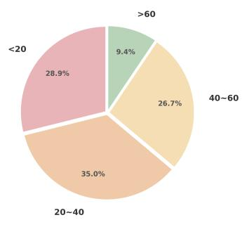  
(a) Prompt Length Distribution

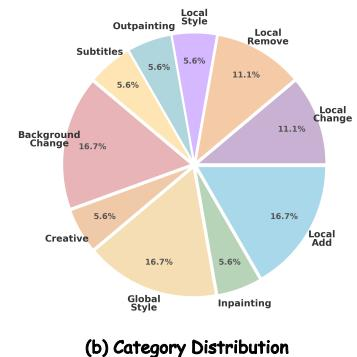

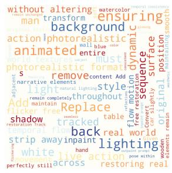  
(c) Prompt Word Cloud  
Figure 8: Statistics of VicEdit-Bench.

As illustrated in Figure 8, the design of VicEdit-Bench is strategically aligned with the requirements of visual in-context editing. The category distribution (Fig. 8b) spans a diverse spectrum from global stylistic adaptations to fine-grained local manipulations, necessitating the synergistic use of both textual instructions and visual exemplars. Furthermore, the prevalence of detailed, long-context prompts (Fig. 8a) and the rich semantic vocabulary (Fig. 8c) ensure a rigorous evaluation of the model’s ability to resolve linguistic ambiguity through visual anchoring. Overall, VicEdit-Bench provides a comprehensive and challenging testbed that effectively validates the efficacy of our visual in-context editing paradigm.

Fig. 9 showcases the diverse range of video editing tasks covered by VicEdit-Bench.

## D Implementation and Evaluation Details

## D.1 Detailed Training Configurations

Following the three-stage training strategy described in Section 3.3, we progressively incorporate in-context editing capability into VicEdit.

Stage 1: Base Editing. We fine-tune the Video DiT on text-instructed editing tasks using LoRA to establish fundamental instruction-following ability. The MLLM remains frozen throughout this stage. We train for 2 epochs with a learning rate of $1 \times \mathrm { i } 0 ^ { - 5 }$ , using rank-64 LoRA on the MLLM language model and updating only the DiT parameters. Each training sample contains 81 frames.

Stage 2: In-Context Branch. With the DiT frozen, we train the in-context modules (MASD and DCI) from scratch. Each training batch mixes samples from all three modalities (Single Image, Image Pair, Video Pair) to ensure balanced learning of the modality embeddings. We train for 4 epochs with a learning rate of $1 \times 1 0 ^ { - 5 }$ and apply LoRA to the MLLM (rank=64) for memory efficiency.

Stage 3: Joint Fine-Tuning. We jointly fine-tune the entire pipeline (except the MLLM vision encoder) to align the visual conditioning signals with the generative process. In this stage, we apply LoRA to both the MLLM (rank=64) and the DiT (rank=32) to enable lightweight joint adaptation while preserving the pre-trained generative prior. We train for 4 epochs with a learning rate of $1 \times 1 0 ^ { - 5 }$

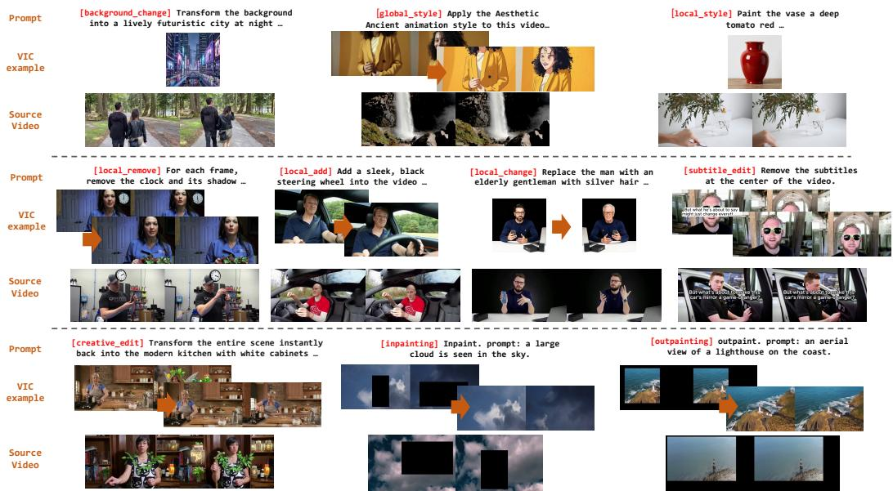  
Figure 9: Examples of VicEdit-Bench. All examples presented in the figure are collected from the open-source OpenVE [1] or Senorita [25].

All stages are trained on 16 × GPUs with DeepSpeed ZeRO-3 and BF16 mixed precision, consuming approximately 32 GPU days in total.

## D.2 Baselines

We compare VicEdit against six state-of-the-art video editing methods. For fair comparison, all methods are evaluated at their recommended resolution and frame length following their official configurations.

VACE [35] is a unified video creation and editing framework based on a 14B Wan2.1 DiT backbone. It formulates diverse editing tasks as sequence completion problems via a task-agnostic Video Condition Unit (VCU), supporting both text-only and reference-guided editing at 720p resolution. However, its single cross-attention mechanism lacks modality-adaptive semantic extraction for heterogeneous references.

Lucy-Edit [36] is an open-weight text-guided video editing model built on the Wan2.2-5B backbone. It achieves strong instruction-following fidelity via attention-based spatial control, but supports only text-only instructions without visual reference conditioning.

DITTO [10] builds upon a VACE-based diffusion transformer (Wan2.2) fine-tuned on the large-scale Ditto-1M dataset (∼1M paired triplets). Training uses AdamW at $1 \times 1 0 ^ { - 4 }$ for 16K steps on 64 GPUs, processing 101-frame videos at 1280×720 resolution. It operates exclusively in a text-only paradigm.

NovaEdit [3] proposes a sparse-control, dense-synthesis strategy built on the 1.3B Wan2.1 VACE backbone, with cross-attention modules connecting a sparse VACE branch and a dense DiT branch. Training uses only 5K curated video clips at 832×480 resolution, 81 frames, for ∼8K AdamW steps. Visual reference guidance is not supported.

VideoCoF [4] formulates video editing as a temporal chain-of-frames reasoning problem on the 14B Wan-T2V backbone. It trains on only 50K video pairs at 33 frames across multi-bucket resolutions (336×592 to 400×944) for 8K steps on 16× GPUs, and generalizes to 500+ frames at inference via RoPE alignment. The method supports text-only instructions.

Kiwi-Edit [13] is the closest baseline, employing a dual-backbone architecture of Qwen2.5-VL-3B as the MLLM encoder and Wan2.2-TI2V-5B as the video DiT. It introduces learnable query tokens (256/512 for instruction, 768 for reference) that extract visual semantics from a single reference image. Training uses a three-stage curriculum (12K total steps at $2 \times 1 0 ^ { - 5 }$ LR) up to 1280×704 at 81 frames. Unlike VicEdit, Kiwi-Edit is limited to single-image reference and does not support image-pair or video-pair modalities.

In contrast, VicEdit supports three reference modalities (Single Image, Image Pair, Video Pair) within a unified framework, and introduces modality-adaptive semantic distillation (MASD) and dual-context injection (DCI) to handle heterogeneous visual references.

## D.3 Evaluation Details

We employ five core metrics from the VBench [26] suite to assess the generative quality and temporal consistency.

Background Consistency (BC ↑) quantifies the temporal stability of static environments. It computes the average cosine similarity between consecutive frame-level features extracted by a CLIP-ViT-B/32 [43] encoder, ensuring the background remains coherent despite camera or subject motion.

Motion Smoothness (MS ↑) evaluates the physical plausibility of object trajectories. By leveraging motion priors from the AMT [44] video frame interpolation model, it detects unnatural jitter or "teleportation" artifacts to ensure fluid pixel-level displacements.

Temporal Flickering (TF ↑) focuses on high-frequency luminance or texture instabilities. It calculates the pixel-wise standard deviation at identical spatial coordinates across the video duration, penalizing rapid, inconsistent fluctuations often caused by sampling instability.

Imaging Quality (IQ ↑) assesses low-level physical attributes such as sharpness and noise. It utilizes the MUSIQ [45] transformer, pre-trained on human-rated data, to objectively measure distortions including motion blur and compression artifacts.

Aesthetic Quality (AQ ↑) measures the artistic appeal and visual harmony (e.g., composition and lighting). Using a predictor aligned with LAION-Aesthetics [28], it quantifies how well the generated frames conform to professional photography and cinematic standards.

## E Supplementary Experiments

## E.1 More Metrics of Main Experiments

In this section, we supplement more metrics of our main experiments on VicEdit-Bench. Table 7 presents the quantitative comparison, demonstrating that our VicEdit outperforms all baseline methods across various VBench dimensions and VLM-based assessments, achieving state-of-the-art results.

Table 7: Quantitative comparison on VicEdit-Bench across VLM-based assessments and VBench [26] dimensions.
<table><tr><td rowspan="3">Method</td><td colspan="4">VLM Evaluation</td><td colspan="5">VBench Metrics</td></tr><tr><td>Overall↑</td><td>Instr. Comp.↑</td><td>Detail Fid.↑</td><td>Visual Qual.↑</td><td>BC↑</td><td>MS↑</td><td>TF↑</td><td>IQ↑</td><td>AQ↑</td></tr><tr><td>VACE [35]</td><td>1.85</td><td>1.98</td><td>1.79</td><td>1.80</td><td>0.954</td><td>0.994</td><td>0.983</td><td>0.692</td><td>0.543</td></tr><tr><td>Lucy-Edit [36]</td><td>2.25</td><td>2.40</td><td>2.20</td><td>2.15</td><td>0.962</td><td>0.993</td><td>0.983</td><td>0.701</td><td>0.544</td></tr><tr><td>DITTO [10]</td><td>2.33</td><td>2.44</td><td>2.32</td><td>2.20</td><td>0.966</td><td>0.995</td><td>0.984</td><td>0.703</td><td>0.560</td></tr><tr><td>NovaEdit [3]</td><td>2.61</td><td>2.78</td><td>2.49</td><td>2.54</td><td>0.969</td><td>0.994</td><td>0.985</td><td>0.707</td><td>0.562</td></tr><tr><td>VideoCoF [4]</td><td>2.90</td><td>3.02</td><td>2.85</td><td>2.85</td><td>0.972</td><td>0.995</td><td>0.986</td><td>0.705</td><td>0.561</td></tr><tr><td>Kiwi-Edit</td><td>2.97</td><td>3.10</td><td>2.90</td><td>2.96</td><td>0.970</td><td>0.995</td><td>0.986</td><td>0.711</td><td>0.564</td></tr><tr><td>VicEdit (Ours)</td><td>3.45</td><td>3.65</td><td>3.34</td><td>3.35</td><td></td><td>0.975 0.994 0.987 0.718 0.568</td><td></td><td></td><td></td></tr></table>

## E.2 VLM-based Evaluation Analysis

To verify the robustness of our evaluation protocol, we introduce an alternative MLLM Qwen-VL-32B grader to compare with the default evaluation model from our baseline, OpenVE [1].

Cross-Model Stability. As shown in Tables 1 and 9, the results from Qwen-VL-32B maintain a high degree of correlation with the scores based on the closed-source commercial MLLM. While Qwen-VL exhibits a higher scoring baseline (typically +1.0 to +1.5), the relative performance ranking across all methods remains remarkably consistent. This stability suggests that the VLM-based metrics are model-agnostic and provide a reliable reference for video editing quality.

Quantitative Results. Under this cross-model validation, VicEdit (Ours) consistently achieves the highest overall scores (4.40 and 4.36). Our framework demonstrates a clear advantage in complex tasks such as Local Remove, Creative Edit, and Outpainting. While specialized baselines like DITTO and Kiwi-Edit show competitive results in specific dimensions (e.g., Local Style and Local Change), VicEdit provides the most balanced performance across all editing categories. These findings confirm the efficacy of our unified in-context learning paradigm in producing high-fidelity and temporally consistent video edits.

Table 8: Quantitative Comparison on OpenVE-Ext with Qwen-VL-32B [30].
<table><tr><td></td><td></td><td colspan="3">Scene &amp; Style Adaptation</td><td colspan="4">Object-Level Manipulation</td><td colspan="3">Spatiotemporal Synthesis</td></tr><tr><td>Methods</td><td>Overall</td><td>Global Style</td><td>Local Style</td><td>Background Change</td><td>Local Change</td><td>Local Remove</td><td>Local Add</td><td>Subtitle Edit</td><td>Creative Edit</td><td>Inpainting</td><td>Outpainting</td></tr><tr><td>VACE [35]</td><td>2.45</td><td>2.11</td><td>1.94</td><td>2.38</td><td>2.87</td><td>2.41</td><td>2.13</td><td>2.24</td><td>2.06</td><td>2.72</td><td>3.09</td></tr><tr><td>Lucy-Edit [36]</td><td>3.56</td><td>3.04</td><td>2.82</td><td>4.59</td><td>4.52</td><td>4.44</td><td>4.00</td><td>2.41</td><td>3.16</td><td>3.48</td><td>3.15</td></tr><tr><td>DITTO [10]</td><td>3.83</td><td>4.64</td><td>3.87</td><td>4.66</td><td>4.31</td><td>4.65</td><td>3.99</td><td>3.61</td><td>1.94</td><td>2.92</td><td>3.75</td></tr><tr><td>NovaEdit [3]</td><td>3.23</td><td>1.70</td><td>2.90</td><td>4.50</td><td>3.70</td><td>4.80</td><td>1.95</td><td>3.74</td><td>2.48</td><td>3.25</td><td>3.23</td></tr><tr><td>VideoCoF [4]</td><td>3.41</td><td>1.75</td><td>3.20</td><td>4.55</td><td>4.60</td><td>4.45</td><td>2.90</td><td>3.82</td><td>2.31</td><td>3.15</td><td>3.35</td></tr><tr><td>Kiwi-Edit</td><td>4.14</td><td>3.90</td><td>3.10</td><td>4.80</td><td>4.95</td><td>4.80</td><td>4.45</td><td>4.12</td><td>3.98</td><td>3.75</td><td>3.58</td></tr><tr><td>VicEdit (Ours)</td><td>4.40</td><td>4.15</td><td>3.68</td><td>4.90</td><td>4.98</td><td>4.92</td><td>4.65</td><td>4.38</td><td>4.05</td><td>4.02</td><td>4.23</td></tr></table>

## E.3 Computational Efficiency

As shown in Table 10, VicEdit achieves inference time comparable to text-only methods with the same backbone. The DiT denoising stage remains unchanged at ∼4 min, while the additional MLLM reference feature extraction incurs only 0.5–1.0 s across all three modalities. This overhead represents less than 0.5% of the total inference time, confirming that both the MASD and DCI modules are computationally lightweight and do not compromise inference efficiency.

## E.4 Additional Ablation Results

We ablate the contributions of MASD and DCI on two representative editing scenarios. In the global style task (left), the base method completely fails to capture the abstract brushstroke texture. Adding MASD alone recovers the visual texture but produces flat, low-contrast colors, while adding DCI alone improves color vividness but leaves the texture smooth and painterly. Only when both modules are combined does the result exhibit both distinctive brushstroke patterns and strong color contrast, fully matching the reference style. In the local object replacement task (right), MASD correctly preserves the structural shape of the target object, and DCI ensures the object follows the specified color constraint. The ablation results confirm that MASD and DCI are complementary: MASD is responsible for fine-grained texture and structural fidelity, while DCI drives precise semantic understanding and instruction following. Their synergy enables VicEdit to handle both global aesthetic editing and local object manipulation with high fidelity.

## E.5 More Visualizations

We provide additional visual comparisons with baselines on both base editing and visual in-context editing tasks. As shown in Fig. 11 and Fig. 12, our method consistently outperforms existing approaches across a wider range of examples, further validating the effectiveness of VicEdit.

Table 9: Quantitative comparison on VicEdit-Bench with Qwen-VL-32B [30].
<table><tr><td></td><td></td><td colspan="3">Scene &amp; Style Adaptation</td><td colspan="4">Object-Level Manipulation</td><td colspan="3">Spatiotemporal Synthesis</td></tr><tr><td>Methods</td><td>Overall</td><td>Global Style</td><td>Local Style</td><td>Background Change</td><td>Local Change</td><td>Local Remove</td><td>Local Add</td><td>Subtitle Edit</td><td>Creative Edit</td><td>Inpainting</td><td>Outpainting</td></tr><tr><td>VACE [35]</td><td>2.62</td><td>2.15</td><td>2.44</td><td>2.30</td><td>3.10</td><td>2.45</td><td>2.18</td><td>2.32</td><td>2.85</td><td>3.05</td><td>3.40</td></tr><tr><td>Lucy-Edit [36]</td><td>3.15</td><td>2.80</td><td>2.35</td><td>2.92</td><td>4.25</td><td>3.12</td><td>3.30</td><td>2.28</td><td>3.20</td><td>3.55</td><td>3.75</td></tr><tr><td>DITTO [10]</td><td>3.32</td><td>3.72</td><td>4.21</td><td>3.35</td><td>3.25</td><td>2.68</td><td>2.35</td><td>3.42</td><td>2.10</td><td>3.30</td><td>3.12</td></tr><tr><td>NovaEdit [3]</td><td>3.48</td><td>2.95</td><td>3.08</td><td>3.84</td><td>3.92</td><td>4.58</td><td>3.12</td><td>3.36</td><td>2.95</td><td>3.48</td><td>3.52</td></tr><tr><td>VideoCoF [4]</td><td>3.81</td><td>3.52</td><td>3.31</td><td>3.75</td><td>4.45</td><td>4.38</td><td>3.61</td><td>4.38</td><td>2.64</td><td>3.92</td><td>4.10</td></tr><tr><td>Kiwi-Edit [13]</td><td>3.96</td><td>3.98</td><td>3.28</td><td>3.82</td><td>4.82</td><td>4.25</td><td>3.48</td><td>3.95</td><td>3.51</td><td>4.08</td><td>3.62</td></tr><tr><td>VicEdit (Ours)</td><td>4.36</td><td>4.25</td><td>3.85</td><td>4.12</td><td>4.75</td><td>4.65</td><td>4.32</td><td>4.30</td><td>4.28</td><td>4.31</td><td>4.42</td></tr></table>

Table 10: Quantitative Comparison of Computational Efficiency. All metrics are measured on a single GPU with a target video length of 81 frames (480 × 832). MLLM Time denotes the reference feature extraction time; DiT Time denotes the denoising inference time.
<table><tr><td>Method</td><td>#Ref. Modality</td><td>#Params</td><td>MLLM Time</td><td>DiT Time</td></tr><tr><td>VACE [35]</td><td>Text-Only</td><td>14B</td><td></td><td>~35 min</td></tr><tr><td>Lucy-Edit [36]</td><td>Text-Only</td><td>5B</td><td></td><td>~4 min</td></tr><tr><td>DITTO [10]</td><td>Text-Only</td><td>14B</td><td></td><td>~35 min</td></tr><tr><td>NovaEdit [3]</td><td>Text-Only</td><td>1.3B</td><td></td><td>~15 min</td></tr><tr><td>VideoCoF [4]</td><td>Text-Only</td><td>14B</td><td></td><td>~35 min</td></tr><tr><td>Kiwi-Edit [13]</td><td>Text-Only</td><td>5B</td><td>~0.4s</td><td>~4 min</td></tr><tr><td>VicEdit (Ours)</td><td>Single Image</td><td>5B</td><td>~0.5s</td><td>~4 min</td></tr><tr><td>VicEdit (Ours)</td><td>Image Pair</td><td>5B</td><td>~0.7s</td><td>~4 min</td></tr><tr><td>VicEdit (Ours)</td><td>Video Pair</td><td>5B</td><td>~1.0s</td><td>~4 min</td></tr><tr><td></td><td></td><td></td><td></td><td></td></tr></table>

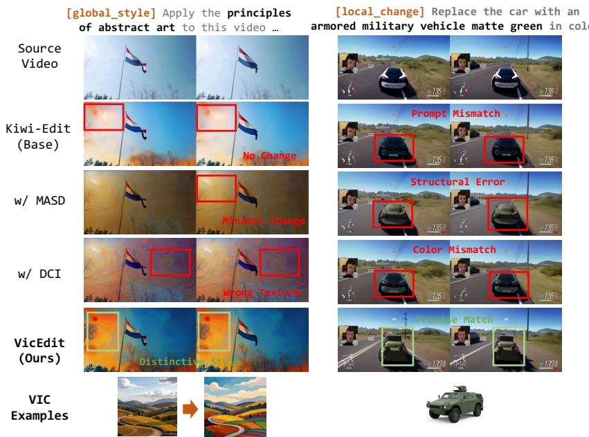  
Figure 10: Qualitative ablation of MASD and DCI on (left) a global style editing task and (right) a local object replacement task. MASD preserves texture and shape details, while DCI ensures semantic alignment. Only their combination produces results faithful to both the reference style and the editing instruction. All examples presented in the figure are collected from the open-source OpenVE [1] or Senorita [25].

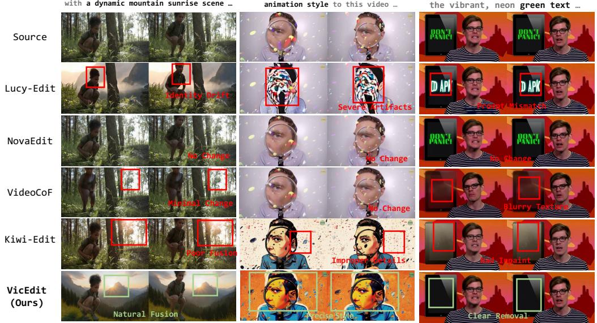  
[background\_change] Replace the background with a dynamic mountain sunrise scene …  
[local\_remove] Completely remove the vibrant, neon green text …  
Figure 11: More comparisons with baselines on base editing tasks. All examples presented in the figure are collected from the open-source OpenVE [1] or Senorita [25].

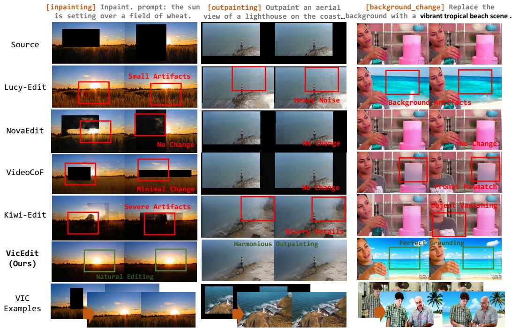  
Figure 12: More comparisons with baselines on visual in-context editing tasks. All examples presented in the figure are collected from the open-source OpenVE [1] or Senorita [25].