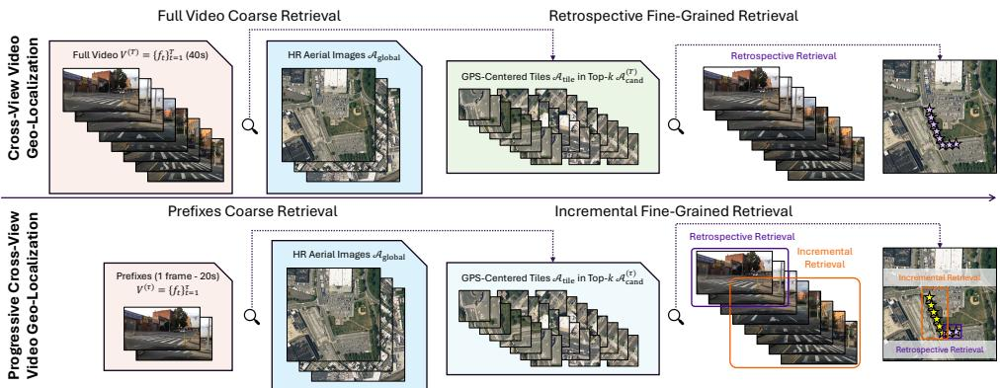
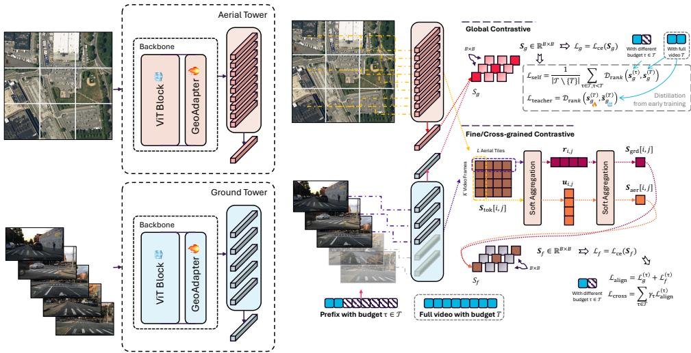
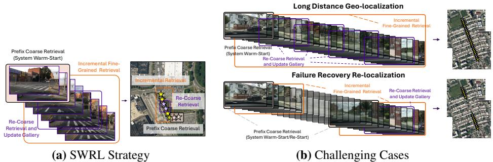
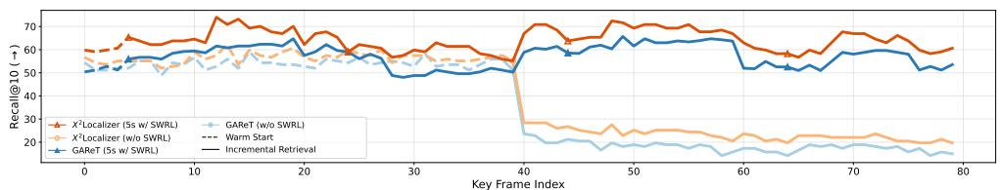
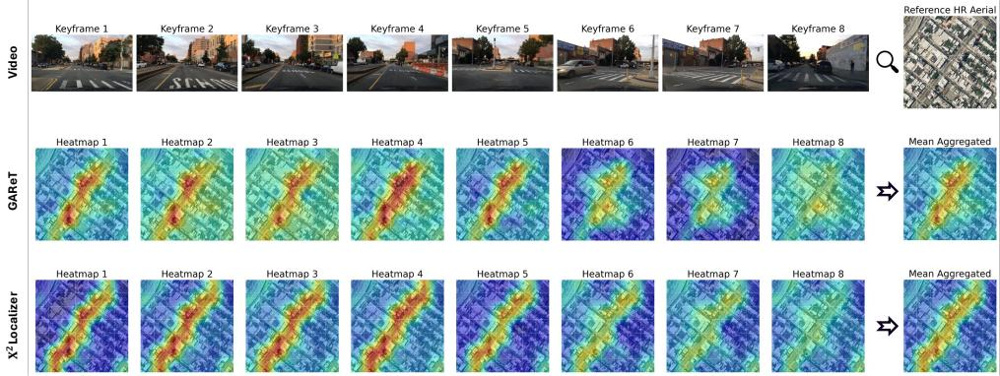

# X2Localizer: Cross-grained Alignment for Progressive Cross-view Video Geo-localization

Zichao Zeng1,2, zichao.zeng.21@ucl.ac.uk   
Weijia Fan2,4,5, weijia.fan@ualberta.ca   
Yufan Chen2, yufan.chen@kit.edu   
June Moh Goo1, june.goo.21@ucl.ac.uk   
Junwei Zheng2,†, junwei.zheng@kit.edu   
Ruiping Liu2, ruiping.liu@kit.edu   
Kunyu Peng2, kunyu.peng@kit.edu   
Jiaming Zhang3,†,   
jiamingzhang@hnu.edu.cn   
Rainer Stiefelhagen2,   
rainer.stiefelhagen@kit.edu   
Jan Boehm1, j.boehm@ucl.ac.uk

1 University College London, London, UK

2 Karlsruhe Institute of Technology, Karlsruhe, Germany

3 Hunan University, Changsha, China

4 University of Alberta, Edmonton, Canada

5 Shenzhen University, Shenzhen, China

## Abstract

Cross-view Video Geo-localization (CVG) aims to localize ground-view videos by retrieving their corresponding geo-tagged aerial images. However, CVG approaches rely on fixed-length inputs and post-hoc refinement, hindering online-oriented localization under partial or dynamic observations. In this work, we formulate Progressive Crossview Video Geo-localization (PCVG) as a deployment-oriented extension and evaluation protocol of CVG, enabling localization under varying temporal budgets, prefix-based inference, random-start evaluation, and long-range localization with interruptions. To explore PCVG, we introduce X2Localizer, a cross-grained alignment framework that jointly supervises global prefix-to-aerial retrieval and token-aggregated frame–aerial-tile matching with a budget-dependent asymmetric objective. Furthermore, we introduce a Sliding-Window Re-Localization (SWRL) strategy that dynamically refreshes candidate regions for failure recovery and long-range deployment without full-sequence reprocessing. Extensive experiments show that $\mathrm { X } ^ { 2 } \bar { \mathrm { I } }$ Localizer preserves conventional full-video performance, with marginal gains of +0.1 Recall@1 and +0.3 Recall@10, while substantially improving early localization. In the challenging single-frame setting, $\mathrm { X } ^ { 2 } \mathrm { I }$ Localizer improves coarse retrieval by +4.7 Recall@1 and +11.5 Recall@10 over the previous state-of-the-art method. With SWRL, our approach further enables robust progressive localization under random-start and long-distance scenarios, narrowing the gap between benchmark evaluation and real-world deployment. / The code is publicly available at https://zichaozeng.github.io/X2Localizer.

## 1 Introduction

Visual geo-localization aims to estimate the geographic location of a query image by matching it against geo-tagged reference imagery [5, 7, 26, 27, 33, 38, 40, 41, 49]. Cross-view geolocalization, which aligns ground-view observations with aerial or satellite imagery, has attracted significant attention due to its applications in autonomous navigation, robotics, digital twins, and urban computing [1, 3, 9, 10, 39, 45]. While early studies focus on single-image matching, recent works extend the problem to Cross-view Video Geo-localization (CVG), where a ground-view video is matched against a large aerial image [18, 20, 25, 29, 43]. By aggregating temporal cues across frames, these methods consistently outperform singleframe approaches, demonstrating the effectiveness of spatio-temporal modeling.

Despite these advances, early methods in cross-view geo-localization either aggregate sequence features to predict a single coarse location for the entire video [43], or rely on explicit geometric projection based on camera parameters and estimated relative poses to align ground and aerial views [25]. More recent approaches achieve frame-level localization using purely visual representations [18, 29]. However, they are typically designed for offline inference, assuming access to the complete query sequence before trajectory estimation, and do not explicitly consider streaming or incremental localization settings. Such an evaluation protocol does not align with real-world deployment scenarios. In practical systems, video streams arrive progressively, and localization must be performed incrementally [11, 15, 16]. The model should produce reliable predictions from short prefixes $( e . g .$ , a single frame or a few seconds), adapt to arbitrary starting timestamps, and remain robust to interruptions or partial observations. Empirically, we observe that when evaluated under such progressive conditions, existing CVG methods exhibit noticeable performance degradation, revealing a fundamental gap between benchmark assumptions and practical requirements.

To bridge this gap, we reformulate the task as Progressive Cross-view Video Geolocalization (PCVG). Instead of assuming access to a complete fixed-length sequence, we require the model to localize under varying temporal budgets, ranging from single-frame to full-length videos. To enable systematic evaluation, we reconstruct the protocol of the GAMa dataset [29] and establish a new progressive benchmark that supports multi-duration prefix evaluation, random-start testing, and long-distance or interruption scenarios. This reformulation not only provides a more realistic evaluation setting, but also exposes intrinsic limitations of existing coarse-grained global matching strategies.

A central challenge in PCVG lies in the limited contextual information available in short video segments. Conventional approaches primarily rely on global-to-global matching between a full aerial image and a temporally aggregated ground-video representation. Such a design is inherently fragile when only partial observations are available [15]. To address this issue, we propose $\bar { \mathbf { X } ^ { 2 } \mathbf { I } }$ ocalizer, a cross-grained and cross-view alignment framework that extends existing CVG methods [18, 49] to the PCVG setting. Inspired by multi-grained contrastive learning [14, 19, 35, 37], our key insight is to establish multi-grained correspondences between global and local aerial representations and ground-level temporal observations under varying temporal budgets. $\mathrm { X } ^ { 2 } \mathrm { I }$ ocalizer therefore jointly models global image-to-video alignment and fine-grained patch-to-frame alignment, with an asymmetric objective that places greater emphasis on local frame-level cues for shorter prefixes and stronger global alignment for longer observations. By modeling these cross-grained interactions within a unified contrastive learning framework, $\mathrm { X } ^ { 2 } \mathrm { I }$ Localizer enables reliable crossview coarse localization under varying temporal budgets, naturally facilitating subsequent incremental frame-to-frame refinement and re-localization. Furthermore, inspired by groundlevel sequence-based localization methods [8, 30], we introduce a Sliding-Window Re-Localization (SWRL) strategy that preserves stable alignment signals even in long-range or interrupted video streams. Our contributions are summarized as follows:

  
Figure 1: Compared to traditional cross-view video geo-localization (CVG), our proposed Progressive CVG (PCVG) enables precise localization (1) at arbitrary timestamps, (2) for varying video lengths, and (3) remains robust to interruptions or missing frames.

• We redefine cross-view video geo-localization as Progressive Cross-view Video Geo-localization (PCVG), a deployment-oriented setting supporting multi-duration, random-start, and long-distance evaluation. We reconstruct the GAMa dataset protocol to establish a new progressive benchmark.

• We propose X2Localizer, a cross-grained alignment framework that combines global prefix-to-aerial alignment with token-aggregated frame–aerial-tile alignment. It asymmetrically weights these objectives according to the available temporal context, enabling robust localization under partial observations.

• We introduce a Sliding-Window Re-Localization (SWRL) inference strategy that allows dynamic re-localization over long video streams, enabling failure recovery and sustained long-range deployment.

• Extensive experiments demonstrate that X2Localizer achieves competitive performance under the conventional full-video protocol, while substantially improving prefix and progressive localization performance under the proposed PCVG benchmark.

## 2 Related Work

Cross-view Image Geo-localization. Cross-view image geo-localization aims to match ground-view images to geo-tagged aerial or satellite imagery [5, 7, 46, 49]. Early methods primarily rely on Siamese or triplet-based metric learning frameworks to learn view-invariant representations. Representative works include SAFA [22], DSM [23, 24], and L2LTR [34], which introduce orientation alignment, polar transformation, or dynamic similarity matching to mitigate severe viewpoint discrepancies between ground and aerial views. Subsequent approaches explore attention mechanisms and transformer-based architectures to model global context more effectively. For example, TransGeo [49] demonstrates that pure transformer models can achieve strong cross-view alignment without explicit geometric transformations.

More recent works further investigate fine-grained correspondence learning and pose-aware modeling to improve localization precision [6, 12, 21, 31, 32] or leverage the ability of large language models [38]. However, these methods operate on single images and do not model temporal continuity, making them insufficient for video-based progressive localization.

Cross-view Video Geo-localization. To mitigate the limited field-of-view of single ground images, SeqGeo [43] aggregates short ground-view sequences for cross-view matching, demonstrating improved robustness over single-frame methods. Extending this direction, GAMa [29] introduces the first large-scale cross-view video dataset with a hierarchical coarse-to-fine strategy, while CVLNet [25] incorporates geometric projection and temporal constraints but relies on camera intrinsics and odometry. More recently, GAReT [18] adapts image geo-localization models to video via lightweight adapters and autoregressive retrieval, achieving state-of-the-art performance under fixed-length settings. Despite their strong fixed-length performance, existing CVG methods generally assume that the complete query video is available before inference. In contrast, ground-level sequence-based localization has highlighted the importance of progressive inference, incremental updates, and re-localization for real-world robustness [8, 11, 15, 16, 30, 47]. PCVG transfers these operational requirements to cross-view video geo-localization, where frames arrive incrementally and the system must handle arbitrary starts, interruptions, and cross-region transitions.

## 3 Methodology

## 3.1 Problem Formulation

The proposed task of PCVG is shown in Fig. 1. Given a ground-view video sequence and a geo-tagged aerial image database, the goal is to localize the video frames by cross-view retrieval under varying temporal budgets. Let $\mathcal { V } = \{ V _ { i } \} _ { i = 1 } ^ { N }$ denote a set of ground-view videos. Each video $V = \{ f _ { t } \} _ { t = 1 } ^ { T }$ consists of T ordered frames. For each frame $\pmb { f } _ { t }$ , there exists a corresponding geo-tagged aerial tile (small GPS-centered image) $\mathbf { \Delta } \mathbf { a } _ { t } \in \mathcal { A } _ { \mathrm { t i l e } }$ . In addition, each video V is associated with a high-resolution aerial image $A ^ { \mathrm { g l o b a l } } \in \mathcal { A } _ { \mathrm { g l o b a l } }$ that covers the entire geographic region of the trajectory. Let $\mathcal { A } _ { \mathrm { g l o b a l } }$ and $\boldsymbol { A } _ { \mathrm { t i l e } }$ denote the global aerial gallery and tile-level aerial gallery, respectively.

Existing CVG methods [18, 29] assume access to the complete video V before localization. They typically perform: (1) coarse retrieval by matching the full video representation to $\mathcal { A } _ { \mathrm { g l o b a l } }$ , and (2) backtracking fine-grained frame-tile retrieval within the selected region by $\boldsymbol { A } _ { \mathrm { t i l e } }$ . Formally, a ground-view encoder $\phi _ { \nu }$ and an aerial tile encoder $\phi _ { a }$ are pretrained by frame-tile matching, i.e., $\phi _ { \nu } ( { \pmb f } _ { t } ) \approx \phi _ { a } ( { \pmb a } _ { t } )$ . Subsequently, with lightweight adapters, a video encoder $\Phi _ { \nu }$ and a global aerial image encoder $\Phi _ { a }$ are learned such that $\Phi _ { \nu } ( \mathrm { ' } V ^ { ( T ) } ) \approx \Phi _ { a } ( A ^ { \mathrm { g l o b a l } } )$ . However, during inference, $\Phi _ { \nu }$ and $\Phi _ { a }$ are first employed for coarse retrieval, followed by $\phi _ { \nu }$ and $\phi _ { a }$ backtracking to retrieve each frame individually. This formulation implicitly assumes a fully observed and uninterrupted video sequence.

In contrast, we consider a progressive formulation where a prefix of the video is observable. Let $V ^ { ( \tau ) } = \{ \pmb { f } _ { t } \} _ { t = 1 } ^ { \tau }$ denote the first τ frames of V, where $\tau \in \{ 1 , \ldots , T \}$ . The model is required to perform localization under varying temporal budgets τ, including single-frame $( \tau = 1 )$ , short-clip, half-length, and full-length $( \tau = T )$ scenarios. Our objective is to learn representations that remain discriminative for every prefix length τ. Specifically, the cosine similarity cos $\Big ( \Phi _ { \nu } ( V ^ { ( \tau ) } ) , \Phi _ { a } ( A ^ { \mathrm { g l o b a l } } ) \Big )$ should be maximized for the correct aerial candidate and suppressed for mismatched candidates. Simultaneously, fine-grained frame–tile alignment is preserved through cos $\big ( \phi _ { \nu } ( { \pmb f } _ { t } ) , \phi _ { a } ( { \pmb a } _ { t } ) \big )$ . This progressive formulation introduces two key challenges: (i) limited contextual information when τ is small, and (ii) robustness under interruption, restart, or cross-region transitions in long videos. We refer to this deploymentoriented formulation as PCVG.

(a) Adaptation  
  
(b) Cross-grained Alignment Objective  
Figure 2: (a) GeoAdapter adapts frozen pretrained dual-tower encoders from image-tile matching to video-aerial matching. (b) For each temporal budget, our objective combines global video-to-aerial alignment, frame-tile alignment, and ranking distillation; shorter prefixes receive stronger supervision, while longer prefixes emphasize global alignment.

## 3.2 Pretraining and Adaptation for Cross-view Representation

Following previous works [18, 22, 42, 44, 48, 49], we adopt a dual-tower architecture with a ground-view encoder $\phi _ { \nu }$ and an aerial-tile encoder $\phi _ { a }$ . Similar to [18, 49], both encoders use the same distilled ViT backbone [28] but do not share weights. Given an image input X, the image representation is obtained by averaging the projected classification and distillation tokens, i.e.,

$$
\phi _ { \star } ( X ) = \mathrm { L } 2 \mathrm { N o r m } \left( ( \boldsymbol { \mathsf { h } } _ { \mathrm { c l s } } ^ { ( \star ) } + \boldsymbol { \mathsf { h } } _ { \mathrm { d i s t } } ^ { ( \star ) } ) / 2 \right) , \quad \star \in \{ \nu , a \} .\tag{1}
$$

We pretrain the dual-tower encoders using frame-to-aerial-tile pairs $\left( \pmb { f } _ { t } , \pmb { a } _ { t } \right)$ with a singledirection soft-margin contrastive loss $\mathcal { L } _ { \mathrm { s m c l } }$ from the ground side to the aerial side. The full pretraining objective is provided in the supplementary material.

To extend the pretrained image encoders $\phi _ { \nu }$ and $\phi _ { a }$ to video-to-global matching, we follow [17, 18, 36] and insert a lightweight GeoAdapter module into each Transformer block, while freezing the pretrained spatial backbone (see Fig. 2(a)). Similar to GAReT [18], we first optimize the GeoAdapter using complete videos and their corresponding global aerial images. Given a mini-batch of B matched video-aerial pairs $\{ ( V _ { i } ^ { ( T ) } , A _ { i } ^ { \mathrm { g l o b a l } } ) \} _ { i = 1 } ^ { B }$ , we stack the full-video embeddings and global aerial embeddings as

$$
\mathbf { V } ^ { ( g , T ) } = [ \mathbf { v } _ { 1 } ^ { ( g , T ) } , \allowbreak \dots , \mathbf { v } _ { B } ^ { ( g , T ) } ] ^ { \top } \in \mathbb { R } ^ { B \times d } , \qquad \mathbf { A } ^ { ( g ) } = [ \mathbf { a } _ { 1 } ^ { ( g ) } , \allowbreak \dots , \mathbf { a } _ { B } ^ { ( g ) } ] ^ { \top } \in \mathbb { R } ^ { B \times d } ,\tag{2}
$$

where $\mathbf { v } _ { i } ^ { ( g , T ) } = \Phi _ { \nu } ( V _ { i } ^ { ( T ) } ) , \mathbf { a } _ { i } ^ { ( g ) } = \Phi _ { a } ( A _ { i } ^ { \mathrm { g l o b a l } } )$ , and $d$ denotes the aligned feature dimension. All embeddings are ℓ -normalized, so their dot products correspond to cosine similarity. The batch-wise global similarity is computed as

$$
\pmb { s } _ { g } ^ { ( T ) } = \mathbf { V } ^ { ( g , T ) } \mathbf { A } ^ { ( g ) \top } \in \mathbb { R } ^ { B \times B } ,\tag{3}
$$

where $s _ { g } ^ { ( T ) } [ i , j ]$ denotes the similarity between the i-th ground-view video and the j-th global aerial image. We use a row-wise cross-entropy retrieval loss from the ground/video side to the aerial side:

$$
\mathcal { L } _ { \mathrm { c e } } ( \pmb { s } ) = - \frac { 1 } { B } \sum _ { i = 1 } ^ { B } \log \frac { \exp ( \pmb { s } [ i , i ] / \tau _ { c } ) } { \sum _ { j = 1 } ^ { B } \exp ( \pmb { s } [ i , j ] / \tau _ { c } ) } ,\tag{4}
$$

where $\tau _ { c }$ is the temperature parameter. The full-video adaptation objective is therefore $\mathcal { L } _ { \mathrm { f u l l } } = \mathcal { L } _ { \mathrm { c e } } ( s _ { g } ^ { ( T ) } )$ . This objective adapts the cross-view representation to full-video global localization before introducing cross-grained alignment for different temporal budgets.

## 3.3 Asymmetric Cross-grained Alignment Objective

In the early stage, we train the model only with the full-video adaptation objective in Sec. 3.2, which provides stable global alignment between complete ground-view videos and global aerial images. However, in PCVG, the model must align ground-view observations of different temporal lengths $\tau \in \mathcal { T } \subseteq \{ 1 , . . . , T \}$ with the same global aerial gallery. Unlike previous CVG methods that mainly rely on full-video global supervision, we introduce an asymmetric cross-grained alignment objective to jointly supervise global video-aerial matching and fine-grained token-level (frame-tile) matching under different temporal budgets (Fig. 2(b)).

Given a temporal budget τ, the prefix of the i-th video is denoted as $V _ { i } ^ { ( \tau ) } = \{ { \pmb f } _ { i , t } \} _ { t = 1 } ^ { \tau }$ . The adapted encoders produce the prefix-level video embedding $\mathbf { v } _ { i } ^ { ( g , \tau ) } = \Phi _ { \nu } ( V _ { i } ^ { ( \tau ) } ) \in \mathbb { R } ^ { d }$ and the global aerial embedding $\mathbf { a } _ { j } ^ { ( g ) } = \Phi _ { a } ( A _ { j } ^ { \mathrm { g l o b a l } } ) \in \mathbb { R } ^ { d }$ . For a mini-batch of B matched video-aerial pairs, we stack the embeddings as $\mathbf { V } ^ { ( g , \tau ) }$ and $\mathbf { A } ^ { ( g ) }$ . The global prefix-to-aerial similarity is computed as $\pmb { s } _ { g } ^ { ( \tau ) } = \mathbf { V } ^ { ( g , \tau ) } \mathbf { A } ^ { ( g ) \top } \in \mathbb { R } ^ { B \times B }$ , where $s _ { g } ^ { ( \tau ) } [ i , j ]$ measures the global similarity between the i-th video prefix and the j-th aerial image. The global alignment loss is then defined as $\begin{array} { r } { \mathcal { L } _ { g } ^ { ( \tau ) } = \mathcal { L } _ { \mathrm { c e } } ( \pmb { s } _ { g } ^ { ( \tau ) } ) } \end{array}$ , where $\mathcal { L } _ { \mathrm { c e } }$ is the row-wise retrieval cross-entropy in Eq. 4.

To provide fine-grained cross-view supervision, we further compute local token-level frame-tile similarities. Let $\mathbf { p } _ { i } ^ { ( \tau ) } = [ \mathbf { p } _ { i , 1 } , \ldots , \mathbf { p } _ { i , K } ] ^ { \top } \in \mathbb { R } ^ { K \times d }$ denote the K ground/video tokens of the i-th prefix $V _ { i } ^ { ( \tau ) }$ , and let $\mathbf { Q } _ { j } = [ \mathbf { q } _ { j , 1 } , \hdots , \mathbf { q } _ { j , L } ] ^ { \top } \in \mathbb { R } ^ { L \times d }$ denote the L aerial tile tokens of the j-th global aerial image $A _ { j } ^ { \mathrm { g l o b a l } }$ . For each pair $( i , j )$ , the token-token similarity is

$$
\begin{array} { r } { \pmb { s } _ { \mathrm { t o k } } ^ { ( \tau ) } [ i , j , k , l ] = \pmb { \mathrm { p } } _ { i , k } ^ { \top } \pmb { \mathrm { q } } _ { j , l } , \qquad \pmb { s } _ { \mathrm { t o k } } ^ { ( \tau ) } \in \mathbb { R } ^ { B \times B \times K \times L } . } \end{array}\tag{5}
$$

where $K = \tau$ in $V _ { i } ^ { ( \tau ) }$ and L is the number of aerial tiles from $A _ { j } ^ { \mathrm { g l o b a l } }$ . Thus, each videoaerial pair has a $K \times L$ frame-tile similarity map, while the whole mini-batch forms a fourdimensional similarity tensor.

We aggregate the token-level similarities with a two-stage soft aggregation. For each ground/video token, we first softly aggregate over aerial tile tokens:

$$
r _ { i , j , k } ^ { ( \tau ) } = \sum _ { l = 1 } ^ { L } \alpha _ { i , j , k , l } ^ { ( \tau ) } s _ { \mathrm { t o k } } ^ { ( \tau ) } [ i , j , k , l ] , \qquad \alpha _ { i , j , k , l } ^ { ( \tau ) } = \frac { \exp ( s _ { \mathrm { t o k } } ^ { ( \tau ) } [ i , j , k , l ] / \tau _ { f } ) } { \sum _ { l ^ { \prime } = 1 } ^ { L } \exp ( s _ { \mathrm { t o k } } ^ { ( \tau ) } [ i , j , k , l ^ { \prime } ] / \tau _ { f } ) } .\tag{6}
$$

Here, $\tau _ { f }$ is the token soft-aggregation temperature. We then softly aggregate the resulting ground-token scores:

$$
s _ { \mathrm { g r d } } ^ { ( \tau ) } [ i , j ] = \sum _ { k = 1 } ^ { K } \rho _ { i , j , k } ^ { ( \tau ) } r _ { i , j , k } ^ { ( \tau ) } , \qquad \rho _ { i , j , k } ^ { ( \tau ) } = \frac { \exp ( r _ { i , j , k } ^ { ( \tau ) } / \tau _ { f } ) } { \sum _ { k ^ { \prime } = 1 } ^ { K } \exp ( r _ { i , j , k ^ { \prime } } ^ { ( \tau ) } / \tau _ { f } ) } .\tag{7}
$$

Symmetrically, for each aerial tile token, we softly aggregate over ground/video tokens:

$$
u _ { i , j , l } ^ { ( \tau ) } = \sum _ { k = 1 } ^ { K } \beta _ { i , j , k , l } ^ { ( \tau ) } s _ { \mathrm { t o k } } ^ { ( \tau ) } [ i , j , k , l ] , \qquad \beta _ { i , j , k , l } ^ { ( \tau ) } = \frac { \exp ( s _ { \mathrm { t o k } } ^ { ( \tau ) } [ i , j , k , l ] / \tau _ { f } ) } { \sum _ { k ^ { \prime } = 1 } ^ { K } \exp ( s _ { \mathrm { t o k } } ^ { ( \tau ) } [ i , j , k ^ { \prime } , l ] / \tau _ { f } ) } ,\tag{8}
$$

followed by a soft aggregation over aerial tokens:

$$
\pmb { s } _ { \mathrm { a e r } } ^ { ( \tau ) } [ i , j ] = \sum _ { l = 1 } ^ { L } \omega _ { i , j , l } ^ { ( \tau ) } u _ { i , j , l } ^ { ( \tau ) } , \qquad \omega _ { i , j , l } ^ { ( \tau ) } = \frac { \exp ( u _ { i , j , l } ^ { ( \tau ) } / \tau _ { f } ) } { \sum _ { l ^ { \prime } = 1 } ^ { L } \exp ( u _ { i , j , l ^ { \prime } } ^ { ( \tau ) } / \tau _ { f } ) } .\tag{9}
$$

The final fine-grained similarity is

$$
\pmb { s } _ { f } ^ { ( \tau ) } [ i , j ] = \frac { 1 } { 2 } \left( \pmb { s } _ { \mathrm { g r d } } ^ { ( \tau ) } [ i , j ] + \pmb { s } _ { \mathrm { a e r } } ^ { ( \tau ) } [ i , j ] \right) , \qquad \pmb { s } _ { f } ^ { ( \tau ) } \in \mathbb { R } ^ { B \times B } .\tag{10}
$$

Although $s _ { f } ^ { ( \tau ) }$ is obtained by aggregating token similarities from two complementary directions, the retrieval loss is applied only in the ground-to-aerial direction: $\begin{array} { r } { \mathcal { L } _ { f } ^ { ( \tau ) } = \mathcal { L } _ { \mathrm { c e } } ( \pmb { s } _ { f } ^ { ( \tau ) } ) } \end{array}$

The asymmetric cross-grained alignment objective for temporal budget τ is

$$
\begin{array} { r } { \mathcal { L } _ { \mathrm { a l i g n } } ^ { ( \tau ) } = \lambda _ { g } ^ { ( \tau ) } \mathcal { L } _ { g } ^ { ( \tau ) } + \lambda _ { f } ^ { ( \tau ) } \mathcal { L } _ { f } ^ { ( \tau ) } . } \end{array}\tag{11}
$$

The weights $\lambda _ { g } ^ { ( \tau ) }$ and $\lambda _ { f } ^ { ( \tau ) }$ balance global and fine-grained supervision for different temporal lengths. Shorter prefixes rely more on fine-grained local evidence, while longer prefixes and full videos place more emphasis on global video-aerial alignment.

In addition to the supervised alignment objective, we preserve the ranking structure learned from full-video adaptation through row-wise ranking distillation. Given a student similarity matrix s and a teacher similarity matrix s˜, we define

$$
\mathcal { D } _ { \mathrm { r a n k } } ( \pmb { s } , \pmb { \tilde { s } } ) = \tau _ { d } ^ { 2 } \mathrm { K L } \left( \mathrm { s o f t m a x } ( \pmb { \tilde { s } } / \tau _ { d } ) \parallel \mathrm { s o f t m a x } ( \pmb { s } / \tau _ { d } ) \right) ,\tag{12}
$$

where $\tau _ { d }$ is the distillation temperature, and the softmax and KL divergence are computed row-wise over the aerial gallery. For prefix-to-full self-distillation, shorter prefixes are encouraged to match the full-prefix ranking distribution produced by the current student:

$$
\mathcal { L } _ { \mathrm { s e l f } } = \frac { 1 } { \left| \mathcal { T } \setminus \{ T \} \right| } \sum _ { \tau \in \mathcal { T } , \tau < T } \mathcal { D } _ { \mathrm { r a n k } } \left( \pmb { s } _ { g } ^ { ( \tau ) } , \pmb { s } _ { g } ^ { ( T ) } \right) .\tag{13}
$$

We further use the frozen full-video model from the early training stage as a teacher for the full-prefix student:

$$
\begin{array} { r } { \mathcal { L } _ { \mathrm { t e a c h e r } } = \mathcal { D } _ { \mathrm { r a n k } } \left( s _ { g } ^ { ( T ) } , \tilde { s } _ { g } ^ { ( T ) } \right) , } \end{array}\tag{14}
$$

where $\tilde { \pmb { s } } _ { g } ^ { ( T ) }$ denotes the global similarity matrix produced by the early stage full-video teacher. The final training objective is

$$
{ \mathcal { L } } _ { \mathrm { c r o s s } } = \sum _ { \tau \in { \mathcal { T } } } \gamma _ { \tau } { \mathcal { L } } _ { \mathrm { a l i g n } } ^ { ( \tau ) } , \qquad { \mathcal { L } } _ { \mathrm { t o t a l } } = { \mathcal { L } } _ { \mathrm { c r o s s } } + \eta _ { \mathrm { s e l f } } { \mathcal { L } } _ { \mathrm { s e l f } } + \eta _ { \mathrm { t e a c h e r } } { \mathcal { L } } _ { \mathrm { t e a c h e r } } .\tag{15}
$$

Here, $\gamma _ { \tau }$ weights temporal budget τ, while $\eta _ { \mathrm { s e l f } }$ and $\eta _ { \mathrm { t e a c h e r } }$ weight the two distillation terms.

  
Figure 3: (a) Sliding-window Re-localization (SWRL) refreshes the candidate region set $A _ { \mathrm { c a n d } }$ every ∆ frames to support subsequent incremental refinement. (b) It improves robustness in long-range localization and enables failure recovery.

## 3.4 Progressive Inference Strategy

During inference, we localize a query video with either a prefix or the full sequence. Given $V ^ { ( \tau ) } \stackrel { - } { = } \{ { \pmb f } _ { t } \} _ { t = 1 } ^ { \tau }$ , where $\tau \in \{ 1 , \ldots , T \}$ , we compute $\mathbf { v } ^ { ( g , \tau ) } = \Phi _ { \nu } ( V ^ { ( \tau ) } )$ . For each global aerial candidate $A _ { j } ^ { \mathrm { g l o b a l } } \in \mathcal { A } _ { \mathrm { g l o b a l } }$ , we use the same mixed-resolution matching strategy as in training:

$$
s _ { \mathrm { m i x } } ^ { ( \tau ) } ( j ) = \frac { 1 } { 2 } \left( s _ { g } ^ { ( \tau ) } ( j ) + s _ { f } ^ { ( \tau ) } ( j ) \right) , \qquad s _ { g } ^ { ( \tau ) } ( j ) = \mathbf { v } ^ { ( g , \tau ) \top } \mathbf { a } _ { j } ^ { ( g ) } .\tag{16}
$$

Here, $s _ { f } ^ { ( \tau ) } ( j )$ is obtained by applying the same two-direction token aggregation to the frametoken and aerial-tile-token similarities. We select the top- $K _ { c }$ global aerial regions according to $s _ { \mathrm { m i x } } ^ { ( \tau ) } ( j )$ to form $\mathcal { A } _ { \mathrm { c a n d } } ^ { ( \tau ) }$ . When $\tau = T$ , this becomes full-video retrieval; when $\tau < T$ , it enables early localization with partial observations.

For long video streams that may traverse multiple geographic regions, an initially retrieved candidate set may gradually become suboptimal. Inspired by [8, 30], we introduce the Sliding-window Re-localization (SWRL) strategy to periodically refresh the candidate set (Fig. 3(a)). Given a continuous stream $\{ f _ { t } \} _ { t = 1 } ^ { \infty }$ , we define a sliding window $W ^ { ( t ) }$ . Within this window, we construct a window-prefix $W ^ { ( t , \tau ) }$ , which is fed into the video encoder.

$$
W ^ { ( t ) } = \{ f _ { t - \Delta + 1 } , \ldots , f _ { t } \} , \qquad W ^ { ( t , \tau ) } = \{ f _ { t - \Delta + 1 } , \ldots , f _ { t - \Delta + \tau } \} , \qquad \tau \in \{ 1 , \ldots , \Delta \} ,\tag{17}
$$

where $\Delta$ denotes the window size used for re-localization. The window-prefix embedding and its mixed-resolution retrieval score are computed as

$$
\begin{array} { r } { \mathbf { v } _ { W } ^ { ( g , \tau ) } = \Phi _ { \nu } ( W ^ { ( t , \tau ) } ) , \qquad s _ { W } ^ { ( \tau ) } ( j ) = s _ { \mathrm { m i x } } ^ { ( \tau ) } ( W ^ { ( t , \tau ) } , A _ { j } ^ { \mathrm { g l o b a l } } ) , } \end{array}\tag{18}
$$

where $s _ { \mathrm { m i x } } ^ { ( \tau ) }$ is defined in Eq. 16.

The first coarse retrieval requires accumulating a prefix, which introduces a warm-start cost before localization is initialized. After initialization, frame-level geo-localization is performed using the candidate tile gallery. SWRL periodically refreshes the candidate set using the prefix of the current sliding window $W ^ { ( t , \tau ) }$ , and the geo-tagged tile reference gallery is updated. This mechanism enables (1) cross-region or long-distance localization when the trajectory moves beyond the initially retrieved geographic area, and (2) failure recovery under occlusion, visual ambiguity, or temporary interruption, by reinitializing localization using only a short temporal budget within the latest window (Fig. 3). SWRL requires no additional training or supervision and naturally integrates with progressive inference.

## 4 Experiments and Results

## 4.1 Implementation Details

We adopt DeiT-Small [28], pretrained on ImageNet [4], as the backbone for ground-view and aerial branches in the dual-tower architecture. The image-level encoders $\phi _ { \nu }$ and $\phi _ { a }$ are pretrained with frame–aerial-tile pairs using the ground-to-aerial soft-margin contrastive objective. We then freeze the pretrained spatial backbone and insert GeoAdapter modules into the Transformer blocks to obtain the video/global-aerial encoders $\Phi _ { \nu }$ and $\Phi _ { a }$ . The early adaptation stage uses only the full-video global retrieval loss ${ \mathcal { L } } _ { \mathrm { f u l l } }$ to train the adapters, and is run for at most 50 epochs with early stopping patience $1 0 ;$ the resulting full-video model is used as the teacher for progressive training. In the progressive stage, we train with temporal budgets $\tau \in \mathcal { T } = \{ 1 , 2 , 4 , 8 \}$ , with $K = \tau$ , corresponding to the first frame, 5s, 20s, and the full 40s video. For $\tau = 1 , 2 , 4 , 8$ , respectively, the budget weights $\gamma _ { \tau }$ are set to $( 0 . 0 5 , 0 . 1 0 , 0 . 2 5 , 2 . 0 0 )$ We set the asymmetric component weights $( \lambda _ { g } ^ { ( \tau ) } , \lambda _ { f } ^ { ( \tau ) } )$ to (1, 2), (1, 1), (1, 0.5), and (1, 0), so short prefixes receive stronger fine-grained supervision while the full video is supervised only by global alignment. Prefix-to-full self-distillation and early-teacher ranking distillation are weighted by $\eta _ { \mathrm { s e l f } } = 0 . 2$ and $\eta _ { \mathrm { t e a c h e r } } = 1 . 0$ , respectively. We set the contrastive and distillation temperatures $\tau _ { c } = \tau _ { d } = 0 . 0 7$ and the token soft-aggregation temperature $\tau _ { f } = 0 . 0 1$ Both adaptation stages use Adam with learning rate $1 \times 1 0 ^ { - 4 }$ , batch size $B = 8$ , mixed precision, and are trained for at most 50 epochs with patience 10 on a single NVIDIA RTX PRO 6000 GPU. For SWRL, we refresh candidate regions every 20 seconds (∆).

Dataset. Following prior work, we use the train-day split of the GAMa dataset for training and the val-day split for evaluation. GAMa is a cross-view geo-localization benchmark designed for frame-to-frame matching. Each sample contains a ∼40s street-view video (from BDD100K) paired with (1) a global aerial image covering the surrounding region, and (2) frame-level geo-tagged aerial image tiles corresponding to each video frame. The train-day split contains 21,144 video-global aerial pairs and approximately 790K frame-level aerial matches. The val-day split includes 3,103 videos and around 116K frame-level matches. To evaluate long-range localization ability, we further construct a val-long-distance subset by concatenating two sequences from the same geographic source whose temporal gap is no more than two minutes. This subset contains 127 long sequences and approximately 6K frame-level pairs for evaluation.

Evaluation Protocols. We evaluate $X ^ { 2 }$ Localizer under both the conventional CVG protocol and the proposed PCVG protocol. The conventional protocol assumes that the full 40-second video is available before coarse retrieval and retrospective frame-level localization, whereas PCVG evaluates localization under partial, restarted, and long-range streaming observations. We consider four settings. First, for global coarse retrieval, we retrieve the corresponding global aerial image using $\mathcal { T } = \{ 1 , 2 , 4 , 8 \}$ , covering both shorter prefixes and the full video. Second, for coarse-to-fine frame-level localization, the prefix-level coarse retriever selects the top-10 global aerial candidate regions, from which we construct the tile gallery and rerank frame-level aerial tiles using the image-level retriever. A frame prediction is correct if its GPS location is within 80 meters of the ground truth. Third, for random-start recovery, we sample one valid starting timestamp for each validation video, perform prefix-based coarse re-localization from that timestamp, and incrementally retrieve frame-level matches on the remaining frames. This setting simulates localization restart after interruption, tracking failure, or missing context. Fourth, for long-distance progressive localization, we evaluate continuous frame-level retrieval on the long-distance subset, where SWRL periodically refreshes candidate regions using the prefix of the current sliding window rather than relying on a single initial coarse retrieval. We report Recall@1, Recall@5, Recall@10, and Recall@1%.

## 4.2 Coarse Retrieval $( \mathcal { V } \mathbf { - t o - } \mathcal { A } _ { \mathbf { g l o b a l } } )$

We compare $\mathrm { X } ^ { 2 } \mathrm { I }$ Localizer with CVLNet [25], GAMa [29], GAReT [18], and general-purpose video backbones including VideoSWIN [13] and TimeSformer [2]. GAReT shares the same pretrained dual-tower cross-view encoder as our method but optimizes video-to-global matching mainly under the full-video setting. We also include two DeiT-based baselines to isolate the effect of the proposed objective. DeiT denotes a fine-tuned DeiT dual-tower model without GeoAdapter adaptation, while $\mathrm { D e i T ^ { \star } }$ uses the same backbone but is trained with our asymmetric cross-grained alignment objective. Detailed baseline descriptions are provided in the supplementary material.

Table 1 reports coarse retrieval under different temporal budgets. Under the conventional full-video protocol, $\mathrm { X } ^ { 2 } \mathrm { I }$ Localizer achieves performance comparable to GAReT, indicating that progressive training does not sacrifice standard CVG performance. The advantage becomes more evident under the PCVG protocol. When the input is shortened to 20 seconds, 5 seconds, or a single frame, $\mathrm { X } ^ { 2 } \mathrm { I }$ ocalizer consistently improves over GAReT, with the largest gain appearing in the most constrained single-frame setting. This confirms that relying only on full-video global alignment is insufficient for progressive localization. By contrast, our asymmetric cross-grained objective directly supervises both prefix-level global retrieval and token-aggregated frame-tile evidence, allowing the representation to remain discriminative even when temporal context is limited. In addition, comparing DeiT⋆ with DeiT shows that the proposed asymmetric cross-grained objective consistently improves retrieval even without GeoAdapter adaptation. For $\tau = \{ 1 , 2 , 4 , 8 \}$ , it improves Recall@1 by +4.9, +6.1, +7.1, and +6.3 for DeiT, respectively. This indicates that asymmetric cross-grained supervision is broadly beneficial for progressive retrieval, not only for the final $\mathbf { X } ^ { 2 } \mathbf { I }$ ocalizer architecture.

## 4.3 Fine-grained Retrieval $( \mathcal { V } \mathbf { - t o } \mathbf { - } \mathcal { A } _ { \mathbf { t i l e } } )$

We next evaluate whether better prefix-level coarse retrieval leads to stronger frame-level localization. Following prior work, a frame-level prediction is considered correct if the predicted GPS location falls within 0.05 miles (nearly 80 m) of the ground-truth location. We compare our method with Shi et al. [23], L2LTR [34], GAMa [29] including its hierarchical variant $\mathrm { G A M a ^ { \star } }$ , and GAReT. For GAReT and ${ \mathrm { X } } ^ { 2 } { \mathrm { L o c a l i z e r } } ,$ , the fine-grained tile gallery is constructed from the top-10 global aerial candidates retrieved by the corresponding coarse model. Table 2 reports frame-level localization under different coarse-retrieval budgets. In the full-video setting, $\mathrm { X } ^ { 2 } \mathrm { I }$ ocalizer achieves performance comparable to GAReT, showing that the proposed progressive objective preserves the standard retrospective localization ability. Under shorter prefix budgets, however, $\mathrm { X } ^ { 2 } \mathrm { I }$ Localizer consistently improves fine-grained retrieval. The improvement is especially clear for the 5-second and single-frame settings, where the initial coarse gallery is more difficult to construct reliably. This demonstrates that the asymmetric cross-grained objective improves not only global aerial retrieval but also the quality of the downstream tile gallery.

<table><tr><td>Model</td><td>Backbone</td><td>#params</td><td>Latency</td><td>R@1</td><td>R@5</td><td>R@10</td><td>R@1%</td></tr><tr><td colspan="6">Full 40s video-to-global aerial image τ = 8</td><td></td><td></td></tr><tr><td>TimeSFormer [0]</td><td>ViT-B</td><td>243M</td><td>14.2</td><td>20.1</td><td>44.5</td><td>55.6</td><td>83.5</td></tr><tr><td>VideoSWIN []</td><td>Swin-B</td><td>175M</td><td>14.3</td><td>20.4</td><td>45.9</td><td>59.9</td><td>88.0</td></tr><tr><td>CVLNet []</td><td>VGG16</td><td>17M</td><td>23.9</td><td>0.4</td><td>1.3</td><td>2.7</td><td>15.4</td></tr><tr><td>GAMa [四]</td><td>Mixed</td><td>23M</td><td>32.7</td><td>12.2</td><td></td><td>35.3</td><td>49.3</td></tr><tr><td>DeiT []</td><td>DeiT-S</td><td>45M</td><td>2.9</td><td>20.5</td><td>49.9</td><td>63.6</td><td>98.7</td></tr><tr><td>DeiT* []</td><td>DeiT-S</td><td>45M</td><td>2.9</td><td>26.8</td><td>61.6</td><td>74.2</td><td>99.5</td></tr><tr><td>GAReT []</td><td>DeiT-S</td><td>47M</td><td>6.9</td><td>50.2</td><td>83.3</td><td>90.7</td><td>99.8</td></tr><tr><td>X2Localizer (ours) Improv.</td><td>DeiT-S</td><td>47M</td><td>6.9</td><td>50.3 +0.1</td><td>83.9 +0.6</td><td>91.0 +0.3</td><td>99.8 0</td></tr><tr><td colspan="8">First 20s clip-to-global aerial image τ = 4</td></tr><tr><td>DeiT [8]</td><td>DeiT-S</td><td>45M</td><td>2.1</td><td>16.2</td><td>43.0</td><td>57.7</td><td>97.7</td></tr><tr><td>DeiT* [四]</td><td>DeiT-S</td><td>45M</td><td>2.1</td><td>23.3</td><td>54.1</td><td>67.4</td><td>98.6</td></tr><tr><td>GAReT []</td><td>DeiT-S</td><td>47M</td><td>5.2</td><td>41.4</td><td>75.0</td><td>84.4</td><td>99.2</td></tr><tr><td>X2Localizer (ours) Improv.</td><td>DeiT-S</td><td>47M</td><td>5.2</td><td>42.5 +1.1</td><td>78.2 +3.2</td><td>86.7 +2.3</td><td>99.7 +0.5</td></tr><tr><td colspan="8">First 5s clip-to-global aerial image τ = 2</td></tr><tr><td>DeiT []</td><td>DeiT-S</td><td>45M</td><td>1.2</td><td>10.3</td><td>31.9</td><td>44.4</td><td>93.7</td></tr><tr><td>DeiT* []</td><td>DeiT-S</td><td>45M</td><td>1.2</td><td>16.4</td><td>42.7</td><td>56.2</td><td>96.8</td></tr><tr><td>GAReT []</td><td>DeiT-S</td><td>47M</td><td>4.7</td><td>25.9</td><td>55.0</td><td>66.8</td><td>96.4</td></tr><tr><td>X2Localizer (ours) Improv.</td><td>DeiT-S</td><td>47M</td><td>4.7</td><td>29.1 +3.2</td><td>61.9 +6.9</td><td>72.8 +6.0</td><td>98.6 +2.2</td></tr><tr><td colspan="8">First frame-to-global aerial image τ = 1</td></tr><tr><td>DeiT [ 四</td><td>DeiT-S</td><td>45M</td><td>1.0</td><td>7.4</td><td>24.6</td><td>35.8</td><td>90.3</td></tr><tr><td>DeiT* [四]</td><td>DeiT-S</td><td>45M</td><td>1.0</td><td>12.3</td><td>35.6</td><td>48.6</td><td>94.2</td></tr><tr><td>GAReT []</td><td>DeiT-S</td><td>47M</td><td>4.4</td><td>16.9</td><td>40.4</td><td>52.2</td><td>92.6</td></tr><tr><td>X2Localizer (ours) Improv.</td><td>DeiT-S</td><td>47M</td><td>4.4</td><td>21.6</td><td>50.9</td><td>63.7</td><td>97.2</td></tr><tr><td></td><td></td><td></td><td></td><td>+4.7</td><td>+10.5</td><td>+11.5</td><td>+4.6</td></tr></table>

Table 1: Coarse retrieval performance under varying prefix budgets τ. Matching is evaluated between $V ^ { ( \tau ) }$ and $\mathcal { A } _ { \mathrm { g l o b a l } }$ , reported in Recall@k (%) and inference latency (ms/video). The best results are highlighted in bold.

We further evaluate SWRL in the same setting. Instead of relying on a single initial coarse retrieval, SWRL periodically refreshes the candidate aerial region using the latest sliding-window prefix. This dynamic update mitigates error accumulation and allows the fine-grained retriever to recover from suboptimal initial candidates. The gains are most pronounced under short warm-start budgets, confirming that progressive coarse re-localization is beneficial for practical online deployment. However, broad-rank metrics may remain comparable or slightly decrease because the refreshed gallery focuses on the current local region.

## 4.4 Random-start Recovery

To evaluate recovery ability after interruption or localization failure, we conduct a randomstart recovery experiment. For each video, we randomly sample a temporal position and initialize localization using only a short prefix starting from that position. We evaluate both prefix-based coarse retrieval and subsequent incremental frame-to-tile retrieval. This protocol is more challenging than the standard prefix setting because the system cannot assume that the video starts from the beginning of a trajectory, and the available observation may contain limited or visually ambiguous context. Table 3 shows that $\mathrm { X } ^ { 2 } \mathrm { I }$ Localizer consistently outperforms GAReT across all random-start budgets. The improvement is largest under the single-frame restart setting, where temporal context is almost absent. These results suggest that the proposed asymmetric cross-grained alignment learns representations that are less dependent on complete sequence context. By combining budget-aware global supervision with token-aggregated local evidence, $\mathbf { X } ^ { 2 } \mathbf { I }$ ocalizer can rapidly re-establish reliable coarse candidates and improve subsequent frame-level localization after a restart.

<table><tr><td>Model</td><td>Backbone</td><td>#params</td><td>Latency</td><td>R@1</td><td>R@5</td><td>R@10</td><td>R@1%</td></tr><tr><td colspan="8">Full 40s video-to-global aerial image τ = 8</td></tr><tr><td>Shi et al. []</td><td>VGG16</td><td>18M</td><td>2.0</td><td>9.6</td><td>18.1</td><td>26.6</td><td>71.9</td></tr><tr><td>L2LTR []</td><td>ViT-B</td><td>196M</td><td>12.7</td><td>11.7</td><td>20.8</td><td>28.2</td><td>87.1</td></tr><tr><td>GAMa [四]</td><td>Mixed</td><td>49M</td><td>4.3</td><td>15.2</td><td>27.2</td><td>33.8</td><td>91.9</td></tr><tr><td>GAMa* [四]</td><td>Mixed</td><td>72M</td><td>41.3</td><td>18.3</td><td>27.6</td><td>32.7</td><td></td></tr><tr><td>GAReT []</td><td>DeiT-S</td><td>45M</td><td>3.6</td><td>46.8</td><td>71.8</td><td>81.1</td><td>91.4</td></tr><tr><td>X2Localizer (ours)</td><td>DeiT-S</td><td>45M</td><td>3.6</td><td>46.5</td><td>72.0</td><td>81.4</td><td>9ī.8</td></tr><tr><td colspan="8">First 20s clip-to-global aerial image τ = 4</td></tr><tr><td>GAReT []</td><td>DeiT-S</td><td>45M</td><td>3.6</td><td>45.9</td><td>68.9</td><td>77.0</td><td>85.8</td></tr><tr><td>+ SWRL X2Localizer (ours)</td><td>DeiT-S</td><td>45M</td><td>4.9(/20s) 3.6</td><td>45.9 46.3</td><td>67.0 70.3</td><td>74.0 78.8</td><td>78.6 87.7</td></tr><tr><td>+ SWRL</td><td></td><td></td><td>4.9(/20s)</td><td>47.4</td><td>70.0</td><td>77.3</td><td>82.1</td></tr><tr><td colspan="8">First 5s clip-to-global aerial image τ = 2</td></tr><tr><td>GAReT [] + SWRL</td><td>DeiT-S</td><td>45M</td><td>3.6 4.9(/20s)</td><td>39.2 44.8</td><td>57.6</td><td>63.8 66.4</td><td>70.2</td></tr><tr><td>X2Localizer (ours) + SWRL</td><td>DeiT-S</td><td>45M</td><td>3.6 4.9(/20s)</td><td>41.7 48.0</td><td>62.5 61.5 67.3</td><td>68.0 71.6</td><td>67.8 74.7 72.9</td></tr><tr><td colspan="8">First frame-to-global aerial image τ = 1</td></tr><tr><td>GAReT [] + SWRL</td><td>DeiT-S</td><td>45M</td><td>3.6</td><td>32.1 39.2</td><td>47.1</td><td>51.7 56.0</td><td>56.6</td></tr><tr><td>X2Localizer (ours) + SWRL</td><td>DeiT-S</td><td>45M</td><td>4.9(/20s) 3.6 4.9(/20s)</td><td>37.5 44.9</td><td>54.4 55.2 62.2</td><td>60.5 64.5</td><td>56.0 66.3 64.5</td></tr></table>

Table 2: Frame-level localization performance with different prefix budgets. Retrieval is performed for all frames after coarse retrieval, reported in Recall@k (%) and inference latency (ms/frame). Bold denotes the best results under the same inference strategy, and results in red indicate performance improvements brought by SWRL.

<table><tr><td>Method</td><td>R@1/5/10/1%</td></tr><tr><td>Prefix Coarse Retrieval</td><td></td></tr><tr><td>GAReT X²Localizer</td><td>20.0/46.9/58.9/94.0 24.5/55.0/66.9/97.3</td></tr><tr><td></td><td></td></tr><tr><td>GAReT</td><td>Incremental Fine-Grained Retrieval 35.6/51.4/56.2/61.2</td></tr><tr><td>X²Localizer</td><td>39.0/57.5/63.1/69.3</td></tr></table>

(a) Random 1 frame (τ = 1).

<table><tr><td>Method</td><td>R@1/5/10/1%</td></tr><tr><td>Prefix Coarse Retrieval</td><td></td></tr><tr><td>GAReT X²Localizer</td><td>29.1/60.5/71.7/97.4 32.7/65.2/76.2/98.8</td></tr><tr><td></td><td></td></tr><tr><td></td><td>Incremental Fine-Grained Retrieval</td></tr><tr><td>GAReT X2Localizer</td><td>41.5/61.0/67.6/74.5</td></tr><tr><td></td><td>43.1/64.0/70.9/78.5</td></tr></table>

(b) Random 5s clip (τ = 2).

<table><tr><td>Method</td><td>R@1/5/10/1%</td></tr><tr><td>Prefix Coarse Retrieval</td><td></td></tr><tr><td>GAReT X²Localizer</td><td>36.6/70.6/79.9/98.7 38.3/73.2/83.6/99.4</td></tr><tr><td></td><td></td></tr><tr><td>Incremental Fine-Grained Retrieval GAReT</td><td>43.9/66.2/74.1/83.1</td></tr><tr><td>X²Localizer</td><td>44.8/68.4/76.9/86.1</td></tr></table>

(c) Random 20s clip (τ = 4).  
Table 3: Random-start recovery. The system is initialized from a random frame or clip, and we evaluate both coarse and subsequent incremental frame-level retrieval.

## 4.5 Long-distance Progressive Localization

We further evaluate long-range deployment on the constructed long-distance subset. In this setting, two temporally adjacent sequences from the same geographic source are concatenated to simulate continuous localization over an extended route. This setting is challenging because the initially retrieved aerial region may become outdated as the trajectory moves into a new area. We compare four configurations: GAReT without SWRL, GAReT with SWRL, $\mathbf { X } ^ { 2 } \mathbf { I }$ ocalizer without SWRL, and $\bar { \mathrm { X } ^ { 2 } \mathrm { I } }$ Localizer with SWRL. Without SWRL, the system performs coarse retrieval only once and then applies frame-level retrieval using the initial candidate gallery. With SWRL, the candidate region is periodically refreshed using a 5-second sliding-window prefix, enabling short warm-start and online re-localization. Frame-level retrieval is evaluated at key frames sampled approximately every second. The performance curves in Fig. 4 reveal a clear limitation of the conventional full-video CVG paradigm. Although GAReT without SWRL performs well near the initial segment, its accuracy drops when the trajectory moves beyond the initially retrieved region. SWRL alleviates this issue by periodically updating the coarse candidate gallery, allowing the system to adapt to cross-region transitions without reprocessing the entire video. $\mathbf { X } ^ { 2 \cdot }$ Localizer further improves over GAReT under the same SWRL protocol, demonstrating that the proposed asymmetric cross-grained alignment provides more reliable short-prefix coarse retrieval. These results indicate that progressive re-localization and cross-grained alignment are complementary: SWRL supplies the online update mechanism, while $\mathrm { X } ^ { 2 } \mathrm { I }$ Localizer improves the quality of each short-budget re-localization step.

  
Figure 4: Long-range localization on the challenging subset. We compare our proposed method against GAReT, both with and without SWRL, which supports short warm-start and periodic re-localization via SWRL. Dashed lines indicate warm-up and backward refinement performance, whereas solid lines denote incremental frame-level refinement after activation.

  
Figure 5: Qualitative visualization of frame-level localization cues. We show representative key frames, the corresponding aerial reference image, and the heatmaps produced by GAReT and $\mathrm { X } ^ { 2 } \mathrm { I }$ ocalizer. $\ { \bar { \mathbf { X } } } ^ { 2 } { \mathbf { I } }$ ocalizer yields sharper and more temporally consistent responses across key frames, suggesting that asymmetric cross-grained alignment helps aggregate reliable local evidence for progressive localization.

## 4.6 Ablation Study

Table 4(a) validates the proposed asymmetric cross-grained objective. Using only $\mathcal { L } _ { g } ^ { ( \tau ) }$ gives strong long-prefix performance but is weaker for short observations, while using only $\mathcal { L } _ { f } ^ { ( \tau ) }$ improves the single-frame case but hurts longer budgets. This shows that global and finegrained alignment are complementary. The symmetric variant with $\lambda _ { f } = \lambda _ { g }$ performs worse, especially at $\tau = 8$ , confirming the need for budget-dependent weighting. Removing either $\mathcal { L } _ { \mathrm { s e l f } }$ or $\mathcal { L } _ { \mathrm { t e a c h e r } }$ reduces the average score, supporting both ranking regularizers. Table 4(b) studies SWRL under the most challenging single-frame setting. Compared with fixed initial candidates, SWRL improves fine-grained retrieval by refreshing the candidate region with a sliding-window prefix. Using $s _ { \mathrm { m i x } } ^ { ( \bar { \tau } ) }$ outperforms $s _ { g } ^ { ( \tau ) }$ , showing that cross-grained similarity produces better re-localization candidates. With $K _ { c } = 5$ , SWRL improves R@1/5/10, while R@1% slightly decreases.

<table><tr><td>Variant</td><td> $\tau = 1$ </td><td> $\tau = 2$ </td><td> $\tau = 4$ </td><td> $\tau = 8$ </td><td> $\mathbf { A v } \mathbf { g } .$ </td></tr><tr><td>w/o X obj.</td><td>16.9</td><td>25.9</td><td>41.4</td><td>50.2</td><td>33.6</td></tr><tr><td> $\mathcal { L } _ { \mathrm { a l i g n } } = \mathcal { L } _ { g } ^ { ( \tau ) }$  only</td><td>20.3</td><td>28.6</td><td>43.2</td><td>50.4</td><td>35.6</td></tr><tr><td> $\mathcal { L } _ { \mathrm { a l i g n } } = \mathcal { L } _ { f } ^ { ( \tau ) }$  only</td><td>21.3</td><td>28.5</td><td>41.6</td><td>50.7</td><td>35.5</td></tr><tr><td> $\lambda _ { f } = \lambda _ { g }$  (symmetric)</td><td>21.3</td><td>28.4</td><td>42.3</td><td>47.2</td><td>34.8</td></tr><tr><td>w/o Distill  $\mathcal { L } _ { \mathrm { s e l f } }$ </td><td>20.9</td><td>28.7</td><td>42.4</td><td>49.8</td><td>35.5</td></tr><tr><td>w/o Distill  $\mathcal { L } _ { \mathrm { t e a c h e r } }$ </td><td>21.6</td><td>28.6</td><td>42.5</td><td>49.3</td><td>35.5</td></tr><tr><td>X2Localizer (X obj.)</td><td>21.6</td><td>29.1</td><td>42.5</td><td>50.3</td><td>35.9</td></tr></table>

(a) Cross-grained objective (X obj.).

<table><tr><td>Variant</td><td>Sim.</td><td> $K _ { c }$ </td><td> $\mathbf { G a t e } @ K _ { c }$ </td><td>R@1/5/10/1%</td></tr><tr><td>w/o SWRL</td><td> $s _ { \mathrm { m i x } } ^ { ( \tau ) }$ </td><td>5</td><td>50.9</td><td>34.3/48.7/52.5/55.3</td></tr><tr><td>SWRL</td><td> $\mathbf { \boldsymbol { s } } ^ { ( \tau ) }$   $\underline { { s } } _ { \mathrm { m i x } }$ </td><td>5</td><td>50.9</td><td>41.4/53.5/53.5/53.5</td></tr><tr><td>w/o SWRL</td><td> $s _ { \mathrm { m i x } } ^ { ( \tau ) }$ </td><td>10</td><td>63.7</td><td>37.5/55.2/60.5/66.3</td></tr><tr><td>SWRL</td><td> $\smash { \mathbf { \rho } _ { s } ( \tau ) }$   $s _ { g } ^ { \scriptscriptstyle ( \bullet ) }$ </td><td>10</td><td>61.3</td><td>43.4/60.2/62.3/62.3</td></tr><tr><td>SWRL</td><td> $s _ { \mathrm { m i x } } ^ { ( \tau ) }$ </td><td>10</td><td>63.7</td><td>44.9/62.2/64.5/64.5</td></tr></table>

(b) Similarity choice and SWRL design when $\tau = 1 .$  
Table 4: Ablation studies of $\mathbf { X } ^ { 2 } .$ Localizer. (a) Component analysis of the asymmetric crossgrained alignment objective under different temporal budgets in Recall@1. (b) Inferencetime analysis of the SWRL strategy under the single-frame setting $( \tau = 1 )$ . Gate@ $K _ { c }$ denotes whether the ground-truth global aerial region is included in the top- $K _ { c }$ coarse candidates.

Qualitative Analysis. Figure 5 further visualizes the frame-level localization cues produced by GAReT and $\mathbf { X } ^ { 2 } .$ Localizer. Compared with the baseline, $\mathbf { X } ^ { 2 } \mathbf { I }$ ocalizer produces more concentrated and temporally consistent responses around the correct aerial regions. This is especially visible in visually ambiguous frames, where global video-level context alone may lead to diffuse or shifted activations. The visualization supports our quantitative findings: the proposed asymmetric cross-grained objective encourages the model to preserve local frame–tile evidence while maintaining stable prefix-level alignment, which is beneficial for progressive and short-budget localization.

## 5 Conclusion

In this work, we revisit cross-view video geo-localization and reformulate it as Progressive Cross-view Video Geo-localization (PCVG), a deployment-oriented setting that requires localization under varying temporal budgets, arbitrary starting positions, and long-range continuous streams. To address this task, we propose $\mathbf { X } ^ { 2 } \mathbf { I }$ ocalizer, which learns robust prefix representations through an asymmetric cross-grained alignment objective. The objective jointly supervises global prefix-to-aerial retrieval and token-aggregated frame–aerialtile matching, while adapting their relative weights according to the available temporal context. We further introduce ranking distillation to preserve full-video retrieval structure and SWRL to periodically refresh candidate regions during online inference. Experiments show that $\mathrm { X } ^ { 2 } ]$ Localizer remains competitive under the conventional full-video protocol while substantially improving short-prefix, random-start, and long-distance progressive localization. These results demonstrate the importance of combining budget-aware cross-grained alignment with online re-localization for practical cross-view video geo-localization.

## Acknowledgment

This work was mainly supported by the Engineering and Physical Sciences Research Council through an industrial CASE studentship with Ordnance Survey (Grant number EP/W522077/1 and EP/X524840/1). This work was supported in part by the National Natural Science Foundation of China under Grant No. 62503166, in part by the Hunan Provincial Research and Development Project under Grant number 2026QK3018, in part by the Yuelushan Industrial Innovation Center, in part by the Helmholtz Association of German Research Centers, in part by the Ministry of Science, Research and the Arts of Baden-Württemberg (MWK) through the Cooperative Graduate School Accessibility through AIbased Assistive Technology (KATE) under Grant BW6-03, and in part by the Helmholtz Association Initiative and Networking Fund on the HAICORE@KIT and HOREKA@KIT partitions.

## References

[1] Sid Ahmed Berrabah, Hichem Sahli, and Yvan Baudoin. Visual-based simultaneous localization and mapping and global positioning system correction for geo-localization of a mobile robot. Measurement Science and Technology, 22(12):124003, 2011.

[2] Gedas Bertasius, Heng Wang, and Lorenzo Torresani. Is space-time attention all you need for video understanding? In Marina Meila and Tong Zhang, editors, Proceedings ofthe 38th International Conference on Machine Learning, volume 139 of Proceedings ofMachine Learning Research, pages 813–824. PMLR, 18–24 Jul 2021.

[3] Eli Brosh, Matan Friedmann, Ilan Kadar, Lev Yitzhak Lavy, Elad Levi, Shmuel Rippa, Yair Lempert, Bruno Fernandez-Ruiz, Roei Herzig, and Trevor Darrell. Accurate visual localization for automotive applications. In Proceedings of the IEEE/CVF Conference on Computer Vision and Pattern Recognition Workshops, pages 0–0, 2019.

[4] Jia Deng, Wei Dong, Richard Socher, Li-Jia Li, Kai Li, and Li Fei-Fei. Imagenet: A large-scale hierarchical image database. In 2009 IEEE conference on computer vision and pattern recognition, pages 248–255. IEEE, 2009.

[5] Fabian Deuser, Konrad Habel, and Norbert Oswald. Sample4geo: Hard negative sampling for cross-view geo-localisation. In Proceedings of the IEEE/CVF International Conference on Computer Vision, pages 16847–16856, 2023.

[6] Florian Fervers, Sebastian Bullinger, Christoph Bodensteiner, Michael Arens, and Rainer Stiefelhagen. Uncertainty-aware vision-based metric cross-view geolocalization. In Proceedings of the IEEE/CVF Conference on Computer Vision and Pattern Recognition, pages 21621–21631, 2023.

[7] Florian Fervers, Sebastian Bullinger, Christoph Bodensteiner, Michael Arens, and Rainer Stiefelhagen. Statewide visual geolocalization in the wild. In European Conference on Computer Vision, pages 438–455. Springer, 2024.

[8] Matthew Gadd, Daniele De Martini, and Paul Newman. Look around you: Sequencebased radar place recognition with learned rotational invariance. In 2020 IEEE/ION Position, Location and Navigation Symposium (PLANS), pages 270–276, 2020.

[9] June Moh Goo, Zichao Zeng, Luca Morelli, Fabio Remondino, and Jan Boehm. Exploring modern end-to-end ai-based multi-view 3d reconstruction. The International Archives of the Photogrammetry, Remote Sensing and Spatial Information Sciences, 48:91–97, 2025.

[10] Qianbao Hou, Ce Hou, Fan Zhang, and Qihao Weng. Crowd-sourced images geolocalization method based on multi-modal deep learning. In EGU General Assembly Conference Abstracts, pages EGU25–14877, 2025.

[11] Somayeh Hussaini, Tobias Fischer, and Michael Milford. Improving visual place recognition with sequence-matching receptiveness prediction. In 2025 IEEE/RSJ International Conference on Intelligent Robots and Systems (IROS), pages 11073–11080. IEEE, 2025.

[12] Ted Lentsch, Zimin Xia, Holger Caesar, and Julian FP Kooij. Slicematch: Geometryguided aggregation for cross-view pose estimation. In Proceedings of the IEEE/CVF Conference on Computer Vision and Pattern Recognition, pages 17225–17234, 2023.

[13] Ze Liu, Jia Ning, Yue Cao, Yixuan Wei, Zheng Zhang, Stephen Lin, and Han Hu. Video swin transformer. In Proceedings of the IEEE/CVF conference on computer vision and pattern recognition, pages 3202–3211, 2022.

[14] Yiwei Ma, Guohai Xu, Xiaoshuai Sun, Ming Yan, Ji Zhang, and Rongrong Ji. X-clip: End-to-end multi-grained contrastive learning for video-text retrieval. In Proceedings ofthe 30th ACM international conference on multimedia, pages 638–647, 2022.

[15] Michael Milford. Vision-based place recognition: how low can you go? The International Journal ofRobotics Research, 32(7):766–789, 2013.

[16] Michael J Milford and Gordon F Wyeth. Seqslam: Visual route-based navigation for sunny summer days and stormy winter nights. In 2012 IEEE international conference on robotics and automation, pages 1643–1649. IEEE, 2012.

[17] Junting Pan, Ziyi Lin, Xiatian Zhu, Jing Shao, and Hongsheng Li. St-adapter: Parameter-efficient image-to-video transfer learning. Advances in Neural Information Processing Systems, 35:26462–26477, 2022.

[18] Manu S Pillai, Mamshad Nayeem Rizve, and Mubarak Shah. Garet: cross-view video geolocalization with adapters and auto-regressive transformers. In European Conference on Computer Vision, pages 466–483. Springer, 2024.

[19] Alec Radford, Jong Wook Kim, Chris Hallacy, Aditya Ramesh, Gabriel Goh, Sandhini Agarwal, Girish Sastry, Amanda Askell, Pamela Mishkin, Jack Clark, et al. Learning transferable visual models from natural language supervision. In International conference on machine learning, pages 8748–8763. PmLR, 2021.

[20] Krishna Regmi and Mubarak Shah. Video geo-localization employing geo-temporal feature learning and gps trajectory smoothing. In Proceedings of the IEEE/CVF International Conference on Computer Vision, pages 12126–12135, 2021.

[21] Yujiao Shi and Hongdong Li. Beyond cross-view image retrieval: Highly accurate vehicle localization using satellite image. In Proceedings of the IEEE/CVF Conference on Computer Vision and Pattern Recognition, pages 17010–17020, 2022.

[22] Yujiao Shi, Liu Liu, Xin Yu, and Hongdong Li. Spatial-aware feature aggregation for image based cross-view geo-localization. Advances in Neural Information Processing Systems, 32, 2019.

[23] Yujiao Shi, Xin Yu, Dylan Campbell, and Hongdong Li. Where am i looking at? joint location and orientation estimation by cross-view matching. In Proceedings of the IEEE/CVF Conference on Computer Vision and Pattern Recognition, pages 4064– 4072, 2020.

[24] Yujiao Shi, Xin Yu, Liu Liu, Dylan Campbell, Piotr Koniusz, and Hongdong Li. Accurate 3-dof camera geo-localization via ground-to-satellite image matching. IEEE transactions on pattern analysis and machine intelligence, 45(3):2682–2697, 2022.

[25] Yujiao Shi, Xin Yu, Shan Wang, and Hongdong Li. Cvlnet: Cross-view semantic correspondence learning for video-based camera localization. In Asian Conference on Computer Vision, pages 123–141. Springer, 2022.

[26] Fenghao Tian, Mingtao Feng, Jianqiao Luo, Zijie Wu, Longlong Mei, Lijie Yang, Weisheng Dong, and Yaonan Wang. Generalizing to new area: Self-distillation curriculum learning for fine-grained cross view localization. In Proceedings of the 33rd ACM International Conference on Multimedia, pages 11996–12005, 2025.

[27] Shaowen Tong, Zimin Xia, Alexandre Alahi, Xuming He, and Yujiao Shi. Geodistill: Geometry-guided self-distillation for weakly supervised cross-view localization. In Proceedings of the IEEE/CVF International Conference on Computer Vision, pages 25357–25366, 2025.

[28] Hugo Touvron, Matthieu Cord, Matthijs Douze, Francisco Massa, Alexandre Sablayrolles, and Hervé Jégou. Training data-efficient image transformers & distillation through attention. In International conference on machine learning, pages 10347– 10357. PMLR, 2021.

[29] Shruti Vyas, Chen Chen, and Mubarak Shah. Gama: Cross-view video geolocalization. In European Conference on Computer Vision, pages 440–456. Springer, 2022.

[30] Olga Vysotska and Cyrill Stachniss. Effective visual place recognition using multisequence maps. IEEE Robotics and Automation Letters, 4(2):1730–1736, 2019.

[31] Zimin Xia, Olaf Booij, Marco Manfredi, and Julian FP Kooij. Visual cross-view metric localization with dense uncertainty estimates. In European Conference on Computer Vision, pages 90–106. Springer, 2022.

[32] Zimin Xia, Olaf Booij, and Julian FP Kooij. Convolutional cross-view pose estimation. IEEE Transactions on Pattern Analysis and Machine Intelligence, 46(5):3813–3831, 2023.

[33] Zimin Xia, Yujiao Shi, Hongdong Li, and Julian FP Kooij. Adapting fine-grained cross-view localization to areas without fine ground truth. In European Conference on Computer Vision, pages 397–415. Springer, 2024.

[34] Hongji Yang, Xiufan Lu, and Yingying Zhu. Cross-view geo-localization with layerto-layer transformer. Advances in Neural Information Processing Systems, 34:29009– 29020, 2021.

[35] Jianwei Yang, Yonatan Bisk, and Jianfeng Gao. Taco: Token-aware cascade contrastive learning for video-text alignment. In Proceedings of the IEEE/CVF international conference on computer vision, pages 11562–11572, 2021.

[36] Taojiannan Yang, Yi Zhu, Yusheng Xie, Aston Zhang, Chen Chen, and Mu Li. Aim: Adapting image models for efficient video action recognition. arXiv preprint arXiv:2302.03024, 2023.

[37] Lewei Yao, Runhui Huang, Lu Hou, Guansong Lu, Minzhe Niu, Hang Xu, Xiaodan Liang, Zhenguo Li, Xin Jiang, and Chunjing Xu. Filip: Fine-grained interactive language-image pre-training. arXiv preprint arXiv:2111.07783, 2021.

[38] Junyan Ye, Honglin Lin, Leyan Ou, Dairong Chen, Zihao Wang, Qi Zhu, Conghui He, and Weijia Li. Where am i? cross-view geo-localization with natural language descriptions. In Proceedings of the IEEE/CVF International Conference on Computer Vision, pages 5890–5900, 2025.

[39] Zichao Zeng, June Moh Goo, and Jan Boehm. Ai-based camera pose estimation on mixed aerial and ground images: A comparative study. The International Archives of the Photogrammetry, Remote Sensing and Spatial Information Sciences, 49:101–107, 2026.

[40] Zichao Zeng, June Moh Goo, and Jan Boehm. Dilated superpixel aggregation for visual place recognition. IEEE Robotics and Automation Letters, 11(2):2002–2009, 2026. doi: 10.1109/LRA.2025.3645658.

[41] Zichao Zeng, June Moh Goo, Junwei Zheng, Weijia Fan, Jiaming Zhang, Rainer Stiefelhagen, and Jan Boehm. Faster or stronger: Towards flexible visual place recognition via weighted aggregation and token pruning. arXiv preprint arXiv:2605.20551, 2026.

[42] Xiaohan Zhang, Xingyu Li, Waqas Sultani, Yi Zhou, and Safwan Wshah. Cross-view geo-localization via learning disentangled geometric layout correspondence. In Proceedings of the AAAI conference on artificial intelligence, volume 37, pages 3480– 3488, 2023.

[43] Xiaohan Zhang, Waqas Sultani, and Safwan Wshah. Cross-view image sequence geolocalization. In Proceedings of the IEEE/CVF Winter Conference on Applications of Computer Vision, pages 2914–2923, 2023.

[44] Xiaohan Zhang, Xingyu Li, Waqas Sultani, Chen Chen, and Safwan Wshah. Geodtr+: Toward generic cross-view geolocalization via geometric disentanglement. IEEE Transactions on Pattern Analysis and Machine Intelligence, 46(12):10419–10433, 2024.

[45] Yan Zhang, Entong Ke, Mei-Po Kwan, Libo Fang, and Mingxiao Li. Multi-frequency street-level urban noise modeling and mapping through street view and remote sensing image fusion. Computers, Environment and Urban Systems, 126:102401, 2026.

[46] Junwei Zheng, Ruize Dai, Ruiping Liu, Zichao Zeng, Yufan Chen, Fangjinhua Wang, Kunyu Peng, Kailun Yang, Jiaming Zhang, and Rainer Stiefelhagen. Rho: Robust holistic osm-based metric cross-view geo-localization. In Proceedings of the IEEE/CVF Conference on Computer Vision and Pattern Recognition (CVPR), pages 33727–33737, June 2026.

[47] Junwei Zheng, Yun Huang, Ruize Dai, Ruiping Liu, Yufan Chen, Kunyu Peng, Kailun Yang, Jiaming Zhang, Guangming Wang, Olaf Wysocki, and Rainer Stiefelhagen. Seqloc: Beyond the single frame for cross-view geo-localization in feature-sparse scenes. arXiv preprint arXiv:2608.07835, 2026.

[48] Sijie Zhu, Taojiannan Yang, and Chen Chen. Vigor: Cross-view image geo-localization beyond one-to-one retrieval. In Proceedings ofthe IEEE/CVF Conference on Computer Vision and Pattern Recognition, pages 3640–3649, 2021.

[49] Sijie Zhu, Mubarak Shah, and Chen Chen. Transgeo: Transformer is all you need for cross-view image geo-localization. In Proceedings of the IEEE/CVF Conference on Computer Vision and Pattern Recognition, pages 1162–1171, 2022.