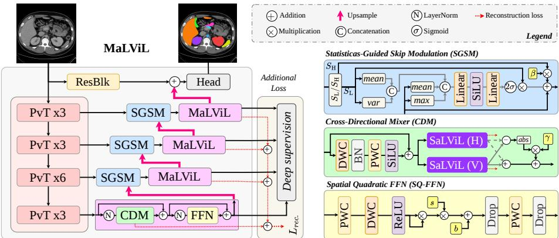
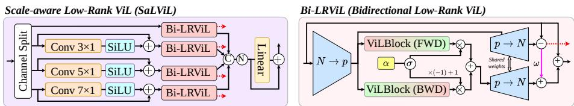
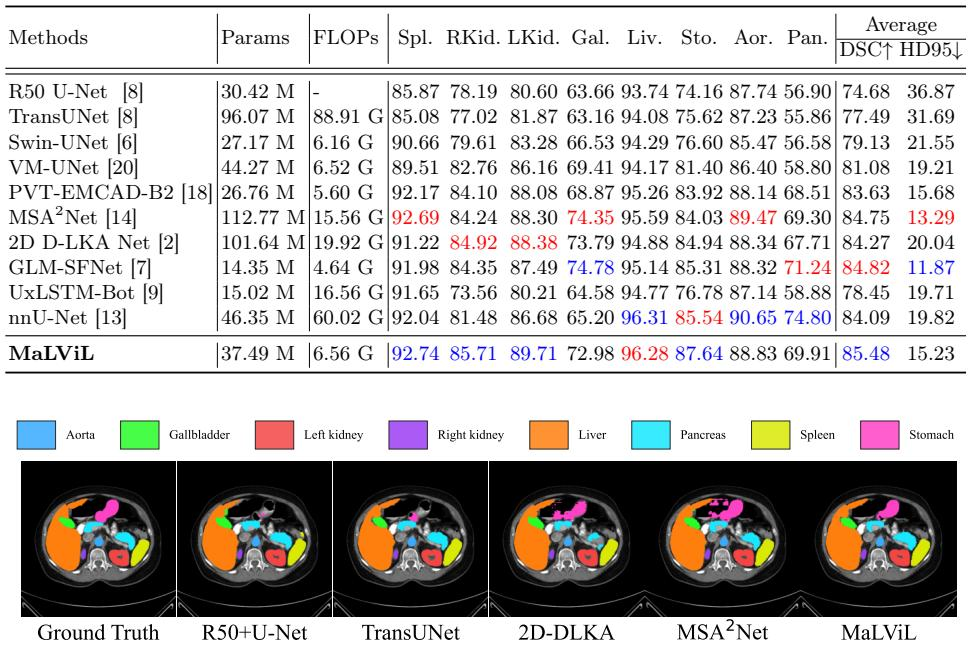
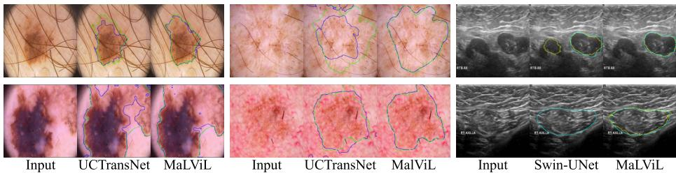
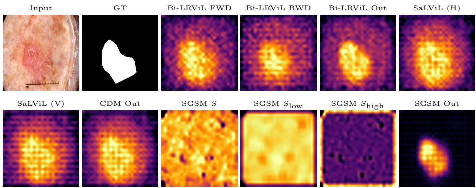

# MaLViL: Multi-axis Low-rank Vision-LSTM for Medical Image Segmentation

Afshin Bozorgpour1, Sina Ghorbani Kolahi2, Moein Heidari3, Ilker Hacihaliloglu3, and Dorit Merhof1,4

1 Faculty of Informatics and Data Science, University of Regensburg, Germany

2 Independent Computer Science Researcher, Tehran, Iran

3 University of British Columbia, Vancouver, BC, Canada

4 Fraunhofer Institute for Digital Medicine MEVIS, Bremen, Germany dorit.merhof@ur.de

Abstract. Vision-LSTM (ViL) enables eficient global modeling, but its cost still scales with the number of spatial tokens, so existing segmenters confine ViL to a coarse bottleneck and lose fine anatomical detail. Rasterizing 2D features into a 1D sequence further breaks adjacency across the orthogonal scan axis. We propose MaLViL, a Multi-axis Low-rank Vision-LSTM network that extends ViL across decoder resolutions. Bidirectional low-rank ViL (Bi-LRViL) reasons on a compact orthonormal subspace and preserves detail through an orthogonal residual; scale-aware SaLViL restores cross-axis neighbors before serialization; and a Cross-Directional Mixer (CDM) fuses orthogonal horizontal and vertical traversal paths. Statistics-Guided Skip Modulation (SGSM) further retains boundary cues in encoder skips. On skin-lesion, ultrasound, and multi-organ CT benchmarks, MaLViL achieves competitive or state-of-the-art segmentation accuracy, while reducing ViL operator memory by up to 83× at fine decoder resolutions. Code is available at: github.com/xmindflow/malvil.

Keywords: Medical image segmentation · Vision-LSTM (xLSTM) · Low-Rank Approximation · Multi-Scale Feature Integration

## 1 Introduction

Medical image segmentation (MIS) demands both precise delineation of fine anatomical boundaries and an understanding of long-range context [18]. Convolutional neural networks (CNNs) provide strong local inductive biases, but their efective receptive fields can limit global structural reasoning [14]. Vision Transformers (ViTs) address this limitation through self-attention, although its quadratic dependence on the number of image tokens is costly for high-resolution dense prediction [8]. More recently, state-space models such as Mamba have offered linear sequence modeling [11,20]; nevertheless, preserving two-dimensional locality while eficiently modeling global context remains an open challenge.

Vision-LSTM (ViL) [1], which adapts the matrix-memory mechanism of xL-STM [3] to visual sequences, provides an appealing alternative through bidirectional global modeling. Its application to dense segmentation, however, is constrained by the cost of processing long spatial sequences [9]. For a feature map with $N { = } H W$ tokens and channel width $d ,$ a ViL block incurs a sequence-dependent cost of $O ( N d ^ { 2 } )$ , making shallow, high-resolution decoder stages particularly demanding in computation and activation memory. Existing designs therefore tend to concentrate ViL processing at low-resolution stages, limiting its contribution to multi-scale reconstruction. Moreover, rasterizing a two-dimensional feature map into a one-dimensional sequence separates spatial neighbors orthogonal to the scan direction, weakening the locality required for boundary-sensitive segmentation.

To address these limitations, we propose MaLViL, a Multi-axis Low-rank Vision-LSTM architecture that extends ViL reasoning across decoder resolutions. Its central component, scale-aware low-rank ViL (SaLViL), projects dense spatial tokens onto a compact orthonormal subspace of rank $p \ll N$ , applies bidirectional ViL to the resulting sequence, and lifts the response back to the image grid. Although projection and reconstruction retain an $O ( N p )$ cost, the expensive ViL operation is performed on p rather than N tokens. A learnable channel-wise gate balances global subspace reasoning with information in the orthogonal residual. SaLViL further splits channels into multi-scale groups and, before rasterization, applies axis-aligned convolutions across the direction orthogonal to the ViL scan so that neighbors broken by flattening remain accessible. It is embedded in the Cross-Directional Mixer (CDM), which runs SaLViL on two rotated views (horizontal and vertical traversal paths) and fuses their shared response with cross-directional disagreement to recover oriented boundaries. In parallel, Statistics-Guided Skip Modulation (SGSM) separates smooth and high-frequency encoder information, suppressing semantic clutter without discarding useful boundary cues. Together, these components couple compact global modeling with explicit spatial and frequency-aware refinement.

MaLViL is evaluated across skin-lesion, breast-ultrasound, and multi-organ CT segmentation benchmarks against representative CNN-, Transformer-, statespace-, and ViL/xLSTM-based methods. Direct comparison with bottleneckand encoder-based ViL variants assesses whether low-rank modeling throughout the decoder ofers benefits beyond inserting the same block family at low resolution. The main contributions are: ❶ Multi-resolution low-rank ViL: an orthogonal subspace formulation that performs the costly bidirectional ViL operation on p compressed tokens and uses a learnable high-frequency residual gate to preserve local detail; ❷ Spatial- and frequency-aware refinement: SaLViL and CDM restore cross-directional context, while SGSM suppresses irrelevant skip responses without discarding boundary information; and ❸ Comprehensive validation: multi-modal experiments demonstrate consistent improvements over diverse segmentation architectures, supported by component ablations and operator-level memory analysis.

  
Fig. 1. MaLViL architecture. A hierarchical encoder feeds four MaLViL Blocks; the three encoder skips are fused by SGSM. Each block contains a Cross-Directional Mixer (CDM) followed by a Spatial Quadratic FFN (SQ-FFN). The dashed path denotes the auxiliary low-rank reconstruction loss.

## 2 Methodology

Overview. MaLViL is a hierarchical encoder–decoder for medical image segmentation (Figure 1). A hierarchical encoder produces features $\{ E _ { i } \} _ { i = 1 } ^ { 4 }$ at resolutions from 1/4 to $1 / 3 2$ of the input. Four MaLViL Blocks then reconstruct the prediction from coarse to fine, and Statistics-Guided Skip Modulation (SGSM) fuses the three available encoder skips:

$$
D _ { 4 } = \mathcal { M } _ { 4 } ( E _ { 4 } ) , \qquad D _ { i } = \mathcal { M } _ { i } ( \mathrm { S G S M } \left( \mathcal { U } ( D _ { i + 1 } ) , E _ { i } \right) ) , \ i = 3 , 2 , 1 ,\tag{1}
$$

where $\mathcal { M } _ { i }$ and U denote a MaLViL Block and upsampling, respectively. A shallow residual feature of the input is added after the final upsampling before the prediction head.

  
Fig. 2. SaLViL and Bi-LRViL. Left: scale-specific branches recover orthogonal neighbors before Bi-LRViL sequence modeling. Right: rank-p projection with opposite forward/backward ViL scans and gated fusion (α, ω).

MaLViL Block. For tokens $X \in \mathbb { R } ^ { B \times N \times C } , ~ N = H W$ , the block alternates directional context modeling and local spatial refinement within a pre-normalized

residual formulation:

$$
\tilde { X } = X + \gamma _ { c } \odot \mathrm { C D M } ( \mathrm { L N } ( X ) ) , \qquad Y = \tilde { X } + \gamma _ { f } \odot \mathrm { S Q F F N } ( \mathrm { L N } ( \tilde { X } ) ) ,\tag{2}
$$

where $\gamma _ { c }$ and $\gamma _ { f }$ control the contributions of the two residual paths. This organization first establishes long-range, multi-directional context and then restores local spatial detail.

Bidirectional Low-Rank ViL (Bi-LRViL). Applying ViL to all N spatial tokens is costly at shallow decoder stages. Bi-LRViL instead represents the spatial domain using a learned orthonormal basis $V \in \mathbb { R } ^ { N \times p } , p \ll \bar { N }$ , with $V ^ { \top } \bar { V } = I$ Omitting the batch dimension, projection and lifting are

$$
Z = V ^ { \top } X \in \mathbb { R } ^ { p \times C } , \qquad { \hat { X } } = V Z = V V ^ { \top } X , \qquad X _ { \bot } = X - { \hat { X } } .\tag{3}
$$

The expensive sequence operation therefore acts on p coeficients rather than all N tokens, while $X _ { \perp }$ preserves spatial information outside the compact subspace. ViL is then applied only to the p compressed coeficients. Along this serialized path, opposite forward and backward traversals capture context from both ends of the sequence; their outputs are mixed by a channel-wise gate $\alpha = \sigma ( a )$

$$
\bar { Z } = \alpha \odot \mathrm { V i L } _ { f } ( Z ) + ( 1 - \alpha ) \odot \mathrm { V i L } _ { b } ( Z ) , \quad Y = X + V ( \bar { Z } - Z ) - \omega \odot X _ { \perp } ,\tag{4}
$$

where $\omega = \sigma ( w )$ down-weights the orthogonal residual $X _ { \perp }$ when injecting the global update, preserving fine local structure that lies outside the low-rank subspace. The reconstruction regularizer $\ell _ { \mathrm { r e c } } = \mathrm { M S E } ( X , \hat { X } )$ encourages the learned basis to retain informative spatial variation.

SaLViL. Rasterizing a $H \times W$ map into $N { = } H W$ tokens preserves adjacency along the scan direction but separates neighbors across the orthogonal axis. SaLViL recovers this lost two-dimensional structure before low-rank sequence modeling (Figure 2). Channels are partitioned into scale-specific groups with complementary receptive fields $( \mathrm { e . g . , ~ } 1 { \times } 1 , ~ 3 { \times } 1 , ~ 5 { \times } 1 , ~ 7 { \times } 1$ in the current orientation). Within each group, lightweight axis-aligned convolutions are applied before serialization to aggregate context across the axis opposite to the ViL traversal, thereby bridging neighbors that would otherwise be distant in the flattened sequence. The enriched features are then rasterized and passed to Bi-LRViL, which performs global reasoning on only $p \ll N$ subspace coeficients per branch. Branch outputs are concatenated and adaptively remixed with the input.

Cross-Directional Mixer (CDM). A single rasterization path is inherently anisotropic: row-major scanning privileges one axis over the other. CDM therefore evaluates SaLViL on two orthogonal traversal paths (the native map and $9 0 ^ { \circ } .$ -rotated view), so horizontal and vertical neighborhoods are serialized and reasoned over symmetrically. Denoting the two responses by $F _ { H }$ and $F _ { V }$ , CDM retains their shared structure while restoring oriented detail suppressed by plain averaging:

$$
\mu = \frac { 1 } { 2 } ( F _ { H } + F _ { V } ) , \qquad A = \frac { 1 } { 2 } \big ( | F _ { H } - \mu | + | F _ { V } - \mu | \big ) , \qquad F _ { \mathrm { C D M } } = \mu + \gamma _ { h } \odot A .\tag{5}
$$

Because $A = { \textstyle \frac { 1 } { 2 } } | F _ { H } - F _ { V } |$ for two views, the learned scale $\gamma _ { h }$ re-injects crossdirectional disagreement as a direction-sensitive correction. A lightweight 3×3 residual pathway further supplies isotropic neighborhood context.

Statistics-Guided Skip Modulation (SGSM). Given decoder feature D and encoder skip S, SGSM decomposes the skip as $S _ { l } = \mathrm { A v g P o o l } _ { 3 \times 3 } ( S )$ and $S _ { h } =$ $S - S _ { l }$ . A compact MLP uses first- and second-order statistics of the smooth skip and decoder context to predict a channel gate:

$$
q = [ \mu ( S _ { l } ) , \mathrm { v a r } ( S _ { l } ) , \mu ( D ) , \mathrm { m a x } ( D ) ] , \qquad g = 2 \sigma ( \mathrm { M L P } ( q ) ) .\tag{6}
$$

Fusion is

$$
\mathrm { S G S M } ( D , S ) = D + g \odot S _ { l } + \beta \odot S _ { h } ,\tag{7}
$$

where $g \in [ 0 , 2 ]$ adaptively suppresses or enhances smooth semantic content, and the learned channel scale $\beta$ controls the propagation of high-frequency boundary detail. This decomposition prevents strong encoder activations from overwhelming the decoder while retaining useful fine structure.

Spatial Quadratic FFN (SQ-FFN) and objective. SQ-FFN complements global reasoning with a lightweight local transformation. After channel expansion and depthwise spatial mixing, a learnable quadratic activation $s \odot \mathrm { R e L U } ( x ) ^ { 2 } + b$ strengthens salient local responses before projection to the original width. The network is optimized using

$$
\mathcal { L } = \mathcal { L } _ { \mathrm { s e g } } + \lambda \mathcal { L } _ { \mathrm { r e c } } , \qquad \mathcal { L } _ { \mathrm { r e c } } = \frac { 1 } { 4 } \sum _ { i = 1 } ^ { 4 } \bar { \ell } _ { \mathrm { r e c } } ^ { i } , \quad \lambda = 0 . 0 1 ,\tag{8}
$$

where $\mathcal { L } _ { \mathrm { s e g } }$ is the benchmark-specific segmentation loss and $\overline { { \ell } } _ { \mathrm { r e c } } ^ { i }$ averages reconstruction errors over the SaLViL branches and directional responses at decoder stage i.

## 3 Experiments and Results

## Datasets and Experimental Setups.

All experiments are implemented in PyTorch and conducted on a single NVIDIA A5000 GPU with 24 GB memory. MaLViL uses an ImageNet-pretrained PVTv2- B2 encoder [23]; the final model is trained without deep supervision. Reported methods follow their established benchmark splits, and all retrained baselines use the same data partitions as MaLViL.

Synapse. The dataset contains 30 abdominal CT volumes. Following TransUNet [8], 18 volumes are used for training and 12 for testing. MaLViL is trained for 350 epochs with AdamW, batch size 8, and an initial learning rate of $1 0 ^ { - 4 }$ The retrained nnU-Net baseline [13] operates at its native 512×512 resolution. Its complexity is measured for one 2D slice, with one multiply–accumulate reported as one FLOP to match the convention used in the comparison tables. Skin-lesion and ultrasound segmentation. We evaluate PH2, HAM10000, ISIC 2017/2018, and BUSI using their established splits. The ISIC 2017 split contains 1,250 training, 150 validation, and 600 test images. Skin-lesion models are trained for 40 epochs at 224×224, while BUSI training uses 50 epochs at 256×256. Both settings use AdamW, batch size 8, an initial learning rate of $1 0 ^ { - 4 }$ , and the preprocessing and augmentation protocol of [5].

Table 1. Evaluation results on the Synapse dataset (blue indicates the best and red the second best results).  
  
Fig. 3. Qualitative comparison on the Synapse multi-organ dataset.

## 3.1 Comparative Results

Synapse. Table 1 reports MaLViL’s performance on the Synapse dataset, where it achieves a 0.66% DSC improvement over the previous best GLM-SFNet [7], and surpasses MSA2Net [14] and 2D D-LKA Net [2] by 0.73% and 1.21%, respectively, demonstrating its efectiveness across diverse abdominal organs. For additional reference against relevant model families, we retrain nnU-Net [13] at 512×512 and UxLSTM-Bot [9] at 224×224, using the same split. At their respective operating resolutions, MaLViL exceeds nnU-Net by 1.39 percentage points in mean DSC (85.48 vs. 84.09); their computational profiles are 6.56 and 60.02 G, respectively. MaLViL also improves over the bottleneck-only UxLSTM baseline by 7.03 percentage points (85.48 vs. 78.45), supporting the benefit of low-rank ViL throughout the decoder. Notably, nnU-Net remains highly competitive on well-defined structures such as the aorta and pancreas, whereas MaLViL yields more consistent gains across the smaller, harder organs, resulting in the best overall average. Fig. 3 further confirms MaLViL’s superior multi-scale accuracy for challenging structures such as the gallbladder, pancreas, and stomach.

  
Fig. 4. Qualitative segmentation on $\mathrm { P H } ^ { 2 }$ , HAM10000, and BUSI.

Skin Benchmarks. Table 2 shows that MaLViL consistently outperforms CNN-, Transformer-, hybrid, and Mamba-based architectures across the evaluated skin-lesion benchmarks. It improves upon CENet [4] by 0.64 and 0.46 percentage points in DSC on $\mathrm { P H ^ { 2 } }$ and HAM10000, respectively, and attains a state-ofthe-art DSC of 91.23% on ISIC 2018. On ISIC 2017 it reaches 92.08% DSC, second only to GLM-SFNet [7] (92.18%) while attaining the highest accuracy (97.15%). Fig. 4 qualitatively illustrates the resulting lesion boundaries on $\mathrm { P H ^ { 2 } }$ HAM10000, and BUSI.

Table 2. Comparison on $\mathrm { P H } ^ { 2 }$ , HAM10000, ISIC’17, ISIC’18, and BUSI datasets.
<table><tr><td rowspan=2 colspan=1>Methods|</td><td rowspan=1 colspan=1>PH2</td><td rowspan=1 colspan=1>HAM10000</td><td rowspan=2 colspan=1>MethodsD</td><td rowspan=1 colspan=1>ISIC2017</td><td rowspan=1 colspan=1>ISIC2018</td><td rowspan=2 colspan=1>Methods     ||D</td><td rowspan=2 colspan=1>BUSIice↑</td></tr><tr><td rowspan=1 colspan=1>Dice Acc.</td><td rowspan=1 colspan=1>|Dice Acc.</td><td rowspan=1 colspan=1>SC↑ ACC↑|D</td><td rowspan=1 colspan=1>SC↑ ACC↑</td></tr><tr><td rowspan=1 colspan=1>U-Net [19]</td><td rowspan=1 colspan=1>89.36 92.33|91.67</td><td rowspan=1 colspan=1>95.67</td><td rowspan=1 colspan=1>U-Net [19]</td><td rowspan=1 colspan=1>|89.89 96.13|</td><td rowspan=1 colspan=1>88.51 95.39</td><td rowspan=1 colspan=1>U-Net [19]    7</td><td rowspan=1 colspan=1>4.04</td></tr><tr><td rowspan=1 colspan=1>TransUNet [8]</td><td rowspan=1 colspan=1>88.4092.00</td><td rowspan=1 colspan=1>93.5396.49</td><td rowspan=1 colspan=1>VM-UNet [20]</td><td rowspan=1 colspan=1>90.70 96.45</td><td rowspan=1 colspan=1>89.9195.54</td><td rowspan=1 colspan=1>PraNet [10]</td><td rowspan=1 colspan=1>75.41</td></tr><tr><td rowspan=1 colspan=1>Swin-Unet [6]</td><td rowspan=1 colspan=1>94.49 96.78</td><td rowspan=1 colspan=1>92.63 96.16</td><td rowspan=1 colspan=1>VM-UNet v2 [25]</td><td rowspan=1 colspan=1>90.4596.37</td><td rowspan=1 colspan=1>89.0295.51</td><td rowspan=2 colspan=1>CaraNet [16]Swin-UNet [6]</td><td rowspan=2 colspan=1>77.3477.38</td></tr><tr><td rowspan=1 colspan=1>Att-UNet [17]</td><td rowspan=1 colspan=1>90.03 92.76</td><td rowspan=1 colspan=1>92.68 96.10</td><td rowspan=1 colspan=1>DermoSegDiff [5]</td><td rowspan=1 colspan=1>91.43 96.72</td><td rowspan=1 colspan=1>89.66 95.75</td></tr><tr><td rowspan=1 colspan=1>UCTransNet [22]</td><td rowspan=1 colspan=1>90.93 94.08</td><td rowspan=1 colspan=1>93.4696.84</td><td rowspan=1 colspan=1>EGE-UNet [21]</td><td rowspan=1 colspan=1>90.73 96.42</td><td rowspan=1 colspan=1>88.1995.10</td><td rowspan=1 colspan=1>TranFuse [27]</td><td rowspan=1 colspan=1>79.36</td></tr><tr><td rowspan=1 colspan=1>MissFormer [12]</td><td rowspan=1 colspan=1>85.5090.50</td><td rowspan=1 colspan=1>92.11 96.21</td><td rowspan=1 colspan=1>GLM-SFNet [7]</td><td rowspan=1 colspan=1>92.1897.08</td><td rowspan=1 colspan=1>90.64 96.04</td><td rowspan=1 colspan=1>U-Kan [15]</td><td rowspan=1 colspan=1>76.40</td></tr><tr><td rowspan=1 colspan=1>CENet [4]</td><td rowspan=1 colspan=1>95.04 97.19</td><td rowspan=1 colspan=1>94.71 97.10</td><td rowspan=1 colspan=1>UltraLight VM-UNet [24]</td><td rowspan=1 colspan=1>90.91 96.46</td><td rowspan=1 colspan=1>89.4095.58</td><td rowspan=1 colspan=1>UWT-net [26]</td><td rowspan=1 colspan=1>79.65</td></tr><tr><td rowspan=1 colspan=1>UxLSTM-Bot [9]</td><td rowspan=1 colspan=1>91.4694.46</td><td rowspan=1 colspan=1>93.8096.87</td><td rowspan=1 colspan=1>UxLSTM-Bot [9]</td><td rowspan=1 colspan=1>90.0096.46</td><td rowspan=1 colspan=1>89.9296.02</td><td rowspan=1 colspan=1>UxLSTM-Bot [9]</td><td rowspan=1 colspan=1>72.48</td></tr><tr><td rowspan=1 colspan=1>UxLSTM-Enc [9]]91.51</td><td rowspan=1 colspan=1>94.4293.71</td><td rowspan=1 colspan=1>96.89</td><td rowspan=1 colspan=1>UxLSTM-Enc [9]</td><td rowspan=1 colspan=1>90.1996.3889.78</td><td rowspan=1 colspan=1>96.04</td><td rowspan=1 colspan=1>[UxLSTM-Enc [9]</td><td rowspan=1 colspan=1>72.80</td></tr><tr><td rowspan=1 colspan=1>MaLViL</td><td rowspan=1 colspan=1>|95.68 97.71|</td><td rowspan=1 colspan=1>95.17 97.33</td><td rowspan=1 colspan=1>MaLViL</td><td rowspan=1 colspan=1>|92.08 97.15|</td><td rowspan=1 colspan=1>91.23 96.75</td><td rowspan=1 colspan=1>MaLViL      |</td><td rowspan=1 colspan=1>81.76</td></tr></table>

Ultrasound. As reported in Table 2, MaLViL achieves the highest listed BUSI Dice score of 81.76%, exceeding UWT-Net [26] by 2.11 percentage points. The examples in Fig. 4 show accurate lesion localization and boundary delineation. Ablation Studies. Figure 5 visualizes a representative ISIC 2017 example at the 28×28 decoder resolution. Bi-LRViL produces complementary forward and backward responses, which combine into a more coherent lesion representation. The horizontal and vertical SaLViL responses emphasize diferent spatial patterns, while CDM consolidates them into a coherent target region. SGSM further decomposes the encoder skip S into a smooth semantic component $S _ { \mathrm { l o w } }$ and a detail component $S _ { \mathrm { h i g h } }$ before producing the modulated skip output. Each activation map is normalized independently for visualization.

  
Fig. 5. Internal features on ISIC 2017 (28×28): Bi-LRViL, SaLViL/CDM, and SGSM activations (normalized per map).

Table 3. Component and eficiency analysis of MaLViL. (a) Progressive PH2 ablation at 224×224 (batch size 1); Mem. reports training-time forward/backward memory with gradients enabled, and excluded components use identity mappings. (b) Operator-level profiling of full- versus low-rank bidirectional ViL in isolation at each decoder resolution (batch size 8).  
(a) Component contribution
<table><tr><td>Configuration</td><td>Dice</td><td>FLOPs(G)</td><td>Mem.(MB)</td><td>Params(M)</td></tr><tr><td>Full ViL</td><td>93.72</td><td>8.83</td><td>1819.09</td><td>32.89</td></tr><tr><td>+ Low-rank</td><td>94.30</td><td>5.91</td><td>458.11</td><td>33.81</td></tr><tr><td>+ Bidirectional</td><td>94.57</td><td>6.05</td><td>482.39</td><td>36.21</td></tr><tr><td>+ SaLViL</td><td>94.93</td><td>6.02</td><td>531.29</td><td>36.94</td></tr><tr><td>+ CDM</td><td>95.32</td><td>6.60</td><td>630.24</td><td>37.34</td></tr><tr><td>+ SGSM</td><td>95.41</td><td>6.60</td><td>635.01</td><td>37.49</td></tr><tr><td>+ Lrec (MaLViL)</td><td>95.68</td><td>6.60</td><td>635.01</td><td>37.49</td></tr></table>

(b) Resolution eficiency
<table><tr><td rowspan="2">Stage N</td><td rowspan="2"></td><td colspan="2"> $\mathsf { \Gamma } _ { \mathsf { N e } ^ { \mathsf { m } } } . \mathsf { ( N ^ { B } ) }$ </td><td colspan="2"> $\mathbf { \pi } _ { \mathbf { F } } \mathbf { \mathbf { \bar { k } } } \mathbf { o } \mathbf { P } ^ { \ s \left( \mathbf { G } \right) }$ </td><td rowspan="2">Reduction</td></tr><tr><td>Full</td><td>LR</td><td>Full</td><td>LR</td></tr><tr><td>1</td><td>562</td><td>10796.4</td><td>129.5</td><td>14.17</td><td>0.55</td><td>83×</td></tr><tr><td>2</td><td>282</td><td>740.2</td><td>62.7</td><td>2.01</td><td>0.29</td><td>12×</td></tr><tr><td>3</td><td>14²</td><td>102.8</td><td>48.0</td><td>0.67</td><td>0.34</td><td>2.1×</td></tr><tr><td>4</td><td>72</td><td>56.3</td><td>53.8</td><td>0.34</td><td>0.27</td><td>1.0×</td></tr></table>

Component and eficiency analysis. Table 3(a) summarizes a progressive PH2 ablation at 224×224 (batch size 1). The memory column is measured with gradients enabled in a training-time forward/backward profile. Low-rank projection yields the largest eficiency gain (8.83→5.91 G FLOPs, 1819→458 MB) and improves Dice from 93.72% to 94.30%. Table 3(b) reports operator-level memory and computational costs for full and low-rank bidirectional ViL in isolation at each decoder resolution (batch size 8), rather than for the end-to-end network. At 56×56, low-rank ViL reduces operator memory by 83×, illustrating why MaLViL can apply ViL throughout the decoder where full-sequence modeling becomes impractical.

## 4 Conclusions

We presented MaLViL, a multi-resolution decoder that makes Vision-LSTM reasoning practical beyond the bottleneck through orthogonal low-rank projection. Bi-LRViL, SaLViL, and CDM capture global context across orthogonal traversal paths, while SGSM retains informative boundary cues during skip fusion. Experiments on skin-lesion, ultrasound, and abdominal CT segmentation demonstrate competitive or state-of-the-art accuracy, with substantial ViL memory savings at fine decoder resolutions.

## References

1. Alkin, B., Beck, M., Pöppel, K., Hochreiter, S., Brandstetter, J.: Vision-lstm: xlstm as generic vision backbone. arXiv preprint arXiv:2406.04303 (2024)

2. Azad, R., Niggemeier, L., Hüttemann, M., Kazerouni, A., Aghdam, E.K., Velichko, Y., Bagci, U., Merhof, D.: Beyond self-attention: Deformable large kernel attention for medical image segmentation. In: Proceedings of the IEEE/CVF Winter Conference on Applications of Computer Vision (WACV). pp. 1287–1297 (January 2024)

3. Beck, M., Pöppel, K., Spanring, M., Auer, A., Prudnikova, O., Kopp, M., Klambauer, G., Brandstetter, J., Hochreiter, S.: xlstm: Extended long short-term memory. Advances in Neural Information Processing Systems 37, 107547–107603 (2024)

4. Bozorgpour, A., Kolahi, S.G., Azad, R., Hacihaliloglu, I., Merhof, D.: Cenet: Context enhancement network for medical image segmentation. In: International Conference on Medical Image Computing and Computer-Assisted Intervention. pp. 120–129. Springer (2025)

5. Bozorgpour, A., Sadegheih, Y., Kazerouni, A., Azad, R., Merhof, D.: Dermosegdif: A boundary-aware segmentation difusion model for skin lesion delineation. In: International workshop on predictive intelligence in medicine. pp. 146–158. Springer (2023)

6. Cao, H., Wang, Y., Chen, J., Jiang, D., Zhang, X., Tian, Q., Wang, M.: Swinunet: Unet-like pure transformer for medical image segmentation. In: European conference on computer vision. pp. 205–218. Springer (2022)

7. Chen, J., Qi, F., Chang, C., Hu, Q., Fu, K., Wang, X., Liu, K.: Glm-sfnet: Globallocal vision-mamba with semantic fusion for medical image segmentation. In: International Conference on Medical Image Computing and Computer-Assisted Intervention. pp. 224–234. Springer (2025)

8. Chen, J., Lu, Y., Yu, Q., Luo, X., Adeli, E., Wang, Y., Lu, L., Yuille, A.L., Zhou, Y.: Transunet: Transformers make strong encoders for medical image segmentation. arXiv preprint arXiv:2102.04306 (2021)

9. Chen, T., Ding, C., Zhu, L., Xu, T., Ji, D., Wang, Y., Zang, Y., Li, Z.: xlstm-unet can be an efective 2d & 3d medical image segmentation backbone with vision-lstm (vil) better than its mamba counterpart. arXiv preprint arXiv:2407.01530 (2024)

10. Fan, D.P., Ji, G.P., Zhou, T., Chen, G., Fu, H., Shen, J., Shao, L.: Pranet: Parallel reverse attention network for polyp segmentation. In: International conference on medical image computing and computer-assisted intervention. pp. 263–273. Springer (2020)

11. Gu, A., Dao, T.: Mamba: Linear-time sequence modeling with selective state spaces. In: First conference on language modeling (2024)

12. Huang, X., Deng, Z., Li, D., Yuan, X., Fu, Y.: Missformer: An efective transformer for 2d medical image segmentation. IEEE transactions on medical imaging 42(5), 1484–1494 (2022)

13. Isensee, F., Jaeger, P.F., Kohl, S.A.A., Petersen, J., Maier-Hein, K.H.: nnu-net: a self-configuring method for deep learning-based biomedical image segmentation. Nature Methods 18(2), 203–211 (2021)

14. Kolahi, S.G., Chaharsooghi, S.K., Khatibi, T., Bozorgpour, A., Azad, R., Heidari, M., Hacihaliloglu, I., Merhof, D.: Msa ˆ2 net: Multi-scale adaptive attention-guided network for medical image segmentation. arXiv preprint arXiv:2407.21640 (2024)

15. Li, C., Liu, X., Li, W., Wang, C., Liu, H., Liu, Y., Chen, Z., Yuan, Y.: U-kan makes strong backbone for medical image segmentation and generation. In: Proceedings of the AAAI conference on artificial intelligence. vol. 39, pp. 4652–4660 (2025)

16. Lou, A., Guan, S., Ko, H., Loew, M.H.: Caranet: context axial reverse attention network for segmentation of small medical objects. In: Medical Imaging 2022: Image Processing. vol. 12032, pp. 81–92. SPIE (2022)

17. Oktay, O., Schlemper, J., Folgoc, L.L., Lee, M., Heinrich, M., Misawa, K., Mori, K., McDonagh, S., Hammerla, N.Y., Kainz, B., et al.: Attention u-net: Learning where to look for the pancreas. arXiv preprint arXiv:1804.03999 (2018)

18. Rahman, M.M., Munir, M., Marculescu, R.: Emcad: Eficient multi-scale convolutional attention decoding for medical image segmentation. In: Proceedings of the IEEE/CVF conference on computer vision and pattern recognition. pp. 11769– 11779 (2024)

19. Ronneberger, O., Fischer, P., Brox, T.: U-net: Convolutional networks for biomedical image segmentation. In: International Conference on Medical image computing and computer-assisted intervention. pp. 234–241. Springer (2015)

20. Ruan, J., Li, J., Xiang, S.: Vm-unet: Vision mamba unet for medical image segmentation. ACM Transactions on Multimedia Computing, Communications and Applications (2024)

21. Ruan, J., Xie, M., Gao, J., Liu, T., Fu, Y.: Ege-unet: an eficient group enhanced unet for skin lesion segmentation. In: International conference on medical image computing and computer-assisted intervention. pp. 481–490. Springer (2023)

22. Wang, H., Cao, P., Wang, J., Zaiane, O.R.: Uctransnet: rethinking the skip connections in u-net from a channel-wise perspective with transformer. In: Proceedings of the AAAI conference on artificial intelligence. vol. 36, pp. 2441–2449 (2022)

23. Wang, W., Xie, E., Li, X., Fan, D.P., Song, K., Liang, D., Lu, T., Luo, P., Shao, L.: Pvt v2: Improved baselines with pyramid vision transformer. Computational visual media 8(3), 415–424 (2022)

24. Wu, R., Liu, Y., Liang, P., Chang, Q.: Ultralight vm-unet: Parallel vision mamba significantly reduces parameters for skin lesion segmentation. arxiv 2024. arXiv preprint arXiv:2403.20035 (2024)

25. Zhang, M., Yu, Y., Jin, S., Gu, L., Ling, T., Tao, X.: Vm-unet-v2: rethinking vision mamba unet for medical image segmentation. In: International symposium on bioinformatics research and applications. pp. 335–346. Springer (2024)

26. Zhang, P., Ouyang, X., Peng, R.: Uwt-net: Mining low-frequency feature information for medical image segmentation. In: International Conference on Medical Image Computing and Computer-Assisted Intervention. pp. 615–624. Springer (2025)

27. Zhang, Y., Liu, H., Hu, Q.: Transfuse: Fusing transformers and cnns for medical image segmentation. In: International conference on medical image computing and computer-assisted intervention. pp. 14–24. Springer (2021)