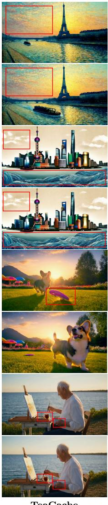
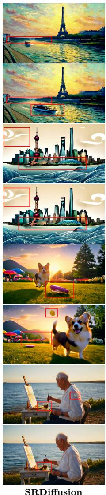
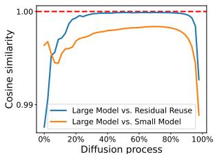
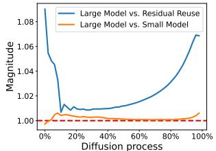
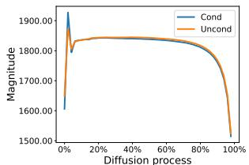
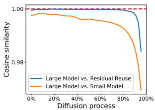
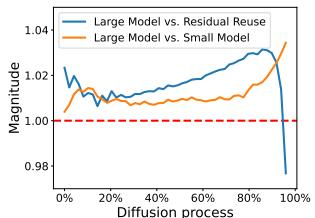
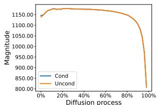
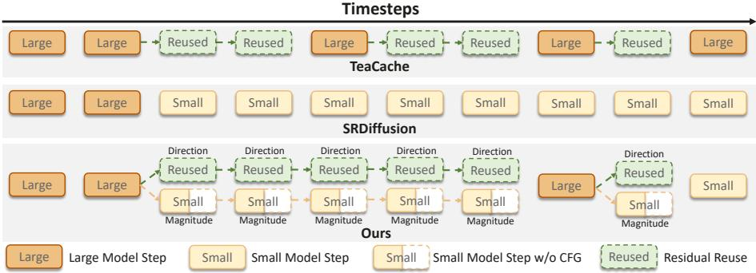
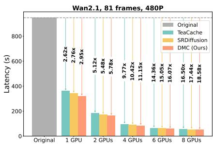

# Magnitude-Direction Decoupling for Fast Video Generation with Flow Matching Models

Haonan Xu1,2\*,†, Feiyang Chen2, Songkui Chen2, Hongpeng Pan2, Zhefeng Wang2, Xinyu Duan2, Baoxing Huai2, and Yang Yang1\*,‡

1 Nanjing University of Science and Technology, Nanjing, China 2 Huawei, Shanghai & Hangzhou, China

Abstract. Flow matching models for video generation achieve impressive performance but sufer from high computational overhead due to iterative denoising. In fact, the original model is not necessary for all denoising steps, allowing some steps to use lightweight alternatives for faster sampling. However, directly using caching or lightweight models can deviate from the original denoising trajectory, resulting in suboptimal performance. Through empirical analysis, we find that lightweight models can robustly capture the magnitude components of the original model’s output, while caching provides reliable directional guidance. Building on this insight, we propose the Magnitude-Direction Decoupling (MDD) method, which adaptively employs a direction-calibrated lightweight model as a substitute for the original model to accelerate inference and efectively correct deviations in the denoising trajectory. Moreover, MDD further reduces inference costs by reusing magnitude information under classifier-free guidance (CFG). As a result, MDD ofers a more reliable and lightweight solution to accelerate sampling. Experiments show that MDD outperforms existing acceleration methods, delivering promising speedups (e.g., up to 2.95× on Wan2.1) while preserving high visual fidelity and content richness.

Keywords: Fast Video Generation · Flow Matching Models · Magnitude-Direction Decoupling

## 1 Introduction

Driven by difusion models [8, 11], visual generation has achieved remarkable success in recent years. A growing body of research [29, 41, 46, 48, 52] continues to explore the frontiers of difusion models, achieving impressive levels of fidelity and temporal coherence in video generation. Notably, flow matching [20] has emerged as a compelling framework for achieving faster convergence and improved controllability in video generation [9, 24], and it is widely being adopted by state-of-the-art (SOTA) methods.

However, the prohibitive inference latency of difusion models remains a critical bottleneck [18]. This core limitation arises from the inherently sequential

TeaCache

  
Latency: 948s

  
Latency: 362s (2.62×) LPIPS: 0.208  
Latency: 344s (2.76×) LPIPS: 0.240  
MDD (Ours)  
Latency: 321s (2.95×) LPIPS: 0.178  
Fig. 1: Comparison of visual fidelity and sampling speed with competing methods. Latency is measured on a single A100 GPU. LPIPS denotes learned perceptual image patch similarity. Video synthesis configuration: 81 frames, 5s, 480P on Wan2.1-14B. Our method consistently generates outputs that better preserve the visual fidelity and richness of the original video content while achieving enhanced acceleration performance. The limitations of competing methods are highlighted in red boxes and are best examined under zoomed-in view.

denoising process, which becomes even more pronounced as models scale to higher resolutions and longer video durations [3]. Existing work based on distillation [32, 33] or post-training quantization [4] ofers potential acceleration but requires costly model training and additional data resources. In contrast, training-free methods, including cache-based methods [21, 30] and large-small model collaborative inference method [6], recognize that the original model is not required for all denoising steps and instead employ lightweight substitutes for certain steps to accelerate sampling. These methods are easy to use, costefective, and generally applicable, making them the main focus of this work.

Cache-based methods [5, 30] observe that model outputs are similar across consecutive timesteps during denoising and propose to reduce redundancy using caching mechanisms, such as residual reuse [31]. Although caching captures this redundancy, its static nature can cause rapid error accumulation and degrade performance under high cache reuse rates (example in Figure 1, Teacache [22]). The large-small model collaborative inference method SRDifusion [6] posits that the original large model plays a critical role during the initial stages of semantic construction. In the subsequent stages, a small model from the same family can be employed to refine visual details, serving as a lightweight alternative that accelerates the process. Despite the promising acceleration benefits, directly using the bias output of a limited-capacity small model may lead to denoising trajectory deviations, resulting in suboptimal content richness and visual retention (example in Figure 1, SRDifusion [6]).

In this work, we conduct an error source analysis under the flow matching framework, comparing cache-based residual reuse outputs and lightweight model outputs with those of the original large model. By decoupling the output into magnitude and directional components, our empirical analysis shows that errors in residual-reuse outputs primarily arise from magnitude discrepancies, while the directional component is well approximated. In contrast, errors in lightweight model outputs are mainly due to directional misalignment, whereas the magnitude information is estimated reliably.

Based on these insights, we propose a novel method called MDD, which accelerates sampling by adaptively employing a reliable lightweight alternative to the original large model. Specifically, MDD improves the outputs of lightweight models by calibrating them along directions obtained from residual reuse, enabling the lightweight alternative output to better approximate the original denoising trajectory. To prevent the accumulation of directional errors from invariant residual reuse, MDD adaptively switches to the original large model for directional recalibration when it detects excessive error growth. Moreover, MDD further reduces inference costs by reusing magnitude information under CFG. As a result, MDD can preserve the content of the original video more faithfully while delivering improved acceleration (example in Figure 1, MDD). Qualitative experimental comparisons demonstrate that our MDD outperforms existing acceleration strategies in both sampling eficiency and visual fidelity, verifying the efectiveness of our proposal.

In summary, our contributions are as follows:

– We empirically find that, under the flow matching framework, the lightweight model can robustly estimate the output magnitude component of the original large model from the same family, while reusing cached residuals can reliably approximate the directional component.

– We propose MDD, which adaptively employs a direction-calibrated small model as a lightweight alternative to the original large model during inference, while maintaining a faithful approximation of the original denoising trajectory. It also introduces CFG reuse to further accelerate inference.

We evaluate MDD on various flow-based video generation models and demonstrate that our approach consistently outperforms existing acceleration strategies, achieving greater speedups while simultaneously delivering superior visual fidelity and content richness.

## 2 Related Work

Difusion and Flow-based Models. In generative modeling, difusion models [11, 36] have become foundational for their ability to produce high-quality, diverse outputs [1, 2]. Early methods, such as DDPM [11], DDIM [37], and EDM [15], are score-based models that learn the stochastic diferential equations (SDEs) governing the difusion process. In contrast, flow matching [20] provides an alternative by using ordinary diferential equations (ODEs) to model sample trajectories, ofering more stable and eficient generation through a deterministic mapping from the prior to the target distribution. Numerous studies [9, 16, 24] have shown that flow matching models converge faster and ofer better controllability in video generation, making them a strong alternative to stochastic difusion models with better interpretability and stability. Thus, our analysis is based on flow matching models, aiming to provide a lightweight alternative that enables more eficient sampling.

Difusion Model Acceleration. Due to their high sampling costs, difusion models have prompted extensive eforts for acceleration. One line of research focuses on methods based on training or fine-tuning, such as post-training quantization [4, 10, 17, 35, 42] and step distillation [19, 27, 32–34, 38]. However, they necessitate costly retraining and additional data resources, which can constrain their feasibility for broad implementation.

Another line of research focuses on training-free methods. Foundational methods like DDIM [37] enable fewer sampling steps without sacrificing quality. Additional studies use eficient ODE or SDE solvers [15, 25, 39], employing pseudonumerical methods for faster sampling. Furthermore, a series of studies [5,30,49] have shown that not every step in the iterative denoising process requires the full original model, motivating various lightweight alternatives to accelerate sampling. Cache-based methods [23, 31, 44] exploit redundancies in model outputs across consecutive timesteps, caching outputs according to criteria such as content complexity (AdaCache [14]) or timestep embeddings (Teacache [22]) to reduce computational overhead. Large-small model collaborative inference strategies [47] leverage lightweight models from the same family as substitutes to accelerate sampling. For example, SRDifusion [6] uses the original large model during the early stages of denoising to generate coarse semantic structures, which are then refined by a lightweight model responsible for producing fine visual details. However, the limited capacity of the lightweight model can lead to deviations from the original large model’s denoising trajectory, compromising content richness and visual retention.

## 3 Preliminaries

Flow Matching [20] is a family of generative models that transport samples from a data distribution $p _ { 0 } ( x )$ into a simple prior distribution $p _ { 1 } ( x ) ~ ( \mathrm { e . g . , G a u s \mathrm { - } }$ sian). The probability path $p _ { t } ( x )$ is constructed to interpolate between $p _ { 0 } ( x )$ and $p _ { 1 } ( x )$ over the continuous time variable $t \in [ 0 , 1 ]$ , and is commonly defined using linear interpolation [9]:

$$
p _ { t } ( x ) = ( 1 - t ) \cdot p _ { 0 } ( x ) + t \cdot p _ { 1 } ( x ) .
$$

The flow matching model is trained by learning a time-dependent velocity field $\begin{array} { r } { \frac { d } { d t } x _ { t } = v _ { \theta } ( x _ { t } , t ) } \end{array}$ , where $v _ { \theta } ( x _ { t } , t )$ is parameterized by a neural network with parameters \theta . Formally, the model is optimized by minimizing the following loss function:

$$
\mathcal { L } _ { \mathrm { F M } } ( \theta ) = \mathbb { E } _ { t , x _ { 0 } \sim p _ { 0 } ( x ) , x _ { 1 } \sim p _ { 1 } ( x ) } \left[ v _ { \theta } ( x _ { t } , t ) - ( x _ { 1 } - x _ { 0 } ) \right] .
$$

At generation time, new samples can be generated using any ODE solver [40]. Residual Reuse. A series of studies [14,22] have consistently observed that the denoising process often involves redundant computations, suggesting that reuse strategies could be employed to skip certain steps. Specifically, we define the residual r at timestep t as the diference between the model’s output and the corresponding input:

$$
r = v _ { \theta } ( x _ { t } , t ) - x _ { t } .\tag{1}
$$

In subsequent steps, this residual can be reused by adding it to the input, thus directly estimating the residual reuse output (e.g., $\hat { v } _ { \theta } ( x _ { t - 1 } , t - 1 ) = x _ { t - 1 } + r )$ Although r efectively captures the update signal, repeatedly reusing an invariant residual may result in cumulative errors, which can ultimately degrade the quality of the generated visual output.

Classifier-Free Guidance (CFG) [12] is a widely adopted strategy for improving the quality of conditional generation by steering samples toward the specified input condition. Let c denote the input condition, such as a class label or a text prompt. In CFG, a single flow model $\boldsymbol { v } _ { \theta } ( \boldsymbol { x } _ { t } , t ~ \mid ~ \boldsymbol { c } )$ is trained to output both conditional and unconditional velocity fields. During sampling, the model performs two forward evaluations: one conditioned on c and the other unconditioned, with $c = \emptyset$ . The guided velocity field is formed by:

$$
v _ { \theta } ^ { \mathrm { c f g } } ( x _ { t } , t \mid c ) = v _ { \theta } ( x _ { t } , t \mid c = \emptyset ) + w \cdot \Big ( v _ { \theta } ( x _ { t } , t \mid c ) - v _ { \theta } ( x _ { t } , t \mid c = \emptyset ) \Big ) ,\tag{2}
$$

where w denotes the guidance scale. In particular, setting $w = 1$ corresponds to the non-guided case.

  
(a) Directional Similarity

Wan2.1 (large model: 14B, small model: 1.3B)  
  
(b) Magnitude Similarity

  
(c) CFG Similarity

EasyAnimateV5.1 (large model: 12B, small model: 7B)  
  
(d) Directional Similarity

  
(e) Magnitude Similarity

  
(f ) CFG Similarity  
Fig. 2: Visualization of decoupled model output relationships. (a,d) directional similarities of $v _ { \theta } ( x _ { t } , t )$ with $v _ { \varphi } ( x _ { t } , t )$ and $\hat { v } _ { \theta } ( x _ { t } , t ) ; ( \mathrm { b , e } )$ magnitude ratios of $v _ { \theta } ( x _ { t } , t )$ to $v _ { \varphi } ( x _ { t } , t )$ and to $\hat { v } _ { \theta } ( x _ { t } , t ) ; ( \mathrm { c , f ) }$ magnitudes of $v _ { \varphi } ( x _ { t } , t \mid c )$ (Cond) and $v _ { \varphi } ( x _ { t } , t \mid c = \varnothing )$ (Uncond). Directional similarities are evaluated using cosine similarity, and magnitudes are measured using $\ell _ { 2 }$ norms.

## 4 Proposed Method

## 4.1 Empirical Analysis

Recent flow-based model families [41, 46] ofer both large and small model variants. By sharing a unified VAE within these model families, the models enable seamless switching between the high-capacity large model (θ) and the lightweight small model $\left( \varphi \right)$ during sampling, thus opening up opportunities for large-small model collaboration to accelerate inference.

Let $v _ { \theta } ( x _ { t } , t )$ and $v _ { \varphi } ( x _ { t } , t )$ denote the outputs of the large and small models, respectively, and $\hat { v } _ { \theta } ( x _ { t } , t )$ represents the residual-reused outputs from the original large model. In this paper, we explore how $v _ { \varphi } ( x _ { t } , t )$ and $\hat { v } _ { \theta } ( x _ { t } , t )$ relate to $v _ { \theta } ( x _ { t } , t )$ , aiming to identify better lightweight alternatives for replacing the costly inference of the original large model. Specifically, we decouple the model outputs into direction and magnitude components for separate analysis. As shown in Figures 2a, 2b, 2d, and 2e, based on the empirical analysis of the intermediate difusion process (i.e., from 20% to 95%), we derive two key observations:

Observation 1: In terms of directional component, the residual-reuse outputs $\hat { v } _ { \theta } ( x _ { t } , t )$ are closely aligned with those of the original large model $v _ { \theta } ( x _ { t } , t )$ ， $i . e .$ , sim $( \hat { v } _ { \theta } ( x _ { t } , t ) , v _ { \theta } ( x _ { t } , t ) ) \approx 1$ , where $s i m ( \cdot , \cdot )$ denotes the cosine similarity. In contrast, the small model’s directional estimates typically diverge more, i.e., si $\iota ( v _ { \theta } ( x _ { t } , t ) , \hat { v } _ { \theta } ( x _ { t } , t ) ) > s i m ( v _ { \theta } ( x _ { t } , t ) , v _ { \varphi } ( x _ { t } , t ) )$

Observation 2: In terms of magnitude component, the small-model outputs $v _ { \varphi } ( x _ { t } , t )$ closely resemble those of the large model $\begin{array} { r } { \boldsymbol { v } _ { \theta } ( \boldsymbol { x } _ { t } , t ) , ~ i . e . , ~ \frac { \| \boldsymbol { v } _ { \theta } ( \boldsymbol { x } _ { t } , t ) \| _ { 2 } } { \| \boldsymbol { v } _ { \varphi } ( \boldsymbol { x } _ { t } , t ) \| _ { 2 } } \approx 1 } \end{array}$ 2 where ∥ · ∥ denotes the $\ell _ { 2 }$ norm. In contrast, the residual-reuse outputs typically show a larger magnitude discrepancy, i.e., $\begin{array} { r } { \left| \frac { \| v _ { \theta } ( x _ { t } , t ) \| _ { 2 } } { \| v _ { \varphi } ( x _ { t } , t ) \| _ { 2 } } - 1 \right| < \left| \frac { \| v _ { \theta } ( x _ { t } , t ) \| _ { 2 } } { \| \hat { v } _ { \theta } ( x _ { t } , t ) \| _ { 2 } } - 1 \right| } \end{array}$

With respect to the direction component, the residual-reuse outputs closely approximate those of the large model, whereas the small-model outputs display directional deviations. This implies that directly employing a capacity-limited lightweight model for collaborative inference may cause it to diverge from the large model’s denoising trajectory, ultimately leading to suboptimal visual retention. Conversely, the learning objective in flow matching models allows for eficient capture of directional information through residual reuse, a finding also supported by [31].

With respect to magnitude component, the outputs of the large and small models are comparatively consistent. This suggests that the small model can serve as an efective lightweight proxy for the large model in estimating output magnitude. However, consecutive reuse of residual outputs with inconsistent magnitudes can result in rapid error accumulation, ultimately degrading visual quality.

Collectively, in approximating the outputs of the large model, the residualreuse outputs provide more accurate directional estimates, whereas the smallmodel outputs better capture the output magnitudes. This insight informs the design of our subsequent acceleration strategy.

## 4.2 Acceleration Strategy

In this subsection, building upon the previous empirical analysis, we propose a novel sampling acceleration strategy called MDD. The objective is to provide a reliable and lightweight alternative to the original large model. The framework of our proposal and its comparison with competing methods are illustrated in Figure 3, with a detailed description provided below.

Lightweight Alternative Strategy. As discussed in Section 4.1, $\hat { v } _ { \theta } ( x _ { t } , t )$ and $v _ { \varphi } ( x _ { t } , t )$ are, respectively, more accurate in capturing the direction and magnitude components of the original large model output $v _ { \theta } ( x _ { t } , t )$ . By leveraging this complementary advantage, MDD retains the magnitude from the lightweight model $v _ { \varphi } ( x _ { t } , t )$ while utilizing the residual-reused output $\hat { v } _ { \theta } ( x _ { t } , t )$ to guide the direction. Formally, at timestep t with input $x _ { t }$ and condition $c ,$ the output estimated by our MDD strategy can be expressed as:

$$
v _ { \mathrm { M D D } } ( x _ { t } , t \mid c ) = \underbrace { \lVert v _ { \varphi } ( x _ { t } , t \mid c ) \rVert _ { 2 } } _ { \mathrm { M a g n i t u d e } } \cdot \underbrace { \frac { \hat { v } _ { \theta } ( x _ { t } , t \mid c ) } { \lVert \hat { v } _ { \theta } ( x _ { t } , t \mid c ) \rVert _ { 2 } } } _ { \mathrm { D i r e c t i o n } } .\tag{3}
$$

Compared to SRDifusion [6], which performs sampling directly using a small model with directional prediction biases, MDD improves by calibrating the direction through residual reuse. As a result, MDD more closely approximates the denoising trajectory of the original large model, thus enhancing visual retention. Compared with Teacache [22], a cache-based method that reuses invariant residuals, MDD combined with the lightweight assistance of the small model for magnitude prediction. From the perspective of caching, MDD equips residual reuse with magnitude-aware capabilities, thereby improving visual fidelity.

  
Fig. 3: Comparison of our method with the adaptive caching method, TeaCache [22], and the large-small model collaborative inference strategy, SRDifusion [6]. Our method improves the approximation of the original large output by combining direction esti-1 Huawei Proprietary - Restricted Distributionmation from residual reuse with magnitude estimation from the small model, ofering a more reliable lightweight alternative for accelerating inference.

CFG Reuse. As illustrated in Figures 2c and 2e, the magnitude of the model outputs in CFG are nearly identical for both the conditional output $v _ { \varphi } ( x _ { t } , t \mid c )$ and the unconditional output $v _ { \varphi } ( x _ { t } , t \mid c = \varnothing )$ , i.e., $\| v _ { \varphi } ( x _ { t } , t \mid c ) \| _ { 2 } \approx \| v _ { \varphi } ( x _ { t } , t \mid$ $c = \varnothing ) \| _ { 2 }$ . Consequently, a single forward evaluation to compute the magnitude of the conditional output in CFG is suficient. This magnitude information can then be combined with both the residual-guided conditional and unconditional directions, further halving the inference cost of the small model. Formally, the unconditional output estimated by our MDD is expressed as:

$$
v _ { \mathrm { M D D } } ( x _ { t } , t \mid c = \emptyset ) = \underbrace { \lVert v _ { \varphi } ( x _ { t } , t \mid c ) \rVert _ { 2 } } _ { \mathrm { R e u s e } } \cdot \frac { \hat { v } _ { \theta } ( x _ { t } , t \mid c = \emptyset ) } { \lVert \hat { v } _ { \theta } ( x _ { t } , t \mid c = \emptyset ) \rVert _ { 2 } } .\tag{4}
$$

Adaptive Strategy. The reuse of invariant residuals for direction estimation lacks the intrinsic self-correction capability present in small-model magnitude estimation. As a result, even minor directional errors can accumulate progressively over successive reuse steps, leading to significant error amplification. Once the directional error exceeds a tolerable threshold, it becomes necessary to invoke the original large model to promptly correct the direction. In practice, we employ the cumulative cosine error of the output directional components as the criterion for triggering MDD. To reduce the computational cost associated with repeated forward passes of the large model, we instead utilize the small model as a surrogate to estimate the directional error. Formally, we maintain a running

Algorithm 1 Magnitude-Direction Decoupling (MDD)   
1: Initialize latent variable x , MDD interval [T , T ], directional error E, and thresh  
old τ   
2: for each timestep t in $\{ T _ { 2 } , \ldots , T _ { 1 } \}$ do   
3: if $\mathcal { E } > \tau$ then   
4: Predict outputs: v ← LargeMode $\textstyle ( x _ { t } , t )$ # With CFG   
5: Cache residuals: $r  v _ { t } - x _ { t }$   
6: Reset the error: $\varepsilon \gets 0$   
7: else   
8: Predict output: v′t ← SmallModel(xt, t) # Without CFG   
9: Reuse residuals: $\hat { v } _ { t } \gets x _ { t } + r$   
10: MDD: vt ← norm $\left( \boldsymbol { v } _ { t } ^ { \prime } \right) \cdot \left( \boldsymbol { \hat { v } _ { t } } \right) /$ norm(ˆvt))   
11: Update the error: $\mathcal { E }  \mathcal { E } +$ directional error of $\boldsymbol { v } _ { t } ^ { \prime }$   
12: end if   
13: Update latents: $x _ { t - 1 } \gets \mathrm { O D E S t e p } ( v _ { t } , t , x _ { t } )$   
14: end for   
15: return $x _ { T _ { 1 } }$

cumulative error E defined as:

$$
\mathcal { E } = \sum _ { i = t } ^ { t ^ { \prime } - 1 } \Bigl ( 1 - \sin ( v _ { \varphi } ( x _ { i } , i \mid c ) , v _ { \varphi } ( x _ { t ^ { \prime } - 1 } , t ^ { \prime } - 1 \mid c ) ) \Bigr ) ,\tag{5}
$$

where $t ^ { \prime }$ denotes the most recent timestep at which a residual is cached, and sim $( \cdot , \cdot )$ represents the cosine similarity. $\mathcal { E }$ quantifies the accumulated deviation of output directions over successive timesteps: smaller values indicate that the directions remain well-aligned and can be safely reused, whereas larger values trigger the use of the original large model to update the directions. Accordingly, the decision function at timestep t is defined as:

$$
D _ { \tau } ( t ) = \left\{ { \begin{array} { l l } { v _ { \mathrm { M D D } } ( x _ { t } , t \mid c ) , } & { { \mathrm { i f ~ } } \mathcal { E } \leq \tau ; } \\ { v _ { \theta } ( x _ { t } , t \mid c ) , } & { { \mathrm { i f ~ } } \mathcal { E } > \tau , } \end{array} } \right.\tag{6}
$$

where τ denotes the threshold for the maximum tolerable directional error, serving to balance computational eficiency and visual quality. The pseudo code of MDD is available in Algorithm 1.

Discussion of threshold τ. Following prior work [6, 22], we adopt a fixed threshold to trigger switching in the original large model for corrective purposes. In practice, the error accumulation is driven by the small neural network, and under a fixed threshold, this naturally enables dynamic, self-adaptive adjustment, allowing the strategy to be modulated according to the generated error for diferent inputs. For parameter selection, a practical approach is to perform a parameter sweep over τ on a small subset of samples from the new model, relating the threshold to perceptual quality metrics. For each candidate value, quality-preservation metrics such as SSIM [43] or LPIPS [50] can be evaluated against the baseline (non-accelerated) results. The largest τ that maintains an acceptable quality level $( \mathrm { e . g . , S S I M > 0 . 7 } )$ is then selected as the final threshold.

## 5 Experiments

In this section, we first describe our experimental setup, then present the comparison of quantitative results, followed by the ablation study and further analysis.

## 5.1 Experimental setup

Base Models and Baselines. To verify the efectiveness of our method, we compare it against the most competitive methods across diferent flow matching models. Specifically, we apply our acceleration method to Wan2.1 [41] and EasyAnimateV5.1 [46], each ofered in two model scales with a shared VAE. Wan2.1 ofers 14B and 1.3B variants, while EasyAnimateV5.1 provides 12B and 7B variants. We compare our method with two competitive baselines: the largesmall model collaborative inference method, SRDifusion [6], and the cache-based method, TeaCache [22].

Evaluation Metrics. For the quantitative evaluation of video generation acceleration methods, we focus on two key aspects: inference eficiency and visual quality. Following [6,22], inference eficiency is assessed via per-sample inference latency, whereas visual quality is evaluated using VBench [13] in conjunction with three widely adopted metrics capturing perceptual consistency, pixel-level fidelity, and structural similarity: Learned Perceptual Image Patch Similarity (LPIPS) [50], Peak Signal-to-Noise Ratio (PSNR), and Structural Similarity Index Measure (SSIM) [43].

Implementation Detail. Following the evaluation setup in [22], we use the standard prompt set provided by VBench [13] for text-conditioned video generation. All experiments are conducted on NVIDIA A100 GPUs, with FlashAttention [7] enabled by default. Latency is measured on a single A100 GPU. Following [31, 45], we preserve the first 20% of the difusion steps with the large model for TeaCache and our MDD, as these initial steps are critical to the overall generation process. In line with [22], the error accumulation threshold for the TeaCache baseline is set to 0.2. According to [6], the threshold for transitioning from the large model to the small model in the SRDifusion baseline is set to 0.1. For our MDD, we set the cumulative directional error threshold τ in Eq. (6) to 0.005. Furthermore, we employ the small model for the final 5% of the steps to ensure the reliability of visual outputs.

## 5.2 Main Results

Table 1 provides a comprehensive quantitative evaluation of our method compared to the most competitive baselines. The results indicate that: (1) our MDD consistently achieves highest acceleration (2.95× for Wan2.1, 1.90× for EasyAnimateV5.1) while preserving high visual retention (e.g., LPIPS 0.178, PSNR 22.72, SSIM 0.748 on Wan2.1), demonstrating the efectiveness of our lightweight alternative strategy; (2) compared with the large-small model collaborative inference baseline SRDifusion, MDD leverages direction-calibrated outputs from a lightweight model to more faithfully approximate of the original denoising trajectory, rather than directly using the biased directional predictions of the small model for acceleration. This design, further enhanced by CFG reuse, yields higher acceleration while delivering superior visual retention; and (3) compared with the cache-based baseline TeaCache, MDD can be considered as adopting a magnitude-aware residual reuse strategy assisted by the lightweight model, rather than relying on invariant residual reuse. Consequently, our method can achieve higher reuse rates through more reliable lightweight substitutions, enabling faster acceleration while maintaining better visual fidelity.

Table 1: Quantitative evaluation of inference eficiency and visual quality in video generation models. Visual retention metrics, including LPIPS, SSIM, and PSNR, are calculated against the original large models (Wan2.1-14B and EasyAnimateV5.1-12B).
<table><tr><td rowspan="2">Method</td><td colspan="2">Efficiency</td><td colspan="3">Visual Quality</td></tr><tr><td></td><td></td><td>Speedup↑ Latency↓LPIPS↓ PSNR↑ SSIM↑ VBench↑</td><td></td><td></td></tr><tr><td colspan="6">Wan2.1 (832×480, 81 frames, T = 50)</td></tr><tr><td>Wan2.1-14B</td><td>1×</td><td>948 s</td><td></td><td></td><td>83.09%</td></tr><tr><td>Wan2.1-1.3B</td><td></td><td>192 s</td><td>0.597 11.81</td><td>0.336</td><td>81.00%</td></tr><tr><td>TeaCache [22]</td><td>2.62×</td><td>362 s 0.208</td><td>20.95</td><td>0.680</td><td>82.41%</td></tr><tr><td>SRDiffusion [6]</td><td>2.75×</td><td>344 s</td><td>0.240 19.10</td><td>0.636</td><td>83.01%</td></tr><tr><td>MDD (Ours)</td><td>2.95×</td><td>321 s</td><td>0.178 22.72</td><td>0.748</td><td>82.62%</td></tr><tr><td colspan="6">EasyAnimateV5.1 (672×384, 49 frames, T = 50)</td></tr><tr><td>EasyAnimateV5.1-12B</td><td>1×</td><td>246 s</td><td></td><td></td><td>78.89%</td></tr><tr><td>EasyAnimateV5.1-7B</td><td></td><td>133 s</td><td>0.622 12.90</td><td>0.404</td><td>75.71%</td></tr><tr><td>TeaCache [22]</td><td>1.84×</td><td>134 s</td><td>0.179 21.30</td><td>0.708</td><td>78.53%</td></tr><tr><td>SRDiffusion [6]</td><td>1.57×</td><td>157 s</td><td>0.380 17.75</td><td>0.540</td><td>78.24%</td></tr><tr><td>MDD (Ours)</td><td>1.90×</td><td>129 s</td><td>0.150 22.66</td><td>0.755</td><td>78.65%</td></tr></table>

## 5.3 Ablation Study

The Efect of Threshold τ. Table 2 examines the impact of varying the threshold τ in Eq. (6) on inference eficiency and visual quality. The results indicate that: (1) A higher τ allows greater accumulation of directional error, enabling the lightweight model to perform more substitution steps and thus increasing acceleration. However, excessive error may adversely afect performance. For example, setting τ = 0.010 yields a 3.12× speedup but reduces fidelity (LPIPS = 0.207, PSNR = 22.21, SSIM = 0.728). (2) A lower τ limits error accumulation, facilitating timely corrections by the original large model and cache updates, which reduces eficiency but improves quality. For example, τ = 0.001 results in LPIPS = 0.131, PSNR = 23.76, SSIM = 0.786, with a reduced speedup of 2.21×. (3) A moderate value, τ = 0.005, provides a favorable trade-of, achieving a 2.95× speedup while maintaining acceptable visual fidelity (LPIPS = 0.178, PSNR = 22.72, SSIM = 0.748).

Table 2: Ablation study of threshold τ in $\operatorname { E q . }$ (6) on Wan2.1-14B. A larger threshold enables a greater proportion of steps to be approximated by the lightweight smallmodel, yielding higher acceleration at the expense of visual quality.
<table><tr><td rowspan="3">Threshold τ</td><td colspan="2">Efficiency</td><td colspan="4">Visual Quality</td></tr><tr><td>Speedup↑ Latency↓</td><td></td><td colspan="4">LPIPS↓ PSNR↑ SSIM↑ VBench↑</td></tr><tr><td>1x</td><td>948 s</td><td></td><td></td><td></td><td>83.09%</td></tr><tr><td>Wan2.1-14B  $\tau = 0 . 0 0 1$ </td><td>2.21×</td><td>428 s</td><td>0.131</td><td>23.76</td><td>0.786</td><td>82.74%</td></tr><tr><td> $\tau = 0 . 0 0 2$ </td><td>2.76×</td><td>344 s</td><td>0.148</td><td>23.33</td><td>0.771</td><td>82.85%</td></tr><tr><td> $\tau = 0 . 0 0 5$ </td><td>2.95×</td><td>321 s</td><td>0.178</td><td>22.72</td><td>0.748</td><td>82.62%</td></tr><tr><td></td><td>3.12×</td><td>303 s</td><td>0.207</td><td>22.21</td><td>0.728</td><td>82.20%</td></tr><tr><td> $\tau = 0 . 0 1 0$ </td><td></td><td></td><td></td><td></td><td></td><td></td></tr></table>

Table 3: Ablation study of rescaling with the lightweight model on Wan2.1-14B.
<table><tr><td>Methods</td><td>LPIPS↓ SSIM↑ PSNR↑ VBench↑</td><td></td><td></td><td></td></tr><tr><td>MDD  $\mathrm { w } / \mathrm { o }$  rescaling</td><td>0.197</td><td>21.40</td><td>0.689</td><td>81.16%</td></tr><tr><td>MDD</td><td>0.178</td><td>22.72</td><td>0.748</td><td>82.62%</td></tr></table>

The Efect of Rescaling. Table 3 presents an ablation study evaluating the impact of applying a rescaling strategy using a lightweight model. Relative to MMD without rescaling, incorporating the rescaling strategy leads to consistent improvements across all metrics, resulting in better visual fidelity and overall output quality. These results indicate that rescaling efectively compensates for the limitations imposed by the invariant residual caching strategy, yielding performance gains and validating the efectiveness of the proposed rescaling approach. The Efect of CFG Reuse. Table 4 compares the efect of reusing the magnitude of the conditional output for the unconditional output in CFG. The results demonstrate that: (1) in terms of inference latency, reusing the magnitude of the conditional output for the unconditional output can reduce the inference cost of small models by half, providing an additional 1.20× speedup in overall inference and further decreasing computational overhead; and (2) in terms of visual quality, since the magnitudes of the conditional and unconditional outputs in CFG are nearly identical, reusing the magnitude efectively preserves the original visual quality. Quantitative evaluations demonstrate that the performance exhibits a negligible decline after CFG reuse, further confirming the efectiveness of this acceleration strategy.

## 5.4 Further Analysis

Scaling to 720p resolution. Given the substantial computational cost of highresolution video generation, we evaluate the scalability of our method on Wan2.1- 14B using a randomly selected subset of 200 prompts from VBench. As shown in Table 5, our approach demonstrates strong scalability to 720p resolution, maintaining robust performance at higher resolutions. Notably, MDD achieves up to a 2.77× speedup while consistently outperforming prior acceleration methods in terms of LPIPS, SSIM, and PSNR. These results indicate that the eficiency gains are achieved while preserving high visual fidelity and perceptual similarity.

Table 4: Ablation study of CFG Reuse on Wan2.1. Visual retention metrics (LPIPS, SSIM, and PSNR) are computed relative to the Wan2.1-14B model, with τ set to 0.005.
<table><tr><td rowspan="2">CFG Reuse</td><td colspan="2">Efficiency</td><td colspan="4">Visual Quality</td></tr><tr><td></td><td></td><td>Speedup↑ Latency↓LPIPS↓ SSIM↑ PSNR↑ VBench↑</td><td></td><td></td><td></td></tr><tr><td>×</td><td></td><td>385 s</td><td>0.177</td><td>22.73</td><td>0.750</td><td>82.64%</td></tr><tr><td>√</td><td>1.20×</td><td>321 s</td><td>0.178</td><td>22.72</td><td>0.748</td><td>82.62%</td></tr></table>

Table 5: Results for Wan2.1-14B 720p, with latency measured under an 8×NVIDIA A100 GPU setup.
<table><tr><td rowspan="2">Interval</td><td colspan="2">Efficiency</td><td colspan="2">Visual Quality</td></tr><tr><td>Speedup↑ Latency↓</td><td></td><td>LPIPS↓ SSIM↑ PSNR↑</td><td></td></tr><tr><td>Wan2.1-14B</td><td>1×</td><td>476 s</td><td></td><td></td></tr><tr><td>TeaCache [22]</td><td>2.37×</td><td>201 s</td><td>0.367 17.54</td><td>0.607</td></tr><tr><td>SRDiffusion [6]</td><td>2.47×</td><td>193 s</td><td>0.381 16.75</td><td>0.585</td></tr><tr><td>Ours (τ = 0.002)</td><td>2.50×</td><td>190 s</td><td>0.276 18.93</td><td>0.661</td></tr><tr><td>Ours (τ = 0.005)</td><td>2.77×</td><td>172 s</td><td>0.292 18.48</td><td>0.655</td></tr></table>

Compatibility of MDD with Eficient ODE Solvers. Eficient ODE solvers aim to achieve high-quality sampling with fewer steps, whereas our method reduces inference cost by replacing parts of the original large-model sampling process with lightweight substitutes. Table 6 presents a supplementary analysis of step reduction using MDD with the UniPC [51] and DPM++ [26] solvers, demonstrating its compatibility with eficient ODE solvers.

Analysis of MDD in Early Denoising. In the early denoising stage, the model needs to synthesize semantic content from pure noise [6]. Unlike the intermediate stage (20%–95%), the initial phase is critical and exhibits low redundancy, as confirmed by prior post-hoc acceleration studies [6,22,28]. Consequently, the directional component, which relies on redundancy-based residual reuse, is constrained at this point. In contrast, magnitude estimation remains relatively stable, as it is derived from lightweight neural networks. Quantitative results demonstrating the efects of applying lightweight substitutions in the early denoising stage are presented in Table 7. The results show that lightweight substitutions in these critical early steps incur substantial performance degradation. Overall, it is generally advisable to rely on the original large model for reliable generation during the early denoising phase, a strategy that has also been widely adopted in post-hoc acceleration methods [6, 22, 28].

Table 6: Empirical analysis of lightweight substitution intervals.
<table><tr><td rowspan="2">Methods</td><td rowspan="2">ODE solver</td><td colspan="2">Efficiency</td><td colspan="3">Visual Quality</td></tr><tr><td>Speedup↑ Latency↓LPIPS↓ SSIM↑ PSNR↑ VBench↑</td><td></td><td></td><td></td><td></td></tr><tr><td>Wan2.1-14B (T=50)|UniPC Ours (T=50)</td><td>UniPC</td><td>1× 2.95×</td><td>948 s 321 s 0.178</td><td>22.72</td><td>0.748</td><td>83.09% 82.62%</td></tr><tr><td>Wan2.1-14B (T=40)| Ours (T=40)</td><td>|DPM++ DPM++</td><td>1× 2.68×</td><td>766 s 286 s</td><td>0.169 23.00</td><td>0.765</td><td>82.86% 82.45%</td></tr></table>

Table 7: Compatibility analysis results between MDD and eficient ODE solvers.
<table><tr><td rowspan="2">Interval</td><td colspan="2">Efficiency</td><td colspan="4">Visual Quality</td></tr><tr><td></td><td></td><td>Speedup↑ Latency↓LPIPS↓ SSIM↑ PSNR↑ VBench↑</td><td></td><td></td><td></td></tr><tr><td>0%-95%</td><td>3.85×</td><td>246 s</td><td>0.567</td><td>13.43</td><td>0.431</td><td>79.02%</td></tr><tr><td>20%–95% (Ours)</td><td>2.95×</td><td>321 s</td><td>0.178</td><td>22.72</td><td>0.748</td><td>82.62%</td></tr></table>

Acceleration in Multi-GPU Setups. In line with prior work [41], we assess the performance of MDD under the same multi-GPU context-parallel configuration. Figure 4 presents results on Wan2.1-14B, comparing the latency of MDD with SRDifusion [6] and TeaCache [22] on A100 GPUs. Experimental results show that, when scaled across multiple GPUs, MDD consistently achieves higher inference eficiency than both SRDifusion and TeaCache, highlighting the efectiveness of the MDD inference strategy in multi-GPU settings.

  
Fig. 4: Multi-GPU inference eficiency analysis.

## 6 Conclusion

This study explores lightweight alternatives to accelerate flow-based video generation. Our analysis shows that within the same model family, the small model efectively captures the large model’s magnitude information, while residual reuse provides reliable directional guidance. Based on this, we propose MDD, a training-free method that speeds up inference by replacing part of the denoising steps with lightweight alternatives. Specifically, MDD adaptively integrates magnitude estimates from the small model with residual-based directional guidance to approximate the large model’s denoising trajectory, and further reduces computational cost via CFG reuse. Extensive experiments show that MDD achieves substantial acceleration while maintaining high visual fidelity, ofering a practical solution for faster sampling of flow matching models.

## References

1. Blattmann, A., Dockhorn, T., Kulal, S., Mendelevitch, D., Kilian, M., Lorenz, D., Levi, Y., English, Z., Voleti, V., Letts, A., Jampani, V., Rombach, R.: Stable video difusion: Scaling latent video difusion models to large datasets. CoRR abs/2311.15127 (2023)

2. Chen, H., Zhang, Y., Cun, X., Xia, M., Wang, X., Weng, C., Shan, Y.: Videocrafter2: Overcoming data limitations for high-quality video difusion models. In: CVPR. pp. 7310–7320 (2024)

3. Chen, J., Ge, C., Xie, E., Wu, Y., Yao, L., Ren, X., Wang, Z., Luo, P., Lu, H., Li, Z.: Pixart-\Sigma : Weak-to-strong training of difusion transformer for 4k text-to-image generation. In: ECCV. vol. 15090, pp. 74–91 (2024)

4. Chen, L., Meng, Y., Tang, C., Ma, X., Jiang, J., Wang, X., Wang, Z., Zhu, W.: Q-dit: Accurate post-training quantization for difusion transformers. In: CVPR. pp. 28306–28315 (2025)

5. Chen, P., Shen, M., Ye, P., Cao, J., Tu, C., Bouganis, C., Zhao, Y., Chen, T.: \Delta - dit: A training-free acceleration method tailored for difusion transformers. CoRR abs/2406.01125 (2024)

6. Cheng, S., Wei, Y., Diao, L., Liu, Y., Chen, B., Huang, L., Liu, Y., Yu, W., Du, J., Lin, W., You, Y.: Srdifusion: Accelerate video difusion inference via sketchingrendering cooperation. CoRR abs/2505.19151 (2025)

7. Dao, T., Fu, D.Y., Ermon, S., Rudra, A., Ré, C.: Flashattention: Fast and memoryeficient exact attention with io-awareness. In: NeurIPS (2022)

8. Dhariwal, P., Nichol, A.Q.: Difusion models beat gans on image synthesis. In: NeurIPS. pp. 8780–8794 (2021)

9. Esser, P., Kulal, S., Blattmann, A., Entezari, R., Müller, J., Saini, H., Levi, Y., Lorenz, D., Sauer, A., Boesel, F., Podell, D., Dockhorn, T., English, Z., Rombach, R.: Scaling rectified flow transformers for high-resolution image synthesis. In: ICML (2024)

10. He, Y., Liu, L., Liu, J., Wu, W., Zhou, H., Zhuang, B.: PTQD: accurate posttraining quantization for difusion models. In: NeurIPS (2023)

11. Ho, J., Jain, A., Abbeel, P.: Denoising difusion probabilistic models. In: NeurIPS (2020)

12. Ho, J., Salimans, T.: Classifier-free difusion guidance. CoRR abs/2207.12598 (2022)

13. Huang, Z., He, Y., Yu, J., Zhang, F., Si, C., Jiang, Y., Zhang, Y., Wu, T., Jin, Q., Chanpaisit, N., Wang, Y., Chen, X., Wang, L., Lin, D., Qiao, Y., Liu, Z.: Vbench: Comprehensive benchmark suite for video generative models. In: CVPR. pp. 21807–21818 (2024)

14. Kahatapitiya, K., Liu, H., He, S., Liu, D., Jia, M., Zhang, C., Ryoo, M.S., Xie, T.: Adaptive caching for faster video generation with difusion transformers. CoRR abs/2411.02397 (2024)

15. Karras, T., Aittala, M., Aila, T., Laine, S.: Elucidating the design space of difusionbased generative models. In: NeurIPS (2022)

16. Kong, W., et al.: Hunyuanvideo: A systematic framework for large video generative models. CoRR abs/2412.03603 (2024)

17. Li, X., Liu, Y., Lian, L., Yang, H., Dong, Z., Kang, D., Zhang, S., Keutzer, K.: Q-difusion: Quantizing difusion models. In: ICCV. pp. 17489–17499 (2023)

18. Li, Y., Wang, H., Jin, Q., Hu, J., Chemerys, P., Fu, Y., Wang, Y., Tulyakov, S., Ren, J.: Snapfusion: Text-to-image difusion model on mobile devices within two seconds. In: NeurIPS (2023)

19. Lin, S., Yang, X.: Animatedif-lightning: Cross-model difusion distillation. CoRR abs/2403.12706 (2024)

20. Lipman, Y., Chen, R.T.Q., Ben-Hamu, H., Nickel, M., Le, M.: Flow matching for generative modeling. In: ICLR (2023)

21. Liu, D., Zhang, J., Li, Y., Yu, Y., Lengerich, B., Wu, Y.N.: Fastcache: Fast caching for difusion transformer through learnable linear approximation. CoRR abs/2505.20353 (2025)

22. Liu, F., Zhang, S., Wang, X., Wei, Y., Qiu, H., Zhao, Y., Zhang, Y., Ye, Q., Wan, F.: Timestep embedding tells: It’s time to cache for video difusion model. In: CVPR. pp. 7353–7363 (2025)

23. Liu, J., Zou, C., Lyu, Y., Chen, J., Zhang, L.: From reusing to forecasting: Accelerating difusion models with taylorseers. CoRR abs/2503.06923 (2025)

24. Liu, X., Gong, C., Liu, Q.: Flow straight and fast: Learning to generate and transfer data with rectified flow. In: ICLR (2023)

25. Lu, C., Zhou, Y., Bao, F., Chen, J., Li, C., Zhu, J.: Dpm-solver: A fast ODE solver for difusion probabilistic model sampling in around 10 steps. In: NeurIPS (2022)

26. Lu, C., Zhou, Y., Bao, F., Chen, J., Li, C., Zhu, J.: Dpm-solver++: Fast solver for guided sampling of difusion probabilistic models. Mach. Intell. Res. 22(4), 730–751 (2025)

27. Luo, S., Tan, Y., Huang, L., Li, J., Zhao, H.: Latent consistency models: Synthesizing high-resolution images with few-step inference. CoRR abs/2310.04378 (2023)

28. Lv, Z., Si, C., Song, J., Yang, Z., Qiao, Y., Liu, Z., Wong, K.K.: Fastercache: Training-free video difusion model acceleration with high quality. In: ICLR (2025)

29. Ma, X., Wang, Y., Chen, X., Jia, G., Liu, Z., Li, Y., Chen, C., Qiao, Y.: Latte: Latent difusion transformer for video generation. Trans. Mach. Learn. Res. 2025 (2025)

30. Ma, X., Fang, G., Wang, X.: Deepcache: Accelerating difusion models for free. In: CVPR. pp. 15762–15772 (2024)

31. Ma, Z., Wei, L., Wang, F., Zhang, S., Tian, Q.: Magcache: Fast video generation with magnitude-aware cache. CoRR abs/2506.09045 (2025)

32. Meng, C., Rombach, R., Gao, R., Kingma, D.P., Ermon, S., Ho, J., Salimans, T.: On distillation of guided difusion models. In: CVPR. pp. 14297–14306 (2023)

33. Salimans, T., Ho, J.: Progressive distillation for fast sampling of difusion models. In: ICLR (2022)

34. Sauer, A., Lorenz, D., Blattmann, A., Rombach, R.: Adversarial difusion distillation. In: ECCV. vol. 15144, pp. 87–103 (2024)

35. Shang, Y., Yuan, Z., Xie, B., Wu, B., Yan, Y.: Post-training quantization on diffusion models. In: CVPR. pp. 1972–1981 (2023)

36. Sohl-Dickstein, J., Weiss, E.A., Maheswaranathan, N., Ganguli, S.: Deep unsupervised learning using nonequilibrium thermodynamics. In: ICML. vol. 37, pp. 2256–2265 (2015)

37. Song, J., Meng, C., Ermon, S.: Denoising difusion implicit models. In: ICLR (2021)

38. Song, Y., Dhariwal, P., Chen, M., Sutskever, I.: Consistency models. In: ICML. vol. 202, pp. 32211–32252 (2023)

39. Song, Y., Ermon, S.: Generative modeling by estimating gradients of the data distribution. In: NeurIPS. pp. 11895–11907 (2019)

40. Süli, E., Mayers, D.F.: An introduction to numerical analysis. Cambridge University Press (2003)

41. Wang, A., et al.: Wan: Open and advanced large-scale video generative models. CoRR abs/2503.20314 (2025)

42. Wang, C., Wang, Z., Xu, X., Tang, Y., Zhou, J., Lu, J.: Towards accurate posttraining quantization for difusion models. In: CVPR. pp. 16026–16035 (2024)

43. Wang, Z., Bovik, A.C., Sheikh, H.R., Simoncelli, E.P.: Image quality assessment: from error visibility to structural similarity. IEEE Trans. Image Process. 13(4), 600–612 (2004)

44. Wimbauer, F., Wu, B., Schönfeld, E., Dai, X., Hou, J., He, Z., Sanakoyeu, A., Zhang, P., Tsai, S.S., Kohler, J., Rupprecht, C., Cremers, D., Vajda, P., Wang, J.: Cache me if you can: Accelerating difusion models through block caching. In: CVPR. pp. 6211–6220 (2024)

45. Xia, Y., Ling, S., Fu, F., Wang, Y., Li, H., Xiao, X., Cui, B.: Training-free and adaptive sparse attention for eficient long video generation. CoRR abs/2502.21079 (2025)

46. Xu, J., Zou, X., Huang, K., Chen, Y., Liu, B., Cheng, M., Shi, X., Huang, J.: Easyanimate: A high-performance long video generation method based on transformer architecture. CoRR abs/2405.18991 (2024)

47. Yang, S., Chen, Y., Wang, L., Liu, S., Chen, Y.: Denoising difusion step-aware models. In: ICLR (2024)

48. Yang, Z., Teng, J., Zheng, W., Ding, M., Huang, S., Xu, J., Yang, Y., Hong, W., Zhang, X., Feng, G., Yin, D., Zhang, Y., Wang, W., Cheng, Y., Xu, B., Gu, X., Dong, Y., Tang, J.: Cogvideox: Text-to-video difusion models with an expert transformer. In: ICLR (2025)

49. Yu, Z., Zou, Z., Shao, G., Zhang, C., Xu, S., Huang, J., Zhao, F., Cun, X., Zhang, W.: Ab-cache: Training-free acceleration of difusion models via adams-bashforth cached feature reuse. CoRR abs/2504.10540 (2025)

50. Zhang, R., Isola, P., Efros, A.A., Shechtman, E., Wang, O.: The unreasonable efectiveness of deep features as a perceptual metric. In: CVPR. pp. 586–595 (2018)

51. Zhao, W., Bai, L., Rao, Y., Zhou, J., Lu, J.: Unipc: A unified predictor-corrector framework for fast sampling of difusion models. In: NeurIPS (2023)

52. Zheng, Z., Peng, X., Yang, T., Shen, C., Li, S., Liu, H., Zhou, Y., Li, T., You, Y.: Open-sora: Democratizing eficient video production for all. CoRR abs/2412.20404 (2024)