# Memory Tree Guided Key Frame Querying for Eficient 3D Question Answering

Hsiang-Wei Huang1,2⋆, Fu-Chen Chen2, Li-Wu Tsao2, Cheng-Han Lee3, Che-Chun Su2, Lu Xia2, Ronghui Peng2, Jenq-Neng Hwang1, Min Sun2, and Cheng-Hao Kuo2

1 University of Washington, United States 2 Amazon, United States

3 The University of Texas at Austin, United States

Abstract. Answering questions accurately and eficiently in embodied scenarios presents significant challenges due to limited computational and memory resources for Vision Language Model (VLM) inference. Existing methods adopt visual search key frame retrieval method to select critical question-related key frames for VLM input. However, visual search methods are ineficient because they require visual search among thousands of video frames for each individual user query. In this work, we propose a memory tree guided key frame selection paradigm for eficient 3D question answering in embodied scenarios. Our method leverages a compact and reusable 3D scene representation, termed MemTree3D, which supports real-time online construction leveraging camera 6-DoF poses. MemTree3D captures multi-level 3D scene information, enabling a Large Language Model to eficiently query and retrieve question-relevant key frames through our scoring-based frame selection without reprocessing the entire video stream. On OpenEQA, our method improves the LLM-Match of GPT-4o by 17.4%, LLaVA-OneVision-7B by 5.8%, outperforms existing visual search methods. Our code is available at https://github.com/hsiangwei0903/MemTree3D.

Keywords: 3D Question Answering · Embodied Question Answering

## 1 Introduction

3D question answering [5, 42, 44] is a fundamental task in the field of scene understanding. It plays a crucial role in bridging vision–language model systems with real-world 3D environments, enabling a wide range of downstream applications such as embodied navigation [8,44,58], household robotics [48], augmented and virtual reality [16, 38], and assistive agents [15, 26, 47] that require accurate spatial reasoning and grounded semantic understanding of complex scenes. However, performing 3D question answering eficiently and accurately has been challenging for real-world embodied systems due to restricted computational and GPU memory resources. Current state-of-the-art Vision-Language Models (VLMs) mostly adopt the typical transformer architecture [50], with the attention mechanism’s computation and memory requirements scaling quadratically with the input video length. This limitation creates a fundamental bottleneck, as existing 3D scene scan videos are typically captured at high FPS, which results in thousands of video frames and necessitates the use of frame sampling strategies for VLM-based 3D question answering.

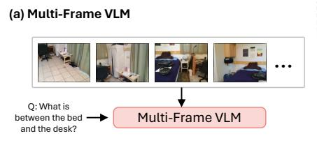  
(c) Visual Search Method (VLM-Grounder)

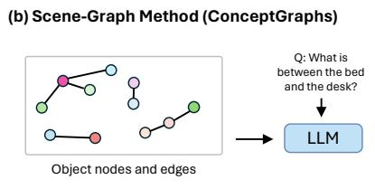

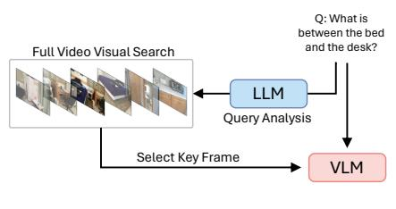

(d) MemTree3D Key Frame Selection (Ours)  
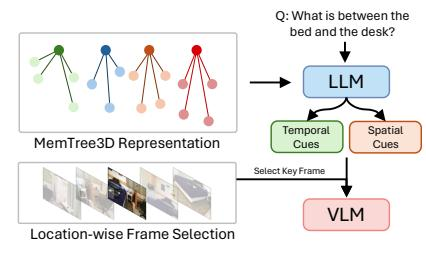  
Fig. 1: Comparison of 3D question answering methods. (a) Multi-Frame VLM takes 3D scan video as input but sufers from proportional computation and memory cost scales with video length. (b) Scene-Graph Methods such as ConceptGraphs [18] leverages object-level scene graph and an LLM for question answering, but the coarselevel scene representation leads to visual information loss. (c) Visual Search Method such as VLM-Grounder [55] leverages object detector to perform visual search for each query, which leads to extensive runtime. (d) Our method adopts an LLM to reason over our designed MemTree3D representation and provide temporal and spatial cues for eficient, location-wise frame selection, bypassing the extensive visual search.

Existing LLM/VLM-based 3D question answering methods can be broadly categorized into several mainstream approaches, including (a) Multi-Frame VLMs, (b) Scene-Graph Method, and (c) Visual Search Method, as shown in Figure 1. State-of-the-art multi-frame VLMs [33, 34] already possess the ability to perform 3D question answering, but are largely constrained by the computational and memory resources in the embodied scenario, often require video temporal downsampling strategies that leads to visual information loss. Scene-graph methods [7, 18, 44] leverage object-level scene representation for LLM question answering, the object-only representation, despite being simple and memory efficient, limits the system from performing fine-grained visual recognition beyond object-level understanding. To achieve a balance between memory constraint and more advanced visual recognition ability, visual search methods [55] adopt an LLM to first perform query analysis, which identifies query-related objects and performs key object visual search in all video frames to select key frames for VLM input. This strategy reduces the memory overhead of VLM while preserving key frame information, yet still possess several major limitations, including 1) the visual search runtime scales with the video length, which hinders its ability for real-time user interaction 2) the visual search is required for each individual query, and cannot eficiently handle multi-round query scenarios, 3) the method does not account for visual search failure, where the vision model fails to retrieve meaningful query-related key frames from the video.

In this work, we identify and address two major limitations of existing visual search–based 3D question answering methods. First, these approaches rely heavily on the underlying vision model to perform visual search, yet lack a mechanism to recover from failures when query-relevant objects are missed. Second, they require exhaustive visual inference over all video frames, which must be repeated for every input query and significantly hinders real-time response. To alleviate these issues, we introduce an LLM-driven key-frame retrieval framework built upon a pre-constructed 3D scene representation. This design enables more flexible and robust query handling through the LLM’s explicit spatial and temporal reasoning capabilities. Furthermore, the system eficiently retrieves relevant key frames with respect to the user query without extensive visual search. Specifically, we leverage a tree-based architecture as a compact, reusable representation of the 3D scene, which can be eficiently queried by the LLM to generate informative cues for retrieving query-relevant key frames. These selected frames are then passed to a VLM to perform final question answering.

Our approach begins with the online and real-time construction of a hierarchical representation MemTree3D. MemTree3D encodes 3D scene at multiple levels, including frame-level detections, temporally-aware object relationships, and spatially localized segments derived from 6-DoF camera poses. This treebased structure enables the LLM to reason over the scene content and identify critical frames without scanning every video frame. It is also reusable across multi-round queries: once constructed, the tree can be queried repeatedly by the LLM for diferent questions without re-running the vision model. Finally, it is robust to visual search failures. Because the LLM reasons over the symbolic and structural information in the tree (an example in Fig 2), it can still identify relevant frames even when query-related objects are missing. Extensive experiments on 3D question answering benchmarks show that our MemTree3D key frame selection paradigm improves state-of-the-art question answering accuracy, outperforms uniform sampling GPT-4o by 17.4%, largely reduces the runtime compared to visual search method by eficiency through MemTree3D querying and enhances robustness to perception failures via LLM-based reasoning.

In summary, the contribution of the work are three-folds:

1. We introduce MemTree3D, a compact and reusable 3D scene representation that supports real-time construction and enables LLM-driven key-frame selection, paving the way for scalable real-world embodied applications.

2. We propose a novel MemTree3D guided key frame selection paradigm for the 3D question answering task, significantly improving eficiency over existing visual search key-frame selection approaches.

3. We conduct extensive experiments and show that our method improves the LLM-Match of GPT-4o by 17.4% and achieves a 69.2% key-frame retrieval speedup compared to prior visual search methods, demonstrating a strong and eficient paradigm for 3D question answering.

## 2 Related Work

## 2.1 3D Question Answering

Capturing complex 3D scenes in a compact representation and conduct question answering remains a significant challenge in current research. Recent 3D-LLMs [56,64,65] leverage point cloud representations as LLM input for question answering task, but they require extensive 3D data training and still fall short in performance and generalizability compared to 2D models [25, 51, 61]. Objectcentric representations [21, 23, 52] and 3D scene graphs [4, 7, 13, 18, 54] are also popular approaches, yet they sufer from perception failures such as missing objects or false positives. The coarse, object-level representation also limits scenegraph’s ability in answering questions related to 3D scene details. Furthermore, most existing scene graphs have inherently complex construction process, which require multiple foundation models [31, 41, 45] and often cannot support realtime construction. On the other hand, recent 2D video VLM [12,36,37,60,62,63] directly utilize 3D scan videos as input for 3D scene question answering, the extensive training data enables 2D VLMs to achieve comparable performance with 3D-LLMs. But they face significant computational overhead due to the excessive number of frames in high FPS 3D scan videos. To address these challenges, we propose MemTree3D, a lightweight 3D scene representation that difers from traditional scene graphs by incorporating temporal information that supports key frame retrieval and real-time 25+ FPS construction. Rather than serving as the final scene representation, our proposed MemTree3D acts as an intermediate structure for LLM-driven key frame retrieval, mitigating the visual information loss in existing scene graph-based methods, and further address the challenges of computational overhead in video-LLMs by selecting question-related key frame for 3D question answering.

## 2.2 Key Frame Selection for Video Understanding

To address the computational and memory overhead in long-form video, recent research has developed key frame selection techniques to select question-relevant frames for VLM input. Most existing key frame selection methods follow the visual search key frame selection paradigm, which leverages the input question to identify relevant frames using techniques such as detecting question-related objects [55,59], VLM-based selection [22,58], or computing image-text similarity scores [51] via vision foundation models [35, 45]. While these approaches generally outperform naive uniform sampling, the visual search paradigm significantly limits their eficiency in multi-round user query scenarios, as each query requires re-running visual search across the entire video. In this work, we investigate the setting of leveraging a one-time, pre-constructed high-level 3D scene representation for eficient, LLM-driven key frame retrieval. Our approach deviates from standard visual search key frame selection paradigm that sufers from the large computational cost scaling with the video length, our paradigm achieves highly eficient key frame selection that does not significantly degrade with the video length, while achieving SOTA 3D question answering performance.

## 3 Method

## 3.1 Overview

We propose the MemTree3D guided key-frame selection paradigm for the 3D question answering task, motivated by the need to bypass the extensive visual inference required by existing visual search–based methods, which must run a vision model over all video frames for every individual query. We illustrate the overview of our method in Fig 2. Given a 3D scan video, we first pre-construct a compact and lightweight 3D scene representation MemTree3D from the video. An LLM then takes the query together with MemTree3D as input to perform explicit reasoning and generate spatial and temporal cues for eficient key-frame retrieval. The selected key frames are subsequently passed to a VLM for final question answering. This paradigm ofers two key advantages. First, it reduces overreliance on visual search results by enabling flexible, query-adaptive cue generation through LLM reasoning. Furthermore, it improves eficiency by eliminating repeated, query-dependent visual inference that scales with video length, replacing it with an LLM-based cue generation step with consistent runtime.

## 3.2 MemTree3D

We first introduce our proposed MemTree3D representation, a compact and lightweight 3D scene representation designed to support LLM reasoning and to provide spatial and temporal cues for key-frame selection. Despite the existence of several well-developed 3D scene representations, including point clouds [20, 56], feature fields [17, 21], and scene graphs [18, 29], each exhibits limitations that make it unsuitable for our method. Point cloud and feature field representations typically require additional LLM retraining, which incurs substantial computational and development cost. Existing scene graph–based methods such as ConceptGraphs [18], while capable of zero-shot LLM reasoning through textual serialization, rely on an extremely heavyweight construction pipeline that often combines multiple foundation models [31, 41, 45] and fail to achieve 10+ FPS real-time performance. Motivated by these limitations, we design MemTree3D, a minimal and lightweight 3D scene representation that

Step-2: LLM Spatial and Temporal Cue Generation

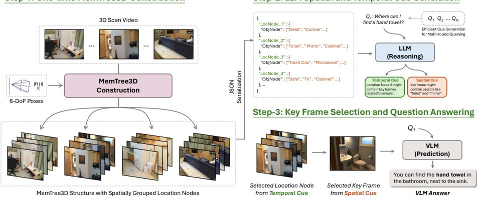  
Fig. 2: Method Overview. Step-1: A compact MemTree3D representation is constructed once from the 3D scan video using 6-DoF camera poses to spatially group frames into location nodes. Step 2: The serialized MemTree3D structure is provided to an LLM, which performs reasoning to generate temporal and spatial cues for locating relevant scene regions. Step 3: Guided by these cues, informative key frames are retrieved and passed to a VLM to produce the final answer.

supports real-time (25+ FPS) construction while remaining suficient for efective LLM reasoning and cue generation, which ofers practicability for real-world deployment. MemTree3D is organized as a three-level tree structure. We describe the design and functionality of each level as follows:

Location Node. We split the 3D scene video into multiple segments and construct a location node (LocNode) for each segment, as shown in Fig 3. Each LocNode is assigned a unique location ID. While several existing works [19,53] rely on image semantic to cluster video into segments, such approaches pose challenges in the embodied AI setting. These clustering methods are efective in general video question answering tasks, where inter-frame diferences often correspond to changes in video content or camera shots. However, in the embodied scenario, the camera captures a continuous 3D scan with smaller semantic variation between adjacent frames, especially in visually uniform scene. This makes semantic-based clustering less reliable for identifying spatial transitions in 3D scenes. The second challenge lies in the computational overhead of extracting vi sual semantics, which relies on of-the-shelf vision foundation model. This further poses dificulties in resource-constrained embodied scenarios.

To address these limitations, we propose to segment the video stream in a way that (1) introduces minimal additional computational cost, and (2) ensures that each segment corresponds to a distinct location in the 3D scene. In our work, we utilize the 6-DoF pose, which is information that can be obtained directly from most existing embodied AI devices. We keep track of each frame’s 6-DoF pose during video processing and maintain a previous 6-DoF pose, $P _ { p r e v } ,$ to calculate the translation and rotation with respect to the 6-DoF pose at the current frame, $P _ { t } .$ . Whenever the 6-DoF changes exceed translation threshold $T _ { t h r e s }$ or rotation threshold $R _ { t h r e s }$ , we construct a new LocNode and update $P _ { p r e v }$ with the current pose $P _ { t } ;$ we provide a detailed pseudo code in Algorithm. 1.

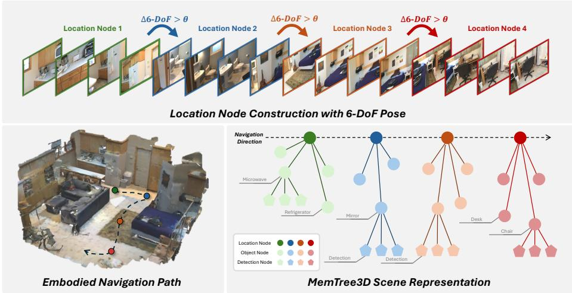  
Fig. 3: Our proposed MemTree3D construction process. During the embodied navigation, the camera 6-DoF poses are used to construct the location node, each location node contains multi-level 3D scene information for later LLM key frame selection.

Object Node. In the 3D scene scan, we continuously leverage an object detector [11] and a multi-object tracker [2] to obtain object detections and their temporal dependencies across time stamps. In each location node, we can obtain multiple object tracklets from the detector and tracker. For each location, we wrapped each observed tracklet into an object node ObjNode. Each ObjNode stores a compact trajectory derived from the tracker. The combinations of ObjNode at each location ensure a compact, high-level coarse representation, which can enable the LLM querying to reason over the coarse perception content for each location in the scene.

Detection Node. Detection node (DetNode) is the leaf component in the MemTree3D structure, representing the detection in each frame. Each DetNode contains only the basic attribute, including the detection time-stamp, detection results like bounding box coordinates, and detection confidence representing the quality of the detection, which will be used in the later frame selection.

## 3.3 LLM Spatial and Temporal Cue Generation

After constructing MemTree3D, we obtain a compact 3D scene representation suitable for LLM reasoning. Given a user question Q, we leverage an LLM to reason over MemTree3D and generate temporal and spatial cues for subsequent key-frame selection. Specifically, we serialize the constructed MemTree3D representation into a textual JSON format and feed it to the LLM, as illustrated in Fig 2. This JSON representation includes only the first two levels of nodes, namely LocNode and ObjNode, while DetNode is omitted since fine-grained detection information is not essential for high-level cue generation. The LLM performs explicit reasoning based on the objects present in each location and to produce temporal and spatial cues that guide eficient frame retrieval.

Algorithm 1: LocNode Construction   
Input: Poses ${ \overline { { P [ 0 : N - 1 ] } } } ,$ Detections $\overline { { D [ 0 ; N - 1 ] } }$   
Output: Location nodes L   
1 ${ \mathcal { L } }  \emptyset ,$ loc ${ \underline { { i } } } d \gets 0 ;$   
2 $P _ { \mathrm { p r e v } }  P [ 0 ] ;$   
3 $d  \emptyset$ // Detection buffer   
4 for $t \gets 0$ to $N { - } 1$ do   
5 $P _ { t } \gets P [ t ] ;$   
6 $d \gets d \cup \{ D [ t ] \} ;$   
7 $t _ { \varDelta } \gets \varDelta$ Translation $( P _ { \mathrm { p r e v } } , P _ { t } ) ;$   
8 $r _ { \varDelta } \gets \varDelta \mathrm { F }$ Rotation $( P _ { \mathrm { p r e v } } , P _ { t } ) ;$   
9 if $t _ { \varDelta } > T _ { t h r e s } \ o r \ r _ { \varDelta } > R _ { t h r e s }$ then   
// Create new location node from buffered detections   
10 $\mathcal { L }  \mathcal { L } !$ ∪ LocNode $( l o c \_ i d , d ) ;$   
11 loc $\underline { i } d \longleftarrow l o c \\underline { i } d + 1 ;$   
12 $d \gets \emptyset , \quad P _ { \mathrm { p r e v } } \gets P _ { t } ;$   
13 return $\mathcal { L } ;$

Temporal Cues. The temporal cue generation focuses on identifying a small set of candidate locations (and their associated temporal segments) that are most likely to contain the answer to the query. When query-relevant objects are present, the LLM can directly associate the question with the corresponding locations by matching semantic object attributes. In more challenging cases where critical objects are missing due to perception failures, the LLM reasons over the relational and contextual information encoded in MemTree3D to infer the most plausible locations that may contain the answer. This reasoning-driven temporal cue generation enables robust recovery from perception errors, a capability that diferentiates our work with existing visual search [55] or scene-graph–based approaches [18, 29], which typically fail when the underlying vision model cannot identify key objects.

Spatial Cues. In addition to temporal cues, the LLM generates spatial cues by predicting two sets of objects: key objects $O _ { \mathrm { k e y } }$ and cue objects $O _ { \mathrm { c u e } }$ . Key objects correspond to entities that are directly relevant for locating the answer to the question, while cue objects denote surrounding or co-occurring objects that are likely to appear near the key objects in the scene. These spatial cues capture both direct and contextual object relationships and are subsequently used as criteria in our scoring-based key-frame selection stage. By explicitly modeling spatial relationships through LLM reasoning, our approach reduces overreliance on exact object detections and provides flexible, query-adaptive guidance for eficient frame retrieval.

## 3.4 Key Frame Selection from Cues

Given the top-k temporal segments predicted by the LLM, we select one representative key frame from the video frames associated with each location, resulting in k query-relevant key frames. The goal is to identify frames that are maximally informative for answering the user question while remaining robust to imperfect detections. To this end, we adopt a scoring-based frame selection strategy that leverages the LLM-predicted spatial cues, namely the key object set $O _ { \mathrm { k e y } }$ and the cue object set $O _ { \mathrm { c u e } } .$ . For each frame, we aggregate detection nodes’ confidence scores of objects from both sets using distinct weighting factors, reflecting their diferent semantic roles: key objects provide direct evidence of answer relevance, while cue objects contribute complementary contextual information. This weighted aggregation approximates query-conditioned semantic alignment under partial observability, enabling robust frame selection even when key objects are weakly detected or partially missing, and avoids the brittleness of single-object or maximum-confidence selection strategies. Finally, the user question and the k selected key frames across diferent locations and viewpoints are passed to the VLM for question answering.

## 4 Experiments

## 4.1 Implementation Details

We use YOLO-World [11] and BoT-SORT [2] for MemTree3D construction, following prior work [58] by adopting the ScanNet-200 [14] common indoor object categories. Additional implementation details are provided in the appendix. The tree construction runs online and in real-time (25+ FPS) on a single GPU, and can be easily integrated into embodied agents during the observation collection stage, in contrast to existing methods that rely on multiple vision foundation models [18, 29]. We set $T _ { \mathrm { t h r e s } }$ to 1.5 m and $R _ { \mathrm { t h r e s } }$ to $4 5 ^ { \circ }$ for all experiments, and fix the key-to-cue object weighting ratio to 10:1, without careful fine-tuning. While per-scene parameter tuning could further improve temporal segmentation and spatial retrieval, we adopt a unified setting across all scenes to better reflect real-world deployment, where the number of LocNode adapts automatically to scene scale. The LLM selects top k locations from MemTree3D after reasoning, which we default k to 3, with ablation study on diferent value of k in Fig 4.

## 4.2 Benchmark

We evaluate on OpenEQA [44], ScanQA [5] and SQA3D [42]. OpenEQA is a recent Embodied Question Answering (EQA) benchmark focusing on spatial understanding and embodied reasoning. It contains 187 episode histories collected from ScanNet [14] and HM3D [46], with over 1,600 human-generated questions. Furthermore, OpenEQA adopts the automatic LLM evaluation protocol to evaluate the performance of the method. We follow the oficial setting and report the GPT-4 [1] LLM-Match score. ScanQA [5] and SQA3D [42] are another two large-scale benchmarks that focus on 3D scene spatial understanding, with ScanQA contains 4,675 and SQA3D contains 3,519 QA pairs. We follow previous works [23–25,63] and evaluate on ScanQA validation and SQA3D test set using Exact Match (EM@1). More benchmark details and statistics can be found in our appendix.

Table 1: Performance comparison of our MemTree3D with other SoTA methods on OpenEQA, including the performance on ScanNet and HM3D subset. Performance of MemTree3D with diferent number of used frame can be found in ablation study.
<table><tr><td rowspan="2"></td><td rowspan="2">Avg. Frame</td><td colspan="3">LLM-Match</td></tr><tr><td>ScanNet</td><td>HM3D</td><td>ALL</td></tr><tr><td>Open-source VLM</td><td></td><td></td><td></td><td></td></tr><tr><td>Video-LLaMA [60]</td><td>8</td><td>20.1</td><td>19.8</td><td>20.0</td></tr><tr><td>Video-ChatGPT [43]</td><td>100</td><td>32.9</td><td>30.4</td><td>32.1</td></tr><tr><td>LLaMA-2 w/ Concept Graph [44]</td><td>50</td><td>31.0</td><td>24.2</td><td>28.7</td></tr><tr><td>LLaMA-2 w/ Sparse Voxel Map [44]</td><td>50</td><td>36.0</td><td>30.9</td><td>34.3</td></tr><tr><td>LLaMA-2 w/ LLaVA-1.5 caption [44]</td><td>50</td><td>39.6</td><td>31.1</td><td>36.8</td></tr><tr><td>Qwen-2.5-VL-7B [6]</td><td>12</td><td>49.4</td><td>40.2</td><td>46.2</td></tr><tr><td>Video-LLaMA2 [12]</td><td>16</td><td>50.1</td><td>47.5</td><td>49.2</td></tr><tr><td>LLaVA-3D [63]</td><td>32</td><td></td><td></td><td>53.2</td></tr><tr><td>Closed-source VLM</td><td></td><td></td><td></td><td></td></tr><tr><td>Claude-3 Opus [3]</td><td>20</td><td></td><td></td><td>36.3</td></tr><tr><td>Gemini 1.0 Pro Vision [49]</td><td>15</td><td></td><td></td><td>44.9</td></tr><tr><td>Claude-3.5 Sonnet [3]</td><td>20</td><td></td><td></td><td>48.7</td></tr><tr><td>GPT-4V w/ Concept Graph [44]</td><td>50</td><td>37.8</td><td>34.0</td><td>36.5</td></tr><tr><td>GPT-4V w/ Sparse Voxel Map [44]</td><td>50</td><td>40.9</td><td>35.0</td><td>38.9</td></tr><tr><td>GPT-4V w/ LLaVA-1.5 caption [44]</td><td>50</td><td>45.4</td><td>40.0</td><td>43.6</td></tr><tr><td>GPT-4V [1]</td><td>50</td><td>57.4</td><td>51.3</td><td>55.3</td></tr><tr><td>GPT-40 [28]</td><td>12</td><td>63.9</td><td>58.4</td><td>62.0</td></tr><tr><td>Visual Search / 3D Memory Method</td><td></td><td></td><td></td><td></td></tr><tr><td>CLIP Retrieval [45]</td><td>3</td><td>55.1</td><td>41.9</td><td>50.6</td></tr><tr><td>3D-Mem [58]</td><td>3.1</td><td></td><td></td><td>57.2</td></tr><tr><td>VLM-Grounder [55]</td><td>6</td><td>65.1</td><td>58.8</td><td>63.0</td></tr><tr><td>Ours (with zero-shot 2D VLM)</td><td></td><td></td><td></td><td></td></tr><tr><td>LLaVA-OneVision-7B [33]</td><td>3</td><td>52.5</td><td>42.9</td><td>49.2</td></tr><tr><td>MemTree3D (w/ LLaVA-OneVision-7B)</td><td>3</td><td>57.9 (+5.4)</td><td>49.3 (+6.4)</td><td>55.0 (+5.8)</td></tr><tr><td>GPT-4o [28]</td><td>3</td><td>55.8</td><td>37.1</td><td>49.4</td></tr><tr><td>MemTree3D (w/ GPT-4o)</td><td>3</td><td>69.4 (+13.6) 61.7 (+24.6) 66.8 (+17.4)</td><td></td><td></td></tr></table>

## 4.3 Analysis on OpenEQA

In Table 1, we compared with multiple SOTA VLMs, captioning-based Socratic method [40], ConceptGraphs and Sparse Voxel Map [18] LLM methods on the OpenEQA benchmark. We also compared with three advanced visual search and 3D memory methods using GPT-4o as VLM, including detector-based VLM

Table 2: Category-level performance on OpenEQA.
<table><tr><td rowspan="2"></td><td colspan="7">EQA Category</td></tr><tr><td>object</td><td>object</td><td>attribute</td><td>spatial</td><td>object state functional recognition localization recognition understanding recognition reasoning knowledge</td><td></td><td>world</td></tr><tr><td>GPT-40</td><td>54.0</td><td>36.9</td><td>58.3</td><td>36.8</td><td>54.6</td><td>53.4</td><td>50.2</td></tr><tr><td>w/ MemTree3D</td><td>64.6</td><td>58.1</td><td>68.9</td><td>52.5</td><td>75.4</td><td>73.6</td><td>72.3</td></tr><tr><td>∆</td><td>+10.6</td><td>+21.2</td><td>+10.6</td><td>+15.7</td><td>+20.8</td><td>+20.2</td><td>+22.1</td></tr></table>

Table 3: EM@1 comparison on ScanQA and SQA3D.
<table><tr><td></td><td></td><td colspan="2">EM@1</td></tr><tr><td>Method</td><td>Avg. Frame</td><td>ScanQA</td><td>SQA3D</td></tr><tr><td>3D Fine-tuned Model</td><td></td><td></td><td></td></tr><tr><td>Scan2Cap [10]</td><td></td><td></td><td>41.0</td></tr><tr><td>ScanRefer+MCAN [9]</td><td></td><td>18.6</td><td></td></tr><tr><td>ClipBERT [32]</td><td></td><td></td><td>43.3</td></tr><tr><td>ScanQA [5]</td><td></td><td>21.1</td><td>47.2</td></tr><tr><td>3D-VisTA [64]</td><td></td><td>22.4</td><td>48.5</td></tr><tr><td>3D-LLM [20]</td><td></td><td>20.5</td><td>48.1</td></tr><tr><td>3D-VLP [30]</td><td></td><td>21.6</td><td></td></tr><tr><td>LEO [27]</td><td></td><td>24.5</td><td>50.0</td></tr><tr><td>ChatScene [23]</td><td></td><td>21.6</td><td>54.6</td></tr><tr><td>VLM Method</td><td></td><td></td><td></td></tr><tr><td>Agent3D-zero [61]</td><td>24</td><td>17.5</td><td></td></tr><tr><td>LLaVA-Next-Video [39]</td><td>32</td><td>18.7</td><td>34.2</td></tr><tr><td>VideoChat2 [37]</td><td>16</td><td>19.2</td><td>37.3</td></tr><tr><td>LLaVA-OneVision-7B [33]</td><td>3</td><td>25.1</td><td>46.2</td></tr><tr><td>MemTree3D (w/ LLaVA-OneVision-7B)</td><td>3</td><td>28.0 (+2.9) 49.6 (+3.4)</td><td></td></tr></table>

Grounder [55], VLM-based frame selection 3D-Mem [58] and an image-text retrieval baseline with CLIP [45] that retrieve key frames by selecting the frame with highest image-query similarity.

In Table 1, we show our performance implemented with open-source VLM LLaVA-OneVision-7B and proprietary model GPT-4o on the OpenEQA benchmark. Our methods largely boost the performance of existing VLMs, with 5.8% accuracy gain for LLaVA-One-Vision, and 17.4% over GPT-4o under the same number of input frame. Moreover, we achieve stronger performance compared with existing visual search methods using the same VLM GPT-4o.

In Table 2, we report our category-level performance on OpenEQA. Integrating MemTree3D consistently improves uniform sampling GPT-4o by more than 10% across all question categories. Although MemTree3D adopts an objectcentric representation, its role is to retrieve informative key frames rather than perform fine-grained recognition. The final disambiguation of object attributes, states, and subtle visual details is handled by the VLM using raw visual evidence from the selected frames.

## 4.4 Analysis on ScanQA and SQA3D

On ScanQA and SQA3D (Table 3), we compared with 3D fine-tuned models, including task-specific models [5,9,10,32] and 3D understanding LLMs [20,23,27,

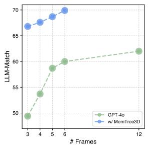

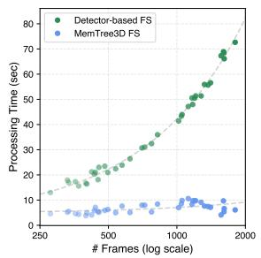

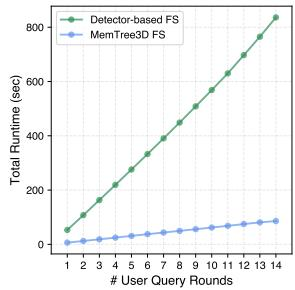  
Fig. 5: Runtime comparison with Detector-based FS method. Measured after received question.  
Fig. 6: Runtime comparison with Detector-based FS method when processing multi-round query.

Fig. 4: OpenEQA results comparison with uniform sampling using diferent number of frames.  
Table 4: Ablation on performance using diferent LLM/VLM combinations.
<table><tr><td>LLM</td><td>VLM</td><td>ScanNet</td><td>HM3D</td><td>All</td></tr><tr><td></td><td>GPT-4o (Uniform Sampling)</td><td>55.8</td><td>37.1</td><td>49.4</td></tr><tr><td>Qwen3-4B</td><td>LLaVA-OneVision-7B</td><td>54.9</td><td>43.8</td><td>51.1</td></tr><tr><td>Qwen3-8B</td><td>LLaVA-OneVision-7B</td><td>56.8</td><td>46.0</td><td>53.1</td></tr><tr><td>GPT-40</td><td>LLaVA-OneVision-7B</td><td>57.9</td><td>49.3</td><td>55.0</td></tr><tr><td>GPT-40</td><td>GPT-40</td><td>69.4</td><td>61.7</td><td>66.8</td></tr></table>

30,64]. In Table 3, our method brings accuracy improvements and achieve strong zero-shot performance compared with existing 3D fine-tuned models and 2D VLM. However, we notice the performance gain on ScanQA and SQA3D is rather moderate compared with the large performance improvements on OpenEQA, which is likely caused by the smaller scene size in ScanNet, where the uniform sampling can already achieve decent visual coverage. This observation can also be justified by the smaller improvement on the ScanNet subset (avg. size 82.6 m3) compared to the HM3D subset (avg. size $5 5 6 . 0 m ^ { 3 } )$ in OpenEQA, which suggests our method is more efective in a more challenging and larger 3D scene setting.

## 4.5 Ablation Studies

Does the number of frames afect performance? We evaluate the impact of using a larger k value in Fig 4. Our MemTree3D outperforms uniform sampling across diferent frame usage, highlighting the efectiveness of our method. Moreover, the performance of GPT-4o when using frames selected by MemTree3D consistently improves as more frames are included, due to access to richer visual information from diverse spatial locations in the scene.

How eficient is MemTree3D? To demonstrate that our proposed paradigm is more eficient than visual search key frame selection, we compare our proposed MemTree3D Frame Selection (MemTree3D FS) with the Detector-based

Table 5: Ablation on LocNode construction strategy.
<table><tr><td>Method</td><td> $\operatorname { A v g } .$  Frame Per Node</td><td>LLM-Match</td></tr><tr><td>Uniform</td><td>90</td><td>33.0</td></tr><tr><td>Uniform</td><td>30</td><td>40.4</td></tr><tr><td>6-DoF</td><td>36.3</td><td>49.1</td></tr></table>

Table 6: System robustness analysis under perception failure.
<table><tr><td>Query Object Presence</td><td>ScanNet</td><td>HM3D</td><td>All</td></tr><tr><td>√</td><td>71.4</td><td>64.3</td><td>69.0</td></tr><tr><td>x</td><td>67.9</td><td>62.1</td><td>65.9</td></tr></table>

Frame Selection (Detector-based FS) method [55] in Fig 5. We use the open source LLM Qwen3 [57] for both methods and run them on the same V100 GPU for fair comparison and reproducibility. The runtime of Detector-based FS increases with the number of video frames, while the runtime of MemTree3D FS remains relatively stable, with at least 69.2% runtime speed up compared to detector-based FS, highlighting the eficiency of our LLM key frame querying paradigm. The reported runtime is measured on OpenEQA, starting from the moment the system receives the user query. Furthermore, we compare the latency of MemTree3D and Detector-based FS in multi-round user query scenario in Fig 6, the latency gap highlights the better eficiency of our MemTree3D key frame selection paradigm compared with existing visual search approach. This eficiency stems directly from our design, which bypasses extensive per-query visual search and thereby minimizes computation.

Can MemTree3D work well with open source models? In Table 4, we conduct experiments and investigate the performance of various open source and proprietary LLM and VLM combinations with our MemTree3D. We found that switching proprietary LLM GPT-4o to open source smaller scale LLM Qwen3- 4B and Qwen3-8B [57] and VLM LLaVA-OneVision-7B [33] does not lead to notable performance degradation, with LLM-Match score on OpenEQA outperforms uniform sampling proprietary VLM GPT-4o.

Ablation on Location Node construction strategy. We present an ablation study of diferent LocNode construction strategies in Table 5. The uniform construction strategy partitions Location Nodes using a fixed temporal window without considering camera motion, often grouping frames from distinct viewpoints into the same node. Increasing the node construction frequency by reducing the temporal window (from 90 to 30 frames) leads to improved performance, but still underperforms the 6-DoF–based construction, which explicitly leverages camera motion to segment the 3D scene into semantically coherent nodes, yielding a significant improvement of 8.7% over uniform sampling.

Is MemTree3D robust to perception failure? To evaluate the robustness of our framework under perception failures during MemTree3D construction, we analyze the performance gap with respect to query object presence, as reported in Table 6. We apply a heuristic string-matching strategy to determine whether object class names present in the constructed scene representation appear in the user question. On OpenEQA, our method achieves an LLM-Match score of 65.9 in the absence of query object presence, representing only a 3.1- point drop compared to cases where query objects are present.

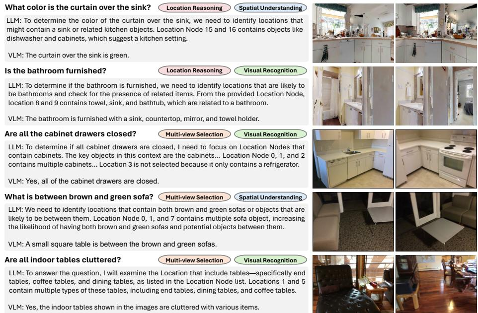  
Fig. 7: Qualitative results. We present the top two selected key frames by our method, as well as the corresponding LLM location selection and VLM output.

## 4.6 Qualitative Results

We present qualitative results in Fig 7, which covers multiple question types such as location reasoning, multi-view selection, and spatial understanding.

Location Reasoning. When query-relevant key objects are missing from the MemTree3D representation due to perception failures, our pipeline uses the LLM to infer likely locations from the objects observed at each location.

Multi-view Selection. For questions requiring multiple viewpoints, our method retrieves frames from diferent location to provide comprehensive visual context. Spatial Understanding and Visual Recognition. By selecting visually informative frames, our key-frame selection improves spatial reasoning and finegrained visual recognition, resulting in more accurate answers.

## 5 Conclusion

We introduce the MemTree3D -guided key-frame selection paradigm for eficient and accurate 3D question answering. By constructing a compact 3D scene representation, MemTree3D enables LLM-based reasoning to select key frames without exhaustive visual search. Experiments on OpenEQA, ScanQA, and SQA3D show consistent improvements across both open-source and proprietary VLMs using fewer input frames, demonstrating the potential of our approach for realworld embodied AI applications.

## References

1. Achiam, J., Adler, S., Agarwal, S., Ahmad, L., Akkaya, I., Aleman, F.L., Almeida, D., Altenschmidt, J., Altman, S., Anadkat, S., et al.: Gpt-4 technical report. arXiv preprint arXiv:2303.08774 (2023) 10

2. Aharon, N., Orfaig, R., Bobrovsky, B.Z.: Bot-sort: Robust associations multipedestrian tracking. arXiv preprint arXiv:2206.14651 (2022) 7, 9

3. Anthropic: Claude 3 opus (Mar 2024), family of Next-Generation AI Models 10

4. Armeni, I., He, Z.Y., Gwak, J., Zamir, A.R., Fischer, M., Malik, J., Savarese, S.: 3d scene graph: A structure for unified semantics, 3d space, and camera. In: Proceedings of the IEEE/CVF international conference on computer vision. pp. 5664–5673 (2019) 4

5. Azuma, D., Miyanishi, T., Kurita, S., Kawanabe, M.: Scanqa: 3d question answering for spatial scene understanding. In: proceedings of the IEEE/CVF conference on computer vision and pattern recognition. pp. 19129–19139 (2022) 1, 9, 10, 11, 20

6. Bai, S., Chen, K., Liu, X., Wang, J., Ge, W., Song, S., Dang, K., Wang, P., Wang, S., Tang, J., et al.: Qwen2. 5-vl technical report. arXiv preprint arXiv:2502.13923 (2025) 10

7. Chandhok, S.: Scenegpt: A language model for 3d scene understanding. arXiv preprint arXiv:2408.06926 (2024) 2, 4

8. Chen, C., Jain, U., Schissler, C., Gari, S.V.A., Al-Halah, Z., Ithapu, V.K., Robinson, P., Grauman, K.: Soundspaces: Audio-visual navigation in 3d environments. In: Computer Vision–ECCV 2020: 16th European Conference, Glasgow, UK, August 23–28, 2020, Proceedings, Part VI 16. pp. 17–36. Springer (2020) 1

9. Chen, D.Z., Chang, A.X., Nießner, M.: Scanrefer: 3d object localization in rgb-d scans using natural language. In: European conference on computer vision. pp. 202–221. Springer (2020) 11

10. Chen, Z., Gholami, A., Nießner, M., Chang, A.X.: Scan2cap: Context-aware dense captioning in rgb-d scans. In: Proceedings of the IEEE/CVF conference on computer vision and pattern recognition. pp. 3193–3203 (2021) 11

11. Cheng, T., Song, L., Ge, Y., Liu, W., Wang, X., Shan, Y.: Yolo-world: Real-time open-vocabulary object detection. In: Proceedings of the IEEE/CVF conference on computer vision and pattern recognition. pp. 16901–16911 (2024) 7, 9

12. Cheng, Z., Leng, S., Zhang, H., Xin, Y., Li, X., Chen, G., Zhu, Y., Zhang, W., Luo, Z., Zhao, D., et al.: Videollama 2: Advancing spatial-temporal modeling and audio understanding in video-llms. arXiv preprint arXiv:2406.07476 (2024) 4, 10

13. Cherian, A., Hori, C., Marks, T.K., Le Roux, J.: (2.5+ 1) d spatio-temporal scene graphs for video question answering. In: Proceedings of the AAAI Conference on Artificial Intelligence. vol. 36, pp. 444–453 (2022) 4

14. Dai, A., Chang, A.X., Savva, M., Halber, M., Funkhouser, T., Nießner, M.: Scannet: Richly-annotated 3d reconstructions of indoor scenes. In: Proceedings of the IEEE conference on computer vision and pattern recognition. pp. 5828–5839 (2017) 9, 10, 20

15. Das, A., Datta, S., Gkioxari, G., Lee, S., Parikh, D., Batra, D.: Embodied question answering. In: Proceedings of the IEEE conference on computer vision and pattern recognition. pp. 1–10 (2018) 1

16. Duan, L., Xiu, Y., Gorlatova, M.: Advancing the understanding and evaluation of ar-generated scenes: When vision-language models shine and stumble. In: 2025 IEEE Conference on Virtual Reality and 3D User Interfaces Abstracts and Workshops (VRW). pp. 156–161. IEEE (2025) 1

17. Fu, R., Liu, J., Chen, X., Nie, Y., Xiong, W.: Scene-llm: Extending language model for 3d visual reasoning. In: 2025 IEEE/CVF Winter Conference on Applications of Computer Vision (WACV). pp. 2195–2206. IEEE (2025) 5

18. Gu, Q., Kuwajerwala, A., Morin, S., Jatavallabhula, K.M., Sen, B., Agarwal, A., Rivera, C., Paul, W., Ellis, K., Chellappa, R., et al.: Conceptgraphs: Openvocabulary 3d scene graphs for perception and planning. In: 2024 IEEE International Conference on Robotics and Automation (ICRA). pp. 5021–5028. IEEE (2024) 2, 4, 5, 8, 9, 10

19. He, B., Li, H., Jang, Y.K., Jia, M., Cao, X., Shah, A., Shrivastava, A., Lim, S.N.: Ma-lmm: Memory-augmented large multimodal model for long-term video understanding. In: Proceedings of the IEEE/CVF Conference on Computer Vision and Pattern Recognition. pp. 13504–13514 (2024) 6

20. Hong, Y., Zhen, H., Chen, P., Zheng, S., Du, Y., Chen, Z., Gan, C.: 3d-llm: Injecting the 3d world into large language models. Advances in Neural Information Processing Systems 36, 20482–20494 (2023) 5, 11

21. Hong, Y., Zheng, Z., Chen, P., Wang, Y., Li, J., Gan, C.: Multiply: A multisensory object-centric embodied large language model in 3d world. In: Proceedings of the IEEE/CVF Conference on Computer Vision and Pattern Recognition. pp. 26406– 26416 (2024) 4, 5

22. Hu, J., Cheng, Z., Si, C., Li, W., Gong, S.: Cos: Chain-of-shot prompting for long video understanding. arXiv preprint arXiv:2502.06428 (2025) 4

23. Huang, H., Chen, Y., Wang, Z., Huang, R., Xu, R., Wang, T., Liu, L., Cheng, X., Zhao, Y., Pang, J., et al.: Chat-scene: Bridging 3d scene and large language models with object identifiers. In: The Thirty-eighth Annual Conference on Neural Information Processing Systems (2024) 4, 10, 11

24. Huang, H.W., Chai, W., Chen, K.M., Yang, C.Y., Hwang, J.N.: Tosa: Token merging with spatial awareness. In: 2025 IEEE/RSJ International Conference on Intelligent Robots and Systems (IROS). pp. 9654–9660. IEEE (2025) 10

25. Huang, H.W., Chen, F.C., Chai, W., Su, C.C., Xia, L., Jung, S., Yang, C.Y., Hwang, J.N., Sun, M., Kuo, C.H.: Zero-shot 3d question answering via voxel-based dynamic token compression. In: Proceedings of the Computer Vision and Pattern Recognition Conference. pp. 19424–19434 (2025) 4, 10

26. Huang, H.W., Kim, P., Cheng, J.H., Chen, K.M., Yang, C.Y., Alattar, B., Lin, Y.R., Kim, S., Kim, K., Huang, C.I., et al.: Warehouse spatial question answering with llm agent: 1st place solution of the 9th ai city challenge track 3. In: Proceedings of the IEEE/CVF International Conference on Computer Vision. pp. 5224–5228 (2025) 1

27. Huang, J., Yong, S., Ma, X., Linghu, X., Li, P., Wang, Y., Li, Q., Zhu, S.C., Jia, B., Huang, S.: An embodied generalist agent in 3d world. In: Proceedings of the International Conference on Machine Learning (ICML) (2024) 11

28. Hurst, A., Lerer, A., Goucher, A.P., Perelman, A., Ramesh, A., Clark, A., Ostrow, A., Welihinda, A., Hayes, A., Radford, A., et al.: Gpt-4o system card. arXiv preprint arXiv:2410.21276 (2024) 10

29. Jatavallabhula, K.M., Kuwajerwala, A., Gu, Q., Omama, M., Chen, T., Maalouf, A., Li, S., Iyer, G.S., Saryazdi, S., Keetha, N.V., et al.: Conceptfusion: Openset multimodal 3d mapping. In: ICRA2023 Workshop on Pretraining for Robotics (PT4R) (2023) 5, 8, 9

30. Jin, Z., Hayat, M., Yang, Y., Guo, Y., Lei, Y.: Context-aware alignment and mutual masking for 3d-language pre-training. In: Proceedings of the IEEE/CVF Conference on Computer Vision and Pattern Recognition. pp. 10984–10994 (2023) 11

31. Kirillov, A., Mintun, E., Ravi, N., Mao, H., Rolland, C., Gustafson, L., Xiao, T., Whitehead, S., Berg, A.C., Lo, W.Y., et al.: Segment anything. In: Proceedings of the IEEE/CVF International Conference on Computer Vision. pp. 4015–4026 (2023) 4, 5

32. Lei, J., Li, L., Zhou, L., Gan, Z., Berg, T.L., Bansal, M., Liu, J.: Less is more: Clipbert for video-and-language learning via sparse sampling. In: Proceedings of the IEEE/CVF conference on computer vision and pattern recognition. pp. 7331– 7341 (2021) 11

33. Li, B., Zhang, Y., Guo, D., Zhang, R., Li, F., Zhang, H., Zhang, K., Li, Y., Liu, Z., Li, C.: Llava-onevision: Easy visual task transfer. arXiv preprint arXiv:2408.03326 (2024) 2, 10, 11, 13

34. Li, F., Zhang, R., Zhang, H., Zhang, Y., Li, B., Li, W., Ma, Z., Li, C.: Llava-nextinterleave: Tackling multi-image, video, and 3d in large multimodal models. arXiv preprint arXiv:2407.07895 (2024) 2

35. Li, J., Li, D., Savarese, S., Hoi, S.: Blip-2: Bootstrapping language-image pretraining with frozen image encoders and large language models. In: International conference on machine learning. pp. 19730–19742. PMLR (2023) 5

36. Li, K., He, Y., Wang, Y., Li, Y., Wang, W., Luo, P., Wang, Y., Wang, L., Qiao, Y.: Videochat: Chat-centric video understanding. Science China Information Sciences 68(10), 200102 (2025) 4

37. Li, K., Wang, Y., He, Y., Li, Y., Wang, Y., Liu, Y., Wang, Z., Xu, J., Chen, G., Luo, P., et al.: Mvbench: A comprehensive multi-modal video understanding benchmark. In: Proceedings of the IEEE/CVF Conference on Computer Vision and Pattern Recognition. pp. 22195–22206 (2024) 4, 11

38. Lin, J., Sun, W., Zhang, X., Wang, J., Feng, P., Yu, D., Zhang, J.: Samr: A spatialaugmented mixed reality method for enhancing vision-language models in 3d scene understanding. In: 2025 IEEE International Symposium on Mixed and Augmented Reality (ISMAR). pp. 857–866. IEEE (2025) 1

39. Liu, H., Li, C., Li, Y., Li, B., Zhang, Y., Shen, S., Lee, Y.J.: Llava-next: Improved reasoning, ocr, and world knowledge (2024) 11

40. Liu, H., Li, C., Wu, Q., Lee, Y.J.: Visual instruction tuning. Advances in neural information processing systems 36 (2024) 10

41. Liu, S., Zeng, Z., Ren, T., Li, F., Zhang, H., Yang, J., Jiang, Q., Li, C., Yang, J., Su, H., et al.: Grounding dino: Marrying dino with grounded pre-training for open-set object detection. In: European Conference on Computer Vision. pp. 38– 55. Springer (2024) 4, 5

42. Ma, X., Yong, S., Zheng, Z., Li, Q., Liang, Y., Zhu, S.C., Huang, S.: Sqa3d: Situated question answering in 3d scenes. In: International Conference on Learning Representations (2023) 1, 9, 10, 20

43. Maaz, M., Rasheed, H., Khan, S., Khan, F.S.: Video-chatgpt: Towards detailed video understanding via large vision and language models. In: Proceedings of the 62nd Annual Meeting of the Association for Computational Linguistics (ACL 2024) (2024) 10

44. Majumdar, A., Ajay, A., Zhang, X., Putta, P., Yenamandra, S., Henaf, M., Silwal, S., Mcvay, P., Maksymets, O., Arnaud, S., et al.: Openeqa: Embodied question answering in the era of foundation models. In: Proceedings of the IEEE/CVF Conference on Computer Vision and Pattern Recognition. pp. 16488–16498 (2024) 1, 2, 9, 10, 20

45. Radford, A., Kim, J.W., Hallacy, C., Ramesh, A., Goh, G., Agarwal, S., Sastry, G., Askell, A., Mishkin, P., Clark, J., et al.: Learning transferable visual models from

natural language supervision. In: International conference on machine learning. pp. 8748–8763. PMLR (2021) 4, 5, 10, 11, 22

46. Ramakrishnan, S.K., Gokaslan, A., Wijmans, E., Maksymets, O., Clegg, A., Turner, J., Undersander, E., Galuba, W., Westbury, A., Chang, A.X., et al.: Habitat-matterport 3d dataset (hm3d): 1000 large-scale 3d environments for embodied ai. arXiv preprint arXiv:2109.08238 (2021) 10, 20

47. Shridhar, M., Thomason, J., Gordon, D., Bisk, Y., Han, W., Mottaghi, R., Zettlemoyer, L., Fox, D.: Alfred: A benchmark for interpreting grounded instructions for everyday tasks. In: Proceedings of the IEEE/CVF conference on computer vision and pattern recognition. pp. 10740–10749 (2020) 1

48. Soni, A., Alla, S., Dodda, S., Volikatla, H.: Advancing household robotics: Deep interactive reinforcement learning for eficient training and enhanced performance. arXiv preprint arXiv:2405.18687 (2024) 1

49. Team, G., Anil, R., Borgeaud, S., Wu, Y., Alayrac, J.B., Yu, J., Soricut, R., Schalkwyk, J., Dai, A.M., Hauth, A., et al.: Gemini: a family of highly capable multimodal models. arXiv preprint arXiv:2312.11805 (2023) 10

50. Vaswani, A., Shazeer, N., Parmar, N., Uszkoreit, J., Jones, L., Gomez, A.N., Kaiser, Ł., Polosukhin, I.: Attention is all you need. Advances in neural information processing systems 30 (2017) 2

51. WANG, F., Yu, S., Wu, J., Tang, J., Zhang, H., Sun, Q.: 3d question answering via only 2d vision-language models. In: Forty-second International Conference on Machine Learning (2025) 4, 5

52. Wang, Z., Huang, H., Zhao, Y., Zhang, Z., Zhao, Z.: Chat-3d: Data-eficiently tuning large language model for universal dialogue of 3d scenes. arXiv preprint arXiv:2308.08769 (2023) 4

53. Wang, Z., Yu, S., Stengel-Eskin, E., Yoon, J., Cheng, F., Bertasius, G., Bansal, M.: Videotree: Adaptive tree-based video representation for llm reasoning on long videos. In: Proceedings of the Computer Vision and Pattern Recognition Conference. pp. 3272–3283 (2025) 6

54. Wu, S.C., Wald, J., Tateno, K., Navab, N., Tombari, F.: Scenegraphfusion: Incremental 3d scene graph prediction from rgb-d sequences. In: Proceedings of the IEEE/CVF Conference on Computer Vision and Pattern Recognition (CVPR). pp. 7515–7525 (June 2021) 4

55. Xu, R., Huang, Z., Wang, T., Chen, Y., Pang, J., Lin, D.: VLM-grounder: A VLM agent for zero-shot 3d visual grounding. In: 8th Annual Conference on Robot Learning (2024) 2, 4, 8, 10, 11, 13, 21

56. Xu, R., Wang, X., Wang, T., Chen, Y., Pang, J., Lin, D.: Pointllm: Empowering large language models to understand point clouds. In: European Conference on Computer Vision. pp. 131–147. Springer (2024) 4, 5

57. Yang, A., Li, A., Yang, B., Zhang, B., Hui, B., Zheng, B., Yu, B., Gao, C., Huang, C., Lv, C., et al.: Qwen3 technical report. arXiv preprint arXiv:2505.09388 (2025) 13

58. Yang, Y., Yang, H., Zhou, J., Chen, P., Zhang, H., Du, Y., Gan, C.: 3d-mem: 3d scene memory for embodied exploration and reasoning. In: Proceedings of the Computer Vision and Pattern Recognition Conference. pp. 17294–17303 (2025) 1, 4, 9, 10, 11

59. Ye, J., Wang, Z., Sun, H., Chandrasegaran, K., Durante, Z., Eyzaguirre, C., Bisk, Y., Niebles, J.C., Adeli, E., Fei-Fei, L., et al.: Re-thinking temporal search for longform video understanding. In: Proceedings of the Computer Vision and Pattern Recognition Conference. pp. 8579–8591 (2025) 4

60. Zhang, H., Li, X., Bing, L.: Video-llama: An instruction-tuned audio-visual language model for video understanding. arXiv preprint arXiv:2306.02858 (2023) 4, 10

61. Zhang, S., Huang, D., Deng, J., Tang, S., Ouyang, W., He, T., Zhang, Y.: Agent3dzero: An agent for zero-shot 3d understanding. In: European Conference on Computer Vision. pp. 186–202. Springer (2024) 4, 11

62. Zheng, D., Huang, S., Wang, L.: Video-3d llm: Learning position-aware video representation for 3d scene understanding. In: Proceedings of the Computer Vision and Pattern Recognition Conference. pp. 8995–9006 (2025) 4

63. Zhu, C., Wang, T., Zhang, W., Pang, J., Liu, X.: Llava-3d: A simple yet efective pathway to empowering lmms with 3d capabilities. In: Proceedings of the IEEE/CVF International Conference on Computer Vision. pp. 4295–4305 (2025) 4, 10

64. Zhu, Z., Ma, X., Chen, Y., Deng, Z., Huang, S., Li, Q.: 3d-vista: Pre-trained transformer for 3d vision and text alignment. In: Proceedings of the IEEE/CVF International Conference on Computer Vision. pp. 2911–2921 (2023) 4, 11

65. Zhu, Z., Zhang, Z., Ma, X., Niu, X., Chen, Y., Jia, B., Deng, Z., Huang, S., Li, Q.: Unifying 3d vision-language understanding via promptable queries. In: European Conference on Computer Vision. pp. 188–206. Springer (2024) 4

## 6 Appendix

We present more details and experiment results in the supplementary material structured as follows:

– Evaluation benchmark details.

LLM prompt for key frame querying.

– More results on eficiency analysis.

– Additional qualitative results.

– Limitations and failure cases.

## 7 Evaluation Benchmarks Details

Table 7: Scale comparison of the evaluated 3D question answering benchmarks in our work.
<table><tr><td>Benchmark  $\#$ </td><td>of scenes  $\#$  of questions</td></tr><tr><td>OpenEQA [44]</td><td>152 1,636</td></tr><tr><td>ScanQA [5] 71</td><td>4,306</td></tr><tr><td>SQA3D [42]</td><td>67 3,519</td></tr></table>

Table 8: Statistics of the ScanNet and HM3D subset from the OpenEQA. The table shows the number of scenes, questions, and the average scene size.
<table><tr><td>Subset  $\#$ </td><td colspan="3">scenes avg. size  $( m ^ { 3 } )$  avg. LocNode  $\varDelta$  LLM-Match</td></tr><tr><td>ScanNet</td><td>89 82.6</td><td>5.9</td><td>+13.6</td></tr><tr><td>HM3D</td><td>63 556.0</td><td>20.3</td><td>+24.6</td></tr></table>

In this work, we evaluate on 3 diferent benchmarks, including OpenEQA [44], ScanQA [5], and SQA3D [42]. We provide detailed statistics of these benchmarks in Table 7. Among these benchmarks, OpenEQA has the most 3D scenes, featuring 3D scene collected from ScanNet [14] and HM3D [46]. And ScanQA having the largest scale with 4,306 questions.

We also compare the two subsets from OpenEQA in Table 8, including the number of 3D scene, average 3D scene size, average number of constructed LocNode, and the performance gain when using our MemTree3D. As discussed in our main paper, we notice a larger performance gain in the HM3D subset compare with the ScanNet subset, we believe this is caused by the larger 3D scene size in HM3D. In ScanNet, the 3D scene size is much smaller, and uniform sampling serve as a strong baseline strategy to cover all the visual information from the 3D scene. However, in HM3D, the 3D scene size is much larger, and uniform sampling fails to cover all the visual details. Our proposed key frame selection strategy can address this challenges by selecting the most relevant key frame to the question, with a significant 24.6% performance gain on HM3D subset.

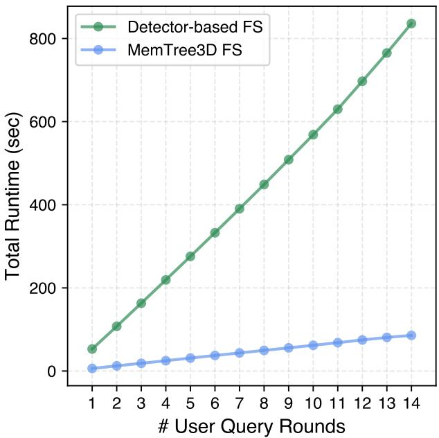  
Fig. 8: Runtime comparison with Detector-based frame sampling method when processing multi-round query. Our method consistently achieve eficient key frame selection compared with detector-based frame selection approach.

## 8 More detailed on eficiency analysis

We compare the runtime eficiency of our MemTree3D key frame selection framework against existing visual search-based approach, as shown in Fig 5. We also compare the eficiency analysis of multi-round query in Fig 8. Specifically, we measure the latency between receiving a user question and producing a response—an essential factor in real-world embodied AI scenarios. In such settings, an agent typically navigates in a 3D scene to collect visual observations and then answers user queries based on the visual stream. The key performance metric is the response time after receiving the user question. Visual search-based methods, such as VLM-Grounder [55], involve a multi-stage pipeline after receiving a question, resulting in substantial latency. The process typically includes:

1. Using an LLM to parse the question and extract a list of target objects relevant to the query.

2. Running open-vocabulary object detector on all video frames using the identified target objects as text prompts.

3. Sending the subset of frames containing detected objects to a VLM for question answering.

Among these steps, step 2 leads to large latency issue due to the extensive computational cost growing proportionally with the number of video frames. In contrast, our tree based frame selection framework pre-builds the 3D representation before receiving the user’s question, instead of searching the answer in the video frames, our work searches the key frame from the constructed MemTree3D, therefore bypasses this extensive visual search process, and incurs minimal latency regardless of the video length, as illustrated in Fig 5.

## 9 Implementation Details

LLM/VLM Inference Parameters. We set the inference temperature of GPT-4o and LLaVA-OneVision-7B to 0.0, and 0.6 for Qwen3 following the default setting. The rest of the inference parameters follow the default generation configuration from their corresponding huggingface repositories and oficial API setting.

LLM Location Selection Prompt. We present the full prompt used for location selection with GPT-4o in Fig 9. The prompt includes a one-shot example illustrating the expected JSON response format, along with custom tags such as <think> and <answer> to guide the model’s reasoning and output parsing.

Image-text Retrieval Baseline. We implement the Image-text retrieval baseline using CLIP [45] from the openai-clip-vit-base-patch32 checkpoint. We directly use the user question as input text and compare the image-text cosine similarity to retrieve the top k images for GPT-4o VLM input.

## 10 Additional Qualitative Results

We present more qualitative results in Fig 10. With more frame selection results comparison with VLM image-text retrieval baseline method [45]. Here, we present several failure cases of the VLM image-text retrieval baseline, including 1. VLM fails to retrieve any key frames related to question (row 1), where the key frame selection required question reasoning and location understanding. 2. VLM samples key frames from the similar location and viewpoint, and failed to retrieve correct key frame for the question (row 2-4), as direct selecting top-k frames based on similarity score can lead to over sample on the similar location and viewpoint, our MemTree3D segments the 3D scene into multiple LocNode and alleviates this issue.

## 11 Limitations and Failure Cases

Despite the better eficiency and significant performance gain over existing visual search key frame selection method, our MemTree3D still has its limitation. Our tree based key frame selection paradigm can occasionally fail in some challenging object localization question where the object is not directly detected. More specifically, when the object localization question is querying an entirely novel object that is not part of MemTree3D, the LLM during key frame querying process will make its most educated guess to select several most possible locations that the target object might appear, but this best efort of reasoning does not always yield successful object localization. We illustrate several failure cases in Fig 11, where the LLM selects several reasonable locations but fails to retrieve the target objects.

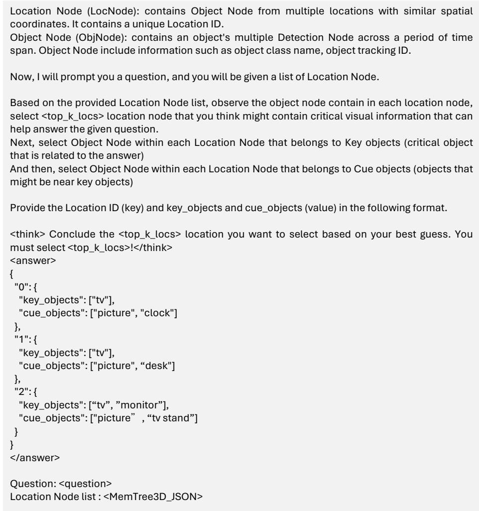  
Fig. 9: LLM prompt for MemTree3D querying and location selection.

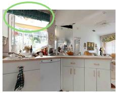  
What color is the curtain over the sink?  
Ours: Green

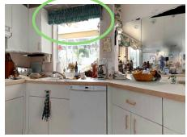

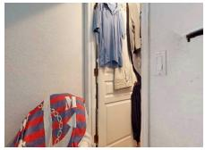  
VLM Retrieval: Yellow

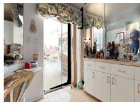

What is the color of the couch in the living room?  
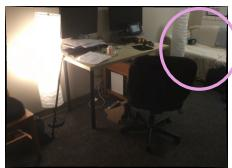

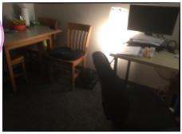  
Ours: White

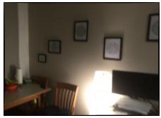

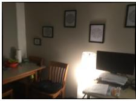  
VLM Retrieval: Brown

## What white object is in-between the couch and TV stand?

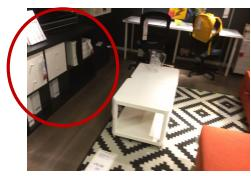  
Ours: Table

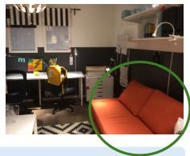

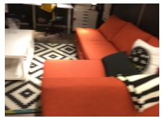

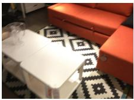  
VLM Retrieval: There is no object

What is to the right of the brown table?  
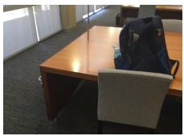  
Ours: Shelf

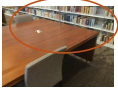

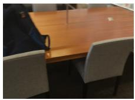

  
VLM Retrieval: Chair

Fig. 10: Additional qualitative results comparison between our MemTree3D framework and VLM retrieval baseline. We showcase several cases, including 1. VLM fails to retrieve any key frames related to question (row 1). 2. VLM samples key frames from the similar location and viewpoint, and failed to retrieve correct key frame for the question (row 2-4).

Where is the cardboard cat scratcher?  
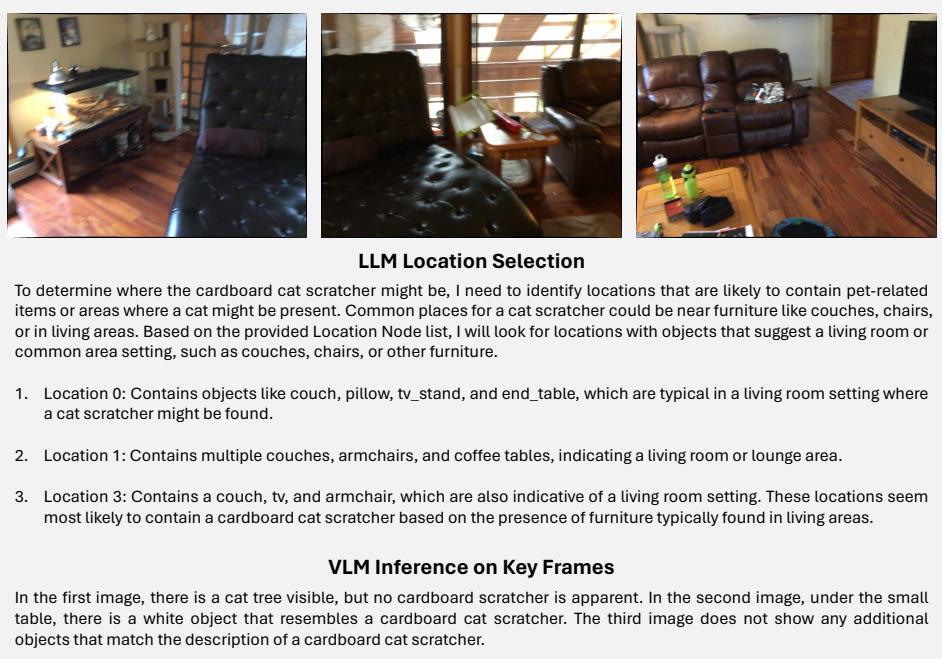  
Fig. 11: A failure case of an novel object localization question from the OpenEQA. The question asked to locate where is the cardboard cat scratcher, because the cat scratcher is not part of the ObjNode in MemTree3D, our LLM conduct its best reasoning efort to select the most possible locations that the cat scratcher can be. However, the final selected frames does not contain a clear view for VLM to answer the question.