# Noisy group neurons with synchronous resetting for high-performance spiking neural networks

Yajie Zhai1, Yanmei Kang∗1,2, Meng Li3,4, and Zigang Huang†3,4

1Department of Applied Mathematics, School of Mathematics and Statistics, Xi’an Jiaotong University, Xi’an 710049, China

2Center for Intersection of Mathematics and Life Sciences, Xi’an Jiaotong University, Xi’an 710049, China

3The Key Laboratory of Biomedical Information Engineering of Ministry of Education, Institute of Health and Rehabilitation Science, School of Life Science and Technology, Xi’an Jiaotong University, Xi’an 710049, China

4Research Center for Brain-inspired Intelligence, Xi’an Jiaotong University, Xi’an 710049, China

## Abstract

Spiking neural networks (SNNs), characterized by bio-inspired neuronal dynamics and event-driven communi cation, have attained significant progress in recent years. Nevertheless, training deep SNNs remains challenging due to spatiotemporal information loss and gradient mismatching. To simultaneously address these issues, we propose a noisy group neuron (NGN) model, which incorporates population-level synchronous resetting and neural stochasticity as fundamental computational mechanisms. We then develop the NGN method as a framework that combines the NGN model with backpropagation learning based on mean-field dynamics. We demonstrate the advantages of the NGN method through theoretical analysis and experimental validation on CIFAR-10, CIFAR-100, Tiny-ImageNet, DVS-Gesture, N-Caltech101, and CIFAR10-DVS. The proposed approach achieves an accuracy of 87.35% on CIFAR10-DVS within 10 inference time steps. These results support NGN as a practical approach to high-performance neuromorphic computing.

Keywords: spiking neural network; stochastic resonance; gradient mismatching; synchronous resetting; mean-field learning

## 1 Introduction

Spiking Neural Networks (SNNs) are recognized as the third generation of neural networks for their biological plausibility and event-driven sparse communication.1–3 Inspired by human brains, spiking neurons, as the building blocks of SNNs, emulate neural information processing via the evolution of the membrane potential and spiking mechanism. The temporal dynamics make SNNs particularly advantageous for handling asynchronous, event-driven data streams from Address-Event Representation (AER) neuromorphic sensors, such as Dynamic Vision Sensors (DVS).7 Consequently, SNN-based algorithms have proven efective in applications such as vision sensing,8 image recognition and segmentation, odor classification, policy optimization, multimodal inference, fault diagnosis,9 and autonomous robotics.6 With the development of neuromorphic hardware, such as IBM’s TrueNorth10 and Intel’s Loihi 2 chips,11 SNNs have already become promising candidates for edge computing and low-power AI.

The existing SNNs primarily employ leaky integrateand-fire (LIF) neurons to balance biological plausibility with computational simplicity.4 This has enabled significant advances in neuromorphic computing, but it introduces two fundamental challenges that limit the training eficiency and performance of SNNs. The first challenge arises from information loss in spatiotemporal encoding by LIF neurons.12 Due to the binary spike representation and single-channel connection architecture, LIF neurons face a representational dilemma in simultaneously encoding spatial intensity distributions and temporal dynamics.13 This limitation becomes particularly evident over brief temporal windows: when facing subthreshold stimuli of varying strengths, the absence of spike responses renders diferent intensity levels indistinguishable, despite producing distinct membrane potential waveforms. The second challenge stems from the gradient mismatching. The LIF neuron operates following a non-diferentiable firing-and-resetting mechanism,14 which prevents direct backpropagation in gradient-based supervised learning.15 To overcome this issue, surrogate gradient learning (SGL) methods utilize smooth approximations of the derivative associated with spike generation.16 Despite their significant success in training deep SNNs,16, 17 SGL methods inherently sufer from a critical inconsistency between the continuous gradients in backpropagation and the discrete binary spikes generated during forward inference. This forward–backward discrepancy creates gradient mismatching and reduces learning eficiency.18, 19

Both challenges are interconnected manifestations of the same underlying structural constraints imposed by the all-or-none nature of spike generation in LIF neurons, and various overcoming techniques have been developed from two aspects. On one hand, eforts including adaptive smoothing mechanisms,19 finite diference gradients,15 surrogate module learning,47 and complementary membrane potential dynamics46 have achieved notable success in speeding up the convergence of training and alleviating the gradient mismatching. On the other hand, diverse neuronal models have been explored for enriching the expressive power, from learnable LIF neurons20, 21 and dynamically regulated neurons22 to multi-compartment neurons23 and parallel-neuron architectures,24, 25 so that information loss can be minimized. Along this direction, Adaptive Fission allocates weighted neuron groups to sensitive units for low-latency population coding,26 whereas multiplication-free parallelizable spiking neurons pursue eficient spatiotemporal dynamics.27 Nevertheless, although the methods in the first category enhance training convergence and gradient flow, they do not fundamentally address the information loss inherent in spatiotemporal encoding. The architectural modifications in the second category enrich expressive power, but they tend to introduce substantial optimization dificulties. These techniques therefore result in a problematic trade-of: improvements in one dimension come at the expense of the other, leaving most existing SNNs unable to achieve both eficient training and high-performance inference simultaneously. Therefore, a valuable trade-of between training eficiency and encoding accuracy remains necessary from fundamentally diferent architectural principles.

To seek such a trade-of, the proposed model starts from the collective response of a finite noisy-neuron array. Each member receives the same deterministic presynaptic input and an independent noise sample. Averaging their binary responses produces a graded spike with resolution $1 / K$ , while constructive noise can expose weak subthreshold diferences through stochastic-resonance efects.28–34 We further introduce population-level synchronous resetting. After the group response is aggregated, all members start the next time step from the same aggregated post-spike state. This operation couples the otherwise independent members and avoids tracking K independent membrane histories. The response-dependent reduction of the subsequent shared state creates competitive suppression, a functional efect that has also been described as lateral inhibition in related work.35

Based on the above two mechanisms, we propose a noisy group neuron (NGN) to address spatiotemporal information loss and gradient mismatching simultaneously. The finite group response is an empirical firing probability, while the Gaussian surrogate used in backpropagation is the corresponding population probability. This correspondence enables us to quantify how the forward response approaches the backward matching signal as K increases. The paper is structured as follows. Section 2 presents the NGN dynamics and synchronousresetting implementation. Section 3 analyzes neuronlevel stochastic resonance and information enhancement. Section 4 develops the mean-field learning algorithm and studies gradient mismatching. Section 5 reports classification, ablation, group-size, and computational-cost experiments. Section 6 gives the conclusion.

## 2 Noisy group neuron model

## 2.1 Population dynamics and mean-field approximation

Following the statistical-neurodynamics perspective, our group neuron model is developed based on an array of K noisy identical independent LIF neurons. Let $V _ { k } ( t )$ denote the membrane potential of the k-th member neuron for $1 \leq k \leq K$ . Then, the evolution of the membrane potential can be delineated as

$$
\begin{array} { c } { { \tau _ { m } d V _ { k } ( t ) = \left[ - V _ { k } ( t ) + R _ { m } I _ { 0 } \right] d t + \sigma _ { 0 } d W _ { k } ( t ) , } } \\ { { V _ { k } ( t ) \leq V _ { t h } . } } \end{array}\tag{1}
$$

where $\tau _ { m }$ is the membrane time constant, $R _ { m }$ is the membrane resistance constant, $V _ { t h }$ is a prescribed spike threshold, $I _ { 0 }$ is the deterministic presynaptic current input, $d W _ { k } ( t )$ is the independent increment of Wiener process to describe the stochastic fluctuation, and $\sigma _ { 0 }$ is usually referred to as the noise intensity.

Once $V _ { k } ( t )$ reaches the threshold $V _ { t h }$ from below, a spike (namely, action potential) is emitted, the membrane potential is immediately returned to a resting potential $V _ { r e } ,$ and the evolution in Eq. (1) is restarted. Assuming that the kth neuron remains in the sub-threshold regime from t to $t + \Delta t .$ , we obtain

$$
\begin{array} { r } { V _ { k } ( t + \Delta t ) = \left( 1 - e ^ { - \frac { \Delta t } { \tau _ { m } } } \right) R _ { m } I _ { 0 } + V _ { k } ( t ) e ^ { - \frac { \Delta t } { \tau _ { m } } } } \\ { + \frac { \sigma _ { 0 } } { \tau _ { m } } \int _ { t } ^ { t + \Delta t } e ^ { - \frac { t + \Delta t - s } { \tau _ { m } } } d W _ { k } ( s ) } \end{array}\tag{2}
$$

is a Gaussian process of zero mean. By Ito’s isometry,

$$
E \left( \frac { \sigma _ { 0 } } { \tau _ { m } } \int _ { t } ^ { t + \Delta t } e ^ { \frac { - ( t + \Delta t - s ) } { \tau _ { m } } } d W _ { k } ( s ) \right) ^ { 2 } = \frac { \sigma _ { 0 } ^ { 2 } } { 2 \tau _ { m } } \left( 1 - e ^ { - \frac { 2 \Delta t } { \tau _ { m } } } \right)
$$

$$
\begin{array} { r } { \mathrm { I f } \xi _ { k } ( t ) = \frac { \sigma _ { 0 } } { \tau _ { m } } \int _ { t } ^ { t + \Delta t } e ^ { - \frac { t + \Delta t - s } { \tau _ { m } } } d W _ { k } ( s ) , \mathrm { t h e n } } \end{array}\tag{3}
$$

$$
\xi _ { k } ( t ) \sim N \left( 0 , \frac { \sigma _ { 0 } ^ { 2 } } { 2 \tau _ { m } } \left( 1 - e ^ { - \frac { 2 \Delta t } { \tau _ { m } } } \right) \right) .\tag{4}
$$

We fix $R _ { m } = 1 / ( 1 - \tau )$ with $\tau = e ^ { - \frac { \Delta t } { \tau _ { m } } }$ and denote ${ V _ { k } } ( t + \Delta t )$ as $V _ { k } ^ { t + 1 }$ for simplicity of notation. Then, by Eq. (2), we have

$$
V _ { k } ^ { t + 1 } = \tau V _ { k } ^ { t } + I _ { 0 } + \sigma \eta _ { k } ^ { t } ,\tag{5}
$$

where $\sigma ~ = ~ \sigma _ { 0 } { \sqrt { { \textstyle { \frac { 1 } { 2 \tau _ { m } } } } \left( 1 - e ^ { - { \textstyle { \frac { 2 \Delta t } { \tau _ { m } } } } } \right) } }$ and $\eta _ { k } ^ { t } \ \sim \ N ( 0 , 1 )$ Here, we take $\Delta { t }$ as a hyperparameter such that $\Delta t <$ ${ \tau _ { m } } ^ { 3 6 }$ and the ∆t-dependent noise intensity $\sigma$ can ensure that the discrete model statistically resembles its continuous counterpart.

Let $O _ { k } ^ { t }$ represent the spike of the kth neuron at time t, such that $O _ { k } ^ { t } = \Theta \left( V _ { k } ^ { t } - V _ { t h } \right)$ . Incorporating the hardresetting mechanism into Eq. (5) yields

$$
V _ { k } ^ { t + 1 } = \tau H _ { k } ^ { t } + I _ { 0 } + \sigma \eta _ { k } ^ { t } , \quad 1 \leq k \leq K ,\tag{6}
$$

where $H _ { k } ^ { t } = V _ { k } ^ { t } \left( 1 - O _ { k } ^ { t } \right) + V _ { r e } \delta _ { 1 , O _ { k } ^ { t } }$ and $\delta _ { 1 , O _ { k } ^ { \prime } }$ is Dirac notation. However, it is computationally expensive to track the dynamics of each sub-neuron in Eq. (6). We therefore model the collective behavior through a meanfield approximation. Averaging both sides of $\operatorname { E q . } \ ( 2 )$ over $k = 1 , 2 , \ldots , K$ gives

$$
\begin{array} { c } { \displaystyle \bar { V } ( t + \Delta t ) = \left( 1 - e ^ { - \frac { \Delta t } { \tau _ { m } } } \right) R _ { m } I _ { 0 } + \bar { V } ( t ) e ^ { - \frac { \Delta t } { \tau _ { m } } } + } \\ { \displaystyle \frac { \sigma _ { 0 } } { \tau _ { m } } \int _ { t } ^ { t + \Delta t } e ^ { \frac { - ( t + \Delta t - s ) } { \tau _ { m } } } \varsigma ( s ) d s , } \end{array}\tag{7}
$$

where $\begin{array} { r } { \varsigma ( s ) = \frac { 1 } { K } \sum _ { k = 1 } ^ { K } d W _ { k } ( s ) } \end{array}$ and $\bar { V } ( t )$ is the average membrane potential.

By the law of large numbers, the arithmetic average $\varsigma ( s ) \stackrel { p } {  } 0$ as $K  \infty$ . Therefore, taking the limit $K  \infty$ in Eq. (7), we obtain the mean-field dynamics

$$
\bar { V } ( t + \Delta t ) = \left( 1 - e ^ { - \frac { \Delta t } { \tau _ { m } } } \right) R _ { m } I _ { 0 } + \bar { V } ( t ) e ^ { - \frac { \Delta t } { \tau _ { m } } } ,\tag{8}
$$

in the large K limit.

With the hard-threshold resetting mechanism and the simplified notation in Eq. (6) taken into account, Eq. (8) can be simplified into

$$
\bar { V } ^ { t + 1 } = \tau \operatorname* { l i m } _ { K \to \infty } \bar { H } _ { K } ^ { t } + I _ { 0 } ,\tag{9}
$$

where

$$
\bar { H } _ { K } ^ { t } = \frac { 1 } { K } \sum _ { k = 1 } ^ { K } V _ { k } ^ { t } \left( 1 - O _ { k } ^ { t } \right) + \frac { V _ { r e } } { K } \sum _ { k = 1 } ^ { K } \delta _ { 1 , O _ { k } ^ { t } }
$$

is the average resetting voltage across all subneurons. To further simplify Eq. (9), we employ a mean-field approximation.37 When $V _ { r e } = 0$ , Eq. (9) can be approximated as

$$
\bar { V } ^ { t + 1 } = \tau \bar { V } ^ { t } \left( 1 - \bar { O } ^ { t } \right) + I _ { 0 } ,\tag{10}
$$

where $\bar { O } ^ { t }$ is the average firing rate of subneurons and ${ \bar { V } } ^ { t }$ is the average membrane potential at time t. Here the approximation relies on the mean-field assumption that the membrane potentials of subneurons $V _ { k } ^ { t } \sim \bar { \mathcal { N } } ( \bar { V } ^ { t } , \sigma ^ { 2 } )$ Then, in the large K limit, it is obvious that

$$
\begin{array} { l } { \displaystyle \operatorname* { l i m } _ { K  \infty } \bar { H } _ { K } ^ { t } = \bar { V } ^ { t } ( 1 - \bar { O } ^ { t } ) - \frac { \sigma } { \sqrt { 2 \pi } } \mathrm { e x p } ( - \frac { ( V _ { t h } - \bar { V } ) ^ { 2 } } { 2 \sigma ^ { 2 } } ) } \\ { \displaystyle \qquad + V _ { r e } \bar { O } ^ { t } . } \end{array}\tag{11}
$$

Notice that $\begin{array} { r l } { \frac { \sigma } { \sqrt { 2 \pi } } \exp \left( - \frac { \left( V _ { t h } - \bar { V } \right) ^ { 2 } } { 2 \sigma ^ { 2 } } \right) } & { { } { \hat { \mathbf { \Gamma } } } } \end{array}$ 0 when $\sigma \ < \ 1$ Then when $V _ { r e } = 0$ , we get the mean-field equation (10) from Eq. (9).

## 2.2 Finite-size sampling implementation

The mean-field approximation in Section 2.1 characterizes the idealized limit $K  \infty$ . In implementation, we use a finite population of K members to trade sampling accuracy against computation and memory.

With the above preparation, we formulate the finitesize sampling version of the NGN model. Let $v _ { k } ^ { t , n }$ and $o _ { k } ^ { t , n }$ denote the voltage and spike output of member k on layer n at time t. The noisy presynaptic input is $\tilde { I } _ { k } ^ { t , n - 1 } = I ^ { t , n - 1 } + \sigma \eta _ { k } ^ { t , n - 1 }$ , where $I ^ { t , n - 1 }$ is shared by the group and $\eta _ { k } ^ { t , n - 1 } \sim \ddot { N } ( 0 , 1 )$ is sampled independently for each member.

Similarly to Eq. (6), when $V _ { r e } = 0$ , the voltage and spike of each member neuron are calculated as

$$
\begin{array} { r } { v _ { k } ^ { t , n } = \tau h _ { k } ^ { t - 1 , n } + \tilde { I } _ { k } ^ { t , n - 1 } , o _ { k } ^ { t , n } = \Theta \left( v _ { k } ^ { t , n } - V _ { t h } \right) , } \end{array}\tag{12}
$$

where $h _ { k } ^ { t - 1 , n }$ is the resetting membrane potential of member neuron k. The averaged membrane potential $\bar { v } ^ { t , n }$ and aggregated firing rate $\bar { o } ^ { t , n }$ within the K-member NGN model are computed as

$$
\bar { v } ^ { t , n } = \tau \bar { h } ^ { t - 1 , n } + I ^ { t , n - 1 } , \quad \bar { o } ^ { t , n } = \frac { 1 } { K } \sum _ { k = 1 } ^ { K } o _ { k } ^ { t , n }\tag{13}
$$

with the synchronous-resetting state $\bar { h } ^ { t , n } = \bar { v } ^ { t , n } ( 1 - \bar { o } ^ { t , n } )$ Here, $\bar { o } ^ { t , n }$ is a graded spike taking values in $\left\{ 0 , \frac { 1 } { K } , \ldots , 1 \right\}$ rather than a binary spike. Such graded event representations are supported by neuromorphic hardware including Intel Loihi $\bar { 2 . } ^ { 1 1 }$

To couple the population through synchronous resetting and reduce state-tracking complexity, we modify Eq. (12) as

$$
\begin{array} { r } { v _ { k } ^ { t , n } = \tau \bar { h } ^ { t - 1 , n } + \tilde { I } _ { k } ^ { t , n - 1 } , o _ { k } ^ { t , n } = \Theta \left( v _ { k } ^ { t , n } - V _ { t h } \right) . } \end{array}\tag{14}
$$

Replacing each $h _ { k } ^ { t - 1 , n }$ with $\bar { h } ^ { t - 1 , n }$ synchronously initializes all members from one post-spike state. A larger $\bar { o } ^ { t , n }$ more strongly reduces the next shared state, producing competitive suppression without an explicit inhibitory circuit; related suppression has also been termed lateral inhibition.35 Eqs. (13)–(14) and Fig. 1 define the resulting graded response and compact recurrence. NGN reduces to stochastic LIF at $K = 1$ and to deterministic LIF as $\sigma \to 0$

## 3 Efects of aperiodic stochastic resonance

We use mutual information to quantify stochasticresonance efects in NGN and relate neuron-level encoding to network performance.12, 34, 38

Let $M I \left( I ^ { t } , o ^ { t } \right)$ be the mutual information between the presynaptic input $I ^ { t }$ and the output spike $o ^ { t }$ at time $t ,$ then we have

$$
M I \left( I ^ { t } , o ^ { t } \right) = H \left( o ^ { t } \right) - H \left( o ^ { t } \mid I ^ { t } \right) ,\tag{15}
$$

where $\begin{array} { r } { H ( o ^ { t } ) = - \sum _ { o } p ( o ^ { t } ) \log _ { 2 } p ( o ^ { t } ) } \end{array}$ and $H ( o ^ { t } \mid I ^ { t } ) =$ $\textstyle { \int { f _ { I ^ { t } } ( y ) H ( o ^ { t } \mid I ^ { t } = y ) d y } }$ . Thus, $M I ( I ^ { t } , o ^ { t } )$ measures how much input information is retained by the neuronal response.

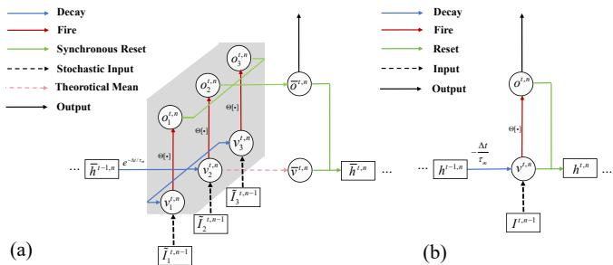

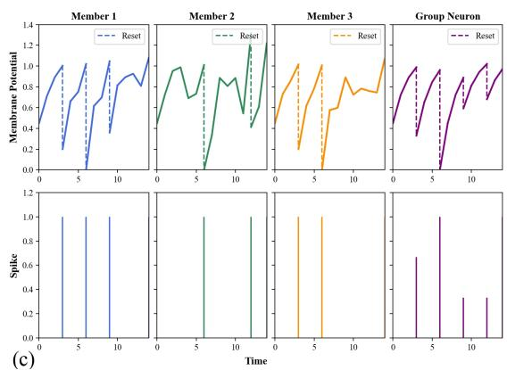  
Figure 1: NGN architecture and temporal response for $K = 3 . \ ( \mathrm { a } )$ Members integrate independently perturbed inputs from a shared post-resetting state; their averaged spikes determine the next shared state. (b) Conventional LIF dynamics. (c) Example member and group responses for $\Delta t = 0 . 5 , I ^ { t } = 0 . 4 , \tau _ { m } = 1 , V _ { t h } = 1$ , and $V _ { r e } = 0 $ dashed segments denote resetting.

For NGN models, $I ^ { t , n - 1 }$ is the presynaptic input from the $( n - 1 )$ th layer at time $t , \bar { o } ^ { t , n }$ is the output spike state and $\bar { v } ^ { t , n }$ is the spatially accumulated membrane potential of the nth layer at time t. Then it can be deduced that MI $\left( I ^ { t , n - 1 } , \bar { o } ^ { t , n } \right) = M I \left( \bar { v } ^ { t , n } , \bar { o } ^ { t , n } \right)$ by the following Proposition 1.

Proposition 1. Assume that the presynaptic inputs $I ^ { t , n - 1 } = I \sim N ( \mu _ { I } , \sigma _ { I } ^ { 2 } )$ for all $t \geq 1$ . Given the observed spike values $\bar { o } ^ { 1 , n } , \bar { o } ^ { 2 , n } , \dots , \bar { o } ^ { t - 1 , n }$ of one NGN model, the membrane potential $\bar { v } ^ { t , n }$ approximately follows $N ( \mu _ { v } , \sigma _ { v } ^ { 2 } )$ where $\sigma _ { v } ^ { 2 } \propto \sigma _ { I } ^ { 2 } , \mu _ { v } \propto \mu _ { I }$

Proof.

Proposition 1 demonstrates that the aggregated membrane potential has the same distribution type as the presynaptic input when the presynaptic input from the previous layer is consistent in time. This assumption and the property can be seen as an extension of the deterministic LIF neuron with Gaussian input.39 Nevertheless, the spatially aggregated spike $\bar { o } ^ { t , n }$ follows a diferent distribution, as stated in Proposition 2.

Proposition 2. For the given membrane potential $\overline { { v } } ^ { t , n }$ we have $K \bar { o } ^ { t , n } \sim { \cal B } \left( K , p ^ { t , n } \right)$ That is, the probability mass function for $\bar { o } ^ { t , n }$ has the following form

$$
\begin{array} { l } { { \displaystyle P \left\{ \bar { o } ^ { t , n } = \frac { k } { K } \right\} \triangleq f _ { \bar { o } ^ { t , n } } \left( \left. \frac { k } { K } \right| \bar { v } ^ { t , n } \right) } } \\ { { \displaystyle \qquad = \left( \begin{array} { l } { { K } } \\ { { k } } \end{array} \right) \left( p ^ { t , n } \right) ^ { k } \left( 1 - p ^ { t , n } \right) ^ { K - k } } } \end{array}\tag{16}
$$

where K denotes the group size of the NGN model and $p ^ { t , n }$ is the probability that a firing event occurs at time t, given by

$$
p ^ { t , n } \triangleq p _ { k } ^ { t , n } = 1 - F _ { \eta } \left( \frac { V _ { t h } - \bar { v } ^ { t , n } } { \sigma _ { \eta } } \right) .\tag{17}
$$

Here $F _ { \eta }$ is the cumulative density function of the injected Gaussian white noise η of intensity $\sigma _ { \eta }$

Building upon Propositions 1 and 2, we obtain the analytical form of mutual information for the NGN model in Theorem 1.

Theorem 1. Assume that the presynaptic input $I ^ { t , n - 1 } \sim$ $N ( \mu _ { I } , \sigma _ { I } ^ { 2 } )$ are $i . i . d .$ for all $t \geq 1$ . The mutual information $M I ( I ^ { t , n } , \bar { o } ^ { t , n } )$ between $I ^ { t , n - 1 }$ and graded spike $\bar { o } ^ { t , n }$ in the NGN model is

$$
\begin{array} { l } { { { \cal M } I ( I ^ { t , n - 1 } , { \bar { \sigma } } ^ { t , n } ) = \displaystyle - \sum _ { k = 0 } ^ { K } f _ { \bar { \sigma } ^ { t , n } } \left( \frac { k } { K } \right) \log _ { 2 } \left( \frac { f _ { \bar { \sigma } ^ { t , n } } \left( \frac { k } { K } \right) } { \binom { K } { K } } \right) } } \\ { { ~ + K \displaystyle \int _ { - \infty } ^ { \infty } f _ { \bar { \sigma } ^ { t , n } } ( v ) p ^ { t , n } \log _ { 2 } p ^ { t , n } d v } } \\ { { ~ + K \displaystyle \int _ { - \infty } ^ { \infty } f _ { \bar { \sigma } ^ { t , n } } ( v ) \left( 1 - p ^ { t , n } \right) } } \\ { { ~ \times \log _ { 2 } \left( 1 - p ^ { t , n } \right) d v } , } \end{array}
$$

where $f _ { \bar { o } ^ { t , n } } \left( \frac { k } { K } \right)$ in the first term is

$$
\begin{array} { r } { f _ { \bar { \sigma } ^ { t , n } } \left( \cfrac { k } { K } \right) = \frac { \sigma _ { \eta } } { \sqrt { \pi } \sigma _ { v } } \binom { K } { k } \int _ { - \infty } ^ { \infty } h ( u ) ^ { k } \left( 1 - h ( u ) \right) ^ { K - k } } \\ { \exp \left( - \left( \cfrac { \sigma _ { \eta } u } { \sigma _ { v } } + \cfrac { V _ { t h } - \mu _ { v } } { \sqrt { 2 } \sigma _ { v } } \right) ^ { 2 } \right) d u , } \end{array}\tag{18}
$$

with $\begin{array} { r } { h ( u ) = \frac { 1 } { 2 } \operatorname { e r f c } ( - u ) } \end{array}$ and $f _ { \bar { v } ^ { t n } } ( v )$ in the second term reads

$$
f _ { \bar { v } ^ { t , n } } ( v ) = \frac { 1 } { \sqrt { 2 \pi } \sigma _ { v } } \exp \left( - \frac { { ( v - \mu _ { v } ) } ^ { 2 } } { 2 \sigma _ { v } ^ { 2 } } \right) ,
$$

with $\sigma _ { v } \propto \sigma _ { I } , \mu _ { v } \propto \mu _ { I }$

Proof.

To validate Theorem 1, we have recorded both Gaussian and non-Gaussian presynaptic inputs $I ^ { t , n - 1 }$ from a well-trained ResNet-18 during the validation stage for classification of CIFAR-10. Then the mutual information $M I \left( I ^ { t , n - 1 } , \bar { o } ^ { t , n } \right)$ is computed to characterize the stochastic resonance behavior of the NGN model under diferent inputs. We first consider the Gaussian presynaptic inputs (Fig. 2(a)), where the $\mathrm { Q - Q }$ plot confirms the Gaussian nature of the distribution. As shown in Fig. 2(b)–(c), the theoretical predictions (solid curves) agree well with the simulation results (dashed curves). Notably, mutual information exhibits a non-monotonic dependence on noise intensity when $K \ge 2$ , indicating the occurrence of stochastic resonance. In contrast, this phenomenon is absent in the single neuron model $( K = 1 )$ . This demonstrates a key advantage of the nontrivial NGN model.

For non-Gaussian inputs that cannot be described by Theorem 1, we recorded presynaptic inputs from the trained ResNet-18. The $\mathrm { Q - Q }$ plot in Fig. 2(d) clearly reveals non-Gaussianity. We compute the mutual information through direct numerical simulation, and as shown in Fig. 2(e)–(f), stochastic resonance still emerges only when $K \geq 2 .$ . This confirms that noise can enhance information transmission in the NGN model more efectively than in the single LIF model, regardless of the input distribution. Moreover, by comparing Fig. 2(c) and Fig. 2(f), we observe that the optimal noise intensity remains relatively consistent for both Gaussian inputs and for non-Gaussian inputs across the time domain. This consistency across diferent input distributions and iterations suggests that noise intensity can be reasonably fixed as a hyperparameter in our algorithm design.

Table 1: The relationship between neuronal mutual information and network performance.
<table><tr><td>Neuron</td><td>Metric</td><td> $\sigma = 0$ </td><td> $\overline { { \sigma = 0 . 2 5 } }$ </td><td> $\sigma = 0 . 5$ </td><td> $\sigma = 0 . 7 5$ </td><td> $\sigma = 1$ </td></tr><tr><td>Net neuron 1</td><td>MI Acc(%)</td><td>0.30 91.19</td><td>0.43 93.22</td><td>0.47 94.50</td><td>0.44 70.27</td><td>0.37 9.23</td></tr><tr><td>Block1.neuron1</td><td>MI  $\operatorname { A c c } ( \% )$ </td><td>0.21 92.37</td><td>0.32 93.60</td><td>0.35 94.50</td><td>0.33 76.20</td><td>0.28 9.09</td></tr><tr><td>Block1.neuron2</td><td>MI Acc(%) MI</td><td>0.41 92.12</td><td>0.54 93.82</td><td>0.55 94.50</td><td>0.49 79.75</td><td>0.41 10.12</td></tr><tr><td>Block2.neuron1</td><td> $\operatorname { A c c } ( \% )$ </td><td>0.20 91.08</td><td>0.30 93.22</td><td>0.34 94.50</td><td>0.32 83.52</td><td>0.27 14.13</td></tr><tr><td>Block2.neuron2</td><td>MI  $\operatorname { A c c } ( \% )$ </td><td>0.34 91.58</td><td>0.47 93.35</td><td>0.48 94.50</td><td>0.45 85.86</td><td>0.38 13.99</td></tr></table>

Two remarks are pertinent. First, stochastic resonance tends to occur only for nontrivial groups $( K > 1 )$ resembling suprathreshold stochastic resonance.32 Unlike a parallel array whose members retain independent histories,40, 41 synchronous resetting makes the next efective baseline depend on the current aggregated response. Second, parameter-induced stochastic resonance can be obtained by tuning model parameters rather than noise intensity.28, 30, 32 Because connection weights are learned while noise intensity is treated as a hyperparameter, NGN can be interpreted through this parameter-induced suprathreshold-resonance perspective.

We further demonstrate that the enhancement of neuronal information encoding capability directly translates to improved network performance through a controlled experimental design. We maintain a constant noise intensity for all layers preceding the target neuron while systematically varying the noise intensity σ for the target neuron and subsequent layers. Table 1 presents the mutual information and classification accuracy of ResNet-18 under diferent noise intensities, measured at various neuronal layers.

The results show a consistent trend across the examined neurons, from the input layer (Net neuron 1) to deeper residual blocks (Block 1 and Block 2). Both mutual information and network accuracy exhibit a singlepeak dependence on noise intensity: they increase with noise intensity, reach a maximum at $\sigma = 0 . 5 ,$ and then decrease at higher noise levels. This pattern is consistent with stochastic resonance in the NGN model. In particular, the noise intensity $\sigma = 0 . 5$ that maximizes mutual information also yields the best classification accuracy (94.50%). The agreement between neuronal-level information transmission and network-level performance suggests that enhanced information encoding is associated with improved classification performance.

## 4 Mitigating gradient mismatching in learning process

Just as in the backpropagation learning of SNNs, the non-diferentiability of spiking activities is still an annoying obstacle in the NGN method. The representative resolutions are ANN-to-SNN conversion35 and surrogate gradients (SG).16, 17 In SG-based learning, the gradient of spiking impulse is replaced by an appropriate surrogate function so that the backpropagation learning becomes accessible. Note that the SG-based learning requires fewer training steps and accordingly reduces inference costs, but the resultant gradient mismatching may lead to suboptimal outcomes.18, 19

In this paper, we adopt the SG-based learning framework and train NGN-based SNNs following the spatial and temporal back-propagation (STBP) paradigm. Im portantly, rather than arbitrarily selecting a surrogate function, we derive the Gaussian surrogate function directly from the mean-field approximation established in Eq. (10). This principled derivation not only provides theoretical justification for the choice of surrogate function but also helps mitigate gradient mismatching through the ensemble structure of the NGN model. For completeness, we now present this derivation.

## 4.1 STBP-based learning rules

Let us illustrate the training algorithm with a fully connected N-layer feedforward SNN of NGN models, with architecture shown in Fig. 3. Given $T > 0$ , by taking the firing rate

$$
s = \frac { 1 } { T } \sum _ { t = 1 } ^ { T } \bar { o } ^ { t , N }
$$

as the output of the network, the loss function L can be defined through the cross-entropy or temporal eficient training (TET) loss42 as

$$
L = \mathcal { L } \left( s , y \right) ,
$$

where y is the label vector of the desired categories. Since the gradient training is to minimize the training loss function by updating the connecting weights along the negative gradient direction, the forward propagation of spikes and the backward propagation of errors are symmetrical in the gradient-based training, as shown in Fig. 3. Hence, in order to elucidate the backward propagation of loss, it is imperative to first examine the forward propagation mechanism in the SNN within NGN methods.

(a)  
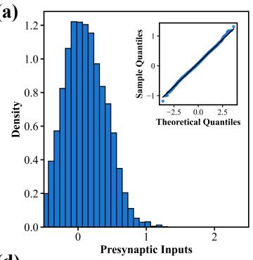

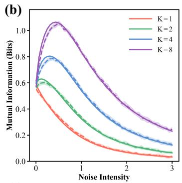

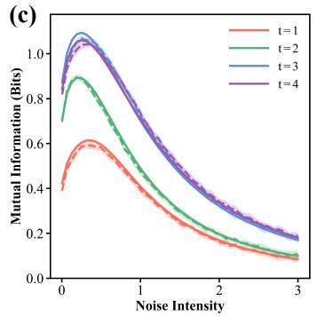

(d)  
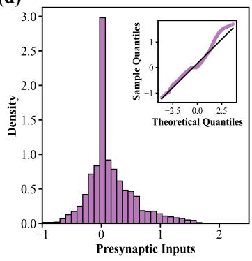

(e)  
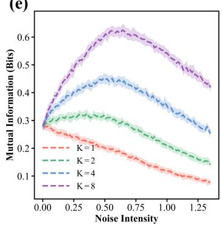

(f)  
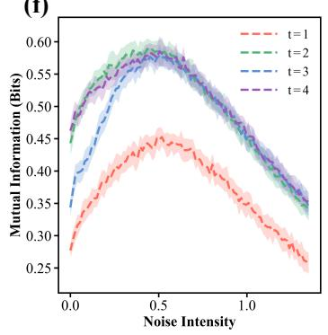

Figure 2: Stochastic resonance behavior of the NGN model characterized by the input-output mutual information $M I \left( I ^ { t , n - 1 } , \bar { O } ^ { t , n } \right)$ under the recorded presynaptic Gaussian inputs and non-Gaussian inputs. The Gaussian presynaptic input (a) and the corresponding input-output mutual information versus noise intensity are shown in the first row under diferent group sizes or iteration: (b) t = 1; (c) K = 4. Here, the theoretical prediction is shown in solid curves and the simulated results are shown in dashed curves. The shaded regions represent one standard deviation of the data. The non-Gaussian input (d) and the corresponding mutual information are shown in the second row under diferent group sizes or iteration steps: (e) $t = 1 ; ( \mathrm { f } ) \ K = 4$ . The initial noise intensity for training ResNet-18 is $\sigma _ { 0 } = 0 . 5$ . The quantile-quantile (Q-Q) plot embedded in (a) and (d) signifies how the presynaptic input deviates from Gaussian distribution. The non-monotonic curves in (b), (c), (e) and (f) manifest the occurrence of stochastic resonance.  
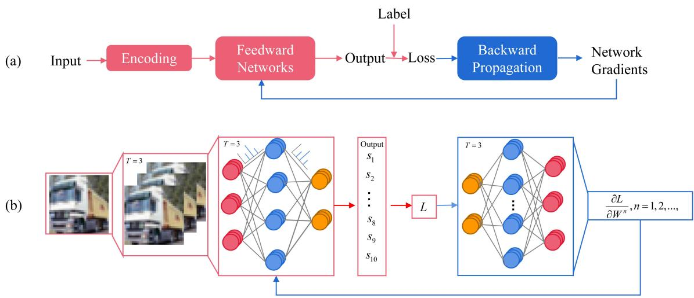  
Figure 3: Flowcharts of the fully connected N-layer SNNs: (a) a general procedure and (b) the NGN-based procedure. Forward spike propagation and backward loss propagation are symmetric in gradient learning. Here, $\overline { { \partial { } L } }$ represents the gradient of the loss L with respect to the weights $w ^ { n }$ for n = 1, 2, . . ..

As seen from Eqs. (13) and (14), each member neuron of the NGN model at nth layer receives the same deterministic presynaptic inputs $I ^ { t , n } = W ^ { n } \bar { o } ^ { t , n - 1 }$ and evolves instantaneously regulated by the graded spike output $\bar { o } ^ { t , n }$ and the aggregated membrane potential of $\bar { v } ^ { t , n }$ in the NGN model. Here, $\bar { v } ^ { t , n }$ and $\bar { o } ^ { t , n }$ represent the integration of firing behaviors of all member neurons. In other words, it is the collective response of NGN models that is designed to dominate the feedforward propagation of the SNN, thus it is reasonable to assume that all the K member neurons share the same gradients $\frac { \partial \bar { o } ^ { t , n } } { \partial \bar { v } ^ { t , n } }$ And by $\mathrm { S T B P , ^ { 1 6 } }$ the parameter optimization rule for the NGN-based SNN can be expressed as

$$
W ^ { n }  W ^ { n } - \gamma \frac { \partial L } { \partial W ^ { n } } ,\tag{19}
$$

where

$$
\begin{array} { r l } & { \displaystyle \frac { \partial { \cal L } } { \partial W ^ { n } } = \frac { \partial { \cal L } } { \partial s } \sum _ { t } \frac { \partial s } { \partial \bar { v } ^ { t , n } } \frac { \partial \bar { v } ^ { t , n } } { \partial W ^ { n } } , } \\ & { \displaystyle \frac { \partial { \cal L } } { \partial \bar { u } ^ { t , n } } = \frac { \partial { \cal L } } { \partial \bar { \sigma } ^ { t , n } } \frac { \partial \bar { \sigma } ^ { t , n } } { \partial \bar { v } ^ { t , n } } + \frac { \partial { \cal L } } { \partial \bar { \sigma } ^ { t + 1 , n } } \frac { \partial \bar { \sigma } ^ { t + 1 , n } } { \partial \bar { \sigma } ^ { t , n } } , } \end{array}\tag{20}
$$

and $\gamma$ stands for the learning rate. Nevertheless, as shown in $\mathrm { F i g . 4 ( a ) }$ , the discrete graded spike $\bar { o } ^ { t , n }$ is stochastic and not everywhere diferentiable, hence how to calculate $\frac { \partial \bar { o } ^ { t , n } } { \partial \bar { v } ^ { t , n } }$ , namely the derivative of the graded spike train with respect to aggregated membrane potential, is still a barrier.

To resolve this, we utilize the mean-field dynamics in Eq. (10) to replace the evolution of individual member neurons in Eq. (13) and Eq. (14), which naturally provides a diferentiable surrogate. That is to say,

$$
\frac { \partial \bar { o } ^ { t , n } } { \partial \bar { v } ^ { t , n } } = \left. \frac { \partial \bar { O } ^ { t } } { \partial \bar { V } ^ { t } } \right| _ { \bar { O } ^ { t } = \bar { o } ^ { t , n } , \bar { V } ^ { t } = \bar { v } ^ { t , n } } .\tag{21}
$$

where the average firing rate $\bar { O } ^ { t }$ is given as

$$
\begin{array} { l } { { \displaystyle \bar { O } ^ { t } = E _ { \eta ^ { t } } \left[ \Theta \left( \bar { V } ^ { t } - V _ { t h } \right) \right] _ { \bar { V } ^ { t } = \bar { v } ^ { t , n } } } } \\ { { \displaystyle = \int _ { - \infty } ^ { \frac { \bar { v } ^ { t , n } - V _ { t h } } { \sigma _ { \eta } } } \frac { 1 } { \sqrt { 2 \pi } } \exp \left( - \frac { x ^ { 2 } } { 2 } \right) d x . } } \end{array}\tag{22}
$$

and the average membrane potential $\bar { V } ^ { t } = \bar { v } ^ { t , n }$ . From the above derivation, we obtain

$$
\frac { \partial \bar { \upsilon } ^ { t , n } } { \partial \bar { \upsilon } ^ { t , n } } = \frac { 1 } { \sqrt { 2 \pi } \sigma _ { \eta } } \exp \left( - \frac { \left( \bar { \upsilon } ^ { t , n } - V _ { t h } \right) ^ { 2 } } { 2 { \sigma _ { \eta } } ^ { 2 } } \right) ,\tag{23}
$$

which exactly aligns with the Gaussian surrogate function in $\mathrm { R e f . } ^ { 1 \check { 6 } }$ Similar to this derivation, when uniform noise $\eta \sim \mathcal { U } [ - a , a ]$ is injected into Eqs. (13) and (14), differentiating the mean-field output yields the rectangular surrogate function16

$$
\frac { \partial \bar { o } ^ { t , n } } { \partial \bar { v } ^ { t , n } } = \frac 1 { 2 a } , \quad | \bar { v } ^ { t , n } - V _ { t h } | < a .
$$

We refer to the NGN model, together with this mean-field dynamics gradient estimation collectively, as the NGN method. With all the preparation in mind, a pseudocode for the NGN method can be summarized as Algorithm 1.

Algorithm 1. Training of SNN based on the NGN   
method   
Input: Network input and label $( X , Y )$ , timestep   
$T ,$ group size $K$ neuronal hyperparameters   
$\{ V _ { m } , \tau _ { m } , \Delta t , R _ { m } , \sigma _ { o } \}$ , and learning rate γ   
Output: The trained parameter set W, and network   
output s   
Forward Pass:   
for $t = 1 , 2 , \dots , T$ do   
$o ^ { t , 1 } \gets$ Encoding(X)   
for the n-th layer with $n = 2 , \ldots , N$ do   
$\bar { v } ^ { t , n }$ ← GroupUpdate $( \bar { v } ^ { t - 1 , n } , \bar { o } ^ { t - 1 , n } , I ^ { t , n } )$   
$/ / \mathrm { E q . ( 1 3 ) }$   
for $k = 1 , \ldots , K$ do   
$\eta _ { ( k ) } ^ { n } $ RandomGenerator   
$( \stackrel { \cdot } { v } _ { k } ^ { t , n } , o _ { k } ^ { t , n } )$ ← MemberUpdate $( \bar { v } ^ { t , n } , \eta _ { ( k ) } ^ { n } )$   
$/ / \mathrm { E q . } ( 1 4 )$   
end for   
$\bar { o } ^ { t , n } \gets$ SpikingAggregation $( o _ { k } ^ { t , n } , K )$   
end for   
end for   
$\bar { o } ^ { t , N } \gets \mathrm { D }$ ecodingLayer $\left( o ^ { t , N - 1 } \right)$   
s ← TimeAverage $\left( \stackrel { \cdot } { O } ^ { t , N } \right)$   
$\mathcal { L }  \mathcal { L } ( s , y )$   
Backward Propagation:   
Calculate $\frac { \partial \mathcal { L } } { \partial s }$   
for the n-th layer with $n = N , N - 1 , \dots , 1$ do   
$\frac { \partial \bar { o } ^ { t , n } } { \partial \bar { v } ^ { t , n } } $ CollectiveGrad(¯vt,n, ξ) //Eq.(23)   
$\frac { \partial \mathcal { L } } { \partial W ^ { n } }  \mathrm { A }$ utoGrad $\textstyle { \left( { \frac { \partial { \bar { o } } ^ { t , n } } { \partial { \bar { v } } ^ { t , n } } } \right) }$   
$\begin{array} { r } { W ^ { n }  W ^ { n } - \gamma \frac { \partial \mathcal { L } } { \partial W ^ { n } } } \end{array}$   
end for

## 4.2 Mechanism for mitigating gradient mismatching

The gradient mismatching issue is characterized by two factors: (1) the divergence between the Dirac-delta function and surrogate gradients, and (2) the incompatibility between discrete binary spikes and continuous diferentiable signals (fictitious spikes) produced by surrogate gradients. To quantify this phenomenon, the gray shaded region in Fig. 4 illustrates the level of gradient mismatching in LIF-based SNNs under Gaussian surrogate gradients. In this subsection, we demonstrate how the NGN method efectively reduces gradient mismatching compared to conventional LIF neurons.

In this work, the fictitious spike from the surrogate gradient is defined as the integral of the surrogate gradient function. Ideally, if both forward and backward passes utilized mean-field dynamics of NGN models and surrogate gradients, gradient mismatching would be eliminated. However, in practice, information propagates through SNNs as discrete spike trains generated by the NGN method with finite K (as illustrated in Fig. 4), whereas surrogate gradients inherently operate on continuous signals. This fundamental discrepancy inevitably introduces a degree of gradient mismatching.

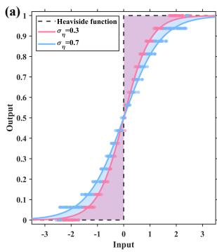

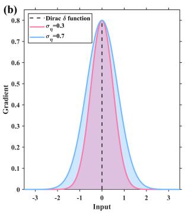  
Figure 4: Comparison of the $\mathrm { L I F }$ method and the NGN method $( K = 1 6 )$ in the forward pass (a) and the surrogate function form (b) under diferent noise intensities $\sigma _ { \eta } .$ The complete matching spike is equal to the integral of the surrogate gradient (the solid curve in (a)), whereas the actual graded spikes of NGN methods are represented by scatter points. The shaded area represents the level of gradient mismatching in the vanilla LIF-based SNN. $\sigma _ { \eta }$ is the scale parameter of surrogate gradients.

In the LIF-based SNNs, the level of gradient mismatching can be measured by the area of the shaded region,19 as shown in Fig. 4, but in the NGN method, a diferent metric is necessary due to the inherent randomness. Note that the gradient mismatching occurs mainly when the membrane potential v is near $V _ { t h }$ , thus for a given interval $V I = \bar { [ } V _ { t h } - L ( \varepsilon ) , V _ { t h } + L ( \varepsilon ) ]$ with $\varepsilon \in ( 0 , \frac { 1 } { 2 } )$ ， we can define the level of gradient mismatching as

$$
D _ { \varepsilon } \left( o , o _ { 0 } \right) = P \left( \left| o - o _ { 0 } \right| \geq \varepsilon , v \in V I \right) ,\tag{24}
$$

where o denotes the real spike from diferent neurons generated at v when the threshold is crossed, and $o _ { 0 }$ is the fictitious spike from surrogate gradient at the same v. That is, $D _ { \varepsilon } \left( o , o _ { 0 } \right)$ characterizes the probability that the discrepancy between the real spike and the fictitious spike exceeds $\varepsilon > 0$ when $v \in V I$ The smaller the probability, the lower the level of gradient mismatching.

Theorem 2. For the Gaussian surrogate function and its corresponding matching spike $o _ { 0 } { } _ { ; }$ given any ε, there exists the membrane potential interval V I and suficiently large K such that the following relationship holds:

$$
D _ { \varepsilon } \mathopen { } \mathclose \bgroup \left( o _ { N G N } , o _ { 0 } \aftergroup \egroup \right) < D _ { \varepsilon } \mathopen { } \mathclose \bgroup \left( o _ { L I F } , o _ { 0 } \aftergroup \egroup \right) .\tag{25}
$$

Proof.

□

Figure $\mathrm { 5 ( a - c ) }$ empirically evaluates Theorem 2 using recorded activities from a single-layer CIFAR-10 SNN. NGN with $K \geq 2$ yields lower mismatching probability than LIF for $\varepsilon = 0 . 1 , 0 . 2 5 , 0 . 4$ , and the gap increases with $K$ . The ResNet-18 loss curves in Fig. 5(d–e) likewise show faster optimization and lower final loss on CIFAR-10 and CIFAR-100. In contrast, K = 1 improves only the small-ε regime and performs worse for large ε, indicating that efective mitigation requires a nontrivial group.

## 5 Experiments

We evaluate NGN on static and neuromorphic image datasets, followed by neuron-model, synchronousresetting, group-size, and computational-cost analyses.

## 5.1 Static datasets

We use ResNet-19 on $\mathrm { C I F A R  – 1 0 / 1 0 0 ^ { 4 3 } }$ and VGG-13 on Tiny-ImageNet,44 with direct encoding.45 Table 2 shows that NGN remains efective at low latency. Without advanced augmentation, it obtains 94.98%/95.50% on CIFAR-10 and 78.81%/79.35% on CIFAR-100 at $T = 2 / 4$ . Auto-augmentation and Cutout further raise these results to 96.94%/97.02% and 82.61%/83.35%, respectively. On Tiny-ImageNet, NGN reaches 63.18% at $T = 4$ , while combining NGN with TET produces the best reported results in the table: 97.26%, 83.88%, and 64.70% on the three static benchmarks. These comparisons show that NGN benefits from temporal objectives and data augmentation without relying on long simulation windows.

On CIFAR-10, the NGN-based ResNet-19 improves from 94.98% at $T = 2$ to 95.50% at $T = 4$ without advanced augmentation. With augmentation, the corresponding results increase to 96.94% and 97.02%. A similar pattern occurs on CIFAR-100, where augmentation raises accuracy from 78.81% to 82.61% at $T = 2$ and from 79.35% to 83.35% at $T = 4$ This consistent improvement indicates that the NGN representation remains compatible with conventional image-level regularization.

On Tiny-ImageNet, NGN reaches 62.21% and 62.59% at $T = 2$ and $T = 4$ without Cutout, and 62.87% and 63.18% with Cutout. Incorporating TET further improves the three static benchmarks, yielding 97.26% on CIFAR-10, 83.88% on CIFAR-100, and 64.70% on Tiny-ImageNet. Thus, the group-neuron mechanism and temporal loss provide complementary improvements rather than redundant efects.

## 5.2 Neuromorphic datasets

We evaluate DVS-Gesture, N-Caltech101, and CIFAR10- $\mathrm { D V S ^ { 7 , 5 4 , 5 5 } }$ using SNN-5 or VGG-SNN. As shown in Table 3, NGN+TET obtains 97.88%, 84.04%, and 87.35%, respectively, at $T = 1 0 .$ The gains are consistent across sensor types: on DVS-Gesture it exceeds NSNN+TET by 1.00 percentage point; on N-Caltech101 it improves over TET by 2.36 points; and on CIFAR10-DVS it exceeds TET, TKS, and CLIF+TET. This consistency indicates that the group response complements temporal training objectives rather than depending on one particular event representation.

For DVS-Gesture, NGN+TET exceeds NSNN+TET (96.88%) and the reproduced TET baseline (95.46%). On N-Caltech101, it outperforms SSNN (79.25%), tdBN+NDA (78.20%), and the reproduced TET result (81.68%). These improvements are obtained using the same ten-step observation window.

CIFAR10-DVS provides the most challenging eventbased comparison. NGN+TET reaches 87.35%, compared with 83.17% for TET, 85.30% for TKS, 85.23% for SML, and 86.10% for CLIF+TET. The results across all three datasets support the use of NGN with diferent event representations and network backbones.

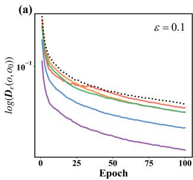  
(d)

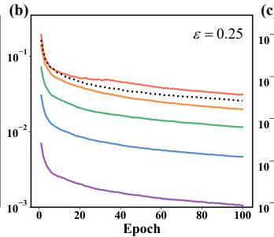

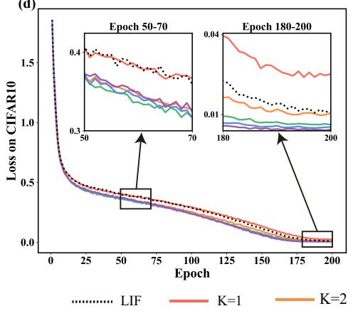  
(e)

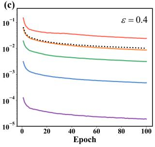

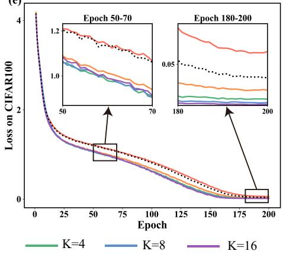  
Figure 5: Comparison of gradient mismatching levels and training loss between the baseline LIF method and the NGN method with diferent sizes K. (a-c) The logarithm of the gradient mismatching probability log $D _ { \varepsilon } { \big ( } o , o _ { 0 } { \big ) }$ calculated according to Eq. (24) for $\varepsilon = 0 . 1$ , 0.25, and 0.4, respectively. (d-e) Training loss curves on CIFAR-10 and CIFAR-100 datasets.

## 5.3 Performance comparison across neuron models

To evaluate the contribution of NGN, we compare it with alternative neuron models under the same network architecture, loss function, optimizer, learning rate, and initialized weights.

Table 4 compares deterministic LIF, CLIF, two noisy LIF variants, and NGN under the same ResNet-18/TET setup. Direct Gaussian or Bernoulli noise injection reduces accuracy relative to LIF, showing that noise alone is insuficient. In contrast, NGN reaches 95.17% on CIFAR-10 and 78.06% on CIFAR-100, improving over LIF by 1.23 and 1.52 points.

Table 4: Test accuracy and loss of neuron models on CIFAR datasets using ResNet-18 with TET $( T = 4 ,$ $K = 8 )$
<table><tr><td colspan="2">Neuron Accuracy (%) Loss</td></tr><tr><td colspan="2">CIFAR-10</td></tr><tr><td>Vanilla LIF</td><td>93.94 0.3853</td></tr><tr><td>CLIF 94.00</td><td>0.3807</td></tr><tr><td>Vanilla NLIF</td><td>93.69 0.3981</td></tr><tr><td>Bernoulli NLIF</td><td>92.87 0.4056</td></tr><tr><td>NGN 95.17</td><td>0.3385</td></tr><tr><td colspan="2">CIFAR-100</td></tr><tr><td>Vanilla LIF 76.54</td><td>1.18</td></tr><tr><td>CLIF</td><td>77.07 1.20</td></tr><tr><td>Vanilla NLIF</td><td>74.69 1.22 73.70</td></tr><tr><td>Bernoulli NLIF NGN</td><td>1.21 78.06 1.09</td></tr></table>

The two noisy single-neuron baselines are particularly informative. Vanilla NLIF obtains 93.69% and 74.69%, while Bernoulli NLIF obtains 92.87% and 73.70% on CIFAR-10 and CIFAR-100, respectively. Both are below deterministic LIF, confirming that the improvement of NGN cannot be attributed to noise injection alone. Population averaging and the matched learning formulation are required to convert noise into a useful computational mechanism.

## 5.4 Necessity of synchronous resetting

Table 5 isolates synchronous resetting on CIFAR-10 using ResNet-18, T = 4, and matched optimization settings. The no-sharing variant retains eight independent membrane histories; the complete NGN uses the shared state in Eqs. (13)–(14).

Without shared resetting, peak memory and epoch time increase by 3.96× and 6.14×, while accuracy changes only from 95.16% to 95.10%. Synchronous resetting therefore makes finite-population coding practical by compressing independent temporal histories into one recurrent state.

## 5.5 Accuracy–eficiency trade-ofs across group sizes

To examine how group size afects performance, we vary only the group size under otherwise identical ResNet-18 and optimization settings. We denote the group sizes in the training and testing phases as $K _ { \mathrm { t r a i n } }$ and $K _ { \mathrm { t e s t } } .$ respectively. Here, $K _ { \mathrm { t r a i n } }$ governs learning and gradient propagation, while $K _ { \mathrm { t e s t } }$ influences prediction through ensemble-based spatial information aggregation.

Table 2: Comparison of the NGN method $( K = 1 6 )$ with several existing methods on static image datasets, with \* denoting the cooperation of Cutout and/or data auto-augmentation techniques.
<table><tr><td>Dataset</td><td>Method</td><td>Architecture</td><td>Time steps</td><td>Top1-Accuracy</td></tr><tr><td rowspan="10">CIFAR-10</td><td> $\overline { { \mathrm { S T B P - t d B N } ^ { 3 9 } } }$ </td><td>ResNet-19</td><td>6</td><td>93.16</td></tr><tr><td>TET⁴2</td><td>ResNet-19</td><td>6</td><td>94.50</td></tr><tr><td> $\mathrm { I M - L O S S ^ { 1 2 } }$ </td><td>ResNet-19</td><td>2</td><td>93.85</td></tr><tr><td> $\mathrm { N S N N ^ { 2 1 } }$ </td><td>CIFAR Net</td><td>4</td><td>94.30</td></tr><tr><td> $\mathrm { D i e t - S N N ^ { 4 5 } }$ </td><td>VGG-16</td><td>4</td><td>92.76</td></tr><tr><td> $\mathrm { C L I F { + } T E T ^ { 4 6 } }$ </td><td>ResNet-18</td><td>8</td><td> $9 6 . 6 9 ^ { * }$ </td></tr><tr><td> $\mathrm { S M L ^ { 4 7 } }$ </td><td>ResNet-19</td><td>4</td><td> $9 6 . 8 2 ^ { * }$ </td></tr><tr><td> $\mathrm { T T S ^ { 4 8 } }$ </td><td>ResNet-19</td><td>2</td><td> $9 5 . 8 0 ^ { * }$ </td></tr><tr><td rowspan="2">NGN</td><td rowspan="2">ResNet-19</td><td>2</td><td> $\mathbf { \overline { { 9 4 . 9 8 { \pm } 0 . 0 8 / 9 6 . 9 4 { \pm } 0 . 0 8 ^ { \ast } } } }$ </td></tr><tr><td>4</td><td> $\mathbf { 9 5 . 5 0 { \pm } 0 . 1 0 / \ 9 7 . 0 2 { \pm } 0 . 0 9 ^ { \ast } }$ </td></tr><tr><td rowspan="10">CIFAR-100</td><td> $\mathbf { N G N + T E T }$ </td><td>ResNet-19</td><td>4</td><td> ${ \bf 9 5 . 8 9 { \pm } 0 . 0 8 \mathrm { ~ / ~ } 9 7 . 2 6 { \pm } 0 . 0 6 ^ { \ast } }$ </td></tr><tr><td> $\mathrm { T E T ^ { 4 2 } }$   $\mathrm { I M - L O S S ^ { 1 2 } }$ </td><td>ResNet-19</td><td>6</td><td>74.72</td></tr><tr><td> $\mathrm { C L I F { + } T E T ^ { 4 6 } }$ </td><td>VGG-16</td><td>5</td><td>70.18</td></tr><tr><td> $\mathrm { S M L ^ { 4 7 } }$ </td><td>ResNet-18</td><td>8</td><td>80.89*</td></tr><tr><td> $\mathrm { D i e t - S N N ^ { 4 5 } }$ </td><td>ResNet-19</td><td>4</td><td> $7 9 . 1 8 \mathrm { ~ / ~ } 8 1 . 7 0 ^ { * }$ </td></tr><tr><td> $\mathrm { N S N N ^ { 2 1 } }$ </td><td>VGG-16</td><td>5</td><td>69.27</td></tr><tr><td></td><td>CIFAR Net</td><td>4</td><td>74.17*</td></tr><tr><td>NGN</td><td>ResNet-19</td><td>2</td><td> $\mathbf { 7 8 . 8 1 { \pm } 0 . 1 0 ~ / ~ 8 2 . 6 1 { \pm } 0 . 1 0 ^ { * } }$ </td></tr><tr><td> $\mathbf { N G N + T E T }$ </td><td>ResNet-19</td><td>4</td><td> $\mathbf { 7 9 . 3 5 { \pm } 0 . 1 4 } \ / \ 8 3 . 3 5 { \pm } 0 . 1 6 ^ { \ast }$ </td></tr><tr><td> $\overline { { \mathrm { S p i k e - t h r i f t } ^ { 4 9 } } }$ </td><td></td><td>4</td><td> $\mathbf { 8 1 . 0 5 { \overset { . } { \mathop { / { ( 0 . 1 9  } \kern - delimiterspace } 9  } } ( 8 3 . 8 8 { \overset { . } { \mathop { ( 0 . 0 9  } \kern - delimiterspace } 9 } * }$ </td></tr><tr><td rowspan="6">Tiny-ImageNet</td><td></td><td>VGG-16</td><td>150</td><td>51.92</td></tr><tr><td> $\mathrm { A S G L ^ { 1 9 } }$ </td><td>VGG-13</td><td>8</td><td> $5 6 . 8 1 ^ { * }$ </td></tr><tr><td> $\mathrm { C L I F { + } T E T ^ { 4 6 } }$ </td><td>VGG-13</td><td>4</td><td>63.16*</td></tr><tr><td>NGN</td><td>VGG-13</td><td>2 4</td><td> $\mathbf { 6 2 . 2 1 { \pm } 0 . 2 5 }$  /  $\mathbf { 6 2 . 8 7 \pm 0 . 1 7 ^ { \ast } }$   $\mathbf { 6 2 . 5 9 } \pm \mathbf { 0 . 1 9 }$  /  $\mathbf { 6 3 . 1 8 { \pm } 0 . 1 7 ^ { * } }$ </td></tr><tr><td> $\mathbf { N G N + T E T }$ </td><td>VGG-13</td><td>2</td><td> $\mathbf { 6 2 . 6 1 { \pm 0 . 2 4 } }$  /  $\mathbf { 6 3 . 9 0 { \pm 0 . 2 3 } ^ { \ast } }$ </td></tr><tr><td></td><td></td><td>4</td><td> $\mathbf { 6 3 . 6 9 { \pm 0 . 1 2 } }$  /  $\mathbf { 6 4 . 7 0 { \pm } 0 . 1 3 ^ { \ast } }$ </td></tr></table>

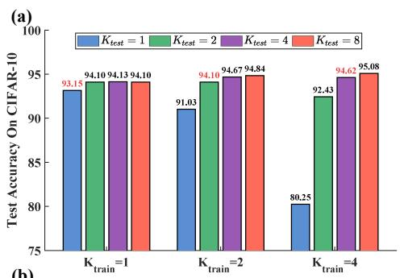  
(b)

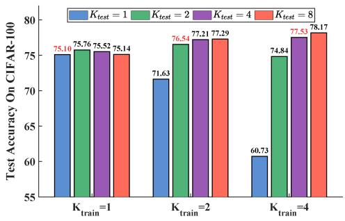  
Figure 6: Accuracy under diferent $K _ { \mathrm { t r a i n } }$ and $K _ { \mathrm { t e s t } }$ on (a) CIFAR-10 and (b) CIFAR-100; red values indicate equal group sizes.  
Figure 6 displays the test accuracy on CIFAR-10 and

CIFAR-100 under diferent combinations of $K _ { \mathrm { t r a i n } } \ \in$ $\{ 1 , 2 , 4 \}$ and $K _ { \mathrm { t e s t } } \in \{ 1 , 2 , 4 , 8 \}$ . Three observations can be made. First, when $K _ { \mathrm { t e s t } } = K _ { \mathrm { t r a i n } } .$ , the NGN method achieves stable accuracy on both datasets. Second, when $K _ { \mathrm { t e s t } } > K _ { \mathrm { t r a i n } } .$ , the accuracy generally increases. For instance, when $K _ { \mathrm { t r a i n } } = 2 .$ , increasing $K _ { \mathrm { t e s t } }$ from 2 to 8 improves the accuracy. Third, when $K _ { \mathrm { t e s t } } < K _ { \mathrm { t r a i n } }$ , the accuracy decreases, especially when $K _ { \mathrm { t e s t } } < K _ { \mathrm { t r a i n } } = 4$

These results show that the group size used during inference afects the performance of NGN. A larger $K _ { \mathrm { t e s t } }$ can improve accuracy when the model is trained with a smaller group, whereas reducing $K _ { \mathrm { t e s t } }$ below $K _ { \mathrm { t r a i n } }$ may cause an accuracy drop. Independently setting $K _ { \mathrm { t r a i n } }$ and $K _ { \mathrm { t e s t } }$ therefore provides a trade-of between training eficiency and inference accuracy.

## 5.6 Energy and memory cost of NGN

The memory complexity of SNNs during training can be approximated as $O ( W + T \cdot ( X + H ) ) .$ ,25 where W represents the number of synapses, T denotes the number of time steps, X is the input/output of all layers at a single time step, and H indicates the hidden state of all layers at a single time step. For LIF neurons, the hidden state includes the membrane potential before and after resetting.

Table 3: Comparison of the NGN method with TET loss implementation with the existing methods on neuromorphic image datasets, with † denoting the implemented results by us.
<table><tr><td>Dataset</td><td>Method</td><td>Architecture</td><td>Time steps</td><td>Top1-Accuracy</td></tr><tr><td rowspan="5">DVS-Gesture</td><td> $\overline { { { \mathrm { N S N N } } { \mathrm { N + } } { \mathrm { T E T } } ^ { 2 \mathrm { T } } } }$ </td><td>7B-Net</td><td>16</td><td>96.88</td></tr><tr><td> $\mathrm { S S N N ^ { 5 0 } }$ </td><td>VGG-9</td><td>8</td><td>94.91</td></tr><tr><td> $\mathrm { T E T ~ \dagger ^ { 4 2 } }$ </td><td>SNN-5</td><td>10</td><td>95.46</td></tr><tr><td> $\mathrm { D S G M + D ^ { \prime } T A M ^ { 5 1 } }$ </td><td>SNN-5</td><td>10</td><td>96.69</td></tr><tr><td> $\mathbf { N G N + T E T }$ </td><td>SNN-5</td><td>10</td><td>97.88±0.29</td></tr><tr><td rowspan="5">N-Caltech101</td><td> $\overline { { \mathrm { S S N N } ^ { \mathrm { 5 0 } } } }$ </td><td>VGG-9</td><td>8</td><td>79.25</td></tr><tr><td> $\mathrm { \ t d B N { + } N D A ^ { 5 2 } }$ </td><td>VGG-11</td><td>10</td><td>78.20</td></tr><tr><td> $\mathrm { T E T ~ \dagger ^ { 4 2 } }$ </td><td>VGG-SNN</td><td>10</td><td>81.68</td></tr><tr><td> $\mathrm { D S G M + D ^ { \prime } T A M ^ { 5 1 } }$ </td><td>VGG-SNN</td><td>10</td><td>76.39</td></tr><tr><td> $\mathbf { N G N + T E T }$ </td><td>VGG-SNN</td><td>10</td><td>84.04±0.34</td></tr><tr><td rowspan="8">CIFAR10-DVS</td><td> $\overline { { \mathrm { S T B P - t d B N } ^ { 3 9 } } }$ </td><td>ResNet-19</td><td>10</td><td>67.8</td></tr><tr><td> $\mathrm { T E T ^ { 4 2 } }$ </td><td>VGG-SNN</td><td>10</td><td>83.17</td></tr><tr><td> $\mathrm { I M { - } L o s s ^ { 1 2 } }$ </td><td>ResNet-19</td><td>10</td><td>72.60</td></tr><tr><td> $\mathrm { N S N N + T E T ^ { 2 1 } }$ </td><td>VGG-SNN</td><td>10</td><td>79.52</td></tr><tr><td> $\mathrm { C L I F { + } T E T ^ { 4 6 } }$ </td><td>VGG-SNN</td><td>10</td><td>86.1</td></tr><tr><td> $\mathrm { S M L ^ { 4 7 } }$ </td><td>VGG-SNN</td><td>10</td><td>85.23</td></tr><tr><td> $\mathrm { T K S ^ { 5 3 } }$ </td><td>ResNet-19</td><td>10</td><td>85.3</td></tr><tr><td> $\mathbf { N G N + T E T }$ </td><td>VGG-SNN</td><td>10</td><td>87.35±0.33</td></tr></table>

Table 5: Component ablation on CIFAR-10. Peak memory and time per epoch characterize training cost, and Accuracy reports the best test accuracy over 200 epochs.
<table><tr><td>Variant</td><td>K</td><td>Memory (MB)</td><td>Time/epoch (s)</td><td>Accuracy (%)</td></tr><tr><td>LIF (Gaussian surrogate)</td><td>1</td><td>2235.8</td><td>79.2</td><td>94.23</td></tr><tr><td>Noisy LIF</td><td>1</td><td>2237.4</td><td>81.8</td><td>93.32</td></tr><tr><td>NGN with synchronous resetting</td><td>8</td><td>2253.7</td><td>129.0</td><td>95.16</td></tr><tr><td>NGN w/o shared resetting</td><td>8</td><td>8933.8</td><td>791.5</td><td>95.10</td></tr></table>

For NGN methods, the hidden state is consistent with that of general neurons but requires generating $K \cdot X$ random numbers through pseudo-random number generators. Therefore, the additional memory cost of NGN is $O ( T \cdot ( K - 1 ) \cdot X )$ compared with LIF neurons. However, the input/output of neurons occupies only a small portion of the overall network memory, as memory is predominantly consumed by synaptic weights W. As shown in Table 6, maximum memory consumption rises only marginally with group size. For instance, on CIFAR-10, memory usage grows from 29.70 MB/image for LIF to 30.60 MB/image for NGN with $K = 1 6$ , an increase of approximately 3%. Training time per epoch increases more noticeably with K, mainly because more pseudorandom numbers must be generated; on CIFAR-10, it rises from 1.13 min/epoch for LIF to 2.46 min/epoch for NGN with K = 16.

This increase in memory and time usage is unavoidable on conventional GPU platforms. In inherently stochastic neuromorphic hardware, particularly memristor-based neuromorphic chips, the implementation may be more favorable. Memristive devices exhibit intrinsic stochasticity arising from random conductive-filament formation and rupture, ion migration, and thermal fluctuations.56 Although such stochasticity has traditionally been treated as a challenge requiring mitigation,57 recent work has explored its computational use.58 This intrinsic randomness may provide the random-number generation required by NGN without dedicated circuitry.

The additional energy consumption of NGN mainly comes from pseudo-random-number generation and extra synaptic operations. We estimate the latter through synaptic operations (SOps). For ResNet-18, NGN with $K \ = \ 8$ requires 5.66 × 102M SOps, compared with $5 . 5 8 \times 1 0 ^ { 2 } \mathrm { M }$ for $\mathrm { L I F , ^ { 5 3 } }$ corresponding to an increase of approximately 1.43%. Thus, the measured increase in synaptic operations remains modest.

Table 6. Memory and training time comparison across LIF and NGN methods with diferent group sizes K.
<table><tr><td rowspan="2"></td><td colspan="2">CIFAR-10</td><td colspan="2">CIFAR10-DVS</td></tr><tr><td>Time (min/ep)</td><td>Memory (MB/img)</td><td>Time (min/ep)</td><td>Memory (MB/img)</td></tr><tr><td>LIF</td><td>1.13</td><td>29.70</td><td>1.83</td><td>159.3</td></tr><tr><td>K=1</td><td>1.32</td><td>29.70</td><td>1.87</td><td>159.3</td></tr><tr><td>K=2</td><td>1.38</td><td>29.78</td><td>1.90</td><td>159.3</td></tr><tr><td>K=4</td><td>1.53</td><td>29.90</td><td>2.02</td><td>159.3</td></tr><tr><td>K=8</td><td>1.83</td><td>30.14</td><td>2.26</td><td>159.3</td></tr><tr><td>K=16</td><td>2.46</td><td>30.60</td><td>2.71</td><td>160.0</td></tr></table>

## 6 Conclusion

We proposed a novel NGN model to address spatiotemporal information loss and forward–backward gradient mismatching by combining finite-sample population coding, constructive noise, and population-level synchronous resetting. Based on this NGN model, we have then presented the NGN method to enhance representational capacity and improve training eficiency simultaneously. Experiments on static and neuromorphic datasets show that NGN improves classification performance over de-

terministic LIF baselines under the evaluated settings.   
Particularly, it has the following two merits.

The first merit is that the NGN method can enhance the representation and transmission ability of spatiotemporal information, as revealed by theoretical analysis and numerical verification. In fact, this point is not hard to understand, because it can be explained by the efect of parameter-induced stochastic resonance: the “trained” optimal parameters can maximally magnify the weak subthreshold feature in the presence of a suitable amount of noise. The second merit of the NGN method lies in its ability to efectively manage the computational requirements associated with member neurons. Note that in the absence of synchronous resetting, the NGN model is reduced to the parallel array of noisy LIF neurons. In the CIFAR-10 ablation, removing shared resetting increased peak memory by 3.96× and epoch time by 6.14×, while the two variants reached similar best accuracies after 200 epochs.

The population coding mechanism introduces additional computation, particularly for random-number generation and member-wise sampling. As discussed in Section 5.6, the measured memory and synaptic-operation increases remain modest, whereas training time grows with group size. Future work should therefore focus on more eficient stochastic implementations and hardwareaware control of the training and inference group sizes.

## Acknowledgments

This research is financially supported by the National Natural Science Foundation of China under Grant Nos. 12572040 and 12172268.

## References

[1] W. Maass, Networks of spiking neurons: The third generation of neural network models, Neural Networks 10 (1997) 1659–1671.

[2] K. Roy, A. Jaiswal and P. Panda, Towards spikebased machine intelligence with neuromorphic computing, Nature 575 (2019) 607–617.

[3] S. Ghosh-Dastidar and H. Adeli, Spiking neural networks, Int. J. Neural Syst. 19(4) (2009) 295–308. https://doi.org/10.1142/S0129065709002002.

[4] P. Rashvand, M. R. Ahmadzadeh and F. Shayegh, Design and implementation of a spiking neural network with integrate-and-fire neuron model for pattern recognition, Int. J. Neural Syst. 31(3) (2021) 2050073. https://doi.org/10.1142/ S0129065720500732.

[5] S.-I. Amari, K. Yoshida and K.-I. Kanatani, A mathematical foundation for statistical neurodynamics, SIAM J. Appl. Math. 33(1) (1977) 95–126. https://doi.org/10.1137/0133008.

[6] F. Alnajjar and K. Murase, Self-organization of spiking neural network that generates autonomous

behavior in a real mobile robot, Int. J. Neural Syst. 16(4) (2006) 229–239. https://doi.org/10.1142/ S0129065706000640.

[7] H. Li, H. Liu, X. Ji, G. Li and L. Shi, CIFAR10-DVS: An event-stream dataset for object classification, Front. Neurosci. 11 (2017) 309.

[8] Y. Kim and P. Panda, Optimizing deeper spiking neural networks for dynamic vision sensing, Neural Networks 144 (2021) 686–698.

[9] M. Shi, F. Jiang, Y. Li and L. Du, Biologically inspired information integration pooling module of spiking neural networks for rolling bearing fault diagnosis, Expert Syst. Appl. 286 (2025) 128032.

[10] P. A. Merolla, J. V. Arthur, R. Alvarez-Icaza, A. S. Cassidy, J. Sawada, F. Akopyan et al., A million spiking-neuron integrated circuit with a scalable communication network and interface, Science 345(6197) (2014) 668–673.

[11] G. Orchard, E. P. Frady, D. B. D. Rubin, S. Sanborn, S. B. Shrestha, F. T. Sommer and M. Davies, Eficient neuromorphic signal processing with Loihi 2, in Proc. IEEE Workshop on Signal Processing Systems (SiPS) (2021).

[12] Y. Guo, Y. Chen, L. Zhang, X. Liu, Y. Wang, X. Huang and Z. Ma, IM-loss: Information maximization loss for spiking neural networks, in Advances in Neural Information Processing Systems, Vol. 35 (2022), pp. 156–166.

[13] L. Fan, H. Shen, X. Lian, Y. Li, M. Yao, G. Li and D. Hu, A multisynaptic spiking neuron for simultaneously encoding spatiotemporal dynamics, Nat. Commun. 16 (2025) 7155.

[14] W. Gerstner, W. M. Kistler, R. Naud and L. Paninski, Neuronal Dynamics: From Single Neurons to Networks and Models of Cognition (Cambridge University Press, Cambridge, 2014).

[15] Y. Li, Y. Guo, S. Zhang, S. Deng, Y. Hai and S. Gu, Diferentiable spike: Rethinking gradient-descent for training spiking neural networks, in Advances in Neural Information Processing Systems, Vol. 34 (2021).

[16] Y. Wu, L. Deng, G. Li, J. Zhu and L. Shi, Spatio-temporal backpropagation for training high performance spiking neural networks, Front. Neurosci. 12 (2018) 331.

[17] E. O. Neftci, H. Mostafa and F. Zenke, Surrogate gradient learning in spiking neural networks: Bringing the power of gradient-based optimization to SNNs, IEEE Signal Process. Mag. 36(6) (2019) 51– 63.

[18] W. Zhang and P. Li, Temporal spike sequence learning via backpropagation for deep spiking neural networks, in Advances in Neural Information Processing Systems, Vol. 33 (2020).

[19] Z. Wang, R. Jiang, S. Lian, R. Yan and H. Tang, Adaptive smoothing gradient learning for spiking neural networks, in Proc. 40th Int. Conf. on Machine Learning (ICML) (2023), pp. 35798–35816.

[20] W. Fang, Z. Yu, Y. Chen, T. Masquelier, T. Huang and Y. Tian, Incorporating learnable membrane time constant to enhance learning of spiking neural networks, in Proc. IEEE/CVF Int. Conf. on Computer Vision (ICCV) (2021), pp. 2641–2651.

[21] G. Ma, R. Yan and H. Tang, Exploiting noise as a resource for computation and learning in spiking neural networks, Patterns 4(10) (2023) 100831.

[22] Z. Zhang, J. Guo, N. An, J. Wu, M. Zhang, S. Xiang and Y. Li, TF-SNN: Temporal focus-based dynamic neuron regulation framework for spiking neural networks, Expert Syst. Appl. 329 (2026) 132981.

[23] Y. Sun, F. Zhao, Z. Zhao and Y. Zeng, Multicompartment neuron and population encoding powered spiking neural network for deep distributional reinforcement learning, Neural Networks 182 (2025) 106898.

[24] L. Feng, Q. Liu, H. Tang, D. Ma and G. Pan, Multilevel firing with spiking DS-ResNet: Enabling better and deeper directly-trained spiking neural networks, in Proc. 31st Int. Joint Conf. on Artificial Intelligence (IJCAI) (2022), pp. 2471–2477.

[25] W. Fang, Z. Yu, Z. Zhou, D. Chen, Y. Chen, Z. Ma, T. Masquelier and Y. Tian, Parallel spiking neurons with high eficiency and ability to learn long-term dependencies, in Advances in Neural Information Processing Systems, Vol. 36 (2023), pp. 53674–53687.

[26] Y. Jiang, F. Chen, Y. Li, Y. Liu, H. Gao, T. Zhang and Y. Fang, Adaptive fission: Post-training encoding for low-latency spike neural networks, in Advances in Neural Information Processing Systems, Vol. 38 (2025).

[27] P. Xue, W. Fang, Z. Ma, Z. Huang, Z. Zhou, Y. Tian, T. Masquelier and H. Zhou, Multiplicationfree parallelizable spiking neurons with eficient spatio-temporal dynamics, in Advances in Neural Information Processing Systems, Vol. 38 (2025).

[28] R. Benzi, A. Sutera and A. Vulpiani, The mechanism of stochastic resonance, J. Phys. A 14(11) (1981) L453–L457.

[29] H. A. Braun, K. Wissing, K. Schäfer and M. C. Hirsch, Oscillation and noise determine signal transduction in shark multimodal sensory cells, Nature 367(6460) (1994) 270–273.

[30] L. Gammaitoni, P. Hänggi, P. Jung and F. Marchesoni, Stochastic resonance, Rev. Mod. Phys. 70(1) (1998) 223–287.

[31] F. Moss, L. M. Ward and W. G. Sannita, Stochastic resonance and sensory information processing: A tutorial and review of application, Clin. Neurophysiol. 115(2) (2003) 267–281.

[32] Y. Fu, Y. Kang and G. Chen, Stochastic resonance based visual perception using spiking neural networks, Front. Comput. Neurosci. 14 (2020) 10.

[33] M. D. McDonnell, N. G. Stocks, C. E. M. Pearce and D. Abbott, Optimal information transmission in nonlinear arrays through suprathreshold stochastic resonance, Phys. Lett. A 352(3) (2005) 183–189.

[34] N. G. Stocks, Information transmission in parallel arrays of threshold elements: Suprathreshold stochastic resonance, Phys. Rev. E 63 (2001) 041114.

[35] L. Lv, W. Fang, L. Yuan and Y. Tian, Optimal ANN-SNN conversion with group neurons, in Proc. IEEE Int. Conf. on Acoustics, Speech and Signal Processing (ICASSP) (2024), pp. 6475–6479. https://doi. org/10.1109/ICASSP48485.2024.10448202.

[36] Q. Meng, M. Xiao, S. Yan, Y. Wang, Z. Lin and Z.-Q. Luo, Training high-performance low-latency spiking neural networks by diferentiation on spike representation, in Proc. IEEE/CVF Conf. on Computer Vision and Pattern Recognition (CVPR) (2022), pp. 12444–12453.

[37] Y. Yang, R. Luo, M. Li, M. Zhou, W. Zhang and J. Wang, Mean field multi-agent reinforcement learning, in Proc. Int. Conf. on Machine Learning (ICML) (2018), pp. 5571–5580.

[38] Z. Xu, Y. Zhai and Y. Kang, Mutual information measure of visual perception based on noisy spiking neural networks, Front. Neurosci. 17 (2023) 1155362.

[39] H. Zheng, Y. Wu, L. Deng, Y. Hu and G. Li, Going deeper with directly-trained larger spiking neural networks, in Proc. AAAI Conf. on Artificial Intelligence (AAAI), Vol. 35 (2021), pp. 11062–11070.

[40] S. Durrant, Y. Kang, N. Stocks and J. Feng, Suprathreshold stochastic resonance in neural processing tuned by correlation, Phys. Rev. E 84 (2011) 011923.

[41] Y. Kang, Y. Fu and Y. Chen, Signal-to-noise ratio gain of an adaptive neuron model with gamma renewal synaptic input, Acta Mech. Sin. 38 (2022) 521347.

[42] S. Deng, Y. Li, S. Zhang and S. Gu, Temporal eficient training of spiking neural network via gradient re-weighting, in Proc. Int. Conf. on Learning Representations (ICLR) (2022).

[43] A. Krizhevsky, Learning multiple layers of features from tiny images, Technical Report TR-2009 (University of Toronto, 2009).

[44] Y. Le and X. Yang, Tiny ImageNet visual recognition challenge, Technical Report CS231N (Stanford University, 2015).

[45] N. Rathi and K. Roy, DIET-SNN: A low-latency spiking neural network with direct input encoding and leakage and threshold optimization, IEEE Trans. Neural Netw. Learn. Syst. 34(6) (2023) 3174– 3182.

[46] Y. Huang, X. Lin, H. Ren, H. Fu, Y. Zhou, Z. Liu, B. Pan and B. Cheng, CLIF: Complementary leaky integrate-and-fire neuron for spiking neural networks, in Proc. 41st Int. Conf. on Machine Learning (ICML) (2024), pp. 19949–19972.

[47] S. Deng, H. Lin, Y. Li and S. Gu, Surrogate module learning: Reduce the gradient error accumulation in training spiking neural networks, in Proc. Int. Conf. on Machine Learning (ICML) (2023), pp. 7645–7657.

[48] Y. Guo, Y. Chen, X. Liu, W. Peng, Y. Zhang, X. Huang and Z. Ma, Ternary spike: Learning ternary spikes for spiking neural networks, in Proc. AAAI Conf. on Artificial Intelligence (AAAI), Vol. 38 (2024), pp. 12244–12252.

[49] S. Kundu, G. Datta, M. Pedram and P. A. Beerel, Spike thrift: Towards energy-eficient deep spiking neural networks by limiting spiking activity via attention-guided compression, in Proc. IEEE/CVF Winter Conf. on Applications of Computer Vision (WACV) (2021), pp. 3953–3962.

[50] Y. Ding, L. Zuo, M. Jing, P. He and Y. Xiao, Shrinking your timestep: Towards low-latency neuromorphic object recognition with spiking neural networks, in Proc. AAAI Conf. on Artificial Intelligence (AAAI), Vol. 38 (2024), pp. 11811–11819.

[51] G. Shen, D. Zhao and Y. Zeng, Exploiting nonlinear dendritic adaptive computation in training deep spiking neural networks, Neural Networks 170 (2024) 190–201.

[52] Y. Li, Y. Kim, H. Park, T. Geller and P. Panda, Neuromorphic data augmentation for training spiking neural networks, in Proc. European Conf. on Computer Vision (ECCV) (2022), pp. 631–649.

[53] Y. Dong, D. Zhao and Y. Zeng, Temporal knowledge sharing enables spiking neural network learning from past and future, IEEE Trans. Artif. Intell. 5(7) (2024) 3524–3534. https://doi.org/10.1109/TAI. 2024.3374268.

[54] A. Amir, B. Taba, D. Berg, T. Melano, J. McKinstry, C. Di Nolfo, T. Nayak, A. Andreopoulos, G. Garreau, M. Mendoza, J. Kusnitz, M. Debole, S. Esser, T. Delbruck, M. Flickner and D. Modha, A low power, fully event-based gesture recognition system, in Proc. IEEE Conf. on Computer Vision and Pattern Recognition (CVPR) (2017), pp. 7243–7252.

[55] G. Orchard, A. Jayawant, G. K. Cohen and N. Thakor, Converting static image datasets to spiking neuromorphic datasets using saccades, Front. Neurosci. 9 (2015) 437.

[56] F. J. Alonso, D. Maldonado, A. M. Aguilera and J. B. Roldán, Memristor variability and stochastic physical properties modeling from a multivariate time series approach, Chaos Solitons Fractals 143 (2021) 110461.

[57] H. Zhao, Z. Liu, J. Tang, B. Gao, Q. Qin, J. Li, Y. Zhou, P. Yao, Y. Xi, Y. Lin, H. Qian and H. Wu, Energy-eficient high-fidelity image reconstruction with memristor arrays for medical diagnosis, Nat. Commun. 14 (2023) 2276.

[58] C. Ding, Y. Ren, Z. Liu and N. Wong, Transforming memristor noises into computational innovations, Commun. Mater. 6 (2025) 149.