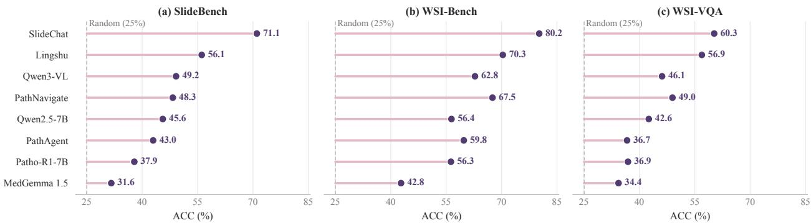
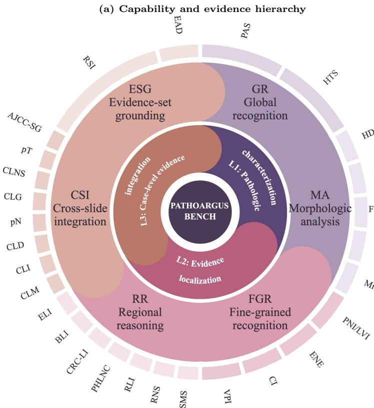
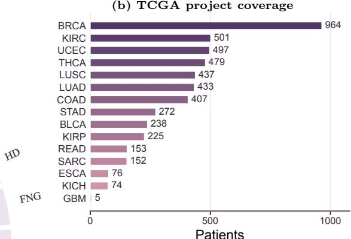
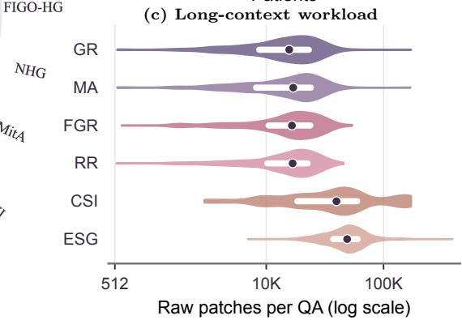

# PathoArgus: Advancing Evidence-Grounded Long-Context Visual Reasoning across Gigapixel Whole-Slide and Multi-Slide Case Contexts

Bowen Liu1, Qixiang Zhang1, Xiaomeng Li1

1The Hong Kong University of Science and Technology

Whole-slide pathology reasoning requires models to integrate gigapixel-scale visual evidence across complete case-linked slides, yet current question-answering benchmarks primarily measure final answer accuracy—a metric vulnerable to linguistic priors and benchmark regularities, and insuficient to establish that predictions are grounded in the supplied tissue. We introduce PathoArgus-Bench, a benchmark and evaluation protocol that explicitly tests the full evidence chain: availability, accessibility, use, and responsiveness. PathoArgus-Bench comprises 22,078 four-choice questions from 4,913 patients across 15 TCGA projects, covering six pathology capabilities across three levels of evidence demand, and operates under a fixed reader budget that retains only a small fraction of the gigapixel context. To further isolate evidence-grounded reasoning, we contribute ESG (Evidence State Quartets), a controlled set of 483 quartets where the question text is fixed while the target WSI set is moved, replaced, or removed, requiring consistent predictions across all states. Evaluating 20 general-purpose, medical, and pathology-specific systems reveals a stark gap: while GPT-5.6 achieves 57.09% overall accuracy and 57.04% on ESG, it correctly completes only 19 of 483 quartets (3.93% QExact), exposing that row-level accuracy does not translate into reliable evidence grounding. We also introduce PathoArgus, a fixed-budget reader that allocates context via question relevance and spatial coverage, attaining 50.39% overall accuracy yet only 1.86% QExact—demonstrating that improved context access alone does not ensure consistent evidence-based prediction. Our benchmark and diagnostics establish that acquiring useful whole-slide context is necessary but far from suficient, and call for a shift from answer-centric to evidence-grounded evaluation in computational pathology.

Correspondence: Xiaomeng Li Data: https://huggingface.co/datasets/liubw/PathoArgus-Bench

## 1 Introduction

Whole-slide pathology reasoning asks a model to turn complete, case-linked collections of gigapixel slides into pathology decisions. Unlike recognition from a prepared crop, this setting couples visual reasoning with evidence acquisition: a reader must recover question-relevant tissue from tens of thousands of patches, preserve the appropriate spatial scale, integrate information across slides, and reject irrelevant case context. Reliable performance therefore requires an evidence chain. The target tissue must be present in the supplied case, survive a limited reader budget, influence the answer, and induce the correct response when the evidence changes.

Conventional question-answering accuracy measures only the endpoint of this chain. MIRAGE shows that MLLMs can retain substantial medical and general VQA performance without image input by exploiting question structure, answer priors, and benchmark regularities (Asadi et al., 2026). The same issue is visible in pathology. Our no-image audit gives eight baselines only the question and answer choices from SlideBench (Chen et al., 2025), WSI-Bench (Liang et al., 2025) and WSI-VQA Chen et al. (2024c). As Fig. 1 shows, the strongest text-only ACC reaches 71.06% on SlideBench and 80.20% on the four-choice portion of WSI-Bench. On SlideBench, this is 29.69 points above the 41.37% majority-position baseline. Answer accuracy alone therefore cannot establish that a model used WSI evidence.

Whole-slide input introduces an additional bottleneck that a no-image control cannot diagnose. Even when every slide is supplied, answer-critical tissue may be discarded before reaching the language model because only a small visual budget can be retained. Evidence availability, accessibility, use, and responsiveness are thus distinct. The last distinction becomes visible when a question and its choices remain fixed while the target case moves among candidate WSI sets or disappears. Scoring these conditions independently can reward a coincidental answer; scoring the complete sequence tests whether predictions follow the supplied evidence.

  
Figure 1 Text-only ACC remains high on SlideBench, WSI-Bench and WSI-VQA. Each model receives only the question and answer choices.

Existing pathology benchmarks cover important parts of this chain in separate settings. Slide-level QA evaluates answer generation over bounded or encoded visual inputs; navigation benchmarks study evidence seeking through specialized interfaces; and grounding benchmarks probe visual dependence (Chen et al., 2024c, 2025; Liang et al., 2025; Lu et al., 2026; Buckley et al., 2025; Liao et al., 2026; Zhang et al., 2026; Chen et al., 2026b). What remains missing is a shared protocol for one central question: Can current MLLMs ground pathology decisions in visual evidence from complete gigapixel slides and multi-slide cases? PathoArgus-Bench operationalizes this question along three observable dimensions: performance across six pathology capabilities, evidence acquisition under an explicit reader budget, and prediction consistency under controlled changes to the supplied WSI set.

We introduce PathoArgus-Bench to instantiate this evaluation target. Every model begins from complete case-linked WSI context and operates under an explicit reader budget. Six tasks form three levels of evidence demand: pathologic characterization, localized evidence assessment, and case-level evidence integration (Fig. 2(a)). The benchmark contains 22,078 four-choice questions from 4,913 patients across 15 TCGA projects, partitioned into 15,702 training, 2,095 validation, and 4,281 bench questions. A bench question exposes 33,743 patch features on average and up to 388,637; a K = 512 reader retains 1.51% of the aggregate context. ESG adds 483 controlled quartets that hold the text fixed while moving or removing the target WSI set, and QExact credits a quartet only when all four evidence states are answered correctly.

The evaluation exposes two gaps. First, model rankings conceal sharply uneven capability profiles. Second, row-level accuracy does not translate into consistent evidence-grounded reasoning: GPT-5.6 reaches 57.09% Overall and 57.04% ESG accuracy, yet completes only 19 of 483 quartets (3.93% QExact). We further introduce PathoArgus, a fixed-budget companion reader that targets the accessibility stage by allocating context according to question relevance, candidate-set structure, and slide-spatial coverage. At K = 512, it reaches 50.39% Overall and 46.17% ESG accuracy, while its 1.86% QExact shows that improved context allocation does not by itself establish consistent evidence use. The benchmark and method therefore support one conclusion: acquiring useful WSI context is necessary, but evidence-grounded prediction remains a separate challenge.

Our main contributions are summarized as follows:

• We formulate complete-context WSI question answering as an evidence chain and introduce PathoArgus-Bench, which evaluates six pathology capabilities under explicit gigapixel-to-multi-slide context and reader budgets.

• We evaluate 20 general-purpose, medical, and pathology-specific systems using row-level, capability-level, text-only, and controlled-quartet diagnostics. The results separate capability breadth, evidence access, and evidence-grounded prediction.

(b) TCGA project coverage  

  
Figure 2 Overview of PathoArgus-Bench: (a) capability hierarchy, (b) TCGA project coverage, and (c) long-context patch workload. Panel (c) shows medians (dots) and interquartile ranges (white bars) on a log scale for questions with at least 512 patches.

• We introduce PathoArgus, a fixed-budget reader that allocates context by question relevance, candidateset structure, and slide-spatial coverage, providing a concrete operating point for the evidence-accessibility stage.

## 2 Related Work

Whole-slide pathology question answering. PathVQA introduced visual question answering over conventional pathology images (He et al., 2021), while PathMMU broadened single-image evaluation with pathologist-reviewed multiple-choice questions and text-only shortcut controls (Sun et al., 2024). Broader medical suites such as OmniMedVQA and GMAI-MMBench include histopathology among diverse image modalities (Hu et al., 2024; Chen et al., 2024b), while MicroVQA evaluates expert reasoning over biologica microscopy with no-image controls (Burgess et al., 2025). WSI-VQA reframed slide-level pathology tasks as generative question answering over 8,672 pairs and 977 WSIs (Chen et al., 2024c). SlideChat introduced SlideBench for WSI captioning and question answering across microscopy, diagnosis, and clinical settings (Chen et al., 2025). WSI-LLaVA developed the morphology-aware WSI-Bench with approximately 180K questionanswer pairs and four pathology capability groups (Liang et al., 2025). These benchmarks establish broad pathology QA coverage. Their scores primarily characterize answer quality after the visual input has been bounded or encoded; PathoArgus-Bench explicitly evaluates both the complete case-linked context and the subset retained by a reader.

Evidence acquisition and multiscale reasoning. GIANT iteratively navigates WSIs and accompanies MultiPathQA, which includes five clinically relevant question types (Buckley et al., 2025). PathNavigate combines a surprise-guided global scan, shared slide memory, and question-conditioned local search (Yang et al., 2026), while PathAgent organizes WSI analysis as iterative navigation, perception, and evidence integration (Chen et al., 2026a). These methods make evidence search explicit through distinct interfaces, visual budgets, and task scopes. PathoArgus-Bench places dense, regional, sparse, cross-slide, and multiset evidence under one fixed-budget protocol. Within this protocol, PathoArgus combines relevance and coverage across candidate sets, slides, and spatial regions.

Table 1 Coverage of the evaluation chain from whole-slide context to evidence-grounded reasoning; “P” denotes partial coverage. The final axis is operationalized by holding the question fixed while changing the target WSI set.
<table><tr><td>Benchmark</td><td>Whole-slide context</td><td>Evidence acquisition</td><td>Visual dependence</td><td>Multi-slide reasoning</td><td>Evidence-grounded reasoning</td></tr><tr><td>PathVQA (He et al., 2021)</td><td>×</td><td>x</td><td>x</td><td>×</td><td>X</td></tr><tr><td>OmniMedVQA (Hu et al., 2024)</td><td>X</td><td>x</td><td>x</td><td>x</td><td>x</td></tr><tr><td>GMAI-MMBench (Chen et al., 2024b)</td><td>X</td><td>X</td><td>x</td><td>×</td><td>x</td></tr><tr><td>PathMMU (Sun et al., 2024)</td><td>X</td><td>X</td><td>7</td><td>X</td><td>x</td></tr><tr><td>WSI-VQA (Chen et al., 2024c)</td><td></td><td>x</td><td>x</td><td>X</td><td>X</td></tr><tr><td>MicroVQA (Burgess et al., 2025)</td><td></td><td>X</td><td></td><td>X</td><td>X</td></tr><tr><td>SlideBench (Chen et al., 2025)</td><td></td><td>X</td><td>P</td><td>X</td><td>X</td></tr><tr><td>WSI-Bench (Liang et al., 2025)</td><td></td><td>x</td><td>X</td><td>x</td><td>x</td></tr><tr><td>PathoArgus-Bench</td><td>5</td><td></td><td></td><td></td><td></td></tr></table>

Table 2 Three-level capability and evidence-organization taxonomy in the bench split. ESG counts condition rows and groups.
<table><tr><td>Level</td><td>Task</td><td>Capability</td><td>Evidence organization</td><td>N</td></tr><tr><td>L1</td><td>GR</td><td>Global recognition</td><td>slide/case; dense</td><td>804</td></tr><tr><td>L1</td><td>MA</td><td>Morphologic analysis</td><td>region; medium</td><td>429</td></tr><tr><td>L2</td><td>FGR</td><td>Fine-grained recognition</td><td>patch/region; sparse</td><td>149</td></tr><tr><td>L2</td><td>RR</td><td>Regional reasoning</td><td>multi-region intent</td><td>820</td></tr><tr><td>L3</td><td>CSI</td><td>Cross-slide integration</td><td>multi-slide input</td><td>147</td></tr><tr><td>L3</td><td>ESG</td><td>Evidence-set grounding</td><td>multi-set counterfactual</td><td>1,932 /483</td></tr></table>

## 3 PathoArgus-Bench

## 3.1 Evaluation Target

Given a question q, four semantic choices $\mathcal { A } = \{ a _ { 1 } , \ldots , a _ { 4 } \}$ , and a case-linked collection of patch features $\mathcal { X } = \{ x _ { 1 } , . . . , x _ { N } \}$ from one or more WSIs, a system reads at most K features and predicts one choice. PathoArgus-Bench records both the available context N and reader context K, making context compression part of the evaluation protocol. ESG generalizes the input to three candidate WSI sets and adds an evidenceabsence choice for questions whose target tissue is not present.

The benchmark distinguishes four stages of evidence-grounded reasoning. Evidence is available when targetrelevant tissue occurs in the supplied case context and accessible when it survives the K-feature reader budget. It is used when the prediction depends on visual rather than textual cues and responsive when a controlled change in evidence induces the corresponding answer change. The recorded N and K characterize the availability and access constraints. Text-only evaluation probes non-visual inference, while ESG evidence-set interventions probe responsiveness.

Three design principles operationalize these stages. First, models begin from complete case-linked WSI context rather than an answer-specific crop. Second, dense, regional, sparse, multi-slide, and multi-set evidence share the same budgeted interface. Third, patient- and WSI-disjoint splits test case-level generalization, while al four ESG interventions on a semantic question remain grouped during evaluation.

## 3.2 Capability and Evidence-Organization Taxonomy

We abbreviate the six capabilities as GR (Global Recognition), MA (Morphologic Analysis), FGR (Fine-Grained Recognition), RR (Regional Reasoning), CSI (Cross-Slide Integration), and ESG (Evidence-Set Grounding). Tab. 2 organizes the benchmark as a progression of evidence demands. GR and MA characterize what a case shows through global recognition and morphologic analysis. FGR and RR require localized

Table 3 Patient-isolated split statistics. “Input cases” includes ESG donor cases; target cases produce at least one target QA.
<table><tr><td>Split</td><td>Assigned patients</td><td>Target cases</td><td>Input cases</td><td>Unique WSIs</td><td>QA rows</td><td>Share</td></tr><tr><td>Training</td><td>3,439</td><td>3,372</td><td>3,424</td><td>3,768</td><td>15,702</td><td>71.12%</td></tr><tr><td>Validation</td><td>491</td><td>478</td><td>484</td><td>533</td><td>2,095</td><td>9.49%</td></tr><tr><td>Bench</td><td>983</td><td>959</td><td>977</td><td>1,099</td><td>4,281</td><td>19.39%</td></tr><tr><td>Total</td><td>4,913</td><td>4,809</td><td>4,885</td><td>5,400</td><td>22,078</td><td>100%</td></tr></table>

assessment of fine-grained or regional findings. CSI integrates evidence across multiple slides. ESG compares three candidate WSI sets and determines either which set contains the target or that target evidence is absent. Its 483 semantic questions each instantiate four evidence states, yielding 1,932 condition-specific rows.

For readability, Fig. 2(a) uses initialisms for the outer-ring subtasks. PAS and HTS denote primary anatomic site and histologic type/subtype. HD, FNG, FIGO-HG, NHG, and MitA denote histologic diferentiation, Fuhrman nuclear grade, FIGO histologic grade, Nottingham histologic grade, and mitotic activity. PNI/LVI denotes perineural or lymphovascular invasion, while ENE, CI, and VPI denote extranodal extension, capsular invasion, and visceral pleural invasion. SMS and RNS denote surgical margin status and regional nodal status; RLI, CRC-LI, BLI, and ELI denote renal, colorectal, bladder, and endometrial local invasion; and PHLNC denotes positive H&E lymph node count. CLM, CLI, CLD, CLG, and CLNS denote case-level margin, invasion, diagnosis, grade, and nodal status. The standard $p T$ and $p N$ labels denote pathologic T and N categories. AJCC-SG denotes AJCC stage group, while RSI and EAD denote relevant-set identification and evidence-absence detection.

## 3.3 Construction Pipeline

PathoArgus-Bench combines reverse synthesis for capability coverage with controlled injection for evidence responsiveness. We begin with 4,962 patients and 5,516 locally registered TCGA WSIs (Cancer Genome Atlas Research Network et al., 2013). For the five single-set capabilities (GR, MA, FGR, RR, and CSI), structured pathology report fields covering anatomic site, diagnosis, grade, invasion, margin, nodal status, and stage are mapped to intent-specific questions and four-choice semantic families, followed by answer-position permutation.

FGR preserves rare joint perineural and lymphovascular invasion labels through class-aware sampling and training-time query augmentation. For ESG, controlled injection places the target case in candidate WSI Set 1, 2, or 3, or removes it from all sets. Donor cases come from the same split and a diferent anatomic site, with their WSI counts matched to the target case. The question, choices, and candidate-set capacities remain fixed across the quartet; only the target’s location or presence changes across its four conditions.

We assign 4,913 patients using project-, FGR-label-, and WSI-count-aware stratification. The runtime projection removes answers, case identities, counterfactual conditions, decision metadata, and construction fields. Automated quality checks verify patient isolation, WSI isolation, metadata separation, answer-position balance, and ESG donor constraints.

## 3.4 Scale, Splits, and Context Workload

PathoArgus-Bench contains 22,078 questions over 4,809 target cases and 5,400 WSIs. The training, validation, and bench splits contain 15,702, 2,095, and 4,281 questions, respectively. The bench split covers 959 target cases, with 977 input cases and 1,099 unique WSIs after incorporating ESG donors. Each TCGA project is within one patient of its target 70/10/20 allocation, with zero patient or WSI overlap across splits.

The complete-context protocol exposes substantial variation in visual workload. As shown in Fig. 2(c) and Tab. 4, 85.52% of bench questions contain more than 10,000 patch features, 22.70% contain more than 50,000, and the largest contains 388,637. Under a K = 512 reader budget, the benchmark contains 144,453,816 available features and 2,183,466 selected features, corresponding to an aggregate retention rate of 1.51%. The benchmark therefore tests evidence acquisition rather than assuming that answer-critical tissue has already been retained.

Table 4 Available patch-feature workload in the benchmark split.
<table><tr><td>Statistic</td><td>Patches</td><td>Context bucket</td><td>Rows (share)</td></tr><tr><td>Mean</td><td>33,743</td><td>≤ 512</td><td>21 (0.49%)</td></tr><tr><td>Median</td><td>26,931</td><td>513-2,000</td><td>78 (1.82%)</td></tr><tr><td>P90</td><td>63,694</td><td>2,001-10,000</td><td>521 (12.17%)</td></tr><tr><td>P95</td><td>73,467</td><td>10,001-50,000</td><td>2,689 (62.81%)</td></tr><tr><td>P99</td><td>140,037</td><td>&gt; 50,000</td><td>972 (22.70%)</td></tr><tr><td>Maximum</td><td>388,637</td><td>Aggregate K512 retention</td><td>1.51%</td></tr></table>

## 3.5 Non-Visual and Structural Controls

Answer positions are balanced to within one question in every split and within two questions in each bench capability. A Qwen2.5-7B text-only control obtains 24.39% Overall accuracy and 0/483 QExact; 96.07% of its ESG quartets receive a constant prediction across all evidence states. Its 30.87% FGR accuracy shows that aggregate answer-position balance does not remove capability-specific textual signal. We therefore report capability-level performance and audit semantic choice support in Appendix ??, separating answer-position balance from the empirical support of individual clinical options.

## 4 PathoArgus

## 4.1 Overview

PathoArgus addresses the evidence-access bottleneck created when complete WSI context must be compressed into a limited reader budget. A conventional selector flattens all patches into one list and retains those with the highest question relevance. This loses the structure of the case: a large candidate set can suppress a smaller one, one slide can dominate a multi-slide case, and high-scoring patches can cluster within a narrow tissue region. Once such evidence is removed, the downstream reader cannot recover it.

Our central idea is to preserve the units that must be compared before ranking their patches. PathoArgus treats evidence selection as routing through the hierarchy candidate set → slide → spatial region → patch. It first keeps every supplied candidate context accessible, then distributes the visual budget across the case hierarchy, and finally selects patches by combining question relevance with spatial coverage. The result is a compact, ordered visual sequence for the WSI reader.

## 4.2 Structure-Preserving Budget Routing

The first challenge is structural imbalance. In an ordinary question, the visual input forms one case context; in ESG, the input contains several candidate contexts that must remain comparable. Applying a global candidate limit or Top-K operation can erase an entire context before the reader sees it, turning a comparison problem into a guess over incomplete evidence.

PathoArgus therefore preserves candidate-set identity throughout selection. Before relevance ranking, it constructs a candidate pool in which every supplied set remains represented. It then allocates the reader budget across sets subject to their available content: a single-set case receives the full budget, while a multi-set case reserves capacity for each comparison context. Unused capacity from a small set is reassigned rather than discarded.

The same routing principle is applied within each set. For cases containing multiple slides, PathoArgus reserves coverage across slides before choosing individual patches. This hierarchical allocation separates two decisions that global ranking conflates: where evidence must remain accessible and which evidence is most relevant within that context.

## 4.3 Query-Aware Relevance-Coverage Selection

Set and slide allocation still leaves a spatial selection problem. Pure relevance ranking can repeatedly select nearby patches from the same tissue focus, whereas uniform sampling can spend much of the budget on regions that do not address the question. PathoArgus couples relevance with spatial coverage.

Within each routed context, a coverage branch spreads selections across slides and occupied spatial regions. Question relevance determines the representative chosen from each region, so coverage remains query aware. A relevance branch then uses the remaining capacity for the highest-scoring unselected patches, retaining concentrated evidence that broad coverage may miss.

Finally, the two branches are merged, duplicate patches are removed, and the selected evidence is restored to its original WSI order before being passed to the reader. Candidate-set structure determines comparability, slide-spatial coverage preserves distributed morphology, and question relevance concentrates the remaining budget on likely evidence. Together, these steps make evidence access explicit while leaving answer generation to the downstream reader.

## 5 Experiments

## 5.1 Evaluation Protocol

We evaluate on the 4,281-question bench split under a closed-set A–D answer protocol. The broad comparison covers 20 pretrained general-purpose, medical, and pathology systems. Standard image-based MLLMs receive a 1024-pixel WSI overview and 16 deterministic views at both 5× and 20× magnification; SlideChat and WSI-LLaVA use their oficial native WSI feature interfaces. We also adapt the question-conditioned traversal strategies of PathNavigate (Yang et al., 2026) and PathAgent (Chen et al., 2026a) to the Qwen3-VL evaluation interface. The supervised baseline is fine-tuned on the PathoArgus-Bench training split.

PathoArgus uses CONCH patch features (Lu et al., 2024), a Qwen2.5-7B reader (Bai et al., 2025b), and a budget of $K = 5 1 2$ selected patches, as detailed in Sec. 4. Its selector scores at most M = 10,000 candidates per question.

We report Overall accuracy together with per-capability accuracy and QExact. Overall measures row-level utility, while QExact tests whether all four conditions in an ESG quartet are answered correctly:

$$
\begin{array} { l } { \displaystyle \mathrm { O v e r a l l } = \frac { 1 } { N } \sum _ { i = 1 } ^ { N } \mathbb { 1 } [ \hat { y } _ { i } = y _ { i } ] , } \\ { \displaystyle \mathrm { Q E x a c t } = \frac { 1 } { G } \sum _ { g = 1 } ^ { G } \mathbb { 1 } \left[ \bigwedge _ { c = 1 } ^ { 4 } \hat { y } _ { g , c } = y _ { g , c } \right] , } \end{array}\tag{1}
$$

where $N = 4 { , } 2 8 1$ and $G = 4 8 3$

## 5.2 Capability across Pathology Evidence Demands

Finding 1. Strong aggregate performance does not imply broad capability coverage. GPT-5.6 achieves the highest Overall accuracy at 57.09%, whereas the strongest pretrained open model, Lingshu-32B, reaches 36.74%. The strongest evaluated pathology-specific model, WSI-LLaVA, obtains 30.46%, and the PathoArgus-Benchsupervised baseline obtains 32.36%. The companion PathoArgus reader reaches 50.39% under its 512-patch budget.

Capability profiles expose variation hidden by Overall accuracy. GPT-5.6 reaches 85.20% on GR and 57.04% on ESG but only 24.16% on FGR. Specialized systems show similarly localized strengths: WSI-LLaVA reaches 51.74% on GR, MedVLM-R1-2B reaches 42.68% on RR, and PathAgent reaches 34.69% on CSI. In this evaluation, these peaks remain capability-specific rather than forming a uniformly strong profile across all six tasks.

<table><tr><td>Model</td><td>Size</td><td>Overall↑</td><td>GR↑</td><td>MA↑</td><td>FGR↑</td><td>RR↑</td><td>CSI↑</td><td>ESG↑</td><td>QExact↑</td></tr><tr><td colspan="8">General-purpose MLLMs</td></tr><tr><td>GPT-5.6 (OpenAI, 2026)</td><td></td><td>57.09</td><td>85.20</td><td>46.85</td><td>24.16</td><td>42.93</td><td>46.26 57.04</td><td>3.93</td></tr><tr><td>InternVL3 (Zhu et al., 2025)</td><td>8B</td><td>27.12</td><td>37.44</td><td>16.32</td><td>37.58</td><td>22.80 26.53</td><td>26.29</td><td>0.00</td></tr><tr><td>Qwen3-VL (Bai et al., 2025a)</td><td>8B</td><td>26.47</td><td>36.19</td><td>23.54</td><td>18.12</td><td>22.44 31.29</td><td>25.05</td><td>0.00</td></tr><tr><td>Qwen3-VL-A3B (Bai et al., 2025a)</td><td>30B-A3B</td><td>26.42</td><td>33.96</td><td>25.41</td><td>24.83</td><td>24.63 25.85</td><td>24.43</td><td>0.00</td></tr><tr><td>GLM-4.6V-Flash (GLM-V Team et al., 2025)</td><td>10B</td><td>24.69</td><td>25.00</td><td>23.08</td><td>24.83</td><td>25.00 23.81</td><td>24.84</td><td>0.00</td></tr><tr><td>Vision-DeepResearch-8B (Huang et al., 2026)</td><td>8B</td><td>24.67</td><td>26.87</td><td>17.72</td><td>23.49</td><td>24.39 29.93</td><td>25.10</td><td>0.00</td></tr><tr><td colspan="9">▼ Medical MLLMs</td></tr><tr><td>LLaVA-Med v1.5 (Li et al., 2023)</td><td>7B</td><td>24.83</td><td>25.00</td><td>24.94</td><td>24.83 24.27</td><td>24.49</td><td>25.00</td><td>0.00</td></tr><tr><td>MedVLM-R1-2B (Pan et al., 2025)</td><td>2B</td><td>29.60</td><td>35.07</td><td>16.55</td><td>28.86</td><td>42.68 27.89</td><td>24.84</td><td>0.00</td></tr><tr><td>HuatuoGPT-V (Chen et al., 2024a)</td><td>7B</td><td>25.67</td><td>38.68</td><td>16.55</td><td>20.13</td><td>19.51 27.21</td><td>25.21</td><td>0.00</td></tr><tr><td>HuatuoGPT-V (Chen et al., 2024a)</td><td>34B</td><td>27.54</td><td>39.30</td><td>42.42</td><td>26.85</td><td>15.24 28.57</td><td>24.53</td><td>1.24</td></tr><tr><td>Lingshu (LASA Team et al., 2025)</td><td>7B</td><td>35.76</td><td>64.93</td><td>41.72</td><td>33.56</td><td>27.93 29.93</td><td>26.24</td><td>0.21</td></tr><tr><td>Lingshu (LASA Team et al., 2025)</td><td>32B</td><td>36.74</td><td>66.04</td><td>47.32</td><td>36.24</td><td>25.24 32.65</td><td>27.43</td><td>0.83</td></tr><tr><td>MedGemma 1.5 (Sellergren et al., 2026)</td><td>4B</td><td>26.14</td><td>36.07</td><td>15.38</td><td>26.85</td><td>23.66 29.25</td><td>25.16</td><td>0.00</td></tr><tr><td>MedGemma (Sellergren et al., 2025)</td><td>27B</td><td>29.01</td><td>33.21</td><td>28.21</td><td>37.58</td><td>33.05 31.97</td><td>24.84</td><td>0.00</td></tr><tr><td colspan="9">▼ Pathology-specific methods</td></tr><tr><td>Quilt-LLaVA (Seyfioglu et al., 2024)</td><td>7B</td><td>25.20</td><td>25.12</td><td>24.01</td><td>24.83</td><td>26.71 23.81</td><td>25.00</td><td>0.00</td></tr><tr><td>Patho-R1-7B (Zhang et al., 2025)</td><td>7B</td><td>28.85</td><td>56.59</td><td>13.29</td><td>29.53</td><td>19.39 25.17</td><td>25.00</td><td>0.00</td></tr><tr><td>SlideChat (Chen et al., 2025)</td><td>~7B</td><td>25.91</td><td>25.25</td><td>23.08</td><td>28.86</td><td>26.83 27.21</td><td>26.09</td><td>0.00</td></tr><tr><td>WSI-LLaVA (Liang et al., 2025)</td><td>~7B</td><td>30.46</td><td>51.74</td><td>25.17</td><td>24.16</td><td>26.22 29.93</td><td>25.10</td><td>0.00</td></tr><tr><td>PathNavigate (Yang et al., 2026)</td><td></td><td>25.91</td><td>32.96</td><td>21.21</td><td>20.13</td><td>23.05 31.29</td><td>25.26</td><td>0.21</td></tr><tr><td>PathAgent (Chen et al., 2026a)</td><td></td><td>25.46</td><td>32.84</td><td>20.28</td><td>19.46</td><td>23.05 34.69</td><td>24.33</td><td>0.00</td></tr><tr><td colspan="9">▼ PathoArgus</td></tr><tr><td>SFT</td><td>7B</td><td>32.36</td><td>54.73</td><td>29.28</td><td>35.94</td><td>31.23 23.29</td><td>24.90</td><td>0.00</td></tr><tr><td>PATHOARGUS</td><td>7B</td><td>50.39</td><td>72.89</td><td>36.36</td><td>32.89 49.51</td><td>46.26</td><td>46.17</td><td>1.86</td></tr></table>

Table 5 Results on PathoArgus-Bench. Bold and underline denote the best and second-best results, respectively.

## 5.3 Does the Answer Follow the Evidence?

Finding 2. Row accuracy and evidence responsiveness remain sharply separated. The text-only control reaches 24.95% ESG accuracy but 0% QExact, with 96.07% of quartets receiving one constant prediction across all four evidence states. GPT-5.6 reaches 57.04% ESG accuracy, yet completes only 19 of 483 quartets (3.93%). High row accuracy therefore does not establish that predictions track controlled changes in the supplied WSI evidence.

## 6 Conclusion

PathoArgus-Bench asks whether current MLLMs can ground pathology decisions in visual evidence from complete gigapixel slides and multi-slide cases. It operationalizes this question through six pathology capabilities, explicit context accounting, and controlled evidence-set quartets. The results provide a qualified answer: across 20 baseline systems, GPT-5.6 reaches 57.09% Overall accuracy, yet the best QExact remains 3.93%. The companion PathoArgus reader combines question-conditioned relevance with candidate-set and slide-spatial coverage, reaching 50.39% Overall accuracy and 46.17% ESG accuracy. Its 1.86% QExact shows that improved evidence access does not establish consistent evidence-conditioned prediction. Together, these results identify evidence access and evidence-responsive training as complementary directions for long-context pathology reasoning.

## References

Mohammad Asadi, Jack W. O’Sullivan, Fang Cao, Tahoura Nedaee, Kamyar Fardi, Fei-Fei Li, Ehsan Adeli, and Euan Ashley. MIRAGE: The illusion of visual understanding. arXiv preprint arXiv:2603.21687, 2026. https:

//arxiv.org/abs/2603.21687.

Shuai Bai, Yuxuan Cai, Ruizhe Chen, Keqin Chen, Xionghui Chen, Zesen Cheng, Lianghao Deng, Wei Ding, Chang Gao, Chunjiang Ge, et al. Qwen3-VL technical report. arXiv preprint arXiv:2511.21631, 2025a. https: //arxiv.org/abs/2511.21631.

Shuai Bai, Keqin Chen, Xuejing Liu, Jialin Wang, Wenbin Ge, Sibo Song, Kai Dang, Peng Wang, Shijie Wang, Jun Tang, Humen Zhong, Yuanzhi Zhu, Mingkun Yang, Zhaohai Li, Jianqiang Wan, Pengfei Wang, Wei Ding, Zheren Fu, Yiheng Xu, Jiabo Ye, Xi Zhang, Tianbao Xie, Zesen Cheng, Hang Zhang, Zhibo Yang, Haiyang Xu, and Junyang Lin. Qwen2.5-VL technical report. arXiv preprint arXiv:2502.13923, 2025b. https://arxiv.org/abs/2502.13923.

Thomas A. Buckley, Kian R. Weihrauch, Katherine Latham, Andrew Z. Zhou, Padmini A. Manrai, and Arjun K. Manrai. Navigating gigapixel pathology images with large multimodal models. arXiv preprint arXiv:2511.19652, 2025. https://arxiv.org/abs/2511.19652.

James Burgess, Jefrey J. Nirschl, Laura Bravo-Sánchez, Alejandro Lozano, Sanket Rajan Gupte, Jesus G. Galaz-Montoya, Yuhui Zhang, Yuchang Su, Disha Bhowmik, Zachary Coman, Sarina M. Hasan, Alexandra Johannesson, William D. Leineweber, Malvika G. Nair, Ridhi Yarlagadda, Connor Zuraski, Wah Chiu, Sarah Cohen, Jan N. Hansen, Manuel D. Leonetti, Chad Liu, Emma Lundberg, and Serena Yeung-Levy. MicroVQA: A multimodal reasoning benchmark for microscopy-based scientific research. In Proceedings of the IEEE/CVF Conference on Computer Vision and Pattern Recognition, pages 19552–19564, 2025. https://openaccess.thecvf.com/content/CV PR2025/html/Burgess\_MicroVQA\_A\_Multimodal\_Reasoning\_Benchmark\_for\_Microscopy-Based\_Scienti fic\_Research\_CVPR\_2025\_paper.html.

Cancer Genome Atlas Research Network, John N. Weinstein, Eric A. Collisson, Gordon B. Mills, Kenna R. Mills Shaw, Brad A. Ozenberger, Kyle Ellrott, Ilya Shmulevich, Chris Sander, and Joshua M. Stuart. The cancer genome atlas pan-cancer analysis project. Nature Genetics, 45(10):1113–1120, 2013. doi: 10.1038/ng.2764.

Jingyun Chen, Linghan Cai, Zhikang Wang, Yi Huang, Songhan Jiang, Shenjin Huang, Hongpeng Wang, and Yongbing Zhang. Pathagent: Toward interpretable analysis of whole-slide pathology images via large language model-based agentic reasoning. In European Conference on Computer Vision, 2026a. https://arxiv.org/abs/2511.17052.

Junying Chen, Chi Gui, Ruyi Ouyang, Anningzhe Gao, Shunian Chen, Guiming Hardy Chen, Xidong Wang, Ruifei Zhang, Zhenyang Cai, Ke Ji, et al. Huatuogpt-vision: Towards injecting medical visual knowledge into multimodal llms at scale. arXiv preprint arXiv:2406.19280, 2024a. https://arxiv.org/abs/2406.19280.

Pengcheng Chen, Jin Ye, Guoan Wang, Yanjun Li, Zhongying Deng, Wei Li, Tianbin Li, Haodong Duan, Ziyan Huang, Yanzhou Su, Benyou Wang, Shaoting Zhang, Bin Fu, Jianfei Cai, Bohan Zhuang, Eric J. Seibel, Yu Qiao, and Junjun He. GMAI-MMBench: A comprehensive multimodal evaluation benchmark towards general medica AI. In Advances in Neural Information Processing Systems, volume 37, 2024b. doi: 10.52202/079017-2992. https://proceedings.neurips.cc/paper\_files/paper/2024/hash/ab7e02fd60e47e2a379d567f6b54f04e-Abstract-D atasets\_and\_Benchmarks\_Track.html.

Pingyi Chen, Chenglu Zhu, Sunyi Zheng, Honglin Li, and Lin Yang. WSI-VQA: Interpreting whole slide images by generative visual question answering. In European Conference on Computer Vision, 2024c. https://arxiv.org/abs/ 2407.05603.

Ying Chen, Guoan Wang, Yuanfeng Ji, Yanjun Li, Jin Ye, Tianbin Li, Ming Hu, Rongshan Yu, Yu Qiao, and Junjun He. Slidechat: A large vision-language assistant for whole-slide pathology image understanding. In Proceedings of the IEEE/CVF Conference on Computer Vision and Pattern Recognition, pages 5134–5143, 2025. https://openaccess.thecvf.com/content/CVPR2025/html/Chen\_SlideChat\_A\_Large\_Vision-Language\_Assi stant\_for\_Whole-Slide\_Pathology\_Image\_Understanding\_CVPR\_2025\_paper.html.

Zongyi Chen, Yu Liang, Jie Lin, and Liansheng Wang. Pathview-bench: Can multimodal large language models achieve fine-grained multiscale understanding of pathology images? arXiv preprint arXiv:2607.28318, 2026b. https://arxiv.org/abs/2607.28318.

GLM-V Team, Wenyi Hong, Wenmeng Yu, Xiaotao Gu, Guo Wang, Guobing Gan, Haomiao Tang, Jiale Cheng, Ji Qi, Junhui Ji, et al. GLM-4.5V and GLM-4.1V-Thinking: Towards versatile multimodal reasoning with scalable reinforcement learning. arXiv preprint arXiv:2507.01006, 2025. https://arxiv.org/abs/2507.01006.

Xuehai He, Zhuo Cai, Wenlan Wei, Yichen Zhang, Luntian Mou, Eric Xing, and Pengtao Xie. Towards visual question answering on pathology images. In Proceedings of the 59th Annual Meeting of the Association for Computational Linguistics and the 11th International Joint Conference on Natural Language Processing (Volume 2: Short Papers), pages 708–718, 2021. doi: 10.18653/v1/2021.acl-short.90. https://aclanthology.org/2021.acl-short.90/.

Yutao Hu, Tianbin Li, Quanfeng Lu, Wenqi Shao, Junjun He, Yu Qiao, and Ping Luo. OmniMedVQA: A new large-scale comprehensive evaluation benchmark for medical LVLM. In Proceedings of the IEEE/CVF Conference on Computer Vision and Pattern Recognition, pages 22170–22183, 2024. https://openaccess.thecvf.com/conten t/CVPR2024/html/Hu\_OmniMedVQA\_A\_New\_Large-Scale\_Comprehensive\_Evaluation\_Benchmark\_for\_ Medical\_LVLM\_CVPR\_2024\_paper.html.

Wenxuan Huang, Yu Zeng, Qiuchen Wang, Zhen Fang, Shaosheng Cao, Zheng Chu, Qingyu Yin, Shuang Chen, Zhenfei Yin, Lin Chen, et al. Vision-deepresearch: Incentivizing deepresearch capability in multimodal large language models. arXiv preprint arXiv:2601.22060, 2026. https://arxiv.org/abs/2601.22060.

LASA Team, Weiwen Xu, Hou Pong Chan, Long Li, Mahani Aljunied, Ruifeng Yuan, Jianyu Wang, Chenghao Xiao, Guizhen Chen, Chaoqun Liu, et al. Lingshu: A generalist foundation model for unified multimodal medica understanding and reasoning. arXiv preprint arXiv:2506.07044, 2025. https://arxiv.org/abs/2506.07044.

Chunyuan Li, Clif Wong, Sheng Zhang, Naoto Usuyama, Haotian Liu, Jianwei Yang, Tristan Naumann, Hoifung Poon, and Jianfeng Gao. LLaVA-Med: Training a large language-and-vision assistant for biomedicine in one day. arXiv preprint arXiv:2306.00890, 2023. https://arxiv.org/abs/2306.00890.

Yuci Liang, Xinheng Lyu, Wenting Chen, Meidan Ding, Jipeng Zhang, Xiangjian He, Song Wu, Xiaohan Xing, Sen Yang, Xiyue Wang, and Linlin Shen. WSI-LLaVA: A multimodal large language model for whole slide image. In Proceedings of the IEEE/CVF International Conference on Computer Vision, pages 22718–22727, 2025. https://openaccess.thecvf.com/content/ICCV2025/html/Liang\_WSI-LLaVA\_A\_Multimodal\_Large\_Langua ge\_Model\_for\_Whole\_Slide\_Image\_ICCV\_2025\_paper.html.

Dankai Liao, Tianyi Zhang, Yufeng Wu, Xinyue Zhang, Qiaochu Xue, Zeyu Liu, Dachun Zhao, Linghan Cai, and Yueming Jin. Pathagentbench: Benchmarking evidence-seeking vision-language models on whole-slide pathology image. arXiv preprint arXiv:2607.19261, 2026. https://arxiv.org/abs/2607.19261.

Hao Lu, Ziniu Qian, Yifu Li, Yang Zhou, Bingzheng Wei, and Yan Xu. CTIS-QA: Clinical template-informed slide-leve question answering for pathology. arXiv preprint arXiv:2601.01769, 2026. https://arxiv.org/abs/2601.01769.

Ming Y. Lu, Bowen Chen, Drew F. K. Williamson, Richard J. Chen, Ivy Liang, Tong Ding, Guillaume Jaume, Igor Odintsov, Long Phi Le, Georg Gerber, Anil V. Parwani, Andrew Zhang, and Faisal Mahmood. A visual-language foundation model for computational pathology. Nature Medicine, 30:863–874, 2024. doi: 10.1038/s41591-024-02856-4.

OpenAI. GPT-5.6: Frontier intelligence that scales with your ambition, 2026. https://openai.com/index/gpt-5-6/.

Jiazhen Pan, Che Liu, Junde Wu, Fenglin Liu, Jiayuan Zhu, Hongwei Bran Li, Chen Chen, Cheng Ouyang, and Daniel Rueckert. MedVLM-R1: Incentivizing medical reasoning capability of vision-language models via reinforcement learning. In Medical Image Computing and Computer Assisted Intervention, pages 337–347, 2025. doi: 10.1007/97 8-3-032-04981-0\_32. https://arxiv.org/abs/2502.19634.

Andrew Sellergren, Sahar Kazemzadeh, Tiam Jaroensri, Atilla Kiraly, Madeleine Traverse, Timo Kohlberger, Shawn Xu, Fayaz Jamil, Cian Hughes, Charles Lau, et al. Medgemma technical report. arXiv preprint arXiv:2507.05201, 2025. https://arxiv.org/abs/2507.05201.

Andrew Sellergren, Chufan Gao, Fereshteh Mahvar, Timo Kohlberger, Fayaz Jamil, Madeleine Traverse, Alberto Tono, Bashir Sadjad, Lin Yang, Charles Lau, et al. Medgemma 1.5 technical report. arXiv preprint arXiv:2604.05081, 2026. https://arxiv.org/abs/2604.05081.

Mehmet Saygin Seyfioglu, Wisdom O. Ikezogwo, Fatemeh Ghezloo, Ranjay Krishna, and Linda Shapiro. Quilt-LLaVA: Visual instruction tuning by extracting localized narratives from open-source histopathology videos. In Proceedings of the IEEE/CVF Conference on Computer Vision and Pattern Recognition, 2024. https://arxiv.org/abs/2312.04746.

Yuxuan Sun, Hao Wu, Chenglu Zhu, Sunyi Zheng, Qizi Chen, Kai Zhang, Yunlong Zhang, Dan Wan, Xiaoxiao Lan, Mengyue Zheng, Jingxiong Li, Xinheng Lyu, Tao Lin, and Lin Yang. PathMMU: A massive multimodal expert-leve benchmark for understanding and reasoning in pathology. In European Conference on Computer Vision, pages 56–73, 2024. doi: 10.1007/978-3-031-73033-7\_4. https://www.ecva.net/papers/eccv\_2024/papers\_ECCV/htm /7899\_ECCV\_2024\_paper.php.

Chunze Yang, Qidong Liu, Wenjie Zhao, Yue Tang, Jiusong Ge, Di Zhang, Jiashuai Liu, Lei Wu, Junbo Lu, Ni Zhang, Xian Wu, Zeyu Gao, and Chen Li. Pathnavigate: A training-free pathology agent with surprise-guided scan and shared slide memory for whole-slide image vqa. arXiv preprint arXiv:2605.23559, 2026. https://arxiv.org/abs/2605.23559.

Chengyang Zhang, Wenchuan Zhang, Bo Li, Xinyu Liu, Jiaming Yang, Mengran Li, Chenxun Deng, Jie Chen, Yang Zhang, Wei Ju, Yuhao Yi, Hong Bu, and Jiancheng Lv. Do pathology vision-language models truly see pathology? arXiv preprint arXiv:2607.21065, 2026. https://arxiv.org/abs/2607.21065.

Wenchuan Zhang, Penghao Zhang, Jingru Guo, Tao Cheng, Jie Chen, Shuwan Zhang, Zhang Zhang, Yuhao Yi, and Hong Bu. Patho-R1: A multimodal reinforcement learning-based pathology expert reasoner. arXiv preprint arXiv:2505.11404, 2025. https://arxiv.org/abs/2505.11404.

Jinguo Zhu, Weiyun Wang, Zhe Chen, Zhaoyang Liu, Shenglong Ye, Lixin Gu, Yuchen Duan, Hao Tian, Weijie Su, Jie Shao, et al. InternVL3: Exploring advanced training and test-time recipes for open-source multimodal models. arXiv preprint arXiv:2504.10479, 2025. https://arxiv.org/abs/2504.10479.