# Plug-and-Play Trafic Element Awareness for End-to-End Autonomous Driving

Zongzheng Zhang1\* , Jijun Wang1\* , Saining Zhang1, Wang Shuo2, Yiru Wang2, Hai Yang2, Yang Chen2, Yuwen Heng2 , Hao Sun2, Anqing Jiang2 , and Hao Zhao1†

1 Institute for AI Industry Research (AIR), Tsinghua University, Beijing, China 2 Bosch Corporate Research, Shanghai, China Equal contribution. †Corresponding author. https://zzongzheng0918.github.io/TE-Aware-E2E-AD/

（a）  
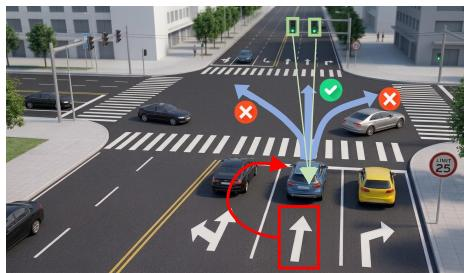

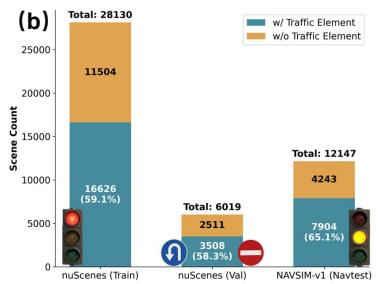

（c）  
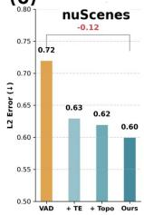

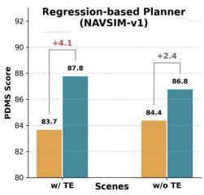

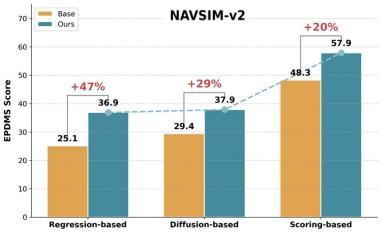

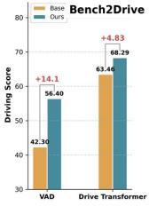  
Fig. 1: TE-Aware End-to-End Planning. (a) In complex intersections, correct planning requires recognizing rule-critical trafic elements to avoid topologically plausible but rule-violating maneuvers. (b) Trafic elements are pervasive: across three benchmarks, over 55% of scenes contain at least one trafic element. (c) Leveraging trafic elements (and topology) yields consistent improvements across representative end-to-end planners in both open-loop and closed-loop evaluations.

Abstract. Trafic elements such as trafic lights and road signs play a fundamental role in human driving decisions and should naturally influence end-to-end driving performance. However, existing end-to-end driving research predominantly focuses on dynamic road participants (e.g., vehicles and pedestrians), while the role of trafic elements remains largely unexplored. To date, the community lacks a systematic study quantifying how trafic elements afect end-to-end driving models. This gap stems from two main challenges: first, existing public datasets rarely provide structured annotations for trafic elements; second, modern end-to-end driving systems vary widely in architectures and training paradigms, making conclusions drawn from a single method dificult to generalize. In this work, we present the first systematic investigation

of trafic element awareness for end-to-end autonomous driving. We begin by constructing a unified research infrastructure by augmenting multiple public driving datasets with comprehensive trafic element annotations. To ensure broad applicability across diverse model families, we intentionally adopt a minimal and universal integration design, allowing trafic element signals to be incorporated into existing pipelines in a plug-and-play manner with negligible architectural modification. We evaluate this design across a wide spectrum of modern paradigms, including perception–prediction-planning pipelines, vision-language-action models (VLA), regression-based planners, difusion-based policies, and trajectory scoring frameworks. Experiments are conducted on multiple widely used benchmarks, including nuScenes, NAVSIM-v1, NAVSIM-v2, and Bench2Drive. Across all paradigms and datasets, our simple integration consistently improves driving performance, demonstrating that trafic element awareness provides a robust and generalizable signal for end-to-end driving systems. Notably, on the challenging NAVSIM-v2 benchmark, our approach significantly boosts the performance of stateof-the-art architectures and data pipelines, establishing a new state of the art.

Keywords: End-to-End Driving · Trafic Elements · Topology

## 1 Introduction

End-to-end (E2E) autonomous driving has rapidly moved from a research prototype to a deployable paradigm. Today’s systems span a wide spectrum of architectural and training choices: ranging from perception–prediction–planning hybrids [32, 40], to pure regression-based planners [13, 37, 75], to difusion poli cies [54, 92, 105] and trajectory scoring frameworks [50, 56], and recently to VLM/VLA-style agentic planners [23, 78, 83, 104]. Despite this diversity, a surprisingly fundamental factor in human driving is still under-discussed in the E2E literature: trafic elements (TE), such as trafic lights and road signs. From first principles, TE are not optional context: they are regulatory signals that directly constrain the feasible action space (e.g., stop/go, forbidden turns, lanelevel permissions) and thus should causally shape planning decisions. Yet, mainstream E2E benchmarks and methods overwhelmingly center their perception objectives and representations on dynamic agents (vehicles and pedestrians) and dense geometric cues, leaving the role of TE largely unquantified. The community does not have a systematic answer to a simple question: how much does trafic-element awareness actually matter for E2E driving performance, across modern paradigms?

Fig. 1 motivates why this question cannot be dismissed as a corner case. Fig. 1a illustrates a typical intersection where multiple signals and signs jointly determine what actions are legal and safe. Meanwhile, TE are prevalent rather than long-tailed. As shown in Fig. 1b, a majority of scenes in widely used datasets contain trafic elements: nuScenes [4] includes TE in 59.1% of training scenes (16,626 / 28,130) and 58.3% of validation scenes (3,508 / 6,019), while NAVSIMv1 (navtest) [15] contains TE in 65.1% of scenes (7,904 / 12,147). This prevalence means that even within academic benchmarks, TE are not a rare special case; and in real-world deployment, E2E systems inevitably interact with trafic lights/signs continuously. The lack of systematic TE studies is therefore not due to irrelevance, but rather due to two practical barriers: (i) missing structured TE annotations in most public datasets [4, 5, 15], and (ii) the heterogeneity of E2E driving systems, where conclusions drawn from a single architecture or training recipe are dificult to generalize.

To close this gap, we present the first systematic investigation of plug-andplay trafic element awareness for E2E autonomous driving. Our goal is deliberately not to propose yet another highly customized planner, but to build a unified research infrastructure and derive generalizable conclusions that hold across model families. Concretely, we (1) augment multiple mainstream driving benchmarks with comprehensive TE annotations; (2) design a minimal universal integration mechanism, implemented as a lightweight auxiliary 3D trafic element supervision (and optional topology conditioning when available [81]), so that TE signals can be incorporated into existing pipelines in a plug-and-play manner with negligible architectural modifications; and (3) evaluate this integration across a broad set of representative paradigms, including regression-based planners, perception–planning pipelines, difusion-based policies, trajectory scoring frameworks, and VLM/VLA-style models, on nuScenes [4], NAVSIM-v1 [15], NAVSIM-v2 [5], and the closed-loop Bench2Drive [36] benchmark.

Our experiments reveal a consistent and practically important conclusion: trafic element awareness yields stable improvements across datasets and paradigms, even under a minimal integration design. As previewed in Fig. 1c, adding TE supervision reduces open-loop trajectory error on nuScenes, boosts NAVSIM performance for all three paradigm planners, and improves closed-loop driving metrics on Bench2Drive. Interestingly, on the highly challenging NAVSIM-v2 benchmark, TE awareness produces large, consistent gains across representative families (regression / difusion / scoring), and remains efective even when combined with strong modern data engines [77] (e.g., pairing a state-of-the-art scoring-based backbone with large-scale simulated co-training data) continues to improve performance and establishes a new state of the art in our evaluation.

Beyond aggregate gains, we further conduct targeted ablations to explain why TE supervision works and how to integrate it robustly. We find that (i) explicit 3D TE representations outperform 2D-only cues for planning; (ii) selectively modeling TE depth is more efective than feeding global depth maps, suggesting TE distills the most decision-relevant spatial cues; (iii) trafic signs (not only lights) are crucial and often overlooked; and (iv) for sparse TE targets, an independent prediction head, focal loss, and max-preserving pooling are key to avoiding gradient domination by dense background. When lane topology is available, we show that encoding ego-relevant topology into a compact conditioning signal (language-style embeddings), which is more efective than GNN-based graph encoding [69], complements local TE cues. Together, these results argue that TE awareness is a broadly useful and underutilized signal for E2E driving.

## 2 Related Work

## 2.1 End-to-End Autonomous Driving

End-to-end autonomous driving methods can be broadly categorized into several paradigms according to how driving decisions are produced. Perception–planning methods [9, 25, 31, 32, 34, 35, 40, 42, 73, 75] construct intermediate scene representations (e.g.,vectorized map) and then perform motion planning based on them. Regression-based methods directly predict trajectories or control commands from sensor observations, including [13,27,37,53,86,87,91,94]. Trajectory-scoring methods [50–52, 71, 93] generate multiple candidate trajectories and select the optimal one through a scoring module. Generative planning methods [54,57,58, 74, 82, 92, 101, 105], including difusion/flow-based approaches, model trajectory distributions with generative models. Recently, vision–language–action (VLA) methods [10, 12, 17, 33, 38, 39, 48, 72, 83, 85, 104] integrate visual perception, language understanding, and driving actions in a unified framework. In addition, world-model-based approaches [43,47,70,103] learn latent environment dynamics for decision making. We evaluate representative methods from these categories to verify the plug-and-play generality of our approach.

## 2.2 Trafic-Aware Scene Understanding

Prior work injects trafic-aware scene understanding into end-to-end planning via structured intermediates such as occupancy [32, 79, 86], HD map [31, 40, 82, 98, 99,101], 3D detection-tracking [37,73,75], to enforce safety and rule compliance. VLM-based planners [78, 83, 104] trained on specific VQA datasets [28,60,62,64,72, 89] provide higher-level semantic reasoning but at substantial runtime cost. Dedicated benchmarks like Openlane-V2 [7, 81] evaluate these scene-understanding components, but most topology-predicted methods [24,44–46,59,88,97] primarily optimize benchmark scores without validat ing downstream planning impact.

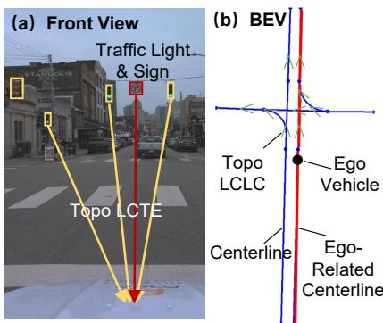  
Fig. 2: Definitions of driving topologies. (a) LCTE topology mapping trafic elements (light/sign) to the ego-lane in FV. (b) BEV representation of centerlines, ego-related centerlines, and LCLC topology.

We provide the first systematic evaluation of how such cues transfer to planning,

and propose a lightweight alternative based on explicit trafic elements and lane topology that is more amenable to deployment.

## 3 Preliminaries: OpenLane-V2 Scene Representation

Components. Openlane-V2 [81] has four components: Centerlines: A set of M 3D lane centerlines (Fig. 2b); Trafic Elements (TE): A set of N entities (4 trafic light states and 9 trafic sign categories), parameterized as 2D bounding boxes in the image coordinate system (Fig. 2a); LCTE Topology: The Lane-Centerline to Trafic-Element relationship, formulated as a binary adjacency matrix $\mathbf { R } _ { \mathrm { L C T E } } \in \{ 0 , 1 \} ^ { M \times N }$ , where an entry is 1 if the j-th TE directly governs the i-th centerline (Fig. 2a); LCLC Topology: The Centerline to Centerline directed connectivity, formulated as an adjacency matrix $\mathbf { R } _ { \mathrm { L C L C } } \in \{ 0 , 1 \} ^ { M \times M }$ defines the valid navigable transitions between lanes (Fig. 2b).

Topology Matters. Scene representation is crucial because it makes the driving constraints explicit. In this intersection (Fig. 2), a no-right-turn sign prohibits right-turn maneuvers, the LCLC topology indicates that the ego lane has no lateral connectivity, and the green trafic light permits forward motion. Together, these cues constrain the feasible action space: the ego vehicle should proceed into the adjacent forward lane at an appropriate speed, rather than turning left or right—a failure mode that vision-only end-to-end planners always exhibit.

## 4 Method

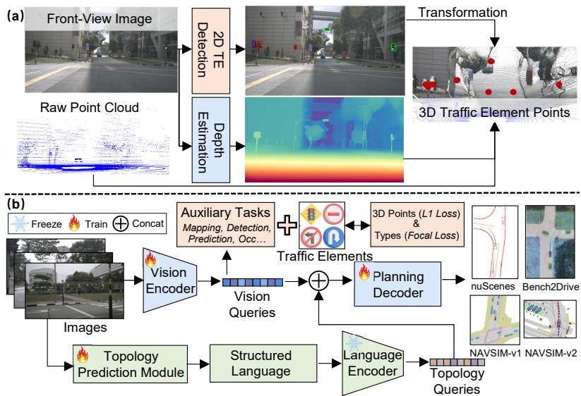  
Fig. 3: (a) Pipeline for 3D trafic element extraction. We first perform 2D traficelement detection and monocular depth estimation on the FV image, then combine them and LiDAR geometry to localize each trafic element as a 3D center point (•). (b) Overview of our method. Multi-view images are encoded into vision queries and enhanced by an auxiliary 3D trafic element detection task. In parallel, predicted topological adjacency matrices are formatted into structured language and processed by a frozen language encoder. The resulting topology queries are concatenated with the BEV queries to guide the planning decoder in generating the ego-vehicle trajectory.

## 4.1 3D Dataset Construction

To efectively integrate trafic elements into the 3D planning space, we establish a robust pipeline to extract their 3D coordinates $( x , y , z ) \ ( { \mathrm { F i g . \ 3 a } } )$ . Given a front-view image, we process it through two parallel branches: a 2D TE detection model to obtain bounding boxes, and a monocular depth foundation model [63] to estimate dense depth maps. Using the camera intrinsic and extrinsic parameters, we project the 2D bounding boxes into the LiDAR coordinate system. The precise 3D center point $( x , y , z )$ of each TE is then jointly determined by aggregating the 2D box constraints, the estimated depth, and the corresponding LiDAR point cloud (details in the Appendix). We adapt this pipeline across diferent benchmarks based on their available annotations: nuScenes [4] & Bench2Drive [36]: For nuScenes, we directly utilize the 2D TE bounding boxes and topology annotations provided by OpenLane-V2, and apply our extraction pipeline to acquire 3D centers. The Bench2Drive dataset natively provides detailed 3D TE coordinates and topological relationships. NAVSIM (v1 [15] & v2 [5]): Since these datasets lack TE annotations, we first train a highly accurate YOLO-based [67] 2D TE detector on OpenLane-V2, adopting progressive training strategies (e.g., resampling and reweighting, pseudo labeling) from [26, 90]. We then deploy this detector alongside our depth-LiDAR fusion pipeline to automatically construct the 3D TE pseudo-labels for NAVSIM.

## 4.2 Auxiliary 3D Trafic Element Supervision

In typical end-to-end autonomous driving frameworks, multi-view images are encoded [11,18,21,29,61,84] into latent vision queries (e.g., BEV queries $\mathbf { Q } _ { \mathrm { b e v } } )$ which are then used for downstream planning (Fig. 3b). Building on the original auxiliary tasks of each planner (e.g., detection of 3D vehicle boxes, prediction, tracking, occupancy, etc), we introduce an additional 3D trafic element detection objective. Specifically, for each TE, we supervise its 3D center location with an $L _ { 1 }$ loss and its category with a focal loss. This TE loss is aggregated into the overall training objective with a weight equivalent to other auxiliary tasks:

$$
\mathcal { L } _ { \mathrm { t o t a l } } = \mathcal { L } _ { \mathrm { p l a n } } + \sum _ { k \in \mathcal { K } } \lambda _ { k } \mathcal { L } _ { \mathrm { a u x } } ^ { ( k ) } + \lambda _ { \mathrm { T E } } \big ( \mathcal { L } _ { \mathrm { L 1 } } ^ { \mathrm { l o c } } + \mathcal { L } _ { \mathrm { f o c a l } } ^ { \mathrm { c l s } } \big ) ,\tag{1}
$$

where ${ \mathcal { L } } _ { \mathrm { p l a n } }$ is the primary trajectory planning loss, $\mathcal { L } _ { \mathrm { a u x } }$ includes all original auxiliary losses of the baseline planner, and $\lambda _ { \mathrm { T E } }$ is set identically to $\mathcal { L } _ { \mathrm { a u x } }$

## 4.3 Language-Guided Topology Conditioning

In parallel with TE-aware BEV learning, a topology prediction module estimates the global adjacency matrices for the entire driving scene, denoted as $\mathbf { R } _ { \mathrm { L C L C } }$ and $\mathbf { R } _ { \mathrm { L C T E } }$ (Fig. 3b). To prevent the planner from being distracted by redundant distant elements, we perform an ego-centric topology filtering. With the ego vehicle’s spatial coordinates, we identify its lane ID. We then query $\mathbf { R } _ { \mathrm { L C L C } }$ to retrieve the ego vehicle-related centerlines (highlighted in red, Fig. 2b) and query $\mathbf { R } _ { \mathrm { L C T E } }$ to isolate the trafic elements directly governing this active lane (Fig. 2a). We convert this ego-centric topology graph into a structured language sequence, e.g., “There are a ‘green trafic\_light’, a ‘green trafic\_light’, a ‘green trafic\_light’, a ‘no\_right\_turn road\_sign’ ahead controlling the current ego-lane, which connects $^ { \circ } 1 ^ { \prime }$ ‘straight’ centerline.” Here, parameters such as the trafic element categories, the number of connected centerlines (‘1’), and their directional semantics (‘straight’, ‘left’) are dynamically instantiated based on the retrieved local topology.

This text is encoded by a pretrained BERT-base [16] language encoder (∼110M parameters) to obtain topology queries $\mathbf { Q } _ { \mathrm { t o p o } }$ . Finally, we concatenate $\mathbf { Q } _ { \mathrm { t o p o } }$ with the TE-enhanced vision/BEV queries $\mathbf { Q } _ { \mathrm { b e v } }$ , and feed the joint queries $\mathbf { Q } _ { \mathrm { p l a n } } = [ \mathbf { Q } _ { \mathrm { b e v } } ; \mathbf { Q } _ { \mathrm { t o p o } } ]$ into the planning decoder. This design injects lane connectivity and rule-control information into the planner in a compact form, enabling trajectory prediction to respect both geometric feasibility and trafic regulations.

We validate our method on six representative end-to-end methods across four benchmarks. Implementation details for integrating our TE supervision and topology conditioning into each specific backbone are provided in the Appendix.

## 5 Experiment

We first specify the experimental protocol (Sec. 5.1). We then report quantitative (Sec. 5.2) and qualitative comparisons (Sec. 5.3) to assess the planning performance of our approach across benchmarks. Finally, we conduct targeted ablation studies to isolate the contribution of each component and design choice, and to explain why the proposed mechanism yields consistent gains (Sec. 5.4).

## 5.1 Experimental Setup

Datasets and Metrics. We evaluate on four datasets: three open-loop benchmarks (nuScenes [4], NAVSIM-v1 [15], and NAVSIM-v2 [5]), and one closed-loop benchmark (Bench2Drive [36]). NuScenes provides large-scale realworld logs for open-loop ego-trajectory prediction. NAVSIM-v1 (navtest) provides a non-reactive, data-driven evaluation setting with standardized simulationbased scoring. NAVSIM-v2 (navhard) further introduces a two-stage pseudo closed-loop aggregation to better reflect compounding-error efects without requiring full closed-loop simulation. Bench2Drive evaluates end-to-end planners in closed loop in CARLA [19] across a large set of short, scenario-isolated routes.

For nuScenes, we report L2 trajectory error and Collision Rate under the standard open-loop protocol. For NAVSIM-v1, we use the oficial PDMS as the primary score. For NAVSIM-v2, we report the aggregate EPDMS along with the per-stage breakdown (Stage 1/Stage 2) over the core compliance/safety terms. For Bench2Drive, we report Driving Score as the main closed-loop indicators, and additionally include Success Rate, Eficiency, Comfortness, and the open-loop Avg. L2. Detailed metric definitions are provided in the Appendix. Training Details. We follow the original training schedules and hyperparameters of each baseline (details in the Appendix). On nuScenes, we train on 8×A100 with batch size 1. On NAVSIM, we train on 4×RTX 3090 with batch size 32. On Bench2Drive, we train on 8×A100 with batch size 1.

Table 1: Comparison of methods on the nuScenes dataset. ⋄: Lidar-based methods. †: The ego status is utilized. FPS is measured on an NVIDIA A100 GPU.
<table><tr><td rowspan="2">Method</td><td rowspan="2">Auxiliary Task</td><td colspan="3">L2 (m) ↓</td><td colspan="3">Collision Rate (%)</td><td rowspan="2">FPS↑</td></tr><tr><td>1s</td><td>2s</td><td>3s Avg.</td><td>1s</td><td>2s</td><td>3s</td><td>Avg.</td></tr><tr><td>NMP [95]</td><td>Det &amp; Motion</td><td>0.53 1.25</td><td></td><td>2.67 1.48</td><td>0.04</td><td>0.12</td><td>0.87</td><td>0.34</td><td>1</td></tr><tr><td>FF [30]</td><td>FreeSpace</td><td></td><td></td><td>0.55 1.20 2.54 1.43</td><td>0.06</td><td>0.17</td><td>1.07</td><td>0.43</td><td></td></tr><tr><td>EO [41]</td><td>FreeSpace</td><td></td><td>0.67 1.36 2.78</td><td>1.60</td><td>0.04</td><td>0.09</td><td>0.88</td><td>0.33</td><td>=</td></tr><tr><td>ST-P3 [31]</td><td>Det &amp; Map &amp; Depth</td><td></td><td>1.33 2.11 2.90</td><td>2.11</td><td>0.23</td><td>0.62</td><td>1.27</td><td>0.71</td><td>1.6</td></tr><tr><td>UniAD [32]</td><td>Det&amp;Track&amp;Map&amp;Motion&amp;Occ</td><td></td><td></td><td>0.44 0.67 0.960.690.040.08</td><td></td><td></td><td>0.23</td><td>0.12</td><td>1.8</td></tr><tr><td>VAD-Tiny [40]</td><td>Det &amp; Map &amp; Motion</td><td></td><td></td><td>0.46 0.76 1.12 0.78 0.21 0.35</td><td></td><td></td><td>0.58</td><td>0.38</td><td>16.8</td></tr><tr><td>BEV-Planner [53]</td><td>None</td><td></td><td></td><td>0.28 0.42 0.680.460.040.37</td><td></td><td></td><td>1.07</td><td>0.49</td><td></td></tr><tr><td>PARA-Drive [86]</td><td>Det&amp;Track&amp;Map&amp;Motion&amp;Occ 0.25 0.460.740.480.140.23</td><td></td><td></td><td></td><td></td><td></td><td>0.39</td><td>0.25</td><td>5.0</td></tr><tr><td>LAW [47]</td><td>None</td><td></td><td></td><td>0.26 0.571.010.610.140.21</td><td></td><td></td><td>0.54</td><td>0.30</td><td>19.5</td></tr><tr><td>GenAD [101]</td><td>Det &amp; Map &amp; Motion</td><td></td><td></td><td>0.28 0.49 0.780.52 0.080.14</td><td></td><td></td><td>0.34</td><td>0.19</td><td>6.7</td></tr><tr><td>SparseDrive [75]</td><td>Det &amp; Track &amp; Map &amp; Motion</td><td></td><td></td><td>0.29 0.58 0.96 0.61 0.01 0.05</td><td></td><td></td><td>0.18</td><td>0.08</td><td>9.0</td></tr><tr><td>UAD [27]</td><td>Det</td><td></td><td></td><td>0.28 0.41 0.650.450.01 0.03 0.14</td><td></td><td></td><td></td><td>0.06</td><td>7.2</td></tr><tr><td>MomAD [73]</td><td>Det &amp; Track &amp; Map &amp; Motion</td><td></td><td>0.31 0.57 0.91 0.60</td><td></td><td>0.01 0.05</td><td></td><td>0.22</td><td>0.09</td><td>7.8</td></tr><tr><td>VAD-Base [40]</td><td>Det &amp; Map &amp; Motion</td><td></td><td>0.41 0.70 1.05</td><td>0.72</td><td></td><td>0.07 0.17</td><td>0.41</td><td>0.22</td><td>5.7</td></tr><tr><td>VAD + TE</td><td>Det &amp; Map &amp; Motion</td><td></td><td>0.36 0.61 0.92 0.63 0.09 0.14 0.28</td><td></td><td></td><td></td><td></td><td>0.17</td><td>5.7</td></tr><tr><td>VAD + Topo</td><td>Det &amp; Map &amp; Motion &amp; Topo</td><td></td><td>0.34 0.59 0.92</td><td>0.62</td><td></td><td>0.05 0.15</td><td>0.29</td><td>0.16</td><td>5.4</td></tr><tr><td>VAD + Ours</td><td>Det &amp; Map &amp; Motion &amp; Topo</td><td></td><td></td><td>0.34 0.56 0.90 0.60 0.04 0.21</td><td></td><td></td><td>0.26</td><td>0.17</td><td>5.4</td></tr><tr><td></td><td></td><td>VLM/VLA-based Method</td><td></td><td></td><td></td><td></td><td></td><td></td><td></td></tr><tr><td>Qwen-2.5-VL [1]</td><td>Scene Understanding</td><td></td><td></td><td>0.46 1.33 2.55 1.45</td><td></td><td></td><td></td><td></td><td>0.8</td></tr><tr><td>Senna [39]</td><td>Det &amp; Motion</td><td></td><td></td><td>0.37 0.54 0.860.59 0.09 0.12 0.33</td><td></td><td></td><td></td><td>0.18</td><td>1.6</td></tr><tr><td>DriveVLM [78]</td><td>Scene Understanding</td><td></td><td>0.18 0.34 0.680.40 0.10 0.22</td><td></td><td></td><td></td><td>0.45</td><td>0.27</td><td></td></tr><tr><td>OmniDrive [83]</td><td>Scene Understanding</td><td></td><td></td><td>0.140.29 0.550.330.000.130.78</td><td></td><td></td><td></td><td>0.30</td><td>1.2</td></tr><tr><td>EMMA [33]</td><td>Scene Understanding</td><td></td><td>0.140.29 0.540.32</td><td></td><td></td><td></td><td></td><td></td><td></td></tr><tr><td>ImpromptuVLA [12] </td><td>Scene Understanding</td><td></td><td>0.13 0.27 0.53 0.30</td><td></td><td></td><td></td><td></td><td>一</td><td>0.9</td></tr><tr><td>Orion† [23]</td><td>Det &amp; Motion</td><td></td><td>0.17 0.31 0.550.34 0.050.25</td><td></td><td></td><td></td><td>0.80</td><td>0.37</td><td>0.9</td></tr><tr><td>Orion†+ TE</td><td>Det &amp; Motion</td><td></td><td>0.14 0.27 0.47 0.29 0.06 0.20 0.55</td><td></td><td></td><td></td><td></td><td>0.27</td><td>0.9</td></tr><tr><td>Orion†+ Topo</td><td>Det &amp; Motion &amp; Topo 0.12 0.25 0.45 0.27 0.04 0.21 0.50</td><td></td><td></td><td></td><td></td><td></td><td></td><td>0.25</td><td>0.8</td></tr><tr><td>Orion†+ Ours</td><td>Det &amp; Motion &amp; Topo 0.11 0.25 0.43 0.26 0.04 0.19 0.47 0.23</td><td></td><td></td><td></td><td></td><td></td><td></td><td></td><td>0.8</td></tr><tr><td></td><td></td><td></td><td></td><td></td><td></td><td></td><td></td><td></td><td></td></tr></table>

## 5.2 Quantitative Results

NuScenes. We construct 3D trafic elements using the OpenLane-V2 subset annotated on nuScenes, and use the same detection-aligned perception range as prior work [40]: lateral [−15, 15] m and longitudinal [0, 30] m. Depth is estimated by UniDepthv2 [63] with frozen weights. We encode topological cues by first predicting a topology adjacency matrix with a lightweight TopoMLP [88], and then mapping it to a language embedding via a frozen BERT encoder [16].

We compare against two representative families of end-to-end planners: the conventional perception-planning baseline VAD [40] and the VLM-based planner Orion [23]. Tab. 1 shows that introducing trafic elements as auxiliary supervision improves both L2 (↓0.09; ↓0.05) and CR (↓0.05%; ↓0.10%) over the baselines. We attribute this gain to the fact that the additional TE objective makes the learned BEV queries more trafic-aware: latent vision queries are typically dominated by dense scene geometry and dynamic agents (e.g., via standard occupancy or vehicle detection tasks), which inherently overshadow spatially sparse yet logically critical trafic elements. We force the network to allocate dedicated representational capacity to these vital regulatory signals. Consequently, this prevents trafic rules from being marginalized in the shared feature space.

Table 2: Camera-only methods on the NAVSIM-v1 benchmark (navtest).
<table><tr><td>Method</td><td>Backbone</td><td>Venue</td><td>|NC ↑ DAC ↑ TTC ↑ Comf. ↑ EP ↑|</td><td></td><td></td><td></td><td></td><td>|PDMS ↑</td></tr><tr><td>PDM-Closed [14]</td><td></td><td>PMLR&#x27;23</td><td>94.6</td><td>99.8</td><td>89.9</td><td>86.9</td><td>99.9</td><td>89.1</td></tr><tr><td>Human driver [15]</td><td></td><td>NeurIPS’24</td><td>100</td><td>100</td><td>100</td><td>99.9</td><td>87.5</td><td>94.8</td></tr><tr><td>Ego-stat. MLP [15]</td><td></td><td>NeurIPS’24</td><td>93.0</td><td>77.3</td><td>83.6</td><td>100</td><td>62.8</td><td>65.6</td></tr><tr><td>UniAD [32]</td><td>ResNet34</td><td>CVPR&#x27;23</td><td>97.8</td><td>91.9</td><td>92.9</td><td>100</td><td>78.8</td><td>83.4</td></tr><tr><td>VAD-v2 [9]</td><td>ResNet34</td><td>ICLR&#x27;26</td><td>98.1</td><td>94.8</td><td>94.3</td><td>100</td><td>80.6</td><td>86.2</td></tr><tr><td>ReCogDrive [49]</td><td>InternViT</td><td>ICLR&#x27;26</td><td>97.9</td><td>97.3</td><td>94.9</td><td>100</td><td>87.3</td><td>90.8</td></tr><tr><td>Hydra-MDP [50]</td><td>ResNet34</td><td>arXiv’24</td><td>98.3</td><td>96.0</td><td>94.6</td><td>100</td><td>78.7</td><td>86.5</td></tr><tr><td>Centaur [71]</td><td>ResNet34</td><td>arXiv&#x27;25</td><td>99.5</td><td>98.9</td><td>98.0</td><td>100</td><td>85.9</td><td>92.6</td></tr><tr><td>DriveSuprim [93]</td><td>ResNet34</td><td>AAAI&#x27;26</td><td>97.8</td><td>97.3</td><td>93.6</td><td>100</td><td>86.7</td><td>89.9</td></tr><tr><td colspan="9">Regression-based Planner</td></tr><tr><td>LTF [13]</td><td>ResNet34 TPAMI&#x27;22</td><td></td><td>97.8</td><td>92.8</td><td>93.3</td><td>100</td><td>78.9</td><td>84.1</td></tr><tr><td>LTF + Ours</td><td>ResNet34</td><td>ECCV’26</td><td>97.8</td><td>93.9</td><td>93.8</td><td>100</td><td>79.8</td><td>85.2 +1.1</td></tr><tr><td>LTF (+SimScale [77])</td><td>ResNet34</td><td>ECCV’26</td><td>98.3</td><td>95.6</td><td>94.6</td><td>100</td><td>81.3</td><td>87.3 +3.2</td></tr><tr><td>LTF (+SimScale) + Ours</td><td>ResNet34</td><td>ECCV’26</td><td>98.2</td><td>95.9</td><td>94.5</td><td>100</td><td>82.0</td><td>87.6 +3.5</td></tr><tr><td colspan="9">Diffusion-based Planner</td></tr><tr><td>DiffusionDrive [54]</td><td>ResNet34</td><td>CVPR&#x27;25</td><td>97.9</td><td>94.6</td><td>93.6</td><td>100</td><td>80.7</td><td>86.0</td></tr><tr><td>DiffusionDrive + Ours</td><td>ResNet34</td><td>ECCV’26</td><td>98.1</td><td>96.0</td><td>94.2</td><td>100</td><td>82.3</td><td>87.7 +1.7</td></tr><tr><td>DiffusionDrive (+SimScale [77])</td><td>ResNet34</td><td>ECCV’26</td><td>98.5</td><td>97.0</td><td>94.7</td><td>100</td><td>83.1</td><td>88.9 +2.9</td></tr><tr><td>DiffusionDrive (+SimScale) + Ours</td><td>ResNet34</td><td>ECCV’26</td><td>98.6</td><td>97.2</td><td>94.7</td><td>100</td><td>83.5</td><td>89.1 +3.1</td></tr><tr><td colspan="9">Scoring-based Planner</td></tr><tr><td>DrivoR [42]</td><td>ViT-S</td><td>CVPR&#x27;26</td><td>98.9</td><td>98.3</td><td>96.2</td><td>100</td><td>89.1</td><td>93.1</td></tr><tr><td>DrivoR + Ours</td><td>ViT-S</td><td>ECCV’26</td><td>99.0</td><td>98.7</td><td>96.9</td><td>100</td><td>90.8</td><td>94.4 +1.3</td></tr><tr><td>DrivoR (+SimScale [77])</td><td>ViT-S</td><td>ECCV’26</td><td>99.1</td><td>99.2</td><td>96.9</td><td>100</td><td>91.6</td><td>94.6 +1.5</td></tr><tr><td>DrivoR (+SimScale) + Ours</td><td>ViT-S</td><td>ECCV’26</td><td>99.7</td><td>99.7</td><td>98.1</td><td>100</td><td>92.2</td><td>95.1 +2.0</td></tr></table>

Furthermore, injecting topological cues yields additional gains, indicating that high-level connectivity/route structure complements local rule signals. The best performance is obtained when both trafic elements and topology are incorporated. Crucially, these scene-understanding signals are predicted by lightweight networks, so the runtime impact is small (FPS drops only 0.3). Compared to VLM-based scene understanding methods [1, 12, 78], this design delivers > 10× higher throughput while still capturing the key cues that drive performance, making the approach substantially more amenable to real-time deployment.

NAVSIM. Since NAVSIM does not provide trafic element annotations, we generate pseudo-labels by running our OpenLaneV2-trained TE detector on the full front-view image, and supervise a BEV TE heatmap head with focal loss (α=2, β=4). We adopt the NAVSIM perception range lateral [−32, 32] m and longitudinal [0, 32] m, and estimate depth using UniDepthv2 as in nuScenes. Due to the diferent camera setup in NAVSIM compared to nuScenes, we do not train a topology predictor in this setting; instead, we focus on TE only and feed the predicted TE representation to the decoder to guide planning.

On NAVSIM-v1, we evaluate three representative end-to-end camera-only planning paradigms: the regression-based planner LTF [13], the difusion-based planner DifusionDrive [54], and scoring-based planners DrivoR [42]. Tab. 2 shows that adding trafic elements as explicit supervision and conditioning the planner on the predicted TE representation yield consistent gains across all paradigms. The improvements are primarily driven by higher NC (No Collision) and DAC (Drivable Area Compliance)—two key safety/compliance factors that carry substantial weight in the overall PDMS—highlighting the importance of trafic-element understanding for reliable planning. To test data scalability, we further leverage SimScale [77] to generate simulated data and co-train using trafic-element cues extracted from both simulated and real logs. This co-training strategy leads to a further increase in PDMS, indicating that our supervision signal transfers efectively across domains and benefits from largerscale training. Notably, with DrivoR, our approach surpasses both the rule-based method [14] and the human-driver score [15], suggesting that stronger backbones and more training data can unlock additional gains.

Table 3: Comparison to existing methods on the NAVSIM-v2 navhard-two-stage benchmark using EPDMS. †: Metrics reported prior to the oficial benchmark bug fix.
<table><tr><td></td><td colspan="5">Stage 1</td><td colspan="5">Stage 2</td></tr><tr><td>Method</td><td>NC DAC DDC TLC</td><td></td><td></td><td>EP TTC LK HC</td><td>EC NC</td><td>DAC DDC TLC</td><td></td><td>EP TTC</td><td>LK HC</td><td>EC |EPDMS ↑</td></tr><tr><td>ZTRS† [51]</td><td>98.9</td><td>97.6</td><td>100 100</td><td>66.7 98.9 96.2</td><td>96.7 44.0 |91.1</td><td>90.4 95.8</td><td>99.0</td><td>63.6 89.8</td><td>60.4 97.6</td><td>66.1 45.5</td></tr><tr><td>DiffVLA† [38]</td><td>95.7</td><td>99.2</td><td>100 100</td><td>85.9 96.4 97.1</td><td>95 84.2 81.2 88.8</td><td>94.6</td><td>99.0</td><td>86.0 76.4</td><td>59.8 98.6 80.4</td><td>45.0</td></tr><tr><td>GTRS-Dense† [52]</td><td>98.9 94.9</td><td></td><td>99.1 100</td><td>76.1 98.4 93.8 94.9</td><td>37.8 89.9 90.5</td><td>94.1</td><td>99.3</td><td>77.6 88.5</td><td>56.0 92.0 30.2</td><td>41.9</td></tr><tr><td>GuideFlow† [57]</td><td>97.8</td><td>97.1 100</td><td>100</td><td>81.4 98.5 91.4 92.8</td><td>34.2 87.3 92.3</td><td>98.0</td><td>96.9</td><td>75.8 85.5</td><td>59.3 95.4 53.5</td><td>46.7</td></tr><tr><td></td><td></td><td></td><td></td><td></td><td>Regression-based Planner</td><td></td><td></td><td></td><td></td><td></td></tr><tr><td>LTF [13]</td><td>96.2</td><td>79.5</td><td>99.1 99.5</td><td></td><td>97.5 79.1 |77.7 70.2</td><td>84.2</td><td></td><td>75.6</td><td>45.4 95.7 75.9</td><td>25.1</td></tr><tr><td>LTF + Óurs</td><td>96.4</td><td>79.8</td><td>98.9 99.6</td><td>84.1 95.1 94.2</td><td>93.8 97.5 78.2 80.9</td><td>71.6 84.8</td><td>98.0</td><td>85.1 85.2</td><td>47.0 96.1 76.3</td><td>28.9 ↑15%</td></tr><tr><td>LTF(+SimScale [77])</td><td>96.1</td><td>85.3</td><td>99.4</td><td>84.2 95.8</td><td>77.3 85.5</td><td></td><td>98.9</td><td>77.7</td><td></td><td>33.6 ↑33%</td></tr><tr><td>LTF(+SimScale)+Ours</td><td>97.0 85.3 99.7</td><td></td><td>99.3</td><td>84.7 94.7 93.5 97.5</td><td>66.9 88.1 71.8</td><td>91.5</td><td>99.1</td><td>93.0 81.1</td><td>58.2 95.1 42.9</td><td>36.9 ↑47%</td></tr><tr><td></td><td>Diffusion-based Planner</td><td></td><td>99.6 84.2</td><td>96.2 96.0 97.6 77.3</td><td></td><td>93.1</td><td>99.0</td><td>86.7 83.0</td><td>54.0 95.2 55.4</td><td></td></tr><tr><td>DiffusionDrive [54]</td><td></td><td>86.7</td><td>98.7</td><td></td><td>95.3 97.6 77.8| 78.9</td><td></td><td></td><td></td><td></td><td>29.4</td></tr><tr><td>DiffusionDrive + Ours</td><td>96.7 97.1</td><td>86.9</td><td>98.8</td><td>99.3 84.3 94.9</td><td>95.6 97.6 79.5 80.2</td><td>72.4 84.2 74.0</td><td>98.2</td><td>87.1 74.9</td><td>47.3 96.2 71.0|</td><td>32.7 ↑11%</td></tr><tr><td>DiffusionDrive(+SimScale [77])</td><td>97.2</td><td>88.0</td><td>99.6 99.2</td><td>84.2 95.1</td><td>97.5 58.2 86.7</td><td>85.0 72.1 93.0</td><td>98.1</td><td>86.3 77.2 92.1</td><td>48.4 96.6 74.4</td><td>35.8 ↑12%</td></tr><tr><td>DiffusionDrive(+SimScale)+Ours</td><td>97.1</td><td>88.4</td><td>99.3 99.3</td><td>82.8 96.7 98</td><td>72.9 83.7 76.3</td><td>92.5</td><td>98.8 98.9</td><td>80.6 90.3 78.9</td><td>61.1 95.3 33.1 57.7 94.4 56.1</td><td>37.9 ↑29%</td></tr><tr><td></td><td></td><td></td><td>99.3</td><td>84.1 95.6 98.2 97.6</td><td>Scoring-based Planner</td><td></td><td></td><td></td><td></td><td></td></tr><tr><td>DrivoR [42]</td><td>98.8</td><td>95.1</td><td>98.9 100</td><td>72.6 98.7</td><td>94.0 97.6 73.3 90.2 88.4</td><td>91.9</td><td>98.6</td><td>70.0 88.0</td><td>50.1 98.5 76.2</td><td>48.3</td></tr><tr><td>DrivoR + Ours</td><td>98.9</td><td>94.9</td><td>99.1</td><td>100 75.1 98.9</td><td>93.9 97.5 74.4 91.9</td><td>91.4 96.1</td><td>99.3</td><td>74.6 87.5</td><td>56.0 97.0 78.5</td><td>51.8 ↑7.2%</td></tr><tr><td>DrivoR(+SimScale [77])</td><td>99.1</td><td>98.2</td><td>99.3</td><td>99.8 75.4 98.7</td><td>94.9 97.6 70.2 92.3</td><td>91.6 97.3</td><td>99.1</td><td>75.7 90.6</td><td>56.1 98.4 44.7</td><td>54.6 ↑13%</td></tr><tr><td>DrivoR(+SimScale)+Ours</td><td>99.5</td><td>98.2</td><td>99.3</td><td>100 76.1 99.0</td><td>94.1 97.9 72.6 93.5 91.8</td><td>97.0</td><td>99.3</td><td>76.6 90.9</td><td>56.0 98.0 55.6</td><td>57.9 ↑20%</td></tr></table>

We further validate these findings on NAVSIM-v2 with same representative planners, and observe the same consistent trend (Tab. 3). Across methods, incorporating trafic elements improves the overall score by roughly +10 EPDMS. The gains are mainly attributed to stronger rule compliance and safety, reflected by improvements in the core terms NC, DAC, DDC, and TLC—suggesting that TE supervision helps the model internalize trafic rules. We also observe that adding SimScale data can noticeably reduce EC (Extended Comfort), likely because some counterfactual simulated scenarios introduce distribution shifts that afect ride quality. Importantly, combining SimScale with our TE-centric training mitigates this efect and brings EC back to a higher level. Overall, these results demonstrate that our method improves safety-critical behavior and exhibits strong scalability with model and data scale.

Bench2Drive. Bench2Drive provides instance-level trafic elements with 3D locations, as well as an HD-map lane topology that encodes lane-level topology and connectivity. We therefore supervise our trafic-element head directly using the provided 3D TE coordinates and encode map topology in the same manner as in nuScenes by mapping topology cues to a compact embedding that conditions the planner. Trafic elements used by the planner are obtained from our model predictions at inference time, rather than from reading annotation states. We run closed-loop planning using two baselines (VAD [40] and DriveTransformer [37]) at 2 Hz. Tab. 4 shows consistent improvements for both methods in L2 and the main closed-loop metrics (notably Driving Score), with a small change in latency. Interestingly, Eficiency decreases after adding our TE supervision and topology. We interpret this as a correction of over-aggressive behaviors encouraged by eficiency-dominated objectives: baseline planners can achieve high eficiency while under-modeling rule-critical trafic elements, whereas TE awareness biases the policy toward safer and more compliant maneuvering.

Table 4: Closed-Loop Planning Performance in Bench2Drive. Avg. L2 is averaged over the predictions in 2 seconds. ∗: denotes expert feature distillation. All latency is measured by the averaged inference step-time on CARLA [19] evaluation in A6000.
<table><tr><td rowspan="2">Method</td><td>[Open-loop Metric|</td><td colspan="4">Closed-loop Metric</td><td rowspan="2">Latency</td></tr><tr><td>Avg. L2 ↓</td><td>|Driving Score ↑ Success Rate(%) ↑ Efficiency ↑ Comfortness ↑|</td><td></td><td></td><td></td></tr><tr><td>TCP* [91]</td><td>1.70</td><td>40.70</td><td>15.00</td><td>54.26</td><td>47.80</td><td>86ms</td></tr><tr><td>TCP-ctrl*</td><td></td><td>30.47</td><td>7.27</td><td>55.97</td><td>51.51</td><td>86ms</td></tr><tr><td>TCP-traj*</td><td>1.70</td><td>59.90</td><td>30.00</td><td>76.54</td><td>18.08</td><td>86ms</td></tr><tr><td>TCP-traj w/o distillation</td><td>1.96</td><td>49.30</td><td>20.45</td><td>78.78</td><td>22.96</td><td>86ms</td></tr><tr><td>ThinkTwice* [35]</td><td>0.95</td><td>62.44</td><td>31.23</td><td>69.33</td><td>16.22</td><td>698ms</td></tr><tr><td>DriveAdapter* [34]</td><td>1.01</td><td>64.22</td><td>33.08</td><td>70.22</td><td>16.01</td><td>958ms</td></tr><tr><td>AD-MLP [96]</td><td>3.64</td><td>18.05</td><td>0.00</td><td>48.45</td><td>22.63</td><td>4.7ms</td></tr><tr><td>UniAD-Tiny [32]</td><td>0.80</td><td>40.73</td><td>13.18</td><td>123.92</td><td>47.04</td><td>400.3ms</td></tr><tr><td>UniAD-Base [32]</td><td>0.73</td><td>45.81</td><td>16.36</td><td>129.21</td><td>43.58</td><td>692.6ms</td></tr><tr><td>VAD [40]</td><td>0.91</td><td>42.3</td><td>15.00</td><td>157.94</td><td>46.01</td><td>278.3ms</td></tr><tr><td>VAD + Óurs</td><td>0.75 -0.16</td><td>56.4 +14.1</td><td>21.30</td><td>125.64</td><td>48.02</td><td>282.5ms</td></tr><tr><td>DriveTransformer-Large [37]</td><td>0.62</td><td>63.46</td><td>35.01</td><td>100.64</td><td>20.78</td><td>211.7ms</td></tr><tr><td>DriveTransformer-Large + Ours</td><td>0.57 -0.05</td><td>68.29 +4.83</td><td>39.61</td><td>82.45</td><td>23.58</td><td>216.5ms</td></tr></table>

## 5.3 Qualitative Results

Fig. 4 shows a challenging NAVSIM-v2 intersection. Without trafic-element awareness, LTF and LTF+SimScale exhibit noticeable lateral drift (Fig. 4a-b). In contrast, Ours detects the green trafic lights and the straight-ahead sign for the ego lane, and thus continues forward while staying lane-consistent (Fig. 4c). This example highlights that trafic elements provide decision-critical cues that stabilize planning in complex junctions (see Appendix for more visualization).

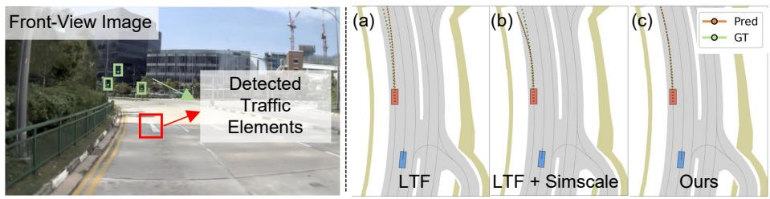  
Fig. 4: Qualitative comparison on NAVSIM-v2. Left: front-view image with detected trafic elements. Right: predicted trajectories of LTF, LTF+SimScale, and Ours.

## 5.4 Ablation Study and Analysis

Table 5: Ablation study of trafic element (TE) representations on the NAVSIM-v2 using LTF (Latent Transfuser). TE(2D) denotes 2D trafic elements in the front-view (FV) image; depth(FV) uses the full FV depth; LiDAR uses the NAVSIM-v2 point-cloud input; TL denotes trafic lights (green/yellow/red light) only.
<table><tr><td></td><td colspan="6">Stage 1</td><td colspan="9">Stage 2</td></tr><tr><td>Method</td><td>NC DAC DDC</td><td></td><td>TLC</td><td>EP</td><td>TTC LK</td><td>HC EC</td><td>|NC</td><td></td><td>DAC DDC</td><td>TLC</td><td>EP</td><td>TTC</td><td>LK</td><td>HC EC</td><td>|EPDMS ↑</td></tr><tr><td>LTF [13]</td><td>|96.2 79.5</td><td>99.1</td><td>99.5</td><td>84.1</td><td>95.1 94.2</td><td>97.5</td><td>79.1 |77.7</td><td>70.2</td><td>84.2</td><td>98.0</td><td>85.1</td><td>75.6</td><td>45.4 95.7</td><td>75.9</td><td>25.1</td></tr><tr><td>LTF+TE(2D)</td><td>96.4 82.0</td><td>99.2</td><td>99.6</td><td>84.0</td><td>95.8 93.1</td><td>97.8</td><td>79.1 81.6</td><td>68.4</td><td>85.5</td><td>98.6</td><td>85.4</td><td>78.4</td><td>46.9</td><td>96.2 76.5</td><td>28.1+3.0</td></tr><tr><td>LTF+depth(FV)</td><td>96.9 81.8</td><td>99.0</td><td>99.6</td><td>84.2</td><td>95.8 92.7</td><td>97.8</td><td>78.2 81.3</td><td>70.1</td><td>84.3</td><td>98.6</td><td>85.7</td><td>78.4</td><td>45.9</td><td>96.3 76.5</td><td>27.7+2.6</td></tr><tr><td>LTF+TE(Lidar)</td><td>97.2 80.9</td><td>99.0</td><td>99.5</td><td>83.9</td><td>96.0 92.9</td><td>97.8</td><td>79.5 81.1</td><td>70.2</td><td>85.4</td><td>98.6</td><td>85.0</td><td>79.1</td><td>45.9 96.0</td><td>77.2</td><td>27.9+2.8</td></tr><tr><td>LTF+TE [55]</td><td>96.7 81.8</td><td>99.1</td><td>99.3</td><td>84.1</td><td>95.6 92.4</td><td>97.6 78.2</td><td>81.2</td><td>69.4</td><td>84.9</td><td>98.6</td><td>85.6</td><td>78.3</td><td>46.6 96.2</td><td>76.0</td><td>27.8+2.7</td></tr><tr><td>LTF+TL [63]</td><td>97.1 80.7</td><td>99.1</td><td>99.3</td><td>84.1</td><td>95.3</td><td>93.6 97.8</td><td>78.2 80.4</td><td>69.5</td><td>84.8</td><td>98.6</td><td>85.7</td><td>77.6</td><td></td><td>45.0 96.3 76.4</td><td>26.7+1.6</td></tr><tr><td>LTF+Ours</td><td>96.4 79.8</td><td>98.9</td><td>99.6</td><td>84.2</td><td>95.8</td><td>93.8 97.5</td><td>78.2 80.9</td><td>71.6</td><td>84.8</td><td>98.85</td><td>85.2</td><td>77.7</td><td>47.0</td><td>96.1 76.3</td><td>28.9+3.8</td></tr></table>

Ablation on Trafic-Element Representations for Planning. To dissect the eficacy of our proposed 3D trafic element (TE) representation, we conduct ablation studies on the NAVSIM-v2 [5] using the LTF baseline [13] (Tab. 5).

(1) Explicit 3D vs. 2D Representations. While 2D trafic elements (LTF+TE(2D)) provide basic semantic context, they inherently lack the depth and spatial precision crucial for motion planning. In contrast, our method explicitly constructs these elements within a 3D ego-centric space (28.1 vs. 28.9).

(2) Targeted Depth vs. Global Depth. Incorporating spatial auxiliary tasks generally improves the LTF baseline (25.1 EPDMS). However, simply feeding the full front-view depth to the model (LTF+depth(FV), +2.6) yields suboptimal gains compared to our explicit 3D TE formulation (LTF+Ours, +3.8). This indicates that unconstrained global depth may introduce redundant geometric noise, whereas selectively isolating and estimating the depth of specific trafic elements distills the most actionable spatial cues for the planner.

(3) Vision-based Depth Estimation vs. LiDAR Clustering. We compare our method against a geometry-heuristic approach (LTF+TE(Lidar)), which directly projects 2D bounding boxes into the 3D LiDAR coordinate system and extracts element centers via point clustering. Although helpful (+2.8), it still underperforms our approach (27.9 vs. 28.9). This validates our hypothesis that Li-DAR returns on certain trafic elements—particularly flat road surface signs—are often too sparse or severely afected by dynamic occlusions.

(4) The Impact of Depth Quality. The accuracy of the underlying depth prior bottlenecks planning performance. When we replace our autonomous-drivingaligned depth estimator (UniDepthV2 [63]) with a general-purpose foundation model (Depth Anything 3 [55]), the EPDMS drops to 27.8.

(5) The Crucial Role of Trafic Signs. Modeling trafic lights only (LTF+TL) is insuficient. It lags behind our full TE setting (26.7 vs. 28.9), highlighting the often-overlooked importance of trafic signs in shaping planning decisions.

Design Choices for Trafic Element Integration. To validate the efectiveness of our proposed modules, we systematically ablate the design choices of the trafic element conditioning mechanism. Results are summarized in Tab. 6.

(1) Prediction Head and Loss Function. Comparing ID 1 and 2, decoupling TE prediction into an independent head yields a significant performance boost (+1.8 EPDMS). Trafic elements are extremely sparse; treating them as an additional BEV semantic class with standard cross-entropy (ID 1) even degrades performance (-0.8), as the TE gradients are dominated by the dense background. Moreover, replacing CE with focal loss under the independent head (ID 2 vs. ID 3) brings a further +0.7 EPDMS, consistent with focal loss being better suited for the severe foreground–background imbalance of tiny TE targets.

Table 6: Ablation study of trafic element integration on the NAVSIM-v2 using LTF (Latent Transfuser). We systematically investigate the design choices for the prediction head, loss function, spatial pooling strategy, and planning interaction method.
<table><tr><td rowspan="2">ID</td><td>TE Head</td><td>Loss</td><td>Pooling</td><td>|Interaction</td><td rowspan="2"></td><td rowspan="2">EPDMS ↑</td></tr><tr><td>|w/ BEV Indep.|Cross-Entropy Focal|Average Max|C.A. Concat|</td><td></td><td></td><td></td></tr><tr><td>0 12345</td><td>L VV L</td><td>1 √ J</td><td>L</td><td>S</td><td></td><td>25.1  $2 4 . 3 _ { - 0 . 8 }$   $2 6 . 1 \substack { + 1 . 0 }$   $2 5 . 4 \substack { + 0 . 3 }$   $2 4 . 9 _ { - 0 . 2 }$ </td></tr><tr><td>6</td><td></td><td></td><td>√</td><td>√</td><td>V√</td><td> $2 7 . 5 \substack { + 2 . 4 }$   $\mathbf { 2 8 . 9 + 3 . 8 }$ </td></tr></table>

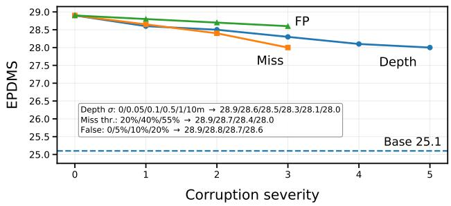  
Fig. 5: Robustness analysis on NAVSIM-v2 with LTF. We corrupt the predicted TE representation at inference time by adding TE depth noise, randomly dropping TE detections, or injecting false-positive TE predictions. The performance decreases smoothly under stronger corruption while remaining above the LTF baseline, indicating robustness to moderate upstream TE perception noise.

(2) Pooling and Interaction Mechanism. Explicitly routing TE constraints to the planner via Cross-Attention (C.A.) improves the baseline (4 vs. ${ 1 , \bf \Pi + 0 . 6 ) }$ , proving the necessity of interactive planning. However, since critical signals occupy very few pixels, Average Pooling severely dilutes their activations during spatial downsampling. Upgrading to Adaptive Max Pooling (ID 5) guarantees these peak activations are perfectly preserved in the low-resolution grid. Our optimal configuration (ID 6) replaces C.A. by concatenating the max-pooled TE features directly into the BEV memory. This creates a strictly aligned "Dual Spatial Stream" that outperforms C.A. (+1.4). We attribute this to a more direct and spatially consistent conditioning signal, which helps the planner associate trafic rules with the correct ego-relevant lane context.

Robustness and semantic analysis. Since our framework uses predicted traffic elements at inference time, we further evaluate whether the planning gain is robust to upstream perception noise. We perform inference-stage sensitivity tests on NAVSIM-v2 with LTF by corrupting the predicted TE representation before it is fed to the planner. Specifically, we consider three common failure modes: noisy TE depth, missed TE detections, and false-positive TE predictions. As shown in Fig. 5, the planning score degrades smoothly as the corruption severity increases, but remains consistently above the original LTF baseline. This indicates that the proposed TE-aware planner does not rely on perfectly accurate TE predictions and is reasonably resilient to moderate upstream perception errors. We also verify that the improvement is not merely caused by generic multi-task regularization. To this end, we train a class-agnostic TE variant that only supervises TE localization with the L1 loss and removes the semantic classification loss. This variant reaches only 26.2 EPDMS on NAVSIM-v2, compared with 28.9 EPDMS for the full TE-aware model. The gap shows that regulatory semantics, rather than spatial localization alone, are critical for planning.

Ablation on Topology Information Integration. We systematically evaluate our topology integration strategies in Tab. 7 to determine the most efective mechanism for routing topological priors into the end-to-end planner.

(1) Topology Synergy. Introducing either centerline-to-centerline connectivity (LCLC, ID 1) or centerline-to-trafic-element constraints (LCTE, ID 2) substantially improves planning metrics. Combining both (ID 3) provides the most comprehensive spatial-logical context, yielding better performance.

(2) Encoding Strategy: Language vs. Graph. When encoding the merged directed topology graph, language-based encoding via BERT [16] (ID 3) outperforms Graph Convolutional Networks (GCN [69], ID 4), particularly in reducing the Collision Rate. Driving topologies consist of highly heterogeneous nodes (e.g., continuous spatial centerlines vs. discrete logical trafic lights). While GCN message-passing tends to over-smooth these semantic features, language models naturally map these heterogeneous attributes into a unified semantic space. This prevents information loss and perfectly preserves long-range causal driving rules.

(3) Interaction Scope: Ego vs. Global. Restricting the topology to egorelevant elements (ID 4) proves superior to utilizing the global topology (ID 5). Global structures introduce redundant noise from irrelevant lanes and unafected trafic elements, which distract the planner’s attention mechanism. Ego-centric filtering ensures the model focuses solely on actionable causal relationships.

(4) Robustness to Predicted Topology. Finally, replacing the groundtruth (GT) topology [81] with real-time TopoMLP [88] predictions (ID 6, our final optimal setting) maintains performance comparable to the GT oracle (ID 3). This demonstrates the strong robustness of our interaction mechanism, proving it can efectively guide safe trajectory generation without relying on perfectly accurate perception priors.

Table 7: Ablation study of topology information integration on the nuScenes dataset. We ablate the topology types, encoding methods, topology source and interaction scope upon the VAD baseline.
<table><tr><td rowspan="2">ID</td><td>Topology</td><td></td><td>Encoder</td><td>Source</td><td>Scope</td><td>L2</td><td>(m)</td><td>↓</td><td></td><td>Collision Rate</td><td></td><td>(%)</td></tr><tr><td>[LCTE LCLC|</td><td></td><td>|BERT GCN|</td><td>|GT [81] Pred</td><td>[88] |Global Ego</td><td>1s</td><td>2s</td><td>3s</td><td>Avg.</td><td>1s 2s</td><td></td><td>3s</td><td>Avg.</td></tr><tr><td>0 1</td><td></td><td></td><td></td><td></td><td></td><td></td><td>0.41 0.70</td><td>1.05</td><td>0.72</td><td>0.07</td><td>0.17</td><td>0.41</td><td>0.22</td></tr><tr><td>2</td><td></td><td></td><td></td><td>J</td><td></td><td></td><td>0.34 0.60 0.95 0.63 0.06 0.14 0.27</td><td></td><td></td><td></td><td></td><td></td><td>0.16</td></tr><tr><td></td><td></td><td></td><td></td><td>L</td><td></td><td></td><td>0.34 0.59 0.93 0.62 0.06 0.16 0.33</td><td></td><td></td><td></td><td></td><td></td><td>0.18</td></tr><tr><td>3</td><td></td><td></td><td></td><td>√</td><td></td><td></td><td>0.330.580.940.620.040.160.28</td><td></td><td></td><td></td><td></td><td></td><td>0.16</td></tr><tr><td>4</td><td></td><td></td><td>J J</td><td>L</td><td></td><td></td><td>0.340.600.930.62 0.07 0.180.43</td><td></td><td></td><td></td><td></td><td></td><td>0.23</td></tr><tr><td>5</td><td>J</td><td>√</td><td></td><td>J</td><td>L</td><td></td><td>0.34 0.61 0.960.640.33 0.50 0.68</td><td></td><td></td><td></td><td></td><td></td><td>0.50</td></tr><tr><td>6</td><td>L</td><td>L</td><td></td><td></td><td></td><td></td><td>0.34 0.59 0.92 0.62 0.05 0.15 0.29</td><td></td><td></td><td></td><td></td><td></td><td>0.16</td></tr></table>

Ablation on Trafic Element Detection Optimization. To obtain a highly robust trafic element detector for datasets lacking TE coordinates annotations (e.g., NAVSIM), we progressively optimize a baseline YOLOv8 [65] detector using datasets with available ground truth. As illustrated in Fig. 6, we progressively optimize the baseline detector into a robust feature extractor for the downstream planner by systematically applying strong data augmentation, class-balanced resampling, loss reweighting, pseudo-

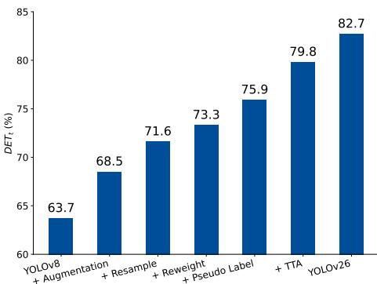  
Fig. 6: Stepwise performance improvements of our trafic element detector on the OpenLane-V2 validation set, evaluated by the DET metric.

labeling, test-time augmentation (TTA), and an advanced YOLO backbone [67].

## 6 Conclusion

We propose a lightweight way to inject trafic elements (lights/signs) and lane topology into vision-based end-to-end planning. By constructing a unified 3D trafic-element representation, adding TE auxiliary supervision, and conditioning the planner with ego-centric topology encoded as structured language, we obtain consistent gains across four benchmarks (open-loop and closed-loop) and six representative planners, improving both trajectory accuracy and safety/compliance metrics with only minor runtime overhead. Importantly, our results demonstrate strong scalability: the gains persist with stronger backbones and further increase when training with more data, highlighting trafic-element reasoning as a previously under-emphasized but decision-critical factor in end-to-end driving.

## References

1. Bai, S., Chen, K., Liu, X., Wang, J., Ge, W., Song, S., Dang, K., Wang, P., Wang, S., Tang, J., Zhong, H., Zhu, Y., Yang, M., Li, Z., Wan, J., Wang, P., Ding, W., Fu, Z., Xu, Y., Ye, J., Zhang, X., Xie, T., Cheng, Z., Zhang, H., Yang, Z., Xu, H., Lin, J.: Qwen2.5-vl technical report. arXiv preprint arXiv:2502.13923 (2025)

2. Bansal, M., Krizhevsky, A., Ogale, A.: Chaufeurnet: Learning to drive by imitating the best and synthesizing the worst. arXiv preprint arXiv:1812.03079 (2018)

3. Bhattacharyya, P., Huang, C., Czarnecki, K.: Ssl-interactions: Pretext tasks for interactive trajectory prediction. In: 2024 IEEE Intelligent Vehicles Symposium (IV). pp. 1450–1457. IEEE (2024)

4. Caesar, H., Bankiti, V., Lang, A.H., Vora, S., Liong, V.E., Xu, Q., Krishnan, A., Pan, Y., Baldan, G., Beijbom, O.: nuscenes: A multimodal dataset for autonomous driving. In: Proceedings of the IEEE/CVF conference on computer vision and pattern recognition. pp. 11621–11631 (2020)

5. Cao, W., Hallgarten, M., Li, T., Dauner, D., Gu, X., Wang, C., Miron, Y., Aiello, M., Li, H., Gilitschenski, I., et al.: Pseudo-simulation for autonomous driving. arXiv preprint arXiv:2506.04218 (2025)

6. Carion, N., Massa, F., Synnaeve, G., Usunier, N., Kirillov, A., Zagoruyko, S.: Endto-end object detection with transformers. In: European conference on computer vision. pp. 213–229. Springer (2020)

7. Chang, X., Xue, M., Liu, X., Pan, Z., Wei, X.: Driving by the rules: A benchmark for integrating trafic sign regulations into vectorized hd map. In: Proceedings of the Computer Vision and Pattern Recognition Conference. pp. 6823–6833 (2025)

8. Chen, D., Zhou, B., Koltun, V., Krähenbühl, P.: Learning by cheating. In: Conference on robot learning. pp. 66–75. PMLR (2020)

9. Chen, S., Jiang, B., Gao, H., Liao, B., Xu, Q., Zhang, Q., Huang, C., Liu, W., Wang, X.: Vadv2: End-to-end vectorized autonomous driving via probabilistic planning. arXiv preprint arXiv:2402.13243 (2024)

10. Chen, Y., Wang, Y., Zhang, Z.: Drivinggpt: Unifying driving world modeling and planning with multi-modal autoregressive transformers. In: Proceedings of the IEEE/CVF International Conference on Computer Vision. pp. 26890–26900 (2025)

11. Chen, Z., Wu, J., Wang, W., Su, W., Chen, G., Xing, S., Zhong, M., Zhang, Q., Zhu, X., Lu, L., et al.: Internvl: Scaling up vision foundation models and aligning for generic visual-linguistic tasks. In: Proceedings of the IEEE/CVF conference on computer vision and pattern recognition. pp. 24185–24198 (2024)

12. Chi, H., Gao, H.a., Liu, Z., Liu, J., Liu, C., Li, J., Yang, K., Yu, Y., Wang, Z., Li, W., et al.: Impromptu vla: Open weights and open data for driving visionlanguage-action models. arXiv preprint arXiv:2505.23757 (2025)

13. Chitta, K., Prakash, A., Jaeger, B., Yu, Z., Renz, K., Geiger, A.: Transfuser: Imitation with transformer-based sensor fusion for autonomous driving. IEEE transactions on pattern analysis and machine intelligence 45(11), 12878–12895 (2022)

14. Dauner, D., Hallgarten, M., Geiger, A., Chitta, K.: Parting with misconceptions about learning-based vehicle motion planning. In: Conference on Robot Learning. pp. 1268–1281. PMLR (2023)

15. Dauner, D., Hallgarten, M., Li, T., Weng, X., Huang, Z., Yang, Z., Li, H., Gilitschenski, I., Ivanovic, B., Pavone, M., et al.: Navsim: Data-driven nonreactive autonomous vehicle simulation and benchmarking. Advances in Neural Information Processing Systems 37, 28706–28719 (2024)

16. Devlin, J., Chang, M.W., Lee, K., Toutanova, K.: Bert: Pre-training of deep bidirectional transformers for language understanding. In: Proceedings of the 2019 conference of the North American chapter of the association for computational linguistics: human language technologies, volume 1 (long and short papers). pp. 4171–4186 (2019)

17. Ding, K., Chen, B., Su, Y., Gao, H.a., Jin, B., Sima, C., Zhang, W., Li, X., Barsch, P., Li, H., et al.: Hint-ad: Holistically aligned interpretability in end-toend autonomous driving. arXiv preprint arXiv:2409.06702 (2024)

18. Dosovitskiy, A., Beyer, L., Kolesnikov, A., Weissenborn, D., Zhai, X., Unterthiner, T., Dehghani, M., Minderer, M., Heigold, G., Gelly, S., et al.: An image is worth 16x16 words: Transformers for image recognition at scale. arXiv preprint arXiv:2010.11929 (2020)

19. Dosovitskiy, A., Ros, G., Codevilla, F., Lopez, A., Koltun, V.: Carla: An open urban driving simulator. In: Conference on robot learning. pp. 1–16. PMLR (2017)

20. Dwivedi, V.P., Bresson, X.: A generalization of transformer networks to graphs. arXiv preprint arXiv:2012.09699 (2020)

21. Esser, P., Rombach, R., Ommer, B.: Taming transformers for high-resolution image synthesis. In: Proceedings of the IEEE/CVF conference on computer vision and pattern recognition. pp. 12873–12883 (2021)

22. Fang, Y., Sun, Q., Wang, X., Huang, T., Wang, X., Cao, Y.: Eva-02: A visual representation for neon genesis. Image and Vision Computing 149, 105171 (2024)

23. Fu, H., Zhang, D., Zhao, Z., Cui, J., Liang, D., Zhang, C., Zhang, D., Xie, H., Wang, B., Bai, X.: Orion: A holistic end-to-end autonomous driving framework by vision-language instructed action generation. In: Proceedings of the IEEE/CVF International Conference on Computer Vision. pp. 24823–24834 (2025)

24. Fu, Y., Liao, W., Liu, X., Xu, H., Ma, Y., Zhang, Y., Dai, F.: Topologic: An interpretable pipeline for lane topology reasoning on driving scenes. Advances in Neural Information Processing Systems 37, 61658–61676 (2024)

25. Gao, Y., Wang, J., Zhang, Z., Jiang, A., Wang, Y., Heng, Y., Wang, S., Sun, H., Hu, Z., Zhao, H.: Uniuncer: Unified dynamic static uncertainty for end to end driving. arXiv preprint arXiv:2603.07686 (2026)

26. Ge, Z., Liu, S., Wang, F., Li, Z., Sun, J.: Yolox: Exceeding yolo series in 2021. arXiv preprint arXiv:2107.08430 (2021)

27. Guo, M., Zhang, Z., He, Y., Wang, K., Jing, L., Ling, H.: End-to-end autonomous driving without costly modularization and 3d manual annotation. IEEE Transactions on Pattern Analysis and Machine Intelligence (2025)

28. Guo, X., Zhang, R., Duan, Y., He, Y., Nie, D., Huang, W., Zhang, C., Liu, S., Zhao, H., Chen, L.: Surds: Benchmarking spatial understanding and reasoning in driving scenarios with vision language models. Advances in Neural Information Processing Systems 38 (2026)

29. He, K., Zhang, X., Ren, S., Sun, J.: Deep residual learning for image recognition. In: Proceedings of the IEEE conference on computer vision and pattern recognition. pp. 770–778 (2016)

30. Hu, P., Huang, A., Dolan, J., Held, D., Ramanan, D.: Safe local motion planning with self-supervised freespace forecasting. In: Proceedings of the IEEE/CVF Conference on Computer Vision and Pattern Recognition. pp. 12732–12741 (2021)

31. Hu, S., Chen, L., Wu, P., Li, H., Yan, J., Tao, D.: St-p3: End-to-end visionbased autonomous driving via spatial-temporal feature learning. In: European Conference on Computer Vision. pp. 533–549. Springer (2022)

32. Hu, Y., Yang, J., Chen, L., Li, K., Sima, C., Zhu, X., Chai, S., Du, S., Lin, T., Wang, W., et al.: Planning-oriented autonomous driving. In: Proceedings of the IEEE/CVF conference on computer vision and pattern recognition. pp. 17853– 17862 (2023)

33. Hwang, J.J., Xu, R., Lin, H., Hung, W.C., Ji, J., Choi, K., Huang, D., He, T., Covington, P., Sapp, B., et al.: Emma: End-to-end multimodal model for autonomous driving. arXiv preprint arXiv:2410.23262 (2024)

34. Jia, X., Gao, Y., Chen, L., Yan, J., Liu, P.L., Li, H.: Driveadapter: Breaking the coupling barrier of perception and planning in end-to-end autonomous driving. In: Proceedings of the IEEE/CVF International Conference on Computer Vision. pp. 7953–7963 (2023)

35. Jia, X., Wu, P., Chen, L., Xie, J., He, C., Yan, J., Li, H.: Think twice before driving: Towards scalable decoders for end-to-end autonomous driving. In: Proceedings of the IEEE/CVF Conference on Computer Vision and Pattern Recognition. pp. 21983–21994 (2023)

36. Jia, X., Yang, Z., Li, Q., Zhang, Z., Yan, J.: Bench2drive: Towards multi-ability benchmarking of closed-loop end-to-end autonomous driving. Advances in Neural Information Processing Systems 37, 819–844 (2024)

37. Jia, X., You, J., Zhang, Z., Yan, J.: Drivetransformer: Unified transformer for scalable end-to-end autonomous driving. arXiv preprint arXiv:2503.07656 (2025)

38. Jiang, A., Gao, Y., Sun, Z., Wang, Y., Wang, J., Chai, J., Cao, Q., Heng, Y., Jiang, H., Dong, Y., et al.: Difvla: Vision-language guided difusion planning for autonomous driving. arXiv preprint arXiv:2505.19381 (2025)

39. Jiang, B., Chen, S., Liao, B., Zhang, X., Yin, W., Zhang, Q., Huang, C., Liu, W., Wang, X.: Senna: Bridging large vision-language models and end-to-end autonomous driving. arXiv preprint arXiv:2410.22313 (2024)

40. Jiang, B., Chen, S., Xu, Q., Liao, B., Chen, J., Zhou, H., Zhang, Q., Liu, W., Huang, C., Wang, X.: Vad: Vectorized scene representation for eficient autonomous driving. In: Proceedings of the IEEE/CVF International Conference on Computer Vision. pp. 8340–8350 (2023)

41. Khurana, T., Hu, P., Dave, A., Ziglar, J., Held, D., Ramanan, D.: Diferentiable raycasting for self-supervised occupancy forecasting. In: European Conference on Computer Vision. pp. 353–369. Springer (2022)

42. Kirby, E., Boulch, A., Xu, Y., Yin, Y., Puy, G., Zablocki, É., Bursuc, A., Gidaris, S., Marlet, R., Bartoccioni, F., et al.: Driving on registers. arXiv preprint arXiv:2601.05083 (2026)

43. Li, P., Cui, D.: Navigation-guided sparse scene representation for end-to-end autonomous driving. arXiv preprint arXiv:2409.18341 (2024)

44. Li, T., Chen, L., Wang, H., Li, Y., Yang, J., Geng, X., Jiang, S., Wang, Y., Xu, H., Xu, C., et al.: Graph-based topology reasoning for driving scenes. arXiv preprint arXiv:2304.05277 (2023)

45. Li, T., Jia, P., Wang, B., Chen, L., Jiang, K., Yan, J., Li, H.: Lanesegnet: Map learning with lane segment perception for autonomous driving. arXiv preprint arXiv:2312.16108 (2023)

46. Li, Y., Zhang, Z., Qiu, X., Li, X., Liu, Z., Wang, L., Li, R., Zhu, Z., Gao, H.a., Lin, X., et al.: Reusing attention for one-stage lane topology understanding. In: 2025 IEEE/RSJ International Conference on Intelligent Robots and Systems (IROS). pp. 16977–16984. IEEE (2025)

47. Li, Y., Fan, L., He, J., Wang, Y., Chen, Y., Zhang, Z., Tan, T.: Enhancing end-toend autonomous driving with latent world model. arXiv preprint arXiv:2406.08481 (2024)

48. Li, Y., Shang, S., Liu, W., Zhan, B., Wang, H., Wang, Y., Chen, Y., Wang, X., An, Y., Tang, C., et al.: Drivevla-w0: World models amplify data scaling law in autonomous driving. arXiv preprint arXiv:2510.12796 (2025)

49. Li, Y., Xiong, K., Guo, X., Li, F., Yan, S., Xu, G., Zhou, L., Chen, L., Sun, H., Wang, B., et al.: Recogdrive: A reinforced cognitive framework for end-to-end autonomous driving. arXiv preprint arXiv:2506.08052 (2025)

50. Li, Z., Li, K., Wang, S., Lan, S., Yu, Z., Ji, Y., Li, Z., Zhu, Z., Kautz, J., Wu, Z., et al.: Hydra-mdp: End-to-end multimodal planning with multi-target hydradistillation. arXiv preprint arXiv:2406.06978 (2024)

51. Li, Z., Yao, W., Wang, Z., Sun, X., Chen, J., Chang, N., Shen, M., Song, J., Wu, Z., Lan, S., et al.: Ztrs: Zero-imitation end-to-end autonomous driving with trajectory scoring. arXiv preprint arXiv:2510.24108 (2025)

52. Li, Z., Yao, W., Wang, Z., Sun, X., Chen, J., Chang, N., Shen, M., Wu, Z., Lan, S., Alvarez, J.M.: Generalized trajectory scoring for end-to-end multimodal planning. arXiv preprint arXiv:2506.06664 (2025)

53. Li, Z., Yu, Z., Lan, S., Li, J., Kautz, J., Lu, T., Alvarez, J.M.: Is ego status all you need for open-loop end-to-end autonomous driving? In: Proceedings of the IEEE/CVF Conference on Computer Vision and Pattern Recognition. pp. 14864–14873 (2024)

54. Liao, B., Chen, S., Yin, H., Jiang, B., Wang, C., Yan, S., Zhang, X., Li, X., Zhang, Y., Zhang, Q., et al.: Difusiondrive: Truncated difusion model for endto-end autonomous driving. In: Proceedings of the Computer Vision and Pattern Recognition Conference. pp. 12037–12047 (2025)

55. Lin, H., Chen, S., Liew, J., Chen, D.Y., Li, Z., Shi, G., Feng, J., Kang, B.: Depth anything 3: Recovering the visual space from any views. arXiv preprint arXiv:2511.10647 (2025)

56. Liu, D., Gao, Y., Qian, D., Zhang, Q., Ye, X., Han, J., Zheng, Y., Liu, X., Xia, Z., Ding, D., et al.: Takead: Preference-based post-optimization for end-to-end autonomous driving with expert takeover data. IEEE Robotics and Automation Letters 11(2), 1738–1745 (2025)

57. Liu, L., Jia, C., Yu, G., Song, Z., Li, J., Jia, F., Wu, P., Hao, X., Luo, Y.: Guideflow: Constraint-guided flow matching for planning in end-to-end autonomous driving. arXiv preprint arXiv:2511.18729 (2025)

58. Liu, S., Chen, W., Li, W., Wang, Z., Yang, L., Huang, J., Zhang, Y., Huang, Z., Cheng, Z., Yang, H.: Bridgedrive: Difusion bridge policy for closed-loop trajectory planning in autonomous driving. arXiv preprint arXiv:2509.23589 (2025)

59. Lv, C., Qi, M., Liu, L., Ma, H.: T2sg: Trafic topology scene graph for topology reasoning in autonomous driving. In: Proceedings of the Computer Vision and Pattern Recognition Conference. pp. 17197–17206 (2025)

60. Nie, M., Peng, R., Wang, C., Cai, X., Han, J., Xu, H., Zhang, L.: Reason2drive: Towards interpretable and chain-based reasoning for autonomous driving. In: European Conference on Computer Vision. pp. 292–308. Springer (2024)

61. Oquab, M., Darcet, T., Moutakanni, T., Vo, H., Szafraniec, M., Khalidov, V., Fernandez, P., Haziza, D., Massa, F., El-Nouby, A., et al.: Dinov2: Learning robust visual features without supervision. arXiv preprint arXiv:2304.07193 (2023)

62. Park, S.Y., Cui, C., Ma, Y., Moradipari, A., Gupta, R., Han, K., Wang, Z.: Nuplanqa: A large-scale dataset and benchmark for multi-view driving scene understanding in multi-modal large language models. arXiv preprint arXiv:2503.12772 (2025)

63. Piccinelli, L., Sakaridis, C., Yang, Y.H., Segu, M., Li, S., Abbeloos, W., Van Gool, L.: Unidepthv2: Universal monocular metric depth estimation made simpler. IEEE Transactions on Pattern Analysis and Machine Intelligence (2025)

64. Qian, T., Chen, J., Zhuo, L., Jiao, Y., Jiang, Y.G.: Nuscenes-qa: A multi-modal visual question answering benchmark for autonomous driving scenario. In: Proceedings of the AAAI Conference on Artificial Intelligence. vol. 38, pp. 4542–4550 (2024)

65. Redmon, J., Divvala, S., Girshick, R., Farhadi, A.: You only look once: Unified, real-time object detection. In: Proceedings of the IEEE conference on computer vision and pattern recognition. pp. 779–788 (2016)

66. Sanh, V., Debut, L., Chaumond, J., Wolf, T.: Distilbert, a distilled version of bert: smaller, faster, cheaper and lighter. arXiv preprint arXiv:1910.01108 (2019)

67. Sapkota, R., Cheppally, R.H., Sharda, A., Karkee, M.: Yolo26: key architectural enhancements and performance benchmarking for real-time object detection. arXiv preprint arXiv:2509.25164 (2025)

68. Sauer, A., Savinov, N., Geiger, A.: Conditional afordance learning for driving in urban environments. In: Conference on robot learning. pp. 237–252. PMLR (2018)

69. Schlichtkrull, M., Kipf, T.N., Bloem, P., Van Den Berg, R., Titov, I., Welling, M.: Modeling relational data with graph convolutional networks. In: European Semantic Web Conference. pp. 593–607. Springer (2018)

70. Shi, C., Shi, S., Sheng, K., Zhang, B., Jiang, L.: Drivex: Omni scene modeling for learning generalizable world knowledge in autonomous driving. In: Proceedings of the IEEE/CVF International Conference on Computer Vision. pp. 28599–28609 (2025)

71. Sima, C., Chitta, K., Yu, Z., Lan, S., Luo, P., Geiger, A., Li, H., Alvarez, J.M.: Centaur: Robust end-to-end autonomous driving with test-time training. arXiv preprint arXiv:2503.11650 (2025)

72. Sima, C., Renz, K., Chitta, K., Chen, L., Zhang, H., Xie, C., Beißwenger, J., Luo, P., Geiger, A., Li, H.: Drivelm: Driving with graph visual question answering. In: European Conference on Computer Vision. pp. 256–274. Springer (2024)

73. Song, Z., Jia, C., Liu, L., Pan, H., Zhang, Y., Wang, J., Zhang, X., Xu, S., Yang, L., Luo, Y.: Don’t shake the wheel: Momentum-aware planning in end-to-end autonomous driving. In: Proceedings of the IEEE/CVF Conference on Computer Vision and Pattern Recognition. pp. 22432–22441 (2025)

74. Song, Z., Liu, L., Pan, H., Liao, B., Guo, M., Yang, L., Zhang, Y., Xu, S., Jia, C., Luo, Y.: Breaking imitation bottlenecks: Reinforced difusion powers diverse trajectory generation. arXiv e-prints pp. arXiv–2507 (2025)

75. Sun, W., Lin, X., Shi, Y., Zhang, C., Wu, H., Zheng, S.: Sparsedrive: End-to-end autonomous driving via sparse scene representation. In: 2025 IEEE International Conference on Robotics and Automation (ICRA). pp. 8795–8801. IEEE (2025)

76. Tian, B., Liu, M., Gao, H.a., Li, P., Zhao, H., Zhou, G.: Unsupervised road anomaly detection with language anchors. In: 2023 IEEE international conference on robotics and automation (ICRA). pp. 7778–7785. IEEE (2023)

77. Tian, H., Li, T., Liu, H., Yang, J., Qiu, Y., Li, G., Wang, J., Gao, Y., Zhang, Z., Wang, L., et al.: Simscale: Learning to drive via real-world simulation at scale. arXiv preprint arXiv:2511.23369 (2025)

78. Tian, X., Gu, J., Li, B., Liu, Y., Wang, Y., Zhao, Z., Zhan, K., Jia, P., Lang, X., Zhao, H.: Drivevlm: The convergence of autonomous driving and large visionlanguage models. arXiv preprint arXiv:2402.12289 (2024)

79. Tong, W., Sima, C., Wang, T., Chen, L., Wu, S., Deng, H., Gu, Y., Lu, L., Luo, P., Lin, D., et al.: Scene as occupancy. In: Proceedings of the IEEE/CVF International Conference on Computer Vision. pp. 8406–8415 (2023)

80. Vitelli, M., Chang, Y., Ye, Y., Ferreira, A., Wołczyk, M., Osiński, B., Niendorf, M., Grimmett, H., Huang, Q., Jain, A., et al.: Safetynet: Safe planning for realworld self-driving vehicles using machine-learned policies. In: 2022 International Conference on Robotics and Automation (ICRA). pp. 897–904. IEEE (2022)

81. Wang, H., Li, T., Li, Y., Chen, L., Sima, C., Liu, Z., Wang, B., Jia, P., Wang, Y., Jiang, S., et al.: Openlane-v2: A topology reasoning benchmark for unified 3d hd mapping. Advances in Neural Information Processing Systems 36, 18873–18884 (2023)

82. Wang, J., Liu, X., Zheng, Y., Xing, Z., Li, P., Li, G., Ma, K., Chen, G., Ye, H., Xia, Z., et al.: Meanfuser: Fast one-step multi-modal trajectory generation and adaptive reconstruction via meanflow for end-to-end autonomous driving. arXiv preprint arXiv:2602.20060 (2026)

83. Wang, S., Yu, Z., Jiang, X., Lan, S., Shi, M., Chang, N., Kautz, J., Li, Y., Alvarez, J.M.: Omnidrive: A holistic vision-language dataset for autonomous driving with counterfactual reasoning. In: Proceedings of the computer vision and pattern recognition conference. pp. 22442–22452 (2025)

84. Wang, X., Cui, Y., Wang, J., Zhang, F., Wang, Y., Zhang, X., Luo, Z., Sun, Q., Li, Z., Wang, Y., et al.: Multimodal learning with next-token prediction for large multimodal models. Nature pp. 1–7 (2026)

85. Wang, Y., Li, X., Wang, W., Zhang, J., Li, Y., Chen, Y., Wang, X., Zhang, Z.: Unified vision-language-action model. arXiv preprint arXiv:2506.19850 (2025)

86. Weng, X., Ivanovic, B., Wang, Y., Wang, Y., Pavone, M.: Para-drive: Parallelized architecture for real-time autonomous driving. In: Proceedings of the IEEE/CVF Conference on Computer Vision and Pattern Recognition. pp. 15449–15458 (2024)

87. Wozniak, M.K., Liu, L., Cai, Y., Jensfelt, P.: Prix: Learning to plan from raw pixels for end-to-end autonomous driving. arXiv preprint arXiv:2507.17596 (2025)

88. Wu, D., Chang, J., Jia, F., Liu, Y., Wang, T., Shen, J.: Topomlp: A simple yet strong pipeline for driving topology reasoning. arXiv preprint arXiv:2310.06753 (2023)

89. Wu, D., Han, W., Liu, Y., Wang, T., Xu, C.z., Zhang, X., Shen, J.: Language prompt for autonomous driving. In: Proceedings of the AAAI Conference on Artificial Intelligence. vol. 39, pp. 8359–8367 (2025)

90. Wu, D., Jia, F., Chang, J., Li, Z., Sun, J., Han, C., Li, S., Liu, Y., Ge, Z., Wang, T.: The 1st-place solution for cvpr 2023 openlane topology in autonomous driving challenge. arXiv preprint arXiv:2306.09590 (2023)

91. Wu, P., Jia, X., Chen, L., Yan, J., Li, H., Qiao, Y.: Trajectory-guided control prediction for end-to-end autonomous driving: A simple yet strong baseline. Advances in Neural Information Processing Systems 35, 6119–6132 (2022)

92. Xing, Z., Zhang, X., Hu, Y., Jiang, B., He, T., Zhang, Q., Long, X., Yin, W.: Goalflow: Goal-driven flow matching for multimodal trajectories generation in end-to-end autonomous driving. In: Proceedings of the Computer Vision and Pattern Recognition Conference. pp. 1602–1611 (2025)

93. Yao, W., Li, Z., Lan, S., Wang, Z., Sun, X., Alvarez, J.M., Wu, Z.: Drivesuprim: Towards precise trajectory selection for end-to-end planning. arXiv preprint arXiv:2506.06659 (2025)

94. Yuan, C., Zhang, Z., Sun, J., Sun, S., Huang, Z., Lee, C.D.W., Li, D., Han, Y., Wong, A., Tee, K.P., et al.: Drama: An eficient end-to-end motion planner for autonomous driving with mamba. arXiv preprint arXiv:2408.03601 (2024)

95. Zeng, W., Luo, W., Suo, S., Sadat, A., Yang, B., Casas, S., Urtasun, R.: Endto-end interpretable neural motion planner. In: Proceedings of the IEEE/CVF conference on computer vision and pattern recognition. pp. 8660–8669 (2019)

96. Zhai, J.T., Feng, Z., Du, J., Mao, Y., Liu, J.J., Tan, Z., Zhang, Y., Ye, X., Wang, J.: Rethinking the open-loop evaluation of end-to-end autonomous driving in nuscenes. arXiv preprint arXiv:2305.10430 (2023)

97. Zhang, Z., Li, X., Zou, S., Chi, G., Li, S., Qiu, X., Wang, G., Zheng, G., Wang, L., Zhao, H., et al.: Chameleon: Fast-slow neuro-symbolic lane topology extraction. In: 2025 IEEE International Conference on Robotics and Automation (ICRA). pp. 3752–3758. IEEE (2025)

98. Zhang, Z., Qiu, X., Zhang, B., Zheng, G., Gu, X., Chi, G., Gao, H.a., Wang, L., Liu, Z., Li, X., et al.: Delving into mapping uncertainty for mapless trajectory prediction. In: 2025 IEEE/RSJ International Conference on Intelligent Robots and Systems (IROS). pp. 16969–16976. IEEE (2025)

99. Zhang, Z., Zou, S., Zheng, G., Zhu, Z., Gao, Y., Chi, G., Wang, S., Heng, Y., Sun, Z., Wang, Y., et al.: Unified map prior encoder for mapping and planning. arXiv preprint arXiv:2605.02762 (2026)

100. Zheng, L., Chiang, W.L., Sheng, Y., Zhuang, S., Wu, Z., Zhuang, Y., Lin, Z., Li, Z., Li, D., Xing, E., et al.: Judging llm-as-a-judge with mt-bench and chatbot arena. Advances in neural information processing systems 36, 46595–46623 (2023)

101. Zheng, W., Song, R., Guo, X., Zhang, C., Chen, L.: Genad: Generative end-to-end autonomous driving. In: European Conference on Computer Vision. pp. 87–104. Springer (2024)

102. Zheng, X., Wu, L., Yan, Z., Tang, Y., Zhao, H., Zhong, C., Chen, B., Gong, J.: Large language models powered context-aware motion prediction in autonomous driving. In: 2024 IEEE/RSJ International Conference on Intelligent Robots and Systems (IROS). pp. 980–985. IEEE (2024)

103. Zheng, Y., Yang, P., Xing, Z., Zhang, Q., Zheng, Y., Gao, Y., Li, P., Zhang, T., Xia, Z., Jia, P., et al.: World4drive: End-to-end autonomous driving via intentionaware physical latent world model. In: Proceedings of the IEEE/CVF International Conference on Computer Vision. pp. 28632–28642 (2025)

104. Zhou, Z., Cai, T., Zhao, S.Z., Zhang, Y., Huang, Z., Zhou, B., Ma, J.: Autovla: A vision-language-action model for end-to-end autonomous driving with adaptive reasoning and reinforcement fine-tuning. arXiv preprint arXiv:2506.13757 (2025)

105. Zou, J., Chen, S., Liao, B., Zheng, Z., Song, Y., Zhang, L., Zhang, Q., Liu, W., Wang, X.: Difusiondrivev2: Reinforcement learning-constrained truncated difusion modeling in end-to-end autonomous driving. arXiv preprint arXiv:2512.07745 (2025)

## Appendix

This appendix provides supplementary technical details, extended discussions, and additional experimental evidence to support the main findings of the paper. The content is organized as follows:

– App. A: Extended Related Work. We provide a more comprehensive review of representative end-to-end autonomous driving paradigms, as well as prior eforts that use scene understanding to improve downstream planning. App. B: 3D Dataset Construction Details. We describe the full pipeline for constructing 3D trafic elements across diferent datasets. We also detail the prediction and processing of topological relationships, concluding with an analysis of potential failure cases during the construction process.

App. C: Datasets & Metrics Details. We introduce the four evaluation benchmarks in detail and summarize the definitions, computation, and interpretation of the metrics used in our experiments.

– App. D: Model Details. We present architecture-specific integration details, training protocols, and implementation settings for applying our method to diferent end-to-end planning backbones.

– App. E: Additional Visualization. We provide more qualitative examples and analysis to illustrate the scenarios in which our method is more beneficial.

– App. F: Ablation Study Details. We detail the structural configurations, modifications, and exact implementation specifics of the comparative variants utilized in our ablation experiments.

– App. G: Limitations of nuScenes Metrics. We discuss the limitations of the standard nuScenes [4] evaluation protocol and report supplementary metrics for a more comprehensive assessment.

– App. H: Limitations & Future Work: We discuss current system constraints and outlines directions for future research.

## A Extended Related Work

## A.1 End-to-End Autonomous Driving

Recent studies on end-to-end autonomous driving have explored several paradigms for integrating perception, reasoning, and planning within a unified framework. Early studies on end-to-end autonomous driving mainly follow either a perceptionplanning paradigm or regression-based formulations. Regression-based methods directly map sensor observations to driving actions or trajectories. For example, TCP [91] proposes a simple baseline that predicts control commands with trajectory supervision. TransFuser [13] introduces transformer-based sensor fusion for imitation learning, while BEV-Planner [53] predicts driving trajectories from BEV representations using ego status as key inputs. The perception-planning paradigm learns structured scene representations before performing planning. ST-P3 [31] learns spatial-temporal scene representations for joint perception and planning. UniAD [32] proposes a planning-oriented framework that unifies perception, prediction, and planning tasks. VAD [40] introduces vectorized scene representations for eficient planning, while SparseDrive [75] adopts sparse scene representations for scalable end-to-end driving. VADv2 [9] further extends this paradigm with probabilistic planning for multimodal decision-making.

Recent studies have explored generative planning to capture the inherent multi-modality of driving behaviors by modeling a distribution over future trajectories rather than predicting a single deterministic plan. GenAD [101] adopts variational autoencoder (VAE) formulations to model trajectory uncertainty through latent variables. Methods such as DifusionDrive [54], DifusionDriveV2 [105] BridgeDrive [58], and DIVER [74] formulate trajectory generation as a difusion process that iteratively refines noisy trajectory samples toward feasible driving behaviors. Approaches including GoalFlow [92], GuideFlow [57], and Mean-Fuser [82] investigate flow-based generative models for more eficient trajectory synthesis. These generative approaches provide strong expressiveness for modeling complex motion distributions and diverse driving behaviors.

Another line of work formulates end-to-end driving as a trajectory scoring problem, where the model evaluates multiple candidate trajectories and selects the most suitable one. Hydra-MDP [50] introduces a multi-target hydra distillation framework for multimodal trajectory evaluation. DriveSuprim [93] improves trajectory selection by learning a more precise scoring mechanism. GTRS [52] further studies a unified scoring formulation for multimodal planning. Centaur [71] enhances robustness of scoring-based planners through test-time training under distribution shifts. ZTRS [51] explores trajectory scoring without imitation learning by directly optimizing policies from environment feedback.

More recently, researchers have begun to integrate large-scale foundation models into autonomous driving through vision-language models (VLMs) and vision-language-action (VLA) frameworks, enabling semantic reasoning and language grounding for driving decisions. Works such as DrivingGPT [10], Senna [39], and OmniDrive [83] introduce VLMs into autonomous driving to enhance scene interpretation and reasoning. Other works focus on end-to-end VLA driving architectures that directly map multimodal observations and language inputs to driving behaviors. EMMA [33] and UniVLA [85] propose unified multimodal frameworks that integrate perception, language grounding, and driving policy learning. AutoVLA [104] enhances this paradigm through adaptive reasoning and reinforcement fine-tuning, while DriveVLA-W0 [48] investigates the scaling properties of VLA driving systems. Impromptu-VLA [12] promotes openweight driving foundation models trained with large-scale multimodal data. DiffVLA [38] and LLM-augmented motion prediction [102] incorporate languagebased reasoning into motion prediction and planning, while Orion [23] explores instruction-conditioned driving policies within a unified end-to-end framework.

Researchers have also explored learning-based world models to capture environment dynamics and improve long-horizon decision-making in autonomous driving. SSR [43] introduces navigation-guided sparse scene representations to model structured driving environments for end-to-end planning. LAW [47] incorporates a latent world model to capture temporal dependencies and environment dynamics. World4Drive [103] further proposes an intention-aware physical latent world model that explicitly models interactions between agents and the environment. DriveX [70] extends this idea by learning omni-scene representations to capture generalizable world knowledge for autonomous driving.

To validate the efectiveness of our approach, we select representative methods from diferent end-to-end driving paradigms and augment them with trafic element information, aiming to enhance their planning performance.

## A.2 Trafic-Aware Scene Understanding

Prior work has injected rule-critical scene cues into driving in several diferent ways. Conditional Afordance Learning (CAL) [68] predicts compact driving affordances, including trafic-light and sign-related signals, and uses them to guide downstream control. Learning by Cheating [8] transfers privileged bird’s-eyeview supervision, allowing the policy to exploit trafic-rule-relevant scene structure during training. ChaufeurNet [2] rasterizes roadmap and trafic-light states as planner inputs, so that rule information is injected through a top-down representation. SafetyNet [80] instead places trafic-rule reasoning after the learned planner, using a rule-based fallback layer to override unsafe outputs when necessary. More recently, VADv2 [9] introduces explicit trafic-element tokens for trafic lights and stop signs, supervising both signal state and whether the signal afects the ego vehicle. These works confirm that trafic lights/signs are decisioncritical, but they are typically explored either as afordances, privileged/raster cues, post-hoc safety constraints, or within a single planner architecture.

A second related direction focuses on topology and trafic regulation as structured scene understanding problems. OpenLane-V2 [81] is the first benchmark to jointly annotate lanes, trafic elements, and their relations, explicitly arguing that lane–trafic associations facilitate downstream decision-making. Follow-up methods such as TopoNet [44], TopoMLP [88], LaneSegNet [45], T2SG [59] improve lane–lane and lane–trafic reasoning, while MapDR [7] further emphasizes the trafic regulation layer by associating trafic-sign rules with vectorized HD maps. However, these methods are primarily evaluated on topology or online-mapping benchmarks, with limited validation of how such cues transfer to planning.

Another route is to use heavy VLM/VQA-style scene understanding for driving. Methods such as Orion [23], OmniDrive [83], and AutoVLA [104] reason about trafic lights, signs, and other rule-relevant semantics in language space, often enabled by dedicated driving VQA datasets [28, 60, 62, 64, 72, 76, 89], but they typically incur substantially higher runtime cost. In contrast, our work targets the same rule-critical cues with a lightweight alternative based on explicit 3D trafic elements and ego-centric lane topology. More importantly, we systematically evaluate how these cues transfer to planning across multiple representative end-to-end backbones and both open-loop and closed-loop benchmarks, which is largely missing in prior trafic-aware and topology-aware studies.

Scope of trafic elements. In this work, trafic elements refer specifically to regulatory trafic lights and trafic signs, following the definition used in OpenLane-V2. We do not include vehicles or pedestrians in this category, since they are already modeled as dynamic agents in most end-to-end driving systems. Our focus is instead on the rule-critical but relatively underexplored regulatory cues that directly constrain legal driving maneuvers, such as stop/go decisions, turning permissions, and lane-level access constraints. Recent work has also explored map- and lane-aware representations for trajectory prediction. For example, SSL-Interactions [3] uses HD-map and lane context together with selfsupervised pretext tasks to improve agent–agent interaction modeling. This line of work is complementary to ours. Rather than proposing a new lane-topology representation itself, our goal is to evaluate whether regulatory trafic elements and ego-relevant topology provide a general downstream planning signal across end-to-end driving planners and benchmarks. In particular, our experiments focus on how these rule-critical cues afect planning performance, rather than only measuring their standalone perception or topology-prediction quality.

## B 3D Dataset Construction Details

This section details how we construct the two key supervision signals used in this work when they are not directly available from existing benchmarks: the 3D spatial coordinates of trafic elements and the ego-relevant topology. Specifically, we describe how 2D trafic elements are detected and lifted into 3D space, how depth and LiDAR cues are combined to recover reliable TE center points, and how ego-related lane–trafic, lane–lane topology is obtained across diferent datasets.

## B.1 3D Trafic Element Construction

2D Trafic Element Detection. The 3D location of each trafic element is derived from 2D detection and depth estimation. Given an input image $I \in$ $\mathbb { R } ^ { H \times W \times 3 }$ , a 2D detector [65] predicts a set of bounding boxes $B = \{ b _ { i } \} _ { i = 1 } ^ { N }$ . Each bounding box is defined as $b _ { i } = ( x _ { i } ^ { \operatorname* { m i n } } , y _ { i } ^ { \operatorname* { m i n } } , x _ { i } ^ { \operatorname* { m a x } } , y _ { i } ^ { \operatorname* { m a x } } )$ . The center of the i-th bounding box is computed as:

$$
( u _ { i } , v _ { i } ) = \left( \frac { x _ { i } ^ { \operatorname* { m i n } } + x _ { i } ^ { \operatorname* { m a x } } } { 2 } , \frac { y _ { i } ^ { \operatorname* { m i n } } + y _ { i } ^ { \operatorname* { m a x } } } { 2 } \right) ,\tag{A.1}
$$

where $( u _ { i } , v _ { i } )$ denotes the pixel coordinate of the trafic element center.

To construct reliable 3D trafic elements on datasets without TE annotations, we first build a strong 2D detector on OpenLane-V2 and then use it to generate pseudo labels for downstream 3D TE extraction. Starting from a YOLO-style detector, we progressively strengthen the model with a sequence of training and inference refinements, including selective augmentation, class-balanced resampling, foreground reweighting, pseudo-label bootstrapping, test-time augmentation, and finally a stronger detector backbone. As summarized in Fig. 6, this stepwise optimization substantially improves TE detection quality and yields a detector robust enough for automatic annotation on datasets such as NAVSIM. The progressive enhancements applied are detailed as follows:

– Selective Strong Augmentation: While aggressive data augmentation is standard practice for robust 2D object detection, we selectively tailor these techniques. We adopt spatial mixing strategies, specifically MixUp and Mosaic augmentations, inspired by the YOLOX paradigm [26]. However, we strictly prohibit the use of color gamut augmentation and horizontal flipping. Modifying the HSV color space severely impairs the model’s capacity to correctly recognize the semantic states of trafic lights (e.g., distinguishing between red and green). Similarly, applying horizontal flips reverse the semantic meaning of directional trafic signs, leading to critical misclassifications [90].

Class-Balanced Resampling: The natural distribution of trafic elements in driving datasets exhibits a severe long-tail phenomenon. Statistical analysis reveals that the "unknown" state of trafic lights constitutes nearly 50% of the annotations in the frontal view. However, these "unknown" instances provide negligible actionable information for the downstream motion planning task. Conversely, critical directive trafic signs often account for an exceptionally small fraction of the overall data. To mitigate this extreme class imbalance, we implement a resampling strategy that down-samples the over-represented, uninformative classes while aggressively over-sampling the rare but critical trafic signs, thereby synthesizing a uniformly distributed training manifold.

– Foreground Loss Reweighting: A major source of error is not coarse localization, but fine-grained category confusion among visually similar traffic signs, such as turn\_left, no\_left\_turn, and slight\_left. Since these categories are both infrequent and semantically important, we place extra emphasis on their classification by increasing the foreground classification weight. This encourages the detector to allocate more capacity to dificult sign recognition rather than being dominated by easier or more frequent classes. In our implementation, the foreground classification term is upweighted, while the localization branch remains unchanged.

Pseudo-Labeling for Sparse Annotations: In typical driving logs, distant trafic elements are frequently omitted from ground-truth annotations when they initially enter the camera’s field of view due to their diminutive pixel footprint. These missing annotations inherently act as noisy negative samples, which confuses the model and prevents optimal convergence during training. To rectify this, we leverage an intermediate, high-confidence detector to infer pseudo-labels across the unannotated frames. By identifying and labeling these distant objects, we provide the network with a denser, more consistent supervision signal, which significantly enhances subsequent training phases.

– Test-Time Augmentation (TTA): During the inference phase, we apply Test-Time Augmentation to systematically enhance detection robustness and stability. We strictly limit our TTA approach to multi-scale testing (utilizing scale factors ranging from 0.7x to 1.4x), as introducing more complex spatial transformations often degrades performance rather than improving it. Upscaling the input resolution specifically aids in recalling distant, smallscale trafic lights, whereas downscaling proves advantageous for successfully capturing large, ego-adjacent road markings.

Table A.1: Cross-dataset validation of the OpenLane-V2-trained trafic-element detector on a manually annotated NAVSIM subset. The subset contains 100 frames from 20 scenes and 1,126 trafic-element instances.
<table><tr><td>Dataset</td><td>Frames TE Inst.</td><td> $\mathrm { m A P _ { 5 0 } }$  n  ${ \mathrm { a A P } } _ { 5 0 : 9 5 }$ </td></tr><tr><td>NAVSIM manual subset</td></tr><tr><td>100 1,126</td></tr></table>

– Advanced Architecture Upgrade: Finally, to push the representational capacity of our feature extractor to its upper limit, we transition from the baseline architecture to the state-of-the-art YOLO26 [67].

Cross-dataset reliability of pseudo trafic-element labels. Since NAVSIM does not provide native trafic-element annotations, our NAVSIM experiments rely on pseudo labels generated by the trafic-element detector trained on OpenLane-V2. To verify that these pseudo labels are reliable rather than artifacts of dataset bias, we manually annotate a held-out NAVSIM subset containing 100 frames sampled from 20 scenes, with 1,126 trafic-element instances in total. We then evaluate the OpenLane-V2-trained detector directly on this manually annotated NAVSIM subset without any dataset-specific fine-tuning. As shown in Tab. A.1, the detector achieves strong cross-dataset performance, with 0.908 $\mathrm { \ m A P _ { 5 0 } }$ , 0.725 m $\mathrm { A P _ { 5 0 : 9 5 } }$ , 0.915 recall, and 0.918 precision. This suggests that the automatically constructed NAVSIM trafic-element labels provide meaningful supervision for downstream planning. The detector produces 92 false positives and 96 false negatives on this subset. Most errors come from small or distant trafic elements, which are also dificult to annotate consistently. Nevertheless, the high precision and recall indicate that the pseudo labels are suficiently reliable for training trafic-element-aware planning models.

Depth Estimation and Fusion. A depth estimation network [63] predicts a dense depth map $D \in \mathbb { R } ^ { H \times W }$ . The depth value corresponding to the i-th trafic element is obtained from the bounding box center as $z _ { i } ^ { \mathrm { d e p t h } } = D ( u _ { i } , v _ { i } )$ When LiDAR measurements are available, LiDAR points are projected onto the image plane using the calibration parameters between the LiDAR and camera sensors. The set of LiDAR points falling inside the bounding box $b _ { i }$ is denoted as: $\mathcal { P } _ { i } = \{ { \bf p } _ { j } ^ { \mathrm { l i d a r } } \}$

Since the LiDAR points inside the bounding box may correspond to multiple objects and therefore contain multiple depth values, the depth predicted by the monocular depth estimation network is used as a reference to select the LiDAR depth corresponding to the trafic element center.

Given the selected depth value $z _ { i } ,$ the corresponding 3D point in the camera coordinate system is obtained by back-projecting the pixel coordinate:

$$
\mathbf { p } _ { i } ^ { \mathrm { c a m } } = z _ { i } K ^ { - 1 } \left[ \begin{array} { l } { u _ { i } } \\ { v _ { i } } \\ { 1 } \end{array} \right] ,\tag{A.2}
$$

where K denotes the camera intrinsic matrix.

Finally, the 3D center of the trafic element in the world coordinate system is obtained through a rigid transformation:

$$
\mathbf { p } _ { i } ^ { \mathrm { L i D A R } } = R _ { \mathrm { c l } } \mathbf { p } _ { i } ^ { \mathrm { c a m } } + t _ { \mathrm { c l } } ,\tag{A.3}
$$

where $R _ { \mathrm { c l } } \in \mathbb { R } ^ { 3 \times 3 }$ and $t _ { \mathrm { c l } } \in \mathbb { R } ^ { 3 }$ denote the rotation matrix and translation vector between the camera and LiDAR coordinate systems.

Failure Case. We present a failure case of the proposed pipeline. In challenging environmental conditions, the depth estimation network may produce unreliable predictions. In the example shown in Fig. A.1, rain-induced image blur degrades the visual quality of the input image, causing the depth estimation network to incorrectly estimate the depth of the green trafic light indicated by the red bounding box. As a result, the reconstructed 3D position of the trafic element becomes inaccurate.

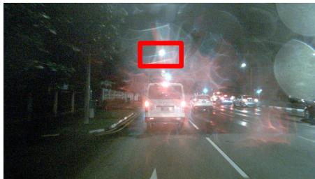

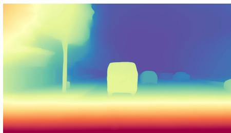  
Fig. A.1: Failure case of depth estimation. The left image shows the front-view camera image, where the green trafic light is highlighted by the red bounding box. The right image shows the corresponding predicted depth map.

Depth quality under challenging lighting. We further analyze how depthestimation quality changes under diferent lighting conditions and how this correlates with planning performance. We split the nuScenes validation samples into daytime and nighttime subsets and evaluate the VAD-based trafic-element model using standard depth metrics and planning metrics. As reported in Tab. A.2, nighttime scenes have noticeably worse depth estimates than daytime scenes, with AbsRel increasing from 0.088 to 0.160 and $\mathrm { R M S E _ { l o g } }$ increasing from 0.193 to 0.279. This degradation is accompanied by worse planning accuracy, where

(a)  
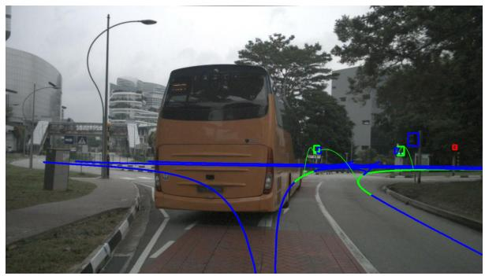

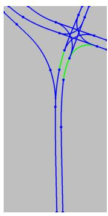

(b)  
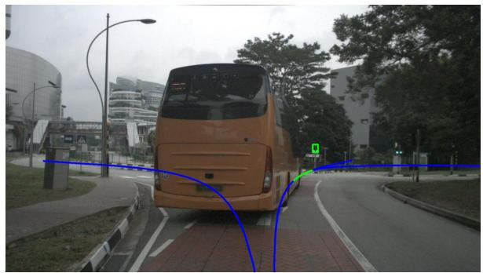  
Front View

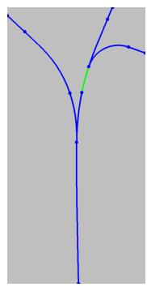  
BEV View  
Fig. A.2: Illustration of topology extraction. Blue lines denote centerlines, while green lines indicate the topology relations between green trafic lights and the corresponding centerlines.

Table A.2: Day/night breakdown on nuScenes with the VAD-based trafic-element model. Nighttime scenes exhibit worse depth quality, which correlates with degraded planning accuracy.
<table><tr><td rowspan="2">Subset</td><td colspan="3">Depth</td><td colspan="6">Planning</td></tr><tr><td>AbsRel↓</td><td> $\mathrm { R M S E _ { l o g } }$ </td><td>→  $\delta _ { 1 } \uparrow$ </td><td>L2@1s↓ L2@2s↓ L2@3s↓ Col@1s↓ Col@2s↓ Col@3s↓</td><td></td><td></td><td></td><td></td><td></td></tr><tr><td>All</td><td>0.095</td><td>0.201</td><td>0.920</td><td>0.36</td><td>0.61</td><td>0.92</td><td>0.09</td><td>0.14</td><td>0.28</td></tr><tr><td>Night</td><td>0.160</td><td>0.279</td><td>0.793</td><td>0.49</td><td>0.85</td><td>1.33</td><td>0.00</td><td>0.15</td><td>0.55</td></tr><tr><td>Day</td><td>0.088</td><td>0.193</td><td>0.934</td><td>0.34</td><td>0.58</td><td>0.88</td><td>0.10</td><td>0.13</td><td>0.25</td></tr></table>

L2@3s increases from 0.88 to 1.33. These results confirm that challenging lighting can afect the quality of the reconstructed 3D trafic-element representation and therefore weaken downstream planning performance.

This analysis also explains the failure case shown in Fig. ??. When image quality is degraded by adverse weather or low illumination, depth estimation can become unreliable and produce inaccurate 3D trafic-element locations. Our current pipeline is therefore robust to moderate noise, but still depends on the quality of upstream detection and depth estimation in extremely challenging visual conditions.

## B.2 Topology Prediction and Extraction

Prediction Network Architecture. For topology prediction, we adopt the TopoMLP architecture [88], a query-based first-detect-then-reason pipeline for driving topology reasoning. Given multi-view images, TopoMLP first detects 3D lane centerlines and 2D trafic elements with two dedicated detection branches, and then predicts both lane–lane and lane–trafic topology using lightweight MLP heads applied to pairwise query embeddings. Concretely, the query features of candidate centerlines and trafic elements are encoded with positional information, concatenated in pairs, and classified by small MLPs to obtain the corresponding adjacency relations. We use [88] in this work as an eficient topology provider, and then convert the predicted ego-relevant topology into the compact conditioning representation described in the main paper.

Ego-Related Topology Extraction. Given the predicted or annotated lane centerlines and their topology relations, we extract a local topology subgraph centered around the ego vehicle. Let ${ \mathcal { L } } = \{ l _ { i } \}$ denote the set of lane centerlines and $\mathcal { T } = \{ t _ { j } \}$ denote the set of trafic elements. We define the ego position in the local coordinate system as $\mathbf { p } _ { \mathrm { e g o } } = ( 0 , 0 )$ . The centerline closest to the ego vehicle is denoted as $l _ { \mathrm { e g o } }$ . Starting from $l _ { \mathrm { e g o : } }$ we traverse the centerline graph using the matrix $\mathbf { R } _ { \mathrm { L C L C } }$ to obtain the set of centerlines that are topologically connected to it, denoted as $\mathcal { L } _ { \mathrm { c o n n } }$ . Next, using the matrix $\mathbf { R } _ { \mathrm { L C T E } }$ , we collect the trafic elements that have topology relations with the centerlines in $\{ l _ { \mathrm { e g o } } \} \cup \mathcal { L } _ { \mathrm { c o n n } } ,$ which form the trafic element set $\tau _ { \mathrm { { t o p o } } }$ . The resulting topology subgraph therefore consists of the centerline set $\{ l _ { \mathrm { e g o } } \} \cup \mathcal { L } _ { \mathrm { c o n n } }$ and the associated trafic element set $\tau _ { \mathrm { t o p o } }$ . As illustrated in Fig. A.2, the topology extraction process converts the global topology graph shown in Fig. A.2(a) into a local topology subgraph centered around the ego vehicle, as depicted in Fig. A.2(b).

Language Topology Description Examples.

## Example 1

There are a ‘green‘ traffic\_light, a ‘green‘ traffic\_light ahead controlling the current ego-lane, which connects ‘1‘ ‘straight‘ centerline.

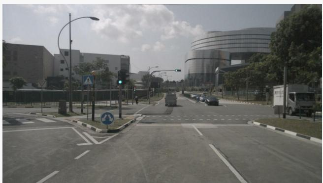  
Fig. A.3: Illustration of the topology description in Example 1.

## Example 2

There are a ‘red‘ traffic\_light, a ‘red‘ traffic\_light, a ‘red‘ traffic\_light ahead controlling the current ego-lane, which connects ‘1‘ ‘straight‘ centerline.

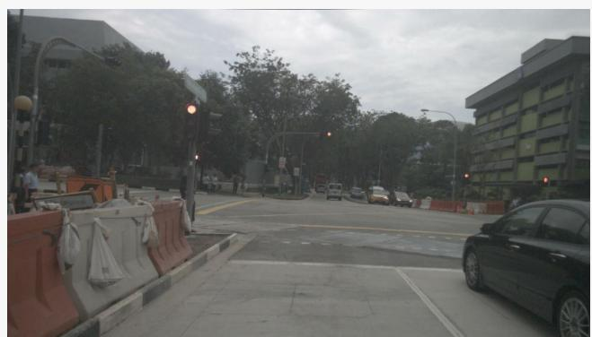  
Fig. A.4: Illustration of the topology description in Example 2.

## C Datasets & Metrics Details

## C.1 nuScenes

The nuScenes [4] dataset is a large-scale multimodal autonomous driving dataset containing 1, 000 driving scenes collected in urban environments. Each scene spans approximately 20 seconds and provides synchronized sensor data from multiple modalities, including six surround-view cameras, LiDAR, radar, and vehicle state measurements. For planning-oriented evaluation, the driving policy receives the current observation and predicts a future trajectory over a fixed horizon. The predicted trajectory is evaluated in an open-loop manner against the expert trajectory recorded by a human driver. Following prior works [32,40], we adopt the L2 trajectory error and collision rate as evaluation metrics.

Although the nuScenes HD map provides 3D annotations for trafic lights, their spatial locations are not suficiently accurate. Therefore, we adopt 2D trafic element annotations from OpenLane-V2 [81] to obtain 2D bounding boxes in the image plane. The corresponding 3D positions of trafic elements are obtained following the procedure described in App. B.

## C.2 NAVSIM-v1

NAVSIM-v1 [15] evaluates sensor-based driving policies using non-reactive simulation on real-world data, containing approximately 120 hours of urban driving data recorded at 2 Hz. Each observation includes eight surround-view cameras with a resolution of 1920 × 1080 pixels and a fused LiDAR point cloud from five sensors. The driving policy receives the current frame and optionally several historical frames as input and predicts a future trajectory over a horizon of four seconds. The predicted trajectory is executed in a simplified bird’s-eye-view simulation where surrounding agents replay their recorded trajectories while the ego vehicle is propagated using a kinematic bicycle model controlled at 10 Hz. Performance is measured using the Predictive Driver Model Score (PDMS):

$$
\mathrm { P D M S } = \left( \prod _ { m \in \{ \mathrm { N C , D A C } \} } \mathrm { s c o r e } _ { m } \right) \left( \frac { \sum _ { \omega \in \{ \mathrm { E P } , \mathrm { T T C } , \mathrm { C } \} } w _ { \omega } \cdot \mathrm { s c o r e } _ { \omega } } { \sum _ { \omega \in \{ \mathrm { E P } , \mathrm { T T C } , \mathrm { C } \} } w _ { \omega } } \right) .\tag{A.4}
$$

The penalty terms include no collisions (NC) and drivable area compliance (DAC), ensuring safety and map adherence, while the weighted metrics evaluate ego progress (EP), time-to-collision (TTC), and driving comfort (C).

Since the NAVSIM map annotations only provide the state information of trafic elements without precise spatial locations, we construct the corresponding 3D pseudo-labels of trafic elements following the procedure described in App. B.

## C.3 NAVSIM-v2

NAVSIM-v2 [5] extends NAVSIM-v1 through a pseudo-simulation framework designed to better approximate closed-loop evaluation while maintaining scalability. The dataset is derived from the same large-scale driving logs but introduces additional synthetic observations generated using neural scene reconstruction techniques. Evaluation is conducted in two stages. In Stage 1, the policy predicts a trajectory from the real-world observation and the trajectory is simulated to obtain an initial score and endpoint. In Stage 2, multiple synthetic observations are generated around the predicted endpoint to approximate possible future states of the environment, and the policy is evaluated again on these observations to measure robustness. The resulting metric, called the Extended Predictive Driver Model Score (EPDMS), aggregates safety penalties and weighted driving performance metrics:

$$
\mathrm { E P D M S } = \prod _ { m \in \mathcal { M } _ { \mathrm { p e n } } } \mathrm { f l t e r } _ { m } ( \mathrm { a g e n t } , \mathrm { h u m a n } ) . \frac { \sum _ { m \in \mathcal { M } _ { \mathrm { a v g } } } w _ { m } \cdot \mathrm { f l t e r } _ { m } ( \mathrm { a g e n t } , \mathrm { h u m a n } ) } { \sum _ { m \in \mathcal { M } _ { \mathrm { a v g } } } w _ { m } } ,
$$

where the penalty terms are

$$
\mathcal { M } _ { \mathrm { { p e n } } } = \{ \mathrm { { N C } , \mathrm { { D A C } , \mathrm { { D D C } , \mathrm { { T L C } } } } } \} ,\tag{A.5}
$$

and the weighted-average terms are

$$
\mathcal { M } _ { \mathrm { a v g } } = \{ \mathrm { T T C } , \mathrm { E P } , \mathrm { H C } , \mathrm { L K } , \mathrm { E C } \} .
$$

Here, NC denotes No at-fault Collision, DAC denotes Drivable Area Compliance, DDC denotes Driving Direction Compliance, and TLC denotes Traffic Light Compliance. The weighted-average terms include EP (Ego Progress), TTC (Time-to-Collision), HC (History Comfort), LK (Lane Keeping), and EC (Extended Comfort), with oficial weights $w _ { \mathrm { E P } } = 5 , w _ { \mathrm { T T C } } = 5 , w _ { \mathrm { H C } } = 2$ $w _ { \mathrm { L K } } = 2$ , and $w _ { \mathrm { E C } } = 2$

A distinctive component of EPDMS is the filtering function filter (agent, human). If the same rule violation is also committed by the human expert in the corresponding log, the associated penalty is ignored. This design reduces the sensitivity of the metric to annotation noise and to contextually justified maneuvers, such as temporarily entering the opposite lane to bypass a static obstacle. In the main paper, we report the overall EPDMS together with the Stage 1 / Stage 2 breakdown of the core subscores.

## C.4 Bench2Drive

Bench2Drive [36] is a large-scale closed-loop benchmark built on CARLA for evaluating end-to-end driving under interactive scenarios. Its oficial training set contains 2 million fully annotated frames collected from 10,000 short clips (approximately 150 m each), covering 44 interactive scenarios, 23 weather conditions, and 12 towns. The sensor configuration is similar to nuScenes and includes 1 LiDAR, 6 RGB cameras, 5 radars, IMU/GNSS, and an HD map. Importantly for this work, the benchmark also provides HD-map lanes, centerlines, topology, dynamic trafic-light states, and trigger areas for trafic lights and stop signs.

Bench2Drive reports both open-loop and closed-loop metrics. Following the oficial protocol, we mainly use Driving Score (DS) and Success Rate (SR) as the primary closed-loop metrics, and additionally report Eficiency, Comfortness, and open-loop Avg. L2. Here, SR measures the proportion of routes completed without infractions, DS combines route completion with infraction penalties, Eficiency evaluates relative speed with respect to nearby trafic, and Comfortness follows the smoothness protocol based on accelerations, yaw dynamics, and jerk.

In this work, we directly use the benchmark’s instance-level trafic-element annotations during training. These annotations provide each element’s 3D location and semantic type; trafic lights additionally provide signal state, while lights and some signs also include trigger\_volume information. We further use the oficial HD-map topology, which contains lane centerlines, lane adjacency/topology, left/right lane relations, and trigger-volume structures for stop signs and trafic lights. In our pipeline, these annotations are used to supervise 3D trafic elements and ego-relevant topology during training.

## D Model Details

## D.1 Perception-Planning: VAD

In this section, we describe how the proposed components are integrated into the VAD [40] framework. As illustrated in Fig. A.5, we follow the original Motion-Map-Planning architecture of VAD [40] and extend it with additional trafic element and topology modules. We introduce a trafic element (TE) branch to explicitly model trafic elements in the scene. Specifically, a TE Transformer is employed to predict trafic elements from the intermediate feature representations. The architecture of the TE Transformer is identical to the agent detection module used in VAD [40]. The predicted trafic elements are supervised using an additional auxiliary loss during training. The intermediate decoder features of the TE Transformer are extracted and used as the TE feature. To incorporate structural road information, we encode the topology graph using a BERT [16] encoder. The encoded topology representation is obtained from the final [CLS] token of the BERT output and is used as the topology feature. Finally, the ego feature produced by the VAD planning branch is concatenated with the traffic element feature and the topology feature along the channel dimension. The fused feature is then fed into the planning decoder to generate the final predicted trajectory.

For the training details, we initialize the model with the pretrained weights of VAD [40] and fine-tune it on the nuScenes dataset. The model is trained for 20 epochs using the AdamW optimizer with a learning rate of $2 \times 1 0 ^ { - 5 }$ . In addition to the original training objectives, an extra supervision term for trafic elements is introduced. Specifically, the regression branch is optimized with the L1 loss with a weight of 0.25 , while the classification branch adopts the Focal Loss with a weight of 2.0 .

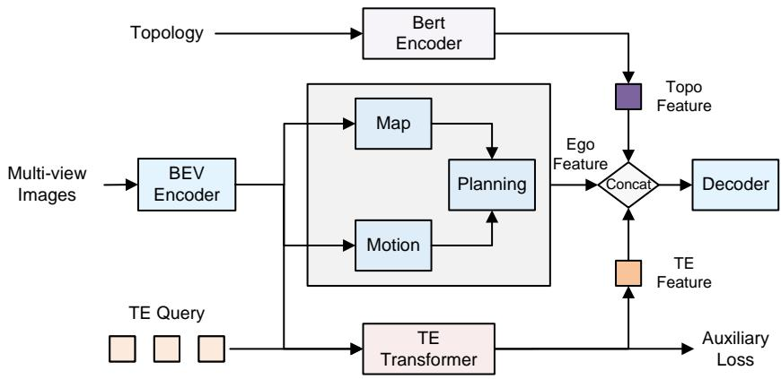  
Fig. A.5: Overview of the VAD-based architecture with the proposed trafic element and topology branches.

## D.2 LLM-Based: Orion

We integrate our method into the VLM-based planner Orion [23], which follows a vision–reasoning–action pipeline. Orion first encodes multi-view images with a vision encoder and a query-based visual compressor (QT-Former / Q-Former), then uses an LLM to reason over the scene and produce a planning token, which finally conditions a generative planner for trajectory prediction. In our nuScenes setting, we follow the oficial open-loop variant of Orion, which replaces the original QT-Former with the Q-Former from OmniDrive [83] and removes the explicit ego-status input in the generative planner.

To incorporate trafic elements, we attach a lightweight TE prediction head to the perception queries produced by the visual compressor. This head predicts the 3D TE center and TE category, supervised by an additional $L _ { 1 }$ localization loss and focal classification loss, respectively. In this way, the perception queries are explicitly encouraged to encode rule-critical trafic cues such as trafic lights and trafic signs, rather than relying only on implicit visual reasoning.

To incorporate topology, we follow the language-centered design of Orion and convert the predicted ego-relevant topology into a compact structured text prompt, which is concatenated with the original textual input to the LLM. Concretely, the prompt summarizes the ego-lane-related centerlines, lane connectivity, and associated trafic elements. The LLM then reasons over both the visual queries and this topology-aware textual context to produce a more informative planning token. Compared with introducing a separate graph encoder, this design is more consistent with Orion’s native reasoning space and allows topology and TE cues to be fused directly through language reasoning.

For training, we keep the oficial Orion settings unchanged and only add the TE supervision term. Specifically, we follow the original model configuration with EVA-02-L [22] as the vision encoder and Vicuna v1.5 [100] fine-tuned with LoRA $( \mathrm { r a n k } = 1 6 , \mathrm { a l p h a } = 1 6 )$ ; input images are resized to $6 4 0 \times 6 4 0$ , and the original multi-stage training schedule is preserved. The additional TE branch is optimized jointly with the original Orion objectives using the same $L _ { 1 }$ and focal losses as in our VAD setting.

## D.3 Regression-Based: LTF

In this section, we describe how the proposed components are integrated into the LTF [13] baseline. As illustrated in Fig. A.6, we follow the original framework to generate BEV features from multi-view observations. In addition to the original auxiliary tasks in LTF [13], including BEV segmentation and agent detection, we further introduce a trafic element prediction branch. Specifically, a convolutionbased decoder is used to predict a trafic element heatmap from the intermediate features. The predicted heatmap represents the spatial distribution of trafic elements in the BEV space. To incorporate trafic element information into the planning module, the predicted heatmap is first pooled to match the spatial resolution of the BEV feature map. An MLP is then applied to adjust the channel dimension of the trafic element feature. The processed trafic element feature is concatenated with the BEV feature and the status feature along the channel dimension. Finally, the fused feature is fed into a Transformer-based decoder to generate the predicted future trajectory.

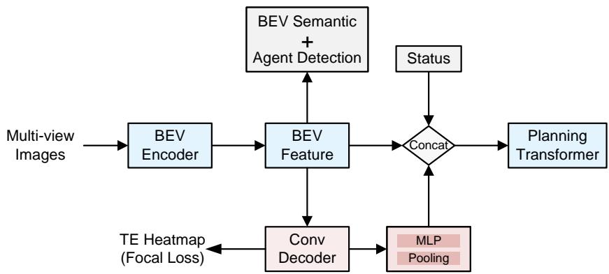  
Fig. A.6: Overview of the LTF-based architecture with the proposed trafic element prediction branch.

For the training details, we initialize the model with the pretrained weights of LTF [13] and fine-tune it on the navsim dataset. The model is trained for 20 epochs using the Adam optimizer with a learning rate of $1 \times 1 0 ^ { - 5 }$ . For trafic element prediction, the sparse center-point annotations on the BEV plane are converted into continuous supervision heatmaps using a two-dimensional Gaussian kernel with a radius of r = 2. These heatmaps are used as the training targets for the trafic element prediction branch. The predicted heatmaps are supervised using the Focal Loss with a weight of 1.0 .

## D.4 Difusion-Based: DifusionDrive

In this section, we describe how the proposed components are integrated into the DifusionDrive [54] baseline. Since DifusionDrive [54] adopts the same BEV feature generation pipeline as LTF [13], the trafic element branch is introduced in the same manner as described in the Sec. D.3. The only diference lies in the trajectory prediction module, where the Transformer-based planning decoder is replaced by a difusion-based planning decoder.

For the training details, we follow the design of LTF [13] and replace the Li-DAR input with a learnable embedding. The model is first trained from scratch on the navsim dataset for 100 epochs using the AdamW optimizer with a learning rate of $6 \times 1 0 ^ { - 4 }$ . Based on the obtained weight, we further fine-tune the model for 20 epochs with a learning rate of $5 \times 1 0 ^ { - 5 }$ . The supervision loss and hyperparameter settings for trafic element prediction follow those described in Sec. D.3.

## D.5 Scoring-Based: DrivoR

We integrate our method into the scoring-based planner DrivoR [42], which uses a perception encoder to compress multi-camera features into compact scene tokens, followed by a trajectory decoder that proposes candidate trajectories and a scoring decoder that ranks them.

In our implementation, we attach a lightweight trafic-element (TE) prediction head to the scene tokens produced by the perception encoder. Similar to the LTF setting, this head predicts a sparse BEV TE heatmap supervised by Gaussian-rendered TE centers with focal loss. The predicted TE feature is then spatially pooled and projected with an MLP, and the resulting TE embedding is concatenated to the scene-token memory. In this way, both the trajectory decoder and the downstream scoring decoder can attend to TE-aware scene tokens when generating and ranking candidate trajectories. Since our DrivoR experiments are conducted on NAVSIM, where we do not train a topology predictor, only the TE branch is added in this setting.

For training, we follow the oficial DrivoR configuration and keep the original optimization settings unchanged. For the standard NAVSIM-v1 model, we use the released recipe of 25 epochs, batch size 16, and AdamW with base learning rate $2 \times 1 0 ^ { - 4 }$ on 4 GPUs; for NAVSIM-v2, we use the corresponding oficial 10- epoch recipe with the same optimizer and batch size. When using the SimScale mixed-training setting, we follow the oficial 30-epoch training schedule. The additional TE head is optimized with the same supervision as in Sec. D.3, i.e.,

Gaussian heatmap targets and focal loss, and is added on top of the original DrivoR losses without modifying the base architecture or training protocol.

## D.6 Unified Transformer: DriveTransformer

We integrate our method into DriveTransformer [37], a unified sparse-token framework in which agent, map, and planning task tokens interact through task self-attention, sensor cross-attention, and temporal cross-attention, and jointly support detection, prediction, online mapping, and planning. In the Bench2Drive setting, the benchmark further provides instance-level trafic-light and traficsign annotations together with lane-level HD-map topology, including lane adjacency, left/right lane relations, and lane identifiers.

Since DriveTransformer already contains trafic-aware detection / mapping supervision, we keep its original trafic-element modeling unchanged and only add topology conditioning. Concretely, we first extract the ego-relevant topology from the lane graph and the lane–trafic relations, and convert it into a compact structured-language description. This text is encoded by a frozen BERTbase encoder into a topology token, which is appended to the original task-token set. The resulting token sequence is then processed by the original DriveTransformer blocks, so that the topology token can interact with the ego/planning token as well as the map and agent tokens through task self-attention. This design preserves the native sparse-token architecture and injects lane connectivity and rule constraints with minimal architectural changes.

For training, we keep the oficial DriveTransformer optimization settings and all original losses unchanged. The BERT encoder is frozen, and the topologyconditioning path introduces no additional modification to the base detection, prediction, online mapping, or planning heads. When predicted topology is used, it is obtained from a separately trained topology predictor and treated as an external conditioning signal during DriveTransformer training and inference.

## E Additional Visualization

We first provide additional qualitative comparisons between VAD and Ours on five trafic-element-rich scenes from nuScenes (Fig. A.7). In case (a), the ego vehicle approaches a red trafic light. Although the correct behavior is to stop, VAD still predicts a forward motion, while our method remains stationary. In case (b), the scene contains a yellow light and a right-turn maneuver. VAD turns too aggressively and crosses the map boundary, whereas our prediction performs only a slight right turn and remains well aligned with the groundtruth trajectory. In cases (c)–(e), the scene again contains a red $l i g h t ;$ similar to (a), our method consistently exhibits braking/stopping behavior even when the high-level command is $g o$ straight.

We further visualize a temporal nuScenes intersection case in Fig. A.8, where the trafic light changes from red at $t _ { 0 }$ to green at $t _ { 1 }$ and $t _ { 2 }$ , while the high-level command remains go straight throughout. In (b), VAD continues to predict forward motion even at $t _ { 0 }$ under the red light, and its initial velocity is also inconsistent with the ground-truth stop-to-go behavior. In contrast, (c) shows that our method, benefiting from TE-aware planning, produces substantially lower trajectory error and exhibits a more realistic motion profile: it stays closer to the stopped state when the signal is red, and then gradually increases speed after the light turns green. This example suggests that explicit trafic-element awareness helps the planner better capture both trafic-rule compliance and the underlying vehicle kinematics in temporally evolving scenes.

These examples highlight a key limitation of the baseline: without explicit trafic-element awareness, VAD may ignore rule-critical cues and produce ruleinconsistent trajectories, which also leads to larger trajectory error. In contrast, by explicitly supervising trafic elements and injecting the resulting information into the planning transformer, our method learns a more rule-aware intermediate representation and produces safer, more compliant plans.

We next show a temporal NAVSIM example in Fig. A.9, where the ego vehicle drives along a slightly curved road. From the front-view images, the scene contains clear rule-critical cues, including a straight-ahead road sign and trafic lights. Benefiting from explicit TE detection, Ours follows the road geometry and maintains a stable, lane-centered trajectory across all three frames. In contrast, both LTF and LTF+SimScale gradually drift away from the lane center, eventually deviating toward an incorrect branch or crossing the road boundary. This example illustrates that TE-aware planning provides useful local constraints for maintaining lane-consistent behavior even in seemingly simple but geometrically ambiguous road segments.

Fig. A.10 further demonstrates the advantage of our method on two additional backbones, DifusionDrive [54] and DrivoR [42], in trafic-element-rich synthetic NAVSIM-v2 scenes. By leveraging explicit trafic-element cues to condition planning, our method produces trajectories with more appropriate heading and speed, leading to safer and more rule-consistent behavior than the corresponding baselines.

## F Ablation Study Details

This section provides the detailed experimental settings and implementation choices for each ablation study, clarifying the exact design of every compared variant.

## F.1 Ablation on Trafic-Element Representations for Planning Details

(1) TE(2D). We introduce a 2D detection branch on top of the baseline as an auxiliary task. Specifically, the model predicts the 2D center locations of trafic elements in the image plane. The detection branch follows a DETR-style [6] formulation, where a set of learnable queries are used to predict the 2D coordinates of trafic elements directly from image features. Each query outputs a predicted center point along with its classification score.

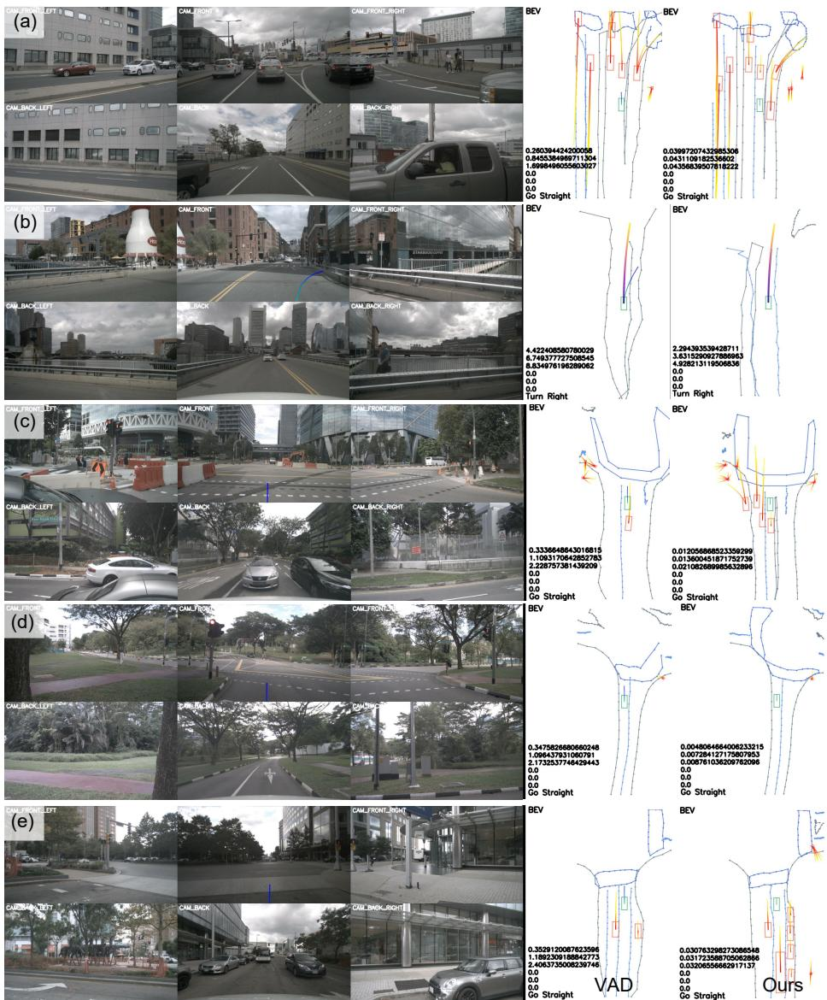  
Fig. A.7: Additional qualitative comparison between VAD and Ours on five traficelement-rich scenes (a)-(e) from the nuScenes dataset. For each case, the left shows the multi-view camera images, and the right shows the corresponding BEV planning visualizations of VAD and Ours. From top to bottom, the overlaid numbers denote the per-frame L2 error at $\mathrm { 1 s / 2 s / 3 s }$ , collision rate at ${ \mathrm { 1 s / 2 s / 3 s } } ,$ and the driving command, respectively.

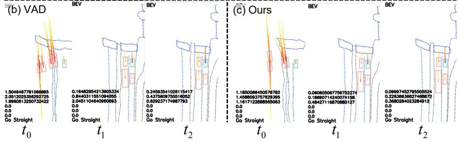

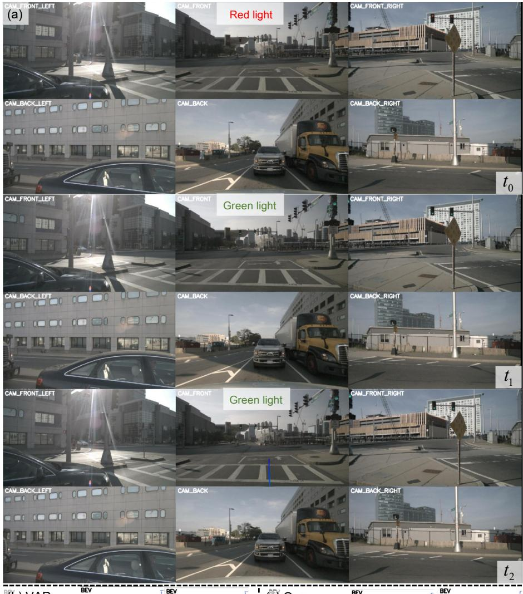  
Fig. A.8: Temporal qualitative comparison on nuScenes. (a) Multi-view images at three consecutive time steps $t _ { 0 } , \ t _ { 1 } , \ t _ { 2 } ,$ , where the forward trafic light changes from red to green. (b) BEV planning trajectories predicted by VAD over the same three frames. (c) Corresponding BEV planning trajectories predicted by Ours.

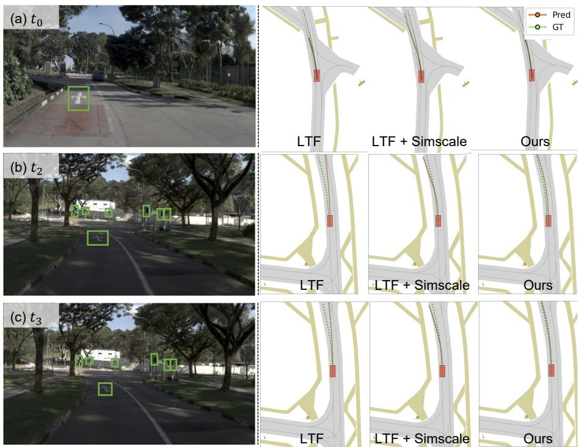  
Fig. A.9: Temporal qualitative comparison on NAVSIM. The left shows front-view images at three consecutive time steps, where the green boxes indicate the detected trafic elements. The right compares the corresponding planning trajectories of LTF, LTF+SimScale, and Ours.

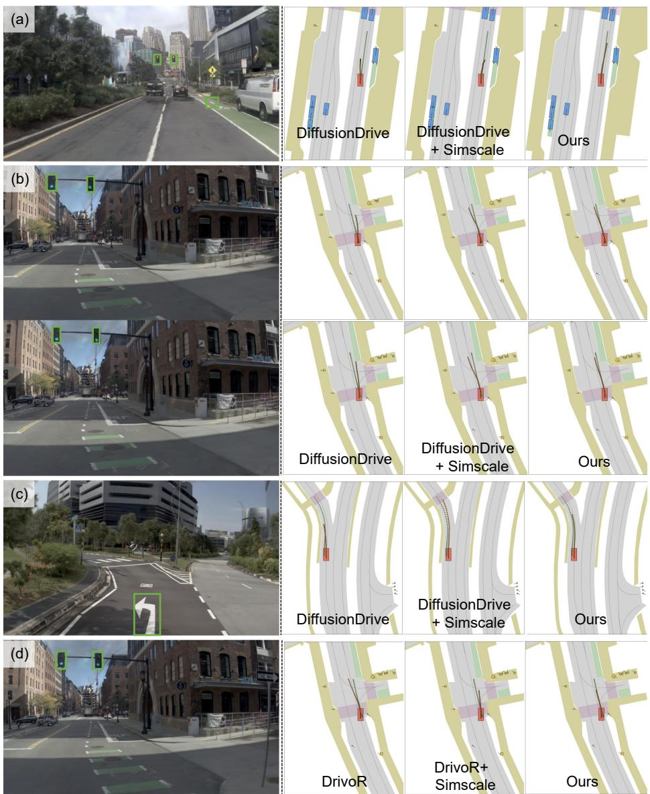  
Fig. A.10: Additional qualitative comparison on synthetic NAVSIM-v2 scenes. The left shows front-view images with detected trafic elements (green boxes), and the right compares the corresponding planning trajectories. Cases (a)–(c) compare DifusionDrive, DifusionDrive+SimScale, and Ours, while (d) compares DrivoR, DrivoR+SimScale, and Ours.

Table A.3: Yellow-light subset on nuScenes. We report open-loop planning metrics on samples containing yellow-light trafic elements.
<table><tr><td colspan="7">Method L2@1s↓ L2@2s↓ L2@3s↓ Col@1s↓ Col@2s↓ Col@3s↓</td></tr><tr><td>VAD</td><td>0.49</td><td>0.85</td><td>1.25</td><td>0.00</td><td>0.00</td><td>0.00</td></tr><tr><td>Ours</td><td>0.37</td><td>0.63</td><td>0.98</td><td>0.00</td><td>0.00</td><td>0.00</td></tr></table>

(2) Depth(FV). We introduce a depth prediction branch as an auxiliary task. Specifically, we use the depth values predicted by a pretrained depth estimation model as pseudo labels for supervision. Based on the baseline model, a convolutional prediction head is applied to the image features to estimate the depth value for each pixel in the image plane. The predicted depth map is supervised using the L1 loss against the pseudo depth labels.

(3) LiDAR. We estimate the 3D positions of trafic elements directly from LiDAR point clouds. Specifically, the LiDAR points are first projected onto the image plane using the projection matrix. For each trafic element, we collect the LiDAR points that fall inside its corresponding 2D bounding box. Then we apply a clustering algorithm to the collected LiDAR points to separate diferent point groups. Among the resulting clusters, the cluster that is closest to the ego vehicle is selected. The centroid of this cluster is then computed and used as the 3D center of the corresponding trafic element.

(4) TE. We utilize DepthAnythingV3 [55] as the depth estimation model to predict dense depth maps from input images. The predicted depth values are used to estimate the 3D positions of trafic elements based on their corresponding image locations.

(5) TL. The trafic element prediction branch is trained using only trafic light annotations. Specifically, the supervision includes three trafic light states: red, yellow, and green.

Yellow-light subset. We further verify that yellow lights are explicitly modeled as trafic-element states rather than being ignored or collapsed into a binary red/green setting. Using OpenLane-V2 ground-truth trafic-element annotations on nuScenes, we extract a small yellow-light subset and compare VAD with our trafic-element-aware model. As shown in Tab. A.3, our method improves the trajectory error over VAD on this subset, reducing L2@3s from 1.25 to 0.98. This indicates that the trafic-element branch can use the yellow-light state as a distinct regulatory cue for planning.

We note that this evaluation is limited by the small number of yellow-light samples in the dataset. Moreover, our current trafic-element module reasons mainly from the current trafic-light state and does not explicitly track temporal state transitions. Modeling temporal light-state evolution is an important direction for future work.

## F.2 Design Choices for Trafic Element Integration Details

(1) Prediction Head and Loss Function. Without using an independent branch for trafic element prediction, the trafic element category is incorporated into the original BEV segmentation task. Specifically, trafic elements are treated as additional semantic classes within the BEV segmentation head, and the number of predicted classes is increased from 7 to 20 (7+13), where the additional 13 classes correspond to trafic elements. Using the CE loss treats trafic element prediction as a multi-class classification problem. Specifically, trafic element categories are predicted using a multi-class cross-entropy loss. Considering the class imbalance between foreground and background categories, we also explore the use of the Focal Loss for supervision.

(2) Pooling and Interaction Mechanism. We investigate diferent pooling strategies when downsampling the predicted trafic element heatmap. Specifically, the predicted trafic element heatmap is downsampled to match the spatial resolution of the BEV feature map using either max pooling or average pooling. Using cross-attention for interaction between predicted trafic elements and planning means that the predicted trafic element features are used as the keys and values. The trajectory queries attend to the trafic element features through the cross-attention mechanism, and the resulting features are used to generate the final trajectory predictions.

## F.3 Rule-based and Robustness Analyses

Rule-based trafic-element baselines. We compare our learned trafic-element integration with two simple rule-based post-processing baselines on nuScenes using VAD. The first baseline stops for any red light within 30 meters, without checking whether the light governs the ego lane. The second baseline uses topology to stop only for ego-lane-associated red lights. As shown in Tab. A.4, the naive rule without topology hurts trajectory accuracy and increases long-horizon collision rate, because many trafic lights in the scene are irrelevant to the ego vehicle. Adding topology improves the rule-based baseline by filtering out irrelevant lights, but it still underperforms our learned TE/topology integration. This confirms that the gain of our method does not come from a trivial stop rule; instead, it comes from learning a general trafic-element-aware planning signal that can handle more complex situations than fixed thresholding.

Robustness corruption protocol. To analyze robustness to upstream traficelement perception noise, we conduct inference-stage sensitivity tests on NAVSIM v2 with LTF. Starting from the predicted trafic-element representation, we apply three types of corruptions before feeding the representation to the planner: (i) depth noise, which perturbs the estimated trafic-element depth; (ii) missed detections, which randomly remove a portion of predicted trafic elements; and (iii) false positives, which inject additional spurious trafic elements into the BEV representation. We vary a corruption severity parameter for each failure mode and report the resulting EPDMS in Fig. 5. The robustness curves show that our method degrades gracefully under common trafic-element perception failures. This is important because, on datasets without native trafic-element annotations, the planner uses automatically detected and lifted trafic elements rather than perfect ground-truth inputs. Together with the cross-dataset detector validation in Tab. A.1, this analysis indicates that our planning improvements are not overly dependent on oracle-quality trafic-element perception.

Table A.4: Rule-based trafic-element baselines on nuScenes with VAD. “Rule $\mathrm { w } / \mathrm { o }$ Topo” stops for any red light within 30 meters, while “Rule $\mathrm { w } / $ Topo” stops only for ego-lane-associated red lights.
<table><tr><td>Method</td><td>L2@1s↓ L2@2s↓ L2@3s↓ Col@1s↓ Col@2s↓ Col@3s↓</td><td></td><td></td><td></td><td></td><td></td></tr><tr><td>VAD</td><td>0.41</td><td>0.70</td><td>1.05</td><td>0.07</td><td>0.17</td><td>0.41</td></tr><tr><td>Rule w/o Topo</td><td>0.57</td><td>0.97</td><td>1.43</td><td>0.02</td><td>0.38</td><td>0.76</td></tr><tr><td>Rule w/ Topo</td><td>0.42</td><td>0.71</td><td>1.07</td><td>0.02</td><td>0.24</td><td>0.35</td></tr><tr><td>Ours</td><td>0.34</td><td>0.56</td><td>0.92</td><td>0.04</td><td>0.21</td><td>0.26</td></tr></table>

## F.4 Ablation on Topology Information Integration Details

(1) Topology Synergy. When only $\mathbf { R } _ { \mathrm { L C T E } }$ is used, the model retrieves trafic elements associated with the centerline that is closest to the ego vehicle, without exploring the topology relations between neighboring centerlines and trafic elements. When only $\mathbf { R } _ { \mathrm { L C L C } }$ is used, the model considers only the connectivity between centerlines and retrieves neighboring centerlines through the centerline graph, while trafic element relations are not utilized.

(2) Encoding Strategy. To encode the topology subgraph, we adopt a GCN. The topology graph consists of two types of nodes: centerlines and trafic elements. For centerline nodes, the feature representation includes seven components: the mean $( x , y )$ coordinates on the BEV plane, the orientation, the length, the average curvature, a binary indicator of whether the centerline belongs to an intersection, and a binary indicator of whether the lane is the closest centerline to the ego vehicle. For trafic element nodes, the feature representation is constructed using one-hot encodings of their categories and attributes. The centerline features and trafic element features are used as the initial node embeddings and are fed into the RGCN [69] to encode the topology relations within the subgraph.

(3) Interaction Scope. When using GCN to encode the topology subgraph, we explore two diferent strategies to obtain the final graph representation. For the global setting, the node features produced by the GCN are aggregated using average pooling over all nodes to obtain a global graph representation. For the ego setting, we directly use the feature of the centerline node that is closest to the ego vehicle as the output representation of the topology graph.

(4) Robustness to Predicted Topology. We replace the ground-truth topology with the topology predicted by the TopoMLP [88] model. Specifically, the centerline-centerline and centerline-trafic-element relations are obtained from the predictions instead of the ground-truth topology annotations. The predicted topology is then used as the global topology graph for subsequent topology extraction and encoding.

Table A.5: Topology encoder variants on nuScenes with the VAD backbone. Distil-BERT achieves performance comparable to BERT at slightly lower cost, while Graph Transformer is less efective.
<table><tr><td>Encoder</td><td>L2@1s↓ L2@2s↓ L2@3s↓ Col@1s↓ Col@2s↓ Col@3s↓ FPS↑</td><td></td><td></td><td></td><td></td><td></td><td></td></tr><tr><td>BERT</td><td>0.34</td><td>0.59</td><td>0.92</td><td>0.04</td><td>0.21</td><td>0.26</td><td>5.4</td></tr><tr><td>DistilBERT</td><td>0.35</td><td>0.61</td><td>0.94</td><td>0.05</td><td>0.15</td><td>0.26</td><td>5.6</td></tr><tr><td>Graph Transformer</td><td>0.39</td><td>0.65</td><td>0.99</td><td>0.11</td><td>0.19</td><td>0.34</td><td>5.5</td></tr></table>

Topology encoder variants. In the main experiments, we encode ego-relevant topology with a frozen BERT encoder. To test whether the benefit depends on using a heavy language model, we compare BERT with a lighter DistilBERT encoder [66] and a Graph Transformer encoder [20] on nuScenes using the VAD backbone. As shown in Tab. A.5, DistilBERT achieves comparable planning performance to BERT while slightly improving throughput. In contrast, the Graph Transformer performs worse in both L2 error and collision rate. This suggests that the benefit of our topology conditioning is not tied to a specific large BERT encoder; rather, language-style encoding provides a compact and efective way to represent heterogeneous lane–trafic-element relations.

The weaker performance of the Graph Transformer may come from the heterogeneous nature of the topology graph. Centerline nodes encode continuous geometry, while trafic-element nodes encode discrete regulatory states and attributes. Language-style encoders naturally serialize these heterogeneous attributes into a unified semantic sequence, whereas graph message passing can over-smooth node representations or dilute the discrete rule-control signals.

## G Limitations of nuScenes Metrics

During evaluation, we observe an important limitation of the standard nuScenes metrics. The reported collision rate mainly measures whether the predicted future trajectory collides with other dynamic objects within the prediction horizon. However, this metric does not capture another clearly undesirable behavior: driving out of the valid drivable region or crossing map boundaries. As illustrated in Fig. A.11, such boundary violations can still yield a zero collision rate, despite being obviously unsafe and map-inconsistent.

To better reflect this failure mode, we additionally count boundary collisions, defined as intersections between the predicted ego boxes and the HD-map boundary. Quantitative results in Tab. A.6 show that our method consistently reduces boundary collision rate at all horizons. The qualitative examples in Fig. A.11 show that even in simple straight-road scenarios, baseline methods may still collide with the boundary, whereas our method produces zero boundary collisions. We attribute this to the introduced topology cues, which provide stronger lanelevel structural constraints and lead to safer, more map-consistent planning.

Table A.6: Boundary collision rate on nuScenes. Lower is better.
<table><tr><td rowspan="2">Method</td><td colspan="4">Boundary Collision Rate (%) ↓</td></tr><tr><td>1s</td><td>2s</td><td>3s</td><td>Avg.</td></tr><tr><td>VAD</td><td>1.09</td><td>1.81</td><td>2.85</td><td>1.92</td></tr><tr><td>Ours</td><td>1.01</td><td>1.39</td><td>1.93</td><td>1.44</td></tr></table>

## H Limitations & Future Work

Our method still depends on the quality of upstream trafic-element detection and depth estimation, especially on datasets without native TE annotations where pseudo labels are required. Errors in either stage may propagate to the constructed 3D TE representation and weaken the downstream planning benefit. A natural next step is to move from the current staged pipeline toward joint end-to-end optimization, so that 2D TE detection, depth estimation, 3D TE lifting, and planning can be trained together under planning-oriented supervision.

In its current form, our framework conditions planning mainly on the current TE and topology state. While efective, this design does not explicitly model temporal evolution, which can be important when the scene state changes over time, such as trafic-light transitions or temporally ambiguous rule cues. Future work could incorporate historical TE/topology memory or temporal consistency modules, allowing the planner to reason over state transitions rather than only instantaneous observations.

Our current formulation focuses on trafic lights, trafic signs, and lane topology, which already provide strong rule-critical cues, but the semantic scope remains limited. Many additional scene factors may also be relevant for safe and compliant planning, such as lane markings, stop lines, temporary trafic control, construction cues, or richer map semantics. Extending the framework to a broader set of structured scene semantics is therefore an important direction.

Finally, although we have validated the method across multiple benchmarks and planners, the closed-loop evaluation scale is still limited compared with the diversity of real-world long-tail driving. In particular, it remains valuable to test whether the gains from TE and topology continue to grow with larger-scale training, more challenging corner cases, and long-tail rule-critical scenarios, and whether these benefits remain stable under cross-dataset transfer. This motivates future work on larger closed-loop data generation and targeted scenario construction for stress-testing TE- and topology-aware planning.

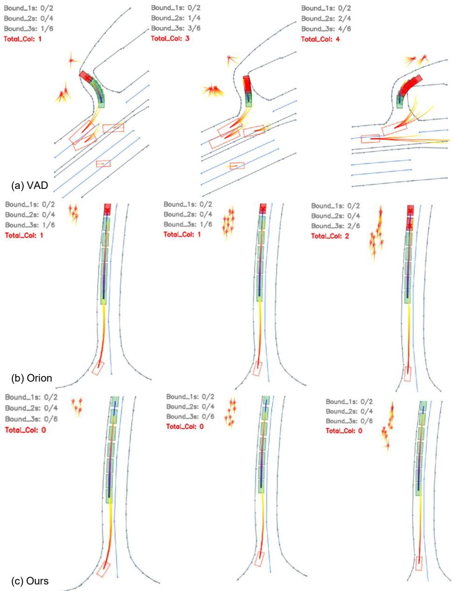  
Fig. A.11: Illustration of a limitation of the standard nuScenes metrics. Using the ground-truth HD map, we additionally count the number of collisions between the predicted ego-vehicle boxes and the lane/map boundaries (shown in the upperleft corner of each panel). (a) VAD, (b) Orion, and (c) Ours. Even in these simple scenes, Ours yields zero boundary collisions, while the other methods still produce boundary violations, showing that L2 and collision rate alone may not fully capture map-consistent planning quality.