# RetiWave-Mamba: A Dual-Stream Network for Retinal Disease Detection based on Multi-scale Context and Frequency-Adaptive Mamba Projection

Cheng Cheng, Jin Hong

School of Information Engineering, Nanchang University, Nanchang 330031, China

E-mail: 6105123080@email.ncu.edu.cn; hongjin@ncu.edu.cn;

\* Correspondence should be addressed to Jin Hong

Abstract: Retinal diseases are a leading cause of irreversible vision impairment, making early and accurate diagnosis essential for effective treatment. Optical Coherence Tomography (OCT) serves as a critical imaging modality for this purpose, yet its automated analysis is hindered by inherent speckle noise, varying lesion scales, and subtle inter-class similarities. To address these challenges, we propose a novel framework, RetiWave-Mamba, which integrates spatial-frequency domain learning with stateof-the-art state space models. The framework utilizes Discrete Wavelet Transform (DWT) to decompose OCT images into low- and high-frequency streams, enabling decoupled processing of structural context and fine-grained details. For the low-frequency branch, we design a Multi-scale Contextual Localization Module (MCLM), which synergizes multi-scale dilation with spatial attention to expand the global receptive field and precisely localize lesion regions. For the high-frequency branch, we introduce an Attention-Guided High-Resolution Network (AG-HRNet) equipped with an intelligent gating mechanism to suppress noise propagation during multi-scale interactions. Furthermore, a Frequency-Adaptive Mamba Projector (FAMP) is incorporated to capture long-range dependencies within disjoint high-frequency textural features. Extensive experiments on the OCT-C8 dataset demonstrate that our approach achieves a state-of-the-art (SOTA) classification accuracy of 98.25%, surpassing existing methods. These results highlight the efficacy of RetiWave-Mamba in robustly identifying retinal pathologies under noisy conditions, offering a promising tool for clinical diagnosis.

Keywords: Retinal disease classification; Optical coherence tomography (OCT); Discrete wavelet transform; State space models (Mamba); Spatial-frequency learning

## 1. Introduction

The eye is the primary organ for human perception, playing a key role in capturing and processing information from the external environment. However, visual impairment constitutes a significant and growing global health challenge. According to recent studies, retinal diseases such as diabetic retinopathy (DR) and age-related macular degeneration (AMD) remain the leading causes of irreversible blindness worldwide [1, 2]. Crucially, the clinical outcomes of these conditions are highly time-dependent; studies have shown that early diagnosis and timely intervention can prevent up to 95% of vision loss associated with conditions like diabetic retinopathy [3, 4]. Therefore, accurate and early identification of retinal lesions is important for preserving vision and improving patient outcomes [3, 4].

Currently, Optical Coherence Tomography (OCT) is the standard non-invasive method for retinal exams [5]. It uses low-coherence light to create high-resolution images of retinal structures, allowing doctors to clearly see abnormalities associated with various eye diseases [6]. However, manual interpretation of massive OCT data poses significant clinical challenges. The diagnostic process is laborintensive and time-consuming, placing a heavy burden on ophthalmologists, particularly in regions with limited medical resources [7]. Furthermore, diagnosis relies heavily on the clinician’s subjective experience, often leading to inter-observer variability and potential misdiagnosis [8]. These limitations underscore the urgent need for automated deep learning systems to achieve efficient and objective diagnosis.

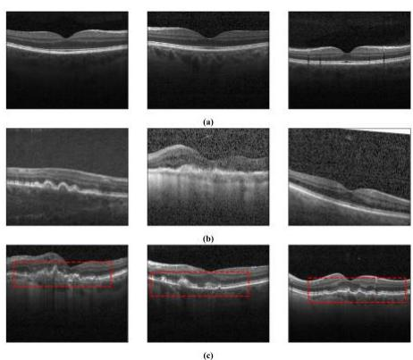  
(c)  
Fig. 1 Visual illustration of the intrinsic challenges in automated OCT analysis. (a) Normal Retina: Representative images of healthy retinas exhibiting clear layer structures and distinct boundaries, serving as the diagnostic baseline. (b) Speckle Noise Interference: OCT scans severely corrupted by inherent speckle noise. Compared to the normal baseline in (a), the noise blur structural boundaries and obscures fine-grained details. (c) Subtle Inter-class Similarities: Samples of CNV (left, middle) and Drusen (right). The red dashed boxes highlight the high morphological similarity in Retinal Pigment Epithelium (RPE)  
elevations, making these distinct categories difficult to differentiate without precise textural analysis.

In recent years, deep learning techniques have greatly improved medical image analysis, becoming the core technology of automated retinal disease diagnosis [7]. Among these, Convolutional Neural Networks (CNNs), such as ResNet and VGG, have emerged as the dominant architecture due to their powerful ability to extract hierarchical features [9, 10]. Beyond basic classification, CNNs have made significant contributions by automatically learning representative spatial patterns from complex retinal images [11]. To further enhance performance, researchers have incorporated advanced strategies, such as multi-scale feature fusion and frequency-domain analysis, enabling CNNs to effectively handle lesions of varying sizes while suppressing noise [12-15]. These multidimensional capabilities allow CNN-based models to achieve high diagnostic precision that effectively supports clinical decision-making, establishing them as the standard backbone for retinal disease analysis systems [16].

However, accurately diagnosing retinal diseases remains a major challenge due to the severe speckle noise [17] and subtle inter-class similarities inherent in OCT images, as illustrated in Fig. 1. Specifically, standard CNN backbones are often constrained by their fixed receptive fields, making it difficult to balance large-scale contextual understanding with precise lesion localization [16]. Moreover, regarding multi-scale interaction, most existing networks rely on simple summation or concatenation for feature fusion. Such simple fusion mechanisms directly transfer background speckle noise from lowresolution branches to high-resolution ones, thereby affecting the high-resolution features [12, 18, 19]. Additionally, current approaches face significant difficulties in processing fine-grained edge and texture features. Lacking an efficient mechanism to capture long-range dependencies, these models often struggle to distinguish subtle textural differences between morphologically similar lesions, such as CNV and Drusen [20].

To address these functional challenges, this study proposes a novel hybrid framework, RetiWave-

Mamba, built upon a dual-stream architecture. Initially, the network utilizes wavelet transform to decompose the input into low- and high-frequency components. For the low-frequency branch, it employs a Multi-scale Contextual Localization Module (MCLM) to enhance the global receptive field and precise lesion localization. Simultaneously, the high-frequency branch adopts an Attention-Guided High-Resolution Network (AG-HRNet) followed by a Frequency-Adaptive Mamba Projector (FAMP) to reduce noise propagation and capture fine-grained edge details. Finally, features from both branches are fused to achieve a comprehensive representation for accurate diagnosis. The main contributions of this paper are as follows:

(i) We propose a hybrid dual-stream framework, RetiWave-Mamba, which combines spatialdomain and frequency-domain learning. By combining the MCLM, AG-HRNet, and FAMP modules, our approach captures both global structural contexts and detailed frequency features. This design leverages the strengths of different feature representations, significantly improving the model's performance in noisy environments.

(ii) We design a Multi-scale Contextual Localization Module (MCLM) for the low-frequency branch. By combining multi-scale dilation fusion with wavelet spatial attention, this module effectively expands the global receptive field while improving the model's ability to precisely localize lesion regions.

(iii) We develop an Attention-Guided High-Resolution Network (AG-HRNet). Unlike traditional architectures, AG-HRNet incorporates an intelligent gating mechanism during multi-scale interactions to replace simple summation, effectively reducing the propagation of background speckle noise and ensuring robust feature fusion.

(iv) We propose a Frequency-Adaptive Mamba Projector (FAMP) for the high-frequency branch. This module seamlessly integrates frequency feature extraction with Mamba-based global modeling, enabling the capture of long-range dependencies across different frequency components to significantly enhance fine-grained edge details.

(v) We evaluate our model on the publicly available OCT-C8 dataset, achieving a state-of-the-art (SOTA) accuracy of 98.25%. This superior performance outperforms existing methods, demonstrating our model's strong discriminative capability and promising potential for clinical application.

## 2. Related work

## 2.1 Deep Learning for OCT Image Analysis

In recent years, deep learning has significantly advanced the field of OCT image analysis [7]. Convolutional Neural Networks (CNNs) have emerged as the dominant architecture for automated retinal diagnosis. Classic models, particularly ResNet-50 [9] and VGG [10], serve as robust backbones for hierarchical feature extraction. To further enhance diagnostic precision, researchers have introduced various structural optimizations to these baselines. For instance, Karthik et al. proposed "Edgen" blocks to replace standard residual connections, thereby improving the network's sensitivity to retinal boundaries [16]. Similarly, Fang et al. incorporated attention mechanisms to explicitly guide the model's focus toward critical lesion areas [13].

Beyond structural modifications to single networks, multi-scale feature learning and hybrid architectures have become critical strategies to accommodate the significant variation in lesion sizes. Researchers like Sotoudeh-Paima et al. [18] and Peng et al. [12] have developed multi-scale networks that aggregate features from different resolutions to enhance detection capabilities. To further capture features at various granularities, the OCTNet framework integrated an InceptionV3 backbone with a modified multi-scale spatial attention block, effectively extracting rich features from relevant lesion regions [21]. Moreover, the limitations of CNNs in modeling long-range dependencies have spurred the development of hybrid models. For instance, Laouarem et al. introduced HTC-Retina [20], and recent works like the SViT model have combined lightweight CNNs with Vision Transformers (ViTs) [22]. These approaches leverage the local inductive bias of CNNs and the global context awareness of Transformers to achieve high-precision classification.

Despite these advancements, current methods still face inherent limitations. Most multi-scale approaches rely on straightforward fusion mechanisms, such as element-wise summation or concatenation, which often fail to filter out speckle noise effectively, leading to the propagation of interference across scales [12, 18]. Furthermore, while hybrid Transformer models address the receptive field issue, they typically incur high computational complexity and may struggle to preserve the finegrained high-frequency details required for detecting subtle retinal abnormalities. These challenges highlight the need for more efficient architectures capable of simultaneous noise suppression and precise feature representation. To address these limitations, we propose the RetiWave-Mamba framework, which synergizes spatial-frequency learning to effectively balance global structural understanding with finegrained feature preservation.

## 2.2 Context Modeling and Attention Mechanisms

Accurate lesion localization requires a model to see the global context and focus on specific regions. To expand the receptive field without reducing resolution, dilated convolutions are widely used [23]. Architectures like CPFNet [24] and MSLI-Net [15] use multi-scale dilation strategies. They effectively aggregate contextual information and reduce the "gridding effect" found in stacked layers.

At the same time, attention mechanisms like SE [25], CBAM [26], and BAM [27] are used to suppress background noise. More recently, Coordinate Attention [28] has been proposed to capture longrange spatial dependencies with precise positional information, offering a lightweight alternative for medical imaging tasks. In retinal analysis, methods like LDCNN [13] utilize attention maps to highlight lesion areas. Similarly, Attention Gated Networks [29] explicitly learn to suppress irrelevant background regions in CT and ultrasound scans. These mechanisms help the model distinguish between useful features and background noise.

However, treating context aggregation and attention as separate steps is not optimal. Standard CNNbased spatial attention often lacks a large receptive field. Meanwhile, pure dilated convolutions may aggregate noise along with the context. To overcome this, we design the Multi-scale Contextual Localization Module (MCLM), which establishes a unified mechanism that synergizes broad contextual understanding with noise-filtering capabilities to guide precise lesion localization.

## 2.3 Frequency-domain Learning in Medical Imaging

Traditional Convolutional Neural Networks primarily focus on extracting features in the spatial domain. However, frequency-domain learning offers a complementary perspective by decomposing images into distinct frequency components, which is highly effective for noise suppression and edge enhancement. The Discrete Wavelet Transform (DWT) has been widely adopted to separate images into low-frequency structural approximations and high-frequency textural details [30]. Inspired by this, architectures like WaveViT [31] have successfully integrated wavelet transforms into Vision Transformers to achieve lossless downsampling and multi-scale learning. Recent studies, such as WaveNet-SF [14] and MSLI-Net [15], have demonstrated that processing these components in specialized streams significantly improves model robustness. Additionally, methods like FSNet [32] utilize frequency selection mechanisms to dynamically analyze feature distributions, further validating the potential of frequency-domain analysis in medical imaging.

Despite these advancements, effectively utilizing the decomposed high-frequency sub-bands remains a challenge, as they contain inextricably linked fine-grained textures and high-intensity speckle noise. Most existing hybrid methods typically process these components using standard convolutions and recombine them via simple element-wise summation or concatenation [14, 18]. These generic fusion strategies lack the spatial adaptivity to distinguish between valid edge details and background noise, often leading to the re-introduction of interference. Therefore, we introduce the Attention-Guided High-Resolution Network (AG-HRNet), utilizing an intelligent gating mechanism to selectively amplify diagnostic textures while suppressing noise propagation during multi-scale interactions.

## 2.4. State Space Models in Medical Imaging

Transformers have revolutionized long-sequence modeling with their exceptional global context awareness. However, their self-attention mechanism suffers from quadratic computational complexity, limiting efficiency on high-resolution data. To overcome this bottleneck, State Space Models (SSMs) have emerged as a promising alternative. Notably, building upon the Structured State Space sequence models [33], Mamba [34] utilizes a selective scan mechanism to capture long-range dependencies with linear time complexity. This breakthrough has rapidly extended to computer vision, where architectures like Vision Mamba [35] and VMamba [36] flatten images into sequences, demonstrating performance comparable to or exceeding traditional CNNs.

In the field of medical image analysis, Mamba-based architectures have also shown significant potential due to their ability to process global features with lower resource consumption. For instance, Zuo et al. proposed the MRVM network for retinal disease detection, which integrates a multi-directional selective mechanism to effectively capture global context from OCT images [37]. Despite these advancements, the application of Mamba to the frequency domain remains largely unexplored. Highfrequency details in OCT images, such as pathological boundaries and fine tissue textures, are often spatially scattered across the entire image. Standard CNNs have limited receptive fields and struggle to model the relationships between these fragmented details. To bridge this gap, we propose the Frequency-Adaptive Mamba Projector (FAMP). By implementing a logical separation of features into dominant structures and residual details, rather than relying only on physical spectral transforms, FAMP leverages the selective scanning capability of Mamba to efficiently filter noise within long sequences and extract key pathological texture dependencies.

## 3. Method

## 3.1. Overall architecture

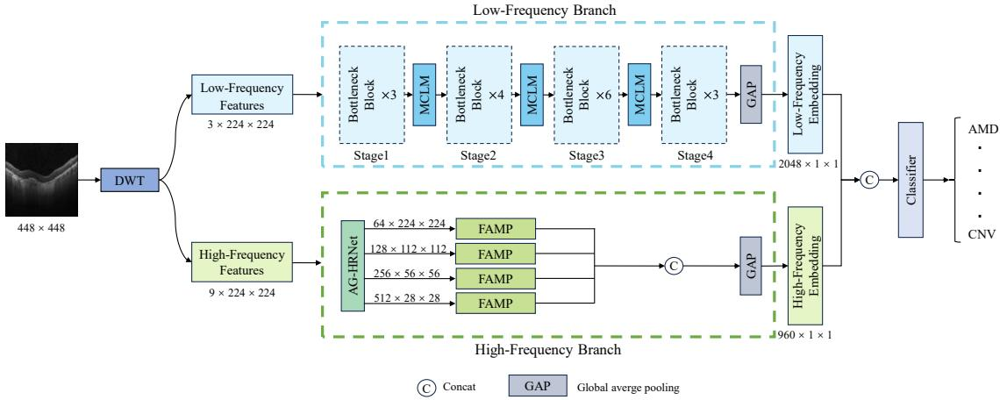  
Fig. 2 The overall architecture of the proposed RetiWave-Mamba framework.

The overall framework of our proposed RetiWave-Mamba is illustrated in Fig. 2. The architecture is a hybrid dual-stream network comprising three key components: a Discrete Wavelet Transform (DWT) block, a low-frequency stream equipped with a Multi-scale Contextual Localization Module (MCLM), and a high-frequency stream integrating an Attention-Guided High-Resolution Network (AG-HRNet) with a Frequency-Adaptive Mamba Projector (FAMP). This design enables the network to systematically process global structural context and fine-grained frequency details in parallel for robust retinal disease classification.

Initially, the input OCT image is processed by the DWT block, which decomposes the image into one low-frequency (LF) component (the LL sub-band) and three high-frequency (HF) components (the LH, HL, and HH sub-bands). This initial decomposition effectively separates the image's foundational structures from its detailed textures, allowing each to be routed to a specialized processing stream.

Then, the LF component, which preserves the global structure and contextual information while inherently suppressing high-frequency noise, is directed into the low-frequency stream. This stream utilizes a ResNet-50 backbone structured into four stages (Stage 1-4) of Bottleneck Blocks. To enhance the backbone's receptive field and its ability to pinpoint lesion areas, our proposed MCLM is inserted after the first three stages. The feature map from the final stage then undergoes Global Average Pooling (GAP) to generate a compact low-frequency embedding vector.

Simultaneously, the three HF components (LH, HL, and HH) are concatenated along the channel dimension (creating a 9-channel input) and fed into the high-frequency stream to capture fine-grained edges and subtle textures critical for distinguishing similar lesions. This stream is initiated by the AG-HRNet, which maintains four parallel high-to-low resolution branches to preserve feature map fidelity. The four multi-scale outputs from AG-HRNet are then individually projected by our proposed FAMP modules. These projectors are specifically designed to capture long-range dependencies within the highfrequency details. The four resulting feature vectors from the FAMP modules are concatenated and processed by a GAP layer to produce the final high-frequency embedding.

Finally, the low-frequency embedding and the high-frequency embedding are concatenated to form a comprehensive hybrid feature representation. This fused vector, which encapsulates complementary information from both the spatial-structural and frequency-textural domains, is fed into a final classifier to yield the ultimate diagnostic prediction.

## 3.2 Discrete Wavelet Transform (DWT)

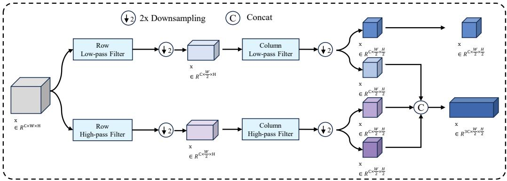  
Fig. 3 The decomposition process of the 2D Discrete Wavelet Transform (DWT).

The Discrete Wavelet Transform (DWT) is an effective method for analyzing the frequency domain information of images by decomposing them into localized frequency components. As illustrated in Fig. 3, this process is achieved by convolving the input image � with separable low-pass (�) and high-pass (�) filters along its rows $\left( z _ { 1 } \right)$ and columns $\left( z _ { 2 } \right)$ , followed by a 2x downsampling $( \downarrow _ { 2 } )$ at each stage. This decomposition results in four sub-bands, with the computation shown in Eq. (1) to (4):

$$
I _ { L L } = \left( I * L ( z _ { 1 } ) \right) \downarrow _ { 2 } * L ( z _ { 2 } ) \downarrow _ { 2 }\tag{1}
$$

$$
I _ { L H } = \left( I * H ( z _ { 1 } ) \right) \downarrow _ { 2 } * L ( z _ { 2 } ) \downarrow _ { 2 }\tag{2}
$$

$$
I _ { H L } = \left( I \ast L ( z _ { 1 } ) \right) \downarrow _ { 2 } \ast H ( z _ { 2 } ) \downarrow _ { 2 }\tag{3}
$$

$$
I _ { H H } = \left( I \ast H ( z _ { 1 } ) \right) \downarrow _ { 2 } \ast H ( z _ { 2 } ) \downarrow _ { 2 }\tag{4}
$$

where ∗ denotes the convolution operation, $I _ { L L }$ represents the approximation component, and $I _ { L H }$ $I _ { H L }$ , and $I _ { H H }$ represent the detail components capturing horizontal, vertical, and diagonal information, respectively.

In our framework, we selected the Haar wavelet for this transform due to its computational simplicity and efficiency. The DWT module serves as the foundational processing step to bifurcate the image representation. The Low-Frequency (LF) Component, $I _ { L L }$ , which encapsulates the stable, denoised structural context of the retina, is isolated and directed as the input to our low-frequency stream.

Conversely, the three detail sub-bands $( I _ { L H } , \ I _ { H L }$ , and $I _ { H H } )$ are designated as the High-Frequency (HF) Component. To form a comprehensive high-frequency representation, our model employs a key technique: we concatenate the detail sub-bands along the channel dimension. This approach is chosen over summation, as summation would obscure valuable directional information. For a 3-channel input image, this concatenation operation creates a 9-channel feature map. This resulting tensor preserves the distinct horizontal, vertical, and diagonal edge details, serving as a rich, multi-channel input for the specialized high-frequency stream.

## 3.3 Multi-scale Contextual Localization Module (MCLM)

As outlined in Section 3.1, the MCLM is the core innovative module we designed for the lowfrequency stream, embedded after the first three stages of the ResNet-50 backbone. Its primary objective is to address the limited receptive field of standard CNNs and enhance the model's ability to precisely localize lesion regions against a noisy background.

The detailed architecture of the MCLM is illustrated in Fig. 4. It consists of two cascaded sub-units: (a) the Multi-scale Dilation Fusion (MDF) unit, which captures wide-range contextual information; and (b) the Multi-Scale Wavelet Spatial Attention (MSW\_SA) unit, which refines the features and enhances the salience of lesion regions.

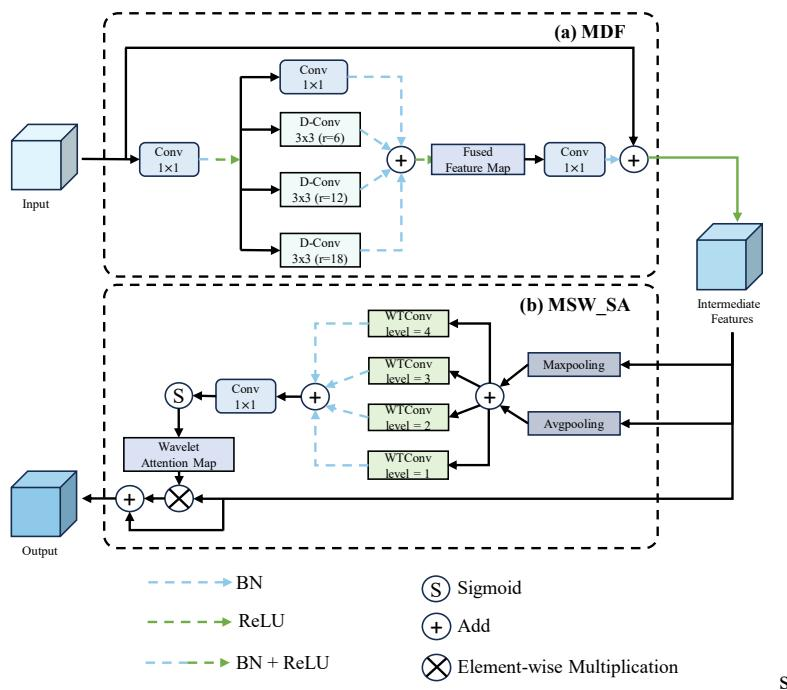  
Fig. 4 The architecture of the Multi-scale Contextual Localization Module (MCLM). The module consists of two components: (a) the Multi-scale Dilation Fusion (MDF) unit, which captures multi-scale context, and (b) the Multi-Scale Wavelet Spatial Attention (MSW\_SA) unit, which refines the features to localize lesion regions.

## 3.3.1 Multi-scale Dilation Fusion (MDF)

Standard CNNs often struggle to balance large-scale contextual understanding with the preservation of spatial resolution, as their fixed receptive fields limit their ability to model long-range dependencies. While dilated convolutions can expand the receptive field without downsampling, stacking them can lead to gridding artifacts, and simple parallel structures may not effectively fuse features from different scales.

To address this, we introduce the Multi-scale Dilation Fusion (MDF) unit, which is designed to efficiently capture and fuse multi-scale features. The architecture of this unit is shown in Fig. 4(a).

The MDF unit is designed to efficiently capture and fuse multi-scale features. Let � be the input feature map. First, a projection function is applied to reduce the channel dimensionality. This operation comprises a 1×1 convolution, followed by batch normalization and the ReLU activation function. This can be expressed by Eq. (5):

$$
X ^ { \prime } = \sigma \left( \mathcal { B } \left( W _ { p r o j } * X \right) \right)\tag{5}
$$

where ℬ(⋅) denotes batch normalization, σ(⋅) denotes the ReLU activation function, and $W _ { p r o j }$ is the projection convolution kernel.

Then, a set of dilation rates $R = \{ 6 , 1 2 , 1 8 \}$ is employed to cover larger receptive fields. The feature $X ^ { \prime }$ is processed by one standard convolution branch and three dilated convolution branches, which are subsequently fused via element-wise summation. This process is formulated in Eq. (6):

$$
F _ { r } = \sigma \left( \mathcal { B } ( W _ { 1 } * X ^ { \prime } ) + \sum _ { r \in R } \mathcal { B } \big ( W _ { 3 , r } * _ { r } X ^ { \prime } \big ) \right)\tag{6}
$$

where $W _ { 1 }$ represents the kernel for the standard branch, $W _ { 3 , 1 }$ denotes the kernels with dilation rate $r ,$

and $^ * { r }$ indicates the dilated convolution.

Finally, the feature $F _ { r }$ is projected back to the original dimension using a 1×1 convolution kernel denoted as $W _ { o u t }$ . Subsequently, it is fused with the original input � via a residual connection to obtain the output feature �, as shown in Eq. (7):

$$
F = \sigma ( \mathcal { B } ( W _ { o u t } * F _ { r } ) + X )\tag{7}
$$

By fusing these parallel dilated branches, the MDF unit effectively expands the receptive field to capture large-scale dependencies. Simultaneously, the residual connection and the 1×1 convolutional branch ensure that fine-grained local details are preserved, providing a contextually rich feature map � for the subsequent attention unit.

## 3.3.2 Multi-Scale Wavelet Spatial Attention (MSW\_SA)

While the MDF unit effectively captures multi-scale context, the resulting intermediate feature map � can still contain irrelevant background noise. Standard spatial attention mechanisms often use largekernel convolutions to perceive spatial context, which can be computationally expensive and may not effectively distinguish lesion signals from noise, especially in OCT images.

To address the background noise in the intermediate feature map �, the MSW\_SA unit applies a targeted spatial attention weighting. The core of MSW\_SA is the generation of a refined spatial attention map, $M _ { S } .$ . The process begins by aggregating channel information. The input feature � undergoes max pooling and average pooling, and the results are combined via element-wise summation. This aggregated feature is then fed into the WTConv module, which consists of four parallel branches. The outputs of these four branches are normalized by batch normalization and summed together. Subsequently, the result is processed by a 1×1 convolution and the sigmoid activation function to generate the final map $M _ { S }$ . The calculation process is as follows:

$$
M _ { S } = \delta \left( W _ { M S W \_ S A } * \sum _ { k = 1 } ^ { 4 } \mathcal { B } \left( W _ { w t , k } \left( P _ { m a x } ( F ) + P _ { a v g } ( F ) \right) \right) \right)\tag{8}
$$

where δ(⋅) represents the sigmoid activation function, $W _ { M S W \_ S A }$ represents the 1×1 convolution kernel for fusion, $W _ { w t , k }$ represents the wavelet convolution kernel at level � (ranging from 1 to 4), and $P _ { m a x } ( \cdot )$ and $P _ { a v g } ( \cdot )$ represent max pooling and average pooling, respectively.

Finally, this wavelet attention map $M _ { S }$ is applied to the original intermediate feature map � via element-wise multiplication, which is then combined with a residual connection to produce the final output of the MCLM module, �. This process, which allows the model to enhance lesion features while preserving the original contextual information, is shown in Eq. (9):

$$
y = F + ( F \otimes M _ { S } )\tag{9}
$$

where ⊗ represents element-wise multiplication.

This cascaded design allows the global structural information, first captured by the MDF, to be intelligently re-weighted by the wavelet-based spatial attention. This effectively guides the model to focus on salient lesion structures while reducing the susceptibility to the complex background noise that often interferes with traditional spatial attention mechanisms.

## 3.4 Attention-Guided High-Resolution Network (AG-HRNet)

The Attention-Guided High-Resolution Network, or AG-HRNet, is the core component of the highfrequency stream, designed to process fine-grained edge and texture details. Its primary function is to maintain high-resolution feature representations in parallel across multiple scales, as illustrated in the architecture diagram in Fig. 5. The network's operation begins by establishing this parallel, multi-stage architecture. It starts with a high-resolution branch and progressively adds lower-resolution branches through four stages. The creation of these new branches is handled by Stage Transitions, which are standard strided convolutions. This parallel structure is the key to preserving the high-resolution features essential for processing fine-grained details.

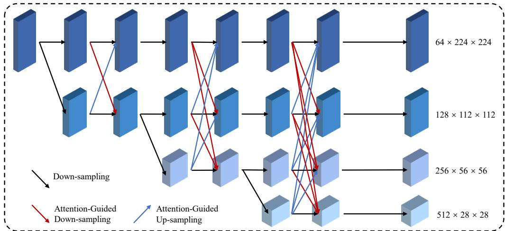  
Fig. 5 The architecture of the Attention-Guided High-Resolution Network (AG-HRNet). The module operates on parallel branches. Diagram Key: Black arrows represent Standard Down-sampling for stage transitions. Red arrows represent Attention Guided Down-sampling, and blue arrows represent Attention-Guided Up-sampling. All colored arrows indicate the use of the Attention-Guided Fusion (AGF) mechanism.

The core innovation of this module lies in how it facilitates the crucial interaction between these parallel branches. Instead of the simple summation used in traditional multi-scale architectures such as HRNet [38], which can propagate noise , the AG-HRNet employs a novel Attention-Guided Fusion mechanism, or AGF. This mechanism operates as the exclusive pathway for all cross-resolution feature exchanges.

The AGF mechanism works as a smart gate. Let $F _ { h }$ be the feature map from the target branch, and $F _ { l } ^ { \prime }$ be the feature map from the source branch. After adjusting $F _ { l } ^ { \prime }$ to the same size as $F _ { h } ,$ an attention gate � is generated from the source features. As shown in Eq. (10), a 1×1 convolution denoted as $W _ { g a t e }$ is used, followed by batch normalization and a sigmoid activation function.

$$
G = \delta \left( \mathcal { B } \big ( W _ { g a t e } * F _ { l } ^ { \prime } \big ) \right)\tag{10}
$$

Then, this gate � is applied to the incoming features $F _ { l } ^ { \prime }$ via element-wise multiplication. This step operates as a selective filter, re-weighting the incoming features to amplify useful information and suppress noise. The final fusion is then completed by adding this filtered map to the target branch $F _ { h }$ via a residual connection to obtain the fused feature $y _ { f u s e d }$ . This is shown in Eq. (11):

$$
y _ { f u s e d } = F _ { h } + ( F _ { l } ^ { \prime } \otimes G )\tag{11}
$$

Through this gate-and-add operation, the AG-HRNet ensures that only high-confidence, relevant textural information is propagated between branches. This specific mechanism is the key to effectively reducing the speckle noise contamination that often plagues simple summation, ensuring the final highresolution features remain clear and discriminative. The module outputs four multi-scale, noisesuppressed feature maps, which serve as ideal inputs for the subsequent FAMP modules.

## 3.5 Frequency-Adaptive Mamba Projector (FAMP)

The Frequency-Adaptive Mamba Projector, or FAMP, is the specialized module designed to process the four multi-scale feature maps output by the AG-HRNet. As a key component of the highfrequency stream, its primary function is to capture the long-range dependencies within the fine-grained textural and edge details that are critical for distinguishing between morphologically similar lesions. The detailed operation and internal structure of the FAMP module are illustrated in Fig. 6.

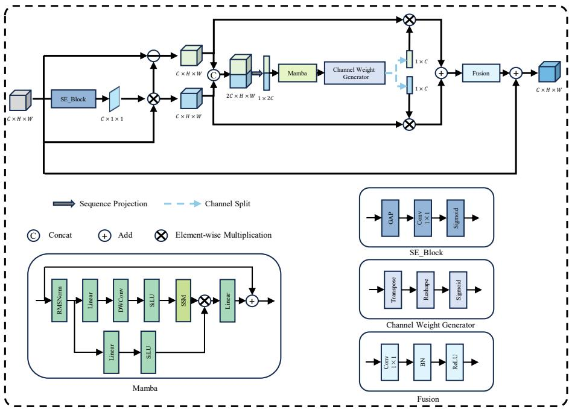  
Fig. 6 The architecture of the Frequency-Adaptive Mamba Projector (FAMP). The diagram shows the main operational flow and the internal structures of its key components: the Mamba block, the SE\_Block (dynamic filter), and the Fusion (convolutional) block. The main path shows an input � being split into low- and high-frequency paths by the SE\_Block. The Mamba module generates adaptive channel weights $( W _ { L }$ , $W _ { H } )$ to re-weight these paths, which are then combined and added to the original input via a final residual connection.

The operation begins with a frequency-gating mechanism. The input feature map � is processed to generate a channel-wise attention mask �. As shown in Eq. (12), this involves compressing global spatial information via global average pooling and modeling channel correlations via a 1×1 convolution $( W _ { s e } )$ , followed by the sigmoid activation function:

$$
M = \delta \left( W _ { s e } * P _ { a v g } ( X ) \right)\tag{12}
$$

This mask is then applied to the input � to split it into two distinct paths. These are the lowfrequency component $X _ { L }$ and the high-frequency component $X _ { H }$ . They are calculated using elementwise multiplication, as shown in Eq. (13) and (14):

$$
X _ { L } = X \otimes M\tag{13}
$$

$$
X _ { H } = X \otimes ( 1 - M )\tag{14}
$$

Following this split, the module prepares the features for sequence modeling. The $X _ { L }$ and $X _ { H }$ components are concatenated along the channel dimension. Then, this combined tensor undergoes a sequence projection process. This process involves global pooling, flattening, and normalization. It

transforms the 2D spatial features into a 1D sequence representation $X _ { s e q }$ . This is shown in Eq. (15):

$$
X _ { s e q } = \mathcal { T } \big ( \mathcal { C } ( X _ { L } , X _ { H } ) \big )\tag{15}
$$

where �(⋅) represents the concatenation operation along the channel dimension and $\mathcal { T } ( \cdot )$ represents the transformation function comprising global pooling, flattening, and normalization.

This sequence $X _ { s e q }$ is then fed into the Mamba module [34]. As shown in the sub-diagram, the Mamba module efficiently models global dependencies within the feature sequence. The output from the Mamba module is processed by a weight generator. This generator maps the sequence back to the channel dimension using a projection function. A sigmoid function is applied to generate the final attention tensor �, as described in Eq. (16):

$$
W = \delta \left( \mathcal { P } \left( \mathcal { M } ( X _ { s e q } ) \right) \right)\tag{16}
$$

where $\mathcal { P } ( \cdot )$ represents the projection function and $\mathcal { M } ( \cdot )$ represents the Mamba module operation.

This tensor is then split into two distinct gating vectors. These are designated as $W _ { L }$ and $W _ { H }$ . In the final fusion stage, these adaptive weights are used to modulate the original frequency paths. The $W _ { L }$ vector re-weights the $X _ { L }$ path, and the $W _ { H }$ vector re-weights the $X _ { H }$ path. These two modulated paths are first combined via element-wise addition. This result is then passed through a Fusion block $F _ { f u s i o n } ( \cdot )$ . This block consists of a 1×1 convolution $( W _ { f u s i o n } )$ , batch normalization, and ReLU activation, defined as:

$$
F _ { f u s i o n } ( Z ) = \sigma \left( \mathcal { B } \big ( W _ { f u s i o n } * Z \big ) \right)\tag{17}
$$

Finally, the output of this block is added to the original input � via a residual connection. This produces the final output �. This process is expressed in Eq. (18):

$$
Y = X + F _ { f u s i o n } \big ( ( X _ { L } \otimes W _ { L } ) + ( X _ { H } \otimes W _ { H } ) \big )\tag{18}
$$

This entire operation allows FAMP to selectively capture and enhance long-range textural details by dynamically weighting frequency components based on global context.

## 4. Experiments

## 4.1. Dataset

To evaluate the performance of the proposed RetiWave-Mamba framework, we use the publicly available OCT-C8 dataset [39]. This dataset contains a total of 24,000 optical coherence tomography (OCT) images, evenly distributed across eight categories: Age-related Macular Degeneration (AMD), Choroidal Neovascularization (CNV), Central Serous Retinopathy (CSR), Diabetic Macular Edema (DME), Diabetic Retinopathy (DR), Drusen, Macular Hole (MH), and Normal, with 3,000 images per category. While the dataset is officially divided into training, validation, and test sets, we modified this split to improve the model's generalization ability by increasing the training sample size. Following the protocol used in [15], we combined the original training set (18,400 images) and validation set (2,800 images) to create a new, larger training set of 21,200 images (2,650 per class). The official test set, containing 2,800 images (350 per class), remains unchanged and is used exclusively for evaluating the final model performance.

## 4.2. Evaluation metrics

To quantitatively evaluate the classification performance of our proposed model, we use four standard metrics: Accuracy (ACC), Precision, Sensitivity (also known as Recall), and F1-score. These

metrics are calculated based on the confusion matrix, using the counts of True Positive (TP), True Negative (TN), False Positive (FP), and False Negative (FN). The formulas for these metrics are as follows:

$$
A c c u r a c y = { \frac { T P + T N } { T P + T N + F P + F N } }\tag{19}
$$

$$
P r e c i s i o n = \frac { T P } { T P + F P }\tag{20}
$$

$$
\nonumber S e n s i t i v i t y = \frac { T P } { T P + F N }\tag{21}
$$

$$
F 1 - s c o r e = \frac { 2 \times P r e c i s i o n \times S e n s i t i v i t y } { P r e c i s i o n + S e n s i t i v i t y }\tag{22}
$$

Here, Precision reflects the accuracy of the model's positive predictions, while Sensitivity reflects the model's ability to identify all true positive samples. The F1-score provides a balanced measure between Precision and Sensitivity.

## 4.3. Implementation details

The training and testing of this experiment were conducted on a single NVIDIA GeForce RTX 4090 GPU with 24GB of video memory. In the data preprocessing stage, we uniformly resized the input feature maps to 448×448 pixels and normalized the images using pre-calculated mean and standard deviation. To enhance model generalization, data augmentation strategies such as random rotation and horizontal flipping were applied. During the training process, the loss function was chosen to be Weighted Cross-Entropy Loss to address class imbalance, and the model was optimized using the Adam optimizer, where the optimizer parameters were set to $\beta _ { 1 } { = } 0 . 9$ and $\beta _ { 2 } { = } 0 . 9 9 9$ . The weight decay parameter was set to 1×10- 4. Additionally, the learning rate followed a cosine annealing schedule with a 5-epoch warm-up, starting at $2 \times 1 0 ^ { - 4 }$ , the batch size was set to 32, and the training duration was 60 epochs. To improve training efficiency and reduce memory consumption, the Automatic Mixed Precision (AMP) technique was employed. In the performance evaluation, the experiments were repeated independently under the same conditions six times, and the average of the results was taken as the final performance metrics.

## 4.4. Performance of the Proposed Method

In this section, we comprehensively evaluate the classification performance of the proposed RetiWave-Mamba framework on the OCT-C8 dataset. To validate the superiority of our method, we conducted a systematic comparison with several representative deep learning architectures. These include classic Convolutional Neural Networks (CNNs) such as ResNet-50 [9], VGG16 [10], GoogLeNet [40], DenseNet121 [41], and InceptionV3 [42]. Furthermore, we compared our approach with state-ofthe-art (SOTA) models designed for efficient image analysis and medical imaging, including EfficientNet-B3 [43], ConvNeXtV2 [44], and the vision transformer-based Swin\_Tiny [45]. To ensure a comprehensive evaluation, we also included specialized retinal classification networks. We selected FPN-ResNet50 [12] and FPN-DenseNet121 [18] to represent multi-scale perception methods. We also included ResNet-EdgeEn [16] for its focus on boundary enhancement. For hybrid architectures, we compared against Swin-Poly Transformer [46] and HTC-Retina [20]. Additionally, we included specialized retinal disease classification networks such as MSLI-Net [15] and WaveNet-SF [14] for a comprehensive evaluation.

Tab. 1 presents the quantitative results of all competing methods on the OCT-C8 dataset. As observed, the DenseNet121 and EfficientNet-B3 models achieved competitive accuracies of 97.89%, demonstrating the strength of deep feature extraction. InceptionV3 delivered the highest performance among the baseline models with an accuracy of 97.96%. However, our proposed RetiWave-Mamba outperformed all comparison methods across every evaluation metric. Specifically, our model achieved a state-of-the-art (SOTA) Accuracy of 98.25%, along with a Precision of 98.27%, Sensitivity of 98.25%, and F1-score of 98.25%. Compared to the standard ResNet-50 baseline, our method achieved a significant improvement of 0.64% in accuracy. This performance gain validates the effectiveness of integrating the dual-stream wavelet architecture with the Mamba-based long-range dependency modeling, which successfully captures both global structural context and fine-grained lesion details.

Fig. 7 illustrates the training dynamics of RetiWave-Mamba. The left plot shows the accuracy curve, while the right plot displays the loss curve over 60 epochs. It can be observed that the model converges rapidly in the early stages and stabilizes without signs of significant overfitting or oscillation. This stability attributes to the intelligent gating mechanism in AG-HRNet and the robust feature extraction of the FAMP module, which effectively suppress noise interference during the learning process.

To further analyze the model's discriminative capability for specific retinal diseases, Fig. 8 displays the confusion matrix on the test set. The model exhibits exceptional performance in identifying distinct categories such as AMD, CNV, and Normal, achieving near-perfect classification accuracy. Notably, even for categories with high inter-class similarity, such as Drusen and CNV, our model maintains a low misclassification rate. This indicates that the high-frequency stream in RetiWave-Mamba effectively captures the subtle textural discrepancies required to distinguish morphologically similar lesions, thereby proving its potential for reliable clinical diagnosis.

Tab. 1 Performance comparison of the OCT-C8 dataset (%)
<table><tr><td>Method</td><td>Accuracy</td><td>Precision</td><td>Sensitivity</td><td>F1</td></tr><tr><td>VGG16[10]</td><td>97.86</td><td>97.87</td><td>97.86</td><td>97.85</td></tr><tr><td>GoogLeNet[40]</td><td>97.68</td><td>97.70</td><td>97.68</td><td>97.68</td></tr><tr><td>ResNet50[9]</td><td>97.61</td><td>97.61</td><td>97.61</td><td>97.60</td></tr><tr><td>InceptionV3[42]</td><td>97.96</td><td>97.97</td><td>97.96</td><td>97.96</td></tr><tr><td>DenseNet121[41]</td><td>97.89</td><td>97.90</td><td>97.89</td><td>97.89</td></tr><tr><td>EfficientNet-B3[43]</td><td>97.89</td><td>97.91</td><td>97.89</td><td>97.89</td></tr><tr><td>Swin_Tiny[45]</td><td>97.75</td><td>97.75</td><td>97.75</td><td>97.75</td></tr><tr><td>ConvNeXtV2[44]</td><td>97.39</td><td>97.40</td><td>97.39</td><td>97.39</td></tr><tr><td>ResNet-EdgeEn[16]</td><td>92.40</td><td>93.00</td><td>92.00</td><td>92.00</td></tr><tr><td>Swin-Poly Transformer[46]</td><td>97.11</td><td>97.13</td><td>97.11</td><td>97.10</td></tr><tr><td>FPN-ResNet50[12]</td><td>97.14</td><td>97.15</td><td>97.14</td><td>97.14</td></tr><tr><td>FPN-DenseNet121[18]</td><td>97.22</td><td>97.23</td><td>97.22</td><td>97.21</td></tr><tr><td>HTC-Retina[20]</td><td>97.00</td><td>97.04</td><td>97.00</td><td>97.01</td></tr><tr><td>MSLI-Net[15]</td><td>97.50</td><td>97.50</td><td>97.50</td><td>97.50</td></tr><tr><td>WaveNet-SF[14]</td><td>97.79</td><td>97.79</td><td>97.79</td><td>97.78</td></tr><tr><td>RetiWave-Mamba(ours)</td><td>98.25</td><td>98.27</td><td>98.25</td><td>98.25</td></tr></table>

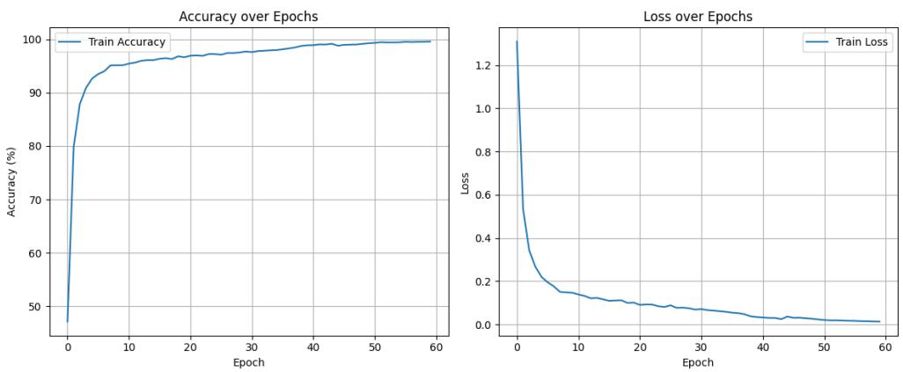  
Fig. 7 Loss and accuracy during the training process

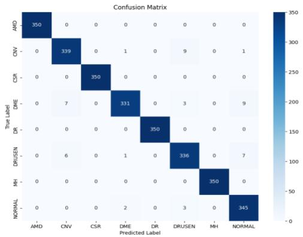  
Fig. 8 The confusion matrix of the results, with an accuracy of 98.25%

## 4.5. Ablation Study

To evaluate the contribution of each module in the proposed model to the overall performance, we conducted systematic ablation experiments on the OCT-C8 dataset, the results of which are shown in Tab. 2. The accuracy was 97.61% when using ResNet-50 alone, which we adopted as our baseline. We first introduced the Discrete Wavelet Transform (DWT) to construct a dual-stream architecture, decomposing the input into low- and high-frequency components. This modification led to an accuracy of 97.79%, marking a 0.18% improvement over the baseline, suggesting that decoupling structural and textural information facilitates more effective feature extraction. Subsequently, we integrated the Multiscale Contextual Localization Module (MCLM) into the low-frequency branch. By expanding the receptive field and enhancing lesion localization, this module significantly boosted the accuracy to 98.14%. Finally, we incorporated the complete High-Frequency Branch, comprising the Attention-Guided High-Resolution Network (AG-HRNet) and the Frequency-Adaptive Mamba Projector (FAMP). This integration elevated the model's performance to a state-of-the-art level of 98.25%. The further improvement demonstrates that the high-frequency stream effectively captures fine-grained edge details and long-range textural dependencies that are overlooked by the low-frequency branch. The synergistic operation of all proposed modules ensures that these subtle features are utilized robustly for diagnosis, confirming the necessity of a comprehensive dual-stream design.

Tab. 2 Ablation experiment results on the OCT-C8 dataset (%)
<table><tr><td>Method</td><td>Accuracy</td><td>Precision</td><td>Sensitivity</td><td>F1</td></tr><tr><td>ResNet50[9]</td><td>97.61</td><td>97.61</td><td>97.61</td><td>97.60</td></tr><tr><td>ResNet50+DWT</td><td>97.79</td><td>97.81</td><td>97.79</td><td>97.78</td></tr><tr><td>ResNet50+DWT+MCLM</td><td>98.14</td><td>98.15</td><td>98.14</td><td>98.14</td></tr><tr><td>RetiWave-Mamba (ours)</td><td>98.25</td><td>98.27</td><td>98.25</td><td>98.25</td></tr></table>

To verify the effectiveness of the proposed Multi-scale Dilation Fusion (MDF) module in capturing multi-scale context, we conducted a comparative experiment by replacing MDF with the representative Atrous Spatial Pyramid Pooling (ASPP) module [47]. The experimental results are presented in Tab. 3. While the model utilizing ASPP achieved a high classification accuracy of 98.25%, it incurred a substantial computational cost, requiring 142.63 million parameters and 27.14 GFLOPs. In contrast, our proposed MDF achieved the identical accuracy of 98.25% but demonstrated superior efficiency, containing only 33.57 million parameters and 6.58 GFLOPs. This represents a 76.5% reduction in parameters and approximately a 75.7% decrease in computational complexity compared to ASPP. These results demonstrate that the MDF module effectively balances high-performance feature extraction with a lightweight architecture, making it more suitable for deployment in clinical environments.

Tab. 3 Comparison of different context aggregation modules on the OCT-C8 dataset (%)
<table><tr><td>Method</td><td>Accuracy</td><td>Precision</td><td>Sensitivity</td><td>F1-Score</td><td>Params (M)</td><td>FLOPs (G)</td></tr><tr><td>MCLM with ASPP[47]</td><td>98.25</td><td>98.27</td><td>98.25</td><td>98.25</td><td>142.63</td><td>27.14</td></tr><tr><td>MCLM with MDF (ours)</td><td>98.25</td><td>98.27</td><td>98.25</td><td>98.25</td><td>33.57</td><td>6.58</td></tr></table>

The MCLM incorporates the MSW\_SA unit to achieve precise lesion localization within the expanded receptive field. To verify its superiority, we benchmarked MSW\_SA against two widely adopted attention mechanisms: the Squeeze-and-Excitation (SE) block [25], representing channel attention, and the Convolutional Block Attention Module (CBAM) [26], representing hybrid channelspatial attention.

Tab. 4 Comparison of different attention mechanisms on the OCT-C8 dataset (%)
<table><tr><td>Method</td><td>Accuracy</td><td>Precision</td><td>Sensitivity</td><td>F1</td></tr><tr><td>MCLM with CBAM[26]</td><td>97.96</td><td>97.97</td><td>97.96</td><td>97.96</td></tr><tr><td>MCLM with SE[25]</td><td>98.00</td><td>98.01</td><td>98.00</td><td>98.00</td></tr><tr><td>MCLM with MSW_SA (ours)</td><td>98.25</td><td>98.27</td><td>98.25</td><td>98.25</td></tr></table>

As presented in Tab. 4, the model employing MSW\_SA achieved the best performance with an accuracy of 98.25%. In contrast, replacing MSW\_SA with SE or CBAM resulted in accuracy drops to 98.00% and 97.96%, respectively. The performance gap can be attributed to the specific challenges of OCT imaging. The SE block focuses solely on channel interdependencies, ignoring the spatial distribution of lesions, which limits its localization capability. Although CBAM incorporates a spatial attention module, it relies on standard convolutions that treat all spatial pixels equally. Consequently, it is susceptible to the severe speckle noise inherent in OCT images, often leading to attention drifting toward background artifacts. Our MSW\_SA overcomes these limitations by integrating wavelet transforms into the attention generation process. This allows the module to inherently filter out highfrequency noise while capturing multi-scale structural information, ensuring the model focuses precisely on pathological regions.

To evaluate the efficacy of the High-Frequency Branch, we compared the proposed AG-HRNet with the standard HRNet baseline. Quantitative results in Tab. 5 indicate that the standard HRNet achieves slightly higher overall accuracy. However, the confusion matrix in Fig. 9 reveals a significant limitation of the baseline model. Specifically, the standard HRNet exhibits high misclassification rates between structurally similar classes, such as CNV and DRUSEN. In contrast, AG-HRNet demonstrates superior discriminative capability for these challenging categories. This suggests that the attentionguided mechanism effectively captures fine-grained boundary details that are missed by the standard network. Consequently, despite a marginal drop in average accuracy, AG-HRNet offers higher clinical value by correctly resolving complex inter-class similarities.

Tab. 5 Comparison between AG-HRNet and standard HRNet on the OCT-C8 dataset (%)
<table><tr><td>Method</td><td>Accuracy</td><td>Precision</td><td>Sensitivity</td><td>F1</td></tr><tr><td>Standard HRNet[38]</td><td>98.32</td><td>98.33</td><td>98.32</td><td>98.32</td></tr><tr><td>AG-HRNet (ours)</td><td>98.25</td><td>98.27</td><td>98.25</td><td>98.25</td></tr></table>

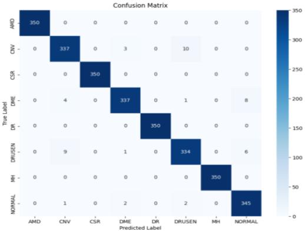  
Fig. 9 Confusion matrix of the standard HRNet

Tab. 6 Comparison between FAMP and Standard Mamba on the OCT-C8 dataset (%)
<table><tr><td>Method</td><td>Accuracy</td><td>Precision</td><td>Sensitivity</td><td>F1</td></tr><tr><td>Standard Mamba[34]</td><td>98.43</td><td>98.44</td><td>98.43</td><td>98.43</td></tr><tr><td>FAMP (ours)</td><td>98.25</td><td>98.27</td><td>98.25</td><td>98.25</td></tr></table>

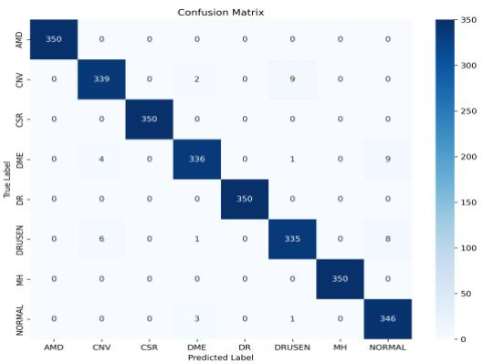  
Fig. 10 Confusion matrix of the Standard Mamba

Finally, to evaluate the efficacy of the Feature Aggregation module, we compared the proposed FAMP with the Standard Mamba baseline. Quantitative results in Tab. 6 indicate that the Standard Mamba achieves slightly higher overall accuracy. However, the confusion matrix in Fig. 10 reveals a significant limitation of the baseline model. Specifically, the Standard Mamba exhibits high misclassification rates between structurally similar classes, such as CNV and DRUSEN. In contrast, FAMP demonstrates superior discriminative capability for these challenging categories. This suggests that the frequency-adaptive modulation mechanism effectively captures fine-grained local details that are smoothed out by the standard global modeling. Consequently, despite a marginal drop in average accuracy, FAMP offers higher clinical value by correctly resolving complex inter-class similarities.

## 4.6 Robustness Analysis

OCT image quality varies significantly because the acquisition process is inevitably affected by external factors, such as imaging equipment performance and ambient light interference. Furthermore, due to interference signals caused by the back-scattered light of biological tissues, original OCT images often contain severe speckle noise. These issues weaken the edges and fine details of the retinal layers, posing major challenges for subsequent feature extraction and diagnosis. To enhance the model's robustness against such interference in realistic clinical environments, we implemented a progressive noise injection strategy during the training phase. We incorporated a realistic noise model with a pixel value limit to mimic sensor saturation:

$$
I _ { a u g } = \mathrm { C l a m p } \big ( I _ { c l e a n } \cdot \big ( 1 + \mathcal { N } ( 0 , \sigma ^ { 2 } ) \big ) , 0 , 1 \big )\tag{23}
$$

By keeping pixel values in a valid range, this formula prevents the model from learning unrealistic features. Furthermore, we dynamically regulated the training process across three distinct phases to progressively build the model's tolerance to noise. In Phase 1 (Initial Stabilization, Epochs 0–20), we applied low noise $( p = 0 . 5 , \ \sigma \in [ 0 . 0 , 0 . 1 ] )$ to help the network learn basic structural features stably. Subsequently, in Phase 2 (Progressive Adaptation, Epochs 20–40), we increased the difficulty $( p = 0 . 8 $ $\sigma \in \left[ 0 . 0 5 , 0 . 1 5 \right] \mathrm { , }$ ), preventing reliance on clear edges and forcing the model to adapt to textural corruption. Finally, in Phase 3 (High-Intensity Optimization, Epochs 40–60), we implemented a fully noisy training phase $( p = 1 . 0 , \mathrm { ~ } \sigma \in [ 0 . 1 , 0 . 2 ] )$ using only degraded data. This rigorous condition compelled the network to extract discriminative features even from heavily corrupted inputs.

To verify the effectiveness of our RetiWave-Mamba model in noisy environments, we added a multiplicative scattering noise model [19] to the test dataset. The noise generation process and the Peak Signal-to-Noise Ratio (PSNR) measurement are expressed by the following equations:

$$
F ( x , y ) = g ( x , y ) + g ( x , y ) \times u ( x , y )\tag{24}
$$

$$
P S N R = 2 0 \times \log _ { 1 0 } \left( \frac { M A X } { \sqrt { M S E } } \right)\tag{25}
$$

where $g ( x , y )$ denotes the clean image, $u ( x , y )$ is Gaussian noise with variance $\sigma ^ { 2 }$ dependent on gray values, and $F ( x , y )$ is the noisy image. In Eq. (25), ��� is the maximum pixel value and ��� is the mean square error. The model, trained utilizing the progressive noise injection curriculum, was then used to predict the noisy test dataset, and classification accuracy was reported to evaluate the robustness of our model and other methods under the noise environment. Specifically, we introduced three levels of noise $( \sigma = \ 0 . 1 , 0 . 1 5 , 0 . 2 )$ to the test set, corresponding to PSNR values of 32.19 dB, 28.69 dB, and 26.22 dB.

26.22dB  
28.69dB  
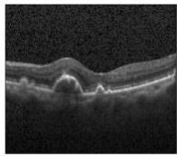

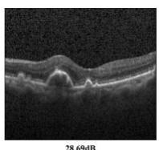

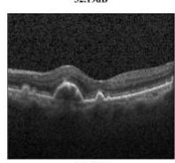  
Fig. 11 Visualization of retinal OCT images under varying speckle noise intensities

Fig. 11 provides a visual illustration of the retinal OCT images under these different noise conditions. It can be observed that as the noise intensity increases, the boundary definitions between retinal layers become increasingly blurred, and fine pathological details are obscured. This visualization confirms that the introduced noise effectively simulates the image degradation often encountered in lowquality clinical scans.

Crucially, as presented in Tab. 7, RetiWave-Mamba consistently achieves the highest accuracy among all competing methods across the entire spectrum of noise intensities. While Transformer-based models like Swin\_Tiny exhibit marked sensitivity, where their accuracy drops to 97.00% at the highest noise level, our model sustains a superior accuracy of 97.79% under the exact same conditions. This absolute performance advantage highlights the inherent robustness of our dual-stream architecture: regardless of the noise severity, it consistently outperforms peer models. Notably, our accuracy under extreme noise even surpasses the noiseless baseline of the standard ResNet50. This confirms that our proposed frequency-domain decoupling and attention-guided mechanisms effectively distinguish signal from noise, ensuring the most robust diagnosis in low-quality clinical scans.

Tab. 7 Comparison of accuracy results on the OCT-C8 dataset under different noise intensities (dB)
<table><tr><td colspan="2">Noise intensity</td><td rowspan="2">Noiseless</td><td rowspan="2">32.19dB</td><td rowspan="2">28.69dB</td><td rowspan="2">26.22dB</td></tr><tr><td>Method</td><td></td></tr><tr><td>VGG16[10]</td><td></td><td>97.79</td><td>97.75</td><td>97.71</td><td>97.61</td></tr><tr><td>GoogLeNet[40]</td><td></td><td>97.64</td><td>97.61</td><td>97.52</td><td>97.43</td></tr><tr><td>ResNet50[9]</td><td></td><td>97.75</td><td>97.63</td><td>97.53</td><td>97.50</td></tr><tr><td>InceptionV3[42]</td><td></td><td>97.61</td><td>97.61</td><td>97.43</td><td>97.39</td></tr></table>

<table><tr><td>DenseNet121[41]</td><td>97.46</td><td>97.39</td><td>97.28</td><td>97.21</td></tr><tr><td>EfficientNet-B3[43]</td><td>96.57</td><td>96.54</td><td>96.32</td><td>96.18</td></tr><tr><td>Swin_Tiny[45]</td><td>97.75</td><td>97.46</td><td>97.36</td><td>97.00</td></tr><tr><td>ConvNeXtV2[44]</td><td>96.11</td><td>95.82</td><td>95.75</td><td>95.61</td></tr><tr><td>MSLI-Net[15]</td><td>97.18</td><td>97.25</td><td>97.14</td><td>97.04</td></tr><tr><td>WaveNet-SF[14]</td><td>97.89</td><td>97.82</td><td>97.75</td><td>97.46</td></tr><tr><td>RetiWave-Mamba (ours)</td><td>98.32</td><td>98.25</td><td>98.00</td><td>97.79</td></tr></table>

## 4.7 Evaluation of model generalization ability

To further evaluate the generalization ability of the proposed RetiWave-Mamba framework, we conducted an experiment on an independent external dataset. While the model was trained exclusively on the OCT-C8 dataset, we utilized the test set of the OCT2017 dataset [48] as an external benchmark. The OCT2017 test set comprises 1,000 images evenly distributed across four categories, namely CNV, DME, Drusen, and Normal, with each category containing 250 images. The model trained on OCT-C8 was directly applied to the OCT2017 test set without any fine-tuning or transfer learning, posing a significant challenge due to potential domain shifts in imaging protocols and noise patterns.

Tab. 8 Performance comparison on the OCT2017 dataset (%)
<table><tr><td>Method</td><td>Accuracy</td><td>Precision</td><td>Sensitivity</td><td>F1 score</td></tr><tr><td>VGG16[10]</td><td>99.20</td><td>99.20</td><td>99.20</td><td>99.20</td></tr><tr><td>GoogLeNet[40]</td><td>99.50</td><td>99.50</td><td>99.50</td><td>99.50</td></tr><tr><td>ResNet50[9]</td><td>99.50</td><td>99.50</td><td>99.50</td><td>99.50</td></tr><tr><td>DenseNet121[41]</td><td>99.30</td><td>99.30</td><td>99.30</td><td>99.30</td></tr><tr><td>EfficientNet-B3[43]</td><td>98.80</td><td>98.80</td><td>98.81</td><td>98.81</td></tr><tr><td>Swin_Tiny[45]</td><td>99.20</td><td>99.20</td><td>99.20</td><td>99.20</td></tr><tr><td>ConvNeXtV2[44]</td><td>98.80</td><td>98.80</td><td>98.80</td><td>98.80</td></tr><tr><td>WaveNet-SF[14]</td><td>99.50</td><td>99.51</td><td>99.50</td><td>99.50</td></tr><tr><td>RetiWave-Mamba (ours)</td><td>99.60</td><td>99.60</td><td>99.60</td><td>99.60</td></tr></table>

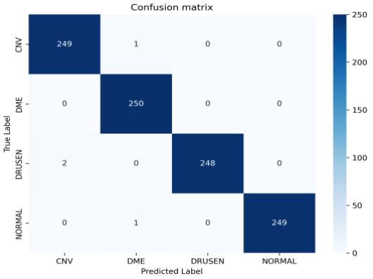  
Fig. 12 The confusion matrix of the proposed RetiWave-Mamba evaluated on the OCT2017 dataset

Tab. 8 presents the quantitative performance of our method compared to other competing approaches on this external dataset. As observed, RetiWave-Mamba achieves a remarkable accuracy of 99.60%, along with a precision of 99.60%, sensitivity of 99.60%, and an F1-score of 99.60%. Our model consistently outperforms advanced deep learning architectures such as Swin\_Tiny (99.20%), ConvNeXtV2 (98.80%), and EfficientNet-B3 (98.80%). Furthermore, it surpasses classic backbones like ResNet50 (99.50%) and VGG16 (99.20%).

To further visualize the classification performance on this external dataset, Fig. 12 presents the confusion matrix. It can be observed that the model achieves near-perfect classification across all four categories, with minimal misclassifications. Specifically, the model effectively distinguishes between pathological cases and normal eyes, as well as between different disease types, despite the domain gap. These results indicate that our dual-stream design effectively learns invariant pathological features— structural anomalies via the MCLM and fine-grained textures via the FAMP—rather than overfitting to the specific artifacts of the source dataset. This strong generalization ability suggests that RetiWave-Mamba holds great promise for robust deployment in diverse clinical environments.

## 5. Discussion

## 5.1 The Performance of RetiWave-Mamba

As shown in the experimental results in Section 4.4, we compared our method with a wide range of models, including classic CNNs, modern Transformers, and specialized retinal networks. However, these existing methods often struggle with speckle noise and similarities between different classes. This limit is especially clear when distinguishing between Choroidal Neovascularization (CNV) and Drusen, as these lesions look very similar. In contrast, our proposed RetiWave-Mamba framework effectively overcomes these challenges. It achieves a state-of-the-art (SOTA) accuracy of 98.25% on the OCT-C8 dataset, performing better than previous methods even on these difficult categories.

This superior performance comes from our new dual-stream spatial-frequency design. By using the Discrete Wavelet Transform (DWT), we separate the input image into different frequency parts. This allows us to balance noise suppression and detail preservation. The low-frequency stream uses the Multiscale Contextual Localization Module (MCLM) to accurately locate the lesion. Meanwhile, the highfrequency stream uses the Attention-Guided High-Resolution Network (AG-HRNet) and the Frequency-Adaptive Mamba Projector (FAMP). These components capture the fine edge details and long-range dependencies needed for precise diagnosis.

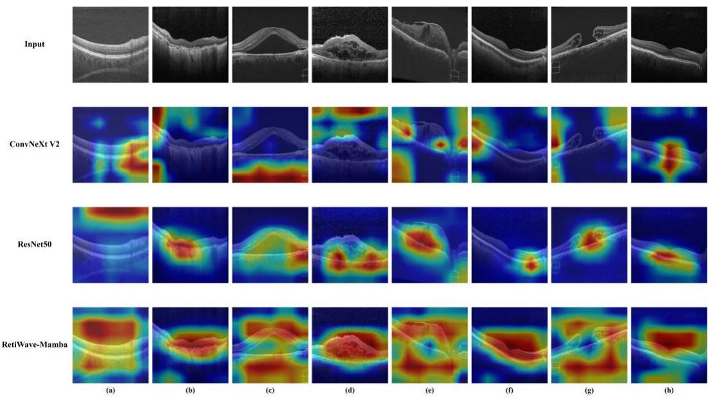  
Fig. 13 Heatmaps of retinal OCT images. (a) AMD (b) CNV (c) CSR (d) DME (e) DR (f) DRUSEN (g) MH (h) NORMAL

To provide an intuitive and interpretable evaluation of the model's decision-making process, we utilized the Grad-CAM method [49] to generate heatmaps, as shown in Fig. 13. This visualization reveals significant differences in how each model focuses on pathological features under noisy conditions.

In general, for ConvNeXt V2, although it generally locates the lesion area, its activation maps tend to be diffuse and over-smoothed, lacking precise boundary definition. The ResNet50 baseline exhibits a susceptibility to background interference, often drifting its attention towards non-pathological areas or high-contrast artifacts, as clearly seen in AMD (a). In contrast, RetiWave-Mamba consistently generates tightly constrained activation maps that accurately delineate lesion boundaries, thanks to the global context capture of the MCLM module.

It is particularly worth noting the performance on the morphologically similar categories of CNV (b) and Drusen (f), which serve as excellent examples of the model's discriminative capability. In these challenging cases, RetiWave-Mamba demonstrates exceptional specificity: it precisely targets the irregular neovascular textures in CNV and the granular depositions in Drusen, effectively filtering out the inherent speckle noise. Conversely, the heatmaps of ConvNeXt V2 in these cases are notably blurred and bleed into surrounding healthy tissues, indicating a failure to resolve the fine-grained high-frequency details required to distinguish these RPE elevations. Similarly, ResNet50 struggles significantly here, with its attention drifting towards image noise rather than locking onto the lesion core. This comparison validates that the AG-HRNet and FAMP in our high-frequency branch are crucial for capturing the subtle textural dependencies that standard backbones miss.

## 5.2 Ablation Study

In Section 4.5, we quantitatively verified the contribution of each proposed module through stepwise ablation. To provide a deeper understanding of why our specific designs—namely the Multiscale Contextual Localization Module (MCLM) and the core high-frequency components (AG-HRNet and FAMP)—outperform traditional approaches, we analyze their internal mechanisms and comparative performance in detail below.

## 5.2.1 Efficacy of the MCLM Components: MDF and MSW\_SA

To intuitively validate the rationality of the proposed Multi-scale Contextual Localization Module (MCLM) and demonstrate its superiority over other attention mechanisms, we employed LayerCAM [50] to visualize the feature evolution within the low-frequency branch. Fig. 14 illustrates the intermediate feature maps from Stage 1 to Stage 4, alternating between the raw backbone features and the refined features output by the attention modules. As observed in the horizontal evolution, the raw features from the backbone typically contain significant background noise, such as high-reflective retinal layers and vitreous artifacts. However, after passing through our attention modules, the background clutter is progressively suppressed, and the focus shifts sharply toward the pathological regions. This phenomenon confirms that the MCLM acts as an effective filter, highlighting discriminative lesion features while discarding irrelevant noise layer by layer.

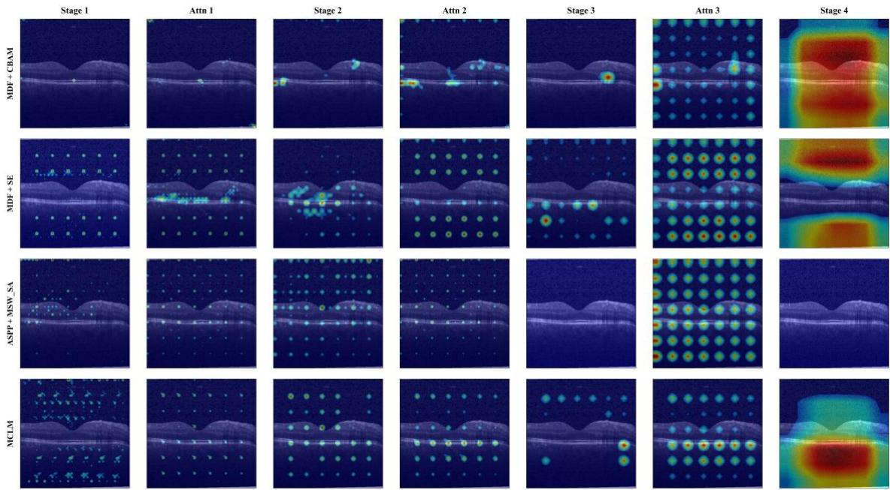  
Fig. 14 LayerCAM visualization comparison of feature evolution in the low-frequency branch

A detailed comparative analysis reveals critical limitations in existing mechanisms when applied to OCT imagery. Regarding the $" \mathrm { M D F } + \mathrm { S E " }$ variant, visual inspection reveals that the attention maps exhibit a significant deviation from the pathological region. High activation areas are erroneously concentrated in the background regions above and below the main retinal structure corresponding to the vitreous humor and sclera, indicating that channel attention alone fails to spatially filter out background noise. Similarly, for the "MDF + CBAM" configuration, although the focus on the main structure is improved, it remains susceptible to the inherent speckle noise in OCT images. This manifests as false activations in the upper non-pathological regions like the choroid, suggesting that standard spatial convolutions struggle to distinguish between pathological textures and high-frequency speckle noise. Furthermore, the "ASPP + MSW\_SA" approach exposes severe structural limitations in deep feature extraction: the Attn 3 map presents a distinct lattice-like activation pattern, while the Stage 4 map suffers from complete signal loss, appearing entirely dark. This signal vanishing is attributed to the mismatch between the large dilation rates of ASPP and the reduced spatial resolution of deep feature maps.

In contrast, our proposed MCLM effectively overcomes these issues through the synergistic combination of MDF and MSW\_SA. While displaying a lattice-like activation pattern in intermediate layers, the additive integration of multi-scale contextual modeling (MDF) and wavelet-based frequency filtering (MSW\_SA) allows the model to maintain significantly more distinct and coherent highlighting of the retinal structure. This combined mechanism ensures that pathological features remain dominant over texture responses. Most importantly, unlike the dilation-based $" \mathrm { A S P P } + \mathrm { M S W } ~ \mathrm { S A " }$ baseline, this dual-module design successfully preserves strong semantic signals in deep layers (Stage 4), effectively suppressing background noise and avoiding false choroidal activations. The visualization confirms that the strategic combination of multi-scale fusion and wavelet-based attention achieves the most precise and robust lesion localization.

## 5.2.2 Efficacy of the High-Frequency Branch Components

The High-Frequency Branch is designed to capture fine-grained textures and boundary details, which are critical for distinguishing subtle retinal lesions. To validate the specific contributions of the Attention-Guided High-Resolution Network, or AG-HRNet, and the Frequency-Adaptive Mamba Projector, denoted as FAMP, we conducted comparative ablation studies against their standard counterparts.

We first evaluated the feature extraction capability of the proposed AG-HRNet by comparing it with the standard HRNet baseline. As shown in Tab. 5, the Standard HRNet achieves a marginally higher overall accuracy of 98.32% compared to the 98.25% achieved by AG-HRNet. However, overall accuracy can be misleading when class difficulties vary, and a deeper inspection of the confusion matrices reveals a critical difference in discriminative power. As illustrated in Fig. 9, the Standard HRNet exhibits a notable rate of misclassification between morphologically similar categories, specifically predicting CNV as Drusen in 10 cases and Drusen as CNV in 9 cases. This confusion directly echoes the intrinsic challenge discussed in the Introduction and visualized in Fig. 1, where CNV and Drusen share high structural similarities, particularly in Retinal Pigment Epithelium (RPE) elevations. The Standard HRNet fails here because it utilizes simple summation for multi-scale fusion, which allows background speckle noise to propagate and blur the subtle textural discrepancies required to separate these structurally resembling lesions. In contrast, our AG-HRNet incorporates the Attention-Guided Fusion mechanism. By comparing the baseline results with the confusion matrix of our model in Fig. 8, it is evident that AG-HRNet acts as an intelligent gate. It suppresses noise propagation and focuses the network on the finegrained high-frequency details, successfully resolving the structural ambiguity between these challenging classes.

Subsequently, we investigated the efficacy of the feature aggregation module by comparing our FAMP with the state-of-the-art Standard Mamba. The quantitative results in Tab. 6 show that Standard Mamba yields a slightly higher overall accuracy of 98.43% versus the 98.25% of FAMP. This statistical advantage is primarily attributed to the strong global sequence modeling of Mamba, which performs exceptionally well on distinct categories like Normal cases. However, the confusion matrix in Fig. 10 highlights that Standard Mamba also struggles with the high structural similarity mentioned above, showing a high confusion rate where CNV is misclassified as Drusen in 9 cases. Standard Mamba focuses on global context, which tends to smooth out the local, fine-grained textural differences—such as granular versus neovascular textures—that are essential for distinguishing these morphologically overlapping conditions. Conversely, as shown in Fig. 8, the proposed FAMP maintains a lower misclassification rate. This demonstrates that the frequency-adaptive modulation of FAMP effectively preserves the local diagnostic details often lost during the global modeling process, thereby offering a more robust solution to the inter-class similarity problem highlighted at the beginning of this study.

In conclusion, although the standard baselines achieve slightly higher statistical averages driven by easier categories, AG-HRNet and FAMP demonstrate superior performance in resolving the most difficult examples in clinical diagnosis. By effectively distinguishing between structurally similar and vision-threatening conditions like CNV and Drusen, our High-Frequency Branch designs offer a more robust and clinically valuable solution than standard architectures.

## 5.3 Robustness of RetiWave-Mamba to Noise

OCT images are inevitably compromised by device-dependent speckle noise, making algorithmic robustness a critical prerequisite for clinical deployment. To rigorously validate the robustness of RetiWave-Mamba when processing high-noise images, we evaluated the model using the progressive noise injection strategy detailed in Section 4.6. This strategy simulates realistic clinical scenarios, compelling the model to extract invariant pathological features rather than relying on superficial cues found in high-quality data.

Demonstrating this stability, RetiWave-Mamba establishes a significant superiority barrier against existing methods. As shown in Tab. 7, even under the most severe noise condition of 26.22 dB, our model maintains an accuracy of 97.79%. This result is particularly significant because it surpasses the performance of the standard ResNet50 baseline achieved on perfectly noiseless data, which stands at 97.75%. This observation confirms that by successfully adapting to our realistic noise protocol, our dualstream architecture can discern pathological details through heavy interference better than traditional models can in clear conditions.

The necessity of the proposed dual-stream design becomes evident when comparing these results to competing architectures that lack such support. Transformer-based models like Swin\_Tiny exhibit marked sensitivity with accuracy dropping significantly by 0.75% at the highest noise level, likely due to the fragility of patch embedding processes when local pixel distributions are corrupted. Similarly, standard CNNs plateau at lower accuracy levels because they lack mechanisms to explicitly decouple signal from noise. In contrast, RetiWave-Mamba supports its robust training with Frequency-Domain Decoupling enabled by DWT and the Attention-Guided Fusion mechanism. These components explicitly separate stable low-frequency structures from high-frequency noise and filter feature interactions, preventing the error propagation observed in other networks. Collectively, the synergy of the realistic noise augmentation strategy and the robust architecture validate the reliability of RetiWave-Mamba for real-world clinical deployment.

## 6. Conclusion

In this study, we proposed RetiWave-Mamba, a novel dual-stream framework that synergizes spatial-frequency domain learning with State Space Models to address the critical challenges of speckle noise and lesion scale variability in OCT image analysis. Specifically, by utilizing DWT for spectral decoupling, the framework coordinates the MCLM in the low-frequency stream for precise lesion localization, while integrating AG-HRNet and FAMP in the high-frequency stream to suppress noise artifacts and capture fine-grained textures. Comprehensive ablation studies further confirmed the validity and contribution of each proposed module. Our model achieves a state-of-the-art accuracy of 98.25% on the OCT-C8 dataset and possesses strong robustness against noise interference. We believe that RetiWave-Mamba will serve as a valuable auxiliary tool for assisting ophthalmologists in the accurate screening and diagnosis of retinal diseases in clinical settings.

## Declaration of competing interest

The authors declare that there are no conflicts of interest regarding the publication of this paper.

## Acknowledgements

This work was supported in part by the National Natural Science Foundation of China (62466033), and in part by the Jiangxi Provincial Natural Science Foundation (20242BAB20070).

## References

1. Meng, Y., et al., Global, Regional, and National Burden of Blindness due to Diabetic Retinopathy, 1990–2021. Ophthalmology and Therapy, 2025. 14(10): p. 2599-2615

2. Jeong, Y.D., et al., Global burden of vision impairment due to age-related macular degeneration, 1990–2021, with forecasts to 2050: a systematic analysis for the Global Burden of Disease Study 2021. The Lancet Global Health, 2025. 13(7): p. e1175-e1190.

3. Rusciano, D. and S. Marsili, Editorial to the Special Issue “Retinopathies: A Challenge for Early Diagnosis, Innovative Treatments, and Reliable Follow-Up”. 2025, MDPI. p. 662.

4. Sorrentino, F.S., et al., Novel approaches for early detection of retinal diseases using artificial intelligence. Journal of Personalized Medicine, 2024. 14(7): p. 690.

5. Huang, D., et al., Optical coherence tomography. science, 1991. 254(5035): p. 1178-1181.

6. Kermany, D.S., et al., Identifying medical diagnoses and treatable diseases by image-based deep learning. cell, 2018. 172(5): p. 1122-1131. e9.

7. Li, T., et al., Applications of deep learning in fundus images: A review. Medical Image Analysis, 2021. 69: p. 101971.

8. Tsuji, T., et al., Classification of optical coherence tomography images using a capsule network. BMC ophthalmology, 2020. 20(1): p. 114.

9. He, K., et al. Deep residual learning for image recognition. in Proceedings of the IEEE conference on computer vision and pattern recognition (CVPR). 2016.

10. Simonyan, K. and A. Zisserman, Very deep convolutional networks for large-scale image recognition. arXiv preprint arXiv:1409.1556, 2014.

11. Huang, L., et al., Automatic classification of retinal optical coherence tomography images with layer guided convolutional neural network. IEEE Signal Processing Letters, 2019. 26(7): p. 1026-1030.

12. Peng, J., et al., Multi-scale-denoising residual convolutional network for retinal disease classification using OCT. Sensors, 2023. 24(1): p. 150.

13. Fang, L., et al., Attention to lesion: Lesion-aware convolutional neural network for retinal optical coherence tomography image classification. IEEE transactions on medical imaging, 2019. 38(8): p. 1959-1970.

14. Cheng, J., et al., WaveNet-SF: A Hybrid Network for Retinal Disease Detection Based on Wavelet Transform in the Spatial-Frequency Domain learning. Neural Networks, 2025: p. 108189.

15. Qi, Z., et al., MSLI-Net: retinal disease detection network based on multi-segment localization and multi-scale interaction. Frontiers in Cell and Developmental Biology, 2025. 13: p. 1608325.

16. Karthik, K. and M. Mahadevappa, Convolution neural networks for optical coherence tomography (OCT) image classification. Biomedical Signal Processing and Control, 2023. 79: p. 104176.

17. Schmitt, J.M., S. Xiang, and K.M. Yung, Speckle in optical coherence tomography. Journal of biomedical optics, 1999. 4(1): p. 95-105.

18. Sotoudeh-Paima, S., et al., Multi-scale convolutional neural network for automated AMD classification using retinal OCT images. Computers in biology and medicine, 2022. 144: p. 105368.

19. Ma, Z., et al., HCTNet: a hybrid ConvNet-transformer network for retinal optical coherence tomography image classification. Biosensors, 2022. 12(7): p. 542.

20. Laouarem, A., et al., Htc-retina: a hybrid retinal diseases classification model using transformer-convolutional neural network from optical coherence tomography images. Computers in Biology and Medicine, 2024. 178: p. 108726.

21. Khalil, I., et al., OCTNet: A modified multi-scale attention feature fusion network with InceptionV3 for retinal OCT image classification. Mathematics, 2024. 12(19): p. 3003.

22. Hemalakshmi, G., et al., Automated retinal disease classification using hybrid transformer model (SViT) using optical coherence tomography images. Neural Computing and Applications, 2024. 36(16): p. 9171-9188.

23. Yu, F. and V. Koltun, Multi-scale context aggregation by dilated convolutions. arXiv preprint arXiv:1511.07122, 2015.

24. Feng, S., et al., CPFNet: Context pyramid fusion network for medical image segmentation. IEEE transactions on medical imaging, 2020. 39(10): p. 3008-3018.

25. Hu, J., L. Shen, and G. Sun. Squeeze-and-excitation networks. in Proceedings of the IEEE conference on computer vision and pattern recognition. 2018.

26. Woo, S., et al. Cbam: Convolutional block attention module. in Proceedings of the European conference on computer vision (ECCV). 2018.

27. Park, J., et al., Bam: Bottleneck attention module. arXiv preprint arXiv:1807.06514, 2018.

28. Hou, Q., D. Zhou, and J. Feng. Coordinate attention for efficient mobile network design. in Proceedings of the IEEE/CVF conference on computer vision and pattern recognition. 2021.

29. Schlemper, J., et al., Attention gated networks: Learning to leverage salient regions in medical images. Medical image analysis, 2019. 53: p. 197-207.

30. Xu, G., et al., Haar wavelet downsampling: A simple but effective downsampling module for semantic segmentation. Pattern recognition, 2023. 143: p. 109819.

31. Yao, T., et al. Wave-vit: Unifying wavelet and transformers for visual representation learning. in European conference on computer vision. 2022. Springer.

32. Cui, Y., et al., Image restoration via frequency selection. IEEE Transactions on Pattern Analysis and Machine Intelligence, 2023. 46(2): p. 1093-1108.

33. Gu, A., K. Goel, and C. Ré, Efficiently modeling long sequences with structured state spaces. arXiv preprint arXiv:2111.00396, 2021.

34. Gu, A. and T. Dao. Mamba: Linear-time sequence modeling with selective state spaces. in First conference on language modeling. 2024.

35. Zhu, L., et al., Vision mamba: Efficient visual representation learning with bidirectional state space model. arXiv preprint arXiv:2401.09417, 2024.

36. Liu, Y., et al., Vmamba: Visual state space model. Advances in neural information processing systems, 2024. 37: p. 103031-103063.

37. Zuo, Q., et al., Multi-resolution visual Mamba with multi-directional selective mechanism for retinal disease detection. Frontiers in Cell and Developmental Biology, 2024. 12: p. 1484880.

38. Sun, K., et al. Deep high-resolution representation learning for human pose estimation. in Proceedings of the IEEE/CVF conference on computer vision and pattern recognition. 2019.

39. Subramanian, M., et al. Classification of retinal oct images using deep learning. in 2022 international conference on computer communication and informatics (ICCCI). 2022. IEEE.

40. Szegedy, C., et al. Going deeper with convolutions. in Proceedings of the IEEE conference on computer vision and pattern recognition. 2015.

41. Huang, G., et al. Densely connected convolutional networks. in Proceedings of the IEEE conference on computer vision and pattern recognition. 2017.

42. Szegedy, C., et al. Rethinking the inception architecture for computer vision. in Proceedings of the IEEE conference on computer vision and pattern recognition. 2016.

43. Tan, M. and Q. Le. Efficientnet: Rethinking model scaling for convolutional neural networks. in International conference on machine learning. 2019. PMLR.

44. Woo, S., et al. Convnext v2: Co-designing and scaling convnets with masked autoencoders. in Proceedings of the IEEE/CVF conference on computer vision and pattern recognition. 2023.

45. Liu, Z., et al. Swin transformer: Hierarchical vision transformer using shifted windows. in Proceedings of the IEEE/CVF international conference on computer vision. 2021.

46. He, J., et al., An interpretable transformer network for the retinal disease classification using optical coherence tomography. Scientific Reports, 2023. 13(1): p. 3637.

47. Chen, L.-C., et al., Deeplab: Semantic image segmentation with deep convolutional nets, atrous convolution, and fully connected crfs. IEEE transactions on pattern analysis and machine intelligence, 2017. 40(4): p. 834-848.

48. Kermany, D., Labeled optical coherence tomography (oct) and chest x-ray images for classification. Mendeley data, 2018.

49. Selvaraju, R.R., et al. Grad-cam: Visual explanations from deep networks via gradient-based localization. in Proceedings of the IEEE international conference on computer vision. 2017.

50. Jiang, P.-T., et al., Layercam: Exploring hierarchical class activation maps for localization. IEEE transactions on image processing, 2021. 30: p. 5875-5888.