# S3AM: A Single-Stream SAM with Reliability-Calibrated Frequency Adapter for Multi-modal Salient Object Detection

Ruichao Hou, Boyue Xu, Tongwei Ren, Dongming Zhou, Gangshan Wu, and Jinde Cao, Fellow, IEEE

Abstract—Vision foundation models have recently advanced multi-modal salient object detection (MSOD) through parameterefficient tuning and prompt learning. However, existing Segment Anything Model (SAM)-adapted MSOD methods often rely on dual-stream encoders or auxiliary prompt generators, leading to redundant computation. Although a single-stream alternative can reduce this cost, early fusion may also propagate noisy or misaligned auxiliary high-frequency cues through the backbone. In this paper, we propose a novel single-stream framework that integrates reliability-calibrated frequency adaptation into the adopted SAM backbone for MSOD. It avoids duplicated foundation backbones while explicitly controlling auxiliary frequency injection. Specifically, we design a mixture of frequency experts module, which uses the stationary wavelet transform to decompose each modality and aggregate cross-modal frequency information. We further introduce a reliability-calibrated frequency adapter with a dual-gate calibration mechanism, which selectively propagates the calibrated residual across transformer stages while jointly controlling its injection strength and cross-modal reliability. A hypernetwork-guided semanticstructural decoder then combines semantic mask features from the adopted backbone with Mamba-based structural detail recovery. Comprehensive experiments on RGB-D, RGB-T, and RGB-NIR salient object detection benchmarks validate that the proposed framework achieves competitive performance with only 12.20M trainable parameters, accounting for 5.4% of the total parameters. The code will be available at https://github.com/ xuboyue1999/SSSAM.

Index Terms—Salient object detection, multi-modal, frequency, segment anything model, stationary wavelet transform.

ULTI-MODAL salient object detection (MSOD) aims regions in an image by leveraging complementary information from multiple sensing modalities. By integrating inputs such as RGB, depth (RGB-D), thermal (RGB-T), or near-infrared (RGB-NIR) data, MSOD enhances feature representation under challenging conditions like low illumination, background clutter, or visual camouflage. This enhanced robustness makes MSOD a crucial component in various downstream tasks, including object tracking and video object detection [1], [2], virtual reality rendering [3], and image retrieval [4]. The additional structural or semantic cues offered by multiple modalities enable more reliable saliency prediction in real-world scenarios.

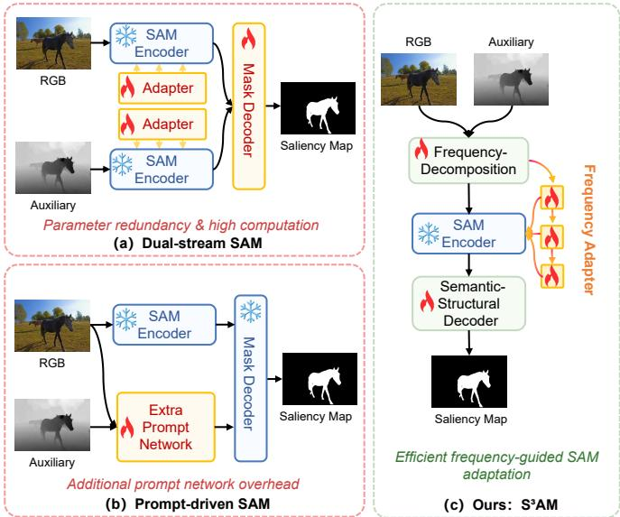  
Fig. 1. Comparison of SAM adaptation paradigms for multi-modal salient object detection. (a) Dual-stream SAM encodes RGB and auxiliary inputs with two separate SAM encoders, resulting in redundant foundation-backbone computation. (b) Prompt-driven SAM converts auxiliary cues into extra prompts through an additional prompt network. (c) Our S3AM performs early frequency-aware fusion and adapts a single frozen SAM backbone with reliability-calibrated frequency adapters.

Most existing MSOD methods adopt dual-stream architectures, where two modality-specific backbones independently extract features that are later fused through specialized fusion modules. The goal of such designs is to exploit both the consistency and complementarity of different modalities to construct robust multi-modal representations. However, dual-stream processing inevitably duplicates a large portion of the visual backbone, and this redundancy becomes more pronounced when vision foundation models are introduced. Meanwhile, the limited size of publicly available multi-modal datasets, constrained by the cost of aligned data acquisition and labor-intensive annotation, poses a major challenge for training specialized architectures from scratch. To mitigate the data limitation, recent works have begun incorporating SAM [5] into the MSOD task, leveraging its strong zero-shot generalization under limited supervision. Two representative adaptation paradigms have emerged, as shown in Fig. 1. The first is parameter-efficient fine-tuning, where lightweight adapters, LoRA modules, or task-specific adaptation modules are inserted into the frozen encoder to inject task-specific knowledge [6]–[8]. The second is prompt learning, in which an auxiliary SOD network or prompt generator produces saliency-aware prompts that guide the unmodified SAM toward task-relevant segmentation results [9]. Despite their effectiveness, these paradigms often depend on duplicated modality-specific processing, additional prompt generation, or task-specific optimization, introducing computational overhead that limits deployment in real-time or resource-constrained environments.

An appealing alternative is to adapt SAM in a single-stream manner, where RGB and auxiliary modalities are fused early and processed by a unified encoder. This design directly reduces architectural redundancy, but it also changes the reliability requirement of multi-modal fusion: once auxiliary cues are injected at an early stage, their errors can propagate through the entire foundation backbone. This issue is particularly evident for high-frequency information. Although high-frequency cues are crucial for preserving object boundaries, thin structures, and small salient regions, they are not uniformly trustworthy across modalities. Depth maps may contain holes or shifted boundaries, thermal images may be blurred, and NIR responses may emphasize modality-specific textures. Blindly injecting such high-frequency cues can therefore contaminate early features and sharpen wrong contours rather than improve saliency localization. Therefore, the key challenge is not only how to build an efficient single-stream SAM framework, but also how to make early frequency injection reliable.

To this end, we propose S3AM, a novel and efficient single-stream SAM adaptation framework that introduces reliability-calibrated frequency adaptation for multi-modal SOD tasks. Unlike previous dual-stream or prompt-driven approaches, S3AM processes multi-modal inputs within a unified encoder to avoid redundant foundation backbones, and further controls the propagation of auxiliary high-frequency cues through reliability-calibrated frequency adaptation. Accordingly, S3AM is organized around three operations. First, the Mixture of Frequency Experts (MoFE) constructs imageconditioned frequency cues for early single-stream fusion. Second, the Reliability-Calibrated Frequency Adapter (RCFA) evaluates and calibrates them during stage-wise propagation, suppressing unreliable residuals through dual-gate control of contextual injection and RGB–auxiliary reliability. Third, the lightweight Hypernetwork-guided Semantic-Structural Decoder (HSSD) translates the calibrated features into saliency masks by coupling the adopted SAM backbone’s hypernetwork-based semantic prior with structural detail recovery under joint saliency-edge supervision. Extensive experiments on multiple MSOD benchmarks demonstrate that

S3AM achieves competitive performance while maintaining parameter-efficient adaptation.

In summary, our main contributions are as follows:

• We propose a parameter-efficient single-stream SAM adaptation framework for multi-modal salient object detection that avoids duplicated foundation backbones while controlling noisy auxiliary frequency injection, thereby reducing architectural redundancy without sacrificing cross-modal interaction.

• We propose a Mixture of Frequency Experts to construct image-conditioned frequency cues for early fusion, thereby supplying diverse structural information to the unified encoder.

• We propose a Reliability-Calibrated Frequency Adapter that uses dual-gate calibration to selectively propagate useful frequency residuals and suppress unreliable ones across transformer stages, thereby preventing noisy auxiliary details from contaminating subsequent features.

• We employ a Hypernetwork-guided Semantic-Structural Decoder that combines the adopted SAM backbone’s semantic mask prior with Mamba-based detail recovery under joint mask and edge supervision, thereby improving semantic completeness and boundary accuracy.

## I. RELATED WORK

## A. Multi-modal Salient Object Detection

MSOD enhances RGB-based SOD by integrating complementary cues from modalities such as depth, thermal, or near-infrared (NIR), which provide richer spatial or semantic context for robust object perception. Recent MSOD methods are generally categorized into single-stream, dual-stream, and triple-stream architectures. Single-stream designs, e.g., OSRNet [10], emphasize efficiency by performing early fusion through simple operations like concatenation and element-wise addition.

Dual-stream frameworks remain the most widely adopted due to their effectiveness in extracting and aligning modalityspecific features. For instance, BTNet [11] leverages a biologically inspired two-branch design to process RGB and depth in parallel. DiMSOD [12] formulates multi-modal salient object detection as a conditional mask generation problem and introduces a diffusion-based framework to progressively refine saliency predictions. Triple-stream models, such as MDBIFNet [13], introduce an interaction stream to further refine cross-modal feature integration. Despite the performance gains brought by various fusion strategies, the effectiveness of existing MSOD models remains constrained by the limited scale and diversity of available multi-modal datasets. Consequently, incorporating vision foundation models to boost generalization under limited supervision has become an increasingly promising direction.

At the same time, single-stream architectures remain appealing for real-time or resource-constrained applications due to their lightweight design and lower computational cost. Motivated by these insights, we investigate how to combine a single-stream architecture with SAM while avoiding duplicated foundation-backbone computation.

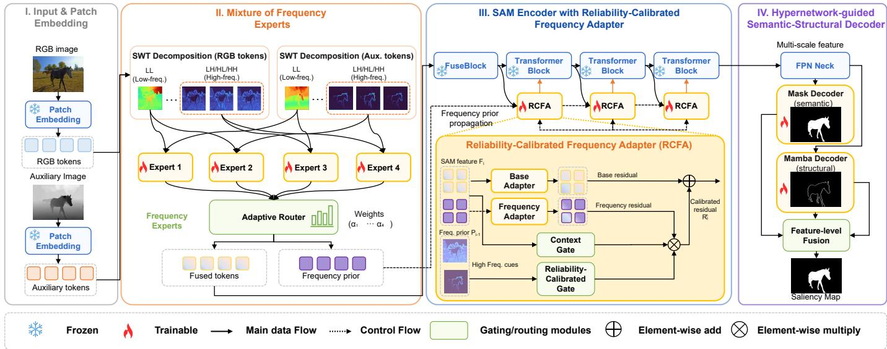  
Fig. 2. Framework of the proposed ${ \mathrm { S } } ^ { 3 } { \mathrm { A M } } .$ Given RGB and auxiliary features ${ \mathcal { F } } ^ { \mathrm { r g b } }$ and ${ \mathcal { F } } ^ { \mathrm { a u x } }$ , MoFE performs SWT-based frequency decomposition and cross-modal expert aggregation to obtain $\mathcal { F } ^ { \mathrm { f u s e d } }$ , which is added to $\mathbf { \mathcal { F } ^ { r g b } }$ before the first block of the adopted SAM backbone, and the initial candidate frequency prior $\mathcal { P } _ { 0 }$ . At RCFA stage i, the current encoder feature $\mathcal { F } _ { i }$ and incoming frequency prior $\mathcal { P } _ { i - 1 }$ produce a calibrated residual $\mathcal { F } _ { i } ^ { \mathrm { r e s } }$ , which is injected to form $\bar { \mathcal { F } _ { i } ^ { \mathrm { { o u t } } } }$ and propagated as the calibrated frequency prior $\mathcal { P } _ { i }$ . The resulting multi-scale encoder features are decoded by HSSD, which combines the adopted SAM backbone’s hypernetwork-guided semantic prediction with Mamba-based structural detail recovery.

## B. SAM and Its Application

The adopted SAM backbone [5] is a foundation model for image and video segmentation that provides strong generalpurpose visual representations and supports prompt-based segmentation from inputs such as points and bounding boxes.

Owing to its versatility, SAM has been widely extended to various visual domains. For instance, the SAM-Adapter [6] incorporates lightweight adapters into the frozen SAM encoder, injecting domain-specific knowledge or visual priors for specialized tasks. Similarly, MedSAM [14] adapts SAM for medical image segmentation by fine-tuning on a curated large-scale medical dataset. In remote sensing, SAMRS [15] leverages SAM to construct a large-scale satellite image segmentation dataset and shows that SAM can generalize to overhead imagery with appropriate prompt strategies.

Moreover, SAM has been adapted for multi-modal vision tasks. SAGE [16] introduces a multi-modality image fusion framework that distills semantic priors from SAM to improve visual quality and downstream task adaptability without requiring SAM during inference. For RGB-T SOD, SACNet [17] studies alignment-free cross-modal interaction through semantics-guided asymmetric correlation. HyPSAM [9] employs a dynamic fusion network to generate an initial saliency map and uses hybrid text, mask, and box prompts to guide SAM refinement. SAMSOD [8] further revisits SAM optimization for RGB-T salient object detection. Zhai et al. [18] further propose a SAM-guided label refinement framework for weakly supervised RGB-T salient object detection. SSFam [19] introduces a framework built on SAM for scribble-supervised salient object detection across various modality combinations, leveraging modal-aware modulation and a siamese decoder to unify sparse-label learning and modality-adaptive segmentation. These works demonstrate SAM’s strong generalization ability and its flexibility to serve as a backbone or a semantic prior extractor across diverse and complex vision applications. However, existing MSOD methods often rely on dual-stream architectures or additional prompt generators, limiting computational efficiency and failing to fully exploit frequency-aware cues, which motivates our design of a streamlined, frequency-modulated MSOD framework based on SAM.

## II. METHODOLOGY

## A. Overview

We propose $\mathrm { S ^ { 3 } A M } ,$ a reliability-calibrated frequency adaptation framework tailored for single-stream MSOD and built upon the adopted SAM backbone [5]. As shown in Fig. 2, the design follows the causal motivation discussed above. To avoid duplicating foundation backbones, the unified encoder processes RGB and auxiliary modalities in a single stream. Since this requires early cross-modal fusion, MoFE constructs initial frequency cues before the transformer stages. Since these cues can contain unreliable local high-frequency responses, RCFA performs stage-wise calibration and propagation with dual-gate control over injection strength and RGB– auxiliary reliability. The lightweight Hypernetwork-guided Semantic-Structural Decoder then converts the calibrated features into saliency maps by preserving the adopted SAM backbone’s hypernetwork-based semantic prior and recovering structural details. Given a paired input of RGB and an auxiliary modality (e.g., depth, thermal, or NIR), features are first extracted through a shared patch embedding layer of the adopted SAM backbone, decomposed and aggregated via MoFE, selectively refined through a sequence of RCFAs, and decoded by HSSD into structure-preserving saliency maps.

Fig. 3 provides an input-domain visualization of this motivation. High-frequency responses computed from raw RGB and depth images contain both cross-modally aligned boundaries and modality-specific or spatially misaligned structures. In the cross-modal relation map, cyan and magenta denote RGB-only and depth-only responses, respectively. Cyan–magenta coexistence indicates conflict.

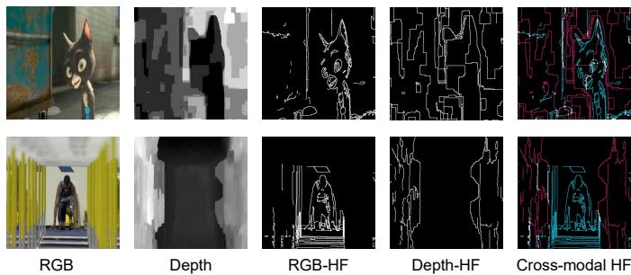  
Fig. 3. Motivation for reliability calibration. Raw RGB and depth inputs exhibit complementary yet locally inconsistent high-frequency responses. In the cross-modal relation map, cyan and magenta denote RGB-only and depthonly responses, respectively, and their coexistence reveals local disagreement.

## B. Mixture of Frequency Experts

Conventional early fusion methods often inadequately leverage modality-specific cues and overlook fine-grained details. To address this, MoFE focuses on the first step of our frequency-aware design: extracting and aggregating crossmodal frequency cues before subsequent adapters calibrate them. It utilizes the Stationary Wavelet Transform (SWT) [20] to perform multi-frequency decomposition and employs adaptive expert-driven aggregation to provide information-rich frequency cues.

Given RGB and auxiliary modality features $\mathcal { F } ^ { \mathrm { r g b } } , \mathcal { F } ^ { \mathrm { a u x } } \in$ $\mathbb { R } ^ { C \times H \times W }$ , where the superscripts rgb and aux indicate the RGB and auxiliary modalities, and C, H, and W denote the channel number, height, and width of the token feature map, respectively, we apply SWT independently to both modalities to extract one low-frequency and three high-frequency subbands:

$$
\begin{array} { r } { \{ \mathcal { C } _ { L } ^ { \mathrm { r g b } } , \mathcal { C } _ { L H } ^ { \mathrm { r g b } } , \mathcal { C } _ { H L } ^ { \mathrm { r g b } } , \mathcal { C } _ { H H } ^ { \mathrm { r g b } } \} = \mathrm { S W T } ( \mathcal { F } ^ { \mathrm { r g b } } ) , } \\ { \{ \mathcal { C } _ { L } ^ { \mathrm { a u x } } , \mathcal { C } _ { L H } ^ { \mathrm { a u x } } , \mathcal { C } _ { H L } ^ { \mathrm { a u x } } , \mathcal { C } _ { H H } ^ { \mathrm { a u x } } \} = \mathrm { S W T } ( \mathcal { F } ^ { \mathrm { a u x } } ) , } \end{array}\tag{1}
$$

where SWT(·) denotes the stationary wavelet transform, $\mathcal { C } _ { L }$ denotes the low-frequency subband, and $\mathcal { C } _ { L H } , \mathcal { C } _ { H L } , \mathcal { C } _ { H H }$ correspond to vertical, horizontal, and diagonal high-frequency components, respectively. For compact notation, we concatenate the three directional high-frequency subbands as:

$$
\mathcal { C } _ { H } ^ { m } = \mathrm { C o n c a t } ( \mathcal { C } _ { L H } ^ { m } , \mathcal { C } _ { H L } ^ { m } , \mathcal { C } _ { H H } ^ { m } ) , \quad m \in \{ \mathrm { r g b } , \mathrm { a u x } \} .\tag{2}
$$

Here m indexes the modality and Concat(·) denotes channelwise concatenation.

Subsequently, we construct four cross-modal frequency pairs by combining low- and high-frequency components across modalities:

$$
\left\{ \begin{array} { l l } { \mathcal { C } _ { 1 } = \mathrm { C o n c a t } ( \mathcal { C } _ { L } ^ { \mathrm { r g b } } , \mathcal { C } _ { L } ^ { \mathrm { a u x } } ) , } \\ { \mathcal { C } _ { 2 } = \mathrm { C o n c a t } ( \mathcal { C } _ { L } ^ { \mathrm { r g b } } , \mathcal { C } _ { H } ^ { \mathrm { a u x } } ) , } \\ { \mathcal { C } _ { 3 } = \mathrm { C o n c a t } ( \mathcal { C } _ { H } ^ { \mathrm { r g b } } , \mathcal { C } _ { L } ^ { \mathrm { a u x } } ) , } \\ { \mathcal { C } _ { 4 } = \mathrm { C o n c a t } ( \mathcal { C } _ { H } ^ { \mathrm { r g b } } , \mathcal { C } _ { H } ^ { \mathrm { a u x } } ) , } \end{array} \right.\tag{3}
$$

Here, $\mathcal { C } _ { 1 }$ concatenates the low-frequency components of RGB and the auxiliary modality, providing a coarse crossmodal structural cue. $\mathcal { C } _ { 2 }$ combines the RGB low-frequency component with the auxiliary high-frequency component, whereas $\mathcal { C } _ { 3 }$ combines the RGB high-frequency component with the auxiliary low-frequency component. $\mathcal { C } _ { 4 }$ concatenates the high-frequency components from both modalities and therefore captures their joint high-frequency cue. These four complementary frequency pairs are supplied to separate experts for adaptive enhancement. Each frequency pair ${ \mathcal { C } } _ { n }$ is then passed through a dedicated expert module $E _ { n } ( \cdot )$ for enhancement:

$$
\widehat { \mathcal { C } } _ { n } = E _ { n } ( \mathcal { C } _ { n } ) , \quad n \in \{ 1 , 2 , 3 , 4 \} ,\tag{4}
$$

where n is the expert index, $E _ { n } ( \cdot )$ denotes the n-th frequency expert, and ${ \widehat { \mathcal { C } } } _ { n }$ is the corresponding enhanced frequency feature.

To adaptively aggregate these enhanced features, a lightweight router predicts normalized routing weights:

$$
\alpha = \mathrm { S o f t m a x } \left( \mathrm { R o u t e r } ( [ \mathcal C _ { 1 } , \mathcal C _ { 2 } , \mathcal C _ { 3 } , \mathcal C _ { 4 } ] ) \right) , \quad \sum _ { n = 1 } ^ { 4 } \alpha _ { n } = 1 .\tag{5}
$$

Here ${ \pmb { \alpha } } = [ \alpha _ { 1 } , \alpha _ { 2 } , \alpha _ { 3 } , \alpha _ { 4 } ]$ denotes the routing-weight vector, $\alpha _ { n }$ is the weight assigned to the n-th expert, [·] denotes feature concatenation for router input, and Softmax(·) normalizes the expert weights. The final fused representation is then computed as a weighted sum:

$$
{ \mathcal { F } } ^ { \mathrm { f u s e d } } = \sum _ { n = 1 } ^ { 4 } \alpha _ { n } { \widehat { \mathcal { C } } } _ { n } .\tag{6}
$$

The fused feature is added to the RGB feature before entering the first frozen transformer block:

$$
\mathcal { F } _ { 1 } ^ { \mathrm { i n } } = \mathcal { F } ^ { \mathrm { r g b } } + \mathcal { F } ^ { \mathrm { f u s e d } } ,\tag{7}
$$

where ${ \mathcal { F } } ^ { \mathrm { f u s e d } }$ is the MoFE output and $\mathcal { F } _ { 1 } ^ { \mathrm { i n } }$ is the input to the first transformer block. In implementation, the weighted joint high-frequency expert output initializes the frequency prior $\mathcal { P } _ { 0 }$ for subsequent RCFAs:

$$
\mathcal { P } _ { 0 } = \alpha _ { 4 } \widehat { \mathcal { C } } _ { 4 } ,\tag{8}
$$

where $\mathcal { P } _ { 0 }$ denotes the initial candidate frequency prior and $\widehat { \mathcal { C } } _ { 4 }$ is the enhanced joint high-frequency cross-modal frequency feature.

The expert-driven frequency-aware design enables the model to dynamically emphasize relevant subband interactions across modalities and provides information-rich frequency cues. Because its routing weights aggregate image-level frequency evidence rather than explicitly evaluating local cross-modal consistency, MoFE does not itself guarantee that every high-frequency response is reliable. This reliability assessment is deferred to RCFA during stage-wise propagation.

## C. Reliability-Calibrated Frequency Adapter

To mitigate the degradation of fine structures caused by token mixing and downsampling in transformer layers, RCFA focuses on the second step of our frequency-aware design:

evaluating and selectively propagating MoFE’s candidate high-frequency residuals across transformer stages. Unlike conventional adapters that operate solely on local features, RCFA introduces cross-layer interaction, frequency-aware enhancement, and reliability calibration in a unified and lightweight design, as illustrated in Fig. 2.

At each transformer stage i, RCFA receives the current encoder feature ${ \mathcal { F } } _ { i }$ and the incoming frequency prior $\mathcal { P } _ { i - 1 }$ aligning the latter to the spatial size and channel dimension of ${ \mathcal { F } } _ { i }$ when necessary. Here i indexes the RCFA insertion stage and $\mathcal { F } _ { i } \in \mathbb { R } ^ { C _ { i } \times \check { H } _ { i } \times W _ { i } }$ . At the first RCFA, the incoming prior is the initial candidate frequency prior $\mathcal { P } _ { 0 }$ . Thereafter, it is the calibrated frequency prior from the preceding RCFA. After alignment, it is still denoted by $\mathcal { P } _ { i - 1 }$ for simplicity. RCFA then constructs a base residual from the encoder feature and a frequency residual from the incoming frequency prior. The high-frequency responses are obtained by average-pooling subtraction:

$$
\mathcal { R } _ { i } ^ { \mathrm { h f } } = \mathcal { F } _ { i } - \mathrm { A v g P o o l } _ { 3 \times 3 } ( \mathcal { F } _ { i } ) ,\tag{9}
$$

$$
\mathcal { D } _ { i } ^ { \mathrm { h f } } = \mathcal { P } _ { i - 1 } - \mathrm { A v g P o o l } _ { 3 \times 3 } ( \mathcal { P } _ { i - 1 } ) ,\tag{10}
$$

where $\mathcal { R } _ { i } ^ { \mathrm { h f } }$ and $\mathcal { D } _ { i } ^ { \mathrm { h f } }$ denote the high-frequency responses of the encoder feature and incoming frequency prior, respectively, and $\mathrm { A v g P o o l _ { 3 \times 3 } ( \cdot ) }$ serves as a low-pass filter to isolate highfrequency details such as edges and textures. Both residual branches are implemented by lightweight bottleneck adapters composed of two $1 \times 1$ convolutional layers:

$$
\begin{array} { r } { A _ { \mathrm { h f } } ( \mathcal { X } ) = W _ { 2 } \left( \mathrm { G E L U } \left( W _ { 1 } \left( \mathcal { X } + \mathcal { X } ^ { \mathrm { h f } } \right) \right) \right) , } \end{array}\tag{11}
$$

where $\boldsymbol { \mathcal { A } } _ { \mathrm { h f } } ( \cdot )$ denotes the high-frequency residual adapter, $\mathcal { X }$ is a generic input feature, $\mathcal { \bar { X } } ^ { \mathrm { { \bar { h f } } } } = \bar { \mathcal { X } } - \bar { \mathrm { A v g P o o l } } _ { 3 \times 3 } ( \bar { \mathcal { X } } )$ is its high-frequency residual, $W _ { 1 } \in \mathbb { R } ^ { C / r \times C }$ and $W _ { 2 } \ \in \ \mathbb { R } ^ { C \times C / r }$ are learnable 1×1 convolutions, $C$ is the channel number of $\mathcal { X } ,$ and r is the channel reduction ratio. We thus obtain the base residual $B _ { i } ^ { \mathrm { r e s } } = \mathcal { A } _ { \mathrm { h f } } ( \mathcal { F } _ { i } )$ and the frequency residual $\mathcal { Q } _ { i } ^ { \mathrm { r e s } } =$ $\mathcal { A } _ { \mathrm { h f } } ( \mathcal { P } _ { i - 1 } )$ , generated from the encoder feature and incoming frequency prior, respectively. The initial candidate frequency prior can contain unreliable responses when auxiliary cues are noisy or spatially misaligned with RGB boundaries. RCFA therefore adopts a dual-gate calibration mechanism. The context gate estimates the overall injection strength from the current feature and incoming frequency prior, while the Reliability-Calibrated Gate (RCG) evaluates their high-frequency consistency to suppress unreliable residuals. Given the encoder high-frequency response $\mathcal { R } _ { i } ^ { \mathrm { h f } }$ and prior response $\mathcal { D } _ { i } ^ { \mathrm { h f } }$ , RCG first computes three bounded reliability cues:

$$
\mathcal { E } _ { i } ^ { \mathrm { e n c } } = \mathrm { M e a n } _ { c } ( | \mathcal { R } _ { i } ^ { \mathrm { h f } } | ) ,
$$

$$
\begin{array} { r } { \mathcal { E } _ { i } ^ { \mathrm { p r i o r } } = \mathrm { M e a n } _ { c } ( | \mathcal { D } _ { i } ^ { \mathrm { h f } } | ) , } \end{array}\tag{12}
$$

(13)

where $\mathcal { E } _ { i } ^ { \mathrm { e n c } }$ and $\mathcal { E } _ { i } ^ { \mathrm { p r i o r } }$ are channel-averaged high-frequency energy maps for the encoder and prior responses, respectively, $| \cdot |$ denotes the element-wise absolute value, and $\mathrm { M e a n } _ { c } ( \cdot )$

denotes channel-wise averaging. Based on these energies, RCG derives consistency, balance, and difference cues:

$$
\rho _ { i } ^ { \mathrm { c o n } } = \frac { 1 } { 2 } \left( 1 + \mathrm { C o s S i m } _ { c } ( \mathcal { R } _ { i } ^ { \mathrm { h f } } , \mathcal { D } _ { i } ^ { \mathrm { h f } } ) \right) ,\tag{14}
$$

$$
\rho _ { i } ^ { \mathrm { b a l } } = 1 - \frac { \Bigl | \mathcal { E } _ { i } ^ { \mathrm { e n c } } - \mathcal { E } _ { i } ^ { \mathrm { p r i o r } } \Bigr | } { \mathcal { E } _ { i } ^ { \mathrm { e n c } } + \mathcal { E } _ { i } ^ { \mathrm { p r i o r } } + \epsilon } ,\tag{15}
$$

$$
\rho _ { i } ^ { \mathrm { { d i f f } } } = \exp \left( { - \frac { \mathrm { { M e a n } } _ { c } \left( { \left| \mathcal { R } _ { i } ^ { \mathrm { { h f } } } - \mathcal { D } _ { i } ^ { \mathrm { { h f } } } \right| } \right) } { \mathcal { E } _ { i } ^ { \mathrm { { e n c } } } + \mathcal { E } _ { i } ^ { \mathrm { { p r i o r } } } + \epsilon } } \right) ,\tag{16}
$$

where $\rho _ { i } ^ { \mathrm { c o n } } , \rho _ { i } ^ { \mathrm { b a l } } ,$ , and $\rho _ { i } ^ { \mathrm { d i f f } }$ denote the high-frequency consistency, energy-balance, and difference-suppression cues, respectively, $\mathrm { C o s S i m } _ { c } ( \cdot , \cdot )$ computes cosine similarity along the channel dimension, ϵ is a small constant for numerical stability, and exp(·) is the exponential function. These cues are concatenated and transformed by a lightweight convolutional gate:

$$
\mathcal { G } _ { i } ^ { \mathrm { r e l } } = 1 + \eta \left( 2 \sigma \left( \phi ( [ \rho _ { i } ^ { \mathrm { c o n } } , \rho _ { i } ^ { \mathrm { b a l } } , \rho _ { i } ^ { \mathrm { d i f f } } ] ) \right) - 1 \right) ,\tag{17}
$$

where $\mathcal { G } _ { i } ^ { \mathrm { r e l } }$ is the reliability calibration weight, $\phi ( \cdot )$ denotes two lightweight convolutional layers, [·] denotes channel-wise concatenation of the three cue maps, $\sigma ( \cdot )$ is the sigmoid function, and $\eta$ is a learnable residual scale initialized to zero. The other part of the dual-gate mechanism is a lightweight context gate $\psi ( \mathcal { F } _ { i } + \mathcal { P } _ { i - 1 } )$ , where $\psi ( \cdot )$ is implemented by global average pooling followed by two $1 \times 1$ convolutions and a sigmoid activation. The final adapter residual is formulated as:

$$
\mathcal { F } _ { i } ^ { \mathrm { r e s } } = \mathcal { B } _ { i } ^ { \mathrm { r e s } } + \gamma _ { i } \psi ( \mathcal { F } _ { i } + \mathcal { P } _ { i - 1 } ) \odot \mathcal { G } _ { i } ^ { \mathrm { r e l } } \odot \mathcal { Q } _ { i } ^ { \mathrm { r e s } } ,\tag{18}
$$

where $\mathcal { F } _ { i } ^ { \mathrm { r e s } }$ is the residual injected into the i-th transformer block, $\gamma _ { i }$ is a learnable frequency scale initialized to zero, ⊙ denotes element-wise multiplication with broadcasting when necessary, $\psi ( \mathcal { F } _ { i } + \mathcal { P } _ { i - 1 } )$ is the context gate, $\mathcal { G } _ { i } ^ { \mathrm { r e l } }$ is the Reliability-Calibrated Gate, and $\mathcal { Q } _ { i } ^ { \mathrm { r e s } }$ is the frequency residual. The two gates jointly form the dual-gate calibration mechanism, enabling the model to learn both how strongly and how reliably the frequency residual should be injected. With $\gamma _ { i }$ initialized to zero, the frequency-residual branch is initially disabled and is gradually activated during training to enhance useful frequency residuals and suppress unreliable ones. Finally, the calibrated residual is injected before the original transformer block:

$$
\mathcal { F } _ { i } ^ { \mathrm { o u t } } = \mathrm { B l o c k } _ { i } \left( \mathcal { F } _ { i } + \mathcal { F } _ { i } ^ { \mathrm { r e s } } \right) ,\tag{19}
$$

where Block (·) denotes the frozen transformer block of the adopted SAM backbone at stage i, and $\mathcal { F } _ { i } ^ { \mathrm { o u t } }$ is its output feature. The residual $\mathcal { F } _ { i } ^ { \mathrm { r e s } }$ is propagated as the calibrated frequency prior $\mathcal { P } _ { i }$ for the next RCFA. The process is repeated hierarchically across transformer stages. By leveraging current encoder features and reliability-calibrated frequency priors, RCFA preserves spatial precision and enhances boundary sensitivity.

## D. Hypernetwork-guided Semantic-Structural Decoder

To produce accurate and structure-preserving saliency maps, we use a lightweight Hypernetwork-guided Semantic-Structural Decoder (HSSD) to convert reliability-calibrated encoder features into precise object masks. Rather than introducing another independent fusion objective, HSSD comprises two lightweight decoding paths: a semantic path preserves the adopted SAM backbone’s hypernetwork-based mask prior, and a structural path restores dense boundary details. The two embeddings are fused at the feature level inside the mask decoder.

Let $\{ \mathcal { F } _ { i } ^ { m i x } \} _ { i = 1 } ^ { 4 }$ denote the four encoder-stage features collected for decoding. At stages equipped with RCFA, $\mathcal { F } _ { i } ^ { m i x } = \mathcal { F } _ { i } ^ { \mathrm { { o u t } } }$ . At the remaining stage, $\mathcal { F } _ { i } ^ { m i x }$ is the output of the corresponding frozen block of the adopted SAM backbone. A lightweight multi-scale neck first aligns their resolutions and channels, producing $\{ \widehat { \mathcal { F } } _ { i } \} _ { i = 1 } ^ { 4 }$ . We denote the aligned feature levels used by the decoder as $\widehat { \mathcal { F } } _ { 3 2 } , ~ \widehat { \mathcal { F } } _ { 6 4 }$ , and $\widehat { \mathcal { F } } _ { 1 2 8 }$ according to their spatial resolutions. These aligned features are then directed into two complementary decoding paths. The semantic path employs an FPN-style aggregation and the mask decoder upscaling path of the adopted SAM backbone to produce mask embeddings:

$$
\mathcal { F } _ { \mathrm { F P N } } = \mathrm { F P N } ( \{ \widehat { \mathcal { F } } _ { i } \} ) ,
$$

$$
\mathcal { U } _ { \mathrm { S A M } } = \mathrm { U p s c a l e } _ { \mathrm { S A M } } ( \mathcal { F } _ { \mathrm { F P N } } ) .\tag{20}
$$

(21)

where $\mathcal { F } _ { \mathrm { F P N } }$ is the feature pyramid output, FPN(·) denotes the SAM FPN neck, $\mathrm { U p s c a l e } _ { \mathrm { S A M } } ( \cdot )$ denotes the upscaling path in the SAM mask decoder, and $\mathcal { U } _ { \mathrm { S A M } }$ is the semantic mask embedding.

The structural path is implemented with a lightweight Mamba-based decoder to recover dense boundary details that may be weakened by the semantic path. It takes three decoder feature levels at resolutions $3 2 \times 3 2 , 6 4 \times 6 4$ , and 128 × 128, and progressively projects and fuses them via top-down refinement:

$$
\mathcal { O } _ { 3 2 } = \omega ( \widehat { \mathcal { F } } _ { 3 2 } ) ,\tag{22}
$$

$$
\mathcal { O } _ { 6 4 } = \omega \big ( \widehat { \mathcal { F } } _ { 6 4 } + \mathrm { U p } ( \mathcal { O } _ { 3 2 } ) \big ) ,\tag{23}
$$

$$
\mathcal { O } _ { 1 2 8 } = \omega ( \widehat { \mathcal { F } } _ { 1 2 8 } + \mathrm { U p } ( \mathcal { O } _ { 6 4 } ) ) .\tag{24}
$$

where $\mathcal { O } _ { 3 2 } , \mathcal { O } _ { 6 4 }$ , and $\mathcal { O } _ { 1 2 8 }$ are progressively refined structural features at the corresponding resolutions, $\omega ( \cdot )$ is a $3 ~ \times$ 3 convolution followed by normalization and activation, and $\mathrm { U p } ( \cdot )$ denotes bilinear upsampling to the next higher resolution. A final VSS block [21] is then applied to model long-range dependencies:

$$
\mathcal { U } _ { \mathrm { M a m b a } } = \mathrm { V S S } ( \mathcal { O } _ { 1 2 8 } ) .\tag{25}
$$

where $\mathrm { V S S } ( \cdot )$ denotes the visual state-space block used in the Mamba decoder, and $\mathcal { U } _ { \mathrm { M a m b a } }$ is the structural embedding.

Instead of directly adding two prediction logits, the mask decoder adaptively fuses the semantic embedding and the structural embedding through a lightweight gate:

$$
\mathcal { G } ^ { \mathrm { d e c } } = \sigma ( \varphi ( [ \mathcal { U } _ { \mathrm { S A M } } , \mathcal { U } _ { \mathrm { M a m b a } } ] ) ) ,\tag{26}
$$

$$
\mathcal { U } _ { \mathrm { f u s e } } = \mathcal { G } ^ { \mathrm { d e c } } \odot \mathcal { U } _ { \mathrm { S A M } } + ( 1 - \mathcal { G } ^ { \mathrm { d e c } } ) \odot \mathcal { U } _ { \mathrm { M a m b a } } ,\tag{27}
$$

where ${ \mathcal { G } } ^ { \mathrm { d e c } }$ is the decoder fusion gate, $\varphi ( \cdot )$ is a lightweight $1 \times 1$ convolutional gate, $\sigma ( \cdot )$ is the sigmoid activation, [·] denotes channel-wise concatenation, ⊙ denotes element-wise multiplication, and $\mathcal { U } _ { \mathrm { f u s e } }$ is the fused semantic-structural embedding. This adaptive fusion allows the semantic embedding to dominate coherent object regions while retaining structural responses near local transitions, avoiding the fixed trade-off of direct feature addition. The final saliency map is then generated by applying the mask hypernetwork to the fused embedding:

$$
\begin{array} { r } { S = \mathrm { S i g m o i d } \left( \mathcal { H } _ { \mathrm { m a s k } } ( \mathcal { U } _ { \mathrm { f u s e } } ) \right) . } \end{array}\tag{28}
$$

where $\mathcal { H } _ { \mathrm { m a s k } } ( \cdot )$ denotes the SAM mask hypernetwork and $s$ is the predicted saliency map. Meanwhile, the mask hypernetwork weights are also applied to the Mamba structural embedding to produce an auxiliary edge prediction for boundary supervision.

## E. Loss Function

To effectively train HSSD, distinct loss functions independently supervise semantic completeness and structural precision. Specifically, the Mamba-based structural path, tasked with capturing fine-grained spatial details and boundary precision, is supervised using Dice loss [22]. The edge target is generated from the boundary of the ground-truth saliency mask, and the Dice loss robustly addresses class imbalance, notably improving accuracy along object boundaries.

For the semantic mask decoder inherited from the adopted SAM backbone, which emphasizes coarse but semantically coherent segmentation, a combined loss function incorporating both Dice and Intersection-over-Union (IoU) losses [23] is employed to simultaneously enforce region consistency and spatial overlap accuracy:

$$
\ell _ { \mathrm { m a s k } } = \ell _ { \mathrm { d i c e } } + \ell _ { \mathrm { i o u } } .\tag{29}
$$

where $\ell _ { \mathrm { m a s k } }$ is the semantic mask loss, and $\ell _ { \mathrm { d i c e } }$ and $\ell _ { \mathrm { i o u } }$ denote the Dice and IoU losses computed between the predicted saliency map and the ground-truth mask, respectively.

Consequently, the overall training objective integrates these complementary losses:

$$
\begin{array} { r } { \mathcal { L } = \ell _ { \mathrm { m a s k } } + \ell _ { \mathrm { e d g e } } , } \end{array}\tag{30}
$$

where L denotes the total training loss, $\ell _ { \mathrm { e d g e } } = \ell _ { \mathrm { d i c e } }$ explicitly supervises the Mamba-based decoder’s edge predictions, while $\ell _ { \mathrm { m a s k } }$ optimizes the semantic decoding path of the adopted SAM backbone.

Through the complementary loss function, each decoder branch is guided to its specialized task, collectively contributing to the generation of accurate, robust, and structurally coherent saliency predictions.

## III. EXPERIMENT

## A. Experiment Setup

Datasets and Evaluation Metrics. We evaluate our proposed method across three categories of multi-modal salient object detection benchmarks: RGB-D, RGB-T, and RGB-NIR datasets. For RGB-D SOD, experiments are conducted on four widely used datasets in the final release, including

NJU2K [24], NLPR [25], SSD [26], and STERE [27]. Following recent protocols [28], [29], we use 1,485 samples from NJU2K and 700 from NLPR for training. The remaining datasets are used exclusively for testing. For RGB-T SOD, we conduct experiments on three widely used benchmark datasets: VT821 [30], VT1000 [31], and VT5000 [32]. Following the common setting in these methods [33], [34], we use 2,500 image pairs from VT5000 for training, while the remaining 2,500, along with VT821 and VT1000, are used for testing. In addition, to assess cross-modal generalization, we directly apply the trained RGB-T weights to an RGB-NIR dataset [35] for inference, without any additional fine-tuning.

For evaluation, we adopt four widely used metrics: F-measure $\left( F _ { \beta } \right)$ , Mean Absolute Error (M), E-measure $\left( E _ { m } \right)$ S-measure $\left( { { S _ { m } } } \right)$

Implementation Details. The proposed framework is implemented using the PyTorch platform and trained on a workstation equipped with an Intel Core Ultra 9 285K CPU and NVIDIA RTX 5090 GPU. We initialize the adopted SAM backbone from the officially released checkpoint [5] and retain it in a frozen state. All input images are resized to a resolution of $5 1 2 \times 5 1 2$ to align with the adopted SAM backbone. During training, data augmentation techniques such as random flipping, rotation, and cropping are employed to improve generalization and robustness. $\mathbf { S } ^ { 3 } \mathbf { A } \mathbf { M }$ is trained for 50 epochs with a batch size of 8 using the AdamW optimizer. The initial learning rate is set to $1 \times 1 0 ^ { - 4 }$ , with a weight decay of $5 \times 1 0 ^ { - 4 }$ and betas set to (0.9, 0.999). Gradient clipping is applied with a threshold of 0.5 to stabilize optimization.

## B. Quantitative Comparisons

RGB-D Comparisons. We compare $\mathbf { S } ^ { 3 } \mathbf { A } \mathbf { M }$ against six RGB-D SOD methods, including BTNet [11], KAN-SAM [7], CAVER [36], CPNet [37], MAGNet [38], and LESOD [39]. As summarized in Table $\mathrm { I } , \mathrm { S ^ { 3 } A M }$ obtains the highest $F _ { \beta }$ and the lowest MAE on all four benchmarks. Compared with the strongest prior $F _ { \beta }$ results, the relative improvements are 0.4%, 1.0%, 0.3%, and 0.4% on NJU2K, NLPR, SSD, and STERE, respectively. The corresponding MAE decreases are 0.003, 0.002, 0.002, and 0.001. Figure 4 further shows favorable precision at high recall, particularly on SSD and STERE. While individual PR curves may cross at particular thresholds, the consistently stronger $F _ { \beta }$ and MAE results show that $\mathbf { S } ^ { 3 } \mathbf { A } \mathbf { M }$ maintains a more favorable overall precision-recall balance across varied depth quality and scene structures.

RGB-T Comparisons. We compare $\mathbf { S } ^ { 3 } \mathbf { A } \mathbf { M }$ with six RGB-T SOD methods, including CMDBIF [40], CAVER [36], SMR-Net [41], LAFB [42], UMINet [43], and LESOD [39]. Table II shows that $\mathbf { S } ^ { 3 } \mathbf { A } \mathbf { M }$ achieves the highest $F _ { \beta }$ and $S _ { m }$ on all three benchmarks, with the lowest or tied-lowest MAE. Relative to the strongest competing $F _ { \beta }$ scores, the gains are 4.5% on VT5000, 2.4% on VT1000, and 3.3% on VT821. Although the competing methods attain comparable $E _ { m }$ on VT5000 and VT1000, the consistently stronger $F _ { \beta } , S _ { m } ,$ and MAE results indicate more reliable overall saliency prediction in thermal scenarios.

RGB-NIR Comparisons. To assess cross-modal generalization, we evaluate $\mathbf { S } ^ { 3 } \mathbf { A } \mathbf { M }$ under a zero-shot protocol on the RGB–NIR dataset, without additional fine-tuning, against three representative RGB-NIR methods: RC [44], DCL [45], and SOD-8S+ [46]. Table III reports average F-measure $( F _ { \mathrm { a v g } } )$ , maximum F-measure $( F _ { \mathrm { m a x } } ) , \ F _ { \beta }$ , MAE (M), $E _ { m } ,$ and $\breve { S } _ { m } . \ S ^ { 3 } { \mathrm { A M } }$ attains the best result on every metric among the compared methods. In particular, it improves $F _ { \beta }$ by 23.6% and reduces MAE from 0.061 to 0.020 over the strongest compared method, supporting the transferability of the proposed adaptation to NIR inputs.

TABLE I  
COMPARISON WITH DIFFERENT METHODS ON RGB-D DATASETS. BEST IN BOLD.
<table><tr><td colspan="2">Metric</td><td></td><td>CAVER [36]</td><td>CPNet [37]</td><td>MAGNet 1 [38]</td><td>KAN-SAM [7]</td><td>BTNet [11]</td><td>LESOD [39]</td><td>Ours</td></tr><tr><td rowspan="4">NJU2K</td><td> $F _ { \beta }$ </td><td>←</td><td>0.901</td><td>0.923</td><td>0.912</td><td>0.935</td><td>0.917</td><td>0.898</td><td>0.939</td></tr><tr><td> $\smash { \mathcal { M } _ { \perp } }$ </td><td>1</td><td>0.031</td><td>0.025</td><td>0.027</td><td>0.022</td><td>0.025</td><td>0.032</td><td>0.019</td></tr><tr><td> $E _ { m }$ </td><td>↑</td><td>0.923</td><td>0.935</td><td>0.928</td><td>0.942</td><td>0.932</td><td>0.925</td><td>0.939</td></tr><tr><td> $S _ { m }$ </td><td>↑</td><td>0.921</td><td>0.935</td><td>0.929</td><td>0.939</td><td>0.932</td><td>0.922</td><td>0.939</td></tr><tr><td rowspan="4">NLLPR</td><td rowspan="4"> $F _ { \beta }$   $E _ { m }$ </td><td>←</td><td>0.895</td><td>0.918</td><td>0.910</td><td>0.925</td><td>0.917</td><td>0.897</td><td>0.934</td></tr><tr><td> $\smash { \mathcal { M } _ { \perp } }$  1</td><td>0.020</td><td>0.016</td><td>0.017</td><td>0.017</td><td>0.016</td><td>0.020</td><td>0.014</td></tr><tr><td>↑</td><td>0.960</td><td>0.970</td><td>0.964</td><td>0.967</td><td>0.969</td><td>0.961</td><td>0.974</td></tr><tr><td> $S _ { m }$  ↑</td><td>0.929</td><td>0.939</td><td>0.938</td><td>0.939</td><td>0.941</td><td>0.933</td><td>0.944</td></tr><tr><td rowspan="5">SSD</td><td rowspan="4"> $\mathcal { M } .$   $E _ { m }$ </td><td> $F _ { \beta }$  ←→</td><td>0.824</td><td>0.857</td><td>0.837</td><td>0.889</td><td></td><td>0.819</td><td>0.892</td></tr><tr><td></td><td>0.042</td><td>0.035</td><td>0.043</td><td>0.026</td><td></td><td>0.048</td><td>0.024</td></tr><tr><td>←</td><td>0.911</td><td>0.917</td><td>0.915</td><td>0.934</td><td></td><td>0.907</td><td>0.936</td></tr><tr><td> $S _ { m }$  ↑</td><td>0.878</td><td>0.892</td><td>0.884</td><td>0.910</td><td></td><td>0.879</td><td>0.918</td></tr><tr><td rowspan="4">STERE</td><td rowspan="4"> $F _ { \beta }$  ↑  $\mathcal { M } \downarrow$ </td><td></td><td>0.895</td><td>0.893</td><td>0.911</td><td>0.902</td><td></td><td>0.878</td><td>0.915</td></tr><tr><td></td><td>0.881 0.033</td><td>0.029</td><td>0.030</td><td>0.025</td><td>0.028</td><td>0.038</td><td>0.024</td></tr><tr><td> $E _ { m }$  ←</td><td>0.931</td><td>0.933</td><td>0.930</td><td>0.937</td><td>0.940</td><td>0.937</td><td>0.937</td></tr><tr><td> $S _ { m } \uparrow$ </td><td>0.913</td><td>0.920</td><td>0.922</td><td>0.930</td><td>0.927</td><td>0.905</td><td>0.930</td></tr></table>

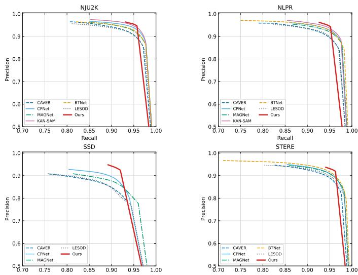  
Fig. 4. Precision-recall curves of competitive RGB-D salient object detection methods on the NJU2K, NLPR, SSD, and STERE datasets.

## C. Qualitative Comparisons

To further assess the effectiveness of the proposed method, we present qualitative comparisons against competitive RGB-D and RGB-T methods (Fig. 5 and Fig. 6) and representative RGB-NIR methods (Fig. 7). Across a variety of scenes, $\mathbf { S } ^ { 3 } \mathbf { A } \mathbf { M }$ produces sharper boundaries and fewer visual artifacts. In RGB-D examples, it better preserves thin or disconnected target parts while avoiding depth-induced leakage into adjacent regions. In modality-degraded RGB-T scenes, it more accurately delineates targets despite limited or noisy RGB evidence. The RGB-NIR results further show fewer false-positive responses on visually distracting backgrounds. Together, these observations indicate that calibrated frequency cues improve local structural recovery without sacrificing region completeness.

TABLE II  
COMPARISON WITH DIFFERENT METHODS ON RGB-T DATASETS. BEST IN BOLD.
<table><tr><td></td><td>Metric</td><td>CMDBIF [40]</td><td>CAVER [36]</td><td>SMR-Net [41]</td><td>LAFB [42]</td><td>UMINet [43]</td><td>LESOD [39]</td><td>Ours</td></tr><tr><td rowspan="4">V750</td><td> $F _ { \beta } \uparrow$ </td><td>0.846</td><td>0.849</td><td>0.859</td><td>0.841</td><td>0.820</td><td>0.839</td><td>0.898</td></tr><tr><td> $\mathcal { M } \downarrow$ </td><td>0.032</td><td>0.028</td><td>0.030</td><td>0.030</td><td>0.035</td><td>0.032</td><td>0.020</td></tr><tr><td> $E _ { m }$  ←</td><td>0.933</td><td>0.935</td><td>0.935</td><td>0.931</td><td>0.915</td><td>0.926</td><td>0.950</td></tr><tr><td> $S _ { m }$  ↑</td><td>0.886</td><td>0.899</td><td>0.891</td><td>0.893</td><td>0.882</td><td>0.893</td><td>0.921</td></tr><tr><td rowspan="4">V710</td><td> $F _ { \beta }$ </td><td>↑ 0.909</td><td>0.912</td><td>0.899</td><td>0.905</td><td>0.896</td><td>0.897</td><td>0.934</td></tr><tr><td> $\mathcal { M } \downarrow$ </td><td>0.019</td><td>0.016</td><td>0.020</td><td>0.018</td><td>0.021</td><td>0.020</td><td>0.013</td></tr><tr><td> $E _ { m }$  ←</td><td>0.952</td><td>0.949</td><td>0.945</td><td>0.945</td><td>0.941</td><td>0.937</td><td>0.955</td></tr><tr><td> $S _ { m }$  ↑</td><td>0.927</td><td>0.938</td><td>0.924</td><td>0.932</td><td>0.926</td><td>0.929</td><td>0.943</td></tr><tr><td rowspan="4">V7821</td><td> $F _ { \beta }$  ←  $\mathcal { M } .$ </td><td>0.837</td><td>0.846</td><td>0.844</td><td>0.817 0.034</td><td>0.782</td><td>0.827</td><td>0.874</td></tr><tr><td>→</td><td>0.032</td><td>0.026</td><td>0.030</td><td></td><td>0.054</td><td>0.033</td><td>0.025</td></tr><tr><td> $E _ { m }$  ↑↑</td><td>0.923</td><td>0.928</td><td>0.920</td><td>0.915</td><td>0.879</td><td>0.917</td><td>0.931</td></tr><tr><td> $S _ { m }$ </td><td>0.882</td><td>0.897</td><td>0.888</td><td>0.884</td><td>0.905</td><td>0.897</td><td>0.910</td></tr></table>

TABLE III

COMPARISON WITH REPRESENTATIVE RGB-NIR METHODS. BEST IN BOLD.
<table><tr><td>Methods</td><td> $F _ { \mathrm { a v g } } ^ { \mathrm { ~ } } \mathrm { { ~ } }$  ←</td><td> $F _ { \mathrm { m a x } }$  ↑</td><td> $F _ { \beta } \uparrow$ </td><td> $\mathcal { M } \downarrow$ </td><td> $E _ { m }$  ↑</td><td> $S _ { m } \uparrow$ </td></tr><tr><td>RC [44]</td><td>0.664</td><td>0.736</td><td>0.442</td><td>0.148</td><td>0.810</td><td>0.724</td></tr><tr><td>DCL [45]</td><td>0.779</td><td>0.838</td><td>0.660</td><td>0.076</td><td>0.881</td><td>0.796</td></tr><tr><td>SOD8s+ [46]</td><td>0.803</td><td>0.850</td><td>0.745</td><td>0.061</td><td>0.894</td><td>0.828</td></tr><tr><td>Ours</td><td>0.928</td><td>0.941</td><td>0.921</td><td>0.020</td><td>0.964</td><td>0.930</td></tr></table>

## D. Ablation Studies

Table IV reports the component ablations. The first row is the SAM baseline, where only the decoder and FPN neck are trainable and the encoder is frozen. When RCFA is evaluated without MoFE, we use the additive prior $\mathcal { P } _ { 0 } = \mathcal { F } ^ { \mathrm { r g b } } + \mathcal { F } ^ { \mathrm { a u x } }$ to isolate expert-based frequency construction. Introducing MoFE raises $F _ { \beta }$ from 0.919 to 0.931 on NJU2K and from 0.901 to 0.917 on NLPR, while reducing MAE by 0.005 and 0.003, respectively. Adding RCFA to MoFE further improves $F _ { \beta }$ to 0.932 and 0.923, showing that the initial frequency cues benefit from stage-wise calibration rather than direct propagation alone. The full configuration reaches 0.939 and 0.934, with the lowest MAE on both datasets. The comparison between the MoFE-free RCFA–HSSD configuration and the full model also shows that expert-based frequency construction remains beneficial after the decoder is introduced.

TABLE IV  
COMPONENT ANALYSIS ON NJU2K AND NLPR. BEST IN BOLD.
<table><tr><td colspan="4">Base MoFE RCFA HSSD</td></tr><tr><td colspan="3"></td></tr><tr><td>√</td><td> $F _ { \beta } \uparrow \mathcal { M } \downarrow E _ { m } \uparrow S _ { m }$ </td></tr><tr><td>√</td><td>|0.919 0.028 0.928 0.926 |0.901 0.020 0.96</td></tr><tr><td>√</td><td>0.926 0.931 0.023 0.929 0.935 0.917 0.0170.967 0.936</td></tr><tr><td>√ √</td><td></td></tr><tr><td>√ √ √ √</td><td>0.931 0.0210.9340.938 0.918 0.017 0.965 0.936</td></tr><tr><td>0.932 0.022 0.937 0.937</td><td>0.923 0.016 0.970 0.938</td></tr><tr><td>√ √ √ √</td><td>0.939 0.019 0.939 0.939 0.934 0.0140.9740.944</td></tr></table>

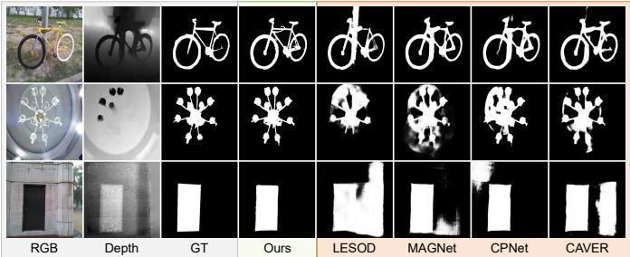  
Fig. 5. Qualitative comparison with competitive methods on RGB-D datasets.

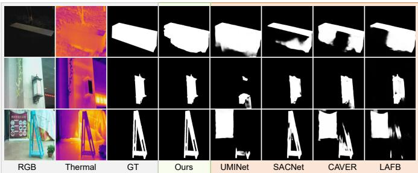  
Fig. 6. Qualitative comparison with competitive methods on RGB-T datasets.

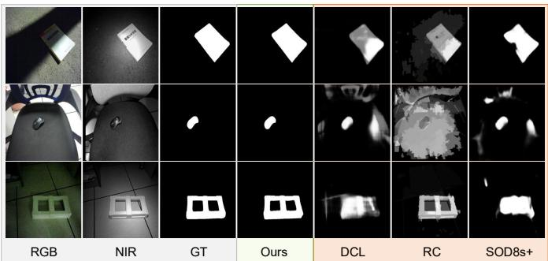  
Fig. 7. Qualitative comparison with representative RGB-NIR methods.

To isolate the dual-gate calibration mechanism within RCFA, we remove the Context Gate and Reliability-Calibrated Gate separately or jointly while retaining all other components. As shown in Table V, removing either gate reduces $F _ { \beta }$ from 0.939 to 0.938 on NJU2K and from 0.934 to 0.932 or 0.931 on NLPR. Removing both gates further decreases $F _ { \beta }$ to 0.937 and 0.931. The larger degradation on NLPR indicates that contextual injection control and encoder–prior reliability calibration provide complementary cues when auxiliary information is less stable.

Figure 9 visualizes token features from a representative RGB-D sample using t-SNE. The baseline shows dispersed groups and local inter-class mixing. MoFE improves the initial separation, RCFA increases feature compactness, and the full model yields the clearest foreground-background separation.

Figure 8 presents qualitative ablations. From left to right, the fourth through seventh prediction columns show the full model, the baseline, the model with MoFE, and the model with MoFE and RCFA. The progressive refinement sharpens object boundaries while preserving semantic completeness.

TABLE V  
DUAL-GATE CALIBRATION ANALYSIS ON NJU2K AND NLPR.
<table><tr><td rowspan="2">Variant</td><td colspan="4">NJU2K</td></tr><tr><td> $\left| F _ { \beta } \uparrow \mathcal { M } \downarrow E _ { m } \right.$  1</td><td> $\harpoonright S _ { m }$  ←  $F _ { \beta }$  ←</td><td>NLPR  $\mathcal { M } \downarrow$ </td><td> $E _ { m }$  1  $\setminus S _ { m }$  ↑</td></tr><tr><td>w/o Context Gate</td><td>|0.938 0.020 0.937</td><td>0.939</td><td>|0.932 0.014 0.974</td><td>0.943</td></tr><tr><td>w/o Reliability Gate</td><td>0.9380.019 0.935</td><td>0.939</td><td>0.9310.0140.973</td><td>0.943</td></tr><tr><td>w/o Both Gates</td><td>0.9370.019 0.931 </td><td>0.939</td><td>0.9310.0140.974</td><td>0.943</td></tr><tr><td>Full model</td><td>0.939 0.0190.939</td><td>0.939</td><td>0.9340.0140.9740.944</td><td></td></tr></table>

TABLE VI

COMPARISON OF FUSION STRATEGIES ON NJU2K AND NLPR.
<table><tr><td>Strategy</td><td>NJU2K  $\left| F _ { \beta } \uparrow \mathcal { M } \downarrow E _ { m } \uparrow S _ { m } \right.$ </td><td>一 NLPR  $\left| F _ { \beta } \right|$  ↑M↓Em</td><td>↑Sm ↑</td><td>(M)</td><td>[Params. FLOPs (G)</td></tr><tr><td>Early</td><td>0.931 0.021 0.934</td><td>|0.918 0.017</td><td>0.936</td><td>223.8</td><td>420.1</td></tr><tr><td>Middle</td><td>0.937 0.020 0.935</td><td>0.938 0.941</td><td>0.965 0.923 0.016 0.969</td><td>438.7</td><td>816.7</td></tr><tr><td>Late</td><td>0.937 0.019 0.939</td><td>0.941</td><td>0.920 0.016 0.966</td><td>0.940 0.937 438.6</td><td>816.7</td></tr></table>

## E. Complexity Analysis

Table VII reports total and trainable parameters, FLOPs, and throughput at 512 × 512 resolution on an RTX 5090. The full model contains 224.36M total and 12.20M trainable parameters (5.4%), with 428.1G FLOPs and 45.8 FPS. It also runs at about 5 FPS on an NVIDIA Orin edge computing device. Compared with the baseline, MoFE, RCFA, and HSSD only add 0.30M, 4.87M, and 0.30M trainable parameters, respectively. KAN-SAM [7], a SAM-based adaptation method, reports 643.588M parameters, 1824G FLOPs, and 4 FPS, corresponding to about 2.9× parameters and 4.3× FLOPs of S3AM. HyPSAM (SAMv2) [9], a two-stage Swin-B and ViT-H pipeline, reports 817.6M parameters, 3033.4G FLOPs, and 3 FPS. These costs illustrate the efficiency benefit of avoiding an additional prompt-generation and refinement stage.

## F. Fusion Strategy Analysis

Table VI compares early, middle, and late fusion. Early fusion adds Frgb and Faux before the first transformer block of a shared SAM encoder, without MoFE, thereby isolating the fusion stage. Middle fusion uses two encoder branches with stage-wise interaction, whereas late fusion combines the two representations only at the final stage. Middle fusion improves $F _ { \beta }$ from 0.931 to 0.937 on NJU2K and from 0.918 to 0.923 on NLPR, but requires 438.7M parameters and 816.7G FLOPs. Late fusion has comparable overhead, with 438.6M parameters and 816.7G FLOPs, compared with 223.8M parameters and

TABLE VII  
COMPARISON OF MODEL COMPLEXITY AND INFERENCE EFFICIENCY.
<table><tr><td colspan="4">Base MoFE RCFA HSSD</td><td colspan="4">Model Tunable FLOPs (G) FPS Params. (M) Params. (M)</td></tr><tr><td></td><td></td><td></td><td>218.89</td><td></td><td></td><td></td><td></td></tr><tr><td>√</td><td></td><td></td><td>219.19</td><td></td><td>6.73 7.03</td><td>412.5 420.6</td><td>52.4 49.2</td></tr><tr><td>√</td><td>√</td><td>√</td><td>224.06</td><td></td><td>11.90</td><td>427.0</td><td>47.6</td></tr><tr><td>√ √</td><td>√ √</td><td>√ √</td><td>224.36</td><td></td><td>12.20</td><td>428.1</td><td>45.8</td></tr></table>

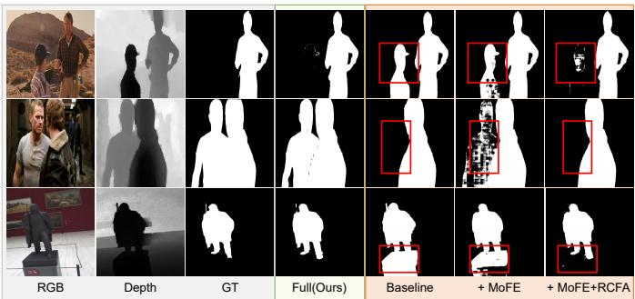  
Fig. 8. Qualitative ablation results of the proposed components.

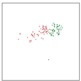  
(a) Baseline

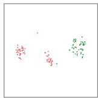

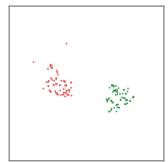  
(b) MoFE  
(c) MoFE+RCFA

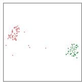  
(d) Full  
Fig. 9. t-SNE visualization of token features from a representative RGB-D sample. Red and green markers denote background and foreground token features, respectively. The proposed components progressively improve interclass separation and intra-class compactness.

420.1G FLOPs for early fusion. Thus, early fusion offers a favorable efficiency-performance trade-off, while the gains from the dual-encoder alternatives remain modest relative to their nearly doubled cost.

## IV. CONCLUSION

In this paper, we proposed S3AM, a single-stream framework for multi-modal salient object detection built upon the adopted SAM backbone. By coupling early cross-modal fusion with reliability-calibrated frequency adaptation, S3AM retains informative structural details while limiting the propagation of unreliable auxiliary cues. To adaptively model multi-frequency and cross-modal interactions, MoFE constructs initial frequency cues at the early stage. RCFA then evaluates, calibrates, and selectively propagates the calibrated residual throughout the encoder through dual-gate control of injection strength and RGB–auxiliary high-frequency reliability. Finally, HSSD converts the reliability-calibrated features into saliency maps by combining the adopted SAM backbone’s hypernetwork-based semantic mask prior with structural detail recovery. Experiments on RGB-D, RGB-T, and RGB-NIR benchmarks demonstrate that S3AM achieves competitive performance without duplicating foundationbackbone computation.

## REFERENCES

[1] Xiao Wang, Xiujun Shu, Shiliang Zhang, Bo Jiang, Yaowei Wang, Yonghong Tian, and Feng Wu, “MFGNet: Dynamic modality-aware filter generation for RGB-T tracking,” IEEE Trans. Multimedia, vol. 25, pp. 4335–4348, 2022.

[2] Qishun Wang, Zhengzheng Tu, Bo Jiang, Chenglong Li, Pingping Zhang, and Jin Tang, “Multi-graph cross diffusion attention network for alignment-free RGBT video object detection,” Int. J. Comput. Vis., vol. 134, no. 8, pp. 375, 2026.

[3] Yang Gao, Wencan Li, Shiyu Liang, Aimin Hao, and Xiaohui Tan, “Saliency-aware foveated path tracing for virtual reality rendering,” IEEE Trans. Vis. Comput. Graph., 2025.

[4] Zhou Lu, Guang-Hai Liu, Zuo-Yong Li, and Bo-Jian Zhang, “Image retrieval using deep saliency edge feature,” Eng. Appl. Artif. Intell., vol. 149, pp. 110416, 2025.

[5] Nikhila Ravi, Valentin Gabeur, Yuan-Ting Hu, Ronghang Hu, Chaitanya Ryali, Tengyu Ma, Haitham Khedr, Roman Radle, Chloe Rolland, Laura¨ Gustafson, et al., “SAM 2: Segment anything in images and videos,” arXiv preprint arXiv:2408.00714, 2024.

[6] Tianrun Chen, Lanyun Zhu, Chaotao Deng, Runlong Cao, Yan Wang, Shangzhan Zhang, Zejian Li, Lingyun Sun, Ying Zang, and Papa Mao, “SAM-Adapter: Adapting segment anything in underperformed scenes,” in Proc. IEEE/CVF Int. Conf. Comput. Vis., 2023.

[7] Xingyuan Li, Ruichao Hou, Tongwei Ren, and Gangshan Wu, “KAN-SAM: Kolmogorov-arnold network guided segment anything model for RGB-T salient object detection,” in Proc. IEEE Int. Conf. Multimedia Expo (ICME), 2025.

[8] Zhengyi Liu, Xinrui Wang, Xianyong Fang, Zhengzheng Tu, and Linbo Wang, “SAMSOD: Rethinking SAM optimization for RGB-T salient object detection,” IEEE Trans. Multimedia, 2026.

[9] Ruichao Hou, Xingyuan Li, Tongwei Ren, Dongming Zhou, Gangshan Wu, and Jinde Cao, “HyPSAM: Hybrid prompt-driven segment anything model for RGB-Thermal salient object detection,” IEEE Trans. Circuits Syst. Video Technol., vol. 36, no. 3, pp. 2697–2712, 2026.

[10] Fushuo Huo, Xuegui Zhu, Qian Zhang, Ziming Liu, and Wenchao Yu, “Real-time one-stream semantic-guided refinement network for RGBthermal salient object detection,” IEEE Trans. Instrum. Meas., vol. 71, pp. 1–12, 2022.

[11] Peng Ren, Tian Bai, and Fuming Sun, “Bio-inspired two-stage network for efficient RGB-D salient object detection,” Neural Netw., vol. 185, pp. 107244, 2025.

[12] Shuo Zhang, Jiaming Huang, Wenbing Tang, Yan Wu, Terrence Hu, Xiaogang Xu, and Jing Liu, “Dimsod: A diffusion-based framework for multi-modal salient object detection,” in Proc. AAAI Conf. Artif. Intell., 2025.

[13] Zhengxuan Xie, Feng Shao, Gang Chen, Hangwei Chen, Qiuping Jiang, Xiangchao Meng, and Yo-Sung Ho, “Cross-modality double bidirectional interaction and fusion network for RGB-T salient object detection,” IEEE Trans. Circuits Syst. Video Technol., vol. 33, no. 8, pp. 4149–4163, 2023.

[14] Jun Ma, Yuting He, Feifei Li, Lin Han, Chenyu You, and Bo Wang, “Segment anything in medical images,” Nat. Commun., vol. 15, no. 1, pp. 654, 2024.

[15] Di Wang, Jing Zhang, Bo Du, Minqiang Xu, Lin Liu, Dacheng Tao, and Liangpei Zhang, “SAMRS: Scaling-up remote sensing segmentation dataset with segment anything model,” Adv. Neural Inf. Process. Syst., vol. 36, pp. 8815–8827, 2023.

[16] Guanyao Wu, Haoyu Liu, Hongming Fu, Yichuan Peng, Jinyuan Liu, Xin Fan, and Risheng Liu, “Every SAM drop counts: Embracing semantic priors for multi-modality image fusion and beyond,” in Proc. IEEE/CVF Conf. Comput. Vis. Pattern Recognit., 2025.

[17] K. Wang, D. Lin, C. Li, Z. Tu, and B. Luo, “Alignment-free RGBT salient object detection: Semantics-guided asymmetric correlation network and a unified benchmark,” IEEE Trans. Multimedia, vol. 26, pp. 10692–10707, 2024.

[18] Sulan Zhai, Chengzhuang Liu, Zhengzheng Tu, Chenglong Li, and Liuxuanqi Gao, “Weakly supervised RGBT salient object detection via SAM-guided label optimization and progressive cross-modal cross-scale fusion,” Inf. Fusion, vol. 120, pp. 103048, 2025.

[19] Zhengyi Liu, Sheng Deng, Xinrui Wang, Linbo Wang, Xianyong Fang, and Bin Tang, “Ssfam: Scribble supervised salient object detection family,” IEEE Trans. Multimedia, vol. 27, pp. 1988–2000, 2025.

[20] Hasan Demirel and Gholamreza Anbarjafari, “Image resolution enhancement by using discrete and stationary wavelet decomposition,” IEEE Trans. Image Process., vol. 20, no. 5, pp. 1458–1460, 2010.

[21] Yue Liu, Yunjie Tian, Yuzhong Zhao, Hongtian Yu, Lingxi Xie, Yaowei Wang, Qixiang Ye, Jianbin Jiao, and Yunfan Liu, “VMamba: Visual state space model,” in Proc. Adv. Neural Inf. Process. Syst., 2024.

[22] Rongjian Zhao, Buyue Qian, Xianli Zhang, Yang Li, Rong Wei, Yang Liu, and Yinggang Pan, “Rethinking dice loss for medical image segmentation,” in Proc. IEEE Int. Conf. Data Mining (ICDM), 2020.

[23] Md Atiqur Rahman and Yang Wang, “Optimizing intersection-overunion in deep neural networks for image segmentation,” in Proc. Int. Symp. Vis. Comput., 2016.

[24] Ran Ju, Ling Ge, Wenjing Geng, Tongwei Ren, and Gangshan Wu, “Depth saliency based on anisotropic center-surround difference,” in Proc. IEEE Int. Conf. Image Process., 2014.

[25] Houwen Peng, Bing Li, Weihua Xiong, Weiming Hu, and Rongrong Ji, “RGBD salient object detection: A benchmark and algorithms,” in Proc. Eur. Conf. Comput. Vis., 2014.

[26] Chunbiao Zhu and Ge Li, “A three-pathway psychobiological framework of salient object detection using stereoscopic technology,” in Proc. IEEE Int. Conf. Comput. Vis. Workshops, 2017.

[27] Yuzhen Niu, Yujie Geng, Xueqing Li, and Feng Liu, “Leveraging stereopsis for saliency analysis,” in Proc. IEEE Conf. Comput. Vis. Pattern Recognit., 2012.

[28] Deng-Ping Fan, Zheng Lin, Zhao Zhang, Menglong Zhu, and Ming-Ming Cheng, “Rethinking RGB-D salient object detection: Models, data sets, and large-scale benchmarks,” IEEE Trans. Neural Netw. Learn. Syst., vol. 32, no. 5, pp. 2075–2089, 2020.

[29] Shuhan Chen and Yun Fu, “Progressively guided alternate refinement network for RGB-D salient object detection,” in Proc. Eur. Conf. Comput. Vis., 2020.

[30] Guizhao Wang, Chenglong Li, Yunpeng Ma, Aihua Zheng, Jin Tang, and Bin Luo, “RGB-T saliency detection benchmark: Dataset, baselines, analysis and a novel approach,” in Proc. Chinese Conf. Image Graph. Technol., 2018.

[31] Zhengzheng Tu, Tian Xia, Chenglong Li, Xiaoxiao Wang, Yan Ma, and Jin Tang, “RGB-T image saliency detection via collaborative graph learning,” IEEE Trans. Multimedia, vol. 22, no. 1, pp. 160–173, 2019.

[32] Zhengzheng Tu, Yan Ma, Zhun Li, Chenglong Li, Jieming Xu, and Yongtao Liu, “RGBT salient object detection: A large-scale dataset and benchmark,” IEEE Trans. Multimedia, vol. 25, pp. 4163–4176, 2022.

[33] Yaqun Fang, Ruichao Hou, Jia Bei, Tongwei Ren, and Gangshan Wu, “ADNet: An asymmetric dual-stream network for RGB-T salient object detection,” in Proc. ACM Int. Conf. Multimedia Asia, 2023.

[34] Hao Tang, Zechao Li, Dong Zhang, Shengfeng He, and Jinhui Tang, “Divide-and-conquer: Confluent triple-flow network for RGB-T salient object detection,” IEEE Trans. Pattern Anal. Mach. Intell., vol. 47, no. 3, pp. 1958–1974, 2025.

[35] Shaoyue Song, Zhenjiang Miao, Hongkai Yu, Jianwu Fang, Kang Zheng, Cong Ma, and Song Wang, “Deep domain adaptation based multi-spectral salient object detection,” IEEE Trans. Multimedia, vol. 24, pp. 128–140, 2020.

[36] Youwei Pang, Xiaoqi Zhao, Lihe Zhang, and Huchuan Lu, “CAVER: Cross-modal view-mixed transformer for bi-modal salient object detection,” IEEE Trans. Image Process., vol. 32, pp. 892–904, 2023.

[37] Xihang Hu, Fuming Sun, Jing Sun, Fasheng Wang, and Haojie Li, “Cross-modal fusion and progressive decoding network for RGB-D salient object detection,” Int. J. Comput. Vis., vol. 132, no. 8, pp. 3067–3085, 2024.

[38] Mingyu Zhong, Jing Sun, Peng Ren, Fasheng Wang, and Fuming Sun, “MAGNet: Multi-scale awareness and global fusion network for RGB-D salient object detection,” Knowl.-Based Syst., vol. 299, pp. 112126, 2024.

[39] Mingyu Zhong, Jing Sun, Fasheng Wang, and Fuming Sun, “LESOD: Lightweight and efficient network for RGB-D salient object detection,” Pattern Recognit., p. 112103, 2025.

[40] Z. Xie, F. Shao, G. Chen, H. Chen, Q. Jiang, X. Meng, and Y.-S. Ho, “Cross-modality double bidirectional interaction and fusion network for RGB-T salient object detection,” IEEE Trans. Circuits Syst. Video Technol., vol. 33, no. 8, pp. 4149–4163, 2023.

[41] Guobao Xiao, Xinyu Liu, Zebin Lin, and Rui Ming, “SMR-Net: Semantic-guided mutually reinforcing network for cross-modal image fusion and salient object detection,” in Proc. AAAI Conf. Artif. Intell., 2025.

[42] K. Wang, Z. Tu, C. Li, C. Zhang, and B. Luo, “Learning adaptive fusion bank for multi-modal salient object detection,” IEEE Trans. Circuits Syst. Video Technol., vol. 34, pp. 7344–7358, 2024.

[43] L. Gao, P. Fu, M. Xu, T. Wang, and B. Liu, “UMINet: A unified multi-modality interaction network for RGB-D and RGB-T salient object detection,” Vis. Comput., vol. 40, no. 3, pp. 1565–1582, 2024.

[44] M.-M. Cheng, N. J. Mitra, X. Huang, P. H. S. Torr, and S.-M. Hu, “Global contrast based salient region detection,” IEEE Trans. Pattern Anal. Mach. Intell., vol. 37, no. 3, pp. 569–582, 2014.

[45] G. Li and Y. Yu, “Deep contrast learning for salient object detection,” in Proc. IEEE Conf. Comput. Vis. Pattern Recognit., 2016.

[46] S. Song, Z. Miao, H. Yu, J. Fang, K. Zheng, C. Ma, and S. Wang, “Deep domain adaptation based multi-spectral salient object detection,” IEEE Trans. Multimedia, vol. 24, pp. 128–140, 2022.