# SFMformer: A Spatial–Frequency Modulation Transformer for Lightweight Image Super-Resolution

Chih-Hsiang Yanga, Chia-Min Lina, Ching-Yu Tsaia, Yung-Che Wanga, Jen-Shiun Chianga,∗

aDepartment ofElectrical and Computer Engineering, Tamkang University, No. 151, Yingzhuan Rd., Tamsui District, New Taipei City 251301, Taiwan

## Abstract

Sparse attention mechanisms, which score all token pairs but propagate only the strongest, now underpin the most eficient Transformers for lightweight image super-resolution. This paper observes that sparsification changes what it means to improve such a network. A dense attention layer has one place where representation quality matters: the aggregation of attended features. A sparse layer has two, because the top-k operator first decides which tokens survive and only then decides what to do with them, and a token discarded at the selection stage cannot be recovered downstream. Selection quality and aggregation quality are therefore separable targets, addressed by modules placed before and after the attention respectively. We test this by pairing a dual-branch spatial enhancement on the input of a progressive focused attention with a wavelet-domain modulation on its output, forming SFMformer. Measuring each module alone and jointly over all fifteen benchmark–scale pairs, we find their gains are not additive: the joint gain exceeds the sum of the individual gains on nine pairs, and the sign of the discrepancy is predicted by how much the weaker module contributes on its own (r = −0 72), so the two compound when they relieve diferent constraints and overlap when they relieve the same one. Enabling spectral modulation once per block rather than once per layer retains the efect at roughly one-sixth of its cost, keeping the model below one million parameters at every scale. SFMformer ranks first on 28 of 30 PSNR/SSIM entries across five benchmarks and three upscaling factors. We report the cases where the pairing does not help, and deploy the model on a Raspberry Pi 5 to confirm the design is practical under tight resource budgets.

Keywords: Image super-resolution, Sparse attention, Lightweight network, Vision Transformer, Discrete wavelet transform, Edge computing

## 1. Introduction

Single image super-resolution (SR) reconstructs a high-resolution (HR) image from a low-resolution (LR) observation. It is ill-posed—downsampling is many-to-one, so one LR input is consistent with infinitely many HR images—and its defining dificulty is recovering the high-frequency content that degradation destroys.

Deep learning has driven steady progress, from SRCNN [1] through residual and attention-based CNNs [2, 3, 4] to window-based Transformers [5, 6], but the strongest models need millions of parameters and are impractical where no accelerator is available. Work on lightweight SR therefore targets a budget below one million parameters, the operating point at which the standard eficiency benchmarks are constructed [7, 8, 9, 10, 11, 12, 13], and it is the budget we adopt: SFMformer uses 0.97M, 0.98M and 0.99M parameters at ×2, ×3 and ×4.

The constraint that motivates this is rarely memory alone. Three deployment patterns recur. In bandwidth-limited acquisition—remote cameras, drone and satellite links, industrial sensors—LR frames are transmitted because the channel cannot carry more, and reconstruction happens on whatever processor sits at the receiving end. In on-device inspection, an operator examines imagery on embedded hardware with no accelerator and no network, so latency is bounded by what a person will wait for. In archival review, throughput matters more than latency but the model must run unattended on commodity hardware. What these share is not a parameter count but the absence of a GPU, which is why the sub-1M regime is worth treating as a design target rather than a leaderboard category; Section 4.7.3 returns to these patterns with measured timings.

## 1.1. Sparse attention has two improvable stages

Among lightweight Transformers, the most eficient now make attention sparse: they score token pairs but prop agate only the strongest. PFT [14], our backbone, retains for each query the $K ^ { l }$ largest entries of the attention map, with $K ^ { l } = \alpha K ^ { l - 1 }$ so the retained set contracts with depth, and inherits the map from layer to layer. Sparsification is usually presented as an eficiency measure. We argue it also changes what it means to improve such a network.

In a dense attention layer every token contributes to every output and the projection determines only how strongly. An improvement applied before the attention and one applied after it therefore act on the same quantity—the weighted combination—and there is little reason to expect them to do separable work

Sparsification breaks this symmetry, because the layer now selects a subset of tokens and only then aggregates them. These fail diferently. Selection fails when the projected features are not separable enough for the correct tokens to rank highest, and because $A ^ { l }$ is inherited by layer l+1, a token dropped early is unavailable to every later layer—the error is unrecoverable downstream. Aggregation fails when the retained tokens are combined into a representation whose high-frequency content is too weak for fine detail, which is a property of the output, not the selection. The two natural places to intervene are thus not interchangeable: acting on the input of the projection changes the membership of the attended set, acting on its output changes what the aggregated representation contains. We test whether these are complementary rather than redundant.

We instantiate the two positions with existing components—dual-branch spatial enhancement [10] before the query–key–value projection, and wavelet-domain modulation [15] after the attention—precisely because the claim concerns their placement rather than their internal design. Our contributions are:

• We identify the selection stage of sparse attention as an intervention point distinct from aggregation, and argue it exists only under sparsification. Existing work places feature enhancement before attention without distinguishing sparse from dense backbones.

• We characterise how the two interventions interact, including where they fail to. Across fifteen benchmark– scale pairs the joint gain exceeds the sum of the parts on nine—on Urban100 at ×2, +0 11 and +0 01 dB separately but +0 17 dB together—and falls below it on six, all pairs where both are individually strong. The interaction correlates with the weaker intervention’s solo gain at r = −0 72. Section 4.5.1 states the criterion this yields and the alternative explanation it does not exclude.

• We show the efect survives aggressive cost reduction: spectral modulation applied once per block rather than once per layer retains the benefit at roughly one-sixth the cost, keeping the model under 1M parameters.

• SFMformer ranks first on 28 of 30 PSNR/SSIM entries, with gains concentrated on Urban100 and Manga109 as the account predicts. We report the configurations where the advantage does not hold, and deploy the model on a Raspberry Pi 5 with an interactive interface.

## 2. Related work

## 2.1. From CNNs to sparse Transformers

SRCNN [1] established the deep-learning paradigm for SR with a three-layer network trained end to end; FSR-CNN [16] and ESPCN [17] then moved upsampling to the end of the network via sub-pixel convolution, a convention still universal today, and later CNNs deepened the trunk through residual learning [2], dense connectivity [3] and channel attention [4]. The locality of convolution nonetheless caps long-range modelling.

SwinIR [5] addressed this by adapting the shifted-window self-attention of Swin Transformer [18] to restoration, and its three-stage layout—shallow extraction, deep extraction, reconstruction—has become the standard skeleton, adopted by HAT [6], SRFormer [19] and others. Subsequent work has largely pursued eficiency: ELAN [9] and OmniSR [20] reduce the cost of long-range attention, Restormer [21] moves attention to the channel axis, and MambaIR [22] replaces it with a state-space model.

The most relevant strand makes attention sparse. ATD [23] replaces exhaustive pairwise similarity with a learnable token dictionary, and PFT [14]—our backbone—introduces Progressive Focused Attention (PFA), which inherits the attention map of the previous layer, multiplies it element-wise with the current similarity, and keeps only the top Kl entries, with $\bar { K } ^ { l } = \alpha \bar { K } ^ { l - 1 }$ so that the retained set contracts with depth. Shallow layers thus explore broadly and deep layers focus precisely, while the sparsified index matrix is reused for aggregation, avoiding further multiplications. Two properties of PFA matter for what follows: Q, K and V come from a purely channel-wise linear projection that cannot see local spatial structure, and the mechanism has no representation of frequency content.

## 2.2. Feature enhancement and frequency-domain modelling

Two lines of work supply the components we place around this backbone. The first strengthens features before attention: HiT-SR [10] observes that a linear QKV projection ignores spatial neighbourhood structure and prepends a Dual Feature Extraction (DFE) module, whose hourglass convolutional branch $( 1 \times 1  3 \times 3  1 \times 1 )$ captures local texture while a parallel 1 × 1 branch preserves channel semantics, the two combining by element-wise product. HiT-SR applies it to dense self-correlation attention.

The second models the frequency domain explicitly, on the reasoning that SR is fundamentally the recovery of high-frequency content. Wavelet-domain methods [24, 25, 26] separate low- and high-frequency sub-bands for independent treatment; Fourier-domain methods exploit the convolution theorem for eficiency [27, 28] or combine spectra with state-space models [29]. Closest to our use is DMNet [15], whose Wavelet-domain Modulation self-Attention (WMA) decomposes features by DWT into LL/LH/HL/HH sub-bands, computes attention across the concatenated sub-bands so that frequency bands can inform one another, refines the result with a dynamic convolution and returns to the spatial domain by IDWT. DMNet places WMA alongside a channel-attention spatial branch, with no sparse selection anywhere in the model. Others position a spectral prior diferently again: SwinFIR [30] attaches a spatial– frequency block to the tail of the whole trunk, and FreqFormer [31] folds frequency awareness into the attention operator itself.

Read together, these methods act on the two stages identified in Section 1.1 without connecting them. DFE sits before an attention that is dense, so it can only reweight an attended set whose membership is fixed; WMA sits after an attention with no selection stage upstream to be complementary to; and PFT supplies the sparsification that makes the two positions distinct, yet leaves both empty. The configuration studied here—selection-side enhancement and aggregation-side modulation around a progressively sparsified attention—has therefore not been examined.

## 3. Proposed method

## 3.1. Overall architecture

SFMformer acts on the two stages identified in Section 1.1 on a PFT [14] backbone. The selection-side position is filled by a DFE module [10] placed before every query–key–value projection, so that the features on which the top-k operator ranks tokens carry explicit local spatial structure. The aggregation-side position is filled by a WMA module [15] placed after the attention, where it redistributes energy across frequency sub-bands of the already-aggregated representation. The two are deliberately asymmetric in cost: DFE runs in every layer because selection happens in every layer, whereas WMA runs only in the final SFM Layer of each SFM Block, on the reasoning that the aggregated representation need be spectrally corrected once per block rather than once per layer. The architecture is shown in Fig. 1.

Given an LR image $I _ { L R } ,$ , an initial 3 × 3 convolution extracts shallow features $F _ { 0 } \in \mathbb { R } ^ { C \times H \times W }$ as in Eq. (1); M cascaded SFM Blocks then perform deep feature extraction to yield $F _ { D }$ as in Eq. (2); finally a residual connection adds the shallow and deep features and an upsampling module restores the image to $I _ { S R }$ as in Eq. (3):

$$
F _ { 0 } = \mathrm { C o n v } _ { 3 \times 3 } ( I _ { L R } ) ,\tag{1}
$$

$$
F _ { D } = \mathcal { H } _ { S F M B } ( F _ { 0 } ) ,\tag{2}
$$

$$
I _ { S R } = \mathrm { U p s a m p l e } ( \mathrm { C o n v } _ { 3 \times 3 } ( F _ { D } ) + F _ { 0 } ) .\tag{3}
$$

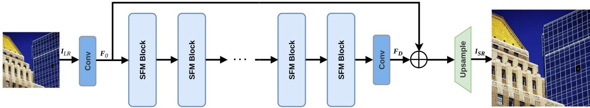

Figure 1: Overall architecture of SFMformer. A 3 × 3 convolution extracts shallow features, M cascaded SFM Blocks produce deep features, and a long residual connection followed by pixel-shufle upsampling reconstructs the HR output.  
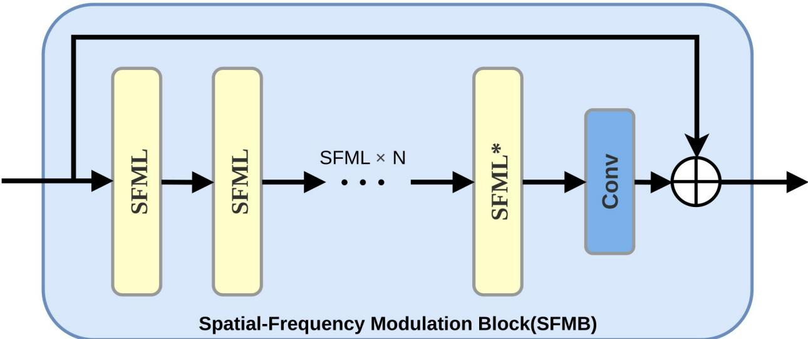  
Figure 2: Structure of the Spatial–Frequency Modulation Block (SFMB). Only the final layer (SFML∗) enables the WMA module.

## 3.2. Spatial–Frequency Modulation Block (SFMB)

The SFM Block is the core deep-feature unit of SFMformer. Each SFMB consists of N cascaded Spatial– Frequency Modulation Layers (SFML) followed by a $3 \times 3$ convolution and a short residual connection. The last layer, denoted SFML∗, additionally enables the WMA module for global frequency-domain modulation; the remaining layers do not, and perform spatial-domain feature modelling only. The block is illustrated in Fig. 2.

The $3 \times 3$ convolution follows the standard design of SwinIR [5]: it supplies the local spatial correlation that the attention mechanism lacks and performs a final aggregation of the features extracted by the SFMLs, while the residual connection stabilises training of the deep network. The computation is given by Eq. (4):

$$
\mathbf { F } _ { b } ^ { o u t } = \operatorname { C o n v } _ { 3 \times 3 } \left( \operatorname { S F M L } _ { N } ( \hdots \operatorname { S F M L } _ { 1 } ( \mathbf { F } _ { b } ^ { i n } ) ) \right) + \mathbf { F } _ { b } ^ { i n } ,\tag{4}
$$

where $\mathbf { F } _ { b } ^ { i n }$ and $\mathbf { F } _ { b } ^ { o u t }$ are the input and output features of the b-th SFMB.

The internal structure of an SFML is shown in Fig. 3 and follows the standard three-stage Transformer block layout. In the first stage the input is normalised, enhanced by the DFE module [10], passed to PFA [14] for progressive attention, and added back through a residual connection. The second stage applies the WMA module [15] for global frequency-domain modulation, and is active only in the last SFML of each SFMB. The third stage is a convolutional feed-forward network performing non-linear feature transformation. Each stage carries its own residual connection, ensuring that features are refined layer by layer without losing the original information:

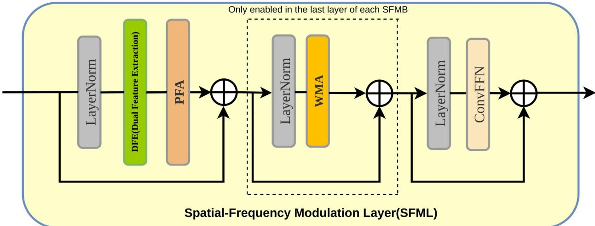  
Figure 3: Internal structure of the Spatial–Frequency Modulation Layer (SFML). The dashed region (LayerNorm + WMA) is enabled only in the last layer of each SFMB.

$$
X ^ { \prime } = X + \operatorname { P F A } ( \operatorname { D F E } ( \operatorname { L N } ( X ) ) ) ,\tag{5}
$$

$$
X ^ { \prime \prime } = { \begin{array} { l l } { X ^ { \prime } + \mathbf { W M A } ( \mathbf { L N } ( X ^ { \prime } ) ) , } & { { \mathrm { i f ~ } } \mathrm { l a s t ~ l a y e r ~ o f ~ t h e ~ b l o c k } , } \\ { X ^ { \prime } , } & { { \mathrm { o t h e r w i s e } } , } \end{array} }\tag{6}
$$

$$
X _ { o u t } = X ^ { \prime \prime } + \mathrm { C o n v F F N } ( \mathrm { L N } ( X ^ { \prime \prime } ) ) .\tag{7}
$$

## 3.2.1. Dual Feature Extraction (DFE)

As described above, PFA [14] propagates attention maps across layers and selects the top-k most important tokens for each query. This mechanism depends heavily on the spatial discriminability of Q and K: if neighbouring tokens difer only slightly, the selection cannot converge on the genuinely critical positions. Yet Q, K and $V$ are generated by a purely channel-wise linear projection, so the LayerNorm-ed features entering PFA carry no explicit spatial structural signature.

To resolve this we embed the dual-branch feature extraction module of HiT-SR [10] in front of the QKV projection. The original authors present DFE as a general pre-attention enhancement module, placed before their spatial (S-SC) and channel (C-SC) self-correlation attention. We instead introduce it into the window-based sparse attention framework of PFT, so that top-k selection is performed on spatially discriminative Q/K/V and attention converges more precisely. A second diference is that HiT-SR splits the DFE output into Q and V only (with K equal to V) to suit its self-correlation design, whereas we retain the standard three-way Q, K, V projection of PFT in order to preserve the independent key representation that PFA requires when forming its attention map.

The module is shown in Fig. 4 and defined by $\mathrm { D F E } ( X ) = ( W _ { g } \circledast X ) \odot \big ( W _ { 3 } \circledast \sigma ( W _ { 2 } \circledast \sigma ( W _ { 1 } \circledast X ) ) \big )$ , where ⊛ is convolution and ⊙ element-wise product. The first factor is the channel branch, a 1 × 1 convolution equivalent to an independent linear projection at every spatial position; the second is the spatial branch, whose $1 \times 1  3 \times 3 $ 1 × 1 bottleneck extracts local neighbourhood structure. Following HiT-SR the bottleneck ratio is $r = 5$ and $\sigma$ is LeakyReLU with negative slope 0 2.

## 3.2.2. Progressive Focused Attention (PFA)

After DFE enhancement the features enter the attention layer. SFMformer adopts PFA [14] as its core attention operator, performing eficient sparse attention within each window through a cross-layer top-k sparsification strategy. As described in Section 2.1, PFA rests on two mechanisms: passing the attention distribution of the previous layer to the current one so that importance judgements are consistent across consecutive layers, and using the inherited scores

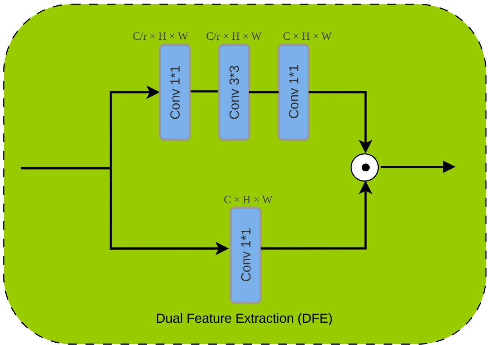  
Figure 4: The Dual Feature Extraction (DFE) module. The hourglass branch captures local spatial neighbourhood information; the 1 × 1 branch preserves channel semantics.

to decide which tokens should still participate, retaining only the most representative few through top-k sparsification.   
This reduces redundant computation and suppresses noise from unrelated features.

Given the input feature $X ^ { l }$ of layer $l ,$ the attention computation of an SFM Layer is described by Eqs. (8)–(10):

$$
[ Q ^ { l } , K ^ { l } , V ^ { l } ] = W _ { q k \nu } ^ { l } ( \mathrm { { D F E } } ( X ^ { l } ) ) ,\tag{8}
$$

$$
A ^ { l } = \mathrm { T o p } _ { K ^ { l } } \bigg ( \mathrm { S o f t m a x } \bigg ( \frac { Q ^ { l } ( K ^ { l } ) ^ { \top } } { \sqrt { d } } \bigg ) \odot A ^ { l - 1 } \bigg ) ,\tag{9}
$$

$$
Z ^ { l } = A ^ { l } V ^ { l } .\tag{10}
$$

Equation (8) is the attention pre-processing stage: the input is first enhanced by the DFE module of Section 3.2.1 and then mapped by the linear projection $\boldsymbol { W } _ { \boldsymbol { q } k \nu } ^ { l }$ into the three tensors Q, K and V. Equation (9) is the PFA operation itself: after the similarity between the current $Q ^ { l }$ and $K ^ { l }$ has been computed, it is multiplied element-wise with the attention map $A ^ { l - 1 }$ inherited from the previous layer, realising cross-layer attention inheritance, and a top- $. K ^ { l }$ sparsification produces the attention map $A ^ { l }$ of the current layer. This design allows subsequent attention layers to identify which features matter and amplify their weights, while unrelated features are suppressed. Because $A ^ { l }$ retains only $K ^ { l }$ non-zero values, the next layer need compute similarity only at those non-zero positions. The map $A ^ { l }$ is then passed on as the input to the PFA operation of the following layer, forming a cross-layer attention chain, with $K ^ { l } = \alpha K ^ { l - 1 }$ so that the retained token count decays with depth. The mechanism is illustrated in Fig. 5.

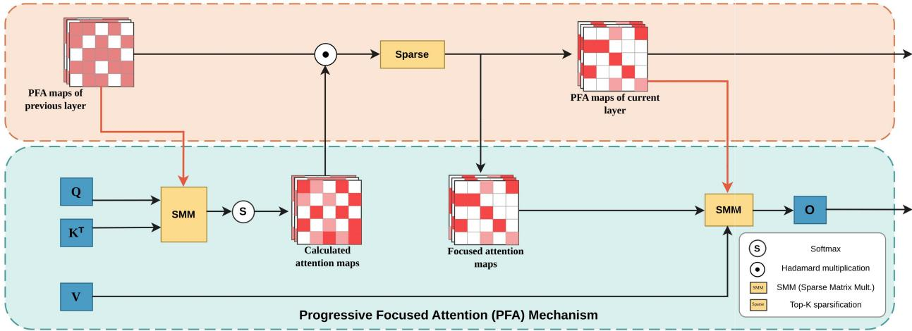

Figure 5: The Progressive Focused Attention (PFA) mechanism. The attention map of the previous layer is inherited, multiplied element-wise with the current similarity map, and sparsified by a top-Kl operation.  
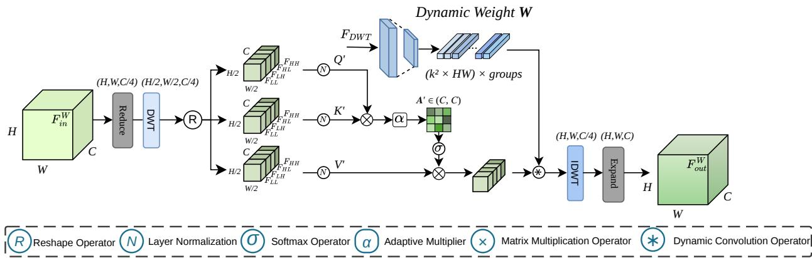  
Figure 6: The Wavelet-domain Modulation self-Attention (WMA) module. Features are reduced in channel dimension, decomposed by the DWT into four sub-bands, modulated by channel-wise self-attention and dynamic convolution, and returned to the spatial domain by the IDWT.

## 3.2.3. Wavelet-domain Modulation self-Attention (WMA)

To compensate for the limitations of purely spatial modelling we combine frequency- and spatial-domain features. Concretely we adopt the Wavelet-domain Modulation self-Attention module (WMA) [15], which applies global modulation in the frequency domain to the features produced by PFA [14]. For computational eficiency, WMA is not used in every SFM Layer but only in the last SFM Layer of each SFMB; its operation is shown in Fig. 6.

When the PFA output is passed to WMA the feature is first reduced in channel dimension to lower the computational cost, and is then decomposed by the discrete wavelet transform into four sub-bands, each of size (H/2 W/2 C/4), as in Eq. (11):

$$
\{ F _ { L L } , F _ { L H } , F _ { H L } , F _ { H H } \} = \mathrm { D W T } ( \mathrm { C o n v } _ { 1 \times 1 } ( F _ { i n } ^ { W } ) ) .\tag{11}
$$

The sub-bands are arranged along the channel dimension and reshaped, after which the similarity between the resulting vectors is computed as in Eqs. (12)–(13):

$$
[ Q ^ { \prime } , K ^ { \prime } , V ^ { \prime } ] = \mathrm { L N } ( \mathcal { R } ( \{ F _ { L L } , F _ { L H } , F _ { H L } , F _ { H H } \} ) ) ,\tag{12}
$$

$$
A ^ { \prime } = \operatorname { S o f t m a x } ( \alpha Q ^ { \prime } ( K ^ { \prime } ) ^ { \top } ) \in \mathbb { R } ^ { C \times C } ,\tag{13}
$$

where $\mathcal { R } ( \cdot )$ denotes the reshape operator and α an adaptive multiplier. Because the attention matrix is formed across the channel axis on the concatenated sub-bands, correlations are established between frequency bands, allowing low- and high-frequency information to reinforce one another. Once the similarity has been computed, a dynamic convolution weight W injects spatial information into the wavelet-domain feature, strengthening its representation; the modulated feature is finally returned to the spatial domain by the inverse wavelet transform, as in Eq. (14):

$$
F _ { o u t } ^ { W } = \mathcal { E } \big ( \mathrm { I D W T } ( ( A ^ { \prime } V ^ { \prime } ) * W ) \big ) ,\tag{14}
$$

where ∗ denotes the dynamic convolution operator and $\varepsilon ( \cdot )$ the channel-expansion operation that restores the original width.

## 3.3. High-quality image reconstruction

Once deep feature extraction is complete the features must be reconstructed into a high-quality image. As described in Section 2.1, sub-pixel convolution [17] rearranges the pixels of each channel of the input feature map into the spatial dimensions of the output. We use pixel-shufle direct, the variant provided for lightweight models in the oficial SwinIR implementation [5]. Relative to the standard version it omits the preceding feature pre-processing convolution and the multi-stage upsampling procedure, integrating them into a single convolution, as in Eq. (15):

$$
I _ { S R } = \mathrm { P i x e l S h u f f e } _ { r } ( W _ { u p } \circledast F _ { d e e p } ) ,\tag{15}
$$

where $F _ { d e e p } \in \mathbb { R } ^ { C \times H \times W }$ is the output of the deep feature extraction stage and $W _ { u p } \in \mathbb { R } ^ { ( r ^ { 2 } \cdot 3 ) \times C \times 3 \times 3 }$ is a single upsampling convolution mapping the channel count from C directly to $r ^ { 2 } { \cdot } 3$ , with r the upscaling factor. PixelShufl $\mathbf { e } _ { r } ( \cdot )$ rearranges the $r ^ { 2 } { \mathrm { - f o l d } }$ channel dimension into the spatial dimensions, producing the final RGB image $I _ { S R } \in \mathbb { R } ^ { 3 \times r H \times r W }$ Compared with the standard version this markedly reduces the parameters and computation of the reconstruction stage, helping to lower model complexity while maintaining quality.

## 3.4. Loss function

Training uses a pixel-domain loss $( L _ { 1 } )$ together with a frequency-domain loss $( L _ { f f t } )$ , supervising reconstruction quality in the spatial and frequency domains respectively.

Pixel loss is the most basic supervisory signal in SR, measuring the pixel-wise diference between the reconstruction $I _ { S R }$ and the ground-truth $I _ { H R }$ . We use the mean absolute error, also known as $L _ { 1 }$ loss, given by Eq. (16):

$$
L _ { 1 } = \frac { 1 } { N } \sum _ { i = 1 } ^ { N } \bigl | I _ { S R } ( i ) - I _ { H R } ( i ) \bigr | .\tag{16}
$$

Compared with $L _ { 2 }$ loss (mean squared error), $L _ { 1 }$ is less sensitive to outliers and has been shown experimentally to produce sharper reconstructions [2], which is why it is the standard choice in the SR literature.

Because our model combines spatial and frequency features, pixel-domain supervision alone is insuficient to constrain frequency-domain reconstruction quality. We therefore adopt the Fourier loss used by DMNet [15]: the reconstruction $I _ { S R }$ and the ground truth $I _ { H R }$ are transformed to the Fourier domain by a two-dimensional fast Fourier transform and their $L _ { 1 }$ distance is computed, as in Eq. (17):

$$
L _ { f f t } = \left\| \mathcal { F } ( I _ { S R } ) - \mathcal { F } ( I _ { H R } ) \right\| _ { 1 } ,\tag{17}
$$

where $\mathcal { F } ( \cdot )$ denotes the 2D FFT. As noted in [15], a Fourier loss is preferred over a wavelet-domain loss because the gradient descent directions of diferent wavelet sub-bands can be markedly inconsistent, and the resulting conflicts make convergence dificult. Supervising in the Fourier domain avoids these inter-sub-band gradient conflicts. The wavelet domain is thus responsible for reconstructing high-frequency texture, while the Fourier domain regulates the global frequency distribution, jointly optimising overall structure and fine detail.

Combining the two terms, training uses the weighted sum of Eq. (18):

$$
{ \cal L } _ { t o t a l } = { \cal L } _ { 1 } + \lambda \cdot { \cal L } _ { f f t } .\tag{18}
$$

Following the default setting of DMNet [15] we set $\lambda = 0 . 1$ . The model therefore receives supervisory signals from both the spatial and the frequency domain during training, balancing structural correctness (pixel supervision) against detail sharpness (frequency supervision).

## 4. Experiments

## 4.1. Datasets and evaluation protocol

Following the standard protocol for Transformer-based SR, we train on DF2K—the union of the 800 DIV2K [32] training images and the 2650 Flickr2K [33] images, 3450 in total—and evaluate on five benchmarks: Set5 [34], Set14 [35], BSD100 [36], Urban100 [37] and Manga109 [38]. LR inputs are produced by bicubic downsampling. The last two benchmarks are the most informative for this work: Urban100 is dominated by man-made structures with regular repeating texture and straight edges, which stress long-range dependency modelling and the exploitation of self-similarity, while Manga109 consists of comic artwork whose sharp, high-contrast line work concentrates energy in the high-frequency sub-bands. They therefore probe the spatial and the spectral half of our design respectively.

We report PSNR and SSIM [39], both computed on the Y (luminance) channel of the YCbCr colour space with the image border cropped by a number of pixels equal to the upscaling factor, as is conventional. PSNR measures pixelwise fidelity and SSIM the preservation of local luminance, contrast and structure; we use the original formulation and constants of Wang et al. [39] without modification.

## 4.2. Implementation details

All experiments are implemented with PyTorch 2.8.0 and the BasicSR framework. Training and testing use Windows 11 with an NVIDIA RTX 5090 GPU and CUDA 12.8. HR patches are randomly cropped from the DF2K training set, with a crop size that depends on the upscaling factor: 128 × 128 for ×2, 192 × 192 for ×3 and 256 × 256 for ×4, so that the corresponding LR input patch is uniformly $6 4 \times 6 4$ . Data augmentation comprises random horizontal flipping and random rotation by 90◦, 180◦ and 270◦.

We use the Adam optimiser with an initial learning rate of $2 \times 1 0 ^ { - 4 } , \beta _ { 1 } = 0 . 9$ and $\beta _ { 2 } = 0 . 9 9$ . The learning rate follows a multi-step decay schedule, halving at iterations 250K, 400K, 450K and 475K, with 500K total iterations. The batch size is 8. The loss is configured as described in Section 3.4, with the Fourier loss weight $\lambda = 0 . 1$ . An exponential moving average of the weights (decay 0.999) is maintained during training. The ×3 and ×4 models are fine-tuned from the trained ×2 weights for 250K iterations each.

## 4.3. Comparison with state-of-the-art methods

Table 1 reports the main quantitative comparison against representative lightweight Transformers [5, 9, 40, 20, 15, 19, 10, 41, 23, 42, 43, 30, 31], with bicubic as a lower reference excluded from the ranking. Methods marked † were retrained under our configuration; other figures are quoted from the original papers, and FLOPs are computed at an output resolution of 1280×720. The batch size here is 8; PFT-light was originally trained at 32, so its retrained figures difer slightly from the published ones, and the efect of raising the batch size is examined separately in Section 4.4.

SFMformer obtains the best result on 28 of the 30 PSNR/SSIM entries and the second best on the remaining two, both Set14 at ×2, where IPG-Tiny [41] leads; SFMformer leads IPG-Tiny on the same dataset at ×3 and ×4, so the gap reflects that benchmark’s 14-image sample rather than a systematic weakness. Against the retrained baseline the comparison is strictly controlled—identical patch size, optimiser, schedule and iteration count, difering only in the two proposed modules—and SFMformer improves on it at every dataset and scale, by $+ 0 . 1 7 / + 0 . 2 3$ dB on Urban100/Manga109 at ×2 and +0 15/+0 20 dB at ×4.

Three comparisons are worth isolating. Against HiT-SRF [10], the source of our selection-side module, the margin reaches +0 40 dB on Urban100 at ×2. Against the two designs that place a spectral prior elsewhere—SwinFIR-T [30] at the trunk’s tail and FreqFormer [31] inside the attention—SFMformer leads on every reported entry except a tie with LKMN [42] on Set14 PSNR at ×2, with the largest margins on Manga109 (+0 08 dB over FreqFormer at ×2 and ×3; +0 18 dB over SwinFIR-T at ×2). And across datasets the improvement is systematically larger on Urban100 and Manga109 (0.15–0.31 dB over the second best) than on Set5 and BSD100 (0.04–0.10 dB), which is the ordering our account predicts: those two benchmarks combine regular geometric structure, which makes token selection decisive, with dense high-frequency texture, which is what spectral modulation acts on. Figure 7 places these results on the accuracy–complexity plane.

Table 1: Quantitative comparison of SFMformer with state-of-the-art lightweight methods at three upscaling factors. Bold: best; underline: second best; bicubic is listed for reference and excluded from the ranking. † denotes retraining under our configuration. LKMN [42] and PromptSR [43] report ×2 results only, and FLOPs are not available for every quoted method.
<table><tr><td rowspan=2 colspan=6>Set5Method             Scale Params FLOPsPSNRSSIM</td><td rowspan=1 colspan=2>Set14</td><td rowspan=1 colspan=2>BSD100</td><td rowspan=1 colspan=4>Urban100    Manga109</td></tr><tr><td rowspan=1 colspan=2>PSNRSSIM</td><td rowspan=1 colspan=2>PSNRSSIM</td><td rowspan=1 colspan=2>PSNRSSIM</td><td rowspan=1 colspan=2>PSNRSSIM</td></tr><tr><td rowspan=1 colspan=3>Bicubic             ×2</td><td rowspan=1 colspan=1></td><td rowspan=1 colspan=1>33.66</td><td rowspan=1 colspan=1>0.9299</td><td rowspan=1 colspan=1>30.24</td><td rowspan=1 colspan=1>0.8688</td><td rowspan=1 colspan=1>29.56</td><td rowspan=1 colspan=1>0.8431</td><td rowspan=1 colspan=2>26.880.8403</td><td rowspan=1 colspan=1>30.80</td><td rowspan=1 colspan=1>0.9339</td></tr><tr><td rowspan=1 colspan=3>SwinIR-light [5]    ×2    910K</td><td rowspan=1 colspan=1>244G</td><td rowspan=1 colspan=1>38.14</td><td rowspan=1 colspan=1>0.9611</td><td rowspan=1 colspan=1>33.86</td><td rowspan=1 colspan=1>0.9206</td><td rowspan=1 colspan=1>32.31</td><td rowspan=1 colspan=1>0.9012</td><td rowspan=1 colspan=1>32.76</td><td rowspan=1 colspan=1>0.9340</td><td rowspan=1 colspan=1>39.12</td><td rowspan=1 colspan=1>0.9783</td></tr><tr><td rowspan=1 colspan=3>ELAN-light [9]     ×2    582K</td><td rowspan=1 colspan=1>203G</td><td rowspan=1 colspan=1>38.17</td><td rowspan=1 colspan=1>0.9611</td><td rowspan=1 colspan=1>33.94</td><td rowspan=1 colspan=1>0.9207</td><td rowspan=1 colspan=1>32.30</td><td rowspan=1 colspan=1>0.9012</td><td rowspan=1 colspan=1>32.76</td><td rowspan=1 colspan=1>0.9340</td><td rowspan=1 colspan=1>39.11</td><td rowspan=1 colspan=1>0.9782</td></tr><tr><td rowspan=1 colspan=1>SwinIR-NG [40]</td><td rowspan=1 colspan=2>×2   1181K</td><td rowspan=1 colspan=1>274.1G</td><td rowspan=1 colspan=1>38.17</td><td rowspan=1 colspan=1>0.9612</td><td rowspan=1 colspan=1>33.94</td><td rowspan=1 colspan=1>0.9205</td><td rowspan=1 colspan=1>32.31</td><td rowspan=1 colspan=1>0.9013</td><td rowspan=1 colspan=1>32.78</td><td rowspan=1 colspan=1>0.9340</td><td rowspan=1 colspan=1>39.20</td><td rowspan=1 colspan=1>0.9781</td></tr><tr><td rowspan=1 colspan=1>OmniSR [20]</td><td rowspan=1 colspan=2>×2    772K</td><td rowspan=1 colspan=1>194.5G</td><td rowspan=1 colspan=1>38.22</td><td rowspan=1 colspan=1>0.9613</td><td rowspan=1 colspan=1>33.98</td><td rowspan=1 colspan=1>0.9210</td><td rowspan=1 colspan=1>32.36</td><td rowspan=1 colspan=1>0.9020</td><td rowspan=1 colspan=1>33.05</td><td rowspan=1 colspan=1>0.9363</td><td rowspan=1 colspan=1>39.28</td><td rowspan=1 colspan=1>0.9784</td></tr><tr><td rowspan=1 colspan=1>DMNet [15]</td><td rowspan=1 colspan=2>×2    572K</td><td rowspan=1 colspan=1>115.3G</td><td rowspan=1 colspan=1>38.23</td><td rowspan=1 colspan=1>0.9613</td><td rowspan=1 colspan=1>33.95</td><td rowspan=1 colspan=1>0.9209</td><td rowspan=1 colspan=1>32.31</td><td rowspan=1 colspan=1>0.9015</td><td rowspan=1 colspan=1>32.84</td><td rowspan=1 colspan=1>0.9347</td><td rowspan=1 colspan=1>39.39</td><td rowspan=1 colspan=1>0.9766</td></tr><tr><td rowspan=1 colspan=1>SRFormer-light [19]</td><td rowspan=1 colspan=2>×2    853K</td><td rowspan=1 colspan=1>236G</td><td rowspan=1 colspan=1>38.23</td><td rowspan=1 colspan=1>0.9615</td><td rowspan=1 colspan=1>33.94</td><td rowspan=1 colspan=1>0.9209</td><td rowspan=1 colspan=1>32.36</td><td rowspan=1 colspan=1>0.9013</td><td rowspan=1 colspan=1>32.91</td><td rowspan=1 colspan=1>0.9353</td><td rowspan=1 colspan=1>39.28</td><td rowspan=1 colspan=1>0.9785</td></tr><tr><td rowspan=1 colspan=1>HiT-SRF [10]</td><td rowspan=1 colspan=2>×2    847K</td><td rowspan=1 colspan=1>226.5G</td><td rowspan=1 colspan=1>38.26</td><td rowspan=1 colspan=1>0.9615</td><td rowspan=1 colspan=1>34.01</td><td rowspan=1 colspan=1>0.9214</td><td rowspan=1 colspan=1>32.37</td><td rowspan=1 colspan=1>0.9023</td><td rowspan=1 colspan=1>33.13</td><td rowspan=1 colspan=1>0.9372</td><td rowspan=1 colspan=1>39.47</td><td rowspan=1 colspan=1>0.9787</td></tr><tr><td rowspan=1 colspan=1>SwinFIR-T [30]</td><td rowspan=1 colspan=2>×2    872K</td><td rowspan=1 colspan=1></td><td rowspan=1 colspan=1>38.26</td><td rowspan=1 colspan=1>0.9616</td><td rowspan=1 colspan=1>34.08</td><td rowspan=1 colspan=1>0.9221</td><td rowspan=1 colspan=1>32.38</td><td rowspan=1 colspan=1>0.9024</td><td rowspan=1 colspan=1>33.14</td><td rowspan=1 colspan=1>0.9374</td><td rowspan=1 colspan=1>39.55</td><td rowspan=1 colspan=1>0.9790</td></tr><tr><td rowspan=1 colspan=1>IPG-Tiny [41]</td><td rowspan=1 colspan=2>×2    872K</td><td rowspan=1 colspan=1>245.2G</td><td rowspan=1 colspan=1>38.27</td><td rowspan=1 colspan=1>0.9616</td><td rowspan=1 colspan=1>34.24</td><td rowspan=1 colspan=1>0.9236</td><td rowspan=1 colspan=1>32.35</td><td rowspan=1 colspan=1>0.9018</td><td rowspan=1 colspan=1>33.04</td><td rowspan=1 colspan=1>0.9359</td><td rowspan=1 colspan=1>39.31</td><td rowspan=1 colspan=1>0.9786</td></tr><tr><td rowspan=1 colspan=1>ATD-light [23]</td><td rowspan=1 colspan=2>×2    753K</td><td rowspan=1 colspan=1>348.6G</td><td rowspan=1 colspan=1>38.28</td><td rowspan=1 colspan=1>0.9616</td><td rowspan=1 colspan=1>34.11</td><td rowspan=1 colspan=1>0.9217</td><td rowspan=1 colspan=1>32.39</td><td rowspan=1 colspan=1>0.9023</td><td rowspan=1 colspan=1>33.27</td><td rowspan=1 colspan=1>0.9376</td><td rowspan=1 colspan=1>39.51</td><td rowspan=1 colspan=1>0.9789</td></tr><tr><td rowspan=1 colspan=1>PromptSR [43]</td><td rowspan=1 colspan=2>×2    764K</td><td rowspan=1 colspan=1></td><td rowspan=1 colspan=1>38.30</td><td rowspan=1 colspan=1>0.9617</td><td rowspan=1 colspan=1>34.10</td><td rowspan=1 colspan=1>0.9221</td><td rowspan=1 colspan=1>32.37</td><td rowspan=1 colspan=1>0.9022</td><td rowspan=1 colspan=1>33.39</td><td rowspan=1 colspan=1>0.9390</td><td rowspan=1 colspan=1>39.56</td><td rowspan=1 colspan=1>0.9790</td></tr><tr><td rowspan=1 colspan=1>FreqFormer [31]</td><td rowspan=1 colspan=2>×2    870K</td><td rowspan=1 colspan=1></td><td rowspan=1 colspan=1>38.31</td><td rowspan=1 colspan=1>0.9616</td><td rowspan=1 colspan=1>34.12</td><td rowspan=1 colspan=1>0.9220</td><td rowspan=1 colspan=1>32.41</td><td rowspan=1 colspan=1>0.9026</td><td rowspan=1 colspan=1>33.25</td><td rowspan=1 colspan=1>0.9374</td><td rowspan=1 colspan=1>39.65</td><td rowspan=1 colspan=1>0.9792</td></tr><tr><td rowspan=1 colspan=1>LKMN [42]</td><td rowspan=1 colspan=2>×2    889K</td><td rowspan=1 colspan=1></td><td rowspan=1 colspan=1>38.32</td><td rowspan=1 colspan=1>0.9618</td><td rowspan=1 colspan=1>34.20</td><td rowspan=1 colspan=1>0.9223</td><td rowspan=1 colspan=1>32.43</td><td rowspan=1 colspan=1>0.9030</td><td rowspan=1 colspan=1>33.13</td><td rowspan=1 colspan=1>0.9377</td><td rowspan=1 colspan=1>39.54</td><td rowspan=1 colspan=1>0.9791</td></tr><tr><td rowspan=1 colspan=1>PFT-light† [14]</td><td rowspan=1 colspan=2>×2    776K</td><td rowspan=1 colspan=1>278.3G</td><td rowspan=1 colspan=1>38.33</td><td rowspan=1 colspan=1>0.9618</td><td rowspan=1 colspan=1>34.06</td><td rowspan=1 colspan=1>0.9218</td><td rowspan=1 colspan=1>32.41</td><td rowspan=1 colspan=1>0.9026</td><td rowspan=1 colspan=1>33.36</td><td rowspan=1 colspan=1>0.9385</td><td rowspan=1 colspan=1>39.50</td><td rowspan=1 colspan=1>0.9790</td></tr><tr><td rowspan=1 colspan=1>SFMformer (ours)</td><td rowspan=1 colspan=2>×2    970K</td><td rowspan=1 colspan=1>315.1G</td><td rowspan=1 colspan=1>38.40</td><td rowspan=1 colspan=1>0.9620</td><td rowspan=1 colspan=1>34.20</td><td rowspan=1 colspan=1>0.9227</td><td rowspan=1 colspan=1>32.45</td><td rowspan=1 colspan=1>0.9032</td><td rowspan=1 colspan=1>33.53</td><td rowspan=1 colspan=1>0.9397</td><td rowspan=1 colspan=1>39.73</td><td rowspan=1 colspan=1>0.9794</td></tr><tr><td rowspan=1 colspan=1>Bicubic</td><td rowspan=1 colspan=2>X3</td><td rowspan=1 colspan=1></td><td rowspan=1 colspan=1>30.39</td><td rowspan=1 colspan=1>0.8682</td><td rowspan=1 colspan=1>27.55</td><td rowspan=1 colspan=1>0.7742</td><td rowspan=1 colspan=1>27.21</td><td rowspan=1 colspan=1>0.7385</td><td rowspan=1 colspan=1>24.46</td><td rowspan=1 colspan=1>0.7349</td><td rowspan=1 colspan=1>26.95</td><td rowspan=1 colspan=1>0.8556</td></tr><tr><td rowspan=1 colspan=1>SwinIR-light [5]</td><td rowspan=1 colspan=2>×3    918K</td><td rowspan=1 colspan=1>111G</td><td rowspan=1 colspan=1>34.62</td><td rowspan=1 colspan=1>0.9289</td><td rowspan=1 colspan=1>30.54</td><td rowspan=1 colspan=1>0.8463</td><td rowspan=1 colspan=1>29.20</td><td rowspan=1 colspan=1>0.8082</td><td rowspan=1 colspan=1>28.66</td><td rowspan=1 colspan=1>0.8624</td><td rowspan=1 colspan=1>33.98</td><td rowspan=1 colspan=1>0.9478</td></tr><tr><td rowspan=1 colspan=1>ELAN-light [9]</td><td rowspan=1 colspan=2>×3    590K</td><td rowspan=1 colspan=1>90.1G</td><td rowspan=1 colspan=1>34.61</td><td rowspan=1 colspan=1>0.9288</td><td rowspan=1 colspan=1>30.55</td><td rowspan=1 colspan=1>0.8463</td><td rowspan=1 colspan=1>29.21</td><td rowspan=1 colspan=1>0.8081</td><td rowspan=1 colspan=1>28.69</td><td rowspan=1 colspan=1>0.8624</td><td rowspan=1 colspan=1>34.00</td><td rowspan=1 colspan=1>0.9478</td></tr><tr><td rowspan=1 colspan=1>SwinIR-NG [40]</td><td rowspan=1 colspan=2>×3   1190K</td><td rowspan=1 colspan=1>114.1G</td><td rowspan=1 colspan=1>34.64</td><td rowspan=1 colspan=1>0.9293</td><td rowspan=1 colspan=1>30.58</td><td rowspan=1 colspan=1>0.8471</td><td rowspan=1 colspan=1>29.24</td><td rowspan=1 colspan=1>0.8090</td><td rowspan=1 colspan=1>28.75</td><td rowspan=1 colspan=1>0.8639</td><td rowspan=1 colspan=1>34.22</td><td rowspan=1 colspan=1>0.9488</td></tr><tr><td rowspan=1 colspan=1>OmniSR [20]</td><td rowspan=1 colspan=1>×3</td><td rowspan=1 colspan=1>780K</td><td rowspan=1 colspan=1>88.4G</td><td rowspan=1 colspan=1>34.70</td><td rowspan=1 colspan=1>0.9294</td><td rowspan=1 colspan=1>30.57</td><td rowspan=1 colspan=1>0.8469</td><td rowspan=1 colspan=1>29.28</td><td rowspan=1 colspan=1>0.8094</td><td rowspan=1 colspan=1>28.84</td><td rowspan=1 colspan=1>0.8656</td><td rowspan=1 colspan=1>34.22</td><td rowspan=1 colspan=1>0.9487</td></tr><tr><td rowspan=1 colspan=1>DMNet [15]</td><td rowspan=1 colspan=1>×3</td><td rowspan=1 colspan=1>579K</td><td rowspan=1 colspan=1>52.0G</td><td rowspan=1 colspan=1>34.71</td><td rowspan=1 colspan=1>0.9295</td><td rowspan=1 colspan=1>30.57</td><td rowspan=1 colspan=1>0.8459</td><td rowspan=1 colspan=1>29.26</td><td rowspan=1 colspan=1>0.8093</td><td rowspan=1 colspan=1>28.80</td><td rowspan=1 colspan=1>0.8640</td><td rowspan=1 colspan=1>34.33</td><td rowspan=1 colspan=1>0.9488</td></tr><tr><td rowspan=1 colspan=1>SRFormer-light [19]</td><td rowspan=1 colspan=1>×3</td><td rowspan=1 colspan=1>861K</td><td rowspan=1 colspan=1>105G</td><td rowspan=1 colspan=1>34.67</td><td rowspan=1 colspan=1>0.9296</td><td rowspan=1 colspan=1>30.57</td><td rowspan=1 colspan=1>0.8469</td><td rowspan=1 colspan=1>29.26</td><td rowspan=1 colspan=1>0.8099</td><td rowspan=1 colspan=1>28.81</td><td rowspan=1 colspan=1>0.8655</td><td rowspan=1 colspan=1>34.19</td><td rowspan=1 colspan=1>0.9489</td></tr><tr><td rowspan=1 colspan=1>HiT-SRF [10]</td><td rowspan=1 colspan=2>×3    855K</td><td rowspan=1 colspan=1>101.6G</td><td rowspan=1 colspan=1>34.75</td><td rowspan=1 colspan=1>0.9300</td><td rowspan=1 colspan=1>30.61</td><td rowspan=1 colspan=1>0.8475</td><td rowspan=1 colspan=1>29.29</td><td rowspan=1 colspan=1>0.8106</td><td rowspan=1 colspan=1>28.99</td><td rowspan=1 colspan=1>0.8687</td><td rowspan=1 colspan=1>34.53</td><td rowspan=1 colspan=1>0.9502</td></tr><tr><td rowspan=1 colspan=1>SwinFIR-T [30]</td><td rowspan=1 colspan=1>×3</td><td rowspan=1 colspan=1>880K</td><td rowspan=1 colspan=1></td><td rowspan=1 colspan=1>34.75</td><td rowspan=1 colspan=1>0.9300</td><td rowspan=1 colspan=1>30.68</td><td rowspan=1 colspan=1>0.8489</td><td rowspan=1 colspan=1>29.30</td><td rowspan=1 colspan=1>0.8106</td><td rowspan=1 colspan=1>29.04</td><td rowspan=1 colspan=1>0.8697</td><td rowspan=1 colspan=1>34.60</td><td rowspan=1 colspan=1>0.9506</td></tr><tr><td rowspan=1 colspan=1>IPG-Tiny [41]</td><td rowspan=1 colspan=1>×3</td><td rowspan=1 colspan=1>878K</td><td rowspan=1 colspan=1>109.0G</td><td rowspan=1 colspan=1>34.64</td><td rowspan=1 colspan=1>0.9292</td><td rowspan=1 colspan=1>30.61</td><td rowspan=1 colspan=1>0.8470</td><td rowspan=1 colspan=1>29.26</td><td rowspan=1 colspan=1>0.8097</td><td rowspan=1 colspan=1>28.93</td><td rowspan=1 colspan=1>0.8666</td><td rowspan=1 colspan=1>34.30</td><td rowspan=1 colspan=1>0.9493</td></tr><tr><td rowspan=1 colspan=1>ATD-light [23]</td><td rowspan=1 colspan=2>×3    760K</td><td rowspan=1 colspan=1>154.7G</td><td rowspan=1 colspan=1>34.70</td><td rowspan=1 colspan=1>0.9300</td><td rowspan=1 colspan=1>30.68</td><td rowspan=1 colspan=1>0.8485</td><td rowspan=1 colspan=1>29.32</td><td rowspan=1 colspan=1>0.8109</td><td rowspan=1 colspan=1>29.16</td><td rowspan=1 colspan=1>0.8710</td><td rowspan=1 colspan=1>34.60</td><td rowspan=1 colspan=1>0.9505</td></tr><tr><td rowspan=1 colspan=1>FreqFormer [31]</td><td rowspan=1 colspan=2>×3    878K</td><td rowspan=1 colspan=1></td><td rowspan=1 colspan=1>34.86</td><td rowspan=1 colspan=1>0.9307</td><td rowspan=1 colspan=1>30.71</td><td rowspan=1 colspan=1>0.8488</td><td rowspan=1 colspan=1>29.35</td><td rowspan=1 colspan=1>0.8116</td><td rowspan=1 colspan=1>29.15</td><td rowspan=1 colspan=1>0.8710</td><td rowspan=1 colspan=1>34.80</td><td rowspan=1 colspan=1>0.9513</td></tr><tr><td rowspan=1 colspan=1>PFT-light† [14]</td><td rowspan=1 colspan=2>×3    783K</td><td rowspan=1 colspan=1>123.5G</td><td rowspan=1 colspan=1>34.78</td><td rowspan=1 colspan=1>0.9303</td><td rowspan=1 colspan=1>30.70</td><td rowspan=1 colspan=1>0.8481</td><td rowspan=1 colspan=1>29.32</td><td rowspan=1 colspan=1>0.8122</td><td rowspan=1 colspan=1>29.22</td><td rowspan=1 colspan=1>0.8728</td><td rowspan=1 colspan=1>34.57</td><td rowspan=1 colspan=1>0.9505</td></tr><tr><td rowspan=1 colspan=1>SFMformer (ours)</td><td rowspan=1 colspan=2>×3    977K</td><td rowspan=1 colspan=1>140.6G</td><td rowspan=1 colspan=1>34.88</td><td rowspan=1 colspan=1>0.9311</td><td rowspan=1 colspan=1>30.79</td><td rowspan=1 colspan=1>0.8500</td><td rowspan=1 colspan=1>29.38</td><td rowspan=1 colspan=1>0.8125</td><td rowspan=1 colspan=1>29.37</td><td rowspan=1 colspan=1>0.8744</td><td rowspan=1 colspan=1>34.88</td><td rowspan=1 colspan=1>0.9516</td></tr><tr><td rowspan=1 colspan=1>Bicubic</td><td rowspan=1 colspan=2>×4</td><td rowspan=1 colspan=1></td><td rowspan=1 colspan=1>28.42</td><td rowspan=1 colspan=1>0.8104</td><td rowspan=1 colspan=1>26.00</td><td rowspan=1 colspan=1>0.7027</td><td rowspan=1 colspan=1>25.96</td><td rowspan=1 colspan=1>0.6675</td><td rowspan=1 colspan=1>23.14</td><td rowspan=1 colspan=1>0.6577</td><td rowspan=1 colspan=1>24.89</td><td rowspan=1 colspan=1>0.7866</td></tr><tr><td rowspan=1 colspan=1>SwinIR-light [5]</td><td rowspan=1 colspan=2>×4    930K</td><td rowspan=1 colspan=1>63.6G</td><td rowspan=1 colspan=1>32.44</td><td rowspan=1 colspan=1>0.8976</td><td rowspan=1 colspan=1>28.77</td><td rowspan=1 colspan=1>0.7858</td><td rowspan=1 colspan=1>27.69</td><td rowspan=1 colspan=1>0.7406</td><td rowspan=1 colspan=1>26.47</td><td rowspan=1 colspan=1>0.7980</td><td rowspan=1 colspan=1>30.92</td><td rowspan=1 colspan=1>0.9151</td></tr><tr><td rowspan=1 colspan=1>ELAN-light [9]</td><td rowspan=1 colspan=2>x4    582K</td><td rowspan=1 colspan=1>54.1G</td><td rowspan=1 colspan=1>32.43</td><td rowspan=1 colspan=1>0.8975</td><td rowspan=1 colspan=1>28.78</td><td rowspan=1 colspan=1>0.7858</td><td rowspan=1 colspan=1>27.69</td><td rowspan=1 colspan=1>0.7406</td><td rowspan=1 colspan=1>26.54</td><td rowspan=1 colspan=1>0.7982</td><td rowspan=1 colspan=1>30.92</td><td rowspan=1 colspan=1>0.9150</td></tr><tr><td rowspan=1 colspan=1>SwinIR-NG [40]</td><td rowspan=1 colspan=2>×4   1201K</td><td rowspan=1 colspan=1>63.0G</td><td rowspan=1 colspan=1>32.44</td><td rowspan=1 colspan=1>0.8980</td><td rowspan=1 colspan=1>28.83</td><td rowspan=1 colspan=1>0.7870</td><td rowspan=1 colspan=1>27.73</td><td rowspan=1 colspan=1>0.7418</td><td rowspan=1 colspan=1>26.61</td><td rowspan=1 colspan=1>0.8010</td><td rowspan=1 colspan=1>31.09</td><td rowspan=1 colspan=1>0.9161</td></tr><tr><td rowspan=1 colspan=1>OmniSR [20]</td><td rowspan=1 colspan=2>×4    792K</td><td rowspan=1 colspan=1>50.9G</td><td rowspan=1 colspan=1>32.49</td><td rowspan=1 colspan=1>0.8988</td><td rowspan=1 colspan=1>28.78</td><td rowspan=1 colspan=1>0.7859</td><td rowspan=1 colspan=1>27.71</td><td rowspan=1 colspan=1>0.7415</td><td rowspan=1 colspan=1>26.65</td><td rowspan=1 colspan=1>0.8018</td><td rowspan=1 colspan=1>31.02</td><td rowspan=1 colspan=1>0.9151</td></tr><tr><td rowspan=1 colspan=1>DMNet [15]</td><td rowspan=1 colspan=2>×4    588K</td><td rowspan=1 colspan=1>29.7G</td><td rowspan=1 colspan=1>32.51</td><td rowspan=1 colspan=1>0.8987</td><td rowspan=1 colspan=1>28.84</td><td rowspan=1 colspan=1>0.7866</td><td rowspan=1 colspan=1>27.73</td><td rowspan=1 colspan=1>0.7410</td><td rowspan=1 colspan=1>26.58</td><td rowspan=1 colspan=1>0.7991</td><td rowspan=1 colspan=1>31.14</td><td rowspan=1 colspan=1>0.9150</td></tr><tr><td rowspan=1 colspan=1>IPG-Tiny [41]</td><td rowspan=1 colspan=2>×4    887K</td><td rowspan=1 colspan=1>61.3G</td><td rowspan=1 colspan=1>32.51</td><td rowspan=1 colspan=1>0.8987</td><td rowspan=1 colspan=1>28.85</td><td rowspan=1 colspan=1>0.7873</td><td rowspan=1 colspan=1>27.73</td><td rowspan=1 colspan=1>0.7418</td><td rowspan=1 colspan=1>26.78</td><td rowspan=1 colspan=1>0.8050</td><td rowspan=1 colspan=1>31.22</td><td rowspan=1 colspan=1>0.9176</td></tr><tr><td rowspan=1 colspan=1>SRFormer-light [19]</td><td rowspan=1 colspan=2>x4    873K</td><td rowspan=1 colspan=1>62.8G</td><td rowspan=1 colspan=1>32.51</td><td rowspan=1 colspan=1>0.8988</td><td rowspan=1 colspan=1>28.82</td><td rowspan=1 colspan=1>0.7872</td><td rowspan=1 colspan=1>27.73</td><td rowspan=1 colspan=1>0.7422</td><td rowspan=1 colspan=1>26.67</td><td rowspan=1 colspan=1>0.8032</td><td rowspan=1 colspan=1>31.17</td><td rowspan=1 colspan=1>0.9165</td></tr><tr><td rowspan=1 colspan=1>HiT-SRF [10]</td><td rowspan=1 colspan=2>×4    866K</td><td rowspan=1 colspan=1>58.0G</td><td rowspan=1 colspan=1>32.55</td><td rowspan=1 colspan=1>0.8999</td><td rowspan=1 colspan=1>28.87</td><td rowspan=1 colspan=1>0.7880</td><td rowspan=1 colspan=1>27.75</td><td rowspan=1 colspan=1>0.7432</td><td rowspan=1 colspan=1>26.80</td><td rowspan=1 colspan=1>0.8069</td><td rowspan=1 colspan=1>31.26</td><td rowspan=1 colspan=1>0.9171</td></tr><tr><td rowspan=1 colspan=1>ATD-light [23]</td><td rowspan=1 colspan=2>×4    769K</td><td rowspan=1 colspan=1>87.1G</td><td rowspan=1 colspan=1>32.62</td><td rowspan=1 colspan=1>0.8997</td><td rowspan=1 colspan=1>28.87</td><td rowspan=1 colspan=1>0.7884</td><td rowspan=1 colspan=1>27.77</td><td rowspan=1 colspan=1>0.7439</td><td rowspan=1 colspan=1>26.97</td><td rowspan=1 colspan=1>0.8107</td><td rowspan=1 colspan=1>31.47</td><td rowspan=1 colspan=1>0.9198</td></tr><tr><td rowspan=1 colspan=1>SwinFIR-T [30]</td><td rowspan=1 colspan=2>×4    891K</td><td rowspan=1 colspan=1></td><td rowspan=1 colspan=1>32.62</td><td rowspan=1 colspan=1>0.9002</td><td rowspan=1 colspan=1>28.95</td><td rowspan=1 colspan=1>0.7898</td><td rowspan=1 colspan=1>27.79</td><td rowspan=1 colspan=1>0.7440</td><td rowspan=1 colspan=1>26.85</td><td rowspan=1 colspan=1>0.8088</td><td rowspan=1 colspan=1>31.50</td><td rowspan=1 colspan=1>0.9199</td></tr><tr><td rowspan=1 colspan=1>PFT-light† [14]</td><td rowspan=1 colspan=2>x4    792K</td><td rowspan=1 colspan=1>69.6G</td><td rowspan=1 colspan=1>32.55</td><td rowspan=1 colspan=1>0.8992</td><td rowspan=1 colspan=1>28.91</td><td rowspan=1 colspan=1>0.7887</td><td rowspan=1 colspan=1>27.77</td><td rowspan=1 colspan=1>0.7435</td><td rowspan=1 colspan=1>26.98</td><td rowspan=1 colspan=1>0.8120</td><td rowspan=1 colspan=1>31.45</td><td rowspan=1 colspan=1>0.9192</td></tr><tr><td rowspan=1 colspan=1>FreqFormer [31]</td><td rowspan=1 colspan=2>x4    889K</td><td rowspan=1 colspan=1></td><td rowspan=1 colspan=1>32.69</td><td rowspan=1 colspan=1>0.9007</td><td rowspan=1 colspan=1>28.95</td><td rowspan=1 colspan=1>0.7898</td><td rowspan=1 colspan=1>27.79</td><td rowspan=1 colspan=1>0.7444</td><td rowspan=1 colspan=1>26.84</td><td rowspan=1 colspan=1>0.8093</td><td rowspan=1 colspan=1>31.59</td><td rowspan=1 colspan=1>0.9201</td></tr><tr><td rowspan=1 colspan=3>SFMformer (ours) x4    987K</td><td rowspan=1 colspan=1>79.8G</td><td rowspan=1 colspan=1>32.70</td><td rowspan=1 colspan=1>0.9009</td><td rowspan=1 colspan=1>28.98</td><td rowspan=1 colspan=1>0.7900</td><td rowspan=1 colspan=1>27.82</td><td rowspan=1 colspan=1>0.7450</td><td rowspan=1 colspan=2>27.130.8158</td><td rowspan=1 colspan=1>31.65</td><td rowspan=1 colspan=1>0.9212</td></tr></table>

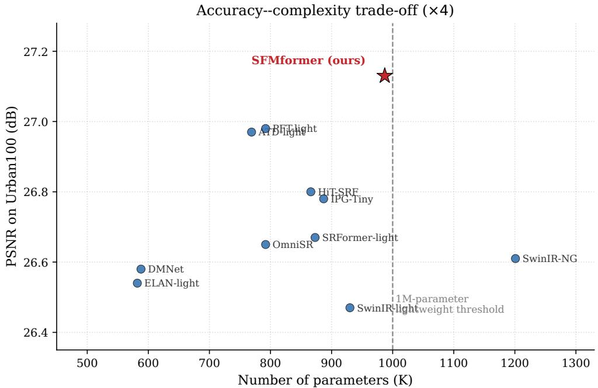  
Figure 7: PSNR on Urban100 versus parameter count at ×4. The dashed line marks the 1M-parameter boundary conventionally used to delimit lightweight SR models.

## 4.4. Efect of batch size

To examine the influence of batch size on model performance, we retrained SFMformer and PFT-light [14] with a batch size of 32; results are listed in Table 2. All other training settings (patch size, optimiser, iteration count and so on) are identical to Table 1—only the batch size difers. The remaining reference figures are still quoted from the original papers, so this table serves mainly to observe the efect of batch size on SFMformer and its baseline, and is supplementary to Table 1.

Table 2: Results at a batch size of 32. PFT-light† was retrained by us under settings identical to SFMformer; the PFT-light rows without † quote the original paper [14]. Bold: best; underline: second best.
<table><tr><td rowspan="2">Method</td><td rowspan="2">Scale Params</td><td rowspan="2"></td><td colspan="2">Set5</td><td colspan="2">Set14</td><td colspan="2">BSD100</td><td colspan="2">Urban100</td><td colspan="2">Manga109</td></tr><tr><td>PSNR</td><td>SSIM</td><td>PSNR</td><td>SSIM</td><td>PSNR</td><td>SSIM</td><td>PSNR</td><td>SSIM</td><td>PSNR</td><td>SSIM</td></tr><tr><td>PFT-light [14]</td><td>×2</td><td>776K</td><td>38.36</td><td>0.9620</td><td>34.19</td><td>0.9232</td><td>32.43</td><td>0.9030</td><td>33.67</td><td>0.9411</td><td>39.55</td><td>0.9792</td></tr><tr><td>PFT-light†</td><td>×2</td><td>776K</td><td>38.35</td><td>0.9620</td><td>34.19</td><td>0.9227</td><td>32.44</td><td>0.9030</td><td>33.61</td><td>0.9406</td><td>39.64</td><td>0.9793</td></tr><tr><td>SFMformer (ours)</td><td>×2</td><td>970K</td><td>38.43</td><td>0.9622</td><td>34.28</td><td>0.9235</td><td>32.48</td><td>0.9036</td><td>33.73</td><td>0.9414</td><td>39.82</td><td>0.9796</td></tr><tr><td>PFT-light [14]</td><td>×3</td><td>783K</td><td>34.82</td><td>0.9305</td><td>30.75</td><td>0.8493</td><td>29.33</td><td>0.8116</td><td>29.46</td><td>0.8763</td><td>34.61</td><td>0.9509</td></tr><tr><td>PFT-light†</td><td>x3</td><td>783K</td><td>34.82</td><td>0.9306</td><td>30.75</td><td>0.8490</td><td>29.34</td><td>0.8118</td><td>29.37</td><td>0.8752</td><td>34.68</td><td>0.9511</td></tr><tr><td>SFMformer (ours)</td><td>×3</td><td>977K</td><td>34.89</td><td>0.9312</td><td>30.79</td><td>0.8498</td><td>29.39</td><td>0.8126</td><td>29.43</td><td>0.8752</td><td>34.88</td><td>0.9517</td></tr><tr><td>PFT-light [14]</td><td>×4</td><td>792K</td><td>32.63</td><td>0.9005</td><td>28.92</td><td>0.7891</td><td>27.78</td><td>0.7442</td><td>27.20</td><td>0.8171</td><td>31.51</td><td>0.9204</td></tr><tr><td>PFT-light†</td><td>×4</td><td>792K</td><td>32.62</td><td>0.9000</td><td>28.96</td><td>0.7898</td><td>27.79</td><td>0.7445</td><td>27.11</td><td>0.8154</td><td>31.57</td><td>0.9207</td></tr><tr><td>SFMformer (ours) ×4</td><td></td><td>987K</td><td>32.68</td><td>0.9012</td><td>29.00</td><td>0.7901</td><td>27.83</td><td>0.7448</td><td>27.08</td><td>0.8128</td><td>31.66</td><td>0.9207</td></tr></table>

With the batch size raised to 32, SFMformer outperforms the retrained baseline PFT-light† on Set5, Set14, BSD100 and Manga109 at all three scales, confirming that the proposed modules remain efective at a larger batch size. On Set14 at ×2 the PSNR of SFMformer now exceeds that of IPG-Tiny [41] and the SSIM gap narrows.

Urban100 is the exception and deserves explicit comment rather than explanation away. At ×4, SFMformer (27.08 dB) falls below both the retrained baseline (27.11 dB) and the published PFT-light figure (27.20 dB), reversing the +0 15 dB lead observed at a batch size of $^ { \mathrm { ~ \tiny ~  ~ } } 8 ;$ at ×3 it is 0.03 dB below the published figure while remaining 0.06 dB above the retrained one. Three observations bound the interpretation. First, the efect is confined to one benchmark: SFMformer leads PFT-light† on the other four at every scale under an identical configuration. Second, all figures here come from a single training run per configuration, and the diferences at issue are a few hundredths of a decibel; we did not have the compute budget to average over random seeds, so we can claim neither that the gap lies outside run-to-run variation nor that it lies inside it. Third, Urban100 rewards the exploitation of long-range self-similarity, which SFMformer inherits from PFT unchanged, so it is also the benchmark on which the proposed modules have least room to act— consistent with Table 4, where Urban100 at ×4 is one of the pairs on which the two modules fail to compound. We regard this as an open point, and a multi-seed study of the ×4 setting is the natural next step.

## 4.5. Ablation study

To verify the specific contribution of the DFE [10] and WMA [15] modules, we conduct an ablation study using PFT-light [14] as the baseline and adding DFE alone, WMA alone, or both (the complete SFMformer), giving four variants. All ablation experiments use exactly the training configuration of Section 4.2 (batch size 8, patch size, optimiser, learning-rate schedule and iteration count included) and are trained from random initialisation on DF2K. Results are given in Table 3.

Table 3: Ablation study of the DFE and WMA modules at all three upscaling factors.
<table><tr><td rowspan="2">Method</td><td rowspan="2"></td><td rowspan="2">DFE WMA Scale Params</td><td rowspan="2"></td><td colspan="2">Set5</td><td colspan="2">Set14</td><td colspan="2">BSD100</td><td colspan="2">Urban100</td><td colspan="2">Manga109</td></tr><tr><td>PSNR</td><td></td><td>SSIM</td><td>PSNR SSIM</td><td>PSNR</td><td></td><td>SSIM</td><td>PSNR</td><td>SSIM PSNR</td><td>SSIM</td></tr><tr><td>PFT-light† (baseline)</td><td></td><td></td><td>×2</td><td>776K</td><td>38.33</td><td>0.9618</td><td>34.06</td><td>0.9218</td><td>32.41</td><td>0.9026</td><td>33.36</td><td>0.9385</td><td>39.50 0.9790</td></tr><tr><td>+ DFE</td><td></td><td></td><td>×2</td><td>890K</td><td>38.35</td><td>0.9620</td><td>34.15 0.9221</td><td>32.43</td><td></td><td>0.9029</td><td>33.47 0.9398</td><td>39.60</td><td>0.9791</td></tr><tr><td>+ WMA</td><td></td><td></td><td>×2</td><td>856K</td><td>38.36</td><td>0.9619</td><td>34.05 0.9220</td><td>32.42</td><td>0.9028</td><td>33.37</td><td>0.9382</td><td>39.65</td><td>0.9793</td></tr><tr><td>+ DFE + WMA (SFMformer)</td><td> $\checkmark$ </td><td></td><td>×2</td><td>970K</td><td>38.40</td><td>0.9620</td><td>34.20 0.9227</td><td>32.45</td><td>0.9032</td><td>33.53</td><td>0.9397</td><td>39.73</td><td>0.9794</td></tr><tr><td>PFT-light† (baseline)</td><td></td><td></td><td>x3</td><td>783K</td><td>34.78</td><td>0.9303</td><td>30.70 0.8481</td><td>29.32</td><td>0.8122</td><td>29.22</td><td>0.8728</td><td>34.57</td><td>0.9505</td></tr><tr><td>+ DFE</td><td> $\checkmark$ </td><td></td><td>x3</td><td>897K</td><td>34.81</td><td>0.9307</td><td>30.73 0.8491</td><td>29.35</td><td>0.8117</td><td>29.33</td><td>0.8748</td><td>34.72</td><td>0.9511</td></tr><tr><td>+ WMA</td><td></td><td></td><td>x3</td><td>863K</td><td>34.83</td><td>0.9307 30.73</td><td>0.8488</td><td>29.34</td><td>0.8115</td><td>29.25</td><td>0.8719</td><td>34.74</td><td>0.9509</td></tr><tr><td>+ DFE + WMA (SFMformer)</td><td> $\checkmark$ </td><td></td><td>x3</td><td>977K</td><td>34.88</td><td>0.9311 30.79</td><td>0.8500</td><td>29.38</td><td>0.8125</td><td>29.37</td><td>0.8744</td><td>34.88</td><td>0.9516</td></tr><tr><td>PFT-light† (baseline)</td><td></td><td></td><td>x4</td><td>792K</td><td>32.55</td><td>0.8992</td><td>28.91 0.7887</td><td></td><td>27.77</td><td>0.7435</td><td>26.98 0.8120</td><td>31.45</td><td>0.9192</td></tr><tr><td>+ DFE</td><td> $\checkmark$ </td><td> $\checkmark$ </td><td>x4</td><td>907K</td><td>32.55</td><td>0.8998 28.95</td><td>0.7899</td><td>27.80</td><td>0.7446</td><td>27.09</td><td>0.8151</td><td>31.57</td><td>0.9209</td></tr><tr><td>+ WMA</td><td></td><td></td><td>x4</td><td>873K</td><td>32.61</td><td>0.9000 28.96</td><td>0.7894</td><td>27.81</td><td>0.7441</td><td>27.03</td><td>0.8109</td><td>31.64</td><td>0.9205</td></tr><tr><td>+ DFE + WMA (SFMformer)</td><td> $\checkmark$ </td><td> $\checkmark$ </td><td>x4</td><td>987K</td><td>32.70</td><td>0.9009</td><td>28.98 0.7900</td><td>27.82</td><td></td><td>0.7450 27.13</td><td>0.8158</td><td>31.65</td><td>0.9212</td></tr></table>

Each module helps on its own, but in diferent places. DFE gives a small, uniform improvement on every dataset— largest on Urban100 (+0 11 dB at ×2), whose regular geometry rewards sharper spatial discrimination—for +114K parameters (+14.7%), behaving as a general-purpose enhancement. WMA instead concentrates its benefit on Manga109 (+0 15 to +0 19 dB across scales), whose line art puts most of its energy in the high-frequency sub-bands WMA acts on, and is neutral or marginally negative elsewhere, for +80K parameters (+10 3%). Enabled together they give the best result on almost every entry.

## 4.5.1. When do the two modules compound?

With both modules enabled—the complete SFMformer—the model attains the best performance on almost every dataset. The more informative question is whether the joint gain is merely the sum of the parts. Writing $\Delta _ { \mathrm { D F E } }$ and $\Delta _ { \mathrm { W M A } }$ for the PSNR gain of each module in isolation over the baseline and $\Delta _ { \mathrm { b o t h } }$ for the gain with both enabled, we define the interaction term

$$
\varepsilon = \Delta _ { \mathrm { b o t h } } - ( \Delta _ { \mathrm { D F E } } + \Delta _ { \mathrm { W M A } } ) ,\tag{19}
$$

which is positive when the modules compound, zero when they act independently and negative when their gains overlap. Table 4 reports ε for all fifteen benchmark–scale pairs.

The result is not uniform, and the structure of the exceptions is what makes it interpretable. The interaction is positive on nine of the fifteen pairs, reaching +0 06 dB on Set14 at ×2 and +0 09 dB on Set5 at $\times 4 ,$ , where the measured joint gain is roughly one and a half to two times what independence would predict. It is negative on all three Manga109 entries $( - 0 . 0 2 , - 0 . 0 1 , - 0 . 1 1 \ : \mathrm { d B } )$ and on three further entries at ×4.

The two regimes are separated cleanly by a single quantity: the gain of the weaker of the two interventions, min $\Delta _ { \mathrm { D F E } } , \Delta _ { \mathrm { W M A } } )$ , which correlates with ε at $r = - 0 . 7 2 \mathrm { - } \mathsf { a }$ stronger association than either intervention’s own gain $( r = - 0 . 4 0$ for DFE, $r = - 0 . 6 7$ for WMA) or their asymmetry $( r = + 0 . 1 6 )$ . Thresholding it makes the split almost categorical: of the ten pairs where the weaker intervention contributes at most 0 03 dB, nine have $\varepsilon > 0 ;$ of the five where it contributes more, none does.

Under the account of Section 1.1 this is what one expects. Where selection is the binding constraint and little is available from spectral correction—Urban100, whose regular geometry makes the ranking of tokens decisive but whose energy is not concentrated in any one sub-band—the two interventions relieve diferent constraints and their gains compound. Where both interventions end up improving the same content they cannot compound: Manga109 is almost entirely high-contrast line art, so the spatial branch sharpens exactly the edge features whose sub-bands the spectral branch is amplifying, and the two claim overlapping portions of the same headroom. That five of the six negative entries occur at ×4 fits the same reading, since the more severe degradation leaves less high-frequency information for either intervention to recover and therefore less room for the two to divide.

## What this evidence does and does not establish

The pattern above is consistent with the selection/aggregation account, but it does not by itself establish it, and we want to be explicit about the alternative. A generic diminishing-returns model—in which any two improvements to the same network compound sub-linearly once both are large, regardless of what they do—predicts a negative association between ε and min( $\Delta _ { \mathrm { D F E } } , \Delta _ { \mathrm { W M A } } )$ without any appeal to distinct stages. Our measurements do not discriminate between these two explanations, because both predict the sign pattern we observe.

Two experiments would separate them, and we identify them as the natural continuation of this work rather than claiming their outcome. The first is diagnostic and requires no additional training: extracting the top-k index sets of the trained baseline and of the baseline with spatial enhancement added, and measuring both their overlap and the fraction of retained tokens falling on high-gradient regions. The selection account predicts that spatial enhancement measurably changes which tokens survive, and changes them toward structural content; a generic feature-quality account predicts the selected sets remain largely the same while the values attached to them improve. The second is a transfer test: applying the same spatial enhancement to a dense-attention backbone such as SwinIR-light and comparing the gain to the one measured here. If the selection stage is what the enhancement exploits, its benefit should be substantially smaller where no selection stage exists.

Two further observations bear on the design as a whole. The joint configuration is never harmful— $- \Delta _ { \mathrm { b o t h } }$ is the largest of the three gains on fourteen of fifteen pairs—so the pairing is worth having even on the benchmarks where it does not compound. And a positive ε is dificult to obtain from two modules acting at the same point in the pipeline, which is weak but real evidence that the ordering $\mathrm { D F E }  \mathrm { P F A }  \mathrm { W M A }$ is doing structural work rather than simply adding capacity.

## 4.6. Qualitative comparison

Objective metrics do not fully capture perceived reconstruction quality, so Figs. 8 and 9 compare SFMformer at ×4 against bicubic interpolation, SwinIR-light [5], HiT-SRF [10] and the baseline PFT-light [14], with the HR image as reference.

The diferences are consistent with the quantitative pattern. On the boardwalk of Fig. 8 the plank gaps SFMformer reconstructs are straighter, where the other models introduce visible curvature. The window grids of Fig. 9 are harder: no model recovers the structure completely, but PFT-light leaves pronounced black smearing along the pane edges that SFMformer avoids while separating individual panes more clearly. Figs. 10–12 show the same tendency on further Urban100 samples: railings and steel framing retain their structural shape rather than fading or blurring at intersections, which is what one expects if selection-side enhancement is helping the attention keep hold of the tokens carrying regular geometry.

Table 4: Module interaction across all benchmark–scale pairs. ∆ values are PSNR gains in dB over the PFT-light† baseline; is the interaction term of Eq. (19). Positive ε means the modules compound; negative means their gains overlap.
<table><tr><td>Dataset</td><td>Scale</td><td> $\Delta _ { \mathrm { D F E } }$ </td><td> $\Delta _ { \mathrm { W M A } }$ </td><td>Sum</td><td> $\Delta _ { \mathrm { b o t h } }$ </td><td>ε</td></tr><tr><td>Set5</td><td>×2</td><td>+0.02</td><td>+0.03</td><td>+0.05</td><td>+0.07</td><td>+0.02</td></tr><tr><td>Set14</td><td>x2</td><td>+0.09</td><td>-0.01</td><td>+0.08</td><td>+0.14</td><td>+0.06</td></tr><tr><td>BSD100</td><td>×2</td><td>+0.02</td><td>+0.01</td><td>+0.03</td><td>+0.04</td><td>+0.01</td></tr><tr><td>Urban100</td><td>×2</td><td>+0.11</td><td>+0.01</td><td>+0.12</td><td>+0.17</td><td>+0.05</td></tr><tr><td>Manga109</td><td>×2</td><td>+0.10</td><td>+0.15</td><td>+0.25</td><td>+0.23</td><td>-0.02</td></tr><tr><td>Set5</td><td>×3</td><td>+0.03</td><td>+0.05</td><td>+0.08</td><td>+0.10</td><td>+0.02</td></tr><tr><td>Set14</td><td>×3</td><td>+0.03</td><td>+0.03</td><td>+0.06</td><td>+0.09</td><td>+0.03</td></tr><tr><td>BSD100</td><td>×3</td><td>+0.03</td><td>+0.02</td><td>+0.05</td><td>+0.06</td><td>+0.01</td></tr><tr><td>Urban100</td><td>×3</td><td>+0.11</td><td>+0.03</td><td>+0.14</td><td>+0.15</td><td>+0.01</td></tr><tr><td>Manga109</td><td>×3</td><td>+0.15</td><td>+0.17</td><td>+0.32</td><td>+0.31</td><td>-0.01</td></tr><tr><td>Set5</td><td>x4</td><td>+0.00</td><td>+0.06</td><td>+0.06</td><td>+0.15</td><td>+0.09</td></tr><tr><td>Set14</td><td>x4</td><td>+0.04</td><td>+0.05</td><td>+0.09</td><td>+0.07</td><td>-0.02</td></tr><tr><td>BSD100</td><td>x4</td><td>+0.03</td><td>+0.04</td><td>+0.07</td><td>+0.05</td><td>-0.02</td></tr><tr><td>Urban100</td><td>x4</td><td>+0.11</td><td>+0.05</td><td>+0.16</td><td>+0.15</td><td>-0.01</td></tr><tr><td>Manga109</td><td>×4</td><td>+0.12</td><td>+0.19</td><td>+0.31</td><td>+0.20</td><td>-0.11</td></tr></table>

BSD100: 148026.png  
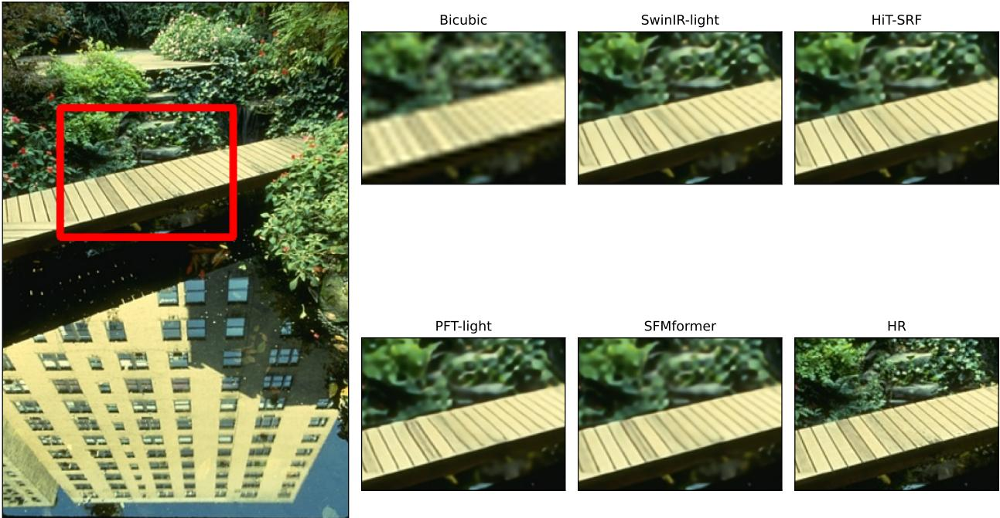  
Figure 8: Visual comparison on image 148026 from BSD100 at ×4.

## 4.7. Deployment on an edge device

## 4.7.1. Deployment and application interface

To verify that the model is usable outside a desktop or cloud environment, we deployed it to a Raspberry Pi 5 (Arm Cortex-A76 quad-core @ 2.4 GHz, 16 GB LPDDR4X, Raspberry Pi OS, PyTorch 2.11.0 CPU build) and built the interactive interface of Fig. 13. It integrates inference, magnifier and side-by-side comparison, batch benchmarking over a test set, and device monitoring, so evaluation can be completed on the deployment platform itself. Because inference cost grows sharply with output size, the interface also lets the user drag a rectangle over a region and reconstruct only that—the mechanism whose latency implications Section 4.7.3 examines.

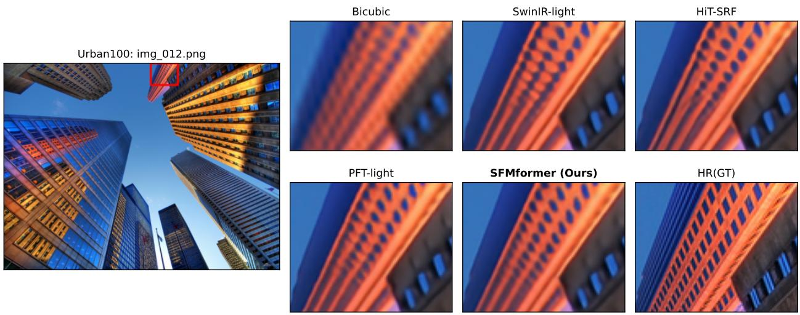

Figure 9: Visual comparison on the 12th image of Urban100 at ×4.  
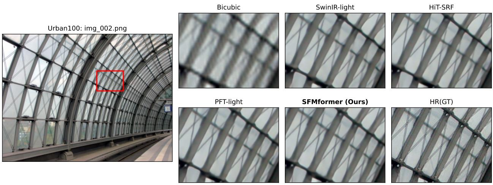  
Figure 10: Visual comparison on the 2nd image of Urban100 at ×4. At the intersections of the X-shaped steel framing, PFT-light and HiT-SRF fade near the horizontal members where SFMformer renders the framing distinctly.

The quality figures shown on screen come from the application’s own metric routine rather than the evaluation script used for Table 1, and difer by a few hundredths of a decibel (32.65 dB against 32.68 dB on Set5 at ×4) owing to border handling and colour conversion; all figures reported elsewhere in this paper use the standard protocol.

## 4.7.2. Inference time

Because inference runs on the CPU alone, without GPU acceleration, per-image inference is comparatively slow. We measured inference time on the five test sets at ×4; the average time per image is reported in Table 5.

The measured times clearly reflect image size: the larger the image, the longer inference takes. This is most evident on Urban100 and Manga109. Urban100 images are upscaled from roughly 256 × 192 to 1024 × 768 at ×4, while Manga109 images go from about 206 × 292 to 824 × 1168, and the timings track these dimensions directly.

## 4.7.3. Which deployment patterns the measured latency supports

The timings in Table 5 are informative about what this model can and cannot be used for on CPU-only hardware, and we state the boundary plainly rather than leaving it implied.

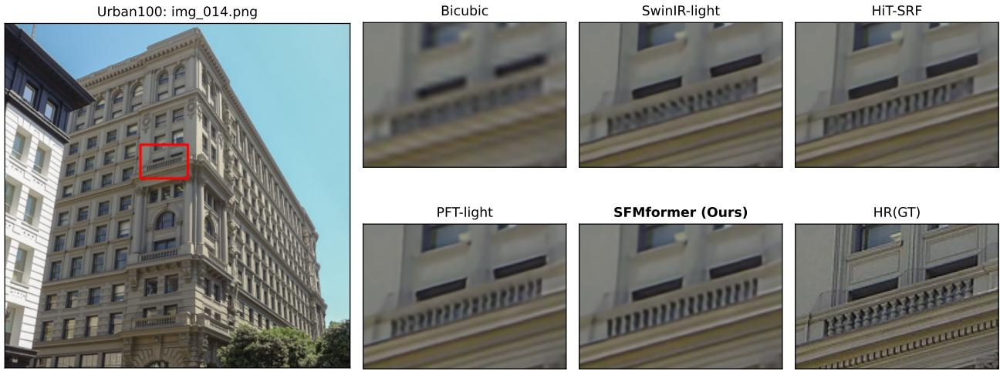

Figure 11: Visual comparison on the 14th image of Urban100 at ×4. SFMformer recovers the structural shape of the railing almost completely, where the other models produce an incomplete structure or outright blur.  
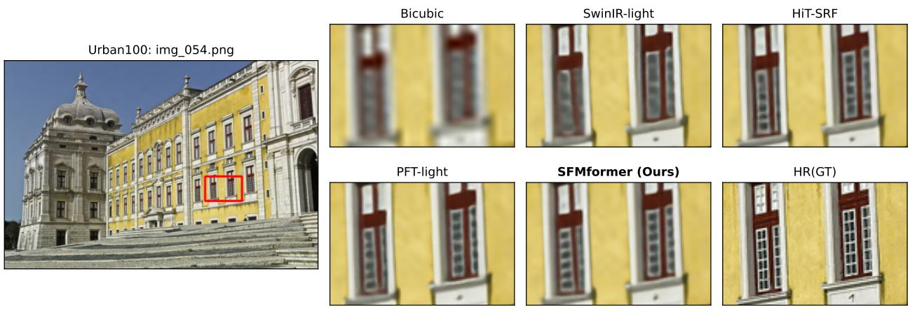  
Figure 12: Visual comparison on the 54th image of Urban100 at ×4. No model recovers the window grid correctly; HiT-SRF cannot separate the panes, PFT-light separates them but skews some, and SFMformer keeps almost all of them square.

Table 5: Average per-image inference time at ×4 on the Raspberry Pi 5 (CPU only).
<table><tr><td>Dataset</td><td>Average time per image (s)</td></tr><tr><td>Set5 [34]</td><td>12.85</td></tr><tr><td>Set14 [35]</td><td>24.29</td></tr><tr><td>BSD100 [36]</td><td>17.36</td></tr><tr><td>Urban100 [37]</td><td>97.42</td></tr><tr><td>Manga109 [38]</td><td>103.88</td></tr></table>

Interactive inspection is practical, provided the region is bounded. Reconstructing a full Manga109 page takes 104 s, which no operator will wait for. But the interface of Section 4.7 does not require it: the 176×156 region selected in Fig. 13(c) reconstructs to 704 × 624 in 45 s, and the 128 × 128 inputs of Set5 in 13 s. Because inference cost scales with pixel count rather than with the size of the source image, the operator controls the latency directly by choosing how much to enlarge. This is the pattern the region-of-interest mode exists to serve, and it is where a sub-1M model earns its keep: the same workflow with a 12M-parameter model would be roughly an order of magnitude slower on the same hardware and would leave the interactive regime entirely.

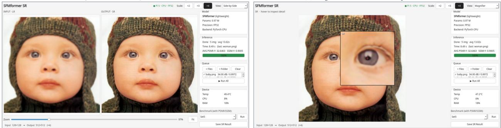  
(a) Side-by-side view: LR input and SR output  
(b) Magnifier view: hover to inspect local detai

(c) Region selection: drag a box on the source image  
(d) Region result: 176×156 → 704×624  
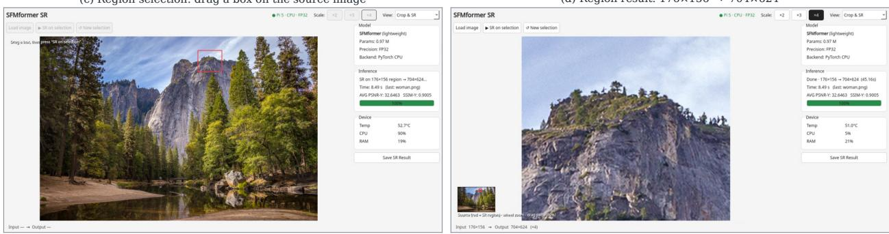  
Figure 13: The interactive inference interface on the Raspberry Pi 5. (a) Side-by-side view. (b) Magnifier view. (c) Region selection. (d) The corresponding region result.

Batch and archival processing is comfortable. At 13–104 s per image depending on resolution, a Raspberry Pi 5 processes on the order of a thousand images per day unattended, at a power draw of a few watts. For archival restoration or overnight processing of a day’s captures this is adequate, and the relevant constraint becomes storage rather than compute.

Real-time video is out of reach on this hardware, and we do not claim otherwise. Even the smallest test images are three orders of magnitude away from a 30 fps budget. Reaching video rates would require quantisation, an NPU or GPU backend, or both; the FP32 PyTorch CPU path measured here is a portability baseline, not an optimised deployment. What the measurements do establish is that the architecture fits within the memory and thermal envelope of a credit-card computer—peak RAM stayed at 21% of 16 GB and the SoC settled at 51–53◦C under sustained load, well inside the throttling threshold—so the remaining gap is an engineering one rather than a question of whether the model fits.

## 4.8. Limitations

Four limitations deserve mention. First, constrained by the lightweight parameter budget and by an optimisation objective that is distortion-oriented in both the pixel and frequency domains, SFMformer still tends to produce somewhat smooth output in regions of complex texture. We report only fidelity metrics (PSNR/SSIM); no perceptual evaluation is included, whether full-reference such as LPIPS [44] or no-reference such as MUSIQ [45] and CLIP-IQA [46]. The perceptual standing of the method relative to the compared baselines is therefore not established here, and since the wavelet branch is motivated by high-frequency detail, this is the evaluation gap most worth closing. Second, the proposed modules cost 15–25% more parameters and FLOPs than the baseline for gains of 0.1–0.3 dB; we report FLOPs and CPU inference time on an edge device, but not GPU-side latency or throughput, so the practical eficiency trade-of on accelerators is not quantified. Third, all results come from a single training run per configuration, which limits what can be concluded from small diferences—see the discussion of Urban100 at ×4 in Section 4.4. Fourth, training and testing are both based on synthetic bicubic-downsampled pairs, which difer from the complex degrada tions encountered in the real world, such as unknown blur kernels, sensor noise and compression artefacts. The first and last points are addressed in Section 5 as directions for future work.

## 5. Conclusion and future work

This paper began from an observation about sparse attention rather than about super-resolution. Because a top-k operator selects before it aggregates, and because progressive focusing propagates that selection forward so a discarded token cannot return, a sparse attention layer ofers two separable targets for improvement where a dense one ofers a single target. We tested this by filling both positions with deliberately ordinary components—dual-branch spatial enhancement [10] on the input of the projection and wavelet-domain modulation [15] on the output—around the progressive focused attention of PFT [14].

The measurements support the prediction without settling it. The two compound on nine of fifteen benchmark– scale pairs and overlap on six, and which occurs is predicted by how much the weaker intervention achieves alone $( r = - 0 . 7 2 )$ . As Section 4.5.1 notes, a generic diminishing-returns model predicts the same sign pattern; separating the two requires the selection-overlap diagnostic or the transfer test to a dense backbone, neither attempted here. What the results do establish is that the paired configuration is worth its cost: 28 of 30 best PSNR/SSIM entries with fewer than one million parameters, with the advantage concentrated where the account predicts. We have also reported where it does not hold, and deployed the model on a Raspberry Pi 5 to confirm it runs within the envelope of a credit-card computer.

Two directions follow. Perceptually oriented training via adversarial objectives [47, 48, 49] could address the smoothness of complex texture, evaluated with perceptual metrics [44, 45, 46] alongside fidelity ones given the perception–distortion trade-of [50]. And since we train on bicubic-downsampled pairs, extending to real-world degra dation [51] would test whether the account generalises beyond synthetic data.

## CRediT authorship contribution statement

Chih-Hsiang Yang: Conceptualization, Methodology, Software, Validation, Formal analysis, Investigation, Data curation, Visualization, Writing – original draft. Chia-Min Lin: Methodology, Validation, Investigation, Writing – review & editing. Ching-Yu Tsai: Validation, Investigation, Writing – review & editing. Yung-Che Wang: Validation, Investigation, Writing – review & editing. Jen-Shiun Chiang: Conceptualization, Methodology, Resources, Supervision, Project administration, Funding acquisition, Writing – review & editing.

## Declaration of competing interest

The authors declare that they have no known competing financial interests or personal relationships that could have appeared to influence the work reported in this paper.

## Data availability

All datasets used in this study (DIV2K, Flickr2K, Set5, Set14, BSD100, Urban100 and Manga109) are publicly available. Code and trained models will be made available upon reasonable request.

## Acknowledgements

The authors thank the members of the laboratory for their assistance with experimental resources and for helpful discussions.

## References

[1] C. Dong, C. C. Loy, K. He, X. Tang, Image super-resolution using deep convolutional networks, IEEE Transactions on Pattern Analysis and Machine Intelligence 38 (2) (2016) 295–307.

[2] B. Lim, S. Son, H. Kim, S. Nah, K. M. Lee, Enhanced deep residual networks for single image super-resolution, in: Proceedings of the IEEE/CVF Conference on Computer Vision and Pattern Recognition Workshops (CVPRW), 2017, pp. 136–144.

[3] Y. Zhang, Y. Tian, Y. Kong, B. Zhong, Y. Fu, Residual dense network for image super-resolution, in: Proceedings of the IEEE/CVF Confer ence on Computer Vision and Pattern Recognition (CVPR), 2018, pp. 2472–2481.

[4] Y. Zhang, K. Li, K. Li, L. Wang, B. Zhong, Y. Fu, Image super-resolution using very deep residual channel attention networks, in: Proceedings of the European Conference on Computer Vision (ECCV), 2018, pp. 286–301.

[5] J. Liang, J. Cao, G. Sun, K. Zhang, L. Van Gool, R. Timofte, SwinIR: Image restoration using Swin Transformer, in: Proceedings of the IEEE/CVF International Conference on Computer Vision Workshops (ICCVW), 2021, pp. 1833–1844.

[6] X. Chen, X. Wang, J. Zhou, Y. Qiao, C. Dong, Activating more pixels in image super-resolution transformer, in: Proceedings of the IEEE/CVF Conference on Computer Vision and Pattern Recognition (CVPR), 2023, pp. 22367–22377.

[7] Z. Hui, X. Gao, Y. Yang, X. Wang, Lightweight image super-resolution with information multi-distillation network, in: Proceedings of the ACM International Conference on Multimedia (ACM MM), 2019, pp. 2024–2032.

[8] X. Luo, Y. Xie, Y. Zhang, Y. Qu, C. Li, Y. Fu, LatticeNet: Towards lightweight image super-resolution with lattice block, in: Proceedings of the European Conference on Computer Vision (ECCV), 2020, pp. 272–289.

[9] X. Zhang, H. Zeng, S. Guo, L. Zhang, Eficient long-range attention network for image super-resolution, in: Proceedings of the European Conference on Computer Vision (ECCV), 2022, pp. 649–667.

[10] X. Zhang, Y. Zhang, F. Yu, HiT-SR: Hierarchical transformer for eficient image super-resolution, in: Proceedings of the European Conference on Computer Vision (ECCV), 2024, pp. 483–500.

[11] Y. Li, K. Zhang, R. Timofte, L. Van Gool, et al., NTIRE 2022 challenge on eficient super-resolution: Methods and results, in: Proceedings of the IEEE/CVF Conference on Computer Vision and Pattern Recognition Workshops (CVPRW), 2022.

[12] Y. Li, Y. Zhang, R. Timofte, L. Van Gool, et al., NTIRE 2023 challenge on eficient super-resolution: Methods and results, in: Proceedings of the IEEE/CVF Conference on Computer Vision and Pattern Recognition Workshops (CVPRW), 2023.

[13] F. Kong, M. Li, S. Liu, D. Liu, J. He, Y. Bai, F. Chen, L. Fu, Residual local feature network for eficient super-resolution, in: Proceedings of the IEEE/CVF Conference on Computer Vision and Pattern Recognition Workshops (CVPRW), 2022.

[14] W. Long, X. Zhou, L. Zhang, S. Gu, Progressive focused transformer for single image super-resolution, in: Proceedings of the IEEE/CVF Conference on Computer Vision and Pattern Recognition (CVPR), 2025, pp. 2279–2288.

[15] W. Li, H. Guo, Y. Hou, G. Gao, Z. Ma, Dual-domain modulation network for lightweight image super-resolution, IEEE Transactions on Multimedia (2025), early access. doi:10.1109/TMM.2025.11397215.

[16] C. Dong, C. C. Loy, X. Tang, Accelerating the super-resolution convolutional neural network, in: Proceedings of the European Conference on Computer Vision (ECCV), 2016, pp. 391–407.

[17] W. Shi, J. Caballero, F. Huszar, J. Totz, A. P. Aitken, R. Bishop, D. Rueckert, Z. Wang, Real-time single image and video super-resolution´ using an eficient sub-pixel convolutional neural network, in: Proceedings of the IEEE/CVF Conference on Computer Vision and Pattern Recognition (CVPR), 2016, pp. 1874–1883.

[18] Z. Liu, Y. Lin, Y. Cao, H. Hu, Y. Wei, Z. Zhang, S. Lin, B. Guo, Swin Transformer: Hierarchical vision transformer using shifted windows, in: Proceedings of the IEEE/CVF International Conference on Computer Vision (ICCV), 2021, pp. 10012–10022.

[19] Y. Zhou, Z. Li, C.-L. Guo, S. Bai, M.-M. Cheng, Q. Hou, SRFormer: Permuted self-attention for single image super-resolution, in: Proceedings of the IEEE/CVF International Conference on Computer Vision (ICCV), 2023, pp. 12780–12791.

[20] H. Wang, X. Chen, B. Ni, Y. Liu, J. Liu, Omni aggregation networks for lightweight image super-resolution, in: Proceedings of the IEEE/CVF Conference on Computer Vision and Pattern Recognition (CVPR), 2023, pp. 22378–22387.

[21] S. W. Zamir, A. Arora, S. Khan, M. Hayat, F. S. Khan, M.-H. Yang, Restormer: Eficient transformer for high-resolution image restoration, in: Proceedings of the IEEE/CVF Conference on Computer Vision and Pattern Recognition (CVPR), 2022, pp. 5728–5739.

[22] H. Guo, J. Li, T. Dai, Z. Ouyang, X. Ren, S.-T. Xia, MambaIR: A simple baseline for image restoration with state-space model, in: Proceed ings of the European Conference on Computer Vision (ECCV), 2024, pp. 222–241.

[23] L. Zhang, Y. Li, X. Zhou, X. Zhao, S. Gu, Transcending the limit of local window: Advanced super-resolution transformer with adaptive token dictionary, in: Proceedings of the IEEE/CVF Conference on Computer Vision and Pattern Recognition (CVPR), 2024, pp. 2856–2865.

[24] J. Xin, J. Li, X. Jiang, N. Wang, H. Huang, X. Gao, Wavelet-based dual recursive network for image super-resolution, IEEE Transactions on Neural Networks and Learning Systems 33 (2) (2022) 707–720.

[25] W. Zou, L. Chen, Y. Wu, Y. Zhang, Y. Xu, J. Shao, Joint wavelet sub-bands guided network for single image super-resolution, IEEE Transactions on Multimedia 25 (2023) 4623–4637.

[26] X. Jiang, N. Wang, J. Xin, K. Li, X. Yang, J. Li, X. Wang, X. Gao, FABNet: Frequency-aware binarized network for single image superresolution, IEEE Transactions on Image Processing 32 (2023) 6234–6247.

[27] L. Kong, J. Dong, J. Ge, M. Li, J. Pan, Eficient frequency domain-based transformers for high-quality image deblurring, in: Proceedings of the IEEE/CVF Conference on Computer Vision and Pattern Recognition (CVPR), 2023, pp. 5886–5895.

[28] J. Li, T. Dai, M. Zhu, B. Chen, Z. Wang, S.-T. Xia, FSR: A general frequency-oriented framework to accelerate image super-resolution networks, in: Proceedings of the AAAI Conference on Artificial Intelligence (AAAI), Vol. 37, 2023, pp. 1343–1350.

[29] Y. Xiao, Q. Yuan, K. Jiang, Y. Chen, Q. Zhang, C.-W. Lin, Frequency-assisted Mamba for remote sensing image super-resolution, IEEE Transactions on Multimedia 27 (2025) 1783–1796.

[30] D. Zhang, F. Huang, S. Liu, X. Wang, Z. Jin, SwinFIR: Revisiting the SwinIR with fast Fourier convolution and improved training for image super-resolution, arXiv preprint arXiv:2208.11247.

[31] T. Dai, J. Wang, H. Guo, J. Li, J. Wang, Z. Zhu, FreqFormer: Frequency-aware transformer for lightweight image super-resolution, in: Proceedings of the International Joint Conference on Artificial Intelligence (IJCAI), 2024, pp. 731–739.

[32] E. Agustsson, R. Timofte, NTIRE 2017 challenge on single image super-resolution: Dataset and study, in: Proceedings of the IEEE/CVF Conference on Computer Vision and Pattern Recognition Workshops (CVPRW), 2017, pp. 126–135.

[33] R. Timofte, E. Agustsson, L. Van Gool, M.-H. Yang, L. Zhang, NTIRE 2017 challenge on single image super-resolution: Methods and results, in: Proceedings of the IEEE/CVF Conference on Computer Vision and Pattern Recognition Workshops (CVPRW), 2017, pp. 114–125.

[34] M. Bevilacqua, A. Roumy, C. Guillemot, M.-L. Alberi-Morel, Low-complexity single-image super-resolution based on nonnegative neighbor embedding, in: Proceedings of the British Machine Vision Conference (BMVC), 2012, pp. 135.1–135.10.

[35] R. Zeyde, M. Elad, M. Protter, On single image scale-up using sparse-representations, in: Proceedings of the International Conference on Curves and Surfaces, 2010, pp. 711–730.

[36] D. Martin, C. Fowlkes, D. Tal, J. Malik, A database of human segmented natural images and its application to evaluating segmentation algorithms and measuring ecological statistics, in: Proceedings of the IEEE International Conference on Computer Vision (ICCV), 2001, pp. 416–423.

[37] J.-B. Huang, A. Singh, N. Ahuja, Single image super-resolution from transformed self-exemplars, in: Proceedings of the IEEE Conference on Computer Vision and Pattern Recognition (CVPR), 2015, pp. 5197–5206.

[38] Y. Matsui, K. Ito, Y. Aramaki, A. Fujimoto, T. Ogawa, T. Yamasaki, K. Aizawa, Sketch-based manga retrieval using Manga109 dataset, Multimedia Tools and Applications 76 (20) (2017) 21811–21838.

[39] Z. Wang, A. C. Bovik, H. R. Sheikh, E. P. Simoncelli, Image quality assessment: From error visibility to structural similarity, IEEE Transactions on Image Processing 13 (4) (2004) 600–612.

[40] H. Choi, J. Lee, J. Yang, N-gram in Swin Transformers for eficient lightweight image super-resolution, in: Proceedings of the IEEE/CVF Conference on Computer Vision and Pattern Recognition (CVPR), 2023, pp. 2071–2081.

[41] Y. Tian, H. Chen, C. Xu, Y. Wang, Image processing GNN: Breaking rigidity in super-resolution, in: Proceedings of the IEEE/CVF Conference on Computer Vision and Pattern Recognition (CVPR), 2024, pp. 24108–24117.

[42] Q. Hu, Y. Tang, X. Zhang, Large kernel modulation network for eficient image super-resolution, arXiv preprint arXiv:2508.11893.

[43] W. Liu, C. Cai, J. Gao, W. Zhang, PromptSR: Cascade prompting for lightweight image super-resolution, IEEE Transactions on Multimedia.

[44] R. Zhang, P. Isola, A. A. Efros, E. Shechtman, O. Wang, The unreasonable efectiveness of deep features as a perceptual metric, in: Proceedings of the IEEE/CVF Conference on Computer Vision and Pattern Recognition (CVPR), 2018, pp. 586–595.

[45] J. Ke, Q. Wang, Y. Wang, P. Milanfar, F. Yang, MUSIQ: Multi-scale image quality transformer, in: Proceedings of the IEEE/CVF International Conference on Computer Vision (ICCV), 2021, pp. 5148–5157.

[46] J. Wang, K. C. K. Chan, C. C. Loy, Exploring CLIP for assessing the look and feel of images, in: Proceedings of the AAAI Conference on Artificial Intelligence (AAAI), Vol. 37, 2023, pp. 2555–2563.

[47] I. Goodfellow, J. Pouget-Abadie, M. Mirza, B. Xu, D. Warde-Farley, S. Ozair, A. Courville, Y. Bengio, Generative adversarial nets, in: Advances in Neural Information Processing Systems (NeurIPS), 2014, pp. 2672–2680.

[48] C. Ledig, L. Theis, F. Huszar, J. Caballero, A. Cunningham, A. Acosta, A. Aitken, A. Tejani, J. Totz, Z. Wang, W. Shi, Photo-realistic single´ image super-resolution using a generative adversarial network, in: Proceedings of the IEEE/CVF Conference on Computer Vision and Pattern Recognition (CVPR), 2017, pp. 4681–4690.

[49] X. Wang, K. Yu, S. Wu, J. Gu, Y. Liu, C. Dong, Y. Qiao, C. C. Loy, ESRGAN: Enhanced super-resolution generative adversarial networks, in: Proceedings of the European Conference on Computer Vision Workshops (ECCVW), 2018, pp. 63–79.

[50] Y. Blau, T. Michaeli, The perception-distortion tradeof, in: Proceedings of the IEEE/CVF Conference on Computer Vision and Pattern Recognition (CVPR), 2018, pp. 6228–6237.

[51] X. Wang, L. Xie, C. Dong, Y. Shan, Real-ESRGAN: Training real-world blind super-resolution with pure synthetic data, in: Proceedings of the IEEE/CVF International Conference on Computer Vision Workshops (ICCVW), 2021, pp. 1905–1914.