# SPVC: Structured and Panoptic Video Fixing for Cross-Dataset Driving Scene Rendering

Gen Li1,2,†, Shu Han3,†, Yun Xi Qiao4, Hua Chen5, Xuyang Dai5, Bohan Li6, Hao Zhao1, and Chaojian Li7,∗

Abstract— Driving scene reconstruction and rendering, especially with 3D Gaussian Splatting, has become an important component of autonomous driving simulation. However, rendered views often degrade under extrapolated ego trajectories and scene edits, producing blurry structures, temporal flicker, and foreground-background misalignment. Existing refinement methods are commonly designed for a specific setting, such as image-level novel-view repair or object-editing correction. In this paper, we introduce SPVC, a structured and panoptic video fixing framework for cross-dataset driving scene rendering. The name summarizes four design principles. (1) Structured fixing denotes the use of explicit spatial conditions, including camera pose, 3D bounding boxes, and HD maps, to guide the repair process and reduce uncontrolled hallucination. (2) Panoptic fixing refers to correcting both background rendering artifacts, such as distorted roads, buildings, and lanes, and foreground vehicle artifacts introduced by scene editing, such as inconsistent object appearance. (3) Video fixing means that the model operates on driving sequences rather than isolated frames, allowing temporal cues to be used during artifact correction. (4) Cross-dataset fixing means that a single shared network is trained and applied across multiple driving datasets, reducing the need for dataset-specific or scene-specific fixers. Concretely, we construct paired degraded-clean training data by simulating under-constrained 3DGS rendering and foreground vehicle insertion artifacts, and train a two-stage controllable video diffusion model that first addresses video-level appearance and then refines scene layout with structured controls. Experiments on Waymo, nuScenes, and PandaSet show that SPVC improves novel-view artifact correction and foreground vehicle insertion fixing over strong baselines, while maintaining better temporal consistency and spatial controllability. Project page: https: //li00147.github.io/SPVC-Project-Page/.

## I. INTRODUCTION

Realistic driving simulation [1]–[18] has become an essential tool for developing and evaluating autonomous driving systems, especially as end-to-end planners [19]–[33] and vision-language-action models [34]–[47] increasingly require large-scale, diverse, and controllable training environments [48]–[54]. A dominant recent paradigm is reconstruction-thenrendering: real-world driving scenes are first reconstructed from multi-view sensor data using neural rendering methods, and then novel camera trajectories, object insertions, or scene edits are rendered to synthesize new driving experiences [55]– [57]. However, once the camera deviates from the captured trajectory or the scene is edited, the rendered results often expose severe artifacts, including distorted lane markings, blurry buildings, broken road geometry, temporal flicker, and foreground-background inconsistency. Therefore, a practical driving simulator requires an effective fixing module that can repair rendering artifacts after novel-view synthesis or scene editing.

Existing fixing and refinement methods remain limited for this goal. As illustrated in the left side of Fig. 2, (1) many image-level diffusion priors can improve visual realism [58], [59], but they often hallucinate uncertain geometry because they lack explicit spatial control signals such as camera pose, HD maps, or object boxes. (2) Other fixer models are designed for a narrow artifact type [60], [61], for example repairing background novel-view rendering while leaving edited foreground vehicles distorted or inconsistent with the scene. (3) Moreover, image-based fixers process frames independently [62], [63], which can introduce temporal flicker when applied to driving videos. (4) Finally, most existing pipelines are tied to a specific scene, dataset, or reconstruction source. In practice, PandaSet, Waymo, and nuScenes differ in camera setup, appearance distribution, annotation format, and reconstruction quality; training separate fixers for each dataset or scene limits scalability and prevents the accumulation of reusable artifact-clean pairs across datasets. Shown in Fig. 2.

<table><tr><td rowspan=1 colspan=1>Method</td><td rowspan=1 colspan=1>Structured</td><td rowspan=1 colspan=1>Panoptic</td><td rowspan=1 colspan=1>Video</td><td rowspan=1 colspan=1>Cross-dataset</td></tr><tr><td rowspan=1 colspan=1>Difix3D+</td><td rowspan=1 colspan=1>X</td><td rowspan=1 colspan=1></td><td rowspan=1 colspan=1>+</td><td rowspan=1 colspan=1></td></tr><tr><td rowspan=1 colspan=1>StreetCrafter</td><td rowspan=1 colspan=1></td><td rowspan=1 colspan=1></td><td rowspan=1 colspan=1></td><td rowspan=1 colspan=1></td></tr><tr><td rowspan=1 colspan=1>FreeVS</td><td rowspan=1 colspan=1>X</td><td rowspan=1 colspan=1></td><td rowspan=1 colspan=1></td><td rowspan=1 colspan=1></td></tr><tr><td rowspan=1 colspan=1>Recondreamer</td><td rowspan=1 colspan=1></td><td rowspan=1 colspan=1></td><td rowspan=1 colspan=1></td><td rowspan=1 colspan=1></td></tr><tr><td rowspan=1 colspan=1>Recondreamer++</td><td rowspan=1 colspan=1></td><td rowspan=1 colspan=1></td><td rowspan=1 colspan=1></td><td rowspan=1 colspan=1></td></tr><tr><td rowspan=1 colspan=1>R3D2</td><td rowspan=1 colspan=1></td><td rowspan=1 colspan=1></td><td rowspan=1 colspan=1></td><td rowspan=1 colspan=1></td></tr><tr><td rowspan=1 colspan=1>SPVC</td><td rowspan=1 colspan=1></td><td rowspan=1 colspan=1></td><td rowspan=1 colspan=1></td><td rowspan=1 colspan=1></td></tr></table>

Fig. 2. Comparison with different methods.

To address these limitations, we propose SPVC, a Structured and Panoptic Video Fixing framework for Cross-Dataset Driving Scene Rendering. As summarized in Fig. 1, SPVC is built around four design principles that directly target the failure modes of traditional methods.

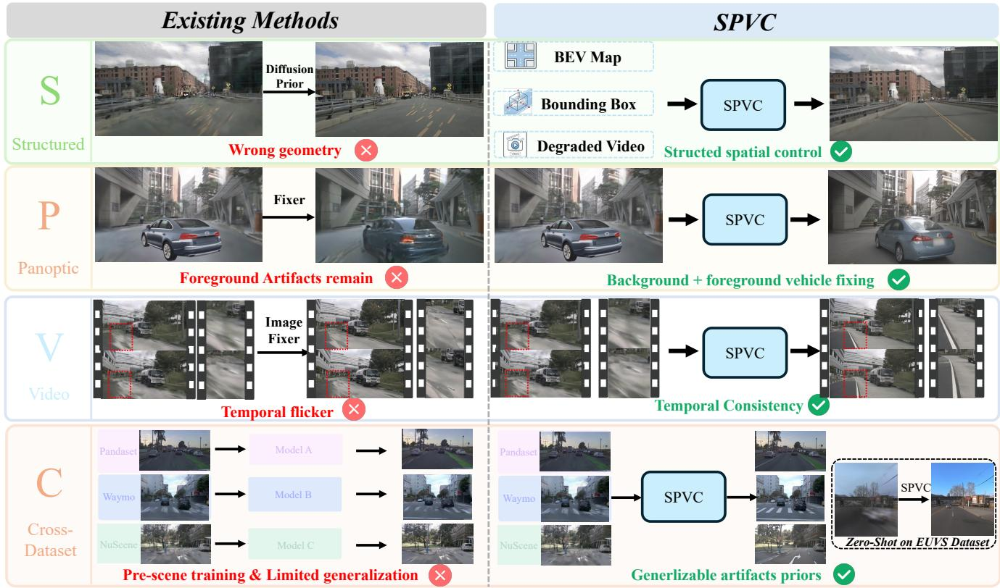  
Fig. 1. Our Method improves neural-rendered driving videos by removing 3DGS artifacts, correcting novel-trajectory distortions

First, SPVC is Structured. Instead of relying on an unconstrained diffusion prior, SPVC can condition the fixing process on explicit spatial signals, including the reference video, target camera pose, BEV/HD map, and 3D bounding boxes. These conditions anchor the generation process to the intended scene layout, so the model is encouraged to repair artifacts while preserving road topology and object placement. This is particularly important for autonomous driving simulation [64]–[66], where visually pleasing but geometrically incorrect outputs can be harmful for downstream perception and planning evaluation.

Second, SPVC is Panoptic. We use “panoptic” to emphasize that the fixer operates on both the background scene and the foreground dynamic objects, rather than only one of them [67]– [69]. Background artifacts include distorted roads, building facades, sidewalks, vegetation, and lane markings caused by under-constrained novel-view rendering. Foreground artifacts arise when vehicles are inserted, moved, or edited, leading to inconsistent appearance. By jointly considering background and foreground vehicle fixing, SPVC supports a broader class of driving simulation edits and avoids the common failure case where the background is improved but the inserted vehicle remains visually implausible.

Third, SPVC performs Video fixing. Driving simulation is inherently sequential: ego motion and object motion evolve continuously across frames. Frame-wise image fixers ignore this temporal structure and can produce inconsistent textures and flickering object appearances. SPVC instead operates on video sequences, allowing temporal cues from neighboring frames to guide artifact correction.

Fourth, SPVC is designed for Cross-Dataset fixing. Rather than training separate scene-specific or dataset-specific repair networks, SPVC uses a single shared model across multiple driving datasets. This design allows artifact-clean paired data from different sources to be accumulated into a unified training corpus. As shown in Fig. 1, the same model can process PandaSet, Waymo, and nuScenes inputs, and can further generalize to unseen settings such as zero-shot EUVS-style rendering. Our contributions are summarized as follows: (1) We propose SPVC, a controllable video diffusion framework that fixes both background rendering artifacts and foreground vehicle insertion artifacts using explicit camera, map, and box conditions. (2) We construct scalable paired training data for degraded-clean driving video fixing across multiple datasets, enabling one shared fixer to operate beyond a single scene or dataset. (3) Experiments on Waymo, nuScenes, and PandaSet demonstrate that SPVC improves novel-view rendering repair, foreground vehicle fixing, temporal consistency, and spatial controllability over strong image-level and video-level baselines.

## II. RELATED WORK

## A. Neural Rendering for Autonomous Driving Simulation

Neural rendering provides the foundation for photorealistic autonomous driving simulation. NeRF-based methods [70]– [73] represent scenes as continuous radiance fields, while

3D Gaussian Splatting (3DGS) [74], [75] enables efficient rendering using explicit Gaussian primitives.

These representations have been extended to urban driving environments [76]–[84]. Representative systems improve different aspects of simulation, including dynamic scene decomposition [85], occlusion-aware composition [86], sensor modeling [87], and real-time multi-modal rendering [88]. Other works further enhance dynamic scene reconstruction and consistency [82], [89], [90]. However, when rendered from novel viewpoints, these reconstruction methods often suffer from severe artifacts, including distorted geometry, blurry structures, temporal flicker, and foreground-background inconsistency. This motivates SPVC, which formulates artifact correction as a Video fixing problem, uses Structured spatial guidance to constrain the repair process, learns Panoptic correction priors, and generalizes Cross datasets.

## B. Generative Driving Simulation

Generative models provide a complementary route for improving realism and expanding controllability beyond pure reconstruction. Diffusion- and world-model-based approaches [91]–[96] enable scalable synthesis of diverse driving scenes.

Recent methods directly generate driving content from structured conditions. UniScene [97] synthesizes occupancy and camera streams from BEV layouts; DriveDreamer4D [98], Dist-4D [99], and Cosmos-Drive-Dreams [100] condition on combinations of boxes, trajectories, maps, poses, and depth; MagicDrive-v2 [65] adds richer control over trajectories and object layouts. Broader video world models such as VideoLDM [101] and Sora [102] further show the potential of coherent long-horizon generation. Compared with these direct generative simulators, SPVC targets a different problem: improving reconstruction-based simulation through video fixing rather than replacing it with full scene generation. This setting requires structured spatial guidance to preserve scene geometry and sensor alignment, panoptic correction to handle both background and foreground artifacts, and crossdataset video priors to maintain temporal consistency under realistic reconstruction constraints.

## C. Generative Fixing and Refinement

Several recent methods use generative priors to refine neural-rendered outputs. ReconDreamer [62] performs online restoration for driving scene reconstruction, DIFIX3D+ [58] improves under-constrained 3D reconstruction, and ReconDreamer++ [63] further integrates generative and reconstructive signals. FreeVS [60], FreeSim [103], and StreetCrafter [61] address free-trajectory or off-trajectory degradation with generative correction. However, these methods often lack precise control signals to guide video diffusion priors, and are usually tailored to a particular degradation setting, reconstruction source, or dataset. They also typically focus on either background novel-view artifacts or foreground editing artifacts. In contrast, SPVC formulates refinement as a video fixing problem guided by structured spatial controls, learns panoptic correction priors for both background and foreground artifacts, and is trained across multiple driving datasets to improve generalization.

## III. METHOD

Existing generative fixers have shown promising results for driving scene rendering under settings such as novel-view repair, scene editing, and per-scene refinement. However, a unified formulation that jointly leverages structured controls, temporal priors, and paired artifact-clean data across tasks and datasets remains less explored.

To this end, we propose SPVC, illustrated in Fig. 3. Building such a framework is non-trivial along all four dimensions. For Structured fixing, the key challenge is injecting structured information into video diffusion as geometry guidance. For Panoptic fixing, the challenge is constructing paired supervision for both background degradation and foreground vehicle misalignment caused by 3D asset insertion. For Video fixing, the model must correct artifacts while preserving temporal consistency. For Cross-dataset fixing, dataset gaps in cameras, appearance, annotations, and reconstruction quality make per-dataset or per-scene fixers hard to scale and limit reusable artifact-clean supervision. SPVC addresses these challenges with a cross-dataset data construction pipeline for degraded-clean video pairs and a two-stage controllable video diffusion backbone.

## A. SPVC Data Construction Pipeline

Panoptic. Existing fixing pipelines usually target either background novel-view artifacts or foreground editing artifacts, but not both. Achieving panoptic fixing is challenging because it requires paired supervision that captures staticscene degradation and foreground-background inconsistency under a unified formulation.

SPVC constructs panoptic artifact pairs covering both background and foreground failures. Background pairs are produced from under-constrained novel-view rendering, resulting in distorted roads, lanes, buildings, and other static structures. Foreground pairs are generated by cropping vehicles, converting them into 3D Gaussian assets with TRELLIS [104], and reinserting them into reconstructed 3DGS scenes with slight spatial perturbations. This creates foreground-background misalignment and inconsistent vehicle appearance, enabling SPVC to learn unified background-andforeground repair.

Cross-Dataset. The key insight is that NVS artifacts across driving datasets often arise from the same source: underconstrained 3DGS reconstruction. Despite differences in camera setup, appearance, and reconstruction quality, Waymo, nuScenes, and PandaSet share similar degradation patterns, such as blurry geometry, distorted structures, and missing regions. This motivates a unified corruption principle for cross-dataset data construction.

We construct NVS artifact pairs with three complementary strategies, each targeting a characteristic failure mode of novel-view rendering. First, since many artifacts resemble under-fitted 3DGS renderings, we use under-trained 3DGS models [82] to produce degraded-clean pairs. Second, to improve cross-camera generalization and capture realistic viewpoint gaps, we train 3DGS from a single camera and render other camera views as cross-view NVS pairs. Third, because large ego-trajectory shifts often reveal holes and unseen regions, we apply random masking to simulate missing content. All samples are converted into the same degradedclean video format and mixed across datasets to improve cross-dataset generalization.

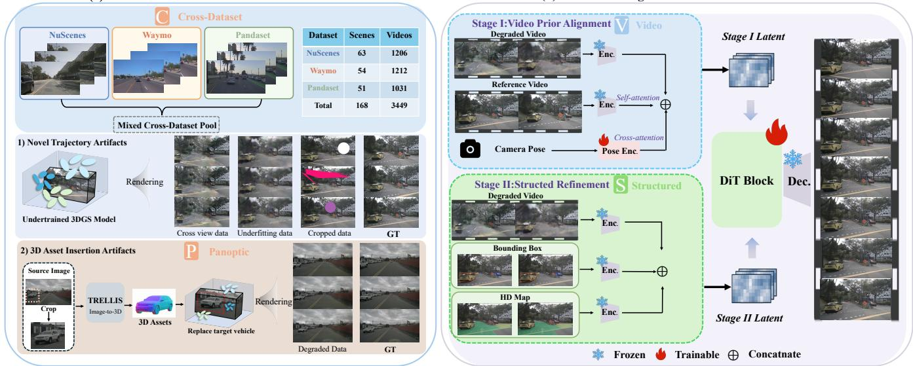  
Fig. 3. Overview of SPVC, a unified framework for structured, panoptic, and temporally consistent driving scene fixing across datasets. SPVC constructs paired degraded–clean videos for novel-trajectory and 3D asset insertion artifacts, and progressively integrates video priors with camera poses, HD maps, and 3D bounding boxes through a two-stage diffusion model.

## B. Two-stage controllable diffusion model

Video : Stage I. The first stage aims to learn temporally consistent video-level repair by leveraging complementary temporal and spatial priors. Unlike image-based reference methods such as Difix3D+ [58], which rely on a single reference view, we use a reference video V to provide stable scene-level appearance cues over time. Meanwhile, relative camera poses serve as spatial priors to describe viewpoint changes and preserve geometric consistency across trajectories.Given the degraded video $( V _ { s } )$ and reference video $( V _ { r } )$ , we encode both sequences using a pretrained 3D VAE encoder [105]: $x _ { s } = E _ { \mathrm { V A E } } ( V _ { s } )$ and $x _ { r } = E _ { \mathrm { V A E } } ( V _ { r } )$ . The reference latent $x _ { r }$ is then fused into the degraded latent $x _ { s }$ through reference-aware temporal attention:

$$
\bar { x } _ { s } = x _ { s } + \mathrm { A t t n } ( Q = x _ { s } , K = x _ { r } , V = x _ { r } ) ,\tag{1}
$$

which allows the model to borrow temporally coherent appearance cues from the reference sequence.

Another challenge is to guide the model to understand viewpoint changes between the reference and degraded videos. We therefore compute the relative camera pose sequence

$$
\Delta T _ { t } = T _ { t } ^ { s } ( T _ { t } ^ { r } ) ^ { - 1 } ,\tag{2}
$$

where $T _ { t } ^ { s }$ and $T _ { t } ^ { r }$ denote the camera poses of $V _ { s }$ and $V _ { r }$ at frame t, respectively. The pose sequence is encoded by a

learnable camera encoder [64]:

$$
c _ { T } = E _ { \mathrm { c a m } } ( \{ \Delta T _ { t } \} _ { t = 1 } ^ { N } ) ,\tag{3}
$$

and injected into the video latent through cross-attention:

$$
z _ { s } ^ { ( I ) } = \bar { x } _ { s } + \mathrm { A t t n } ( Q = \bar { x } _ { s } , K = c _ { T } , V = c _ { T } ) .\tag{4}
$$

The resulting representation is processed by DiT blocks [106] to produce a coarse video representation that is both appearance-consistent and camera-aware.

Structured : Stage II. While Stage I provides video-level appearance and camera-motion guidance, it does not explicitly constrain fine-grained scene structure. Our motivation is that driving scenes are largely defined by two complementary structural elements: the spatial configuration of foreground traffic participants and the topology of the road environment [64], [66]. We therefore introduce 3D bounding boxes B to specify object locations, scales, and motions, and HD maps H to encode lane geometry and road layout. Together, they provide compact and precise structural conditions for guiding local repair while preserving temporal coherence.

We first rasterize these signals into temporally aligned condition videos and encode them with the same pretrained 3D VAE encoder: $x _ { b } = E _ { \mathrm { V A E } } ( B )$ and $x _ { h } = E _ { \mathrm { V A E } } ( H )$ . The structured latents are concatenated with the Stage-I video representation along the channel dimension:

$$
\begin{array} { r } { z _ { s } ^ { ( I I ) } = \mathrm { C o n c a t } \left( z _ { s } ^ { ( I ) } , x _ { b } , x _ { h } \right) . } \end{array}\tag{5}
$$

The fused latent is then fed into the second-stage DiT blocks for structure-guided refinement: $\hat { x } _ { s } = F _ { \theta } ^ { ( I I ) } ( z _ { s } ^ { ( \breve { I } I ) } )$ . Through this stage, the model learns to refine foreground vehicles and background layout under explicit spatial guidance, improving object consistency, road structure, and foreground-background alignment.

LaneShift@4mLaneShift@2m

Source Frame  
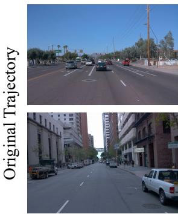  
Source Frame

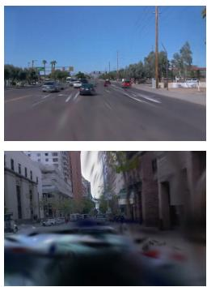  
OmniRe

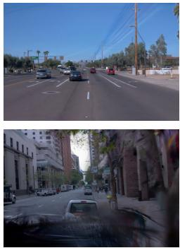  
StreetCrafter

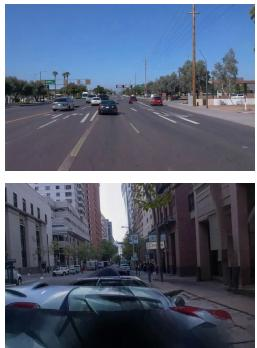  
Difix3D+

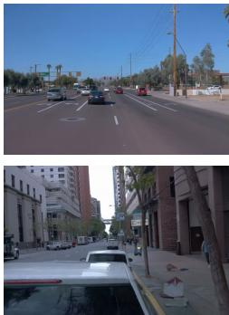  
SPVC  
Fig. 4. Qualitative results under 2 m and 4 m lane shifts on Waymo [107].

## IV. EXPERIMENTS

In this section, we evaluate SPVC on NVS fixing, Panoptic fixing, zero-shot EUVS transfer, closed-loop simulation, and ablation studies across multiple autonomous driving datasets.

## A. Experiment Settings

Training Details. All models are trained at a resolution of 800×448 with 25-frame sequences, and our framework is built upon Wan-2.2’s pre-trained model [105]. A fixed learning rate of 1e−4 is used, and the same training configuration is applied across all experiments unless otherwise stated.

Inference Details. SPVC performs inference on a single NVIDIA H20 GPU at 800×448 resolution with 25-frame sequences and 50 denoising steps, requiring 305.70,s per sequence. We accelerate the Wan-2.2 backbone using INT8 FFN quantization, cuBLASLt-based fused GEMM kernels, and fused dequantization–GELU–requantization, achieving a 1.21× speedup and reducing the runtime to 252.64,s while maintaining nearly identical visual quality.

## B. Novel Trajectory Synthesis Fixing

We evaluate SPVC for novel-view fixing under viewpoint distribution shifts on Waymo [107], nuScenes [109], and PandaSet [110]. The evaluation covers extrapolated trajectories that deviate from the training views, and further includes zero-shot transfer to EUVS [111]. SPVC consistently improves rendering quality and visual coherence under novel viewpoints across datasets.

Results on Waymo. We evaluate novel view synthesis fixing on eight representative Waymo scenes with horizontal lane shifts of 1,m to 4,m. We compare SPVC with stateof-the-art rendering and fixing methods [58], [60], [61], [82], [83], [108]. As shown in Fig. 4 and Table I, SPVC consistently produces more coherent structures and fewer artifacts, achieving the best performance across all visual quality and view consistency metrics.

## Results on nuScenes.

We follow the same protocol as the Waymo evaluation and evaluate SPVC on eight representative nuScenes scenes against state-of-the-art methods [58], [82], [83], [108]. As shown in Fig. 5 and Table II, SPVC consistently produces cleaner renderings with fewer artifacts and achieves the best performance across all lane shift settings. Under the most challenging 4,m shift, it obtains an FID of 45.8 and an FVD of 719.3, improving over the strongest baseline by 33.62% and 43.45%, respectively.

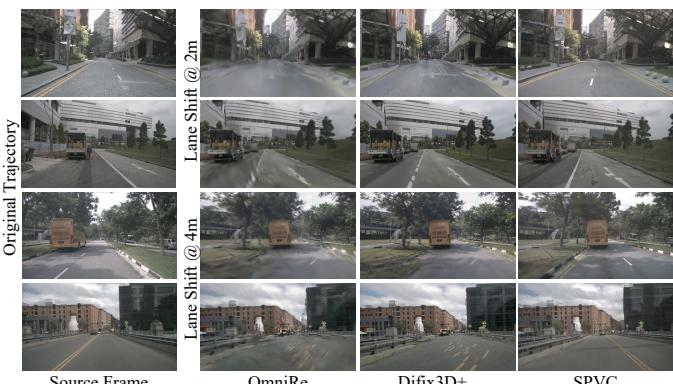  
OmniRe  
Fig. 5. Qualitative results under 2 m and 4 m lane shifts on nuScenes.

TABLE II  
QUANTITATIVE RESULTS ON NUSCENES AT 4M LANE SHIFT.
<table><tr><td rowspan="2">Method</td><td colspan="3">Visual Quality</td><td colspan="2">View Consistency</td></tr><tr><td>FID↓</td><td>IQ↑</td><td>CLIP-F↑</td><td>FVD↓</td><td>CLIP-V↑</td></tr><tr><td>PVG [108]</td><td>154.7</td><td>35.78</td><td>0.7645</td><td>1368.2</td><td>0.9736</td></tr><tr><td>StreetGaussian [83]</td><td>132.5</td><td>42.08</td><td>0.7766</td><td>1580.7</td><td>0.9686</td></tr><tr><td>OmniRe [82]</td><td>126.4</td><td>42.36</td><td>0.7935</td><td>1567.1</td><td>0.9697</td></tr><tr><td>Difix3D+ [58]</td><td>69.0</td><td>58.53</td><td>0.8375</td><td>1272.0</td><td>0.9578</td></tr><tr><td>SPVC</td><td>45.8</td><td>65.70</td><td>0.8419</td><td>719.3</td><td>0.9795</td></tr></table>

Results on PandaSet. For a fair comparison, we follow the protocol of ReconDreamer++ [63] and evaluate novel view fixing under horizontal and vertical viewpoint perturbations. SPVC achieves FID scores of 35.1, 45.0, and 42.1, improving over ReconDreamer++ by 43.3%, 37.2%, and 32.5%.

TABLE I  
QUANTITATIVE RESULTS ON THE WAYMO DATASET UNDER 3M AND 4M LANE SHIFTS.
<table><tr><td rowspan="3">Method</td><td colspan="5">Lane Shift @ 3m</td><td colspan="5">Lane Shift @ 4m</td></tr><tr><td colspan="3">Visual Quality</td><td colspan="2">View Consistency</td><td colspan="3">Visual Quality</td><td colspan="2">View Consistency</td></tr><tr><td>FID↓</td><td>IQ↑</td><td>CLIP-F↑</td><td>FVD↓</td><td>CLIP-V↑</td><td>FID↓</td><td>IQ↑</td><td>CLIP-F↑</td><td>FVD↓</td><td>CLIP-V↑</td></tr><tr><td>PVG [108]</td><td>140.6</td><td>41.08</td><td>0.7563</td><td>1402.0</td><td>0.9783</td><td>156.5</td><td>39.72</td><td>0.7429</td><td>1570.7</td><td>0.9774</td></tr><tr><td>StreetGaussian [83]</td><td>86.9</td><td>52.81</td><td>0.8163</td><td>915.5</td><td>0.9745</td><td>103.5</td><td>51.32</td><td>0.7968</td><td>1208.9</td><td>0.9733</td></tr><tr><td>OmniRe [82]</td><td>80.6</td><td>52.89</td><td>0.8154</td><td>881.4</td><td>0.9759</td><td>96.9</td><td>51.12</td><td>0.8007</td><td>1122.5</td><td>0.9742</td></tr><tr><td>FreeVS [60]</td><td>74.7</td><td>53.88</td><td>0.8050</td><td>1004.8</td><td>0.9609</td><td>79.9</td><td>53.34</td><td>0.7982</td><td>1075.9</td><td>0.9576</td></tr><tr><td>StreetCrafter [61]</td><td>48.5</td><td>64.86</td><td>0.8847</td><td>624.2</td><td>0.9826</td><td>59.5</td><td>62.99</td><td>0.8696</td><td>751.7</td><td>0.9821</td></tr><tr><td>Difix3D+ [58]</td><td>51.3</td><td>70.65</td><td>0.8678</td><td>602.4</td><td>0.9717</td><td>59.1</td><td>70.26</td><td>0.8517</td><td>735.0</td><td>0.9682</td></tr><tr><td>SPVC</td><td>39.8</td><td>72.67</td><td>0.9217</td><td>582.4</td><td>0.9855</td><td>45.3</td><td>71.64</td><td>0.9160</td><td>658.5</td><td>0.9843</td></tr></table>

TABLE III

QUANTITATIVE RESULTS ON PANDASET.
<table><tr><td>Method</td><td>Lane 2m</td><td>Lane 3m</td><td>Vert. 1m</td></tr><tr><td>UniSim [76]</td><td>74.7</td><td>97.5</td><td></td></tr><tr><td>NeuRAD [112]</td><td>72.3</td><td>93.9</td><td>76.3</td></tr><tr><td>StreetGaussian [83]</td><td>66.3</td><td>80.7</td><td>78.4</td></tr><tr><td>ReconDreamer [62]</td><td>65.4</td><td>74.9</td><td>67.7</td></tr><tr><td>ReconDreamer++ [63]</td><td>61.9</td><td>71.7</td><td>62.4</td></tr><tr><td>SPVC</td><td>35.1</td><td>45.0</td><td>42.1</td></tr></table>

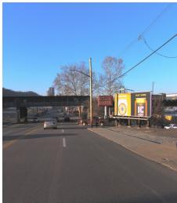  
GT

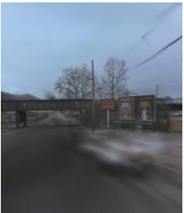  
3DGS

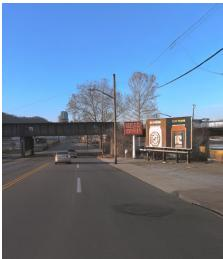  
SPVC  
Fig. 6. Zero-shot evaluation results on the EUVS dataset.

Zero-shot evalution on EUVS. We further evaluate SPVC on unseen Level-1 EUVS scenes. Without retraining or fine-tuning, it achieves strong zero-shot repair performance, demonstrating cross-domain transferability shown as Table IV.

TABLE IV  
ZERO-SHOT EVALUATION RESULTS ON THE EUVS DATASET.
<table><tr><td>Method</td><td>SSIM ↑</td><td>PSNR ↑</td><td>LPIPS ↓</td></tr><tr><td>3DGS</td><td>0.6436</td><td>16.9629</td><td>0.4301</td></tr><tr><td>Ours</td><td>0.6870</td><td>19.6655</td><td>0.3027</td></tr></table>

Temporal consistency. The consistent gains across all three datasets demonstrate the effectiveness of SPVC, where artifact-aware data generation improves robustness to viewpoint shifts and the two-stage training strategy enables stable refinement under under-constrained rendering scenarios while naturally preserving temporal consistency (Fig. 7).

## C. 3D Assets Insertion Fixing

This subsection evaluates the fixing capability of SPVC under realistic scene misalignment scenarios. We employ TRELLIS [104] to extract 3D assets of dynamic objects such as vehicles and insert them into reconstructed 3DGS scenes, resulting in foreground–background misalignment caused by spatial and semantic inconsistencies. Experiments are conducted on ten nuScenes scenes and compared against SOTA baselines [82], [105], [113]. For a fair comparison, all baseline models are retrained using the same training data as SPVC.

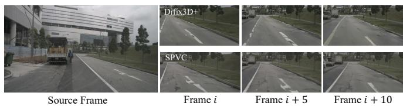  
Fig. 7. SPVC shows superior temporal consistency over single-frame refinement.

Qualitative examples in Fig. 8 show that SPVC effectively removes insertion-induced artifacts under challenging dynamic object insertion settings. As reported in Table V, SPVC achieves the best overall performance, demonstrating its ability to correct scene artifacts and restore coherent foreground–background alignment.

TABLE V  
QUANTITATIVE RESULTS UNDER 3D ASSET INSERTION SETTINGS.
<table><tr><td rowspan="2">Method</td><td colspan="4">Visual Quality</td><td>View Consistency</td></tr><tr><td>FID-A↓</td><td>FID↓</td><td>CLIP-F↑</td><td>IQ↑</td><td>FVD↓</td></tr><tr><td>Naive Insertion [82]</td><td>106.4</td><td>154.3</td><td>0.7766</td><td>0.53</td><td>1366.1</td></tr><tr><td>Wan2.2 [105]</td><td>115.6</td><td>164.0</td><td>0.7626</td><td>0.59</td><td>2134.7</td></tr><tr><td>LTX-Video [113]</td><td>141.9</td><td>145.5</td><td>0.7782</td><td>0.50</td><td>1690.9</td></tr><tr><td>Difix3D+ [58]</td><td>94.80</td><td>133.1</td><td>0.8171</td><td>0.61</td><td>1343.7</td></tr><tr><td>SPVC</td><td>87.9</td><td>124.9</td><td>0.8322</td><td>0.65</td><td>1297.2</td></tr></table>

## D. Closed-loop Evaluation

Safety-critical scenarios are essential for evaluating autonomous driving systems but are rarely observed in realworld data, and are therefore typically generated through simulation. However, existing simulators often produce severe artifacts under large ego-trajectory shifts, degrading novelview rendering quality. In addition, inserting new 3D assets into reconstructed scenes frequently introduces foreground– background inconsistencies. Both issues significantly increase the sim-to-real gap. SPVC addresses these challenges by correcting novel-view artifacts and refining inconsistencies caused by 3D asset insertion, enabling high-fidelity simulation of safety-critical scenarios.

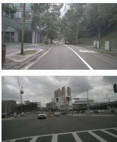  
Original Frame

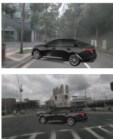  
Naive Insertion

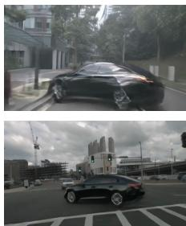  
LTX-Video

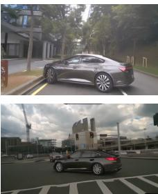  
Wan2.2

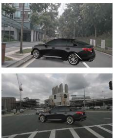  
Difix3D+

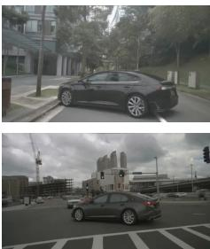  
SPVC

Fig. 8. Qualitative results under 3D assets insertion.  
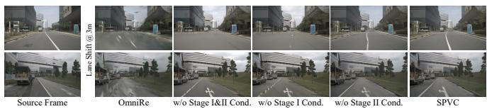  
Fig. 9. Qualitative results of the ablation study on the two-stage conditioning strategy.

We further use safety-critical scenarios refined by SPVC as training data to fine-tune VAD. As shown in Table VI, we evaluate the downstream performance using collision rate and NeuroNCAP Score(NNS) [114] , where lower collision rates and higher NeuroNCAP scores indicate safer autonomous driving behaviors. Training with high-quality simulated safety-critical data improves the performance of end-to-end autonomous driving models under such challenging conditions. More experimental details are provided in the appendix.

TABLE VI  
CLOSED-LOOP DOWNSTREAM EVALUATION RESULTS.
<table><tr><td rowspan="2">Method</td><td colspan="2">UniAD</td><td colspan="2">VAD</td></tr><tr><td>Collision Rate↓</td><td>NNS↑ [114]</td><td>Collision Rate↓</td><td>NNS↑ [114]</td></tr><tr><td>Original</td><td>60%</td><td>2.193</td><td>50%</td><td>2.659</td></tr><tr><td>Finetuned</td><td>50%</td><td>2.757</td><td>30%</td><td>3.707</td></tr></table>

## E. Ablation Studies

We conduct ablation studies to analyze the contribution of each component in SPVC. All ablations are conducted on the nuScenes dataset using the same lane shift @ 3 m setting as in Sec. IV-B.

Two-stage training strategy with conditioning. We analyze the two-stage training strategy by ablating the conditioning signals of each stage. As shown in Table VII, removing Stage I or Stage II conditions degrades performance, while removing both causes further drops in FID and FVD. As illustrated in Fig. 9, the reference video and camera pose provide complementary appearance and geometric guidance. In particular, camera pose supplies viewpoint-aware geometric cues, helping the model recover more accurate scene structures under novel trajectories, as further demonstrated in Fig. 10. Stage II further incorporates explicit structural conditions, including HD maps and 3D bounding boxes, to provide object-level semantics and spatial layout priors. Such explicit structure guidance enables more precise scene refinement, especially for recovering sharp and geometrically consistent lane markings.

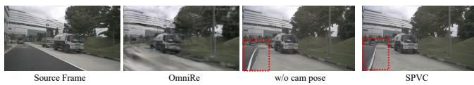  
Fig. 10. Ablation on camera pose conditioning. Camera pose guidance improves geometric correction under novel viewpoints.

TABLE VII  
ABLATION STUDY OF THE TWO-STAGE CONDITIONING STRATEGY AND ARTIFACT-AWARE DATA GENERATION.
<table><tr><td>Method</td><td>IQ↑</td><td>CLIP-F↑</td><td>FID↓</td><td>FVD↓</td></tr><tr><td colspan="5">Conditioning Strategy</td></tr><tr><td>w/o Stage I &amp; II</td><td>59.87</td><td>0.8071</td><td>60.1</td><td>845.0</td></tr><tr><td>w/o Stage I</td><td>59.74</td><td>0.8123</td><td>60.7</td><td>820.4</td></tr><tr><td>w/o Stage II</td><td>63.10</td><td>0.8462</td><td>46.7</td><td>571.4</td></tr><tr><td>w/o Camera Pose</td><td>63.65</td><td>0.8302</td><td>52.5</td><td>604.3</td></tr><tr><td colspan="5">Training Data</td></tr><tr><td>w/o Cross-view data</td><td>62.91</td><td>0.8441</td><td>49.8</td><td>611.9</td></tr><tr><td>w/o UnderFitting data</td><td>65.50</td><td>0.8499</td><td>44.9</td><td>522.8</td></tr><tr><td>w/o Random Crop data</td><td>65.11</td><td>0.8507</td><td>41.1</td><td>509.2</td></tr><tr><td>SPVC</td><td>65.89</td><td>0.8511</td><td>41.0</td><td>499.0</td></tr></table>

Artifact-aware data generation strategy. As shown in Table VII, removing cross-reference data, degraded observations, or random cropping consistently degrades performance, demonstrating that artifact-aware data generation improves robustness to distribution shifts. Moreover, introducing the panoptic task further enhances performance through multitask parameter sharing.

## V. CONCLUSION

We introduce SPVC, a structured and panoptic video fixing framework for artifact correction in autonomous driving simulation. By combining cross-dataset artifact-aware data construction with a two-stage controllable video diffusion model, SPVC progressively aligns video appearance and temporal consistency before refining scene geometry using camera poses, 3D bounding boxes, and HD maps. A single model repairs both novel-view rendering degradation and foreground–background artifacts caused by 3D asset insertion. Experiments on nuScenes, Waymo, and PandaSet demonstrate improved visual fidelity, temporal stability, spatial controllability, and cross-dataset generalization, establishing SPVC as an effective framework for high-fidelity driving-scene simulation.

## REFERENCES

[1] H. Zhou, L. Lin, J. Wang, Y. Lu, D. Bai, B. Liu, Y. Wang, A. Geiger, and Y. Liao, “Hugsim: A real-time, photo-realistic and closed-loop simulator for autonomous driving,” IEEE Transactions on Pattern Analysis and Machine Intelligence, 2025.

[2] T. Yan, W. Han, X. Zhang, K. Zhan, C.-Z. Xu, J. Shen, et al., “Rlgf: Reinforcement learning with geometric feedback for autonomous driving video generation,” Advances in Neural Information Processing Systems, vol. 38, pp. 128 659–128 684, 2026.

[3] T. Tang, E. Ma, X. Zhou, L. Wang, T. Yan, X. Zhang, K. Zhan, P. Jia, X. Lang, J.-W. Bian, et al., “Omnigen: Unified multimodal sensor generation for autonomous driving,” in Proceedings of the 33rd ACM International Conference on Multimedia, 2025, pp. 9365–9374.

[4] T. Deng, X. Chen, Y. Chen, Q. Chen, Y. Xu, L. Yang, L. Xu, Y. Zhang, B. Zhang, W. Huang, et al., “Gaussiandwm: 3d gaussian driving world model for unified scene understanding and multi-modal generation,” in Proceedings of the IEEE/CVF Conference on Computer Vision and Pattern Recognition, 2026, pp. 10 656–10 667.

[5] Y. Yang, A. Liang, J. Mei, Y. Ma, Y. Liu, and G. H. Lee, “X-scene: Large-scale driving scene generation with high fidelity and flexible controllability,” Advances in Neural Information Processing Systems, vol. 38, pp. 104 415–104 451, 2026.

[6] N. Huang, X. Wei, W. Zheng, P. An, M. Lu, W. Zhan, M. Tomizuka, K. Keutzer, and S. Zhang, “S3gaussian: Self-supervised street gaussians for autonomous driving,” ArXiv, vol. abs/2405.20323, 2024.

[7] Z. Fan, K. Wang, K. Wen, Z. Zhu, D. Xu, and Z. Wang, “Lightgaussian: Unbounded 3d gaussian compression with 15x reduction and 200+ fps,” Advances in neural information processing systems, vol. 37, pp. 140 138–140 158, 2024.

[8] Z. Fan, J. Zhang, W. Cong, P. Wang, R. Li, K. Wen, S. Zhou, A. Kadambi, Z. Wang, D. Xu, B. Ivanovic, M. Pavone, and Y. Wang, “Large spatial model: End-to-end unposed images to semantic 3d,” in Advances in Neural Information Processing Systems, A. Globerson, L. Mackey, D. Belgrave, A. Fan, U. Paquet, J. Tomczak, and C. Zhang, Eds., vol. 37. Curran Associates, Inc., 2024, pp. 40 212–40 229.

[9] J. Yang, J. Huang, B. Ivanovic, Y. Chen, Y. Wang, B. Li, Y. You, A. Sharma, M. Igl, P. Karkus, D. Xu, Y. Wang, and M. Pavone, “Storm: Spatio-temporal reconstruction model for large-scale outdoor scenes,” in International Conference on Learning Representations, Y. Yue, A. Garg, N. Peng, F. Sha, and R. Yu, Eds., vol. 2025, 2025, pp. 50 446–50 465.

[10] Z. Jiang, Z. Zhu, P. Li, H.-a. Gao, T. Yuan, Y. Shi, H. Zhao, and H. Zhao, “P-mapnet: Far-seeing map generator enhanced by both sdmap and hdmap priors,” IEEE Robotics and Automation Letters, vol. 9, no. 10, pp. 8539–8546, 2024.

[11] J. Pan, Z. Wang, and L. Wang, “Co-occ: Coupling explicit feature fusion with volume rendering regularization for multi-modal 3d semantic occupancy prediction,” IEEE Robotics and Automation Letters, vol. 9, no. 6, pp. 5687–5694, 2024.

[12] R. Song, C. Liang, Y. Xia, W. Zimmer, H. Cao, H. Caesar, A. Festag, and A. Knoll, “Coda-4dgs: Dynamic gaussian splatting with context and deformation awareness for autonomous driving,” in Proceedings of the IEEE/CVF International Conference on Computer Vision (ICCV), October 2025, pp. 28 031–28 041.

[13] P.-C. Kung, S. Harisha, R. Vasudevan, A. Eid, and K. A. Skinner, “Radarsplat: Radar gaussian splatting for high-fidelity data synthesis and 3d reconstruction of autonomous driving scenes,” in Proceedings of the IEEE/CVF International Conference on Computer Vision (ICCV), October 2025, pp. 27 596–27 606.

[14] C. Lindstrom, G. Hess, A. Lilja, M. Fatemi, L. Hammarstrand,¨ C. Petersson, and L. Svensson, “Are nerfs ready for autonomous driving? towards closing the real-to-simulation gap,” in Proceedings of the IEEE/CVF Conference on Computer Vision and Pattern Recognition (CVPR) Workshops, June 2024, pp. 4461–4471.

[15] J. Xu, K. Deng, Z. Fan, S. Wang, J. Xie, and J. Yang, “Ad-gs: Objectaware b-spline gaussian splatting for self-supervised autonomous driving,” in Proceedings of the IEEE/CVF International Conference on Computer Vision (ICCV), October 2025, pp. 24 770–24 779.

[16] T. Tao, L. Gao, G. Wang, Y. Lao, P. Chen, H. Zhao, D. Hao, X. Liang, M. Salzmann, and K. Yu, “Lidar-nerf: Novel lidar view synthesis via neural radiance fields,” in Proceedings of the 32nd ACM International Conference on Multimedia, ser. MM ’24. New York, NY, USA: Association for Computing Machinery, 2024, p. 390–398. [Online]. Available: https://doi.org/10.1145/3664647.3681482

[17] M. Khan, H. Fazlali, D. Sharma, T. Cao, D. Bai, Y. Ren, and B. Liu, “Autosplat: Constrained gaussian splatting for autonomous driving scene reconstruction,” in 2025 IEEE International Conference on Robotics and Automation (ICRA), 2025, pp. 8315–8321.

[18] J. Mao, B. Li, B. Ivanovic, Y. Chen, Y. Wang, Y. You, C. Xiao, D. Xu, M. Pavone, and Y. Wang, “Dreamdrive: Generative 4d scene modeling from street view images,” in 2025 IEEE International Conference on Robotics and Automation (ICRA), 2025, pp. 367–374.

[19] J. Cheng, Y. Chen, X. Mei, B. Yang, B. Li, and M. Liu, “Rethinking imitation-based planners for autonomous driving,” in 2024 IEEE International Conference on Robotics and Automation (ICRA). IEEE, 2024, pp. 14 123–14 130.

[20] H. Yang, S. Zhang, D. Huang, X. Wu, H. Zhu, T. He, S. Tang, H. Zhao, Q. Qiu, B. Lin, et al., “Unipad: A universal pre-training paradigm for autonomous driving,” in Proceedings of the IEEE/CVF conference on computer vision and pattern recognition, 2024, pp. 15 238–15 250.

[21] T. Xia, Y. Li, L. Zhou, J. Yao, K. Xiong, H. Sun, B. Wang, K. Ma, G. Chen, H. Ye, et al., “Drivelaw: Unifying planning and video generation in a latent driving world,” in Proceedings of the IEEE/CVF Conference on Computer Vision and Pattern Recognition, 2026, pp. 39 701–39 712.

[22] A. Liang, L. Kong, T. Yan, H. Liu, Y. Yang, Z. Huang, W. Yin, J. Zuo, Y. Hu, D. Zhu, et al., “Worldlens: Full-spectrum evaluations of driving world models in real world,” in Proceedings of the IEEE/CVF Conference on Computer Vision and Pattern Recognition, 2026, pp. 36 385–36 399.

[23] H. Yang, S. Zhang, D. Huang, X. Wu, H. Zhu, T. He, S. Tang, H. Zhao, Q. Qiu, B. Lin, X. He, and W. Ouyang, “Unipad: A universal pretraining paradigm for autonomous driving,” in Proceedings of the IEEE/CVF Conference on Computer Vision and Pattern Recognition (CVPR), June 2024, pp. 15 238–15 250.

[24] Z. Xu, Y. Bai, Y. Zhang, Z. Li, F. Xia, K.-Y. K. Wong, J. Wang, and H. Zhao, “Drivegpt4-v2: Harnessing large language model capabilities for enhanced closed-loop autonomous driving,” in Proceedings of the IEEE/CVF Conference on Computer Vision and Pattern Recognition (CVPR), June 2025, pp. 17 261–17 270.

[25] C. Sima, K. Renz, K. Chitta, L. Chen, H. Zhang, C. Xie, J. Beißwenger, P. Luo, A. Geiger, and H. Li, “Drivelm: Driving with graph visual question answering,” in Computer Vision – ECCV 2024, A. Leonardis, E. Ricci, S. Roth, O. Russakovsky, T. Sattler, and G. Varol, Eds. Cham: Springer Nature Switzerland, 2025, pp. 256–274.

[26] Y. Zheng, P. Yang, Z. Xing, Q. Zhang, Y. Zheng, Y. Gao, P. Li, T. Zhang, Z. Xia, P. Jia, X. Lang, and D. Zhao, “World4drive: Endto-end autonomous driving via intention-aware physical latent world model,” in Proceedings of the IEEE/CVF International Conference on Computer Vision (ICCV), October 2025, pp. 28 632–28 642.

[27] Y. Xu, Y. Hu, Z. Zhang, G. P. Meyer, S. K. Mustikovela, S. Srinivasa, E. M. Wolff, and X. Huang, “Vlm-ad: End-to-end autonomous driving through vision-language model supervision,” 2025. [Online]. Available: https://arxiv.org/abs/2412.14446

[28] Z. Huang, Z. Sheng, Y. Qu, J. You, and S. Chen, “Vlm-rl: A unified vision language models and reinforcement learning framework for safe autonomous driving,” Transportation Research Part C: Emerging Technologies, vol. 180, p. 105321, 2025. [Online]. Available: https: //www.sciencedirect.com/science/article/pii/S0968090X25003250

[29] Y. Zheng, Z. Xing, Q. Zhang, B. Jin, P. Li, Y. Zheng, Z. Xia, Y. Chen, and D. Zhao, “Planagent: A multi-modal large language agent for closed-loop vehicle motion planning,” IEEE Transactions on Cognitive and Developmental Systems, pp. 1–14, 2026.

[30] L. Chen, O. Sinavski, J. Hunermann, A. Karnsund, A. J. Willmott,¨ D. Birch, D. Maund, and J. Shotton, “Driving with llms: Fusing object-level vector modality for explainable autonomous driving,” in 2024 IEEE International Conference on Robotics and Automation (ICRA), 2024, pp. 14 093–14 100.

[31] Y. Ma, Y. Cao, J. Sun, M. Pavone, and C. Xiao, “Dolphins: Multimodal language model for driving,” in Computer Vision – ECCV 2024, A. Leonardis, E. Ricci, S. Roth, O. Russakovsky, T. Sattler, and G. Varol, Eds. Cham: Springer Nature Switzerland, 2025, pp. 403– 420.

[32] L. Liu, C. Jia, G. Yu, Z. Song, J. Li, F. Jia, P. Wu, X. Hao, and Y. Luo, “Guideflow: Constraint-guided flow matching for planning in end-to-end autonomous driving,” in Proceedings of the IEEE/CVF Conference on Computer Vision and Pattern Recognition (CVPR), June 2026, pp. 3719–3728.

[33] M. Wozniak, L. Liu, Y. Cai, and P. Jensfelt, “Prix: Learning to plan from raw pixels for end-to-end autonomous driving,” IEEE Robotics and Automation Letters, vol. 11, no. 5, pp. 6400–6407, 2026.

[34] H. Chi, H.-a. Gao, Z. Liu, J. Liu, C. Liu, J. Li, K. Yang, Y. Yu, Z. Wang, W. Li, L. Wang, X. HU, H. SUN, H. Zhao, and H. Zhao, “Impromptu vla: Open weights and open data for driving vision-language-action models,” in Advances in Neural Information Processing Systems, D. Belgrave, C. Zhang, H. Lin, R. Pascanu, P. Koniusz, M. Ghassemi, and N. Chen, Eds., vol. 38. Curran Associates, Inc., 2025.

[35] S. Jiang, Z. Huang, K. Qian, Z. Luo, T. Zhu, Y. Zhong, Y. Tang, M. Kong, Y. Wang, S. Jiao, H. Ye, Z. Sheng, X. Zhao, T. Wen, Z. Fu, S. Chen, K. Jiang, D. Yang, S. Choi, and L. Sun, “A survey on visionlanguage-action models for autonomous driving,” in Proceedings of the IEEE/CVF International Conference on Computer Vision (ICCV) Workshops, October 2025, pp. 4583–4595.

[36] Y. Li, S. Shang, W. Liu, B. Zhan, H. Wang, Y. Wang, Y. Chen, X. Wang, Y. An, C. Tang, L. Hou, L. Fan, and Z. Zhang, “Drivevla-w0: World models amplify data scaling law in autonomous driving,” 2025. [Online]. Available: https://arxiv.org/abs/2510.12796

[37] I. Rawal, S. Gupta, Y. Hu, and W. Zhan, “Nord: A data-efficient visionlanguage-action model that drives without reasoning,” in Proceedings of the IEEE/CVF Conference on Computer Vision and Pattern Recognition (CVPR), June 2026, pp. 10 965–10 975.

[38] X. Wang, Q. Liu, W. Ding, Z. Yang, W. Li, C. Liu, B. Li, K. Zhan, X. Lang, and W. Chen, “Unifying language-action understanding and generation for autonomous driving,” in Proceedings of the IEEE/CVF Conference on Computer Vision and Pattern Recognition (CVPR), June 2026, pp. 25 193–25 203.

[39] A. Jiang, Y. Gao, Y. Wang, Z. Sun, S. Wang, Y. Heng, H. Sun, S. Tang, L. Zhu, J. Chai, J. Wang, Z. Gu, H. Jiang, and L. Sun, “Irl-vla: Training an vision-language-action policy via reward world model,” 2025. [Online]. Available: https://arxiv.org/abs/2508.06571

[40] Y. Li, L. Zhou, S. Yan, B. Liao, T. Yan, K. Xiong, L. Chen, H. Xie, B. Wang, G. Chen, H. Ye, W. Liu, H. Sun, and X. Wang, “Unidrivevla: Unifying understanding, perception, and action planning for autonomous driving,” 2026. [Online]. Available: https://arxiv.org/abs/2604.02190

[41] S. Shang, B. Zhan, Y. Yan, Y. Wang, Y. Li, Y. An, X. Wang, J. Liu, L. Hou, L. Fan, Z. Zhang, and T. Tan, “Dynvla: Learning world dynamics for action reasoning in autonomous driving,” 2026. [Online]. Available: https://arxiv.org/abs/2603.11041

[42] M. Huang, Y. Xiang, Z. Liang, J. Huang, J. Wang, Z. Xu, F. Tan, H. Zhou, M. Yang, and G. Che, “Coworld-vla: Thinking in a multi-expert world model for autonomous driving,” 2026. [Online]. Available: https://arxiv.org/abs/2605.10426

[43] Y. Wang, Z. Gu, Y. Gao, A. Jiang, Z. Sun, S. Wang, Y. Heng, and H. Sun, “Hist-vla: A hierarchical spatio-temporal vision-languageaction model for end-to-end autonomous driving,” 2026. [Online]. Available: https://arxiv.org/abs/2602.13329

[44] A. Jiang, G. Yu, H. Yuwen, Y. Wang, W. Shuo, J. Hao, and S. Hao, “Irl-vla: Vision-language-action training via reward world model,” in Proceedings of the IEEE/CVF Conference on Computer Vision and Pattern Recognition (CVPR) Findings, June 2026, pp. 970–979.

[45] C. Chen, Y. Yang, Z. Tan, Y. Wang, R. Zhan, H. Liu, X. Mao, J. Bao, X. Tang, L. Yang, B. Sun, Y. Wang, and B. Zhang, “Devil is in narrow policy: Unleashing exploration in driving vla models,” in Proceedings of the IEEE/CVF Conference on Computer Vision and Pattern Recognition (CVPR) Findings, June 2026, pp. 1062–1072.

[46] G. Wang, P. Tang, X. Ren, G. Zhao, B. Feng, and C. Ma, “Learning vision-language-action world models for autonomous driving,” in Proceedings of the IEEE/CVF Conference on Computer Vision and Pattern Recognition (CVPR) Findings, June 2026, pp. 1073–1084.

[47] Z. Wang, H. Jiang, S. Dong, Y. Wang, H. Qiu, and J. Li, “Drive my way: Preference alignment of vision-language-action model for personalized driving,” in Proceedings of the IEEE/CVF Conference on Computer Vision and Pattern Recognition (CVPR), June 2026, pp. 25 204–25 214.

[48] X. Yang, L. Wen, T. Wei, Y. Ma, J. Mei, X. Li, W. Lei, D. Fu, P. Cai, M. Dou, et al., “Drivearena: A closed-loop generative simulation platform for autonomous driving,” in Proceedings of the IEEE/CVF

International Conference on Computer Vision, 2025, pp. 26 933– 26 943.

[49] T. Yan, D. Wu, W. Han, J. Jiang, X. Zhou, K. Zhan, C.-z. Xu, and J. Shen, “Drivingsphere: Building a high-fidelity 4d world for closed loop simulation,” in Proceedings of the Computer Vision and Pattern Recognition Conference, 2025, pp. 27 531–27 541.

[50] H. Gao, S. Chen, B. Jiang, B. Liao, Y. Shi, X. Guo, Y. Pu, X. Li, W. Liu, Q. Zhang, et al., “Rad: Training an end-to-end driving policy via large-scale 3dgs-based reinforcement learning,” Advances in Neural Information Processing Systems, vol. 38, pp. 32 551–32 576, 2026.

[51] Y. Lu, X. Ren, J. Yang, T. Shen, Z. Wu, J. Gao, Y. Wang, S. Chen, M. Chen, S. Fidler, and J. Huang, “Infinicube: Unbounded and controllable dynamic 3d driving scene generation with worldguided video models,” in Proceedings of the IEEE/CVF International Conference on Computer Vision (ICCV), October 2025, pp. 27 272– 27 283.

[52] Q. Li, Z. M. Peng, L. Feng, Z. Liu, C. Duan, W. Mo, and B. Zhou, “Scenarionet: Open-source platform for large-scale traffic scenario simulation and modeling,” in Advances in Neural Information Processing Systems, A. Oh, T. Naumann, A. Globerson, K. Saenko, M. Hardt, and S. Levine, Eds., vol. 36. Curran Associates, Inc., 2023, pp. 3894–3920.

[53] H. Zhou, L. Lin, J. Wang, Y. Lu, D. Bai, B. Liu, Y. Wang, A. Geiger, and Y. Liao, “Hugsim: A real-time, photo-realistic and closed-loop simulator for autonomous driving,” IEEE Transactions on Pattern Analysis and Machine Intelligence, vol. 48, no. 4, pp. 4673–4691, 2026.

[54] Y. Wen, Y. Zhao, Y. Liu, F. Jia, Y. Wang, C. Luo, C. Zhang, T. Wang, X. Sun, and X. Zhang, “Panacea: Panoramic and controllable video generation for autonomous driving,” in Proceedings of the IEEE/CVF Conference on Computer Vision and Pattern Recognition (CVPR), June 2024, pp. 6902–6912.

[55] A. Tonderski, C. Lindstrom, G. Hess, W. Ljungbergh, L. Svensson,¨ and C. Petersson, “Neurad: Neural rendering for autonomous driving,” in Proceedings of the IEEE/CVF Conference on Computer Vision and Pattern Recognition (CVPR), June 2024, pp. 14 895–14 904.

[56] H. Zhou, J. Shao, L. Xu, D. Bai, W. Qiu, B. Liu, Y. Wang, A. Geiger, and Y. Liao, “Hugs: Holistic urban 3d scene understanding via gaussian splatting,” in Proceedings of the IEEE/CVF Conference on Computer Vision and Pattern Recognition (CVPR), June 2024, pp. 21 336–21 345.

[57] S. Ren, T. Wen, Y. Fang, and B. Lu, “Fastgs: Training 3d gaussian splatting in 100 seconds,” in Proceedings ofthe IEEE/CVF Conference on Computer Vision and Pattern Recognition, 2026, pp. 26 094–26 103.

[58] J. Z. Wu, Y. Zhang, H. Turki, X. Ren, J. Gao, M. Z. Shou, S. Fidler, Z. Gojcic, and H. Ling, “Difix3d+: Improving 3d reconstructions with single-step diffusion models,” in Proceedings of the Computer Vision and Pattern Recognition Conference, 2025, pp. 26 024–26 035.

[59] W. Ljungbergh, B. Taveira, W. Zheng, A. Tonderski, C. Peng, F. Kahl, C. Petersson, M. Felsberg, K. Keutzer, M. Tomizuka, and W. Zhan, “R3d2: Realistic 3d asset insertion via diffusion for autonomous driving simulation,” in Proceedings ofthe IEEE/CVF Conference on Computer Vision and Pattern Recognition (CVPR) Workshops, 2026.

[60] Q. Wang, L. Fan, Y. Wang, Y. Chen, and Z. Zhang, “Freevs: Generative view synthesis on free driving trajectory,” arXiv preprint arXiv:2410.18079, 2024.

[61] Y. Yan, Z. Xu, H. Lin, H. Jin, H. Guo, Y. Wang, K. Zhan, X. Lang, H. Bao, X. Zhou, et al., “Streetcrafter: Street view synthesis with controllable video diffusion models,” in Proceedings of the Computer Vision and Pattern Recognition Conference, 2025, pp. 822–832.

[62] C. Ni, G. Zhao, X. Wang, Z. Zhu, W. Qin, G. Huang, C. Liu, Y. Chen, Y. Wang, X. Zhang, et al., “Recondreamer: Crafting world models for driving scene reconstruction via online restoration,” in Proceedings of the Computer Vision and Pattern Recognition Conference, 2025, pp. 1559–1569.

[63] G. Zhao, X. Wang, C. Ni, Z. Zhu, W. Qin, G. Huang, and X. Wang, “Recondreamer++: Harmonizing generative and reconstructive models for driving scene representation,” arXiv preprint arXiv:2503.18438, 2025.

[64] R. Gao, K. Chen, E. Xie, L. Hong, Z. Li, D.-Y. Yeung, and Q. Xu, “Magicdrive: Street view generation with diverse 3d geometry control,” arXiv preprint arXiv:2310.02601, 2023.

[65] R. Gao, K. Chen, B. Xiao, L. Hong, Z. Li, and Q. Xu, “MagicDrive-V2: High-resolution long video generation for autonomous driving

with adaptive control,” in Proceedings of the IEEE/CVF International Conference on Computer Vision, 2025, pp. 28 135–28 144.

[66] R. Gao, K. Chen, Z. Li, L. Hong, Z. Li, and Q. Xu, “MagicDrive3D: Controllable 3D Generation for Any-View Rendering in Street Scenes,” arXiv preprint arXiv:2405.14475, 2024.

[67] A. Kirillov, K. He, R. Girshick, C. Rother, and P. Dollar, “Panoptic segmentation,” in Proceedings of the IEEE/CVF Conference on Computer Vision and Pattern Recognition (CVPR), June 2019.

[68] L. Schmid, J. Delmerico, J. L. Schonberger, J. Nieto, M. Pollefeys,¨ R. Siegwart, and C. Cadena, “Panoptic multi-tsdfs: a flexible representation for online multi-resolution volumetric mapping and long-term dynamic scene consistency,” in 2022 International Conference on Robotics and Automation (ICRA), 2022, pp. 8018–8024.

[69] M. Weber, J. Luiten, and B. Leibe, “Single-shot panoptic segmentation,” in 2020 IEEE/RSJ International Conference on Intelligent Robots and Systems (IROS). IEEE Press, 2020, p. 8476–8483.

[70] B. Mildenhall, P. P. Srinivasan, M. Tancik, J. T. Barron, R. Ramamoorthi, and R. Ng, “Nerf: Representing scenes as neural radiance fields for view synthesis,” Communications of the ACM, 2021.

[71] J. T. Barron, B. Mildenhall, D. Verbin, P. P. Srinivasan, and P. Hedman, “Mip-nerf 360: Unbounded anti-aliased neural radiance fields,” in CVPR, 2022.

[72] ——, “Zip-nerf: Anti-aliased grid-based neural radiance fields,” in ICCV, 2023.

[73] T. Muller, A. Evans, C. Schied, and A. Keller, “Instant neural graphics¨ primitives with a multiresolution hash encoding,” ACM ToG, 2022.

[74] B. Kerbl, G. Kopanas, T. Leimkuhler, and G. Drettakis, “3D Gaussian¨ Splatting for Real-Time Radiance Field Rendering,” ACM ToG, 2023.

[75] Z. Yu, A. Chen, B. Huang, T. Sattler, and A. Geiger, “Mip-splatting: Alias-free 3d gaussian splatting,” in CVPR, 2024.

[76] Z. Yang, Y. Chen, J. Wang, S. Manivasagam, W.-C. Ma, A. J. Yang, and R. Urtasun, “Unisim: A neural closed-loop sensor simulator,” in CVPR, 2023.

[77] J. Yang, B. Ivanovic, O. Litany, X. Weng, S. W. Kim, B. Li, T. Che, D. Xu, S. Fidler, M. Pavone, et al., “Emernerf: Emergent spatialtemporal scene decomposition via self-supervision,” arXiv preprint arXiv:2311.02077, 2023.

[78] K. Rematas, A. Liu, P. P. Srinivasan, J. T. Barron, A. Tagliasacchi, T. Funkhouser, and V. Ferrari, “Urban radiance fields,” in CVPR, 2022.

[79] M. Tancik, V. Casser, X. Yan, S. Pradhan, B. Mildenhall, P. P. Srinivasan, J. T. Barron, and H. Kretzschmar, “Block-nerf: Scalable large scene neural view synthesis,” in CVPR, 2022.

[80] J. Guo, N. Deng, X. Li, Y. Bai, B. Shi, C. Wang, C. Ding, D. Wang, and Y. Li, “Streetsurf: Extending multi-view implicit surface reconstruction to street views,” arXiv preprint arXiv:2306.04988, 2023.

[81] X. Zhou, Z. Lin, X. Shan, Y. Wang, D. Sun, and M.-H. Yang, “Drivinggaussian: Composite gaussian splatting for surrounding dynamic autonomous driving scenes,” in CVPR, 2024, pp. 21 634–21 643.

[82] Z. Chen, J. Yang, J. Huang, R. d. Lutio, J. M. Esturo, B. Ivanovic, O. Litany, Z. Gojcic, S. Fidler, M. Pavone, L. Song, and Y. Wang, “OmniRe: Omni Urban Scene Reconstruction,” arXiv preprint arXiv:2408.16760, 2024.

[83] Y. Yan, H. Lin, C. Zhou, W. Wang, H. Sun, K. Zhan, X. Lang, X. Zhou, and S. Peng, “Street gaussians for modeling dynamic urban scenes,” arXiv preprint arXiv:2401.01339, 2024.

[84] N. Wang, Y. Chen, L. Xiao, W. Xiao, B. Li, Z. Chen, C. Ye, S. Xu, S. Zhang, Z. Yan, et al., “Unifying Appearance Codes and Bilateral Grids for Driving Scene Gaussian Splatting,” arXiv preprint arXiv:2506.05280, 2025.

[85] Z. Wu, T. Liu, L. Luo, Z. Zhong, J. Chen, H. Xiao, C. Hou, H. Lou, Y. Chen, R. Yang, et al., “Mars: An instance-aware, modular and realistic simulator for autonomous driving,” in CAAI International Conference on Artificial Intelligence. Springer, 2023, pp. 3–15.

[86] X. Zhou, Z. Lin, X. Shan, Y. Wang, D. Sun, and M.-H. Yang, “Drivinggaussian: Composite gaussian splatting for surrounding dynamic autonomous driving scenes,” in Proceedings of the IEEE/CVF Conference on Computer Vision and Pattern Recognition, 2024, pp. 21 634–21 643.

[87] A. Tonderski, C. Lindstrom, G. Hess, W. Ljungbergh, L. Svensson,¨ and C. Petersson, “Neurad: Neural rendering for autonomous driving,” in Proceedings of the IEEE/CVF Conference on Computer Vision and Pattern Recognition, 2024, pp. 14 895–14 904.

[88] G. Hess, C. Lindstrom, M. Fatemi, C. Petersson, and L. Svensson,¨ “SplatAD: Real-Time Lidar and Camera Rendering with 3D Gaussian

Splatting for Autonomous Driving,” arXiv preprint arXiv:2411.16816, 2024.

[89] H. Zhou, J. Shao, L. Xu, D. Bai, W. Qiu, B. Liu, Y. Wang, A. Geiger, and Y. Liao, “Hugs: Holistic urban 3d scene understanding via gaussian splatting,” in Proceedings of the IEEE/CVF Conference on Computer Vision and Pattern Recognition, 2024, pp. 21 336–21 345.

[90] Z. Li, Y. Zhang, C. Wu, J. Zhu, and L. Zhang, “Ho-gaussian: Hybrid optimization of 3d gaussian splatting for urban scenes,” in European Conference on Computer Vision. Springer, 2024, pp. 19–36.

[91] R. Rombach, A. Blattmann, D. Lorenz, P. Esser, and B. Ommer, “High-resolution image synthesis with latent diffusion models,” in CVPR, 2022.

[92] D. Podell, Z. English, K. Lacey, A. Blattmann, T. Dockhorn, J. Muller,¨ J. Penna, and R. Rombach, “Sdxl: Improving latent diffusion models for high-resolution image synthesis,” arXiv preprint arXiv:2307.01952, 2023.

[93] A. Blattmann, T. Dockhorn, S. Kulal, D. Mendelevitch, M. Kilian, D. Lorenz, Y. Levi, Z. English, V. Voleti, A. Letts, et al., “Stable video diffusion: Scaling latent video diffusion models to large datasets,” arXiv preprint arXiv:2311.15127, 2023.

[94] X. Wang, K. Zhao, F. Liu, J. Wang, G. Zhao, X. Bao, Z. Zhu, Y. Zhang, and X. Wang, “EgoVid-5M: A Large-Scale Video-Action Dataset for Egocentric Video Generation,” arXiv preprint arXiv:2411.08380, 2024.

[95] Z. Yang, J. Teng, W. Zheng, M. Ding, S. Huang, J. Xu, Y. Yang, W. Hong, X. Zhang, G. Feng, et al., “CogVideoX: Text-to-Video Diffusion Models with An Expert Transformer,” arXiv preprint arXiv:2408.06072, 2024.

[96] T. Feng, W. Wang, and Y. Yang, “A survey of world models for autonomous driving,” arXiv preprint arXiv:2501.11260, 2025.

[97] B. Li, J. Guo, H. Liu, Y. Zou, Y. Ding, X. Chen, H. Zhu, F. Tan, C. Zhang, T. Wang, et al., “UniScene: Unified Occupancy-centric Driving Scene Generation,” arXiv preprint arXiv:2412.05435, 2024.

[98] G. Zhao, C. Ni, X. Wang, Z. Zhu, G. Huang, X. Chen, B. Wang, Y. Zhang, W. Mei, and X. Wang, “Drivedreamer4d: World models are effective data machines for 4d driving scene representation,” arXiv preprint arXiv:2410.13571, 2024.

[99] J. Guo, Y. Ding, X. Chen, S. Chen, B. Li, Y. Zou, X. Lyu, F. Tan, X. Qi, Z. Li, et al., “Dist-4d: Disentangled spatiotemporal diffusion with metric depth for 4d driving scene generation,” arXiv preprint arXiv:2503.15208, 2025.

[100] X. Ren, Y. Lu, T. Cao, R. Gao, S. Huang, A. Sabour, T. Shen, T. Pfaff, J. Z. Wu, R. Chen, et al., “Cosmos-Drive-Dreams: Scalable Synthetic Driving Data Generation with World Foundation Models,” arXiv preprint arXiv:2506.09042, 2025.

[101] A. Blattmann, R. Rombach, H. Ling, T. Dockhorn, S. W. Kim, S. Fidler, and K. Kreis, “Align your latents: High-resolution video synthesis with latent diffusion models,” in CVPR, 2023.

[102] Z. Zhu, X. Wang, W. Zhao, C. Min, N. Deng, M. Dou, Y. Wang, B. Shi, K. Wang, C. Zhang, et al., “Is sora a world simulator? a comprehensive survey on general world models and beyond,” arXiv preprint arXiv:2405.03520, 2024.

[103] L. Fan, H. Zhang, Q. Wang, H. Li, and Z. Zhang, “Freesim: Toward free-viewpoint camera simulation in driving scenes,” in Proceedings of the Computer Vision and Pattern Recognition Conference, 2025, pp. 12 004–12 014.

[104] J. Xiang, Z. Lv, S. Xu, Y. Deng, R. Wang, B. Zhang, D. Chen, X. Tong, and J. Yang, “Structured 3d latents for scalable and versatile 3d generation,” in Proceedings of the IEEE/CVF conference on computer vision and pattern recognition, 2025, pp. 21 469–21 480.

[105] T. Wan, A. Wang, B. Ai, B. Wen, C. Mao, C.-W. Xie, D. Chen, F. Yu, H. Zhao, J. Yang, et al., “Wan: Open and advanced large-scale video generative models,” arXiv preprint arXiv:2503.20314, 2025.

[106] W. Peebles and S. Xie, “Scalable diffusion models with transformers,” in Proceedings of the IEEE/CVF international conference on computer vision, 2023, pp. 4195–4205.

[107] P. Sun, H. Kretzschmar, X. Dotiwalla, A. Chouard, V. Patnaik, P. Tsui, J. Guo, Y. Zhou, Y. Chai, B. Caine, V. Vasudevan, W. Han, J. Ngiam, H. Zhao, A. Timofeev, S. Ettinger, M. Krivokon, A. Gao, A. Joshi, Y. Zhang, J. Shlens, Z. Chen, and D. Anguelov, “Scalability in Perception for Autonomous Driving: Waymo Open Dataset,” in CVPR, 2020.

[108] Y. Chen, C. Gu, J. Jiang, X. Zhu, and L. Zhang, “Periodic vibration gaussian: Dynamic urban scene reconstruction and real-time rendering,” arXiv preprint arXiv:2311.18561, 2023.

[109] H. Caesar, V. Bankiti, A. H. Lang, S. Vora, V. E. Liong, Q. Xu, A. Krishnan, Y. Pan, G. Baldan, and O. Beijbom, “nuscenes: A multimodal dataset for autonomous driving,” in Proceedings of the IEEE/CVF conference on computer vision and pattern recognition, 2020, pp. 11 621–11 631.

[110] P. Xiao, Z. Shao, S. Hao, Z. Zhang, X. Chai, J. Jiao, Z. Li, J. Wu, K. Sun, K. Jiang, et al., “Pandaset: Advanced sensor suite dataset for autonomous driving,” in 2021 IEEE international intelligent transportation systems conference (ITSC). IEEE, 2021, pp. 3095– 3101.

[111] X. Han, Z. Jia, B. Li, Y. Wang, B. Ivanovic, Y. You, L. Liu, Y. Wang, M. Pavone, C. Feng, and Y. Li, “Extrapolated urban view synthesis benchmark,” in Proceedings of the IEEE/CVF International Conference on Computer Vision (ICCV), October 2025, pp. 28 718– 28 728.

[112] A. Tonderski, C. Lindstrom, G. Hess, W. Ljungbergh, L. Svensson,¨ and C. Petersson, “Neurad: Neural rendering for autonomous driving,” in CVPR, 2024.

[113] Y. HaCohen, N. Chiprut, B. Brazowski, D. Shalem, D. Moshe, E. Richardson, E. Levin, G. Shiran, N. Zabari, O. Gordon, et al., “Ltx-video: Realtime video latent diffusion,” arXiv preprint arXiv:2501.00103, 2024.

[114] W. Ljungbergh, A. Tonderski, J. Johnander, H. Caesar, K. Astr˚ om,¨ M. Felsberg, and C. Petersson, “Neuroncap: Photorealistic closed-loop safety testing for autonomous driving,” in European Conference on Computer Vision. Springer, 2024, pp. 161–177.