# STRUCTURAL PLAN-TO-MODEL CONVERSION WITH DETERMINISTIC GEOMETRY AND GUARDED AGENTIC VISION-LANGUAGE REFINEMENT

## Mohammad Talebi-Kalaleh

Department of Civil and Environmental Engineering University of Alberta 9211 116 Street NW, Edmonton, Alberta T6G 1H9, Canada talebika@ualberta.ca

Qipei Mei Department of Civil and Environmental Engineering University of Alberta 9211 116 Street NW, Edmonton, Alberta T6G 1H9, Canada qipei.mei@ualberta.ca

## ABSTRACT

Converting structural framing plans into editable finite-element model drafts remains labor-intensive and prone to transcription error. Existing drawing-understanding systems for building components rely on task-specific trained neural detectors, and language-model agents in structural engineering operate on text or model data rather than the drawing itself. This paper presents, to the authors’ knowledge, the first framework applying an agentic vision-language layer to structural component detection and model drafting from framing-plan PDFs, without task-specific detector training or fine-tuning. A deterministic stage extracts primitives, estimates scale by dimension-ratio consensus, recognizes five entity classes with a drafting grammar, and assembles an editable layout. The agentic stage proposes typed corrections constrained by deterministic candidates, operation-specific admission tests, change-level review, and fail-closed transactions. Evaluation used an author-generated benchmark of 100 plans: a development half that informed every rule revision, and a seed-disjoint held-out half generated after the rules froze, evaluated once. All reported scores are end-to-end results of the complete framework on the held-out half. Scale was estimated within 0.1% of the generator reference for every drawing. Recall and precision were 0.922/0.997 for columns, 0.886/0.990 for beams, 1.000/1.000 for walls, 1.000/1.000 for braces, and 1.000/0.964 for openings. A controlled study repeated two corruptions three times on three development drawings. Calibration passed all nine trials; member repair met every strict end-state predicate in five of nine. Guarded review corrected missed framing and false marks within explicit bounds. The held-out half shares the development generator, so the study excludes independently drafted plans, raster evaluation, analytical connectivity, and solver validation.

Keywords Structural drawings · Plan-to-model conversion · Finite-element modeling · Computer-aided design · Vision-language models · Agentic artificial intelligence · Rule-based detection

## 1 Introduction

Structural engineers communicate through drawings. A framing plan encodes the column grid, member layout, section designations, wall and brace locations, and slab boundaries for one floor of a building [1, 2]. When an engineer needs a finite-element model of that building, whether for a retrofit study, peer review, or progressive-collapse check, the plan must be translated into nodes, elements, sections, and supports. In current practice, this translation is performed manually: coordinates are read from dimension strings, members are redrawn in analysis software, and section labels are re-entered. Gimenez et al. [3] characterized manual three-dimensional model creation from drawings as complex and time-consuming and found no complete automatic reconstruction pipeline. Even when a building information model exists, deriving a geometrically faithful analysis model from it requires dedicated tooling [4].

Two research communities have approached the drawing-understanding problem from opposite directions. Documentanalysis research has moved from rule-based interpretation of architectural drawings [5–7] to deep networks that parse raster floor plans [8–10] and, more recently, to graph and transformer models that operate directly on CAD vector primitives [11–15]. These methods target architectural semantics, such as rooms, doors, and furniture symbols, and report scores in image or primitive space. Structural-model reconstruction imposes additional requirements: member endpoints must be reconciled into a connected topology, and a misread scale corrupts every coordinate in the drawing. In parallel, the language-model community has produced agents that reason, call tools, and criticize their own output [16–19], and these agents have begun to automate structural engineering workflows from textual descriptions [20–22]. A recent review of 134 studies identifies model generation and design checking as major areas of artificialintelligence (AI)-enabled structural design automation [23]. Despite this broader progress, vision-language models remain unreliable on low-level visual reasoning relevant to plan review, including counting and spatial relationships. On seven synthetic tasks, four vision-language models averaged 58.07% accuracy [24], and ungrounded generation is subject to hallucination [25].

This paper examines a division of labor that places deterministic geometry before vision-language interpretation. The deterministic layer handles quantities with explicit definitions, including primitive extraction, scale consensus, symbol signatures, bearing topology, and region analysis. The refinement layer addresses semantic questions, such as whether unexplained ink is a missed girder or a title-block underline, through typed operations. Constructive edits must satisfy paper-space ink or glyph tests, whereas deletions, moves, attribute changes, and calibration retain operation-specific guards and vision-model review rather than a general geometric proof. This allocation limits the classes of decisions delegated to the vision-language model without implying that every accepted semantic decision is correct. The framework uses no task-specific learned detector or fine-tuning; extending its supported notation requires an explicit rule and a new validation cycle rather than model retraining. Section 6 therefore treats published learned systems as related methods, not as commensurate baselines.

This study makes three main contributions. First, it defines a deterministic conversion pipeline from PDF primitives to an editable floor layout and a three-dimensional finite-element model draft. The pipeline includes explicit scale resolution, a structural drafting grammar, and topology-based model assembly. Second, it introduces, to the authors’ knowledge, the first agentic vision-language architecture for building-component detection and structural model drafting from drawings: prior drawing-understanding systems train task-specific neural detectors [1, 13, 26], and prior language-model agents in structural engineering act on textual briefs, scripts, or model data rather than the drawing image [20–22]. In the proposed architecture the vision-language model can propose only typed operations, bounded by deterministic candidate generators, operation-specific admission tests, change-level judging, and fail-closed handling of entity edits. The two layers are designed and evaluated as one system: deterministic geometry supplies measurable coordinates, and the agentic layer supplies the semantic reading of designations, materials, and calibration that geometry alone cannot provide. Third, it introduces a 100-drawing benchmark with exact generator ground truth, split evenly into the PD-50 development half, which informed rule and threshold revision, and the seed-disjoint PD-50-T held-out half, which was generated after the detection rules were frozen and evaluated once. Every reported detection recall and precision value comes from the held-out half and describes the complete framework end to end. The evaluation reports disaggregated end-to-end results and repeated controlled corruption trials for the guarded refinement layer.

The remainder of the paper is organized as follows. Section 2 positions the study within drawing analysis, drawingto-model reconstruction, and agentic structural engineering. Section 3 explains the division of responsibilities and presents the overall framework. Sections 3.3 and 3.4 specify the deterministic and agentic layers, respectively. Section 4 describes the benchmark and evaluation protocol, and Section 5 reports the results. Section 6 summarizes the findings, their practical meaning, the study limitations, and the required next experiments.

## 2 Related work

## 2.1 Floor plan and CAD drawing analysis

Early systems interpreted architectural drawings with hand-built rules over vectorized primitives. Dosch et al. [5] assembled vectorization, symbol recognition, and cross-floor matching into a complete scanned-drawing-to-3D pipeline. Macé et al. [6] detected walls and rooms through Hough-based line detection and recursive region decomposition, whereas Ahmed et al. [7] separated walls from annotation by line thickness. This classical line of work, surveyed by

Tombre [27], established vectorization foundations that remain in use [28]. Later statistical methods pursued recognition across notation and drawing styles [29].

Deep learning reframed the problem as pixel prediction. Raster-to-Vector [8] recovered vector floor plans from images through junction detection and integer programming; multi-task networks [9, 10] segmented walls, openings, and rooms on datasets such as CubiCasa5K. A second shift returned to the vector domain: FloorPlanCAD [11] released more than ten thousand CAD drawings with primitive-level annotation and defined the panoptic symbol-spotting task, addressed by graph attention over primitives [12], primitive-token transformers [13], two-stream graph networks on roughcast plans [14], and point-based primitive representations [15]. Surveys document the same trend across engineering diagrams generally [30–32]. These studies use pixel accuracy, mean class accuracy, intersection over union, room matching, or panoptic quality under dataset-specific protocols. Section 6 explains why those values cannot serve as a numerical baseline for the object-level metric used here.

Recent work has also focused on architectural layouts that support structural design automation. Xie et al. [26] combined a hierarchical vision transformer with consistency regularization to segment walls from limited labeled data. Xie et al. [33] used transformer-based wall segmentation to retrieve similar wood-frame layouts and identify drawing differences. These studies demonstrate the value of learned wall representations for design reuse, but their outputs remain pixel-level architectural wall masks rather than scaled structural entities and connected analysis-model topology. The present study addresses the downstream conversion from drawing entities to structural-model topology while retaining wall detection as one component of a broader structural schema.

Three properties separate the present work from this literature. The target entities are structural rather than architectural, and bearing relations are constructed after symbol detection. Coordinates are expressed in model units after explicit scale resolution rather than left in pixels, although the present evaluation allows the tolerances stated in Section 4.1. Finally, the detection path uses explicit heuristics rather than a fitted detector, so named rules can be tested separately during diagnosis. This structure aids diagnosis but does not itself prove structural correctness.

## 2.2 Drawing-to-model and building information modeling reconstruction

Reconstruction of building models from legacy drawings has been studied as scan-to-building information modeling (scan-to-BIM). Gimenez et al. [3] reviewed the field and concluded that no fully automatic system existed; a subsequent study demonstrated a semi-automatic pipeline from scanned plans [34]. Lu et al. [35] integrated recognized objects across multiple drawings in a set. Closest to the present work, Zhao et al. [1] detected structural components in scanned structural drawings with an object detector, and Zhao et al. [2] assembled grids, columns, and beams into an Industry Foundation Classes (IFC) model through a hybrid image-processing and optical character recognition (OCR) pipeline. The most closely related systems process raster drawings and reconstruct BIM geometry. The work of Zhao et al. [1, 2] also relies on task-specific object detection. The pipeline described here begins with vector primitives when available, uses no task-specific learned detector, resolves sections and materials from printed designations, and emits an editable finite-element model draft with supports, releases, and slab meshes. End-to-end structural-analysis validity is outside the present evaluation.

## 2.3 Language-model agents in structural engineering

Large language models (LLMs) have entered construction and structural workflows as code generators and multi-agent planners. The systematic review by Xie et al. [23] identifies language models and automated design checking among the emerging directions for AI in structural design. LLM agents translate textual building descriptions into executable structural-analysis scripts [20], coordinate multi-agent workflows that automate routine structural engineering tasks [21], generate BIM models from natural-language briefs [22], and check code compliance against building information models [36]. Assessments of general-purpose models in construction report both the opportunity and the reliability limits [37]. On the perception side, document transformers parse structured images end to end [38, 39], and questionanswering corpora over piping and instrumentation diagrams show spatial and counting questions to be the hard categories [40].

The architecture adopted in this paper draws on four ideas from the agent literature: interleaved reasoning and acting [16], tool delegation for operations the model cannot perform reliably [17], iterative self-refinement [18], and modelbased judging of model output [19], with verification applied at the level of individual steps rather than final outcomes, in the spirit of process supervision [41]. The combination of a symbolic scaffold with learned components follows the neurosymbolic program articulated by d’Avila Garcez and Lamb [42]. In the present architecture, this guard discipline means that the language model does not write the layout directly, its typed proposals pass operation-specific checks, and a separate judge call can strike an individual change without discarding the rest. Deterministic seeds share this operation channel but do not make every accepted edit a geometric theorem.

Across these strands, the reviewed drawing-understanding systems for building components rely on trained neural detectors, from convolutional parsers [1, 8] to graph and transformer models over vector primitives [12–14, 26, 33], whereas the reviewed agentic language-model systems in structural engineering consume textual briefs, scripts, or building models rather than the drawing image itself [20–22, 36]. To the authors’ knowledge, no prior system applies an agentic vision-language layer to building-component detection and structural model drafting from drawings. The framework presented next addresses that gap.

## 3 Proposed plan-to-model method

## 3.1 Division of responsibilities

Three architectures can be considered for reading a framing plan: a task-specific network trained on annotated drawings, a vision-language model prompted with the drawing image, and a deterministic geometric pipeline. A task-specific network can learn broad appearance variation, but it requires a representative annotated corpus. A vision-language model can interpret symbols and notes without task-specific fine-tuning, whereas deterministic geometry can measure coordinates and apply traceable predicates. None of these capabilities alone satisfies the combined need for metric accuracy, semantic interpretation, and bounded state changes. The proposed framework therefore assigns each task to the component that can constrain it most directly.

A vision-language model is useful for interpreting hatched bands, brace signs, and designations such as W14×90, but four limitations prevent it from acting as the sole geometric extractor:

1. Coordinate fidelity. A coordinate proposed from an image is an estimate rather than a measurement from vector geometry. At a drawing scale of 1:100, a 0.3 m model-space displacement occupies only 3 mm on the printed page, which is difficult to estimate reliably from a downsampled prompt image.

2. Geometric reasoning. Intersection, collinearity, and parallel-line counts resemble low-level visual tasks on which four tested models averaged 58.07% across a seven-task synthetic benchmark [24]. Framing-plan interpretation invokes the same predicates when identifying joists, beam endpoints, and crossing diagonals.

3. Dense enumeration. The drawings in this study contain as many as 85 beams. Because complete enumeration combines spatial search and counting, the method does not assign it to a single model call; Gupta et al. [40] similarly distinguishes simple counting from spatial-counting questions.

4. Independent verification. A fluent response does not provide evidence that a proposed member exists [25]. A fabricated entity can appear complete in the resulting model, whereas a missed entity remains visible in the review overlay.

Together, these limitations place metric extraction and exhaustive entity detection outside the model’s authority. Deterministic procedures instead measure coordinates, resolve scale, and apply named rules to candidate entities. Their repeatability does not eliminate misses or false detections when an office convention falls outside the encoded grammar. Annotation presents an open vocabulary that cannot be covered by fixed parsing rules. Unmodeled symbols can leave meaningful ink unclaimed, and geometric anomalies do not reveal the drafter’s intent. Semantic review is therefore reserved for the residual cases that deterministic geometry can expose but cannot interpret.

The proposed architecture enforces this division of responsibilities. Geometry supplies coordinates, repair candidates, and the initial entity set, while the vision-language model can act only through a closed schema of typed operations. Additions require supporting axis or glyph ink; other operations use class-specific caps, range checks, and judging because no single geometric predicate can verify every semantic change. Proposals that fail these checks are rejected, and call or parsing failures preserve the input layout. A semantically wrong proposal can still pass the available checks, so the framework produces a reviewable model draft rather than a certified structural model.

## 3.2 System architecture

The proposed system converts a floor-plan PDF into an editable finite-element model draft through three stages (Figure 1). The input may be a vector export from CAD or BIM software or a scanned drawing. First, deterministic extraction produces a typed two-dimensional layout containing grids, columns, beams, walls, braces, slab regions, and openings in model-space meters. The implementation applies the named rules in a fixed order, and the resulting layout remains editable. Second, the guarded agentic layer reviews an overlay of this layout on the source drawing and proposes corrections through a closed operation schema. Only operations that satisfy the applicable guards and judging procedure are accepted. This admission rule applies to typed entity edits; printed-level metadata follows the separate validation path described later in this section.

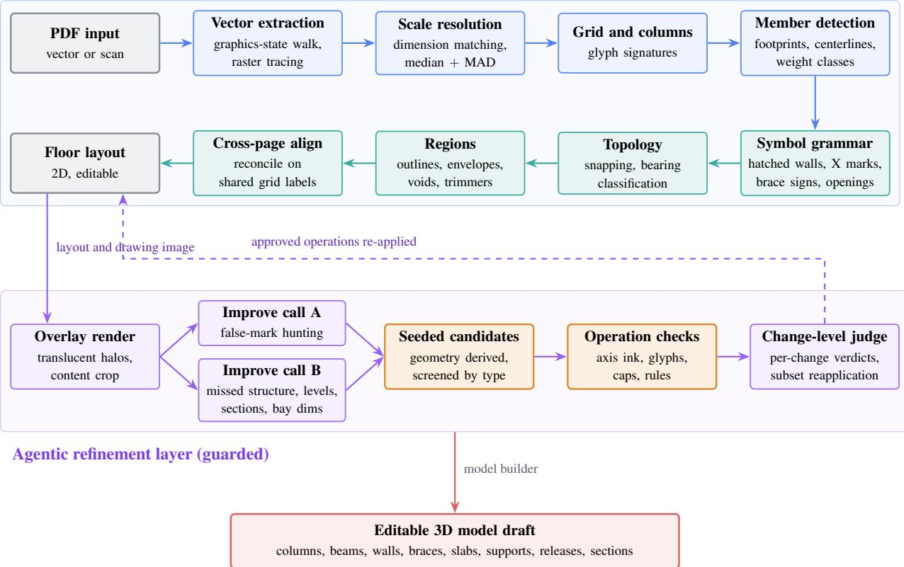  
Figure 1: System architecture with the deterministic detection layer, the guarded agentic refinement layer, and the model builder.

The third stage converts the refined floor layouts and user-supplied story heights into a three-dimensional model draft. The model builder places beams at floor elevations, erects columns between stories, instantiates walls and braces, and meshes slabs around detected openings. Parsed designations determine sections and materials when they are available, while configured defaults fill unresolved properties. The builder then assigns base restraints and secondary-member releases. Because the intermediate layout remains editable, every accepted detection or repair can be inspected and corrected before analysis.

Two design principles govern the resulting information flow. First, scale, collinearity, coverage, bearing, and containment are computed by explicit procedures rather than predicted by a task-specific detector, although their thresholds remain design choices. Second, the language model is consulted only after the initial layout exists, and its answers remain proposals until they pass the available checks. The following two subsections specify these deterministic and agentic stages. Section 5 evaluates the deterministic vector-PDF pathway and the guarded refiner, and Appendix D provides a non-evaluative illustration of the raster and model-assembly pathways.

## 3.3 Deterministic detection layer

The deterministic layer proceeds from drawing evidence to editable model geometry in three dependent phases. Primitive extraction first creates a common vector representation and resolves drawing scale. Structural-element passes then detect grids, columns, members, and symbols before constructing bearing topology. Finally, cross-drawing reconciliation aligns related plans and the model builder assembles their entities into an editable three-dimensional draft.

## 3.3.1 Primitive extraction and scale resolution

The extraction stage converts either PDF input type into a common set of paper-space geometric primitives. For vector exports, a custom parser traverses PDF graphics operators while tracking the transformation stack, line width, dash pattern, stroke and fill colors, and path-painting operators. Its output comprises attributed segments, closed polygons, arcs recovered from flattened Bézier runs by least-squares circle fitting, and positioned text runs with their rotations. For image-only PDFs, the adaptive thresholding method of Sauvola and Pietikäinen [43] binarizes the embedded bitmap, which is then traced into stroke primitives. Both paths then feed the same geometric detectors, although only the vector path preserves a machine-readable text layer. Retaining primitives rather than only pixels also preserves vector endpoints and line weights, an advantage shared with vector-domain symbol-spotting methods [11, 14].

Algorithm 1: The algorithm resolves drawing scale by dimension consensus.   
Input: primitives G (paper mm), unit system u, optional two-point calibration $\boldsymbol { c } = ( a , b , D )$   
Output: scale ˆs (model mm per paper mm), method, confidence   
Config: text offset 12; text param [0.05, 0.95]; angle $6 ^ { \circ } ;$ ; tick length [0.8, 6], midpoint 1.2, angle $> 2 0 ^ { \circ }$ ; arrowhead   
1.6; min line 3 (all paper mm); configured reference scales   
$\mathcal { S } _ { 0 } = \left\{ 1 0 , 2 0 , 2 5 , 3 \dot { 0 } , \dot { 4 } 0 , 5 0 , 7 5 , 1 0 0 , \check { 1 } 2 5 , 1 5 0 , 2 0 0 , 2 5 0 , 3 0 0 , 4 0 0 , 5 0 0 \right\}$   
1 if c is valid and $| a - b | > 0 . 5$ mm then   
2 $| \quad { \hat { s } } \gets D / | a - { \dot { b } } | ;$ ; snap to $\mathcal { S } _ { 0 }$ within 1.5%; return (sˆ, user-calibrated, 1);   
3 end   
4 $T  \{ s \in G$ .segs : ¬s.dashed, ${ s . w } \leq 0 . 3 , \ \vert s \vert \geq 3 \}$ ▷ thin bucket   
5 $S \gets [ ]$   
6 foreach text run $t \in G .$ texts do   
7 $D \gets \mathrm { P A R S E D I M E N S I O N } ( t , u )$ ▷ $2 4 ^ { \prime } – 6 ^ { \prime \prime }$ , 7500, 6.40; reject $D < 1 0 0$ mm   
8 i $\cdot _ { D } = \emptyset$ then continue   
9 $\ell \gets \arg \operatorname* { m i n } _ { s \in T } \lvert 0 \mathrm { f f } ( t , s ) \rvert$ subject to the configured offset, projection, angle, and two-terminator tests   
10 $\mathbf { i f } \ell \neq \varnothing$ then append $\hat { D \prime } | \ell |$ to S   
11 end   
12 if $S = \emptyset$ then return (100, assumed, 0) ▷ return assumed scale and warning   
13 compute $\boldsymbol { \tilde { s } } , \mathbf { M A D } , \tau , \dot { \mathcal { I } } , \boldsymbol { \hat { s } }$ by Eq. (1)   
14 $\mathbf { i f } \exists { \bar { \sigma } } \in { \mathcal { S } } _ { 0 } : | { \hat { s } } - \sigma | / \sigma \leq 0 . 0 1 5$ then $\hat { s }  \sigma$   
15 return $( \hat { s } ,$ dimension-consensus, $| { \mathcal { I } } | / | S | )$

Scale resolution by dimension consensus. All downstream geometric tolerances are expressed in physical units, so the drawing coordinates must first be converted from paper millimeters to model millimeters. An incorrect conversion factor affects every modeled coordinate. The scale resolver therefore operates before entity detection and reports its method and confidence (Algorithm 1). A dimension candidate pairs a printed distance, such as 6000 mm, with the line that represents that measured span. The matcher uses strict geometric conditions to reduce incorrect pairings: the text must sit within 12 mm of a thin line whose direction agrees with the text rotation within $6 ^ { \circ }$ , must project into the middle 90% of that line, and both line ends must carry a terminator, either a tick stroke of length 0.8 to 6 mm whose midpoint lies within 1.2 mm of the end at a relative angle above 20<sup>◦</sup>, or a filled arrowhead centroid within 1.6 mm.

Each surviving candidate i yields a scale estimate $s _ { i } = D _ { i } / d _ { i } ,$ , where $D _ { i }$ is the stated distance parsed under the drawing’s unit system and $d _ { i }$ is the measured line length in paper millimeters. Consensus is taken by rejecting outliers against the median absolute deviation and averaging what remains,

$$
\mathcal { I } = \big \{ i : \big | s _ { i } - \tilde { s } \big | \leq \tau \big \} , \qquad \tau = \operatorname* { m a x } \big ( 0 . 0 1 \tilde { s } , 4 \mathrm { M A D } \big ) , \qquad \hat { s } = \frac { 1 } { \left| \mathcal { I } \right| } \sum _ { i \in \mathcal { I } } s _ { i } ,\tag{1}
$$

with ${ \tilde { s } } =$ median $\left\{ { { s } _ { i } } \right\}$ and median absolute deviation $\mathrm { M A D } = \mathrm { m e d i a n } \{ | s _ { i } - \tilde { s } | \}$ . The threshold includes a minimum band equal to 1% of the median, which admits small measurement perturbations when the MAD is zero or nearly zero; exactly equal candidates would also survive a zero-width band. Confidence is the inlier fraction $| { \mathcal { I } } | / n$ . When sˆ falls within 1.5% of one of the fifteen configured reference scales it snaps to that scale, which removes residual measurement noise on conforming drawings. When a valid two-click calibration is supplied, it takes precedence. Without one, a drawing with no usable dimension returns an assumed 1:100 at confidence zero, a state the agentic layer is specifically instructed to review.

## 3.3.2 Structural-element detection, symbol rules, and topology

Structural detection follows an ordered sequence because each pass constrains the next one. Grid recovery establishes the reference lattice, column glyphs define support locations, member and symbol rules classify intervening linework, and the topology pass connects the retained entities. This order also prevents annotation and structural symbols from being chained into members.

A grid line is normally a chain of dash-dot strokes, identified by a dash array of at least four entries and anchored by a bubble at one or both ends. A long solid line attached to a labeled bubble is also admitted when an exporter omits dash patterns. A bubble is a circle of radius 3 to 7.5 mm containing a one- or two-character label whose center lies inside 80% of the radius; tessellated circles, which is how some exporters emit them, are recovered by a roundness test on the polygon. The label content, not the line direction, assigns the family, so letters and digits separate correctly on a rotated wing where an orientation-based split would fail; a circular mean over each family serves only as a consistency check that the two families are near perpendicular. Bay distances follow from the intersection lattice.

The column detector converts compact structural glyphs into locations, footprint dimensions, and orientations without assigning a material. A candidate is a closed glyph whose principal extents lie between 60 and 2000 mm on the long axis and between 30 and 2000 mm on the short axis, with an aspect ratio no greater than 6 so that member end caps do not qualify. The detector samples the interior width at five stations along the principal axis: wide ends with a pinched middle indicate a wide-flange shape, wide ends with a wide middle indicate a rectangle, and one wide end indicates a tee. A concentric white knockout identifies a hollow glyph. Material and section assignment is deferred to model assembly because the glyph alone does not provide sufficient semantic evidence.

Two fallback rules address common export differences. When a drawing contains no filled structural polygons, the detector also tests unfilled glyphs and closed loops assembled from loose strokes. A stroked circle is admitted only when at least two hatch strokes lie inside it, which suppresses north arrows and detail marks in the same size band. The estimated orientation is folded to [0<sup>◦</sup>, 180<sup>◦</sup>). Values within 10<sup>◦</sup> of 90<sup>◦</sup> are retained as 90<sup>◦</sup>, while all other values default to $0 ^ { \circ }$ because orientation estimates for nearly square glyphs are unstable.

Member detection then converts elongated primitives into beam and wall candidates (Algorithm 2). Within the supported grammar, beam footprints are closed, unfilled polygons drawn at true width, while beam centerlines are chains of collinear medium-weight strokes. These two representations cover the concrete, glulam, and steel conventions encoded in the benchmark generator without assigning material from linework alone. Stroke weights are separated into hatch, medium, and heavy classes using percentiles of each drawing’s width histogram together with fixed implementation intervals, which reduces sensitivity to different pen tables. Walls are recognized before beams because a wall footprint can otherwise be interpreted as a wide beam. When several coincident outlines describe one wall, the thinnest pai defines its centerline.

Topology then converts geometry into structure. Fragments are chained across gaps up to 450 mm. Endpoints first seek a column within half its maximum glyph extent plus 600 mm, provided the member axis passes within that extent plus 120 mm; still-free ends then seek a wall within half its thickness plus 600 mm and, finally, a beam within half its drawn width plus 600 mm (150 mm is used when width is unavailable). Let $A _ { q } ( p , e )$ state that endpoint p of member e satisfies the corresponding snap test for support type $q ,$ and let first return the first true type in the ordered tuple (column,wall,beam), or free when none qualifies. The implemented bearing and classification predicates are

$$
\beta _ { e } ( p ) = \mathrm { f i r s t } _ { q \in ( \mathrm { c o l u m n } , \mathrm { w a l l } , \mathrm { b e a m } ) } \{ q : A _ { q } ( p , e ) \} , \qquad K ( e ) = \left\{ \begin{array} { l l } { \mathrm { r e j e c t } , } & { \beta _ { e } ( a ) = \beta _ { e } ( b ) = \mathrm { f r e e } , } \\ { \mathrm { s e c o n d a r y } , } & { \mathrm { b e a m } \in \{ \beta _ { e } ( a ) , \beta _ { e } ( b ) \} , } \\ { \mathrm { g i r d e r } , } & { \mathrm { o t h e r w i s e } . } \end{array} \right.\tag{2}
$$

Spans are split at interior columns and provisional column-to-column girders before the final labels are assigned. The rule that discards a member with two unsupported endpoints removes legend strokes and title-block rules without relying on a fixed page-location crop.

After topology construction, the symbol grammar distinguishes structural symbols from member linework. Within the supported drawing conventions, shear walls are represented as hatched bands between columns, framed openings as X-marked rectangles, and vertical braces as X or V signs on bay edges. The detector encodes these representations as explicit geometric signatures rather than learned appearance. Table 1 states the eleven rules; Algorithm 2 places the ten member and topology rules in execution order, while leader-dot rejection belongs to the preceding column pass. These rules encode conventions represented in the development corpora, and their thresholds and signatures were informed by the PD-50 development half alone; the held-out PD-50-T half played no part in any revision. They should therefore be treated as an explicit, testable rule set rather than universal drafting law.

Two properties support evaluation across drawing scales. First, every threshold is expressed in the unit of its generating mechanism: symbol tests in paper millimeters, because a symbol is drawn at a size the drafter chose for legibility and does not scale with the building, and structural tests in model-space meters, because physical bay dimensions remain invariant to drawing scale. Using one unit system for both classes would make the thresholds scale-dependent. Second, the rules are ordered so that symbols are consumed before geometry is interpreted: X marks are erased before chaining, dimension lines are excluded before members are formed, and walls are claimed before beams. Unconsumed symbols can also become false members. Table 2 consolidates the configured units, thresholds, and roles.

Algorithm 2: The algorithm detects members and symbols and constructs their topology.   
Input: primitives G, scale ˆs, columns C, matched dimension lines ∆   
Output: beams, walls, braces, openings, slab regions   
Config: paper mm: hatch corridor 6, X-mark [4,22], midpoint 2.5, dedup offset max(2,0.75w); model mm:   
member $\geq 4 5 0 ,$ wall [80,650], opening side $\geq 1 0 0 0 ;$ meters: wall slop 0.3, extent guard 3   
▷ Stroke classes: percentiles of this drawing’s width histogram, unioned with native windows   
1 (h,m<sub>lo</sub>,m<sub>hi</sub>) ← WEIGHTCLASSES(G)   
▷ R1 walls before beams: a wall footprint reads as a wide beam   
2 W ← closed unfilled polys, weight in $[ m _ { \mathrm { l o } } , m _ { \mathrm { h i } } ] ,$ , length $\geq 6 0 0$ mm, width ∈ [80,650] mm, elongation $\geq 2 . 5 ,$   
containing ≥ 3 hatch midpoints   
3 group coincident candidates (lateral 0.75t, overlap $> 0 . 6 ) ;$ keep the thinnest as the centerline   
▷ R1b hatched bands between adjacent columns, longest first   
4 foreach axis-aligned adjacent column pair with paper span $L _ { p }$ and $L _ { p } \hat { s } \in [ 1 5 0 0 , 2 0 0 0 0 ]$ mm do   
5 Θ ← strokes of length 1.2–30 mm at $1 5 ^ { \circ } - 7 5 ^ { \circ }$ to the drawing axes, midpoint within the ±6 mm corridor, and   
axial parameter t ∈ (0.06,0.94)   
6 if |Θ| < max $( 6 , L _ { p } / ( 8 \mathrm { m m } ) )$ then continue   
7 sort offsets $0 \leq d _ { ( 1 ) } \leq \dots \leq d _ { ( n ) }$ and set $t _ { \mathrm { r a w } } \gets 2 d _ { ( \lfloor 0 . 9 n \rfloor + 1 ) } \hat { s }$ ▷ R1c gate the RAW value, before any clamp   
8 i $\cdot \_ t _ { r a w } < 1 0 0$ mm then continue ▷ else corner tails become false walls   
9 $t _ { w } \gets 5$ round(min(600,t<sub>raw</sub>)/5) mm   
10 accept unless $\geq 5$ of 9 samples are already covered by an accepted wall   
11 end   
▷ R2–R3 symbols are consumed before geometry   
12 X ← short diagonal pairs (4–22 mm, shared midpoint $\leq 2 . 5$ mm, opposite slopes) ▷ erased: brace signs   
13 O ← long diagonal pairs with a shared midpoint whose four endpoints form a rectangle with sides ≥ 1 m and ≥ 6   
of 8 inked samples on all four edges ▷ framed openings   
▷ R5 members: two representations, one topology   
14 F ← closed unfilled polys, 4–8 vertices, length $\geq 2 5 0$ mm, width $\in [ 3 0 , 8 0 0 ]$ mm, aspect $\geq 2$ ▷ footprints   
15 P ← {s : ¬dashed, s ∈/ X, w ∈ [m<sub>lo</sub>,m<sub>hi</sub>], |s|sˆ ≥ 450, s ∈/ ∆} ▷ R5 excludes dimension lines   
16 K ← CHAINCOLLINEAR $( P , 0 . 7 \bar { 5 } ^ { \circ } , 0 . 3 ,$ gap)   
17 foreach $k \in K$ do   
18 if ∃f ∈ F with relative angle $\leq 1 2 ^ { \circ }$ and midpoint offset < max(2, 0.75w<sub>f</sub>) then discard ▷ R4: the angle gate   
is required   
19 end   
20 TOPOLOGY: chain fragments, snap ends to columns and walls, split at interior columns and girder crossings, assign   
bearings   
21 foreach member do reject if both ends bear on nothing ▷ R10   
▷ R6–R9 post-conditions   
22 delete members whose midpoint lies inside an opening (R6); add perimeter trimmers where ≤ 1 of 5 samples is   
framed (R7); delete beams covered on ≥ 3 of 5 samples within t/2 + 0.3 m of a wall (R8); delete members outside   
the column bounding box inflated by 3 m (R9)

## 3.3.3 Reconciliation and model assembly

This final deterministic stage forms slab regions, aligns related drawings, and assembles their structural entities into a model draft. Slab regions come from three sources rather than from a planar-graph face walk, because a face walk over a framing plan produces one face per bay without distinguishing a slab from a light well. A dashed, unfilled phantom outline enclosing at least one square meter is accepted directly as a slab boundary. When no such outline exists, the column envelope inflated by half a glyph defines the slab extent. Openings come from the structural-symbol pass or, for architectural input, from stair and shaft boxes clipped to the grid lattice.

Related drawings must share a common coordinate frame before their entities can be reconciled. Each drawing initially places its origin at its first detected grid intersection, which can misalign a setback story that begins at grid B with a lower floor that begins at grid A. Shared grid labels provide the primary registration: the translation is the median difference between positions of common labels, limiting the effect of a single relabeled line. When drawings share no grid label, the procedure selects the translation supported by the largest number of column pairs and accepts it only if a majority of the columns on the drawing align with the reference. If neither source supports a translation, the drawing retains its local origin and is flagged for review. After registration, reconciliation forms a consensus column lattice, shares the resolved scale where appropriate, and allows a wall detection to replace a coincident beam detection.

Table 1: The eleven detection rules of the supported drafting grammar.
<table><tr><td>Rule</td><td>Statement</td></tr><tr><td>Hatched-band wall</td><td>The rule classifies a qualifying diagonal-stroke corridor between adjacent columns as a shear wall; thickness is twice d(|0.9n|+1), and the raw value must reach 100 mm before capping and rounding.</td></tr><tr><td>X-in-rectangle opening</td><td>The rule classifies two long diagonals with coincident midpoints whose endpoints form an inked rectangle as a framed floor opening.</td></tr><tr><td>X-mark eraser</td><td>Under the supported grammar, two short diagonals (4–22 mm on paper) crossing at a shared midpoint are treated as a symbol and removed before member chaining.</td></tr><tr><td>Angle-gated dedup</td><td>The duplicate test for centerlines measures offset to an infinite line and therefore requires parallelism within 12°; without the gate, joists whose midpoints lie on a perpendicular</td></tr><tr><td>Dimension-line exclusion</td><td>girder&#x27;s line are deleted. Segments riding a dimension line already matched by the scale resolver are treated as annotation rather than members.</td></tr><tr><td>Void rule</td><td>Candidates whose midpoints fall strictly inside a detected opening region are removed as opening-symbol remnants.</td></tr><tr><td>Trimmer completion</td><td>A geometry-screened opening receives perimeter trimmer beams where its edges are uncovered.</td></tr><tr><td>Wall-coverage deletion</td><td>A beam whose sampled midline lies within half the wall thickness plus 0.3 m of a wall centerline duplicates that wall and is removed.</td></tr><tr><td>Column-extent guard</td><td>Candidates whose midpoints fall outside the column bounding box inflated by 3 m are classified as drawing furniture.</td></tr><tr><td>Bearing invariant</td><td>The implementation assumes a retained floor member bears on a column, wall, or beam at one or both ends; candidates that bear on neither end are rejected.</td></tr><tr><td>Leader-dot rejection</td><td>A glyph is discarded as annotation when it is both far smaller than the drawing&#x27;s median column and has a thin annotation line terminating inside it. Neither test is applied alone: column sizes legitimately vary, and a beam end also terminates at a column.</td></tr></table>

The model builder then converts the reconciled layouts into a three-dimensional finite-element model draft. Columns extend between stories with continuity matching across floors, beams are placed at floor elevations, walls become area elements with detected thickness, and brace marks instantiate diagonal, X, V, or chevron components. Slabs are meshed around openings, base restraints are assigned at the lowest story, and secondary members receive end releases. Printed designations provide sections and materials when available. Otherwise, the implementation combines neighboring-member labels, glyph shape, footprint matching to configured steel, concrete, and glulam section catalogs, together with configured defaults; these fallback assignments require engineering review.

## 3.4 Guarded agentic refinement

The deterministic layer can leave residual inconsistencies that geometry alone cannot resolve. These include unexplained ink that may represent a missed member, a detection over blank paper, a column mark displaced from its glyph, or a drawing whose scale remains assumed. In this paper, agentic refinement denotes an iterative vision-language review that proposes typed edits, receives geometry-derived candidates, and evaluates the resulting changes through a separate review call. The input to refinement is the layout, defined here as the typed set of detected structural entities and their model-space geometry. Each inconsistency requires a judgment about drawing intent. A vision-capable language model can propose an interpretation, but generative models can produce unsupported content [25]. Current vision-language models also show limitations on low-level visual tasks [24]. The refinement layer therefore treats the model as a reviewer with no direct authority over the layout.

## 3.4.1 Refinement workflow and permitted edits

Algorithm 3 defines the refinement workflow. The model cannot modify the layout directly. A typed operation is one of twelve named changes with the fields required for that change, and a seed is an operation proposed by a deterministic candidate generator rather than by the model. The VALIDATEANDAPPLY routine checks required fields and operation-specific evidence, applies surviving edits to a copy of the input layout, and records accepted and rejected operations. It is the only procedure that can create a revised layout. This interface constrains the action space but does not prove every accepted action geometrically. Addition guards test drawing ink, whereas attribute changes and most deletions rely on typed fields, class-specific limits, and subsequent judging. If no candidate survives, or if neither the complete batch nor a re-judged subset is accepted, the routine returns the original entity layout. This behavior is termed fail-closed for entity edits; it does not cover the separately reported page-level metadata described below.

Table 2: Configuration of the deterministic layer, with paper millimeters governing printed-drawing symbol tests and model-space millimeters and meters governing structural tests.
<table><tr><td>Constant</td><td>Value</td><td>Role</td></tr><tr><td colspan="3">Scale resolution</td></tr><tr><td>Text-to-line offset, angle</td><td>12 mm paper,  $6 ^ { \circ }$ </td><td>Pairing a dimension string with its line</td></tr><tr><td>Text parameter window</td><td>[0.05,0.95]</td><td>Text must project into the line&#x27;s middle</td></tr><tr><td>Terminator</td><td>tick [0.8,6] mm at &gt; 20°, or arrowhead within 1.6 Both ends required mm</td><td></td></tr><tr><td>Outlier band</td><td>max(0.015, 4MAD)</td><td>Floor admits small perturbations when MAD is near zero</td></tr><tr><td>Reference-scale snap</td><td>≤ 1.5% relative</td><td>15 configured scales</td></tr><tr><td colspan="3">Grids and columns</td></tr><tr><td>Grid-line criterion</td><td>≥ 4 dash-array entries, or long solid line at labeled Center, phantom, and exporter fallback</td><td></td></tr><tr><td>Bubble radius, label</td><td>bubble  $3 - 7 . 5$  mm paper, 1–2 chars within 0.8r</td><td>Family from label content</td></tr><tr><td>Column size window</td><td>60–2000 mm long, 30–2000 mm short</td><td>Model-space glyph size</td></tr><tr><td>Column aspect</td><td> $\leq 6$ </td><td>Excludes member end caps</td></tr><tr><td></td><td>Profile stations, signature 5 stations, 25 samples</td><td>Ends  $> 0 . 7 5 .$  middle &lt; 0.5 gives wide flange</td></tr><tr><td>Rotation rule</td><td>within  $1 0 ^ { \circ }$  of 90°: retain  $9 0 ^ { \circ } ;$  otherwise  $0 ^ { \circ }$ </td><td>Principal-component noise otherwise reads</td></tr><tr><td>Duplicate glyph</td><td>0.6max(w,d)</td><td>as a diamond Suppresses the story-above copy</td></tr><tr><td colspan="3">Members</td></tr><tr><td>Weight classes</td><td> $h = \mathrm { c l i p } ( P _ { 2 0 } , 0 . 1 0 , 0 . 2 2 )$ </td><td></td></tr><tr><td></td><td> $m _ { \mathrm { l o } } = \operatorname* { m i n } ( 0 . 4 0 , \operatorname* { m a x } \left( h + 0 . 0 2 , 0 . 8 P _ { 4 5 } \right) )$   $m _ { \mathrm { h i } } = \operatorname* { m a x } ( m _ { \mathrm { l o } } + 0 . 2 0 , \operatorname* { m i n } ( 1 . 2 0 , 1 . 1 5 P _ { 9 7 } ) )$ </td><td>Paper-mm histogram, unioned with native windows</td></tr><tr><td>Footprint</td><td>4–8 vertices, ≥ 250 mm, 30–800 mm, aspect  $\geq 2$ </td><td>Concrete and glulam convention</td></tr><tr><td>Centerline chain</td><td>0.75°, 0.3 mm offset, ≥ 450 mm</td><td>Steel and alternate-export convention</td></tr><tr><td>Dedup angle gate</td><td>12°, offset max(2, 0.75w) mm paper</td><td>Without the gate, joists are deleted</td></tr><tr><td>Brace chain</td><td>dashed, ≥ 800 mm, ≥ 2 X strokes within 6 mm</td><td>Confirmed and unconfirmed both kept</td></tr><tr><td colspan="3">Symbols</td></tr><tr><td>Wall hatch</td><td>1.2–30 mm strokes;  $1 5 ^ { \circ } - 7 5 ^ { \circ } ;$  ±6 mm corridor;  $\operatorname* { m a x } ( 6 , L _ { P } / ( 8 \operatorname* { m m } ) )$ </td><td>Thickness  $= 2 d _ { ( \lfloor 0 . 9 n \rfloor + 1 ) } \hat { s } ,$  raw ≥ 100 mm, cap 600 mm</td></tr><tr><td>X-mark eraser</td><td>4–22 mm paper, midpoint ≤ 2.5 mm, opposite slopes</td><td>Consumed before chaining</td></tr><tr><td>Opening</td><td>diagonals ≥ 1.2 m, sides ≥ 1 m, 6 of 8 edge samples</td><td>All four edges required</td></tr><tr><td>X-sign brace</td><td>4–30 mm strokes,  $\geq 2$  near midspan, both slopes</td><td>Wall-owned spans vetoed</td></tr><tr><td colspan="3">Topology</td></tr><tr><td>Fragment chaining</td><td>gap 450 mm, offset 140 mm, 2.5°</td><td>Before any bearing test</td></tr><tr><td>End snap</td><td>column half-extent +600 mm (axis aim +120 mm); wall or beam half-width +600 mm</td><td>Precedence column, wall, beam; beam de- fault width 150 mm</td></tr><tr><td>Split at column</td><td>t ∈ (0.02,0.98); support clearance half-extent +600 Re-cuts chained runs at interior columns mm</td><td></td></tr><tr><td>Split at girder</td><td>member t ∈ (0.03,0.97); support u ∈ [−0.02, 1.02]; Column-to-column provisional girders re-</td><td></td></tr><tr><td>Wall-coverage deletion</td><td>piece ≥ 300 mm  $\bar { t } / 2 + 0 . 3$  m on ≥ 3 of 5 samples</td><td>main uncut Removes coincident beam duplicates</td></tr><tr><td>Extent guard</td><td>column bbox + 3 m</td><td>Preserves cantilever candidates</td></tr></table>

Two focused calls separate competing review objectives. The false-mark pass deletes detections or moves columns, whereas the missed-structure pass adds members, sets attributes, or calibrates scale. This decomposition separate destructive from constructive proposals before both enter the same validation path. The normal workflow uses two proposal calls and one judging call; retry and subset review can increase the total to six logical model invocations, excluding as many as three transport attempts for each invocation. Here, the judge is a separate vision-language call that reviews the numbered accepted changes, and salvage denotes reapplying only the changes that it did not reject.

Algorithm 3: The algorithm applies guarded agentic refinement to one drawing.   
Input: deterministic layout L, drawing primitives G, page raster R   
Output: refined layout, or L unchanged   
Config: <sub>α</sub>=0.55, halo 2.8×, crop 42 mm, 1600 px; provider defaults; high resolution; 8192 tokens; ≤ 12 ops/call,   
≤ 24 merged   
1 O<sub>img</sub> ← OVERLAY(L,R,<sub>α</sub>,halo,crop)   
2 if $\bar { O _ { i m g } } = \emptyset$ then return L ▷ no vision call is made   
3 D ← DIGEST(L) ▷ entities, dimensions, per-bay joist counts   
4 for attempt ← 1 to 2 do   
5 (Ω<sub>−</sub>,Ω<sub>+</sub>) ← parallel VISION(O<sub>img</sub>,D, FOCUSFALSE), VISION(O<sub>img</sub>,D, FOCUSMISSED ∥ Σ<sub>scan</sub>)   
6 s ← CALIBRATIONSEED(L)   
7 Σ ← INKLESSMARKS(L,G)∪ UNMARKEDCOLUMNS(L,G)∪ UNMARKEDSPANS(L,G)∪   
UNMARKEDJOISTS(L,G)   
8 $( \Omega , X _ { c } ) \gets \mathrm { C A N O N I C A L I Z E } \left( \Omega _ { - } \frown \Omega _ { + } \frown \Sigma \right)$ ▷ deduplicate effects; drop conflicts   
9 if s ̸= ∅ or Ω contains calibration then   
10 Ω ← [SELECTCALIBRATION(s,Ω)] ▷ exclusive transaction   
11 end   
12 Ω ← TRUNCATE(Ω, 24)   
13 if Ω = ∅ then return L   
14 (L<sup>′</sup>,A,Ω ,X) ← VALIDATEANDAPPLY(L,Ω,G) ▷ A: change list, X: rejections   
15 if $A \neq \emptyset$ then break   
16 feed X back as corrective context   
17 end   
18 if A = ∅ then return L   
19 v ← VALIDATEJUDGE(JUDGE(O<sub>img</sub>, OVERLAY(L<sup>′</sup>),A),|A|)   
20 if v = ∅ then return L   
21 if v.verdict = accept then return L   
22 B ← v.bad\_changes ▷ unique, in-range integer indices   
23 i $\mathbf { f }  0 < | B | < | A |$ then   
24 (L<sup>′′</sup>,A<sup>′′</sup>) ← VALIDATEANDAPPLY(L,{<sub>ωi</sub> ∈ Ω<sub>A</sub> : i ∈/ B},G) ▷ salvage   
25 if $\left| A ^ { \prime \prime } \right| = \left| A \right| - \left| B \right|$ then   
26 v<sup>′′</sup> ← VALIDATEJUDGE(JUDGE(O<sub>img</sub>, OVERLAY(L<sup>′′</sup>),A<sup>′′</sup>),|A<sup>′′</sup>|)   
27 if v<sup>′′</sup> ̸= ∅ and v<sup>′′</sup>.verdict = accept then return $L ^ { \prime \prime }$   
28 end   
29 end   
30 return L

Appendix C reproduces the shared overlay legend, the improve system prompt, the two focus suffixes, and the judge prompt.

The operation vocabulary defines the permitted communication between the model and the layout (Schema 1). Its twelve names cover deletion, attribute assignment, column movement, structural additions, and two forms of scale calibration. Coordinates use model-space meters with y directed upward, and target identifiers must match entities in the layout digest, a compact list of current entities, dimensions, and per-bay member counts supplied to the model. The provider schema requires an operation name, after which VALIDATEANDAPPLY validates the fields required for that operation and discards malformed proposals. The prompt also requests a free-text reason for review by the judge, although this field is optional in the machine schema. Generator-written provenance and model-written reasons are not stored in separate trusted fields, so provenance text cannot serve as independent evidence. This limitation is considered again in Section 6.

Schema 1 The typed operation vocabulary, with the literal examples embedded in the prompt   
1 // destructive and attribute ops: id and kind copied verbatim from the digest   
2 {"op":"delete","kind":"beam|column|wall|brace|region","id":"beam\_12","reason":"..."}

```jsonl
3 {"op":"set_section","kind":"beam","id":"beam_3","sectionName":"W360X134"}
4 {"op":"set_wall_thickness","id":"wall_2","thicknessMm":250}
5 {"op":"set_region_kind","id":"region_5","regionKind":"slab|opening"}
6 {"op":"set_beam_kind","id":"beam_7","beamKind":"girder|secondary"}
7 // slab thickness read from a keynote; no id applies it to every floor region
8 {"op":"set_region_thickness","thicknessMm":200,"reason":"keynote 1 reads 200 mm slab"}
10 // constructive ops: coordinates snap to columns and grid intersections
11 {"op":"add_column","x":0,"y":14.6,"reason":"glyph at grid A-3 carries no mark"}
12 {"op":"move_column","id":"col_8","x":0,"y":14.6,"reason":"marked 0.6 m off the glyph"}
13 {"op":"add_beam","x1":0,"y1":7.2,"x2":6.4,"y2":7.2,"beamKind":"secondary",
14 "reason":"drawn line between girder_3 and girder_4 has no overlay"}
15 {"op":"add_wall","x1":0,"y1":0,"x2":7.5,"y2":0,"thicknessMm":300}
17 // metric ops: range/state checked; seeded values derive from parsed dimensions
18 {"op":"calibrate_scale","gridA":"A","gridB":"E","realMm":25600,
19 "reason":"dimension strings state 4 x 6400 between A and E"}
20 // grid-free calibration: one value per gap between consecutive column lines
21 {"op":"calibrate_bays","axis":"x","bayMm":[6000,6000,6000],
22 "reason":"no grids detected; the top chain reads 600|600|600 in cm"}
```

The two calibration operations address different available evidence. In a vector PDF, positioned text runs expose dimension strings, section designations, grid labels, and level marks to deterministic parsing. An image-only scanned PDF lacks this machine-readable text layer, so these items require visual reading. The calibrate\_scale operation uses two detected grid labels and their stated distance and is therefore unavailable when raster processing does not recover a labeled grid pair. The calibrate\_bays operation instead uses the complete bay-dimension chain along one axis. It clusters detected column centers into lines, requires one stated bay length for every consecutive gap, and computes the factor from the stated total and measured extent. Its guard checks completeness, factor range, and internal consistency, but it does not independently read the dimension text; a plausible but incorrect visually read value may therefore pass.

The layer also reports printed-level metadata outside typed-operation admission. These values do not alter detected entity geometry, but they can affect downstream story setup. They bypass operation judging and receive only list-format and plausibility checks; user confirmation is therefore required. The output is an ascending set of printed floor elevations in meters. The implementation treats one elevation as the floor location, two as adjacent levels that define a story height without implying repetition, and three or more regularly spaced elevations as a possible repeated-story list. For vector input, at least three elevations must also be left-aligned before they are treated as a list; otherwise they remain individual references. These rules are implementation assumptions, and their accuracy was not evaluated in this study.

Slab thickness follows the typed-operation path. When the review identifies a keynote or general note as applying to the floor plan, a page-wide attribute operation proposes the parsed value for all floor regions on that drawing. The operation must pass the region-existence and 50–1200 mm range guards and the judge. Its note-scope assumption is limited to the supported workflow and remains subject to user review.

## 3.4.2 Geometry-seeded candidates and rule-based guards

Five deterministic generators create repair candidates before operation admission: (1) CALIBRATIONSEED proposes a scale factor from dimension consensus; (2) INKLESSMARKS proposes removal of entities without supporting ink; (3) UNMARKEDCOLUMNS proposes columns at inked, vacant grid intersections; (4) UNMARKEDSPANS proposes members between adjacent columns when their axis is inked; and (5) UNMARKEDJOISTS proposes missing members in repeated bay patterns. The three constructive lists are also included in the model prompt as visual-review context. Model proposals and all four non-calibration seed lists are canonicalized before the 24-operation cap: duplicate effects are reduced to one, and contradictory effects targeting the same mutation slot are discarded. Calibration is the exception to ordinary batching. When either a deterministic seed or a model proposal requests calibration, the transaction contains one calibration operation only, with the dimension-derived seed taking priority; geometry and attribute edits are deferred until a new pass uses the corrected scale. The generators screen geometry rather than prove structural meaning: for example, an inked span can still be a dimension or annotation line. Table 3 states the implemented tests. An unmarked column needs glyph-shaped ink at a free grid intersection; an unmarked span needs at least 0.60 axis coverage and is typed by its diagonal-stroke signature; a joist candidate must occupy a repeated bay fraction; inkless beam and wall marks fall below 0.25 axis coverage, while column marks use the glyph test; and a calibration seed requires at least three dimension-derived factors, 60% of which lie within 2% of their median.

## Prompt 2 Geometry-derived repair candidates supplied to the missed-structure review

```prolog
1 DETERMINISTIC INK SCAN (candidate locations screened against drawing vectors):
2 MISSING-COLUMN candidates (a drawn column glyph sits at these grid intersections with NO orange mark): 1.
(0.00, 14.60) 2. (7.20, 14.60). Emit add_column with EXACTLY these coordinates for each real glyph.
3 MISSING-MEMBER spans between adjacent marked columns (drawn ink, no marked beam/wall): 1. (0.00, 0.00) to
(7.50, 0.00) - HATCHED/FILLED band, classified as a wall candidate: emit add_wall only if the band is
structural 2. (7.50, 0.00) to (14.40, 0.00) - plain line: emit add_beam only if the line is structural.
Use EXACTLY these coordinates.
4 MISSING-JOIST spans (drawn linework matching the repeating joist pattern, no markup member): 1. (2.40, 0.00)
to (2.40, 7.20). Emit add_beam with EXACTLY these coordinates for EACH, unless a span is clearly not a
member (a dimension line or text underline).
```

The emphatic labels in the prompt describe geometric stroke evidence, not proof of structural meaning. Because this wording may bias both the proposing model and its judge toward the seeded class, its effect should be tested through a prompt ablation in which candidate provenance is blinded.

Operation guards determine which proposed changes may reach the judge. They are deterministic functions over a copied layout and, for selected additions, the extracted drawing primitives. Table 3 lists their main constants. For an added beam or wall with model endpoints $a , b ,$ let T map model coordinates to paper coordinates and let $\mathcal { S }$ be the extracted strokes. Axis-ink coverage is

$$
q _ { i } = ( 1 - \lambda _ { i } ) T ( a ) + \lambda _ { i } T ( b ) ,
$$

$$
\lambda _ { i } = \frac { i + 1 / 2 } { 1 5 } ,\tag{3}
$$

$$
C _ { \delta } ( a , b ) = \frac { 1 } { 1 5 } \sum _ { i = 0 } ^ { 1 4 } \mathbf { 1 } \Bigl [ \exists s \in \mathcal { S } : q _ { i } \in  { \mathsf { b b o x } } _ { \delta } ( s ) \land d ( q _ { i } , s ) \le \delta + \frac { w _ { s } } { 2 } \Bigr ] .\tag{4}
$$

Here $w _ { s }$ is stroke width and bbo $\zeta _ { \delta }$ is the stroke bounding box expanded by δ. The admission guard uses $\delta = 2 . 4$ paper mm and requires $C _ { \delta } \geq 0 . 5 5 ;$ because there are 15 samples, the smallest passing count is 9, or 0.60. This gate applies to add\_beam and add\_wall, not to moves, deletions, or attribute operations. An added column instead requires glyph-shaped ink: a nearby polygon centroid, a circle of radius at most 12 paper mm, or at least two strokes no longer than 12 paper mm, within the stated search radius. Long centerlines alone do not qualify.

The displaced-column guard encodes the difference between a wrong mark and a misplaced one. A deletion is refused when the mark carries no glyph within a tight 3 mm paper radius but an inked, unoccupied grid intersection sits between 0.3 and 1.5 m away in model space; the appropriate correction is a move. The radius asymmetry is deliberate: 3 mm of paper at the mark, because a correctly placed mark is centered on its glyph, and 6 mm at the candidate, because the search must tolerate glyph size. A 0.69 m displacement is 9 mm of paper at 1:75, so a model-space test alone cannot separate the two cases.

For admitted spans, the requested beam/wall type is overwritten by a diagonal-stroke classifier. A stroke counts when its paper length is at most 25 mm, its midpoint is within 5 mm of the span axis, and its undirected angle relative to that axis is strictly between $1 5 ^ { \circ }$ and 75<sup>◦</sup>. For paper span length $L _ { p } ,$ the span is classified as hatched when

$$
n _ { \mathrm { d i a g } } \geq \operatorname* { m a x } \left( 4 , \frac { L _ { p } } { 1 5 \ : \mathrm { m m } } \right) .\tag{5}
$$

Thus both the minimum requirement of four strokes and the length-dependent density condition must be met. The test reads extracted strokes, not filled regions. A hatched admitted span is typed as a wall, and an otherwise admitted span is typed as a beam. An addition is refused when a beam, wall, or brace already occupies the same endpoints or covers at least half of the proposed axis. The operation therefore cannot silently replace an existing member of a different class.

The remaining operations have narrower checks. Deletions are capped per class; columns additionally invoke the displaced-column refusal, and all wall deletions are refused when the hatch test passes. There is no general no-ink requirement on a model-proposed deletion. A column move is snapped, bounded to 0.05–3 m, and rejected if its destination is occupied, but the destination is not required to contain glyph ink. Attribute operations validate identifiers, enumerations, numeric clamps, and that the requested value would change the layout. Section assignment has an additional provenance guard: a nonempty existing section cannot be overwritten, and an empty section can be filled only when the exact normalized designation is present near that entity in the local PDF text layer. Other attribute operations do not independently establish drawing evidence. Calibration is allowed only for an assumed or low-confidence scale and checks the grid pair, factor range, and dead band; a model-supplied realMm is not independently re-read from raw dimension strings by the guard. Deterministically seeded calibration does derive that value from parsed dimensions.

## 3.4.3 Change-level review and fail-closed behavior

The judge provides a second review after operation admission. It receives the before and after overlays together with the authoritative numbered change list, and the prompt instructs it to assess only those listed changes. The response is accepted only when it contains an exact verdict and a required bad\_changes array of unique, in-range integer indices. An acceptance requires an empty array, whereas a rejection requires at least one index; malformed or contradictory responses fail closed. A proposed retained subset is then re-applied from the original layout through the same guards. Salvage is eligible only if every retained operation is reproduced exactly and a second strict judge response accepts the replay. This procedure can remove a rejected addition without silently accepting a partial or malformed transaction. Per-change verification is inspired by process-supervision work on stepwise verification [41], and the judge role draws on Zheng et al. [19]. The judge prompt makes three explicit distinctions: geometry-tagged candidates indicate nearby vector linework but do not prove its structural meaning; a move is not a deletion at the old location; and unit conversions match within 0.1%, which lets the judge re-derive $7 2 ^ { \prime } – 0 ^ { \prime \prime } = 2 1 , 9 4 5 . 6$ mm itself rather than reject the rounding. The judge uses the provider’s medium reasoning setting to support the ordered checks in the review prompt.

Failure containment begins with the visual prompt itself. Opaque centerlines can obscure thin source strokes, whereas wide translucent halos preserve the underlying ink for inspection. A failed improvement call does not terminate the pass because the other call and deterministic seeds can still supply candidates. The deterministic entity layout is returned unchanged only when no admitted entity operation survives or neither the complete batch nor a re-judged subset is accepted. This fail-closed scope does not include printed-level metadata, which can persist after only list-format and plausibility validation and must be confirmed by the user.

These guards constrain admissible mutations rather than certify semantic correctness. Structural additions require class-specific ink or glyph evidence, but deletion has no general no-ink test and a moved column need not terminate at a detected glyph. Most attribute edits are validated through identifiers, enumerations, ranges, or exact nearby text rather than an independent semantic reading. For a model-proposed calibration, the real-world dimension value and free-text rationale are not independently re-read from the drawing. A semantically wrong operation can therefore pass both the guards and the judge.

## 4 Benchmark and evaluation

The public floor-plan datasets reviewed here primarily annotate architectural semantics [10, 11], and prior structural drawing studies have evaluated small proprietary sets [2]. These reviewed datasets do not pair the required structural entity schema with exact model-space geometry. Accordingly, the benchmark contains 100 procedurally generated single-story framing plans in two equal halves with distinct roles. The PD-50 development half was used throughout method development: its failures drove every rule and threshold revision. The PD-50-T held-out half was generated from a disjoint seed stream after the detection rules were frozen and was evaluated exactly once; no rule, threshold, or prompt was changed in response to it, and every reported recall and precision value comes from it. Both halves follow generator-defined United States and Canadian notation variants and carry full title blocks, revision strips, code-referenced general notes, legends, keynote hexagons, design-load schedules, key plans, grid bubbles at both ends, bay and overall dimension chains, section markers, and north arrows (Figure 2). The authors generated both halves with the same fixed-seed parametric drawing generator developed for this study; each family, notation variant, and material position is matched case-for-case between the halves, so the two differ only in their random parameter draws. The evaluation release includes the drawings and ground truth but not the generator or plan-to-model implementation. Automated checks identified no inconsistencies across either half in file completeness, count agreement, member degeneracy and duplication, slab overlap, or in-bounds coordinate mappings. This verification addresses geometric and metadata consistency; it does not establish structural-design adequacy or conformity to every drafting standard.

Each half distributes both notation variants across the three materials identically. Of its 50 drawings, 25 use the United States variant on ARCH-D paper with imperial dimension strings and IBC, AISC, ACI, and NDS note blocks, and 25 use the Canadian variant on A1 paper with millimeter dimensions and NBCC, CSA S16, A23.3, and O86 notes. Materials divide into 17 steel, 17 concrete, and 16 timber cases, and material selection determines designation families (for example W14×90 against $\mathrm { W } 3 6 0 \times 1 3 4 , 1 8 ^ { \prime \prime } \times 1 8 ^ { \prime \prime }$ against $4 5 0 \times 4 5 0$ , and glulam sizes in both notation variants), single centerlines for steel against double lines at true width for concrete and glulam, hatch patterns for concrete against cross-hatched wood walls, and variant-consistent wall thickness ranges. Each case includes the vector PDF, a clean raster at 3.2 px/mm, a blurred variant at <sub>σ</sub> = 1.5, exact rotations of the blurred variant at 90<sup>◦</sup>, 180<sup>◦</sup>, and 270<sup>◦</sup>, the ground truth in model-space meters, and the full world-to-sheet mapping. The PD-50-T ground truth totals 1,082 columns, 2,721 beams, 194 wall panels, 47 braces, and 80 openings; the corresponding PD-50 totals are 1,100, 2,819, 189, 44, and 80.

Table 3: Configuration of the agentic layer in paper millimeters and model-space meters.
<table><tr><td>Constant</td><td>Value</td><td>Role</td></tr><tr><td colspan="3">Overlay rendering</td></tr><tr><td>Composition width</td><td>1600 px, ≤ 8 px/mm</td><td>Drawing legible without oversized payloads</td></tr><tr><td>Halo width, opacity</td><td>2.8×, α = 0.55</td><td>Drawn ink stays black inside a colored halo</td></tr><tr><td>Content crop margin</td><td>42 mm paper</td><td>Keeps grid bubbles and two dimension chains</td></tr><tr><td colspan="3">Model invocation</td></tr><tr><td>Provider model</td><td>gemini-3.5-flash [44]</td><td>Pinned pretrained model used in the reported runs</td></tr><tr><td>Sampling</td><td>Provider defaults</td><td>No temperature or top-p override</td></tr><tr><td>Thinking, improve / judge</td><td>medium / medium</td><td>Reasoning setting for ordered review checks</td></tr><tr><td>Image resolution</td><td>high</td><td>Pinned provider media-resolution setting</td></tr><tr><td>Output cap</td><td>8192 / 8192 tokens</td><td>Improve / judge</td></tr><tr><td>Operations per call, merged</td><td>≤ 12, ≤ 24</td><td>Canonicalization precedes the merged cap</td></tr><tr><td>Attempts, judge rounds</td><td>≤2, ≤2</td><td>Retry only if no op survived</td></tr><tr><td>Timeout, retries</td><td>75 s, 3 attempts</td><td>Linear backoff 1.5 s × n</td></tr><tr><td>Accepted finish reason</td><td>STOP only</td><td>Truncated and incomplete responses fail closed</td></tr><tr><td colspan="3">Admission guards</td></tr><tr><td>Ink coverage, member</td><td>≥ 0.55 of 15 samples</td><td>Stroke within 2.4 mm paper of the axis</td></tr><tr><td>Glyph ink, column</td><td>6 mm paper radius</td><td>Polygon centroid, circle r ≤ 12 mm, or ≥ 2 strokes ≤ 12</td></tr><tr><td>Endpoint snap</td><td>0.75 m</td><td>mm To column centers and grid intersections</td></tr><tr><td>Duplicate endpoints</td><td>0.35 m</td><td>0.40 m for columns</td></tr><tr><td>Multi-bay coverage</td><td>reject at ≥ 0.5</td><td>Rival member within 0.3 m over 15 samples</td></tr><tr><td>Minimum member length</td><td>0.4 m</td><td>After snapping</td></tr><tr><td>Section assignment</td><td>blank target, exact local text</td><td>Existing sections are immutable</td></tr><tr><td colspan="3">Destructive guards</td></tr><tr><td>Deletion cap per class</td><td>max(3, [0.4N])</td><td>N from the pre-pass count</td></tr><tr><td>Displaced-column refusal</td><td>0.3-1.5 m</td><td>Inked free intersection near the mark</td></tr><tr><td>At-mark glyph radius</td><td>3 mm paper</td><td>Tight: a correct mark is centered</td></tr><tr><td>Occupancy radius</td><td>0.45 m</td><td>Candidate intersection must be free</td></tr><tr><td>Move limits</td><td>0.05–3 m</td><td>Below is treated as no change; above is rejected</td></tr><tr><td>Contradiction</td><td>move then delete</td><td>Rejected within one pass</td></tr><tr><td colspan="3">Metric guards</td></tr><tr><td>Calibration gate</td><td>assumed or conf. &lt; 0.65</td><td>Never overrides high-confidence consensus</td></tr><tr><td>Factor clamp, dead band</td><td>[0.2,5], ≥ 2%</td><td>Calibration is an exclusive transaction</td></tr><tr><td>Grid pair separation</td><td>≥ 100 mm</td><td>Short pairs amplify error</td></tr><tr><td colspan="3">Deterministic candidate generators</td></tr><tr><td>Unmarked column</td><td>free intersection, glyph ink</td><td>No column within 0.45 m, no wall within 0.4 m</td></tr><tr><td>Unmarked span</td><td>≥ 0.6 ink, span 1.2–20 m</td><td>Existing coverage &lt; 0.35; typed by hatch</td></tr><tr><td></td><td></td><td></td></tr><tr><td>Unmarked joist</td><td>bay fraction repeated</td><td>≥ 0.6 ink, no joist within 0.3 m</td></tr><tr><td>Inkless beam/wall Inkless column</td><td>&lt; 0.25 axis coverage no glyph within 6 mm paper</td><td>Hatched walls exempt Candidate deletion; displaced-column guard still applies</td></tr><tr><td>Calibration seed</td><td>≥ 3 dimensions, ≥ 60% within 2%</td><td>Preferred over a model calibration proposal</td></tr></table>

Ten structural families target specific detector failure modes (Table 4). Each family contributes five seeded development variants to PD-50 and five further seeded variants to PD-50-T, and Appendix A lists the 50 held-out cases with their scales and entity counts. The family definitions vary footprint shape, framing density, skew, openings, walls, and bracing so that aggregate values can be traced to known geometric conditions. Because both halves are drawn from the same parametric families, the held-out half measures generalization to unseen drawings of the same distribution, not to independent drafting conventions; neither half samples the full diversity of structural drawings or design-office practice.

The generator represents dimensions, hatches, and opening boundaries with the same primitive types processed by the extractor. Dimensions comprise rotated text, extension lines, and tick strokes; hatches are explicit linework; and openings remove interior framing and trim their perimeters. This controlled representation exercises the intended input path. The held-out half controls for tuning to specific drawings, but the generator and extractor still share drafting assumptions, so held-out results within this corpus may remain optimistic relative to foreign producers. Section 6 therefore treats evaluation on independently drafted drawings as necessary for assessing external generalization.

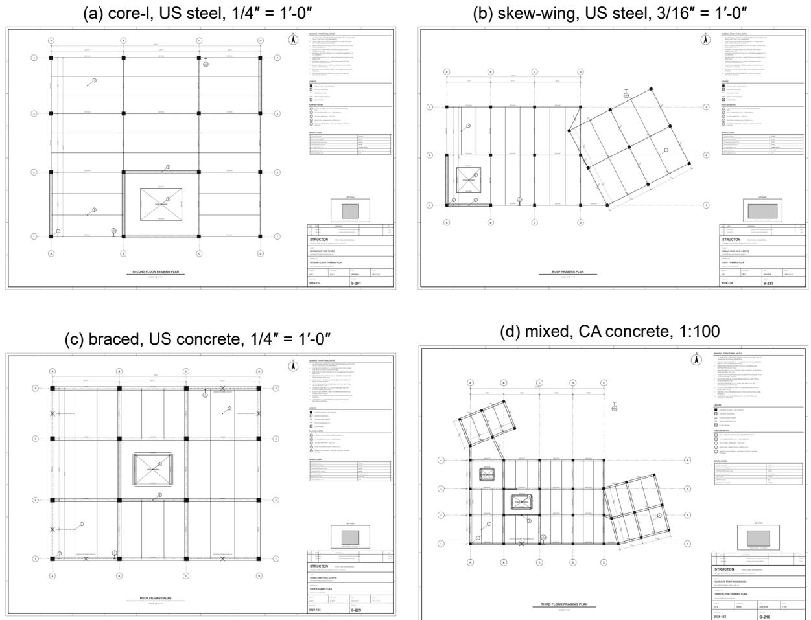  
Figure 2: Four PD-50 development drawings from the core-l, skew-wing, braced, and mixed families.

## 4.1 Evaluation protocol

The split discipline is stated first because every other protocol choice depends on it. All rule, threshold, prompt, and guard revisions were completed on PD-50 before PD-50-T was generated; the held-out half was then processed exactly once per condition, and no failure observed on it was used to change the system. Each held-out case was processed from its vector PDF through the complete framework exactly once: deterministic extraction and detection produced the intermediate layout, and one live realization of guarded agentic refinement produced the final layout that was scored with the translation fit and entity-scoring code described below. The clean, blurred, and rotated raster variants are included for future evaluation under blur and rotation but are not part of the quantitative results reported here. For scale, the per-case relative error is $e _ { s } = | \hat { s } - s _ { \mathrm { r e f } } | / s _ { \mathrm { r e f } }$ , where $s _ { \mathrm { r e f } }$ is read from the generator metadata. The estimated scale, resolution method, confidence, and $e _ { s }$ are retained with each evaluated case. Before scoring, a translation is fitted as the median offset over nearest column pairs; the results therefore do not measure absolute drawing origin. Columns, walls, braces, and openings use greedy one-to-one matching after all eligible pairs are sorted by increasing geometric cost. Columns match within 0.5 m of center, walls within 0.8 m at both endpoints, braces within 1.0 m at both endpoints, and openings within 1.5 m of centroid. Wall thickness is not part of the reported match predicate. These tolerances are permissive relative to member dimensions and do not test node connectivity, section assignment, material assignment, slabs, supports, releases, or solver validity.

Table 4: The ten PD-50 families and the capability each one tests.
<table><tr><td>Family</td><td>Designed to test</td></tr><tr><td>core-1</td><td>L-, T-, and C-shaped shear-wall cores and perimeter panels on regular grids: wall symbols, walls replacing beams, and variable-thickness wall geometry</td></tr><tr><td>core-u</td><td>Twin U-, box-, and C-cores with variable bay counts: multi-core layouts and core-adjacent framing</td></tr><tr><td>skew-wing</td><td>A wing rotated  $1 4 { - } 2 8 ^ { \circ }$  with sloped connector beams and rotated dimension chains: rotated lattices and skew-aware scale</td></tr><tr><td>chamfer</td><td>Chamfered corners producing diagonal edge beams and trimmed slabs</td></tr><tr><td>atrium</td><td>A multi-bay central void with corner diagonals: large-opening semantics and building-scale X symbols</td></tr><tr><td>braced</td><td>Up to six X-braced perimeter bays: brace signs against beam marks on shared edges</td></tr><tr><td>foot-1</td><td>L-shaped footprints with notches and stair and shaft openings</td></tr><tr><td>foot-u</td><td>U-shaped footprints with twin cores and edge bracing</td></tr><tr><td>dense mixed</td><td>Bays of 4.5–10 m with two to four infill beams per bay: infill recall under density Two skewed wings, a core, a stair, and bracing on one drawing: every class at once</td></tr></table>

Class-level recall and precision are the primary outcomes of the evaluation. A secondary per-drawing regression gate requires column recall and precision of at least 0.95, beam recall of at least 0.85, wall recall of at least 0.75, and opening recall of at least 0.50. This compound gate does not constrain beam, wall, or opening precision and does not include braces, so its pass count must not be interpreted as a complete accuracy measure. A rejected refinement transaction is scored as the unchanged intermediate layout, so a failed-closed case still produces a result. An accepted refinement means only that its guarded transaction passed the internal checks; the external entity metrics determine whether the resulting layout improved.

A separate controlled study tested two fixed corruptions on three development drawings in three repeated executions. The member-repair scenario inserted four fabricated marks, removed predetermined structural entities, and displaced one column. A strict pass required an accepted transaction, removal of all fabricated marks, restoration of every removed entity, correction of the displaced column, complete one-to-one recovery of the baseline entity collections, no collateral or unexpected entities, and no changes to attributes of entities that persisted from the corrupted input. Complete recovery required matches within 0.20 m for column centers and member endpoints, a 0.02 m Hausdorff distance for region boundaries, and 0.01 m for grid positions and anchors. The calibration corruption multiplied scale-sensitive layout coordinates, physical-width fields, curve radii, region and grid geometry, and transform scale factors by $1 / 1 . 5 ,$ , then marked the scale as assumed; parsed dimension records were left unchanged. Its strict predicate required an accepted transaction, primary grid-span error below 0.1%, restoration of every audited scale-sensitive field under the coded absolute and relative tolerances, complete entity recovery, consistent derived statistics, and no unrelated metadata or attribute change. Each scenario also required complete successful proposal and judge evidence reporting the pinned model and a STOP finish reason. Because the same three drawings and corruptions were reused, the 18 scenario executions measure repeatability on those cases rather than accuracy on 18 independent drawings.

Figure 3 illustrates the separate coverage criteria used for beams. Before scoring, detected beam runs are normalized by splitting them at detected columns and at interior crossings with other detected beams; pieces shorter than 0.5 m are discarded. This normalized detection set is denoted by D in Eq. (6). The procedure accommodates a correct drawn run that is represented as several per-bay pieces, or the converse, without treating that representation difference as an error.

A ground-truth member g, sampled at $n = 1 0$ stations, is counted for recall when

$$
\operatorname { c o v } ( g ) = { \frac { 1 } { n } } \sum _ { k = 1 } ^ { n } \mathbf { 1 } [ \exists t \in { \mathcal { D } } : \operatorname { d i s t } ( x _ { k } , t ) \leq 0 . 3 \operatorname { m } \land \angle ( g , t ) < 0 . 0 9 \operatorname { r a d } ] \geq 0 . 8 5 ,\tag{6}
$$

where $\mathcal { D }$ is the normalized detection set described above. With ten samples, the 0.85 threshold requires at least nine hits. A detected piece contributes to the precision numerator when at least 0.70 of its own ten samples lies within 0.3 m and 0.09 rad of ground-truth members. Beam recall and precision therefore have different numerators, which are reported separately in Table 5.

Recall is the fraction of ground-truth entities accounted for by the detector, and precision is the fraction of detections supported by a ground-truth entity:

$$
{ \mathbf { R } } = { \frac { | \{ g \in { \mathcal { G } } : g { \mathrm { ~ i s ~ m a t c h e d ~ } } \} | } { | { \mathcal { G } } | } } , \qquad { \mathbf { P } } = { \frac { | \{ d \in { \mathcal { D } } : d { \mathrm { ~ i s ~ s u p p o r t e d ~ } } \} | } { | { \mathcal { D } } | } } ,\tag{7}
$$

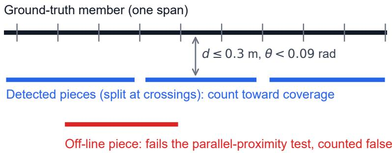  
Figure 3: Coverage-based beam scoring with a ground-truth span in black, supporting normalized detections in blue, and an off-axis false detection in red.

Table 5: End-to-end entity recovery on the held-out PD-50-T half, with separate beam hit counts for recall and precision.
<table><tr><td>Class</td><td>Recall</td><td>Precision</td><td>Recall hits / ground truth</td><td>Precision hits / detections</td></tr><tr><td>Columns</td><td>0.922</td><td>0.997</td><td>998 / 1,082</td><td>998 / 1,001</td></tr><tr><td>Beams</td><td>0.886</td><td>0.990</td><td>2,412 / 2,721</td><td>2,390 / 2,413</td></tr><tr><td>Walls</td><td>1.000</td><td>1.000</td><td>194 / 194</td><td>194 / 194</td></tr><tr><td>Braces</td><td>1.000</td><td>1.000</td><td>47 / 47</td><td>47 / 47</td></tr><tr><td>Openings</td><td>1.000</td><td>0.964</td><td>80 / 80</td><td>80 / 83</td></tr></table>

where $\mathcal { G }$ and $\mathcal { D }$ denote the ground-truth and detected entities of a class, respectively. Beam recall and precision use the sampled coverage tests above and therefore have separate hit counts. For columns, walls, braces, and openings, matching is greedy and one-to-one within each class; one detection cannot satisfy two ground-truth entities.

## 5 Results

## 5.1 End-to-end results on the held-out PD-50-T half

The aggregate and disaggregated results use the scoring definitions in Section 4.1 and report the complete framework: deterministic extraction and detection followed by one live realization of guarded agentic refinement per drawing, evaluated once on the held-out half. Beam hit counts are reported separately in both directions because the coverage metric permits a detected run to be split into several pieces or several per-bay pieces to be merged into one run. This representation difference is not counted as an error when the sampled geometry satisfies the stated thresholds.

Table 5 and Figure 4 report the end-to-end results. The scale-resolution stage produced dimension-consensus estimates at confidence 1.0 on all 50 held-out drawings, with a maximum relative error of 0.086% against the generator reference scale. Walls achieved recall and precision of 1.000 over 194 panels, and braces achieved recall and precision of 1.000 over 47 members. Openings achieved recall of 1.000 at precision of 0.964. Column recall was 0.922 at precision of 0.997, with three false columns remaining on one drawing. Beam recall was 0.886 and precision was 0.990, with 2,390 qualifying detected pieces among 2,413 normalized detections. The wall value reflects endpoint matching and does not assess wall thickness; opening matches use centroid proximity and do not assess boundary agreement.

Figure 5 presents representative correct recoveries and recurring failure cases from the held-out half. Panels (b) and (d) show missed columns and members in the rotated wings of skew-wing and mixed-family drawings. These overlays are consistent with the lower column and beam recall observed in the rotated families, but they do not isolate orientation as the causal mechanism. Of the 84 missed held-out columns, 80 occur in the mixed and skew-wing families and the remaining four on atrium drawings. The panel titles give raw detections divided by ground truth rather than matched detections divided by ground truth. Appendix B provides all 50 held-out overlays so that the location and type of each recorded error can be inspected.

Table 6 resolves the held-out aggregate by family. Seven of ten families achieved column recall of 1.000. The mixed (0.659) and skew-wing (0.790) families contained wings rotated from 15 to $2 7 ^ { \circ }$ and accounted for nearly the whole column-recall deficit; atrium (0.969) carried the remaining four misses. Beam recall was also lower for mixed (0.597), skew-wing (0.858), and chamfer (0.873). The overlays locate misses in rotated wings and at sloped connectors without establishing a unique cause. Column precision was 1.000 in every family except skew-wing (0.965), and the one localized false-positive pattern that the aggregate values obscured remained opening precision, which fell to 0.769 on atrium, the same family that produced the corresponding development-half errors. Visual inspection placed these errors near large X-shaped plan features, but the current evaluation does not isolate the contribution of each mechanism.

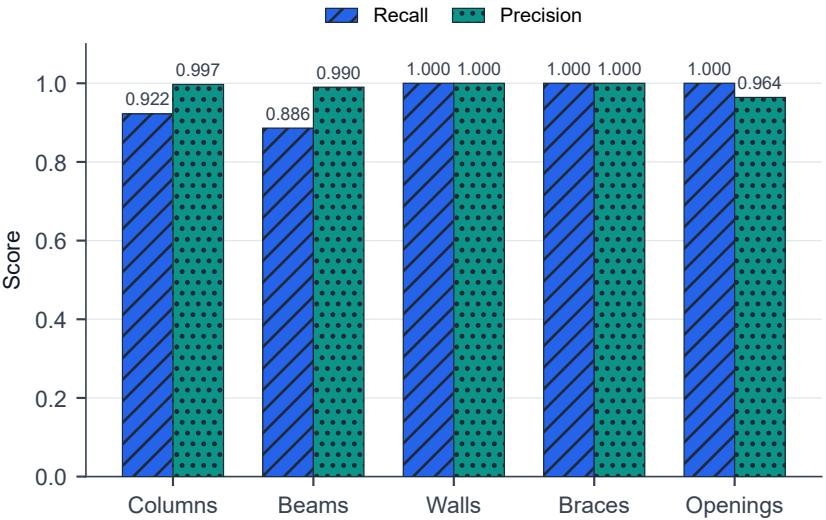  
Figure 4: Per-class recall and precision of the complete framework on the held-out PD-50-T half.

Table 6: Per-family end-to-end recall and precision on the held-out half; “–” denotes an undefined metric because its denominator is zero.
<table><tr><td></td><td colspan="2">Columns</td><td colspan="2">Beams</td><td colspan="2">Walls</td><td colspan="2">Braces</td><td colspan="2">Openings</td></tr><tr><td>Family</td><td>R</td><td>P</td><td>R</td><td>P</td><td>R</td><td>P</td><td>R</td><td>P</td><td>R</td><td>P</td></tr><tr><td>atrium</td><td>0.969</td><td>1.000</td><td>0.939</td><td>0.993</td><td>1.000</td><td>1.000</td><td></td><td></td><td>1.000</td><td>0.769</td></tr><tr><td>braced</td><td>1.000</td><td>1.000</td><td>0.893</td><td>0.995</td><td>1.000</td><td>1.000</td><td>1.000</td><td>1.000</td><td>1.000</td><td>1.000</td></tr><tr><td>chamfer</td><td>1.000</td><td>1.000</td><td>0.873</td><td>1.000</td><td>1.000</td><td>1.000</td><td></td><td></td><td>1.000</td><td>1.000</td></tr><tr><td>core-1</td><td>1.000</td><td>1.000</td><td>0.982</td><td>1.000</td><td>1.000</td><td>1.000</td><td>一</td><td></td><td>1.000</td><td>1.000</td></tr><tr><td>core-u</td><td>1.000</td><td>1.000</td><td>0.971</td><td>1.000</td><td>1.000</td><td>1.000</td><td></td><td></td><td>1.000</td><td>1.000</td></tr><tr><td>dense</td><td>1.000</td><td>1.000</td><td>0.909</td><td>0.993</td><td>1.000</td><td>1.000</td><td>1.000</td><td>1.000</td><td>1.000</td><td>1.000</td></tr><tr><td>foot-1</td><td>1.000</td><td>1.000</td><td>0.984</td><td>1.000</td><td>1.000</td><td>1.000</td><td></td><td></td><td>1.000</td><td>1.000</td></tr><tr><td>foot-u</td><td>1.000</td><td>1.000</td><td>0.971</td><td>0.975</td><td>1.000</td><td>1.000</td><td>1.000</td><td>1.000</td><td>1.000</td><td>1.000</td></tr><tr><td>mixed</td><td>0.659</td><td>1.000</td><td>0.597</td><td>0.978</td><td>1.000</td><td>1.000</td><td>1.000</td><td>1.000</td><td>1.000</td><td>1.000</td></tr><tr><td>skew-wing</td><td>0.790</td><td>0.965</td><td>0.858</td><td>0.975</td><td>1.000</td><td>1.000</td><td></td><td></td><td>1.000</td><td>1.000</td></tr></table>

Two descriptive cuts report within-corpus variation by notation variant and material (Table 7). Notation labels alternate among drawings emitted by the same generator, so similar results show balance within this synthetic corpus, not invariant transfer across independently drafted conventions. On the held-out half, column recall was 0.933 on the 25 United States drawings and 0.912 on the 25 Canadian drawings. Across materials, column recall was 0.926 for steel, 0.917 for concrete, and 0.924 for timber. Timber retained reduced opening precision (0.897), consistent with the development-half pattern, although refinement lifted its column precision to 0.991; the aggregate cuts cannot attribute individual failures to a single predicate, and dense joist infill is only a possible contributor to the beam result.

During the held-out evaluation, the refinement layer accepted 43 of 50 guarded transactions and applied 338 typed operations: 218 deletions, 70 member additions, and 50 section-designation assignments. The other seven transactions failed closed and left their intermediate layouts unchanged. The designation assignments supply section and material semantics that the model builder consumes but the entity-presence metrics do not measure, and the same operation channel carries scale calibration for drawings whose scale cannot be resolved deterministically, so the layer’s role extends beyond the counts in Table 5. Provider metadata verified the pinned gemini-3.5-flash model for all 176 transport records, each of which returned a successful response. Only responses with a STOP finish reason could contribute edits; ten responses that ended at the output-token cap failed closed. The secondary per-drawing gate of Section 4.1 passed on 38 of the 50 drawings; this compound gate omits several class-precision criteria and all brace criteria, so its count is secondary evidence. An end-to-end realization on the development half, retained in the data release, provides the transfer reference: no held-out value fell more than 2.4 percentage points below its development counterpart, with beam recall accounting for that largest gap, so the framework transferred to unseen drawings of the same distribution with little loss. Because the refinement stage is stochastic, all reported values reflect one live realization per drawing and carry no repeatability interval. The run also evaluates the complete v11 protocol rather than an isolated model choice, so the effects of the model, prompts, image resolution, candidate generators, guards, and judging procedure cannot be separated from it.

(a) core-l, US steel: 20/20 columns, 51/52 beams  
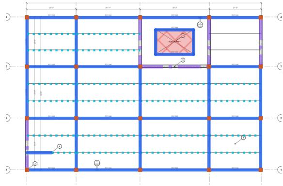

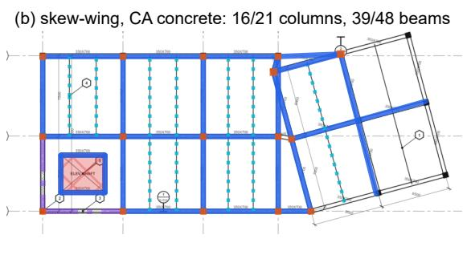

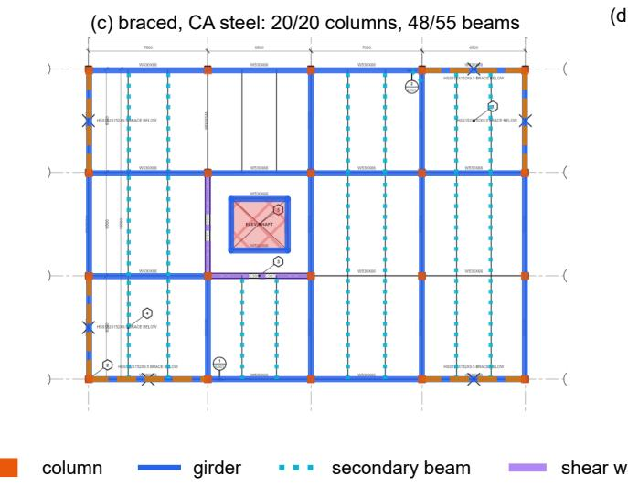

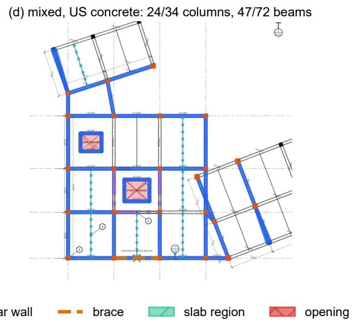  
Figure 5: Representative end-to-end overlays for four held-out PD-50-T drawings.

Table 7: Held-out end-to-end results by notation variant and material; n is the number of drawings and “–” denotes an undefined metric.
<table><tr><td></td><td></td><td colspan="2">Columns</td><td colspan="2">Beams</td><td colspan="2">Walls</td><td colspan="2">Braces</td><td colspan="2">Openings</td></tr><tr><td>Cut</td><td>n</td><td>R</td><td>P</td><td>R</td><td>P</td><td>R</td><td>P</td><td>R</td><td>P</td><td>R</td><td>P</td></tr><tr><td>US CA</td><td>25 25</td><td>0.933 0.912</td><td>0.994</td><td>0.903</td><td>0.987</td><td>1.000</td><td>1.000</td><td>1.000</td><td>1.000</td><td>1.000</td><td>1.000</td></tr><tr><td></td><td></td><td></td><td>1.000</td><td>0.869</td><td>0.994</td><td>1.000</td><td>1.000</td><td>1.000</td><td>1.000</td><td>1.000</td><td>0.930</td></tr><tr><td>steel</td><td>17</td><td>0.926</td><td>1.000</td><td>0.883</td><td>0.986</td><td>1.000</td><td>1.000</td><td>1.000</td><td>1.000</td><td>1.000</td><td>1.000</td></tr><tr><td>concrete</td><td>17</td><td>0.917</td><td>1.000</td><td>0.880</td><td>0.995</td><td>1.000</td><td>1.000</td><td>1.000</td><td>1.000</td><td>1.000</td><td>1.000</td></tr><tr><td>timber</td><td>16</td><td>0.924</td><td>0.991</td><td>0.897</td><td>0.991</td><td>1.000</td><td>1.000</td><td>1.000</td><td>1.000</td><td>1.000</td><td>0.897</td></tr></table>

Table 8: Strict outcomes for three repeated controlled-corruption trials per drawing.
<table><tr><td>Drawing</td><td>Member repair</td><td>Complete entity recovery</td><td>Calibration</td></tr><tr><td>st-us-01</td><td>0/3</td><td>0/3</td><td>3/3</td></tr><tr><td>co-us-02</td><td>3/3</td><td>3/3</td><td>3/3</td></tr><tr><td>co-ca-03</td><td>2/3</td><td>3/3</td><td>3/3</td></tr><tr><td>Aggregate</td><td>5/9</td><td>6/9</td><td>9/9</td></tr></table>

## 5.2 Controlled corruption repeatability

The controlled study produced 14 strict passes in 18 scenario executions (Table 8). All nine calibration repetitions passed. The largest primary-span relative error after calibration was 0.00182%, and all 2,073 full-layout scale-restoration checks passed. The member-repair scenario met every strict predicate in five of nine repetitions. Complete one-to-one recovery of the baseline entity collections occurred in six of nine; one of those six failed only because eight existing slab regions acquired a 120 mm thickness where the input value had been undefined.

Across the repeated member-corruption instances, the refiner removed 36 of 36 fabricated marks and corrected nine of nine displaced columns. It restored six of nine deleted columns and six of six deleted walls, but none of six deleted beams. No collateral deletions or unexpected entities were observed. Every scenario produced an internally accepted transaction, which further demonstrates why acceptance must be distinguished from strict end-state recovery. Provider metadata verified the pinned model and a STOP finish reason for every eligible controlled response. These figures describe repeated behavior on three selected development drawings and must not be interpreted as an accuracy estimate for a broader drawing population.

## 6 Conclusions

This study developed a hybrid workflow for converting CAD-exported and raster floor-plan PDFs into editable finiteelement model drafts and, to the authors’ knowledge, the first application of an agentic vision-language layer to building-component detection and structural model drafting from drawings. The deterministic layer extracts primitives, resolves scale by dimension consensus, identifies structural entities through an explicit drafting grammar, and assembles their geometry using bearing topology. The guarded agentic layer addresses residual ambiguities through typed operations, geometry-derived candidates, operation-specific admission tests, strict change-level review, and fail-closed transactions. This division preserves an inspectable geometric core while limiting the actions available to the pretrained vision-language model. The result is a reviewable modeling draft rather than an analysis-ready structural model.

The benchmark’s two halves separate development from measurement: the PD-50 half informed every rule and threshold revision, and the seed-disjoint PD-50-T half was generated after the rules froze and evaluated once. On that held-out half, the complete framework estimated scale within 0.1% of the generator reference for every drawing. End-to-end column recall and precision were 0.922 and 0.997, and beam recall and precision were 0.886 and 0.990. Walls, braces, and openings achieved recall of 1.000, with precision of 1.000, 1.000, and 0.964, respectively. No held-out value fell more than 2.4 percentage points below its development-half counterpart, so the framework transferred to unseen drawings of the same distribution with little loss. Column and beam misses were concentrated in families containing rotated wings, skewed connectors, and diagonal boundaries, although the present experiments do not isolate the causal mechanism. Because the refinement stage is stochastic, the reported values reflect one live realization per drawing and carry no repeatability interval.

The controlled corruptions clarify both the capability and the remaining failure modes. Calibration passed all nine repetitions, with a maximum primary-span error of 0.00182% and no failure among 2,073 full-layout restoration checks. Member repair met every strict predicate in five of nine repetitions: all 36 fabricated marks were removed, all nine displaced columns were corrected, and all six deleted walls were restored, but none of six deleted beams was recovered. Complete baseline entity recovery within the controlled tolerances was nevertheless obtained in six of nine repetitions because one additional run failed only after assigning thickness to eight slab regions whose previous value was undefined. All 18 transactions were accepted internally, confirming that guarded acceptance is not equivalent to correct end-state recovery. Provider metadata verifies the reported model and successful finish state, but the repeated observations still involve only three unique development drawings.

The term “training-free” in this paper means that no task-specific detector was trained or fine-tuned on plan annotations. The complete system still contains a learned component because refinement calls a pretrained, externally hosted vision-language model, and the deterministic rules embody manual design choices. The held-out half controls for tuning to particular drawings, but the generator and detector still share representational assumptions, so even held-out performance can be optimistic relative to foreign producers. Similar results for the encoded United States and Canadian variants show balance within the generator, not transfer across design offices or regional practices. The quantitative study is limited to vector PDFs; the raster and model-assembly examples remain illustrative. In addition, fitted translation and class-dependent localization tolerances do not test wall thickness, analytical connectivity, sections, materials, slabs, supports, releases, load paths, solver validity, or agreement of structural response. Results from learned floor-plan and CAD parsers use different classes, units of analysis, splits, and matching rules and therefore provide context rather than directly comparable baselines [2, 10, 13].

For engineering practice, every generated draft requires review before analysis. The frozen-rule held-out evaluation reported here should next be extended to independently drafted plans from additional offices, regions, materials, renovation projects, and image-quality conditions. Multiple model realizations per drawing are needed to estimate repeatability, and ablations should separate deterministic seeds, prompts, admission guards, and judging. Operationlevel error rates should be reported alongside the entity metrics, with graph-level connectivity, section and material fidelity, solver checks, and uncertainty estimates. A user study should also measure modeling time, correction effort, computation, and provider-call cost against deterministic-only, learned, and manual workflows. Within the stated limits, deterministic geometry combined with guarded vision-language review offers a transparent and testable route from structural drawings to editable model drafts, while its value on independently drafted drawings remains to be established.

## Data availability

The benchmark release contains all 100 vector drawings in both halves, the PD-50 development half and the PD-50-T held-out half, each with clean rasters and degraded variants, exact ground truth, world-to-sheet-to-pixel mappings, and a suggested evaluation protocol that preserves the development-test separation. The benchmark archive will be deposited in a public repository upon acceptance, and its persistent identifier will be added to the published version. A sanitized evidence bundle accompanying the manuscript reports per-drawing outcomes, controlled-trial outcomes, whitelisted protocol settings, provider-audit counts, source hashes, and file checksums. Complete successful provider responses and hashed request metadata were retained in a restricted private audit archive, but prompts, raw provider messages, images, layouts, and local paths are excluded from the shared bundle for security and third-party-service reasons. The release also excludes the drawing generator and the detection and model-generation source code. The available artifacts therefore support verification of the reported aggregates, but not exact recomputation of the detections or end-to-end reproduction of the workflow.

## Declaration of competing interest

The authors declare that they have no known competing financial interests or personal relationships that could have appeared to influence the work reported in this paper.

## Declaration of generative AI and AI-assisted technologies in the manuscript preparation process

During manuscript preparation, the authors used OpenAI Codex to support language editing, cohesion review, and LaTeX quality checks. The authors reviewed and edited the resulting text and take full responsibility for the content of the publication.

## References

[1] Yunfan Zhao, Xueyuan Deng, and Huahui Lai. A deep learning-based method to detect components from scanned structural drawings for reconstructing 3D models. Applied Sciences, 10(6):2066, 2020. doi: 10.3390/app10062066.

[2] Yunfan Zhao, Xueyuan Deng, and Huahui Lai. Reconstructing BIM from 2D structural drawings for existing buildings. Automation in Construction, 128:103750, 2021. doi: 10.1016/j.autcon.2021.103750.

[3] Lucile Gimenez, Jean-Laurent Hippolyte, Sylvain Robert, Frédéric Suard, and Khaldoun Zreik. Review: reconstruction of 3D building information models from 2D scanned plans. Journal ofBuilding Engineering, 2:24–35, 2015. doi: 10.1016/j.jobe. 2015.04.002.

[4] A. M. M. Hasan, Ahmed A. Torky, and Youssef F. Rashed. Geometrically accurate structural analysis models in BIM-centered software. Automation in Construction, 104:299–321, 2019. doi: 10.1016/j.autcon.2019.04.022.

[5] Philippe Dosch, Karl Tombre, Christian Ah-Soon, and Gérald Masini. A complete system for the analysis of architectural drawings. International Journal on Document Analysis and Recognition, 3:102–116, 2000. doi: 10.1007/PL00010901.

[6] Sébastien Macé, Hervé Locteau, Ernest Valveny, and Salvatore Tabbone. A system to detect rooms in architectural floor plan images. In Proceedings ofthe 9th IAPR International Workshop on Document Analysis Systems (DAS), pages 167–174, 2010. doi: 10.1145/1815330.1815352.

[7] Sheraz Ahmed, Marcus Liwicki, Markus Weber, and Andreas Dengel. Improved automatic analysis of architectural floor plans. In Proceedings ofthe International Conference on Document Analysis and Recognition (ICDAR), pages 864–869, 2011. doi: 10.1109/ICDAR.2011.177.

[8] Chen Liu, Jiajun Wu, Pushmeet Kohli, and Yasutaka Furukawa. Raster-to-vector: Revisiting floorplan transformation. In Proceedings ofthe IEEE International Conference on Computer Vision (ICCV), pages 2214–2222, 2017. doi: 10.1109/ICCV. 2017.241.

[9] Zhiliang Zeng, Xianzhi Li, Ying Kin Yu, and Chi-Wing Fu. Deep floor plan recognition using a multi-task network with room-boundary-guided attention. In Proceedings of the IEEE/CVF International Conference on Computer Vision (ICCV), pages 9096–9104, 2019. doi: 10.1109/ICCV.2019.00919.

[10] Ahti Kalervo, Juha Ylioinas, Markus Häikiö, Antti Karhu, and Juho Kannala. CubiCasa5K: A dataset and an improved multi-task model for floorplan image analysis. In Image Analysis: 21st Scandinavian Conference (SCIA 2019), Lecture Notes in Computer Science, vol. 11482, pages 28–40, 2019. doi: 10.1007/978-3-030-20205-7\_3.

[11] Zhiwen Fan, Lingjie Zhu, Honghua Li, Xiaohao Chen, Siyu Zhu, and Ping Tan. FloorPlanCAD: A large-scale CAD drawing dataset for panoptic symbol spotting. In Proceedings of the IEEE/CVF International Conference on Computer Vision (ICCV), pages 10128–10137, 2021. doi: 10.1109/ICCV48922.2021.00997.

[12] Zhaohua Zheng, Jianfang Li, Lingjie Zhu, Honghua Li, Frank Petzold, and Ping Tan. GAT-CADNet: Graph attention network for panoptic symbol spotting in CAD drawings. In Proceedings ofthe IEEE/CVF Conference on Computer Vision and Pattern Recognition (CVPR), pages 11747–11756, 2022. doi: 10.1109/CVPR52688.2022.01145.

[13] Zhiwen Fan, Tianlong Chen, Peihao Wang, and Zhangyang Wang. CADTransformer: Panoptic symbol spotting transformer for CAD drawings. In Proceedings of the IEEE/CVF Conference on Computer Vision and Pattern Recognition (CVPR), pages 10986–10996, 2022. doi: 10.1109/CVPR52688.2022.01071.

[14] Bingchen Yang, Haiyong Jiang, Hao Pan, and Jun Xiao. VectorFloorSeg: Two-stream graph attention network for vectorized roughcast floorplan segmentation. In Proceedings ofthe IEEE/CVF Conference on Computer Vision and Pattern Recognition (CVPR), pages 1358–1367, 2023. doi: 10.1109/CVPR52729.2023.00137.

[15] Wenlong Liu, Tianyu Yang, Yuhan Wang, Qizhi Yu, and Lei Zhang. Symbol as points: Panoptic symbol spotting via point-based representation. In International Conference on Learning Representations (ICLR), 2024.

[16] Shunyu Yao, Jeffrey Zhao, Dian Yu, Nan Du, Izhak Shafran, Karthik Narasimhan, and Yuan Cao. ReAct: Synergizing reasoning and acting in language models. In International Conference on Learning Representations (ICLR), 2023.

[17] Timo Schick, Jane Dwivedi-Yu, Roberto Dessì, Roberta Raileanu, Maria Lomeli, Eric Hambro, Luke Zettlemoyer, Nicola Cancedda, and Thomas Scialom. Toolformer: Language models can teach themselves to use tools. In Advances in Neural Information Processing Systems 36 (NeurIPS), 2023. doi: 10.52202/075280-2997.

[18] Aman Madaan, Niket Tandon, Prakhar Gupta, Skyler Hallinan, Luyu Gao, Sarah Wiegreffe, Uri Alon, Nouha Dziri, Shrimai Prabhumoye, Yiming Yang, Shashank Gupta, Bodhisattwa Prasad Majumder, Katherine Hermann, Sean Welleck, Amir Yazdanbakhsh, and Peter Clark. Self-refine: Iterative refinement with self-feedback. In Advances in Neural Information Processing Systems 36 (NeurIPS), 2023. doi: 10.52202/075280-2019.

[19] Lianmin Zheng, Wei-Lin Chiang, Ying Sheng, Siyuan Zhuang, Zhanghao Wu, Yonghao Zhuang, Zi Lin, Zhuohan Li, Dacheng Li, Eric P. Xing, Hao Zhang, Joseph E. Gonzalez, and Ion Stoica. Judging LLM-as-a-judge with MT-Bench and Chatbot Arena. In Advances in Neural Information Processing Systems 36 (NeurIPS), Datasets and Benchmarks Track, 2023. doi: 10.52202/075280-2020.

[20] Haoran Liang, Mohammad Talebi Kalaleh, and Qipei Mei. Integrating large language models for automated structural analysis. arXiv preprint arXiv:2504.09754, 2025. URL https://arxiv.org/abs/2504.09754.

[21] Haoran Liang, Yufa Zhou, Mohammad Talebi Kalaleh, and Qipei Mei. Automating structural engineering workflows with large language model agents. arXiv preprint arXiv:2510.11004, 2025. URL https://arxiv.org/abs/2510.11004.

[22] Changyu Du, Sebastian Esser, Stavros Nousias, and André Borrmann. Text2BIM: Generating building models using a large language model-based multiagent framework. Journal of Computing in Civil Engineering, 40(2):04025142, 2026. doi: 10.1061/JCCEE5.CPENG-6386.

[23] Hao Xie, Qipei Mei, and Ying Hei Chui. AI applications for structural design automation. Automation in Construction, 179: 106496, 2025. doi: 10.1016/j.autcon.2025.106496.

[24] Pooyan Rahmanzadehgervi, Logan Bolton, Mohammad Reza Taesiri, and Anh Totti Nguyen. Vision language models are blind. In Proceedings ofthe Asian Conference on Computer Vision (ACCV), pages 18–34, 2024.

[25] Ziwei Ji, Nayeon Lee, Rita Frieske, Tiezheng Yu, Dan Su, Yan Xu, Etsuko Ishii, Ye Jin Bang, Andrea Madotto, and Pascale Fung. Survey of hallucination in natural language generation. ACM Computing Surveys, 55(12):1–38, 2023. doi: 10.1145/3571730.

[26] Hao Xie, Xiao Ma, Qipei Mei, and Ying Hei Chui. A semi-supervised approach for building wall layout segmentation based on transformers and limited data. Computer-Aided Civil and Infrastructure Engineering, 40(10):1295–1313, 2025. doi: 10.1111/mice.13397.

[27] Karl Tombre. Analysis of engineering drawings: State of the art and challenges. In Graphics Recognition: Algorithms and Systems (GREC 1997), Lecture Notes in Computer Science, vol. 1389, pages 257–264, 1998. doi: 10.1007/3-540-64381-8\_54.

[28] Xavier Hilaire and Karl Tombre. Robust and accurate vectorization of line drawings. IEEE Transactions on Pattern Analysi and Machine Intelligence, 28(6):890–904, 2006. doi: 10.1109/TPAMI.2006.127.

[29] Lluís-Pere de las Heras, Sheraz Ahmed, Marcus Liwicki, Ernest Valveny, and Gemma Sánchez. Statistical segmentation and structural recognition for floor plan interpretation. International Journal on Document Analysis and Recognition, 17(3): 221–237, 2014. doi: 10.1007/s10032-013-0215-2.

[30] Carlos Francisco Moreno-García, Eyad Elyan, and Chrisina Jayne. New trends on digitisation of complex engineering drawings. Neural Computing and Applications, 31(6):1695–1712, 2019. doi: 10.1007/s00521-018-3583-1.

[31] Laura Jamieson, Carlos Francisco Moreno-García, and Eyad Elyan. Towards fully automated processing and analysis of construction diagrams: AI-powered symbol detection. International Journal on Document Analysis and Recognition, 28:71–84, 2025. doi: 10.1007/s10032-024-00492-9.

[32] Rasika Khade, Krupa Jariwala, and Chiranjoy Chattopadhyay. A comprehensive survey of floor plan image analysis and related applications. International Journal on Document Analysis and Recognition, 29(1):41–59, 2026. doi: 10.1007/ s10032-025-00528-8.

[33] Hao Xie, Qipei Mei, Ying Hei Chui, and Haitao Yu. A transformer-based approach for similar layout retrieval and difference detection in architectural drawings of wood frame buildings. Journal of Building Engineering, 111:113438, 2025. doi: 10.1016/j.jobe.2025.113438.

[34] Lucile Gimenez, Sylvain Robert, Frédéric Suard, and Khaldoun Zreik. Automatic reconstruction of 3D building models from scanned 2D floor plans. Automation in Construction, 63:48–56, 2016. doi: 10.1016/j.autcon.2015.12.008.

[35] Tong Lu, Huafei Yang, Ruoyu Yang, and Shijie Cai. Automatic analysis and integration of architectural drawings. International Journal on Document Analysis and Recognition, 9:31–47, 2007. doi: 10.1007/s10032-006-0029-6.

[36] Soumya Madireddy, Lu Gao, Zia Ud Din, Kinam Kim, Ahmed Senouci, Zhe Han, and Yunpeng Zhang. Large language model-driven code compliance checking in building information modeling. Electronics, 14(11):2146, 2025. doi: 10.3390/ electronics14112146.

[37] Abdullahi Saka, Ridwan Taiwo, Nurudeen Saka, Babatunde Abiodun Salami, Saheed Ajayi, Kabiru Akande, and Hadi Kazemi. GPT models in construction industry: Opportunities, limitations, and a use case validation. Developments in the Built Environment, 17:100300, 2024. doi: 10.1016/j.dibe.2023.100300.

[38] Geewook Kim, Teakgyu Hong, Moonbin Yim, Jeongyeon Nam, Jinyoung Park, Jinyeong Yim, Wonseok Hwang, Sangdoo Yun, Dongyoon Han, and Seunghyun Park. OCR-free document understanding transformer. In European Conference on Computer Vision (ECCV), pages 498–517, 2022. doi: 10.1007/978-3-031-19815-1\_29.

[39] Kenton Lee, Mandar Joshi, Iulia Raluca Turc, Hexiang Hu, Fangyu Liu, Julian Martin Eisenschlos, Urvashi Khandelwal, Peter Shaw, Ming-Wei Chang, and Kristina Toutanova. Pix2Struct: Screenshot parsing as pretraining for visual language understanding. In Proceedings ofthe 40th International Conference on Machine Learning (ICML), Proceedings ofMachine Learning Research, vol. 202, pages 18893–18912, 2023.

[40] Mohit Gupta, Chialing Wei, Thomas Czerniawski, and Ricardo Eiris. PIDQA: Question answering on piping and instrumentation diagrams. Machine Learning and Knowledge Extraction, 7(2):39, 2025. doi: 10.3390/make7020039.

[41] Hunter Lightman, Vineet Kosaraju, Yura Burda, Harri Edwards, Bowen Baker, Teddy Lee, Jan Leike, John Schulman, Ilya Sutskever, and Karl Cobbe. Let’s verify step by step. In International Conference on Learning Representations (ICLR), 2024.

[42] Artur d’Avila Garcez and Luís C. Lamb. Neurosymbolic AI: The 3rd wave. Artificial Intelligence Review, 56(11):12387–12406, 2023. doi: 10.1007/s10462-023-10448-w.

[43] Jaakko Sauvola and Matti Pietikäinen. Adaptive document image binarization. Pattern Recognition, 33(2):225–236, 2000. doi: 10.1016/S0031-3203(99)00055-2.

[44] Google. Gemini 3.5 Flash. Google AI for Developers documentation, 2026. URL https://ai.google.dev/gemini-api/docs/ models/gemini-3.5-flash. Last updated 21 July 2026; accessed 13 August 2026.

## A Case inventory and per-case recall counts

Table 9 lists every held-out PD-50-T case with its family, notation variant, material, drawing scale, and per-class end-to-end recall counts, reported as matched over ground-truth count. Held-out variant numbers run from 06 to 10 within each family; the development variants 01 to 05 have the same structure, and their per-case records, together with the deterministic-arm per-case records, are included in the data release. Scales are abbreviated: $1 / 4 ^ { \prime \prime }$ denotes $1 / 4 ^ { \prime \prime } = 1 ^ { \prime } { - } 0 ^ { \prime \prime } ( 1 { : } 4 8 ) , 3 / 1 6 ^ { \prime \prime }$ denotes 1:64, and $1 / 8 ^ { \prime \prime }$ denotes 1:96. The inventory exposes the denominator and recall outcome for each drawing rather than only the corpus-level aggregate.

Table 9: Held-out PD-50-T inventory and per-case end-to-end recall counts (matched/ground truth).
<table><tr><td>Case</td><td>Family</td><td>Notation</td><td>Material</td><td>Scale</td><td>Cols</td><td>Beams</td><td>Walls</td><td>Braces</td><td>Open.</td></tr><tr><td>atrium-06</td><td>atrium</td><td>US</td><td>timber</td><td>3/16″</td><td>24/25</td><td>54/56</td><td>2/2</td><td>0/0</td><td>2/2</td></tr><tr><td>atrium-07</td><td>atrium</td><td>CA</td><td>steel</td><td>1:75</td><td>24/25</td><td>53/56</td><td>2/2</td><td>0/0</td><td>2/2</td></tr><tr><td>atrium-08</td><td>atrium</td><td>US</td><td>concrete</td><td>3/16″</td><td>24/25</td><td>53/56</td><td>2/2</td><td>0/0</td><td>2/2</td></tr><tr><td>atrium-09</td><td>atrium</td><td>CA</td><td>timber</td><td>1:75</td><td>24/25</td><td>49/56</td><td>2/2</td><td>0/0</td><td>2/2</td></tr><tr><td>atrium-10</td><td>atrium</td><td>US</td><td>steel</td><td>3/16″</td><td>30/30</td><td>66/69</td><td>2/2</td><td>0/0</td><td>2/2</td></tr><tr><td>braced-06</td><td>braced</td><td>CA</td><td>concrete</td><td>1:75</td><td>20/20</td><td>47/53</td><td>4/4</td><td>6/6</td><td>1/1</td></tr><tr><td>braced-07</td><td>braced</td><td>US</td><td>timber</td><td>1/4″</td><td>20/20</td><td>51/55</td><td>2/2</td><td>7/7</td><td>1/1</td></tr><tr><td>braced-08</td><td>braced</td><td>CA</td><td>steel</td><td>1:75</td><td>20/20</td><td>50/55</td><td>2/2</td><td>6/6</td><td>1/1</td></tr><tr><td>braced-09</td><td>braced</td><td>US</td><td>concrete</td><td> $3 / 1 6 ^ { \prime \prime }$ </td><td>20/20</td><td>48/54</td><td>3/3</td><td>6/6</td><td>1/1</td></tr><tr><td>braced-10</td><td>braced</td><td>CA</td><td>timber</td><td>1:75</td><td>20/20</td><td>45/53</td><td>4/4</td><td>4/4</td><td>1/1</td></tr><tr><td>chamfer-06</td><td>chamfer</td><td>CA</td><td>steel</td><td>1:75</td><td>17/17</td><td>38/44</td><td>4/4</td><td>0/0</td><td>1/1</td></tr><tr><td>chamfer-07</td><td>chamfer</td><td>US</td><td>concrete</td><td>1/4&quot;</td><td>17/17</td><td>42/44</td><td>4/4</td><td>0/0</td><td>1/1</td></tr><tr><td>chamfer-08</td><td>chamfer</td><td>CA</td><td>timber</td><td>1:50</td><td>17/17</td><td>38/44</td><td>4/4</td><td>0/0</td><td>1/1</td></tr><tr><td>chamfer-09</td><td>chamfer</td><td>US</td><td>steel</td><td>1/4″</td><td>17/17</td><td>36/44</td><td>4/4</td><td>0/0</td><td>1/1</td></tr><tr><td>chamfer-10</td><td>chamfer</td><td>CA</td><td>concrete</td><td>1:75</td><td>17/17</td><td>38/44</td><td>4/4</td><td>0/0</td><td>1/1</td></tr><tr><td>core-1-06</td><td>core-1</td><td>US</td><td>steel</td><td>3/16″</td><td>20/20</td><td>50/52</td><td>5/5</td><td>0/0</td><td>1/1</td></tr><tr><td>core-1-07</td><td>core-1</td><td>CA</td><td>concrete</td><td>1:75</td><td>20/20</td><td>52/52</td><td>5/5</td><td>0/0</td><td>1/1</td></tr><tr><td>core-1-08</td><td>core-1</td><td>US</td><td>timber</td><td>1/4&quot;</td><td>16/16</td><td>39/40</td><td>4/4</td><td>0/0</td><td>1/1</td></tr><tr><td>core-1-09</td><td>core-1</td><td>CA</td><td>steel</td><td>1:50</td><td>16/16</td><td>40/40</td><td>4/4</td><td>0/0</td><td>1/1</td></tr><tr><td>core-1-10</td><td>core-1</td><td>US</td><td>concrete</td><td>1/4″</td><td>16/16</td><td>39/40</td><td>4/4</td><td>0/0</td><td>1/1</td></tr><tr><td>core-u-06</td><td>core-u</td><td>CA</td><td>timber</td><td>1:75</td><td>20/20</td><td>40/43</td><td>717</td><td>0/0</td><td>2/2</td></tr><tr><td>core-u-07</td><td>core-u</td><td>US</td><td>steel</td><td>3/16″</td><td>20/20</td><td>50/52</td><td>8/8</td><td>0/0</td><td>2/2</td></tr><tr><td>core-u-08</td><td>core-u</td><td>CA</td><td>concrete</td><td>1:75</td><td>20/20</td><td>42/43</td><td>717</td><td>0/0</td><td>2/2</td></tr><tr><td>core-u-09</td><td>core-u</td><td>US</td><td>timber</td><td>1/4&quot;</td><td>20/20</td><td>52/52</td><td>8/8</td><td>0/0</td><td>2/2</td></tr><tr><td>core-u-10</td><td>core-u</td><td>CA</td><td>steel</td><td>1:75</td><td>24/24</td><td>52/53</td><td>717</td><td>0/0</td><td>2/2</td></tr><tr><td>dense-06</td><td>dense</td><td>US</td><td>concrete</td><td>3/16″</td><td>20/20</td><td>71/79</td><td>4/4</td><td>2/2</td><td>2/2</td></tr><tr><td>dense-07</td><td>dense</td><td>CA</td><td>timber</td><td>1:75</td><td>20/20</td><td>72/79</td><td>4/4</td><td>2/2</td><td>2/2</td></tr><tr><td>dense-08</td><td>dense</td><td>US</td><td>steel</td><td>3/16″</td><td>20/20</td><td>72/79</td><td>4/4</td><td>2/2</td><td>2/2</td></tr><tr><td>dense-09</td><td>dense</td><td>CA</td><td>concrete</td><td>1:75</td><td>20/20</td><td>53/57</td><td>4/4</td><td>1/1</td><td>2/2</td></tr><tr><td>dense-10</td><td>dense</td><td>US</td><td>timber</td><td>3/16″</td><td>20/20</td><td>51/57</td><td>4/4</td><td>1/1</td><td>2/2</td></tr><tr><td>foot-1-06</td><td>foot-1</td><td>US</td><td>steel</td><td>3/16″</td><td>18/18</td><td>49/49</td><td>2/2</td><td>0/0</td><td>2/2</td></tr><tr><td>foot-1-07</td><td>foot-1</td><td>CA</td><td>concrete</td><td>1:50</td><td>18/18</td><td>49/49</td><td>2/2</td><td>0/0</td><td>2/2</td></tr><tr><td>foot-1-08</td><td>foot-1</td><td>US</td><td>timber</td><td>1/4&quot;</td><td>18/18</td><td>49/49</td><td>2/2</td><td>0/0</td><td>2/2</td></tr><tr><td>foot-1-09</td><td>foot-1</td><td>CA</td><td>steel</td><td>1:75</td><td>18/18</td><td>45/49</td><td>2/2</td><td>0/0</td><td>2/2</td></tr><tr><td>foot-1-10</td><td>foot-1</td><td>US</td><td>concrete</td><td>1/4″</td><td>18/18</td><td>49/49</td><td>2/2</td><td>0/0</td><td>2/2</td></tr><tr><td>foot-u-06</td><td>foot-u</td><td>CA</td><td>timber</td><td>1:75</td><td>22/22</td><td>55/55</td><td>6/6</td><td>1/1</td><td>2/2</td></tr><tr><td>foot-u-07</td><td>foot-u</td><td>US</td><td>steel</td><td>3/16″</td><td>22/22</td><td>54/55</td><td>6/6</td><td>1/1</td><td>2/2</td></tr><tr><td>foot-u-08</td><td>foot-u</td><td>CA</td><td>concrete</td><td>1:75</td><td>22/22</td><td>52/55</td><td>6/6</td><td>1/1</td><td>2/2</td></tr><tr><td>foot-u-09</td><td>foot-u</td><td>US</td><td>timber</td><td>3/16″</td><td>22/22</td><td>54/55</td><td>6/6</td><td>1/1</td><td>2/2</td></tr><tr><td>foot-u-10</td><td>foot-u</td><td>CA</td><td>steel</td><td>1:75</td><td>22/22</td><td>52/55</td><td>6/6 4/4</td><td>1/1 1/1</td><td>2/2 2/2</td></tr><tr><td>mixed-06 mixed-07</td><td>mixed mixed</td><td>CA US</td><td>steel concrete</td><td>1:100 1/8″</td><td>22/34 24/34</td><td>41/72 44/72</td></table>

## B Detection overlays for the held-out half

Figures 6 and 7 draw the final end-to-end layout of every held-out PD-50-T case over the drawing it was read from, cropped to the structure. Counts under each panel are detected against ground truth, not matched against ground truth, so a panel can show equal counts while a false detection compensates for a miss; the matched counts are in Table 9. Titles are amber where the detected column count differs from the ground-truth count. The errors discussed in Section 5.1 are visible as unmarked columns in the rotated wings of the skew-wing and mixed families. These overlays permit case-level inspection of the errors summarized in Tables 5 and 6.

## C Prompt architecture of the agentic layer

The following boxes reproduce abridged, typography-normalized implementation text. Their capitalization and imperative wording belong to the runtime prompts rather than the manuscript’s narrative voice. Section-sign markers identify omitted or substituted text; because omitted text can affect model behavior, these excerpts document prompt structure but are insufficient for exact replication. They correspond to protocol gemini35-2026-08-13-v11 and the pinned gemini-3.5-flash model. The excerpts include the overlay legend prefixed to every call (Prompt 3), the improve system prompt shared by both focused calls (Prompt 4), the two focus suffixes that give those calls disjoint objectives (Prompt 5), and the judge (Prompt 6). Three design decisions structure the interaction: checks are numbered and ordered to promote consistent coverage; literal operation examples make required fields concrete beyond the provider schema; and each check states the expected negative outcome to discourage unsupported corrections.

## Prompt 3 Overlay legend, prefixed to every call

Overlay legend: orange rectangles = columns, blue lines = girders, cyan = secondary beams, purple = shear walls, amber dashed = braces,   
green fill = slab regions, red fill = openings, gray dash-dot = grid lines with labels. The overlay is drawn as WIDE SEMI-TRANSPARENT   
HALOS: a marked member shows its dark drawn line inside a color halo; a drawn line with NO color halo is UNMARKED structure (a missed   
detection); a color halo over blank paper is a FALSE detection.

## Prompt 4 The improve system prompt, shared by both focused calls

1 You are a senior structural engineer reviewing an automated markup of a structural/architectural floor-plan drawing. You receive ONE image   
(the original drawing with the current markup drawn on top) and the markup as JSON (coordinates in meters, y up). [overlay legend]   
3 Work through these checks IN ORDER and propose at most 12 SMALL, HIGH-CONFIDENCE corrections as typed ops:   
5 CHECK 0 - SCALE (do this FIRST when the JSON says scale.method is "assumed" or scale.confidence < 0.65): The overlay always LOOKS aligned   
even when the scale is wrong - the error hides in the numbers. Compare the distance between two labeled grid lines in the JSON (their   
"position" values, meters) against what the drawing’s printed dimension strings state for that same span. If they disagree by a   
consistent ratio, emit calibrate\_scale with gridA, gridB and the stated real distance in mm. Never calibrate when the scale method is   
dimension-consensus with good confidence. When calibration is required, emit exactly ONE calibration op and NO other ops; review   
geometry and attributes in a fresh pass after calibration.   
7 CHECK 1 - FALSE MARKS: an overlay element with NO dark drawing linework beneath it is a false detection - delete it. BRACES ARE SPECIAL: on   
a framing PLAN a vertical-bracing bay is marked only by a SMALL X or V symbol on the bay edge (often with an HSS label) - easy to miss   
at this zoom. If the JSON lists a brace and you see ANY small symbol or label anywhere along its span, keep it; deleting a brace should   
be EXTREMELY RARE and only when you are certain its span is completely bare.   
9 CHECK 2 - MISSED STRUCTURE (as valuable as check 1 - scan for it actively): every drawn beam centerline should carry a blue/cyan overlay,   
every drawn column glyph an orange rectangle, every thick/hatched wall band a purple band. Use the JSON "bayJoistCounts" table:   
neighboring bays normally repeat the same joist count, so a bay listed with FEWER joists than its neighbors usually misses EXACTLY the   
difference (typically ONE line). Look at that bay in the image, find the specific drawn joist line carrying no color halo, and add THAT   
line only. NEVER add more beams than the count difference, and never add a beam you cannot point at as a drawn-but-unhaloed line. For   
anything drawn but unmarked, emit add\_beam / add\_column / add\_wall, ALWAYS reusing coordinates of listed entities; never estimate   
coordinates from pixels.   
11 CHECK 3 - WRONG PLACE: a marked column sitting visibly OFF its drawn glyph / grid intersection -> move\_column with the correct x, y.   
Attached members follow.   
13 CHECK 4 - ATTRIBUTES: set\_region\_kind (slab vs stair/elevator opening), set\_wall\_thickness (clearly wrong thickness), set\_beam\_kind (girder   
vs secondary).   
15 CHECK 5 - SECTION LABELS: compare printed section designations with the JSON. Emit set\_section only when the target has no section, and copy   
the designation verbatim. Never overwrite a nonempty section.   
17 [The general operation rules are omitted; literal examples appear in the operation-schema excerpt.]

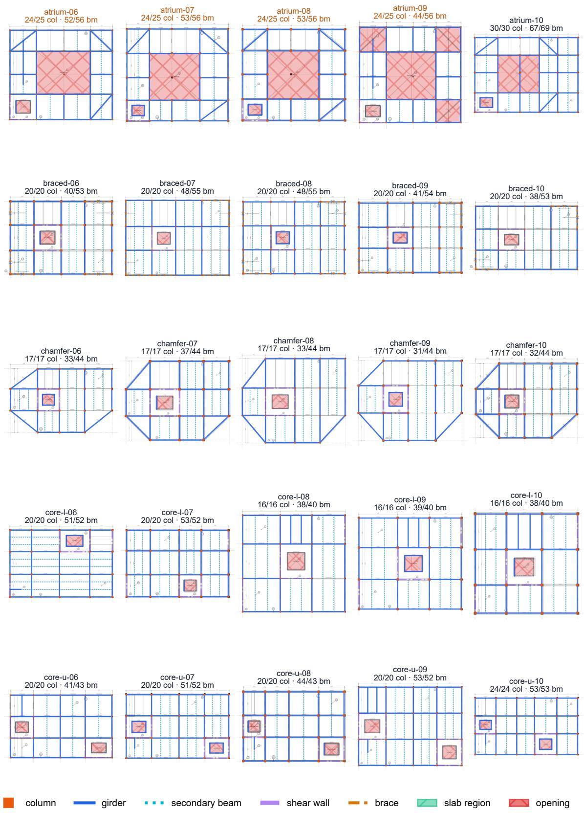  
Figure 6: Detection overlays, held-out cases 1–25 of PD-50-T.

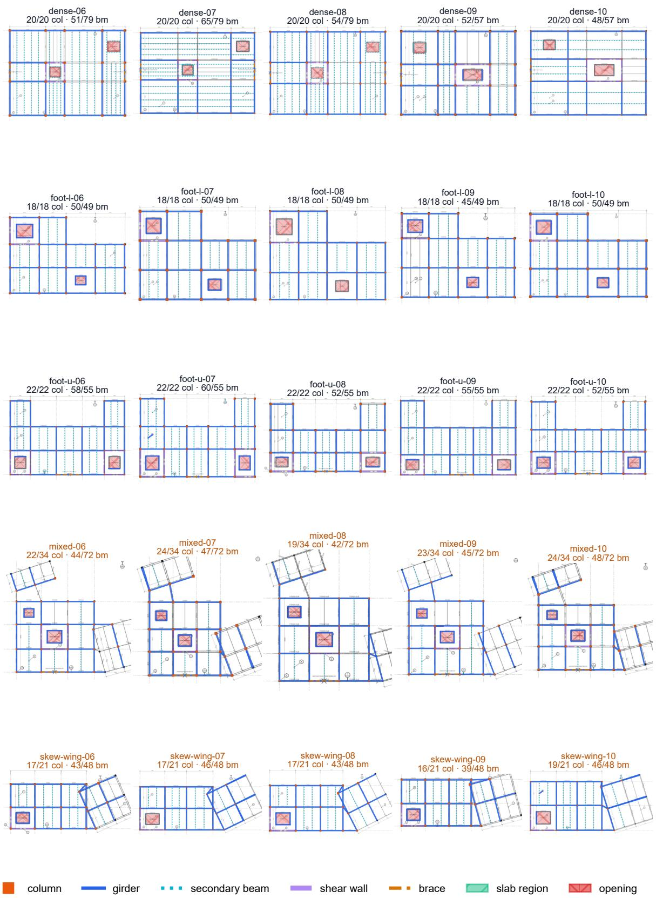  
Figure 7: Detection overlays, held-out cases 26–50 of PD-50-T.

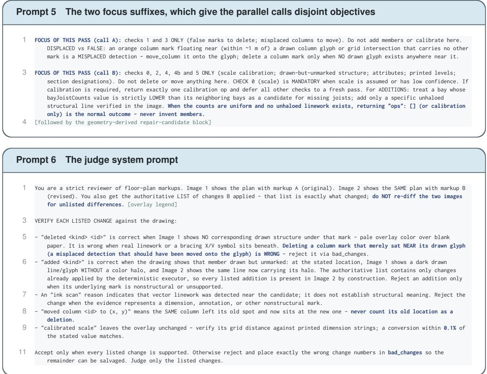

## D Illustrative raster and model-assembly artifacts

Figure 8 illustrates the raster and model-assembly pathways using three scanned architectural plans from a six-story building drawing set. Panels (a)–(c) show user-calibrated layouts processed through the raster path of Section 3.3.1. For this illustration, the study imposed a 3.2 m story height, assigned the first plan to the lowest level, repeated the second plan for four intermediate levels, and assigned the third plan to the top level. This story mapping was supplied to the model builder rather than inferred from the scans. Because the rasterizer produced no machine-readable text, a 6.0 m consensus bay read from the drawing was supplied externally to calibrate scale. The input plans contained no explicit beam linework; after detecting 12 column locations on each distinct plan, the workflow placed framing members between adjacent lattice positions as a planning assumption that requires review. Panel (d) is an independent rendering that illustrates the intended multistory model representation; it is not treated as an end-to-end output from the exact layouts in panels (a)–(c). Because traceable entity-level annotations are unavailable for this case, the figure is excluded from the quantitative evaluation and does not establish detection accuracy, model correctness, or out-of-distribution generalization.

(a) Basement detection markup  
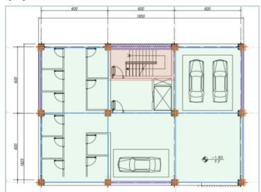

(b) Ground-floor detection markup  
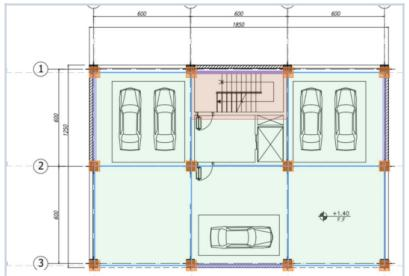

(c) Upper-floor detection markup  
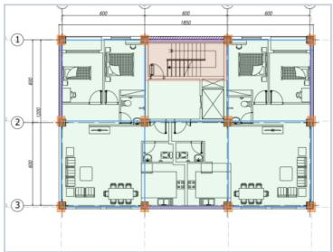

(d) Assembled six-story model  
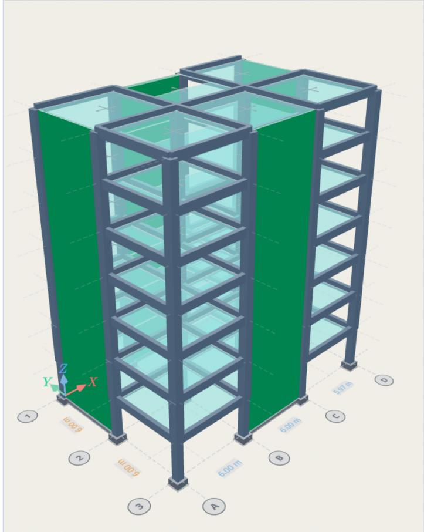  
Figure 8: Illustrative scanned-plan layouts with assumed lattice framing in panels (a)–(c) and an independent six-story model draft in panel (d).