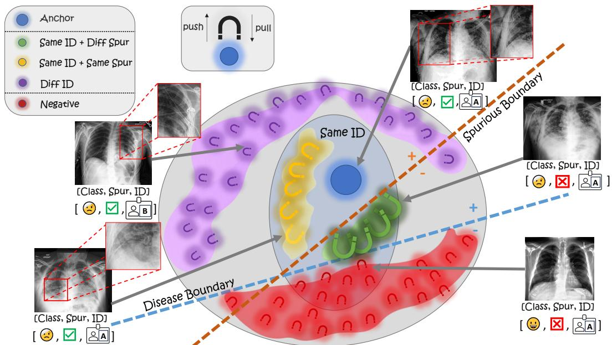
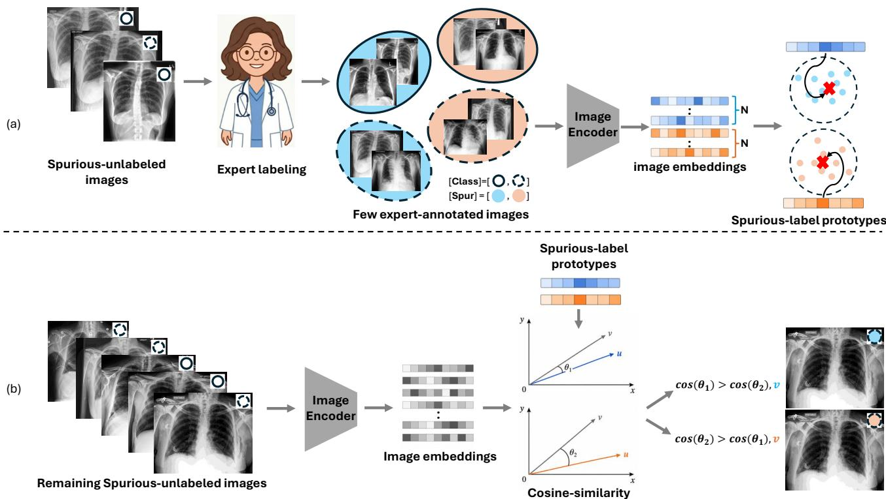
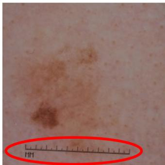
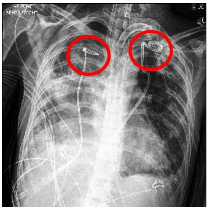
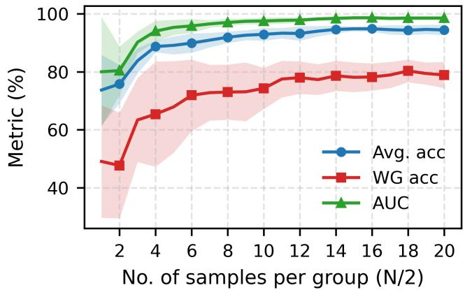
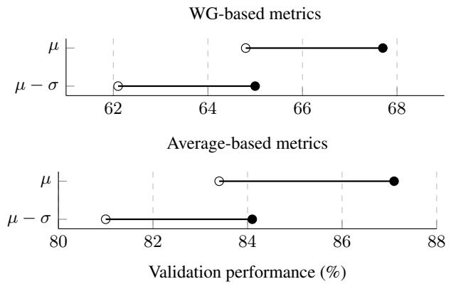
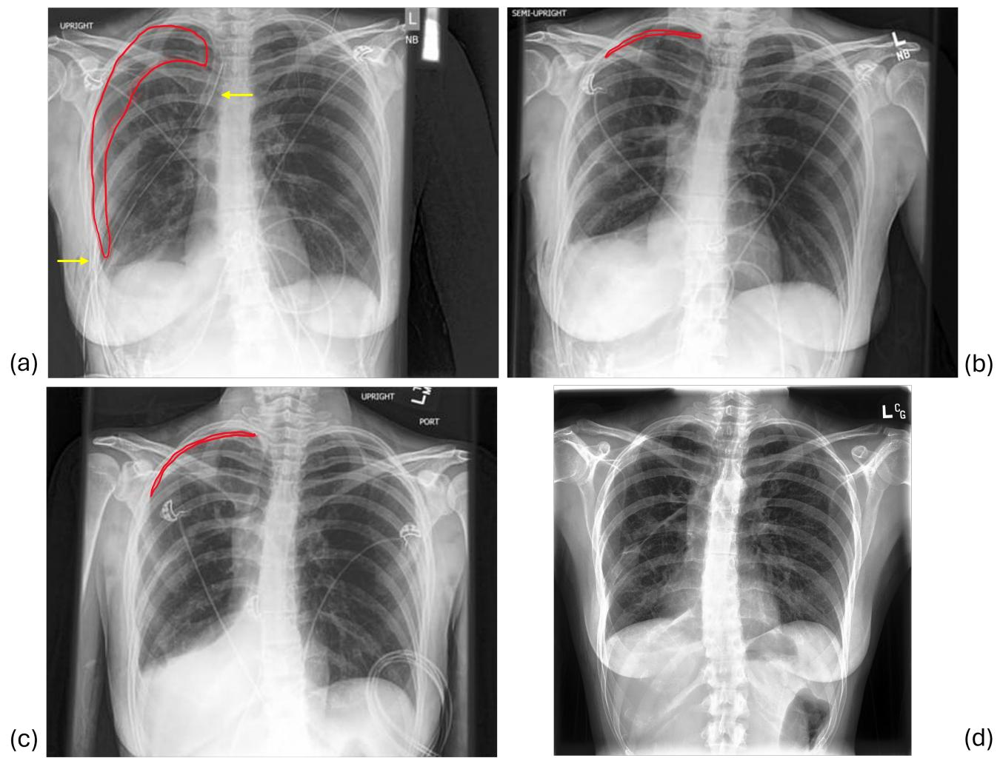

# SpurCon: Weighted Supervised Contrastive Learning for Mitigating Spurious Cues in Medical Imaging

Shenhav Nadir\* Meir Yossef Levi Eyal Gofer† Guy Gilboa†

Viterbi Faculty of Electrical and Computer Engineering, Technion - Israel Institute of Technology \*shenhav.n@campus.technion.ac.il

## Abstract

Despite the rapid progress of deep neural networks in visual recognition, their adoption in high-risk medical applications remains limited due to reliability and robustness concerns. Models may exploit spurious correlations, particularly in medical imaging, where devices or treatment artifacts often co-occur with pathology. In small or imbalanced datasets, such cues further reduce worst-group performance and undermine clinical trust. To solve these issues, two major challenges should be addressed: identifying dataset-specific spurious cues, which typically require domain knowledge, and mitigating reliance on them. To tackle both, we propose SpurCon, a lightweightframework based on a novel supervised contrastive loss formulation that leverages available metadata and predicted spurious labels to enhance robustness. We introduce a fast few-shot procedure, without network training, to estimate spurious labels using a small number of expert-annotated samples. We then propose a weighted supervised contrastive objective, WtSupCon, that reshapes the representation geometry by assigning sample-specific weights that depend on the [pathology, spurious, metadata] combination. For example, the highest weight is assigned to samples that differ only in their spurious label. This yields highly similar representations for images with the same metadata and pathology, differing only in the predicted spurious label. Our method operates on pretrained image encoders (such as BiomedCLIP) and trains only a lightweight projection head. We evaluate SpurCon on a synthetic setting and on Waterbirds, CheXpert, a chest X-ray classification dataset, and ISIC 2020, a skin cancer classification dataset. Our approach delivers the best spurious-mitigation performance, balancing well worst-group and overall accuracy on multiple datasets.

## 1. Introduction

Deep learning can substantially improve medical imaging diagnosis by learning expressive visual representations that help streamline clinical workflows [3, 19]. However, the adoption of deep learning-based algorithms in high-risk medical applications remains limited due to concerns about reliability and robustness [7, 17]. In particular, learned representations may capture spurious attributes, i.e., input cues that are predictive in-distribution but are not necessarily target-related [14, 15, 20]. While spurious correlations arise across many domains, including classical computer vision [15], natural language processing [2], and fairnesssensitive applications [10], they are particularly problematic in medical imaging. Medical images often contain nonpathological cues (e.g., tubes or surgical markings) that systematically co-occur with specific pathologies, encouraging models to rely on shortcut cues rather than clinically meaningful features [14] (see Fig. 3).

Addressing spurious correlations can be broadly decomposed into two sub-problems: identifying the spurious attributes and mitigating their effects. For the former, identifying which attributes should be considered spurious is often non-trivial, especially in the medical domain, where domain expertise is required to determine which cues are undesirable for the decision-making process of the model [20]. Fully manual annotation of spurious attributes is impractical at scale. Therefore, prior approaches [9, 16] rely on auxiliary or ad hoc classifiers for automatic labeling based on a small set of spurious-labeled samples. However, these methods fail to exploit the rich semantic knowledge embedded in modern foundation models. Regarding mitigation, one promising direction is to improve geometric representation alignment via contrastive learning. Prior studies [21, 22] introduce supervised contrastive approaches that align representations of same-class samples across different spurious annotations, inferred by unsupervised methods. However, these works were developed and evaluated primarily on natural-image benchmarks, where the spurious attributes differ from those in medical imaging, resulting in poor performance on medical imaging datasets (For comparison with multiple prior methods, see Tab. 2). We conclude that class and spurious-attribute information alone are insufficient for spurious mitigation in the medical domain, and that incorporating additional clinical context is essential.

  
Figure 1. SpurCon overview. Given an anchor, we define anchor-sample pairs using [class, spurious, ID]. Pairs with different classes (e.g., pathology) are pushed apart (negatives). Positive pairs are pulled together, with decreasing strength: (1) same ID & different spurious cue, (2) same ID & same spurious cue, (3) same class only.

We propose SpurCon, a lightweight framework built on a novel supervised contrastive loss formulation that leverages available metadata and predicted spurious labels to enhance robustness. First, we propose a few-shot spurious-label inference method based on expert-selected examples that evenly cover the (label, spurious) combinations. Using a powerful pretrained image encoder, we extract meaningful visual embeddings for each spurious attribute, compute their mean, and assign labels to the remaining samples by nearest neighbor in terms of cosine similarity. Then, inspired by prior work [18], we propose a weighted supervised contrastive loss, WtSupCon. It assigns sample-specific weights that depend on the [pathology, spurious, metadata] combination, with the highest weight given to pairs that differ only in their spurious label (see Fig. 1). Built on strong pretrained image representations, our method trains only a lightweight projection head, improving runtime compared to prior strong spurious-mitigation studies.

While our approach is well suited to medical imaging datasets, it is not limited to them. We evaluate SpurCon on a synthetic setting and on three publicly available datasets: Waterbirds [15], CheXpert [4], a chest X-ray classification dataset and ISIC 2020 [13], a skin cancer classification dataset. Our main contributions can be summarized as follows:

• We propose a simple yet reliable few-shot approach for estimating spurious labels using powerful pretrained image encoders.

• Building on these estimated labels, we introduce Spur-Con, a lightweight method based on a novel supervised contrastive loss, WtSupCon, that leverages available metadata (e.g., patient ID) to reduce reliance on spurious attributes.

• SpurCon achieves the strongest spurious-mitigation performance across both medical and non-medical datasets, regularly improving average and worst-group accuracies while substantially reducing runtime.

## 2. Method

Preliminaries. Let $\mathcal { D } = \{ ( x _ { j } , y _ { j } , s _ { j } ) \} _ { j = } ^ { M }$ denote a dataset of triplets, where $x _ { j }$ is an image, $y _ { j } \in \check { y } = \{ 1 , . . . , C \}$ is its class label, and $s _ { j } \bar { \in } \mathcal { S } = \{ 1 , . . . , \bar { S } \}$ is the corresponding spurious attribute. We define the group assignment as $g _ { j } =$ $( y _ { j } , s _ { j } ) \in \mathcal G = y \times S$ . The embedding of image $x _ { j }$ by the powerful image encoder is denoted by $\mathbf { z } _ { j } \in \mathbb { R } ^ { d }$ . We denote $\langle a , b \rangle$ for the cosine similarity ${ \frac { \boldsymbol { a } ^ { \intercal } \boldsymbol { b } } { \| \boldsymbol { a } \| \| \boldsymbol { b } \| } } .$

## 2.1. Pick-and-Predict: few-shot learning for predicting spurious labels

Prior methods [9, 16] that use a fixed number of spuriouslabeled samples train a dedicated model to predict spurious labels. In contrast, we infer spurious labels from a small set of expert-selected examples via a few-shot procedure, without any additional model training. For each spurious label $s \in \{ 1 , \ldots , S \}$ , we define a spurious-label prototype as the prototype of the $N$ expert-annotated samples assigned to that label: $\begin{array} { r } { \pmb { \mu } ^ { ( s ) } = \frac { 1 } { N } \sum _ { i = 1 } ^ { N } \mathbf { z } _ { i } ^ { ( s ) } } \end{array}$ , where $\{ \mathbf { z } _ { i } ^ { ( s ) } \} _ { i = 1 } ^ { N }$ are the embeddings of the $\dot { N }$ expert-annotated samples per label, $\{ x _ { i } ^ { ( s ) } \} _ { i = 1 } ^ { N }$ , evenly covering ${ \mathcal { G } } .$ . Given a new sample $x _ { j }$ , its inferred spurious label is assigned by

$$
\hat { s } _ { j } = \underset { s \in \{ 1 , . . . , S \} } { \arg \operatorname* { m a x } } \left( \langle \mathbf { z } _ { j } , \pmb { \mu } ^ { ( s ) } \rangle \right) .\tag{1}
$$

Figure 2 illustrates this method.

## 2.2. Weighted-SupCon: reducing spurious attribute effects in foundation-model representations

Supervised contrastive learning [5] leverages class-label information by pulling together representations of samples that share the same label and pushing apart samples with different labels. The supervised contrastive (SupCon) loss $\mathcal L ^ { \mathrm { { s c } } }$ is defined as

$$
\mathcal { L } ^ { \mathrm { s c } } = \sum _ { i \in I } \mathcal { L } _ { i } ^ { \mathrm { s c } } = \sum _ { i \in I } \left[ - \frac { 1 } { \vert P ( i ) \vert } \sum _ { p \in P ( i ) } \ell _ { i , p } \right] ,\tag{2}
$$

where

$$
\ell _ { i , p } = \log \frac { \exp ( \langle \mathbf { z } _ { i } , \mathbf { z } _ { p } \rangle / \tau ) } { \sum _ { a \in A ( i ) } \exp ( \langle \mathbf { z } _ { i } , \mathbf { z } _ { a } \rangle / \tau ) } .\tag{3}
$$

Here, I is the index set of all samples in a batch; $A ( i ) =$ $I \setminus \{ i \}$ is the set of all candidate indices excluding the anchor; $P ( i ) = \{ p \in A ( i ) : y _ { p } = y _ { i } \}$ is the set of indices of all positives; $\tau > 0$ is a temperature hyperparameter.

In Eq. (2), all positive samples contribute equally to the loss. However, the positive set may contain heterogeneous subsets whose influence on the representation should be controlled differently. We therefore introduce Weighted-SupCon loss (WtSupCon), a generalized formulation that partitions all positive samples into K disjoint sets $\{ P _ { k } ( i ) \} _ { k = 1 } ^ { \bar { K } }$ and assigns each set a weight $\alpha _ { k } \ > \ 0$ . The resulting loss is

$$
\mathcal { L } ^ { \mathrm { w s c } } = \sum _ { i \in I } \left[ \sum _ { k = 1 } ^ { K } - \frac { \alpha _ { k } } { \vert P _ { k } ( i ) \vert } \sum _ { p \in P _ { k } ( i ) } \ell _ { i , p } \right] .\tag{4}
$$

Algorithm 1 summarizes the procedure of SpurCon.

Split into sets. In our context, the primary motivation for this partitioning is to mitigate spurious correlations. ${ \mathrm { A c } } -$ cordingly, we split the positive set into $K = 3$ sets, where the highest weight is assigned to pairs of samples that differ only in their spurious cues, whereas a milder weight is assigned to pairs that are identical in all attributes, as they contribute less to suppressing spurious cues while remaining useful for similarity. The lowest weight is assigned to pairs that match only in their class label. The weights also compensate for set imbalance, with relative weights scaled inversely with set size, so that smaller sets receive larger weights (see the number and sizes of magnets per set in Fig. 1). By emphasizing cross-spurious pairs within the same class and ID, the loss explicitly encourages representations of samples that vary in spurious attributes to reside close to one another, thereby reducing the reliance of the model on those attributes. A complete description of the partition is provided in Tab. 1.

Customized sampling. Our WtSupCon loss is most effective when a mini-batch contains samples from each positive-pair set. Given the definition of sets in Tab. 1, batching together samples that share the same ID increases the likelihood that sets 1 and 2 co-occur within a minibatch. Accordingly, we construct mini-batches that favor placing same-ID samples in the same batch, which we call the ID-paired sampler. However, many medical datasets are highly imbalanced. In such cases, we instead aim to include samples from multiple groups G in every mini-batch to avoid under-representing minority groups. This alternative sampler prioritizes group coverage within each mini-batch rather than set coverage; we refer to this as the Balancedgroups sampler.

Projection head. The image embedding $\mathbf { z } _ { j }$ is further fed into a lightweight projection head. This head is instantiated in one of three configurations with tunable hidden width h and dropout rate dp: (1) a 3-layer LayerNorm–GeLU MLP with a residual skip, (2) a 3-layer BatchNorm–ReLU MLP with a bottleneck $( h / 2 )$ , and (3) a shallower variant of (2) without the final layer. Configuration details per dataset are given in Sec. 3.1. During training, only the projection head parameters are optimized, while the image encoder remains frozen.

Metadata usage. We leverage metadata associated with medical images to find attributes that can serve as grouping keys for visually similar samples, such as patient ID. When metadata is unavailable, comparable grouping cues can often be inferred from dataset directory structure, as done in Waterbirds (see Sec. 3.1). If no informative knowledge is available, the loss remains well-defined and effective. It reduces to a two-set formulation based only on class and spurious labels, analogous to SupCon becoming selfsupervised when class labels are absent.

## 3. Experiments and Results

## 3.1. Experimental Setup

First, we describe our toy dataset and the publicly available datasets on which we evaluate. We then describe the implementation details used in our experiments. For all datasets, training, validation and test sets are ID-disjoint.

  
Figure 2. Pick-and-Predict overview. Illustration of reliable and annotation-efficient few-shot spurious-label estimation, shown for binary class and spurious attributes. (a) Given known training class labels, an expert annotates N samples per spurious category, evenly distributed across classes. Their embeddings are averaged to form a prototype for each spurious label. (b) Each remaining training or validation sample is encoded and assigned the spurious label whose prototype has the highest cosine similarity.

<table><tr><td>Set</td><td>Same ID</td><td>Same spurious label</td><td>Same class</td></tr><tr><td>1</td><td>L</td><td>X</td><td>L</td></tr><tr><td>2</td><td>L</td><td>V</td><td>1</td></tr><tr><td>3</td><td>X</td><td></td><td>1</td></tr></table>

Table 1. Split into Sets. Set definitions ordered by importance in the final loss. The highest-weight set shares ID and class with the anchor but differs in spurious label.

Toy dataset: a binary classification dataset of generated images with classes Y = {one hole, two holes} and two background types used as a spurious attribute: S = $\{ s t r i p e s , d o t s \}$ , both encoded as {0, 1}, respectively. Variations include colors (=IDs), scale, jitter, blurring and random small background objects. The training/validation/test splits comprise 7,000/1,000/2,000 samples; the training set includes (class, spurious) combinations of (0, 0) = 47.5%, (0, 1) = 2.5%, (1, 0) = 2.5%, and $( 1 , 1 ) \ : = \ : 4 7 . 5 \%$ , the validation set uses intermediate proportions, and the test set is balanced. See example in Fig. 3, and several more in the

Supplementary Material (Supp.).

Waterbirds [15]: a well-known dataset for spurious evaluation with water and land birds and mixed backgrounds of water and land. Bird species, parsed from the image paths, are used as IDs.

CheXpert - Pneumothorax [4]: a large chest X-ray classification dataset, including patient ID and a Support Devices column indicating the absence or presence of any medical device in the scan, which we treat as a spurious attribute. We define “No Finding” as the negative class. Within each class, the training set is highly imbalanced between the two groups defined by the predicted spurious labels (≈ 98%/2%), whereas the test set is balanced within each class. In total, 36,679 X-ray scans were used.

ISIC 2020 [13]: the dataset has a binary label for malignancy. We combine metadata from [1, 13] to obtain a binary spurious attribute for the presence of rulers in the image and patient ID. Following [1], we use images which are centercropped and resized to 256 × 256, for a total of 32,692 images. See Fig. 3 for spurious examples from each dataset.

Metrics. We report average accuracy under the test distribution (Avg.), adjusted average accuracy reweighted by true training-group proportions [15] (Adj. Avg.), worst-group accuracy (WG) [22], and Area Under the ROC Curve (AUC).

Algorithm 1 SpurCon: Spurious Correlation Mitigation   
Require: Frozen encoder E, Projection head H, small expert   
labeled set $\begin{array} { r l r } { E x } & { { } = } & { \{ x _ { i } \} _ { i = 1 } ^ { S \cdot N } } \end{array}$ , Training set $\begin{array} { r l } { T r } & { { } = } \end{array}$   
$\{ x _ { j } , y _ { j } , m _ { j } \} _ { j = 1 } ^ { T }$ , validation set $V a l = \{ x _ { j } , y _ { j } , m _ { j } \} _ { j = 1 } ^ { V }$ , test   
set $T e , K$ weight values, classifier log reg.   
Few-shot prediction   
1: Encode Ex: $\{ \mathbf { z } _ { i } \} _ { i = 1 } ^ { S \cdot N } .$   
2: Compute prototypes: $\mu ^ { ( s ) } , s \in \{ 1 , \ldots , S \} $   
3: Encode Tr and Val: $\{ \mathbf { z } _ { j } ^ { D ^ { \prime } } \} _ { j = 1 } ^ { | D ^ { \prime } | }$ , for $D ^ { \prime } \in \{ T r , V a l \}$   
4: Calculate predicted spurious labels: $\{ \hat { s } _ { j } ^ { D ^ { \prime } } \} _ { j = 1 } ^ { | D ^ { \prime } | }$ (Equation (1)).   
Weighted-SupCon (train-time)   
1: Combine Tr and Val: $\mathcal { D } = \{ ( \mathbf { z } _ { j } , y _ { j } , \hat { s } _ { j } , m _ { j } ) \} _ { j = 1 } ^ { T ^ { \prime } }$   
2: Split D into F folds using StratifiedGroupKFold.   
3: for fold $f = \{ 1 , . . , F \}$ do:   
4: Split D into $\mathcal { D } _ { \mathrm { t r a i n } } ^ { ( f ) }$ and $\mathcal { D } _ { \mathrm { v a l } } ^ { ( f ) } .$   
5: Construct customized sampler $S ^ { ( f ) }$ for $\mathcal { D } _ { \mathrm { t r a i n } } ^ { ( f ) } .$   
6: for epoch $e = 1 , \ldots , E _ { \mathrm { t r a i n } }$ do:   
7: Form batches $\{ \mathbf { z } _ { b } , \mathbf { y } _ { b } , \hat { \mathbf { s } } _ { b } , \mathbf { m } _ { b } \} _ { b = 1 } ^ { B }$ using $S ^ { ( f ) }$   
8: Construct mask per batch: $\hat { M _ { b } } ( \mathbf { y } _ { b } , \hat { \mathbf { s } } _ { b } , \mathbf { m } _ { b } , \{ \alpha _ { k } \} _ { k = 1 } ^ { K } )$   
9: Optimize $W t S u p C o n ( H ( \mathbf { z } _ { b } ) , M _ { b } , \tau )$ (Equation (4)).   
10: Fit log reg $\left( H ( \mathbf { z } _ { t r a i n } ^ { ( f ) } ) \right)$ , Predict log reg $\left( H ( \mathbf { z } _ { v a l } ^ { ( f ) } ) \right)$   
11: end for   
12: $e _ { f } ^ { \star } $ epoch with the highest val WG accuracy.   
13: end for   
14: e˜ ← roundmedian $\left( \{ e _ { f } ^ { \star } \} _ { f = 1 } ^ { F } \right) \rangle$   
15: Set the refit epoch: $e ^ { \star } $ min $( E _ { \mathrm { t r a i n } } ,$ max(1, e˜)).   
16: Hˆ ← Train H on D for $e ^ { \star }$ epochs.   
Weighted-SupCon (test-time)   
1: Load Hˆ .   
2: Project embeddings: ${ \hat { H } } ( \mathbf { z } ^ { \mathcal { D } } )$ and ${ \hat { H } } ( \mathbf { z } ^ { T e } )$   
3: Fit log reg $\left( \hat { H } ( \mathbf { z } ^ { \mathcal { D } } ) \right)$   
4: Predict and evaluate on ${ \hat { H } } ( \mathbf { z } ^ { T e } )$

As the primary metric for spurious correlation mitigation, WG is highlighted in yellow across all tables. High Avg. performance can easily mask a model’s reliance on spurious features; for instance, the Waterbirds baseline (Tab. 2) yields strong Avg. accuracy but severely degraded WG performance. Formally, given groups G, WG accuracy is the minimum performance across all $g \in { \mathcal { G } } ,$ , whereas Avg. measures overall sample-wise correctness. Because optimizing for sub-population robustness often compromises average performance, we report both metrics, prioritizing WG while striving for a balanced trade-off.

Implementation details. We extract image representations from pretrained image encoders: CLIP [12] for natural-image datasets (d = 768) and BiomedCLIP [23] for medical-image datasets (d = 512). For CheXpert and ISIC 2020, we apply StratifiedGroupKFold [11] on the combined training and validation sets for hyperparameter tuning and model selection. For all datasets, we used the WtSup-Con weights $( \alpha _ { 1 } , \alpha _ { 2 } , \alpha _ { 3 } ) \ = \ ( 4 , 2 , 1 )$ For more details, see Sec. 3.3. Batch sizes for Waterbirds, ISIC 2020 and CheXpert are 256, 128 and 512, respectively. CheXpert and ISIC 2020 use the LayerNorm-GeLU head with a residual connection $( h , d p = ( 2 5 6 , 0 . 3 5 )$ and (512,0.3), respectively) and a balanced-groups sampler. For Waterbirds and the toy dataset, we use the BatchNorm-ReLU head (Waterbirds: $h , d p = ( 2 5 6 , 0 . 3 ) )$ and its shallower variant (toy: $h , d p =$ (128,0.3)), with the ID-paired sampler. For all experiments, we train a scikit-learn [11] logistic regression (LR) classifier (lbfgs solver, max iter=5000) with a tuned C value, and apply StandardScaler before LR. For Waterbirds, $C = 0 . 0 0 1 .$ For CheXpert and ISIC 2020, $C ~ = ~ 0 . 0 1$ When fitting on the CheXpert and ISIC 2020 datasets, we used inversefrequency sample weights based on training groups defined by our predicted spurious labels. Unless otherwise stated, we report results using predicted spurious labels for both the training and validation sets. We use the original prediction procedures for JTT and CA, and apply the prediction procedure proposed in CA to DFR.

## 3.2. Results

All results are reported with standard deviation over five random seeds.

SpurCon analysis. We compare SpurCon on the three datasets against several methods: Baseline, a logisticregression classifier trained directly on the raw image embeddings, Baseline-WT, the same logistic-regression classifier, including inverse-frequency sample weights during fitting, Just Train Twice (JTT) [8], Deep Feature Reweighting (DFR) [6], and Contrastive Adapters (CA) [21], which is the prior approach most closely related to ours. The pretrained image encoder used in all CA experiments is CLIP [12], and for DFR and JTT, we train an ImageNet-pretrained ResNet-50 model on each examined dataset, following their original implementation on Waterbirds. Note that the baseline methods are reported without standard deviations because the deterministic solver used produces identical results across runs when trained on the same features and labels. As can be seen in Tab. 2, SpurCon significantly outperforms prior methods on Waterbirds across all metrics except AUC, where it trails DFR by a small margin. SpurCon performs best on all reported metrics for CheXpert, where the competition is mostly with the baseline-WT results. Baseline-WT assigns inverse-frequency weights based on training groups formed using the spurious labels predicted by our few-shot method. This helps the simple classifier handle the complex group distribution of the CheXpert, leading to the second-best performance. For ISIC 2020, although the baseline achieves higher average accuracies than SpurCon, its worst-group accuracy is zero. This indicates a strong bias toward the majority groups, which are substantially larger than the minority groups in this dataset (see Supp.). Among the examined methods, SpurCon achieves the best balance between average and worst-group accuracy. These results highlight the effectiveness of SpurCon in the medical do-

  
(a)

  
(b)

  
(c)

  
(d)

Figure 3. Examples of spurious attributes across datasets. (a) Toy example, (b) Waterbirds, (c) ISIC 2020, (d) CheXpert. In (a) and (b), the background serves as the spurious attribute. In (c) and (d), the spurious attribute is circled.
<table><tr><td rowspan="2"></td><td colspan="4">Waterbirds</td></tr><tr><td>WG</td><td>Avg.</td><td>Adj. Avg.</td><td>AUC</td></tr><tr><td>Baseline</td><td>58.1</td><td>89.0</td><td>97.4</td><td>92.5</td></tr><tr><td>Baseline-WT</td><td>79.4</td><td>88.6</td><td>96.4</td><td>94.0</td></tr><tr><td>JTT [8]</td><td> $8 4 . 5 \pm 3 . 0$ </td><td> $8 9 . 1 \pm 2 . 6$ </td><td> $8 9 . 7 \pm 4 . 5$ </td><td> $9 5 . 2 \pm 1 . 2$ </td></tr><tr><td>DFR [6]</td><td> $8 2 . 2 \pm 1 . 1$ </td><td> $8 7 . 2 \pm 0 . 4$ </td><td> $9 2 . 4 \pm 0 . 7$ </td><td> ${ \bf 9 7 . 8 \pm 0 . 2 }$ </td></tr><tr><td>CA[21]</td><td> $7 7 . 7 \pm 4 . 8$ </td><td> $8 6 . 1 \pm 2 . 4$ </td><td> $9 1 . 9 \pm 3 . 1$ </td><td> $9 3 . 1 \pm 1 . 8$ </td></tr><tr><td>SpurCon (Ours)</td><td> ${ \bf 8 7 . 1 \pm 0 . 8 }$ </td><td> ${ \bf 9 4 . 5 \pm 0 . 4 }$ </td><td> ${ \bf 9 7 . 5 \pm 0 . 0 }$ </td><td> $9 7 . 4 \pm 0 . 1$ </td></tr><tr><td rowspan="2"></td><td colspan="4">CheXpert</td></tr><tr><td>WG</td><td>Avg.</td><td>Adj. Avg.</td><td>AUC</td></tr><tr><td>Baseline</td><td>35.6</td><td>63.9</td><td>75.9</td><td>69.0</td></tr><tr><td>Baseline-WT</td><td>71.0</td><td>80.0</td><td>84.4</td><td>88.8</td></tr><tr><td>JTT [8]</td><td> $5 7 . 3 \pm 4 . 6$ </td><td> $7 1 . 1 \pm 0 . 8$ </td><td> $8 0 . 9 \pm 1 . 0$ </td><td> $7 8 . 7 \pm 0 . 9$ </td></tr><tr><td>DFR [6]</td><td> $5 8 . 6 \pm 1 . 2$ </td><td> $6 9 . 3 \pm 0 . 5$ </td><td> $7 6 . 3 \pm 0 . 3$ </td><td> $7 5 . 5 \pm 0 . 7$ </td></tr><tr><td>CA [21]</td><td> $5 0 . 8 \pm 3 . 1$ </td><td> $6 7 . 2 \pm 1 . 5$ </td><td> $7 6 . 2 \pm 1 . 4$ </td><td> $7 2 . 0 \pm 1 . 5$ </td></tr><tr><td>SpurCon (Ours)</td><td>_  ${ \bf 7 3 . 0 \pm 0 . 6 }$ </td><td> ${ \bf 8 0 . 7 \pm 0 . 3 }$ </td><td> ${ \bf 8 5 . 1 \pm 0 . 5 }$ </td><td> ${ \bf 8 8 . 9 \pm 0 . 2 }$ </td></tr><tr><td rowspan="2"></td><td colspan="4">ISIC 2020</td></tr><tr><td>WG</td><td>Avg.</td><td> $\operatorname { A d j . A v g . }$ </td><td>AUC</td></tr><tr><td>Baseline Baseline-WT</td><td>0.0</td><td>98.2</td><td>98.2</td><td>86.3</td></tr><tr><td></td><td>58.6</td><td>74.8</td><td>74.4</td><td>83.5</td></tr><tr><td>JTT [8]</td><td> $5 1 . 0 \pm 2 . 8$  </td><td> $9 1 . 4 \pm 0 . 2 $ </td><td> $9 0 . 9 \pm 0 . 2 $ </td><td> ${ \bf 8 7 . 2 \pm 0 . 7 }$ </td></tr><tr><td>DFR [6]</td><td> $2 6 . 9 \pm 2 . 6$ </td><td> $6 1 . 2 \pm 2 . 0$ </td><td> $6 0 . 1 \pm 1 . 9$ </td><td> $8 5 . 8 \pm 0 . 6$ </td></tr><tr><td>CA [21]</td><td> $2 4 . 6 \pm 5 . 5$ </td><td> $6 8 . 3 \pm 6 . 6$ </td><td> $6 6 . 8 \pm 6 . 5$ </td><td> $8 0 . 5 \pm 4 . 0$ </td></tr><tr><td>SpurCon (Ours) _</td><td> ${ \bf 6 5 . 0 \pm 3 . 8 }$ </td><td> $8 0 . 3 \pm 0 . 9$ </td><td> $7 9 . 9 \pm 0 . 9$ </td><td> $8 4 . 8 \pm 0 . 4$ </td></tr></table>

Table 2. Spurious mitigation results. Best results in bold. Across all datasets, SpurCon substantially outperforms prior methods in worst-group (WG) accuracy, demonstrating its effectiveness in mitigating spurious correlations.

main.

Time comparison. Table 3 shows that, in the predicted spurious-label setting, SpurCon is order-of-magnitude faster than the other methods in both time per epoch and total training time. SpurCon is ∼17× faster per epoch, ${ \sim } 5 . 5 \times$ faster in total training time than JTT and CA, ∼7× faster per epoch and ${ \sim } 9 \times$ faster in total training time than DFR. Note that JTT time per epoch is amortized over both training stages, the initial ERM run and the final upweighted JTT run. The results demonstrate that SpurCon combines improved robustness with substantially lower computational cost.

<table><tr><td></td><td>#Epochs</td><td> $\frac { \mathrm { T i m e } } { \mathrm { e p o c h } } ( \mathrm { s } ) \downarrow$ </td><td>Total training time (s)↓</td></tr><tr><td>JTT [8]</td><td> $1 0 ( \times 2 )$ </td><td> $1 3 7 . 1 { \pm } 5 . 3 $ </td><td> $2 7 4 2 { \pm } 1 0 7$ </td></tr><tr><td>DFR [6]</td><td>75</td><td> $5 9 . 9 { \pm } 0 . 8 $ </td><td> $4 4 9 4 { \pm } 6 1$ </td></tr><tr><td>CA [21]</td><td>20</td><td> $1 3 8 . 3 { \pm } 3 . 5 $ </td><td> $2 7 6 7 \pm 6 9$ </td></tr><tr><td>SpurCon (Ours)</td><td>35</td><td> $\overline { { { \bf 7 . 9 \pm 0 . 6 } } }$ </td><td> $\overline { { { \bf 4 9 7 } \pm 3 6 } }$ </td></tr></table>

Table 3. Training runtime comparison. SpurCon is considerably more computationally efficient than the evaluated prior methods. Measurements were taken on a single NVIDIA GeForce RTX 3090 GPU and 20 CPU cores. Best result in bold. Obtained on ISIC 2020.

  
Figure 4. Performance vs. $\#$ annotated samples. Metrics largely plateau with few samples. We select $\mathbf { N } / \mathbf { 2 } = \mathbf { 1 0 }$ to balance annotation efficiency and performance. Obtained on Waterbirds.

Spurious labels prediction analysis. We apply our fewshot spurious-label estimation method to Waterbirds, CheXpert and ISIC 2020. To construct spurious-label prototypes with all groups G balanced, we manually annotate 10 samples per group, equivalently 20 samples per spurious label, for each dataset. The number of annotated samples per spurious label, (N), is a tunable hyperparameter, as shown in Fig. 4. We choose $( N / 2 \ = \ 1 0 )$ , since performance changes only marginally beyond this point. Keeping N small also preserves scalability and annotation efficiency, particularly for datasets with multiple target classes and spurious attributes. We then use these annotations to estimate spurious labels for the remaining training and validation samples. Our approach achieves AUCs of 95.4% (Waterbirds), 97.3% (CheXpert) and 80.9% (ISIC 2020).

Robustness to noisy spurious labels. Spurious cues may sometimes be ambiguous. Therefore, the robustness of SpurCon to noisy spurious labels was examined. Specifically, either the expert annotations before spurious-label estimation or the estimated spurious labels after estimation were progressively corrupted, as presented in Tab. 4. On both noise levels, corrupting in expert-level achieves higher WG accuracy than in estimation-lebel, while the other metrics remain approximately similar to those of the original experiment without label noise. This suggests that the few-shot estimator is robust to moderate annotation noise. Moreover, even when 20% expert-label mistakes, our method outperforms the baseline, indicating that the overall method remains robust to noisy spurious labels.

  
Figure 5. Variation across combinations. Performance across the 15 weight combinations. Each segment spans the worst-tobest result. Low variance across weight combinations indicates robustness to weight selection. Obtained on ISIC 2020.

## 3.3. Ablation study

Weights relations. We assess the WtSupCon loss on our toy dataset by comparing it to the standard SupCon loss and by ablating the three positive-pair sets (1–3 in Tab. 1), progressively adding them back until the full configuration is restored. Table 5 shows that $\alpha _ { 1 }$ is the main driver of worst-group accuracy, as Ablation 3 outperforms Ablations 1 and 2 by a large margin. Ablation 4 achieves the highest worst-group accuracy, supporting our claim that this set-weighting ratio is key to improving robustness to spurious correlations.

Hyperparameter tuning. The WtSupCon weights $( \alpha _ { 1 } , \alpha _ { 2 } , \alpha _ { 3 } )$ are selected in two stages. First, we use a coarse initialization in which the weights are set inversely proportional to corresponding group population in the training set. We then tune the weights over a fixed set of 15 predefined configurations, chosen to represent different relative weighting regimes between the three set weights (see Tab. 6b). The final configuration is selected on the ISIC 2020 validation set using a rank-based stability criterion. Specifically, we first restrict the candidates to the top three configurations according to mean WG accuracy. Then, we select the configuration with the highest WG mean-minusstandard-deviation score; average-accuracy mean-minusstandard-deviation is used as an additional stability check. This criterion favors configurations that achieve high WG accuracy while remaining stable across seeds and preserving competitive average accuracy. Accordingly, we select $( \alpha _ { 1 } , \alpha _ { 2 } , \alpha _ { 3 } ) \ : = \ : ( 4 , 2 , 1 )$ . Results are reported in Tab. 6a. Performance varied only mildly across the evaluated configurations, suggesting that the method is not sensitive to the fine-grained choice of weights (see Fig. 5).

<table><tr><td rowspan="2"></td><td rowspan="2">baseline-WT</td><td rowspan="2">Original</td><td colspan="2">Expert annotation mistakes</td><td colspan="2">Estimated annotations mistakes</td></tr><tr><td>10%</td><td>20%</td><td>10%</td><td>20%</td></tr><tr><td>WG</td><td>58.6</td><td> $6 5 . 0 \pm 3 . 8$ </td><td> $\overline { { 6 4 . 0 \pm 4 . 7 } }$ </td><td> $\overline { { 5 8 . 9 \pm 4 . 6 } }$ </td><td> $6 0 . 8 \pm 3 . 8$ </td><td> $\overline { { 5 4 . 7 \pm 4 . 2 } }$ </td></tr><tr><td>Avg.</td><td>74.8</td><td> $8 0 . 3 \pm 0 . 9$ </td><td> $8 0 . 3 \pm 1 . 3$ </td><td> $7 9 . 2 \pm 1 . 9$ </td><td> $8 1 . 2 \pm { 1 . 9 }$ </td><td> $8 0 . 0 \pm 1 . 3$ </td></tr><tr><td>Adj. Avg.</td><td>74.4</td><td> $7 9 . 9 \pm 0 . 9$ </td><td> $7 9 . 8 \pm 1 . 3$ </td><td> $7 8 . 7 \pm 1 . 9$ </td><td> $8 0 . 7 \pm 2 . 0$ </td><td> $7 9 . 2 \pm 1 . 3$ </td></tr><tr><td>AUC</td><td>83.5</td><td> $8 4 . 8 \pm 0 . 4$ </td><td> $8 4 . 8 \pm 1 . 0$ </td><td> $8 4 . 9 \pm 1 . 1$ </td><td> $8 4 . 8 \pm 1 . 0$ </td><td> $8 5 . 8 \pm 0 . 5$ </td></tr></table>

Table 4. Robustness analysis - Pick-and-Predict. Under moderate corruption, Pick-and-Predict remains above the baseline. Higher WG accuracy under corrupt expert annotations than corrupt estimated labels indicates the robustness of the estimation process. In each case, p% of labels are corrupted within each (class, spurious). Obtained on ISIC 2020.
<table><tr><td rowspan=3 colspan=1></td><td rowspan=3 colspan=1>SupCon</td><td rowspan=1 colspan=4>WtSupCon variants (Ours)</td></tr><tr><td rowspan=1 colspan=1>Ablation 1</td><td rowspan=1 colspan=1>Ablation 2</td><td rowspan=1 colspan=1>Ablation 3</td><td rowspan=1 colspan=1>Ablation 4</td></tr><tr><td rowspan=1 colspan=1> $\alpha _ { 1 } = \alpha _ { 2 } = \alpha _ { 3 }$ </td><td rowspan=1 colspan=1> $\alpha _ { 1 } = \alpha _ { 2 } > \alpha _ { 3 }$ </td><td rowspan=1 colspan=1> $\alpha _ { 1 } > \alpha _ { 2 } = \alpha _ { 3 }$ </td><td rowspan=1 colspan=1> $\alpha _ { 1 } > \alpha _ { 2 } > \alpha _ { 3 }$ </td></tr><tr><td rowspan=1 colspan=1>WG</td><td rowspan=1 colspan=1> $6 1 . 2 { \pm } 1 . 5$ </td><td rowspan=1 colspan=1> $\overline { { 6 0 . 3 \pm 2 . 3 } }$ </td><td rowspan=1 colspan=1> $5 8 . 1 { \pm } 2 . 4 $ </td><td rowspan=1 colspan=1> $7 8 . 5 { \pm 3 . 4 }$ </td><td rowspan=1 colspan=1> $\overline { { 8 \mathbf { 0 . 7 } \pm 2 . \mathbf { 0 } } }$ </td></tr><tr><td rowspan=1 colspan=1>Avg.</td><td rowspan=1 colspan=1> $8 4 . 3 { \pm } 0 . 5 $ </td><td rowspan=1 colspan=1> $8 3 . 9 { \pm } 0 . 8 $ </td><td rowspan=1 colspan=1> $8 2 . 9 { \pm } 1 . 2 $ </td><td rowspan=1 colspan=1> $9 1 . 6 { \pm } 0 . 9$ </td><td rowspan=1 colspan=1> ${ \bf 9 2 . 0 { \pm } 0 . 5 }$ </td></tr><tr><td rowspan=1 colspan=1>Adj. Avg.</td><td rowspan=1 colspan=1> $9 8 . 0 { \pm } 0 . 1 $ </td><td rowspan=1 colspan=1> $9 7 . 9 { \pm } 0 . 2 $ </td><td rowspan=1 colspan=1> ${ \bf 9 8 . 1 \pm 0 . 1 }$ </td><td rowspan=1 colspan=1> $9 7 . 0 { \pm } 0 . 4 $ </td><td rowspan=1 colspan=1> $9 6 . 6 { \pm } 0 . 3 $ </td></tr><tr><td rowspan=1 colspan=1>AUC</td><td rowspan=1 colspan=1> $9 3 . 6 { \pm } 0 . 5 $ </td><td rowspan=1 colspan=1> $9 3 . 3 { \pm } 0 . 6 $ </td><td rowspan=1 colspan=1> $9 2 . 7 { \pm } 0 . 8 $ </td><td rowspan=1 colspan=1> $9 7 . 5 { \pm } 0 . 5 $ </td><td rowspan=1 colspan=1> $\mathbf { 9 7 . 8 \pm 0 . 1 }$ </td></tr></table>

Table 5. WtSupCon weights relations. Evaluation against standard SupCon and multiple WtSupCon weight settings on the toy dataset. Ablation 4 achieves the highest worst-group (WG) accuracy, validating our choice of this weighting scheme for SpurCon. Results obtained using true spurious labels. Best results in bold.

<table><tr><td colspan="3"></td><td colspan="3">WG</td><td colspan="3">Avg</td></tr><tr><td>Rank</td><td> $\alpha _ { 1 }$ </td><td>α2</td><td> $\alpha _ { 3 }$ </td><td>μ σ</td><td> $\mu - \sigma$ </td><td>μ</td><td>σ</td><td> $\mu - \sigma$ </td></tr><tr><td>1</td><td>4</td><td></td><td>2</td><td>67.5 2.7</td><td>64.8</td><td>84.2 1.6</td><td>82.6</td><td>82.4</td></tr><tr><td>2 3</td><td></td><td>50000 1000</td><td>2 2</td><td>1</td><td>67.7 3.1 67.1 3.3</td><td>64.6 63.9</td><td>84.3 2.0 85.4 2.9</td><td>82.5</td></tr><tr><td></td><td></td><td></td><td></td><td>(a)</td><td></td><td></td><td></td><td></td></tr><tr><td></td><td></td><td></td><td></td><td>Parameter Evaluated values</td><td></td><td></td><td></td><td></td></tr><tr><td></td><td></td><td></td><td></td><td></td><td></td><td></td><td></td><td></td></tr><tr><td></td><td></td><td></td><td>α1</td><td></td><td>{4, 20, 100, 500, 1000, 5000, 10000,</td><td></td><td></td><td></td></tr><tr><td></td><td></td><td></td><td></td><td></td><td>50000,100000}</td><td></td><td></td><td></td></tr><tr><td></td><td></td><td></td><td>α2</td><td></td><td>{2, 10, 100, 1000}</td><td></td><td></td><td></td></tr><tr><td></td><td></td><td></td><td> $\alpha _ { 3 }$ </td><td>{1}</td><td></td><td></td><td></td><td></td></tr><tr><td></td><td></td><td></td><td>Total</td><td></td><td>15 combinations</td><td></td><td></td><td></td></tr></table>

Table 6. (a): Top configurations results. $( \alpha _ { 1 } , \alpha _ { 2 } , \alpha _ { 3 } ) = ( 4 , 2 , 1 )$ achieves the highest rank according to $\mu - \sigma$ values. Obtained on ISIC 2020. (b): Evaluated hyperparameter values.

## 4. Conclusion

This paper introduces SpurCon, a lightweight method that presents a new supervised contrastive objective, WtSupCon, that uses available metadata (e.g., patient ID) together with predicted spurious labels to discourage strong pretrained embeddings from relying on spurious attributes. Reliable predicted spurious labels are estimated using our proposed simple few-shot approach, which combines a powerful pretrained image encoder and minimal expert guidance. Experimental evaluations on three publicly available datasets, including two medical imaging datasets, demonstrate that SpurCon outperforms existing spurious-mitigation methods, delivering better performance metrics while also reducing training time.

## References

[1] Peter J Bevan and Amir Atapour-Abarghouei. Skin deep unlearning: Artefact and instrument debiasing in the context of melanoma classification. arXiv preprint arXiv:2109.09818, 2021. 4, 10

[2] Mengnan Du, Fengxiang He, Na Zou, Dacheng Tao, and Xia Hu. Shortcut learning of large language models in natural language understanding. Communications of the ACM, 67 (1):110–120, 2023. 1

[3] Shih-Cheng Huang, Anuj Pareek, Malte Jensen, Matthew P Lungren, Serena Yeung, and Akshay S Chaudhari. Self-

supervised learning for medical image classification: a systematic review and implementation guidelines. NPJ Digital Medicine, 6(1):74, 2023. 1

[4] Jeremy Irvin, Pranav Rajpurkar, Michael Ko, Yifan Yu, Silviana Ciurea-Ilcus, Chris Chute, Henrik Marklund, Behzad Haghgoo, Robyn Ball, Katie Shpanskaya, et al. Chexpert: A large chest radiograph dataset with uncertainty labels and expert comparison. In Proceedings of the AAAI conference on artificial intelligence, pages 590–597, 2019. 2, 4, 10

[5] Prannay Khosla, Piotr Teterwak, Chen Wang, Aaron Sarna, Yonglong Tian, Phillip Isola, Aaron Maschinot, Ce Liu, and Dilip Krishnan. Supervised contrastive learning. Advances in neural information processing systems, 33:18661–18673, 2020. 3

[6] Polina Kirichenko, Pavel Izmailov, and Andrew Gordon Wilson. Last layer re-training is sufficient for robustness to spurious correlations, 2023. URL https://arxiv. org/abs/2204.02937, 9:26. 5, 6, 7

[7] Karim Lekadir, Alejandro F Frangi, Antonio R Porras, Ben Glocker, Celia Cintas, Curtis P Langlotz, Eva Weicken, Folkert W Asselbergs, Fred Prior, Gary S Collins, et al. Futureai: international consensus guideline for trustworthy and deployable artificial intelligence in healthcare. bmj, 388, 2025. 1

[8] Evan Z Liu, Behzad Haghgoo, Annie S Chen, Aditi Raghunathan, Pang Wei Koh, Shiori Sagawa, Percy Liang, and Chelsea Finn. Just train twice: Improving group robustness without training group information. In International Conference on Machine Learning, pages 6781–6792. PMLR, 2021. 5, 6, 7

[9] Junhyun Nam, Jaehyung Kim, Jaeho Lee, and Jinwoo Shin. Spread spurious attribute: Improving worst-group accuracy with spurious attribute estimation. arXiv preprint arXiv:2204.02070, 2022. 1, 2

[10] Ziad Obermeyer, Brian Powers, Christine Vogeli, and Sendhil Mullainathan. Dissecting racial bias in an algorithm used to manage the health of populations. Science, 366(6464): 447–453, 2019. 1

[11] Fabian Pedregosa, Gael Varoquaux, Alexandre Gramfort,¨ Vincent Michel, Bertrand Thirion, Olivier Grisel, Mathieu Blondel, Peter Prettenhofer, Ron Weiss, Vincent Dubourg, Jake Vanderplas, Alexandre Passos, David Cournapeau, Matthieu Brucher, Matthieu Perrot, and Edouard Duches-´ nay. Scikit-learn: Machine learning in Python. Journal of Machine Learning Research, 12:2825–2830, 2011. 5

[12] Alec Radford, Jong Wook Kim, Chris Hallacy, Aditya Ramesh, Gabriel Goh, Sandhini Agarwal, Girish Sastry, Amanda Askell, Pamela Mishkin, Jack Clark, et al. Learning transferable visual models from natural language supervision. In International conference on machine learning, pages 8748–8763. PmLR, 2021. 5

[13] Veronica Rotemberg, Nicholas Kurtansky, Brigid Betz-Stablein, Liam Caffery, Emmanouil Chousakos, Noel Codella, Marc Combalia, Stephen Dusza, Pascale Guitera, David Gutman, et al. A patient-centric dataset of images and metadata for identifying melanomas using clinical context. Scientific data, 8(1):34, 2021. 2, 4, 10

[14] Khaled Saab, Sarah Hooper, Mayee Chen, Michael Zhang, Daniel Rubin, and Christopher Re. Reducing reliance on´ spurious features in medical image classification with spatial specificity. In Machine Learning for Healthcare Conference, pages 760–784. PMLR, 2022. 1

[15] Shiori Sagawa, Pang Wei Koh, Tatsunori B Hashimoto, and Percy Liang. Distributionally robust neural networks for group shifts: On the importance of regularization for worstcase generalization. arXiv preprint arXiv:1911.08731, 2019. 1, 2, 4

[16] Nimit S Sohoni, Maziar Sanjabi, Nicolas Ballas, Aditya Grover, Shaoliang Nie, Hamed Firooz, and Christopher Re.´ Barack: Partially supervised group robustness with guarantees. arXiv preprint arXiv:2201.00072, 2021. 1, 2

[17] Sebastian Vollmer, Bilal A Mateen, Gergo Bohner, Franz J Kiraly, Rayid Ghani, Pall Jonsson, Sarah Cumbers, Adrian´ Jonas, Katherine SL McAllister, Puja Myles, et al. Machine learning and artificial intelligence research for patient benefit: 20 critical questions on transparency, replicability, ethics, and effectiveness. bmj, 368, 2020. 1

[18] Yen Nhi Truong Vu, Richard Wang, Niranjan Balachandar, Can Liu, Andrew Y Ng, and Pranav Rajpurkar. Medaug: Contrastive learning leveraging patient metadata improves representations for chest x-ray interpretation. In Machine Learning for Healthcare Conference, pages 755–769. PMLR, 2021. 2

[19] Joseph Waller, Aisling O’connor, Eleeza Raafat, Ahmad Amireh, John Dempsey, Clarissa Martin, and Muhammad Umair. Applications and challenges of artificial intelligence in diagnostic and interventional radiology. Polish journal of radiology, 87(1):113–117, 2022. 1

[20] Wenqian Ye, Guangtao Zheng, Xu Cao, Yunsheng Ma, and Aidong Zhang. Spurious correlations in machine learning: A survey. arXiv preprint arXiv:2402.12715, 2024. 1

[21] Michael Zhang and Christopher Re. Contrastive adapters for´ foundation model group robustness. Advances in Neural Information Processing Systems, 35:21682–21697, 2022. 1, 5, 6, 7

[22] Michael Zhang, Nimit S Sohoni, Hongyang R Zhang, Chelsea Finn, and Christopher Re. Correct-n-contrast: A´ contrastive approach for improving robustness to spurious correlations. arXiv preprint arXiv:2203.01517, 2022. 1, 4

[23] Sheng Zhang, Yanbo Xu, Naoto Usuyama, Hanwen Xu, Jaspreet Bagga, Robert Tinn, Sam Preston, Rajesh Rao, Mu Wei, Naveen Valluri, Cliff Wong, Andrea Tupini, Yu Wang, Matt Mazzola, Swadheen Shukla, Lars Liden, Jianfeng Gao, Angela Crabtree, Brian Piening, Carlo Bifulco, Matthew P. Lungren, Tristan Naumann, Sheng Wang, and Hoifung Poon. A multimodal biomedical foundation model trained from fif teen million image–text pairs. NEJM AI, 2(1), 2024. 5

# SpurCon: Weighted Supervised Contrastive Learning for Mitigating Spurious Cues in Medical Imaging — Supplementary Material —

Shenhav Nadir\* Meir Yossef Levi Eyal Gofer† Guy Gilboa†

Viterbi Faculty of Electrical and Computer Engineering, Technion - Israel Institute of Technology \*shenhav.n@campus.technion.ac.il

## A. Datasets

## A.1. Toy dataset

A binary classification dataset created by us, consisting of images with classes Y = {one hole, two holes}, encoded as {0, 1}, respectively. There are two background types used as a spurious attribute: $S = \{ \mathrm { s t r i p e s } , \mathrm { d o t s } \}$ , encoded as {0, 1}, respectively. The dataset uses five templates per class, with variations in scale, jitter, blurring and random small background objects, and 100 different colors, which serve as IDs. The train/validation/test splits comprise 7, 000/1, 000/2, 000 samples; the training set includes (class, spurious) combinations of $( 0 , 0 ) \ : = \ : 4 7 . 5 \%$ $( 0 , 1 ) \ : = \ : 2 . 5 \% , ( 1 , 0 ) \ : = \ : 2 . 5 \%$ , and $( 1 , 1 ) \ : = \ : 4 7 . 5 \%$ , the validation set uses intermediate proportions, with combinations of $( 0 , 0 ) = 3 5 \% , ( 0 , 1 ) = 1 5 \% , ( 1 , 0 ) = 1 5 \%$ , and $( 1 , 1 ) = 3 5 \%$ , and the test set is balanced between the four groups. Figure 6 provides examples from the toy dataset.

## A.2. ISIC 2020 [13]

A binary classification dataset with classes $\begin{array} { r l } { \mathcal { V } } & { { } = } \end{array}$ {benign, malignant}, encoded as {0, 1}, respectively. We combine metadata from [1, 13] to obtain patient IDs and a binary spurious attribute indicating ruler presence, $S =$ {without ruler, with ruler}, encoded as {0, 1}, respectively. Following [1], the images are center-cropped and resized to $2 5 6 \times 2 5 6$ , yielding 32,692 images. The dataset distribution based on spurious labels predicted by our few-shot estimation method is reported in Table 7. Note the substantial class imbalance, with the number of benign samples greatly exceeding that of malignant samples. To compute Adj. Avg., we use the true group proportions in the combined training and validation sets: $( 0 , 0 ) \ = \ 2 2 6 1 7 , \ ( 0 , 1 ) \ = \ 3 2 6 4$ $( 1 , 0 ) = 3 5 2 , ( 1 , 1 ) = 1 1 4$

## A.3. CheXpert - Pneumothorax [4]

A large multi-label chest X-ray classification dataset. We construct a binary classification task using the No Finding and Pneumothorax labels, defining $\begin{array} { r l r } { \mathcal { V } } & { { } = } & { \left\{ \mathrm { N o } \right. } \end{array}$ Finding, Pneumothorax}, encoded as {0, 1}, respectively. We use the Support Devices column as the binary spurious attribute, defining S = {without support devices, with support devices}, encoded as {0, 1}, respectively. The metadata also includes patient IDs. Within each class, the training and validation sets are highly imbalanced between the two groups defined by the predicted spurious labels (≈ 98%/2%), whereas the test set is balanced within each class. In total, 36,679 X-ray scans were used. The dataset distribution based on spurious labels predicted by our few-shot estimation method is reported in Table 8. To compute Adj. Avg., we use the true group proportions in the combined training and validation sets: $( 0 , 0 ) = 1 7 2 7 1 , ( 0 , 1 ) = 2 2 1 , ( 1 , 0 ) = 6 9 0 ,$ $( 1 , 1 ) = 1 6 0 1 8 .$

<table><tr><td>Split</td><td> $( \mathbf { 0 } , \mathbf { 0 } )$ </td><td>(0,1)</td><td>(1,0)</td><td>(1,1)</td><td>Total</td></tr><tr><td>Train</td><td>17527</td><td>3427</td><td>254</td><td>135</td><td>21343</td></tr><tr><td>Validation</td><td>4156</td><td>771</td><td>53</td><td>24</td><td>5004</td></tr><tr><td>Test</td><td>5605</td><td>625</td><td>88</td><td>27</td><td>6345</td></tr><tr><td>Total</td><td>27288</td><td>4823</td><td>395</td><td>186</td><td>32692</td></tr></table>

Table 7. ISIC 2020 distribution. Each group is defined as $( y , s ) .$ where y is the class label and s is the spurious label. Predicted spurious labels are used for the training and validation sets, true spurious labels are used for the test set. Note the severe class imbalance, with substantially more benign than malignant samples.

## B. Motivation for metadata usage

Metadata can provide grouping keys for samples that share visual characteristics. In medical imaging, patient ID is a particularly useful example. Chest X-ray datasets often contain multiple scans of the same patient acquired before and after a medical procedure. These scans may differ primarily in pathology or the presence of medical devices, while other patient-specific visual characteristics remain relatively consistent. This motivates incorporating patient ID into the spurious-correlation mitigation process. Figure 7 illustrates multiple scans from the same patient. More broadly, the same principle can be applied beyond medical imaging whenever metadata captures meaningful relationships among visually similar samples, as demonstrated by using bird species in the Waterbirds dataset.

  
(a)

  
(b)

  
(c)

  
(d)

Figure 6. Toy dataset example. Images (a) and (b) belong to the class y = one hole = 0 and share the same ID, orange, while differing in their spurious background attribute. Images (c) and (d) belong to the class y = two holes = 1 and share the same ID, pink, while also differing in the background. The examples illustrate variations in template, including hole size and location, as well as scale, jitter, and random background objects.
<table><tr><td>Split</td><td>(0,0)</td><td>(0,1)</td><td>(1,0)</td><td>(1,1)</td><td>Total</td></tr><tr><td>Train</td><td>13733</td><td>277</td><td>246</td><td>13147</td><td>27403</td></tr><tr><td>Validation</td><td>3415</td><td>67</td><td>61</td><td>3254</td><td>6797</td></tr><tr><td>Test</td><td>416</td><td>416</td><td>803</td><td>844</td><td>2479</td></tr><tr><td>Total</td><td>17564</td><td>760</td><td>1110</td><td>17245</td><td>36679</td></tr></table>

Table 8. CheXpert distribution. Each group is defined as $( y , s )$ where y is the class label and s is the spurious label. Predicted spurious labels are used for the training and validation sets, true spurious labels are used for the test set.

  
Figure 7. Comparison of images from the same patient. All four chest X-ray images were acquired from the same patient. (a) Pneu mothorax with a chest tube (support device), marked by yellow arrows, (b-c) Pneumothorax without a chest tube, (d) neither Pneumothorax nor a chest tube. Pneumothorax regions are outlined in red. Visual characteristics unrelated to the pathology or medical device remain largely consistent across the images.