# TEAMS: Text-prompted spatiotEmporal dual-heAd Mamba Snake

Ruicheng Zhanga,†, Jianhui Leia,†, Kaiwen Shena, Haowei Guoa, Jun Zhoua, Bin Chenb, Mengtang Lia, Shen Zhaoa,∗ and Shuo Lic

aSchool ofintelligent systems engineering, Sun Yat-sen University, Guangzhou 510006, China

bAfiliated Hangzhou First People’s Hospital, Zhejiang University School of Medicine, Zhejiang, China

cSchool ofEngineering, Case Western Reserve University, Cleveland, USA

## A R T I C L E I N F O

Keywords:   
Deep snake   
Medical image segmentation   
State space model   
Mamba

## A BS T R AC T

Deep snake is a promising family of instance segmentation methods that accurately predicts object-level contours, thereby overcoming common pixel-level misclassification issues such as mask cavities and jagged edges in semantic segmentation approaches. However, existing deep snake methods face challenges in handling complex morphological variations, accurately capturing fine-grained organ details, and correcting base detection errors. To mitigate these limitations, we propose a cohesive Text-prompted spatiotEmporal dual-heAd Mamba Snake (TEAMS), a novel visionlanguage Mamba snake framework with three key innovations: (1) A Spatiotemporal Snake Evolution Strategy (SSES) is introduced to tackle complex morphological variations by capturing bidirectional spatial dependencies along the snake contour and temporal dynamics across evolution steps in a state space model. (2) A Contour Morphology-Aware Mamba (CMAM) is proposed to quantify local contour morphologies to modulate the structured attention mask in the Mamba2 SSD dual form, which extends Mamba’s capability to perceive the relative importance of its input sequence elements for better delineation of fine-grained organ details. (3) A Text-prompted Collaborative Dual-Head Snake (TCDHS) is designed to incorporate cues from textual prompts and transfer the evolved contour information to the base detection head, which enhances the deep snake workflow and mitigates wrong detections. Comprehensive evaluations on five datasets covering diferent organs and imaging modalities demonstrate that TEAMS outperforms existing semantic and deep snake segmentation methods (e.g., relative mDice/mBF improvements of 6.9%/9.1% in a spinal dataset), underscoring its potential as a reliable tool across diverse medical image segmentation scenarios.

## 1. Introduction

Deep snake exhibits potential advantages over semantic segmentation by providing topologically consistent contours and avoiding illogical errors. Current semantic segmentation methods (Fig. 1) mainly rely on pixel-wise classification (Xia et al. [2022], Cao et al. [2023a], Du et al. [2025b]). This may overlook object-level concepts (Yang and Farsiu [2023]) and induce pixel misclassifications, thereby causing illogical segmentation such as mask cavities, disrupted structural connectivity, misidentification of tissue parts, and jagged edges (Fig. 1(a∼d)). In contrast, deep snake is a family of instance segmentation methods that directly parameterize contour coordinates to predict high-quality contours (Peng et al. [2020]) via a "detection-then-evolution" workflow. It first detects each target organ (Cai et al. [2025]) and initializes a snake contour, then iteratively evolves the contour to approximate the target boundary. This flexible workflow yields anatomically reasonable results and naturally reduces the illogical errors of semantic segmentation methods (Peng et al. [2020], Wu et al. [2025b]).

However, existing deep snake methods still struggle to comprehensively segment all target organs. The main limitations are: (1) Deep snake evolves points on a structured sequence by predicting their evolution vectors, which is susceptible to complex morphological variations and can result in evolution failure (Fig. 2(a)) (Liu et al. [2023]). (2) Current deep snake methods are insuficient in capturing local morphological features, limiting their ability to adjust

## Deep snake's potential to avoid illogical segmentation

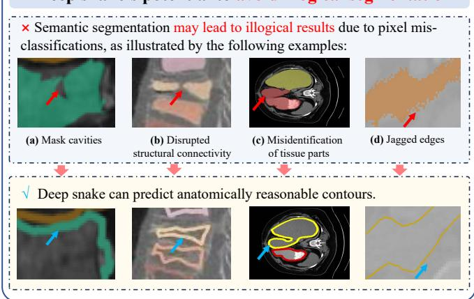  
Fig. 1: Deep snake has the potential to address illogical errors in semantic segmentation caused by pixel misclassifications.

contour smoothness and accurately delineate organ details (Fig. 2(b)/(c)). (3) The deep snake workflow lacks mechanisms to correct missing or erroneous base detections in its evolution process (Fig. 2(d)). These limitations may lead to suboptimal segmentation when facing challenges such as blurred target boundaries and interference from surrounding structures. Such challenges are common in modern medical image segmentation, particularly in comprehensive segmentation of all tissues within an image. Therefore, deep snake methods require further development.

Mamba has the potential to address the challenges in deep snake methods. As a state space model, Mamba ofers a global receptive field with linear complexity, making it suitable for sequence modeling tasks. Mamba is inherently well aligned with deep snake methods because these methods represent target objects as ordered contour point sequences. This better matches Mamba’s sequence modeling paradigm and avoids the risk of fragmenting continuous structural features (Wang et al. [2024a]) that commonly arises when integrating Mamba with semantic segmentation in existing work (Zhang et al. [2024], Liu et al. [2024b], Ruan et al. [2025], Zhu et al. [2024], Wu et al. [2025a]). However, direct integration of Mamba with deep snake methods faces three challenges: (1) Mamba’s unidirectional sequence modeling may cause spatiotemporal information loss, as it cannot capture bidirectional dependencies in closed contours or historical evolution trajectories during snake evolution. This hinders the accuracy of predicting evolution vectors. (2) The selective state space modeling in current Mamba blocks is not explicitly conditioned on local contour morphologies (e.g., curvature), limiting its ability to modulate point-wise interactions for accurate delineation of fine-grained organ details. (3) Although Mamba can facilitate contour evolution, it does not resolve missing or erroneous detections introduced at the base detection stage of the deep snake workflow.

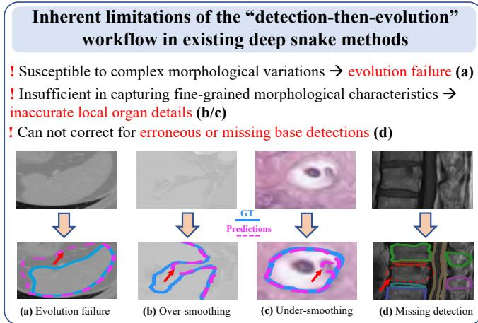  
Fig. 2: Limitations of existing deep snake workflow: susceptibility to morphological variations, inadequate modeling of fine-grained organ details, and inability to correct base detection errors.

To mitigate these limitations, we propose Text-prompted spatiotEmporal dual-heAd Mamba Snake (TEAMS), the first vision-language Mamba snake framework. TEAMS introduces a new Spatiotemporal Snake Evolution Strategy (SSES, Fig. 3(a)) that formulates snake evolution as bidirectional state space modeling considering historical trajectories, which is further enhanced by Contour Morphology-Aware Mamba (CMAM, Fig. 3(b)) for more reliable contour evolution. TEAMS further designs a new Text-prompted Collaborative Dual-Head Snake workflow (TCDHS, Fig. 3(c)) with vision-language guidance and a dual-head detection consistency feedback mechanism, which leverages textual cues and mitigates wrong detections. These designs equip deep snake methods with new capabilities such as incorporating textual guidance, mitigating wrong detections, and capturing richer spatiotemporal contexts to improve snake evolution, which helps to robustly segment all organs under complex cases (e.g., multiple organs with diverse morphologies, blurred boundaries, and pathological variations). The innovations of these designs are:

(1) SSES (Fig. 3(a) and Fig. 4(b1)): Diferent from a simple combination of Mamba and deep snake that uses Mamba to process snake contour point features, SSES processes these features within a newly designed spatiotemporal Mamba architecture that incorporates bidirectional spatial dependencies among contour points in the closed snake contour and trajectory-aware temporal dynamics over historical snake evolution steps. This enables richer spatiotemporal contexts to enhance evolution reliability and mitigate evolution failure under complex morphological variations.

(2) CMAM (Fig. 3(b) and Fig. 4(b2)): Unlike a simple combination that directly adopts Mamba, CMAM designs a contour morphology-aware structured state space duality mechanism as the basic computational unit in SSES, which exploits local contour morphologies to modulate the structured attention mask in Mamba’s dual form. This extends Mamba’s capability to perceive the relative importance of its input sequence elements (e.g., the contour points in deep snakes) and empowers deep snakes to better delineate finegrained organ details.

(3) TCDHS (Fig. 3(c) and Fig. 4(b3)): Diferent from prior deep snakes that were single-modal and did not take full advantage of the evolved contour information, TCDHS integrates task-level and organ-level textual prompts into the “detection-then-evolution” deep snake workflow, allowing it to use textual guidance reflecting general imaging/anatomical information for detection, and organ shape information for segmentation. This improves its robustness to local noise and weak boundaries. Furthermore, TCDHS designs a dual-head feedback mechanism that transfers the evolved contour information back to the base detection head through the detection consistency loss between the two heads (i.e., the base detection head and the snake evolution head). This enables the deep snake workflow to better exploit the valuable contour-aware cues to mitigate wrong detections.

Our contributions are summarized as follows:

1. We propose the first vision-language Mamba snake framework to address illogical errors in semantic segmentation.

2. A spatiotemporal state space snake evolution strategy that jointly models bidirectional spatial dependencies among contour points and historical dynamics across evolution steps is proposed to overcome complex morphological variations.

3. A morphology-aware structured state space duality that exploits local contour morphologies for modulating the structured attention mask is proposed, which extends Mamba’s capability to perceive sequence element importance and advances deep snake for better delineation of fine-grained organ details.

4. A text-prompted deep snake workflow with dual-head detection consistency is designed to introduce textual cues and enable contour information from the evolved snake to mitigate wrong base detections.

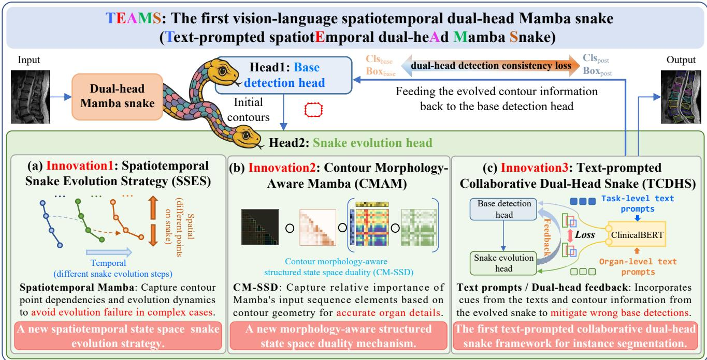  
Fig. 3: Innovation and advantage of our TEAMS: TEAMS is a new deep snake method that captures spatial and temporal context during snake evolution (in SSES), dynamically adapts contour smoothness to fit geometric details (in CMAM), integrates cues from textual prompts, and feeds evolved contour features to enhance base detection (in TCDHS) with dual-head consistency feedback.

In this work, we advance our preliminary exploration on Mamba Snake in ACMMM 2025 (Zhang et al. [2025a]) by introducing a fundamentally new vision-language spatiotemporal dual-head Mamba snake paradigm. The added contributions are:

(1) From the aspect of methodology, TEAMS substantially advances the conference version in terms of both the Mamba snake evolution strategy and the Mamba snake workflow:

• For Mamba snake evolution, TEAMS designs a new spatiotemporal Mamba snake evolution strategy enhanced by a contour morphology-aware structured state space duality. These designs further develop the state space modeling strategy and achieve better snake evolution than the MEB/SSMD in the conference version.

• In the snake workflow, TEAMS introduces a new dual-head feedback mechanism to achieve better detection quality than the DCS. It also introduces textual medical knowledge guidance to alleviate the vulnerability to local noise and weak boundaries, which was absent in the conference version.

(2) From the aspect of validation, more challenging data on a wider range of organs and more diverse anatomical variations are used for validation under complex cases.

(3) A more comprehensive review on Mamba-based vision models, contour-based segmentation, and visionlanguage medical models is carried out to provide a panorama of existing work.

## 2. Related Work

## 2.1. Semantic Segmentation Method

Although semantic segmentation (Ji et al. [2025], Huang et al. [2026, 2025a]) has achieved remarkable success, its pixel-wise classification paradigm inherently lacks objectlevel concepts, which may lead to illogical errors. These methods are primarily developed upon the U-Net architecture (Ronneberger et al. [2015]) and its variants. For instance, TransUNet (Chen et al. [2021]) adopts a hybrid CNN-Transformer design to complement local features with global contexts, whereas UNETR (Hatamizadeh et al. [2022]) extends the U-Net framework by adopting a Transformer-based encoder. Semantic segmentation has been extensively applied to medical image segmentation tasks, including the spine (Tao et al. [2022]), heart (Xu et al. [2023]), brain tumors (Valanarasu et al. [2021]), blood vessels (Xia et al. [2022]), and polyps (Du et al. [2025b]). Recently, foundation models such as Medical Segment Anything Model (MedSAM) have also been explored in semantic segmentation (Ma et al. [2024a]). Nevertheless, these methods fundamentally rely on pixel-wise classification (Yang and Farsiu [2023]), where wrong classifications of certain pixels would lead to illogical segmentation (the cases in Fig. 1). This limitation motivates the exploration of alternative approaches, such as snake-based segmentation, that explicitly model object boundaries as a complementary paradigm to semantic segmentation (Wu et al. [2025b]).

## 2.2. Contour-based Segmentation Method

Contour-based segmentation methods yield topologically consistent contours and reduce illogical segmentation; however, existing approaches still struggle to handle complex medical images. Since the core ideas of contourbased methods and the family of snake methods are closely related (they both directly predict contour point coordinates), we review both contour-based (Liu et al. [2023], Lazarow et al. [2022]) and snake-based (Zhang et al. [2025c,b]) methods together in this section following. Classical snake models (Kass et al. [1988]) evolve snake contour to the targets using low-level features such as gradients (Zhao et al. [2018]). Some deep snake models, such as ADMIRE (Zhao et al. [2023]) and DARNet (Cheng et al. [2019]), use deep neural networks to extract image features while retaining the traditional snake evolution paradigm. Another line of research establishes a fully learnable deep snake workflow, for example: Deep Snake (Peng et al. [2020]) deforms contours initialized from bounding boxes towards the target object boundaries by predicting evolution vectors. Building upon this workflow, more recent snake/contour-based methods further focus on optimizing snake initialization and evolution procedures, for example: DANCE (Liu et al. [2021]) enhances contour evolution with attention mechanisms to improve contour quality. CD-Net (Lv et al. [2022]) leverages a graph convolutional network to model spatial dependencies among contour points for predicting snake evolution vectors. E2EC (Zhang et al. [2022]) introduces a learnable contour initialization module and a global contour evolution module enhanced with multi-direction alignment and dynamic matching loss. Progressive Deep Snake (Tang et al. [2024]) provides a multi-step supervision strategy from easy to dificult across evolution steps in the snake evolution procedure. PolySnake (Feng et al. [2024]) optimizes the contour evolution process using a recurrent neural network and introduces a boundary map for auxiliary supervision. BoundaryFormer (Lazarow et al. [2022]) uses Transformer attention to model vertex feature interactions and predict evolution vectors. SharpContour (Zhu et al. [2022]) proposes a contour evolution approach that estimates the inner/outer state of each vertex to obtain more accurate contours. HemaContour (Zheng et al. [2025]) introduces diferentiable snake dynamics and a learnable shape aware objective with overlap, boundary, and curvature terms for intracerebral hemorrhage segmentation. SAMSnake (Wu et al. [2025b]) integrates EficientSAM (Xiong et al. [2024]) to improve contour initialization. However, existing deep snake methods still face three key limitations: susceptibility to complex morphological variations, limited perception of fine-grained morphological features, and inability to correct wrong detections (cases in Fig. 2). This motivates us to develop deep snake instance segmentation by rethinking the principles of snake evolution, leveraging multimodal information, and designing post-evolution contour feedback, which difers from existing single-modal deep snakes that follow a unidirectional detection-to-evolution workflow without fully exploiting evolved contour information.

## 2.3. Mamba Model

Mamba (Gu and Dao [2024], Xu et al. [2024]) is a promising state space model for eficient sequence modeling. It captures long-range dependencies using a state space formulation with linear computational complexity (Eq. 1a). More recently, Mamba2 (Dao and Gu [2024]) introduces structured state space duality (SSD) and simplifies the state transition matrix � into a scalar, establishing an explicit connection between structured state space models and attention mechanisms. In Mamba2, the time-recursive representation of Mamba (Eq. 1a) is reformulated into an equivalent matrix transformation form (Eq. 1b):

$$
\begin{array} { r } { \left\{ \mathbf { h } _ { t } = \mathbf { A } \mathbf { h } _ { t - 1 } + \mathbf { B } \mathbf { x } _ { t } , \mathbf { \Pi } ( 1 \mathrm { a } ) \begin{array} { r } { \mathbf { Y } = \mathbf { L } \circ ( \mathbf { C } \mathbf { B } ^ { \top } ) \mathbf { X } , } \\ { \mathbf { J } _ { t 1 , t 2 } = \left\{ \prod _ { t = t 2 + 1 } ^ { t 1 } A _ { t } , t 1 \geq t 2 , \right. } \\ { 0 , t 1 < t 2 . } \end{array} \right. } \end{array}\tag{1b}
$$

Eq. 1a and 1b show the basic Mamba architecture. In Eq. 1a, $\mathbf { x } _ { t } , \mathbf { h } _ { t }$ , and $\mathbf { y } _ { t }$ denote the input, hidden state, and output at time step �, respectively; �, �, and � are respectively learnable state transition, input, and output matrices. In Eq. 1b, � denotes the full input sequence, i.e., $\mathbf { X } = \{ \mathbf { x } _ { 0 } , \mathbf { x } _ { 1 } ,$ $\mathbf { x } _ { T } \}$ . The matrix � is a structured mask, where each entry $L _ { t 1 , t 2 }$ quantifies the influence of element $\mathbf { x } _ { t 2 }$ on $\mathbf { x } _ { t 1 }$ . Under the assumption that the state transition matrix � is scalar, the entry $L _ { t 1 , t 2 }$ corresponds to the cumulative product of � from $t _ { 2 } + 1$ to $t _ { 1 }$ . Thus, � acts as a structured attention mask by modulating pairwise interaction between sequence elements via Hadamard product $^ { \circ . }$ Therefore, the matrix formulation Eq. 1b manifests the duality between state space models and attention mechanisms, known as SSD.

Mamba is inherently better suited for deep snake methods than the patch-based pipelines in semantic segmentation, but this integration remains largely unexplored. Recent Mamba-based vision models mostly use Mamba for patch-based pipelines, where 2D visual features are often partitioned, flattened, and scanned into 1D token sequences so that they can be processed by Mamba’s 1D state space operator (Xing et al. [2026], Wang et al. [2024a,b], Ma et al. [2024b]), for example: U-Mamba (Ma et al. [2024b]) embeds Mamba into a U-Net semantic segmentation network by flattening the spatial dimensions of image features into a one-dimensional sequence and feeding the sequence into Mamba blocks; similarly, Mamba-UNet (Wang et al. [2024b]) splits the medical image into patches and converts them into a 1D token sequence, then processes them with Mamba blocks arranged in a U-Net-style encoderdecoder. Following this pipeline, SegMamba-V2 (Xing et al. [2026]) flattens feature maps into 1D sequences through trioriented scanning along coronal, sagittal, and axial planes, and then processes them with Mamba blocks for medical image segmentation. LKM-UNet (Wang et al. [2024a]) flattens image features into pixel-level and patch-level token sequences and then feeds them into bidirectional Mamba modeling. Swin-UMamba (Liu et al. [2024a]) further unfolds image patches along four scanning directions into four sequences, and then feeds each sequence into the SSM for enhanced sequence modeling. LoG-VMamba (Dang et al. [2024]) extracts local and global token sequences and feeds them into Mamba for local-global sequence modeling. EM-Net (Chang et al. [2024]) adopts patch sequence Mamba modeling similar to that in (Wang et al. [2024b], Xing et al. [2026]), and further introduces channel squeeze-reinforce Mamba and frequency-domain learning to improve feature modeling. ShapeMamba-EM (Shi et al. [2024]) substitutes the self-attention modules in the foundation model image encoder with Mamba layers for eficient feature modeling. In summary, most of these works organize images or feature maps into visual token sequences and process them with the Mamba module (Ma et al. [2024b], Wang et al. [2024b], Xing et al. [2026], Wang et al. [2024a], Liu et al. [2024a], Dang et al. [2024], Chang et al. [2024], Shi et al. [2024]); they further introduce spatial scanning strategies (Xing et al. [2026], Wang et al. [2024a], Liu et al. [2024a]), enhance patch feature extraction (Wang et al. [2024a], Dang et al. [2024], Chang et al. [2024]), or merge Mamba modules into foundation models (Shi et al. [2024]). However, such visual token sequence modeling usually relies on flattening or partitioning operations, which may disrupt continuous spatial features in medical images (Bansal et al. [2024]). Diferent from patch-based pipelines, deep snake methods more naturally match the sequence modeling mechanism of Mamba because they represent objects as ordered contour point sequences by design. Nevertheless, directly applying Mamba to snake evolution may cause spatiotemporal information loss and insuficient modeling of local morphology, limiting the accuracy of evolution vector prediction and fine-grained boundary delineation. This motivates the design of TEAMS, a novel Mamba snake workflow with spatiotemporal state space snake evolution and contour morphology-aware SSD methods tailored to deep snake instance segmentation, instead of following existing vision Mamba pipelines that partition image features into visual token sequences.

## 2.4. Medical Vision-Language Models

Medical vision-language models (Yan et al. [2025]) have recently been used to introduce textual information into medical image analysis. For medical image segmentation, LViT (Li et al. [2024]) designs a vision-language Transformer that constructs text prompts by filling medical annotation information (including infection status, lesion number, and lesion location) associated with each input image into structured text templates; these prompts are then encoded into text features and fused with visual features to guide medical image segmentation. Similarly, RecLMIS (Huang et al. [2025b]) uses medical notes associated with each individual input image as text prompts; it further introduces conditioned interaction and mutual reconstruction to better align medical notes with visual regions. ATM-Net (Lian et al. [2026]) adopts a vision-language U-Netstyle framework for lumbar spine segmentation, where anatomy-aware prompts are constructed using annotations that indicate which anatomical structures are present in the image. STPNet (Shan et al. [2025]) constructs a textual prompt library covering lesion distribution, lesion number, and lesion locations; it then retrieves textual features relevant to each image from this library and uses the retrieved textual knowledge to guide segmentation. SemiVL (Hoyer et al. [2024]) uses class-specific textual definitions as textual prompts and aligns them with visual features to guide semisupervised segmentation. With the emergence of medical foundation models, MedCLIP-SAM (Koleilat et al. [2024]) and MedCLIP-SAMv2 (Koleilat et al. [2025]) combine medical vision-language representations with SAM to obtain medical segmentation masks through textual prompts. TGSAM-2 (Yuan et al. [2025]) constructs attribute prior prompts (describing attributes such as relative location, color, and shape) for each organ or lesion to guide medical image segmentation with foundation models. In addition, vision-language models have also been used in medical image analysis tasks such as disease diagnosis (Wu et al. [2023]) and radiotherapy target volume contouring (Oh et al. [2024]). These advances motivate us to explore whether textual prompts can provide anatomical and shape cues for deep snake segmentation; our TEAMS contributes a vision-language deep snake workflow in which task-level and organ-level prompts jointly guide the “detection-thenevolution” process.

## 3. Methodology

## 3.1. Overview

TEAMS is a cohesive vision-language spatiotemporal dual-head Mamba snake framework. After base detection and contour initialization, TEAMS provides three key designs: (1) The Spatiotemporal Snake Evolution Strategy (SSES, Fig. 4(b1), Section 3.2) formulates snake evolution as state space modeling that includes a bidirectional spatial state space module and a temporal trajectory state aggregation module, which jointly models rich spatial and temporal contexts to predict snake evolution vectors. (2) The Contour Morphology-Aware Mamba (CMAM, Fig. 4(b2), Section 3.3) first performs morphological complexity quantification and then constructs the contour morphology-aware structured state space duality (CM-SSD), which introduces morphology-aware modulation in the SSD dual form of Mamba2 and serves as the basic computational unit in SSES. (3) The Text-prompted Collaborative Dual-Head Snake (TCDHS, Fig. 4(b3), Section 3.4) framework integrates task-level and organ-level text prompts into the snake heads. After contour evolution, TCDHS converts the evolved contours into a contour-aware heatmap and uses it to re-predict the detections via a post-evolution detection branch. A dual-head detection consistency feedback is then designed to align the post-evolution and the base detections, thereby feeding the contour information back to the base detection head to improve detection quality.

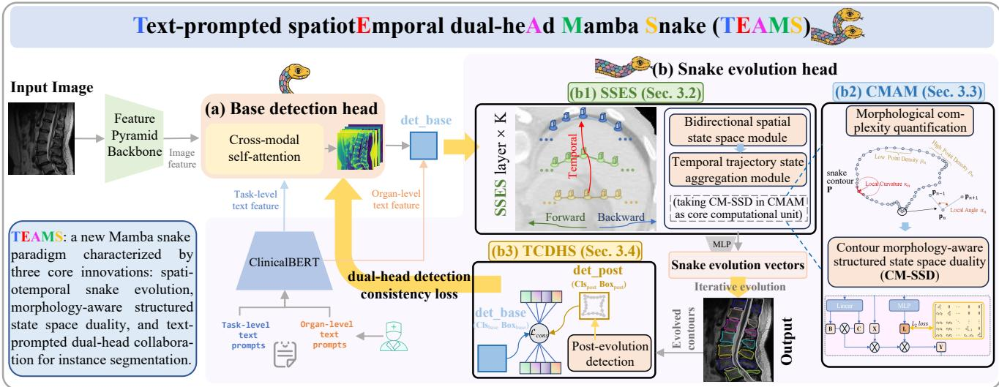  
Fig. 4: The workflow of TEAMS. It first extracts image/text features via a feature pyramid backbone and ClinicalBERT, and fuses them with cross-modal self-attention for base detection (Fig. 4(a)) and contour initialization; it then evolves contours with a dedicated snake evolution head (Fig. 4(b)), where SSES captures spatial and temporal contexts (Fig. 4(b1)) while CMAM adaptively regulates contour smoothness (Fig. 4(b2)) for accurate snake evolution. Finally, TCDHS performs post-evolution detection and designs a dual-head detection consistency loss to align the detections of the base and post-evolution branches (Fig. 4(b3)).

## 3.2. Spatiotemporal Snake Evolution Strategy

The SSES (Fig. 5) iteratively computes the snake contour evolution vectors. For the �-th contour in the �-th iteration, SSES predicts the evolution vectors $\Delta \mathbf { P } _ { i } ^ { m }$ for the contour point sequence and updates the contour by ${ { \bf { P } } _ { i } ^ { m } } = { { \bf { P } } _ { { i - 1 } } ^ { m } } + \Delta { { \bf { P } } _ { i } ^ { m } }$ The input to SSES is the organ-level multi-modal feature map $\mathbf { F } _ { \mathrm { c s } } ^ { m }$ and the normalized previous contour $\mathbf { P } _ { i - 1 } ^ { m }$ . SSES formulates the snake contour point sequence by sampling the contour point features ${ \bf F } _ { \mathrm { c s } } ^ { m } ( { \bf P } _ { i - 1 } ^ { m } )$ and concatenating them with the normalized coordinates $\dot { \mathbf { P } } _ { i - 1 } ^ { m } ,$ , forming the sequence input $\mathbf { F } _ { i - 1 } ^ { m }$ . SSES then processes $\dot { \mathbf { F } } _ { i - 1 } ^ { m }$ through two complementary branches: a bidirectional spatial state space module (Fig. 5(a)) that processes $\mathbf { F } _ { i - 1 } ^ { m }$ in forward and backward orders, and a temporal trajectory state aggregation module (Fig. 5(b)) that aggregates historical trajectory features over evolution steps. These two branches constitute an SSES layer. Stacking � such SSES layers and applying a multilayer perceptron (MLP) yields $\Delta \mathbf { P } _ { i } ^ { m }$ for the current iteration.

## 3.2.1 Bidirectional spatial state space module

This module establishes feature dependencies between adjacent contour points in both forward and backward directions. For the �-th organ and �-th iteration, the input feature to this spatial branch is calculated by:

$$
\mathbf { F } _ { i - 1 } ^ { m } = \mathrm { S i L U } ( \operatorname { C i r c C o n v } ( [ \mathbf { F } _ { \mathrm { c s } } ^ { m } ( \mathbf { P } _ { i - 1 } ^ { m } ) , \mathbf { P } _ { i - 1 } ^ { m } ] ) ) ,\tag{2}
$$

where ${ \bf F } _ { \mathrm { c s } } ^ { m } ( { \bf P } _ { i - 1 } ^ { m } )$ means sampling the features from the organ-level multi-modal feature map $\mathbf { F } _ { \mathrm { c s } } ^ { m }$ (detailed in Section $3 . { \overset { - } { 4 } } )$ at the snake contour points $\mathbf { P } _ { i - 1 } ^ { \hat { m } }$ . The resulting feature is then concatenated with the contour coordinates, passed to a circular convolution layer (Tang et al. [2024]) and a SiLU layer to form $\mathbf { F } _ { i - 1 } ^ { m } \in \mathbb { R } ^ { N \times D }$ , which represents the features of the � sequentially ordered snake contour points. � means the feature channel number and is set as 128 in our work. $\mathbf { F } _ { i - 1 } ^ { m }$ is then fed to the bidirectional state space block with a shared residual connection (Bi-SSB):

$$
\begin{array} { r l } & { \mathbf { F } _ { \mathrm { s p a t i a l } , i - 1 } ^ { m } = \mathbf { B i } \ – \mathbf { S S B } ( \mathbf { F } _ { i - 1 } ^ { m } ) } \\ & { = \underbrace { \mathbf { C M } \mathbf { - S S D } \left( \mathbf { F } _ { i - 1 } ^ { m } \right) } _ { \mathrm { f o r w a r d } } + \underbrace { \mathrm { r e v } \Big ( \mathbf { C M } \mathbf { - S S D } \big ( \mathrm { r e v } ( \mathbf { F } _ { i - 1 } ^ { m } ) \big ) \Big ) } _ { \mathrm { b a c k w a r d } } + \underbrace { \mathbf { F } _ { i - 1 } ^ { m } } _ { \mathrm { r e s i d u a l } } } \end{array}\tag{3}
$$

Eq. 3 shows how the bidirectional spatial contexts are collected. The three terms in Eq. 3 mean the forward, backward, and residual features. The first two terms are both computed by CM-SSD (detailed in Section 3.3), rev(⋅) reverses the sequence order (i.e., in the second term, the sequence is firstly reversed, then processed by CM-SSD, and lastly reversed back to be summed up with other terms).

## 3.2.2 Temporal trajectory state aggregation module

Simultaneously, the temporal branch captures historical dynamics by aggregating evolution trajectories. At the �- th iteration, the corresponding features in the historical trajectory $\{ \mathbf { F } _ { \mathrm { s p a t i a l } , 0 } ^ { m } , \mathbf { F } _ { \mathrm { s p a t i a l } , 1 } ^ { m } , . . . , \mathbf { F } _ { \mathrm { s p a t i a l } , i - 1 } ^ { m } \}$ are collected to construct a trajectory-aware temporal state by exponentially decayed aggregation. Specifically, the features from the �- th iteration are weighted by $\theta ^ { i - 1 - j }$ and aggregated into the current representation, which is then passed into the Bi-SSB block:

$$
\mathbf { F } _ { \mathrm { t e m p o r a l } , i - 1 } ^ { m } = \mathrm { B i } \mathrm { - } \mathrm { S S B } \left( \sum _ { j = 0 } ^ { i - 1 } \theta ^ { i - 1 - j } \cdot \mathbf { F } _ { \mathrm { s p a t i a l } , j } ^ { m } \right) ,\tag{4}
$$

where $\theta \in ( 0 , 1 )$ is a decay factor (set as 0.5 in our work) that assigns less importance to earlier evolution features. Then,

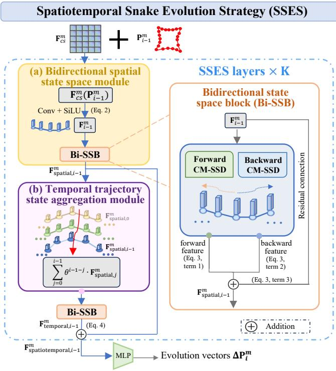  
A spatiotemporal state space formulation that models bidirectional spatial dependencies among contour points and historical dynamics across evolution steps for reliable evolution.  
Fig. 5: The Spatiotemporal Snake Evolution Strategy (SSES). Fig. 5(a) shows the bidirectional spatial state space module. Fig. 5(b) shows the temporal trajectory state aggregation module.

$\mathbf { F } _ { \mathrm { t e m p o r a l } , i - 1 } ^ { m }$ is fused with $\mathbf { F } _ { \mathrm { s p a t i a l } , i - 1 } ^ { m }$ via residual connection to obtain $\mathbf { F } _ { \mathrm { s p a t i o t e m p o r a l } , i - 1 } ^ { m } ,$ which accomplishes a single SSES layer.

## 3.2.3 Stacking SSES layers for snake evolution prediction

� = 6 SSES layers are stacked and the output of the final SSES layer is passed through an MLP, which adjusts dimensionality and predicts the final evolution vectors $\Delta \mathbf { P } _ { i } ^ { m }$ . These vectors are added to the current contour $\mathbf { P } _ { i - 1 } ^ { m }$ to produce the updated contour $\mathbf { P } _ { i } ^ { m } .$ , thereby completing one iteration of evolution. In this way, SSES comprehensively models spatiotemporal contexts during the iterative snake evolution process to adaptively capture the most informative cues for evolution vector prediction, avoiding the spatiotemporal information loss (i.e., missing opposite-side neighborhood constraints) that could arise from a direct application of a vanilla Mamba to contour sequences. This enhances the robustness and alleviates evolution failure in complex cases.

## 3.2.4 Discussions on SSES module design

(1) SSES captures more informative cues than existing temporal modeling strategies. SSES designs a spatiotemporal Mamba aggregation architecture built upon contour morphology-aware structured state space duality (CM-SSD) as its core computational unit, rather than relying on direct feature aggregation (as in standard temporal feature aggregation) or gated recurrent hidden state propagation (as in recurrent modeling). For more details:

• Diference from standard temporal feature aggregation: Standard temporal feature aggregation usually aggregates multi-step evolution features by averaging or weighted averaging. In comparison, SSES further introduces Mamba state space aggregation after exponentially weighted aggregation for selective trajectory state propagation. This makes better use of informative trajectory contexts (e.g., contour point features) in the entire evolution history, and suppresses less relevant historical/spatial information, thereby predicting evolution vectors better than simple weighted averaging.

• Diference from recurrent modeling: Recurrent modeling usually propagates states through recurrent units. In contrast, SSES propagates them through state space blocks built upon the CM-SSD computational units (detailed in Section 3.3), providing a more carefully designed state propagation mechanism that allows local contour morphology to regulate information propagation along ordered contour points. This enables SSES to more efectively select and utilize informative historical contexts, thereby improving evolution vector prediction.

(2) The reasons for choosing exponential decay mechanism for temporal aggregation. Exponential decay aggregation better fits snake evolution because it explicitly assigns larger weights to more recent contour trajectories in the iterative evolution process. In this process, historical contours have unequal importance to the current snake evolution. Earlier contours are usually farther from the current contour and contain fewer cues, while more recent contours are closer to the current contour and provide stronger guidance for the next evolution step. Therefore, exponential decay is chosen to provide a simple and explicit temporal weighting scheme: less important early contour information receives smaller weights, whereas more important recent information receives larger weights. Compared with this mechanism, attention-based temporal fusion introduces additional attention parameters for learning temporal weights and lacks an explicit recency constraint, so it may overemphasize less reliable early contours and harm evolution vector prediction. Thus, exponential decay aggregation is chosen to explicitly assign larger weights to more recent states without introducing these parameters, thereby improving the reliability and eficiency of temporal aggregation.

## 3.3. Contour Morphology-Aware Mamba

The CMAM (Fig. 6) is embedded in the SSES layers to enhance awareness of local geometric details in snake evolution. Given its input features $\mathbf { F } _ { i - 1 } ^ { m }$ , CMAM first calculates the weights $\mathbf { C B } ^ { \top }$ as in the Mamba2 SSD dual form (Eq. 1b). Furthermore, CMAM performs morphological complexity quantification to indicate the local contour morphologies as geometric priors, which is used to dynamically modulate a learnable structured attention mask �. This is realized by the contour morphology-aware structured state space duality (CM-SSD), which supervises � with the geometric priors to adaptively modulate the interaction among contour points. CM-SSD serves as the core computational unit within the Bi-SSB in SSES.

## 3.3.1 Morphological complexity quantification

To quantify the local contour morphologies, CMAM introduces three metrics at contour point $\mathbf { p } _ { n } \mathbf { \cdot }$ local sharpness $( \alpha _ { n } ) _ { \ast }$ , local curvature $\left( \kappa _ { n } \right)$ , and point density $( \rho _ { n } )$ , as shown in Fig. 6(a). Each metric captures a distinct geometric property and together provide prior information to guide the morphology-aware Mamba modeling:

$$
\begin{array} { r l } { h _ { n } = \mathrm { S i g m o i d } ( \boldsymbol { w } _ { \alpha } \boldsymbol { \alpha } _ { n } + \boldsymbol { w } _ { \kappa } \boldsymbol { \kappa } _ { n } + \boldsymbol { w } _ { \beta } \boldsymbol { \sigma } _ { n } ) } & { } \\ & { = \mathrm { S i g m o i d } \Bigg ( \underbrace { \frac { 1 } { \pi } \operatorname { a r c c o s c } \Bigg ( \frac { ( \mathbf { p } _ { \gamma } - \mathbf { p } _ { \alpha - 1 } ) \cdot ( \mathbf { p } _ { \mathbf { n } + 1 } - \mathbf { p } _ { n } ) } { \| \mathbf { p } _ { \alpha } - \mathbf { p } _ { \alpha - 1 } \| } \Bigg ) } _ { \mathrm { l o s z ~ b a r p o i d } } \Bigg ) } \\ & { + \underbrace { \frac { 4 \cdot \operatorname { A r c a l } ( \mathbf { p } _ { \alpha - 1 } , \mathbf { p } _ { \alpha } , \mathbf { p } _ { \alpha + 1 } ) } { \| \mathbf { p } _ { \alpha } - \mathbf { p } _ { \alpha - 1 } \| \cdot \| \mathbf { p } _ { \alpha + 1 } - \mathbf { p } _ { n - 1 } \| } } _ { \mathrm { l o s z ~ t a r c u r o u n } \cdot \boldsymbol { \mathrm { e x p } } } } \\ & { + \underbrace { \frac { 2 \cdot \boldsymbol { \alpha } _ { \alpha } } { \| \mathbf { p } _ { \alpha } - \mathbf { p } _ { \alpha - 1 } \| \cdot \| \mathbf { p } _ { \alpha } + \mathbf { z } \| \cdot \| \mathbf { p } _ { \alpha + 1 } - \mathbf { p } _ { n } \| } } _ { \mathrm { b o l a t a r p o i d } } \Bigg ) } \end{array}\tag{5}
$$

Eq. 5 means that the morphological complexity $h _ { n }$ is calculated by a weighted sum of the three metrics $\alpha _ { n } , \kappa _ { n } ,$ and $\rho _ { n }$ (the weights $w _ { \alpha } , w _ { \kappa } , w _ { \rho }$ are all set to 1). These metrics are respectively calculated by the normalized angle between the vectors $\overrightarrow { { \bf p } _ { n - 1 } { \bf p } _ { n } }$ and $\overrightarrow { { \bf p } _ { n } { \bf p } _ { n + 1 } }$ , the reciprocal of the circumcircle radius formed by points $( { \bf p } _ { n - 1 } , { \bf p } _ { n } , { \bf p } _ { n + 1 } )$ and the inverse of the normalized average point distance between ${ \bf p } _ { n }$ and its neighbors (where $d _ { \mathrm { a v g } }$ is the average points distance of all snake contour points). Since the snake is a closed contour, for the last point $\mathbf { p } _ { n } = \mathbf { p } _ { N }$ , its next point ${ \bf p } _ { n + 1 }$ is set as the first point $( \mathbf { p } _ { 1 } )$ . Intuitively, higher values of $h _ { n }$ indicate more complex local contour morphologies.

## 3.3.2 Contour morphology-aware structured state space duality (CM-SSD)

The CM-SSD is designed to guide the learnable structured attention mask L with the quantified morphological complexity. As illustrated in Fig. 6(b), we first compute $\bar { \mathbf { C B } } ^ { \top }$ from the $\mathbf { F } _ { i - 1 } ^ { m }$ within the SSD dual form (Eq. 1b). Then, for each pair of contour points $n _ { 1 }$ and $n _ { 2 }$ , we construct the structured attention mask � using the following formulation in an element-wise manner:

$$
L _ { n _ { 1 } , n _ { 2 } } = \{ \prod _ { n = n 2 + 1 } ^ { n 1 } \mathrm { S i g m o i d } \Big ( \phi _ { f } ( { \bf F } _ { i - 1 , n } ^ { m } ) \Big )  \quad n _ { 1 } \geq n _ { 2 }  _ { 2 } \quad \quad\tag{6}
$$

where $\phi _ { f } ( \mathbf { F } _ { i - 1 , n } ^ { m } )$ projects the feature vector of the �-th contour point into a scalar to form the structured attention weight $A _ { n }$ in Mamba2 (Dao and Gu [2024]). This formulation is structurally aligned with the structured attention mask � in Eq. 1b, but further clarifies that the $A _ { n }$ is dynamically predicted from input features. The calculated � is a lowertriangular matrix. In this way, we retain the causal structured attention mask in each directional pass, and obtain bidirectional spatial context via a forward–backward realization (Eq. 3). The CM-SSD output is then computed using ${ \textbf { Y } } =$ $\mathbf { L } \circ ( \mathbf { C B } ^ { \top } ) \mathbf { F } _ { i - 1 } ^ { m } .$ , where � represents the first or second term in Eq. 3 in SSES.

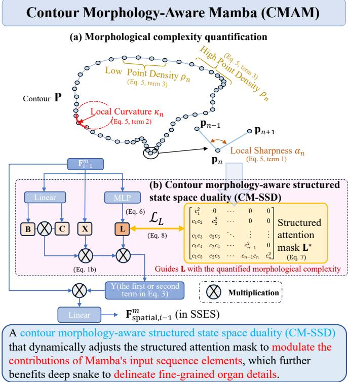  
Fig. 6: The Contour Morphology-Aware Mamba (CMAM). Fig. 6(a) shows how CMAM quantifies contour morphology complexity. Fig. 6(b) shows how the CM-SSD is designed to leverage the morphological complexity for modulating the structured attention mask.

To further regularize the learning process, we introduce a morphology-aware supervision $\mathbf { L } ^ { \ast }$ for the of-diagonal causal entries in structured attention mask with $n _ { 1 } ~ > ~ n _ { 2 }$ whose elements are computed as:

$$
L _ { n _ { 1 } , n _ { 2 } } ^ { * } = \underbrace { ( 1 - h _ { n _ { 1 } } ) } _ { \mathrm { s u s c e p t i b i l i t y } } \cdot \underbrace { h _ { n _ { 2 } } } _ { \mathrm { i n f l u e n c e } } \cdot \underbrace { \exp { \left( - \frac { \| \mathbf { p } _ { n _ { 1 } } - \mathbf { p } _ { n _ { 2 } } \| ^ { 2 } } { \sigma ^ { 2 } } \right) } } _ { \mathrm { d i s t a n c e } } ,\tag{7}
$$

Eq. 7 shows how the local contour morphologies are used to guide the structured attention mask in Mamba modeling. In this design, the first term reflects the susceptibility of point ${ \bf p } _ { n _ { 1 } }$ to external influence, which negatively correlates with the morphological complexity $( h _ { n _ { 1 } } )$ at ${ \bf p } _ { n _ { 1 } }$ . The second term represents the influence emitted by $\mathbf { p } _ { n _ { 7 } }$ , which is positively correlated with its own morphological complexity $( h _ { n _ { 2 } } )$ . The third term encodes the Euclidean distance between point ${ \bf p } _ { n _ { 1 } }$ and $\mathbf { p } _ { n _ { 7 } }$ , following an intuition that more distant points exert a weaker influence (� is set as 1). Together, these components enable $L _ { n _ { 1 } , n _ { 2 } } ^ { * }$ to efectively quantify the influence from $n _ { 2 }$ to $n _ { 1 }$ . After computing $L _ { n _ { 1 } , n _ { 2 } } ^ { * }$ , an $L _ { 2 }$ loss is employed to guide the modulation of the structured attention mask of the SSD mechanism via the following prior supervision:

$$
\mathcal { L } _ { L } = \sum _ { n _ { 1 } > n _ { 2 } } \left\| L _ { n _ { 1 } , n _ { 2 } } ^ { * } - L _ { n _ { 1 } , n _ { 2 } } \right\| ^ { 2 } ,\tag{8}
$$

This results in a plug-and-play CM-SSD module that serves as the basic computational unit in the Mamba snake framework and is seamlessly integrated into the SSES layers. Note that Eq. 8 is computed for each organ and iteration, however, we omit the organ index � and iteration index � in this section for simplicity.

## 3.3.3 Discussions on CMAM module design

(1) CMAM’s robustness across datasets. The robustness of CMAM comes from its morphology-guided learnable structured attention mask modeling. In this mechanism, the structured attention mask L used in CMAM is learnable and is dynamically predicted by $\phi _ { f } ( \cdot ) ( \mathrm { E q . } 6 )$ , while the three morphology descriptors are used to construct the geometric supervision prior ${ \bf L } ^ { * }$ (Eq. 7), and to regularize the learning of L through the $L _ { 2 }$ loss (Eq. 8). Therefore, CMAM does not rely on hand-crafted features for direct decision making; it is a learnable structured mask guided by geometric priors to indicate which contour points have more complex local morphology and should contribute more to other points while being less afected by other points. This provides cross-dataset robustness because:

• Learnable mask preserves adaptability across datasets: Since L remains learnable, this guidance does not replace image feature learning. Instead, it preserves the data-driven adaptability of the learnable network, allowing L to robustly adapt to diferent images, organs, and boundary conditions across datasets.

• Morphology guidance improves robustness to complex and blurred boundaries. On top of the learnable mask, $\mathbf { L } ^ { \ast }$ provides contour morphology guidance based on local sharpness, curvature, and point density, which regularizes the structured attention mask toward contour geometry rather than being solely driven by appearance cues that may vary with imaging conditions. This makes the structured attention mask more robust under conditions with insuficient appearance cues (e.g., complex boundary morphologies, blurred boundaries, and noise), enabling it to better delineate fine-grained organ details.

(2) The suitability of Mamba for snake evolution. Mamba is naturally more suitable for deep snake evolution than Transformer-based and convolutional alternatives because it better matches the ordered snake contour point sequence and supports flexible feature propagation along the contour.

• Compared with Transformer-based alternatives, Mamba better preserves the ordered structure of snake contour points due to its order-aware state transition mechanism. Since snake contour points are naturally arranged as an ordered sequence, the evolution of each point requires aggregating neighboring point features along the contour, where the contour point order should be explicitly considered. This orderaware feature propagation is naturally supported by the Mamba state transition because the hidden state is sequentially updated along the contour point order and therefore preserves geometric adjacency in the ordered snake contour sequence (Gu and Dao [2024]). In contrast, this order-aware feature propagation is not naturally achieved by the pairwise attention mechanism in Transformer-based alternatives, which mainly computes similarity-based interactions among input features (i.e., contour point features). Although positional encodings can introduce contour order information (Shaw et al. [2018]), the similaritybased interaction mechanism is unchanged and does not sequentially propagate features along the contour. Therefore, Mamba better preserves informative neighboring features and suppresses less relevant information along the contour sequence, leading to more accurate evolution vector prediction.

• Compared with CNNs, Mamba supports more flexible contour feature propagation because it adaptively controls the information propagation range. Mamba directly performs selective state space modeling along the contour point sequence, i.e., it can selectively emphasize information from other contour points when computing the feature of each point for evolution vector prediction. For example, in smoother contour regions, Mamba can integrate contour features over a broader neighborhood along the contour, while in sharply curved regions, it can emphasize more local contour point features for evolution vector prediction. In contrast, in CNN-based methods, the same CNN kernels are applied across contour positions, i.e., the same feature aggregation weighted by the CNN kernel is repeated at diferent positions. This makes CNNbased methods less direct in controlling which neighboring contour information should be propagated or forgotten, limiting their flexibility in determining how far each contour point receives information from its neighborhood according to diferent morphological complexity.

## 3.4. Text-prompted Collaborative Dual-Head Snake

TCDHS (Fig. 7) contains a base detection head, a snake evolution head, and a dual-head detection consistency feedback to transfer contour shape information from the evolved snake back to the base detector. The base detection head fuses multi-scale visual features with task-level text prompts to predict $\mathbf { C l s _ { b a s e } }$ and $\mathbf { B o x } _ { \mathrm { b a s e } }$ and initialize the contours $\mathbf { P } _ { 0 } .$ For the �-th detected organ, the snake evolution head retrieves the corresponding text prompts and forms organ-level multi-modal feature map $\mathbf { F } _ { \mathrm { c s } } ^ { m }$ , which guides the snake to evolve from $\mathbf { P } _ { 0 } ^ { m }$ to $\mathbf { P } ^ { m }$ with the help of SSES and CMAM. Afterwards, all evolved contours � are converted into contour-aware heatmaps and used to augment features for a post-evolution detector that predicts $\bf C l s _ { \mathrm { p o s t } }$ and $\mathbf { B o x } _ { \mathrm { p o s t } } . \mathrm { ~ A ~ }$ dual-head detection consistency loss aligns $\{ \mathbf { C l s } _ { \mathrm { p o s t } } , \mathbf { \dot { B } o x } _ { \mathrm { p o s t } } \}$ with $\{ \mathbf { C l s } _ { \mathrm { b a s e } } , \mathbf { B o x } _ { \mathrm { b a s e } } \}$ , enabling the contour shape information to be perceived by the base detector for alleviating wrong detections.

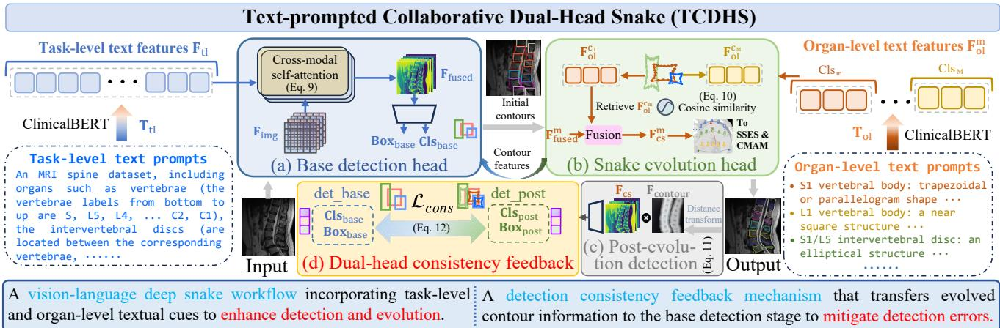  
Fig. 7: The Text-prompted Collaborative Dual-Head Snake (TCDHS). In Fig. 7(a), task-level text prompts are fused with multi-scale visual features to condition the base detection head, which predicts $\mathbf { C l s } _ { \mathrm { b a s e } } , \mathbf { B o x } _ { \mathrm { b a s e } } ,$ and initializes $\mathbf { P } _ { 0 } .$ . In Fig. 7(b), organ-level text prompts are aligned with RoI features to form multi-modal feature maps $\mathbf { F } _ { \mathrm { c s } } ^ { m }$ for snake evolution. In Fig. 7(c), the evolved contours � are converted into contour-aware heatmaps to augment features for a post-evolution detector. In Fig. 7(d), a dual-head detection consistency loss is designed to align $\{ \mathbf { C l s } _ { \mathrm { b a s e } } , \mathbf { B o x } _ { \mathrm { b a s e } } \}$ with $\{ \mathbf { C l s } _ { \mathrm { p o s t } } , \mathbf { B o x } _ { \mathrm { p o s t } } \}$ , transferring the contour information to the base detector.

## 3.4.1 Base detection head

The base detection head (Fig. 7(a)) first extracts multiscale visual features from the backbone of a standard detector (e.g., YOLOv8) and fuses them into a unified feature map $\mathbf { F } _ { \mathrm { i m g } } \mathbf { \bar { \Pi } } \in \mathbf { \partial } \mathbb { R } ^ { B \times H \times W \times D }$ by resizing and concatenation along the channel dimension. It then flattens $\mathbf { F } _ { \mathrm { i m g } }$ along the spatial dimensions into ${ \bf { F } } _ { \mathrm { { i m g } } } ^ { f l a t } \in \mathbb { R } ^ { B \times P \times D } ( P = \overbar { { \cal H } } \times { \cal W } )$ . Meanwhile, this head encodes a task-level textual prompt $\mathbf { T } _ { \mathrm { t l } }$ using a frozen medical language encoder (e.g., ClinicalBERT), which yields a textual feature vector $\mathbf { f } _ { \mathrm { t l } } \ \in \ \mathbb { R } ^ { D }$ providing general task-level imaging and anatomical context across samples (such as imaging modality and the generic topological ordering of the organs, as shown in the leftmost part of Fig. 7). The base detection head then follows prior practice in vision-language feature fusion (Yang et al. [2019], Ye et al. [2019]) for image-text fusion, $\mathrm { i . e . , } \mathbf { f } _ { \mathrm { u } }$ is replicated to $\mathbf { F } _ { \mathrm { f l } } \in \mathbb { R } ^ { B \times P \times D }$ in the first two dimensions, concatenated with $\mathbf { F } _ { \mathrm { i m g } } ^ { f l a t }$ in the channel dimension, projected back to channel dimension D (forming $\mathbf { F } _ { \mathrm { f u s e } , 0 } ^ { f l a t } \in \mathbb { R } ^ { B \times P \times D } )$ , and processed by cross-modal self-attention layers:

$$
\mathbf { F } _ { \mathrm { a t t } , l } ^ { f l a t } = \mathrm { s o f t m a x } \left( \frac { ( \mathbf { F } _ { \mathrm { f u s e } , l - 1 } ^ { f l a t } \mathbf { W } _ { q } ) ( \mathbf { F } _ { \mathrm { f u s e } , l - 1 } ^ { f l a t } \mathbf { W } _ { k } ) ^ { \top } } { \sqrt { d _ { a t t } } } \right) ( \mathbf { F } _ { \mathrm { f u s e } , l - 1 } ^ { f l a t } \mathbf { W } _ { v } ) ,\tag{9}
$$

where ${ \bf W } _ { q } , { \bf W } _ { k } , { \bf W } _ { v } \in \mathbb { R } ^ { D \times d _ { a t t } }$ are learnable projection matrices, and $d _ { a t t }$ is the attention subspace dimension (set as $d _ { a t t } = D )$ . The ${ \bf F } _ { \mathrm { a t t } , l } ^ { f l a t }$ is combined with $\mathbf { F } _ { \mathrm { f u s e } , l - 1 } ^ { f l a t }$ through a residual connection and then passed through a transformer feed-forward operation to obtain $\mathbf { F } _ { \mathrm { f u s e } , l } ^ { f l a t }$ following standard transformer architectures (Vaswani et al. [2017]), which is fed to the next fusion layer. We stack $L \ = \ 4$ such fusion layers and reshape the output back to the original feature map layout to obtain $\mathbf { F } _ { \mathrm { f u s e d } } \ \in \ \mathbb { R } ^ { B \times H \times W \times D }$ $\mathbf { F _ { \mathrm { f u s e d } } }$ is fed into the detection head to predict bounding boxes $\mathbf { B o x } _ { \mathrm { b a s e } }$ and class probabilities $\mathbf { C l s _ { b a s e } }$ . During training, these outputs are supervised with ground truth boxes $\mathbf { B o x } ^ { * }$ and class labels ���∗, and optimized using the standard detection loss (denoted as ${ \mathcal { L } } _ { \mathrm { b a s e } } )$ . In this way, task-level scene priors are incorporated into the fused features to benefit base detection.

## 3.4.2 Snake evolution head

To further enhance snake evolution, the snake evolution head (Fig. 7(b)) retrieves the corresponding shape description of each organ from the input organ-level text prompt library. The organ-level text prompts cover the general shape of each organ (as shown in the rightmost part of Fig. 7), where each prompt is a sentence describing the anatomical morphology of a specific organ category based on basic medical knowledge. Following prior practice in (Shan et al. [2025]), we retrieve the most relevant organ-level text prompt by matching each Region of Interest (RoI) feature with the most similar entry in the prompt library. Specifically, in the prompt library, the organ-level text prompts $\mathbf { T _ { \mathrm { o l } } }$ are encoded by ClinicalBERT into a feature matrix and projected to the same channel dimension �, denoted as ${ \bf F } _ { \mathrm { o l } } \in$ $\mathbb { R } ^ { C \times D }$ , where each row represents the textual feature of a specific organ category. Meanwhile, for each detection box $\mathbf { B } \mathbf { 0 } \mathbf { x } _ { \mathrm { b a s e } } ^ { m } ,$ , its RoI feature is extracted from $\mathbf { F } _ { \mathrm { f u s e d } }$ and denoted as $\mathbf { F } _ { \mathrm { f u s e d } } ^ { m } \in \mathbb { R } ^ { h \times w \times D }$ (without loss of generality, we assume each RoI is aligned to a fixed size of $h \times w )$ . Then, the corresponding organ-level text feature $\mathbf { F } _ { \mathrm { o l } } ^ { c _ { m } } \in \mathbb { R } ^ { D }$ is retrieved from $\mathbf { F } _ { \mathrm { o l } }$ based on the cosine similarity between the RoI feature $\mathbf { F } _ { \mathrm { f u s e d } } ^ { m }$ and each row in $\mathbf { F } _ { \mathrm { o l } }$ . To enhance this process, we broadcast $\mathbf { F } _ { \mathrm { o l } } ^ { c _ { m } }$ to the same dimensionality as $\mathbf { F } _ { \mathrm { f u s e d } } ^ { m }$ , and then follow (Lüddecke and Ecker [2022]) to minimize the similarity loss:

$$
\mathcal { L } _ { \mathrm { a l i g n } } = \frac { 1 } { M } \sum _ { m = 1 } ^ { M } \left( 1 - \frac { \phi _ { v } ( \mathbf { F } _ { \mathrm { f u s e d } } ^ { m } ) \cdot \phi _ { t } ( \mathbf { F } _ { \mathrm { o l } } ^ { c _ { m } } ) } { \Vert \phi _ { v } ( \mathbf { F } _ { \mathrm { f u s e d } } ^ { m } ) \Vert \cdot \Vert \phi _ { t } ( \mathbf { F } _ { \mathrm { o l } } ^ { c _ { m } } ) \Vert } \right) ,\tag{10}
$$

Eq. 10 promotes the alignment between corresponding image and textual features of the same organ $( \mathbf { F } _ { \mathrm { f u s e d } } ^ { m }$ and $\mathbf { F } _ { \mathrm { o l } } ^ { c _ { m } } )$ where � denotes the number of detected organs, and $\phi _ { v } ( \cdot )$ and $\phi _ { t } ( \cdot )$ are projection layers that map the flattened RoI and text features into the same D-dimensional embedding space. This retrieval process is supervised by the ground truth organ labels during training, which align each RoI feature with the textual embedding of its corresponding organ category and thereby facilitate retrieval of the correct organ-level text during inference (Shan et al. [2025]). The aligned features are then fused to form organ-level multi-modal feature maps: ${ \bf F } _ { \mathrm { c s } } ^ { m } = [ { \bf F } _ { \mathrm { f u s e d } } ^ { m } , { \bf F } _ { \mathrm { f u s e d } } ^ { m } \otimes \bar { \bf F } _ { \mathrm { o l } } ^ { c _ { m } } ]$ , where ⊗ denotes the elementwise product to facilitate information fusion across modalities (Chen et al. [2020]). Subsequently, $\mathbf { F } _ { \mathrm { c s } } ^ { m }$ is mapped back to channel dimension � and fed to the SSES in Eq. 2, which incorporates additional cues about organ shape to $\mathbf { F } _ { \mathrm { c s } } ^ { m }$ for better snake evolution (Rao et al. [2022]).

## 3.4.3 Dual-head detection consistency feedback

To mitigate missing or erroneous detections, a dual-head detection consistency feedback mechanism is designed to enable the evolved contour information to guide the base detection head. Specifically, the evolved contours � are fed into a post-evolution detector, whose architecture is identical to that of the base detector, but with diferent input features. For the base detection head, the input is $\mathbf { F _ { \mathrm { f u s e d } } }$ . For the post-evolution detector, the input is augmented with the evolved contour information. Given the evolved contours �, we conduct a distance transform for the contours:

$$
\mathbf { F _ { \mathrm { c o n t o u r } } } ( x , y ) = \mathrm { e x p } \left( - { \frac { \operatorname* { m i n } _ { \mathbf { p } \in \mathbf { P } } \| ( x , y ) - \mathbf { p } \| _ { 2 } ^ { 2 } } { 2 \sigma ^ { 2 } } } \right) ,\tag{11}
$$

Eq. 11 yields a contour-aware heatmap $\mathbf { F } _ { \mathrm { c o n t o u r } }$ with high values near the contour �, where the numerator means the squared Euclidean distance from an arbitrary point $( x , y )$ on the feature map to the nearest point � on the evolved contours $\mathbf { P } ,$ and $\sigma = 1$ controls the spread of the Gaussian distribution. Subsequently, $\mathbf { F } _ { \mathrm { c o n t o u r } }$ is placed to the original position in the input image and merged with the detection features, so that each organ’s multi-modal feature map $\mathbf { F } _ { \mathrm { c s } } ^ { m }$ is weighted by the corresponding $\mathbf { F } _ { \mathrm { c o n t o u r } } ^ { m }$ to highlight the features near the contours (Fig. 7(c)). The resulting weighted features are then fed into the post-evolution detector, thereby equipping it with contour feature guidance to enhance detection performance.

Furthermore, we introduce a dual-head detection consistency loss $\mathcal { L } _ { \mathrm { c o n s } } \left( \mathrm { F i g . \ 7 ( d ) } \right)$ that aligns the predictions of the

two detectors:

$$
\begin{array} { r l } {  { \mathcal { L } _ { c o n s } = \mathcal { L } _ { \mathrm { c o n s - l s } } + \mathcal { L } _ { \mathrm { c o n s - b o x } } } } \\ & { = \frac { T ^ { 2 } } { M } \sum _ { m = 1 } ^ { M } \mathcal { L } _ { \mathrm { K L } } ( \mathrm { s g } ( \mathbf { C l s } _ { \mathrm { p o s t } } ^ { ( m ) } ) \ \Big \| \ \mathbf { C l s } _ { \mathrm { b a s e } } ^ { ( m ) } ) } \\ & { + \ \frac { 1 } { M } \sum _ { m = 1 } ^ { M } \mathcal { L } _ { \mathrm { S m o o t h L 1 } } ( \mathbf { B o x } _ { \mathrm { b a s e } } ^ { ( m ) } , \ \mathrm { s g } ( \mathbf { B o x } _ { \mathrm { p o s t } } ^ { ( m ) } ) ) , } \end{array}\tag{12}
$$

Eq. 12 shows that for the $m ^ { \mathrm { t h } }$ detection, its class probability vectors from the post-evolution and base detectors $( \mathbf { C l s } _ { \mathrm { p o s t } } ^ { ( m ) }$ and $\mathbf { C l s } _ { \mathrm { b a s e } } ^ { ( m ) } )$ are aligned by the KL divergence loss, and its bounding boxes $\mathbf { ( B o x _ { p o s t } ^ { ( m ) } }$ and $\mathbf { B _ { 0 } x } _ { \mathrm { b a s e } } ^ { ( m ) } )$ with the SmoothL1 loss, where � represents the number of detected organs. The operator sg(⋅) stops gradients from flowing into the post-evolution branch, so that it serves as a teacher to guide the base detector in a one-way manner. $T$ is a weighting factor and is set as 1. Both detectors are supervised with their respective class labels and bounding box annotations; meanwhile, through the one-way consistency loss (Eq. 12), the contour information from the post-evolution detector is transferred to the base detector for calibrating its class probability prediction and bounding box regression.

## 3.4.4 Training objective

With the introduction of TCDHS, the overall training objective of the TEAMS framework is formulated as a weighted sum of multiple loss components:

$$
\begin{array} { r l r } & { } & { \mathcal { L } _ { \mathrm { T E A M S } } = \lambda _ { \mathrm { b a s e } } \mathcal { L } _ { \mathrm { b a s e } } + \lambda _ { \mathrm { e v o } } \mathcal { L } _ { \mathrm { e v o } } + \lambda _ { \mathrm { p o s t } } \mathcal { L } _ { \mathrm { p o s t } } } \\ & { } & { + \lambda _ { L } \mathcal { L } _ { L } + \lambda _ { \mathrm { a l i g n } } \mathcal { L } _ { \mathrm { a l i g n } } + \lambda _ { \mathrm { c o n s } } \mathcal { L } _ { \mathrm { c o n s } } , } \end{array}\tag{13}
$$

where each term corresponds to a specific module in the TEAMS (base detection, contour evolution, post-evolution detection, attention guidance, cross-modal alignment, and consistency supervision). $\mathcal { L } _ { \mathrm { b a s e } }$ and $\mathcal { L } _ { \mathrm { p o s t } }$ are both adopted from standard YOLO network, and $\hat { \mathcal { L } _ { \mathrm { e v o } } }$ is the snake evolution loss adopted from (Peng et al. [2020]). The hyperparameters $\lambda _ { ( \cdot ) }$ balance their relative contributions to ensure the loss components remain at the same order of magnitude, set as $\lambda _ { \mathrm { b a s e } } ~ = ~ 1 , ~ \lambda _ { \mathrm { e v o } } ~ = ~ 1 . 5 , ~ \lambda _ { \mathrm { p o s t } } ~ = ~ 1 , ~ \lambda _ { L } ~ = ~ 0 . 1 1$ $\lambda _ { \mathrm { a l i g n } } = 0 . 1$ , and $\lambda _ { \mathrm { c o n s } } = 0 . 5$ . We adopt a training schedule by first training the base detector and evolution network for ∼250 epochs, and then enabling the remaining losses for joint optimization for another ∼100 epochs.

## 3.4.5 Discussions on TCDHS module design

(1) The vision-language guidance design. TCDHS provides vision-language guidance by integrating task-level prompts with global visual features and dynamically retrieved organ-level prompts with region-specific visual features to guide the deep snake workflow. As detailed in Section 2.4, in recent vision-language guidance studies, textual prompts are commonly constructed from medical prior knowledge (e.g., anatomical structures, lesion attributes, and category definitions), which are then incorporated into visual feature modeling and influence downstream predictions (Li et al. [2024], Huang et al. [2025b], Lian et al. [2026], Shan et al. [2025], Hoyer et al. [2024], Yuan et al.

[2025]). These text prompts can either serve as fixed anatomical (or lesion) priors or be constructed by dynamically filling templates according to the information in each image. For example, SemiVL (Hoyer et al. [2024]) uses categorylevel textual definitions that remain fixed across images of the same category. This inspires the task-level prompts in TEAMS, which are kept identical between training and inference to provide task priors in TEAMS. Meanwhile, STPNet (Shan et al. [2025]) first constructs a fixed prompt library and then retrieves the most relevant prompts for each image. This inspires the design of organ-level text prompts in TEAMS, where organ prompts are dynamically retrieved (rather than using a single fixed prompt for all organs) from a prompt library according to detected regions without requiring manual text input during inference. The alignment between selected organ-level textual cues and visual features is enhanced by the loss in Eq. 10. In this way, the textual prompts in TEAMS provide vision-language guidance to enhance the performance of the "detection-then-evolution" deep snake workflow.

(2) The mechanism of dual-head feedback in mitigating missing detections. TCDHS mitigates missing detections because the dual-head feedback mechanism is designed to achieve higher detection quality, which naturally mitigates the "completely missing" cases where the snake evolution cannot be initiated. This is determined by the filtering mechanism in the detection pipeline. In this pipeline, if the detection quality of a “hard” true target is low (e.g., the confidence score of the correct class is less than some low threshold such as 0.1), it will be dificult to distinguish from background or false positive proposals and will be filtered out by score thresholding or NMS. This results in cases where the target is "completely missed by the detector". This issue is less critical for snake evolution during training, where ground truth boxes and contours provide reliable initialization and supervision. However, during testing, the “completely missed” targets will harm snake initialization and segmentation. With this in mind, a direct way to mitigate the issue of “completely missed” targets is to improve the detection quality (e.g., improve the confidence score of the correct class so that the targets can be distinguished from background or false positive proposals and are less likely to be filtered out).

This motivates the dual-head feedback mechanism, which transfers shape information from evolved contours back to the base detection head through the dual-head detection consistency loss. This loss aligns the base detector with the post-evolution detector, so contour-aware predictions from the post-evolution detector can serve as an additional teacher signal. In this way, the base detector is trained to approximate the contour-aware predictions of the post-evolution detector. This encourages the base detector to better capture shape cues from the input features and associate them with correct organ categories and accurate bounding boxes. As a result, the base detector achieves better detection quality for true targets, such as higher confidence scores for the correct classes and more accurate bounding boxes. This enhanced detection quality reduces their chances of being filtered out by score thresholding or NMS due to low confidence or localization errors, thereby mitigating the risk of “completely missed” detections.

Table 1  
Overview of the five evaluation datasets.
<table><tr><td>Dataset ID/ Name</td><td>Modality / Target organs</td><td>Dataset size</td><td>Target class numbers</td></tr><tr><td>1. MR_AVBCE- Extended</td><td>MRI / Spine</td><td>~480 scans, ~1233 slices</td><td>50</td></tr><tr><td>2. VerSe</td><td>CT / Spine</td><td>~374 scans, ~8000 slices</td><td>26</td></tr><tr><td>3. BTCV</td><td>CT / Abdomen</td><td>30 scans, ~900 slices</td><td>8</td></tr><tr><td>4. RAOS</td><td>CT / Abdomen</td><td>~317 scans, ~7500 slices</td><td>19</td></tr><tr><td>5. PanNuke</td><td>Microscopy / Nuclei</td><td>~7900 image patches</td><td>5</td></tr></table>

## 4. Experiments and Discussions

## 4.1. Datasets, Implementations, and Evaluation Metrics

## 4.1.1 Datasets and challenges

We evaluate TEAMS on five challenging multi-organ segmentation datasets: MR\_AVBCE-Extended (Zhao et al. [2023]), VerSe (Sekuboyina et al. [2021]), RAOS (Luo et al. [2024]), BTCV (Landman et al. [2015]), and PanNuke (Gamper et al. [2020]). These datasets cover diverse clinical scenarios such as imaging modalities and target organs (spine MRI/CT, abdominal CT, and microscopic nuclei), which are summarized in Table 1. Representative complex cases are chosen to reflect the challenges and demonstrate the robustness of TEAMS in Fig. 8:

(1) Spinal MRI/CT exhibits inter-class similarity (different vertebrae bodies and discs in Rows 1∼4), intra-class variation due to occlusion and pathology (the vertebrae and spinal cords can be connected or separated in Rows 1/2, and the pathological morphology changes in T8 of Row 1 and C3 of Row 2), blurred boundaries (the discs in Rows 1/2 and vertebral bodies in Rows 3/4), and densely packed small organs (Row 4).

(2) Abdominal CT presents complex boundaries (the tortuous left-upper boundary of the left kidney in Row 5/6), blurred boundaries (the low contrast images in Rows 7/8), strong interference (the intensity changes in stomachs/intestines caused by their contents in Rows 5/6/8), and small (and sometimes rare) organs in crowded regions (the colon and adrenal gland in Row 8).

(3) Microscopy nuclei sufer from dense small targets (the number of nuclei is extremely large in Row 9) and similar appearances of diferent nuclei (the shapes of diferent classes are dificult to distinguish in Rows 9/10).

## 4.1.2 Input images, ground truth annotations, and implementation details

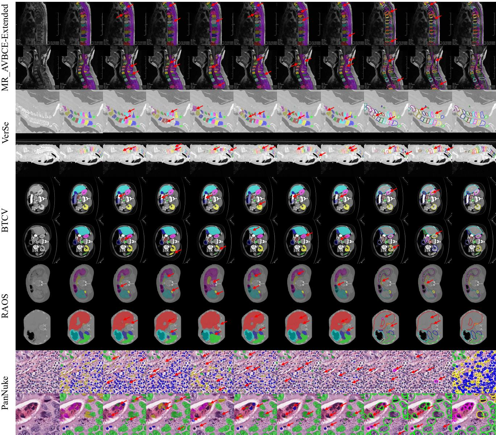  
Fig. 8: TEAMS achieves high instance segmentation performance on five challenging datasets of diferent imaging modalities and target organs (Column 11). It also outperforms state-of-the-art semantic segmentation (Columns 3∼8) and deep snake (Columns 9/10) methods.

The input scans are padded to a square shape and resized to 512×512 for Datasets 1∼4; and 256×256 for Dataset 5. We follow the conference paper (Zhang et al. [2025a]) for point sampling to obtain the target contours. For training, the Adam optimizer is employed with an initial learning rate of $1 \times 1 0 ^ { - 4 }$ and a weight decay of $1 \times 1 0 ^ { - 6 }$ , which are not fine-tuned in our experiments. The batch size is set as � = 8. All experiments run on two NVIDIA RTX 4090 GPUs.

## 4.1.3 Dataset splits

For Dataset 1, we adopt standard five-fold cross-validation at the scan level. For the other datasets, we follow their oficial protocols: For Dataset 2, VerSe-2019 uses 80 training scans and 40/40 public/private test scans, while VerSe-2020 uses 113 training scans and 103/103 public/private test scans (Sekuboyina et al. [2021]). For Dataset 3, we follow the 3:2 train/test split (18/12 patients) (Landman et al. [2015]). For Dataset 4, we follow the split of 220/67 patients for train/test (Luo et al. [2024]). For Dataset 5, we follow the three-fold cross-validation in (Gamper et al. [2020]).

For Datasets 1 and 5, we conduct statistical analyses across diferent folds. For Datasets 2∼4 with oficial fixed train/test splits, we keep the benchmark splits unchanged and repeat training with five diferent random seeds for statistical analyses. To ensure a fair comparison, all baselines are retrained under the same split and training/evaluation protocol.

## 4.1.4 Evaluation metrics

In Datasets 1∼4, we evaluate TEAMS using mean Intersection over Union (mIoU), mean Dice Similarity Coeficient (mDice) (Milletari et al. [2016]), and mean Boundary

F (mBF) (Perazzi et al. [2016]). The first two metrics are commonly used for assessing segmentation accuracy, while the third indicates target boundary fidelity; we refer readers to (Zhao et al. [2023]) for more details about these metrics. For Dataset 5, we follow the dataset’s oficial evaluation protocol and adopt multi-class Panoptic Quality (mPQ) as the evaluation metric (Gamper et al. [2020]), which reflects consistency between detection and segmentation.

## 4.1.5 Dataset extension from the conference version

MR\_AVBCE-Extended dataset substantially extends the MR\_AVBCE dataset in the conference version (Zhang et al. [2025a]) and significantly increases the dataset dificulty. MR\_AVBCE-Extended contains 1,233 images with more diverse fields of view (FoV), including cervical, thoracolumbar and lumbosacral scans, compared with 600 images from lower-abdominal scans in MR\_AVBCE: In MR\_AVBCE, the vertebral bodies range from S to T9 and the intervertebral discs range from L5/S to T9/T10; however, in MR\_AVBCE-Extended, the vertebral bodies range from S to C1 and the intervertebral discs range from L5/S to C2/C3, increasing the number of target categories to 50. This aggravates the inter-class similarity and challenges discriminative feature learning between similar adjacent structures. Moreover, with this broader anatomical coverage, slight shifts in the scanned spinal range become more common across cases (e.g., from L4–T6 in one case to L5–T7 in another), making existing methods more prone to confusing adjacent classes with similar appearances. MR\_AVBCE-Extended also aggravates intra-class variation by more comprehensively covering cases with occlusion, pathology, and blurred boundaries, making it more challenging than MR\_AVBCE.

## 4.2. Qualitative and Quantitative Performances 4.2.1 Reliable overall segmentation performance

Row 1 of Table 2 and Column 11 of Fig. 8 show that TEAMS achieves reliable contour quality with accurate category discrimination (Column 11 (TEAMS) VS Column 2 (ground truth)). For instance, TEAMS precisely delineates the T7 and T8 vertebrae (orange and gray) with blurred or irregular boundaries while correctly identifying both connected and separated spinal cords (dark purple) in Rows 1/2. Similarly, TEAMS accurately segments small organs such as the left kidney (yellow), the left adrenal (dark orange), and the colon (light gray) despite the low contrast and crowded layouts in Rows 7/8. The quantitative results in the first row of Table 2 further confirm that TEAMS consistently achieves high performance across diferent imaging modalities and target object morphologies.

## 4.2.2 Satisfactory segmentation for individual organs

TEAMS also achieves satisfactory results in individual organ categories. As shown in Fig. 9, TEAMS achieves consistently strong results for most categories, indicating good adaptability to diverse organ boundary morphologies. For a few categories such as the cervical organs in Dataset 1, the performance is relatively lower, probably because these organs rarely occur in the dataset (e.g., the C4/C3 disc appears in only 83 of the 1233 images). Nevertheless,

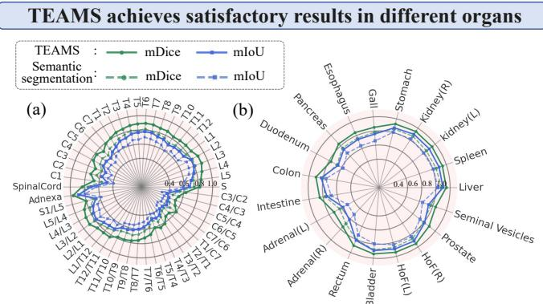  
Fig. 9: TEAMS consistently achieves strong results for most organ categories on the two most challenging datasets (Datasets 1 and 4). TEAMS (solid lines) outperforms the best semantic segmentation approach (dashed lines) for each organ.

TEAMS still outperforms competing methods on these categories (the solid (TEAMS) VS the dashed lines (the best compared semantic segmentation approach) in Fig. 9(a)). Also, in Dataset 4 where diferent categories are relatively balanced, TEAMS achieves high mDice and mIoU values for each category (Fig. 9(b)).

## 4.3. Comparative Experiments

## 4.3.1 Compared methods

Extensive comparative experiments with 14 state-ofthe-art (SOTA) methods are conducted in the five datasets. To conduct a comprehensive comparison, we include three groups of strong baselines for each dataset: (1) Competitive universal semantic segmentation models (e.g., nnU-Net v2 (Isensee et al. [2021]), UNETR (Hatamizadeh et al. [2022]), TransUNet (Chen et al. [2021]), Swin-Unet (Cao et al. [2023a]), VM-UNET-V2 (Zhang et al. [2024]), and MedSAM (Ma et al. [2024a])). (2) Representative deep snake methods (e.g., Deep Snake (Peng et al. [2020]), Mamba Snake (our conference version in Zhang et al. [2025a]), SAMSnake (Wu et al. [2025b]), and ADMIRE (Zhao et al. [2023])). (3) Recent dataset-specific approaches with publicly reported strong results (e.g., SIIL (Mao et al. [2025]), OWT (Song et al. [2025]), TDFormer (Du et al. [2025a]), and CellViT (Hörst et al. [2024]) for the four public datasets).

## 4.3.2 Strong performance of TEAMS against SOTA methods

Experiments show that TEAMS achieves performance comparable to or better than that of the 14 SOTA methods in the five datasets. Row 1 of Table 2 shows that TEAMS leads on Datasets 1∼4. It shows a relative mDice/mBF improvement of 6.9%/9.1% compared with the second-best method in Dataset 1. On Dataset 5, the mPQ ranks second among the competing methods, only slightly lower than the datasetspecific approach on this dataset. Moreover, deep snake’s advantage over semantic segmentation is demonstrated by comparing their performances against semantic segmentation (Rows 1, 12∼15 VS 2∼11). We further conduct twosided paired t-tests between TEAMS and the strongest competing method across the same folds or random seeds. As shown in Table 2, the small standard deviations show that TEAMS achieves stable performance improvements across diferent folds or random seeds, and the significance tests further indicate that its improvements are not caused by random fluctuations in a single run, with most p-values below 0.05.

Table 2  
Superiority of TEAMS over 14 SOTA methods on five datasets. Results are reported as mean ± standard deviation. The best results are highlighted in bold (this annotation holds for the subsequent tables), and the second-best results are underlined. Statistical significance is marked with \* when p < 0.05 compared with the strongest competing method under two-sided paired t-tests across folds or repeated runs.
<table><tr><td rowspan=1 colspan=1>Method</td><td rowspan=1 colspan=3>MR_AVBCE-Extended</td><td rowspan=1 colspan=3>VerSe19(Pu)</td><td rowspan=1 colspan=3>VerSe19(Pr)</td><td rowspan=1 colspan=3>VerSe20(Pu)</td><td rowspan=1 colspan=3>VerSe20(Pr)</td><td rowspan=1 colspan=3>BTCV</td><td rowspan=1 colspan=3>RAOS</td><td rowspan=1 colspan=1>PanNuke</td></tr><tr><td rowspan=1 colspan=1></td><td rowspan=1 colspan=3>|mIoU mDice mBF</td><td rowspan=1 colspan=3>|mIoU mDice mBF</td><td rowspan=1 colspan=3>mIoU mDice mBF</td><td rowspan=1 colspan=3>|mIoU mDice mBF</td><td rowspan=1 colspan=3>|mIoU mDice mBF</td><td rowspan=1 colspan=3>|mIoU mDice mBF</td><td rowspan=1 colspan=3>|mIoU mDice mBF</td><td rowspan=1 colspan=1>mPQ</td></tr><tr><td rowspan=2 colspan=1>TEAMS</td><td rowspan=1 colspan=3>69.2*77.4*69.6*</td><td rowspan=1 colspan=3>86.5*92.5*82.2*</td><td rowspan=1 colspan=3>85.9*91.681.5*</td><td rowspan=1 colspan=2>87.0*92.9*</td><td rowspan=1 colspan=1>80.7*</td><td rowspan=1 colspan=1>85.8*</td><td rowspan=1 colspan=1>91.8*</td><td rowspan=1 colspan=1>80.9*</td><td rowspan=1 colspan=2>85.391.7*</td><td rowspan=1 colspan=1>79.8*</td><td rowspan=1 colspan=2>79.8*87.9*</td><td rowspan=1 colspan=1>75.9*</td><td rowspan=1 colspan=1>41.1</td></tr><tr><td rowspan=1 colspan=3>±0.5±0.4±0.6</td><td rowspan=1 colspan=3>±0.4±0.2±0.4</td><td rowspan=1 colspan=3>±0.2±0.4±0.4</td><td rowspan=1 colspan=1>±0.6</td><td rowspan=1 colspan=1>±0.3</td><td rowspan=1 colspan=1>±0.5</td><td rowspan=1 colspan=1>±0.4</td><td rowspan=1 colspan=1>±0.2</td><td rowspan=1 colspan=1>±0.3</td><td rowspan=1 colspan=2>±0.2±0.1</td><td rowspan=1 colspan=1>±0.4</td><td rowspan=1 colspan=2>±0.3±0.4</td><td rowspan=1 colspan=1>±0.7</td><td rowspan=1 colspan=1>±0.8</td></tr><tr><td rowspan=1 colspan=1>nnU-Net v2</td><td rowspan=1 colspan=3>62.7 70.161.8</td><td rowspan=1 colspan=3>82.2 89.776.8</td><td rowspan=1 colspan=3>81.0 88.875.6</td><td rowspan=1 colspan=1>80.2</td><td rowspan=1 colspan=2>88.173.9</td><td rowspan=1 colspan=2>81.4 89.5</td><td rowspan=1 colspan=1>75.4</td><td rowspan=1 colspan=2>81.986.0</td><td rowspan=1 colspan=1>71.4</td><td rowspan=1 colspan=3>73.885.768.6</td><td rowspan=1 colspan=1>34.5</td></tr><tr><td rowspan=1 colspan=1>(Isensee et al. [2021])</td><td rowspan=1 colspan=3>±1.1±1.0±1.3</td><td rowspan=1 colspan=2>±0.5±0.3</td><td rowspan=1 colspan=1>±0.6</td><td rowspan=1 colspan=1>±0.3</td><td rowspan=1 colspan=1>±0.4</td><td rowspan=1 colspan=1>±0.8</td><td rowspan=1 colspan=1>±0.4</td><td rowspan=1 colspan=1>±0.3</td><td rowspan=1 colspan=1>±0.8</td><td rowspan=1 colspan=1>±0.4</td><td rowspan=1 colspan=1>±0.3</td><td rowspan=1 colspan=1>±0.8</td><td rowspan=1 colspan=1>±0.6</td><td rowspan=1 colspan=1>±0.9</td><td rowspan=1 colspan=1>±0.7</td><td rowspan=1 colspan=2>±0.2±0.3</td><td rowspan=1 colspan=1>±0.8</td><td rowspan=1 colspan=1>±1.1</td></tr><tr><td rowspan=1 colspan=1>UNETR</td><td rowspan=1 colspan=3>56.1 67.357.7</td><td rowspan=1 colspan=2>78.6 85.3</td><td rowspan=1 colspan=1>71.6</td><td rowspan=1 colspan=1>79.7</td><td rowspan=1 colspan=1>85.5</td><td rowspan=1 colspan=1>71.3</td><td rowspan=1 colspan=1>78.0</td><td rowspan=1 colspan=1>85.3</td><td rowspan=1 colspan=1>71.8</td><td rowspan=1 colspan=1>79.2</td><td rowspan=1 colspan=1>86.4</td><td rowspan=1 colspan=1>72.5</td><td rowspan=1 colspan=1>81.0</td><td rowspan=1 colspan=1>84.1</td><td rowspan=1 colspan=1>69.6</td><td rowspan=1 colspan=2>74.1 85.9</td><td rowspan=1 colspan=1>68.1</td><td rowspan=1 colspan=1>31.4</td></tr><tr><td rowspan=1 colspan=1>(Hatamizadeh et al. [2022])</td><td rowspan=1 colspan=3>±1.1±1.1±1.2</td><td rowspan=1 colspan=2>±0.5±0.6</td><td rowspan=1 colspan=1>±0.9</td><td rowspan=1 colspan=1>±0.7</td><td rowspan=1 colspan=1>±0.6</td><td rowspan=1 colspan=1>±0.5</td><td rowspan=1 colspan=1>±0.6</td><td rowspan=1 colspan=1>±0.5</td><td rowspan=1 colspan=1>±0.7</td><td rowspan=1 colspan=1>±0.5</td><td rowspan=1 colspan=1>±0.4</td><td rowspan=1 colspan=1>±0.9</td><td rowspan=1 colspan=1>±0.6</td><td rowspan=1 colspan=1>±0.7</td><td rowspan=1 colspan=1>±1.1</td><td rowspan=1 colspan=2>±0.7±0.8</td><td rowspan=1 colspan=1>±1.0</td><td rowspan=1 colspan=1>±1.3</td></tr><tr><td rowspan=1 colspan=1>TransUNet</td><td rowspan=1 colspan=1>55.8</td><td rowspan=1 colspan=2>66.756.4</td><td rowspan=1 colspan=2>78.584.5</td><td rowspan=1 colspan=1>70.1</td><td rowspan=1 colspan=1>77.8</td><td rowspan=1 colspan=1>84.2</td><td rowspan=1 colspan=1>69.5</td><td rowspan=1 colspan=1>78.4</td><td rowspan=1 colspan=1>85.0</td><td rowspan=1 colspan=1>71.2</td><td rowspan=1 colspan=1>76.8</td><td rowspan=1 colspan=1>83.9</td><td rowspan=1 colspan=1>69.1</td><td rowspan=1 colspan=1>79.0</td><td rowspan=1 colspan=1>85.3</td><td rowspan=1 colspan=1>70.2</td><td rowspan=1 colspan=2>72.3 84.1</td><td rowspan=1 colspan=1>67.2</td><td rowspan=1 colspan=1>35.8</td></tr><tr><td rowspan=1 colspan=1>(Chen et al. [2021])</td><td rowspan=1 colspan=1>±1.0</td><td rowspan=1 colspan=2>±1.0±1.3</td><td rowspan=1 colspan=1>±0.7</td><td rowspan=1 colspan=1>±0.7</td><td rowspan=1 colspan=1>±0.9</td><td rowspan=1 colspan=1>±0.6</td><td rowspan=1 colspan=1>±0.6</td><td rowspan=1 colspan=1>±0.7</td><td rowspan=1 colspan=1>±0.6</td><td rowspan=1 colspan=1>±0.7</td><td rowspan=1 colspan=1>±0.7</td><td rowspan=1 colspan=1>±0.6</td><td rowspan=1 colspan=1>±0.6</td><td rowspan=1 colspan=1>±0.9</td><td rowspan=1 colspan=1>±0.9</td><td rowspan=1 colspan=1>±0.9</td><td rowspan=1 colspan=1>±1.0</td><td rowspan=1 colspan=1>±0.6</td><td rowspan=1 colspan=1>±0.6</td><td rowspan=1 colspan=1>±1.1</td><td rowspan=1 colspan=1>±1.2</td></tr><tr><td rowspan=1 colspan=1>Swin-Unet</td><td rowspan=1 colspan=1>56.4</td><td rowspan=1 colspan=2>67.057.3</td><td rowspan=1 colspan=1>80.8</td><td rowspan=1 colspan=1>87.3</td><td rowspan=1 colspan=1>73.4</td><td rowspan=1 colspan=1>80.4</td><td rowspan=1 colspan=1>85.7</td><td rowspan=1 colspan=1>72.6</td><td rowspan=1 colspan=1>79.5</td><td rowspan=1 colspan=1>86.6</td><td rowspan=1 colspan=1>72.9</td><td rowspan=1 colspan=1>79.8</td><td rowspan=1 colspan=1>85.1</td><td rowspan=1 colspan=1>71.7</td><td rowspan=1 colspan=1>80.8</td><td rowspan=1 colspan=1>83.9</td><td rowspan=1 colspan=1>67.8</td><td rowspan=1 colspan=1>73.0</td><td rowspan=1 colspan=1>83.6</td><td rowspan=1 colspan=1>66.7</td><td rowspan=1 colspan=1>31.3</td></tr><tr><td rowspan=1 colspan=1>(Cao et al. [2023a])</td><td rowspan=1 colspan=1>±1.0</td><td rowspan=1 colspan=1>±0.9</td><td rowspan=1 colspan=1>±1.4</td><td rowspan=1 colspan=1>±0.6</td><td rowspan=1 colspan=1>±0.3</td><td rowspan=1 colspan=1>±1.1</td><td rowspan=1 colspan=1>±0.6</td><td rowspan=1 colspan=1>±0.5</td><td rowspan=1 colspan=1>±0.7</td><td rowspan=1 colspan=1>±0.7</td><td rowspan=1 colspan=1>±0.6</td><td rowspan=1 colspan=1>±0.5</td><td rowspan=1 colspan=1>±0.6</td><td rowspan=1 colspan=1>±0.5</td><td rowspan=1 colspan=1>±0.8</td><td rowspan=1 colspan=1>±0.6</td><td rowspan=1 colspan=1>±0.7</td><td rowspan=1 colspan=1>±0.9</td><td rowspan=1 colspan=1>±0.8</td><td rowspan=1 colspan=1>±0.8</td><td rowspan=1 colspan=1>±0.9</td><td rowspan=1 colspan=1>±1.2</td></tr><tr><td rowspan=1 colspan=1>VM-UNET-V2</td><td rowspan=1 colspan=1>57.8</td><td rowspan=1 colspan=1>67.3</td><td rowspan=1 colspan=1>58.6</td><td rowspan=1 colspan=1>80.2</td><td rowspan=1 colspan=1>86.4</td><td rowspan=1 colspan=1>72.7</td><td rowspan=1 colspan=1>81.1</td><td rowspan=1 colspan=1>86.1</td><td rowspan=1 colspan=1>73.8</td><td rowspan=1 colspan=1>79.2</td><td rowspan=1 colspan=1>86.5</td><td rowspan=1 colspan=1>72.1</td><td rowspan=1 colspan=1>80.2</td><td rowspan=1 colspan=1>87.1</td><td rowspan=1 colspan=1>73.0</td><td rowspan=1 colspan=1>80.1</td><td rowspan=1 colspan=1>85.2</td><td rowspan=1 colspan=1>70.7</td><td rowspan=1 colspan=1>73.3</td><td rowspan=1 colspan=1>85.0</td><td rowspan=1 colspan=1>68.3</td><td rowspan=1 colspan=1>30.9</td></tr><tr><td rowspan=1 colspan=1>(Zhang et al. [2024])</td><td rowspan=1 colspan=1>±1.3</td><td rowspan=1 colspan=1>±1.2</td><td rowspan=1 colspan=1>±1.5</td><td rowspan=1 colspan=1>±0.6</td><td rowspan=1 colspan=1>±0.6</td><td rowspan=1 colspan=1>±0.9</td><td rowspan=1 colspan=1>±0.8</td><td rowspan=1 colspan=1>±0.4</td><td rowspan=1 colspan=1>±0.7</td><td rowspan=1 colspan=1>±0.5</td><td rowspan=1 colspan=1>±0.7</td><td rowspan=1 colspan=1>±0.9</td><td rowspan=1 colspan=1>±0.6</td><td rowspan=1 colspan=1>±0.4</td><td rowspan=1 colspan=1>±0.8</td><td rowspan=1 colspan=1>±0.9</td><td rowspan=1 colspan=1>±0.6</td><td rowspan=1 colspan=1>±0.8</td><td rowspan=1 colspan=1>±0.8</td><td rowspan=1 colspan=1>±0.6</td><td rowspan=1 colspan=1>±1.1</td><td rowspan=1 colspan=1>±1.5</td></tr><tr><td rowspan=1 colspan=1>MedSAM</td><td rowspan=1 colspan=1>45.9</td><td rowspan=1 colspan=2>50.741.1</td><td rowspan=1 colspan=1>53.6</td><td rowspan=1 colspan=1>61.8</td><td rowspan=1 colspan=1>49.3</td><td rowspan=1 colspan=1>52.7</td><td rowspan=1 colspan=1>60.7</td><td rowspan=1 colspan=1>48.2</td><td rowspan=1 colspan=1>50.9</td><td rowspan=1 colspan=1>58.9</td><td rowspan=1 colspan=1>46.5</td><td rowspan=1 colspan=1>51.2</td><td rowspan=1 colspan=1>59.5</td><td rowspan=1 colspan=1>47.7</td><td rowspan=1 colspan=1>68.4</td><td rowspan=1 colspan=1>75.3</td><td rowspan=1 colspan=1>62.6</td><td rowspan=1 colspan=1>61.7</td><td rowspan=1 colspan=1>67.8</td><td rowspan=1 colspan=1>53.4</td><td rowspan=1 colspan=1>26.4</td></tr><tr><td rowspan=1 colspan=1>(Ma et al. [2024a])</td><td rowspan=1 colspan=1>±1.3</td><td rowspan=1 colspan=2>±1.2±1.4</td><td rowspan=1 colspan=1>±1.0</td><td rowspan=1 colspan=1>±0.9</td><td rowspan=1 colspan=1>±1.2</td><td rowspan=1 colspan=1>±0.8</td><td rowspan=1 colspan=1>±0.7</td><td rowspan=1 colspan=1>±1.0</td><td rowspan=1 colspan=1>±0.8</td><td rowspan=1 colspan=1>±0.8</td><td rowspan=1 colspan=1>±1.0</td><td rowspan=1 colspan=1>±1.0</td><td rowspan=1 colspan=1>±1.2</td><td rowspan=1 colspan=1>±1.0</td><td rowspan=1 colspan=1>±1.2</td><td rowspan=1 colspan=1>±0.7</td><td rowspan=1 colspan=1>±1.1</td><td rowspan=1 colspan=1>±0.9</td><td rowspan=1 colspan=1>±1.2</td><td rowspan=1 colspan=1>±1.2</td><td rowspan=1 colspan=1>±1.6</td></tr><tr><td rowspan=1 colspan=1>SIIL</td><td rowspan=1 colspan=1>62.4</td><td rowspan=1 colspan=2>71.261.3</td><td rowspan=1 colspan=1>84.3</td><td rowspan=1 colspan=1>90.5</td><td rowspan=1 colspan=1>78.4</td><td rowspan=1 colspan=1>84.8</td><td rowspan=1 colspan=1>90.9</td><td rowspan=1 colspan=1>78.1</td><td rowspan=1 colspan=1>85.5</td><td rowspan=1 colspan=1>90.0</td><td rowspan=1 colspan=1>77.6</td><td rowspan=1 colspan=1>85.0</td><td rowspan=1 colspan=1>91.2</td><td rowspan=1 colspan=1>78.7</td><td rowspan=1 colspan=1>83.7</td><td rowspan=1 colspan=1>86.5</td><td rowspan=1 colspan=1>70.1</td><td rowspan=1 colspan=1>73.4</td><td rowspan=1 colspan=1>85.8</td><td rowspan=1 colspan=1>70.3</td><td rowspan=1 colspan=1>35.1</td></tr><tr><td rowspan=1 colspan=1>(Mao et al. [2025])</td><td rowspan=1 colspan=1>±1.1</td><td rowspan=1 colspan=1>±0.6</td><td rowspan=1 colspan=1>±1.3</td><td rowspan=1 colspan=1>±0.3</td><td rowspan=1 colspan=1>±0.4</td><td rowspan=1 colspan=1>±0.5</td><td rowspan=1 colspan=1>±0.6</td><td rowspan=1 colspan=1>±0.3</td><td rowspan=1 colspan=1>±0.4</td><td rowspan=1 colspan=1>±0.4</td><td rowspan=1 colspan=1>±0.3</td><td rowspan=1 colspan=1>±0.5</td><td rowspan=1 colspan=1>±0.3</td><td rowspan=1 colspan=1>±0.5</td><td rowspan=1 colspan=1>±0.7</td><td rowspan=1 colspan=1>±0.8</td><td rowspan=1 colspan=1>±0.4</td><td rowspan=1 colspan=1>±0.7</td><td rowspan=1 colspan=1>±0.7</td><td rowspan=1 colspan=1>±0.5</td><td rowspan=1 colspan=1>±0.9</td><td rowspan=1 colspan=1>±1.2</td></tr><tr><td rowspan=1 colspan=1>OWT</td><td rowspan=1 colspan=1>58.4</td><td rowspan=1 colspan=1>69.1</td><td rowspan=1 colspan=1>59.3</td><td rowspan=1 colspan=1>81.1</td><td rowspan=1 colspan=1>87.6</td><td rowspan=1 colspan=1>73.5</td><td rowspan=1 colspan=1>80.0</td><td rowspan=1 colspan=1>86.3</td><td rowspan=1 colspan=1>72.6</td><td rowspan=1 colspan=1>80.4</td><td rowspan=1 colspan=1>86.8</td><td rowspan=1 colspan=1>74.0</td><td rowspan=1 colspan=1>79.1</td><td rowspan=1 colspan=1>86.6</td><td rowspan=1 colspan=1>72.9</td><td rowspan=1 colspan=1>79.3</td><td rowspan=1 colspan=1>85.4</td><td rowspan=1 colspan=1>66.0</td><td rowspan=1 colspan=1>78.4</td><td rowspan=1 colspan=1>87.3</td><td rowspan=1 colspan=1>73.3</td><td rowspan=1 colspan=1>36.2</td></tr><tr><td rowspan=1 colspan=1>(Song et al. [2025])</td><td rowspan=1 colspan=1>±0.9</td><td rowspan=1 colspan=1>±0.9</td><td rowspan=1 colspan=1>±1.0</td><td rowspan=1 colspan=1>±0.6</td><td rowspan=1 colspan=1>±0.3</td><td rowspan=1 colspan=1>±0.6</td><td rowspan=1 colspan=1>±0.3</td><td rowspan=1 colspan=1>±0.5</td><td rowspan=1 colspan=1>±0.4</td><td rowspan=1 colspan=1>±0.6</td><td rowspan=1 colspan=1>±0.4</td><td rowspan=1 colspan=1>±0.4</td><td rowspan=1 colspan=1>±0.5</td><td rowspan=1 colspan=1>±0.9</td><td rowspan=1 colspan=1>±0.6</td><td rowspan=1 colspan=1>±0.5</td><td rowspan=1 colspan=1>±0.7</td><td rowspan=1 colspan=1>±1.0</td><td rowspan=1 colspan=1>±0.7</td><td rowspan=1 colspan=1>±0.4</td><td rowspan=1 colspan=1>±0.6</td><td rowspan=1 colspan=1>±1.3</td></tr><tr><td rowspan=1 colspan=1>TDFormer</td><td rowspan=1 colspan=1>57.6</td><td rowspan=1 colspan=1>67.3</td><td rowspan=1 colspan=1>57.8</td><td rowspan=1 colspan=1>82.3</td><td rowspan=1 colspan=1>87.1</td><td rowspan=1 colspan=1>75.7</td><td rowspan=1 colspan=1>80.2</td><td rowspan=1 colspan=1>86.9</td><td rowspan=1 colspan=1>72.4</td><td rowspan=1 colspan=1>80.7</td><td rowspan=1 colspan=1>87.3</td><td rowspan=1 colspan=1>73.8</td><td rowspan=1 colspan=1>79.5</td><td rowspan=1 colspan=1>87.4</td><td rowspan=1 colspan=1>72.6</td><td rowspan=1 colspan=1>84.9</td><td rowspan=1 colspan=1>90.1</td><td rowspan=1 colspan=1>76.2</td><td rowspan=1 colspan=1>74.3</td><td rowspan=1 colspan=1>85.4</td><td rowspan=1 colspan=1>70.8</td><td rowspan=1 colspan=1>35.7</td></tr><tr><td rowspan=1 colspan=1>(Du et al. [2025a])</td><td rowspan=1 colspan=1>±1.3</td><td rowspan=1 colspan=1>±0.8</td><td rowspan=1 colspan=1>±1.3</td><td rowspan=1 colspan=1>±0.6</td><td rowspan=1 colspan=1>±0.4</td><td rowspan=1 colspan=1>±0.5</td><td rowspan=1 colspan=1>±0.2</td><td rowspan=1 colspan=1>±0.4</td><td rowspan=1 colspan=1>±0.7</td><td rowspan=1 colspan=1>±0.6</td><td rowspan=1 colspan=1>±0.6</td><td rowspan=1 colspan=1>±0.5</td><td rowspan=1 colspan=1>±0.6</td><td rowspan=1 colspan=1>±0.3</td><td rowspan=1 colspan=1>±0.5</td><td rowspan=1 colspan=1>±0.8</td><td rowspan=1 colspan=1>±0.4</td><td rowspan=1 colspan=1>±0.7</td><td rowspan=1 colspan=1>±0.5</td><td rowspan=1 colspan=1>±0.7</td><td rowspan=1 colspan=1>±0.6</td><td rowspan=1 colspan=1>±1.2</td></tr><tr><td rowspan=1 colspan=1>CellViT</td><td rowspan=1 colspan=1>59.6</td><td rowspan=1 colspan=1>69.3</td><td rowspan=1 colspan=1>60.2</td><td rowspan=1 colspan=1>80.0</td><td rowspan=1 colspan=1>87.2</td><td rowspan=1 colspan=1>74.9</td><td rowspan=1 colspan=1>78.9</td><td rowspan=1 colspan=1>86.2</td><td rowspan=1 colspan=1>72.8</td><td rowspan=1 colspan=1>80.2</td><td rowspan=1 colspan=1>87.6</td><td rowspan=1 colspan=1>74.0</td><td rowspan=1 colspan=1>79.6</td><td rowspan=1 colspan=1>86.0</td><td rowspan=1 colspan=1>72.2</td><td rowspan=1 colspan=1>80.5</td><td rowspan=1 colspan=1>85.7</td><td rowspan=1 colspan=1>71.3</td><td rowspan=1 colspan=1>72.2</td><td rowspan=1 colspan=1>84.1</td><td rowspan=1 colspan=1>66.4</td><td rowspan=1 colspan=1>43.1</td></tr><tr><td rowspan=1 colspan=1>(Hörst et al. [2024])</td><td rowspan=1 colspan=1>±0.9</td><td rowspan=1 colspan=1>±0.9</td><td rowspan=1 colspan=1>±1.2</td><td rowspan=1 colspan=1>±0.3</td><td rowspan=1 colspan=1>±0.3</td><td rowspan=1 colspan=1>±0.8</td><td rowspan=1 colspan=1>±0.5</td><td rowspan=1 colspan=1>±0.8</td><td rowspan=1 colspan=1>±0.7</td><td rowspan=1 colspan=1>±0.3</td><td rowspan=1 colspan=1>±0.5</td><td rowspan=1 colspan=1>±0.8</td><td rowspan=1 colspan=1>±0.4</td><td rowspan=1 colspan=1>±0.3</td><td rowspan=1 colspan=1>±0.8</td><td rowspan=1 colspan=1>±0.2</td><td rowspan=1 colspan=1>±0.6</td><td rowspan=1 colspan=1>±1.1</td><td rowspan=1 colspan=1>±0.5</td><td rowspan=1 colspan=1>±0.7</td><td rowspan=1 colspan=1>±0.8</td><td rowspan=1 colspan=1>±0.9</td></tr><tr><td rowspan=1 colspan=1>Deep Snake</td><td rowspan=1 colspan=1>56.3</td><td rowspan=1 colspan=2>66.456.7</td><td rowspan=1 colspan=1>79.4</td><td rowspan=1 colspan=1>88.0</td><td rowspan=1 colspan=1>75.7</td><td rowspan=1 colspan=1>78.6</td><td rowspan=1 colspan=1>86.3</td><td rowspan=1 colspan=1>73.8</td><td rowspan=1 colspan=1>78.9</td><td rowspan=1 colspan=1>86.2</td><td rowspan=1 colspan=1>74.2</td><td rowspan=1 colspan=1>77.5</td><td rowspan=1 colspan=1>85.7</td><td rowspan=1 colspan=1>72.5</td><td rowspan=1 colspan=1>80.4</td><td rowspan=1 colspan=1>85.8</td><td rowspan=1 colspan=1>72.4</td><td rowspan=1 colspan=1>72.4</td><td rowspan=1 colspan=1>82.9</td><td rowspan=1 colspan=1>69.3</td><td rowspan=1 colspan=1>32.8</td></tr><tr><td rowspan=1 colspan=1>(Peng et al. [2020])</td><td rowspan=1 colspan=1>±1.2</td><td rowspan=1 colspan=2>±1.0±1.3</td><td rowspan=1 colspan=1>±0.8</td><td rowspan=1 colspan=1>±0.5</td><td rowspan=1 colspan=1>±0.6</td><td rowspan=1 colspan=1>±0.4</td><td rowspan=1 colspan=1>±0.9</td><td rowspan=1 colspan=1>±0.5</td><td rowspan=1 colspan=1>±0.4</td><td rowspan=1 colspan=1>±0.5</td><td rowspan=1 colspan=1>±0.9</td><td rowspan=1 colspan=1>±0.5</td><td rowspan=1 colspan=1>±0.4</td><td rowspan=1 colspan=1>±0.6</td><td rowspan=1 colspan=1>±0.8</td><td rowspan=1 colspan=1>±0.9</td><td rowspan=1 colspan=1>±1.1</td><td rowspan=1 colspan=1>±0.8</td><td rowspan=1 colspan=1>±0.5</td><td rowspan=1 colspan=1>±0.9</td><td rowspan=1 colspan=1>±1.3</td></tr><tr><td rowspan=1 colspan=1>Mamba Snake</td><td rowspan=1 colspan=1>63.2</td><td rowspan=1 colspan=2>71.363.6</td><td rowspan=1 colspan=1>84.4</td><td rowspan=1 colspan=1>89.6</td><td rowspan=1 colspan=1>78.8</td><td rowspan=1 colspan=1>84.0</td><td rowspan=1 colspan=1>89.5</td><td rowspan=1 colspan=1>78.1</td><td rowspan=1 colspan=1>84.2</td><td rowspan=1 colspan=1>89.6</td><td rowspan=1 colspan=1>77.4</td><td rowspan=1 colspan=1>85.1</td><td rowspan=1 colspan=1>90.8</td><td rowspan=1 colspan=1>78.4</td><td rowspan=1 colspan=1>83.9</td><td rowspan=1 colspan=1>89.6</td><td rowspan=1 colspan=1>75.2</td><td rowspan=1 colspan=1>77.3</td><td rowspan=1 colspan=1>86.4</td><td rowspan=1 colspan=1>73.9</td><td rowspan=1 colspan=1>35.5</td></tr><tr><td rowspan=1 colspan=1>(Zhang et al. [2025a])</td><td rowspan=1 colspan=1>±0.9</td><td rowspan=1 colspan=2>±1.1±1.3</td><td rowspan=1 colspan=1>±0.5</td><td rowspan=1 colspan=1>±0.3</td><td rowspan=1 colspan=1>±0.6</td><td rowspan=1 colspan=1>±0.3</td><td rowspan=1 colspan=1>±0.3</td><td rowspan=1 colspan=1>±0.7</td><td rowspan=1 colspan=1>±0.3</td><td rowspan=1 colspan=1>±0.2</td><td rowspan=1 colspan=1>±0.4</td><td rowspan=1 colspan=1>±0.6</td><td rowspan=1 colspan=1>±0.5</td><td rowspan=1 colspan=1>±0.3</td><td rowspan=1 colspan=1>±0.7</td><td rowspan=1 colspan=1>±0.6</td><td rowspan=1 colspan=1>±0.9</td><td rowspan=1 colspan=1>±0.6</td><td rowspan=1 colspan=1>±1.1</td><td rowspan=1 colspan=1>±0.9</td><td rowspan=1 colspan=1>±1.3</td></tr><tr><td rowspan=1 colspan=1>SAMSnake</td><td rowspan=1 colspan=1>61.2</td><td rowspan=1 colspan=2>72.463.8</td><td rowspan=1 colspan=1>84.2</td><td rowspan=1 colspan=2>88.478.0</td><td rowspan=1 colspan=1>83.2</td><td rowspan=1 colspan=1>89.8</td><td rowspan=1 colspan=1>78.3</td><td rowspan=1 colspan=1>84.6</td><td rowspan=1 colspan=1>89.2</td><td rowspan=1 colspan=1>77.2</td><td rowspan=1 colspan=1>84.5</td><td rowspan=1 colspan=1>89.0</td><td rowspan=1 colspan=1>77.8</td><td rowspan=1 colspan=1>83.4</td><td rowspan=1 colspan=1>89.4</td><td rowspan=1 colspan=1>75.1</td><td rowspan=1 colspan=1>78.1</td><td rowspan=1 colspan=1>87.3</td><td rowspan=1 colspan=1>74.3</td><td rowspan=1 colspan=1>34.2</td></tr><tr><td rowspan=1 colspan=1>(Wu et al. [2025b])</td><td rowspan=1 colspan=1>±0.8</td><td rowspan=1 colspan=2>±1.0±1.2</td><td rowspan=1 colspan=1>±0.6</td><td rowspan=1 colspan=2>±0.4±0.4</td><td rowspan=1 colspan=1>±0.3</td><td rowspan=1 colspan=1>±0.3</td><td rowspan=1 colspan=1>±0.6</td><td rowspan=1 colspan=1>±0.4</td><td rowspan=1 colspan=1>±0.5</td><td rowspan=1 colspan=1>±0.3</td><td rowspan=1 colspan=1>±0.3</td><td rowspan=1 colspan=1>±0.4</td><td rowspan=1 colspan=1>±0.9</td><td rowspan=1 colspan=1>±0.6</td><td rowspan=1 colspan=1>±1.0</td><td rowspan=1 colspan=1>±0.8</td><td rowspan=1 colspan=1>±0.6</td><td rowspan=1 colspan=1>±0.7</td><td rowspan=1 colspan=1>±0.5</td><td rowspan=1 colspan=1>±1.2</td></tr><tr><td rowspan=1 colspan=1>ADMIRE</td><td rowspan=1 colspan=1>55.1</td><td rowspan=1 colspan=2>63.654.2</td><td rowspan=1 colspan=1>81.5</td><td rowspan=1 colspan=2>85.975.8</td><td rowspan=1 colspan=1>81.4</td><td rowspan=1 colspan=1>86.0</td><td rowspan=1 colspan=1>75.2</td><td rowspan=1 colspan=1>79.1</td><td rowspan=1 colspan=1>85.6</td><td rowspan=1 colspan=1>73.6</td><td rowspan=1 colspan=1>82.6</td><td rowspan=1 colspan=1>86.2</td><td rowspan=1 colspan=1>73.1</td><td rowspan=1 colspan=1>76.3</td><td rowspan=1 colspan=1>84.2</td><td rowspan=1 colspan=1>69.5</td><td rowspan=1 colspan=1>69.2</td><td rowspan=1 colspan=2>78.966.2</td><td rowspan=1 colspan=1>31.6</td></tr><tr><td rowspan=1 colspan=1>(Zhao et al. [2023])</td><td rowspan=1 colspan=3>±1.3±0.8±1.2</td><td rowspan=1 colspan=1>±0.6</td><td rowspan=1 colspan=2>±0.3±0.9</td><td rowspan=1 colspan=1>±0.4</td><td rowspan=1 colspan=1>±0.5</td><td rowspan=1 colspan=1>±0.2</td><td rowspan=1 colspan=1>±0.7</td><td rowspan=1 colspan=1>±0.3</td><td rowspan=1 colspan=1>±0.8</td><td rowspan=1 colspan=1>±0.6</td><td rowspan=1 colspan=1>±0.7</td><td rowspan=1 colspan=1>±0.8</td><td rowspan=1 colspan=1>±0.9</td><td rowspan=1 colspan=2>±0.8±1.1</td><td rowspan=1 colspan=1>±0.6</td><td rowspan=1 colspan=2>±0.8±1.1</td><td rowspan=1 colspan=1>±1.2</td></tr></table>

The qualitative results in Fig. 8 further support this trend. The arrows in Columns 3∼8 of Fig. 8 show that semantic segmentation may yield illogical segmentation in complex cases. For example, they confuse adjacent tissues or yield wrong organ shapes when encountering blurred boundaries and/or densely packed organs (arrows in Rows 1∼8). Also, they could incorrectly segment or miss small targets (the colon and adrenal gland in Row 8 and missing nuclei in Rows 9/10). These inferior segmentations are also observed in other articles (Pang et al. [2021], Mao et al. [2025], Du et al. [2025a]), demonstrating that these illogical results are no accident. In contrast, the deep snake methods yield anatomically reasonable results (Columns 9∼10). With the designed core modules, TEAMS (Column 11) further enhances instance segmentation performance.

## 4.4. Ablation Study

## 4.4.1 Contribution of each design

Ablation experiments on Dataset 1 show that the three core designs of TEAMS bring improvements over a strong baseline. We start with the baseline of "YOLOv8 detection head + deep snake evolution" (Row 1 of Table 3), and add SSES, CMAM, text prompts in TCDHS, detection consistency feedback in TCDHS, and the full TCDHS in Rows 2∼6 of Table 3. As shown in Row 1 in Table 3, the baseline achieves a satisfactory performance (ranks in the top half compared with the semantic segmentation methods in Table 2). With the addition of SSES, CMAM, text prompts, detection consistency feedback, and full TCDHS, the mDice shows relative improvements of 8.0%, 5.6%, 5.6%, 6.1%, and 7.3% (Rows 2∼6 of Table 3), showing that deep snake methods could benefit from these designs. The qualitative results in Fig. 10(a)∼(c) further support this conclusion: SSES guides the snake to the target contour (Fig. 10(a1)), whereas its absence causes evolution failure (Fig. 10(a2)). CMAM accurately delineates boundary details in complex regions (Fig. 10(b1)), whereas its absence causes over-smoothing (Fig. 10(b2)). TCDHS reduces wrong detections (Fig. 10(c1)) compared with the ablated version (Fig. 10(c2)).

## 4.4.2 The benefits of the temporal modeling strategies and exponential decay aggregation in SSES

Ablation experiments further validate the benefits of SSES over standard temporal modeling methods. Specifically, two ablated versions replacing SSES with standard temporal feature aggregation and GRU-based recurrent modeling are constructed for comparison. The experimental results are shown in Table 4, which shows that SSES achieves the best performance in mIoU, mDice, and mBF. The performance improvement over standard temporal feature aggregation is consistent with the mechanism analysis in Section 3.2, suggesting that SSES benefits snake evolution by leveraging informative trajectory cues and contour

Table 3  
Ablation study demonstrating the efect of SSES, CMAM, text prompts, detection consistency feedback, and full TCDHS.
<table><tr><td>Model Configuration</td><td>mIoU</td><td>mDice</td><td>mBF</td></tr><tr><td>Baseline</td><td>58.2</td><td>67.5</td><td>58.8</td></tr><tr><td>+ SSES</td><td>62.2(个6.9%)</td><td>72.9(8.0%)</td><td>62.8(个6.8%)</td></tr><tr><td>+ CMAM</td><td></td><td>59.1(1.5%) 71.3(个5.6%)</td><td>60.3(个2.6%)</td></tr><tr><td>+ Text prompts in TCDHS</td><td>60.7(个4.3%)</td><td>71.3(个5.6%)</td><td>61.4(个4.4%)</td></tr><tr><td>+ Consistency feedback in TCDHS 61.3(个5.3%) 71.6(个6.1%) 60.8(个3.4%)</td><td></td><td></td><td></td></tr><tr><td>+ TCDHS</td><td></td><td>61.9(个6.3%) 72.4(个7.3%) 62.5(个6.3%)</td><td></td></tr><tr><td>TEAMS</td><td></td><td>69.2(个18.9%)77.4(个14.7%) 69.6(个18.4%)</td><td></td></tr></table>

The contribution of each designed module  
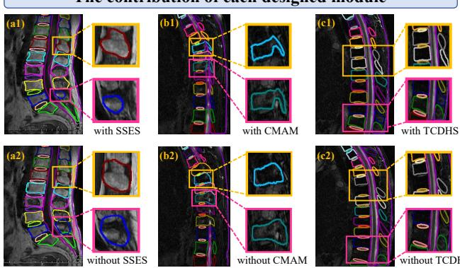  
Fig. 10: The contributions of each core module. When each core module is enabled, the evolution failures are mitigated (a1 VS a2), the boundary details are better delineated (b1 VS b2), and the wrong detections are avoided (c1 VS c2).

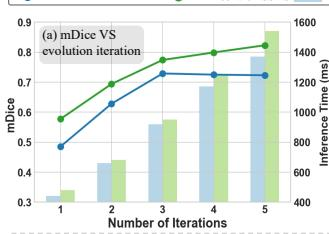

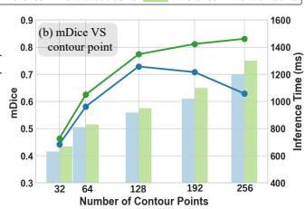

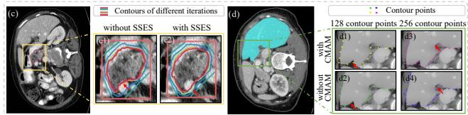  
Fig. 11: The necessity of Mamba modeling in deep snakes. Fig. 11(a)/(b) show SSES/CMAM (green) better benefits overall performance than hyperparameter tuning (blue). Fig. 11(c) shows SSES (c1) better mitigates evolution failure than increasing iteration numbers (c2). Fig. 11(d) shows CMAM (d1) better delineates finegrained organ details than increasing contour points (d2).

Table 4  
SSES achieves superior performance compared with existing temporal modeling strategies.
<table><tr><td>Temporal modeling strategy</td><td>mIoU</td><td>mDice</td><td>mBF</td></tr><tr><td>Standard temporal feature aggregation</td><td>66.6</td><td>73.6</td><td>66.5</td></tr><tr><td>GRU-based recurrent modeling</td><td>66.1</td><td>72.9</td><td>62.9</td></tr><tr><td>SSES</td><td>69.2</td><td>77.4</td><td>69.6</td></tr></table>

## Table 5

The superiority of exponential decay aggregation over attentionbased temporal fusion.
<table><tr><td>Temporal modeling mIoU mDice method</td><td></td><td></td><td>mBF</td><td>Trainable params (M)</td><td>Inference time (s)</td><td>GPU mem- ory (MB)</td></tr><tr><td>Attention-based temporal fusion</td><td>63.0</td><td>73.9</td><td>63.1</td><td>17.67</td><td>1.25</td><td>3066</td></tr><tr><td>Exponential decay aggregation (ours)</td><td>69.2</td><td>77.4</td><td>69.6</td><td>15.74</td><td>1.17</td><td>2852</td></tr></table>

point contexts beyond simple weighted fusion. Also, the improvement over GRU-based recurrent modeling shows that the contour morphology-aware structured state space duality serves as a better computational unit than recurrent modeling. Thus, the proposed SSES is efective in improving evolution vector prediction and final segmentation performance.

Another ablated version using attention-based temporal fusion is compared with exponential decay aggregation, demonstrating that exponential decay aggregation is more reasonable than attention-based temporal fusion in SSES. As reported in Table 5, the attention-based temporal fusion underperforms exponential decay aggregation while increasing computing cost. Thus, for the iterative convergence process of snake evolution, explicitly assigning larger weights to more recent states is more accurate and eficient than using attention-based temporal fusion to learn temporal weights.

## 4.4.3 The benefits of local geometric guidance in CMAM

To further validate the robustness and generalization ability of CMAM, an ablated version that replaces the explicit local geometric guidance with the learned alternative is compared with TEAMS. In the learned alternative, the guidance provided by �∗ is removed so that the structured attention mask is learned solely from data. The results are reported in Table 6, which shows that our CMAM outperforms the learned alternatives on all five datasets, indicating that the morphology guidance constructed from $\alpha _ { n } , \kappa _ { n } ,$ and $\rho _ { n }$ is beneficial for structured attention mask learning. Since these datasets cover diferent modalities, organs, and target morphologies, the consistent improvements indicate that the benefit of morphology-guided mask learning is not limited to a specific scenario. In contrast, the learned alternative lacks explicit local morphology guidance and shows weaker performance. These results directly support the robustness and generalization ability of the CMAM design.

## 4.4.4 Advantages of Mamba modeling over intuitive hyperparameter tuning

To further validate the necessity of Mamba modeling in SSES and CMAM, we examine whether hyperparameter tuning could replace these designs. Intuitively, increasing the number of evolution iterations may give the snake more opportunities to reach the target boundary and potentially alleviate evolution failure; increasing the number of contour points may improve contour resolution and thus enhance boundary details. However, the blue lines in Fig. 11(a)/(b) show that these strategies cannot achieve the desired result. In contrast, SSES enables better exploitation of additional iterations (green line in Fig. 11(a)), and CMAM enables better utilization of additional points (green line in Fig. 11(b)). As further visualized in Fig. 11(c)/(d), SSES helps the snake to reach the targets while the snake could stagnate when simply increasing the number of iterations (c1 VS c2); CMAM correctly evolves the points to delineate fine-grained details while simply adding contour points does not achieve correct delineation (the arrows in (d1)/(d3) VS (d2)/(d4)). Lastly, the extra inference time introduced by adding SSES/CMAM is less than directly adding iterations/contour points (the green bars VS the next blue bars in Fig. 11(a) and (b)).

Table 6  
The morphology-guided learnable structured attention mask modeling in CMAM is better than the learned alternative.
<table><tr><td>Dataset</td><td>Method</td><td>mIoU</td><td>mDice</td><td>mBF</td><td>mPQ</td></tr><tr><td>MR_AVBCE-</td><td>Learned alternative</td><td>61.9</td><td>69.9</td><td>60.4</td><td></td></tr><tr><td>Extended</td><td>Our CMAM</td><td>69.2</td><td>77.4</td><td>69.6</td><td>一</td></tr><tr><td>VerSe</td><td>Learned alternative</td><td>80.4</td><td>83.1</td><td>71.0</td><td>一</td></tr><tr><td></td><td>Our CMAM</td><td>87.0</td><td>92.9</td><td>80.7</td><td>1</td></tr><tr><td>BTCV</td><td>Learned alternative</td><td>79.7</td><td>82.4</td><td>70.6</td><td>一</td></tr><tr><td></td><td>Our CMAM</td><td>85.3</td><td>91.7</td><td>79.8</td><td>一</td></tr><tr><td>RAOS</td><td>Learned alternative</td><td>72.3</td><td>82.6</td><td>66.5</td><td>一</td></tr><tr><td></td><td>Our CMAM</td><td>79.8</td><td>87.9</td><td>75.9</td><td>一</td></tr><tr><td>PanNuke</td><td>Learned alternative</td><td></td><td>一</td><td>一</td><td>40.5</td></tr><tr><td></td><td>Our CMAM</td><td>一</td><td>一</td><td>一</td><td>41.1</td></tr></table>

## 4.4.5 Advantages of Mamba modeling over Transformerbased and convolution-based alternatives

To further justify the advantage of Mamba-based sequence modeling in snake evolution, ablated versions in which the Mamba operations are replaced with Transformer or convolutional operations are compared with TEAMS. The results are reported in Table 7, which shows that Mamba snake evolution achieves the best performance. Compared with the convolution-based alternative, this improvement is consistent with the analysis in Section 3.3 that fixedsize kernels in CNNs are less flexible for modeling contour neighborhoods with diferent morphological complexity. The comparison with the Transformer-based alternative also shows that Mamba-based selective state space modeling better supports order-aware feature propagation along the contour. Therefore, Mamba is more suitable as the core sequence modeling operator in the context of snake evolution.

## 4.4.6 The benefits of dual-head consistency feedback

This mechanism benefits deep snake segmentation across all three evaluation metrics with statistically significant improvements. The mDice, mIoU, and mBF show relative improvements of respectively 6.1%, 5.3%, and 3.4%. These consistent improvements indicate that the dual-head consistency feedback reliably improves segmentation performance. A statistical significance analysis under five-fold cross-validation on Dataset 1 further validates the reliability of these improvements. This analysis shows that the pvalues of mDice, mIoU, and mBF are 0.012, 0.018, and 0.028, highlighting that these improvements are statistically significant. These improvements demonstrate that the dualhead consistency feedback benefits the deep snake workflow.

Table 7  
Mamba-based snake evolution outperforms convolution-based and Transformer-based alternatives.
<table><tr><td>Variant</td><td>mIoU</td><td>mDice</td><td>mBF</td></tr><tr><td>Convolution-based snake evolution</td><td>58.9</td><td>66.0</td><td>60.9</td></tr><tr><td>Transformer-based snake evolution</td><td>63.5</td><td>72.8</td><td>64.9</td></tr><tr><td>Mamba-based snake evolution (ours)</td><td>69.2</td><td>77.4</td><td>69.6</td></tr></table>

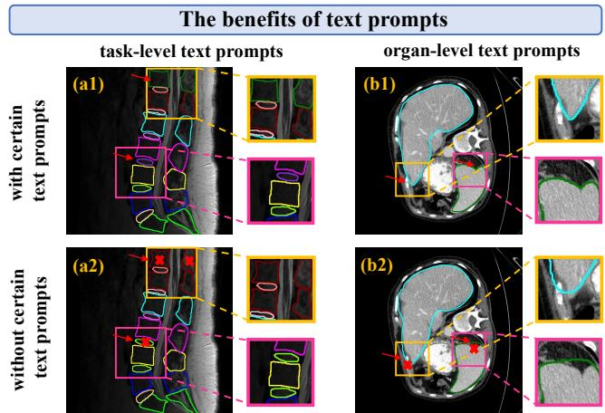  
Fig. 12: The benefits of the text prompts. The task-level text prompts help to better distinguish diferent organs (a1 VS a2), and the organ-level text prompts help the snake to better evolve to target organs (b1 VS b2).

The visualizations in Fig. 8 also validate that TEAMS is less prone to missing detections. To further analyze this phenomenon, we have examined the confidence scores assigned to the correct classes of all true targets. The proportion of true targets whose confidence scores for the correct classes fall into a low confidence range (e.g., score < 0.1) decreases from 9.7% (without the dual-head feedback) to 2.3% (with the dual-head feedback) on Dataset 3, i.e., much fewer true targets fall into the low confidence range where they are dificult to distinguish from background or false positive proposals and are thus more vulnerable to being filtered out before snake initialization. These results indicate that the detection quality is improved and the risk of “completely missed” targets is efectively mitigated in practice.

## 4.4.7 The benefits of text prompts

For overall performance, adding the text prompts results in a mDice increase of 5.6% (Row 4 in Table 3). For detailed visualization, Fig. 12(a) shows that task-level text prompts such as "An MRI spine dataset, including organs such as vertebrae bodies (the vertebrae labels from bottom to up are S, L5, L4, ... C2, C1), discs (are located between the

TEAMS produces suboptimal results in cases of annotation ambiguity corresponding vertebrae, labels from bottom to top are S/L5, L5/L4, ... C3/C2) ..." provide generic topological ordering of the spinal organs, helping TEAMS to better distinguish diferent organs (the arrows in Fig. 12(a1)). Without this information, more wrong detections may occur (the arrows in Fig. 12(a2)). Similarly, Fig. 12(b) shows that organ-level text prompts such as "The spleen is a highly variable organ, which may appear as wedge, circle or heart, lateral and posterior to the stomach..." and "The left lateral lobe of liver could taper to a sharp pointed edge ..." help the snake to reach the target contours (the arrows in Fig. 12(b1)). Without the shape information, the snake evolution head may yield suboptimal segmentation (the arrows in Fig. 12(b2)).

## 4.4.8 Analysis on diferent types or qualities of prompts

To further validate the role of textual prompts in TEAMS, ablation studies such as no prompt, random prompt, incorrect prompt, diferent correct templates, are carried out and compared with TEAMS. The no prompt setting evaluates the performance after removing text input. The incorrect prompt and random prompt settings evaluate the efects of incorrect textual semantics or incorrect text-target correspondence. The diferent correct templates setting evaluates whether the model depends on a fixed prompt sentence template. The results in Table 8 show that TEAMS achieves the best performance. When the prompts change, we have the following observations:

• Correct textual prompts are consistently beneficial: As long as the textual prompts are correct, the diferent correct templates consistently outperform the no prompt setting and yield relatively stable results across templates (Rows 4, 5, and 6 VS Row 1 in Table 8), showing that TEAMS does not rely on a fixed sentence template but can benefit from correct textual prompts to guide detection and snake evolution.

• Incorrect or irrelevant textual prompts weaken the performance: In contrast, the performance decreases when random / incorrect text is used (worse than using no prompt, Rows 2 and 3 VS Row 1 in Table 8), which indicates that the improvement depends on correct textual semantics and text-target correspondence.

These results demonstrate that TEAMS benefits from semantically correct textual prompts across diferent templates, whereas low-quality or semantically incorrect prompts may degrade performance. This further clarifies the role of textual features in TEAMS: they participate in visionlanguage feature modeling and guide downstream predictions in the "detection-then-evolution" deep snake workflow.

## 4.5. Computational Costs and Failure Cases 4.5.1 Computational costs

Table 9 reports the computational cost of TEAMS and the conference version. TEAMS contains 15.74M trainable parameters; it requires 1.17 s inference time and 2852 MB peak GPU memory. Compared with the conference version, most parameters in TEAMS come from the frozen ClinicalBERT text encoder (137.43M), whereas the trainable

## Table 8

Ablation study on diferent textual prompt settings validates that textual prompts benefit snake segmentation.
<table><tr><td>Setting</td><td>mIoU</td><td>mDice</td><td>mBF</td></tr><tr><td>No prompt</td><td>65.8</td><td>73.6</td><td>64.3</td></tr><tr><td>Random prompt</td><td>63.3</td><td>71.9</td><td>62.8</td></tr><tr><td>Incorrect prompt</td><td>63.0</td><td>71.3</td><td>62.1</td></tr><tr><td>Different correct template 1</td><td>68.9</td><td>77.4</td><td>68.8</td></tr><tr><td>Different correct template 2</td><td>68.5</td><td>76.7</td><td>68.5</td></tr><tr><td>Correct prompt / TEAMS</td><td>69.2</td><td>77.4</td><td>69.6</td></tr></table>

## Table 9

The computational costs of TEAMS and the conference version on MR\_AVBCE-Extended.
<table><tr><td>Method</td><td>Params (M)</td><td>Inference time (s)</td><td>Peak GPU memory (MB)</td><td>mDice/ mBF</td></tr><tr><td>Conference version</td><td>12.48</td><td>0.83</td><td>1856</td><td>71.3/63.6</td></tr><tr><td>Journal version (TEAMS)</td><td>15.74 (trainable) + 137.43 (frozen)</td><td>1.17</td><td>2852</td><td>77.4/69.6</td></tr></table>

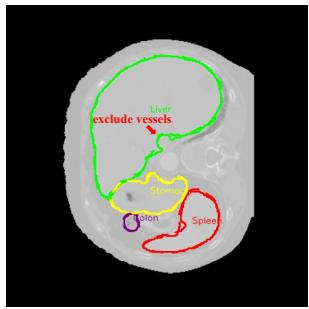  
(a1)

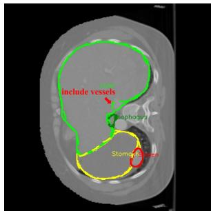  
(a2)  
Fig. 13: Representative failure cases of TEAMS under annotation ambiguity. The solid contours denote the ground truth, and the dashed contours denote the evolved snake predictions. Red arrows indicate ambiguous vessel regions near the liver boundary: the vessel is excluded from the liver ground truth in Fig. 13(a1), but included in the liver ground truth in Fig. 13(a2). Such inconsistent annotations may lead to suboptimal segmentation results.

parameters remain limited (15.74M). Since the Clinical-BERT text features are extracted ofline and cached, TEAMS does not need to repeatedly run the text encoder, keeping the inference time moderate (1.17s). Furthermore, TEAMS maintains moderate peak GPU memory consumption (2852 MB) while achieving strong segmentation performance.

## 4.5.2 Failure cases

TEAMS may produce suboptimal results in cases of annotation ambiguity. For example, the solid green lines in Fig. 13 show inconsistent annotations of vessels passing through the liver, where vessels may be either excluded from (Fig. 13(a1)) or included in (Fig. 13(a2)) the liver region. Under such annotation inconsistency, the snake evolution could be disturbed, and TEAMS could produce suboptimal segmentation results. This suggests that annotation consistency remains important for TEAMS.

## 4.6. Potential Clinical Applications and Extensions

TEAMS provides object-level contours for multiple targets across diverse imaging modalities, which can support comprehensive multi-organ diagnosis and treatment planning. The explicit organ/lesion boundaries could directly provide diagnostic information (e.g., interface clarity and margin irregularity) for diagnosing spinal tumors (Ross and Moore [2020]), supporting treatment planning in abdominal radiotherapy (Shi et al. [2022]), and assessing nuclear morphology for grading cancers in histopathology images (Feng et al. [2025]). The comprehensive segmentation of multiple targets further facilitates distinguishing diseases that require multi-organ features (e.g., spinal tumors VS endplate infections (Ross and Moore [2020])). In addition, TEAMS can be naturally extended to 3D volumetric data and video sequences by using the evolved contours to initialize adjacent slices/frames (Zhao et al. [2018]), which exploits the spatiotemporal continuity inherent in these data. This indicates its potential applications in valuable clinical scenarios, such as segmenting critical tissues and surgical instruments from operative videos (Cao et al. [2023b]).

## 5. Conclusion

We propose TEAMS (Text-prompted spatiotEmporal dual-heAd Mamba Snake) as a new vision-language Mamba snake framework. TEAMS is characterized by three core designs: (1) Spatiotemporal Snake Evolution Strategy (SSES) modeling bidirectional spatial dependencies among contour points and historical dynamics across evolution steps to accurately predict evolution vectors; (2) Contour Morphology-Aware Mamba (CMAM) modulating point interactions with contour morphology-aware structured state space duality for accurate delineation of fine-grained organ details; and (3) Text-prompted Collaborative Dual-Head Snake (TCDHS) incorporating textual cues and leveraging contour information from the evolved snake to mitigate wrong detections. Comprehensive experiments on five challenging medical image datasets of diferent organs and modalities demonstrate the strong performance of TEAMS in complex multi-organ cases. In summary, this work provides design principles for advancing deep snakes and ofers a perspective on Mamba sequence modeling, supporting downstream clinical applications requiring reliable multi-organ boundary delineation.

## Acknowledgements

This work is supported by the National Natural Science Foundation of China under Grant 62576370, the Foundation for Shenzhen Science and Technology Program under Grants JCYJ20240813151224032 and JCYJ202408131511020 and the Shenzhen Medical Research Fund under Grant B2402030.

## References

S. Bansal, Sreeharish A, Madhava Prasath J, Manikandan S, S. Madisetty, M. Z. U. Rehman, C. S. Raghaw, G. Duggal, and N. Kumar. A comprehensive survey of Mamba architectures for medical image analysis:

Classification, segmentation, restoration and beyond. arXiv preprint arXiv:2410.02362, 2024.

G. Cai, R. Zhang, H. He, Z. Zhang, D. Ergu, Y. Cao, J. Zhao, B. Hu, Z. Liao, Y. Zhao, and Y. Cai. Msdet: Receptive field enhanced multiscale detection for tiny pulmonary nodule. In 2025 IEEE International Conference on Multimedia and Expo (ICME), pages 1–6, 2025. doi: 10.1109/ICME59968.2025.11209142.

H. Cao, Y. Wang, J. Chen, D. Jiang, X. Zhang, Q. Tian, and M. Wang. Swin-Unet: Unet-like pure transformer for medical image segmentation. In Computer Vision – ECCV 2022 Workshops, pages 205–218, 2023a.

J. Cao, H.-C. Yip, Y. Chen, M. Scheppach, X. Luo, H. Yang, M. K. Cheng, Y. Long, Y. Jin, P. W.-Y. Chiu, et al. Intelligent surgical workflow recognition for endoscopic submucosal dissection with real-time animal study. Nature Communications, 14(1):6676, 2023b.

A. Chang, J. Zeng, R. Huang, and D. Ni. EM-Net: Eficient channel and frequency learning with Mamba for 3D medical image segmentation. In Medical Image Computing and Computer Assisted Intervention (MICCAI), pages 266–275, 2024.

J. Chen, Y. Lu, Q. Yu, X. Luo, E. Adeli, Y. Wang, L. Lu, A. L. Yuille, and Y. Zhou. TransUNet: Transformers make strong encoders for medical image segmentation. arXiv preprint arXiv:2102.04306, 2021.

Y.-C. Chen, L. Li, L. Yu, A. El Kholy, F. Ahmed, Z. Gan, Y. Cheng, and J. Liu. UNITER: Universal image-text representation learning. In European Conference on Computer Vision (ECCV), pages 104–120, 2020.

D. Cheng, R. Liao, S. Fidler, and R. Urtasun. DARNet: Deep active ray network for building segmentation. In Proceedings of the IEEE/CVF Conference on Computer Vision and Pattern Recognition (CVPR), pages 7431–7439, 2019.

T. D. Q. Dang, H. H. Nguyen, and A. Tiulpin. LoG-VMamba: Local-global vision Mamba for medical image segmentation. In Proceedings of the Asian Conference on Computer Vision (ACCV), pages 548–565, 2024.

T. Dao and A. Gu. Transformers are SSMs: Generalized models and eficient algorithms through structured state space duality. In Proceedings of the 41st International Conference on Machine Learning (ICML), volume 235, pages 10041–10071, 2024.

H. Du, Q. Dong, Y. Xu, and J. Liao. TDFormer: Top-down token generation for 3D medical image segmentation. IEEE Journal of Biomedical and Health Informatics, 29(10):7359–7372, 2025a.

X. Du, X. Xu, J. Chen, X. Zhang, L. Li, H. Liu, and S. Li. UM-Net: Rethinking ICGNet for polyp segmentation with uncertainty modeling. Medical Image Analysis, 99:103347, 2025b.

H. Feng, K. Zhou, W. Zhou, Y. Yin, J. Deng, Q. Sun, and H. Li. Recurrent generic contour-based instance segmentation with progressive learning. IEEE Transactions on Circuits and Systems for Video Technology, 34 (9):7947–7961, 2024.

Y. Feng, A. Xiong, O. Mulay, A. Sokolova, M. Lim, B. Van Haeringen, N. McGuire, X. de Luca, P. T. Simpson, Q. Nguyen, et al. Integrated profiling of metaplastic breast cancer identifies putative master regulators of intratumoral heterogeneity. npj Breast Cancer, 11(1):89, 2025.

J. Gamper, N. A. Koohbanani, K. Benes, S. Graham, M. Jahanifar, S. A. Khurram, A. Azam, K. Hewitt, and N. Rajpoot. PanNuke dataset extension, insights and baselines. arXiv preprint arXiv:2003.10778, 2020.

A. Gu and T. Dao. Mamba: Linear-time sequence modeling with selective state spaces. In First Conference on Language Modeling (COLM), 2024.

A. Hatamizadeh, Y. Tang, V. Nath, D. Yang, A. Myronenko, B. Landman, H. R. Roth, and D. Xu. UNETR: Transformers for 3D medical image 4, segmentation. In Proceedings of the IEEE/CVF Winter Conference on Applications of Computer Vision (WACV), pages 574–584, 2022.

F. Hörst, M. Rempe, L. Heine, C. Seibold, J. Keyl, G. Baldini, S. Ugurel, J. Siveke, B. Grünwald, J. Egger, et al. CellViT: Vision transformers for precise cell segmentation and classification. Medical Image Analysis, 94:103143, 2024.

L. Hoyer, D. J. Tan, M. F. Naeem, L. Van Gool, and F. Tombari. SemiVL: Semi-supervised semantic segmentation with vision-language guidance. In European Conference on Computer Vision (ECCV), pages 257–275, 2024.

J. Huang, Z. Xu, T. Liu, Y. Liu, H. Han, K. Yuan, and X. Li. Densely connected parameter-eficient tuning for referring image segmentation. In Proceedings of the AAAI Conference on Artificial Intelligence, volume 39, pages 3653–3661, 2025a.

J. Huang, Z. Xu, J. Zhou, T. Liu, Y. Xiao, M. Ou, B. Ji, X. Li, and K. Yuan. Sam-r1: Leveraging sam for reward feedback in multimodal segmentation via reinforcement learning. Advances in Neural Information Processing Systems, 38:138362–138383, 2026.

X. Huang, H. Li, M. Cao, L. Chen, C. You, and D. An. Cross-modal conditioned reconstruction for language-guided medical image segmentation. IEEE Transactions on Medical Imaging, 44(4):1821–1835, 2025b.

F. Isensee, P. F. Jaeger, S. A. A. Kohl, J. Petersen, and K. H. Maier-Hein. nnU-Net: A self-configuring method for deep learning-based biomedical image segmentation. Nature Methods, 18:203–211, 2021.

B. Ji, J. Huang, Z. Xu, M. Ou, T. Liu, S. Zeng, J. Zhou, and K. Yuan. Tgs-lgp: Text-guided medical image segmentation via local-global perception. In 2025 IEEE International Conference on Bioinformatics and Biomedicine (BIBM), pages 993–998. IEEE, 2025.

M. Kass, A. Witkin, and D. Terzopoulos. Snakes: Active contour models. International Journal of Computer Vision, 1(4):321–331, 1988.

T. Koleilat, H. Asgariandehkordi, H. Rivaz, and Y. Xiao. MedCLIP-SAM: Bridging text and image towards universal medical image segmentation. In Medical Image Computing and Computer Assisted Intervention (MICCAI), pages 643–653, 2024.

T. Koleilat, H. Asgariandehkordi, H. Rivaz, and Y. Xiao. MedCLIP-SAMv2: Towards universal text-driven medical image segmentation. Medical Image Analysis, 106:103749, 2025.

B. Landman, Z. Xu, J. Iglesias, M. Styner, T. Langerak, and A. Klein. MICCAI multi-atlas labeling beyond the cranial vault–workshop and challenge. In Proc. MICCAI Multi-Atlas Labeling Beyond Cranial Vault—Workshop Challenge, volume 5, page 12, 2015.

J. Lazarow, W. Xu, and Z. Tu. Instance segmentation with mask-supervised polygonal boundary transformers. In Proceedings of the IEEE/CVF Conference on Computer Vision and Pattern Recognition (CVPR), pages 4382–4391, 2022.

Z. Li, Y. Li, Q. Li, P. Wang, D. Guo, L. Lu, D. Jin, Y. Zhang, and Q. Hong. LViT: Language meets vision transformer in medical image segmentation. IEEE Transactions on Medical Imaging, 43(1):96–107, 2024.

S. Lian, J. Cai, D. Pan, G.-Y. Chen, H. Xu, F. Zhang, G. Fan, J. Pei, and S. Li. Anatomy-aware text-visual fusion with dual-perspective prompts for fine-grained lumbar spine segmentation. International Journal of Computer Vision, 134:241, 2026.

J. Liu, H. Ding, Z. Cai, Y. Zhang, R. Kumar Satzoda, V. Mahadevan, and R. Manmatha. PolyFormer: Referring image segmentation as sequential polygon generation. In Proceedings of the IEEE/CVF Conference on Computer Vision and Pattern Recognition (CVPR), pages 18653–18663, 2023.

J. Liu, H. Yang, H.-Y. Zhou, Y. Xi, L. Yu, C. Li, Y. Liang, G. Shi, Y. Yu, S. Zhang, et al. Swin-UMamba: Mamba-based UNet with ImageNetbased pretraining. In Medical Image Computing and Computer Assisted Intervention (MICCAI), pages 615–625, 2024a.

Y. Liu, Y. Tian, Y. Zhao, H. Yu, L. Xie, Y. Wang, Q. Ye, J. Jiao, and Y. Liu. VMamba: Visual state space model. In Advances in Neural Information Processing Systems (NeurIPS), volume 37, pages 103031– 103063, 2024b.

Z. Liu, J. H. Liew, X. Chen, and J. Feng. DANCE: A deep attentive contour model for eficient instance segmentation. In Proceedings of the IEEE/CVF Winter Conference on Applications of Computer Vision (WACV), pages 345–354, 2021.

T. Lüddecke and A. Ecker. Image segmentation using text and image prompts. In Proceedings of the IEEE/CVF Conference on Computer Vision and Pattern Recognition (CVPR), pages 7086–7096, 2022.

X. Luo, Z. Li, S. Zhang, W. Liao, and G. Wang. Rethinking abdominal organ segmentation (RAOS) in the clinical scenario: A robustness evaluation benchmark with challenging cases. In Medical Image Computing and Computer Assisted Intervention (MICCAI), pages 531–541, 2024.

K. Lv, Y. Zhang, Y. Yu, H. Wang, L. Li, H. Jiang, and C. Dai. Contour deformation network for instance segmentation. Pattern Recognition Letters, 159:213–219, 2022.

J. Ma, Y. He, F. Li, L. Han, C. You, and B. Wang. Segment anything in medical images. Nature Communications, 15(1):654, 2024a.

J. Ma, F. Li, and B. Wang. U-Mamba: Enhancing long-range dependency for biomedical image segmentation. arXiv preprint arXiv:2401.04722, 2024b.

Y. Mao, Q. Feng, Y. Zhang, and Z. Ning. Semantics and instance interactive learning for labeling and segmentation of vertebrae in CT images. Medical Image Analysis, 99:103380, 2025.

F. Milletari, N. Navab, and S.-A. Ahmadi. V-Net: Fully convolutional neural networks for volumetric medical image segmentation. In Fourth International Conference on 3D Vision (3DV), pages 565–571, 2016.

Y. Oh, S. Park, H. K. Byun, Y. Cho, I. J. Lee, J. S. Kim, and J. C. Ye. LLM-driven multimodal target volume contouring in radiation oncology. Nature Communications, 15(1):9186, 2024.

S. Pang, C. Pang, L. Zhao, Y. Chen, Z. Su, Y. Zhou, M. Huang, W. Yang, H. Lu, and Q. Feng. SpineParseNet: Spine parsing for volumetric MR image by a two-stage segmentation framework with semantic image representation. IEEE Transactions on Medical Imaging, 40(1):262–273, 2021.

S. Peng, W. Jiang, H. Pi, X. Li, H. Bao, and X. Zhou. Deep Snake for real-time instance segmentation. In Proceedings of the IEEE/CVF Conference on Computer Vision and Pattern Recognition (CVPR), pages 8533–8542, 2020.

F. Perazzi, J. Pont-Tuset, B. McWilliams, L. Van Gool, M. Gross, and A. Sorkine-Hornung. A benchmark dataset and evaluation methodology for video object segmentation. In Proceedings of the IEEE/CVF Conference on Computer Vision and Pattern Recognition (CVPR), pages 724–732, 2016.

Y. Rao, W. Zhao, G. Chen, Y. Tang, Z. Zhu, G. Huang, J. Zhou, and J. Lu. DenseCLIP: Language-guided dense prediction with contextaware prompting. In Proceedings of the IEEE/CVF Conference on Computer Vision and Pattern Recognition (CVPR), pages 18082–18091, 2022.

O. Ronneberger, P. Fischer, and T. Brox. U-Net: Convolutional networks for biomedical image segmentation. In Medical Image Computing and Computer Assisted Intervention (MICCAI), pages 234–241, 2015.

J. S. Ross and K. R. Moore. Diagnostic imaging: Spine. Elsevier, 4th edition, 2020.

J. Ruan, J. Li, and S. Xiang. VM-UNet: Vision Mamba UNet for medical image segmentation. ACM Transactions on Multimedia Computing, Communications and Applications, 2025.

A. Sekuboyina, M. E. Husseini, A. Bayat, M. Löfler, H. Liebl, H. Li, G. Tetteh, J. Kukačka, C. Payer, D. Štern, et al. VerSe: A vertebrae labelling and segmentation benchmark for multi-detector CT images. Medical Image Analysis, 73:102166, 2021.

D. Shan, Z. Li, Y. Li, Q. Li, J. Tian, and Q. Hong. STPNet: Scale-aware text prompt network for medical image segmentation. IEEE Transactions on Image Processing, 34:3169–3180, 2025.

P. Shaw, J. Uszkoreit, and A. Vaswani. Self-attention with relative position representations. In Proceedings of the 2018 Conference of the North American Chapter of the Association for Computational Linguistics: Human Language Technologies (NAACL-HLT), pages 464–468, 2018.

F. Shi, W. Hu, J. Wu, M. Han, J. Wang, W. Zhang, Q. Zhou, J. Zhou, Y. Wei, Y. Shao, et al. Deep learning empowered volume delineation of whole-body organs-at-risk for accelerated radiotherapy. Nature Communications, 13(1):6566, 2022.

R. Shi, Q. Pang, L. Ma, L. Duan, T. Huang, and T. Jiang. ShapeMamba-EM: Fine-tuning foundation model with local shape descriptors and Mamba blocks for 3D EM image segmentation. In Medical Image Computing and Computer Assisted Intervention (MICCAI), pages 731–741, 2024.

S. Song, S. Yoon, P. Jin, S. Kim, M. Tivnan, Y. Oh, R. Meng, L. Chen, Z. Lyu, D. Wu, et al. OWT: A foundational organ-wise tokenization framework for medical imaging. arXiv preprint arXiv:2505.04899, 2025.

Z. Tang, B. Chen, A. Zeng, M. Liu, and S. Zhao. Progressive deep snake for instance boundary extraction in medical images. Expert Systems with Applications, 249:123590, 2024.

R. Tao, W. Liu, and G. Zheng. Spine-Transformers: Vertebra labeling and segmentation in arbitrary field-of-view spine CTs via 3D transformers. Medical Image Analysis, 75:102258, 2022.

J. M. J. Valanarasu, P. Oza, I. Hacihaliloglu, and V. M. Patel. Medical Transformer: Gated axial-attention for medical image segmentation. In Medical Image Computing and Computer Assisted Intervention (MICCAI), pages 36–46, 2021.

A. Vaswani, N. Shazeer, N. Parmar, J. Uszkoreit, L. Jones, A. N. Gomez, Ł. Kaiser, and I. Polosukhin. Attention is all you need. In Advances in Neural Information Processing Systems (NeurIPS), volume 30, pages 5998–6008, 2017.

J. Wang, J. Chen, D. Chen, and J. Wu. LKM-UNet: Large kernel vision Mamba UNet for medical image segmentation. In Medical Image Computing and Computer Assisted Intervention (MICCAI), pages 360– 370, 2024a.

Z. Wang, J.-Q. Zheng, Y. Zhang, G. Cui, and L. Li. Mamba-UNet: UNetlike pure visual Mamba for medical image segmentation. arXiv preprint arXiv:2402.05079, 2024b.

C. Wu, X. Zhang, Y. Zhang, Y. Wang, and W. Xie. MedKLIP: Medical knowledge enhanced language-image pre-training for X-ray diagnosis. In Proceedings of the IEEE/CVF International Conference on Computer Vision (ICCV), pages 21372–21383, 2023.

R. Wu, Y. Liu, P. Liang, and Q. Chang. H-vmunet: High-order vision Mamba UNet for medical image segmentation. Neurocomputing, 624: 129447, 2025a.

Y. Wu, J. Zhan, C. Guo, and H. Zhang. SAMSnake: A generic contour-based instance segmentation network assisted by Eficient Segment Anything Model. Neural Networks, 189:107491, 2025b.

L. Xia, H. Zhang, Y. Wu, R. Song, Y. Ma, L. Mou, J. Liu, Y. Xie, M. Ma, and Y. Zhao. 3D vessel-like structure segmentation in medical images by an edge-reinforced network. Medical Image Analysis, 82:102581, 2022.

Z. Xing, T. Ye, Y. Yang, D. Cai, B. Gai, X.-J. Wu, F. Gao, and L. Zhu. SegMamba-V2: Long-range sequential modeling Mamba for general 3- D medical image segmentation. IEEE Transactions on Medical Imaging, 45(1):4–15, 2026.

Y. Xiong, B. Varadarajan, L. Wu, X. Xiang, F. Xiao, C. Zhu, X. Dai, D. Wang, F. Sun, F. Iandola, et al. EficientSAM: Leveraged masked image pretraining for eficient Segment Anything. In Proceedings of the IEEE/CVF Conference on Computer Vision and Pattern Recognition (CVPR), pages 16111–16121, 2024.

C. Xu, Y. Wang, D. Zhang, L. Han, Y. Zhang, J. Chen, and S. Li. BMAnet: Boundary mining with adversarial learning for semi-supervised 2D myocardial infarction segmentation. IEEE Journal of Biomedical and Health Informatics, 27(1):87–96, 2023.

Z. Xu, Y. Lin, H. Han, S. Yang, R. Li, Y. Zhang, and X. Li. Mambatalk: Eficient holistic gesture synthesis with selective state space models. In A. Globerson, L. Mackey, D. Belgrave, A. Fan, U. Paquet, J. Tomczak, and C. Zhang, editors, Advances in Neural Information Processing Systems, volume 37, pages 20055– 20080. Curran Associates, Inc., 2024. doi: 10.52202/079017-0633. URL https://proceedings.neurips.cc/paper\_files/paper/2024/file/ 23c9c94227f937cfb50592a15e7fbb63-Paper-Conference.pdf.

M. Yan, Y. Yu, R. Zhang, Z. Liu, R. Zhang, Y. Ren, K. Lu, Z. Huang, F. Luo, and Z. Cai. Deepmoltex: Deep alignment of molecular graphs with large language models via mixture of modality experts. In Proceedings of the 33rd ACM International Conference on Multimedia, MM ’25, page 2323–2332, New York, NY, USA, 2025. Association for Computing Machinery. ISBN 9798400720352. doi: 10.1145/3746027.3755875. URL https://doi.org/10.1145/3746027.3755875.

Z. Yang and S. Farsiu. Directional connectivity-based segmentation of medical images. In Proceedings of the IEEE/CVF Conference on Computer Vision and Pattern Recognition (CVPR), pages 11525–11535, 2023.

Z. Yang, B. Gong, L. Wang, W. Huang, D. Yu, and J. Luo. A fast and accurate one-stage approach to visual grounding. In Proceedings of the IEEE/CVF International Conference on Computer Vision (ICCV), pages 4683–4693, 2019.

L. Ye, M. Rochan, Z. Liu, and Y. Wang. Cross-modal self-attention network for referring image segmentation. In Proceedings of the IEEE/CVF Conference on Computer Vision and Pattern Recognition (CVPR), pages 10502–10511, 2019.

R. Yuan, L. Zhou, J. Xu, Q. Li, M. Chen, Y. Zhang, R. Feng, T. Zhang, and S. Gao. TGSAM-2: Text-guided medical image segmentation using Segment Anything Model 2. In Medical Image Computing and Computer Assisted Intervention (MICCAI), pages 565–574, 2025.

M. Zhang, Y. Yu, S. Jin, L. Gu, T. Ling, and X. Tao. VM-UNET-V2: Rethinking vision Mamba UNet for medical image segmentation. In International Symposium on Bioinformatics Research and Applications (ISBRA), pages 335–346, 2024.

R. Zhang, H. Guo, K. Tian, J. Zhou, M. Yan, Z. Zhang, and S. Zhao. Unified medical image segmentation with state space modeling snake. In Proceedings of the 33rd ACM International Conference on Multimedia (ACMMM), pages 7825–7834, 2025a.

R. Zhang, H. Guo, Z. Zhang, P. Yan, and S. Zhao. Gamed-snake: Gradientaware adaptive momentum evolution deep snake model for multi-organ segmentation. In 2025 IEEE International Conference on Multimedia and Expo (ICME), pages 1–6, 2025b.

R. Zhang, Y. Sun, Z. Zhang, J. Li, X. Liu, H. F. Au, H. Guo, and P. Yan. Marl-mambacontour: Unleashing multi-agent deep reinforcement learning for active contour optimization in medical image segmentation. In Proceedings of the 33rd ACM International Conference on Multimedia, pages 7815–7824, 2025c.

T. Zhang, S. Wei, and S. Ji. E2EC: An end-to-end contour-based method for high-quality high-speed instance segmentation. In Proceedings of the IEEE/CVF Conference on Computer Vision and Pattern Recognition (CVPR), pages 4443–4452, 2022.

S. Zhao, Z. Gao, H. Zhang, Y. Xie, J. Luo, D. Ghista, Z. Wei, X. Bi, H. Xiong, C. Xu, et al. Robust segmentation of intima–media borders with diferent morphologies and dynamics during the cardiac cycle. IEEE Journal of Biomedical and Health Informatics, 22(5):1571–1582, 2018.

S. Zhao, J. Wang, X. Wang, Y. Wang, H. Zheng, B. Chen, A. Zeng, F. Wei, S. Al-Kindi, and S. Li. Attractive deep morphology-aware active contour network for vertebral body contour extraction with extensions to heterogeneous and semi-supervised scenarios. Medical Image Analysis, 89:102906, 2023.

C. Zheng, G. Xie, H. Wang, B. Ren, X. Lin, J. Jiang, X. Jiang, Z. Zhang, H. Wang, and W. Zheng. HemaContour: Explicit parametric contour learning for robust ICH segmentation on non-contrast CT. npj Digital Medicine, 8(1):754, 2025.

C. Zhu, X. Zhang, Y. Li, L. Qiu, K. Han, and X. Han. SharpContour: A contour-based boundary refinement approach for eficient and accurate instance segmentation. In Proceedings of the IEEE/CVF Conference on Computer Vision and Pattern Recognition (CVPR), pages 4392–4401, 2022.

L. Zhu, B. Liao, Q. Zhang, X. Wang, W. Liu, and X. Wang. Vision Mamba: Eficient visual representation learning with bidirectional state space model. In Proceedings of the 41st International Conference on Machine Learning (ICML), volume 235, pages 62429–62442, 2024.