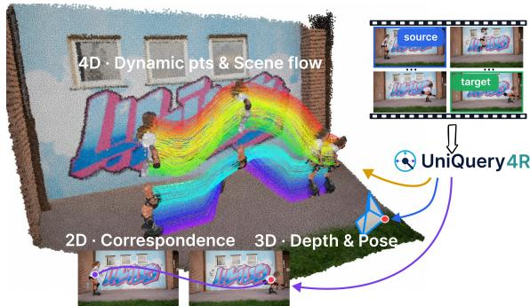
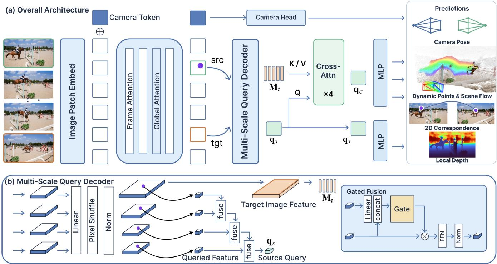
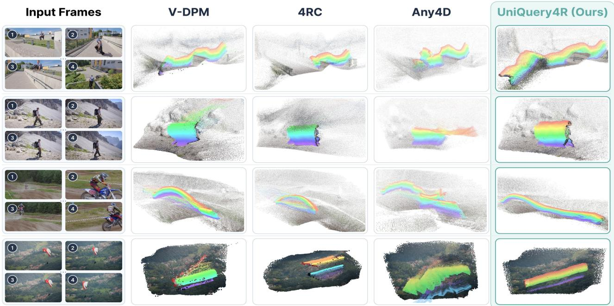
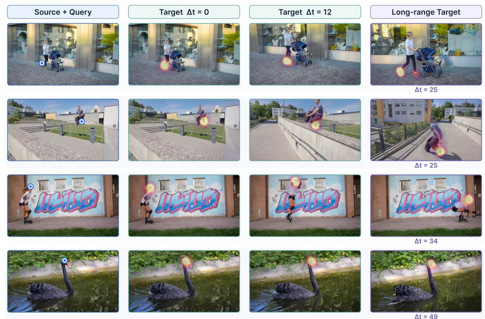
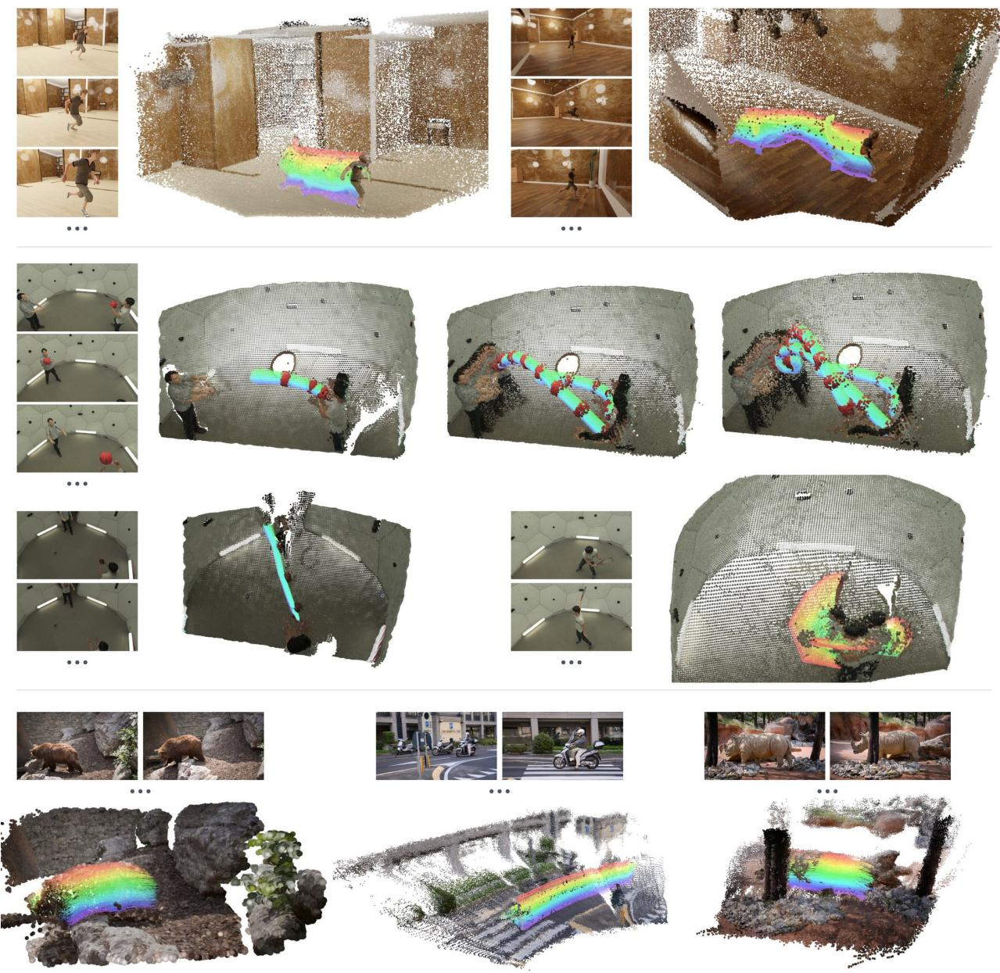
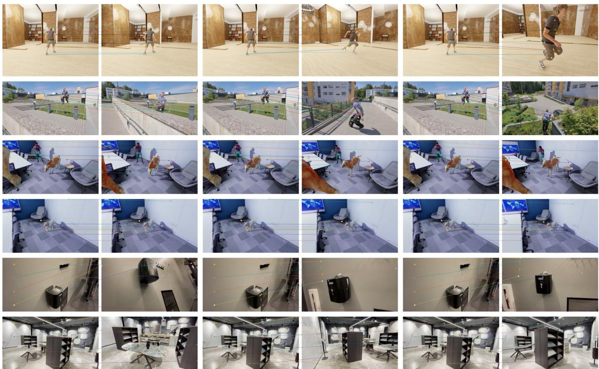
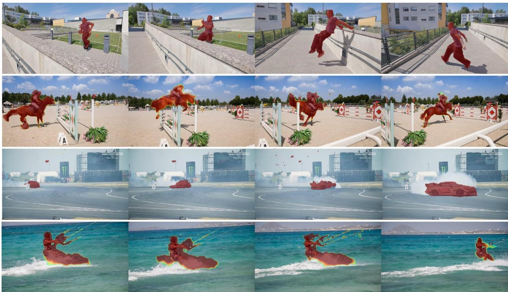
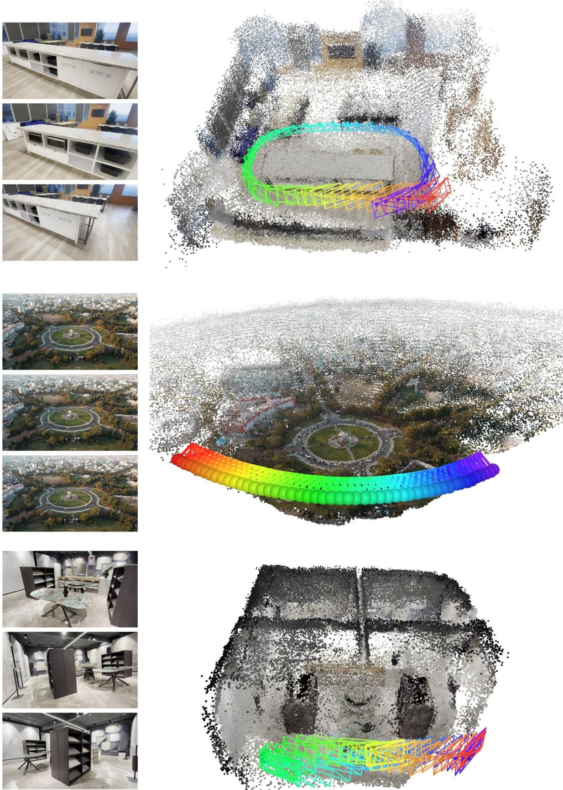

# UniQuery4R: Unified 4D Scene Reconstruction from a Single Query

Tiancheng Chen1, Sheng Tang1, Wenhua Jin1,2, Weiqi Zhang3, Juntong Fang3, Junsheng Zhou3, Zesong Li1

1Kosmo Research 2Automotive Engineering Department, Jilin University 3School of Software, Tsinghua University

## Abstract

Reconstructing dynamic 4D scenes requires jointly estimating correspondence, geometry, object motion, and camera motion. Existing feed-forward methods typically predict dense task-specific maps or independently process source–target pairs, leading to unnecessary computation for sparse queries and limited feature reuse across diferent frame pairs. We present UniQuery4R, a query-conditioned framework that encodes a multi-frame clip once and selects the source view, target view, and continuous source-image coordinate only at decoding time via source-to-target cross-attention. Each query jointly predicts target correspondence, target-time 3D position, and scene flow, along with source depth, while camera parameters are estimated per view. This design allows the encoded clip to be reused across arbitrary source–target selections and supports both sparse inference and dense reconstruction through batched queries, without learned temporal embeddings tied to a fixed clip length. We further introduce a direction–magnitude parameterization of scene flow with separate supervision for moving and static points. Among the evaluated methods, UniQuery4R achieves the best macro-average results on WorldTrack for both scene-flow estimation and dynamic-point reconstruction.

Project page: https://kosmoresearch.github.io/UniQuery4R/

## 1 Introduction

Estimating scene geometry, object motion, and camera motion from video is a fundamental problem in dynamic scene understanding. Classical SfM, SLAM, and MVS pipelines are efective for static scenes (Schönberger and Frahm 2016; Yao et al. 2018), but their reliance on scene rigidity and iterative optimization limits their applicability to unconstrained dynamic videos.

Recent feed-forward methods predict diferent combinations of dynamic geometry, object motion, and camera pose (Lin et al. 2026a; Yang et al. 2026). Many of them produce dense outputs or construct global scene representations, which are well suited to full-scene reconstruction but incur unnecessary computation when only a small set of points is queried. Moreover, correspondence, geometry, and motion are often handled by task-specific or sequential modules rather than a shared point-level representation.

We instead formulate dynamic reconstruction around a continuous source-pixel query. Tracking datasets annotate 2D trajectories with floating-point image coordinates; dense per-pixel prediction on an integer grid quantizes these labels and loses sub-pixel information, whereas a continuous query reads the requested location directly. Given a source-image coordinate and a target view, the model predicts the point’s target correspondence, target-time 3D position, and scene flow from a shared query representation. These quantities describe the same physical point across space and time and can therefore be estimated from common visual evidence. Camera parameters, by contrast, are view-level quantities and are predicted separately from per-frame representations.

We introduce UniQuery4R, which jointly encodes the input clip independently of the query $\mathbf { q } = ( u , v , s , t )$ ; the source view, target view, and source-image coordinate are used only by the query decoder (Figure 1). In D4RT (Zhang et al. 2026) (Table 1), each query attends to a global scene representation comprising patches from all input frames. Because this interaction alone does not identify the requested target frame, D4RT specifies the target time through a learned temporal embedding in the query, tying the model to a predefined 48-frame horizon. UniQuery4R instead samples a query token at the specified coordinate from the selected source features and lets it attend only to the selected target features. The target frame is thus specified by feature selection rather than a learned temporal code, avoiding fixed-index target-time embeddings and enabling variable-length clips.

  
Figure 1: Conceptual overview. A continuous source-pixel query over a jointly encoded clip predicts target correspondence, target-time 3D position, scene flow, and source depth, while camera parameters are estimated per view.

Our contributions are summarized as follows:

<table><tr><td>Method</td><td>Input Clip Length</td><td>Query Source</td><td>Key / Value</td><td>Supported Output</td></tr><tr><td>V-DPM</td><td>Variable</td><td>N/A</td><td>N/A</td><td>Dense</td></tr><tr><td>D4RT</td><td>Fixed (48 frames)</td><td>Input embedding</td><td>All-frame patches</td><td>Sparse / Dense</td></tr><tr><td>UniQuery4R (ours)</td><td>Variable</td><td>Sampled from  $\breve { F } _ { s }$ </td><td> $F _ { t }$  patches</td><td>Sparse / Dense</td></tr></table>

Table 1: Paradigm comparison with D4RT and V-DPM. UniQuery4R difers in temporal horizon, query formation, and targetside attention. “Variable” means no learned fixed clip length (memory-bounded in practice).

• We formulate feed-forward 4D reconstruction as continuous source-pixel queries over a jointly encoded, variablelength clip. Each query is formed from the selected source features and interacts only with the selected target features, avoiding temporal embeddings tied to a fixed set of frame indices. The resulting point-level representation jointly predicts correspondence, geometry, and motion, while source depth and per-view camera parameters are decoded separately.

• We introduce a direction–magnitude parameterization of scene flow, consisting of an ϵ-normalized direction vector and a non-negative magnitude. It is trained with objectives for log-space displacement, moving-point direction, and static-point magnitude, and empirically outperforms direct Cartesian regression in our ablations.

• We evaluate UniQuery4R on four datasets under the WorldTrack protocol. Among the evaluated methods, it achieves the best four-dataset macro-average results for both scene flow and dynamic-point tracking.

## 2 Related Work

## Feed-Forward 3D and 4D Reconstruction

Classical 3D reconstruction is grounded in multi-view geometry. SfM and SLAM estimate camera motion together with scene structure, whereas MVS recovers dense geometry from calibrated views (Schönberger and Frahm 2016; Yao et al. 2018). Learned feature matching and diferentiable optimization have further improved the robustness and accuracy of these pipelines (Sarlin et al. 2020; Lindenberger, Sarlin, and Pollefeys 2023; Teed and Deng 2021). Despite these advances, most classical reconstruction pipelines assume a static scene and retain iterative optimization, limiting their applicability to dynamic videos.

Feed-forward models instead infer geometry and camera parameters directly from images. DUSt3R showed that dense pointmaps can be recovered from unposed pairs without SfM (Wang et al. 2024), and MUSt3R/MASt3R-SfM extended this to multi-view and unconstrained settings (Cabon et al. 2025; Duisterhof et al. 2025); VGGT unified camera, depth, point-map, and point-track prediction in one pass (Wang et al. 2025), later scaled by VGGT-Ω (Wang et al. 2026a) and extended to online SLAM (Maggio, Lim, and Carlone 2025), while MonST3R generalized pointmaps to dynamic videos (Zhang et al. 2025).

For dynamic scenes, Dynamic Point Maps (DPM) and V-DPM introduced temporally consistent pointmaps that jointly model static and dynamic geometry over time (Sucar et al. 2025, 2026), and D2USt3R folded temporal correspondence into 4D pointmaps (Han et al. 2025). Recent feed-forward frameworks recover diferent combinations of geometry, motion, correspondence, and appearance for dynamic reconstruction (Karhade et al. 2026; Lin et al. 2026a; Fang et al. 2026a; Yang et al. 2026; Zhang et al. 2026; Luo et al. 2026; Jiang et al. 2026); related foundation models such as Dens3R focus instead on static 3D geometry prediction (Fang et al. 2026b). Most of these systems construct dense full-scene representations. Two conditional designs are closest to ours. D4RT answers point-level spatiotemporal queries that specify source time, target time, and camera reference, but identifies the target through a learned temporal embedding over a fixed frame horizon (Zhang et al. 2026). 4RC exposes a conditional interface that selects a target time from a reconstructed 4D representation and decodes dense geometry and motion (Luo et al. 2026). In contrast, we jointly encode a variable-length clip, select source and target only at decoding time, and answer each continuous pixel query (u, v) by source-to-target cross-attention, with per-frame cameras decoded separately as in VGGT (Wang et al. 2025). Related continuous decoding appears in InfiniDepth, which also uses a feature-pyramid decoder, but for single-image depth rather than multi-frame source-to-target queries (Yu et al. 2026).

## 3D Point Tracking

Tracking establishes consistent cross-frame correspondences and underpins dynamic scene understanding. Recent feedforward methods difer mainly in how they couple trajectories with geometry. SpatialTrackerV2 jointly estimates depth and camera motion, then refines tracks and poses by diferentiable joint optimization that decomposes world motion into geometry, ego-motion, and object motion (Xiao et al. 2025). St4RTrack predicts paired pointmaps in a shared world frame and chains anchored pairs for long-range correspondence (Feng et al. 2025). Trace Anything forms a dense trajectory field by predicting per-pixel B-spline control points for continuous-time 3D trajectories in one pass (Liu et al. 2026). Track4World globally encodes the video and estimates dense pairwise 2D/3D flow to obtain world-centric all-pixel trajectories (Lu et al. 2026). Reconstruction-oriented variants include TrajVG, which couples sparse camera-frame 3D trajectories with local pointmaps (Miao et al. 2026), and Uni4D, which combines pretrained depth, tracking, and segmentation in multi-stage optimization (Yao, Zhai, and Wang 2025). These works emphasize full trajectories or scene-level reconstruction; we instead answer a continuous source-pixel query at a chosen target by jointly decoding correspondence, target-time 3D geometry, and scene flow.

## Scene Flow and Dense 4D Motion

Scene flow is the 3D displacement of scene points between observations and links dynamic geometry to tracking. MoVieS models time-varying motion of pixel-aligned Gaussians for view synthesis, geometry, and zero-shot scene flow (Lin et al. 2026a); Any4D predicts dense metric perpixel geometry and motion over multiple frames (Karhade et al. 2026); and 4RC encodes once then conditionally decodes dense geometry and motion to arbitrary target times (Luo et al. 2026). Track4World estimates dense pairwise 2D/3D flow from a globally encoded video (Lu et al. 2026). Other representations encode motion diferently: V-DPM predicts time-variant and time-synchronized dynamic pointmaps from which per-point 3D motion can be recovered (Sucar et al. 2026), while OmniX parameterizes dense trajectory fields with compact dynamic tokens that separate dynamic from static geometry (Jiang et al. 2026). Flow4R treats camera-space scene flow as the central quantity, predicting per-pixel point, flow, pose weight, and confidence from each image pair and processing sequences as independent anchor–frame pairs (Qian et al. 2026), so each pair needs a new two-view pass rather than reusing one jointly encoded multi-view clip.

## 3 Method

## Overview

Given a clip $\mathcal { I } = \{ I _ { n } \} _ { n = 0 } ^ { N - 1 }$ , UniQuery4R first jointly encodes all N views into multi-view-contextualized feature pyramids. A continuous query ${ \bf q } = ( u , v , s , t )$ selects source $I _ { s }$ and target $I _ { t }$ only at decoding time. Multi-scale sampling from the selected source yields $\mathbf { q } _ { s } ,$ which attends to all tokens of the selected target to form $\mathbf { q } _ { c }$ for correspondence, geometry, and motion; source features provide depth, while per-frame tokens predict cameras (Figure 2). Source and target views are selected from the encoded features only at decoding time, allowing the backbone computation to be reused across different (s, t) choices. The query decoder represents temporal relations through source-to-target feature interaction rather than a learned temporal embedding indexed by a predefined frame set.

The query interface preserves sub-pixel coordinates through diferentiable sampling. At a fixed target resolution, decoding cost scales with the requested number of points, so sparse on-demand inference and dense reconstruction share the same model, with the latter obtained by batching a grid of queries. Because one query-conditioned representation drives correspondence, geometry, and motion, these outputs can exploit common evidence instead of being reconstructed by isolated task pipelines.

## Query Formulation and Outputs

A query $\mathbf { q } = ( u , v , s , t )$ specifies a pixel $( u , v )$ in source view $I _ { s }$ and a target view $I _ { t }$ . UniQuery4R predicts

$$
Q ( u , v , s , t ) = \{ \mathbf { P } , \Delta \mathbf { P } , \mathbf { f } , c _ { P } , \mathbf { c } _ { f } , d , c _ { d } \} ,\tag{1}
$$

together with query-independent per-view camera parameters $\pi .$ . We fix view $0 ,$ rather than the source view, as the reference. In this frame, $\mathbf { P } \in \mathbb { R } ^ { 3 }$ is the target-time location of the queried source point and $\Delta \mathbf { P } \in \mathbb { R } ^ { 3 }$ is its $s \to t$ scene flow. Pixel coordinates are mapped to $[ - 1 , 1 ] ^ { 2 }$ for sampling. The correspondence $\mathbf { f } \in \mathbb { R } ^ { 2 }$ is directly regressed as the absolute target coordinate in this normalized system; its linear output is not hard-clipped to $[ - 1 , 1 ] ^ { 2 }$ . The supervised auxiliary outputs are point confidence $c _ { P }$ , four correspondence confidence/precision logits $\mathbf { c } _ { f } \in \mathbb { R } ^ { 4 }$ , and depth confidence $c _ { d }$ (Table 2). Finally, π contains per-view translation, quaternion rotation, and FoVs ordered as vertical then horizontal $\left( \mathrm { F o } \mathrm { V } _ { v } , \mathrm { F o } \mathrm { V } _ { h } \right)$

<table><tr><td>Output Sym.</td><td>Q? Description</td><td></td></tr><tr><td colspan="3">Dynamic point  $\mathbf { P } \in \mathbb { R } ^ { 3 }$  Y target-time pos. (ref.-cam.) Scene flow  $\Delta \mathbf { P } \in \mathbb { R } ^ { 3 }$  Y s →t displ. (ref.-cam.) 2D corresp.  $\mathbf { f } \in \mathbb { R } ^ { 2 }$  Y target-image coordinate Y point and correspondence</td></tr><tr><td colspan="3">Conf./prec.  $\bigl ( c _ { P } , \mathbf { c } _ { f } \bigr )$  Local, per-query — from qs</td></tr><tr><td colspan="3">Depth/conf.  $( d , c _ { d } )$  Y source depth and confidence</td></tr><tr><td colspan="3">Global, per-view — camera tokens Camera  $\pi \in \mathbb { R } ^ { 9 }$  N extrinsics + intrinsics</td></tr></table>

Table 2: UniQuery4R outputs for query $\mathbf { q } = ( u , v , s , t ) . \mathbf { \nabla } ^ { \ast } \mathrm { Q } ? ^ { , , }$ denotes query dependence; camera parameters are predicted per view.

Coordinate and Scale Convention. All 3D outputs and camera translations share the view-0 coordinate system and scale. During training, valid ground-truth geometry is divided by the clip-level mean point-to-view-0-origin distance. At inference this label-derived scale is unavailable, so predictions are up to a global scale. Following WorldTrack, point maps and scene flow are independently aligned using the same median-based procedure: for each output type, the global scale is the ratio of the median ground-truth Euclidean magnitude to the median predicted Euclidean magnitude. The 0.02 m moving/static threshold is applied after restoring each sample’s metric scale, whereas displacement regression operates in the normalized space.

## Multi-Scale Source-to-Target Attention

UniQuery4R uses an internal multi-view 3D foundation model initialized from DA3-Giant (Lin et al. 2026b). Itjointly processes I so that each view’s tokens are contextualized by the other input views. Tokens from four encoder stages are linearly projected and pixel-shufled with stage-dependent upsampling factors $s _ { \ell } \colon$

$$
\mathbf { F } _ { n } ^ { ( \ell ) } = \operatorname { P i x e l S h u f f e } _ { s _ { \ell } } \left( \operatorname { L i n e a r } ( \mathbf { X } _ { n } ^ { ( \ell ) } ) \right) , \qquad \ell = 1 , \ldots , 4 .\tag{2}
$$

The resulting multi-scale feature pyramid $\{ \mathbf { F } _ { n } ^ { \left( \ell \right) } \}$ combines fine localization from shallow stages with semantic and multi-view context from deeper stages. Source and target pyramids are selected from this shared representation only after encoding; further encoder details are provided in the supplementary material.

  
Figure 2: (a) Overall architecture. A clip is patch-embedded with camera tokens and jointly encoded by frame/global attention. At decoding time, $\mathbf { q } = ( u , v , s , t )$ selects source/target; the multi-scale query decoder yields $\mathbf { q } _ { s }$ and target features $\mathbf { M } _ { t } .$ , then $\mathbf { q } _ { s }$ cross-attends to M (×4) to form $\mathbf { q } _ { c }$ . Src→Tgt MLPs predict $\mathbf { P } , \Delta \mathbf { P } .$ , and f from $\mathbf { q } _ { c } ;$ a Src-only MLP predicts local depth from $\mathbf { q } _ { s } ;$ a camera head reads per-view tokens. (b) Multi-scale query decoder with gated fusion that builds $\mathbf { q } _ { s }$ from the source pyramid.

Given a query $( u , v )$ , we bilinearly sample each level of the source pyramid at the continuous location, preserving sub-pixel coordinates without quantization. We order the sampled features from the shallowest/finest to the deepest as $\{ \mathbf { f } ^ { ( k ) } \} _ { k = 1 } ^ { 4 }$ . Starting from the finest sampled feature, we progressively inject deeper semantics through learned gates:

$$
\begin{array} { r l } & { \mathbf { h } ^ { ( 1 ) } = \mathbf { f } ^ { ( 1 ) } , } \\ & { \widetilde { \mathbf { h } } ^ { ( k - 1 ) } = \mathbf { W } _ { h } ^ { ( k ) } \mathbf { h } ^ { ( k - 1 ) } , } \\ & { \mathbf { g } ^ { ( k ) } = \sigma \Big ( \mathbf { W } _ { g } ^ { ( k ) } [ \widetilde { \mathbf { h } } ^ { ( k - 1 ) } ; \mathbf { f } ^ { ( k ) } ] \Big ) , } \\ & { \mathbf { z } ^ { ( k ) } = \mathbf { g } ^ { ( k ) } \odot \widetilde { \mathbf { h } } ^ { ( k - 1 ) } + ( 1 - \mathbf { g } ^ { ( k ) } ) \odot \mathbf { f } ^ { ( k ) } , } \\ & { \mathbf { h } ^ { ( k ) } = \mathrm { F F N } ^ { ( k ) } \Big ( \mathrm { L N } ^ { ( k ) } ( \mathbf { z } ^ { ( k ) } ) \Big ) , \quad k = 2 , \dots , 4 . } \end{array}\tag{3}
$$

Here $\mathbf { W } _ { h } ^ { ( k ) }$ projects the accumulated feature to the current level, and the gate adaptively retains fine localization while incorporating progressively deeper semantic and multi-view context. The fused feature $\mathbf { q } _ { s } = \mathbf { h } ^ { ( 4 ) }$ is the continuous source query representation.

For source–target interaction, the query indices $( s , t )$ select two feature hierarchies from the already encoded clip, and $\mathbf { q } _ { s }$ attends to the entire target feature map $\begin{array} { r l } { \mathbf { M } _ { t } } & { { } = } \end{array}$ $\mathrm { F l a t t e n } ( \mathbf { F } _ { t } ^ { ( 4 ) } )$ . We apply a stack of Pre-LN cross-attention blocks in which $\mathbf { q } _ { s }$ is the query and $\mathbf { M } _ { t }$ provides keys and values, followed by a linear readout to the query-conditioned representation $\mathbf { q } _ { c } .$ Crucially, we do not sample the target at the same $( u , v ) \colon$ correspondence emerges from attending over the full target field. The module uses neither local windows, predefined matches, nor a temporal embedding. Thus, (s, t) is a decoding choice rather than an input-pair choice, and diferent source–target relations can be queried from the same jointly encoded clip.

## Geometry and Correspondence Heads

Shallow task-specific MLPs decode P, ∆P, f, point confidence, and correspondence confidence/precision from $\mathbf { q } _ { c }$ while $\mathbf { q } _ { s }$ produces depth and its confidence. We use an inverse-log parameterization for $\mathbf { P }$ and an exponential map for depth; f is a linear absolute target coordinate $\mathbf { f } ^ { * } \in$ $[ - 1 , 1 ] ^ { 2 }$ rather than a displacement from the source query. Separate supervision with shared query representations encourages the tasks to exploit common spatiotemporal evidence. Cameras are predicted per view by a VGGT-style token head (Wang et al. 2025) and supervised with referencenormalized relative $L _ { 1 }$ on translation, quaternion (canonicalized to $w \geq 0 )$ , and FoV, following the relative-pose supervision principle of $\pi ^ { 3 }$ (Wang et al. 2026b).

## Direction–Magnitude Scene Flow and Supervision

Rather than directly regressing the three Cartesian components of scene flow, we factorize the displacement into an

ϵ-normalized direction vector and a non-negative magnitude:

$$
\begin{array} { c c } { \displaystyle { m = \mathrm { s o f t p l u s } ( \tilde { m } ) , \qquad \hat { \mathbf { v } } = \frac { \tilde { \mathbf { v } } } { \sqrt { \| \tilde { \mathbf { v } } \| _ { 2 } ^ { 2 } + \epsilon _ { v } ^ { 2 } } } , } } \\ { \Delta \mathbf { P } = m \hat { \mathbf { v } } . } \end{array}\tag{4}
$$

Here $\tilde { \textbf { v } } \in \ \mathbb { R } ^ { 3 }$ and $\tilde { m } ~ \in ~ \mathbb { R }$ are predicted from $\mathbf { q } _ { c }$ and $\epsilon _ { v } = 1 0 ^ { - 4 }$ . Because of the stabilizing $\epsilon _ { v } .$ vˆ is not constrained to have exactly unit norm. This four-parameter representation separates motion orientation from motion magnitude, guarantees a non-negative magnitude, and lets the two factors receive complementary supervision.

For scene-flow supervision, let $\Delta \mathbf { P } ^ { * }$ denote the groundtruth displacement and define the stable radial log transform

$$
\phi ( \mathbf { x } ) = \mathbf { x } \frac { \log ( 1 + \| \mathbf { x } \| _ { \epsilon } ) } { \| \mathbf { x } \| _ { \epsilon } } , \qquad \| \mathbf { x } \| _ { \epsilon } = \sqrt { \| \mathbf { x } \| _ { 2 } ^ { 2 } + \epsilon _ { \Delta } ^ { 2 } } ,\tag{5}
$$

where $\epsilon _ { \Delta } = 1 0 ^ { - 6 }$ . This transform preserves the displacement direction while compressing its dynamic range, preventing large motions from overwhelming small ones. We classify a valid query as moving when the metric groundtruth magnitude exceeds $\gamma = 0 . 0 2$ m, yielding dynamic and static sets D and S. The displacement term is

$$
\begin{array} { r l } & { \ell _ { i } ^ { \Delta } = \| \phi ( \Delta  { \mathbf { P } } _ { i } ) - \phi ( \Delta  { \mathbf { P } } _ { i } ^ { \ast } ) \| _ { 1 } , } \\ & { \mathcal { L } _ { \Delta } = \alpha \underset { i \in \mathcal { D } } { \mathrm { m e a n } } \ell _ { i } ^ { \Delta } + ( 1 - \alpha ) \underset { i \in \mathcal { S } } { \mathrm { m e a n } } \ell _ { i } ^ { \Delta } . } \end{array}\tag{6}
$$

Here α controls the relative emphasis on moving points; we use α = 0.85 during training. If one set is empty, only the available term is used. We further supervise orientation on moving points and suppress spurious motion on static points:

$$
\begin{array} { r l } & { \quad \hat { \mathbf { v } } _ { i } ^ { * } = \Delta \mathbf { P } _ { i } ^ { * } / \| \Delta \mathbf { P } _ { i } ^ { * } \| _ { 2 } , } \\ & { \mathcal { L } _ { \mathrm { d i r } } = \underset { i \in \mathcal { D } } { \mathrm { m e a n } } \left( 1 - \hat { \mathbf { v } } _ { i } ^ { \top } \hat { \mathbf { v } } _ { i } ^ { * } \right) + \lambda _ { \mathrm { s t a t } } \underset { i \in S } { \mathrm { m e a n } } m _ { i } , \quad \lambda _ { \mathrm { s t a t } } = 1 . } \end{array}\tag{7}
$$

Thus, the composed displacement is constrained globally in log space, while its direction and near-zero static magnitude are each explicitly regularized.

## Training Objectives

UniQuery4R is trained with a multi-task objective that supervises the full set of query outputs and camera parameters:

$$
\begin{array} { r l } & { \mathcal { L } = \lambda _ { P } \mathcal { L } _ { P } + \lambda _ { \Delta } \mathcal { L } _ { \Delta } + \lambda _ { f } \mathcal { L } _ { f } + \lambda _ { \mathrm { d i r } } \mathcal { L } _ { \mathrm { d i r } } } \\ & { \quad \quad + \lambda _ { d } \mathcal { L } _ { d } + \lambda _ { \pi } \mathcal { L } _ { \pi } , } \end{array}\tag{8}
$$

where $\mathcal { L } _ { P }$ and $\mathcal { L } _ { d }$ are confidence-weighted $L _ { 1 }$ losses on the 3D point and source depth; $\mathcal { L } _ { \Delta }$ balances static and dynamic regions; ${ \mathcal { L } } _ { \mathrm { d i r } }$ supervises moving-point direction and suppresses the magnitude on static points; $\mathcal { L } _ { f }$ is a confidenceaware 2D matching loss; and $\bar { \mathcal { L } } _ { \pi }$ supervises referencenormalized camera parameters. Dataset-dependent reweighting disables unavailable supervision and reduces the pointloss weight on sparse-reconstruction data. Additional implementation details are provided in the supplementary material.

## 4 Experiments

## Training Data and Setup

UniQuery4R is trained on a mixture of synthetic and realworld dynamic datasets, including Kubric-4D (Van Hoorick et al. 2024; Gref et al. 2022), PointOdyssey (Zheng et al. 2023), Hypersim (Roberts et al. 2021), DL3DV (Ling et al. 2024), CoTracker3Kubric (Karaev et al. 2025), Stereo4D (Jin et al. 2025), Virtual KITTI 2 (Cabon, Murray, and Humenberger 2020), Waymo (Sun et al. 2020), and an internal dynamic-scene collection. Together they supervise depth, camera pose, optical flow, scene flow, and 2D/3D trajectories. All data follow a unified coordinate convention. Training clips contain 4–12 views with varied baselines and motion magnitudes; for each clip, we sample ordered source–target pairs (s, t), including self-pairs, for query supervision. The main model is trained for 150k iterations on 16 NVIDIA H20 GPUs; optimizer settings and full hyperparameters are in the supplementary material.

## Evaluation Protocol

We follow the WorldTrack protocol (Feng et al. 2025) on PointOdyssey (PO) (Zheng et al. 2023), Panoptic Studio (PStudio) (Joo et al. 2015), Dynamic Replica (DR) (Karaev et al. 2023), and Aria Digital Twin (ADT) (Pan et al. 2023), with qualitative long-sequence tracking on DAVIS (Perazzi et al. 2016). Quantitative runs use the first 64 frames with global median scale alignment before metric computation; macro-averages are unweighted over the four datasets. Table captions detail source–target sampling, validity masks, and thresholds. Although trained on 4–12-frame clips, Uni-Query4R jointly encodes all 64 evaluation frames in one encoder pass, and source–target queries reuse those features without sliding windows or cross-window fusion. All entries labeled D4RT use OpenD4RT (RHOS Team 2026), an unofficial reimplementation, and should not be read as results of the original model (Zhang et al. 2026).

## Scene Flow Evaluation

Table 3 reports τ@0.1m and EPE with unweighted fourdataset macro-averages. UniQuery4R attains the best macroaverage on both metrics and the best ADT scores, ranks second on DR, and trails V-DPM/4RC on individual PStudio/PO dataset–metric combinations. The direction–magnitude design in Sec. 3 balances static/dynamic supervision so large displacements do not dominate training (Table 8).

## Dynamic Point Evaluation

Table 4 evaluates world-coordinate 3D tracking of queried dynamic source points via Average Percentage of Points within Distance (APD) and EPE after global median scale alignment. UniQuery4R leads the four-dataset macroaverage and ranks first on PStudio, PO, and ADT, while 4RC is strongest on DR. The dynamic-point and scene-flow heads decode from the shared query representation $\mathbf { q } _ { c } ,$ providing a common representation for correspondence, geometry, and motion. Figure 3 qualitatively shows less drift and fragmentation under occlusion and non-rigid deformation.

<table><tr><td>Method</td><td colspan="2">PStudio</td><td colspan="2">PO</td><td colspan="2">DR</td><td colspan="2">ADT</td><td colspan="2">Macro Avg.</td></tr><tr><td></td><td>τ ↑</td><td>EPE↓</td><td>τ↑</td><td>EPE↓</td><td>τ ↑</td><td>EPE↓</td><td>τ↑</td><td>EPE↓</td><td>τ↑</td><td>EPE↓</td></tr><tr><td>SpatialTrackerV2 (Xiao et al. 2025)</td><td>8.78</td><td>0.4095</td><td>15.08</td><td>0.3089</td><td>13.09</td><td>0.2707</td><td>34.40</td><td>0.2054</td><td>17.84</td><td>0.2986</td></tr><tr><td>St4RTrack (Feng et al. 2025)</td><td>27.45</td><td>0.2259</td><td>37.24</td><td>0.219</td><td>75.69</td><td>0.0858</td><td>55.76</td><td>0.1481</td><td>49.04</td><td>0.1697</td></tr><tr><td>TraceAnything (Liu et al. 2026)</td><td>23.94</td><td>0.2456</td><td>64.33</td><td>0.1173</td><td>83.83</td><td>0.0495</td><td>79.98</td><td>0.0839</td><td>63.02</td><td>0.1241</td></tr><tr><td>Any4D (Karhade et al. 2026)</td><td>25.08</td><td>0.2406</td><td>70.43</td><td>0.094</td><td>85.94</td><td>0.0451</td><td>88.25</td><td>0.0562</td><td>67.43</td><td>0.109</td></tr><tr><td>V-DPM (Sucar et al. 2026)</td><td>58.99</td><td>0.1152</td><td>82.91</td><td>0.0563</td><td>88.98</td><td>0.0381</td><td>88.75</td><td>0.0559</td><td>79.91</td><td>0.0664</td></tr><tr><td>4RC (Luo et al. 2026)</td><td>53.88</td><td>0.1255</td><td>86.66</td><td>0.0466</td><td>94.13</td><td>0.0213</td><td>88.14</td><td>0.0633</td><td>80.70</td><td>0.0642</td></tr><tr><td>OpenD4RT (RHOS Team 2026)</td><td>38.25</td><td>0.1772</td><td>76.62</td><td>0.0784</td><td>90.45</td><td>0.0289</td><td>88.23</td><td>0.0627</td><td>73.39</td><td>0.0868</td></tr><tr><td>UniQuery4R (ours)</td><td>56.75</td><td>0.1137</td><td>82.52</td><td>0.0541</td><td>91.54</td><td>0.0275</td><td>95.10</td><td>0.0167</td><td>81.48</td><td>0.0530</td></tr></table>

Table 3: WorldTrack scene flow (Feng et al. 2025): source = first frame; median global scale alignment; τ@0.1m (%) and EPE (m); equal-weight macro-average. OpenD4RT: unoficial D4RT (RHOS Team 2026). Best bolded; second-best underlined.
<table><tr><td rowspan="2">Method</td><td colspan="2">PStudio</td><td colspan="2">PO</td><td colspan="2">DR</td><td colspan="2">ADT</td><td colspan="2">Macro Avg.</td></tr><tr><td>APD↑</td><td>EPE↓</td><td>APD↑</td><td>EPE↓</td><td>APD↑</td><td>EPE↓</td><td>APD↑</td><td>EPE↓</td><td>APD↑</td><td>EPE↓</td></tr><tr><td>SpatialTrackerV2 (Xiao et al. 2025)</td><td>49.93</td><td>0.4639</td><td>53.45</td><td>0.5173</td><td>54.34</td><td>0.4368</td><td>69.39</td><td>0.2764</td><td>56.78</td><td>0.4236</td></tr><tr><td>St4RTrack (Feng et al. 2025)</td><td>70.80</td><td>0.2479</td><td>67.38</td><td>0.314</td><td>74.24</td><td>0.2594</td><td>72.90</td><td>0.2958</td><td>71.33</td><td>0.2793</td></tr><tr><td>TraceAnything (Liu et al. 2026)</td><td>70.86</td><td>0.278</td><td>39.37</td><td>1.0462</td><td>60.89</td><td>0.5642</td><td>75.69</td><td>0.2515</td><td>61.70</td><td>0.535</td></tr><tr><td>Any4D (Karhade et al. 2026)</td><td>74.72</td><td>0.2361</td><td>65.99</td><td>0.3783</td><td>76.72</td><td>0.3463</td><td>78.09</td><td>0.2378</td><td>73.88</td><td>0.2996</td></tr><tr><td>V-DPM (Sucar et al. 2026)</td><td>78.95</td><td>0.1757</td><td>80.82</td><td>0.1857</td><td>75.29</td><td>0.2438</td><td>85.47</td><td>0.1725</td><td>80.13</td><td>0.1944</td></tr><tr><td>4RC (Luo et al. 2026)</td><td>69.08</td><td>0.259</td><td>79.81</td><td>0.2353</td><td>84.65</td><td>0.1667</td><td>84.16</td><td>0.177</td><td>79.43</td><td>0.2095</td></tr><tr><td>OpenD4RT (RHOS Team 2026)</td><td>78.63</td><td>0.1811</td><td>66.03</td><td>0.3398</td><td>76.78</td><td>0.2407</td><td>69.91</td><td>0.2966</td><td>72.84</td><td>0.2646</td></tr><tr><td>UniQuery4R (ours)</td><td>84.64</td><td>0.1333</td><td>83.74</td><td>0.1604</td><td>80.00</td><td>0.2078</td><td>87.17</td><td>0.1387</td><td>83.89</td><td>0.1601</td></tr></table>

Table 4: WorldTrack dynamic-point tracking (Feng et al. 2025): queried source-point 3D positions (64 frames × 50 sequences); median global scale alignment; APD (% over 0.1/0.3/0.5/1.0 m) and EPE (m); equal-weight macro-average. OpenD4RT: unoficial D4RT (RHOS Team 2026). Best bolded; second-best underlined.  
  
Figure 3: Long-sequence DAVIS tracking versus feed-forward baselines. Each color denotes one fixed source query over time; UniQuery4R qualitatively exhibits less drift and fragmentation under occlusion and deformation.

<table><tr><td rowspan="2">Method</td><td colspan="4">ADT</td><td colspan="4"></td></tr><tr><td></td><td>A5↑ A30↑ ATE↓</td><td>Rt↓ Rr↓</td><td>A5↑</td><td>A30↑ ATE↓</td><td>Rt↓ Rr↓</td><td>A5↑ A30↑ ATE↓</td><td>Rt↓</td></tr><tr><td>VGGT (Wang et al. 2025)</td><td></td><td></td><td></td><td></td><td></td><td></td><td>0.134 0.7240.2190.2693.457 0.676 0.9260.0470.071 0.994 0.212 0.4750.1000.050 0.588</td><td></td></tr><tr><td>DA3-Giant (Lin et al. 2026b)</td><td></td><td></td><td></td><td></td><td></td><td></td><td>0.1450.7410.1600.2232.2210.7720.9440.0340.0450.8480.2140.4950.0650.0440.373</td><td></td></tr><tr><td>VGGT-Ω (Wang et al. 2026a)</td><td></td><td></td><td></td><td>0.446 0.8510.0870.0912.1070.704 0.933</td><td></td><td></td><td>0.0400.0591.0080.2860.5830.0280.022 0.230</td><td></td></tr><tr><td>Any4D (Karhade et al. 2026)</td><td></td><td></td><td></td><td></td><td></td><td></td><td>0.070 0.5970.3460.432 4.566 0.3480.8330.1050.163 2.2470.034 0.2900.1440.104 2.226</td><td></td></tr><tr><td>V-DPM (Sucar et al. 2026)</td><td></td><td></td><td></td><td></td><td></td><td></td><td>0.400 0.861 0.0760.103 2.374 0.664 0.9250.0450.0661.113 0.175 0.5050.082 0.054 0.520</td><td></td></tr><tr><td>4RC (Luo et al. 2026)</td><td></td><td></td><td></td><td></td><td></td><td></td><td>0.5710.9060.0460.0641.6470.7530.9420.0350.050 0.9320.240 0.4880.0890.0460.493</td><td></td></tr><tr><td>UniQuery4R (ours)</td><td></td><td></td><td></td><td></td><td></td><td></td><td>0.608 0.9030.036 0.079 1.446 0.7080.951 0.031 0.080 1.460 0.359 0.603 0.031 0.059 1.199</td><td></td></tr></table>

Table 5: Camera pose $( \mathrm { { A _ { 5 } } / \mathrm { { A _ { 3 0 } } : } }$ AUC@5/@30) and trajectory (ATE; ${ \bf R } _ { t } / { \bf R } _ { r } \colon { \bf R P E } _ { t } / { \bf R P E } _ { r } )$ on ADT, NRGBD, and Sintel. Best bolded; second-best underlined.

Depth and Camera Evaluation
<table><tr><td rowspan="3">Method</td><td colspan="2">ADT</td><td colspan="2">Sintel</td><td colspan="2">ScanNet++</td></tr><tr><td>Rel↓</td><td>δ↑</td><td>Rel↓</td><td>δ↑</td><td>Rel↓</td><td>δ↑</td></tr><tr><td></td><td>0.9286</td><td>0.2420</td><td>0.6747</td><td>0.0379</td><td>0.9765</td></tr><tr><td>VGGT DA3-Giant</td><td>0.0814 0.0649</td><td>0.9735</td><td>0.2906</td><td>0.6357</td><td>0.0343</td><td>0.9757</td></tr><tr><td>VGGT-Ω</td><td>0.0638</td><td>0.9763</td><td>0.0982</td><td>0.9163</td><td>0.0379</td><td>0.9727</td></tr><tr><td>Any4D</td><td>0.0999</td><td>0.9553</td><td>0.2514</td><td>0.6468</td><td>0.0614</td><td>0.9666</td></tr><tr><td>V-DPM</td><td>0.0564</td><td>0.9727</td><td>0.2207</td><td>0.6819</td><td>0.0461</td><td>0.9678</td></tr><tr><td>4RC</td><td>0.0681</td><td>0.9514</td><td>0.2388</td><td>0.6608</td><td>0.0255</td><td>0.9789</td></tr><tr><td>UniQuery4R</td><td>0.0433</td><td>0.9769</td><td>0.1033</td><td>0.8689</td><td>0.0549</td><td>0.9622</td></tr></table>

Table 6: Video depth evaluation on ADT, Sintel, and Scan-Net++ (AbsRel $( \mathrm { R e l } ) \downarrow , \delta _ { 1 . 2 5 } ( \delta ) \uparrow )$ . Best bolded; second-best underlined.

Tables 5 and 6 summarize depth and camera results. Uni-Query4R leads ADT depth and ADT AUC@5/ATE/RPEr; 4RC is stronger on AUC@30/RPEt. On Sintel, AbsRel is close to VGGT-Ω with stronger pose AUC but weaker trajectory RPE. On NRGBD, it leads AUC@30 and ATE but trails DA3-Giant/4RC in relative RPE; on ScanNet++, depth remains below 4RC and reconstruction-oriented backbones.

Runtime and Memory Scaling
<table><tr><td>Component</td><td>Scaling variable</td><td>Marginal latency</td></tr><tr><td>Encoder</td><td>One additional view</td><td>+45.70 ms</td></tr><tr><td>Encoder</td><td>+1 MP per clip</td><td>+1.26 s</td></tr><tr><td>Decoder</td><td>+1k queries</td><td>+4.18 ms</td></tr></table>

Table 7: FP16 inference scaling on one NVIDIA A800 (warmup 5, repeats 20). Defaults: 504×504, $Q { = } 4 0 9 6 ;$ view sweep fixes $5 0 4 ^ { 2 } / Q { = } 4 0 9 6$ , resolution sweep fixes $\scriptstyle { T = 8 / Q = 4 0 9 6 . }$ , query sweep fixes $T { = } 8 / 5 0 4 ^ { 2 }$ . Linear fits give $\dot { R } ^ { 2 } { \geq } 0 . 9 9 5$ . Encoding changes by only 0.22% for Q:4096→16384. At Q=60k, chunking (30k) cuts peak memory 15.68→12.52 GB. Full protocol in the supplementary material.

Table 7 summarizes encode/decode marginal cost: encoding grows with views and resolution and is nearly Qindependent, while decoding scales with query count; chunking reduces peak memory at large Q. Detailed sweeps are in the supplementary material.

Ablation Study
<table><tr><td colspan="2">Supervised tasks</td><td>APD↑</td><td>Point τ ↑</td><td>Point EPE↓</td></tr><tr><td colspan="2">Dynamic points + scene flow + 2D correspondence</td><td>77.66 78.22</td><td>39.56 42.04</td><td>0.2161 0.2109</td></tr><tr><td colspan="2">+ local depth (ref.) Flow parameterization</td><td>78.78 Flow τ ↑ Flow EPE↓</td><td>42.93</td><td>0.2060</td></tr><tr><td colspan="2">Cartesian vector  $( d _ { x } , d _ { y } , d _ { z } )$  Direction + magnitude</td><td>73.71 76.48</td><td>0.0794 0.0663</td><td></td></tr><tr><td colspan="2">Source pyramid CA blocks 4</td><td>APD↑</td><td>Point τ ↑</td><td>Point EPE↓</td></tr><tr><td colspan="2">w/o multi-scale</td><td>74.71</td><td>35.64</td><td>0.2531</td></tr><tr><td colspan="2">multi-scale</td><td>76.78</td><td>39.39</td><td>0.2255</td></tr><tr><td colspan="2">multi-scale 2</td><td>76.89</td><td>39.77</td><td>0.2261</td></tr><tr><td colspan="2">multi-scale (ref.) 4</td><td>78.78</td><td>42.93</td><td>0.2060</td></tr></table>

Table 8: WorldTrack ablations (macro-average; 75k / one H20). Best per group bolded; ref. is multi-scale + 4 CA.

Table 8 shows that correspondence and local depth improve dynamic-point metrics; direction–magnitude raises flow τ@0.1m from 73.71 to 76.48 and lowers flow EPE from 0.0794 to 0.0663, with four multi-scale CA blocks performing best.

## Discussion and Limitations

Figure 3 suggests improved long-horizon stability in the shown examples relative to feed-forward baselines, and direction–magnitude supervision is central (Table 8). Performance can still degrade under severe occlusion and large rotations; with fast motion or flipping articulations, left– right hand/foot associations are particularly prone to identity swaps. Encode cost also grows with clip length (Table 7), so longer videos need temporal windowing; cross-window fusion is left open.

## 5 Conclusion

UniQuery4R queries continuous source pixels over a jointly encoded clip with direction–magnitude scene flow (Sec. 3), achieving the best WorldTrack macro-average scene-flow and dynamic-point results among evaluated methods, with competitive depth and camera metrics. Ablations confirm gains from correspondence, local depth, direction–magnitude flow, and a multi-scale source pyramid.

## References

Cabon, Y.; Murray, N.; and Humenberger, M. 2020. Virtual KITTI 2. arXiv:2001.10773.

Cabon, Y.; Stofl, L.; Antsfeld, L.; Csurka, G.; Chidlovskii, B.; Revaud, J.; and Leroy, V. 2025. MUSt3R: Multi-view Network for Stereo 3D Reconstruction. In IEEE Conf. Comput. Vis. Pattern Recog. (CVPR), 1050–1060.

Duisterhof, B. P.; Žust, L.; Weinzaepfel, P.; Leroy, V.; Cabon, Y.; and Revaud, J. 2025. MASt3R-SfM: A Fully-Integrated Solution for Unconstrained Structure-from-Motion. In Int. Conf. 3D Vis. (3DV), 1–10.

Fang, J.; Chen, Z.; Zhang, W.; Di, D.; Zhang, X.; Yang, C.; and Liu, Y.-S. 2026a. MoRe: Motion-aware Feed-forward 4D Reconstruction Transformer. In IEEE Conf. Comput. Vis. Pattern Recog. (CVPR), 28914–28924.

Fang, X.; Gao, J.; Wang, Z.; Chen, Z.; Ren, X.; Lyu, J.; Ren, Q.; Yang, Z.; Yang, X.; Yan, Y.; and Lyu, C. 2026b. Dens3R: A Foundation Model for 3D Geometry Prediction. In Int. Conf. Learn. Represent. (ICLR).

Feng, H.; Zhang, J.; Wang, Q.; Ye, Y.; Yu, P.; Black, M. J.; Darrell, T.; and Kanazawa, A. 2025. St4RTrack: Simultaneous 4D Reconstruction and Tracking in the World. In Int. Conf. Comput. Vis. (ICCV), 8503–8513.

Gref, K.; Belletti, F.; Beyer, L.; Doersch, C.; Du, Y.; Duckworth, D.; Fleet, D. J.; Gnanapragasam, D.; Golemo, F.; Her-

S. M.; Sela, M.; Sitzmann, V.; Stone, A.; Sun, D.; Vora, S.; Wang, Z.; Wu, T.; Yi, K. M.; Zhong, F.; and Tagliasacchi, A. 2022. Kubric: A Scalable Dataset Generator. In IEEE Conf. Comput. Vis. Pattern Recog. (CVPR), 3749–3761.

Han, J.; An, H.; Jung, J.; Narihira, T.; Seo, J.; Fukuda, K.; Kim, C.; Hong, S.; Mitsufuji, Y.; and Kim, S. 2025. Enhancing 3D Reconstruction for Dynamic Scenes. In Adv. Neural Inform. Process. Syst. (NeurIPS).

Jiang, Y.; Wang, T.; Wang, Z.; Cao, C.; Wu, J.; Luo, W.; Hu, W.; Gao, J.; and Guo, C. 2026. OmniX: Any-view and Anytime 4D Reconstruction via Feed-forward Trajectory Fields. In Eur. Conf. Comput. Vis. (ECCV).

Jin, L.; Tucker, R.; Li, Z.; Fouhey, D.; Snavely, N.; and Holynski, A. 2025. Stereo4D: Learning How Things Move in 3D from Internet Stereo Videos. In IEEE Conf. Comput. Vis. Pattern Recog. (CVPR), 10497–10509.

Joo, H.; Liu, H.; Tan, L.; Gui, L.; Nabbe, B.; Matthews, I.; Kanade, T.; Nobuhara, S.; and Sheikh, Y. 2015. Panoptic Studio: A Massively Multiview System for Social Motion Capture. In Int. Conf. Comput. Vis. (ICCV), 3334–3342.

Karaev, N.; Makarov, Y.; Wang, J.; Neverova, N.; Vedaldi, A.; and Rupprecht, C. 2025. CoTracker3: Simpler and Better Point Tracking by Pseudo-Labelling Real Videos. In Int. Conf. Comput. Vis. (ICCV), 6013–6022.

Karaev, N.; Rocco, I.; Graham, B.; Neverova, N.; Vedaldi, A.; and Rupprecht, C. 2023. DynamicStereo: Consistent Dynamic Depth from Stereo Videos. In IEEE Conf. Comput. Vis. Pattern Recog. (CVPR), 13229–13239.

Karhade, J.; Keetha, N.; Zhang, Y.; Gupta, T.; Sharma, A.; Scherer, S.; and Ramanan, D. 2026. Any4D: Unified Feed-Forward Metric 4D Reconstruction. In IEEE Conf. Comput. Vis. Pattern Recog. (CVPR), 14578–14589.

Lin, C.; Lin, Y.; Pan, P.; Yu, Y.; Hu, T.; Yan, H.; Fragkiadaki, K.; and Mu, Y. 2026a. MoVieS: Motion-Aware 4D Dynamic View Synthesis in One Second. In IEEE Conf. Comput. Vis. Pattern Recog. (CVPR), 295–306.

Lin, H.; Chen, S.; Liew, J. H.; Chen, D. Y.; Li, Z.; Zhao, Y.; Peng, S.; Guo, H.; Zhou, X.; Shi, G.; Feng, J.; and Kang, B. 2026b. Depth Anything 3: Recovering the Visual Space from Any Views. In Int. Conf. Learn. Represent. (ICLR).

Lindenberger, P.; Sarlin, P.-E.; and Pollefeys, M. 2023. Light-Glue: Local Feature Matching at Light Speed. In Int. Conf. Comput. Vis. (ICCV), 17627–17638.

Ling, L.; Sheng, Y.; Tu, Z.; Zhao, W.; Xin, C.; Wan, K.; Yu, L.; Guo, Q.; Yu, Z.; Lu, Y.; Li, X.; Sun, X.; Ashok, R.; Mukherjee, A.; Kang, H.; Kong, X.; Hua, G.; Zhang, T.; Benes, B.; and Bera, A. 2024. DL3DV-10K: A Large-Scale Scene Dataset for Deep Learning-based 3D Vision. In IEEE Conf. Comput. Vis. Pattern Recog. (CVPR), 22160–22169.

Liu, X.; Xiao, Y.; Chen, D. Y.; Feng, J.; Tai, Y.-W.; Tang, C.-K.; and Kang, B. 2026. Trace Anything: Representing Any Video in 4D via Trajectory Fields. In Int. Conf. Learn. Represent. (ICLR).

Lu, J.; Xu, J.; Hu, W.; Zhu, R.; Zhao, C.; Yeung, S.-K.; Shan, Y.; and Liu, Y. 2026. Track4World: Feedforward World-Centric Dense 3D Tracking of All Pixels. In Eur. Conf. Comput. Vis. (ECCV).

Luo, Y.; Zhou, S.; Lan, Y.; Pan, X.; and Loy, C. C. 2026. 4RC: 4D Reconstruction via Conditional Querying Anytime and Anywhere. In Int. Conf. Mach. Learn. (ICML).

Maggio, D. R.; Lim, H.; and Carlone, L. 2025. VGGT-SLAM: Dense RGB SLAM Optimized on the SL(4) Manifold. In Adv. Neural Inform. Process. Syst. (NeurIPS).

Miao, X.; Zhao, W.; Lu, T.; Xu, L.; Yu, M.; Long, Y.; Pang, J.; and Dong, J. 2026. TrajVG: 3D Trajectory-Coupled Visual Geometry Learning. In ACM SIGGRAPH.

Pan, X.; Charron, N.; Yang, Y.; Peters, S.; Whelan, T.; Kong, C.; Parkhi, O.; Newcombe, R.; and Ren, Y. 2023. Aria Digital Twin: A New Benchmark Dataset for Egocentric 3D Machine Perception. In Int. Conf. Comput. Vis. (ICCV), 20133–20143.

Perazzi, F.; Pont-Tuset, J.; McWilliams, B.; Van Gool, L.; Gross, M.; and Sorkine-Hornung, A. 2016. A Benchmark Dataset and Evaluation Methodology for Video Object Segmentation. In IEEE Conf. Comput. Vis. Pattern Recog. (CVPR), 724–732.

Qian, S.; Zhang, G.; Wu, S.; and Cremers, D. 2026. Flow4R: Unifying 4D Reconstruction and Tracking with Scene Flow. In Eur. Conf. Comput. Vis. (ECCV).

RHOS Team. 2026. OpenD4RT: An Unoficial PyTorch Implementation of D4RT for 4D Reconstruction and Tracking. https://github.com/Lijiaxin0111/Open-d4rt. Unoficial open-source reimplementation of D4RT; accessed July 23, 2026.

Roberts, M.; Ramapuram, J.; Ranjan, A.; Kumar, A.; Bautista, M. A.; Paczan, N.; Webb, R.; and Susskind, J. M. 2021. Hypersim: A Photorealistic Synthetic Dataset for Holistic Indoor Scene Understanding. In Int. Conf. Comput. Vis. (ICCV), 10912–10922.

Sarlin, P.-E.; DeTone, D.; Malisiewicz, T.; and Rabinovich, A. 2020. SuperGlue: Learning Feature Matching with Graph Neural Networks. In IEEE Conf. Comput. Vis. Pattern Recog. (CVPR), 4938–4947.

Schönberger, J. L.; and Frahm, J.-M. 2016. Structure-from-Motion Revisited. In IEEE Conf. Comput. Vis. Pattern Recog. (CVPR), 4104–4113.

Sucar, E.; Insafutdinov, E.; Lai, Z.; and Vedaldi, A. 2026. V-DPM: 4D Video Reconstruction with Dynamic Point Maps. In IEEE Conf. Comput. Vis. Pattern Recog. (CVPR), 14502– 14511.

Sucar, E.; Lai, Z.; Insafutdinov, E.; and Vedaldi, A. 2025. Dynamic Point Maps: A Versatile Representation for Dynamic 3D Reconstruction. In Int. Conf. Comput. Vis. (ICCV), 7295– 7305.

Sun, P.; Kretzschmar, H.; Dotiwalla, X.; Chouard, A.; Patnaik, V.; Tsui, P.; Guo, J.; Zhou, Y.; Chai, Y.; Caine, B.; Vasudevan, V.; Han, W.; Ngiam, J.; Zhao, H.; Timofeev, A.; Ettinger, S.; Krivokon, M.; Gao, A.; Joshi, A.; Zhang, Y.; Shlens, J.; Chen, Z.; and Anguelov, D. 2020. Scalability in Perception for Autonomous Driving: Waymo Open Dataset. In IEEE Conf. Comput. Vis. Pattern Recog. (CVPR), 2443– 2451.

Teed, Z.; and Deng, J. 2021. DROID-SLAM: Deep Visual SLAM for Monocular, Stereo, and RGB-D Cameras. In Adv. Neural Inform. Process. Syst. (NeurIPS), 16558–16569.

Van Hoorick, B.; Wu, R.; Ozguroglu, E.; Sargent, K.; Liu, R.; Tokmakov, P.; Dave, A.; Zheng, C.; and Vondrick, C. 2024. Generative Camera Dolly: Extreme Monocular Dynamic Novel View Synthesis. In Eur. Conf. Comput. Vis. (ECCV), 313–331.

Wang, J.; Chen, M.; Karaev, N.; Vedaldi, A.; Rupprecht, C.; and Novotny, D. 2025. VGGT: Visual Geometry Grounded Transformer. In IEEE Conf. Comput. Vis. Pattern Recog. (CVPR), 5294–5306.

Wang, J.; Chen, M.; Zhang, S.; Karaev, N.; Schönberger, J.; Labatut, P.; Bojanowski, P.; Novotny, D.; Vedaldi, A.; and Rupprecht, C. 2026a. VGGT-Ω. In IEEE Conf. Comput. Vis. Pattern Recog. (CVPR), 21486–21499.

Wang, S.; Leroy, V.; Cabon, Y.; Chidlovskii, B.; and Revaud, J. 2024. DUSt3R: Geometric 3D Vision Made Easy. In IEEE Conf. Comput. Vis. Pattern Recog. (CVPR), 20697–20709.

Wang, Y.; Zhou, J.; Zhu, H.; Chang, W.; Zhou, Y.; Li, Z.; Chen, J.; Pang, J.; Shen, C.; and He, T. 2026b. π3: Permutation-Equivariant Visual Geometry Learning. In Int. Conf. Learn. Represent. (ICLR).

Xiao, Y.; Wang, J.; Xue, N.; Karaev, N.; Makarov, Y.; Kang, B.; Zhu, X.; Bao, H.; Shen, Y.; and Zhou, X. 2025. SpatialTrackerV2: Advancing 3D Point Tracking with Explicit Camera Motion. In Int. Conf. Comput. Vis. (ICCV), 6726– 6737.

Yang, Y.; Fan, L.; Shi, Z.; Peng, J.; Wang, F.; and Zhang, Z. 2026. NeoVerse: Enhancing 4D World Model with In-thewild Monocular Videos. In IEEE Conf. Comput. Vis. Pattern Recog. (CVPR), 40340–40351.

Yao, D. Y.; Zhai, A. J.; and Wang, S. 2025. Uni4D: Unifying Visual Foundation Models for 4D Modeling from a Single Video. In IEEE Conf. Comput. Vis. Pattern Recog. (CVPR), 1116–1126.

Yao, Y.; Luo, Z.; Li, S.; Fang, T.; and Quan, L. 2018. MVS-Net: Depth Inference for Unstructured Multi-view Stereo. In Eur. Conf. Comput. Vis. (ECCV), 767–783.

Yu, H.; Lin, H.; Wang, J.; Li, J.; Wang, Y.; Zhang, X.; Wang, Y.; Zhou, X.; Hu, R.; and Peng, S. 2026. InfiniDepth: Arbitrary-Resolution and Fine-Grained Depth Estimation with Neural Implicit Fields. In IEEE Conf. Comput. Vis. Pattern Recog. (CVPR), 26920–26930.

Zhang, C.; Le Moing, G.; Koppula, S.; Rocco, I.; Momeni, L.; Xie, J.; Sun, S.; Sukthankar, R.; Barral, J. K.; Hadsell, R.; Ghahramani, Z.; Zisserman, A.; Zhang, J.; and Sajjadi, M. S. M. 2026. Eficiently Reconstructing Dynamic Scenes One D4RT at a Time. In IEEE Conf. Comput. Vis. Pattern Recog. (CVPR), 7382–7392.

Zhang, J.; Herrmann, C.; Hur, J.; Jampani, V.; Darrell, T.; Cole, F.; Sun, D.; and Yang, M.-H. 2025. MonST3R: A Simple Approach for Estimating Geometry in the Presence of Motion. In Int. Conf. Learn. Represent. (ICLR).

Zhao, W.; Xu, H.; Miao, X.; Zhao, Q.; Zhang, R.; Huang, K.; Gao, N.; Cao, P.; Sun, M.; Yu, M.; Lu, T.; Xu, L.; Dong, J.; and Pang, J. 2026. SynthVerse: A Large-Scale Diverse Synthetic Dataset for Point Tracking. In ACM SIGGRAPH Conference Papers, 1–10.

Zheng, Y.; Harley, A. W.; Shen, B.; Wetzstein, G.; and Guibas, L. J. 2023. PointOdyssey: A Large-Scale Synthetic Dataset for Long-Term Point Tracking. In Int. Conf. Comput. Vis. (ICCV), 19855–19865.

# UniQuery4R: Unified 4D Scene Reconstruction from a Single Query

# Supplementary Material

## A Implementation Details

## Coordinate Frame and Scale

All 3D outputs and camera translations use the view-0 reference frame. During training, geometry is normalized by the clip-level mean point-to-origin distance

$$
a = \frac { 1 } { | \Omega | } \sum _ { ( n , p ) \in \Omega } \big \| \mathbf { X } _ { n , p } ^ { ( 0 ) } \big \| _ { 2 } ,\tag{A.1}
$$

computed over valid depth pixels $\Omega ;$ metric labels are restored by multiplying by a. At evaluation, WorldTrack applies median-based global scale alignment separately to each output type:

$$
s = { \frac { \mathrm { m e d i a n } ( \| \mathbf { y } ^ { * } \| ) } { \mathrm { m e d i a n } ( \| { \hat { \mathbf { y } } } \| ) } } .\tag{A.2}
$$

Camera losses average relative-pose terms over all reference views.

## Multi-View Backbone

The encoder is an internal multi-view ViT-G (1536 width, 40 blocks, 14×14 patches) with joint multi-view attention, initialized from DA3-Giant (Lin et al. 2026b) and further pretrained on an internal mixture (corpus and schedule not released). Section B compares alternative initializations. During UniQuery4R training the backbone uses 0.1× the learning rate of newly added modules. We extract 3072-D tokens from blocks {19, 27, 33, 39}, project each stage, and PixelShufle with factors (4, 2, 1, 1) to build the four-level pyramid fed to the query decoder. Rotary positional encoding and query/key normalization start at block 13.

## Query Decoder

The query decoder operates at width 256. Source coordinates are mapped to $[ - 1 , 1 ] ^ { 2 }$ for continuous bilinear sampling; up to 100k queries are supported per forward pass. We use four Pre-LN source–target cross-attention blocks (8 heads, head width 32, FFN×4, GELU, no dropout). At training time, queries follow dataset annotations when available and otherwise use a dense integer grid; at inference, queries may be placed continuously on the source image.

## Prediction Heads

Two-layer ReLU MLPs (hidden 64) decode the outputs listed in Table A.1. Target-time 3D points and source depth use

$$
\mathbf { P } = \mathrm { s i g n } ( \tilde { \mathbf { P } } ) \odot ( e ^ { | \tilde { \mathbf { P } } | } - 1 ) , \qquad d = \mathrm { e x p } ( \tilde { d } ) .\tag{A.3}
$$

## Camera Head

Following VGGT (Wang et al. 2025), per-view camera tokens pass through a four-block, 16-head trunk (width 3072) with four additive pose updates. Supervision follows $\pi ^ { 3 }$ (Wang et al. 2026b) relative-pose $L _ { 1 }$ on translation, quaternion $( w { \ge } 0 )$ , and FoV, averaged over reference views; the principal point is fixed at the image center.

<table><tr><td>Output From</td><td></td><td>Ch.</td><td>Act.</td><td>Notes</td></tr><tr><td>P</td><td> $\mathbf { q } _ { c }$ </td><td>3</td><td>inv-log</td><td>target-time 3D</td></tr><tr><td> $c _ { P }$ </td><td> $\mathbf { q } _ { c }$ </td><td>1</td><td></td><td>logit</td></tr><tr><td> $\tilde { \mathbf { v } } , \tilde { m }$ </td><td>qc</td><td>3+1</td><td>dir.-mag.</td><td> $\xrightarrow { } \Delta \mathbf { P }$ </td></tr><tr><td>f</td><td> $\mathbf { q } _ { c }$ </td><td>2</td><td>identity</td><td>abs. UV</td></tr><tr><td> $\mathbf { c } _ { f }$ </td><td> $\mathbf { q } _ { c }$ </td><td>4</td><td></td><td>logits</td></tr><tr><td> $d , c _ { d }$ </td><td> $\mathbf { q } _ { s }$ </td><td>1+1</td><td> $\exp / -$ </td><td>source depth</td></tr></table>

Table A.1: Query prediction heads.

## Losses

The full objective combines $\mathcal { L } _ { P } , \mathcal { L } _ { d } , \mathcal { L } _ { f } , \mathcal { L } _ { \pi }$ , scene-flow terms, and dataset-dependent reweighting. Table A.2 lists the verified weights used for the final model (outer multipliers: depth/motion = 1, camera = 10).

Depth and 3D point. Confidence-weighted $L _ { 1 }$ residuals are

$$
r _ { d } = \frac { | d - d ^ { * } | } { | d ^ { * } | + 1 0 ^ { - 6 } } , \qquad r _ { P } = \frac { | | \mathbf { P } - \mathbf { P } ^ { * } | | _ { 1 } } { | P _ { z } ^ { * } | + 1 0 ^ { - 6 } } ,\tag{A.4}
$$

with outliers above 3 discarded (and the top 1% when more than 1000 valid points remain). With logit z, confidence $c = 1 + \exp ( z )$ enters as $r _ { \mathrm { r a w } } c - 0 . 1 \log c .$

2D correspondence. The matching error is $e = \| \mathbf { f } - \mathbf { f } ^ { * } \| _ { 2 }$ in normalized $[ - 1 , 1 ] ^ { 2 }$ , combined with a robust kernel

$$
\rho ( e ) = c _ { s } ^ { \alpha } \Big ( \big ( e / c _ { s } \big ) ^ { 2 } + 1 \Big ) ^ { \alpha / 2 } , \qquad \alpha = 0 . 5 , c _ { s } = 1 0 ^ { - 4 } ,\tag{A.5}
$$

plus visibility and one-pixel BCE terms (weight 0.01);   
source-valid but target-occluded tracks keep weight 0.2.

Scene flow. Supervision uses the direction–magnitude parameterization with separate dynamic and static terms; transformed residuals above 10 are rejected.

## Data and Optimization

Table A.3 lists the training mixture (relative weights need not sum to one). Clips use 4–12 temporally sorted frames; for an N-view clip we sample N ordered (s, t) pairs including self-pairs. SynthVerse is excluded from the main zero-shot checkpoint. Images keep aspect ratio (max side 504), normalize by 127.5, and use photometric / blur / compression augmentation without horizontal flip.

Table A.4 lists the optimizer, learning-rate schedule, and related hyperparameters of the final 16-GPU run. Ablations use 75k iterations on one H20 (global batch 1) under a matched half-schedule; absolute numbers are not comparable to the final 150k model.

Reproducibility scope. The backbone and part of the training data are internal.

<table><tr><td>Term</td><td>Default</td><td>Dataset overrides</td></tr><tr><td>Source depth  $\mathcal { L } _ { d }$ </td><td>1</td><td>DL3DV/Waymo: 0; VKITTI2/Stereo4D: 0</td></tr><tr><td>Target point  $\mathcal { L } _ { P }$   $\mathcal { L } _ { \Delta }$ </td><td>10</td><td>DL3DV: .1; Waymo/VKITTI2: 0; Stereo4D: .1</td></tr><tr><td>Displacement</td><td>50</td><td>Waymo/VKITTI2/Stereo4D: 30</td></tr><tr><td>Direction/static magnitude</td><td>1</td><td>none</td></tr><tr><td>2D correspondence  $\mathcal { L } _ { f }$ </td><td>5</td><td>PointOdyssey: 0</td></tr><tr><td>Camera  ${ \mathcal { L } } _ { \pi }$ </td><td>1</td><td>outer multiplier 10</td></tr></table>

Table A.2: Loss weights used to train the final model. Camera translation, quaternion, and FoV components have interna weights 1, 10, and 0.5, respectively. The four refinement predictions are weighted by $\{ 0 . 6 ^ { 3 } , 0 . 6 ^ { 2 } , 0 . 6 , 1 \}$ and then averaged.

<table><tr><td>Source</td><td>#samples</td><td>Weight</td></tr><tr><td>PointOdyssey</td><td>111</td><td>0.4</td></tr><tr><td>Kubric-4D</td><td>12,928</td><td>1.0</td></tr><tr><td>CoTracker3Kubric</td><td>5,827</td><td>1.0</td></tr><tr><td>Internal dataset</td><td>2,596</td><td>1.0</td></tr><tr><td>Hypersim</td><td>758</td><td>0.1</td></tr><tr><td>DL3DV</td><td>54,903</td><td>0.1</td></tr><tr><td>Waymo</td><td>5,497</td><td>1/15</td></tr><tr><td>Virtual KITTI 2</td><td>1,144</td><td>1/15</td></tr><tr><td>Stereo4D</td><td>163,924</td><td>1/15</td></tr></table>

Table A.3: Training mixture (indexed samples and relative weights).
<table><tr><td>Setting</td><td>Value</td></tr><tr><td>Hardware</td><td>16× NVIDIA H20</td></tr><tr><td>Iterations</td><td>150k</td></tr><tr><td>Numerical precision</td><td>bfloat16</td></tr><tr><td>Batch size (per GPU / global)</td><td> $1 / 1 6$ </td></tr><tr><td>Backbone learning rate</td><td> $1 0 ^ { - 5 }$ </td></tr><tr><td>Other-module learning rate</td><td> $1 0 ^ { - 4 }$ </td></tr><tr><td>AdamW  $( \beta _ { 1 } , \beta _ { 2 } )$ </td><td> $( 0 . 9 , 0 . 9 9 9 )$ </td></tr><tr><td>AdamW € / weight decay</td><td> $\mathrm { { 1 { 0 } ^ { - 1 0 } / 1 0 ^ { - 3 } } }$ </td></tr><tr><td>Warmup</td><td>1k iterations, linear</td></tr><tr><td>Schedule</td><td>cosine decay to  $1 0 ^ { - 8 }$  (base)</td></tr><tr><td>Max image side</td><td>504</td></tr><tr><td>Gradient clipping</td><td>global norm 1</td></tr><tr><td>Random seed</td><td>2024</td></tr></table>

Table A.4: Optimization hyperparameters for the final model.

## B Additional Experiments

Evaluation protocol. WorldTrack reports an equal-weight four-dataset macro-average with the first frame as source. OpenD4RT is an unoficial reimplementation. Flow4R is omitted because no public code or weights are available.

## Runtime and Memory Scaling

Table B.1 lists the measured runtime points underlying the scaling analysis. At 504×504 with $Q { = } 4 0 9 6$ , encoding scales approximately linearly with clip length, with a fitted slope of 45.70 ms/view $( { \dot { R } } ^ { 2 } { = } 0 . 9 9 5 )$ . At fixed $T { = } 8$ , encoding also scales with spatial resolution, with a slope of 1.26 s per megapixel per clip $( R ^ { 2 } { = } 0 . 9 9 5 )$ . Across the sparse query-count sweep, encoding remains nearly constant (CV = 1.20%), confirming that source–target selection and query decoding occur after joint encoding.

Query-dependent decoding scales linearly with Q, with a slope of 4.18 ms per 1k queries $( R ^ { 2 } { = } 1 . 0 0 \dot { 0 } )$ . At 504×504, pyramid construction adds approximately 12.19 ms per chunk and is nearly constant across the sparse sweep (CV $= 0 . 3 4 \%$ . Dense decoding follows the same approximately linear trend $( R ^ { 2 } { = } 0 . 9 9 9 )$ . At Q=60k, 30k-query chunking reduces peak memory from 15.68 GB to 12.52 GB, while changing time per query by only −1.87%.

## Cross-Attention Localization on Long Sequences

Figure B.1 visualizes the first source-to-target cross-attention layer of the query decoder. For each row, we fix a continuous source query and plot its normalized attention over the full target feature map as the temporal gap (s, t) increases. We use this visualization to examine whether pairwise cross-attention recovers geometric correspondences between frames rather than merely aligning semantically similar regions.

Across the examples, the peak response consistently localizes to the physically corresponding target location, including under partial occlusion: when the matched point is not directly visible, attention remains concentrated near the correct image region instead of drifting to unrelated areas with similar appearance. This suggests that source-to-target interaction carries useful 3D correspondence cues, not just category-level semantic matching. The pattern also persists as the source–target separation grows, indicating that our pairwise design remains efective on longer sequences without a fixed-horizon temporal embedding.

We also observe a recurring failure mode that highlights a current limitation. When the query is placed on one symmetric body part, such as the right foot, the map often assigns secondary mass to the semantically and visually similar counterpart (e.g., the left foot). Similar ambiguities appear for left/right hands. The model can therefore confuse mirrorsymmetric extremities over long horizons, and stable longterm identity maintenance for such parts remains an open challenge.

## Backbone Initialization

Table B.2 compares the internal encoder of Section A with publicly available VGGT-Ω (Wang et al. 2026a) and DA3-

<table><tr><td colspan="2">Encode vs. clip length Encode vs. resolution</td><td></td><td colspan="5">Encode/decode vs. query count</td></tr><tr><td>T</td><td>Enc. (ms)</td><td> $H \times W$ </td><td>Enc. (ms)</td><td>Mode</td><td>Q (chunks)</td><td>Enc. (ms)</td><td>Query dec. (ms)</td></tr><tr><td>2</td><td> $1 1 8 . 9 0 { \pm } 1 4 . 4 8 $ </td><td> $2 5 2 ^ { 2 }$ </td><td>107.62±13.36</td><td>S</td><td>256 (1)</td><td>357.79</td><td> $5 . 3 6 { \pm } 0 . 1 0 $ </td></tr><tr><td>4</td><td> $2 0 0 . 0 6 { \pm } 1 0 . 7 3 $ </td><td> $3 6 4 ^ { 2 }$ </td><td> $1 9 7 . 3 7 { \pm } 5 . 2 9$ </td><td>S</td><td>1,024 (1)</td><td>359.38</td><td> $8 . 3 3 { \pm } 0 . 0 5$ </td></tr><tr><td>8</td><td> $3 5 9 . 7 6 { \pm } 8 . 9 2$ </td><td> $5 0 4 ^ { 2 }$ </td><td> $3 5 9 . 7 6 { \pm } 8 . 9 2$ </td><td>S</td><td>4,096 (1)</td><td>358.54</td><td> $2 1 . 8 0 { \pm } 1 . 1 5$ </td></tr><tr><td>12</td><td> $5 4 4 . 3 6 { \pm } 4 . 7 9$ </td><td> $5 1 8 ^ { 2 }$ </td><td>356.40±6.90</td><td>S</td><td>8,192 (1)</td><td>361.27</td><td> $3 6 . 8 5 { \pm } 0 . 3 2 $ </td></tr><tr><td>16</td><td> $7 6 5 . 9 3 { \scriptstyle \pm 6 . 4 1 }$ </td><td></td><td></td><td>S</td><td>16,384 (1)</td><td>366.20</td><td> $6 9 . 6 6 { \pm } 0 . 6 6$ </td></tr><tr><td></td><td></td><td></td><td></td><td>S</td><td>30,000 (1)</td><td>351.76</td><td> $1 2 8 . 8 4 { \pm } 3 . 4 2 $ </td></tr><tr><td></td><td></td><td></td><td></td><td>S</td><td>60,000 (2)</td><td>360.11</td><td> $2 5 2 . 8 6 { \pm } 1 . 2 3 $ </td></tr><tr><td></td><td></td><td></td><td></td><td>S</td><td>120,000 (4)</td><td>363.86</td><td> $5 0 5 . 2 6 { \pm } 1 . 1 4 $ </td></tr><tr><td></td><td></td><td></td><td></td><td> $\mathrm { D } { - } 2 5 2 ^ { 2 }$ </td><td>63,504 (3)</td><td>117.40</td><td> $2 2 8 . 9 0 { \pm } 4 . 3 0 $ </td></tr><tr><td></td><td></td><td></td><td></td><td> $\mathrm { D } { - } 3 6 4 ^ { 2 }$ </td><td>132,496 (5)</td><td>202.58</td><td> $4 9 6 . 1 9 { \pm } 7 . 4 8 $ </td></tr><tr><td></td><td></td><td></td><td></td><td> $\mathrm { D } \mathrm { - } 5 0 4 ^ { 2 }$ </td><td>254,016 (9)</td><td>364.10</td><td> $1 0 2 9 . 2 8 { \pm } 5 . 1 0$ </td></tr></table>

Table B.1: Measured runtime points underlying the scaling results in the main paper. The clip-length sweep fixes $H = W = 5 0 4$ and Q = 4096; the resolution sweep fixes $T = 8 \mathrm { a n d } Q = 4 0 9 6$ . The query sweep uses $T = 8 ; S$ denotes sparse decoding at $5 0 4 ^ { 2 } ,$ while D denotes dense decoding at the indicated resolution. Parentheses report the number of chunks with a maximum chunk size of 30k. Results use FP16 on one NVIDIA A800 with five warm-up runs, 20 measured repeats, and CUDA synchronization.

  
Figure B.1: First-layer source-to-target cross-attention over increasing temporal gaps. Each row fixes a source query and visualizes its normalized attention on progressively more distant target frames.

Giant (Lin et al. 2026b) as alternative initializations. All three variants use the same UniQuery4R training data and recipe, trained for 150k iterations on 8× NVIDIA A800 GPUs (distinct from the final 16× H20 checkpoint reported in the main paper).

Even with fully public initializations, UniQuery4R already achieves strong WorldTrack dynamic-point macro-averages under this matched setup: VGGT-Ω and DA3-Giant reach APD/EPE of 80.88/0.186 and 81.29/0.182, respectively, outperforming the other compared feed-forward methods in Table 4 of the main paper (best baseline: V-DPM, 80.13/0.194). This indicates that much of the reported gain comes from the UniQuery4R query framework rather than from the internal encoder alone. The internal foundation model still yields the best numbers (83.62/0.160), providing an additional but not strictly necessary improvement when public weights are available.

<table><tr><td>Encoder initialization</td><td>APD↑</td><td>EPE↓</td></tr><tr><td>VGGT-Ω (Wang et al. 2026a)</td><td>80.88</td><td>0.1857</td></tr><tr><td>DA3-Giant (Lin et al. 2026b)</td><td>81.29</td><td>0.1821</td></tr><tr><td>Internal foundation model</td><td>83.62</td><td>0.1597</td></tr></table>

Table B.2: WorldTrack dynamic-point macro-average under matched training (150k iterations, 8× A800) with diferent encoder initializations.
<table><tr><td>Method</td><td>EPE↓</td></tr><tr><td>SpaTrackerV2 (Xiao et al. 2025) St4RTrack (Feng et al. 2025) TraceAnything (Liu et al. 2026) Any4D (Karhade et al. 2026)</td><td>5.5187 3.8485 7.3385 5.2362</td></tr><tr><td>V-DPM (Sucar et al. 2026) 4RC (Luo et al. 2026)</td><td>2.7367 3.2957</td></tr><tr><td>OpenD4RT (RHOS Team 2026)</td><td>4.7392</td></tr><tr><td>UniQuery4R (zero-shot) UniQuery4R (+ SynthVerse train)</td><td>2.4105 1.3682</td></tr></table>

Table B.3: Dynamic-point EPE (m) on SynthVerse (50 sequences × 64 frames; WorldTrack protocol). Zero-shot evaluation excludes SynthVerse training; the last row uses the oficial training split with benchmark sequences held out.

SynthVerse Zero-Shot Evaluation. SynthVerse (Zhao et al. 2026) is a recently released, open-source synthetic dataset for 2D and 3D point tracking. It contains approximately 48K sequences and 5.816M training frames, covering articulated and deformable objects, humans, animals, navigation, embodied manipulation, animated-film content, and hand–object interaction. The dataset includes both egocentric and allocentric views. Its oficial benchmark contains seven domain subsets—Nav, Human, Animal, Objects, Embodied, Film, and Interaction—and reports their aggregate performance as mAverage.

To evaluate transfer under the same protocol used in our WorldTrack experiments, we select 50 SynthVerse-Benchmark sequences with at least 64 frames and evaluate the first 64 frames of each sequence. We use frame 0 as the reference, apply global median-norm scale alignment, and report EPE over dynamic points, following the protocol in Section B. This evaluation difers from the oficial SynthVerse benchmark, which reports AJ2D, APD2D, AJ3D, $\mathrm { A P D } _ { 3 D }$ , and occlusion accuracy. Unless otherwise specified, none of the models in Table B.3 is trained or fine-tuned on SynthVerse.

Without SynthVerse training, UniQuery4R obtains an EPE of

2.41 m, compared with 2.74 m for the strongest baseline, V-DPM, corresponding to a 12.0% relative reduction. Adding the oficial SynthVerse training split reduces the EPE of Uni-Query4R to 1.37 m, a further reduction of 43.2% relative to its zero-shot result. This improvement indicates a substantial domain gap between our original training data and SynthVerse, while also showing that SynthVerse training data provides useful supervision for this evaluation domain.

## C Additional Qualitative Results

We supplement the main-paper DAVIS example (Figure 3) with additional tracking, correspondence, motion masks, and static reconstruction.

## 3D Dynamic Tracking

Figure C.1 covers human motion, articulated objects, and non-rigid deformation. Each color tracks one fixed source query in the view-0 frame; trajectories remain coherent under occlusion and viewpoint change.

## 2D Correspondence

The query decoder predicts target-image coordinates for any source–target pair (Figure C.2). Correspondences follow object boundaries and stay on the target object under large motion and partial occlusion.

## Motion Masks from Scene Flow

Motion masks are obtained without a dedicated segmentation head. Given an N-frame clip (views $0 , \ldots , N { - } 1 )$ we encode all frames once. After encoding, we construct dense grid queries on consecutive source–target pairs $( 0 , 1 ) , ( 1 , 2 ) , \hat { \dots } , \hat { ( } N \mathrm { - } 2 , N \mathrm { - } 1 )$ ) and the single reverse pair (N−1, N−2). Decoding each pair yields a dense scene flow ∆P from the same direction–magnitude head used at training time. A pixel is marked dynamic if ∥∆P∥ exceeds $\gamma { = } 0 . 0 2$ m after metric-scale restoration and static otherwise; short forward pairs $( n , n { + } 1 )$ capture frame-to-frame motion, while the reverse pair $( N { \mathrm { - } } 1 , { \bar { N } } { \mathrm { - } } 2 )$ stabilizes the mask at the clip end. Figure C.3 shows that this simple threshold recovers reasonable foreground motion regions despite sharing the same encoder and decoder used for sparse queries.

## Static-Scene Reconstruction

The shared encoder and per-frame camera head also reconstruct static scenes (Figure C.4): estimated poses and fused point clouds on indoor and outdoor clips without task-specific finetuning.

  
Figure C.1: Additional 3D tracking on diverse dynamic scenes. Each color denotes one fixed source query over time.

  
Figure C.2: Qualitative 2D correspondence for selected source–target pairs.

  
Figure C.3: Motion masks from thresholded consecutive scene flow (γ=0.02 m).

  
Figure C.4: Static-scene reconstruction with estimated cameras.