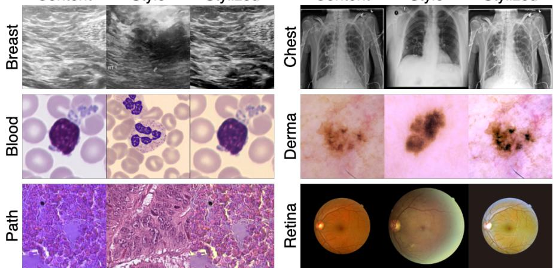
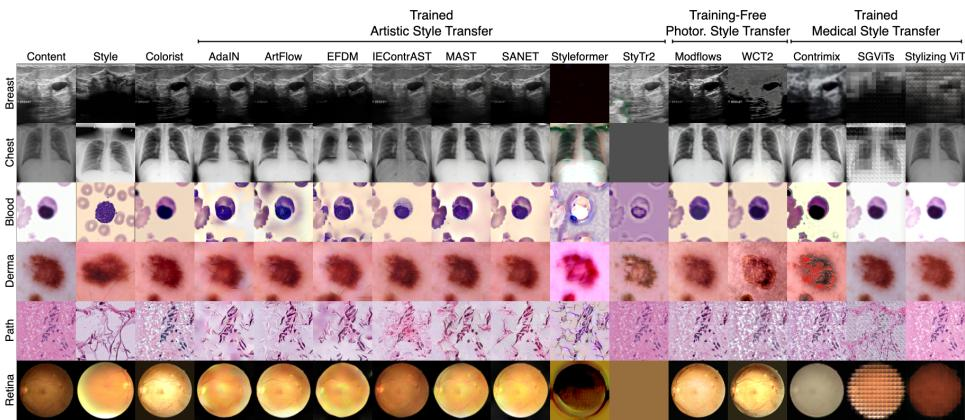

# Simple, Safe, and Overlooked: Reclaiming Sustainable Domain Generalization with Statistical Color Matching

Sebastian Doerrich, Francesco Di Salvo, Shyam Nandan Rai, Marco Lents, and Christian Ledig

xAILab Bamberg, University of Bamberg, Bamberg, Germany sebastian.doerrich@uni-bamberg.de

Abstract. Hardware shifts, color variations, and changing patient characteristics between development and deployment routinely break trained medical image classifiers. Existing remedies fall short: standard color jittering provides insuficient diversity, while deep generative style transfer algorithms hallucinate features, destroy clinically relevant structures, and waste massive compute resources. To address this, we revisit classical statistical color matching and repurpose it as Colorist, a highly eficient data augmentation strategy that applies global mean-standard deviation matching directly in the RGB color space. We demonstrate that this training-free, fully interpretable approach safely generates structurally intact domain variations, outperforming deep generative models in structural fidelity and color alignment. Across out-of-distribution histopathology, peripheral blood, dermatology, and retinal datasets, it improves balanced accuracy by up to +9 % over state-of-the-art domain generalization regularizers and by +13 % over an unaugmented baseline. Moreover, by avoiding neural networks in the augmentation loop, Colorist preserves anatomical structure, minimizes carbon footprint, and integrates seamlessly into standard dataloaders. Together, these findings establish statistical matching as a safe, interpretable, yet overlooked alternative to deep architectures for clinical robustness. Source code is available at https://github.com/sdoerrich97/colorist.

Keywords: Domain Generalization · Data Augmentation · Color Transfer · Medical Image Analysis · Sustainable AI · Interpretable AI

## 1 Introduction

Deploying deep learning-based decision support systems into unconstrained clinical environments requires models that withstand severe out-of-distribution (OOD) photometric shifts, such as variations in chemical staining and scanner calibration [39]. Since the target distribution is unknown before deployment and may shift continuously, aligning the training and test distributions in advance is infeasible. Regularizing the training process to learn domain-invariant representations [23,34,2,24] ofers only limited relief, as these techniques frequently fail to capture severe visual shifts. Data augmentation is a more practical alternative, yet existing strategies each introduce critical trade-ofs. Traditional heuristics enforce orientation invariance but cannot simulate complex photometric variation, whereas automated search algorithms [9,10,31,20] optimize transformation policies that often apply semantically unsafe operations and corrupt diagnostically relevant features. Modality-specific augmentations, such as stain color augmentation for histopathology [40], address photometric shift directly but do not generalize across modalities and remain limited in scope. Deep generative methods, in contrast, separate anatomical content from style to synthesize diverse photometric variation [32,15,16], but at a prohibitive training cost, a high carbon footprint, and a persistent risk of structural hallucination.

Content  
Style  
Stylized  
  
Content  
Style  
Stylized  
Fig. 1. Triplets of content, style, and stylized output images created by Colorist across six distinct medical modalities demonstrate that simple global RGB matching safely transfers photometric shifts without corrupting clinical anatomy.

To capture fine-grained color patterns without these computational and structural burdens, we revisit traditional statistical color matching [36] and repurpose it as Colorist, an overlooked yet highly efective training-time data augmentation strategy. Through a systematic evaluation of color spaces and matching algorithms, we show that global mean-standard deviation matching in the native RGB space performs competitively with decorrelated spaces, such as CIELAB or YCbCr, while remaining computationally cheaper. Because it relies exclusively on explicit mathematical equations rather than opaque black-box architectures, the resulting transformation is interpretable by design. This transparency makes Colorist a safe alternative to compute-heavy generative models, preserving the spatial anatomical layout exactly and thereby avoiding the structural hallucinations these models can introduce during color transfer (Fig. 1). Ultimately, Colorist enables higher downstream classification accuracy, when used during training, than established augmentation protocols and representation-based domain generalization methods. We validate this across an extensive suite of 12 in-distribution and 7 covariate-shifted OOD datasets, spanning multiple modalities and dataset scales. Our contributions can be summarized as follows:

– We revisit statistical color matching and repurpose it as Colorist, an eficient and interpretable training-time data augmentation strategy for robust outof-distribution generalization across diverse clinical environments.

We demonstrate that Colorist outperforms established, compute-heavy deep generative models in both color transfer quality and structural preservation. As a per-pixel afine transform, it preserves the spatial anatomical layout exactly and thereby avoids the structural hallucinations of deep generative models, while providing a more sustainable solution through reduced computational overhead and a lower carbon footprint.

– We systematically evaluate multiple statistical color spaces and matching methods, proving that global mean-standard deviation matching in the native RGB space performs competitively with complex decorrelated spaces while avoiding dataloader conversion bottlenecks.

– We conduct extensive empirical validation across 12 in-distribution and 7 covariate-shifted OOD datasets, confirming that Colorist surpasses, on average, established augmentation protocols and representation-based domain generalization methods across modalities and dataset sizes.

## 2 Methodology

Clinically relevant photometric shift, whether from staining or scanner calibration, manifests primarily as a change in each channel’s intensity distribution rather than in anatomy. This observation motivates statistical color matching: by aligning the first two moments of each color channel, we reproduce realistic photometric variation while leaving anatomical structure untouched, avoiding the structural risks and computational cost of deep generative models. Concretely, Colorist transfers the per-channel color statistics of a style image ${ \mathbf I } _ { s }$ onto a content image $\mathbf { I } _ { c } ,$ , a design we formalize below and justify against more complex distribution-matching alternatives.

Colorist To provide a fast, structure-preserving foundation that enables onthe-fly application during model training, Colorist treats the entire image as a single statistical region. The algorithm executes a global mean-variance matching independently for each native RGB color channel $C \in \{ R , G , B \}$ . For a pixel intensity $x _ { c }$ of a specific channel in the content image $\mathbf { I } _ { c }$ , the algorithm computes the transferred pixel value $x _ { c } ^ { \prime }$ as:

$$
x _ { c } ^ { \prime } = ( x _ { c } - \mu _ { c } ) \left( \frac { \sigma _ { s } } { \sigma _ { c } + \epsilon _ { v a r } } \right) + \mu _ { s }\tag{1}
$$

Here, $\mu$ and $\sigma$ denote the global mean and standard deviation of that specific channel for the respective images, and $\epsilon _ { v a r } = 1 0 ^ { - 8 }$ prevents division by zero. This simple linear transformation guarantees absolute preservation of the original anatomical layout.

Design Justification Operating at this statistical level provides substantial advantages over related distribution matching techniques. Unlike standard histogram matching, which aligns cumulative distribution functions and frequently induces color quantization, contouring artifacts, or unnatural color shifts [17], Colorist employs continuous linear scaling to preserve smooth, realistic gradients. Compared to Exact Histogram Matching (EHM) [8], which relies on pixelsorting algorithms with a complexity of O(N log N), Colorist calculates its first and second moments in linear O(N) complexity, maintaining high-throughput eficiency without compromising the training pipeline.

## 3 Experiments and Results

To assess the robustness of Colorist and validate our core hypothesis that technical simplicity outcompetes generative complexity, we design a three-phase evaluation suite. First, we evaluate multiple color spaces and matching methods to justify the native RGB mean-standard deviation design. Second, we compare Colorist against established style transfer methods to quantify structural fidelity and color alignment. Third, we evaluate downstream classification performance across an extensive array of in- and out-of-distribution (OOD) datasets.

To execute the initial color space evaluation and verify baseline anatomical integrity, we utilize the twelve 2D datasets from the MedMNIST+ collection [44] (2–11 classes [C2–C11]; CC BY 4.0 / CC BY-NC 4.0), following their oficial data splits. The remaining datasets simulate severe clinical covariate shifts to test downstream robustness. To evaluate robustness against scanner and hospital variations, we employ the Camelyon17-WILDS benchmark [5,25] ([C2]; CC0), training on hospitals H1 through H4 and testing on the unseen hospital H5. To assess robustness to staining protocol variations, we construct an Epithelium-Stroma benchmark ([C2]) that trains on H&E-stained breast cancer images [6] (Public Domain) and tests exclusively on IHC-stained colorectal cancer images [27] (CC BY 4.0). For algorithmic fairness across demographic skin tones, we partition the Fitzpatrick17k [18] ([C3]; CC BY-NC-SA 3.0) and Diverse Dermatology Images (DDI) [11] ([C2]; Custom Research Use) datasets by Fitzpatrick Skin Type (FST I-II train, FST III-IV val, FST V-VI test). To measure generalization across microscopes and cell preparation techniques, we design two hematology benchmarks: a peripheral blood setup ([C13]; training on MLL23 [38] and Acevedo20 [1], testing on Matek19 [29]) and a bone marrow-toperipheral blood shift task ([C13]; training on the BMC dataset [30], validation on Matek19, and testing on MLL23). All hematology datasets fall under CC BY 4.0. Finally, to evaluate robustness to fundus camera variations, we assemble a Retina dataset ([C5]) utilizing APTOS [4] (Non-Commercial Competition Use) and DeepDR [28] (Permissive) for training, IDRiD [35] (CC-BY 4.0) for validation, and MESSIDOR-2 [12] (Research Agreement) for testing. The chosen datasets range from 780 to 236,386 samples for MedMNIST+ and from approximately 650 to over 420,000 samples for the out-of-distribution clinical tasks. For standardization, we resize all images to 224×224 pixels via bilinear interpolation.

## 3.1 Validating the Eficiency of RGB Color Matching

To validate the architectural design of Colorist, we conduct a systematic evaluation focusing on two primary axes: the selection of the matching algorithm and the impact of the underlying color space. Experiments are performed using the training sets of the twelve MedMNIST+ datasets. For each dataset and across three random seeds, we randomly sample 800 content and 800 style images to generate 800 stylized outputs per configuration. To quantify anatomical preservation, we compute SSIM and LPIPS [46]. To measure the alignment of the color distributions, we evaluate FID [21] and the Wasserstein Distance. Finally, we report ArtFID [42] to assess anatomical retention and color alignment simultaneously. Table 1 reports average performance across all twelve datasets.

Results Regarding the first axis, we justify the selection of the mean-standard deviation matching algorithm through a comparative analysis. Independent Friedman tests conducted across all eleven evaluated color spaces consistently reveal statistically significant diferences in performance between the matching algorithms on the ArtFID metric (all $p \ < \ 0 . 0 1 )$ . Subsequent post-hoc two-tailed Wilcoxon signed-rank tests further confirm that across all evaluated color spaces, mean-standard deviation matching yields statistically significant improvements over standard Histogram matching and EHM (cf. for RGB: $p = 4 . 8 8 \times 1 0 ^ { - 4 } .$ $Z = - 3 . 0 6 , r = 0 . 8 8 )$ . Regarding the second axis, we evaluate the impact of the underlying color space. The results show that RGB mean-standard deviation matching reports statistically equivalent results (Wilcoxon on ArtFID with a Bonferroni correction of $\alpha = 0 . 0 0 4 2 )$ to both YCbCr $( p = 0 . 8 4 6 , Z = - 1 . 1 0$ $r = 0 . 3 2 )$ and CIELAB $( p = 0 . 0 4 2 , Z = - 2 . 0 4 , r = 0 . 5 9 )$ , respectively.

Table 1. This quantitative evaluation analyzes structural fidelity and color alignment using mean-standard deviation matching across diverse color spaces. Results are reported as mean values across all twelve MedMNIST+ datasets.
<table><tr><td rowspan="2">Color Space</td><td colspan="2">Structure</td><td colspan="2">Color</td><td>Fidelity</td></tr><tr><td>LPIPS ↓</td><td>SSIM ↑</td><td>FID ↓</td><td>W. Dist. ↓</td><td>ArtFID ↓</td></tr><tr><td>HED</td><td>0.30</td><td>0.74</td><td>55.21</td><td>0.09</td><td>76.27</td></tr><tr><td>HSI</td><td>0.17</td><td>0.82</td><td>39.26</td><td>0.05</td><td>49.49</td></tr><tr><td>HSV</td><td>0.16</td><td>0.81</td><td>33.51</td><td>0.05</td><td>42.48</td></tr><tr><td>CIELAB</td><td>0.11</td><td>0.84</td><td>26.78</td><td>0.04</td><td>31.18</td></tr><tr><td>LCH</td><td>0.15</td><td>0.81</td><td>31.18</td><td>0.05</td><td>38.16</td></tr><tr><td>LUV</td><td>0.12</td><td>0.83</td><td>27.27</td><td>0.04</td><td>31.83</td></tr><tr><td>YCbCr</td><td>0.11</td><td>0.84</td><td>26.30</td><td>0.04</td><td>30.61</td></tr><tr><td>YIQ</td><td>0.11</td><td>0.84</td><td>32.44</td><td>0.04</td><td>37.29</td></tr><tr><td>YPbPr</td><td>0.11</td><td>0.84</td><td>33.02</td><td>0.04</td><td>37.79</td></tr><tr><td>YUV</td><td>0.11</td><td>0.84</td><td>28.54</td><td>0.04</td><td>33.00</td></tr><tr><td>RGB</td><td>0.11</td><td>0.84</td><td>26.32</td><td>0.04</td><td>30.66</td></tr></table>

## 3.2 Color Transfer and Structural Fidelity Evaluation

We now evaluate how well Colorist generalizes across our entire suite of inand out-of-distribution clinical datasets. For this, we adopt the same evaluation protocol as before (800 image pairs, 3 random seeds) and benchmark Colorist against thirteen complex deep generative models: Photorealistic Style Transfer (Modflows [26], WCT2 [45]), Artistic Style Transfer (AdaIN [22], Art-Flow [3], EFDM [47], IEContrAST [7], MAST [13], SANET [33], Styleformer [43], StyTr2 [14]), and Medical Style Transfer (StylizingViT [16], ContriMix [32], SGViTs [15]). We train all artistic and medical style transfer methods from scratch on each dataset following their oficial guidelines and apply the general photorealistic methods out-of-the box without any fine-tuning.

Results Table 2 reports the quantitative evaluation averaged across all datasets (MedMNIST+ and all OOD datasets). Artistic style transfer models consistently demonstrate poor structural retention, characterized by low SSIM and high LPIPS scores. Training-free photorealistic methods preserve the anatomy more efectively but still fall short of Colorist, while specialized medical style transfer methods perform inconsistently across modalities or induce artifacts that degrade image quality. In contrast, Colorist strictly preserves clinical geometry and achieves the highest structural preservation (SSIM 0.84, LPIPS 0.12) alongside superior color alignment (FID 28.33, ArtFID 32.96), validating its role as a safe foundation for photometric data augmentation.

Table 2. Quantitative evaluation of structural fidelity and color alignment averaged across all datasets. Colorist successfully outperforms established deep learning architectures, achieving the best structural stability while transferring color statistics.
<table><tr><td rowspan="2">Method</td><td colspan="2">Structure</td><td colspan="2">Color</td><td>Fidelity</td></tr><tr><td>LPIPS ↓</td><td>SSIM ↑</td><td>FID ↓</td><td>W. Dist. ↓</td><td>ArtFID ↓</td></tr><tr><td>AdaIN [ICCV &#x27;17]</td><td>0.33</td><td>0.58</td><td>70.29</td><td>0.04</td><td>97.93</td></tr><tr><td>ArtFlow [CVPR &#x27;21]</td><td>0.27</td><td>0.60</td><td>52.91</td><td>0.03</td><td>70.88</td></tr><tr><td>EFDM [CVPR &#x27;22]</td><td>0.35</td><td>0.56</td><td>77.76</td><td>0.04</td><td>109.27</td></tr><tr><td>IEContrAST [NIPS &#x27;21]</td><td>0.25</td><td>0.70</td><td>56.28</td><td>0.08</td><td>72.76</td></tr><tr><td>MAST [ACM MM &#x27;20]</td><td>0.27</td><td>0.67</td><td>55.04</td><td>0.05</td><td>73.27</td></tr><tr><td>SANET [CVPR &#x27;19]</td><td>0.25</td><td>0.67</td><td>46.86</td><td>0.05</td><td>62.36</td></tr><tr><td>Styleformer [ICCV &#x27;21]</td><td>0.54</td><td>0.42</td><td>139.48</td><td>0.14</td><td>222.70</td></tr><tr><td>StyTr2 [CVPR &#x27;22]</td><td>0.52</td><td>0.60</td><td>231.49</td><td>0.19</td><td>380.79</td></tr><tr><td>Contrimix [COMPAY &#x27;24]</td><td>0.40</td><td>0.69</td><td>115.18</td><td>0.09</td><td>168.70</td></tr><tr><td>SGViTs [MICCAI &#x27;24]</td><td>0.41</td><td>0.67</td><td>146.46</td><td>0.08</td><td>231.61</td></tr><tr><td>StylizingViT [ISBI &#x27;26]</td><td>0.15</td><td>0.81</td><td>80.47</td><td>0.14</td><td>112.24</td></tr><tr><td>Modflows [AAAI &#x27;25]</td><td>0.15</td><td>0.83</td><td>35.06</td><td>0.04</td><td>41.93</td></tr><tr><td>WCT2 [ICCV &#x27;19]</td><td>0.16</td><td>0.81</td><td>34.97</td><td>0.04</td><td>42.27</td></tr><tr><td>Colorist</td><td>0.12</td><td>0.84</td><td>28.33</td><td>0.04</td><td>32.96</td></tr></table>

  
Fig. 2. Qualitative comparison across six imaging modalities shows that complex style transfer corrupts clinical geometry while Colorist maintains structural integrity.

We visually confirm these findings through a qualitative comparison across six medical modalities (Fig. 2). Deep generative methods consistently fail to provide safe photometric transformations while Colorist maintains clinical geometry and successfully transfers the photometric style without injecting artificial structures.

## 3.3 Downstream Classification Performance

To establish the eficacy of Colorist as a training-time augmentation, we evaluate downstream classification performance across our clinical benchmarks and report the balanced accuracy. We employ a DenseNet-121 classifier and compare Colorist against an unaugmented baseline, traditional heuristic augmentations [20,9,10,48,37,31], and established feature-space regularizers [41,2,23,34,24] from DomainBed [19]. All reference methods are applied using their default hyperparameters and protocols. We exclude domain-locked augmentations such as stain color normalization [40], whose modality-specific assumptions do not transfer across our benchmark. Colorist is applied online with a 30% probability, where for each source content image, we randomly sample a target style image directly from the training set. We train all methods independently on each dataset for 100 epochs across three seed runs using AdamW, cosine annealing (learning rate of 0.001), a batch size of 256, and early stopping (with 15 epochs).

Results Colorist attains the highest mean balanced accuracy (0.58) across the evaluated clinical shifts, outperforming both traditional augmentations and specialized domain generalization algorithms. As Table 3 details, standard geometric heuristics and basic color jittering fail to provide suficient photometric diversity to bridge severe domain gaps, such as the staining variation in the Epithelium-Stroma (Epi-Str) benchmark. Similarly, complex DomainBed regularizers struggle to learn invariant representations, often performing barely above the unaugmented baseline despite their higher computational cost.

Table 3. Balanced Accuracy on the test set of each dataset, reported as the mean across three seed runs. Dataset abbreviations: MM (average across all MedMNIST datasets), C17 (Camelyon17), E-S (Epi-Str), Fitz (Fitzpatrick), Bld (Blood), Bne (Bone), Ret (Retina). Colorist is bold when it ranks within the top three distinct values per column.
<table><tr><td>Method</td><td>MM</td><td>C17</td><td>E-S</td><td>Fitz</td><td>DDI</td><td>Bld</td><td>Bne</td><td>Ret</td><td>Avg</td></tr><tr><td>Baseline</td><td>0.79</td><td>0.63</td><td>0.61</td><td>0.36</td><td>0.48</td><td>0.31</td><td>0.16</td><td>0.22</td><td>0.45</td></tr><tr><td>AugMix [20] AutoAugment [9]</td><td>0.79</td><td>0.86</td><td>0.51</td><td>0.35</td><td>0.50</td><td>0.51</td><td>0.30</td><td>0.20</td><td>0.50</td></tr><tr><td></td><td>0.80</td><td>0.70</td><td>0.78</td><td>0.40</td><td>0.50</td><td>0.52</td><td>0.45</td><td>0.20</td><td>0.54</td></tr><tr><td>Color Jitter Gray Scale</td><td>0.78</td><td>0.94</td><td>0.71</td><td>0.39</td><td>0.50</td><td>0.50</td><td>0.36</td><td>0.19</td><td>0.55</td></tr><tr><td>RandAugment [10]</td><td>0.65</td><td>0.74</td><td>0.64</td><td>0.34</td><td>0.49</td><td>0.10</td><td>0.41</td><td>0.24</td><td>0.45</td></tr><tr><td>Random Erasing [48]</td><td>0.81</td><td>0.82</td><td>0.63</td><td>0.40</td><td>0.49</td><td>0.54</td><td>0.51</td><td>0.22</td><td>0.55</td></tr><tr><td>Random Flip</td><td>0.79</td><td>0.68</td><td>0.46</td><td>0.36</td><td>0.48</td><td>0.26</td><td>0.09</td><td>0.23</td><td>0.42</td></tr><tr><td>Random Resized Crop</td><td>0.76</td><td>0.69</td><td>0.49</td><td>0.40</td><td>0.47</td><td>0.29</td><td>0.20</td><td>0.23</td><td>0.44</td></tr><tr><td>Targeted Augment [37]</td><td>0.79</td><td>0.70</td><td>0.61</td><td>0.38</td><td>0.48</td><td>0.16</td><td>0.13</td><td>0.26</td><td>0.44</td></tr><tr><td>TrivialAugment [31]</td><td>0.80 0.81</td><td>0.83</td><td>0.47</td><td>0.40</td><td>0.50</td><td>0.50</td><td>0.27</td><td>0.20</td><td>0.50</td></tr><tr><td>ERM [41] IB-ERM [2]</td><td>0.79</td><td>0.78</td><td>0.69</td><td>0.39</td><td>0.50</td><td>0.56</td><td>0.44</td><td>0.19</td><td>0.55</td></tr><tr><td rowspan="2">RSC [23] SD [34]</td><td>0.79</td><td>0.79 0.79</td><td>0.65</td><td>0.38</td><td>0.50</td><td>0.34</td><td>0.14</td><td>0.17</td><td>0.47</td></tr><tr><td>0.78</td><td>0.82</td><td>0.66 0.80</td><td>0.37 0.37</td><td>0.50 0.50</td><td>0.32 0.32</td><td>0.21 0.12</td><td>0.17 0.18</td><td>0.48 0.49</td></tr><tr><td rowspan="2">SelfReg [24]</td><td>0.80</td><td>0.71</td><td>0.59</td><td>0.41</td><td>0.50</td><td>0.32</td><td>0.15</td><td>0.25</td><td>0.47</td></tr><tr><td>0.78</td><td>0.71</td><td>0.69</td><td>0.35</td><td>0.49</td><td>0.37</td><td>0.19</td><td>0.21</td><td>0.47</td></tr><tr><td>Colorist</td><td>0.79</td><td>0.93</td><td>0.87</td><td>0.40</td><td>0.50</td><td>0.44</td><td>0.46</td><td>0.21</td><td>0.58</td></tr></table>

## 4 Discussion and Conclusion

Our results show that the prevailing reliance on deep generative style transfer for medical domain generalization trades safety for capacity: such models risk structural hallucinations and incur substantial compute cost. Colorist avoids this trade-of by transferring only per-channel color statistics in RGB space, preserving diagnostic anatomy by construction. Across nineteen datasets, this simple operation matches or surpasses both generative augmentations and feature-space regularizers while remaining training-free, interpretable, and sustainable.

Limitations Colorist models photometric shift through global color statistics and therefore does not address diferences in acquisition geometry, spatial resolution, or anatomy. However, as a lightweight dataloader operation, it composes directly with the geometric and spatial augmentations that target these shifts. On the Retina, Blood, and Bone benchmarks, no evaluated method reaches strong balanced accuracy, and Colorist is no exception. The dificulty here is statistical rather than photometric: these tasks span up to thirteen classes and sufer pronounced class imbalance, leaving little for a color-based augmentation to exploit. Overcoming such regimes requires advances beyond training-time augmentation, such as imbalance-aware objectives or targeted sampling, which we leave to future work.

Acknowledgments. HPC resources were provided by the Erlangen National High Performance Computing Center (NHR@FAU) of Friedrich-Alexander-Universität Erlangen-Nürnberg (FAU). NHR@FAU hardware is partially funded by the German Research Foundation (DFG). This study was further funded through the Hightech Agenda Bayern (HTA) of the Free State of Bavaria, Germany.

Disclosure of Interests. The authors have no competing interests to declare that are relevant to the content of this article.

## References

1. Acevedo, A., et al.: Recognition of peripheral blood cell images using convolutional neural networks. Computer Methods and Programs in Biomedicine 180 (2019)

2. Ahuja, K., et al.: Invariance principle meets information bottleneck for out-ofdistribution generalization. NeurIPS (2021)

3. An, J., et al.: Artflow: Unbiased image style transfer via reversible neural flows. CVPR (2021)

4. Asia Pacific Tele-Ophthalmology Society: APTOS 2019 blindness detection (2019), kaggle Competition Dataset

5. Bandi, P., et al.: From detection of individual metastases to classification of lymph node status at the patient level: the camelyon17 challenge. IEEE Transactions on Medical Imaging (2018)

6. Beck, A.H., et al.: Systematic analysis of breast cancer morphology uncovers stromal features associated with survival. Science Translational Medicine 3(108) (2011)

7. Chen, H., et al.: Artistic style transfer with internal-external learning and contrastive learning. In: NeurIPS. vol. 34 (2021)

8. Coltuc, D., et al.: Exact histogram specification. IEEE Transactions on Image Processing 15(5), 1143–1152 (2006)

9. Cubuk, E.D., et al.: Autoaugment: Learning augmentation strategies from data. CVPR pp. 113–123 (2019)

10. Cubuk, E.D., et al.: Randaugment: Practical automated data augmentation with a reduced search space. NeurIPS 33, 18613–18624 (2020)

11. Daneshjou, R., et al.: Disparities in dermatology ai performance on a diverse, curated clinical image set. Science Advances 8(32) (2022)

12. Decencière, É.a.o.: FEEDBACK ON A PUBLICLY DISTRIBUTED IMAGE DATABASE: THE MESSIDOR DATABASE. Image Analysis and Stereology 33(3), 231–234 (2014)

13. Deng, Y., et al.: Arbitrary style transfer via multi-adaptation network. In: Acm International Conference on Multimedia. ACM (2020)

14. Deng, Y., et al.: Stytr2: Image style transfer with transformers. CVPR (2022)

15. Doerrich, S., et al.: Self-supervised vision transformer are scalable generative models for domain generalization. MICCAI pp. 644–654 (2024)

16. Doerrich, S., et al.: Stylizing vit: Anatomy-preserving instance style transfer for domain generalization (2026)

17. Faridul, H.S., et al.: A Survey of Color Mapping and its Applications. In: Eurographics 2014 - State of the Art Reports (2014)

18. Groh, M., et al.: Evaluating deep neural networks trained on clinical images in dermatology with the fitzpatrick 17k dataset. CVPRW pp. 1820–1828 (2021)

19. Gulrajani, I., Lopez-Paz, D.: In search of lost domain generalization. ICLR (2021)

20. Hendrycks, D., et al.: AugMix: A simple data processing method to improve robustness and uncertainty. ICLR (2020)

21. Heusel, M., et al.: Gans trained by a two time-scale update rule converge to a local nash equilibrium. NeurIPS 30 (2017)

22. Huang, X., Belongie, S.: Arbitrary style transfer in real-time with adaptive instance normalization. ICCV (2017)

23. Huang, Z., et al.: Self-challenging improves cross-domain generalization. ECCV pp. 124–140 (2020)

24. Kim, D., et al.: Selfreg: Self-supervised contrastive regularization for domain generalization. ICCV pp. 9619–9628 (2021)

25. Koh, P.W., et al.: Wilds: A benchmark of in-the-wild distribution shifts. ICML 139, 5637–5664 (2021)

26. Larchenko, M., et al.: Color transfer with modulated flows. AAAI 39(4) (2025)

27. Linder, N., et al.: Identification of tumor epithelium and stroma in tissue microarrays using texture analysis. Diagnostic Pathology 7, 1–11 (2012)

28. Liu, R., et al.: DeepDRiD: Diabetic Retinopathy Grading and Image Quality Estimation Challenge. Patterns 3(6) (2022)

29. Matek, C., et al.: Human-level recognition of blast cells in acute myeloid leukaemia with convolutional neural networks. Nature Machine Intelligence 1(11), 538–544 (2019)

30. Matek, C., et al.: Highly accurate diferentiation of bone marrow cell morphologies using deep neural networks on a large image data set. Blood 138(20), 1917–1927 (2021)

31. Müller, S.G., Hutter, F.: Trivialaugment: Tuning-free yet state-of-the-art data augmentation. ICCV pp. 774–782 (2021)

32. Nguyen, T.H., et al.: Contrimix: Scalable stain color augmentation for domain generalization without domain labels in digital pathology. MICCAI Workshop on Computational Pathology 254, 121–130 (2024)

33. Park, D.Y., Lee, K.H.: Arbitrary style transfer with style-attentional networks. CVPR pp. 5873–5881 (2018)

34. Pezeshki, M., et al.: Gradient starvation: A learning proclivity in neural networks. NeurIPS (2021)

35. Porwal, P., et al.: Indian diabetic retinopathy image dataset (idrid): A database for diabetic retinopathy screening research. Data 3(3) (2018)

36. Reinhard, E., et al.: Color transfer between images. IEEE Computer Graphics and Applications 21(5), 34–41 (2001)

37. Salvo, F.D., et al.: Medmnist-c: Comprehensive benchmark and improved classifier robustness by simulating realistic image corruptions (2024)

38. Shetab Boushehri, S., et al.: A large expert-annotated single-cell peripheral blood dataset for hematological disease diagnostics. Scientific Data 12(1), 1773 (2025)

39. Stacke, K., et al.: Measuring domain shift for deep learning in histopathology. IEEE Journal of Biomedical and Health Informatics 25, 325–336 (2021)

40. Tellez, D., et al.: Quantifying the efects of data augmentation and stain color normalization in convolutional neural networks for computational pathology. Medical Image Analysis 58, 101544 (2019)

41. Vapnik, V.N.: Statistical Learning Theory. Wiley-Interscience (1998)

42. Wright, M., Ommer, B.: Artfid: Quantitative evaluation of neural style transfer. In: Pattern Recognition. pp. 560–576 (2022)

43. Wu, X., et al.: Styleformer: Real-time arbitrary style transfer via parametric style composition. ICCV pp. 14618–14627 (2021)

44. Yang, J., et al.: Medmnist v2-a large-scale lightweight benchmark for 2d and 3d biomedical image classification. Scientific Data 10(1), 41 (2023)

45. Yoo, J., et al.: Photorealistic style transfer via wavelet transforms. ICCV pp. 9035– 9044 (2019)

46. Zhang, R., et al.: The unreasonable efectiveness of deep features as a perceptual metric. CVPR pp. 586–595 (2018)

47. Zhang, Y., et al.: Exact feature distribution matching for arbitrary style transfer and domain generalization. CVPR pp. 8025–8035 (2022)

48. Zhong, Z., et al.: Random erasing data augmentation. AAAI (2020)