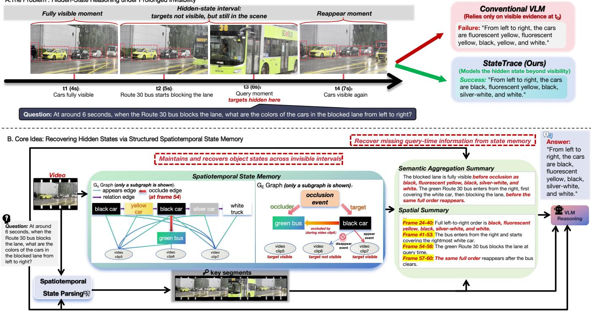
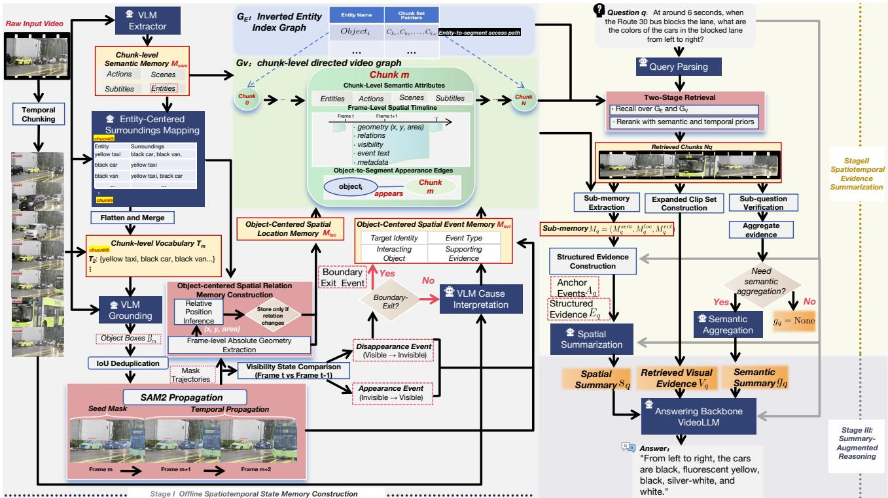
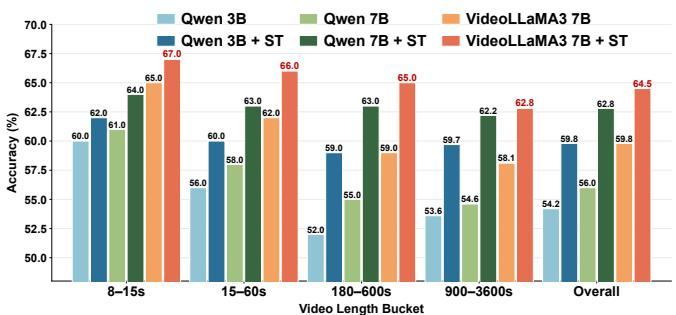
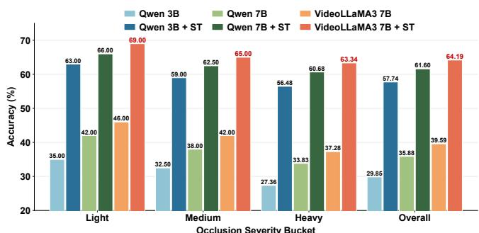
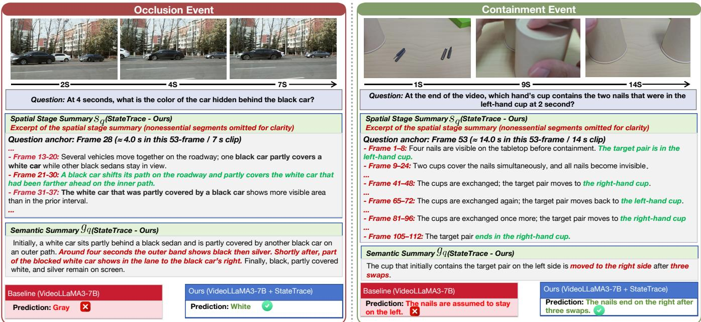

# StateTrace: An Object-Centric Framework for Hidden-State Spatiotemporal Reasoning in Long Videos

Yu Han∗   
University of California, San Diego   
San Diego, California, United States yuh162@ucsd.edu   
Hongyan Xu   
Central South University   
Changsha, China   
hongyanxu@csu.edu.cn   
Wenhao Li∗   
The University of Sydney   
Sydney, Australia   
li58843972@163.com   
Shuo Yang   
Harbin Institute of Technology   
(Shenzhen)   
Shenzhen, China   
shuoyang@hit.edu.cn   
Xiu Su✉   
Central South University   
Changsha, China   
xiusu1994@csu.edu.cn   
Yichao Cao   
Central South University   
Changsha, China   
caoyichao@csu.edu.cn   
Shan You   
SenseTime Research   
Beijing, China   
youshan@acerobotics.com

## Abstract

Existing VLMs have achieved strong performance in video understanding, yet they struggle with long-video spatiotemporal reasoning when target objects become invisible, often mistaking “invisible” for “unknown”. We define this challenge as hidden-state spatiotemporal reasoning: inferring object states during prolonged invisible intervals from context interactions. To address this, we propose StateTrace, a novel object-centric framework that endows VideoLLMs with an explicit mechanism for hidden state reasoning in long videos. StateTrace builds a reusable spatiotemporal state memory that organizes object trajectories, inter-object relations, and state-transition events into a structured reasoning substrate. At inference time, it retrieves question-relevant state-evolution trajectories and converts them into compact reasoning cues, enabling the model to explicitly reason about why an object disappears, how its state evolves while invisible, and whether that state should persist at query time. We further build HSR-Bench, a diagnostic benchmark for hidden-state reasoning, containing 1,427 video-QA samples from 1,384 unique videos. Extensive experiments across multiple VideoLLMs show that StateTrace consistently improves performance on both public benchmarks and HSR-Bench(e.g., improving VideoLLaMA3 from 39.6 to 64.2 on HSR-Bench).

## CCS Concepts

• Computing methodologies → Computer vision.

Keywords Video Understanding, VLM, Hidden-State Reasoning

ACM Reference Format:   
Yu Han, Wenhao Li, Yichao Cao, Hongyan Xu, Shuo Yang, Shan You, and Xiu Su. 2026. StateTrace: An Object-Centric Framework for Hidden-State Spatiotemporal Reasoning in Long Videos. In Proceedings of the 34th ACM International Conference on Multimedia (MM ’26), November 10–14, 2026, Rio de Janeiro, Brazil. ACM, New York, NY, USA, 10 pages. https://doi.org/10. 1145/3767308.3835004

## 1 Introduction

In recent years, vision-language models (VLMs) [1, 10, 19, 30] have made significant progress in open-ended video understanding [29, 34, 52] and shown strong performance on video captioning [58], temporal localization [57], and video question answering [34]. Yet they remain fundamentally weak at hidden-state video reasoning [49, 53, 66]: once a target object becomes invisible, they often fail to infer its state. For example, if a pen is placed into a pencil case early in a video and does not appear again, then when asked where the pen is at the end of the video, humans can infer that, absent later evidence that it was taken out, it remains in the pencil case. Existing VLMs, however, often over-rely on explicit visual evidence and lack the ability to model the hidden states of temporarily invisible objects. As a result, when queried about the end of the video, they attend mainly to end-of-video visual cues and fail because the pen is not directly visible.

This limitation is especially pronounced in long videos [2, 6], where objects may remain invisible for extended periods due to occlusion, containment, or covering, and the query may occur long after their last visible moment. Answering such questions requires more than short-term temporal modeling [16, 37] or clip-level retrieval [18, 55]; models must preserve object identity, retain the latest spatial relations or key events, and determine whether the state persists without contradictory evidence. We define this capability as hidden-state spatiotemporal reasoning: inferring a target’s latent state during prolonged invisibility from prior interactions and state changes. However, most video-understanding enhancement methods [11, 38, 50, 52] remain evidence-driven, aggregating visible observations [59, 61], compressing video content [17, 32], or retrieving relevant clips [18, 55], without explicitly modeling disappearance causes or state persistence. Consequently, they often equate “invisible” with “unknown.”

A.The Problem : Hidden-State Reasoning under Prolonged Invisibility  
  
Figure 1: A) Illustration of hidden-state spatiotemporal reasoning; B) StateTrace: Augmented with state summaries.

To address this challenge, we propose StateTrace, an objectcentric framework for hidden-state reasoning in long videos. For each video, StateTrace performs an ofline parsing pass in advance to discover objects, track trajectories, extract spatial relations, and identify state-transition events such as put-into, covered-by, occludedby, and removed-from. These signals are unified into a reusable spatiotemporal state memory that captures object appearances, interactions, invisibility causes, and persistent latent states. At inference time, StateTrace retrieves query-relevant evidence from this memory, reconstructs the target state-evolution trajectory, and summarizes it into compact reasoning cues, which are combined with key video segments and global context to support explicit latent-state reasoning.

Beyond methodology, we introduce HSR-Bench, a diagnostic benchmark for Hidden-State Reasoning in long videos, since existing benchmarks [8, 12, 41, 54] under-evaluate this capability. HSR Bench contains 1,427 video-QA samples from 1,384 videos and targets object persistence and latent-state inference under occlusion, containment, covering, and long-delay querying. Experiments show that StateTrace consistently improves strong VideoLLMs, including InternVL2.5 [9], Qwen2.5-VL [4], and VideoLLaMA3 [60], on both public benchmarks and HSR-Bench, with especially large gains of about 15%–28% on HSR-Bench. Our contributions are as follows:

(1) We propose and systematically formulate the problem of hidden-state spatiotemporal reasoning in long-video question answering, identifying persistent state modeling during object invisibility as a core missing capability of existing VideoLLMs and a major source of failure in complex longhorizon spatial reasoning.

(2) We introduce StateTrace, a novel object-centric framework that equips VideoLLMs with an explicit mechanism for hiddenstate reasoning. It transforms long-video reasoning from purely direct visual evidence-driven into structured statecentric reasoning over latent object dynamics.

(3) We establish HSR-Bench, a new diagnostic benchmark for hidden-state spatiotemporal reasoning in long videos. HSR-Bench covers diverse challenging scenarios and provides a dedicated testbed for evaluating object persistence and hidden-state inference beyond visible evidence.

## 2 Related Work

Vision-Language Models for Video Understanding. Recent VLMs for video understanding [7, 40, 43, 45] typically convert videos into frame- [22, 44] or clip-level [27, 28] visual tokens and align them with LLMs [5, 13, 25, 46, 47] for question answering and reasoning. Early systems such as Video-LLaMA, Video-ChatGPT, Video-LLaVA, and VideoChat [20] established this paradigm for video-grounded dialogue and video question answering. Later models expanded Video-LLM capabilities: LLaVA-Video [63] introduced richer video instruction tuning, while Qwen2-VL [48], VideoLLaMA3, and InternVL2.5 improved perception and multimodal reasoning through stronger visual encoders, tighter cross-modal alignment, and more scalable video representations [26]. However, these models remain limited in fine-grained spatiotemporal reasoning, especially when target objects are temporarily invisible or heavily occluded.

Spatiotemporal-Augmented Vision-Language Models for Video Understanding. To improve spatiotemporal reasoning, recent works augment VLMs along temporal, spatial, and joint dimensions [23, 24]. Temporally, TimeChat [42] introduces timestampaware encoding, while MovieChat [45] adopts memory-based designs for long-video understanding. Video-RAG [33] and FlexSelect [62] further enhance long-video reasoning through context retrieval, selection, and compression. Spatially, PG-Video-LLaVA [36] provides pixel-level grounding, VISA [56] combines language-guided reasoning with mask prediction, and ViLLa [64] models object dynamics with track-level representations. Other studies jointly strengthen spatial and temporal modeling through fine-grained perception and global context [35], in-model spatiotemporal dependency modeling [31], or visual supervision with long-context compression [21, 51]. Yet these methods still struggle in occlusionheavy videos, where reasoning requires persistent hidden-state tracking beyond visible evidence.

## 3 Method

## StateTrace consists of three stages:

Ofline Spatiotemporal State Memory Construction: This stage parses the video ofline to build an object-centric spatiotemporal state memory that stores information like object states, relations, and visibility-transition evidence over time.

Question-Driven State Trajectory Summarization: Given a question, the system retrieves question-relevant evidence from the state memory and summarizes it into complementary semantic and spatial representations.

Summary-Augmented Answer Generation: The system combines the retrieved visual evidence and the generated summaries to construct the final input for VideoLLM-based answer generation.

## 3.1 Hidden-State Spatiotemporal Reasoning

Hidden-state spatiotemporal reasoning refers to answering a question � about a video � using both visible evidence and the latent state of a temporarily invisible target object. We consider cases where the object is initially visible but later becomes invisible due to occlusion, containment, or covering while remaining in the scene; this period is a hidden-state interval. Formally, the task is $\hat { a } = F ( V , q )$ , where � reasons over visible observations and latent object states.

## 3.2 Stage I: Ofline Spatiotemporal State Memory Construction

3.2.1 Graph-Based Organization of the Spatiotemporal Memory. The reusable ofline memory is stored in a chunk-level directed graph, denoted by $G _ { V ; }$ , whose segment nodes correspond to video chunks $\{ C _ { m } \} _ { m = 1 } ^ { K }$ . Each segment node in $G _ { V }$ serves as a memory carrier that organizes chunk-level semantic context together with frame-level spatial timelines and event records. In addition, we construct an auxiliary graph $G _ { E } ,$ which acts as an entity-level access structure over $G _ { V } { : }$ it maps entity names to the relevant chunk sets and supports eficient entity-to-segment retrieval, but does not store the memory content.

For clarity, we decompose the memory into three components:

$$
M = ( M _ { \mathrm { { s e m } } } , M _ { \mathrm { l o c } } , M _ { \mathrm { e v t } } ) ,\tag{1}
$$

where $M _ { \mathrm { s e m } }$ denotes chunk-level semantic context, $M _ { \mathrm { l o c } }$ denotes object-centered spatial location memory, and $M _ { \mathrm { e v t } }$ denotes objectcentered spatial event memory.

Specifically, $M _ { \mathrm { s e m } }$ is stored on the segment nodes of $G _ { V }$ as semantic attributes, including entities, actions, scenes, and subtitles.

For $M _ { \mathrm { l o c } } .$ the absolute geometry of object $o _ { i }$ at sampled frame � in chunk $C _ { m }$ is represented as

$$
p _ { i } ^ { m , t } = ( x _ { i } ^ { m , t } , y _ { i } ^ { m , t } , a _ { i } ^ { m , t } ) ,\tag{2}
$$

where $x _ { i } ^ { m , t }$ and $y _ { i } ^ { m , t }$ are the normalized image-space centroid coordinates of $o _ { i ; }$ , and $a _ { i } ^ { m , t }$ is its area. Pairwise spatial relations are represented as

$$
r _ { i j } ^ { m , t } = ( o _ { i } , o _ { j } , \rho _ { i j } ^ { m , t } , c _ { i j } ^ { m , t } ) ,\tag{3}
$$

where $\rho _ { i j } ^ { m , t }$ denotes the relative spatial relation between $o _ { i }$ and $o _ { j } .$ and $c _ { i j } ^ { m , t }$ is an optional confidence score. These location records are written into the frame-level timelines associated with the corresponding segment nodes in $G _ { V }$ , with relations stored only when they change from the previous frame.

For $M _ { \mathrm { e v t } } .$ , the event memory at frame � in chunk $C _ { m }$ is represented as

$$
e ^ { m , t } = ( v ^ { m , t } , \epsilon ^ { m , t } , \mu ^ { m , t } ) ,\tag{4}
$$

where $v ^ { m , t }$ denotes target visibility, $\epsilon ^ { m , t }$ denotes textual event descriptions, and $\mu ^ { m , t }$ denotes structured event metadata, including event types, supporting attributes, and evidence such as VLMinferred disappearance causes. These event records are stored in the same frame-level timelines of the corresponding segment nodes in $G _ { V }$ . In addition, object occurrence is marked through auxiliary object-to-segment appears edges in $G _ { V }$

In this way, $G _ { V }$ functions as the main carrier of reusable spatiotemporal memory, while $G _ { E }$ serves only as an auxiliary access graph that facilitates later entity-centered retrieval and reasoning.

3.2.2 Object-Centric Spatiotemporal Parsing. We first divide the video into consecutive chunks $\{ C _ { m } \} _ { m = 1 } ^ { K }$ and use a VLM extractor $\varepsilon$ to obtain chunk-level semantics:

$$
S _ { m } = \mathcal { E } ( C _ { m } ) ,\tag{5}
$$

where $S _ { m } .$ , together with aligned subtitles, forms $M _ { \mathrm { s e m } }$ for later retrieval and reasoning.

StateTrace then performs object grounding and mask propagation within each chunk, maintaining cross-chunk continuity through IoU-based association. For each semantic entity, we identify surrounding objects and retain the entity-to-surroundings mapping for relative-position reasoning and occlusion-event interpretation. The entities and surrounding objects are flattened into a chunk-level vocabulary $T _ { m }$ for subsequent grounding.

VLM grounding. For each tracking segment, spatial parsing begins from its first frame. Given the chunk-specific grounding vocabulary $T _ { m } ,$ we use a VLM grounding module $\mathcal { G }$ to obtain object-level bounding boxes:

$$
B _ { m } = { \cal G } ( f _ { t _ { m } } , T _ { m } ) ,\tag{6}
$$

  
Figure 2: Overview of StateTrace. The pipeline consists of three stages: (I) ofline spatiotemporal state memory construction, (II) query-time retrieval and spatiotemporal evidence summarization, and (III) final answer generation with evidence.

where $B _ { m }$ denotes the resulting set of object boxes. Since diferent lexical items in $T _ { m }$ may produce highly overlapping detections for the same object, we further apply IoU-based deduplication to remove redundant boxes, yielding the deduplicated box set ${ \tilde { B } } _ { m }$

SAM2 propagation. We use the SAM2 image predictor I to convert the deduplicated boxes on the first frame into seed masks, and then use the SAM2 video predictor $\mathcal { P }$ to propagate them temporally over the current segment:

$$
Z _ { m } ^ { 0 } = \mathcal { I } ( f _ { t _ { m } } , \tilde { B } _ { m } ) ,\tag{7}
$$

$$
Z _ { m } = \mathcal { P } ( Z _ { m } ^ { 0 } , C _ { m } ) ,\tag{8}
$$

Cross-chunk continuity is maintained by matching masks propagated from the previous segment with newly generated masks at the current boundary using mask-level IoU. Here, $Z _ { m }$ denotes the final propagated mask trajectories, which constitute the output of spatiotemporal parsing.

3.2.3 Object-CenteredSpatial Relation MemoryConstruction. Based on the obtained spatiotemporal mask trajectories, we construct $M _ { \mathrm { l o c } }$ by deriving both absolute object geometry and pairwise spatial relations at the frame level. For each sampled frame in chunk $C _ { m } ,$ we first recover the retained target and surrounding objects from the propagated masks, and compute their image-space centroids and areas. Formally, for object $o _ { i }$ at frame $t ,$ its normalized absolute geometry is obtained as

$$
x _ { i } ^ { m , t } = \frac { c _ { x , i } ^ { m , t } } { W ^ { m , t } } , \qquad y _ { i } ^ { m , t } = \frac { c _ { y , i } ^ { m , t } } { H ^ { m , t } } , \qquad a _ { i } ^ { m , t } = | \Omega _ { i } ^ { m , t } | ,\tag{9}
$$

where $c _ { x , i } ^ { m , t }$ and $c _ { y , i } ^ { m , t }$ denote the image-space centroid coordinates of $o _ { i } , W ^ { m , t }$ and $H ^ { m , t }$ denote the frame width and height, and $| \Omega _ { i } ^ { m , t } |$ denotes the object area. The target–surroundings mappings are inherited from the object-centric spatiotemporal parsing stage.

Relative positional relations are determined from normalized centroid ofsets and inter-object distances. Formally, the positional relation inference can be written as

$$
( \rho _ { i j } ^ { m , t } , c _ { i j } ^ { m , t } ) = \Phi \Big ( \Delta x _ { i j } ^ { m , t } , \Delta y _ { i j } ^ { m , t } , d _ { i j } ^ { m , t } \Big ) ,\tag{10}
$$

where $\rho _ { i j } ^ { m , t }$ denotes the discrete relation label between $o _ { i }$ and $o _ { j } .$ and $( \Delta x _ { i j } ^ { m , t } , \Delta y _ { i j } ^ { m , t } , d _ { i j } ^ { m , t } )$ are the corresponding geometric cues. In practice, Φ maps them to labels such as left, right, above, or below, together with a distance level of near, mid, or far. The continuous geometric quantities are stored as auxiliary fields with the confidence score $c _ { i j } ^ { m , t }$ , which decreases with inter-object distance. To reduce redundancy, only relations whose $( o _ { i } , o _ { j } , \rho _ { i j } ^ { m , t } )$ label changes from the previous frame are written into the spatial timeline.

3.2.4 Object-Centered Spatial Event Memory Construction. To construct $M _ { \mathrm { e v t } } ,$ , StateTrace extracts frame-level events from the tracking results and writes them into $e ^ { m , t }$ . For each target object, visibility at each sampled frame is compared with the previous frame. Invisible-to-visible transitions are treated as appearance events, and visible-to-invisible transitions as disappearance events. These transitions are written into $\epsilon ^ { m , t }$ and $\mu ^ { m , t }$ , while per-target visibility states are recorded in $v ^ { m , t }$ ; object appearance is additionally marked by object-to-segment appears edges.

Boundary-exitfiltering. For a disappearance event of object $o _ { i : }$ StateTrace first distinguishes boundary exit from within-frame disappearance. Let $Z _ { i } ^ { m , t }$ denote the mask of $o _ { i }$ at its last visible frame, and let �Ω denote the image boundary region. We compute the boundary contact ratio as

$$
\beta _ { i } ^ { m , t } = \frac { | Z _ { i } ^ { m , t } \cap \partial \Omega | } { | Z _ { i } ^ { m , t } | } ,\tag{11}
$$

which measures how much of the object support touches the image boundary. If $\cdot \beta _ { i } ^ { m , t } \geq \tau _ { b } .$ , the transition is interpreted as boundary exit and written as a left-frame event. Otherwise, StateTrace treats it as a non-boundary disappearance and triggers further cause analysis.

VLM-based disappearance-cause interpretation. For each nonboundary disappearance, StateTrace infers its cause from a short video-context centered on the disappearance moment and assembled from a configurable number of preceding and following chunks:

$$
\hat { \tau } _ { i , \mathrm { d i s p } } ^ { m , t } = D ( \{ f _ { t - k } , \ldots , f _ { t } \} , o _ { i } , \mathrm { c o n t e x t } ) ,\tag{12}
$$

where � is the disappearance-cause inference module. The predicted cause is mapped to one of four outcomes: inside, occluded, other, or unknown. For inside and occluded, the interacting object can be further aligned to candidates derived from the target– surroundings mapping. The final result is written into $\epsilon ^ { m , t }$ and $\mu ^ { m , t }$ including the event type, target identity, interacting object when available, and supporting evidence.

## 3.3 Stage II: Question-Driven Spatiotemporal Evidence Summarization

Instead of directly using the full spatiotemporal state memory �, we retrieve a question-relevant subset and construct a summary representation $S _ { q } .$ This stage produces two complementary summaries: a semantic summary, when available, that condenses answer-relevant information from retrieved segments, and a spatial summary that captures spatiotemporal evidence from selected video segments. Together, they support answer generation while reducing key-information selection dificulty in long contexts.

3.3.1 Question-Guided Retrieval and Evidence Extraction. Given a question �, StateTrace converts it into a structured query:

$$
\Psi ( q ) = ( Q _ { q } , \ell _ { q } , t _ { q } ) ,\tag{13}
$$

where $Q _ { q }$ contains semantic query items, $\ell _ { q }$ contains retrieval and reasoning controls, and $t _ { q }$ specifies temporal constraints when available. We obtain $\Psi ( q )$ by prompting a language model to extract keywords, control signals, and temporal specifications, followed by rule-based normalization.

StateTrace then retrieves relevant chunks in two stages. It first forms an initial candidate set by combining entity-to-chunk lookup through $G _ { E }$ with semantic matching over segment attributes in $G _ { V } { : }$

$$
N _ { q } ^ { ( 0 ) } = { \cal R } _ { \mathrm { r e c a l l } } ( Q _ { q } , \ell _ { q } , t _ { q } ; G _ { V } , G _ { E } ) .\tag{14}
$$

The candidates $N _ { q } ^ { ( 0 ) }$ are then reranked by semantic similarity. When temporal constraints are available, $t _ { q }$ serves as a soft prior favoring chunks consistent with the specified time or coarse anchors near the video beginning or end:

$$
N _ { q } = { \cal R } _ { \mathrm { r a n k } } ( N _ { q } ^ { ( 0 ) } , Q _ { q } , t _ { q } ; G _ { V } ) .\tag{15}
$$

The resulting set $N _ { q }$ is used to extract the corresponding fields from $G _ { V }$ , forming the question-relevant sub-memory:

$$
M _ { q } = ( M _ { \mathrm { s e m } } ^ { q } , M _ { \mathrm { l o c } } ^ { q } , M _ { \mathrm { e v t } } ^ { q } ) ,\tag{16}
$$

where $M _ { \mathrm { s e m } } ^ { q } , M _ { \mathrm { l o c } } ^ { q }$ , and $M _ { \mathrm { e v t } } ^ { q }$ are the semantic attributes, spatial timelines, and event records stored on the retrieved segment nodes. Thus, retrieval operates over graph-organized memory, while evidence extraction selects the relevant fields associated with the retrieved chunks.

3.3.2 Semantic Aggregation and Spatial Summarization. StateTrace compresses the retrieved sub-memory $M _ { q }$ into two complementary question-driven summaries for the reasoning model: a semantic aggregation summary $g _ { q }$ and a spatial summary $s _ { q } .$

For semantic aggregation, StateTrace verifies decomposed subquestions over the retrieved chunks and organizes answer-relevant evidence into an aggregated text $x _ { q } ^ { \mathrm { a g g } }$ . When multi-segment reasoning is required and $x _ { q } ^ { \mathrm { a g g } }$ is non-empty, a language model compresses it into:

$$
g _ { q } = \Gamma ( x _ { q } ^ { \mathrm { a g g } } , q ) ,\tag{17}
$$

where Γ maps the aggregated evidence and question to the final semantic summary.

For spatial summarization, StateTrace expands the top retrieved chunks with disappearance-related chunks and their immediate predecessors, then merges their frame-level timelines. From these records, it constructs structured spatial–temporal evidence $E _ { q } ,$ which compacts salient relations, repairs visibility states, and preserves frame-level object, event, and visibility information. It also extracts anchor events $A _ { q } { \mathrm { : } }$ , a sparse set of key disappearance-, occlusion-, entry-, and reappearance-related transitions with corresponding frames. Thus, $E _ { q }$ provides structured temporal context, while $A _ { q }$ highlights critical state transitions. The spatial summary is generated as:

$$
s _ { q } = S ( E _ { q } , A _ { q } , q ) ,\tag{18}
$$

where � denotes spatial summarization. In implementation, � prompts a multimodal model with $E _ { q } , A _ { q } ,$ allowed frame indices, and the corresponding video clip, followed by post-processing for summary formatting, visibility repair, strong-claim sanitization, and frame-range filtering.

## 3.4 Stage III: Summary-Augmented Answer

The third stage of StateTrace performs final answer generation by combining the summaries from Stage II with the retrieved visual evidence. Given a question �, aligned subtitle context $S _ { q } ^ { \mathrm { s u b } }$ , and retrieved visual evidence $V _ { q } { \mathrm { ; } }$ StateTrace constructs a multimodal answer input. Its textual part integrates the question, subtitle context, and the summaries $( g _ { q } , s _ { q } )$ , while its visual part consists of the corresponding video chunks.

The final prediction is then generated by a VideoLLM $M _ { \mathrm { a n s } }$ as

$$
\hat { a } = M _ { \mathrm { a n s } } ( q , S _ { q } ^ { \mathrm { s u b } } , V _ { q } , g _ { q } , s _ { q } ) ,\tag{19}
$$

This formulation is model-agnostic and can be instantiated with diferent VideoLLM backbones, as examined in the experiments.

Table 1: Main results on public video QA benchmarks. State-Trace is compared with base VideoLLMs and other enhancement methods across diferent benchmarks. The best result in each column is shown in bold.
<table><tr><td rowspan="2">Model</td><td rowspan="2"></td><td rowspan="2">Size MLVU</td><td colspan="2">VideoMME</td><td rowspan="2">LVB</td></tr><tr><td></td><td>w/o sub. w/ sub.</td></tr><tr><td>InternVL2.5 [9]</td><td>2B</td><td>61.4</td><td>51.9</td><td>54.1</td><td>52.0</td></tr><tr><td>InternVL2.5 + Video-RAG [33]</td><td>2B</td><td>62.4</td><td>52.4</td><td>54.8</td><td>53.1</td></tr><tr><td>InternVL2.5 + FlexSelect [62]</td><td>2B</td><td>63.0</td><td>52.6</td><td>55.3</td><td>54.0</td></tr><tr><td>InternVL2.5 + StateTrace (Ours)</td><td>2B</td><td>64.0</td><td>52.8</td><td>56.0</td><td>56.3</td></tr><tr><td>VideoLLaMA3 [60]</td><td>2B</td><td>65.4</td><td>59.6</td><td>63.4</td><td>57.1</td></tr><tr><td>VideoLLaMA3 + Video-RAG [33]</td><td>2B</td><td>66.5</td><td>60.0</td><td>64.2</td><td>57.9</td></tr><tr><td>VideoLLaMA3 + FlexSelect [62]</td><td>2B</td><td>67.4</td><td>60.2</td><td>64.8</td><td>58.8</td></tr><tr><td>VideoLLaMA3 + StateTrace (Ours)</td><td>2B</td><td>68.9</td><td>60.5</td><td>65.4</td><td>61.0</td></tr><tr><td>Qwen2.5-VL [4]</td><td>3B</td><td>68.2</td><td>61.5</td><td>67.6</td><td>54.2</td></tr><tr><td>Qwen2.5-VL + Video-RAG [33]</td><td>3B</td><td>69.3</td><td>61.8</td><td>68.2</td><td>55.4</td></tr><tr><td>Qwen2.5-VL + FlexSelect [62]</td><td>3B</td><td>70.1</td><td>62.0</td><td>68.7</td><td>56.3</td></tr><tr><td>Qwen2.5-VL + StateTrace (Ours)</td><td>3B</td><td>71.8</td><td>62.3</td><td>69.2</td><td>59.8</td></tr><tr><td>VideoLLaMA3 [60]</td><td>7B</td><td>73.0</td><td>66.2</td><td>70.3</td><td>59.8</td></tr><tr><td>VideoLLaMA3 + Video-RAG [33]</td><td>7B</td><td>74.1</td><td>67.0</td><td>71.2</td><td>60.8</td></tr><tr><td>VideoLLaMA3 + FlexSelect [62]</td><td>7B</td><td>75.3</td><td>68.1</td><td>72.4</td><td>62.2</td></tr><tr><td>VideoLLaMA3 + StateTrace (Ours)</td><td>7B</td><td>77.2</td><td>69.7</td><td>74.1</td><td>64.5</td></tr><tr><td>Qwen2.5-VL [4]</td><td>7B</td><td>68.8</td><td>65.1</td><td>71.1</td><td>56.0</td></tr><tr><td>Qwen2.5-VL + Video-RAG [33]</td><td>7B</td><td>70.5</td><td>65.6</td><td>71.9</td><td>57.6</td></tr><tr><td>Qwen2.5-VL + FlexSelect [62]</td><td>7B</td><td>72.5</td><td>65.8</td><td>72.6</td><td>62.4</td></tr><tr><td>Qwen2.5-VL + StateTrace (Ours)</td><td>7B</td><td>75.6</td><td>66.0</td><td>73.0</td><td>62.8</td></tr><tr><td>LLaVA-Video [63]</td><td>7B</td><td>70.8</td><td>63.3</td><td>69.7</td><td>58.2</td></tr><tr><td>LLaVA-Video + Video-RAG [33]</td><td>7B</td><td>72.4</td><td>64.5</td><td>71.0</td><td>58.7</td></tr><tr><td>LLaVA-Video + FlexSelect [62]</td><td>7B</td><td>73.2</td><td>65.0</td><td>68.9</td><td>61.9</td></tr><tr><td>LLaVA-Video + StateTrace (Ours)</td><td>7B</td><td>74.6</td><td>65.4</td><td>72.3</td><td>62.1</td></tr><tr><td>InternVL2.5 [9]</td><td>8B</td><td>68.9</td><td>64.2</td><td>66.9</td><td>60.0</td></tr><tr><td>InternVL2.5 + Video-RAG [33]</td><td>8B</td><td>70.3</td><td>64.8</td><td>67.7</td><td>61.2</td></tr><tr><td>InternVL2.5 + FlexSelect [62]</td><td>8B</td><td>71.9</td><td>65.3</td><td>68.9</td><td>60.1</td></tr><tr><td>InternVL2.5 + StateTrace (Ours)</td><td>8B</td><td>73.4</td><td>65.6</td><td>70.0</td><td>64.0</td></tr></table>

## 4 HSR-Benchmark Construction

We construct HSR-Bench as a diagnostic benchmark for hiddenstate spatiotemporal reasoning under occlusion and invisibility. It contains 1,427 video-QA samples from 1,384 unique videos, each with a video, a natural-language question, and four candidate answers. Most samples involve substantial visibility interruption, including 52.35% heavy and 46.11% medium occlusion. HSR-Bench covers four tasks: occluded entity recognition, occlusion event summary, occlusion-conditioned attribute extraction, and postocclusion state persistence. Built from OVIS [39] and MOSEv2 [14], it uses rule-based mining over masks, visibility statistics, and temporal constraints, followed by Qwen3-VL [3]-assisted question drafting, manual answer annotation, and distractor construction. Details are provided in Appendix.

## 5 Experiments

## 5.1 Evaluation Data and Models.

We evaluate StateTrace on public video QA benchmarks, including MLVU [65], VideoMME [15] with and without subtitles, and LongVideoBench [53], as well as HSR-Bench for hidden-state reasoning diagnostics. We instantiate StateTrace with InternVL2.5 [9], VideoLLaMA3 [60], Qwen2.5-VL [4], and LLaVA-Video [63], and compare it with Video-RAG [33] and FlexSelect [62] where applicable.

Table 2: Performance on HSR-Bench. StateTrace is compared with base VideoLLMs and representative enhancement methods. The best result is highlighted in bold.
<table><tr><td>Model</td><td>Size HSR-Bench</td><td></td></tr><tr><td>InternVL2.5 [9]</td><td>2B</td><td>20.81</td></tr><tr><td>InternVL2.5 + Video-RAG [33]</td><td>2B</td><td>23.46</td></tr><tr><td>InternVL2.5 + FlexSelect [62]</td><td>2B</td><td>26.18</td></tr><tr><td>InternVL2.5 + StateTrace (Ours)</td><td>2B</td><td>49.12</td></tr><tr><td>VideoLLaMA3 [60]</td><td>2B</td><td>24.73</td></tr><tr><td>VideoLLaMA3 + Video-RAG [33]</td><td>2B</td><td>27.95</td></tr><tr><td>VideoLLaMA3 + FlexSelect [62]</td><td>2B</td><td>31.42</td></tr><tr><td>VideoLLaMA3 + StateTrace (Ours)</td><td>2B</td><td>53.08</td></tr><tr><td>Qwen2.5-VL [4]</td><td>3B</td><td>29.85</td></tr><tr><td>Qwen2.5-VL + Video-RAG [33]</td><td>3B</td><td>33.11</td></tr><tr><td>Qwen2.5-VL + FlexSelect [62]</td><td>3B</td><td>36.84</td></tr><tr><td>Qwen2.5-VL + StateTrace (Ours)</td><td>3B</td><td>57.74</td></tr><tr><td>VideoLLaMA3 [60]</td><td>7B</td><td>39.59</td></tr><tr><td>VideoLLaMA3 + Video-RAG [33]</td><td>7B</td><td>42.37</td></tr><tr><td>VideoLLaMA3 + FlexSelect [62]</td><td>7B</td><td>46.21</td></tr><tr><td>VideoLLaMA3 + StateTrace (Ours)</td><td>7B</td><td>64.19</td></tr><tr><td>Qwen2.5-VL [4]</td><td>7B</td><td>35.88</td></tr><tr><td>Qwen2.5-VL + Video-RAG [33]</td><td>7B</td><td>38.20</td></tr><tr><td>Qwen2.5-VL + FlexSelect [62]</td><td>7B</td><td>41.50</td></tr><tr><td>Qwen2.5-VL + StateTrace (Ours)</td><td>7B</td><td>61.60</td></tr><tr><td>LLaVA-Video [63]</td><td>7B</td><td>37.10</td></tr><tr><td>LLaVA-Video + Video-RAG [33]</td><td>7B</td><td>38.94</td></tr><tr><td>LLaVA-Video + FlexSelect [62]</td><td>7B</td><td>43.68</td></tr><tr><td>LLaVA-Video + StateTrace (Ours)</td><td>7B</td><td>60.92</td></tr><tr><td>InternVL2.5 [9]</td><td>8B</td><td>37.42</td></tr><tr><td>InternVL2.5 + Video-RAG [33]</td><td>8B</td><td>39.50</td></tr><tr><td>InternVL2.5 + FlexSelect [62]</td><td>8B</td><td>43.00</td></tr><tr><td>InternVL2.5 + StateTrace (Ours)</td><td>8B</td><td>52.56</td></tr><tr><td></td><td></td><td></td></tr></table>

## 5.2 Evaluation Metrics

For QA performance, we report overall accuracy on all benchmarks. We further conduct length-bucket analysis on LongVideoBench and occlusion-severity-bucket analysis on HSR-Bench.

## 5.3 Main Results on Public Benchmarks and HSR-Bench

Table 1 shows that StateTrace consistently improves the corresponding base VideoLLMs across all evaluated backbones on public benchmarks, and the gains are especially clear on LongVideoBench. This pattern suggests that StateTrace is particularly helpful when answering long-video questions that require maintaining state continuity over extended temporal spans. A representative example is VideoLLaMA3-7B, where StateTrace improves LongVideoBench performance from 59.8 to 64.5, while also delivering the best overall results in Table 1. Similar improvements are also observed on MLVU and VideoMME, indicating that the proposed framework remains efective beyond a single benchmark or model family.

Table 2 further shows that the advantage of StateTrace becomes much more substantial on HSR-Bench, where hidden-state reasoning under occlusion is the primary challenge. Across all tested backbones, StateTrace improves over the corresponding base models by 15.14 to 28.31 points. The largest gain is obtained on Qwen2.5-VL-3B, which improves from 29.85 to 57.74, while VideoLLaMA3-7B with StateTrace achieves the best overall result of 64.19. Compared with representative enhancement methods, the margin is also markedly larger on HSR-Bench; for example, on Qwen2.5-VL-7B, Video-RAG and FlexSelect reach 38.20 and 41.50, respectively, both far below StateTrace at 61.60. These results indicate that explicit state memory and occlusion-aware event modeling are particularly important for hidden-state spatiotemporal reasoning.

  
Figure 3: Performance across video-length buckets on LongVideoBench. ST denotes the proposed StateTrace frame work, and Overall is the weighted average accuracy across all duration buckets.

  
Figure 4: Performance across occlusion-severity buckets on HSR-Bench. ST denotes StateTrace, and Overall is the weighted average accuracy over all samples.

## 5.4 Length-Bucket Analysis on LongVideoBench

To further analyze robustness under longer temporal contexts, we group LongVideoBench samples into its four oficial duration ranges and visualize representative results in Figure 3.

As shown in Figure 3, StateTrace consistently improves over the corresponding baselines across all length buckets, with especially clear gains as video duration increases. The efect is most evident in the longest bucket, where long-range temporal reasoning is most challenging: VideoLLaMA3-7B improves from 58.1 to 62.8, and Qwen2.5-VL-7B improves from 54.6 to 62.2. Consistent improvements are also observed in the shorter buckets. These results suggest that StateTrace is particularly beneficial in extended temporal contexts, where its ofline graph preserves cross-segment entities, relations, and event evidence, and its question-driven retrieval and summarization help concentrate answer-relevant cues.

## 5.5 Occlusion-Severity-Bucket Analysis on HSR-Bench

For a more fine-grained analysis, we partition HSR-Bench into three occlusion-severity buckets—light, medium, and heavy—and report the results in Figure 4.

Table 3: Ablation on disappearance-cause reasoning under diferent backbones. DispC denotes disappearance-cause reasoning. The best result in each metric is shown in bold.
<table><tr><td>Backbone</td><td>Size</td><td>Setting</td><td>MLVU</td><td colspan="2">VideoMME</td><td>LVB</td></tr><tr><td></td><td></td><td></td><td></td><td>w/o sub. w/ sub.</td><td></td><td></td></tr><tr><td>InternVL2.5 [9]</td><td>2B 2B</td><td>w/o DispC Full</td><td>62.3 64.0</td><td>52.1</td><td>55.0</td><td>53.7</td></tr><tr><td>InternVL2.5</td><td></td><td></td><td></td><td>52.8</td><td>56.0</td><td>56.3</td></tr><tr><td>InternVL2.5 InternVL2.5</td><td>8B 8B</td><td>w/o DispC Full</td><td>71.4 73.4</td><td>64.6 65.6</td><td>68.7</td><td>61.3</td></tr><tr><td></td><td></td><td></td><td></td><td></td><td>70.0</td><td>64.0</td></tr><tr><td>Qwen2.5-VL [4]</td><td>3B 3B</td><td>w/o DispC Full</td><td>70.0 71.8</td><td>61.5 62.3</td><td>68.1</td><td>56.9</td></tr><tr><td>Qwen2.5-VL</td><td></td><td></td><td></td><td></td><td>69.2</td><td>59.8</td></tr><tr><td>Qwen2.5-VL Qwen2.5-VL</td><td>7B 7B</td><td>w/o DispC Full</td><td>73.5 75.6</td><td>65.0 66.0</td><td>71.6 73.0</td><td>59.7</td></tr><tr><td></td><td></td><td></td><td></td><td></td><td></td><td>62.8</td></tr><tr><td>VideoLLaMA3 [60]</td><td>7B</td><td>w/o DispC</td><td>74.8</td><td>67.6</td><td>72.5</td><td>61.2</td></tr><tr><td>VideoLLaMA3</td><td>7B</td><td>Full</td><td>77.2</td><td>69.7</td><td>74.1</td><td>64.5</td></tr></table>

Table 4: Ablation on spatial summary generation under different backbones. SpS denotes spatial summary. The best result in each metric column is shown in bold.
<table><tr><td>Backbone</td><td></td><td>Size Setting</td><td>MLVU</td><td colspan="2">VideoMME</td><td>LVB</td></tr><tr><td></td><td></td><td></td><td></td><td></td><td>w/o sub. w/ sub.</td><td></td></tr><tr><td>InternVL2.5 [9]</td><td>2B</td><td>w/o SpS</td><td>61.8</td><td>51.8</td><td>54.4</td><td>52.9</td></tr><tr><td>InternVL2.5</td><td>2B</td><td>Full</td><td>64.0</td><td>52.8</td><td>56.0</td><td>56.3</td></tr><tr><td>InternVL2.5</td><td>8B</td><td>w/o SpS</td><td>70.8</td><td>64.2</td><td>68.2</td><td>60.8</td></tr><tr><td>InternVL2.5</td><td>8B</td><td>Full</td><td>73.4</td><td>65.6</td><td>70.0</td><td>64.0</td></tr><tr><td>Qwen2.5-VL [4]</td><td>3B</td><td>w/o SpS</td><td>69.5</td><td>61.1</td><td>67.8</td><td>56.1</td></tr><tr><td>Qwen2.5-VL</td><td>3B</td><td>Full</td><td>71.8</td><td>62.3</td><td>69.2</td><td>59.8</td></tr><tr><td>Qwen2.5-VL</td><td>7B</td><td>w/o SpS</td><td>72.9</td><td>64.6</td><td>70.9</td><td>59.0</td></tr><tr><td>Qwen2.5-VL</td><td>7B</td><td>Full</td><td>75.6</td><td>66.0</td><td>73.0</td><td>62.8</td></tr><tr><td>VideoLLaMA3 [60]</td><td>7B</td><td>w/o SpS</td><td>74.1</td><td>67.1</td><td>72.0</td><td>60.5</td></tr><tr><td>VideoLLaMA3</td><td>7B</td><td>Full</td><td>77.2</td><td>69.7</td><td>74.1</td><td>64.5</td></tr></table>

Figure 4 shows a clear and consistent pattern: StateTrace improves performance across all severity levels, with the largest gains appearing under heavy occlusion, where hidden-state reasoning is most critical. A representative example is VideoLLaMA3-7B, whose accuracy rises from 37.28 to 63.34 in the heavy bucket. Similar tendency is observed for the other backbones. This trend suggests that the advantage of StateTrace comes from its object-centric spatiotemporal state memory, which makes hidden object states more recoverable when visibility is severely interrupted by occlusion.

## 5.6 Ablation Study

We ablate the key components of the proposed pipeline. Unless otherwise noted, all settings are kept the same as the full model except for the modified component. Overall, each component contributes positively, with the full pipeline showing the most consistent gains on LongVideoBench.

5.6.1 Ablation ofDisappearance-Cause Reasoning. This ablation removes explicit disappearance-cause reasoning during visibilityto-invisibility transitions, retaining only coarse appearance and disappearance events.

Table 3 shows that removing this component consistently degrades performance across all tested backbones and benchmarks. The efect is most pronounced on LongVideoBench. For example, VideoLLaMA3-7B drops from 64.5 to 61.2, while Qwen2.5-VL-7B drops from 62.8 to 59.7. MLVU and VideoMME also show consistent declines after removing disappearance-cause reasoning. These results indicate that coarse visibility transitions alone do not provide suficient support for hidden-state reasoning, and that explicitly modeling the cause of invisibility helps recover object states more reliably over time.

  
Figure 5: Two examples illustrating improved hidden-state spatiotemporal reasoning with StateTrace.

Table 5: Ablation on key clip retrieval under diferent backbones. KCR denotes key clip retrieval. The best result in each metric column is shown in bold.
<table><tr><td>Backbone</td><td>Size</td><td>Setting</td><td>MLVU</td><td colspan="2">VideoMME</td><td>LVB</td></tr><tr><td></td><td></td><td></td><td></td><td></td><td>w/o sub. w/ sub.</td><td></td></tr><tr><td>InternVL2.5 [9]</td><td>2B</td><td>w/o KCR</td><td>62.8</td><td>52.3</td><td>55.3</td><td>54.8</td></tr><tr><td>InternVL2.5</td><td>2B</td><td>Full</td><td>64.0</td><td>52.8</td><td>56.0</td><td>56.3</td></tr><tr><td>InternVL2.5</td><td>8B</td><td>w/o KCR</td><td>72.1</td><td>65.0</td><td>68.9</td><td>62.4</td></tr><tr><td>InternVL2.5</td><td>8B</td><td>Full</td><td>73.4</td><td>65.6</td><td>70.0</td><td>64.0</td></tr><tr><td>Qwen2.5-VL [4]</td><td>3B</td><td>w/o KCR</td><td>70.7</td><td>61.9</td><td>68.5</td><td>58.2</td></tr><tr><td>Qwen2.5-VL</td><td>3B</td><td>Full</td><td>71.8</td><td>62.3</td><td>69.2</td><td>59.8</td></tr><tr><td>Qwen2.5-VL</td><td>7B</td><td>w/o KCR</td><td>74.2</td><td>65.5</td><td>72.0</td><td>61.2</td></tr><tr><td>Qwen2.5-VL</td><td>7B</td><td>Full</td><td>75.6</td><td>66.0</td><td>73.0</td><td>62.8</td></tr><tr><td>VideoLLaMA3 [60]</td><td>7B</td><td>w/o KCR</td><td>75.8</td><td>68.1</td><td>72.9</td><td>62.7</td></tr><tr><td>VideoLLaMA3</td><td>7B</td><td>Full</td><td>77.2</td><td>69.7</td><td>74.1</td><td>64.5</td></tr></table>

5.6.2 Ablation of Spatial Summary Generation. This ablation removes the spatial summary module, forcing the answering model to rely only on raw structured spatial evidence.

Table 4 shows that removing this module causes the largest performance drop among the tested components, consistently hurting all backbones across all benchmarks. The efect is most evident on LongVideoBench, where VideoLLaMA3-7B drops from 64.5 to 60.5 and Qwen2.5-VL-7B from 62.8 to 59.0. Similar degradations are also observed on MLVU and VideoMME. These results indicate that spatial summary generation is a critical interface between graph-structured memory and final answer prediction, enabling the model to convert low-level spatial and event records into an explicit account of object-state evolution.

5.6.3 Ablation ofKey Clip Retrieval. This ablation removes finalstage key clip retrieval and instead uses the full video as input.

Table 5 shows that removing key clip retrieval consistently reduces performance across all backbones and benchmarks, although the degradation is smaller than that caused by removing spatial summary generation or disappearance-cause reasoning. The efect remains clear on LongVideoBench. VideoLLaMA3-7B drops from 64.5 to 62.7, while Qwen2.5-VL-7B drops from 62.8 to 61.2. MLVU and VideoMME also show consistent declines after key clip retrieval is removed. Overall, key clip retrieval helps concentrate evidence by directing the answering model toward the most relevant temporal context.

## 5.7 Case Study

Figure 5 presents two hidden-state spatiotemporal reasoning examples using VideoLLaMA3-7B, involving occlusion and containment. In the first, the model must infer the color of a car temporarily hidden behind a black car; in the second, it must determine which cup contains the target nails after repeated exchanges.

The baseline fails in both cases, showing limited ability to preserve object states during invisibility. In contrast, StateTrace answers both correctly by maintaining state continuity and summarizing query-relevant evidence, demonstrating the importance of explicit state memory for reasoning under temporary invisibility.

## 6 Conclusion

We presented StateTrace, an object-centric framework that builds reusable state memory for explicit reasoning over object disappearance, hidden-state evolution, and persistence. We also introduced HSR-Bench for evaluating occlusion-based hidden-state reasoning. Experiments on public benchmarks and HSR-Bench show consistent improvements over strong VideoLLMs, demonstrating the value of state-centric reasoning for long-video understanding.

## Acknowledgments

This research is funded by the National Natural Science Foundation of China (No. 62536009 and No. 62406347).

## References

[1] Jean-Baptiste Alayrac, Jef Donahue, Pauline Luc, Antoine Miech, Iain Barr, Yana Hasson, Karel Lenc, Arthur Mensch, Katherine Millican, Malcolm Reynolds, et al. 2022. Flamingo: a visual language model for few-shot learning. Advances in neural information processing systems 35 (2022), 23716–23736.

[2] Kirolos Ataallah, Chenhui Gou, Eslam Mohamed BAKR, Khushbu Pahwa, Jian Ding, and Mohamed Elhoseiny. 2024. Infinibench: A comprehensive benchmark for large multimodal models in very long video understanding. (2024).

[3] Shuai Bai, Yuxuan Cai, Ruizhe Chen, Keqin Chen, Xionghui Chen, Zesen Cheng, Lianghao Deng, Wei Ding, Chang Gao, Chunjiang Ge, et al. 2025. Qwen3-vl technical report. arXiv preprint arXiv:2511.21631 (2025).

[4] Shuai Bai, Keqin Chen, Xuejing Liu, Jialin Wang, Wenbin Ge, Sibo Song, Kai Dang, Peng Wang, Shijie Wang, Jun Tang, et al. 2025. Qwen2. 5-VL Technical Report. arXiv e-prints (2025), arXiv–2502.

[5] Tom Brown, Benjamin Mann, Nick Ryder, Melanie Subbiah, Jared D Kaplan, Prafulla Dhariwal, Arvind Neelakantan, Pranav Shyam, Girish Sastry, Amanda Askell, et al. 2020. Language models are few-shot learners. Advances in neural information processing systems 33 (2020), 1877–1901.

[6] Keshigeyan Chandrasegaran, Agrim Gupta, Lea M Hadzic, Taran Kota, Jimming He, Cristóbal Eyzaguirre, Zane Durante, Manling Li, Jiajun Wu, and Li Fei-Fei. 2024. Hourvideo: 1-hour video-language understanding. Advances in Neural Information Processing Systems 37 (2024), 53168–53197.

[7] Joya Chen, Zhaoyang Lv, Shiwei Wu, Kevin Qinghong Lin, Chenan Song, Difei Gao, Jia-Wei Liu, Ziteng Gao, Dongxing Mao, and Mike Zheng Shou. 2024. Videollm-online: Online video large language model for streaming video. In Proceedings ofthe IEEE/CVF Conference on Computer Vision and Pattern Recognition. 18407–18418.

[8] Jr-Jen Chen, Yu-Chien Liao, Hsi-Che Lin, Yu-Chu Yu, Yen-Chun Chen, and Yu-Chiang F Wang. 2024. Rextime: A benchmark suite for reasoning-across-time in videos. Advances in Neural Information Processing Systems 37 (2024), 28662–28673.

[9] Zhe Chen, Weiyun Wang, Yue Cao, Yangzhou Liu, Zhangwei Gao, Erfei Cui, Jinguo Zhu, Shenglong Ye, Hao Tian, Zhaoyang Liu, et al. 2024. Expanding performance boundaries of open-source multimodal models with model, data, and test-time scaling. arXiv preprint arXiv:2412.05271 (2024).

[10] Zhe Chen, Jiannan Wu, Wenhai Wang, Weijie Su, Guo Chen, Sen Xing, Muyan Zhong, Qinglong Zhang, Xizhou Zhu, Lewei Lu, et al. 2024. Internvl: Scaling up vision foundation models and aligning for generic visual-linguistic tasks. In Proceedings of the IEEE/CVF conference on computer vision and pattern recognition. 24185–24198.

[11] Dingxin Cheng, Mingda Li, Jingyu Liu, Yongxin Guo, Bin Jiang, Qingbin Liu, Xi Chen, and Bo Zhao. 2025. Enhancing long video understanding via hierarchical event-based memory. In 2025 IEEE International Conference on Multimedia and Expo (ICME). IEEE, 1–6.

[12] Zixu Cheng, Jian Hu, Ziquan Liu, Chenyang Si, Wei Li, and Shaogang Gong. 2025. V-star: Benchmarking video-llms on video spatio-temporal reasoning. arXiv preprint arXiv:2503.11495 (2025).

[13] Aakanksha Chowdhery, Sharan Narang, Jacob Devlin, Maarten Bosma, Gaurav Mishra, Adam Roberts, Paul Barham, Hyung Won Chung, Charles Sutton, Sebastian Gehrmann, et al. 2023. Palm: Scaling language modeling with pathways. Journal ofmachine learning research 24, 240 (2023), 1–113.

[14] Henghui Ding, Kaining Ying, Chang Liu, Shuting He, Xudong Jiang, Yu-Gang Jiang, Philip HS Torr, and Song Bai. 2025. MOSEv2: A more challenging dataset for video object segmentation in complex scenes. arXiv preprint arXiv:2508.05630 (2025).

[15] Chaoyou Fu, Yuhan Dai, Yongdong Luo, Lei Li, Shuhuai Ren, Renrui Zhang, Zihan Wang, Chenyu Zhou, Yunhang Shen, Mengdan Zhang, et al. 2025. Video-mme: The first-ever comprehensive evaluation benchmark of multi-modal llms in video analysis. In Proceedings ofthe IEEE/CVF conference on computer vision and pattern recognition. 24108–24118.

[16] Zi-Yuan Hu, Yiwu Zhong, Shijia Huang, Michael Lyu, and Liwei Wang. 2024. Enhancing temporal modeling of video llms via time gating. In Findings of the Association for Computational Linguistics: EMNLP 2024. 2845–2856.

[17] Jindong Jiang, Xiuyu Li, Zhijian Liu, Muyang Li, Guo Chen, Zhiqi Li, De-An Huang, Guilin Liu, Zhiding Yu, Kurt Keutzer, et al. 2025. STORM: Token-Eficient Long Video Understanding for Multimodal LLMs. In Proceedings ofthe IEEE/CVF International Conference on Computer Vision. 5830–5841.

[18] Junho Kim, Hyunjun Kim, Hosu Lee, and Yong Man Ro. 2025. Salova: Segmentaugmented long video assistant for targeted retrieval and routing in long-form video analysis. In Proceedings ofthe Computer Vision and Pattern Recognition Conference. 3352–3362.

[19] Junnan Li, Dongxu Li, Silvio Savarese, and Steven Hoi. 2023. Blip-2: Bootstrapping language-image pre-training with frozen image encoders and large language

models. In International conference on machine learning. PMLR, 19730–19742.

[20] KunChang Li, Yinan He, Yi Wang, Yizhuo Li, Wenhai Wang, Ping Luo, Yali Wang, Limin Wang, and Yu Qiao. 2025. Videochat: Chat-centric video understanding. Science China Information Sciences 68, 10 (2025), 200102.

[21] Ming Li, Xiangyu Xu, Hehe Fan, Pan Zhou, Jun Liu, Jia-Wei Liu, Jiahe Li, Jussi Keppo, Mike Zheng Shou, and Shuicheng Yan. 2023. STPrivacy: Spatio-temporal privacy-preserving action recognition. In Proceedings ofthe IEEE/CVF International Conference on Computer Vision.

[22] Ruanjun Li, Yuedong Tan, Yuanming Shi, and Jiawei Shao. 2025. Videoscan: Enabling eficient streaming video understanding via frame-level semantic carriers. arXiv preprint arXiv:2503.09387 (2025).

[23] Wenhao Li, Xiu Su, Yichao Cao, Hongyan Xu, Xiaobo Xia, Shan You, Yi Chen, and Chang Xu. 2026. VLA-ATTC: Adaptive Test-Time Compute for VLA Models with Relative Action Critic Model. arXiv:2605.01194 [cs.RO] doi:10.48550/arXiv. 2605.01194

[24] Wenhao Li, Xiu Su, Dan Niu, Yichao Cao, Hongyan Xu, Zhe Qu, Lei Fan, Shan You, and Chang Xu. 2026. Sentinel-VLA: A Metacognitive VLA Model with Active Status Monitoring for Dynamic Reasoning and Error Recovery. arXiv:2605.01191 [cs.RO] doi:10.48550/arXiv.2605.01191

[25] Wenhao Li, Xiu Su,Jingyi Wu, Feng Yang, Yang Liu, Yi Chen, Shan You, and Chang Xu. 2025. Identify, Isolate, and Purge: Mitigating Hallucinations in LVLMs via Self-Evolving Distillation. In Proceedings ofthe 33rd ACM International Conference on Multimedia. ACM, 6791–6800. doi:10.1145/3746027.3754784

[26] Wenhao Li, Xiu Su, Shan You, Fei Wang, Chen Qian, and Chang Xu. 2023. DifNAS: Bootstrapping Difusion Models by Prompting for Better Architectures. In 2023 IEEE International Conference on Data Mining (ICDM). IEEE, 1121–1126. doi:10. 1109/ICDM58522.2023.00134

[27] Xinhao Li, Yi Wang, Jiashuo Yu, Xiangyu Zeng, Yuhan Zhu, Haian Huang, Jianfei Gao, Kunchang Li, Yinan He, Chenting Wang, et al. [n. d.]. Videochatflash: Hierarchical compression for long-context video modeling. CoRR, abs/2501.00574, 2025. doi: 10.48550. arXiv preprint ARXIV.2501.00574 ([n. d.]).

[28] Yixuan Li, Changli Tang, Jimin Zhuang, Yudong Yang, Guangzhi Sun, Wei Li, Zejun Ma, and Chao Zhang. 2025. Improving llm video understanding with 16 frames per second. arXiv preprint arXiv:2503.13956 (2025).

[29] Bin Lin, Yang Ye, Bin Zhu, Jiaxi Cui, Munan Ning, Peng Jin, and Li Yuan. 2024. Video-llava: Learning united visual representation by alignment before projection. In Proceedings of the 2024 conference on empirical methods in natural language processing. 5971–5984.

[30] Haotian Liu, Chunyuan Li, Qingyang Wu, and Yong Jae Lee. 2023. Visual instruction tuning. Advances in neural information processing systems 36 (2023), 34892–34916.

[31] Ruyang Liu, Chen Li, Haoran Tang, Yixiao Ge, Ying Shan, and Ge Li. 2024. St-llm: Large language models are efective temporal learners. In European Conference on Computer Vision. Springer, 1–18.

[32] Xiangrui Liu, Yan Shu, Zheng Liu, Ao Li, Yang Tian, and Bo Zhao. 2025. Video-xlpro: Reconstructive token compression for extremely long video understanding. arXiv preprint arXiv:2503.18478 (2025).

[33] Yongdong Luo, Xiawu Zheng, Guilin Li, Shukang Yin, Haojia Lin, Chaoyou Fu, Jinfa Huang, Jiayi Ji, Fei Chao, Jiebo Luo, et al. 2024. Video-rag: Visually-aligned retrieval-augmented long video comprehension. arXiv preprint arXiv:2411.13093 (2024).

[34] Muhammad Maaz, Hanoona Rasheed, Salman Khan, and Fahad Khan. 2024. Video-chatgpt: Towards detailed video understanding via large vision and lan guage models. In Proceedings of the 62nd Annual Meeting of the Association for Computational Linguistics (Volume 1: Long Papers). 12585–12602.

[35] Muhammad Maaz, Hanoona Rasheed, Salman Khan, and Fahad Khan. 2024. Videogpt+: Integrating image and video encoders for enhanced video under standing. arXiv preprint arXiv:2406.09418 (2024).

[36] Shehan Munasinghe, Rusiru Thushara, Muhammad Maaz, Hanoona Abdul Rasheed, Salman Khan, Mubarak Shah, and Fahad Khan. 2023. Pg-video-llava: Pixel grounding large video-language models. arXiv preprint arXiv:2311.13435 (2023).

[37] Ming Nie, Dan Ding, Chunwei Wang, Yuanfan Guo, Jianhua Han, Hang Xu, and Li Zhang. 2024. Slowfocus: Enhancing fine-grained temporal understanding in video llm. Advances in Neural Information Processing Systems 37 (2024), 81808–81835.

[38] Ziqi Pang and Yu-Xiong Wang. 2025. Mr. video:" mapreduce" is the principle for long video understanding. arXiv preprint arXiv:2504.16082 (2025).

[39] Jiyang Qi, Yan Gao, Yao Hu, Xinggang Wang, Xiaoyu Liu, Xiang Bai, Serge Belongie, Alan Yuille, Philip HS Torr, and Song Bai. 2022. Occluded video instance segmentation: A benchmark. International Journal of Computer Vision 130, 8 (2022), 2022–2039.

[40] Rui Qian, Xiaoyi Dong, Pan Zhang, Yuhang Zang, Shuangrui Ding, Dahua Lin, and Jiaqi Wang. 2024. Streaming long video understanding with large language models. Advances in Neural Information Processing Systems 37 (2024), 119336– 119360.

[41] Ruchit Rawal, Khalid Saifullah, Miquel Farré, Ronen Basri, David Jacobs, Gowthami Somepalli, and Tom Goldstein. 2024. Cinepile: A long video question answering dataset and benchmark. arXiv preprint arXiv:2405.08813 (2024).

[42] Shuhuai Ren, Linli Yao, Shicheng Li, Xu Sun, and Lu Hou. 2024. Timechat: A time-sensitive multimodal large language model for long video understanding. In Proceedings of the IEEE/CVF Conference on Computer Vision and Pattern Recognition. 14313–14323.

[43] Michael S Ryoo, Honglu Zhou, Shrikant Kendre, Can Qin, Le Xue, Manli Shu, Jongwoo Park, Kanchana Ranasinghe, Silvio Savarese, Ran Xu, et al. 2024. xgenmm-vid (blip-3-video): You only need 32 tokens to represent a video even in vlms. arXiv preprint arXiv:2410.16267 (2024).

[44] Yan Shu, Zheng Liu, Peitian Zhang, Minghao Qin, Junjie Zhou, Zhengyang Liang, Tiejun Huang, and Bo Zhao. 2025. Video-xl: Extra-long vision language model for hour-scale video understanding. In Proceedings of the Computer Vision and Pattern Recognition Conference. 26160–26169.

[45] Enxin Song, Wenhao Chai, Guanhong Wang, Yucheng Zhang, Haoyang Zhou, Feiyang Wu, Haozhe Chi, Xun Guo, Tian Ye, Yanting Zhang, et al. 2024. Moviechat: From dense token to sparse memory for long video understanding. In Proceedings ofthe IEEE/CVF Conference on Computer Vision and Pattern Recognition. 18221– 18232.

[46] Songbai Tan, Xuerui Qiu, Yao Shu, Gang Xu, Linrui Xu, Xiangyu Xu, Huiping Zhuang, Ming Li, and Fei Yu. 2025. WMarkGPT: Watermarked Image Understanding via Multimodal Large Language Models. In Proceedings of the 42nd International Conference on Machine Learning (Proceedings ofMachine Learning Research, Vol. 267). PMLR, 58621–58636.

[47] Hugo Touvron, Thibaut Lavril, Gautier Izacard, Xavier Martinet, Marie-Anne Lachaux, Timothée Lacroix, Baptiste Rozière, Naman Goyal, Eric Hambro, Faisal Azhar, et al. 2023. Llama: Open and eficient foundation language models. arXiv preprint arXiv:2302.13971 (2023).

[48] Peng Wang, Shuai Bai, Sinan Tan, Shijie Wang, Zhihao Fan, Jinze Bai, Keqin Chen, Xuejing Liu, Jialin Wang, Wenbin Ge, et al. 2024. Qwen2-vl: Enhancing vision-language model’s perception of the world at any resolution. arXiv preprint arXiv:2409.12191 (2024).

[49] Weihan Wang, Zehai He, Wenyi Hong, Yean Cheng, Xiaohan Zhang, Ji Qi, Ming Ding, Xiaotao Gu, Shiyu Huang, Bin Xu, et al. 2025. Lvbench: An extreme long video understanding benchmark. In Proceedings ofthe IEEE/CVF International Conference on Computer Vision. 22958–22967.

[50] Xiaohan Wang, Yuhui Zhang, Orr Zohar, and Serena Yeung-Levy. 2024. Videoagent: Long-form video understanding with large language model as agent. In European Conference on Computer Vision. Springer, 58–76.

[51] Yi Wang, Xinhao Li, Ziang Yan, Yinan He, Jiashuo Yu, Xiangyu Zeng, Chenting Wang, Changlian Ma, Haian Huang, Jianfei Gao, et al. 2025. Internvideo2. 5: Empowering video mllms with long and rich context modeling. arXiv preprint arXiv:2501.12386 (2025).

[52] Yuetian Weng, Mingfei Han, Haoyu He, Xiaojun Chang, and Bohan Zhuang. 2024. Longvlm: Eficient long video understanding via large language models. In European Conference on Computer Vision. Springer, 453–470.

[53] Haoning Wu, Dongxu Li, Bei Chen, and Junnan Li. 2024. Longvideobench: A benchmark for long-context interleaved video-language understanding. Advances in Neural Information Processing Systems 37 (2024), 28828–28857.

[54] Tsung-Han Wu, Giscard Biamby, Jerome Quenum, Ritwik Gupta, Joseph E Gonzalez, Trevor Darrell, and David M Chan. 2024. Visual haystacks: A vision-centric

needle-in-a-haystack benchmark. arXiv preprint arXiv:2407.13766 (2024).

[55] Jiaqi Xu, Cuiling Lan, Wenxuan Xie, Xuejin Chen, and Yan Lu. 2026. Long video understanding with learnable retrieval in video-language models. IEEE Transactions on Multimedia (2026).

[56] Cilin Yan, Haochen Wang, Shilin Yan, Xiaolong Jiang, Yao Hu, Guoliang Kang, Weidi Xie, and Efstratios Gavves. 2024. Visa: Reasoning video object segmentation via large language models. In European Conference on Computer Vision. Springer, 98–115.

[57] Shen Yan, Xuehan Xiong, Arsha Nagrani, Anurag Arnab, Zhonghao Wang, Weina Ge, David Ross, and Cordelia Schmid. 2023. Unloc: A unified framework for video localization tasks. In Proceedings of the IEEE/CVF International Conference on Computer Vision. 13623–13633.

[58] Antoine Yang, Arsha Nagrani, Paul Hongsuck Seo, Antoine Miech, Jordi Pont-Tuset, Ivan Laptev, Josef Sivic, and Cordelia Schmid. 2023. Vid2seq: Large-scale pretraining of a visual language model for dense video captioning. In Proceedings of the IEEE/CVF conference on computer vision and pattern recognition. 10714– 10726.

[59] Zeng You, Zhiquan Wen, Yaofo Chen, Xin Li, Runhao Zeng, Yaowei Wang, and Mingkui Tan. 2024. Toward long video understanding via fine-detailed video story generation. IEEE Transactions on Circuits and Systems for Video Technology 35, 5 (2024), 4592–4607.

[60] Boqiang Zhang, Kehan Li, Zesen Cheng, Zhiqiang Hu, Yuqian Yuan, Guanzheng Chen, Sicong Leng, Yuming Jiang, Hang Zhang, Xin Li, et al. 2025. Videollama 3: Frontier multimodal foundation models for image and video understanding. arXiv preprint arXiv:2501.13106 (2025).

[61] Ce Zhang, Taixi Lu, Md Mohaiminul Islam, Ziyang Wang, Shoubin Yu, Mohit Bansal, and Gedas Bertasius. 2024. A simple llm framework for long-range video question-answering. In Proceedings ofthe 2024 Conference on Empirical Methods in Natural Language Processing. 21715–21737.

[62] Yunzhu Zhang, Yu Lu, Tianyi Wang, Fengyun Rao, Yi Yang, and Linchao Zhu. 2025. Flexselect: Flexible token selection for eficient long video understanding. arXiv preprint arXiv:2506.00993 (2025).

[63] Yuanhan Zhang, Jinming Wu, Wei Li, Bo Li, Zejun Ma, Ziwei Liu, and Chunyuan Li. 2024. Llava-video: Video instruction tuning with synthetic data. arXiv preprint arXiv:2410.02713 (2024).

[64] Rongkun Zheng, Lu Qi, Xi Chen, Yi Wang, Kun Wang, and Hengshuang Zhao. 2025. Villa: Video reasoning segmentation with large language model. In Proceedings ofthe IEEE/CVF International Conference on Computer Vision. 23667–23677.

[65] Junjie Zhou, Yan Shu, Bo Zhao, Boya Wu, Zhengyang Liang, Shitao Xiao, Minghao Qin, Xi Yang, Yongping Xiong, Bo Zhang, et al. 2025. Mlvu: Benchmarking multi task long video understanding. In Proceedings ofthe IEEE/CVF Conference on Computer Vision and Pattern Recognition. 13691–13701.

[66] Heqing Zou, Tianze Luo, Guiyang Xie, Victor Xiao Jie Zhang, Fengmao Lv, Guangcong Wang, Junyang Chen, Zhuochen Wang, Hansheng Zhang, and Huaijian Zhang. 2025. Hlv-1k: A large-scale hour-long video benchmark for time-specific long video understanding. In 2025 IEEE International Conference on Multimedia and Expo (ICME). IEEE, 1–6.