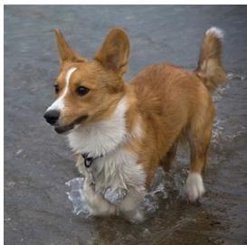
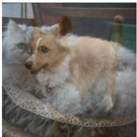
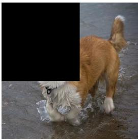
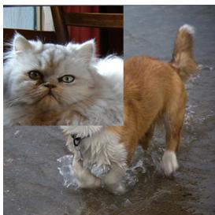
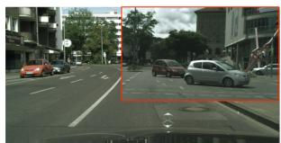
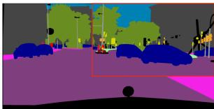
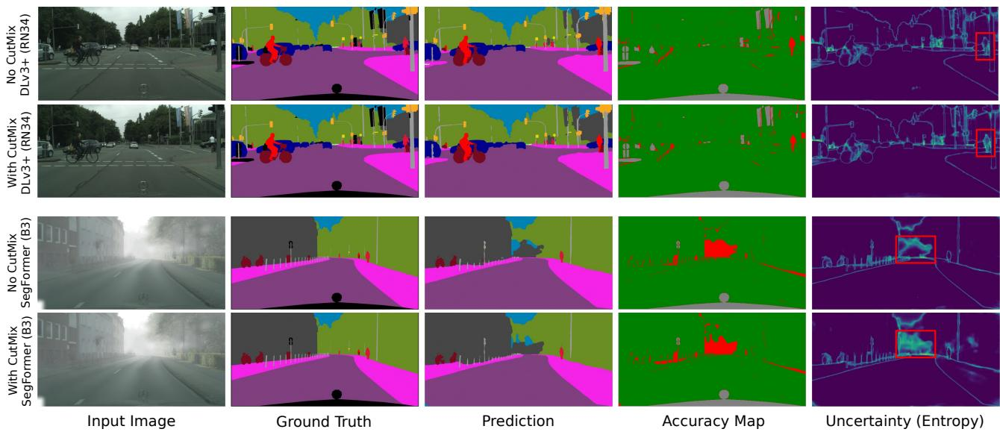

# The Impact of CutMix on Reliability and Robustness in Semantic Segmentation

Steven Landgraf ∗, Markus Ulrich

Institute of Photogrammetry and Remote Sensing (IPF), Karlsruhe Institute of Technology (KIT), Germany, (steven.landgraf, markus.ulrich)@kit.edu

Keywords: CutMix, Reliability, Robustness, Semantic Segmentation

## Abstract

Ensuring not only high accuracy but also reliable and robust predictions is critical for the deployment of semantic segmentation models in safety-critical applications such as autonomous driving. Despite the widespread use of CutMix – a simple yet powerful data augmentation strategy – its effect on the reliability and robustness in dense predictions tasks remains unexplored. Motivated by recent findings that semi-supervised segmentation methods, where CutMix is a core component, can severely degrade reliability, this study isolates and systematically analyzes the influence of CutMix on segmentation accuracy, calibration, and uncertainty quality. We evaluate two representative architectures, the CNN-based DeepLabV3+ and the transformer-based SegFormer, across both in-domain and out-of-domain scenarios. Our results show that CutMix has only a minor impact on segmentation accuracy but consistently improves the reliability, particularly under distribution shifts. These improvements indicate that CutMix primarily enhances the trustworthiness of the model’s calibration and uncertainty rather than the raw segmentation prediction itself. This distinction is crucial for safety-critical deployment, where reliable confidence estimates are as important as raw performance.

## 1. Introduction

Deep neural networks achieve remarkable success in semantic segmentation (Minaee et al., 2021), driving progress in a variety of domains ranging from autonomous driving, medical imaging, and remote sensing (Muhammad et al., 2022; Azad et al., 2024; Li et al., 2024). However, as their deployment in safetycritical real-world applications increases, so does the need to ensure that their predictions are not only accurate but also reliable and robust. Reliability, in this context, refers to the degree to which model confidences reflect the true likelihood of correctness, while robustness describes the model’s ability to maintain performance under perturbations or distribution shifts.

Due to the cost – and therefore scarcity – of manually labeled ground truth information for semantic segmentation tasks, recent work has embraced semi-supervised learning and strong data augmentations as core design elements. Among these, CutMix (Yun et al., 2019) has become a central component in recent semi-supervised learning frameworks (Yang et al., 2023, 2025). By randomly pasting patches from one image into another and mixing their corresponding labels, CutMix promotes spatially localized feature learning and reduces overfitting. While this simple, yet effective strategy has been shown to improve classification reliability and robustness (Oh and Yun, 2024; Rao et al., 2023; Yun et al., 2019), its impact on dense prediction tasks such as semantic segmentation remain poorly understood.

In addition, a recent study revealed a critical blind spot in this context: state-of-the-art semi-supervised segmentation methods, despite their strong performance in terms of accuracy, can severely deteriorate the reliability of neural networks (Landgraf et al., 2025b). This observation raises an important research question, as CutMix is a key component of these methods and may contribute to this problem.

Motivated by these findings, this work aims to analyze the impact of CutMix on reliability and robustness in semantic segmentation. We evaluate the effects of CutMix training in both in-domain and out-of-domain scenarios, considering accuracy, calibration, uncertainty quality, and their robustness. By disentangling the influence of CutMix from other components of semi-supervised learning frameworks, we aim to reveal its impact on the reliability and robustness in semantic segmentation – a research question that has yet to be answered.

## 2. Related Work

Reliability. A model’s reliability encompasses its calibration and uncertainty quality. The former describes how well the confidences of the predicted class reflect the true likelihood of correctness, most commonly measured by the Expected Calib ration Error (ECE) (Guo et al., 2017). A model’s uncertainty quality describes its ability to align the entire softmax output with predictive ambiguities and errors (Mukhoti and Gal, 2018).

Despite impressive predictive capabilities, neural networks are known to suffer from poor calibration (Guo et al., 2017; Wilson and Izmailov, 2020; Wang et al., 2021). In light of this, Guo et al. (2017) have introduced temperature scaling as a straightforward, yet effective post-hoc calibration method. Because of its simplicity and non-invasiveness it is still widely used as a baseline for numerous alternative approaches (Kull et al., 2019; Naeini et al., 2015; Ji et al., 2019; Ding et al., 2021; Patra et al., 2023). Besides calibration, a variety of techniques have been proposed to estimate high-quality uncertainties in deep learning models (MacKay, 1992; Gal and Ghahramani, 2016; Lakshminarayanan et al., 2017; Valdenegro-Toro, 2023; Van Amersfoort et al., 2020; Liu et al., 2020; Mukhoti et al., 2023; Amini et al., 2020; Landgraf et al., 2024, 2026). Unfortunately, however, all of these either introduce technical complexity or induce high computational cost, making them impractical for real-world ap plications like autonomous driving (Muhammad et al., 2020).

  
(a) Input Image  
Label: Dog 1.0

  
(b) MixUp  
Label: Dog 0.5, Cat 0.5

  
(c) CutOut Label: Dog 1.0

  
(d) CutMix  
Label: Dog 0.6, Cat 0.4  
Figure 1. A comparison between MixUp (Zhang et al., 2017), CutOut (DeVries and Taylor, 2017), and CutMix (Yun et al., 2019). Images taken from Yun et al. (2019).

Robustness. Whilst all of the previously mentioned methods offer an effective way of enhancing reliability in in-domain settings, there is no guarantee of the generalizability to outof-domain scenes. In fact, multiple prior works have found that reliability deteriorates significantly under domain shifts (Ovadia et al., 2019; De Jorge et al., 2023; Landgraf et al., 2025a). Consequently, model robustness, i.e., its ability to remain effective under perturbations, noise, or distribution shifts, is attracting increasing attention. Prior work discerns between robustness to perturbations (Gaussian noise, blur, occlusion), adversarial attacks (imperceptible changes to an image crafted to induce failure), and natural domain shifts (variations in weather, lighting, or geographic context) (Hendrycks and Dietterich, 2019; Kamann and Rother, 2020, 2021; Goodfellow et al., 2014; Hendrycks et al., 2021; Pedraza et al., 2022; Recht et al., 2019; Sakaridis et al., 2021; Hu et al., 2019; Sakaridis et al., 2018; Varma et al., 2019).

Research Gap. By virtue of the importance of this topic, we are not the first to analyze reliability and robustness of deep learning models in the context of semantic segmentation (Arnab et al., 2018; Kamann and Rother, 2020, 2021; Zhou et al., 2022; De Jorge et al., 2023; Loiseau et al., 2024; Zhou et al., 2019). However, a recent study by Landgraf et al. (2025b) revealed a critical blind spot, showing that state-of-the-art semisupervised segmentation methods severely deteriorate the reliability of neural networks. A core component in these methods is CutMix (Yun et al., 2019), which has been shown to have provable benefit for feature learning and improved reliability and robustness in classification tasks (Oh and Yun, 2024; Rao et al., 2023; Yun et al., 2019). At the same time, there is no clear answer as to how CutMix impacts reliability and robustness in dense prediction models, leaving a gap that this work aims to address.

## 3. Experimantal Setup

The following describes the methodological background of this study, our training configurations, evaluation metrics, and datasets used to analyze the impact of CutMix on reliability and robustness in semantic segmentation.

## 3.1 CutMix

CutMix (Yun et al., 2019) is highly inspired by both MixUp (Zhang et al., 2017) and CutOut (DeVries and Taylor, 2017), as shown by Figure 1. The former blends a pair of images and labels based on convex combinations, while the latter randomly masks out regions of the input to regularize the model. CutMix combines both of these ideas by randomly cutting and pasting patches among training images while proportionally mixing the ground truth labels, as shown by Figure 2.

  
(a) Input Image

  
(b) Ground Truth  
Figure 2. CutMix training example on the Cityscapes dataset (Cordts et al., 2016). For visualization purposes, we have highlighted the inserted area with a red rectangle.

Formally, a CutMix training sample $( \tilde { x } , \tilde { y } )$ can be defined as

$$
\tilde { x } = M \odot x _ { A } + ( 1 - M ) \odot x _ { B } ,\tag{1}
$$

$$
\tilde { y } = \lambda y _ { A } + ( 1 - \lambda ) y _ { B } ,\tag{2}
$$

where $x _ { A }$ and $x _ { B }$ denote two input images, and $y . a$ and $y _ { B }$ their corresponding one-hot encoded labels. The binary mask $M \in \{ 0 , 1 \} ^ { \mathbf { \hat { H } } x W }$ specifies a randomly sampled rectangular region within the image, determining which pixels are taken from image A and which from image B. The mixing ratio λ represents the proportion of pixels retained from $x A$ and is sampled from the beta distribution. With respect to the hyperparameters, we follow the original implementation (Yun et al., 2019).

## 3.2 Training Configuration

All experiments were conducted using two widely adopted semantic segmentation architectures: DeepLabV3+ (DLV3+) (Chen et al., 2018) and SegFormer (Xie et al., 2021). Both models were trained for 250 epochs without early stopping and with a batch size of 8 using a polynomial learning rate schedule. The initial learning rates and weight decay were selected following the recommended configurations for each architecture, as summarized by Table 1. All models were optimized using the standard pixel-wise cross-entropy loss and AdamW optimizer (Loshchilov and Hutter, 2017) with standard momentum parameters. These consistent hyperparameter and augmentation settings were chosen to ensure comparability between architectures and to isolate the specific effects of CutMix on reliability and robustness – both for Convolutional Neural Networks and Vision Transformers.

## 3.3 Metrics

We evaluate model performance using a combination of accuracy, calibration, and uncertainty-based metrics. The mean Intersection over Union (mIoU) (Lateef and Ruichek, 2019) serves as the primary measure of segmentation accuracy. Model calibration is assessed by the Expected Calibration Error (ECE) (Guo et al., 2017), which quantifies the discrepancy between predictive confidence and empirical accuracy. To capture the quality of uncertainty estimates, we first compute the pixel-wise predictive entropy (Shannon, 1948):

<table><tr><td>Model</td><td>Learning Rate (LR)</td><td>Weight Decay | Epochs | Batch Size | LR Schedule</td><td></td><td></td><td></td></tr><tr><td>DeepLabV3+ SegFormer</td><td> $1 \times 1 0 ^ { - 4 }$  (× 10 Decoder)  $5 \times 1 0 ^ { - 6 }$  (× 10 Decoder)</td><td> $1 \times 1 0 ^ { - 4 }$   $1 \times 1 0 ^ { - 2 }$ </td><td>250</td><td>8</td><td>Polynomial</td></tr></table>

Table 1. Training hyperparameters for DeepLabV3+ and SegFormer.

$$
H ( x ) = - \sum _ { c = 1 } ^ { C } p ( \hat { y } _ { c } ( x ) ) \log p ( \hat { y } _ { c } ( x ) ) ,\tag{3}
$$

where $p ( \hat { y } _ { c } ( x ) )$ denotes the predicted softmax probability for class c given an input image x. These entropy values are then used to classify pixels as “certain” or “uncertain” based on the median uncertainty within each image, which was found to be the best default threshold (Landgraf et al., 2025a). The conditional metrics p(acc|cer) and p(unc|inacc) proposed by Mukhoti and Gal (2018) then quantify how often predictions are correct when marked certain, and incorrect when marked uncertain, respectively.

The Reliable Segmentation Score (RSS) (Landgraf et al., 2025a) integrates all previous complementary metrics into a single, holistic reliability measure using the harmonic mean:

$$
\mathrm { R S S } = \frac { \sum \omega _ { i } } { \frac { \omega _ { 1 } } { \mathrm { m I o U } } + \frac { \omega _ { 2 } } { ( 1 \mathrm { - E C E } ) } + \frac { \omega _ { 3 } } { \mathrm { p ( a c c } | \mathrm { c e r } ) } + \frac { \omega _ { 3 } } { \mathrm { p ( u n c } | \mathrm { i n a c c } ) } } \mathrm { , }\tag{4}
$$

where the application-specific weights ω are all set to 1.0 to avoid assumptions about the importance of any one metric. By leveraging the harmonic mean, RSS penalizes poor performance in any aspect, ensuring that a model achieves a high score only if it is accurate, well-calibrated, and uncertainty-aware.

The combination of these metrics is justified by their largely orthogonal contributions (Landgraf et al., 2025a). While the mIoU captures pixel-wise accuracy across classes, the ECE measures calibration, i.e., the alignment between predicted confidence and true likelihood of correctness, which can vary independently of mIoU. p(acc|cer) evaluates whether lowuncertainty predictions are indeed correct, highlighting the usefulness of certainty. p(unc|inacc) assesses whether false predictions are flagged as uncertain, enabling error mitigation. Besides, unlike mIoU and ECE, which rely solely on the maximum softmax probability and therefore capture information about the predicted class only, the conditional uncertainty metrics consider the full softmax distribution (via entropy, see Eq. 3), providing insights into prediction ambiguity.

## 3.4 Datasets

To evaluate the impact of CutMix training for real-world scenarios, we train all models on Cityscapes (Cordts et al., 2016). For out-of-domain analyses, we use the Foggy Cityscapes (Sakaridis et al., 2018) validation sets without re-training the models. Foggy Cityscapes provides three versions defined by the attenuation coefficient β, where higher values correspond to denser fog. This setup enables a systematic assessment of model reliability and robustness under progressively challenging visual degradations.

In terms of data augmentations, we employed random scaling, horizontal flipping, and random cropping as a baseline for all models. When evaluating the effect of CutMix, we applied it with a probability of 50%, following the original formulation (Yun et al., 2019).

## 4. Results

In-Domain Evaluation. Table 2 summarizes the in-domain results on Cityscapes for different model backbones, comparing standard training and CutMix-augmented variants. As expected, larger backbones achieve higher segmentation accuracy (mIoU), while calibration (ECE) remains relatively stable across architectures. Interestingly, uncertainty quality – as measured by p(acc|cer) and p(unc|inacc) – appears largely independent of backbone size, with the CNN-based DeepLabV3+ slightly outperforming the Vision Transformerbased SegFormer models. Runtime scales predictably with model complexity, from ≈ 25 ms (40 FPS) for DeepLabV3+ (ResNet-34) to ≈ 315 ms (3 FPS) for SegFormer (B5). While the transformer-based SegFormer models offer competitive accuracy, they come at a considerably higher computational cost, emphasizing the continued efficiency advantage of CNN-based designs, particularly for images with high resolutions.

Overall, CutMix has a minor effect on segmentation accuracy and calibration, improving mIoU in three out of six cases and leaving ECE nearly unchanged. However, it consistently enhances uncertainty quality, particularly in p(unc|inacc), where most models show notable gains. The only exception is the largest SegFormer (MiT-B5), whose reported checkpoint underperformed despite showing better averages across training epochs, clearly a case of suboptimal checkpoint selection. However, to ensure consistency, we retained this checkpoint rather than retraining or using early stopping. When aggregating evaluation results with the Reliable Segmentation Score (RSS), CutMix-trained models outperform their counterparts in all of the remaining models, indicating that CutMix substantially improves reliability. Surprisingly, the older CNN-based DeepLabV3+ architecture remains more reliable overall, surpassing the modern transformer-based models in terms of uncertainty quality.

Out-of-Domain Evaluation. The results in Table 3 show the robustness of all models under increasing fog intensities on Foggy Cityscapes. As expected, segmentation performance (mIoU) consistently declines with stronger fog due to the growing domain gap. While CutMix has limited impact on segmentation robustness, it helps to maintain better calibration (ECE) and uncertainty quality (p(acc|cer) and p(unc|inacc)) across most configurations. Notably, SegFormer shows higher robustness than DeepLabV3+, particularly with larger backbones (MiT-B3 and MiT-B5), where both mIoU and calibration degrade less severely under adverse conditions. This trend suggests that transformer-based architectures generalize more gracefully across domain shifts compared to CNN-based ones. Overall, the RSS confirms that CutMix generally leads to more reliable calibration and uncertainty estimates across varying fog levels, even when segmentation accuracy itself remains mostly unchanged. These findings indicate that CutMix primarily enhances overall reliability and robustness rather than improving raw segmentation performance.

<table><tr><td>Encoder</td><td>Params</td><td>CutMix</td><td>mIoU↑</td><td>ECE↓</td><td></td><td>p(acc|cer) ↑ | p(unc|inacc) ↑</td><td>RSS↑</td><td>Inference Time [ms] ↓</td><td>FPS ↑</td></tr><tr><td colspan="10">DeepLabV3+</td></tr><tr><td>RN34</td><td>~21M</td><td>V</td><td>0.743 0.743</td><td>0.033 0.027</td><td>0.912 0.943</td><td>0.731 0.838</td><td>0.826 0.864</td><td> $2 4 . 8 1 \pm 8 . 5 0$ </td><td>40.31</td></tr><tr><td>RN101</td><td>~42M</td><td>V</td><td>0.774 0.754</td><td>0.034 0.033</td><td>0.931 0.947</td><td>0.797 0.848</td><td>0.859 0.870</td><td> $4 9 . 7 2 \pm 1 1 . 0 1$ </td><td>20.11</td></tr><tr><td>RN152</td><td>~58M</td><td>√</td><td>0.762 0.774</td><td>0.034 0.034</td><td>0.927 0.939</td><td>0.777 0.817</td><td>0.849 0.867</td><td> $5 7 . 3 1 \pm 1 5 . 4 3$ </td><td>22.88</td></tr><tr><td colspan="10">SegFormer</td></tr><tr><td>MiT-B0</td><td>~3.7M</td><td>√</td><td>0.658 0.688</td><td>0.034 0.034</td><td>0.899 0.930</td><td>0.713 0.807</td><td>0.789 0.833</td><td> $4 3 . 7 1 \pm 0 . 2 4$ </td><td>22.88</td></tr><tr><td>MiT-B3</td><td>~45M</td><td>V</td><td>0.759 0.771</td><td>0.032 0.034</td><td>0.906 0.921</td><td>0.707 0.758</td><td>0.822 0.844</td><td> $1 8 1 . 1 1 \pm 0 . 7 1$ </td><td>5.52</td></tr><tr><td>MiT-B5</td><td>~82M</td><td>√</td><td>0.788 0.773</td><td>0.027 0.033</td><td>0.921 0.909</td><td>0.766 0.721</td><td>0.853 0.831</td><td> $3 1 5 . 5 0 \pm 3 7 . 2 7$ </td><td>3.17</td></tr></table>

Table 2. In-domain evaluation results on the Cityscapes validation dataset using DeepLabV3+ and SegFormer models with different backbone configurations. The reported inference times and frames per second (FPS) correspond to single-image forward passes performed at the native Cityscapes resolution (1024×2048) without any inference-time optimizations such as mixed precision or batching. All measurements were conducted on a single NVIDIA A100 GPU to ensure a consistent and comparable runtime evaluation across model architectures.
<table><tr><td rowspan="2">Encoder</td><td rowspan="2">CutMix</td><td colspan="3">mIoU↑</td><td colspan="3">ECE↓</td><td colspan="3">p(acc|cer) ↑</td><td colspan="3">p(unc|inacc) ↑</td><td colspan="3">RSS ↑</td></tr><tr><td> $\overline { { \mathrm { F o g } _ { 1 } } }$ </td><td> $\overline { { \mathrm { F o g } _ { 2 } } }$ </td><td>Fog3</td><td> $\overline { { \mathrm { F o g } _ { 1 } } }$   $\overline { { \mathrm { F o g } _ { 2 } } }$ </td><td>Fog3</td><td></td><td>Fog1 Fog2</td><td>Fog3</td><td>Fog1</td><td>Fog2</td><td>Fog3</td><td>Fog1</td><td>Fog2</td><td>Fog3</td></tr><tr><td colspan="13">DeepLabV3+</td></tr><tr><td>RN34</td><td></td><td>0.702 0.651</td><td>0.568 0.567</td><td>0.041 0.038</td><td>0.067 0.068</td><td>0.092</td><td>0.907</td><td>0.901</td><td>0.886</td><td>0.741</td><td>0.753</td><td>0.753</td><td>0.813</td><td>0.793</td><td>0.752</td></tr><tr><td>RN101</td><td>√</td><td>0.701 0.734 0.726</td><td>0.654 0.682 0.675</td><td>0.585 0.565</td><td>0.046 0.072 0.076</td><td>0.069 0.107 0.081</td><td>0.941 0.927 0.941</td><td>0.934 0.920 0.932</td><td>0.913 0.903 0.909</td><td>0.851 0.803 0.845</td><td>0.851 0.810</td><td>0.845 0.821</td><td>0.850 0.845</td><td>0.825 0.822</td><td>0.782 0.776</td></tr><tr><td>RN152</td><td>√ J</td><td>0.726 0.740</td><td>0.679 0.6960.605</td><td>0.573</td><td>0.038 0.044 0.068 0.033 0.058</td><td>0.120 0.074</td><td>0.921 0.936</td><td>0.908 0.928</td><td>0.890 0.911</td><td>0.782 0.823</td><td>0.842 0.773 0.816</td><td>0.836 0.798 0.818</td><td>0.858 0.835 0.857</td><td>0.829 0.810 0.833</td><td>0.776 0.761 0.792</td></tr><tr><td colspan="12">SegFormer</td></tr><tr><td>MiT-B0</td><td>√</td><td>0.616</td><td>0.5660.470</td><td>0.060</td><td>0.043</td><td>0.036</td><td>0.918</td><td>0.914 0.927</td><td>0.890</td><td>0.801</td><td>0.819</td><td>0.819</td><td>0.796 0.780</td><td></td><td>0.726</td></tr><tr><td>MiT-B3</td><td></td><td>0.640 0.735</td><td>0.578 0.706</td><td>0.467 0.641</td><td>0.048 0.040</td><td>0.031 0.055</td><td>0.022 0.090</td><td>0.936 0.917 0.915</td><td>0.890 0.901</td><td>0.852 0.764</td><td>0.857 0.778</td><td>0.836 0.785</td><td>0.824 0.833</td><td>0.799 0.824</td><td>0.729 0.793</td></tr><tr><td></td><td>√</td><td>0.748 0.763</td><td>0.716 0.7370.675</td><td>0.642</td><td>0.035 0.037 0.057 0.085</td><td>0.052</td><td>0.083</td><td>0.923 0.919 0.931</td><td>0.906 0.9300.920</td><td>0.785</td><td>0.794</td><td>0.800 0.814 0.825 0.829</td><td>0.846 0.860</td><td>0.833 0.850</td><td>0.800 0.822</td></tr><tr><td>MiT-B5</td><td>√</td><td>0.760</td><td>0.7300.667</td><td></td><td>0.0300.0460.062</td><td></td><td></td><td>0.913</td><td>0.912 0.903</td><td></td><td></td><td>0.7550.7700.781</td><td>0.839</td><td>0.831</td><td>0.808</td></tr></table>

Table 3. Out-of-domain evaluation on the Foggy Cityscapes validation sets $( \beta = 0 . 0 0 5 , \beta = 0 . 0 1 , \beta = 0 . 2 )$ using various backbone sizes for DeepLabV3+ and SegFormer. Models are trained on Cityscapes and tested without re-training, allowing assessment of reliability and robustness under increasing fog density.

Qualitative Evaluation. Figure 3 compares qualitative results for DeepLabV3+ (RN34) with and without CutMix on Cityscapes and for SegFormer (MiT-B3) on Foggy Cityscapes. Across both architectures and datasets, segmentation predictions remain visually similar, confirming that CutMix does not substantially change the model’s class assignments. However, the CutMix-augmented variants exhibit higher uncertainty in regions corresponding to erroneous or ambiguous predictions, as highlighted by the red rectangles in the uncertainty maps. Overall, these qualitative observations corroborate the quantitative findings: while CutMix has limited effect on segmentation accuracy, it consistently improves the reliability, even under adverse conditions, ultimately making models more robustness as well.

## 5. Conclusion

This study systematically investigated the impact of CutMix on the accuracy, reliability, and robustness of semantic segmentation models. While CutMix is widely adopted, its effect on reliability and robustness in dense prediction tasks had not been considered yet. This is especially critical in light of recent findings by Landgraf et al. (2025b), which revealed that semi-supervised semantic segmentation frameworks – which use CutMix as a core component – severely deteriorate the reliability. By isolating its effects from other components, we evaluated the influence of CutMix across in-domain and out-of-domain scenarios on two representative architectures: the CNN-based DeepLabV3+ and the transformer-based Seg-Former. Our results reveal that CutMix exerts only a minor influence on segmentation accuracy and calibration but consistently improves uncertainty quality. These improvements persist under domain shifts, where CutMix-trained models demonstrate not only more reliable uncertainty estimates but also better calibration despite similar segmentation performance. In other words, our findings show that CutMix primarily enhances how models express their uncertainty rather than what they predict – a crucial distinction for safety-critical applications.

  
Figure 3. Qualitative examples of DeepLabV3+ (RN34) with and without CutMix on Cityscapes, and SegFormer (MiT-B3) on Foggy Cityscapes. The accuracy maps highlight correct predictions in green, incorrect ones in red, and classes ignored during training in gray.

This suggests that the reliability deterioration observed in semisupervised segmentation frameworks (Landgraf et al., 2025b) cannot be attributed to CutMix itself, but rather to other components such as pseudo-labeling or consistency regularization. Future work should investigate these interactions and test whether CutMix offers a general mechanism for enhancing reliability and robustness across tasks and modalities by extending evaluations to other domains, such as medical imaging or remote sensing.

## References

Amini, A., Schwarting, W., Soleimany, A., Rus, D., 2020. Deep evidential regression. Advances in neural information processing systems, 33, 14927–14937.

Arnab, A., Miksik, O., Torr, P. H., 2018. On the robustness of semantic segmentation models to adversarial attacks. Proceedings of the IEEE conference on computer vision and pattern recognition, 888–897.

Azad, R., Aghdam, E. K., Rauland, A., Jia, Y., Avval, A. H., Bozorgpour, A., Karimijafarbigloo, S., Cohen, J. P., Adeli, E.,

Merhof, D., 2024. Medical image segmentation review: The success of u-net. IEEE Transactions on Pattern Analysis and Machine Intelligence.

Chen, L.-C., Zhu, Y., Papandreou, G., Schroff, F., Adam, H., 2018. Encoder-decoder with atrous separable convolution for semantic image segmentation. Proceedings of the European Conference on Computer Vision (ECCV).

Cordts, M., Omran, M., Ramos, S., Rehfeld, T., Enzweiler, M., Benenson, R., Franke, U., Roth, S., Schiele, B., 2016. The cityscapes dataset for semantic urban scene understanding. Proceedings of the IEEE conference on computer vision and pattern recognition, 3213–3223.

De Jorge, P., Volpi, R., Torr, P. H., Rogez, G., 2023. Reliability in semantic segmentation: Are we on the right track? Proceedings ofthe IEEE/CVF Conference on Computer Vision and Pattern Recognition, 7173–7182.

DeVries, T., Taylor, G. W., 2017. Improved regularization of convolutional neural networks with cutout. arXiv preprint arXiv:1708.04552.

Ding, Z., Han, X., Liu, P., Niethammer, M., 2021. Local temperature scaling for probability calibration. Proceedings of the IEEE/CVF International Conference on Computer Vision, 6889–6899.

Gal, Y., Ghahramani, Z., 2016. Dropout as a bayesian approximation: Representing model uncertainty in deep learning. international conference on machine learning, PMLR, 1050– 1059.

Goodfellow, I. J., Shlens, J., Szegedy, C., 2014. Explain ing and harnessing adversarial examples. arXiv preprint arXiv:1412.6572.

Guo, C., Pleiss, G., Sun, Y., Weinberger, K. Q., 2017. On calibration of modern neural networks. International Conference on Machine Learning, PMLR, 1321–1330.

Hendrycks, D., Dietterich, T., 2019. Benchmarking neural network robustness to common corruptions and perturbations. arXiv preprint arXiv:1903.12261.

Hendrycks, D., Zhao, K., Basart, S., Steinhardt, J., Song, D., 2021. Natural adversarial examples. Proceedings of the IEEE/CVF conference on computer vision and pattern recognition, 15262–15271.

Hu, X., Fu, C.-W., Zhu, L., Heng, P.-A., 2019. Depthattentional features for single-image rain removal. Proceedings of the IEEE/CVF Conference on computer vision and pattern recognition, 8022–8031.

Ji, B., Jung, H., Yoon, J., Kim, K. et al., 2019. Bin-wise temperature scaling (bts): improvement in confidence calibration performance through simple scaling techniques. 2019 IEEE/CVF International Conference on Computer Vision Workshop (IC-CVW), IEEE, 4190–4196.

Kamann, C., Rother, C., 2020. Benchmarking the robustness of semantic segmentation models. Proceedings of the IEEE/CVF conference on computer vision and pattern recognition, 8828– 8838.

Kamann, C., Rother, C., 2021. Benchmarking the robustness of semantic segmentation models with respect to common corruptions. International journal of computer vision, 129(2), 462– 483.

Kull, M., Perello Nieto, M., Kangsepp, M., Silva Filho, T.,¨ Song, H., Flach, P., 2019. Beyond temperature scaling: Obtaining well-calibrated multi-class probabilities with dirichlet calibration. Advances in neural information processing systems, 32.

Lakshminarayanan, B., Pritzel, A., Blundell, C., 2017. Simple and scalable predictive uncertainty estimation using deep ensembles. Advances in neural information processing systems, 30.

Landgraf, S., Hillemann, M., Kapler, T., Ulrich, M., 2025a. A comparative study on multi-task uncertainty quantification in semantic segmentation and monocular depth estimation. tm-Technisches Messen.

Landgraf, S., Hillemann, M., Kapler, T., Ulrich, M., 2026. EMUFormer: Efficient Multi-task Uncertainties for Reliable Joint Semantic Segmentation and Monocular Depth Estimation. International Journal ofComputer Vision, 134(4), 142.

Landgraf, S., Hillemann, M., Ulrich, M., 2025b. Rethinking semi-supervised segmentation beyond accuracy: Reliability and robustness. DAGM German Conference on Pattern Recognition, Springer, 434–452.

Landgraf, S., Wursthorn, K., Hillemann, M., Ulrich, M., 2024. Dudes: Deep uncertainty distillation using ensembles for semantic segmentation. PFG–Journal of Photogrammetry, Remote Sensing and Geoinformation Science, 92(2), 101–114.

Lateef, F., Ruichek, Y., 2019. Survey on semantic segmentation using deep learning techniques. Neurocomputing, 338, 321– 348.

Li, J., Cai, Y., Li, Q., Kou, M., Zhang, T., 2024. A review of remote sensing image segmentation by deep learning methods. International Journal ofDigital Earth, 17(1), 2328827.

Liu, J., Lin, Z., Padhy, S., Tran, D., Bedrax Weiss, T., Lakshminarayanan, B., 2020. Simple and principled uncertainty estimation with deterministic deep learning via distance awareness. Advances in neural information processing systems, 33, 7498–7512.

Loiseau, T., Vu, T.-H., Chen, M., Perez, P., Cord, M., 2024. Re-´ liability in semantic segmentation: Can we use synthetic data? European Conference on Computer Vision, Springer, 442–459.

Loshchilov, I., Hutter, F., 2017. Decoupled weight decay regularization. arXiv preprint arXiv:1711.05101.

MacKay, D. J., 1992. A practical Bayesian framework for backpropagation networks. Neural computation, 4(3), 448–472.

Minaee, S., Boykov, Y., Porikli, F., Plaza, A., Kehtarnavaz, N., Terzopoulos, D., 2021. Image segmentation using deep learning: A survey. IEEE transactions on pattern analysis and machine intelligence, 44(7), 3523–3542.

Muhammad, K., Hussain, T., Ullah, H., Del Ser, J., Rezaei, M., Kumar, N., Hijji, M., Bellavista, P., De Albuquerque, V. H. C., 2022. Vision-based semantic segmentation in scene understanding for autonomous driving: Recent achievements, challenges, and outlooks. IEEE Transactions on Intelligent Transportation Systems, 23(12), 22694–22715.

Muhammad, K., Ullah, A., Lloret, J., Del Ser, J., De Albuquerque, V. H. C., 2020. Deep learning for safe autonomous driving: Current challenges and future directions. IEEE Transactions on Intelligent Transportation Systems, 22(7), 4316– 4336.

Mukhoti, J., Gal, Y., 2018. Evaluating bayesian deep learning methods for semantic segmentation. arXiv preprint arXiv:1811.12709.

Mukhoti, J., Kirsch, A., Van Amersfoort, J., Torr, P. H., Gal, Y., 2023. Deep deterministic uncertainty: A new simple baseline. Proceedings ofthe IEEE/CVF Conference on Computer Vision and Pattern Recognition, 24384–24394.

Naeini, M. P., Cooper, G., Hauskrecht, M., 2015. Obtaining well calibrated probabilities using bayesian binning. Proceedings of the AAAI conference on artificial intelligence, 29num ber 1.

Oh, J., Yun, C., 2024. Provable benefit of cutout and cutmix for feature learning. Advances in Neural Information Processing Systems, 37, 114656–114743.

Ovadia, Y., Fertig, E., Ren, J., Nado, Z., Sculley, D., Nowozin, S., Dillon, J., Lakshminarayanan, B., Snoek, J., 2019. Can you trust your model’s uncertainty? evaluating predictive uncertainty under dataset shift. Advances in neural information processing systems, 32.

Patra, R., Hebbalaguppe, R., Dash, T., Shroff, G., Vig, L., 2023. Calibrating deep neural networks using explicit regularisation and dynamic data pruning. Proceedings of the IEEE/CVF Winter Conference on Applications of Computer Vision, 1541– 1549.

Pedraza, A., Deniz, O., Bueno, G., 2022. Really natural adversarial examples. International Journal ofMachine Learning and Cybernetics, 13(4), 1065–1077.

Rao, A., Lee, J.-Y., Aalami, O., 2023. Studying the impact of augmentations on medical confidence calibration. Proceedings of the IEEE/CVF International Conference on Computer Vision, 2462–2472.

Recht, B., Roelofs, R., Schmidt, L., Shankar, V., 2019. Do imagenet classifiers generalize to imagenet? International conference on machine learning, PMLR, 5389–5400.

Sakaridis, C., Dai, D., Van Gool, L., 2018. Semantic foggy scene understanding with synthetic data. International Journal ofComputer Vision, 126, 973–992.

Sakaridis, C., Dai, D., Van Gool, L., 2021. Acdc: The adverse conditions dataset with correspondences for semantic driving scene understanding. Proceedings of the IEEE/CVF international conference on computer vision, 10765–10775.

Shannon, C. E., 1948. A mathematical theory of communication. The Bell system technical journal, 27(3), 379–423.

Valdenegro-Toro, M., 2023. Sub-ensembles for fast uncertainty estimation in neural networks. Proceedings of the IEEE/CVF International Conference on Computer Vision, 4119–4127.

Van Amersfoort, J., Smith, L., Teh, Y. W., Gal, Y., 2020. Uncertainty estimation using a single deep deterministic neural network. International conference on machine learning, PMLR, 9690–9700.

Varma, G., Subramanian, A., Namboodiri, A., Chandraker, M., Jawahar, C., 2019. Idd: A dataset for exploring problems of autonomous navigation in unconstrained environments. 2019 IEEE winter conference on applications of computer vision (WACV), IEEE, 1743–1751.

Wang, D.-B., Feng, L., Zhang, M.-L., 2021. Rethinking calibration of deep neural networks: Do not be afraid of overconfidence. Advances in Neural Information Processing Systems, 34, 11809–11820.

Wilson, A. G., Izmailov, P., 2020. Bayesian deep learning and a probabilistic perspective of generalization. Advances in Neural Information Processing Systems, 33, 4697–4708.

Xie, E., Wang, W., Yu, Z., Anandkumar, A., Alvarez, J. M., Luo, P., 2021. SegFormer: Simple and efficient design for semantic segmentation with transformers. Advances in neural information processing systems, 34, 12077–12090.

Yang, L., Qi, L., Feng, L., Zhang, W., Shi, Y., 2023. Revisiting weak-to-strong consistency in semi-supervised semantic segmentation. Proceedings of the IEEE/CVF conference on computer vision and pattern recognition, 7236–7246.

Yang, L., Zhao, Z., Zhao, H., 2025. Unimatch v2: Pushing the limit of semi-supervised semantic segmentation. IEEE Transactions on Pattern Analysis and Machine Intelligence.

Yun, S., Han, D., Oh, S. J., Chun, S., Choe, J., Yoo, Y., 2019. Cutmix: Regularization strategy to train strong classifiers with localizable features. Proceedings of the IEEE/CVF international conference on computer vision, 6023–6032.

Zhang, H., Cisse, M., Dauphin, Y. N., Lopez-Paz, D., 2017. mixup: Beyond empirical risk minimization. arXiv preprint arXiv:1710.09412.

Zhou, D., Yu, Z., Xie, E., Xiao, C., Anandkumar, A., Feng, J., Alvarez, J. M., 2022. Understanding the robustness in vision transformers. International conference on machine learning, PMLR, 27378–27394.

Zhou, W., Berrio, J. S., Worrall, S., Nebot, E., 2019. Automated evaluation of semantic segmentation robustness for autonomous driving. IEEE Transactions on Intelligent Transportation Systems, 21(5), 1951–1963.