# VA-JUDGER: REWARD MODELING FROM HUMAN PREFERENCE FEEDBACK FOR JOINT VIDEO-AUDIO GENERATION

Yinming Huang1,2,\* Shuyuan Tu2,\* Xi Yan2 Zihan Yang2 Jianhua Han3 Xu Hang3 Yu-Gang Jiang2,† Zuxuan Wu1,2,†

1Shanghai Innovation Institution 2Fudan University

3Yinwang Intelligent Technology Co., Ltd

\*Equal contribution. †Corresponding authors.

Code: https://github.com/ShareLab-SII/VA-Judger

All Automatic Expert Metrics ⇒ Video 1 is better  
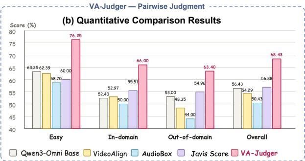

## VA-Judger ⇒

<think>   
1. Prompt match V1 4/10 | V2 6/10   
V2 includes the magazine and delivers dialogue closer to the requested quote   
2. Audio-visual consistency V1 3/10 | V2 6/10   
V2 has better lip sync and gestures that align more naturally with speech.   
3. Audio quality V1 2/10 | V2 8/10   
V1 is distorted; V2 is clear despite mixed languages.   
4. Video quality V1 8/10 | V2 8/10   
Both videos are sharp, well lit, and visually detailed.   
5. Completeness V1 3/10 | V2 7/10   
V2 feels more complete, natural, and understandable overall. Total score Video 1: 20 | Video 2: 35   
</think>   
<answer> Video 2 is better </answer>

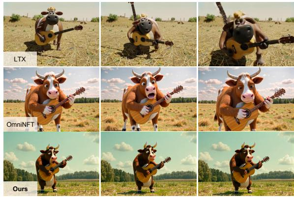  
Figure 1: Evaluation of VA-Judger. (a) VA-Judger selects the preferred clip through structured dimension-wise reasoning, whereas separate evaluation metrics disagree with human judgment. (b) VA-Judger achieves the highest agreement with human preferences. (c) VA-Judger provides the reward for post-training LTX-2, improving the quality over the base model and OmniNFT.

## ABSTRACT

Using reinforcement learning to post-train joint video-audio generation models requires a reward signal. Existing methods construct this reward by combining metrics for individual quality dimensions, including audio quality, visual fidelity, and synchronization. However, these metrics evaluate perceptual dimensions separately and fail to capture the overall semantic and temporal coherence among the text prompt, video, and audio that shapes human preferences. More criti-

cally, they are poorly aligned with actual human judgments. Optimizing models against these metrics encourages reward hacking, generating video-audio content that achieves high scores on these metrics yet appears incoherent or unfaithful to human viewers. To address this problem, we first construct a large-scale humanpreference dataset VAPref-10K for joint video-audio generation, comprising 9K prompts and 10.3K fine-grained paired comparisons from open-source generation models. We also introduce the VA-Judger-Bench benchmark with both indomain and out-of-domain model comparisons to evaluate whether reward models truly align with human preferences. We further propose VA-Judger, a chain-ofthought omni-reward model for joint video-audio generation. In particular, VA-Judger first learns from pairs with clear quality gaps to establish structured output and coarse preference discrimination, then distills reliable preference explanations for harder near-quality comparisons via rejection sampling verified against human annotations, and finally performs dimension-wise reinforcement learning that decomposes human feedback into individual quality dimensions for denser reward signals than a single binary preference label. Experiments show that VA-Judger outperforms metric baselines in predicting human preferences on both in-domain and out-of-domain evaluations. Using its human-aligned rewards for post-training audio-video generation model also yields significant improvements in generation quality.

## 1 INTRODUCTION

Recent advancements in joint video-audio generation (OpenAI, 2025; Google DeepMind, 2026b; Team Seedance et al., 2026; Wan Team, 2026; Kling AI, 2026; Google, 2026; Wang et al., 2025a; Low et al., 2025; Liu et al., 2025c; Kling Team et al., 2025; SII-OpenMOSS Team et al., 2026; Liu et al., 2026; SII-GAIR et al., 2026; HaCohen et al., 2026; Tu et al., 2026b; Zhou et al., 2026; Tu et al., 2024a;b; 2026a; Yang et al., 2026) have made it possible to generate increasingly realistic visual content and synchronized sound. These inspire researchers to explore post-training via rein forcement learning to align the synthesized content with perceptual quality and user intent. However, the reward signal used during reinforcement learning remains a critical bottleneck for joint videoaudio generation. Current approaches such as OmniNFT (Zhang et al., 2026) construct rewards from multiple evaluation metrics, including VideoAlign (Liu et al., 2025b) and HPSv3 (Ma et al., 2025) for video quality, Audiobox Aesthetics (Tjandra et al., 2025) for audio quality, CLAP (Wu et al., 2023b) for audio-text alignment, and DeSync/Synchformer (Iashin et al., 2024) for audio-visual synchronization. These evaluation metrics evaluate audio quality, visual fidelity, and temporal synchronization as separate criteria, but fail to capture the holistic cross-modal coherence across text, video, audio, motion, and semantics that drives human preference. More fundamentally, such evalu ation metrics are poorly aligned with actual human judgments (Liu et al., 2025b; Wang et al., 2024; Tu et al., 2023; Leng et al., 2026). A sample may receive a high synchronization score while depict ing the wrong event, obtain a strong visual score while carrying emotionally incompatible sound, or satisfy several metric criteria while failing as a coherent video-audio experience (Figure 1(a,b)). Optimizing models against such rewards encourages overfitting to narrow metric targets, synthesizing video-audio content that scores well on these metrics yet appears unfaithful to human viewers, undermining the practical value of post-training (Figure 1(c)).

This issue has been addressed in other generation domains through human preference learning. In language modeling, preference-based optimization and reward modeling have enabled instructionfollowing generation (Christiano et al., 2017; Ouyang et al., 2022; Rafailov et al., 2023). Image generation has adopted human-preference datasets and reward models such as Pick-a-Pic (Kirstain et al., 2023), ImageReward (Xu et al., 2023), HPSv2 (Wu et al., 2023a), and MPS (Zhang et al., 2024). Video generation has similarly begun to leverage human feedback through InstructVideo (Yuan et al., 2024), LiFT (Wang et al., 2024), VADER (Prabhudesai et al., 2024), and VideoReward (Liu et al., 2025b). However, none of these efforts address joint video-audio generation, and their reward models cannot be directly transferred to this setting. The fundamental challenge is that human preference over video-audio content is not decomposable into independent per-modality judgments. Text-toimage/video reward models do not observe the audio stream and thus cannot assess whether sound matches the depicted event, while audio-only evaluation lacks the visual context that shapes human perception of sound plausibility. Even combining such single-modality evaluators cannot recover the cross-modal interactions that govern human preference. Addressing this problem demands not only a model that reasons jointly over audio and video, but also preference data derived from holistic human judgments of the complete text-video-audio experience, neither of which currently exists for joint video-audio generation.

In light of this, we first address the scarcity of human preference data by constructing VAPref-10K, a large-scale preference dataset tailored for joint video-audio generation. Rather than absolute scalar scoring for each quality dimension, which can vary substantially across human experts due to subjective calibration, annotators compare two generated clips from the same prompt, select the preferred one, and identify the quality dimensions that justify their decision. VAPref-10K comprises approximately 9K prompts derived from captioned web videos across seven broad video-audio categories, with 10.3K fine-grained paired comparisons generated by three open-source state-of-the-art models (HaCohen et al., 2026; Low et al., 2025; SII-GAIR et al., 2026). From VAPref-10K, we introduce VA-Judger-Bench as a benchmark for evaluating whether reward models align with human video-audio preferences. Beyond in-domain evaluation, VA-Judger-Bench further includes an out-of-domain split built from AVGenBench (Zhou et al., 2026), pairing outputs from closed-source models (Kling 2.6 (Kling Team et al., 2025), Wan 2.6 (Wan Team et al., 2025), Veo 3.1 Fast, Veo 3.1 Quality (Google DeepMind, 2026b), and Sora 2 (OpenAI, 2025)). They are excluded from training.

Furthermore, we propose VA-Judger, a chain-of-thought omni-reward model for joint video-audio generation. Video-audio preference judgment is a complex reasoning task because it must simultaneously acquire a structured comparison format, discriminate subtle cross-modal failures, and provide dimension-level feedback. Thus, we adopt a progressive training strategy. We begin with pairs that have clear quality gaps, for which Gemini 3.1 (Google DeepMind, 2026a) generates rubric-format CoT answers containing dimension-wise scores, explanations, and a final preference to perform cold start. These generated answers help the model acquire the structured comparison format and basic quality discrimination before encountering ambiguous cases. For the more challenging comparisons between outputs with subtle quality differences, Gemini’s final preferences alone are not sufficiently reliable. We thus use rejection sampling. Gemini 3.1 (Google DeepMind, 2026a) first generates CoT answers for hard pairs, and we retain only the answers whose final preferences agree with human annotations. This allows the model to learn from structured reasoning traces while grounding the supervision in human judgments, so that it attends to the subtle synchronization, semantic, and coherence failures that separate otherwise similar outputs. Finally, since a single binary preference label is too sparse to guide fine-grained preference learning, we perform dimensionwise reinforcement learning with GRPO (Shao et al., 2024), where verified reward evaluations drive trial-and-error updates and refine the model’s reasoning outputs. This encourages deeper reasoning discovery rather than passive memorization, while separately rewarding individual quality aspects such as visual quality, audio quality, synchronization, and semantic faithfulness to provide denser optimization signals grounded in human-specified quality dimensions.

In conclusion, our main contributions are summarized as follows: (1) We construct a large-scale human-preference dataset for joint video-audio generation reward modeling, containing 9K prompts and 10.3K fine-grained paired comparisons generated by 8 recent video-audio generation models. (2) We propose VA-Judger, a chain-of-thought omni-reward model for evaluating joint video-audio generation, trained via easy-to-hard preference learning, preference-explanation distillation, and dimension-wise reinforcement learning with human feedback. To our knowledge, we are the first to explore reward modeling for joint video-audio generation using human feedback. (3) We introduce VA-Judger-Bench to evaluate video-audio reward models against human preferences, showing that VA-Judger better aligns with human judgments in both in-domain and out-of-domain evaluations. Using VA-Judger as the reward for post-training video-audio generation models further yields substantial improvements in human-perceived generation quality.

## 2 RELATED WORK

## 2.1 JOINT VIDEO-AUDIO GENERATION MODELS

Recent generative models have moved from silent video generation toward jointly producing visual motion and synchronized audio. Closed-source models (OpenAI, 2025; Google DeepMind, 2026b) demonstrate this trend at product scale. Regarding open-source models (Wang et al., 2025a; Low et al., 2025; SII-OpenMOSS Team et al., 2026; HaCohen et al., 2026; Tu et al., 2025a;b;c), UniVerse-1 (Wang et al., 2025a) and Ovi (Low et al., 2025) adopt twin backbones with cross-modal fusion. MOVA (SII-OpenMOSS Team et al., 2026) and Davinci-MagiHuman (SII-GAIR et al., 2026) scale the model with a large video set. LTX-2 (HaCohen et al., 2026) aims to handle the capacity imbalance between modalities. Baton (Tu et al., 2026b) introduces explicit semantic blueprints for joint video-audio generation. The Javis (Liu et al., 2025c; 2026) series further emphasizes synchronization. JoyAI-Echo (Echo Team @ Joy Future Academy, JD, 2026) targets long-form generation. However, existing models are still primarily optimized by model-side objectives or expert metrics, leaving substantial room for improving human-perceived quality and video-audio coherence.

## 2.2 MULTIMODAL REWARD MODELS

Reward modeling is a standard way to turn human preference data into optimization signals. In image generation, Pick-a-Pic (Kirstain et al., 2023) provides image preference data, and ImageRe ward (Xu et al., 2023) learns an image reward model. In video generation, LiFT (Wang et al., 2024) trains LiFT-Critic for preference alignment, and VideoReward (Liu et al., 2025b) studies multi-dimensional human preference annotations. More multimodal reward models extend beyond generation. IXC-2.5-Reward (Zang et al., 2025) trains on broad image and video preference data, UnifiedReward series (Wang et al., 2025c;b) jointly models visual understanding and generation rewards. However, they do not explicitly judge whether audio, video, and text form a coherent event, and they are not trained as omni-model rewards for joint video-audio generation. In contrast, VA-Judger targets human preference alignment for joint video-audio generation itself, where the reward must capture visual/audio quality, semantics, and cross-modal consistency at the same time.

## 2.3 REINFORCEMENT LEARNING FOR GENERATIVE MODELS

Recent works adapt online reinforcement learning to diffusion models. FlowGRPO (Liu et al., 2025a) makes GRPO applicable to text-to-image flow models. DanceGRPO (Xue et al., 2025) designs a unified GRPO framework for text-to-image/video and image-to-video generation. DiffusionNFT (Zheng et al., 2025) uses positive and negative generations to define an implicit policyimprovement direction. In joint video-audio generation, OmniNFT (Zhang et al., 2026) is the only one to extend diffusion RL to multimodal generation, but its optimization still depends on seperate evaluation metrics such as VideoAlign (Liu et al., 2025b), HPSv3 (Ma et al., 2025), Audiobox Aesthetics (Tjandra et al., 2025), CLAP (Wu et al., 2023b), and DeSync/Synchformer (Iashin et al., 2024). This motivates our dimension-wise reinforcement learning with VA-Judger, which learns the reward signal from human preference annotations instead of optimizing only narrow expert metrics.

## 3 METHOD

VA-Judger is designed to provide a reward signal for post-training text-to-video-audio generation models. We train VA-Judger to produce structured dimension-wise judgments before its final pairwise decision. Our method consists of two components. We first construct VAPref-10K from difficulty-aware video-audio pairs, as shown in Fig 6 and detailed in Sec 3.2. We then train VA-Judger using the three-stage pipeline shown in Fig 2, which combines an easy-pair cold start, humanverified alignment on hard pairs (Sect 3.3), and dimension-wise reinforcement learning (Sec. 3.4).

## 3.1 TASK FORMULATION

We formulate video-audio reward modeling as pairwise preference prediction with structured dimension-wise reasoning. Each example consists of a text prompt p, two generated video-audio clips $x _ { 1 } = ( v _ { 1 } , a _ { 1 } )$ and $x _ { 2 } = ( v _ { 2 } , a _ { 2 } )$ , and a preferred index $y ^ { \star } \in \{ 1 , 2 \}$ . The input to the model is a fixed system prompt that specifies the evaluation rubric, followed by a user message containing the text prompt and the two videos with audio. This input format forces our model to jointly evaluate the combined text-video-audio performance, not a separate audio or video score. The model then produces an interpretable chain-of-thought comparison (Wei et al., 2022; Wang et al., 2025b). For each clip, it assigns a 1–10 score with a brief justification on five dimensions, namely (A) prompt alignment, (B) video-audio consistency, (C) audio quality, (D) video quality, and (E) completeness and coherence, then aggregates these into a total score and emits a final preference in the format <answer>video k is better</answer>.

## 3.2 HUMAN-PREFERENCE DATA CONSTRUCTION

To make our dataset VAPref-10K comprehensive, it covers a diverse range of text prompts across various scenarios. Instead of writing synthetic prompts with LLMs to generate candidate prompts from scratch (Hua et al., 2025; Zhou et al., 2026), VAPref-10K derives its prompts from 10,173 real video-audio clips sourced from YouTube, Bilibili, films, and TV series. This preserves naturally occurring events and cross-modal interactions, yielding more complex and realistic prompts. We trim the collected videos into 5–10 second segments and organize them into six categories.

As shown in Fig $^ { 6 , }$ source videos are collected from the web and organized into six broad categories: multi-person dialogue, voice-over narration, music, cinematic ambience, environmental events, and talks, as shown in Fig 7. We then caption these source videos with Qwen3.5-Omni (Qwen Team, 2026). Although these captions capture rich multimodal detail, their temporally structured format (Qwen Team, 2026) produces dense timestamps and fragmented event descriptions in our data, making them unsuitable as direct inputs to video-audio generation models. Thus, we use a Qwen (Yang et al., 2025) to remove the timestamp-heavy structure and rewrite each caption into a coherent, generation-ready text prompt while preserving the visual content, audio events, speech, and cross-modal relations. This produces 10,083 valid captions with corresponding text prompts.

Pair construction is deliberately difficulty-aware. If all training pairs are near ties, the base omnimodel may struggle to learn the rubric format and produce unstable judgments. If all pairs are easy, it may overfit to superficial model-specific cues and fail on realistic near-quality comparisons. Thus, we build two complementary splits. The easy pool contains 4.4K pairs with clear quality gaps. Across all six categories, we compare OVI (Low et al., 2025) with LTX-2 (HaCohen et al., 2026). In our preliminary evaluation, LTX-2 is substantially better than OVI, so the preferred output is usually apparent from overall quality. For multi-person dialogue and voice-over, we also compare OVI with DaVinci-MagiHuman, which is strong in human-centric speech generation (SII-GAIR et al., 2026). The raw hard pool contains 9.8K pairs with much smaller quality gaps. Most compare two samples generated from the same prompt by the same model using different random seeds. Distinguishing these pairs requires close inspection of subtle audio-visual differences. More details are in Sec 3.3.

## 3.3 CURRICULUM SUPERVISED FINE-TUNING

To serve as an interpretable reward model, VA-Judger produces structured chain-of-thought judgments rather than opaque scalar scores. A base omni-model lacks this capability, as it is not trained to compare clips under a multi-dimensional rubric, and binary preference supervision alone cannot induce such structured reasoning. Thus, we use supervised fine-tuning to establish the output format. We initialize VA-Judger from Qwen3-Omni (Xu et al., 2025) and train it on complete rubric responses that include dimension-wise scores, explanations, total scores, and a final <answer> tag.

## 3.3.1 STAGE 1: EASY COLD-START

Stage 1 aims to teach VA-Judger the required response format and lets the model learn preference discrimination from unambiguous examples. We begin with easy cross-model pairs, where large quality gaps make preferences clear and allow the model to learn comparison without relying on subtle perceptual differences. This easy-to-hard schedule follows curriculum learning, which im proves optimization by presenting simpler examples before harder ones (Bengio et al., 2009). We use Gemini 3.1 Pro (Google DeepMind, 2026a) to generate structured reasoning responses, as it agrees with human annotators on 80% of final preferences in a 200-pair pilot study, avoiding costly large-scale annotation at this stage. Training on these responses forces the model to follow the five-dimensional rubric, aggregate scores, and produce valid <answer> outputs, allowing the subsequent hard stage to focus on fine-grained preference alignment rather than output formatting.

## 3.3.2 STAGE 2: HARD PREFERENCE ALIGNMENT

Hard pairs contain clips of similar overall quality, so their preference depends on subtle differences that must be identified through close inspection of the audio and video. This ambiguity makes the

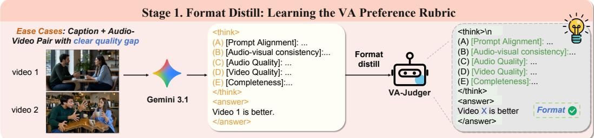

Stage 2. Human Alignment: Rejection Sampling  
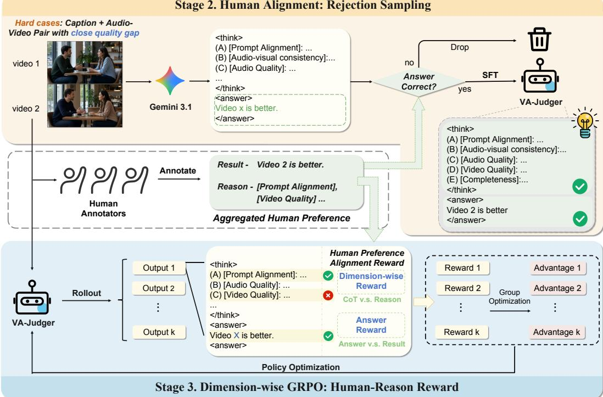

Figure 2: Overview of the VA-Judger training pipeline. Stage 1 cold-starts the model on easy preference pairs. Stage 2 aligns the model on harder pairs through human rejection sampling. Stage 3 performs GRPO using answer-level and dimension-level rewards grounded in human reasons. supervision generated by Gemini in Stage 1 unreliable. In a separate pilot study of 200 hard pairs, Gemini 3.1 Pro agrees with human judgments on only 60% of the pairs. As the reward model is intended to represent subjective human preference (Christiano et al., 2017; Ouyang et al., 2022), we replace the Gemini labels with human-verified supervision. For each hard pair, annotators select the preferred clip and identify the rubric dimensions that support their decision.

Furthermore, human labels alone do not provide the complete structured responses required for SFT. We therefore use Gemini to generate rubric responses and retain only those whose final choices match the human labels. This rejection sampling yields 4.5K verified examples that preserve the output format learned in Stage 1 while grounding the final preference in human feedback. Training on structured responses for human-verified hard pairs exposes VA-Judger to the specific visual and auditory differences between clips of similar overall quality. This encourages close inspection rather than reliance on coarse quality gaps.

## 3.4 DIMENSION-WISE REINFORCEMENT LEARNING

The two SFT stages teach the model to imitate structured rubric responses, but imitation alone has a fundamental limitation. The likelihood objective treats every token in the target response equally and does not distinguish whether the model’s own generated judgments actually agree with human preferences. A model can achieve low SFT loss while still producing dimension scores that contradict its final answer, or choosing the wrong clip with confident but internally consistent reasoning. To move beyond imitation toward genuine preference alignment, we need an objective that rewards the model based on the correctness of its self-generated judgments.

Thus, we propose Dimension-wise GRPO, which extends GRPO (Shao et al., 2024; Wang et al., 2025b) with a human-grounded verifiable reward. A key observation is that a single binary reward (correct or incorrect final answer) is too sparse for structured reasoning. The model may guess the right winner while assigning dimension scores that do not support its decision, learning a shortcut rather than genuine cross-modal reasoning. Our reward addresses this by jointly verifying two aspects of each response. Given input $\boldsymbol { x } = ( p , x _ { 1 } , x _ { 2 } )$ consisting of a prompt and two clips, the old policy $\pi _ { \boldsymbol { \theta } _ { \mathrm { o l d } } }$ samples $G$ responses $\{ o _ { i } \} _ { i = 1 } ^ { G }$ . Each human annotation provides the preferred clip $y ^ { \star }$ and a set of supporting dimensions $\tilde { \mathcal { D } _ { \mathrm { h } } } \subseteq \tilde { \mathcal { D } }$ that justify the preference (the full rubric D is shown in Appendix Figure 5). For response $o _ { i } ,$ , we parse the predicted preference $\hat { y } _ { i }$ and dimension scores $s _ { i , d } ^ { ( k ) }$ for clip $k$ on dimension $d .$ The reward combines an answer component that verifies the final preference with a dimension component that checks whether the score ordering on each humanspecified dimension supports the human decision. For clarity, we define both components for a generic response $^ { O , }$ with predicted preference yˆ and score $s _ { d , k }$ for clip k on dimension d:

$$
r _ { \mathrm { a n s } } ( o ) = { \bf 1 } [ \hat { y } = y ^ { \star } ] , \quad \quad r _ { \mathrm { d i m } } ( o ) = \frac { 1 } { \vert { \cal D } _ { \mathrm { h } } \vert } \sum _ { d \in { \cal D } _ { \mathrm { h } } } { \bf 1 } [ s _ { d , y ^ { \star } } > s _ { d , 3 - y ^ { \star } } ] .\tag{1}
$$

For each sampled response, we define the combined reward as $\begin{array} { r } { R _ { i } = \frac { 1 } { 2 } \big ( r _ { \mathrm { a n s } } ( o _ { i } ) + r _ { \mathrm { d i m } } ( o _ { i } ) \big ) } \end{array}$ . This design rewards the model not just for picking the right winner, but for doing so with reasoning that aligns with the human-identified quality differences. Responses that arrive at the correct answer through inconsistent or fabricated dimension scores receive only partial reward, encouraging the model to develop faithful cross-modal reasoning rather than surface-level shortcuts.

We further optimize the policy with GRPO. The G rewards within each group are normalized to advantages $\dot { A _ { i } } ,$ and the policy is updated via a clipped surrogate objective with a KL penalty against the reference policy $\pi _ { \mathrm { r e f } } .$

$$
\begin{array} { l } { { \displaystyle { \cal A } _ { i } = \frac { R _ { i } - { \bar { R } } } { \sigma _ { R } + \epsilon } } , \qquad { \displaystyle { \rho } _ { i } = \frac { \pi _ { \theta } \bigl ( o _ { i } \mid { x } \bigr ) } { \pi _ { \theta _ { \mathrm { o l d } } } \bigl ( o _ { i } \mid { x } \bigr ) } } , } \\ { { \displaystyle \mathcal { I } _ { \mathrm { G R P O } } ( \theta ) = \mathbb { E } \Biggl [ \frac { 1 } { G } \sum _ { i = 1 } ^ { G } \mathrm { m i n } ( \rho _ { i } A _ { i } , c _ { i } A _ { i } ) - \beta D _ { \mathrm { K L } } \bigl ( \pi _ { \theta } \| \pi _ { \mathrm { r e f } } \bigr ) \Biggr ] , } } \end{array}\tag{2}
$$

where $\bar { R }$ and $\sigma _ { R }$ are the group mean and standard deviation of rewards, $c _ { i } = \mathrm { c l i p } ( \rho _ { i } , 1 - \delta , 1 + \delta )$ and ϵ stabilizes normalization.

## 4 EXPERIMENTS

## 4.1 EXPERIMENT SETUP

Reward model evaluation. VA-Judger-Bench contains three splits: 400 easy pairs, 250 in-domain pairs, and 500 out-of-domain pairs. The easy split contains clear quality gaps and tests coarse preference discrimination. The in-domain split follows the hard training distribution and tests subtle judgments on familiar generators. The out-of-domain split uses clips from unseen closed-source generation models to test the model’s generalization capability. None of the 1,150 benchmark pairs overlaps with the training set.

Generation model post-training. We test whether VA-Judger can improve a generation model rather than only classify held-out preference pairs. We use LTX-2 (HaCohen et al., 2026) as the policy and retain OmniNFT’s reinforcement learning framework (Zhang et al., 2026), but replace its five independent expert rewards with VA-Judger. For each prompt, the old policy generates eight video-audio candidates, which form 28 unique pairs. VA-Judger evaluates every pair using the five rubric dimensions shown in Appendix Figure 5. We average the scores obtained by each candidate across its seven comparisons, use dimension C as the audio reward, use dimension D as the video reward, and average dimensions A, B, and E as the shared cross-modal reward. Each reward is normalized within the eight-candidate group. The audio and video rewards are routed to their corresponding generation branches, while the shared reward updates both branches. The LTX-2 backbone remains frozen, and only LoRA parameters are optimized (Hu et al., 2022). Appendix D.2 provides the training configuration. Gemini 3.1 Pro (Google DeepMind, 2026a) is used only for offline data construction. Its paid remote API does not scale to the frequent reward calls required during post-training.

## 4.2 REWARD MODEL EVALUATION

Table 1: Accuracy (%) against human pairwise preferences. Single-dimension evaluation metrics and reward models are both evaluated on the 1,150-pair VA-Judger-Bench and report Total Acc / Parsed Acc. Unparseable responses count as incorrect in Total Acc.
<table><tr><td>Model</td><td>Easy</td><td>In-domain</td><td>Out-of-domain</td><td>Overall</td></tr><tr><td>Single-dimension evaluation metrics</td><td></td><td></td><td></td><td></td></tr><tr><td>Video quality: VideoAlign</td><td>62.39</td><td>52.97</td><td>48.35</td><td>54.29</td></tr><tr><td>Audio quality: AudioBox</td><td>58.70</td><td>50.00</td><td>44.00</td><td>50.43</td></tr><tr><td>Text-video: CLIP Score</td><td>55.56</td><td>54.66</td><td>53.58</td><td>54.50</td></tr><tr><td>Text-audio: ImageBind T-A</td><td>58.48</td><td>52.97</td><td>51.48</td><td>54.29</td></tr><tr><td>Audio-video: ImageBind</td><td>61.30</td><td>55.51</td><td>51.83</td><td>55.94</td></tr><tr><td>Synchronization: SynchFormer</td><td>61.30</td><td>46.61</td><td>48.35</td><td>52.71</td></tr><tr><td>Overall: Javis Score</td><td>60.00</td><td>55.51</td><td>54.96</td><td>56.88</td></tr><tr><td>Reward models</td><td></td><td></td><td></td><td></td></tr><tr><td>Qwen3-Omni Captioner (No CoT)</td><td>57.00 / 57.00</td><td>54.00 / 54.00</td><td>56.20 / 56.20</td><td>57.22 / 57.22</td></tr><tr><td>Qwen3-Omni Captioner (CoT)</td><td>52.50 / 57.65</td><td>49.60 / 54.87</td><td>46.60 / 56.97</td><td>50.43 / 58.61</td></tr><tr><td>Qwen3-Omni Instruct NoCoT</td><td>60.75 / 60.75</td><td>54.00 / 54.00</td><td>54.60 / 54.60</td><td>56.61 / 56.61</td></tr><tr><td>Qwen3-Omni Instruct CoT</td><td>63.25 / 64.71</td><td>54.80 / 55.92</td><td>55.00 / 55.33</td><td>57.83 / 58.69</td></tr><tr><td>+ Easy Cold Start</td><td>72.00 / 72.00</td><td>59.20 / 59.20</td><td>56.20 / 56.20</td><td>62.35 / 62.35</td></tr><tr><td>+ Hard SFT</td><td>74.50 / 74.50</td><td>63.60 / 63.60</td><td>60.20 / 60.20</td><td>65.91 / 65.91</td></tr><tr><td>+ GRPO (VA-Judger)</td><td>76.25 / 76.25</td><td>66.00 / 66.00</td><td>63.40 / 63.40</td><td>68.43 / 68.43</td></tr></table>

We first test whether commonly used evaluation metrics can recover the human-preferred clip. For each metric, the clip with the better scalar score is selected. We choose one representative metric for each evaluation category: VideoAlign for video quality (Liu et al., 2025b) and AudioBox for audio quality (Liu et al., 2025c). The cross-modal categories are represented by CLIP Score (Hessel et al., 2021) for text-video consistency, ImageBind T-A for text-audio consistency, ImageBind similarity for audio-video semantic consistency (Girdhar et al., 2023), SynchFormer offset for temporal synchronization (Iashin et al., 2024), and Javis Score for aggregate audio-video consistency (Liu et al., 2025c). Exact score ties are excluded when computing metric accuracy. As shown in Table 1, the seperate evaluation metrics show limited agreement with overall human preference. Their overall accuracies range from 50.43% to 56.88%, and no representative metric exceeds 56.88%. VideoAlign and AudioBox fall from 62.39% and 58.70% on easy pairs to 48.35% and 44.00% on the out-ofdomain split. This degradation indicates that a large cross-model quality gap can sometimes be detected from one modality, but the resulting score does not transfer reliably to harder comparisons.

This misalignment follows directly from what each metric observes. VideoAlign evaluates visual quality, motion, and text-video alignment but does not receive audio (Liu et al., 2025b). AudioBox averages AudioBox’s CE, CU, PC, and PQ scores over the generated audio (Liu et al., 2025c; Tjandra et al., 2025), so it does not assess whether the audio matches the prompt or video. CLIP Score (Hessel et al., 2021) and ImageBind (Girdhar et al., 2023) measure global representation similarity, which can preserve broad semantic relatedness while overlooking local generation defects, incorrect events, or temporal mismatch. SynchFormer estimates temporal offset rather than whether the synchronized sound is semantically correct (Iashin et al., 2024). Javis Score aggregates local audio-video embedding similarity (Liu et al., 2025c), but does not independently model text faithfulness or unimodal quality. These metrics remain useful for diagnosing individual properties, but none provides a reliable surrogate for holistic human preference. Appendix E reports the complete results for all separate evaluation metrics.

We further evaluate Qwen3-Omni, together with VA-Judger after easy SFT, hard SFT, and Dimension Wise GRPO. We freeze the visual and audio encoders and update only the language backbone. Total Acc counts responses without a valid final choice as incorrect, while Parsed Acc evaluates only valid responses.

Table 1 shows that CoT improves Qwen3-Omni’s Total Acc over NoCoT and the three training stages provide further consistent improvements. Easy SFT raises overall Total Acc from 57.83%

Table 2: Results on the randomly sampled 200-prompt JavisBench subset. Best results are highlighted in green and second-best results are underlined. Higher is better unless marked with ↓. The two ∆ rows report the raw change produced by VA-Judger post-training.
<table><tr><td></td><td colspan="2">Video Quality</td><td colspan="5">AudioBox Quality</td><td colspan="3">Cross-Modal Alignment</td></tr><tr><td>Model</td><td>VQ↑</td><td>MQ↑</td><td>AQ↑</td><td>AB-CE↑</td><td>AB-CU↑</td><td>AB-PC ↑</td><td>AB-PQ ↑</td><td>TV-Align ↑</td><td>TA-Align ↑</td><td>ViCLIP↑</td></tr><tr><td>LTX-2</td><td>2.248</td><td>0.697</td><td>4.767</td><td>3.957</td><td>5.904</td><td>3.041</td><td>6.166</td><td>0.303</td><td>0.105</td><td>0.232</td></tr><tr><td>LTX-2 + OmniNFT</td><td>3.727</td><td>0.947</td><td>5.399</td><td>4.745</td><td>6.797</td><td>3.150</td><td>6.905</td><td>0.279</td><td>0.133</td><td>0.219</td></tr><tr><td>LTX-2 + VA-Judger</td><td>3.942</td><td>1.183</td><td>5.610</td><td>5.136</td><td>6.766</td><td>3.606</td><td>6.932</td><td>0.310</td><td>0.180</td><td>0.242</td></tr><tr><td>∆ vs. LTX-2</td><td>+1.693</td><td>+0.486</td><td>+0.843</td><td>+1.179</td><td>+0.862</td><td>+0.564</td><td>+0.766</td><td>+0.007</td><td>+0.075</td><td>+0.009</td></tr><tr><td>∆ vs. OmniNFT</td><td>+0.214</td><td>+0.236</td><td>+0.211</td><td>+0.391</td><td>-0.031</td><td>+0.456</td><td>+0.026</td><td>+0.031</td><td>+0.047</td><td>+0.023</td></tr><tr><td colspan="5">Text Consistency</td><td colspan="6">AV Consistency and Synchrony</td></tr><tr><td>Model</td><td>TV-IB ↑</td><td>TA-IB ↑</td><td>CLIP↑</td><td>CLAP↑</td><td>AV-IB↑</td><td>CAVP↑</td><td>AV-Align ↑</td><td>AVHScore ↑</td><td>DeSync ↓</td><td>JavisScore ↑</td></tr><tr><td>LTX-2</td><td>0.355</td><td>0.102</td><td>0.303</td><td>0.304</td><td>0.091</td><td>0.786</td><td>0.192</td><td>0.091</td><td>0.430</td><td>0.074</td></tr><tr><td>LTX-2 + OmniNFT</td><td>0.336</td><td>0.134</td><td>0.298</td><td>0.394</td><td>0.154</td><td>0.800</td><td>0.208</td><td>0.146</td><td>0.226</td><td>0.122</td></tr><tr><td>LTX-2 + VA-Judger</td><td>0.376</td><td>0.179</td><td>0.326</td><td>0.425</td><td>0.265</td><td>0.799</td><td>0.228</td><td>0.261</td><td>0.592</td><td>0.230</td></tr><tr><td>∆ vs. LTX-2</td><td>+0.021</td><td>+0.077</td><td>+0.023</td><td>+0.121</td><td>+0.175</td><td>+0.013</td><td>+0.035</td><td>+0.169</td><td>+0.162</td><td>+0.157</td></tr><tr><td>∆ vs. OmniNFT</td><td>+0.040</td><td>+0.046</td><td>+0.028</td><td>+0.031</td><td>+0.111</td><td>-0.001</td><td>+0.020</td><td>+0.114</td><td>+0.366</td><td>+0.108</td></tr></table>

to 62.35%, confirming that unambiguous comparisons provide a useful initialization for the task. Human-verified hard pairs further increase accuracy to 65.91%, and Dimension Wise GRPO reaches 68.43%. The final model improves over Qwen3-Omni CoT by 10.60 percentage points overall.

## 4.3 POST-TRAINING LTX-2 WITH VA-JUDGER

The evaluation uses a fixed subset of 200 prompts drawn uniformly at random from the full 10,140 prompt JavisBench pool (Liu et al., 2025c). Every prompt has the same inclusion probability, and no category labels are used for filtering or stratification. We use this subset for the base LTX-2, OmniNFT (Zhang et al., 2026), and LTX-2 post-trained with VA-Judger. Appendix Table 3 reports its category distribution alongside the full pool. Higher is better for all metrics except DeSync.

Quatitative results. Table 2 shows that VA-Judger post-training ranks first on 11 of the 13 reported JavisBench metrics and six of the seven complementary metrics. Relative to LTX-2, it raises visual, motion, and audio quality from 2.248, 0.697, and 4.767 to 3.942, 1.183, and 5.610. The gains also extend to text and cross-modal consistency. JavisScore increases from 0.074 to 0.230, AVHScore from 0.091 to 0.261, and T2AV-Compass Text-Audio Alignment from 0.105 to 0.180.

OmniNFT optimizes separate expert rewards for visual, audio quality, text alignment, and audiovisual synchronization (Zhang et al., 2026). This can improve the rewarded metrics, such as DeSync, without consistently improving overall human preference, resulting in reward hacking. In contrast, VA-Judger provides a unified reward learned from holistic human comparisons, allowing video model training to align directly with human preferences rather than seperate evaluation metrics.

Qualitative results. Figure 3 presents two representative comparisons. VA-Judger improves temporal instruction following for both the rabbit motion and the spacecraft landing sequence.

Human evaluation. We further evaluate whether these improvements translate into human preference. We recruit 20 adult participants who have normal or corrected-to-normal vision, and report no hearing impairment. For each of the same 200 prompts, LTX-2, OmniNFT, and our VA-Judger post-trained model each generate one video-audio output, yielding 200 triplets and 600 generated clips in total. Participants view each prompt-aligned triplet and select the best overall output in a three-way forced-choice comparison.

As shown in Figure 4, the model post-trained with VA-Judger receives 62.30% of human preferences, compared with 27.63% for OmniNFT and 10.08% for the base LTX-2. VA-Judger is therefore preferred more than twice as often as OmniNFT and more than six times as often as the base model. This result provides direct evidence that the improvements induced by VA-Judger are perceptible to human viewers rather than being limited to higher scores on the evaluated metrics.

Text prompt: A quiet garden shot shows a rabbit nibbling grass with tiny quick bites that make faint crunching sounds. A sudden distant noise makes the rabbit freeze, ears upright, then it thumps one hind foot sharply on the ground with a dull thud. After a brief still moment, it darts away through dry leaves that crackle rapidly as it disappears.

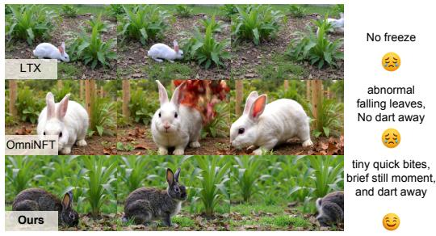  
Text prompt: From a low-angle, medium-wide shot, a sleek spacecraft with a polished column-shaped fuselage stands on the barren, rust-colored surface of a desolate alien planet. Rendered with cinematic realism and a hard science fiction aesthetic, the vessel is supported by three powerful, articulated landing legs. As the camera holds a static position, the legs begin to compress in a slow, synchronized motion, gracefully lowering the craft's main body towards the dusty ground. A deep, low-frequenc metallic groan accompanies the movement, layered over the faint, ethereal whistle of wind sweeping across the alien terrain under a pale sky

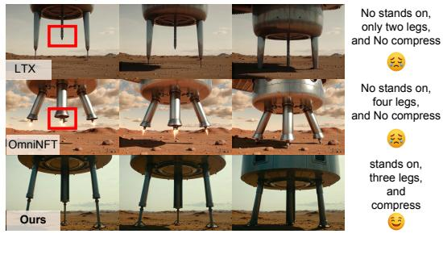

Figure 3: Qualitative comparisons of LTX-2, OmniNFT, and our VA-Judger post-trained model. VA-Judger better follows the requested temporal actions in both examples.  
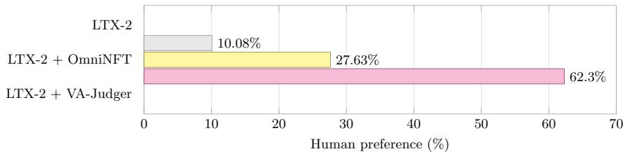  
Figure 4: Human preference rates over 200 three-way comparisons. For each prompt, participants select the best video-audio output among LTX-2, LTX-2 post-trained with OmniNFT, and LTX-2 post-trained with VA-Judger.

## 5 CONCLUSION

In this paper, we proposed VA-Judger, a human-aligned omni-reward model that produces dimension-wise reasoning for joint video-audio generation. To address the scarcity of preference supervision, we constructed VAPref-10K from difficulty-aware video-audio pairs and introduced VA-Judger-Bench for evaluating alignment with human judgments. VA-Judger first learns the structured comparison rubric and coarse preference discrimination from easy cross-model pairs, then aligns with fine-grained human preferences on hard pairs through human-verified rejection sampling. We further introduced dimension-wise reinforcement learning to refine both the reasoning process and final preference. Experiments show that VA-Judger provides more accurate preference judgments than existing omni-models and automatic metrics. When used to post-train LTX-2, VA-Judger significantly improves video-audio quality. We hope VA-Judger provides a foundation for more interpretable and human-aligned post-training of joint video-audio generation models.

## REFERENCES

Yoshua Bengio, Jer´ ome Louradour, Ronan Collobert, and Jason Weston. Curriculum learning. Inˆ Proceedings of the 26th International Conference on Machine Learning, pp. 41–48, 2009. doi: 10.1145/1553374.1553380.

Paul F. Christiano, Jan Leike, Tom Brown, Miljan Martic, Shane Legg, and Dario Amodei. Deep reinforcement learning from human preferences. In Advances in Neural Information Processing Systems, volume 30. Curran Associates, Inc., 2017.

Echo Team @ Joy Future Academy, JD. Joyai-echo: Pushing the frontier of long audio-visual generation. Technical report, Joy Future Academy, JD, May 2026.

Rohit Girdhar, Alaaeldin El-Nouby, Zhuang Liu, Mannat Singh, Kalyan Vasudev Alwala, Armand Joulin, and Ishan Misra. Imagebind: One embedding space to bind them all. In Proceedings ofthe IEEE/CVF Conference on Computer Vision and Pattern Recognition (CVPR), pp. 15180–15190, 2023.

Google. Gemini-omni. https://gemini.google.com/, 2026.

Google DeepMind. Gemini 3.1 pro. https://deepmind.google/models/gemini/ pro/, 2026a. Accessed: 2026-06-23.

Google DeepMind. Veo 3.1. https://deepmind.google/models/veo/, 2026b. Accessed: 2026-06-25.

Yoav HaCohen, Benny Brazowski, Nisan Chiprut, Yaki Bitterman, Andrew Kvochko, Avishai Berkowitz, Daniel Shalem, Daphna Lifschitz, Dudu Moshe, Eitan Porat, Eitan Richardson, Guy Shiran, Itay Chachy, Jonathan Chetboun, Michael Finkelson, Michael Kupchick, Nir Zabari, Nitzan Guetta, Noa Kotler, Ofir Bibi, Ori Gordon, Poriya Panet, Roi Benita, Shahar Armon, Victor Kulikov, Yaron Inger, Yonatan Shiftan, Zeev Melumian, and Zeev Farbman. Ltx-2: Efficient joint audio-visual foundation model. arXiv preprint arXiv:2601.03233, 2026.

Jack Hessel, Ari Holtzman, Maxwell Forbes, Ronan Le Bras, and Yejin Choi. CLIPScore: A reference-free evaluation metric for image captioning. In Proceedings of the 2021 Conference on Empirical Methods in Natural Language Processing, pp. 7514–7528. Association for Computational Linguistics, 2021. doi: 10.18653/v1/2021.emnlp-main.595.

Edward J. Hu, Yelong Shen, Phillip Wallis, Zeyuan Allen-Zhu, Yuanzhi Li, Shean Wang, Lu Wang, and Weizhu Chen. Lora: Low-rank adaptation of large language models. In International Conference on Learning Representations, 2022.

Daili Hua, Xizhi Wang, Bohan Zeng, Xinyi Huang, Hao Liang, Junbo Niu, Xinlong Chen, Quanqing Xu, and Wentao Zhang. Vabench: A comprehensive benchmark for audio-video generation. arXiv preprint arXiv:2512.09299, 2025.

Vladimir Iashin, Weidi Xie, Esa Rahtu, and Andrew Zisserman. Synchformer: Efficient synchronization from sparse cues. In ICASSP 2024 - 2024 IEEE International Conference on Acoustics, Speech and Signal Processing (ICASSP), pp. 5325–5329, 2024.

Yuval Kirstain, Adam Polyak, Uriel Singer, Shahbuland Matiana, Joe Penna, and Omer Levy. Picka-pic: An open dataset of user preferences for text-to-image generation. In Advances in Neural Information Processing Systems, volume 36, pp. 36652–36663. Curran Associates, Inc., 2023.

Kling AI. Kling 3.0. https://klingai.com/, 2026.

Kling Team, Jialu Chen, Yuanzheng Ci, et al. Kling-omni technical report. arXiv preprint arXiv:2512.16776, 2025.

Jiaqi Leng, Shuyuan Tu, Haidong Cao, Sicheng Xie, Daoguo Dong, Zuxuan Wu, and Yu-Gang Jiang. Preference score distillation: Leveraging 2d rewards to align text-to-3d generation with human preference. arXiv preprint arXiv:2603.01594, 2026.

Jie Liu, Gongye Liu, Jiajun Liang, Yangguang Li, Jiaheng Liu, Xintao Wang, Pengfei Wan, Di Zhang, and Wanli Ouyang. Flow-grpo: Training flow matching models via online rl. arXiv preprint arXiv:2505.05470, 2025a.

Jie Liu, Gongye Liu, Jiajun Liang, Ziyang Yuan, Xiaokun Liu, Mingwu Zheng, Xiele Wu, Qiulin Wang, Menghan Xia, Xintao Wang, Xiaohong Liu, Fei Yang, Pengfei Wan, Di Zhang, Kun Gai, Yujiu Yang, and Wanli Ouyang. Improving video generation with human feedback. In Advances in Neural Information Processing Systems, volume 38, pp. 82155–82192. Curran Associates, Inc., 2025b.

Kai Liu, Wei Li, Lai Chen, Shengqiong Wu, Yanhao Zheng, Jiayi Ji, Fan Zhou, Jiebo Luo, Ziwei Liu, Hao Fei, and Tat-Seng Chua. Javisdit: Joint audio-video diffusion transformer with hierarchical spatio-temporal prior synchronization. arXiv preprint arXiv:2503.23377, 2025c.

Kai Liu, Yanhao Zheng, Kai Wang, Shengqiong Wu, Rongjunchen Zhang, Jiebo Luo, Dimitrios Hatzinakos, Ziwei Liu, Hao Fei, and Tat-Seng Chua. Javisdit++: Unified modeling and optimization for joint audio-video generation. arXiv preprint arXiv:2602.19163, 2026.

Chetwin Low, Weimin Wang, and Calder Katyal. Ovi: Twin backbone cross-modal fusion for audiovideo generation. arXiv preprint arXiv:2510.01284, 2025.

Yuhang Ma, Xiaoshi Wu, Keqiang Sun, and Hongsheng Li. Hpsv3: Towards wide-spectrum human preference score. In Proceedings ofthe IEEE/CVF International Conference on Computer Vision (ICCV), pp. 15086–15095, 2025.

OpenAI. Sora 2 is here. https://openai.com/index/sora-2/, 2025. Accessed: 2026- 06-25.

Long Ouyang, Jeffrey Wu, Xu Jiang, Diogo Almeida, Carroll Wainwright, Pamela Mishkin, Chong Zhang, Sandhini Agarwal, Katarina Slama, Alex Ray, John Schulman, Jacob Hilton, Fraser Kelton, Luke Miller, Maddie Simens, Amanda Askell, Peter Welinder, Paul F. Christiano, Jan Leike, and Ryan Lowe. Training language models to follow instructions with human feedback. In Advances in Neural Information Processing Systems, volume 35, pp. 27730–27744. Curran Associates, Inc., 2022.

Mihir Prabhudesai, Russell Mendonca, Zheyang Qin, Katerina Fragkiadaki, and Deepak Pathak. Video diffusion alignment via reward gradients. arXiv preprint arXiv:2407.08737, 2024.

Qwen Team. Qwen3.5-Omni technical report. arXiv preprint arXiv:2604.15804, 2026.

Rafael Rafailov, Archit Sharma, Eric Mitchell, Christopher D. Manning, Stefano Ermon, and Chelsea Finn. Direct preference optimization: Your language model is secretly a reward model. In Advances in Neural Information Processing Systems, volume 36, pp. 53728–53741. Curran Associates, Inc., 2023.

Zhihong Shao, Peiyi Wang, Qihao Zhu, Runxin Xu, Junxiao Song, Xiao Bi, Haowei Zhang, Mingchuan Zhang, Y. K. Li, Y. Wu, and Daya Guo. Deepseekmath: Pushing the limits of mathematical reasoning in open language models. arXiv preprint arXiv:2402.03300, 2024.

SII-GAIR, Sand.ai, Ethan Chern, et al. Speed by simplicity: A single-stream architecture for fast audio-video generative foundation model. arXiv preprint arXiv:2603.21986, 2026.

SII-OpenMOSS Team, Donghua Yu, Mingshu Chen, et al. Mova: Towards scalable and synchronized video-audio generation. arXiv preprint arXiv:2602.08794, 2026.

Team Seedance, De Chen, Liyang Chen, Xin Chen, and Ying Chen. Seedance 2.0: Advancing video generation for world complexity. arXiv preprint arXiv:2604.14148, 2026.

Andros Tjandra, Yi-Chiao Wu, Baishan Guo, John Hoffman, Brian Ellis, Apoorv Vyas, Bowen Shi, Sanyuan Chen, Matt Le, Nick Zacharov, Carleigh Wood, Ann Lee, and Wei-Ning Hsu. Meta audiobox aesthetics: Unified automatic quality assessment for speech, music, and sound. arXiv preprint arXiv:2502.05139, 2025.

Shuyuan Tu, Qi Dai, Zuxuan Wu, Zhi-Qi Cheng, Han Hu, and Yu-Gang Jiang. Implicit temporal modeling with learnable alignment for video recognition. In ICCV, 2023.

Shuyuan Tu, Qi Dai, Zhi-Qi Cheng, Han Hu, Xintong Han, Zuxuan Wu, and Yu-Gang Jiang. Motioneditor: Editing video motion via content-aware diffusion. In CVPR, 2024a.

Shuyuan Tu, Qi Dai, Zihao Zhang, Sicheng Xie, Zhi-Qi Cheng, Chong Luo, Xintong Han, Zuxuan Wu, and Yu-Gang Jiang. Motionfollower: Editing video motion via lightweight score-guided diffusion. arXiv preprint arXiv:2405.20325, 2024b.

Shuyuan Tu, Yueming Pan, Yinming Huang, Xintong Han, Zhen Xing, Qi Dai, Chong Luo, Zuxuan Wu, and Yu-Gang Jiang. Stableavatar: Infinite-length audio-driven avatar video generation. arXiv preprint arXiv:2508.08248, 2025a.

Shuyuan Tu, Zhen Xing, Xintong Han, Zhi-Qi Cheng, Qi Dai, Chong Luo, and Zuxuan Wu. Stableanimator: High-quality identity-preserving human image animation. In CVPR, 2025b.

Shuyuan Tu, Zhen Xing, Xintong Han, Zhi-Qi Cheng, Qi Dai, Chong Luo, Zuxuan Wu, and Yu-Gang Jiang. Stableanimator++: Overcoming pose misalignment and face distortion for human image animation. arXiv preprint arXiv:2507.15064, 2025c.

Shuyuan Tu, Yueming Pan, Yinming Huang, Xintong Han, Zhen Xing, Qi Dai, Kai Qiu, Chong Luo, and Zuxuan Wu. Flashportrait: 6x faster infinite portrait animation with adaptive latent prediction. In CVPR, 2026a.

Shuyuan Tu, Qi Tian, Zihan Yang, Yue Wu, Xintong Han, Weijie Kong, Jiangfeng Xiong, Jian-Wei Zhang, Zhao Zhong, Liefeng Bo, Zuxuan Wu, and Yu-Gang Jiang. Baton: Explicit semantic blueprints for joint video-audio generation. arXiv preprint arXiv:2605.25195, 2026b.

Wan Team. Wan 2.7. https://wan.video/, 2026.

Wan Team, Ang Wang, and Baole Ai. Wan: Open and advanced large-scale video generative models. arXiv preprint arXiv:2503.20314, 2025.

Duomin Wang, Wei Zuo, Aojie Li, Ling-Hao Chen, Xinyao Liao, Deyu Zhou, Zixin Yin, Xili Dai, Daxin Jiang, and Gang Yu. Universe-1: Unified audio-video generation via stitching of experts. arXiv preprint arXiv:2509.06155, 2025a.

Yibin Wang, Zhiyu Tan, Junyan Wang, Xiaomeng Yang, Cheng Jin, and Hao Li. Lift: Leveraging human feedback for text-to-video model alignment. arXiv preprint arXiv:2412.04814, 2024.

Yibin Wang, Zhimin Li, Yuhang Zang, Chunyu Wang, Qinglin Lu, Cheng Jin, and Jiaqi Wang. Unified multimodal chain-of-thought reward model through reinforcement fine-tuning. In Advances in Neural Information Processing Systems, 2025b.

Yibin Wang, Yuhang Zang, Hao Li, Cheng Jin, and Jiaqi Wang. Unified reward model for multimodal understanding and generation. arXiv preprint arXiv:2503.05236, 2025c.

Jason Wei, Xuezhi Wang, Dale Schuurmans, Maarten Bosma, Brian Ichter, Fei Xia, Ed Chi, Quoc Le, and Denny Zhou. Chain-of-thought prompting elicits reasoning in large language models. In Advances in Neural Information Processing Systems, 2022.

Xiaoshi Wu, Yiming Hao, Keqiang Sun, Yixiong Chen, Feng Zhu, Rui Zhao, and Hongsheng Li. Human preference score v2: A solid benchmark for evaluating human preferences of text-toimage synthesis. arXiv preprint arXiv:2306.09341, 2023a.

Yusong Wu, Ke Chen, Tianyu Zhang, Yuchen Hui, Taylor Berg-Kirkpatrick, and Shlomo Dubnov. Large-scale contrastive language-audio pretraining with feature fusion and keyword-to-caption augmentation. In ICASSP 2023 - 2023 IEEE International Conference on Acoustics, Speech and Signal Processing (ICASSP), pp. 1–5, 2023b.

Jiazheng Xu, Xiao Liu, Yuchen Wu, Yuxuan Tong, Qinkai Li, Ming Ding, Jie Tang, and Yuxiao Dong. Imagereward: Learning and evaluating human preferences for text-to-image generation. In Advances in Neural Information Processing Systems, volume 36, pp. 15903–15935. Curran Associates, Inc., 2023.

Jin Xu, Zhifang Guo, Hangrui Hu, Yunfei Chu, Xiong Wang, Jinzheng He, Yuxuan Wang, Xian Shi, He Ting, Xinfa Zhu, Yuanjun Lv, Dake Guo, He Wang, Linhan Ma, Pei Zhang, Xinyu Zhang, Hongkun Hao, Zishan Guo, Baosong Yang, Bin Zhang, Ziyang Ma, Xipin Wei, Shuai Bai, Keqin Chen, Xuejing Liu, Peng Wang, Mingkun Yang, Dayiheng Liu, Xingzhang Ren, Bo Zheng, Rui Men, Fan Zhou, Bowen Yu, Jianxin Yang, Le Yu, Jingren Zhou, and Junyang Lin. Qwen3-omni technical report. arXiv preprint arXiv:2509.17765, 2025.

Zeyue Xue, Jie Wu, Yu Gao, Fangyuan Kong, Lingting Zhu, Mengzhao Chen, Zhiheng Liu, Wei Liu, Qiushan Guo, Weilin Huang, and Ping Luo. Dancegrpo: Unleashing grpo on visual generation. arXiv preprint arXiv:2505.07818, 2025.

An Yang, Anfeng Li, Baosong Yang, et al. Qwen3 technical report. arXiv preprint arXiv:2505.09388, 2025.

Zihan Yang, Shuyuan Tu, Licheng Zhang, Qi Dai, Yu-Gang Jiang, and Zuxuan Wu. Arcflow: Unleashing 2-step text-to-image generation via high-precision non-linear flow distillation. arXiv preprint arXiv:2602.09014, 2026.

Hangjie Yuan, Shiwei Zhang, Xiang Wang, Yujie Wei, Tao Feng, Yining Pan, Yingya Zhang, Ziwei Liu, Samuel Albanie, and Dong Ni. Instructvideo: Instructing video diffusion models with human feedback. In Proceedings of the IEEE/CVF Conference on Computer Vision and Pattern Recognition (CVPR), pp. 6463–6474, 2024.

Yuhang Zang, Xiaoyi Dong, Pan Zhang, Yuhang Cao, Ziyu Liu, Shengyuan Ding, Shenxi Wu, Yubo Ma, Haodong Duan, Wenwei Zhang, Kai Chen, Dahua Lin, and Jiaqi Wang. Internlmxcomposer2.5-reward: A simple yet effective multi-modal reward model. arXiv preprint arXiv:2501.12368, 2025.

Bohan Zhang, Pan Xu, Xiaoyi Dong, Yuhang Zang, and Jiaqi Wang. Learning multi-dimensional human preference for text-to-image generation. arXiv preprint arXiv:2405.14705, 2024.

Guohui Zhang, XiaoXiao Ma, Jie Huang, Hang Xu, Hu Yu, Siming Fu, Yuming Li, Zeyue Xue, Lin Song, Haoyang Huang, Nan Duan, and Feng Zhao. Omninft: Modality-wise omni diffusion reinforcement for joint audio-video generation. arXiv preprint arXiv:2605.12480, 2026.

Kaiwen Zheng, Huayu Chen, Haotian Ye, Haoxiang Wang, Qinsheng Zhang, Kai Jiang, Hang Su, Stefano Ermon, Jun Zhu, and Ming-Yu Liu. Diffusionnft: Online diffusion reinforcement with forward process. arXiv preprint arXiv:2509.16117, 2025.

Ziwei Zhou, Zeyuan Lai, Rui Wang, Yifan Yang, Zhen Xing, Yuqing Yang, Qi Dai, Lili Qiu, and Chong Luo. Avgen-bench: A task-driven benchmark for multi-granular evaluation of text-to audio-video generation. arXiv preprint arXiv:2604.08540, 2026.

# A QUALITATIVE RESULT OF VA-JUDGER JUDGMENT

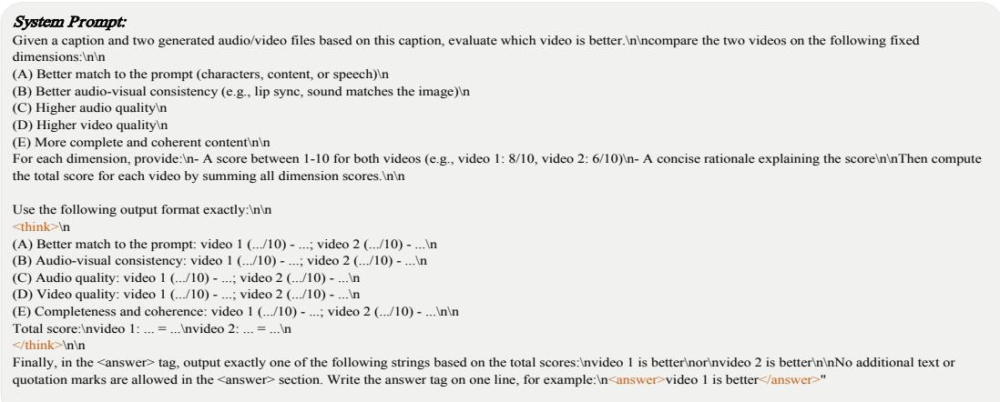

## Video Text Prompt:

Cinematic medium shot, locked-off and eye-level, opens inside a warmly lit café or tea-room bathed in soft, diffuse daylight that blends with cozy interior tones. The color palette is dominated by earthy browns, muted beiges, and deep blacks, punctuated by the vivid yellow of neckerchiefs and green foliage. Two teenage girls in matching black sailor-style school uniforms sit side-by-side at a dark wooden table, their navy collars edged in white piping and bright yellow neckerchiefs tied in loose bows, small red name badges pinned to their left chests. In front of them stand two tall, curved glasses filled with a cloudy pale drink, each garnished with a lemon slice on the rim, a single cherry at the bottom, and a white straw, while a smaller empty tumbler rests near the girl on the left. As a faint café room tone hums in the air, an off-screen adult woman’s calm, confident Japanese voice begins to speak, her standard Tokyo accent crisp and mid-to-high pitched: \"お二人は転校早々、 十人もの不良どもをやっつけたと聞きました。\" The girl on the right turns her head slightly toward the unseen speaker, listening attentively with her eyes lowered and lips closed, while the girl on the left keeps her gaze forward, brows faintly knit as she absorbs the words, her posture steady and respectful.\n\nThe woman’s voice continues, shifting to an encouraging tone with a slight smile audible in her diction as she delivers her next line in Japanese: \"あんたらなら、やつら を倒せると思って。\" The girl on the left lifts her chin, leans forward a fraction, and parts her lips, signaling her intent to respond, her expression tightening with quiet determination. Beside her, the girl on the right remains composed, watching her companion with steady eyes. The camera holds perfectly still, capturing the subtle micro-expressions and restrained body language that convey a shared sense of resolve against the softly shadowed backdrop. The scene lingers on this poised anticipation, the ambient café sounds fading into the weight of the unspoken challenge hanging in the warm, layered space.

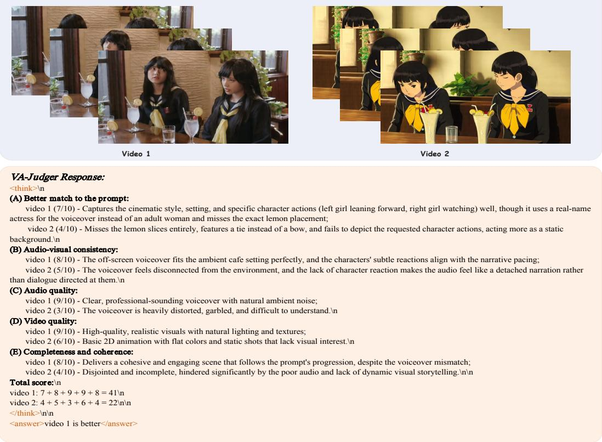  
Figure 5: A complete VA-Judger input and response. The system prompt defines dimensions A to E, and the response compares both clips on every dimension before producing the final preference.

## B VAPREF-10K CONSTRUCTION AND SOURCE DISTRIBUTION

## B.1 CONSTRUCTION PIPELINE

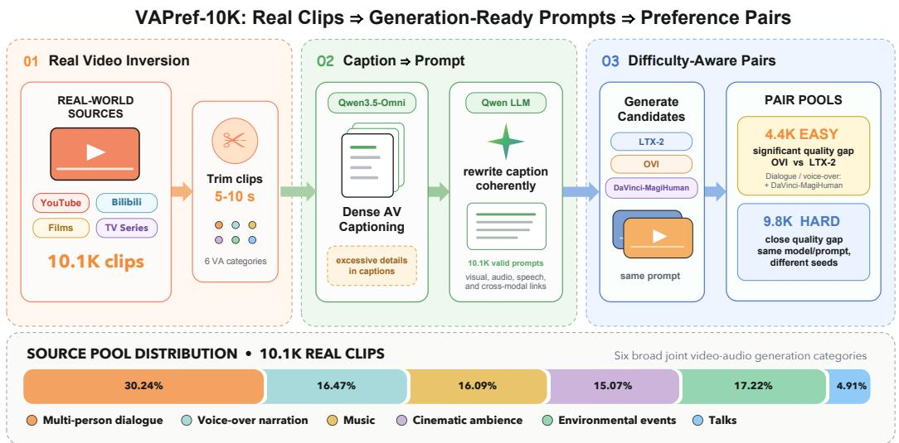  
Figure 6: Overview of VAPref-10K construction and the raw data distribution. Real video-audio clips are captioned by Qwen3.5-Omni, rewritten into text prompts by an LLM, and passed to LTX-2, OVI, and DaVinci-MagiHuman to generate candidate clips.

## B.2 SOURCE VIDEO DISTRIBUTION

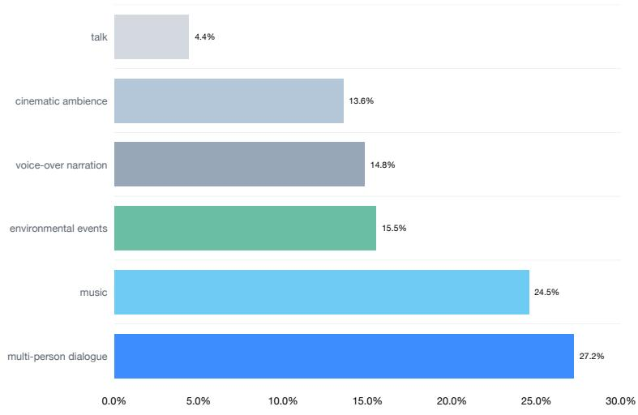  
Figure 7: Distribution of the source videos across the six categories in VAPref-10K.

Table 3: Category distributions of the full JavisBench pool and the random evaluation subset. Each cell reports the number and percentage of examples.
<table><tr><td>Dimension</td><td>Category</td><td>Full pool (10,140)</td><td>Random subset (200)</td></tr><tr><td>Event Scenario</td><td>Living Scenario</td><td>4,029 (39.7%)</td><td>73 (36.5%)</td></tr><tr><td rowspan="6"></td><td>Natural Scenario</td><td>2,452 (24.2%)</td><td>37 (18.5%)</td></tr><tr><td>Urban Scenario</td><td>2,140 (21.1%)</td><td>66 (33.0%)</td></tr><tr><td>Industrial Scenario</td><td>1,090 (10.7%)</td><td>20 (10.0%)</td></tr><tr><td>Virtual Scenario</td><td>429 (4.2%)</td><td>4 (2.0%)</td></tr><tr><td>Camera Shooting</td><td>8,586 (84.7%)</td><td>174 (87.0%)</td></tr><tr><td>2D Animation</td><td>915 (9.0%)</td><td>17 (8.5%)</td></tr><tr><td rowspan="5">Sound Type</td><td>3D Animation</td><td>639 (6.3%)</td><td>9 (4.5%)</td></tr><tr><td>Musical Sounds</td><td>5,065 (50.0%)</td><td>73 (36.5%)</td></tr><tr><td>Ambient Sounds</td><td>4,183 (41.3%)</td><td>126 (63.0%)</td></tr><tr><td>Biological Sounds</td><td>2,215 (21.8%)</td><td>59 (29.5%)</td></tr><tr><td>Mechanical Sounds</td><td>1,940 (19.1%)</td><td>49 (24.5%)</td></tr><tr><td rowspan="4">Spatial Composition</td><td>Speech Sounds</td><td>1,090 (10.7%)</td><td>29 (14.5%)</td></tr><tr><td>Multiple Subjects</td><td>7,588 (74.8%)</td><td>167 (83.5%)</td></tr><tr><td>Single Subject</td><td>2,502 (24.7%)</td><td>33 (16.5%)</td></tr><tr><td>Off-screen Sound</td><td>2,165 (21.4%)</td><td>59 (29.5%)</td></tr><tr><td rowspan="3">Temporal Composition</td><td>Sequential Events</td><td>3,698 (36.5%)</td><td>46 (23.0%)</td></tr><tr><td>Simultaneous Events</td><td>3,306 (32.6%)</td><td>99 (49.5%)</td></tr><tr><td>Single Event</td><td>3,136 (30.9%)</td><td>55 (27.5%)</td></tr></table>

## C JAVISBENCH EVALUATION SUBSET DISTRIBUTION

Table 3 compares the category distribution of the full 10,140 prompt JavisBench pool with the 200 prompt subset used for generation model evaluation. The subset is sampled uniformly at random without category-based filtering or stratification. Sound Type and Spatial Composition allow multiple labels, so their percentages do not sum to 100%.

## D IMPLEMENTATION DETAILS

## D.1 REWARD MODEL TRAINING AND EVALUATION

Supervised fine-tuning. Both stages initialize Qwen3-Omni-30B-A3B-Instruct with full parameter tuning of the language backbone, while the visual encoder and aligner remain frozen. Each stage runs on eight GPUs using BF16 and DeepSpeed ZeRO 3 with optimizer offload. We use a learning rate of $5 \times \mathrm { 1 0 ^ { - 6 } }$ , a warmup ratio of 0.05, a maximum sequence length of 24,576, and gradient checkpointing. The batch size is one per GPU with 16 gradient accumulation steps, giving an effective batch size of 128. Each video is represented by at most 128 tokens sampled from up to 12 frames.

Dimension Wise GRPO. This stage starts from the hard SFT checkpoint and samples eight responses per training pair with temperature 1.0 . We update the language backbone with Adafactor at a learning rate of $1 \times 1 0 ^ { - 6 }$ . The answer and dimension rewards receive equal weight, and a response that omits any required dimension score receives zero reward.

Evaluation. We use greedy decoding with vLLM. Each process receives the training comparison rubric. We extract the final choice from the <answer> tag; a response without a valid choice is incorrect for Total Acc and excluded from Parsed Acc.

## D.2 LTX-2 POST-TRAINING

We initialize the policy from the 19B LTX-2 checkpoint and keep the backbone frozen. LoRA adapters with rank 32 and scaling factor 64 are inserted into the video and audio attention layers, feed-forward layers, and bidirectional cross-modal attention layers. The current and old policies use separate adapters, while disabling the adapters recovers the fixed reference policy.

Each prompt produces eight candidates at $5 1 2 \times 7 6 8$ resolution with 121 frames at 24 FPS. Training rollouts use 20 denoising steps with video and audio classifier-free guidance scales of 1.5 and 3.0. We optimize with AdamW at a learning rate of $3 \times 1 0 ^ { - 5 } , ( \beta _ { 1 } , \beta _ { 2 } ) ^ { \mathbf { \overline { { { \nu } } } } } = ( 0 . 9 , 0 . 9 9 9 )$ , weight decay

$1 0 ^ { - 4 }$ , and gradient clipping at 1.0. Training uses BF16 precision. For each update, we randomly select 8 of the 20 denoising timesteps. Advantages are clipped to [−5, 5], the positive-negative prediction mixing coefficient is 1.0, and the reference regularization weight is $1 0 ^ { - \hat { 4 } }$

The video loss is reweighted using video-to-audio attention with a maximum weight of 1.5 and 400 warmup steps. Training runs with FSDP on six GPUs, while two additional GPUs host identical VA-Judger inference servers for batched reward computation. All generation model baselines use the same prompts, generation settings, and evaluation subset.

## E FULL METRIC ALIGNMENT RESULTS

We convert each scalar metric into a pairwise prediction using its preferred direction and compare the prediction with the human label. The tables report strict pairwise accuracy in percent, with exact metric ties excluded. Parentheses show score coverage when it is below 100%. Metrics selected as representatives in Table 1 are marked with ∗.

Table 4: Human preference accuracy (%) of video-quality metrics.
<table><tr><td>Metric</td><td>Easy</td><td>In-domain</td><td>Out-of-domain</td><td>Overall</td></tr><tr><td>VideoAlign Overall*</td><td>62.39</td><td>52.97</td><td>48.35</td><td>54.29</td></tr><tr><td>VideoPhy2</td><td>52.86</td><td>54.39</td><td>50.22</td><td>51.66</td></tr><tr><td>Motion Quality</td><td>59.91</td><td>51.06</td><td>49.74</td><td>53.66</td></tr><tr><td>Visual Quality</td><td>62.42</td><td>52.34</td><td>42.93</td><td>51.70</td></tr><tr><td>HPSv3</td><td>56.30</td><td>52.12</td><td>50.61</td><td>52.95</td></tr><tr><td>Video Aesthetic</td><td>57.52</td><td>50.21</td><td>47.21</td><td>51.50</td></tr><tr><td>Video Technical/Aesthetic</td><td>57.39</td><td>51.69</td><td>42.78</td><td>49.72</td></tr><tr><td>Video Technical/Overall</td><td>59.13</td><td>52.97</td><td>42.26</td><td>50.35</td></tr><tr><td>Video Technical/Technical</td><td>54.13</td><td>54.24</td><td>47.13</td><td>50.98</td></tr></table>

Table 5: Human preference accuracy (%) of audio-quality metrics.
<table><tr><td>Metric</td><td>Easy</td><td>In-domain</td><td>Out-of-domain</td><td>Overall</td></tr><tr><td>AudioBox*</td><td>58.70</td><td>50.00</td><td>44.00</td><td>50.43</td></tr><tr><td>AudioBox CE</td><td>61.52</td><td>49.58</td><td>42.09</td><td>50.51</td></tr><tr><td>AudioBox CU</td><td>62.39</td><td>48.31</td><td>38.61</td><td>49.02</td></tr><tr><td>AudioBox PC</td><td>45.22</td><td>54.24</td><td>53.74</td><td>50.75</td></tr><tr><td>AudioBox PQ</td><td>64.13</td><td>45.34</td><td>36.17</td><td>47.99</td></tr><tr><td>NISQA</td><td>53.48</td><td>51.69</td><td>43.48</td><td>48.62</td></tr><tr><td>DNSMOS</td><td>47.17</td><td>52.12</td><td>40.52</td><td>45.08</td></tr></table>

Table 6: Human preference accuracy (%) of text-video and text-audio consistency metrics.
<table><tr><td>Metric</td><td>Easy</td><td>In-domain</td><td>Out-of-domain</td><td>Overall</td></tr><tr><td colspan="5">Text-video consistency</td></tr><tr><td>CLIP Score*</td><td>55.56</td><td>54.66</td><td>53.58</td><td>54.50</td></tr><tr><td>ImageBind T-V</td><td>47.17</td><td>53.39</td><td>50.96</td><td>50.04</td></tr><tr><td>ViCLIP</td><td>53.91</td><td>43.83</td><td>49.74</td><td>50.16</td></tr><tr><td colspan="5">Text-audio consistency</td></tr><tr><td>ImageBind T-A*</td><td>58.48</td><td>52.97</td><td>51.48</td><td>54.29</td></tr><tr><td>CLAP Score</td><td>51.25</td><td>51.96</td><td>66.11</td><td>56.70</td></tr></table>

Table 7: Human preference accuracy (%) of audio-video semantic-consistency metrics. Audio-Video Alignment, AVHScore, and ImageBind A-V are all ImageBind-based metrics for audio-video semantic consistency, but differ in their preprocessing and feature aggregation procedures.
<table><tr><td>Metric</td><td>Easy</td><td>In-domain</td><td>Out-of-domain</td><td>Overall</td></tr><tr><td>Audio-Video Alignment*</td><td>61.30</td><td>55.51</td><td>51.83</td><td>55.94</td></tr><tr><td>AVH Score</td><td>61.74</td><td>58.90</td><td>54.26</td><td>57.83</td></tr><tr><td>ImageBind A-V</td><td>61.09</td><td>58.47</td><td>54.96</td><td>57.83</td></tr></table>

Table 8: Human preference accuracy (%) of synchronization and aggregate audio-video metrics. Values in parentheses are score coverage (%).
<table><tr><td>Metric</td><td>Easy</td><td>In-domain</td><td>Out-of-domain</td><td>Overall</td></tr><tr><td>SyncNet Confidence</td><td>64.17 (40.7)</td><td>50.60 (35.2)</td><td>40.19 (18.6)</td><td>54.38 (29.7)</td></tr><tr><td>SyncNet Min Distance</td><td>54.55 (40.7)</td><td>59.04 (35.2)</td><td>47.17 (18.6)</td><td>53.46 (29.7)</td></tr><tr><td>SyncNet |Offset| (frames)</td><td>65.06 (40.7)</td><td>47.89 (35.2)</td><td>41.86 (18.6)</td><td>55.11 (29.7)</td></tr><tr><td>SynchFormer |Argmax Offset| (s)</td><td>63.82</td><td>47.13</td><td>50.56</td><td>55.22</td></tr><tr><td>SynchFormer |Offset| (s)*</td><td>61.30</td><td>46.61</td><td>48.35</td><td>52.71</td></tr><tr><td>Desync</td><td>66.34</td><td>48.95</td><td>51.51</td><td>56.89</td></tr><tr><td>Lip-sync Confidence</td><td>63.10 (54.8)</td><td>53.57 (47.5)</td><td>42.98 (21.0)</td><td>55.88 (38.2)</td></tr><tr><td>Javis Score*</td><td>60.00</td><td>55.51</td><td>54.96</td><td>56.88</td></tr></table>