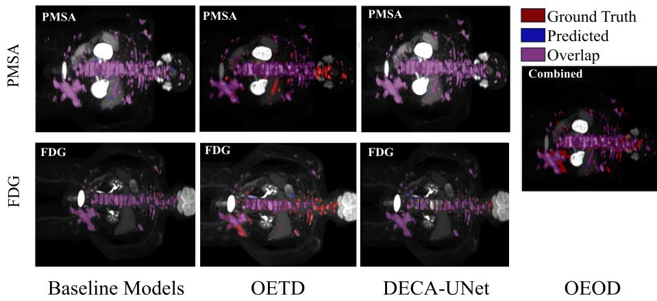
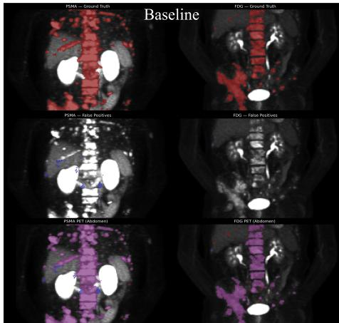
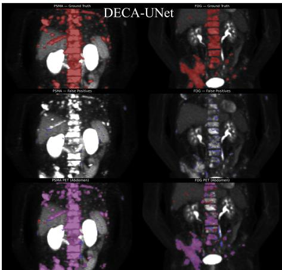

# When Two Tracers Disagree: An Investigation of Multimodal Fusion for Clinical PET/CT Segmentation

Jack A. Johnson1,2 and Bartłomiej W. Papież3

1 Nufield Department of Medicine, University of Oxford, UK

2 Department of Oncology, University of Oxford, UK

3 Big Data Institute, Nufield Department of Population Health, University of Oxford, Oxford, United Kingdom

Abstract. PSMA and FDG PET/CT visualise complementary biological information in prostate cancer. Combining both tracers could capture heterogeneous tumour phenotypes that may be missed by either alone, yet there is no consensus on efective deep learning architectures for fusing these modalities. We evaluated multimodal image-fusion strategies for automatic whole-body PET/CT lesion segmentation to estimate total tumour burden. Using the public DEEP-PSMA Challenge dataset, we trained tracer-specific 3D nnU-Net baselines and compared (i) early fusion with a single encoder and one decoder (OEOD) or two decoders (OETD), and (ii) intermediate fusion via a dual-encoder cross-attention U-Net (DECA-UNet). Tracer-specific baselines performed strongly (PSMA Dice = 0.93; FDG = 0.81). Fusion yielded mixed results: OEOD produced a combined Dice of 0.90 (on an easier, non-tracer-specific task), whilst the tracer-specific fusion models reached PSMA/FDG = 0.69/0.64 (OETD) and 0.76/0.57 (DECA-UNet). Whilst fusion often provided reasonable PSMA segmentation, FDG performance degraded and no strategy consistently exceeded the single-tracer baselines. Under the evaluated setting, tracer-specific models remain the stronger baseline; clinically useful gains from multimodal fusion will likely require architectures that better preserve tracer-specific representations. Our code is available at: https://github.com/JackJ3636/DEEP\_PSMA\_code

Keywords: PET/CT · PSMA · FDG · Tumour burden estimation · Multimodal fusion · Prostate cancer.

## 1 Introduction

Accurate assessment of prostate cancer is essential for patient triage and for predicting disease progression and treatment response. Prostate-specific membrane antigen (PSMA) PET/CT frequently alters local radiation planning [15]: in an Australian multicentre study, 68Ga-PSMA PET/CT revealed unsuspected prostate-bed disease in 27% of patients and changed radiotherapy planning in up to 21% [18]. Reliable tumour burden estimation requires accurate lesion delineation, yet manual annotation is time-consuming and subject to intra- and inter-observer variability [21], motivating automation [22]. Multimodal fusion has shown value across medical applications such as COVID-19 progression prediction [6], integrating complementary information much as a clinician combines modalities during clinical decision-making [14,10]. Existing PET/CT segmentation models perform strongly but are largely limited to a single radiotracer [1,5].

In prostate cancer, diferences between PSMA and fluorodeoxyglucose (FDG) PET tracers, with PSMA reflecting receptor expression and FDG capturing glycolytic activity, further motivate fusion: PSMA excels in typical lesions, whereas FDG may reveal dediferentiated or PSMA-negative disease [2,3]. Heterogeneous or low PSMA expression is not uncommon with 5-10% of prostate cancers only showing low-grade PSMA expression [16], potentially leading to poor uptake in PET imaging [7,23]. Meanwhile, FDG PET reflects high-grade, dediferentiated or PSMA-negative disease, and therefore combining the tracers could therefore capture both metabolic and molecular signatures. However, designing a fusion strategy that integrates complementary features without conflating tracer-specific signatures is non-trivial due to inter-tracer variability, as seen in the AutoPET III Challenge [19]. This study investigates whether multimodal fusion consistently improves segmentation accuracy over single-tracer baselines. In this work we (i) benchmark early- and intermediate-fusion architectures against strong tracerspecific nnU-Net baselines on the public DEEP-PSMA cohort; (ii) introduce DECA-UNet, a dual-encoder U-Net with zero-initialised channel-wise crossattention gating between the tracer streams; and (iii) report a clinically oriented evaluation, with 95% CIs on mean Dice, showing that under our setup fusion does not consistently outperform single-tracer baselines. We frame this primarily as an evaluation study and analyse the architectural and data conditions under which fusion is likely to help.

## 2 Materials and Methods

## 2.1 Dataset and Preprocessing

We used the public DEEP-PSMA dataset comprising 100 male patients imaged with paired PSMA $( ^ { 6 8 } \mathrm { G a { - } P S M A { - } 1 1 / ^ { 1 8 } F { \mathrm { - } } D C F P y L ) }$ and 18F-FDG PET/CT prior to $\mathrm { 1 7 7 _ { L u - P S M A } }$ therapy [12]. PSMA and FDG scans were acquired nonsimultaneously, so CT inputs were kept tracer-specific (PSMA-CT, FDG-CT). A TotalSegmentator output and a rigid registration parameter file were available to coarsely align the two tracers [24]. Each CT was resampled onto its PET grid via the scanner-derived headers (SimpleITK, translation transform, linear interpolation), and for the fusion models FDG PET and CT were resampled into the PSMA coordinate space using the NIfTI afines (54 of 100 cases required resampling). No additional cross-tracer rigid registration was applied beyond the scanner-derived afine alignment. Preprocessing followed nnU-Net conventions: body cropping; resampling to median spacings $( \approx 3 . 7 \mathrm { - } 3 . 8 \times 3 . 2 7 \times 3 . 7 \mathrm { - } 3 . 8 \mathrm { m m } )$ ; PET intensities handled as SUV; CT intensities HU-normalised per scan.

A lesion-level analysis showed marked tracer asymmetry: PSMA exhibited more lesions and greater tumour volume than FDG (79.2 vs. 45.6 lesions per case;

Table 1. Dice, FP and FN volumes (mL), Surface Dice (SD), $\mathrm { S U V } _ { \mathrm { M e a n } }$ Ratio (SUV-R), and TTB Volume Ratio (TTB-R) for all models. Mean ± σ reported to two significant figures. $^ { \ast } \mathrm { O E O D }$ predicts a single combined-tracer mask and is evaluated with one combined score; its row is therefore not directly comparable to the per-tracer rows and is excluded from the tracer-specific comparisons.
<table><tr><td>Model</td><td>Tracer</td><td>Dice</td><td>FP</td><td>FN</td><td>SD</td><td>SUV-R</td><td>TTB-R</td></tr><tr><td>Baseline FDG</td><td>FDG</td><td> $0 . 8 1 \pm 0 . 2 7$ </td><td> $6 . 5 \pm 1 2$ </td><td> ${ 1 8 \pm 3 8 }$ </td><td> $0 . 8 1 \pm 0 . 2 5$ </td><td> $1 . 0 \pm 0 . 0 9$ </td><td> $1 . 6 \pm 5 . 3$ </td></tr><tr><td>Baseline PSMA</td><td>PSMA</td><td> $0 . 9 3 \pm 0 . 1 4$ </td><td> $2 3 \pm 5 2$ </td><td> $3 3 \pm 9 7$ </td><td> $0 . 9 1 \pm 0 . 1 4$ </td><td> $1 . 0 \pm 0 . 1 2$ </td><td> $1 . 0 \pm 0 . 3 9$ </td></tr><tr><td>OEOD* (Early)</td><td>Comb.</td><td> $0 . 9 0 \pm 0 . 0 5$ </td><td> $0 . 8 3 \pm 1 . 9$ </td><td> $3 . 8 \pm 5 . 4$ </td><td> $0 . 7 4 \pm 0 . 0 9$ </td><td> $0 . 9 9 \pm 0 . 0 8$ </td><td> $0 . 8 7 \pm 0 . 0 9$ </td></tr><tr><td>OETD (Early)</td><td>PSMA</td><td> $0 . 6 9 \pm 0 . 3 2$ </td><td> $5 9 \pm 7 0$ </td><td> $1 2 0 \pm 1 3 0$ </td><td> $0 . 5 9 \pm 0 . 2 7$ </td><td> $1 . 2 \pm 2 . 6$ </td><td> $1 . 3 \pm 1 . 7$ </td></tr><tr><td></td><td>FDG</td><td> $0 . 6 4 \pm 0 . 3 2$ </td><td> $2 6 \pm 3 3$ </td><td> $4 6 \pm 5 6$ </td><td> $0 . 5 5 \pm 0 . 2 7$ </td><td> $0 . 5 3 \pm 0 . 6 3$ </td><td> $1 . 2 \pm 0 . 8 8$ </td></tr><tr><td>DECA-UNet</td><td>PSMA</td><td> $0 . 7 6 \pm 0 . 3 0$ </td><td> $5 6 \pm 6 7$ </td><td> $1 7 0 \pm 4 1 0$ </td><td> $0 . 7 1 \pm 0 . 2 4$ </td><td> $0 . 9 8 \pm 0 . 1 6$ </td><td> $0 . 9 2 \pm 0 . 4 9$ </td></tr><tr><td></td><td></td><td></td><td></td><td></td><td></td><td></td><td></td></tr><tr><td>(Intermediate)</td><td>FDG</td><td> $0 . 5 7 \pm 0 . 3 1$ </td><td> $2 8 \pm 4 9$ </td><td> $5 6 \pm 1 2 0$ </td><td> $0 . 4 6 \pm 0 . 2 3$ </td><td> $1 . 1 \pm 0 . 1 6$ </td><td> $2 . 9 \pm 1 1$ </td></tr></table>

758.17 vs. 238.61 mL average volume per case), and slightly more spherical lesions (mean sphericity 0.891 vs. 0.877). This asymmetry suggests the two segmentation tasks are not equally dificult, which is important context for interpreting the fusion results. Example coronal slices of segmentation performance are shown for Training Case 96 in Fig. 1.

## 2.2 Evaluation Metrics

Dice (DSC): volumetric overlap. Surface Dice (SD): surface overlap within a tolerance band, sensitive to boundary quality. FP/FN volume (mL): volume of voxels falsely predicted or missed, i.e. “extra” or “missing” disease burden. $\mathrm { S U V _ { M e a n } }$ ratio: predicted-to-true mean SUV inside the mask (near 1.0 indicates matched uptake intensity). TTB volume ratio: predicted-to-true total tumour volume, a therapy-planning biomarker (near 1.0 indicates accurate burden).

## 2.3 Baseline Architecture: Tracer-Specific nnU-Net

Two independent 3D full-resolution nnU-Net models were trained as baselines: one for PSMA and one for FDG, each using two input channels (PET and corresponding CT).

## 2.4 Fusion Strategies

We investigated two categories of fusion: (A) Early Fusion and (B) Intermediate Fusion.

(A) Early Fusion. One Encoder, One Decoder (OEOD): Four input channels (PSMA-PET, FDG-PET, PSMA-CT, FDG-CT) were concatenated and processed by a single 3D nnU-Net encoder–decoder to predict a combined tumour mask with background, tumour, and physiological uptake classes.

One Encoder, Two Decoders (OETD): This approach consists of a shared encoder with tracer-specific segmentation heads. The same four-channel input was encoded once and split into two decoders to produce tracer-specific tumour and physiological-uptake masks (PSMA and FDG heads). Each decoder was supervised with a hybrid Dice + cross-entropy loss, and the total loss was the average of both heads.

(B) Intermediate Fusion. DECA-UNet (Dual-Encoder Cross-Attention U-Net): This model employs two independent 3D U-Net encoder–decoder pathways, one for PSMA PET/CT and one for FDG PET/CT, each taking a 2-channel input (PET + CT). The encoders extract hierarchical features at five resolution levels (base channels 32, doubling at each level up to 512).

At encoder levels $3 \ ( ^ { 1 / 4 } ) , 4 \ ( ^ { 1 / 8 } )$ , and the bottleneck (1/16 resolution), bidirectional cross-attention exchanges information between the PSMA and FDG streams: for each direction the querye is projected from one encoder and the key/value from the other via learnable 1×1 convolutions. Because spatial attention over an $N \times N$ voxel grid $( N { = } D { \times } H { \times } W )$ is prohibitive in 3D, we instead use channel attention, forming a $C \times C$ afinity matrix scaled by $1 / { \sqrt { C } } ,$ , analogous to SE-Net and DANet [9,8]. The attended output is added to the query through a learnable scalar γ initialised to zero, so the two encoders behave independently early in training and incorporate cross-tracer information only as γ grows:

$$
\mathbf { f } _ { \mathrm { o u t } } = \mathbf { f } _ { \mathrm { q u e r y } } + \gamma \cdot \mathrm { s o f t m a x } \left( { \frac { \mathbf { Q } \mathbf { K } ^ { \top } } { \sqrt { C } } } \right) \mathbf { v }\tag{1}
$$

where $\mathbf { Q } = { \cal W } _ { q } ( \mathbf { f } _ { \mathrm { q u e r y } } )$ and K $\mathbf { \nabla } , \mathbf { V } = W _ { k } , W _ { v } ( \mathbf { f } _ { \mathrm { k v } } ) \in \mathbb { R } ^ { C \times N }$ are 1×1 projections and the softmax is applied row-wise over the $C { \times } C$ matrix. This zero-initialised gating lets the network learn modality-specific representations before fusing, acting as a form of residual gating.

Each decoder produces 3-class logits (background, tumour, normal uptake). The two 3-class outputs are combined into a unified 5-class segmentation. The loss is soft Dice (excluding background), with equal weighting across tracer heads.

## 2.5 Implementation Details

All models were implemented in PyTorch and trained on NVIDIA A100 GPUs (≥16 GB VRAM). For a fair architectural comparison, all fusion variants inherited the self-configured nnU-Net hyperparameters of the tracer-specific baselines: SGD (initial learning rate 0.01, polynomial decay with power 0.9, weight decay $3 { \times } 1 0 ^ { - 5 } )$ , Dice loss, batch size 2, and patch size $1 1 2 \times 1 9 2 \times 1 1 2$ on 5-fold cross-validation for 200 epochs with standard nnU-Net augmentations (random flips, 90◦ rotations, intensity scaling) and foreground-oversampled patch cropping, following [11]; the self-configuring pipeline removes hyperparameter search as a confounder when comparing architectures. Post-processing was applied to reduce false positives arising from physiological tracer uptake in normal organs. Model-specific loss functions are described in Sec.2.4.

  
Fig. 1. Coronal slices of segmentation performance for Baseline models, OETD (early fusion), DECA-UNet (intermediate fusion), and OEOD (early fusion) on Training Case 96 for both FDG and PSMA tracers (combined mapping for OEOD). Red: ground truth only; Blue: prediction only (false positive); Purple: overlap between prediction and ground truth (true positive).

## 2.6 Statistical Analysis

All models were trained and evaluated under the same 5-fold cross-validation split, so that every patient appears in the same validation fold across architectures. For each model we report the mean Dice over the full cohort (N = 100) together with a 95% confidence interval for the mean.

## 3 Results

## 3.1 Baseline (Single-Tracer) Performance

Tracer-specific nnU-Nets were strong and consistent across folds (PSMA Dice=0.93 ± 0.14, FDG = 0.81 ± 0.27; Table 1), establishing robust single-tracer benchmarks against which to judge fusion.

## 3.2 Early Fusion

OEOD (combined mask, not directly comparable). Early concatenation with a single decoder produced a combined-mask Dice of 0.90 ± 0.049.

OETD (dual decoders). Sharing an encoder while predicting tracer-specific masks degraded both heads relative to baseline (PSMA/FDG = 0.69/0.64; Table 1). Despite the decoder split, the single encoder could not represent both tasks’ feature requirements. One possible explanation is representation or gradient conflict arising from sharing an encoder across two tracer-specific tasks.

Table 2. Mean Dice with 95% confidence intervals for the mean $( \bar { x } \pm t _ { 0 . 9 7 5 , 9 9 } s / \sqrt { N }$ N = 100), derived from the reported per-case mean and standard deviation. OEOD predicts a single combined-tracer mask and is shown for reference only.
<table><tr><td>Model</td><td>Tracer Mean Dice</td><td>95% CI</td></tr><tr><td>Baseline</td><td>PSMA 0.93</td><td>[0.90, 0.96]</td></tr><tr><td>Baseline FDG</td><td>0.81</td><td>[0.76, 0.86]</td></tr><tr><td>OEOD (ref.) Comb.</td><td>0.90</td><td>[0.89, 0.91]</td></tr><tr><td>OETD PSMA</td><td>0.69</td><td>[0.63, 0.75]</td></tr><tr><td>OETD FDG</td><td>0.64</td><td>[0.58, 0.70]</td></tr><tr><td>DECA-UNet PSMA</td><td>0.76</td><td>[0.70, 0.82]</td></tr><tr><td>DECA-UNet FDG</td><td>0.57</td><td>[0.51, 0.63]</td></tr></table>

## 3.3 Intermediate Fusion (DECA-UNet)

The cross-attention model gave a reasonable PSMA Dice $( 0 . 7 6 \pm 0 . 3 0 ) $ but a collapse in FDG performance $( 0 . 5 7 \pm 0 . 3 1 $ ; Table 1). The high fusion-model variance (∼± 0.3) reflects both the small cohort (N = 100, 20 test cases per fold) and genuine case-level instability: some cases segmented accurately, others near-zero.

Uncertainty. Table 2 reports 95% confidence intervals for each model’s mean Dice. The baseline confidence intervals lie above those of both tracer-specific fusion models, providing descriptive evidence of a substantial performance gap. By contrast, the OETD and DECA-UNet intervals overlap substantially on both tracers, so we do not interpret the small diferences between the two fusion models as meaningful. The wide fusion intervals (about ±0.06 on the mean, from per-case standard deviations near 0.30) reflect the limited cohort and the case-level instability noted above.

## 3.4 Secondary Metrics and Qualitative Trends

Secondary metrics tracked the Dice ranking. Surface Dice preserved the same ordering (baselines 0.81/0.91 for FDG/PSMA; OEOD highest among fusion models at 0.74), and OEOD also gave the lowest FP and FN volumes. DECA-UNet produced the most unstable burden estimates, with a high and highly variable FDG TTB ratio (2.9 ± 11) and large FP/FN volumes whose wide spreads $( e . g . \pm 4 1 0$ mL FN on PSMA) suggest substantial case-level variability.

The notably low FP volume of OEOD (0.83 ± 1.9 mL) versus the baselines (6.5 and 23 mL for FDG and PSMA) is largely an artefact of task simplification: predicting a single combined mask absorbs inter-tracer disagreements (which inflate FPs in tracer-specific evaluation) into one label. Conversely, OETD and DECA-UNet show inflated FP volumes (26–59 mL)consistent with cross-tracer feature mixing allowing avid regions from one tracer to influence the other tracer’s prediction head, notably in the abdomen where physiological uptake patterns diverge (Fig. 1, 2).

  
Fig. 2. Zoomed coronal view comparison of the ground truth, false positives and segmentations for the abdomen region for baseline nnU-Nets (left) and DECA-UNet (intermediate fusion) (right) on Training Case 96. Whilst intermediate fusion did occasionally prevent some false positives in PSMA segmentation (left), this was accompanied by corresponding FDG performance (right) to degrade. Red: ground truth only; Blue: prediction only (false positive); Purple: overlap between prediction and ground truth (true positive).

## 4 Discussion

Under what conditions might fusion help? We present a number of diferent suggestions as to why each fusion approach over/underperformed, although attention maps and further lesion-level analyses would be required to confirm these efects. Fusion is most promising when modalities ofer complementary evidence for the same focus (e.g., PSMA-avid with modest FDG signal) and when the architecture preserves tracer-specific statistics. OEOD’s strong overlap must be read with caution: concatenating tracers reduces the task to detecting any lesion. Because tracer provenance is essential for radiotherapy selection, a model that cannot attribute a lesion to its tracer ofers limited decision support, so we do not advocate OEOD clinically despite its high Dice.

DECA-UNet applies channel-wise cross-attention across the PSMA and FDG streams; whereas Attention U-Net [17] and the gated networks of Schlemper et al. [20] attend within a single modality, our gating operates across tracers. The fact that DECA-UNet was the least degraded fusion variant on PSMA performance suggests attention could potentially guide useful cross-modal transfer, but the FDG drop shows that aggressive feature exchange can help the dominant tracer while hurting the weaker one when biokinetics or lesion phenotypes diverge. Consistent with the lesion analysis, the larger, more numerous PSMA lesions appear to overpower their FDG counterparts, making FDG the harder task.

Why did OETD underperform? A single encoder must model two distinct PET intensity distributions at once, risking representation conflict; despite dual decoders, upstream mixing potentially reduced feature separability and hurt both heads. This cautions against shared encoders unless normalisation and capacity account for tracer heterogeneity.

Limitations and future work. Several limitations qualify these findings. Cohort size. With N = 100 and 20 test cases per fold, the high variance (∼ ±0.30) limits the conclusions that can be drawn about higher-capacity fusion models and may reflect the dificulty of training such architectures on a limited cohort; the case-level instability we observe (accurate on some patients, near-zero on others) reinforces this. Larger, ideally multi-centre, cohorts are needed to confirm the trends, and the confidence intervals in Sec. 2.6 should be read with this variance in mind. Loss weighting. Currently, loss is weighted evenly across both heads. However, the disparity in lesion count, volume and sphericity between PSMA and FDG (Sec. 2.1), could plausibly cause the gradients from the dominant PSMA to overwhelm those from the sparser FDG task. Thus, exploring uncertainty-based weighting or gradient normalisation approaches would be a promising avenue for future investigation [13,4]. Registration. PSMA and FDG were acquired non-simultaneously and aligned only by the scanner-derived afine (Sec 2.1). Residual misalignment may contribute to the fusion deficit: DECA-UNet’s channel attention pools over space and thus is sensitive to spatial ofset, whilst the OEOD and OETD models concatenate tracers at the input and thus assume voxel-level correspondence. This implies that misregistration should penalise early fusion more than intermediate fusion - adding a deformable cross-tracer registration step would assess this directly. Attribution of the cross-attention efect. DECA-UNet difers from the single-tracer baseline in two ways at once (dual encoders with multi-task supervision and cross-attention gating), so the present design cannot separate the efect of the cross-attention mechanism from that of the dual-encoder multi-task setup. A dual-encoder variant with the gating disabled (γ ≡ 0) is needed to attribute the efect, and a lesion-level breakdown (by lesion size, FDG-only lesions, and abdominal false positives) would localise where fusion fails; both are priorities for future work. Finally, disagreement-aware attention (suppressing cross-attention where the two tracer representations diverge) could prevent the model from forcing agreement where tracers are expected to difer.

## 5 Conclusion

Multimodal fusion between PSMA and FDG PET/CT did not improve tracerspecific segmentation over strong single-tracer nnU-Net baselines in our experiments. Among the tracer-specific fusion approaches, cross-attention better preserved PSMA performance than FDG performance, revealing a marked asymmetry in fusion performance. Our results favour tracer-specific models under the evaluated setting, with fusion as a targeted adjunct where complementary tracer patterns are expected and the architecture preserves tracer-specific representations.

Compliance with Ethical Standards. This research used retrospective, openaccess data from the DEEP-PSMA Challenge (MICCAI 2025); ethical approval was not required under the data licence.

Acknowledgements B.W.P. acknowledges Medical Research Council award (grant no. MR/Y008421/1).

## References

1. Alloula, A., McGowan, D.R., Papież, B.W.: AutoPET challenge 2023: nnU-Net-based whole-body 3D PET-CT tumour segmentation. arXiv preprint arXiv:2309.13675 (2023)

2. Buteau, J.P., Martin, A.J., Emmett, L., Iravani, A., Sandhu, S., Joshua, A.M., Francis, R.J., Akhurst, T., Reynolds, J., Thomas, D., Kirkwood, I.D., Subramaniam, S., Hofman, M.S.: PSMA and FDG-PET as predictive and prognostic biomarkers in patients given [177Lu]Lu-PSMA-617 versus cabazitaxel for metastatic castrationresistant prostate cancer (TheraP): a biomarker analysis from a randomised, openlabel, phase 2 trial. The Lancet Oncology 23(11), 1389–1397 (2022). https://doi. org/10.1016/S1470-2045(22)00605-2

3. Chen, R., Wang, Y., Chen, Q., Dong, L., Huang, G., Liu, J.: Dual-tracer PET/CT identifies an aggressive PSMA-negative/FDG-positive phenotype predicting early failure of radical prostatectomy in treatment-naive prostate cancer. European Journal of Nuclear Medicine and Molecular Imaging (2025)

4. Chen, Z., Badrinarayanan, V., Lee, C.Y., Rabinovich, A.: Gradnorm: Gradient normalization for adaptive loss balancing in deep multitask networks (2018), https: //arxiv.org/abs/1711.02257

5. Dexl, J., et al.: AutoPET challenge on fully automated lesion segmentation in oncologic PET/CT imaging, part 2: Domain generalization. Journal of Nuclear Medicine (2025). https://doi.org/10.2967/jnumed.125.270260

6. Fang, C., et al.: Deep learning for predicting COVID-19 malignant progression. Medical Image Analysis 72, 102096 (2021). https://doi.org/10.1016/j.media. 2021.102096

7. Fendler, W.P., Eiber, M., Beheshti, M., Bomanji, J., Calais, J., Ceci, F., Cho, S.Y., Fanti, S., Giesel, F.L., Gofin, K., Haberkorn, U., Jacene, H., Koo, P.J., Kopka, K., Krause, B.J., Lindenberg, M.L., Marcus, C., Mottaghy, F.M., Oprea-Lager, D.E., Osborne, J.R., Piert, M., Rowe, S.P., Schöder, H., Wan, S., Wester, H., Hope, T.A., Herrmann, K.: Psma pet/ct: joint eanm procedure guideline/snmmi procedure standard for prostate cancer imaging 2.0. European Journal of Nuclear Medicine and Molecular Imaging 50(5), 1466–1486 (2023). https://doi.org/10. 1007/s00259-022-06089-w

8. Fu, J., Liu, J., Tian, H., Li, Y., Bao, Y., Fang, Z., Lu, H.: Dual attention network for scene segmentation. In: Proceedings of the IEEE/CVF Conference on Computer Vision and Pattern Recognition (CVPR). pp. 3146–3154 (2019)

9. Hu, J., Shen, L., Sun, G.: Squeeze-and-excitation networks. In: Proceedings of the IEEE Conference on Computer Vision and Pattern Recognition (CVPR). pp. 7132–7141 (2018)

10. Huang, S.C., Pareek, A., Seyyedi, S., Banerjee, I., Lungren, M.P.: Fusion of medical imaging and electronic health records using deep learning: a systematic review

and implementation guidelines. npj Digital Medicine 3(1), 136 (2020). https: //doi.org/10.1038/s41746-020-00341-z

11. Isensee, F., Jaeger, P.F., Kohl, S.A.A., Petersen, J., Maier-Hein, K.H.: nnU-Net: a self-configuring method for deep learning-based biomedical image segmentation. Nature Methods 18(2), 203–211 (2021). https://doi.org/10.1038/ s41592-020-01008-z

12. Jackson, P., McIntosh, L., Buteau, J., Hofman, M.: Deep-learning evaluation for enhanced prognostics – prostate specific membrane antigen (DEEP-PSMA) (2025). https://doi.org/10.5281/zenodo.15094695

13. Kendall, A., Gal, Y., Cipolla, R.: Multi-task learning using uncertainty to weigh losses for scene geometry and semantics (2018), https://arxiv.org/abs/1705. 07115

14. Krones, F., Papastylianou, T., Qian, G., Parsons, G., Shukla, B., Papież, B., Mahdi, A.: Advancing icu decision making through multimodal data fusion in predicting cardiovascular disorders. Information Fusion p. 104573 (2026)

15. Mena, E., Lindenberg, L., Choyke, P.: The Impact of PSMA PET/CT Imaging in Prostate Cancer Radiation Treatment (2022). https://doi.org/10.1053/j. semnuclmed.2021.12.008

16. Minner, S., Wittmer, C., Graefen, M., Salomon, G., Steuber, T., Haese, A., Huland, H., Bokemeyer, C., Yekebas, E., Dierlamm, J., Balabanov, S., Kilic, E., Wilczak, W., Simon, R., Sauter, G., Schlomm, T.: High level PSMA expression is associated with early psa recurrence in surgically treated prostate cancer. Prostate 71(3) (2011). https://doi.org/10.1002/pros.21241

17. Oktay, O., et al.: Attention U-Net: Learning where to look for the pancreas. In: Medical Imaging with Deep Learning (MIDL) (2018)

18. Roach, P.J., Francis, R., Emmett, L., Hsiao, E., Kneebone, A., Hruby, G., Eade, T., Nguyen, Q.A., Thompson, B.D., Cusick, T., McCarthy, M., Tang, C., Ho, B., Stricker, P.D., Scott, A.M.: The impact of 68 Ga-PSMA PET/CT on management intent in prostate cancer: Results of an australian prospective multicenter study. Journal of Nuclear Medicine 59(1) (2018). https://doi.org/10.2967/jnumed.117.197160

19. Rokuss, M., et al.: From FDG to PSMA: A hitchhiker’s guide to multitracer, multicenter lesion segmentation in PET/CT imaging. arXiv preprint arXiv:2409.09478 (2024)

20. Schlemper, J., et al.: Attention gated networks: Learning to leverage salient regions in medical images. Medical Image Analysis 53, 197–207 (2019). https://doi.org/ 10.1016/j.media.2019.01.012

21. Sibille, L., Zhan, X., Xiang, L.: Whole-body tumor segmentation of 18f -fdg pet/ct using a cascaded and ensembled convolutional neural networks (2022), https: //arxiv.org/abs/2210.08068

22. de Souza, N., et al.: Standardised lesion segmentation for imaging biomarker quantitation: a consensus recommendation from ESR and EORTC. Insights into Imaging (2022). https://doi.org/10.1186/s13244-022-01287-4

23. Tosoian, J.J., Gorin, M.A., Rowe, S.P., Andreas, D., Szabo, Z., Pienta, K.J., Pomper, M.G., Lotan, T.L., Ross, A.E.: Correlation of psma-targeted 18f-dcfpyl pet/ct findings with immunohistochemical and genomic data in a patient with metastatic neuroendocrine prostate cancer. Clinical Genitourinary Cancer 15(1), e65–e68 (2017). https://doi.org/10.1016/j.clgc.2016.09.002

24. Wasserthal, J., Breit, H.C., Meyer, M.T., Pradella, M., Hinck, D., Sauter, A.W., Heye, T., Boll, D.T., Cyriac, J., Yang, S., Bach, M., Segeroth, M.: TotalSegmentator: Robust segmentation of 104 anatomic structures in CT images. Radiology: Artificial Intelligence 5(5) (2023). https://doi.org/10.1148/ryai.230024