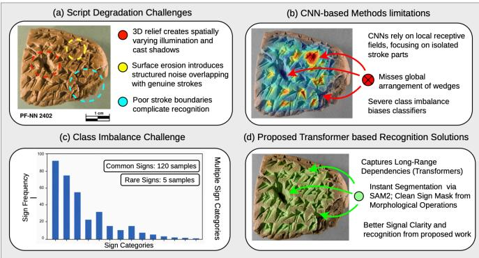
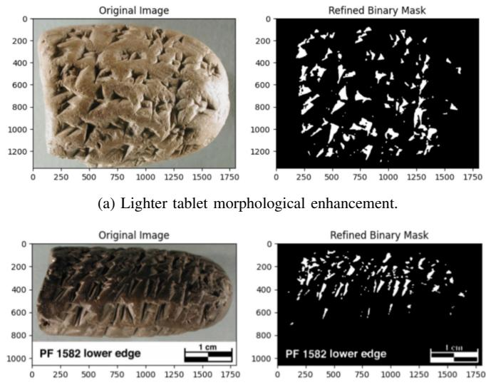
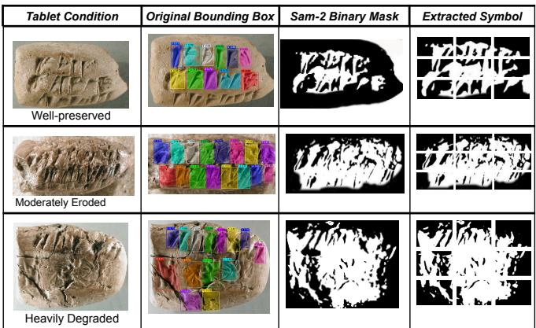
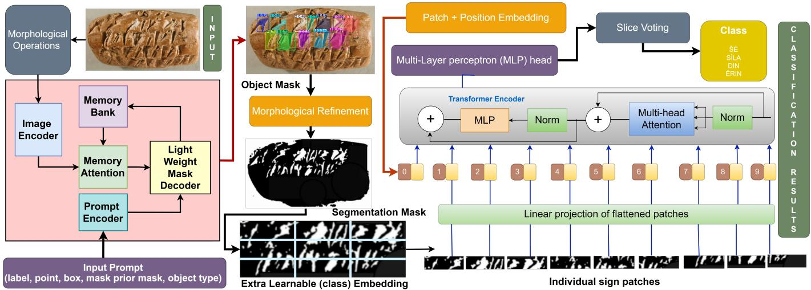
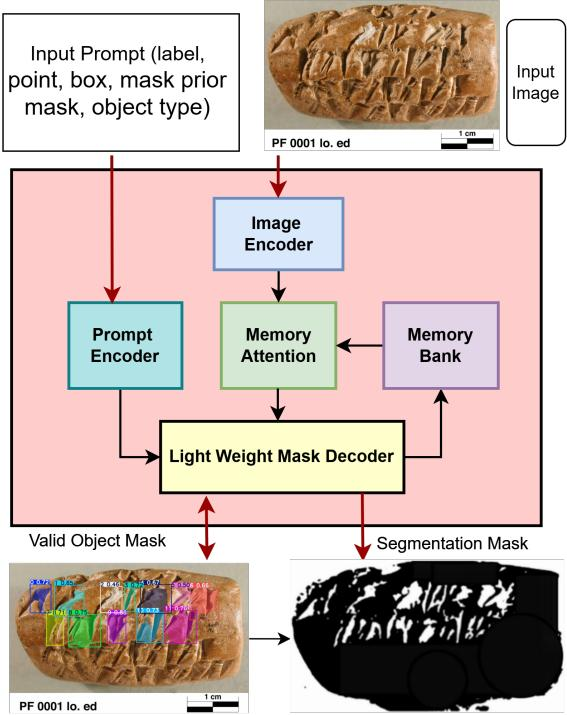
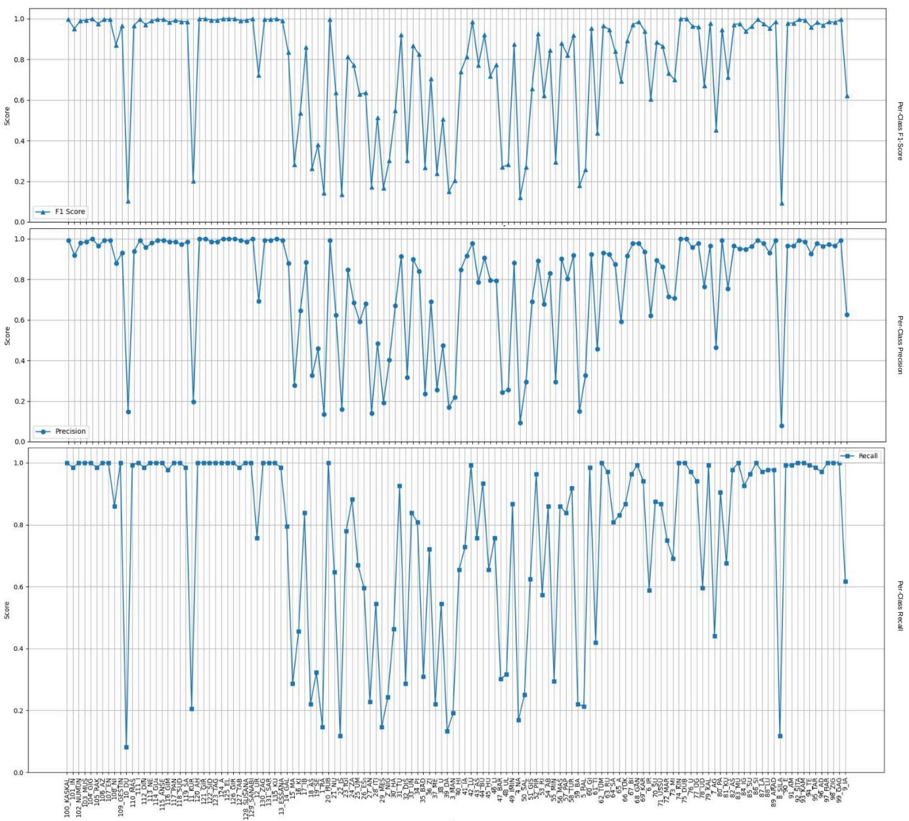
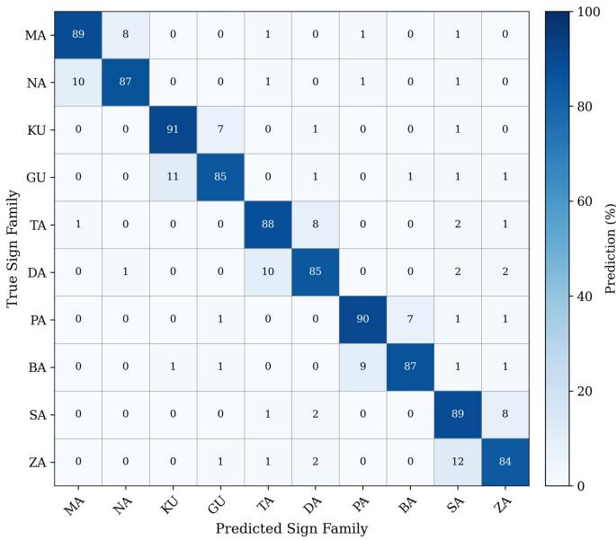

# Zero-Shot SAM2 Segmentation and Vision Transformer-Based Recognition of Elamite Cuneiform Symbols from Degraded Tablet Images

Utsav Poudel, Rasik Bhattarai, Siddhartha Pathak, Raghavendra Ramacharna, and Gaurav Jaswal

Abstract—Automated recognition of ancient cuneiform script poses a compound signal-degradation problem: the threedimensional relief of clay tablets creates spatially varying illumination and cast shadows, surface erosion introduces structured noise that overlaps with genuine sign impressions, and severe class imbalance across 141 sign categories undermines classifier reliability. We introduce EpigraphNet, a segmentation-guided transformer pipeline evaluated on the Persepolis Fortification Archive. From 1,239 annotated tablet images, brightness-adaptive morphological preprocessing and zero-shot SAM2-Large segmentation generate clean binary symbol masks, which a finetuned Vision Transformer (ViT-B/16) with inverse-frequency class weighting then classifies. EpigraphNet reaches 86.41% top-1 accuracy on a 132-class benchmark, a 17.21 percentage-point gain over the strongest CNN baseline (ResNet-101, 69.20%) and 5.31–12.91% over four modern backbones (DeiT-B/16, Swin-B, ConvNeXt-B, EfficientNet-B4) under identical conditions. The full pipeline runs at ≈18 ms per sign on an NVIDIA A100 GPU. A lower Spearman correlation between sign frequency and per-class performance indicates more balanced recognition across frequent and rare classes. Implementation is available at: https://github.com/r11up/sam-guided-vit

Index Terms—Pattern Recognition, Vision Transformer, Zero-Shot Segmentation, Image Processing.

## I. INTRODUCTION

Recognition of ancient scripts from degraded physical media presents compound signal-processing challenges distinct from standard document analysis. In clay-tablet cuneiform, the three-dimensional relief structure of wedge-shaped strokes produces spatially varying illumination and cast shadows that alter local intensity distributions, while surface erosion and physical fractures introduce structured noise that overlaps spectrally with genuine sign impressions. These factors create low signal-to-noise conditions in which stroke boundaries are poorly defined, a signal-integrity problem requiring careful preprocessing before any classification stage can succeed. Sign-by-sign transliteration of Elamite cuneiform requires several days per tablet, and current practice still relies heavily on manual transliteration and translation, which remain incomplete and dependent on the knowledge and availability of individual experts [1]. Automating recognition must overcome both signal degradation and severe class imbalance across sign categories.

  
Fig. 1: Overview of recognition approaches for degraded cuneiform symbols. (a) 3D relief creates spatially varying illumination and cast shadows (red) [5], surface erosion structured noise overlapping (yellow) [26], and poor stroke boundaries (blue) [31] complicate recognition. (b) CNN-based methods [12],missing the global arrangement of wedges that defines each sign [6]. (c) Severe class imbalance across 141 sign categories (bar chart) [32]. (d) EpigraphNet (ours): SAM2- Large [24] with morphological operations and fine-tuned ViT-B/16 [23] with inverse-frequency weighting classifies.

This challenge is not unique to Elamite cuneiform. A broader survey of ancient script image recognition identifies imbalanced data distribution and image degradation as the two most persistent obstacles shared across writing systems, from Egyptian hieroglyphs to Oracle Bone Inscriptions [2]. A wider survey of machine learning for ancient languages similarly finds that restoration, attribution, and recognition tasks alike are bottlenecked by scarce, unevenly distributed training examples rather than by architectural limitations alone [3]. Synthetic-data pipelines that simulate erosion, lighting, and surface damage have recently been proposed to counteract this scarcity for other epigraphic scripts such as Old Aramaic [4], underscoring that class imbalance and physical degradation must be addressed jointly rather than in isolation. Fig. 1 situates representative deep learning approaches for degraded ancient-script recognition along these two axes, motivating EpigraphNet’s joint treatment of both problems.

Morphological preprocessing has proven effective for enhancing degraded script features across OCR tasks under adverse imaging conditions, including handwritten text, number plates, and printed receipts [27]. Translating these filtering principles to the brightness-variable, three-dimensional relief of cuneiform tablets requires group-specific parameter tuning, a key signal-processing contribution of this work.

Although deep learning has achieved strong performance in visual recognition, Elamite cuneiform poses distinct structural challenges [5]: each sign is defined by the global arrangement of multiple wedge strokes, favoring architectures that capture long-range spatial dependencies [6] over the local receptive fields of conventional CNNs. Section II reviews cuneiformand ancient-script-specific recognition efforts, transformerbased results on other logographic and alphabetic scripts, and recent foundation segmentation models, situating our contribution relative to this body of work.

Vision Transformers (ViTs) [23] capture long-range spatial dependencies via self-attention, making them well-suited for structured symbol recognition. Foundation segmentation models such as SAM2 [24] enable zero-shot mask generation from bounding-box prompts, substantially reducing annotation requirements. We propose EpigraphNet, a segmentation-guided transformer pipeline for automated Elamite cuneiform sign recognition.

The main contributions of this work are: a SAM2-Large zero-shot segmentation pipeline using bounding-box prompts that generates clean binary symbol masks without requiring sign-level mask annotations; and an end-to-end recognition framework integrating brightness-adaptive morphological enhancement, zero-shot segmentation, and ViT-B/16 classification, with a standardized preprocessing protocol.

## II. RELATED WORK

## A. Cuneiform and Ancient Script Recognition

Early computational approaches to cuneiform treated sign identification as a retrieval or detection problem rather than end-to-end classification. Kriege et al. [9] recast sign identification as graph matching over stroke-wedge structure, while Dencker et al. [10] trained a Neo-Assyrian sign detector under weak supervision by aligning tablet images to existing transliterations, avoiding costly manual bounding-box annotation. Rest et al. [11] and Stötzner et al. [13] instead addressed the annotation bottleneck through illumination augmentation and 3D-rendering-based synthetic training data, respectively, and Bucciero et al. [14] extended 3D-rendering supervision to polygonal wedge-level detection. Cobanoglu et al. [16] contributed a large-scale annotated cuneiform sign detection dataset, and Yugay et al. [15] addressed the related but distinct task of stylistic (as opposed to sign-identity) classification. Closest to our setting, Williams et al.’s DeepScribe [12] localizes and classifies Elamite signs from the same Persepolis Fortification Archive (PFA) used in this work via a RetinaNet-ResNet detector, and constitutes our primary crop-only CNN baseline (Section V-A). Hamplová et al. [17] pursued strokelevel (rather than whole-sign) recognition, and Simonjetz et al. [18] and Stelzer [19] addressed downstream text reconstruction and sign encoding once transliteration is available. Beyond Elamite and Neo-Assyrian cuneiform, Mahmood et al. [8] classified cuneiform-adjacent languages using unigram features on a balanced dataset, and Barucci et al. [7] applied a custom CNN (Glyphnet) to Egyptian hieroglyph classification. Most recently, Elshehaby et al. [40] trained an ensemble of five CNN architectures (VGG16, EfficientNet, MobileNet,

InceptionResNetV2, and a custom 2D CNN) on isolated, augmented cuneiform glyphs, reporting near-ceiling accuracy on clean symbol crops but, unlike the present work, not on unsegmented tablet imagery with natural class imbalance. Complementing sign-level classification, Mikulinsky et al.’s ProtoSnap [42] recovers the fine-grained internal wedge-stroke configuration of a cuneiform sign by aligning a prototype skeleton to the target image via deep diffusion features, and shows that conditioning synthetic-data generation on these recovered structures substantially boosts recognition accuracy for rare sign classes in particular, a data-centric complement to the inverse-frequency weighting and affine augmentation used in EpigraphNet (Section V-A). Bogacz and Mara [1] survey the wider field of visual cuneiform analysis spanning manual ink drawings, digital vector graphics, photographs, and 3D scans, and their earlier geometric neural network approach [43] addresses period/date classification of 3D cuneiform tablets, a task complementary to sign-level recognition. Hameeuw et al. [5] and Maath et al. [6] respectively survey multilayered tablet visualization for OCR training and classification techniques for cuneiform imaging broadly, providing complementary context rather than sign-recognition results directly comparable to Table I.

## B. Transformer-Based Recognition of Other Ancient Scripts

Outside cuneiform, transformer architectures have recently displaced CNN baselines across several ancient and historical scripts, mirroring the shift motivating our own use of ViT-B/16. Li et al. [20] combined an improved Swin Transformer with flexible data-augmentation strategies for ancient Chinese character recognition; Madi et al. [21] used multi-task transformer learning for joint Hebrew paleographic script classification and date estimation; and Surasinghe and Thanikasalam [22] proposed a GAN-transformer framework that generates synthetic Brahmi glyphs to counteract severe data scarcity before recognition, an imbalance-mitigation strategy conceptually related to our inverse-frequency weighting and affine-augmentation scheme (Section V-A). A broader survey of deep learning for historical document analysis and recognition by Lombardi and Marinai [41] corroborates that image degradation and limited or imbalanced training data recur as central obstacles across historical document types, including palm-leaf manuscripts, papyri, and other epigraphic media, rather than being cuneiform-specific quirks. This echoes OCR robustness findings under adverse, nonarchival imaging conditions such as vehicle number plates, receipts, and handwriting [27], lending broader support to the imbalance-aware, noise-robust design choices made in EpigraphNet.

## C. Foundation Segmentation Models for Degraded and Heritage Imagery

The Segment Anything Model family [24] offers promptdriven, zero-shot mask generation without task-specific training, making it attractive for heritage domains where signlevel or object-level masks are expensive to annotate. Outside cultural heritage, SAM2 adaptation typically takes one of two forms: prompting the frozen model directly, as we do, or parameter-efficient fine-tuning of the encoder for a specialized domain. Xia et al. [52] illustrate the latter with MapSAM, which adapts SAM to historical map segmentation using low-rank decomposition of the image encoder and automatic prompt generation, reporting that direct zero-shot SAM application struggles with domain-specific boundary recognition unless the prompts are of high quality. This finding is consistent with our own centroid-deviation fallback (Section IV-B): rather than fine-tune SAM2’s encoder, we retain a frozen, zero-shot SAM2-Large and instead validate and reject lowquality masks post hoc, trading some recall on heavily eroded tablets for the ability to segment without any sign-level mask annotation.

## D. Non-Elamite Cuneiform and Other Ancient-Script Studies with Comparable Methodology

Beyond the Elamite-focused and general-cuneiform literature already discussed, a wider body of work on other cuneiform traditions and other ancient scripts shares the methodological ingredients of EpigraphNet, namely a segmentation or detection stage that isolates individual glyphs from a noisy, degraded, or three-dimensional surface, followed by a CNN- or transformer-based classifier, often combined with an explicit strategy for class imbalance. These studies are collected alongside the Elamite/PFA-focused literature in Table I, whose segmentation/localization, classifier, and imbalancehandling details situate EpigraphNet’s design choices within this broader body of work rather than the Elamite/PFA corpus alone.

On the cuneiform side but outside Elamite, Cobanoglu et al. [16] released the largest annotated 2D cuneiform signdetection dataset to date together with a detection baseline, directly analogous to the localization stage EpigraphNet inherits from OCHRE bounding boxes. Mara and Bogacz [44] and Hagelskjær [45] instead operate on 3D tablet scans and point clouds rather than 2D photographs, a complementary sensing modality to the 2D relief-shadow degradation EpigraphNet addresses, but one that faces the same annotation-scarcity and class-imbalance obstacles, with Bogacz and Mara explicitly capping majority classes to counteract imbalance in their period-labelled subset [43].

Outside cuneiform entirely, several studies pair a segmentation or detection front end with a classifier in a manner structurally close to EpigraphNet’s SAM2-then-ViT design. Hamplová et al. [46] apply YOLOv8 and Roboflow 3.0 instance segmentation to isolate individual characters in Palmyrene Aramaic inscriptions before recognition, mirroring our segmentation-guided extraction of individual signs prior to classification, albeit for an alphabetic rather than logo-syllabic script. Zhang et al. [48] instead perform pure character-mask segmentation, without a downstream classifier, on self-similar, low-contrast carved stone inscriptions using a Stacked-UNets/GAN architecture, directly paralleling the mask-extraction role SAM2 plays in EpigraphNet before classification takes over. On Oracle Bone Inscriptions, the ancient script whose severe long-tailed class distribution most closely parallels the 132-class imbalance in the PFA, Zhen et al. [47] localize characters with an attention-augmented YOLOv8 detector, Wang et al. [26] separate structural stroke information from surface-texture noise prior to classification (a structure/texture decomposition that plays a role similar to our SAM2 mask extraction), Li et al. [50] propose adversarial mixup-based augmentation targeted specifically at tail classes evaluated on the OBC306 and Oracle-20K benchmarks, and Yue et al. [51] propose dynamic dataset augmentation for the same imbalance problem on rubbing-image crops, all directly comparable in spirit to EpigraphNet’s inverse-frequency loss weighting and affine augmentation of classes with fewer than 50 samples (Section V-A). For Ashokan Brahmi, old Tamil, and Grantha epigraphy, Ezhilarasi and Uma Maheswari [49] propose a Dynamic Profiling Bound (DPB) technique for character-level localization on eroded stone inscriptions followed by a fine-tuned CNN (SignaryNet), explicitly targeting the same scarce, imbalanced-script setting that motivates Surasinghe and Thanikasalam’s synthetic Brahmi-glyph generation [22]. Barucci et al.’s Glyphnet [7] and Demilew and Sekeroglu’s Ge’ez recognizer [29] instead apply purpose-built CNNs directly to already-isolated symbol images drawn from published datasets, in the same classification-only setting as our crop-only ablation (Section V-D). Finally, transformerbased recognizers for ancient Chinese characters [20] and Hebrew paleography [21] confirm that the ViT/Swin family of architectures generalizes across logographic and alphabetic ancient scripts alike, reinforcing the architectural choice underlying EpigraphNet’s ViT-B/16 classifier, even though neither study performs its own image segmentation.

Read across the non-Elamite and other-ancient-script entries of Table I, two patterns emerge that motivate EpigraphNet’s design. First, several classification-only studies on other ancient scripts (Hebrew paleography [21], ancient Chinese [20], Oracle Bone adversarial augmentation [50], Egyptian hieroglyphs [7], Ge’ez script [29]) operate on already-isolated symbol crops from published benchmarks and report no explicit imbalance-handling mechanism beyond, at most, data augmentation, leaving open the same segmentation and longtail problems that motivate our SAM2-plus-inverse-frequencyweighting design. Second, where a genuine segmentation or localization stage is present, for example Palmyrene instance segmentation [46], Oracle Bone detection [47], stoneinscription character-mask segmentation [48], or Brahmi/Tamil signary localization [49], imbalance is typically handled, if at all, by data-level augmentation rather than loss-level reweighting integrated with the segmentation stage itself, as in EpigraphNet. This combination of a segmentationfirst pipeline (Section IV-B) with loss-level inverse-frequency weighting (Section V-A) is, to our knowledge, not jointly instantiated in any of the non-Elamite studies surveyed here, reinforcing the novelty argument made for the Elamite-specific literature in Table I.

## III. DATASET AND PREPROCESSING

## A. Persepolis Fortification Archive (PFA)

The Achaemenid Persian Empire (550–330 BCE) was, for over two centuries, the largest empire the ancient world had yet seen, stretching from the Aegean to the Indus River. Its day-today administration is known almost entirely through a single body of evidence, the Persepolis Fortification Archive, widely regarded as the most important surviving primary source for how the empire itself was actually run [53]. The tablets record the movement of rations, livestock, and travelers across the empire, touching every social stratum from ordinary laborers to the royal family, and were composed predominantly in Elamite, a language with no firmly established relation to Old Persian or any other known language family, yet the empire’s principal working script by virtue of its long-standing scribal tradition [53]. Recovering these records at scale is therefore not only a pattern-recognition problem but a direct contribution to reconstructing the logistics and multilingual administration of one of antiquity’s largest states.

TABLE I: Comparison of deep learning methods for cuneiform and ancient script recognition.
<table><tr><td>Research</td><td>Yr.</td><td>Task</td><td>Method / Key Result</td></tr><tr><td colspan="4">Cuneiform and Elamite</td></tr><tr><td>Kriege et al. [9]</td><td>2018</td><td>Sign retrieval</td><td>Graph-based matching.</td></tr><tr><td>Dencker et al. [10]</td><td>2020</td><td>Sign detection</td><td>Weak supervision using transliteration alignment; mAP evaluation.</td></tr><tr><td>Rest et al. [11]</td><td>2022</td><td>Sign detection</td><td>Illumination augmentation; mAP evaluation.</td></tr><tr><td>Bogacz &amp; Mara [43]</td><td>2020</td><td>Period classification</td><td>Geometric neural network on 3D meshes; per-class sample cap.</td></tr><tr><td>Mahmood et al. [8]</td><td>2023</td><td>Language identification</td><td>DNN: 93.0%; RF: 95.46%; balanced dataset.</td></tr><tr><td>Stötzner et al. [13]</td><td>2023</td><td>Sign detection</td><td>CNN using 3D renderings; mAP evaluation.</td></tr><tr><td>Williams et al. [12]</td><td>2025</td><td>Sign classification</td><td>RetinaNet+ResNet; top-5: 89.0% (GT crops), 80.0% (end-to-end).</td></tr><tr><td>Yugay et al. [15]</td><td>2024</td><td>Style classification</td><td>CNN; style accuracy: 83.0%.</td></tr><tr><td>Hamplová et al. [17]</td><td>2024</td><td>Stroke recognition</td><td>Horizontal stroke detection; accuracy: 90.52%.</td></tr><tr><td>Cobanoglu et al. [16]</td><td>2024</td><td>Sign detection</td><td>CNN detector; 52K annotated cuneiform signs.</td></tr><tr><td>Mikulinsky et al. [42]</td><td>2025</td><td>Structural alignment</td><td>Diffusion-feature prototype snapping; improves rare-sign recognition.</td></tr><tr><td>Elshehaby et al. [40]</td><td>2025</td><td>Sign classification</td><td>5-CNN ensemble; EfficientNet accuracy: 99.99% on clean crops.</td></tr><tr><td colspan="4">3D / Point-Cloud Cuneiform</td></tr><tr><td>Mara &amp; Bogacz [44]</td><td>2019</td><td>Benchmark</td><td>3D mesh frontal-alignment normalization; benchmark dataset.</td></tr><tr><td>Hagelskjær [45]</td><td>2022</td><td>Point-cloud classification</td><td>Point-cloud down-scaling network with CNN classifier.</td></tr><tr><td colspan="4"></td></tr><tr><td>Foundation Models Xia et al. [52]</td><td>2025</td><td>Segmentation</td><td>SAM + DoRA fine-tuning for historical-map segmentation.</td></tr><tr><td colspan="4">Other Ancient Scripts</td></tr><tr><td>Barucci et al. [7]</td><td>2021</td><td>Classification</td><td>Glyphnet CNN for Egyptian hieroglyphs.</td></tr><tr><td>Demilew &amp; Sekeroglu [29]</td><td>2019</td><td>Classification</td><td>CNN for pre-segmented Ge&#x27;ez characters.</td></tr><tr><td>Yue et al. [51]</td><td>2022</td><td>Classification</td><td>CNN with dynamic augmentation for Oracle Bone Inscriptions.</td></tr><tr><td>Wang et al. [26]</td><td>2022</td><td>Classification</td><td>Structure-texture separation network; supports imbalanced data.</td></tr><tr><td>Li et al. [50]</td><td>2023</td><td>Long-tailed classification</td><td>CNN + GAN discriminator; Repatch and TailMix augmentation.</td></tr><tr><td>Li et al. [20]</td><td>2024</td><td>Classification</td><td>Improved Swin Transformer with data augmentation.</td></tr><tr><td>Madi et al. [21]</td><td>2024</td><td>Classification / dating</td><td>Multi-task transformer for Hebrew paleography.</td></tr><tr><td>Zhang et al. [48]</td><td>2024</td><td>Segmentation</td><td>Stacked-UNets + GAN for multi-script inscriptions.</td></tr><tr><td>Zhen et al. [47]</td><td>2024</td><td>Character detection</td><td>Improved YOLOv8 with CBAM and small-object head.</td></tr><tr><td>Hamplová et al. [46]</td><td>2024</td><td>Segmentation /</td><td>YOLOv8 + CNN with extensive augmentation.</td></tr><tr><td>Ezhilarasi &amp; Uma</td><td>2025</td><td>recognition Localization /</td><td>SignaryNet CNN with class-balanced augmentation.</td></tr><tr><td>Maheswari [49]</td><td></td><td>classification</td><td></td></tr><tr><td>Surasinghe &amp; Thanikasalam [22]</td><td>2026</td><td>Generation / classification</td><td>BrahmiGAN + PVT/Swin ensemble; 21,195 synthetic glyphs</td></tr><tr><td>EpigraphNet (ours)</td><td>2026</td><td>Classification</td><td>SAM2-Large zero-shot segmentation + ViT-B/16; inverse-frequency</td></tr></table>

Note: Comparisons are approximate because datasets, class counts, and evaluation protocols differ. Studies targeting language/style/period classification, structural alignment, 3D point clouds, or non-script segmentation are included for methodological context rather than direct performance comparison.

The PFA is one of the largest collections of Achaemenid administrative tablets (late 6th–early 5th centuries BCE) in Elamite cuneiform at the Oriental Institute, University of Chicago. We adopt the publicly available subset in OCHRE [30], which provides bounding-box labels for sign transliterations. Starting from 1,239 annotated tablet images spanning 141 distinct sign classes, we discard all classes with fewer than 10 samples, the minimum threshold ensuring at least one representative sample per class in every stratum of the stratified partition. This removes 9 under-represented classes, retaining 132 sign classes and approximately 18,400 sign crops.

## B. Morphological Image Enhancement

Morphological operations enhance sign contrast against the background prior to SAM2 segmentation. For each tablet image, binary thresholding followed by morphological opening (erosion then dilation) suppresses surface noise, and closing (dilation then erosion) fills gaps in sign impressions [31]. A uniform threshold is inapplicable across all tablets owing to significant brightness variation: each image is assigned to one of three brightness groups (light, moderate, dark) based on mean pixel intensity and processed with group-specific parameters, and the resulting masks are merged (qualitative examples appear in Fig. 3). Light tablets use threshold $T _ { g } { = } 1 8 0$ with a $3 { \times } 3$ structuring element $B _ { g } ;$ moderate tablets use $T _ { g } { = } 1 2 7$ with $5 \times 5 ;$ dark tablets use ${ T _ { g } } \mathrm { { = } } 8 5$ with $7 \times 7$ pixels. Algorithm 1 summarises this group-wise procedure, and Fig. 2 illustrates representative enhancement results for a lighter and a darker tablet.



Algorithm 1 Morphological Image Enhancement for SAM2   
Preprocessing   
Input: Set of grayscale images $\{ I _ { 1 } , I _ { 2 } , \ldots , I _ { n } \}$ , brightness  
group threshold $T ,$ structuring element B   
Output: Enhanced images $\left\{ M _ { 1 } , M _ { 2 } , \ldots , M _ { n } \right\}$ with surface   
noise suppressed   
1: for each image $I _ { i }$ in the dataset do   
2: Assign $I _ { i }$ to a brightness group g ∈   
{light, moderate, dark} based on mean pixel intensity   
3: Select group-specific threshold $T _ { g }$ and structuring ele  
ment $B _ { g }$   
4: Convert $I _ { i }$ to a binary image $I _ { b i }$ using threshold $T _ { g } \mathrm { : }$   
$I _ { b i } ( x , y ) = { \left\{ \begin{array} { l l } { 1 } & { { \mathrm { i f ~ } } I _ { i } ( x , y ) > T _ { g } } \\ { 0 } & { { \mathrm { o t h e r w i s e } } } \end{array} \right. }$   
Note: Thresholding converts the grayscale input $I _ { i }$ to   
binary image $I _ { b i } ;$ all subsequent morphological opera  
tions (Steps 5-6) operate on this binary representation.   
5: Apply Opening (Erosion then Dilation) to suppress   
small noise:   
$I _ { \mathrm { o p e n e d } } = D ( E ( I _ { b i } , B _ { g } ) , B _ { g } )$   
6: Apply Closing (Dilation then Erosion) to fill small   
gaps:   
$M _ { i } = E ( D ( I _ { \mathrm { o p e n e d } } , B _ { g } ) , B _ { g } )$   
7: Store $M _ { i }$ as the morphologically enhanced image for $I _ { i }$   
8: end for

## C. Class Imbalance and Normalization

The 132-class distribution is severely imbalanced: frequent administrative signs have hundreds of examples while rare ideographic classes have as few as 10 instances. We address this via class-specific inverse-frequency weighting of the cross-entropy loss [32]. All training images undergo random horizontal flip, random rotation (±15<sup>◦</sup>), and colour jitter (brightness/contrast ±20%). Classes with fewer than 50 training samples receive additional synthetic copies via random affine transformations (shear ±10<sup>◦</sup>, scale 0.9–1.1) to reach a minimum of 50 training examples per class. All images are resized to 224×224 (ViT) or 1024×1024 (SAM2) and normalised with ImageNet statistics $( \mu { = } [ 0 . 4 8 5 , 0 . 4 5 6 , 0 . 4 0 6 ] , \ \sigma { = } [ 0 . 2 2 9 , 0 . 2 2 4 , 0 . 2 2 5 ] )$ ). Although derived from natural images, these statistics maintain compatibility with the ImageNet-21k pretrained ViT-B/16 weights; since all layers are fine-tuned end-to-end, early-layer representations adapt to the binary-mask domain during training, mitigating the statistical mismatch. A 70/15/15 stratified train/val/test split is used.

(b) Darker tablet morphological enhancement.  
Fig. 2: Morphological enhancement results for tablets with different brightness levels. (a) Processing pipeline applied to a lighter tablet. (b) Processing pipeline applied to a darker tablet.  
  
Fig. 3: SAM2-Large segmentation across illumination groups (Section III-B). Triplets show the bounding box, binary mask, and extracted symbol. Rows 1–2: success cases (wellpreserved/eroded). Row 3: fallback to raw crop due to exceeded centroid tolerance δ on degraded tablets.

## IV. METHODOLOGY

## A. Pipeline Overview

EpigraphNet is a five-step pipeline: (1) brightness-adaptive morphological preprocessing (Section III-B); (2) SAM2-Large zero-shot segmentation from bounding-box prompts (Section IV-B); (3) morphological mask filtering (hole-filling, small-object removal, closing); (4) background-suppressed symbol extraction; and (5) ViT-B/16 classification via patchlevel self-attention aggregation (Section IV-C). The full pipeline is illustrated in Fig. 4.

## B. SAM2-Large Zero-Shot Segmentation

Fig. 5 shows the internal architecture of the frozen SAM2 model used for segmentation: learned mask tokens attend to image features extracted by the encoder via cross-attention in the mask decoder, producing candidate masks conditioned on the input box prompt. For each annotated sign, the OCHRE bounding box $( x _ { 1 } , y _ { 1 } , x _ { 2 } , y _ { 2 } )$ is passed to the frozen, pretrained SAM2-Large model [24] (312 M parameters, chosen over the Tiny/Small/Base+ variants for superior mask quality on low-contrast, degraded surfaces) as a box prompt; the highest-IoU candidate mask is retained and no SAM2 fine-tuning is performed. Masks are binarised at logit-confidence threshold $\tau { = } 0 . 0 ;$ holes are filled using binary\_fill\_holes; connected components smaller than $A _ { \mathrm { m i n } } { = } 1 0 0$ pixels are removed; and morphological closing suppresses boundary artefacts. All three hyperparameters (τ, $A _ { \mathrm { m i n } } , \delta )$ were determined empirically on a held-out validation subset. Masks whose centroid deviates more than $\delta \mathrm { = } 2 0$ pixels from the bounding-box centre are rejected and replaced with the raw bounding-box crop rather than discarded, ensuring no training or test samples are lost a fallback triggered predominantly on heavily eroded tablets where SAM2 latches onto a neighbouring sign or background texture (Fig. 3). Algorithm 2 formalises this segmentation and refinement procedure.

  
Fig. 4: EpigraphNet pipeline: morphological enhancement → SAM2-Large segmentation → mask refinement → symbol extraction → ViT-B/16 classification. Slice Voting: the [CLS] token aggregates evidence from all 196 patch tokens via multi-head self-attention (Section IV-C).

  
Fig. 5: SAM2 model architecture with mask tokens integrated with image features via cross-attention to predict masks of cuneiform symbols.

```tcl
Algorithm 2 Cuneiform Symbol Segmentation via Prompt-
Tuned SAM2
Input: Enhanced tablet image $I \in \mathbb { R } ^ { H \times W \times 3 }$ , OCHRE bound
ing box $( x _ { 1 } , y _ { 1 } , x _ { 2 } , y _ { 2 } )$ , threshold τ, area threshold $A _ { \mathrm { m i n } } ,$
centroid tolerance δ
Output: Refined binary segmentation mask $M _ { \mathrm { f i n a l } }$ ∈
${ \bar { \{ 0 , 1 \} } } ^ { H \times W }$
1: Resize: $I _ { \mathrm { r e s i z e d } }  \mathrm { R e s i z e } ( I , ( 1 0 2 4 , 1 0 2 4 ) )$
2: Normalize: $\begin{array} { r l r } { I _ { \mathrm { n o r m } } } & { { }  } & { ( I _ { \mathrm { r e s i z e d } } - \mu ) / \sigma , } \end{array}$ where $\mu \quad =$
[0.485, 0.456, 0.406], σ = [0.229, 0.224, 0.225]
3: Encode bounding box prompt: Q<sub>box</sub> ←
SAM2_PromptEncoder(x<sub>1</sub>, y<sub>1</sub>, x<sub>2</sub>, y<sub>2</sub>)
4: Encode image: $F _ { \mathrm { i m g } }  \mathbf { S A M } 2 .$ _ImageEncoder $( I _ { \mathrm { n o r m } } )$
5: Decode: $\{ ( \boldsymbol { \bar { M } _ { k } } , s _ { k } ) \} _ { k = 1 } ^ { 3 }  \mathrm { S A M } 2 _ { - }$ _Decoder $( F _ { \mathrm { i m g } } , Q _ { \mathrm { b o x } } )$
6: Select highest-confidence mask: $M _ { \mathrm { r a w } } \gets M _ { \mathrm { a r g m a x } _ { k } s _ { k } }$
7: Threshold: $M _ { \mathrm { b i n a r y } } ( x , y ) = \mathcal { k } [ M _ { \mathrm { r a w } } ( x , y ) \geq \tau ]$
8: Fill holes: $M _ { \mathrm { { f i l l e d } } } $ binary_fill_holes $( M _ { \mathrm { b i n a r y } } )$
9: Remove small objects: $M _ { \mathrm { c l e a n } }$ ←
remove_small_objects $( M _ { \mathrm { { f i l l e d } } } , A _ { \mathrm { { m i n } } } )$
10: Suppress boundary artefacts: $M _ { \mathrm { f i n a l } }$ ←
morphological_close $\left( M _ { \mathrm { c l e a n } } \right)$
11: Validate: Compute centroid $C _ { m }$ of $M _ { \mathrm { f i n a l } } ;$ ; reject if $\Vert C _ { m } -$
center $( x _ { 1 } , y _ { 1 } , x _ { 2 } , y _ { 2 } ) \vert \vert _ { 2 } > \delta$
```

## C. ViT-B/16 Classification

The ViT-B/16 [23] partitions a 224×224 input into a 14×14 grid of 16×16 non-overlapping patches, producing 196 tokens projected to d=768 dimensions with learned position embeddings. All 196 tokens plus a learnable [CLS] token are processed jointly through 12 self-attention blocks (12 heads each). The [CLS] token aggregates global context from all 196 spatial patch slices, constituting the Slice Voting mechanism in Fig. 4: the model weighs evidence from wedgestroke patterns distributed across the full symbol rather than merely local regions. The [CLS] representation is projected to the 132-class output head via a linear classifier. Fine-tuning starts from ImageNet-21k pretrained weights, with all layers fine-tuned end-to-end (training hyperparameters are detailed in Section V-A). Layer-wise learning rate decay was evaluated but showed no significant improvement on this domain-shifted task. Total parameter count: 86 M.

## D. Baseline Architectures

We train two sets of baselines and four additional modern backbones under identical experimental conditions (same data split, optimiser, training schedule, and batch size). Deep-Scribe (ResNet-18/50/101) [12], [33] employs a ResNet backbone with a softmax classification head on the same 132- class segmentation-prepared crops. YOLOv7 [34] follows a detection-then-classification approach applied to full tablet images. Four additional modern architectures — EfficientNet-B4 [35] (19 M), ConvNeXt-B [36] (89 M), Swin-B [37] (88 M), and DeiT-B/16 [38] (86 M), are evaluated as crop-only classifiers without the SAM2 segmentation stage, fine-tuned from ImageNet pretrained weights using the same training protocol as ViT-B/16, providing a comprehensive backbonelevel baseline across the CNN–Transformer spectrum.

## V. EXPERIMENTS AND RESULTS

## A. Experimental Setup

Experiments used a single GPU: NVIDIA A100 80 GiB, PyTorch 2.1 / CUDA 12.1, training with FP16 mixed precision. SAM2 pre-processing was performed on CPU. Configuration is presented in Table II.

ViT-B/16 achieves 12 ms per-sign inference on the A100; SAM2 preprocessing (≈2.1 s per tablet on CPU) amortises to ≈6 ms per sign (≈15 signs per tablet), giving a total pipeline latency of ≈18 ms per sign.

TABLE II: Experimental Configuration
<table><tr><td>Component</td><td>Configuration</td></tr><tr><td>GPU</td><td>NVIDIA A100 80 GB</td></tr><tr><td>Framework</td><td>PyTorch 2.1 / CUDA 12.1</td></tr><tr><td>ViT variant</td><td>ViT-B/16, ImageNet-21k pretrained</td></tr><tr><td>Optimizer</td><td>AdamW (λ = 0.01)</td></tr><tr><td>Learning rate</td><td> $1 \times 1 0 ^ { - 4 }$  , cosine annealing</td></tr><tr><td>Batch size</td><td>32</td></tr><tr><td>Epochs</td><td>50 (5 warmup)</td></tr><tr><td>Input resolution</td><td>2242 (ViT), 10242 (SAM2)</td></tr><tr><td>Classes</td><td>132</td></tr><tr><td>Dataset split</td><td>70/15/15 (train/val/test)</td></tr></table>

## B. Classification Results

Table III reports macro-averaged top-k accuracy on the heldout 132-class test set; macro averaging is used throughout to avoid bias toward the frequent administrative signs that dominate the class distribution.

EpigraphNet vs. legacy CNN baselines. The 17.21 pp top-1 improvement over DeepScribe ResNet-101 is consistent with ViT’s global self-attention capturing cuneiform wedgestroke arrangements more effectively than CNN local receptive fields [23]; as the DeepScribe numbers are drawn from [12] rather than a paired rerun on our split, we treat this comparison as directional rather than statistically tested. DeepScribe variants achieve competitive top-3/5 accuracy but substantially lower top-1, revealing within-family ambiguity that global attention resolves. YOLOv7 (76.84%) outperforms DeepScribe via more precise localisation, yet falls 9.57 pp below EpigraphNet, suggesting that accurate localisation alone is insufficient without global feature representation. The value of these background-suppressed mask patches is further supported by the ablation study in Section V-D.

Four modern crop-only architectures show a consistent performance hierarchy. EfficientNet-B4 (73.50%) provides a parameter-efficient baseline, but its compound scaling cannot compensate for absent global context. ConvNeXt-B (76.80%) and Swin-B (78.40%) improve via depthwise convolutions and shifted-window attention, yet remain constrained by limited long-range dependency capture. DeiT-B/16 (81.10%) is the strongest crop-only competitor; though architecturally identical to ViT-B/16, its CNN-teacher distillation biases it toward local texture, precisely the regime insufficient for withinfamily sign discrimination. The 5.31 pp gap between DeiT-B/16 and EpigraphNet reflects this distillation bias and the lack of SAM2 background suppression, suggesting that neither architectural modernization nor pretraining alone suffices without segmentation-guided signal enhancement. Comparable classification tasks on Oracle Bone Inscriptions and other ancient scripts [20]–[22], [25], [26], [28], [29] report top-1 accuracies of 84–99.5%, yet typically use balanced datasets, 2D manuscripts without 3D-relief noise, and fewer than 100 classes. EpigraphNet’s 86.41% under a harsher regime of severe class imbalance (≥10 samples), 3D-relief degradation, and 132 classes establishes a more demanding, practically relevant benchmark.

## C. Class-Wise Performance

The 20 most frequent signs achieve near-perfect precision, recall, and F1, while accuracy degrades for the least frequent classes owing to limited training data (Fig. 6). Misclassifications cluster within phonologically and visually similar sign families [39], as shown in the confusion matrix in Fig. 7. Table IV reports the Spearman ρ correlation between sign frequency and per-class performance: EpigraphNet achieves substantially more balanced coverage than the DeepScribe baselines.

Backbone ablation (Table III, SAM2 block). SAM2-Large preprocessing consistently improves all backbones over their crop-only counterparts by 4.6 to 5.7 pp for CNN-based classifiers and 3.2 pp for ViT-B/16, indicating that segmentationguided signal enhancement is complementary to architectural choices. Within the full pipeline, ViT-B/16 outperforms DeiT-B/16 by 2.11 pp (86.41% vs. 84.30%) despite identical parameter counts (398 M combined); we attribute this gap to ImageNet-21k supervised pretraining, which preserves the global attention inductive bias absent from DeiT’s CNNteacher distillation.

  
Fig. 6: Per-class precision, recall, and F1 of EpigraphNet, sorted by descending class frequency. Class names follow the OCHRE transliteration index; rare signs (≤ 30 training samples) appear on the right.

Spearman ρ analysis (Table IV). EpigraphNet’s $\rho _ { \mathrm { p r e c } } { = } 0 . 3 1 8$ and $\rho _ { \mathrm { r e c } } { = } 0 . 4 9 2$ are substantially lower than DeepScribe variants (0.503–0.519 and 0.763–0.794), indicating more frequency-independent performance. The $\rho _ { \mathrm { r e c } } { = } 0 . 4 9 2$ , a 0.271 reduction from ResNet-101 reflects two cooperative mechanisms: (i) SAM2 background suppression provides cleaner, more consistent crops for rare classes with only 10–30 training samples; and (ii) inverse-frequency class weighting amplifies gradient updates for rare classes proportionally, preventing loss domination by the 10–20 most frequent administrative signs. The lower ρ values do not indicate weaker discrimination of frequent classes: EpigraphNet’s mean recall (0.623) is substantially higher than all DeepScribe variants (0.459–0.504), indicating improvement across the full class spectrum. This mirrors the rare-class gains reported by ProtoSnap’s structural-prior data augmentation [42], suggesting that segmentation-based denoising and structure-aware synthetic augmentation are complementary, rather than competing, strategies for closing the frequent/rare performance gap in cuneiform recognition.

## D. Ablation Study

We isolate the contribution of SAM2-Large segmentation by comparing two configurations that both retain brightnessadaptive morphological enhancement and inverse-frequency class weighting, differing only in whether SAM2 segmentation is applied (mean ± std over 3 runs). Without SAM2, the ViT-B/16 crop-only classifier reaches 83.20% (±0.41) top-1, 87.00% (±0.36) top-3, and 88.50% (±0.33) top-5 accuracy; adding SAM2 (full EpigraphNet) raises these to

TABLE III: Top-k accuracy on PFA test set: crop-only baselines vs. full SAM2-Large + transformer pipeline.
<table><tr><td>Method</td><td>Top-1 (%)</td><td>Top-3(%)</td><td>Top-5(%)</td><td>Params (M)</td><td>Time (ms)</td></tr><tr><td colspan="6">Crop-only baselines (no segmentation)</td></tr><tr><td>DeepScribe (ResNet-18) [12]</td><td>65.70</td><td>83.70</td><td>88.80</td><td>11.7</td><td>3</td></tr><tr><td>DeepScribe (ResNet-50) [12]</td><td>68.30</td><td>85.10</td><td>89.70</td><td>25.6</td><td>5</td></tr><tr><td>DeepScribe (ResNet-101) [12]</td><td>69.20</td><td>85.90</td><td>90.20</td><td>44.5</td><td>9</td></tr><tr><td>YOLOv7 [34]</td><td>76.84</td><td>83.41</td><td>87.93</td><td>36.9</td><td>12</td></tr><tr><td>EfficientNet-B4 [35]</td><td>73.50</td><td>83.10</td><td>87.00</td><td>19.3</td><td>5</td></tr><tr><td>ConvNeXt-B [36]</td><td>76.80</td><td>84.30</td><td>87.60</td><td>88.6</td><td>9</td></tr><tr><td>Swin-B [37]</td><td>78.40</td><td>85.10</td><td>88.30</td><td>87.8</td><td>11</td></tr><tr><td>DeiT-B/16 [38]</td><td>81.10</td><td>86.40</td><td>88.70</td><td>86.0</td><td>8</td></tr><tr><td colspan="6">With SAM2-Large segmentation (full pipeline)</td></tr><tr><td>EfficientNet-B4 [35]</td><td>79.20</td><td>85.30</td><td>88.10</td><td>331</td><td>11</td></tr><tr><td>ConvNeXt-B [36]</td><td>81.40</td><td>86.20</td><td>88.60</td><td>401</td><td>15</td></tr><tr><td>Swin-B [37]</td><td>82.70</td><td>87.40</td><td>89.20</td><td>400</td><td>17</td></tr><tr><td>DeiT-B/16 [38]</td><td>84.30</td><td>88.50</td><td>89.60</td><td>398</td><td>14</td></tr><tr><td></td><td>86.41</td><td>89.62</td><td>90.90</td><td>398</td><td>18</td></tr><tr><td>ViT-B/16 (EpigraphNet)</td><td></td><td></td><td></td><td></td><td></td></tr></table>

TABLE IV: Spearman $\rho$ Correlation Between Sign Frequency and Per-Class Performance (Lower Indicates More Balanced Recognition Across Frequencies).
<table><tr><td>Architecture</td><td>Mean Recall</td><td>Prec.  $\rho$ </td><td>Rec.  $\rho$ </td></tr><tr><td>DS RN-18 [12]</td><td>0.459 (0.013)</td><td>0.503 (0.027)</td><td>0.773 (0.040)</td></tr><tr><td>DS RN-50 [12]</td><td>0.483 (0.018)</td><td>0.509 (0.049)</td><td>0.794 (0.042)</td></tr><tr><td>DS RN-101 [12]</td><td>0.504 (0.022)</td><td>0.519 (0.028)</td><td>0.763 (0.039)</td></tr><tr><td>ViT-B/16 (ours)</td><td>0.623 (0.016)</td><td>0.318 (0.031)</td><td>0.492 (0.038)</td></tr></table>

  
Fig. 7: Confusion matrix for the 10 most confused sign pairs. Errors concentrate on phonologically and visually similar pairs (e.g., MA/NA, KU/GU) [39].

86.41% (±0.38), 89.62% (±0.31), and 90.90% (±0.29), respectively.

Removing SAM2 reduces top-1 by 3.21 pp but narrows to $2 . 4 0 \mathrm { p p }$ at top-5. Top-5 accuracy reflects family membership recoverable from stroke texture even with noisy crops, while top-1 requires resolving within-family ambiguity where clean SAM2 patches are essential. Morphological preprocessing ensures SAM2 receives a high-contrast binary representation; without it, dark group tablets $( T _ { g } { = } 8 5 , B _ { g } { = } 7 { \times } 7 )$ yield fragmented masks, increasing centroid-fallback rates. Ablating class weighting with SAM2 retained reduces mean recall from 0.623 to 0.571 (±0.018), indicating that class weighting contributes meaningfully to rare-class recall beyond what segmentation alone provides.

## VI. CONCLUSION

We present EpigraphNet, a segmentation-guided transformer pipeline for automated recognition of Elamite cuneiform symbols from degraded tablet images. Brightness-adaptive morphological preprocessing resolves varying tablet illumination challenges, while SAM2-Large zero-shot segmentation produces clean binary symbol masks without sign-level annotations. A fine-tuned ViT-B/16 achieves 86.41% top-1, 89.62% top-3, and 90.90% top-5 accuracy on the 132-class PFA benchmark, a 17.21 pp top-1 gain over the strongest CNN baseline (DeepScribe ResNet-101) and a 5.31 pp gain over the best modern transformer alternative (DeiT-B/16). Backbone ablation indicates ViT-B/16 is the strongest classifier within our pipeline, and a lower Spearman $\rho$ is consistent with more balanced recognition across frequent and rare classes. At 12 ms per sign classification on an A100 GPU (18 ms total including amortised SAM2 preprocessing), the pipeline is suitable for interactive annotation assistance.

Limitations. EpigraphNet depends on OCHRE boundingbox prompts; unannotated tablets require an upstream signdetection stage. SAM2 mask quality degrades on heavily eroded or fractured surfaces, where the centroid fallback to raw crops applies but cannot recover fine wedge-stroke structure. CPU-based SAM2 preprocessing (≈2.1 s per tablet) limits throughput at scale; a GPU-accelerated preprocessing queue would address this bottleneck. Reported comparisons against externally sourced baselines (e.g., DeepScribe [12]) are pointestimate accuracy differences rather than paired statistical tests, since per-sample predictions for those baselines are not available to us.

Future work will investigate semi-supervised learning on unannotated PFA tablets, end-to-end integration with large language models for transliteration-to-translation pipelines, structure-aware synthetic augmentation in the spirit of Proto-Snap [42] for the rarest sign classes, and extension to related traditions including Sumero-Akkadian and Neo-Babylonian scripts.

## ACKNOWLEDGMENT

The authors thank i-Hub and HCI Foundation at IIT Mandi, Himachal Pradesh, India for supporting this research.

## REFERENCES

[1] B. Bogacz and H. Mara, “Digital assyriology—advances in visual cuneiform analysis,” ACM J. Comput. Cult. Herit., vol. 15, no. 2, Art. 38, pp. 1–22, 2022, doi: 10.1145/3491239.

[2] X. Diao, R. Bo, Y. Xiao, L. Shi, Z. Zhou, H. Xu, C. Li, X. Tang, M. Poesio, C. M. John, and D. Shi, “Ancient script image recognition and processing: A review,” arXiv preprint arXiv:2506.19208, 2025.

[3] T. Sommerschield, Y. Assael, J. Pavlopoulos, V. Stefanak, A. Senior, C. Dyer, J. Bodel, J. Prag, I. Androutsopoulos, and N. de Freitas, “Machine learning for ancient languages: A survey,” Comput. Linguistics, vol. 49, no. 3, pp. 703–747, 2023, doi: 10.1162/coli\_a\_00481.

[4] A. C. Aioanei, R. R. Hunziker-Rodewald, K. M. Klein, and D. L. Michels, “Deep Aramaic: Towards a synthetic data paradigm enabling machine learning in epigraphy,” PLOS ONE, vol. 19, no. 4, p. e0299297, 2024, doi: 10.1371/journal.pone.0299297.

[5] H. Hameeuw et al., “Preparing multi-layered visualizations of Old Babylonian cuneiform tablets for a machine learning OCR training model,” it—Inf. Technol., vol. 65, no. 5, pp. 229–242, 2024, doi: 10.1515/itit-2023-0063.

[6] F. Maath et al., “Extensive review of state-of-the-art classification techniques for cuneiform symbol imaging,” Iraqi J. Comput. Sci. Math., vol. 4, no. 3, pp. 116–135, 2023.

[7] A. Barucci, C. Cucci, M. Franci, M. Loschiavo, and F. Argenti, “A deep learning approach to ancient Egyptian hieroglyphs classification,” IEEE Access, vol. 9, pp. 123438–123447, 2021, doi: 10.1109/AC-CESS.2021.3110082.

[8] M. Mahmood et al., “Classifying cuneiform symbols using machine learning algorithms with unigram features on a balanced dataset,” J. Intell. Syst., vol. 32, no. 1, p. 20230087, 2023, doi: 10.1515/jisys-2023- 0087.

[9] N. M. Kriege et al., “Recognizing cuneiform signs using graph-based methods,” in Proc. Int. Workshop Cost-Sensitive Learning, PMLR, 2018.

[10] T. Dencker et al., “Deep learning of cuneiform sign detection with weak supervision using transliteration alignment,” PLoS ONE, vol. 15, no. 12, p. e0243039, 2020.

[11] C. Rest et al., “Illumination-based augmentation for cuneiform deep neural sign classification,” J. Comput. Cult. Herit., vol. 15, no. 3, pp. 1– 20, 2022.

[12] E. C. Williams et al., “DeepScribe: Localization and classification of Elamite cuneiform signs via deep learning,” J. Comput. Cult. Herit., vol. 18, no. 2, Art. 31, 2025, doi: 10.1145/3716850.

[13] E. Stötzner et al., “CNN based cuneiform sign detection learned from annotated 3D renderings and mapped photographs with illumination augmentation,” in Proc. IEEE/CVF ICCV, 2023.

[14] A. Bucciero et al., “R-CNN based polygonal wedge detection learned from annotated 3D renderings of cuneiform tablets,” 2023.

[15] V. Yugay et al., “Stylistic classification of cuneiform signs using convolutional neural networks,” it—Inf. Technol., vol. 66, no. 1, pp. 17– 27, 2024, doi: 10.1515/itit-2023-0114.

[16] Y. Cobanoglu, L. Sáenz, I. Khait, and E. Jiménez, “Sign detection for cuneiform tablets,” it—Inf. Technol., vol. 66, no. 1, pp. 28–38, 2024, doi: 10.1515/itit-2024-0028.

[17] A. Hamplová et al., “Cuneiform stroke recognition and vectorization in 2D images,” DHQ: Digital Humanities Quarterly, vol. 18, no. 1, 2024.

[18] F. Simonjetz et al., “Reconstruction of cuneiform literary texts as text matching,” in Proc. LREC-COLING 2024, 2024.

[19] D. M. Stelzer, “A recursive encoding for cuneiform signs,” it— Information Technology, vol. 66, no. 6, pp. 232–255, 2024, doi: 10.1515/itit-2024-0067.

[20] J. Li et al., “Ancient Chinese character recognition with improved Swin-Transformer and flexible data enhancement strategies,” Sensors, vol. 24, no. 7, p. 2182, 2024, doi: 10.3390/s24072182.

[21] B. Madi et al., “Multi-task learning for Hebrew paleography: Script classification and date estimation,” in Proc. Int. Conf. Document Analysis and Recognition (ICDAR), Springer, 2024, pp. 119–139.

[22] P. Surasinghe and K. Thanikasalam, “A novel GAN-transformer framework for early Brahmi script generation and recognition,” Eng. Appl. Sci. Res., vol. 53, no. 2, pp. 112–126, 2026, doi: 10.64960/easr.2026.261416.

[23] A. Dosovitskiy et al., “An image is worth 16×16 words: Transformers for image recognition at scale,” in Proc. ICLR, 2021.

[24] N. Ravi, V. Gabeur, Y.-T. Hu, R. Hu, C. Ryali, T. Ma, H. Khedr, R. Rädle, C. Rolland, L. Gustafson, E. Mintun, J. Pan, K. V. Alwala, N. Carion, C.-Y. Wu, R. Girshick, P. Dollár, and C. Feichtenhofer, “SAM 2: Segment anything in images and videos,” in Proc. Int. Conf. Learning Representations (ICLR), 2025.

[25] X. Fu et al., “Improvement of oracle bone inscription recognition accuracy: A deep learning perspective,” ISPRS Int. J. Geo-Inf., vol. 11, no. 1, Art. 45, 2022, doi: 10.3390/ijgi11010045.

[26] M. Wang, W. Deng, and C.-L. Liu, “Unsupervised structure-texture separation network for oracle character recognition,” IEEE Trans. Image Process., vol. 31, pp. 3137–3150, 2022, doi: 10.1109/TIP.2022.3165989.

[27] U. Poudel et al., “Applicability of OCR engines for text recognition in vehicle number plates, receipts and handwriting,” J. Circuits Syst. Comput., vol. 32, no. 18, p. 2350321, 2023.

[28] Y. Fujikawa et al., “Recognition of oracle bone inscriptions by using two deep learning models,” Int. J. Digit. Humanities, vol. 5, pp. 65–79, 2023, doi: 10.1007/s42803-022-00044-9.

[29] F. A. Demilew and B. Sekeroglu, “Ancient Geez script recognition using deep learning,” SN Appl. Sci., vol. 1, Art. 1315, 2019, doi: 10.1007/s42452-019-1340-4.

[30] M. Prosser, “DeepScribe public files,” Online Cultural and Historical Research Environment (OCHRE), Nov. 2023. [Online]. Available: https://pi.lib.uchicago.edu/1001/org/ochre/ a3f05985-9cf4-4a39-a4ab-cf51a7ea2d3d

[31] M. Khosravy, N. Gupta, N. Marina, I. K. Sethi, and M. R. Asharif, “Morphological filters: An inspiration from natural geometrical erosion and dilation,” in Nature-Inspired Computing and Optimization, Modeling and Optimization in Science and Technologies, vol. 10, Springer, Cham, 2017, pp. 349–379, doi: 10.1007/978-3-319-50920-4\_14.

[32] T.-Y. Lin et al., “Focal loss for dense object detection,” in Proc. IEEE ICCV, 2017, pp. 2980–2988.

[33] K. He, X. Zhang, S. Ren, and J. Sun, “Deep residual learning for image recognition,” in Proc. IEEE CVPR, 2016, pp. 770–778.

[34] C.-Y. Wang, A. Bochkovskiy, and H.-Y. M. Liao, “YOLOv7: Trainable bag-of-freebies sets new state-of-the-art for real-time object detectors,” in Proc. IEEE/CVF CVPR, 2023, pp. 7464–7475.

[35] M. Tan and Q. V. Le, “EfficientNet: Rethinking model scaling for convolutional neural networks,” in Proc. ICML, PMLR, 2019, pp. 6105– 6114.

[36] Z. Liu et al., “A ConvNet for the 2020s,” in Proc. IEEE/CVF CVPR, 2022, pp. 11976–11986.

[37] Z. Liu et al., “Swin transformer: Hierarchical vision transformer using shifted windows,” in Proc. IEEE/CVF ICCV, 2021, pp. 10012–10022, doi: 10.1109/ICCV48922.2021.00986.

[38] H. Touvron et al., “Training data-efficient image transformers & distillation through attention,” in Proc. ICML, PMLR, 2021, pp. 10347–10357.

[39] M. Elshehaby et al., “Cuneiform symbols identification using correlation technique,” Iraqi J. Comput. Sci. Math., vol. 4, no. 3, pp. 116–135, 2022.

[40] S. Elshehaby, A. Panthakkan, H. Al-Ahmad, and M. Al-Saad, “Advanced deep learning approaches for automated recognition of cuneiform symbols,” in Proc. 6th IEEE Int. Conf. Image Process., Appl. Syst. (IPAS), 2025, doi: 10.1109/IPAS63548.2025.10924496.

[41] F. Lombardi and S. Marinai, “Deep learning for historical document analysis and recognition—A survey,” J. Imaging, vol. 6, no. 10, Art. 110, 2020, doi: 10.3390/jimaging6100110.

[42] R. Mikulinsky, M. Alper, S. Gordin, E. Jiménez, Y. Cohen, and H. Averbuch-Elor, “ProtoSnap: Prototype alignment for cuneiform signs,” in Proc. Int. Conf. Learning Representations (ICLR), 2025.

[43] B. Bogacz and H. Mara, “Period classification of 3D cuneiform tablets with geometric neural networks,” in Proc. 17th Int. Conf. Frontiers in Handwriting Recognition (ICFHR), 2020, pp. 246–251.

[44] H. Mara and B. Bogacz, “Breaking the code on broken tablets: The learning challenge for annotated cuneiform script in normalized 2D and 3D datasets,” in Proc. Int. Conf. Document Analysis and Recognition (ICDAR), 2019, pp. 148–153, doi: 10.1109/ICDAR.2019.00032.

[45] F. Hagelskjær, “Deep learning classification of large-scale point clouds: A case study on cuneiform tablets,” in Proc. IEEE Int. Conf. Image Process. (ICIP), 2022, pp. 826–830, doi: 10.1109/ICIP46576.2022.9898032.

[46] A. Hamplová, A. Lyavdansky, T. Novák, O. Svojše, D. Franc, and A. Veselý, “Instance segmentation of characters recognized in Palmyrene Aramaic inscriptions,” Comput. Model. Eng. Sci., vol. 140, no. 3, pp. 2869–2889, 2024, doi: 10.32604/cmes.2024.050791.

[47] Q. Zhen, L. Wu, and G. Liu, “An oracle bone inscriptions detection algorithm based on improved YOLOv8,” Algorithms, vol. 17, no. 5, Art. 174, 2024, doi: 10.3390/a17050174.

[48] P. Zhang, C. Li, and Y. Sun, “Stone inscription image segmentation based on Stacked-UNets and GANs,” Discov. Appl. Sci., vol. 6, Art. 550, 2024, doi: 10.1007/s42452-024-06264-8.

[49] S. Ezhilarasi and P. Uma Maheswari, “Leveraging digital acquisition and DPB based SignaryNet for localization and recognition of heritage inscription palaeography,” npj Herit. Sci., vol. 13, Art. 362, 2025, doi: 10.1038/s40494-025-01913-6.

[50] J. Li, Q.-F. Wang, K. Huang, X. Yang, R. Zhang, and J. Y. Goulermas, “Towards better long-tailed oracle character recognition with adversarial data augmentation,” Pattern Recognit., vol. 140, Art. 109534, 2023, doi: 10.1016/j.patcog.2023.109534.

[51] X. Yue, H. Li, Y. Fujikawa, and L. Meng, “Dynamic dataset augmentation for deep learning-based oracle bone inscriptions recognition,” ACM J. Comput. Cult. Herit., vol. 15, no. 4, pp. 1–20, 2022.

[52] X. Xia, D. Zhang, W. Song, W. Huang, and L. Hurni, “MapSAM: Adapting segment anything model for automated feature detection in historical maps,” GIScience & Remote Sensing, vol. 62, no. 1, Art. 2494883, 2025, doi: 10.1080/15481603.2025.2494883.

[53] A. Azzoni, E. R. M. Dusinberre, M. B. Garrison, W. F. M. Henkelman, C. E. Jones, and M. W. Stolper, “Persepolis administrative archives,” Encyclopaedia Iranica, online ed., 2017. [Online]. Available: http: //www.iranicaonline.org/articles/persepolis-admin-archive