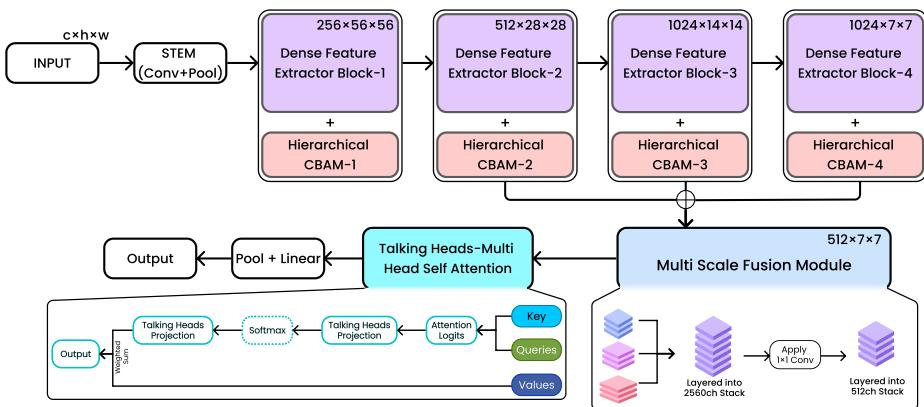
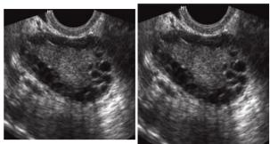
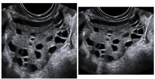
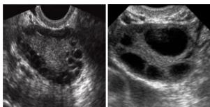
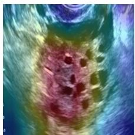
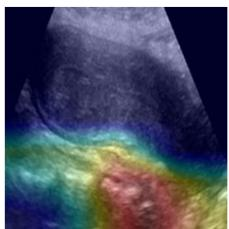
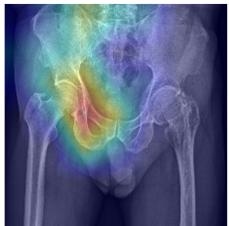
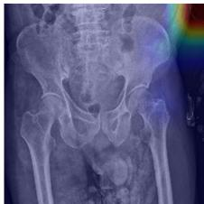

# PelviNeXt: A Modality-Agnostic Hybrid Network for Pelvic Imaging in Women’s Health

Siam Tahsin Bhuiyan1,2[0009−0000−1298−1991], Rashedur   
Rahman1,2⋆[0000−0003−0267−2612], Sefatul Wasi2[0009−0004−6949−0607], Halima   
Khatun1,2[0009−0008−9022−4441], Ashraful Islam1,2[0000−0003−2367−2013], AKM Mahbubur Rahman1,2[0000−0001−9941−4817], Saadia Binte Alam1,2[0009−0007−0358−7635], M Ashraful Amin1,2[0000−0003−2330−9775]

1 Center for Computational & Data Sciences, Independent University, Bangladesh, Dhaka, Bangladesh

Department of Computer Science and Engineering, Independent University, Bangladesh, Dhaka, Bangladesh rashed@iub.edu.bd

Preprint. Accepted at MICCAI CAPI-WOMEN 2026.

Abstract. Women’s health remains substantially under-resourced in medical imaging research, with pelvic pathologies such as polycystic ovary syndrome (PCOS) and pelvic fracture both sufering from a scarcity of public, well-annotated benchmark data despite their clinical importance. We introduce PelviNeXt, a modality-agnostic hybrid architecture combining a dense convolutional feature extractor, hierarchical channelspatial attention (H-CBAM), a multi-scale fusion module (MSFM), and talking-heads multi-head self-attention (TH-MHSA), applied without mod ification to both pelvic ultrasound and X-ray inputs. While benchmarking PelviNeXt on PCOSGen, the only gynaecologist-annotated public PCOS ultrasound dataset, we identified extensive exact and near-duplicate contamination within and across the dataset. We audit this contamination via perceptual hashing, publicly release a deduplicated version of the dataset, and establish the first integrity-audited evaluation protocol and baseline for PCOSGen under 5-fold cross-validation. On the only publicly available pelvic fracture X-ray dataset (PXR150), PelviNeXt exceeds previously reported state-of-the-art results across accuracy, recall, specificity, and AUROC. Ablation studies confirm that each architectural component contributes to performance on both tasks. Our results demonstrate that a single architecture, applied without task-specific modification, can serve as a reliable foundation for pelvic imaging across modalities in data-scarce, under-researched areas of women’s health.

Keywords: Pelvic imaging · PCOS detection · Pelvic fracture classification · Ultrasound imaging · X-ray imaging · Modality-agnostic learning · Dataset integrity audit · PCOSGen

## 1 Introduction

Despite growing awareness of health disparities in medicine, women’s health remains chronically underfunded and under-researched. Only 1% of research and development funding focuses on non-cancer-related women’s health, despite women comprising roughly 50% of the global population [13]. The World Economic Forum’s 2025 white paper Prescription for Change, further reveals that only 7% of pharmaceutical research and development is targeted at conditions that uniquely afect women [3]. Left unaddressed, such gaps in research and data risk carrying over into the AI systems built on top of them.

This gap extends to conditions that disproportionately afect women or share anatomy with reproductive organs. PCOS exemplifies the former: it afects 6 to 20% of premenopausal women worldwide [12] and is conventionally screened via ultrasound. Pelvic fracture exemplifies the latter: though not sex-specific, it occurs in the anatomical region housing the reproductive organs, and carries a disability rate exceeding 50% and a mortality rate above 13% [15]. Plain X-ray remains the primary screening modality in emergency settings.

Both tasks sufer from scarce public benchmark data. PCOSGen is, to our knowledge, the only gynaecologist-annotated public PCOS ultrasound dataset, comprising 4,668 images [7, 6, 8], and has been benchmarked by several pipelines reporting over 96.12% accuracy [14]. Pelvic fracture detection has likewise reported strong results on private data, e.g. 98.5% accuracy on 876 radiographs [11], but such data is typically institution-specific and unreleased. PXR150 is, to our knowledge, the only public dataset for this task, comprising 150 radiographs (100 fracture, 50 normal) [4].

Existing architectures for these tasks are largely single-modality. Yet both share structure, namely localized pathological cues within a broader anatomical context, well suited to dense convolutional backbones [10], convolutional block attention module (CBAM)-style channel-spatial attention [18], and global selfattention refinements such as talking-heads attention [17].

We introduce PelviNeXt, a modality-agnostic hybrid architecture combining a dense convolutional feature extractor, hierarchical channel-spatial attention, multi-scale fusion, and talking-heads self-attention, applied without modification across ultrasound and X-ray. While benchmarking PelviNeXt, we identified extensive exact and near-duplicate contamination in PCOSGen. We audit this contamination via perceptual hashing and release a deduplicated dataset, establishing the first integrity-audited evaluation protocol (see Data Availability).

Our contributions are:

1. PelviNeXt, a modality-agnostic architecture evaluated on pelvic fracture Xray and PCOS ultrasound classification with no task-specific preprocessing.

2. A systematic integrity audit of PCOSGen via perceptual hashing, revealing extensive near-duplicate contamination, with a deduplicated dataset release.

3. The first reliable, deduplication-aware PCOSGen baseline under 5-fold crossvalidation.

4. State-of-the-art results on PXR150, exceeding prior work on accuracy, recall, specificity, and AUROC.

  
Fig. 1. Overview of the PelviNeXt architecture.

## 2 Methodology

PelviNeXt comprises four stages: a dense feature extractor (DFE), hierarchical CBAM (H-CBAM) attention after each DFE block, a multi-scale fusion module (MSFM), and a talking-heads multi-head self-attention (TH-MHSA) module, followed by a classification head (Fig. 1). The same pipeline with identical hyperparameters is applied to both ultrasound and X-ray inputs.

## 2.1 Dense Feature Extractor (DFE)

The feature extraction stage is inspired by the depth and dense connectivity of DenseNet [10], using four dense blocks of 6, 12, 24, and 16 layers respectively (DFE-1 through DFE-4), where each layer receives the concatenated feature maps of all preceding layers within the block. Each block is followed by a transition layer halving spatial resolution, producing feature maps of 256×56×56, $5 1 2 \times 2 8 \times 2 8 , 1 0 2 4 \times 1 4 \times 1 4$ , and $1 0 2 4 \times 7 \times 7$ after DFE-1 through DFE-4 respectively, given a $3 { \times } 2 2 4 { \times } 2 2 4$ input.

## 2.2 Hierarchical CBAM (H-CBAM)

Following each DFE block, an H-CBAM module refines the feature map along channel and spatial dimensions [18]. Given feature map $\mathbf { F } \in \mathbb { R } ^ { C \times H \times W }$ , channel attention is

$$
M _ { c } ( \mathbf { F } ) = \sigma { \big ( } \mathrm { M L P } ( \operatorname { A v g P o o l } ( \mathbf { F } ) ) + \mathrm { M L P } ( \operatorname { M a x P o o l } ( \mathbf { F } ) ) { \big ) }\tag{1}
$$

and spatial attention is

$$
M _ { s } ( \mathbf { F } ^ { \prime } ) = \sigma \big ( f ^ { 7 \times 7 } ( [ \mathrm { A v g P o o l } ( \mathbf { F } ^ { \prime } ) ; \mathrm { M a x P o o l } ( \mathbf { F } ^ { \prime } ) ] ) \big )\tag{2}
$$

where $\mathbf { F } ^ { \prime } = { \mathit { M } } _ { c } ( \mathbf { F } ) \otimes \mathbf { F }$ , σ is sigmoid, and $f ^ { 7 \times 7 }$ is a $7 \times 7$ convolution. The refined output is $\mathbf { F } ^ { \prime \prime } = \mathbf { \Lambda } M _ { s } ( \mathbf { F } ^ { \prime } ) \otimes \mathbf { F } ^ { \prime }$ . We instantiate this module separately after each DFE block (H-CBAM-1 through H-CBAM-4), applying attention at four progressively coarser scales from 56×56 down to $7 { \times } 7 ,$ enabling refinement of both fine-grained local cues and coarse semantic structure within a single forward pass.

## 2.3 Multi-Scale Fusion Module (MSFM)

The outputs of DFE-2, DFE-3, and DFE-4 after their respective H-CBAM modules, $B _ { 2 } ^ { - } \ \in \ \mathbb { R } ^ { 5 1 2 \times 2 8 \times 2 8 }$ ， $B _ { 3 } \in \mathbb { R } ^ { 1 0 2 4 \times 1 4 \times 1 4 }$ , and $B _ { 4 } \in \bar { \mathbb { R } ^ { 1 0 2 4 \times 7 \times 7 } }$ , are spatially aligned to 7×7 via bilinear interpolation and concatenated into a 2560-channel tensor. A 1×1 convolution reduces this to 512 channels, integrating mid-level and high-level features before global reasoning.

## 2.4 Talking-Heads Multi-Head Self-Attention (TH-MHSA)

The fused 512×7×7 map is flattened into 49 spatial tokens of dimension 512 and processed by a talking-heads self-attention block [17], which inserts learned linear projections across the head dimension before and after the softmax:

$$
\operatorname { A t t e n t i o n } ( Q , K , V ) = \operatorname { s o f t m a x } \left( { \frac { Q K ^ { \top } } { \sqrt { d _ { k } } } } W _ { \ell } \right) W _ { w } V\tag{3}
$$

where $W _ { \ell }$ and $W _ { w }$ mix information across heads pre- and post-softmax, improving global context aggregation relative to standard multi-head self-attention. Output tokens are mean-pooled and passed through a linear layer to produce class logits.

## 3 Datasets and Experimentation

## 3.1 PCOSGen Dataset

PCOSGen is the dataset released for the Auto-PCOS Classification Challenge [8], collected from YouTube, ultrasoundcases.info, and Kaggle, and annotated by an experienced gynaecologist based in New Delhi, India [7, 6]. The separate training and test releases (PCOSGen-train: 3,200 images; PCOSGen-test: 1,468 images) are merged into a single pool of 4,668 images (1,319 Normal, 3,349 Abnormal) as no oficial train/test boundary is assumed in our 5-fold cross-validation protocol.

## 3.2 PCOSGen Integrity Audit

We compute a perceptual hash (pHash) for every image and calculate pairwise Hamming distances. Images connected at or below a given distance threshold are grouped into clusters via union-find, treating duplication as transitive across chains of near-identical images. Deduplication proceeds in two stages: exact duplicates (distance = 0) are removed first, retaining one representative per cluster; near-duplicates (distance ≤ 14) are then removed from the remaining images. The threshold of 14 was selected by visual inspection: pairs at distance 14 are visually indistinguishable, while pairs at distance 16 are visually distinct (Fig. 2). Table 1 summarizes each stage. The original pool of 4,668 images reduces to 225 (63 Normal, 162 Abnormal), a 95.2% reduction. The deduplicated dataset is publicly released (see Data Availability).

Table 1. PCOSGen dataset composition before and after deduplication.
<table><tr><td>Dataset</td><td>Normal</td><td>Abnormal</td><td>Total</td></tr><tr><td>Original PCOSGen</td><td>1,319</td><td>3,349</td><td>4,668</td></tr><tr><td>After exact duplicate removal</td><td>948</td><td>2,523</td><td>3,471</td></tr><tr><td>After near-duplicate removal  $( \leq 1 4 )$ </td><td>63</td><td>162</td><td>225</td></tr></table>

  
a) Distance 0

  
b) Distance 14

  
c) Distance 16  
Fig. 2. Example image pairs at increasing perceptual hash distance. (a) Distance 0: exact duplicate. (b) Distance 14: visually indistinguishable, used as the deduplication threshold. (c) Distance 16: visually distinct, confirming the threshold boundary.

## 3.3 Pelvic Fracture Dataset (PXR150)

PXR150 is a publicly available 150-image subset of the test set from [4], originally divided into 50 hip fracture, 50 pelvic fracture, and 50 normal cases from a 2017 emergency department cohort of 1,888 radiographs. For binary classification, the two fracture classes are merged into a single Fracture class, giving 100 fracture and 50 normal cases.

## 3.4 Implementation Details

All models are trained from scratch using AdamW $( \mathrm { l r } = 1 \times 1 0 ^ { - 4 }$ , cosine annealing), batch size 16, for 30 epochs, under 5-fold stratified cross-validation with augmentation applied only to training folds. Augmentation uses random combinations of rotation (within 25◦), shearing (within 10%), horizontal flipping, and translation (within 10%), with class-aware multipliers: fracture images 2× and normal images 4× for PXR150; abnormal images 2× and normal images 6× for the deduplicated PCOS dataset. No task-specific preprocessing is applied to either modality.

Table 2. PCOS classification results on the deduplicated PCOSGen dataset. Mean over 5-fold CV; 95% CI shown in the row below each model’s results.
<table><tr><td>Model</td><td>Acc.</td><td>Rec.</td><td>Spec.</td><td>F1</td><td>AUROC</td></tr><tr><td>ViT-B/16</td><td>89.33% ±4.22</td><td>88.92% ±3.98</td><td>79.36% ±12.59</td><td>0.8337</td><td>0.8629</td></tr><tr><td>ResNet-101</td><td>88.44%</td><td>88.60%</td><td>80.90%</td><td>±0.0802 0.8427</td><td>±0.0763 0.8479</td></tr><tr><td>DenseNet-169</td><td>±4.85 88.89%</td><td>±3.44 87.14%</td><td>±7.85 81.03%</td><td>±0.0402 0.8342</td><td>±0.0637 0.8418</td></tr><tr><td></td><td>±3.64</td><td>±11.90</td><td>±5.81</td><td>±0.0715</td><td>±0.0664</td></tr><tr><td>PelviNeXt</td><td>92.00%</td><td>91.74%</td><td>86.48%</td><td>0.8890</td><td>0.9051</td></tr><tr><td></td><td>±1.60</td><td>±3.91</td><td>±2.99</td><td>±0.0085</td><td>±0.0156</td></tr></table>

## 3.5 Evaluation Metrics

We report Accuracy, Recall, Specificity, F1-Score, and AUROC for both tasks, with mean and 95% confidence interval (CI) computed across the 5 cross-validation folds.

## 4 Results & Discussion

## 4.1 PCOS Classification

Table 2 reports 5-fold CV results on the deduplicated PCOSGen dataset. PelviNeXt achieves the highest performance across all five metrics, with a mean accuracy of 92.00% (±1.60) and AUROC of 0.9051 (±0.0156), outperforming ViT-B/16 [5], ResNet-101 [9], and DenseNet-169 [10] by at least 2.67 percentage points in accuracy and 0.0422 in AUROC. PelviNeXt also shows the narrowest CIs across most metrics: specificity varies by only ±2.99 percentage points for PelviNeXt versus ±12.59 for ViT-B/16, suggesting more stable performance in this lowdata regime. As no prior work has been evaluated on the deduplicated dataset, these results constitute the first reliable, integrity-audited baseline for PCOS classification on PCOSGen.

## 4.2 Fracture Classification

Table 3 reports 5-fold CV results on PXR150. PelviNeXt achieves the highest accuracy (87.33%, ±2.45), recall (89.00%, ±5.71), specificity (87.00%, ±3.92), and AUROC (0.8920, ±0.0288) among all methods, exceeding the strongest prior result, Patch Ensemble [2] (84.00% accuracy, 87.00% recall, 82.00% specificity, 0.8700 AUROC), across every reported metric. PelviNeXt also outperforms all CNN and transformer baselines trained under our protocol, with the next-best model, ViT-B/16, trailing by 6.66 percentage points in accuracy and 0.0710 in AUROC. Notably, the gap between PelviNeXt and prior SOTA is most pronounced in specificity (87.00% vs. 82.00%), suggesting the model is comparatively better at correctly rejecting normal cases.

Table 3. Fracture classification results on PXR150. Mean over 5-fold CV; 95% CI shown in the row below each of our models’ results.
<table><tr><td>Model</td><td>Acc.</td><td>Rec.</td><td>Spec.</td><td>F1</td><td>AUROC</td></tr><tr><td>CLAHE [1]</td><td>80.67%</td><td>82.00%</td><td>80.00%</td><td></td><td>0.8140</td></tr><tr><td>Gamma [1]</td><td>80.67%</td><td>81.00%</td><td>81.00%</td><td></td><td>0.8160</td></tr><tr><td>Ensemble [2]</td><td>80.00%</td><td>82.00%</td><td>76.00%</td><td></td><td>0.7900</td></tr><tr><td>Patch Ensemble [2]</td><td>84.00%</td><td>87.00%</td><td>82.00%</td><td></td><td>0.8700</td></tr><tr><td>ViT-B/16</td><td>80.67%</td><td>84.00%</td><td>79.00%</td><td>0.8133</td><td>0.8210</td></tr><tr><td rowspan="3">ResNet-101</td><td>±5.62</td><td>±3.67</td><td>±6.50</td><td>±0.0459</td><td>±0.0535</td></tr><tr><td>78.00%</td><td>79.00%</td><td>74.00%</td><td>0.7626</td><td>0.7870</td></tr><tr><td>±3.92</td><td>±5.71</td><td>±4.80</td><td>±0.0395</td><td>±0.0574</td></tr><tr><td rowspan="2">DenseNet-169</td><td>78.00%</td><td>78.00%</td><td>76.00%</td><td>0.7697</td><td>0.7960</td></tr><tr><td>±3.33</td><td>±3.92</td><td>±5.71</td><td>±0.0478</td><td>±0.0424</td></tr><tr><td rowspan="2">PelviNeXt</td><td>87.33%</td><td>89.00%</td><td>87.00%</td><td>0.8774</td><td>0.8920</td></tr><tr><td>±2.45</td><td>±5.71</td><td>±3.92</td><td>±0.0191</td><td>±0.0288</td></tr></table>

Table 4. Ablation study. Mean ± 95% CI over 5-fold CV.
<table><tr><td></td><td>Acc.(%)</td><td>F1</td><td>AUROC</td></tr><tr><td>PCOS</td><td></td><td></td><td>0.8758±0.0196</td></tr><tr><td>w/o H-CBAM</td><td>90.44%±1.48</td><td>0.8578±0.0275</td><td></td></tr><tr><td>w/o MSFM</td><td>88.89%±1.19</td><td>0.8509±0.0190</td><td>0.8735±0.0167</td></tr><tr><td>Vanilla MHSA</td><td>91.11%±2.75</td><td>0.8692±0.0317</td><td>0.8851±0.0238</td></tr><tr><td>PelviNeXt</td><td>92.00%±1.60</td><td>0.8890±0.0085</td><td>0.9051±0.0156</td></tr><tr><td>Fracture</td><td></td><td></td><td></td></tr><tr><td>w/o H-CBAM</td><td>84.67%±3.33</td><td>0.8579±0.0270</td><td>0.8764±0.0225</td></tr><tr><td>w/o MSFM</td><td>83.33%±2.92</td><td>0.8343±0.0193</td><td>0.8576±0.0368</td></tr><tr><td>Vanilla MHSA</td><td>86.00%±1.31</td><td>0.8577±0.0420</td><td>0.8860±0.0243</td></tr><tr><td>PelviNeXt</td><td>87.33%±2.45</td><td>0.8774±0.0191</td><td>0.8920±0.0288</td></tr></table>

## 4.3 Ablation Study

Table 4 reports component-wise ablations on both tasks. Removing H-CBAM drops accuracy by 1.56 percentage points on PCOS and 2.66 percentage points on fracture, with the larger efect on fracture suggesting channel-spatial attention is particularly useful for radiographic features. Removing MSFM causes the largest AUROC drop on both tasks (PCOS: 0.9051 → 0.8735; fracture: 0.8920 → 0.8576), identifying multi-scale fusion as the most critical component for global discriminative performance. Replacing TH-MHSA with vanilla MHSA yields a smaller but consistent drop (PCOS: 0.9051 → 0.8851; fracture: 0.8920 → 0.8860), confirming that head-mixing provides additional gains beyond standard self-attention. Full PelviNeXt achieves the best performance on all metrics across both tasks.

## 4.4 Qualitative Analysis

Figure 3 presents representative Grad-CAM visualizations [16] from both classification tasks. For PCOS ultrasound, the abnormal case exhibits localized activations around the ovarian follicles, whereas the normal case shows more diffuse attention across the ovary. For pelvic fracture radiographs, the fracture case demonstrates concentrated activations within the bone regions, while the normal case produces only weak responses outside the pelvic bones. These qualitative results indicate that PelviNeXt attends to anatomically relevant regions across both imaging modalities.

Polycystic Ovary Syndrome (PCOS)  
  
a) GT:A; Pred:A

  
b) GT:N: Pred:N

  
c) GT:F; Pred:F  
Pelvic Fracture (PF)

  
d) GT:N; Pred:N  
Fig. 3. Grad-CAM visualizations from PelviNeXt. (a) Correctly predicted Abnormal PCOS ultrasound. (b) Correctly predicted Normal PCOS ultrasound. (c) Correctly predicted Fracture pelvic X-ray. (d) Correctly predicted Normal pelvic X-ray.

## 4.5 Limitations

A limitation of this work is the small size of both datasets: the deduplicated PCOS dataset contains 225 images and PXR150 contains 150 images, which limits statistical power despite 5-fold CV with 95% CIs. The PCOS dataset size is a direct consequence of our integrity audit, and both remain the only publicly available expert-annotated benchmarks for their respective tasks. Cross-dataset and cross-site evaluation is important future work once larger public benchmarks become available.

## 5 Conclusion

We presented PelviNeXt, a modality-agnostic hybrid architecture for pelvic imaging combining dense feature extraction, H-CBAM, MSFM, and TH-MHSA, applied without modification to both ultrasound and X-ray. Through a perceptual hashing integrity audit of PCOSGen, we identified extensive near-duplicate contamination, released a deduplicated dataset, and established the first reliable evaluation baseline. On PXR150, PelviNeXt exceeds prior state-of-the-art across accuracy, recall, specificity, and AUROC. Ablation results confirm the contribution of each component. These results take a step toward reliable, modalityagnostic computer-assisted tools for under-researched areas of women’s pelvic health.

## Data Availability

The deduplicated PCOSGen benchmark is publicly available at:

https://www.kaggle.com/datasets/siamtbhuiyan/pcosgen-deduplicated.

The original PCOSGen and PXR150 datasets are available from their respective sources [7, 6, 4].

## Disclosure of Interests

The authors have no competing interests to declare.

## References

1. Bhuiyan, S.T., Khatun, R., Mazumder, S.K., Israq, F., Wasi, S., Rahman, R., Islam, A., Alam, S.B.: Preprocessing matters: Benchmarking image enhancement techniques for pelvic fracture detection. In: 2025 IEEE International Women in Engineering (WIE) Conference on Electrical and Computer Engineering (WIECON-ECE). pp. 379–384. IEEE (2025)

2. Bhuiyan, S.T., Rahman, R., Alam, S.B., Khatun, H., Islam, R., Wasi, S., Iftee, M.A.R., Islam, A.: Patch-based deep ensemble learning for enhancing pelvic fracture detection. In: 2025 28th International Conference on Computer and Information Technology (ICCIT). pp. 3022–3027. IEEE (2025)

3. Bode, A., Fitzgerald, E.: Prescribing policy change to transform women’s health research. The Lancet Obstetrics, Gynaecology, & Women’s Health (2026)

4. Cheng, C.T., Wang, Y., Chen, H.W., Hsiao, P.M., Yeh, C.N., Hsieh, C.H., Miao, S., Xiao, J., Liao, C.H., Lu, L.: A scalable physician-level deep learning algorithm detects universal trauma on pelvic radiographs. Nature communications 12(1), 1066 (2021)

5. Dosovitskiy, A., Beyer, L., Kolesnikov, A., Weissenborn, D., Zhai, X., Unterthiner, T., Dehghani, M., Minderer, M., Heigold, G., Gelly, S., et al.: An image is worth 16x16 words: Transformers for image recognition at scale. arXiv preprint arXiv:2010.11929 (2020)

6. Handa, P., Saini, A., Dutta, S., Pathak, H., Choudhary, N., Goel, N., Dhanao, J.K.: Pcosgen-test dataset (2025). https://doi.org/10.5281/zenodo.14591782, https://doi.org/10.5281/zenodo.14591782

7. Handa, P., Saini, A., Dutta, S., Pathak, H., Choudhary, N., Goel, N., Dhanao, J.K.: Pcosgen-train dataset (2025). https://doi.org/10.5281/zenodo.14592001, https://doi.org/10.5281/zenodo.14592001

8. Handa, P., Saini, A., Dutta, S., Pathak, H., Choudhary, N., Goel, N., Dhanao, J.K., Handa, P.: Auto-pcos classification challenge (2024)

9. He, K., Zhang, X., Ren, S., Sun, J.: Deep residual learning for image recognition. In: Proceedings of the IEEE conference on computer vision and pattern recognition. pp. 770–778 (2016)

10. Huang, G., Liu, Z., Van Der Maaten, L., Weinberger, K.Q.: Densely connected convolutional networks. In: Proceedings of the IEEE conference on computer vision and pattern recognition. pp. 4700–4708 (2017)

11. Kassem, M.A., Naguib, S.M., Hamza, H.M., Fouda, M.M., Saleh, M.K., Hosny, K.M.: Explainable transfer learning-based deep learning model for pelvis fracture detection. International Journal of Intelligent Systems 2023(1), 3281998 (2023)

12. Lv, W., Song, Y., Fu, R., Lin, X., Su, Y., Jin, X., Yang, H., Shan, X., Du, W., Huang, Q., et al.: Deep learning algorithm for automated detection of polycystic ovary syndrome using scleral images. Frontiers in Endocrinology 12, 789878 (2022)

13. Moley, K.: Closing the gender health gap is a \$1 trillion opportunity. Biopharma Dealmakers (2024)

14. Moral, P., Mustafi, D., Mustafi, A., Sahana, S.K.: Cystnet: An ai driven model for pcos detection using multilevel thresholding of ultrasound images. Scientific reports 14(1), 25012 (2024)

15. Sang, Y., Liu, Y., Yibulayimu, S., Wang, Y., Killeen, B.D., Liu, M., Ku, P.C., Johannsen, O., Gotkowski, K., Zenk, M., et al.: Benchmark of segmentation techniques for pelvic fracture in ct and x-ray: Summary of the pengwin 2024 challenge. IEEE Transactions on Medical Imaging (2026)

16. Selvaraju, R.R., Cogswell, M., Das, A., Vedantam, R., Parikh, D., Batra, D.: Gradcam: Visual explanations from deep networks via gradient-based localization. In: Proceedings of the IEEE international conference on computer vision. pp. 618–626 (2017)

17. Shazeer, N., Lan, Z., Cheng, Y., Ding, N., Hou, L.: Talking-heads attention. arXiv preprint arXiv:2003.02436 (2020)

18. Woo, S., Park, J., Lee, J.Y., Kweon, I.S.: Cbam: Convolutional block attention module. In: Proceedings of the European conference on computer vision (ECCV). pp. 3–19 (2018)