# Prompt-Conditioned Channel Attention for Hierarchical Feature Modulation toward Anatomy-Agnostic Segmentation

Mosharof Hossaina, Md Rabiul Islamb, Limon Haldera, Erchin Serpedinb, Md Kamrul Hasana,c,1,∗

aDepartment ofElectrical and Electronic Engineering, Khulna University ofEngineering & Technology (KUET), Khulna-9203, Bangladesh bDepartment of Electrical and Computer Engineering, Texas A&M University, College Station, TX, USA cDepartment ofBioengineering, Imperial College London, London SW7 2AZ, UK

## Abstract

Accurate and anatomically plausible medical image segmentation remains challenging due to low contrast, ambiguous boundaries,2 inter-patient variability, and modality-specific artifacts. Interactive segmentation using spatial prompts has emerged as a promis-0 ing strategy to guide attention and improve localization, particularly in low-contrast or structurally ambiguous regions. However, existing methods typically restrict prompt integration to late-stage fusion and lack explicit mechanisms for channel-wise featureg modulation, limiting their ability to capture deeper contextual and modality-specific variations across hierarchical representations.u To address these limitations, we introduce Prompt-Conditioned Channel Attention (PCCA), a novel modulation mechanism thatA enables deep, hierarchical integration of semantic prompts within encoder-decoder segmentation networks. PCCA extracts compact channel descriptors from both image and prompt features via pooling, projects them into a shared latent space, and fuses them through a gated excitation unit to compute prompt-aware channel attention weights. These weights perform hierarchical channel-wise attention by adaptively reweighting feature responses at every network stage, enabling spatially selective and semantically enriched representations. Building on this mechanism, we propose PROMISE-Net (PROmpt Modulated Integration for SEgmentation), instantiated in two architectural variants: a convolutional model (PROMISE-C ) and a transformer-based model (PROMISE-Txformer). Across ISIC-Lesion, Kvasir-Polyp, CAMUS-Cardiac, and Kvasir-Instrument benchmarks, integrat-s ing PCCA into PROMISE-C yielded relative IoU improvements of 10.4%, 8.7%, 0.8%, and 3.4% over baseline U-Net, while PROMISE-Txformer achieved corresponding gains of 7.6%, 23%, 2.1%, and 1.1% over baseline UNETR. These results demonstrate consistent cross-architectural, cross-modal, and cross-anatomical improvements, establishing PCCA coupled PROMISE-Net as a scalable and generalizable framework for prompt-aware feature modulation in medical image segmentation. The code is available at https://github.com/kamruleee51/PROMISENet.

Keywords: Medical image segmentation, Prompt-conditioned attention, Hierarchical modulation, Interactive segmentation, Channel attention.

## 1. Introduction

Medical image segmentation plays a crucial role in modern healthcare, ofering significant benefits in clinical diagnosis, surgical planning, and treatment monitoring [1]. Accurately delineating anatomical structures and pathological regions enables more informed clinical decision-making and contributesa to improved patient outcomes. Nevertheless, achieving reliable segmentation remains highly challenging due to the inherent complexity and variability of medical images. These challenges arise primarily from two major aspects. First, medical images exhibit considerable diversity in the shape, size, and spatial configuration of anatomical structures. For instance, in skin lesion analysis, imaging artifacts such as hair, blood vessels, and uneven illumination can obscure lesion boundaries and confound interpretation. In addition, irregular contours and heterogeneous intensity distributions further degrade the performance of conventional shape- or intensity-based models [2, 3]. Second, image resolution exerts a notable influence on segmentation performance. Low-resolution scans often sufer from poor boundary definition and loss of fine anatomical detail, whereas excessively high-resolution images may amplify noise and introduce unstable feature responses.

Manual delineation by clinical experts, though highly accurate, is both labor-intensive and time-consuming, rendering it impractical for large-scale clinical deployment. To mitigate this, a wide range of automatic segmentation algorithms have been developed over the past decades [4, 5]. Early approaches relied on classical image processing techniques such as thresholding [6] and edge detection [7]. However, these methods lacked robustness and generalizability when confronted with the high anatomical variability and complex appearance patterns present in real-world medical images. Recent advances in deep learning (DL), particularly the advent of convolutional neural networks (CNNs) [8] and Transformers [9], have revolutionized medical image segmentation, achieving state-ofthe-art results across diverse modalities and anatomical targets [10, 11]. Despite their success, these models typically demand large-scale, fully annotated datasets to attain optimal accuracy and generalization. Acquiring such expert annotations is both costly and time-intensive, as it requires domain-specific knowledge and meticulous manual efort.

From static feature learning to hierarchical prompt-conditioned feature control via novel PCCA  
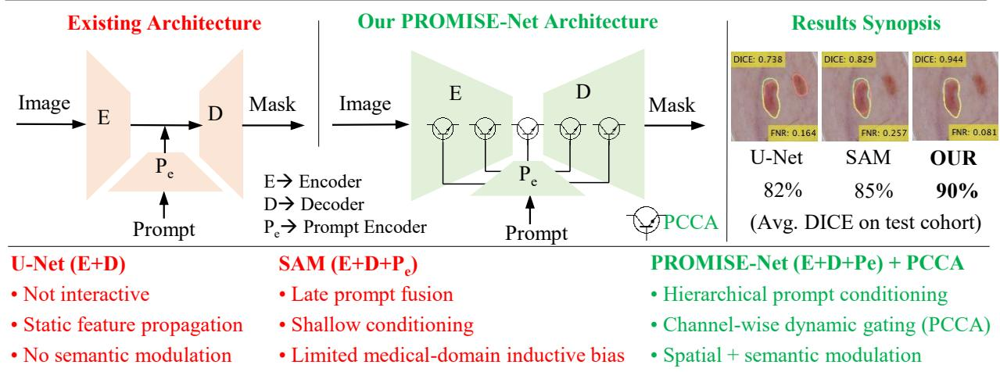  
Figure 1: From static feature learning to hierarchical prompt-conditioned feature control. Compared with U-Net and SAM, which rely on static representations or shallow prompt fusion, PROMISE-Net integrates Prompt-Conditioned Channel Attention (PCCA) throughout the network, enabling dynamic channel-wise gating and spatial–semantic modulation for improved segmentation performance.

To alleviate the reliance on dense annotations, weakly and semi-supervised segmentation strategies have been widely explored, leveraging sparse or noisy supervisory signals such as image-level tags, bounding boxes, scribbles, or points [12– 17]. Although these methods substantially reduce annotation costs, their limited spatial supervision often leads to inaccurate boundary delineation and structural inconsistencies, particularly in low-contrast or artifact-prone regions. To mitigate these shortcomings, several studies have incorporated structural priors, adversarial shape regularization, or consistency constraints to improve spatial coherence [18, 19]. Yet, these techniques primarily enforce implicit shape regularity and fail to provide explicit spatial guidance that adapts to heterogeneous imaging conditions and anatomical variability.

Among the weakly supervised paradigms, scribble supervision has proven particularly efective due to its ease of use and practicality for delineating complex anatomical structures [20]. Annotators need only draw a few representative strokes per class, drastically reducing annotation time. However, the sparse and localized nature of scribble annotations provides limited supervision in low-contrast or ambiguous regions, often leading to segmentation errors in internal substructures and degraded boundary precision. Conventional architectures such as U-Net struggle to reconstruct missing contextual information, resulting in incomplete shape recovery of critical anatomical components. These challenges underscore the need for frameworks capable of learning efectively from sparse supervision while preserving detailed anatomical morphology.

To strengthen the supervision signal, pseudo-labeling (PL) has emerged as an efective enhancement within scribbleguided segmentation. PL methods exploit model predictions to generate provisional labels for unlabeled regions, thereby expanding the efective training set [21–23]. Typically, pseudo-labels are aggregated from multiple networks or decoder branches to improve robustness. For instance, Luo et al. [21] dynamically blend outputs from dual decoders to diversify pseudo-label generation, while Wu et al. [24] select highconfidence pixels from ensemble confidence maps. Similarly, Han et al. [25] employ multi-branch architectures with varied dilation rates and feature-level perturbations, and PacingPseudo [26] enforces prediction consistency through a twin-network design. In addition, [27] integrates class activation maps to inject class-specific cues derived from scribble annotations. Despite these advances, most PL frameworks rely on simple averaging or random weighting during aggregation, which can amplify uncertainty and introduce label noise [28]. As a result, pseudo-labels often lack structural coherence and fail to guide fine-grained boundary refinement efectively.

In parallel, interactive and prompt-based segmentation has gained momentum as a powerful means of injecting spatial pri ors directly into deep models. In this paradigm, users provide minimal yet informative cues such as points, bounding boxes, or scribbles to guide model attention and localization [29] (shown in Fig. 1). This strategy is particularly attractive for human-in-the-loop clinical workflows, where clinicians can iteratively refine results while preserving the eficiency of au tomated inference. Despite these advantages, most existing prompt-driven frameworks, including SAM [29], incorporate prompts only through late-stage fusion or single-layer conditioning, confining their influence to shallow or bottleneck representations. Moreover, the mechanisms by which prompt features interact with mainstream image features, especially at the level of channel-wise modulation, are often ad hoc or underspecified. As a result, prompt semantics are not efectively propagated across the network hierarchy, limiting the model’s ability to shape intermediate representations. This restriction hinders the capture of multi-scale contextual relationships, modality-specific artifacts, and fine anatomical structures, particularly in low-contrast or structurally ambiguous regions.

In this work, we propose the following key contributions. First, we introduce Prompt-Conditioned Channel Attention (PCCA), a novel attention mechanism that enables deep, hierarchical modulation of spatial prompts within encoder–decoder segmentation networks, allowing semantic guidance to propagate consistently throughout the feature hierarchy (illustrated in Fig. 1). Unlike existing prompt-driven designs that condition only shallow or bottleneck layers, PCCA embeds prompts directly into the feature transformation process at every stage. PCCA is a lightweight, prompt-conditioned channel excitation mechanism that internally executes squeezeand-excitation operations to adaptively fuse prompt-derived spatial priors with visual features, thereby enhancing regionof-interest focus, boundary localization, and anatomical consistency while preserving computational eficiency. Second, we integrate PCCA into a unified segmentation framework, PROMISE-Net (PROmpt Modulated Integration for SEgmentation), instantiated in two complementary variants: a convolutional model $( \mathbf { P R O M I S E { \mathbf { - } } C _ { N N } } )$ and a transformerbased model $\mathbf { ( P R O M I S E  – T _ { x f o r m e r } ) }$ This design demonstrates the cross-architectural generality and plug-in flexibility of the proposed mechanism. Finally, extensive evaluations on the ISIC-Lesion, CAMUS-Cardiac, Kvasir-Polyp, and Kvasir-Instrument benchmarks show that PROMISE-Net consistently achieves cross-architectural, cross-modal, and cross-anatomical improvements over strong state-of-the-art baselines. Collectively, these contributions establish PCCA coupled PROMISE-Net as a scalable and generalizable framework for promptaware feature modulation in medical image segmentation.

## 2. PROMISE-Net Framework

Building upon the motivation outlined in Section 1, we propose PROMISE-Net, a prompt-aware segmentation framework composed of an image encoder, a prompt encoder, and hierarchical modulation units based on the PCCA module, as illustrated in Fig. 2. At its core, PCCA enables deep, hierarchical integration of semantic prompts within encoder–decoder networks. Specifically, it operates on intermediate feature maps from the image encoder and semantic embeddings from a lightweight prompt encoder to generate spatially modulated representations, wherein PCCA acts as a gating mechanism that regulates the flow of mainstream visual features according to prompt relevance.

The gating behavior of PCCA is analogous to that of an electronic switching transistor: the encoder feature map acts as the primary input (collector current), while the prompt embedding provides the control signal (base drive). This relationship is

formalized as:

$$
\mathbf { Y } = \sigma ( \mathbf { P } ) \odot \mathbf { F } ,\tag{1}
$$

where F denotes the encoder feature map, $\sigma ( \mathbf { P } )$ is the promptconditioned gate broadcast over H×W, and Y is the modulated output. When prompt activation is strong, σ(P) ≈ 1 and the gate conducts; when prompt activation is weak or absent, $\sigma ( { \bf P } ) \approx 0 ,$ suppressing non-salient responses. This transistor-like modulation dynamically amplifies or attenuates spatial activations, thereby focusing the network on anatomically relevant regions.

Compact channel descriptors are extracted from both visual and prompt streams via global average pooling, projected onto a shared latent space, and fused through a gated excitation unit to produce channel-wise modulation weights that adaptively reweight image features at every hierarchical level. Through this design, PCCA preserves spatial semantics while adapting to hierarchical context. PROMISE-Net is designed in two architectural variants: a convolutional model $( \mathbf { P R O M I S E - C _ { N N } } )$ and a transformer-based model $\mathbf { ( P R O M I S E { \mathrm { - } } T _ { x f o r m e r } ) }$ , demonstrating cross-architectural generality. The following subsections describe each component in detail.

## 2.1. Encoder Representation Learning

Segmentation requires hierarchical feature representations that capture both low-level texture details and high-level semantic cues. To this end, the encoder E forms the backbone of PROMISE-Net, progressively abstracting visual information into multi-scale latent features that serve as the basis for prompt-conditioned modulation. Given an input image $I ^ { n } \in$ $\mathbf { \mathbb { R } } ^ { H \times \dot { W } }$ , the network predicts a segmentation mask $S ^ { n } \in \mathbb { R } ^ { H \times W }$ through the learnable mapping $\mathcal { F }$

$$
S ^ { n } = \mathcal { F } ( I ^ { n } ; \theta ) , \quad n = 1 , \dots , N ,\tag{2}
$$

where θ denotes the learnable parameters of the segmentation network $( { \mathcal { F } } )$ . The encoder extracts progressively higher-level features through convolutional or transformer operations, as shown in (3):

$$
\begin{array} { l } { { F ^ { 0 } = I ^ { n } , } } \\ { { F ^ { l } = \sigma ( \mathrm { B N } ( \mathrm { C o n v } _ { 3 \times 3 } ( F ^ { l - 1 } ) ) ) , \quad l = 1 , . . . , L , } } \\ { { F ^ { l } = \mathrm { D o w n } ( F ^ { l } ) , } } \end{array}\tag{3}
$$

where $\mathrm { C o n v } _ { 3 \times 3 } , ~ \mathrm { B N } , ~ \sigma ( \cdot )$ and Down(·) stand for $3 { \times } 3$ convolution, batch normalization, nonlinear activation function (ReLU), and spatial downsampling, respectively. As the network depth increases $( l  L )$ , the feature dimensionality expands (64, 128, 256, 512, 1024), enabling the encoder to capture appearance, shape, and boundary cues across multiple spa tial scales.

In $\mathbf { P R O M I S E { \mathrm { - } } C _ { N N } }$ , the hierarchy in (3) is purely convolutional, excelling at capturing local, fine-grained details such as edges and textures. Conversely, $\mathbf { P R O M I S E { - } T _ { x f o r m e r } }$ replaces convolutional blocks with transformer encoders to model longrange spatial dependencies and enable global contextual reasoning [9], as formalized in (4):

$$
F ^ { l } = \mathbf { M S A } ( \mathbf { L N } ( F ^ { l - 1 } ) ) + \mathbf { M L P } ( \mathbf { L N } ( F ^ { l - 1 } ) ) ,\tag{4}
$$

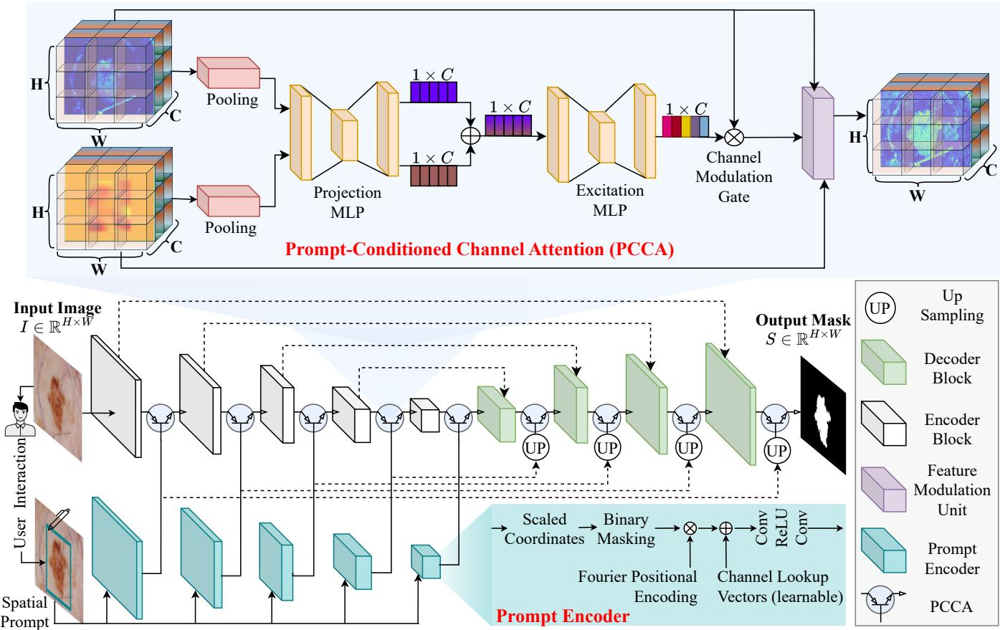  
Figure 2: Overview of PROMISE-Net architecture. The top panel presents the proposed PCCA module, while the bottom panel illustrates the segmentation backbone with hierarchical PCCA integration. Embedding PCCA within convolutional blocks yields $\mathrm { P R O M I S E { \mathrm { - } C _ { N N } } } .$ , while analogous integration in transformer blocks results in PROMISE-T .

where MSA, MLP, and LN denote the multi-head selfattention, feed-forward projection, and layer normalization, respectively. Together, these two architectural variants enable the PCCA-coupled PROMISE-Net to evaluate the crossarchitectural generality of the proposed modulation mechanism, providing a unified foundation for prompt-aware feature integration.

## 2.2. Prompt Encoder

The Prompt Encoder transforms a coarse bounding box, provided by the user, into a dense spatial prompt that aligns with the resolution and semantics of the encoder features. Unlike binary masks that merely indicate the region of interest, this design incorporates spatial location, positional context, and semantic embedding, enabling the model to learn both where the target region lies and how it interacts with the hierarchical feature representations of the backbone.

Given an input bounding box $( x _ { 1 } , y _ { 1 } , x _ { 2 } , y _ { 2 } )$ defined in image coordinates with spatial dimensions $( H _ { i } , W _ { i } )$ , the coordinates are normalized to match the spatial resolution of the corresponding feature map $( H _ { f } , W _ { f } )$ as follows:

$$
\begin{array} { r } { ( x _ { 1 } ^ { \prime } , y _ { 1 } ^ { \prime } , x _ { 2 } ^ { \prime } , y _ { 2 } ^ { \prime } ) = \Big ( \frac { W _ { f } } { W _ { i } } x _ { 1 } , ~ \frac { H _ { f } } { H _ { i } } y _ { 1 } , ~ \frac { W _ { f } } { W _ { i } } x _ { 2 } , ~ \frac { H _ { f } } { H _ { i } } y _ { 2 } \Big ) , } \end{array}\tag{5}
$$

ensuring that the prompt aligns precisely with the spatial scale of the intermediate feature representation. A binary mask ${ \bf M } _ { b } \in  \bf \Psi $ $\{ 0 , 1 \} ^ { H _ { f } \times W _ { f } }$ is then generated to localize the region of interest:

$$
\mathbf { M } _ { b } ( i , j ) = \left\{ \begin{array} { l l } { 1 , } & { x _ { 1 } ^ { \prime } \leq j < x _ { 2 } ^ { \prime } , y _ { 1 } ^ { \prime } \leq i < y _ { 2 } ^ { \prime } , } \\ { 0 , } & { \mathrm { o t h e r w i s e } , } \end{array} \right.\tag{6}
$$

To enrich spatial priors beyond binary localization, we apply a random Fourier positional encoding that maps normalized spatial coordinates $\mathbf { U } ( i , j ) = [ j / W _ { f } , i / H _ { f } ]$ into a highdimensional sinusoidal space, as defined in (7) and inspired by prior work [29, 30]:

$$
\begin{array} { r l } & { \mathbf { Z } ( i , j ) = 2 \pi \mathbf { U } ( i , j ) \mathbf { G } , } \\ & { \mathbf { E } ( i , j ) = \left[ \sin ( \mathbf { Z } ( i , j ) ) , \cos ( \mathbf { Z } ( i , j ) ) \right] . } \end{array}\tag{7}
$$

where $\mathbf { G } \in \mathbb { R } ^ { 2 \times D }$ is a fixed Gaussian projection matrix. The resulting encoding $\mathbf { E } \in \mathbb { R } ^ { H _ { f } \times W _ { f } \times 2 D }$ captures smooth positional variations and introduces global spatial awareness, analogous to positional encodings used in vision transformers [31]. Each bounding box is further assigned a learnable semantic identity through an embedding vector $\mathbf { e } _ { \mathrm { { b o x } } } ~ \in ~ \mathbb { R } ^ { C }$ . This embedding is broadcast spatially and fused with the masked positional encoding to produce the preliminary dense prompt representation:

$$
\mathbf { F } _ { b } = \left( \mathbf { E } \odot \mathbf { M } _ { b } \right) + \mathbf { e } _ { \mathrm { b o x } } \otimes \mathbf { 1 } _ { H _ { f } \times W _ { f } } ,\tag{8}
$$

where ⊙ denotes elementwise multiplication and ⊗ represents outer broadcasting. Equation (8) ensures that the encoded prompt emphasizes the target region while introducing a learnable semantic bias that distinguishes bounding-box prompts from other spatial tokens. To enforce local smoothness and reduce box-edge discontinuities, the preliminary prompt representation $\mathbf { F } _ { b }$ is refined through a two-layer convolutional block with shared weights across channels as follows:

$$
\begin{array} { r } { \hat { \mathbf { F } } _ { b } = \operatorname { C o n v } _ { 3 \times 3 } \bigl ( \operatorname { R e L U } ( \operatorname { C o n v } _ { 3 \times 3 } ( \mathbf { F } _ { b } ) ) \bigr ) , } \end{array}\tag{9}
$$

producing a dense and continuous feature map $\hat { \mathbf { F } } _ { b } \in \mathbb { R } ^ { C \times H _ { f } \times W _ { f } } .$ This refinement acts as a spatial low-pass filter, promoting continuity across bounding-box boundaries and suppressing highfrequency artifacts. For each level l of the encoder-decoder hierarchy with spatial resolution $( H _ { l } , W _ { l } )$ and channel dimension $C _ { l } ,$ the refined prompt is projected to a matching scale:

$$
\mathbf { P } ^ { l } = \mathrm { R e s i z e } ( \hat { \mathbf { F } } _ { b } ) \in \mathbb { R } ^ { C _ { l } \times H _ { l } \times W _ { l } } ,\tag{10}
$$

where Resize(·) denotes bilinear interpolation followed by a 1×1 projection $\mathbf { ( ^ { 6 6 } U P ^ { 5 } } $ block in Fig. 2). These multi-scale prompt features $\{ \mathbf { P } ^ { l } \} _ { l = 1 } ^ { L }$ are subsequently injected into both the encoder and decoder through prompt-conditioned channel attention (Section 2.3).

## 2.3. Prompt-Conditioned Channel Attention (PCCA)

To integrate spatially embedded priors derived from bounding-box prompts, as described in the previous section, with image features in a semantically consistent and scaleadaptive manner, we introduce the PCCA module. Unlike na¨ıve concatenation or additive fusion, PCCA modulates channel activations through prompt-aware excitation, enabling the network to dynamically emphasize channels that are most informative for the user-specified region of interest.

Let the image feature map at stage l be denoted as ${ \bf F } _ { b } \in  { }$ $\mathbb { R } ^ { B \times C \times H \times W }$ , and let the corresponding prompt embedding be $\mathbf { F } _ { p } \in \mathbb { R } ^ { B \times D \times H \times W }$ . To summarize global contextual information from both streams, pooled descriptors are extracted via global average pooling:

$$
\begin{array} { l } { { \displaystyle { \bf { v } } _ { b } = \frac { 1 } { H W } \sum _ { i = 1 } ^ { H } \sum _ { j = 1 } ^ { W } { \bf { F } } _ { b } [ : , : , i , j ] } , } \\ { { \displaystyle { \bf { v } } _ { p } = \frac { 1 } { H W } \sum _ { i = 1 } ^ { H } \sum _ { j = 1 } ^ { W } { \bf { F } } _ { p } [ : , : , i , j ] } . } \end{array}\tag{11}
$$

Both pooled descriptors are projected into a shared latent space of dimension C using a projection MLP:

$$
\begin{array} { r } { \tilde { \mathbf { v } } _ { b } = W _ { b } \mathbf { v } _ { b } , \qquad \tilde { \mathbf { v } } _ { p } = W _ { p } \mathbf { v } _ { p } , } \end{array}\tag{12}
$$

where $W _ { b } \in \mathbb { R } ^ { C \times C }$ and $W _ { p } \in \mathbb { R } ^ { D \times C }$ are learnable linear transformations that align visual and prompt semantics within a common latent representation. A joint modulation descriptor is then obtained via additive fusion:

$$
\begin{array} { r } { \mathbf { z } = \tilde { \mathbf { v } } _ { b } + \tilde { \mathbf { v } } _ { p } , } \end{array}\tag{13}
$$

which aggregates complementary information from image and prompt cues. The combined descriptor z is subsequently passed through a lightweight bottleneck gating function implemented as an excitation MLP (inspired by [32]):

$$
\begin{array} { r } { \mathbf { s } = \sigma ( W _ { 2 } \delta ( W _ { 1 } \mathbf { z } ) ) . } \end{array}\tag{14}
$$

where $W _ { 1 } \in \mathbb { R } ^ { C \times C / r }$ and $W _ { 2 } \in \mathbb { R } ^ { C / r \times C }$ form a two-layer MLP with reduction ratio $r , \delta ( \cdot )$ denotes the ReLU activation, and σ(·) is the sigmoid gating function.

Equation (14) yields a channel-wise excitation vector ${ \textbf { \textsf { s } } } \in$ $[ 0 , 1 ] ^ { C }$ that adaptively reweights image feature channels according to prompt-conditioned relevance. The modulated feature map is reconstructed as:

$$
\mathbf { F } _ { \mathrm { o u t } } = \mathbf { F } _ { b } \odot \mathbf { s } + \mathbf { F } _ { b } \odot \mathbf { F } _ { p } ,\tag{15}
$$

where $\odot$ denotes elementwise multiplication with broadcasting. Equation (15) encapsulates the “Feature Modulation $\mathbf { U n i t } ^ { \prime }$ in Fig. 2, while $\mathbf { F } _ { b }$ ⊙ s defines the “Channel Modulation $\mathbf { G a t e } ^ { \prime \prime }$ . The channel-wise excitation term provides global prompt-conditioned feature selection, while the pixel-wise interaction term complements it by enforcing spatially localized modulation, ensuring that prompt guidance remains both semantically selective and spatially precise.

At inference, the excitation vector s (in (14)) behaves analogously to the control current of a transistor: when a strong prompt activation $\mathbf { v } _ { p }$ (in (11)) is present, s opens the gate to amplify feature flow; when prompt activation is weak or absent, s suppresses non-relevant channels, preventing unwanted activations in unrelated regions. Accordingly, the overall gating behavior of PCCA is compactly expressed as:

$$
\begin{array} { r l } & { \mathbf { F } _ { \mathrm { o u t } } = \mathbf { F } _ { b } \odot g ( \mathbf { v } _ { p } ) , } \\ & { g ( \mathbf { v } _ { p } ) = \sigma \Big ( W _ { 2 } \delta \big ( W _ { 1 } \big ( W _ { b } \mathbf { v } _ { b } + W _ { p } \mathbf { v } _ { p } \big ) \big ) \Big ) + \mathbf { F } _ { p } . } \end{array}\tag{16}
$$

where $g ( \mathbf { v } _ { p } )$ denotes a prompt-conditioned gating function that combines channel-wise excitation with spatially localized modulation. This generalizes classical squeeze-and-excitation [32] by conditioning the excitation function on both visual and prompt embeddings rather than visual statistics alone.

PCCA modules are embedded at all encoder and decoder levels, ensuring that prompt guidance percolates throughout the network hierarchy. This hierarchical conditioning enables spatially adaptive, semantically consistent, and anatomically plausible feature modulation, allowing the model to maintain focus on clinically relevant structures across scales.

## 2.4. Prompt-Conditioned Fusion and Decoder Reconstruction

The decoder D complements the encoder by hierarchically reconstructing spatial details while preserving prompt-guided semantic focus. At each decoder stage, upsampled feature maps are fused with their corresponding encoder features, both already modulated by PCCA, thereby ensuring bidirectional propagation of prompt information throughout the hierarchy.

At each encoder stage l, prompt integration is performed via prompt-conditioned channel attention:

$$
\begin{array} { r } { \hat { \mathbf { F } } ^ { l } = \operatorname { P C C A } ( \mathbf { F } ^ { l } , \mathbf { P } ^ { l } ) , } \end{array}\tag{17}
$$

where $\hat { \mathbf { F } } ^ { l }$ denotes the prompt-modulated encoder feature at level l. During decoding, we denote by $\mathbf { G } ^ { l }$ the feature map reconstructed at the $l ^ { \mathrm { { t h } } }$ decoder stage. Prompt information continues to guide feature refinement through successive fusion and modulation operations:

$$
\begin{array} { r l } & { \mathbf { G } ^ { L } = \hat { \mathbf { F } } ^ { L } , } \\ & { \tilde { \mathbf { G } } ^ { l - 1 } = \psi \left( \operatorname { U p } \left( \mathbf { G } ^ { l } \right) \| \hat { \mathbf { F } } ^ { l - 1 } \right) , } \\ & { \hat { \mathbf { G } } ^ { l - 1 } = \operatorname { P C C A } \left( \tilde { \mathbf { G } } ^ { l - 1 } , \mathbf { p } ^ { l - 1 } \right) , \qquad l = L , \ldots , 1 . } \end{array}\tag{18}
$$

where Up(·) denotes bilinear upsampling or transposed convolution, and ψ(·) represents a $3 { \times } 3$ convolution followed by normalization and nonlinear activation.

This dual-stage prompt integration enables the encoder and decoder to co-adapt visual evidence and spatial intent, leading to region-specific reconstruction and reduced leakage into irrelevant anatomical areas. The final segmentation mask is obtained:

$$
S = \sigma ( \mathrm { C o n v } _ { 1 \times 1 } ( \hat { \mathbf { G } } ^ { 0 } ) ) ,\tag{19}
$$

yielding a dense probability map whose boundaries closely align with the user-indicated regions.

## 2.5. Unified Forward Formulation and Implementation

Combining prompt-conditioned encoding and reconstruction, the complete PROMISE-Net forward formulation is expressed as:

$$
\begin{array} { r l } & { \boldsymbol { S } = \sigma \big ( \mathcal { D } _ { \mathrm { P C C A } } \big ( \{ \hat { \mathbf { F } } ^ { l } \} , \{ \mathbf { P } ^ { l } \} ; \boldsymbol { \theta } _ { \mathcal { D } } \big ) \big ) , } \\ & { \hat { \mathbf { F } } ^ { l } = \mathrm { P C C A } \big ( \mathcal { E } ^ { l } ( \boldsymbol { I } ; \boldsymbol { \theta } _ { \mathcal { E } } ) , \mathbf { P } ^ { l } ; \boldsymbol { \theta } _ { \mathrm { P C C A } } \big ) . } \end{array}\tag{20}
$$

where prompt-conditioned feature modulation is applied at every encoder stage and propagated through the decoder hierarchy. This formulation captures the bidirectional propagation of spatial priors throughout the encoder-decoder architecture, ensuring that anatomical cues influence both feature abstraction and pixel-level reconstruction. Such dual-stage conditioning enables PROMISE-Net to remain interpretable, responsive to user guidance, and robust across anatomical structures, backbone architectures, and imaging modalities.

From an interpretive standpoint, each PCCA unit can be viewed as a soft gating mechanism that dynamically regulates feature conduction according to prompt activation:

$$
\begin{array} { r l } & { \hat { \mathbf { F } } ^ { l } = g \big ( \mathbf { P } ^ { l } \big ) \odot \mathbf { F } ^ { l } , } \\ & { g \big ( \mathbf { P } ^ { l } \big ) = \sigma \big ( \mathbf { W } _ { 2 } ^ { l } \delta \big ( \mathbf { W } _ { 1 } ^ { l } \mathrm { G A P } \big ( \mathbf { P } ^ { l } \big ) \big ) \big ) . } \end{array}\tag{21}
$$

where $g ( \mathbf { P } ^ { l } )$ denotes a prompt-dependent conduction gate. When the prompt strongly activates relevant spatial regions, $g ( \mathbf { P } ^ { l } ) ~ \approx ~ 1$ allows unhindered information flow; conversely, when the prompt is weak or absent, $g ( \mathbf { P } ^ { l } ) \approx 0$ suppresses nonsalient activations. This transistor-like gating analogy provides an intuitive physical interpretation of PCCA, illustrating how prompt-conditioned modulation adaptively amplifies or attenuates neural feature dynamics across the network hierarchy. The implementation of PROMISE-Net is summarized in Algorithm 1 using PyTorch-style pseudocode.

Algorithm 1: PROMISE-Net’s PyTorch-style pseu  
docode.   
1 # L: number of stages (network’s depth) || N: batch size   
2 # (H W): input size || (H W ): feature size at stage l   
3 # El: encoder block (3–4) || Dl: l-th decoder block   
(17–19)   
4 # Up: upsampling op (bilinear or transposed conv)   
5 # Head: 1×1 conv + sigmoid (19)   
6 # PromptEncoder: (5–10) || PCCA: (11–15)   
7 # Mini-batch: images I, boxes B, and labels Y   
8 for I B Y in loader do   
9 # Prompt encoding (multi-scale)   
10 $\hat { \mathbf { F } } _ { b }$ ← PromptEncoder(B) # (5–9)   
11 $\{ \mathbf { P } ^ { l } \} _ { l = 1 } ^ { L }$ ← ResizeToPyramid $\hat { \mathbf { F } } _ { b } )$ # (10)   
12 # Encoder with PCCA and skip collection   
13 $\mathbf { x } ^ { 0 }$ ← Stem(I) # optional pre-encoding conv   
14 skips ← [ ]   
15 for l = 1 to L do   
16 Fl ← El(xl−1) # (3 or 4)   
17 Fˆ l ← PCCA(Fl Pl) # (17)   
18 append(skips, Fˆ l)   
19 xl ← Down(Fˆ l) # stride-2 pooling/conv at l=L   
20 # Decoder with prompt re-injection via PCCA   
21 $\mathbf { G } ^ { L } \gets \hat { \mathbf { F } } ^ { L }$ (bottleneck features)   
22 for l = L down to 1 do   
23 $\mathbf { U } ^ { l - 1 }  \mathrm { U p } ( \mathbf { G } ^ { l } )$   
24 Sl−1 ← skips[l − 1] #prompt-modulated skip   
25 $\tilde { \mathbf { G } } ^ { l - 1 }  \psi ( [ \mathbf { U } ^ { l - 1 } \parallel \mathbf { S } ^ { l - 1 } ] )$ # Conv + BN + ReLU   
26 $\hat { \mathbf { G } } ^ { l - 1 } \gets \mathrm { P C C A } ( \tilde { \mathbf { G } } ^ { l - 1 } , \mathbf { P } ^ { l - 1 } )$ # decoder prompting   
27 $\mathbf { G } ^ { l - 1 } \gets \hat { \mathbf { G } } ^ { l - 1 }$   
28 # Prediction head and loss   
29 Sˆ ← Head(G0) # 1×1 conv + sigmoid, (19)   
30 L ← Loss(Sˆ Y) # e.g., Dice + BCE, (22)   
31 # Backward/Update   
32 optimizer.zero grad()   
33 L backward()   
34 optimizer.step()

## 3. Experimental Datasets and Settings

## 3.1. Datasets

ISIC-2017 Skin Lesion. This dataset [33] comprises 8-bit RGB dermoscopic images with spatial resolutions ranging from 540 × 722 to 4499 × 6748 pixels. It includes 2000 training, 150 validation, and 600 test images.

Kvasir-Polyp. This dataset [34] consists of 1000 high-quality colonoscopic frames with spatial resolutions ranging from 332 × 352 to 1920 × 1072 pixels. It is partitioned into 800 training, 100 validation, and 100 test images.

Kvasir-Instrument. This dataset [35] serves as a benchmark for the segmentation of diagnostic and therapeutic instruments in gastrointestinal endoscopy, with spatial resolutions ranging from $5 7 1 \times 5 2 3$ to $1 9 2 0 \times 1 0 8 0$ pixels. It is partitioned into 472 training, 59 validation, and 59 test images.

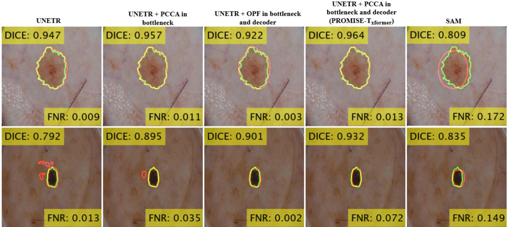  
Figure 3: Qualitative comparison of ISIC 2017 skin lesion segmentation. PROMISE-Net with hierarchical PCCA yields more complete and spatially coherent lesion delineations compared to UNETR and other baselines, demonstrating improved boundary precision and region completeness.

CAMUS-Cardiac. This dataset [36] comprises echocardiographic scans with heterogeneous image quality, with 35% labeled as good, 46% as medium, and 19% as poor. It includes data from 400 patients for training, 50 for validation, and 50 for testing.

## 3.2. Training Protocol and Evaluation

Experimental Settings: All experiments were conducted using the PyTorch framework on an NVIDIA Tesla P100 GPU. Images were resized to 256 × 256 pixels. The models were optimized using the Adam optimizer with a learning rate of $1 \times 1 0 ^ { - 4 }$ and trained for 150 epochs. Extensive ofline data augmentation was applied to the CAMUS, Kvasir-Polyp, and Kvasir-Instrument datasets. Specifically, geometric transformations, including horizontal and vertical flips and random rotations of up to 360◦, were employed. The augmented data were used during training and validation, while the test sets were kept untouched to ensure unbiased evaluation.

Loss Function: The overall training objective combines multi-class Dice loss with cross-entropy loss to jointly balance structural overlap and pixel-level classification accuracy [37]:

$$
\mathcal { L } _ { \mathrm { t o t a l } } = \mathcal { L } _ { \mathrm { D i c e } } + \lambda \mathcal { L } _ { \mathrm { C E } } ,\tag{22}
$$

where $\lambda = 0 . 5$ in all experiments. The Dice loss is averaged across all foreground classes to emphasize anatomical consistency, while the cross-entropy term stabilizes optimization in the multi-class segmentation setting.

Evaluation: Segmentation accuracy is evaluated using the Dice similarity coeficient (DSC) and Intersection-over-Union (IoU) for each class. Boundary agreement is quantified using the 95th percentile of the Hausdorf Distance (HD95), which measures the maximum symmetric surface deviation. To further measure pixel-level errors, we report the False Positive Rate (FPR) and False Negative Rate (FNR), capturing overand under-segmentation, respectively. In addition to these spatial metrics, for cardiac datasets such as CAMUS, we assess the ejection fraction (EF) [38], a clinically relevant functional biomarker defined as the ratio of stroke volume to end-diastolic volume (EDV). Agreement between estimated and reference EF values is analysed using Bland–Altman plots, which report the mean bias and limits of agreement (LoA) across the test cohort.

## 4. Results and Discussion

## 4.1. PROMISENet Design and Ablation Analysis

We perform ablation experiments to assess the impact of integrating the proposed PCCA module at diferent stages of $\mathrm { P R O M I S E  – T _ { \mathrm { x f o r m e r } } }$ on two datasets: ISIC-2017 and CAMUS-Cardiac. As summarized in Table 1, these experiments quantify both segmentation performance and computational complexity when PCCA is inserted at the bottleneck alone or jointly at the bottleneck and decoder stages. For comparison, we also implement an alternative fusion scheme, termed outer product fusion (OPF), which replaces the global average pooling and shared latent projection in PCCA with a simple element-wise multiplication between image and prompt embeddings.

## 4.1.1. Impact of Hierarchical PCCA on Segmentation

Table 1 demonstrates that integrating PCCA into the UNETR backbone consistently improves segmentation accuracy across both ISIC 2017 and CAMUS datasets. Incorporating PCCA at the bottleneck stage yields a significant improvement on ISIC 2017, raising DSC from 82.5 to 88.3 (+5.8%, p < 0 05) and reducing FNR from 19.0 to 12.7 (–6.3%), while providing similar gains $( p < 0 . 0 5 )$ on CAMUS (+2.8% DSC and –2.8% FNR). Extending PCCA to both the bottleneck and decoder stages further increases segmentation fidelity $( p \ < \ 0 . 0 5 )$ , achieving a DSC of 89.0% and lowering the FNR to 10.6% on ISIC 2017, while attaining 92.1% DSC and 9.2% FNR on CAMUS.

Table 1: Ablation study of PCCA integration on the ISIC-2017 and CAMUS datasets. Progressive insertion of PCCA into deeper UNETR stages improves DSC and reduces FNR with modest computational overhead, demonstrating that hierarchical prompt-guided modulation enhances feature discrimination and robustness. Bold blue values denote the best performance.
<table><tr><td>Methods</td><td>Params(↓)</td><td>FLOPs(↓)</td><td colspan="2">ISIC 2017</td><td colspan="2">CAMUS</td></tr><tr><td></td><td></td><td></td><td>DSC (%) (↑)</td><td> $\mathbf { F N R } \left( \% \right) \left( \downarrow \right)$ </td><td>DSC (%) (↑)</td><td>FNR (%) (↓)</td></tr><tr><td>(1) UNETR [9]</td><td>116,048,130</td><td>52,792,357,120</td><td> $8 2 . 5 \pm 1 8 . 0$ </td><td> $1 9 . 0 \pm 2 1 . 5$ </td><td> $8 8 . 6 \pm 5 . 4$ </td><td> $1 1 . 6 \pm 7 . 4$ </td></tr><tr><td>(2) UNETR + PCCA in bottleneck</td><td>127,922,994</td><td>58,231,075,072</td><td> $8 8 . 3 \pm 9 . 6 $ </td><td> $1 2 . 7 \pm 1 3 . 1$ </td><td> $8 9 . 8 \pm 4 . 7$ </td><td> $1 0 . 5 \pm 6 . 2$ </td></tr><tr><td>(3) UNETR + PCCA in bottleneck and decoder</td><td>128,357,120</td><td>60,044,940,800</td><td> ${ \bf 8 9 . 0 \pm 8 . 2 }$ </td><td> $1 0 . 6 \pm 1 0 . 9$ </td><td> ${ \bf 9 0 . 0 \pm 5 . 1 }$ </td><td> $9 . 2 \pm 5 . 8$ </td></tr><tr><td>(4) UNETR + OPF in bottleneck and decoder</td><td>127,055,010</td><td>60,042,342,656</td><td> $8 7 . 4 \pm 9 . 4$ </td><td> ${ \bf 1 0 . 2 \pm 1 1 . 4 }$ </td><td> $8 9 . 6 \pm 5 . 0$ </td><td> $9 . 8 \pm 6 . 1$ </td></tr><tr><td> $( 1 ) \mathrm { v s . } ( 2 ) ( \mathbf { p } < \mathbf { 0 . 0 5 }  )$ </td><td></td><td></td><td>√</td><td>√</td><td>√</td><td>√</td></tr><tr><td>0  $2 ) \mathrm { v s . } ( 3 ) ( \mathbf { p } < \mathbf { 0 . 0 5 } ? )$ </td><td></td><td></td><td>√</td><td>√</td><td>√</td><td>√</td></tr><tr><td> $( 3 ) \mathrm { v s . } ( 4 ) ( \mathbf { p } < \mathbf { 0 . 0 5 }  )$ </td><td></td><td></td><td>√</td><td>x</td><td>√</td><td>√</td></tr></table>

In contrast, the simple OPF module with UNETR improves the DSC and FNR for both the datasets compared with the baseline UNETR (Table 1), again confirming that introducing spatial prompts for feature modulation has a substantial impact on segmentation performance. However, when compared with the proposed PCCA, the OPF variant remains significantly inferior overall, as PCCA achieves higher overlap accuracy and stronger cross-dataset generalization. For ISIC 2017, the reduction in FNR achieved by OPF is not statistically significant relative to that of PCCA, indicating that while OPF captures some promptconditioned information, it lacks the robust hierarchical modulation achieved by PCCA. The parameter and FLOP diferences between variants remain minimal (< 2%), confirming that the observed performance gains are primarily due to improved feature modulation by our novel PCCA rather than network scaling.

Visual comparisons in Fig. 4a are consistent with the quantitative results in Table 1 showing $\mathrm { P R O M I S E  – T _ { \mathrm { x f o r m e r } } ^ { \mathrm { ~ \circ ~ } } S }$ better outputs with fewer discontinuities and reduced oversegmentation compared with the other baselines. Diferences between methods are most apparent along lesion boundaries, where PROMISE-Txformer predictions more closely follow the ground truth contours. Fig. 4a also includes results obtained using SAM. As reported in Table 3, SAM improves segmentation performance relative to the baseline UNETR; however, $\mathrm { P R O M I S E  – T _ { \mathrm { x f o r m e r } } }$ achieves higher overlap metrics than SAM on the evaluated datasets. These visual and quantitative comparisons indicate that the hierarchical integration of PCCA achieves the most balanced performance, enhancing segmentation robustness and boundary consistency with only marginal computational overhead.

## 4.1.2. Hierarchical Modulation and Feature Separation

Fig. 4b provides qualitative insight into Table 1 on the CA-MUS dataset, visualizing intermediate feature maps for UN-ETR and its PCCA variants. The baseline UNETR exhibits diffuse feature responses with substantial overlap between color components, indicating limited separation between anatomical regions. Introducing PCCA at the bottleneck results in more spatially concentrated feature activations and improved separation of color regions. When PCCA is applied at both the bottleneck and decoder stages $( \mathrm { P R O M I S E  – T _ { \mathrm { x f o r m e r } } } ) .$ , corresponding to the highest quantitative performance on CAMUS (DSC 90.0%, FNR 9.2%), the feature embeddings appear more localized and exhibit clearer separation across distinct color components (Fig. 4b). In contrast, the OPF-based variant shows less consistent separation of feature responses compared with the hierarchical PCCA configuration. These visual patterns align with the quantitative trends in Table 1, where hierarchical PCCA integration yields higher overlap accuracy and lower false-negative rates than OPF.

Table 2: Efect of the reduction ratio r on PCCA eficiency and performance on ISIC-2017. A moderate setting (r=16) ofers the best accuracy–eficiency trade-of, achieving low HD95 and FNR with minimal overhead. Bold blue indicates the best result.
<table><tr><td>Reduction Ratio (r)</td><td>HD95 (↓)</td><td>FNR (%) (↓)</td><td>FLOPs (↓)</td><td>Params (↓)</td></tr><tr><td>r = 2</td><td>12.9</td><td>10.5</td><td>106.33347</td><td>53,070,338</td></tr><tr><td>r = 4</td><td>12.9</td><td>11.2</td><td>106.33242</td><td>52,545,794</td></tr><tr><td>r = 8</td><td>12.9</td><td>10.9</td><td>106.33190</td><td>52,283,522</td></tr><tr><td> $r = 1 6$ </td><td>12.8</td><td>10.3</td><td>106.33164</td><td>52,152,386</td></tr><tr><td> $r = 3 2$ </td><td>12.7</td><td>10.6</td><td>106.33150</td><td>52,086,818</td></tr></table>

## 4.1.3. Robustness to Channel Compression in PCCA

The reduction ratio r in PCCA controls the level of channel compression in the excitation MLP. Table 2 reports segmentation performance and model complexity on the ISIC 2017 dataset for $r \in \{ 2 , 4 , 8 , 1 6 , 3 2 \}$ . Across all configurations, HD95 varies within a narrow range (12.7–12.9), and FNR remains between 10.3% and 11.2%, indicating limited sensitivity to the choice of r. Among the evaluated settings, $r = 1 6$ yields the lowest FNR (10.3%) and a low HD95 (12.8) while maintaining moderate computational cost (52.15M parameters and 106.33G FLOPs). Parameter count and FLOPs decrease monotonically with increasing r, with diferences remaining small across configurations. Based on these, r = 16 is used in all experiments.

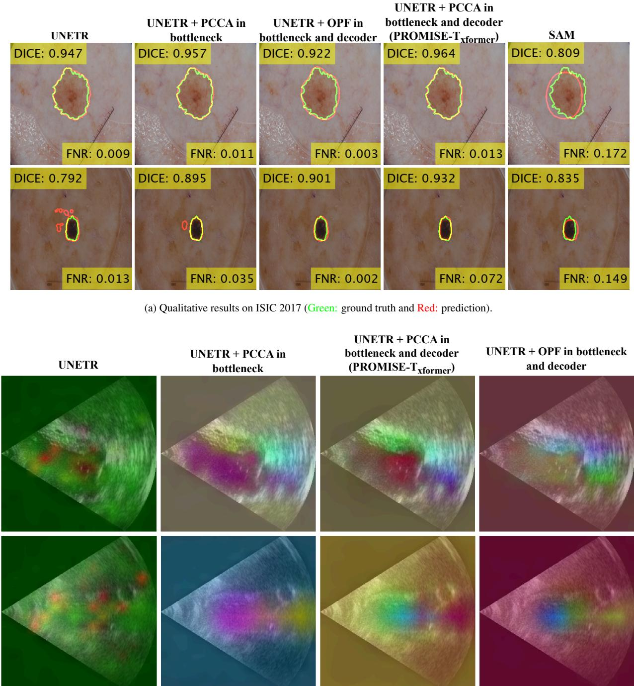  
(b) Intermediate feature-map comparison for UNETR variants, visualized by PCA projection to RGB space.  
Figure 4: Ablation visualization in two-column layout: PROMISE-Net with hierarchical PCCA yields more complete delineations and more spatially focused feature representations than baseline UNETR and OPF fusion.

## 4.2. Generalizability Analysis

## 4.2.1. Cross-Architectural Generalization

Cross-architectural generalization is evaluated by PROMISE-C and PROMISE-T backbones and comparing each against its corresponding baseline U-Net and UNETR across four datasets (Table 3).

For convolutional networks, PROMISE-CNN improves DSC over U-Net by +8.5% on ISIC 2017 (82.2% to 90.7%), +6.5% on Kvasir-Polyp (86.0% to 92.5%), +2.8% on Kvasir-

Instrument (94.4% to 97.2%), and +0.5% on CAMUS (90.8% to 91.3%). These gains are accompanied by substantial reductions in boundary error, including approximately 50% on ISIC 2017 (23.6 to 11.7 pixels) and 55% on Kvasir-Polyp (29.1 to 13.3 pixels), as well as consistent decreases in false-negative rate across all datasets. Qualitative examples in Fig. 5 (a,c) corroborate these trends, showing more complete delineations with reduced fragmentation relative to U-Net.

Similarly, $\mathrm { P R O M I S E  – T _ { \mathrm { x f o r m e r } } }$ consistently outperforms UN-

Table 3: Performance comparison across four segmentation datasets: ISIC-2017 (skin lesion), Kvasir-Polyp, Kvasir-Instrument (endoscopic tool), and CAMUS (cardiac echocardiography). PROMISE-Net consistently outperforms baseline architectures across diverse anatomical structures and imaging modalities, demon strating strong cross-domain and cross-architectural generalizability. Bold blue values indicate the best performance for each metric.
<table><tr><td>Methods</td><td>DSC (%) (↑) IoU (%) (↑)</td><td></td><td>HD95 (Pix) (↓)</td><td>FNR (%) (↓)</td></tr><tr><td colspan="5">Skin Lesion Dataset (ISIC-2017) [33]</td></tr><tr><td>(1) U-Net [8]</td><td> $8 2 . 2 \pm 1 8 . 8$ </td><td> $7 3 . 3 \pm 2 1 . 8$ </td><td> $2 3 . 6 \pm 2 6 . 4$ </td><td> $1 9 . 4 \pm 2 1 . 9$ </td></tr><tr><td>(2)  $\mathrm { P R O M I S E  – C _ { N N } ( p r o p o s e d ) }$ </td><td> ${ \bf 9 0 . 7 \pm 7 . 5 }$ </td><td> $\mathbf { 8 3 . 7 \pm 1 0 . 0 }$ </td><td> ${ \bf 1 1 . 7 \pm 1 0 . 6 }$ </td><td> $7 . 3 \pm 9 . 0$ </td></tr><tr><td>(1) vs. (2) (p &lt; 0.05?)</td><td>V</td><td>V</td><td>V</td><td>√</td></tr><tr><td>(3) UNETR [9]</td><td> $\overline { { 8 2 . 5 \pm 1 8 . 0 } }$ </td><td> $7 3 . 4 \pm 2 1 . 4$ </td><td> $2 2 . 3 \pm 2 5 . 2$ </td><td> $\overline { { 1 9 . 0 \pm 2 1 . 5 } }$ </td></tr><tr><td>(4)  $\mathrm { P R O M I S E  – T _ { \mathrm { x f o r m e r } } }$  (proposed)</td><td> $8 9 . 0 \pm 8 . 2 $ </td><td> $8 1 . 0 \pm 1 1 . 4$ </td><td> $1 5 . 7 \pm 1 8 . 2$ </td><td> $1 0 . 6 \pm 1 0 . 9$ </td></tr><tr><td>(3)  $\mathrm { v s . } \ ( 4 ) \ ( \mathbf { p } < \mathbf { 0 . 0 5 } ? )$ </td><td>√</td><td>√</td><td>√</td><td>√</td></tr><tr><td>(5) SAM [29]</td><td> $8 5 . 1 \pm 9 . 0$ </td><td> $7 5 . 0 \pm 1 1 . 5$ </td><td> $\overline { { 1 6 . 7 \pm 1 0 . 7 } }$ </td><td> $\overline { { 1 2 . 1 \pm 9 . 1 } }$ </td></tr><tr><td>(2)  $\mathrm { v s . } \ ( 5 ) \ ( \mathbf { p } < \mathbf { 0 . 0 5 } ? )$ </td><td>V</td><td>V</td><td>√</td><td>√</td></tr><tr><td>(4) vs. (5) (p &lt; 0.05?)</td><td>√</td><td>√</td><td>√</td><td>√</td></tr></table>

<table><tr><td colspan="5">Polyp Segmentation Dataset (Kvasir-Polyp) [34]</td></tr><tr><td>(1) U-Net [8]</td><td> $8 6 . 0 \pm 1 7 . 3$ </td><td> $7 8 . 5 \pm 2 0 . 8$ </td><td> $2 9 . 1 \pm 3 3 . 8$ </td><td> $1 1 . 9 \pm 1 9 . 7$ </td></tr><tr><td>(2)  $\mathrm { \Delta P R O M I S E  – C _ { N N } ~ ( p r o p o s e d ) }$ </td><td> ${ \bf 9 2 . 5 \pm 9 . 8 }$ </td><td> ${ \bf 8 7 . 2 \pm 1 3 . 4 }$ </td><td> ${ \bf 1 3 . 3 \pm 1 8 . 6 }$ </td><td> $7 . 3 \pm 1 1 . 4$ </td></tr><tr><td>(1) vs. (2) (p &lt; 0.05?)</td><td>√</td><td>V</td><td>V</td><td>V</td></tr><tr><td>(3) UNETR [9]</td><td> $6 8 . 3 \pm 2 5 . 7$ </td><td> $5 7 . 0 \pm 2 7 . 0$ </td><td> $\overline { { 5 8 . 0 \pm 3 7 . 8 } }$ </td><td> $2 3 . 6 \pm 2 7 . 7$ </td></tr><tr><td>(4)  $\mathrm { P R O M I S E  – T _ { \mathrm { x f o r m e r } } }$  (proposed)</td><td> $8 7 . 5 \pm 1 4 . 8$ </td><td> $8 0 . 0 \pm 1 7 . 9$ </td><td> $2 3 . 2 \pm 3 3 . 9$ </td><td> $9 . 0 \pm 1 3 . 1$ </td></tr><tr><td>(3)  $\mathrm { v s . } \ ( 4 ) \ ( \mathbf { p } < \mathbf { 0 . 0 5 } ? )$ </td><td>V</td><td>V</td><td>√</td><td>√</td></tr><tr><td>(5) SAM [29]</td><td> $\overline { { 8 0 . 0 \pm 1 3 . 1 } }$ </td><td> $6 8 . 2 \pm 1 5 . 4$ </td><td> $\overline { { 2 4 . 4 \pm 2 4 . 0 } }$ </td><td> $\overline { { 1 4 . 7 \pm 1 0 . 3 } }$ </td></tr><tr><td>(2)  $\mathrm { v s . } \ ( 5 ) \ ( \mathbf { p } < \mathbf { 0 . 0 5 } ? )$ </td><td>√</td><td>√</td><td>√</td><td>√</td></tr><tr><td>(4) vs. (5) (p &lt; 0.05?)</td><td>√</td><td>V</td><td>x</td><td>√</td></tr></table>

<table><tr><td colspan="5">Diagnostic and Therapeutic Tool Segmentation (Kvasir-Instrument) [35]</td></tr><tr><td>(1) U-Net [8]</td><td> $9 4 . 4 \pm 1 3 . 8$ </td><td> $9 1 . 2 \pm 1 4 . 8$ </td><td> $8 . 7 \pm 1 9 . 5$ </td><td> $6 . 0 \pm 1 5 . 3$ </td></tr><tr><td>(2)  $\mathrm { \Delta P R O M I S E  – C _ { N N } ~ ( p r o p o s e d ) }$ </td><td> ${ \bf 9 7 . 2 \pm 1 . 4 }$ </td><td> ${ \bf 9 4 . 6 \pm 2 . 7 }$ </td><td> ${ \bf 3 . 4 } \pm \bf 3 . 0$ </td><td> $2 . 7 \pm 1 . 8$ </td></tr><tr><td>(1) vs. (2) (p &lt; 0.05?)</td><td>x</td><td>√</td><td>√</td><td>√</td></tr><tr><td>(3) UNETR [9]</td><td> $9 5 . 3 \pm 7 . 2$ </td><td> $9 1 . 6 \pm 9 . 8$ </td><td> $8 . 1 \pm 2 2 . 0$ </td><td> $4 . 1 \pm 6 . 9$ </td></tr><tr><td>(4)  $\mathrm { P R O M I S E  – T _ { \mathrm { x f o r m e r } } }$  (proposed)</td><td> $9 6 . 2 \pm 2 . 2 $ </td><td> $9 2 . 7 \pm 4 . 0$ </td><td> $4 . 4 \pm 2 . 5$ </td><td> $4 . 5 \pm 4 . 0$ </td></tr><tr><td>(3) vs.  $\left( 4 \right) \left( \mathbf { p } < \mathbf { 0 . 0 5 } \right)$ </td><td>x</td><td>x</td><td>x</td><td>x</td></tr></table>

<table><tr><td colspan="5">2D Echocardiography (CAMUS) [36]</td></tr><tr><td>(1) U-Net [8]</td><td> $9 0 . 8 \pm 4 . 8 $ </td><td> $8 3 . 6 \pm 7 . 3$ </td><td> $6 . 2 \pm 4 . 1$ </td><td> $9 . 4 \pm 6 . 6$ </td></tr><tr><td>(2) PROMISE-CNN (proposed)</td><td> ${ \bf 9 1 . 3 \pm 4 . 1 }$ </td><td> ${ \bf 8 4 . 4 \pm 6 . 4 }$ </td><td> ${ \bf 5 . 9 \pm 4 . 1 }$ </td><td> $8 . 4 \pm 5 . 2$ </td></tr><tr><td>(1)  $\mathrm { v s . } \ ( 2 ) \left( \mathbf { p } < \mathbf { 0 . 0 5 } ? \right)$ </td><td>√</td><td>√</td><td>X</td><td>√</td></tr><tr><td>(3) UNETR [9]</td><td> $8 8 . 6 \pm 5 . 4$ </td><td> $8 0 . 1 \pm 8 . 1$ </td><td> $7 . 9 \pm 5 . 2$ </td><td> $1 1 . 6 \pm 7 . 4$ </td></tr><tr><td>(4)  $\mathrm { P R O M I S E  – T _ { \mathrm { x f o r m e r } } }$  (proposed)</td><td> $9 0 . 0 \pm 5 . 1$ </td><td> $8 2 . 2 \pm 7 . 5$ </td><td> $7 . 0 \pm 5 . 2$ </td><td> $9 . 2 \pm 5 . 8$ </td></tr><tr><td>(3) vs.  $\left( 4 \right) \left( \mathbf { p } < \mathbf { 0 . 0 5 } \right)$ </td><td>√</td><td>V</td><td>√</td><td>√</td></tr></table>

ETR across all evaluated datasets. On ISIC 2017 and CA-MUS, DSC increases from 82.5% to 89.0% and from 88.6% to 90.0%, respectively, with corresponding reductions in FNR. On Kvasir-Polyp and Kvasir-Instrument, PROMISE-Txformer achieves higher DSC and lower HD95 than UNETR, with statistically significant diferences reported for most metrics. Visual comparisons in Fig. 5 (b,d) further show smoother contours and more continuous anatomical structures.

Together, the consistent quantitative gains across both convolutional and transformer-based backbones, supported by corresponding qualitative evidence, indicate that the performance gains introduced by PCCA are not specific to a particular net-

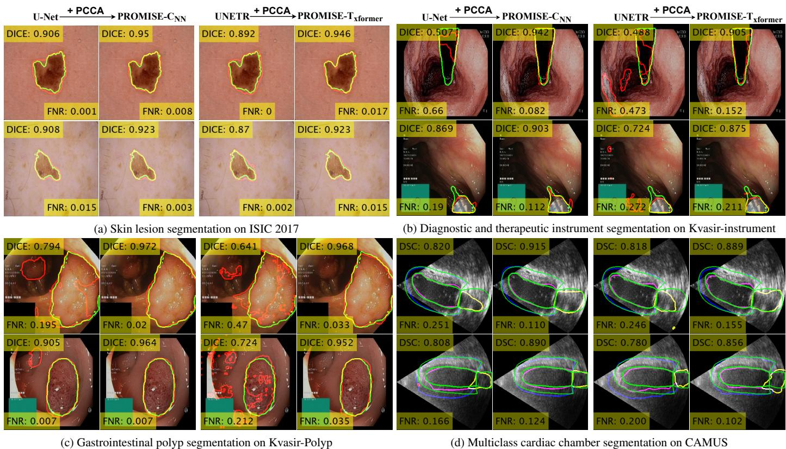  
Figure 5: Comparison of baseline segmentation networks (U-Net and UNETR) and their PCCA-integrated counterparts, PROMISE-CNN and PROMISE-Txformer, across cross-modal and cross-anatomical datasets. In (a)–(c), ground-truth boundaries are shown in green and predictions in red for binary segmentation tasks. In (d), for multi-class cardiac segmentation on CAMUS, green contours denote ground truth, while blue, purple, and yellow indicate predicted MYO, LV, and LA boundaries, respectively. PROMISE-Net variants exhibit improved anatomical fidelity, smoother contours, and reduced fragmentation compared to their baselines.

work type.

## 4.2.2. Cross-Anatomical and Cross-Domain Generalization

Cross-anatomical generalization is assessed across segmentation tasks involving distinct anatomical targets (Table 3), including skin lesions (ISIC 2017), gastrointestinal polyps (Kvasir-Polyp), surgical instruments (Kvasir-Instrument), and cardiac chambers (CAMUS).

On ISIC 2017, PROMISE-C improves DSC from 82.2% to 90.7%, reduces HD95 from 23.6 to 11.7 pixels, and lowers FNR from 19.4% to 7.3%. On Kvasir-Polyp, DSC increases from 86.0% to 92.5%, with HD95 reduced from 29.1 to 13.3 pixels and FNR from 11.9% to 7.3%. For the anatomically distinct Kvasir-Instrument dataset, PROMISE-CNN improves DSC from 94.4% to 97.2%, reduces HD95 from 8.7 to 3.4 pixels, and lowers FNR from 6.0% to 2.7%. On the CAMUS dataset, DSC increases from 90.8% to 91.3%, with a corresponding reduction in FNR (Table 3). Qualitative results in Fig. 5 align with these quantitative improvements. PROMISE-Net variants produce lesion and polyp segmentations with fewer disconnected regions and closer adherence to annotated boundaries on ISIC 2017 and Kvasir-Polyp. In Kvasir-Instrument, PROMISE-Net more completely delineates elongated tool structures in regions afected by strong specular reflections, where baseline models exhibit partial detections or discontinuities. On CAMUS, PROMISE-Net yields smoother myocardial contours and clearer separation between cardiac chambers, consistent with the improved overlap accuracy and reduced false-negative rates reported in Table 3.

These results show that the prompt-conditioned modulation in PROMISE-Net transfers efectively across anatomically diverse targets without task-specific architectural modifications.

## 4.2.3. Cross Image Quality Levels and Cardiac Structures

Image quality variation robustness is evaluated on the CA-MUS dataset by stratifying test samples into good, medium, and poor quality categories, as defined in the dataset annotations [36]. As shown in Fig. 7, $\mathrm { P R O M I S E  – T _ { \mathrm { x f o r m e r } } }$ achieves higher DSC than UNETR across all levels. The variation in DSC between good and poor quality images for PROMISE-Txformer remains within 5%, indicating limited sensitivity to image quality degradation relative to the baseline.

Class-wise analysis in Fig. 7 further demonstrates consistent improvements in DSC for all cardiac structures, including LV, MYO, and LA, with statistically significant diferences reported for each class. Together with the binary segmentation results on ISIC-2017 and Kvasir datasets, these findings indicate that PROMISE-Net generalizes across label-space complexity, maintaining performance gains when transitioning from binary to multi-class segmentation tasks. Overall, the performance gains of $\mathrm { P R O M I S E  – T _ { \mathrm { x f o r m e r } } }$ are preserved across both varying image quality conditions and multiple cardiac regions on the

Table 4: Quantitative comparison of the proposed PROMISE- $. \mathrm { C } _ { \mathrm { N N } }$ with state-of-the-art segmentation methods across four datasets: ISIC-2017 (skin lesion), Kvasir Polyp, Kvasir-Instrument (endoscopic tool), and CAMUS (2D echocardiography). Result on CAMUS is shown for the LA class. Bold blue values indicate the best performance for each metric.  
(a) ISIC-2017 (Skin Lesion)
<table><tr><td>Methods</td><td>DSC (%) (↑)</td><td>IoU (%) (↑)</td><td>FNR (%) (↓)</td></tr><tr><td>Pact-Net [39]</td><td>86.2</td><td>79.3</td><td>13.8</td></tr><tr><td>USL-Net [40]</td><td>80.5</td><td>68.5</td><td>11.4</td></tr><tr><td>FAT-Net [41]</td><td>85.0</td><td>76.5</td><td>16.1</td></tr><tr><td>HTC-Net [42]</td><td>90.1</td><td>84.0</td><td>11.8</td></tr><tr><td> $\mathbf { P R O M S E { \mathrm { - } } C _ { N N } }$ </td><td>90.7</td><td>83.7</td><td>7.3</td></tr></table>

(c) Kvasir-Instrument
<table><tr><td>Methods</td><td>DSC (%) (↑)</td><td>IoU (%) (↑)</td><td>FNR (%) (↓)</td></tr><tr><td>RM-UNet [43]</td><td>94.7</td><td>89.9</td><td>5.9</td></tr><tr><td>MAF-Net [45]</td><td>96.8</td><td>96.6</td><td>一</td></tr><tr><td>DECA-Net [46]</td><td>96.9</td><td>93.9</td><td>一</td></tr><tr><td>ERDUNet [44]</td><td>95.2</td><td>91.6</td><td>一</td></tr><tr><td> $\mathbf { P R O M S E { \mathrm { - } } C _ { N N } }$ </td><td>97.2</td><td>94.6</td><td>2.7</td></tr></table>

Table 5: Computational eficiency, model complexity, and performance comparison of selected segmentation architectures. DSC is reported on ISIC-2017; bold blue denotes the best result per metric.
<table><tr><td>Model</td><td>DSC</td><td>FLOPs</td><td>Params</td></tr><tr><td>U-Net</td><td>82.2</td><td>96.6</td><td>31</td></tr><tr><td>SAM</td><td>85.1</td><td>2991.32</td><td>312</td></tr><tr><td> $\mathbf { P R O M I S E { \mathrm { - } } C _ { N N } }$ </td><td>90.7</td><td>118.15</td><td>61</td></tr></table>

CAMUS dataset.

## 4.3. PCCA vs. Alternative SAM in Performance and Eficiency

PROMISE-Net is further compared with the alternative prompt-based SAM on the ISIC 2017 and Kvasir-Polyp datasets in Table 3. On ISIC-2017, PROMISE- $. \mathrm { C } _ { \mathrm { N N } }$ achieves a DSC of 90.7% compared with 85.1% for SAM, while reducing HD95 from 16.7 to 11.7 pixels and FNR from 12.1% to 7.3%. On Kvasir-Polyp, $\mathrm { P R O M I S E  – C _ { N N } }$ attains a DSC of 92.5% versus 80.0% for SAM, with HD95 reduced from 24.4 to 13.3 pixels and FNR from 14.7% to 7.3%. PROMISE-Txformer similarly outperforms SAM in terms of DSC and FNR on both datasets, with statistically significant diferences reported for most metrics (Table 3). These quantitative diferences are consistent with the qualitative comparisons in Fig. 4a, where PROMISE-Net variants produce more complete and spatially coherent segmentations than SAM, indicating that hierarchical prompt-conditioned modulation provides advantages over latestage prompt integration alone.

Again, as shown in Table 5, PROMISE-CNN attains 90.7% DSC with 118.15 GFLOPs and 61 million parameters, outperforming U-Net (82.2%, 96.6 GFLOPs, 31 M) and remaining far lighter than SAM (85.1%, 2991.32 GFLOPs, 312 M). This balance of accuracy and computational cost makes PROMISE-Net suitable for practical deployment across diverse medical imaging modalities.

(b) Kvasir-Polyp
<table><tr><td>Methods</td><td>DSC (%) (↑)</td><td> $\mathrm { I o U } \left( \% \right) \left( \uparrow \right)$ </td><td>FNR (%) (↓)</td></tr><tr><td>RM-UNet [43]</td><td>90.2</td><td>82.2</td><td>10.3</td></tr><tr><td>Pact-Net [39]</td><td>90.6</td><td>84.7</td><td>一</td></tr><tr><td>USL-Net [40]</td><td>91.2</td><td>85.9</td><td>一</td></tr><tr><td>ERDUNet [44]</td><td>90.7</td><td>84.6</td><td>一</td></tr><tr><td> $\mathbf { P R O M I S E { \mathrm { - } } C _ { N N } }$ </td><td>92.5</td><td>87.2</td><td>7.3</td></tr></table>

(d) CAMUS (2D Echocardiography)
<table><tr><td>Methods</td><td>DSC (%) (↑)</td><td>IoU (%) (↑)</td><td>HD95 (mm) (↓)</td></tr><tr><td>CLAS [47]</td><td>91.4</td><td>一</td><td>5</td></tr><tr><td>EchoSAM [48]</td><td>90.7</td><td>83.4</td><td>3.8</td></tr><tr><td>TAM-FCN8s [5]</td><td>91.6</td><td></td><td>3.3</td></tr><tr><td>CoST-UNet [49]</td><td>87.6</td><td>79.2</td><td>6.7</td></tr><tr><td> $\mathbf { P R O M I S E { \mathrm { - } } C _ { N N } }$ </td><td>91.8</td><td>85.2</td><td>3.9</td></tr></table>

## 4.4. Robustness to User Prompt and Interaction Variability

To assess robustness to interaction variability, bounding-box prompts from two human observers were compared with automatically generated boxes on 300 ISIC-2017 test images. To simulate realistic user imprecision, ground-truth bounding boxes were synthetically perturbed by ±20 pixels. PROMISE-Net exhibits comparable performance across observer-provided and automated prompts; pairwise efect sizes between observerdriven and automated prompts remain small (Cohen’s $d < 0 . 2 )$ indicating negligible practical diferences in the results (Fig. 8). These results demonstrate that PROMISE-Net is robust to interobserver variability and moderate prompt perturbations, producing stable and reproducible segmentations despite diferences in prompt placement or annotation style.

## 4.5. Quantitative Agreement in Ventricular Volumes and Function

To assess quantitative agreement between estimated and reference measurements, Bland-Altman analyses were conducted for EDV, ESV, and EF on the CAMUS dataset (see Fig. 6). The baseline UNETR exhibited a systematic underestimation of EDV (mean $\mathrm { b i a s } ~ = ~ - 1 3 . 9$ mL, 95% LoA $= [ - 1 3 1 . 4 , + 1 0 3 . 5 ]$ mL) and wide $\mathrm { L o A } ,$ indicating large intersubject dispersion, particularly for subjects with dilated ventricles. The proposed $\mathrm { P R O M I S E  – T _ { \mathrm { x f o r m e r } } }$ reduced this bias to −6 7 mL and narrowed the LoA to [−95 3 +81 9] mL, reflecting more accurate delineation of the endocardial surface at ED and improved volumetric consistency. For ESV, both models produced negligible bias (≈ 0 6 mL), but PROMISE-$\mathrm { T _ { x f o r m e r } }$ achieved tighter LoA (±60 mL vs. ±71 mL), suggesting higher precision during the contracted phase. The improvement was most evident for EF (improving the correlation from 72.9% to 80.2%), where the mean bias decreased from −4 15% to −2 08%, and the LoA contracted from [−23 9% +15 6%] to $[ - 1 8 . 8 \% , + 1 4 . 6 \% ]$ The smaller EF dispersion indicates enhanced temporal coherence between ED and ES segmentations, attributable to the phase-consistent contextual attention mechanism. No proportional bias was observed $( | r | < 0 . 1$ $p > 0 . 0 5 )$ , confirming stable performance across the physiological range of ventricular sizes and functions. The EF limits fall within the reported inter-observer variability of expert annotations $( \sim \pm 1 5 \% )$ , indicating that $\mathrm { P R O M I S E  – T _ { \mathrm { x f o r m e r } } }$ provides clinically interchangeable functional estimation. Collectively, these findings demonstrate that integrating interactive prompts through PCCA attention enhances not only segmentation fidelity but also the reproducibility of physiologically meaningful volumetric and functional indices.

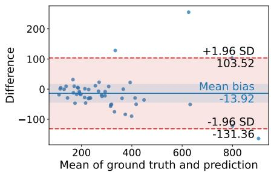  
(a) EDV of UNETR

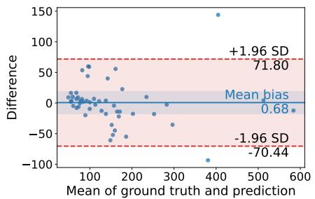

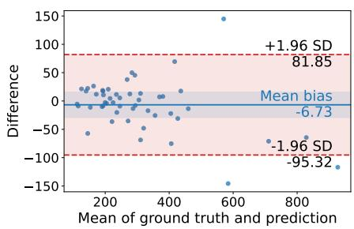

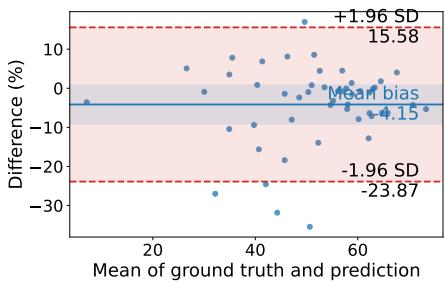  
(c) EF of UNETR

(b) ESV of UNETR  
(d) EDV of our PROMISE-Txformer  
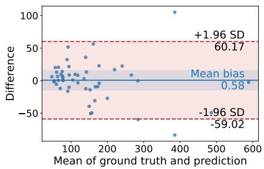  
(e) ESV of our PROMISE-Txformer

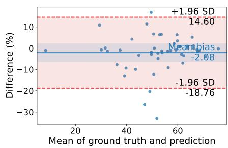  
(f) EF of our PROMISE-Txformer  
Figure 6: Bland–Altman plots comparing predicted and reference EDV, ESV, and EF for UNETR (a-c) and our $\mathrm { P R O M I S E  – T _ { x f o r m e r } }$ (d-f). The proposed model reduced the mean bias $\mathrm { ( E D V ; - } 1 3 . \dot { 9 }  \dot { - } 6 . 7$ mL; $\mathrm { E F } \colon - 4 . 1 5  - 2 . 0 8 \% )$ and narrowed the LoA across all indices, demonstrating improved volumetric precision and enhanced temporal coherence. The EF agreement $( - 1 8 . 8 \% \ \mathrm { t o } + 1 4 . 6 \% )$ lies within the inter-observer variability range, confirming clinically reliable ventricular function estimation.

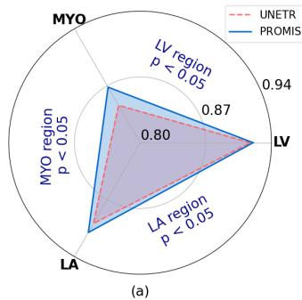

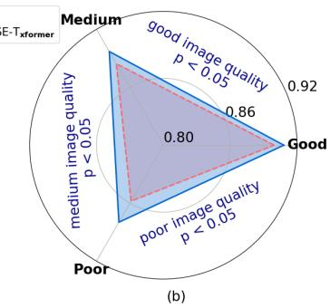  
Figure 7: Comparison of segmentation performance between UNETR and $\mathrm { P R O M I S E  – T _ { \mathrm { x f o r m e r } } }$ on CAMUS: class-wise DSC (LV, MYO, and LA) and DSC across good, medium, and poor image quality levels [36].

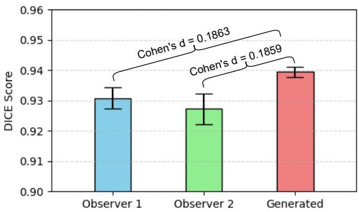  
Figure 8: Dice score comparison using observer-drawn and automatically generated bounding-box prompts, with pairwise efect sizes (Cohen’s d).

## 4.6. Benchmark with State-of-the-Art

We benchmark PROMISE-Net against a diverse set of recent state-of-the-art methods, encompassing both convolutional and transformer-based architectures, including Pact-Net [39], USL-Net [40], FAT-Net [41], HTC-Net [42], RM-U-Net [43], ERDUNet [44], MAF-Net [45], DECA-Net [46], CLAS [47], TAM-FCN8s [5], and CoST-UNet [49]. All methods are evaluated on the same datasets, as summarized in Table 4.

Across all datasets, PROMISE-C achieves the highest or near-highest segmentation accuracy while simultaneously attaining the lowest boundary deviation (HD95) and falsenegative rate (FNR). On ISIC-2017, it reaches a DSC of 90.7% and an FNR of 7.3%, outperforming HTC-Net by 0.6% in DSC and reducing FNR by approximately 38% (from 11.8% to 7.3%). On CAMUS, $\mathrm { P R O M I S E  – C _ { N N } }$ attains a DSC of 91.3% and an IoU of 84.4%, outperforming CC-SAM and

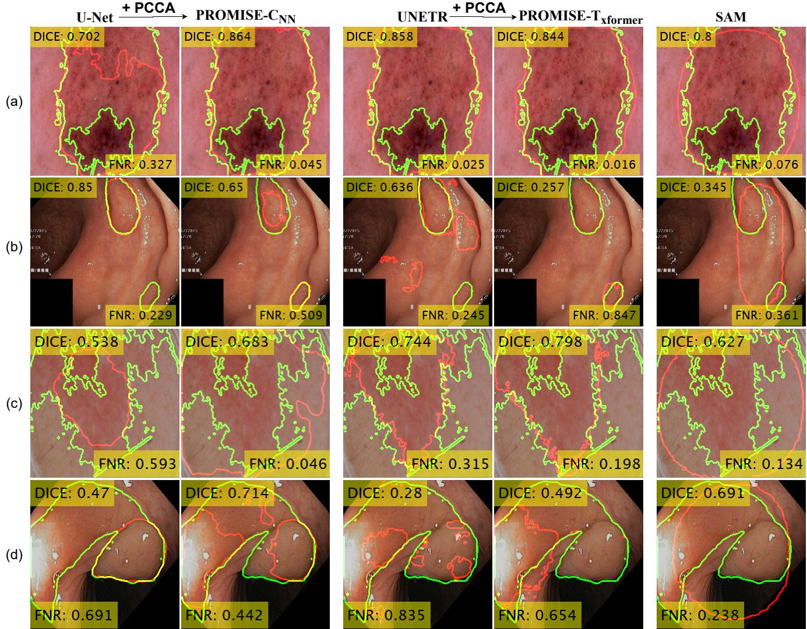  
Figure 9: Qualitative analysis of challenging and failure cases on ISIC-2017 and Kvasir-Polyp. Each column compares U-Net, PROMISE- $\mathbf { \partial } . \mathbf { C _ { N N } } .$ , UNETR, PROMISE $\mathrm { T _ { x f o r m e r } }$ , and SAM. Low-contrast textures, disconnected regions, and complex boundary structures lead to degraded performance across all methods; however, PROMISENet variants consistently preserve better boundary conformity than baseline U-Net and UNETR under extreme cases

TAM-FCN8s, while reducing HD95 to 5.9 pixels, indicating improved boundary precision in low-contrast echocardiographic images. Similar gains are observed on Kvasir-Polyp and Kvasir-Instrument, where PROMISE-C consistently outperforms alternative methods (Table 4). Overall, it yields an average DSC improvement of approximately 2–3% and reduces FNR by up to 35% relative to the strongest competitors, demonstrating that prompt-conditioned channel modulation reliably enhances segmentation accuracy and boundary fidelity across diverse anatomies and imaging modalities.

## 4.7. Failure Analysis and Limitations

We further analyse failure cases on ISIC-2017 and Kvasir-Polyp (Fig. 9). While PROMISE-Net variants consistently improve contour smoothness and reduce false negatives, residual limitations remain under visually ambiguous or structurally irregular conditions.

In ISIC-2017 (Fig. 9(a)), lesions with internal hollows or heterogeneous pigmentation produce ambiguous intensity gradients that hinder precise boundary localization. Even with prompt-conditioned modulation, internal textures may be conflated with lesion boundaries, leading to mild oversegmentation. This suggests that future designs could benefit from spatial-frequency–aware attention or texture-decoupled feature modulation to better preserve fine internal contrast. Figure 9(b) shows a Kvasir-Polyp failure case in which a single image contains multiple spatially disconnected polyps. Here, a single global prompt or bounding box is insuficient to attend to multiple targets simultaneously, resulting in missed or partially segmented regions. More challenging cases in Fig. 9(c)–(d) exhibit highly irregular boundaries, fragmented structures, and specular highlights that introduce strong local ambiguities. Although PROMISE-Net improves boundary adherence relative to baseline and foundation models in these cases, it still struggles to fully capture such complex contours. This motivates future extensions of PROMISE-Net with multi-scale prompt reasoning, adaptive multi-prompting, uncertainty modeling, and richer spatial context aggregation.

## 5. Conclusion and Future Extensions

This paper introduced PROMISE-Net, a prompt-aware medical image segmentation framework built on the proposed PCCA mechanism. By embedding prompt-conditioned modulation hierarchically across encoder and decoder stages, PROMISE-Net enables spatial prompts to influence feature representations at multiple semantic levels rather than being restricted to latestage fusion. Extensive experiments across four heterogeneous benchmarks (ISIC-2017, Kvasir-SEG, Kvasir-Instrument, and CAMUS) demonstrate that PROMISE-Net delivers consistent improvements in overlap accuracy, boundary precision, and false-negative reduction over strong convolutional, transformerbased, and prompt-driven baselines. The results further confirm robust generalization across architectures (PROMISE-CNN and $\mathrm { P R O M I S E  – T _ { \mathrm { x f o r m e r } } ) }$ , anatomical targets, imaging modalities, image quality levels, and label-space complexity (binary vs. multi-class segmentation), while remaining resilient to interobserver variability and prompt perturbations.

Beyond segmentation accuracy, PROMISE-Net shows improved anatomical consistency and clinically meaningful reliability, as evidenced by reduced boundary errors, stable performance under degraded image quality, and improved agreement in downstream cardiac volumetric and functional measurements. Collectively, these findings establish promptconditioned channel modulation as an efective and generalizable strategy for interactive medical image segmentation.

While this work focuses on 2D medical image segmentation, the modular design of PCCA readily supports several important extensions. First, the hierarchical prompt-conditioning mechanism can be naturally extended to 3D and 4D (spatio-temporal) segmentation, enabling motion-aware analysis of volumetric and dynamic data such as cardiac cycles, fetal echocardiography, or endoscopic video streams. Second, the prompt encoder can be generalized to support multi-prompt interactions, including combinations of bounding boxes, points, and scribbles, allowing finer control over ambiguous or overlapping anatomical regions with minimal user efort.

In addition, integrating domain adaptation and continual learning strategies would further strengthen cross-institutional robustness, facilitating deployment across scanners, centers, and patient populations. Finally, extending promptconditioned modulation to multimodal settings, such as joint ultrasound–MRI or image–clinical metadata fusion, represents a promising direction for building context-aware and clinically scalable segmentation systems.

Overall, PROMISE-Net provides a flexible foundation for advancing interactive, prompt-driven, and anatomically reliable segmentation, with clear pathways toward higher-dimensional, multimodal, and real-time clinical applications.

## Declaration of Competing Interest

The authors declare that they have no known competing financial interests or personal relationships that could have appeared to influence the work reported in this paper.

## References

[1] G. Litjens, T. Kooi, B. E. Bejnordi, A. A. A. Setio, F. Ciompi, M. Ghafoorian, J. A. van der Laak, B. van Ginneken, C. I. Sanchez, A survey on deep´ learning in medical image analysis, Medical Image Analysis 42 (2017) 60–88.

[2] J. Zhang, Y. Xie, Y. Xia, C. Shen, Attention residual learning for skin lesion classification, IEEE Transactions on Medical Imaging 38 (2019) 2092–2103.

[3] D. Gutman, N. C. Codella, E. Celebi, B. Helba, M. Marchetti, N. Mishra, A. Halpern, Skin lesion analysis toward melanoma detection: A challenge at the International Symposium on Biomedical Imaging (ISBI) 2016, hosted by the International Skin Imaging Collaboration (ISIC), arXiv preprint arXiv:1605.01397 (2016).

[4] M. K. Hasan, S. Roy, C. Mondal, M. A. Alam, M. T. E. Elahi, A. Dutta, S. T. U. Raju, M. T. Jawad, M. Ahmad, Dermo-doctor: A framework for concurrent skin lesion detection and recognition using a deep convolutional neural network with end-to-end dual encoders, Biomedical Signal Processing and Control 68 (2021) 102661.

[5] M. K. Hasan, G. Yang, C. H. Yap, Motion-enhanced cardiac anatomy segmentation via an insertable temporal attention module, in: International Workshop on Advances in Simplifying Medical Ultrasound, Springer, pp. 143–153.

[6] R. Wang, Y. Zhou, C. Zhao, H. Wu, A hybrid flower pollination algorithm based modified randomized location for multi-threshold medical image segmentation, Bio-medical Materials and Engineering 26 (2015) S1345– S1351.

[7] D. D. Patil, S. G. Deore, Medical image segmentation: a review, International Journal of Computer Science and Mobile Computing 2 (2013) 22–27.

[8] O. Ronneberger, P. Fischer, T. Brox, U-Net: convolutional networks for biomedical image segmentation, in: MICCAI 2015: 18th international conference, Munich, Germany, October 5-9, 2015, proceedings, part III 18, Springer, pp. 234–241.

[9] A. Hatamizadeh, Y. Tang, V. Nath, D. Yang, A. Myronenko, B. Landman, H. R. Roth, D. Xu, Unetr: Transformers for 3d medical image segmentation, in: Proceedings of the IEEE/CVF Winter Conference on Applications of Computer Vision, pp. 574–584.

[10] X. Chen, X. Wang, K. Zhang, K.-M. Fung, T. C. Thai, K. Moore, R. S. Mannel, H. Liu, B. Zheng, Y. Qiu, Recent advances and clinical applications of deep learning in medical image analysis, Medical Image Analysis 79 (2022) 102444.

[11] X. Zhang, K. Sun, D. Wu, X. Xiong, J. Liu, L. Yao, S. Li, Y. Wang, J. Feng, D. Shen, An anatomy-and topology-preserving framework for coronary artery segmentation, IEEE Transactions on Medical Imaging 43 (2023) 723–733.

[12] Z. Chen, Z. Tian, J. Zhu, C. Li, S. Du, C-cam: Causal cam for weakly supervised semantic segmentation on medical image, in: Proceedings of the IEEE/CVF Conference on Computer Vision and Pattern Recognition, pp. 11676–11685.

[13] Z. Kuang, Z. Yan, H. Zhou, L. Yu, Cluster-re-supervision: Bridging the gap between image-level and pixel-wise labels for weakly supervised medical image segmentation, IEEE Journal of Biomedical and Health Informatics 27 (2023) 4890–4901.

[14] S. Zhai, G. Wang, X. Luo, Q. Yue, K. Li, S. Zhang, Pa-seg: Learning from point annotations for 3d medical image segmentation using contextual regularization and cross knowledge distillation, IEEE Transactions on Medical Imaging 42 (2023) 2235–2246.

[15] J. Wei, Y. Hu, S. Cui, S. K. Zhou, Z. Li, Weakpolyp: You only look bounding box for polyp segmentation, in: International Conference on Medical Image Computing and Computer-Assisted Intervention, Springer, pp. 757–766.

[16] K. Zhang, X. Zhuang, Cyclemix: A holistic strategy for medical image segmentation from scribble supervision, in: Proceedings of the

IEEE/CVF Conference on Computer Vision and Pattern Recognition, pp. 11656–11665.

[17] Z. Li, Y. Zheng, D. Shan, S. Yang, Q. Li, B. Wang, Y. Zhang, Q. Hong, D. Shen, Scribformer: Transformer makes cnn work better for scribblebased medical image segmentation, IEEE Transactions on Medical Imaging 43 (2024) 2254–2265.

[18] G. Valvano, A. Leo, S. A. Tsaftaris, Learning to segment from scribbles using multi-scale adversarial attention gates, IEEE Transactions on Medical Imaging 40 (2021) 1990–2001.

[19] K. Zhang, X. Zhuang, Shapepu: A new pu learning framework regularized by global consistency for scribble supervised cardiac segmentation, in: International Conference on Medical Image Computing and Computer-Assisted Intervention, Springer, pp. 162–172.

[20] N. Tajbakhsh, L. Jeyaseelan, Q. Li, J. N. Chiang, Z. Wu, X. Ding, Embracing imperfect datasets: A review of deep learning solutions for medical image segmentation, Medical Image Analysis 63 (2020) 101693.

[21] X. Luo, M. Hu, W. Liao, S. Zhai, T. Song, G. Wang, S. Zhang, Scribblesupervised medical image segmentation via dual-branch network and dynamically mixed pseudo labels supervision, in: International Conference on Medical Image Computing and Computer-Assisted Intervention, Springer, pp. 528–538.

[22] A. Wang, M. Xu, Y. Zhang, M. Islam, H. Ren, S 2 me: Spatial-spectral mutual teaching and ensemble learning for scribble-supervised polyp segmentation, in: International Conference on Medical Image Computing and Computer-Assisted Intervention, Springer, pp. 35–45.

[23] Y. Lei, H. Luo, L. Wang, Z. Zhang, L. Zhang, Pclmix: Weakly supervised medical image segmentation via pixel-level contrastive learning and dynamic mix augmentation, in: International Conference on Intelligent Computing, Springer, pp. 62–73.

[24] H. Wu, X. Li, Y. Lin, K.-T. Cheng, Compete to win: Enhancing pseudo labels for barely-supervised medical image segmentation, IEEE Transactions on Medical Imaging 42 (2023) 3244–3255.

[25] M. Han, X. Luo, W. Liao, S. Zhang, S. Zhang, G. Wang, Scribble-based 3d multiple abdominal organ segmentation via triple-branch multi-dilated network with pixel-and class-wise consistency, in: International Conference on Medical Image Computing and Computer-Assisted Intervention, Springer, pp. 33–42.

[26] Z. Yang, D. Lin, D. Ni, Y. Wang, Non-iterative scribble-supervised learning with pacing pseudo-masks for medical image segmentation, Expert Systems with Applications 238 (2024) 122024.

[27] X. Zhang, L. Zhu, H. He, L. Jin, Y. Lu, Scribble hides class: Promoting scribble-based weakly-supervised semantic segmentation with its class label, in: Proceedings of the AAAI Conference on Artificial Intelligence, volume 38, pp. 7332–7340.

[28] Y. Wang, J. Peng, Z. Zhang, Uncertainty-aware pseudo label refinery for domain adaptive semantic segmentation, in: Proceedings of the IEEE/CVF International Conference on Computer Vision, pp. 9092– 9101.

[29] A. Kirillov, E. Mintun, N. Ravi, H. Mao, C. Rolland, L. Gustafson, T. Xiao, S. Whitehead, A. C. Berg, W.-Y. Lo, et al., Segment anything, in: Proceedings of the IEEE/CVF International Conference on Computer Vision, pp. 4015–4026.

[30] M. Tancik, P. Srinivasan, B. Mildenhall, S. Fridovich-Keil, N. Raghavan, U. Singhal, R. Ramamoorthi, J. Barron, R. Ng, Fourier features let networks learn high frequency functions in low dimensional domains, Advances in Neural Information Processing Systems 33 (2020) 7537–7547.

[31] A. Dosovitskiy, An image is worth 16x16 words: Transformers for image recognition at scale, arXiv preprint arXiv:2010.11929 (2020).

[32] J. Hu, L. Shen, G. Sun, Squeeze-and-excitation networks, in: Proceedings of the IEEE Conference on Computer Vision and Pattern Recognition, pp. 7132–7141.

[33] N. C. F. Codella, D. A. Gutman, M. E. Celebi, B. Helba, M. A. Marchetti, S. W. Dusza, A. Kalloo, K. Liopyris, N. K. Mishra, H. Kittler, A. Halpern, Skin lesion analysis toward melanoma detection: A challenge at the 2017 International Symposium on Biomedical Imaging (ISBI), Hosted by the International Skin Imaging Collaboration (ISIC), CoRR abs/1710.05006 (2017).

[34] D. Jha, P. H. Smedsrud, M. A. Riegler, P. Halvorsen, T. de Lange, D. Johansen, H. D. Johansen, Kvasir-seg: A segmented polyp dataset, in: International Conference on Multimedia Modeling, Springer, pp. 451–462.

[35] D. Jha, S. Ali, K. Emanuelsen, S. A. Hicks, V. Thambawita, E. Garcia-

Ceja, M. A. Riegler, T. de Lange, P. T. Schmidt, H. D. Johansen, D. Johansen, P. Halvorsen, Kvasir-instrument: Diagnostic and therapeutic tool segmentation dataset in gastrointestinal endoscopy, in: MultiMedia Modeling, Springer International Publishing, Cham, 2021, pp. 218–229.

[36] S. Leclerc, E. Smistad, J. Pedrosa, A. Østvik, F. Cervenansky, F. Espinosa, T. Espeland, E. A. R. Berg, P.-M. Jodoin, T. Grenier, C. Lartizien, J. D’hooge, L. Lovstakken, O. Bernard, Deep learning for segmentation using an open large-scale dataset in 2d echocardiography, IEEE Transactions on Medical Imaging 38 (2019) 2198–2210.

[37] M. K. Hasan, L. Dahal, P. N. Samarakoon, F. I. Tushar, R. Marti, DSNet: Automatic dermoscopic skin lesion segmentation, Computers in Biology and Medicine 120 (2020) 103738.

[38] M. K. Hasan, H. Zhu, G. Yang, C. H. Yap, Deep learning image registration for cardiac motion estimation in adult and fetal echocardiography via a focus on anatomic plausibility and texture quality of warped image, Computers in Biology and Medicine 187 (2025) 109719.

[39] W. Chen, R. Zhang, Y. Zhang, F. Bao, H. Lv, L. Li, C. Zhang, Pact-Net: Parallel cnns and transformers for medical image segmentation, Computer Methods and Programs in Biomedicine 242 (2023) 107782.

[40] X. Li, B. Peng, J. Hu, C. Ma, D. Yang, Z. Xie, USL-Net: Uncertainty selflearning network for unsupervised skin lesion segmentation, Biomedical Signal Processing and Control 89 (2024) 105769.

[41] H. Wu, S. Chen, G. Chen, W. Wang, B. Lei, Z. Wen, FAT-Net: Feature adaptive transformers for automated skin lesion segmentation, Medical Image Analysis 76 (2022) 102327.

[42] H. Tang, Y. Chen, T. Wang, Y. Zhou, L. Zhao, Q. Gao, M. Du, T. Tan, X. Zhang, T. Tong, HTC-Net: A hybrid cnn-transformer framework for medical image segmentation, Biomedical Signal Processing and Control 88 (2024) 105605.

[43] H. Tang, G. Huang, L. Cheng, X. Yuan, Q. Tao, X. Chen, G. Zhong, X. Yang, RM-UNet: UNet-like Mamba with rotational SSM module for medical image segmentation, Signal, Image and Video Processing 18 (2024) 8427–8443.

[44] H. Li, D.-H. Zhai, Y. Xia, ERDUnet: An eficient residual double-coding unet for medical image segmentation, IEEE Transactions on Circuits and Systems for Video Technology 34 (2023) 2083–2096.

[45] L. Yang, Y. Gu, G. Bian, Y. Liu, MAF-Net: A multi-scale attention fusion network for automatic surgical instrument segmentation, Biomedical Signal Processing and Control 85 (2023) 104912.

[46] S. Liang, J. Zhang, A. Bian, J. You, DECA-Net: Dual encoder and crossattention fusion network for surgical instrument segmentation, Pattern Recognition Letters 185 (2024) 130–136.

[47] H. Wei, H. Cao, Y. Cao, Y. Zhou, W. Xue, D. Ni, S. Li, Temporalconsistent segmentation of echocardiography with co-learning from appearance and shape, in: MICCAI 2020, Springer International Publishing, Cham, 2020, pp. 623–632.

[48] X. Li, Q. Hu, X. Lin, Y. Li, Y. Dong, T. Lin, EchoSAM: SAM adaption for unified 2D echocardiography segmentation and ejection fraction calculation, Biomedical Signal Processing and Control 109 (2025) 108000.

[49] M. R. Islam, M. Qaraqe, E. Serpedin, CoST-UNet: Convolution and swin transformer based deep learning architecture for cardiac segmentation, Biomedical Signal Processing and Control 96 (2024) 106633.