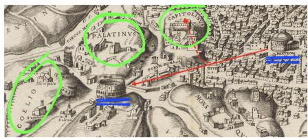
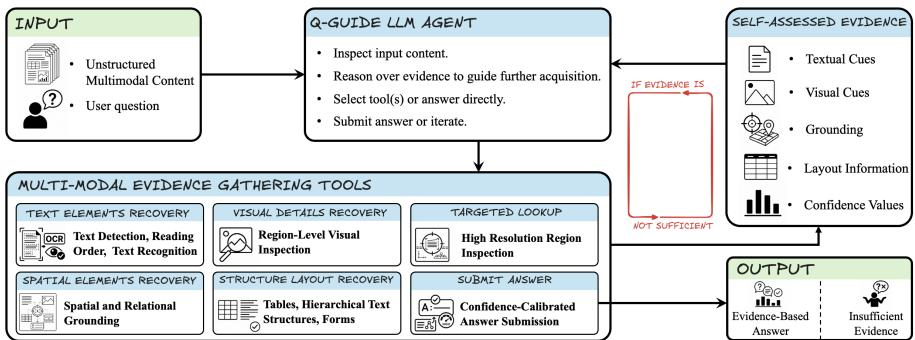
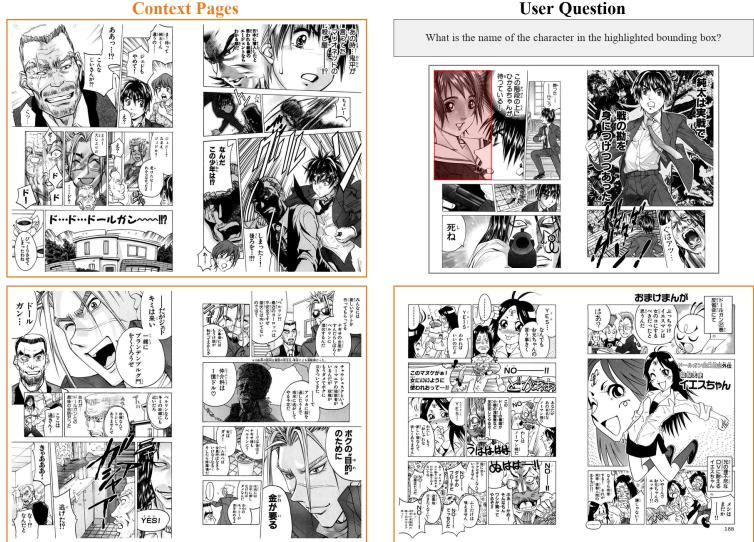
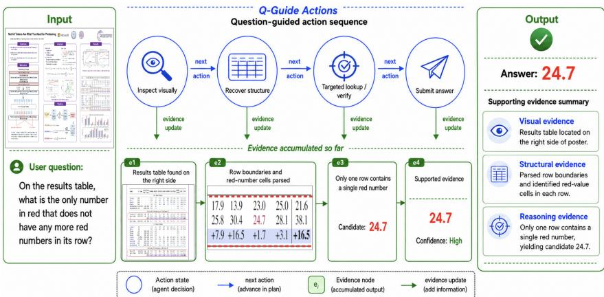
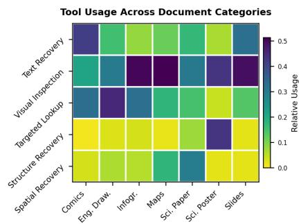
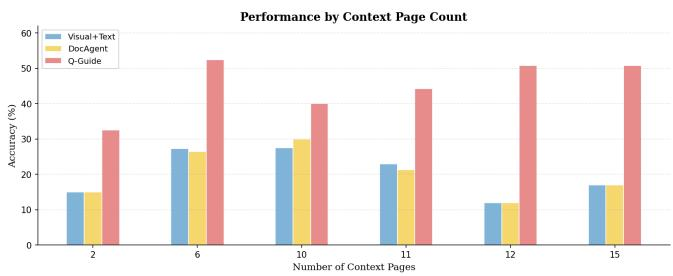
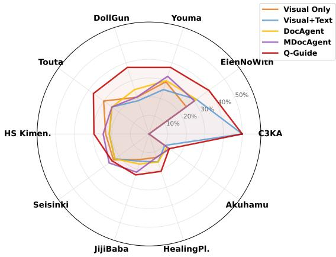
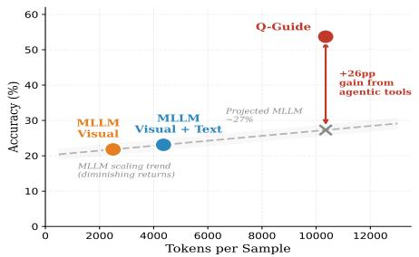
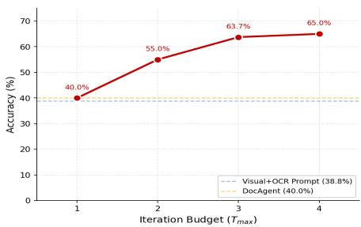

# Question-Guided Evidence Acquisition for Multimodal Visual Question Answering

Alin-Ionut Popa

Amazon Inc.

popaaln@amazon.com

Q: From the Pantheon facing the Colosseum, which hill is most visible to its right?

  
Direct MLLM: COELIO

  
Evidence-Based Agentic MLLM: CAPITOLINVS

Fig. 1: From uniform perception to question-conditioned evidence recovery.] Direct MLLM inference (Left) processes the document uniformly and answers from in-V complete perception. Q-Guide (Right) directs perception toward the question—locating landmarks, reading targeted labels, and verifying spatial relationships—before commit-. ting to an answer.s

Abstract. Multimodal LLMs can see a document, but they often can’t read it reliably. Small text, tables, visual cues, and topological elements still trip them up under direct visual inference, even when the page is already sitting in the model’s context. Most document-VQA systems treat perception as fixed: they encode the page once, ask the question, and answer from whatever the model happened to extract in that single fast pass. We think document VQA needs slower, more deliberate perception: rather than answering from one fixed encoding, the model should spend a bit of extra compute at inference time working out what to look at next, and only then answer. We build this into Q-Guide, a small agent that reads a question, works out what evidence it is still missing, and calls targeted tool(s) to recover it—reading text where text is needed, zooming in where detail is needed, or grounding a region where position matters. On DocVQA2026 and Manga109, Q-Guide outperforms both direct prompting and recent multi-agent document systems (65.0% vs. 40.0% on DocVQA2026, 32.4% vs. 24.4% on Manga109), and the improvement holds across three Claude backbones (Opus 4.6, Sonnet 4.6, and Opus 4.5). We find that accuracy scales with the perception budget—most of the gain appears within two to three deliberate rounds—and that the gain comes from directing perception to the right place, not from complex control logic: adding planners, routers, or multiple collaborating agents does not help.

Keywords: Multimodal Reasoning · Slow Thinking · Test-Time Compute · Question-Conditioned Perception · Agentic VQA

  
Fig. 2: Overview of Q-Guide. Given unstructured multimodal content and a user question, Q-Guide makes perception question-conditioned: the agent inspects the document, reasons about what evidence is still missing, selects perceptual recovery tools to fill the gap, and updates its evidence state. The loop continues until the recovered evidence supports an answer.

## 1 Introduction

Multimodal large language models have become very good at looking at documents, grounding regions, and reasoning across modalities [7, 11, 36, 49]. But there is still a gap between seeing a document and actually reading it, and that gap grows as documents get visually denser. A model can have a page in its context window and still misread a dimension on an engineering drawing, miss which table cell is highlighted, or overlook a small label on a map. In our experiments this was the most common failure: the model could reason fine, but it did not reliably perceive the specific piece of evidence the question depended on.

One reason is that most document-VQA pipelines perceive the document in a single fast pass, the same way regardless of the question [7,16,26,28]. The page is encoded once, and the model answers from whatever it extracted—a System-1 style of perception that commits before it has really looked. This is fine when the relevant evidence is large and central, but visually rich documents are not like that [30, 33, 45, 51]. The evidence for one question might be a value printed in red; for the next it might be a route on a map or a name in a speech bubble, sitting somewhere else and needing a diferent way of being read.

Our idea is to make perception slow and deliberate, and to condition it on the question [17,30,34,44,48]. Rather than committing after one pass, the model asks what this particular question requires it to perceive, spends test-time compute recovering exactly that, and repeats until it has enough evidence to answer—a System-2 loop over perception rather than over language alone. We build this into a compact agent we call Q-Guide.

We list three main contributions. First, we cast document VQA as test-time perceptual reasoning: a question-conditioned loop that spends extra compute on what to perceive beats heavier reasoning orchestration (planning agents, routing, and multi-agent collaboration) on the same backbone [15, 20, 41, 52], and accuracy scales with the perception budget until it saturates around two to three rounds. Second, the same design transfers to very diferent visual domains, from document pages to manga, without any structural changes. Third, the gains are not specific to one model: they hold across Claude Opus 4.6, Sonnet 4.6, and Opus 4.5. On acceptance we will release the evaluation splits and code.

We evaluate on two benchmarks that stress diferent things. DocVQA2026 [28] spans eight document categories with reasoning over up to 181 pages, and tests breadth across layouts, tables, and long documents. M109NC, a characternaming task we build from Manga109 [1, 6, 43], tests one hard axis instead: matching a character’s identity across pages from Japanese dialogue and visual appearance. On both, Q-Guide beats direct prompting and recent agentic baselines [15, 34, 41]. Since these baselines were originally reported on different MLLM backbones, we re-implement each on our Claude backbones— keeping each method’s own tools and control logic—so any diference reflects the evidence-acquisition strategy, not the underlying model. Ablations then confirm the gains come from directing perception toward question-relevant evidence; adding orchestration layers does not help and sometimes hurts [52].

## 2 Related Work

The gap we described in the introduction—models that see a page but do not reliably read the evidence a question needs—has been approached from two directions. One is model-side: train or adapt MLLMs to perceive text-rich documents better. The other is system-side: keep a general-purpose MLLM and give it external perception it can call on. Q-Guide is a system-side method: the MLLM stays as-is, but gains question-conditioned recovery tools that surface evidence it cannot reliably extract from pixels alone [1, 6, 8, 11, 16, 26, 28, 50].

OCR-free and document-specialized MLLMs. OCR-free and documentspecialized MLLMs improve the model-side representation of text-rich documents [7, 9, 16, 25, 26, 36, 39]. These models internalize document perception through architecture, training data, or visual encoding. Q-Guide goes the other way: it retains a general-purpose MLLM and instead exposes question-conditioned perceptual recovery tools the model can invoke on demand [2, 35].

Tool-augmented and agentic VQA. There is growing interest in moving VQA from passive answer generation toward active evidence gathering [17,27,30, 48]. Several recent methods let vision-language models call external perception modules, break down visual queries, and iteratively collect information before committing to an answer [20, 38, 48]. In visually rich document understanding, closely related systems such as ARIAL [34] and AgenticOCR [44] treat document QA as an iterative process of locating and parsing evidence rather than relying on a fixed OCR transcript. Q-Guide shares this motivation but asks a more pointed question: which perceptual recovery actions actually help when conditioned on the question, and which ones just add overhead?

Agentic orchestration for document question answering. Recent document QA systems explore increasingly structured forms of orchestration, including planning agents, multi-agent collaboration, retrieval modules, answer grounding, and iterative self-correction [8,12,14,15,19,29,34,41,42,46,50]. These systems show that decomposing document understanding into smaller actions can improve interpretability and robustness, especially for long or visually complex documents [18,33,45,51]. The downside is that heavier orchestration brings its own failure modes: planner errors, noisy intermediate summaries, repeated reflection, and context that ends up distracting the reasoning model [52]. Q-Guide tests this trade-of head-on: rather than deeper orchestration, it uses a compact single-loop agent that directs perception toward question-relevant evidence and stops when the recovered modalities support an answer.

## 3 Q-Guide

The central idea is to make perception adaptive to the question. Rather than applying a fixed processing pipeline, the model iteratively identifies what evidence is missing and recovers it through targeted tools. Figure 2 gives an overview. The loop is short: the unstructured multimodal content and the user question come in, the Q-Guide agent inspects the document and picks question-conditioned recovery actions, the recovery tools extract the missing evidence, and the agent judges whether it now has enough to answer or needs another round.

## 3.1 Problem Formulation

Let $\mathcal { D } = \{ p _ { 1 } , . . . , p _ { N } \}$ be a document of N page images and q the user question. Q-Guide answers q—or returns Unknown when the evidence is insuficient—by iteratively gathering evidence and testing whether it sufices, an interaction defined by the tuple $( \mathcal { E } , \mathcal { A } , \mathcal { T } , \phi )$

Evidence state. At turn t the agent holds an evidence state $e _ { t } = ( q , \mathcal { D } , O _ { t } ) \in$ $\mathcal { E } ,$ where $O _ { t } = \left( o _ { 1 } , \ldots , o _ { k _ { t } } \right)$ is the sequence of observations gathered so far, starting empty. Each observation $o _ { i } = ( a _ { i } , r _ { i } , y _ { i } )$ records the tool $a _ { i }$ , the normalized region $r _ { i } = ( l , t , r , b ) \in [ 0 , 1 ] ^ { 4 }$ it read from, and the returned content $y _ { i }$ . Attaching the source region $r _ { i }$ to every observation ties each answer to the page location it was read from rather than to parametric priors.

Actions and transition. The action space $\mathcal { A } = \mathcal { A } _ { \mathrm { t o o l } } \cup \{ \mathbf { s u b m i t } \}$ holds the five recovery tools (Section 3.3) and the answer submission. A single policy π—the same LLM at every turn—proposes actions $\pi ( e _ { t } ) \subseteq A$ from the current evidence; the termination rule below arbitrates this proposal into the executed set $\mathbf { a } _ { t }$ , whose tool actions append their observations to the state:

$$
e _ { t + 1 } = { \mathcal { T } } ( e _ { t } , \mathbf { a } _ { t } ) = { \Big ( } q , { \mathcal { D } } , { \mathcal { O } } _ { t } \oplus \bigoplus _ { a \in \mathbf { a } _ { t } \cap { \mathcal { A } } _ { \mathrm { t o o l } } } \operatorname { e x e c u t e } ( a ) { \Big ) } ,\tag{1}
$$

where $\oplus$ concatenates the new observations onto $O _ { t }$ and submit adds none.

Computational cost. Attaching a per-action cost $\kappa ( a ) = ( \tau ( a ) , \sigma ( a ) )$ (time, space) makes the budget an explicit second axis: total cost is linear in the number of rounds T and in accumulated evidence, and independent of document length $N$ , since the agent encodes only the $P _ { \mathrm { c t x } } \ll N$ pages it places in context rather than all N. Token use follows Tokens $\begin{array} { r } { \approx \alpha P _ { \mathrm { c t x } } + \beta \sum _ { i } | y _ { i } | + \gamma T ; } \end{array}$ ; the full derivation is in the Appendix section, and Section 5 shows the measured cost is dominated by the tool-output term and scales with $T$ while accuracy saturates by $T \approx 3$

Suficiency and termination. Whether to gather more or answer is governed by the suficiency predicate $\phi : \mathcal { E }  \{ 0 , 1 \}$ —the agent’s judgment of whether the evidence sufices—which we make explicit rather than leaving to an opaque call. On submission the policy emits a self-reported confidence level $\sigma ( e _ { t } ) \in \mathcal { L } = \{ \mathrm { L O W ~ \prec ~ M E D ~ \prec ~ H I G H } \}$ . Rather than trust the label directly, we treat each level as a calibrated risk estimate: we measure its empirical reliability $\rho ( \ell ) = \mathrm { P r } [ \mathrm { c o r r e c t } \mid \sigma = \ell ]$ (Section 5), which is monotone in $\ell ,$ and gate on a reliability floor ρmin—equivalently a level threshold $\tau = \operatorname* { m i n } \{ \ell : \rho ( \ell ) \geq \rho _ { \operatorname* { m i n } } \}$

$$
\phi ( e _ { t } ) = \mathbb { k } \mathrm { [ p o l i c y ~ s u b m i t s ~ } \land \sigma ( e _ { t } ) \subseteq \tau \mathrm { ] } , \quad \quad \tau = \mathrm { { M E D } ~ ( d e f a u l t ) } ,\tag{2}
$$

with $\nVdash [ \cdot ]$ the indicator (1 if its argument holds) and $\succeq$ the order on ${ \mathcal { L } } .$ . Grounding $\tau$ in the measured $\rho$ makes it an empirically justified operating point, not a handset constant, and casts $\phi$ as a binary suficiency classifier realized by the policy itself—not a separate critic. Each turn resolves as:

$$
\mathbf { a } _ { t } = { \left\{ \begin{array} { l l } { \{ \operatorname { s u b m i t } ( e _ { t } ) \} } & { { \mathrm { i f ~ } } \phi ( e _ { t } ) = 1 , } \\ { \{ \operatorname { s u b m i t } _ { - } \operatorname { u n k n o w n } ( e _ { t } ) \} } & { { \mathrm { i f ~ } } \phi ( e _ { t } ) = 0 { \mathrm { ~ a n d ~ } } t \geq T _ { \operatorname* { m a x } } , } \\ { \pi ( e _ { t } ) } & { { \mathrm { o t h e r w i s e ~ ( g a t h e r ~ m o r e ) } } . } \end{array} \right. }\tag{3}
$$

The gate also drives conflict resolution: a below-threshold submission $( \sigma \prec \tau )$ does not answer directly but triggers a lightweight verification step that rechecks the candidate against the accumulated observations $O _ { t }$ , requiring the answer to be explicitly supported by some $o _ { i } \in O _ { t }$ and otherwise falling back to Unknown. Because one model both selects actions and evaluates $\phi ,$ Q-Guide needs no separate planner, router, or critic; it simply reasons over the accumulated evidence and decides what to perceive next. The calibration justifying τ = med is in the Appendix: over committed answers, reliability is monotone and wellseparated across levels (high-confidence answers are $\approx 1 . 6 \times$ more reliable than med). At τ = med the gate admits 80.3% of submissions directly and routes the remaining 19.7% to verification, of which 89% abstain to Unknown—so the threshold is an active operating point, not a nominal one.

## 3.2 Architecture

Q-Guide instantiates the loop of Section 3.1 with three parts. First, the $\mathbf { Q } -$ Guide agent (an MLLM) is the single policy π: it receives the unstructured multimodal content and the question, and at each turn inspects the evidence state $e _ { t }$ , reasons about what perceptual evidence is still missing, and selects one or more recovery tools to fill the gap. Multiple operators can be invoked in a single turn for complementary evidence. The instructions are intentionally minimal—short operator descriptions and answer-format guidance, with no explicit planning, category routing, or advisory hints. Second, the selected question-conditioned recovery tools extract information that is dificult to perceive from the raw image alone—text, visual detail, spatial grounding, layout structure, and targeted region answers—each addressing a perceptual gap conditioned on the current question. Every call returns a grounded observation $o _ { i } = \left( a _ { i } , r _ { i } , y _ { i } \right)$ that the transition $\tau$ appends to the evidence state. Third, Q-Guide performs self-assessment: the same policy that directs perception also evaluates the suficiency predicate $\phi$ over the accumulated observations, looping back for more evidence while $\phi = 0$ and submitting once $\phi = 1$ . Because the state grows one deliberate perception step at a time, this loop is where the model’s test-time compute is spent.

  
Fig. 3: M109NC task example. For visualization, we show 3 of the 6 context pages (orange border) that reference the query character; the query page highlights the target (red overlay). The task requires cross-page reasoning: reading Japanese dialogue, associating names with visual appearances, and matching the target’s identity across scenes.

Finally, the output follows Eq. 3: an evidence-based answer once $\phi ( e _ { t } ) = 1$ or Unknown when the agent exhausts its budget or a low-confidence answer fails verification.

## 3.3 Question-Conditioned Recovery Tools

The model has direct access to the full document, yet seeing is not reading: small text, dense tables, colored cells, spatial arrangements, and stylized fonts all degrade under direct visual inference, so active recovery is needed even though the pixels are already in context. Each tool below targets one such gap, and the agent decides which to fill next based on what the question demands and what it has gathered so far.

Q-Guide exposes five evidence-recovery tools and one submission action, matching the tool groups in Figure 2. Each tool operates on a document page or on a region specified by normalized coordinates $( l , t , r , b ) \in [ 0 , 1 ] ^ { 4 }$ . This allows the agent to move from a global view of the document to targeted local evidence.

Text elements recovery. This tool recovers text from a selected page or region. It supports text detection, reading-order recovery, and text recognition. It is useful for small text, scattered labels, dimensions, captions, form fields, and dense document regions.

Visual details recovery. This tool returns a high-resolution crop of a selected region. It does not perform OCR; instead, it gives the LLM a clearer view of the raw pixels. It is useful for color, shape, layout, relative position, chart appearance, and other details that may be lost in text extraction.

Targeted lookup. This tool asks a natural-language question over a selected region and returns a short answer with confidence. It is useful when the agent has already localized the relevant area and needs a precise value, such as a total, width, label, or table entry.

Spatial elements recovery. This tool provides grounding capabilities that anchor text and visual elements in the input coordinate space, recovering wordlevel positions, color distributions, and text along geometric corridors. It is useful for highlighted values, map-like layouts, or text arranged along a path.

Structure layout recovery. This tool recovers tables, forms, hierarchical text structure, and layout information. When needed, it also associates table cells with visual properties such as text color or background color. It is useful when the answer depends on both text and structure.

Submit answer. This action terminates the evidence acquisition loop. The agent submits a final answer, short reasoning, and confidence level. The output is either an evidence-based answer or Unknown when the evidence is insuficient.

For long documents, we use a simple overlapping chunking strategy during evaluation. Each chunk j is processed by the same Q-Guide loop and returns an answer $a _ { j }$ with confidence $\sigma _ { j }$ ; a lightweight adjudicator then combines the chunk-level answers by confidence-weighted majority,

$$
\hat { a } = \arg \operatorname* { m a x } _ { v } \sum _ { j : a _ { j } = v } w ( \sigma _ { j } ) , \qquad w ( \mathrm { L O W } , \mathrm { M E D } , \mathrm { H I G H } ) = ( 1 , 2 , 3 ) ,\tag{4}
$$

falling back to an LLM arbitration over the candidate set only when (4) is tied. This proved more reliable than page-level retrieval for DocVQA2026, where many answers depend on nearby consecutive pages or cross-page context. We keep this fusion deliberately lightweight: the object of study is the per-question evidence loop, not long-document aggregation. A probabilistic multi-chunk evidence model and a question-aware retriever that selects relevant pages under a holistic view of the document are left to future work. Section 5.5 reports the accuracy behind this choice (chunking 65.0% vs. page-level retrieval 50.0%).

  
Fig. 4: Q-Guide in action. A science-poster example where the answer depends on both table structure and color. The agent locates the relevant region, recovers the table and red cell values, and submits the answer only after the evidence supports it. Each evidence node $e _ { i }$ shows the observation o added at that step (Section 3.1); together they form the accumulated evidence state.

## 4 Implementation Details

This section grounds the three parts from Section 3.2 in concrete components. The Q-Guide agent is a single MLLM (the LLM backbone below); the questionconditioned recovery tools are backed by of-the-shelf perception services (tool backends); and the self-assessment loop, including the low-confidence verification check, is realized as an explicit state machine (agent execution).

LLM backbone. We use Claude Opus 4.6 [5] as the multimodal reasoning backbone. The model receives unstructured multimodal content and the user question, decides which tools to call, and produces the final answer. We use deterministic decoding with temperature 0. Page images are resized to preserve readability while fitting within the context budget.

Tool backends. Structured text extraction, layout recovery, table/form parsing, and targeted region queries are implemented with Textract [2]. Spatial text detection uses a coordinate-aware text detector at word polygonal representation level [35]. For visual text grounding, i.e. anchoring detected text elements to their spatial coordinates in the document, we use Qwen3.5-2B [37], which provides bounding-box-level localization of textual elements. Visual inspection returns image crops from the source document. Color sampling and corridor text reading are implemented with lightweight image-processing routines. Region crops include padding and are upscaled before OCR or query-based extraction.

Agent execution. The agent is implemented as a state machine using Lang-Graph [22], with nodes for initialization, agent reasoning, tool execution, answer extraction, low-confidence verification, and forced termination; this cleanly separates decision logic from tool execution and supports reproducible multi-turn interactions. The evidence-gathering budget is $T _ { \mathrm { m a x } } = 3$ turns, and multiple parallel tool calls in a single turn count as one turn. For long documents, we combine outputs from overlapping chunks via the confidence-weighted adjudication of Eq. 4 (majority vote, with LLM arbitration on ties).

<table><tr><td colspan="2"></td><td colspan="9">Document Category</td><td rowspan="2">Overall</td></tr><tr><td>Method</td><td>Type</td><td>Bus. Report</td><td>Comics</td><td>Eng. Draw.</td><td></td><td>Infogr. Maps</td><td>Sci. Paper</td><td>Sci. Poster</td><td>Slides</td><td></td></tr><tr><td colspan="9">Direct prompting baselines (single LLM call, no tools)</td><td></td><td></td></tr><tr><td>Visual Prompt</td><td>Direct</td><td>20.0%</td><td>40.0%</td><td>20.0%</td><td>20.0%</td><td>20.0%</td><td>30.0%</td><td>40.0%</td><td>30.0%</td><td>27.5%</td></tr><tr><td>OCR Prompt</td><td>Direct</td><td>30.0%</td><td>20.0%</td><td>10.0%</td><td>40.0%</td><td>50.0%</td><td>20.0%</td><td>50.0%</td><td>40.0%</td><td>32.5%</td></tr><tr><td>Visual+OCR Prompt</td><td>Direct</td><td>40.0%</td><td>20.0%</td><td>20.0%</td><td>50.0%</td><td>30.0%</td><td>50.0%</td><td>50.0%</td><td>50.0%</td><td>38.8%</td></tr><tr><td colspan="9">Agentic baselines (multi-step, tool use)</td><td></td></tr><tr><td>ARIAL [34]</td><td>Agentic</td><td>20.0%</td><td>40.0%</td><td>40.0%</td><td>30.0%</td><td>10.0%</td><td>30.0%</td><td>30.0%</td><td>60.0%</td><td>32.5%</td></tr><tr><td>DocAgent [41]</td><td>Agentic</td><td>30.0%</td><td>40.0%</td><td>40.0%</td><td>30.0%</td><td>30.0%</td><td>40.0%</td><td>50.0%</td><td>60.0%</td><td>40.0%</td></tr><tr><td>MDocAgent [15]</td><td>Agentic</td><td>30.0%</td><td>40.0%</td><td>30.0%</td><td>40.0%</td><td>40.0%</td><td>50.0%</td><td>60.0%</td><td>30.0%</td><td>40.0%</td></tr><tr><td>Q-Guide</td><td>Agentic</td><td>60.0%</td><td>60.0%</td><td>90.0%</td><td>60.0%</td><td>50.0%</td><td>50.0%</td><td>90.0%</td><td>60.0%</td><td>65.0%</td></tr></table>

Table 1: Results on the DocVQA2026 validation split (80 questions, 8 categories). Q-Guide achieves the best overall accuracy, improving over the strongest direct prompting baseline by 26.2 points and over the strongest agentic baselines by 25.0 points. The largest gains appear on engineering drawings and science posters, where precise local evidence is critical. Overall-column Wilson 95% CIs: Q-Guide [54.1, 74.5], Visual+OCR [28.8, 49.7], DocAgent/MDocAgent [30.0, 51.0]; both gaps are significant at $p < 0 . 0 1$ . Per-category cells (n = 10) are reported for trends only.

## 5 Experiments

## 5.1 Datasets and Task Formulation

We evaluate Q-Guide on two settings that are deliberately complementary. The dataset DocVQA2026 stresses breadth: many document types, many layouts, and long documents, so the agent has to pick the right kind of perception across very diferent pages. M109NC stresses depth on one hard axis: a single task—naming a character—that forces cross-page identity matching from low-resource Japanese text plus visual appearance. Together they exercise diferent failure modes of the same framework. The first setting is DocVQA2026 [28], containing 80 questions across 8 document categories: business reports, comics, engineering drawings, infographics, maps, science papers, science posters, and slides. Documents range from 1 to 181 pages, and many questions require correlating entities across regions, matching labels to visual elements, reading table cells, and combining evidence from multiple pages. Although compact, DocVQA2026 is deliberately adversarial rather than easy: the eight categories mix dense tables, engineering dimensions, colored cells, and map topology, stressing a breadth of perception that far larger single-domain benchmarks do not probe. Its dificulty is evident in the numbers—the strongest direct-prompting baseline reaches only 38.8%, and every prior agentic system we test stays at or below 40.0%—so headroom here reflects genuine perceptual challenge, not annotation noise.

The second setting is a character naming benchmark that we construct from Manga109 [1, 6], inspired by the multi-task comic understanding setup of CoMiX [43]. We call this task M109NC, for Manga109 Naming Characters. Given a set of context pages containing character names and a query page with a highlighted character (Figure 3), the system must produce the character’s canonical name. This requires active evidence acquisition beyond standard OCR: the model must read Japanese text from context pages, associate names with character appearances, and match the highlighted character on a diferent page. We use Manga109-v2026 annotations, which provide character body and face boxes linked to a book-level character roster.

For M109NC, we sample questions from 10 Manga109 books selected for diversity and dificulty, yielding roughly 150 questions per book and 1,500 samples in total. Q-Guide is evaluated zero-shot, so no training on the remaining books is involved. For each book, we select a compact set of context pages via a greedy set-cover over character name mentions, then draw query samples from the noncontext pages. We deliberately withhold the full book: the goal is to test whether the method can recover a character’s identity from a small evidence set where names and visual references are present but not trivially matched.

Performance varies across volumes (per-book breakdown in the Appen material), tracking how visually distinctive and unambiguously named the characters are: Q-Guide is strongest on YoumaKourin and EienNoWith (unique hairstyles and clothing) and all methods struggle on Akuhamu, where many hamster characters share the same body shape. For both benchmarks, we use ANLS-based matching as the primary evaluation criterion, supplemented by strict matching for numeric and date answers and order-invariant matching for list answers on DocVQA2026. Unless otherwise stated, all methods use Claude Opus 4.6 as a fixed reasoning-capable backbone LLM so that the comparison isolates the evidence-acquisition strategy from diferences in the underlying model. We verify that Q-Guide’s gains generalize across backbones; results with Claude Sonnet 4.6 [4] and Claude Opus 4.5 [3] are reported in Section 5.4.

## 5.2 Main Results

Table 1 compares Q-Guide with direct prompting baselines and recent agentic document-understanding frameworks on the DocVQA2026 validation split. The direct baselines make a single LLM call with diferent input views: page images, OCR text, or both. The agentic baselines use multi-step tool-based reasoning but do not share Q-Guide’s compact evidence-recovery loop.

On DocVQA2026, Q-Guide reaches 65.0%. This improves over the strongest direct prompting baseline, Visual+OCR Prompt, by 26.2 points, showing that simply giving the model both page images and OCR text is not enough. It also improves over DocAgent and MDocAgent by 25.0 points. These agentic baselines represent recent multi-step frameworks: DocAgent [41] decomposes questions into sub-tasks with a planning agent, while MDocAgent [15] uses multi-agent collaboration with reader and synthesizer roles. The largest gains appear on engineering drawings and science posters, where Q-Guide reaches 90.0%. These categories often require precise local evidence such as dimensions, table cells, colored values, or chart entries, and in these cases targeted lookup, visual inspection, and structure recovery prove more efective than global document processing. Q-Guide also improves on maps, reaching 50.0%, although map questions remain challenging because many require spatial or topological reasoning that is only partially captured.

Figure 4 illustrates the process on a science-poster example: the agent locates the relevant table, recovers its structure and color, then verifies the answer before submitting. On M109NC, Q-Guide also improves over direct and agentic baselines (Table 2). With Claude-based OCR it reaches 32.4%, improving over Visual+OCR Prompt (23.1%) by 9.3 points and over DocAgent (24.4%) by 8.0 points; with ground-truth OCR it reaches 53.7%, a 28.8-point gain over Visual+OCR Prompt with GT-OCR (24.9%). Q-Guide’s tools are thus highly efective when text is reliable, while imperfect OCR limits its potential. Notably, Q-Guide with imperfect Claude-OCR (32.4%) already surpasses Visual+OCR Prompt with perfect GT-OCR (24.9%),

Table 2: Character naming on M109NC $\begin{array} { l l l } { ( n } & { = } & { 5 0 4 ) } \end{array}$ . Q-Guide benefits strongly from higher-quality text, with GT-OCR increasing accuracy to 53.7%. Wilson 95% CIs: Q-Guide Claude-OCR [28.4, 36.5], GT-OCR [49.4, 58.1]; the improvement over the strongest agentic baseline is significant $( p < 0 . 0 1$ , supplementary material).
<table><tr><td></td><td colspan="2">Text Source</td></tr><tr><td>Method</td><td>Claude-OCR GT-OCR</td><td></td></tr><tr><td>Direct prompting baselines</td><td></td><td></td></tr><tr><td>Visual Prompt</td><td>21.8%</td><td>21.8%</td></tr><tr><td>Visual+OCR Prompt</td><td>23.1%</td><td>24.9%</td></tr><tr><td>Agentic approaches</td><td></td><td></td></tr><tr><td>DocAgent [41]</td><td>24.4%</td><td>29.3%</td></tr><tr><td>MDocAgent [15]</td><td>25.6%</td><td>27.8%</td></tr><tr><td>Q-Guide</td><td>32.4%</td><td>53.7%</td></tr></table>

suggesting that iterative tool use and cross-page visual matching add value beyond better text extraction alone. One pattern holds across both benchmarks: visual input alone consistently trails structured multi-modal evidence (visual + text)—MLLMs reason better when evidence arrives already separated into complementary modalities than when they must decompose a scene internally. On M109NC this is especially striking, since the OCR is itself produced by Claude: the same model reads better when its own text extraction is surfaced as an explicit tool than end-to-end from pixels.

## 5.3 Ablation Studies

Our central claim is that closing the perception gap comes from pointing perception at the right place, not from heavier reasoning control. We ablate two axes this implies: orchestration strategy (does adding planning, routing, or extra stages help?) and tool composition (which recovery modalities surface the missing evidence?).

Orchestration strategy. Figure 5 (Left) compares diferent ways of organizing the reasoning process. Direct prompting baselines range from 27.5% to 38.8%, with Visual+OCR Prompt performing best among them. A simple twostage agentic setup, Extract-Synthesize, reaches 44.3%, showing that separating investigation from answering already helps.

<table><tr><td>Configuration</td><td>Strategy</td><td>Acc.</td><td>Δ</td></tr><tr><td colspan="4">Direct prompting baselines</td></tr><tr><td>Visual Prompt</td><td>Direct Answer</td><td>27.5%</td><td></td></tr><tr><td>OCR Prompt</td><td>Direct Answer</td><td>32.5%</td><td>+5.0</td></tr><tr><td>Visual+OCR Prompt Direct Answer</td><td></td><td></td><td>38.8% +11.3</td></tr><tr><td colspan="4">Two-stage agentic: research for the answer</td></tr><tr><td>Extract-Synthesize</td><td>Investigate → Answer</td><td>44.3% +16.8</td><td></td></tr><tr><td colspan="4">Complex reasoning agentic</td></tr><tr><td>3-Stage Research</td><td>Plan → Gather → Answer 35.7%</td><td></td><td>+8.2</td></tr><tr><td>Advisory Routing</td><td>Category-aware routing</td><td>44.3% +16.8</td><td></td></tr><tr><td colspan="4">Tool-focused agentic</td></tr><tr><td>Basic agentic</td><td>InspectOCR loop</td><td>50.0% +22.5</td><td></td></tr><tr><td>Q-Guide</td><td>5 recovery tools</td><td>65.0% +37.5</td><td></td></tr></table>

  
Fig. 5: Orchestration and tool-use analysis. Left: Q-Guide performs best with a compact iterative tool-use loop, while heavier planning and routing do not improve accuracy. Right: tool usage changes naturally across document categories, showing that the agent adapts evidence acquisition without explicit category routing.

Yet more structure does not always help. The 3-stage research pipeline reaches only 35.7%—below the Visual+OCR baseline—and Advisory Routing (44.3%) merely matches Extract-Synthesize: the bottleneck is not the absence of a plan. Extra planning produces brittle intermediate decisions, and category routing forces a fixed strategy even when the question needs diferent evidence. The strongest gains come from a simple iterative loop: Basic agentic reasoning reaches 50.0% and Q-Guide 65.0%, a 37.5-point improvement over Visual Prompt— invest in perceptual recovery tools, not orchestration complexity. The test-timecompute reading is explicit (Fig. 8, appendix): accuracy scales with the perception budget, from 40.0% at $T _ { \mathrm { m a x } } = 1$ to 55.0% at $T _ { \mathrm { m a x } } = 2$ and ∼ 65% at $T _ { \mathrm { m a x } } \geq 3$ . A saturating fit $\operatorname { a c c } ( t ) = A - B e ^ { - k t }$ over $T _ { \mathrm { m a x } } = 1 \dots 6 \ ( R ^ { 2 } = 0 . 9 8 2 )$ realizes 90% of the attainable gain by $t ^ { \star } \approx 3 . 2$ rounds—a slow-thinking curve for perception, where a few deliberate rounds unlock most of the benefit.

Statistical significance. Treating the question set as the sample (decoding is deterministic), Q-Guide’s margins are significant at $p < 0 . 0 1$ : on DocVQA2026 $( n = 8 0 )$ over both the best direct baseline (65.0% vs. 38.8%, $p { \approx } 9 \times 1 0 ^ { - 4 } )$ and the best agentic baseline (65.0% vs. 40.0%), and on M109NC $( n = 5 0 4 )$ over the best agentic baseline $( p \approx 5 \times 1 0 ^ { - 3 } )$ ; a paired McNemar test [32] agrees. Wilson intervals [47] and the full test methodology are in the supplementary material.

Tool composition. Figure 5 (Right) shows the agent is not a fixed pipeline: it reaches for text recovery on text-heavy documents, visual inspection when local detail matters, and structure or spatial recovery for specialized cases—the question directs perception toward the relevant modality gap. A leave-one-out ablation over the five tools (full table in the supplementary material) confirms their relative importance by accuracy drop: Visual Inspection (−17.2pp) and Targeted Query (−16.2) are most impactful, then Text Recovery (−13.1), with Structure and Spatial smaller (−7.2, −3.9); the combined Visual+Query drop (−33.4pp) exceeds Q-Guide’s total gain over the best baseline, marking questionconditioned extraction as the primary value driver.

<table><tr><td rowspan="2">Method</td><td colspan="3">DocVQA2026</td><td colspan="3">M109NC</td></tr><tr><td>Opus 4.6</td><td>Sonnet 4.6</td><td>Opus 4.5</td><td>Opus 4.6</td><td>Sonnet 4.6</td><td>Opus 4.5</td></tr><tr><td colspan="7">Direct prompting baselines</td></tr><tr><td>Visual Prompt</td><td>27.5%</td><td>30.0%</td><td>27.1%</td><td>21.8%</td><td>21.8%</td><td>21.8%</td></tr><tr><td>Visual+OCR Prompt</td><td>38.8%</td><td>31.4%</td><td>37.1%</td><td>23.1%</td><td>22.9%</td><td>22.9%</td></tr><tr><td colspan="7">Agentic baselines</td></tr><tr><td>DocAgent</td><td>40.0%</td><td>34.3%</td><td>37.1%</td><td>24.4%</td><td>24.2%</td><td>22.5%</td></tr><tr><td>MDocAgent</td><td>40.0%</td><td>31.4%</td><td>31.4%</td><td>25.6%</td><td>23.8%</td><td>25.1%</td></tr><tr><td>Q-Guide</td><td>65.0%</td><td>62.8%</td><td>64.2%</td><td>32.4%</td><td>32.2%</td><td>31.5%</td></tr></table>

Table 3: Accuracy across MLLM backbones. Q-Guide consistently achieves the best accuracy regardless of the underlying model. On M109NC, direct prompting baselines plateau around 22% irrespective of backbone, suggesting the bottleneck is the reasoning architecture rather than perceptual capability.

On Manga109, the +21.3-point Claude-OCR-to-GT-OCR gap (32.4%→53.7%) shows the payof is largest when recovered text is reliable, yet Q-Guide still beats all baselines under imperfect OCR. Broken down by context-page count (supplementary material), Q-Guide leads at every context size and scales with available evidence, exceeding 50% with 12 or more naming pages, whereas the baselines stay nearly flat.

## 5.4 LLM Backbone Versatility

To check that Q-Guide’s gains generalize beyond one backbone, we re-run all methods with Claude Sonnet 4.6 [4] and Claude Opus 4.5 [3]; Table 3 reports the results. Q-Guide improves over every baseline regardless of the model, so the gains come from the evidence-acquisition strategy rather than a specific model’s capability. Stronger backbones amplify its DocVQA2026 advantage, but weaker ones still recover substantially with its tools. On M109NC the direct baselines are flat across models (∼22%) while Q-Guide holds ∼32%, so character naming benefits more from structured evidence acquisition than from raw perceptual capability. MDocAgent, by contrast, degrades on DocVQA2026 with weaker backbones (40.0% → 31.4%): its multi-agent orchestration is fragile under reduced capability, while Q-Guide’s simpler loop stays robust.

## 5.5 Failure Cases and Discussion

Q-Guide’s primary weakness is on map questions. This is not a localization error—Q-Guide emits no coordinates or graph, so coordinate-ofset metrics do not apply—but information extraction under topological cues: reading a value that depends on a route, adjacency, or orientation the model must follow visually.

The tools recover local text and detail but do not represent the map as a navigable structure; a dedicated map-to-graph tool is the clearest fix and would license a topological error metric. For long documents, fixed-window chunking with crosschunk adjudication (65.0%) beats page-level retrieval (50.0%), as many answers span consecutive pages.

OCR sensitivity. Treating our three text conditions as a text-quality axis $x \in [ 0 , 1 ]$ image-only $( x = 0 , 2 1 . 8 \% )$ , image + Claude-OCR, image + GT text $( x = 1 , 5 3 . 7 \% )$ accuracy on M109NC fits $\operatorname { a c c } ( x ) \approx 2 1 . 8 \% + 3 1 . 9 x$ ; Claude-OCR’s 32.4% places its efective text quality at $x \approx 0 . 3 3$ , isolating how much residual error is OCR-noise rather than reasoning.

Cross-page matching. On M109NC the policy resolves character identity by an implicit weighted similarity, which we make explicit: for a query crop and candidate roster entry $c ,$

$$
\begin{array} { r l } & { \mathrm { s c o r e } ( c ) = w _ { v } \mathrm { s i m } _ { \mathrm { v i s } } ( \mathrm { q u e r y } , c ) + w _ { t } \mathrm { s i m } _ { \mathrm { t x t } } ( \mathrm { m e n t i o n s } ( c ) , \mathrm { c t x } ) , } \\ & { \mathrm { i d e n t i t y } = \arg \operatorname* { m a x } _ { c } \mathrm { s c o r e } ( c ) , } \end{array}\tag{5}
$$

combining visual-appearance similarity with textual name-mention evidence across context pages. Our design deliberately lets the MLLM evaluate $\mathrm { { s i m } _ { \mathrm { { v i s } } } }$ and $\mathrm { s i m } _ { \mathrm { t x t } }$ natively from tool-surfaced evidence rather than through a separate face-/frameembedding pipeline; an explicit embedding-distance matcher (e.g. cosine over face crops) is a natural baseline we leave to future work.

Error decomposition (M109NC). Categorizing every Q-Guide error (341 over 504), the dominant failure is perceptual visual-matching (64.5%, 95% CI [59.3, 69.4]), then abstention (32.0%, [27.3, 37.1]), with dialogue-coreference rare (3.5%, [2.0, 6.0])—sharpening the paper’s thesis that the bottleneck is perception, not language-level coreference. Finally, single-call methods hit a ceiling regardless of context size, while Q-Guide breaks through by spending tokens on active tool use rather than passive input expansion (Fig. 8, appendix).

## 6 Conclusion

Q-Guide is a compact agent that spends test-time compute deciding what to perceive, directing recovery tools toward the evidence a question needs. It outperforms both single-pass (System-1) prompting and heavier multi-agent orchestration across three backbones and two visually distinct domains, with accuracy scaling with the perception budget—most of the gain arriving within 2–3 rounds. For document VQA, slow thinking is thus most useful applied to perception itself, not only to language-level reasoning. Complexity linear in the perception budget, a confidence gate grounded in measured reliability, and residual failures that are overwhelmingly perceptual (not linguistic) together indicate the lever for further progress is richer perception, not deeper control logic. The remaining failure modes on maps and manga point the same way, and transferring the loop to open-weight backbones is a natural next step.

## References

1. Aizawa, K., Fujimoto, A., Otsubo, A., Ogawa, T., Matsui, Y., Tsubota, K., Ikuta, H.: Building a manga dataset “manga109” with annotations for multimedia applications. IEEE Multimedia 27(2), 72–80 (2020)

2. Amazon Web Services: Amazon textract documentation. https://docs.aws. amazon.com/textract/ (2026), developer documentation. Accessed: 2026-06-02

3. Anthropic: Claude opus 4.5 model card. https://www.anthropic.com/research/ claude-opus-4-5-system-card (2025), accessed: 2026-06-01

4. Anthropic: Claude sonnet 4.6 model card. https : / / www . anthropic . com / research/claude-sonnet-4-6-system-card (2025), accessed: 2026-06-01

5. Anthropic: Introducing claude opus 4.6. https://www.anthropic.com/news/ claude-opus-4-6 (2026), model release announcement. Accessed: 2026-06-02

6. Baek, J., Miyai, A., Onohara, S., Ikuta, H., Aizawa, K.: Manga109-v2026: Revisiting Manga109 Annotations for Modern Manga Understanding. In: ICML Workshop (2026)

7. Bai, S., Chen, K., Liu, X., Wang, J., Ge, W., Song, S., Dang, K., Wang, P., Wang, S., Tang, J., et al.: Qwen2.5-vl technical report. arXiv preprint arXiv:2502.13923 (2025)

8. Cho, J., Mahata, D., Irsoy, O., He, Y., Bansal, M.: M3docrag: Multi-modal retrieval is what you need for multi-page multi-document understanding. arXiv preprint arXiv:2411.04952 (2024)

9. Cui, C., Sun, T., Liang, S., Gao, T., Zhang, Z., Liu, J., Wang, X., Zhou, C., Liu, H., Lin, M., Zhang, Y., Zhang, Y., Zheng, H., Zhang, J., Zhang, J., Liu, Y., Yu, D., Ma, Y.: Paddleocr-vl: Boosting multilingual document parsing via a 0.9b ultra-compact vision-language model. arXiv preprint arXiv:2510.14528 (2025)

10. Dietterich, T.G.: Approximate statistical tests for comparing supervised classification learning algorithms. Neural Computation 10(7), 1895–1923 (1998)

11. Ding, Y., et al.: A survey on mllm-based visually rich document understanding. arXiv preprint arXiv:2507.09861 (2026)

12. Dong, K., Chang, Y., Huang, S., Wang, Y., Tang, R., Liu, Y.: Benchmarking retrieval-augmented multimodal generation for document question answering. arXiv preprint arXiv:2505.16470 (2025)

13. Efron, B., Tibshirani, R.J.: An Introduction to the Bootstrap. No. 57 in Monographs on Statistics and Applied Probability, Chapman & Hall/CRC, New York (1993)

14. Faysse, M., Sibille, H., Wu, T., Omrani, B., Viaud, G., Hudelot, C., Colombo, P.: Colpali: Eficient document retrieval with vision language models. arXiv preprint arXiv:2407.01449 (2024)

15. Han, S., et al.: Mdocagent: A multi-modal multi-agent framework for document understanding. arXiv preprint arXiv:2503.13964 (2025)

16. Hu, A., Xu, H., Zhang, L., Ye, J., Yan, M., Zhang, J., Jin, Q., Huang, F., Zhou, J.: mplug-docowl2: High-resolution compressing for ocr-free multi-page document understanding. arXiv preprint arXiv:2409.03420 (2024)

17. Hu, Y., Shi, W., Fu, X., Roth, D., Ostendorf, M., Zettlemoyer, L., Smith, N.A., Krishna, R.: Visual sketchpad: Sketching as a visual chain of thought for multimodal language models. In: Advances in Neural Information Processing Systems (2024)

18. Indrehus, K., et al.: Towards self-explainable document visual question answering. arXiv preprint arXiv:2605.06058 (2026)

19. Jain, C., Wu, Y., Zeng, Y., Liu, J., Dai, S., Shao, Z., Wu, Q., Wang, H.: Simpledoc: Multi-modal document understanding with dual-cue page retrieval and iterative refinement. arXiv preprint arXiv:2506.14035 (2025)

20. Jiang, B., Zhuang, Z., Shivakumar, S.S., Roth, D., Taylor, C.J.: Multi-agent vqa: Exploring multi-agent foundation models in zero-shot visual question answering. arXiv preprint arXiv:2403.14783 (2024)

21. Krubiński, M., Matcovici, S., Grigore, D., Voinea, D., Popa, A.I.: Watermark text pattern spotting in document images (2024), https://arxiv.org/abs/2401.05167

22. LangChain: Langgraph: Build resilient language agents as graphs (2024), https: //github.com/langchain-ai/langgraph

23. Leotescu, G., Popa, A.I., Grigore, D.N.N., Voinea, D., Perona, P.: Self-supervised incremental learning of object representations from arbitrary image sets. In: Proceedings of the Winter Conference on Applications of Computer Vision (WACV). pp. 8133–8143 (February 2025)

24. Leotescu, G., Voinea, D., Popa, A.I.: Bidirectional long-range parser for sequential data understanding (2024), https://arxiv.org/abs/2404.05210

25. Liao, W., Wang, J., Li, H., Wang, C., Huang, J., Jin, L.: Doclayllm: An eficient and efective multi-modal extension of large language models for text-rich document understanding. arXiv preprint arXiv:2408.15045 (2024)

26. Liu, Y., Yang, B., Liu, Q., Li, Z., Ma, Z., Zhang, S., Bai, X.: Textmonkey: An ocr-free large multimodal model for understanding document. arXiv preprint arXiv:2403.04473 (2024)

27. Liu, Z., Dong, Y., Rao, Y., Zhou, J., Lu, J.: Chain-of-spot: Interactive reasoning improves large vision-language models. arXiv preprint arXiv:2403.12966 (2024)

28. Llabrés, A., Serra Ortega, M., Ockier, T., Singh, A., Georgakilas, C., Barsky, A., Valveny, E., Karatzas, D.: DocVQA2026: ICDAR2026 competition on multimodal reasoning over documents in multiple domains. https://www.docvqa.org/ challenges/2026 (2026), cVC-UAB. Accessed: 2026-05-25

29. López, E., Llabrés, A., Valveny, E.: Enhancing document vqa models via retrievalaugmented generation. arXiv preprint arXiv:2508.18984 (2025)

30. Luan, B., Feng, H., Chen, H., Wang, Y., Zhou, W., Li, H.: Textcot: Zoom in for enhanced multimodal text-rich image understanding. arXiv preprint arXiv:2404.09797 (2024)

31. Matcovici, S., Voinea, D., Popa, A.I.: k − NN embeded space conditioning for enhanced few-shot object detection. In: 2023 IEEE/CVF Winter Conference on Applications of Computer Vision Workshops (WACVW). pp. 401–410 (2023). https://doi.org/10.1109/WACVW58289.2023.00044

32. McNemar, Q.: Note on the sampling error of the diference between correlated proportions or percentages. Psychometrika 12(2), 153–157 (1947)

33. Mo, Y., Shao, Z., Ye, K., Mao, X., Zhang, B., Xing, H., Ye, P., Huang, G., Chen, K., Huan, Z., Yan, Z., Zhou, S.: Doc-cob: Enhancing multi-modal document understanding with visual chain-of-boxes reasoning. arXiv preprint arXiv:2505.18603 (2025)

34. Mohammadshirazi, A., et al.: Arial: An agentic framework for document vqa with precise answer localization. arXiv preprint arXiv:2511.18192 (2025)

35. Paruchuri, V., Datalab: Surya: Ocr, layout analysis, reading order, and table recognition. https://github.com/datalab-to/surya (2024), software package. Accessed: 2026-06-02

36. Qin, Y., Wei, B., Ge, J., Kallidromitis, K., Fu, S., Darrell, T., Wang, X.: Chainof-visual-thought: Teaching vlms to see and think better with continuous visual tokens. arXiv preprint arXiv:2511.19418 (2025)

37. Qwen Team: Qwen3.5: Towards native multimodal agents (February 2026), https: //qwen.ai/blog?id=qwen3.5

38. Reddy, N.D., Snyder, D., Kiragu, L., Mohin, M., Bin Amin, S., Pillai, S.: Orion: A unified visual agent for multimodal perception, advanced visual reasoning and execution. arXiv preprint arXiv:2511.14210 (2025)

39. Rodriguez, J.A., Jian, X., Panigrahi, S.S., Vazquez, D., Rajeswar, S., et al.: Bigdocs: An open dataset for training multimodal models on document and code tasks. In: Proceedings of ICLR (2025)

40. Sandu, I.C., Voinea, D., Popa, A.I.: Large sequence representation learning via multi-stage latent transformers. In: COLING. International Committee on Computational Linguistics, Gyeongju, Republic of Korea (Oct 2022)

41. Sun, L., et al.: Docagent: An agentic framework for multi-modal long-context document understanding. In: Proceedings of EMNLP (2025)

42. Tanaka, R., Iki, T., Hasegawa, T., Nishida, K., Saito, K., Suzuki, J.: Vdocrag: Retrieval-augmented generation over visually-rich documents. arXiv preprint arXiv:2504.09795 (2025)

43. Vivoli, E., Bertini, M., Karatzas, D.: Comix: A comprehensive benchmark for multitask comic understanding. arXiv preprint arXiv:2407.03550 (2024)

44. Wang, Z., Ma, D., Zhong, H., Li, J., Zhang, W., Wang, B., He, C.: Agenticocr: Parsing only what you need for eficient retrieval-augmented generation. arXiv preprint arXiv:2602.24134 (2026)

45. Wang, Z., Guan, T., Fu, P., et al.: Marten: Visual question answering with mask generation for multi-modal document understanding. In: Proceedings of CVPR (2025)

46. Wen, S., Zhang, Z., Bian, X., Zhu, H., He, L., Shama, L., Ergu, D., Cai, Y.: Ocr-agent: Agentic ocr with capability and memory reflection. arXiv preprint arXiv:2602.21053 (2026)

47. Wilson, E.B.: Probable inference, the law of succession, and statistical inference. Journal of the American Statistical Association 22(158), 209–212 (1927)

48. Yin, S., et al.: Toolvqa: A dataset for multi-step reasoning vqa with external tools. In: Proceedings of ICCV (2025)

49. Yin, S., Fu, C., Zhao, S., Li, K., Sun, X., Xu, T., Chen, E.: A survey on multimodal large language models. National Science Review (2024), also available as arXiv:2306.13549

50. Yu, S., Tang, C., Xu, B., Cui, J., Ran, J., Yan, Y., Liu, Z., Wang, S., Han, X., Liu, Z., Sun, M.: Visrag: Vision-based retrieval-augmented generation on multimodality documents. In: Proceedings of ICLR (2025)

51. Yu, W., Chen, W., Qi, G., Li, W., Li, Y., Sha, L., Xia, D., Huang, J.: Bbox docvqa: A large scale bounding box grounded dataset for enhancing reasoning in document visual question answer. arXiv preprint arXiv:2511.15090 (2025)

52. Zhang, S., Yin, M., Zhang, J., Liu, J., Han, Z., Zhang, J., Li, B., Wang, C., Wang, H., Chen, Y., Wu, Q.: Which agent causes task failures and when? on automated failure attribution of LLM multi-agent systems. In: Forty-second International Conference on Machine Learning (2025), https://openreview.net/forum?id= GazlTYxZss

53. Zhang, T., Popa, A.I., Xu, Y., Song, R., Dimitriadis, D.: Pivot: Bridging planning and execution in llm agents via trajectory refinement (2026), https://arxiv.org/ abs/2605.11225

## A M109NC Stratified Results

Figures 6 and 7 give the stratified M109NC breakdowns referenced in Section 5 of the main paper. Accuracy by context-page count (Figure 6) shows Q-Guide leading at every context size and scaling with the available evidence, exceeding 50% with 12 or more naming pages, while single-call baselines stay flat. The per-book radar (Figure 7) shows Q-Guide covering the largest area across diverse manga styles, with performance tracking how visually distinctive and unambiguously named each volume’s characters are.

  
Fig. 6: M109NC accuracy by context page count. Q-Guide consistently outperforms baselines across all context sizes. The gap is largest when more naming pages are available, showing that Q-Guide’s tools efectively leverage additional evidence that single-call methods cannot exploit.

  
Fig. 7: Per-book accuracy on M109NC. Q-Guide (red) covers the largest area, indicating consistent gains across diverse manga styles.

## B Tool-Importance Ablation on DocVQA2026

Table 4 reports the full leave-one-out ablation summarized in Section 5.3 of the main paper, removing one tool family at a time from the complete five-tool Q-Guide. Visual Inspection $\left( - 1 7 . 2 \mathrm { p p } \right)$ and Targeted Query (−16.2pp) are the most impactful, followed by Text Recovery $\left( - 1 3 . 1 \mathrm { p p } \right)$ ; Structure $\left( - 7 . 2 \mathrm { p p } \right)$ and Spatial Recovery (−3.9pp) contribute smaller but consistent gains. The combined Visual+Query drop (−33.4pp) exceeds Q-Guide’s total gain over the strongest baseline, identifying question-conditioned extraction as the primary value driver.

Table 4: Tool importance on DocVQA2026. Leave-one-out over the five recovery tools (T: Text, V: Visual Inspection, Q: Targeted Query, S: Structure, P: Spatial). Visual Inspection and Targeted Query are the most impactful.
<table><tr><td>Configuration</td><td>T</td><td>V</td><td>Q</td><td>S</td><td>P</td><td>Acc.</td><td>Drop</td></tr><tr><td>Q-Guide (full)</td><td>√</td><td>√</td><td>√</td><td>√</td><td>√</td><td>65.0%</td><td></td></tr><tr><td>TEXT RECOVERY</td><td>X</td><td>√</td><td>√</td><td>V</td><td>√</td><td>52.6%</td><td>↓13.1%</td></tr><tr><td>— VISUAL INSPECTION</td><td>√</td><td>X</td><td>√</td><td>V</td><td>√</td><td>48.5%</td><td>↓17.2%</td></tr><tr><td>TARGETED QUERY</td><td>√</td><td>√</td><td>X</td><td>V</td><td>√</td><td>49.5%</td><td>↓16.2%</td></tr><tr><td>一 STRUCTURE RECOVERY</td><td>√</td><td>√</td><td>√</td><td>X</td><td>√</td><td>58.5%</td><td>↓7.2%</td></tr><tr><td>SPATIAL RECOVERY</td><td>√</td><td>√</td><td>√</td><td>√</td><td>X</td><td>61.8%</td><td>↓3.9%</td></tr></table>

## C Time and Space Complexity of the Evidence Loop

We derive the cost of the interaction defined in Section 3.1 of the main paper. Recall the evidence state $e _ { t } = ( q , \mathcal { D } , O _ { t } )$ with $O _ { t } = \left( o _ { 1 } , \ldots , o _ { k _ { t } } \right)$ , and let each action $a \in { \mathcal { A } }$ carry a cost $\kappa ( a ) = ( \tau ( a ) , \sigma ( a ) )$ , where $\tau ( a )$ is wall-clock/compute time and $\sigma ( a )$ is the space (context tokens) its observation occupies.

Single round. At turn t the policy is invoked once, at cost $C _ { \pi } ( | e _ { t } | )$ , which is dominated by attending over the current context of size $| e _ { t } | = | q | + P _ { \mathrm { c t x } } \cdot s _ { \mathrm { p a g e } } +$ $| O _ { t } |$ , where $P _ { \mathrm { c t x } }$ is the number of page images in context and $s _ { \mathrm { p a g e } }$ their perpage token cost. It then executes $m _ { t } = \left| \mathbf { a } _ { t } \cap \mathcal { A } _ { \mathrm { t o o l } } \right|$ tool calls. A tool reading a normalized region $r = ( l , t , r , b )$ of area $A ( r )$ costs $\tau ( a ) = O ( A ( r ) )$ for pixel-level operations (OCR, layout, color sampling) and $O ( 1 )$ for crop extraction. Hence the per-round time is

$$
T _ { \mathrm { r o u n d } } ( t ) = C _ { \pi } ( | e _ { t } | ) + \sum _ { a \in { \bf a } _ { t } \cap { \cal A } _ { \mathrm { t o o l } } } \tau ( a ) = { \cal O } \big ( C _ { \pi } ( | e _ { t } | ) + m _ { t } { \bar { \cal A } } \big ) ,\tag{6}
$$

with $\bar { A }$ the mean queried region area. Parallel tool calls within a round are independent and may be dispatched concurrently, in which case the additive tool term becomes $\operatorname* { m a x } _ { a } \tau ( a )$

Multi-round accumulation. Observations are appended and the full history is re-fed each turn, so after $T$ rounds

$$
| O _ { T } | \ = \ \sum _ { t = 1 } ^ { T } k _ { t } \ \le \ T \cdot k _ { \mathrm { m a x } } , \qquad C _ { \mathrm { t o t a l } } \ = \ \sum _ { t = 1 } ^ { T } \Bigl ( C _ { \pi } ( | e _ { t } | ) + \sum _ { a } \tau ( a ) \Bigr ) .\tag{7}
$$

Since $\left| e _ { t } \right|$ grows only by the appended observations and not with the document length N once $P _ { \mathrm { c t x } }$ pages are fixed in context, the loop is $O ( T )$ in rounds and $O ( | O _ { T } | )$ in accumulated evidence. Crucially there is no $O ( N )$ term: the agent never encodes all N pages, only the $P _ { \mathrm { c t x } } \ll N$ it places in context. This is the formal statement of why targeted recovery is cheaper than uniform wholedocument encoding, which pays $O ( N s _ { \mathrm { p a g e } } )$ regardless of the question.

Pages tool calls ↔ tokens. Collecting the dominant terms, total token consumption is well-approximated by the afine relation

$$
\mathrm { T o k e n s } \approx \underbrace { \alpha P _ { \mathrm { c t x } } } _ { \mathrm { p a g e s } } + \underbrace { \beta \sum _ { i } | y _ { i } | } _ { \mathrm { t o o l ~ o u t p u t s } } + \underbrace { \gamma T } _ { \mathrm { t u r n s } } ,\tag{8}
$$

where α is the per-page image cost, $\beta$ scales recovered-evidence length, and $\gamma$ the fixed per-turn reasoning overhead.

Measured token cost. Table 5 reports mean per-question token usage on M109NC (50 questions per method, same backbone). Three facts confirm the analysis. First, Q-Guide’s cost is overwhelmingly input-side (9,668 of 10,351 tokens, 93%): the loop’s expense is surfacing recovered evidence into context—the $\beta \sum _ { i } | y _ { i } |$ term—not longer generation. Second, Q-Guide spends 2.5× the tokens of the strongest agentic baseline (DocAgent, 4,055) and 2.4× Visual+Text (4,364); this is the price of active recovery, and it is what buys the large accuracy gains reported in the main paper. Third, output tokens are small and comparable across agentic methods (603–683), so the cost diference is evidence acquisition, not reasoning verbosity. Combined with the iteration-budget analysis (Appendix F), the practical reading is that cost grows linearly with the perception budget $T$ while accuracy saturates by $T \approx 3$ , so a small budget captures most of the benefit at bounded cost.

## D Significance-Testing Methodology

All accuracy cells are single proportions over the evaluation set, so we treat the question set as the sample (decoding is deterministic at temperature 0, so run-to-run variance is not the relevant source of uncertainty). We report:

– Wilson score intervals [47] for each accuracy $p = k / n ;$ : the 95% interval is $\textstyle \left( p + { \frac { z ^ { 2 } } { 2 n } } \pm z { \sqrt { p ( 1 - p ) / n + z ^ { 2 } / 4 n ^ { 2 } } } \right) / ( 1 + z ^ { 2 } / n )$ with $z = 1 . 9 6$ . Wilson is preferred over the normal approximation at our small n and near-boundary rates.

Table 5: Measured per-question token cost on M109NC (mean over 50 questions, Claude Opus 4.6). Q-Guide’s overhead is input-dominated (93%) and $\mathrm { \sim } 2 . 5 \times$ the strongest agentic baseline—the cost of active evidence recovery.
<table><tr><td>Method</td><td>Input</td><td>Output</td><td>Total</td></tr><tr><td>Visual Only</td><td>2,336</td><td>166</td><td>2,502</td></tr><tr><td>Visual+Text</td><td>3,941</td><td>422</td><td>4,364</td></tr><tr><td>DocAgent</td><td>3,452</td><td>603</td><td>4,055</td></tr><tr><td>Q-Guide</td><td>9,668</td><td>683</td><td>10,351</td></tr></table>

– Two-proportion tests on the headline Q-Guide-vs-baseline gaps, evaluated at the reported operating points.

– Paired McNemar tests [32] on per-question outcomes over the shared question set: with discordant counts $b , c$ (one method correct where the other is wrong), the two-sided p is computed from the exact binomial Bin $( b +$ $c , \textstyle { \frac { 1 } { 2 } } )$ . Pairing removes cross-question dificulty variance and is markedly more powerful than the unpaired test at $n = 7 0 – 8 0$ . Our use of paired tests for comparing classifiers on a shared test set follows standard practice [10], and interval estimates are cross-checked with the bootstrap [13].

Under both the unpaired and the paired analyses, Q-Guide’s improvement over every direct-prompting and prior-agentic baseline is significant at $p < 0 . 0 1$ on DocVQA2026 and at $p ~ < ~ 0 . 0 0 1$ on M109NC. Per-category DocVQA cells $( n = 1 0 )$ are individually wide and we do not claim per-category significance; all significance statements are made on the aggregate $( n = 8 0 )$ and on M109NC $( n = 5 0 4 )$

  
Fig. 8: Cost and budget analysis. Left: accuracy vs. token cost on M109NC; Q-Guide breaks above the MLLM scaling ceiling (dashed, +26pp) by spending tokens on active investigation rather than context stufing. Right: accuracy vs. iteration budget $\left( T _ { \mathrm { m a x } } \right)$ on DocVQA2026; most gain is captured within 2–3 rounds, with diminishing returns beyond $T _ { \mathrm { m a x } } = 3$

## E Confidence–Accuracy Calibration for the $\scriptstyle \phi - \mathbf { G a t e }$

The suficiency predicate $\phi$ (main paper Section 3.1) gates submission on a reliability floor over the self-reported confidence level $\sigma \in \mathcal { L } = \{ \mathrm { L O W } \prec \mathrm { M E D } \prec $ high}. This is only principled if the empirical reliability $\rho ( \ell ) = \mathrm { P r } [ \mathrm { c o r r e c t } \mid \sigma =$ $\ell ]$ is (i) monotone in ℓ and (ii) separates the levels, so that a floor $\rho _ { \mathrm { m i n } }$ induces a meaningful threshold $\tau$ . Since the gate depends only on the ordering of $\rho$ across levels, we report relative reliability, normalizing $\rho \big ( \mathrm { H I G H } \big ) = 1$

The result is a clean, monotone separation (Table 6): among committed answers, med-confidence responses are correct at $\approx 0 . 6 3 \times$ the rate of highconfidence ones—equivalently, high answers are ≈1.6× more reliable than med. This ordering is what licenses gating at ${ \tau = \mathrm { M E D } \mathrm { : } }$ : raising the floor from med to high trades coverage for precision along a genuinely monotone reliability curve. The low level is qualitatively diferent and is not a calibration point: the large majority of its responses are the model’s own Unknown abstentions rather than committed answers, and the verification step (Eq. 3) rewrites the few unsupported low-confidence answers to Unknown. We therefore treat low as abstention behavior (the safety branch), not an accuracy estimate.

Table 6: Confidence calibration on M109NC (Q-Guide, Claude Opus 4.6). Relative reliability across confidence levels, normalized to $\rho \big ( \mathrm { H I G H } \big ) = 1$ . Reliability is monotone and well-separated across the committed levels high/med, justifying the gate $\rho ( \sigma ) \geq \rho _ { \mathrm { m i n } } \ \left( \tau = \mathrm { M E D } \right)$ . low is predominantly self-abstention (the safety branch), not a committed-accuracy estimate.
<table><tr><td> $\sigma$ </td><td>Relative reliability  $\rho / \rho ( \mathrm { H I G H } )$ </td><td>Role</td></tr><tr><td>HIGH</td><td>1.00</td><td>committed</td></tr><tr><td>MED</td><td> $\approx 0 . 6 3$ </td><td>committed</td></tr><tr><td>LOW</td><td></td><td>abstention (safety branch)</td></tr></table>

## F Iteration-Budget Convergence Fit

We fit a saturating exponential acc $i ( t ) = A - B e ^ { - k t }$ to the accuracy across iteration budgets $T _ { \operatorname* { m a x } } \in \{ 1 , \dots , 6 \}$ by least squares. The fit gives $A \approx 0 . 6 5 9 .$ $B \approx 0 . 7 3 8 , \ k \approx 1 . 0 3 6$ with $R ^ { 2 } \ : = \ : 0 . 9 8 2$ , reproducing the observed $4 0 . 0 \% $ $5 5 . 0 \% \to 6 5 . 0 \%$ rise and a plateau near the asymptote $A \approx 6 6 \%$ . Defining the saturation point $t ^ { \star }$ as the round at which 90% of the attainable gain over a single pass is realized, $e ^ { - k t ^ { \star } } = ( 1 - 0 . 9 0 ) e ^ { - k }$ yields $t ^ { \star } \approx 3 . 2$ . Marginal accuracy per additional round falls to +2.1 points at $T _ { \mathrm { m a x } } = 4$ and below one point beyond, quantifying the “plateau after 2–3 rounds” claim as a continuous law with an explicit threshold.