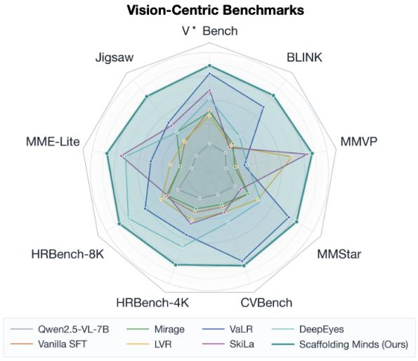
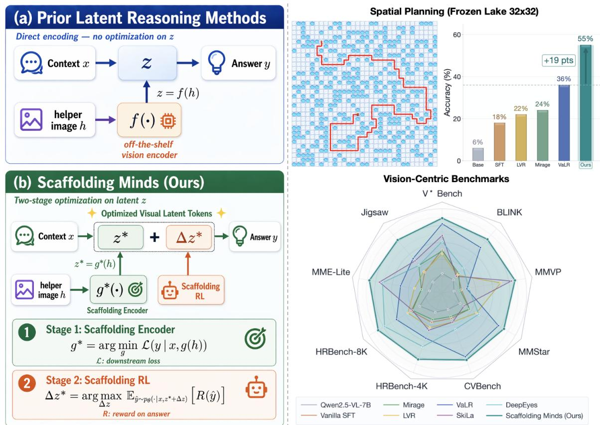
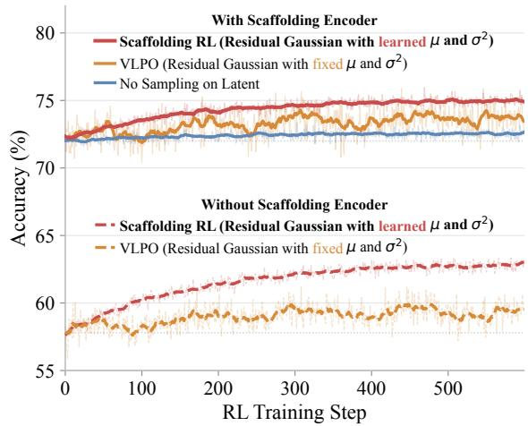
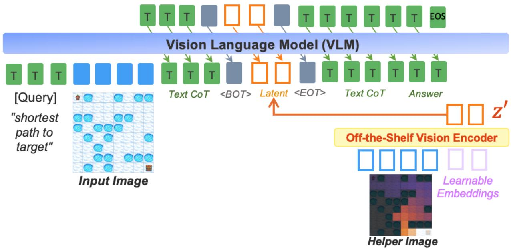
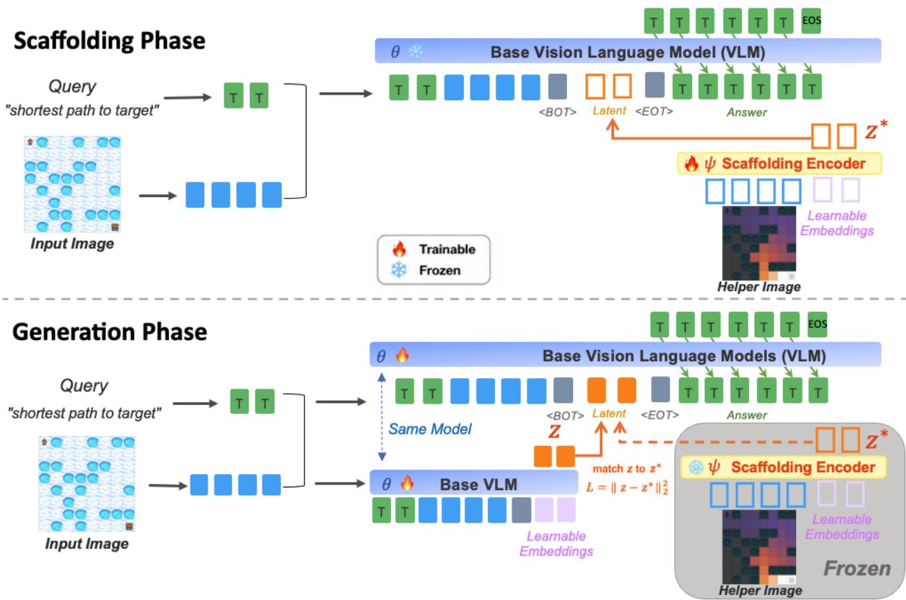
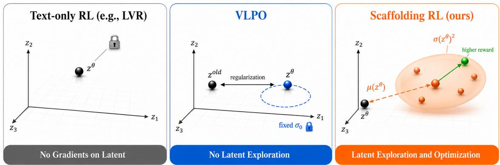
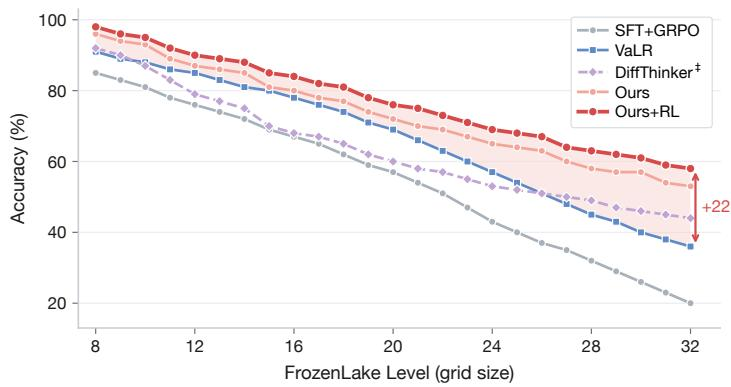
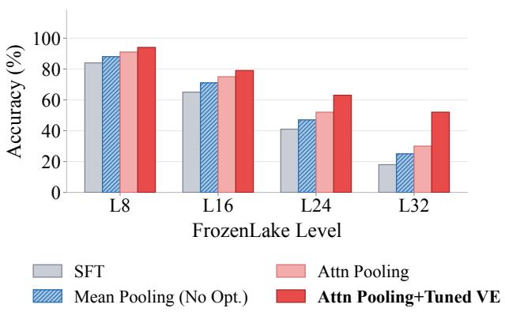

# Scafolding Minds: Optimizing Latent Visual Target Representations for Multimodal Reasoning

Haoqiang Kang<sup>1,2</sup>, Yinpeng Chen<sup>1</sup>, Luyang Liu<sup>1,\*</sup>, Jesper Sparre Andersen<sup>1</sup>, Abhijit Ogale<sup>1</sup>, Baochen Sun<sup>1</sup>, Lichan Hong<sup>1</sup> and Ed H. Chi<sup>1</sup>

<sup>1</sup>Google DeepMind, <sup>2</sup>UC San Diego, <sup>\*</sup>Work done at Google DeepMind.

Latent reasoning has advanced multimodal reasoning through a two-stage training paradigm: (1) a helper image is encoded into latent tokens to teach visual chain-of-thought during a supervisedfine-tuning (SFT) stage, and (2) these latent tokens are further refined with reward feedback during a reinforcement learning (RL) stage. In this paper, we identify two key limitations of this framework, one in each stage. First, the SFT stage typically relies on an of-the-shelf vision encoder to encode the helper image, yielding suboptimal latent representations that may not be well aligned with the downstream reasoning task. Second, existing RL methods treat the latent component only through deterministic regularization, which constrains policy drift but does not create alternative latent trajectories for exploration. To address these limitations, we propose Scafolding Minds. Our approach learns a dedicated scafolding encoder that provides an optimized target in latent space, and learns both the mean and variance of the RL sampler. We further show that these two improvements are complementary, together yielding substantial gains over strong baselines. Empirically, our method improves over the strongest latent-reasoning baseline by +9.5% on FrozenLake spatial planning, with the gain widening to +19% at 32×32 grid map, and by +5.2% on average across nine visual-centric reasoning benchmarks.

## 1. Introduction

Vision-language models (VLMs) have become increasingly capable at multimodal reasoning (Bai et al., 2025; Gemini Team, 2023; Liu et al., 2023). Methods such as Kojima et al. (2022); Wei et al. (2022); Xu et al. (2024); Zhang et al. (2024) rely on textual chain-of-thought, but lose important visual details (Fu et al., 2024; Tong et al., 2024b; Wu and Xie, 2024). To bridge this gap, latent visual reasoning Chen et al. (2025); Hao et al. (2024); Jeon et al. (2026); Li et al. (2025b); Qin et al. (2025); Tong et al. (2025); Wang et al. (2026); Yang et al. (2025b); Zhang et al. (2025a) has emerged as a compelling solution. By interleaving small blocks of latent visual tokens directly into the reasoning chain, these models can “think” in both text and vision. Typically, these methods follow a two-stage training paradigm. In Stage 1 (SFT), they leverage a helper image (e.g., an annotated crop) to provide guidance in the latent space (encoded by an of-the-shelf vision encoder). In Stage 2, they use reinforcement learning (RL) to further refine both latent and textual generation.

We identify a limitation at each stage of this paradigm. First, in the SFT stage, the latent target is obtained by encoding the helper image with an of-the-shelf vision encoder. Because this encoder is trained for general-purpose visual representation rather than the downstream reasoning objective, its features may preserve perceptual content that is irrelevant to the task while failing to emphasize the intermediate evidence needed for reasoning. The latent generator is therefore supervised toward a convenient but suboptimal target, limiting how much useful reasoning information can be learned even when the downstream model is trainable. Second, existing RL methods either update only text tokens or apply deterministic regularization to the latent block. Text-only objectives provide no direct likelihood or credit assignment for latent actions, whereas deterministic regularization only constrains how far a latent representation drifts from a reference. Without sampling alternative latent actions for exploration, reward optimization cannot discover more useful latent reasoning trajectories, yielding small or unstable gains as shown in Figure 2.



  
Figure 1 | Scafolding Minds. Left: Prior latent-reasoning methods derive latent targets by encoding a training-time helper image with a frozen of-the-shelf vision encoder. Our method instead learns a dedicated scafolding encoder that optimizes the latent target for downstream reasoning, then uses a learned Gaussian policy to sample reward-guided residual latent actions for direct exploration. Right: Scafolding Minds improves the strongest prior latent baseline by +9.5% on average on FrozenLake spatial planning, with the gain widening to +19% on the hardest 32×32 grids, and by +5.2% on average across nine visual-centric reasoning benchmarks.

In this paper, we present Scafolding Minds (Figure 1b) to address these two issues. First, for SFT stage, instead of using fixed of-the-shelf features as the target, we learn a scafolding encoder to encode a helper image into the latent target that is optimized for the reasoning task.

Second, we introduce Scafolding RL, which replaces deterministic latent regularization with an explicit Gaussian sampler over residual latent actions. Two lightweight heads learn its input-adaptive mean and variance, and the policy samples these actions during rollout to explore alternative latent reasoning trajectories (Figure 2). Moreover, we find the scaffolding encoder and scafolding RL are complementary, yielding performance boosts when combined.

  
Figure 2 | RL performance comparison on the FrozenLake benchmark (avg. L8–L32 accuracy).

  
Figure 3 | Latent reasoning for VLMs. Given the input x (image and query), the VLM inserts � continuous latent tokens z between the ⟨BOT⟩ and ⟨EOT⟩ markers and produces the final answer y. Existing methods supervise the latent block with features from a frozen of-the-shelf vision encoder � applied to a training-time helper image h.

We evaluate Scafolding Minds on FrozenLake spatial planning (across grid sizes from 8×8 to 32×32) and nine visual-centric reasoning benchmarks: V<sup>★</sup> Wu and Xie (2024), BLINK Fu et al. (2024), MMVP Tong et al. (2024b), MMStar Chen et al. (2024a), CV-Bench Tong et al. (2024a), HRBench-4K and HRBench-8K Wang et al. (2024a), MME-RealWorld-Lite Zhang et al. (2025c), and Jigsaw Lyu et al. (2025). Across all suites, our method consistently outperforms the strongest prior latent baseline. On FrozenLake, it raises average accuracy by +9.5%, with a gain of +19% on the most challenging 32×32 grids. Across the nine visual-centric reasoning benchmarks, we achieve an average accuracy increase of +5.2%.

## 2. Preliminary: Latent Reasoning for VLMs

Latent visual reasoning Hao et al. (2024); Jeon et al. (2026); Li et al. (2025b); Wang et al. (2026); Yang et al. (2025b) inserts a block of dedicated latent tokens z between ⟨BOT⟩ and ⟨EOT⟩ inside the VLM’s chain-of-thought (Figure 3), with their target set to the vision embedding of a helper image h produced by an of-the-shelf vision encoder �. The helper image h is only available at training time. Existing pipelines train the VLM in two stages: an SFT stage and an RL stage.

SFT stage. The goal of the SFT stage is to teach the VLM to generate the latent block z from the input image and text query alone (without the helper image), so that no helper image is needed at inference. Essentially, a frozen of-the-shelf vision encoder � (Figure 3) maps h to a target latent block, and the VLM is trained to match its generated latent tokens to this target while jointly fitting the answer y under next-token prediction.

RL stage. The SFT-stage model is further refined under a task reward (Figure 2). Existing latentreasoning RL methods handle the text and latent components diferently.

Text-centric policy optimization. Standard recipes apply GRPO Shao et al. (2024b) to the languagemodeling head, restricting policy optimization to the discrete text trajectory Li et al. (2025b). Given input x, the VLM samples � text trajectories and optimizes

$$
\mathcal { L } _ { \mathrm { t e x t - R L } } ( \theta ) = - \frac { 1 } { G } \sum _ { i = 1 } ^ { G } \frac { 1 } { T _ { i } } \sum _ { t = 1 } ^ { T _ { i } } \operatorname* { m i n } \bigl ( \rho _ { i , t } ( \theta ) A _ { i } , \mathrm { c l i p } \bigl ( \rho _ { i , t } ( \theta ) , 1 - \epsilon , 1 + \epsilon \bigr ) A _ { i } \bigr ) ,\tag{1}
$$

where $\rho _ { i , t } ( \boldsymbol { \theta } )$ is the current-to-old probability ratio for text token $t , A _ { i }$ is the group-relative advantage, and � is the clipping threshold. Because this objective defines policy probabilities only over discrete text tokens, it neither samples nor directly explores alternative actions in the continuous latent block.

Visual-Latent Policy Optimization (VLPO) Wang et al. (2026). VLPO additionally incorporates deterministic latent embeddings through a fixed-variance Gaussian formulation. For an old-policy rollout latent $\mathbf { z } _ { i , t } ^ { \mathrm { { o l d } } }$ and the current-policy deterministic output $\mathbf { z } _ { i , t } ^ { \theta }$ , its latent factor is

$$
r _ { i , t } ( \theta ) = \exp \left[ - \frac { 1 } { 2 \sigma _ { 0 } ^ { 2 } } \sum _ { j = 1 } ^ { d } \left( z _ { i , t , j } ^ { \mathrm { 0 l d } } - z _ { i , t , j } ^ { \theta } \right) ^ { 2 } \right] .\tag{2}
$$

Here, the current-policy output is the Gaussian mean, the old-policy rollout latent is the point being evaluated, and the variance $\sigma _ { 0 } ^ { 2 }$ is fixed. Thus, the Gaussian acts as latent regularization that penalizes drift between deterministic latent outputs. It is not a rollout distribution: VLPO does not sample a latent action from this Gaussian and therefore does not create alternative latent trajectories for exploration. Scafolding RL instead learns a Gaussian policy over residual latent actions, samples an action during rollout, and evaluates that same sampled action under both the current and old policies so reward can directly optimize latent-space exploration.

## 3. Method: Scafolding Minds

This section first identifies two limitations of existing latent visual reasoning pipelines, then presents Scafolding Minds, our two-stage framework that addresses both.

## 3.1. Motivation

Existing latent visual reasoning pipelines sufer from two limitations: (1) at the SFT stage, the latent target is produced by a frozen of-the-shelf vision encoder �, which is not optimized to capture reasoning-sensitive features from the helper image h; and (2) at the RL stage, existing methods either leave the latent block outside RL or use a deterministic, fixed-variance Gaussian formulation, without sampling latent actions for exploration.

Both limitations share a common root cause: the latent target is not optimized for the reasoning task, and RL does not directly explore alternative latent trajectories. To fill this gap, we propose Scafolding Minds (Figure 4): a scafolding encoder that learns the latent target end-to-end through the downstream task loss, and Scafolding RL that samples residual latent actions from an inputadaptive Gaussian whose mean and variance are conditioned on the generated latent.

## 3.2. Stage 1: SFT via Scafolding Encoder

The SFT stage is to learn an optimized latent target representation $\mathbf { z } ^ { * } \in \mathbb { R } ^ { K \times d }$ from the helper image h, and then use $\mathbf { z } ^ { \ast }$ as supervision to teach the VLM to produce its own latent block z from the input x alone, so that no helper image is needed at inference. As shown in Figure 4, we split this into two phases: (i) the Scafolding Phase trains a dedicated scafolding encoder with model parameters � to map h to the target $\mathbf { z } ^ { \ast }$ , optimized end-to-end through the frozen base VLM’s task loss; and (ii) the Generation Phase fine-tunes the VLM to regress its own latent block z toward the (now frozen) target $\mathbf { z } ^ { \ast }$ , while jointly fitting the answer y under next-token prediction. After Stage 1, the scafolding encoder � and helper image h are both discarded; only the VLM is used at inference.

  
Figure 4 | SFT stage of Scafolding Minds. Scafolding Phase (top): the scafolding encoder � is trained to compress the helper image into target latent tokens $\mathbf { z } ^ { \ast }$ that drive the frozen base VLM to produce the correct answer. Generation Phase (bottom): the VLM (�) is then trained to predict latent tokens z from the input x alone, supervised by $\ell _ { 2 }$ matching $\begin{array} { r } { \mathcal { L } = \| \mathbf { z } - \mathbf { z } ^ { * } \| _ { 2 } ^ { 2 } } \end{array}$ to the (now frozen) scafolding encoder’s targets, while the helper image is no longer used at inference.

Scafolding Phase. As illustrated in Figure 1, our key intuition is to replace the frozen of-the-shelf encoder � used by prior latent reasoning methods — which simply set the latent target to $f ( { \bf h } ) -$ with a learned function $g ^ { * } \colon \mathbf { h } \mapsto \mathbf { z } ^ { * }$ trained directly through the downstream task, so that the resulting $\mathbf { z } ^ { \ast }$ is optimized for reasoning rather than tied to a generic vision feature space.

We represent the optimized scafolding encoder as $g _ { \psi } ^ { * }$ . It is a trainable copy of the VLM’s vision encoder followed by a cross-attention pooling module (Figure 4, top). It encodes the helper image h into � latent tokens $\mathbf { z } ^ { \ast } = g _ { \psi } ^ { \ast } ( \mathbf { h } ) \in \mathbb { R } ^ { K \times d }$ , which are directly inserted at the latent positions of the VLM, after the input x, and the VLM produces the answer y. Given the training input x (image and text query) and the teacher-forced answer y, we freeze the base VLM and update only � end-to-end through the standard token-level cross-entropy loss $\mathcal { L } _ { \mathrm { C E } }$ on the answer tokens:

$$
\mathcal { L } _ { \mathrm { s c a f f o l d i n g } } ( \psi ) = \mathcal { L } _ { \mathrm { C E } } \big ( \mathbf { y } \big | \mathbf { x } , \mathbf { z } ^ { * } \big ) .\tag{3}
$$

In this way, the scafolding encoder learns to produce a $\mathbf { z } ^ { \ast }$ that captures exactly the reasoning-sensitive features the frozen VLM needs to answer correctly.

Generation Phase. Since the helper image h is unavailable at inference, the VLM is trained to predict its own latent block z that approaches the optimized target $\mathbf { z } ^ { \ast }$ from the input x alone (Figure 4, bottom).

Concretely, we freeze the scafolding encoder $g _ { \psi } ^ { * }$ and fine-tune the base VLM with parameters �. The latent tokens z are not generated autoregressively; instead, they are generated from � learnable embeddings that pass through the VLM transformer using the input x as context. This design speeds up inference by producing the latent tokens in a single forward pass. The answer text is then generated autoregressively from the input x and the latent block z (see Figure 4, bottom). We train the base VLM � with the following objective:

$$
\mathcal { L } _ { \mathrm { g e n e r a t i o n } } ( \theta ) = \lambda _ { \mathrm { l a t e n t } } \frac { 1 } { K } \sum _ { k = 1 } ^ { K } \left\| \mathbf { z } _ { k } - \mathbf { z } _ { k } ^ { * } \right\| _ { 2 } ^ { 2 } + \lambda _ { \mathrm { t a s k } } \mathcal { L } _ { \mathrm { C E } } \bigl ( \mathbf { y } \bigr | \mathbf { x } , \mathbf { z } \bigr ) ,\tag{4}
$$

where $\lambda _ { \mathrm { l a t e n t } }$ and $\lambda _ { \mathrm { t a s k } }$ balance the two terms. The first term pulls z toward the optimized target $\mathbf { z } ^ { \ast }$ from the Scafolding Phase; the second term ensures the answer remains correctly generated under the VLM-predicted z in place of $\mathbf { z } ^ { \ast }$

## 3.3. Stage 2: Scafolding RL

Prior latent-reasoning RL methods either optimize only the text trajectory or use a deterministic latent regularizer. Neither choice samples alternative latent actions, so neither directly explores latent reasoning trajectories. Scafolding RL instead defines an explicit, input-adaptive policy over residual latent actions and samples from it during rollout, as illustrated in Figure 5.

  
Figure 5 | Three Stage–2 RL paradigms in latent space. Left: text-only RL provides no direct gradients on latent actions. Middle: VLPO applies fixed-variance Gaussian regularization to deterministic latent outputs but does not sample latent actions. Right: Scafolding RL samples residual latent actions from a learned distribution and uses reward to optimize the latent tokens with exploration.

To solve this, we introduce Scafolding RL. We treat the generated latent prior $\mathbf { z } ^ { \theta } = f _ { \theta } ( \mathbf { x } , \mathbf { c } _ { \mathrm { p r e } } )$ as a base action and learn adaptive, reward-guided adjustments $\Delta _ { z } ^ { * }$ . Here, $\mathbf { c } _ { \mathrm { p r e } }$ denotes the optional text reasoning generated before the latent block. Crucially, the mean and variance of the Gaussian sampler are not fixed, but are learned as functions of the base action $\mathbf { z } ^ { \theta }$ . We predict them using two

MLP heads on top of the shared VLM hidden states:

$$
\Delta _ { z } \sim { \cal N } \Big ( \mu ( { \bf z } ^ { \theta } ) , \sigma ( { \bf z } ^ { \theta } ) ^ { 2 } \Big ) ,\tag{5}
$$

yielding the perturbed latent block $\mathbf { z } ^ { \theta } { + } \Delta _ { z }$ that replaces $\mathbf { z } ^ { \theta }$ in the forward pass. Because $\pmb { \mu } ( \mathbf { z } ^ { \theta } )$ and $\pmb { \sigma } ( \mathbf { z } ^ { \theta } )$ are dynamically conditioned on the generated latent prior, exploration scales adaptively—searching a broader continuous space when the prior is uncertain, and safely exploiting the prior when it is already optimal. To ensure stable initial exploration, the mean head is zero-initialized so that the initial distribution is centered on the generated latent prior, while the variance head begins at small positive values. This dynamic sampling stabilizes RL training and, as our experiments demonstrate, acts complementary to the Stage 1 scafolding encoder to yield substantial performance boosts.

## 4. Experiments

We evaluate Scafolding Minds in two complementary settings: spatial planning (Section 4.1), which requires multi-step reasoning over structured visual environments, and visual-centric reasoning (Section 4.2), which tests fine-grained evidence extraction and reasoning across real-world benchmarks.

Implementation. We use Qwen2.5-VL Bai et al. (2025) as the shared VLM backbone. In Stage 1 (Scafolding Encoder), we first train the scafolding encoder—which reuses the VLM vision encoder and compresses the helper image into �=4 latent tokens—while keeping the remaining VLM components frozen, and then freeze the scafolding encoder and train the shared VLM to generate the target latent block from the standard input alone. In Stage 2 (Scafolding RL), we apply reward-guided adjustments on top of the generated latent prior; the scafolding encoder is no longer used and the VLM and adjustment heads alone run at inference time.

Baselines. We compare against three families of methods: (i) supervised baselines without latent tokens, SFT and SFT+GRPO; (ii) latent visual reasoning methods that derive their targets from of-the-shelf vision features — LVR Li et al. (2025b), Mirage Yang et al. (2025b), CoVT Qin et al. (2025), Monet Wang et al. (2026), and VaLR Jeon et al. (2026); and (iii) image-generation methods that produce explicit intermediate images at inference time, VPRL Xu et al. (2025) and DifThinker He et al. (2025). On the visual-centric reasoning benchmarks we additionally compare against the thinking-with-images systems DeepEyes Zheng et al. (2025) and Thyme Zhang et al. (2025b), and the latent baseline SkiLa Tong et al. (2025).

## 4.1. Spatial Planning: FrozenLake

FrozenLake Wu et al. (2024) presents grid-based environments with obstacles (“holes”) requiring multi-step spatial planning: the agent outputs the complete path as directional moves (Up/Down/ Left/Right), receiving zero reward for paths through holes. We train on even levels from 8 to 32, spanning 8×8 to 32×32 grids, with 4,550 training examples in total. All grid images are padded to a unified 32×32 resolution before being encoded. We evaluate on 100 held-out test examples for each level and report four representative levels (8, 16, 24, 32). All baselines are trained and evaluated by us under the same setup; detailed training and evaluation splits are provided in the appendix.

Table 1 | FrozenLake results (accuracy %). All methods are trained on even Levels 8–32 and evaluated on four representative levels. Best in bold, second best underlined. Methods marked <sup>†</sup> use image-generation architectures. The Δ row reports the absolute improvement of Scafolding Encoder+RL over the SFT baseline.
<table><tr><td>Method</td><td>Lv.8 (8×8) Lv. 16 (16×16) Lv. 24 (24×24) Lv. 32 (32×32)</td><td></td><td></td><td></td><td>Avg.</td></tr><tr><td colspan="6">Base model &amp; supervised fine-tuning</td></tr><tr><td>SFT</td><td>84.0</td><td>65.0</td><td>41.0</td><td>18.0</td><td>52.0</td></tr><tr><td>SFT+GRPO</td><td>85.0</td><td>67.0</td><td>43.0</td><td>20.0</td><td>53.8</td></tr><tr><td colspan="6">Image-generation methods</td></tr><tr><td>VPRL† Xu et al. (2025)</td><td>88.0</td><td>62.0</td><td>48.0</td><td>35.0</td><td>58.3</td></tr><tr><td>DiffThinker† He et al. (2025)</td><td>92.0</td><td>68.0</td><td>53.0</td><td>44.0</td><td>64.3</td></tr><tr><td colspan="6">Latent reasoning methods</td></tr><tr><td>LVR Li et al. (2025b) Mirage Yang et al. (2025b)</td><td>86.0 87.0</td><td>69.0 71.0</td><td>45.0 47.0</td><td>22.0 24.0</td><td>55.5 57.3</td></tr><tr><td>CoVT Qin et al. (2025) Monet Wang et al. (2026) VaLR Jeon et al. (2026)</td><td>88.0 89.0 91.0</td><td>73.0 75.0 78.0</td><td>50.0 53.0 57.0</td><td>27.0 31.0 36.0</td><td>59.5 62.0 65.5</td></tr><tr><td>Scaffolding Encoder</td><td>94.0±0.5</td><td>79.0±0.6</td><td>63.0±0.6</td><td>52.0±0.7</td><td>72.0±0.4</td></tr><tr><td>Scaffolding Encoder+RL</td><td>96.0±0.4</td><td>82.0±0.5</td><td>67.0±0.6</td><td>55.0±0.7</td><td>75.0±0.3</td></tr><tr><td>Δ vs. SFT</td><td>+12.0</td><td>+17.0</td><td>+26.0</td><td>+37.0</td><td>+23.0</td></tr></table>

Main results. Table 1 and Figure 6 show a consistent pattern across maze complexity. First, compared with base methods, our full model improves average accuracy by 23.0% over the SFT baseline, indicating that latent visual reasoning remains valuable even on top of a strong base. Second, compared with latent reasoning baselines, our method gains 9.5% over the strongest prior approach. This gap is important because the latent baselines are trained with the same intermediate helper images; the advantage therefore comes from learning a better latent target space rather than from access to extra information. Our latent representation is optimized directly through downstream

  
Figure 6 | Per-level FrozenLake accuracy. Scafolding Minds (red) degrades gracefully as grid size grows, while baselines collapse faster. The shaded band highlights the steadily widening advantage of Ours + RL over the strongest latent baseline (VaLR), reaching +19% at Level 32.

task loss, which makes it more suitable for decision-relevant reasoning than targets inherited from general-purpose vision features. Third, compared with image-generation methods, our method improves by 10.7%. This suggests that explicitly generating intermediate images is not necessary to obtain strong visual reasoning, as long as the latent space itself captures the right reasoning structure. Figure 6 further shows that this advantage grows with dificulty: our method degrades more gracefully as the maze becomes larger, reaching a +19% gap over the strongest latent baseline at Level 32.

Table 2 | Visual-centric reasoning benchmark results (accuracy %). Bold: best; underlined: second best. <sup>†</sup>: reproduced via original checkpoint/code; <sup>‡</sup>: our re-implementation. CVB.=CVBench, HRB=HRBench, MME=MME-RealWorld-Lite, Jig.=Jigsaw.
<table><tr><td>Method</td><td>V*</td><td>BLINK</td><td>MMVP</td><td>MMStar</td><td>CVB.</td><td></td><td>HRB-4K HRB-8K</td><td>MME</td><td>Jig.</td><td>Avg.</td></tr><tr><td colspan="9">Closed-source models</td></tr><tr><td>GPT-40</td><td>66.0</td><td>60.0</td><td>70.7</td><td>61.6</td><td>80.1</td><td>59.0</td><td>55.5</td><td>52.0</td><td>53.0</td><td>62.0</td></tr><tr><td>GPT-4v</td><td>58.0</td><td>58.3</td><td>51.0</td><td>56.0</td><td>69.5</td><td>56.5</td><td>52.0</td><td>45.0</td><td>47.0</td><td>54.8</td></tr><tr><td>GPT-4o-mini</td><td>57.0</td><td>53.6</td><td>56.0</td><td>54.8</td><td>68.0</td><td>56.0</td><td>51.0</td><td>37.4</td><td>46.0</td><td>53.3</td></tr><tr><td>Claude 3.7-Sonnet</td><td>72.0</td><td>56.6</td><td>64.0</td><td>65.1</td><td>80.0</td><td>68.0</td><td>64.0</td><td>49.0</td><td>52.0</td><td>63.4</td></tr><tr><td colspan="9">Base model &amp; supervised fine-tuning</td></tr><tr><td>Qwen2.5-VL-7B</td><td>76.2</td><td>55.7</td><td>56.0</td><td>63.9</td><td>74.5</td><td>68.6</td><td>64.9</td><td>39.7</td><td>50.4</td><td>61.1</td></tr><tr><td>Vanilla SFT</td><td>81.3</td><td>57.2</td><td>58.5</td><td>66.0</td><td>77.0</td><td>70.5</td><td>66.8</td><td>42.0</td><td>52.5</td><td>63.5</td></tr><tr><td colspan="9">Tool-calling &amp; think-with-image methods</td></tr><tr><td>DeepEyes Zheng et al. (2025)</td><td>83.2†</td><td>59.3†</td><td>61.3†</td><td>67.7†</td><td>80.4†</td><td>75.1</td><td>72.6</td><td>53.2</td><td></td><td></td></tr><tr><td>Thyme Zhang et al. (2025b)</td><td>81.9</td><td>56.1</td><td>62.4†</td><td>65.9</td><td>79.8†</td><td>77.0</td><td>72.0</td><td>55.2</td><td>54.5† 54.8†</td><td>67.5 67.2</td></tr><tr><td colspan="9"></td></tr><tr><td>Mirage Yang et al. (2025b)</td><td>80.7</td><td>57.4</td><td>57.6</td><td>Latent reasoning methods 65.7÷</td><td>76.3</td><td>69.8</td><td>66.4</td><td>42.3</td><td>53.6</td><td>63.3</td></tr><tr><td>CoVT Qin et al. (2025)</td><td>78.0</td><td>56.0</td><td>58.7</td><td>68.9†</td><td>80.0</td><td>72.9</td><td>69.4</td><td>51.4†</td><td>52.7†</td><td>65.3</td></tr><tr><td>Monet Wang et al. (2026)</td><td>83.2</td><td>57.7†</td><td>60.3†</td><td>68.3†</td><td>79.7†</td><td>71.0</td><td>68.0</td><td>55.5</td><td>54.6†</td><td>66.5</td></tr><tr><td>LVR Li et al. (2025b)</td><td>81.7</td><td>56.7†</td><td>71.7</td><td>67.2†</td><td>78.3†</td><td>71.4†</td><td>67.6†</td><td>44.3†</td><td>52.4†</td><td>65.7</td></tr><tr><td>VaLR Jeon et al. (2026)</td><td>86.8</td><td>64.7</td><td>60.3</td><td>72.3</td><td>87.6</td><td>73.2</td><td>69.7</td><td>48.3</td><td>55.7</td><td>68.7</td></tr><tr><td>SkiLa Tong et al. (2025)</td><td>84.3</td><td>56.7</td><td>75.3</td><td>64.8</td><td>81.6†</td><td>72.0</td><td>66.5</td><td>54.1</td><td>53.9†</td><td>67.7</td></tr><tr><td>Scaffolding Encoder</td><td>87.4±0.5</td><td>64.8±0.4</td><td>73.3±0.5</td><td>72.1±0.4</td><td>86.4±0.4</td><td>73.6±0.5</td><td>71.1±0.5</td><td>53.4±0.6</td><td></td><td></td></tr><tr><td>Scaffolding Encoder+RL</td><td>90.6±0.4</td><td>67.2±0.4</td><td>76.7±0.5</td><td>73.5±0.4</td><td>88.4±0.4</td><td>77.5±0.4</td><td>74.1±0.5</td><td>57.3±0.5</td><td>56.0±0.5 59.7±0.4</td><td>70.9±0.3</td></tr><tr><td>Δ vs. Qwen2.5-VL-7B</td><td>+14.4</td><td>+11.5</td><td>+20.7</td><td>+9.6</td><td>+13.9</td><td>+8.9</td><td>+9.2</td><td>+17.6</td><td>+9.3</td><td>73.9±0.3 +12.8</td></tr></table>

## 4.2. Visual-Centric Reasoning Benchmarks

To demonstrate that Scafolding Minds generalizes beyond spatial planning, we evaluate on nine established visual-centric reasoning benchmarks: V<sup>★</sup> Wu and Xie (2024) (fine-grained attribute/spatial reasoning), BLINK Fu et al. (2024) (core perception), MMVP Tong et al. (2024b) (visual shortcomings), MMStar Chen et al. (2024a) (vision-indispensable), CVBench Tong et al. (2024a) (2D/3D understanding), HRBench-4K and HRBench-8K Wang et al. (2024a) (high-resolution), MME-RealWorld-Lite Zhang et al. (2025c) (real-world scenarios), and Jigsaw Lyu et al. (2025) (spatial reasoning). For these tasks, the scafold encoder uses annotated helper images such as cropped regions of interest and highlighted spatial relationships. We train on a mixture of open-source multimodal reasoning data, and provide the detailed data construction pipeline in Appendix A.1.

Results. Table 2 and Figure 1a show that the same latent-learning strategy transfers beyond Frozen-Lake. First, compared with the supervised fine-tuning baseline, our method improves the average score by 10.4%, showing that the learned latent space remains useful even on visual-centric reasoning benchmarks without explicit planning outputs. Second, compared with prior latent reasoning methods, our method improves the strongest prior average by 5.2%. The gain is smaller than on FrozenLake, but it is consistent across several benchmarks that require spatial discrimination and fine-grained visual comparison, suggesting that the benefit comes from learning better intermediate visual targets rather than from task-specific tuning. Third, compared with prior thinking-with-images style methods, our method improves the strongest prior average by 6.2%, indicating that strong visual-reasoning gains do not require generating additional images at inference time when the latent representation is already optimized for the downstream task.

The per-benchmark pattern provides additional insight. Our gains are concentrated on benchmarks that stress spatial and fine-grained visual distinctions: we improve by 20.7% on MMVP, by 17.6% on MME-RealWorld-Lite, and by 13.9% on CVBench relative to the base model. We also achieve the best results on CVBench, HRBench-4K, and HRBench-8K, which suggests that the learned latent space remains efective when precise regional evidence and higher-resolution understanding are required. The smallest relative gains appear on HRBench-4K (+8.9%) and Jigsaw (+9.3%), suggesting that very high-resolution and combinatorial spatial reasoning may benefit from stronger or more diverse training-time helper images than the current setup provides. Overall, the strongest gains appear where reasoning depends on selecting the right visual evidence rather than merely preserving generic image features.

## 4.3. Ablation on Key Contributions

SFT visual target ablation. To identify which Stage 1 design choice drives the gain over prior latent reasoning methods, we compare four Stage 1 configurations under the same Qwen2.5- VL-7B backbone with no Stage 2 RL applied: SFT without latent tokens as a control; Mean Pooling (No Opt.), the prior-work objective that L2-regresses latent tokens onto frozen of-theshelf vision-encoder features (Li et al., 2025b); Attn Pooling, which replaces L2 regression with cross-attention pooling and the downstream task loss but keeps the vision encoder frozen; and our Attn Pooling+Tuned VE, which additionally tunes the vision encoder through the same task loss. Each successive setting changes only one factor, isolating two design dimensions: the encoding objective and vision-encoder tunabil-

  
Figure 7 | Stage 1 visual target ablation on FrozenLake. Mean Pooling (No Opt.) uses the frozen of-the-shelf vision encoder; the other two settings use the downstream task loss.

ity. As shown in Figure 7, switching the objective from L2 regression to the downstream task loss with cross-attention pooling lifts accuracy by +4.3%, and additionally tuning the vision encoder lifts accuracy by a further +10.0%; together they account for the full +14.3% gap over the prior-work Mean Pooling (No Opt.) baseline. Target optimization, not the objective swap, drives the bulk of the improvement, supporting our central claim that the quality of the optimized latent target is the dominant factor in latent visual reasoning.

RL method comparison. To compare Stage 2 optimization under the same scafolding-encoder Stage 1 checkpoint, we apply three RL recipes: No Sampling on Latent, which applies GRPO to text tokens and leaves the latent block untouched; VLPO (Wang et al., 2026), which evaluates old-policy rollout latents with a fixed-variance Gaussian centered at the current-policy output but does not sample latent actions; and our Scafolding RL, which samples a Gaussian adjustment with learned mean and variance on top of the generated latent prior. As shown by the solid lines in Figure 2 (With Scafolding Encoder), No Sampling on Latent adds only +0.6% and quickly plateaus, while VLPO reaches +1.8% but fluctuates because its deterministic Gaussian formulation does not create alternative latent rollouts. Scafolding RL attains the largest and most stable gain of +3.0%. Sampling learned adjustments on top of the Stage 1 prior is essentialfor converting reward into reliable latent-space exploration.

Stage 1 and Stage 2 are complementary. Figure 2 compares the three Stage 2 RL methods With Scafolding Encoder (solid lines) and Without Scafolding Encoder (dashed lines, the prior-work frozen-VE mean-pool Stage 1). Without the scafolding encoder, our Scafolding RL yields a +5.2% gain — larger than the +3.0% with the scafolding encoder (more headroom) — yet finishes far below our pipeline’s final accuracy. Strikingly, the worst RL method with the scafolding encoder (No Sampling on Latent) still ends above the best RL method without it (Scafolding RL). This shows that Scafolding RL refines the target that Stage 1 establishes but cannot recover from a weak Stage 1; a strong scafolding encoder is what places the Stage 2 reward signal on a high-accuracy starting point in the first place.

## 4.4. Ablation on Hyperparameters

Number of latent tokens �. We sweep � ∈ {1, 2, 4, 8, 16} on FrozenLake (Levels 8–32) while keeping all other Stage 1 settings fixed (Table 3). Accuracy rises sharply from �=1 (63.5%) to �=4 (72.0%), then falls back at �=8 (70.8%) and �=16 (69.0%); �=4 is the best setting at every level. This non-monotonic pattern reflects two opposing pressures: too few tokens cannot encode a multi-step spatial plan, while too many tokens add redundancy that latent generation must learn to match. �=4 strikes the balance between expressiveness and learnability.

Table 3 | Number of latent tokens � on FrozenLake (Stage 1 only, accuracy %).
<table><tr><td>K</td><td>L8 L16</td><td>L24</td><td>L32</td><td>Avg.</td></tr><tr><td>1</td><td>85.0 70.0</td><td>54.0</td><td>45.0</td><td>63.5</td></tr><tr><td>2</td><td>88.0 74.0</td><td>57.0</td><td>48.0</td><td>66.8</td></tr><tr><td>4</td><td>94.0 79.0</td><td>63.0</td><td>52.0</td><td>72.0</td></tr><tr><td>8</td><td>93.0</td><td>78.0 61.0</td><td>51.0</td><td>70.8</td></tr><tr><td>16</td><td>91.0</td><td>76.0 59.0</td><td>50.0</td><td>69.0</td></tr></table>

Table 4 | Helper image choice on FrozenLake (Stage 1 only, accuracy %). Scafolding encoder ✓: our scafolding encoder is used; ×: a frozen of-the-shelf vision encoder is used as in prior work.
<table><tr><td>Helper image</td><td>Scaffold. enc.</td><td>L8</td><td>L16</td><td>L24</td><td>L32</td><td>Avg.</td></tr><tr><td>Red-arrow overlay</td><td>X √</td><td>85.0 92.0</td><td>67.0 76.0</td><td>52.0 58.0</td><td>40.0 46.0</td><td>61.0 68.0</td></tr><tr><td>Value-function heatmap</td><td>X √</td><td>85.0 94.0</td><td>66.0 79.0</td><td>50.0 63.0</td><td>39.0 52.0</td><td>60.0 72.0</td></tr></table>

Helper image choice. We cross two helper images on FrozenLake — the dense value-function heatmap (our default) and a sparse red-arrow overlay that draws the optimal path on the raw grid — with the choice between our scafolding encoder and a frozen of-the-shelf encoder (Table 4, 2×2). First, a frozen of-the-shelf encoder cannot exploit a richer helper image: with this encoder, the dense heatmap is actually slightly worse than the sparse red-arrow overlay (60.0 vs. 61.0), because the encoder was trained on natural images and hard to utilize the non-natural heatmap. Second, the scafolding encoder fixes this. It beats the of-the-shelf encoder for both helpers, with the largest gain on the non-natural heatmap (+12.0%, 60.0 → 72.0) versus only +7.0% on the red-arrow overlay (61.0 → 68.0); the ordering between helpers also flips, with the heatmap now beating the red-arrow overlay (72.0 vs. 68.0).

## 5. Related Work

Think about Image. This line of work treats the image as a static precondition and reasons about it purely in language space, extending textual chain-of-thought Kojima et al. (2022); Wei et al. (2022) to vision-language models such as Qwen2.5-VL Bai et al. (2025), LLaVA Liu et al. (2023), and Gemini Gemini Team (2023) by verbalizing the visual evidence into a natural-language reasoning chain Bavishi et al. (2023); Cheng et al. (2025); Dong et al. (2025); Mitra et al. (2024); Mondal et al. (2024); Shao et al. (2024a); Wei et al. (2024); Xu et al. (2024); Zhang et al. (2024). While efective for queries that can be summarized in text, this paradigm is constrained to discrete tokens and tends to be lossy for tasks that require carrying fine-grained spatial or perceptual evidence across multiple reasoning steps. In contrast, our method inserts continuous latent visual tokens directly into the reasoning chain, so the model can carry such evidence forward without verbalizing it.

Think with Image. A second line of work lets the model actively manipulate or generate intermediate images during reasoning. Tool-augmented systems call external tools or code to crop, zoom, or annotate the input Hu et al. (2024); Lu et al. (2023); Yang et al. (2023); Yao et al. (2023); imagegeneration systems autoregressively visualize new images Gu et al. (2025); Li et al. (2025c); Xu et al. (2025); Yang et al. (2025a); Zhang et al. (2025b) or use difusion-based generation He et al. (2025); and RL-driven variants train the VLM to decide when to invoke a tool or emit a new image Meng et al. (2025); Su et al. (2025); Zheng et al. (2025). These methods preserve visual evidence across reasoning steps but pay a substantial inference-time cost from explicit image manipulation or generation. In contrast, our method retains a similar multi-step visual reasoning capability while operating entirely in latent space, at near-base-VLM inference cost.

Latent Reasoning. A more recent line replaces explicit intermediate images with a compact block of continuous latent tokens inserted into the reasoning chain, building on observations that explicit chain-of-thought has its own limitations Chen et al. (2024b); Pinker (1994); Silver et al. (2016). On the text side, related work has explored pause and planning tokens Goyal et al. (2024); Wang et al. (2024b), compressed CoT Cheng and Van Durme (2024); Shen et al. (2025), continuous reasoning spaces Hao et al. (2024); Liu et al. (2024), latent internalization of CoT Deng et al. (2023, 2024); Zelikman et al. (2022), latent difusion Kang et al. (2025, 2026), and looped architectures Saunshi et al. (2025); Teoh et al. (2025). In the multimodal setting, prior methods derive the latent target from a frozen of-the-shelf vision encoder (e.g., SigLIP Tschannen et al. (2025)) applied to a helper image, through variants including L2 feature regression, vision-aligned distillation, policy-optimized embeddings, and sketchpad-style decoders Chen et al. (2025); Jeon et al. (2026); Li et al. (2025b); Qin et al. (2025); Tong et al. (2025); Wang et al. (2026); Yang et al. (2025b); Zhang et al. (2025a). Methodologically, this family is closely related to joint-embedding predictive architectures LeCun (2022) and learning-using-privileged-information Vapnik and Vashist (2009), and conceptually echoes the idea of fading instructional scafolds in cognitive science Vygotsky (1978); Wood et al. (1976). In contrast to prior multimodal latent methods that inherit a fixed general-purpose target from a frozen vision encoder, our method trains a scafolding encoder end-to-end through the downstream task loss — turning the latent target itself into an optimized component of the system — and pairs it with an input-adaptive RL sampler whose mean and variance are learned functions of the latent prior.

## 6. Conclusion

We present Scafolding Minds, a two-stage framework that addresses two limitations of latent visual reasoning. In Stage 1, we replace the of-the-shelf vision encoder used by prior work with a learnable scafolding encoder that produces a latent target optimized end-to-end for the reasoning task. In Stage 2, we introduce a learned Gaussian latent policy that samples residual actions around the Stage 1 prior, enabling reward-driven exploration of alternative latent reasoning trajectories rather than merely regularizing a deterministic latent output. The two stages are complementary, and together improve over the strongest prior latent baseline by +9.5% on FrozenLake spatial planning (widening to +19% at 32×32). These results show that both the quality of the latent target and direct exploration in latent space are important for latent visual reasoning.

## References

S. Bai, K. Chen, X. Liu, J. Wang, W. Ge, S. Song, K. Dang, P. Wang, S. Wang, J. Tang, H. Zhong, Y. Zhu, M. Yang, Z. Li, J. Wan, P. Wang, W. Ding, Z. Fu, Y. Xu, J. Ye, X. Zhang, T. Xie, et al. Qwen2.5-VL technical report. arXiv preprint arXiv:2502.13923, 2025.

R. Bavishi, E. Elsen, C. Hawthorne, M. Nye, A. Odena, A. Somani, and S. Taşırlar. Fuyu-8b: A multimodal architecture for ai agents. https://www.adept.ai/blog/fuyu-8b, 2023.

C. Chen, Z. Ma, Y. Li, Y. Hu, Y. Wei, W. Li, and L. Nie. Reasoning in the dark: Interleaved vision-text reasoning in latent space. arXiv preprint arXiv:2510.12603, 2025.

L. Chen, J. Li, X. Dong, P. Zhang, Y. Zang, Z. Chen, H. Duan, J. Wang, Y. Qiao, D. Lin, and F. Zhao. Are we on the right way for evaluating large vision-language models? In Advances in Neural Information Processing Systems (NeurIPS), 2024a.

Y. Chen, D. Hutchins, A. Jansen, A. Zhmoginov, D. Racz, and J. Andersen. MELODI: Exploring memory compression for long contexts. arXiv preprint arXiv:2410.03156, 2024b.

J. Cheng and B. Van Durme. Compressed chain of thought: Eficient reasoning through dense representations. arXiv preprint arXiv:2412.13171, 2024.

Z. Cheng, Q. Chen, X. Xu, J. Wang, W. Wang, H. Fei, Y. Wang, A. J. Wang, Z. Chen, W. Che, and L. Qin. Visual thoughts: A unified perspective of understanding multimodal chain-of-thought. In Advances in Neural Information Processing Systems (NeurIPS), 2025.

Y. Deng, K. Prasad, R. Fernandez, P. Smolensky, V. Chaudhary, and S. Shieber. Implicit chain of thought reasoning via knowledge distillation. arXiv preprint arXiv:2311.01460, 2023.

Y. Deng, Y. Choi, and S. Shieber. From explicit cot to implicit cot: Learning to internalize cot step by step. arXiv preprint arXiv:2405.14838, 2024.

Y. Dong, Z. Liu, H.-L. Sun, J. Yang, W. Hu, Y. Rao, and Z. Liu. Insight-V: Exploring long-chain visual reasoning with multimodal large language models. In Proceedings ofthe Computer Vision and Pattern Recognition Conference, pages 9062–9072, 2025.

X. Fu, Y. Hu, B. Li, Y. Feng, H. Wang, X. Lin, D. Roth, N. A. Smith, W.-C. Ma, and R. Krishna. BLINK: Multimodal large language models can see but not perceive. In European Conference on Computer Vision (ECCV), 2024.

Gemini Team. Gemini: A family of highly capable multimodal models. arXiv preprint arXiv:2312.11805, 2023.

S. Goyal, Z. Ji, A. S. Rawat, A. K. Menon, S. Kumar, and V. Nagarajan. Think before you speak: Training language models with pause tokens. In International Conference on Learning Representations (ICLR), 2024.

J. Gu, Y. Hao, H. W. Wang, L. Li, M. Q. Shieh, Y. Choi, R. Krishna, and Y. Cheng. ThinkMorph: Emergent properties in multimodal interleaved chain-of-thought reasoning. arXiv preprint arXiv:2510.27492, 2025.

S. Hao, S. Sukhbaatar, D. Su, X. Li, Z. Hu, J. Weston, and Y. Tian. Training large language models to reason in a continuous latent space. arXiv preprint arXiv:2412.06769, 2024.

Z. He, X. Qu, Y. Li, T. Zhu, S. Huang, and Y. Cheng. DifThinker: Towards generative multimodal reasoning with difusion models. arXiv preprint arXiv:2512.24165, 2025.

Y. Hu, W. Shi, X. Fu, D. Roth, M. Ostendorf, L. Zettlemoyer, N. A. Smith, and R. Krishna. Visual sketchpad: Sketching as a visual chain of thought for multimodal language models. In Advances in Neural Information Processing Systems (NeurIPS), 2024.

B. Jeon, Y. Jeong, H. Lee, M. Cho, and J. Shin. Vision-aligned latent reasoning for multi-modal large language model. arXiv preprint arXiv:2602.04476, 2026.

H. Kang, Y. Zhang, N. L. Kuang, N. Majamaki, N. Jaitly, Y.-A. Ma, and L. Qin. LaDiR: Latent difusion enhances LLMs for text reasoning. arXiv preprint arXiv:2510.04573, 2025.

H. Kang, Y. Zhang, N. L. Kuang, Y.-A. Ma, and L. Qin. Beyond mode elicitation: Diversity-preserving reinforcement learning via latent difusion reasoner. arXiv preprint arXiv:2602.01705, 2026.

T. Kojima, S. S. Gu, M. Reid, Y. Matsuo, and Y. Iwasawa. Large language models are zero-shot reasoners. Advances in Neural Information Processing Systems, 35, 2022.

Y. LeCun. A path towards autonomous machine intelligence. Open Review, 2022. URL https: //openreview.net/pdf?id=BZ5a1r-kVsf.

A. Li, C. Wang, D. Fu, K. Yue, Z. Cai, W. B. Zhu, O. Liu, P. Guo, W. Neiswanger, F. Huang, T. Goldstein, and M. Goldblum. Zebra-CoT: A dataset for interleaved vision language reasoning. arXiv preprint arXiv:2507.16746, 2025a.

B. Li, X. Sun, J. Liu, Z. Wang, J. Wu, X. Yu, H. Chen, E. Barsoum, M. Chen, and Z. Liu. Latent visual reasoning. arXiv preprint arXiv:2509.24251, 2025b.

C. Li, W. Wu, H. Zhang, Y. Xia, S. Mao, L. Dong, I. Vulic, and F. Wei. Imagine while reasoning in space: Multimodal visualization-of-thought. arXiv preprint arXiv:2501.07542, 2025c.

H. Liu, C. Li, Q. Wu, and Y. J. Lee. Visual instruction tuning. arXiv preprint arXiv:2304.08485, 2023.

L. Liu, J. Pfeifer, J. Wu, J. Xie, and A. Szlam. Deliberation in latent space via diferentiable cache augmentation. arXiv preprint arXiv:2412.17747, 2024.

P. Lu, B. Peng, H. Cheng, M. Galley, K.-W. Chang, Y. N. Wu, S.-C. Zhu, and J. Gao. Chameleon: Plugand-play compositional reasoning with large language models. In Advances in Neural Information Processing Systems, 2023.

Z. Lyu, D. Zhang, W. Ye, F. Li, Z. Jiang, and Y. Yang. Jigsaw-puzzles: From seeing to understanding to reasoning in vision-language models. In Proceedings of the 2025 Conference on Empirical Methods in Natural Language Processing (EMNLP), 2025.

F. Meng, L. Du, Z. Liu, Z. Zhou, Q. Lu, D. Fu, T. Han, B. Shi, W. Wang, J. He, K. Zhang, P. Luo, Y. Qiao, Q. Zhang, and W. Shao. MM-Eureka: Exploring the frontiers of multimodal reasoning with rule-based reinforcement learning. arXiv preprint arXiv:2503.07365, 2025.

C. Mitra, B. Huang, T. Darrell, and R. Herzig. Compositional chain-of-thought prompting for large multimodal models. In Proceedings of the IEEE/CVF Conference on Computer Vision and Pattern Recognition, pages 14420–14431, 2024.

D. Mondal, S. Modi, S. Panda, R. Singh, and G. S. Rao. Kam-cot: Knowledge augmented multimodal chain-of-thoughts reasoning. In Proceedings of the AAAI Conference on Artificial Intelligence, volume 38, 2024.

S. Pinker. The Language Instinct. William Morrow and Company, New York, 1994.

Y. Qin, B. Wei, J. Ge, K. Kallidromitis, S. Fu, T. Darrell, and X. Wang. Chain-of-visual-thought: Teaching VLMs to see and think better with continuous visual tokens. arXiv preprint arXiv:2511.19418, 2025.

N. Saunshi, N. Dikkala, Z. Li, S. Kumar, and S. J. Reddi. Reasoning with latent thoughts: On the power of looped transformers. In International Conference on Learning Representations (ICLR), 2025.

H. Shao, S. Qian, H. Xiao, G. Song, Z. Zong, L. Wang, Y. Liu, and H. Li. Visual cot: Advancing multi-modal language models with a comprehensive dataset and benchmark for chain-of-thought reasoning. arXiv preprint arXiv:2403.16999, 2024a.

Z. Shao, P. Wang, Q. Zhu, R. Xu, J. Song, M. Zhang, Y. Li, Y. Wu, and D. Guo. Deepseekmath: Pushing the limits of mathematical reasoning in open language models. arXiv preprint arXiv:2402.03300, 2024b.

X. Shen, Y. Wang, X. Shi, Y. Wang, P. Zhao, and J. Gu. Eficient reasoning with hidden thinking. arXiv preprint arXiv:2501.19201, 2025.

D. Silver, A. Huang, C. J. Maddison, A. Guez, L. Sifre, G. van den Driessche, J. Schrittwieser, I. Antonoglou, V. Panneershelvam, M. Lanctot, S. Dieleman, D. Grewe, J. Nham, N. Kalchbrenner, I. Sutskever, T. Lillicrap, M. Leach, K. Kavukcuoglu, T. Graepel, and D. Hassabis. Mastering the game of Go with deep neural networks and tree search. Nature, 529(7587):484–489, 2016.

Z. Su, L. Li, M. Song, Y. Hao, Z. Yang, J. Zhang, G. Chen, J. Gu, J. Li, X. Qu, and Y. Cheng. Open-ThinkIMG: Learning to think with images via visual tool reinforcement learning. arXiv preprint arXiv:2505.08617, 2025.

J. Teoh, M. Tomar, K. Ahn, E. S. Hu, P. Sharma, R. Islam, A. Lamb, and J. Langford. Next-latent prediction transformers learn compact world models. arXiv preprint arXiv:2511.05963, 2025.

J. Tong, J. Gu, Y. Lou, L. Fan, Y. Zou, Y. Wu, J. Ye, and R. Li. Sketch-in-latents: Eliciting unified reasoning in mllms. arXiv preprint arXiv:2512.16584, 2025.

S. Tong, E. Brown, P. Wu, S. Woo, M. Middepogu, S. C. Akula, J. Yang, S. Yang, A. Iyer, X. Pan, Z. Wang, R. Fergus, Y. LeCun, and S. Xie. Cambrian-1: A fully open, vision-centric exploration of multimodal LLMs. In Advances in Neural Information Processing Systems (NeurIPS), 2024a.

S. Tong, Z. Liu, Y. Zhai, Y. Ma, Y. LeCun, and S. Xie. Eyes wide shut? exploring the visual shortcomings of multimodal LLMs. In Proceedings of the IEEE/CVF Conference on Computer Vision and Pattern Recognition (CVPR), 2024b.

M. Tschannen, A. Gritsenko, X. Wang, M. F. Naeem, I. Alabdulmohsin, N. Parthasarathy, T. Evans, L. Beyer, Y. Xia, B. Mustafa, et al. Siglip 2: Multilingual vision-language encoders with improved semantic understanding, localization, and dense features. arXiv preprint arXiv:2502.14786, 2025.

V. Vapnik and A. Vashist. A new learning paradigm: Learning using privileged information. Neural Networks, 22(5-6):544–557, 2009.

L. S. Vygotsky. Mind in Society: The Development of Higher Psychological Processes. Harvard University Press, 1978.

Q. Wang, Y. Shi, Y. Wang, Y. Zhang, P. Wan, K. Gai, X. Ying, and Y. Wang. Monet: Reasoning in latent visual space beyond images and language. In Proceedings of the IEEE/CVF Conference on Computer Vision and Pattern Recognition (CVPR), 2026. URL https://arxiv.org/abs/2511.21395.

W. Wang, L. Ding, M. Zeng, X. Zhou, L. Shen, Y. Luo, and D. Tao. Divide, conquer and combine: A training-free framework for high-resolution image perception in multimodal large language models. arXiv preprint arXiv:2408.15556, 2024a.

X. Wang, L. Caccia, O. Ostapenko, X. Yuan, W. Y. Wang, and A. Sordoni. Guiding language model reasoning with planning tokens. arXiv preprint arXiv:2310.05707, 2024b.

J. Wei, X. Wang, D. Schuurmans, M. Bosma, B. Ichter, F. Xia, E. Chi, Q. V. Le, and D. Zhou. Chain-ofthought prompting elicits reasoning in large language models. In Advances in Neural Information Processing Systems, volume 35, pages 24824–24837, 2022.

L. Wei, W. Wang, X. Shen, Y. Xie, Z. Fan, X. Zhang, Z. Wei, and W. Chen. Mc-cot: A modular collaborative cot framework for zero-shot medical-vqa with llm and mllm integration. arXiv preprint arXiv:2410.04521, 2024.

D. Wood, J. S. Bruner, and G. Ross. The role of tutoring in problem solving. Journal of Child Psychology and Psychiatry, 17(2):89–100, 1976.

P. Wu and S. Xie. V\*: Guided visual search as a core mechanism in multimodal LLMs. In Proceedings of the IEEE/CVF Conference on Computer Vision and Pattern Recognition (CVPR), 2024.

Q. Wu, H. Zhao, M. Saxon, T. Bui, W. Y. Wang, Y. Zhang, and S. Chang. Vsp: Assessing the dual challenges of perception and reasoning in spatial planning tasks for vlms. arXiv preprint arXiv:2407.01863, 2024.

G. Xu, P. Jin, H. Li, Y. Song, L. Sun, and L. Yuan. Llava-cot: Let vision language models reason step-by-step. arXiv preprint arXiv:2411.10440, 2024.

Y. Xu, C. Li, H. Zhou, X. Wan, C. Zhang, A. Korhonen, and I. Vulić. Visual planning: Let’s think only with images. arXiv preprint arXiv:2505.11409, 2025.

J. Yang, S. Yang, A. W. Gupta, R. Han, L. Fei-Fei, and S. Xie. Thinking in space: How multimodal large language models see, remember, and recall spaces. In Proceedings of the IEEE/CVF Conference on Computer Vision and Pattern Recognition (CVPR), 2025a.

Z. Yang, L. Li, J. Wang, K. Lin, E. Azarnasab, F. Ahmed, Z. Liu, C. Liu, M. Zeng, and L. Wang. MM-REACT: Prompting ChatGPT for multimodal reasoning and action. arXiv preprint arXiv:2303.11381, 2023.

Z. Yang, X. Yu, D. Chen, M. Shen, and C. Gan. Machine mental imagery: Empower multimodal reasoning with latent visual tokens. arXiv preprint arXiv:2506.17218, 2025b.

S. Yao, J. Zhao, D. Yu, N. Du, I. Shafran, K. Narasimhan, and Y. Cao. ReAct: Synergizing reasoning and acting in language models. In International Conference on Learning Representations (ICLR), 2023.

E. Zelikman, Y. Wu, J. Mu, and N. Goodman. STar: Bootstrapping reasoning with reasoning. In Advances in Neural Information Processing Systems, 2022.

H. Zhang, W. Wu, C. Li, N. Shang, Y. Xia, Y. Huang, Y. Zhang, L. Dong, Z. Zhang, L. Wang, T. Tan, and F. Wei. Latent sketchpad: Sketching visual thoughts to elicit multimodal reasoning in MLLMs. arXiv preprint arXiv:2510.24514, 2025a.

Y.-F. Zhang, X. Lu, S. Yin, C. Fu, W. Chen, X. Hu, B. Wen, K. Jiang, C. Liu, T. Zhang, et al. Thyme: Think beyond images. arXiv preprint arXiv:2508.11630, 2025b.

Y.-F. Zhang, H. Zhang, H. Tian, C. Fu, S. Zhang, J. Wu, F. Li, K. Wang, Q. Wen, Z. Zhang, L. Wang, R. Jin, and T. Tan. MME-RealWorld: Could your multimodal LLM challenge high-resolution real-world scenarios that are dificult for humans? In International Conference on Learning Representations (ICLR), 2025c.

Z. Zhang, A. Zhang, M. Li, H. Zhao, G. Karypis, and A. Smola. Multimodal chain-of-thought reasoning in language models. Transactions on Machine Learning Research, 2024.

Z. Zheng, M. Yang, J. Hong, C. Zhao, G. Xu, L. Yang, C. Shen, and X. Yu. Deepeyes: Incentivizing “thinking with images” via reinforcement learning. arXiv preprint arXiv:2505.14362, 2025.

## A. Limitation and Future Work

In line with previous latent reasoning methods, our approach relies on the availability of an intermediate helper image during training; how to extend the framework to settings where such helper images are unavailable or expensive to obtain remains an open question. In addition, while we use value-function heatmaps as the natural helper-image choice for FrozenLake, we do not exhaustively search alternative helper-image designs, and automatically proposing helper images for new domains is left to future work.

## B. Scafolding RL: Detailed Derivation

This appendix provides the full mathematical derivation of the Scafolding RL objective summarized in Section 3.3.

Setup. Let x denote the model input (image and query), and let $\mathbf { z } ^ { \mathrm { o l d } } = f _ { \theta _ { \mathrm { o l d } } } ( \mathbf { x } )$ and $\mathbf { z } ^ { \theta } = f _ { \theta } ( \mathbf { x } )$ denote the Stage 1 latent priors produced by the rollout and current policies. Their Gaussian heads produce $\pmb { \mu } _ { k } ^ { \mathrm { o l d } } , \pmb { \sigma } _ { k } ^ { \mathrm { o l d } }$ and $\pmb { \mu } _ { k } ^ { \theta } , \pmb { \sigma } _ { k } ^ { \theta } .$ , respectively. For rollout �, the old latent policy samples a residual adjustment at each latent position �:

$$
\begin{array} { r } { \pmb { \delta } _ { i , k } ^ { \mathrm { o l d } } \sim \mathcal { N } \mathopen { } \mathclose \bgroup \left( \mu _ { k } ^ { \mathrm { o l d } } , ( \pmb { \sigma } _ { k } ^ { \mathrm { o l d } } ) ^ { 2 } \aftergroup \egroup \right) , \qquad \mathbf { a } _ { i , k } ^ { \mathrm { o l d } } = \mathbf { z } _ { k } ^ { \mathrm { o l d } } + \pmb { \delta } _ { i , k } ^ { \mathrm { o l d } } . } \end{array}\tag{6}
$$

Stacking all positions gives the rollout latent action $\mathbf { a } _ { i } ^ { \mathrm { o l d } } = [ \mathbf { a } _ { i , 1 } ^ { \mathrm { o l d } } , \ldots , \mathbf { a } _ { i , K } ^ { \mathrm { o l d } } ]$ . Conditioned on x and $\mathbf { a } _ { i } ^ { \mathrm { { o l d } } }$ the model samples a text answer $y _ { i } \sim \pi _ { \theta _ { \mathrm { o l d } } } ( \cdot \mid \mathbf { x } , \mathbf { a } _ { i } ^ { \mathrm { o l d } } )$ of length $T _ { i }$

Block-level latent importance ratio. We evaluate the same sampled latent action under the rollout and current factorized diagonal Gaussians:

$$
p _ { \vartheta } ( \mathbf { a } _ { i } ^ { \mathrm { o l d } } \mid \mathbf { x } ) = \prod _ { k = 1 } ^ { K } \prod _ { j = 1 } ^ { d } \frac { 1 } { \sqrt { 2 \pi } \sigma _ { k , j } ^ { \vartheta } } \exp \left[ - \frac { 1 } { 2 } \left( \frac { a _ { i , k , j } ^ { \mathrm { o l d } } - z _ { k , j } ^ { \vartheta } - \mu _ { k , j } ^ { \vartheta } } { \sigma _ { k , j } ^ { \vartheta } } \right) ^ { 2 } \right] , \qquad \vartheta \in \{ \theta , \theta _ { \mathrm { o l d } } \} ,\tag{7}
$$

where � indexes the � latent dimensions. The block-level latent importance ratio is $\rho _ { i } ^ { \mathrm { l a t } } ( \theta ) = p _ { \theta } ( \mathbf { a } _ { i } ^ { \mathrm { o l d } } \mid$ $\mathbf { x } ) / p _ { \theta _ { \mathrm { o l d } } } ( \mathbf { a } _ { i } ^ { \mathrm { o l d } } \mid \mathbf { x } )$

Token-level text importance ratio. For the discrete answer trajectory we use the standard per-token ratio: $\rho _ { i , t } ^ { \mathrm { t e x t } } ( \theta ) = \pi _ { \theta } ( \bar { y } _ { i , t } \mid y _ { i , < t } , \mathbf { x } , \mathbf { a } _ { i } ^ { \mathrm { o l d } } ) / \pi _ { \theta _ { \mathrm { o l d } } } ( y _ { i , t } \mid y _ { i , < t } , \mathbf { x } , \mathbf { a } _ { i } ^ { \mathrm { o l d } } )$

Combined clipped objective. Scafolding RL optimizes a GRPO-style clipped objective that sums the latent term and the text term:

$$
\begin{array} { r l } { \mathcal { L } _ { \mathrm { R L } } = \displaystyle - \frac { 1 } { G } \sum _ { i = 1 } ^ { G } \left[ \operatorname* { m i n } \Bigl ( \rho _ { i } ^ { \mathrm { l a t } } ( \theta ) A _ { i } , ~ \mathrm { c l i p } \bigl ( \rho _ { i } ^ { \mathrm { l a t } } ( \theta ) , 1 - \epsilon , 1 + \epsilon \bigr ) A _ { i } \Bigr ) \right. } & { } \\ { \displaystyle \left. + \frac { 1 } { T _ { i } } \sum _ { t = 1 } ^ { T _ { i } } \operatorname* { m i n } \Bigl ( \rho _ { i , t } ^ { \mathrm { t e x t } } ( \theta ) A _ { i } , ~ \mathrm { c l i p } \bigl ( \rho _ { i , t } ^ { \mathrm { t e x t } } ( \theta ) , 1 - \epsilon , 1 + \epsilon \bigr ) A _ { i } \Bigr ) \right] } & { } \\ { \displaystyle \left. + \frac { \beta _ { \mathrm { R L } } } { G } \sum _ { i = 1 } ^ { G } \frac { 1 } { T _ { i } } \sum _ { t = 1 } ^ { T _ { i } } D _ { \mathrm { R L } } \bigl ( \pi _ { \theta } ( \cdot \mid s _ { i , t } ) \mid \mid \pi _ { \mathrm { r e f } } ( \cdot \mid s _ { i , t } ) \bigr ) , \right. } & { } \end{array}\tag{8}
$$

where � is the GRPO clipping threshold, � is the rollout group size, $A _ { i }$ is the group-relative advantage, $s _ { i , t } = ( y _ { i , < t } , \mathbf { x } , \mathbf { a } _ { i } ^ { \mathrm { o l d } } )$ is the token-generation state, $\pi _ { \mathrm { r e f } }$ is the fixed Stage 1 reference policy, and $\beta _ { \mathrm { { K I } } }$ is the KL coeficient. Since the � latent tokens are predicted jointly, the latent term acts on the sampled latent block as a whole rather than on individual autoregressive steps. During Stage 2, �<sub>�</sub> and both Gaussian heads remain trainable; no gradient is stopped or detached through $\mathbf { z } ^ { \theta }$

## C. Experimental Setup Details

## C.1. FrozenLake

Data. We use the FrozenLake suite from VSP Wu et al. (2024). Training data covers even levels from 8 to 32 (8×8 to 32×32 grids), with the per-level training set growing from 50 examples at Level 8 to 650 at Level 32 in steps of 50, for a total of 4,550 training examples. Each level has a held-out test set of 100 examples that we use for evaluation. All grid images are padded to a unified 32×32 resolution before being passed to the vision encoder, so that token counts and positional encodings are constant across dificulty levels. The four representative levels reported in Table 1 (8, 16, 24, 32) are chosen to span the full dificulty range; per-level results across all even levels are provided in Appendix E.

Backbone and architecture. Unless noted otherwise, all results use Qwen2.5-VL-7B Bai et al. (2025) as the shared VLM backbone. The scafolding encoder is implemented as a trainable copy of the VLM’s vision encoder followed by a cross-attention pooling module that compresses the resulting visual tokens into �=4 latent tokens. Latent generation reuses the full VLM weights with �=4 learnable embeddings that attend to the shared representation to produce the latent block in a single forward pass. In Stage 2, the mean and variance heads are two-layer MLPs operating on the shared VLM hidden states at the latent positions.

Optimization. Stage 1 (scafolding encoder + latent generation) uses AdamW with learning rate $2 { \overset { - } { \times } } 1 0 ^ { - 5 }$ for latent generation and $5 \times 1 0 ^ { - 5 }$ for the scafolding encoder, weight decay 0.01, batch size 32, cosine schedule with linear warmup over the first 5% of steps, and BF16 mixed precision. We train for 3 epochs over the FrozenLake training set. Stage 2 (Scafolding RL) uses GRPO with rollout group size $G { = } 8$ , clipping $\scriptstyle \epsilon = 0 . 2 ,$ , learning rate $1 \times 1 0 ^ { - 6 }$ , and KL penalty $\beta _ { \mathrm { K L } } { = } 0 . 0 0 1$ against the Stage 1 model; the mean head is zero-initialized and the variance head is initialized to $\sigma { = } 0 . 0 5$ . Latent generation loss weights are $\lambda _ { \mathrm { l a t e n t } } { = } 1 . 0$ and $\lambda _ { \mathrm { t a s k } } { = } 0 . 5$ (default; see Appendix E.1).

Compute. All experiments use 8×NVIDIA A100 (80GB). Stage 1 takes approximately 7 hours per run; Stage 2 takes approximately 3 hours per run, giving a total of ∼10 hours per configuration. Inference is performed on a single A100.

Evaluation. We report exact-match accuracy: a generated path is correct only if it both reaches the goal and avoids every hole. The model outputs the full path as a sequence of directional moves (Up/Down/Left/Right); paths that pass through a hole are scored as zero reward, consistent with the VSP setup. All baselines are trained and evaluated by us under the identical data, backbone, and evaluation protocol.

## C.2. Visual-Centric Reasoning Benchmarks

Training data. We train on a mixture of open-source multimodal reasoning data covering all nine visual-centric reasoning benchmarks listed in Section 4.2. For each benchmark we use the oficial training split when available; for benchmarks without a designated training split (notably MMVP), we hold out 30% of the released questions as a test set and use the remaining 70% for training. Each Zebra-CoT training example already includes its paired intermediate helper image Li et al. (2025a), which the scafolding encoder consumes directly; we do not generate a separate helper image.

Hyperparameters. We reuse the same hyperparameters as for FrozenLake without further tuning: �=4 latent tokens, $\lambda _ { \mathrm { l a t e n t } } { = } 1 . 0 , \lambda _ { \mathrm { t a s k } } { = } 0 . 5$ , AdamW with the same schedule, and the same Stage 2 GRPO setup. Training runs for 2 epochs over the combined visual-centric reasoning mixture. Compute matches the FrozenLake setup (8×A100, ∼10 hours total).

Evaluation. We follow each benchmark’s standard protocol, which is multiple-choice accuracy on V<sup>★</sup>, BLINK, MMVP, MMStar, CVBench, HRBench-4K, HRBench-8K, MME-RealWorld-Lite, and Jigsaw.

## D. Helper Image Generation and Analysis

This appendix describes how the helper images used at training time are generated for each task family, lists the per-benchmark strategies, and analyzes the efect of helper image choice on FrozenLake.

## D.1. FrozenLake: Value-Function Heatmap

import numpy as np

```python
def value_iteration(grid, gamma=0.85, theta=1e-7):
"""Optimal state-value function for Frozen-Lake grid.
```

```python
Codes: 1=start, 2=goal, -1=hole, 0=safe."""
n_rows, n_cols = grid.shape
V = np.zeros_like(grid, dtype=float)
actions = [(-1,0), (1,0), (0,-1), (0,1)]
is_terminal = lambda r,c: grid[r,c] in (-1,2)
while True:
delta = 0.0
for r in range(n_rows):
for c in range(n_cols):
if is_terminal(r,c): continue
v_old = V[r,c]
V[r,c] = max(
((0. if grid[nr,nc]==-1 else
1. if grid[nr,nc]==2 else 0.)
+ gamma * (0. if grid[nr,nc] in (-1,2)
else V[nr,nc]))
if 0<=nr<n_rows and 0<=nc<n_cols
else gamma * V[r,c]
for dr,dc in actions
for nr,nc in [(r+dr, c+dc)])
delta = max(delta, abs(v_old - V[r,c]))
if delta < theta: break
V[grid == -1] = 0.0; V[grid == 2] = 1.0
return V
```

## D.2. Visual-Centric Reasoning Benchmarks

For visual-centric reasoning benchmarks, every Zebra-CoT training example already contains an intermediate helper image paired with its query Li et al. (2025a). The scafolding encoder consumes this provided helper image directly during Stage 1 training; we do not generate a separate helper image for these tasks.

## E. Additional Experimental Results

This appendix reports additional results on loss weights, model scale, eficient fine-tuning, and inference eficiency.

## E.1. Latent Generation Loss Weights

We sweep the matching weight $\lambda _ { \mathrm { l a t e n t } }$ and task weight $\lambda _ { \mathrm { t a s k } }$ of the Generation Phase objective on FrozenLake (Levels 8–32, Table 5). Both terms are useful but neither alone is suficient. Pure matching $( \lambda _ { \mathrm { t a s k } } { = } 0 , 6 4 . 8 )$ is the weakest setting: the predicted z matches $\mathbf { z } ^ { \ast }$ but receives no direct gradient on whether those matches help the VLM answer correctly. Pure task loss $( \lambda _ { \mathrm { l a t e n t } } { = } 0 , 6 7 . 0 )$ is stronger, but without a matching anchor the predicted latent can drift away from the scafolding encoder’s optimized target space. The default $\lambda _ { \mathrm { l a t e n t } } { = } 1 . 0 , \lambda _ { \mathrm { t a s k } } { = } 0 . 5$ achieves the best average accuracy (72.0%), with matching providing a stable learning signal and task supervision keeping the predicted latent useful for answer generation.

Table 5 | Latent generation loss weights on FrozenLake (Lv. 8–32, accuracy %). $\lambda _ { \mathrm { l a t e n t } }$ and $\lambda _ { \mathrm { t a s k } }$ weight the latent matching term and the task loss term, respectively.
<table><tr><td> $\lambda _ { \mathrm { l a t e n t } }$ </td><td> $\lambda _ { \mathrm { t a s k } }$ </td><td>L8 L16</td><td>L24</td><td>L32</td><td> $\mathbf { A v 8 \cdot }$ </td></tr><tr><td>1.0</td><td>0.0</td><td>88.0 72.0</td><td>54.0</td><td>45.0</td><td>64.8</td></tr><tr><td>0.0</td><td>1.0</td><td>90.0 75.0</td><td>56.0</td><td>47.0</td><td>67.0</td></tr><tr><td>1.0</td><td>0.5</td><td>94.0 79.0</td><td>63.0</td><td>52.0</td><td>72.0</td></tr><tr><td>1.0</td><td>1.0</td><td>92.0 77.0</td><td>60.0</td><td>51.0</td><td>70.0</td></tr><tr><td>0.5</td><td>1.0</td><td>93.0 78.0</td><td>62.0</td><td>52.0</td><td>71.3</td></tr></table>

## E.2. Efect of Model Scale and LoRA Fine-tuning

To check that the framework’s gains are not specific to the 7B backbone or to full fine-tuning, we repeat the FrozenLake experiment under two variants: a smaller Qwen2.5-VL-3B backbone, and a parameter-eficient LoRA setup on the same Qwen2.5-VL-7B backbone (rank �=32, �=64, dropout 0.05, applied to all attention and MLP projection matrices). Both runs use the same data, helper images, hyperparameters, and 3-seed evaluation as the main run; only the backbone size or trainability scope changes. Table 6 reports the joint result. At 3B scale, Scafolding Encoder+RL improves over the 3B SFT baseline by +17.0% on average, and the gap widens with grid size, reaching +18% at Level 32; its +5.5% improvement over the strongest prior latent baseline is preserved. The LoRA setup also improves by +17.0% over LoRA SFT, although its absolute average remains below 3B full fine-tuning (58.8% vs. 63.8%). Full fine-tuning at 7B remains the strongest configuration.

Table 6 | Efect of model scale and LoRA fine-tuning on FrozenLake (accuracy %). Left: Qwen2.5- VL-3B with full fine-tuning. Right: Qwen2.5-VL-7B with LoRA �=32. Our numbers are means over 3 seeds.
<table><tr><td></td><td colspan="5">Qwen2.5-VL-3B (full FT)</td><td colspan="5">Qwen2.5-VL-7B (LoRA r=32)</td></tr><tr><td>Method</td><td>Lv. 8</td><td>Lv.16</td><td>Lv. 24</td><td>Lv. 32</td><td>Avg.</td><td>Lv. 8</td><td>Lv. 16</td><td>Lv. 24</td><td>Lv. 32</td><td>Avg.</td></tr><tr><td>SFT</td><td>75.0</td><td>60.0</td><td>38.0</td><td>14.0</td><td>46.8</td><td>70.0</td><td>52.0</td><td>32.0</td><td>13.0</td><td>41.8</td></tr><tr><td>SFT+GRPO</td><td>76.5</td><td>62.0</td><td>40.0</td><td>16.0</td><td>48.6</td><td>71.0</td><td>54.0</td><td>34.0</td><td>14.0</td><td>43.3</td></tr><tr><td>LVR Li et al. (2025b)</td><td>78.0</td><td>63.0</td><td>41.0</td><td>18.0</td><td>50.0</td><td>73.0</td><td>56.0</td><td>36.0</td><td>16.0</td><td>45.3</td></tr><tr><td>Mirage Yang et al. (2025b)</td><td>79.0</td><td>65.0</td><td>43.0</td><td>20.0</td><td>51.8</td><td>74.0</td><td>58.0</td><td>38.0</td><td>18.0</td><td>47.0</td></tr><tr><td>VaLR Jeon et al. (2026)</td><td>83.0</td><td>71.0</td><td>51.0</td><td>28.0</td><td>58.3</td><td>80.0</td><td>65.0</td><td>44.0</td><td>24.0</td><td>53.3</td></tr><tr><td>Scaffolding Encoder</td><td>86.0±.6</td><td>73.0±.7</td><td></td><td>56.0±.7 30.0±.8</td><td>61.3±.6</td><td>84.0±.7</td><td>64.0±.8</td><td>48.0±.8</td><td>32.0±.8</td><td>57.0±.5</td></tr><tr><td>Scaffolding Encoder+RL</td><td>88.0±.5</td><td>76.0±.6</td><td></td><td>60.0±.7 32.0±.8</td><td>63.8±.4</td><td>82.0±.6</td><td>67.0±.7</td><td>51.0±.7</td><td>35.0±.8</td><td>58.8±.4</td></tr></table>

## E.3. Inference Eficiency

At inference time, the scafolding encoder is no longer used: only latent generation (Stage 1) and the lightweight adjustment heads (Stage 2) run alongside the base VLM. Latent generation adds �=4 latent tokens to the model’s forward pass and reuses the VLM’s vision encoder and first six Transformer layers; the adjustment heads are two small MLPs over the existing hidden states. End-to-end latency on a single A100 is 272 ms per query, a +4.6% overhead over the 260 ms Qwen2.5-VL-7B baseline (Table 7). Latent reasoning baselines all sit in a similar low-overhead regime (+2 to +8%), with the diferences driven primarily by the number of latent tokens � each method inserts and by whether they introduce additional auxiliary heads. Image-generation methods such as MVoT Li et al. (2025c) need to decode and re-encode a full intermediate image at each reasoning step, paying a >3× latency penalty over the base VLM. Scafolding Minds achieves stronger reasoning gains than these methods (Table 1) at less than 5% inference overhead.

Table 7 | Single-query latency on FrozenLake (single A100, BF16). Latency is wall-clock time for the full forward pass averaged over 100 queries; � is the number of latent tokens each method inserts (— for image-generation methods that emit a full image instead of latent tokens).
<table><tr><td>Method</td><td>K</td><td>Latency (ms)</td><td>Overhead vs. base</td></tr><tr><td>Qwen2.5-VL-7B (base)</td><td>一</td><td>260</td><td></td></tr><tr><td colspan="4">Latent reasoning methods</td></tr><tr><td>Mirage Yang et al. (2025b) LVR Li et al. (2025b)</td><td>4 4</td><td>266 267</td><td>+2.3% +2.7%</td></tr><tr><td>VaLR Jeon et al. (2026) SkiLa Tong et al. (2025)</td><td>4 4</td><td>268</td><td>+3.1% +3.5%</td></tr><tr><td>CoVT Qin et al. (2025)</td><td>269 8 274</td><td></td><td>+5.4%</td></tr><tr><td>Monet Wang et al. (2026)</td><td></td><td></td><td>+6.2%</td></tr><tr><td></td><td>8 276 4 272</td><td></td><td>+4.6%</td></tr><tr><td colspan="4">Scaffolding Encoder+RL (Ours)</td></tr><tr><td></td><td>Image-generation &amp; tool-calling methods</td><td></td><td></td></tr><tr><td>DeepEyes Zheng et al. (2025) Thyme Zhang et al. (2025b)</td><td></td><td>~540</td><td>+108%</td></tr><tr><td></td><td></td><td>~680</td><td>+162%</td></tr><tr><td>VPRL Xu et al. (2025)</td><td></td><td>~820</td><td>+215%</td></tr><tr><td>DiffThinker He et al. (2025)</td><td>~910</td><td></td><td>+250%</td></tr><tr><td>MVoT Li et al. (2025c)</td><td>~980</td><td></td><td>+277%</td></tr></table>