# StreamSoccer: Event-Driven Memory for Streaming Soccer Commentary

Chenxi Shao1,2 Bozhong Wang2,3 Jiaxin Huang2 Zhao Liu2 Sunwei Zhu2 Tianxin Hang2 Gaoqi He1 Yang Li1,\* Changbo Wang1,\*

1East China Normal University, Shanghai, China

2Migu Video Technology Co., Ltd., Shanghai, China

3South China University of Technology, Guangzhou, Guangdong, China

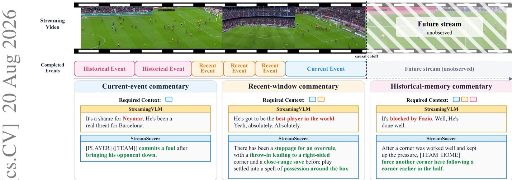  
Figure 1: Completed-event context under a causal stream. The three paired examples compare StreamingVLM and StreamSoccer within one 20-minute match segment selected to contain all three commentary tasks. Abstract window, and historical-memory commentary, ranking first on window. and historical-memory commentary, ranking first on

Streaming video understanding requires models to causally update state as video arrives and organize growing history into semantic units that can evolve, persist, and be recalled under bounded computation and memory. This challenge is especially pronounced in live soccer commentary, where a system must describe completed events, summarize recent play, recall earlier events, or remain silent using only information available before each utterance. We present StreamSoccer, an event-driven system that uses event memory as its intermediate representation. A fixed-budget active memory integrates the stream; completed event states are retained locally and consolidated into retrievable historical records. A unified generator uses current, recent, and historical context to produce three commentary modes, while a rule-assisted scheduler selects a mode or silence. Unlike general streaming video-language models that organize history around frames, visual tokens, or caches, and soccer-commentary methods that rely on predefined clips or output timestamps, StreamSoccer explicitly models event lifecycles. We construct a three-track streaming soccer commentary dataset and layered evaluation protocol. At common reference anchors, StreamSoccer obtains CIDEr scores of 38.62, 23.96, and 17.39 on current-event, recentthe current-event and historical-memory tracks and second on recent-window. Controlled ablations show that local completed events improve all tracks; the full system performs best on all three, with the largest additional gain on recent-window commentary. Across 174 raw-video runs on 58 matches, perminute RTF p95 remains approximately 0.10–0.22 without sustained growth with match history. These results indicate that event memory supports streaming soccer commentary across temporal scopes while controlling long-history compu tation.

## 1 Introduction

Streaming video understanding requires models to update their state continuously as video arrives and the future remains unobserved, while retaining information useful for downstream tasks under bounded computation and memory. This challenge is particularly acute in live soccer commentary: a system must continuously understand an evolving match process and generate commentary at appropriate moments across different temporal scopes. Existing soccer-commentary methods typically rely on predefined video clips, given output timestamps, or offline full-video input, whereas general streaming videolanguage models manage growing history by compressing frames, visual tokens, or key–value caches. These approaches offer strong video understanding and language generation, but usually do not treat an evolving semantic process as a state unit that must be maintained continuously, closed upon completion, and reused later.

This gap concerns not only the efficiency of history compression, but also the unit around which a streaming system should organize its state. A semantic process in soccer often spans multiple consecutive video clips: its relevant visual information accumulates as play unfolds and can continue to influence subsequent commentary after the process completes. Meanwhile, soccer commentary does not rely on a single temporal scale. Current-event commentary describes a justcompleted event, recent-window commentary aggregates several recent events, and historical-memory commentary recalls information formed earlier in the match. A suitable intermediate representation should therefore absorb new observations as an event develops, compress a variable-duration process into a fixed-budget state, form stable and reusable memory upon completion, and support both recent retention and historical retrieval. Event memory naturally matches these requirements: a state is activated and updated with an event, closed when the event completes, and subsequently retained, consolidated, and retrieved when needed. We therefore hypothesize that event memory is an effective intermediate representation for streaming soccer commentary.

Based on this hypothesis, we introduce StreamSoccer, an event-driven streaming soccer commentary system. Stream-Soccer maintains a fixed-budget active event memory as the match progresses and closes the current state as a completed event memory when an operational event ends. Recent completed events remain compact latent context, while completed memories can also be consolidated into retrievable textual records for later historical retrieval. A rule-assisted scheduler selects current-event commentary, recent-window commentary, historical-memory commentary, or silence; once a commentary mode is selected, a unified generator assembles the event context required by that mode and produces the corresponding commentary. Through this activate–update–close– consolidate–retrieve event lifecycle, StreamSoccer transforms a growing video history into fixed-budget states with explicit semantic roles.

To train and evaluate these capabilities, we construct threetrack streaming commentary data from SoccerNet action annotations and MatchTime commentary [3, 16]. Every sample has an explicit observation cutoff and source-event provenance; data construction checks for future information and uses match-disjoint splits. Evaluation separately examines commentary quality at controlled output anchors, the use of event memory and historical context, and runtime efficiency from raw-video input.

Our contributions are threefold:

(1) We formulate soccer commentary as a streaming generation task in which each output may use only information observable before its emission time. The task comprises three complementary tracks—current-event, recent-window, and historical-memory commentary—and is supported by a data pipeline with explicit observation cutoffs, source provenance, and match-disjoint splits.

(2) We introduce StreamSoccer, an event-driven streaming soccer commentary system that uses event memory as its intermediate representation. It continuously updates fixed-budget active-event state, retains and consolidates completed event memories, and supports unified commentary generation with recent context and historical retrieval, thereby organizing a growing video history into reusable event-level states.

(3) We evaluate StreamSoccer under distinct settings that separately measure three-track commentary quality at common reference anchors, the role of event memory, and long-history processing efficiency from raw-video input. StreamSoccer ranks first on current-event and historical-memory commentary and second on recent-window commentary; the complete event-memory system performs best across all three tracks in memory-scope ablations, while runtime efficiency shows no sustained degradation as match history grows.

## 2 Related Work

Soccer Commentary and Captioning. The SoccerNet series established foundational tasks and datasets for soccer video understanding [4]. SoccerNet-Caption formulates commentary as timestamped dense video captioning, MatchTime improves video–text alignment, and GOAL provides a knowledge-enhanced commentary benchmark [12, 13]. Time-Soccer, Towards Universal Soccer Video Understanding, and SoccerMaster further extend full-half modeling and soccer representation learning [15, 24, 26]. MatchAware conditions generation on preceding events, while GameSight combines entity-aware visual reasoning with external statistics and an evolving game state [8, 19]. These methods provide strong domain data and models but are generally evaluated on predefined clips, reference timestamps, or offline long videos. StreamSoccer instead maintains event state, consolidates completed events, and reuses them while operating along the match timeline.

Streaming Video-Language Models. Flash-VStream, VideoStreaming, and StreamFormer support continuous video processing through hierarchical compression, a fixed visual-token budget, and forward-only temporal modeling, respectively [14, 23, 27]. TimeChat-Online filters redundant visual tokens, while StreamingVLM maintains a compact key–value cache aligned with chunked streaming inference [22, 25]. VideoLLM-online converts offline temporal annotations into streaming dialogue supervision, while StreamBridge augments offline Video-LLMs with compressed memory and proactive activation [2, 21]. These systems demonstrate efficient continuous processing, but usually organize state as task-agnostic frames, tokens, or compressed history rather than around the evolution and lifecycle of soccer events.

Memory and Retrieval for Long Video Understanding. MART uses recurrent memory for coherent multi-sentence video description, while MovieChat and MA-LMM compress or write long visual histories into internal memory [5, 9, 18]. VideoRAG retrieves external video content, and SoccerComment applies preconstructed multimodal memory and retrievalaugmented prompting to soccer commentary [7, 10]. Their historical context is typically a generic internal state or a prebuilt corpus. In contrast, StreamSoccer derives retrievable event records from completed memories in the current stream and reuses them as historical context once they become available.

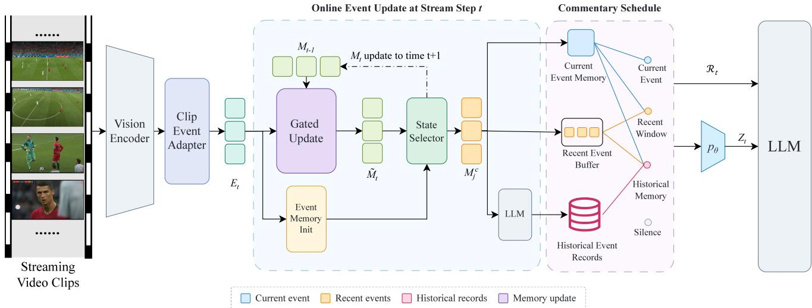  
Figure 2: Overview of StreamSoccer. Incoming clips are encoded as event tokens $E _ { t }$ and update the active event state. When an event closes, its completed memory $M _ { j } ^ { \mathrm { c } }$ supports current-event commentary, enters the Recent Event Buffer, and is converted into Historical Event Records. The rule-assisted schedule selects a commentary mode or silence. For generation, selected latent states are projected into $Z _ { t }$ , while retrieved records $\mathcal { R } _ { t }$ are provided as text.

## 3 Task Formulation: Streaming Soccer Commentary

Streaming soccer commentary is a generation task constrained by temporal visibility. We represent a match as a temporally ordered sequence of video clips $\mathcal { C } = \{ C _ { 1 } , \ldots , C _ { T } \}$ , where the clip $C _ { t }$ arriving at step t covers the interval $[ s _ { t } , e _ { t } ] . \mathrm { A t }$ decision step t, the system has an observation cutoff $\tau _ { t }$ and may access only clips $C _ { u }$ satisfying $e _ { u } \leq \tau _ { t }$ , together with auxiliary information formed by that cutoff.

Based on the match history visible by the cutoff, the system emits one commentary sentence $y _ { t }$ , or $\mathcal { D }$ to remain silent. Future video, events that have not yet occurred, the final match state, and any information formed after $\tau _ { t }$ cannot be used for the current output; using them in an input, conditioning signal, or target constitutes future leakage. This visibility constraint applies to training samples, controlled evaluation, and continuous timeline execution.

We define three complementary tracks according to the temporal scope of the commentary:

• Current-event commentary describes a just-completed match event, focusing on its local actions, development, and outcome.

• Recent-window commentary summarizes multiple recent match processes visible before the cutoff, capturing short-horizon trends, sequences of attacks and defenses, or recurring patterns.

• Historical-memory commentary connects the current or recent match process with earlier match information that was formed and available before the cutoff, producing commentary over a longer temporal scope.

The three tracks share the same temporal-visibility constraint but differ in the scope of history they require. This definition does not prescribe a particular event partition, memory representation, historical retrieval mechanism, or speaking scheduler.

## 4 Method: StreamSoccer

## 4.1 System Overview

As shown in Figure 2, the Vision Encoder and Clip Event Adapter map each incoming clip to fixed-budget event tokens $E _ { t }$ . Online Event Update compares the arriving tokens with the previous active memory, updates the ongoing state through gated integration, and uses the State Selector to continue that state or initialize a new one. When a reset closes the previous state, the completed event memory $M _ { j } ^ { \mathrm { c } }$ becomes available for current-event commentary and is retained in the Recent Event Buffer. Together, these operations implement the Streaming Event Memory Encoder described next.

The record branch converts completed event memories into textual Historical Event Records for later retrieval. At each decision point, the rule-assisted schedule selects current-event, recent-window, historical-memory commentary, or silence. For a non-silent mode, the Multi-Context Commentary Generator projects the required current and recent latent states through $P _ { \theta }$ into the soft prefix $Z _ { t } ;$ historical-memory commentary additionally supplies the retrieved records $\mathcal { R } _ { t }$ as text to the language model. This separates compact latent context from textual historical context while retaining one generation interface across the three commentary modes.

## 4.2 Streaming Event Memory Encoder

For each incoming clip $C _ { t } ,$ , a frozen Qwen3-VL visual encoder produces visual tokens. The Clip Event Adapter compresses them with learnable queries into a fixed number of clip-level event tokens:

$$
V _ { t } = \mathcal { F } _ { \mathrm { v i s } } ( C _ { t } ) , \qquad E _ { t } = \mathcal { A } ( V _ { t } ) \in \mathbb { R } ^ { K _ { m } \times d _ { m } } .\tag{1}
$$

Here, $E _ { t } [ 0 ]$ summarizes the current clip, while the remaining tokens retain distributed event information. Before incorporating the clip, the Operational Transition Head compares $E _ { t } [ 0 ]$ with the previous active state $M _ { t - 1 }$ and predicts the operational-transition indicator $b _ { t }$

When the clip continues the ongoing process, the memory absorbs incremental information through slot-wise gating:

$$
\widetilde { M } _ { t } = ( 1 - G _ { t } ) \odot M _ { t - 1 } + G _ { t } \odot \mathcal { U } ( M _ { t - 1 } , E _ { t } ) .\tag{2}
$$

Here, U denotes the candidate update after reading the current clip, and $G _ { t }$ controls the retention of existing information and the writing of new information in each memory slot. The state always contains $K _ { m }$ tokens, regardless of the number of clips spanned by the process.

In addition to predicted transitions, a maximum event duration $D _ { \mathrm { m a x } }$ provides a deterministic safeguard. Let $\rho _ { t }$ denote this duration safeguard. The final reset signal and state transition are

$$
\begin{array} { r l r } & { \rho _ { t } = [ \mathrm { d } \mathrm { u r } ( M _ { t - 1 } ) \geq D _ { \operatorname* { m a x } } ] , } & { r _ { t } = b _ { t } \vee \rho _ { t } , } \\ & { M _ { t } = ( 1 - r _ { t } ) \widetilde { M } _ { t } + r _ { t } \mathcal { T } ( E _ { t } ) , } & { M _ { j } ^ { \mathrm { c } }  M _ { t - 1 } } & { \mathrm { i f } \ r _ { t } = 1 . } \end{array}\tag{3}
$$

When $r _ { t } = 1 , M _ { t - 1 }$ is closed as the immutable completedevent memory $M _ { j } ^ { \mathrm { c } }$ , and the initializer I uses the current clip $E _ { t }$ to establish the new $M _ { t }$ . The learned $b _ { t }$ represents an operational transition, whereas $\rho _ { t }$ serves only as a deterministic duration safeguard. Training uses teacher-forced resets and excludes duration-safeguard positions from positive transition supervision. At inference, resets are controlled jointly by the predicted $b _ { t }$ and deterministic $\rho _ { t }$ . The remaining active state is closed as the final completed-event memory at the end of the stream.

## 4.3 Memory-to-Record Consolidation

A completed-event memory $M _ { j } ^ { \mathrm { c } }$ encodes the visual development of an event in a compact latent form. Memory-to-Record Consolidation maps it through the memory-to-language projector $P _ { \theta } ( \cdot )$ to a fixed-length soft prefix. Conditioned on this prefix and the minimal causally available match context $x _ { j } ^ { \mathrm { { c t x } } }$ at event closure, the language model generates an event-record caption $c _ { j }$ , followed by deterministic record assembly:

$$
\begin{array} { r } { p \big ( c _ { j } \mid { \cal P } _ { \theta } ( M _ { j } ^ { \mathrm { c } } ) , x _ { j } ^ { \mathrm { c t x } } \big ) , \qquad } \\ { { \cal R } _ { j } = \mathrm { A s s e m b l e } ( \mathrm { m e t a d a t a } _ { j } , c _ { j } ) . } \end{array}\tag{4}
$$

The fixed-length prefix keeps the language-model interface independent of the number of clips within an event. The caption $c _ { j }$ summarizes the event’s actions, progression, and outcome, while structured metadata and source-event provenance are populated deterministically. At event closure, $M _ { j } ^ { \mathrm { c } }$ immediately enters the local event-memory buffer $B _ { t } ;$ ; in parallel, the record branch asynchronously completes caption generation, deterministic assembly, and storage, after which the ready $R _ { j }$ enters $\mathcal { L } _ { t }$ for historical retrieval.

## 4.4 Multi-Context Commentary Generator

The Multi-Context Commentary Generator shares the memoryto-language projector $P _ { \theta } ,$ , language model, and decoding process across the three tracks, while each track uses a trackspecific context configuration. Let $\mathcal { B } _ { t } ^ { \mathrm { s e l } } \subseteq \mathcal { B } _ { t }$ denote the selected local completed-event memories at time t, and let $\left[ \cdot ; \cdot \right]$ denote memory concatenation. The latent soft prefix is

$$
Z _ { t } = \left\{ \begin{array} { l l } { P _ { \theta } ( M _ { j } ^ { \mathrm { c } } ) , } & { \mathrm { c u r r e n t - e v e n t } , } \\ { P _ { \theta } \left( [ M _ { t } ; { \mathcal { B } _ { t } ^ { \mathrm { s e l } } } ] \right) , } & { \mathrm { r e c e n t / h i s t o r i c a l } . } \end{array} \right.\tag{5}
$$

Current-event commentary uses the just-closed completedevent memory $M _ { j } ^ { \mathrm { c } }$ . Recent-window and historical-memory commentary concatenate the active event memory $M _ { t }$ with selected local completed-event memories and compress them with $P _ { \theta }$ into a fixed-length soft prefix. Historical-memory commentary additionally serializes retrieved records $\mathcal { R } _ { t } \subseteq \mathcal { L } _ { t }$ as prompt text, allowing the shared generator to combine current and recent latent context with retrieved historical record text.

## 4.5 Online Runtime and Rule-Assisted Scheduling

At decision step $t ,$ long-term retrieval filters $\mathcal { L } _ { t }$ by temporal range and ranks eligible records with the LTM retrieval query projection, returning the top-k records $\mathcal { R } _ { t }$ Given the just-completed event, local memories, retrieved records, and commentary cadence, a deterministic ruleassisted scheduler selects $\delta _ { t } \in \mathsf { \Gamma }$ {silence, current-event, recent-window, historical-memory}.

Current-event mode requires a salient just-completed event and a satisfied cooldown; recent-window mode requires sufficient completed events and passes periodic and eventproximity gates; historical-memory mode requires records that satisfy temporal, relevance, and cooldown conditions. Otherwise, the system remains silent. When multiple modes are eligible, a fixed priority selects one mode and its context configuration; non-silent decisions invoke the Multi-Context Commentary Generator. The learned query projection only ranks historical candidates, whereas the rule-assisted policy determines speaking time, commentary mode, and context configuration. The scheduler uses fixed thresholds, priorities, cooldowns, and queue parameters, while evaluation-specific interventions are defined by the experimental protocol.

## 4.6 Training Objectives

StreamSoccer uses three training stages for event-memory learning, memory-to-record consolidation, and multi-context commentary generation. The visual encoder and pretrained language-model backbone remain frozen, with language-side adaptation implemented through LoRA [6].

Stage 1 trains the Streaming Event Memory Encoder with four complementary objectives:

$$
\begin{array} { r l } & { { \mathcal { L } } _ { \mathrm { S t a g e 1 } } = \alpha _ { \mathrm { c l i p } } { \mathcal { L } } _ { \mathrm { c l i p } } + \alpha _ { \mathrm { t r } } { \mathcal { L } } _ { \mathrm { t r } } } \\ & { ~ + \alpha _ { \mathrm { e v t - a c t } } { \mathcal { L } } _ { \mathrm { e v t - a c t } } + \alpha _ { \mathrm { e v t - t y p e } } { \mathcal { L } } _ { \mathrm { e v t - t y p e } } . } \end{array}\tag{6}
$$

Here, ${ \mathcal L } _ { \mathrm { c l i p } }$ uses asymmetric loss [17] for sparse multi-label action recognition on every clip, and $\mathcal { L } _ { \mathrm { t r } }$ uses focal binary cross-entropy [11] for operational-transition prediction at valid positions. Upon event completion, $\mathcal { L } _ { \mathrm { e v t - a c t } }$ uses focal binary cross-entropy to supervise the multi-label action set, while $\mathcal { L } _ { \mathrm { e v t - t y p e } }$ uses cross-entropy for the coarse event type. Duration-safeguard positions are masked from operationaltransition supervision.

Stage 2 trains the memory-to-language projector and language-model LoRA parameters to generate $c _ { j }$ from $M _ { j } ^ { \mathrm { c } }$ Its autoregressive objective $\mathcal { L } _ { \mathrm { S t a g e 2 } }$ is applied only to assistant caption tokens.

Stage 3 is initialized from the first two stages and optimizes the trainable modules enabled in the reported configuration over all three commentary tracks. The task-balanced $\mathcal { L } _ { \mathrm { g e n } }$ supervises commentary generation, while $\mathcal { L } _ { \mathrm { r e t a i n } }$ reuses the four Stage 1 objectives to preserve event semantics. The memorycontext objective ${ \mathcal { L } } _ { \mathrm { r o u t e } }$ supervises the required memory context, $\mathcal { L } _ { \mathrm { l o c a l } }$ ranks recent candidate events, and $\mathcal { L } _ { \mathrm { r e t r } }$ ranks historical candidate records. The latter two ranking losses are computed only when valid positive and negative evidence is available.

The complete Stage 3 objective is

$$
\begin{array} { r l } & { \mathcal { L } _ { \mathrm { S t a g e 3 } } = \lambda _ { \mathrm { g e n } } \mathcal { L } _ { \mathrm { g e n } } + \lambda _ { \mathrm { r e t a i n } } \mathcal { L } _ { \mathrm { r e t a i n } } } \\ & { ~ + \lambda _ { \mathrm { r o u t e } } \mathcal { L } _ { \mathrm { r o u t e } } + \lambda _ { \mathrm { l o c a l } } \mathcal { L } _ { \mathrm { l o c a l } } + \lambda _ { \mathrm { r e t r } } \mathcal { L } _ { \mathrm { r e t r } } . } \end{array}\tag{7}
$$

The three context-selection objectives provide auxiliary supervision for memory use. At runtime, the rule-assisted scheduler determines the commentary mode and local context selection, while the query projection learned through $\mathcal { L } _ { \mathrm { { r e t r } } }$ ranks event records. This separates learned context ranking from deterministic runtime decisions.

## 5 Experiments

We evaluate StreamSoccer through common-anchor commentary quality, raw-video efficiency as match history grows, event-memory representation and context ablations, and a qualitative case study.

## 5.1 Experimental Setup

Datasets and Splits. We construct three-track streaming soccer commentary data from SoccerNet action annotations and MatchTime commentary. The dataset contains 27,639 samples: 15,189 current-event, 7,127 recent-window, and 5,323 historical-memory examples. Each sample has an explicit observation cutoff. The training, validation, and test splits contain 19,641, 4,209, and 3,789 samples, respectively, and are match-disjoint.

SoccerNet provides human-annotated action timestamps but not event intervals. We use deterministic football rules based on action categories and temporal order to organize consecutive clips into rule-derived operational events. Action-triggered event starts form positive operational-transition targets, while within-event clips form negatives. To bound the duration of a state, an active event is closed after 24 s and the next clip initializes a new state. This duration safeguard limits state length and is not treated as a positive operational transition.

Event-focused MatchTime descriptions are aligned to operational events by match, half, temporal proximity, and action compatibility, with each description assigned to at most one event. The aligned text and deterministic time, action, and event-type metadata form data-side reference records for three commentary tracks: current-event targets rewrite an aligned description as post-event commentary; recent-window targets use only video and completed local events available before the observation cutoff; and historical-memory targets additionally associate earlier eligible events from the same match and half. Data-side reference records are used only to construct supervision, whereas runtime event records are generated from completed event memory. Automated checks ensure that all conditioning information is available before the observation cutoff and retain the corresponding source-event identifiers.

Evaluation Design. Common-anchor evaluation fixes the task type, observation cutoff, and reference emission time, and discloses current-event alignment and record-readiness interventions. Raw-video evaluation additionally includes video decoding, online visual encoding, and runtime prediction. Mechanism experiments distinguish retrained structural variants from inference-time interventions.

Baselines and Metrics. Strict comparisons share the test split, cutoff, output anchor, input scope, and decoding budget; results that cannot satisfy this contract are reported as compati bility comparisons. We report track-wise BLEU-4, CIDEr [20], and BERTScore-F1 [28]. We compute BERTScore-F1 for all methods using RoBERTa-large at layer 17. Memory-to-record representation experiments additionally report token-level F1, METEOR, and ROUGE-L. Raw-video efficiency is measured by the 95th-percentile real-time factor (RTF) of the per-minute workload.

<table><tr><td rowspan="2">Method</td><td rowspan="2">Frames</td><td rowspan="2">Stream</td><td rowspan="2">Soccer FT</td><td colspan="3">Current-event</td><td colspan="3">Recent-window</td><td colspan="3">Historical-memory</td></tr><tr><td>CIDEr</td><td>B@4</td><td>BS</td><td>CIDEr</td><td>B@4</td><td>BS</td><td>CIDEr</td><td>B@4</td><td>BS</td></tr><tr><td colspan="10">Proprietary MLLMs</td><td></td><td></td><td></td><td></td></tr><tr><td>GPT-5.4</td><td></td><td></td><td></td><td>5.93</td><td>0.0215</td><td>0.8586</td><td>14.28</td><td>0.0585</td><td>0.8784</td><td>7.75</td><td>0.0405</td><td>0.8723</td></tr><tr><td>Qwen3.6-Max-Preview</td><td>16</td><td></td><td></td><td>1.00</td><td>0.0092</td><td>0.8613</td><td>3.23</td><td>0.0131</td><td>0.8576</td><td>3.95</td><td>0.0194</td><td>0.8655</td></tr><tr><td colspan="10">Streaming VLMs</td><td colspan="3"></td></tr><tr><td>StreamingVLM (ICLR2026)</td><td></td><td>2 FPS</td><td></td><td>0.7351</td><td>0.0018</td><td>0.4337</td><td>0.0532</td><td>0.0015</td><td>0.4398</td><td>0.0313</td><td>0.0000</td><td>0.4464</td></tr><tr><td>TimeChat-Online (ACM MM2025)</td><td>2 FPS</td><td>√ √</td><td></td><td>1.2771</td><td>0.0000</td><td>0.4042</td><td>0.9740</td><td>0.0000</td><td>0.4685</td><td>1.0078</td><td>0.0000</td><td>0.4494</td></tr><tr><td>VideoLLM-online (CVPR2024)</td><td>2 FPS</td><td>√</td><td></td><td>0.1595</td><td>0.0000</td><td>0.2345</td><td>0.0443</td><td>0.0000</td><td>0.2008</td><td>0.0477</td><td>0.0000</td><td>0.2393</td></tr><tr><td colspan="10">Soccer-Specific Models</td><td colspan="3"></td></tr><tr><td>UniSoccer (CVPR2025)</td><td>30</td><td></td><td>√</td><td>30.97</td><td>0.2719</td><td>0.6782</td><td>27.85</td><td>0.0730</td><td>0.6510</td><td>5.69</td><td>0.0317</td><td>0.5679</td></tr><tr><td>SoccerMaster (CVPR2026)</td><td>30</td><td></td><td>√</td><td>33.35</td><td>0.2650</td><td>0.6827</td><td>23.46</td><td>0.0569</td><td>0.5984</td><td>7.37</td><td>0.0273</td><td>0.5418</td></tr><tr><td>StreamSoccer (Ours)</td><td>2 FPS</td><td>√</td><td>√</td><td>38.62</td><td>0.2929</td><td>0.9734</td><td>23.96</td><td>0.0652</td><td>0.9612</td><td>17.39</td><td>0.0451</td><td>0.9636</td></tr></table>

Table 1: Commentary quality at shared causal output anchors. We report CIDEr, BLEU-4 (B@4), and BERTScore-F1 (BS) for current-event, recent-window, and historical-memory commentary; higher is better. CIDEr uses the 100× scale. Bold and underlined values denote the best and second-best result for each metric within each track.

## 5.2 Commentary Quality

Table 1 compares inference at common reference anchors.

The proprietary MLLMs receive 16 track-specific sparse RGB frames per anchor. StreamingVLM, TimeChat-Online, and VideoLLM-online process the timelines at 2 FPS, with metrics conditioned on valid outputs. UniSoccer and SoccerMaster are retrained on match-disjoint current-event and recent-window data and receive 30 causal frames; their historical rows are test-only sparse-history diagnostics without historical-memory training. StreamSoccer uses referenceanchored replay over 126 half streams, with oracle operationalevent closures, current-event alignment, label-assisted action/type metadata, and record-readiness interventions.

StreamSoccer obtains the highest reported CIDEr on current-event and historical-memory commentary and ranks second on recent-window commentary, behind UniSoccer. B@4 shows the same ordering on current-event and recentwindow commentary, while StreamSoccer also ranks first on the historical-memory track. Recent multi-event aggregation remains its main relative weakness. The historical rows of the soccer-specific baselines use untrained sparse-frame histories and therefore serve as compatibility comparisons.

## 5.3 Streaming Efficiency and Long-History Scaling

We further examine whether the computational cost of the complete raw-video path grows with the observed match history. Experiments measure the 95th-percentile real-time factor (RTF) of the per-minute workload over 174 runs on 58 sourceclean matches. All methods receive the same 2 FPS input; an RTF below 1 indicates faster-than-real-time processing.

As shown in Figure 3, StreamSoccer maintains an RTF p95 of approximately 0.10–0.22 throughout a 90-minute match, without sustained growth as more match history is observed. StreamingVLM remains at approximately 0.31–0.47. VideoLLM-online becomes increasingly expensive as its context grows, approaching or exceeding the real-time threshold late in the match, whereas TimeChat-Online reaches its context limit at approximately 55 minutes. These results show that StreamSoccer maintains stable, faster-than-real-time processing as the observed match history grows.

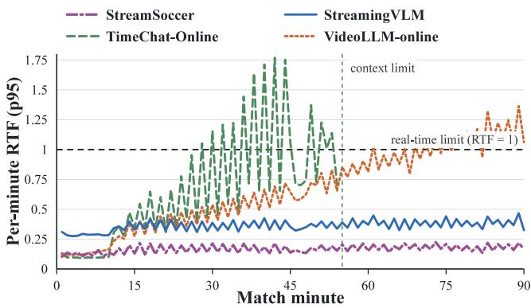  
Figure 3: Raw per-minute RTF p95 over 58 source-clean matches and 174 runs (lower is better). TimeChat-Online stops at its context limit.

## 5.4 Validating Event Memory as an Intermediate Representation

To evaluate event memory as an intermediate representation for event-record caption generation, we compare recurrent event memory with operational-event pooling and fixed-time pooling under matched visual inputs and language readout. Operational-event pooling shares the same event support as recurrent memory, providing a matched comparison of recurrent state formation, while fixed-time pooling serves as a temporal-window baseline.

Table 2 shows a consistent ordering across all caption metrics. Recurrent event memory improves Tok-F1 by 0.0533 over fixed-time pooling and by 0.0351 over operational-event pooling, with CIDEr gains of 21.68 and 15.21, respectively. Operational-event pooling also improves Tok-F1 by 0.0182 over fixed-time pooling, showing the benefit of organizing visual support around operational events rather than a fixed trailing window. With the event support held fixed, recurrent event memory provides a further consistent gain, indicating that recurrent integration of event evolution forms a more useful intermediate representation for downstream generation.

<table><tr><td>Representation</td><td>Tok-F1 B@4</td><td></td><td>METEOR ROUGE-L CIDEr</td><td></td></tr><tr><td>Recurrent memory</td><td>0.2642</td><td>0.2777 0.2358</td><td>0.4335</td><td>37.40</td></tr><tr><td>Event pooling</td><td>0.22900.2556</td><td>0.2192</td><td>0.3986</td><td>22.20</td></tr><tr><td>Fixed-time pooling 0.21080.2462</td><td></td><td>0.2104</td><td>0.3916</td><td>15.72</td></tr></table>

Table 2: Matched projector-only comparison for memory-to-record consolidation.

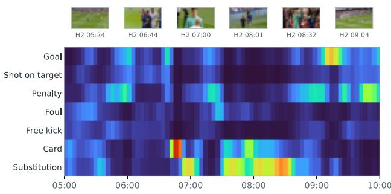  
Figure 4: Normalized commentary-conditioned temporal relevance from a frozen offline VLM over a continuous five-minute match interval. Responses persist across adjacent windows and shift among action concepts as play evolves.

Memory-Scope Analysis. We compare task adaptation and memory scope in two blocks. Direct Qwen3-VL reads causal 30/180/180 s video windows; Qwen3-VL Video-SFT retains this interface and is adapted on the three-track training set. Three separately trained StreamSoccer variants then use current event memory only, add the local event-memory buffer, or further add historical event records. The direct-video and eventmemory blocks assess task adaptation and memory scope, respectively.

<table><tr><td>Variant</td><td></td><td></td><td>Current Recent Historical</td></tr><tr><td>Direct Qwen3-VL</td><td>4.06</td><td>2.46</td><td>3.08</td></tr><tr><td>Qwen3-VL Video-SFT</td><td>27.73</td><td>12.98</td><td>11.24</td></tr><tr><td colspan="4">StreamSoccer variants</td></tr><tr><td>Current memory only</td><td>33.03</td><td>15.06</td><td>13.22</td></tr><tr><td>+ Local event-memory buffer</td><td>38.57</td><td>17.96</td><td>17.22</td></tr><tr><td>+ Historical records (Full)</td><td>38.62</td><td>23.96</td><td>17.39</td></tr></table>

Table 3: Track-wise CIDEr for direct-video adaptation and eventmemory scope.

Video-SFT raises CIDEr from 4.06/2.46/3.08 to 27.73/12.98/11.24 across the three tracks, showing the importance of task adaptation. Within the event-memory block, adding the local event-memory buffer improves all three tracks over current memory alone. The full configuration further raises the scores to 38.62/23.96/17.39 and performs best on every track, with the largest additional gain on recent-window commentary. Together, the three contexts support commentary over different temporal ranges.

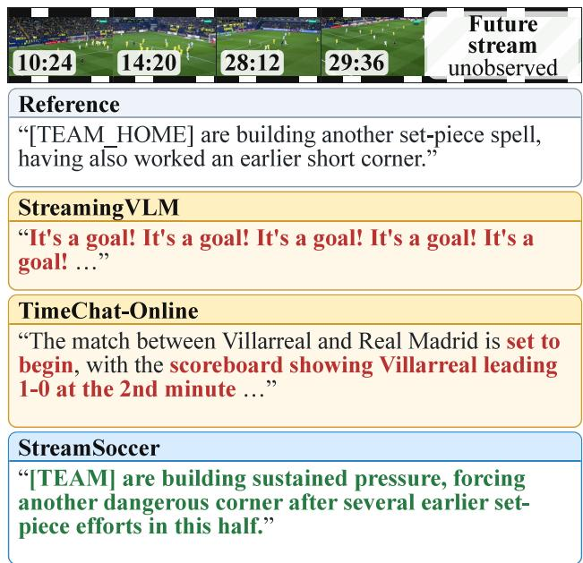  
Figure 5: Historical-memory commentary at a common causal anchor. The masked future stream is unobserved.

## 5.5 Qualitative Case Analysis

Figure 5 compares historical-memory commentary at a common causal anchor containing both earlier set-piece context and an ongoing attacking sequence.

StreamingVLM produces a repeated goal claim and fails to organize the current play, while TimeChat-Online generates descriptions inconsistent with the match time and score. Stream-Soccer instead connects the ongoing pressure with earlier set-piece events and more closely matches the reference. By retaining current, recent, and historical event contexts beyond a finite video window, the layered memory reduces abrupt context loss as the window advances and supports more coherent commentary.

## 6 Conclusion

We introduced StreamSoccer, an event-driven system for causal streaming soccer commentary. It maintains fixed-budget active event memory, preserves recent completed events, and consolidates them into retrievable event records to support current-event, recent-window, and historical-memory commentary. At common output anchors, StreamSoccer achieves the highest reported CIDEr on the current-event and historicalmemory tracks, while its raw-video RTF remains below the real-time threshold throughout full matches. Memory-scope analysis further shows that recent completed events improve all three commentary tracks and that the full configuration performs best overall. Together with the representation comparison and long-history efficiency results, these findings support event memory as a compact intermediate representation for long streaming soccer video.

## References

[1] Bai, S.; Cai, Y.; Chen, R.; Chen, K.; Chen, X.; Cheng, Z.; Deng, L.; Ding, W.; Gao, C.; Ge, C.; Ge, W.; Guo, Z.; Huang, Q.; Huang, J.; Huang, F.; Hui, B.; Jiang, S.; Li, Z.; Li, M.; Li, M.; Li, K.; Lin, Z.; Lin, J.; Liu, X.; Liu, J.; Liu, C.; Liu, Y.; Liu, D.; Liu, S.; Lu, D.; Luo, R.; Lv, C.; Men, R.; Meng, L.; Ren, X.; Ren, X.; Song, S.; Sun, Y.; Tang, J.; Tu, J.; Wan, J.; Wang, P.; Wang, P.; Wang, Q.; Wang, Y.; Xie, T.; Xu, Y.; Xu, H.; Xu, J.; Yang, Z.; Yang, M.; Yang, J.; Yang, A.; Yu, B.; Zhang, F.; Zhang, H.; Zhang, X.; Zheng, B.; Zhong, H.; Zhou, J.; Zhou, F.; Zhou, J.; Zhu, Y.; and Zhu, K. 2025. Qwen3-VL Technical Report. arXiv:2511.21631.

[2] Chen, J.; Lv, Z.; Wu, S.; Lin, K. Q.; Song, C.; Gao, D.; Liu, J.- W.; Gao, Z.; Mao, D.; and Shou, M. Z. 2024. VideoLLM-online: Online Video Large Language Model for Streaming Video. In Proceedings of the IEEE/CVF Conference on Computer Vision and Pattern Recognition, 18407–18418.

[3] Deliège, A.; Cioppa, A.; Giancola, S.; Seikavandi, M. J.; Dueholm, J. V.; Nasrollahi, K.; Ghanem, B.; Moeslund, T. B.; and Van Droogenbroeck, M. 2021. SoccerNet-v2: A Dataset and Benchmarks for Holistic Understanding of Broadcast Soccer Videos. In Proceedings ofthe IEEE/CVF Conference on Computer Vision and Pattern Recognition Workshops, 4503–4514.

[4] Giancola, S.; Amine, M.; Dghaily, T.; and Ghanem, B. 2018. SoccerNet: A Scalable Dataset for Action Spotting in Soccer Videos. In Proceedings of the IEEE Conference on Computer Vision and Pattern Recognition Workshops, 1711–1721.

[5] He, B.; Li, H.; Jang, Y. K.; Jia, M.; Cao, X.; Shah, A.; Shrivastava, A.; and Lim, S.-N. 2024. MA-LMM: Memory-Augmented Large Multimodal Model for Long-Term Video Understanding. In Proceedings ofthe IEEE/CVF Conference on Computer Vision and Pattern Recognition, 13504–13514.

[6] Hu, E. J.; Shen, Y.; Wallis, P.; Allen-Zhu, Z.; Li, Y.; Wang, S.; Wang, L.; and Chen, W. 2022. LoRA: Low-Rank Adaptation of Large Language Models. In International Conference on Learning Representations.

[7] Jeong, S.; Kim, K.; Baek, J.; and Hwang, S. J. 2025. VideoRAG: Retrieval-Augmented Generation over Video Corpus. In Findings ofthe Associationfor Computational Linguistics: ACL 2025, 21278–21298.

[8] Jin, Z.; Qin, X.; Zhou, S.; Yun, K.; and Jia, J. 2026. Towards Automatic Soccer Commentary Generation with Knowledge-Enhanced Visual Reasoning. Accepted at IEEE International Conference on Multimedia and Expo, arXiv:2604.00057.

[9] Lei, J.; Wang, L.; Shen, Y.; Yu, D.; Berg, T.; and Bansal, M. 2020. MART: Memory-Augmented Recurrent Transformer

for Coherent Video Paragraph Captioning. In Proceedings of the 58th Annual Meeting ofthe Associationfor Computational Linguistics, 2603–2614.

[10] Li, X.; He, Y.; Zu, S.; Li, Z.; Shi, T.; Xie, Y.; and Zhang, K. 2025. Multi-Modal Large Language Model with RAG Strategies in Soccer Commentary Generation. In Proceedings ofthe IEEE/CVF Winter Conference on Applications of Computer Vision, 6197–6206.

[11] Lin, T.-Y.; Goyal, P.; Girshick, R.; He, K.; and Dollár, P. 2017. Focal Loss for Dense Object Detection. In Proceedings of the IEEE International Conference on Computer Vision, 2999– 3007.

[12] Mkhallati, H.; Cioppa, A.; Giancola, S.; Ghanem, B.; and Van Droogenbroeck, M. 2023. SoccerNet-Caption: Dense Video Captioning for Soccer Broadcasts Commentaries. In Proceedings of the IEEE/CVF Conference on Computer Vision and Pattern Recognition Workshops, 5074–5085.

[13] Qi, J.; Yu, J.; Tu, T.; Gao, K.; Xu, Y.; Guan, X.; Wang, X.; Xu, B.; Hou, L.; Li, J.; and Tang, J. 2023. GOAL: A Challenging Knowledge-Grounded Video Captioning Benchmark for Real-Time Soccer Commentary Generation. In Proceedings of the 32nd ACM International Conference on Information and Knowledge Management, 5391–5395.

[14] Qian, R.; Dong, X.; Zhang, P.; Zang, Y.; Ding, S.; Lin, D.; and Wang, J. 2024. Streaming Long Video Understanding with Large Language Models. In Advances in Neural Information Processing Systems, volume 37, 119336–119360.

[15] Rao, J.; Wu, H.; Jiang, H.; Zhang, Y.; Wang, Y.; and Xie, W. 2025. Towards Universal Soccer Video Understanding. In Proceedings ofthe IEEE/CVF Conference on Computer Vision and Pattern Recognition, 8384–8394.

[16] Rao, J.; Wu, H.; Liu, C.; Wang, Y.; and Xie, W. 2024. MatchTime: Towards Automatic Soccer Game Commentary Generation. In Proceedings of the 2024 Conference on Empirical Methods in Natural Language Processing, 1671–1685.

[17] Ridnik, T.; Ben-Baruch, E.; Zamir, N.; Noy, A.; Friedman, I.; Protter, M.; and Zelnik-Manor, L. 2021. Asymmetric Loss for Multi-Label Classification. In Proceedings of the IEEE/CVF International Conference on Computer Vision, 82–91.

[18] Song, E.; Chai, W.; Wang, G.; Zhang, Y.; Zhou, H.; Wu, F.; Chi, H.; Guo, X.; Ye, T.; Zhang, Y.; Lu, Y.; Hwang, J.-N.; and Wang, G. 2024. MovieChat: From Dense Token to Sparse Memory for Long Video Understanding. In Proceedings of the IEEE/CVF Conference on Computer Vision and Pattern Recognition, 18221–18232.

[19] Sun, H.; Kertkeidkachorn, N.; and Shirai, K. 2026. Visual and Memory-Augmented Soccer Commentary Generation. In Proceedings ofthe 64th Annual Meeting ofthe Associationfor Computational Linguistics, 10614–10629.

[20] Vedantam, R.; Zitnick, C. L.; and Parikh, D. 2015. CIDEr: Consensus-Based Image Description Evaluation. In Proceedings of the IEEE Conference on Computer Vision and Pattern Recognition, 4566–4575.

[21] Wang, H.; Feng, B.; Lai, Z.; Xu, M.; Li, S.; Ge, W.; Dehghan, A.; Cao, M.; and Huang, P. 2025. StreamBridge: Turning Your Offline Video Large Language Model into a Proactive Streaming Assistant. In Advances in Neural Information Processing Systems, volume 38, 132332–132359.

[22] Xu, R.; Xiao, G.; Chen, Y.; He, L.; Lu, Y.; and Han, S. 2026. StreamingVLM: Real-Time Understanding for Infinite Video Streams. International Conference on Learning Representations, arXiv:2510.09608.

[23] Yan, Y.; Xu, J.; Di, S.; Liu, Y.; Shi, Y.; Chen, Q.; Li, Z.; Huang, Y.; and Xie, W. 2025. Learning Streaming Video Representation via Multitask Training. In Proceedings of the IEEE/CVF International Conference on Computer Vision, 9900–9912.

[24] Yang, H.; Rao, J.; Wu, H.; and Xie, W. 2026. SoccerMaster: A Vision Foundation Model for Soccer Understanding. In Proceedings of the IEEE/CVF Conference on Computer Vision and Pattern Recognition, 21549–21560.

[25] Yao, L.; Li, Y.; Wei, Y.; Li, L.; Ren, S.; Liu, Y.; Ouyang, K.; Wang, L.; Li, S.; Li, S.; Kong, L.; Liu, Q.; Zhang, Y.; and Sun, X. 2025. TimeChat-Online: 80% Visual Tokens Are Naturally Redundant in Streaming Videos. In Proceedings of the 33rd ACM International Conference on Multimedia, 10807–10816.

[26] You, L.; Huang, W.; Xie, X.; Wei, X.; Li, B.; Lin, S.; Li, Y.; and Wang, C. 2025. TimeSoccer: An End-to-End Multimodal Large Language Model for Soccer Commentary Generation. In Proceedings of the 33rd ACM International Conference on Multimedia, 3418–3427.

[27] Zhang, H.; Wang, Y.; Tang, Y.; Liu, Y.; Feng, J.; and Jin, X. 2025. Flash-VStream: Efficient Real-Time Understanding for Long Video Streams. In Proceedings of the IEEE/CVF International Conference on Computer Vision, 21059–21069.

[28] Zhang, T.; Kishore, V.; Wu, F.; Weinberger, K. Q.; and Artzi, Y. 2020. BERTScore: Evaluating Text Generation with BERT. In International Conference on Learning Representations.

## A Evidence and Evaluation Contract

The paper uses separate protocols for controlled commentary quality, streaming state execution, and raw-video efficiency. Keeping these protocols separate prevents a controlled outputanchor experiment from being interpreted as an evaluation of autonomous speaking decisions.

## A.1 Claim–Evidence Map

Table A.1 records what each headline experiment supports and, equally importantly, what it does not test.

## A.2 Evaluation Protocol Matrix

We distinguish four evaluation settings in Table A.2. Samplelevel conditional evaluation reads a preconstructed causal sample and is used for model-development diagnostics. Referenceanchored streaming replay advances persistent state over each half but takes the output anchor and task from the test row. Free-scheduler streaming replay advances the same type of state while allowing the deterministic rule-assisted scheduler to choose a commentary mode or silence. Raw-video scaling includes video decoding and online visual encoding and measures system cost as the visible history grows.

The frozen reference-anchored run behind the StreamSoccer row of Table 1 uses checkpoint step 1,000. It processes 86,145 causal clips from 63 test matches (126 half streams), emits all 3,789 test anchors, and constructs 20,689 eventrecord traces. Inference uses cached Qwen tokens, oracle operational closures, rule memory gating, embedding-based top-3 retrieval, same-half eligibility, and a 90-s minimum historical gap. Current-event identity alignment and record-readiness intervention are evaluation controls. The result establishes controlled streaming quality, not free-scheduler system quality.

## A.3 Baseline and Statistical Contract

The external rows in the main table have different native interfaces. Table A.3 makes the consequential differences explicit. We call a comparison strict only when the test split, causal cutoff, output anchor, input scope, and decoding budget can be aligned. A row that preserves the method’s native interface but cannot meet all of these conditions is a compatibility comparison; it is retained for context and does not constitute a controlled architectural ranking.

CIDEr is reported on the 100× scale. BERTScore-F1 uses the shared RoBERTa-large scorer at layer 17, and all generatedoutput rows are rescored by the same evaluation code. Uncertainty is clustered by match because anchors from the same match are not independent. For a paired comparison we resample matches with replacement and retain all anchors belonging to the sampled matches. When only one training seed is available, the resulting confidence interval quantifies testset variation, not training variance; we report the checkpoint and seed rather than implying multi-seed stability. The frozen representation comparison in Appendix D uses 10,000 paired match-cluster bootstrap replicates.

## A.4 Metrics and Interpretation Boundaries

Table A.4 groups the reported metrics by the question they answer. Text-reference similarity, retrieval, continuous execution, and raw-video efficiency are evaluated separately; a strong value in one group does not substitute for evidence in another.

<table><tr><td>Paper claim</td><td>Primary evidence</td><td>Supported interpretation</td><td>Outside the experiment&#x27;s scope</td></tr><tr><td>Commentary quality shared causal anchors</td><td>Reference-anchored streaming re- Conditional generation quality at Free speaking-time selection, play and common-anchor base- fixed legal output anchors for the naturally available event records, lines</td><td>three commentary tracks</td><td>or a purely visual front end</td></tr><tr><td>Availability-aware semantic preference at shared anchors dit against silver references</td><td>Frozen four-way blinded LLM au-</td><td>erence over the fixed 3,789-anchor factuality, historical-record attri- population, including missing- output penalties</td><td>Reference-conditioned judge pref- Human preference, claim-level bution, free speaking-time selec- tion, or judge-model generaliza- tion</td></tr><tr><td>Event memory is a useful in- Matched termediate representation</td><td>recurrent-memory, operational-event-pooling, and fixed-time-pooling comparison</td><td>Downstream event-record caption decodability under a matched lan- record factuality, or equal up- guage readout and adaptation bud- stream training cost get</td><td>Natural event discovery, full</td></tr><tr><td>mentary quality</td><td>Accessible memory scope Separately trained memory-scope changes track-specific com- variants in the main text</td><td>targets</td><td>Observed differences between con- Statistical significance of every figurations with different accessi- incremental gain or a causal de- ble memory scopes and training composition of every component</td></tr><tr><td>mains efficient</td><td>Long-history processing re- Raw-video per-minute RTF scal- Growth of end-to-end processing Scheduler quality or the response ing over full matches</td><td>observed</td><td>workload as more match history is latency of an individual commen- tary utterance</td></tr></table>

Table A.1: Claim–evidence map for the headline results. Each row deliberately limits the interpretation to the corresponding evaluation protocol.

<table><tr><td>Setting</td><td>Visual input and state</td><td>Output time / task</td><td>Event closure</td><td></td><td>Action/type metadata Current-event alignment</td><td>Record readiness</td><td>Main use</td><td></td></tr><tr><td>Sample-level con- Preconstructed ditional</td><td>cached sample; full-half replay required</td><td>or Given by sample no</td><td>rialized</td><td>Controlled or mate- Controlled fields</td><td></td><td>Given by sample Preconstructed IDs</td><td>dence context</td><td>evi- Conditional gener- ation and matched ablations</td></tr><tr><td>Reference- anchored replay</td><td>Continuous Qwen tokens at 2 FPS; and task type state persists within each half</td><td>cached Reference anchor Oracle operational Label-assisted</td><td>closures</td><td></td><td>tion/type fields</td><td>ac- Just-completed target</td><td>Historical anchors de- Main-paper event aligned to terministically drain common-anchor the current-event pending caption jobs commentary qual- before retrieval</td><td>ity</td></tr><tr><td>Free-scheduler re- Continuous play</td><td>Qwen tokens; state uler persists within each half</td><td>cached Rule-assisted sched- Predicted</td><td>rollover</td><td></td><td>transi- Current audited re- None from refer- Natural asynchronous Cadence, tion plus duration play is label-assisted ence targets</td><td></td><td>readiness</td><td>mode counts, delay, duplicates, and readiness audit</td></tr><tr><td></td><td>Raw-video scaling Raw video decoding, Fixed evaluation Predicted persistent state</td><td>online visual encoding, workload; separate tion plus duration metadata scheduling</td><td>from native free rollover</td><td></td><td>transi- Predicted front-end None from refer- Runtime-managed</td><td>ence targets</td><td>records</td><td>Per-minute RTF, VRAM, coverage, and history scaling</td></tr></table>

Table A.2: Evaluation protocol matrix. Table 1 uses the reference-anchored row. It evaluates commentary quality under controlled anchors; it does not evaluate the speaking scheduler or natural record readiness.

<table><tr><td>Method family</td><td>Input</td><td>Stream state</td><td>Soccer FT</td><td>Anchor/interface</td><td>Coverage treatment</td><td>Contract</td></tr><tr><td>Proprietary MLLMs</td><td>16 frames</td><td>No</td><td>No</td><td>Track-specific causal sparse frames at each anchor</td><td>One request per test anchor; invalid Compatibility calls must be reported</td><td></td></tr><tr><td>General streaming VLMs</td><td>2FPS</td><td>Yes</td><td>No</td><td>Continuous causal timeline with anchored scoring</td><td>Metrics are conditioned on valid out- Compatibility puts; context-limit and invalid-output coverage are disclosed separately</td><td></td></tr><tr><td>Soccer-specific models</td><td>30 frames</td><td>No</td><td>Yes</td><td>Causal sparse frames at each an- chor</td><td>Retrained current/recent rows use the match-disjoint split; historical rows are test-only sparse-history diagnos-</td><td>Current/recent stricter; historical compatibility</td></tr><tr><td>StreamSoccer</td><td>2 FPS</td><td>Yes</td><td>Yes</td><td>Reference-anchored continuous replay</td><td>tics 3,789/3,789 anchors emitted; inter- Controlled reference re- ventions disclosed in Table A.2</td><td>play</td></tr></table>

Table A.3: Protocol cards for the method families in the main commentary-quality table. FT denotes task-specific fine-tuning.

<table><tr><td>Metric</td><td>Definition</td><td>Interpretation boundary</td></tr><tr><td>Token F1</td><td>Harmonic mean of token-level precision and recall against the Direct lexical-content overlap; insensitive to unsupported facts expressed with reference</td><td>overlapping words</td></tr><tr><td>BLEU-4</td><td>Modified 1- to 4-gram precision with a brevity penalty</td><td>Local phrase agreement; brittle to valid paraphrases and not a factuality metric</td></tr><tr><td>METEOR</td><td>Unigram alignment combining precision, recall, and an order- More recall-sensitive than BLEU, but still reference-dependent ing penalty</td><td></td></tr><tr><td>ROUGE-L</td><td>reference</td><td>Longest-common-subsequence overlap between prediction and Sequence-level content coverage and ordering, not historical-evidence use</td></tr><tr><td>CIDEr</td><td>scale</td><td>TF-IDF-weighted n-gram agreement; displayed on the 100 × Main caption-style content score; scales and scorer versions must not be mixed</td></tr><tr><td>BERTScore-F1</td><td>layer-17 scorer</td><td>Contextual-token similarity under the shared RoBERTa-large Semantic reference similarity; does not establish factual correctness</td></tr><tr><td>Valid coverage Strict blind win rate</td><td></td><td>Non-empty valid outputs divided by requested output anchors Must accompany quality scores so failed requests are not silently removed Fraction of the fixed test population for which an anonymized Availability-aware preference against one silver reference under one judge,</td></tr><tr><td></td><td>candidate is selected under the fixed judge configuration; not human-verified semantic correctness NO_RESPONSE cannot win</td><td></td></tr><tr><td>R@k /MRR</td><td>positive rank</td><td>Fraction of eligible positives in the top k, and mean reciprocal Retrieval ranking on the declared eligible population; does not show that generation used the record</td></tr><tr><td>Retrieval-ready rate</td><td>Decisions at which at least one eligible, fully inserted event Runtime record availability; distinct from retrieval correctness record is available</td><td></td></tr><tr><td>RTF</td><td>Processing wall time divided by represented video duration</td><td>Values below one are faster than real time; cached-replay and raw-video RTFs are not interchangeable</td></tr><tr><td>Latency / VRAM</td><td>Request p50/p95 wall time and peak process memory</td><td>Tail response and resource cost under the stated timing boundary and valid- run population</td></tr><tr><td>Clustered 95% CI</td><td>ing their anchors</td><td>Bootstrap interval obtained by resampling matches and retain- Test-population variation; with one training seed it is not training-seed uncer- tainty</td></tr></table>

Table A.4: Metric definitions and permitted interpretations. No automatic reference-similarity metric is treated as a direct factuality measure.

## B Data Construction and Operational-Event Semantics

## B.1 Sources, Funnel, and Match-Disjoint Splits

We use SoccerNet full-match videos and action timestamps [3, 4] to construct the causal video stream and operational events. MatchTime commentary [16] provides the text used for the three-track commentary data. SoccerNet-Caption [12] supplies the legacy memory-to-record representation benchmark used in Appendix D. The roles and frozen data funnel are shown in Table B.1.

The 422 MatchTime matches are split at match level using the sorted match ID: 70% train, 15% validation, and 15% test. Table B.2 shows the resulting counts. The canonical audit finds no match or sample-ID overlap across splits. Every sample

<table><tr><td>Data level</td><td>Count</td></tr><tr><td>SoccerNet matches / half streams</td><td>500 / 1,000</td></tr><tr><td>Non-overlapping 4-s clips</td><td>685,903</td></tr><tr><td>Rule-derived operational events</td><td>166,419</td></tr><tr><td>MatchTime matches used</td><td>422</td></tr><tr><td>Caption-aligned operational events</td><td>15,189</td></tr><tr><td>Current-event samples</td><td>15,189</td></tr><tr><td>Recent-window samples</td><td>7,127</td></tr><tr><td>Historical-memory samples</td><td>5,323</td></tr><tr><td>Total three-track samples</td><td>27,639</td></tr></table>

Table B.1: Frozen data funnel. Commentary alignment covers a salient subset of all operational events rather than a uniform sample of match states.
<table><tr><td>Split</td><td>Matches</td><td>Current</td><td>Recent</td><td>Historical</td><td>Total</td></tr><tr><td>Train</td><td>295</td><td>10,853</td><td>5,013</td><td>3,775</td><td>19,641</td></tr><tr><td>Validation</td><td>64</td><td>2,286</td><td>1,105</td><td>818</td><td>4,209</td></tr><tr><td>Test</td><td>63</td><td>2,050</td><td>1,009</td><td>730</td><td>3,789</td></tr><tr><td>Total</td><td>422</td><td>15,189</td><td>7,127</td><td>5,323</td><td>27,639</td></tr></table>

Table B.2: Match-disjoint three-track split.

stores a causal cutoff and provenance event IDs; automated checks reject video, local-event, or historical references that form after that cutoff.

## B.2 Operational Eventization and Boundary Timeline

Each half is partitioned into non-overlapping four-second clips. For data assignment, clip $C _ { t }$ uses the half-open interval $[ s _ { t } , e _ { t } )$ so an action timestamp a belongs to $C _ { t }$ iff $s _ { t } \leq a < e _ { t }$ . The causal model may use $C _ { t }$ only after $e _ { t } \leq \tau _ { t }$ . At 2 FPS, a full clip contains eight sampled frames.

Operational eventization groups the SoccerNet action timestamps using deterministic football rules. Set pieces and administrative actions can start a new event. Finish, stoppage, administrative, and eligible clearance actions can close the active event after the triggering clip has been included. A maximum duration $D _ { \mathrm { m a x } } = 2 4$ s closes an overly long state, and the last active state is deterministically closed at half end. These are operational units for memory control; they are not manually segmented natural events.

Table B.3 gives the exact action groups used by the eventizer. When a clip contains several actions, a fixed priority resolves the primary action: goals and shots precede penalties and cards, followed by fouls/offside, set pieces, clearance and ballout actions, substitutions, kick-off, and end-of-period control labels. A card that coincides with a stoppage is retained in the stoppage episode rather than forcing a redundant start.

Here, REQUESTSNEWEVENT covers set pieces and administration/discipline actions except a card coincident with an active stoppage, while HASTERMINALACTION covers finish, stoppage, administration/discipline, and clearance without an immediate set-piece, finish, or stoppage follow-up. Annotated next-clip actions are used only to construct offline episode labels and are not model inputs. A start-triggered clip belongs to the new event; a terminal-action clip remains in the event that it closes.

<table><tr><td>Group</td><td>SoccerNet actions</td><td>Operational role</td></tr><tr><td>Set piece</td><td>Corner, Throw-in, Direct free-kick, Indirect free-kick, Penalty, Closes an existing state before Kick-off</td><td> $C _ { t }$  and starts a new event at  $C _ { t }$ </td></tr><tr><td>Finish</td><td>Goal, Shots on target, Shots off target</td><td>Included in the active event, then closes it as terminal_finish</td></tr><tr><td>Stoppage</td><td>Ball out of play, Foul, Offside</td><td>Included in the active event, then closes it as terminal_stoppage</td></tr><tr><td>Defensive resolution</td><td>Clearance</td><td>Closes after  $C _ { t }$  only when the next clip con- tains no set piece, finish, or stoppage follow- up</td></tr><tr><td>pline</td><td>Administration / disci- Substitution, Yellow card, Red card, Yellow-to-red card, End Starts a new event unless a card coincides of period</td><td>with an active stoppage; closes after inclu-</td></tr><tr><td>Open play</td><td>No action from the groups above</td><td>sion Continues the active state; its type is up- graded when the first meaningful action ar- rives</td></tr></table>

Table B.3: Deterministic action groups and their operational-event effects. These rules organize memory lifecycles; they do not define natural event ground truth.

The implementation places the transition label on the first clip of the new event. Figure B.1 shows the ownership convention as a flow. At a reset, the previous state is exported before the arriving clip initializes the next event. A terminalaction clip remains in the event it closes, and current-event supervision observes only the completed state.

The transition head predicts $b _ { t } ,$ , the operational-transition indicator. Training supplies a binary operational-transition label and masks duration-rollover positions from that loss. $\rho _ { t }$ is the deterministic duration safeguard, and the final reset is $r _ { t } = b _ { t } \vee \rho _ { t }$ (with deterministic stream-end closure handled separately). Thus transition, rollover, and final reset are not interchangeable labels.

The frozen eventizer produces 166,419 operational events with mean duration 16.49 s and median duration 20 s. A total of 66,941 events (40.2%) close by the maximum-duration safeguard. The large rollover fraction is why our claims are consistently phrased in terms of rule-derived operational events, not natural semantic-boundary annotations.

## B.3 Three-Track Supervision and Quality Control

MatchTime commentary descriptions are aligned to operational events using match, half, temporal proximity, and action compatibility, and each description is assigned to at most one event. The aligned description and deterministic time, action, event-type, and match-state fields form a data-side reference record. This record is used to construct supervision; at runtime, historical records are generated from completed event memory instead.

Candidate generation first restricts captions to the same match and half. A caption is eligible when its timestamp lies inside the event interval or no more than 15 s outside it. A second action-anchored path admits a caption up to 30 s from a compatible event action, accommodating delayed goal or shot commentary while still requiring semantic action agreement. Candidates are ranked deterministically by text validity, action compatibility, importance, absence of multi-event ambiguity, availability and distance of an action anchor, membership in or distance to the event window, annotation-label availability, and finally caption ID. Semantically anchored high-confidence candidates are assigned first across a match. In the frozen dataset, a caption ID is consumed after assignment, so one caption supervises at most one canonical event. Event IDs, action sets, timestamps, match state, and split membership are fixed before any language rewriting.

Automated quality control checks causal validity, match/half consistency, event-ID existence, one-to-one current-caption assignment, duplicate sample IDs, and split isolation. Text transformations preserve deterministic team, time, action, and score fields outside unconstrained language generation. The frozen automatic audit establishes structural consistency and traceability; it does not constitute human verification of every generated or rewritten sentence.

## C Reproducible Implementation

## C.1 Architecture Specification

The pretrained backbone is Qwen3-VL-8B-Instruct [1]. The visual encoder and base language-model weights are frozen. Table C.1 lists the fixed dimensions of the reported configuration. The Clip Event Adapter produces $K _ { m } = 9$ clip-level event tokens (one special token and eight slots). The active memory uses the same token budget, and the memory-to-language projector produces $K _ { p } = 8$ soft prefix tokens.

The transition head compares the previous active state with the current clip and receives action and age cues. On reset, the pre-reset state is exported as $M _ { j } ^ { \mathrm { c } }$ . Completed event memories enter $B _ { t }$ immediately, while record caption generation and deterministic record assembly complete asynchronously before $R _ { j }$ becomes eligible for $\mathcal { L } _ { t } .$ Historical records are text supplied to the language prompt; they are not additional latent memory tokens.

Algorithm B.1 Rule-derived operational eventization for one half   
Require: temporally ordered clips $C _ { 1 } , \ldots , C _ { T }$ , assigned action timestamps, maximum duration $D _ { \mathrm { m a x } }$   
Ensure: ordered operational-event episodes   
1: active ← ∅   
2: for each clip $C _ { t }$ in temporal order do   
3: actions ← ASSIGNEDACTIONS(Ct)   
4: next\_actions ← ASSIGNEDACTIONS $\left( C _ { t + 1 } \right)$ if t < T, else ∅   
5: if active = ∅ then   
6: active ← STARTEVENT(Ct)   
7: else if REQUESTSNEWEVENT $( C _ { t } ,$ actions) then   
8: CLOSEEVENT(active)   
9: active ← STARTEVENT(Ct)   
10: end if   
11: ATTACH(active, $C _ { t } ,$ actions)   
12: UPDATEEVENTTYPE(active, actions)   
13: if HASTERMINALACTION(Ct, actions, next\_actions) then   
14: CLOSEEVENT(active)   
15: active ← ∅   
16: else if DURATION $( a c t i v e ) \geq D _ { \mathrm { m a x } }$ then   
17: CLOSEEVENT(active, max\_duration)   
18: active ← ∅   
19: end if   
20: end for   
21: if active ̸= ∅ then   
22: CLOSEEVENT(active, half\_end)   
23: end if   
Closure and post-event path   
Event j clips Post-event   
Close and export Completed memory   
Ct−2, Ct−1 the previous state Mcj enters Bt current-event   
terminal clip stays here commentary   
Next-event path   
New-event trigger, or Arriving C belongs Initialize the next Continue with   
clip after terminal closure =⇒ to event j + 1 =⇒ active memory Ct+1   
At a reset, export precedes initialization. Duration rollover uses the same reset path but is not an operational-transition positive

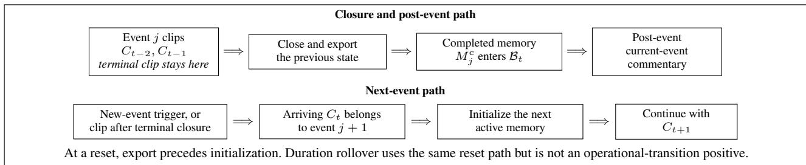  
Figure B.1: Boundary and clip-ownership convention. The data eventizer stores the transition label on the first clip of the new event. At reset, the pre-reset state is the completed memory and the current clip initializes the next state.

## C.2 Three-Stage Training

Table C.2 summarizes the configured training recipes. The pretrained backbone tensors are loaded in bfloat16, and bfloat16 is enabled only on supported trainer paths. The frozen artifacts do not establish automatic mixed-precision execution for every trainer.

<table><tr><td>Track</td><td>Construction contract</td></tr><tr><td>Current-event</td><td>Context: just-completed  $M _ { j } ^ { \mathrm { c } }$  and causal match state. Target: one post-event commentary sentence. Provenance: current event ID, cutoff, and alignment metadata.</td></tr><tr><td>Recent-window</td><td>Context: active context and completed local events from the preceding 180 s. Target: one recent multi-event summary. Provenance: selected local event IDs and cutoff.</td></tr><tr><td>Historical-memory</td><td>Context: current/local context plus eligible earlier same-match, same-half records. Target: one sentence relating current play to earlier context. Provenance: historical source IDs, candidate set, and cutoff.</td></tr></table>

Table B.4: Construction contract for the three commentary tracks. Every conditioning item must exist no later than the stored causal cutoff.

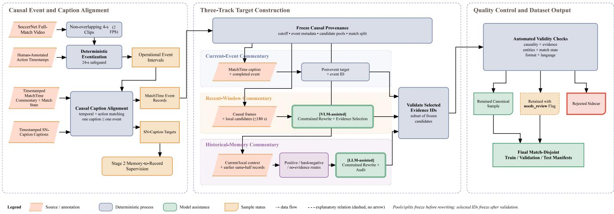

Figure B.2: Causal commentary-data construction. Action timestamps and deterministic rules define operational-event intervals; MatchTime supplies the main three-track branch and SoccerNet-Caption the Stage 2 supervision branch. Candidate pools and split assignments are fixed before model-assisted rewriting, while selected evidence IDs are validated before the final match-disjoint manifests.
<table><tr><td>Component / symbol</td><td>Reported value</td><td>Specification</td></tr><tr><td>Backbone</td><td>Qwen3-VL-8B-Instruct</td><td>Frozen visual encoder and frozen base LLM</td></tr><tr><td>Visual/LLM hidden size  $d _ { v } , d _ { l }$ </td><td>4096 /4096</td><td>Pretrained token spaces</td></tr><tr><td>Event-memory hidden size  $d _ { m }$ </td><td>1024</td><td>Adapter, active memory, and completed event memory</td></tr><tr><td>Clip Event Adapter A</td><td>2 layers, 8 heads</td><td>Cross-attention resampler;  $K _ { m } = 9$  output tokens</td></tr><tr><td>Memory update U</td><td>2 layers, 8 heads</td><td>Memory-to-clip attention, self-attention, FFN, and per- token gate  $G _ { t }$ </td></tr><tr><td>Memory initializer T</td><td>1 layer</td><td>Initializes a new active state from  $E _ { t }$ </td></tr><tr><td>Memory-to-language projector  $P _ { \theta }$ </td><td>2 layers, 8 heads</td><td> $K _ { p } = 8$  projected soft-prefix tokens</td></tr><tr><td>Maximum active duration  $D _ { \mathrm { m a x } }$ </td><td>24 s</td><td>Deterministic duration-rollover safeguard</td></tr><tr><td>LoRA for Stages 2–3</td><td>r = 8, α = 16, dropout 0.05</td><td>Targets q_proj, k_proj, v_proj, and o_proj</td></tr></table>

Table C.1: Architecture specification for the paper-facing configuration.
<table><tr><td>Stage</td><td>Trainable path</td><td colspan="2">Per-process batch / accumu- Learning rate and schedule lation</td><td>Main objective / budget</td></tr><tr><td>memory</td><td>1: streaming event Clip Event Adapter, event-memory encoder, 1 / 16 transition and auxiliary event heads</td><td></td><td> $1 0 ^ { - 4 } ;$  500-step AdamW</td><td>warmup; Teacher-forced reset; up to 50k steps; weights 0.5 clip action, 1.0 transition, 1.0 completed-event action set, 0.3 event</td></tr><tr><td></td><td>2: memory-to-record Memory projector and language LoRA; base 1 / 16 LLM frozen</td><td></td><td>Projector  ${ { 1 0 } ^ { - 4 } } ,$  LoRA  $1 0 ^ { - 5 } ;$  500-step warmup</td><td>type Assistant caption tokens only; projector alignment then LoRA warmup and joint fitting; target length 192</td></tr><tr><td>mentary</td><td>3: multi-context com- Language LoRA, memory projector, 2 / 8 per process route/local/retrieval auxiliary heads; Stage-1 memory cached/frozen in the reported run</td><td></td><td>LoRA 2 × 10−5, projector 3 × 10−5; 500-step warmup</td><td>Three-track response CE with auxil- iary context losses; 10k configured budget; prompt/target/generation limits 2048/128/96</td></tr></table>

Table C.2: Three-stage training configuration. The displayed batch size is per process. Stage 3 uses prompt profile paper\_clean\_v2 and seed 42 for the configured sampler.

The memory-cache Stage 3 training path requires an explicit Stage 1 checkpoint matching the materialized memory tokens and stores that frozen Stage 1 state in the Stage 3 checkpoint. The local step-1,000 replay artifact does not retain the training launch command or source-checkpoint hashes, so it does not independently verify Stage 2 checkpoint initialization for this run. Stage 3 uses a memory-cache curriculum: the first 5,000 configured steps use task-legal teacher-forced context, while the next 5,000 expose runtime-selected context, increasing the predicted-context ratio from 0.10 to 0.50 every 250 steps. The main-text quality result uses checkpoint step 1,000 and is evaluated by reference-anchored replay. This checkpoint lies in the teacher-forced phase and has not undergone the secondphase runtime-context exposure. The frozen replay protocol records the config, checkpoint, reference, and clip SHA-256 hashes together with the effective inference settings.

## C.3 Inference, Retrieval, and Scheduler Parameters

Table C.3 separates memory/retrieval settings from the ruleassisted speaking policy. The scheduler is deterministic and is included to reproduce executed system behavior; it is not a learned policy and is not ranked as a separate scientific contribution.

Event closures enqueue caption jobs. The completed event memory is immediately available, whereas an event record becomes historically retrievable only after caption generation, deterministic assembly, and insertion complete. The referenceanchored protocol deterministically drains pending jobs before retrieval at a historical anchor; the free-scheduler protocol does not. On the frozen main-table replay, eight parallel workers process 86,145 clips and insert 20,689 ready records. These workers partition independent half streams; state is not shared across halves.

<table><tr><td>Runtime parameter</td><td>Value</td></tr><tr><td>Clip duration / sampling</td><td>4 s / 2 FPS</td></tr><tr><td>Local event-memory buffer horizon / maxi- 180 s / 4 events mum selected</td><td></td></tr><tr><td>Historical retrieval</td><td>embedding top-3</td></tr><tr><td>Historical eligibility</td><td>same half, gap ≥ 90 s</td></tr><tr><td>Current-event cooldown</td><td>12 s</td></tr><tr><td>Recent-window tick / minimum events</td><td>120 s / 3</td></tr><tr><td>Window cooldown after event output</td><td>20 s</td></tr><tr><td>Historical cooldown / minimum records</td><td>180 s / 8</td></tr><tr><td>Historical score threshold</td><td>0.12</td></tr><tr><td>Scheduler priority</td><td>history &gt; event &gt; recent</td></tr><tr><td>Commentary decoding</td><td>deterministic, max 96 tokens</td></tr><tr><td>Record-caption decoding</td><td>deterministic, max 64 tokens</td></tr></table>

Table C.3: Default runtime and rule-assisted scheduler settings. The replay in Table 1 fixes output anchors and therefore does not evaluate these scheduler thresholds.

Caption-queue and record-readiness timeline. At closure, the pre-reset state is exported as $M _ { i } ^ { \mathrm { c } }$ , inserted immediately into $B _ { t }$ , and enqueued as a caption job. It is not yet part of the event-record LTM $\mathcal { L } _ { t }$ . A drain projects the completed memory, generates the event-record caption $c _ { j }$ , attaches deterministic identity, time, action, type, and match-state fields, and inserts the resulting auditable record $R _ { j }$ when its generated caption is non-empty. Only a non-empty record whose insertion has completed is retrieval-eligible, so

$$
\begin{array} { r l } & { M _ { j } ^ { \mathrm { c } } \in { \mathscr { B } } _ { t } \Longrightarrow { \mathrm { c a p t i o n j o b } } \Longrightarrow { c } _ { j } \mathrm { ~ r e a d y } , } \\ & { ~ c _ { j } \mathrm { ~ r e a d y } \Longrightarrow { R } _ { j } \in { \mathscr { L } } _ { t } . } \end{array}
$$

The cached-token replay batches at most four caption jobs. With its zero timer-wait setting, normal draining occurs when a batch fills, before a pending record would age out of the local event-memory buffer, or at stream end. A historical reference anchor additionally forces pending jobs to drain, which is the record-readiness intervention disclosed in Table A.2. Free-scheduler replay never drains because of a target anchor and therefore observes natural asynchronous readiness. The frozen raw-video deployment runtime interprets zero wait as immediate draining; its timing is reported separately from cached replay.

## C.4 Artifact Provenance

Table C.4 provides stable labels for the results used in Appendices A–D. These labels identify result-specific frozen sources without exposing server absolute paths, usernames, or machine names.

<table><tr><td>ID</td><td>Result</td><td>Step / seed</td><td>Population</td></tr><tr><td>ANCHOR-S1K</td><td>Main-paper StreamSoccer 1,000 / 42 commentary-quality row</td><td></td><td>63 matches; 3,789 an- chors</td></tr><tr><td>REP-MEM</td><td>Recurrent event memory 3,000 / 42 representation row</td><td></td><td>49 matches; 1,726 events</td></tr><tr><td>REP-EVENT</td><td>Operational-event pooling 3,000 / 42 row</td><td></td><td>49 matches; 1,726 events</td></tr><tr><td>REP-FIXED</td><td>Fixed-time pooling row</td><td>3,000 / 42</td><td>49 matches; 1,726 events</td></tr></table>

Table C.4: Stable artifact labels for the protocol and representation results in Appendices A–D.

Result-specific protocol and evaluation files, rather than this PDF, store the available content hashes, commands, checkpoint identities, and scorer settings. The frozen local records do not contain a unified release manifest or a code revision hash, so this appendix does not claim either. The three representation rows share the same implementation, data order, targets, projector initialization, optimization budget, and deterministic decoding settings; only the representation and its fitted checkpoint differ.

## D Event-Memory Mechanism Evidence

## D.1 Matched Intermediate-Representation Comparison

We directly compare three visual summaries for event-record caption generation. Recurrent event memory exports $M _ { j } ^ { \mathrm { c } }$ when an operational event closes. Operational-event pooling averages clip-level event tokens over the same event support, isolating the value of recurrent state formation. Fixed-time pooling averages at most six clips from the trailing 24 s, providing a simple temporal-window control. Every row supplies a 9 × 1024 representation to an independently fitted but architecturally identical projector and language readout initialized from the same state.

All three methods are trained for 3,000 optimizer steps with global batch 16, giving 48,000 sampled-event exposures per row. Inference is deterministic with a 64-token generation limit. Recurrent memory exceeds operational-event pooling by 0.0351 Tok-F1 and fixed-time pooling by 0.0533; the paired intervals exclude zero. Operational-event pooling also exceeds fixed-time pooling by 0.0182 Tok-F1, with 95% interval [0.0114, 0.0252]. The event-pooling–versus–fixed-time contrast supports event-aligned temporal support, whereas the recurrent-memory–versus–event-pooling contrast supports learned state formation under matched event support.

This experiment is deliberately bounded. It uses one seed and the legacy 5,676-train/1,726-test protocol. The final checkpoints are compared at a fixed step rather than selected independently. The 1,726-event population is a legacy development/evaluation population rather than a never-observed test set. The stored decoder drops some leading special-token fragments. A deterministic text-only sensitivity repair yields Tok-F1 values of 0.3093, 0.2705, and 0.2566 for recurrent memory, event pooling, and fixed-time pooling, respectively, and preserves the three-method ordering. Table D.1 reports the unrepaired frozen decoder outputs and supports matchedbudget representation decodability only; it does not establish never-observed-test generalization, record factuality, or multiseed training stability.

<table><tr><td>Representation</td><td>Tok-F1</td><td>B@4</td><td></td><td>METEOR ROUGE-L CIDEr</td><td></td></tr><tr><td>Recurrent memory</td><td>0.2642</td><td>0.2777</td><td>0.2358</td><td>0.4335</td><td>37.40</td></tr><tr><td>Event pooling</td><td>0.22900.2556</td><td></td><td>0.2192</td><td>0.3986</td><td>22.20</td></tr><tr><td>Fixed-time pooling</td><td>0.21080.2462</td><td></td><td>0.2104</td><td>0.3916</td><td>15.72</td></tr></table>

Table D.1: Matched memory-to-record representation comparison on 1,726 events from 49 matches. CIDEr uses the 100× scale.
<table><tr><td>Tok-F1 difference</td><td>Mean</td><td>95% paired CI</td></tr><tr><td>Memory — event pooling</td><td>0.0351</td><td>[0.0259, 0.0444]</td></tr><tr><td>Memory – fixed pooling</td><td>0.0533</td><td>[0.0448, 0.0625]</td></tr><tr><td>Event pooling — fixed pooling</td><td>0.0182</td><td>[0.0114, 0.0252]</td></tr></table>

Table D.2: Tok-F1 differences from 10,000 paired match-cluster bootstrap replicates.

## E Commentary Quality, Memory Scope, and Retrieval

## E.1 Expanded Commentary-Quality Results

Table E.1 adds metrics and coverage for the StreamSoccer row in the main commentary-quality table. These values come from the same step-1,000 reference-anchored replay described in Appendix A; they do not constitute a separate free-scheduler evaluation. The replay emits one valid output at every one of the 3,789 test anchors, with no empty generations.

Retrieval traces provide a separate diagnostic of historicalrecord availability. Among 324 frozen retrieval-loss queries with positive supervision, embedding retrieval obtains R@1 = 0.0741, R@3 = R@5 = 0.1327, and MRR = 0.1003. In total, 371 anchored outputs contain retrieved records, and 43.92% of scheduler decisions are retrieval-ready under this controlled replay. These figures characterize the frozen retriever and do not establish that every retrieved record improves the generated commentary.

## E.2 Blinded LLM Semantic Audit

We conduct a fixed-protocol four-way blinded audit over all 3,789 test anchors from 63 matches. For each anchor, a temperature-zero GPT-5.6-terra judge receives the silver reference, task description, and four candidate slots under a sample-specific deterministic permutation. Model identities are withheld from the prompt. A missing model output remains in its randomized slot as NO\_RESPONSE and cannot win; every strict win rate therefore uses the full 3,789-anchor population rather than a valid-output-only subset. All four models respond on 1,086 anchors, and at least one external model has NO\_RESPONSE on the remaining 2,703 anchors. Response rate is reported beside preference so availability is visible alongside preference.

<table><tr><td>Track</td><td>N</td><td>Valid</td><td>Tok-F1</td><td>B@4</td><td>METEOR</td><td>ROUGE-L</td><td>CIDEr</td><td>BS</td></tr><tr><td>Current-event</td><td>2,050</td><td>100%</td><td>0.3234</td><td>0.2929</td><td>0.2487</td><td>0.4606</td><td>38.62</td><td>0.9734</td></tr><tr><td>Recent-window</td><td>1,009</td><td>100%</td><td>0.3499</td><td>0.0652</td><td>0.1518</td><td>0.2680</td><td>23.96</td><td>0.9612</td></tr><tr><td>Historical-memory</td><td>730</td><td>100%</td><td>0.2292</td><td>0.0451</td><td>0.1441</td><td>0.2146</td><td>17.39</td><td>0.9636</td></tr></table>

Table E.1: Additional StreamSoccer commentary metrics under reference-anchored replay. CIDEr uses the 100× scale, BS denotes BERTScore F1, and valid coverage is the fraction of requested anchors producing a non-empty output.

The judge selects StreamSoccer on 3,530 of 3,789 anchors, giving a strict win rate of 93.16% with match-clustered 95% CI [92.32%, 94.01%]. This ordering holds on each commentary track. The randomized label positions A–D receive 960, 971, 911, and 947 wins, respectively (25.34%, 25.63%, 24.04%, and 24.99% of judged anchors), so the result is not concentrated in one displayed position. Under the declared NO\_RESPONSE-cannot-win protocol, StreamSoccer is the preferred available response against the silver reference across the fixed test population. This single-judge audit does not convert silver references into human preference labels or establish claim-level factual correctness. It ranks final outputs and does not determine whether a retrieved historical record supports or causes a historical-memory response.

## E.3 Memory-Scope Analysis

The main text compares separately trained configurations with progressively broader accessible context. Table E.3 reports the locally verified CIDEr values alongside the protocol details in this appendix. These rows are configuration comparisons: changing memory scope also changes the context and objectives available during training, so the differences are not inference-only causal ablations of one checkpoint.

Each frozen evaluation summary contains 3,789 exact-ID matches and no unmatched outputs. The current-only and local event-memory buffer rows use their respective step-10,000 retrained checkpoints; the full row uses the selected step-1,000 full-model checkpoint. Relative to the current-only configuration, the local event-memory buffer configuration is higher by 5.54, 2.89, and 4.00 CIDEr on the current, recent, and historical tracks. Relative to the local event-memory buffer configuration, the full configuration is higher by 0.05, 6.01, and 0.17 CIDEr, respectively. These are configuration-level differences and do not isolate the causal effect of retrieved historical records on a particular generation.

## E.4 Historical-Record Intervention

The retrieval diagnostics above measure whether the expected source is found, but they do not isolate whether the language model uses a relevant record. We therefore perform a controlled intervention on historical-positive anchors while holding the checkpoint, current and local context, output anchor, and decoding settings fixed. The three non-empty arms each use three records, whereas the no-record arm removes the historical block.

Table E.4 reports the completed same-checkpoint intervention on a frozen set of 209 historical-memory anchors from 56 matches (79 half streams). Current/local latent context, output anchor, decoding, and the non-historical prompt are identical across arms; only the textual historical-record block changes. Every requested output is non-empty. The runtime-ranked arm bypasses the learned NULL decision solely to impose the same three-record input budget as the other non-empty arms; it is therefore a controlled retrieval diagnostic rather than the native online policy.

Injecting matched hard-negative records instead of no historical record raises per-anchor token-F1 by 0.1298 (matchclustered 95% CI [0.1157, 0.1441]). Oracle-ID injection raises it by 0.1393 over no historical record (95% CI [0.1253, 0.1538]). The paired intervals for runtime minus matched hard negatives (∆ = −0.0042; 95% CI [-0.0222, 0.0137]) and oracle minus runtime $( \Delta = + 0 . 0 1 3 7 ; 9 5 \% \mathrm { C I } [ - 0 . 0 0 4 3$ 0.0318]) both include zero. Among the three non-empty arms with a fixed top-3 budget, the audit detects no automatic-metric advantage of runtime-ranked records over hard negatives and no automatic-metric gap to the oracle arm. The no-record contrasts show that adding a historical-record block changes the generator’s automatic overlap, but neither comparison establishes semantic use of relevant historical evidence or superior runtime retrieval.

<table><tr><td>Method</td><td>Current</td><td>Recent</td><td>Historical</td><td>Overall [95% CI]</td><td>Response</td></tr><tr><td>StreamSoccer</td><td>90.73</td><td>96.63</td><td>95.21</td><td>93.16 [92.32, 94.01]</td><td>100.00</td></tr><tr><td>StreamingVLM</td><td>8.68</td><td>3.37</td><td>4.38</td><td>6.44 [5.65, 7.21]</td><td>93.77</td></tr><tr><td>TimeChat-Online</td><td>0.59</td><td>0.00</td><td>0.41</td><td>0.40 [0.21, 0.61]</td><td>41.20</td></tr><tr><td>VideoLLM-online</td><td>0.00</td><td>0.00</td><td>0.00</td><td>0.00 [0.00, 0.00]</td><td>64.61</td></tr></table>

Table E.2: Strict win rate and response rate (%) in the frozen blinded LLM semantic audit. Current, recent, and historical contain 2,050, 1,009, and 730 anchors. Overall intervals use 10,000 match-cluster bootstrap replicates over 63 matches; missing outputs remain in the fixed denominator and cannot win

<table><tr><td>Configuration</td><td>Current</td><td></td><td>Recent Historical</td></tr><tr><td>Current memory only</td><td>33.03</td><td>15.06</td><td>13.22</td></tr><tr><td>+ local event-memory buffer</td><td>38.57</td><td>17.96</td><td>17.22</td></tr><tr><td>Full three-scope model</td><td>38.62</td><td>23.96</td><td>17.39</td></tr></table>

Table E.3: Verified CIDEr (100×) results for the separately trained memory-scope configurations.
<table><tr><td>Historical input</td><td>Records</td><td>Tok-F1</td><td>B@4</td><td>CIDEr</td><td>BS</td></tr><tr><td>No historical record</td><td>0</td><td>0.1426</td><td>0.0169</td><td>2.61</td><td>0.8543</td></tr><tr><td>Matched hard-negative top-3</td><td>3</td><td>0.2724</td><td>0.0726</td><td>30.92</td><td>0.8922</td></tr><tr><td>Runtime-ranked top-3†</td><td>3</td><td>0.2682</td><td>0.0697</td><td>30.15</td><td>0.8906</td></tr><tr><td>Oracle-ID top-3‡</td><td>3</td><td>0.2819</td><td>0.0841</td><td>37.96</td><td>0.8947</td></tr></table>

Table E.4: Automatic overlap diagnostics for the four-arm historicalrecord intervention. All arms use the identical 209-anchor population and have 100% valid coverage. CIDEr uses the 100× scale and BS denotes BERTScore-F1. †The learned NULL decision is bypassed only to fix the three-record budget. ‡The positive record is placed at rank 1; this is a controlled oracle, not native online performance.

## F Continuous Execution and Long-History Efficiency

## F.1 Raw-Video Efficiency

The raw-video benchmark includes video decoding, online visual encoding, persistent state updates, and the fixed evaluation workload. It is separate from the native free-scheduler policy. Table F.1 reports p95 cumulative real-time factor (RTF) and the p95 peak VRAM at the last supported horizon.

StreamSoccer’s source-clean cohort contains 58 matches and 174 complete runs. The full-match RTF has median 0.1163 and p95 0.1221; a match-cluster bootstrap gives a median-RTF interval of [0.1137, 0.1183]. Whole-run peak VRAM has median 17,992 MiB and p95 17,996 MiB.

## F.2 Record Readiness and Latency Breakdown

Table F.2 decomposes the measured StreamSoccer workload into auditable wall-time components. The entries are component-wise p95 RTFs computed over the full run; because their tails need not occur on the same request, their sum is not an isolated commentary latency.

Request-level end-to-end p95 latency is 2.467, 3.826, 3.855, and 3.801 s at T15, T30, T45, and T90, respectively. Recordcaption work is asynchronous: completed event memory enters the local event-memory buffer immediately, but a historical record becomes eligible only after captioning, assembly, and insertion.

To quantify the reference-triggered readiness intervention, we audit the 730 historical-memory anchors against an otherwise identical natural-queue shadow that disables anchortriggered draining. Table F.3 reports the paired result. Reference anchors trigger pending caption consolidation at 594 anchors and drain 1,269 caption jobs. Every force-drained job corresponds to an event ending 4–76 s before its anchor, below the frozen 90-s historical eligibility gap. Consequently, reference-induced consolidation changes neither the eligible candidate set nor retrieved record identities, and it makes no positive historical evidence newly available at any audited anchor.

## F.3 Free-Scheduler Execution Audit

We additionally audit a frozen free-scheduler replay to demonstrate that the state, caption queue, retrieval, and rule-assisted speaking path execute over complete half streams. This run uses checkpoint step 7,000, cached Qwen tokens, predicted operational transitions, embedding retrieval with same-half and 90-s-gap eligibility, and label-assisted action/type fields. It is an execution audit rather than a ranking of scheduler strategies.

Only 88 of 5,949 free-scheduler outputs occur within one second of a reference anchor. Text metrics on that small matched subset would therefore confound coverage and timing with language quality and are not used as commentary quality evidence.

## G Auditable Cases and Failure Analysis

## G.1 Case-Selection Protocol

The gallery uses only frozen test outputs. For each of the three commentary tracks, we retain the five pre-indexed candidates in the frozen case manifest; row i aligns candidate i from the current-event, recent-window, and historical-memory tracks. This fixed five-by-three ordering is recorded with the sample IDs in the frozen selection manifest and is not changed after rendering. Each card shows causal visual evidence, the reference, three external streaming VLM outputs, and the StreamSoccer output. The displayed text is a literal, compact prefix of the frozen output; the full output and exact color-span audit remain in the associated case-card artifact.

<table><tr><td>Method</td><td>T15</td><td>T30</td><td>T45</td><td>T90</td><td>Peak VRAM</td></tr><tr><td>StreamingVLM</td><td>0.274</td><td>0.285</td><td>0.291</td><td>0.285</td><td>17,072 MiB</td></tr><tr><td>TimeChat-Online*</td><td>0.138</td><td>0.231</td><td>0.322</td><td></td><td>77,603 MiB</td></tr><tr><td>VideoLLM-online</td><td>0.171</td><td>0.259</td><td>0.328</td><td>0.559</td><td>50,969 MiB</td></tr><tr><td>StreamSoccer</td><td>0.110</td><td>0.119</td><td>0.119</td><td>0.122</td><td>17,996 MiB</td></tr></table>

Table F.1: Raw-video efficiency. T15–T90 are p95 cumulative RTFs after 15, 30, 45, and 90 minutes of observed match time. Peak VRAM is the p95 value at the last valid horizon. \*TimeChat-Online has no T90 value because its supported context ends before that horizon.

<table><tr><td>Component</td><td>p95 RTF</td></tr><tr><td>Raw video decode</td><td>0.0053</td></tr><tr><td>Visual encoding</td><td>0.0273</td></tr><tr><td>State update</td><td>0.0040</td></tr><tr><td>External generation wall</td><td>0.0201</td></tr><tr><td>Native generation wall</td><td>0.0692</td></tr></table>

Table F.2: Diagnostic component-wise p95 RTFs for the frozen rawvideo StreamSoccer workload. Prompt construction, post-processing, and residual overhead are not separately tabulated.

<table><tr><td>Audit item</td><td>Value</td></tr><tr><td>Half streams / clips</td><td>126 / 86,145</td></tr><tr><td>Commentary outputs</td><td>5,949</td></tr><tr><td>Comments per minute</td><td>1.0505</td></tr><tr><td>Current / recent / historical</td><td>2,976 / 2,820 / 153</td></tr><tr><td>Caption jobs</td><td>20,658</td></tr><tr><td>Ready / empty captions</td><td>20,654 / 4</td></tr><tr><td>Exact / near-duplicate rate</td><td>0.000168 / 0</td></tr><tr><td>Event-to-comment delay</td><td>4.0 s</td></tr><tr><td>Total latency p50 / p95</td><td>2.357 / 4.209 s</td></tr><tr><td>Scheduler steps with retrieval-ready records 82,770 / 86,145 (96.08%)</td><td></td></tr></table>

<table><tr><td>Audit item Value</td></tr><tr><td>Historical-memory anchors 730</td></tr><tr><td>Anchors with pending jobs (forced / shadow) 594 / 603</td></tr><tr><td>Reference-triggered drain batches 594</td></tr><tr><td>Unique force-drained caption jobs 1,269</td></tr><tr><td>Eligible candidate set changed 0 / 730</td></tr><tr><td>Retrieved record identities changed 0/ 730</td></tr><tr><td>Positive-evidence readiness changed 0/ 730</td></tr></table>

Table F.4: Continuous free-scheduler execution audit. The scheduler is rule-assisted and the run retains label-assisted action/type metadata.  
Table F.3: Paired record-readiness audit of the 730 historical-memory anchors. The forced condition reproduces reference-anchored replay; the natural-queue shadow disables only anchor-triggered caption draining.

## G.2 Success and Failure Gallery

Figure G.1 lays out five aligned rows of examples. Columns correspond to current-event, recent-window, and historicalmemory commentary, respectively; each card retains only visual evidence frames, with no timestamps or timeline. Light blue-grey identifies the reference, amber identifies external streaming VLMs, and blue identifies StreamSoccer. Red text marks wording heuristically flagged as unsupported, repetitive, malformed, or generic; green text marks StreamSoccer wording heuristically aligned to the reference event/evidence. These colors are qualitative reading aids rather than population-level error rates.

Current-event commentary  
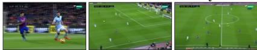

[PLAYER] ([TEAM]) is caught offside!

## StreamingVLM

He's got a good record against Fulham. 10 goals.   
11 appearances. 10 goals. 11 appearances.

## TimeChat-Online

The match between FC Barcelona and RC Celta de Vigo is underway, with the scoreboard showing...

## VideoLLM-Online

You were in the stadium, you were in the stadium, you were in the stadium, you...

## StreamSoccer

[PLAYER] ([TEAM]) is caught offside .

[PLAYER] ([TEAM]) is awarded a yellow card.

## StreamingVLM

think it's a corner. Yeah, I think it's a corner as well.

## TimeChat-Online

The match between Málaga CF and FC Barcelona is underway, with the scoreboard showing 0-0 at...

## VideoLLM-Online

,,,] , ] ,, ] , ] , ] , ] , ] , ] ,...

## StreamSoccer

[PLAYER] ([TEAM]) is shown a yellow card .

Current-event commentary  
Recent-window commentary  

## Reference (GT)

[TEAM\_HOME] have built sustained set-piece pressure, winning back-to-back corners after a shot on target, with the ball repeatedly...

## StreamingVLM

have to head it back to the goalkeeper.

## TimeChat-Online

The match between FC Barcelona and Málaga CF is tied at 0-0, with the game clock...

## VideoLLM-Online

You're watching a football match. You're watching the match. You're in the stadium.

## StreamSoccer

After a lively spell with a corner and a shot on target , play has swung end to end,...

Recent-window commentary  
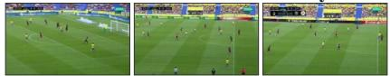

## Reference (GT)

After a brief stoppage for a minor knock, play resumes at a steady tempo with one side pushing...

## StreamingVLM

He's got to be careful. He's got to be careful.   
He's got to be careful.

## TimeChat-Online

'Las Palmas 0 - 0 Barcelona'

## VideoLLM-Online

You, You, The, ] Assistant, You, The, ] Assistant, You, The, The, You, ] Assistant, You,...

## StreamSoccer

After a brief stoppage for a foul, play has stayed lively with one side building down the flank...

Historical-memory commentary  

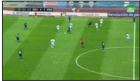

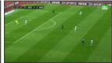

## Reference (GT)

[TEAM\_AWAY] keep the pressure on, following earlier corners with another close-range chance that goes wide.

## StreamingVLM

He scored five goals. That's a pretty good return.   
Yeah, I mean, he's a quality player.

## TimeChat-Online

The match between RCD Espanyol and Real Madrid is played on a green field with white...

## VideoLLM-Online

You, You, The, and, You, The, and, You, The, and, The, and, You, The, and, and,...

## StreamSoccer

[TEAM\_AWAY] come forward once more, building on the pressure they showed earlier with a couple of corners and...

Historical-memory commentary  

## Reference (GT)

[TEAM\_AWAY] are back over a dead ball, echoing that earlier indirect free-kick spell they produced.

## StreamingVLM

score. It's a great ball in from Pique. It's a great run from Suarez.

## TimeChat-Online

The match between Real Madrid and FC Barcelona is a thrilling encounter, with both teams showcasing...

## VideoLLM-Online

The,] ,] ,] ,] ,] ,] ,] ,] ,] ,] ,] ,] ,] ,] ,] ,]...

## StreamSoccer

[TEAM\_AWAY] threaten once more from a dead-ball situation, having already tested [TEAM\_HOME] with earlier free-kick and throw-in deliveries.

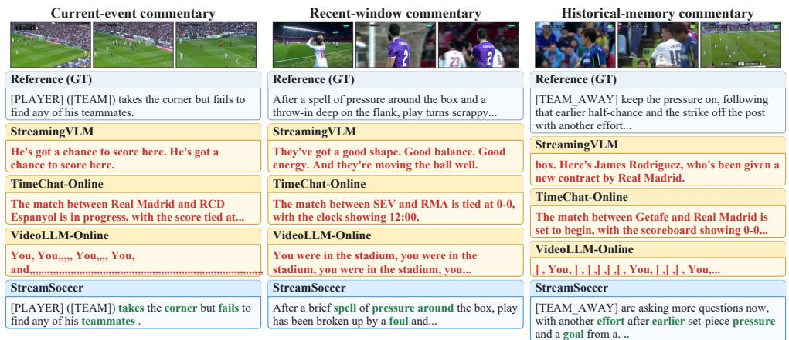  
Figure G.1: Five qualitative rows, each containing one frozen case from the current-event, recent-window, and historical-memory commentary tracks. The three column labels define the task type; no event timestamps or timelines are shown. Full frozen outputs, sample IDs, and coloring reasons are retained in the accompanying case-card audit. Rows 1–3 are shown here and the figure continues on the following pages.

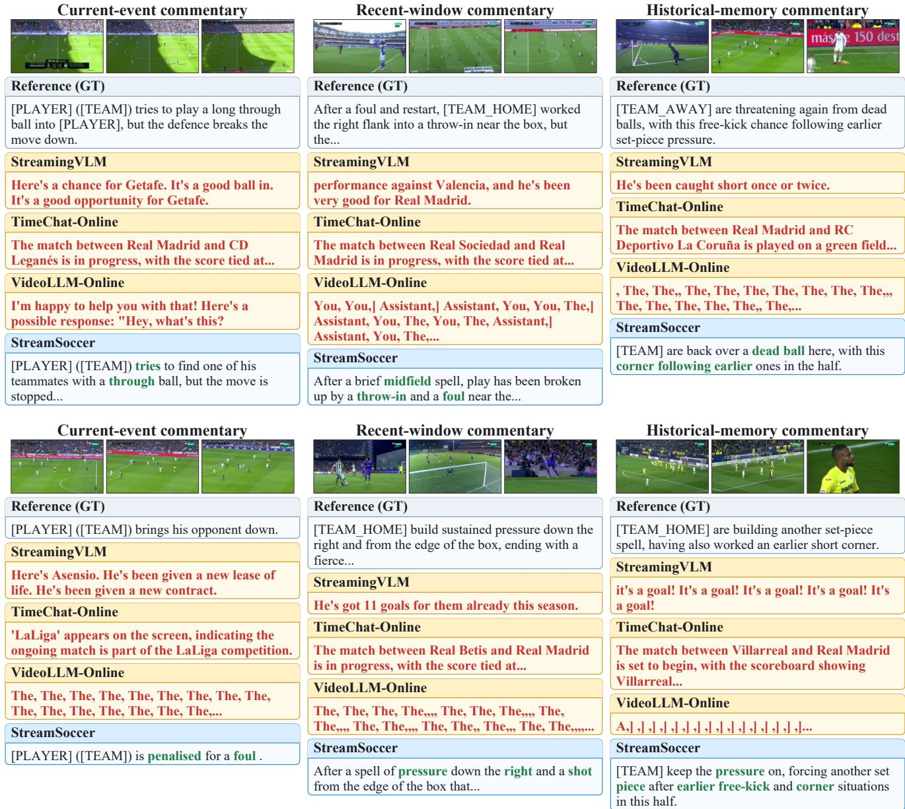  
Figure G.1: Qualitative gallery, continued (rows 4–5).

## G.3 Mechanically Audited Failures

This subsection reports deterministic mechanical failures only. The fixed-protocol four-way audit in Appendix E.2 ranks the four permuted candidate slots, including NO\_RESPONSE, and does not assign claim-level semantic-error labels; no population-level semantic-error frequency is reported. In the step-10,000 reference-anchored replay, 4 of 3,789 commentary outputs contain CJK or mojibake characters, including one output containing both repetition and encoding contamination. The same audit flags 38 of 20,689 generated caption records. In the step-7,000 free-scheduler replay, 4 of 20,658 record captions are empty; the commentary exact-duplicate rate is 0.000168 and the near-duplicate rate is zero.

## H Scope, Limitations, and Artifact Index

## H.1 Scope and Limitations

The following boundaries apply to the evidence in the main text and this appendix.

• Operational events are deterministic, rule-derived units for state control, not unconstrained discovery of natural semantic events. The 24-s rollover safeguard closes 40.2% of constructed events.

• MatchTime alignment covers 9.13% (15,189 / 166,419) of all operational events and therefore emphasizes moments for which commentary supervision is available.

• The main commentary table is reference-anchored and uses oracle operational closure, current-event alignment, label-assisted action/type metadata, and a recordreadiness intervention.

• The free-scheduler audit uses checkpoint step 7,000, cached visual tokens, and label-assisted action/type metadata. It demonstrates continuous execution, not a purely visual, target-independent commentary benchmark.

• The raw-video benchmark uses a fixed currentevent/recent-window/historical-memory request workload to compare history scaling; it does not evaluate each method’s native speaking decisions.

• The deployed scheduler is deterministic and rule-assisted. Scheduler strategy learning is outside the paper’s central claim.

• Generated event-record captions are model outputs rather than verified facts. Record availability is evaluated separately from downstream commentary quality, and no record-level factual-correctness claim is made.

• The blinded semantic audit uses one temperature-zero LLM judge and silver references. It measures availabilityaware, reference-conditioned preference under the frozen prompt rather than human preference or claim-level factuality.

<table><tr><td>Artifact ID</td><td>Paper-facing role and frozen evidence records</td></tr><tr><td>ANCHOR-S1K</td><td>Reference-anchored StreamSoccer quality and re- trieval diagnostics. Records: protocol and content hashes; command; traces; predictions; evaluation sum- mary</td></tr><tr><td>REP-MEM</td><td>Recurrent event-memory representation result. Records: checkpoint hash; predictions; scores; paired</td></tr><tr><td>REP-EVENT</td><td>bootstrap Operational-event pooling result. Records: checkpoint hash; predictions; scores; paired bootstrap</td></tr><tr><td>REP-FIXED</td><td>Fixed-time pooling result. Records: checkpoint hash; predictions; scores; paired bootstrap</td></tr><tr><td>SCOPE-CUR</td><td>Current-memory-only configuration. Records: replay command and evaluation summary</td></tr><tr><td>SCOPE-LOCAL</td><td>Current plus local event-memory buffer configuration. Records: replay command and evaluation summary</td></tr><tr><td>SCOPE-FULL</td><td>Full three-scope configuration. Records: replay com- mand and evaluation summary</td></tr></table>

Table H.1: Reproduction map for the frozen results and audits. Each stable ID names the evidence records supporting the corresponding paper-facing result.
<table><tr><td>Artifact ID</td><td>Paper-facing role and frozen evidence records</td></tr><tr><td>RAW-EWL</td><td>Raw-video efficiency, coverage, and stage timing. Records: run manifest; per-request timings; aggre-</td></tr><tr><td>FREE-S7K</td><td>gate tables Free-scheduler continuous-execution audit. Records:</td></tr><tr><td>HIST-CF209</td><td>traces; queue audit; outputs; summary Four-arm historical-record intervention. Records: pro- tocol; 209-anchor manifest; 836 outputs; evaluation</td></tr><tr><td>READY-730</td><td>summary; match-cluster bootstrap Paired record-readiness audit. Records: protocol; 730</td></tr><tr><td>BLIND-3789</td><td>paired rows; drain traces; audit summary Four-way blinded LLM semantic audit. Records: pro- tocol and source hashes; 3,789 permuted ballots; de-</td></tr><tr><td>FAIL-S10K</td><td>coded judgments; match-cluster bootstrap Step-10,000 reference-anchored mechanical failure audit. Records: commentary and record outputs; char-</td></tr><tr><td>CASE-FROZEN</td><td>acter, repetition, and encoding audit; aggregate counts Fixed qualitative gallery. Records: selection manifest; displayed records; exact outputs; highlight/render au- dit</td></tr></table>

Table H.1: Reproduction map, continued.

• Experiments use one soccer data ecosystem. Crossleague, cross-language, and broadcast-style generalization have not been established.

• Retained context-token count is not instrumented in the current raw-video artifact. Zero-valued context fields in diagnostic logs must not be interpreted as proof that no context was retained.

## H.2 Reproduction Map

Table H.1 extends the stable labels in Table C.4 to every frozen result and audit reported in this appendix.

The map uses stable IDs instead of absolute machine paths. Each result is backed by a frozen run-specific protocol or manifest together with the listed row-level outputs or traces and aggregate summary. Large row-level files are not duplicated in this PDF. The historical intervention, record-readiness audit, blinded semantic audit, and case-gallery selection are complete.

## LLM Usage

ChatGPT was used to aid in polishing the writing, including grammar, readability, and sentence clarity. Separately, GPT-5.6-terra was used as the single evaluator in the blinded semantic audit in Appendix E.2. It ranked anonymized candidate commentaries against a silver reference under a frozen prompt; its judgments were used only for evaluation and were not used as training targets.