# TextRefine: Improving Textual Fidelity, Spatial Placement, and Glyph Rendering for Text Editing in Product Posters

Honglie Wang<sup>1,2,3</sup>, Jia Sun<sup>1</sup>, Zijun Li<sup>1</sup>, Junlong Wu<sup>1</sup>, Pengcheng Wei<sup>1</sup>, Jiyuan Wang<sup>1</sup>, Yongrui Heng<sup>1</sup>, Boheng Zhang<sup>1</sup>, Huaiqing Wang<sup>1</sup>, Dewen Fan<sup>1</sup>, Qianqian Gan<sup>1</sup>, Fan Yang<sup>1</sup>, Tingting Gao<sup>1</sup>, Yan-Ming Zhang<sup>2,3</sup>

<sup>1</sup>Kuaishou Technology

<sup>2</sup>School of Artificial Intelligence, University of Chinese Academy of Sciences, Beijing 100049, China <sup>3</sup>State Key Laboratory of Multimodal Artificial Intelligence Systems (MAIS), Institute of Automation, Chinese Academy of Sciences, Beijing 100190, China

## Abstract

Text editing in product posters entails inserting new text or replacing existing text while preserving product appearance, background content, and global composition. Despite recent progress in instruction-based image editing, general-purpose models remain unreliable in this setting: they often omit or incorrectly render the target text, place it over salient products or pre-existing content, and produce structurally distorted or visually inconsistent glyphs. We introduce TextRefine, a task-aligned post-training framework that combines supervised fine-tuning with operation-specific reward optimization to address these complementary failure modes. For text insertion, our text-span-level reward jointly assesses semantic fidelity and target-span coverage, penalizes spatial conflicts with products and existing text, and employs a gated structural constraint to preserve non-text regions. For text replacement, our glyph-level reward leverages the connectionist temporal classification (CTC) posterior ofthe target character to provide graded supervision for fine-grained defects, including missing strokes, structural deformations, and confusion among visu ally similar characters. We further introduce OpenTextEdit, a dataset comprising 100K images for text editing in product posters, with multi-text layouts, detailed text attributes, product masks, and challenging low-frequency characters. Extensive experiments on both insertion and replacement demonstrate that TextRefine consistently outperforms the evaluated image editing baselines in textual fidelity, placement reliability, and glyph quality while better preserving source-image content.

## Introduction

Text-to-image generation has advanced rapidly in recent years, and state-of-the-art models can now synthesize photorealistic, high-fidelity images from natural language prompts (Podell et al. 2024; Betker et al. 2023; Saharia et al. 2022; Labs 2024; Esser et al. 2024). Within this broader progress, Visual Text Rendering (VTR), the ability to generate legible and semantically faithful text inside images, has become a core capability of modern generative systems (Zhang et al. 2025; Wu et al. 2025; ByteDance 2025; Team et al. 2026). Recent specialized models already demonstrate strong text-rendering performance in the generationfrom-scratch regime, where dense multilingual text can be produced with high accuracy and visual coherence (Tuo,

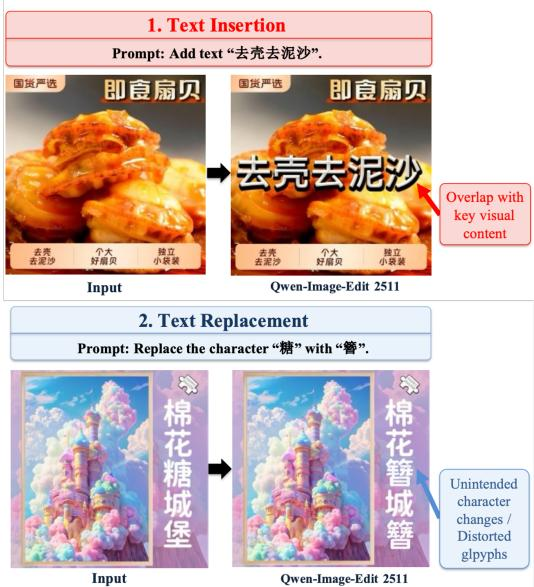  
Figure 1: Representative failure modes of existing methods for text editing in product posters. In text insertion (top), generated text may overlap salient product regions, conflict with existing text, or deviate from the intended content. In text replacement (bottom), models may alter unintended character instances or produce structurally distorted glyphs.

Geng, and Bo 2024; Liu et al. 2024; Gong et al. 2025; Gao et al. 2025a; Wu et al. 2025).

Text editing in product posters presents challenges that are not adequately addressed by progress in generation from scratch. The task encompasses both text insertion, in which one or more promotional text spans must be incorporated into an existing layout, and text replacement, in which localized text must be modified without disrupting its surroundings. Successful editing therefore requires simultaneous control over three aspects: textual fidelity, spatial placement, and glyph rendering. As shown in Figure 1, existing models may omit or incorrectly render requested text, place newly generated text over salient products or pre-existing content, and introduce structural defects during character replacement. These errors are particularly consequential in product posters, where text conveys essential commercial information and must coexist with tightly constrained visual layouts. Moreover, all edits must preserve product appearance, background content, and the overall composition of the source image.

A central obstacle is the mismatch between these requirements and existing supervision. Reinforcement-learning approaches to visual text rendering commonly derive rewards from OCR or multimodal large language models and reduce recognition outputs to rule-based scores such as exact match or edit distance (Geng et al. 2025; Du et al. 2020; Wei et al. 2024; Bai et al. 2025; Du et al. 2025; Chang et al. 2025). Although such signals measure whether textual content is recognizable, they provide limited supervision for posterspecific spatial conflicts and are often insensitive to subtle glyph defects that do not change the recognized character. A single string-level score is therefore insuficient to capture the distinct requirements of insertion and replacement: insertion demands span-level assessment of content, coverage, and placement, whereas replacement requires fine-grained sensitivity to character structure.

To address this supervision gap, we propose TextRefine, a task-aligned post-training framework for text editing in product posters. TextRefine first performs supervised fine-tuning on mixed insertion and replacement data to establish general editing capability, and then applies reinforcement learning with two complementary, operation-specific reward signals. For text insertion, a text-span-level reward evaluates semantic fidelity and target-span coverage while penalizing conflicts with product regions and pre-existing text; a gated structural constraint additionally discourages unintended changes to non-text content. For text replacement, a glyph-level reward uses the connectionist temporal classification posterior of the target character to provide graded supervision for missing strokes, structural deformations, and confusion among visually similar characters.

We further construct OpenTextEdit, a 100K-image dataset designed for text editing in product posters. It covers both text insertion and text replacement, with an emphasis on multi-text layouts and structurally complex low-frequency characters, and provides text content, layout references, visual attributes, and product masks for task-aligned training and evaluation.

We summarize our contributions as follows:

• We formulate text editing in product posters as two complementary tasks—text insertion and text replacement— and identify the distinct requirements of textual fidelity, spatial placement, glyph rendering, and source-image preservation.

• We propose TextRefine, a task-aligned post-training framework that combines supervised fine-tuning with reinforcement learning. Its text-span-level reward jointly optimizes content, coverage, and product-aware placement constraints for insertion, while its CTC-posteriorbased glyph-level reward provides fine-grained structural supervision for replacement.

• We construct OpenTextEdit, a 100K-image dataset featuring multi-text layouts, detailed text attributes, product masks, and challenging low-frequency characters. Experiments on both tasks demonstrate consistent improvements over strong image editing baselines in text accuracy, placement reliability, glyph fidelity, and content preservation.

## Related Work

## Visual Text Rendering

Visual text rendering (VTR), the generation of legible and semantically accurate text within images, has become a key capability of modern generative models. Performance in the generation-from-scratch setting has improved substantially, with recent models achieving high fidelity for dense multilingual text synthesis.

Existing approaches employ two primary strategies. The first injects auxiliary constraints into difusion models through specialized modules: glyph conditions (Tuo, Geng, and Bo 2024; Yang et al. 2023; Ma et al. 2025; Zhang et al. 2024) for morphological control and layout guidance (Chen et al. 2023; Wang et al. 2025d; Gao et al. 2025b; Zeng et al. 2024) for spatial precision. The second improves text encoder designs using character-level tokens or tokenizer-free architectures (Zhao and Lian 2024; Chen et al. 2024; Liu et al. 2024) to preserve fine-grained textual information. Recent large-scale models (Labs 2024; Esser et al. 2024; ByteDance 2025; Wu et al. 2025) have achieved substantial text-rendering capability without relying on explicit glyph conditions.

However, image editing presents fundamental challenges absent in generation-from-scratch: preserving source content, including foreground subjects, background context, and composition, while inserting or replacing text. Existing editing approaches, including AnyText (Tuo et al. 2023), Any-Text2 (Tuo, Geng, and Bo 2024), TextCtrl (Zeng et al. 2024), GlyphMastero (Wang et al. 2025b), PosterMaker (Gao et al. 2025b), RepText (Wang et al. 2025a), and FireRed-Image-Edit (Team et al. 2026), typically rely on complex auxiliary inputs such as glyph encoders, prior guidance, and external layout specifications. Despite these eforts, they lack mechanisms for multi-span semantic supervision, fall short in glyph fidelity for complex characters, and do not jointly optimize span-level and character-level quality.

## Reinforcement Learning for Visual Text Rendering

Reinforcement learning with scalar reward feedback has emerged as an efective post-training mechanism for improving generative model quality (Wang et al. 2025c). In the context of VTR, recent works have explored RL-based finetuning driven by OCR-derived rewards. Examples include Seedream 2.0 (Gong et al. 2025) and Seedream 3.0 (Gao et al. 2025a), which incorporate text accuracy rewards during posttraining for bilingual rendering; X-Omni (Geng et al. 2025), which applies RL to discrete autoregressive generation with OCR-based long-text rewards; and BLIP3o-NEXT (Chen et al. 2025), which leverages OCR rewards in a generation post-training pipeline.

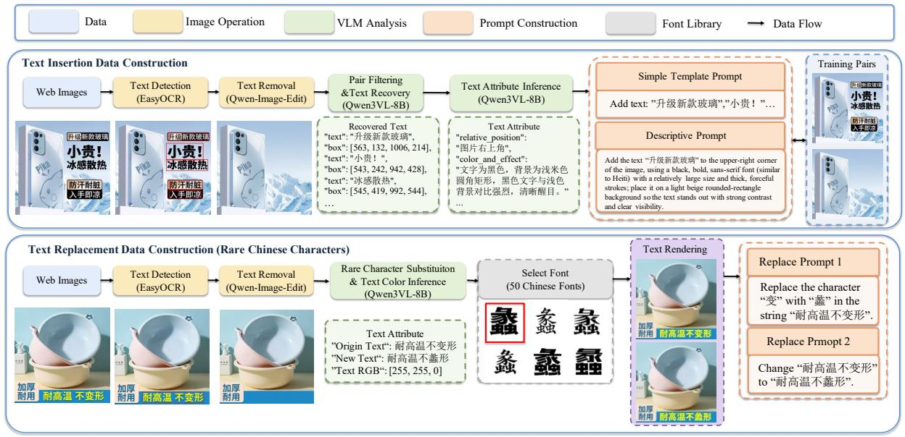  
Figure 2: Overview of the data construction pipeline for text insertion and text replacement in OpenTextEdit.

These methods demonstrate that RL supervision can improve text accuracy in generation-from-scratch settings. However, they share a fundamental limitation that becomes acute in the editing context. Their reward signals rely on standard OCR models (Du et al. 2020; Wei et al. 2024) or vision-language models (Bai et al. 2025) that operate at the string level, evaluating only character recognition accuracy and lacking fine-grained structural perception. Consequently, such rewards are insensitive to glyph-level defects, including missing strokes, extra components, and local distortions that compromise legibility without failing recognition. Existing RL frameworks for VTR do not distinguish span-level textual quality from glyph-level fidelity, collapsing both into a single reward signal that inadequately supervises text insertion and text replacement.

## Methodology

## Preliminaries

DifusionNFT We adopt DifusionNFT as the online reinforcement learning algorithm for policy optimization. Let $v _ { \theta } ( x _ { t } , t , c )$ denote the trainable velocity field and $v ^ { \mathrm { o l d } } ( x _ { t } , t , c )$ the sampling policy. Given an online sample $x _ { 0 } ,$ , a task-specific reward model produces a normalized quality score $r \in [ 0 , 1 ]$ . DifusionNFT constructs implicit positive and negative policies as $v _ { \theta } ^ { + } = ( 1 - \beta ) v ^ { \mathrm { o l d } } + \beta v _ { \theta }$ and $v _ { \theta } ^ { - } = ( 1 + \beta ) v ^ { \mathrm { o l d } } - \beta v _ { \theta }$ , where $\beta > 0$ controls the update magnitude. The resulting optimization objective is

$$
\begin{array} { r } { \mathcal { L } _ { \mathrm { N F T } } = \mathbb { E } _ { ( x _ { 0 } , c ) \sim \pi ^ { \mathrm { o l d } } , t ; } \Big [ r \| v _ { \theta } ^ { + } ( x _ { t } , t , c ) - v \| _ { 2 } ^ { 2 } } \\ { x _ { t } \sim q ( \cdot | x _ { 0 } , t ) \qquad } \\ { + \left( 1 - r \right) \| v _ { \theta } ^ { - } ( x _ { t } , t , c ) - v \| _ { 2 } ^ { 2 } \Big ] , } \end{array}\tag{1}
$$

where v is the target velocity and $q ( x _ { t } \mid x _ { 0 } , t )$ denotes the forward noising process. The objective assigns greater weight to the positive policy term for high-reward samples and to the negative policy term for low-reward samples. We instantiate r with task-specific signals tailored to text insertion and localized text editing in product posters.

Task Definition We consider two forms of text editing in product posters: text insertion and localized text replacement. Let $\tau \in \{ \mathrm { i n s } , \mathrm { r e p } \}$ denote the task identity. Given a source poster $x ^ { \mathrm { s r c } }$ , an editing instruction $c ,$ and a task-specific target y, the model generates an edited poster xˆ that renders the requested text while preserving product appearance, background content, and non-target layout elements. For insertion (τ = ins), the target is a set of text spans $\boldsymbol { y } = \{ y _ { i } \} _ { i = 1 } ^ { N }$ to be placed within the available poster layout. For replacement (τ = rep), the target is a glyph $y ^ { \star }$ to be rendered in a localized source-text region. We use a simple instruction template and a descriptive attribute-aware template for insertion, together with two operation-specific templates for replacement. These formats expose the model to complementary levels of instruction specificity while retaining an unambiguous editing target. Our goal is to learn a single policy whose reward is selected according to the requirements of each task.

## Text Editing Data Construction

As illustrated in Figure 2, we construct task-specific training pairs that reflect the visual and textual constraints of product posters. For insertion, we collect candidate poster images from large-scale web data, localize existing text with OCR, and remove the detected regions using Qwen-Image-Edit-2511. A vision-language model (VLM) filters unreliable edits and retains pairs consisting of an original poster and its text-removed counterpart. By comparing the paired images, the VLM recovers the target spans and annotates visual attributes such as color, position, and font style. We convert these annotations into a simple prompt specifying the insertion target and a descriptive prompt that additionally encodes appearance and layout cues. The resulting pairs supervise both faithful text rendering and compatibility with the existing product-poster composition.

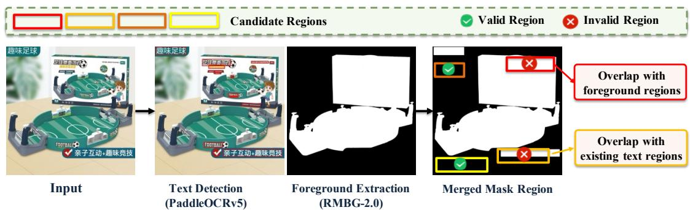  
Figure 3: Valid-span filtering for product-poster text insertion. A detected span is retained when its overlap with pre-existing text is below $\tau _ { \mathrm { b b o x } }$ and its overlap with the salient-product mask m is below $\tau _ { \mathrm { m a s k } }$ . This criterion implements the non-overlap preference used in our target setting rather than a universal poster-layout rule.

For localized replacement, we construct a complementary subset centered on low-frequency Chinese characters, whose complex structures remain dificult for general-purpose editors. Starting from OCR-localized text regions, we remove a selected region, substitute its content with a target character, and render the character using one of 50 Chinese fonts collected from online sources. This controlled procedure yields paired source and target posters while retaining the surrounding local context. We then generate two replacement-specific prompts that explicitly identify the source and target text, thereby reducing ambiguity in localized editing. We use synthetic rendering only for the replacement subset: insertion additionally requires learning poster-level placement and appearance, whereas localized replacement primarily benefits from controlled supervision of character structure and regional consistency.

## Text-Span-Level Reward

The insertion reward evaluates whether the edited poster contains the requested spans without introducing spurious text or violating the non-overlap preference adopted in our productposter setting. Given target spans $\boldsymbol { y } = \mathsf { \bar { \{ y _ { i } \} } } _ { i = 1 } ^ { N }$ , we apply OCR to obtain detections $\{ ( u _ { j } , b _ { j } , s _ { j } ) \} _ { j = 1 } ^ { M }$ , where $u _ { j } , b _ { j }$ and $s _ { j }$ denote the recognized string, bounding box, and confidence score, respectively. Let $\boldsymbol { B ^ { \mathrm { s r c } } } = \{ \bar { b } _ { k } \}$ denote sourceposter text boxes, and let m denote the salient-product mask obtained with BiRefNet (Zheng et al. 2024). We retain detections whose overlap with both pre-existing text and the product region is below predefined thresholds, yielding the valid span set

$$
\mathcal { V } = \left\{ \left( v _ { j } , \tilde { b } _ { j } \right) \left| \begin{array} { l } { \displaystyle \operatorname* { m a x } _ { \bar { b } _ { k } \in \mathcal { B } ^ { \mathrm { s r c } } } \frac { \left| \tilde { b } _ { j } \cap \bar { b } _ { k } \right| } { \operatorname* { m i n } ( | \tilde { b } _ { j } | , | \bar { b } _ { k } | ) } < \tau _ { \mathrm { b b o x } } , } \\ { \displaystyle \frac { | \tilde { b } _ { j } \cap m | } { | \tilde { b } _ { j } | } < \tau _ { \mathrm { m a s k } } } \end{array} \right. \right\} ,\tag{2}
$$

where $\tau _ { \mathrm { b b o x } } = 0 . 5$ and $\tau _ { \mathrm { m a s k } } = 0 . 5$ in our implementation. This filtering rule operationalizes a controllable layout

preference for the product posters considered here; it is not intended as a universal design principle, since intentional text–product overlap can be appropriate in other poster styles.

For each target span $y _ { i }$ , we compute similarity against retained OCR spans using normalized edit distance. Let ϕ(·) remove whitespace and normalize case, and define

$$
\begin{array} { r l } & { s _ { i j } = 1 - \frac { d _ { \mathrm { L e v } } \left( \phi \left( \boldsymbol { y } _ { i } \right) , \phi \left( \boldsymbol { v } _ { j } \right) \right) } { \operatorname* { m a x } \left\{ \lvert \phi \left( \boldsymbol { y } _ { i } \right) \rvert , \lvert \phi \left( \boldsymbol { v } _ { j } \right) \rvert \right\} } , } \\ & { ~ r _ { i } = \left\{ \begin{array} { l l } { 1 , } & { \phi ( \boldsymbol { v } _ { j } ) \subseteq \phi ( \boldsymbol { v } _ { j } ) ~ \mathrm { o r } } \\ { \displaystyle \operatorname* { m a x } _ { \boldsymbol { v } _ { j } \in \mathcal { V } } s _ { i j } , } & { \displaystyle \operatorname* { m a x } _ { \boldsymbol { v } _ { j } \in \mathcal { V } } s _ { i j } \geq \tau _ { \mathrm { m i s s } } , } \\ { 0 , } & { \mathrm { o t h e r w i s e } . } \end{array} \right. } \end{array}\tag{3}
$$

where $d _ { \mathrm { L e v } }$ is the Levenshtein distance and $\tau _ { \mathrm { m i s s } } = 0 . 5$ . We then combine semantic fidelity and coverage as

$$
R _ { \mathrm { s p a n } } = \underbrace { \frac { 1 } { N } \sum _ { i = 1 } ^ { N } r _ { i } } _ { R _ { \mathrm { s i m } } } \underbrace { \operatorname* { m a x } \bigg ( 0 , 1 - \frac { U _ { \mathrm { t a r } } + U _ { \mathrm { o c r } } } { \operatorname* { m a x } ( N , | \mathcal { V } | ) } \bigg ) } _ { R _ { \mathrm { c o v } } } ,\tag{4}
$$

where $U _ { \mathrm { t a r } }$ and $U _ { \mathrm { o c r } }$ denote the numbers of unmatched target spans and unmatched OCR detections, respectively. The similarity term measures target-span fidelity, while the coverage term penalizes omissions and unintended text generation. Together with the filtering in Equation 2, this reward assesses content coverage and collision avoidance; it does not attempt to model the full aesthetics of poster layout.

To reduce OCR-oriented reward exploitation and preserve the source poster, we introduce a gated structural regularizer that becomes active only after span-level accuracy exceeds a prescribed threshold:

$$
\begin{array} { r } { R _ { \mathrm { t e x t } } = R _ { \mathrm { s p a n } } + \mathbf { 1 } [ R _ { \mathrm { s p a n } } > \tau _ { \mathrm { s s i m } } ] \quad } \\ { \mathbf { \cdot S S I M } ( \psi ( \hat { x } , \mathcal { V } ) , \psi ( x ^ { \mathrm { s r c } } , \mathcal { V } ) ) , } \end{array}\tag{5}
$$

where $\psi ( \cdot , \nu )$ masks the retained text boxes in V by whitening them before comparison, and $\tau _ { \mathrm { s s i m } } = 0 . 5$ . Consequently, the optimization first prioritizes rendering the requested text; once this condition is met, the SSIM term penalizes unintended changes to products, backgrounds, and other non-text poster content.

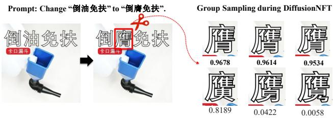  
Figure 4: Comparison of binary OCR correctness and the proposed graded glyph signal. Whereas a binary reward retains only the final correctness decision, the target-glyph CTC posterior preserves continuous recognition evidence and provides a more informative signal for optimizing glyph fidelity.

## Glyph-Level Reward

Although $R _ { \mathrm { t e x t } }$ measures span-level correctness, it is comparatively insensitive to fine structural defects within an individual character. We therefore define a glyph-level reward for localized replacement samples $( \tau = \mathrm { r e p } )$ using graded recognition evidence from the edited character region. Let $y ^ { \star }$ denote the target glyph and $\boldsymbol { b } ^ { \star } = [ x _ { 1 } , y _ { 1 } , x _ { 2 } , y _ { 2 } ]$ its annotated bounding box. We first crop the edited poster xˆ to this region,

$$
\hat { x } _ { \mathrm { c h a r } } = \mathrm { C r o p } ( \hat { x } , b ^ { \star } ) ,\tag{6}
$$

and feed the crop into a PaddleOCR-v5 recognizer. Instead of relying only on the final decoded string, we use the full CTC posterior matrix

$$
P \in [ 0 , 1 ] ^ { T \times | \mathcal { C } | } ,\tag{7}
$$

where $T$ is the temporal length of the recognition sequence, $\mathcal { C }$ is the OCR character vocabulary, and $P _ { \mathit { t } , \mathit { k } }$ denotes the softmax probability assigned to character $k \in { \mathcal { C } }$ at time step t.

As illustrated in Figure 4, the posterior retains graded evidence that is discarded by binary OCR correctness. Let $\operatorname { i d } ( y ^ { \star } )$ be the vocabulary index of $y ^ { \star }$ . We define the glyph reward as the maximum posterior probability assigned to the target glyph across all CTC time steps:

$$
R _ { \mathrm { g l y p h } } = \operatorname* { m a x } _ { 1 \leq t \leq T } P _ { t , \mathrm { i d } ( y ^ { \star } ) } .\tag{8}
$$

If the recognizer produces multiple candidate sequences, we concatenate them along the temporal dimension before applying the maximum. The resulting score increases with the recognizer’s support for the target glyph and provides a continuous optimization signal under missing strokes, structural deformation, or confusion with visually similar characters. This reward is particularly suited to localized editing of lowfrequency Chinese characters, for which exact-match supervision is sparse.

## Task-Specific Reward Assignment

The two rewards address diferent editing operations and are therefore not summed for an individual sample. We train TextRefine on a mixed stream of insertion and localizedreplacement examples and select the scalar DifusionNFT reward according to the task identity:

$$
R ( \hat { x } , \tau , y , b ^ { \star } ) = \left\{ \begin{array} { l l } { R _ { \mathrm { t e x t } } , } & { \tau = \mathrm { i n s } , } \\ { R _ { \mathrm { g l y p h } } , } & { \tau = \mathrm { r e p } . } \end{array} \right.\tag{9}
$$

Thus, insertion samples receive span- and preservationaware supervision through $R _ { \mathrm { t e x t } } .$ , whereas replacement samples receive character-structure supervision through $R _ { \mathrm { g l y p h } }$ This task-conditioned assignment allows a single editing policy to learn from both operations without conflating their distinct quality criteria.

## Experiments

## Implementation Details

Data and Supervised Fine-Tuning. We evaluate TextRefine under a common protocol for insertion and localized replacement in product posters, with all training and evaluation images resized to 1024 × 1024. OpenTextEdit contains 50K insertion images and 50K localized-replacement images. Pairing each image with two instruction variants yields 200K prompt–image instances for supervised finetuning. We initialize from Qwen-Image-Edit-2511 and optimize all model parameters using DeepSpeed ZeRO-3 with bf16 mixed precision. Training uses a global batch size of 8 and a learning rate of $1 \times 1 0 ^ { - 5 }$ for approximately 20 epochs on 48 NVIDIA A800 GPUs.

Hardness-Aware RL Data Selection. To improve the informativeness of online optimization, we prioritize challenging examples that remain feasible for the SFT policy. Specifically, we consider insertion examples containing more than three target spans and replacement examples whose target characters contain more than 20 strokes. For each candidate, the SFT model generates five rollouts using 15 denoising steps. We compute the corresponding task-specific rewards and retain, for each operation, the 1,000 examples with the largest reward variance. This strategy emphasizes semi-hard cases for which the policy is capable of producing valid edits but remains unstable across rollouts.

Reinforcement Learning. Starting from the SFT checkpoint, we apply DifusionNFT with LoRA rank 64 and scaling factor 128. Each update uses groups of 16 samples, with 48 distinct prompts sampled per epoch. Rollouts use 15 denoising steps, and optimization is performed on four sampled timesteps from each trajectory. We train for approximately two epochs on 16 NVIDIA A800 GPUs using a learning rate of $3 . { \overset { \underset { \star } { } } { 0 } } \times 1 0 ^ { - 4 }$

## Evaluation Metrics

We construct task-specific evaluation subsets from Open-TextEdit. The insertion benchmark contains 629 examples with simple prompts and 1,235 examples with descriptive prompts, while the localized-replacement benchmark contains 200 examples evaluated with a fixed replacement prompt. We report operation-specific text metrics together with FID, SSIM, and PSNR to characterize distributional quality and preservation of source-poster content. Because the benchmarks follow the target product-poster distribution, the results measure in-domain performance and should not be interpreted as evidence of unrestricted cross-domain or multilingual generalization.

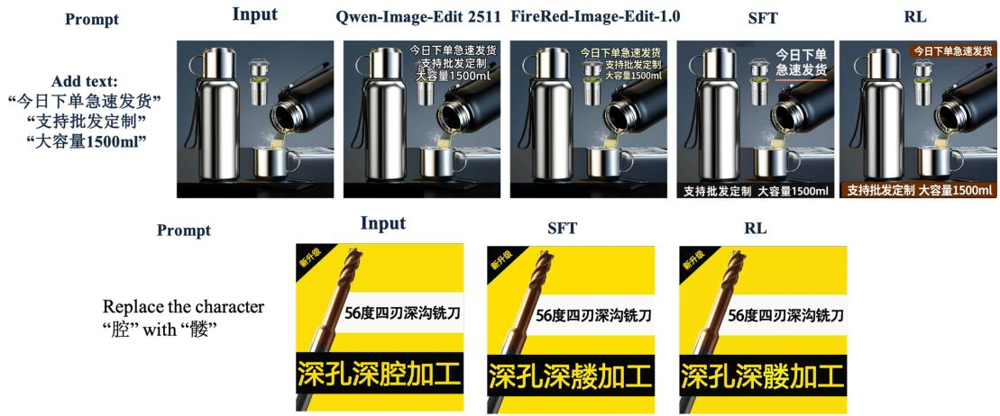  
Figure 5: Qualitative comparison of TextRefine with the evaluated baselines on product-poster text insertion (top) and localized replacement (bottom). TextRefine more faithfully renders the requested content while respecting the target poster layout and character structure; baseline outputs exhibit product occlusion, unintended text, or glyph distortion.

Text Insertion Benchmark. Each example contains a source poster, a target span set $Y _ { j } = \{ y _ { j , i } \} _ { i = 1 } ^ { N _ { j } }$ , and an edited output. We apply PaddleOCR-v5 to the source and edited posters and remove detections associated with pre-existing source text using bounding-box overlap, leaving candidate inserted spans. Target spans are parsed from the instruction, and a VLM aligns them with OCR detections while accounting for token fragmentation and minor recognition deviations (similarity $> 0 . 7 )$ . For example $j ,$ let $M _ { j } , \bar { P } _ { j }$ , and $U _ { j }$ denote the numbers of matched, partial, and missed targets, respectively, and let $E _ { j }$ denote unmatched extra detections; thus $N _ { j } \stackrel { . } { = } M _ { j } + P _ { j } \stackrel { . } { + } U _ { j }$

The sample-level insertion score is

$$
s _ { j } ^ { \mathrm { i n s } } = \operatorname* { m a x } \biggl ( 0 , \frac { M _ { j } + \alpha P _ { j } - E _ { j } } { N _ { j } } \biggr ) ,\tag{10}
$$

where $\alpha \in [ 0 , 1 ]$ weights partial matches. Over a benchmark with B samples, we report

$$
\mathrm { S c o r e } _ { \mathrm { i n s } } = \frac { 1 } { B } \sum _ { j = 1 } ^ { B } s _ { j } ^ { \mathrm { i n s } } .\tag{11}
$$

Localized Text Replacement Benchmark. Each example consists of a source poster, a target character $y _ { j } ^ { \star }$ , and an annotated character box $b _ { j } ^ { \star }$ . We crop the edited poster around $b _ { j } ^ { \star }$ with a small margin and apply PaddleOCR-v5 to the localized region. Let $t _ { j }$ denote the concatenated OCR output. We define the correctness indicator as

$$
z _ { j } = \mathbb { I } \big [ y _ { j } ^ { \star } \in t _ { j } \big ] ,\tag{12}
$$

where $\mathbb { I } [ \cdot ]$ is the Iverson bracket that equals 1 if the target character is present in the OCR output and 0 otherwise. The replacement accuracy is then

$$
\mathrm { A c c } _ { \mathrm { r e p } } = \frac { 1 } { B } \sum _ { j = 1 } ^ { B } z _ { j } ,\tag{13}
$$

which measures the proportion of examples for which the target character is recognized within the localized replacement region. This protocol focuses on single-character editing and does not evaluate multi-character rewriting.

## Main Results

Comparison with Baselines We compare TextRefine with four representative baselines. Qwen-Image-Edit-2511 (Wu et al. 2025) is the general-purpose instruction-based editor used for initialization, while FireRed-Image-Edit-1.0 (Team et al. 2026) provides a strong visual-text editing baseline. We additionally evaluate AnyText2 (Tuo, Geng, and Bo 2024), which supports attribute-controllable visual text generation and editing, and PosterMaker (Gao et al. 2025b), which is specifically designed for accurate text rendering in product posters. Together, these methods cover general instructionbased editing, specialized visual-text editing, and productposter-oriented generation. Table 1 reports the main comparison under both prompt settings, and Figure 5 provides qualitative comparisons. Our claims are restricted to the evaluated baselines and the OpenTextEdit product-poster benchmarks.

As shown in Table 1, TextRefine (RL) obtains the strongest overall results among the evaluated methods under both prompt settings. Relative to its SFT initialization, reward optimization increases the matched-span rate and insertion score while reducing partial matches, missed spans, and extra OCR detections. The accompanying gains in SSIM and PSNR indicate improved preservation of non-target poster content. These results support the role of the span reward in suppressing omissions and unintended text, and of the gated structural term in limiting changes outside the inserted regions.

Localized Text Replacement Results. Table 2 summarizes performance on localized editing of low-frequency Chinese characters. TextRefine (SFT) already improves substantially over the evaluated baselines, showing the benefit of task-specific replacement data for structurally complex glyphs. Applying the glyph reward yields a further improvement, supporting the use of the target-character CTC posterior as an informative optimization signal for this benchmark. Detailed reward ablations for both editing operations are presented below.

Table 1: Quantitative comparison on text insertion benchmark under simple template prompt (top, 629 samples) and descriptive prompt (bottom, 1235 samples). ↑: higher is better; ↓: lower is better. Best results in bold.
<table><tr><td>Method</td><td>Match (%)↑</td><td>Partial (%)↓</td><td>Miss (%)↓</td><td>Extra↓</td><td>Score↑</td><td>FID↓</td><td>SSIM↑</td><td>PSNR↑</td></tr><tr><td colspan="9">Simple Template Prompt (629 samples)</td></tr><tr><td>Qwen-Image-Edit-2511</td><td>76.8</td><td>8.3</td><td>14.9</td><td>26</td><td>0.7829</td><td>36.7330</td><td>0.8016</td><td>14.8536</td></tr><tr><td>FireRed-Image-Edit-1.0</td><td>82.2</td><td>6.2</td><td>11.6</td><td>32</td><td>0.8277</td><td>30.5686</td><td>0.7825</td><td>14.9120</td></tr><tr><td>TextRefine (ŠFT)</td><td>87.1</td><td>7.2</td><td>5.7</td><td>52</td><td>0.8526</td><td>24.3464</td><td>0.8232</td><td>15.9917</td></tr><tr><td>TextRefine (RL)</td><td>91.9</td><td>4.3</td><td>3.8</td><td>18</td><td>0.9174</td><td>24.2191</td><td>0.8303</td><td>16.0774</td></tr><tr><td colspan="9">Descriptive Prompt (1235 samples)</td></tr><tr><td>Qwen-Image-Edit-2511</td><td>79.4</td><td>7.9</td><td>12.6</td><td>102</td><td>0.7893</td><td>48.9229</td><td>0.6412</td><td>12.3042</td></tr><tr><td>FireRed-Image-Edit-1.0</td><td>82.5</td><td>7.2</td><td>10.3</td><td>76</td><td>0.8216</td><td>36.2180</td><td>0.6782</td><td>13.3152</td></tr><tr><td>TextRefine (SFT)</td><td>87.8</td><td>2.8</td><td>9.4</td><td>82</td><td>0.8419</td><td>32.5287</td><td>0.7364</td><td>14.7352</td></tr><tr><td>TextRefine (RL)</td><td>90.0</td><td>1.2</td><td>8.7</td><td>63</td><td>0.8973</td><td>31.9462</td><td>0.7428</td><td>15.1628</td></tr></table>

Table 3: Ablation on text insertion reward components (simple template prompt, 629 samples). ↑: higher is better; ↓: lower is better. Best results in bold.
<table><tr><td>Method</td><td>Match (%)↑</td><td>Partial (%)↓</td><td>Miss (%)↓</td><td>Extra↓</td><td>Score↑</td><td>FID↓</td><td>SSIM↑</td><td>PSNR↑</td></tr><tr><td>SFT (No RL)</td><td>87.1</td><td>7.2</td><td>5.7</td><td>52</td><td>0.8526</td><td>24.3464</td><td>0.8232</td><td>15.9917</td></tr><tr><td> $R _ { \mathrm { s p a n } }$ </td><td>88.6</td><td>4.8</td><td>6.7</td><td>23</td><td>0.8800</td><td>24.2653</td><td>0.8357</td><td>16.0874</td></tr><tr><td> $R _ { \mathrm { t e x t } }$  (with gated SSIM)</td><td>91.9</td><td>4.3</td><td>3.8</td><td>18</td><td>0.9174</td><td>24.1872</td><td>0.8427</td><td>16.1573</td></tr></table>

Table 2: Accuracy on the localized rare-character editing benchmark (200 samples). Higher is better. Best result in bold.
<table><tr><td>Method</td><td>Acc (%)↑</td></tr><tr><td>Qwen-Image-Edit-2511</td><td>48.0</td></tr><tr><td>FireRed-Image-Edit-1.0</td><td>55.5</td></tr><tr><td>TextRefine (SFT)</td><td>69.5</td></tr><tr><td>TextRefine (RL)</td><td>74.5</td></tr></table>

## Ablation Studies

Text Insertion. Table 3 shows that optimizing $R _ { \mathrm { s p a n } }$ reduces extra OCR detections and improves the insertion score relative to SFT, indicating that the similarity and coverage terms discourage missing and unintended text. Adding the gated SSIM term to form $R _ { \mathrm { t e x t } }$ further improves matchedspan accuracy and source-poster similarity. Because the structural term is activated only after $R _ { \mathrm { s p a n } }$ exceeds the threshold, it complements rather than replaces the textcentric objective.

Localized Text Replacement. Table 4 shows that $R _ { \mathrm { g l y p h } }$ improves accuracy over both SFT and the binary OCR reward. This result indicates that retaining the target-character posterior supplies useful graded supervision for the structurally complex, low-frequency characters represented in the benchmark.

Table 4: Ablation on localized text replacement rewards (rare-character benchmark, 200 samples). Higher is better. Best results in bold.
<table><tr><td>Method</td><td>Acc (%)↑</td></tr><tr><td>SFT (No RL)</td><td>69.5</td></tr><tr><td>Binary OCR Reward</td><td>73.0</td></tr><tr><td> $R _ { \mathrm { g l y p h } }$  (Ours)</td><td>76.0</td></tr></table>

## Conclusion

We presented TextRefine, a task-aligned post-training framework for text editing in product posters. Its span-level insertion reward jointly promotes target-text fidelity, coverage, reliable placement, and preservation of non-target content, while its CTC-posterior glyph reward provides graded structural supervision for localized character replacement. We also introduced OpenTextEdit, a 100K-image dataset with multi-text poster layouts, detailed text attributes, product masks, and challenging low-frequency Chinese characters. On the evaluated benchmarks, TextRefine improves insertion accuracy, source-poster preservation, and localized replacement accuracy over its SFT initialization and the compared baselines. Evaluation remains limited to OpenTextEdit, Chinese single-character replacement, and PaddleOCR-v5; future work will address external, multilingual, and multicharacter settings.

## References

Bai, S.; Chen, K.; Liu, X.; Wang, J.; Ge, W.; Song, S.; Dang, K.; Wang, P.; Wang, S.; Tang, J.; Zhong, H.; Zhu, Y.; Yang, M.; Li, Z.; Wan, J.; Wang, P.; Ding, W.; Fu, Z.; Xu, Y.; Ye, J.; Zhang, X.; Xie, T.; Cheng, Z.; Zhang, H.; Yang, Z.; Xu, H.; and Lin, J. 2025. Qwen2.5-VL Technical Report. arXiv preprint arXiv:2502.13923.

Betker, J.; Goh, G.; Jing, L.; Brooks, T.; Wang, J.; Li, L.; Ouyang, L.; Zhuang, J.; Lee, J.; Guo, Y.; et al. 2023. Improving image generation with better captions. OpenAI Technical Report.

ByteDance. 2025. Seedream 4.0. https://seed.bytedance. com/en/seedream4\_0. Accessed: 2025-09-22.

Chang, J.; Fang, Y.; Xing, P.; Wu, S.; Cheng, W.; Wang, R.; Zeng, X.; Yu, G.; and Chen, H.-B. 2025. OneIG-Bench: Omni-dimensional Nuanced Evaluation for Image Generation. arXiv preprint arXiv:2506.07977.

Chen, J.; Huang, Y.; Lv, T.; Cui, L.; Chen, Q.; and Wei, F. 2023. TextDifuser: Difusion Models as Text Painters. NeurIPS, 36: 9353–9387.

Chen, J.; Huang, Y.; Lv, T.; Cui, L.; Chen, Q.; and Wei, F. 2024. TextDifuser-2: Unleashing the Power of Language Models for Text Rendering. In ECCV, 386–402.

Chen, J.; Xue, L.; Xu, Z.; Pan, X.; Yang, S.; Qin, C.; Yan, A.; Zhou, H.; Chen, Z.; Huang, L.; et al. 2025. BLIP3o-NEXT: Next Frontier of Native Image Generation. arXiv preprint arXiv:2510.15857.

Du, N.; Chen, Z.; Gao, S.; Chen, Z.; Chen, X.; Jiang, Z.; Yang, J.; and Tai, Y. 2025. TextCrafter: Accurately Rendering Multiple Texts in Complex Visual Scenes. arXiv preprint arXiv:2503.23461.

Du, Y.; Li, C.; Guo, R.; Yin, X.; Liu, W.; Zhou, J.; Bai, Y.; Yu, Z.; Yang, Y.; Dang, Q.; et al. 2020. PP-OCR: A practical ultra lightweight OCR system. arXiv preprint arXiv:2009.09941.

Esser, P.; Kulal, S.; Blattmann, A.; Entezari, R.; M"uller, J.; Saini, H.; Levi, Y.; Lorenz, D.; Sauer, A.; Boesel, F.; et al. 2024. Scaling Rectified Flow Transformers for High-Resolution Image Synthesis. In ICML.

Gao, Y.; Gong, L.; Guo, Q.; Hou, X.; Lai, Z.; Li, F.; Li, L.; Lian, X.; Liao, C.; Liu, L.; et al. 2025a. Seedream 3.0 Technical Report. arXiv preprint arXiv:2504.11346.

Gao, Y.; Lin, Z.; Liu, C.; Zhou, M.; Ge, T.; Zheng, B.; and Xie, H. 2025b. PosterMaker: Towards High-Quality Product Poster Generation with Accurate Text Rendering. In CVPR, 8083–8093.

Geng, Z.; Wang, Y.; Ma, Y.; Li, C.; Rao, Y.; Gu, S.; Zhong, Z.; Lu, Q.; Hu, H.; Zhang, X.; et al. 2025. X-omni: Reinforcement learning makes discrete autoregressive image generative models great again. arXiv preprint arXiv:2507.22058.

Gong, L.; Hou, X.; Li, F.; Li, L.; Lian, X.; Liu, F.; Liu, L.; Liu, W.; Lu, W.; Shi, Y.; et al. 2025. Seedream 2.0: A Native Chinese-English Bilingual Image Generation Foundation Model. arXiv preprint arXiv:2503.07703.

Labs, B. F. 2024. FLUX. https://github.com/black-forestlabs/flux.

Liu, Z.; Liang, W.; Zhao, Y.; Chen, B.; Liang, L.; Wang, L.; Li, J.; and Yuan, Y. 2024. Glyph-ByT5-v2: A Strong Aesthetic Baseline for Accurate Multilingual Visual Text Rendering. arXiv preprint arXiv:2406.10208.

Ma, J.; Deng, Y.; Chen, C.; Du, N.; Lu, H.; and Yang, Z. 2025. GlyphDraw2: Automatic Generation of Complex Glyph Posters with Difusion Models and Large Language Models. In AAAI, volume 39, 5955–5963.

Podell, D.; English, Z.; Lacey, K.; Blattmann, A.; Dockhorn, T.; Müller, J.; Penna, J.; and Rombach, R. 2024. SDXL: Improving Latent Difusion Models for High-Resolution Image Synthesis. In International Conference on Learning Representations (ICLR).

Saharia, C.; Chan, W.; Saxena, S.; Li, L.; Whang, J.; Denton, E. L.; Ghasemipour, S. K. S.; Lopes, R. G.; Ayan, B. K.; Salimans, T.; Ho, J.; Fleet, D. J.; and Norouzi, M. 2022. Photorealistic Text-to-Image Difusion Models with Deep Language Understanding. InAdvances in Neural Information Processing Systems (NeurIPS).

Team, S. I.; Qiao, C.; Hui, C.; Li, C.; Wang, C.; Song, D.; Zhang, J.; Li, J.; Xiang, Q.; Wang, R.; et al. 2026. FireRed-Image-Edit-1.0 Technical Report. arXiv preprint arXiv:2602.13344.

Tuo, Y.; Geng, Y.; and Bo, L. 2024. AnyText2: Visual Text Generation and Editing with Customizable Attributes. arXiv preprint arXiv:2411.15245.

Tuo, Y.; Xiang, W.; He, J.-Y.; Geng, Y.; and Xie, X. 2023. AnyText: Multilingual Visual Text Generation and Editing. arXiv preprint arXiv:2311.03054.

Wang, H.; Xu, Y.; Li, Y.; Li, J.; Zhang, C.; Wang, J.; Yang, K.; and Chen, Z. 2025a. RepText: Rendering Visual Text via Replicating. arXiv preprint arXiv:2504.19724.

Wang, T.; Liu, T.; Qu, X.; Wu, C.; Liu, L.; and Hu, X. 2025b. GlyphMastero: A Glyph Encoder for High-Fidelity Scene Text Editing. In CVPR, 28523–28532.

Wang, Y.; Zang, Y.; Li, H.; Jin, C.; and Wang, J. 2025c. Unified Reward Model for Multimodal Understanding and Generation. arXiv preprint arXiv:2503.05236.

Wang, Y.; Zhang, W.; Xu, H.; and Jin, C. 2025d. DreamText: High Fidelity Scene Text Synthesis. In CVPR, 28555–28563.

Wei, H.; Liu, C.; Chen, J.; Wang, J.; Kong, L.; Xu, Y.; Ge, Z.; Zhao, L.; Sun, J.; Peng, Y.; et al. 2024. General OCR theory: Towards OCR-2.0 via a unified end-to-end model. arXiv preprint arXiv:2409.01704.

Wu, C.; Li, J.; Zhou, J.; Lin, J.; Gao, K.; Yan, K.; Yin, S.-m.; Bai, S.; Xu, X.; Chen, Y.; et al. 2025. Qwen-image technical report. arXiv preprint arXiv:2508.02324.

Yang, Y.; Gui, D.; Yuan, Y.; Liang, W.; Ding, H.; Hu, H.; and Chen, K. 2023. GlyphControl: Glyph Conditional Control for Visual Text Generation. Advances in Neural Information Processing Systems, 36: 44050–44066.

Zeng, W.; Shu, Y.; Li, Z.; Yang, D.; and Zhou, Y. 2024. TextCtrl: Difusion-based Scene Text Editing with Prior Guidance Control. NeurIPS, 37: 138569–138594.

Zhang, L.; Chen, X.; Wang, Y.; Lu, Y.; and Qiao, Y. 2024. Brush Your Text: Synthesize Any Scene Text on Images via Difusion Model. In AAAI, volume 38, 7215–7223.

Zhang, P.; Xu, H.; Zhang, J.; Xu, G.; Zheng, X.; Yang, Z.; Liu, J.; Zhang, Y.; and Jin, L. 2025. Aesthetics is Cheap, Show me the Text: An Empirical Evaluation of State-of-the-Art Generative Models for OCR. arXiv preprint arXiv:2507.15085.

Zhao, Y.; and Lian, Z. 2024. UDifText: A Unified Framework for High-Quality Text Synthesis in Arbitrary Images via Character-Aware Difusion Models. In ECCV, 217–233.

Zheng, P.; Gao, D.; Fan, D.-P.; Liu, L.; Laaksonen, J.; Ouyang, W.; and Sebe, N. 2024. Bilateral Reference for High-Resolution Dichotomous Image Segmentation. CAAI Artificial Intelligence Research.

## Appendix

## A.1 More Dataset and Benchmark Details

Product Category Distribution We group products into five functional domains: Wearable and Fashion Goods (e.g., jewelry, footwear, and handbags), Home and Lifestyle Products (e.g., bedding, drinkware, and cookware), Food and Agricultural Commodities (e.g., packaged snacks, fresh produce, and seafood), Beauty and Personal Care Products (e.g., cosmetics, skincare products, and manicure products), and Digital and General Consumer Goods (e.g., phone accessories, toys, and pet supplies). Tables 1 and 2 report the corresponding distributions of the approximately 100K-example training set and the 200-example evaluation benchmark, respectively. Representative evaluation examples from the five product domains are shown in Figure 2.

Table 1: Product-category distribution of the approximately 100K-example training set.
<table><tr><td>Category</td><td>Share (%)</td></tr><tr><td>Wearable and Fashion Goods</td><td>24.6</td></tr><tr><td>Home and Lifestyle Products</td><td>21.8</td></tr><tr><td>Food and Agricultural Commodities</td><td>19.3</td></tr><tr><td>Beauty and Personal Care Products</td><td>17.9</td></tr><tr><td>Digital and General Consumer Goods</td><td>16.4</td></tr></table>

Table 2: Product-category distribution of the 200-example evaluation benchmark.
<table><tr><td>Category</td><td>Share (%)</td></tr><tr><td>Wearable and Fashion Goods</td><td>24.5</td></tr><tr><td>Home and Lifestyle Products</td><td>22.0</td></tr><tr><td>Food and Agricultural Commodities</td><td>19.5</td></tr><tr><td>Beauty and Personal Care Products</td><td>18.0</td></tr><tr><td>Digital and General Consumer Goods</td><td>16.0</td></tr></table>

SFT Training Data Composition Our SFT corpus contains five tasks spanning text insertion, replacement, and removal: text insertion with simple template prompts (TI-S), text insertion with descriptive prompts (TI-D), general text replacement (TR-G), rare-character replacement (TR-R), and text removal (RM). The rare-text insertion examples are divided approximately equally between TI-S and TI-D. TR-G is generated by directly editing characters with Qwen-Image-Edit-2511 and retaining outputs that pass quality filtering, whereas TR-R uses synthetically rendered low-frequency characters. RM consists of intermediate text-erased images produced during insertion-data construction. Table 3 summarizes the resulting composition, and representative training examples for the five tasks are shown in Figure 1.

Table 3: Task composition of the SFT training corpus.
<table><tr><td>Task</td><td>Samples</td><td>Share (%)</td></tr><tr><td>TI-S</td><td>45,829</td><td>27.90</td></tr><tr><td>TI-D</td><td>30,408</td><td>18.51</td></tr><tr><td>TR-G</td><td>10,000</td><td>6.09</td></tr><tr><td>TR-R</td><td>61,148</td><td>37.23</td></tr><tr><td>RM</td><td>16,862</td><td>10.27</td></tr><tr><td>Total</td><td>164,247</td><td>100.00</td></tr></table>

Prompt Templates for Data Construction The Open-TextEdit construction pipeline uses three VLM prompts to recover newly inserted text from paired images, describe the visual attributes of localized text regions, and select rendering colors with suficient contrast after text removal. We provide the English templates below for reproducibility.

```jsonl
Prompt for Pair Filtering and Text Recovery
You are an expert in visual text understanding and OCR.
Task Description:
The input consists of two images:
1. Image 1: the edited image, which may contain newly
added text to be verified.
2. Image 2: the corresponding pre-edit image, or the
original background image with the target text
removed.
Your task is to compare the two images and detect only
the text content that appears in Image 1 but is
absent from Image 2. Text that is present in both
images, including background text or unchanged scene
text, must be ignored.
Output Requirements:
1. The output must be a strictly valid JSON array.
2. Each element must be a dictionary containing exactly
two fields:
"text": the recognized newly added text string.
<sub>*</sub> "bbox": the pixel-level bounding box in Image 1,
formatted as [x1, y1, x2, y2], where [x1, y1] and
[x2, y2] are the top-left and bottom-right corners.
3. If the newly added text contains multiple lines,
represent each line as a separate dictionary
element. The "text" field must not contain newline
characters.
4. Do not include explanations, comments, notes, or
Markdown code-block markers.
5. The output must be syntactically valid JSON, with no
trailing commas, missing brackets, or unclosed
dictionaries.
Example Output:
[
{
"text": "First line of example text",
"bbox": [10, 20, 100, 50]
},<sub>{</sub>
"text": "Second line of example text",
"bbox": [10, 60, 100, 90]
}
]
```  
Figure 3: Prompt for pair filtering and text recovery. The template identifies newly added text spans and their pixel-level bounding boxes by comparing paired images.

```csv
Prompt for Text Attribute Description
You are an expert in image analysis, visual typography,
and layout understanding.
Task Description:
The input consists of an original image and a list of
text regions. Each region is specified by its
textual content (‘text‘) and absolute pixel-level
bounding box (‘bbox‘). Analyze each region from its
actual visual appearance and return one dictionary
per region in a strictly valid JSON array.
Each dictionary must contain the following fields in
exactly this order:
<sub>*</sub> "text": Copy the input text exactly without
modification.
<sub>*</sub> "bbox": Copy the input bounding box exactly in the
format [x1, y1, x2, y2].
"relative_position": Concisely describe the text
position, such as "top-left corner of the image",
"above the person", or "middle-right side of the
product".
"color_and_effect": Describe the text color, contrast
with the background, and visible effects such as
gradient filling, metallic texture, outline, glow,
highlight, embossing, or three-dimensional
appearance.
"font_style": Describe typographic properties,
including stroke weight, serif or sans-serif style,
character type, estimated size, shadow, outline,
perspective, and overall aesthetic. When possible,
infer a likely font category such as Songti, Heiti,
Kaiti, semi-cursive, rounded, or display style.
"direction_and_tilt": Describe orientation and tilt,
including horizontal or vertical layout, estimated
rotation, or a curved path.
"background_features": Describe any panel, color block,
gradient, decorative texture, or geometric element
behind the text. Use an empty string if no such
feature is visible.
Rules:
1. The "text" and "bbox" fields must be identical to the
input; do not correct, translate, normalize, or
modify them.
2. All visual attributes must be grounded in observable
image evidence. Do not hallucinate properties.
3. Return a strictly valid JSON array with exactly one
dictionary per input region.
4. Do not include explanations, comments, notes, or
Markdown code-block markers.
5. Do not use trailing commas or malformed JSON.
Input Format Example:
{"text": "VANOW", "bbox": [20, 30, 450, 70]},
{"text": "Large Capacity", "bbox": [50, 300, 200, 400]}
]
[
"text": "VANOW",
"bbox": [20, 30, 450, 70],
"relative_position": "Top-left area of the image.",
"color_and_effect": "Bright gold text with strong
contrast against a red-to-purple gradient
background.",
"font_style": "Large bold sans-serif English display
font with thick, rigid strokes.",
"direction_and_tilt": "Horizontally arranged with no
visible tilt.",
"background_features": "A right-tilted parallelogram
panel with a red-to-purple gradient."
```  
Figure 4: Prompt for text attribute description. The template describes the position, color efects, typography, orientation, and background features of each localized text region.

Prompt for Text Color Inference   
You are an expert in image color analysis.   
Task Description:   
The input consists of an image and information for one   
text region:   
‘bbox‘: the absolute pixel-level bounding box [x1, y1,   
x2, y2].   
<sub>\*</sub> ‘font\_color\_rgb‘: the original font color [R, G, B].   
‘background\_rgb‘: the original background-panel color   
[R, G, B], or null if no panel exists.   
The text in the specified region has already been   
removed, so the current ‘bbox‘ contains only the   
underlying background.   
Your task is to:   
1. Inspect the current visual color inside ‘bbox‘.   
2. Determine whether ‘font\_color\_rgb‘ provides sufficient   
perceptual contrast with the current region   
background.   
3. Select ‘render\_color\_rgb‘ using the following priority:   
If ‘font\_color\_rgb‘ has sufficient contrast, use it   
directly.   
Otherwise, if ‘background\_rgb‘ is not null and has   
sufficient contrast with the current background, use   
‘background\_rgb‘.   
<sub>\*</sub> If neither color provides sufficient contrast,   
automatically choose a strongly contrasting color,   
such as a dark color for a light background or a   
light color for a dark background.   
4. Return ‘region\_bg\_rgb‘, the dominant current   
background color inside ‘bbox‘.   
Output Requirements:   
Return a strictly valid JSON object containing exactly:   
<sub>\*</sub> "region\_bg\_rgb": the dominant current region color [R,   
G, B].   
"render\_color\_rgb": the selected rendering color [R, G,   
B].   
<sub>\*</sub> "render\_color\_source": exactly one of "font\_color\_rgb",   
"background\_rgb", or "auto\_contrast".   
"reason": a brief one-sentence explanation.   
Rules:   
1. Every RGB value must be an integer array of length   
three, with components in [0, 255].   
2. Output only the JSON object, without explanations,   
comments, notes, or Markdown code-block markers.   
3. Do not use trailing commas or malformed JSON.   
Input Format Example:   
  
"bbox": [63, 204, 240, 253],   
"font\_color\_rgb": [255, 255, 255],   
"background\_rgb": [220, 30, 30]   
}   
Output Format Example:   
"region\_bg\_rgb": [210, 25, 25],   
"render\_color\_rgb": [255, 255, 255],   
"render\_color\_source": "font\_color\_rgb",   
"reason": "The dark red region provides clear contrast   
with the original white font color."   
}  
Figure 5: Prompt for text color inference. The template selects a rendering color by comparing the original font color, the historical background-panel color, and the current erased-region background.

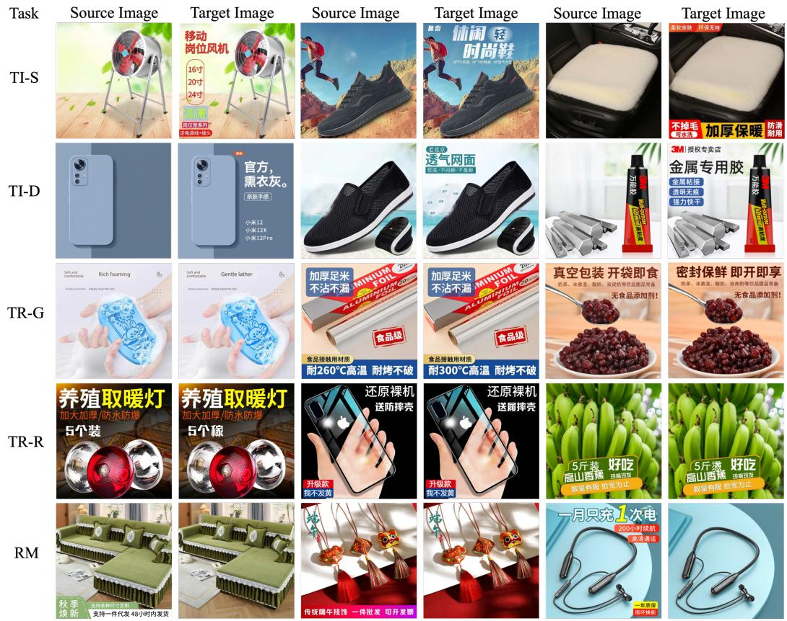  
Figure 1: Representative training examples for the five SFT tasks.

  
Figure 2: Representative evaluation examples across the five product domains.

## A.2 More Experimental Results

More Results for Text Insertion We provide a finer-grained comparison under two complementary OCR normalization protocols. The Symbol-Invariant (SI) protocol removes whitespace and punctuation before matching, retaining only Chinese characters, letters, and digits; it therefore measures lexical-content fidelity independently of symbols. The stricter Symbol-Preserving (SP) protocol canonicalizes full-width characters and equivalent Chinese/English punctuation, but retains symbols during matching. Both protocols otherwise use the same two-stage assignment, Levenshtein similarity thresholds, extra-OCR penalty, and image-level accuracy definition. For compactness, we abbreviate Qwen-Image-Edit-2511 as QIE, FireRed-Image-Edit-1.0 as FireRed, and our SFT model as TR-SFT; their reward-optimized variants are denoted by the sufix -RL. Tables 4–7 report results for the simple-template and descriptive-prompt settings.

We additionally compare with PosterMaker, AnyText v2, and GPT-Image-2 (abbreviated as GPT-I2). Unlike the mask-free methods evaluated in our primary setting, PosterMaker and AnyText v2 require an explicit spatial mask as input. To enable a controlled comparison, we use Gemini to generate a semantic description of each pre-edit image and construct the required masks directly from the ground-truth bounding boxes of the target text regions. Thus, these two methods are supplied with explicit localization guidance that is unavailable to the mask-free methods, and their results should be interpreted as a reference under a less restrictive input setting. GPT-Image-2 is evaluated under the same mask-free textual-instruction setting as our method.

Table 4: Simple-template prompt under the SI protocol.
<table><tr><td colspan="5">Method Match↑ Partial↓ Miss↓ Extra↓ Score↑ Acc.↑</td></tr><tr><td>PosterMaker</td><td>83.4 76.4</td><td>16.6 23.6</td><td>0.0 0 0.0</td><td>0.9685 64.5</td></tr><tr><td>AnyText v2</td><td></td><td></td><td>0</td><td>0.9552 56.0</td></tr><tr><td>QIE</td><td>77.1</td><td>6.4 16.6</td><td>92</td><td>0.8361 57.5</td></tr><tr><td>FireRed</td><td>85.4</td><td>5.6 9.1</td><td>70</td><td>0.9109 67.0</td></tr><tr><td>TR-SFT</td><td>89.8</td><td>6.1 4.1</td><td>124</td><td>0.9536 72.0</td></tr><tr><td>GPT-I2</td><td>96.2</td><td>3.3 0.5</td><td>22</td><td>0.9889 87.5</td></tr><tr><td>QIE-RL</td><td>91.6</td><td>7.5 1.0</td><td>29</td><td>0.9764 77.0</td></tr><tr><td>FireRed-RL</td><td>93.2</td><td>5.9 1.0</td><td>32</td><td>0.9805 81.0</td></tr><tr><td>TR-RL</td><td>93.5</td><td>4.9 1.6</td><td>45</td><td>0.9758 81.0</td></tr></table>

Table 5: Simple-template prompt under the SP protocol.
<table><tr><td colspan="5">Method Match↑ Partial↓ Miss↓ Extra↓ Score↑ Acc.↑</td></tr><tr><td>PosterMaker</td><td>73.4</td><td>26.6</td><td>0.0</td><td>0 0.9496 48.0</td></tr><tr><td>AnyText v2</td><td>55.2</td><td>44.8 0.0</td><td>0</td><td>0.9148 34.0</td></tr><tr><td>QIE</td><td>55.8</td><td>11.3 32.9</td><td>147</td><td>0.6933 35.0</td></tr><tr><td>FireRed</td><td>75.4</td><td>10.5 14.1</td><td>106</td><td>0.8551 50.5</td></tr><tr><td>TR-SFT</td><td>87.1</td><td>8.3 4.6</td><td>135</td><td>0.9443 63.5</td></tr><tr><td>GPT-I2</td><td>94.1</td><td>5.1 0.8</td><td>26</td><td>0.9824 82.5</td></tr><tr><td>QIE-RL</td><td>88.2</td><td>9.4 2.4</td><td>37</td><td>0.9645 71.0</td></tr><tr><td>FireRed-RL</td><td>91.3</td><td>7.6 1.1</td><td>38</td><td>0.9755 75.0</td></tr><tr><td>TR-RL</td><td>91.6</td><td>6.8 1.6</td><td>49</td><td>0.9733 75.5</td></tr></table>

Table 6: Descriptive prompt under the SI protocol.
<table><tr><td rowspan=1 colspan=1>Method    Match↑ Partial↓ Miss↓ Extra↓ Score↑ Acc.↑</td></tr><tr><td rowspan=1 colspan=1>PosterMaker 90.0   10.0   0.0    0  0.981069.0</td></tr><tr><td rowspan=1 colspan=1>AnyText v2  84.2   15.8   0.0    0  0.970049.5</td></tr><tr><td rowspan=1 colspan=1>QIE          84.7   4.2   11.1  114 0.877450.5</td></tr><tr><td rowspan=1 colspan=1>FireRed      91.8   3.7   4.6   97  0.943171.5</td></tr><tr><td rowspan=1 colspan=1>TR-SFT      88.8   4.6   6.7   86  0.925662.0</td></tr><tr><td rowspan=1 colspan=1>GPT-I2      97.1   2.3   0.6   38 0.9900 87.0</td></tr><tr><td rowspan=1 colspan=1>QIE-RL     92.7   2.8   4.6   89 0.951672.0</td></tr><tr><td rowspan=1 colspan=1>FireRed-RL  94.1    2.6   2.8   93  0.968179.5</td></tr><tr><td rowspan=1 colspan=1>TR-RL       94.4   3.4   2.1   89  0.974180.0</td></tr></table>

Table 7: Descriptive prompt under the SP protocol.
<table><tr><td colspan="5">Method Match↑ Partial↓ Miss↓ Extra↓ Score↑ Acc.↑</td></tr><tr><td>PosterMaker</td><td>88.0</td><td>12.0 0.0</td><td>0</td><td>0.9772 63.5</td></tr><tr><td>AnyText v2</td><td>81.6</td><td>18.4 0.0</td><td>0</td><td>0.9650 44.0</td></tr><tr><td>QIE</td><td>82.0 6.7</td><td>11.3</td><td>118</td><td>0.8718 45.5</td></tr><tr><td>FireRed</td><td>89.9</td><td>5.2 4.9</td><td>105</td><td>0.9373 66.5</td></tr><tr><td>TR-SFT</td><td>86.1</td><td>6.7 7.2</td><td>90</td><td>0.9157 56.5</td></tr><tr><td>GPT-I2</td><td>95.9 3.4</td><td>0.7</td><td>42</td><td>0.9868 82.0</td></tr><tr><td>QIE-RL</td><td>90.4</td><td>5.0 4.6</td><td>92</td><td>0.9478 66.5</td></tr><tr><td>FireRed-RL</td><td>92.4</td><td>4.9 2.7</td><td>96</td><td>0.9652 72.5</td></tr><tr><td>TR-RL</td><td>92.9</td><td>4.7 2.4</td><td>94</td><td>0.9694 73.5</td></tr></table>

More Results for Localized Text Replacement We further evaluate reward optimization for text replacement. Table 8 reports image-level editing accuracy under the same evaluation setting. The comparison consistently uses the corresponding base models and their reward-optimized variants.

Table 8: Additional comparison of reward optimization for text replacement.
<table><tr><td>Method</td><td>Acc. (%)↑</td></tr><tr><td>QIE</td><td>45.0</td></tr><tr><td>FireRed</td><td>52.0</td></tr><tr><td>TR-SFT</td><td>77.0</td></tr><tr><td>QIE-RL</td><td>67.0</td></tr><tr><td>FireRed-RL</td><td>62.5</td></tr><tr><td>TR-RL</td><td>85.0</td></tr></table>

Qualitative Efectiveness ofthe Add-Text Reward We further provide qualitative comparisons to illustrate the efectiveness of the add-text reward. Figures 3, 4, and 5 compare the editing results before and after reward optimization for Qwen-Image-Edit-2511, FireRed-Image-Edit-1.0, and TextRefine, respectively. After reinforcement learning, all three models more reliably insert the requested text while preserving the surrounding product appearance, layout, and background consistency, indicating that the add-text reward directly improves instruction-following fidelity for localized text insertion.

Qualitative Efectiveness of the Glyph-Level Reward We additionally visualize the efect of the glyph-level reward on localized text replacement. Figures 6 and 7 compare results before and after reward optimization for Qwen-Image-Edit-2511 and FireRed-Image-Edit-1.0, and for TextRefine, respectively. Consistent with the quantitative improvements in Table 8, reinforcement learning more reliably replaces the target character with the requested low-frequency glyph while preserving the surrounding typography, product appearance, and poster layout. These examples further show that the target-character CTC-posterior reward provides finegrained supervision for structurally complex glyphs and reduces missing strokes, malformed components, and confusion among visually similar characters.

General Image-Editing Evaluation on RedBench To examine whether improved text-editing capability compromises general image-editing performance, we further evaluate the models on the FireRed-Image-Edit benchmark, which covers diverse editing operations in both English (RedBench-EN) and Chinese (RedBench-CN). Here, QIE denotes Qwen-Image-Edit-2511, FireRed denotes FireRed-Image-Edit-1.0, and TR-RL denotes our reward-optimized model. As shown in Tables 9 and 10, TR-RL improves the overall score over its QIE initialization in both language settings, indicating that the enhanced text-rendering capability does not sacrifice general image-editing performance.

Table 9: General image-editing results on RedBench-EN.
<table><tr><td>Metric</td><td>QIE</td><td>FireRed</td><td>TR-RL</td><td>GPT-I2</td></tr><tr><td>Add</td><td>4.37</td><td>4.52</td><td>4.45</td><td>4.70 1</td></tr><tr><td>Adjust</td><td>3.59</td><td>3.93</td><td>3.61 1</td><td>4.12</td></tr><tr><td>Background</td><td>3.71</td><td>4.23</td><td>3.92</td><td>4.48</td></tr><tr><td>Beauty</td><td>2.82</td><td>2.66</td><td>3.03 I</td><td>4.00</td></tr><tr><td>Color</td><td>3.84</td><td>4.12</td><td>3.83 1</td><td>4.37</td></tr><tr><td>Compose</td><td>3.46</td><td>3.49</td><td>3.60 I</td><td>4.07</td></tr><tr><td>Extrâct</td><td>2.29</td><td>2.35</td><td>3.58 1</td><td>3.36</td></tr><tr><td>Low-level</td><td>2.68</td><td>3.17</td><td>3.50 I</td><td>3.55</td></tr><tr><td>Motion</td><td>4.61</td><td>4.62</td><td>4.71 1</td><td>4.78</td></tr><tr><td>Portrait</td><td>4.28</td><td>3.63</td><td>3.90 I</td><td>4.64</td></tr><tr><td>Remove</td><td>4.28</td><td>4.22</td><td>4.33 I</td><td>4.27</td></tr><tr><td>Replace</td><td>4.36</td><td>4.42</td><td>4.45 1</td><td>4.60</td></tr><tr><td>Stylize</td><td>4.76</td><td>4.80</td><td>4.76 1</td><td>4.99</td></tr><tr><td>Text</td><td>3.69</td><td>3.72</td><td>3.83 I</td><td>4.30</td></tr><tr><td>Viewpoint</td><td>2.61</td><td>2.75</td><td>2.66 1</td><td>3.02</td></tr><tr><td>Final Score</td><td>3.69</td><td>3.78</td><td>3.88 1</td><td>4.22</td></tr></table>

Table 10: General image-editing results on RedBench-CN.
<table><tr><td>Metric</td><td>QIE</td><td>FireRed</td><td>TR-RL</td><td>GPT-I2</td></tr><tr><td>Add</td><td>4.43</td><td>4.48</td><td>4.42</td><td>4.67</td></tr><tr><td>Adjust</td><td>3.44</td><td>3.90</td><td>3.67 1</td><td>4.07</td></tr><tr><td>Background</td><td>3.94</td><td>4.35</td><td>4.02</td><td>4.45</td></tr><tr><td>Beauty</td><td>2.79</td><td>2.52</td><td>3.02 1</td><td>3.91</td></tr><tr><td>Color</td><td>3.71</td><td>3.94</td><td>3.86 1</td><td>4.40</td></tr><tr><td>Compose</td><td>3.35</td><td>3.63</td><td>3.69 1</td><td>4.11</td></tr><tr><td>Extract</td><td>2.26</td><td>2.55</td><td>3.42</td><td>3.37</td></tr><tr><td>Low-level</td><td>2.59</td><td>3.07</td><td>3.55</td><td>3.39</td></tr><tr><td>Motion</td><td>4.59</td><td>4.58</td><td>4.58 1</td><td>4.88</td></tr><tr><td>Portrait</td><td>3.54</td><td>3.82</td><td>3.85</td><td>4.57</td></tr><tr><td>Remove</td><td>4.15</td><td>4.24</td><td>4.30</td><td>4.36</td></tr><tr><td>Replace</td><td>4.38</td><td>4.50</td><td>4.40</td><td>4.66</td></tr><tr><td>Stylize</td><td>4.69</td><td>4.73</td><td>4.83</td><td>4.99</td></tr><tr><td>Text</td><td>3.82</td><td>3.67</td><td>3.83</td><td>4.33</td></tr><tr><td>Viewpoint</td><td>2.40</td><td>2.73</td><td>3.20 1</td><td>3.45</td></tr><tr><td>Final Score</td><td>3.61</td><td>3.78</td><td>3.91 1</td><td>4.24</td></tr></table>

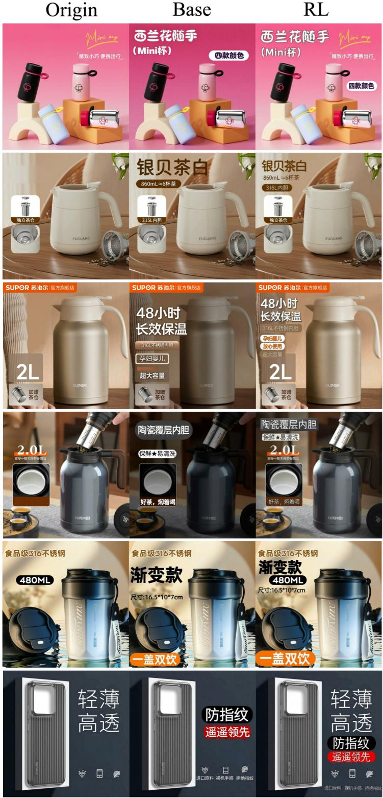  
Figure 3: Qualitative comparison before and after applying the add-text reward to Qwen-Image-Edit-2511.

## Prompt

在图片左上角添加文字“西兰花随手”，使用纯白色、粗体无衬线字体、笔画圆润饱满、字号较大、水平排列、无倾斜，背景为粉红色纯色，与文字形成高对比；在其正下方添加文字“(Mini杯)”，同样使用纯白色、粗体无衬线字体、笔画圆润饱满、字号适中、水平排列、无倾斜，背景为粉红色纯色，与文字形成高对比；在图片右侧中部、位于粉色水杯右侧添加文字“四款颜色”，使用深紫色、常规粗体无衬线字体、笔画清晰有力、字号适中、水平排列、无倾斜，背景为白色圆角矩形框，与文字形成高对比：保持图片原有其他内容和背景不变。

在图片左上角添加文字“银贝茶白”，使用深棕色无衬线字体，笔画圆润流畅，字号较大，水平排列，背景为浅米色纯色，文字与背景对比度高，清晰易读：在其正下方添加文字“860mL≈6杯茶”，使用白色无衬线字体，汉字为现代黑体风格，字号适中，水平排列，背景为深棕色圆角矩形：在图片左侧中部、位于“独立茶仓”图示下方添加文字“316L内胆”，使用白色无衬线字体，笔画简洁有力，字号适中，水平排列，背景为深棕色圆角矩形：保持图片中其他所有原有内容和背景不变。

在图片左侧中部区域，从上至下依次添加以下文字：顶部为“48小时”，使用巨大粗体无衬线字体，纯白色文字，置于浅棕色至米色平滑渐变矩形背景上：其正下方为“长效保温”，使用较大粗体无衬线字体，纯白色文字，置于相同风格的米色矩形背景上；再下方为“316L不锈钢内胆”，使用常规粗体无衬线字体，纯白色文字，置于浅棕色圆角矩形框内：接着为“孕妇婴儿”，使用常规粗体无衬线字体，橙色文字，置于纯白色圆角矩形框内：其下方为“放心使用”，使用常规粗体无衬线字体，橙色文字置于纯白色圆角矩形框内：最下方为“超大容量”，使用常规粗体无衬线字体，纯白色文字，置于浅棕色矩形框内。保持图片中其他所有原有内容和背景不变。

在图片左上角添加文字“陶瓷覆层内胆”，使用纯白色粗体无衬线字体（类似黑体），笔画刚硬平直，字号较大，清晰醒目，无描边，置于深灰色渐变矩形背景（从左上深灰到右下浅灰）上：在图片左侧中部、该文字下方添加文字“保鲜★易清洗”，使用深棕色常规粗体无衬线字体，笔画平直有力，字号适中，置于白色圆角矩形背景上：在图片左下角、产品小图下方添加文字“好茶，焖着喝”，使用纯白色粗体无衬线字体（类似黑体），笔画刚硬平直，字号较大，清晰醒目，无描边，置于深棕色矩形背景上：保持图片中所有其他原有内容和背景不变。

在图片左侧中部，位于“食品级316不锈钢”文字下方、水杯左侧上方，添加文字“渐变款”，使用纯黑色粗体无衬线字体（类似黑体），字号较大，笔画粗壮有力，边缘平直，水平排列无倾斜，背景为浅米色渐变，文字与背景高对比清晰易读，无描边或阴影；在“渐变款”文字正下方、水杯左侧，添加文字“尺寸：16.5\*10\*7cm”，使用纯黑色常规无衬线字体（类似黑体），字号适中，笔画平直，水平排列无倾斜，背景为浅米色渐变，文字与背景高对比清晰易读，无描边或阴影：在图片左下角、水杯盖子下方，添加文字“一盖双饮”，使用纯白色粗体无衬线字体(类似黑体），字号较大，笔画粗壮有力，边缘平直，水平排列无倾斜，背景为橙色圆角矩形，文字与背景高对比视觉突出，无描边：保持图片中所有其他原有内容和背景不变。

在图片右侧中部，于“遥遥领先”文字上方添加“防指纹”文字，使用白色粗体无衬线字体，字号较大，笔画粗壮有力，边缘平直置于纯黑色圆角矩形背景上，无描边或阴影；在“防指纹”正下方添加“遥遥领先”文字，同样使用白色粗体无衬线字体，字号较大，笔画粗壮有力，边缘平直，置于纯红色圆角矩形背景上，无描边或阴影；在图片右下角，从左至右依次添加“进口原料”、“裸机手感”、“拒绝指纹”三段文字，均使用白色常规无衬线字体，字号适中，笔画平直，置于深灰色纯色背景区域，无描边或阴影，三段文字水平排列，间距均匀；保持图片中其他所有原有内容和背景不变。

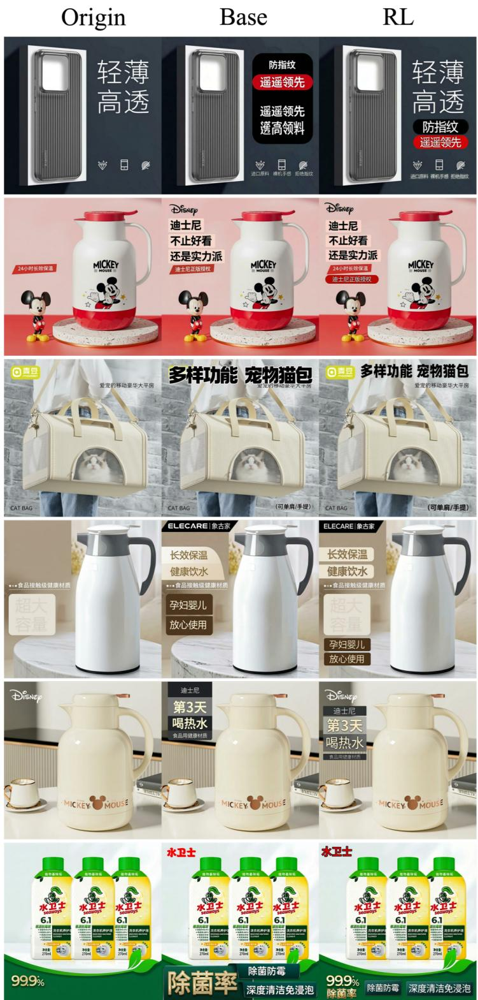  
Figure 4: Qualitative comparison before and after applying the add-text reward to FireRed-Image-Edit-1.0.

## Prompt

在图片右侧中部，于“遥遥领先”文字上方添加“防指纹”文字使用白色粗体无衬线字体，字号较大，笔画粗壮有力，边缘平直，置于纯黑色圆角矩形背景上，无描边或阴影；在“防指纹”正下方添加“遥遥领先”文字，同样使用白色粗体无衬线字体，字号较大，笔画粗壮有力，边缘平直，置于纯红色圆角矩形背景上，无描边或阴影；在图片右下角，从左至右依次添加“进口原料”“裸机手感”、“拒绝指纹”三段文字，均使用白色常规无衬线字体，字号适中，笔画平直，置于深灰色纯色背景区域，无描边或阴影，三段文字水平排列，间距均匀：保持图片中其他所有原有内容和背景不变。

在图片左上角区域，于Disney标志正下方添加黑色粗体无衬线字体“迪士尼”，置于浅粉色矩形背景上；在其正下方添加黑色粗体无衬线字体“不止好看”，置于浅粉色矩形背景上；再在其正下方添加黑色粗体无衬线字体“还是实力派”，置于浅粉色矩形背景上；在“还是实力派”文字下方添加白色常规无衬线字体“迪士尼正版授权”，置于红色圆角矩形背景上：所有文字均为水平排列、无倾斜，保持图片原有其他内容不变。

在图片顶部中央偏左区域添加文字“多样功能”，使用纯黑色、粗体无衬线字体，笔画刚硬粗壮，字号较大，水平排列，无倾斜，背景为浅灰色砖墙纹理：在图片顶部中央偏右区域与“多样功能”并列添加文字“宠物猫包”，使用相同字体、颜色、大小和背景：在图片右下角添加文字“（可单肩/手提）”，使用纯黑色、常规无衬线字体，笔画平直，字号较小，水平排列，无倾斜，背景为浅灰色砖墙纹理：保持图片中所有其他原有内容和背景不变。

在图片左上角添加文字“ELECARE\象古家”，使用纯白色无衬线字体（英文字体粗体，中文常规粗体，笔画刚硬清晰），置于黑色直角矩形背景块上，无描边无阴影；在图片左侧中部偏上位置添加文字“长效保温”，使用浅棕色粗体无衬线字体，置于浅米色渐变背景上，无描边：在“长效保温”正下方添加文字“健康饮水”，使用相同浅棕色粗体无衬线字体和浅米色渐变背景，保持视觉统一；在图片左下部添加文字“孕妇婴儿”，使用浅棕色粗体无衬线字体，置于深棕色直角矩形背景块上：在“孕妇婴儿”正下方添加文字“放心使用”，使用相同浅棕色粗体无衬线字体和深棕色直角矩形背景块，保持风格一致：所有文字均为水平排列无倾斜，保持图片原有其他内容和背景不变。

在图片左上角添加“迪士尼”文字，使用白色无衬线字体，笔画纤细清晰，水平排列，背景为深灰至黑色渐变矩形色块：在其正下方添加“第3天”文字，使用米黄色粗体无衬线字体，笔画圆润饱满，水平排列，背景为浅灰色；再在其下方添加“喝热水”文字，同样使用米黄色粗体无衬线字体，笔画圆润饱满，水平排列，无背景：在“喝热水”下方添加“食品用健康材质”文字，使用白色细体无衬线字体，笔画纤细清晰，水平排列，背景为深灰色矩形色块；保持图片中其他所有内容和背景不变。

在图片左上角添加红色粗体无衬线字体“水卫士”，背景为浅灰白色，文字与背景高对比突出：在图片底部中央偏左添加白色粗体无衬线字体“除菌防霉”，置于深绿色矩形背景块上；在图片底部中央偏右添加白色粗体无衬线字体“深度清洁免浸泡”，置于与左侧相同的深绿色矩形背景块上；在图片底部左侧添加亮金色粗体无衬线字体“除菌率”，背景为深绿色，文字具有金属质感；保持图片原有其他内容和背景不变。

Origin  
Base  
  
Figure 5: Qualitative comparison of TextRefine before and after reinforcement learning on the add-text task.

## Prompt

在图片左上角添加文字“西兰花随手”，使用纯白色、粗体无衬线字体、笔画圆润饱满、字号较大、水平排列、无倾斜，背景为粉红色纯色，与文字形成高对比；在其正下方添加文字“(Mini杯)”，同样使用纯白色、粗体无衬线字体、笔画圆润饱满、字号适中、水平排列、无倾斜，背景为粉红色纯色，与文字形成高对比；在图片右侧中部、位于粉色水杯右侧添加文字“四款颜色”，使用深紫色、常规粗体无衬线字体、笔画清晰有力、字号适中、水平排列、无倾斜，背景为白色圆角矩形框，与文字形成高对比：保持图片原有其他内容和背景不变。

在图片左上角添加文字“ELECARE\象古家”，使用纯白色无衬线字体（英文字体粗体，中文常规粗体，笔画刚硬清晰），置于黑色直角矩形背景块上，无描边无阴影：在图片左侧中部偏上位置添加文字“长效保温”，使用浅棕色粗体无衬线字体，置于浅米色渐变背景上，无描边：在“长效保温”正下方添加文字“健康饮水”，使用相同浅棕色粗体无衬线字体和浅米色渐变背景，保持视觉统一；在图片左下部添加文字“孕妇婴儿”，使用浅棕色粗体无衬线字体，置于深棕色直角矩形背景块上：在“孕妇婴儿”正下方添加文字“放心使用”，使用相同浅棕色粗体无衬线字体和深棕色直角矩形背景块，保持风格一致；所有文字均为水平排列无倾斜，保持图片原有其他内容和背景不变。

在图片左上角区域，于Disney标志正下方添加黑色粗体无衬线字体“迪士尼”，置于浅粉色矩形背景上；在其正下方添加黑色粗体无衬线字体“不止好看”，置于浅粉色矩形背景上：再在其正下方添加黑色粗体无衬线字体“还是实力派”，置于浅粉色矩形背景上：在“还是实力派”文字下方添加白色常规无衬线字体“迪士尼正版授权”，置于红色圆角矩形背景上；所有文字均为水平排列、无倾斜，保持图片原有其他内容不变。

在图片右上角添加“极速送达”文字，白色粗体无衬线字体，字号较大，笔画刚硬有力，置于从左至右由深绿渐变至浅绿的圆角矩形背景上：在图片中上部水杯右侧添加“Tritan材质”文字，英文“Tritan”为粗体无衬线字体，中文“材质”为粗体黑体，字号较大，置于纯白色矩形背景上，边缘带轻微阴影；在图片右侧中部“Tritan材质”下方依次添加“一杯双饮”和“一按开盖”文字，均为黑色粗体无衬线字体，字号适中，笔画刚硬，置于白色矩形背景上，左侧各附带蓝色圆形勾选标记：在图片右下角添加“正品保障”文字，白色加粗无衬线字体，字号巨大，笔画粗壮有力，置于纯红色圆角矩形背景上：保持图片中其他所有原有内容和背景不变。

在图片右上角添加“智能显温”文字，使用白色粗体无衬线字体(类似黑体），字号较大，笔画平直刚硬，水平排列，背景为浅米色渐变；在其正下方添加“内置茶仓”文字，样式与上方文字完全一致，保持视觉统一；在图片左上角顶部偏左区域添加“抑菌率”文字，使用白色粗体无衬线字体，字号适中，水平排列，背景为浅米色渐变：在图片右侧中部、位于“内置茶仓”下方添加“48小时保温保冷”文字，使用深棕色粗体无衬线字体，字号较大，水平排列，背景为白色圆角矩形框：在图片左下角添加“抗菌316”文字，使用白色粗体无衬线字体，字号较大，水平排列，背景为深棕色矩形框；在其正下方添加“免费刻字”文字样式与上方文字一致，背景同样为深棕色矩形框：保持图片中所有原有产品、背景、光影和细节不变。

在图片左上角添加文字“Cille希乐”，文字为白色，置于纯红色矩形背景上，英文“Cille”为粗体无衬线字体，中文“希乐”为粗体黑体，笔画粗壮有力，整体现代简洁，字号较大，无描边或阴影：在图片右上部“Tritan”下方添加文字“母婴级材质”，文字为黑色、置于浅蓝色渐变背景（从上至下中浅蓝过渡到更浅的蓝）上，字体为粗体无衬线，笔画粗壮平直，字号较大，清晰易读，无描边或阴影：在图片右侧中部“母婴级材质”下方添加文字“直饮&吸管”，文字为黑色，置于亮黄色圆角矩形背景上字体为粗体无衬线，笔画粗壮有力，字号适中，无描边或阴影；在“直饮&吸管”下方添加文字“大容量”，文字为黑色，置于浅蓝色渐变背景（从上至下由浅蓝过渡到更浅的蓝）上，字体为粗体无衬线，笔画粗壮平直，字号较大，清晰易读，无描边或阴影：所有文字均为水平排列，保持图片原有其他内容不变。

<table><tr><td rowspan="2">Prompt</td><td></td><td></td></tr><tr><td></td><td></td></tr><tr><td rowspan="2">将&quot;三倍体送礼型&quot;中的 &quot;型&quot;修改为&quot;籁”</td><td></td><td></td></tr><tr><td></td><td></td></tr><tr><td>将&quot;东北玉米面&quot;中的&quot; 面&quot;修改为&quot;璧”</td><td></td><td></td></tr><tr><td>将&quot;防烫锅具&quot;中的&quot;防&quot; 修改为&quot;趱”</td><td></td><td></td></tr><tr><td>将&quot;新鲜油甘果&quot;中的” 油&quot;修改为&quot;髓”</td><td>(a) Qwen-Image-Edit 2511</td><td></td></tr><tr><td>将&quot;小西米芋圆&quot;中的&quot; 米&quot;修改为&quot;黛”</td><td></td><td></td></tr><tr><td>将&quot;三合手链&quot;中的&quot;三&quot; 修改为&quot;醮”</td><td></td><td></td></tr><tr><td>将&quot;草莓羊奶芙&quot;中的&quot; 奶&quot;修改为&quot;鳇”</td><td></td><td></td></tr><tr><td>将&quot;胖妹重庆小面&quot;中的 &quot;面&quot;修改为&quot;蹭&quot;</td><td></td><td></td></tr></table>

(b) Firered-Image-Edit  
Figure 6: Qualitative comparisons of Qwen-Image-Edit-2511 and FireRed-Image-Edit-1.0 before and after reinforcement learning on the localized text-replacement task.

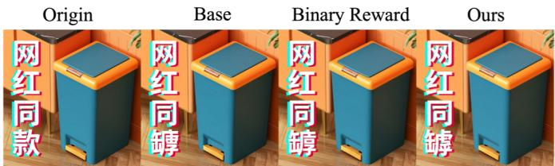  
将"网红同款"中的"款"修改为"罅"

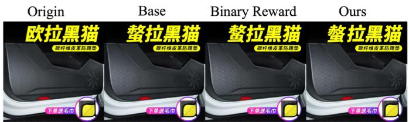  
将"欧拉黑猫"中的"欧"修改为"螯”

  
将"干净又实用"中的"用"修改为"餮"

  
将"燃气灶炉架"中的"炉"修改为"磜"

  
将"倒油免扶"中的"油"修改为"懋"

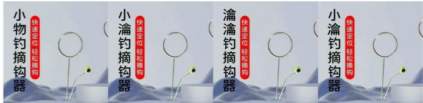  
将"小物钓摘钩器"中的"物"修改为"瀹”

  
将"浅水电子漂"中的"浅"修改为""

  
将"健身手套"中的"身"修改为"氍”

  
将"大物线组"中的"物"修改为"瞽"

  
将"高钙营养"中的"高"修改为"麝"

  
将"自衣还原剂"中的"白"修改为"黢”


  
将"不要买除雪铲"中的"除"修改为"魑”

将"弹簧卸力"中的"弹"修改为"罾"  
  
将"一擦就白"中的"就"修改为"雠”  
Figure 7: Qualitative comparison of TextRefine before and after reinforcement learning on the localized text-replacement task.