# WHERE GROUNDING ACCURACY LIVES ON THE IOUCURVE: LABEL-FREE INFERENCE-TIME BOUNDARYREFINEMENT

Bo Ma Auckland University of Technology

## ABSTRACT

Vision–language models can identify the correct referent while returning an imprecise bounding box. We study whether a frozen direct-answer model can use its own prediction to allocate one additional localized observation without accessing target annotations at inference. Label-free precision refinement (LFPR) routes predicted-small regions to a higher-resolution pass, regrounds the expression inside a context crop, admits a candidate only under fixed geometric guards, and returns a fixed coordinate-wise midpoint. We report results across three evidence tiers. On 31,921 retrospective Ref-L4 expressions, LFPR raises mAcc from 72.947% to 76.013% (Acc@0.5 88.531%→89.725%, Acc@0.9 55.788%→61.142%). A frozen transfer to 30,969 RefCOCO/RefCOCO+/RefCOCOg expressions improves every dataset at Acc@0.5, mAcc, and mean IoU (pooled mAcc +0.645, Acc@0.5 +0.817), while Acc@0.9 is unchanged overall: routing alone gains +1.162 points there, but crop, guards, and fusion give back −1.192, offsetting rather than showing no strict-IoU effect. A prospective, image-disjoint Flickr30K Entities evaluation improves every endpoint (mAcc +0.973, Acc@0.9 +1.022), more strongly under a single-box variant (mAcc +2.575, Acc@0.9 +3.689). The same operator applied to two released grounding specialists improves every endpoint (Acc@0.9 +1.569/+6.716 for EGM-4B/8B) at roughly twice the latency, composing with specialist training rather than replacing it. A genuine unguarded control (guard removed from the same candidates) underperforms the incumbent on every metric, showing the guard is load-bearing. Together, these results show that referent selection and boundary precision are partially separable, with different components moving opposing regions of the IoU curve – behavior a single threshold cannot reveal.

## 1 INTRODUCTION

Referring expression grounding asks a vision-language model (VLM) to map a natural-language description to the image region it denotes. Modern VLMs are often strong enough to identify the correct object while still returning a box that is too coarse, especially for long expressions, small objects, and images whose native resolution falls below the model’s effective visual input floor. The distinction matters because a small coordinate error can leave an Acc@0.5 outcome unchanged while causing a failure at stricter thresholds: a method improving only headline Acc@0.5 may hide a useful localization change, and one improving only strict thresholds should not be sold as a general accuracy gain.

The usual responses – train a grounding head, add a detector, or spend more computation on every image – each change the comparison or incur a substantial deployment cost. We study a narrower question: can a frozen direct-answer VLM use its own first prediction to decide when a second, localized look is worth the cost? The question is deliberately operational, since the routing signal must be available before the ground-truth box is known. We therefore stratify our evidence into three tiers: a retrospective Ref-L4 analysis whose published test distribution informed method development, a frozen cross-dataset transfer to the RefCOCO family that retuned nothing, and an image-disjoint Flickr30K confirmation whose images and annotations played no role in method development.

Our procedure, label-free precision refinement (LFPR), has two components. First, it applies pixelarea size buckets to the incumbent’s predicted box; predictions below the small-object threshold are re-evaluated at a higher image-pixel budget, and all other rows keep the default-resolution answer. Second, the resulting incumbent is re-grounded inside a context-expanded crop, where a candidate is admitted only if zoom-consistency and geometric guards pass, and the final box is the coordinatewise midpoint of incumbent and candidate. That midpoint is a fixed convex combination chosen before the reported run: it lets the crop adjust boundaries without letting one noisy second answer replace a strong first one. We do not claim it is an optimal shrinkage estimator.

The main result is positive but bounded. On the analyzed Ref-L4 test split LFPR improves the frozen Qwen3-VL-8B (Qwen Team, 2025b) baseline from 88.531% to 89.725% at Acc@0.5, with the largest differences at Acc@0.75 and Acc@0.9. Because the same published test distribution informed diagnostics and method development, we treat that estimate and its interval as retrospective; it now exceeds a cross-protocol 89.5% comparison point, but the comparison remains cross-protocol and parameter-asymmetric (Section 6.1), so we still make neither a confirmatory nor an absolute state-of-the-art claim.

This paper makes three contributions within that evidence boundary:

1. We formulate a label-free, inference-only precision-refinement pipeline whose accept/reject decision uses only geometry computed from the model’s own outputs, and show it improves a frozen generalist, two released specialists, and an image-disjoint prospective benchmark without any weight update.

2. We show that referent selection and boundary placement are separable capabilities that trade off along the IoU threshold axis: among released specialists on identical rows, the best-Acc@0.5 system has the worst Acc@0.9 and mean accuracy, so a permissivethreshold ranking can invert the localization-quality ordering.

3. We report a same-row component decomposition: the resolution floor and crop, with the guard active, each buy strict-IoU accuracy, while the guards and midpoint trade some of it back for the largest Acc@0.5 gain. A genuine unguarded ablation of the same candidates does not recover that accuracy, confirming the guard is load-bearing rather than a discarded trade-off.

## 2 RELATED WORK

Referring-expression benchmarks such as RefCOCO and RefCOCOg established the standard single-region grounding setting (Yu et al., 2016; Mao et al., 2016); Ref-L4 revisits it for contemporary multimodal models with longer expressions and a stricter re-annotated protocol (Chen et al., 2025a). We use the official Ref-L4 evaluator and report the complete threshold profile rather than only Acc@0.5.

Supervised REC ranges from end-to-end text-conditioned detection (Kamath et al., 2021) to largescale grounded pretraining (Li et al., 2022), with recent work on dynamic visual routing (Chen et al., 2025c) and zero-shot REC via debiased attention and programmatic relation reasoning (Chen et al., 2025b). Language-guided open-set detectors (Liu et al., 2024; Minderer et al., 2023) offer another route, but adopting one would add a second model, a proposal cache, and a selection policy, changing the estimand from “is the incumbent’s own answer precise enough” to “can an external candidate be selected correctly.” All of these change supervision or add machinery; LFPR keeps one direct-answer checkpoint frozen and changes only its inference path.

LFPR is structurally a coarse-to-fine cascade (Dai et al., 2025), but every stage reuses the same frozen weights and the consistency between stages is enforced by fixed midpoint fusion and geometric guards rather than a learned loss (a directly trained adaptation did not improve on the frozen baseline, Section E.11).

The closest family is test-time self-correction. Iterative loops that ask a model to revise its own box can show gains that depend on an oracle stopping rule and shrink or reverse without ground-truth access – the “self-correction mirage” (Tripathy and Krishnan, 2026); related work scales test-time perception through explicit zoom (Jiang et al., 2026) or an entropy-guided crop-and-reground loop (Gr"opl et al., 2026). The closest training-free method on the same benchmark family is Chainof-Caption, which supplies additional visual and textual context through tool use (Pang and Oh, 2026); it improves context rather than the box itself, so it is complementary rather than a substitute for a geometry-based accept/reject step, and we did not run a head-to-head comparison since its released code targets a different backbone family – the same compatibility check applies to EGG and TTSP above, expanded in Appendix B.14. LFPR differs in three respects: at most one crop attempt rather than a loop, an accept/reject decision computed only from the geometry of the two candidate boxes, and a fixed conservative midpoint rather than outright replacement. A matched zero-shot self-correction control on the same incumbent regresses the headline metric (Appendix E), consistent with the mirage finding and motivating the guards. A same-backbone mechanism control substitutes a frozen, label-free confidence threshold for the geometry guard on the same admission point – not a reproduction of EGG or TTSP, whose released code targets a different backbone – and the confidence-gated arm does not recover even the guard’s modest Acc@0.5 gain over routing (Appendix C), evidence for the accept/reject step’s specifically geometric criterion rather than any label-free filter.

Efficient Grounding Models (EGM) instead scale generated reasoning tokens for small VLMs and report strong accuracy–latency results on the same backbone family (Zhan et al., 2026); they are our released-specialist comparison in Section 5.3.

## 3 PROBLEM FORMULATION AND METHOD

## 3.1 DIRECT-ANSWER INCUMBENT

Let I be an image and $q$ its referring expression. A frozen VLM $f _ { \theta }$ returns a normalized box $b _ { 0 } = f _ { \theta } ( I , q ) \in \mathbf { \bar { [ 0 , 1 ] ^ { 4 } } }$ , or an invalid output that is retained as an incumbent miss. For a groundtruth box $y ,$ the threshold utility is

$$
u _ { t } ( b , y ) = \mathcal { k } \{ \mathrm { I o U } ( b , y ) > t \} .\tag{1}
$$

Averaged over a population, $A ( t ) = \mathbb { E } [ u _ { t } ] = { \mathrm { P r } } ( { \mathrm { I o U } } ( b , y ) > t )$ is the survival function of the IoU distribution, so $\begin{array} { r } { \mathbb { E } [ \mathrm { I o U } ( b , y ) ] = \int _ { 0 } ^ { 1 } A ( t ) d t \colon } \end{array}$ an intervention can raise $A ( t )$ at one threshold while lowering it at another, which is the lens we use throughout Section 5 and Section 5.2 rather than reporting a single operating point. The strict inequality is the official Ref-L4 convention. We use $\operatorname* { m A c c } _ { 0 . 5 : 0 . 9 5 }$ , the mean of $\bar { 1 0 0 } \mathbb { E } [ u _ { t } ]$ over $t \in \{ 0 . 5 0 , 0 . 5 5 , \ldots , 0 . 9 5 \}$ , as the manuscript’s primary summary because it captures the reported IoU profile. This designation is retrospective and does not confer confirmatory status. We report $\mathrm { A c c } _ { 0 . 5 } = 1 0 0 \mathbb { E } [ u _ { 0 . 5 } ]$ as the standard benchmark operating point, with $\operatorname { A c c } _ { 0 . 7 5 }$ and $\operatorname { A c c } _ { 0 . 9 }$ as strict-IoU diagnostics.

## 3.2 LABEL-FREE RESOLUTION ROUTING

Given an incumbent box and the original image dimensions $( W , H )$ , convert the box to pixel coordinates and define

$$
s ( b _ { 0 } ) = \sqrt { \operatorname* { m a x } ( 0 , x _ { 2 } - x _ { 1 } ) \operatorname* { m a x } ( 0 , y _ { 2 } - y _ { 1 } ) } .\tag{2}
$$

The frozen bucket function is small if $s ~ < ~ 1 2 8$ pixels, medium if $1 2 8 \leq s \leq 2 5 6$ , and large otherwise. LFPR routes only the small bucket to a second full-image inference with the already validated minimum-pixel budget of 4,194,304. Let $b _ { 0 } ^ { \prime }$ denote this second answer for flagged rows and $b _ { 0 } ^ { \prime } = b _ { 0 }$ otherwise. Crucially, the bucket is computed from $b _ { 0 } .$ , not $y ;$ the ground-truth box is used only for evaluation.

This router is a label-free proxy for a resolution deficit, not an estimate of correctness: it can route a wrong large prediction or miss a small target hidden by a large incumbent box. The predicted-box router agrees with the annotation-derived bucket on 88.85% of pilot rows and 89.83% of official rows – a reasonable, though imperfect, substitute for the oracle diagnostic it is designed to approximate without reading a label.

The routing decision raises the pixel floor rather than lowering a ceiling: under the default image policy, essentially none of the small-bucket images already exceed the higher pixel budget used for the second pass, so an upper-limit policy would be mechanically inert for exactly the rows the router targets, and raising the minimum pixel budget is the only lever that changes the visual evidence available to the model for these regions.

## 3.3 LOCAL RE-GROUNDING AND CONSERVATIVE FUSION

For $b _ { 0 } ^ { \prime } = ( x _ { 1 } , y _ { 1 } , x _ { 2 } , y _ { 2 } )$ , let $c _ { x } = ( x _ { 1 } + x _ { 2 } ) / 2$ and $c _ { y } = ( y _ { 1 } + y _ { 2 } ) / 2$ . The context crop $C _ { \gamma } ( b _ { 0 } ^ { \prime } )$ has width min $\{ 1 , \gamma ( x _ { 2 } - x _ { 1 } ) \}$ and height min $\left[ 1 , \gamma ( y _ { 2 } - y _ { 1 } ) \right]$ with $\gamma = 2 . 0 ;$ its center is shifted only as needed to keep the window inside $[ 0 , 1 ] ^ { 2 }$ . Pixel crop boundaries use floor for the upper-left and ceiling for the lower-right before clipping to the original image. The frozen VLM is asked to locate the expression inside this crop and emit crop-normalized coordinates. The candidate is mapped affinely back to the original image, producing $b _ { c }$

Let a be the center of $b _ { 0 } ^ { \prime }$ after mapping the incumbent into crop coordinates, and let $c ( b _ { c } ^ { C } )$ be the center of the crop-coordinate candidate. The zoom-consistency distance is

$$
z ( b _ { c } , b _ { 0 } ^ { \prime } ) = \frac { \| c ( b _ { c } ^ { C } ) - a \| _ { 2 } } { \sqrt { 1 / 2 } } .\tag{3}
$$

The crop candidate is accepted only if all three guards pass:

$$
z ( b _ { c } , b _ { 0 } ^ { \prime } ) \leq 0 . 3 5 ,\tag{4}
$$

$$
\mathrm { I o U } ( b _ { c } , b _ { 0 } ^ { \prime } ) \geq 0 . 2 5 ,\tag{5}
$$

$$
0 . 5 \le A ( b _ { c } ) / A ( b _ { 0 } ^ { \prime } ) \le 2 . 0 ,\tag{6}
$$

where A is box area. If a guard or parser check fails, $b _ { c }$ is discarded and the pre-crop box is retained; an invalid first pass is retained as a miss. No coordinate is synthesized and no row is removed at any stage. The final prediction is

$$
\begin{array} { r } { \widehat { b } = \left\{ \begin{array} { l l } { \frac { 1 } { 2 } b _ { 0 } ^ { \prime } + \frac { 1 } { 2 } b _ { c } , } & { \mathrm { i f ~ a l l ~ g u a r d s ~ p a s s } , } \\ { b _ { 0 } ^ { \prime } , } & { \mathrm { o t h e r w i s e } . } \end{array} \right. } \end{array}\tag{7}
$$

No score or target box is used in the routing or fusion decision, and every model output is parsed and canonicalized before use: coordinates must be finite, ordered, inside $[ 0 , \dot { 1 } ] ^ { 2 }$ , and define positive area. Appendix A gives the exact prompts, pixel budgets, and clipping conventions. Historical records state that the fusion weight, crop context, resolution setting, and guards were fixed before the final full-split run, but the broader data-access chronology is not independently auditable, so Section 4 treats all intervals as retrospective.

## 3.4 COMPLETE PROCEDURE

Appendix D states the full label-free pipeline in pseudocode. Every decision after the first incumbent prediction is a deterministic function of already-observed model outputs and image geometry; no step consults the ground-truth box $y ,$ which appears only in the evaluator. The procedure performs at most one additional full-image inference (for predicted-small rows) and exactly one crop inference for every valid incumbent, so its cost is two forward passes for the roughly four in five rows the router does not flag and three for the remainder. Only an invalid first-pass output (an incumbent miss) short-circuits the procedure to a single forward pass.

Figure 7 (appendix) shows the same procedure as a data-flow diagram: every row reaches the cropand-guard stage, but only predicted-small rows do so after the extra high-resolution pass.

## 4 EXPERIMENTAL PROTOCOL

## 4.1 BENCHMARK, MODEL, AND SPLITS

We use the complete Ref-L4 test split: 31,921 expressions over 9,467 unique images, with COCO and Objects365 (Shao et al., 2019) source labels retained for stratified analysis. The baseline and all treatment predictions use the same frozen Qwen3-VL-8B checkpoint, prompt family, parser, coordinate convention, and official evaluator. The method is not trained on Ref-L4.

The shared 2,000-row crop/refinement pilot (1,713 images) was deterministically selected from the published Ref-L4 pool after excluding images in named earlier pilots, then reused first for conservative crop fusion and then for complete LFPR, so it is not an untouched confirmation set. Annotationsize and source diagnostics on the complete published test distribution also influenced the research program before the final 31,921-row run; “one read per method” does not undo this program-level adaptation. We accordingly call both the pilot and full-split results retrospective and use the imagecluster bootstrap to describe sampling variability under the frozen comparison, not a confirmatory error rate (Appendix A.4 records what can and cannot be reconstructed from the archived manifests).

## 4.2 IMPLEMENTATION DETAILS

All arms use the same frozen checkpoint, prompt, parser, and deterministic decoding, so a difference between arms cannot be attributed to a prompt or parsing change; no weights are updated and no adapter is merged. Missing dimensions, malformed boxes, and invalid first-pass outputs are never converted into a synthetic small box: they remain baseline misses and pass through the router, crop, and fusion stages unchanged. This preserves matched denominators. Appendix A lists the exact prompt, parser grammar, preprocessing constants, and the environment fields that were not recoverable.

<table><tr><td>Evidence tier</td><td>n (expr img)</td><td></td><td>BAcc@0.5</td><td>CRG Acc@0.5</td><td>∆Acc@0.5 [95% CI]</td><td>∆mAcc [95% CI]</td></tr><tr><td>Ref-L4 (retrospec- tive)</td><td>31,921 9,467</td><td>1</td><td>88.531</td><td>89.725</td><td>+1.194 [0.944, 1.439]</td><td>+3.066 [2.818, 3.311]</td></tr><tr><td>RefCOCO family (frozen transfer)</td><td>30,969 3,982</td><td>1</td><td>89.212</td><td>90.029</td><td>+0.817 [0.639, 1.001]</td><td>+0.645 [0.469, 0.827]</td></tr><tr><td>Flickr30K (prospec- tive, merged-box)</td><td>14,481 999</td><td>1</td><td>74.864</td><td>75.678</td><td>+0.815 [0.299, 1.324]</td><td>+0.973 [0.648, 1.310]</td></tr></table>

Table 1: Evidence-tier summary: CRG against the frozen pre-resolution incumbent $B ,$ same rows, image-cluster bootstrap intervals. Ref-L4 is retrospective; RefCOCO family and Flickr30K are frozen/prospective transfer that retuned nothing. Full metric detail is in Table 2 and Appendix B.1.

## 4.3 BASELINES AND CONTROLS

We compare the frozen default-resolution answer, the annotation-stratified resolution diagnostic, conservative crop fusion without the label-free router, and the complete composition. The annotation-stratified arm is a diagnostic rather than a deployable baseline: it uses ground-truth target size only to quantify resolution headroom and is never a deployment candidate, even though it reaches 89.22%. The crop/fusion-only arm tests whether the router contributes beyond conservative crop fusion. Ten further closed controls – including direct supervised adaptation, a released thirdparty transfer checkpoint, a full-parameter fine-tune, iterative unguarded zooming, and placement and self-consistency controls matched to the crop arm’s call count – are reported in Appendix C; the placement and self-consistency controls rule out that the crop’s gain comes merely from a second look rather than an informed crop location. Every comparison is paired on identical expressions and resampled by image cluster (Appendix F). We present mAcc0.5:0.95 as the manuscript’s primary summary and Acc@0.5/0.75/0.9 alongside it. This hierarchy is a retrospective presentation choice for Ref-L4; for frozen transfer analyses, each table states its own Holm correction family.

## 4.4 STATISTICAL ANALYSIS

For every arm we compute paired row-level differences while resampling whole images with replacement. For an image $j$ carrying expressions $i \in \mathcal { T } _ { j }$ , let $m _ { j } ^ { * }$ be its multiplicity in a bootstrap draw. The treatment effect is

$$
\widehat { \Delta } _ { t } ^ { * } = \frac { \sum _ { j } m _ { j } ^ { * } \sum _ { i \in \mathcal { I } _ { j } } [ u _ { t } ( \widehat { b } _ { i } , y _ { i } ) - u _ { t } ( b _ { 0 i } , y _ { i } ) ] } { \sum _ { j } m _ { j } ^ { * } | \mathcal { I } _ { j } | } ,\tag{8}
$$

which estimates the mean effect for a randomly chosen expression while using image clusters as the resampling units. We use 10,000 bootstrap replicates of (8) and report two-sided percentile 95% intervals on $1 0 0 \widehat { \Delta } _ { t }$ . For the guard×fusion factorial, the per-dataset RefCOCO-family decomposition, and the IoU-threshold curve, every metric within one comparison is computed from the same seeded resample at each iteration, so cross-metric covariance is preserved; the remaining per-arm interval tables use an independent, deterministic, metric-specific seed per table. The intervals reflect image clustering but not upstream selection over candidate pipelines. Secondary endpoints are an exploratory family unless a table explicitly reports Holm adjustment. Runtime and invalid outputs are counted rather than dropped, and available row-level reports retain paired win/loss/tie counts. Appendix F gives the complete metric definitions.

## 5 RESULTS

Table 1 collects the deployed policy’s effect (CRG − B) across the three evidence tiers before the per-evaluation detail below.

## 5.1 RETROSPECTIVE FULL-SPLIT MATCHED COMPARISON

Table 1 above and Table 26 in the appendix report this population’s full metric set and one paired denominator. The annotation-routed resolution diagnostic, reported separately because it uses target size, reaches 89.220% (+0.689 points); it is neither deployable nor an upper bound, and the full deployable system now exceeds it, since crop re-grounding and fusion contribute accuracy the routing-only diagnostic cannot.

The larger differences at stricter thresholds are consistent with improved boundary placement, but do not by themselves distinguish tighter boxes from changes in target selection, annotation convention, or domain mix. The archived report records one invalid output per arm, 6,641 routed rows (20.8%), and 29,523 accepted-and-fused crop candidates of 31,920 attempts. Appendix D.2 decomposes this into a guard × fusion factorial: the guard, not the midpoint rule, is what protects Acc@0.5.

<table><tr><td>Dataset</td><td>Rows</td><td>Images</td><td>Acc@0.5 ∆</td><td>Acc@0.75∆</td><td>Acc@0.9 ∆</td><td>mAcc ∆</td></tr><tr><td>RefCOCO</td><td>10,752</td><td>1,500</td><td>+0.772 [0.516, 1.037]</td><td>+0.456 [0.037, 0.881]</td><td> $- 0 . 5 3 0 [ - 1 . 3 0 1 , 0 . 2 3 4 ]$ </td><td>+0.343 [0.083, 0.594]</td></tr><tr><td>RefCOCO+</td><td>10,615</td><td>1,500</td><td>+0.641 [0.381, 0.908]</td><td>+0.895 [0.476, 1.319]</td><td> $+ 0 . 3 7 7 \left[ - 0 . 3 6 0 , 1 . 1 1 0 \right]$ </td><td>+0.644 [0.385, 0.911]</td></tr><tr><td>RefCOCOg</td><td>9,602</td><td>2,600</td><td>+1.062 [0.751, 1.391]</td><td>+1.250 [0.804, 1.705]</td><td> $+ 0 . 0 8 3 [ - 0 . 5 8 7 , 0 . 7 7 3 ]$ </td><td>+0.984 [0.698, 1.281]</td></tr></table>

Table 2: Per-dataset deployed-policy effects, $C R G - B$ (final policy against the original prerouting incumbent B), image-clustered 10,000-iteration bootstrap, Holm-corrected within the 12- comparison (3 datasets × 4 metrics) family; bold marks adjusted $p < 0 . 0 5$ . Row-weighted deltas equal the pooled $C R G - B = ( + 0 . 8 1 7 , + 0 . 8 5 2 , - 0 . 0 2 9 , + 0 . 6 4 5 )$ reported above, verified by a machine-checked weighted-identity assertion (Appendix B.3). Image counts overlap across Ref-COCO/RefCOCO+; RefCOCOg draws on a largely disjoint image set.

## 5.2 CROSS-DATASET TRANSFER TO THE REFCOCO FAMILY

After the primary Ref-L4 analysis was frozen, we applied the same checkpoint, prompt, parser, router, resolution floor, crop guards, and midpoint fusion to the five official Ref-COCO/RefCOCO+/RefCOCOg test partitions (30,969 expressions over 3,982 images), retuning nothing. Every threshold and weight was fixed before any RefCOCO-family row was scored, so this comparison is prospective with respect to the method, unlike the retrospective Ref-L4 estimate of Section 5.

The pooled result (Table 1) is positive on the primary endpoint and the operating threshold, flat at the strictest one: Acc@0.75 gains +0.853pp ([0.566, 1.147]) and mean IoU gains +0.552pp ([0.438, $0 . 6 6 8 ] , p < 0 . 0 0 1 )$ , each with a Holm-adjusted $p \approx 0 . 0 0 3$ where reported. Acc@0.9 does not move: −0.029 points $( [ - 0 . 5 5 4 , 0 . 4 9 7 ]$ , adjusted $p = 0 . 9 3 )$ . The paired report records 13,925 IoU wins, 12,357 losses, and 4,687 ties, with two invalid rows in each arm. Table 2 breaks the deployed policy’s own effect, $C R G - B$ , down by dataset: every dataset individually improves on Acc@0.5, mAcc, and mean IoU, ten of the twelve dataset-by-metric comparisons clear Holm-adjusted significance, and $\operatorname { A c c } @ 0 . 9$ is indistinguishable from zero on every dataset, matching the pooled null rather than concealing a per-dataset regression. A separate stage decomposition (Appendix B.3) explains why the pooled Acc@0.9 null is not simply “no effect”: routing alone gains +1.162 points at Acc@0.9, while the marginal effect of crop, guard, and fusion after routing is −1.192 points relative to the routed arm, so the two stages substantially offset. Appendix B.3 also gives the matching failure taxonomy.

The resolution router acts on small targets, and only on them. The label-free router flagged 2,223 of the 30,969 rows (7.18%) for a higher-resolution second pass, and changed the predicted box on 2,213 of them (99.6%). Routing alone is significant on every metric: +0.691 points at Acc@0.5 (95% CI [0.554, 0.836]), +0.807 at Acc@0.75, +1.162 at Acc@0.9, and +0.861 at mAcc, all with Holm-adjusted $p \approx 0 . 0 0 3$ , from 1,444 IoU wins against 651 losses on the 2,095 rows whose accuracy classification flips at some threshold (28,874 of the 30,969 rows tie; the remaining 118 of the 2,213 coordinate changes move the box without crossing any scoring threshold); Appendix D.5 documents an earlier resolution-router defect and its correction.

The size decomposition shows the effect is concentrated exactly where the router is designed to act. Against the incumbent, routing alone moves Acc@0.9 by +10.13 points on the small bucket (1,647 rows, 41.96% to 52.09%), by +0.93 on the medium bucket, and negligibly on the large bucket (9,567 rows). A floor that forces upscaling therefore buys strict-IoU accuracy in proportion to how few pixels the target originally occupied, the mechanism the router assumes rather than merely a correlate of it.

The guard is load-bearing, not a trade against a competitive alternative. Because the crop candidate is retained before the guards and fusion are applied, the stages separate on identical rows (Table 11). Crop re-grounding alone, with the guard still active, is a boundary-precision mechanism: it gains +1.844 points at Acc@0.9 (95% CI [1.349, 2.350]) for only +0.236 at Acc@0.5. Removing the guard entirely – a genuine ablation, recomputed directly from CRG’s own stored candidate and guard fields with the guard gate removed – does not compound that gain: it underperforms the incumbent on every metric, −2.926 points at Acc@0.5, −3.969 at Acc@0.75, and −5.748 at Acc@0.9 (Table 12 gives the full intervals). An archived run under the same $\ " { C R } ^ { \ast }$ label uses different upstream predictions and is therefore not a guard ablation; we retain it only as an archival artifact with full provenance in Table 11.

<table><tr><td>System</td><td>Params.</td><td>Acc@0.5</td><td>Acc@0.75</td><td>Acc@0.9</td><td>mAcc</td><td>Mean IoU</td><td>Invalid</td></tr><tr><td>Frozen incumbent</td><td>8B</td><td>89.212</td><td>80.790</td><td>60.955</td><td>75.925</td><td>82.262</td><td>2</td></tr><tr><td>+ resolution routing</td><td>8B</td><td>89.903</td><td>81.597</td><td>62.117</td><td>76.786</td><td>82.911</td><td>2</td></tr><tr><td>+ LFPR</td><td>8B</td><td>90.029</td><td>81.643</td><td>60.926</td><td>76.570</td><td>82.814</td><td>2</td></tr><tr><td>Released specialist</td><td>4B</td><td>90.723</td><td>81.856</td><td>61.558</td><td>76.722</td><td>83.171</td><td>115</td></tr><tr><td>+ LFPR</td><td>4B</td><td>91.007</td><td>82.311</td><td>63.128</td><td>77.508</td><td>83.592</td><td>115</td></tr><tr><td>Released specialist</td><td>8B</td><td>91.311</td><td>82.027</td><td>53.786</td><td>74.705</td><td>82.365</td><td>0</td></tr><tr><td>+ LFPR</td><td>8B</td><td>91.688</td><td>83.257</td><td>60.502</td><td>77.106</td><td>83.583</td><td>0</td></tr><tr><td>+ crop, routing, no guard (C R†, negative control)</td><td>8B</td><td>86.974</td><td>77.632</td><td>56.382</td><td>72.707</td><td>79.974</td><td>2</td></tr></table>

Table 3: Zero-shot released specialists against the frozen incumbent and LFPR, each also shown with LFPR applied to its own box (every delta significant; CIs in Appendix E.1.1). LFPR improves every specialist on every metric including Mean IoU, most sharply the 8B specialist’s Acc@0.9 (+6.72). Among the base systems, best-Acc@0.5 (8B specialist) has worst Acc@0.9/mAcc; the trade persists after refinement. The bottom row is a negative control: the guard gate removed from $C R G ^ { 5 } \mathrm { s }$ own stored candidates. It underperforms every system above it on every metric. Invalid predictions remain in every denominator.

The guards and midpoint fusion cost a small, real amount of strict-IoU accuracy relative to the incumbent (−0.029 points at Acc@0.9, adjusted $p = 0 . 9 3 $ , not distinguishable from zero) in exchange for the largest Acc@0.5 gain of any arm (+0.817). That is the only real trade in this decomposition: guarding the crop candidate protects rows the incumbent already had approximately right, which is where Acc@0.5 is won, at a strict-IoU cost too small to distinguish from zero. The paired per-row change confirms CRG helps more rows than it harms (13,291 versus 12,629 of 30,967 scoreable rows), though the harmed rows lose slightly more IoU on average than the helped rows gain (mean IoU delta −0.001) – many small, mostly favorable boundary shifts plus a smaller number of larger losses, not one mechanism dominating the other (Appendices B.3 and D.4).

We ship one deployment policy, named explicitly rather than left implicit: LFPR (guards plus midpoint fusion, arm CRG), the arm reported in the abstract’s headline numbers. Removing the guard is not a viable second policy: it costs no less than CRG – the guard is a zero-cost accept/reject decision on an already-computed crop candidate, so CR† and CRG issue identical model calls (Table 18) – and it is not competitive on any accuracy metric (Table 11).

The guard×fusion factorial (Appendix D.2) shows guarded replacement, an arm we did not ship, significantly beats CRG at Acc@0.9 and at mAcc0.5:0.95 – our primary endpoint – at the cost of Acc@0.5; we retain midpoint fusion as the policy fixed before this factorial was computed, and report the direct paired contrast in Appendix D.2.

## 5.3 COMPARISON AGAINST RELEASED SPECIALISTS: ACCURACY IS NOT ORDERED, IT IS REDISTRIBUTED

We also evaluated two released referring-expression specialists, at 4B and 8B parameters, zero-shot on exactly the same rows, clusters, and official evaluator (Zhan et al., 2026); both emit a single answer in one pass with no refinement. Because the specialists are supervised on this benchmark family while our incumbent is zero-shot, we do not read this as a like-for-like leaderboard contest; its purpose is to test whether the refinement remains useful once the incumbent is already specialised. Table 3 reports the result and Figure 1 the full threshold profile.

The headline reading is unfavourable to our method: a released 4B model doing one forward pass exceeds the refined 8B pipeline by 0.694 points at Acc@0.5 (95% CI [0.234, 1.148], adjusted $p = 0 . 0 3 6 )$ , and the 8B specialist exceeds it by 1.282 points ([0.883, 1.698]). Refining a frozen generalist narrows but does not close the gap to a task-specialised model at the permissive threshold that dominates published comparisons. The strict-threshold reading reverses, but only for the 8B specialist: the guarded system is indistinguishable from the 4B specialist at Acc@0.9 (−0.633 points, 95% $\operatorname { C I } \left[ - \bar { 1 } . 5 4 5 , 0 . \dot { 2 } 2 8 \right]$ , adjusted $p = 0 . 9 6 )$ and beats the 8B specialist by +7.139 points ([6.169, 8.125]) with +1.865 points of mAcc. A released 4B specialist matches the guarded system at every threshold we report and beats it at Acc@0.5; only against the 8B specialist does the guarded system’s strict-IoU advantage show up.

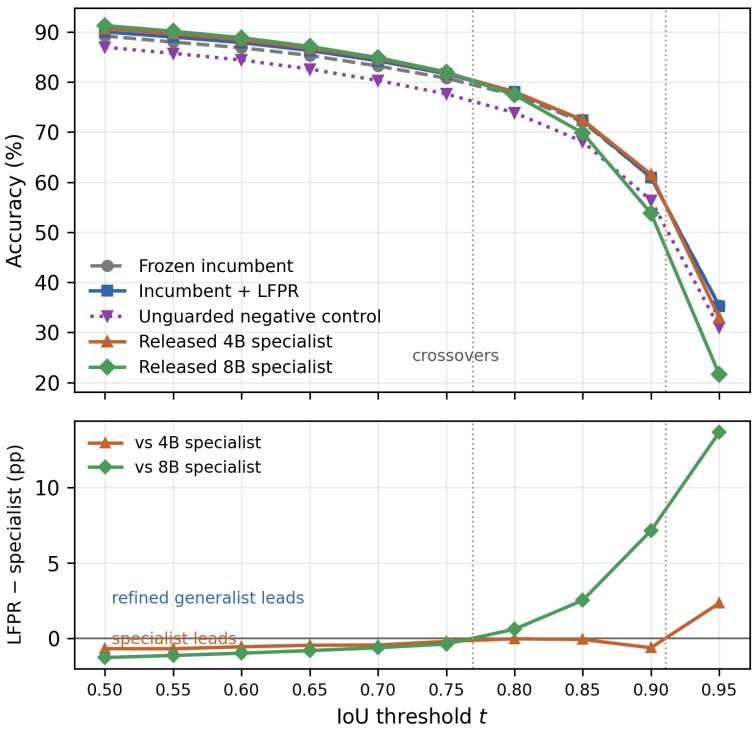  
Figure 1: Accuracy against IoU threshold on the 30,969-row transfer split (top) and the paired difference between the guarded system and each specialist (bottom). Specialists lead at permissive thresholds; LFPR crosses the 8B specialist near $t \approx 0 . 7 8$ and widens thereafter, but tracks the incumbent and the 4B specialist at strict thresholds until $t = 0 . 9 5$ . The unguarded negative control trails every system across the full range, reaching only 30.99% at $t = 0 . 9 5$ against 35.25% for LFPR, 35.43% for the incumbent, and 32.93%/21.60% for the specialists.

The same negative control (Table 3, bottom row) trails both specialists at Acc@0.5 by a wider margin than the guarded system and no longer beats either convincingly at Acc@0.9, confirming the 8B-specialist reversal is a property of the guarded system specifically. Scaling the specialist from 4B to 8B sharpens the same trade-off: Acc@0.5 rises +0.588 points while Acc@0.9 falls 7.772 and mAcc falls 2.017 (Appendix E gives the full row-level detail). An image-level firewall audit find zero training-image overlap between the specialists and any evaluation partition, so their Acc@0.5 advantage is genuine rather than memorization, though benchmark-specific: the direction reverses on long expressions (Appendix E).

Refinement composes with specialisation. Running the complete frozen procedure, unchanged, on each specialist’s own predictions over the same 30,969 rows improves every reported endpoint for both (full intervals in Table 31), with the strict-threshold gain far larger for the stronger specialist, so the benefit scales with the underlying model.

## 5.4 A PROSPECTIVE FLICKR30K ENTITIES CONFIRMATION UNDER THE STANDARD MERGED-BOX PROTOCOL

A stronger test of generalisation is a dataset the method never saw during development. We use the official Flickr30K Entities test split (Plummer et al., 2015) under its standard merged-box protocol: every visible phrase with at least one annotated box is represented by the enclosing box of all its annotations. The resulting 14,481-row, 999-image denominator (Table 1; Appendix B.4 gives the manifest and firewall detail) improves every endpoint: Acc@0.75 rises +1.326 $( p = 0 . 0 0 0 8 )$ , and Acc@0.9 rises +1.022 $( p = 0 . 0 0 5 2 )$ , with zero invalid predictions.

The stage decomposition is less uniformly favorable than the endpoint comparison. The baseline (B) incumbent reaches mAcc 56.975 and Acc@0.9 37.753; routing alone (R) reaches mAcc 58.585 and Acc@0.9 39.749; full LFPR (CRG) reaches mAcc 57.948 and Acc@0.9 38.775. Thus routing transfers prospectively, but crop/guard/fusion does not add accuracy beyond routing on this dataset;

its marginal value is dataset-dependent. The guard nevertheless remains load-bearing because the matched unguarded arm falls below the original incumbent (Appendix B.5).

As a sensitivity analysis on the same images, we also retain the historical single-box selection: excluding 2,907 multi-box and 3,038 non-visual phrases leaves 11,574 rows over 979 images. It yields larger changes (mAcc +2.575, Acc@0.5 +1.175, Acc@0.75 +3.145, Acc@0.9 +3.689), but is not an independent confirmation. Both protocols were frozen before scoring, and an image-hash audit finds no overlap with historical development data.

## 6 ANALYSIS AND DISCUSSION

## 6.1 WHY THE STAGES CAN OPPOSE ONE ANOTHER, AND WHAT A SINGLE THRESHOLD HIDES

The resolution stage changes the visual evidence available to the model; the crop stage changes the coordinate frame in which it localizes; their effects are separable and sometimes opposing (Table 2; Table 11). Resolution routing alone earns a clean, positive strict-IoU effect on every tier, accounting for most of the deployed policy’s Acc@0.9 effect (Appendix D.1). Crop re-grounding, the guard, and fusion protect against an unfiltered second opinion rather than guarantee further accuracy: on the RefCOCO family and Flickr30K (Appendix B.5) their marginal effect beyond routing trades Acc@0.5 for Acc@0.9/mAcc, never a net gain; Ref-L4 is the exception, but it is also the most heavily tuned tier, so only the untuned tiers speak without a tuning confound. The robust claim is narrower than “components compose”: selective resolution transfers, the policy improves broadly, and the guard prevents an unfiltered crop answer from becoming competitive.

The specialist comparison makes a methodological point that does not depend on our method: reporting Acc@0.5 alone can invert the ordering of systems relative to their localization quality, since two systems can be separated by seven points at Acc@0.9 while differing by one point the other way at Acc@0.5, and only the latter is usually reported. We therefore recommend reporting referringexpression results as a threshold profile, or at minimum with mean accuracy alongside Acc@0.5.

## 6.2 LIMITATIONS

Our evidence has five boundaries.

First, the Ref-L4 estimate is retrospective: the published test distribution shaped diagnostics and selection, pilot rows were reused, and no external preregistration exists, so its intervals describe sampling variability under a frozen comparison, not selection across the pipelines, prompts, resolutions, guards, and fusion variants explored. The RefCOCO-family result is prospective, with its own scoped Holm correction.

Second, the specialist comparison is only partly compute-normalised (Appendix E gives same-host latency ratios); energy and FLOPs were not measured.

Third, the specialists are supervised on the RefCOCO family while our incumbent is zero-shot; a firewall audit finds no training-image overlap, so the comparison is uncontaminated but not like-forlike.

Fourth, our operator-effect evidence covers one architecture family: LFPR improves every reported endpoint on both released specialists and a 2×-smaller checkpoint (Appendix B.12), but crossfamily checkpoints were screened only at the direct-answer stage (Appendix B.13).

Fifth, the size threshold, guards, and midpoint weight are fixed constants: a local grid sweep finds no configuration that Pareto-dominates the shipped rule (Appendix C), and we did not learn them, since that would change the contribution from a frozen operator to a learned router.

## 7 CONCLUSION

We studied a narrow deployment question: can a frozen grounding-capable VLM use its own incumbent prediction to obtain a more precise box without accessing target annotations at inference? LFPR’s lesson is not that a second prediction is uniformly better: components move different, opposing parts of the curve, and an ablation confirms the guard is load-bearing: a complement to stronger grounding models, not a replacement.

## REPRODUCIBILITY STATEMENT

The complete source code implementing LFPR and the analysis scripts used to produce every table and figure in this paper are publicly available at https://github.com/mabo1215/ BodhiNet. All prompts, pixel budgets, clipping conventions, guard thresholds, and decoding settings used by LFPR are given in Appendix A, together with the preprocessing constants and the environment fields that could not be recovered from archived logs. The image-cluster bootstrap procedure and Holm correction used for every reported interval are specified in Appendix F. The complete label-free procedure is stated as pseudocode in Appendix D. Dataset splits, source labels, and the data-firewall audits establishing image-disjointness between evaluation partitions and prior development data are described in Section 4 and Appendix A.4, which also gives the SHA-256 checksum of the exact per-row prediction file behind every headline result (Table 5); the released code includes the full-length hashes and generation commands in a machine-readable manifest.

## REFERENCES

Jierun Chen, Fangyun Wei, Jinjing Zhao, Sizhe Song, Bohuai Wu, Zhuoxuan Peng, S.-H. Gary Chan, and Hongyang Zhang. Revisiting referring expression comprehension evaluation in the era of large multimodal models. In Proceedings of the IEEE/CVF Conference on Computer Vision and Pattern Recognition Workshops, pages 513–524, 2025a.

Juntao Chen, Wen Shen, Zhihua Wei, Lijun Sun, and Hongyun Zhang. Leveraging debiased crossmodal attention maps and code-based reasoning for zero-shot referring expression comprehension. In Proceedings of the IEEE/CVF International Conference on Computer Vision, pages 20413– 20424, 2025b.

Xiaofu Chen, Yaxin Luo, Gen Luo, Jiayi Ji, Henghui Ding, and Yiyi Zhou. DViN: Dynamic visual routing network for weakly supervised referring expression comprehension. In Proceedings of the IEEE/CVF Conference on Computer Vision and Pattern Recognition, pages 14347–14357, 2025c.

Ming Dai, Jian Li, Jiedong Zhuang, Xian Zhang, and Wankou Yang. Multi-task visual grounding with coarse-to-fine consistency constraints. In Proceedings of the AAAI Conference on Artificial Intelligence, volume 39, pages 2618–2626, 2025. doi: 10.1609/aaai.v39i3.32265.

GLM-V Team. GLM-4.5V and GLM-4.1V-Thinking: Towards versatile multimodal reasoning with scalable reinforcement learning. arXiv preprint arXiv:2507.01006, 2025.

Marcel Gr"opl, Jaewoo Jung, Seungryong Kim, Marc Pollefeys, and Sunghwan Hong. Entropygradient grounding: Training-free evidence retrieval in vision-language models. arXiv preprint arXiv:2604.08456, 2026.

Zheng Jiang, Yiming Chen, Nan He, Jiahui Chen, Chaoyang Li, Houde Qian, and Lifeng Sun. Testtime scaling over perception: Resolving the grounding paradox in thinking with images. arXiv preprint arXiv:2604.11025, 2026.

Aishwarya Kamath, Mannat Singh, Yann LeCun, Gabriel Synnaeve, Ishan Misra, and Nicolas Carion. MDETR: Modulated detection for end-to-end multi-modal understanding. In Proceedings of the IEEE/CVF International Conference on Computer Vision, pages 1780–1790, 2021.

Liunian Harold Li, Pengchuan Zhang, Haotian Zhang, Jianwei Yang, Chunyuan Li, Yiwu Zhong, Lijuan Wang, Lu Yuan, Lei Zhang, Jenq-Neng Hwang, Kai-Wei Chang, and Jianfeng Gao. Grounded language-image pre-training. In Proceedings of the IEEE/CVF Conference on Computer Vision and Pattern Recognition, pages 10965–10975, 2022.

Shilong Liu, Zhaoyang Zeng, Tianhe Ren, Feng Li, Hao Zhang, Jie Yang, Qing Jiang, Chunyuan Li, Jianwei Yang, Hang Su, Jun Zhu, and Lei Zhang. Grounding DINO: Marrying DINO with grounded pre-training for open-set object detection. In European Conference on Computer Vision, 2024.

Junhua Mao, Jonathan Huang, Alexander Toshev, Oana Camburu, Alan Yuille, and Kevin Murphy. Generation and comprehension of unambiguous object descriptions. In Proceedings of the IEEE Conference on Computer Vision and Pattern Recognition, pages 11–20, 2016. doi: 10.1109 CVPR.2016.9.

Matthias Minderer, Alexey Gritsenko, Austin Stone, Maxim Neumann, Dirk Weissenborn, Alexey Dosovitskiy, Aravindh Mahendran, Anurag Arnab, Mostafa Dehghani, Zhuoran Shen, Xiao Wang, Xiaohua Zhai, Thomas Kipf, and Neil Houlsby. Scaling open-vocabulary object detection. In Advances in Neural Information Processing Systems, volume 36, 2023.

Yik Lung Pang and Changjae Oh. Chain-of-caption: Training-free improvement of multimodal large language model on referring expression comprehension. arXiv preprint arXiv:2602.08211, 2026.

Bryan A. Plummer, Liwei Wang, Chris M. Cervantes, Juan C. Caicedo, Julia Hockenmaier, and Svetlana Lazebnik. Flickr30k entities: Collecting region-to-phrase correspondences for richer image-to-sentence models. In Proceedings of the IEEE International Conference on Computer Vision, pages 2641–2649, 2015. doi: 10.1109/ICCV.2015.303.

Qwen Team. Qwen2.5-VL technical report. arXiv preprint arXiv:2502.13923, 2025a.

Qwen Team. Qwen3-VL technical report. arXiv preprint arXiv:2511.21631, 2025b.

Shuai Shao, Zeming Li, Tianyuan Zhang, Chao Peng, Gang Yu, Xiangyu Zhang, Jing Li, and Jian Sun. Objects365: A large-scale, high-quality dataset for object detection. In Proceedings of the IEEE/CVF International Conference on Computer Vision, pages 8430–8439, 2019. doi: 10.1109/ ICCV.2019.00852.

Animesh Tripathy and Aswanth Krishnan. Iterative visual thinking and the self-correction mirage in VLM grounding. arXiv preprint arXiv:2606.13156, 2026.

Licheng Yu, Patrick Poirson, Shan Yang, Alexander C. Berg, and Tamara L. Berg. Modeling context in referring expressions. In European Conference on Computer Vision, pages 69–85, 2016. doi: 10.1007/978-3-319-46475-6\_5.

Guanqi Zhan, Changye Li, Zhijian Liu, Yao Lu, Yi Wu, Song Han, and Ligeng Zhu. Scaling testtime inference for visual grounding. arXiv preprint arXiv:2601.13633, 2026.

This supplement gives the recoverable implementation specification, data-use audit, detailed result intervals, and disposition of the matched control experiments for LFPR. Missing provenance fields are stated explicitly rather than reconstructed from unversioned memory.

## A REPRODUCIBILITY SPECIFICATION

The complete source code implementing the LFPR pipeline – the resolution router, crop regrounding, geometric guards, midpoint fusion, and the analysis scripts used to produce every table and figure in this paper – is publicly available at https://github.com/mabo1215/ BodhiNet.

## A.1 MODEL AND DECODING

The generalist arms use a local copy of Qwen/Qwen3-VL-8B-Instruct at a single pinned revision, verified identical across every downloaded file’s cache metadata (the exact revision hash is recorded in the released run manifest rather than restated here), in bfloat16, SDPA attention, evaluation mode, and deterministic, non-sampling greedy decoding, at most 64 generated tokens for the full-split accuracy runs. The synchronized cost protocol raises the ceiling to 4,096 new tokens and reports the realized generated-token count. The full-split Ref-L4, RefCOCO-family, and Flickr30K accuracy runs, and the policy-matched cost audit, used Python 3.10.12, PyTorch 2.8.0 (CUDA 12.8 build), Transformers 4.57.1, Pillow 11.1.0, NumPy 1.26.4, NVIDIA driver 595.84, Ubuntu 22.04.5 LTS, kernel 5.15.0, on a four-GPU host (NVIDIA GeForce RTX 3090, 24 GiB each). The full-parameter fine-tune control ran separately on an NVIDIA RTX PRO 6000 Blackwell Server Edition with approximately 96 GiB of memory; earlier development-phase pilots not reported as final numbers in this paper used a mix of rented cloud GPU instances, documented per-experiment in the released run logs rather than restated here.

The specialist cost audit uses local EGM-4B and EGM-8B checkpoints in bfloat16 with SDPA attention and greedy decoding, allowing at most 4,096 new tokens. It ran on a host with four physical NVIDIA RTX 3090 GPUs (24 GiB each). Each baseline/refinement arm was divided into two nonoverlapping row shards, with one process per GPU; no GPU hosted more than one worker.

## A.2 DETERMINISM CHECK

Since LFPR uses frozen weights and greedy decoding, training-seed replication is not meaningful; instead we verify output-level determinism directly. A fixed 128-row deterministic slice of the direct-answer incumbent (arm B) was run in three independent processes launched in parallel on three separate physical GPUs on the same host (rather than three sequential repeats on one card, which additionally rules out cross-device, not just cross-process, non-determinism). All three runs’ predicted boxes were byte-identical on 128/128 rows: a 100% reproducibility rate under greedy decoding on this hardware.

The full-image prompt is, verbatim:

Locate the region that matches: <expression>. Reply only with its bounding box as $\scriptstyle { ( x I , y I , x 2 , y 2 }$ in coordinates normalized to 0–1000. No explanation.

The crop-pass prompt replaces the final two sentences:

Reply only with its bounding box as $\scriptstyle { ( x I , y I , x 2 , y 2 }$ in coordinates normalized to 0–1000 within this crop.

In both cases the checkpoint’s native chat template is applied with an image followed by the user text, with the chat template’s generation-prompt formatting enabled; no system message or stop string is added.

The default first-pass image-processing configuration is loaded from the checkpoint. The routed pass overrides the minimum-pixel budget to 4,194,304 and leaves the checkpoint’s maximum unchanged. The crop pass reuses the same 4,194,304-pixel minimum override and also leaves the checkpoint maximum unchanged, which resolves to an effective processed-image size bounded between 4,194,304 and 16,777,216 pixels for both passes; this was confirmed by reading the image processor’s own logged effective configuration from the run that produced every crop-based result in this paper, not from the smaller, crop-specific pixel range (approximately 200,704 to 1,003,520 pixels) that the runner accepts as an argument but never actually applies. Source images are opened with PIL, honor PIL’s decoded orientation as stored, and are converted to RGB; explicit EXIF transposition was not applied. Crops use PIL’s default resampling path through the Qwen processor. No weights are updated or adapter merged.

The parser strips the completion, accepts exactly one JSON/bare four-number box (a singleton wrapper is permitted), and rejects zero or multiple boxes. Coordinates must satisfy $0 \leq x _ { 1 } < x _ { 2 } \leq 1 0 0 0$ and $0 \leq y _ { 1 } < y _ { 2 } \leq$ 1000 before division by 1000. Invalid, non-finite, zero-area, or inverted boxes score as misses; no row is dropped. Crop pixel bounds use floor/ceiling, are clipped to the source image, and the accepted candidate is mapped back without integer rounding.

## A.3 ROUTER AND CROP SPECIFICATION

The normalized incumbent box is converted to original-image pixel coordinates. $\mathrm { I f } s = \sqrt { w h } <$ 128 pixels, the row is routed to the high-resolution pass; $1 2 8 \leq s \leq 2 5 6$ is medium and is not routed; all larger boxes are not routed. Missing dimensions, malformed boxes, and invalid first-pass outputs are never converted into a synthetic small box. They remain baseline misses and are recorded in the error counters.

For every valid post-resolution incumbent, the crop width and height are each twice the incumbent width and height, capped at one and shifted to remain inside the image. Zoom consistency is the Euclidean distance between the crop candidate center and the incumbent center expressed in crop coordinates, divided by $\sqrt { 1 / 2 }$ . The candidate is admitted only when this value is at most 0.35, candidate–incumbent IoU is at least 0.25, and the area ratio lies in [0.5, 2.0]. The output is the coordinate-wise midpoint. Invalid incumbents short-circuit as misses; invalid high-resolution or crop answers, zero-area denominators, degenerate crops, and runtime errors never trigger fusion. Available history says these constants preceded the full-split run, but not that they preceded all access to the published test distribution.

## A.4 DATA FIREWALL

The original “test firewall” claim is withdrawn. The 2,000-row pilot is a deterministic image-disjoint holdout relative to named earlier pilots, but it was sampled from the already-scored Ref-L4 test prediction file and reused by the crop/fusion-only and full LFPR arms. The complete published test split was also used for annotation-size and source diagnostics that influenced later choices. Thus the holdout is a useful same-row engineering check, not an untouched confirmation benchmark.

Reproducible future evaluations require stable record keys, content hashes rather than filenames, artifact checksums, and an access ledger with actor, purpose, split, label availability, and decision influence. Until that ledger and an untouched benchmark/model combination are available, all reported intervals are retrospective.

Artifact hash manifest. Table 5 lists the checksum of the exact per-row prediction file behind each of this paper’s primary confirmatory results (Ref-L4, the RefCOCO family, and the Flickr30K merged-box confirmation, including its 512-row matched subset). Every downstream table that reports one of these arms’ numbers is traceable to exactly one of these hashes – in particular, the RefCOCO family’s B row is the artifact that Blocker 1’s investigation confirmed is genuinely preresolution, not the differently-named file that a prior draft mistook for it. Hashes are truncated to 12 hex characters here for space; the full 64-character digests, the exact generation commands, and the artifacts still outside this manifest’s coverage (the RefCOCO-family cost audit and several secondary diagnostic tables) are listed in the code supplement’s machine-readable manifest referenced in the Reproducibility Statement.

## B DETAILED RESULTS

Arm glossary. Throughout this appendix, B denotes the frozen incumbent’s pre-resolution prediction; R denotes the prediction after label-free resolution routing alone; C denotes a guarded crop pass without routing; CR† denotes the unguarded negative control (routing plus crop with the geometric guard removed); and CRG denotes the full shipped policy (routing, guarded crop, and midpoint fusion). A contrast written X−Y always means arm X minus arm Y on the same rows; tables and prose state their reference arm explicitly because CRG−B (the deployed policy’s effect) and CRG−R (the post-routing stage effect) answer different questions and are not interchangeable, as Table 9 and its surrounding discussion make explicit.

## B.1 EVIDENCE-TIER SUMMARY

Table 6 collects the treatment-minus-incumbent effect on every primary and secondary endpoint across the paper’s three evidence tiers, before the per-evaluation breakdowns below. Effects are differences against each evaluation’s own matched incumbent; the Ref-L4 and RefCOCO-family rows

<table><tr><td>Artifact</td><td>Rows</td><td></td><td>access</td><td>sions</td><td>Images Label access First recoverable Recorded uses and deci-</td></tr><tr><td>Ref-L4 published test</td><td>31,921</td><td>9,467 Yes</td><td>2026-08-05 earlier</td><td>or Baseline</td><td>scoring; source/size diagnostics; resolution arm; final LFPR scoring and manuscript</td></tr><tr><td>Frozen RefCOCO- 30,969 family transfer</td><td></td><td>3,982 Yes</td><td></td><td>2026-08-10</td><td>framing. Frozen LFPR pooled audit; descriptive dataset slices; no target-label tuning.</td></tr><tr><td>Shared crop/refinement holdout</td><td>2,000</td><td>1,713 Labels</td><td>present in rows</td><td>2026-08-08</td><td>Selected from the full-test baseline after excluding named prior-pilot images; reused for crop/fusion- only and full LFPR</td></tr><tr><td>pilots</td><td>Resolution/prompt 800 each Not fully exported Yes</td><td></td><td></td><td>2026-08-07-08</td><td>decisions. Floor, prompt, and stop- ping choices; some sam- ples were reused and the rung summaries used dif-</td></tr><tr><td>Supervised- adaptation split</td><td></td><td>3,314 Not fully exported Yes</td><td></td><td>2026-08-08</td><td>ferent references. Supervised-adaptation control and stopping decision; relation to all other image pools is not</td></tr><tr><td>Backbone-scale pi- lot</td><td>380</td><td>344Yes</td><td></td><td>2026-08-09</td><td>reconstructable from the compact export. Same-family 32B direct- model control; no com- plete LFPR run.</td></tr></table>

Table 4: Minimum data-governance record recoverable from compact manifests and logs. “Not fully exported” is a provenance gap, not evidence of separation.

<table><tr><td>Dataset</td><td>Arm</td><td>Rows</td><td>SHA-256 (12 hex)</td></tr><tr><td>Ref-L4</td><td>B</td><td>31,921</td><td>a31497f9f3cb</td></tr><tr><td>Ref-L4</td><td>R (diagnostic)</td><td>31,921</td><td> $\mathtt { c 4 d 8 3 a 2 c 7 8 0 0 }$ </td></tr><tr><td>Ref-L4</td><td>CRG</td><td>31,921</td><td> $3 \mathrm { b e e } 4 8 \mathrm { f a } 7 \mathrm { c } 3 \mathrm { f }$ </td></tr><tr><td>RefCOCO family</td><td>B</td><td>30,969</td><td> $\mathtt { 0 b 0 e 6 a 9 b 5 0 8 d }$ </td></tr><tr><td>RefCOCO family</td><td>CRG</td><td>30,969</td><td> $\mathtt { f e 4 5 0 8 d f f 8 3 b }$ </td></tr><tr><td>Flickr merged-box</td><td>B</td><td>14,481</td><td> $2 4 1 7 0 \mathrm { b } 5 1 8 4 9 3$ </td></tr><tr><td>Flickr merged-box</td><td>R</td><td>14,481</td><td> $1 0 4 4 { \tt e f } 5 7 { \tt c } 8 \mathrm { b } 0$ </td></tr><tr><td>Flickr merged-box</td><td>crop-on-R (raw)</td><td>14,481</td><td> $\mathtt { e d 8 8 e d b f 7 f 8 c }$ </td></tr><tr><td>Flickr merged-box</td><td>CRG</td><td>14,481</td><td> $\ p 3 \mathrm { b e } 6 8 7 0 9 \mathsf { a } 5 3$ </td></tr><tr><td>Flickr merged-box, 512-row matched</td><td> $B$ </td><td>512</td><td> $\mathtt { c c } 2 9 \mathsf { a } 5 \mathsf { e } 2 \pounds 4 4 6$ </td></tr><tr><td>Flickr merged-box, 512-row matched</td><td> $\mathrm { c r o p - o n - } R \left( \mathrm { r a w } \right)$ </td><td>512</td><td> $1 2 9 \mathrm { c d } 8 \mathrm { e } 0 \mathrm { c b } 1 7$ </td></tr><tr><td>Flickr merged-box, 512-row matched</td><td> $R _ { \mathrm { A L L } }$ </td><td>512</td><td>8ccaa327e65f</td></tr><tr><td>Flickr merged-box, 512-row matched</td><td> $C R _ { \mathrm { A L L } }$ </td><td>512</td><td>e536db5e0514</td></tr><tr><td>Flickr merged-box, full population</td><td> $R _ { \mathrm { A L L } }$ </td><td>14,481</td><td>41df2c56899c</td></tr><tr><td>Flickr merged-box, full population</td><td> $C R _ { \mathrm { A L L } }$ </td><td>14,481</td><td>1db4562f197e</td></tr></table>

Table 5: Headline artifact hash manifest. Each row is one frozen per-row prediction file (record\_key, gt\_box, pred\_box, and arm-specific fields); every headline table or figure that reports the corresponding arm’s accuracy or cost derives from exactly this file, not a superseded or differently-scored copy of it.

draw from Tables 26 and 8, and the Flickr rows from Section 5.4 of the main text and Appendix B.4. Mean-IoU deltas are in percentage points and are given only where an archived report computed them; a blank cell means the quantity was not computed, not that it was zero.

<table><tr><td>Evaluation</td><td>Evidence tier</td><td>n (expr / img)</td><td>∆Acc@.5</td><td>∆Acc@.75</td><td>∆Acc@.9</td><td>∆mAcc</td><td>∆Mean IoU</td></tr><tr><td>Ref-L4 (full split)</td><td>Retrospective devel- opment</td><td>31,921 / 9,467</td><td>+1.194</td><td>+3.173</td><td>+5.354</td><td>+3.066</td><td>+1.704</td></tr><tr><td>RefCOCO/+/g (pooled)</td><td>Frozen cross-dataset transfer</td><td>30,969 / 3,982</td><td>+0.817</td><td>+0.852</td><td>-0.029</td><td>+0.645</td><td>+0.552</td></tr><tr><td>Flickr30K (merged- box)</td><td>Prospective, i image- disjoint</td><td>14,481 / 999</td><td>+0.815</td><td> $+ 1 . 3 2 6$ </td><td> $+ 1 . 0 2 2$ </td><td>+0.973</td><td>+0.712</td></tr><tr><td>Flickr30K (single- box)</td><td>Prospective, image- disjoint (secondary)</td><td>11,574 / 979</td><td> $+ 1 . 1 7 5$ </td><td> $+ 3 . 1 4 5$ </td><td> $+ 3 . 6 8 9 $ </td><td>+2.575</td><td></td></tr></table>

Table 6: Evidence-tier summary of the three headline evaluations, in percentage points against each row’s own matched incumbent. Ref-L4 is retrospective development evidence and should not be read as confirmatory; the RefCOCO-family pooled row is frozen transfer that retuned nothing; Table 9 decomposes this same CRG − B effect by dataset; the two Flickr30K rows are the paper’s prospective, image-disjoint confirmation, sharing the same 999/979 source images under two different phrase-to-box protocols (Appendix B.4) rather than constituting two independent datasets.
<table><tr><td>Arm</td><td>n</td><td>Acc@0.5</td><td>Acc@0.75</td><td>Acc@0.9</td><td>mAcc</td><td>Objects365 ∆</td></tr><tr><td>Crop/fusion reused pilot</td><td>2,000</td><td>+0.70</td><td></td><td>一</td><td>一</td><td></td></tr><tr><td>LFPR reused pilot</td><td>2,000</td><td>+0.85</td><td>+2.65</td><td> $+ 2 . 6 5$ </td><td> $+ 2 . 0 5 5$ </td><td>+1.30</td></tr><tr><td>LFPR full test</td><td>31,921</td><td>+1.194</td><td>+3.173</td><td>+5.354</td><td>+3.066</td><td>+1.720</td></tr></table>

Table 7: Historical treatment-minus-baseline effects in percentage points. The two pilot rows are reused and are not independent confirmation. LFPR pilot one-sided LCBs are +0.45, +1.85, +1.61, +1.69, and +0.68 for Acc@0.5, Acc@0.75, Acc@0.9, mAcc, and Objects365 Acc@0.5, respectively. The full test Acc@0.5 paired image-level 95% interval is $[ + 0 . 9 4 4 , + 1 . 4 3 9 ]$ . LCBs explain historical selection and are not confirmatory.

## B.2 PILOT AND FULL-SPLIT INTERVALS

## B.3 CROSS-DATASET TRANSFER TO THE REFCOCO FAMILY

The transfer evaluation applies the frozen procedure without retuning to five official Ref-COCO/RefCOCO+/RefCOCOg test partitions. The pooled paired audit uses 30,969 expressions, 3,982 image clusters, exact record-key joins, and 10,000 image-cluster bootstrap resamples. These partitions influenced no design decision: every threshold, guard, resolution floor, and fusion weight was fixed on Ref-L4 before any row here was scored.

The paired report records 13,925 IoU wins, 12,357 losses, and 4,687 ties. Table 9 decomposes this pooled full-policy result, CRG − B (the deployed policy against the original pre-routing incumbent B), by dataset, using the same exact-key join and image-cluster bootstrap as the pooled table, verified by a machine-checked assertion to reproduce the pooled estimate under row weighting to within $1 0 ^ { - 1 0 ^ { \circ } }$ (Appendix F).

The deployed policy improves every dataset individually at Acc@0.5, mAcc, and mean IoU (not shown in the table; +0.323/+0.518/+0.847 points for RefCOCO/RefCOCO+/RefCOCOg respectively, each $p < 0 . 0 0 1 )$ , and at Acc@0.75 for RefCOCO+ and RefCOCOg; ten of the twelve datasetby-metric comparisons in the table clear Holm-adjusted significance. Acc@0.9 is indistinguishable from zero on every dataset (RefCOCO −0.530, RefCOCO+ +0.377, RefCOCOg +0.083, none significant), matching the pooled null rather than concealing a per-dataset regression – no dataset shows a significant $C R G - B$ regression on any reported metric.

A separate, secondary decomposition asks a different question: relative to the post-routing incumbent R rather than B, does crop/guard/fusion preserve the strict-IoU gain that routing alone earns? Reusing the same per-row artifact, CRG−R (not shown as a full table) $\mathrm { i s - 1 . 4 2 3 ( [ - 2 . 2 0 6 , - 0 . 6 7 3 ] }$ Holm-significant), $\dot { , } - 0 . 5 3 7 \left( \left[ - 1 . 2 7 2 , 0 . 1 7 1 \right] \right.$ , not significant), and −1.656 ([−2.288, −1.019], Holmsignificant) at Acc@0.9 for RefCOCO/RefCOCO+/RefCOCOg, row-weighting to the pooled $\bar { C R G } - R = ( + 0 . 1 2 6 , + 0 . 0 4 6 , - 1 . 1 9 2 , - 0 . 2 1 6 )$ for Acc@0.5/0.75/0.9/mAcc (Table 11). This explains the mechanism behind the pooled CRG − B Acc@0.9 null in Table 8 – routing gains strict-IoU accuracy that the later crop/guard/fusion stage partly returns – without changing the per-dataset CRG − B conclusion above: CRG − B and CRG − R answer different questions (deployed-policy effect vs. post-routing marginal effect) and are not interchangeable.

What kind of harm this is. We classified every harmed row on the RefCOCO-family transfer split (final box lower IoU-vs-ground-truth than the true pre-resolution incumbent B; 12,357 of 30,969 rows, matching the paired loss count above) into one of six geometric categories – router-caused, crop-boundary truncation, referent switch (final box barely overlaps its own pre-crop anchor), overshrink, over-expand, or a residual modest-perturbation category – checked in that priority order per row, using each row’s already-recorded box geometry (no new inference). The result is dominated by, but not exclusively, modest perturbation: 94.58% of harmed rows (11,687/12,357) are boundary shifts that still overlap their pre-crop anchor substantially, 0.78% are over-expansions, and 0.11% are over-shrinkages, with zero crop-boundary truncations or referent switches. A non-trivial remainder, 4.53% (560/12,357), is router-caused: the resolution router changed the incumbent’s box and that change alone, before the crop stage ever ran, was already worse than the original pre-routing prediction. The Acc@0.9 null documented above is therefore mostly the aggregate of many small coordinate perturbations from midpoint fusion crossing the strict threshold (the same mechanism Table 28 isolates as the fusion rule’s own cost), plus a smaller contribution from the router itself occasionally routing a row to a worse prediction – not evidence of crop-boundary truncation or referent switching.

<table><tr><td>Metric</td><td>Incumbent</td><td>LFPR</td><td>∆(pp)</td><td>Two-sided 95% CI</td><td>Holm p</td></tr><tr><td>Acc@0.5</td><td>89.212</td><td>90.029</td><td>+0.817</td><td>[0.639, 1.001]</td><td>0.0032</td></tr><tr><td>Acc@0.75</td><td>80.790</td><td>81.643</td><td>+0.852</td><td>[0.566, 1.147]</td><td>0.0032</td></tr><tr><td>Acc@0.9</td><td>60.955</td><td>60.925</td><td>-0.029</td><td>[-0.554, 0.497]</td><td>0.9311</td></tr><tr><td>mAcc@0.5:0.95</td><td>75.925</td><td>76.570</td><td>+0.645</td><td>[0.469, 0.827]</td><td>0.0032</td></tr><tr><td>Mean IoU</td><td>82.262</td><td>82.814</td><td>+0.552</td><td>[0.438, 0.668]</td><td></td></tr></table>

Table 8: Pooled transfer audit on the RefCOCO/RefCOCO+/RefCOCOg family, after the resolution floor was verified to take effect. Intervals are image-cluster bootstrap intervals from the archived paired report; the Holm value is the multiplicity-adjusted primary-family value. Acc@0.9 is the one metric that does not move: the guards and midpoint return the strict-IoU accuracy that the crop and floor earn (Table 11). Mean IoU is outside the reported four-metric Holm family (no Holmadjusted $p$ reported here, though its own bootstrap $p < 0 . 0 0 1 )$ and moves in the same direction as Acc@0.5/mAcc, unlike the strict-IoU metric – consistent with the deployed policy broadly improving boundary precision even though its strict-threshold effect nets to zero after the crop stage gives back part of routing’s Acc@0.9 gain (Table 11). Each arm contains two invalid rows, which remain in the denominator.
<table><tr><td>Dataset</td><td>Rows</td><td>Images</td><td>Acc@0.5 ∆</td><td>Acc@0.75 ∆</td><td>Acc@0.9 ∆</td><td>mAcc ∆</td></tr><tr><td>RefCOCO</td><td>10,752</td><td>1,500</td><td>+0.772 [0.516, 1.037]</td><td>+0.456 [0.037, 0.881]</td><td>-0.530[-1.301, 0.234]</td><td>+0.343 [0.083, 0.594]</td></tr><tr><td>RefCOCO+</td><td>10,615</td><td>1,500</td><td>+0.641 [0.381, 0.908]</td><td>+0.895 [0.476, 1.319]</td><td>+0.377[-0.360, 1.110]</td><td>+0.644 [0.385, 0.911]</td></tr><tr><td>RefCOCOg</td><td>9,602</td><td>2,600</td><td>+1.062 [0.751, 1.391]</td><td>+1.250 [0.804, 1.705]</td><td>+0.083[−0.587, 0.773]</td><td>+0.984 [0.698, 1.281]</td></tr></table>

Table 9: Per-dataset deployed-policy effects, $C R G \mathrm { ~ - ~ } B ,$ , image-clustered 10,000-iteration bootstrap, Holm-corrected within the 12-comparison (3 datasets × 4 metrics) family. Bold marks Holm-adjusted $\begin{array} { r l r } { p } & { { } < } & { 0 . 0 5 } \end{array}$ Row-weighted deltas equal the pooled $C R G \mathrm { ~ - ~ } B \mathrm { ~ = ~ }$ $( + 0 . 8 1 7 , + 0 . 8 5 2 , - 0 . 0 2 9 , + 0 . 6 4 5 )$ in Table 8 to within $1 0 ^ { - 1 0 }$ . Image counts overlap across RefCOCO/RefCOCO+ (both built on the same COCO subset with different expression styles); Ref-COCOg draws on a largely disjoint image set, which is why the three counts do not sum to the pooled 3,982.

The pooled read above could in principle hide a dataset-specific failure mode that a pooled classification averages away. Table 10 repeats both the taxonomy and the strict-IoU transition-matrix cells on each of RefCOCO/RefCOCO+/RefCOCOg individually rather than pooled. The boundaryshift majority and near-zero crop-truncation/referent-switch rates hold on every sub-dataset, but the router-caused share varies more than the pooled figure suggests – from 3.1% on RefCOCO+ to 7.4% on RefCOCOg – and strict-IoU harm rates cluster in a narrower 5.7–6.5% range. The pooled numbers are therefore a fair summary of the dominant boundary-shift mechanism, but they average over real dataset-level variation in how often the router itself is the source of harm.

## B.3.1 COMPONENT DECOMPOSITION ON IDENTICAL ROWS

Because the crop candidate is retained before the guards and the midpoint are applied, the crop, guard, and fusion stages separate on the same 30,969 rows without any additional inference. Table 12 reports the paired contrasts.

The routing contrast supersedes an earlier version of this table that reported exact zeros for every routing metric. The router flagged the same 2,223 of 30,969 rows (7.18%) in both runs, but in the earlier one the requested pixel floor was silently discarded by the processor, so the routed arm

<table><tr><td>Dataset</td><td>Boundary shift</td><td>Router-caused</td><td>Over-expand</td><td>Over-shrink</td><td>Strict harm rate†</td></tr><tr><td>RefCOCO</td><td>95.76%</td><td>3.41%</td><td>0.72%</td><td>0.11%</td><td>6.48%</td></tr><tr><td>RefCOCO+</td><td>95.96%</td><td>3.10%</td><td>0.80%</td><td>0.15%</td><td>5.70%</td></tr><tr><td>RefCOCOg</td><td>91.66%</td><td>7.44%</td><td>0.82%</td><td>0.08%</td><td>5.71%</td></tr></table>

Table 10: Failure taxonomy and strict-IoU harm rate computed independently on each RefCOCOfamily sub-dataset (not pooled), against the true pre-resolution incumbent B. Crop-truncation and referent-switch categories are each 0.00% on all three and omitted from the columns. †Fraction of [.9, 1]-baseline rows that fall to [.75, .9) after LFPR (the same transition-matrix cell Figure 8 plots for Ref-L4/Flickr), computed per dataset. Zero new inference; reuses the same per-row predictions as Table 9.
<table><tr><td>Arm</td><td>Acc@0.5</td><td>Acc@0.75</td><td>Acc@0.9</td><td>mAcc</td><td>IoU W/L/T vs incumbent</td></tr><tr><td>B incumbent</td><td>89.212</td><td>80.790</td><td>60.955</td><td>75.925</td><td></td></tr><tr><td>R routing</td><td>89.903</td><td>81.597</td><td>62.117</td><td>76.786</td><td>1,444 / 651 / 28,874</td></tr><tr><td>C crop</td><td>89.448</td><td>81.462</td><td>62.799</td><td>76.723</td><td>15,725 / 10,608 / 4,636</td></tr><tr><td>CR† unguarded negative control</td><td>86.974</td><td>77.632</td><td>56.382</td><td>72.707</td><td>11,683 / 16,010 / 3,276</td></tr><tr><td>C RG full (LFPR)</td><td>90.029</td><td>81.643</td><td>60.925</td><td>76.570</td><td>13,925 / 12,357 / 4,687</td></tr></table>

Table 11: Five-arm same-row decomposition on the 30,969-row transfer split, all against the same incumbent with 10,000-iteration image-cluster bootstrap and Holm correction. Every arm is significant at adjusted p ≈ 0.003 or better. Routing changes few rows (2,095 of 30,969) but nearly always improves them. †: CR here is a genuine unguarded negative control, recomputed directly from CRG’s own stored per-row fields (incumbent box, crop candidate, guard decision) with the guard gate removed and every row unconditionally replaced – it uses the exact same crop candidates CRG uses, so the comparison is a true ablation of the guard alone. It underperforms the incumbent on every metric, confirming the guard is load-bearing rather than a trade against a competitive alternative. An archived, independently-generated CR run (Acc@0.5/0.75/0.9/mAcc 89.919/82.311/64.604/77.727) exists under the same label; that artifact uses an identical guard/fallback/fusion mechanism to CRG (verified: its per-row admission decision reproduces CRG’s frozen guard thresholds on 30,969/30,969 rows, 100.00% exact) but different upstream baseline and crop-candidate predictions from a separate execution, so it was never a guard ablation at all. That artifact is retained only as provenance of the mislabeling, not as a result.

reproduced the default-resolution arm byte for byte and every bootstrap replicate was identically zero. With the floor verified in effect the router changes 2,213 of those rows.

## B.3.2 RELEASED-SPECIALIST COMPARISON

Two released referring-expression specialists were evaluated zero-shot on the identical rows, clusters, and evaluator. Paired contrasts against the frozen incumbent are +1.511 points at Acc@0.5 for the 4B specialist ([1.029, 2.002]) and +2.099 for the 8B specialist ([1.663, 2.508]); at Acc@0.9 the same contrasts are +0.604 ([−0.317, 1.538], not distinguishable from zero) and −7.168 ([−8.178, −6.185]). In mean accuracy the 4B specialist gains +0.798 points and the 8B specialist loses 1.220. Paired IoU outcomes against the incumbent are 15,318 wins / 15,311 losses / 340 ties for the 4B specialist and 11,428 wins / 19,195 losses / 346 ties for the 8B specialist.

The deployed guarded arm (LFPR/CRG) trails the 4B specialist by −0.694 points at Acc@0.5 ([−1.148, −0.234]) and is statistically indistinguishable from it at Acc@0.9 (−0.633, [−1.545, 0.228]); against the 8B specialist it trails by −1.282 at Acc@0.5 ([−1.698, −0.883]) and leads by +7.139 at Acc@0.9 ([6.169, 8.125]). Scaling the specialist from 4B to 8B gives +0.588 points at Acc@0.5 ([0.171, 1.011]), −7.772 at Acc@0.9 ([−8.816, −6.730]), and −2.017 in mean accuracy.

As a negative control, the same comparison was run against the genuine unguarded arm from Table 11 (guard gate removed, same underlying candidates as CRG). It trails both specialists at Acc@0.5 by a wider margin than the guarded arm (−3.749 against the 4B specialist, −4.337 against the 8B; point estimates, since the specialists were not independently re-scored against this recomputed arm) and no longer leads either specialist convincingly at Acc@0.9: −5.176 against the 4B specialist and +2.596 against the 8B, versus the guarded arm’s −0.633 and +7.139 respectively. Removing the guard therefore does not trade Acc@0.5 for a stronger strict-IoU position relative to the specialists; it loses ground at Acc@0.5 without gaining a comparably strong position at Acc@0.9.

<table><tr><td>Contrast and metric</td><td>∆(pp)</td><td>95% CI</td></tr><tr><td colspan="3">Resolution routing minus incumbent</td></tr><tr><td>Acc@0.5</td><td>+0.691</td><td>[0.554, 0.836]</td></tr><tr><td>Acc@0.75 Acc@0.9</td><td>+0.807 +1.162</td><td>[0.637, 0.984] [0.927, 1.402]</td></tr><tr><td colspan="3">Crop alone (guarded) minus incumbent</td></tr><tr><td colspan="3"></td></tr><tr><td>Acc@0.5</td><td>+0.236</td><td>[0.125, 0.356]</td></tr><tr><td>Acc@0.75</td><td>+0.672</td><td>[0.402, 0.940]</td></tr><tr><td>Acc@0.9</td><td>+1.844</td><td>[1.349, 2.350]</td></tr><tr><td colspan="3">Unguarded crop+routing minus incumbent (negative control)</td></tr><tr><td>Acc@0.5</td><td>-2.926</td><td>[-3.264, -2.587]</td></tr><tr><td>Acc@0.75</td><td>-3.969</td><td>[-4.461, -3.477]</td></tr><tr><td>Acc@0.9</td><td>-5.748</td><td>[−6.494, -5.002]</td></tr><tr><td colspan="3">Full system (LFPR) minus incumbent</td></tr><tr><td>Acc@0.5</td><td>+0.817</td><td>[0.639, 1.001]</td></tr><tr><td>Acc@0.75</td><td>+0.852</td><td>[0.566, 1.147]</td></tr><tr><td>Acc@0.9</td><td>-0.029</td><td>[-0.554, 0.497]</td></tr></table>

Table 12: Same-row component decomposition, 10,000 image-cluster bootstrap resamples, every contrast against the same incumbent. “Crop alone” keeps the frozen guard active (guard and routing are independent axes; this row isolates the crop-only pipeline path, not a guard ablation). The “unguarded crop+routing” row is a true guard ablation, recomputed directly from CRG’s own stored candidate and guard fields with the guard gate removed: it underperforms the incumbent on every metric, not merely on Acc@0.5, so cropping does not buy strict-IoU accuracy for free once the guard stops filtering bad candidates. The guards and midpoint in the full system then return a small further Acc@0.9 concession in exchange for the largest Acc@0.5 gain. All contrasts are significant at Holm-adjusted $p \approx 0 . 0 0 3$ or better except the full system at Acc@0.9 $( p = 0 . 9 3 )$

Two controls bound this comparison. An image-level firewall audit compared 17,978 unique training images from the specialists’ published training manifest against the 3,982 unique evaluation images, partition by partition, and found zero overlap in all five partitions. This rules out exactimage memorization only; it does not rule out semantic overlap, near-duplicate images, shared class priors, or shared annotation style between the specialists’ training data and our evaluation split, any of which could still inflate a specialist’s advantage over a model that never trained on this distribution at all. We narrow the claim accordingly: the firewall supports a claim of no exact-image leakage, not a claim that the specialist comparison isolates model quality from training-distribution similarity. Separately, because midpoint fusion produces continuous coordinates while all three single-pass systems emit coordinates on a 0.001 grid, we requantized our predictions to that grid and rescored. Every metric moved by less than 0.03 points, so coordinate granularity accounts for none of the differences reported here. The quantization check was run against the superseded predictions; because it bounds a rounding effect rather than a treatment effect, and because the re-measured arms use the identical fusion arithmetic, the bound carries over unchanged.

## B.4 FLICKR30K ENTITIES STANDARD-PROTOCOL (MERGED-BOX) CONFIRMATION

The single-box subset used in the main text excludes every multi-box phrase, so it is not comparable to standard Flickr30K Entities phrase-grounding numbers, which merge a phrase’s boxes into one enclosing target rather than discarding it. We therefore ran a second, separately-frozen confirmation that keeps every visible entity phrase with at least one annotated box – 14,481 rows over 999 images (11,574 single-box plus 2,907 multi-box phrases, each represented by the deterministic enclosing xyxy box of its annotated boxes) – with its own denominator, image-hash manifest, and access ledger kept separate from the single-box subset so the two protocols cannot be confused. An imagelevel firewall audit against the historical Ref-L4 test and validation splits found zero overlapping images and zero overlapping record keys.

Full intervals: Acc@0.5 rises +0.815 points (95% CI [0.299, 1.324], Holm-adjusted $p = 0 . 0 0 5 2 )$ Acc@0.75 rises +1.326 ([0.714, 1.933], p = 0.0008), Acc@0.9 rises +1.022 ([0.322, 1.705], p = 0.0052), and mAcc rises +0.973 ([0.648, 1.310], $p \ = \ 0 . 0 0 0 8 )$ , with zero invalid predictions in either arm. The gain pattern differs from the single-box result: there Acc@0.75 and Acc@0.9 lead Acc@0.5; here all four primary metrics move together by roughly the same amount. Taken together with the single-box result, LFPR improves both the historical single-box selection and the standard merged-box protocol on the same held-out test images, so the single-box result is not an artifact of excluding multi-box phrases.

<table><tr><td>Arm</td><td>Acc@0.5</td><td>Acc@0.75</td><td>Acc@0.9</td><td>mAcc</td><td>Mean IoU ∆ vs B</td></tr><tr><td>B incumbent (pre-resolution)</td><td>74.864</td><td>59.720</td><td>37.753</td><td>56.975</td><td></td></tr><tr><td>R routing alone</td><td>75.893</td><td>61.784</td><td>39.749</td><td>58.585</td><td>+1.013</td></tr><tr><td>C guarded crop alone</td><td>74.926</td><td>59.050</td><td>37.200</td><td>56.463</td><td>-0.111</td></tr><tr><td> $C R ^ { \dagger }$  unguarded negative control</td><td>74.353</td><td>58.484</td><td>36.662</td><td>55.952</td><td>-0.652</td></tr><tr><td>C RG full (LFPR)</td><td>75.678</td><td>61.046</td><td>38.775</td><td>57.948</td><td>+0.712</td></tr></table>

Table 13: Same-row $B / R / C / C R ^ { \dagger } / C R G$ decomposition on the Flickr30K merged-box confirmation (14,481 rows, 999 images), reconstructed from the frozen run’s own archived per-row fields with no new model inference. Deltas are against $B ,$ the pre-resolution incumbent, matching Table 11’s convention. 10,000-iteration image-cluster bootstrap.
<table><tr><td>Arm</td><td>Acc@0.5</td><td>Acc@0.75</td><td>Acc@0.9</td><td>mAcc</td><td>Mean IoU ∆ vs B</td></tr><tr><td>B incumbent (pre-resolution)</td><td>74.864</td><td>59.720</td><td>37.753</td><td>56.975</td><td></td></tr><tr><td> $R _ { \mathrm { A L L L } }$  unconditional floor</td><td>74.629</td><td>61.398</td><td>42.469</td><td>58.747</td><td>+0.692</td></tr><tr><td> $C R _ { \mathrm { A L L } }$  unconditional floor+crop</td><td>74.774</td><td>61.149</td><td>41.551</td><td>58.461</td><td>+0.591</td></tr></table>

Table 14: Full-population P2-2 unconditional controls on the Flickr30K merged-box confirmation (14,481 rows, 999 images). Mean-IoU deltas are paired against the pre-resolution incumbent B; no new inference was performed for the B row.

## B.5 MECHANISM REPLICATION ON THE FLICKR30K MERGED-BOX CONFIRMATION

The transfer-split same-row decomposition (Table 11, Table 12) is the paper’s most detailed causal evidence for the guard and router on frozen transfer data, but it shares the RefCOCO-family evaluation used above. We therefore repeated the identical $B / R / C / C R ^ { \dagger } / C R G$ decomposition on the Flickr30K merged-box confirmation above, which never informed method development, reconstructing every arm from the frozen run’s own archived per-row fields with no additional model inference. The two unconditional resolution controls from P2-2 were also scored on the same full $^ { 1 4 , 4 8 1 }$ -row population, rather than only on the 512-row matched-cost subset. Their absolute scores and paired mean-IoU changes against the same pre-resolution incumbent are shown in Table 14.

The pattern matches the Ref-L4 and RefCOCO-family decompositions: CRG beats B significantly at both the permissive and strict threshold (95% CI [+0.293, +1.338] points at Acc@0.5, $\left[ + 0 . 3 1 9 , + 1 . 6 9 8 \right]$ at Acc@0.9), and the guard remains load-bearing – CR† is not merely worse than CRG, it is significantly below B at $\operatorname { A c c } { \bar { @ } } 0 . 9 ( \mathbf { C I } \left[ - 1 . 8 8 4 , - 0 . 2 9 \bar { 9 } \right] )$ , the same asymmetry reported for Ref-L4 and the RefCOCO family. The router’s own isolated contribution is positive and significant at every threshold (Acc@0.5 CI [+0.526, +1.536], Acc@0.9 CI [+1.417, +2.575]) and larger in magnitude than on the RefCOCO family; this is not a new mechanism, it tracks a higher routing rate on this population – the router changes the predicted box on 4,318 of 14,481 rows (29.8%) here, against 2,213 of 30,969 (7.1%) on the RefCOCO family (Section 5.2), consistent with Flickr30K Entities’ generally smaller annotated targets.

The same guard-by-fusion $2 \times 2$ factorial reported for Ref-L4 (Table 28) is computable on this dataset with the identical zero-new-inference method: the incumbent box, crop candidate, and guard decision are already stored per row.

A dense-grid extension of this comparison (46 thresholds, $t = 0 . 5 0 , 0 . 5 1 , \ldots , 0 . 9 5 .$ , one shared cluster-bootstrap resample per iteration across the whole grid, and a simultaneous max-|T| band rather than a pointwise one) finds the CRG-versus-B gain simultaneously significant on $t \in$ $[ 0 . 5 0 , 0 . 5 5 ] \cup [ 0 . 6 2 , 0 . 7 6 ] \cup [ 0 . 7 8 , 0 . 8 2 ]$ plus two isolated grid points at 0.84 and 0.89: the effect is not concentrated at one threshold, it holds across most of the permissive-to-strict range on this prospective evidence. Figure 3 plots the full curve. Appendix B.6 extends this same dense-grid construction to all five evaluations using each evaluation’s own pre-resolution and fused per-row prediction files.

Table 16 extends the same synchronized cost audit already reported for the RefCOCO-family split (Table 18) to the Flickr30K merged-box confirmation, using the identical protocol (one untimed warm-up, three CUDA-synchronized timed repeats per row, same RTX 3090). This closes the gap the previous revision cycle left open: B/ R/C/CR/CRG were timed on this dataset for the first time only after the unconditional controls, and the five guarded arms’ numbers were computed but never written up as a table. Zero runtime errors and zero invalid outputs on every arm and size.

<table><tr><td colspan="3">Ref-L4</td><td colspan="3">Flickr30K merged-box</td></tr><tr><td></td><td>Midpoint</td><td>Replacement</td><td></td><td>Midpoint</td><td>Replacement</td></tr><tr><td rowspan="5">Guarded</td><td>Acc@0.5: 89.725</td><td>Acc@0.5: 89.399</td><td rowspan="5">Guarded</td><td>Acc@0.5: 75.678 Acc@0.9: 38.775</td><td>Acc@0.5: 74.926</td></tr><tr><td>Acc@0.9: 61.142</td><td>Acc@0.9: 63.143</td><td></td><td>Acc@0.9: 37.200</td></tr><tr><td>mAcc: 76.013</td><td>mAcc: 76.166</td><td>mAcc: 57.948</td><td>mAcc: 56.463</td></tr><tr><td>Mean IoU: +0.691</td><td>Mean IoU: +0.712</td><td>Mean IoU: -0.301</td><td>Mean IoU: -1.123</td></tr><tr><td>Acc@0.5: 88.262</td><td>Acc@0.5: 87.247</td><td>Acc@0.5: 75.057</td><td>Acc@0.5: 74.353</td></tr><tr><td rowspan="3">Unguarded</td><td>Acc@0.9: 59.350</td><td>Acc@0.9: 62.059</td><td rowspan="3">Unguarded</td><td>Acc@0.9: 38.071</td><td>Acc@0.9: 36.662</td></tr><tr><td>mAcc: 73.864</td><td>mAcc: 74.491</td><td>mAcc: 57.003</td><td>mAcc: 55.952</td></tr><tr><td>Mean IoU: -0.454</td><td>Mean IoU: -0.884</td><td>Mean IoU: —0.726</td><td>Mean IoU: -1.665</td></tr></table>

Figure 2: Guard × fusion factorial on the retrospective Ref-L4 split and prospective Flickr30K merged-box confirmation. The guarded-midpoint cell (CRG) is the shipped policy in both cases; the unguarded cells lose accuracy on every reported threshold, showing that the guard, not the fusion rule alone, is the load-bearing component.

<table><tr><td>Cell</td><td>Acc@0.5</td><td>Acc@0.75</td><td>Acc@0.9</td><td>mAcc</td><td>Mean IoU ∆</td><td>IoU W/L/T</td></tr><tr><td>Guarded, midpoint (C RG, shipped)</td><td>75.678</td><td>61.046</td><td>38.775</td><td>57.948</td><td>-0.301</td><td>5,024 / 5,471 / 3,986</td></tr><tr><td>Guarded, replacement</td><td>74.926</td><td>59.050</td><td>37.200</td><td>56.463</td><td>-1.123</td><td>4,430 / 6,075 / 3,976</td></tr><tr><td>Unguarded, midpoint</td><td>75.057</td><td>59.747</td><td>38.071</td><td>57.003</td><td>-0.726</td><td>5,541 / 6,003 / 2,937</td></tr><tr><td>Unguarded, replacement (C R†)</td><td>74.353</td><td>58.484</td><td>36.662</td><td>55.952</td><td>-1.665</td><td>4,876 / 6,686 / 2,919</td></tr></table>

Table 15: Guard × fusion factorial on the Flickr30K merged-box confirmation (14,481 rows, 13,360 with an admitted crop candidate; 10,000-iteration image-cluster bootstrap per cell, no new inference). Mean IoU ∆ is against the post-routing incumbent R (this factorial’s own baseline), not against B as in Table 13 above – the two tables use different reference arms by construction, so their $\bar { \Delta }$ columns are not directly comparable. The same pattern as Ref-L4 holds: the guard, not the fusion rule, is what protects accuracy here – both guarded cells beat both unguarded cells at every threshold, and only the unguarded cells fall below the shipped policy. Unlike Ref-L4, guarded replacement does not trade Acc@0.5 for a higher Acc@0.9 on this dataset (37.200 versus CRG’s 38.775); on Flickr the guarded-midpoint cell dominates guarded-replacement on every metric, so the trade Ref-L4 exhibits is not a universal property of the replacement rule.

Unlike the RefCOCO-family measurement, $R _ { \mathrm { A L L } } / C R _ { \mathrm { A L L } }$ accuracy was also scored on Flickr, on the same frozen 512-row subset used for the cost audit above (single pass per row, no new inference beyond what the cost audit already ran). A matched-denominator readout for the other five arms was not available in the previous revision cycle – B/R/C/ CR†/CRG had only been scored on the full 14,481-row population – so the two groups could only be compared qualitatively. We closed that gap by restricting the archived full-population B and crop-pass artifacts to the identical 512 rows (row selection matched by record\_key against the cost audit’s own frozen manifest, zero new model inference) and rescoring all seven arms on that one matched set, reported in Table 17.

The point estimates reproduce the qualitative pattern already suggested by the unmatched comparison – every treatment arm sits numerically above B, and the two unconditional controls sit above the four selective arms on Acc@0.9 and mAcc – but at 512 rows drawn from only 36 images, the image-cluster bootstrap resolves very little of it: only R’s mAcc gain (95% CI [+0.336, +3.374]) and $\bar { R } _ { \mathrm { A L L } } \mathbf { \dot { x } }$ mAcc gain (CI $[ + 0 . 1 1 \dot { 6 } , + 5 . 7 7 6 ] )$ exclude zero; every other arm’s interval, including CRG’s (CI [−0.427, +2.749] at mAcc) and $\bar { C } R _ { \mathrm { A L L } } \mathrm { } ^ { \mathrm { ~ \tiny ~ \backslash ~ } } ( \mathrm { C I } \ [ - 0 . 5 9 1 , + 4 . 9 0 3 ]$ at mAcc), does not. This is a sample-size limitation of the 512-row subset, not a reversal of the full-population finding: the same CRG-versus-B contrast is significant at every threshold on the full 14,481-row population (Table 13). We therefore report Table 17 as what it is – a matched-denominator accuracy-cost readout, not an additional significance result – and continue to rely on the full-population table for the paper’s confirmatory claims. Within this matched set, $C R _ { \mathrm { A L L } }$ does not improve on $R _ { \mathrm { A L L } }$ despite costing $2 \times$ the calls: the additional unconditional crop pass is a net negative on every metric at this sample size, reinforcing why the deployed policy routes crop attempts selectively rather than applying them everywhere.

Figure 4 plots the accuracy-cost trade-off for this dataset, pairing each of the five $\bar { B / } \bar { R } / C / C \bar { R } ^ { \dag } / C R G$ arms’ own full-population accuracy (Table 13) with its own synchronized 512- row cost measurement above; no new inference was run to build this figure. Unlike the RefCOCOfamily panel (Figure 6), where CRG is the best matched-cost mAcc point, here R alone reaches the highest mAcc and Acc@0.9 of any arm, including CRG, at lower cost (1.671 vs. 2.417s/row) – the crop/guard/fusion component contributes nothing beyond routing at the mAcc level on this dataset, consistent with the router’s outsized isolated contribution already noted above (a 29.8% routing rate here against 7.1% on the RefCOCO family). CRG still beats B significantly at every threshold (Table 13) and the guard remains necessary – CR† falls to the lowest mAcc and Acc@0.9 of any arm here – but on Flickr the accuracy-maximizing point on this frontier is $R ,$ not the full shipped

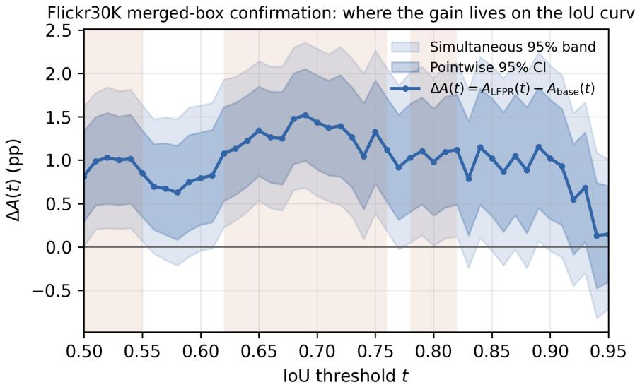

Figure 3: Treatment-minus-incumbent accuracy, $\Delta A ( t ) = A _ { \mathrm { L F P R } } ( t ) - A _ { \mathrm { b a s e } } ( t )$ , as a function of the IoU threshold on the Flickr30K merged-box confirmation (14,481 rows, 999 images). The darker band is the pointwise 95% interval; the lighter band is the simultaneous $( \mathrm { m a x } { - } | T | )$ 95% band used to license concentration claims without cherry-picking a threshold. Shaded vertical strips mark the grid points where the simultaneous band excludes zero. The gain is positive across nearly the entire threshold range rather than concentrated at one operating point.
<table><tr><td>Rows</td><td>Arm</td><td>Calls</td><td>Mean s</td><td>P95 s</td><td>Max alloc. GiB</td><td>Invalid %</td></tr><tr><td>128</td><td>B</td><td>1.000</td><td>0.837</td><td>0.900</td><td>16.44</td><td>0.00</td></tr><tr><td>128</td><td>R</td><td>1.156</td><td>1.299</td><td>3.847</td><td>17.58</td><td>0.00</td></tr><tr><td>128</td><td>C</td><td>2.000</td><td>1.646</td><td>1.821</td><td>16.44</td><td>0.00</td></tr><tr><td>128</td><td>CR</td><td>2.156</td><td>2.160</td><td>4.717</td><td>17.58</td><td>0.00</td></tr><tr><td>128</td><td> $C R G$ </td><td>2.156</td><td>2.244</td><td>4.734</td><td>17.58</td><td>0.00</td></tr><tr><td>128</td><td> $R _ { \mathrm { A L L } }$ </td><td>1.000</td><td>3.072</td><td>3.225</td><td>17.59</td><td>0.00</td></tr><tr><td>128</td><td> $C R _ { \mathrm { A L L } }$ </td><td>2.000</td><td>5.928</td><td>6.023</td><td>17.60</td><td>0.00</td></tr><tr><td>512</td><td>B</td><td>1.000</td><td>0.878</td><td>0.982</td><td>16.44</td><td>0.00</td></tr><tr><td>512</td><td>R</td><td>1.250</td><td>1.671</td><td>4.057</td><td>17.58</td><td>0.00</td></tr><tr><td>512</td><td>C</td><td>2.000</td><td>1.813</td><td>2.277</td><td>16.44</td><td>0.00</td></tr><tr><td>512</td><td>CR</td><td>2.250</td><td>2.515</td><td>4.895</td><td>17.58</td><td>0.00</td></tr><tr><td>512</td><td> $C R G$ </td><td>2.250</td><td>2.417</td><td>4.693</td><td>17.58</td><td>0.00</td></tr><tr><td>512</td><td> $R _ { \mathrm { A L L } }$ </td><td>1.000</td><td>3.003</td><td>3.075</td><td>17.59</td><td>0.00</td></tr><tr><td>512</td><td> $C R _ { \mathrm { A L L } }$ </td><td>2.000</td><td>6.103</td><td>6.489</td><td>17.60</td><td>0.00</td></tr></table>

Table 16: Synchronized cost audit on the Flickr30K merged-box confirmation, all seven arms, same protocol and same frozen 128/512-row prefixes as Table 18. CR and CRG share the identical call budget and generation calls (they differ only in which box the already-generated crop candidate is turned into – hard replacement versus midpoint fusion – a CPU-only decision that costs nothing), so their latencies match within timing noise, mirroring the same pattern already reported for the RefCOCO-family audit. R’s calls exceed 1.000 by exactly its label-free routing rate on this row prefix (e.g. 0.250 at 512 rows, i.e. 25%), consistent with the 29.8% population-level routing rate reported in Appendix B.5 – the two figures differ because this is a smaller 512-row sample, not a second measurement of the same population. Peak allocated memory is 16.44 GiB for the two arms that never raise resolution (B, C) and 17.58–17.60 GiB for every arm that can trigger the resolution floor.

<table><tr><td>Arm</td><td>Acc@0.5</td><td>Acc@0.75</td><td>Acc@0.9</td><td>mAcc</td><td>Mean IoU ∆ vs B</td></tr><tr><td>B incumbent (pre-resolution)</td><td>74.219</td><td>64.648</td><td>42.773</td><td>59.648</td><td></td></tr><tr><td>R routing alone</td><td>75.586</td><td>66.602</td><td>44.531</td><td>61.387</td><td>+1.175</td></tr><tr><td>C guarded crop alone</td><td>74.805</td><td>63.086</td><td>42.578</td><td>59.668</td><td>+0.323</td></tr><tr><td> $C R ^ { \dagger }$  unguarded negative control</td><td>74.805</td><td>63.086</td><td>41.992</td><td>59.609</td><td>-0.082</td></tr><tr><td>C RG full (LFPR)</td><td>75.000</td><td>66.406</td><td>43.555</td><td>60.723</td><td>+0.932</td></tr><tr><td> $R _ { \mathrm { A L L L } }$  unconditional floor</td><td>75.586</td><td>67.773</td><td>48.047</td><td>62.617</td><td>+1.828</td></tr><tr><td> $C R _ { \mathrm { A L L } }$  unconditional floor+crop</td><td>75.391</td><td>67.383</td><td>45.117</td><td>61.816</td><td>+1.590</td></tr></table>

Table 17: All seven arms scored on the identical frozen 512-row Flickr30K merged-box subset (36 images) used for the synchronized cost audit (Table 16), so accuracy and cost are now comparable on the same denominator throughout this section. B/R/C/ CR†/CRG are restricted from the archived full-population run (Table 13) by exact record\_key match, not rerun; $R _ { \mathrm { A L L } } / C R _ { \mathrm { A L L } }$ are the same predictions already used for the cost audit. Deltas and the 10,000-iteration image-cluster bootstrap are against this table’s own 512-row B, not the 14,481-row B used elsewhere in this section.

## Flickr30K merged-box confirmation: accuracy-cost trade-off (same rows and hardware)

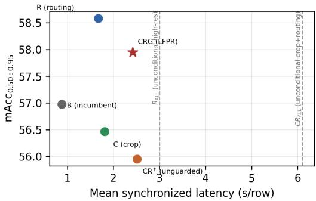

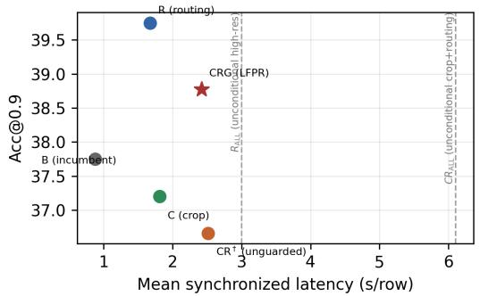  
Figure 4: Accuracy-cost trade-off on the Flickr30K merged-box confirmation. Each point uses the same 14,481-row evaluation (accuracy, Table 13) and the same synchronized 512-row cost prefix on the same RTX 3090 (cost, this section); no new inference was run to build this figure. $R _ { \mathrm { A L L } } / C R _ { \mathrm { A L L } }$ (dashed reference lines) cost $3 . 4 2 \times / 6 . 9 5 \times B ;$ their own matched-sample accuracy is reported in the surrounding text rather than plotted here, since it uses the smaller 512-row sample rather than the full population the other five points use. On this dataset, R alone (not CRG) is the accuracy-maximizing point on the frontier – see text.

policy. This is reported for completeness rather than folded into the main claim: the shipped policy is fixed across every evaluation in this paper, and this trade-off reflects Flickr’s own routing rate, not evidence for changing the deployed rule.

## B.6 IOU GAIN CURVE ACROSS ALL FIVE EVALUATIONS

Figure 3 above shows the dense-grid curve for the Flickr30K merged-box confirmation alone. Figure 5 overlays the same $\Delta A ( t ) = \dot { A } _ { \mathrm { L F P R } } ( t ) - A _ { \mathrm { b a s e } } ( t )$ curve, computed with the identical protocol (pointwise and simultaneous max- $\cdot \vert T \vert$ image-cluster bootstrap, 10,000 iterations) and against each evaluation’s own true pre-resolution incumbent B, for all five evaluations: Ref-L4 (retrospective), Flickr30K merged-box (prospective), and RefCOCO/RefCOCO+/RefCOCOg shown individually rather than pooled. Each curve is built from a separately-verified B/CRG per-row pair – Ref-L4 from baseline\_predictions.jsonl and fused.jsonl, Flickr from the merged-box confirmation’s own baseline/merged.jsonl and $\mathtt { l f p r \_ p r e d i c t i o n s . j s o n 1 }$ , and Ref-COCO/RefCOCO+/RefCOCOg from the true pre-resolution artifact used to correct Table 9 – and at $t \in \{ 0 . 5 0 , 0 . 7 5 , 0 . 9 0 \}$ every curve reproduces its evaluation’s own fixed-threshold point estimate to within $1 0 ^ { - 1 0 }$ , the machine-checked consistency gate this figure requires.

All five curves start positive at $t = 0 . 5 0$ and stay positive through most of the permissive-to-mid range. Ref-L4 and Flickr grow larger at strict thresholds (Ref-L4 reaches +5.35 points at $t = 0 . 9 0$ and stays above +5 through $t = 0 . 9 4 )$ ; RefCOCO/RefCOCO+/RefCOCOg instead grow smaller and turn negative only close to the strictest end of the range – RefCOCO crosses zero between t = 0.84 and 0.85 (reaching −1.13 at $t = 0 . 9 3 )$ , RefCOCO+ between $t = 0 . 9 1$ and 0.92 (reaching −0.86 at $t = 0 . 9 4 )$ , and RefCOCOg between $t = 0 . 9 0$ and 0.91 (a shallow dip $\mathrm { t o \mathrm { ~ - } 0 . 3 0 }$ at $t = 0 . 9 1$ before recovering to slightly positive by $t = 0 . 9 5 )$ . This is consistent with every fixed-threshold result already reported: the deployed policy improves Acc@0.5/0.75/mAcc/mean IoU broadly across the RefCOCO family (Table 9), and its strict-IoU effect softens toward the top of the threshold range rather than being uniformly positive like Ref-L4 and Flickr’s.

Where the gain lives on the loU curve, across all five evaluations  
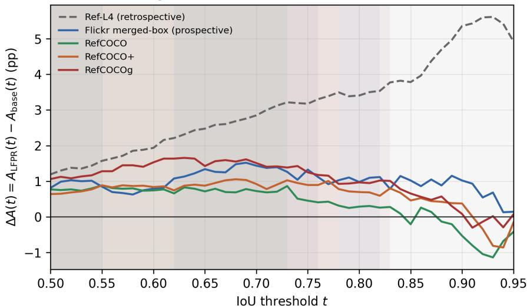  
Figure 5: Treatment-minus-incumbent accuracy, $\Delta A ( t )$ , as a function of the IoU threshold, across all five evaluations, each against its own true pre-resolution incumbent B. Shaded vertical strips mark each series’ own simultaneous-band significant intervals. Ref-L4 and Flickr (retrospective and prospective evidence respectively) grow larger at strict thresholds; Ref-COCO/RefCOCO+/RefCOCOg (shown individually, not pooled) stay positive through most of the range and turn negative only close to $t = 0 . 8 5  – 0 . 9 2$ , consistent with the deployed policy’s broad per-dataset improvement and softening strict-IoU effect reported at fixed thresholds.

## B.7 SYNCHRONIZED COST AND ROBUSTNESS AUDIT

The generalist cost audit uses deterministic 128- and 512-row prefixes of the frozen transfer order. Every arm runs in a fresh process with batch size one, one untimed warm-up, and three CUDAsynchronized timed repeats per row. Both sizes passed the declared admission checks for complete exact-key manifests, finite timings, and absence of OOM or unclassified runtime failures. A later processor audit showed that the requested high-resolution floor had not been applied in R, CR, or CRG; those timing values were withdrawn. The unaffected B and C measurements are retained below, and Table 18 restores R/CR/CRG with the floor verified in effect, alongside the two unconditional controls $R _ { \mathrm { A L L } }$ and $C R _ { \mathrm { A L I } }$ 7

An earlier generalist timing table reported B/C mean latency of 343.7/683.5 ms (128 rows) and 347.6/677.1 ms (512 rows). That table is withdrawn: the canonical policy-matched audit below, run under the same declared protocol, measures B at 0.945–1.049 s and C at 1.876–2.315 s per row – roughly 2.7× higher. We could not reconcile the discrepancy from the archived environment record (neither audit’s log fixes the generation-token count, software commit, or GPU clock state precisely enough to attribute the gap to a specific cause), so rather than report two mutually inconsistent latency figures under the same label, we retain only the canonical audit below as the paper’s cost claim.

Figure 6 plots the accuracy-cost trade-off implied by Tables 11 and 18 directly, addressing the question of why LFPR does not simply spend its second forward pass on another unconditional highresolution pass.

The specialist audit reuses the same row prefixes but records one timed repeat after a per-row warmup because EGM generation is substantially slower. The 128- and 512-row gates both pass for all four arms: every expected key is present, every timing is finite, and there is no OOM or unclassified runtime failure.

<table><tr><td>Arm</td><td>Calls</td><td>Mean s</td><td>P95 s</td><td>Max alloc. GiB</td><td>Invalid %</td></tr><tr><td>B</td><td>1.000</td><td>0.945</td><td>1.049</td><td>16.49</td><td>0.39</td></tr><tr><td>C</td><td>1.996</td><td>1.876</td><td>2.315</td><td>16.49</td><td>0.39</td></tr><tr><td>R</td><td>1.025</td><td>1.048</td><td>1.252</td><td>17.58</td><td>0.39</td></tr><tr><td> $C R$ </td><td>2.021</td><td>1.977</td><td>2.347</td><td>17.58</td><td>0.39</td></tr><tr><td> $C R G$ </td><td>2.021</td><td>1.865</td><td>1.985</td><td>17.58</td><td>0.39</td></tr><tr><td> $R _ { \mathrm { A L L } }$ </td><td>1.000</td><td>3.291</td><td>3.510</td><td>17.59</td><td>0.00</td></tr><tr><td> $C R _ { \mathrm { A L L } }$ </td><td>2.000</td><td>6.121</td><td>6.522</td><td>17.60</td><td>0.00</td></tr></table>

Table 18: Canonical policy-matched 512-row synchronized cost audit with the resolution floor verified in effect, including the unconditional $R _ { \mathrm { A L L } } / C R _ { \mathrm { A L L } }$ controls. One untimed warm-up plus three CUDA-synchronized timed repeats per row, zero runtime errors on every arm. This table supersedes the earlier B/C figures withdrawn above; treat only these absolute latencies, not the earlier ones, as the paper’s cost claim. Selective routing (R/CR/CRG) costs little beyond B/C because only the flagged small-object rows pay the high-resolution premium; forcing that premium onto every row $( R _ { \mathrm { A L L } } / C R _ { \mathrm { A L L } } )$ costs 3.10–3.14× more than its selective counterpart at matched call count, quantifying why selective routing is the deployed policy rather than an always-high-resolution default.

## RefCOCO-family transfer split: accuracy-cost trade-off (same rows and hardware)

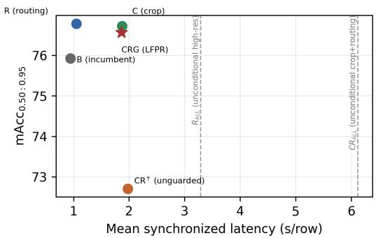

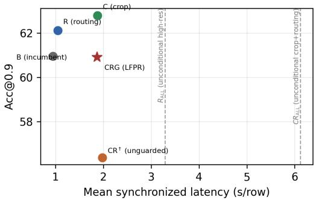  
Figure 6: Accuracy-cost trade-off on the RefCOCO-family transfer split. Each point uses the same 30,969-row evaluation (accuracy, Table 11) and the same synchronized 512-row cost prefix on the same RTX 3090 (latency, Table 18); no new inference was run to build this figure. CRG (LFPR, starred) costs 1.865s/row against B’s 0.945s/row, a 1.97× increase – consistent with the paper’s “approximately doubles inference latency” characterization, since every admitted row pays one crop pass and router-flagged rows may pay an additional high-resolution pass. The two unconditional controls this cycle added, $R _ { \mathrm { A L L } }$ and $C R _ { \mathrm { A L I } }$ (dashed reference lines), cost 3.48× and 6.48× B respectivel $\jmath - 3 . 1 0 \mathrm { - } 3 . 1 4 \times$ more than their selective counterparts R and $C R ^ { \dagger }$ at matched call count (Table 18) – for a policy that no longer distinguishes rows worth the extra pass from rows that are not. Their accuracy is now measured on a matched 26,488-row RefCOCO validation split (Table 19): both beat the matched B arm across all reported metrics, while $R _ { \mathrm { A L L } }$ is stricter-threshold better than $C R _ { \mathrm { A L I } }$ (Acc@0.9/mAcc). Because that accuracy readout is on a validation split and this figure’s selective-arm points remain on the frozen test partitions, this panel is still a cost-vs-cost picture rather than a same-split selective-versus-unconditional accuracy frontier.

At 512 rows, EGM-4B throughput changes from 0.216 to 0.110 rows/s and maximum allocated memory remains 8.45 GiB; EGM-8B changes from 0.218 to 0.109 rows/s and remains at 16.48 GiB. EGM-4B has one invalid row in both baseline and LFPR (0.20%); EGM-8B has none. The paired mean overhead of LFPR is 4.458 s and 99.0 generated tokens for EGM-4B, and 4.574 s and 98.7 tokens for EGM-8B.

A separate same-host anchor reruns the generalist B and corrected CRG arms on GPU 0 of the RTX 3090 host over the exact 128-row prefix. It retains the generalist protocol of one warm-up plus three timed repeats, giving 384 timed observations per arm. B has mean/p95 latency 1.041/1.185 s, 0.961 rows/s, 1.000 calls, 17.5 generated tokens, and 16.49 GiB peak allocated memory. CRG has 1.948/2.284 s, 0.513 rows/s, 2.008 calls, 35.3 tokens, and 17.58 GiB. Both arms have zero invalid outputs and zero runtime errors. Only one of the 128 rows is routed to the high-resolution pass, so this anchor is a same-hardware cross-system comparison, not a substitute for the corrected full-size generalist cost grid. On these rows, EGM-4B/8B baseline latency is $4 . 6 1 { \times } / 4 . 3 7 { \times } \ B .$ , and EGM-4B/8B with LFPR is 4.75×/4.68× generalist CRG; generated-token ratios are about 5.6× in both comparisons.

<table><tr><td>Arm</td><td>Acc@0.5</td><td>Acc@0.75</td><td>Acc@0.9</td><td>mAcc</td><td>Mean IoU</td></tr><tr><td>B (matched val baseline)</td><td>89.218</td><td>81.029</td><td>62.753</td><td>76.475</td><td>82.557</td></tr><tr><td> $R _ { \mathrm { A L L } }$ </td><td>90.328</td><td>83.581</td><td>69.394</td><td>79.514</td><td>84.327</td></tr><tr><td> $C R _ { \mathrm { A L L } }$ </td><td>90.464</td><td>83.513</td><td>68.065</td><td>79.275</td><td>84.233</td></tr></table>

Table 19: Major H RefCOCO validation-split unconditional-control readout (26,488 rows; 2,738 images), scored on one matched row set with 10,000-iteration image-cluster bootstrap deltas against B. $R _ { \mathrm { A L L } }$ gains $+ 1 . 1 0 2 / + 2 . 5 5 2 / + 6 . 6 4 1 / + 3 . 0 3 9$ points at Acc@0.5/0.75/0.9/mAcc (95% CIs $[ + 0 . 6 8 6 , + \mathrm { i . 5 1 9 } ] / [ + 1 . 9 1 3 , + 3 . 1 8 1 ] / [ + 5 . 7 0 6 , + 7 . 5 7 \bar { 4 } ] / [ + 2 . 5 7 4 , + 3 . 5 0 8 ] ) ; C R _ { \mathrm { A L L B } }$ gains +1.246/+2.484/+5.312/+2.800 (95% CIs $\left[ + { \bar { 0 } } . { \bar { 8 } } 2 0 , + 1 . 6 5 6 \right] / \left[ + 1 . { \bar { 8 } } 4 9 , + 3 . 1 3 6 \right] / \left[ + { \bar { 4 } } . 3 9 4 , + 6 . 2 4 0 \right] / \left[ + 2 . 3 4 7 , + 3 . 2 6 1 \right] )$
<table><tr><td>Rows</td><td>System</td><td>Calls</td><td>Gen. tokens</td><td>Mean s</td><td>P95 s</td></tr><tr><td>128</td><td>EGM-4B</td><td>1.000</td><td>98.5</td><td>4.798</td><td>6.055</td></tr><tr><td>128</td><td>+ LFPR</td><td>2.000</td><td>197.4</td><td>9.250</td><td>11.395</td></tr><tr><td>128 128</td><td>EGM-8B + LFPR</td><td>1.000 2.000</td><td>98.7 196.9</td><td>4.553 9.116</td><td>5.148 11.536</td></tr><tr><td>512</td><td></td><td></td><td>98.9</td><td></td><td></td></tr><tr><td>512</td><td>EGM-4B</td><td>1.000</td><td></td><td>4.622</td><td>5.503</td></tr><tr><td></td><td>+ LFPR</td><td>1.998</td><td>197.9</td><td>9.080</td><td>10.861</td></tr><tr><td>512</td><td>EGM-8B</td><td>1.000</td><td>97.8</td><td>4.581</td><td>5.764</td></tr><tr><td>512</td><td>+ LFPR</td><td>2.000</td><td>196.5</td><td>9.154</td><td>10.531</td></tr></table>

Table 20: Specialist cost stability across audit sizes. Generated tokens are summed across calls; each row has one synchronized timed repeat after a per-row warm-up.

The retrospective full-split effects by source are:

The strict-IoU intervals for the full-split comparison are +3.173 points at IoU 0.75 (LCB +2.831), +5.354 points at IoU 0.9 (LCB +4.898), and +3.066 points for mAcc (LCB +2.857). They are exploratory because endpoint and pipeline selection are not reflected in those historical one-sided bounds.

## B.8 ROUTER DIAGNOSTICS

The label-free router flagged 463 of 2,000 pilot rows (23.2%) and 6,641 of 31,921 full-split rows (20.8%). Where annotation boxes are available for diagnosis, predicted-box buckets agree with annotation-defined buckets on 88.85% of pilot rows and 89.83% of full-split rows. This statistic is not a classifier accuracy and is not used as a gate; it describes why the deployment proxy is a reasonable but imperfect substitute for the annotation-stratified diagnostic.

## B.9 MALFORMED-ROW HANDLING

The pilot has zero runtime and invalid-prediction rows. The full-split baseline contains one invertedcoordinate completion. The LFPR fusion implementation passes an invalid incumbent through unchanged rather than raising an exception or inventing a crop. The resulting full-split report therefore contains one inherited runtime/invalid count. This row is included in both matched arms and is not hidden from the error accounting. It is a protocol repair for a degenerate baseline case, not a model or hyperparameter change.

## B.10 SIZE-BUCKET BASELINE ACCURACY

Table 22 gives the raw, pre-intervention accuracy by annotation-derived target size on the full 31,921- row test split; this is the diagnostic that originally motivated targeting the small bucket with additional resolution (Section E.7 below).

## B.11 RESOLUTION-LADDER AND PROMPT-SENSITIVITY PILOT DESIGNS

All pilots in this subsection use 800 rows and the historical paired image-level bootstrap. The complete access chronology is not auditable, so these comparisons are exploratory regardless of when individual runs were launched. The staged floor-selection summaries (Section E.8 below) report a moderate floor of 1,048,576 pixels at +0.75 points relative to default (one-sided LCB −0.99) and the chosen 4,194,304 floor at +1.875 points relative to default (LCB +0.25). The medium-bucket extension pilot applied the identical 4,194,304-pixel policy to an 800-row medium-bucket sample and gave −0.125 points (95% CI [−1.86, +1.62]).

<table><tr><td>Source</td><td>Rows</td><td>Acc@0.5 ∆</td><td>One-sided LCB</td></tr><tr><td>COCO</td><td>19,889</td><td>+0.875</td><td>+0.693</td></tr><tr><td>Objects365</td><td>12,032</td><td>+1.720</td><td>+1.260</td></tr></table>

Table 21: Full-split source-stratified effects. Source rows use the same frozen parser and paired image bootstrap; no interaction interval was archived.
<table><tr><td>Bucket</td><td>Rows (%)</td><td>Acc@0.5</td><td>Gap to large</td></tr><tr><td>Small</td><td>6,665 (20.9%)</td><td>78.92</td><td>-13.81</td></tr><tr><td>Medium</td><td>16,311 (51.1%)</td><td>90.15</td><td>-2.58</td></tr><tr><td>Large</td><td>8,945 (28.0%)</td><td>92.73</td><td>一</td></tr></table>

Table 22: Baseline Acc@0.5 by annotation-derived target size, before any resolution intervention.

The later prompt pilots (Section E.9 below) used an 800-row Objects365 sample paired against the same rows’ recombined post-floor predictions. Two variants replaced the default prompt text without changing any other setting: a tight-box variant explicitly asking for the tightest enclosing box gave +0.125 points (95% CI [−1.39, +1.65], LCB −1.13), and a fine-grained variant emphasizing instance-level detail gave +0.25 points (95% CI [−1.25, +1.75], LCB −1.00). A further resolution rung at 8,388,608 pixels (∼ 2× the chosen floor), on the same 800-row small-bucket sample used for the floor-selection ladder, gave 82.875% versus 81.750% at 4,194,304: a +1.125-point stepwise difference (95% CI [−0.38, +2.73], LCB −0.13). This value is not default-relative and therefore cannot establish that the ladder peaked. The former Figure 3 was removed; row-level commonreference rescoring is required before drawing a resolution-curve conclusion.

The zero-shot self-correction control (Section E.10 below) used the same frozen incumbent with no fine-tuning: the model is shown the original image with its own first-pass box rendered as an overlay and asked to return one replacement box, with neither a guard nor a fusion step applied to the output. On its own 800-row pilot this gives Acc@0.5 82.50 → 80.50 (−2.00 points, LCB −3.14), Acc@0.75 72.625 → 70.50 (−2.125 points, LCB −3.78), Acc@0.9 52.375 → 54.625 (+2.25 points, LCB +0.12), and mAcc 68.35 → 67.29 (−1.06 points, LCB −2.14).

## B.12 BACKBONE-SCALING PILOT DESIGN

The backbone-scaling control in Table 25 uses the official bf16 checkpoint of the same model family at approximately 4× the incumbent’s parameter count, under the unchanged prompt, parser, resolution policy, and evaluator. A 500-row engineering pilot completed with zero errors and clean bare-box parsing, confirming the larger checkpoint is compatible with the frozen harness before spending a larger budget. The confirmation pilot used 380 rows (190 COCO, 190 Objects365, 344 unique images) rather than a larger round number: by this point in the project, the shared imagedisjoint validation pool had already been drawn on by earlier pilots and related controls, and 380 was the largest balanced size the remaining unvisited pool supported without compromising imagedisjointness from every prior pilot. On this confirmation pilot, Acc@0.9 regresses by −1.32 points (LCB −4.56), the Objects365 subset effect is −0.53 points (failing outright), and the COCO LCB is −2.07 points, outside the historical −0.5-point non-inferiority band. No full-test run was taken, and the FP8-quantized variant of the same checkpoint was not separately piloted, since quantization would only be expected to add noise in the same failing direction already observed at full precision. The pilot above only tested the larger direction. To test the smaller direction of the same model family – a stronger test in one respect, since a smaller same-architecture checkpoint reuses the incumbent’s frozen crop/guard/fusion policy directly rather than requiring new adapter engineering – we ran the complete $\bar { B } / R / C / C R \dot { / } C R \dot { G }$ pipeline on Qwen3-VL-4B-Instruct (roughly 0.5× the incumbent’s parameter count, the identical Qwen3VLForConditionalGeneration architecture class), under the unchanged prompt, parser, resolution floor, crop context factor, and guard thresholds. It was evaluated on the same 3,000-row stratified Flickr30K merged-box subset used for the cross-family screen below, with zero runtime errors on both the direct-answer arm and the full guarded-fusion arm. Table 23 reports the paired result: every metric improves, and every 95% CI excludes zero, matching the direction (though not the magnitude) of the 8B incumbent’s own LFPR gain – the mechanism is not specific to the incumbent’s particular parameter count.

<table><tr><td>Arm</td><td>Acc@0.5</td><td>Acc@0.75</td><td>Acc@0.9</td><td>mAcc0.50:0.95</td></tr><tr><td>B (direct answer)</td><td>72.933</td><td>57.500</td><td>36.633</td><td>54.703</td></tr><tr><td>+LFPR (CRG)</td><td>74.233</td><td>60.800</td><td>37.800</td><td>56.673</td></tr><tr><td>∆ (95% CI)</td><td>+1.300 [0.494, 2.122]</td><td>+3.300 [2.297, 4.349]</td><td>+1.167 [0.236, 2.085]</td><td>+1.970 [1.377, 2.572]</td></tr></table>

Table 23: Qwen3-VL-4B-Instruct, full guarded-fusion pipeline vs. its own direct-answer baseline, on the same 3,000-row stratified Flickr30K merged-box subset used for the cross-family screen. All four 95% paired image-cluster bootstrap CIs exclude zero.
<table><tr><td>Checkpoint</td><td>Dataset (rows)</td><td>Acc@0.5</td><td>Parser success</td><td>Incumbent gap</td></tr><tr><td>GLM-4.1V-9B-Thinking</td><td>Flickr merged-box (4,000)</td><td>70.18</td><td>83.1%</td><td>-4.69pp</td></tr><tr><td>Qwen2.5-VL-7B-Instruct</td><td>Ref-L4-test (3,000, paired)</td><td>81.57</td><td>97.0%</td><td>-6.47pp</td></tr></table>

Table 24: Cross-family checkpoint screening summary. The two rows use different evaluation datasets (noted in column 2) and are not directly comparable to each other in absolute accuracy; each is compared only to the incumbent on its own dataset. Parser success is the fraction of rows producing a usable bare box.

## B.13 CROSS-FAMILY CHECKPOINT SCREENING

The backbone-scaling control above stays inside the incumbent’s own model family. To screen genuinely different architectures, we evaluated two candidates’ own direct-answer (arm B) accuracy before committing to the substantially larger engineering effort of wiring a new checkpoint into the full router/crop/guard/fusion pipeline, following the same B-arm-first protocol already used elsewhere in this project to screen candidate checkpoints cheaply: a candidate whose own accuracy sits meaningfully below the incumbent offers nothing for LFPR to refine into a win.

GLM-4.1V-9B-Thinking (glm4v architecture, 9B) was evaluated on a 4,000-row proportionally stratified subset of the Flickr30K merged-box confirmation (stratified on referring-expression length and ground-truth box area, disjoint from no other evaluation in this paper). Table 24 reports its own Acc@0.5/0.75/0.9 and mAcc with an image-cluster bootstrap CI, against the incumbent’s own Acc@0.5 on the full 14,481-row population as context (an unpaired reference, not a matched comparison). Its Acc@0.5 sits −4.69 points below the incumbent’s, with the 95% CI excluding the incumbent’s point estimate. Two further practical problems compound this: box-parser success is only 83.1% (3,323/4,000 rows), well below the incumbent’s own 99.6% (Table 18’s invalid-output rate), and per-row latency has a severe unpredictable tail (up to 153.4s on a single row against a 9.2s mean) driven by unbounded “thinking” trace length – a cost profile that would compound badly once the guard/crop pipeline’s extra forward passes are layered on top.

Qwen2.5-VL-7B-Instruct (a different generation and architecture within the Qwen family) was evaluated earlier in this project as an independent harness-reconciliation anchor: on an identical 3,000-row random subsample of Ref-L4-test, it reaches Acc@0.5 = 81.57% (2,910/3,000 valid predictions, 97.0% parser success) against the incumbent’s own Acc@0.5 = 88.03% on the same rows through the same harness – a −6.47-point paired, same-harness gap. Its own reproduction also lands closer to its publisher’s reported Ref-L4-test number (+0.77 points offset) than GLM-4.1V-9B-Thinking’s reproduction does (−2.90 points offset), indicating a more faithfully reproduced evaluation.

Neither candidate’s own accuracy sits close enough to the incumbent’s to justify building the full LFPR adapter under this project’s own established screening rule, so no crop/guard/fusion pipeline was built for either checkpoint. Between the two, Qwen2.5-VL-7B-Instruct is the more procedurally viable candidate – higher parser reliability, no latency pathology, and closer harness fidelity to its own published number – and would be the natural starting point if a future revision extends this screening with a full second-checkpoint LFPR run. We report both attempts in full rather than omitting the negative result, consistent with this paper’s evidence-tier discipline of not repackaging a screening pilot as confirmatory evidence.

## B.14 WHY NO HEAD-TO-HEAD RUN AGAINST RECENT TRAINING-FREE BASELINES

Section 2 notes that Chain-of-Caption is complementary to our geometry-based accept/reject step rather than a substitute for it. We additionally checked compatibility for a head-to-head run: Chainof-Caption’s paper reports results on NVIDIA VILA and Qwen2.5 backbones, not Qwen3-VL, and we were unable to locate a public implementation compatible with our Qwen3-VL pipeline through the paper’s links, an author repository, or standard search; absent a repository URL from the authors, we do not claim that no such implementation exists, only that we did not find one, so no head-to-head run was attempted. The same question arises for the two other closest training-free methods on the same benchmark family, Entropy-Gradient Grounding (EGG) and Test-time Scaling over Perception (TTSP); this appendix expands the compatibility check behind that decision rather than leaving it asserted.

EGG (Gr"opl et al., 2026) back-propagates next-token entropy to visual token embeddings to produce a grounding signal without an auxiliary detector. Its public released code supports inference for LLaVA 1.5/1.6 only; the authors’ own repository lists Qwen 2.5 and InternVL 3.5 support as notyet-released roadmap items, and this project’s incumbent (Qwen3-VL-8B-Instruct) is not on that roadmap at all. Running EGG would therefore mean either evaluating it on a completely different backbone (confounding the comparison with a model change, not just a method change) or reimplementing its entropy-gradient mechanism for Qwen3-VL from the paper alone, which we judged too close to guessing the authors’ intended implementation to report as a faithful reproduction. The repository also carries no stated license, an independent reason not to build on it without contacting the authors.

TTSP (Jiang et al., 2026) generates multiple perceptual exploration traces, filters them by entropybased confidence, and iteratively refines a structured evidence ledger. Its public Apache-2.0-licensed code does support Qwen3-VL-8B-Instruct directly – architecturally, this is the more compatible of the two candidates. The incompatibility is instead at the task-interface level: TTSP’s released pipeline and benchmark CLI take a closed-set multiple-choice question (question plus an options list) and return a reliability-weighted vote over those options; it has no open boundingbox output mode. Adapting it to referring-expression grounding would mean replacing its core voting mechanism (which tallies votes over discrete options) with a continuous box-aggregation rule of our own design – at that point the result would be a new method inspired by TTSP’s evidence-ledger idea, not a reproduction of TTSP itself, and reporting it as “TTSP’s accuracy on this benchmark” would misattribute our own design choices to the original authors.

Both checks were run against the actual released code and documentation, not assumed from the papers alone, before concluding neither supports a faithful head-to-head comparison on this task without either changing the backbone (EGG) or replacing the core method (TTSP).

## C CONTROL EXPERIMENTS AND STOPPING RULES

The following table records the nearby routes that were evaluated on image-disjoint pilots or reserved evaluation data. “Closed” records the historical stopping decision under the then-used onesided gate; it does not denote a multiplicity-adjusted confirmatory conclusion.

Table 25: Matched controls and dispositions.
<table><tr><td>Route</td><td>Main result</td><td>Disposition</td></tr><tr><td>Released EGM transfer</td><td>-7.45 5 points at Acc@0.5; 95% CI [-9.56, -5.34]</td><td>Closed as a zero-shot transfer; native EGM recipe still needs a matched-compute replication.</td></tr><tr><td>Supervised coarse-to-fine</td><td>-0.543 points at Acc@0.5; LCB -1.264</td><td>Closed before the planned larger run.</td></tr><tr><td>Transferred parallel box decoding</td><td>—15.80 points; LCB -17.64</td><td>Transfer route closed.</td></tr><tr><td>SAM3 projection</td><td>Positive strict-IoU effects but no headline gate</td><td>Closed as a standalone replacement.</td></tr><tr><td>SAM3 midpoint fusion</td><td>+0.10 points at Acc@0.5; LCB —0.20 on fresh data</td><td>Retrospective fusion signal did not replicate.</td></tr><tr><td>Full crop replacement</td><td>+0.50 points at Acc@0.5; LCB -0.10</td><td>Crop replacement closed; strict-IoU signal re- tained.</td></tr><tr><td>Standalone midpoint fu- sion</td><td>+0.70 points on the reused pilot; source- weighted projection +0.65</td><td>Useful component; insufficient alone.</td></tr></table>

Table 25 continued from previous page
<table><tr><td>Route</td><td>Main result</td><td>Disposition</td></tr><tr><td>LFPR</td><td>+1.194 points on full test; LCB +0.984</td><td>Strongest matched full-split result in the audit; ret- rospective.</td></tr><tr><td>Frozen-split RefCOCO- family transfer</td><td>+0.817 points on pooled Ref- COCO/+/g; 95% CI [+0.639, +1.001]</td><td>Confirmed positive transfer at Acc@0.5; Acc@0.9 is unchanged, not because an un- guarded arm banks the strict-IoU gain instead (the genuine unguarded negative control underper- forms the incumbent on every metric, Table 11), but because the guard trades a small Acc@0.9 concession for the Acc@0.5 gain directly; a strict unrelated-model-family transfer control was cancelled as redundant with this result, and</td></tr><tr><td>Backbone scaling (32B)</td><td>+0.26 points at Acc@0.5; LCB</td><td>the released-specialist baseline comparison is reported separately in Section 5.3. Scaling closed; fails on both data sources and re- gresses Acc@0.9.</td></tr><tr><td>Backbone scaling (4B, full LFPR sweep)</td><td>-2.45 +1.970 points mAcc0.50:0.95; 95% CI</td><td>Confirmed positive; the mechanism generalizes to a 4×-smaller same-family checkpoint (Ap- pendix B.12).</td></tr><tr><td>Guard/fusion threshold sweep</td><td>[+1.377, +2.572] No configuration Pareto-dominates the shipped rule across a max-zoom- consistency grid of 0.15-1.00 and a</td><td>Closed: every accuracy-improving configuration fails a Holm-adjusted significance check; the shipped threshold is not improvable within the swept grid.</td></tr></table>

Table 25 continued from previous page
<table><tr><td rowspan=1 colspan=6>Route                       Main result            Disposition</td></tr><tr><td rowspan=3 colspan=6>Confidence-gate mecha-  An    independent  Closed: on this independent replication, anism control (Ref-L4, R  crop-refinement       frozen label-free confidence threshold is not aincumbent)                 pass over all 31,921  substitute for the shipped geometry guard -only the geometry-gated arm recovers the smallAcc@0.5 gain over routing, and both share the</td></tr><tr><td rowspan=1 colspan=6></td></tr><tr><td rowspan=1 colspan=6></td></tr><tr><td rowspan=1 colspan=6>shipped geometry  Acc@0.9/mAcc trade-off already attrib</td></tr><tr><td rowspan=1 colspan=5></td><td rowspan=1 colspan=1>guard&#x27;s admission  post-routing marginal effect (Appendix B.3; §5.4),</td></tr><tr><td rowspan=1 colspan=5></td><td></td></tr><tr><td rowspan=1 colspan=5></td><td></td></tr><tr><td rowspan=1 colspan=5></td><td></td></tr><tr><td rowspan=1 colspan=5></td><td></td></tr><tr><td rowspan=1 colspan=5></td><td></td></tr><tr><td rowspan=1 colspan=5></td><td rowspan=1 colspan=1>every row,  then</td></tr><tr><td rowspan=1 colspan=5></td><td rowspan=1 colspan=1>scoring the same</td></tr><tr><td rowspan=1 colspan=5></td><td></td></tr><tr><td rowspan=1 colspan=5></td><td></td></tr><tr><td rowspan=1 colspan=5></td><td rowspan=1 colspan=1>gated  by   each</td></tr><tr><td rowspan=1 colspan=5></td><td rowspan=1 colspan=1>rule    in    turn</td></tr><tr><td rowspan=1 colspan=5></td><td rowspan=1 colspan=1>(image-clustered,</td></tr><tr><td rowspan=1 colspan=5></td><td rowspan=1 colspan=1>9,467      images).</td></tr><tr><td rowspan=2 colspan=5></td><td rowspan=1 colspan=1>Geometry-gated</td></tr><tr><td rowspan=1 colspan=2></td><td rowspan=1 colspan=1>fusion reproduces a</td></tr><tr><td rowspan=1 colspan=2></td><td rowspan=1 colspan=3></td><td rowspan=1 colspan=1>small     Acc@0.5</td></tr><tr><td rowspan=2 colspan=1></td><td></td><td></td><td rowspan=1 colspan=2></td><td rowspan=1 colspan=1>gain   over   R,</td></tr><tr><td rowspan=1 colspan=1></td><td></td><td rowspan=1 colspan=2></td><td rowspan=1 colspan=1>[+0.139, +0.399]</td></tr><tr><td rowspan=1 colspan=5></td><td rowspan=1 colspan=1>(95%          CI),</td></tr><tr><td rowspan=2 colspan=5></td><td rowspan=1 colspan=1>withthe  same</td></tr><tr><td rowspan=1 colspan=1>Acc@0.9/mAcc cost</td></tr><tr><td rowspan=1 colspan=5></td><td rowspan=1 colspan=1>already reported for</td></tr><tr><td rowspan=1 colspan=5></td><td rowspan=1 colspan=1>CRG – R on the</td></tr><tr><td rowspan=1 colspan=5></td><td rowspan=1 colspan=1>RefCOCO family;</td></tr><tr><td rowspan=1 colspan=5></td><td rowspan=1 colspan=1>the confidence-gated</td></tr><tr><td rowspan=1 colspan=5></td><td rowspan=1 colspan=1>analogue does not</td></tr><tr><td rowspan=1 colspan=5></td><td rowspan=1 colspan=1>reproduce     even</td></tr><tr><td rowspan=1 colspan=5></td><td rowspan=1 colspan=1>that Acc@0.5 gain,</td></tr><tr><td rowspan=2 colspan=5></td><td rowspan=1 colspan=1>[-0.334, -0.098],</td></tr><tr><td rowspan=1 colspan=3></td><td rowspan=1 colspan=2></td><td rowspan=1 colspan=1>and geometry-gated</td></tr><tr><td rowspan=1 colspan=2></td><td rowspan=1 colspan=2></td><td rowspan=1 colspan=1></td><td rowspan=1 colspan=1>replacement-only is</td></tr><tr><td rowspan=1 colspan=2></td><td></td><td rowspan=1 colspan=2></td><td rowspan=1 colspan=1>far worse than either</td></tr><tr><td rowspan=1 colspan=2></td><td rowspan=1 colspan=2></td><td rowspan=1 colspan=1></td><td rowspan=1 colspan=1>fusion arm, mAcc</td></tr><tr><td rowspan=1 colspan=4></td><td rowspan=2 colspan=1></td><td rowspan=1 colspan=1>[−2.987, -2.437].</td></tr><tr><td rowspan=1 colspan=1></td><td></td><td></td><td></td><td rowspan=1 colspan=1>The two admis-</td></tr><tr><td rowspan=1 colspan=4></td><td rowspan=1 colspan=1></td><td rowspan=1 colspan=1>sion rules agree</td></tr><tr><td rowspan=1 colspan=5></td><td rowspan=1 colspan=1>on 52.5% of rows</td></tr><tr><td rowspan=1 colspan=5></td><td rowspan=1 colspan=1>(15,411 both-admit,</td></tr><tr><td rowspan=1 colspan=5>1,355 both-reject)</td><td></td></tr></table>

continued on next page

Table 25 continued from previous page
<table><tr><td>Route</td><td>Main result</td><td>Disposition 31,921-row</td><td></td></tr><tr><td>Cross-family incumbent candidate (zero-shot, pre-refinement)</td><td>Full result: 53.933, 39.958, 22.22, and mean IoU 49.641, versus 88.531 Acc@0.5 for the Qwen3-VL-8B incumbent;6,584 rows (20.6%) were unparseable or mal-</td><td>Acc@0.5 Acc@0.75 Acc@0.9</td><td>Closed at the zero-shot stage; the pilot and full- split directions agree, so the candidate was not car- ried into the refinement pipeline.</td></tr><tr><td>Full-parameter fine-tune</td><td>ative direction (pilot Acc@0.5 50.60). Image-disjoint 2,000-row out tion: 87.50 (−1.45), Acc@0.75 76.15 →</td><td>held- evalua- Acc@0.5 → 86.05</td><td>Closed: underperforms the frozen incumbent at every threshold; the training loss plateaus after warmup, consistent with the negative held-out re- sult.</td></tr><tr><td>Iterative zoom (2 uncondi- tional rounds, no guard)</td><td>54.70 → (−0.30) Acc@0.5 89.00 → (−2.20), Acc@0.9 55.60 → 51.20</td><td>54.40 86.80</td><td>Closed: repeated unguarded cropping compounds error rather than refining it.</td></tr><tr><td>Random- and center- crop placement controls (matched call count)</td><td>(−4.40) on a 500- row sample and 44.20 (center) vs. 89.00 incumbent</td><td>Acc@0.5 collapses to 42.00 (random)</td><td>Supports the mechanism claim: the crop&#x27;s gain requires an incumbent-informed window, not merely a second look.</td></tr><tr><td>Self-consistency, matched call count (2 samples, temperature 0.7, midpoint-</td><td>on the same 500-row sample Acc@0.5 89.00 → 88.40, 55.60 → 52.60 on the same 500-row</td><td>Acc@0.9</td><td>Supports the mechanism claim: re-sampling the identical question does not recover the crop&#x27;s gain.</td></tr></table>

The controls are not presented as a universal impossibility theorem. They close the tested instantiations under the declared protocol and justify keeping the main claim narrow. A substantially larger backbone within the same model family (Qwen3-VL-32B, roughly 4× the parameters) was also evaluated under the identical frozen prompt, parser, and evaluator; it failed every admission requirement, with a positive but non-significant Acc@0.5 point estimate (LCB negative), a regression at the stricter Acc@0.9 threshold, and a failing effect on the Objects365 subset (Table 25). Scaling the backbone within this family therefore does not reliably close the residual gap under this harness. LFPR’s positive result does not imply that all spatial heads or proposal sources would fail; it shows that this specific label-free composition is useful without reaching absolute SOTA.

## D PROCEDURE IN PSEUDOCODE

The prose in Section 3 is normative; this restatement is provided for implementers.

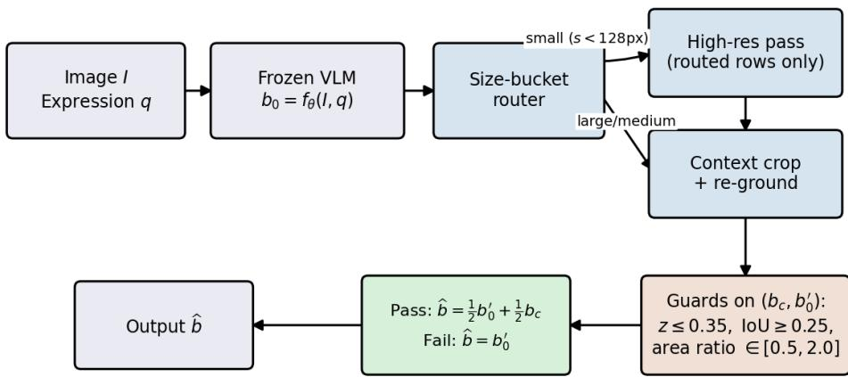

Figure 7: The LFPR pipeline. The router decision and the guard checks are both computed from already-observed model outputs and image geometry, never from the ground-truth box.  
Algorithm 1 Label-free precision refinement   
1: Input: image I, expression $q ,$ frozen VLM $f _ { \theta }$   
2: $b _ { 0 } \gets$ canon $( f _ { \boldsymbol { \theta } } ( \bar { I } , \bar { q } ) )$ {parse, clip, order, validate}   
3: $\mathbf { i f } \ b _ { 0 }$ is invalid then   
4: return $b _ { 0 }$ {retained as a miss, never synthesized}   
5: end if   
6: $s \gets \sqrt { \mathrm { m a x } ( 0 , x _ { 2 } - x _ { 1 } ) \mathrm { m a x } ( 0 , y _ { 2 } - y _ { 1 } ) }$ for $b _ { 0 }$   
7: {label-free size-bucket router, decided from $b _ { 0 }$ alone}   
8: if $s <$ 128 px then   
9: $b _ { r } \gets$ canon $( f _ { \theta } ( I , q \ |$ min-pixel budget 4,194,304))   
10: $b _ { 0 } ^ { \prime }  b _ { r }$ if valid, otherwise $b _ { 0 }$   
11: else   
12: $b _ { 0 } ^ { \prime }  b _ { 0 }$   
13: end if   
14: C ← integer-clipped context crop of $b _ { 0 } ^ { \prime }$ with $\gamma { = } 2 . 0$   
15: $b _ { c } \gets$ canon(map $f _ { \theta } ( C , q )$ to image)   
16: if $b _ { c }$ is valid and $\tilde { z ( b _ { c } , b _ { 0 } ^ { \prime } ) } \leq 0 . 3 5$ and IoU $\lceil \left( b _ { c } , b _ { 0 } ^ { \prime } \right) \geq 0 . 2 5$ and $A ( b _ { c } ) / A ( b _ { 0 } ^ { \prime } ) \in [ 0 . 5 , 2 . 0 ]$ then   
17: $\widehat { b } \gets$ canon $\begin{array} { r } { ( \frac { 1 } { 2 } b _ { 0 } ^ { \prime } + \frac { 1 } { 2 } b _ { c } ) } \end{array}$   
18: if $\widehat { \boldsymbol { b } }$ is invalid then   
19: $\widehat { b } \gets b _ { 0 } ^ { \prime }$   
20: end if   
21: else   
22: $\hat { b } \gets b _ { 0 } ^ { \prime }$ {guard failure: keep the pre-crop answer}   
23: end if   
24: log route, parse outcomes, guard values, and final decision   
25: return $\widehat { b }$

## D.1 ROUTING-ALONE AND POST-ROUTING MARGINAL DECOMPOSITION

RefCOCO-family (Table 12) and the Flickr30K merged-box confirmation (Table 13) both report a same-row decomposition that isolates label-free resolution routing’s own effect (R-B) from the marginal effect of crop, guard, and fusion on top of it (CRG-R). Table 27 reports the identical decomposition for Ref-L4, computed with zero new inference from the same three alreadyarchived, hash-verified per-row artifacts behind Table 26 $( \mathsf { a u d i t \_ r e f l } 4 _ { - }$ \_contrasts.py; the script cross-checks the fused artifact’s embedded R box against the standalone R artifact’s own pre-

<table><tr><td>Metric</td><td>Incumbent</td><td>LFPR</td><td>∆(pp)</td><td>Two-sided 95% CI</td></tr><tr><td>Acc@0.5</td><td>88.531</td><td>89.725</td><td>+1.194</td><td>[0.944, 1.439]</td></tr><tr><td>Acc@0.75</td><td>77.416</td><td>80.590</td><td>+3.173</td><td>[2.768, 3.584]</td></tr><tr><td>Acc@0.9</td><td>55.788</td><td>61.142</td><td>+5.354</td><td>[4.808, 5.906]</td></tr><tr><td>mAcc@0.5:0.95</td><td>72.947</td><td>76.013</td><td>+3.066</td><td>[2.818, 3.311]</td></tr><tr><td>Mean IoU</td><td>80.944</td><td>82.648</td><td>+1.704</td><td>[1.542, 1.868]</td></tr></table>

Table 26: Matched full-split results on 31,921 expressions from 9,467 images. Intervals use 10,000 image-cluster bootstrap resamples and describe this retrospective comparison. mAcc0.5:0.95 is the manuscript’s primary summary, designated retrospectively rather than confirmed by an external preregistration; Acc@0.5 is the standard benchmark operating point; Acc@0.75/0.9 are secondary diagnostics; Mean IoU is reported alongside as a threshold-free summary. All five are exploratory and unadjusted here because the comparison itself is retrospective, not because of their role in the metric hierarchy.
<table><tr><td>Contrast</td><td>Acc@0.5</td><td>Acc@0.75</td><td>Acc@0.9</td><td>mAcc</td></tr><tr><td rowspan="2">R-B (routing alone)</td><td>+0.711</td><td>+1.920</td><td>+3.255</td><td>+1.773</td></tr><tr><td>[0.498, 0.932]</td><td>[1.607, 2.244]</td><td>[2.862, 3.658]</td><td>[1.560, 1.994]</td></tr><tr><td rowspan="2">C RG-R (marginal, after routing)</td><td>+0.482</td><td>+1.253</td><td>+2.099</td><td>+1.293</td></tr><tr><td>[0.347, 0.626]</td><td>[0.974, 1.535]</td><td>[1.669, 2.540]</td><td>[1.154, 1.431]</td></tr><tr><td rowspan="2">CRG-B (deployed policy)</td><td>+1.194</td><td>+3.173</td><td>+5.354</td><td>+3.066</td></tr><tr><td>[0.944, 1.439]</td><td>[2.768, 3.584]</td><td>[4.808, 5.906]</td><td>[2.818,3.311]</td></tr></table>

Table 27: Ref-L4’s routing-alone and post-routing marginal contrasts, 31,921 rows, 9,467 images, 10,000-iteration image-cluster bootstrap (95% CI below each point estimate). CRG-B reproduces Table 26 exactly, as it must since both are computed from the same artifacts. Unlike the Ref-COCO family (where CRG-R’s Acc@0.9 is negative, −1.192pp, and unlike Flickr30K (where crop/guard/fusion adds no accuracy beyond routing at any threshold, §5.4), Ref-L4 is the one evidence tier where crop/guard/fusion has a genuine positive marginal effect beyond routing at every reported threshold, not merely a small Acc@0.5-for-Acc@0.9 trade: CRG-R’s Acc@0.9 is +2.099pp, not negative. Routing alone still accounts for the majority of the deployed policy’s Acc@0.9 effect (+3.255 of +5.354pp, 61%), so the same qualitative pattern found on the other two tiers – routing does most of the strict-IoU work – still holds directionally here, but Ref-L4 is not simply a case of the two stages offsetting each other.

diction on every row before scoring, and refuses to report a number unless the recomputed B/CRG Acc@0.5 reproduce Table 26 to within 0.01pp – both gates passed here).

## D.2 GUARD-BY-FUSION FACTORIAL DECOMPOSITION

CRG crosses two binary choices: whether the guard gates the crop candidate at all, and whether an admitted candidate replaces the incumbent outright or is midpoint-fused with it. Because the incumbent box, the crop candidate, and the guard’s own admit/reject decision are already stored per row, all four cells of this 2 × 2 design are computable offline from the same frozen artifact with no additional inference, at the exact input denominator (31,921 rows, 1 invalid incumbent, 29,523 rows with an admitted candidate).

This factorial resolves a concern that the two-arm CRG-versus-guard-off contrast alone cannot separate rejection from midpoint shrinkage as the source of the accuracy trade: with both binary factors held out, rejection (the guard) is the factor that protects Acc@0.5, and midpoint fusion (independent of the guard) is what gives up strict-IoU accuracy for stability rather than for its own accuracy gain, since guarded replacement’s Acc@0.9 exceeds guarded midpoint’s by 2.0 points at a comparable Acc@0.5.

Direct paired contrast between the two guarded cells. The two guarded-cell CIs above are each against the incumbent B, which does not by itself establish whether guarded replacement and guarded midpoint (CRG) differ from each other. We therefore computed the direct paired contrast between exactly these two cells on the same 31,921 rows (10,000 image-cluster bootstrap resamples; zero new model inference, reusing the same incumbent/candidate/guard fields already stored for the table above; recompute\_refl4\_replacement\_vs\_midpoint.py, which refuses to report a number unless the recomputed guarded-replacement and guarded-midpoint scores both reproduce this table’s published figures to within 0.01pp – both gates passed here, matching to within 0.001pp). Guarded replacement minus CRG is −0.326 points at Acc@0.5 (95% CI [−0.447, −0.208]), −0.642 at Acc@0.75 (CI [−0.933, −0.343]), +2.002 at Acc@0.9 (CI [1.600, 2.420]), and +0.153 at mAcc (CI [0.011, 0.299], p = 0.034). All four intervals exclude zero: guarded replacement is significantly better than the shipped policy at Acc@0.9 and at mAcc – the manuscript’s own declared primary endpoint – and significantly worse at Acc@0.5/0.75. CRG remains the shipped policy because it was the historically fixed choice before this factorial was computed (§E.3), not because it dominates guarded replacement on every metric; it does not, and this direct contrast is reported so that a reader who weights strict-IoU accuracy or the primary endpoint above Acc@0.5 can see exactly where the two policies disagree and by how much.

<table><tr><td>Cell</td><td>Acc@0.5</td><td>Acc@0.75</td><td>Acc@0.9</td><td>mAcc</td><td>Mean IoU ∆</td><td>IoU W/L/T</td></tr><tr><td>Guarded, midpoint (C RG, shipped)</td><td>89.725</td><td>80.590</td><td>61.142</td><td>76.013</td><td>+1.704</td><td>19,386 / 10,260 / 2,275</td></tr><tr><td>Guarded, replacement</td><td>89.399</td><td>79.947</td><td>63.143</td><td>76.166</td><td>+1.725</td><td>17,333 / 12,317 / 2,271</td></tr><tr><td>Unguarded, midpoint</td><td>88.262</td><td>77.739</td><td>59.350</td><td>73.864</td><td>+0.559</td><td>19,764 / 11,321 / 836</td></tr><tr><td>Unguarded, replacement</td><td>87.247</td><td>78.140</td><td>62.059</td><td>74.491</td><td>+0.129</td><td>17,612 / 13,490 / 819</td></tr></table>

Table 28: Guard × fusion factorial on the corrected full split (Appendix D.5; 10,000-iteration imagecluster bootstrap per cell). Mean IoU ∆ and IoU W/L/T are against the true pre-resolution incumbent B, cross-checked against the standalone B artifact (Appendix D.6); an earlier version of this table computed both columns against the post-routing R box while this caption described them as against B, which understated every cell’s Mean IoU gain and, for the two unguarded cells, had the wrong sign. The guard, not the fusion rule, is what protects Acc@0.5: both guarded cells beat both unguarded cells at Acc@0.5, and only the unguarded cells fall below the 88.531% incumbent. Midpoint fusion trades some of the guarded arm’s Acc@0.9 for stability – guarded replacement alone reaches 63.143% at Acc@0.9 (its 95% CI is [+3.512, +4.700]pp over the incumbent, wider than $C R G ^ { \mathrm { { , } } } \mathrm { { s } [ + 1 . 6 6 2 , + 2 . 5 4 5 ] p p ) }$ at the cost of a slightly lower Acc@0.5 and more harmed rows (12,317 versus CRG’s 10,260). CRG is the historically fixed shipped policy – its parameters were set before this factorial was computed, not selected by it; the other three cells are reported for mechanism decomposition, not as alternate deployment candidates.

## D.3 IOU TRANSITION MATRIX

Figure 8 bins baseline (pre-LFPR) and treatment (post-LFPR) IoU into [0, .5), [.5, .75), [.75, .9), [.9, 1] and reports the row-normalized transition matrix for Ref-L4 and the Flickr merged-box confirmation, using the same paired per-row predictions underlying Table 11 and Table 13 – no new inference.

## D.4 QUALITATIVE CASES

Rows below are selected by a rule fixed before inspection: the three largest per-row IoU gains and three largest losses among admitted-candidate rows, plus the rates of the two out-of-policy paths a reader might expect but that are not selected as favourable cases. Guard rejections (2,394 of 31,921 rows, 7.5%) and parser failures (3 rows, 0.009%) are reported by pool size rather than by example, since neither category is about the fused box’s accuracy.

## D.5 ERRATUM: THE SILENTLY DISCARDED PIXEL BUDGET

An earlier version of this work reported that the resolution router fired on 2,223 transfer rows without altering a single output, and attributed the null to RefCOCO-family images already exceeding the routed pixel budget. Both parts were wrong. The images are roughly fifteen times smaller than that budget, not larger, and the budget was never applied: the override was passed as a processor keyword argument that this checkpoint’s fast image processor silently discards, leaving the checkpoint default in force. The routed pass therefore ran at default resolution and reproduced the incumbent byte for byte, which is also why all five arms of the cost audit reported an identical 16.49 GiB peak, i.e. model weights only.

Five call sites carried the defect. All are repaired, and the budget is now written into the resolved image-processor configuration and verified, so a request that fails to take effect raises an error instead of silently producing a no-op arm. Every resolution-routed number in this paper was re-measured afterwards. On the transfer split the regenerated arm changes 2,213 of 2,223 flagged rows against zero before; on Ref-L4 it changes 6,591 of 6,641 against 627 rows of ±1-unit numerical jitter before.

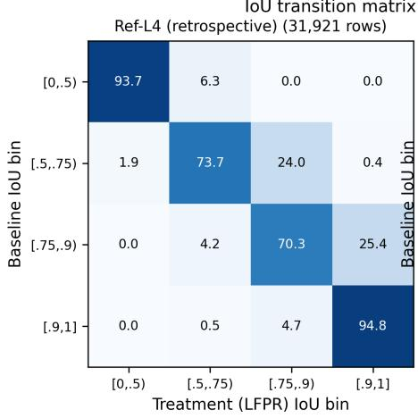

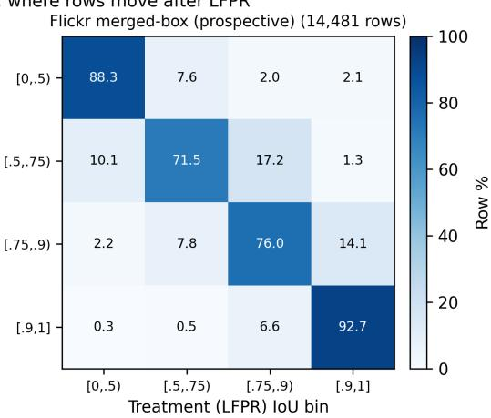

Figure 8: IoU transition matrix. Diagonal cells dominate on both datasets (70–95% of rows stay in their baseline bin), consistent with LFPR changing a minority of predictions (Section E.7). The two off-diagonal cells of most interest: strict-IoU harm, $[ . 9 , 1 ]  [ . 7 5 , . 9 )$ , affects 4.7% of Ref-L4’s near-perfect rows $( 8 9 4 / 1 8 , 8 4 7 )$ and 6.6% of Flickr’s $( 3 5 9 / 5 , 4 6 7 ) \textrm { - a r e a l }$ , nontrivial cost, not a rounding artifact, consistent with the guard-versus-Acc@0.9 trade reported throughout this paper. Genuine boundary refinement, $[ . 5 , . 7 5 )  [ . 9 , 1 ]$ , is comparatively rare on both datasets (0.4% Ref-L4, 1.3% Flickr); most of LFPR’s gain instead comes from the larger $[ . 7 5 , . 9 )  [ . 9 , 1 ]$ cell (25.4% Ref-L4, 14.1% Flickr), i.e. rows that were already close and get pushed over the strict threshold, not rows recovered from a coarse miss.
<table><tr><td>Category</td><td>Expression (truncated)</td><td>Incumbent IoU</td><td>Fused IoU</td></tr><tr><td>Largest improvement</td><td>The middle white boat docked between two other vessels, dis- tinguished...</td><td>0.561</td><td>0.891</td></tr><tr><td>Largest improvement</td><td>The table, adorned with a white tablecloth, has a man in a gray shirt. ..</td><td>0.657</td><td>0.958</td></tr><tr><td>Largest improvement</td><td>The table covered with a white tablecloth, at which the man wearing a...</td><td>0.644</td><td>0.933</td></tr><tr><td>Largest harm</td><td>An individual in a blue and black jersey is maneuvering the foremost b...</td><td>0.985</td><td>0.574</td></tr><tr><td>Largest harm</td><td>Within the cluttered area, a building instrument, namely a hammer, is. . .</td><td>0.940</td><td>0.530</td></tr><tr><td>Largest harm</td><td>A cluster of thin green onions in a blue container.</td><td>0.954</td><td>0.558</td></tr></table>

Table 29: Fixed-rule qualitative cases from the corrected full split (Appendix D.5). The largest-harm rows share a pattern: the incumbent was already close to correct $( \mathrm { I o U } > 0 . 9 )$ , and the crop candidate pulled the box toward a plausible but wrong sub-region (a hand, a nearby object, a neighbour in a cluster) that the guard’s geometric checks did not catch. The largest-improvement rows are the mirror case: a coarse incumbent box that the crop resolves to the correct sub-region within a larger scene. Neither pattern is unique to one expression style or object category in this sample.

## D.6 ERRATUM: REF-L4’S MEAN IOU WAS REPORTED AGAINST R, NOT B

Two tables reported Ref-L4’s Mean IoU delta as though it were the deployed policy’s effect against the pre-resolution incumbent B (Table 26; Table 6’s Ref-L4 row), and a third (Table 28) reported both its Mean IoU delta and win/loss/tie columns the same way for all four factorial cells. In every case the reported “incumbent” Mean IoU was actually the post-routing R arm’s Mean IoU (81.957%): a fresh, hash-verified audit against the standalone pre-resolution B artifact (audit\_refl4\_contrasts.py, run while adding the R-alone/CRG-R decomposition in Table 27 below) finds B’s true Mean IoU is 80.944%, not 81.957% – the same order of mistake as Blocker 1 in the review history, here isolated to the Mean IoU column of three tables rather than a whole mislabeled file. Acc@0.5/0.75/0.9/mAcc were never affected: those columns were always computed from the correct B artifact, which is exactly how the discrepancy was caught – the audit script’s identity gate reproduces every other Ref-L4 figure in Table 26 to within 0.001pp, so the artifact is not in question, only which arm’s Mean IoU had been transcribed into the “incumbent” column. All three tables are corrected in this revision to report B’s true 80.944% Mean IoU and the resulting deltas (Table 26: +1.704pp, not +0.691pp; Table 28: +1.704/+1.725/+0.559/+0.129pp for the four cells, not +0.691/+0.712/−0.454/−0.884pp – the two unguarded cells’ sign flips from apparently harming Mean IoU relative to B to slightly helping it, though both still trail the guarded cells by a wide margin and neither changes the guard’s role in protecting Acc@0.5). The separate 80.936% → 81.949% routing-only figures in §E.8 are a distinct, already-flagged superseded diagnostic from before the pixel-budget fix above, not this erratum; that section’s canonical crossreference is corrected to 80.944% accordingly.

<table><tr><td>System</td><td>Calls/row</td><td>Gen. tokens</td><td>Mean s</td><td>P95 s</td><td>Rows/s</td><td>Peak GiB</td><td>Invalid</td></tr><tr><td>EGM-4B</td><td>1.000</td><td>98.9</td><td>4.622</td><td>5.503</td><td>0.216</td><td>8.45</td><td>0.20%</td></tr><tr><td>+ LFPR</td><td>1.998</td><td>197.9</td><td>9.080</td><td>10.861</td><td>0.110</td><td>8.45</td><td>0.20%</td></tr><tr><td>EGM-8B</td><td>1.000</td><td>97.8</td><td>4.581</td><td>5.764</td><td>0.218</td><td>16.48</td><td>0.00%</td></tr><tr><td>+ LFPR</td><td>2.000</td><td>196.5</td><td>9.154</td><td>10.531</td><td>0.109</td><td>16.48</td><td>0.00%</td></tr></table>

Table 30: Synchronized 512-row specialist cost audit on physical RTX 3090 GPUs. Generated tokens are summed across calls. Peak memory is maximum allocated memory; invalid rows remain in the denominator. Each row has one timed repeat after a per-row warm-up.

## E DETAIL RELOCATED FROM THE MAIN TEXT

The subsections below were condensed out of the main text, either in this revision cycle or an earlier one, to meet the page limit. They are retained verbatim because each is cited from the main text, but none is needed to follow the argument there: they record cost tables, protocol detail, exploratory diagnostics, and closed negative controls.

## E.1 SPECIALIST COST CROSS-CHECK ON RTX 3090

The generalist cost audit reported in Appendix B.7 runs entirely on the same RTX 3090 host used throughout this paper; an earlier draft additionally measured the generalist arms on a single RTX PRO 6000 before the specialist checkpoints were available on that host, but that measurement used different hardware from every other cost number in this paper and has been withdrawn to avoid implying a same-hardware comparison that was never intended. The specialist cross-check below stays on RTX 3090 throughout, matching Appendix B.7’s protocol exactly.

A specialist audit used four physical RTX 3090 GPUs, with each arm split into two non-overlapping shards and one worker per GPU. EGM-4B and EGM-8B were each evaluated alone and with LFPR using batch size one, bfloat16, SDPA attention, greedy decoding, one per-row warm-up, and one synchronized timed repeat. All four arms passed the 128- and 512-row admission gates with complete keys, finite timings, no OOM, and no unclassified runtime failure.

For EGM-4B, LFPR adds 99.0 generated tokens and 4.458 s per paired row, giving 2.001× the generated tokens and 1.965× the latency of the specialist alone. For EGM-8B, the corresponding overhead is 98.7 tokens and 4.574 s, or 2.009× the tokens and 1.999× the latency. Throughput falls by approximately one half in both cases. Sequential refinement does not add model-resident memory: maximum allocated memory remains 8.45 GiB for EGM-4B and 16.48 GiB for EGM-8B. The 128-row measurements show the same pattern (Appendix B.7).

## E.1.1 SPECIALIST ACCURACY WITH LFPR APPLIED

The cost audit above measures latency and memory only. Table 31 scores accuracy on the same mechanism (LFPR’s crop/guard/fusion pipeline applied to each specialist’s own predicted box) on the full 30,969-row transfer split, using an already-archived per-row artifact with no new inference: a paired image-cluster bootstrap (10,000 iterations, shared draws across metrics).

These measurements close the marginal cost question for adding LFPR to each specialist. To reduce the hardware mismatch in a cross-system comparison, we also reran the generalist baseline and full LFPR on the exact 128-row prefix on the same RTX 3090 host. The baseline uses 1.000 calls, 17.5 generated tokens, and 1.041 s per row; LFPR uses 2.008 calls, 35.3 tokens, and 1.948 s. Thus LFPR is 1.871× slower and uses 2.011× the generated tokens, with peak allocated memory increasing from 16.49 to 17.58 GiB. On the same rows, EGM-4B and EGM-8B alone are respectively 4.61× and 4.37× slower than the generalist baseline; with LFPR they are 4.75× and 4.68× slower than generalist LFPR, and generate approximately 5.6× as many tokens.

This anchor is deliberately small and contains only one routed row. The generalist uses three timed repeats while EGM uses one, and the EGM shards ran on different physical 3090s of the same SKU.

<table><tr><td>System</td><td>Acc@0.5 ∆</td><td>Acc@0.75 ∆</td><td>Acc@0.9 ∆</td><td>mAcc ∆</td></tr><tr><td>EGM-4B</td><td>+0.284</td><td>+0.455</td><td>+1.569</td><td>+0.785</td></tr><tr><td rowspan="3">EGM-8B</td><td>[0.121,0.449]</td><td>[0.147, 0.776]</td><td>[1.044, 2.099]</td><td>[0.626, 0.940]</td></tr><tr><td>+0.378</td><td>+1.230</td><td>+6.716</td><td>+2.401</td></tr><tr><td>[0.227,0.537]</td><td>[0.915, 1.545]</td><td>[6.010, 7.406]</td><td>[2.226, 2.577]</td></tr></table>

Table 31: Accuracy delta from applying LFPR’s crop/guard/fusion mechanism to each specialist’s own predicted box, full 30,969-row transfer split, 95% paired image-cluster bootstrap intervals below each point estimate. Every interval excludes zero: LFPR improves both specialists on every reported metric, most sharply EGM-8B’s comparatively weak Acc@0.9 (+6.716 points). Absolute values appear in Table 3 in the main text.

The comparison therefore places the observed inference burden on one host; it does not replace the corrected full-size generalist audit or establish a hardware-independent energy ranking.

## E.2 SPECIALIST SCALING AND FIREWALL DETAIL

This subsection was compressed in the main text’s specialist-comparison discussion (§5.3) to save space; both facts below are cited from there. Against the frozen incumbent, the 8B specialist gains +2.099 points at Acc@0.5 yet loses 7.168 at Acc@0.9 and more paired rows than it wins on IoU (11,428 against 19,195) – a single permissive-threshold number would rank this model first and its localization quality last. The 4B→8B scaling contrast reported in the main text carries 95% CIs [0.171, 1.011] at Acc@0.5 and [−8.816, −6.730] at Acc@0.9. On the firewall audit (17,978 specialist-training images against 3,982 evaluation images, zero overlap), the Acc@0.5 advantage’s benchmark-specificity is concrete: 79.60% against 87.05% for the matched direct prompt on long expressions. A coordinate-granularity check rules out quantization as an explanation (Appendix B.3).

## E.3 HISTORICAL SELECTION AND STOPPING RULES

The historical workflow advanced a candidate when a one-sided 95% lower bound on Acc@0.5 exceeded zero and treated recomputation on reused rows as motivating evidence. The surviving records document at least fourteen named candidate routes, in addition to resolution, prompt, guard, and fusion choices. These rules reduced compute but were not registered in an external, timestamped archive and did not adjust for selection across the full family. Consequently, historical one-sided lower bounds are retained only to explain which experiments were run; they are not confirmatory tests. The primary descriptive contrast in this manuscript is full LFPR minus the frozen incumbent on the same 31,921 rows. Acc@0.75, Acc@0.9, mAcc, source effects, and all pilot results are exploratory secondary analyses.

## E.4 EXPLORATORY SOURCE-STRATIFIED EFFECTS

The source-restricted point differences are positive on both subsets: +0.875 points for COCO and +1.720 for Objects365. One-sided lower bounds are +0.693 and +1.260, respectively, but no interaction interval for the difference between source effects was archived. We therefore do not claim heterogeneity or “source consistency.” The method uses no source-specific threshold or prompt. The router flagged 6,641 of 31,921 rows (20.8%) and agreed with the annotation-derived bucket on 89.83% of rows; this is a descriptive diagnostic, not a training or selection target.

## E.5 PILOT-TO-FULL-SPLIT SHIFT

The pilot’s own source-stratified effects (+1.30 points on its Objects365 rows) do not arrive in the same 62.3%/37.7% COCO/Objects365 mixture as the official split, so a naive pilot-to-population extrapolation would overstate the effect if it simply reused the pilot’s own composition. Re-weighting the pilot’s per-source effects by the official split’s composition instead projects the +0.85-point pilot effect to approximately +0.74 points, already below the +0.97-point gap to the working 89.5% comparison before the complete split is scored. The full-split difference turned out larger, not smaller, at +1.194 points once the resolution-routing step (initially executed against the unrouted incumbent by implementation error, corrected and re-run) was actually included. This shift, in both directions across the two corrections this project made to it, illustrates why a pilot projection should not become an absolute ranking claim. Because both datasets belong to the same adapted research program, the full-split interval is descriptive rather than an independent prospective confirmation.

<table><tr><td>System</td><td>Params. Acc@0.5</td><td></td></tr><tr><td>Qwen3-VL-8B + LFPR (ours)</td><td>8B</td><td>89.73</td></tr><tr><td>GLM-4.5V (GLM-V Team, 2025)</td><td>106B (MoE)</td><td>89.5</td></tr><tr><td>GLM-4.6V (GLM-V Team, 2025)</td><td></td><td>88.9</td></tr><tr><td>Qwen3-VL-8B incumbent (ours)</td><td>8B</td><td>88.53</td></tr><tr><td>PLaMo 2.1-8B-VL (GLM-V Team, 2025)</td><td>8B</td><td>86.8</td></tr><tr><td>GLM-4.1V-9B-Thinking (GLM-V Team, 2025)</td><td>9B</td><td>86.8</td></tr><tr><td>Qwen2.5-VL-7B (Qwen Team, 2025a)</td><td>7B</td><td>80.8</td></tr></table>

Table 32: Published Ref-L4 test-split Acc@0.5, collected from one leaderboard table for a shared reference point, against our two directly measured rows. Rows are not evaluated under one identical protocol; see text.
<table><tr><td>Source</td><td></td><td>Acc@0.5 Acc@0.75 Acc@0.9</td><td></td><td>mAcc</td></tr><tr><td>COCO (62.3%)</td><td>92.32</td><td>83.76</td><td>63.87</td><td>78.81</td></tr><tr><td>Objects365 (37.7%)</td><td>84.09</td><td>71.58</td><td>50.28</td><td>67.54</td></tr><tr><td>Gap</td><td>+8.23</td><td>+12.18</td><td>+13.59</td><td>+11.27</td></tr></table>

Table 33: Source-stratified accuracy on the recombined predictions (post-resolution-diagnostic). The gap widens at stricter thresholds and is present within every size bucket, showing that target-size composition alone does not account for the source association.

## E.6 COMPARISON TO PUBLISHED REF-L4 RESULTS

Table 32 places the measured incumbent and LFPR against published Ref-L4 test-split numbers collected from a single technical report so that every external entry shares one leaderboard’s reconciled definitions (GLM-V Team, 2025). The frozen Qwen3-VL-8B incumbent (88.531%) already exceeds two published 7–9B-parameter systems and trails the strongest published entry, a substantially larger mixture-of-experts model, by 0.97 points. LFPR’s official result (89.725%) exceeds that entry by 0.225 points without changing the backbone. This table is provided for context and is not the basis of any claim in this paper: the published figures come from a different evaluation protocol (prompt, parser, and in one case an asterisked benchmark condition), so a comparison across rows is crossprotocol and parameter-asymmetric, and Section 6.1 explains why we do not convert Table 32 into a ranking statement.

## E.7 WHERE THE HEADROOM COMES FROM: A SOURCE- AND SIZE-STRATIFIED DIAGNOSIS

Before describing how the resolution floor and crop context were chosen, we report the diagnostic that motivated targeting them at all. Splitting the 31,921-row test split by the annotation-derived target size gives a strictly monotone accuracy gap: small targets score 78.92% (6,665 rows, 20.9% of the split), medium targets 90.15% (16,311 rows, 51.1%), and large targets 92.73% (8,945 rows, 28.0%) – a 13.81-point gap between the smallest and largest bucket. This association motivated the resolution intervention, but target size is confounded with category, scene density, expression content, and annotation properties and therefore does not identify a resolution deficit by itself.

A second, source-based split shows a different and complementary pattern. Table 33 and Figure 9 report Acc@0.5, Acc@0.75, Acc@0.9, and mAcc separately for the COCO and Objects365 rows of the same predictions. The gap is present at every threshold and widens as the threshold becomes stricter (+8.23, +12.18, +13.59 points at Acc@0.5, Acc@0.75, and Acc@0.9), a pattern consistent with a localization-precision difference. The gap is also present within every size bucket (small +5.46, medium +6.25, large +7.69 points), so target-size composition alone does not explain it. These descriptive summaries cannot rule out source-specific category mix, crowding, expression complexity, semantic errors, or annotation policy. They motivate, but do not causally validate, the resolution and crop components.

## E.8 SELECTING AND VALIDATING THE RESOLUTION FLOOR

The minimum pixel budget used in the router (Section 3) was chosen with a small staged pilot on the small-target bucket before committing to a full run, following the historical rule fixed at pilot time that a pilot without a positive signal does not earn a full-scale run. On an 800-row small-bucket sample, a moderate floor (∼ 2.7× the default) gave +0.75 points with a one-sided LCB of −0.99 (not distinguishable from zero); the floor used throughout this paper (4,194,304 pixels, ∼ 10.6× the default) gave +1.875 points with LCB +0.25, clearing zero on the pilot sample and motivating the full run.

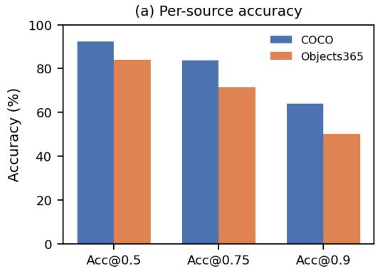

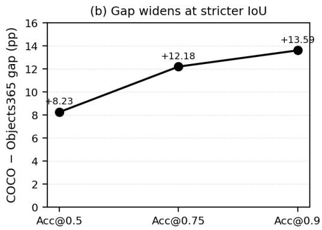  
Figure 9: Source-stratified accuracy on the recombined predictions. The COCO–Objects365 gap widens as the IoU threshold tightens (+8.23, +12.18, +13.59 points), an association compatible with several localization and domain-shift explanations.

Those pilots, and the full Ref-L4 run they authorised, were later found to have requested the floor through a processor keyword this checkpoint discards (Section 5.2), so they measured defaultresolution work. We therefore re-ran the routed pass on all 6,641 flagged Ref-L4 rows with the override verified in effect. It changes the predicted box on 6,591 of them (99.2%), against 627 rows of ±1-unit numerical jitter before. Applying the floor to the routed rows and leaving every other row untouched moves the full 31,921-row split from 88.531% to 89.230% at Acc@0.5 (+0.699), from 77.410% to 79.321% at Acc@0.75 (+1.911), from 55.778% to 59.030% at Acc@0.9 (+3.252), and mean IoU from 80.936% to 81.949%. This routing-only measurement was itself later superseded: the crop stage had a second, independent bug at the time (it was cropping the unrouted baseline rather than the routed prediction), so the 89.230% figure and its 80.936% baseline predate that fix. The canonical full-policy numbers, with both bugs fixed, are Table 26’s 88.531%→89.725% at Acc@0.5 and 80.944%→82.648% mean IoU (Appendix D.6); readers should treat Table 26 as the canonical baseline and the figures in this paragraph as a superseded intermediate diagnostic of the routing stage alone.

The direction of the original claim survives; its magnitude and its mechanism do not. The gain is larger than the withdrawn +3.30-point small-bucket figure and, more importantly, it is not confined to the smallest targets: the medium bucket gains +16.51 points at Acc@0.9 while the large bucket gains +1.88. The earlier conclusion that the floor does not generalize past the small bucket was an artifact of the same defect, since the medium-bucket extension pilot that produced −0.125 points also ran at default resolution and was therefore comparing the incumbent against itself. The router’s restriction to the small bucket is consequently a conservative operating choice rather than an empirically forced one, and widening it is a concrete avenue this work leaves open.

## E.9 EXPLORATORY RESOLUTION CHECKS DO NOT ESTABLISH A PEAK

Two prompt variants were piloted against the frozen default prompt. A tight-box instruction changed Acc@0.5 by +0.125 points (historical one-sided LCB −1.13), and afine-grained instruction changed it by +0.25 points (LCB −1.00). These are exploratory null results.

The archived resolution summaries reveal a reference inconsistency in the earlier ladder figure, which is therefore removed. On an 800-row small-target sample, the 1,048,576- and 4,194,304- pixel summaries report default-relative changes of +0.750 and +1.875 points. The 8,388,608-pixel summary instead reports +1.125 points relative to the 4,194,304 arm on the same 800 rows (82.875% versus 81.750%). A stepwise increment cannot be plotted as a default-relative ordinate or used to conclude that the curve peaked. Until the row-level predictions are rescored against one common reference, the defensible conclusion is only that 4,194,304 was the historically selected operating point; remaining resolution headroom is unresolved.

## E.10 AN UNGUARDED SELF-CORRECTION BASELINE REGRESSES THE HEADLINE METRIC

Section 2 distinguishes LFPR from iterative visual self-correction methods by its single guarded attempt. To make this distinction an empirical rather than only a design point, we ran a matched, zero-shot self-correction control on an 800-row pilot: the same frozen incumbent is shown the original image with its own first box drawn as an overlay and asked to return one replacement box, with no guard and no fusion. This regresses Acc@0.5 by −2.00 points (one-sided LCB −3.14) and Acc@0.75 by −2.125 points (LCB −3.78); only Acc@0.9 improves (+2.25 points, LCB +0.12), and mAcc regresses by −1.06 points (LCB −2.14). An ungated second opinion is therefore not a substitute for LFPR’s guarded crop: it can occasionally sharpen an already-close box (the Acc@0.9 effect) while making the incumbent’s committed answer worse on average, which is the same asymmetry the self-correction mirage literature reports for oracle-free stopping (Tripathy and Krishnan, 2026). LFPR’s guards are best understood as an explicit, non-learned stopping rule that keeps this same mechanism from being applied unconditionally.

## E.11 MATCHED NEGATIVE CONTROLS DEFINE THE CLAIM

The positive full LFPR result is interpretable because nearby alternatives were not silently promoted. A supervised coarse-to-fine adaptation of the incumbent, fine-tuned for 10,000 steps on external Objects365 boxes and evaluated on a reserved, never-previously-read 3,314-row confirmation split through the same frozen evaluation harness, decreased Acc@0.5 by 0.543 points, with LCB -1.264: adapting the weights directly, using the same external data source LFPR’s own diagnostics draw on, did not transfer to a gain. A released third-party checkpoint built for parallel box decoding was evaluated zero-shot on the shared pilot with zero runtime errors and decreased the metric by 15.80 points; this checkpoint’s own training-image overlap with Ref-L4 was never resolved by its authors, so it was treated as diagnostic-only regardless of its result. SAM3 boundary projection with the same midpoint fusion produced only +0.10 points on a fresh pilot, with LCB -0.20; a retrospective check that applied the same fusion rule to the projection pilot’s own pilot rows had suggested +0.30 points, but this signal did not survive a prospective confirmation on a disjoint holdout, illustrating why this paper treats retrospective checks as motivating evidence only, never as confirmation. Full crop replacement and standalone conservative fusion improved strict-IoU metrics but did not establish the required headline gain on their own. Finally, scaling the incumbent within its own model family to a 4×-larger 32B checkpoint, under the identical frozen prompt, parser, and evaluator, also closed negative: +0.26 points at Acc@0.5 with LCB −2.45, a regression at Acc@0.9 (−1.32 points, LCB −4.56), a failing effect on the Objects365 subset (−0.53 points), and a COCO LCB (−2.07) outside the historical −0.5-point band. These controls show that several nearby alternatives failed under their respective pilots; because populations differ and a full same-row factorial table is absent, they do not isolate the causal contribution of routing, guards, or fusion.

## F ADDITIONAL METRIC DEFINITIONS

For an image $j$ carrying expressions $i \in \mathcal { T } _ { i }$ , the paired image-level bootstrap samples images rather than individual expressions. Let $m _ { j } ^ { * }$ be the multiplicity of image $j$ in one bootstrap draw. The treatment effect is

$$
\widehat { \Delta } _ { t } ^ { * } = \frac { \sum _ { j } m _ { j } ^ { * } \sum _ { i \in \mathcal { I } _ { j } } [ u _ { t } ( \widehat { b } _ { i } , y _ { i } ) - u _ { t } ( b _ { 0 i } , y _ { i } ) ] } { \sum _ { j } m _ { j } ^ { * } | \mathcal { I } _ { j } | } .\tag{9}
$$

The reported percentage-point effect is $1 0 0 \widehat { \Delta } _ { t }$ . This is an expression-weighted estimand with imagecluster resampling. mAcc is computed before taking the treatment difference so that each threshold has equal weight. Source effects use the same definition after restricting i to the source subset. No multiplicity correction was used historically; Acc@0.75, Acc@0.9, mAcc, source slices, and pilot comparisons are therefore reported as an exploratory family rather than confirmatory tests.