# WITHEVERYONE: UNIFIED PLANNING AND IDENTITYGROUNDING FOR GROUP IMAGE GENERATION

Hengyuan Xu1,2 Qixun Wang2,† Yiji Cheng2 Miles Yang2 Zhao Zhong2 Wei Cheng3 Xingjun Ma1,‡ Yu-Gang Jiang1

1Fudan University 2Hunyuan, Tencent 3The University of Hong Kong †Project lead. ‡Corresponding author. Ñ Project Page § Code

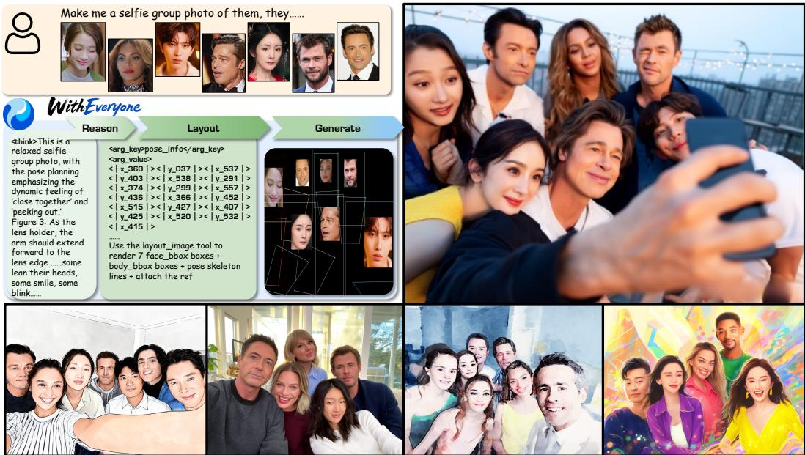  
Figure 1: Overview of WithEveryone. WithEveryone generates coherent group images from five to ten reference identities. A single model reasons about which references participate, plans identity–layout bindings, person regions, and poses, and generates the image conditioned on that plan, so identity and composition are decided in one context rather than by separate modules.

## ABSTRACT

Identity-preserving image generation becomes increasingly unreliable when a scene must contain many specified people. Beyond retaining each identity, the model must bind every reference to a distinct person and location, while training-time identity losses must establish correspondence among several noisy predicted faces. We introduce WithEveryone, a unified framework for generating group images up to ten reference identities. WithEveryone injects each selected identity as an addressed token, predicts a structured identity–layout plan, and renders the plan as a visual condition. Its key objective, Layout-Grounded ID Loss, uses annotated face regions to supervise the intended identities directly, avoiding unstable embedding-based face matching; ID Representation Forcing additionally trains a prediction for each identity before image synthesis. On an identity-disjoint benchmark, WithEveryone achieves the highest target-context identity similarity, improving face similarity from 0.462 for GPT-Image 2 to 0.499, while reducing copy-paste artifacts from 0.169 to 0.055. It further covers 97.3% of the requested identities with a duplicate rate of only 2.8%. These results show that explicit identity–layout grounding enables identity-preserving generation to scale to larger groups without relying on direct reference-face copying.

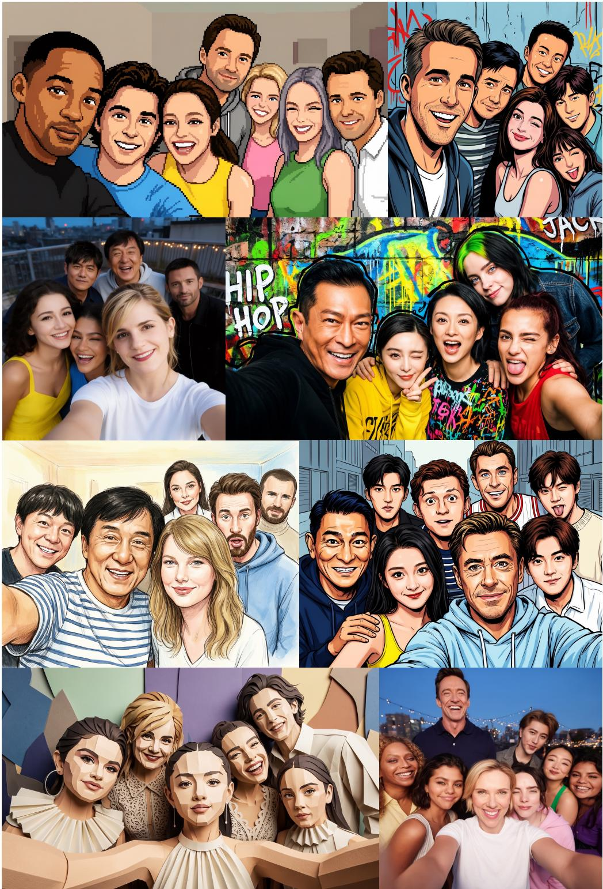  
Figure 2: Group images generated by WithEveryone. The samples cover different group sizes, scene types, and visual styles.

## 1 INTRODUCTION

Recent image generation models, especially unified multimodal models (UMMs), have advanced rapidly in visual fidelity, text understanding, and controllability, and identity-preserving generation further lets users specify a person through one or more reference images (Li et al., 2024; Wang et al., 2024c). However, existing open academic methods primarily address one or a small number of people, typically generating from one to five reference identities (IDs) (Xu et al., 2025; Cheng et al., 2025); even strong proprietary systems such as Nano Banana Pro support at most seven people (Google DeepMind, 2025). Real group-image creation requires jointly generating more specified people rather than repeatedly generating independent single-person images. We study group-image generation from five to ten reference IDs in one semantically and visually coherent image.

As the number of reference IDs increases, identity similarity is widely reported to decrease (Xu et al., 2025; Kim et al., 2024; Zhang et al., 2025; He et al., 2024), and models tend to duplicate faces or merge IDs in multi-person scenes (Borse et al., 2026). When more reference images, visual tokens, and identity conditions share one generation context, each identity signal is more easily diluted, and cross-identity interference and incorrect binding become more likely. Supplying reference images or identity embeddings as conditions therefore does not guarantee that the model keeps reading every identity during generation: large-group generation needs a mechanism that both provides each reference identity and constrains the context to retain its representation.

Prior work also shows that conditioning alone is not enough, and that supervising the generated face directly with an identity loss is necessary for strong identity preservation (Guo et al., 2024; Xu et al., 2025). Such losses, however, are formulated for a single person or at most two. Extending them to a large group is not a matter of running the same loss more times, because the loss must first decide which generated face belongs to which reference, and existing formulations recover that correspondence by matching face embeddings in the generated image. Early in training and at high noise levels, the faces the model predicts are nearly identical to one another, so this matching is close to arbitrary and each mispaired face pulls one identity toward another. Existing identity losses therefore do not scale: the supervision that should sharpen individuals instead cancels itself out.

More references also complicate spatial and bodily relationships. Identity similarity answers who is generated, but not where people appear, what poses they take, or how they are organized. As the group grows, pairwise relations multiply and one misplaced person propagates errors through the surrounding composition, making overlaps, limb errors, and crowded layouts especially likely. We therefore offload this planning burden to the understanding side of a unified model before image generation.

To address these challenges, we propose WithEveryone, a unified UMM framework shown in Figure 1. On the identity side, we extract an identity embedding for each reference person, project it into an ID token, and bind that token to the planned person it should control, so that references form an addressed set rather than an unordered pool. Because ID tokens are easily ignored in long multi-ID sequences, ID Representation Forcing adapts representation forcing (Wang et al., 2026) to identities, requiring the model to predict a representation aligned with each target person before synthesis. At the output level, we introduce a flow-compatible Layout-Grounded ID Loss (LG-ID Loss), which removes the matching problem described above rather than approximating it: the correspondence is read off the layout annotation, so each identity is supervised in its own annotated region no matter how many people share the image.

On the understanding side, the model autoregressively predicts a structured Layout Chain ofThought (Layout CoT) containing person indices, bounding boxes, identity–layout bindings, and pose keypoints, extending ATLAS-style planning (Liu et al., 2026) to an identity-aware setting in which every planned person is tied to a reference identity; a deterministic renderer then converts the plan into a visual condition. ID tokens and Representation Forcing determine who to generate, Layout CoT determines where and how each person appears, and identity–layout binding joins the two in a single plan.

We evaluate WithEveryone on a five-to-ten-person benchmark against academic, open-source, and proprietary systems, including GPT-Image 2, Nano Banana family, and Seedream family. WithEveryone reaches the highest similarity, with a Sim(Tgt) score of 0.499 against 0.462 for GPT-Image 2. Its copy-paste artifact score (Xu et al., 2025) of 0.055 against 0.169 indicates that this similarity is less consistent with directly copying reference faces. These results show a better overall balance among identity, copying, and image quality than any single system we compare against. Our contributions are threefold:

• We propose interleaved identity and layout reasoning inside a single unified model: each selected reference is loaded as an ID token, a structured Layout CoT extends ATLAS-style planning with identity–layout binding and joint prediction of face regions, body extents, and poses, and a deterministic renderer turns the plan into a visual condition. ID Representation Forcing adapts representation forcing by adding supervised per-identity predictions before image synthesis, encouraging the selected identities to remain addressable in the shared context.

• We propose the LG-ID Loss, which grounds output-side identity supervision in the layout annotation instead of in embedding-based face matching. This removes the failure mode that prevents existing identity losses from being applied beyond two people, and it is the single largest source of identity gain in our system.

• We build and systematically evaluate a group-image generation system for five to ten people. On an identity-disjoint benchmark it achieves higher target-context identity similarity than GPT-Image 2 (Sim(Tgt) 0.499 versus 0.462) at a lower copy-paste artifact (0.055 versus 0.169), and our analysis separates plan prediction from plan execution as distinct sources of the remaining error.

## 2 RELATED WORK

Identity-Preserving and Identity-Consistent Generation. Identity-preserving generation has progressed from single-person methods (Wang et al., 2024c; Li et al., 2024; Valevski et al., 2023; Wang et al., 2024b; Yan et al., 2023; Xiao et al., 2025) to multi-person customization (Zhang et al., 2025; He et al., 2024; Kim et al., 2024; Cheng et al., 2025). Existing methods, however, remain limited to small groups and can trade identity similarity for copy-paste behavior (Chen et al., 2025; Mou et al., 2025; Jiang et al., 2025; Xu et al., 2025); reported examples from WithAnyone and UMO include at most four and three people, respectively. Output-side identity supervision is similarly limited: PuLID (Guo et al., 2024) handles one identity, while WithAnyone uses embedding-based Hungarian matching for at most two. Under training-time noise, this matching becomes unreliable as the number of faces grows. Our LG-ID Loss instead obtains correspondence from layout annotations, enabling output-side supervision for five to ten people.

Text-Image-to-Image Models and Unified Models. Reference-conditioned generation is now supported by open models (Batifol et al., 2025; Wu et al., 2025a; Team et al., 2025; Diao et al., 2026; Cai et al., 2026) and proprietary systems (Google DeepMind, 2026; 2025; ByteDance Seed Team, 2026; OpenAI, 2025; 2026). Unified architectures such as HunyuanImage 3 and BAGEL generate text and images in a shared context, enabling in-context planning before synthesis (Cao et al., 2025; Deng et al., 2025; Zhou et al., 2025).

Layout Planning and Generation. Most layout-conditioned methods use a separate planner and image generator (Feng et al., 2023; Gupta & Kembhavi, 2023; Yang et al., 2024; Zhang et al., 2024; Fang et al., 2025; Duan et al., 2025), whereas ATLAS and PlanGen unify planning and synthesis in one contextual sequence (Liu et al., 2026; He et al., 2025). We extend this setting from text-to-image to identity-conditioned generation: each planned person is bound to a reference identity, with jointly predicted face regions, body extents, and poses rendered as a visual condition.

## 3 METHOD

## 3.1 OVERVIEW

We consider group-image generation from a text prompt and a set of five to ten reference identities. Our model follows a transfusion-style (Zhou et al., 2025) mixture-of-transformers multimodal architecture (Deng et al., 2025; Cao et al., 2025) in which text and structured reasoning are predicted autoregressively, while target-image latents are learned through flow matching (Lipman et al., 2022).

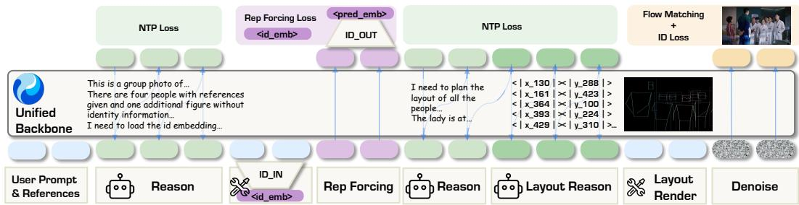  
Figure 3: Overview of WithEveryone. The model loads selected reference identities as ID tokens, predicts structured Layout CoT, renders a visual layout condition, and predicts identity representations before generating the target group image. Modality-switch tokens that mark the boundaries between autoregressive reasoning and flow-based image generation are used in the sequence but omitted from the figure.

This shared causal context lets high-level decisions made before image generation directly condition the subsequent image tokens.

As shown in Figure 3, WithEveryone prepares three complementary conditions before synthesizing the target image: it selects the reference identities participating in the scene and loads a compact representation for each, predicts a structured multi-person layout together with the association between identities and planned people, and finally predicts target identity representations from the accumulated context. The rendered layout condition and the representation scaffold jointly condition flow-based image generation.

## 3.2 INTERLEAVED IDENTITY AND LAYOUT REASONING

ID binding and ID token. The prompt may require only a subset of the available reference people and may also describe people without a reference image, so the model first identifies the participating identities. Analogous to the complementary roles of ViT (Dosovitskiy et al., 2020) and VAE embeddings at different feature levels, we complement the low-level reference-image features with high-level ID embeddings that encode identity-specific information: for each selected person we extract a 512-dimensional ArcFace (Deng et al., 2019; 2020) embedding, map it to the model hidden dimension with a lightweight MLP, and inject it at the corresponding ID-token position. Selection and binding are ordered rather than mutually dependent: the model emits the list of selected identities and loads one ID token per selection, and the binding to a concrete person follows in the layout stage (Section 3.2). This ID–layout binding gives each loaded identity a spatial role rather than treating the references as an unordered collection.

ID Representation Forcing. Loading ID tokens does not by itself guarantee that image generation will use them. Each person is represented by a single continuous token, projected from one 512- dimensional vector, inside an interleaved sequence of 10–20K tokens, so generation-side attention over the injected identity tokens can be diffuse and identity-agnostic. Inspired by representation forcing (Wang et al., 2026), we therefore introduce ID Representation Forcing. For every selected reference identity with a target correspondence, we place a representation token before the target image; the backbone computes its hidden state $\mathbf { h } _ { i } ^ { \mathrm { r e p } }$ from the preceding prompt, visual references, ID tokens, and layout reasoning, and an output projector $g _ { \mathrm { o u t } }$ maps it to the ArcFace space:

$$
\hat { \mathbf { e } } _ { i } = g _ { \mathrm { o u t } } ( \mathbf { h } _ { i } ^ { \mathrm { r e p } } ) , \qquad \mathcal { L } _ { \mathrm { R F } } = \frac { 1 } { M } \sum _ { i = 1 } ^ { M } \left( 1 - \cos \left( \hat { \mathbf { e } } _ { i } , \mathbf { e } _ { i } ^ { \mathrm { t g t } } \right) \right) ,\tag{1}
$$

where ${ \bf e } _ { i } ^ { \mathrm { t g t } }$ is the ArcFace embedding of the corresponding person in the target image and M is the number of supervised identities. Unlike next-token prediction or image flow matching, this loss directly aligns a continuous identity prediction from the shared context. The resulting hidden states remain causally available to the later image tokens, forming an identity scaffold for generation.

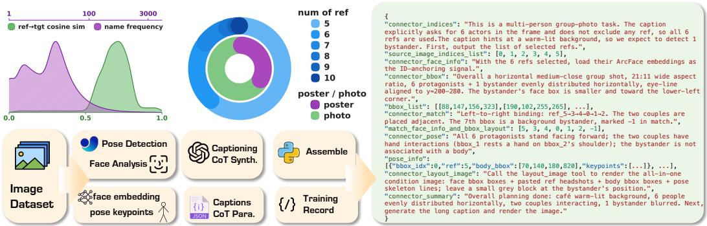  
Figure 4: Data statistics, pipeline, and example. We report the distributions of identity occurrence frequency, reference count, and real photographs versus collage and poster images; the data-construction pipeline; and an example training sample. The corpus contains 400K group-image samples, and the reference-count distribution covers the five-to-ten-person range used at evaluation time.

Structured Layout CoT. ID-preserving generation must also resolve the spatial and bodily relationships among people, which we formulate as a structured Layout CoT. Following ATLAS (Liu et al., 2026), the model autoregressively predicts identity–layout bindings, person and face regions, body extents, and pose keypoints using a discretized coordinate vocabulary with 2,002 tokens, corresponding to 1,001 positions on each axis. The stages are emitted in a fixed causal order, so each decision is conditioned on the identities and regions already committed; short natural-language connectors carry the scene state across stages, while the spatial fields remain parseable and directly supervised. We then parse the predicted plan and render it as a canvas, drawing the planned face regions, body regions, and pose skeletons onto a blank image at the target aspect ratio, which is inserted into the context as a condition image.

## 3.3 TRAINING DATA AND OBJECTIVES

Training data and sequence. Each training sample interleaves reference images and the prompt, identity selection and ID loading, layout planning, the rendered layout condition, a recaption, the identity prediction, and the target image, in that causal order; Figure 4 shows how these signals are derived from real group photographs, and Appendix C.1 gives the full sequence and annotation pipeline.

Layout-Grounded ID Loss. An identity loss on the generated face is an effective and, in prior work, necessary ingredient for identity preservation (Guo et al., 2024; Xu et al., 2025), but both existing formulations must first decide which generated face belongs to which reference. PuLID supervises a single identity and never faces this question; WithAnyone recovers the correspondence from the generated image by Hungarian assignment over face embeddings, and reports it for at most two people. This is exactly what breaks as the group grows: during training the one-step estimate is noisy and five to ten faces are barely distinguishable, so the assignment is close to arbitrary and each mispaired face pulls one identity toward another, cancelling the supervision instead of sharpening any individual.

We remove the matching problem rather than improving the matcher, because the correspondence is already known from the annotation that supervises the Layout CoT: each referenced identity carries a fixed target face bounding box and its landmarks. Cropping the predicted and target images at these same regions makes every crop pair correct by construction, so each identity is supervised on its own, independently of how many people share the image. Cropping the predicted image at an annotated region presumes that the generated face lands there, which flow matching enforces early: plan adherence converges well before identity preservation (Section 4.4). The crops are encoded by ArcFace (Deng et al., 2019), and the loss applies only below a timestep threshold, above which the one-step estimate holds no recognizable face; Appendix B.5 gives the threshold and the procedure. We call this objective the Layout-Grounded ID Loss, or LG-ID Loss. Grounding identity supervision in the layout rather than in the generated pixels is what makes output-side supervision usable at five to ten people, and it is the single largest source of identity gain in our system (Section 4.3).

Joint objective. Different parts of the sequence receive supervision appropriate to their representation. Connector text, structured layout tokens, summaries, and recaptions use next-token prediction; target-image latents use flow matching; and identity predictions use the cosine alignment above. Given a noisy latent $\mathbf { x } _ { t }$ and predicted velocity $\mathbf { v } _ { \theta } ( \mathbf { x } _ { t } , t )$ under the reverse-flow convention, the one-step clean-image estimate used by the LG-ID Loss is

$$
\begin{array} { r } { \hat { \mathbf { x } } _ { \mathrm { c l e a n } } = \mathbf { x } _ { t } - t \mathbf { v } _ { \theta } ( \mathbf { x } _ { t } , t ) . } \end{array}\tag{2}
$$

The overall objective is

$$
\mathcal { L } = \mathcal { L } _ { \mathrm { N T P } } + \lambda _ { \mathrm { F M } } \mathcal { L } _ { \mathrm { F M } } + \lambda _ { \mathrm { R F } } \mathcal { L } _ { \mathrm { R F } } + \lambda _ { \mathrm { I D } } \mathcal { L } _ { \mathrm { I D } } .\tag{3}
$$

We set $\lambda _ { \mathrm { F M } } = 1 . 0 , \lambda _ { \mathrm { R F } } = 1 . 0 .$ , and $\lambda _ { \mathrm { I D } } = 0 . 5 ;$ Appendix C.2 lists the backbone, initialization, data scale, optimizer, and hardware. At inference time, the model predicts identity selection, Layout CoT, and recaption autoregressively; the renderer deterministically constructs the layout condition from the predicted plan. Target identity embeddings are used only as training targets for representation forcing, not as inference-time conditions.

## 4 EXPERIMENTS

## 4.1 EXPERIMENTAL SETUP

Benchmark. Existing multi-identity benchmarks focus on a small number of people and therefore do not measure how identity preservation scales to larger groups. We construct a benchmark of 210 real group-image examples covering five to ten reference identities, each target containing exactly as many detected faces as references and no duplicate identities. The benchmark is identity-disjoint from training: every identity in it is held out and all training examples containing any of these identities are removed, so the comparison measures generalization to unseen people rather than image-level memorization. For analysis by group size, it is stratified into 60, 50, 40, 30, 20, and 10 examples with five through ten references.

Compared models. We compare with three groups of strong baselines. Academic identitypreserving methods include UMO (Cheng et al., 2025), WithAnyone (Xu et al., 2025), UniPortrait (He et al., 2024), DreamO (Mou et al., 2025), and ID-Patch (Zhang et al., 2025). Open-source general-purpose models include FLUX.2 Klein (Labs, 2025a), Qwen-Image-Edit (Wu et al., 2025a), LongCat-Image-Edit (Team et al., 2025), OmniGen2 (Wu et al., 2025b), SenseNova U1 (Diao et al., 2026), BAGEL (Deng et al., 2025), and HiDream-O1 (Cai et al., 2026). We further evaluate the proprietary Nano Banana (Google DeepMind, 2025; 2026) and Seedream (ByteDance Seed Team, 2026) families together with GPT-Image 2 (OpenAI, 2026).

Evaluation protocol. Every model is evaluated on all 210 examples. Every system generates at the highest resolution it supports. WithEveryone generates at 2K for the main comparison in Table 1 and at 1K in every other reported setting, including all ablations. We provide ground-truth layouts to ID-Patch and WithAnyone because these methods cannot plan layouts autonomously.

Evaluation metrics. Our main identity protocol follows WithAnyone (Xu et al., 2025): Sim(Ref) and Sim(Tgt) measure the similarity of generated faces to the reference and target identities, averaged over three face-recognition backbones, ArcFace(buffalo\_l) (Deng et al., 2019), FaceNet (Schroff et al., 2015), and AdaFace (Kim et al., 2022). All cross-model comparisons use this three-encoder protocol. Generated faces are assigned to references and targets on the clean final image, where embedding-based matching is reliable; the failure that motivates our LG-ID Loss arises from the noisy one-step estimates seen during training. For ablations, only ArcFace is used for simplicity. Copy-Paste, proposed and validated against human judgement by WithAnyone (Xu et al., 2025), measures the scale of copy-paste artifacts; Coverage and Dup measure how completely and distinctly the references are realized, with Dup counting references whose closest generated face is also claimed by another identity; DINO-I (Oquab et al., 2023) and CLIP-I (Radford et al., 2021) compare the generated and target images, and CLIP-T measures text alignment. For layout we report Count, the accuracy of the generated person count, and Plan IoU, which measures whether image generation executes the model’s own plan. Appendix C defines every metric, including two composite layout scores that we keep out of the main text: the Layout Score of Appendix C.6, a weighted aggregate of person count, identity coverage, uniqueness, distinctness, anonymous leakage, spatial validity, and plan adherence in the generated image, and the Relative Layout Score (RLS) of Appendix C.7, which compares the predicted plan with the ground-truth relative configuration in count, aligned position, and person scale.

Table 1: Quantitative comparison on our 5–10-person benchmark. All models are scored on the same 210 examples, and the identity similarities are averaged over the three face encoders of the main protocol. Coverage is the fraction of references whose best-matching generated face reaches a similarity of 0.20, and Dup the fraction that collapse onto a face already claimed by another identity. , , and mark the first-, second-, and third-best results; for Copy-Paste only the three methods with the highest Sim(Ref) are ranked, since lower similarity means less copying naturally.
<table><tr><td rowspan="2">Method</td><td colspan="3">Identity Similarity</td><td colspan="2">Identity Coverage</td><td colspan="3">Generation Quality</td></tr><tr><td>Sim(Tgt) ↑</td><td>Sim(Ref) ↑</td><td>Copy-Paste ↓</td><td>Coverage ↑</td><td>Dup ↓</td><td>CLIP-I↑</td><td>DINO-I↑</td><td>CLIP-T ↑</td></tr><tr><td colspan="9">Academic identity-preserving methods</td></tr><tr><td>WithAnyone</td><td>0.405</td><td>0.483</td><td>0.096</td><td>0.957</td><td>0.045</td><td>0.807</td><td>0.695</td><td>0.281</td></tr><tr><td>UMO</td><td>0.371</td><td>0.484</td><td>0.112</td><td>0.630</td><td>0.258</td><td>0.780</td><td>0.663</td><td>0.286</td></tr><tr><td>UniPortrait</td><td>0.339</td><td>0.464</td><td>0.115</td><td>0.635</td><td>0.187</td><td>0.679</td><td>0.415</td><td>0.301</td></tr><tr><td>DreamO</td><td>0.297</td><td>0.331</td><td>0.027</td><td>0.298</td><td>0.299</td><td>0.724</td><td>0.611</td><td>0.282</td></tr><tr><td>ID-Patch</td><td>0.225</td><td>0.259</td><td>0.032</td><td>0.247</td><td>0.224</td><td>0.609</td><td>0.320</td><td>0.331</td></tr><tr><td colspan="9">Open-source general-purpose models</td></tr><tr><td>FLUX.2 Klein</td><td>0.264</td><td>0.265</td><td>0.002</td><td>0.314</td><td>0.265</td><td>0.787</td><td>0.685</td><td>0.291</td></tr><tr><td>Qwen-Image-Edit</td><td>0.253</td><td>0.289</td><td>0.018</td><td>0.176</td><td>0.291</td><td>0.614</td><td>0.312</td><td>0.227</td></tr><tr><td>LongCat-Image-Edit</td><td>0.287</td><td>0.288</td><td>-0.001</td><td>0.381</td><td>0.264</td><td>0.802</td><td>0.657</td><td>0.288</td></tr><tr><td>OmniGen2</td><td>0.267</td><td>0.275</td><td>-0.002</td><td>0.418</td><td>0.267</td><td>0.774</td><td>0.633</td><td>0.288</td></tr><tr><td>SenseNova U1</td><td>0.253</td><td>0.243</td><td>-0.009</td><td>0.213</td><td>0.256</td><td>0.797</td><td>0.686</td><td>0.289</td></tr><tr><td>BAGEL</td><td>0.223</td><td>0.225</td><td>0.003</td><td>0.136</td><td>0.276</td><td>0.752</td><td>0.635</td><td>0.282</td></tr><tr><td>HiDream-O1</td><td>0.353</td><td>0.376</td><td>0.026</td><td>0.780</td><td>0.190</td><td>0.806</td><td>0.692</td><td>0.286</td></tr><tr><td colspan="9">Proprietary systems</td></tr><tr><td>Nano Banana Pro</td><td>0.453</td><td>0.478</td><td>0.041</td><td>0.674</td><td>0.148</td><td>0.839</td><td>0.712</td><td>0.275</td></tr><tr><td>Nano Banana 2</td><td>0.451</td><td>0.480</td><td>0.045</td><td>0.884</td><td>0.099</td><td>0.860</td><td>0.731</td><td>0.276</td></tr><tr><td>GPT-Image 2</td><td>0.462</td><td>0.583</td><td>0.169</td><td>0.905</td><td>0.075</td><td>0.853</td><td>0.719</td><td>0.270</td></tr><tr><td>Seedream 4.5</td><td>0.407</td><td>0.495</td><td>0.114</td><td>0.859</td><td>0.175</td><td>0.829</td><td>0.698</td><td>0.286</td></tr><tr><td>Seedream 5.0 Pro</td><td>0.436</td><td>0.522</td><td>0.114</td><td>0.913</td><td>0.065</td><td>0.850</td><td>0.715</td><td>0.275</td></tr><tr><td>WithEveryone</td><td>0.499</td><td>0.540</td><td>0.055</td><td>0.973</td><td>0.028</td><td>0.861</td><td>0.716</td><td>0.273</td></tr></table>

## 4.2 CROSS-MODEL COMPARISON

Identity preservation. Table 1 shows that WithEveryone obtains the highest Sim(Tgt) of 0.499, indicating that its generated faces best match the identities as they appear in the target context. Its Sim(Ref) of 0.540 is second only to GPT-Image 2 at 0.583 and higher than both Nano Banana generations. Under the single-encoder ArcFace protocol, WithEveryone reaches an ArcFace similarity of 0.614 compared with 0.566 for GPT-Image 2; because that protocol relies on one encoder and a separate scoring pipeline, we treat it as an ArcFace-specific secondary analysis and base all cross-model conclusions on Table 1.

Identity versus copy-paste. WithEveryone obtains a Copy-Paste score of 0.055, substantially below GPT-Image 2 at 0.169, while attaining comparable reference similarity and higher target-context similarity. Its identity scores are therefore less consistent with rigidly reproducing the reference face than those of the strongest baseline.

Generation quality. WithEveryone attains the highest CLIP-I score of 0.861, although it is statistically indistinguishable from Nano Banana 2 at 0.860 (Appendix B.1), with a competitive DINO-I of 0.716. Its CLIP-T of 0.273 is not the highest: ID-Patch and UniPortrait reach 0.331 and 0.301 while scoring far lower on every identity metric, which is consistent with text alignment being easier to satisfy when the people need not match specific references.

Identity coverage. Similarity scores say how well the generated faces match, but not how many of the requested people are generated as separate individuals. WithEveryone covers 0.973 of the reference identities with the lowest duplicate rate of 0.028, ahead of Seedream 5.0 Pro at 0.913 and 0.065 and GPT-Image 2 at 0.905 and 0.075, so it rarely omits a person or collapses two references onto one face. Open-source general-purpose models mostly stay below 0.42 coverage, tending to edit the few people implied by the prompt instead of composing the full group. Figure 6 shows the corresponding failure modes on individual examples.

Scaling to more reference identities. Figure 5 breaks ArcFace similarity down by the number of references, where WithEveryone ranks first in every group. Its score decreases moderately from 0.629 with five references to 0.571 with ten, whereas GPT-Image 2 decreases from 0.593 to 0.496 and UMO from 0.412 to 0.330. Our distribution is also more concentrated, whereas GPT-Image 2 shows substantially heavier upper and lower tails. Because the groups are small, especially at the upper end, we read this as a consistent advantage across the whole five-to-ten range and a flatter degradation trend, rather than as a claim about any individual group size.

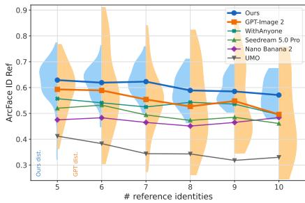  
Table 2: Ablation results. The rows form three incremental branches from the same base: layout (P1–P3), ID token and Representation Forcing (P1, P4, P5), and LG-ID Loss (P1, P6); P7 is the complete configuration and additionally uses the text-to-layout corpus.

Figure 5: Scaling to more references. Lines show mean ArcFace similarity to the references; distributions are shown for With-Everyone and GPT-Image 2.
<table><tr><td></td><td>Variant</td><td>Sim(Ref) ↑</td><td>Sim(Tgt) ↑</td><td>Count ↑</td><td>Coverage ↑</td></tr><tr><td>P1</td><td>Default</td><td>0.339</td><td>0.304</td><td>0.771</td><td>0.741</td></tr><tr><td>P2</td><td>Model Layout</td><td>0.364</td><td>0.316</td><td>0.828</td><td>0.813</td></tr><tr><td>P3</td><td>GT Layout</td><td>0.412</td><td>0.367</td><td>0.958</td><td>0.891</td></tr><tr><td>P4</td><td>ID Token</td><td>0.351</td><td>0.313</td><td>0.827</td><td>0.761</td></tr><tr><td>P5</td><td>ID Token + RF</td><td>0.364</td><td>0.328</td><td>0.817</td><td>0.782</td></tr><tr><td>P6</td><td>LG-ID Loss only</td><td>0.506</td><td>0.435</td><td>0.845</td><td>0.947</td></tr><tr><td></td><td>P7 Full Model</td><td>0.555</td><td>0.461</td><td>0.869</td><td>0.960</td></tr></table>

## 4.3 ABLATION STUDIES

We organize the ablations into three incremental branches from the same base model: layout conditioning (P1–P3), ID tokens and Representation Forcing (P1, P4, and P5), and the LG-ID Loss (P1 and P6). P7 reports the complete configuration. All variants are trained and evaluated independently under the same recipe, except that P7 additionally uses the text-to-layout corpus.

Effect of Layout CoT. Rows P1–P3 of Table 2 isolate the layout condition. P1 is the default model, trained on the same dataset but without Layout CoT or ID tokens; P2 and P3 are trained with Layout CoT and use the model-predicted and the ground-truth layout at inference, respectively. The model-predicted layout raises Sim(Ref) from 0.339 to 0.364, Count from 0.771 to 0.828, and Coverage from 0.741 to 0.813, while Sim(Tgt) improves only marginally. The ground-truth layout further raises Sim(Ref) and Sim(Tgt) to 0.412 and 0.367 and improves every layout measure; because that layout is derived from the target image, P3 is an oracle upper bound rather than an estimate of an achievable planning gain. This upper bound establishes that high-quality layout conditions can improve both composition and identity preservation, while the gap between the two identifies planning quality as an important remaining source of error. P7 additionally trains on the text-to-layout corpus of Appendix C.1 and scores higher than P2 on both, but it also adds the remaining components, so this comparison does not isolate the corpus.

Effect of ID tokens and Representation Forcing. Rows P1, P4, and P5 form an incremental branch for ID tokens and Representation Forcing. Adding an ID token alone yields small but consistent gains, the largest of which is Count, from 0.771 to 0.827. Adding Representation Forcing on top of the ID token raises Sim(Ref) from 0.351 to 0.364 and Sim(Tgt) from 0.313 to 0.328, gains of +0.013 and +0.015, respectively. In the examples shown in Figure 9, each supervised identity prediction preferentially attends to its corresponding ID token. The end-to-end gains are modest, so we interpret this evidence as consistent with improved identity addressability rather than as a large direct source of identity gain.

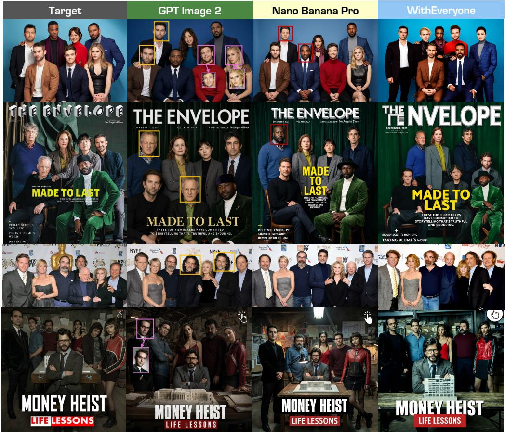  
Figure 6: Qualitative comparison with proprietary models. , , and mark faces that reproduce a person already generated elsewhere in the image, that are not recognizable as their bound reference, and that appear transplanted without adapting to the pose, lighting, or viewpoint of the scene. These author annotations are illustrative; their quantitative counterparts are the duplicate rate, Sim(Ref), and Copy-Paste.

Effect of the LG-ID Loss. Rows P1 and P6 show that direct output-side identity supervision provides the largest improvement among the tested individual additions. The LG-ID Loss alone raises Sim(Ref) from 0.339 to 0.506 and Sim(Tgt) from 0.304 to 0.435. It also improves composition, lifting Count from 0.771 to 0.845 and Coverage from 0.741 to 0.947: because each identity is supervised inside its annotated region, the loss can only be reduced by putting the right person in the right place, so layout-grounded identity supervision carries spatial information as well as identity, and the effect attributed to layout conditioning above is a lower bound. P7 combines the LG-ID Loss with ID tokens, Representation Forcing, Layout CoT, and the additional text-to-layout corpus, reaching Sim(Ref) 0.555 and Sim(Tgt) 0.461. This complete configuration improves over the LG-ID-only branch, but because several components and the training corpus change together, we do not attribute the margin to any individual addition. All rows are evaluated at 1K; the 0.614 quoted in Section 4.2 is the same model evaluated at 2K under the main benchmark pipeline, so the two values differ in both inference resolution and scoring pipeline.

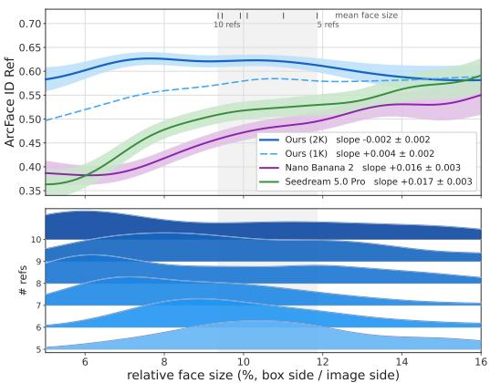  
(a) Relative face size, as a fraction of the image side; the grey band spans the mean face size from ten references on its left edge to five on its right, the entire range that group size produces.

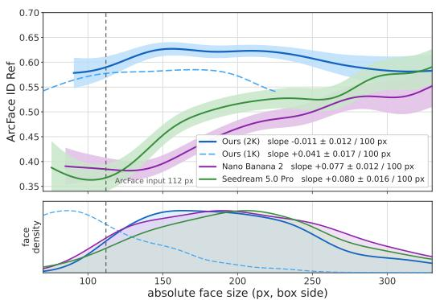  
(b) Absolute face size in pixels; the dashed line marks 112 px, the input resolution of the ArcFace encoder, below which a face has to be upsampled before it can be compared.  
Figure 7: Identity similarity against face size. Curves are local means with 95% confidence bands, annotated with the fitted slope. The lower panel of (a) shows the distribution of relative face size for each group size, and the lower panel of (b) shows the face-size distribution of each system.

## 4.4 ANALYSIS

Face size and scaling degradation. Similarity could fall with group size simply because faces get smaller. Figure 7 shows that the baselines depend strongly on face size, gaining 0.016–0.019 similarity per percentage point of relative face side, whereas our slope is nearly flat at −0.002. Controlling for face size removes most of the group-size slope for GPT-Image 2 and Seedream 5.0 Pro but leaves ours essentially unchanged. The reduction in face resolution therefore does not explain our remaining group-size degradation, which may reflect other factors that grow with group size, including cross-identity interference, occlusion, and compositional complexity. Within a fixed pixel band WithEveryone leads below 200 px and GPT-Image 2 overtakes it above. This pattern is qualitatively consistent with GPT-Image 2’s higher Copy-Paste, although the association does not identify a causal explanation. Appendix B.2 gives the fits and the per-band numbers.

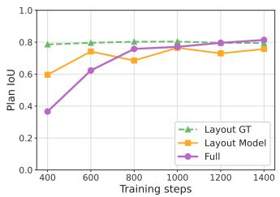  
Figure 8: Plan IoU convergence. The model rapidly converges to follow the planned layout.

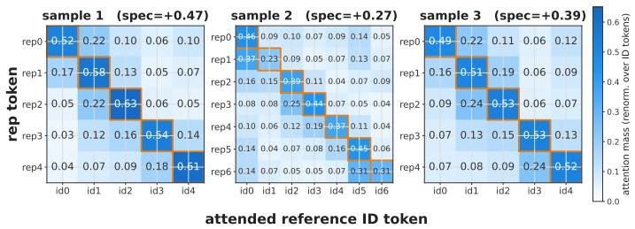  
Figure 9: Attention at Representation Forcing prediction positions. In the three illustrated examples, layer-24 attention from the supervised identity predictions to reference ID tokens shows diagonal dominance.

Planning versus execution. Plan IoU separates executing a plan from proposing a good one. With the model’s own plan it reaches 0.773, so the generated image largely realizes what was planned, yet replacing that plan with the ground-truth layout still lifts identity and coverage substantially in Table 2, which points to the plan rather than to its execution as the residual error. The training dynamics in Figure 8 agree, as Plan IoU with a ground-truth layout stays near 0.79–0.80 throughout the plotted interval and the full model rapidly reaches that level and ends slightly above it at 0.814, so generation follows its own plan at least as closely as an externally supplied one. Plan execution converges earlier than identity preservation (Figure 12), suggesting that the larger remaining opportunity lies in improving the understanding side’s plan rather than teaching the generator to follow an already reliable layout; Appendix C.7 defines the Relative Layout Score, which scores plan quality directly against the ground-truth configuration instead of against the generated image.

Representation Forcing mechanism. Figure 9 examines whether each supervised identity prediction attends to its corresponding ID token. In the three illustrated examples at layer 24, diagonal attention is 0.378–0.574 against 0.104–0.121 for non-corresponding identities, an identity-specificity gap of +0.275 to +0.467. This local evidence shows identity-specific attention at the supervised prediction positions, but it does not establish the effect relative to a model without Representation Forcing or equally strong routing from generated face patches to the ID tokens.

## 5 CONCLUSION

We presented WithEveryone, a unified multimodal framework for generating coherent group images from five to ten reference identities, addressing the two coupled challenges of retaining and distinguishing multiple identities and of organizing their spatial and bodily relationships. It binds each reference to an ID token and uses ID Representation Forcing to train a per-identity prediction before image synthesis, supervises the generated faces with a flow-compatible LG-ID Loss that grounds the identity correspondence in the layout annotation instead of matching faces in the generated image, and moves multi-person planning to the understanding side through a structured Layout CoT that is rendered into a visual condition.

On an identity-disjoint benchmark of five-to-ten-person images, WithEveryone obtains the highest target-context identity similarity (Sim(Tgt) 0.499 against 0.462 for GPT-Image 2) at a Copy-Paste score of 0.055 versus 0.169, and covers more of the requested identities with fewer collisions than any system we compare against. Among the tested individual additions, layout-grounded output-side supervision contributes the largest identity gain, while the layout branch mainly improves identity coverage and spatial control. More generally, identity supervision in multi-person generation benefits from an explicit spatial address that specifies where each identity is meant to appear. Our diagnostics further suggest that plan prediction rather than plan execution is an important remaining source of error. Within this benchmark and its reference range, the results support combining explicit identity supervision with structured relational planning. Appendix E discusses limitations, future work, and responsible use.

## REFERENCES

Stephen Batifol, Andreas Blattmann, Frederic Boesel, Saksham Consul, Cyril Diagne, Tim Dockhorn, Jack English, Zion English, Patrick Esser, Sumith Kulal, et al. Flux. 1 kontext: Flow matching for in-context image generation and editing in latent space. arXiv e-prints, pp. arXiv–2506, 2025.

Shubhankar Borse, Farzad Farhadzadeh, Munawar Hayat, and Fatih Porikli. Resolving the identity crisis in text-to-image generation. In Proceedings of the IEEE/CVF Conference on Computer Vision and Pattern Recognition, pp. 36703–36712, 2026.

ByteDance Seed Team. Beyond generation, it understands design: Introducing seedream 5.0 pro, July 2026. URL https://seed.bytedance.com/en/blog/beyond-generationit-understands-design-introducing-seedream-5-0-pro.

Qi Cai, Jingwen Chen, Chengmin Gao, Zijian Gong, Yehao Li, Yingwei Pan, Yi Peng, Zhaofan Qiu, Kai Yu, Yiheng Zhang, et al. Hidream-o1-image: A natively unified image generative foundation model with pixel-level unified transformer. arXiv preprint arXiv:2605.11061, 2026.

Siyu Cao, Hangting Chen, Peng Chen, Yiji Cheng, Yutao Cui, Xinchi Deng, Ying Dong, Kipper Gong, Tianpeng Gu, Xiusen Gu, et al. Hunyuanimage 3.0 technical report. arXiv preprint arXiv:2509.23951, 2025.

Bowen Chen, Mengyi Zhao, Haomiao Sun, Li Chen, Xu Wang, Kang Du, and Xinglong Wu. Xverse: Consistent multi-subject control of identity and semantic attributes via dit modulation. arXiv preprint arXiv:2506.21416, 2025.

Yufeng Cheng, Wenxu Wu, Shaojin Wu, Mengqi Huang, Fei Ding, and Qian He. Umo: Scaling multi-identity consistency for image customization via matching reward. arXiv preprint arXiv:2509.06818, 2025.

Chaorui Deng, Deyao Zhu, Kunchang Li, Chenhui Gou, Feng Li, Zeyu Wang, Shu Zhong, Weihao Yu, Xiaonan Nie, Ziang Song, Guang Shi, and Haoqi Fan. Emerging properties in unified multimodal pretraining. arXiv preprint arXiv:2505.14683, 2025.

Jiankang Deng, Jia Guo, Niannan Xue, and Stefanos Zafeiriou. Arcface: Additive angular margin loss for deep face recognition. In Proceedings ofthe IEEE/CVF Conference on Computer Vision and Pattern Recognition, pp. 4690–4699, 2019.

Jiankang Deng, Jia Guo, Evangelos Ververas, Irene Kotsia, and Stefanos Zafeiriou. Retinaface: Single-shot multi-level face localisation in the wild. In CVPR, 2020.

Haiwen Diao, Penghao Wu, Hanming Deng, Jiahao Wang, Shihao Bai, Silei Wu, Weichen Fan, Wenjie Ye, Wenwen Tong, Xiangyu Fan, et al. Sensenova-u1: Unifying multimodal understanding and generation with neo-unify architecture. arXiv preprint arXiv:2605.12500, 2026.

Alexey Dosovitskiy, Lucas Beyer, Alexander Kolesnikov, Dirk Weissenborn, Xiaohua Zhai, Thomas Unterthiner, Mostafa Dehghani, Matthias Minderer, Georg Heigold, Sylvain Gelly, et al. An image is worth 16x16 words: Transformers for image recognition at scale. arXiv preprint arXiv:2010.11929, 2020.

Chengqi Duan, Rongyao Fang, Yuqing Wang, Kun Wang, Linjiang Huang, Xingyu Zeng, Hongsheng Li, and Xihui Liu. Got-r1: Unleashing reasoning capability of mllm for visual generation with reinforcement learning. arXiv preprint arXiv:2505.17022, 2025.

Rongyao Fang, Chengqi Duan, Kun Wang, Linjiang Huang, Hao Li, Shilin Yan, Hao Tian, Xingyu Zeng, Rui Zhao, Jifeng Dai, et al. Got: Unleashing reasoning capability of multimodal large language model for visual generation and editing. arXiv preprint arXiv:2503.10639, 2025.

Weixi Feng, Wanrong Zhu, Tsu-jui Fu, Varun Jampani, Arjun Akula, Xuehai He, Sugato Basu, Xin Eric Wang, and William Yang Wang. Layoutgpt: Compositional visual planning and generation with large language models. Advances in Neural Information Processing Systems, 36:18225–18250, 2023.

Google DeepMind. Introducing nano banana pro, November 2025. URL https://blog. google/innovation-and-ai/products/nano-banana-pro/.

Google DeepMind. Nano banana 2: Combining pro capabilities with lightning-fast speed, February 2026. URL https://blog.google/innovation-and-ai/technology/ai/nanobanana-2/.

Zinan Guo, Yanze Wu, Zhuowei Chen, Lang Chen, Peng Zhang, and Qian He. Pulid: Pure and lightning id customization via contrastive alignment. In Advances in Neural Information Processing Systems, 2024.

Zinan Guo, Pengze Zhang, Yanze Wu, Chong Mou, Songtao Zhao, and Qian He. Musar: Exploring multi-subject customization from single-subject dataset via attention routing. arXiv preprint arXiv:2505.02823, 2025.

Tanmay Gupta and Aniruddha Kembhavi. Visual programming: Compositional visual reasoning without training. In Proceedings of the IEEE/CVF conference on computer vision and pattern recognition, pp. 14953–14962, 2023.

Junjie He, Yifeng Geng, and Liefeng Bo. Uniportrait: A unified framework for identity-preserving single-and multi-human image personalization. arXiv preprint arXiv:2408.05939, 2024.

Runze He, Bo Cheng, Yuhang Ma, Qingxiang Jia, Shanyuan Liu, Ao Ma, Xiaoyu Wu, Liebucha Wu, Dawei Leng, and Yuhui Yin. Plangen: Towards unified layout planning and image generation in auto-regressive vision language models. In Proceedings of the IEEE/CVF International Conference on Computer Vision, pp. 18143–18154, 2025.

Jonathan Ho, Ajay Jain, and Pieter Abbeel. Denoising diffusion probabilistic models. Advances in neural information processing systems, 33:6840–6851, 2020.

Dongzhi Jiang, Ziyu Guo, Renrui Zhang, Zhuofan Zong, Hao Li, Le Zhuo, Shilin Yan, Pheng-Ann Heng, and Hongsheng Li. T2i-r1: Reinforcing image generation with collaborative semantic-level and token-level cot. Advances in Neural Information Processing Systems, 38:39856–39890, 2026.

Liming Jiang, Qing Yan, Yumin Jia, Zichuan Liu, Hao Kang, and Xin Lu. Infiniteyou: Flexible photo recrafting while preserving your identity. arXiv preprint arXiv:2503.16418, 2025.

Chanran Kim, Jeongin Lee, Shichang Joung, Bongmo Kim, and Yeul-Min Baek. Instantfamily: Masked attention for zero-shot multi-id image generation. arXiv preprint arXiv:2404.19427, 2024.

Minchul Kim, Anil K Jain, and Xiaoming Liu. Adaface: Quality adaptive margin for face recognition. In Proceedings of the IEEE/CVF conference on computer vision and pattern recognition, pp. 18750–18759, 2022.

Black Forest Labs. Flux. https://github.com/black-forest-labs/flux, 2024.

Black Forest Labs. FLUX.2: Frontier Visual Intelligence. https://bfl.ai/blog/flux-2, 2025a.

Black Forest Labs. Flux.1 krea. https://huggingface.co/black-forest-labs/FLUX. 1-Krea-dev, 2025b.

Zhen Li, Mingdeng Cao, Xintao Wang, Zhongang Qi, Ming-Ming Cheng, and Ying Shan. Photomaker: Customizing realistic human photos via stacked id embedding. In Proceedings ofthe IEEE/CVF conference on computer vision and pattern recognition, pp. 8640–8650, 2024.

Long Lian, Boyi Li, Adam Yala, and Trevor Darrell. Llm-grounded diffusion: Enhancing prompt understanding of text-to-image diffusion models with large language models. arXiv preprint arXiv:2305.13655, 2023.

Yaron Lipman, Ricky TQ Chen, Heli Ben-Hamu, Maximilian Nickel, and Matt Le. Flow matching for generative modeling. arXiv preprint arXiv:2210.02747, 2022.

Jingyuan Liu, Jianlin Su, Xingcheng Yao, Zhejun Jiang, Guokun Lai, Yulun Du, Yidao Qin, Weixin Xu, Enzhe Lu, Junjie Yan, et al. Muon is scalable for llm training. arXiv preprint arXiv:2502.16982, 2025a.

Junhao Liu, Jian-Wei Zhang, Tao Huang, Miles Yang, Zhao Zhong, and Liefeng Bo. Think, plan, paint: Layout-aware reasoning for controllable image generation in unified models. arXiv preprint arXiv:2607.16409, 2026.

Shiyu Liu, Yucheng Han, Peng Xing, Fukun Yin, Rui Wang, Wei Cheng, Jiaqi Liao, Yingming Wang, Honghao Fu, Chunrui Han, et al. Step1x-edit: A practical framework for general image editing. arXiv preprint arXiv:2504.17761, 2025b.

Chong Mou, Yanze Wu, Wenxu Wu, Zinan Guo, Pengze Zhang, Yufeng Cheng, Yiming Luo, Fei Ding, Shiwen Zhang, Xinghui Li, et al. Dreamo: A unified framework for image customization. arXiv preprint arXiv:2504.16915, 2025.

Aaron van den Oord, Yazhe Li, and Oriol Vinyals. Representation learning with contrastive predictive coding. arXiv preprint arXiv:1807.03748, 2018.

OpenAI. Addendum to gpt-4o system card: Native image generation, 2025. URL https://cdn.openai.com/11998be9-5319-4302-bfbf-1167e093f1fb/ Native\_Image\_Generation\_System\_Card.pdf.

OpenAI. Introducing chatgpt images 2.0, April 2026. URL https://openai.com/index/ introducing-chatgpt-images-2-0/.

Maxime Oquab, Timothée Darcet, Theo Moutakanni, Huy V. Vo, Marc Szafraniec, Vasil Khalidov, Pierre Fernandez, Daniel Haziza, Francisco Massa, Alaaeldin El-Nouby, Russell Howes, Po-Yao Huang, Hu Xu, Vasu Sharma, Shang-Wen Li, Wojciech Galuba, Mike Rabbat, Mido Assran, Nicolas Ballas, Gabriel Synnaeve, Ishan Misra, Herve Jegou, Julien Mairal, Patrick Labatut, Armand Joulin, and Piotr Bojanowski. Dinov2: Learning robust visual features without supervision, 2023.

Foivos Paraperas Papantoniou, Alexandros Lattas, Stylianos Moschoglou, Jiankang Deng, Bernhard Kainz, and Stefanos Zafeiriou. Arc2face: A foundation model for id-consistent human faces. In European Conference on Computer Vision, pp. 241–261. Springer, 2024.

William Peebles and Saining Xie. Scalable diffusion models with transformers. In Proceedings of the IEEE/CVF international conference on computer vision, pp. 4195–4205, 2023.

Xu Peng, Junwei Zhu, Boyuan Jiang, Ying Tai, Donghao Luo, Jiangning Zhang, Wei Lin, Taisong Jin, Chengjie Wang, and Rongrong Ji. Portraitbooth: A versatile portrait model for fast identitypreserved personalization. In Proceedings ofthe IEEE/CVF Conference on Computer Vision and Pattern Recognition, pp. 27080–27090, 2024.

Alec Radford, Jong Wook Kim, Chris Hallacy, Aditya Ramesh, Gabriel Goh, Sandhini Agarwal, Girish Sastry, Amanda Askell, Pamela Mishkin, Jack Clark, et al. Learning transferable visual models from natural language supervision. In International conference on machine learning, pp. 8748–8763. PmLR, 2021.

Robin Rombach, Andreas Blattmann, Dominik Lorenz, Patrick Esser, and Björn Ommer. Highresolution image synthesis with latent diffusion models. In Proceedings ofthe IEEE/CVF conference on computer vision and pattern recognition, pp. 10684–10695, 2022.

Olaf Ronneberger, Philipp Fischer, and Thomas Brox. U-net: Convolutional networks for biomedical image segmentation. In Medical image computing and computer-assisted intervention–MICCAI 2015: 18th international conference, Munich, Germany, October 5-9, 2015, proceedings, part III 18, pp. 234–241. Springer, 2015.

Florian Schroff, Dmitry Kalenichenko, and James Philbin. Facenet: A unified embedding for face recognition and clustering. In Proceedings of the IEEE conference on computer vision and pattern recognition, pp. 815–823, 2015.

Meituan LongCat Team, Hanghang Ma, Haoxian Tan, Jiale Huang, Junqiang Wu, Jun-Yan He, Lishuai Gao, Songlin Xiao, Xiaoming Wei, Xiaoqi Ma, et al. Longcat-image technical report. arXiv preprint arXiv:2512.07584, 2025.

Ultralytics. Ultralytics yolo11, 2024. URL https://github.com/ultralytics/ ultralytics.

Dani Valevski, Danny Lumen, Yossi Matias, and Yaniv Leviathan. Face0: Instantaneously conditioning a text-to-image model on a face. In SIGGRAPH Asia 2023 Conference Papers, pp. 1–10, 2023.

Ashish Vaswani, Noam Shazeer, Niki Parmar, Jakob Uszkoreit, Llion Jones, Aidan N Gomez, Łukasz Kaiser, and Illia Polosukhin. Attention is all you need. Advances in neural information processing systems, 30, 2017.

Kuan-Chieh Wang, Daniil Ostashev, Yuwei Fang, Sergey Tulyakov, and Kfir Aberman. Moa: Mixtureof-attention for subject-context disentanglement in personalized image generation. In SIGGRAPH Asia 2024 Conference Papers, pp. 1–12, 2024a.

Qinghe Wang, Xu Jia, Xiaomin Li, Taiqing Li, Liqian Ma, Yunzhi Zhuge, and Huchuan Lu. Stableidentity: Inserting anybody into anywhere at first sight. arXiv preprint arXiv:2401.15975, 2024b.

Qixun Wang, Xu Bai, Haofan Wang, Zekui Qin, and Anthony Chen. Instantid: Zero-shot identitypreserving generation in seconds. arXiv preprint arXiv:2401.07519, 2024c.

Yuqing Wang, Zhijie Lin, Ceyuan Yang, Yang Zhao, Fei Xiao, Hao He, Qi Zhao, Zihan Ding, Fuyun Wang, Shuai Wang, et al. Representation forcing for bottleneck-free unified multimodal models. arXiv preprint arXiv:2605.31604, 2026.

Chenfei Wu, Jiahao Li, Jingren Zhou, Junyang Lin, Kaiyuan Gao, Kun Yan, Sheng ming Yin, Shuai Bai, Xiao Xu, Yilei Chen, Yuxiang Chen, Zecheng Tang, Zekai Zhang, Zhengyi Wang, An Yang, Bowen Yu, Chen Cheng, Dayiheng Liu, Deqing Li, Hang Zhang, Hao Meng, Hu Wei, Jingyuan Ni, Kai Chen, Kuan Cao, Liang Peng, Lin Qu, Minggang Wu, Peng Wang, Shuting Yu, Tingkun Wen, Wensen Feng, Xiaoxiao Xu, Yi Wang, Yichang Zhang, Yongqiang Zhu, Yujia Wu, Yuxuan Cai, and Zenan Liu. Qwen-image technical report, 2025a. URL https://arxiv.org/abs/ 2508.02324.

Chenyuan Wu, Pengfei Zheng, Ruiran Yan, Shitao Xiao, Xin Luo, Yueze Wang, Wanli Li, Xiyan Jiang, Yexin Liu, Junjie Zhou, Ze Liu, Ziyi Xia, Chaofan Li, Haoge Deng, Jiahao Wang, Kun Luo, Bo Zhang, Defu Lian, Xinlong Wang, Zhongyuan Wang, Tiejun Huang, and Zheng Liu. Omnigen2: Exploration to advanced multimodal generation. arXiv preprint arXiv:2506.18871, 2025b.

Shaojin Wu, Mengqi Huang, Yufeng Cheng, Wenxu Wu, Jiahe Tian, Yiming Luo, Fei Ding, and Qian He. Uso: Unified style and subject-driven generation via disentangled and reward learning. 2025c.

Shaojin Wu, Mengqi Huang, Wenxu Wu, Yufeng Cheng, Fei Ding, and Qian He. Less-to-more generalization: Unlocking more controllability by in-context generation. arXiv preprint arXiv:2504.02160, 2025d.

Guangxuan Xiao, Tianwei Yin, William T Freeman, Frédo Durand, and Song Han. Fastcomposer: Tuning-free multi-subject image generation with localized attention. International Journal of Computer Vision, 133(3):1175–1194, 2025.

Shitao Xiao, Yueze Wang, Junjie Zhou, Huaying Yuan, Xingrun Xing, Ruiran Yan, Chaofan Li, Shuting Wang, Tiejun Huang, and Zheng Liu. Omnigen: Unified image generation. arXiv preprint arXiv:2409.11340, 2024.

Hengyuan Xu, Liyao Xiang, Hangyu Ye, Dixi Yao, Pengzhi Chu, and Baochun Li. Permutation equivariance of transformers and its applications. In Proceedings of the IEEE/CVF Conference on Computer Vision and Pattern Recognition, pp. 5987–5996, 2024.

Hengyuan Xu, Wei Cheng, Peng Xing, Yixiao Fang, Shuhan Wu, Rui Wang, Xianfang Zeng, Gang Yu, Xinjun Ma, and Yu-Gang Jiang. Withanyone: Towards controllable and id-consistent image generation. arXiv preprint arxiv:2510.14975, 2025.

Yuxuan Yan, Chi Zhang, Rui Wang, Yichao Zhou, Gege Zhang, Pei Cheng, Gang Yu, and Bin Fu. Facestudio: Put your face everywhere in seconds. arXiv preprint arXiv:2312.02663, 2023.

Ling Yang, Zhaochen Yu, Chenlin Meng, Minkai Xu, Stefano Ermon, and Bin Cui. Mastering text-to-image diffusion: Recaptioning, planning, and generating with multimodal llms. In Icml, volume 3, pp. 7, 2024.

Hu Ye, Jun Zhang, Sibo Liu, Xiao Han, and Wei Yang. Ip-adapter: Text compatible image prompt adapter for text-to-image diffusion models. 2023.

Xiaohua Zhai, Basil Mustafa, Alexander Kolesnikov, and Lucas Beyer. Sigmoid loss for language image pre-training. In Proceedings of the IEEE/CVF international conference on computer vision, pp. 11975–11986, 2023.

Lvmin Zhang, Anyi Rao, and Maneesh Agrawala. Adding conditional control to text-to-image diffusion models. In Proceedings ofthe IEEE/CVF international conference on computer vision, pp. 3836–3847, 2023.

Xinchen Zhang, Ling Yang, Yaqi Cai, Zhaochen Yu, Kai-Ni Wang, Jiake Xie, Ye Tian, Minkai Xu, Yong Tang, Yujiu Yang, et al. Realcompo: Balancing realism and compositionality improves textto-image diffusion models. Advances in Neural Information Processing Systems, 37:96963–96992, 2024.

Yimeng Zhang, Tiancheng Zhi, Jing Liu, Shen Sang, Liming Jiang, Qing Yan, Sijia Liu, and Linjie Luo. Id-patch: Robust id association for group photo personalization. In Proceedings of the IEEE/CVF Conference on Computer Vision and Pattern Recognition (CVPR), June 2025.

Chunting Zhou, Lili Yu, Arun Babu, Kushal Tirumala, Michihiro Yasunaga, Leonid Shamis, Jacob Kahn, Xuezhe Ma, Luke Zettlemoyer, and Omer Levy. Transfusion: Predict the next token and diffuse images with one multi-modal model. In International Conference on Learning Representations, volume 2025, pp. 6446–6469, 2025.

Table 3: Dispersion of the main comparison. Per-example means on the 210 benchmark examples with their standard errors. The last column is the single-encoder ArcFace similarity to the references used in Section 4.2.
<table><tr><td>Method</td><td>Sim(Tgt) ↑</td><td>Sim(Ref) ↑</td><td>CLIP-I↑</td><td>ArcFace Sim(Ref) ↑</td></tr><tr><td>WithEveryone</td><td> $0 . 4 9 9 \pm 0 . 0 0 4$ </td><td> $0 . 5 4 0 \pm 0 . 0 0 4$ </td><td> $0 . 8 6 1 \pm 0 . 0 0 4$ </td><td> $0 . 6 1 4 \pm 0 . 0 0 5$ </td></tr><tr><td>GPT-Image 2</td><td> $0 . 4 6 2 \pm 0 . 0 0 4$ </td><td> $0 . 5 8 3 \pm 0 . 0 0 8$ </td><td> $0 . 8 5 3 \pm 0 . 0 0 4$ </td><td> $0 . 5 6 6 \pm 0 . 0 0 9$ </td></tr><tr><td>Nano Banana 2</td><td> $0 . 4 5 1 \pm 0 . 0 0 5$ </td><td> $0 . 4 8 0 \pm 0 . 0 0 7$ </td><td> $0 . 8 6 0 \pm 0 . 0 0 4$ </td><td> $0 . 4 7 1 \pm 0 . 0 0 8$ </td></tr><tr><td>Seedream 5.0 Pro</td><td> $0 . 4 3 6 \pm 0 . 0 0 5$ </td><td> $0 . 5 2 2 \pm 0 . 0 0 8$ </td><td> $0 . 8 5 0 \pm 0 . 0 0 4$ </td><td> $0 . 5 0 6 \pm 0 . 0 0 9$ </td></tr></table>

## A ADDITIONAL QUALITATIVE RESULTS

This section collects further group images generated by WithEveryone.

## B ADDITIONAL EXPERIMENTS AND ANALYSIS

## B.1 STATISTICAL RELIABILITY OF THE MAIN COMPARISON

Table 1 reports means over 210 examples. To show how precisely those means are determined, Table 3 recomputes them per example and gives the standard error for WithEveryone and the three strongest baselines. The identity margins discussed in Section 4.2 are large relative to this dispersion, while the two near-ties are not, and paired comparisons on the common examples confirm both readings. Our Sim(Tgt) advantage over GPT-Image 2 is +0.038 with a 20,000-sample bootstrap interval of $[ + 0 . 0 2 7 , + \bar { 0 } . 0 4 8 ]$ ], a Wilcoxon p of $3 . 8 \times 1 0 ^ { - 1 1 }$ , and a higher score on 73% of examples. Our CLIP-I margin over Nano Banana 2 is +0.001 with an interval of $\left[ - 0 . 0 0 6 , + 0 . 0 0 9 \right]$ , a p of 0.98, and a higher score on 48% of examples: the two systems are statistically indistinguishable on this metric, and the best-result mark in that column should not be read as a lead. Against Seedream 5.0 Pro, Sim(Ref) improves by +0.022 ([+0.005, +0.039]) while Copy-Paste falls by 0.062 $\left( \left[ - 0 . 0 8 5 , - 0 . 0 4 1 \right] \right)$ and ArcFace similarity rises by $+ 0 . 1 1 2 \left( \left[ + 0 . 0 9 2 , + 0 . 1 3 1 \right] \right)$ ), so both directions hold simultaneously.

## B.2 FACE SIZE AND SCALING DEGRADATION

This section expands the analysis summarized in Section 4.4 and refers throughout to Figure 7. For every generated face on the benchmark we record its ArcFace similarity to the reference it is bound to, together with the size of its box, measured both as a fraction of the image side and in pixels. The analysis is per face, and every statement below concerns conditional means. The per-face standard deviation is 0.21–0.24 and is dominated by identity difficulty, pose, and occlusion, so face size accounts for only a small share of the variance of any single face.

Every baseline depends strongly on relative face size, as Figure 7a shows. Nano Banana 2 gains $0 . 0 1 \dot { 6 } \pm 0 . 0 0 3$ of similarity per percentage point of relative face side, Seedream 5.0 Pro 0.017±0.003, and $\mathrm { G P T - I m a g e } 2 0 . 0 1 9 \left( [ + 0 . 0 1 5 , + 0 . 0 2 3 ] \right)$ ). WithEveryone at 2K is flat, $\mathrm { 1 t - 0 . 0 0 2 \pm 0 . 0 0 2 }$ . This matters because growing the group barely changes how large the faces are: going from five to ten references moves the mean relative face side only from 11.9% to 9.4%. Across that narrow interval, shown in grey in the figure, Nano Banana 2 loses 0.040 of similarity and Seedream 5.0 Pro loses 0.042, while WithEveryone gains 0.006.

We then fit similarity on the number of references across all six group sizes, once with and once without face size as a covariate. For GPT-Image 2 and Seedream 5.0 Pro, controlling for face size removes most of the group-size slope, and what remains has an interval that includes zero; shrinking faces are therefore associated with a substantial part of their degradation. For WithEveryone the slope does not move, staying at −0.014 with an interval that excludes zero. The reduction in face resolution thus does not explain our remaining degradation, but this analysis does not distinguish cross-identity interference from occlusion, compositional complexity, or other factors that vary with group size. We do not quote a numerical share of the face-size association, because the interval on that ratio is too wide to be informative.

Figure 7b repeats the analysis in absolute pixels. The systems differ in output resolution here, so the curves have to be compared within a pixel band rather than along the axis. Within a common band,

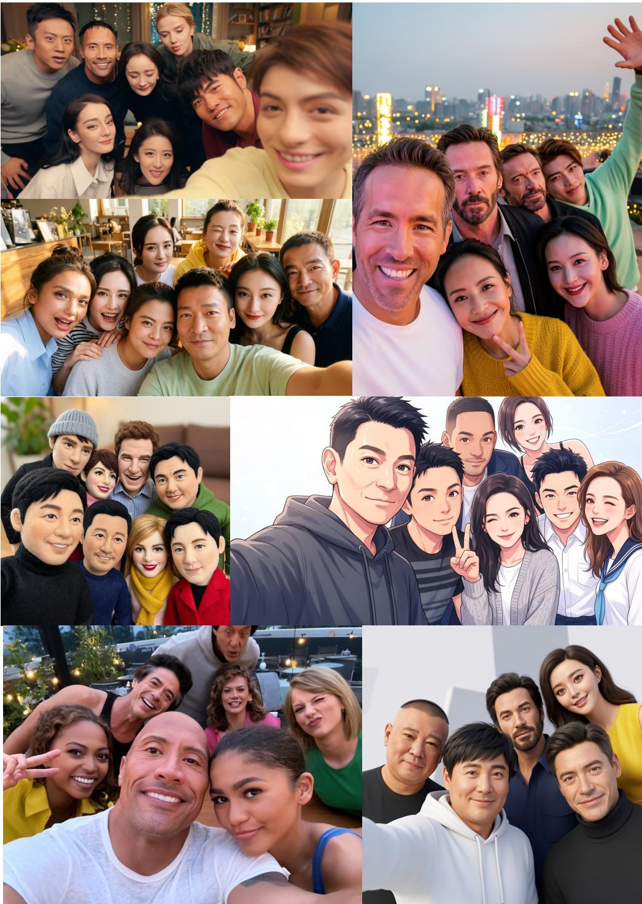  
Figure 10: Additional group images generated by WithEveryone.

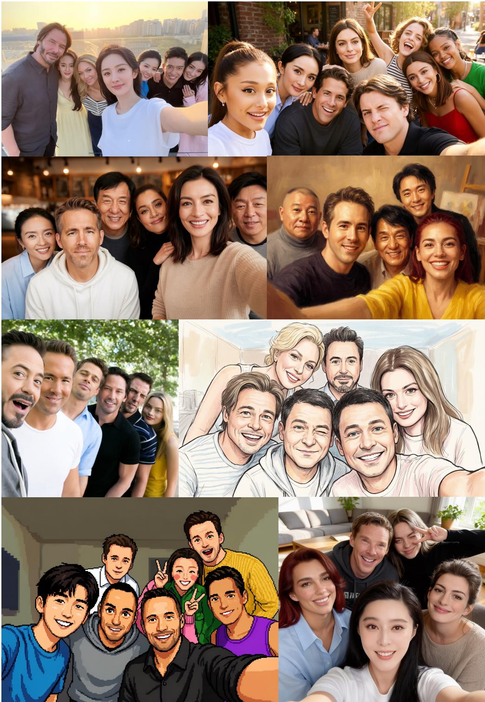  
Figure 11: Additional group images generated by WithEveryone.

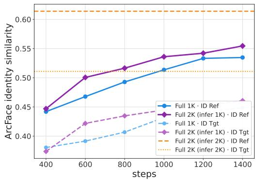  
(a) Identity similarity during training.

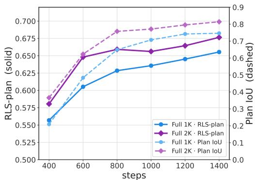  
(b) Planning quality and plan execution.  
Figure 12: High-resolution training. We compare the Full model trained at 1K and 2K while evaluating both at 1K. The horizontal references in (a) show the final 2K benchmark scores from a different evaluation pipeline.

Table 4: High-resolution comparison. The first two rows use the same internal pipeline; the last row uses the main 2K benchmark pipeline.
<table><tr><td>Train / test</td><td>Sim(Ref) ↑</td><td>Sim(Tgt) ↑</td><td>Layout*↑</td><td>Plan IoU ↑</td></tr><tr><td>1K/1K</td><td>0.546</td><td>0.460</td><td>0.740</td><td>0.773</td></tr><tr><td>2K/1K</td><td>0.555</td><td>0.461</td><td>0.759</td><td>0.814</td></tr><tr><td>2K/2K†</td><td>0.614</td><td>0.511</td><td></td><td></td></tr></table>

∗Layout Score, defined in Appendix C.6. †Main benchmark pipeline; included as a contextual reference only.

WithEveryone is the strongest below 200 px, and its margin is largest on the smallest faces: between 112 and 150 px it reaches 0.611, against 0.561 for GPT-Image 2, 0.388 for Seedream 5.0 Pro, and 0.383 for Nano Banana 2. GPT-Image 2 overtakes WithEveryone only in the 200–260 px band, at 0.654 against 0.616, and only 8% of its faces fall there. Our advantage is therefore concentrated on small faces. This pattern is qualitatively consistent with GPT-Image 2’s higher Copy-Paste, although it does not establish copying as the cause of the difference.

The 1K curve is a reference point rather than a controlled ablation, since it differs from the 2K curve in the reference-image configuration as well as in resolution. It is nonetheless informative about resolution. At 1K, 61% of the faces are smaller than the 112 px input of the ArcFace encoder, against 3% at 2K, so much of the benefit of high-resolution training reported in Appendix B.3 amounts to moving faces out of that regime.

## B.3 HIGH-RESOLUTION TRAINING

Faces in a group image often occupy only a small fraction of the image. Increasing the target resolution therefore allocates more pixels to identity-critical facial regions and may also provide a denser spatial signal for executing the predicted layout. We study this effect by comparing the Full model trained at 1K with the Full model trained at 2K. For a controlled comparison, both models are first evaluated at 1K. We additionally report the final 2K benchmark result to show the operating point used in the main comparison.

Under the controlled 1K evaluation, 2K training improves Sim(Ref) from 0.546 to 0.555 and does not reduce Sim(Tgt) or Layout Score. Its largest gain is in Plan IoU, which rises from 0.773 to 0.814. Figure 12b further shows that the 2K model reaches stronger planning and execution scores throughout the later stage of training. These results indicate that high-resolution training mainly improves how faithfully image generation realizes the spatial plan, while providing a smaller identity benefit at a fixed inference resolution. When the 2K model is evaluated at its native resolution in the main benchmark, it reaches 0.614 Sim(Ref) and 0.511 Sim(Tgt); because that benchmark uses a different scoring pipeline, these values should not be interpreted as a controlled estimate of the gain from changing inference resolution alone.

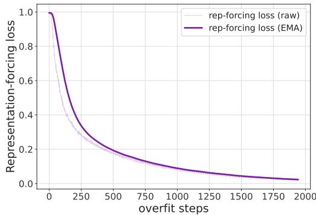  
(a) Representation Forcing training loss.

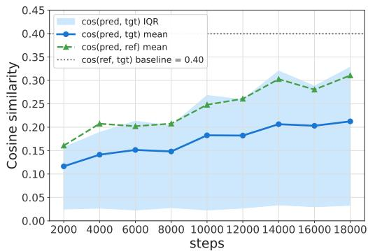  
(b) Inference-time representation alignment.  
Figure 13: Representation Forcing convergence. The supervised identity prediction is steadily optimized during training and becomes increasingly aligned with both the target and reference identity embeddings.

## B.4 REPRESENTATION FORCING CONVERGENCE

Representation Forcing is designed to make the shared context retrieve identity information before image generation. Figure 13a shows that its training objective can be optimized smoothly: the loss decreases from approximately 1.0 to 0.02.

We further evaluate the predicted representation directly at inference time. As shown in Figure 13b, the mean cosine similarity between the prediction and target identity embedding increases monotonically from 0.116 at 200 steps to 0.212 at 1800 steps. Its similarity to the reference identity follows the same trend. Both remain below the reference–target baseline of approximately 0.40, so the prediction does not fully reconstruct the target identity embedding. The result supports the narrower conclusion that Representation Forcing progressively aligns the prediction with the intended identity direction, consistent with improved identity addressability.

## B.5 LG-ID LOSS: ALGORITHM AND HYPER-PARAMETERS

## B.5.1 ONE-STEP IDENTITY SUPERVISION

The LG-ID Loss augments the image flow-matching objective with identity supervision on a differentiable clean-image estimate. Given a noisy latent $\mathbf { x } _ { t }$ and predicted velocity $\mathbf { v } _ { \theta } ( \mathbf { x } _ { t } , t )$ , we first compute

$$
\begin{array} { r } { \hat { \mathbf { x } } _ { \mathrm { c l e a n } } = \mathbf { x } _ { t } - t \mathbf { v } _ { \theta } ( \mathbf { x } _ { t } , t ) , } \end{array}\tag{4}
$$

decode $\hat { \mathbf { x } } _ { \mathrm { c l e a n } }$ with the VAE, and compare the resulting faces with their target identities using a frozen ArcFace encoder. Figure 14 summarizes the one-step prediction and visualizes its output at different sampled timesteps.

For multi-person supervision, we avoid reordering identities with an embedding-based matching heuristic. We detect faces in the ground-truth image and match each detection to its dataset bounding box by IoU; unmatched bystanders with match=-1 are ignored. The same ground-truth landmark then determine corresponding crops in the predicted and target images. The LG-ID Loss is the mean per-face cosine distance, $1 - \mathrm { c o s } ( \mathbf { e } ^ { \mathrm { p r e d } } , \mathbf { e } ^ { \mathrm { t } } \mathrm { \bar { g } t ) }$ ), over valid referenced identities.

## B.5.2 TIMESTEP THRESHOLD

At high-noise timesteps, the one-step estimate may not contain a recognizable face, making identity supervision unreliable. As shown in Figure 14, the estimated clean image retains clear identity cues up to $t = 0 . 8 5$ , whereas facial details degrade rapidly at larger timesteps. We therefore set the hard timestep threshold to 0.85 and compute the LG-ID Loss only when $t \leq 0 . 8 5$

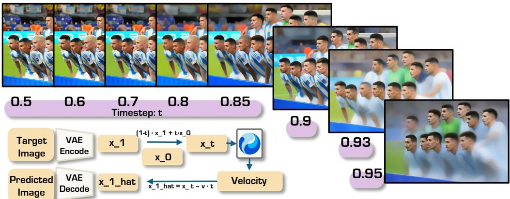  
Figure 14: Training-time one-step prediction and its outputs under different sampled timesteps. We use $t \stackrel { - } { = } 0 . 8 5$ as the timestep threshold and compute the LG-ID Loss only when $t \leq 0 . 8 5$

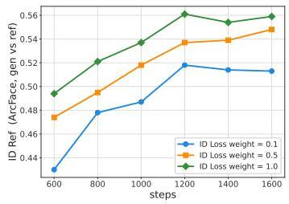  
(a) Identity preservation.

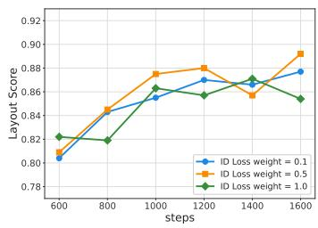  
(b) Layout Score.

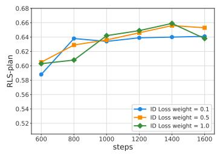  
(c) RLS.  
Figure 15: LG-ID Loss weight ablation. Increasing λID substantially improves Sim(Ref), whereas Layout Score and RLS remain in the same range without a stable ordering across weights.

## B.5.3 LOSS WEIGHT

We vary only the LG-ID Loss weight while keeping the remaining Full-model recipe fixed. As shown in Figure 15a, a larger weight consistently improves identity preservation at both training steps: Sim(Ref) at 1200 steps is 0.518, 0.537, and 0.561 for $\lambda _ { \mathrm { I D } } = 0 . 1 , 0 . 5$ , and 1.0, respectively; at 1600 steps, the corresponding values are 0.513, 0.548, and 0.559. The main experiments use $\lambda _ { \mathrm { I D } } = 0 . 5$ and this ablation shows that identity preservation can be pushed further by raising the weight.

The gain in identity does not produce a corresponding degradation in planning. Figures 15b and 15c show tightly overlapping trajectories across the three weights for the two composite layout measures, the Layout Score of Appendix C.6 and the Relative Layout Score (RLS) of Appendix C.7: Layout Score remains within approximately 0.80–0.89, and RLS within approximately 0.59–0.66. Larger identity weights can slow early layout improvement slightly, but the difference disappears later in training. Within the tested range, increasing λID therefore primarily affects identity preservation and has no visible cost in converged layout quality.

## B.6 EFFECT OF THE LG-ID LOSS

Table 5 expands the main-paper ablation of the LG-ID Loss with the complete set of identity and layout measures, including the Layout Score defined in Appendix C.6. The loss alone raises Sim(Ref) from 0.339 to 0.506 and Sim(Tgt) from 0.304 to 0.435. At the same time, Layout Score increases slightly from 0.690 to 0.700, Count from 0.771 to 0.845, and Coverage from 0.741 to 0.947. Direct identity supervision therefore does not trade layout validity for identity similarity. Because each identity is supervised inside its annotated region, the loss is reduced by putting the right person in the right place, so it carries a spatial signal in addition to an identity one.

Table 5: Effect of the LG-ID Loss. It gives the largest individual identity gain while preserving or improving all reported layout measures.
<table><tr><td>Variant</td><td>Sim(Ref) ↑</td><td>Sim(Tgt) ↑</td><td>Layout ↑</td><td>Count ↑</td><td>Coverage ↑</td></tr><tr><td>Default</td><td>0.339</td><td>0.304</td><td>0.690</td><td>0.771</td><td>0.741</td></tr><tr><td>+ ID Loss</td><td>0.506</td><td>0.435</td><td>0.700</td><td>0.845</td><td>0.947</td></tr><tr><td>Full</td><td>0.555</td><td>0.461</td><td>0.759</td><td>0.869</td><td>0.960</td></tr></table>

The complete configuration combines the LG-ID Loss with ID tokens, Representation Forcing, Layout CoT, and additional text-to-layout supervision, raising Sim(Ref) and Sim(Tgt) to 0.555 and 0.461, respectively, while reaching a Layout Score of 0.759. This result improves over the LG-ID-only branch, but because several components and the training corpus change together, the comparison does not isolate the source of the additional gain.

## C EXPERIMENTAL DETAILS

## C.1 TRAINING SEQUENCE AND DATA CONSTRUCTION

The causal training sequence is organized as follows: 1) reference images and the prompt; 2) referenceidentity selection and ID loading; 3) face layout and identity binding, followed by body-region and pose planning; 4) rendering the plan into a visual layout condition; 5) a summary and detailed recaption; 6) target identity representation prediction; and 7) target image generation. Stage 5 restates the request after the plan has been committed, giving the generator a next-token-supervised language description that is already consistent with the rendered canvas instead of only the short user prompt.

Each group-image training sample contains a target image, reference images, and reference-to-target identity correspondences, with short captions as user prompts and detailed captions as recaptions. Face detection and ArcFace provide reference and target identity embeddings, while person detection and pose estimation by YOLOv11 (Ultralytics, 2024) provide person regions and keypoints. Together with the captions and correspondences, these signals supervise the structured reasoning stages and let the renderer produce the layout condition. We additionally use text-to-layout examples to supervise layout reasoning without a target image, strengthening planning independently of full image-generation samples.

## C.2 TRAINING CONFIGURATION

WithEveryone uses a mixture-of-transformers backbone with 60B parameters on the understanding side and 60B parameters on the generation side, initialized from HunyuanImage 3.5-preview, an internal successor of HunyuanImage 3 (Cao et al., 2025). Training uses 400K in-house group-image samples; Figure 4 reports the identity-occurrence and reference-count statistics of this corpus. We optimize with Muon (Liu et al., 2025a) at a learning rate of $1 \times 1 0 ^ { - 5 }$ on the generation side and $3 ^ { \cdot } \times 1 0 ^ { - 6 }$ on the understanding side, with a packed sequence length of 72K tokens. Training runs on 128 H20 GPUs, and all reported models are taken from 1600 iterations. The objective weights are $\lambda _ { \mathrm { F M } } = 1 . 0 , \lambda _ { \mathrm { R F } } = 1 . 0$ , and $\lambda _ { \mathrm { I D } } = 0 . 5$

## C.3 SHARED EVALUATION PROTOCOL

All models are scored on the same 210 benchmark examples with the same detection, matching, and aggregation code; no example is excluded for any model. Each evaluation example contains one generated image, 5–10 reference identities, a target group image, and reference-to-target identity correspondences. Face detections and embeddings are computed independently for the generated, reference, and target images. For models with Layout CoT, we additionally parse face boxes, body boxes, pose keypoints, and identity–layout bindings from the generated plan. Body-level evaluation uses YOLO11x-pose with a confidence threshold of 0.25 and an input size of 640; if body detection is unavailable, only face-level terms are retained.

## C.4 IDENTITY METRICS

The main comparison follows the WithAnyone protocol and averages results from ArcFace, FaceNet, and AdaFace. For each backbone, generated faces are matched to reference or target faces by maximum-similarity Hungarian assignment. The resulting means define Sim(Ref) and Sim(Tgt), respectively. Copy-Paste, introduced by WithAnyone (Xu et al., 2025), compares each matched generated–target–reference triplet in angular embedding space:

$$
\mathrm { C o p y - P a s t e } = \frac { \theta _ { g t } - \theta _ { g r } } { \theta _ { t r } } ,\tag{5}
$$

where $\theta _ { a b } = \operatorname { a r c c o s } ( \cos ( \mathbf { e } _ { a } , \mathbf { e } _ { b } ) )$ . A larger value indicates that the generated face is closer to the reference than to its target-context appearance. The ablation Sim(Ref) and Sim(Tgt) metrics use the same generated-to-reference and generated-to-target semantics with a single ArcFace encoder.

## C.5 IMAGE AND TEXT SIMILARITY METRICS

CLIP-I and DINO-I are the cosine similarities between the generated and the target image in the CLIP (Radford et al., 2021) and DINOv2 (Oquab et al., 2023) image-embedding spaces, and CLIP-T is the cosine similarity between the generated image and the user prompt in the joint CLIP space. These three metrics describe overall scene and prompt agreement and are insensitive to which identity appears where, so we read them alongside the identity metrics above rather than on their own.

## C.6 LAYOUT SCORE

Layout Score measures the overall validity of the final generated image as a weighted aggregate of seven sub-scores in [0, 1]. If a component cannot be computed, it is omitted and the remaining weights are renormalized.

Count. Let N be the expected number of people in the target and M the number of detected generated faces. We compute

$$
S _ { \mathrm { c o u n t } } = 1 - \operatorname* { m i n } \left( 1 , \frac { | M - N | } { \operatorname* { m a x } ( 1 , N ) } \right) ,\tag{6}
$$

so both missing and extra people are penalized relative to the target group size.

Coverage, uniqueness, and distinctness. We construct the cosine-similarity matrix between reference and generated faces. Maximum-similarity Hungarian assignment determines one-to-one matches, and a reference is covered when its matched similarity is at least 0.20; $S _ { \mathrm { c o v e r } }$ is the fraction of covered references. For uniqueness, a reference is marked as over-claimed if more than one generated face has similarity at least 0.20 to it, and $S _ { \mathrm { u n i q } }$ is one minus the over-claimed-reference rate. Distinctness captures the opposite collision: each reference independently selects its most similar generated face, and $S _ { \mathrm { d i s t i n c t } }$ is one minus the fraction of references whose best face is also selected by another identity. The Dup column of Table 1 reports this distinctness collision rate, $1 - S _ { \mathrm { d i s t i n c t } } .$

Sensitivity to the matching threshold. The 0.20 similarity threshold is permissive by design, so that a reference counts as covered whenever the generated person is recognizably the intended one. Coverage is nevertheless insensitive to it: for P7, raising the threshold to 0.25, 0.30, and 0.35 lowers Coverage by 0.010, 0.017, and 0.027, and lowering it to 0.15 raises Coverage by 0.012. Only 3.6% of references have a matched similarity in [0.15, 0.30), against a median matched similarity of 0.554, so few decisions sit near the boundary.

Anonymous leakage and spatial validity. Generated faces that are not valid Hungarian matches are treated as anonymous. An anonymous face is counted as identity leakage if its similarity to any reference is at least $0 . 2 5 ; S _ { \mathrm { n o l e a k } }$ is one minus the leaked-anonymous-face rate. Spatial validity is computed from pairwise overlaps. Face IoU above 0.30 and body IoU above 0.50 are treated as severe overlaps. When both detections are available, $S _ { \mathrm { s p a t i a l } }$ is one minus the mean of the face- and body-overlap rates; otherwise, only the face-overlap rate is used.

Plan adherence. We match generated face boxes to the available layout boxes and average the matched IoUs. Ground-truth boxes are used when a ground-truth layout is available; otherwise, boxes parsed from the model’s CoT plan are used. This mean IoU defines $S _ { \mathrm { p l a n } }$

## C.7 RELATIVE LAYOUT SCORE AND PLAN IOU

The Relative Layout Score (RLS), adopted from “R-spatial” in T2i-R1 Jiang et al. (2026), evaluates the relative configuration of the model’s textual plan against the ground-truth layout, without using the generated image. It combines relative count, position, and size, all in [0, 1] and higher-is-better.

Person matching. Planned and ground-truth people with the same reference identity are matched directly. Remaining people are represented by face centers, or body centers when faces are unavailable. The centers in each layout are centered and normalized by their root-mean-square spread before Hungarian geometric matching, preventing global translation or scale from dominating correspondence.

Relative count. Face and body counts are scored independently with the same normalized cardinality rule as $S _ { \mathrm { c o u n t } }$ above, using planned and ground-truth counts. The available face- and body-count scores are then averaged into $S _ { \mathrm { c o u n t } } ^ { \mathrm { r e l } }$

Relative position. For every pair of matched people, we check whether their left–right and top– bottom ordering agrees between the plan and ground truth, giving the two order-consistency terms $S _ { \mathrm { o r d e r } - x }$ and $S _ { \mathrm { o r d e r } - y }$ . We additionally align planned centers to ground-truth centers with a nonreflective Umeyama similarity transform and convert the normalized residual distances into an OKS-style soft alignment score $S _ { \mathrm { a l i g n } }$ . A fitted-scale penalty prevents a collapsed layout from receiving a high score merely because Procrustes alignment can enlarge it. The order-consistency and aligned-center scores jointly define the position term,

$$
S _ { \mathrm { o r d e r } } = 0 . 6 S _ { \mathrm { o r d e r } - x } + 0 . 4 S _ { \mathrm { o r d e r } - y } , \qquad S _ { \mathrm { p o s } } ^ { \mathrm { r e l } } = 0 . 6 S _ { \mathrm { o r d e r } } + 0 . 4 S _ { \mathrm { a l i g n } } ,\tag{7}
$$

where the horizontal ordering receives the larger of the two order weights.

Relative and absolute size. For each matched face or body box, its area is divided by the mean matched-box area in the same layout. The clipped absolute log-ratio between planned and groundtruth normalized areas measures relative-size agreement. We also compare the mean absolute face area between the two layouts to retain a penalty when every planned person is uniformly too large or too small. The available face, body, and absolute-size scores are averaged into $S _ { \mathrm { s i z e } } ^ { \mathrm { r e l } }$

Aggregation. The three terms are combined as

$$
\mathrm { R L S } = 0 . 2 0 S _ { \mathrm { c o u n t } } ^ { \mathrm { r e l } } + 0 . 4 5 S _ { \mathrm { p o s } } ^ { \mathrm { r e l } } + 0 . 3 5 S _ { \mathrm { s i z e } } ^ { \mathrm { r e l } } .\tag{8}
$$

Because the position term is measured after similarity alignment and the size term is normalized within each layout, RLS is insensitive to a global translation, rotation, or scaling of the whole plan and instead scores the arrangement of people relative to one another. It does not penalize the person overlap that is normal in a group photograph, and it is not an absolute bounding-box IoU.

Plan IoU instead evaluates the generation side. Planned face boxes are matched to detected faces in the generated image, and the mean matched IoU is reported. When ground-truth layout is directly provided as the generation condition, the same computation uses ground-truth boxes. Thus, RLS measures whether the understanding side proposes an appropriate relative layout, whereas Plan IoU measures whether image generation executes the supplied plan, and Layout Score measures the validity of the final image, of which plan adherence is only one weighted sub-score.

## D EXTENDED BACKGROUND

Generative backbones. Text-to-image generation was established by denoising diffusion models (Ho et al., 2020) built on convolutional U-Net denoisers (Ronneberger et al., 2015) and moved into a latent space to make high-resolution synthesis tractable (Rombach et al., 2022). Later systems replaced the convolutional denoiser with transformer architectures (Vaswani et al., 2017; Peebles & Xie, 2023) and the discrete noise schedule with flow matching (Lipman et al., 2022), the recipe followed by current open-weight models (Labs, 2024; 2025b; Batifol et al., 2025). Transformer backbones are permutation-equivariant over their token sequence up to positional encoding (Xu et al., 2024), which is what lets heterogeneous conditions such as reference images, ID tokens, and layout tokens be interleaved in a single sequence. Our generation side inherits this design, but its conditioning signals are produced by the understanding side of the same model rather than by an external encoder. Contrastively pre-trained image–text encoders (Radford et al., 2021; Zhai et al., 2023) remain the standard source of semantic image features and of the CLIP-based metrics reported in Section 4.

Reference-conditioned and identity-preserving generation. Before unified models, reference conditioning was usually attached to a frozen generator: adapters inject reference features through additional cross-attention (Ye et al., 2023), and side networks inject spatial conditions (Zhang et al., 2023). Face-specific variants specialize this recipe to identity (Papantoniou et al., 2024; Peng et al., 2024), and attention routing extends it from one subject to several (Wang et al., 2024a; Guo et al., 2025). A parallel line folds these tasks into a single model that generates and edits from interleaved inputs (Xiao et al., 2024; Liu et al., 2025b; Wu et al., 2025d;c). Our setting differs in scale rather than in conditioning mechanism: with five to ten identities in one image, the limiting factor becomes how each identity is supervised and addressed, not how reference features enter the network.

Planning and representation objectives. Layout planning has also been delegated to a language model that converts the prompt into a layout for a separate diffusion renderer (Lian et al., 2023), whereas we keep planning inside the same generative context so that the plan and the image share one state (Section 3.2). Supervising an intermediate prediction against a target representation is a long-standing idea in representation learning (Oord et al., 2018), which Section 3 specializes to one supervised prediction per reference identity rather than a single global representation.

## E LIMITATIONS, FUTURE WORK, AND RESPONSIBLE USE

Layout is hard to evaluate. We evaluate layout from two perspectives: whether the faces are correctly planned, and whether the plan follows the relative location relationships of the ground truth, for example whether the person on the left remains on the left. When the prompt is underspecified, however, which is common in real-world use, many layouts may be equally valid and layout quality becomes difficult to measure against a single reference. We leave this to future work.

Evaluation scope. Our conclusions are drawn from 210 examples on a single benchmark, and the groups with more references are the smallest, so per-group numbers should be read as a trend rather than as precise estimates. All identity measures inherit the behaviour of the underlying face detectors and recognizers, whose accuracy is known to vary across demographic groups, and the compared systems differ in their maximum output resolution and in whether they can plan a layout on their own.

Data and responsible use. Training uses in-house group images collected under CC-BY-compatible licences, but identity-conditioned generation carries risks that a licence does not address: images of real people can be produced without their consent, used to place someone in a scene they never took part in, or used to impersonate them. The same identity supervision that improves fidelity also increases these risks, so deployments should require consent for the referenced people and pair generation with provenance signalling.