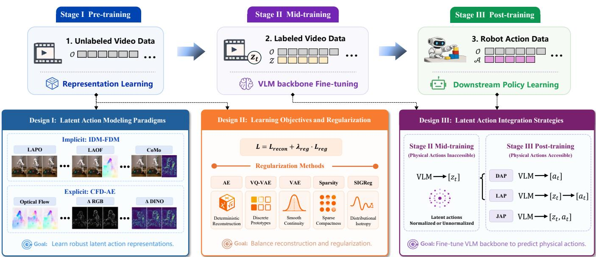
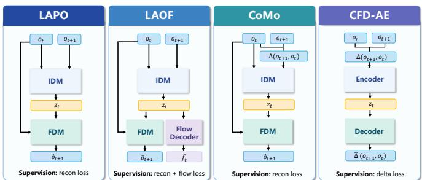
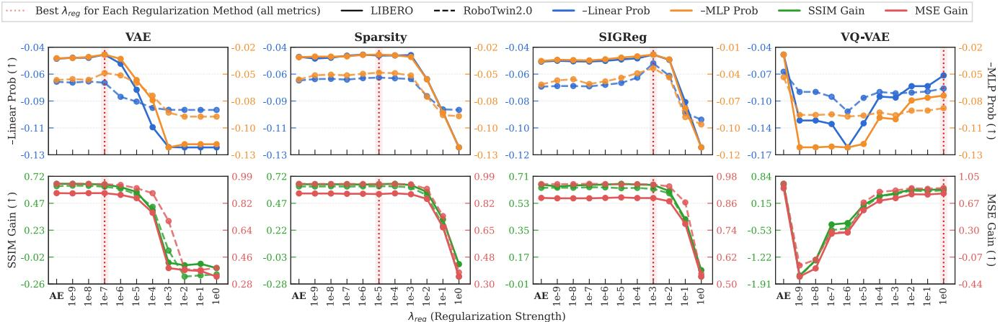
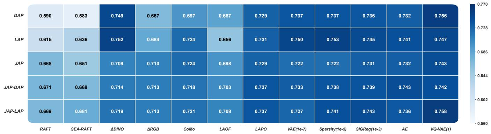
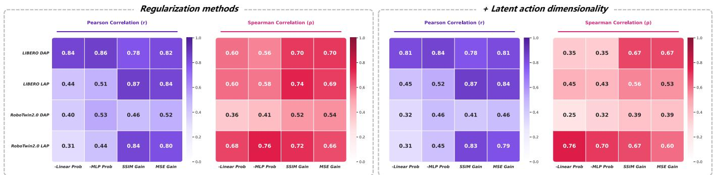
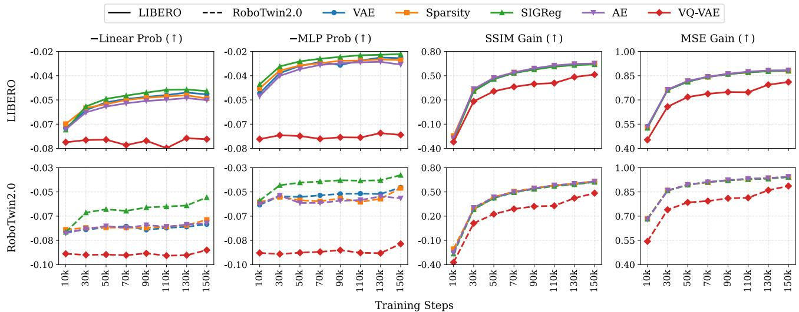
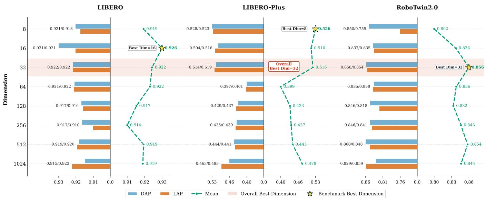
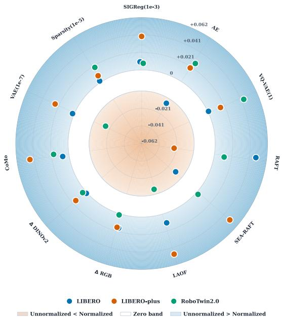
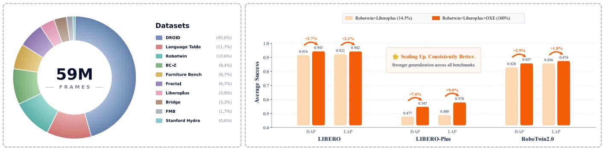
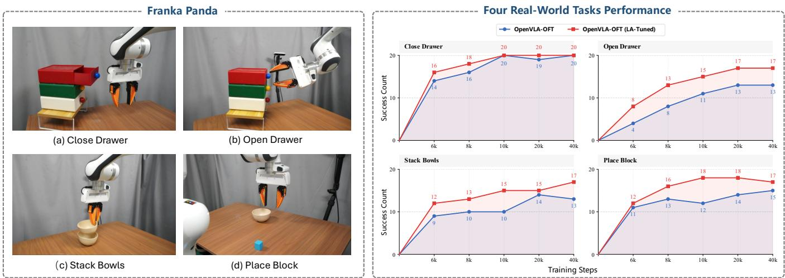

# What Matters for Latent Actions in Robot Learning

Xizhou Bu∗, Qingda Hu∗, Lei Zhou∗, Lingfeng Zhang, Yingbo Tang, Zihao Liu, Xinyi Tao, Zhiqiang Ma, Qingqiu Huang, Chufeng Tang, Hongbo Wang, Jing Zhang, Jiayi Ma, Hangjun Ye, Wei Li†, Xiaoshuai Hao†

Abstract—Latent Action Models (LAMs) have emerged as a promising paradigm for enabling robot learning to leverage large-scale unlabeled videos through latent actions that serve as compact surrogates for physical actions. Despite rapid progress, research on LAM remains highly fragmented, with existing methods evaluating different design choices in isolation under inconsistent experimental settings, making it difficult to identify the factors that truly determine downstream robotic manipulation performance. In this work, we present the first comprehensive empirical study of latent action learning for robotic manipulation. We unify representative LAM methods within a common autoencoding framework and systematically investigate 41 LAM design choices across three dimensions, including latent action modeling paradigms, learning objectives and regularization methods, and latent action integration strategies. We further examine four proxy metrics for evaluating latent action quality and assess their ability to reliably predict downstream robotic manipulation performance. Extensive experiments on three widely used benchmarks provide strong empirical evidence that fine-tuning visionlanguage model (VLM) backbones with latent actions provides a stronger initialization for downstream policy learning, with further validation on real-world robot manipulation tasks. Our project page is available at LAM.github.io.

Index Terms—Latent Action Models, Representation Learning, Embodied Foundation Models.

## I. INTRODUCTION

CTIONS drive the transition dynamics of the physical world, yet action modeling fundamentally relies on large  
scale robot action data [1]–[3]. Unfortunately, collecting such   
data remains prohibitively costly and difficult, limiting the   
development of scalable action representations. Although em  
bodied foundation models have advanced rapidly in recent   
years, much of this progress has been inherited from advances

in adjacent foundation model paradigms rather than from corresponding advances in action modeling. In particular, visionlanguage-action (VLA) models [4]–[6] have inherited advances in vision-language models (VLM) [7]–[9], while world action models (WAM) [10]–[12] have similarly benefited from recent progress in video generation models (VGM) [13]–[15]. These foundation models are enabled by web-scale image-text and video corpora, whose scale and diversity exceed those of available robot action data by several orders of magnitude. Consequently, current embodied foundation models [12], [16] are typically initialized from large-scale pretrained VLM or VGM and subsequently adapted to robotic manipulation using comparatively limited robot action data [17]–[19]. Despite recent efforts have explored leveraging egocentric human videos [20]–[22] and low-cost teleoperation systems such as universal manipulation interface (UMI) [23]–[25] to scale data collection, the scarcity of large-scale, high-quality robot action data remains unresolved. This imbalance between abundant perceptual data and scarce robot action data fundamentally limits the scalability of embodied foundation models and hinders the emergence of scaling behavior analogous to that observed in large language models [26].

A natural way to overcome this bottleneck is to exploit large-scale unlabeled videos to train latent action models (LAM), which extract compact latent actions that serve as surrogates for physical actions [27]–[29]. A representative framework is LAPO [28], which learns latent action representations through a self-supervised autoencoding framework consisting of an inverse dynamics model and a forward dynamics model. Specifically, the inverse dynamics model encodes consecutive frames into a low-dimensional latent action that captures the transition dynamics, while the forward dynamics model predicts the future frame from the current frame conditioned on the inferred latent action. This paradigm enables scalable learning from abundant unlabeled video and has demonstrated promising performance in both VLA [30]–[32] and WAM [10]. However, current research on LAM remains fragmented and lacks a coherent empirical understanding. Existing methods vary substantially in how latent action representations are learned from consecutive frames [10], [29], [33], [34], how they are regularized [31], [35]–[37], and how latent actions are integrated into physical action prediction [38]–[40]. Moreover, these design choices are typically proposed in isolation and evaluated under inconsistent experimental settings, making it unclear which factors fundamentally affect latent action learning and which merely have incidental effects. Another major obstacle is the lack of a reliable protocol for evaluating latent action quality. While downstream robotic manipulation performance provides the most faithful evaluation of latent action quality, obtaining such measurements requires completing the full three-stage training pipeline, as illustrated in Fig. 1, making iterative LAM development prohibitively expensive. As a result, prior work has relied on proxy metrics, most by training a lightweight multi-layer perceptron (MLP) probe during the pre-training stage to decode latent actions into physical actions and using the prediction error as a proxy for latent action quality [28], [33], [34], [41]. Yet, the validity of this proxy metric remains largely unverified, and whether it reliably predicts downstream robotic manipulation performance remains unclear.

In this work, we conduct a systematic empirical study of LAM design choices across three dimensions, including latent action modeling paradigms, learning objectives and regularization methods, and latent action integration strategies. Specifically, we investigate 41 design choices across the LIBERO, LIBERO-Plus, and RoboTwin2.0 benchmarks, with further validation on real-world robotic manipulation tasks using a Franka Panda robot. We further evaluate four proxy metrics for latent action quality, analyze their correlation with downstream robotic manipulation performance, and investigate the scaling behavior of VLM backbone fine-tuning with latent actions for downstream policy learning. Our contributions are summarized as follows:

(1) We show that the original LAPO method remains a remarkably strong baseline when trained directly on raw data, while simple semantic feature differencing using off-the-shelf visual encoders is also sufficient to yield competitive latent action representations.

(2) We identify effective hyperparameter settings for different regularization methods, showing that properly tuned methods achieve comparable downstream performance. We further evaluate five latent action integration strategies and derive practical guidelines for effectively incorporating latent actions into physical action prediction.

(3) We show that a latent action dimensionality of 32 consistently achieves the best overall performance across both 7-DoF single-arm and 14-DoF dual-arm robot platforms. Additional latent action normalization is unnecessary when appropriate pretraining regularization is applied.

(4) We find that FDM reconstruction metrics provide more reliable proxy measures of latent action quality than metrics derived from additionally trained probes. These proxy metrics are more suitable for coarse-grained model selection than for fine-grained ranking and are insufficient for reliably identifying the best-performing model.

(5) We demonstrate through both simulation and realworld experiments that fine-tuning VLM backbones with latent actions provides stronger initialization for downstream policy learning. Scaling up latent action pretraining consistently improves downstream robotic manipulation performance across diverse benchmarks.

## II. RELATED WORK

## A. Latent Action Learning from Consecutive Frames

The first design dimension we investigate is latent action modeling paradigms, which differ in how latent action representations are learned from consecutive frames without relying on robot action data. Different methods exploit different sources of motion signals, ranging from semantic feature differences [29] and optical flow [10] to implicitly learned transition dynamics [28], [33], [34]. However, it remains unclear which method is most effective for learning highquality latent action representations that support downstream policy learning. Existing methods can be broadly categorized into two paradigms. The first paradigm models implicit transition dynamics through jointly learned inverse and forward dynamics models (IDM-FDM) under a self-supervised autoencoding framework [28]. Building on this, LAOF [33] introduces optical flow as an additional supervision signal during latent action learning to improve robustness to environmental distractors, while CoMo [34] mitigates shortcut learning, where the IDM directly encodes future-frame information, by replacing the future-frame input with the difference between consecutive frames. Several subsequent methods [42]–[44] further incorporate physical actions or robot states to inject robot control priors into latent action representations, leading to improved downstream robotic manipulation performance. Nevertheless, existing robot datasets remain highly heterogeneous, as different robot platforms employ different control interfaces, action space definitions, and control dimensionalities. To avoid these embodiment-specific confounding factors and focus on the intrinsic properties of latent action learning, we adopt a video-only learning setting throughout this stage. The second paradigm, which we refer to as consecutive-frame differences autoencoding (CFD-AE), explicitly learns latent action representations using predefined motion signals. For example, StaMo [29] computes semantic feature differences using an off-the-shelf visual encoder such as DINOv2 [45], whereas Motus [10] directly extracts dense optical flow. To enable a fair comparison with implicit IDM-FDM methods, we uniformly transform both semantic feature differences and optical flow into latent actions through a unified autoencoding pipeline, thereby aligning the latent action dimensionality while eliminating architectural differences across methods.

## B. Regularization in Latent Action Learning

The regularization of latent actions is another key design dimension in latent action learning. In the standard IDM-FDM framework, the IDM infers a latent action from a pair of consecutive frames, while the FDM predicts the future frame conditioned on the current frame and the inferred latent action. This framework introduces a causal leakage issue, as the IDM has direct access to the target future frame during self-supervised training, potentially leading to shortcut learning. As a result, the inferred latent actions may encode excessive future frame information rather than the underlying transition dynamics, or even degenerate into a direct feature of the future frame itself [34]. A common strategy to mitigate this issue is to introduce an information bottleneck into the latent action representations. Early methods primarily adopt discretization through VQ-VAE [46], which has been widely used in latent action learning [28], [30]–[32], [40], [42], [47]– [54]. By learning a finite set of discrete prototypes, VQ-VAE effectively constrains the information capacity of latent action representations. This design was originally motivated by relatively simple discrete-control domains, such as pixelbased games [28], [47], where physical actions can be naturally represented as discrete tokens. For robotic manipulation involving complex continuous control, recent works have increasingly adopted continuous latent action representations based on VAE [55], which provide greater flexibility and smoother transitions [10], [33]–[35], [38], [43], [44], [56]. In this setting, latent action representations are regularized by matching their distribution to a Gaussian distribution through a Kullback-Leibler (KL) divergence [57] objective. Other regularization objectives have also been proposed to improve the statistical properties of latent action representations and mitigate representation collapse. For example, Sparsity [37] introduces a more sophisticated regularization objective that encourages sparse and compact representations. In contrast, LeWorldModel [36] employs the Sketched-Isotropic-Gaussian Regularizer (SIGReg) [58], a simpler approach that promotes distributional isotropy by encouraging latent action representations to follow an isotropic Gaussian distribution. In this work, we systematically compare these regularization methods and investigate the effective ranges of their corresponding hyperparameter settings.

  
Fig. 1. Overview of design choices across three dimensions for latent action learning. Design I examines the impact of latent action modeling paradigms by comparing the implicit IDM-FDM framework with the explicit CFD-AE framework. Design II investigates how different regularization methods and their regularization strengths shape latent action representations and affect downstream policy learning. Design III evaluates the necessity of latent action normalization and investigates different strategies for integrating latent actions into physical action prediction. Stage I is trained on unlabeled video data consisting only of image frames, Stage II uses labeled video data paired with latent actions, and Stage III uses robot action data paired with physical actions Further details of the three design studies and the three-stage training pipeline are provided in Section IV and Section III-B, respectively.

## III. PROBLEM FORMULATION

## A. Problem Setting

We consider a sequential decision-making setting in which, at each time step t, an agent receives a current frame $o _ { t } \in \mathcal { O }$ executes a physical action $a _ { t } \in \ A .$ , and transitions to the future frame $o _ { t + 1 }$ , where O denotes the observation space and $\mathcal { A } \subseteq \mathbb { R } ^ { d _ { a } }$ denotes the physical action space of dimension $d _ { a }$ . Latent action learning aims to learn a latent action representation $z _ { t } ~ \in ~ \mathcal { Z }$ from consecutive frames that captures the underlying transition dynamics, where $\mathcal { Z } \subseteq \mathbb { R } ^ { d _ { z } }$ denotes the latent action space of dimension $d _ { z }$ . Existing methods can be broadly categorized into the implicit IDM-FDM framework, which learns latent action representations directly from consecutive frames, and the explicit CFD-AE framework, which learns latent action representations from predefined differences derived from consecutive frames. To provide a unified formulation, we denote the consecutiveframe differences by $\Delta _ { t } = \Delta ( o _ { t + 1 } , o _ { t } )$ , where $\Delta ( \cdot , \cdot )$ denotes a function that extracts differences from consecutive frames. Depending on the implementation, $\Delta _ { t }$ may correspond to pixel-wise differences (∆RGB), semantic feature differences (∆DINO), or optical flow. Under this formulation, a trajectory is represented as $\tau = \left( o _ { t } , a _ { t } , z _ { t } , o _ { t + 1 } , l \right) _ { t = 1 } ^ { T }$ , where l denotes the language instruction associated with the trajectory.

## B. Training Pipeline Setting

The overall framework consists of three stages: pre-training, mid-training, and post-training, corresponding to representation learning, VLM backbone fine-tuning, and downstream policy learning, respectively. Stage I (Pre-training). This stage aims to learn a high-quality LAM from consecutive frames $\left( o _ { t } , o _ { t + 1 } \right)$ to produce physically meaningful latent action representations that capture transition dynamics. Notably, it requires neither robot action data nor task-specific policy demonstrations, and can be trained entirely on largescale video data, including videos collected through random exploration or from the web. As the quality of latent actions fundamentally determines the representations learned in subsequent stages, we systematically investigate key design choices in latent action learning, including latent action modeling paradigms, regularization methods and its hyperparameter setting, and latent action dimensionality. Stage II (Mid-training). The pretrained inverse dynamics model is employed as a latent action annotator to automatically generate latent actions for semantically conditioned video data, yielding triplets $( o _ { t } , z _ { t } , l )$ . These latent actions are then used to finetune the VLM backbone, producing the embodied foundation model studied in this work. In this stage, we further analyze the effects of latent action normalization during fine-tuning and examine how the scale of latent action supervision influences the quality of the resulting VLM backbone and its effectiveness for robotic manipulation. Stage III (Post-training). The fine-tuned VLM backbone is subsequently optimized using a limited amount of robot action data $( o _ { t } , a _ { t } , l )$ for downstream policy learning. Finally, we compare different latent action integration strategies and evaluate their effectiveness in exploiting the representations learned through latent action supervision, as measured by downstream robotic manipulation performance. By default, physical actions are unavailable in Stages I and II and become available only in Stage III, as illustrated in Fig. 1. To further investigate the role of physical actions during VLM fine-tuning, we additionally consider two Stage-II settings: an Action Inaccessible setting, where the VLM backbone is fine-tuned using only latent actions, and an Action Accessible setting, where latent actions and physical actions are jointly used to fine-tune the VLM backbone.

## IV. METHODOLOGY

## A. Latent Action Modeling Paradigms

We consider a set of representative methods for latent action modeling, which can be broadly divided into two paradigms, as illustrated in Fig. 2. The first is the IDM-FDM framework, which implicitly learns latent action representations through jointly trained inverse and forward dynamics models, including LAPO [28] and its variants, LAOF [33] and CoMo [34]. The second is the CFD-AE framework, which explicitly learns latent action representations by autoencoding a consecutiveframe differences $\Delta _ { t } ~ = ~ \Delta ( o _ { t + 1 } , o _ { t } )$ . In this work, $\Delta _ { t }$ is instantiated as ∆RGB, ∆DINO, or optical flow. Specifically, ∆RGB and ∆DINO are computed as frame differences in pixel space and in the semantic feature space of DINOv2 [45], respectively, while optical flow is estimated using RAFT [59] or SEA-RAFT [60]. This setup allows us to assess whether semantic feature differences are more informative than raw pixel differences, and further examine the impact of optical flow quality. Notably, all methods share the same autoencoding pipeline, ensuring that they are evaluated under the same latent action dimensionality for a fair comparison.

a) LAPO [28]: It is the standard self-supervised IDM-FDM framework for latent action learning. Given consecutive frames $\left( o _ { t } , o _ { t + 1 } \right)$ , the IDM infers a latent action $z _ { t } ,$ and the FDM predicts the future frame conditioned on the current frame and the inferred latent action:

$$
z _ { t } = \mathrm { I D M } ( o _ { t } , o _ { t + 1 } ) , \quad \hat { o } _ { t + 1 } = \mathrm { F D M } ( o _ { t } , z _ { t } ) .\tag{1}
$$

  
Fig. 2. Comparison of different latent action modeling paradigms. LAPO, LAOF, and CoMo follow the IDM-FDM framework to implicitly learn latent action representations, whereas CFD-AE based methods explicitly learn latent action representations.

The two models are jointly optimized in a self-supervised manner using the future-frame reconstruction objective

$$
\mathcal { L } _ { \mathrm { L A P O } } = \mathcal { L } _ { \mathrm { r e c o n } } , \quad \mathcal { L } _ { \mathrm { r e c o n } } = \| o _ { t + 1 } - \hat { o } _ { t + 1 } \| _ { 2 } ^ { 2 } .\tag{2}
$$

By minimizing this objective, the inferred latent action is encouraged to capture the transition information necessary to explain how the current frame evolves into the future frame, without requiring ground-truth physical actions.

b) LAOF [33]: It extends the standard IDM-FDM framework by introducing optical flow as an auxiliary supervision signal for latent action learning. The motivation is that optical flow explicitly represents pixel-wise motion between consecutive frames, encouraging latent actions to focus on action-related dynamics rather than environmental distractors. Besides predicting the future frame with the FDM, LAOF also introduces a FlowDecoder to predict the target optical flow from the latent action:

$$
\hat { f } _ { t } = \mathrm { F l o w D e c o d e r } ( z _ { t } ) .\tag{3}
$$

The overall training objective combines future-frame reconstruction with optical-flow reconstruction

$$
\mathcal { L } _ { \mathrm { L A O F } } = \mathcal { L } _ { \mathrm { r e c o n } } + \mathcal { L } _ { \mathrm { f l o w } } , \quad \mathcal { L } _ { \mathrm { f l o w } } = \Vert f _ { t } - \hat { f } _ { t } \Vert _ { 2 } ^ { 2 } ,\tag{4}
$$

where $f _ { t }$ denotes the optical flow estimated from consecutive frames $\left( o _ { t } , o _ { t + 1 } \right)$ by an off-the-shelf optical flow estimator. In our experiments, we consider both RAFT [59] and SEA-RAFT [60] to assess the effect of optical flow quality.

c) CoMo [34]: It is designed to mitigate shortcut learning caused by the causal leakage issue in the standard IDM-FDM framework by replacing the future frame input with the consecutive-frame differences. Specifically, the IDM infers the latent action from the current frame and the consecutive-frame differences $\Delta _ { t }$ , while the FDM reconstructs the future frame from the current frame and the inferred latent action:

$$
z _ { t } = \mathrm { I D M } ( o _ { t } , \Delta _ { t } ) , \quad \hat { o } _ { t + 1 } = \mathrm { F D M } ( o _ { t } , z _ { t } ) .\tag{5}
$$

Following the original CoMo setting [34], we instantiate $\Delta _ { t }$ as ∆DINO. The training objective remains the standard futureframe reconstruction loss $\mathcal { L } _ { \mathrm { C o M o } } = \mathcal { L } _ { \mathrm { r e c o n } }$

d) CFD-AE: In contrast to the IDM-FDM framework, CFD-AE directly learns latent actions by compressing and

reconstructing the consecutive-frame differences $\Delta _ { t }$ , without modeling future-frame generation:

$$
z _ { t } = \mathrm { E n c o d e r } ( \Delta _ { t } ) , \quad \hat { \Delta } _ { t } = \mathrm { D e c o d e r } ( z _ { t } ) .\tag{6}
$$

The training objective is simply to reconstruct the input differences representation:

$$
\mathcal { L } _ { \mathrm { C F D - A E } } = \mathcal { L } _ { \mathrm { d e l t a } } , \quad \mathcal { L } _ { \mathrm { d e l t a } } = \Vert \Delta _ { t } - \hat { \Delta } _ { t } \Vert _ { 2 } ^ { 2 } .\tag{7}
$$

This formulation decouples latent action learning from futureframe synthesis, enabling a systematic comparison of different methods for modeling consecutive-frame differences within a unified autoencoding framework.

## B. Learning Objectives and Regularization

A systematic investigation of latent action learning requires understanding how different learning objectives and regularization methods shape latent action representations, as existing methods lead to substantial differences in the structure, compactness, and controllability of the learned representations. To provide a unified analysis, we consider several representative learning objectives and regularization methods, including AE [61], VAE [55], VQ-VAE [46], Sparsity [37], and SIGReg [58]. The overall optimization objective is formulated as

$$
\mathcal { L } = \mathcal { L } _ { \mathrm { m e t h o d } } + \lambda _ { \mathrm { r e g } } \mathcal { L } _ { \mathrm { r e g } }\tag{8}
$$

where $\mathcal { L } _ { \mathrm { m e t h o d } }$ denotes the learning objective defined by the latent action modeling method (e.g., LAPO, LAOF, CoMo, or CFD-AE), $\mathcal { L } _ { \mathrm { r e g } }$ denotes the latent action representation regularization term, and $\lambda _ { \mathrm { r e g } }$ is the regularization strength that controls the trade-off between reconstruction fidelity and latent representation regularity.

a) AE [61]: It serves as the simplest baseline, where the inverse dynamics model deterministically encodes the input into a latent action $z _ { t }$ without any explicit latent action regularization. The model is trained solely with the reconstruction objective ${ \mathcal { L } } _ { \mathrm { r e c o n } } .$

b) VQ-VAE [46]: It introduces a discrete latent action regularization on the latent action inferred by the inverse dynamics model. Specifically, the latent action $z _ { t }$ is quantized by assigning it to its nearest codebook embedding $e _ { k }$ . The corresponding vector-quantization regularization is defined as

$$
\mathcal { L } _ { \mathrm { r e g } } ^ { \mathrm { v Q } } = \| \mathrm { s g } [ z _ { t } ] - e _ { k } \| _ { 2 } ^ { 2 } + \beta _ { \mathrm { v q } } \| z _ { t } - \mathrm { s g } [ e _ { k } ] \| _ { 2 } ^ { 2 } ,\tag{9}
$$

where $\mathrm { s g } [ \cdot ]$ denotes the stop-gradient operator and $\beta _ { \mathrm { v q } }$ is the commitment weight. By constraining latent actions to a finite set of learnable codebook embeddings, VQ-VAE encourages compact, discrete, and reusable latent representations.

c) VAE [55]: It introduces a KL divergence regularization to constrain the conditional latent distribution pIDM $\left( z _ { t } \mid o _ { t } , o _ { t + 1 } \right)$ toward a predefined prior distribution. The corresponding regularization objective is

$$
\mathcal { L } _ { \mathrm { r e g } } ^ { \mathrm { V A E } } = D _ { \mathrm { K L } } \big ( p _ { \mathrm { I D M } } ( z _ { t } \mid o _ { t } , o _ { t + 1 } ) \mid \mid q ( z _ { t } ) \big ) ,\tag{10}
$$

where $q ( z _ { t } ) = \mathcal { N } ( 0 , I )$ denotes a standard Gaussian prior. By minimizing the KL divergence between the inferred latent distribution and the prior, VAE encourages a smooth, continuous, and well-structured latent space.

d) Sparsity [37]: Its regularization encourages each latent action to activate only a small subset of latent dimensions, resulting in more compact and interpretable latent representations. Following [37], we combine sample-level sparsity regularization with Variance-Covariance-Mean (VCM) regularization to avoid degenerate solutions. Given a minibatch of latent actions $Z \in \mathbb { R } ^ { \breve { N } \times d _ { z } }$ , where each row corresponds to a latent action $z _ { t }$ , the regularization objective is defined as

$$
\mathcal { L } _ { \mathrm { r e g } } ^ { \mathrm { S p a r s e } } = \mathcal { L } _ { \mathrm { V C M } } + \frac { 1 } { N } \sum _ { i = 1 } ^ { N } E ( Z _ { i } ) ,\tag{11}
$$

where

$$
\begin{array} { r } { E ( z _ { t } ) = \lambda _ { \ell _ { 2 } } \operatorname* { m a x } \Bigl ( \sqrt { d _ { z } } - \| z _ { t } \| _ { 2 } ^ { 2 } , 0 \Bigr ) + \lambda _ { \ell _ { 1 } } \| z _ { t } \| _ { 1 } . } \end{array}\tag{12}
$$

The VCM regularization is given by

$$
\begin{array} { r l } & { \mathcal { L } _ { \mathrm { V C M } } = \lambda _ { V } \displaystyle \frac { 1 } { d _ { z } } \sum _ { d = 1 } ^ { d _ { z } } \operatorname* { m a x } \Biggl ( 1 - \sqrt { \mathrm { V a r } ( Z _ { , d } ) } , 0 \Biggr ) } \\ & { \quad \quad \quad + \lambda _ { C } \displaystyle \frac { 1 } { d _ { z } ( d _ { z } - 1 ) } \sum _ { i \neq j } \mathrm { C o v } ( Z ) _ { i , j } ^ { 2 } } \\ & { \quad \quad \quad + \lambda _ { M } \displaystyle \frac { 1 } { N d _ { z } } \sum _ { i = 1 } ^ { N } \sum _ { j = 1 } ^ { d _ { z } } Z _ { i , j } . } \end{array}\tag{13}
$$

This regularization encourages sparse latent action representations while preserving sufficient variance, reducing redundancy across latent dimensions, and preventing representation collapse. In practice, we follow the regularization hyperparameter in [37] and use $\lambda _ { \ell _ { 1 } } = 0 . 0 1 , \lambda _ { \ell _ { 2 } } = 1 , \lambda _ { V } = 0 . 1$ $\lambda _ { C } = 0 . 0 0 1$ , and $\lambda _ { M } = 0 . 1$

e) SIGReg [58]: It introduces a statistical latent action representations regularization by encouraging the latent action distribution to match an isotropic Gaussian target distribution. Directly assessing normality in high-dimensional spaces is statistically challenging, as most classical normality tests are designed for univariate distributions. Following [58], SIGReg addresses this issue by projecting latent actions onto multiple random one-dimensional directions and matching the resulting projected distributions to a standard Gaussian. Given a minibatch of latent actions Z, SIGReg samples M random unit-norm directions $u ^ { ( m ) } \in \mathbb { S } ^ { d _ { z } - 1 }$ and computes the projected representations $h ^ { ( m ) } = Z u ^ { ( m ) }$ $m = 1 , \dots , M .$ The corresponding regularization term is defined as

$$
\mathcal { L } _ { \mathrm { r e g } } ^ { \mathrm { S I G R e g } } = \frac { 1 } { M } \sum _ { m = 1 } ^ { M } T \Bigl ( h ^ { ( m ) } \Bigr ) ,\tag{14}
$$

where $T ( \cdot )$ denotes the univariate Epps–Pulley statistic [62], which measures the discrepancy between each projected distribution and a standard Gaussian. By the Cramer-Wold theorem´ [63], matching sufficiently many one-dimensional projections is equivalent to matching the full joint distribution. Consequently, SIGReg encourages diverse, collapse-resistant latent action representations while regularizing their distribution toward an isotropic Gaussian.

TABLE I DESIGN CHOICES EXPLORED IN THIS WORK.
<table><tr><td>Design I</td><td>Design II</td><td>Design</td></tr><tr><td>●: IDM-FDM : CFD-AE)</td><td>: Discrete : Continues)</td><td>(●: Inaccessible : Accessible)</td></tr><tr><td>● LAPO [64]</td><td>● AE [61]</td><td>● DAP</td></tr><tr><td>● LAOF [33]</td><td>● VQVAE [46]</td><td>● LAP</td></tr><tr><td>● CoMo [34]</td><td>● VAE [55]</td><td>● JAP</td></tr><tr><td>● RAFT [59] / SEA-RAFT [60]</td><td>● Sparsity [37]</td><td> JAP-DAP</td></tr><tr><td>● ∆RGB / ∆DINO [45]</td><td>● SIGReg [58]</td><td> JAP-LAP</td></tr></table>

## C. Latent Action Integration Strategies

An important design choice is how to integrate latent actions into downstream physical action prediction. Although latent actions provide a compact surrogate for physical actions by capturing the transition dynamics between consecutive observations, existing methods integrate them into downstream policy learning in different ways. Given the VLM backbone $\mathrm { V L M } _ { \psi }$ fine-tuned with latent actions, the current observation $o _ { t }$ and language instruction l are first encoded into a high-level representation $h _ { t } = \mathrm { V L M } _ { \psi } ( o _ { t } , l )$ , which is then passed to an action head to predict the physical action $a _ { t } = \mathrm { A c t i o n H e a d } ( h _ { t } )$ , where $\psi$ denotes the parameters of the VLM backbone. We consider three representative physical action head architectures, namely direct action prediction (DAP), latent-to-action prediction (LAP), and joint latentaction prediction (JAP), which differ in whether latent actions are used only to fine-tune the VLM backbone, explicitly serve as an intermediate control representation, or are jointly predicted with physical actions. The corresponding latent action prediction loss $\mathcal { L } _ { \mathrm { l a t e n t } }$ and physical action prediction loss $\mathcal { L } _ { \mathrm { a c t } }$ are defined as

$$
\mathcal { L } _ { \mathrm { l a t e n t } } = \Vert z _ { t } - \hat { z } _ { t } \Vert _ { 2 } ^ { 2 } , \quad \mathcal { L } _ { \mathrm { a c t } } = \Vert a _ { t } - \hat { a } _ { t } \Vert _ { 2 } ^ { 2 } .\tag{15}
$$

a) Direct Action Prediction (DAP), $\mathrm { V L M } \  \ a _ { t } .$ . In DAP, latent actions are used only to fine-tune the VLM backbone and are discarded during physical action prediction. During Stage II, a latent action head is attached to the VLM backbone to predict latent actions from the highlevel feature representation, where $\hat { z } _ { t } = \mathrm { A c t i o n H e a d } _ { z } ( h _ { t } )$ The VLM backbone together with the latent action head is optimized using $\mathcal { L } _ { \mathrm { l a t e n t } } .$ , yielding a fine-tuned VLM backbone denoted by $\mathrm { V L M } _ { \psi ^ { * } }$ . During Stage III, the latent action head is removed and replaced with a physical action head. Given $h _ { t } = \mathrm { V L M } _ { \psi ^ { * } } \left( o _ { t } , l \right)$ , the physical action is predicted as

$$
\hat { a } _ { t } = \mathrm { A c t i o n H e a d } _ { a } ( h _ { t } ) .\tag{16}
$$

The model is then optimized using $\mathcal { L } _ { \mathrm { a c t } }$ on robot action data. Consequently, DAP evaluates whether latent-action supervision improves physical action prediction solely by fine-tuning the VLM backbone, without requiring latent actions during inference.

b) Latent-to-Action Prediction (LAP), $\mathrm { V L M } \to z _ { t } \to a _ { t } .$ In LAP, the latent action serves as an intermediate representation between the high-level feature representation and the physical action. During Stage II, the VLM backbone together with the latent action head is optimized using $\mathcal { L } _ { \mathrm { l a t e n t } } ,$ yielding a fine-tuned VLM backbone denoted by $\mathrm { V L M } _ { \psi ^ { * } }$ . During Stage

III, the fine-tuned VLM backbone and the latent action head are inherited from Stage II. Given $h _ { t } = \mathrm { V L M } _ { \psi ^ { * } } \left( o _ { t } , l \right)$ , instead of directly predicting the physical action from $h _ { t } ,$ , the model first predicts a latent action and subsequently decodes it into the physical action:

$$
\hat { z } _ { t } = \mathrm { A c t i o n H e a d } _ { z } ( h _ { t } ) , \quad \hat { a } _ { t } = \mathrm { A c t i o n H e a d } _ { a } ( \hat { z } _ { t } ) .\tag{17}
$$

The VLM backbone together with the latent action head and physical action head is jointly optimized using $\mathcal { L } _ { \mathrm { a c t } }$ on robot action data. Consequently, LAP evaluates whether the learned latent actions serve as an effective intermediate control representation for physical action prediction while preserving sufficient information for accurate control.

c) Joint Latent-Action Prediction (JAP), $\mathrm { V L M } \to [ z _ { t } , a _ { t } ] .$ In JAP, latent actions and physical actions are jointly predicted from the same high-level feature representation. Unlike LAP, physical action prediction is not conditioned on the predicted latent action. Instead, a shared action head simultaneously predicts latent and physical actions:

$$
[ \hat { z } _ { t } , \hat { a } _ { t } ] = \mathrm { A c t i o n H e a d } _ { z , a } ( h _ { t } ) .\tag{18}
$$

Unlike DAP and LAP, which first fine-tune the VLM backbone using latent actions before downstream policy learning, JAP assumes access to robot action data and jointly optimizes latent and physical action prediction in a single training stage. Therefore, no separate latent-action learning stage is required. During Stage III, the VLM backbone together with the joint action head is optimized using the objective $\mathcal { L } = \mathcal { L } _ { \mathrm { l a t e n t } } +$ $\mathcal { L } _ { \mathrm { a c t } }$ , where $\mathcal { L } _ { \mathrm { l a t e n t } }$ is computed on video data and $\mathcal { L } _ { \mathrm { a c t } }$ is computed on robot action data. Consequently, JAP evaluates whether jointly learning latent and physical actions from a shared high-level feature representation improves physical action prediction.

Overall, the three key design dimensions investigated in this work are summarized in Table I. For the action head design, we distinguish between two training settings. In the Physical Action Inaccessible setting, DAP and LAP use only latent actions to fine-tune the VLM backbone during Stage II without access to physical actions. Physical actions are introduced only in Stage III to train the physical action head. In the Physical Action Accessible setting, JAP eliminates Stage II and instead jointly fine-tunes the VLM backbone with latent actions and physical actions during Stage III. Since the physical action head is optimized during training, the resulting policy can be directly deployed for inference. To further isolate the effect of physical action supervision on VLM backbone fine-tuning, we additionally design JAP-DAP and JAP-LAP. Specifically, the VLM backbone is first jointly fine-tuned with both latent actions and physical actions following the JAP setting. The trained action head is then discarded, and a new DAP or LAP head is trained from scratch. Consequently, the only difference between JAP-DAP/LAP and DAP/LAP is whether physical actions participate in VLM backbone fine-tuning, allowing us to directly quantify the impact of physical action supervision on the learned visual-language representations.

TABLE II  
PERFORMANCE COMPARISON ACROSS LIBERO, LIBERO-PLUS, AND ROBOTWIN2.0.
<table><tr><td rowspan="2">Method</td><td colspan="6">LIBERO</td><td colspan="6"></td><td colspan="6">RoboTwin2.0</td></tr><tr><td>DAP</td><td>LAP</td><td>JAP</td><td>JAP-DAP</td><td>JAP-LAP</td><td>Avg.</td><td>DAP</td><td>LAP</td><td>JAP</td><td>JAP-DAP</td><td>JAP-LAP</td><td>Avg.</td><td>DAP</td><td>LAP</td><td>JAP</td><td>JAP-DAP</td><td>JAP-LAP</td><td>Avg.</td></tr><tr><td></td><td></td><td></td><td></td><td></td><td></td><td></td><td></td><td></td><td>Design I: Latent Action Modeling Paradigms</td><td></td><td></td><td></td><td></td><td></td><td></td><td></td><td></td><td></td></tr><tr><td>RAFT</td><td>0.676</td><td>0.714</td><td>0.838</td><td>0.836</td><td>0.837</td><td>0.780</td><td>0.310</td><td>0.359</td><td>0.340</td><td>0.346</td><td>0.356</td><td>0.342</td><td>0.785</td><td>0.773</td><td>0.825</td><td>0.831</td><td>0.815</td><td>0.806</td></tr><tr><td>SEA-RAFT</td><td>0.673</td><td>0.764</td><td>0.847</td><td>0.868</td><td>0.858</td><td>0.802</td><td>0.289</td><td>0.339</td><td>0.336</td><td>0.315</td><td>0.351</td><td>0.326</td><td>0.787</td><td>0.804</td><td>0.769</td><td>0.820</td><td>0.833</td><td>0.802</td></tr><tr><td>∆RGB</td><td>0.853</td><td>0.860</td><td>0.899</td><td>0.894</td><td>0.896</td><td>0.880</td><td>0.352</td><td>0.382</td><td>0.397</td><td>0.388</td><td>0.413</td><td>0.387</td><td>0.795</td><td>0.809</td><td>0.834</td><td>0.856</td><td>0.830</td><td>0.825</td></tr><tr><td>∆DINO</td><td>0.933</td><td>0.923</td><td>0.913</td><td>0.920</td><td>0.918</td><td>0.921</td><td>0.458</td><td>0.488</td><td>0.396</td><td>0.408</td><td>0.402</td><td>0.430</td><td>0.855</td><td>0.846</td><td>0.817</td><td>0.813</td><td>0.837</td><td>0.833</td></tr><tr><td>CoMo</td><td>0.907</td><td>0.912</td><td>0.910</td><td>0.903</td><td>0.908</td><td>0.908</td><td>0.372</td><td>0.399</td><td>0.405</td><td>0.414</td><td>0.396</td><td>0.397</td><td>0.811</td><td>0.862</td><td>0.858</td><td>0.838</td><td>0.858</td><td>0.845</td></tr><tr><td>LAOF</td><td>0.889</td><td>0.874</td><td>0.895</td><td>0.889</td><td>0.892</td><td>0.888</td><td>0.325</td><td>0.285</td><td>0.387</td><td>0.377</td><td>0.395</td><td>0.354</td><td>0.848</td><td>0.810</td><td>0.812</td><td>0.843</td><td>0.836</td><td>0.830</td></tr><tr><td>LAPO</td><td>0.928</td><td>0.919</td><td>0.907</td><td>0.898</td><td>0.900</td><td>0.910</td><td>0.397</td><td>0.430</td><td>0.449</td><td>0.452</td><td>0.455</td><td>0.437</td><td>0.862</td><td>0.845</td><td>0.830</td><td>0.862</td><td>0.856</td><td>0.851</td></tr><tr><td></td><td></td><td></td><td></td><td></td><td></td><td></td><td>Design II: Learning Objectives and Regularization</td><td></td><td></td><td></td><td></td><td></td><td></td><td></td><td></td><td></td><td></td><td></td></tr><tr><td>VAE(1e-7)</td><td>0.921</td><td>0.913</td><td>0.905</td><td>0.904</td><td>0.906</td><td>0.910</td><td>0.452</td><td>0.463</td><td>0.400</td><td>0.424</td><td>0.425</td><td>0.433</td><td>0.838</td><td>0.875</td><td>0.860</td><td>0.870</td><td>0.852</td><td>0.859</td></tr><tr><td>Sparsity(1e-5)</td><td>0.920</td><td>0.915</td><td>0.913</td><td>0.915</td><td>0.916</td><td>0.915</td><td>0.471</td><td>0.501</td><td>0.459</td><td>0.451</td><td>0.461</td><td>0.468</td><td>0.822</td><td>0.844</td><td>0.795</td><td>0.848</td><td>0.846</td><td>0.831</td></tr><tr><td>SIGReg(1e-3)</td><td>0.910</td><td>0.909</td><td>0.902</td><td>0.909</td><td>0.913</td><td>0.908</td><td>0.481</td><td>0.478</td><td>0.462</td><td>0.442</td><td>0.469</td><td>0.467</td><td>0.817</td><td>0.847</td><td>0.829</td><td>0.865</td><td>0.849</td><td>0.841</td></tr><tr><td>AE</td><td>0.928</td><td>0.925</td><td>0.901</td><td>0.906</td><td>0.904</td><td>0.913</td><td>0.440</td><td>0.455</td><td>0.436</td><td>0.449</td><td>0.447</td><td>0.445</td><td>0.828</td><td>0.844</td><td>0.859</td><td>0.873</td><td>0.856</td><td>0.852</td></tr><tr><td>VQ-VAE(1)</td><td>0.920</td><td>0.910</td><td>0.905</td><td>0.907</td><td>0.909</td><td>0.910</td><td>0.537</td><td>0.534</td><td>0.494</td><td>0.498</td><td>0.522</td><td>0.517</td><td>0.811</td><td>0.799</td><td>0.830</td><td>0.821</td><td>0.845</td><td>0.821</td></tr></table>

  
Fig. 3. Effect of regularization strength $\lambda _ { r e g }$ on latent action learning for different regularization methods. The top row shows −Linear (blue) and −MLP (orange) probe losses, and the bottom row shows SSIM Gain (green) and MSE Gain (red) reconstruction metrics. Solid and dashed lines denote LIBERO and RoboTwin2.0, respectively. We select the regularization strength $\lambda _ { r e g }$ using a composite metric defined as SSIM Gain+MSE Gain−MLP− Linear, with the chosen value indicated by the red vertical dashed lines. AE denotes the non-regularized baseline.

## V. EXPERIMENTS

Our experiments are organized into three dimensions, each comprising multiple design choices that examine different aspects of latent action learning. Design I focuses on latent action modeling paradigms with 7 choices. Design II covers learning objectives and regularization, with 21 choices spanning different regularization methods and their corresponding strengths. Design III studies latent action integration, with 15 choices covering latent action normalization, dimensionality, and integration strategies. After removing overlapping configurations, the three dimensions yield 41 unique design choices in total.

• Q1: Which latent action modeling paradigms produce the highest-quality latent action representations?

• Q2: How do regularization methods and their regulariza tion strengths affect latent action learning?

• Q3: How should latent actions be integrated into physical action prediction?

• Q4: Are proxy metrics for latent actions predictive of downstream robotic manipulation performance?

• Q5: What is the most suitable latent action dimensionality, and is latent action normalization necessary?

• Q6: Does fine-tuning the VLM backbone with latent actions exhibit scaling laws in robotic manipulation?

## A. Experimental Setup

Datasets. In Stage I and Stage II, we use only raw video data without accessing robot action annotations. To investigate the scaling behavior of VLM backbone fine-tuning with latent actions, we construct a heterogeneous video-only corpus containing approximately 59M frames, whose composition is illustrated in Fig. 9. The corpus consists of a subset of the open-source Open X-Embodiment (OXE) [19] real-world robot datasets, including DROID [65] (45.6%), Language Table [66] (11.7%), BC-Z [67] (9.4%), Furniture Bench [68] (6.7%), Fractal [69] (6.7%), Bridge [70] (3.3%), FMB [71] (1.7%), and Stanford Hydra [72] (0.6%), together with the simulated datasets Robotwin (10.6%) and Liberoplus (3.9%). Unless otherwise specified, all experiments in Stages I and II use the full data mixture, while large-scale ablation studies of Design I–III are conducted on the Robotwin and Liberoplus datasets. In Stage III, the model is further post-trained using robot action annotations. For the RoboTwin2.0 benchmark, we use the complete Robotwin dataset, which contains 50 bimanual manipulation tasks collected on the Aloha-AgileX robot platform, with each task including 50 clean demonstrations and 500 randomized demonstrations. For the LIBERO and LIBERO-Plus benchmarks, action-supervised training is performed using the Libero datasets, including Libero-10, Libero-goal, Libero-object, and Libero-spatial, while zero-shot generalization is evaluated on the LIBERO-Plus benchmark. For the real-world experiments, we collect 50 demonstrations for each of four manipulation tasks on the Franka Panda robot platforms, as illustrated in Fig. 10. Notably, to ensure a fair comparison using the same training data, we compute optical flow directly from the raw data. In particular, the Noise setting in LIBERO-Plus can substantially degrade optical flow quality, yet we retain these noisy flow estimates without applying any setting-specific filtering.

  
Fig. 4. Performance comparison of different action head architectures. Each cell reports the mean score over LIBERO, LIBERO-Plus, and RoboTwin2.0 for a specific combination of consecutive-frame motion representations (or regularization methods) and action head architecture. Darker colors indicate better average performance. DAP and LAP correspond to the Physical Action Inaccessible setting, where only latent actions are used to fine-tune the VLM backbone. In contrast, JAP, JAP-DAP, and JAP-LAP correspond to the Physical Action Accessible setting, where latent actions and physical actions are jointly used to fine-tune the VLM backbone.

Implementation Details. In Stage I, we implement LAM as a 700M spatiotemporal Transformer [47]. The IDM is composed of 24 encoder blocks for latent action inference, while the FDM is composed of 24 decoder blocks for futureframe prediction. To capture consecutive-frame motion representations across multiple temporal scales, input videos are temporally downsampled using a random factor sampled from {1, 2, 3, 4, 5}. All video frames are center-cropped and resized to a fixed resolution of 224×224. We optimize the model using AdamW [73], with detailed training hyperparameters provided in Table III. In Stages II and III, we adopt OpenVLA-OFT [74] as the baseline following the implementation of StarVLA [75], and use Qwen3-VL-4B [7] as the VLM backbone. To eliminate confounding factors when evaluating the effect of the VLM fine-tuned with latent actions on downstream robotic manipulation performance in Stage III, both training and evaluation use only front-view observations, without robot joint states, wrist-view observations, or any data augmentation. All experiments are conducted on NVIDIA 8 × H200 GPUs.

Benchmark. Our experimental setup covers 2 control settings: 7-DoF single-arm end-effector delta control and 14-DoF dualarm joint position control. Unless otherwise specified, all ablation results are reported as the average success rate across 3 random seeds. Specifically, LIBERO results are averaged over its 4 task suites, LIBERO-Plus results are averaged over the same 4 task suites under the RobotInit perturbation, and RoboTwin2.0 results are averaged over 12 selected tasks, with each task evaluated under both easy and hard modes.

LIBERO [76]. It is a single-arm manipulation benchmark designed to evaluate compositional generalization and longhorizon task execution over shared objects and environments. The policy operates under a 7-DoF end-effector delta control scheme. We evaluate on 4 task suites, namely {Goal, Object, Spatial, and Long}, which respectively test generalization over task goals, manipulated objects, spatial relations, and temporally extended instruction following.

LIBERO-Plus [77]. It extends LIBERO by introducing diverse robustness perturbations to evaluate whether learned policies overfit to specific environmental conditions. It includes seven perturbation types: {Camera, RobotInit, Noise, Language, Layout, Light, Background}. We train the policy using the LIBERO dataset and perform zero-shot evaluation on LIBERO-Plus. We focus on the most challenging RobotInit perturbation and report results on its 4 task suites. This protocol evaluates policy robustness to unseen variations in robot initialization while preserving the original task objectives and evaluation setup.

RoboTwin2.0 [78]. It is a dual-arm manipulation benchmark designed to evaluate cross-domain generalization in bimanual settings. The benchmark provides paired environments with similar task structures but different visual appearances and dynamics. The policy operates under 14-DoF joint-position control. Due to computational constraints, we evaluate on 12 representative tasks with a horizon of 400 steps, selected from the full set of 50 tasks. These tasks include 6 easier tasks and 6 more challenging tasks for controlled ablations. Specifically, the selected tasks are {Adjust Bottle, Lift Pot, Move Playingcard Away, Move Stapler Pad, Pick Diverse Bottles, Place Container Plate, Place Mouse Pad, Place Object Stand, Place Phone Stand, Press Stapler, Rotate QRCode, and Turn Switch}.

Proxy Metrics. We evaluate latent action quality using four proxy metrics and analyze their correlation with downstream robotic manipulation performance. Linear probe and MLP probe evaluate the information about physical actions preserved in latent actions by measuring the accuracy of physical action recovery using lightweight action decoders. Specifically, the Linear probe employs a linear action decoder with architecture $[ d _ { z } , d _ { a } ]$ , whereas the MLP probe adopts a nonlinear action decoder with architecture $[ d _ { z } , 1 2 8 , 1 2 8 , d _ { a } ]$ To ensure a fair comparison across different latent action representations, both probes are trained under the same settings with a learning rate of $1 \times 1 0 ^ { - 3 }$ , 50 training steps, and a global batch size of 256. Lower $\mathcal { L } _ { \mathrm { a c t } }$ indicates that latent actions preserve more information relevant to physical action prediction. Accordingly, we report −Linear probe and −MLP probe in the correlation analysis so that larger values consistently indicate higher latent action quality across all proxy metrics. SSIM Gain and MSE Gain are normalized reconstruction metrics that quantify the improvement of future-frame reconstruction over directly using the current frame as the prediction. Specifically, SSIM Gain is defined as $[ \mathrm { S S I M } ( o _ { t + 1 } , \hat { o } _ { t + 1 } ) ~ - ~ \mathrm { S S I M } ( o _ { t } , o _ { t + 1 } ) ] / [ 1 ~ -$ $\mathrm { S S I M } ( o _ { t } , o _ { t + 1 } ) ]$ , where SSIM denotes the structural similarity index. MSE Gain is defined as $[ \mathrm { M S E } ( o _ { t } , o _ { t + 1 } ) \ - $ $\mathrm { M S E } ( o _ { t + 1 } , \hat { o } _ { t + 1 } ) ] / \mathrm { M S E } ( o _ { t } , o _ { t + 1 } )$ . Larger SSIM Gain and MSE Gain indicate that the learned latent actions provide more informative transition dynamics, enabling the FDM to transform the current frame into the future frame rather than simply copying the current frame.

  
Fig. 5. Correlation between proxy metrics and downstream robotic manipulation performance. The purple and red panels report the Pearson correlation (r) and Spearman correlation (ρ), respectively. The Regularization methods setting computes correlations over 21 experimental configurations obtained from AE together with VAE, Sparsity, SIGReg and VQ-VAE under different regularization strengths. The + Latent action dimensionality setting further augments these configurations with 8 additional experimental configurations using different latent action dimensionalities. LIBERO DAP/LAP and RoboTwin2.0 DAP/LAP denote results obtained by equipping the VLM with different action head architectures. −Linear Prob, −MLP Prob, SSIM Gain, and MSE Gain denote the four proxy metrics used to evaluate latent action quality. Detailed benchmark evaluation protocols and proxy metric definitions are provided in Section V-A

## B. Which action modeling paradigms produce the highestquality latent action representations? (Q1)

As shown in Table II, we compare seven choices of latent action modeling paradigms across the LIBERO, LIBERO-Plus, and RoboTwin2.0 benchmarks, with each choice evaluated using five latent action integration strategies, including DAP, LAP, JAP, JAP-DAP, and JAP-LAP. Here, Avg. denotes the average performance across the five latent action integration strategies. All methods are evaluated with latent action dimensionality $d _ { z } = 6 4$ and regularization strength $\lambda _ { r e g } = 1 \times 1 0 ^ { - 6 }$ Averaging over all benchmarks, the overall ranking is LAPO $( 0 . 7 3 2 7 ) > \Delta \mathrm { D I N O } ( 0 . 7 2 8 0 ) > \mathrm { C o M o } ( 0 . 7 1 6 7 ) > \Delta \mathrm { R G B }$ $( 0 . 6 9 7 3 ) > \mathrm { L A O F } ( 0 . 6 9 0 7 ) > \mathrm { S E A - R A F T } ( 0 . 6 4 3 3 ) > \mathrm { R A F T }$ (0.6427). LAPO achieves the best overall performance, suggesting that it learns more robust latent action representations for robotic manipulation. Notably, LAPO requires no additional preprocessing and can be trained directly on raw data, highlighting its simplicity and effectiveness.

With optical flow computed directly from the raw data and without any additional filtering, SEA-RAFT and RAFT consistently achieve the lowest performance across all three benchmarks, even underperforming the simple ∆RGB baseline. Moreover, LAOF extends LAPO by incorporating optical flow as an additional constraint, yet this modification consistently degrades performance. These results suggest that explicitly modeling pixel-wise displacements through optical flow does not necessarily provide a beneficial inductive bias for latent action learning in robotic manipulation. Although both representations capture changes between consecutive frames, ∆RGB directly encodes the pixel-wise difference between the two frames, whereas optical flow further transforms these changes into pixel-wise displacements, imposing a stronger motion-centric inductive bias. Such a representation may discard visual cues relevant to transition dynamics, including contact, occlusion and disocclusion, local deformation, and object boundary changes, which cannot always be adequately characterized by pixel-wise displacements. Moreover, optical flow introduces an additional motion estimation process, through which estimation errors may propagate to the learned latent action representation and reduce its robustness to visual perturbations. This limitation is particularly evident in LIBERO-Plus, where the Noise setting substantially degrades optical flow estimation. More importantly, optical flow quality does not consistently translate into latent action quality. Although SEA-RAFT produces higher-quality optical flow than RAFT and correspondingly achieves better performance on LIBERO, RAFT outperforms SEA-RAFT on LIBERO-Plus under distribution shifts. This discrepancy indicates that improving optical flow quality alone is insufficient to obtain more effective latent action representations or stronger robustness to distribution shifts. Taken together, these findings suggest that explicitly modeling pixel-wise displacements is not an effective choice for latent action learning.

  
Fig. 6. Performance of different regularization methods throughout training. The four panels show the evolution of the proxy metrics −Linear Prob −MLP Prob, SSIM Gain, and MSE Gain over 150K training steps. Solid and dashed lines denote results on LIBERO and RoboTwin2.0, respectively. Different colors indicate different regularization methods.

Furthermore, ∆DINO consistently outperforms ∆RGB across all benchmarks. This result suggests that the representation space in which consecutive-frame differences are computed plays an important role in latent action modeling. Although ∆RGB naturally suppresses static backgrounds by differencing consecutive frames in pixel-wise space, it contains little semantic information about the underlying visual state transitions. In contrast, ∆DINO computes frame differences in a pretrained semantic feature space, where low-level visual details are partially abstracted into higher-level representations of objects and scenes, making it more suitable for robotic manipulation. Notably, ∆DINO achieves overall performance close to that of LAPO and even outperforms LAPO on LIBERO, suggesting that a strong pretrained semantic prior can itself provide an effective inductive bias for latent action learning in robotic manipulation. Finally, LAPO consistently outperforms CoMo across all three benchmarks. The primary difference between the two methods is that CoMo replaces the future-frame input to the IDM with semantic feature differences to mitigate potential information leakage, but this modification consistently degrades downstream robotic manipulation performance.

## C. How do regularization methods and their regularization strengths affect latent action learning? (Q2)

We find that the choice of regularization type has a relatively limited impact on downstream robotic manipulation performance, whereas the regularization strength plays a much more critical role in determining latent action quality. Unless otherwise specified, all Design-II results are obtained using LAPO with a latent action dimensionality of $d _ { z } = 6 4$

For continuous latent actions, VAE, Sparsity, and SI-GReg achieve comparable downstream performance on both LIBERO and RoboTwin2.0, as shown by the Design-II results in Table II. For example, on LIBERO, their average success rates range only from 0.908 to 0.915. This suggests that the underlying LAM is relatively insensitive to the specific form of continuous regularization, provided that the regularization strength is properly selected. In contrast, Fig. 3 demonstrates that the regularization strength substantially affects the quality of the learned latent actions. Excessively strong regularization suppresses transition dynamics, leading to degraded future-frame reconstruction and weaker physical action prediction. This trend is particularly evident in the FDM reconstruction metrics, where overly large regularization strengths consistently reduce both SSIM Gain and MSE Gain for VAE, Sparsity, and SIGReg. Meanwhile, the probing metrics, −Linear Prob and −MLP Prob, also deteriorate under inappropriate regularization strengths. These observations indicate that selecting an appropriate regularization coefficient is substantially more important than choosing among different continuous regularization methods, as it determines the tradeoff between latent compactness, representation smoothness, and the preservation of transition dynamics.

For discrete latent actions, we observe a different trend. VQ-VAE achieves the strongest zero-shot generalization on LIBERO-Plus, with an average success rate of 0.517, outperforming AE (0.445), VAE (0.433), Sparsity (0.468), and SIGReg (0.467). This observation suggests that discretizing latent actions may improve robustness under distribution shifts. A possible explanation is that the discrete bottleneck encourages the model to capture reusable high-level action primitives rather than overfit to fine-grained continuous variations in the source domain. Such action primitives may transfer more effectively under environmental perturbations, which is particularly beneficial for zero-shot evaluation. This advantage does not generalize across benchmarks, with VQ-VAE exhibiting relatively poor overall performance on LIBERO and RoboTwin2.0 compared with the other evaluated methods. While discretization may improve robustness to distribution shifts, it also reduces the continuity and flexibility of latent actions, making it more difficult to further improve performance on benchmarks where performance is already saturated.

  
Fig. 7. Effect of latent action dimension on downstream robotic manipulation performance. We evaluate 8 latent action dimensionalities {8, 16, 32 64, 128, 256, 512, and 1024} using LAPO with VAE regularization $( 1 0 ^ { - 6 } )$ across LIBERO, LIBERO-Plus, and RoboTwin2.0. For each benchmark, the left subplot reports the average success rates of DAP and LAP, respectively, while the right subplot reports their mean performance.

Overall, these results provide several practical guidelines. For continuous latent actions, weak-to-moderate regularization is generally the safest choice, and we recommend $\bar { \lambda _ { \mathrm { r e g } } } = 1 0 ^ { - 7 }$ for VAE, $1 0 ^ { - 5 }$ for Sparsity, and $1 0 ^ { - 3 }$ for SIGReg. For discrete latent actions, $\lambda _ { \mathrm { r e g } } = 1$ is recommended for VQ-VAE. Among continuous regularization methods, VAE provides the simplest and most effective choice, whereas Sparsity introduces additional hyperparameters and SIGReg incurs higher computational costs due to its slower training. Therefore, we recommend VAE as the default choice when simplicity and effectiveness are prioritized, while VQ-VAE is preferred when zero-shot generalization is the primary concern.

## D. How should latent actions be integrated into physical action prediction? (Q3)

We compare five action head architectures, namely DAP, LAP, JAP, JAP-DAP, and JAP-LAP, to investigate how latent actions should be incorporated into downstream policy learning. As shown in Fig. 4, DAP exhibits the weakest integration of latent actions among all compared architectures. Since latent actions are used only to fine-tune the VLM backbone in Stage II and are discarded during physical action prediction, their influence is limited to indirectly shaping the learned visual representation. This result suggests that latent-action supervision provides a useful training signal for representation learning, but its benefit is limited when the learned latent structure is not directly involved in downstream policy learning. Compared with DAP, LAP consistently achieves stronger performance, indicating that latent actions become substantially more effective when they are preserved as an intermediate representation between VLM features and physical actions. This finding suggests that the learned latent actions serve not only as an auxiliary supervision signal but also as a meaningful control representation that bridges visual perception and physical actions. Meanwhile, LAP imposes a stronger information bottleneck, making its effectiveness dependent on whether the latent space can preserve sufficient information for accurate control.

JAP further improves performance by jointly predicting latent actions and physical actions from the same highlevel visual representation. Unlike LAP, JAP does not require physical action prediction to pass through the latent actions. Instead, both prediction branches are optimized in parallel from shared VLM features. This design offers two advantages. First, latent action prediction remains active throughout downstream training, continuously regularizing the backbone toward motion-aware visual representations. Second, the physical action branch retains direct access to the complete VLM features, avoiding the information loss introduced by a strict latent bottleneck. The superior performance of JAP therefore suggests that latent actions are most effective when they are incorporated as a structured auxiliary objective during downstream policy learning, rather than serving solely as a pre-training target or a mandatory intermediate code. The hybrid architectures JAP-DAP and JAP-LAP further reveal the source of these improvements. In both cases, the VLM backbone is first jointly optimized using latent actions and physical actions, after which DAP or LAP is introduced in Stage III. Their consistently strong performance indicates that the primary benefit of latent action learning comes from how joint optimization shapes the backbone representation, rather than from the specific form of the downstream action head itself.

Overall, the experimental results support a clear design principle: latent actions should not be treated solely as an auxiliary pre-training objective, but should remain involved throughout downstream policy learning, preferably through joint optimization with physical action prediction. Such a design produces more control-oriented visual representations and consistently improves downstream robotic manipulation performance. Therefore, when training embodied foundation models such as VLMs using only video data, we recommend LAP. When robot action annotations are available, JAP-LAP is the preferred architecture.

  
Fig. 8. Performance difference between unnormalized and normalized settings across methods and benchmarks. Each point shows the performance gap (Unnormalized − Normalized) for one method on one benchmark, averaged over DAP and LAP. The white annulus denotes the zero band. The outer blue region indicates cases where the unnormalized setting outperforms the normalized setting, while the inner orange region indicates cases where the unnormalized setting underperforms the normalized setting.

## E. Are proxy metrics for latent actions predictive of downstream robotic manipulation performance? (Q4)

Our correlation analysis demonstrates that the proposed proxy metrics are effective predictors of downstream robotic manipulation performance, but they should not be regarded as a complete replacement for task evaluation. As shown in Fig. 5, while the Pearson correlation is consistently high across settings, the Spearman correlation remains noticeably lower, indicating that the proxy metrics are more reliable for coarse-grained model screening than for fine-grained model ranking. In other words, although the proxy metrics preserve an approximately linear relationship with downstream robotic manipulation performance in aggregate, they fail to consistently maintain a strict monotonic ordering across configurations and are therefore not suitable for identifying the optimal model. The correlation analysis is conducted over 29 experimental configurations, including one AE configuration; four regularization strengths, $\lambda _ { \mathrm { r e g } } ~ \stackrel {  } { \in } ~ \{ 1 0 ^ { - 2 } , 1 0 ^ { - 4 } , 1 0 ^ { - 6 } , 1 0 ^ { - 8 } \}$ evaluated for each of VAE, Sparsity, SIGReg, and VQ-VAE; four additional configurations corresponding to the regularization strengths selected in this work, namely $\mathrm { V A E ~ } ( 1 0 ^ { - 7 } )$ Sparsity $( 1 0 ^ { - 5 } )$ , SIGReg $( 1 0 ^ { - 3 } )$ , and VQ-VAE (1); and eight configurations with different latent action dimensionalities, $d _ { z } ~ \in ~ \{ 8 , 1 6 , 3 2 , 6 4 , 1 2 8 , 2 5 6 , 5 1 2 , 1 0 2 4 \}$ . For each configuration, we report results under DAP and LAP, as these two settings train the VLM backbone solely using latent actions without physical action supervision, thereby providing a direct measure of the correlation between proxy metrics of latent actions and downstream robotic manipulation performance.

We further observe that the FDM reconstruction metrics (SSIM Gain and MSE Gain) exhibit stronger correlations with downstream robotic manipulation performance than the probe metrics (−Linear Probe and −MLP Probe). This is likely because reconstruction metrics directly evaluate how well latent actions capture environment transition dynamics by enabling predictive rollouts of future observations, which implicitly reflect a world modeling capability that is closely aligned with robotic manipulation objectives. In contrast, probe metrics depend on learning an additional action decoder that maps latent actions to physical actions, and are therefore influenced by the capacity and optimization of the decoder as well as the ambiguity in robot action annotations, making them less faithful indicators of latent action quality. We also find that the correlations of all proxy metrics deteriorate when comparing models with different latent action dimensionalities. As dimensionality increases, latent actions can encode progressively richer information, which may reduce probe prediction errors even when such gains in representational capacity do not translate into improved downstream performance. At the same time, higher dimensional representations may facilitate shortcut learning for frame reconstruction, thereby weakening the discriminative power of reconstruction metrics. Therefore, we recommend using these proxy metrics for comparing models under the same latent action dimensionality rather than across different dimensionalities.

As shown in Fig. 6, it can be observed that LIBERO under end-effector delta control consistently yields lower probe losses than RoboTwin under joint position control, both at initialization and throughout training. This is consistent with the properties of inverse dynamics, where the transformation between two consecutive frames more directly corresponds to task-agnostic incremental actions. As a result, latent actions derived from consecutive-frame motion are naturally more aligned with differential control formulations. In contrast, position control requires predicting or recovering absolute target states, which are more task-dependent and therefore typically lead to higher probe losses. Nevertheless, all four proxy metrics consistently improve as training progresses. This trend suggests that the learned latent action representations progressively encode more action-relevant information, even under joint position control, indicating the emergence of a more structured motion representation space during training.

F. What is the most suitable latent action dimensionality, and is latent action normalization necessary? (Q5)

For both 7-DoF single-arm and 14-DoF bimanual robot control, a latent action dimensionality of $d _ { z } ~ = ~ 3 2$ provides the best overall trade-off, as shown in Fig. 7. On LIBERO, a 7-DoF single-arm benchmark, the downstream robotic manipulation performance is largely saturated with respect to the latent dimensionality. Although the highest average success rate is achieved with $d _ { z } = 1 6 ~ ( 0 . 9 2 6 )$ , the performance of $d _ { z } ~ = ~ 3 2$ is nearly identical (0.922). Since LIBERO is relatively prone to performance saturation and potential overfitting, these marginal differences are unlikely to reflect meaningful differences in generalization. A similar trend is observed on LIBERO-Plus, which also evaluates 7- DoF single-arm manipulation while introducing diverse environmental perturbations to better assess policy robustness. More compact latent representations perform slightly better, with $d _ { z } ~ = ~ 8$ achieving the highest average success rate of 0.526, whereas $d _ { z } = 3 2$ remains highly competitive at 0.516. This suggests that lower-dimensional latent spaces may help suppress redundant variations for relatively simple single-arm manipulation tasks. In contrast, RoboTwin2.0 evaluates 14- DoF bimanual manipulation, which requires coordinated dualarm motions and therefore places higher demands on representation capacity. Under this setting, $d _ { z } = 3 2$ achieves the best overall performance (0.856), substantially outperforming $d _ { z } = 8 \ ( 0 . 8 0 2 )$ . These results suggest that excessively small latent dimensions are insufficient to capture the complexity of bimanual manipulation, whereas excessively large latent spaces do not consistently improve performance and may instead introduce redundant or less structured representations.

  
Fig. 9. Effect of VLM fine-tuning data scale on downstream robotic manipulation performance. The left panel illustrates the data mixtures used for VLM backbone fine-tuning, where OXE includes all datasets except Robotwin and Liberoplus. The right panel compares downstream robotic manipulation performance under the same Stage III training configuration using VLM backbones fine-tuned with the two data scales shown on the left.

We further investigate the effect of normalizing latent actions for VLM backbone fine-tuning in Stage II. As shown in Fig. 8, when the latent space is appropriately regularized, using unnormalized latent actions consistently yields better downstream robotic manipulation performance. Across 33 method and benchmark combinations, 28 exhibit performance improvements without normalization, with an average gain of +0.0115. The largest improvement is observed on LIBERO-Plus (+0.0160), indicating that preserving the original scale of latent actions is particularly beneficial under challenging distribution shifts. A plausible explanation is that regularization has already imposed sufficient structure and stability on the latent space, making additional normalization unnecessary and potentially suppressing magnitude-related information that is informative for downstream policy learning.

G. Does fine-tuning the VLM backbone with latent actions exhibit scaling laws in robotic manipulation? (Q6)

The scaling-law experiment demonstrates that increasing the Stage-II fine-tuning data scale consistently improves downstream robotic manipulation performance while keeping Stage III unchanged. Specifically, the training data, algorithm, model architecture, and all optimization hyperparameters in Stage III are kept identical, while the Stage-II VLM backbone is fine-tuned using either Robotwin+Liberoplus (14.5% of the full dataset) or Robotwin+Liberoplus+OXE (100%). As shown in Fig. 9, increasing the Stage-II fine-tuning data scale improves performance across all benchmarks. The largest improvement is observed on LIBERO-Plus, with gains of up to 9.0%, suggesting that scaling the fine-tuning data is particularly beneficial for benchmarks with stronger distribution shifts and greater generalization demands. In comparison, the improvements on LIBERO and RoboTwin2.0 are smaller but remain consistently positive, indicating that the benefit of data scaling is robust rather than benchmark-specific. Moreover, both DAP and LAP consistently benefit from larger fine-tuning datasets across all benchmarks. This observation indicates that the advantage of data scaling is not tied to a particular latent action integration strategy, but instead stems from more transferable visual representations and improved downstream policy generalization. Overall, these results suggest that finetuning the VLM backbone with latent actions in Stage II effectively adapts it to robotic manipulation, while scaling the fine-tuning data further enhances its ability to generalize to challenging out-of-distribution manipulation tasks.

## H. Real-World Experiments

To further evaluate the effectiveness of fine-tuning the VLM backbone using latent actions in real-world environments, we conduct experiments on a 7-DoF single-arm Franka Panda platform equipped with a 1-DoF UMI gripper, as illustrated in the left panel of Fig. 10. Specifically, we design four representative tabletop manipulation tasks: Close Drawer, involving closing the top red drawer; Open Drawer, involving opening the top red drawer; Stack Bowls, requiring two bowls to be stacked; and Place Block, requiring a block to be placed into a bowl. During evaluation, each policy is deployed on the real robot in a closed-loop manner, with task success rate serving as the primary evaluation metric. For each task, we conduct 100 independent rollouts from randomized initial states, resetting the scene before every rollout. To further increase evaluation diversity, we randomize both the initial object configurations and the placement of taskirrelevant distractor objects on the tabletop, while ensuring that the same set of evaluation scenes is used for all methods. A rollout is considered successful only if the robot completes the target manipulation within a predefined execution horizon. We compare OpenVLA-OFT, which is trained using the original Qwen3-VL-4B backbone, and OpenVLA-OFT (LA-Tuned), which uses a Qwen3-VL-4B backbone fine-tuned with latent actions on 59M labeled video data using LAPO with VAE (10−7) regularization, a latent action dimensionality of $d _ { z } = 3 2$ , and unnormalized latent actions. To ensure a fair comparison, both models follow the same Stage III training configuration (Table III) and are jointly trained on a combined dataset of 200 robot demonstrations collected across the four manipulation tasks. Furthermore, OpenVLA-OFT (LA-Tuned) adopt DAP as the action head, ensuring that the only difference between two models is the parameters of the VLM backbone. Therefore, any performance difference can be attributed solely to fine-tuning the VLM backbone with latent actions.

  
Fig. 10. Real-World Experiments. The left panel illustrates our 7-DoF single-arm Franka Panda platform equipped with a 1-DoF UMI gripper and 4 representative manipulation tasks. For each task, 50 robot demonstrations are collected under joint position control. The right panel compares the task performance of OpenVLA-OFT and our OpenVLA-OFT (LA-Tuned) throughout training. We evaluate checkpoints at 6k, 8k, 10k, 20k, and 40k training steps. Each checkpoint is evaluated over 20 independent trials, resulting in 100 evaluations per task for each method. All experiments use only a single front-view RGB camera as the visual input.

As shown in the right panel of Fig. 10, fine-tuning the VLM backbone with latent actions consistently improves real-world manipulation performance on the Franka Panda platform. Across all four tasks and five Stage III checkpoints, OpenVLA-OFT (LA-Tuned) achieves 317 successful rollouts out of 400, compared with 259/400 for the original OpenVLA-OFT baseline, improving the overall success rate from 64.75% to 79.25% (+14.5 percentage points, or +22.4% relative improvement). The gains are observed on all task categories, including stacking, object placement, and articulatedobject manipulation. Notably, the LA-Tuned backbone converges substantially faster, achieving an average success rate of 85.0% after only 10k Stage III training steps, already exceeding the baseline performance of 76.25% obtained after 40k steps. These results indicate that fine-tuning the VLM backbone with latent actions provides a stronger initialization for understanding physical-world interactions, leading to better data efficiency and stronger real-world robotic manipulation performance. Specifically, take the Open Drawer task as example, the robot arm must grasp the round handle with a relatively large UMI gripper. This requires the gripper to sufficiently wrap around the handle while avoiding collisions with the upper cabinet surface. OpenVLA-OFT (LA-Tuned) exhibits better performance in this task. During evaluation, we further observe that OpenVLA-OFT (LA-Tuned) exhibit stronger robustness to task-irrelevant distractors. For example, when objects from other tasks are placed in the scene, such as bowls appearing during the drawer-opening task, the LA-Tuned model can still focus on the task-relevant object and complete the intended manipulation. In contrast, the baseline OpenVLA-OFT is more likely to switch to an incorrect task mode and interact with the distractor object. This suggests that latent-action tuning not only improves manipulation success rates, but also enhances the task-conditioned grounding ability of the VLM backbone, enabling the policy to better distinguish task-relevant affordances from irrelevant visual distractors.

## VI. LIMITATION AND FUTURE WORK

Our study focuses on understanding latent action learning and its integration into VLA models under the current training paradigm, leaving several important directions for future work. First, latent actions are primarily treated as task-specific supervision for fine-tuning VLM backbone. A promising direction is to elevate latent actions to a foundationlevel action representation, analogous to text embeddings in language models, and incorporate them into the pretraining of vision-language or multimodal foundation models. Jointly learning semantic and action representations from scratch may enable stronger alignment between language semantics and physical actions, leading to more generalizable embodied representations. Second, as our study relies on existing opensource robotic datasets, we plan to leverage large-scale inthe-wild video data from online platforms, such as YouTube and Bilibili, to expand the diversity and scale of training data, thereby facilitating the learning of more general and transferable latent action models. Finally, while our experiments are conducted on manipulation benchmarks with robotic arms, we will further investigate whether our findings generalize across a broader range of robotic platforms, including dexterous hands, quadruped robots, and humanoid robots.

TABLE III  
TRAINING HYPERPARAMETERS FOR THE THREE TRAINING STAGES.
<table><tr><td>Hyperparameter</td><td>Stage I</td><td>Stage II</td><td>Stage III</td></tr><tr><td>Base LR</td><td> $2 . 5 \times 1 0 ^ { - 5 }$ </td><td> $2 . 5 \times 1 0 ^ { - 5 }$ </td><td> $2 . 5 \times 1 0 ^ { - 5 }$ </td></tr><tr><td>Action Head LR</td><td></td><td> $1 \times 1 0 ^ { - 4 }$ </td><td> $1 \times 1 0 ^ { - 4 }$ </td></tr><tr><td>Qwen3-VL-4B LR</td><td></td><td> $1 \times 1 0 ^ { - 5 }$ </td><td> $1 \times 1 0 ^ { - 5 }$ </td></tr><tr><td>LR Scheduler</td><td>Constant</td><td>Cosine with Min LR Cosine with Min LR</td><td></td></tr><tr><td>Weight Decay</td><td> $1 \times 1 0 ^ { - 2 }$ </td><td> $1 \times 1 0 ^ { - 8 }$ </td><td> $1 \times 1 0 ^ { - 8 }$ </td></tr><tr><td>Global Batch Size</td><td> $^ { 2 5 6 }$ </td><td> $^ { 2 5 6 }$ </td><td> $1 2 8 ^ { + } / 3 2 ^ { - } / 3 2 ^ { * }$ </td></tr><tr><td>Training Steps</td><td>150k</td><td>150k</td><td> $8 0 \mathbf { k } ^ { + } \ / \ 1 5 0 \mathbf { k } ^ { - } \ / \ 1 5 0 \mathbf { k } ^ { * }$ </td></tr><tr><td>Action Chunk Size</td><td></td><td>1</td><td> $8 ^ { + } \mid 5 0 ^ { - } \mid 5 0 ^ { * }$ </td></tr></table>

LR: Learning Rate; +: LIBERO / LIBERO-Plus; −: RoboTwin2.0; ∗: Real-World.

## REFERENCES

[1] X. Kang, Y. Shi, L. Liang, R. Gan, D. Liu, P. Zhang, D. Chen, X. Qin, Y. Zheng, J. Zheng et al., “X-tokenizer: A multimodal action tokenizer for vision-language-action pretraining,” arXiv preprint arXiv:2606.14752, 2026. 1

[2] K. Pertsch, K. Stachowicz, B. Ichter, D. Driess, S. Nair, Q. Vuong, O. Mees, C. Finn, and S. Levine, “Fast: Efficient action tokenization for vision-language-action models,” arXiv preprint arXiv:2501.09747, 2025. 1

[3] Z. Dong, Y. Liu, S. Zhang, B. Ye, Y. Yuan, F. Ni, J. Gong, X. Qiu, H. Zhao, Y. Li et al., “Actioncodec: What makes for good action tokenizers,” arXiv preprint arXiv:2602.15397, 2026. 1

[4] B. Zitkovich, T. Yu, S. Xu, P. Xu, T. Xiao, F. Xia, J. Wu, P. Wohlhart, S. Welker, A. Wahid et al., “Rt-2: Vision-language-action models transfer web knowledge to robotic control,” in CoRL. PMLR, 2023, pp. 2165–2183. 1

[5] K. Black, N. Brown, D. Driess, A. Esmail, M. Equi, C. Finn, N. Fusai, L. Groom, K. Hausman, B. Ichter et al., “π0: A vision-language-action flow model for general robot control,” arXiv preprint arXiv:2410.24164, 2024. 1

[6] M. J. Kim, K. Pertsch, S. Karamcheti, T. Xiao, A. Balakrishna, S. Nair, R. Rafailov, E. Foster, G. Lam, P. Sanketi et al., “Openvla: An opensource vision-language-action model,” arXiv preprint arXiv:2406.09246, 2024. 1

[7] S. Bai, Y. Cai, R. Chen, K. Chen, X. Chen, Z. Cheng, L. Deng, W. Ding, C. Gao, C. Ge et al., “Qwen3-vl technical report,” arXiv preprint arXiv:2511.21631, 2025. 1, 8

[8] L. Beyer, A. Steiner, A. S. Pinto, A. Kolesnikov, X. Wang, D. Salz, M. Neumann, I. Alabdulmohsin, M. Tschannen, E. Bugliarello et al., “Paligemma: A versatile 3b vlm for transfer,” arXiv preprint arXiv:2407.07726, 2024. 1

[9] S. Karamcheti, S. Nair, A. Balakrishna, P. Liang, T. Kollar, and D. Sadigh, “Prismatic vlms: Investigating the design space of visuallyconditioned language models,” in ICML, 2024. 1

[10] H. Bi, H. Tan, S. Xie, Z. Wang, S. Huang, H. Liu, R. Zhao, Y. Feng, C. Xiang, Y. Rong et al., “Motus: A unified latent action world model,” in IEEE Conf. Comput. Vis. Pattern Recog., 2026. 1, 2, 3

[11] S. Ye, Y. Ge, K. Zheng, S. Gao, S. Yu, G. Kurian, S. Indupuru, Y. L. Tan, C. Zhu, J. Xiang et al., “World action models are zero-shot policies,” arXiv preprint arXiv:2602.15922, 2026. 1

[12] N. Agarwal, A. Ali, J. Allen, M. Antolini, A. Aubame, A. Azzolini, J. Bai, M. Bala, Y. Balaji, J. Bapst et al., “Cosmos 3: Omnimodal world models for physical ai,” arXiv preprint arXiv:2606.02800, 2026. 1

[13] T. Wan, A. Wang, B. Ai, B. Wen, C. Mao, C.-W. Xie, D. Chen, F. Yu, H. Zhao, J. Yang et al., “Wan: Open and advanced large-scale video generative models,” arXiv preprint arXiv:2503.20314, 2025. 1

[14] A. Ali, J. Bai, M. Bala, Y. Balaji, A. Blakeman, T. Cai, J. Cao, T. Cao, E. Cha, Y.-W. Chao et al., “World simulation with video foundation models for physical ai,” arXiv preprint arXiv:2511.00062, 2025. 1

[15] Z. Zheng, X. Peng, T. Yang, C. Shen, S. Li, H. Liu, Y. Zhou, T. Li, and Y. You, “Open-sora: Democratizing efficient video production for all,” arXiv preprint arXiv:2412.20404, 2024. 1

[16] G. Team, “Gen-1: Scaling embodied foundation models to mastery,” Generalist AI Blog, 2026, https://generalistai.com/blog/gen-1. 1

[17] Y. Ji, H. Tan, J. Shi, X. Hao, Y. Zhang, H. Zhang, P. Wang, M. Zhao, Y. Mu, P. An et al., “Robobrain: A unified brain model for robotic manipulation from abstract to concrete,” in IEEE Conf. Comput. Vis. Pattern Recog., 2025, pp. 1724–1734. 1

[18] S. Wu, X. Liu, S. Xie, P. Wang, X. Li, B. Yang, Z. Li, K. Zhu, H. Wu, Y. Liu et al., “Robocoin: An open-sourced bimanual robotic data collection for integrated manipulation,” arXiv preprint arXiv:2511.17441, 2025. 1

[19] A. O’Neill, A. Rehman, A. Maddukuri, A. Gupta, A. Padalkar, A. Lee, A. Pooley, A. Gupta, A. Mandlekar, A. Jain et al., “Open x-embodiment: Robotic learning datasets and rt-x models: Open x-embodiment collaboration,” in ICRA, 2024. 1, 7

[20] Q. Li, Y. Deng, Y. Liang, L. Luo, L. Zhou, C. Yao, L. Zeng, Z. Feng, H. Liang, S. Xu et al., “Scalable vision-language-action model pretraining for robotic manipulation with real-life human activity videos,” arXiv preprint arXiv:2510.21571, 2025. 1

[21] S. Kareer, K. Pertsch, J. Darpinian, J. Hoffman, D. Xu, S. Levine, C. Finn, and S. Nair, “Emergence of human to robot transfer in visionlanguage-action models,” arXiv preprint arXiv:2512.22414, 2025. 1

[22] R. Yang, Q. Yu, Y. Wu, R. Yan, B. Li, A.-C. Cheng, X. Zou, Y. Fang, X. Cheng, R.-Z. Qiu et al., “Egovla: Learning visionlanguage-action models from egocentric human videos,” arXiv preprint arXiv:2507.12440, 2025. 1

[23] C. Chi, Z. Xu, C. Pan, E. Cousineau, B. Burchfiel, S. Feng, R. Tedrake, and S. Song, “Universal manipulation interface: In-the-wild robot teaching without in-the-wild robots,” in RSS, 2024. 1

[24] K. Liu, C. Guan, Z. Jia, Z. Wu, X. Liu, T. Wang, S. Liang, P. Chen, P. Zhang, H. Song et al., “Fastumi: A scalable and hardwareindependent universal manipulation interface with dataset,” arXiv preprint arXiv:2409.19499, 2024. 1

[25] T. Ohkawa, J. Arima, Y. Noguchi, M. Tateno, M. Sugiura, T. Okubo, K. Ikeuchi, Y. Shin, H. Nishizawa, N. Kanazawa et al., “Yubi: Yielding universal bidigital interface for bimanual dexterous manipulation at scale,” arXiv preprint arXiv:2606.10244, 2026. 1

[26] OpenAI, “Chatgpt: Optimizing language models for dialogue,” 2022. 1

[27] A. Edwards, H. Sahni, Y. Schroecker, and C. Isbell, “Imitating latent policies from observation,” in ICML, 2019. 1

[28] D. Schmidt and M. Jiang, “Learning to act without actions,” in ICML, vol. 2024, 2024, pp. 9379–9395. 1, 2, 3, 4

[29] M. Liu, J. Shu, H. Chen, Z. Li, C. Zhao, J. Yang, S. Gao, H. Chen, and C. Shen, “Stamo: Unsupervised learning of generalizable robot motion from compact state representation,” arXiv preprint arXiv:2510.05057, 2025. 1, 2

[30] S. Ye, J. Jang, B. Jeon, S. J. Joo, J. Yang, B. Peng, A. Mandlekar, R. Tan, Y.-W. Chao, B. Y. Lin et al., “Latent action pretraining from videos,” in Int. Conf. Learn. Represent., vol. 2025, 2025, pp. 28 213–28 239. 1, 2

[31] Q. Bu, Y. Yang, J. Cai, S. Gao, G. Ren, M. Yao, P. Luo, and H. Li, “Univla: Learning to act anywhere with task-centric latent actions,” arXiv preprint arXiv:2505.06111, 2025. 1, 2

[32] Q. Bu, J. Cai, L. Chen, X. Cui, Y. Ding, S. Feng, S. Gao, X. He, X. Hu, X. Huang et al., “Agibot world colosseo: A large-scale manipulation platform for scalable and intelligent embodied systems,” in IROS, 2025. 1, 2

[33] X. Bu, J. Lyu, F. Sun, R. Yang, Z. Ma, and W. Li, “Laof: Robust latent action learning with optical flow constraints,” in IEEE Conf. Comput. Vis. Pattern Recog., 2026, pp. 27 334–27 344. 1, 2, 3, 4, 6

[34] J. Yang, Y. Shi, H. Zhu, M. Liu, K. Ma, Y. Wang, G. Wu, T. He, and L. Wang, “Como: Learning continuous latent motion from internet videos for scalable robot learning,” in IEEE Conf. Comput. Vis. Pattern Recog., 2026, pp. 42 352–42 363. 1, 2, 3, 4, 6

[35] S. Gao, S. Zhou, Y. Du, J. Zhang, and C. Gan, “Adaworld: Learning adaptable world models with latent actions,” in ICML, 2025. 1, 3

[36] L. Maes, Q. L. Lidec, D. Scieur, Y. LeCun, and R. Balestriero, “Leworldmodel: Stable end-to-end joint-embedding predictive architecture from pixels,” arXiv preprint arXiv:2603.19312, 2026. 1, 3

[37] Q. Garrido, T. Nagarajan, B. Terver, N. Ballas, Y. LeCun, and M. Rabbat, “Learning latent action world models in the wild,” arXiv preprint arXiv:2601.05230, 2026. 1, 3, 5, 6

[38] S. Gao, W. Liang, K. Zheng, A. Malik, S. Ye, S. Yu, W.-C. Tseng, Y. Dong, K. Mo, C.-H. Lin et al., “Dreamdojo: A generalist robot world model from large-scale human videos,” arXiv preprint arXiv:2602.06949, 2026. 1, 3

[39] S. Liu, L. Wu, B. Li, H. Tan, H. Chen, Z. Wang, K. Xu, H. Su, and J. Zhu, “Rdt-1b: a diffusion foundation model for bimanual manipulation,” in Int. Conf. Learn. Represent., vol. 2025, 2025, pp. 29 982– 30 009. 1

[40] Y. Lin, H. Li, Y. Li, H. Shen, Y. Zhao, C. Shao, and J. Zhang, “From pixels to tokens: A systematic study of latent action supervision for vision-language-action models,” arXiv preprint arXiv:2605.04678, 2026. 1, 2

[41] D. Nie, F. Chen, Q. Lv, J. Kuang, X. Li, X. Cao, and X. Cai, “Lary: A latent action representation yielding benchmark for generalizable visionto-action alignment,” arXiv preprint arXiv:2604.11689, 2026. 2

[42] X. Chen, H. Wei, P. Zhang, C. Zhang, K. Wang, Y. Guo, R. Yang, Y. Wang, X. Xiao, L. Zhao et al., “Villa-x: enhancing latent action modeling in vision-language-action models,” in Int. Conf. Learn. Represent., 2026. 2

[43] A. Liang, P. Czempin, M. Hong, Y. Zhou, E. Biyik, and S. Tu, “Clam: Continuous latent action models for robot learning from unlabeled demonstrations,” arXiv preprint arXiv:2505.04999, 2025. 2, 3

[44] Z. Li, X. Gao, X. Wang, and J. Fu, “Latbot: Distilling universal latent actions for vision-language-action models,” arXiv preprint arXiv:2511.23034, 2025. 2, 3

[45] M. Oquab, T. Darcet, T. Moutakanni, H. Vo, M. Szafraniec, V. Khalidov, P. Fernandez, D. Haziza, F. Massa, A. El-Nouby et al., “Dinov2: Learning robust visual features without supervision,” TMLR, 2024. 2, 4, 6

[46] A. Van Den Oord, O. Vinyals et al., “Neural discrete representation learning,” in Adv. Neural Inform. Process. Syst., vol. 30, 2017. 2, 5, 6

[47] J. Bruce, M. D. Dennis, A. Edwards, J. Parker-Holder, Y. Shi, E. Hughes, M. Lai, A. Mavalankar, R. Steigerwald, C. Apps et al., “Genie: Generative interactive environments,” in ICML, 2024. 2, 3, 8

[48] J. Bjorck, F. Castaneda, N. Cherniadev, X. Da, R. Ding, L. Fan, Y. Fang,˜ D. Fox, F. Hu, S. Huang et al., “Gr00t n1: An open foundation model for generalist humanoid robots,” arXiv preprint arXiv:2503.14734, 2025. 2

[49] X. Chen, J. Guo, T. He, C. Zhang, P. Zhang, D. C. Yang, L. Zhao, and J. Bian, “Igor: Image-goal representations are the atomic control units for foundation models in embodied ai,” arXiv preprint arXiv:2411.00785, 2024. 2

[50] Y. Chen, Y. Ge, W. Tang, Y. Li, Y. Ge, M. Ding, Y. Shan, and X. Liu, “Moto: Latent motion token as the bridging language for learning robot manipulation from videos,” in Int. Conf. Comput. Vis., 2025. 2

[51] Z. Cui, H. Pan, A. Iyer, S. Haldar, and L. Pinto, “Dynamo: In-domain dynamics pretraining for visuo-motor control,” in Adv. Neural Inform. Process. Syst., 2024. 2

[52] J. A. Collins, L. Cheng, K. Aneja, A. Wilcox, B. Joffe, and A. Garg, “Amplify: Actionless motion priors for robot learning from videos,” arXiv preprint arXiv:2506.14198, 2025. 2

[53] C. Zhang, J. Wang, Z. Gao, Y. Su, T. Dai, C. Zhou, J. Lu, and Y. Tang, “Clap: Contrastive latent action pretraining for learning vision-languageaction models from human videos,” arXiv preprint arXiv:2601.04061, 2026. 2

[54] J. Lyu, X. Bu, Q. Huang, C. Tang, X. Hao, H. Wang, and W. Li, “Lafp: Preserving latent action structure in latent policy learning via flow matching,” arXiv preprint arXiv:2606.10517, 2026. 2

[55] D. P. Kingma and M. Welling, “Auto-encoding variational bayes,” arXiv preprint arXiv:1312.6114, 2013. 3, 5, 6

[56] A. Nikulin, I. Zisman, D. Tarasov, N. Lyubaykin, A. Polubarov, I. Kiselev, and V. Kurenkov, “Latent action learning requires supervision in the presence of distractors,” in ICML, 2025. 3

[57] S. Kullback and R. A. Leibler, “On information and sufficiency,” The annals of mathematical statistics, vol. 22, no. 1, pp. 79–86, 1951. 3

[58] R. Balestriero and Y. LeCun, “Lejepa: Provable and scalable self-supervised learning without the heuristics,” arXiv preprint arXiv:2511.08544, 2025. 3, 5, 6

[59] Z. Teed and J. Deng, “Raft: Recurrent all-pairs field transforms for optical flow,” in Eur. Conf. Comput. Vis., 2020. 4, 6

[60] Y. Wang, L. Lipson, and J. Deng, “Sea-raft: Simple, efficient, accurate raft for optical flow,” in Eur. Conf. Comput. Vis., 2024. 4, 6

[61] D. Bank, N. Koenigstein, and R. Giryes, “Autoencoders,” Machine learning for data science handbook: data mining and knowledge discovery handbook, pp. 353–374, 2023. 5, 6

[62] T. W. Epps and L. B. Pulley, “A test for normality based on the empirical characteristic function,” Biometrika, vol. 70, no. 3, pp. 723–726, 1983. 5

[63] H. Cramer and H. Wold, “Some theorems on distribution functions,”´ Journal of the London Mathematical Society, vol. 1, no. 4, pp. 290– 294, 1936. 5

[64] D. Schmidt and M. Jiang, “Learning to act without actions,” in Int. Conf. Learn. Represent., 2024. 6

[65] A. Khazatsky, K. Pertsch, S. Nair, A. Balakrishna, S. Dasari, S. Karamcheti, S. Nasiriany, M. K. Srirama, L. Y. Chen, K. Ellis et al., “Droid: A large-scale in-the-wild robot manipulation dataset,” arXiv preprint arXiv:2403.12945, 2024. 7

[66] C. Lynch, A. Wahid, J. Tompson, T. Ding, J. Betker, R. Baruch, T. Armstrong, and P. Florence, “Interactive language: Talking to robots in real time,” IEEE Robotics and Automation Letters, 2023. 7

[67] E. Jang, A. Irpan, M. Khansari, D. Kappler, F. Ebert, C. Lynch, S. Levine, and C. Finn, “BC-z: Zero-shot task generalization with robotic imitation learning,” in CoRL, 2021. 7

[68] M. Heo, Y. Lee, D. Lee, and J. J. Lim, “Furniturebench: Reproducible real-world benchmark for long-horizon complex manipulation,” in Robotics: Science and Systems, 2023. 7

[69] A. Brohan, N. Brown, J. Carbajal, Y. Chebotar, J. Dabis, C. Finn, K. Gopalakrishnan, K. Hausman, A. Herzog, J. Hsu et al., “Rt-1: Robotics transformer for real-world control at scale,” arXiv preprint arXiv:2212.06817, 2022. 7

[70] H. Walke, K. Black, A. Lee, M. J. Kim, M. Du, C. Zheng, T. Zhao, P. Hansen-Estruch, Q. Vuong, A. He, V. Myers, K. Fang, C. Finn, and S. Levine, “Bridgedata v2: A dataset for robot learning at scale,” in CoRL, 2023. 7

[71] J. Luo, C. Xu, F. Liu, L. Tan, Z. Lin, J. Wu, P. Abbeel, and S. Levine, “Fmb: a functional manipulation benchmark for generalizable robotic learning,” arXiv preprint arXiv:2401.08553, 2024. 7

[72] S. Belkhale, Y. Cui, and D. Sadigh, “Hydra: Hybrid robot actions for imitation learning,” arxiv, 2023. 7

[73] I. Loshchilov and F. Hutter, “Decoupled weight decay regularization,” arXiv preprint arXiv:1711.05101, 2017. 8

[74] M. J. Kim, C. Finn, and P. Liang, “Fine-tuning vision-languageaction models: Optimizing speed and success,” arXiv preprint arXiv:2502.19645, 2025. 8

[75] S. Community, “Starvla: A lego-like codebase for vision-language-action model developing,” arXiv preprint arXiv:2604.05014, 2026. 8

[76] B. Liu, Y. Zhu, C. Gao, Y. Feng, Q. Liu, Y. Zhu, and P. Stone, “Libero: Benchmarking knowledge transfer for lifelong robot learning,” in Adv. Neural Inform. Process. Syst., 2023. 8

[77] S. Fei, S. Wang, J. Shi, Z. Dai, J. Cai, P. Qian, L. Ji, X. He, S. Zhang, Z. Fei et al., “Libero-plus: In-depth robustness analysis of visionlanguage-action models,” arXiv preprint arXiv:2510.13626, 2025. 8

[78] T. Chen, Z. Chen, B. Chen, Z. Cai, Y. Liu, Z. Li, Q. Liang, X. Lin, Y. Ge, Z. Gu et al., “Robotwin 2.0: A scalable data generator and benchmark with strong domain randomization for robust bimanual robotic manipulation,” arXiv preprint arXiv:2506.18088, 2025. 8