# When Guidance Goes Of-Scale: Recalibrating Difusion Transformers under Analog Compute-in-Memory Nonidealities

Wenshuai Yao∗1, Wenyong Zhou∗2

1School of Integrated Circuits, Peking University, Beijing, China

2Department of Electrical and Computer Engineering, The University of Hong Kong, Hong Kong SAR, China

## Abstract

Difusion Transformers (DiTs) incur high memory trafic and energy costs because sampling repeatedly evaluates large denoisers dominated by linear operations. Analog compute-inmemory (CIM) can alleviate these costs by executing linear operations within weight-storing memory arrays. However, CIM nonidealities perturb efective weights, with errors accumulating along the state-dependent denoising trajectory; their interaction with classifier-free guidance (CFG) remains underexplored. In this paper, we characterize the impact of analog CIM nonidealities on DiT sampling. Although conditional and unconditional predictions can each remain close to their clean counterparts, their diference—the CFG residual—is disproportionately attenuated and rotated. Identifying this residual as a controllable failure channel, we propose a retraining-free, sampler-side recalibration that adjusts only the CFG scale for a given CIM condition. Trajectory-level analysis shows that moderate recalibration strengthens the target-oriented component preserved in the distorted residual, enabling earlier commitment to a prompt-consistent semantic region. In contrast, excessive guidance amplifies the full noisy residual and degrades quality, resulting in a finite, noise-dependent optimum. Extensive experiments on PixArt-Σ, PixArt-α, and DiT-XL/2 show that the optimal guidance scale increases with CIM noise. Using 30,000 samples per condition, guidance recalibration consistently restores generation quality across simulated CIM mappings, closing at least 87% of the CIM-induced FID gap at σCIM = 0.20. It reduces FID from 59.22 to 20.49 on PixArt-Σ, 72.37 to 21.12 on PixArt-α, and 20.89 to 6.62 on DiT-XL/2.

## Introduction

Difusion models have become a leading paradigm for highfidelity image generation (Ho, Jain, and Abbeel 2020), and Difusion Transformers (DiTs) demonstrate that transformer backbones can scale this paradigm efectively for both classconditional and text-to-image synthesis (Peebles and Xie 2023; Chen et al. 2024b,a). Achieving this quality, however, incurs substantial hardware cost. DiT sampling requires repeated evaluations of a large denoiser over many timesteps and repeated movement of large weight matrices between memory and compute units for attention projections and feed-forward layers. Analog compute-in-memory (CIM) is therefore an attractive deployment substrate: by performing linear operations within memory arrays, it can reduce costly data movement and improve energy eficiency (Shafiee et al. 2016; Sebastian et al. 2020).

Clean  
CIM  
Ours  
Clean  
  
CIM  
Ours  
Figure 1: Qualitative comparison across four prompts. Each triplet shows clean generation, CIM with clean-selected guidance, and CIM with recalibrated guidance.

Analog CIM computation is subject to numerical nonidealities. Programming variation, conductance drift, read variation, and mixed-signal peripheral efects perturb the effective weights and computations realized by the deployed network (Sebastian et al. 2020; Joshi et al. 2020). Such perturbations are particularly consequential for difusion sampling. Unlike a feed-forward prediction task, a denoiser is evaluated repeatedly in a closed loop (Song et al. 2021). An error at one timestep therefore changes the latent state supplied to all subsequent timesteps, causing hardware-induced deviations to accumulate along a state-dependent denoising trajectory. While recent work has explored CIM acceleration for diffusion workloads (Jing et al. 2024), the generation-quality degradation of modern pretrained DiTs under analog CIM nonidealities remains insuficiently understood. In particular, it is unclear how these nonidealities afect classifier-free guidance (CFG) (Ho and Salimans 2022), the primary conditional control mechanism used in difusion sampling.

CFG combines unconditional and conditional denoiser predictions as

$$
\epsilon _ { w } ( x _ { t } , t ) = \epsilon _ { u } ( x _ { t } , t ) + w \big ( \epsilon _ { c } ( x _ { t } , t ) - \epsilon _ { u } ( x _ { t } , t ) \big ) ,\tag{1}
$$

where w is the guidance scale and $g _ { t } = \epsilon _ { c } ( x _ { t } , t ) - \epsilon _ { u } ( x _ { t } , t )$ is the CFG residual. Reusing a guidance scale selected under clean digital inference after deployment implicitly assumes that the CFG residual remains suficiently stable for the clean guidance calibration to transfer to CIM inference.

Our analysis shows that this assumption can fail under CIM nonidealities. Although the conditional and unconditional predictions can each remain relatively close to their clean counterparts, their smaller diference—the CFG residual—is disproportionately distorted in relative magnitude and direction. This subtraction-sensitive distortion makes the cleanselected guidance scale miscalibrated under analog CIM nonidealities.

This observation identifies the CFG residual as a failure channel and the guidance scale as an available sampler-side control variable. We therefore propose guidance recalibration, a retraining-free, sampler-side procedure that selects only the CFG scale for a target CIM operating condition. The pretrained denoiser, CIM mapping, scheduler, and sampling budget all remain unchanged. Figure 1 illustrates the resulting recovery: compared with clean generation, CIM inference using the clean-selected scale exhibits substantial degradation, whereas recalibrating the existing CFG scale restores image structure and prompt-consistent details.

We view CFG as one-dimensional control of a statedependent sampling trajectory. Under analog CIM nonidealities, the noisy CFG residual retains a useful component aligned with clean conditional control, but it also contains diferential residual errors; meanwhile, common drift in the denoiser branches cannot be removed by changing the guidance scale alone. Moderate recalibration amplifies the retained useful component suficiently to steer the trajectory toward the target semantic basin. Once the trajectory reaches its neighborhood, the learned denoising field provides local attraction toward that basin, and subsequent steps continue to refine the same semantic content. In contrast, excessive guidance amplifies both useful control and residual distortion, eventually driving the trajectory toward over-conditioned or low-quality regions. Thus, recalibration need not reproduce the clean trajectory at every timestep; rather, it restores a favorable trajectory-level operating point under the target CIM condition. Our contributions are threefold:

• We identify a subtraction-sensitive failure channel in CIM-deployed DiTs: the CFG residual is disproportionately distorted despite relatively stable conditional and unconditional predictions.

• We propose a retraining-free, sampler-side guidance recalibration that adjusts only the CFG scale for a target CIM condition, without modifying the model or sampler.

• We provide a trajectory-level account of the finite, noisedependent guidance optimum and support it through residual, timestep, intervention, layer, seed, and perturbation analyses across three DiT models.

## Related Work

Difusion Transformers. Difusion models generate samples through iterative denoising (Ho, Jain, and Abbeel 2020), and Difusion Transformers (DiTs) use scalable transformer backbones as denoisers (Peebles and Xie 2023). Representative DiT models span both class-conditional generation and large-scale text-to-image synthesis, including DiT-XL/2, PixArt-α, and PixArt-Σ (Peebles and Xie 2023; Chen et al.

2024b,a). Their repeated attention and feed-forward projections make sampling computationally and memory intensive, motivating eficient hardware deployment. We study how analog CIM nonidealities afect this iterative DiT sampling process.

Analog CIM for Generative Models. Compute-inmemory (CIM) reduces data movement by executing matrix operations within memory arrays (Shafiee et al. 2016; Sebastian et al. 2020). Prior work has explored CIM and heterogeneous acceleration for difusion workloads, including difusion-specific dataflows, mixed-precision designs, and analog implementations of score-based generation (Jing et al. 2024; Zhu et al. 2025; Guo et al. 2026; Yang et al. 2026). For LLM deployment, NORA rescales linear operations to redistribute analog error among inputs, outputs, and weights (Hou et al. 2025). However, analog CIM nonidealities, such as programming variation, drift, and read noise, perturb the efective deployed weights and computations (Joshi et al. 2020; Sebastian et al. 2020). Existing studies primarily characterize hardware eficiency or aggregate generation degradation. In contrast, we identify how persistent CIM-induced perturbations distort the CFG residual control channel in modern pretrained DiTs and show that this difusion-specific distortion can be mitigated through sampler-side guidance recalibration.

Classifier-Free Guidance. Classifier-free guidance (CFG) combines conditional and unconditional predictions to improve condition adherence during difusion sampling (Ho and Salimans 2022). Several methods refine CFG under clean digital inference by controlling prediction magnitude, residual geometry, or the timesteps at which guidance is applied, including CFG Rescale, APG, Limited-Interval Guidance, C2FG, and CFG++ (Lin et al. 2024; Sadat, Hilliges, and Weber 2025; Kynkäänniemi et al. 2024; Gao et al. 2026; Chung et al. 2025). Recent analysis also interprets CFG through predictor-corrector dynamics (Bradley and Nakkiran 2025). These methods improve the trade-of between quality and alignment or reduce artifacts and of-manifold behavior under standard digital inference. Our work instead considers a deployment-induced miscalibration problem: analog CIM nonidealities distort the CFG residual itself, making the clean-selected guidance scale suboptimal. Rather than introducing a new guidance rule, we recalibrate the existing scalar guidance scale for the target CIM operating condition.

## Guidance Recalibration under Analog CIM

We first formulate hybrid analog CIM deployment and CFG sampling. We then identify the CFG residual as a subtractionsensitive failure channel under CIM nonidealities, recalibrate its scalar control gain, and provide a trajectory-level interpretation of the resulting finite guidance optimum based on semantic basin dynamics.

## CIM Deployment and CFG

We consider a hybrid analog CIM deployment of DiTs, illustrated in Figure 2. Static linear weights in attention projections and feed-forward layers are mapped to CIM arrays, whereas normalization, nonlinear activations, softmax, datadependent attention products, and scheduler updates remain digital. This setting preserves the original DiT architecture while accelerating the matrix operations that dominate its repeated denoiser evaluations.

Clean  
σCIM = 0.15  
σCIM = 0.05  
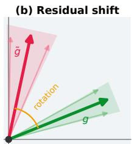  
(c) Projection

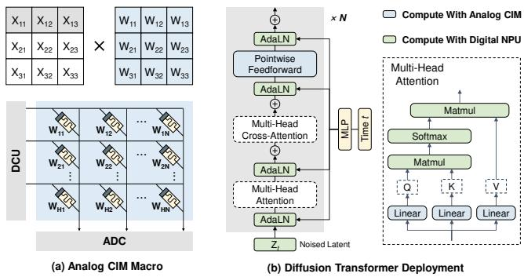  
Figure 2: Hybrid analog CIM deployment. (a) CIM-based matrix multiplication. (b) DiT mapping: linear layers are executed on CIM arrays, while other operations remain digital.

Motivated by hardware studies that model conductance variability through Gaussian weight perturbations (Joshi et al. 2020; Wan et al. 2022), we perturb each mapped linear weight matrix $W _ { \ell }$ as

$$
\widetilde { W } _ { \ell } = W _ { \ell } \odot \left( 1 + \sigma _ { \mathrm { C I M } } \Xi _ { \ell } \right) , \qquad [ \Xi _ { \ell } ] _ { i j } \overset { \mathrm { i . i . d . } } { \sim } \mathcal { N } ( 0 , 1 ) ,\tag{2}
$$

where $\sigma _ { \mathrm { C I M } }$ controls the perturbation severity. A sampled realization is fixed throughout a denoising trajectory, reflecting persistent weight-related deviations in a deployed CIM array. Equation (2) is an algorithm-level proxy for analog CIM nonidealities rather than a complete circuit-level model.

Classifier-free guidance (CFG) combines unconditional and conditional denoiser predictions as

$$
\epsilon _ { w , t } = u _ { t } + w g _ { t } , \qquad g _ { t } = c _ { t } - u _ { t } ,\tag{3}
$$

where $u _ { t } ~ = ~ \epsilon _ { \theta } ( x _ { t } , t , \emptyset )$ and $c _ { t } ~ = ~ \epsilon _ { \theta } ( x _ { t } , t , y )$ denote the unconditional and conditional predictions, respectively. The scalar w controls the strength of the conditional residual $g _ { t }$ Let $w _ { 0 }$ denote the scale selected under clean digital inference. A straightforward deployment baseline reuses $w _ { 0 }$ after mapping the model to CIM; this baseline can become miscalibrated under CIM nonidealities.

## CFG Residual Distortion

Let $ { \widetilde { \theta } } ( \xi )$ denote the efective weights under a CIM realization ξ. At a given latent state $x _ { t }$ , the induced prediction perturbation is

$$
\begin{array} { r } { \delta _ { t } ( x _ { t } , y ; \xi ) = \epsilon _ { \widetilde { \theta } ( \xi ) } ( x _ { t } , t , y ) - \epsilon _ { \theta } ( x _ { t } , t , y ) . } \end{array}\tag{4}
$$

Although Equation (2) is Gaussian at the weight level, the resulting output perturbation generally depends on the state, timestep, condition, and CIM realization.

For the two CFG branches, we write

$$
\widetilde { u } _ { t } = u _ { t } + \delta _ { u , t } , \qquad \widetilde { c } _ { t } = c _ { t } + \delta _ { c , t } .\tag{5}
$$

Their noisy residual is therefore

$$
\widetilde { g } _ { t } = \widetilde { c } _ { t } - \widetilde { u } _ { t } = g _ { t } + \delta _ { g , t } , \qquad \delta _ { g , t } = \delta _ { c , t } - \delta _ { u , t } .\tag{6}
$$

σCIM = 0.10  
σCIM = 0.20  
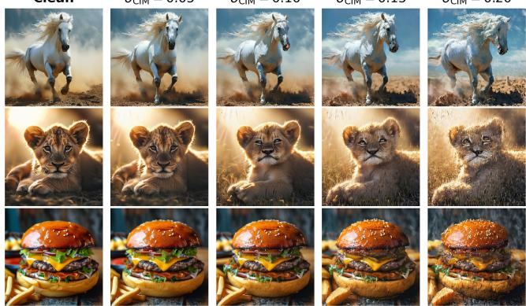

Figure 3: PixArt-Σ generations at 1024×1024 resolution under increasing CIM nonidealities at the clean-selected scale w0 = 2.0.  
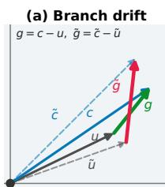

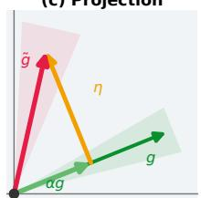  
(e) Relative residual error

(d) Direction and projection  
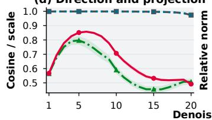

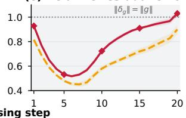  
cos(u, ũ) cos(c, c̃) cos(g, g̃) retained α ‖δg‖/‖g‖ ‖η‖/‖g‖  
Figure 4: CFG and residual diagnostics under CIM nonidealities. (a) Branch perturbations. (b) Residual rotation. (c) Clean-aligned decomposition. (d–e) Timestep statistics at σ = 0.20; shading indicates 95% confidence intervals.

This subtraction exposes diferential branch errors. Even when $\delta _ { u , t }$ and $\delta _ { c , t }$ are small relative to the branch predictions, their diference can be substantial relative to the smaller residual $g _ { t }$

Figure 3 visualizes generation at the clean-selected guidance scale as the CIM perturbation level increases.

We characterize this distortion by decomposing the noisy residual into a component aligned with the clean residual and an orthogonal component:

$$
\widetilde { g } _ { t } = \alpha _ { t } g _ { t } + \eta _ { t } , \qquad \alpha _ { t } = \frac { \langle \widetilde { g } _ { t } , g _ { t } \rangle } { \| g _ { t } \| _ { 2 } ^ { 2 } } , \qquad \langle \eta _ { t } , g _ { t } \rangle = 0 .\tag{7}
$$

Here, $\alpha _ { t } g _ { t }$ is the retained clean-aligned component, while $\eta _ { t }$ denotes the residual component orthogonal to $g _ { t }$ . Both terms vary over timesteps, latent states, prompts, and CIM realizations.

Figure 4 shows that the conditional and unconditional branches remain substantially closer to their clean counterparts than does their diference. In particular, the noisy residual exhibits reduced directional agreement, attenuated aligned magnitude, and large relative error. Thus, beyond introducing generic denoiser drift, CIM nonidealities disproportionately distort the control channel directly scaled by CFG.

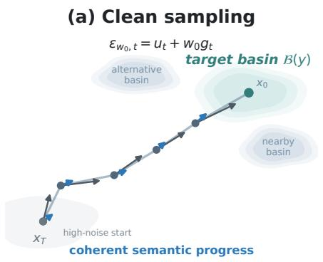

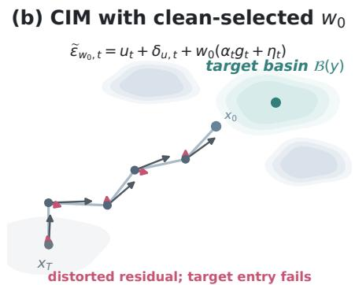

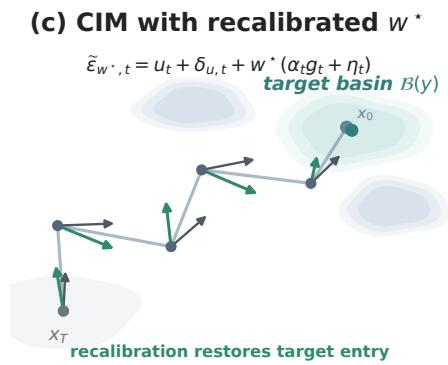  
base update ut (or ut + δu, t) clean w0gt CIM w0 ̃ gt recalibrated w ⋆ ̃ gt resulting Δxt  
Figure 5: Conceptual sampling trajectories under (a) clean inference, (b) CIM inference with the clean-selected scale $w _ { 0 } .$ , and (c) CIM inference with the recalibrated scale $w ^ { \star }$ . Shaded contours indicate semantic basins; arrows denote base and guidance updates. Each trajectory segment is the vector sum of the two component arrows.

Substituting Equation (7) into CFG gives

$$
\widetilde { \epsilon } _ { w , t } = u _ { t } + \delta _ { u , t } + w \left( \alpha _ { t } g _ { t } + \eta _ { t } \right) .\tag{8}
$$

Equation (8) identifies a controllable trade-of: changing w cannot directly remove the common branch drift $\delta _ { u , t }$ , but it simultaneously scales the retained useful component $\alpha _ { t } g _ { t }$ and the orthogonal residual component ηt.

## Guidance Recalibration

Motivated by this diagnosis, we recalibrate only the existing CFG scale for a target CIM operating condition. The pretrained denoiser, CIM mapping, scheduler, and sampling budget remain fixed. Given an independent calibration set $\mathcal { D } _ { \mathrm { c a l } }$ and a candidate set of guidance scales W, we select

$$
w ^ { \star } ( \mathcal { C } ) = \arg \operatorname* { m i n } _ { w \in \mathcal { W } } \mathcal { L } \big ( w ; \mathcal { D } _ { \mathrm { c a l } } , \mathcal { C } \big ) ,\tag{9}
$$

where C denotes the target CIM operating condition, including the mapped layers, nonideality model, and perturbation level. In our main experiments, L is FID and C is indexed by σCIM; we write the corresponding selected scale as $w _ { \sigma } ^ { \star }$

The selected scale $w ^ { \star }$ is fixed for all subsequent samples under the same operating condition. This procedure requires no retraining, weight update, activation correction, per-prompt adaptation, or additional denoiser evaluation during sampling. The sweep is performed once per target operating condition; after selection, deployment retains the original sampling procedure and uses $w ^ { \star }$ as a fixed scalar setting. Rather than attempting to invert CIM errors or reproduce the clean trajectory at individual timesteps, guidance recalibration selects a favorable operating point for the noisy closedloop sampler.

## Trajectory Interpretation

Guidance recalibration acts on a closed-loop sampling process. For a generic reverse sampler,

$$
\widetilde { x } _ { t - 1 } ^ { ( w ) } = S _ { t } \left( \widetilde { x } _ { t } ^ { ( w ) } , \widetilde { \epsilon } _ { w , t } \right) ,\tag{10}
$$

changing w afects not only the current update but also the latent states supplied to all subsequent denoiser evaluations. Recalibration is therefore a trajectory-level control problem rather than pointwise matching of clean denoiser predictions.

Defining $\Delta x _ { t } ^ { ( w ) } = \widetilde { x } _ { t - 1 } ^ { ( w ) } - \widetilde { x } _ { t } ^ { ( w ) }$ and locally linearizing the sampler around the noisy unconditional prediction at the current state gives

$$
\Delta x _ { t } ^ { ( w ) } \approx v _ { u , t } + w r _ { t } , \qquad r _ { t } = B _ { t } \widetilde { g } _ { t } ,\tag{11}
$$

where $v _ { u , t }$ is the base update, $B _ { t }$ is the local prediction-tostate mapping induced by the sampler, and $r _ { t }$ is the samplerpropagated residual control. When $r _ { t }$ retains a component that promotes target-consistent structure over semantically informative steps, increasing w can strengthen this retained control and help the trajectory reach a region in which the target semantics become locally persistent.

Figure 5 provides a conceptual interpretation. Under CIM nonidealities, the clean-selected scale $w _ { 0 }$ can yield insufficient target-oriented control because the residual is attenuated and rotated. A moderately larger scale $w ^ { \star }$ amplifies the useful component that remains, allowing the trajectory to reach a target-consistent region earlier. Once targetconsistent structure becomes locally dominant, the learned denoising dynamics tend to preserve and refine that structure over subsequent steps, yielding attractor-like local behavior. Related attractor-like behavior has been used to characterize persistent difusion trajectories in memorization settings (Jain et al. 2025); here, semantic basin denotes the local persistence of target-consistent structure. This account predicts that recalibration should advance persistent semantic entry, which we examine through the timestep analysis in Figure 8.

The benefit is bounded: excessive guidance amplifies the entire distorted residual, including components misaligned with target progress, while leaving the common drift $\delta _ { u , t }$ uncontrolled. These errors accumulate along the closed-loop trajectory, causing over-conditioning and degraded samples. Thus, the optimal guidance scale is finite and depends on the CIM condition. This analysis predicts that the preferred scale shifts with CIM severity, recalibration accelerates semantic commitment, and both residual distortion and base-path drift contribute to degradation.

<table><tr><td>Model and benchmark</td><td>σCIM</td><td>CFG w</td><td>FID↓</td><td> ${ \mathrm { K I D } } \times 1 0 ^ { 3 } ~ { \downarrow }$ </td><td>Alignment↑</td><td>Precision↑</td><td>Density↑</td><td>Coverage↑</td></tr><tr><td rowspan="5">PixArt-Σ (5122, COCO)</td><td>0 (clean)</td><td>1.5</td><td>20.51</td><td>7.75</td><td>30.34</td><td>0.550</td><td>0.654</td><td>0.595</td></tr><tr><td>0.05</td><td>1.5 (= w0)</td><td>20.31</td><td>7.68</td><td>30.31</td><td>0.551</td><td>0.647</td><td>0.582</td></tr><tr><td>0.10</td><td>1.5→2.0</td><td>21.12→19.98</td><td>8.27→7.05</td><td>30.09→30.69</td><td>0.513→0.5520.575→0.6540.556→0.580</td><td></td><td></td></tr><tr><td>0.15 0.20</td><td>1.5→2.5</td><td>28.62→20.18</td><td>12.85→6.87</td><td>29.37→30.79</td><td>0.432→0.543</td><td>0.423→0.628</td><td>0.477→0.572</td></tr><tr><td></td><td>1.5→4.5</td><td>59.22→20.49</td><td>30.41→6.49</td><td>27.32→31.17</td><td>0.248→0.527</td><td>0.203→0.602</td><td>0.292→0.560</td></tr><tr><td rowspan="5">PixArt-α (5122, COCO)</td><td>0 (clean)</td><td>1.5</td><td>21.63</td><td>8.21</td><td>29.98</td><td>0.545</td><td>0.624</td><td>0.567</td></tr><tr><td>0.05</td><td>1.5→2.0</td><td>21.84→21.01</td><td>8.50→7.32</td><td></td><td>29.89→30.48 0.533→0.571 0.616→0.717 0.561 →0.587</td><td></td><td></td></tr><tr><td>0.10</td><td>1.5→2.5</td><td>24.16→20.75</td><td>10.34→7.10</td><td>29.52→30.65</td><td>0.495→0.576</td><td>0.537→0.716</td><td>0.514→0.589</td></tr><tr><td>0.15</td><td>1.5→3.0</td><td>35.44→20.71</td><td>17.68→7.10</td><td>28.53→30.60</td><td>0.385→0.558</td><td>0.368→0.655</td><td>0.418→0.566</td></tr><tr><td>0.20</td><td>1.5→5.0</td><td>72.37→21.12</td><td>40.60→7.39</td><td>25.95→30.68</td><td>0.212→0.517</td><td>0.148→0.609</td><td>0.208→0.536</td></tr><tr><td rowspan="5">DiT-XL/2 (2562, ImageNet)</td><td>0 (clean)</td><td>1.3</td><td>4.49</td><td>0.85</td><td>82.77</td><td>0.822</td><td>1.060</td><td>0.872</td></tr><tr><td>0.05</td><td>1.3 (= w0)</td><td>4.51</td><td>0.82</td><td>81.60</td><td>0.807</td><td>1.039</td><td>0.857</td></tr><tr><td>0.10</td><td>1.3→1.4</td><td>5.13→4.66</td><td>1.03→0.83</td><td></td><td>79.10→82.400.776→0.8050.946→0.995</td><td></td><td>0.828→0.845</td></tr><tr><td>0.15</td><td>1.3→1.7</td><td>8.65→5.20</td><td>3.24→1.24</td><td>72.63→85.76</td><td>0.670→0.797</td><td>0.790→0.991</td><td>0.768→0.855</td></tr><tr><td>0.20</td><td>1.3→2.0</td><td>20.89→6.62</td><td>11.68→1.39</td><td></td><td></td><td>59.28→84.910.537→0.7560.563→0.880</td><td>0.645→0.819</td></tr></table>

Table 1: Large-scale population-level evaluation across three difusion transformers and multiple simulated CIM mappings, with 30,000 samples per setting. Noisy entries report $w _ { 0 } \to \ w _ { \sigma } ^ { \star } ;$ a single value is shown when the selected scales coincide. Underlining marks the recalibrated endpoint, and bold marks improvement over the clean-guidance baseline.

## Experiments

## Experimental Setup

Models and benchmarks. We evaluate PixArt-Σ-XL/2 and PixArt-α-XL/2 at 5122 for text-to-image generation and DiT-XL/2 at 2562 for class-conditional generation. PixArt-Σ and Stable Difusion 3.5 Medium (SD3.5 Medium) (Esser et al. 2024; Stability AI 2024) at 10242 are used only for qualitative examples in Figures 3 and 7. For standard evaluation, our 30,000-sample text-to-image setting uses MS-COCO 2014 validation captions and references (Lin et al. 2014), while the 30,000-sample canonical class-conditional DiT setting uses ImageNet validation statistics (Deng et al. 2009). Quantitative PixArt experiments use the default DPM-Solver scheduler (Lu et al. 2022) with 20 denoising steps, while DiT-XL/2 uses 50 steps. We first identify w under clean inference and w⋆ in an independent 3,000-sample guidance sweep, then hold both scales fixed for all subsequent 30,000-sample evaluations.

CIM protocol. Unless specified otherwise, Equation (2) is applied to the query, key, value, and output projections of self- and cross-attention and to both feed-forward linear layers. Each deterministic weight-noise draw represents an independently programmed virtual CIM device and remains fixed for all samples and denoising steps within its inference batch. Diferent batches are assigned to diferent virtual devices, yielding a population-level evaluation across CIM mappings. A single guidance scale is shared across the entire device population without per-device adaptation. Cleanselected and recalibrated settings use identical prompts, sample seeds, CIM realizations, samplers, and mapped layer sets.

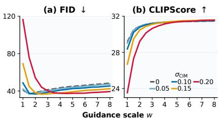

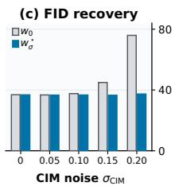  
Figure 6: Guidance response on a 3,000-prompt PixArt-Σ sweep. (a) FID and (b) CLIPScore versus w. (c) FID at w and $w _ { \sigma } ^ { \star }$

Metrics. We report FID (Heusel et al. 2017) and KID (Bińkowski et al. 2018) for distributional quality. Conditional alignment is CLIPScore (Radford et al. 2021; Hessel et al. 2021) for text-to-image models and ImageNet ViT-B/16 (Dosovitskiy et al. 2021) top-1 accuracy for DiT-XL/2. Precision measures sample fidelity, while density and coverage characterize local realism and support coverage (Kynkäänniemi et al. 2019; Naeem et al. 2020). DINO-clean is the paired DINOv2 cosine similarity (Oquab et al. 2024) between a CIM output and the clean output generated with w0 from the same condition and sample seed. Accordingly, FID and related distributional metrics characterize the pooled output distribution of the simulated device population.

## Experimental Results

Noise-Dependent Guidance Response Figure 6 characterizes the response to w on 3,000 COCO 2017 validation prompts. The FID curves exhibit a finite minimum rather than monotonic improvement. The FID-optimal scale moves from 1.5 at $\sigma _ { \mathrm { C I M } } \in \{ 0 , 0 . 0 5 \}$ to 2.0, 2.5, and 4.5 at noise levels 0.10, 0.15, and 0.20, respectively. At $\sigma _ { \mathrm { C I M } } = 0 . 2 0$ recalibration lowers FID from 75.94 to 37.42, whereas further increases in w degrade FID. CLIPScore increases and then saturates as w grows, indicating that semantic alignment alone is insuficient for selecting the operating point: excessive guidance can preserve prompt alignment while degrading distributional fidelity. The selected scales are then fixed for the independent 30,000-sample evaluation below.

  
Figure 7: Qualitative comparisons under CIM noise. Left: PixArt-Σ text-to-image generation at $\sigma _ { \mathrm { C I M } } = 0 . 1 5$ , using $w _ { 0 } = 1 . 5$ and $w _ { \sigma } ^ { \star } = 2 . 5$ . Right: SD3.5 Medium text rendering at $\sigma _ { \mathrm { C I M } } = 0 . 1 0 .$ , using $w _ { 0 } = 1 . 5$ and $w _ { \sigma } ^ { \star } = 3 . 0 .$

Calibration Eficiency and Transfer To assess whether guidance recalibration requires a large calibration set, we select the guidance scale using 256 calibration prompts and evaluate it on 2,000 disjoint prompts. At $\sigma _ { \mathrm { C I M } } = 0 . 1 5$ , recalibration reduces FID from 51.09 to 43.92, and at $\sigma _ { \mathrm { C I M } } =$ 0.20, from 79.94 to 44.03, compared with a clean reference of 43.58. The selected scale is shared across all heldout prompts, without per-prompt search or adaptation. Thus, a small calibration subset is suficient to identify a transferable operating point, making recalibration a lightweight deployment-time procedure.

Large-Scale Generation Quality Using scales selected on independent 3,000-sample sweeps, Table 1 evaluates the pooled population-level distribution with 30,000 samples per setting. At $\sigma _ { \mathrm { C I M } } = 0 . 2 0 $ , recalibration reduces FID from 59.22 to 20.49 on PixArt-Σ, from 72.37 to 21.12 on PixArtα, and from 20.89 to 6.62 on DiT-XL/2. KID changes in the same direction, while conditional alignment, precision, density, and coverage improve for all three models. For each model at $\sigma _ { \mathrm { C I M } } = 0 . 2 0$ , a single recalibrated scale shared across the simulated device population closes at least 87% of the CIM-induced FID gap relative to clean inference without modifying the noisy weights or sampling budget.

Comparison with Sampler-Side Guidance Controls Although not designed for CIM, these methods provide relevant sampler-side comparisons. We tune CFG Rescale (Lin et al. 2024), APG (Sadat, Hilliges, and Weber 2025), $\mathrm { C ^ { 2 } F G }$ (Gao et al. 2026), and Limited-Interval Guidance (Kynkäänniemi et al. 2024) under identical CIM settings and report the shared 3,000-prompt comparison. The clean-best row is shared with Figure $^ { 6 , }$ while fixed recalibration uses its preselected scale rather than the sweep optimum.

<table><tr><td>Method</td><td> $\sigma _ { \mathrm { C I M } } = 0 . 1 5$   $\sigma _ { \mathrm { C I M } } = 0 . 2 0$ </td></tr><tr><td>Clean-best CFG</td><td>44.93 75.94</td></tr><tr><td>CFG Rescale</td><td>40.40 40.72</td></tr><tr><td>APG</td><td>39.21 41.08</td></tr><tr><td>C²FG</td><td>38.11 39.52</td></tr><tr><td>Limited-Interval Guidance</td><td>37.28 38.76</td></tr><tr><td>Fixed recalibration (ours)</td><td>36.60 37.61</td></tr></table>

Table 2: FID in the shared 3,000-prompt PixArt-Σ comparison of sampler-side guidance controls.

Table 2 shows that all sampler-side controls improve over clean-best CFG, indicating that the guidance residual remains an efective correction channel under CIM noise. However, their correction forms were developed for generic guidance artifacts under standard inference rather than the noise-dependent residual distortion induced by CIM. Even after configuration search under each CIM condition, they remain less efective than directly recalibrating the residual strength for the target operating point. This ordering is consistent with guidance-scale mismatch being a substantial and directly correctable component ofCIM-induced degradation.

Qualitative Comparisons Figure 7 provides paired qualitative comparisons. Recalibration improves object structure and prompt-specific details for general text-to-image prompts, while also producing more legible and coherent rendered text. These examples indicate that the recovery extends beyond aggregate distributional metrics to challenging semantic and structural details.

Timestep Semantic Entry We probe whether quality recovery is accompanied by earlier semantic commitment during sampling. At each reverse step, we decode the schedulerconsistent predicted-clean sample ${ \widehat { x } } _ { 0 \mid t }$ . For each of 1,000 prompts, its CLIP image embedding retrieves the matching text from 1,000 candidates. We define the semantic entry index as the earliest reverse step, counted from the start of sampling, at which the aggregate top-1 retrieval rate reaches a threshold θ and remains above it thereafter. Based on visual inspection of intermediate generations, we set $\theta = 0 . 3 0$ , at which prompt-consistent content becomes persistently recognizable.

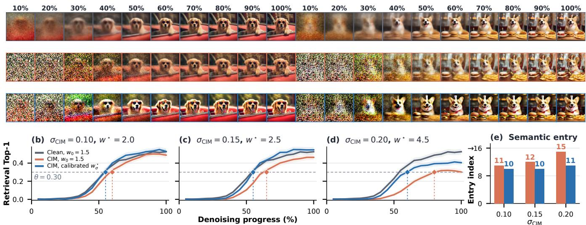

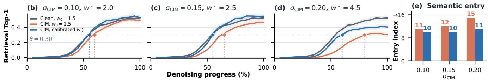  
Figure 8: Timestep semantic-entry analysis. (a) Ten evenly spaced checkpoints from 20-step predicted-clean trajectories for two prompts; rows show clean inference, CIM with $w _ { 0 } ,$ and CIM with $w _ { \sigma } ^ { \star }$ . (b–d) Prompt retrieval top-1 accuracy across all steps. (e) Persistent semantic-entry indices at $\theta = 0 . 3 0$

<table><tr><td colspan="8">(a) Endpoint counterfactuals</td></tr><tr><td>Metric</td><td>Clean</td><td>CIM w0</td><td> $\mathbf { C I M } \boldsymbol { w } ^ { \star }$ </td><td>Restore u Restore g</td><td></td><td>Remove η</td><td>Restore α</td></tr><tr><td>FID↓</td><td>36.19</td><td>75.41</td><td>36.64</td><td>42.83</td><td>68.34</td><td>127.75</td><td>44.49</td></tr><tr><td>CLIP↑</td><td>30.45</td><td>27.27</td><td>31.27</td><td>28.52</td><td>28.87</td><td>23.23</td><td>30.35</td></tr><tr><td>DINO-clean↑ 1.000</td><td></td><td>0.463</td><td>0.673</td><td>0.621</td><td>0.631</td><td>0.261</td><td>0.699</td></tr></table>

<table><tr><td colspan="6">(b) Continuous endpoint interpolation: FID↓</td></tr><tr><td>Intervention</td><td>0.00</td><td>0.25</td><td>0.50</td><td>0.75</td><td>1.00</td></tr><tr><td>Restore aligned gain</td><td>75.4</td><td>64.1</td><td>55.6</td><td>49.1</td><td>44.5</td></tr><tr><td>Remove orthogonal term</td><td>75.4</td><td>86.6</td><td>99.6</td><td>114.0</td><td>127.9</td></tr><tr><td>Remove base error</td><td>75.4</td><td>58.5</td><td>48.3</td><td>44.0</td><td>42.9</td></tr></table>

Table 3: Residual-surgery analysis at $\sigma _ { \mathrm { C I M } } = 0 . 2 0$ over 3,000 prompts. (a) Endpoint counterfactuals. (b) FID along intervention paths from untreated CIM (0) to the full intervention (1).

Figure 8(a) visualizes ten evenly spaced checkpoints for two prompts under clean inference, CIM with $w _ { 0 }$ , and CIM with $w _ { \sigma } ^ { \star }$ . Panels (b–e) show that recalibration advances persistent entry from step 11 to 10 at $\sigma _ { \mathrm { C I M } } = 0 . 1 0$ , from 12 to 10 at 0.15, and from 15 to 11 at 0.20. The increasing gain with noise is consistent with the proposed trajectory-level interpretation: strengthening the retained target-oriented residual moves the sampler into a target-consistent semantic region earlier, after which the state-dependent denoising dynamics preserve and refine those semantics.

Counterfactual Residual Surgery To probe the decomposition $\widetilde { g } = \alpha g + \eta$ through interventions, Table 3 applies counterfactual modifications to paired clean and noisy predictions at $\sigma _ { \mathrm { C I M } } ~ = ~ 0 . 2 0$ . The endpoint interventions restore the clean base prediction $u ,$ the clean residual $^ { g , }$ or the clean-aligned gain $\alpha ,$ and separately remove the orthogonal component $\eta .$ Continuous paths vary each intervention from untreated CIM at strength 0 to the full intervention at strength 1, reducing dependence on any single endpoint.

Restoring u lowers FID from 75.41 to 42.83, while restoring α yields 44.49 and improves monotonically as the intervention strength increases. Likewise, progressively removing base-path error improves FID, indicating that both common drift and weakened target-oriented residual control contribute to degradation. Removing η alone worsens FID, indicating that its efect is coupled to base drift and trajectory feedback rather than independently removable. Recalibration reaches 36.64, close to the clean FID of 36.19, by scaling the intact noisy residual instead of attempting componentwise cancellation.

## Conclusion

In this paper, we systematically studied the impact of analog CIM nonidealities on DiT sampling and identified the CFG residual as a critical and controllable failure channel. We proposed a retraining-free, sampler-side guidance recalibration method that adjusts only the CFG scale for a target CIM operating condition. Extensive experiments show that the preferred guidance scale increases with CIM noise and that our method consistently restores generation quality. At $\sigma _ { \mathrm { C I M } } = 0 . 2 0$ , guidance recalibration closes at least 87% of the CIM-induced FID gap, reducing FID from 59.22 to 20.49 on PixArt-Σ, from 72.37 to 21.12 on PixArt-α, and from 20.89 to 6.62 on DiT-XL/2. We further provide a trajectorylevel interpretation of how guidance recalibration restores generation quality under CIM noise.

## References

Bińkowski, M.; Sutherland, D. J.; Arbel, M.; and Gretton, A. 2018. Demystifying MMD GANs. In International Conference on Learning Representations.

Bradley, A.; and Nakkiran, P. 2025. Classifier-Free Guidance Is a Predictor-Corrector. Transactions on Machine Learning Research.

Chen, J.; Ge, C.; Xie, E.; Wu, Y.; Yao, L.; Ren, X.; Wang, Z.; Luo, P.; Lu, H.; and Li, Z. 2024a. PixArt-Σ: Weak-to-Strong Training of Difusion Transformer for 4K Text-to-Image Generation. In European Conference on Computer Vision, 74–91.

Chen, J.; Yu, J.; Ge, C.; Yao, L.; Xie, E.; Wu, Y.; Wang, Z.; Kwok, J.; Luo, P.; Lu, H.; and Li, Z. 2024b. PixArt-α: Fast Training of Difusion Transformer for Photorealistic Text-to-Image Synthesis. In International Conference on Learning Representations.

Chung, H.; Kim, J.; Park, G. Y.; Nam, H.; and Ye, J. C. 2025. CFG++: Manifold-Constrained Classifier Free Guidance for Difusion Models. In International Conference on Learning Representations.

Deng, J.; Dong, W.; Socher, R.; Li, L.-J.; Li, K.; and Fei-Fei, L. 2009. ImageNet: A Large-Scale Hierarchical Image Database. In Proceedings ofthe IEEE Conference on Computer Vision and Pattern Recognition, 248–255.

Dosovitskiy, A.; Beyer, L.; Kolesnikov, A.; Weissenborn, D.; Zhai, X.; Unterthiner, T.; Dehghani, M.; Minderer, M.; Heigold, G.; Gelly, S.; Uszkoreit, J.; and Houlsby, N. 2021. An Image Is Worth 16x16 Words: Transformers for Image Recognition at Scale. In International Conference on Learning Representations.

Esser, P.; Kulal, S.; Blattmann, A.; Entezari, R.; Müller, J.; Saini, H.; Levi, Y.; Lorenz, D.; Sauer, A.; Boesel, F.; Podell, D.; Dockhorn, T.; English, Z.; and Rombach, R. 2024. Scaling Rectified Flow Transformers for High-Resolution Image Synthesis. In International Conference on Machine Learning, 12606–12633.

Gao, J.; Zheng, T.; Zou, J.; Yang, F.; Liu, S.; Fan, L.; Zhang, Z.; Zhang, H.; Chen, J.; Jiang, P.-T.; Li, B.; and Wang, J. 2026. C2FG: Control Classifier-Free Guidance via Score Discrepancy Analysis. In Proceedings of the IEEE/CVF Conference on Computer Vision and Pattern Recognition, 34398–34407.

Guo, R.; Wang, L.; Chen, X.; Jiang, K.; Yue, Z.; Han, H.; Wang, Y.; Tu, F.; Wei, S.; Hu, Y.; and Yin, S. 2026. Denim: Heterogeneous Compute-in-Memory Accelerator Exploiting Denoising-Similarity for Difusion Models. IEEE Journal of Solid-State Circuits, 1–15.

Hessel, J.; Holtzman, A.; Forbes, M.; Le Bras, R.; and Choi, Y. 2021. CLIPScore: A Reference-Free Evaluation Metric for Image Captioning. In Proceedings of the 2021 Conference on Empirical Methods in Natural Language Processing, 7514– 7528.

Heusel, M.; Ramsauer, H.; Unterthiner, T.; Nessler, B.; and Hochreiter, S. 2017. GANs Trained by a Two Time-Scale Update Rule Converge to a Local Nash Equilibrium. In Advances in Neural Information Processing Systems.

Ho, J.; Jain, A.; and Abbeel, P. 2020. Denoising Difusion Probabilistic Models. In Advances in Neural Information Processing Systems, volume 33, 6840–6851.

Ho, J.; and Salimans, T. 2022. Classifier-Free Difusion Guidance. arXiv preprint arXiv:2207.12598.

Hou, Y.; Tsai, H.; El Maghraoui, K.; Gokmen, T.; Burr, G. W.; and Liu, L. 2025. NORA: Noise-Optimized Rescaling of LLMs on Analog Compute-in-Memory Accelerators. In 2025 Design, Automation & Test in Europe Conference.

Jain, A.; Kobayashi, Y.; Shibuya, T.; Takida, Y.; Memon, N.; Togelius, J.; and Mitsufuji, Y. 2025. Classifier-Free Guidance Inside the Attraction Basin May Cause Memorization. In Proceedings of the IEEE/CVF Conference on Computer Vision and Pattern Recognition, 12871–12879.

Jing, Y.; Wu, M.; Zhou, J.; Sun, Y.; Ma, Y.; Huang, R.; Jia, T.; and Ye, L. 2024. AIG-CIM: A Scalable Chiplet Module with Tri-Gear Heterogeneous Compute-in-Memory for Difusion Acceleration. In Proceedings ofthe 61st ACM/IEEE Design Automation Conference, 1–6.

Joshi, V.; Le Gallo, M.; Haefeli, S.; Boybat, I.; Nandakumar, S. R.; Piveteau, C.; Dazzi, M.; Rajendran, B.; Sebastian, A.; and Eleftheriou, E. 2020. Accurate Deep Neural Network Inference Using Computational Phase-Change Memory. Nature Communications, 11: 2473.

Kynkäänniemi, T.; Aittala, M.; Karras, T.; Laine, S.; Aila, T.; and Lehtinen, J. 2024. Applying Guidance in a Limited Interval Improves Sample and Distribution Quality in Difusion Models. In Advances in Neural Information Processing Systems.

Kynkäänniemi, T.; Karras, T.; Laine, S.; Lehtinen, J.; and Aila, T. 2019. Improved Precision and Recall Metric for Assessing Generative Models. In Advances in Neural Information Processing Systems.

Lin, S.; Liu, B.; Li, J.; and Yang, X. 2024. Common Difusion Noise Schedules and Sample Steps Are Flawed. In Proceedings ofthe IEEE/CVF Winter Conference on Applications of Computer Vision, 5404–5411.

Lin, T.-Y.; Maire, M.; Belongie, S.; Hays, J.; Perona, P.; Ramanan, D.; Dollár, P.; and Zitnick, C. L. 2014. Microsoft COCO: Common Objects in Context. In European Conference on Computer Vision, 740–755.

Lu, C.; Zhou, Y.; Bao, F.; Chen, J.; Li, C.; and Zhu, J. 2022. DPM-Solver: A Fast ODE Solver for Difusion Probabilistic Model Sampling in Around 10 Steps. In Advances in Neural Information Processing Systems, volume 35, 5775–5787.

Naeem, M. F.; Oh, S. J.; Uh, Y.; Choi, Y.; and Yoo, J. 2020. Reliable Fidelity and Diversity Metrics for Generative Models. In International Conference on Machine Learning, 7176–7185.

Oquab, M.; Darcet, T.; Moutakanni, T.; Vo, H. V.; Szafraniec, M.; Khalidov, V.; Fernandez, P.; Haziza, D.; Massa, F.; El-Nouby, A.; Assran, M.; Ballas, N.; Galuba, W.; Howes, R.; Huang, P.-Y.; Li, S.-W.; Misra, I.; Rabbat, M.; Sharma, V.; Synnaeve, G.; Xu, H.; Jégou, H.; Mairal, J.; Labatut, P.; Joulin, A.; and Bojanowski, P. 2024. DINOv2: Learning Robust Visual Features without Supervision. Transactions on Machine Learning Research.

Peebles, W.; and Xie, S. 2023. Scalable Difusion Models with Transformers. In Proceedings of the IEEE/CVF International Conference on Computer Vision, 4195–4205.

Radford, A.; Kim, J. W.; Hallacy, C.; Ramesh, A.; Goh, G.; Agarwal, S.; Sastry, G.; Askell, A.; Mishkin, P.; Clark, J.; Krueger, G.; and Sutskever, I. 2021. Learning Transferable Visual Models From Natural Language Supervision. In International Conference on Machine Learning, 8748–8763.

Sadat, S.; Hilliges, O.; and Weber, R. M. 2025. Eliminating Oversaturation and Artifacts of High Guidance Scales in Difusion Models. In International Conference on Learning Representations.

Sebastian, A.; Le Gallo, M.; Khaddam-Aljameh, R.; and Eleftheriou, E. 2020. Memory Devices and Applications for In-Memory Computing. Nature Nanotechnology, 15: 529– 544.

Shafiee, A.; Nag, A.; Muralimanohar, N.; Balasubramonian, R.; Strachan, J. P.; Hu, M.; Williams, R. S.; and Srikumar, V. 2016. ISAAC: A Convolutional Neural Network Accelerator with In-Situ Analog Arithmetic in Crossbars. In Proceedings ofthe 43rd International Symposium on Computer Architecture, 14–26.

Song, Y.; Sohl-Dickstein, J.; Kingma, D. P.; Kumar, A.; Ermon, S.; and Poole, B. 2021. Score-Based Generative Modeling through Stochastic Diferential Equations. In International Conference on Learning Representations.

Stability AI. 2024. Introducing Stable Difusion 3.5. https: //stability.ai/news/introducing-stable-difusion-3-5. Accessed: 2026-07-29.

Wan, W.; Kubendran, R.; Schaefer, C.; Eryilmaz, S. B.; Zhang, W.; Wu, D.; Deiss, S.; Raina, P.; Qian, H.; Gao, B.; Joshi, S.; Wu, H.; Wong, H.-S. P.; and Cauwenberghs, G. 2022. A Compute-in-Memory Chip Based on Resistive Random-Access Memory. Nature, 608: 504–512.

Yang, J.; Chen, H.; Chen, J.; et al. 2026. Resistive Memory-Based Neural Diferential Equation Solver for Score-Based Difusion Model. Nature Communications, 17: 6354.

Zhu, Z.; Li, H.; Ren, W.; Wu, M.; Ye, L.; Huang, R.; and Jia, T. 2025. Leveraging Compute-in-Memory for Eficient Generative Model Inference in TPUs. In 2025 Design, Automation & Test in Europe Conference, 1–7.