# Loopy: Seamless Video Loop Generation via Anchored Looping Shift of Positional Embedding

HAOTIAN DONG, Tianjin University, China

WENJING WANG, Independent, China

CHEN LI, Independent, China

JING LYU, Independent, China

XIN WANG∗, The Hong Kong Polytechnic University, Hong Kong

DI LIN∗, Tianjin University, China

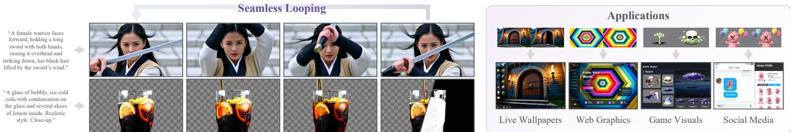  
Fig. 1. Our Loopy generates high-quality looping videos with seamless transitions at loop boundaries and diverse motion. It also supports RGBA with semi-transparent efects. In the application block, all elements—including game assets and Loopy character stickers—are generated by our Loopy.

Looping videos are essential for practical applications such as web graphics, game development, and social media. However, existing approaches typically fail to generate high-quality looping videos due to the neglect of how video generation models perceive temporal order and how this relates to the looping behavior. In this work, we are the first to reveal that position embedding at diferent attention layers within DiT exhibits varying levels of positional control, with the most pronounced layer acting as an anchor. We formulate this anchored layer as the reference point of the looping video, ofering strong contextual priors for the remaining layers to facilitate the generation of seamless and coherent video content. Based on this insight, we propose an anchored position embedding shifting strategy that applies layer-specific shift lengths according to each layer’s temporal control efect, efectively transforming DiT’s temporal perception from a straight line to a circle. Leveraging this strategy, we develop a general framework, Loopy, for high-quality looping video generation, supporting both RGB and RGBA videos, while also enabling advanced AIGC features such as identity control and style transfer. Experiments demonstrate that our approach significantly improves temporal consistency and visual fidelity in generated looping videos. The released model is available on our website: https://donghaotian123.github.io/Loopy.

CCS Concepts: • Computing methodologies → Computer vision.

Additional Key Words and Phrases: Looping video generation, position embedding, difusion transformer, text-to-video difusion

## ACM Reference Format:

Haotian Dong, Wenjing Wang, Chen Li, Jing Lyu, Xin Wang, and Di Lin. 2026. Loopy: Seamless Video Loop Generation via Anchored Looping Shift of Positional Embedding. ACM Trans. Graph. 45, 6, Article 188 (December 2026), 15 pages. https://doi.org/10.1145/3842544

## 1 Introduction

Seamless looping videos create the illusion of infinite duration and are widely used in applications such as dynamic wallpapers, web graphics, advertising design, and visual efects. Despite the high demand, producing high-quality looping videos is costly and laborintensive. This motivates the use of Artificial Intelligence-Generated Content (AIGC) algorithms as a natural and promising approach for looping video generation. The community has witnessed substantial progress in video generation technologies [Hunyuan Team 2025; Kling Team 2025; Seedance Team 2026; Wan Team 2025], which allow users to control generated content through text prompts.

However, these models are not explicitly designed for looping video generation, limiting their direct use in seamless loop generation from text prompts, as shown in the first row of Fig. 2. Finetuning existing video generation models on looping data is an intuitive solution, but the narrow access to a large volume of such data limits the efectiveness of the fine-tuning strategy. Another straightforward solution is to utilize first-last-frame-to-video generation models [Wan Team 2025] and enforce the first and last frames to be the same [Mahapatra et al. 2026]. However, such models tend to converge toward the path of least resistance and sufer from static collapse, leading to limited motion variation or even fully static videos as shown in the second row of Fig. 2. Consequently, existing general video generation models struggle to generate seamless looping videos with diverse yet coherent motions.

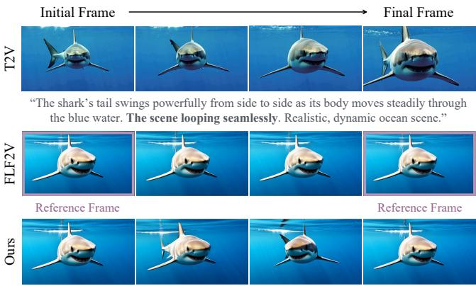  
“The shark’s tail swings powerfully from side to side as its body moves steadily through the blue water. Realistic, dynamic ocean scene.”  
Fig. 2. Comparison with Wan2.2 [Wan Team 2025] in text-to-video (T2V) and first-last-frame-to-video (FLF2V) modes. FLF2V and our method use the same prompt. Although the prompt explicitly requests a looping scene, T2V fails to produce a seamless loop, while FLF2V degenerates to a nearly static video. Neither mode generates a looping video with vivid motion.

To handle looping, training-free strategies [Bi et al. 2025; dribnet 2024] have recently emerged by manipulating latent representations during the difusion process. However, such simple latent manipulations neglect the co-efects of the video generation model, often introducing unnatural motion variations and temporal inconsistencies. To provide looping videos for network training, LoopAnimate [Wang et al. 2024] introduces an asymmetric loop sampling strategy, which involves sampling frames first forward and then backward with a sequence of particular sampling steps. However, such data generation strategy inevitably disrupts real-world motion patterns, limiting the diversity of motion and scenes and restricting their applicability primarily to scenarios with salient foreground objects. Moreover, existing methods neglect how video generation models perceive temporal order and how this relates to the formation of coherent looping behavior.

The core challenge lies in establishing a temporal coherence between the last and first frames with limited high-quality looping video data. In this paper, we propose a novel framework for seamless looping video generation based on a thorough analysis on how video generation models perceive temporal order. State-of-the-art video generation models [Hunyuan Team 2025; Wan Team 2025] typically adopt the Difusion Transformer (DiT) [Peebles and Xie 2023] backbone, which perceives spatiotemporal location using Rotary Position Embedding (RoPE) [Su et al. 2024] within attention layers. Since the temporal encoding in RoPE progresses from the first frame to the last, such linearity prevents video generation models from establishing temporal continuity between the final and initial frames. Moreover, RoPE is typically applied to each attention layer, but the diferences in its temporal efect across layers have not been explored.

To the best of our knowledge, this work is the first to analyze RoPE’s control over temporal position at diferent attention layers within DiT. We observe that naively shifting all RoPEs with progressively increasing ofsets encourages the DiT to perceive temporal positions cyclically. However, this simple RoPE-shifting strategy struggles to achieve seamless looping, as diferent RoPEs exhibit distinct degrees of control over temporal perception. Through a quantitative analysis of such temporal control efects, we further observe that the attention layer exhibiting the most pronounced RoPE control efect in DiT acts as an anchor. This anchored layer provides critical contextual priors that shape the generated video content and reduce artifacts, while RoPEs in the remaining layers adjust their temporal efects relative to this reference.

Motivated by these findings, we propose Anchored Position Embedding Shifting (Anchored Shifting) to preserve temporal coherence and ensure seamless loop-boundary transition. Specifically, we shift RoPE within each attention layer along the temporal dimension by layer-specific shifting lengths, where the length is determined by each layer’s degree of temporal control efect. Our Anchored Shifting strategy enables the timeline perceived by DiT to change from a straight line to a uniform circle, strengthening the correlation between the final and initial frames.

Based on Anchored Shifting, we develop Loopy, a novel framework for looping video generation. We first apply our Anchored Shifting to the most recent open-source video generation backbone, Wan 2.2 14B [Wan Team 2025], to collect high-quality looping videos. Then, we perform minimal fine-tuning on target video generation models using these high-quality looping video data and our Anchored Shifting strategy, enhancing seamless looping and improving coherence and diversity of motion. As shown in Fig. 1, our Loopy supports both RGB and more challenging RGBA looping video generation. The inclusion of a transparency channel enables flexible content manipulation, making RGBA looping videos particularly valuable for practical content creation and editing in applications such as game development, video efects, and digital design. By integrating RGB and RGBA, our framework can also generate multi-layer looping videos. Moreover, since our framework largely preserves the original architecture of video generation models, it can be jointly used with other AIGC features, such as controlling style and character in looping videos. In summary:

• We are the first to reveal that RoPE in diferent DiT blocks exhibits varying levels of positional control, and that the most influential layer acts as an anchor.

• We propose an anchored position embedding shifting strategy that applies a layer-specific shifting length based on each layer’s temporal control efect, enabling DiT’s temporal perception to change from a straight line to a circle. On this basis, we construct a high-quality looping video dataset and train video generation models with our shifting strategy.

• We develop a general framework for looping video generation, enabling high-quality RGB, RGBA, and multi-layer looping video generation. Loopy also supports other AIGC features, such as character control and style control.

## 2 Related Work

Our method is related to existing work on video generation and seamless looping video generation. Here, we primarily discuss works that are close to our Loopy.

## 2.1 Video Generation

Visual content generation, including both RGB [Blattmann et al. 2023; Hunyuan Team 2025; Kling Team 2025; Kong et al. 2024; Li et al. 2025a; Peng et al. 2025; Qu et al. 2025; Seedance Team 2025 2026; Wan Team 2025; Wang et al. 2025b; Wu et al. 2026; Xu et al. 2023; Zhang et al. 2025b] and RGBA [Bai et al. 2025; Chen et al. 2025; Dong et al. 2026; Li et al. 2025b; Wang et al. 2025a; Zhang et al. 2025c] modalities, remains a challenging task that has received substantial attention in recent years. Recent state-of-the-art video generation models typically adopt the DiT architecture due to its superior scalability and generation quality. For instance, Kong et al. [2024] scale the DiT backbone and introduce a unified dual-stream to-single-stream architecture, enabling video generation with high visual quality, diverse motion, and stability. Peng et al. [2025] first demonstrate the potential of DiT-based video generation, producing minute-long, photorealistic clips with strong temporal consistency. Wan Team [2025] couple a dedicated spatio-temporal VAE with a DiT denoiser trained via flow matching, achieving leading per formance on both text-to-video and image-to-video tasks. As an important subfield, RGBA video generation focuses on producing videos that include both RGB and transparency channels. Existing methods [Bai et al. 2025; Chen et al. 2025; Li et al. 2025b; Zhang et al. 2025c] attempt to combine the RGBA image generation framework LayerDifuse [Zhang and Agrawala 2024], into video generation models for RGBA video generation. However, this straightforward integration causes temporal inconsistencies. To address this limita tion, recent works [Dong et al. 2026; Wang et al. 2025a] fine-tune video generation models for RGBA video generation. Specifically Wang et al. [2025a] duplicate tokens to jointly generate RGB and transparent videos. Dong et al. [2026] propose a shiftable RGBA distribution learner, enabling high-quality transparent video gener ation. These approaches, whether RGB or RGBA, struggle to gen erate seamless looping videos, as they train on linear video clips and neglect the temporal coherence and contextual features inher ent to looping videos. Our Loopy addresses these limitations by introducing layer-specific temporal shifts to RoPE, transforming the temporal perception in DiT from a linear sequence into a cyclic structure. This design efectively improves temporal coherence be tween the final and initial frames, enabling seamless looping video generation.

## 2.2 Seamless Looping Video Generation

Before the emergence of deep generative models, conventional pre-AI methods primarily formulated looping video generation as a content reuse and resampling problem, where existing visual frames were rearranged or reused to create video loops. Schödl et al. [2000] first propose this task by identifying similar frames as transition points and re-sequencing the video into a looping video. Kwatra et al. [2003] improve transition quality through spatiotemporal graph cuts, which find low-cost seams between video clips at the pixel level. Agarwala et al. [2005] extend this framework to create a panoramic video texture. Liao et al. [2013] further introduce a spatially varying looping period, which represents varying levels of dynamism. Despite advances in seam-handling techniques, these methods remain fundamentally constrained by the input videos. They often struggle to generate large-scale motions and diverse dynamic visual patterns, since they primarily rely on rearranging or reusing existing video frames. In contrast, our method directly generates text-conditioned looping videos, jointly modeling semantic content, motion, and loop closure without requiring a pre-existing video.

Deep generative models have emerged as a promising solution for looping video generation, enabling the generation of novel temporal content beyond the constraints of existing input videos. Severa approaches [Bertiche et al. 2023; Halperin et al. 2021; Mahapatra et al. 2026, 2023] treat seamless looping video generation as a form of cinemagraph creation. They assume that the background is static and restrict motion to a specific mask, handling only scenarios with limited scene variation. To address this limitation, recent works [Bi et al. 2025; Wang et al. 2024] explore seamless looping video generation. Specifically, Bi et al. [2025] propose a training-free method that rotates the latent at each denoising step to mitigate the scarcity of looping video data; however, artifacts may arise when this inference strategy does not suit all base video models. In contrast, Wang et al. [2024] propose LoopAnimate, which incorporates multi-stage condi tion initialization and a multi-level appearance and textual semantic decoupling module to balance motion variation and consistency in generated looping RGB videos. Nonetheless, videos generated by LoopAnimate often exhibit limited motion variation due to insufi cient modeling of the temporal and contextual coherence inherent in looping videos. Furthermore, the methods above are designed for RGB looping videos, and directly applying them to RGBA produces unsatisfactory results. In contrast, our framework achieves seamless looping for both RGB and RGBA videos.

## 3 Method

## 3.1 Preliminaries

Difusion models [Ho et al. 2020] gradually transform data into noise through a Markovian forward difusion process. By reversing this process, a model can generate realistic samples from noise. Flow Matching [Esser et al. 2024; Lipman et al. 2023; Ma et al. 2024] generalizes this idea to continuous time: instead of a discrete sequence of noisy steps, it defines a time-continuous flow that directly transforms a simple base distribution N(0, �) into the data distribution ${ p \mathrm { d a t a } } ,$ , allowing for flexible and eficient sample generation. The transformation is denoted as:

$$
\begin{array} { r l } & { z _ { n } = ( 1 - n ) z + n \epsilon , } \\ & { z _ { 0 } = z \sim p _ { \mathrm { d a t a } } , ~ z _ { 1 } = \epsilon \sim N ( 0 , I ) , \quad n \in [ 0 , 1 ] . } \end{array}\tag{1}
$$

In actual training, � typically takes the form of a discrete time sequence $\{ 0 , \Delta n , . . . , 1 - \Delta n , 1 \}$ . The network is trained to learn a vector field $\hat { v } _ { n }$ that can transform � into �:

$$
\mathcal { L } _ { \mathrm { f l o w } } = \mathbb { E } _ { z , \epsilon , n } \biggl [ \left\| \hat { v } _ { n } ( z _ { n } , n ) - v _ { n } \right\| ^ { 2 } \biggr ] , \quad v _ { n } = \epsilon - z .\tag{2}
$$

After training, given $\epsilon = z _ { 1 }$ , the model can recover � via:

$$
z _ { n - \Delta n } = z _ { n } - \hat { v } _ { n } ( z _ { n } , n ) \Delta n , \quad n = 1 , 1 - \Delta n , . . . , 0 .\tag{3}
$$

The number of difusion steps is defined as $\begin{array} { r } { N = \frac { 1 } { \Delta n } } \end{array}$

Difusion Transformer (DiT) [Peebles and Xie 2023] has recently been widely used for large-scale image and video generation. Compared with traditional U-Nets [Ronneberger et al. 2015], DiT inherits the favorable scaling properties of transformers [Vaswani et al.

2017], with generation quality consistently improving as model depth, width, and training compute increase. First, DiT divides the noisy input $z _ { n }$ into non-overlapping patches and projects each patch into a token embedding. The token embeddings are subsequently processed by a stack of transformer blocks, each composed of multi-head self-attention and a feed-forward network. The diffusion timestep � and conditioning signals, such as class labels or text embeddings, are injected into the transformer blocks through adaptive layer normalization or cross-attention mechanisms. After the final block, the tokens are linearly projected and unpatchified back to the original shape to predict the velocity target $\hat { v } _ { n }$

Following LDM [Rombach et al. 2022], a pretrained Variational Autoencoder (VAE) is commonly employed to encode image or video pixels into latent representations, reducing computational cost. In the video domain, a 3D VAE compresses a � -frame input video � ∈ $\mathbb { R } ^ { T \times 3 \times H \times W }$ into a compact latent tensor � ∈ $\mathbb { R } ^ { T ^ { \prime } \times C \times H ^ { \prime } \times W ^ { \prime } }$ which is subsequently patchified by DiT into a 3D token sequence. To capture long-range dependencies across frames, recent video DiTs [Hunyuan Team 2025; Wan Team 2025] adopt full 3D selfattention over all spatio-temporal tokens, augmented with 3D Rotary Position Embedding (RoPE) [Su et al. 2024] for relative position encoding. Text conditioning is typically incorporated via crossattention or a dual-stream design, where text and video tokens are jointly attended within the same transformer block. This unified token-based formulation enables DiT to flexibly handle variable resolutions, durations, and aspect ratios, providing a robust and scalable backbone for our method.

## 3.2 Layer-wise Position Embedding Dependency

As introduced in Section 3.1, DiT includes many attention layers and typically uses RoPE to capture positional information. RoPE encodes positions linearly along the temporal, height, and width dimensions, with the temporal dimension progressing sequentially from the initial to the final video frame. This design enables video generation models to learn the association between positional encoding and spatiotemporal consistency through training on large-scale data. However, the lack of inherent looping consistency from the final to the initial frame in typical video data prevents existing models from producing looping videos.

We observe that RoPE exhibits diferent levels of temporal positional control across attention layers in DiT. To analyze this layerspecific temporal control, we design a quantitative evaluation scheme. First, we define a temporal shifting operation of RoPE. Standard 3D RoPE [Su et al. 2024] encodes position information by rotating query and key vectors in the complex plane x. This rotation utilizes fixed rotary embeddings R that apply a rotation operator $e ^ { i \theta }$ for each dimension. The rotation operator $e ^ { i \theta }$ is formulated as:

$$
e ^ { i \theta } = \cos \theta + i \cdot \sin \theta ,\tag{4}
$$

where � denotes the rotary angle or the base frequency. In video generation, the rotation to x is applied along three dimensions: temporal position �, and spatial positions ℎ (height) and � (width). For a position $( t , h , w )$ , the corresponding rotary embeddings are

computed as:

$$
\begin{array} { r l } & { \mathcal { R } _ { t } = e ^ { i t \theta ^ { D _ { t } } } , \ \mathcal { R } _ { h } = e ^ { i h \theta ^ { D _ { h } } } , \ \mathcal { R } _ { w } = e ^ { i w \theta ^ { D _ { w } } } , } \\ & { \mathcal { R } _ { t , h , w } = [ \mathcal { R } _ { t } , \mathcal { R } _ { h } , \mathcal { R } _ { w } ] , } \end{array}\tag{5}
$$

where $\mathcal { R } _ { * }$ denotes the rotary embedding for position, and $\theta ^ { D _ { * } }$ represents the base frequencies for the corresponding dimension. For the $l ^ { t h }$ layer, we formulate the modified rotary embeddings with a layer-specific time-shift ofset $\delta _ { l }$ as:

$$
\begin{array} { r } { \tilde { \pmb { \mathcal { R } } } _ { t , h , w } ^ { ( l ) } = \pmb { \mathcal { R } } _ { ( t - \delta _ { l } ) } \bmod T ^ { \prime } , h , w , } \end{array}\tag{6}
$$

where $l \in \{ 0 , \cdots , L - 1 \}$ is the index of layer, and $T ^ { \prime }$ indicates the length of the latent representation corresponding to the input $T ^ { \prime } .$ frame video. Finally, we use the modified rotary embeddings R˜ to shift the complex plane x, yielding rotated query and key vectors in the complex plane $\mathbf { x } ^ { \prime }$ as:

$$
\mathbf { x } _ { t , h , w } ^ { \prime } = \tilde { \mathcal { R } } _ { t , h , w } ^ { ( l ) } \odot \mathbf { x } _ { t , h , w } .\tag{7}
$$

where ⊙ denotes element-wise multiplication. An illustration of the proposed temporal shifting operation on Wan2.2 14B [Wan Team 2025] is shown in Fig. 3.

To quantitatively evaluate the degree of temporal positional control afected by RoPE within the $\stackrel { \smile } { l } ^ { t h }$ attention layer, we set the time-shift ofset to $\delta _ { l } = \lfloor \frac { T ^ { \prime } } { 2 } \rfloor .$ , enabling the RoPE to be shifted by half the video length along the temporal dimension. For all other layers, we set the time-shift ofset to 0. An illustration is shown in Fig. 5. We then utilize normalized Mean Squared Error (MSE) to quantify the extent to which such shifting alters the predictions of the DiT. Given the output of the original DiT $\hat { v } _ { n }$ and the corresponding output after time shift $\hat { v } _ { n } ^ { \prime }$ at the $n ^ { t h }$ difusion timestep, we formulate the calculation of the average normalized MSE $\alpha _ { l }$ over all difusion timesteps � as:

$$
\alpha _ { l } = \mathbb { E } _ { n \sim N } \left[ \left\| \hat { v } _ { n } ^ { \prime } - \hat { v } _ { n } \right\| _ { 2 } ^ { 2 } \right]\tag{8}
$$

To reduce content-specific variations, we further averaged �� over 100 prompts spanning diverse scenes.

In Fig. 4, we show results for the most representative open-source text-to-video models currently available, including both RGB [Hunyuan Team 2025; Wan Team 2025] and RGBA [Dong et al. 2026]. Applying a $\lfloor \frac { T ^ { \prime } } { 2 }$ ⌋-shifted RoPE at diferent attention layers introduces varying levels of bias in DiT outputs. A consistent trend is that earlier layers have a stronger efect than later layers, which matches empirical observations that DiT’s early layers primarily capture structural information. Across all models, certain layers stand out with significantly higher influence, such as the first layer in Wan2.2 14B and the third layer in HunyuanVideo 1.5. We discuss these patterns in the next section.

## 3.3 Anchor as Contextual Prior

Looping video generation involves two fundamental objectives: looping consistency and semantic fidelity. Existing video generation models primarily focus on looping consistency, which aims to ensure temporal coherence between the final and initial frames, thereby enabling seamless transitions at looping boundaries. In contrast, semantic fidelity has received comparatively limited attention. Semantic fidelity requires the generated looping video to remain consistent with the user-specific semantics throughout the entire video sequence, ensuring that the visual content continuously aligns with the input text prompt as the video progresses from the initial frame to the final.

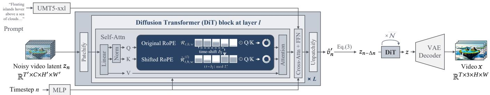  
Fig. 3. The proposed temporal shifting operation on Wan2.2 14B [Wan Team 2025]. Given a noisy video latent $z _ { n } ,$ DiT first patchifies it and maps patches into tokens, which are processed by � DiT blocks. At layer �, self-atention applies a temporal shifting ofset $\delta _ { l }$ to the RoPE, which is then applied to the Q and K matrices. After all DiT blocks, tokens are unpatchified back to latents to produce $\hat { v } _ { n } ^ { \prime } .$ Iterative difusion denoising yields the predicted clean latent �, which is decoded by the VAE to generate the final video.

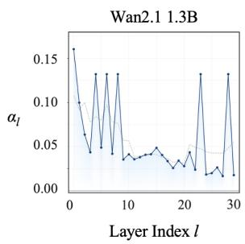

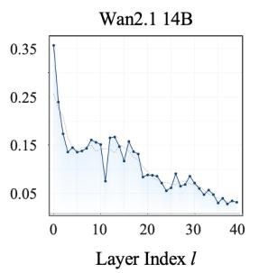

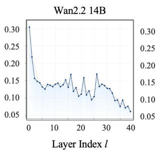

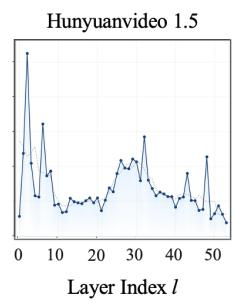

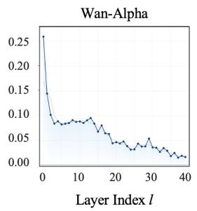

Fig. 4. Efect of RoPE on the temporal positional control $\alpha _ { l }$ at the $l ^ { \mathrm { { t h } } }$ atention layer across state-of-the-art video generation models. Wan2.1 1.3B [Hunyuan Team 2025; Wan Team 2025], Wan2.1 14B [Hunyuan Team 2025; Wan Team 2025], Wan2.2 14B [Hunyuan Team 2025; Wan Team 2025], and Hunyuanvideo 1.5 [Hunyuan Team 2025] are used for RGB looping video generation, while Wan-Alpha [Dong et al. 2026] is used for RGBA looping video generation.  
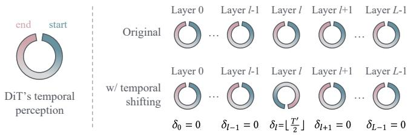  
Fig. 5. Comparison between the original mode and our temporal shifting. The open ring visualizes DiT’s temporal perception, with clockwise motion indicating video progression. Continuous segments represent periods where DiT preserves temporal continuity, while gaps mark discontinuities—specifically, the transition from the video’s end back to its beginning.

At the architecture level of existing state-of-the-art video generation models, simultaneously ensuring looping consistency and semantic fidelity is challenging, as these two objectives are inherently at odds with each other. Text and video modalities can be integrated through self-attention [Villegas et al. 2023] or cross-attention [Wan Team 2025] mechanisms to enhance semantic fidelity in video generation. However, this design tends to preserve the linear temporal ordering learned from pretrained models, thereby hindering the generation of seamless looping videos. In contrast, achieving looping consistency requires constructing a new temporal ordering.

In Section 3.2, we observed that shifting RoPE at diferent attention layers introduces varying degrees of bias into DiT outputs. This efect also appears in semantic fidelity, with the attention layer exhibiting the strongest RoPE control playing a distinct role compared to other layers. Videos generated with RoPE shifts at diferent layers are shown in Fig. 6. For a prompt requiring the video to start with a clear, pure glass of water, Wan2.2 14B produces a video starting with black ink when RoPE is shifted at layer 0, which has the highest $\alpha _ { l } .$ . This occurs because shifting RoPE by $\begin{array} { r } { \delta _ { 0 } = \lfloor \frac { T ^ { \prime } } { 2 } \rfloor } \end{array}$ maps tokens from the initial to final frames to new temporal positions $\{ \lfloor \frac { T ^ { \prime } } { 2 } \rfloor , \lfloor \frac { T ^ { \prime } } { 2 } \rfloor + 1 , . . . , T ^ { \prime } - 1 , 0 , 1 , . . . , \lfloor \frac { T ^ { \prime } } { 2 } \rfloor - 1 \}$ , efectively placing the initial frame in the middle of the sequence. Other layers $( l > 0 )$ also afect semantic fidelity, but to a lesser extent. Although shifting RoPE at layer 0 introduces a temporal discontinuity at the middle of the sequence (between $T ^ { \prime } - 1$ and 0), the motion remains largely smooth due to layers $l > 0 ,$ whose RoPE is unshifted and preserve temporal consistency. Nevertheless, a dark green bias appears in the middle of the video, demonstrating the dominant influence of layer 0. For HunyuanVideo 1.5, shifting RoPE at layer 2 produces a noticeable red color bias and checkerboard artifacts, indicating that layer 2 has a stronger influence than the other layers. In contrast, for both models, shifting the layer with the second-highest �� produces no semantic changes or color bias, indicating that it has much less influence than the layer with the highest ��.

We refer to the attention layer with the strongest RoPE control as the anchor layer, which serves as a contextual prior for video generation. Shifting the RoPE of the anchor layer may introduce undesirable artifacts or semantic inconsistencies. By keeping the anchor layer unchanged, semantic fidelity is better preserved and artifacts are greatly reduced.

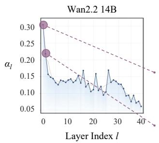  
Original  
Shifted at l = 0 which has lthe highest ³  
Shifted at l = 1 which has the second highest ³ l

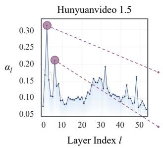  
Shifted at l = 2 which has lthe highest ³  
Shifted at l = 6 which has the second highest ³ l

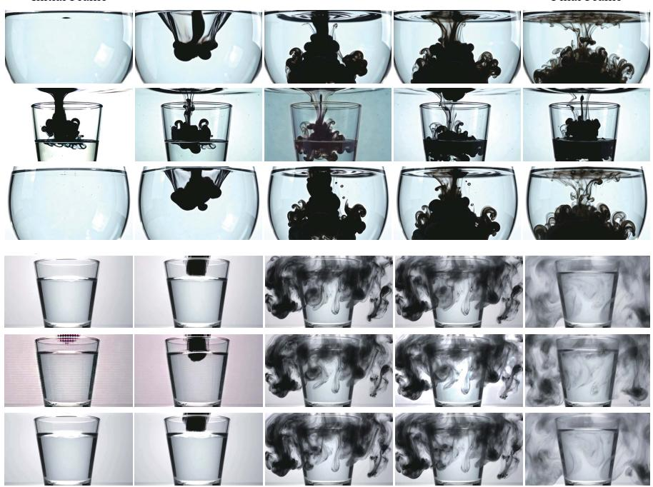  
<Scene starts with a clear, pure glass of water centered. No impurities or color. A drop of black ink falls from above, spreading rapidly into silky swirling clouds. Realistic, fluid art.=

Fig. 6. Comparison of Wan2.2 14B [Wan Team 2025] and HunyuanVideo 1.5 [Hunyuan Team 2025] outputs when shifting RoPE at the layers with the first and second-largest $\alpha _ { l } ,$ relative to the original generated videos.  
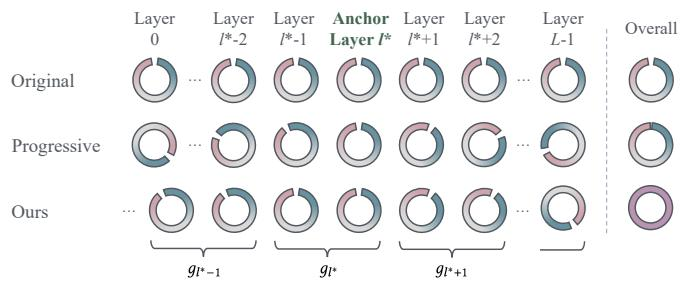  
Fig. 7. Comparison of the original mode, the progressively increasing strategy, and our method.

## 3.4 Anchored Position Embedding Shifting

Building upon Sections 3.2-3.3, we propose an Anchored Position Embedding Shifting (Anchored Shifting) strategy to inject cyclic temporal positional information. We begin by shifting the RoPEs across layers with progressively increasing ofsets, using the same shifting operation defined in Eq. (6). The finding of the anchor layer and the observations in Fig. 6 motivate us to keep this layer unshifted, thereby preventing artifacts while preserving semantic alignment with the user-provided prompt. Let �∗ denote the index of the anchor layer. The progressively increasing ofsets are defined

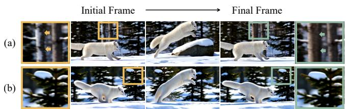  
Fig. 8. Results of (a) naive progressively increasing ofsets and (b) our strategy. The naive strategy fails to produce seamless loops, causing noticeable temporal flickering between the final and first frames, as evidenced by the snow on the tree trunk indicated by the arrow.

as:

$$
\begin{array} { r l } & { \delta _ { l } = ( l - l ^ { * } ) \bmod T ^ { \prime } , \quad l \in \{ 0 , 1 , \ldots , L - 1 \} , } \\ & { l ^ { * } = \arg \operatorname* { m a x } _ { l } \alpha _ { l } , } \end{array}\tag{9}
$$

where $\delta _ { l }$ denotes the temporal shifting ofset of layer �, and arg max denotes the operation used to identify the maximum degree of RoPE influence. The second row of Fig. 7 illustrates this design. We visualize the DiT’s temporal perception as a ring, where the gap denotes the loop boundary, i.e., the transition from the final frame to the first frame. By assigning each layer a distinct temporal position, Eq. (9) encourages the DiT to develop a global cyclic temporal perception.

However, as shown in Fig. 8, the naive strategy with progressively increasing ofsets fails to produce seamless loops, resulting in noticeable temporal flickering between the final and initial frames. This is because such a linear ofset schedule implicitly assumes that all layers exert an equal influence on temporal positioning. As discussed in Section 3.2, however, some layers have a substantially weaker efect. Consequently, layers with negligible temporal control contribute little to perceiving and regulating transitions at the loop boundary. The resulting insuficient accumulation of temporal control near the boundary degrades temporal continuity and leads to unstable looping behavior.

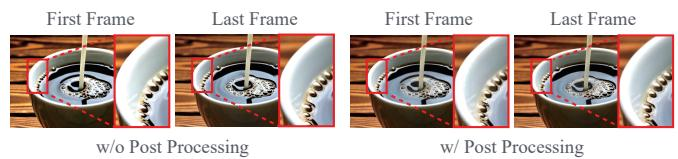

Correspondingly, we propose applying temporal shifts with layerspecific ofsets such that each loop boundary receives nearly equal accumulated temporal control. Based on the statistics in Fig. 4, we group the RoPE layers so that the control efect of RoPE within each group is approximately balanced. By aggregating these layer-wise shifts across all layers, the DiT develops a uniformly cyclic temporal perception, thus enabling seamless looping.

Specifically, given attention layers $l \in \{ 0 , 1 , . . . , L - 1 \}$ , we adaptively assign each layer to a group $g _ { l } \in \{ 0 , 1 , . . . , T ^ { \prime } - 1 \}$ , where $T ^ { \prime }$ denotes the video length. The grouping is designed such that the total influence within each group is approximately balanced as:

$$
\sum _ { l : g _ { l } = i } \alpha _ { l } \approx \sum _ { l : g _ { l } = j } \alpha _ { l } , \quad \forall i \neq j .\tag{10}
$$

For simplicity, we group adjacent layers whenever possible as:

$$
g _ { 0 } \leq g _ { 1 } \leq \cdots \leq g _ { L - 1 } .\tag{11}
$$

Denote the temporal shifting ofset of layer � as $\delta _ { l } ,$ we enforce layers within the same group to share the same shift as:

$$
\delta _ { l } = s _ { g _ { l } } , s _ { k } \in \mathbb { Z } .\tag{12}
$$

We also set the shifting ofset $\delta _ { l ^ { * } }$ of the anchor layer $l ^ { * }$ to zero, i.e., $\delta _ { l ^ { * } } = 0$ . For other groups, the shifting steps increase monotonically:

$$
s _ { 1 } \leq s _ { 2 } \leq \cdot \cdot \cdot \leq s _ { g _ { l ^ { * } } } = 0 \leq \cdot \cdot \cdot \leq s _ { T } .\tag{13}
$$

A visualization of this strategy can be found in the third row of Fig. 7. With grouped layer-specific ofsets, temporal control is uniformly accumulated at each loop boundary position, leading to a uniform and circlic temporal perception of DiT. As shown in Fig. 8, with our layer-specific shifting ofset, the temporal flickering is reduced, and the video is seamlessly looping.

## 3.5 Seamless Looping Video Generation

We now have a semi-training-free approach for looping video generation. We refer to it as semi-training-free due to the temporal sensitivity exhibited by the VAE decoder. Modern video generation models typically perform difusion-based denoising in the latent space, followed by decoding the latent representation into video via a VAE decoder. Since recent video generation models often incorporate temporal compression in the VAE, the VAE decoder exhibits linearly temporal awareness. This behavior conflicts with our anchored shifting strategy, which is designed to eliminate such linearity. Consequently, decoding latents with the VAE may introduce minor temporal looping discontinuities, primarily manifesting as subtle variations in brightness or color, as illustrated in Fig. 9. Fortunately, these minor issues can be easily corrected with simple post-processing. Nevertheless, to ensure practical usability and methodological consistency, we employ minimal fine-tuning to further eliminate these artifacts.

Table 1. Ablation analysis of the Proposed Anchor, Grouped Shifting and Finetuning. We examine the efect of removing various components on looping video generation performance. We compare our Loopy (see the last row) with diferent alternative variants in terms of Cyclic Smoothness.
<table><tr><td></td><td></td><td></td><td>Proposed Anchor Grouped Shifting Fine-tuning</td><td>Cyclic Smoothness↑</td></tr><tr><td colspan="3"></td><td></td><td>0.9753</td></tr><tr><td colspan="2"></td><td></td><td>√</td><td>0.9802</td></tr><tr><td colspan="3">√</td><td></td><td>0.9818</td></tr><tr><td colspan="3">√</td><td></td><td>0.9878</td></tr><tr><td colspan="3">√</td><td>√</td><td>0.9925</td></tr></table>

Fig. 9. Comparison of results without and with post-processing for correcting brightness and color jiter.  
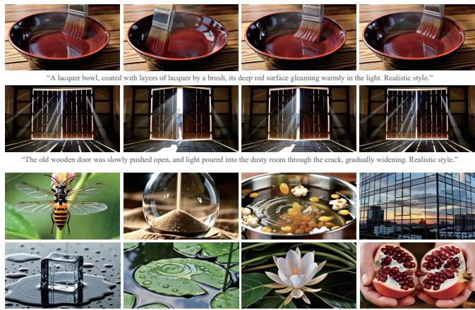  
$\mathsf { F i g . }$ 10. Samples from our looping video training data. The first two rows demonstrate vivid motion and seamless temporal looping consistency, while the botom two rows highlight the scene diversity of our dataset.

We first apply our anchored shifting to Wan 2.2 14B, generating a small collection of looping videos. Subsequently, Deflicker [Lei et al. 2023] is employed to correct color inconsistencies, enhancing visual continuity. The generated videos form a high-quality looping video training dataset, with representative examples illustrated in Fig. 10. The dataset contains 120 looping videos covering diverse scenarios, including animals, portraits, visual efects, objects, and landscapes. Benefiting from the powerful generative capability of Wan 2.2, these videos exhibit realistic textures, coherent structures, and vivid motion variations.

Next, we fine-tune models on this dataset using LoRA with a relatively small rank (e.g., 4). During both training and inference, DiT employs our proposed anchored shifting strategy, enhances stability and promotes semantically consistent looping video generation. In the ablation study, we further demonstrate that removing our anchored shifting results in a substantial degradation in looping stability.

Table 2. Strategy Selection of Loopy. We investigate the efects of anchored layer selection (Anchored Layer), diferent ofset strategies (Ofset Strategy), and fine-tuning with or without the proposed Loopy (Fine-tuning), and report the corresponding performance in terms of cyclic smoothness.
<table><tr><td rowspan="2">Method</td><td colspan="5">Anchored Layer</td><td colspan="2">Offset Strategy</td><td colspan="2">Fine-tuning</td></tr><tr><td>R1</td><td>R2</td><td>R3</td><td>R4</td><td>Proposed Anchor</td><td>Naive Shifting</td><td>Grouped Shifting</td><td>Baseline</td><td>Loopy</td></tr><tr><td>Cyclic Smoothness</td><td>0.9779</td><td>0.9789</td><td>0.9781</td><td>0.9739</td><td>0.9878</td><td>0.9818</td><td>0.9878</td><td>0.9802</td><td>0.9925</td></tr></table>

Table 3. Quantitative comparison with conventional looping video generation approaches, including four pre-AI methods and FLF2V interpolationbased EDEN. Our Loopy achieves state-of-the-art performance across all evaluation metrics.
<table><tr><td>Method</td><td>Cyclic Smoothness↑</td><td>Dynamic Score ↑</td></tr><tr><td>Schödl et al. [2000]</td><td>0.9733</td><td>1.74</td></tr><tr><td>Kwatra et al. [2003]</td><td>0.9751</td><td>1.70</td></tr><tr><td>Agarwala et al. [2005]</td><td>0.9702</td><td>1.52</td></tr><tr><td>Liao et al. [2013]</td><td>0.9898</td><td>1.30</td></tr><tr><td>EDEN [Zhang et al. 2025a]</td><td>0.9824</td><td>0.38</td></tr><tr><td>Loopy</td><td>0.9925</td><td>3.20</td></tr></table>

Beyond RGB modality, we also extend our framework to RGBA looping video generation, which includes an additional transparency channel. We adopt Wan-Alpha [Dong et al. 2026] as the backbone model and apply our anchored shifting to generate RGBA looping videos, which enables flexible content manipulation. This is because that RGBA looping videos are particularly valuable for practical con tent creation and editing in applications such as game development, video efects, and digital design.

## 4 Experiments

## 4.1 Implementation Details

We integrate our method with Wan2.2-T2V-A14B [Wan Team 2025] and Wan-Alpha [Dong et al. 2026]. We generate 120 RGB and 120 RGBA looping videos at a resolution of 480 × 832, comprising 53 frames at 16 FPS to construct our high-quality looping video dataset, using only 4 sampling steps with LightX2V [Contributors 2025]. Then we fine-tune Wan2.1-T2V-1.3B, Wan2.1-T2V-14B, Hunyuanvideo 1.5 and Wan-Alpha on our dataset with LoRA rank 4. The Wan2.1-T2V-1.3B, Wan2.1-T2V-14B and Wan-Alpha were trained for 240 steps with a batch size of 8. The Hunyuanvideo 1.5 was trained for 4, 800 steps with a batch size of 1. Training is conducted on 8 NVIDIA H20 GPUs. After fine-tuning, it can support videos of all resolutions and lengths that are supported by the base model.

## 4.2 Evaluation Metrics

We use VBench [Huang et al. 2024] to assess aesthetic quality and motion smoothness of generated RGBA looping videos. Following Wan-Alpha, the VLLM model GPT-4o [OpenAI 2023] is used to measure text alignment, naturalness, and dynamic score. We also splice the second half of the video with the first half to assess cyclic smoothness using VBench. Higher scores indicate better performance. RGBA videos are rendered on a white background to ensure a fair evaluation.

## 4.3 Component-wise Analysis on Loopy

Proposed Anchor, Grouped Shifting, and Fine-tuning are three core components of Loopy. We examine the efect of removing various components, with the results reported in Tab. 1. We first remove the Proposed Anchor, Grouped Shifting, and Fine-tuning, degrading our Loopy to the original baseline that is not trained on RGBA video data. As the original model perceives time as a linear sequence, it fails to establish temporal continuity between the final and initial frames, resulting in discontinuities that prevent seamless looping video generation (see the first row of Tab. 1). We then fine-tune the backbone on our constructed looping video dataset using LoRA. We denote this fine-tuned version as the baseline model. Without Proposed Anchor and Grouped Shifting, the performance gain brought by fine-tuning is limited (see the second row of Tab. 1). This is because the small-scale training data is insuficient for the model to learn the inherent cyclic temporal pattern of looping videos during large-scale pretraining. Next, we introduce the Proposed Anchor and apply progressively increasing temporal ofsets while keeping the anchor layer unshifted. This strategy injects cyclic temporal information while preserving the contextual prior provided by the most influential layer. Nevertheless, this strategy implicitly assumes that all remaining layers contribute equally to temporal control, despite their substantially diferent efects on temporal perception. Conse quently, temporal control is accumulated unevenly around the loop boundary, resulting in suboptimal looping performance (see the third row of Tab. 1). Enabling Grouped Shifting addresses this limita tion by balancing the accumulated temporal control across diferent temporal positions, thereby further improving cyclic smoothness (see the fourth row of Tab. 1). However, minor discontinuities may still persist due to the linear temporal bias inherent in the temporally compressed VAE decoder. Finally, fine-tuning the model together with the proposed shifting strategy further mitigates this decoder-induced mismatch. By integrating all three components, the complete Loopy achieves the best performance for looping video generation (see the last row of Tab. 1).

## 4.4 Performance Analysis on Strategy Selection

We first examine the efectiveness of the determination of the anchored layer in looping video generation. This is achieved by randomly selecting four layers, excluding the one with the most pronounced RoPE control, as the anchored layer. We remain randomly selected anchored layer unshifted, whereas the remaining layers are rotated according to our proposed anchored shifting strategy. Compared with directly applying our anchored shifting strategy to the baseline model during inference (see Proposed Anchor of Tab. 2), randomly selecting the anchored layer yields unsatisfactory performance (see R1-R4). This is because the anchored layer serves as the reference point of all RoPEs during the temporal rotation, providing contextual priors that guide the remaining layers in shaping the generated video content and mitigating artifacts. Even negligible manipulation of the anchored layer can substantially alter the generated video content, introducing artifacts or semantic inconsistencies. Hence, we define the attention layer exhibiting the most pronounced RoPE control as the anchored layer.

Table 4. Quantitative comparison with two currently available looping strategies, LatentMix [dribnet 2024] and Mobius [Bi et al. 2025], across four representative RGB video generation backbones: Wan 2.1 1.3B [Wan Team 2025], Wan 2.1 14B [Wan Team 2025], Wan 2.2 14B [Wan Team 2025], and HunyuanVideo 1.5 [Hunyuan Team 2025]. Our Loopy achieves superior performance across all evaluation metrics.
<table><tr><td colspan="2">Method</td><td>Text Alignment ↑</td><td>Aesthetic Quality ↑</td><td>Naturalness ↑</td><td>Motion Smoothness ↑</td><td>Cyclic Smoothness ↑</td><td>Dynamic Score ↑</td></tr><tr><td rowspan="3">Wan2.1 1.3B</td><td>LatentMix</td><td>3.24</td><td>0.5753</td><td>2.16</td><td>0.9841</td><td>0.9847</td><td>2.88</td></tr><tr><td>Mobius</td><td>3.34</td><td>0.5803</td><td>2.39</td><td>0.9826</td><td>0.9826</td><td>2.48</td></tr><tr><td>Ours</td><td>3.42</td><td>0.6246</td><td>2.56</td><td>0.9861</td><td>0.9914</td><td>2.92</td></tr><tr><td rowspan="3">Wan2.1 14B</td><td>LatentMix</td><td>3.52</td><td>0.5664</td><td>2.78</td><td>0.9825</td><td>0.9876</td><td>2.30</td></tr><tr><td>Mobius</td><td>2.78</td><td>0.5964</td><td>2.93</td><td>0.9718</td><td>0.9918</td><td>3.20</td></tr><tr><td>Ours</td><td>3.68</td><td>0.6474</td><td>3.28</td><td>0.9878</td><td>0.9928</td><td>3.32</td></tr><tr><td rowspan="3">Wan2.2 14B</td><td>LatentMix</td><td>2.86</td><td>0.5895</td><td>3.02</td><td>0.9777</td><td>0.9834</td><td>2.48</td></tr><tr><td>Mobius</td><td>3.34</td><td>0.5998</td><td>2.87</td><td>0.9697</td><td>0.9892</td><td>2.92</td></tr><tr><td>Ours</td><td>3.68</td><td>0.6497</td><td>3.39</td><td>0.9811</td><td>0.9925</td><td>3.20</td></tr><tr><td rowspan="3">Hunyuanvideo 1.5</td><td>LatentMix</td><td>3.50</td><td>0.4950</td><td>3.16</td><td>0.9809</td><td>0.9752</td><td>3.02</td></tr><tr><td>Mobius</td><td>2.60</td><td>0.3508</td><td>2.83</td><td>0.9722</td><td>0.9872</td><td>2.10</td></tr><tr><td>Ours</td><td>3.80</td><td>0.5146</td><td>3.46</td><td>0.9849</td><td>0.9914</td><td>3.34</td></tr></table>

A pat of butter melts and slides quickly in a hot frying pan, with fine bubbles rising around its edges. Realistic style  
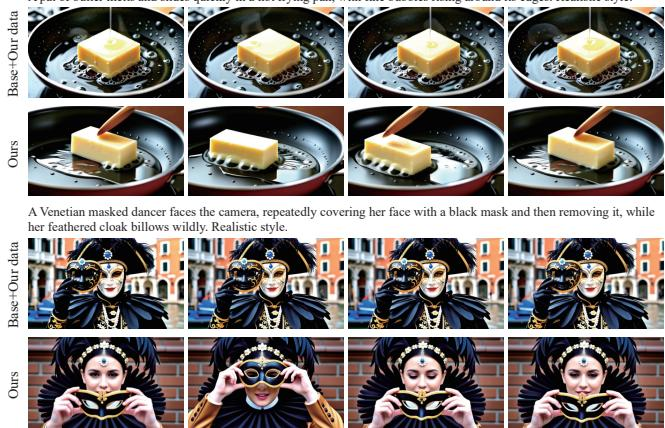  
Fig. 11. Ablation study of training with (Ours) and without (Base + Our Data) anchored shifting on our looping video dataset.

We group RoPE layers to approximately balance the temporal control efect within each group. We further conduct experiments to investigate the impact of the grouping strategy and report the performance in Tab. 2. Specifically, we refer to a naive strategy as progressively increasing shifting ofsets. In this scenario, the temporal control efect of each RoPE within DiT is regarded as identical, yielding slight performance degradation. This degradation arises from our observation that diferent RoPEs exhibit distinct control efects over temporal perception. The naive strategy causes layers with weak RoPE control to contribute minimally to loop boundary perception, leading to insuficient accumulated temporal control. Consequently, the generated videos sufer from degraded temporal continuity and unstable looping.

Next, we examine the efectiveness of training with and without anchored shifting. We denote the version without anchored shifting as the baseline model, which is simply training a LoRA on loop ing data. As shown in Tab. 2, the baseline achieves a much lower cyclic smoothness score. Training with anchored shifting, i.e., our final version of Loopy, achieves superior performance, as anchored shifting enables cyclic temporal perception. The determination of the anchored layer helps generate video content with contextual coherence aligned with the text prompt (see the first case in Fig. 11). By assigning layer-specific shifting ofsets to each RoPE, anchored shifting enhances temporal perception at the loop boundary, enabling Loopy to generate seamless loops with diverse yet coherent motions (see the second case in Fig. 11).

## 4.5 Perceptive Evaluation Study

We conducted an online user study to evaluate the quality of the generated RGB and RGBA looping videos, focusing on motion coherence, motion diversity, and realism. We randomly selected 100 text prompts from the test set, where RGB and RGBA video generation each comprises half of the samples. We utilize these inputs to generate RGB and RGBA looping videos for assessing looping video generation against two looping strategies across five back bones, including four backbones for RGB video generation and Wan-Alpha for RGBA video generation. We received feedback from 40 participants, including 20 males and 20 females aged between 20 and 40. Participants are required to rate each displayed video using a five-point Likert scale, where 1 represents the worst and 5 represents the best. Fig. 12 presents the comparative results on RGB and RGBA looping video generation across 3 evaluation metrics using box plots. Our Loopy receives higher user preferences than other looping strategies across all five backbones, revealing that Loopy can foster a balance between motion diversity and seamless transitions at loop boundaries.

For each backbone/metric, we compared Loopy against each baseline using two-sided Wilcoxon signed-rank tests [Wilcoxon 1992] (N=40), with Holm–Bonferroni correction [Holm 1979] across all pairwise comparisons. Loopy significantly outperforms Latent-Mix/Mobius on all metrics and backbones (Holm-corrected p < 0.001; efect size r ≈ 0.87, indicating a large efect by Cohen’s convention (r > 0.5)).

Table 5. Quantitative comparison on text-to-RGBA video generation methods. We integrate Loopy and two currently available looping strategies, Latent Mix [dribnet 2024] and Mobius [Bi et al. 2025], into the RGBA video generation backbone Wan-Alpha [Dong et al. 2026]. Our Loopy achieves state-of-the-art performance across all evaluation metrics compared to competitive looping approaches.
<table><tr><td>Method</td><td>Text Alignment</td><td>Aesthetic Quality ←</td><td>Naturalness↑</td><td>Motion</td><td>Cyclic Smoothness↑</td><td>Dynamic Score ↑</td></tr><tr><td>LatentMix + Wan-Alpha</td><td>3.22</td><td>0.576</td><td>2.65</td><td>0.9877</td><td>0.9907</td><td>3.19</td></tr><tr><td>Mobius + Wan-Alpha</td><td>3.26</td><td>0.589</td><td>2.76</td><td>0.9912</td><td>0.9851</td><td>3.14</td></tr><tr><td>Loopy + Wan-Alpha</td><td>3.46</td><td>0.636</td><td>3.14</td><td>0.9927</td><td>0.9921</td><td>3.35</td></tr></table>

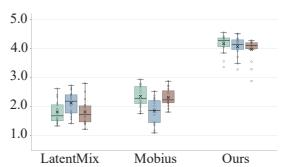  
(a) Wan2.1 1.3B

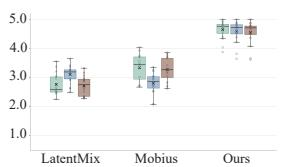  
(b) Wan2.1 14B

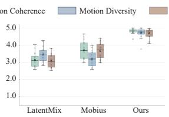  
(c) Wan2.2

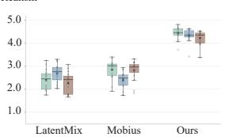  
(d) Hunyuanvideo 1.5

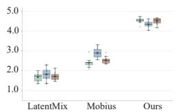  
(e) Wan-Alpha

Fig. 12. Box plots of the average score over the participants for each method regarding motion coherence, motion diversity, and realism.  
A blonde girl is laughing heartily at the camera, tossing her head back, her long hair being blown around her face by the wind before falling back down. Realistic style.  
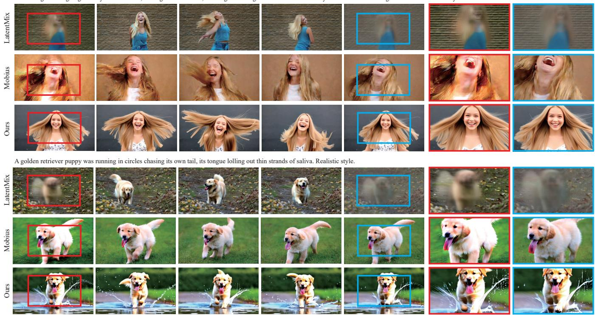  
Fig. 13. Comparison of diferent RGB looping video generation approaches integrated into Wan2.1 1.3B. We zoom in on selected regions of the initial (see red rectangles) and final (see blue rectangles) video frames to beter visualize the results produced by diferent approaches.

## 4.6 State-of-the-Art Comparison

To provide a comprehensive evaluation, we categorize existing looping video generation approaches into two groups: (1) conventional approaches, including Schödl et al. [2000], Kwatra et al. [2003], Agarwala et al. [2005], Liao et al. [2013], and the first-last-frame-to-video (FLF2V) interpolation-based EDEN [Zhang et al. 2025a]; and (2)

The matcha powder was quickly whisked in a white porcelain bowl with a bamboo whisk, producing delicate, emerald-green foam. Realistic style

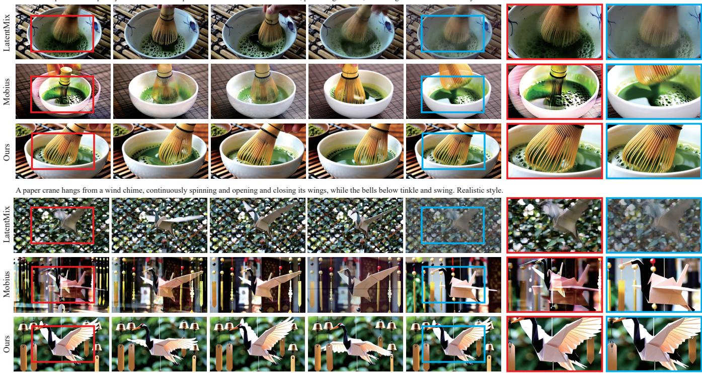  
Fig. 14. Comparison of diferent RGB looping video generation approaches integrated into Wan2.1 14B. We zoom in on selected regions of the initial (see red rectangles) and final (see blue rectangles) video frames for beter visualization. Our Loopy achieves seamless transitions at the loop boundary while mitigating artifacts.

generation-based approaches, which utilize deep generative models to generate looping videos.

For the conventional approaches, we compare our Loopy against four pre-AI methods and an FLF2V interpolation-based EDEN, using two primary metrics for assessing looping quality: Dynamic Score and Cyclic Smoothness. As shown in Tab. 3, our Loopy achieves the best overall performance. The pre-AI approaches construct looping videos by reusing and rearranging existing temporal content, resulting in limited motion diversity and unnatural looping patterns. For the interpolation-based approach, when identical start and end frames are specified, EDEN sufers from static collapse, resulting in limited or no motion variations in the generated video loops. Conversely, when diferent endpoint frames are used, EDEN generates two video segments by reversing the start and end conditions, which are concatenated to form a video loop. However, this strategy introduces noticeable inconsistencies between the two segments. Moreover, when the endpoint frames difer substantially, EDEN fails to produce natural and temporally coherent interpolations.

Since generation-based looping video generation remains largely unexplored, only two looping strategies are currently available for comparison: LatentMix [dribnet 2024] and Mobius [Bi et al. 2025], both of which perform latent manipulation throughout the difusion process. For a comprehensive comparison, we evaluate our proposed Loopy and competitive approaches using six evaluation metrics as described in Sec. 4.2, with quantitative results reported in Tabs. 4–5. Across all five backbones, our method consistently outperforms LatentMix and Mobius, achieving improved text align ment, aesthetic quality, naturalness, and motion smoothness. This indicates that our approach better preserves the generation capability of each backbone, resulting in higher overall video quality. Our Loopy also achieves superior cyclic smoothness, demonstrating enhanced temporal consistency between the final and initial frames and confirming the efectiveness of shifting for looping behavior. Furthermore, our approach attains higher dynamic scores, showing that the looping strategy preserves motion diversity, whereas naive latent manipulation can degrade motion fidelity.

Additionally, LatentMix, Mobius, and Loopy are all plug-and-play methods that only involve simple tensor-wise addition and multiplication operations. Therefore, they introduce negligible computational overhead and have minimal impact on inference eficiency.

Subjective comparisons are shown in Figs. 13, 14, 15, 16 and 17.

## 4.7 Applications

Our method can support any lengths that are supported by the base model. In Fig. 18, we provide the 53- and 81-frame results. Fig. 1, Fig. 19, Fig. 20, and Fig. 21 showcase the versatility of Loopy across various practical applications, including character control, style control, and multi-layer looping video generation. Beyond these examples, Loopy also holds great potential for applications such as live wallpapers, web graphics, game visuals, and social media content.

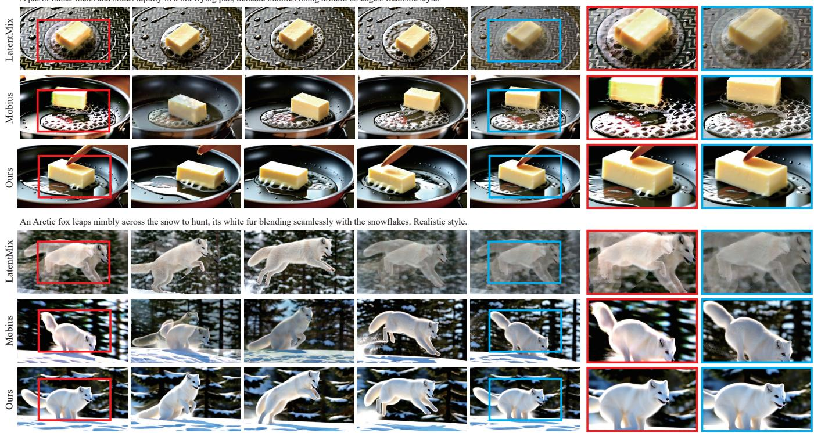  
Fig. 15. Comparison of diferent RGB looping video generation approaches integrated into Wan2.2.

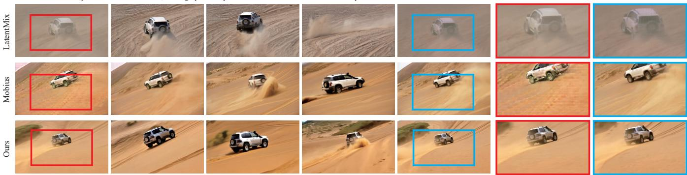

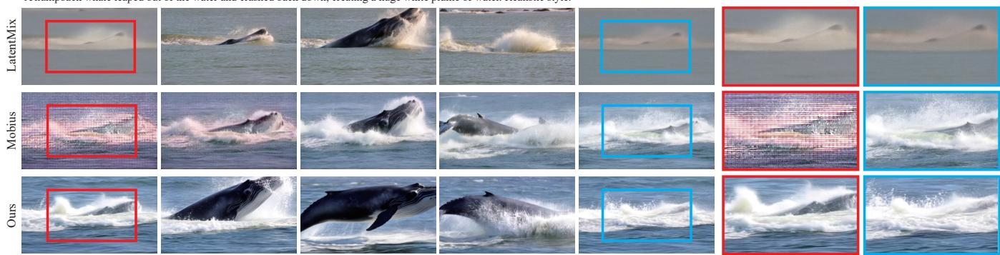  
Fig. 16. Comparison of diferent RGB looping video generation approaches integrated into Hunyuanvideo 1.5.

The background of this video is transparent. A tiny dragon (about the size of a palm) is perched on a human's finger, and it sneezes, exhaling a small ball of fire. Realistic style. Close-up

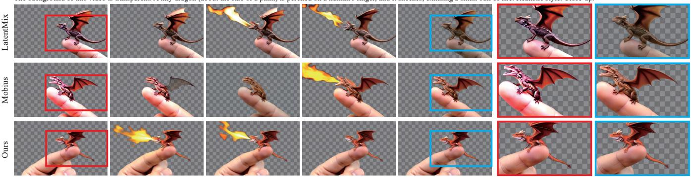

The background of this video is transparent. It features "Loopy-Alpha," made of wobbly, translucent pink jelly. The letters are engaged in a lively, bouncing dance. They collide with each other, shake violently, deform upon impact, and then quickly spring back to their original shape. Realistic style.  
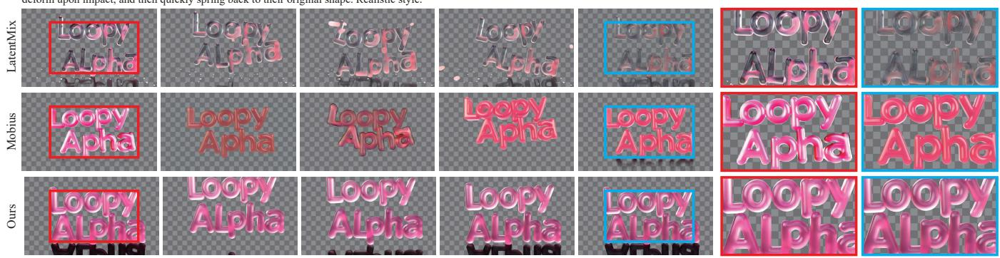  
Fig. 17. Comparison of diferent RGBA looping video generation approaches integrated into Wan-Alpha. We zoom in on selected regions of the initial (see red rectangles) and final (see blue rectangles) video frames for beter visualization. Benefiting from our proposed anchored shifting strategy, Loopy achieves realistic RGBA looping video generation without introducing artifacts and incoherent color variations.

A pat of butter melts and slides rapidly in a hot frying pan, delicate bubbles rising around its edges. Realistic style  
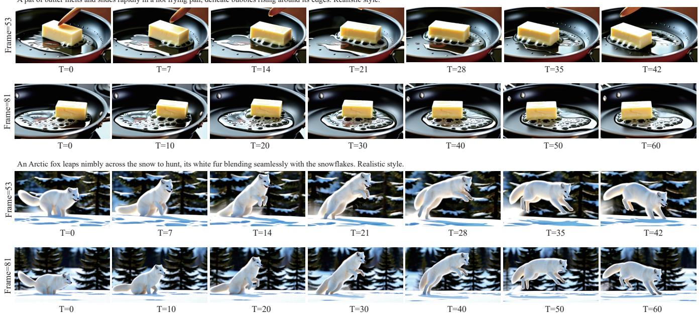  
Fig. 18. Loopy can generate videos of all lengths that are supported by the base model.

Game Art  
Welsh Corgi  
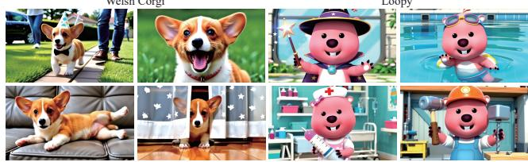  
Loopy  
Fig. 19. Application of our Loopy for character control. It can generate stable Welsh Corgi (left) and Loopy (right) characters across various scenes.

3D cartoon  
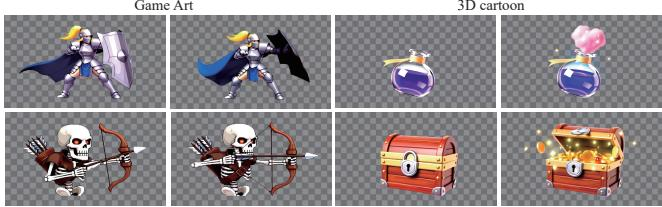  
Fig. 20. Application of our Loopy for style control. It can generate videos in Game Art (left) and 3D Cartoon (right) styles with diferent content.

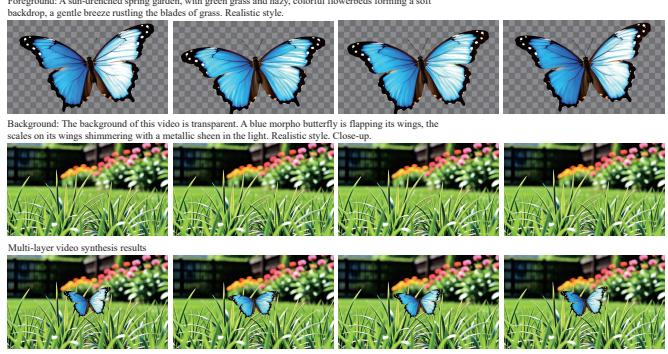  
Fig. 21. Application of our Loopy for multi-layer video generation. By combining the generated RGB and RGBA videos, the model can produce a vivid multi-layer looping video.

## 5 Conclusion and Discussion

In this paper, we are the first to analyze RoPE’s temporal control at diferent attention layers within DiT. Built upon two core findings – diferent RoPEs exhibit distinct control efects over temporal perception and the attention layer exhibiting the most pronounced RoPE control efect acts as an anchor – we propose Anchored Position Embedding Shifting (Anchored Shifting) that assigns layer-specific temporal shifting ofset to each RoPE for preserving temporal coherence and enabling seamless loop-boundary transition. We demonstrate the practicality of Loopy through various applications, ranging from RGB/RGBA looping video generation to multi-layer looping video generation. These capabilities make Loopy a versatile and robust tool for downstream tasks in both the AIGC community and broader industrial applications, including live wallpapers, web graphics, advertising design, and visual efects.

Our Loopy supports the generation of multi-layer videos without the consideration of illumination or shadow consistency, which may lead to inconsistencies in the generated video content. This limitation could potentially be addressed by introducing shared attention mechanisms between foreground and background DiTs, although such an investigation is beyond the scope of this paper. In our future work, we plan to explore more eficient solutions for realistic multi-layer looping video generation.

## Acknowledgements

We thank the anonymous reviewers for their constructive comments. This work was supported by National Natural Science Foundation of China (No.62476192).

## References

Aseem Agarwala, Ke Colin Zheng, Chris Pal, Maneesh Agrawala, Michael Cohen, Brian Curless, David Salesin, and Richard Szeliski. 2005. Panoramic video textures. In ACM SIGGRAPH.

Jingqi Bai, Jingkai Zhou, Benzhi Wang, Weihua Chen, Yang Yang, Zhen Lei, and Fan Wang. 2025. Layer-Animate for Transparent Video Generation. In ICASSP.

Hugo Bertiche, Niloy J Mitra, Kuldeep Kulkarni, Chun-Hao P Huang, Tuanfeng Y Wang, Meysam Madadi, Sergio Escalera, and Duygu Ceylan. 2023. Blowing in the wind: Cyclenet for human cinemagraphs from still images. In IEEE CVPR.

Xiuli Bi, Jianfei Yuan, Bo Liu, Yong Zhang, Xiaodong Cun, Chi-Man Pun, and Bin Xiao. 2025. Mobius: Text to Seamless Looping Video Generation via Latent Shift. In ACM SIGGRAPH.

Andreas Blattmann, Robin Rombach, Huan Ling, Tim Dockhorn, Seung Wook Kim, Sanja Fidler, and Karsten Kreis. 2023. Align Your Latents: High-Resolution Video Synthesis with Latent Difusion Models. In IEEE CVPR.

Xuewei Chen, Zhimin Chen, and Yiren Song. 2025. TransAnimate: Taming Layer Difusion to Generate RGBA Video. ArXiv preprint (2025).

LightX2V Contributors. 2025. LightX2V: Light Video Generation Inference Framework. https://github.com/ModelTC/lightx2v.

Haotian Dong, Wenjing Wang, Chen Li, Jing Lyu, and Di Lin. 2026. Video generation with stable transparency via shiftable rgb-a distribution learner. In IEEE CVPR.

dribnet. 2024. CogVideo (with\_looping branch). https://github.com/dribnet/CogVideo/ tree/with\_looping.

Patrick Esser, Sumith Kulal, Andreas Blattmann, Rahim Entezari, Jonas Müller, Harry Saini, Yam Levi, Dominik Lorenz, Axel Sauer, Frederic Boesel, Dustin Podell, Tim Dockhorn, Zion English, and Robin Rombach. 2024. Scaling Rectified Flow Trans formers for High-Resolution Image Synthesis. In ICML.

Tavi Halperin, Hanit Hakim, Orestis Vantzos, Gershon Hochman, Netai Benaim, Lior Sassy, Michael Kupchik, Ofir Bibi, and Ohad Fried. 2021. Endless loops: detecting and animating periodic patterns in still images. ACM TOG (2021).

Jonathan Ho, Ajay Jain, and Pieter Abbeel. 2020. Denoising Difusion Probabilistic Models. In NeurIPS.

Sture Holm. 1979. A simple sequentially rejective multiple test procedure. Scandinavian Journal ofStatistics (1979).

Ziqi Huang, Yinan He, Jiashuo Yu, Fan Zhang, Chenyang Si, Yuming Jiang, Yuanhan Zhang, Tianxing Wu, Qingyang Jin, Nattapol Chanpaisit, Yaohui Wang, Xinyuan Chen, Limin Wang, Dahua Lin, Yu Qiao, and Ziwei Liu. 2024. VBench: Comprehen sive Benchmark Suite for Video Generative Models. In IEEE CVPR.

Hunyuan Team. 2025. HunyuanVideo 1.5 Technical Report. ArXiv preprint (2025).

Kling Team. 2025. Kling-Omni Technical Report. ArXiv preprint (2025).

Weijie Kong, Qi Tian, Zijian Zhang, Rox Min, Zuozhuo Dai, Jin Zhou, Jiangfeng Xiong, Xin Li, Bo Wu, Jianwei Zhang, Kathrina Wu, Qin Lin, Junkun Yuan, Yanxin Long, Aladdin Wang, Andong Wang, Changlin Li, Duojun Huang, Fang Yang, Hao Tan, Hongmei Wang, Jacob Song, Jiawang Bai, Jianbing Wu, Jinbao Xue, Joey Wang, Kai Wang, Mengyang Liu, Pengyu Li, Shuai Li, Weiyan Wang, Wenqing Yu, Xinchi Deng, Yang Li, Yi Chen, Yutao Cui, Yuanbo Peng, Zhentao Yu, Zhiyu He, Zhiyong Xu, Zixiang Zhou, Zunnan Xu, Yangyu Tao, Qinglin Lu, Songtao Liu, Daquan Zhou, Hongfa Wang, Yong Yang, Di Wang, Yuhong Liu, Jie Jiang, and Caesar Zhong. 2024. HunyuanVideo: A Systematic Framework For Large Video Generative Models. ArXiv preprint (2024).

Vivek Kwatra, Arno Schödl, Irfan Essa, Greg Turk, and Aaron Bobick. 2003. Graphcut textures: image and video synthesis using graph cuts. ACM TOG (2003).

Chenyang Lei, Xuanchi Ren, Zhaoxiang Zhang, and Qifeng Chen. 2023. Blind video deflickering by neural filtering with a flawed atlas. In IEEE CVPR.

Menghao Li, Zhenghao Zhang, Junchao Liao, Long Qin, and Weizhi Wang. 2025b. TransVDM: Motion-Constrained Video Difusion Model for Transparent Video Synthesis. In ICASSP.

Yiyu Li, Haoyuan Wang, Ke Xu, Gerhard Petrus Hancke, and Rynson W.H. Lau. 2025a. SeHDR: Single-Exposure HDR Novel View Synthesis Via 3D Gaussian Bracketing. In IEEE ICCV.

Zicheng Liao, Neel Joshi, and Hugues Hoppe. 2013. Automated video looping with progressive dynamism. ACM TOG (2013).

Yaron Lipman, Ricky T. Q. Chen, Heli Ben-Hamu, Maximilian Nickel, and Matthew Le. 2023. Flow Matching for Generative Modeling. In ICLR.

Nanye Ma, Mark Goldstein, Michael S. Albergo, Nicholas M. Bofi, Eric Vanden-Eijnden, and Saining Xie. 2024. SiT: Exploring Flow and Difusion-Based Generative Models with Scalable Interpolant Transformers. In ECCV.

Aniruddha Mahapatra, Long Mai, Cusuh Ham, and Feng Liu. 2026. DreamLoop: Con trollable Cinemagraph Generation from a Single Photograph. ArXiv preprint (2026).

Aniruddha Mahapatra, Aliaksandr Siarohin, Hsin-Ying Lee, Sergey Tulyakov, and Jun Yan Zhu. 2023. Text-guided synthesis of eulerian cinemagraphs. ACM TOG (2023). OpenAI. 2023. GPT-4 Technical Report. ArXiv preprint (2023).

William Peebles and Saining Xie. 2023. Scalable difusion models with transformers. In IEEE ICCV.

Xiangyu Peng, Zangwei Zheng, Chenhui Shen, Tom Young, Xinying Guo, Binluo Wang, Hang Xu, Hongxin Liu, Mingyan Jiang, Wenjun Li, Yuhui Wang, Anbang Ye, Gang Ren, Qianran Ma, Wanying Liang, Xiang Lian, Xiwen Wu, Yuting Zhong, Zhuangyan Li, Chaoyu Gong, Guojun Lei, Leijun Cheng, Limin Zhang, Minghao Li, Ruijie Zhang, Silan Hu, Shijie Huang, Xiaokang Wang, Yuanheng Zhao, Yuqi Wang, Ziang Wei, and Yang You. 2025. Open-Sora 2.0: Training a Commercial-Level Video Generation Model in \$200k. ArXiv preprint (2025).

Zefan Qu, Zhenwei Wang, Haoyuan Wang, Ke Xu, Gerhard Petrus Hancke, and Rynson. W. H. Lau. 2025. StyleSculptor: Zero-Shot Style-Controllable 3D Asset Generation with Texture-Geometry Dual Guidance. In ACM SIGGRAPH Asia.

Robin Rombach, Andreas Blattmann, Dominik Lorenz, Patrick Esser, and Björn Ommer. 2022. High-Resolution Image Synthesis with Latent Difusion Models. In IEEE CVPR.

Olaf Ronneberger, Philipp Fischer, and Thomas Brox. 2015. U-Net: Convolutional Networks for Biomedical Image Segmentation. In MICCAI.

Arno Schödl, Richard Szeliski, David H. Salesin, and Irfan Essa. 2000. Video textures. In ACM SIGGRAPH.

Seedance Team. 2025. Seedance 1.5 pro: A Native Audio-Visual Joint Generation Foundation Model. ArXiv preprint (2025).

Seedance Team. 2026. Seedance 2.0: Advancing Video Generation for World Complexity. ArXiv preprint (2026).

Jianlin Su, Murtadha Ahmed, Yu Lu, Shengfeng Pan, Wen Bo, and Yunfeng Liu. 2024. Roformer: Enhanced transformer with rotary position embedding. Neurocomputing (2024).

Ashish Vaswani, Noam Shazeer, Niki Parmar, Jakob Uszkoreit, Llion Jones, Aidan N. Gomez, Lukasz Kaiser, and Illia Polosukhin. 2017. Attention is All you Need. In NeurIPS.

Ruben Villegas, Mohammad Babaeizadeh, Pieter-Jan Kindermans, Hernan Moraldo, Han Zhang, Mohammad Taghi Safar, Santiago Castro, Julius Kunze, and Dumitru Erhan. 2023. Phenaki: Variable Length Video Generation from Open Domain Textual Descriptions. In ICLR.

Wan Team. 2025. Wan: Open and advanced large-scale video generative models. ArXiv preprint (2025).

Fanyi Wang, Peng Liu, Haotian Hu, Dan Meng, Jingwen Su, Jinjin Xu, Yanhao Zhang, Xiaoming Ren, and Zhiwang Zhang. 2024. Loopanimate: Loopable salient object animation. In ACMMM Asia.

Luozhou Wang, Yijun Li, Zhifei Chen, Jui-Hsien Wang, Zhifei Zhang, He Zhang, Zhe Lin, and Ying-Cong Chen. 2025a. TransPixeler: Advancing Text-to-Video Generation with Transparency. In IEEE CVPR.

Xin Wang, Di Lin, Wanchao Su, Ji Du, Renjie Zhang, Jie Zhang, Haotian Dong, Ke Xu, Qing Guo, and Ping Li. 2025b. HRC-Net: Learning Visual Hypothesis, Representative, and Collaboration for Multi-Domain Image Inpainting. ACM TOG (2025).

Frank Wilcoxon. 1992. Individual comparisons by ranking methods. In Breakthroughs in Statistics: Methodology and Distribution.

Ronghuan Wu, Wanchao Su, Kede Ma, Jing Liao, and Rafał K Mantiuk. 2026. X2HDR: HDR Image Generation in a Perceptually Uniform Space. arXiv preprint arXiv:2602.04814 (2026).

Ke Xu, Gerhard Petrus Hancke, and Rynson W. H. Lau. 2023. Learning Image Harmonization in the Linear Color Space. In IEEE ICCV.

David Junhao Zhang, Jay Zhangjie Wu, Jia-Wei Liu, Rui Zhao, Lingmin Ran, Yuchao Gu, Difei Gao, and Mike Zheng Shou. 2025b. Show-1: Marrying Pixel and Latent Difusion Models for Text-to-Video Generation. IJCV (2025).

Lvmin Zhang and Maneesh Agrawala. 2024. Transparent Image Layer Difusion using Latent Transparency. ACM TOG (2024).

Ting Zhang, Zhiqiang Yuan, Yeshuang Zhu, Jie Zhou, and Jinchao Zhang. 2025c. ILDif: Generate Transparent Animated Stickers by Implicit Layout Distillation. In ICASSP.

Zihao Zhang, Haoran Chen, Haoyu Zhao, Guansong Lu, Yanwei Fu, Hang Xu, and Zuxuan Wu. 2025a. Enhanced Difusion for High-quality Large-motion Video Frame Interpolation. In IEEE CVPR.