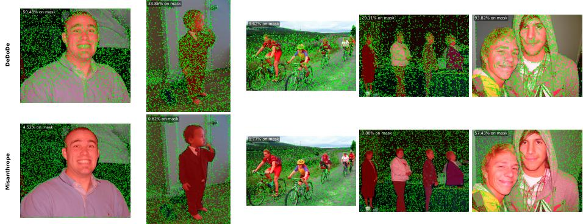
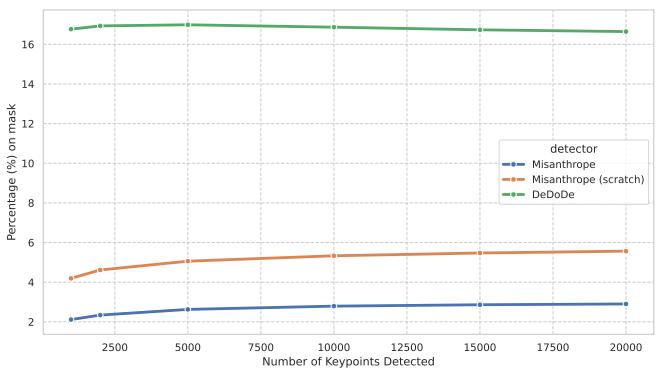
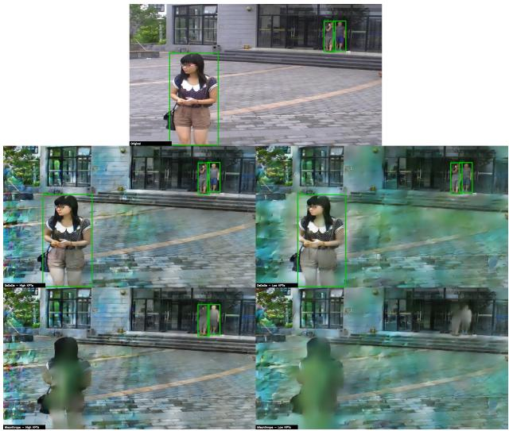
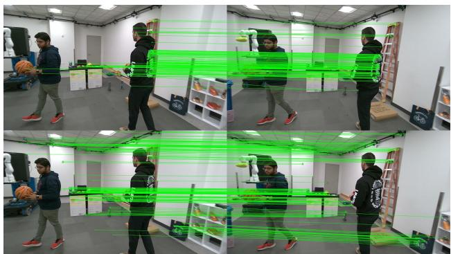

# Misanthrope: A Privacy-Preserving Keypoint Detector

Francesco Vultaggio1,2 , Predrag Djindjic3 , Markus Gerke2 , Sebastian Tschiatschek3 , and Phillipp Fanta-Jende1

1 Austrian Institute of Technology, Assistive & Autonomous Systems Vienna 1210, Austria. {name.surname}@ait.ac.at

2 Technical University of Braunschweig, Institute of Geodesy and Photogrammetry Braunschweig 38106, Germany. {n.surname}@tu-bs.de

3 University of Vienna, Data Mining and Machine Learning Vienna 1090, Austria. {name.surname}@univie.ac.at

Abstract. Image matching is a core component of applications such as Simultaneous Localization and Mapping (SLAM), Visual Localization, and Structure from Motion (SfM). However, the local image features central to this task are vulnerable to inversion attacks, which enable adversaries to reconstruct privacy-sensitive scene content from local features. These attacks pose a particular threat in distributed computing scenarios where the pre-computed features leave edge devices to be processed by remote servers. In this work, we introduce Misanthrope, a novel privacy-preserving keypoint detector trained through self-distillation to avoid detecting keypoints on people—a predominant source of privacy-sensitive content in most localization scenarios—thus mitigating inversion attacks at the source rather than through post-hoc obfuscation. We demonstrate how inverted images from traditional feature detection pipelines can be used to detect and re-identify people in the scene, while Misanthrope is able to mitigate these attacks. Furthermore, Misanthrope maintains image matching performance on par with the state of the art and even surpasses it in challenging settings where people act as distractors, such as phototourism and in-the-wild odometry. On the Image Matching Challenge 2021 Phototourism test set, Misanthrope is the top-performing sparse feature extractor in 7 out of 9 scenes. We make our model and its evaluation script available here: https://github.com/fratopa/misanthrope.

Keywords: Privacy · Visual Localization · Image Matching · Keypoint Detection

## 1 Introduction

Finding correspondences across images is a fundamental task in computer vision. It sits at the core of many traditional geometric computer vision tasks and downstream applications spanning from Simultaneous Localization and Mapping (SLAM) [1, 27] to Visual Localization [31, 35], and beyond [57]. A traditional image matching pipeline consists of three steps: keypoint detection, keypoint description (i.e., local feature extraction), and finally local feature matching. While the threat to privacy that images pose is apparent and is actively regulated [4, 52], modern inversion attacks [10, 14, 40, 56] have shown that sparse image features similarly constitute a threat to privacy by revealing the contents of the image from which the features have been extracted or the scene in which they have been embedded. A model capable of revealing scene contents from Structure from Motion (SfM) point clouds poses a significant privacy threat to any Visual Localization system reliant on such a map representation [45].

The Visual Localization community has responded to these attacks with obfuscation-based strategies that modify the 3D structure of SfM maps to resist inversion while aiming to preserve localization performance [32, 34, 49]. However, this line of defense is increasingly fragile: newer inversion methods have demonstrated successful attacks against several of these obfuscated representations [7, 8].

Fundamentally, obfuscation-based approaches treat all scene content as uniformly private, which necessitates non-standard map representations that are incompatible with keypoint-based pipelines [31, 45], and reduces localization accuracy [32,34,37,49]. This assumption holds in settings such as private residences or industrial facilities, where the scene itself is sensitive. However, it does not hold in general. In many practical deployment settings, such as outdoor urban environments or tourist landmarks, the scene geometry required for localization is inherently public, and privacy-sensitive content is limited to semantically distinct elements within it, most notably people. In these settings, detection and redaction of private data at the image level prior to feature detection is already common practice [20], often as a requirement by law [4, 52].

We argue that—where private and localizable content are separable—a more efective strategy is to prevent privacy-sensitive features from being produced in the first place, rather than to obfuscate the entire representation after the fact. Crucially, people also act as visual distractors that degrade matching performance, meaning that a detector that avoids them confers a localization benefit alongside the privacy one.

However, existing keypoint detectors are not designed to avoid people. Naïve attempts to filter keypoints on people using a separate segmentation network are sound but computationally expensive and introduce additional latency, which is particularly problematic for edge devices, where a fixed computational budget means any segmentation network comes at the expense of the feature extractor itself.

To overcome these shortcomings, we introduce Misanthrope: a keypoint detector trained via a novel, privacy-directed self-distillation [36] scheme that avoids detecting keypoints on people. In particular, we leverage DeDoDe [16]—a pre-trained state-of-the-art model for local feature extraction—as a teacher. Its keypoint predictions on the large-scale COCO dataset [28] are filtered using semantic person masks, creating a privacy-aware supervisory signal. An identical student network is then trained to replicate this filtered output, teaching it to detect robust keypoints while inherently avoiding people (Figure 1). This removes the need to deploy a separate segmentation network at inference time, streamlining the pipeline and reducing latency on edge devices compared to techniques that redact private information at the image level before feature extraction.

In this work, we make the following contributions:

i. To the best of our knowledge, we provide the first demonstration that individuals can be re-identified from imagery reconstructed via inversion attacks on sparse features.

ii. We propose Misanthrope, a keypoint detector trained via privacy-directed self-distillation that avoids detecting features on people at inference time, without requiring a separate segmentation module.

iii. We show that avoiding keypoints on people simultaneously strengthens privacy and improves matching, achieving top results among sparse feature extractors on 7 out of 9 scenes in the Image Matching Challenge 2021 (IMC2021) Phototourism benchmark [25].

## 2 Related Work

## 2.1 Image Matching

At the core of image matching sits feature extraction. Recent years have seen a shift from hand-crafted feature extraction techniques [30, 44] to deep learningbased ones [13, 16, 18, 42, 50, 51, 58]. Many modern strategies [13, 22, 42] use an encoder-dual-decoder architecture, where a shared feature encoder feeds two separate heads for keypoint detection and descriptor extraction. Alternatively, some models unify these tasks into a single output [51], while others, like DeDoDe [16], employ entirely separate networks for detection and description. The training strategies vary from self-supervision [13, 22], to reinforcement learning [51], to SfM-derived labels [16]. A parallel family of detector-free matchers [18, 50] bypasses keypoint detection, instead matching dense feature maps directly using the attention mechanism [53]. While powerful, these methods are computationally intensive. Critically, their reliance on dense feature maps poses a greater privacy risk, as denser representations provide richer signals for inversion [14]. We adopt DeDoDe [16], whose separate detector and descriptor networks allow training a privacy-aware detector without modifying the descriptor.

Semantic guidance: Prior work has leveraged semantic data in local feature pipelines for two distinct purposes: to enrich descriptors and improve matching quality [6, 47], and to improve robustness to dynamic objects by filtering keypoints detected on them [46]. The latter is closer to our setting, but is typically achieved via a two-stage pipeline in which a standard detector proposes keypoints and a separate segmentation network generates masks to filter them. Our approach difers in both goal and design: rather than targeting dynamic objects for robustness, we target people for privacy, and we train a single network that inherently avoids detecting keypoints on people, embedding semantic awareness directly into the detector without a separate segmentation stage.

Knowledge distillation: Distillation has been applied in the image matching domain primarily as a model compression technique [12,17,42,54], transferring knowledge from a large feature extractor into a smaller one. We repurpose self-distillation [21,36]—where teacher and student share the same architecture— for a fundamentally diferent end: not to compress a model, but to impose a behavioral constraint on it. Specifically, we use a teacher network to train an architecturally identical student to avoid detecting keypoints on people, embedding a privacy-preserving behavior without altering the model’s structure. To the best of our knowledge, this is the first use of self-distillation to embed semantic avoidance directly into a keypoint detector.

## 2.2 Privacy Threats and Mitigation Strategies

The conversion of images into sparse local features does not inherently guarantee anonymization. Recent research on inversion attacks has shown that it is possible to reconstruct detailed images from local features alone [14], to recover entire 3D scenes from SfM models [40], simple colorized point clouds [48], and even the approximate contents associated with a CLIP [43] embedding [56]. As we demonstrate in our experiments, reconstructed imagery is often of suficient quality to enable person detection and re-identification, constituting a direct privacy threat.

In response, a significant body of work has focused on mitigating these threats through obfuscation. We can distinguish between two classes of obfuscation: geometric obfuscation and descriptor obfuscation. Geometric obfuscation techniques aim to modify the derived 3D models to disrupt inversion algorithms. Previously proposed strategies include the permutation of 3D point coordinates [34] or the use of alternative geometric representations such as lines [49] or ray clouds [32]. While efective against specific inversion techniques, geometric obfuscation techniques have been met with the development of more advanced reconstruction algorithms capable of defeating these countermeasures [7, 8], indicating a potential limitation of geometric approaches. Descriptor obfuscation was first explored in [15, 33, 41] and more recently in [37, 39]. The first family of techniques aims to modify pre-existing descriptors to make them more resistant to inversion attacks, either via adversarial training [33] or by lifting the descriptors to a new subspace with adversarial samples to confuse the reconstruction process [15, 41]. We highlight in particular LDP-Feat [41], which both introduces techniques to attack the earlier lifting approach [15] and proposes a new approach that formally bounds the amount of information any attacker can recover from the obfuscated descriptors. However, the recoverable information is directly proportional to the matchability of the descriptors, meaning that robustness to inversion attacks explicitly comes at the cost of matching utility. More recent works [37–39] propose to use segmentation masks to learn private features. Their experiments indicate that segmentation masks can limit the information retrievable from the learned features but cannot fully obfuscate it, and these techniques still come at the cost of poorer matching properties.

This work explores an alternative direction: rather than obfuscating privacysensitive data after it has been captured, we prevent it from being produced at detection time. The central insight is that, in many practical settings, privacysensitive information can be disentangled from the scene geometry required for localization. Where this separation holds, full scene obfuscation is unnecessary; it sufices to exclude privacy-relevant elements from the feature representation entirely. This principle has a decisive theoretical advantage over obfuscation: information that is absent from the representation cannot be recovered regardless of computational resources or future algorithmic advances, and any residual leakage from imperfect avoidance is measurable and auditable prior to deployment. Moreover, in most instances privacy-sensitive information hinders the image matching process; in these cases, avoiding sampling keypoints on people not only reduces privacy leaks but also improves downstream accuracy. Building on this principle, Misanthrope is trained to inherently avoid detecting keypoints on people, integrating privacy constraints directly into the detection stage without requiring a separate person segmentation module or any post-hoc obfuscation.

## 3 Method

## 3.1 Overview

We propose a simple, yet efective, training procedure for a keypoint detector that inherently avoids detecting features on people, thus mitigating privacy leakage at the source. Our approach, Misanthrope, is based on self-distillation: a student network is trained to mimic a teacher’s predictions while avoiding regions semantically identified as people.

Crucially, the detector architecture remains unchanged, and our approach modifies only the training supervision. This allows any existing detector to be adapted into a privacy-aware variant with minimal implementation changes. In this work we use DeDoDe [16] as the base model: its separate detector and descriptor networks allow us to retrain only the detector while leaving the descriptor untouched. For architectures where the keypoint detector and descriptor heads are attached to a single backbone, such as [13, 42, 51, 58], the distillation scheme would need to be extended to fine-tune the detections while maintaining the original descriptors, which is beyond the scope of this work.

## 3.2 Teacher-Student Distillation with Semantic Filtering

We adopt the DeDoDe [16] detector for both teacher and student networks. Let I be an input image and M its corresponding semantic mask, where $M ( \mathbf { p } ) = 1$ if the pixel p belongs to a person and 0 otherwise. Let $T ( I ; \theta _ { T } ) \in \mathbb { R } ^ { H \times W }$ denote the teacher’s keypoint activation map for the image I given the teacher parameters $\theta _ { T }$ . The activation map indicates the likelihood of a pixel being a keypoint.

Our training procedure consists of the following steps:

1. Teacher prediction: For each input image I, we calculate the teacher’s keypoint probability map $P _ { T } ( I ; \theta _ { T } ) = \mathrm { s o f t m a x } ( T ( I ; \theta _ { T } ) )$ , where the softmax is taken over all spatial locations, yielding a distribution over pixels.

2. Semantic masking: We then element-wise zero out the probabilities in regions corresponding to people:

$$
P _ { T } ^ { \prime } ( I ; \theta _ { T } ; M ) ( \mathrm { p } ) = \left\{ \begin{array} { l l } { P _ { T } ( I ; \theta _ { T } ) ( \mathrm { p } ) , } & { \mathrm { i f ~ } M ( \mathrm { p } ) = 0 } \\ { 0 , } & { \mathrm { i f ~ } M ( \mathrm { p } ) = 1 } \end{array} \right.
$$

3. Re-normalization: To maintain a valid probability distribution, we rescale the masked $P _ { T } ^ { \prime } ( I ; \theta _ { T } ; M )$

$$
\hat { P } _ { T } ( I ; \theta _ { T } ; M ) \mathrm { ( p ) } = \frac { P _ { T } ^ { \prime } ( I ; \theta _ { T } ; M ) \mathrm { ( p ) } } { \sum _ { \mathrm { p ^ { \prime } } } P _ { T } ^ { \prime } ( I ; \theta _ { T } ; M ) \mathrm { ( p ^ { \prime } ) } }
$$

4. Student supervision: The student network with parameters $\theta _ { S }$ is trained to predict a keypoint probability map $P _ { S } ( I ; \theta _ { S } )$ that replicates $\hat { P } _ { T } ( I ; \theta _ { T } ; M )$ using the Kullback–Leibler (KL) divergence as the loss:

$$
\begin{array} { r } { \mathcal { L } _ { \mathrm { K L } } ( \boldsymbol { \theta } _ { S } ) = \mathrm { K L } \left( \hat { P } _ { T } ( \boldsymbol { I } ; \boldsymbol { \theta } _ { T } ; \boldsymbol { M } ) \parallel P _ { S } ( \boldsymbol { I } ; \boldsymbol { \theta } _ { S } ) \right) } \end{array}
$$

The result is a student keypoint detector that learns to assign low activation scores to regions where people appear while preserving robustness in the remaining parts of the image.

## 3.3 Training Data

We use the COCO dataset [28] since it has proven to be a reliable dataset for the training of image matching models [13, 22] and provides person segmentation masks. We filter for images containing at least 1% of pixels labeled as people, yielding a total of 64,115 training images and 2,696 validation images. A limitation of COCO is that its segmentation masks are derived from polygon annotations and therefore provide only coarse boundaries. However, alternative datasets ofering pixel-level semantic masks for people, such as LIP [23], are dominated by portraiture-style images in which individuals stand against uniform backgrounds and are untested in the training of image matching models. Other candidate datasets are limited either in the number of images containing people [9, 19] or in scene diversity [5, 9].

## 3.4 Training

We implement the distillation procedure in PyTorch using DeDoDe-L [16] as our base model. Both teacher and student networks share the same architecture and pre-trained weights. The teacher model remains frozen throughout training, while only the student is updated.

We train for 60,000 iterations with a batch size of 14 images using AdamW [29] with a weight decay of $1 0 ^ { - 4 }$ and Automatic Mixed Precision. We implement a 500-iteration learning rate warm-up from $1 0 ^ { - 9 }$ to $5 \cdot 1 0 ^ { - 4 } $ . Every 100 training iterations, we evaluate the KL divergence loss on 15 batches sampled from a held-out validation split of the filtered COCO dataset, and halve the learning rate if no improvement is observed for 30 consecutive validation runs. Training was performed on a single NVIDIA RTX 3090 Ti over a 14-hour period.

## 4 Experiments

## 4.1 Privacy Preservation

To evaluate the ability of Misanthrope to preserve the privacy of individuals depicted in scenes, we perform the following tests. We first measure the model’s ability to avoid sampling keypoints on people; to this end, we use the PascalVOC2012 dataset [19]. We then test the extent to which the features extracted by our model can be used to recover privacy-sensitive information using the Person Re-identification in the Wild (PRW) dataset [62], which, unlike most reidentification benchmarks [24,55,61], provides full scene images rather than precropped person bounding boxes, allowing us to evaluate the complete pipeline from feature extraction through inversion to detection and re-identification. To invert the features, we use InvSfM [40], trained on DeDoDe [16] features extracted from the ImageNet dataset [11].

  
Fig. 1: Examples from PascalVOC2012 [19] of 10,000 keypoints per image detected by DeDoDe [16] and Misanthrope. Regions annotated as people are highlighted in red. Top row: DeDoDe; bottom row: Misanthrope.

Person Avoidance in Keypoint Detection We begin by evaluating whether our keypoint detector efectively avoids detecting keypoints on people. For this experiment, we use the PascalVOC2012 dataset [19], filtering for images in which at least 1% of pixels are labeled as person, yielding 888 images drawn from both the training and validation splits. Figure 1 illustrates 10,000 keypoint detections from DeDoDe and Misanthrope. While DeDoDe frequently places keypoints on people, Misanthrope consistently avoids doing so.

  
Fig. 2: Percentage of keypoints falling within person-labeled regions on PascalVOC2012 [19], as a function of the total number of extracted keypoints, for DeDoDe in green, Misanthrope in blue, and the ablation Misanthrope (trained from scratch) in orange.

A notable failure case is shown on the far right of Figure 1, where Misanthrope assigns approximately 60% of its 10,000 extracted keypoints to person-labeled regions (compared to 94% for DeDoDe on the same image). Such cases typically arise in portrait-like scenarios, where individuals dominate the frame against a plain or uniform background (e.g., a blank wall or open sky), leaving few alternative regions on which to place keypoints. Even in these situations, Misanthrope tends to avoid faces and instead places keypoints on clothing, suggesting it has learned a robust representation of person-like appearance.

Figure 2 provides quantitative results across the filtered dataset for detection thresholds ranging from 1,000 to 20,000 keypoints. From the plot we can observe the percentage of keypoints detected on people to range from 2% to 3% for the Misanthrope detector, a more than fivefold reduction compared to the original DeDoDe [16] base detector. Importantly, while this percentage remains largely stable across thresholds, the absolute number of keypoints falling on personlabeled regions continues to grow proportionally with the extraction budget: at 20,000 keypoints, even 3% corresponds to roughly 600 person keypoints, compared to approximately 30 at a threshold of 1,000. This distinction matters for privacy analysis: the near-flat curve reflects a consistent suppression rate, but does not imply a ceiling on the total amount of person-information extracted.

Beyond keypoint locations themselves, modern local feature extraction networks implicitly encode appearance information from surrounding image regions in the descriptor associated with each keypoint, owing to the large receptive fields of the underlying networks. The privacy implications of this are dificult to characterize analytically; instead, we assess them empirically through person re-identification experiments, presented in the following subsection.

  
Fig. 3: Examples of image inversion and person detection [26] results on the PRW dataset [62]. Top: original image. Middle row: inversions from DeDoDe [16] features; bottom row: inversions from Misanthrope features. Left: High Keypoint Threshold (HKT); right: Low Keypoint Threshold (LKT), based on thresholds from the IMC2021 [25].

Person Detection and Re-Identification in Reconstructed Images To evaluate the privacy implications of feature inversion, we measure how efectively people can be detected and re-identified in images reconstructed from local features. We use the PRW dataset [62], which provides person bounding box annotations suitable for both detection and re-identification evaluation. For each image, we extract local features using DeDoDe and Misanthrope at two thresholds motivated by the Image Matching Challenge 2021 [25]: a Low Keypoint Threshold (LKT) of 0.27% of pixels as keypoints and a High Keypoint Threshold (HKT) of 1.07% of pixels as keypoints. We then reconstruct images from these features using InvSfM [40] and assess the privacy leakage of the reconstructions.

Person detection. We run YOLOv8 [26] on the original images and on all reconstructions. Table 1 reports precision and recall. At LKT, Misanthrope reduces detection recall to 2.74%, compared to 63.44% for DeDoDe and 93.41% on the original images; precision drops correspondingly to 8.86%. At HKT, the gap narrows: Misanthrope’s precision is comparable to DeDoDe’s (47.28% vs. 57.98%), but recall remains substantially lower (58.68% vs. 72.29%). This is consistent with the trend observed in the Person Avoidance subsection: as the number of extracted keypoints increases, more keypoints inevitably fall on person regions, providing the inversion model with suficient information to partially reconstruct them. Figure 3 illustrates this qualitatively: at LKT, Misanthrope’s reconstructions render people as indistinct blurs that the detector largely fails to recognize, whereas DeDoDe’s reconstructions preserve enough detail for reliable detection.

<table><tr><td colspan="2"></td><td colspan="2">LKT</td><td colspan="2">HKT</td></tr><tr><td>Metric</td><td></td><td>Original DeDoDe [16] Misanthrope DeDoDe [16] Misanthrope</td><td></td><td></td><td></td></tr><tr><td>Precision 59.75%</td><td></td><td>47.98%</td><td>8.86%</td><td>57.98%</td><td>47.28%</td></tr><tr><td>Recall</td><td>93.41%</td><td>63.44%</td><td>2.74%</td><td>72.29%</td><td>58.68%</td></tr></table>

Table 1: Comparison of person detection metrics across feature extraction strategies in the PRW dataset [62] using YOLOv8 [26]. LKT: Low Keypoint Threshold, HKT: High Keypoint Threshold. In bold the most privacy-preserving results.

<table><tr><td rowspan="2"></td><td colspan="6">GT Bounding Boxes</td><td rowspan="2"></td><td colspan="4">YOLO Bounding Boxes</td><td colspan="2"></td></tr><tr><td colspan="3">LKT</td><td colspan="3">HKT</td><td colspan="3">LKT</td><td colspan="3">HKT</td></tr><tr><td></td><td>R@1 (%)</td><td>R@5 (%)</td><td>R@10 (%)</td><td>R@1 (%)</td><td></td><td>R@5 (%)</td><td>R@10 (%)</td><td>R@1 (%)</td><td>R@5 R@10 (%)</td><td>(%)</td><td>R@1 (%)</td><td>R@5 (%)</td><td>R@10 (%)</td></tr><tr><td>Original DeDoDe [16]</td><td></td><td>61.89 75.26</td><td>80.31 54.06</td><td>61.89 54.21</td><td></td><td>75.26 71.56</td><td>80.31 77.44</td><td>14.75 33.12</td><td>54.35 72.24</td><td>77.20 43.43</td><td>54.35 38.81</td><td>72.24</td><td>77.20</td></tr><tr><td>Misanthrope</td><td>28.25 45.75 1.94</td><td>5.59</td><td>8.70</td><td>12.69</td><td>27.47</td><td></td><td>36.02</td><td>1.04</td><td>2.43</td><td>3.70</td><td>6.91</td><td>62.60 17.01</td><td>70.60 24.02</td></tr><tr><td>DeDoDe+SN</td><td>2.77</td><td>6.27</td><td>8.51</td><td>5.35</td><td>9.58</td><td></td><td>12.49</td><td>0.83</td><td>2.10</td><td>2.98</td><td>1.71</td><td>3.52</td><td>4.49</td></tr><tr><td>Misanthropes</td><td>6.27</td><td>12.54 17.21</td><td></td><td>25.13</td><td>41.47</td><td></td><td>48.27</td><td>2.68</td><td>8.29</td><td>10.73 14.01</td><td></td><td>27.93</td><td>36.57</td></tr></table>

Table 2: Comparison of person re-identification metrics across feature detection strategies in the PRW dataset [62] (544 identities, 19,116 gallery images) using OSNet [63]. LKT: Low Keypoint Threshold, HKT: High Keypoint Threshold, GT: ground truth. In bold the most privacy-preserving results among the feature extraction strategies in the upper block. Below the midrule we report ablation and baseline strategies: weight initialization from scratch (Misanthrope ) and filtering with a separate segmentation network (DeDoDe+SN).

Person re-identification. We also evaluate whether individuals can be re-identified from reconstructed images using OSNet [63]. We report Rank-1, Rank-5, and Rank-10 retrieval accuracy. We use both ground-truth bounding boxes and bounding boxes predicted by YOLO to detect people in the reconstructed images. The latter represents the more realistic threat scenario, as an attacker would not have access to ground-truth annotations.

As shown in Table 2, at LKT with ground-truth boxes, Misanthrope reduces Rank-1 accuracy to 1.94%, compared to 28.25% for DeDoDe and 61.89% on the original images. With YOLO-predicted boxes the results are even more favorable: Misanthrope achieves a Rank-1 of just 1.04%, reflecting the compounding efect of the detector’s inability to localize people in Misanthrope’s reconstructions. At HKT the privacy advantage diminishes but remains meaningful: Misanthrope’s Rank-1 with ground-truth boxes is 12.69% versus 54.21% for DeDoDe, and with YOLO boxes 6.91% versus 38.81%.

Misanthrope consistently shows higher re-identification rates than the distilled Misanthrope across all settings. This reinforces the finding from Section 4.3: the randomly initialized variant learns to detect good keypoints but fails to fully acquire the person-avoidance behavior, resulting in weaker privacy protection.

We also report results for a baseline strategy in which a separate segmentation network is used to filter out keypoints on people (DeDoDe+SN). At LKT with ground-truth boxes, this approach achieves a Rank-1 of 2.77%, slightly higher than Misanthrope’s 1.94%. At HKT, DeDoDe+SN outperforms Misanthrope with ground-truth boxes (5.35% vs. 12.69%) and YOLO bounding boxes (1.71% vs. 6.91%). Thus, at higher keypoint thresholds the separate segmentation network filters person keypoints more efectively, while at lower thresholds Misanthrope’s integrated approach is competitive and in some cases superior. Overall, Misanthrope embeds person avoidance directly into the keypoint detection process: since its architecture is unchanged, its inference cost is identical to the base detector’s by construction, whereas DeDoDe+SN requires an additional segmentation forward pass (YOLOv8 [26] in this experiment).

Taken together, these results demonstrate that Misanthrope’s suppression of keypoints on people translates directly into reduced privacy leakage under feature inversion. At the low keypoint threshold typical of resource-constrained deployments, person detection recall from Misanthrope’s features drops to under 3%, and re-identification accuracy is dramatically reduced compared to both the original images and DeDoDe reconstructions. While not fully at chance (a random ranking baseline yields approximately 0.16% Rank-1 given the PRW gallery size of 19,116 images), the residual re-identification performance is suficiently low to substantially mitigate the practical threat posed by inversion attacks.

## 4.2 Matching Performance

We evaluate the matching performance of Misanthrope on three benchmarks: HPatches [2] (Table 3) as an example of a well-established image matching dataset where no humans are present; Wild-SLAM [60] (Table 5) as an example of indoor scenes with humans as distractors; and the Image Matching Challenge 2021 [25] Phototourism test set (Table 4) as an example of challenging widebaseline image matching with human distractors. In all our matching tests we use brute-force matching with cross-check and MAGSAC++ [3] as our model estimator.

Image Matching without Humans On HPatches we follow the evaluation procedure of [59]. For each method we compute the Mean Matching Accuracy (MMA), the fraction of putative matches that are inliers under the groundtruth homography, and the Mean Homography Accuracy (MHA), the fraction of image pairs for which the estimated homography projects the image corners within the given pixel threshold of their ground-truth locations. The former measures the accuracy of the raw matches; the latter, the accuracy of the full homography estimation pipeline. Looking at Table 3 we can observe that the performance of Misanthrope is slightly lower than, but in line with, that of the original DeDoDe model. Across all thresholds, Misanthrope stays within 0.7 percentage points of DeDoDe on MMA and within 2.6 points on MHA. This suggests that the proposed self-distillation did not negatively afect the keypoint detection abilities of the model in scenes where no people are present.

<table><tr><td rowspan="2">Method</td><td colspan="3">MMA</td><td colspan="3">MHA</td></tr><tr><td>1px [%]</td><td>3px [%]</td><td>5px [%]</td><td>1px [%]</td><td>3px [%]</td><td>5px [%]</td></tr><tr><td>[58] ALIKED [51] DISK</td><td>44.03 38.09</td><td>74.88 76.82</td><td>82.71 84.47</td><td>52.93 50.69</td><td>84.14 80.34</td><td>90.00 88.28</td></tr><tr><td>[16] DeDoDe [13] SuperPoint</td><td>33.49 25.83</td><td>73.69 61.02</td><td>83.24 72.14</td><td>56.90 50.69</td><td>83.97 81.55</td><td>90.00 89.14</td></tr><tr><td>[42] XFeat</td><td>19.89</td><td>56.56</td><td>71.13</td><td>47.07</td><td>81.72</td><td>89.83</td></tr><tr><td>Misanthrope Misanthropes</td><td>33.17 33.84</td><td>73.05</td><td>82.64</td><td>54.31</td><td>81.72</td><td>88.79</td></tr></table>

Table 3: Mean Matching Accuracy (MMA) and Mean Homography Accuracy (MHA) on HPatches [2] at 1, 3, and 5 pixel thresholds. In bold the best method; underlined the second best.

<table><tr><td>Scene</td><td></td><td>1</td><td>2</td><td>3</td><td>4</td><td>5</td><td>6</td><td>7</td><td>8</td><td>9</td><td>Avg. Rank</td></tr><tr><td></td><td>[58] ALIKED</td><td>72.69</td><td>71.24</td><td>82.87</td><td>50.79</td><td>82.24</td><td>37.47</td><td>57.73</td><td>75.86</td><td>78.83</td><td>2.78</td></tr><tr><td>[51] DISK</td><td></td><td>68.53</td><td>71.07</td><td>78.46</td><td>48.22</td><td>81.37</td><td>43.03</td><td>56.38</td><td>74.83</td><td>74.53</td><td>3.56</td></tr><tr><td></td><td>[16] DeDoDe</td><td>82.36</td><td>77.87</td><td>84.14</td><td>52.59</td><td>87.11</td><td>33.47</td><td>63.21</td><td>81.31</td><td>88.87</td><td>2.00</td></tr><tr><td></td><td>[13] SuperPoint 54.24</td><td></td><td>53.73</td><td>72.48</td><td>37.74</td><td>58.00</td><td>26.34</td><td>34.34</td><td>61.74</td><td>53.54</td><td>5.56</td></tr><tr><td>[42] XFeat</td><td></td><td>61.52</td><td>61.46</td><td>71.27</td><td>40.09</td><td>63.39</td><td>23.39</td><td>47.29</td><td>56.04</td><td>63.62</td><td>5.22</td></tr><tr><td></td><td>Misanthrope</td><td>83.25</td><td>78.08</td><td>67.35</td><td>53.00</td><td>87.41</td><td>28.18</td><td>64.13</td><td>81.62</td><td>89.01</td><td>1.89</td></tr><tr><td>Misanthrope</td><td></td><td>83.39</td><td>78.39</td><td>75.54</td><td>53.41</td><td>87.07</td><td>29.78</td><td>64.45</td><td>81.27</td><td>89.15</td><td>-</td></tr></table>

Table 4: Mean Average Accuracy (mAA) at 10◦ on the IMC2021 [25] Phototourism test set. Scenes: 1 British Museum, 2 Florence Cathedral Side, 3 Lincoln Memorial Statue, 4 London Bridge, 5 Milan Cathedral, 6 Mount Rushmore, 7 Piazza San Marco, 8 Sagrada Familia, 9 St. Paul’s Cathedral. In bold the best method per scene; underlined the second best; Misanthrope (ablation) is excluded from the ranking.

Image Matching with Human Distractors We also evaluate the model in scenarios in which humans can act as a distractor for the image matching process. To this end, the first dataset we consider is the Phototourism test set from the Image Matching Challenge 2021 [25]. The dataset consists of nine scenes, each comprising 100 posed images calibrated through SfM; the poses are defined up to an unknown scale factor. The challenge requires matching each possible image pair, computing the essential matrix, and from it the relative transformation. We follow the original challenge requirements [25] and extract up to 8000 keypoints per image, scoring the estimated transformations using the mean Average Accuracy (mAA) at 10 degrees. The mAA is computed by taking the maximum between the rotation and translation angular distances for each image pair and then computing for each scene the percentage of image pairs whose angular error is below 10 degrees. The rotational and translational angular distances are the angles between the rotation matrices and between the normalized translation vectors, respectively. As can be seen in Table 4, Misanthrope outperforms all other models across all scenes except the Lincoln Memorial and Mount Rushmore (scenes 3 and 6). In both cases, the primary subjects are statues of people, which the model still interprets as people and consequently avoids detecting keypoints on, leading to poor results.

  
Fig. 4: Image matching example from the Wild-SLAM dataset [60]. In green, the inliers of the essential matrix estimation according to MAGSAC++ [3]. Top: DeDoDe [16]; bottom: Misanthrope (ours). Misanthrope avoids detecting keypoints on people, yielding a more accurate model estimate.

We then evaluate Misanthrope’s performance on an indoor dataset, Wild-SLAM [60] (Table 5). This SLAM dataset contains 30-frames-per-second image sequences with ground truth from a motion tracking system. To evaluate the image matching methods we select image pairs 30 frames apart and discard all image pairs whose distance is less than 10 centimeters to avoid degenerate translation estimates. For each image pair 2000 keypoints are extracted, and the matches from each method are used to compute the essential matrix, from which the relative transformation is recovered; we then compute the mAA as for the IMC2021 [25] data. Misanthrope yields a 2% and a 12% improvement in median rotation and translation error, respectively, relative to the best-performing baseline. We attribute these improvements to more matches focusing on the static parts of the scene rather than on people moving through it. An example of poor model estimation due to matches on dynamic objects is visible in Figure 4.

## 4.3 Ablation Experiments

To disentangle the contribution of the self-distillation from the training data, we train a variant, Misanthrope , in which the student’s weights are randomly initialized rather than initialized from the pre-trained teacher; all other training parameters remain unchanged. As shown in Table 3 and Table 4, Misanthrope achieves matching performance on par with or slightly above the distilled model. However, its ability to avoid detecting keypoints on people is substantially degraded (Figure 2). We attribute this to the diference in learning burden: the distilled model inherits weights that already encode what constitutes a good keypoint, and needs only to acquire the additional constraint of person avoidance. The randomly initialized model must learn both tasks simultaneously from the same filtered supervision, and the results suggest that the person-avoidance behavior is the harder of the two to acquire under these conditions. Interestingly, Misanthrope achieves marginally better matching performance than the distilled variant; we conjecture that this is because the distilled model inherits a prior that favors keypoint-rich regions on people, creating a residual tension with the person-avoidance objective that may subtly afect detection quality elsewhere.

<table><tr><td>Method</td><td>MRE MTE [°]</td><td>[°] @1°</td><td>mAA @5°</td><td>@10°</td></tr><tr><td>[58] ALIKED</td><td>0.43</td><td>1.39</td><td>35.02</td><td>85.95 93.14</td></tr><tr><td>[16] DeDoDe</td><td>0.43</td><td>1.38</td><td>35.31 83.12</td><td>88.98</td></tr><tr><td>[51] DISK</td><td>0.45</td><td>1.56</td><td>31.65 83.12</td><td>91.91</td></tr><tr><td>[13] SuperPoint</td><td>0.43</td><td>1.53</td><td>31.34</td><td>86.20 93.94</td></tr><tr><td>[42] XFeat</td><td>0.46</td><td>1.82</td><td>27.85</td><td>79.97 88.99</td></tr><tr><td>Misanthrope</td><td>0.42</td><td>1.21</td><td>39.94</td><td>87.21 91.45</td></tr><tr><td>Misanthropes</td><td>0.41</td><td>1.18</td><td>41.01</td><td>87.85 91.70</td></tr></table>

Table 5: Relative pose estimation results on the Wild-SLAM dataset [60]; Median Rotational Error (MRE), Median Translational Error (MTE), mean Average Accuracy (mAA) at 1, 5, and 10 degrees. In bold the best model; underlined the second best.

## 5 Conclusion

We have presented Misanthrope, a privacy-aware keypoint detector trained via self-distillation to avoid detecting features on people. By integrating semantic avoidance directly into the detector rather than relying on post-hoc obfuscation, our approach suppresses privacy-sensitive data at the source: information that is never extracted cannot be recovered by future inversion algorithms. Experiments on feature inversion demonstrate that Misanthrope substantially reduces person detection and re-identification from reconstructed images. Crucially, this privacy benefit does not come at the expense of matching performance: in scenes containing people, Misanthrope matches or outperforms existing detectors by avoiding spurious correspondences on human regions. Looking ahead, the framework can in principle be applied to any keypoint detector and extended to suppress arbitrary semantic categories. We believe source-level privacy preservation is a necessary component of any distributed vision system that shares potentially sensitive visual data with third parties.

## Acknowledgments

This work is part of the EU-Horizon project egeniouss, which received funding under the call HORIZON-EUSPA-2021-Space with the project number 101082128.

## References

1. Al-Tawil, B., Hempel, T., Abdelrahman, A., Al-Hamadi, A.: A review of visual SLAM for robotics: Evolution, properties, and future applications. Frontiers in Robotics and AI 11 (Apr 2024). https://doi.org/10.3389/frobt.2024.1347985

2. Balntas, V., Lenc, K., Vedaldi, A., Mikolajczyk, K.: HPatches: A Benchmark and Evaluation of Handcrafted and Learned Local Descriptors. In: Proceedings of the IEEE Conference on Computer Vision and Pattern Recognition. pp. 5173–5182 (2017)

3. Barath, D., Noskova, J., Ivashechkin, M., Matas, J.: MAGSAC++, a fast, reliable and accurate robust estimator. In: Proceedings of the IEEE/CVF Conference on Computer Vision and Pattern Recognition (CVPR) (June 2020)

4. Barnoviciu, E., Ghenescu, V., Carata, S.V., Ghenescu, M., Mihaescu, R., Chindea, M.: GDPR compliance in video surveillance and video processing application. In: 2019 International Conference on Speech Technology and Human-Computer Dialogue (SpeD). pp. 1–6. IEEE (2019)

5. Behley, J., Garbade, M., Milioto, A., Quenzel, J., Behnke, S., Stachniss, C., Gall, J.: SemanticKITTI: A Dataset for Semantic Scene Understanding of LiDAR Sequences. In: Proc. of the IEEE/CVF International Conf. on Computer Vision (ICCV) (2019)

6. Cadar, F., Potje, G., Martins, R., Demonceaux, C., Nascimento, E.R.: Leveraging Semantic Cues from Foundation Vision Models for Enhanced Local Feature Correspondence. In: Cho, M., Laptev, I., Tran, D., Yao, A., Zha, H. (eds.) Computer Vision – ACCV 2024, vol. 15475, pp. 54–70. Springer Nature Singapore, Singapore (2025). https://doi.org/10.1007/978-981-96-0911-6\_4

7. Chelani, K., Benbihi, A., Kahl, F., Sattler, T., Kukelova, Z.: Obfuscation based privacy preserving representations are recoverable using neighborhood information. In: 2025 International Conference on 3D Vision (3DV). pp. 189–199 (2025). https: //doi.org/10.1109/3DV66043.2025.00023

8. Chelani, K., Kahl, F., Sattler, T.: How privacy-preserving are line clouds? Recovering scene details from 3D lines. In: Proceedings of the IEEE/CVF Conference on Computer Vision and Pattern Recognition. pp. 15668–15678 (2021)

9. Cordts, M., Omran, M., Ramos, S., Rehfeld, T., Enzweiler, M., Benenson, R., Franke, U., Roth, S., Schiele, B.: The Cityscapes Dataset for Semantic Urban Scene Understanding. In: 2016 IEEE Conference on Computer Vision and Pattern Recognition (CVPR). pp. 3213–3223. IEEE, Las Vegas, NV, USA (Jun 2016). https://doi.org/10.1109/CVPR.2016.350

10. d’Angelo, E., Jacques, L., Alahi, A., Vandergheynst, P.: From Bits to Images: Inversion of Local Binary Descriptors. IEEE Transactions on Pattern Analysis and Machine Intelligence 36(5), 874–887 (May 2014). https://doi.org/10.1109/ TPAMI.2013.228

11. Deng, J., Dong, W., Socher, R., Li, L.J., Li, K., Fei-Fei, L.: ImageNet: A large-scale hierarchical image database. In: 2009 IEEE Conference on Computer Vision and Pattern Recognition. pp. 248–255 (Jun 2009). https://doi.org/10.1109/CVPR. 2009.5206848

12. Deng, L., Li, G., Han, S., Shi, L., Xie, Y.: Model Compression and Hardware Acceleration for Neural Networks: A Comprehensive Survey. Proceedings of the IEEE 108(4), 485–532 (Apr 2020). https://doi.org/10.1109/JPROC.2020.2976475

13. DeTone, D., Malisiewicz, T., Rabinovich, A.: SuperPoint: Self-Supervised Interest Point Detection and Description. In: 2018 IEEE/CVF Conference on Computer Vision and Pattern Recognition Workshops (CVPRW). pp. 337–33712. IEEE (2018).

https://doi.org/10.1109/CVPRW.2018.00060, https://ieeexplore.ieee.org/ document/8575521/

14. Dosovitskiy, A., Brox, T.: Inverting visual representations with convolutional networks. In: Proceedings of the IEEE Conference on Computer Vision and Pattern Recognition. pp. 4829–4837 (2016)

15. Dusmanu, M., Schonberger, J.L., Sinha, S.N., Pollefeys, M.: Privacy-Preserving Image Features via Adversarial Afine Subspace Embeddings. In: 2021 IEEE/CVF Conference on Computer Vision and Pattern Recognition (CVPR). pp. 14262– 14272. IEEE, Nashville, TN, USA (Jun 2021). https://doi.org/10.1109/ CVPR46437.2021.01404

16. Edstedt, J., Bökman, G., Wadenbäck, M., Felsberg, M.: DeDoDe: Detect, Don’t Describe — Describe, Don’t Detect for Local Feature Matching. In: 2024 International Conference on 3D Vision (3DV). pp. 148–157 (Mar 2024). https: //doi.org/10.1109/3DV62453.2024.00035

17. Edstedt, J., Bökman, G., Wadenbäck, M., Felsberg, M.: DaD: Distilled Reinforcement Learning for Diverse Keypoint Detection. arXiv (Mar 2025). https: //doi.org/10.48550/arXiv.2503.07347

18. Edstedt, J., Sun, Q., Bökman, G., Wadenbäck, M., Felsberg, M.: RoMa: Robust Dense Feature Matching. In: Proceedings of the IEEE/CVF Conference on Computer Vision and Pattern Recognition. pp. 19790–19800 (2024)

19. Everingham, M., Eslami, S.M.A., Van Gool, L., Williams, C.K.I., Winn, J., Zisserman, A.: The Pascal Visual Object Classes Challenge: A Retrospective. International Journal of Computer Vision 111(1), 98–136 (Jan 2015). https://doi.org/ 10.1007/s11263-014-0733-5

20. Frome, A., Cheung, G., Abdulkader, A., Zennaro, M., Wu, B., Bissacco, A., Adam, H., Neven, H., Vincent, L.: Large-scale privacy protection in Google Street View. In: 2009 IEEE 12th International Conference on Computer Vision. pp. 2373–2380. IEEE (2009)

21. Furlanello, T., Lipton, Z., Tschannen, M., Itti, L., Anandkumar, A.: Born Again Neural Networks. In: Proceedings of the 35th International Conference on Machine Learning. pp. 1607–1616. PMLR (Jul 2018)

22. Gleize, P., Wang, W., Feiszli, M.: SiLK: Simple Learned Keypoints. In: 2023 IEEE/CVF International Conference on Computer Vision (ICCV). pp. 22442– 22451. IEEE, Paris, France (Oct 2023). https://doi.org/10.1109/ICCV51070. 2023.02056

23. Gong, K., Liang, X., Zhang, D., Shen, X., Lin, L.: Look Into Person: Self-Supervised Structure-Sensitive Learning and a New Benchmark for Human Parsing. In: Proceedings of the IEEE Conference on Computer Vision and Pattern Recognition. pp. 932–940 (2017)

24. Gou, M., Karanam, S., Liu, W., Camps, O., Radke, R.J.: DukeMTMC4ReID: A Large-Scale Multi-camera Person Re-identification Dataset. In: 2017 IEEE Conference on Computer Vision and Pattern Recognition Workshops (CVPRW). pp. 1425–1434. IEEE, Honolulu, HI, USA (Jul 2017). https://doi.org/10.1109/ CVPRW.2017.185

25. Jin, Y., Mishkin, D., Mishchuk, A., Matas, J., Fua, P., Yi, K.M., Trulls, E.: Image Matching Across Wide Baselines: From Paper to Practice. International Journal of Computer Vision 129(2), 517–547 (Feb 2021). https://doi.org/10.1007/ s11263-020-01385-0

26. Jocher, G., Chaurasia, A., Qiu, J.: Ultralytics YOLOv8 (2023), https://github. com/ultralytics/ultralytics

27. Li, D., Shi, X., Long, Q., Liu, S., Yang, W., Wang, F., Wei, Q., Qiao, F.: DXS-LAM: A Robust and Eficient Visual SLAM System with Deep Features. In: 2020 IEEE/RSJ International Conference on Intelligent Robots and Systems (IROS). pp. 4958–4965 (Oct 2020). https://doi.org/10.1109/IROS45743.2020.9340907

28. Lin, T.Y., Maire, M., Belongie, S., Hays, J., Perona, P., Ramanan, D., Dollár, P., Zitnick, C.L.: Microsoft COCO: Common Objects in Context. In: Fleet, D., Pajdla, T., Schiele, B., Tuytelaars, T. (eds.) Computer Vision – ECCV 2014. pp. 740–755. Springer International Publishing, Cham (2014). https://doi.org/10.1007/978- 3-319-10602-1\_48

29. Loshchilov, I., Hutter, F.: Decoupled Weight Decay Regularization (Jan 2019). https://doi.org/10.48550/arXiv.1711.05101

30. Lowe, D.G.: Distinctive Image Features from Scale-Invariant Keypoints. International Journal of Computer Vision 60(2), 91–110 (Nov 2004). https://doi.org/ 10.1023/B:VISI.0000029664.99615.94

31. Miao, J., Jiang, K., Wen, T., Wang, Y., Jia, P., Wijaya, B., Zhao, X., Cheng, Q., Xiao, Z., Huang, J., Zhong, Z., Yang, D.: A Survey on Monocular Re-Localization: From the Perspective of Scene Map Representation. IEEE Transactions on Intelligent Vehicles pp. 1–33 (2024). https://doi.org/10.1109/TIV.2024.3378716

32. Moon, H., Lee, C., Hong, J.H.: Eficient privacy-preserving visual localization using 3d ray clouds. In: Proceedings of the IEEE/CVF Conference on Computer Vision and Pattern Recognition. pp. 9773–9783 (2024)

33. Ng, T., Kim, H.J., Lee, V.T., DeTone, D., Yang, T.Y., Shen, T., Ilg, E., Balntas, V., Mikolajczyk, K., Sweeney, C.: NinjaDesc: Content-Concealing Visual Descriptors via Adversarial Learning. In: 2022 IEEE/CVF Conference on Computer Vision and Pattern Recognition (CVPR). pp. 12787–12797. IEEE, New Orleans, LA, USA (Jun 2022). https://doi.org/10.1109/CVPR52688.2022.01246

34. Pan, L., Schönberger, J.L., Larsson, V., Pollefeys, M.: Privacy preserving localization via coordinate permutations. In: Proceedings of the IEEE/CVF International Conference on Computer Vision (ICCV). pp. 18174–18183 (October 2023)

35. Panek, V., Zhou, Q., Ding, Y., Agostinho, S., Kukelova, Z., Sattler, T., Leal-Taixé, L.: A Guide to Structureless Visual Localization (Apr 2025). https://doi.org/ 10.48550/arXiv.2504.17636

36. Pham, M., Cho, M., Joshi, A., Hegde, C.: Revisiting Self-Distillation. arXiv (Jun 2022). https://doi.org/10.48550/arXiv.2206.08491

37. Pietrantoni, M., Csurka, G., Sattler, T.: Gaussian Splatting Feature Fields for (Privacy-Preserving) Visual Localization. In: Proceedings of the IEEE/CVF Conference on Computer Vision and Pattern Recognition. pp. 1082–1092 (2025)

38. Pietrantoni, M., Humenberger, M., Sattler, T., Csurka, G.: SegLoc: Learning Segmentation-Based Representations for Privacy-Preserving Visual Localization. In: Proceedings of the IEEE/CVF Conference on Computer Vision and Pattern Recognition. pp. 15380–15391 (2023)

39. Pietrantoni, M., Humenberger, M., Sattler, T., Csurka, G.: Can we make NeRFbased visual localization privacy-preserving? (Aug 2025). https://doi.org/10. 48550/arXiv.2508.18971

40. Pittaluga, F., Koppal, S.J., Bing Kang, S., Sinha, S.N.: Revealing scenes by inverting structure from motion reconstructions. In: Proceedings of the IEEE Conference on Computer Vision and Pattern Recognition. pp. 145–154 (2019)

41. Pittaluga, F., Zhuang, B.: LDP-Feat: Image Features with Local Diferential Privacy. In: 2023 IEEE/CVF International Conference on Computer Vision (ICCV). pp. 17534–17544. IEEE, Paris, France (Oct 2023). https://doi.org/10.1109/ ICCV51070.2023.01612

42. Potje, G., Cadar, F., Araujo, A., Martins, R., Nascimento, E.R.: XFeat: Accelerated Features for Lightweight Image Matching. In: Proceedings of the IEEE/CVF Conference on Computer Vision and Pattern Recognition. pp. 2682–2691 (2024)

43. Radford, A., Kim, J.W., Hallacy, C., Ramesh, A., Goh, G., Agarwal, S., Sastry, G., Askell, A., Mishkin, P., Clark, J., Krueger, G., Sutskever, I.: Learning Transferable Visual Models From Natural Language Supervision. In: Proceedings of the 38th International Conference on Machine Learning. pp. 8748–8763. PMLR (Jul 2021)

44. Rublee, E., Rabaud, V., Konolige, K., Bradski, G.: ORB: An eficient alternative to SIFT or SURF. In: 2011 International Conference on Computer Vision. pp. 2564–2571 (Nov 2011). https://doi.org/10.1109/ICCV.2011.6126544

45. Sarlin, P.E., Cadena, C., Siegwart, R., Dymczyk, M.: From Coarse to Fine: Robust Hierarchical Localization at Large Scale. In: 2019 IEEE/CVF Conference on Computer Vision and Pattern Recognition (CVPR). pp. 12708–12717. IEEE Computer Society, Los Alamitos, CA, USA (Jun 2019). https://doi.org/ 10.1109/CVPR.2019.01300, https://doi.ieeecomputersociety.org/10.1109/ CVPR.2019.01300

46. Schörghuber, M., Steininger, D., Cabon, Y., Humenberger, M., Gelautz, M.: SLA-MANTIC - Leveraging Semantics to Improve VSLAM in Dynamic Environments. In: 2019 IEEE/CVF International Conference on Computer Vision Workshop (IC-CVW). pp. 3759–3768 (Oct 2019). https://doi.org/10.1109/ICCVW.2019.00468

47. de Silva, R., Cox, J., Popovic, M., Cadena, C., Stachniss, C., Polvara, R.: Keypoint Semantic Integration for Improved Feature Matching in Outdoor Agricultural Environments. arXiv (Mar 2025). https://doi.org/10.48550/arXiv.2503.08843

48. Song, Z., Chen, W., Campbell, D., Li, H.: Deep novel view synthesis from colored 3D point clouds. In: European Conference on Computer Vision. pp. 1–17. Springer (2020)

49. Speciale, P., Schonberger, J.L., Kang, S.B., Sinha, S.N., Pollefeys, M.: Privacy preserving image-based localization. In: Proceedings of the IEEE/CVF Conference on Computer Vision and Pattern Recognition. pp. 5493–5503 (2019)

50. Sun, J., Shen, Z., Wang, Y., Bao, H., Zhou, X.: LoFTR: Detector-Free Local Feature Matching With Transformers. In: Proceedings of the IEEE/CVF Conference on Computer Vision and Pattern Recognition. pp. 8922–8931 (2021)

51. Tyszkiewicz, M., Fua, P., Trulls, E.: DISK: Learning local features with policy gradient. In: Advances in Neural Information Processing Systems. vol. 33, pp. 14254–14265. Curran Associates, Inc. (2020)

52. van Loenen, B., Kulk, S., Ploeger, H.: Data protection legislation: A very hungry caterpillar: The case of mapping data in the European Union. Government Information Quarterly 33(2), 338–345 (Apr 2016). https://doi.org/10.1016/j.giq. 2016.04.002

53. Vaswani, A., Shazeer, N., Parmar, N., Uszkoreit, J., Jones, L., Gomez, A.N., Kaiser, Ł., Polosukhin, I.: Attention is all you need. Advances in Neural Information Processing Systems 30 (2017)

54. Yao, H., He, F., Hao, N.: Learning Eficient Binary Local Feature for Real-Time Visual Localization on Edge Devices. IEEE/ASME Transactions on Mechatronics 31(3), 3631–3641 (Jan 2026). https://doi.org/10.1109/TMECH.2025.3649910

55. Yıldız, S., Kasım, A.N.: ENTIRe-ID: An Extensive and Diverse Dataset for Person Re-Identification. In: 2024 IEEE 18th International Conference on Automatic Face and Gesture Recognition (FG). pp. 1–5 (May 2024). https://doi.org/10.1109/ FG59268.2024.10581945

56. Zhang, S.Q., Li, Z., Guo, C., Mahloujifar, S., Dangwal, D., Suh, E., Salvo, B.D., Liu, C.: Unlocking Visual Secrets: Inverting Features with Difusion Priors for Image Reconstruction (Dec 2024). https://doi.org/10.48550/arXiv.2412.10448

57. Zhang, S., Li, Z., Zhang, K., Lu, Y., Deng, Y., Tang, L., Jiang, X., Ma, J.: Deep Learning Reforms Image Matching: A Survey and Outlook (Jun 2025). https: //doi.org/10.48550/arXiv.2506.04619

58. Zhao, X., Wu, X., Chen, W., Chen, P.C.Y., Xu, Q., Li, Z.: ALIKED: A lighter keypoint and descriptor extraction network via deformable transformation. IEEE Transactions on Instrumentation and Measurement 72, 1–16 (2023). https://doi. org/10.1109/TIM.2023.3271000

59. Zhao, X., Wu, X., Miao, J., Chen, W., Chen, P.C.Y., Li, Z.: ALIKE: Accurate and Lightweight Keypoint Detection and Descriptor Extraction. IEEE Transactions on Multimedia 25, 3101–3112 (2023). https://doi.org/10.1109/TMM.2022.3155927

60. Zheng, J., Zhu, Z., Bieri, V., Pollefeys, M., Peng, S., Armeni, I.: WildGS-SLAM: Monocular Gaussian Splatting SLAM in Dynamic Environments. In: Proceedings of the IEEE/CVF Conference on Computer Vision and Pattern Recognition. pp. 11461–11471 (2025)

61. Zheng, L., Shen, L., Tian, L., Wang, S., Wang, J., Tian, Q.: Scalable Person Re-Identification: A Benchmark. In: Proceedings of the IEEE International Conference on Computer Vision. pp. 1116–1124 (2015)

62. Zheng, L., Zhang, H., Sun, S., Chandraker, M., Yang, Y., Tian, Q.: Person reidentification in the wild. In: Proceedings of the IEEE Conference on Computer Vision and Pattern Recognition (CVPR) (July 2017)

63. Zhou, K., Yang, Y., Cavallaro, A., Xiang, T.: Learning generalisable omni-scale representations for person re-identification. IEEE Transactions on Pattern Analysis and Machine Intelligence 44(9), 5056–5069 (2021)