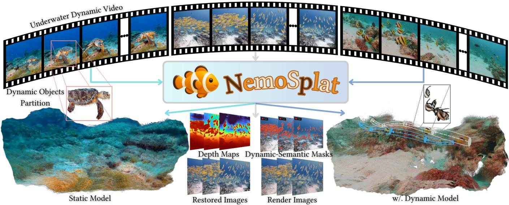
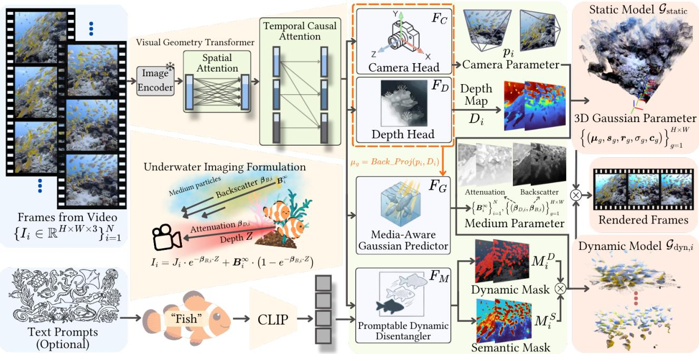
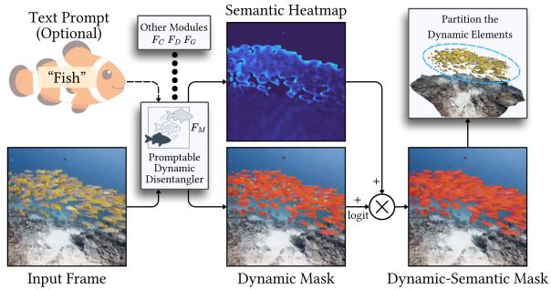
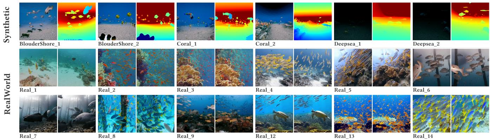
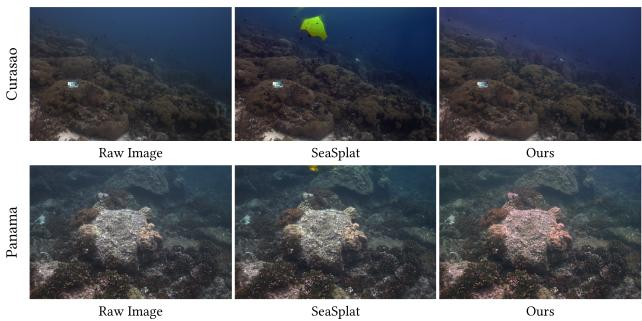
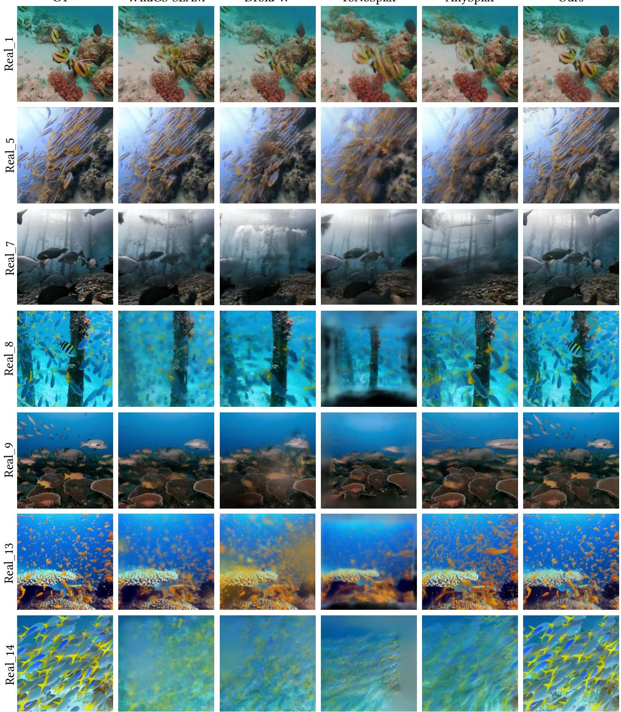
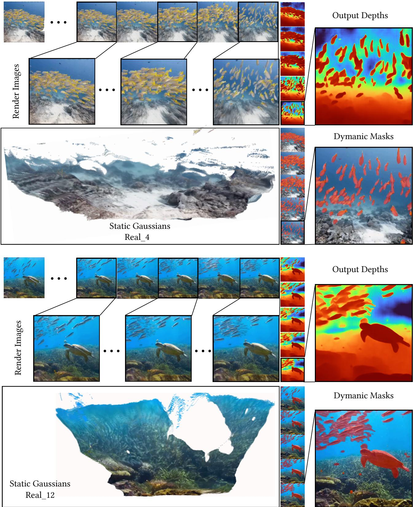

# NemoSplat: Feed-Forward 4D Gaussian Splating for Media-Aware Underwater Reconstruction

XIAOPENG GUO, The Hong Kong University of Science and Technology, China WAI CHUNG TSE, The Hong Kong University of Science and Technology, China YIPENG ZHU, The Hong Kong University of Science and Technology, China HANWEN ZHANG, The Hong Kong University of Science and Technology, China HUAJIAN HUANG, Beijing Institute of Technology, China SAI-KIT YEUNG, The Hong Kong University of Science and Technology, China

  
Fig. 1. We present NemoSplat, a novel feed-forward model that directly reconstructs photorealistic underwater scenes from uncalibrated image sequences, robustly handling numerous dynamic objects and water-induced degradation.

Reconstructing photorealistic scenes in unconstrained underwater environ ments remains challenging due to severe media-induced light scattering and unpredictable dynamic objects. Recent feed-forward visual foundation models have demonstrated remarkable capabilities in generalized novel view synthesis and tracking. However, when directly applied to aquatic videos, optical attenuation and motion interference fatally corrupt their feature aggregation, leading to severe tracking and reconstruction failures. To overcome these limitations, we present NemoSplat, the first feed-forward 4D Gaussian Splatting framework tailored for media-aware dynamic reconstruction directly from uncalibrated marine videos. Beyond providing robust estimations of camera poses and dense scene depth, we devise a Promptable Dynamic Disentangler that utilizes a confidence-aware fusion strategy of learned dynamic probabilities and optional semantic text priors, efectively isolating massive transient entities. Furthermore, to counteract visual degra dation, a Media-Aware Gaussian Predictor is formulated to jointly estimate intrinsic 3D Gaussian attributes alongside physical media parameters, rendering pristine scene appearance in a single forward pass. Additionally, we introduce a large-scale underwater dataset with massive dynamic elements to facilitate training and evaluation. Extensive experiments on our dataset demonstrate that NemoSplat achieves state-of-the-art tracking accuracy and high-fidelity rendering.

Additional Key Words and Phrases: 3D Gaussian Splatting, Feed-Forward Models, Underwater Media Modeling

## 1 Introduction

Robust visual pose estimation and photorealistic reconstruction of underwater scenes are essential for marine applications such as biological monitoring, autonomous navigation, and ecological conservation [González-Sabbagh and Robles-Kelly 2023]. However, authentic underwater environments pose formidable challenges for conventional geometric and vision-based reconstruction pipelines. The inherently dynamic ecosystems teeming with moving entities and severe media-induced visual degradations, such as light absorption and scattering [Akkaynak and Treibitz 2019], make unconstrained underwater reconstruction notoriously dificult.

Recently, the emergence of feed-forward visual foundation models [Leroy et al. 2024; Wang et al. 2025a, 2024, 2025b; Zhuo et al. 2025] has enabled robust geometry and pose estimation from uncalibrated videos. Building upon these geometric foundations, feed-forward 3D Gaussian Splatting (3DGS) approaches [Charatan et al. 2024; Chen et al. 2024; Jiang et al. 2025] extend point cloud reconstruction to photorealistic rendering in a single forward pass without per-scene optimization. However, being intrinsically designed for static, clear-air environments, when directly deployed in marine domains, their feature aggregation mechanisms are fatally corrupted by underwater motion interference and optical attenuation, leading to tracking failures and reconstruction degradation. Consequently, unlocking the potential of feed-forward models for marine applications requires a novel paradigm that explicitly disentangles transient dynamics from media-induced degradation.

Driven by these critical limitations, our core motivation is to architect a generalized, pose-free feed-forward framework capable of simultaneously tackling complex aquatic dynamics and severe media-induced visual degradation. As depicted in Fig. 1, we present NemoSplat, the first feed-forward 4DGS visual foundation model tailored for media-aware dynamic reconstruction directly from uncalibrated marine videos. At its structural core, the elegance of NemoSplat is propelled by meticulously designed mechanisms that holistically resolve both geometric motion and optical scattering. As a foundational prerequisite, our network reliably extracts accurate camera tracking trajectories and dense scene depth to geometrically anchor the uncalibrated visual inputs. Building upon this stable geometric baseline, we devise a Promptable Dynamic Disentangler that employs a confidence-aware logit fusion to fuse learned dynamic probabilities with optional semantic priors, inextricably decoupling precise dynamic masks from the static environment. Concurrently, we utilize a Media-Aware GS Predictor to jointly estimate intrinsic 3D Gaussian attributes alongside physical media parameters. By yielding all essential representations in a single forward pass, our framework implements a principled compositional strategy, utilizing the static geometry as a structural base while superimposing time-varying dynamic primitives to simultaneously reconstruct the full 4DGS scene and recover the pristine underwater imagery.

Furthermore, to facilitate robust training and rigorous evaluation in this under-explored domain, we curate a comprehensive dataset of dynamic underwater sequences. Encompassing diverse marine scenes with varying degrees of optical attenuation and complex object movements, this dataset provides an essential benchmark for advancing research in aquatic dynamic scene reconstruction.

To summarize, our main contributions include:

• We introduce NemoSplat, the first feed-forward 4DGS framework for media-aware reconstruction in dynamic underwater environments, achieving state-of-the-art performance in geometry estimation and novel view synthesis.

• We propose Promptable Dynamic Disentangler, fusing dy namic probability with optional text semantic prior to enable the robust disentanglement of massive moving objects from static backgrounds.

• We formulate Media-Aware Gaussian Predictor, a physicsembedded rendering network regulated by multi-view consistency and physical losses, to inherently model water media and recover pristine appearances from degraded inputs.

• We construct a large-scale, dynamic underwater dataset with to facilitating underwater visual reconstruction method training and evaluation.

## 2 Related Work

## 2.1 Visual SLAM and Feed-Forward Reconstruction

Visual SLAM systems have evolved from tracking handcrafted constraints [Engel et al. 2018; Mur-Artal et al. 2015] to leveraging robust deep visual priors [Murai et al. 2025; Teed and Deng 2021]. Recently, visual geometry foundation models [Leroy et al. 2024; Wang et al. 2025a, 2024; Zhuo et al. 2025] unified the extraction of camera poses and scene depth via robust attention mechanisms, bypassing traditional pre-calibration needs, while their outputs remaining restricted to discrete geometric spaces lacking photorealistic synthesis capability. To recover high-fidelity scenes, modern SLAM pipelines [Huang et al. 2024; Keetha et al. 2024; Matsuki et al. 2024] integrate 3D Gaussian Splatting (3DGS) [Kerbl et al. 2023], but their mapping backends fundamentally necessitate continuous, iterative online optimization. Pioneering feed-forward 3DGS approaches, such as PixelSplat [Charatan et al. 2024] and AnySplat [Jiang et al. 2025], bridge this gap by directly regressing 3DGS parameters in a single pass. Nevertheless, they fundamentally rely on static, clear-air assumptions. When confronted with severely degraded, dynamic underwater environments, their tracking resilience and feature matching pipelines inevitably collapse.

## 2.2 Dynamic Scene Modeling

Some dynamic novel view synthesis approaches [Luiten et al. 2024; Wu et al. 2024] typically estimate time-conditioned deformation fields or rely on explicit optical flow to handle moving objects. In parallel, optimization-based dynamic GS-SLAM systems [Li et al. 2026; Zheng et al. 2025] mitigate the interference of dynamic objects by uncertainty-based down-weighting. However, these methods still rely heavily on camera priors, which must be estimated via Structurefrom-Motion (SfM) modeling in uncalibrated underwater scenes. While recent 4D feed-forward networks [Chen et al. 2025; Fang et al. 2026; Xu et al. 2025] use spatiotemporal attention to implicitly separate dynamic objects or introduce 4D Gaussian primitives, they struggle with the numerous small, cluttered distractors typical of underwater scenes, leading to motion leakage and ghosting. In contrast, our approach leverages high-level text-guided semantics to explicitly decouple dynamic masks, bypassing fragile low-level cues to secure a clean static background for accurate 4D modeling.

## 2.3 Media-Aware Underwater Reconstruction

To address color degradation in scattering media, some physicsbased rendering methods incorporate optical propagation mod els [Akkaynak and Treibitz 2019] into neural representations [Levy et al. 2023; Li et al. 2025; Yang et al. 2025]. These methods model light absorption and backscatter to recover clear appearance, but their inverse problem remains strongly ill-posed and typically requires expensive test-time optimization with external depth priors. More critically, they are largely formulated under static-scene assumptions. In unconstrained marine videos, dense dynamic agents violate this assumption and entangle transient motion with medium scattering, often causing geometric instability and erroneous color restoration. Here, our NemoSplat introduces a novel feed-forward media-aware 4DGS framework that jointly resolves both scattering and dynamics without test-time optimization.

  
Fig. 2. Overview of our NemoSplat framework. It leverages the Visual Geometry Transformer to extract robust spatiotemporal features from uncalibrated underwater sequences. Subsequently, a shared feature encoder feeds these representations into specialized decoders to jointly estimate camera poses, depth, dynamic semantic masks (optionally refined via grounded text prompts), water backscater and atenuation parameters, and intrinsic 4D Gaussians

## 3 Method

We propose NemoSplat, the first feed-forward 4DGS framework tailored for rapid and high-fidelity scene reconstruction in unconstrained underwater environments. As illustrated in Fig. 2, given uncalibrated marine videos, our model integrates geometry predic tion, dynamic-static separation and physical media restoration into a single forward pass, estimating robust camera tracking, precise dy namic masks, Gaussian primitives, and physical media parameters concurrently to synthesize pristine novel views.

In the following sections, we first define our mathematically decoupled problem formulation and the explicit underwater imaging model in Sec. 3.1. We then detail the three core pillars of our architecture alongside their respective joint optimization objectives: the Geometry Estimator (Sec. 3.2), the Promptable Dynamic Disentangler (Sec. 3.3), and the Media-Aware Gaussian Predictor (Sec. 3.4).

## 3.1 Problem Formulation

Given uncalibrated underwater images $\{ I _ { i } \in \mathbb { R } ^ { H \times W \times 3 } \} _ { i = 1 } ^ { N }$ and an optional text prompt �, our goal is to learn a direct neural map ping $f _ { \theta }$ that jointly infers camera tracking and scene representation without per-scene optimization. We systematically structure the network’s outputs into per-frame and per-pixel levels, defining the global neural mapping �� as:

$$
f _ { \theta } : \Big ( \{ I _ { i } \} _ { i = 1 } ^ { N } , T \Big ) \longmapsto \Big \{ \big ( p _ { i } , D _ { i } , M _ { i } , B _ { i } ^ { \infty } \big ) \Big \} _ { i = 1 } ^ { N } \cup \Big \{ \big ( \mu _ { g } , s _ { g } , r _ { g } , \sigma _ { g } , c _ { g } \big ) , \big ( \beta _ { g } ^ { D } , \beta _ { g } ^ { B } \big ) \Big \} _ { g = 1 } ^ { H \times W } .\tag{1}
$$

For each frame $I _ { i } ,$ the model extracts the per-frame camera pose and environment state: $\left( { { p } _ { i } } , D _ { i } , M _ { i } , B _ { i } ^ { \infty } \right)$ , where $\boldsymbol { p } _ { i } \in \mathbb { R } ^ { 9 }$ denotes the camera parameters (intrinsic and extrinsic), $D _ { i } \in \mathbb { R } ^ { H \times W }$ is the depth map, $M _ { i } \in [ 0 , 1 ] ^ { H \times W }$ represents the semantically-refined dynamic mask selectively guided by the input text prompt � , and $\dot { B _ { i } ^ { \infty } } \in \mathbb { R } ^ { 3 }$ describes the global background veiling light. At the per-pixel level, the network decodes pixel-wise composite 3D Gaussian primitives. Each primitive � explicitly bounds standard 3DGS [Kerbl et al. 2023] geometric and photometric attributes: 3D center $\pmb { \mu } _ { q } \in \mathbb { R } ^ { 3 }$ , scaling factors $\boldsymbol { s } _ { g } \in \mathbb { R } ^ { 3 }$ , rotation quaternion $\boldsymbol { r } _ { q } \in \mathbb { R } ^ { 4 }$ , opacity $\sigma _ { g } \in [ 0 , 1 ]$ , and view-dependent color $\pmb { c } _ { g } \in \mathbb { R } ^ { 3 \times ( K + 1 ) ^ { 2 } }$ parameterized by degree-� spherical harmonics. Specifically, $\pmb { \mu } _ { g }$ is deterministically obtained by back-projecting the 2D pixel to the world space using the estimated camera pose $\mathscr { P } i$ and reference depth $D _ { i }$ . Our primitive formulation embeds two additional water medium parameters: the attenuation coeficient $\boldsymbol { \beta } _ { q } ^ { D } \in \mathbb { R } ^ { 3 }$ and the backscatter coeficient ${ \boldsymbol { \beta } } _ { q } ^ { B } \in \mathbb { R } ^ { 3 }$

Conditioned on the dynamic mask $M _ { i } ,$ we formulate a structurally decoupled paradigm to explicitly isolate transient motion from the static scene. Let $\mathcal { G } _ { \mathrm { a l l } }$ encompass the complete set of Gaussian primitives predicted across the sequence. We systematically partition these into a global static set $G _ { \mathrm { s t a t i c } } ~ = ~ \{ g ~ \in ~ { \mathcal { G } } _ { \mathrm { a l l } } ~ | ~ M _ { i } ( g ) ~ < ~ \tau \}$ and a collection of dynamic per-frame sets $\{ \mathcal { G } _ { \mathrm { d y n } , i } \} _ { i = 1 } ^ { N }$ , where each ${ \mathcal { G } } _ { \mathrm { d y n } , i } = \{ g \in { \mathcal { G } } _ { i } \mid M _ { i } ( g ) \geq \tau \}$ using a gating threshold �. By rasterizing from the collective union $\mathcal { G } _ { \mathrm { s t a t i c } } \cup \mathcal { G } _ { \mathrm { d y n } , i }$ , we formulate the clean pristine radiance $J _ { G S , i }$ for the �-th target frame. Utilizing independent physical parameters [Akkaynak and Treibitz 2019], we compose $J _ { G S , i }$ and reconstruct the final observed color $\hat { I } _ { \mathrm { o b s } , i } ,$ efectively striving to recover the pristine water-free image from the degraded inputs:

$$
\hat { I } _ { \mathrm { o b s } , i } = J _ { G S , i } \odot e ^ { - \beta _ { i } ^ { D } D _ { i } } + B _ { i } ^ { \infty } \odot \big ( 1 - e ^ { - \beta _ { i } ^ { B } D _ { i } } \big ) .\tag{2}
$$

## 3.2 Geometry Estimator

To instantiate the global mapping $f _ { \theta }$ end-to-end (Fig. 2), our geometry estimator employs a Streaming Geometry Transformer for temporal encoding, coupled with dedicated decoder heads for camera pose and dense depth regression.

Streaming Geometry Transformer. To process marine videos eficiently, we adopt a streaming transformer architecture [Zhuo et al. 2025]. Each frame is tokenized via DINOv2 [Oquab et al. 2023] into image tokens with 14 × 14 size, a learnable camera token, and 4 standard register tokens. We replace memory-intensive global temporal attention [Wang et al. 2025a] with an �-layer transformer alternating between spatial intra-frame attention and causal crossframe attention. By querying a constant-memory key-value (KV) cache of past frames, the cross-frame module eficiently aggregates multi-view geometry priors. This streaming design scales seamlessly to long marine sequences, yielding temporally coherent token representations for downstream regression.

Camera Pose Head. Following the visual backbone, 9-DoF camera parameters $\mathbf { \nabla } \mathcal { P } i$ are regressed from dedicated camera register tokens. A standalone camera head, denoted as $F _ { C }$ , composed of a Multi-Layer Perceptron, decodes the camera tokens at the final transformer layer, predicting both camera extrinsics and intrinsics. The coordinate system is anchored to the first view (set as the identity transformation), with all other poses represented within this shared space. During optimization, we employ a pre-trained visual geometry transformer [Zhuo et al. 2025] as a teacher network, imposing Huber losses on the 9-DoF camera poses:

$$
\mathcal { L } _ { \mathrm { p t } } = \mathrm { H u b e r } ( p , p _ { \mathrm { t e a c h e r } } ) .\tag{3}
$$

Depth Head. Dense scene geometry is decoded from the spatial patch tokens using a Dense Prediction Transformer (DPT) architecture [Ranftl et al. 2021]. This dedicated depth head $( F _ { D } )$ projects the tokenized spatiotemporal features into an original-resolution reference depth map $\hat { D } _ { \mathrm { d p t } }$ , which serves as the fundamental geometric anchor for unprojecting and localizing the subsequent 3D Gaussian primitives in 3D space. To train this depth predictor robustly without ground-truth scans, we constrain $\hat { D } _ { \mathrm { d p t } }$ using confidenceweighted depths $\scriptstyle \left( \mathbf { C _ { \mathrm { t e a c h e r } } } \right)$ from the teacher network [Zhuo et al. 2025] alongside a Scale-Shift Invariant (SSI) structure loss supervised by spatial pseudo-labels from Depth-Anything-3 [Lin et al. 2025] (�DA3), where $\Delta D = \log \hat { D } _ { \mathrm { d p t } } - \log D _ { \mathrm { D A 3 } } \mathrm { ; }$

$$
\mathcal { L } _ { \mathrm { d t } } = \mathbf { C } _ { \mathrm { t e a c h e r } } \odot \mathrm { H u b e r } ( \hat { D } _ { \mathrm { d p t } } , D _ { \mathrm { t e a c h e r } } ) ,\tag{4}
$$

$$
\mathcal { L } _ { \mathrm { s s i } } = \frac { 1 } { H W } \sum ( \Delta D ) ^ { 2 } - \frac { 1 } { ( H W ) ^ { 2 } } \left( \sum \Delta D \right) ^ { 2 } .\tag{5}
$$

The complete geometry objective $\mathcal { L } _ { \mathrm { g e o } }$ orchestrating the pose and depth networks is therefore summarized as:

$$
\mathcal { L } _ { \mathrm { g e o } } = \lambda _ { \mathrm { p t } } \mathcal { L } _ { \mathrm { p t } } + \lambda _ { \mathrm { d t } } \mathcal { L } _ { \mathrm { d t } } + \lambda _ { \mathrm { s s i } } \mathcal { L } _ { \mathrm { s s i } } .\tag{6}
$$

## 3.3 Promptable Dynamic Disentangler

Facilitating the explicit separation of dynamic entities from the background, we propose a versatile Promptable Dynamic Disentangler $F _ { M }$ . Leveraging a DPT-based framework, $F _ { M }$ projects spatial patch tokens from the transformer backbone into a dense, full-resolution feature map. In parallel, a shallow three-layer 3 × 3 CNN extracts high-frequency appearance cues directly from the raw image $I _ { i } ,$ which are fused into the DPT features via element-wise residual addition, supplementing the fine edge details.

  
Fig. 3. Dynamic-Semantic Mask Generation. The Promptable Dynamic Disentangler $\left( F _ { M } \right)$ refines the predicted dynamic mask via logit adjustment using an optional text prompt-guided semantic map, efectively revising a highly accurate mask for downstream 4D modeling.

The merged representation is then passed through a convolution network that jointly predicts an initial dynamic object probability map $\hat { M } _ { \mathrm { d y n } }$ and a background water mask $\hat { M } _ { \mathrm { w a t } }$ . Crucially, this predicted water mask is subsequently forwarded to the downstream Media-Aware GS Predictor (Sec. 3.4) to spatially constrain the learning of water media parameters. These structural priors are supervised using high-quality pseudo-labels $M ^ { * }$ generated by the Segment Anything Model 3 [Carion et al. 2025]. To ensure sharp boundary discernment, we optimize both masks using a linear combination of Binary Cross-Entropy (BCE) and Dice loss [Sudre et al. 2017]. For the water mask, we explicitly apply a spatial boundary-proximity weight $\mathbf { W _ { b o u n d } }$ to penalize predictions near image edges:

$$
\mathcal { L } _ { \mathrm { d y n } } = \mathrm { B C E } ( \hat { M } _ { \mathrm { d y n } } , M _ { \mathrm { d y n } } ^ { * } ) + 0 . 5 \mathrm { D i c e } ( \hat { M } _ { \mathrm { d y n } } , M _ { \mathrm { d y n } } ^ { * } ) ,\tag{7}
$$

$$
\mathcal { L } _ { \mathrm { w a t } } = \mathbf { W } _ { \mathrm { b o u n d } } \odot \mathrm { B C E } ( \hat { M } _ { \mathrm { w a t } } , M _ { \mathrm { w a t } } ^ { * } ) + 0 . 5 \mathrm { D i c e } ( \hat { M } _ { \mathrm { w a t } } , M _ { \mathrm { w a t } } ^ { * } ) .\tag{8}
$$

Our disentangler optionally accepts an arbitrary text prompt � (e.g., “fish”) to leverage explicit user intent, thereby extracting a highly refined and accurate final dynamic mask $\dot { M _ { i } }$ . When such a prompt is provided, a sibling semantic branch with the same convolutional structure projects the merged representation into a �- dimensional embedding map $\hat { \mathbf { E } } \in \mathbb { R } ^ { H \times W \times D }$ , which is $\ell _ { 2 } \cdot$ -normalized along the channel axis. Dense cosine similarities against the pretrained CLIP [Radford et al. 2021] text embedding $\mathbf { E } _ { \mathrm { C L I P } }$ (also $\ell _ { 2 } -$ normalized) then reduce to a single dot-product per pixel, yielding a continuous semantic guidance map $\bar { S } _ { \mathrm { s e m } }$ . During training, this branch is supervised by the cosine-similarity loss:

$$
\mathcal { L } _ { \mathrm { s e m } } = 1 - \hat { \mathbf { E } } \cdot \mathbf { E } _ { \mathrm { C L I P } } .\tag{9}
$$

During inference, if a text prompt is supplied, we propose a strat-$\mathrm { e g y }$ to refine the initial dynamic predictions by synergizing the base continuous geometric probability $P _ { \mathrm { d y n } }$ (derived from $\hat { M } _ { \mathrm { d y n } } )$ with the semantic prior $P _ { s e m }$ (derived from $S _ { \mathrm { s e m } } )$ , as Fig. 3 shows. To address the inherent limitations of standard boolean logic, where strict intersections risk structurally destroying cohesive objects due to semantic noise, we avoid naively multiplying probabilities. Instead, we apply a confidence-aware adjustment mechanism to construct the final refined probability $P _ { \mathrm { f i n a l } } { \mathrm { : } }$

  
Fig. 4. Examples sequences of our proposed evaluation dataset. It includes synthetic scenes with precise ground-truth annotations and diverse in-the-wild underwater sequences for comprehensive evaluation.

$$
\mathrm { l o g i t } ( P _ { \mathrm { f i n a l } } ) = \mathrm { l o g i t } ( P _ { \mathrm { d y n } } ) + \gamma ( P _ { \mathrm { s e m } } - \tau _ { s } ) ,\tag{10}
$$

where $\gamma$ scales the semantic influence, and $\tau _ { s }$ acts as a threshold. Specifically, the geometric log-odds are dynamically modulated by the semantic penalty term. Semantic scores above the threshold $\tau _ { s }$ reinforce dynamic classification, while those below apply a suppressive penalty. This bidirectional logit adjustment eficiently dampens unprompted distractors while preserving boundary cohesion for accurate mask disentanglement. Notably, without explicit text prompts, the network seamlessly defaults to the geometry-driven $P _ { \mathrm { d y n } }$ , functioning as a fully automatic dynamic-static separator.

## 3.4 Media-Aware Gaussian Predictor

Consistent with our pixel-wise dense strategy, we design a unified Media-Aware Gaussian Predictor (denoted as $F _ { G } )$ to jointly estimate the intrinsic 3D Gaussian attributes alongside the complex physical underwater properties in a single forward pass.

Following the Gaussian head design ofAnySplat [Jiang et al. 2025], for each primitive unprojected from the reference depth map $\hat { D } _ { \mathrm { d p t } } ,$ this network densely regresses complete set ofstandard 3DGS [Kerbl et al. 2023] parameters $( \sigma _ { g } , s _ { g } , r _ { g } , c _ { g } ) .$ . Concurrently, to explicitly model volumetric scattering, the network maps the spatial features into the governing parameters of the underwater image formation model $( \operatorname { E q . }$ 2): defining the per-pixel direct signal attenuation $\beta _ { i } ^ { D }$ volumetric backscatter $\beta _ { i } ^ { B }$ , and global per-frame veiling light $B _ { i } ^ { \infty }$

Crucially, instead of predicting appearance and medium properties in isolated steps, we formulate a holistic media-aware training loss. Building upon the structure-decoupled formulation defined in Sec. 3.1, we utilize the clean pristine radiance $J _ { G S , }$ � rasterized exclusively from the collective union ${ \mathcal { G } } _ { \mathrm { s t a t i c } } \cup { \mathcal { G } } _ { \mathrm { d y n } , i } .$ We then math ematically compose $J _ { G S , i }$ � with the predicted underwater parameters $( { \beta } ^ { D } , { \beta } ^ { B } , \dot { B } ^ { \infty } )$ via the underwater image formation model (Eq. 2) to calculate a joint rendering loss against the raw views:

$$
\mathcal { L } _ { \mathrm { p h y s - r e n d e r } } = \sum _ { i } \left( | | I _ { \mathrm { r a w } , i } - \hat { I } _ { \mathrm { o b s } , i } | | _ { 2 } ^ { 2 } + \lambda _ { \mathrm { l p i p s } } \mathrm { L P I P S } ( I _ { \mathrm { r a w } , i } , \hat { I } _ { \mathrm { o b s } , i } ) \right) .\tag{11}
$$

To rigorously prevent the network from incorrectly baking water colors directly into the isolated Gaussian textures $J _ { G S , i ; }$ we further regularize the medium properties. Inspired by prior physical

optimization constraints in SeaSplat [Yang et al. 2025] and Water-Splatting [Li et al. 2025], on distant water mask regions $\Omega _ { \mathrm { f a r } }$ , we enforce $\mathbf { \bar { \mathbf { B } } } ^ { \tilde { \infty } }$ explicitly:

$$
\begin{array} { r l } & { \mathcal { L } _ { B ^ { \infty } } = \left. \boldsymbol { B ^ { \infty } } - \displaystyle \frac { 1 } { \left. \Omega _ { \mathrm { f a r } } \right. } \displaystyle \sum _ { u \in \Omega _ { \mathrm { f a r } } } I _ { \mathrm { r a w } } ^ { u } \right. _ { 1 } , } \\ & { \quad \mathcal { L } _ { J } = \left. \displaystyle \frac { I _ { \mathrm { r a w } } - B ^ { \infty } \odot ( 1 - e ^ { - \beta ^ { B } \hat { D } _ { \mathrm { d p t } } } ) } { e ^ { - \beta ^ { D } \hat { D } _ { \mathrm { d p t } } } } - J _ { G S } \right. _ { 1 } . } \end{array}\tag{12}
$$

(13)

Furthermore, to respect strict physical marine optics, we follow their practices and integrate oceanographic Jerlov penalties regulating color channel attenuations $( \beta _ { R } ^ { D } > \beta _ { G } ^ { D } > \beta _ { B } ^ { D } )$ alongside a spatial Total Variation $( \mathcal { L } _ { \mathrm { T V } } )$ on the parameters $\beta \mathrm { : }$

$$
\mathcal { L } _ { \mathrm { J e r l o v } } = \operatorname* { m a x } ( 0 , \beta _ { G } ^ { D } - \beta _ { R } ^ { D } ) + \operatorname* { m a x } ( 0 , \beta _ { B } ^ { D } - \beta _ { G } ^ { D } ) ,\tag{14}
$$

$$
\mathcal { L } _ { \mathrm { T V } } = \| \nabla _ { x } \beta \| _ { 1 } + \| \nabla _ { y } \beta \| _ { 1 } .\tag{15}
$$

We explicitly enforce multi-view geometric consistency, ensuring that the rendered 3DGS topology successfully recovers the image structure. Specifically, we constrain the rasterized 3DGS depths $( \hat { D } _ { \mathrm { g s } } )$ using the structure-aware DPT-predicted depths via an $L _ { 1 }$ penalty:

$$
\mathcal { L } _ { \mathrm { d c } } = \| \hat { D } _ { \mathrm { d p t } } - \hat { D } _ { \mathrm { g s } } \| _ { 1 } .\tag{16}
$$

Ultimately, the rendering optimization is harmonized as a comprehensive objective encompassing visual appearance, structural geometry, and explicit physical alignment:

$$
\begin{array} { r l } & { \mathcal { L } _ { \mathrm { r e n d e r } } = \lambda _ { \mathrm { p h y s } } \mathcal { L } _ { \mathrm { p h y s - r e n d e r } } + \lambda _ { \mathrm { d c } } \mathcal { L } _ { \mathrm { d c } } } \\ & { \qquad + \lambda _ { \mathrm { w a t e r } } ( \lambda _ { B ^ { \infty } } \mathcal { L } _ { B ^ { \infty } } + \lambda _ { J } \mathcal { L } _ { J } + \lambda _ { \mathrm { J e r l o v } } \mathcal { L } _ { \mathrm { J e r l o v } } + \lambda _ { \mathrm { T V } } \mathcal { L } _ { \mathrm { T V } } ) . } \end{array}\tag{17}
$$

## 4 Experiments

## 4.1 Implementation Details

NemoSplat is implemented in PyTorch and use the gsplat [Ye et al. 2025] CUDA Library. We employ pre-trained DINOv2-ViT-L14 [Oquab et al. 2023] encoder alongside a 24-layer causal alternating attention transformer [Zhuo et al. 2025]. To establish robust initial priors, geometry estimator and Gaussian predictor are loaded with pre-trained weights from StreamVGGT [Zhuo et al. 2025] and AnySplat [Jiang

Table 1. Quantitative evaluation on synthetic sequences. Best results are bold , second best are underlined. “-” indicates that the method does not support rendering, and “×” denotes failure due to out of memory. ATE is reported in meters.
<table><tr><td>Method</td><td colspan="4">BoulderShore</td><td colspan="4">Coral</td><td colspan="4">Deepsea</td><td colspan="4">Average</td></tr><tr><td>Metrics</td><td></td><td></td><td>ATE↓ PSNR↑ SSIM↑ LPIPS↓</td><td></td><td></td><td>ATE↓ PSNR↑</td><td>SSIM↑ LPIPS↓</td><td></td><td>ATE↓ PSNR↑ SSIM↑ LPIPS↓</td><td></td><td></td><td></td><td>ATE↓</td><td></td><td>PSNR↑ SSIM↑ LPIPS↓</td><td></td></tr><tr><td>VGGT [Wang et al. 2025a]</td><td>0.19</td><td></td><td></td><td></td><td>0.23</td><td></td><td></td><td></td><td>5.93</td><td></td><td></td><td></td><td>2.12</td><td></td><td></td><td></td></tr><tr><td>StreamVGGT [Zhuo et al. 2025]</td><td>0.40</td><td></td><td></td><td></td><td>0.79</td><td></td><td></td><td></td><td>5.01</td><td></td><td></td><td></td><td>2.06</td><td></td><td></td><td></td></tr><tr><td>WildGS-SLAM [Zheng et al. 2025]</td><td>0.12</td><td>18.80</td><td>0.60</td><td>0.45</td><td>4.97</td><td>17.01</td><td>0.55</td><td>0.52</td><td>0.81</td><td>29.86</td><td>0.81</td><td>0.35</td><td>1.96</td><td>21.89</td><td>0.65</td><td>0.44</td></tr><tr><td>Droid-W [Li et al. 2026]</td><td>0.11</td><td>20.04</td><td>0.71</td><td>0.44</td><td>4.65</td><td>18.56</td><td>0.58</td><td>0.56</td><td>0.78</td><td>31.93</td><td>0.83</td><td>0.30</td><td>1.85</td><td>23.51</td><td>0.71</td><td>0.43</td></tr><tr><td>YoNoSplat [Ye et al. 2026]</td><td>0.39</td><td>17.81</td><td>0.46</td><td>0.55</td><td>0.27</td><td>17.63</td><td>0.44</td><td>0.56</td><td>X</td><td>X</td><td>X</td><td>X</td><td>X</td><td>X</td><td>X</td><td>X</td></tr><tr><td>AnySplat [Jiang et al. 2025]</td><td>0.54</td><td>20.05</td><td>0.56</td><td>0.38</td><td>2.59</td><td>20.98</td><td>0.52</td><td>0.38</td><td>5.78</td><td>24.24</td><td>0.41</td><td>0.40</td><td>2.97</td><td>21.76</td><td>0.50</td><td>0.39</td></tr><tr><td>Ours</td><td>0.24</td><td>21.71</td><td>0.57</td><td>0.31</td><td>0.54</td><td>20.41</td><td>0.56</td><td>0.37</td><td>4.85</td><td>29.83</td><td>0.55</td><td>0.41</td><td>1.88</td><td>23.98</td><td>0.56</td><td>0.36</td></tr></table>

et al. 2025], respectively. All other heads are randomly initialized.   
In total, the full model is approximately 1.22 Billion parameters.

To achieve stable disentanglement, we employ a progressive twostage training strategy. Stage 1 optimizes the Promptable Dynamic Disentangler to embed initial semantic and boundary priors. Stage 2 synergistically optimizes the full pipeline for structural geometry and media-aware rendering, where the visual backbone is frozen and LoRA [Hu et al. 2022] is applied to maintain geometric stability. Our model is trained on 5 NVIDIA RTX 4090D GPUs, taking approximately 1 day for Stage 1 and 2 days for Stage 2. Detailed training configurations, and hyperparameters are provided in the supplementary material.

Datasets. We construct a large-scale underwater dataset with 256 training sequences (155K frames) and 20 evaluation scenes (partially illustrated in Fig. 4). Specifically, the training corpus spans 9 diverse geographic domains and employs a 13-class taxonomy to systematically capture complex marine life behaviors. Training data includes depth, water, and dynamic masks annotated via a human-refined SAM3 [Carion et al. 2025] and SAHI [Akyon et al. 2022] pipeline to ensure robust extraction of small or distant objects. For evaluation, 6 synthetic UE5 sequences provide precise ground truth. Further details are in the supplementary material.

## 4.2 Experimental Setup

Metrics. To comprehensively evaluate our proposed NemoSplat, we conduct experiments on our evaluation dataset. First, we benchmark the tracking and render performance on 6 challenging synthetic sequences. Pose accuracy is evaluated using Absolute Trajectory Error (ATE RMSE, �), while rendering quality is assessed using PSNR, SSIM [Wang et al. 2004], and LPIPS [Zhang et al. 2018]. Second, to demonstrate our generalizability in real-world marine environment, we evaluate the novel view synthesis quality on 14 diverse real-world underwater sequences.

Baselines. We compare NemoSplat against six state-of-the-art baselines across various novel view synthesis and reconstruction paradigms. Specifically, we evaluate two feed-forward visual foundation models, VGGT [Wang et al. 2025a] and StreamVGGT [Zhuo et al. 2025], which estimate geometry and poses. We also benchmark against cutting-edge feed-forward 3DGS frameworks, YonoSplat [Ye et al. 2026] and AnySplat [Jiang et al. 2025], which enable rapid reconstruction without per-scene optimization. Lastly, we compare with optimization-based dynamic Gaussian-based SLAM systems,

Droid-W [Li et al. 2026] and WildGS-SLAM [Zheng et al. 2025]. For fair comparison, we provide the SLAM baselines with VGGTestimated camera intrinsics [Wang et al. 2025a]. All evaluations run on a single RTX 4090D GPU.

## 4.3 Evaluation of Camera Tracking

As detailed in Tab. 1, we quantitatively benchmark the camera tracking performance of NemoSplat against six competitive baselines on our synthetic set, which comprises the BoulderShore, Coral, and Deepsea synthetic environments, with two distinct sequences per scene. Our method extracts stable camera trajectories in challenging dynamic environments despite uncalibrated inputs. NemoSplat achieves a highly competitive average ATE of 1.88 m, consistently outperforming other feed-forward pipelines like VGGT (2.12 m) and StreamVGGT (2.06 m). This superior performance is driven by the joint optimization of the geometry estimator and the media-aware rendering pipeline, which enhances resilience to transient moving distractors in dynamic underwater environments. Furthermore, we observe a distinct dichotomy in tracking behaviors depending on scene characteristics. In the “Coral” sequences, which feature large inter-frame motion and broad fields of view, the optical flow estimation essential to DROID-W and WildGS-SLAM struggles to establish stable pixel associations, resulting in high trajectory drift. Feedforward models, conversely, leverage diverse learned spatial priors to handle such drastic viewpoint changes efectively. On the other hand, in the light-deprived “Deepsea” sequences, the pre-trained image encoders of feed-forward architectures fail to extract reliable semantic features. Under these extreme low-visibility conditions, optical-flow based SLAM methods successfully capitalize on raw inter-frame pixel variations to maintain robust tracking.

## 4.4 Evaluation of Novel View Synthesis

We comprehensively evaluate the novel view synthesis quality across both simulated and real-world environments, as shown in Tab. 1 and Tab. 2. On the synthetic dataset, our feed-forward model achieves the best visual quality, yielding the highest overall PSNR of 23.98 dB and the lowest LPIPS of 0.36. These results consistently outperform the runner-up methods, taking a 0.47 dB lead in PSNR over DROID-W and reducing LPIPS by 0.03 compared to AnySplat.

Moving to the significantly more challenging real-world scene, comprising 14 highly degraded aquatic sequences, NemoSplat comprehensively surpasses all baselines across all metrics. Specifically, it establishes state-of-the-art averages in PSNR (21.58 dB), SSIM (0.68), and LPIPS (0.26). Our method achieves the highest PSNR and SSIM, exceeding the second-best AnySplat (19.22 dB, 0.60) by 2.36 dB and 0.08. Most impressively, our LPIPS is substantially reduced, achieving a 36.6% relative error reduction compared to WildGS-SLAM (0.41). This pronounced performance gap is highly attributable to the complex nature of real-world scenes, containing abundant dy namic entities such as massive swimming fish schools. In conventional reconstruction pipelines, these unconstrained moving objects inevitably introduce severe rendering artifacts, topological blurring, and ghosting efects. As shown in Fig. 6, competing methods exhibit severe artifacts and blurring, whereas NemoSplat cleanly separates dynamic and static components to produce clear and accurate renderings. NemoSplat elegantly overcomes this bottleneck by explicitly extracting precise dynamic masks, incorporating text prompts as an optional guidance. By efectively decoupling perframe dynamic Gaussian primitives from the static scene topology, our approach eliminates the risk of baking transient motion into the global background, thereby realizing highly accurate and temporally consistent rendering of complex time-varying scenes. Fig. 7 illustrates the rich, high-fidelity reconstruction results achieved by our method across real-world marine environments.

Table 2. Quantitative evaluation of novel view synthesis on 14 real-world aquatic sequences. We report PSNR, SSIM, and LPIPS metrics across all scenes alongside their overall averages. The best results are bold , and the second best are underlined.
<table><tr><td>Method</td><td>Metrics</td><td>01</td><td>02</td><td>03</td><td>04</td><td>05</td><td>06</td><td>07</td><td>08</td><td>09</td><td>10</td><td>11</td><td>12</td><td>13</td><td>14</td><td>Avg.</td></tr><tr><td rowspan="3">WildGS-SLAM [Zheng et al. 2025]</td><td>PSNR↑</td><td>19.31</td><td>18.13</td><td>20.85</td><td>19.92</td><td>19.24</td><td>21.75</td><td>19.79</td><td>16.08</td><td>21.40</td><td>19.38</td><td>20.79</td><td>21.64</td><td>16.29</td><td>13.50</td><td>19.15</td></tr><tr><td>SSIM↑</td><td>0.56</td><td>0.65</td><td>0.74</td><td>0.62</td><td>0.52</td><td>0.74</td><td>0.62</td><td>0.42</td><td>0.68</td><td>0.49</td><td>0.69</td><td>0.78</td><td>0.58</td><td>0.37</td><td>0.60</td></tr><tr><td>LPIPS↓</td><td>0.50</td><td>0.52</td><td>0.38</td><td>0.37</td><td>0.44</td><td>0.42</td><td>0.44</td><td>0.50</td><td>0.35</td><td>0.36</td><td>0.28</td><td>0.25</td><td>0.41</td><td>0.58</td><td>0.41</td></tr><tr><td rowspan="3">Droid-W [Li et al. 2026]</td><td>PSNR↑</td><td>20.59</td><td>19.83</td><td>18.61</td><td>18.73</td><td>17.77</td><td>20.50</td><td>17.05</td><td>16.71</td><td>18.43</td><td>19.05</td><td>17.90</td><td>21.05</td><td>13.20</td><td>14.32</td><td>18.12</td></tr><tr><td>SSIM↑</td><td>0.73</td><td>0.69</td><td>0.51</td><td>0.55</td><td>0.40</td><td>0.68</td><td>0.49</td><td>0.50</td><td>0.60</td><td>0.46</td><td>0.63</td><td>0.72</td><td>0.50</td><td>0.43</td><td>0.56</td></tr><tr><td>LPIPS↓</td><td>0.37</td><td>0.39</td><td>0.46</td><td>0.37</td><td>0.52</td><td>0.51</td><td>0.58</td><td>0.42</td><td>0.43</td><td>0.39</td><td>0.36</td><td>0.27</td><td>0.50</td><td>0.57</td><td>0.44</td></tr><tr><td rowspan="3">YoNoSplat [Ye et al. 2026]</td><td>PSNR↑</td><td>15.39</td><td>16.73</td><td>15.44</td><td>16.71</td><td>14.83</td><td>20.06</td><td>16.43</td><td>13.05</td><td>18.17</td><td>16.58</td><td>12.22</td><td>15.05</td><td>13.75</td><td>14.52</td><td>15.64</td></tr><tr><td>SSIM↑</td><td>0.44</td><td>0.35</td><td>0.33</td><td>0.42</td><td>0.33</td><td>0.66</td><td>0.54</td><td>0.38</td><td>0.52</td><td>0.37</td><td>0.35</td><td>0.41</td><td>0.34</td><td>0.35</td><td>0.41</td></tr><tr><td>LPIPS↓</td><td>0.67</td><td>0.64</td><td>0.63</td><td>0.62</td><td>0.69</td><td>0.44</td><td>0.56</td><td>0.58</td><td>0.53</td><td>0.56</td><td>0.64</td><td>0.57</td><td>0.60</td><td>0.62</td><td>0.60</td></tr><tr><td rowspan="3">AnySplat [Jiang et al. 2025]</td><td>PSNR↑</td><td>20.43</td><td>18.28</td><td>17.69</td><td>19.80</td><td>18.83</td><td>22.04</td><td>20.19</td><td>16.44</td><td>21.54</td><td>19.84</td><td>20.45</td><td>20.86</td><td>15.14</td><td>14.80</td><td>19.22</td></tr><tr><td>SSIM↑</td><td>0.68</td><td>0.47</td><td>0.46</td><td>0.63</td><td>0.55</td><td>0.75</td><td>0.72</td><td>0.48</td><td>0.73</td><td>0.55</td><td>0.69</td><td>0.68</td><td>0.46</td><td>0.42</td><td>0.60</td></tr><tr><td>LPIPS↓</td><td>0.35</td><td>0.50</td><td>0.47</td><td>0.48</td><td>0.49</td><td>0.40</td><td>0.39</td><td>0.45</td><td>0.35</td><td>0.40</td><td>0.32</td><td>0.30</td><td>0.49</td><td>0.56</td><td>0.42</td></tr><tr><td rowspan="3">Ours</td><td>PSNR↑</td><td>20.98</td><td>22.35</td><td>18.21</td><td>21.67</td><td>20.10</td><td>22.79</td><td>22.89</td><td>19.99</td><td>24.84</td><td>21.45</td><td>20.72</td><td>21.53</td><td>21.21</td><td>22.13</td><td>21.58</td></tr><tr><td>SSIM↑</td><td>0.60</td><td>0.69</td><td>0.48</td><td>0.68</td><td>0.57</td><td>0.82</td><td>0.67</td><td>0.75</td><td>0.73</td><td>0.63</td><td>0.69</td><td>0.61</td><td>0.70</td><td>0.75</td><td>0.68</td></tr><tr><td>LPIPS↓</td><td>0.31</td><td>0.23</td><td>0.36</td><td>0.24</td><td>0.35</td><td>0.25</td><td>0.30</td><td>0.18</td><td>0.23</td><td>0.27</td><td>0.29</td><td>0.24</td><td>0.16</td><td>0.21</td><td>0.26</td></tr></table>

## 4.5 Evaluation of Descatering

To validate the efectiveness in predicting physical water medium parameters, we evaluate our descattering capabilities on the SeaThru-NeRF [Levy et al. 2023] dataset, shown in Fig. 5. By a single forward pass, NemoSplat simultaneously infers the complete set of water medium parameters, including a per-frame global veiling light �∞ and per-pixel estimations for direct signal attenuation $\beta ^ { \stackrel { \sim } { D } }$ and volumetric backscatter $\beta ^ { B }$ . We compare our approach against the state-of-the-art method SeaSplat [Yang et al. 2025]. SeaSplat was run for 1k optimization iterations, taking approximately 6 minutes. In contrast, our approach requires fewer than 10 seconds to recover more reliable colors than SeaSplat, with clearer distant structures. Although per-scene optimization-based 3DGS methods like SeaSplat can achieve superior descattering results given extended iterations, our media-aware Gaussian predictor infers highly reasonable water medium parameters in a single forward pass. This demonstrates the immense potential of our method, providing a novel and rapid paradigm for mitigating underwater attenuation and scattering.

  
Fig. 5. Restored images on SeaThru-NeRF [Levy et al. 2023] dataset. Our approach recovers more natural colors while preserving clearer details in distant regions.

## 5 Conclusion

We presented NemoSplat, a robust feed-forward 4D Gaussian Splatting framework tailored for uncalibrated, dynamically complex, and severely degraded aquatic environments. By coupling a media-aware rendering pipeline with optional text-guided semantic reasoning, our method elegantly removes dense underwater scattering and decouples transient entities from the static geometry. Experiments on our dataset show that NemoSplat achieve state-of-the-art performance on both artifact-free novel view synthesis and robust camera tracking. Despite these strong capabilities, integrating heavy semantic masking and physical media modules causes substantial GPU memory consumption during training, remaining a primary limitation. Future eforts will focus on optimizing architectural memory eficiency to unlock broader real-time deployments in autonomous underwater vehicle (AUV) navigation and marine exploration.

## References

Derya Akkaynak and Tali Treibitz. 2019. Sea-Thru: A Method for Removing Water From Underwater Images. In 2019 IEEE/CVF Conference on Computer Vision and Pattern Recognition (CVPR). 1682–1691. doi:10.1109/CVPR.2019.00178

Fatih Cagatay Akyon, Sinan Onur Altinuc, and Alptekin Temizel. 2022. Slicing Aided Hyper Inference and Fine-tuning for Small Object Detection. 2022 IEEE International Conference on Image Processing (ICIP) (2022), 966–970. doi:10.1109/ICIP46576.2022. 9897990

Nicolas Carion, Laura Gustafson, Yuan-Ting Hu, Shoubhik Debnath, Ronghang Hu, Di dac Suris, Chaitanya Ryali, Kalyan Vasudev Alwala, Haitham Khedr, Andrew Huang, Jie Lei, Tengyu Ma, Baishan Guo, Arpit Kalla, Markus Marks, Joseph Greer, Meng Wang, Peize Sun, Roman Rädle, Triantafyllos Afouras, Efrosyni Mavroudi, Kather ine Xu, Tsung-Han Wu, Yu Zhou, Liliane Momeni, Rishi Hazra, Shuangrui Ding, Sagar Vaze, Francois Porcher, Feng Li, Siyuan Li, Aishwarya Kamath, Ho Kei Cheng, Piotr Dollár, Nikhila Ravi, Kate Saenko, Pengchuan Zhang, and Christoph Feichten hofer. 2025. SAM 3: Segment Anything with Concepts. arXiv:2511.16719 [cs.CV] https://arxiv.org/abs/2511.16719

David Charatan, Sizhe Lester Li, Andrea Tagliasacchi, and Vincent Sitzmann. 2024. pixelSplat: 3D Gaussian Splats from Image Pairs for Scalable Generalizable 3D Reconstruction. In Proceedings ofthe IEEE/CVF Conference on Computer Vision and Pattern Recognition (CVPR). IEEE, Seattle, WA, USA, 19457–19467.

Xingyu Chen, Yue Chen, Yuliang Xiu, Andreas Geiger, and Anpei Chen. 2025. Easi3R: Estimating Disentangled Motion from DUSt3R Without Training. arXiv preprint arXiv:2503.24391 (2025)

Yuedong Chen, Haofei Xu, Chuanxia Zheng, Bohan Zhuang, Marc Pollefeys, Andreas Geiger, Tat-Jen Cham, and Jianfei Cai. 2024. MVSplat: Eficient 3D Gaussian Splatting from Sparse Multi-View Images. arXiv preprint arXiv:2403.14627 (2024).

J. Engel, V. Koltun, and D. Cremers. 2018. Direct Sparse Odometry. IEEE Transactions on Pattern Analysis and Machine Intelligence (mar 2018).

Juntong Fang, Zequn Chen, Weiqi Zhang, Donglin Di, Xuancheng Zhang, Chengmin Yang, and Yu-Shen Liu. 2026. MoRe: Motion-aware Feed-forward 4D Reconstruction Transformer. In Proceedings ofthe IEEE/CVF Conference on Computer Vision and Pattern Recognition.

Salma P González-Sabbagh and Antonio Robles-Kelly. 2023. A survey on underwater computer vision. Comput. Surveys 55, 13s (2023), 1–39.

Edward J Hu, Yelong Shen, Phillip Wallis, Zeyuan Allen-Zhu, Yuanzhi Li, Shean Wang, Lu Wang, and Weizhu Chen. 2022. LoRA: Low-Rank Adaptation of Large Language Models. In International Conference on Learning Representations. https://openreview. net/forum?id=nZeVKeeFYf9

Huajian Huang, Longwei Li, Cheng Hui, and Sai-Kit Yeung. 2024. Photo-SLAM: Realtime Simultaneous Localization and Photorealistic Mapping for Monocular, Stereo, and RGB-D Cameras. In Proceedings of the IEEE/CVF Conference on Computer Vision and Pattern Recognition.

Lihan Jiang, Yucheng Mao, Linning Xu, Tao Lu, Kerui Ren, Yichen Jin, Xudong Xu, Mulin Yu, Jiangmiao Pang, Feng Zhao, et al. 2025. Anysplat: Feed-forward 3d gaussian splatting from unconstrained views. ACM Transactions on Graphics (TOG) 44, 6 (2025), 1–16.

Nikhil Keetha, Jay Karhade, Krishna Murthy Jatavallabhula, Gengshan Yang, Sebastian Scherer, Deva Ramanan, and Jonathon Luiten. 2024. SplaTAM: Splat, Track & Map 3D Gaussians for Dense RGB-D SLAM. In Proceedings ofthe IEEE/CVF Conference on Computer Vision and Pattern Recognition.

Bernhard Kerbl, Georgios Kopanas, Thomas Leimkühler, and George Drettakis. 2023. 3D Gaussian Splatting for Real-Time Radiance Field Rendering. ACM Transactions on Graphics 42, 4 (July 2023). https://repo-sam.inria.fr/fungraph/3d-gaussian-splatting

Vincent Leroy, Yohann Cabon, and Jerome Revaud. 2024. Grounding Image Matching in 3D with MASt3R.

Deborah Levy, Amit Peleg, Naama Pearl, Dan Rosenbaum, Derya Akkaynak, Simon Korman, and Tali Treibitz. 2023. SeaThru-NeRF: Neural Radiance Fields in Scattering Media. In Proceedings ofthe IEEE/CVF Conference on Computer Vision and Pattern Recognition. 56–65.

Huapeng Li, Wenxuan Song, Tianao Xu, Alexandre Elsig, and Jonas Kulhanek. 2025. WaterSplatting: Fast Underwater 3D Scene Reconstruction using Gaussian Splatting. 3DV (2025).

Moyang Li, Zihan Zhu, Marc Pollefeys, and Daniel Barath. 2026. DROID-SLAM in the Wild. In Proceedings of the IEEE/CVF Conference on Computer Vision and Pattern Recognition (CVPR).

Haotong Lin, Sili Chen, Jun Hao Liew, Donny Y. Chen, Zhenyu Li, Guang Shi, Jiash Feng, and Bingyi Kang. 2025. Depth Anything 3: Recovering the visual space from any views. arXiv preprint arXiv:2511.10647 (2025).

Jonathon Luiten, Georgios Kopanas, Bastian Leibe, and Deva Ramanan. 2024. Dynamic 3D Gaussians: Tracking by Persistent Dynamic View Synthesis. In 3DV.

Hidenobu Matsuki, Riku Murai, Paul H. J. Kelly, and Andrew J. Davison. 2024. Gaussian Splatting SLAM. In Proceedings of the IEEE/CVF Conference on Computer Vision and Pattern Recognition.

Raúl Mur-Artal, J. M. M. Montiel, and Juan D. Tardós. 2015. ORB-SLAM: a Versatile and Accurate Monocular SLAM System. IEEE Transactions on Robotics 31, 5 (2015),

1147–1163. doi:10.1109/TRO.2015.2463671

Riku Murai, Eric Dexheimer, and Andrew J. Davison. 2025. MASt3R-SLAM: Real Time Dense SLAM with 3D Reconstruction Priors. In Proceedings ofthe IEEE/CVF Conference on Computer Vision and Pattern Recognition.

Maxime Oquab, Timothée Darcet, Theo Moutakanni, Huy V. Vo, Marc Szafraniec, Vasil Khalidov, Pierre Fernandez, Daniel Haziza, Francisco Massa, Alaaeldin El-Nouby, Russell Howes, Po-Yao Huang, Hu Xu, Vasu Sharma, Shang-Wen Li, Wojciech Galuba, Mike Rabbat, Mido Assran, Nicolas Ballas, Gabriel Synnaeve, Ishan Misra, Herve Jegou, Julien Mairal, Patrick Labatut, Armand Joulin, and Piotr Bojanowski. 2023. DINOv2: Learning Robust Visual Features without Supervision

Alec Radford, Jong Wook Kim, Chris Hallacy, Aditya Ramesh, Gabriel Goh, Sandhini Agarwal, Girish Sastry, Amanda Askell, Pamela Mishkin, Jack Clark, et al. 2021. Learning transferable visual models from natural language supervision. In International conference on machine learning. PmLR, 8748–8763.

René Ranftl, Alexey Bochkovskiy, and Vladlen Koltun. 2021. Vision Transformers for Dense Prediction. ArXiv preprint (2021).

Carole H Sudre, Wenqi Li, Tom Vercauteren, Sebastien Ourselin, and M Jorge Cardoso. 2017. Generalised dice overlap as a deep learning loss function for highly unbalanced segmentations. In International Workshop on Deep Learning in Medical Image Analysis. Springer, 240–248.

Zachary Teed and Jia Deng. 2021. DROID-SLAM: Deep Visual SLAM for Monocular, Stereo, and RGB-D Cameras. Advances in neural information processing systems (2021).

Jianyuan Wang, Minghao Chen, Nikita Karaev, Andrea Vedaldi, Christian Rupprecht, and David Novotny. 2025a. VGGT: Visual Geometry Grounded Transformer. In Proceedings ofthe IEEE/CVF Conference on Computer Vision and Pattern Recognition.

Shuzhe Wang, Vincent Leroy, Yohann Cabon, Boris Chidlovskii, and Jerome Revaud. 2024. DUSt3R: Geometric 3D Vision Made Easy. In CVPR.

Yifan Wang, Jianjun Zhou, Haoyi Zhu, Wenzheng Chang, Yang Zhou, Zizun Li, Junyi Chen, Jiangmiao Pang, Chunhua Shen, and Tong He. 2025b. �3: Permutation Equivariant Visual Geometry Learning. arXiv preprint arXiv:2507.13347 (2025).

Zhou Wang, A.C. Bovik, H.R. Sheikh, and E.P. Simoncelli. 2004. Image quality assessment: from error visibility to structural similarity. IEEE Transactions on Image Processing 13, 4 (2004), 600–612. doi:10.1109/TIP.2003.819861

Guanjun Wu, Taoran Yi, Jiemin Fang, Lingxi Xie, Xiaopeng Zhang, Wei Wei, Wenyu Liu, Qi Tian, and Xinggang Wang. 2024. 4D Gaussian Splatting for Real-Time Dynamic Scene Rendering. In Proceedings of the IEEE/CVF Conference on Computer Vision and Pattern Recognition (CVPR). 20310–20320.

Zhen Xu, Zhengqin Li, Zhao Dong, Xiaowei Zhou, Richard Newcombe, and Zhaoyang Lv. 2025. 4DGT: Learning a 4D Gaussian Transformer Using Real-World Monocula Videos. arXiv preprint arXiv:2506.08015.

Daniel Yang, John J. Leonard, and Yogesh Girdhar. 2025. SeaSplat: Representing Un derwater Scenes with 3D Gaussian Splatting and a Physically Grounded Image Formation Model. In 2025 IEEE International Conference on Robotics and Automation (ICRA).

Botao Ye, Boqi Chen, Haofei Xu, Daniel Barath, and Marc Pollefeys. 2026. YoNoSplat: You Only Need One Model for Feedforward 3D Gaussian Splatting. In International Conference on Learning Representations (ICLR).

Vickie Ye, Ruilong Li, Justin Kerr, Matias Turkulainen, Brent Yi, Zhuoyang Pan, Otto Seiskari, Jianbo Ye, Jefrey Hu, Matthew Tancik, and Angjoo Kanazawa. 2025. gsplat: An open-source library for Gaussian splatting. Journal ofMachine Learning Research 26, 34 (2025), 1–17.

Richard Zhang, Phillip Isola, Alexei A Efros, Eli Shechtman, and Oliver Wang. 2018. The Unreasonable Efectiveness of Deep Features as a Perceptual Metric. In CVPR.

Jianhao Zheng, Zihan Zhu, Valentin Bieri, Marc Pollefeys, Songyou Peng, and Armeni Iro. 2025. WildGS-SLAM: Monocular Gaussian Splatting SLAM in Dynamic Envi ronments. In Proceedings ofthe IEEE/CVF Conference on Computer Vision and Pattern Recognition (CVPR).

Dong Zhuo, Wenzhao Zheng, Jiahe Guo, Yuqi Wu, Jie Zhou, and Jiwen Lu. 2025. Streaming 4D Visual Geometry Transformer. arXiv preprint arXiv:2507.11539 (2025), xx pages.

GT  
WildGS-SLAM  
Droid-W  
YoNoSplat  
AnySplat  
Ours  
  
Fig. 6. Qualitative comparison of novel view synthesis on highly degraded real-world aquatic sequences. While conventional feed-forward modules and SLAM-based baselines sufer from severe ghosting, topological blurring, and visual artifacts caused by unconstrained dynamic entities (e.g., schools of swimming fish), NemoSplat explicitly decouples transient motion from the static topology. This disentanglement enables the synthesis of crisp, temporally consistent, and artifact-free novel views.

  
Fig. 7. Reconstruction results on real-world aquatic sequences. Our method disentangles static Gaussian models from dynamic underwater scenes, providing comprehensive outputs including RGB rendering images, depth maps and dynamic masks.