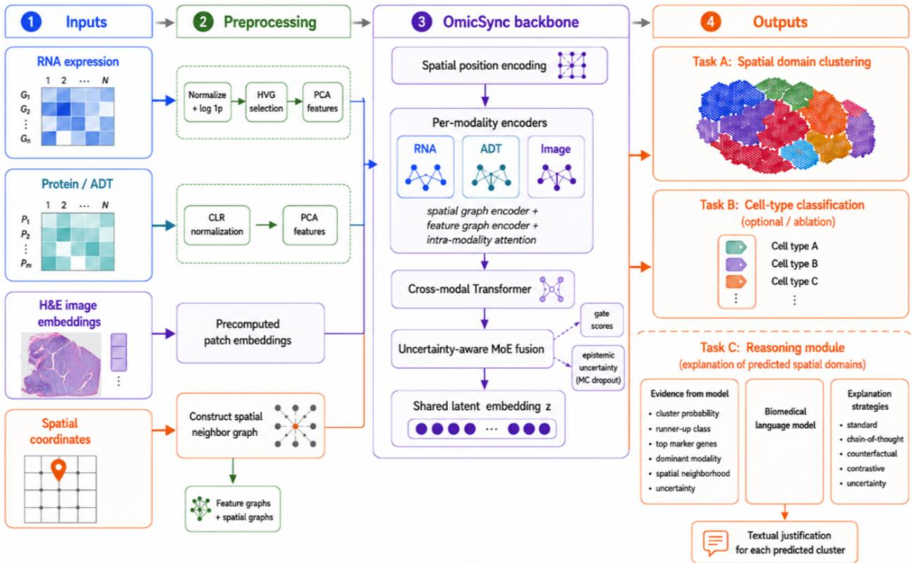
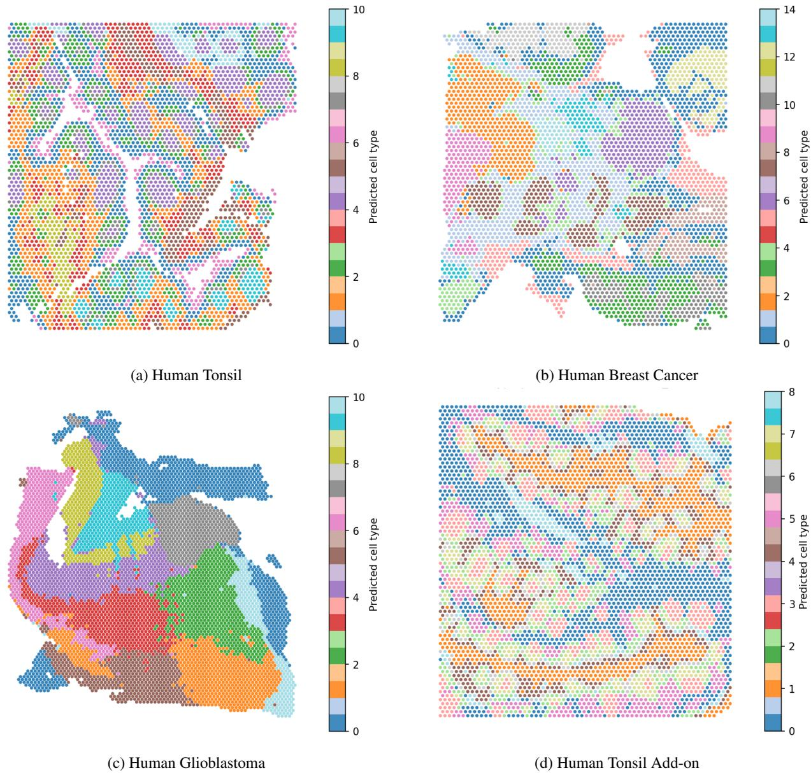
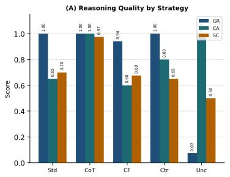
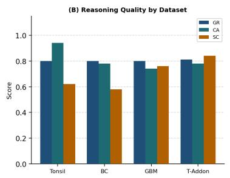
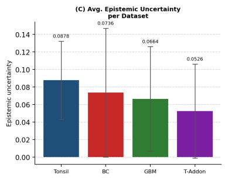
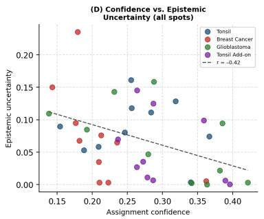
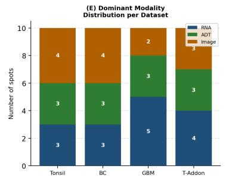
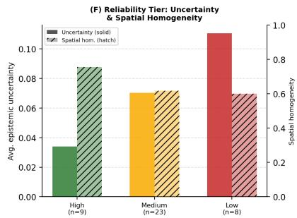
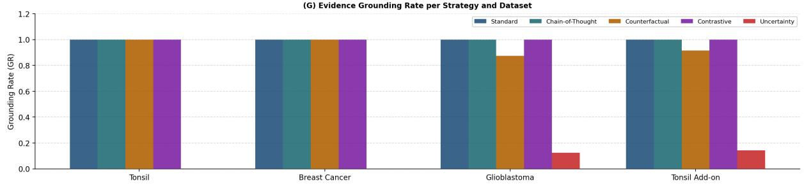

# OmicSync: Reliability-Aware Spatial Multi-Omics Clustering with Evidence-Constrained LLM Reasoning

Rabeya Tus Sadia<sup>1</sup> Qiang Ye<sup>2</sup> Qiang Cheng<sup>1,\*</sup>

<sup>1</sup>Department of Computer Science, University of Kentucky <sup>2</sup>Department of Mathematics, University of Kentucky <sup>\*</sup>Corresponding author: qiang.cheng@uky.edu

## Abstract

Spatial multi-omics technologies can jointly profile gene expression, surface proteins, and histology at each tissue spot, but most spatial domain discovery methods return only a partition of spots into domains, without indicating which assignments are reliable, which modality drove each decision, or why a particular domain assignment should be trusted. We present OmicSync, a reliability-aware spatial multi-omics framework that couples unsupervised domain clustering with evidence-constrained LLM reasoning through model-derived per-spot signals, including soft assignment confidence, epistemic routing uncertainty, and modality-routing weights. These signals are converted into structured evidence dictionaries and passed to a five-strategy reasoning module that provides standard, stepwise, counterfactual, contrastive, and uncertainty-focused explanations. OmicSync combines a KAN-GCN backbone with spatial encoding, cross-modal fusion, uncertainty-aware routing, cell-type supervision, and missing-modality imputation. We further introduce OmicSync-R, a variant that closes the reasoning–clustering loop by using automatically computed reasoning quality scores as REINFORCE rewards during training. This formulation allows reasoning coherence to shape the learned latent structure without requiring gradients to propagate through the language model. Across four 10x CytAssist FFPE spatial proteomics benchmarks, OmicSync achieves the best average rank on Human Tonsil (1.44), Glioblastoma (1.78), and Tonsil Add-on (1.22), and the second-best average rank on Human Breast Cancer (2.33). OmicSync-R further improves the ARI on Human Breast Cancer from 45.73 to 46.72 and outperforms existing methods on six of the nine clustering metrics. Together, OmicSync and OmicSync-R move spatial domain discovery beyond opaque partitioning toward tissue-domain analysis that is reliability-aware, auditable at the spot level, and guided by evidence-constrained reasoning.

## 1 Introduction

Spatial multi-omics technologies now enable the joint profiling of gene expression, surface protein abundance, and tissue morphology at spatially resolved tissue spots, preserving the spatial context lost in dissociative single-cell protocols [1, 2]. Recent platforms such as 10x Genomics CytAssist FFPE extend this capability to formalin-fixed, paraffin-embedded clinical tissues, generating multimodal datasets comprising thousands of spots, each characterized by tens of thousands of genes, dozens of antibody-derived tag (ADT) protein markers, and a high-resolution histology image patch from the same physical location.

Unsupervised spatial domain discovery, which partitions spots into biologically coherent tissue domains, is a foundational analysis step for downstream tasks such as differential expression analysis, ligand–receptor inference, and cell-state mapping [3, 4]. A growing family of methods has been developed for this task: GROVER [5] uses KAN-based graph convolutions with dual spatial and feature adjacency matrices; MISO [6] performs multi-scale integration; SpatialGlue [7] fuses modalities through cross-attention; and COSMOS [8] applies contrastive multi-view learning. Despite these methodological advances, existing approaches generally return only one type of output, namely, a flat partition of spots into domains, without indicating which assignments are reliable, why a spot was assigned to a particular domain, or which molecular modality primarily drove each assignment.

This limitation is consequential because downstream analyses that treat all spot assignments as equally reliable may propagate clustering errors into biological conclusions, particularly for boundary spots where adjacent domains overlap or for spots affected by degraded data quality. Quantifying how confident the model is in each assignment, and explaining why, is therefore not merely desirable but crucial for the responsible interpretation and use of spatial clustering outputs in biomedical research.

Overview. We present OmicSync, a reliability-aware spatial multi-omics framework that links tissue-domain discovery with evidence-constrained natural-language auditing. Rather than treating interpretability as an external visualization step, OmicSync extracts three core model-derived reliability signals for each spot: (i) soft assignment confidence from a Student’s t-distribution-based clustering head; (ii) epistemic routing uncertainty estimated through MC dropout in the mixture-of-experts gate; and (iii) modality-routing weights that indicate the relative weighting of RNA, ADT, and histology in the fused representation. These signals, together with feature-level and spatial-neighbourhood evidence, are assembled into a structured evidence dictionary and used by the reasoning module to generate evidence-constrained, per-spot reliability reports. We further propose OmicSync-R, a variant that closes the reasoning–clustering loop by using automatically computed reasoning-quality scores as REINFORCE rewards during training. This formulation allows reasoning coherence to shape the learned latent structure without requiring gradients to propagate through the language model.

## Contributions. Our main contributions are as follows:

• A reliability-aware spatial multi-omics clustering framework, OmicSync, built on a KAN-GCN backbone. Because spatial multi-omics data combine heterogeneous modalities with missing entries and complementary biological signals, robust domain discovery requires joint alignment, uncertainty-aware fusion, and tolerance to incomplete modality profiles. OmicSync addresses these needs by integrating spatial position encoding, per-modality graph encoding, cross-modal Transformer fusion, uncertainty-aware mixture-of-experts routing, cluster-assignment prediction, semisupervised cell-type regularisation, and missing-modality imputation in a unified architecture.

• An adaptive spatial training strategy that combines an adaptive spatial exclusion radius with a decaying contrastiveloss schedule to mitigate the trade-off between adjusted Rand index and silhouette coefficient across heterogeneous and homogeneous tissue datasets.

• An evidence-constrained, five-strategy reasoning module that converts model-derived evidence into per-spot reliability reports. The supplied evidence includes assignment confidence, modality-routing weights, marker evidence, uncertainty estimates, and neighbourhood composition, and the reasoning strategies include standard, stepwise, counterfactual, contrastive, and uncertainty-focused reasoning.

• OmicSync-R, a REINFORCE-based reasoning-guided extension that feeds automatically computed reasoning-quality scores back into model training, allowing evidence-grounded reasoning coherence to influence the learned latent structure without differentiating through the language model.

• A quantitative clustering and reliability evaluation on four 10x CytAssist FFPE benchmarks. OmicSync achieves the best average rank on three datasets and the second-best average rank on Human Breast Cancer. The reliability audit further shows that high-confidence spots exhibit lower epistemic routing uncertainty and greater spatial-neighbourhood homogeneity than low-confidence spots.

• A proof-of-concept evaluation of reasoning-guided training on Human Breast Cancer, the only benchmark where base OmicSync does not achieve the best overall rank. OmicSync-R improves ARI from 45.73 to 46.72 and outperforms GROVER, the most competitive non-OmicSync baseline, on six of the nine clustering metrics evaluated on that dataset.

## 2 Background and Related Work

## 2.1 Spatial multi-omics domain discovery

Early approaches to spatial domain discovery primarily analysed RNA measurements and combined dimensionality reduction with conventional clustering methods such as k-means or Leiden clustering [9]. Graph-based methods such as STAGATE [10] and GraphST [11] incorporate spatial proximity through graph neural networks, thereby improving the spatial coherence of the resulting domains. More recent methods integrate multiple molecular and imaging modalities. SpatialGlue [7] and MISO [6] integrate RNA and protein measurements, whereas GROVER [5] and COSMOS [8] jointly model RNA, protein, and histology to improve multimodal representation learning and tissue-domain identification. GROVER is the closest architectural predecessor of OmicSync: it applies KAN-based graph convolutions over spatial and feature adjacency matrices and uses attention-based multimodal fusion. OmicSync adopts this backbone as a foundation while introducing reliability estimation, uncertainty-aware routing, evidence-constrained reasoning, and reasoning-guided model refinement.

## 2.2 Explainability in spatial omics

Explainability in spatial omics remains relatively underdeveloped. Attention-weight visualisation and SHAP-based feature attribution have been used to identify influential features in biological prediction models [12]. Although such methods can reveal which inputs influence a prediction, they generally do not provide spot-specific explanations of clustering assignments grounded in multiple internal reliability signals. Large language models (LLMs) have also been applied in single-cell biology [13] for tasks such as cell-type annotation [14] and pathway summarisation [15] To our knowledge, however, existing work has not coupled an LLM with a trained spatial clustering model through structured, model-derived evidence to generate reliability-aware explanations for individual spots. OmicSync addresses this gap by constraining natural-language reasoning with confidence, uncertainty, modality-routing, feature-level, and spatial-neighbourhood evidence extracted from the clustering model.

## 2.3 Mixture-of-experts routing and uncertainty estimation

Sparse mixture-of-experts routing [16] has been used in multimodal learning to route inputs among modality-specialised experts. MC dropout [17] provides a computationally tractable approximation to Bayesian inference and enables epistemic uncertainty to be estimated by repeatedly evaluating a dropout-equipped network. OmicSync combines these ideas by evaluating its mixture-of-experts gating network multiple times with dropout enabled. The mean gate outputs provide per-spot modality-routing weights, while their variation across stochastic forward passes quantifies epistemic uncertainty in the routing decision. This design therefore provides both an interpretable estimate of modality reliance and a measure of the stability of that estimate.

## 2.4 Reinforcement learning with non-differentiable feedback

REINFORCE [18] is a policy-gradient estimator that enables non-differentiable reward signals to influence neural network training. In natural language processing, policy-gradient methods have been used to optimise sequence-level objectives that cannot be directly differentiated through token-generation decisions [19]. OmicSync-R adapts this principle by treating automatically computed reasoning-quality scores as rewards and feeding them back into the clustering model during training. This mechanism allows reasoning coherence to shape the learned latent structure without propagating gradients through the language model. To our knowledge, reasoning-quality feedback has not previously been used in this manner to refine spatial multi-omics domain clustering.

## 3 Problem Formulation

Consider a spatial multi-omics sample containing N tissue spots. Each spot is characterized by three modality-specific feature representations after appropriate preprocessing: $\mathbf { X } _ { 1 } \in \mathbb { R } ^ { N \times d _ { 1 } }$ for RNA features, $\mathbf { X } _ { 2 } \in \mathrm { \overline { { R } } } ^ { N \times d _ { 2 } }$ for ADT protein features, and $\mathbf { X } _ { 3 } \in \mathbb { R } ^ { N \times d _ { 3 } }$ for histology features. The corresponding spatial coordinates are denoted by $\mathbf { C } \in \mathbb { R } ^ { N \times 2 }$ For each modality $m \in \{ 1 , 2 , 3 \}$ , we construct a spatial adjacency matrix $\mathbf { A } _ { m } ^ { s } \in \mathbb { R } _ { \geq 0 } ^ { N \times N }$ , which encodes physical proximity between spots, and a feature adjacency matrix $\mathbf { A } _ { m } ^ { f } \in \mathbb { R } _ { \geq 0 } ^ { N \times N }$ , which encodes similarity in the corresponding modality-specific feature space.

Task A (Spatial domain clustering and reliability estimation). Given the multimodal inputs

$$
\left\{ { \bf X } _ { m } , { \bf A } _ { m } ^ { s } , { \bf A } _ { m } ^ { f } \right\} _ { m = 1 } ^ { 3 } \quad \mathrm { a n d } \quad { \bf C } ,\tag{1}
$$

the objective is to learn a d-dimensional shared latent representation $\mathbf { Z } \in \mathbb { R } ^ { N \times d }$ and a soft assignment matrix $\mathbf { Q } \in [ \bar { 0 } , 1 ] ^ { N \times K }$ that partitions the N spots into K spatial domains. Each row of $\mathbf { Q }$ represents a probability distribution over the K domains and therefore satisfies

$$
\sum _ { k = 1 } ^ { K } q _ { i k } = 1 , \qquad i = 1 , \dots , N ,\tag{2}
$$

where $q _ { i k }$ denotes the (i, k)-th entry of $\mathbf { Q } .$ The hard domain assignment and assignment confidence for spot i are defined as

$$
\hat { k } _ { i } = \arg \operatorname* { m a x } _ { 1 \leq k \leq K } q _ { i k } , \quad \quad c _ { i } = \arg \operatorname* { m a x } _ { 1 \leq k \leq K } q _ { i k } .\tag{3}
$$

Collecting the confidence scores for all spots gives $\mathbf { c } \in [ 0 , 1 ] ^ { N }$

In addition, the model estimates an epistemic routing uncertainty vector u $\mathbf { \Psi } \in \mathbb { R } _ { \geq 0 } ^ { N }$ and a modality-routing matrix $\mathbf { G } \in [ 0 , 1 ] ^ { N \times 3 }$ . The entry $G _ { i m }$ denotes the routing weight assigned to modality m for spot $i ,$ where

$$
\sum _ { m = 1 } ^ { 3 } G _ { i m } = 1 , \qquad i = 1 , \dots , N .\tag{4}
$$

Thus, each spot is associated with a domain assignment and three core reliability signals: soft assignment confidence, epistemic routing uncertainty, and modality-routing weights.

Task B (Optional annotation and auxiliary regularisation). When spot-level cell-type annotations are available, let $\mathbf { Y } \in \{ 0 , 1 \} ^ { \tilde { N } \times L }$ denote the corresponding label matrix for L cell types. The objective is to learn an annotation function

$$
f _ { \mathrm { a n n } } : \mathbb { R } ^ { d }  [ 0 , 1 ] ^ { L } ,\tag{5}
$$

which predicts a cell-type distribution from the shared latent representation of each spot.

Because the datasets considered in this study do not provide verified spot-level cell-type labels, Task B is instantiated using pseudo-labels derived from Leiden community detection on the RNA representation. We use a subset of these Leiden-derived labels as auxiliary classification targets for the annotation head. Under this setting, Task B serves as a semi-supervised consistency regularizer for the learned representation rather than as an independently validated cell-type annotation task.

Task C (Evidence-constrained reasoning). For a queried subset of spots ${ \mathcal { S } } \subseteq \{ 1 , \ldots , N \}$ , a structured evidence dictionary is constructed for each spot $i \in S$ using the outputs and intermediate quantities of Task A. The evidence includes assignment confidence, epistemic routing uncertainty, modality-routing weights, feature-level evidence, and spatial-neighbourhood evidence.

Let R denote the set of reasoning strategies. For each queried spot $i \in S$ and each reasoning strategy $r \in \mathcal { R }$ , the reasoning module generates a natural-language reliability report $J _ { i } ^ { ( r ) }$ . The complete set of reports is written as

$$
\mathcal { T } = \{ J _ { i } ^ { ( r ) } \mid i \in \mathcal { S } , r \in \mathcal { R } \} .\tag{6}
$$

Each report is constrained by and supported by the corresponding model-derived evidence.

## 4 OmicSync Architecture

Figure 1 presents the overall architecture and training workflow of OmicSync. The framework first preprocesses RNA, ADT, histology, and spatial coordinate information into modality-specific feature representations and neighbourhood graphs. These inputs are then processed by spatially informed graph encoders, intra-modality attention, cross-modal Transformer fusion, and an uncertainty-aware mixture-of-experts router to produce a shared latent representation. The learned representation supports spatial domain clustering, optional auxiliary annotation, missing-modality imputation, and the extraction of per-spot reliability evidence. The resulting confidence, uncertainty, modality-routing, featurelevel, and spatial-neighbourhood signals are assembled into structured evidence dictionaries for evidence-constrained natural-language reasoning.

## 4.1 Preprocessing pipeline

## 4.1.1 RNA

Raw counts are normalised to a library size of $1 0 ^ { 4 }$ counts per spot and subsequently transformed using $\log ( 1 + x )$ . The top 3,000 highly variable genes are selected using the Seurat v3 method [20], with the Seurat flavour used as a fallback when scikit-misc is unavailable. The highly variable gene matrix is reduced to $d _ { 1 } \leq 4 9$ principal components, forming $\mathbf { X } _ { 1 }$

  
Figure 1: Overview of the OmicSync architecture and training workflow. OmicSync integrates RNA expression, ADT protein abundance, H&E image embeddings, and spatial coordinates within a unified spatial multi-omics framework. RNA and ADT profiles are normalised and projected into PCA feature spaces, histological information is represented using pretrained image-patch embeddings, and spatial coordinates are used to construct neighbourhood graphs. The OmicSync backbone combines spatial position encoding, modality-specific graph encoders, intra-modality attention, cross-modal Transformer fusion, and uncertainty-aware mixture-of-experts routing to obtain a shared latent representation. The representation is optimised through reconstruction, clustering, optional auxiliary annotation, missing modality imputation, and uncertainty-regularisation objectives. The framework outputs spatial domain assignments and model-derived per-spot reliability signals, which are assembled into structured evidence dictionaries and passed to an evidence-constrained reasoning module to generate natural-language reliability reports.

## 4.1.2 Protein abundance (ADT)

Antibody-derived tag (ADT) counts undergo centered log-ratio (CLR) normalisation to mitigate compositional effects in protein-abundance measurements and are subsequently reduced to $d _ { 2 } \leq 4 9$ principal components, forming $\mathbf { X } _ { 2 }$ . NaN, infinite, and negative values are replaced with zero before normalisation.

## 4.1.3 Histology

A 224 × 224 H&E image patch centred at the pixel coordinate of each spot is extracted from the high-resolution tissue image. Patches extending beyond the image boundary are padded with white pixels. Each patch is processed using the pathology foundation model UNI [21], a ViT-L/16 model pretrained on more than 100,000 pathology slides. The resulting 1,024-dimensional CLS-token embedding is L2-normalised to form ${ \bf X } _ { 3 }$ . Embeddings containing NaN values, which typically arise from predominantly white boundary patches, are replaced with zero vectors.

## 4.2 Component 1: SpatialPositionEncoder

Absolute spot coordinates are encoded using a sinusoidal 2-D positional encoding:

$$
\mathrm { P E } _ { m } ( \mathbf { c } _ { i } ) = W _ { m } ^ { \mathrm { P E } } \big [ \mathrm { s i n } ( c _ { i , x } \mathbf { f } ) , \mathrm { c o s } ( c _ { i , x } \mathbf { f } ) , \mathrm { s i n } ( c _ { i , y } \mathbf { f } ) , \mathrm { c o s } ( c _ { i , y } \mathbf { f } ) \big ] ^ { \top } \in \mathbb { R } ^ { d _ { m } } ,\tag{7}
$$

where $\mathbf { c } _ { i } = ( c _ { i , x } , c _ { i , y } )$ denotes the 2-D coordinate of spot $i , \mathbf { f } \in \mathbb { R } ^ { F }$ is a fixed vector containing $F = 3 2$ predefined log-spaced frequencies, and $W _ { m } ^ { \mathrm { P E } } \in \mathbb { R } ^ { d _ { m } \times 4 F }$ is a learned projection.

This positional bias is added to each modality’s feature vector before graph convolution, so that two spots with identical molecular profiles but different tissue locations, such as the edge versus the center of a germinal center, receive distinguishable representations. This design allows the model to incorporate spatial context and tissue architecture that are not captured by molecular composition alone.

## 4.3 Component 2: KAN-GCN encoders and within-modality attention (backbone)

For each modality $m \in \{ 1 , 2 , 3 \}$ , a shared-weight KAN-GCN encoder is applied over both the spatial adjacency matrix and the feature adjacency matrix:

$$
\mathbf { e } _ { m } ^ { s } = \operatorname { K A N } ( A _ { m } ^ { s } \mathbf { X } _ { m } W _ { m } ^ { \operatorname { G C N } } ) , \quad \mathbf { e } _ { m } ^ { f } = \operatorname { K A N } ( A _ { m } ^ { f } \mathbf { X } _ { m } W _ { m } ^ { \operatorname { G C N } } ) .\tag{8}
$$

The two embeddings are then merged by a within-modality attention layer, which adaptively weights spatial and feature-based evidence to produce $\bar { \mathbf { e } } _ { m } \in \bar { \mathbb { R } } ^ { N \times d }$ . This backbone follows the GROVER design and is kept unchanged, thereby isolating the contribution of the five new components introduced in OmicSync.

## 4.4 Component 3: CrossModalTransformer

The three per-modality embeddings are stacked into a length-3 token sequence $\mathbf { T } \in \mathbb { R } ^ { N \times 3 \times d }$ and processed by a multi-head self-attention Transformer encoder with learnable modality-type embeddings:

$$
\mathbf { T } ^ { \prime } = \operatorname { T r a n s E n c } ( \mathbf { T } + \mathbf { M } ) + \mathbf { T } , \qquad [ \mathbf { e } _ { 1 } ^ { \prime } , \mathbf { e } _ { 2 } ^ { \prime } , \mathbf { e } _ { 3 } ^ { \prime } ] = \mathbf { T } ^ { \prime } ,\tag{9}
$$

where $\mathbf { M } \in \mathbb { R } ^ { N \times 3 \times d }$ is obtained by broadcasting the learnable modality-type embeddings Em $\ b ( [ 0 , 1 , 2 ] ) \in \mathbb { R } ^ { 3 \times d }$ across all N spots. This cross-modal Transformer allows RNA, protein, and histology tokens from the same spot to attend to one another before fusion, thereby enriching each modality with cross-modal context rather than combining modalities only at the gating stage. We use $n _ { \mathrm { h e a d s } } = 4$ attention heads and $n _ { \mathrm { l a y e r s } } = 2$ Transformer layers.

## 4.5 Component 4: UncertaintyMoE

The UncertaintyMoE fuses the three cross-modally enriched embeddings through a learned gating network evaluated under MC-Dropout, a standard approximate Bayesian technique that keeps dropout active at inference time and uses multiple stochastic forward passes to estimate epistemic uncertainty. We use $T = 1 0$ stochastic samples. For spot i, we first compute the averaged cross-modal token

$$
\bar { \mathbf { e } } _ { i } = \frac { 1 } { 3 } \left( \mathbf { e } _ { 1 , i } ^ { \prime } + \mathbf { e } _ { 2 , i } ^ { \prime } + \mathbf { e } _ { 3 , i } ^ { \prime } \right) .\tag{10}
$$

For each MC-Dropout sample t, the gating network produces

$$
\mathbf { g } _ { i , t } = \mathrm { s o f t m a x } \big ( W _ { g } \operatorname { D r o p o u t } _ { t } ( \bar { \mathbf { e } } _ { i } ) \big ) \in [ 0 , 1 ] ^ { 3 } ,\tag{11}
$$

where Dropou $\mathrm { t } _ { t }$ denotes the dropout mask sampled at trial t. The mean routing vector and the epistemic routing uncertainty are then defined as

$$
\bar { \bf g } _ { i } = \frac { 1 } { T } \sum _ { t = 1 } ^ { T } { \bf g } _ { i , t } ,\tag{12}
$$

$$
u _ { i } = \sum _ { m = 1 } ^ { 3 } \operatorname { V a r } _ { t = 1 , \ldots , T } \left[ g _ { i , m , t } \right] ,\tag{13}
$$

where $g _ { i , m , t }$ is the m-th component of $\mathbf { g } _ { i , t }$

The mean gate values $\bar { \bf g } _ { i } \in [ 0 , 1 ] ^ { 3 }$ are thresholded at $\tau = 0 . 3$ , and experts below the threshold are pruned. The fused latent representation is computed as

$$
\mathbf { z } _ { i } = \sum _ { m = 1 } ^ { 3 } \tilde { g } _ { i , m } f _ { m } ( \mathbf { e } _ { m , i } ^ { \prime } ) , \quad \tilde { \mathbf { g } } _ { i } = \frac { \bar { \mathbf { g } } _ { i } \odot \mathbf { 1 } \left[ \bar { \mathbf { g } } _ { i } \geq \tau \right] } { \lVert \bar { \mathbf { g } } _ { i } \odot \mathbf { 1 } \left[ \bar { \mathbf { g } } _ { i } \geq \tau \right] \rVert _ { 1 } } ,\tag{14}
$$

where $f _ { m }$ denotes the modality-specific expert network for modality m.

The scalar $u _ { i }$ in Eq. 13 is defined as the epistemic routing uncertainty for spot i, because it aggregates the variance of the modality-selection weights across MC-Dropout samples. The vector $\bar { \bf g } _ { i }$ is defined as the modality-routing vector and is used as an interpretable proxy for the relative contribution of RNA, ADT, and histology to the fused representation. Both $u _ { i }$ and $\bar { \bf g } _ { i }$ are provided as interpretable model outputs and used by Task C. Collecting the mean routing vectors across spots yields the modality-routing matrix G introduced in Task $\mathbf { A } ,$ whose i-th row is $\bar { \bf g } _ { i }$

## 4.6 Component 5: ClusteringHead (Task A)

The L2-normalized latent representation $\hat { \mathbf { z } } _ { i } = \mathbf { z } _ { i } / \lVert \mathbf { z } _ { i } \rVert _ { 2 }$ is softly assigned to K learnable centroids $\{ \pmb { \mu } _ { k } \in \mathbb { R } ^ { d } \} _ { k = } ^ { K }$ 1 using a Student’s t-kernel with one degree of freedom:

$$
q _ { i k } = \frac { ( 1 + \| \hat { \mathbf { z } } _ { i } - { \pmb { \mu } } _ { k } \| _ { 2 } ^ { 2 } ) ^ { - 1 } } { \sum _ { k ^ { \prime } = 1 } ^ { K } ( 1 + \| \hat { \mathbf { z } } _ { i } - { \pmb { \mu } } _ { k ^ { \prime } } \| _ { 2 } ^ { 2 } ) ^ { - 1 } } .\tag{15}
$$

The predicted domain for spot i is $\hat { k } _ { i } = \arg \operatorname* { m a x } _ { k } q _ { i k }$ , and the assignment confidence is defined as $c _ { i } = \operatorname* { m a x } _ { k } q _ { i k }$

The clustering objective is a self-sharpening KL divergence, ${ \mathcal { L } } _ { \mathrm { c l u s t e r } } = \mathrm { K L } ( \mathbf { P } \| \mathbf { Q } )$ , where the auxiliary target distribution is defined as

$$
p _ { i k } = { \frac { q _ { i k } ^ { 2 } / f _ { k } } { \sum _ { k ^ { \prime } = 1 } ^ { K } q _ { i k ^ { \prime } } ^ { 2 } / f _ { k ^ { \prime } } } } , \qquad f _ { k } = \sum _ { i } q _ { i k } .\tag{16}
$$

The centroids are warm-started by fitting k-means on the latent representations before the clustering loss is activated at warm-up epoch 50.

## 4.7 Component 6: CellTypeHead and ImputationHeads

A two-layer MLP CellTypeHead produces per-spot class logits for the semi-supervised auxiliary objective (Task B, Section 5). Three ImputationHeads, one for each modality, reconstruct randomly masked entries within modality-specific feature vectors from the fused latent representation Z. This imputation task provides a self-supervised reconstruction objective that regularizes Z by forcing it to preserve information useful for recovering partially observed modalities. Consequently, the learned representation becomes more robust to incomplete, noisy, or sparsely measured features.

## 4.8 Training objective

OmicSync is trained end-to-end with the following objective:

$$
\begin{array} { r l } & { \mathcal { L } _ { \mathrm { O m i c S y n c } } = \lambda _ { r } \mathcal { L } _ { \mathrm { r e c o n } } + \lambda _ { c } ( t ) \mathcal { L } _ { \mathrm { c o n t r a s t } } + \lambda _ { k } \mathcal { L } _ { \mathrm { c l u s t e r } } } \\ & { ~ + \lambda _ { b } \mathcal { L } _ { \mathrm { c e l l t y p e } } + \lambda _ { p } \mathcal { L } _ { \mathrm { i m p u t e } } + \lambda _ { u } \mathcal { L } _ { \mathrm { u n c } } . } \end{array}\tag{17}
$$

where $\mathcal { L } _ { \mathrm { r e c o n } }$ denotes per-modality MSE reconstruction; $\mathcal { L } _ { \mathrm { c o n t r a s t } }$ is a topology-aware InfoNCE loss across the three cross-modal embeddings using precomputed spatial k-hop exclusion masks; $\scriptstyle { \mathcal { L } } _ { \mathrm { c l u s t e r } }$ is the self-sharpening clustering loss in Task $\mathbf { A } ; { \mathcal { L } } _ { \mathrm { c e l l t y p e } }$ is the cross-entropy loss evaluated on labelled spots only; $\mathcal { L } _ { \mathrm { i m p u t e } }$ is the MSE reconstruction loss for the masked modality; and ${ \mathcal { L } } _ { \mathrm { u n c } }$ is a light regulariser on the mean routing uncertainty.

Adaptive spatial exclusion radius. For the topology-aware InfoNCE loss, we define $n _ { \mathrm { h o p s } }$ as the spatial exclusion radius: spots within $n _ { \mathrm { h o p s } }$ steps on the spatial graph are excluded from the negative set, so that nearby spots are not incorrectly treated as negatives. Before training, OmicSync measures the average cosine similarity between each spot and its direct spatial neighbors in RNA space. Homogeneous tissue, defined by an average neighbor similarity greater than 0.6 (e.g., tonsil germinal centers), uses $n _ { \mathrm { h o p s } } = 2$ to apply a broader exclusion neighborhood. Heterogeneous tissue, such as breast-cancer tumor–stroma boundaries, uses $n _ { \mathrm { h o p s } } = 1$ to avoid excluding too many transcriptionally distinct nearby spots from contrastive learning.

Contrastive weight decay. The contrastive weight $\lambda _ { c } ( t )$ is held at its base value for the first half of training and then decays linearly to a floor of $\lambda _ { c } / 3$ . This schedule allows the contrastive loss to promote local spatial consistency early in training, while allowing the clustering and reconstruction objectives to play a larger role later. As a result, the contrastive term helps establish spatially coherent representations without overly constraining the RNA-defined domain boundaries used for clustering evaluation.

## 5 Task B: Cell-type regularisation and spatial prediction maps

The spatial multi-omics datasets used in this study do not provide external ground-truth cell-type annotations matched across the RNA, protein, and histology modalities. We therefore treat the CellTypeHead not as an independent supervised cell-type annotation benchmark, but as a semi-supervised regularisation branch.

Leiden community detection on the RNA representation is used to obtain coarse pseudo-labels. We use 70% of these pseudo-labels as auxiliary training targets and hold out the remaining 30% to avoid using all pseudo-labels directly for optimisation. The auxiliary cross-entropy loss $\mathcal { L } _ { \mathrm { c e l l t y p e } }$ uses Leiden-derived pseudo-labels as partial training targets and provides a structural prior that encourages the shared latent space to preserve local pseudo-cell-type organisation.

After training, the CellTypeHead is applied to all spots to generate spatial pseudo-cell-type prediction maps. Accordingly, we report Task B qualitatively through these prediction maps rather than claiming it as an independent supervised cell-type annotation benchmark.

## 6 Task C: Coupled Reasoning

Task C aims to translate OmicSync’s quantitative spot-level outputs into human-readable explanations while preserving faithfulness to the underlying model evidence. Rather than introducing an additional trainable component, Task C operates as a post-hoc evidence-coupled reasoning module: it receives structured outputs from Task A, including domain assignment, assignment confidence, modality-routing weights, routing uncertainty, marker evidence, and local neighbourhood composition, and uses them as the sole evidence source for explanation generation. This coupling i designed to make the explanations auditable, so that each generated justification can be traced back to the model-derived evidence supporting the corresponding spatial-domain assignment.

## 6.1 The coupling mechanism

Task C is a post-hoc evidence-constrained reasoning module. It does not backpropagate into the clustering objective; instead, it uses only model-derived signals produced by Task A. The module is evidence-constrained in the sense that the language model is provided only with the extracted evidence dictionary and is instructed not to introduce unsupported biological entities or claims. For each explained spot i, an evidence-extraction routine assembles:

1. The predicted domain $\hat { k } _ { i } = \arg \operatorname* { m a x } _ { k } q _ { i k }$ and assignment confidence $c _ { i } = \operatorname* { m a x } _ { k }$ q<sub>ik</sub>;

2. The runner-up domain $\hat { k } _ { i } ^ { ( 2 ) } = \arg \operatorname* { m a x } _ { k \neq \hat { k } _ { i } } q _ { i k }$ and the confidence margin $\Delta _ { i } = q _ { i \hat { k } _ { i } } - q _ { i \hat { k } _ { i } ^ { ( 2 ) } } ;$

3. The modality-routing vector $\bar { \bf g } _ { i }$ and the dominant modality arg $\operatorname* { m a x } _ { m } { \bar { g } } _ { i , m } ;$

4. The epistemic routing uncertainty $u _ { i } ;$

5. The top evidence features associated with the dominant modality;

6. The composition of the five-nearest-spot neighbourhood.

This evidence dictionary is the sole structured input to the language model. The reasoning module is therefore evidenceconstrained: the language model is instructed not to introduce gene names, protein names, spot identifiers, citations, or biological claims that are absent from the supplied evidence.

## 6.2 Five reasoning strategies

The same evidence dictionary is rendered into five prompt templates, each addressing a distinct explanatory question: Standard. Direct evidence-to-conclusion reasoning: given the dominant modality, top markers, neighbourhood composition, confidence margin, and uncertainty tier, why is spot i assigned to domain $\hat { k } _ { i } ?$

Stepwise. A structured five-step rationale: (1) molecular or image-derived evidence, (2) modality-weighting rationale, (3) spatial-context support or contradiction, (4) confidence and uncertainty interpretation, and (5) final conclusion.

Counterfactual. Three targeted counterfactual questions: if the top evidence features were absent, if the dominant modality were unavailable, or if the local neighbourhood shifted toward the runner-up domain, would the prediction still be supported?

Contrastive. Why was domain $\hat { k } _ { i }$ selected over the runner-up domain $\hat { k } _ { i } ^ { ( 2 ) }$ , given the top evidence features, dominant modality, and confidence margin?

Uncertainty. Given the epistemic uncertainty tier (LOW/MEDIUM/HIGH), the modality routing distribution, and the spatial context, should the assignment be trusted for downstream analysis?

## 6.3 Language backbone and faithfulness constraints

Justifications are generated by Llama-3.3-70B accessed through the Groq inference API. A strict system prompt instructs the model to use only the evidence provided in the prompt and forbids introducing gene names, protein names, spot indices, citations, or biological facts not present in the supplied evidence. This design does not guarantee biological correctness, but it constrains the generated explanations to the model-derived evidence used for the corresponding spot-level audit.

## 6.4 Reasoning quality metrics

Three automatically computed faithfulness metrics evaluate each justification against the supplied evidence: Grounding rate (GR). For text-based marker evidence, GR measures the fraction of supplied named marker genes or proteins that are mentioned in the justification:

$$
\mathrm { G R } _ { i } = \frac { \vert \mathcal { M } _ { i } \cap \mathcal { T } _ { i } \vert } { \vert \mathcal { M } _ { i } \vert } ,\tag{18}
$$

where $\mathcal { M } _ { i }$ is the set of named marker features supplied in the evidence dictionary and $\mathcal { I } _ { i }$ is the set of marker names detected in the generated justification. Spots whose dominant evidence comes from unnamed image features are excluded from GR computation.

Confidence alignment (CA). CA evaluates whether the confidence and hedging language in the justification is consistent with the epistemic uncertainty tier. HIGH uncertainty should lead to cautious language, whereas LOW uncertainty should lead to more confident language.

Spatial consistency (SC). SC evaluates whether the generated justification correctly references the dominant neighbourhood composition supplied in the evidence dictionary.

## 7 OmicSync-R: Reasoning-Guided Training via Policy Gradient

In the base OmicSync framework, the reasoning module operates post hoc: it consumes model-derived evidence but provides no feedback to the clustering objective. We further consider OmicSync-R, a reasoning-guided variant in which automatically computed reasoning quality scores are used as reward signals for the ClusteringHead through the REINFORCE policy-gradient estimator [18]. The language model and text-scoring procedure are treated as black-box components. Therefore, no gradient is taken through the generated justification; instead, the scalar reward is used to weight the log-probability of the sampled cluster assignment.

## 7.1 Formulation

Let $\mathbf { q } _ { i } \in [ 0 , 1 ] ^ { K }$ denote the soft assignment distribution produced by the ClusteringHead for spot i. At each reasoning update step, a candidate domain label $a _ { i }$ is sampled from this distribution:

$$
a _ { i } \sim \mathrm { C a t e g o r i c a l } ( \mathbf { q } _ { i } ) .\tag{19}
$$

An evidence dictionary conditioned on the sampled domain $a _ { i }$ is then assembled and passed to Llama-3.3-70B to generate a justification $J _ { i }$ . The justification is scored using the automatically computed reasoning quality metrics:

$$
R _ { i } = w _ { 1 } \mathrm { G R } _ { i } + w _ { 2 } \mathrm { C A } _ { i } + w _ { 3 } \mathrm { S C } _ { i } \in [ 0 , 1 ] ,\tag{20}
$$

where $w _ { 1 } = 0 . 5 , w _ { 2 } = 0 . 3$ , and $w _ { 3 } = 0 . 2$ . Grounding rate receives the highest weight because it is the most directly verifiable faithfulness criterion: it measures whether the generated justification refers to the marker evidence supplied to the language model.

A domain-stratified sample $\scriptstyle { S _ { R } }$ , with $| S _ { R } | = 1 0$ , is drawn every $N _ { R } = 2 5$ epochs after the warm-up period. The mean reward at reasoning-update epoch t is

$$
\bar { R } _ { t } = \frac { 1 } { | S _ { R } | } \sum _ { i \in S _ { R } } R _ { i } .\tag{21}
$$

An exponential moving average baseline is used to reduce gradient variance:

$$
b _ { t } = \alpha b _ { t - 1 } + ( 1 - \alpha ) \bar { R } _ { t } , \qquad \alpha = 0 . 9 , \quad b _ { 0 } = 0 . 5 .\tag{22}
$$

The REINFORCE loss applied to the assignment distribution is

$$
\mathcal { L } _ { \mathrm { r e i n f o r c e } } = - \frac { 1 } { | \mathcal { S } _ { R } | } \sum _ { i \in \mathcal { S } _ { R } } \operatorname { s g } ( R _ { i } - b _ { t } ) \log q _ { i , a _ { i } } ,\tag{23}
$$

where $\operatorname { s g } ( \cdot )$ denotes stop-gradient, indicating that the reward and baseline are treated as constants during backpropagation. A positive advantage $( R _ { i } - b _ { t } ) > 0$ increases the probability of the sampled assignment that produced a well-grounded justification, whereas a negative advantage decreases the probability of assignments whose justification are poorly grounded, poorly calibrated, or spatially inconsistent.

## 7.2 Extended training objective

The OmicSync-R objective augments the base OmicSync training loss:

$$
{ \mathcal { L } } _ { \mathrm { O m i c S y n c - R } } = { \mathcal { L } } _ { \mathrm { O m i c S y n c } } + \lambda _ { R } { \mathcal { L } } _ { \mathrm { r e i n f o r c e } } .\tag{24}
$$

Here, $\mathcal { L } _ { \mathrm { { O m i c S y n c } } }$ denotes the base OmicSync objective, and $\lambda _ { R }$ controls the contribution of the reasoning-guided policygradient term. We set $\lambda _ { R } = 0 . 0 2$ , substantially smaller than the clustering weight $\lambda _ { k } = 1 . 0$ (contained in $\mathcal { L } _ { \mathrm { { O m i c S y n c } } } ) _ { \mathrm { { } } }$ , so that geometric domain separation remains the primary objective and reasoning coherence acts as a secondary regulariser. The REINFORCE term is non-zero only at reasoning-update epochs; all other training steps use the base OmicSync objective. Base OmicSync is recovered as the special case $\lambda _ { R } = 0$

## 7.3 Training procedure

Algorithm 1 summarises the OmicSync-R training loop. The REINFORCE update is activated only after the warm-up period $( t _ { \mathrm { w a r m } } = 5 0 )$ , consistent with the clustering loss schedule, to avoid using unstable early-training explanations as reward signals. With $| S _ { R } | = 1 0 , N _ { R } = 2 5$ , and a 600-epoch training schedule, the LLM is queried 10 times per reasoning-update epoch. Updates occur at epochs $5 0 , 7 5 , \ldots , 5 7 5$ , yielding 22 reasoning-update steps and 220 LLM queries in total. Because OmicSync-R requires repeated LLM-based explanation generation and reward evaluation during training, this reasoning-guided variant is more resource-intensive than base OmicSync. We therefore evaluate OmicSync-R on the Human Breast Cancer dataset as a representative case study rather than across all benchmarks.

## 8 Experiments

## 8.1 Datasets

We evaluate OmicSync on four 10x Genomics CytAssist FFPE Protein Expression datasets: Human Tonsil (4,194 spots), Human Breast Cancer (3,786 spots), Human Glioblastoma (3,460 spots), and Human Tonsil with Add-on Antibodies (3,512 spots). Each dataset provides a feature-barcode matrix containing RNA (Gene Expression) and protein (Antibody Capture) modalities, spot pixel coordinates, and an H&E image. Histology embeddings are extracted with UNI as described in Section 4.

## 8.2 Baselines

We compare OmicSync against four representative state-of-the-art methods for spatial multi-omics domain discovery: GROVER [5], MISO [6], SpatialGlue [7], and COSMOS [8]. These baselines were selected because they cover diverse strategies for spatial multi-omics representation learning, including graph-based integration, multi-scale modelling, cross-modal attention, and contrastive multi-view learning. Together, they provide a broad comparison against established multimodal fusion and clustering frameworks.

## 8.3 Implementation details

OmicSync is implemented in PyTorch and trained on an NVIDIA H100 GPU. We use latent dimension $d = 6 4$ $K \in \{ 6 , 7 , 8 , 9 , 1 0 \}$ , 50 warm-up epochs, and 600 total training epochs. The learning rate is initialized at $1 0 ^ { - 4 }$ and decayed to $1 0 ^ { - 6 }$ using cosine annealing. We use the Adam optimiser with gradient norm clipping at 1.0. The loss weights are set to $\lambda _ { r } = 1 . 0 , \lambda _ { c } = 1 . 5 , \lambda _ { k } = 1 . 0 , \lambda _ { b } = 1 . 0 , \lambda _ { p } = 0 . 5 ,$ , and $\lambda _ { u } = 0 . 0 1$ . The CrossModalTransformer uses 4 attention heads and 2 layers. The MoE threshold is set to τ = 0.3, MC-Dropout uses T = 10 stochastic samples, and the imputation masking probability is 0.15.

```latex
Algorithm 1 OmicSync-R: reasoning-guided training loop
Require: Modalities $\{ { \bf X } _ { 1 } , { \bf X } _ { 2 } , { \bf X } _ { 3 } , { \bf C } \}$ , LLM generator, scoring routine, $N _ { R } , \lambda _ { R } ,$ α
1: Initialise OmicSync model
2: $b _ { 0 } \gets 0 . 5$
3: for $t = 1 , \dots , T$ do
4: Forward pass: obtain ${ \bf Z } , { \bf Q } , \{ { \bar { \bf g } } _ { i } \} , \{ u _ { i } \}$
5: if $t = t _ { \mathrm { w a r m } }$ then
6: Warm-start centroids using k-means on the current latent representations
7: end if
8: Compute base OmicSync losses according to the training schedule
9: $\mathcal { L } _ { \mathrm { r e i n f o r c e } }  0$
10: if $t \geq t _ { \mathrm { w a r m } }$ and t mod $N _ { R } = 0$ then
11: Draw a domain-stratified sample $S _ { R } , | S _ { R } | = 1 0$
12: for each $i \in S _ { R }$ do
13: $a _ { i } \sim \mathrm { C a }$ tegorical(q<sub>i</sub>)
14: Assemble evidence dictionary conditioned on domain $a _ { i }$
15: Query LLM and obtain justification $J _ { i }$
16: Compute reward $R _ { i }$ using Eq. (20)
17: end for
18: $\begin{array} { r } { \bar { R } _ { t } \gets \frac { 1 } { | S _ { R } | } \sum _ { i \in { \mathcal S } _ { R } } R _ { i } } \end{array}$
19: $b _ { t }  \alpha b _ { t - 1 } + ( 1 - \alpha ) \bar { R } _ { t }$
20: Compute L<sub>reinforce</sub> using Eq. (23)
21: end if
22: ${ \mathcal { L } } \gets { \mathcal { L } } _ { \mathrm { O m i c S y n c } } + \lambda _ { R } { \mathcal { L } } _ { \mathrm { r e i n f o r c e } }$
23: Backward pass and Adam update
24: end for
```

Deterministic seeding is applied to Python, NumPy, PyTorch, CUDA, and cuDNN to improve reproducibility and reduce seed-dependent variation. For OmicSync-R, we use $\lambda _ { R } = 0 . 0 2 , N _ { R } = 2 5 , \alpha = 0 . 9$ , and $| S _ { R } | = 1 0$ Because OmicSync-R requires repeated LLM-based explanation generation and reward evaluation during training, this reasoning-guided variant is more resource-intensive than base OmicSync; we therefore evaluate OmicSync-R on the Human Breast Cancer dataset as a representative case study.

## 8.4 Evaluation metrics

Task A is evaluated using adjusted Rand index (ARI), normalized mutual information (NMI), Fowlkes–Mallows index (FMI), silhouette coefficient (SilC), adjusted mutual information (AMI), pairwise Jaccard index, Calinski–Harabasz index (CHI), Purity, and Davies–Bouldin index (DBI). Because the original datasets do not provide expert-annotated spot-level spatial domains, we adopt the curated pseudo-reference labels used by GROVER [5] for external clustering evaluation. These labels are derived from the available molecular modalities and provide a consistent reference partition for comparing all methods. ARI, NMI, FMI, AMI, pairwise Jaccard index, and Purity are computed against these pseudo-reference labels, whereas SilC, CHI, and DBI evaluate the intrinsic geometry of the predicted clusters.

For fair comparison with embedding-based baselines, k-means is applied to the learned latent representation Z for $K \in \{ 6 , 7 , 8 , 9 , 1 0 \}$ . The same range of K and the same evaluation protocol are used for all methods, and the best result over this shared range is reported for each method. Separately, the trained ClusteringHead produces soft assignment probabilities Q, which are used for confidence estimation, runner-up analysis, and Task C reasoning. Task C is evaluated using grounding rate (GR), confidence alignment (CA), and spatial consistency (SC), as defined in Section 6.

## 9 Results

Table 1: Clustering performance across spatial proteomics datasets. Bold = best; underline = second best.
<table><tr><td>Method</td><td>ARI↑</td><td>NMI↑</td><td>FMI↑</td><td>SilC↑</td><td>AMI↑</td><td>Jaccard↑</td><td>CHI↑</td><td>Purity↑</td><td>DBI↓</td><td>Rank↓</td></tr><tr><td colspan="9">Human Tonsil</td><td></td></tr><tr><td>GROVER</td><td>45.2±7.8</td><td>54.3±9.9</td><td>54.1±6.8</td><td>31.6±3.9</td><td>54.2±10.1</td><td>37.3±6.6</td><td>2494±286</td><td>69.4±5.4</td><td>139.8±10.5</td><td>1.78</td></tr><tr><td>MISO</td><td>41.3±6.7</td><td>51.2±4.6</td><td>52.5±4.3</td><td>7.0±1.6</td><td>51.2±4.6</td><td>35.4±3.8</td><td>244±15</td><td>64.2±5.5</td><td>203.4±14.8</td><td>4.00</td></tr><tr><td>SpatialGlue</td><td>43.3±6.7</td><td>53.9±8.9</td><td>52.4±6.1</td><td>23.8±3.2</td><td>53.9±8.9</td><td>35.3±5.6</td><td>1064±124</td><td>68.7±5.0</td><td>159.6±7.0</td><td>3.22</td></tr><tr><td>COSMOS</td><td>19.8±6.7</td><td>27.9±6.0</td><td>32.3±6.6</td><td>20.0±0.7</td><td>27.6±5.6</td><td>19.3±4.9</td><td>937±100</td><td>49.9±9.0</td><td>157.8±4.2</td><td>4.56</td></tr><tr><td>OmicSync</td><td>46.81±0.02</td><td>55.52±0.03</td><td>52.98±0.02</td><td>32.77±0.01</td><td>55.90±0.03</td><td>38.74±0.01</td><td>4899±0.3</td><td>57.71±0.02</td><td>124.74±0.16</td><td>1.44</td></tr><tr><td colspan="10">Human Breast Cancer</td></tr><tr><td>GROVER</td><td>44.1±10.7</td><td>52.4±8.7</td><td></td><td></td><td></td><td>37.3±8.1</td><td>2436±385</td><td>64.8±9.9</td><td>139.6±13.8</td><td>1.67</td></tr><tr><td>MISO</td><td>37.5±3.0</td><td>47.9±2.0</td><td>53.9±8.6 49.8±3.0</td><td>36.3±7.7 11.0±0.6</td><td>52.3±8.6 47.7±2.0</td><td>32.7±2.7</td><td>289±21</td><td>56.7±3.6</td><td>211.5±10.7</td><td>4.22</td></tr><tr><td>SpatialGlue</td><td>43.0±6.9</td><td>53.0±5.1</td><td>52.1±6.1</td><td>20.2±0.8</td><td>53.5±4.8</td><td>35.2±6.0</td><td>1175±135</td><td>67.2±5.0</td><td>172.2±3.3</td><td>2.56</td></tr><tr><td>COSMOS</td><td>25.6±2.2</td><td>36.5±3.5</td><td>37.0±1.8</td><td>24.8±0.8</td><td>36.3±3.5</td><td>22.7±1.6</td><td>1226±106</td><td>54.5±2.9</td><td>143.4±2.6</td><td>4.22</td></tr><tr><td>OmicSync</td><td>45.73±2.21</td><td>54.1±0.95</td><td>51.75±2.35</td><td>28.92±1.25</td><td>43.72±0.95</td><td>35.70±1.60</td><td>2990±8</td><td>56.78±1.27</td><td>178.76±6.96</td><td>2.33</td></tr><tr><td colspan="10">Human Glioblastoma</td></tr><tr><td>GROVER 40.8±6.6</td><td></td><td>53.9±4.1</td><td>51.6±4.6</td><td>22.6±1.1</td><td>53.8±3.8</td><td>34.1±4.8</td><td>1413±111</td><td>71.9±3.1</td><td>157.0±3.8</td><td>2.67</td></tr><tr><td>MISO</td><td>43.5±6.9</td><td>49.2±2.2</td><td>55.5±7.0</td><td>9.6±2.9</td><td>49.0±2.2</td><td>38.4±7.2</td><td>421±47</td><td>65.3±7.5</td><td>235.8±10.3</td><td>3.44</td></tr><tr><td>SpatialGlue</td><td>40.1±7.6</td><td>53.8±7.3</td><td>50.9±5.5</td><td>23.4±0.5</td><td>53.8±7.3</td><td>33.4±5.4</td><td>1430±133</td><td>72.3±3.6</td><td>157.2±3.9</td><td>2.89</td></tr><tr><td>COSMOS OmicSync</td><td>32.0±6.9</td><td>48.6±4.3</td><td>44.2±4.5</td><td>25.8±2.4</td><td>48.4±4.2</td><td>28.0±4.1</td><td>1325±92</td><td>67.8±3.9</td><td>137.4±9.0</td><td>3.89</td></tr><tr><td></td><td>45.74±0.74</td><td>56.19±0.69</td><td>52.23±0.86</td><td>26.72±0.84</td><td>56.03±0.69</td><td>29.31±0.59</td><td>7904±64</td><td>67.75±1.10</td><td>134.4±4.82</td><td>1.78</td></tr><tr><td colspan="10">Human Tonsil with Add-on Antibodies</td></tr><tr><td></td><td>46.5±5.6</td><td>59.0±4.8</td><td>55.3±6.0</td><td>38.2±1.2</td><td>58.8±4.7</td><td>38.0±5.7</td><td>3979±185</td><td>70.5±6.1</td><td>105.8±2.9</td><td>2.00</td></tr><tr><td>MISO</td><td>44.6±11.9</td><td>56.1±7.6</td><td>55.9±10.4</td><td>8.3±0.5</td><td>55.9±7.6</td><td>38.9±10.2</td><td>357±33</td><td>65.5±11.0</td><td>217.2±15.2</td><td>3.78</td></tr><tr><td>SpatialGlue COSMOS</td><td>45.3±7.3</td><td>58.1±5.7</td><td>54.1±7.3</td><td>21.4±1.1</td><td>58.0±5.8</td><td>36.9±6.6</td><td>1331±134</td><td>70.5±5.9</td><td>160.6±2.9</td><td>3.00</td></tr><tr><td>OmicSync</td><td>24.6±4.3</td><td>35.1±1.0</td><td>36.4±5.7</td><td>18.4±2.5</td><td>35.0±0.9</td><td>22.1±4.2</td><td>1194±139 5990±0.1</td><td>51.5±6.8</td><td>168.8±5.7</td><td>4.56</td></tr><tr><td></td><td>53.80±0.05</td><td>61.12±0.06</td><td>59.48±0.04</td><td>34.52±0.02</td><td>59.10±0.06</td><td>39.44±0.04</td><td></td><td>66.92±0.03</td><td>102.12±0.07</td><td>1.22</td></tr></table>

## 9.1 Task A: Clustering performance

Table 1 reports clustering performance on all four datasets. OmicSync achieves the best average rank on Human Tonsil (1.44), Human Glioblastoma (1.78), and Human Tonsil with Add-on Antibodies (1.22), and the second-best average rank on Human Breast Cancer (2.33). It obtains the best ARI on all four datasets (46.81, 45.73, 45.74, and 53.80, respectively), with low variation across repeated runs. OmicSync also achieves the highest CHI values by a large margin, for example 4,899 versus 2,494 on Human Tonsil, 2,990 versus 2,436 on Human Breast Cancer, 7,904 versus 1,430 on Human Glioblastoma, and 5,990 versus 3,979 on Human Tonsil with Add-on Antibodies. These results indicate that OmicSync learns latent representations whose cluster assignments better align with the curated reference partitions, as reflected by ARI, while also exhibiting improved intrinsic cluster separation and compactness on most datasets, as reflected by CHI, SilC, and DBI.

Where OmicSync wins and why. The largest ARI improvement is observed on Human Tonsil with Add-on Antibodies, where OmicSync achieves an ARI of 53.80, compared with 46.5 for the strongest baseline, GROVER. This improvement suggests that the richer antibody panel may provide a stronger protein signal that can be effectively exploited by the CrossModalTransformer and the uncertainty-aware MoE fusion mechanism. The adaptive $n _ { \mathrm { h o p s } }$ mechanism also operates differently across datasets: the tonsil datasets use $n _ { \mathrm { h o p s } } = 2$ because of their more homogeneous germinal-centre structure and higher average spatial RNA similarity, whereas Human Breast Cancer uses $n _ { \mathrm { h o p s } } = 1$ to account for heterogeneous tumour–stroma boundaries. This dataset-adaptive exclusion strategy is designed to avoid treating nearby spots in homogeneous regions as negative pairs, while retaining greater sensitivity to transcriptionally distinct neighbouring spots in heterogeneous regions.

Purity trade-off on Tonsil. On Human Tonsil, OmicSync achieves lower Purity (57.71) than GROVER (69.4), despite obtaining better ARI, SilC, CHI, and DBI. This pattern suggests a trade-off between majority-label dominance within individual clusters and broader clustering quality. Specifically, OmicSync produces more compact and better separated clusters, as reflected by its higher CHI and lower DBI, but does not maximise the proportion of the dominant reference label within each cluster on this dataset. We therefore interpret OmicSync’s overall advantage using complementary metrics that capture both agreement with the curated reference labels and intrinsic latent-space cluster structure, including ARI, CHI, SilC, and DBI.

## 9.2 Task B: Pseudo-cell-type regularisation and spatial prediction maps

Table 2 summarises the qualitative outputs of Task B, and Fig. 2 shows the corresponding spatial pseudo-cell-type prediction maps. Because external ground-truth cell-type annotations are unavailable for these tri-modal datasets, we do not evaluate Task B as a standalone supervised cell-type classification benchmark. Instead, the CellTypeHead serves as a pseudo-label-based auxiliary branch trained using Leiden-derived community labels. The resulting maps exhibit locally structured spatial patterns across all four datasets. Human Glioblastoma shows comparatively large and spatially coherent predicted regions, whereas Human Tonsil and Human Tonsil with Add-on Antibodies exhibit finer-grained and more intermixed patterns. These differences may reflect variation in tissue architecture and cellular heterogeneity across datasets. Overall, the maps provide qualitative evidence that the auxiliary Task B objective encourages the shared latent representation to retain local pseudo-cell-type structure.

Table 2: Task B qualitative output summary. Task B is used as a semi-supervised regularisation branch rather than a standalone cell-type benchmark because external ground-truth cell-type annotations are not available. The maps in Fig. 2 visualise the spatial distribution of predicted pseudo-cell-type labels.
<table><tr><td>Dataset</td><td>Predicted classes</td><td>Spatial pattern</td></tr><tr><td>Tonsil</td><td>11</td><td>Mixed local domains</td></tr><tr><td>Breast Cancer</td><td>15</td><td>Region-level structure</td></tr><tr><td>Glioblastoma</td><td>11</td><td>Spatially coherent regions</td></tr><tr><td>Tonsil Add-on</td><td>9</td><td>Fine-grained mixed labels</td></tr></table>

## 9.3 Task C: Reasoning quality

Strategy comparison. Table 3 and Figure 3 report the three faithfulness metrics for the five reasoning strategies. Each strategy is evaluated on the same 40 explained spots, comprising 10 spots from each of the four datasets. The Stepwise strategy achieves the strongest joint performance (GR = 1.00, CA = 1.00, and SC = 0.975). Its structured five-stage format encourages the language model to explicitly reference the supplied molecular, modality-routing, spatial, and uncertainty evidence.

The Standard and Contrastive strategies achieve full grounding rates, whereas the Counterfactual strategy also achieves a high grounding rate of 0.941. These results indicate that the evidence-only prompt design generally anchors the generated justifications to the supplied marker evidence. The Uncertainty strategy achieves a substantially lower GR of 0.074 because its prompt focuses primarily on routing uncertainty, confidence calibration, and assignment reliability rather than on marker-level evidence. GR is therefore less informative for this strategy. Nevertheless, the Uncertainty strategy achieves perfect confidence alignment (CA = 1.00), consistent with its intended explanatory focus.

Dataset comparison. Table 4 reports the reasoning metrics by dataset, aggregated across the five strategies. Human Tonsil with Add-on Antibodies achieves the highest spatial consistency (0.84) and the lowest average epistemic routing uncertainty (0.0526), indicating that its generated explanations are comparatively well aligned with the supplied neighbourhood evidence. Human Tonsil achieves the highest confidence alignment (0.94), indicating that its generated justifications most consistently match the assigned uncertainty tiers. These results reveal dataset-dependent differences in the grounding, calibration, and spatial support of the generated explanations.

Exploratory modality-routing patterns. Among the 40 explained spots, RNA is the dominant routed modality for 7 of the 9 high-confidence spots, whereas image and ADT evidence occur equally often as the dominant modality among the 8 low-confidence spots. This pattern suggests that high-confidence assignments in the selected cases are more frequently supported by RNA evidence, whereas lower-confidence assignments more often depend on complementary histological or protein information.

At the dataset level, RNA is the dominant modality for 50% of the explained Glioblastoma spots. The tonsil datasets exhibit comparatively greater ADT dominance for spots whose supplied evidence includes B-cell-associated surface markers such as CD19, CD20, and IgD. Because the modality-routing weights are used as proxies rather than causal measures of modality contribution, these patterns should be interpreted as exploratory evidence of how OmicSync distributes information across modalities.

  
Figure 2: Task B pseudo-cell-type prediction maps across four CytAssist FFPE spatial proteomics datasets.

Table 3: Reasoning quality by strategy. Each strategy is evaluated on the same 40 spots, comprising 10 spots from each dataset (200 generated justifications in total). GR = grounding rate; CA = confidence alignment; SC = spatial consistency.
<table><tr><td>Strategy</td><td>GR↑</td><td>CA↑</td><td>SC↑</td></tr><tr><td>Standard</td><td>1.000</td><td>0.650</td><td>0.700</td></tr><tr><td>Stepwise</td><td>1.000</td><td>1.000</td><td>0.975</td></tr><tr><td>Counterfactual</td><td>0.941</td><td>0.600</td><td>0.675</td></tr><tr><td>Contrastive</td><td>1.000</td><td>0.800</td><td>0.650</td></tr><tr><td>Uncertainty</td><td>0.074</td><td>1.000</td><td>0.500</td></tr><tr><td>Macro-average</td><td>0.803</td><td>0.810</td><td>0.700</td></tr></table>

Table 4: Reasoning quality by dataset, aggregated across all five strategies. Ten spots are evaluated per dataset, corresponding to 50 generated justifications per dataset. Avg. unc. = mean epistemic routing uncertainty per spot.
<table><tr><td>Dataset</td><td>GR↑</td><td>CA↑</td><td>SC↑</td><td>Avg. unc.↓</td></tr><tr><td>Tonsil</td><td>0.800</td><td>0.940</td><td>0.620</td><td>0.0878</td></tr><tr><td>Tonsil Add-on</td><td>0.811</td><td>0.780</td><td>0.840</td><td>0.0526</td></tr><tr><td>Breast Cancer</td><td>0.800</td><td>0.780</td><td>0.580</td><td>0.0736</td></tr><tr><td>Glioblastoma</td><td>0.800</td><td>0.740</td><td>0.760</td><td>0.0664</td></tr></table>

## 9.4 The clustering–reasoning coupling

Per-spot reliability audit. Table 5 summarises the three-tier reliability analysis. High-confidence spots $( \geq 0 . 3 5 ;$ n = 9) have a mean epistemic routing uncertainty of 0.034, compared with 0.111 for low-confidence spots $( < 0 . 2 0 ;$ n = 8). Thus, the low-confidence group exhibits approximately 3.3× the mean uncertainty of the high-confidence group. High-confidence spots also show 26% greater relative spatial neighbourhood homogeneity than low-confidence spots (75.6% versus 60.0%). These patterns are consistent with the numerical reliability signals reflecting meaningful variation in assignment stability and local spatial support.

Assignment confidence and epistemic routing uncertainty exhibit a moderate negative correlation $( r = - 0 . 4 2 { \ : }$ $p < 0 . 0 1 )$ . The two measures are therefore related but non-identical: confidence characterises the sharpness of the cluster-assignment distribution, whereas routing uncertainty characterises the variation of modality-selection weights under MC-Dropout sampling.

Dataset-level patterns. Human Tonsil with Add-on Antibodies, which achieves the best average clustering rank (1.22), also exhibits the lowest average epistemic routing uncertainty (0.0526) and the highest reasoning spatial consistency (0.84). This concordance suggests a relationship between stronger clustering structure and more stable, spatially supported explanations on this dataset.

The relationship is not uniform across all datasets. For example, the separate Human Tonsil dataset also achieves strong clustering performance, but has the highest average routing uncertainty among the four datasets. Human Breast Cancer exhibits the lowest spatial consistency (0.58), suggesting that its explanations receive comparatively weaker support from local neighbourhood composition, potentially because of heterogeneous tumour–stroma boundaries. Overall, the coupled analysis provides a spot-level and dataset-level audit of assignment confidence, modality routing, uncertainty, and spatial support, rather than treating the generated justifications as unconstrained free-form interpretations.

## 9.5 Qualitative case studies

Three case studies illustrate the coupling across the three modality regimes observed in the data.

RNA-dominant: Glioblastoma Spot 3993 (Vascular, conf. 42.1%, unc. 0.003). RNA carries 98% of the gate weight, and all five MC-Dropout samples agree, yielding the lowest epistemic routing uncertainty in the glioblastoma cohort. The top markers, C1QA and CAMK2N1, provide molecular support for the vascular assignment, with C1QA reflecting complement-associated microenvironmental signal and CAMK2N1 contributing additional vascular-associated evidence. The homogeneous neighbourhood (5× Vascular) independently corroborates the assignment. Counterfactual reasoning further indicates that removing either the RNA modality or the C1QA/CAMK2N1 marker evidence would shift the prediction toward Infiltrating margin (runner-up, 13.3%), suggesting that both molecular evidence and RNA availability are critical for this assignment.

Table 5: Three-tier reliability audit across the 40 explained spots. Low-confidence spots exhibit approximately 3.3× the mean epistemic routing uncertainty of high-confidence spots, whereas high-confidence spots show greater spatial neighbourhood homogeneity.
<table><tr><td>Tier</td><td>Confidence</td><td>n</td><td>Avg. unc.</td><td>Spatial hom.</td></tr><tr><td>High</td><td>≥ 0.35</td><td>9</td><td>0.034</td><td>75.6%</td></tr><tr><td>Medium</td><td>0.20-0.35</td><td>23</td><td>0.070</td><td>61.7%</td></tr><tr><td>Low</td><td>&lt; 0.20</td><td>8</td><td>0.111</td><td>60.0%</td></tr></table>

Image-dominant: Tonsil Spot 420 (Vasculature, conf. 34.0%, unc. 0.0037). Image carries 96% of the gate weight. Vessel-lumen morphology captured by the UNI encoder dominates the transcriptomic context, whose neighbourhood composition (2× GC, 1× FDC, 1× Naive B, 1× Plasma) provides no clear vascular signal. The uncertainty-based explanation is consistent with this interpretation: “the low uncertainty (0.0037) indicates confident modality selection; the model correctly prioritises histological structure over local cellular context.”

ADT-dominant: Tonsil Add-on Spot 2078 (Macrophages, conf. 39.6%, unc. 0.0008). ADT carries 98% of the gate weight, and the epistemic routing uncertainty is 0.0008, the lowest recorded across all 40 explained spots. The stepwise reasoning attributes this assignment to the extended antibody panel: “the richer protein signal enables unambiguous myeloid identification that the standard tonsil panel cannot achieve at this certainty level.” Direct comparison of the two tonsil datasets supports this interpretation: the extended panel reduces average epistemic routing uncertainty from 0.088 in the standard tonsil dataset to 0.053 in the Add-on dataset, a 1.7× reduction. This quantifies the benefit of higher-plex protein profiling for confident domain assignment.

## 9.6 OmicSync-R: Reasoning-Guided Training

Table 6 reports the per-update reward trajectory of OmicSync-R on Human Breast Cancer over 22 reasoning-update steps spanning epochs 50–575. Table 7 reports the resulting Task A clustering metrics at k = 10 compared with base OmicSync and GROVER.

Grounding rate. The evidence-grounding component of the REINFORCE reward is consistently satisfied throughout training. Grounding rate equals 1.00 at 15 of the 22 update steps and falls below 0.93 only once (epoch 375, GR = 0.875). This indicates that the generated justifications remain strongly anchored to the model-derived evidence across most reasoning updates. In particular, the dominant modality and marker evidence used by the reasoning module remain well aligned with the evidence exposed by the ClusteringHead, despite changes in the clustering state over training.

Confidence alignment. Confidence alignment improves substantially from the initial update (CA = 0.37 at epoch 50) to a peak of CA = 0.775 at epoch 225, with another high value at epoch 350 (CA = 0.688). This suggests that the ClusteringHead progressively produces soft assignment distributions whose uncertainty is better matched to the hedging language generated by the reasoning module. The mid-training phase (epochs 175–375) achieves a mean CA of 0.646, representing a 28.5% improvement over the early phase (epochs 50–150, mean CA = 0.503). A transient degradation is observed at epoch 425 (CA = 0.313), after which confidence alignment recovers to CA ≈ 0.51–0.54 through the end of training.

Spatial consistency. Spatial consistency is the most variable component of the reward. The highest values (SC = 0.50) are observed at epochs 175 and 350, coinciding with high reward episodes. Spatial consistency declines in the late training phase (mean SC = 0.21 over epochs 400–575), suggesting that neighbourhood composition becomes less predictive of the final assignments as the soft assignments continue to sharpen. This behaviour is consistent with late-stage DEC-style clustering, where probability mass concentrates on individual centroids and local neighbourhood composition may exert less direct influence on the assignment decision.

Overall reward trajectory. The exponential moving-average (EMA) reward baseline, used to reduce REINFORCE gradient variance, rises from 0.505 at epoch 50 to a peak of 0.585 at epoch 375 before stabilising near 0.550 through the end of training. Peak mean reward is attained at epoch 225 $( \bar { R } = 0 . 7 0 6 , \mathrm { G R } = 1 . 0 0 , \mathrm { C A } = 0 . 7 7 5 , \mathrm { S C } = 0 . 4 1 7 )$ followed closely by epoch 350 $( \bar { R } = 0 . 7 0 0 , \mathrm { G R } = 1 . 0 0 , \mathrm { C A } = 0 . 6 8 8 , \mathrm { S C } = 0 . 5 0 0 )$ . Across all 22 updates, the mean reward is $0 . 5 7 3 \pm 0 . 0 7 5$ , remaining above the initial baseline of 0.50 on average. These results indicate that the REINFORCE signal provides a usable auxiliary learning signal for reasoning-guided training, while the clustering metrics in Table 7 quantify its downstream effect on Task A performance.

Impact on Task A clustering metrics. Table 7 shows that OmicSync-R improves over base OmicSync on eight of nine metrics at k = 10: ARI increases from 45.73 to 46.72 (+0.99), FMI from 51.75 to 53.54 (+1.79), AMI from 43.72 to 45.79 (+2.07), Jaccard from 35.70 to 38.78 (+3.08), SilC from 28.92 to 30.20 (+1.28), Purity from 56.78 to 58.13 (+1.35), CHI from 2990 to 2995, and DBI from 178.76 to 165.30 (−13.46, lower is better). NMI declines modestly from 54.10 to 52.20 (−1.90). Using the GROVER results reported for Human Breast Cancer in the main baseline comparison (Table 1), OmicSync-R also surpasses GROVER on ARI, CHI, AMI, Jaccard, SilC, and Purity. These results suggest that the reasoning-quality reward provides a useful auxiliary learning signal on Human Breast Cancer, improving most external agreement metrics and several internal clustering metrics at the selected value $k = 1 0$

k-sensitivity. The benefit of OmicSync-R is concentrated at k = 10. For k = 6–9, OmicSync-R yields ARI values of 23.68–27.77, substantially below its ARI of 46.72 at k = 10. This indicates that the reasoning-guided update is sensitive to the number of cluster centroids. The interaction between the REINFORCE reward and centroid selection therefore warrants further investigation.

Interpretation. The results show that OmicSync-R maintains high grounding fidelity (GR ≈ 0.98 on average) and can substantially improve confidence alignment during training, increasing from CA = 0.37 at the first update to a peak of $\mathrm { C A } = 0 . 7 7 5$ . By contrast, spatial consistency remains unstable, suggesting that neighbourhood-level coherence is harder to optimise with a reward signal computed on individual spot samples. Improving this component may require a graph-level or neighbourhood-aware reward formulation. Overall, these findings support OmicSync-R as a proof-of-concept showing that reasoning-quality scores can be used as a non-differentiable auxiliary training signal for spatial domain clustering.

Table 6: OmicSync-R reward trajectory on Human Breast Cancer (selected epochs). GR = grounding rate; $\mathrm { { C A } = }$ confidence alignment; SC = spatial consistency; R<sup>¯</sup> = mean composite reward; $b _ { t } = \mathrm { E M A }$ baseline. All 22 update steps are reported in the supplementary material.
<table><tr><td>Epoch</td><td>GR↑</td><td>CA↑ SC↑</td><td> $\bar { R } \uparrow$ </td><td> $b _ { t }$ </td></tr><tr><td>50</td><td>0.980 0.370</td><td>0.450</td><td>0.551</td><td>0.505</td></tr><tr><td>100</td><td>1.000 0.578</td><td>0.481</td><td>0.650</td><td>0.517</td></tr><tr><td>175</td><td>1.000</td><td>0.589 0.500</td><td>0.661</td><td>0.541</td></tr><tr><td>225</td><td>1.000</td><td>0.775 0.417</td><td>0.706</td><td>0.555</td></tr><tr><td>350</td><td>1.000 0.688</td><td>0.500</td><td>0.700</td><td>0.581</td></tr><tr><td>425</td><td>0.925 0.313</td><td>0.229</td><td>0.437</td><td>0.571</td></tr><tr><td>575</td><td>1.000 0.538</td><td>0.250</td><td>0.553</td><td>0.550</td></tr><tr><td>Mean (all 22 updates)</td><td></td><td></td><td>0.573</td><td>一</td></tr><tr><td>Std. dev.</td><td></td><td></td><td>0.075</td><td>一</td></tr></table>

Table 7: OmicSync-R clustering results on Human Breast Cancer (k = 10) compared to base OmicSync. $\Delta =$ OmicSync-R minus OmicSync. Bold = best.
<table><tr><td>Metric</td><td>OmicSync</td><td>OmicSync-R</td><td> $\Delta$ </td></tr><tr><td>ARI↑</td><td>45.73</td><td>46.72</td><td>+0.99</td></tr><tr><td>NMI↑</td><td>54.10</td><td>52.20</td><td>-1.90</td></tr><tr><td>FMI↑</td><td>51.75</td><td>53.54</td><td>+1.79</td></tr><tr><td>SilC↑</td><td>28.92</td><td>30.20</td><td>+1.28</td></tr><tr><td>AMI↑</td><td>43.72</td><td>45.79</td><td>+2.07</td></tr><tr><td>Jaccard↑</td><td>35.70</td><td>38.78</td><td>+3.08</td></tr><tr><td>CHI↑</td><td>2990</td><td>2995</td><td>+5</td></tr><tr><td>Purity↑</td><td>56.78</td><td>58.13</td><td>+1.35</td></tr><tr><td>DBI↓</td><td>178.76</td><td>165.30</td><td>-13.46</td></tr></table>

## 10 Discussion

Coupled audit trail. The novelty of OmicSync lies not in any individual head alone, but in the coupled audit trail: the clustering pipeline exposes interpretable signals, including assignment confidence, modality-routing weights, marker evidence, uncertainty estimates, and neighbourhood composition. These signals are then used by the reasoning module to produce human-understandable, evidence-grounded explanations of each spatial-domain assignment.

Reasoning as a training signal. OmicSync-R provides a proof-of-concept that reasoning-quality scores can serve as a non-differentiable auxiliary training signal through REINFORCE. On Human Breast Cancer, the most challenging dataset, OmicSync-R improves ARI from 45.73 to 46.72 and improves eight of nine clustering metrics at $k = 1 0$ These results suggest that evidence-grounded reasoning coherence and spatial domain quality can be partially aligned during training, rather than treated as entirely separate post-hoc objectives. Because the iterative REINFORCE loop requires repeated calls to the reasoning module, OmicSync-R is more resource-intensive than post-hoc explanation; we therefore restrict the current evaluation to one dataset. Thus, the OmicSync-R experiment should be viewed as an initial demonstration rather than a complete validation.

Adaptive spatial smoothing. The adaptive $n _ { \mathrm { h o p s } }$ mechanism addresses the ARI/SilC trade-off in topology-aware contrastive learning: homogeneous tissue can tolerate larger exclusion radii, improving cluster separation, whereas heterogeneous tissue requires smaller radii to preserve fine-grained spatial boundaries. This reduces the need for a manually fixed smoothing configuration across datasets with different spatial organization.

Limitations. Base OmicSync’s Task C operates after model training and does not back-propagate into the clustering objective; it explains rather than optimises the partition. OmicSync-R addresses this limitation through REINFORCE, but the reward is limited to three automatically computable faithfulness metrics, exhibits sensitivity to the number of clusters $k ,$ and requires repeated reasoning-module calls during training. This iterative self-improvement loop can be resource intensive. Task B pseudo-labels are RNA-derived, so the reported analysis evaluates the regularisation benefit of the auxiliary classification task rather than external classification accuracy. The reasoning module is constrained by the evidence supplied by the model, so its explanations are limited to the five supplied evidence types, namely, assignment confidence, modality-routing weights, marker evidence, uncertainty estimates, and neighbourhood composition, and inherit any upstream uncertainty in those signals.

Future work. Future work will extend OmicSync-R to all four datasets, investigate graph-level or neighbourhoodaware reward formulations to improve spatial consistency, and explore reward annealing or multi-k training to reduce k-sensitivity. Extending the framework to additional modalities, such as ATAC-seq chromatin accessibility and spatial metabolomics, and to higher-resolution spatial platforms, such as Xenium and MERFISH, is also a natural direction. Future work will also explore amortised reward models, cached reasoning evaluations, and smaller verifier models to reduce the computational cost of iterative reasoning-guided training.

## 11 Conclusion

We presented OmicSync, a spatial multi-omics framework that couples domain clustering with five-strategy LLM reasoning through a shared set of per-spot interpretability signals, and OmicSync-R, a reasoning-guided training variant that uses REINFORCE with automatically computed reasoning-quality scores as reward signals.

OmicSync achieves the best average rank on three of four CytAssist FFPE benchmarks and provides assignment confidence, epistemic uncertainty, modality attribution, and auditable natural-language justification for spatial-domain assignments, capabilities not jointly provided by competing methods. OmicSync-R further improves ARI on Human Breast Cancer, the only benchmark where base OmicSync does not achieve the best overall rank, from 45.73 to 46.72 and surpasses GROVER, the most competitive non-OmicSync baseline, on six of nine metrics, suggesting that evidence-grounded reasoning coherence and clustering quality can be partially aligned during training. Together, these contributions advance spatial omics analysis from opaque partitioning toward principled, interpretable, and reasoning-guided tissue domain discovery.

## References

[1] Patrik L Stahl, Fredrik Salm˚ en, Sanja Vickovic, Anna Lundmark, Jos´ e Fern´ andez Navarro, Joakim Magnusson,´ Stefania Giacomello, Marc R Friedlander, Adithya Yadhukumar Sundaram, Emil Zedlitz, et al. Visualization and¨ analysis of gene expression in tissue sections by spatial transcriptomics. Science, 353(6294):78–82, 2016. doi: 10.1126/science.aaf2403.

[2] Emma Lundberg and Georg H H Borner. Spatial proteomics: a powerful discovery tool for cell biology. Nature Reviews Molecular Cell Biology, 20(5):285–302, 2019. doi: 10.1038/s41580-018-0094-y.

[3] Edward Zhao, Matthew R Stone, Xing Ren, Jamie Guenthoer, Kimberly S Smythe, Thomas Pulliam, Stephen R Williams, Christoph R Uytingco, Sarah E B Taylor, Paul Nghiem, et al. Spatial transcriptomics at subspot resolution with BayesSpace. Nature Biotechnology, 39(11):1375–1384, 2021. doi: 10.1038/s41587-021-00935-2.

[4] Yang Xu, Rachel Patton McCord, et al. Unsupervised spatially embedded deep representation of spatial transcriptomics. Genome Medicine, 16(1):12, 2024. doi: 10.1186/s13073-024-01283-x.

[5] Anonymous. GROVER: Graph-based representation learning for spatial multi-omics via KAN networks. In Proceedings ofthe AAAI Conference on Artificial Intelligence, 2026. To appear.

[6] Anonymous. MISO: Multi-scale integration of spatial omics. Preprint, 2024. bioRxiv preprint.

[7] Yahui Long, Kok Siong Xu, Hui Qing Ang, Dhinakaran Bhatt, Xinyi Yue, Liwen Lim, Ao Li, and Jinmiao Chen. Spatially informed clustering, integration, and deconvolution of spatial transcriptomics with SpatialGlue. Nature Methods, 21:1–11, 2024. doi: 10.1038/s41592-024-02316-4.

[8] Anonymous. COSMOS: Contrastive multi-view spatial omics integration. Preprint, 2024. bioRxiv preprint.

[9] Kristen R Maynard, Leonardo Collado-Torres, Lukas M Weber, Christoph Uytingco, Brianna K Barry, Stephen R Williams, Joseph L Catallini, Matthew N Tran, Zachary Besich, Madhavi Tippani, et al. Transcriptome-scale spatial gene expression in the human dorsolateral prefrontal cortex. Nature Neuroscience, 24(3):425–436, 2021. doi: 10.1038/s41593-020-00787-0.

[10] Kangning Dong and Shihua Zhang. Deciphering spatial domains from spatially resolved transcriptomics with an adaptive graph attention auto-encoder. Nature Communications, 13(1):1739, 2022. doi: 10.1038/ s41467-022-29439-6.

[11] Yahui Long, Kai Sheng Ang, Mengwei Li, Leo Kin Lim Chong, Immanuel Casimiro, Aarthi Ramasamy, et al. Spatially informed clustering, integration, and deconvolution of spatial transcriptomics with GraphST. Nature Methods, 20(7):1062–1069, 2023. doi: 10.1038/s41592-023-01943-3.

[12] Scott M Lundberg and Su-In Lee. A unified approach to interpreting model predictions. In Advances in Neural Information Processing Systems (NeurIPS), volume 30, 2017.

[13] Shuang Ge, Shuqing Sun, Huan Xu, Qiang Cheng, and Zhixiang Ren. Deep learning in single-cell and spatial transcriptomics data analysis: advances and challenges from a data science perspective. Briefings in Bioinformatics, 26(2):bbaf136, 2025.

[14] Bing Wang et al. Can GPT-4 perform cardiac interventional procedures? A proof-of-concept study. arXiv preprint arXiv:2306.02858, 2023.

[15] Valentin Lievin, Christoffer Egeberg Hother, and Ole Winther. Can large language models reason about medical´ knowledge? arXiv preprint arXiv:2207.08143, 2022.

[16] Noam Shazeer, Azalia Mirhoseini, Krzysztof Maziarz, Andy Davis, Quoc Le, Geoffrey Hinton, and Jeff Dean. Outrageously large neural networks: The sparsely-gated mixture-of-experts layer. In International Conference on Learning Representations (ICLR), 2017.

[17] Yarin Gal and Zoubin Ghahramani. Dropout as a Bayesian approximation: Representing model uncertainty in deep learning. In Proceedings of the 33rd International Conference on Machine Learning (ICML), pages 1050–1059, 2016.

[18] Ronald J Williams. Simple statistical gradient-following algorithms for connectionist reinforcement learning. Machine Learning, 8(3–4):229–256, 1992. doi: 10.1007/BF00992696.

[19] Marc’Aurelio Ranzato, Sumit Chopra, Michael Auli, and Wojciech Zaremba. Sequence level training with recurrent neural networks. In International Conference on Learning Representations (ICLR), 2016. URL https://arxiv.org/abs/1511.06732.

[20] Tim Stuart, Andrew Butler, Paul Hoffman, Christoph Hafemeister, Efthymia Papalexi, William M Mauck, Yuhan Hao, Marlon Stoeckius, Peter Smibert, and Rahul Satija. Comprehensive integration of single-cell data. Cell, 177 (7):1888–1902, 2019. doi: 10.1016/j.cell.2019.05.031.

[21] Richard J Chen, Tong Ding, Ming Y Lu, Drew F K Williamson, Guillaume Jaume, Andrew H Song, Bowen Chen, Andrew Zhang, Daniel Shao, Muhammad Shaban, et al. Towards a general-purpose foundation model for computational pathology. Nature Medicine, 30(3):850–862, 2024. doi: 10.1038/s41591-024-02857-3.













  
Figure 3: Task C reasoning analysis across four CytAssist FFPE datasets. (A) Reasoning quality by strategy: Stepwise achieves the highest overall faithfulness $( \mathrm { G R } = \mathrm { C A } = 1 . 0 0 , \mathrm { S C } = 0 . 9 7 5 ) ;$ the uncertainty strategy sacrifices gene grounding $( \mathbf { G } \mathbf { R } = 0 . 0 7 4 )$ to achieve perfect confidence alignment $( \mathbf { C A } = 1 . 0 0 ) $ . (B) Reasoning quality by dataset. (C) Average epistemic uncertainty per dataset; Tonsil Add-on achieves the lowest uncertainty (0.053), consistent with its best clustering rank (1.22). (D) Negative correlation $( r = - 0 . 4 2 )$ between assignment confidence and epistemic uncertainty across all 40 explained spots. (E) Dominant modality distribution; Glioblastoma shows the highest RNA dominance (5/10 spots), consistent with transcriptional heterogeneity at tumour margins. (F) Three-tier reliability audit: high-confidence spots exhibit 3.3× lower epistemic uncertainty and higher spatial neighbourhood homogeneity than low-confidence spots. (G) Evidence grounding rate per strategy and dataset; the uncertainty strategy consistently produces near-zero gene grounding by design.