# Progressively Learning Heterogeneous Skills in a Unified Latent Space

YUE-YI ZHANG, Sun Yat-sen University, China MING GONG, Sun Yat-sen University, China LINPU HE, Sun Yat-sen University, China WEI-SHI ZHENG, Sun Yat-sen University, China ZHILIN ZHAO, Sun Yat-sen University, China

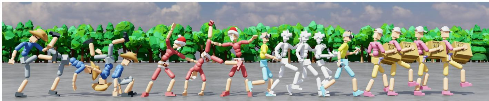  
Fig. 1. Overview of HetSkills. From left to right, the results illustrate four representative skill categories: motion tracking, text-to-motion generation, motion completion, and downstream task adaptation. Although these skills are learned from heterogeneous data sources, supervision signals, and task objectives, they are all represented in a unified executable latent space and decoded by a shared physics-based motion controller, enabling progressive skill accumulation, reuse, and composition.

We propose HetSkills, a novel framework designed to progressively learn heterogeneous skills within a unified latent space for physics-based character control. The core idea is to treat this latent space as a shared executable interface, enabling seamless integration of skills learned from diverse data sources, supervision forms, and tasks. HetSkills begins by learning a tracking skill that establishes a strong foundation in motion control and creates a shared motion decoder, which can be reused across tasks without the need for retraining or separate controllers. To prevent the text-to-motion skill from exploiting shortcut pathways instead of learning language semantics, we introduce motion intuition distillation to ground text-to-motion generation in language semantics and a task-guidance module that dynamically adjusts actions based on high-level language instructions. This enables HetSkills to preserve natural motion while continuously expanding its skill repertoire, making it highly adaptable for long-horizon tasks. Experimental results demonstrate the efectiveness in motion tracking, text-to-motion generation, motion completion, and downstream task adaptation, achieving impressive success rates even under challenging conditions.

Additional Key Words and Phrases: Reinforcement learning, character animation, motion imitation

## 1 Introduction

Learning physics-based character skills that are natural, composable, and reusable is a fundamental goal in animation, gaming, and robotics. Early approaches [Peng et al. 2022; Tessler et al. 2023; Zhu et al. 2023] typically learn task-specific controllers by imitating reference motions from small, narrowly curated motion datasets. While efective for individual tasks, such methods ofer limited reusability and compositionality. More recent eforts substantially expand the coverage of motion priors and behavior models by leveraging large-scale data [Wu et al. 2025a]. However, despite this progress, physics-based character control still lacks a unified and executable skill representation that can support diverse behaviors within a single framework. As a result, it remains dificult to accumulate skills from heterogeneous data sources, compose them flexibly, and transfer them eficiently to new downstream tasks while preserving natural human-like motion.

Large-scale motion priors and language-conditioned control [Ju ravsky et al. 2024; Tessler et al. 2024] suggest that language can provide a unified and flexible interface for accessing rich human motion knowledge. This creates the possibility of reusing previously acquired motion capabilities without collecting new demonstrations or training a dedicated controller for every new behavior. Existing methods [Luo et al. 2023b; Mu et al. 2025] partially move in this direction by leveraging pretrained motion priors to guide downstream control. Yet these approaches typically apply pretrained motion models as external guidance or regularization, rather than as a shared skill representation in which newly acquired capabilities can be progressively integrated and directly reused. Consequently, they remain limited when tasks involve heterogeneous objectives, diverse interaction patterns, or behaviors that go beyond the support of the original motion data.

To address the lack of a unified and executable skill representation for progressively accumulating and reusing heterogeneous skills in physics-based character control, we propose HetSkills, a physics-based character control framework that progressively learns heterogeneous skills within a unified latent space. Specifically, heterogeneous skills refer to capabilities acquired from diferent data sources, supervision forms, and training stages, including motion tracking, text-to-motion generation, motion completion, and downstream task adaptation. Instead of training a separate controller for each capability, HetSkills continuously accumulates these skills into a shared latent representation that serves as a common executable interface for skill acquisition, composition, and reuse. This unified design enables the controller to grow with newly introduced abilities while maintaining a coherent motion prior and a consistent control space.

More specifically, HetSkills is built around a unified latent space that serves as a shared interface for acquiring, composing, and reusing heterogeneous skills. To improve compositional control and generalization, we adopt a part-wise character decomposition [Bae et al. 2025, 2023], which allows diferent body parts to receive specialized yet coordinated control signals within a common latent architecture. The latent space is anchored by an end-to-end tracking skill that is preserved and directly reused throughout subsequent learning stages, thereby avoiding an additional distillation step and its associated performance degradation. To support robust text-tomotion generation, we further introduce Motion Intuition Distillation (MID), which encourages the model to ground its predictions in language semantics rather than shortcut pathways. For downstream tasks, HetSkills dispenses with reference motions and task-specific demonstrations. It performs lightweight latent-space adaptation, with language specifying high-level behavioral objectives for diferent body parts within a coordinated whole-body control framework.

Experiments demonstrate the efectiveness of HetSkills in three key aspects. First, HetSkills supports stable accumulation and reuse of heterogeneous skills within a shared latent space, enabling reliable compositional control across behaviors learned from diferent sources and supervision forms. Second, it achieves robust text-tomotion generation under both standard and challenging initializations, reaching a success rate of 96.9% under standard initialization and 81.7% from a neutral pose. Third, HetSkills transfers efectively to novel downstream tasks through lightweight latent-space adaptation, without requiring task-specific demonstrations or reference motions. These results indicate that a unified latent space can serve as an efective substrate for progressively expanding physics-based character capabilities while preserving natural motion quality.

## 2 Related Work

Physics-based character control is a long-standing focus of research in animation, robotics, and gaming, aiming to generate realistic, reusable, and composable character behaviors [Liu and Hodgins 2017; Wang et al. 2010; Yin et al. 2007]. Over the years, methods have addressed diferent aspects of motion learning, including imitation, motion tracking, language-conditioned control, and downstream task adaptation. However, existing methods often struggle with integrating heterogeneous skills into a single, unified framework, requiring either retraining or relying on fragmented modules for new tasks. We summarize the key lines of related work below, situating them with respect to our goal of progressively integrating heterogeneous skills within a unified framework.

Physics-based Motion Imitation and Skill Learning. Physics-based character control traditionally relies on motion capture data and reinforcement learning to produce physically plausible behaviors.

Early work [Peng et al. 2018] establishes the foundational paradigm of training tracking policies against reference motion clips, enabling robust imitation of a wide range of physically plausible skills. To reduce reliance on hand-crafted tracking rewards, adversarial approaches [Dou et al. 2023; Hassan et al. 2023; Peng et al. 2022, 2021; Tessler et al. 2023; Won et al. 2020; Zhang et al. 2025] are introduced to encourage stylistic realism without explicit motion matching, with some also learning reusable latent skill spaces from unstructured motion data for high-level task reuse. In parallel, VAE-based methods [Ling et al. 2020; Merel et al. 2018; Yao et al. 2022; Zhu et al. 2023] provide complementary benefits through probabilistic latent modeling, learning structured and diverse skill representations that support behavioral diversity and downstream task reuse. Difusion-based methods [Huang et al. 2025b; Mu et al. 2025; Serifi et al. 2024; Truong et al. 2024] further broaden the generative toolkit by leveraging pretrained motion difusion models as either reusable behavioral priors or direct policy parameterizations for physicsbased control. Despite these advances, both families of methods are typically designed around a fixed training corpus with homogeneous supervision, making it challenging to incrementally expand the skill repertoire as new data sources or conditioning modalities become available.

Large-scale Motion Priors and Language-conditioned Control. To improve coverage and generalization beyond small task-specific datasets, a line of work [Luo et al. 2023a,b] scales motion tracking to large corpora and distills the acquired motor skills into a universal physics-based latent space, enabling diverse downstream tasks to reuse a shared motor representation. Building on this, methods such as [Tessler et al. 2024; Wu et al. 2025a] unify motion tracking with richer conditioning signals such as language and kinematic constraints within a single model, significantly broadening the interface through which users can direct character behavior. Similarly, works like [Juravsky et al. 2022, 2024; Ren et al. 2023] train physics-based controllers directly conditioned on language commands, scaling to thousands of diverse skills. However, distillation-based approaches may introduce some capability loss relative to the original tracking experts, and adapting these models to complex downstream tasks can remain challenging, as the breadth of the learned skill space makes it dificult to reliably activate task-relevant behaviors without additional guidance.

Part-Wise Motion Learning. Part-wise decomposition is widely explored in kinematics-based motion generation to improve motion controllability, diversity, and compositionality [Jang et al. 2022; Wan et al. 2024]. In physics-based character control, related works further leverage part-wise structure to compose partial motion pri ors, decouple imitation objectives, or facilitate part-wise planning, enabling the synthesis of more diverse and interaction-rich behaviors [Bae et al. 2023; Khoshsiyar et al. 2024; Xu et al. 2023]. Another line introduces part-wise latent priors or modular skill representations within hierarchical control pipelines, enabling more structured composition and improved task adaptability [Bae et al. 2025; Huang et al. 2025a]. While these works collectively demonstrate the benefits of part-wise decomposition for compositional control and generalization, they typically instantiate part-wise structure within a specific motion-prior, imitation, planning, or modular-control framework. This makes their skill spaces efective for composing behaviors under a fixed interface, but less suited for progressively accommodating heterogeneous skill types, supervision signals, and conditioning modalities within a unified representation.

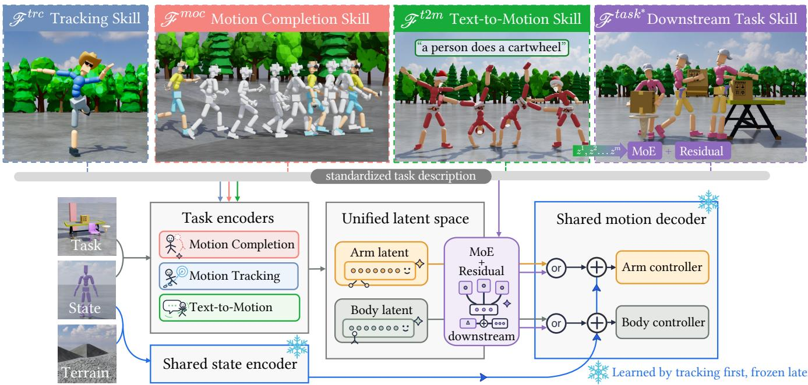  
Fig. 2. HetSkills progressively integrates four representative heterogeneous skills, including motion tracking ℱ��� , text-to-motion $\mathcal { F } ^ { t 2 m }$ , motion completion $\mathcal { F } ^ { m o c }$ , and downstream task adaptation ℱ���� , within a unified latent space. Each skill maps its heterogeneous goal signals to part-wise arm and body latents via its own task encoder. After motion tracking learns the shared state encoder and motion decoder, these modules are frozen and reused by all subsequent skills. The downstream task adaptation adopts a language-guided compositional module to blend frozen motion priors with task-conditioned residual corrections, enabling lightweight adaptation without task-specific demonstrations or reference motions.

Downstream Task Adaptation with Motion Priors. A natural paradigm for downstream task learning is to freeze a pretrained motion prior and train a high-level policy that operates in the learned latent space [Hassan et al. 2023; Luo et al. 2023b; Peng et al. 2022; Tessler et al. 2023; Zhu et al. 2023], allowing task policies to inherit motion naturalness without retraining the low-level controller. To better handle complex or contact-rich scenarios, token-based adaptation methods [Pan et al. 2025; Vainshtein et al. 2025] introduce task-specific tokens as a lightweight interface between a frozen pretrained policy and new task objectives. Another direction repurposes pretrained generative models [Mu et al. 2025; Tevet et al. 2024] as reusable behavioral priors that provide motion naturalness constraints or planning guidance during task optimization. While these approaches demonstrate the value of structured motion priors for downstream learning, the underlying skill representation is generally fixed after pretraining, and the semantic interface it exposes is limited, making it dificult to flexibly compose and steer behavioral distributions toward diverse downstream objectives without additional supervision or data.

## 3 Problem Formulation

We formulate physics-based character control as a goal-conditioned Markov decision process [Liu et al. 2022b], where a policy acts according to the current state �� and a goal signal ��. At each timestep �, the character executes an action $a _ { t } ,$ , transitions to the next state $s _ { t + 1 } \sim p ( \cdot \mid s _ { t } , a _ { t } )$ , and receives a scalar reward $r _ { t } .$ . The objective is to maximize the expected discounted return

$$
J ( \pi ) = \mathbb { E } \left[ \sum _ { t = 0 } ^ { T } \gamma ^ { t } r _ { t } \right] ,\tag{1}
$$

where $\gamma \in \left[ 0 , 1 \right)$ is the discount factor [Sutton et al. 1998]. In our setting, actions are target joint rotations that are converted to torques through proportional-derivative (PD) controllers [Tan et al. 2011] in the physics simulator.

The key challenge is that the goal signal takes heterogeneous forms across skills. Depending on the task, $g _ { t }$ may correspond to future reference poses for motion tracking, language descriptions for text-to-motion generation, sparse temporal constraints for motion completion, or task-specific observations and language conditions for downstream adaptation. These goals difer in modality, supervision, and data distribution, making it dificult to consolidate them under a single controller.

Our objective is therefore to learn a unified latent space that serves as a shared control interface across heterogeneous skills. Instead of training a separate low-level controller for each task, each skill predicts a latent $z _ { t }$ from its own goal specification, and a shared decoder maps $z _ { t }$ and $s _ { t }$ to the final physical action. Under this formulation, the central problem is to progressively construct a latent control space that can incorporate new skills from diferent training stages while preserving previously learned behaviors and supporting eficient transfer to downstream tasks.

## 4 HetSkills: Progressive Heterogeneous Skill Learning

The proposed HetSkills is a physics-based character control framework that progressively learns heterogeneous skills within a unified latent space. As shown in Fig. 2, the key idea is to treat this latent space as a shared executable interface for skill acquisition, composition, and reuse. Accordingly, skills learned from diferent data sources, supervision forms, and training stages can be incorporated into a common control representation. To support scalable reuse and downstream transfer, HetSkills further combines this unified latent space with a standardized task interface, allowing newly introduced skills to be integrated without retraining separate low-level controllers.

Specifically, HetSkills begins by learning a tracking skill $\mathcal { F } ^ { t r c }$ which simultaneously constructs the unified latent space and produces the shared motion decoder reused across all subsequent stages. To improve compositional control and generalization, $\mathcal { F } ^ { t r c }$ adopts a part-wise character decomposition that factorizes the humanoid into coordinated body partitions, each governed by a dedicated latent command within a common control architecture. After training, the state encoder and part-wise decoders are frozen and directly reused, avoiding an additional distillation step and its associated performance degradation.

The remaining skills are built on top of this fixed control substrate, each introducing a distinct form of goal conditioning over the shared latent space. $\mathcal { F } ^ { t 2 m }$ grounds natural language descriptions into latent motion commands through Motion Intuition Distillation (MID), improving semantic robustness under challenging initializations. $\mathcal { F } ^ { \bar { m } o c }$ handles sparse or partial observations under a unified sparse-goal formulation, covering VR-driven tracking, motion inbetweening, and human-scene interaction. $\mathcal { F } ^ { t s k * }$ reuses the frozen text-conditioned prior for downstream tasks, composing part-wise language instructions through a learned routing mechanism without requiring task-specific demonstrations or retraining. Across all stages, skills are formulated under a standardized task description, which provides a skill-agnostic interface for consistent skill integration and flexible sequential composition in long-horizon tasks.

## 5 ℱ��� : Tracking Skill

We begin by learning a tracking skill $\mathcal { F } ^ { t r c }$ to construct the unified latent space that underlies all subsequent skills. The key idea is to learn a general tracking controller with a compact and reusable la tent space that remains expressive for diverse later skills. Therefore, subsequent skills can operate in the same control space without relearning low-level dynamics. To support compositionality, we adopt a part-wise architecture that factorizes the character into coordinated body partitions, while preserving a shared global context.

Fig. 3 provides an overview of the tracking architecture. The tracker consists of a shared state encoder $\varepsilon _ { s } ,$ , two part-wise future encoders $\mathcal { F } _ { a } ^ { t r c }$ and $\mathcal { F } _ { b } ^ { t r c }$ , and two part-wise low-level controllers $\mathcal { D } _ { a }$ and $\mathcal { D } _ { b }$ . The future encoders predict compact deterministic latent commands $z _ { a } ^ { t }$ and $z _ { b } ^ { t }$ for the arm and body partitions, which are decoded into joint-level actions by the controllers conditioned on the shared state feature. After training, $\mathcal { E } _ { s } , \mathcal { D } _ { a }$ , and $\mathcal { D } _ { b }$ are frozen and reused as a shared motion controller across all subsequent stages, avoiding an additional distillation step and its associated performance degradation. The following subsections detail the model representation, part-wise architecture, and training objective in turn.

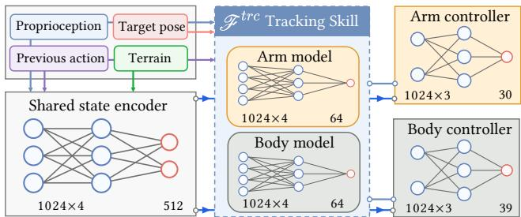  
Fig. 3. Architecture of the tracking skill $\mathcal { F } ^ { t r c }$ . The tracking skill takes proprioception, the previous action, and future target poses as input, then predicts separate latent commands for the arm and body branches. A shared state encoder extracts the current physical context, while part-wise controllers decode the arm and body latents into joint-level target actions. After tracking training, the shared state encoder and part-wise controllers are frozen as the common motion decoder for all later skills, while $\mathcal { F } ^ { t r c }$ itself is retained as one heterogeneous skill.

## 5.1 Model Representation

As shown in Fig. 4, we use a physically simulated humanoid based on the neutral SMPL [Loper et al. 2015] body model with $^ { 6 9 }$ degrees of freedom, following prior physics-based character control works [Luo et al. 2023a, 2022; Tessler et al. 2024]. All rotations are represented using the continuous 6D parameterization [Zhou et al. 2019]. For notational convenience, we apply $\delta _ { r } ( \cdot )$ to denote a quantity expressed relative to the current root frame, and $\delta _ { g } ( \cdot )$ to denote the diference between a target quantity and its current counterpart.

Proprioception. The policy observes the current body configuration as

$$
s ^ { t } = \big ( \delta _ { r } ( \theta ^ { t } ) , ~ \dot { \theta } ^ { t } , ~ \delta _ { r } ( v ^ { t } ) , ~ h _ { \mathrm { r o o t } } ^ { t } \big ) ,\tag{2}
$$

where $\theta ^ { t }$ and $\dot { \theta } ^ { t }$ denote the joint rotations and angular velocities, $v ^ { t }$ denotes the linear velocities, and $h _ { \mathrm { r o o t } } ^ { t }$ is the root height above the ground.

Goal observation. The goal input consists of the next � target poses from the reference motion, $\mathbf { \bar { \boldsymbol { g } } } ^ { t } = [ \hat { f } ^ { t + 1 } , \dots , \hat { f } ^ { t + K } ]$ . Each target pose $\hat { f }$ is represented as

$$
\hat { f } = \big ( \delta _ { r } ( \hat { p } ) , \delta _ { g } ( p ) , \delta _ { r } ( \hat { \theta } ) , \delta _ { g } ( \theta ) , \delta _ { g } ( v ) , \delta _ { g } ( \dot { \theta } ) \big ) ,\tag{3}
$$

where the first two terms denote the target body positions and position errors in the current root frame, the next two denote the target rotations and rotation errors, and the last two denote the linear and angular velocity diferences between the current and target poses.

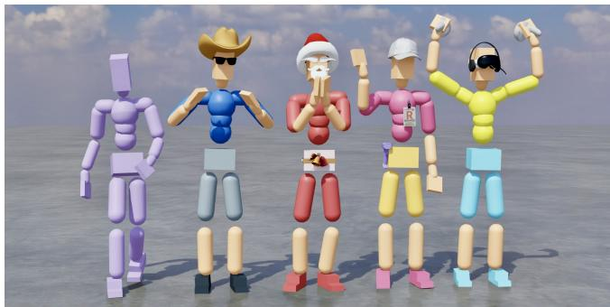  
Fig. 4. Visualization models of diferent HetSkills stages. The leftmost character is the physically simulated humanoid used for control, while the other four styled characters visualize the learned skill families, including a cowboy for motion tracking $\mathcal { F } ^ { t r c }$ , a Santa for text-to-motion $\mathcal { F } ^ { t 2 m }$ , a gamer for motion completion $\mathcal { F } ^ { m o c }$ , and a courier for downstream task adaptation $\mathcal { F } ^ { t a s k ^ { * } }$ . These visual appearances distinguish skills in demonstrations. All skills share the same underlying physical character and latent controller.

Action Space. The tracking skill takes the current proprioception $s ^ { t } { } _ { : }$ , future reference goal $g ^ { t }$ and the previous action $a ^ { t - 1 }$ as input, and predicts part-wise latent actions in the corresponding latent space:

$$
\begin{array} { r } { z _ { \mathcal { P } } ^ { t } = \mathcal { F } _ { \mathcal { P } } ^ { t r c } ( s ^ { t } , g ^ { t } , a ^ { t - 1 } ) , \qquad \mathcal { P } \in \{ a , b \} , } \end{array}\tag{4}
$$

where $z _ { a } ^ { t }$ and $z _ { b } ^ { t }$ denote the latent actions for the arm and body partitions, respectively. These latent actions are then decoded into joint-level target actions through the corresponding state feature:

$$
\begin{array} { r } { \boldsymbol { c } ^ { t } = \mathcal { E } _ { s } ( s ^ { t } ) , \quad \boldsymbol { a } ^ { t } = \big [ \mathcal { D } _ { a } ( \boldsymbol { c } ^ { t } , \boldsymbol { z } _ { a } ^ { t } ) , \mathcal { D } _ { b } ( \boldsymbol { c } ^ { t } , \boldsymbol { z } _ { b } ^ { t } ) \big ] , } \end{array}\tag{5}
$$

where $\mathcal { E } _ { s }$ is the shared state encoder, and $\mathcal { D } _ { a }$ and $\mathcal { D } _ { b }$ are the partwise low-level controllers for the arm and body partitions. The final action $a ^ { t }$ consists of target joint rotations for all actuated degrees of freedom, which are converted to joint torques via PD controllers [Tan et al. 2011]. PD controllers are widely used in physicsbased character animation [Peng et al. 2018; Xu et al. 2025; Yu et al. 2025] because they provide a stable and intuitive interface between learned policies and physical simulation, abstracting away low-level torque computation while remaining responsive to perturbations.

## 5.2 Part-wise Architecture

Part-wise architecture is designed to improve compositionality and latent controllability while preserving coordinated whole-body behavior. The core idea is to factorize the humanoid into a small number of semantically meaningful body partitions, and to let each partition predict its own latent action within a shared control framework. This design encourages specialization for diferent motion patterns, while maintaining global consistency through a common state representation. In addition, we construct the latent space to be deterministic and compact. Therefore, it can serve as a stable substrate for subsequent skill learning and downstream composition.

Part-wise Decomposition. We decompose the humanoid into two kinematic partitions: an arm part that groups both hands and arms, and a body part that contains all remaining joints. This decompo sition is motivated by the observation that motion datasets often include fine-grained upper-limb behaviors, such as gesturing, punching, and object interaction, whose high-frequency and low-inertia dynamics difer substantially from those of locomotion and balance. $\mathrm { A }$ dedicated arm branch therefore allows the model to specialize in these behaviors without entangling them with lower-body control. Compared with finer-grained decompositions [Bae et al. 2025; Huang et al. 2025a], the two-part split provides a favorable trade-of between expressiveness and simplicity. It achieves strong tracking quality across diverse motion categories while avoiding redundant parameters and excessive latent channels that would complicate downstream skill composition. We validate this design choice in Section 10.1.

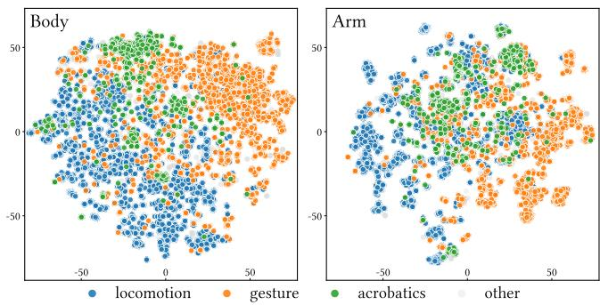  
Fig. 5. Learned body and arm latent spaces. t-SNE projections show that motions from diferent categories, including locomotion, gesture, acrobatics, and other behaviors, form distinguishable distributions, even though no explicit category labels are used during latent learning. This indicates that the deterministic and compact latent representation captures semantically meaningful motion structure, which supports later skill reuse and composition.

Network Structure. With this factorization, the tracking policy consists of five modules, including a shared state encoder $\mathcal { E } _ { s } ,$ two part-wise future encoders $\mathcal { F } _ { a } ^ { t r c }$ and $\mathcal { F } _ { b } ^ { t r c }$ , and two part-wise lowlevel controllers $\mathcal { D } _ { a }$ and $\mathcal { D } _ { b }$ . At each timestep, $\mathcal { E } _ { s }$ maps the current observation to a shared state feature $c ^ { t }$ that captures the full-body context. In parallel, $\mathcal { F } _ { a } ^ { t r c }$ and $\mathcal { F } _ { b } ^ { t r c }$ each take a two-frame window of future reference motion and predict compact latent commands $z _ { a } ^ { t }$ and $z _ { b } ^ { t }$ for the arm and body partitions, respectively. We adopt two future frames because this improves tracking accuracy and provides stronger supervision when the tracker later serves as an expert. At inference time, a single reference frame is suficient by duplicating it to form the two-frame input. The shared feature $\dot { c } ^ { t }$ is concatenated with each part-wise latent and passed to the corresponding controller to produce joint-level actions. Because both controllers condition on the same shared state feature, the two branches retain access to a consistent global body context and can coordinate without explicit cross-branch communication. At the same time, the separate latent commands and decoders allow each branch to specialize in its own body partition. Therefore, the latent action captures the intended motion while the shared feature anchors it to the current physical state.

Deterministic Latent Space. Existing prior latent-variable policies [Ling et al. 2020; Liu et al. 2022a; Tessler et al. 2024] typically model the latent space as a stochastic distribution, while our future encoders produce deterministic latent representations [Holden et al. 2017; Zhang et al. 2018]. In stochastic formulations, exploration noise is injected directly into the latent space [Plappert et al. 2017], which encourages the encoder to increase latent magnitudes in order to preserve discriminability among diferent skills. This can degrade tracking precision, destabilize the latent scale, and introduce an additional sensitive KL-divergence coeficient [Burgess et al. 2018; Kingma and Welling 2013]. We instead keep the latent space deterministic and inject exploration noise only at the final action space, where it promotes exploration without distorting the learned latent geometry. To further regularize the latent representation, we apply two complementary objectives: a latent magnitude penalty that encourages compact representations, and an AR(1) temporal smoothness penalty [Merel et al. 2018] that discourages abrupt latent changes between consecutive timesteps:

$$
\mathcal { L } _ { m r } = \sum _ { p \in \{ a , b \} } \mathbb { E } \left[ \Vert z _ { p } ^ { t } \Vert _ { 2 } ^ { 2 } \right] , \quad \mathcal { L } _ { a r } = \sum _ { p \in \{ a , b \} } \mathbb { E } \left[ \Vert z _ { p } ^ { t } - \phi z _ { p } ^ { t - 1 } \Vert _ { 2 } \right]\tag{6}
$$

Together, the deterministic design and these regularizers yield a compact and well-structured latent space. As illustrated by the t-SNE visualization in Fig. 5, motions from diferent categories, including locomotion, gesture, acrobatics, and other behaviors, exhibit distinct distributional tendencies in the learned latent space, suggesting that the representation captures semantically meaningful structure without explicit category supervision. This structure is also beneficial for downstream skill composition, since later modules only need to predict a latent point per part rather than match an entire latent distribution.

## 5.3 Training Objective

The tracking skill is trained to imitate reference motions while simultaneously shaping the latent space to be compact, smooth, and reusable. To this end, we optimize the controller with reinforcement learning using motion-tracking rewards, and augment the policy objective with latent-space regularization. We further adopt sampling and termination strategies that improve training eficiency on large and diverse motion datasets.

We train the tracking policy with proximal policy optimization (PPO) [Schulman et al. 2017] to imitate reference motions. Each reward term takes the form $r ( x , k ) = \exp ( - k \| x \| )$ . The full tracking reward is defined as

$$
r ^ { t } = \sum _ { j \in \mathcal { T } } w ^ { j } r \big ( \delta _ { g } ( x ^ { t , j } ) , k ^ { j } \big ) + w ^ { c t } r ^ { t , c t } + w ^ { s m } r ^ { t , s m } + w ^ { e g } r ^ { t , e g } ,\tag{7}
$$

where $\mathcal { T } = \{ g p , g r , j v , j a v , r h \}$ corresponds to global joint positions, global joint rotations, joint velocities, joint angular velocities, and root height, respectively. Here, $\boldsymbol { r } ^ { t , c t }$ denotes the contact reward, which encourages correct foot contact behavior. The final two terms correspond to an action smoothness penalty and an energy penalty, which jointly encourage smoother motions. Detailed reward weights and coeficients are provided in the supplementary material.

The overall training objective combines the PPO loss with the latent regularization terms introduced in $\operatorname { E q . }$ (6):

$$
\mathcal { L } _ { t r c } = \mathcal { L } _ { \mathrm { p p o } } + \lambda _ { m r } \mathcal { L } _ { m r } + \lambda _ { a r } \mathcal { L } _ { a r } .\tag{8}
$$

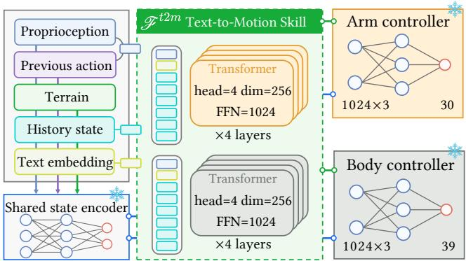  
Fig. 6. Architecture of the text-to-motion skill $\mathcal { F } ^ { t 2 m }$ . The frozen TMR text encoder provides a semantic language embedding, while the current proprioception-action input and recent history states are projected into tokens. Two part-wise Transformer encoders predict arm and body latents in the shared latent space, which are then decoded by the frozen state encoder and part-wise controllers into physical actions. This design isolates language grounding from low-level control and allows text-conditioned motion generation to reuse the tracking-learned controller.

This objective improves tracking fidelity and encourages the learned latent actions to remain compact and temporally coherent, which is important for later skill reuse and downstream composition.

To improve training eficiency on diverse motion datasets, we additionally adopt early termination [Peng et al. 2018] and prioritized motion sampling [Luo et al. 2023b]. An episode is terminated when any joint position deviates from the reference beyond a predefined threshold, preventing training from being dominated by undesirable states. Motions with higher failure rates are sampled more frequently, allowing training to focus on challenging and underrepresented behaviors. After training, we freeze $\mathcal { E } _ { s } , \mathcal { D } _ { a } ,$ and $\mathcal { D } _ { b }$ and reuse them as the shared decoder in subsequent stages.

## 6 $\mathcal { F } ^ { t 2 m }$ : Text-to-Motion Skill

We learn a text-to-motion skill $\mathcal { F } ^ { t 2 m }$ that maps natural language descriptions to part-wise latent actions within the unified latent space, with the low-level controller frozen from the tracking skill. The goal is to ground natural language descriptions into reusable latent actions while preserving the motion quality and controllability provided by the tracking decoder. A major challenge is that text-conditioned models can easily exploit shortcut pathways, such as privileged future-motion cues or overly regular training initialization, instead of learning meaningful language semantics. Our design therefore emphasizes semantic grounding under imperfect context, so that the learned skill remains robust under changed initial states, mismatched histories, and other challenging inference conditions.

The architecture of the text-to-motion skill is illustrated in Fig. 6. It consists of two part-wise text encoders $\mathcal { F } _ { a } ^ { t 2 m }$ and $\mathcal { F } _ { b } ^ { t 2 m }$ , which predict latent actions for the arm and body partitions, respectively, while reusing the frozen state encoder $\mathcal { E } _ { s }$ and part-wise controllers $\mathcal { D } _ { a }$ and $\mathcal { D } _ { b }$ from the tracking stage. The following subsections detail MID, the model architecture, and the training objective in turn.

## 6.1 Motion Intuition Distillation

The key idea ofMotion Intuition Distillation(MID) is to remove those training shortcuts that would otherwise allow the model to bypass semantic understanding. Instead of predicting motion under nearperfect future guidance or always starting from a matched initial state, the model must infer the intended behavior from language, the current state, and imperfect historical context. This encourages the text-conditioned policy to acquire a more robust motion intuition that generalizes beyond the training distribution.

Shortcut Issue. A major challenge in learning text-to-motion skills within a unified latent space is that the model can easily rely on shortcut pathways instead of learning meaningful language semantics. When future motion information is indirectly accessible, whether through residual branches, future-motion conditions, or other forms of privileged information, the model tends to shift the main modeling burden to these easier pathways, since predicting the next latent from nearby future frames requires far less abstraction than grounding language descriptions into motion. As a result, the residual structure may acquire overly strong compensatory behavior that efectively bypasses the text encoder, while the component responsible for semantic understanding remains insuficiently trained. In addition, when training episodes always start from the groundtruth initial frame together with its matching motion history, the model can overfit to local state-transition patterns and achieve high in-distribution accuracy without learning to handle changed initial states, mismatched histories, or motion transitions.

Formulation. To address this issue, we propose MID, which removes dependence on future motion and standard initialization. The text-to-motion encoders $\mathcal { F } _ { a } ^ { t 2 m }$ and $\mathcal { F } _ { b } ^ { t 2 m }$ receive only the current state, past history, and the text embedding. As a result, the model infers the intended motion from the language condition, the current state, and imperfect historical context. We first adopt Reference State Initialization (RSI) [Peng et al. 2018], where, with probability $p _ { \mathrm { r s i } } = 0 . 7 ,$ the initial state of a training episode is sampled uniformly from any frame along the reference clip rather than taken from the first frame of the target motion. We further introduce Randomized Memory Initialization (RMI). With probability $p _ { \mathrm { r m i } } = 0 . 2 $ , we uniformly sample another motion sequence from the motion library, use its terminal frame as the initial state, and fill the history bufer with a real history segment from the end of that randomly sampled sequence. Under this training scheme, the model cannot always rely on an initial frame and history prefix that strictly match the target motion. Instead, it learns to infer the subsequent behavior from language semantics and the current observation. We validate the necessity of each component in Section 10.2.

## 6.2 Model Architecture

The text-to-motion architecture reuses the latent space and shared decoder learned by the tracking skill, and only learns the mapping from text-conditioned observations to latent actions. This design keeps the low-level control substrate fixed and shifts the learning burden to semantic grounding in latent space. As a result, the model can leverage a strong motion prior learned from large unstructured motion data while adapting it to language supervision with comparatively limited text-annotated data. Concretely, at each step the skill receives the proprioception $s _ { \mathrm { ~ : ~ } } ^ { t }$ , the previous action $a ^ { t - \bar { 1 } }$ , an observation history $H ^ { t }$ , and a text embedding �, and maps them to part-wise latent actions:

$$
\begin{array} { r } { z _ { \mathcal { P } } ^ { t } = \mathcal { F } _ { \mathcal { P } } ^ { t 2 m } ( s ^ { t } , a ^ { t - 1 } , H ^ { t } , e ) , \qquad \mathcal { P } \in \{ a , b \} , } \end{array}\tag{9}
$$

where $z _ { a } ^ { t }$ and $\boldsymbol { z } _ { b } ^ { t }$ denote the latent actions predicted for the arm and body partitions, respectively. These latent actions are then decoded into the final joint-level action through the frozen shared decoder:

$$
\begin{array} { r } { \boldsymbol { a } ^ { t } = \left[ \mathcal { D } _ { \boldsymbol { a } } ( \mathcal { E } _ { s } ( s ^ { t } ) , z _ { \boldsymbol { a } } ^ { t } ) , \mathcal { D } _ { \boldsymbol { b } } ( \mathcal { E } _ { s } ( s ^ { t } ) , z _ { \boldsymbol { b } } ^ { t } ) \right] . } \end{array}\tag{10}
$$

Input Representation. The proprioception $s ^ { t }$ follows the same definition as in the tracking skill. The text embedding � is obtained from a frozen Text-to-Motion Retrieval (TMR) text encoder [Petrovich et al. 2023], which is trained through contrastive learning to align language and motion in a shared embedding space. This provides a semantically structured representation that facilitates grounding text descriptions into latent motion commands. The observation history $H ^ { t }$ consists of six frames uniformly subsampled from the past two seconds of simulation, providing suficient temporal context for the model to infer the current motion phase and dynamics.

Skill Encoders. Two part-wise Transformer [Vaswani et al. 2017] encoders $\mathcal { F } _ { a } ^ { t 2 m }$ and $\mathcal { F } _ { b } ^ { t 2 m }$ take $s ^ { t } , a ^ { t - 1 }$ , �, and $H ^ { t }$ as input and predict latent actions $z _ { a } ^ { t }$ and $z _ { b } ^ { t }$ in the arm and body latent spaces, respectively. The two encoders share the same architecture but maintain separate parameters, enabling each branch to specialize in the dynamics of its corresponding body partition. The predicted latents are then decoded by the frozen state encoder $\mathcal { E } _ { s }$ and part-wise controllers $\mathcal { D } _ { a }$ and $\mathcal { D } _ { b }$ to produce joint-level actions.

Shared Decoder Reuse. Freezing the decoder provides two practical benefits. First, it removes the need to jointly learn low-level control during text-to-motion training, reducing the optimization problem to latent prediction alone. Second, it allows the text-tomotion skill to build on top of a controller already trained on a large and diverse motion dataset. Therefore, even a comparatively small text-annotated dataset can sufice to learn semantically grounded motion skills on top of a general-purpose motor foundation.

## 6.3 Training Objective

We train the text-to-motion encoders using the frozen tracking skill $\mathcal { F } ^ { t r c }$ as the expert teacher [Ross et al. 2011]. During training, the text-to-motion skill autonomously interacts with the environment, and at each time step, $\mathcal { F } ^ { t r c }$ observes the ground-truth future reference frames to provide the expert action $\hat { a } ^ { t }$ for the current state. Rather than supervising in the latent space, we compare the final joint-level actions $a ^ { t }$ and $\hat { a } ^ { t }$ produced after decoding through the shared controllers. Therefore, the loss naturally accounts for the nonlinear mapping from latent to action space. The overall training objective is

$$
\mathcal { L } _ { t 2 m } = \mathbb { E } \big [ \| a ^ { t } - \hat { a } ^ { t } \| _ { 2 } \big ] + \lambda _ { m r } \mathcal { L } _ { m r } + \lambda _ { \mathrm { a r } } \mathcal { L } _ { \mathrm { a r } } .\tag{11}
$$

The two regularization terms follow the same form as in Eq. $( 6 ) _ { : }$ penalizing latent magnitude and encouraging temporal smoothness. These regularizers help maintain a compact and well-structured latent distribution. Since our downstream module predicts residual latent adjustments on top of the text-to-motion output, a wellregularized base distribution makes such residual learning more stable and efective.

## 7 ℱ��� : Motion Completion Skill

We introduce $\mathcal { F } ^ { m o c }$ as a motion completion skill that extends the latent space to tasks requiring the recovery of physically plausible full-body motion from sparse or partial observations [Cohan et al. 2024; Harvey et al. 2020; Hwang et al. 2025a; Oreshkin et al. 2023; Qin et al. 2022]. These tasks difer in the form of their conditioning signals. However, they all require the controller to infer coherent whole-body behavior from incomplete information. Some involve spatially sparse observations, as in VR-driven body tracking where only a small set of end-efector trajectories is available, while others involve temporally sparse observations, as in motion in-betweening where only scattered keyframe poses are provided. The key idea of this stage is to express these diverse signals uniformly as partial goal specifications and handle them within the same latent space.

The motion completion skill therefore serves as a unified control interface for sparse-observation tasks. Instead of introducing a separate controller for each conditioning type, we learn a single skill family that maps the current proprioception together with sparse target observations to latent actions compatible with the shared decoder. In this work, we instantiate this framework in three representative settings, including VR tracking, motion in-betweening, and human-scene interaction. These cases cover both spatially sparse and temporally sparse conditioning, and together illustrate that the shared latent space can support a broader family of goal specifica tions beyond motion tracking and language-guided generation.

## 7.1 Unified Formulation

Let $O ^ { t } = \{ ( t _ { k } , \tilde { g } _ { k } ^ { t } ) \} _ { k = 1 } ^ { K }$ denote the sparse target observations, where each $t _ { k }$ is a relative time ofset and $\tilde { g } _ { k } ^ { t }$ is the corresponding partial goal feature. The motion completion skill takes the current proprioception $s ^ { t } ,$ the previous action $a ^ { t - 1 }$ , and the sparse observation set $O ^ { t }$ as input, and predicts part-wise latent actions:

$$
\begin{array} { r } { z _ { \mathcal { P } } ^ { t } = \mathcal { F } _ { \mathcal { P } } ^ { m o c } ( s ^ { t } , a ^ { t - 1 } , O ^ { t } ) , \qquad \mathcal { P } \in \{ a , b \} , } \end{array}\tag{12}
$$

where $z _ { a } ^ { t }$ and $z _ { b } ^ { t }$ denote the latent actions for the arm and body partitions, respectively. The resulting latent actions are decoded into the final joint-level target action through the shared decoder:

$$
\begin{array} { r } { c ^ { t } = \mathscr { E } _ { s } ( s ^ { t } ) , \qquad a ^ { t } = \big [ \mathscr { D } _ { a } ( c ^ { t } , z _ { a } ^ { t } ) , \mathscr { D } _ { b } ( c ^ { t } , z _ { b } ^ { t } ) \big ] . } \end{array}\tag{13}
$$

VR Tracking. In VR tracking, the conditioning signal consists of the full kinematic state of three end-efector bodies, namely the head and both hands, from the next reference frame. This corresponds to a spatially sparse observation setting, where only a small subset of body parts is directly specified and the controller infers the remaining full-body motion. We train the skill with a behavior cloning objective,

$$
\mathcal { L } _ { \mathrm { B C } } = \mathbb { E } \big [ \| a ^ { t } - \hat { a } ^ { t } \| _ { 2 } \big ] ,\tag{14}
$$

using the stage-1 tracker as the expert teacher. We additionally apply the latent magnitude regularization term ${ \mathcal { L } } _ { m r }$ from Eq. (6). The AR(1) smoothness term $\mathcal { L } _ { a r }$ is omitted in this case, since strong immediate fidelity to sparse spatial targets is more important than long-horizon temporal smoothing.

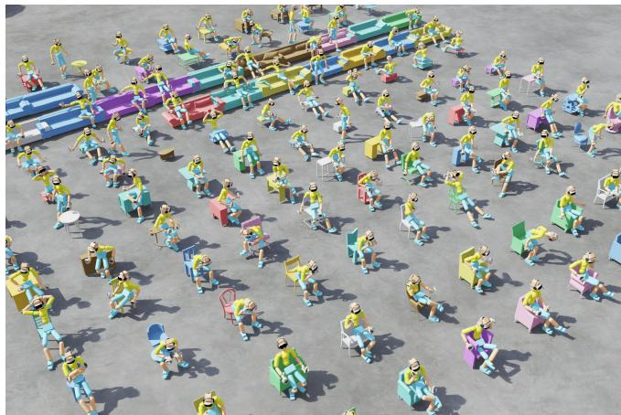  
Fig. 7. Examples of human-scene interaction generated by HetSkills. The characters interact with diverse everyday objects such as chairs, sofas, and tables, producing siting, reclining, and other object-conditioned motions within the same shared control framework.

Motion In-betweening. In motion in-betweening [Kaufmann et al. 2020; Kim et al. 2022; Starke et al. 2023], the conditioning signal consists of a future full-body pose together with its time ofset $\tau ^ { t } .$ The target frame is uniformly sampled from a future horizon of 5 to 30 frames, and once the character reaches it, a new target frame is resampled from the same range. This corresponds to a temporally sparse observation setting, where the controller synthesizes plausible intermediate motion that connects scattered target poses. Training follows the same behavior cloning objective $\mathcal { L } _ { \mathrm { B C } }$ , while both ${ \mathcal { L } } _ { m r }$ and $\mathcal { L } _ { a r }$ are applied to encourage compact latent representations and temporally coherent transitions across keyframes.

Human-scene Interaction. Human-scene interaction [Hassan et al. 2021b; Starke et al. 2019] can be cast under the same formulation as motion in-betweening [Hwang et al. 2025b]. The conditioning signal consists of a future target interaction state together with its time ofset, sampled from the same rolling future horizon. We train this skill on the SAMP dataset [Hassan et al. 2021a], which contains motions of characters interacting with everyday objects such as chairs and sofas, shown in Fig. 7. SAMP lies outside the distribution of the tracker training data. However, the generalization capacity of the shared latent space allows the same control framework to be reused without modification. For this setting, we adopt reinforcement learning instead of behavior cloning, as direct optimization against a tracking-style reward yields stronger performance under distribution shift. A key advantage of the unified latent space is that each motion completion skill can be trained independently on its own motion distribution while remaining fully compatible with the same shared control interface.

## 8 $\mathcal { F } ^ { t s k ^ { * } }$ : Language-Guided Downstream Adaptation

We introduce $\mathcal { F } ^ { t s k ^ { * } }$ as a language-guided downstream adaptation skill that reuses the language-conditioned motion distribution induced by $\mathcal { F } ^ { t 2 m }$ for new task objectives. Rather than retraining the motion prior or the low-level controllers, $\mathcal { F } ^ { t s k ^ { * } }$ learns lightweight task-specific guidance on top of the shared latent space. Therefore, downstream behaviors remain natural and human-like while adapting to novel tasks. To accommodate heterogeneous downstream objectives, this stage combines a standardized task interface with compositional guidance based on part-wise language priors and task-conditioned residual correction.

Concretely, $\mathcal { F } ^ { t s k ^ { * } }$ consists of three components: a standardized task description that provides a unified interface for representing and organizing tasks, a compositional task guidance module that combines multiple part-wise language priors under the current task context, and a lightweight adaptation objective that optimizes only the downstream guidance modules while keeping the pretrained motion prior fixed. The following subsections detail these three components in turn.

## 8.1 Standardized Task Description

To support heterogeneous skill learning and composition, HetSkills represents all skills through a unified task interface. Specifically, both previously learned skills and downstream task skills are formulated using a standardized task description that is independent of their specific training procedures. This abstraction provides a consistent way to specify, organize, compose, and extend skills, and further serves as the basis for long-horizon task execution in the shared latent space.

Task Unit. We abstract the execution of each skill as a standardized task unit

$$
\mathcal { T } _ { i } = \big ( \mathrm { I n i t i a l i z a t i o n } _ { i } , \mathrm { C o n d i t i o n } _ { i } , \mathrm { T e r m i n a t e } _ { i } \big ) ,\tag{15}
$$

where each component plays a distinct role. Initialization specifies the initialization protocol for the skill, including any required state resets, memory initialization, or environment configuration that must be established before execution begins. Condition encodes the task-specific guidance that governs the behavior during execution. Depending on the skill type, this may take the form of a language instruction, a target goal state, a reference trajectory, or another modality that parameterizes the desired behavior. Terminate defines the criterion under which the skill is considered complete, such as a fixed execution horizon, a goal-reaching condition, or a learned termination signal.

Task composition. This interface is deliberately agnostic to skill type. A language-conditioned motion generation skill, a humanscene interaction skill, and a goal-conditioned locomotion skill can all be expressed under the same T� abstraction, difering only in how each component is instantiated. Since all skills share this interface, they can be executed independently or organized sequentially as

$$
\operatorname { S e q } ( { \mathcal { T } } _ { 1 } , { \mathcal { T } } _ { 2 } , \dots , { \mathcal { T } } _ { N } ) ,\tag{16}
$$

which provides a unified mechanism for sequential scheduling and long-horizon skill composition.

## 8.2 Compositional Task Guidance

A single language condition is often insuficient to represent the full complexity of a downstream task, especially when the desired behavior involves blending multiple motion styles or switching between behaviors over time. Our solution is to combine multiple part-wise language priors through a learned routing mechanism and then refine the resulting latent action with a task-conditioned residual. This produces a flexible adaptation module that remains grounded in the pretrained motion prior while retaining task-specific expressiveness.

Instruction Set. For each body part, we consider a set of � language conditions

$$
{ \cal J } _ { p } = \{ e _ { p } ^ { m } \} _ { m = 1 } ^ { M } , \qquad p \in \{ a , b \} ,\tag{17}
$$

where each instruction $e _ { p } ^ { m }$ provides a distinct semantic description of the target behavior. Conditioned on these part-wise language inputs, the corresponding frozen language priors produce multiple latent candidates:

$$
z _ { \mathcal { P } } ^ { t , m } = \mathcal { F } _ { \mathcal { P } } ^ { t 2 m } ( s ^ { t } , a ^ { t - 1 } , H ^ { t } , e _ { \mathcal { P } } ^ { m } ) , \qquad \mathcal { \hat { P } } \in \{ a , b \} .\tag{18}
$$

Latent Routing. Since the most appropriate motion style depends on the current task context, we learn a gating function $\mathcal { G } _ { p }$ for each body part. It takes the current proprioceptive state and a taskspecific observation $o _ { \mathrm { t a s k } } ^ { t }$ as input and outputs normalized routing weights over the � instruction branches:

$$
\begin{array} { r } { \pmb { \alpha } _ { \tilde { p } } ^ { t } = \mathrm { s o f t m a x } \big ( \mathscr { G } _ { \tilde { p } } ( s ^ { t } , a ^ { t - 1 } , o _ { \mathrm { t a s k } } ^ { t } ) \big ) , \qquad \quad \tilde { p } \in \{ a , b \} . } \end{array}\tag{19}
$$

Here, $\alpha _ { p } ^ { t } = \{ \alpha _ { p } ^ { t , m } \} _ { m = } ^ { M }$ denotes the routing weights, where $\alpha _ { p } ^ { t , m }$ is the weight assigned to the �-th branch for part �.

Residual Refinement. While a weighted combination of languageprior latents approximates the target motion style, the resulting latent remains loosely coupled to task-specific objectives, as the language priors encode general motion distributions without direct awareness of task constraints. We therefore introduce a taskconditioned residual module $\mathcal { R } _ { p }$ for each body part and define the final part-wise latent as

$$
\hat { z } _ { \mathcal { P } } ^ { t } = \sum _ { m = 1 } ^ { M } \alpha _ { \mathcal { P } } ^ { t , m } z _ { \mathcal { P } } ^ { t , m } + \mathcal { R } _ { \mathcal { P } } ( s ^ { t } , a ^ { t - 1 } , o _ { \mathrm { t a s k } } ^ { t } ) , \qquad \mathcal { P } \in \{ a , b \} .\tag{20}
$$

The resulting latents $\hat { z } _ { a } ^ { t }$ and $\hat { z } _ { b } ^ { t }$ are then decoded by the frozen part-wise controllers using the same procedure as in the pretrained model.

## 8.3 Task Adaptation

Downstream adaptation optimizes only the lightweight guidance modules while keeping all pretrained priors and decoders fixed. This design preserves the motion naturalness encoded in the shared latent space and restricts task learning to the level of latent composition and correction. In practice, however, optimizing only task rewards can still drive the latent actions away from the motion-prior distribution. We therefore regularize the adapted latents to maintain stable and natural behavior. Fig. 8 shows representative downstream task examples under this adaptation setting.

ALGORITHM 1: Language-Guided Downstream Adaptation   
Input: Frozen priors $\mathcal { F } _ { p } ^ { t 2 m }$ , frozen decoder $\mathcal { D } ;$ instruction sets   
${ \cal J } _ { p } = \{ e _ { p } ^ { m } \} _ { m = 1 } ^ { M } , p \in \{ a , b \} ;$ gating networks $\begin{array} { r } { \mathcal { G } _ { p } , } \end{array}$ residual   
networks $\mathcal { R } _ { p } .$ , critic $V _ { \phi } ;$ fixed regularization coeficients   
�lmp, �smooth, �bound   
Output: Trained MoE gating networks $\begin{array} { r } { \mathcal { G } _ { p } , } \end{array}$ part-wise residual   
networks $\mathcal { R } _ { p } ,$ and value network $V _ { \phi }$   
for each training iteration do   
for each environment � (parallel) do   
Observe $s ^ { t } , a ^ { t - 1 } , H ^ { \dot { t } } , o _ { \mathrm { t a s k } } ^ { t } ;$   
for each language condition $e _ { p } ^ { m } \in \mathcal { I } _ { p }$ do   
Compute $z _ { p } ^ { t , m }$ via $\operatorname { E q . } { \big ( } 1 8 { \big ) } ;$   
end   
Compute gating weights $\alpha _ { p } ^ { t }$ via Eq. (19);   
Compute aggregated latent $\hat { z } _ { p } ^ { t }$ via Eq. (20);   
$\hat { z } ^ { t } \gets [ \hat { z } _ { a } ^ { t } ; \hat { z } _ { b } ^ { t } ] ;$   
Sample $z ^ { t } \sim \overset { \cdot } { N } ( \hat { z } ^ { t } , \mathrm { d i a g } ( \sigma ^ { 2 } ) )$ , store log $\pi _ { \theta } ( z ^ { t } ) ;$   
$a ^ { t } \gets \mathcal { D } ( s ^ { t } , z ^ { t } )$ , collect reward $r ^ { t } ,$ store transition;   
end   
Compute advantages $\hat { A } ^ { t }$ and returns ${ \hat { R } } ^ { t }$ via GAE;   
for each mini-batch from rollout bufer do   
Compute $\mathcal { L } _ { \mathrm { t s k } }$ via Eq. (24);   
Update ${ \mathcal { G } } _ { p } , { \mathcal { R } } _ { p } , V _ { \phi }$ via $\nabla \mathcal { L } _ { \mathrm { t s k } } ;$   
end   
end   
return $\mathcal { F } ^ { t s k ^ { * } } = \{ \varGamma _ { \mathcal { P } } , \mathcal { G } _ { \mathcal { P } } , \mathcal { R } _ { \mathcal { P } } \} _ { \mathcal { P } \in \{ a , b \} } ;$

Trainable modules. We train the compositional task guidance modules $\mathcal { G } _ { p }$ and $\mathcal { R } _ { p }$ using PPO [Schulman et al. 2017], while keeping all pretrained priors and the decoder frozen. The full procedure is summarized in Algorithm 1. After training, a new downstream skill is characterized by its instruction set and learned guidance module:

$$
\mathcal F ^ { t s k ^ { * } } = \{ \bar { Z } _ { \mathfrak { p } } , \mathcal G _ { \mathfrak { p } } , \mathcal R _ { \mathfrak { p } } \} , \qquad \mathfrak { p } \in \{ a , b \} .\tag{21}
$$

Latent regularization. Empirically, optimizing only the task reward tends to drive the latent action away from the motion-prior distribution, resulting in motion jitter and degraded naturalness. To mitigate this efect, we introduce two regularization terms. The latent magnitude penalty $\mathcal { L } _ { \mathrm { l m p } }$ is activated only when �ˆ exceeds a predefined threshold $z _ { \mathrm { b o u n d } } { \mathrm { : } }$

$$
\mathcal { L } _ { \mathrm { l m p } } = \mathbb { E } \left[ ( \operatorname* { m a x } \left( \left| \hat { z } \right| - z _ { \mathrm { b o u n d } } , 0 \right) ) ^ { 2 } \right] .\tag{22}
$$

The latent smoothness penalty $\mathcal { L } _ { \mathrm { { s m o o t h } } }$ encourages temporal consistency by penalizing large diferences between latent actions at consecutive timesteps:

$$
\mathcal { L } _ { \mathrm { s m o o t h } } = \mathbb { E } \left[ \| \hat { z } ^ { t } - \hat { z } ^ { t - 1 } \| ^ { 2 } \right] .\tag{23}
$$

Optimization objective. The full downstream training objective combines the PPO loss with the two regularization terms:

$$
\mathcal { L } _ { \mathrm { t s k } } = \mathcal { L } _ { \mathrm { p p o } } + \lambda _ { \mathrm { l m p } } \mathcal { L } _ { \mathrm { l m p } } + \lambda _ { \mathrm { s m o o t h } } \mathcal { L } _ { \mathrm { s m o o t h } } .\tag{24}
$$

Together, these terms keep the adapted latent actions within a stable region of the shared control space and improve the naturalness and robustness of the resulting motions.

## 9 Experimental Setup

All experiments are conducted in Isaac Lab [Mittal et al. 2025] using ProtoMotions [Tessler et al. 2025], with physics simulation running at 120 Hz and control policy execution at 30 Hz. Our framework is trained in four progressive stages using two consumer-grade NVIDIA RTX 5090 GPUs. Detailed hyperparameters and implementation specifics are provided in the appendix.

## 9.1 Datasets

Our progressive training paradigm naturally supports heterogeneous data sources across diferent stages, eliminating the need to unify all data under a single annotation format. This approach allows each stage to leverage the data best suited to its task objectives.

Specifically, for motion tracking, we use AMASS [Mahmood et al. 2019] as the base motion dataset and follow the filtering pipeline of PHC [Luo et al. 2023a] to clean the data. This pipeline removes clips that exhibit non-physical artifacts, such as limb penetration, body floating, and interactions with unmodeled objects, yielding a high-quality set of training sequences. This filtered set is also reused for VR tracking and motion in-betweening, where sparse conditioning signals are constructed directly from the same clips. For VR tracking, only the kinematic states of the head and both hands are retained as spatially sparse end-efector observations. For motion in-betweening, a future full-body pose is sampled from a rolling horizon of 5 to 30 frames ahead, providing temporally sparse keyframe targets. For text-to-motion, we use the HumanML3D [Guo et al. 2022] dataset to introduce natural language annotations for motion clips. Following SuperPADL [Juravsky et al. 2024], we discard clips shorter than 2 seconds or longer than 9 seconds, as such clips tend to be dominated by idle poses, redundant pauses, or compound actions, all of which degrade training stability and supervision quality. For human-object interaction, we incorporate the SAMP [Hassan et al. 2021a] dataset, which provides high-quality motion capture data covering typical furniture interactions, such as sitting and lying down. The dataset records both body motion and object spatial information simultaneously, which is essential for training models that can understand and predict interaction-based behaviors.

## 9.2 Tasks

To evaluate the downstream task adaptation module, we design three tasks that do not require task-specific demonstration data. For all tasks, we apply an energy penalty $\lambda \cdot \mathcal { P } \left( \lambda = 1 0 ^ { - 5 } \right)$ to suppress unnecessary high-power motions. In the path follow task, this penalty is applied only to the leg joints. Full reward specifications and hyperparameters are provided in the appendix. Specifically:

Path Follow. The agent tracks an online-generated random path through complex terrain. At each timestep, the agent observes the next 10 waypoints in its local coordinate frame, and the reward is defined as:

$$
r = \exp \left( - \| p _ { \mathrm { t a r g e t } } ^ { x y } - p _ { \mathrm { r o o t } } ^ { x y } \| ^ { 2 } \right) - \lambda \cdot \mathcal { P } _ { \mathrm { l e g } }\tag{25}
$$

where the first term encourages the root to stay close to the current path target in the horizontal plane.

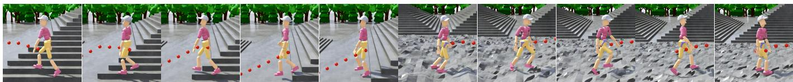  
(a) Path Follow

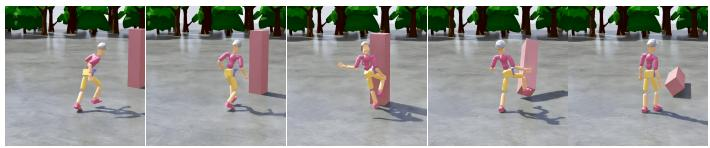  
(b) Strike Kick

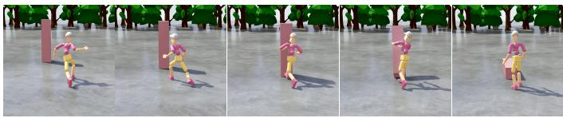  
(c) Strike Push

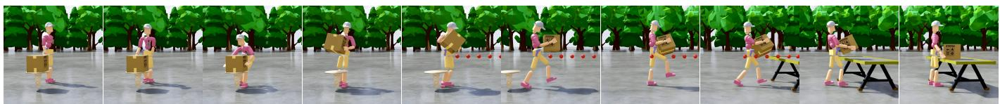  
(d) Pick-and-Place  
Fig. 8. Downstream task examples solved by HetSkills. The same frozen latent controller is adapted to diverse downstream tasks: (a) path follow, (b) strike with a kick, (c) strike with a push, and (d) pick-and-place. No task-specific motion demonstrations are used. Each task is learned through reward-driven lightweight adaptation that composes language-conditioned latent priors with task-conditioned residual corrections.

Strike. The agent approaches a randomly placed target and knocks it over using designated body parts, either hands for pushing or leg segments for kicking. The reward is defined as

$$
r = 0 . 6 r _ { \mathrm { r o t } } + 0 . 2 r _ { \mathrm { v e l } } + 0 . 1 r _ { \mathrm { p r o g } } + 0 . 1 r _ { \mathrm { t o w a r d } } - \lambda \cdot \mathcal { P }\tag{26}
$$

where $r _ { \mathrm { r o t } }$ rewards target tilt, $r _ { \mathrm { v e l } }$ encourages approaching the target at a desired speed, $r _ { \mathrm { p r o g } }$ rewards reducing the distance to the target, and $r _ { \mathrm { t o w a r d } }$ rewards facing the target.

Pick-and-Place. The task consists of three stages, including pick up, carry-to, and put-down. In the pick-up stage, the agent must approach a box randomly placed on a source platform and lift it to a target height using both hands. The reward is:

$$
r = 0 . 4 r _ { \mathrm { l i f t } } + 0 . 3 r _ { \mathrm { g r a s p } } + 0 . 2 r _ { \mathrm { f o r c e } } + 0 . 1 r _ { \mathrm { f a c e } } - \lambda \cdot \mathcal { P }\tag{27}
$$

where $r _ { \mathrm { l i f t } }$ rewards lifting the box, $r _ { \mathrm { g r a s p } }$ rewards approaching the grasp points, $r _ { \mathrm { f o r c e } }$ rewards efective bilateral contact, and $r _ { \mathrm { f a c e } }$ rewards facing the box. The carry-to and put-down stages require the agent to walk along a path while maintaining the grasp, and to place the box onto a target platform, respectively. We use pick-up as the baseline comparison task, as it is the most challenging of the three stages.

## 9.3 Evaluation Dimensions

To tackle a wide variety of tasks, including precise motion tracking, generating realistic motions from high-level language inputs, and adapting to new tasks without requiring retraining, we evaluate the performance of HetSkills across three key dimensions, with an additional long-horizon skill composition demonstration. Specifically:

Tracking and Motion Completion. We evaluate the motion tracking skill $\mathcal { F } ^ { t r c }$ on both the training and test splits of AMASS, and report the success rate and MPJPE (Mean Per Joint Position Error, in mm) [Luo et al. 2023b; Tessler et al. 2024]. We also conduct ablation studies to justify our part-wise decomposition design. For the motion completion skill ${ \mathcal { F } } ^ { m o c }$ , we evaluate three instantiations that cover both spatially and temporally sparse conditioning. In VR-driven body tracking, only the head and both hands are provided as visible goal constraints, while all other body segments are masked. In motion in-betweening, the success rate is reported on the training and test splits of AMASS under the same MPJPE fail ure threshold. For human-object interaction, we provide qualitative examples to demonstrate the ability of the framework to handle complex scenarios.

Text-to-Motion. We evaluate the text-to-motion skill $\mathcal { F } ^ { t 2 m }$ from two complementary aspects. First, we evaluate pose-level robustness under two initialization protocols: starting from the ground-truth first frame of each target clip and starting from a neutral pose. A rollout is considered a failure if the MPJPE exceeds a predefined threshold at any frame, and we report the success rates under both protocols. Second, we evaluate semantic alignment using the HumanML3D retrieval protocol [Guo et al. 2022] with a pretrained TMR model [Petrovich et al. 2023]. In this evaluation, the generated motion is used to retrieve its corresponding language description from candidate texts in the shared text-motion embedding space. We report R-Precision (R@N) and MedR, where higher R@N and lower MedR indicate better semantic alignment between the generated motion and the input language. This query-based evaluation complements MPJPE by measuring whether the generated motion is recognizable as the intended textual action.

Downstream Task Adaptation. We train and evaluate $\mathcal { F } ^ { t s k ^ { * } }$ on the three tasks described in Section 9.2, comparing our results against relevant baselines. The language instructions used to condition each task are provided in Appendix D.

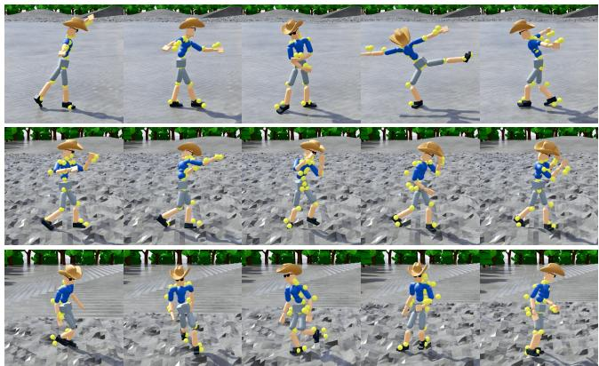  
Fig. 9. Qualitative results of motion tracking. Each row shows temporally ordered rollout frames generated by the tracking skill $\mathcal { F } ^ { t r c }$ . The examples demonstrate that the shared decoder can reproduce diverse reference motions with stable balance, plausible contacts, and coordinated full-body control.

## 10 Experimental Results

HetSkills progressively builds a unified latent space that supports motion tracking, text-to-motion generation, motion completion, and downstream task adaptation within a single shared architecture. In this section, we present the experimental results to demonstrate the efectiveness of each stage in the HetSkills pipeline. We also highlight the utility of our part-wise decomposition design, which enhances both performance and interpretability, and show how the unified latent space generalizes across heterogeneous skills and tasks. Specifically, we evaluate HetSkills on motion tracking, text-tomotion generation, and downstream task adaptation, and analyze how these capabilities contribute to the overall flexibility and robustness of the model. Building on these skills, we further provide a long-horizon composition example to show that heterogeneous abilities can be organized through the standardized task interface and executed within the same shared model.

## 10.1 Tracking and Motion Completion

We evaluate HetSkills on motion tracking and motion completion. These tasks assess the ability of the model to generate precise motions and handle sparse conditioning. First, we present motion tracking results and compare HetSkills with baselines. Next, we evaluate motion completion using partial input data, highlighting the ability to handle varying partial observations.

Motion Tracking. Table 1 reports motion tracking results on the training and test splits of AMASS [Mahmood et al. 2019]. We evaluate each method using success rate and MPJPE (Mean Per Joint Position Error, in mm). Following prior work, a rollout is considered a failure if the mean per-joint position error exceeds 0.5 m at any frame [Luo et al. 2023b; Tessler et al. 2024]. MPJPE measures the average Euclidean distance between the predicted and reference joint positions over all joints and frames. Additional tracking rollouts are shown in Fig. 9.

Table 1. Motion-tracking performance on AMASS. Success rate reports the percentage of rollouts that remain below the 0.5 m MPJPE failure threshold on flat terrain. The upper block compares HetSkills with MaskedMimic and PULSE, including one-frame and two-frame inference variants of HetSkills. The lower block ablates the number of latent body partitions, showing the trade-of between tracking accuracy, part-wise interpretability, and computational eficiency.
<table><tr><td rowspan="2">Method</td><td colspan="2">Train</td><td colspan="2">Test</td></tr><tr><td>Success</td><td>MPJPE</td><td>Success</td><td>MPJPE</td></tr><tr><td>MaskedMimic</td><td>99.4%</td><td>32.9</td><td>99.2%</td><td>35.1</td></tr><tr><td>PULSE</td><td>99.8%</td><td>39.2</td><td>97.1%</td><td>54.1</td></tr><tr><td>HetSkills-1step</td><td>99.9%</td><td>29.2</td><td>99.3%</td><td>43.6</td></tr><tr><td>HetSkills-2step</td><td>99.9%</td><td>28.2</td><td>100%</td><td>39.4</td></tr><tr><td>HetSkills-1part</td><td>99.9%</td><td>31.8</td><td>100%</td><td>42.3</td></tr><tr><td>HetSkills-5part</td><td>100%</td><td>26.0</td><td>100%</td><td>35.5</td></tr></table>

The upper block of Table 1 reports results for our two-part decomposition. Since ℱ��� is trained with a two-frame future window, we report two inference variants: HetSkills-2step uses two frames as during training, while HetSkills-1step duplicates a single observed frame to fill the two-frame input. HetSkills-1step achieves the highest success rate among all methods under the fair inference setting. Its MPJPE is higher than MaskedMimic only on the test set, which is expected: the distribution shift introduced by removing one future frame at inference, combined with the prioritization of success on challenging motions, leads to a slight MPJPE increase. The small gap between the two variants nonetheless confirms that duplicating a single frame sufices in practice.

The lower block of Table 1 investigates the efect of part granularity. Increasing the number of parts from one to five consistently reduces the MPJPE. Specifically, when increasing from the onepart configuration (HetSkills-1part) to the five-part configuration (HetSkills-5part), the MPJPE on the test set decreases from 42.3 mm to 35.5 mm, showing a clear improvement in tracking accuracy. This reduction in MPJPE confirms that part-wise decomposition improves tracking precision. However, finer decompositions reduce the semantic interpretability of each part latent and increase computational overhead. Based on these trade-ofs, we adopt the two-part configuration (arm part and body part) for all subsequent experiments, as it strikes a good balance between accuracy and eficiency.

Motion Completion. The VR-driven body tracking task, where only the head and both hands are observable as goal constraints, is shown in Table 2. A rollout is considered a failure if the mean tracking error ofthe head and both hands exceeds 0.5 m at any frame. HetSkills achieves success rates of 99.9% and 97.8% on the training and test splits, respectively, demonstrating that the unified latent space has the capacity to support this sparse-conditioning skill along with other heterogeneous skills. HetSkills significantly outperforms other large-scale motion priors in terms of success rates, suggesting that the structured latent space provides a more robust foundation for generalizing to new conditioning forms. The higher MPJPE on the test set is expected, as the lower body is underdetermined with only three upper-body endpoints provided as constraints, allowing many plausible configurations and positional errors that do not necessarily reflect the motion quality.

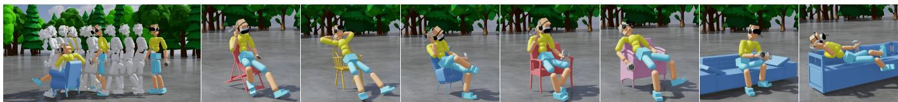

(a) Human-Scene Interaction: the character naturally interacts with diverse everyday objects in a variety of poses.  
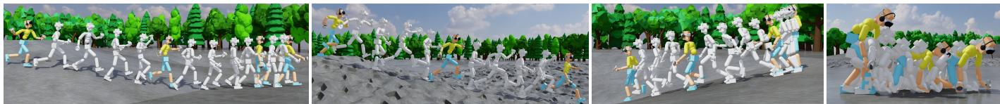

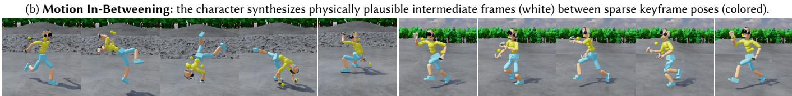  
(c) VR Tracking: physically plausible full-body motion completed from only head and hand constraints.  
Fig. 10. HetSkills supports diverse motion completion tasks including (a) human-scene interaction, (b) motion in-betweening, and (c) VR tracking, recovering coherent full-body motion from spatially or temporally sparse observations within a single shared controller.

For motion in-betweening, HetSkills achieves success rates of 99.9% on the training split and 100% on the test split of AMASS, with both tasks using a 0.5 m full-body MPJPE failure threshold. However, success rate alone is not a comprehensive measure, as motion in-betweening allows for a wide range of plausible intermediate trajectories. A rollout that deviates from the reference is not necessarily incorrect. For human-scene interaction, HetSkills achieves a success rate of 96.1% on the SAMP dataset, demonstrating the ability of the unified latent space to generalize to out-of-distribution interaction patterns without modifying the shared decoder. This result shows that each skill can be trained independently on its respective motion distribution while remaining fully compatible with the common control space. These results indicate that the unified latent space can accommodate heterogeneous skills from various conditioning modalities and motion distributions within a single shared framework. As quantitative metrics alone do not fully capture motion naturalness and plausibility, we encourage viewers to refer to the supplementary video for a qualitative demonstration of the capabilities of the system.

## 10.2 Text-to-Motion.

We evaluate the text-to-motion skill ℱ�2� from two complementary aspects. First, we evaluate pose-level robustness under two initialization protocols: starting from the ground-truth first frame of each target clip and starting from a neutral pose. A rollout is considered a failure if the mean per-joint position error (MPJPE) exceeds a predefined threshold at any frame [Luo et al. 2021; Tessler et al. 2024], and we report success rates at thresholds of 0.3 m and 0.5 m in Table 3. Second, we evaluate semantic alignment following the HumanML3D retrieval protocol [Guo et al. 2022], where retrieval scores are computed using a pretrained TMR model [Petrovich et al. 2023]. Specifically, each generated motion is used as a query to retrieve its corresponding text description from a set of candidate texts in the shared TMR embedding space. We report R-Precision (R@N) and median rank (MedR), where R@N measures whether the correct match is ranked within the top N retrieved results, and MedR denotes the median rank of the correct match. Higher R@N and lower MedR indicate better semantic alignment between the generated motion and the input language.

Table 2. VR-driven body tracking from sparse end-efector observations. Only the head and both hands are provided as goal constraints, while the remaining full-body motion must be inferred by the controller. Success rate measures whether the visible end-efectors remain within the 0.5 m tracking-error threshold, and MPJPE reports full-body reconstruction error in millimeters on the AMASS train and test splits.
<table><tr><td rowspan="2">Method</td><td colspan="2">Train</td><td colspan="2">Test</td></tr><tr><td>Success</td><td>MPJPE</td><td>Success</td><td>MPJPE</td></tr><tr><td>HetSkills</td><td>99.9%</td><td>39.9</td><td>97.8%</td><td>82.3</td></tr><tr><td>PULSE</td><td>99.5%</td><td>57.8</td><td>93.4%</td><td>88.6</td></tr><tr><td>MaskedMimic</td><td>98.6%</td><td>50.0</td><td>98.1%</td><td>58.1</td></tr><tr><td>ASE</td><td>79.8%</td><td>103.0</td><td>37.6%</td><td>120.5</td></tr></table>

HetSkills outperforms both MaskedMimic [Tessler et al. 2024] and CLoSD [Tevet et al. 2024] across both initialization protocols in Table 3. At the 0.5 m threshold, HetSkills achieves 96.9% success with the first-frame initialization and 81.7% with the neutral-pose initialization, significantly surpassing all baselines. This advantage is especially noticeable under neutral-pose initialization, where other methods sufer from a sharp decline. This robustness is a direct result of MID, which removes the reliance on matched initial states and future context, forcing the model to ground motion generation solely in language semantics and current observations. The ablation results in Table 3 further support this design: removing RMI causes a clear performance drop under neutral-pose initialization, while adding a residual branch alongside the text encoder leads to failure under both protocols due to the shortcut issue described in Section 6.1. These results indicate that RMI is critical for preventing overfitting to matched motion histories and for maintaining efective language conditioning. In contrast to difusion-based methods, the next-token prediction approach of HetSkills allows real-time closed-loop corrections, preventing positional errors from accumulating across motion segments. Qualitative results across diverse action categories are shown in Fig. 11, with animated demonstrations provided in the supplementary video.

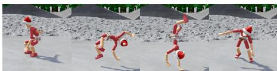

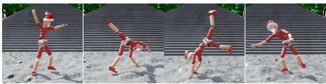  
(a) A person does a backflip.  
(b) A person does a cartwheel.

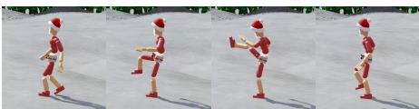  
(c) A person kicks forward.

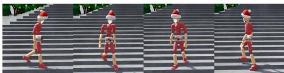  
(d) A person walks in a circle.

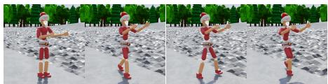

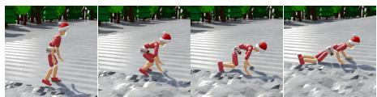

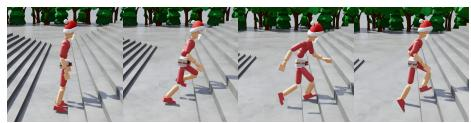  
(g) A person runs forward quickly.

(e) A person dances the waltz.  
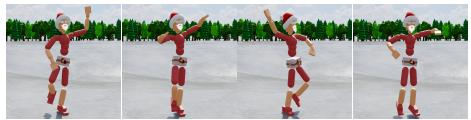  
(h) A person dances ballet.

(f ) A person crouches and then lies down.  
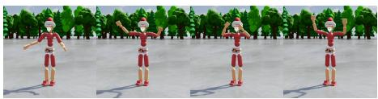  
(i) A person waves both hands.  
Fig. 11. Qualitative results of text-to-motion generation. Given only natural-language descriptions, ℱt2m generates diverse full-body motions from a neutralpose initialization, including acrobatic movements, locomotion, dance, crouching, lying down, running, and hand waving. These results show that the text-to-motion skill can produce semantically aligned and physically plausible motions even when the initial state does not match the target motion.

Table 3. Text-to-motion success rates on HumanML3D under two initializa tion protocols and two MPJPE failure thresholds. The upper block reports the main results, where rollouts start from either the ground-truth first pose or a neutral pose. The lower block ablates MID components, highlighting the importance of Randomized Memory Initialization and showing that the residual shortcut weakens language grounding.
<table><tr><td rowspan="2">Method</td><td colspan="2">threshold: 0.3 m</td><td colspan="2">threshold: 0.5 m</td></tr><tr><td>First frame</td><td>Neutral</td><td>First frame</td><td>Neutral</td></tr><tr><td>MaskedMimic</td><td>76.1%</td><td>19.8%</td><td>83.5%</td><td>34.0%</td></tr><tr><td>CLoSD</td><td>30.9%</td><td>27.1%</td><td>44.2%</td><td>38.5%</td></tr><tr><td>HetSkills</td><td>92.2%</td><td>60.2%</td><td>96.9%</td><td>81.7%</td></tr><tr><td>w/o RMI</td><td>92.6%</td><td>48.5%</td><td>97.7%</td><td>70.0%</td></tr><tr><td>w/ residual</td><td>0%</td><td>0%</td><td>0%</td><td>0%</td></tr></table>

Table 4. Text-to-motion retrieval performance under the HumanML3D evaluation protocol [Guo et al. 2022] with neutral-pose initialization. Retrieval metrics are computed using the pretrained TMR model. R@N measures the fraction of correct text-motion matches ranked within the top N retrieved results, while MedR denotes the median rank of the correct match. Higher R@N and lower MedR indicate beter text-motion alignment.
<table><tr><td>Method</td><td>R@1↑</td><td>R@2↑</td><td>R@3↑</td><td>R@5↑</td><td>MedR↓</td></tr><tr><td>Ground Truth</td><td>71%</td><td>86%</td><td>91%</td><td>96%</td><td>1.00</td></tr><tr><td>HetSkills</td><td>65%</td><td>82%</td><td>88%</td><td>93%</td><td>1.03</td></tr><tr><td>CLoSD</td><td>41%</td><td>58%</td><td>67%</td><td>77%</td><td>2.08</td></tr><tr><td>MaskedMimic</td><td>38%</td><td>54%</td><td>62%</td><td>72%</td><td>2.41</td></tr></table>

The retrieval results in Table 4 further show that HetSkills preserves strong text-motion alignment under the neutral-pose initialization protocol. Compared with the baselines, HetSkills achieves higher R@N scores and a lower MedR, indicating that the generated motions are more consistently retrieved as their corresponding language descriptions in the TMR embedding space. This result complements the MPJPE-based success rates: while MPJPE measures whether the generated motion follows the target pose sequence, R@N and MedR evaluate whether the motion remains semantically recognizable as the intended textual action. Together, these results suggest that HetSkills improves not only initialization robustness, but also language-motion consistency.

## 10.3 Downstream Task Adaptation

HetSkills adopts the language-conditioned prior to restrict downstream exploration to a semantically meaningful distribution of natural human motions. This design improves motion naturalness and makes task-relevant behaviors easier to discover, especially when the desired behavior occupies only a small region of the latent space. We evaluate these properties through task performance across three downstream tasks. In particular, the pick-and-place task serves as a representative compositional setting, where multi ple language-conditioned skill priors are routed and combined to accomplish a single object-interaction objective; we further analyze the MoE gating behavior to show how the model dynamically selects and composes these priors during execution.

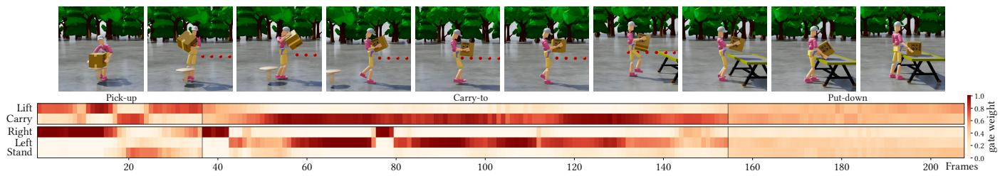  
Fig. 12. MoE gating dynamics during the pick-and-place task. The rendered sequence at the top shows rollout frames sampled every 20 frames across the pick up, carry-to, and put-down stages. The heatmap below shows how the Arm and Body branches assign time-varying weights to diferent language-conditioned priors. The changing weights indicate that the task-guidance module dynamically selects and blends diferent semantic priors as the task stage evolves; the full language prompts are listed in Table 5.

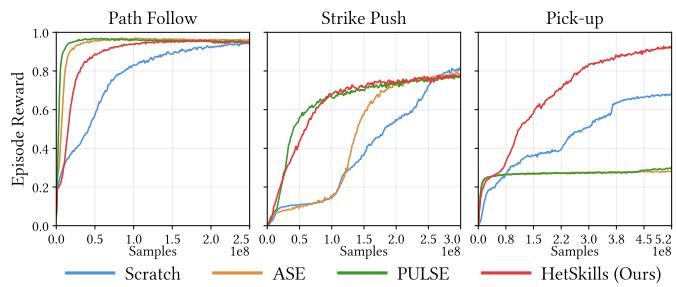  
Fig. 13. Downstream training curves on path follow, strike push, and pick-up. Episode rewards are ploted against environment samples and averaged over three random seeds. Compared with Scratch, ASE, and PULSE, HetSkills converges stably to high task rewards across all tasks, while preserving natural motion through the frozen language-conditioned prior.

Comparison Across Tasks. The training curves in Fig. 13 show that HetSkills converges stably across all three downstream tasks. On path follow, all methods achieve comparable task rewards, but ASE and PULSE occasionally generate backward-walking gaits because their priors do not impose semantic constraints on locomotion direction. On strike, all methods can knock over the target, while the baselines often produce awkward postures due to insuficient constraints on the action distribution. In contrast, HetSkills generates more natural kicking and pushing motions. The largest diference appears on pick-up, where only HetSkills converges reliably. This task requires coordinated bimanual lifting, which occupies a small and sparse region of the latent space. Without semantic guidance, the policy struggles to find this region within the limited sample budget and can fall into local optima.

These results highlight two main advantages of HetSkills for downstream adaptation. First, the semantic constraint from the language-conditioned prior helps the policy preserve natural humanlike motion while optimizing task rewards. More importantly, it narrows exploration toward task-relevant regions of the latent space, making sparse and coordinated behaviors easier to discover. Second, adapting to a new task only requires changing the language instructions, without task-specific motion data or prior retraining. This provides a simple and flexible interface for reusing the learned skill space across diferent downstream objectives. Additional rollout examples are included in the supplementary video.

Compositional Task Guidance. Fig. 12 visualizes the gating weights assigned to diferent language instructions during the pick-andplace task. The visualization shows how the MoE module changes the active semantic prior across the pick-up, carry-to, and put-down stages. We observe three common patterns.

Dominance. The gating network assigns most of the weight to one instruction that best matches the current task stage. This indicates that the model can identify the most relevant semantic prior and use it as the main behavior source.

Periodicity. The weight of the dominant instruction changes periodically over time. This pattern reflects the intrinsic rhythm of the corresponding motion prior, such as the gait cycle in walking or the preparation, execution, and recovery phases in grasping.

Complementarity. When the dominant instruction enters a low-activity phase, the gating network shifts part of the weight to a semantically related instruction. This compensation helps fill behavioral gaps and maintain smooth transitions over long-horizon execution.

Overall, the MoE module provides an adaptive mechanism for semantic prior selection rather than assigning a fixed instruction to each task stage. It selects the most relevant prior according to the current task context, aligns the generated behavior with the corresponding temporal structure, and integrates complementary instructions when necessary. This mechanism enables a compact set of language priors to support coherent and coordinated longhorizon downstream behaviors.

## 10.4 Long-Horizon Skill Composition

To further demonstrate the compositional capability of HetSkills, we construct a long-horizon demonstration that sequentially combines multiple heterogeneous skills into one continuous behavior. The demonstration includes object manipulation, goal-directed locomotion, human-scene interaction, and text-conditioned motion generation, where the character picks up a box, places it on a target

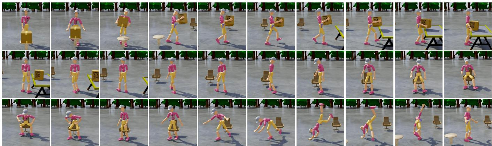  
Fig. 14. Long-horizon composition of heterogeneous skills. A high-level task is decomposed into a sequence of task units, including pick-up, carry-to, put-down, path follow, human-scene interaction, and text-to-motion, with each unit executed by its corresponding skill module within the same unified latent space. This demonstrates that skills learned from diferent data sources, supervision forms, and task objectives can be composed seamlessly without modifying the shared controller or manually designing low-level transition rules.

## Prompt: Long-Horizon Skill Composition

Please follow the Standardized Task Description to generate an executable long-horizon skill program for a SMPL character. The task depicts a humanoid that retrieves a box from a source table, transports it to a nearby target platform, moves toward a chair, interacts with the scene, and finally performs an open-ended text-conditioned motion. The detailed skill sequence is specified below.

Pick-up Skill. Initialization: Spawn the humanoid next to the source table with the box. Condition: Provide the box position. Terminate: End when the humanoid stably lifts the box for several consecutive frames.

Carry-to Skill. Initialization: Use the final pick-up state as the initial state. Condition: Generate and follow a path from the current position to the front of the target platform. Terminate: End when the humanoid reaches the neighborhood of the target platform.

Put-down Skill. Initialization: Use the final carry-to state as the initial state. Condition: Provide the target platform position to the put-down policy. Terminate: End when the box is successfully placed for several consecutive frames.

Path Follow Skill. Initialization: Start from the final state of the putdown Skill. Condition: Generate and follow a walking path toward a target location in front of the chair. Terminate: End when the humanoid reaches the target location in front of the chair.

Human-Scene Interaction Skill. Initialization: Start from the final state ofthe path follow skill. Condition: Specify a scheduled interaction sequence, including turning toward the chair, sitting down, and standing up, and assign a duration to each target pose. Terminate: End when the interaction sequence is completed.

Text-to-Motion Skill. Initialization: Start from the final state of the Human-scene Interaction Skill. Condition: Set both prompts to “a person doing cartwheel”. Terminate: Continue until the episode is externally stopped.

Fig. 15. Example LLM prompt for long-horizon skill composition.

platform, walks toward a chair, sits down, and then rises from the chair to perform an open-ended text-conditioned motion.

The long-horizon behavior is generated through the standardized task interface introduced in Section 8.1. As shown in the prompt example in Fig. 15, the user only needs to describe the task at the skill level, where each stage is represented by its initialization, condition, and termination criterion. The large language model (LLM) [Chang et al. 2024; Singh et al. 2025] then organizes the high-level instruction into a structured sequence of executable task units, making it easier to compose diferent skills without manually designing low-level transition logic. Importantly, the LLM is not used to generate motion trajectories directly. Instead, it serves as a convenient planning interface [Wang et al. 2025; Wu et al. 2025b; Yao et al. 2024] that translates a natural task description into task units executed by the corresponding skill modules.

This design makes long-horizon composition more flexible and easier to specify. Since all skills share the same latent control space and standardized task format, skills learned from diferent supervision forms and task settings can be combined within a single framework. New behaviors can be expressed by changing the task description, target conditions, or skill ordering, without manually designing detailed controller-switching logic.

As shown in the long-horizon demonstration in Fig. 14, the generated behavior remains coherent across diferent stages, even though the underlying skills involve diferent objectives and conditioning modalities. This suggests that HetSkills provides a practical interface for organizing heterogeneous skills into reusable and extensible long-horizon behavior programs. To further illustrate the compositional flexibility of HetSkills, we provide additional examples with diferent skill combinations and task sequences in the appendix E.

## 11 Limitations and Future Work

Our experiments reveal two main limitations. First, although Het-Skills demonstrates progressive integration across several representative skill categories, the current experiments do not yet fully cover larger-scale skill accumulation, more complex long-horizon composition, or more open-ended human-object and human-scene interactions. Second, text-driven motion generation still struggles with high-dificulty actions and ambiguous language descriptions. MID improves robustness to diferent initial states and motion histories. However, the text-to-motion skill remains afected by the quality of language-motion annotations. In particular, semantically similar descriptions may correspond to substantially diferent motions, which makes fine-grained language-motion alignment more dificult.

Future work includes improving HetSkills along three directions. First, incorporating more diverse contact-rich and scene-aware motion data during the tracking stage could help the unified latent space better cover interaction behaviors. Second, contact-aware modules and higher-quality text-motion annotations could improve interaction stability and text-driven generation fidelity. Finally, extending HetSkills to a broader range of skills and real-world robot control is a promising direction. Another interesting direction is to further explore the role of large language models in high-level planning. In this work, an LLM is used to help organize high-level instructions into task sequences, illustrating the potential of combining standardized task interfaces with language-based planning. Future work could further investigate more robust task decomposition, automatic skill selection, and failure recovery for more open-ended long-horizon tasks.

## 12 Conclusion

We presented HetSkills, a physics-based character control framework that progressively learns heterogeneous skills within a unified latent space. The key idea is to treat the latent space as a shared executable interface, allowing skills from diferent data sources, supervision forms, and training stages to extend the same control substrate rather than requiring dedicated controllers. HetSkills integrates motion tracking, text-to-motion generation, motion completion, and downstream task adaptation, while supporting natural language as a flexible interface for both motion generation and task guidance. With part-wise latent control, motion intuition distillation, and language-guided latent composition, the framework preserves natural motion quality, enables robust skill reuse, and adapts to new tasks without task-specific demonstrations, motionprior retraining, or shared-controller modification. Experiments show that HetSkills can efectively accommodate diverse skills and task objectives, suggesting that a unified latent space is a practical foundation for scalable, reusable, and progressively extensible character control.

## References

Jinseok Bae, Younghwan Lee, Donggeun Lim, and Young Min Kim. 2025. PLT: Part-Wise Latent Tokens as Adaptable Motion Priors for Physically Simulated Characters. In International Conference on Computer Graphics and Interactive Techniques (SIGGRAPH). 1–10.

Jinseok Bae, Jungdam Won, Donggeun Lim, Cheol-Hui Min, and Young Min Kim. 2023. PMP: Learning to Physically Interact with Environments Using Part-Wise Motion Priors. In International Conference on Computer Graphics and Interactive Techniques (SIGGRAPH). 1–10.

Christopher P Burgess, Irina Higgins, Arka Pal, Loic Matthey, Nick Watters, Guillaume Desjardins, and Alexander Lerchner. 2018. Understanding Disentangling in �-VAE. arXiv preprint arXiv:1804.03599 (2018).

Yupeng Chang, Xu Wang, Jindong Wang, Yuan Wu, Linyi Yang, Kaijie Zhu, Hao Chen, Xiaoyuan Yi, Cunxiang Wang, Yidong Wang, et al. 2024. A Survey on Evaluation of

Large Language Models. ACM transactions on intelligent systems and technology 15, 3 (2024), 1–45.

Setareh Cohan, Guy Tevet, Daniele Reda, Xue Bin Peng, and Michiel van de Panne. 2024. Flexible motion In-Betweening with Difusion Models. In International Conference on Computer Graphics and Interactive Techniques (SIGGRAPH). 1–9.

Zhiyang Dou, Xuelin Chen, Qingnan Fan, Taku Komura, and Wenping Wang. 2023. C·ASE: Learning Conditional Adversarial Skill Embeddings for Physics-Based Characters. In ACM SIGGRAPH Conference and Exhibition on Computer Graphics and Interactive Techniques in Asia (SIGGRAPH Asia). 1–11.

Chuan Guo, Shihao Zou, Xinxin Zuo, Sen Wang, Wei Ji, Xingyu Li, and Li Cheng. 2022. Generating Diverse and Natural 3D Human Motions From Text. In IEEE/CVF Conference on Computer Vision and Pattern Recognition (CVPR). 5152–5161.

Félix G Harvey, Mike Yurick, Derek Nowrouzezahrai, and Christopher Pal. 2020. Robust Motion In-Betweening. ACM Transactions on Graphics (TOG) 39, 4 (2020), 60–1.

Mohamed Hassan, Duygu Ceylan, Ruben Villegas, Jun Saito, Jimei Yang, Yi Zhou, and Michael J Black. 2021a. Stochastic Scene-Aware Motion Prediction. In IEEE/CVF International Conference on Computer Vision (ICCV). 11374–11384

Mohamed Hassan, Partha Ghosh, Joachim Tesch, Dimitrios Tzionas, and Michael J Black. 2021b. Populating 3D Scenes by Learning Human-Scene Interaction. In IEEE/CVF Conference on Computer Vision and Pattern Recognition (CVPR). 14708–14718.

Mohamed Hassan, Yunrong Guo, Tingwu Wang, Michael Black, Sanja Fidler, and Xue Bin Peng. 2023. Synthesizing Physical Character-Scene Interactions. In International Conference on Computer Graphics and Interactive Techniques (SIGGRAPH). 1–9.

Daniel Holden, Taku Komura, and Jun Saito. 2017. Phase-Functioned Neural Networks for Character Control. ACM Transactions on Graphics (TOG) 36, 4 (2017), 1–13.

Xiaoyu Huang, Takara Truong, Yunbo Zhang, Fangzhou Yu, Jean Pierre Sleiman, Jessica Hodgins, Koushil Sreenath, and Farbod Farshidian. 2025b. Difuse-CLoC: Guided Difusion for Physics-Based Character Look-Ahead Control. ACM Transactions on Graphics (TOG) 44, 4 (2025), 1–12.

Yiming Huang, Zhiyang Dou, and Lingjie Liu. 2025a. ModSkill: Physical Character Skill Modularization. In IEEE/CVF International Conference on Computer Vision (ICCV). 12394–12404.

Inwoo Hwang, Jinseok Bae, Donggeun Lim, and Young Min Kim. 2025a. Motion Synthesis with Sparse and Flexible Keyjoint Control. In IEEE/CVF International Conference on Computer Vision (ICCV). 13203–13213.

Inwoo Hwang, Bing Zhou, Young Min Kim, Jian Wang, and Chuan Guo. 2025b. SceneMI: Motion In-Betweening for Modeling Human-Scene Interaction. In IEEE/CVF International Conference on Computer Vision (ICCV). 6034–6045.

Deok-Kyeong Jang, Soomin Park, and Sung-Hee Lee. 2022. Motion Puzzle: Arbitrary Motion Style Transfer by Body Part. ACM Transactions on Graphics (TOG) 41, 3 (2022), 1–16.

Jordan Juravsky, Yunrong Guo, Sanja Fidler, and Xue Bin Peng. 2022. PADL: Language-Directed Physics-Based Character Control. In ACM SIGGRAPH Conference and Exhibition on Computer Graphics and Interactive Techniques in Asia (SIGGRAPH Asia). 1–9.

Jordan Juravsky, Yunrong Guo, Sanja Fidler, and Xue Bin Peng. 2024. SuperPADL: Scaling Language-Directed Physics-Based Control with Progressive Supervised Dis tillation. In International Conference on Computer Graphics and Interactive Techniques (SIGGRAPH). 1–11.

Manuel Kaufmann, Emre Aksan, Jie Song, Fabrizio Pece, Remo Ziegler, and Otmar Hilliges. 2020. Convolutional Autoencoders for Human Motion Infilling. In 2020 International Conference on 3D Vision (3DV). IEEE, 918–927.

Niloofar Khoshsiyar, Ruiyu Gou, Tianhong Zhou, Sheldon Andrews, and Michiel van de Panne. 2024. PartwiseMPC: Interactive Control of Contact-Guided Motions. In Computer Graphics Forum (CGF), Vol. 43. Wiley Online Library, e15174.

Jihoon Kim, Taehyun Byun, Seungyoun Shin, Jungdam Won, and Sungjoon Choi. 2022. Conditional Motion In-Betweening. Pattern Recognition 132 (2022), 108894.

Diederik P Kingma and Jimmy Ba. 2014. Adam: A Method for Stochastic Optimization. arXiv preprint arXiv:1412.6980 (2014).

Diederik P Kingma and Max Welling. 2013. Auto-Encoding Variational Bayes. arXiv preprint arXiv:1312.6114 (2013).

Hung Yu Ling, Fabio Zinno, George Cheng, and Michiel Van De Panne. 2020. Character Controllers Using Motion VAEs. ACM Transactions on Graphics (TOG) 39, 4 (2020), 40–1.

Libin Liu and Jessica Hodgins. 2017. Learning to Schedule Control Fragments for Physics-Based Characters Ssing Deep Q-Learning. ACM Transactions on Graphics (TOG) 36, 3 (2017), 1–14.

Minghuan Liu, Menghui Zhu, and Weinan Zhang. 2022b. Goal-Conditioned Reinforce ment Learning: Problems and Solutions. arXiv preprint arXiv:2201.08299 (2022).

Siqi Liu, Guy Lever, Zhe Wang, Josh Merel, SM Ali Eslami, Daniel Hennes, Wojciech M Czarnecki, Yuval Tassa, Shayegan Omidshafiei, Abbas Abdolmaleki, et al. 2022a. From Motor Control to Team Play in Simulated Humanoid Football. Science Robotics 7, 69 (2022), eabo0235.

Matthew Loper, Naureen Mahmood, Javier Romero, Gerard Pons-Moll, and Michael J. Black. 2015. SMPL: A Skinned Multi-Person Linear Model. ACM Transactions On

Graphics (TOG) 34, 6 (Oct. 2015), 248:1–248:16.

Zhengyi Luo, Jinkun Cao, Kris Kitani, Weipeng Xu, et al. 2023a. Perpetual Humanoid Control for Real-Time Simulated Avatars. In IEEE/CVF International Conference on Computer Vision (ICCV). 10895–10904.

Zhengyi Luo, Jinkun Cao, Josh Merel, Alexander Winkler, Jing Huang, Kris Kitani, and Weipeng Xu. 2023b. Universal Humanoid Motion Representations for Physics-Based Control. arXiv preprint arXiv:2310.04582 (2023).

Zhengyi Luo, Ryo Hachiuma, Ye Yuan, and Kris Kitani. 2021. Dynamics-Regulated Kinematic Policy For Egocentric Pose Estimation. Conference on Neural Information Processing Systems (NeurIPS) 34 (2021), 25019–25032.

Zhengyi Luo, Ye Yuan, and Kris M Kitani. 2022. From Universal Humanoid Control to Automatic Physically Valid Character Creation. arXiv preprint arXiv:2206.09286 (2022).

Naureen Mahmood, Nima Ghorbani, Nikolaus F Troje, Gerard Pons-Moll, and Michael J Black. 2019. AMASS: Archive of Motion Capture as Surface Shapes. In IEEE/CVF International Conference on Computer Vision (ICCV). 5442–5451.

Josh Merel, Leonard Hasenclever, Alexandre Galashov, Arun Ahuja, Vu Pham, Greg Wayne, Yee Whye Teh, and Nicolas Heess. 2018. Neural Probabilistic Motor Primi tives for Humanoid Control. arXiv preprint arXiv:1811.11711 (2018).

Mayank Mittal, Pascal Roth, James Tigue, Antoine Richard, Octi Zhang, Peter Du, Antonio Serrano-Munoz, Xinjie Yao, René Zurbrügg, Nikita Rudin, et al. 2025. Isaac Lab: A GPU-Accelerated Simulation Framework for Multi-Modal Robot Learning. arXiv preprint arXiv:2511.04831 (2025).

Yuxuan Mu, Ziyu Zhang, Yi Shi, Minami Matsumoto, Kotaro Imamura, Guy Tevet, Chuan Guo, Michael Taylor, Chang Shu, Pengcheng Xi, et al. 2025. SMP: Reusable Score-Matching Motion Priors for Physics-Based Character Control. arXiv preprint arXiv:2512.03028 (2025).

Boris N Oreshkin, Antonios Valkanas, Félix G Harvey, Louis-Simon Ménard, Florent Bocquelet, and Mark J Coates. 2023. Motion In-Betweening via Deep Δ-Interpolator. IEEE Transactions on Visualization and Computer Graphics (TVCG) 30, 8 (2023), 5693–5704.

Liang Pan, Zeshi Yang, Zhiyang Dou, Wenjia Wang, Buzhen Huang, Bo Dai, Taku Komura, and Jingbo Wang. 2025. TokenHSI: Unified Synthesis of Physical Human-Scene Interactions Through Task Tokenization. In IEEE/CVF Conference on Computer Vision and Pattern Recognition (CVPR). 5379–5391.

Xue Bin Peng, Pieter Abbeel, Sergey Levine, and Michiel Van de Panne. 2018. Deep-Mimic: Example-Guided Deep Reinforcement Learning of Physics-Based Character Skills. ACM Transactions On Graphics (TOG) 37, 4 (2018), 1–14.

Xue Bin Peng, Yunrong Guo, Lina Halper, Sergey Levine, and Sanja Fidler. 2022. ASE: Large-scale Reusable Adversarial Skill Embeddings for Physically Simulated Characters. ACM Transactions On Graphics (TOG) 41, 4 (2022), 1–17.

Xue Bin Peng, Ze Ma, Pieter Abbeel, Sergey Levine, and Angjoo Kanazawa. 2021. AMP: Adversarial Motion Priors for Stylized Physics-Based Character Control. ACM Transactions on Graphics (TOG) 40, 4 (2021), 1–20.

Mathis Petrovich, Michael J Black, and Gül Varol. 2023. TMR: Text-to-Motion retrieval using contrastive 3d human motion synthesis. In IEEE/CVF International Conference on Computer Vision (ICCV). 9488–9497.

Matthias Plappert, Rein Houthooft, Prafulla Dhariwal, Szymon Sidor, Richard Y Chen, Xi Chen, Tamim Asfour, Pieter Abbeel, and Marcin Andrychowicz. 2017. Parameter Space Noise for Exploration. arXiv preprint arXiv:1706.01905 (2017).

Jia Qin, Youyi Zheng, and Kun Zhou. 2022. Motion In-Betweening via Two-Stage Transformers. ACM Transactions On Graphics (TOG) 41, 6 (2022), 184–1.

Jiawei Ren, Mingyuan Zhang, Cunjun Yu, Xiao Ma, Liang Pan, and Ziwei Liu. 2023. InsActor: Instruction-Driven Bhysics-Based Characters. Conference on Neural Information Processing Systems (NeurIPS) 36 (2023), 59911–59923.

Stéphane Ross, Geofrey Gordon, and Drew Bagnell. 2011. A Reduction of Imitation Learning and Structured Prediction to No-Regret Online Learning. In International Conference on Artificial Intelligence and Statistics (AISTATS). JMLR Workshop and Conference Proceedings, 627–635.

John Schulman, Filip Wolski, Prafulla Dhariwal, Alec Radford, and Oleg Klimov. 2017. Proximal Policy Optimization Algorithms. arXiv preprint arXiv:1707.06347 (2017).

Agon Serifi, Ruben Grandia, Espen Knoop, Markus Gross, and Moritz Bächer. 2024. Robot Motion Difusion Model: Motion Generation for Robotic Characters. In ACM SIGGRAPH Conference and Exhibition on Computer Graphics and Interactive Techniques in Asia (SIGGRAPH Asia). 1–9

Aaditya Singh, Adam Fry, Adam Perelman, Adam Tart, Adi Ganesh, Ahmed El-Kishky, Aidan McLaughlin, Aiden Low, AJ Ostrow, Akhila Ananthram, et al. 2025. OpenAI GPT-5 System Card. arXiv preprint arXiv:2601.03267 (2025).

Paul Starke, Sebastian Starke, Taku Komura, and Frank Steinicke. 2023. Motion In Betweening with Phase Manifolds. Proceedings ofthe ACM on Computer Graphics and Interactive Techniques 6, 3 (2023), 1–17.

Sebastian Starke, He Zhang, Taku Komura, and Jun Saito. 2019. Neural State Machine for Character-Scene Interactions. ACM Transactions On Graphics (TOG) 38, 6 (2019), 178.

Richard S Sutton, Andrew G Barto, et al. 1998. Reinforcement Learning: An Introduction. Vol. 1. MIT press Cambridge.

Jie Tan, Karen Liu, and Greg Turk. 2011. Stable Proportional-Derivative Controllers. IEEE Computer Graphics and Applications 31, 4 (2011), 34–44.

Chen Tessler, Yunrong Guo, Ofir Nabati, Gal Chechik, and Xue Bin Peng. 2024. Masked Mimic: Unified Physics-Based Character Control Through Masked Motion Inpaint ing. ACM Transactions On Graphics (TOG) 43, 6 (2024), 1–21.

Chen Tessler, Yifeng Jiang, Xue Bin Peng, Erwin Coumans, Yi Shi, Haotian Zhang, Davis Rempe, Gal Chechik, and Sanja Fidler. 2025. ProtoMotions3: An Open-source Framework for Humanoid Simulation and Control. https://github.com/NVLabs ProtoMotions/.

Chen Tessler, Yoni Kasten, Yunrong Guo, Shie Mannor, Gal Chechik, and Xue Bin Peng. 2023. CALM: Conditional Adversarial Latent Models for Directable Virtual Characters. In International Conference on Computer Graphics and Interactive Techniques (SIGGRAPH). 1–9.

Guy Tevet, Sigal Raab, Setareh Cohan, Daniele Reda, Zhengyi Luo, Xue Bin Peng, Amit H Bermano, and Michiel van de Panne. 2024. CLoSD: Closing The Loop Between Simulation and Difusion for Multi-Task Character Control. arXiv preprint arXiv:2410.03441 (2024).

Takara Everest Truong, Michael Piseno, Zhaoming Xie, and Karen Liu. 2024. PDP: Physics-Based Character Animation via Difusion Policy. In ACM SIGGRAPH Conference and Exhibition on Computer Graphics and Interactive Techniques in Asia (SIGGRAPH Asia). 1–10.

Ron Vainshtein, Zohar Rimon, Shie Mannor, and Chen Tessler. 2025. Task Tokens: A Flexible Approach to Adapting Behavior Foundation Models. arXiv preprint arXiv:2503.22886 (2025).

Ashish Vaswani, Noam Shazeer, Niki Parmar, Jakob Uszkoreit, Llion Jones, Aidan N Gomez, Łukasz Kaiser, and Illia Polosukhin. 2017. Attention Is All You Need. Conference on Neural Information Processing Systems (NeurIPS) 30 (2017).

Weilin Wan, Zhiyang Dou, Taku Komura, Wenping Wang, Dinesh Jayaraman, and Lingjie Liu. 2024. TLControl: Trajectory and Language Control for Human Motion Synthesis. In European Conference on Computer Vision (ECCV). Springer, 37–54.

Jack M Wang, David J Fleet, and Aaron Hertzmann. 2010. Optimizing Walking Controllers. ACM Transactions on Graphics (TOG) 29, 4 (2010), 1–8.

Wenjia Wang, Liang Pan, Zhiyang Dou, Jidong Mei, Zhouyingcheng Liao, Yuke Lou, Yifan Wu, Lei Yang, Jingbo Wang, and Taku Komura. 2025. SIMS: Simulating Stylized Human-Scene Interactions with Retrieval-Augmented Script Generation. In IEEE/CVF International Conference on Computer Vision (ICCV). 14117–14127.

Jungdam Won, Deepak Gopinath, and Jessica Hodgins. 2020. A Scalable Approach to Control Diverse Behaviors for Physically Simulated Characters. ACM Transactions on Graphics (TOG) 39, 4 (2020), 33–1.

Yan Wu, Korrawe Karunratanakul, Zhengyi Luo, and Siyu Tang. 2025a. UniPhys: Unified Planner and Controller with Difusion for Flexible Physics-Based Character Control. In IEEE/CVF International Conference on Computer Vision (ICCV). 13214–13224.

Zhen Wu, Jiaman Li, Pei Xu, and C Karen Liu. 2025b. Human-Object Interaction from Human-Level Instructions. In IEEE/CVF International Conference on Computer Vision (ICCV). 11176–11186.

Michael Xu, Yi Shi, KangKang Yin, and Xue Bin Peng. 2025. PARC: Physics-Based Augmentation with Reinforcement Learning for Character Controllers. In International Conference on Computer Graphics and Interactive Techniques (SIGGRAPH). 1–11.

Pei Xu, Xiumin Shang, Victor Zordan, and Ioannis Karamouzas. 2023. Composite Motion Learning with Task Control. ACM Transactions on Graphics (TOG) 42, 4 (2023), 1–16.

Heyuan Yao, Zhenhua Song, Baoquan Chen, and Libin Liu. 2022. ControlVAE: Model Based Learning of Generative Controllers for Physics-Based Characters. ACM Transactions on Graphics (TOG) 41, 6 (2022), 1–16.

Heyuan Yao, Zhenhua Song, Yuyang Zhou, Tenglong Ao, Baoquan Chen, and Libin Liu. 2024. MoConVQ: Unified Physics-Based Motion Control via Scalable Discrete Representations. ACM Transactions on Graphics (TOG) 43, 4 (2024), 1–21.

KangKang Yin, Kevin Loken, and Michiel Van de Panne. 2007. SIMBICON: Simple Biped Locomotion Control. ACM Transactions on Graphics (TOG) 26, 3 (2007), 105–es.

Runyi Yu, Yinhuai Wang, Qihan Zhao, Hok Wai Tsui,Jingbo Wang, Ping Tan, and Qifeng Chen. 2025. SkillMimic-V2: Learning Robust and Generalizable Interaction Skills from Sparse and Noisy Demonstrations. In International Conference on Computer Graphics and Interactive Techniques (SIGGRAPH). 1–11.

He Zhang, Sebastian Starke, Taku Komura, and Jun Saito. 2018. Mode-Adaptive Neural Networks for Quadruped Motion Control. ACM Transactions on Graphics (TOG) 37, 4 (2018), 1–11.

Ziyu Zhang, Sergey Bashkirov, Dun Yang, Yi Shi, Michael Taylor, and Xue Bin Peng. 2025. Physics-Based Motion Imitation with Adversarial Diferential Discriminators. In ACM SIGGRAPH Conference and Exhibition on Computer Graphics and Interactive Techniques in Asia (SIGGRAPH Asia). 1–12.

Yi Zhou, Connelly Barnes, Jingwan Lu, Jimei Yang, and Hao Li. 2019. On the Continuity of Rotation Representations in Neural Networks. In IEEE/CVF Conference on Computer Vision and Pattern Recognition (CVPR). 5745–5753.

Qingxu Zhu, He Zhang, Mengting Lan, and Lei Han. 2023. Neural Categorical Priors for Physics-Based Character Control. ACM Transactions on Graphics (TOG) 42, 6 (2023), 1–16.

## A Implementation Details

Unless otherwise specified, all trainable policy and prior modules are optimized with Adam [Kingma and Ba 2014]. We use a learning rate of $2 \times 1 0 ^ { - 5 }$ for policy and prior networks, and a learning rate of $1 0 ^ { - 4 }$ for critic networks. The arm and body latent dimensions are both set to 64. Transformer-based prior modules embed all input tokens into 256-dimensional features. The default latent regularization coeficients are $\lambda _ { \mathrm { m r } } = 1 \times 1 0 ^ { - 3 } , \lambda _ { \mathrm { a r } } = 5 \times 1 0 ^ { - 3 }$ , and $\phi = 0 . 9 9$

Tracking skill $\mathcal { F } ^ { t r c }$ . We train the part-wise tracking policy with PPO. The shared state encoder outputs a 512-dimensional feature. Exploration is applied only in the final action space using a fixed diagonal Gaussian distribution with log standard deviation −2.9. We use a tracking-error termination threshold of 0.5 m. Reference State Initialization (RSI) is applied with probability 0.8; otherwise, the episode starts from the first frame of the reference motion. The tracking reward includes global joint position, global joint rotation, joint velocity, joint angular velocity, and root-height terms, with weights $w _ { \mathrm { g p } } = 0 . 5 , w _ { \mathrm { g r } } = 0 . 3 , w _ { \mathrm { j v } } = 0 . 1 , w _ { \mathrm { j a v } } = 0 . 1$ , and $w _ { \mathrm { r h } } = 0 . 2$ , and exponential coeficients $k _ { \mathrm { g p } } = 1 0 0 , k _ { \mathrm { g r } } = 5 , k _ { \mathrm { j v } } = 0 . 5 , k _ { \mathrm { j a v } } = 0 . 1$ , and $k _ { \mathrm { r h } } =$ 100. We further use a contact mismatch penalty, an action smoothness penalty, and an energy penalty with weights $w _ { \mathrm { c t } } = - 0 . 1 , w _ { \mathrm { s m } } = - 0 . 0 2$ , and $w _ { \mathrm { e g } } = - 1 0 ^ { - 5 }$ , respectively. The energy penalty is clipped from below $\mathrm { a t } - 0 . 5 ,$ , and the reference contact signal is smoothed with a 7-frame temporal window.

Text-to-motion skill $\mathcal { F } ^ { t 2 m }$ . The text-to-motion prior uses two part-wise Transformer branches, one for the arm latent and one for the body latent. The input tokens consist of one current-state token, one language token, and 6 history tokens uniformly sampled from a 60-step history window. The language token is obtained from the frozen text encoder used for language-motion alignment. During training, we apply RSI with probability $p _ { \mathrm { r s i } } = 0 . 7$ and Randomized Memory Initialization (RMI) with probability $p _ { \mathrm { r m i } } = 0 . 2 .$ . This initialization scheme encourages the policy to rely on language semantics and current observations rather than matched initial states or memorized motion histories.

Motion completion skill $\mathcal { F } ^ { m o c }$ . We instantiate the motion completion skill in three sparse-observation settings: (1) VR tracking. The sparse target contains one future step of head and both hands states. The prior is a four-layer MLP with 1024 hidden units, and outputs a 128- dimensional latent vector split into $z _ { a } , z _ { b } \in \mathbb { R } ^ { 6 4 } ;$ (2) Motion in-betweening. The prior uses two part-wise Transformer branches. The input consists of the current state, a future target keyframe pose, its time ofset, and 3 historical poses uniformly sampled from a 30-step history window. The target ofset is uniformly sampled from 5 to 30 future frames; (3) Human-scene interaction. We train the human-scene interaction prior with PPO. The input consists of the current state, a future target keyframe pose, its time ofset, and 3 historical poses uniformly sampled from a 30-step history window. The target ofset is uniformly sampled from 5 to 30 future frames. We use 6 PPO mini-epochs per update. The reward uses the same global joint position, global joint rotation, joint velocity, joint angular velocity, action smoothness, and energy terms as the tracking skill, but removes the root-height and contact mismatch terms.

Downstream task adaptation $\mathcal { F } ^ { t s k ^ { * } }$ . For downstream adaptation, the pretrained motion prior and low-level decoder are kept frozen, and only the task-guidance modules are optimized. The arm and body residual latent dimensions are both set to 64. We use rollouts of length 32 and 4 PPO mini-epochs per update. The latent policy log standard deviation is annealed from −2.5 to −3.0 between epochs 500 and 1000. Adapted latents outside the interval [−0.1, 0.1] are penalized with coeficient 10.0, and the latent smoothness penalty coeficient is set to 0.1.

## B Training Time and Compute

The progressive design of HetSkills allows diferent skills to be trained independently on top of the shared latent space, instead of jointly optimizing all skills in a single monolithic model. This design keeps each training stage relatively lightweight. After the tracking skill learns the shared motion decoder, later stages only need to learn skill-specific latent mappings or task-guidance modules while reusing the frozen low-level controller.

In our implementation, the tracking skill is trained on two RTX 5090 GPUs for approximately 2 days, and the text-to-motion skill is trained on two RTX 5090 GPUs for approximately 5 days. For motion completion, the three instantiations are trained independently on a single RTX 5090 GPU. Human-scene interaction takes approximately 2 days, VR tracking takes approximately 1 day, and motion in-betweening takes approximately 2 days.

For downstream task adaptation, each body part may be conditioned on multiple language instructions. These instruction branches are evaluated in parallel by batching them together, so increasing the number of instructions does not lead to a proportional increase in wall-clock training time. In our experiments, each downstream task can be trained within 5 hours on a single RTX 5090 GPU.

## C Downstream Task Rewards and Setings

This section describes the reward functions and environment settings used for downstream task adaptation. All rewards are designed to encourage task completion while regularizing the motion with energy penalties, so that the adapted behaviors remain physically plausible and compatible with the pretrained motion prior.

Path Follow. The path follow reward encourages the character root to track an online-generated target path in the horizontal plane:

$$
r = \exp \left( - \| \boldsymbol { p } _ { \mathrm { t a r g e t } } ^ { x y } - \boldsymbol { p } _ { \mathrm { r o o t } } ^ { x y } \| ^ { 2 } \right) - \lambda \cdot \mathcal { P } _ { \mathrm { l e g } }\tag{28}
$$

where $\mathcal { P } _ { \mathrm { t a r g e t } } ^ { x y }$ and $p _ { \mathrm { r o o t } } ^ { x y }$ denote the horizontal positions of the current path target and the character root, respectively. The leg energy term is defined as

$$
\mathcal { P } _ { \mathrm { l e g } } = \sum _ { i } | \tau _ { i } \dot { q } _ { i } | ,\tag{29}
$$

where the summation is taken over the 24 leg DoFs, including the bilateral hip, knee, ankle, and toe joints. We set $\lambda = 1 0 ^ { - 5 }$ and clip the resulting energy penalty to [−0.1, 0]. The path is generated online with a maximum speed of $5 \mathrm { m } / s$ and a maximum acceleration of $2 \mathrm { m } / \mathrm { s } ^ { 2 }$ An episode terminates if the horizontal distance between the root and the current path target exceeds 1.5 m.

Strike. The strike reward encourages the character to approach the target, face it, move toward it, and apply a motion that tilts the target:

$$
r = 0 . 6 r _ { \mathrm { r o t } } + 0 . 2 r _ { \mathrm { v e l } } + 0 . 1 r _ { \mathrm { p r o g } } + 0 . 1 r _ { \mathrm { t o w a r d } } - \lambda \mathcal { P } .\tag{30}
$$

The reward components are defined as

$$
\begin{array} { r l } & { r _ { \mathrm { r o t } } = \mathrm { m a x } \big ( 1 - \mathbf { u } ^ { \top } R _ { \mathrm { t a r g e t } } \mathbf { u } , ~ 0 \big ) , \qquad r _ { \mathrm { v e l } } = \mathrm { e x p } \big ( - 4 \big ( 2 . 5 - v _ { \mathrm { a l o n g } } \big ) ^ { 2 } \big ) , } \\ & { r _ { \mathrm { p r o g } } = \mathrm { c l a m p } \bigg ( \frac { D _ { 0 } - D _ { t } } { D _ { 0 } + \epsilon } , ~ 0 , ~ 1 \bigg ) , \qquad r _ { \mathrm { t o w a r d } } = \mathrm { c l a m p } \big ( \mathbf { d } _ { \mathrm { f a c e } } \cdot \mathbf { d } _ { \mathrm { t a r g e t } } , ~ 0 , ~ 1 \big ) . } \end{array}\tag{31}
$$

Here, $\mathbf { u } = [ 0 , 0 , 1 ] ^ { \top }$ is the world up vector, $R _ { \mathrm { t a r g e t } }$ is the target orientation, and $ { v _ { \mathrm { a l o n g } } }$ is the root velocity projected onto the horizontal direction toward the target. $D _ { 0 }$ and $D _ { t }$ denote the initial and current horizontal distances to the target, respectively. $\mathbf { d } _ { \mathrm { f a c e } }$ is the character heading direction, and $\mathbf { d } _ { \mathrm { { t a r g e t } } }$ is the direction from the character to the target in the horizontal plane. Once the target tilt exceeds approximately $7 8 ^ { \circ }$ the strike reward is set to 1. The energy term is defined as $\begin{array} { r } { \mathcal { P } = \sum _ { i } | \tau _ { i } \dot { q } _ { i } | } \end{array}$ over all joints. We set $\lambda = 1 0 ^ { - 5 }$ and clip the resulting energy penalty to [−0.1, 0]. The target is initialized at a random horizontal distance between 0.5 m and 10.0 m from the character.

Pick-and-Place. The pick-and-place task is decomposed into three stages, including pick-up, carry-to, and put-down. Each stage uses a stage-specific reward while sharing the same energy regularization form. The pick-up reward encourages the character to face the box, grasp it with both hands, apply suficient contact force, and lift it from the source platform:

$$
r = 0 . 4 r _ { \mathrm { l i f t } } + 0 . 3 r _ { \mathrm { g r a s p } } + 0 . 2 r _ { \mathrm { f o r c e } } + 0 . 1 r _ { \mathrm { f a c e } } - \lambda \cdot \mathcal { P }\tag{32}
$$

The reward components are

$$
\begin{array} { r l r } { \ } & { r _ { \mathrm { l i f t } } = \mathrm { c l a m p } \Bigg ( \frac { z _ { \mathrm { m i n } } - h _ { \mathrm { s r c } } } { h _ { \mathrm { t r g e t } } - h _ { \mathrm { s r c } } } , \ 0 , \ 1 \Bigg ) , } & { r _ { \mathrm { g r a s p } } = \frac { 1 } { 2 } \left( e ^ { - 3 d _ { R } } + e ^ { - 3 d _ { L } } \right) , } \\ & { r _ { \mathrm { f o r c e } } = \mathrm { c l a m p } \Bigg ( \displaystyle \frac { \operatorname* { m i n } ( \| F _ { R } \| , \| F _ { L } \| ) } { 1 0 } , \ 0 , \ 1 \Bigg ) \cdot 1 [ \mathrm { b o t h ~ h a n d s ~ c l o s e } ] , } & { r _ { \mathrm { f a c e } } = \mathrm { c l a m p } ( \mathsf { d } _ { \mathrm { f a c e } } \cdot \mathsf { d } _ { \mathrm { b o x } } , \ 0 , \ 1 ) . } \end{array}\tag{33}
$$

Here, $z _ { \mathrm { m i n } }$ is the lowest corner height of the box, $h _ { \mathrm { { s r c } } }$ is the source platform surface height, and $h _ { \mathrm { t a r g e t } } = 0 . 8 $ m is the target lifting height. $d _ { R }$ and $d _ { L }$ are the distances from the right and left hands to their nearest grasp points on opposite sides of the box. $F _ { R }$ and $F _ { L }$ are the right and left hand contact forces. The indicator 1[both hands close] equals 1 only when both hands are within 0.1 m of their corresponding grasp points. The energy term is computed over all joints with $\lambda = 1 0 ^ { - 5 }$ , and the resulting energy penalty is clipped to [−0.1, 0]. The source platform is initialized at a random horizontal distance between 0.5 m and 1.5 m, with a surface height between 0.1 m and 0.5 m.

The carry-to reward maintains the grasp while guiding the character toward the target platform:

$$
r = 0 . 4 r _ { \mathrm { p a t h } } + 0 . 1 r _ { \mathrm { f a c e } } + 0 . 2 r _ { \mathrm { g r a s p } } + 0 . 1 5 r _ { \mathrm { f o r c e } } + 0 . 1 5 r _ { \mathrm { l i f t } } ^ { \prime } - \lambda \cdot \mathcal { P }\tag{34}
$$

The path follow and lift-maintenance terms are defined as

$$
r _ { \mathrm { p a t h } } = \exp \left( - 2 \| \boldsymbol { p } _ { \mathrm { t a r g e t } } ^ { x y } - \boldsymbol { p } _ { \mathrm { r o o t } } ^ { x y } \| ^ { 2 } \right) , \qquad r _ { \mathrm { l i f t } } ^ { \prime } = \mathrm { c l a m p } \left( \frac { z _ { \mathrm { m i n } } } { 1 . 0 } , \ 0 , \ 1 \right) .\tag{35}
$$

The grasp and force terms are reused from the pick-up reward. We set $\lambda = 2 \times 1 0 ^ { - 5 }$ and clip the resulting energy penalty to [−0.2, 0].

The put-down reward guides the character to place the box on the target platform and release it after stable placement:

$$
r = 0 . 3 r _ { \mathrm { p r o g } } + 0 . 2 r _ { \mathrm { p l a c e } } + 0 . 2 r _ { \mathrm { s u c c } } + 0 . 1 r _ { \mathrm { g r a s p } } + 0 . 1 r _ { \mathrm { f o r c e } } + 0 . 1 r _ { \mathrm { l i f f } } ^ { \prime } - \lambda \mathcal { P } .\tag{36}
$$

The progress and placement terms are defined as

$$
r _ { \mathrm { p r o g } } = \mathrm { c l a m p } \left( \frac { D _ { 0 } - D _ { t } } { D _ { 0 } + \epsilon } , \ 0 , \ 1 \right) , \qquad r _ { \mathrm { p l a c e } } = \exp \left( - 5 | z _ { \mathrm { b o x } } - z _ { \mathrm { t a r g e t } } | \right) .\tag{37}
$$

Here, $r _ { \mathrm { p r o g } }$ rewards horizontal progress toward the target platform, and $r _ { \mathrm { p l a c e } }$ is activated within 0.5 m of the target platform to encourage vertical alignment. The success term $r _ { \mathrm { s u c c } }$ is a binary reward triggered when the box is stably placed on the target platform and both hands have released it. Upon success, all sub-rewards are frozen at their maximum values. We set $\lambda = 2 \times 1 0 ^ { - 5 }$ and clip the resulting energy penalty to [−0.2, 0].

## D Language Instruction Sets for Downstream Tasks

For downstream task adaptation, we provide fixed language instruction sets for the arm and body branches separately. Each instruction specifies a candidate semantic motion prior in the text-to-motion latent space, such as lifting, carrying, standing, or moving in a particular direction. Given the current task context, the gating network $\mathcal { G } _ { p }$ predicts part-wise mixture weights over these candidate instructions and dynamically blends the corresponding motion priors. This design allows the downstream policy to compose task-relevant behaviors from reusable language-conditioned priors, while keeping the pretrained motion decoder fixed. The instruction sets used for each downstream task are listed in Table 5.

Table 5. Language-prior instruction sets for downstream adaptation. The table lists the natural-language prompts used by $\mathcal { F } ^ { t 2 m }$ to construct candidate motion priors for each downstream task and body branch. The arm and body prompt sets provide part-specific semantic priors for tasks such as pick-and place, strike, and path follow, while the MoE gating network dynamically blends these priors according to the current task observation.
<table><tr><td>Task</td><td>Branch</td><td>Instructions</td></tr><tr><td rowspan="3">Pick-and-Place Arm (all stages)</td><td></td><td>“a man lifts something on his left and places it down on his right&quot; (Lift) “the person is moving or carrying something&quot; (Carry)</td></tr><tr><td>Body</td><td>“a person walks to his right&quot; (Right) “the person was walking forward then turn left&quot; (Left)</td></tr><tr><td></td><td>“a man stands still” (Stand)</td></tr><tr><td rowspan="2">Strike (kick)</td><td rowspan="2">Arm &amp; Body</td><td>“a person does a high kick with their right leg&quot;</td></tr><tr><td>&quot;this person kicked with their right leg</td></tr><tr><td rowspan="3">Strike (push)</td><td rowspan="3">Arm &amp; Body</td><td>“a man runs forward fast”</td></tr><tr><td>“a person pushes something forward with both hands&quot;</td></tr><tr><td>“a person walks up to an object and shoves it&quot; “a man runs forward fast”</td></tr><tr><td rowspan="2">Path Follow</td><td rowspan="2">Arm &amp; Body</td><td>“a person walks to his right”</td></tr><tr><td>“the person was walking forward then turn left”</td></tr></table>

## E Long-Horizon Skill Composition Examples

More long-horizon skill composition examples are provided to show diferent combinations and task sequences. Each example follows the same standardized task interface, where the overall behavior is decomposed into a sequence of executable skill units with specified initialization, condition, and termination criterion. The examples involve diferent combinations and orderings of heterogeneous skills, further illustrating that HetSkills can flexibly organize skills learned from diferent supervision forms and task settings into coherent long-horizon behaviors.

## Prompt A: Two-Box Sequential Placement

Please follow the Standardized Task Description to generate an executable long-horizon skill program for a SMPL character. The task depicts a humanoid that retrieves a box from the first source table, transports it to a target desk, walks to a second source table, retrieves the second box, and transports it to the same target desk. The detailed skill sequence is specified below.

Pick-up Skill (Box 1). Initialization: Spawn the humanoid next to the first source table with the first box. Condition: Provide the box position of the first source table. Terminate: End when the humanoid stably lifts the first box for several consecutive frames.

Carry-to Skill (Box 1). Initialization: Use the final pick-up state as the initial state. Condition: Generate and follow a path from the current position toward the target desk while carrying the first box. Terminate: End when the humanoid reaches the neighborhood of the target desk.

Put-down Skill (Box 1). Initialization: Use the final carry-to state as the initial state. Condition: Provide the first target placement position on the desk.   
Terminate: End when the first box is successfully placed for several consecutive frames.

Path Follow Skill. Initialization: Start from the final state of the first put-down skill. Condition: Generate and follow a walking path toward the second source table. Terminate: End when the humanoid reaches the vicinity of the second source table.

Pick-and-Place Skill (Box 2). Initialization: Start from the final state of the path follow skill, with the second box on the second source table. Condition: Reuse the same pick-up, carry-to, and put-down procedure for Box 2 by providing the second box position, the path from the second source table to the desk, and the second target placement position. Terminate: End when the second box is successfully placed on the desk.

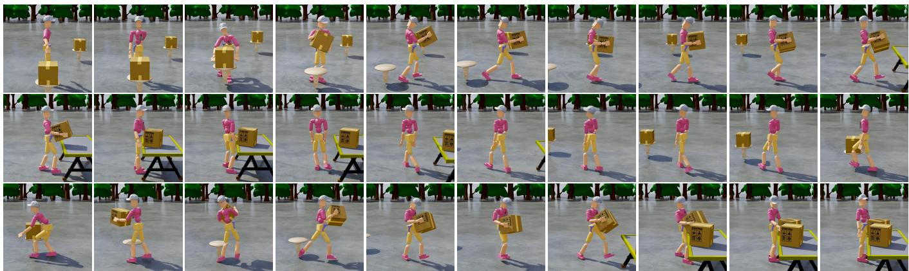  
Fig. 16. Long-horizon skill composition results for the two-box sequential placement task. The humanoid first picks up the first box from the source table and places it on the target desk, then walks to the second source table, picks up the second box, carries it back to the desk, and places it at the target position.

## Prompt B: From Sitting to Striking and Celebration

Please follow the Standardized Task Description to generate an executable long-horizon skill program for a SMPL character. The task depicts a humanoid that walks to a chair, sits down and stands up, moves toward a target object and strikes it down, and then celebrates with an open-ended text-conditioned jumping motion. The detailed skill sequence is specified below.

Path Follow Skill. Initialization: Spawn the humanoid at the scene origin. Condition: Generate and follow a straight walking path toward a target location in front of the chair. Terminate: End when the humanoid reaches the target location in front of the chair.

Human-Scene Interaction Skill. Initialization: Start from the final state of the path follow skill. Condition: Provide a scheduled inpainting target sequence, including sitting down on the chair, holding the seated pose, and standing back up, with a specified duration for each target frame. Terminate: End when the full interaction schedule is completed.

Strike Skill. Initialization: Start from the final state of the human-scene interaction skill. Condition: Provide the target object position, and generate a full-body striking motion that moves the humanoid toward the target object and knocks it down. Terminate: End when the target object remains in a knocked-down orientation.

Text-to-Motion Skill. Initialization: Start from the final state of the strike skill. Condition: Set the text prompt to “a person jumping up and down, with their hands above their head.” Terminate: Continue until the episode is externally stopped.

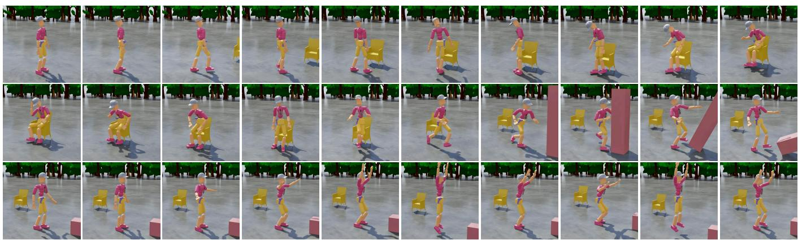  
Fig. 17. Long-horizon skill composition results for the sit-strike-celebrate task. The humanoid walks to the chair, sits down and stands up, approaches the target object, strikes it down, and then performs a jumping celebration motion.

## Prompt: Text-Conditioned Motion Sequence

Please follow the Standardized Task Description to generate an executable long-horizon skill program for a SMPL character. The task depicts a humanoid that sequentially performs three text-conditioned motions, including punching, kicking, and cartwheeling, each for a specified duration. The detailed skil sequence is specified below.

Text-to-Motion: Punch. Condition: Set the language embedding to “person was fighting with a left punch”. Terminate: End after 5 seconds.

Text-to-Motion: Forward Kick. Condition: Switch the language embedding to “a person kicks forward.” Terminate: End after 3 seconds.

Text-to-Motion: Cartwheel. Condition: Switch the language embedding to “a person does a cartwheel.” Terminate: End after 5 seconds.

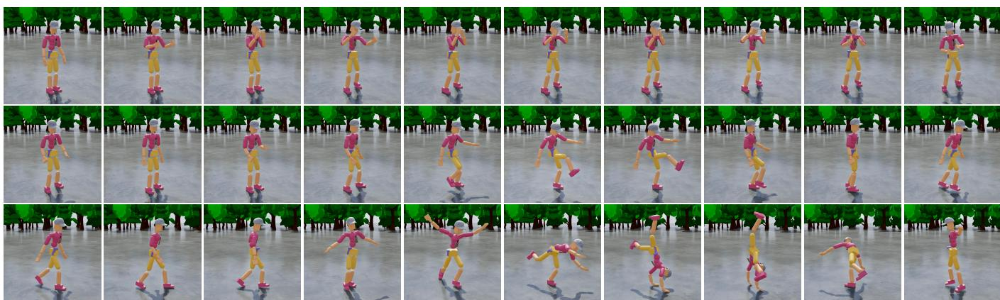  
Fig. 18. Long-horizon rollout of sequential text-conditioned motion generation. The humanoid switches across three language conditions and performs a left punch, a forward kick, and a cartwheel in sequence.