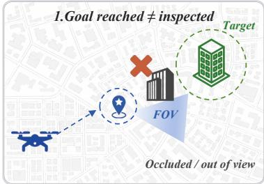
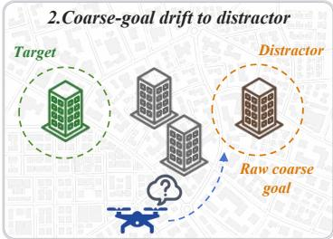
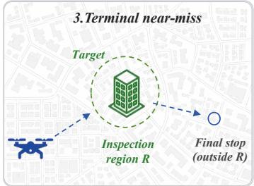
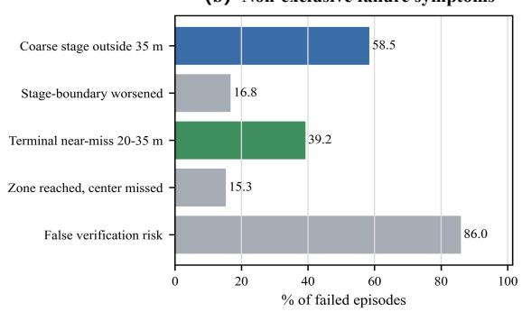
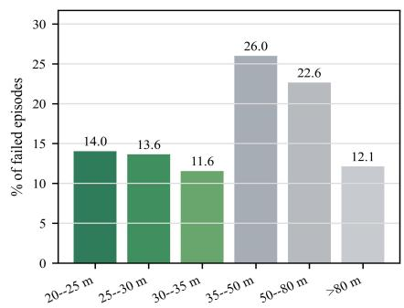
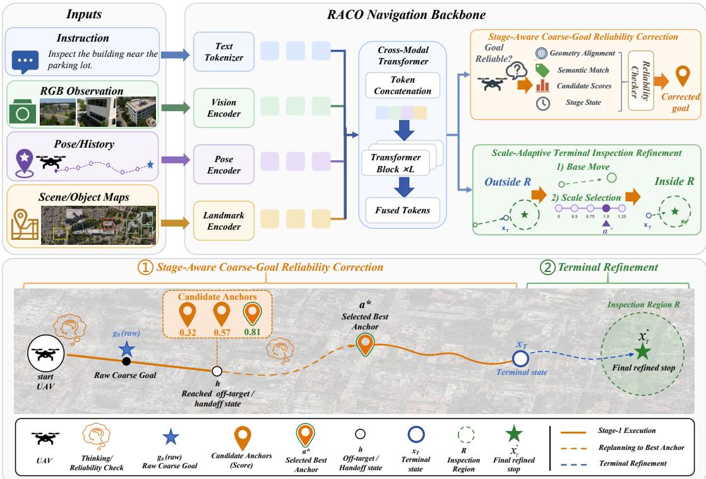
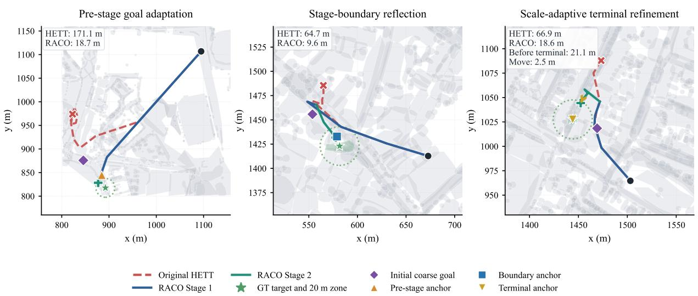

# RACO: Reliability-Aware Coarse-Goal Optimization for Inspection-Oriented UAV Vision-Language Navigation

Sen Wang1, Yiming Sun1, Jiaxuan He2, Pengfei Zhu1∗

1School of Automation, Southeast University, Nanjing, China

2School of Science and the School of Engineering,

The Hong Kong University of Science and Technology, Hong Kong Corresponding author: zhupengfei@tju.edu.cn

## Abstract

UAV vision-language navigation (UAV-VLN) is commonly evaluated as goal reaching, but inspection-oriented deployment requires the agent to stop within a valid inspection region and avoid falsely confirming visually or semantically similar distractors. This requirement exposes a key weakness in existing coarse-to-fine UAV-VLN policies: the coarse goal predicted before local refinement is often treated as reliable, although it may drift toward plausible but incorrect object regions and limit the ability of the local stage to recover. To systematically evaluate this problem, we introduce LG-UVI, an object-centric inspection evaluation setting derived from City-Nav/CityRefer. LG-UVI extends standard UAV-VLN episodes with target objects, hard distractors, type-aware inspection regions, and diagnostics for inspection-region arrival and objectlevel confirmation. To address this inspection-oriented setting, we further propose RACO, a reliability-aware adaptive coarse-to-fine navigation framework. Instead of treating the predicted coarse goal as a fixed waypoint, RACO views it as a runtime hypothesis and uses object-level candidate anchors to check and correct coarse localization before Stage 1 and at the Stage 1-to-Stage 2 boundary. RACO also applies scaleadaptive terminal refinement to handle terminal near-miss cases using runtime-observable geometric and anchor-based evidence. Under a unified online evaluation protocol, RACO improves SR over the reproduced HETT baseline by 9.53 and 7.98 percentage points on validation-unseen and test-unseen, respectively. It also improves inspection-region arrival and reduces false verification risk, showing that coarse-goal reliability optimization is an efective complement to existing coarse-to-fine UAV-VLN policies.

## Introduction

Vision-language navigation (VLN) requires an embodied agent to follow natural-language instructions by grounding them in visual observations and actions (Anderson et al. 2018). Recent work has extended VLN from indoor environments to city-scale aerial navigation, where UAVs interpret instructions and execute long-range trajectories (Liu et al. 2023; Lee et al. 2025; Miyanishi et al. 2023). Existing UAV-VLN benchmarks primarily evaluate coordinate-level goal reaching using navigation error (NE), success rate (SR), and success weighted by path length (SPL) (Liu et al. 2023; Lee et al. 2025; Wang et al. 2025; Ding et al. 2026; Gao et al. 2026). However, these metrics do not fully capture the requirements of inspection-oriented deployment.

In an inspection task, reaching the vicinity of a target coordinate is not enough. The agent must stop in a suitable viewing region, maintain a final state that supports inspection of the intended object, and avoid confirming nearby objects with similar visual or semantic cues. This distinction is important in dense urban scenes, where buildings, cars, parking areas, and ground regions often appear close to one another and may belong to the same category. A UAV may reach the correct neighborhood while still failing to produce a valid inspection state, or it may associate its final state with a same-category distractor. Inspection-oriented UAV-VLN therefore exposes reliability failures that standard goal-reaching metrics tend to hide.

Fig. 1 illustrates this gap through a diagnosis of the reproduced HETT baseline (Ding et al. 2026) under the inspectionoriented evaluation protocol used in this work. HETT failures often stem from unreliable coarse localization, drift toward plausible same-category distractors, or terminal near-misses where the agent stops just outside the valid inspection region. These failures are not isolated. As shown in Fig. 1, many failed episodes involve coarse-goal reliability issues, and a substantial fraction falls into the 20–35 m terminal near-miss band. The distance statistics in Fig. 1 are used only to diagnose the reproduced baseline ofline.

To systematically study these challenges, we introduce LG-UVI, an object-centric inspection evaluation setting derived from CityNav and CityRefer (Lee et al. 2025; Miyanishi et al. 2023). LG-UVI preserves the original UAV-VLN episodes while augmenting them with target objects, samecategory candidates, hard distractors, and type-aware inspection regions. Beyond standard metrics such as NE, SR, and SPL, LG-UVI evaluates whether the agent reaches a valid inspection region, confirms the intended object, and avoids false verification of nearby hard distractors. This setting separates coordinate-level navigation success from inspectionregion arrival, object-level confirmation, and false verification risk.

We further propose RACO, a reliability-aware coarse-goal optimization framework for inspection-oriented UAV-VLN. RACO keeps the original two-stage navigation backbone, but treats the predicted coarse goal as a runtime hypothesis rather than a fixed waypoint. It verifies and corrects this hypothesis using object-level candidate anchors before Stage 1 and at the transition from Stage 1-to-Stage 2, reducing the chance that an unreliable coarse goal is passed into local refinement. RACO also introduces scale-adaptive terminal inspection refinement to repair bounded near-miss errors using only runtime-observable geometric and anchor-based features.

（a）Baseline inspection failure mechanisms  

  
（b）Non-exclusive failure symptoms

  
（c）Final-to-target residual distance

  
Figure 1: Failure diagnosis for inspection-oriented UAV-VLN. (a) Typical HETT failures: invalid inspection states, coarse-goal drift to same-category distractors, and terminal near-misses. (b) Non-exclusive failure symptoms among failed episodes. (c) Final-to-target residual distances, with the 20–35 m near-miss band highlighted. Ground-truth distances are used only for ofline diagnosis.

Experiments on LG-UVI show that RACO consistently improves the reproduced HETT baseline under the same online evaluation protocol. On the validation-unseen and testunseen splits, RACO increases SR by 9.53 and 7.98 percentage points, respectively, while also improving path eficiency. It further improves inspection-region arrival and reduces false verification risk, indicating that reliability-aware coarse-to-fine correction is useful beyond coordinate-level navigation success.

Our contributions are summarized as follows:

• We introduce LG-UVI, an inspection-oriented extension of CityNav/CityRefer for object-level UAV inspection. LG-UVI preserves standard UAV-VLN episodes while augmenting them with target objects, same-category candidates, hard distractors, type-aware inspection regions, and diagnostics for inspection-region arrival, object confirmation, and false verification.

• We propose a stage-aware coarse-goal reliability correction mechanism. Instead of directly trusting the raw coarse goal predicted by a two-stage UAV-VLN policy, our method treats it as a runtime hypothesis and verifies it with object-level candidate anchors before Stage 1 and at the Stage 1-to-Stage 2 boundary, reducing drift toward plausible but incorrect object regions.

• We develop a scale-adaptive terminal inspection refinement module and integrate it with coarse-goal correction into RACO. The resulting framework addresses bounded terminal near-miss cases using only runtime-observable features and consistently improves the HETT baseline under a unified online evaluation protocol.

## Related Work

## UAV Vision-Language Navigation

Vision-language navigation (VLN) asks an embodied agent to follow natural-language instructions by grounding them in visual observations and action decisions. Early indoor benchmarks and methods, including R2R (Anderson et al. 2018), HAMT (Chen et al. 2021), DUET (Chen et al. 2022), data-scaling approaches (Wang et al. 2023), and volumetric representations (Liu, Wang, and Yang 2024), mainly evaluate whether an agent can reach a navigation goal eficiently. These studies established standard metrics such as navigation error, success rate, and path eficiency, but they were largely designed for ground-level indoor environments.

Recent work has extended VLN to aerial agents and cityscale outdoor scenes. AerialVLN (Liu et al. 2023) introduces language-guided UAV navigation in outdoor 3D environments. CityNav (Lee et al. 2025) and CityRefer (Miyanishi et al. 2023) provide city-scale language, trajectory, and object grounding resources for aerial navigation. TravelUAV (Wang et al. 2025) and OpenFly (Gao et al. 2026) further improve the realism and scale of UAV-VLN evaluation through more complete simulation platforms and benchmark settings. Recent methods also explore stronger reasoning, memory, and foundation-model-based planning for aerial navigation, including HETT (Ding et al. 2026), CityNavAgent (Zhang et al. 2025a), FlightGPT (Cai et al. 2025), See, Point, Fly (Hu et al. 2025), OpenVLN (Lin et al. 2025), LongFly (Jiang et al. 2025), and AutoFly (Sun et al. 2026). Most existing approaches nevertheless retain coordinate-level success criteria and do not explicitly evaluate inspection-region arrival or confusion with same-category distractors.

<table><tr><td>Split</td><td>Episodes</td><td>Building</td><td> $\mathrm { C a r }$ </td><td>Ground</td><td>Parking</td><td>Avg. Cand.</td><td>Avg. Hard Distr.</td><td>Zone Policy</td></tr><tr><td>Train Seen</td><td>21,878</td><td>8,268</td><td>11,641</td><td>1,226</td><td>743</td><td>30.84</td><td>14.73</td><td>center / contour</td></tr><tr><td>Val Seen</td><td>2,470</td><td>1,057</td><td>1,226</td><td>131</td><td>56</td><td>30.88</td><td>14.84</td><td>center / contour</td></tr><tr><td>Val Unseen</td><td>2,697</td><td>1,141</td><td>1,026</td><td>392</td><td>138</td><td>29.71</td><td>14.58</td><td>center / contour</td></tr><tr><td>Test Unseen</td><td>5,281</td><td>2,750</td><td>1,693</td><td>631</td><td>207</td><td>30.55</td><td>14.74</td><td>center / contour</td></tr></table>

Table 1: Statistics of LG-UVI. Each split preserves the original CityNav/CityRefer navigation episodes and adds object-centric inspection annotations. Candidate pools contain the target object and same-category alternatives, while hard distractors are the nearest same-category objects used for false-verification diagnosis. Cars use center-radius inspection regions, whereas buildings, ground regions, and parking areas use contour-bufer inspection regions.

## Object-Centric Inspection and Reliability

Object-centric embodied tasks require agents to reason about semantic categories, object instances, and taskspecific grounding rather than only metric goal locations. REVERIE (Qi et al. 2020) studies remote object grounding during embodied navigation, while ALFRED (Shridhar et al. 2020) requires grounded instruction following and object interaction. Language-conditioned robotic systems and vision-language-action models further connect semantic instructions with action afordances and embodied control (Ahn et al. 2023; Shah et al. 2023; Driess et al. 2023; Zitkovich et al. 2023). A related line ofwork improves robustness through self-monitoring, backtracking, and replanning: progress monitors estimate navigation progress (Ma et al. 2019a), regretful and tactical agents learn when to backtrack or rewind from poor local decisions (Ma et al. 2019b; Ke et al. 2019), and introspective or VLM/LLM-based planners predict failures and adapt plans under changing observations (Rabiee et al. 2022; Skreta et al. 2024; Mei et al. 2024). RACO is related to these ideas, but focuses on coarse-goal reliability in two-stage UAV-VLN, grounding correction in object-level inspection anchors rather than generic progress estimation or backtracking over visited viewpoints.

Aerial domains are also moving toward applicationoriented language-conditioned execution, including openvocabulary grounding, terminal delivery, mission generation, onboard aerial navigation, and interactive aerial navigation (Zhang et al. 2025c,b; Sautenkov et al. 2025; Wu et al. 2025; Chen et al. 2026). Our work addresses a complementary problem: inspection-oriented reliability in twostage UAV-VLN. In dense urban scenes, a UAV can reach the correct neighborhood while still stopping outside the valid inspection region or associating its final state with a nearby distractor. LG-UVI separates inspection-region arrival from object-level confirmation, while RACO treats the coarse goal as a runtime hypothesis and revises unreliable coarse and terminal states through object-level candidate anchors.

## LG-UVI Benchmark

LG-UVI extends CityNav/CityRefer from coordinate-level UAV-VLN to inspection-oriented navigation. In each episode, an aerial agent follows a language instruction I from an initial state s0 and stops at $s _ { T }$ to inspect a target object $o ^ { * }$ in a 3D urban scene. Unlike standard UAV-VLN, where success is mainly determined by distance to a target coordinate, inspection requires the agent to stop in a suitable viewing region and associate its final state with the intended object. This distinction matters in urban environments, where multiple same-category objects may appear close to one another and visually plausible distractors can lead to incorrect inspection.

LG-UVI preserves the original instructions, trajectories, maps, start poses, and target positions from CityNav/CityRefer, and adds object-centric inspection metadata to each episode. Each target object is represented by its object ID, semantic type, geometry, and a type-aware inspection region $Z ( o ^ { * } )$ . The main object types include buildings, cars, ground regions, and parking areas. Each episode also includes same-category candidate objects and hard distractors, allowing the evaluator to test whether the agent reaches the correct inspection region and avoids plausible but incorrect targets. The candidate pool contains the ground-truth target object, the nearest same-type candidates, and deterministic additional same-type negatives, with the pool capped at 32 objects. Hard distractors are defined as the nearest sametype objects according to 2D object distance. The inspection region is type-aware: cars use a 20 m center-radius region, while buildings, ground regions, and parking areas use a 20 m contour-bufer region. Table 1 summarizes the resulting split statistics.

We report standard navigation metrics, including NE, SR, and SPL, and add four inspection-oriented diagnostics. Zone-SR measures whether the final position enters the type-aware inspection region, OSA measures whether the inspected object oˆ matches the target object $o ^ { * }$ , ISR requires both region arrival and correct object confirmation, and FVR measures whether the agent falsely verifies a hard distractor. These metrics separate coordinate-level navigation, inspection-region arrival, object-level confirmation, and false-verification risk. Formal metric definitions and the post-hoc object-binding protocol are provided in Supplementary Section S5.

  
Figure 2: Overview of the proposed RACO framework. RACO augments a two-stage UAV-VLN backbone with stage-aware coarse-goal reliability correction and scale-adaptive terminal inspection refinement, and the lower panel visualizes the resulting correction process in one representative episode.

## Method

## Overview of RACO

Fig. 2 summarizes RACO, a stage-aware reliability framework that extends the HETT execution process without modifying its navigation backbone. Given a language instruction, visual observations, pose history, and a fixed scene-level object map, the backbone produces three runtime states: a raw coarse goal $g _ { 0 } ,$ , a Stage 1 handof state $x _ { 1 } ,$ , and a terminal state $x _ { T } .$ . RACO acts on these states at three points through two coordinated mechanisms. Stage-aware coarse-goal correction estimates the reliability of the current state and the utility of type-compatible object anchors from geometric, semantic, candidate-score, and stage-context features. It may replace $g _ { 0 }$ before Stage 1 and, at the Stage 1-to-Stage 2 boundary, update the coarse goal and perform a bounded replan before local refinement. Scale-adaptive terminal refinement then scores a discrete set of geometry-conditioned correction actions, including abstention, to repair terminal near-misses after Stage 2. The decision modules are trained separately.

## Object-Level Candidate Anchors

RACO introduces object-level candidate anchors to bridge coordinate-level navigation and object-level inspection. Rather than treating the predicted coarse goal as an isolated 3D point, RACO grounds it in nearby semantic objects that can provide more reliable references for subsequent naviga-

tion.

We use a fixed scene-level object map M derived from the CityRefer annotations, where each object is represented by its semantic category, reference position, and geometry. A lightweight language-to-type parser extracts a targetcategory cue cˆ from the instruction; when no category can be identified, type filtering is disabled. Given the raw coarse goal $g _ { 0 }$ , RACO retrieves up to K nearby objects compatible with $\hat { c } { : }$

$$
\mathcal { A } _ { \mathrm { r u n } } ( g _ { 0 } , \hat { c } ; \mathcal { M } ) = \{ a _ { j } \} _ { j = 1 } ^ { K } .\tag{1}
$$

Each anchor $a _ { j }$ provides a geometry-aware reference position $p ( a _ { j } )$ ) together with features describing its spatial compatibility with $g _ { 0 } .$ , semantic consistency with the instruction, and distinctiveness among neighboring candidates. Stagespecific modules score these anchors and select the references used for coarse-goal correction and terminal refinement. Additional anchor-construction details, feature groups, map-aware controls, and synthetic map perturbations are provided in Supplementary Sections S1 and S3.

The runtime anchor set ${ \mathcal A } _ { \mathrm { r u n } }$ is constructed around the model-predicted goal and contains neither episode-specific target identities nor hard-distractor labels. It is distinct from the ground-truth-inclusive candidate pool used only for evaluation.

## Stage-Aware Coarse-Goal Reliability Correction

RACO decomposes coarse-goal correction into two decisions: whether the current state requires intervention and which object anchor should serve as the correction target. Both decisions are made before Stage 1 and at the Stage 1-to-Stage 2 boundary using separately parameterized modules.

Before Stage 1, a reliability gate estimates an intervention probability $\rho _ { \mathrm { p r e } }$ from geometric, semantic, candidatedistribution, and stage-context features. In parallel, an anchor-utility scorer assigns each runtime anchor $a _ { j } \in \mathcal { A } _ { \mathrm { r u n } }$ a score $s _ { j } ^ { \mathrm { p r e } }$ and selects:

$$
a _ { \mathrm { p r e } } ^ { \star } = \arg \operatorname* { m a x } _ { a _ { j } \in \mathcal { A } _ { \mathrm { r u n } } } s _ { j } ^ { \mathrm { p r e } } .\tag{2}
$$

The coarse goal is then updated as

$$
g _ { 0 } ^ { \prime } = \begin{array} { l l } { p ( a _ { \mathrm { p r e } } ^ { \star } ) , } & { \mathrm { i f ~ } \Gamma _ { \mathrm { p r e } } = 1 , } \\ { g _ { 0 } , } & { \mathrm { o t h e r w i s e } , } \end{array}\tag{3}
$$

where $\Gamma _ { \mathrm { p r e } }$ indicates that the intervention probability, anchor utility, score margin, and displacement constraintjointly meet their acceptance criteria. Otherwise, Stage 1 proceeds with the original coarse goal.

After Stage 1 reaches the handof state $x _ { 1 } .$ , a boundary reliability gate evaluates whether the state is suitable for local refinement using the reached endpoint, executed trajectory, and local anchor distribution. A boundary-specific scorer selects:

$$
a _ { \mathrm { B } } ^ { \star } = \arg \operatorname* { m a x } _ { a _ { j } \in \mathcal { A } _ { \mathrm { r u n } } } s _ { j } ^ { \mathrm { B } } .\tag{4}
$$

If the handof state is unreliable, RACO updates the coarse goal to $g _ { 0 } ^ { \prime \prime } = p ( a _ { \mathrm { B } } ^ { \star } )$ and performs a bounded replan before entering Stage 2. Replanning stops when the agent reaches the selected anchor within a fixed tolerance or the preset iteration limit is reached.

The two modules are trained on train-seen episodes and kept fixed during evaluation. The learned decision modules, training objectives, acceptance criteria, and replanning parameters are detailed in Supplementary Section S1.

## Scale-Adaptive Terminal Inspection Refinement

Scale-adaptive terminal refinement complements the coarsegoal reliability loop by correcting bounded near-misses at the end of execution. While coarse-goal correction reduces larger localization errors before local refinement, the terminal policy adjusts final states that remain close to, but outside, a valid inspection region. The correction is performed online as part of the navigation process rather than as ofline postprocessing.

Let $x _ { T }$ denote the terminal position after Stage 2, and let $a _ { T }$ be the runtime anchor selected from the candidate anchor space. This anchor is produced by RACO during inference and is not a ground-truth target. We define the terminal residual distance as

$$
d _ { T } = \lVert x _ { T } - p ( a _ { T } ) \rVert _ { 2 } ,\tag{5}
$$

where $p ( a _ { T } )$ is the reference position of the runtime anchor. RACO first maps this residual distance to a geometry-induced base move:

$$
m _ { \mathrm { g e o } } ( d _ { T } ) = \left\{ \begin{array} { l l } { 5 , } & { 2 0 \leq d _ { T } < 2 5 , } \\ { 1 0 , } & { 2 5 \leq d _ { T } < 3 0 , } \\ { 1 5 , } & { 3 0 \leq d _ { T } \leq 3 5 , } \\ { 0 , } & { \mathrm { o t h e r w i s e } . } \end{array} \right.\tag{6}
$$

This base move defines a bounded correction toward the runtime anchor. No refinement is applied when dT falls outside the specified near-miss range.

Rather than executing the base move directly, RACO uses a learned policy to select a scale from a small discrete action set:

$$
\alpha ^ { \star } \in \{ 0 , 0 . 5 , 0 . 7 5 , 1 . 0 , 1 . 2 5 \} ,\tag{7}
$$

where $\alpha ^ { \star } = 0$ means that the agent abstains from refinement. The refined terminal position is computed as

$$
x _ { T } ^ { \prime } = x _ { T } + \alpha ^ { \star } m _ { \mathrm { g e o } } ( d _ { T } ) \frac { p ( a _ { T } ) - x _ { T } } { \lVert p ( a _ { T } ) - x _ { T } \rVert _ { 2 } } .\tag{8}
$$

The discrete scale set keeps the correction simple and bounded while allowing the policy to choose a conservative or slightly larger move when supported by the runtime evidence.

The scale-selection policy uses runtime-observable features, including the terminal residual distance, the geometrybased base move, the runtime anchor score and margin, local candidate ambiguity, stage-boundary replanning status, and the geometric relation between the terminal state and the anchor. The policy is trained before evaluation, applied online after Stage 2, and executed before the final metrics are computed.

## Experiments

## Experimental Setup

We evaluate RACO on LG-UVI, an inspection-oriented extension of CityNav/CityRefer that retains the original instructions, trajectories, and scene maps while adding objectcentric inspection annotations. We reproduce HETT as an end-to-end reference. RACO-Base uses the same two-stage architecture and Stage 1/Stage 2 policies as HETT, but its backbone is trained on LG-UVI. Full RACO further adds runtime candidate-anchor construction, coarse-goal reliability correction, and terminal inspection refinement. All three models are evaluated under the same online execution protocol.

We report the standard navigation metrics NE, SR, OSR, and SPL, together with the inspection-oriented metrics Zone-SR, OSA, ISR, and FVR. Higher values are better for SR, OSR, SPL, Zone-SR, OSA, and ISR, while lower values are better for NE and FVR. The reliability gates and terminal policies are trained on train-seen, and decision thresholds are selected on a held-out subset. The validation-seen, validation-unseen, and test-unseen splits are used only for evaluation.

RACO follows a strictly online protocol without information leakage. During inference, it uses only observable scene geometry, language-derived type cues, model candidate scores, stage status, and executed trajectory and terminal-state geometry. It never accesses ground-truth object identities or target coordinates, hard-distractor labels, final-error or rescue labels, or annotations from unseen splits, and no prediction files are modified ofline. All experiments were conducted on a server with four NVIDIA RTX 4090D GPUs. Additional terminal controls and runtime statistics are reported in Supplementary Sections S2 and S4.

<table><tr><td rowspan="2">Model</td><td colspan="4">Validation Seen</td><td colspan="4">Validation Unseen</td><td colspan="4">Test Unseen</td></tr><tr><td>NE↓</td><td>SR↑</td><td>OSR↑</td><td>SPL↑</td><td>NE↓</td><td>SR↑</td><td>OSR↑</td><td>SPL↑</td><td>NE↓</td><td>SR↑</td><td>OSR↑</td><td>SPL↑</td></tr><tr><td>Random</td><td>222.3</td><td>0.00</td><td>1.15</td><td>0.00</td><td>223.0</td><td>0.00</td><td>0.90</td><td>0.00</td><td>208.8</td><td>0.00</td><td>1.44</td><td>0.00</td></tr><tr><td>Human</td><td>9.1</td><td>89.31</td><td>96.40</td><td>60.17</td><td>9.4</td><td>88.39</td><td>95.54</td><td>62.66</td><td>9.8</td><td>87.86</td><td>95.29</td><td>57.04</td></tr><tr><td>Seq2Seq</td><td>257.1</td><td>1.81</td><td>7.89</td><td>1.58</td><td>317.4</td><td>0.79</td><td>8.82</td><td>0.61</td><td>245.3</td><td>1.50</td><td>8.34</td><td>1.30</td></tr><tr><td>CMA</td><td>240.8</td><td>0.95</td><td>9.42</td><td>0.92</td><td>268.8</td><td>0.65</td><td>7.86</td><td>0.63</td><td>252.6</td><td>0.82</td><td>9.70</td><td>0.79</td></tr><tr><td>AerialVLN</td><td>65.6</td><td>9.77</td><td>23.77</td><td>8.64</td><td>81.8</td><td>6.79</td><td>17.91</td><td>5.73</td><td>64.1</td><td>8.09</td><td>19.13</td><td>5.91</td></tr><tr><td>MGP</td><td>53.0</td><td>16.93</td><td>29.90</td><td>14.38</td><td>73.8</td><td>8.35</td><td>17.91</td><td>7.07</td><td>86.1</td><td>10.90</td><td>20.24</td><td>9.94</td></tr><tr><td>HETT</td><td>38.23</td><td>29.92</td><td>48.26</td><td>25.20</td><td>53.55</td><td>18.06</td><td>34.59</td><td>14.92</td><td>42.57</td><td>25.73</td><td>47.00</td><td>20.95</td></tr><tr><td>RACO-Base</td><td>37.90</td><td>30.32</td><td>48.10</td><td>25.78</td><td>53.16</td><td>19.39</td><td>34.63</td><td>16.18</td><td>42.02</td><td>27.19</td><td>47.64</td><td>22.46</td></tr><tr><td>RACO</td><td>36.85</td><td>35.55</td><td>52.47</td><td>29.61</td><td>49.96</td><td>27.59</td><td>41.71</td><td>22.75</td><td>40.62</td><td>33.71</td><td>52.13</td><td>27.45</td></tr></table>

Table 2: Main navigation results on the LG-UVI episodes. The results of Random, Human, Seq2Seq, CMA, AerialVLN, and MGP are reported from prior work for reference. HETT is the reproduced end-to-end reference, whereas RACO-Base shares the backbone, scene prior, and evaluation protocol with RACO but disables all runtime correction modules. Best automatic results are shown in Bold.

<table><tr><td>Split</td><td>Model</td><td>Zone-SR↑</td><td>OSA↑</td><td>ISR↑</td><td>FVR↓</td></tr><tr><td>Val Seen</td><td>HETT</td><td>40.65</td><td>10.85</td><td>8.91</td><td>82.27</td></tr><tr><td></td><td>RACO</td><td>45.02</td><td>11.17</td><td>7.85</td><td>58.14</td></tr><tr><td>Val Unseen</td><td>HETT</td><td>27.88</td><td>15.87</td><td>11.98</td><td>76.68</td></tr><tr><td></td><td>RACO</td><td>33.96</td><td>16.09</td><td>12.72</td><td>57.17</td></tr><tr><td>Test Unseen</td><td>HETT</td><td>38.38</td><td>16.78</td><td>13.69</td><td>77.18</td></tr><tr><td></td><td>RACO</td><td>44.52</td><td>15.87</td><td>12.63</td><td>62.09</td></tr></table>

Table 3: Inspection-oriented diagnostics on LG-UVI under the same online protocol.

## Main Results

Table 2 compares RACO with existing navigation baselines on LG-UVI. Since LG-UVI retains the original CityNav episodes and navigation metrics, we include previously reported results for context. Published HETT results were obtained under a diferent evaluation protocol and are therefore not directly comparable. We reproduce HETT under the same online setting as RACO. RACO-Base uses the same LG-UVI-trained backbone as RACO but excludes all runtime correction modules.

RACO achieves the strongest overall navigation results among automatic methods, with the largest gains on the unseen splits. Relative to the reproduced HETT baseline, SR increases from 18.06 to 27.59 on Validation Unseen and from 25.73 to 33.71 on Test Unseen, while NE decreases from 53.55 to 49.96 and from 42.57 to 40.62, respectively. OSR and SPL follow the same trend, indicating that RACO reaches the goal region more often and completes successful episodes more eficiently. RACO also outperforms HETT on all four navigation metrics on Validation Seen.

The comparison with RACO-Base separates the efect of runtime correction from that of backbone training. Across the three splits, RACO improves SR by 5.23–8.20 percentage points, while consistently increasing OSR and SPL and reducing NE. The largest gain occurs on Validation Unseen, where SR rises from 19.39 to 27.59 and OSR from 34.63 to 41.71. This comparison shows that coarse-goal correction and terminal refinement provide benefits beyond those obtained from the LG-UVI-trained backbone alone.

The inspection-oriented diagnostics in Table 3 support the same conclusion. On Validation Unseen and Test Unseen, RACO improves Zone-SR by 6.08 and 6.14 percentage points and reduces FVR by 19.51 and 15.09 points, respectively. It therefore reaches valid inspection regions more often while being less likely to verify nearby distractors. OSA and ISR show mixed results across the three splits, indicating that reliable object-level target confirmation remains a major limitation.

## Ablation Study

Table 4 examines the contribution of each component. RACO-Base uses the LG-UVI-trained two-stage backbone with all runtime correction modules disabled and serves as the matched baseline. Both pre-stage and stage-boundary correction improve over RACO-Base, and combining them gives larger gains than either module alone. On Validation Unseen, the combined variant increases SR from 19.39 to 23.43 and OSR from 34.63 to 39.12, while also improving SPL and reducing NE. This suggests that the two modules address diferent errors: pre-stage correction revises unreliable initial goals, whereas stage-boundary correction repairs poor handof states before local refinement.

Type-aware anchor filtering also contributes to performance. Removing it lowers SR, OSR, and Zone-SR on both validation splits, indicating that geometric proximity alone is insuficient for reliable anchor selection. The languagederived type cue helps reject nearby objects that do not match the instruction, improving both navigation success and inspection-region arrival. Although the variant without type filtering achieves a slightly lower FVR, it performs worse across the main navigation metrics. Full RACO therefore provides the best overall result rather than optimizing a single diagnostic measure.

Supplementary experiments show that scale-adaptive refinement outperforms the no-terminal and fixed-step variants (Table S2), while Full RACO exceeds the strongest mapaware heuristic by 3.36 Test-Unseen SR points (Table S3). RACO is more sensitive to object-position noise than to moderate deletion or category corruption (Table S4), and its median Test-Unseen path-length change is zero (Table S5).

<table><tr><td rowspan="2">Variant</td><td colspan="6">Val Seen</td><td colspan="6">Val Unseen</td></tr><tr><td>SR↑</td><td>OSR↑</td><td>SPL↑</td><td>NE↓</td><td>Zone-SR↑</td><td>FVR↓</td><td>SR↑</td><td>OSR↑</td><td>SPL↑</td><td>NE↓</td><td>Zone-SR↑</td><td>FVR↓</td></tr><tr><td>RACO-Base</td><td>30.32</td><td>48.10</td><td>25.78</td><td>37.90</td><td>41.42</td><td>77.29</td><td>19.39</td><td>34.63</td><td>16.18</td><td>53.16</td><td>28.18</td><td>70.27</td></tr><tr><td>Pre-stage only</td><td>31.34</td><td>49.43</td><td>26.75</td><td>37.44</td><td>42.02</td><td>60.24</td><td>21.73</td><td>37.12</td><td>18.40</td><td>50.97</td><td>30.29</td><td>59.49</td></tr><tr><td>Boundary only</td><td>31.66</td><td>49.31</td><td>26.68</td><td>37.55</td><td>42.67</td><td>59.85</td><td>21.99</td><td>37.63</td><td>17.87</td><td>52.28</td><td>30.44</td><td>59.51</td></tr><tr><td>Pre-stage + boundary</td><td>32.23</td><td>49.96</td><td>27.34</td><td>37.28</td><td>42.71</td><td>62.71</td><td>23.43</td><td>39.12</td><td>19.46</td><td>50.45</td><td>31.70</td><td>60.33</td></tr><tr><td>Full w/o type filtering</td><td>32.55</td><td>49.03</td><td>27.26</td><td>37.27</td><td>42.39</td><td>57.13</td><td>24.14</td><td>38.01</td><td>20.17</td><td>51.21</td><td>31.48</td><td>53.99</td></tr><tr><td>Full RACO</td><td>35.55</td><td>52.47</td><td>29.61</td><td>36.85</td><td>45.02</td><td>58.14</td><td>27.59</td><td>41.71</td><td>22.75</td><td>49.96</td><td>33.96</td><td>57.17</td></tr></table>

Table 4: Ablation results on LG-UVI under the same online protocol. “Pre-stage + boundary” excludes terminal refinement, whereas “Full w/o type filtering” enables all three correction stages without type-aware anchor filtering. Best results for each metric are shown in Bold.

  
Figure 3: Qualitative correction cases on the LG-UVI development split. Each panel compares the original HETT trajectory with RACO under the same instruction. RACO corrects failures at the pre-stage, stage-boundary, and terminal refinement stages.

## Qualitative Analysis

Fig. 3 presents representative correction cases from the LG-UVI development split. In the first case, the original HETT trajectory follows an unreliable coarse goal and remains far from the target, while RACO redirects Stage 1 toward a typecompatible runtime anchor before execution. The second case concerns an unreliable handof at the Stage 1-to-Stage 2 boundary. Although the initial coarse navigation is partly correct, the Stage 1 endpoint is poorly aligned with the target region. RACO detects this mismatch and replans toward the selected anchor before local refinement. The third case demonstrates scale-adaptive terminal refinement. After local execution, the agent stops near the inspection region but remains outside the valid range. RACO then applies a bounded terminal move toward the runtime anchor to reach a valid final state.

These cases show how RACO corrects failures at diferent stages of the two-stage policy. It checks coarse-goal reliability before Stage 1, repairs unreliable handof states before Stage 2, and corrects bounded terminal near-misses after local refinement. Ground-truth target geometry is used only for visualization and distance annotations.

## Conclusion

We presented LG-UVI, an inspection-oriented extension of CityNav/CityRefer with object-centric metadata and diagnostic metrics. LG-UVI reveals a limitation of two-stage UAV-VLN policies: semantically plausible coarse goals can still be unreliable for object-level inspection, while terminal errors may leave the agent outside valid inspection regions. To address this issue, we proposed RACO, a reliability-aware coarse-to-fine framework that builds object-level candidate anchors, corrects unreliable coarse goals before Stage 1 and at the Stage 1-to-Stage 2 boundary, and applies scale-adaptive terminal refinement to near-miss cases. Experiments show that RACO improves navigation performance and inspectionregion arrival while reducing false-verification risk compared with the reproduced HETT baseline. Object-level target confirmation remains dificult, motivating stronger grounding and verification for visually similar distractors.

## References

Ahn, M.; Brohan, A.; Brown, N.; Chebotar, Y.; Cortes, O.; David, B.; Finn, C.; Fu, C.; Gopalakrishnan, K.; Hausman, K.; et al. 2023. Do As I Can, Not As I Say: Grounding Language in Robotic Afordances. In Proceedings of the Conference on Robot Learning, 287–318.

Anderson, P.; Wu, Q.; Teney, D.; Bruce, J.; Johnson, M.; Sünderhauf, N.; Reid, I.; Gould, S.; and van den Hengel, A. 2018. Vision-and-Language Navigation: Interpreting Visually-Grounded Navigation Instructions in Real Environments. In Proceedings of the IEEE Conference on Computer Vision and Pattern Recognition, 3674–3683.

Cai, H.; Dong, J.; Tan, J.; Deng, J.; Li, S.; Gao, Z.; Wang, H.; Su, Z.; Sumalee, A.; and Zhong, R. 2025. FlightGPT: Towards Generalizable and Interpretable UAV Vision-and-Language Navigation with Vision-Language Models. In Proceedings of the Conference on Empirical Methods in Natural Language Processing, 6659–6676.

Chen, J.; Li, H.; Tang, Z.; Li, X.; Wu, W.; and Liu, S. 2026. AerialVLA: A Vision-Language-Action Model for Aerial Navigation with Online Dialogue. In Proceedings of the AAAI Conference on Artificial Intelligence, volume 40, 18161–18169.

Chen, S.; Guhur, P.-L.; Schmid, C.; and Laptev, I. 2021. History Aware Multimodal Transformer for Vision-and-Language Navigation. In Advances in Neural Information Processing Systems, volume 34, 5834–5847.

Chen, S.; Guhur, P.-L.; Tapaswi, M.; Schmid, C.; and Laptev, I. 2022. Think Global, Act Local: Dual-Scale Graph Transformer for Vision-and-Language Navigation. In Proceedings of the IEEE/CVF Conference on Computer Vision and Pattern Recognition, 16537–16547.

Ding, X.; Gao, J.; Pan, C.; Wang, W.; and Qin, J. 2026. History-Enhanced Two-Stage Transformer for Aerial Visionand-Language Navigation. In Proceedings of the AAAI Conference on Artificial Intelligence, volume 40, 18225–18233.

Driess, D.; Xia, F.; Sajjadi, M. S. M.; Lynch, C.; Chowdhery, A.; Ichter, B.; Wahid, A.; Tompson, J.; Vuong, Q.; Yu, T.; Huang, W.; Chebotar, Y.; Sermanet, P.; Duckworth, D.; Levine, S.; Vanhoucke, V.; Hausman, K.; Toussaint, M.; Gref, K.; Zeng, A.; Mordatch, I.; and Florence, P. 2023. PaLM-E: An Embodied Multimodal Language Model. In Proceedings of the 40th International Conference on Machine Learning, volume 202 of Proceedings ofMachine Learning Research, 8469–8488.

Gao, Y.; Li, C.; You, Z.; Liu, J.; Li, Z.; Chen, P.; Chen, Q.; Tang, Z.; Wang, L.; Yang, P.; Tang, Y.; Tang, Y.; Liang, S.; Zhu, S.; Xiong, Z.; Su, Y.; Ye, X.; Li, J.; Ding, Y.; Wang, D.; Li, X.; Wang, Z.; and Zhao, B. 2026. OpenFly: A Comprehensive Platform for Aerial Vision-Language Navigation. In International Conference on Learning Representations.

Hu, C. Y.; Lin, Y.-S.; Lee, Y.; Su, C.-H.; Lee, J.-Y.; Tsai, S.-R.; Lin, C.-Y.; Chen, K.-W.; Ke, T.-W.; and Liu, Y.-L. 2025. See, Point, Fly: A Learning-Free VLM Framework for Universal Unmanned Aerial Navigation. In Proceedings of the Conference on Robot Learning, 4697–4708.

Jiang, W.; Wang, L.; Huang, K.; Fan, W.; Liu, J.; Liu, S.; Duan, H.; Xu, B.; and Ji, X. 2025. LongFly: Long-Horizon UAV Vision-and-Language Navigation with Spatiotemporal Context Integration. arXiv:2512.22010.

Ke, L.; Li, X.; Bisk, Y.; Holtzman, A.; Gan, Z.; Liu, J.; Gao, J.; Choi, Y.; and Srinivasa, S. 2019. Tactical Rewind: Self-Correction via Backtracking in Vision-and-Language Navigation. In Proceedings ofthe IEEE/CVF Conference on Computer Vision and Pattern Recognition, 6741–6749.

Lee, J.; Miyanishi, T.; Kurita, S.; Sakamoto, K.; Azuma, D.; Matsuo, Y.; and Inoue, N. 2025. CityNav: A Large-Scale Dataset for Real-World Aerial Navigation. In Proceedings of the IEEE/CVF International Conference on Computer Vision, 5912–5922.

Lin, P.; Sun, G.; Liu, C.; Li, F.; Ren, W.; and Cong, Y. 2025. OpenVLN: Open-World Aerial Vision-Language Navigation. arXiv:2511.06182.

Liu, R.; Wang, W.; and Yang, Y. 2024. Volumetric Environment Representation for Vision-Language Navigation. In Proceedings of the IEEE/CVF Conference on Computer Vision and Pattern Recognition, 16317–16328.

Liu, S.; Zhang, H.; Qi, Y.; Wang, P.; Zhang, Y.; and Wu, Q. 2023. AerialVLN: Vision-and-Language Navigation for UAVs. In Proceedings of the IEEE/CVF International Conference on Computer Vision, 15384–15394.

Ma, C.-Y.; Lu, J.; Wu, Z.; AlRegib, G.; Kira, Z.; Socher, R.; and Xiong, C. 2019a. Self-Monitoring Navigation Agent via Auxiliary Progress Estimation. In International Conference on Learning Representations.

Ma, C.-Y.; Wu, Z.; AlRegib, G.; Xiong, C.; and Kira, Z. 2019b. The Regretful Agent: Heuristic-Aided Navigation through Progress Estimation. In Proceedings of the IEEE/CVF Conference on Computer Vision and Pattern Recognition, 6732–6740.

Mei, A.; Zhu, G.-N.; Zhang, H.; and Gan, Z. 2024. ReplanVLM: Replanning Robotic Tasks With Visual Language Models. IEEE Robotics and Automation Letters, 9(11): 10201–10208.

Miyanishi, T.; Kitamori, F.; Kurita, S.; Lee, J.; Kawanabe, M.; and Inoue, N. 2023. CityRefer: Geography-aware 3D Visual Grounding Dataset on City-scale Point Cloud Data. In Advances in Neural Information Processing Systems, volume 36.

Qi, Y.; Wu, Q.; Anderson, P.; Wang, X.; Wang, W. Y.; Shen, C.; and van den Hengel, A. 2020. REVERIE: Remote Embodied Visual Referring Expression in Real Indoor Environments. In Proceedings of the IEEE/CVF Conference on Computer Vision and Pattern Recognition, 9982–9991.

Rabiee, S.; Basich, C.; Wray, K. H.; Zilberstein, S.; and Biswas, J. 2022. Competence-Aware Path Planning via Introspective Perception. IEEE Robotics and Automation Letters, 7(2): 3218–3225.

Sautenkov, O.; Yaqoot, Y.; Lykov, A.; Mustafa, M. A.; Tadevosyan, G.; Akhmetkazy, A.; Altamirano Cabrera, M.; Martynov, M.; Karaf, S.; and Tsetserukou, D. 2025. UAV-VLA:

Vision-Language-Action System for Large Scale Aerial Mission Generation. In Proceedings of the ACM/IEEE International Conference on Human-Robot Interaction, 1588–1592.

Shah, D.; Osiński, B.; Ichter, B.; and Levine, S. 2023. LM-Nav: Robotic Navigation with Large Pre-Trained Models of Language, Vision, and Action. In Proceedings of the Conference on Robot Learning, 492–504.

Shridhar, M.; Thomason, J.; Gordon, D.; Bisk, Y.; Han, W.; Mottaghi, R.; Zettlemoyer, L.; and Fox, D. 2020. ALFRED: A Benchmark for Interpreting Grounded Instructions for Everyday Tasks. In Proceedings of the IEEE/CVF Conference on Computer Vision and Pattern Recognition, 10740–10749.

Skreta, M.; Zhou, Z.; Yuan, J. L.; Darvish, K.; Aspuru-Guzik, A.; and Garg, A. 2024. RePLan: Robotic Replanning with Perception and Language Models. arXiv:2401.04157.

Sun, X.; Si, W.; Ni, W.; Li, Y.; Wu, D.; Xie, F.; Guan, R.; Xu, H.; Ding, H.; Wu, Y.; Yue, Y.; Huang, Y.; and Xiong, H. 2026. AutoFly: Vision-Language-Action Model for UAV Autonomous Navigation in the Wild. In International Conference on Learning Representations.

Wang, X.; Yang, D.; Wang, Z.; Kwan, H.; Chen, J.; Wu, W.; Li, H.; Liao, Y.; and Liu, S. 2025. Towards Realistic UAV Vision-Language Navigation: Platform, Benchmark, and Methodology. In International Conference on Learning Representations.

Wang, Z.; Li, J.; Hong, Y.; Wang, Y.; Wu, Q.; Bansal, M.; Gould, S.; Tan, H.; and Qiao, Y. 2023. Scaling Data Generation in Vision-and-Language Navigation. In Proceedings of the IEEE/CVF International Conference on Computer Vision, 12009–12020.

Wu, Y.; Zhu, M.; Li, X.; Du, Y.; Fan, Y.; Li, W.; Han, Z.; Zhou, X.; and Gao, F. 2025. VLA-AN: An Eficient and Onboard Vision-Language-Action Framework for Aerial Navigation in Complex Environments. arXiv:2512.15258.

Zhang, W.; Gao, C.; Yu, S.; Peng, R.; Zhao, B.; Zhang, Q.; Cui, J.; Chen, X.; and Li, Y. 2025a. CityNavAgent: Aerial Vision-and-Language Navigation with Hierarchica Semantic Planning and Global Memory. In Proceedings of the Annual Meeting of the Association for Computational Linguistics, 31292–31309.

Zhang, X.; Tian, Y.; Lin, F.; Liu, Y.; Ma, J.; Wang, X.; Szatmáry, K. S.; and Wang, F.-Y. 2025b. LogisticsVLN: Vision-Language Navigation for Low-Altitude Terminal Delivery Based on Agentic UAVs. In Proceedings of the IEEE International Conference on Intelligent Transportation Systems, 4437–4442.

Zhang, Y.; Yu, H.; Xiao, J.; and Feroskhan, M. 2025c. Grounded Vision-Language Navigation for UAVs with Open-Vocabulary Goal Understanding. arXiv:2506.10756.

Zitkovich, B.; Yu, T.; Xu, S.; Xu, P.; Xiao, T.; Xia, F.; Wu, J.; Wohlhart, P.; Welker, S.; Wahid, A.; Vuong, Q.; Vanhoucke,

B.; Hsu, J.; Herzog, A.; Hausman, K.; Gopalakrishnan, K.;

Fu, C.; Florence, P.; Finn, C.; Dubey, K. A.; Driess, D.; Ding, T.; Choromanski, K. M.; Chen, X.; Chebotar, Y.; Carbajal, J.; Brown, N.; Brohan, A.; Arenas, M. G.; and Han, K. 2023. RT-2: Vision-Language-Action Models Transfer Web Knowledge to Robotic Control. In Proceedings of The 7th Conference on Robot Learning, volume 229 of Proceedings ofMachine Learning Research, 2165–2183.

## Supplementary Material

## S1 Additional Method Details

This section specifies the supervision, runtime features, estimator configurations, acceptance rules, and bounded execution parameters used by RACO. Ground-truth quantities are used only to construct ofline training labels and calibration statistics. They are excluded from the runtime feature records used during navigation.

## S1.1 Runtime Anchor Construction

RACO uses a fixed, target-agnostic scene-level object map derived from the CityRefer annotations. Each object entry contains a scene-level identifier, semantic category, reference position, dimensions, and contour geometry. The identifier is used only to index objects within a scene; the runtime map does not indicate which object is the target of a particular episode and contains no hard-distractor labels.

A lightweight parser normalizes explicit object names and common aliases in the instruction into the object categories used by LG-UVI. If no category cue can be identified, type filtering is disabled. Given the raw coarse goal $g _ { 0 } ,$ RACO retrieves at most $K \ : = \ : 3 2$ nearby objects and constructs the runtime anchor set ${ \mathcal A } _ { \mathrm { r u n } }$ . Objects matching a languagederived type cue are considered first, when such a cue is available. For compact objects, the anchor reference $p ( a _ { j } )$ is the object center; for region-like objects, it is derived from the corresponding contour geometry.

The runtime anchor set is constructed around the modelpredicted goal and is not forced to contain the ground-truth target. It is distinct from the ground-truth-inclusive candidate pool used by the LG-UVI evaluator only after an episode terminates. Target identifiers, target positions, ground-truth distances, and rescue or hurt labels are never copied into the runtime feature record.

Table S1 summarizes the runtime feature groups. Distances are represented in meters. Within-group normalized ranks and z-scores are computed separately for each candidate set. The histogram-based models use no global standardization; missing or invalid numeric values are imputed as specified below.

## S1.2 Pre-stage Goal Adapter

Supervision. The pre-stage adapter is trained from frozenbackbone trajectory records and the scene object map. Let $S _ { 0 }$ indicate whether the frozen backbone terminal state is successful under the 20 m navigation radius, and let

$$
C _ { 0 } = \mathbf { 1 } \left[ \operatorname* { m i n } _ { a _ { j } \in A _ { \mathrm { r u n } } } d \bigl ( p ( a _ { j } ) , p ^ { * } \bigr ) \leq 2 0 \mathrm { m } \right] ,\tag{9}
$$

where $p ^ { * }$ is used only for ofline label construction. Episodes are assigned to three teacher classes: keep when $\bar { S _ { 0 } } = 1$ , positive correction when $S _ { 0 } = 0$ and $C _ { 0 } = 1$ , and ambiguous when $S _ { 0 } = 0$ and $C _ { 0 } = 0$ . The intervention target is therefore

$$
y _ { \mathrm { p r e } } = { \bf 1 } [ S _ { 0 } = 0 \land C _ { 0 } = 1 ] .\tag{10}
$$

<table><tr><td>Module</td><td></td><td>Dim. Main runtime feature groups</td></tr><tr><td>Pre-stage gate</td><td>24</td><td>Candidate distance statistics, type counts, type cue</td></tr><tr><td>Pre-stage ranker</td><td>47</td><td>Goal/agent geometry, type match, local density, group statistics</td></tr><tr><td>Boundary gate</td><td>118</td><td>Stage-1 trajectory, endpoint geometry, candidate- score distribution</td></tr><tr><td>Terminal scorer</td><td>46</td><td>Terminal geometry, proposed action, recent progress, gate diagnostics</td></tr></table>

Table S1: Runtime feature groups used by the learned decision modules. The dimension excludes ground-truth-only quantities used for ofline labeling.

For candidate ranking, a candidate is positive when it is the target object or its reference point lies within 20 m of the target position. Exact-object, within-radius, and negative candidate rows receive diferent sample weights, allowing the binary ranker to prioritize instance-correct anchors without exposing the target identifier at runtime.

The Train Seen records contain 21,860 labeled episodes: 10,002 positive corrections, 9,255 keep cases, and 2,603 ambiguous cases. The corresponding candidate table contains 319,780 rows, including 8,529 exact-object rows, 41,006 additional within-20-m rows, and 270,245 negative rows. The ranker is fitted only on positive-correction episodes.

Models and objective. The gate and pointwise candidate ranker are binary HistGradientBoostingClassifier models optimized with weighted log-loss. Both use 160 boosting iterations, learning rate 0.06, ℓ regularization 0.02, minimum leaf size 25, and random state 17. For the gate, the teacher-class weights are 2.5 for keep, 1.2 for ambiguous, and 1.0 for positive correction. For the ranker, exact-object, within-20-m, and negative rows receive weights 4.0, 2.0, and 0.5, respectively. Invalid numeric values are replaced by zero before fitting.

Let $\rho _ { \mathrm { p r e } }$ denote the gate probability, $u _ { j }$ the candidate probability, $a ^ { \star } =$ arg maxj $u _ { j } .$ , and $\Delta _ { u } = u _ { ( 1 ) } - u _ { ( 2 ) }$ the top-two score margin. The final pre-stage acceptance rule is

$$
\Gamma _ { \mathrm { p r e } } = \mathbf { 1 } \frac { \left[ \rho _ { \mathrm { p r e } } \right. \geq 0 . 5 5 , \quad u ( a ^ { \star } ) \geq 0 . 0 5 , \quad \Delta _ { u } \geq 0 , } { \left. \Vert p ( a ^ { \star } ) - g _ { 0 } \right. _ { 2 } \leq 8 0 \mathrm { m } } .\tag{11}
$$

If $\Gamma _ { \mathrm { p r e } } = 1$ , Stage 1 uses $g _ { 0 } ^ { \prime } = p ( a ^ { \star } )$ ; otherwise it retains $g _ { 0 } .$ . The calibration sweep uses gate and rank thresholds from $\{ 0 . 0 5 , 0 . 1 0 , \ldots , 0 . 9 5 \}$ and margin thresholds from $\{ 0 , 0 . 0 1 , 0 . 0 3 , 0 . 0 5 , 0 . 0 8 , 0 . 1 2 , 0 . 1 8 , 0 . 2 5 \}$ . Among configurations satisfying the prescribed no-harm constraint on originally successful calibration episodes, selection prioritizes proxy success, net rescue, and selected-anchor precision. The selected calibration record contains 124 accepted interventions, 46 proxy rescues, and 7 proxy hurts.

## S1.3 Stage-boundary Reliability and Coarse Replanning

Reliability supervision. At the Stage 1-to-Stage 2 boundary, the learned gate predicts whether the current handof is

likely to lead to a large terminal error. Its ofline binary target is

$$
y _ { \mathrm { B } } = { \bf 1 } [ \mathrm { N E _ { f i n a l } } > 2 5 \mathrm { m } ] ,\tag{12}
$$

where final NE is used only for label construction. The runtime feature vector contains Stage 1 trajectory length, displacement, straightness and turning statistics; endpoint geometry relative to the predicted goal and candidate anchors; candidate counts, type composition, entropy and spatial spread; and the top-score, margin, entropy and rank statistics of the runtime candidate scores. Ground-truth endpoint error, candidate NE, final NE, and rescue or hurt indicators are excluded. The training table contains 21,877 episodes, with 10,371 positive and 11,506 negative labels.

The boundary gate applies median imputation followed by a binary HGB classifier with 160 boosting iterations, learning rate 0.05, maximum 31 leaf nodes, $\ell _ { 2 }$ regularization 0.02, and random state 17. Threshold selection sweeps all distinct calibration probabilities and retains settings satisfying precision at least 0.75, no-harm at least 0.975, and intervention coverage between 0.05 and 0.12. The frozen threshold is 0.7934106296. At this operating point, the calibration record contains 161 predicted unreliable states, with precision 0.8447, no-harm 0.9752, and coverage 0.0652.

Candidate selection and bounded replanning. When the boundary probability exceeds the frozen threshold, the executor uses the top\_score picker and the lg\_uvi\_choice\_scores field to select the highestscoring admissible anchor from at most 32 runtime candidates. An anchor is admissible only when its current distance is at most 80 m. The selected reference $p ( a _ { \mathrm { B } } ^ { \star } )$ replaces the Stage 2 coarse goal, after which RACO performs a bounded coarse replan. Replanning terminates when the UAV is within 8 m of the selected anchor or after eight additional coarse steps. Each extra coarse step uses move\_iteration equal to 10 in the navigation executor, while the episode-level maximum action length remains 20. If the gate does not activate or no admissible candidate is available, Stage 2 starts from the original handof state without boundary correction.

## S1.4 Scale-adaptive Terminal Inspection Refinement

Action basis and supervision. Let $a _ { T }$ be the runtime inspection anchor supplied by the pre-stage anchor module and $d _ { T } = \lVert x _ { T } - \bar { p ( a _ { T } ) } \rVert _ { 2 }$ . Terminal refinement is considered only for $2 0 \leq d _ { T } \leq 3 5$ m. The geometry-derived base move is

$$
m _ { \mathrm { g e o } } ( d _ { T } ) = \left\{ \begin{array} { l l } { 5 , } & { 2 0 \leq d _ { T } < 2 5 , } \\ { 1 0 , } & { 2 5 \leq d _ { T } < 3 0 , } \\ { 1 5 , } & { 3 0 \leq d _ { T } \leq 3 5 , } \\ { 0 , } & { \mathrm { o t h e r w i s e } . } \end{array} \right.\tag{13}
$$

For $\alpha \in \mathcal { S } = \{ 0 , 0 . 5 , 0 . 7 5 , 1 . 0 , 1 . 2 5 \}$ , the corresponding counterfactual endpoint moves from $x _ { T }$ toward $p ( a _ { T } )$ by $\alpha m _ { \mathrm { g e o } } ( d _ { T } )$ , capped by the anchor distance. The positive training target is a rescue: the original endpoint is unsuccessful but the counterfactual endpoint falls within the 20 m success radius. Hurt, no-rescue, and unneeded-safe actions are negative targets and receive separate weights. This construction is an ofline counterfactual proxy; the navigation backbone is not rerun separately for every training action.

The training set contains 36,630 action rows from 7,326 eligible episodes: 3,993 rescue, 1,694 hurt, 18,797 no-rescue, and 12,146 unneeded-safe rows. Their sample weights are 6.0, 9.0, 0.7, and 0.4, respectively.

Action scorer and runtime rule. The terminal module is a binary action scorer rather than a categorical softmax policy. It uses a HGB classifier with 180 boosting iterations, learning rate 0.04, ℓ2 regularization 0.05, minimum leaf size 25, random state 23, and weighted log-loss. Its 46 runtime features summarize terminal-to-anchor geometry, recent trajectory progress, last-step length, geometry bucket, proposed movement and scale, candidate ambiguity, and pre-stage and boundary diagnostics. Missing numeric values are replaced by zero.

At runtime, the scorer evaluates every $\alpha \in \mathcal { S }$ independently and selects the largest score. A zero-scale action represents abstention. The frozen score threshold is 0, the eligible anchor-distance interval is [20, 35] m, and the selected calibration configuration satisfies an application-rate bound of 32.1% and a minimum no-harm constraint of 0.937. The accepted movement is capped by both the selected scale action and the current anchor distance and is applied before the final online metrics are computed.

## S1.5 Candidate Selector

The external candidate selector is trained on samples for which the target object occurs in a candidate set of at most 32 same-type objects. Target identifiers are used to construct training labels but are not supplied at runtime. Each candidate token combines a 512-dimensional CLIP image feature, a 512-dimensional CLIP text feature, their elementwise product and absolute diference, image–text similarity and similarity rank, 15 geometry features, 24 language/map features, and a 12-dimensional object-type embedding. The projected tokens are processed by a two-layer Transformer encoder with hidden dimension 256 and four attention heads, followed by text cross-attention and an MLP score head. The selector contains 2,683,303 trainable parameters.

For target candidate $j ^ { * }$ , the selector objective is

$$
\mathcal { L } _ { \mathrm { s e l } } = \mathcal { L } _ { \mathrm { C E } } + 0 . 3 5 \mathcal { L } _ { \mathrm { h a r d } } ( 0 . 2 5 ) + 0 . 2 5 \mathcal { L } _ { \mathrm { t o p } k } ( k = 5 , 0 . 1 2 ) ,\tag{14}
$$

where the auxiliary terms enforce margins against the hardest negative and the top-k negative set. When typebalanced training is enabled, the cross-entropy weights for Building, Car, Ground, and Parking are 1.5, 2.2, 1.0, and 1.0. The reported configuration uses batch size 16, eight epochs, AdamW with learning rate $2 \times 1 0 ^ { - 4 }$ and weight decay $\mathrm { 1 0 ^ { - 4 } }$ dropout 0.35, a hybrid full-instruction plus target-phrase text input, top-32 candidates, 224 × 224 image patches, and altitude 80 m. A single selector checkpoint is frozen before unseen-split evaluation.

## S1.6 Training, Calibration, and Leakage Protocol

All learned gates and scorers are fitted using Train Seen records. Model selection and threshold calibration use the designated calibration split in the experimental protocol; all models, thresholds, candidate-selection rules, and execution bounds are then frozen before unseen-split evaluation. The calibration search changes only decision thresholds and does not refit the navigation backbone.

Ground-truth object identifiers, target coordinates, harddistractor labels, ground-truth endpoint errors, final NE, candidate NE, rescue or hurt labels, and split identifiers may be used to construct ofline labels or evaluation statistics, but none is included in runtime features. Runtime decisions use only the instruction, initial and current poses, executed trajectory history, model-predicted goals and candidate scores, language-derived type cues, and the target-agnostic scene object map. The ground-truth-inclusive LG-UVI candidate pool is invoked only after navigation terminates to compute the diagnostic metrics in Section S5.

## S1.7 Protocol for Additional Analyses

All supplementary controls use the same LG-UVI data splits and online metric computation as the main paper. RACO-Base denotes the same LG-UVI-trained two-stage backbone with all external runtime corrections disabled. For the objectmap robustness analysis, only the runtime map is perturbed; the instruction, initial state, backbone outputs, frozen RACO model, and metric computation remain unchanged. Object deletion removes the stated fraction of map entries, position perturbation modifies object reference positions at the stated magnitude, and category perturbation corrupts the stated fraction of semantic labels.

## S2 Additional Terminal Refinement Ablation

Table S2 isolates the terminal module while keeping the prestage and stage-boundary correction modules unchanged.

<table><tr><td>Split</td><td>Variant</td><td>SR↑</td><td>SPL↑</td><td>NE↓</td><td>Zone-SR↑ ISR↑</td></tr><tr><td>Val Seen</td><td>No terminal</td><td>32.23</td><td>27.34 37.28</td><td>42.71</td><td>7.53</td></tr><tr><td></td><td>Action len. 21</td><td>32.02</td><td>26.98 37.39</td><td>42.87</td><td>7.57</td></tr><tr><td></td><td>Fixed 5 m</td><td>32.91</td><td>27.89 37.23</td><td>42.91</td><td>7.57</td></tr><tr><td></td><td>Scale-adaptive</td><td>35.55</td><td>29.61 36.85</td><td>45.02</td><td>7.85</td></tr><tr><td>Val Unseen</td><td>No terminal</td><td>23.43</td><td>19.46</td><td>50.45 31.70</td><td>12.38</td></tr><tr><td></td><td>Fixed 5 m</td><td>24.43</td><td>20.33 50.36</td><td>32.18</td><td>12.46</td></tr><tr><td></td><td>Scale-adaptive</td><td>27.59</td><td>22.75 49.96</td><td>33.96</td><td>12.72</td></tr></table>

Table S2: Terminal-refinement ablation on LG-UVI. All variants use the same pre-stage and stage-boundary correction modules. “Action len. 21” increases the execution budget without applying terminal correction, whereas “Fixed 5 m” applies a constant terminal displacement. Best results within each split are shown in bold.

On Validation Seen, scale-adaptive refinement improves SR from 32.23 to 35.55, SPL from 27.34 to 29.61, and Zone-SR from 42.71 to 45.02, while reducing NE from 37.28 to 36.85. On Validation Unseen, it improves SR from 23.43 to

27.59 and SPL from 19.46 to 22.75, while reducing NE from 50.45 to 49.96. The fixed 5 m displacement provides smaller gains, and increasing the action budget on Validation Seen does not improve SR over the no-terminal variant. These controls indicate that the observed gain is not explained solely by longer execution or by the tested fixed displacement. Among the settings evaluated in Table S2, the scale-adaptive policy provides the strongest overall results.

## S3 Map-Aware Controls and Object-Map Robustness

## S3.1 Map-Aware Heuristic Baselines

To examine whether access to the object map alone explains the improvement, we compare Full RACO with non-learning heuristics that use the same navigation backbone, annotationderived scene prior, and online evaluation protocol.

<table><tr><td>Method</td><td>Test Unseen SR↑</td></tr><tr><td>Nearest-type heuristic</td><td>27.70</td></tr><tr><td>Nearest-type + geometry terminal</td><td>30.35</td></tr><tr><td>Full RACO</td><td>33.71</td></tr></table>

Table S3: Test Unseen SR for Full RACO and non-learning controls using the same annotation-derived object map.

Full RACO exceeds the strongest tested map-aware heuristic by 3.36 percentage points. Thus, object-map access together with the tested nearest-type and geometry-terminal rules does not account for the full improvement of RACO.

The heuristic controls retain the same anchor proposal space and geometric execution bounds but remove RACO’s learned reliability and utility models. Their lower performance therefore shows that structured map access and geometric correction alone do not account for the gain.

## S3.2 Synthetic Object-Map Perturbations

We further evaluate sensitivity to synthetic perturbations of the annotation-derived object map on Validation Unseen. To keep this controlled analysis separate from the absolute maintable comparison, Table S4 reports the paired change in SR relative to the clean-map run from the same perturbation evaluation.

<table><tr><td>Map condition</td><td>SR↑</td><td>∆SR</td></tr><tr><td>Clean map</td><td>27.59</td><td>0.00</td></tr><tr><td>Delete 10% objects</td><td>27.29</td><td>-0.30</td></tr><tr><td>Delete 20% objects</td><td>26.88</td><td>-0.71</td></tr><tr><td>Delete 30% objects</td><td>26.59</td><td>-1.00</td></tr><tr><td>Position noise (5 m)</td><td>24.10</td><td>-3.49</td></tr><tr><td>Position noise (10 m)</td><td>23.58</td><td>-4.01</td></tr><tr><td>Category noise (10%)</td><td>26.40</td><td>-1.19</td></tr><tr><td>Category noise (20%)</td><td>26.40</td><td>-1.19</td></tr></table>

Table S4: Validation Unseen SR under synthetic object-map perturbations. The reported change is measured relative to the clean-map condition.

Object deletion and moderate category corruption produce relatively small SR changes under the tested perturbations. In contrast, perturbing object reference positions by 5 or 10 m causes a larger performance drop, indicating that RACO is more sensitive to localization error than to moderate object omission or category noise. These experiments use synthetic perturbations of an annotation-derived scene prior and should not be interpreted as an evaluation with a learned or online-predicted object map.

## S4 Runtime Behavior and Model Cost

Table S5 reports how often each correction stage is activated on Test Unseen. A module is counted as triggered when it is activated at least once in an episode; the reported rate is the percentage of Test Unseen episodes satisfying this condition.

<table><tr><td>Runtime module</td><td>Test trigger rate</td></tr><tr><td>Pre-stage correction</td><td>8.9%</td></tr><tr><td>Boundary correction</td><td>10.5%</td></tr><tr><td>Terminal refinement</td><td>29.9%</td></tr></table>

Table S5: Activation rates of the three RACO correction stages on Test Unseen.

Relative to RACO-Base, Full RACO increases the average Test Unseen path length by 3.98 m, while the median pathlength diference is zero. Among 5,281 episodes, 2,883 have unchanged path length. These results show that the runtime modules intervene selectively rather than modifying every trajectory.

The candidate-anchor selector contains 2,683,303 parameters. The selector and the three lightweight decision-module files together require approximately 13.2 MB of storage.

## S5 Formal Definitions of LG-UVI Diagnostics

Let N denote the number of evaluation episodes, $x _ { T } ^ { i }$ the terminal position in episode $i , o _ { i } ^ { * }$ the target object, $\hat { o } _ { i }$ the object associated with the terminal prediction by the evaluation protocol, and $Z ( o _ { i } ^ { * } )$ the type-aware inspection region. The four inspection-oriented diagnostics are defined as

$$
\mathrm { Z o n e - S R } = \frac { 1 } { N } \sum _ { i = 1 } ^ { N } \mathbf { 1 } [ x _ { T } ^ { i } \in Z ( o _ { i } ^ { * } ) ] ,
$$

$$
\mathrm { O S A } = \frac { 1 } { N } \sum _ { i = 1 } ^ { N } \mathbf { 1 } [ \hat { o } _ { i } = o _ { i } ^ { * } ] ,
$$

$$
\mathrm { I S R } = \frac { 1 } { N } \sum _ { i = 1 } ^ { N } \mathbf { 1 } [ x _ { T } ^ { i } \in Z ( o _ { i } ^ { * } ) ] \mathbf { 1 } [ \hat { o } _ { i } = o _ { i } ^ { * } ] ,
$$

$$
\mathrm { F V R } = \frac { 1 } { N } \sum _ { i = 1 } ^ { N } \mathbf { 1 } [ \hat { o } _ { i } \in \mathcal { D } _ { h } ( o _ { i } ^ { * } ) ] .
$$

Here $\mathcal { D } _ { h } ( o _ { i } ^ { * } )$ denotes the hard-distractor set associated with the target object. Zone-SR measures inspection-region arrival, OSA measures object association accuracy, ISR requires both correct region arrival and correct object association, and FVR measures association with a hard distractor. All four metrics are averaged over the same N evaluation episodes. When a method produces an explicit object candidate, the evaluator uses its predicted identifier as $\hat { o } _ { i } ;$ otherwise, it applies the deterministic same-type association rule used by the LG-UVI evaluation protocol. If no object can be associated, $\hat { o } _ { i }$ is set to the empty symbol and contributes zero to the object-association indicators. The ground-truthinclusive evaluation pool is used only to compute these posthoc diagnostics and is never exposed to RACO during trajectory execution.