# Reproducible Vision-Guided 6-DOF Robotic Manipulator with a Mixed Stepper-Driver Architecture and Browser-Native Control

Lasan Perera1,\*,†, Deneth Priyadarshana1,†, Dulana Pitiwaduge1,†, Isitha Dinujaya1,†, and Mokshan Colambage1,† 1Department of Electronic and Telecommunication Engineering, University of Moratuwa, Moratuwa, Sri Lanka †Equal contribution. \*Corresponding author: pererawals.23@uom.lk, lasanperera.lsp@gmail.com GitHub Repository: https://github.com/Lasan-Perera/6-dof-arm-neuralnexus

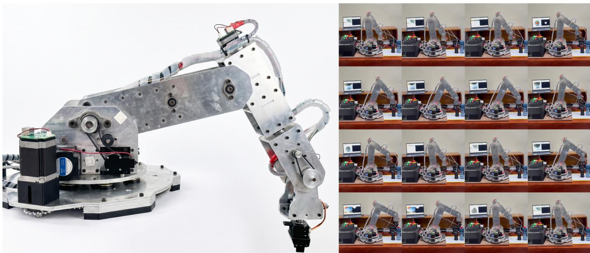  
Fig. 1: The NeuralNexus Arm. Left: the assembled 6-DOF manipulator, showing the base rotation stage, shoulder and elbow driveline, and wrist assembly. Right: selected frames from a pick-and-place sequence executed via the browser-native control interface, with real-time camera feedback (laptop display) and the emergency-stop/status panel visible alongside the controller.

Abstract—We present the NeuralNexus Arm, an open, lowcost 6-DOF robotic manipulator built by an undergraduate engineering team, together with the design decisions and debugging experience needed to reproduce it. The arm is driven by a single STM32H743 microcontroller on a custom printed circuit board (PCB) and combines two stepperdriver strategies on one controller: push–pull 3.3 V step/direction outputs for onboard TMC2209 drivers on the three wrist joints, and open-drain outputs for external CL57T and DM542 drivers on the three high-torque proximal joints. We describe the mechanical design, mixed-driver electronics, interruptdriven firmware, a MATLAB/Simscape-based inverse-kinematics pipeline, a browser-native control interface using the Web Serial API, and a lightweight vision pipeline for object localisation

and autonomous pick-and-place tasks. We also document nonobvious hardware and firmware failure modes encountered during the transition from a development board to the custom PCB as reproducibility guidance. All design files and firmware are released openly. The platform actuates all six axes under coordinated control at a 2 kHz update rate and executes both manual and pre-recorded motions from the browser interface.

Index Terms—robotic arm, 6-DOF manipulator, open hardware, stepper motor drivers, STM32, embedded firmware, Web Serial, inverse kinematics

## I. INTRODUCTION

Low-cost 6-DOF robotic arms generally fall into two categories: hobby-grade manipulators built from RC servos, which are inexpensive but limited in torque, repeatability, and payload; and industrial or research-grade arms, which are accurate but costly and difficult to reproduce or modify. There is comparatively little openly documented middle ground: a stepper-driven arm that a small team can build, debug, and control without proprietary tooling.

This paper describes such a platform. The NeuralNexus Arm uses stepper actuators across all six joints and a single STM32H743 controller, and it deliberately mixes two driver technologies on the same board to match each joint’s torque requirement. Rather than presenting only the finished device, we also document the engineering path—including a development-board-to-custom-PCB migration and the cascade of hardware and firmware issues it exposed—so that the design is genuinely reproducible.

## Contributions. This work contributes:

• An open, low-cost 6-DOF manipulator design with a full description of the mechanics, electronics, and firmware.

• A mixed stepper-driver architecture in which onboard TMC2209 drivers (push–pull, 3.3 V logic) and external closed-loop drivers (open-drain, common-anode wiring) coexist on one microcontroller, with a discussion of the polarity and logic subtleties this creates.

• A browser-native control interface using the Web Serial API, removing any host-side software dependency for jogging and pre-recorded motion.

• A documented set of reproducibility lessons—failure modes and their root causes—from the custom-PCB bring-up.

## II. RELATED WORK

Open-source robotic manipulators have made robotics research and education more accessible by providing affordable platforms with publicly available mechanical designs, electronics, and software. Notable examples include HELENE, a 6-DOF robotic arm featuring closed-loop stepper motors and ROS integration for research and educational use [1], and iArm, a low-cost 6-DOF educational manipulator built on an open ROS-based software framework [2]. Other educational platforms, such as EduSCARA [3] and the PlatROB modular mobile robotics platform [4], emphasize modular hardware, custom embedded controllers, and low-cost construction. Table I compares these platforms with the NeuralNexus Arm.

In contrast, the proposed NeuralNexus Arm focuses on controller-level design and reproducibility rather than mechanical novelty. The system combines a mixed stepperdriver architecture with a custom STM32H743-based controller, browser-native control through the Web Serial API, and comprehensive documentation covering PCB design, firmware, system integration, and bring-up procedures to facilitate straightforward replication by researchers and student engineering teams.

## III. MECHANICAL DESIGN

The NeuralNexus Arm (Fig. 2) is a 6-DOF serial robotic manipulator designed with a hierarchical actuation architecture to satisfy the varying torque and speed requirements of each joint [5], [6]. High-torque proximal joints employ NEMA 23 and NEMA 24 stepper motors combined with planetary gearboxes and timing-belt reductions, while the distal wrist joints utilize compact NEMA 17 stepper motors to reduce the moving inertia of the manipulator [1], [7], [8]. This approach improves dynamic performance without compromising the payload capacity of the arm [8].

Power transmission is primarily achieved using HTD3M timing belts with a belt width of 15 mm for the high-load joints, providing reliable torque transmission with minimal slip and backlash [9], [10]. The wrist joints employ lighter GT2 timing belts where lower transmitted torque and compact dimensions are advantageous [9]. The complete actuation system for each joint is described in the following subsections.

## A. Base Rotation (J1)

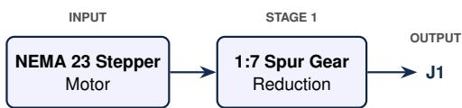

The base joint supports the entire manipulator and provides rotation about the vertical axis. To generate the high output torque required for this motion, a NEMA 23 stepper motor is coupled to the base through a 1:7 spur gear reduction. The large reduction ratio increases the available output torque while improving angular positioning resolution and reducing the torque demand on the motor [6], [10].

## B. Shoulder Joint (J2)

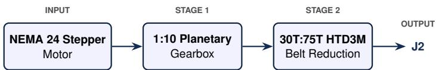

The shoulder joint carries a significant portion of the manipulator mass and is therefore designed for high torque [1], [11]. The joint is actuated using a NEMA 24 stepper motor coupled to a 1:10 planetary gearbox [12], [13]. The gearbox output is further transmitted through an HTD3M synchronous timing-belt drive using a 30-tooth driving pulley and a 75- tooth driven pulley, providing an additional 1:2.5 reduction [9], [10]. The HTD3M 15 mm timing belt was selected for its high torque capacity and reliable power transmission [9].

## C. Elbow Joint (J3)

The elbow joint extends the manipulator workspace while supporting the distal links and payload [6], [11]. The actuation system consists of a NEMA 24 stepper motor connected to a 1:10 planetary gearbox [12], [13]. Motion is transferred through two intermediate HTD3M timing-belt stages with identical 30-tooth pulleys, followed by a final HTD3M timingbelt reduction using a 30-tooth driving pulley and a 75-tooth driven pulley [9]. The intermediate belt stages relocate the motor to a mechanically convenient position while the final stage provides the required torque multiplication [9], [10].

TABLE I: Comparison of NeuralNexus with representative open-source robotic manipulators.
<table><tr><td>Robot</td><td>Cost ($)</td><td>DOF</td><td>Controller</td><td>Motor</td><td>Key Difference from NeuralNexus</td></tr><tr><td>HELENE</td><td>&lt; 1160</td><td>6</td><td>ESP32 + ROS Host</td><td>Stepper</td><td>Single closed-loop stepper driver family throughout (no mixed architecture); ROS-based control, not browser- native; the only competitor with a published ISO 9283 repeatability validation.</td></tr><tr><td>iArm</td><td>≈ 250</td><td>6</td><td>Raspberry Pi 4 + ROS</td><td>Serial Bus Servo</td><td>Servo-actuated, not stepper-driven; far lower torque/- payload class; ROS-based host software rather than a zero-install browser interface.</td></tr><tr><td>EduSCARA</td><td>≈ 150</td><td>4</td><td>STM32 Nucleo + Python API</td><td>Hobby Servo</td><td>Only 4-DOF SCARA kinematics (RRPR), not a full 6-DOF articulated arm; potentiometer feedback rather than closed-loop stepper/encoder joints.</td></tr><tr><td>AR4 (MK3/MK4)</td><td>≈ 2000</td><td>6</td><td>Teensy 4.1 + Arduino Nano/Mega</td><td>Open-Loop Stepper</td><td>Uses one driver family only (DM542T/DM320T, same open-loop class at different current ratings) – not a mixed architecture; encoders exist but closed-loop cor- rection is not implemented in firmware; Arduino/ROS control, no browser-native UI; non-commercial license</td></tr><tr><td>PAROL6</td><td>≥350</td><td>6</td><td>Custom STM32 Board + Python Commander GUI</td><td>Stepper (Closed- Loop Upgradable)</td><td>restricts redistribution/resale. Single driver family on its custom board (closed-loop is an optional FOC-driver upgrade, not a factory heteroge- neous design); control is via a desktop Python app, not a browser; closest analog to our custom-PCB approach</td></tr><tr><td>Forte</td><td>&lt; 215</td><td>6</td><td>Off-the-Shelf Drivers, No Custom Board</td><td>Stepper (Capstan/- Belt Drive)</td><td>but without driver-family mixing. No custom controller PCB at all – uses off-the-shelf drivers with a host PC; achieves low cost via a capstan- cable/belt drivetrain rather than gearbox+belt reduc-</td></tr><tr><td>NeuralNexus</td><td>≈ 1512</td><td>6</td><td>STM32H743 + Web Serial UI</td><td>Closed-Loop Step- per</td><td>tions; open-source release status unconfirmed.</td></tr></table>

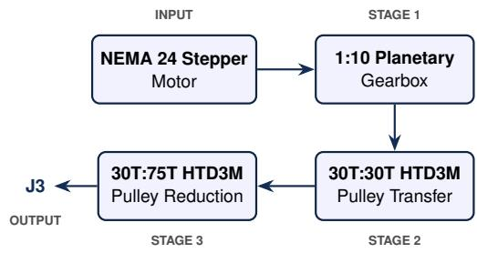

## D. Wrist Pitch (J4)

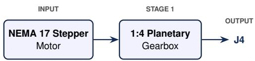

The first wrist joint is actuated using a compact NEMA 17 stepper motor combined with a 1:4 planetary gearbox [12], [13]. The integrated gearbox provides sufficient output torque while maintaining a compact mechanical design suitable for the wrist assembly [12], [13].

## E. Wrist Roll (J5)

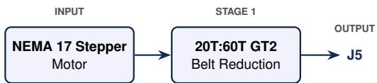

The wrist roll joint is driven by a NEMA 17 stepper motor through a GT2 timing belt transmission using a 20-tooth driving pulley and a 60-tooth driven pulley, providing a 1:3 reduction ratio [9], [10]. A 6 mm wide GT2 timing belt was selected to achieve compact packaging while providing adequate torque transmission for the lightweight wrist mechanism [8], [9].

## F. Gripper Rotation (J6)

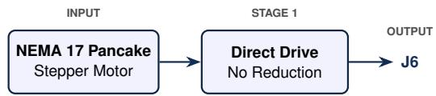

The rotational motion of the end effector is provided by a pancake NEMA 17 stepper motor mounted directly within the wrist assembly. The compact axial length of the pancake motor minimizes the overall size and inertia of the wrist while providing sufficient torque for orienting the gripper [7], [8].

## G. Gripper

Object grasping is achieved using a parallel-jaw gripper actuated by a digital servo motor. The servo provides closed loop position control, enabling precise opening and closing of the gripper while simplifying the mechanical design [6]. Separating the gripping mechanism from the rotational wrist joint allows independent control of end-effector orientation and grasping force.

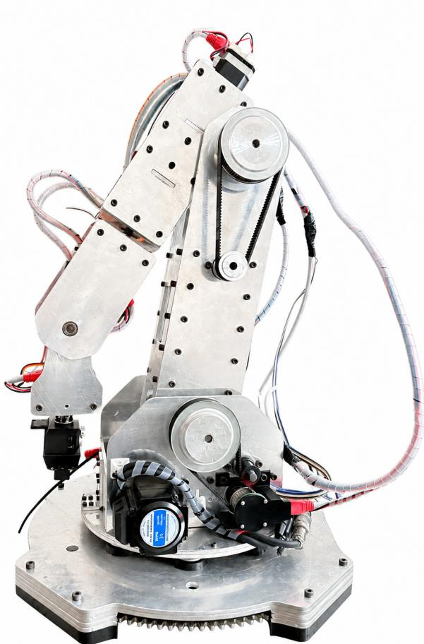  
Fig. 2: The assembled NeuralNexus Arm.

## IV. ELECTRONICS, CONTROLLER & FIRMWARE ARCHITECTURE

The controller is a custom PCB (Fig. 3) built around the STM32H743VIT6, a 480 MHz Arm Cortex-M7 microcontroller [14], [15]. A single microcontroller generates the step and direction signals for all six joints, reads the joint encoders, and communicates with the host over serial. The onboard wrist-motor drivers, the interface to the external proximaljoint drivers, the power conditioning, and the motor and signal connectors are integrated on one board. The central design decision is that the six joints are not driven uniformly: the torque demands of the proximal and wrist joints differ by roughly an order of magnitude, so two different driver technologies are combined on the same controller.

## A. Actuator and Driver Selection

The three proximal joints support the mass of the entire arm and its payload and therefore use high-torque motors with external closed-loop drivers: a DM542 driving a NEMA-23 motor at the base (J1), and CL57T closed-loop drivers on the NEMA-24 shoulder and elbow motors (J2, J3) [16], [17]. Closed-loop drive was chosen for these axes because a step lost under gravitational load is both likely and consequential; the driver’s internal encoder loop corrects for it and reports stall [17], [18]. The three wrist joints (J4–J6) carry much lighter loads and use NEMA-17 motors driven by onboard TMC2209 drivers, which are compact, quiet, and adequate for the wrist [19]. Table II summarises the mapping.

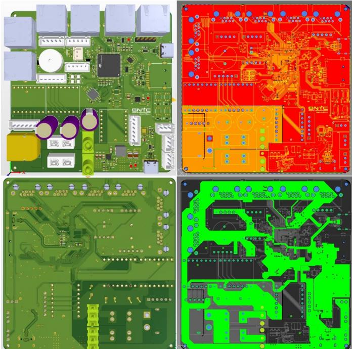  
Fig. 3: Custom STM32H743 controller PCB, showing the onboard TMC2209 drivers for the wrist joints and the terminals to the external closed-loop drivers.

TABLE II: Per-joint actuator and driver mapping.
<table><tr><td>Joint</td><td>Motor class</td><td>Driver</td><td>GPIO mode</td></tr><tr><td>J1 (base)</td><td>NEMA 23</td><td>DM542</td><td>Open-drain</td></tr><tr><td>J2 (shoulder)</td><td>NEMA 24</td><td>CL57T</td><td>Open-drain</td></tr><tr><td>J3 (elbow)</td><td>NEMA 24</td><td>CL57T</td><td>Open-drain</td></tr><tr><td>J4 (wrist 1)</td><td>NEMA 17</td><td>TMC2209 (onboard)</td><td>Push-pull</td></tr><tr><td>J5 (wrist 2)</td><td>NEMA 17</td><td>TMC2209 (onboard)</td><td>Push-pull</td></tr><tr><td>J6 (wrist 3)</td><td>NEMA 17</td><td>TMC2209 (onboard)</td><td>Push-pull</td></tr></table>

## B. Mixed Driver Interfacing

The two driver families present different electrical interfaces to the microcontroller, and the PCB accommodates both.

The onboard TMC2209 drivers accept 3.3 V logic-level STEP and DIR inputs, so the corresponding STM32 pins are configured as ordinary push–pull outputs and routed directly to the drivers [15], [19].

The external CL57T and DM542 drivers instead expose optically isolated inputs (STEP+/-, DIR+/-, EN+/-) intended for 5 V signalling [16], [17]. They are wired in a commonanode configuration: the + terminals are tied to a shared +5 V rail and the microcontroller sinks current through the - terminals [16], [17]. Because the STM32 cannot source 5 V, the pins driving these inputs are configured as opendrain outputs: each pin either sinks current—driving the input optocoupler from the 5 V rail—or floats, leaving it dark [15].

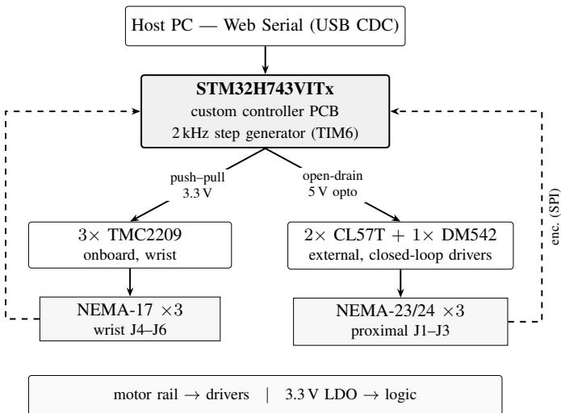  
Fig. 4: Controller architecture. A single STM32H743 drives two stepper-driver families over separate electrical interfaces: push–pull 3.3 V logic to the onboard TMC2209 wrist drivers, and open-drain, common-anode 5 V signalling to the optoisolated external closed-loop drivers on the proximal joints. Per-joint AS5047P magnetic encoders return over SPI [15]– [17], [19], [20].

This allows a 3.3 V microcontroller to drive nominally 5 V opto-isolated inputs without external level shifters.

## C. Enable-Signal Polarity

Enable polarity is not uniform across the arm, and the firmware handles the two driver families with separate routines (Stepper\_SetEnableM1M2M3 and Stepper\_SetEnableM4M5M6). Note that the firmware motor-channel indices M1–M6 do not follow joint order; they are mapped to joints J1–J6 through the jointToMotor table, so the onboard channels M1–M3 correspond to the wrist joints J4–J6 and the external channels M4–M6 to the proximal joints J1–J3.

The onboard TMC2209 drivers (M1–M3) use a conventional active-low, push–pull enable: the GPIO is driven low to enable the driver and high to disable it [19]. The external drivers (M4– M6) use the open-drain, common-anode interface described above, and—critically—the two external models do not share the same enable convention. The CL57T closed-loop drivers (shoulder and elbow) are enabled by a low input, in which the microcontroller sinks current and illuminates the enable optocoupler [17]. The DM542 at the base is the opposite: it is enabled when the open-drain line is released high and the optocoupler is left dark [16]. This asymmetry follows from the differing ENA-input conventions of the two driver models rather than from the wiring itself, so the enable line for each external axis is verified individually on hardware. Because the resulting polarity is neither uniform nor intuitive, it is documented explicitly in the firmware and must be preserved through any refactor.

## D. Microstepping and Step Timing

The overall controller architecture is shown in Fig. 4.

Microstep resolution and phase current are configured in hardware—the external CL57T and DM542 drivers through their DIP switches, and the onboard TMC2209 drivers through their configuration (MS1/MS2) pins—and are not changed at run time [16], [17], [19]. Instead the firmware stores, per joint, the number of step pulses corresponding to one full joint revolution, which combines the driver’s microstep resolution with the joint’s gear reduction [21]. The wrist joint (J6) is driven directly, so its pulses per revolution equal the microstep setting times the motor’s 200 full steps per revolution; all other joints (J1–J5) additionally include their gear ratio [21]. The currently configured values (pulses per joint revolution, J1–J6) are 2800, 5000, 5000, 6400, 1600, and 1600. These are being calibrated per joint with a dedicated routine that commands a known angle and compares it against the absolute encoder: J6 was found to require 3200 pulses per revolution rather than the initially assumed 1600.

Step pulses are produced by a single timer interrupt (TIM6) running at 2 kHz, i.e. a 500 µs control tick, consistent with the firmware timebase $( d t = 0 . 5 \mathrm { m s } )$ [15]. Each STEP line is raised on the tick at which a step falls due and cleared at the start of the following tick, so every pulse is held high for one full tick $( \approx 5 0 0 \mu \mathrm { s } )$ . This is far wider than the minimum STEP pulse-width required by any of the drivers—in particular the opto-isolated CL57T and DM542 inputs, whose optocouplers need a much wider pulse than the TMC2209—so a single generator drives both driver families without a separate fast path [16], [17], [19]. The STEP lines of the external axes are open-drain and pulled up through the common-anode 5 V rail; the $5 0 0 \mu \mathrm { s }$ high time comfortably accommodates their slower rise. The DIR line for each axis is set at the start of a move and held constant for its duration, so direction setup time is never a limiting factor [16], [17], [19]. Per-axis step rate is governed by a trapezoidal velocity ramp through a step interval of ⌊2000/speed⌋ ticks, with joint speeds currently capped at 400 steps/s [18].

## E. TMC2209 Configuration

The onboard TMC2209 drivers default to StealthChop, which is quiet at low speed but sheds torque as the step rate rises [19]. To retain torque during motion the SPREAD pin is tied to VIO, selecting SpreadCycle [19]. The drivers are used in standalone (pin-configured) step/direction mode, and each driver’s phase-current limit is set through its VREF pin together with the on-board 0.11 Ω sense resistors [19]. The wrist uses NEMA-17 motors of two ratings—standard units at 1.5 A per phase and a lower-profile pancake unit at 0.8 A per phase—so VREF is set per driver to match each motor: at its 3.3 V full-scale maximum for the 1.5 A axes, and at a correspondingly lower value for the 0.8 A pancake axis, since VREF scales the RMS phase current approximately linearly [19].

## F. Power Architecture

The board separates the motor-supply rail from the logic supply, listed by motor class in Table III. The stepper motors and their drivers are fed from the main motor rail, while

TABLE III: Motor-supply rails by motor class.
<table><tr><td>Motor class</td><td>Joint(s)</td><td>Supply voltage</td></tr><tr><td>NEMA 17</td><td>J4–J6 (wrist)</td><td>12V</td></tr><tr><td>NEMA 23</td><td>J1 (base)</td><td>24 V</td></tr><tr><td>NEMA 24</td><td>J2, J3 (shoulder, elbow)</td><td>48 V</td></tr><tr><td>5 V (opto)</td><td>J1–J3 driver inputs</td><td>5 V (buck from 12 V)</td></tr><tr><td>Logic (MCU)</td><td></td><td>3.3 V (LDO)</td></tr></table>

the microcontroller and logic circuitry are powered at 3.3 V by an on-board ST1L05CPU33R low-dropout regulator [22]. The opto-isolated +5 V rail used by the external CL57T and DM542 driver inputs (Section IV-B) is generated from the 12 V wrist rail by a TPS56637RPAR synchronous buck converter [23], rather than a dedicated supply. Motor and logic grounds are joined at a single point to limit switching noise on the logic rail [24]. During bring-up, the custom PCB also required three GPIO reassignments to route around damaged pins (PE0→PE7, PD7→PD11 via a bodge wire on the M3\_MS1 pad, and PD3→PD12); these, and an observed regulator failure, are discussed as reproducibility guidance in the lessons-learned section, where we recommend verifying the actual regulator input voltage before power-up.

## V. KINEMATICS AND MOTION PLANNING

## A. Kinematic Model

The kinematic model of the NeuralNexus Arm was developed using the MATLAB Robotics System Toolbox by representing the manipulator as a rigidBodyTree [25]. The model consists of six rigid bodies connected by six revolute joints (J1–J6), with the geometric relationship between consecutive links defined by fixed homogeneous transformations extracted from the validated Simscape Multibody model. This representation provides a consistent numerical model for forward kinematics, inverse kinematics, and trajectory generation while maintaining agreement with the mechanical design.

Unlike conventional Denavit–Hartenberg (DH) modelling, where coordinate frames must be manually assigned, the rigidBodyTree directly stores the rigid transformations between adjacent joint frames. Consequently, the imported model preserves the original CAD-based geometry without requiring an intermediate DH parameterisation.

The homogeneous transformation between two consecutive joint frames is represented as

$$
\mathbf { \Sigma } ^ { i - 1 } \mathbf { T } _ { i } = \left[ \mathbf { R } _ { i } \quad \mathbf { p } _ { i } \right] ,\tag{1}
$$

where $\mathbf { R } _ { i } \in \ S O ( 3 )$ [26] denotes the rotation matrix and $\mathbf { p } _ { i } \in \mathbb { R } ^ { 3 }$ denotes the translation vector between the parent and child joint frames.

TABLE IV: Joint frame transformations extracted from the MATLAB rigidBodyTree model.
<table><tr><td>Joint</td><td>Translation (m)</td><td>Joint Axis</td><td>Type</td></tr><tr><td>J1</td><td>(0, 0.017, 0)</td><td>(0,0,−1)</td><td>Revolute</td></tr><tr><td>J2</td><td>(0, −0.075, −0.138)</td><td>(0, 0, 1)</td><td>Revolute</td></tr><tr><td>J3</td><td>(0.310, 0, −0.024)</td><td>(0, 0, 1)</td><td>Revolute</td></tr><tr><td>J4</td><td>(−0.060, 0.160, −0.051)</td><td>(0,0,1)</td><td>Revolute</td></tr><tr><td>J5</td><td> $( 0 . 0 4 1 , \ 0 , \ - 0 . 1 0 6 5 )$ </td><td>(0,0,1)</td><td>Revolute</td></tr><tr><td>J6</td><td> $\left( 0 , \ 0 . 1 1 0 , \ - 0 . 0 4 1 \right)$ </td><td>(0, 0, 1)</td><td>Revolute</td></tr></table>

The forward kinematics of the manipulator is obtained by the ordered product of the individual link transformations [27], [28],

$$
{ } ^ { 0 } \mathbf { T } _ { 6 } = \prod _ { i = 1 } ^ { 6 } { } ^ { i - 1 } \mathbf { T } _ { i } ,\tag{2}
$$

which provides the end-effector pose relative to the base coordinate frame.

Table IV summarises the fixed translations and joint axes exported directly from the MATLAB rigidBodyTree model. These transformations completely define the kinematic chain used by the numerical inverse kinematics solver.

Mechanical joint limits were incorporated into the rigidBodyTree model according to the allowable motion of each joint. These limits constrain the inverse kinematics optimisation to produce only physically achievable configurations.

## B. Inverse Kinematics

Desired end-effector poses are converted into joint angles using the MATLAB Robotics System Toolbox inverseKinematics solver [25], [26]. Rather than deriving a closed-form analytical solution, the solver employs a numerical optimisation procedure that minimises the Cartesian pose error between the desired and computed end-effector configurations [29].

The optimisation is initialised using the current joint configuration, allowing rapid convergence while maintaining configuration continuity between successive target poses. Equal weighting was assigned to the translational and rotational components of the pose error using the weighting vector

$$
\mathbf { w } = [ 1 1 1 1 1 1 1 ] ,
$$

thereby giving equal importance to position and orientation during the optimisation process.

Joint limits defined within the rigidBodyTree are enforced throughout the optimization, preventing solutions outside the mechanical operating range of the manipulator [28].

During system validation and software testing, the reference joint configuration

$$
\theta = [ 0 , - 5 , 1 2 0 , 0 , 1 6 0 , 0 ] ^ { \circ }
$$

was used as a nominal pose for verifying the forward and inverse kinematic models.

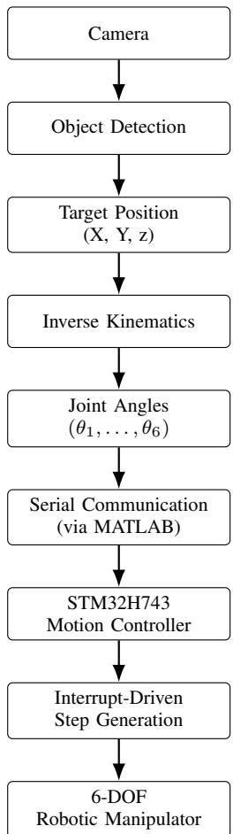  
Fig. 5: Kinematic modelling and motion execution workflow. The manipulator is modelled using a MATLAB rigidBodyTree, inverse kinematics generates the required joint angles, and the computed commands are transmitted to the STM32H743 controller for synchronized stepper motor actuation.

## C. Motion Execution

The complete modelling and motion-execution workflow is summarised in Fig. 5. The joint angles computed by the inverse kinematics solver are transmitted from MATLAB to the STM32H743-based controller via a serial communication interface. The embedded firmware converts the received joint positions into synchronised step commands for the six stepper motors using the interrupt-driven pulse generation algorithm described in Section IV.

To maintain continuous and smooth motion, long trajectories are divided into a sequence of smaller motion segments before transmission [27]. This chunked-motion strategy prevents pauses caused by communication latency between the host computer and the embedded controller while ensuring coordinated motion of all six joints throughout the trajectory.

## VI. CONTROL INTERFACE

The arm is controlled from a browser using the Web Serial API: any Chromium-based browser connects directly to the controller’s serial port, with no vendor IDE or native driver required on the host. The panel (Fig. 6) provides per-joint sliders for manual jogging, a set of pre-recorded motion sequences, and gripper commands (G,1 to open; G,0 to close), together with a Stop control. Cartesian moves currently follow a separate path: joint angles are computed by the MATLAB solver of Section V-B and streamed to the controller over the same serial link. Porting the solver into the browser is left for future work.

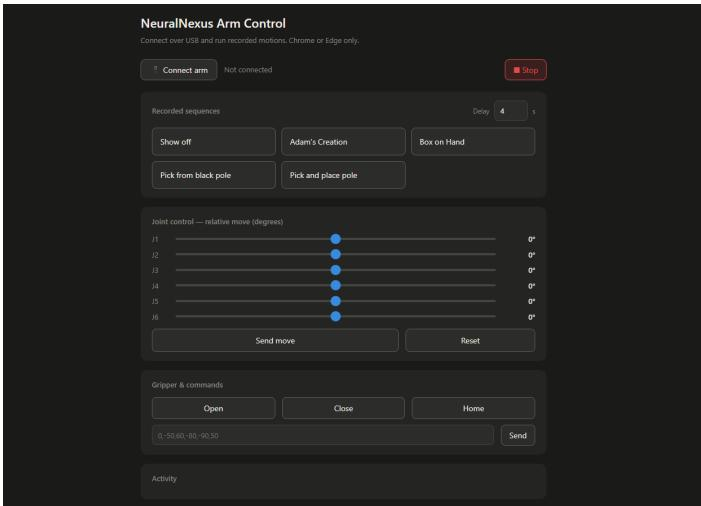  
Fig. 6: Browser-native control panel (Web Serial API).

## VII. VISION PIPELINE

We are using a Raspberry Pi 5, 4 GB RAM device with a Pi Camera 3 for the vision-related implementation. The camera detects the targeted object and converts it into a bounding box, and the centre pixel is transformed into real-world coordinates. These coordinates are then used in inverse kinematics to move the arm to the relevant position.

One of the main design compromises we made is that we used a Pi Camera 3 module instead of a depth camera. The Pi Camera 3 module can only detect the x and y coordinates in a given frame. Therefore, our main idea was to have a fixed robotic arm position with a known height (in our case, z = 41 cm). The arm always comes to the fixed position, takes the pixel value, transforms it into x and y coordinates, and the z coordinate is already known. Therefore, all x, y, and z coordinates are known, and these coordinates are sent to the inverse kinematics section.

Target points are considered valid only when they lie within the calibrated workspace plane [30], [31].

The complete vision pipeline includes image capturing, camera calibration and image undistortion, colour-based object segmentation, image-centre estimation, planar coordinate transformation, and the generation of robot target coordinates.

$$
\begin{array} { r l } & { \mathrm { C a m e r a ~ I m a g e }  \mathrm { U n d i s t o r t i o n }  \mathrm { H S V ~ S e g m e n t a t i o n } } \\ & { ~  \mathrm { O b j e c t ~ C e n t r o i d }  \mathrm { H o m o g r a p h y } } \\ & { ~  ( X , Y , Z )  \mathrm { I n v e r s e ~ K i n e m a t i c s } . } \end{array}\tag{3}
$$

## A. Camera Calibration and Image Undistortion

Geometric camera calibration was performed before object localisation in order to determine the camera intrinsic parameters and compensate for lens distortion. Planar chessboard patterns are widely used for this purpose since known points on the calibration target can be associated with their observed image coordinates [32], [33].

We are using a chessboard with 32 mm squares for the calibration. In our case, 20 different chessboard images were used to estimate the intrinsic camera matrix and lens-distortion parameters. By facing the chessboard at different angles and different distances from the camera, these parameters were estimated; Fig. 7 shows the detected corner pattern in nine of the twenty calibration images. One important point is not to move the Pi Camera during the calibration. The only movable object should be the printed chessboard, and we need to make sure that the printed chessboard is completely flat without any curves.

The intrinsic camera matrix is represented as

$$
\mathbf { K } = { \left[ \begin{array} { l l l } { f _ { x } } & { 0 } & { c _ { x } } \\ { 0 } & { f _ { y } } & { c _ { y } } \\ { 0 } & { 0 } & { 1 } \end{array} \right] } ~ ,\tag{4}
$$

where $f _ { x }$ and $f _ { y }$ denote the focal lengths expressed in pixels, and $\left( c _ { x } , c _ { y } \right)$ denotes the principal point [30].

The calibration procedure produced the following intrinsic camera matrix:

$$
\mathbf { K } = \left[ \begin{array} { c c c } { 9 1 7 . 9 3 3 5 } & { 0 } & { 3 2 9 . 7 3 4 4 } \\ { 0 } & { 9 1 7 . 0 0 9 4 } & { 2 4 1 . 1 5 5 3 } \\ { 0 } & { 0 } & { 1 } \end{array} \right] .\tag{5}
$$

Thus,

$$
f _ { x } = 9 1 7 . 9 3 3 5 , \qquad f _ { y } = 9 1 7 . 0 0 9 4 ,\tag{6}
$$

and

$$
( c _ { x } , c _ { y } ) = ( 3 2 9 . 7 3 4 4 , 2 4 1 . 1 5 5 3 ) .\tag{7}
$$

In addition to intrinsic calibration, lens distortion was estimated. The standard OpenCV distortion model includes three radial coefficients and two tangential coefficients [33]:

$$
\mathbf { D } = \left[ k _ { 1 } \quad k _ { 2 } \quad p _ { 1 } \quad p _ { 2 } \quad k _ { 3 } \right] .\tag{8}
$$

The experimentally obtained distortion parameters were

$$
\mathbf { D } = \left[ 0 . 0 3 3 5 5 - 0 . 6 5 9 3 9 - 0 . 0 0 4 3 4 0 . 0 0 5 0 2 4 . 4 . 4 0 9 0 2 \right]\tag{9}
$$

Here, $k _ { 1 } , k _ { 2 } .$ , and $k _ { 3 }$ correspond to radial distortion, while $p _ { 1 }$ and $p _ { 2 }$ correspond to tangential distortion. Radial distortion primarily causes displacement that increases with distance from the optical centre, whereas tangential distortion is associated with imperfect alignment of the lens and imaging plane [33].

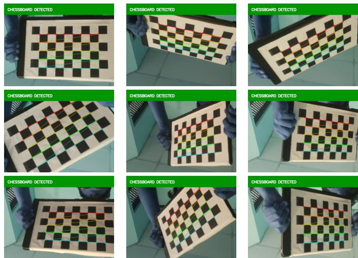  
Fig. 7: Detected 8 × 5 inner-corner patterns from nine calibration images captured at different positions and orientations.

The estimated matrices were stored as camera\_matrix.npy and dist\_coeffs.npy. During operation, each captured frame was undistorted using these calibration parameters before object localisation.

## B. Colour-Based Target Segmentation

Initial object-detection experiments considered a YOLObased detector. For the initial object-detection testing cases, we used yolo26n.pt, yolo11n.pt, and custom-trained YOLO detection models that primarily detect cardboard boxes.

However, in the final stages, a colour-based segmentation method was selected because it has a higher FPS than the YOLO models, as it does not require processing through a heavy YOLO model. In addition, using this method makes object detection highly usable, as it can detect any object of any shape in the given colour. Therefore, there is no need to train the model separately for each object.

In the pipeline, we first converted the BGR representation used by OpenCV into the HSV colour space. HSV is useful for colour-based segmentation because the hue component provides a direct representation of colour type, while saturation and value describe colour purity and brightness, respectively [34].

The red target is extracted by applying HSV range thresholding. Because red appears around the boundary of the cyclic hue coordinate, two hue intervals can be combined to form the final red-object mask.

HSV colour is represented using H (hue), S (saturation), and V (brightness). In OpenCV, the hue range is defined cyclically from 0 to 179. Therefore, the hue value for red is between

$$
0 \leq H \leq 1 0 \qquad \mathrm { a n d } \qquad 1 7 0 \leq H \leq 1 7 9 .
$$

Therefore, for the final red mask, we need to combine these two ranges.

$$
M _ { \mathrm { r e d } } = M _ { 1 } \vee M _ { 2 } ,\tag{10}
$$

where $M _ { 1 }$ and $M _ { 2 }$ denote the binary masks obtained from the two selected red HSV ranges. OpenCV’s rangethresholding operation provides a direct implementation of this type of HSV segmentation [34].

## C. Contour Detection and Centroid Estimation

Fig. 8 shows representative targets at each stage of this process. Contours are extracted from the segmented binary image to identify connected regions corresponding to candidate objects. Small contours caused by image noise or unwanted red regions are rejected based on their area.

Let the detected contours be

$$
{ \mathcal { C } } = \{ C _ { 1 } , C _ { 2 } , \ldots , C _ { N } \} .\tag{11}
$$

The contour area is calculated for each region, and the valid target contour can be selected according to the expected target size.

The centre of the selected target is determined using spatial image moments. Image moments provide quantities including region area and centroid [35]. For a binary region, the spatial moments may be written as

$$
M _ { p q } = \sum _ { u } \sum _ { v } u ^ { p } v ^ { q } I ( u , v ) .\tag{12}
$$

The centroid coordinates are then obtained from

$$
u _ { c } = \frac { M _ { 1 0 } } { M _ { 0 0 } } ,\tag{13}
$$

$$
v _ { c } = \frac { M _ { 0 1 } } { M _ { 0 0 } } .\tag{14}
$$

Therefore, the detected object location in the image plane is

$$
\mathrm { p } _ { \mathrm { i m a g e } } = \left[ { \boldsymbol { u } } _ { c } \right] .\tag{15}
$$

These coordinates are expressed in pixels and therefore require transformation into the physical coordinate system of the robotic workspace.

## D. Planar Workspace Calibration

We use a planar homography to map the pixel values to real-world $( x , y )$ coordinates. Homography calibration uses a $3 \times 3$ matrix to perform the projective transformation between the two planes [30], [31].

During workspace calibration, we select known physical locations. The known physical coordinate

$$
{ \bf P } _ { i } = ( X _ { i } , Y _ { i } )\tag{16}
$$

is associated with the corresponding image coordinate

$$
\mathbf { p } _ { i } = ( u _ { i } , v _ { i } ) .\tag{17}
$$

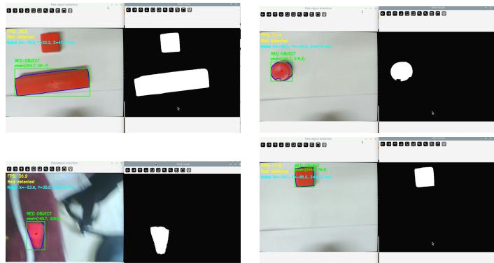  
Fig. 8: Detected object-processing stages used for target localisation.

Using these point correspondences, the homography matrix

$$
\mathbf { H } = { \left[ \begin{array} { l l l } { h _ { 1 1 } } & { h _ { 1 2 } } & { h _ { 1 3 } } \\ { h _ { 2 1 } } & { h _ { 2 2 } } & { h _ { 2 3 } } \\ { h _ { 3 1 } } & { h _ { 3 2 } } & { h _ { 3 3 } } \end{array} \right] }\tag{18}
$$

was estimated, as illustrated in Fig. 9. For planar scenes, image-to-plane mappings of this form can be estimated directly from corresponding points [31].

For the target centroid $( u _ { c } , v _ { c } )$

$$
\left[ \begin{array} { l } { X ^ { \prime } } \\ { Y ^ { \prime } } \\ { W ^ { \prime } } \end{array} \right] = \mathbf { H } \left[ \begin{array} { l } { u _ { c } } \\ { v _ { c } } \\ { 1 } \end{array} \right] .\tag{19}
$$

The corresponding physical coordinates are obtained through homogeneous normalisation,

$$
X = \frac { X ^ { \prime } } { W ^ { \prime } } , \qquad Y = \frac { Y ^ { \prime } } { W ^ { \prime } } .\tag{20}
$$

The calibrated transformation matrix was stored as homography\_matrix.npy and reused during real-time operation. Because both the camera and workspace remain fixed, the same transformation remains applicable provided that their relative geometry does not change.

## E. Generation of Robot Target Coordinates

The homography transformation provides the planar location

$$
\mathbf { p } _ { x y } = { \binom { X } { Y } } .\tag{21}
$$

Since the target object is placed on the known workspace plane, its vertical coordinate is defined from the corresponding workspace height,

$$
Z = Z _ { \mathrm { t a b l e } } .\tag{22}
$$

The final target coordinate supplied to the robot controller is therefore

$$
\mathrm { \bf p } _ { \mathrm { t a r g e t } } = \left[ \begin{array} { c } { { X } } \\ { { Y } } \\ { { Z _ { \mathrm { t a b l e } } } } \end{array} \right] .\tag{23}
$$

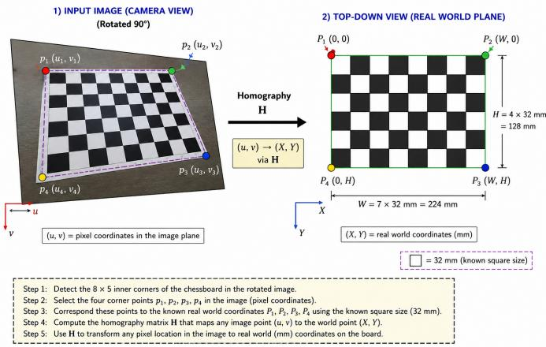  
Fig. 9: Visualisation of planar homography calibration using the 32 mm chessboard. The detected image-plane corner points are mapped to a top-down representation of the calibrated workspace.

TABLE V: Bill of materials summary by subsystem. Full itemised breakdown in Appendix A.
<table><tr><td>Subsystem</td><td>Cost ($)</td></tr><tr><td>Actuation — motors, drivers, gripper Control, PCB &amp; sensing electronics</td><td>$300.38 $252.36</td></tr><tr><td>Vision compute Mechanical parts (gears, pulleys, belts, bearings) Local hardware — misc. components, fasteners</td><td>$178.80 $296.82 $149.96</td></tr><tr><td>Enclosure / structural fabrication</td><td>$293.08</td></tr><tr><td>BOM subtotal (parts + fabrication) Import / PCB duties</td><td>$1471.42</td></tr><tr><td>Total</td><td>$40.92</td></tr></table>

The resulting Cartesian position is then provided to the inverse-kinematics algorithm of the 6-DOF robotic arm to determine the joint configuration necessary to approach the detected object.

Therefore, the complete transformation can be summarised as

$$
\boxed { ( u _ { c } , v _ { c } )  ( X , Y )  ( X , Y , Z _ { \mathrm { t a b l e } } )  \theta }\tag{24}
$$

where θ represents the set of robot joint variables.

## VIII. BILL OF MATERIALS

Table V summarises the cost of every component and fabrication service by subsystem; the full itemised breakdown appears in Appendix A. The total of \$1,512.33 supersedes the approximate figure given in Table I.

## IX. ENGINEERING METHODOLOGY AND LESSONS LEARNED

The platform began on a development board and was later ported to the custom PCB. That migration exposed a cascade of issues whose root causes are worth recording, since they are the kind of problem a reproducing team will also encounter.

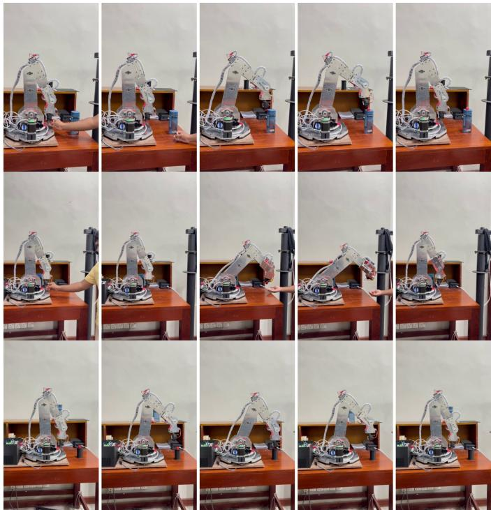  
Fig. 10: Selected frames from Video 2, showing a full pick-and-place sequence: https://youtube.com/shorts/ Vg3pZLFrEdM.

## A. Phantom Encoder Wander

A stationary joint appeared to report an encoder spread of roughly ±72◦. The cause was not signal integrity: error sentinel values of −1 were being included in a running average of encoder readings, producing an apparent wander. The decisive clue was that slowing the SPI clock made the effect worse rather than better, which ruled out analogue/timing causes and pointed at the data path. Excluding the sentinels from the average removed the artefact.

## B. CubeMX Regeneration Trap

Regenerating the project from CubeMX re-introduced MX\_SDMMC1\_SD\_Init() and MX\_FATFS\_Init(), both of which trap in Error\_Handler() when no SD card is present. The immediate workaround is to comment these out after each regeneration; the durable fix is to disable SDMMC1 and FATFS in the .ioc so they are not regenerated.

## X. RESULTS AND VALIDATION

The arm actuates on all six axes and executes both manual jog commands and the pre-recorded sequences from the browser interface. Motion timing is consistent with the steprate model above (approximately 4 s for a 60◦ move at 400 steps/s). Table VI summarises the measured performance of the platform. Selected frames are shown in Fig. 10; a full demonstration is provided in Video 2.1

1Video 2 (pick-and-place sequence): https://youtube.com/shorts/ Vg3pZLFrEdM

TABLE VI: Experimental Performance Summary
<table><tr><td>Metric</td><td>Value</td></tr><tr><td>Positioning repeatability</td><td>±1.3 mm</td></tr><tr><td>Pick-and-place cycle time</td><td>12.5 s</td></tr><tr><td>Task success rate</td><td>97%</td></tr><tr><td>Maximum payload</td><td>2000 g</td></tr><tr><td>Maximum joint speed</td><td>10°%s</td></tr></table>

## XI. FUTURE WORK

Future work will investigate the use of the NeuralNexus Arm as a reconfigurable platform for different robotic manufacturing and automation applications. Potential applications include robotic additive manufacturing and multi-axis 3D printing, where an extrusion-based end effector can be mounted to the wrist for freeform material deposition. The manipulator may also be adapted for robotic laser engraving and low-power laser cutting, where the six-degree-of-freedom architecture enables controlled tool orientation along complex paths.

Other possible applications include automated adhesive and sealant dispensing, component sorting, surface inspection, and laboratory automation. Interchangeable end effectors could further allow the same platform to support light-duty machining, polishing, painting, and similar robotic processautomation tasks.

## XII. CONCLUSION

The NeuralNexus Arm demonstrates that a capable, reproducible 6-DOF stepper arm can be built and controlled by a small team using a single microcontroller, a pragmatic mix of onboard and external drivers, and a browser-native control interface with no proprietary host software. By documenting not only the finished design but also the bring-up failures and their root causes, we aim to make the platform genuinely reproducible.

## AVAILABILITY

The complete design is released openly. The main repository, including CAD, PCB design files and documentation are available at https://github.com/ Lasan-Perera/6-dof-arm-neuralnexus/releases/tag/v1.0, and the firmware codebase at https://github.com/Lasan-Perera/ neuralnexusarm-codebase. Three supplementary videos are available: Video 1, an overview of the assembled arm (https: //youtube.com/shorts/Jsz-jFdT3wY); Video 2, a full pick-andplace sequence (https://youtube.com/shorts/Vg3pZLFrEdM, shown in Fig. 10); and Video 3, pick-and-place demonstration 2 (https://youtube.com/shorts/ZCEVujG9srs).

## ACKNOWLEDGMENT

The authors would like to thank the Department of Electronic and Telecommunication Engineering, University of Moratuwa, for providing the facilities and support required for this work. We also extend our gratitude to our advisors and colleagues for their valuable guidance, feedback, and assistance throughout the development of the NeuralNexus Arm.

APPENDIX DETAILED BILL OF MATERIALS

TABLE VII: Detailed bill of materials. Costs converted from LKR at 1 LKR = \$0.00298 (Aug. 2026).
<table><tr><td>Item</td><td>Qty Unit</td><td>($)</td><td>Total ($)</td><td>Supplier</td><td>Used in</td></tr><tr><td colspan="6">Actuation — motors, drivers, gripper</td></tr><tr><td>NEMA 23 stepper motor (Local)</td><td>1</td><td>$22.65</td><td>$22.65</td><td>Local Shop</td><td>J1 (base)</td></tr><tr><td>NEMA 17 stepper motor (Local)</td><td>3</td><td>$7.45</td><td>$22.35</td><td>AliExpress</td><td>Wrist joints</td></tr><tr><td>NEMA 24 stepper motors CL57T drivers+</td><td>2</td><td>$119.20</td><td>$238.40</td><td>Stepper Online</td><td>J2, J3</td></tr><tr><td>gearboxes + PSU (StepperOnline)</td><td></td><td></td><td></td><td></td><td></td></tr><tr><td>DM542 stepper driver (Leadshine, DM542) Gripper / end-effector hardware (3D</td><td>1</td><td>$9.83</td><td>$9.83 $7.15</td><td>Local Shop Local Shop</td><td>J1 Gripper</td></tr><tr><td>Printed)</td><td></td><td></td><td></td><td></td><td></td></tr><tr><td></td><td></td><td>Subtotal</td><td>$300.38</td><td></td><td></td></tr><tr><td colspan="6">Control, PCB &amp; sensing electronics</td></tr><tr><td>PCB components (bulk order)</td><td></td><td></td><td>$108.77</td><td>LCSC</td><td>Controller PCB</td></tr><tr><td>PCB fabrication (4-layer)</td><td>1</td><td>$85.90</td><td>$85.90</td><td>JLCPCB</td><td>Controller PCB</td></tr><tr><td>Encoder PCB fabrication</td><td></td><td></td><td>$21.34</td><td>JLC PCB</td><td>6x AS5047P encoder boards</td></tr><tr><td>USB extender cable</td><td>1</td><td>$2.38</td><td>$2.38</td><td>Local</td><td>Controller / host link</td></tr><tr><td>Network cable</td><td>1</td><td></td><td>$14.75</td><td>Local</td><td>Vision (Pi)</td></tr><tr><td>HDMI cable</td><td>1</td><td></td><td>$11.92</td><td>Local</td><td>Pi display</td></tr><tr><td>Camera cable</td><td>1</td><td></td><td>$7.30</td><td>Raspberry Pi</td><td>Vision (Pi Camera)</td></tr><tr><td></td><td></td><td>Subtotal</td><td>$252.36</td><td></td><td></td></tr><tr><td colspan="6">Vision compute</td></tr><tr><td>Raspberry Pi 5 (Raspberry Pi Foundation, 4 GB RAM)</td><td></td><td>$134.10</td><td>$134.10</td><td>Raspberry Pi</td><td>Vision pipeline</td></tr><tr><td>Pi Camera 3</td><td>1</td><td>$44.70</td><td>$44.70</td><td></td><td></td></tr><tr><td></td><td></td><td>Subtotal</td><td>$178.80</td><td>Raspberry Pi</td><td>Vision pipeline</td></tr><tr><td colspan="6"></td></tr><tr><td>Mechanical parts (gears, pulleys, belts, bearings) Gears / pulleys / belts (order 1)</td><td></td><td></td><td>$47.24</td><td>AliExpress</td><td>Drivetrain</td></tr><tr><td>Gears / pulleys / belts (order 2)</td><td></td><td></td><td>$77.73</td><td>AliExpress</td><td>Drivetrain</td></tr><tr><td>Gears / pulleys / belts (order 3)</td><td></td><td></td><td>$144.72</td><td></td><td></td></tr><tr><td>Bearings (reorder)</td><td></td><td></td><td>$11.28</td><td>AliExpress</td><td>Drivetrain</td></tr><tr><td>Bearings (reorder)</td><td></td><td></td><td>$15.85</td><td>AliExpress</td><td>Joints</td></tr><tr><td></td><td></td><td>Subtotal</td><td>$296.82</td><td>Local</td><td>Joints</td></tr><tr><td colspan="6">Local hardware — misc. components, fasteners</td></tr><tr><td>Misc components (power supply, fans, ca-</td><td></td><td></td><td>$63.98</td><td>Local</td><td>Electronic Box</td></tr><tr><td>bles) TMC2209 + other items</td><td></td><td></td><td>$21.16</td><td>BigTreeTech</td><td>NEMA 17</td></tr><tr><td>Metal rods (16mm, 8mm, 5mm)</td><td></td><td></td><td>$12.96</td><td>Local</td><td>Shafts</td></tr><tr><td>Electronic components</td><td></td><td></td><td>$16.33</td><td>Local</td><td>Various</td></tr><tr><td>Generic hardware</td><td></td><td></td><td>$3.61</td><td>Local</td><td>Various</td></tr><tr><td>Nails / fasteners</td><td></td><td></td><td>$1.19</td><td>Local</td><td>Enclosure</td></tr><tr><td>Bearings and screws</td><td></td><td></td><td>$30.74</td><td>Local</td><td>Various</td></tr><tr><td></td><td></td><td>Subtotal</td><td>$149.96</td><td></td><td></td></tr><tr><td colspan="6"></td></tr><tr><td>Enclosure / structural fabrication Plywood</td><td></td><td></td><td>$4.77</td><td>Local</td><td>Enclosure</td></tr><tr><td>Laser cutting (3 orders)</td><td></td><td></td><td>$123.37</td><td>Local</td><td>Frame / enclosure panels</td></tr><tr><td>Lathe and CNC Services</td><td></td><td></td><td>$10.10</td><td>Local</td><td>Frame</td></tr><tr><td>Metal Rod Cutting and CNC</td><td></td><td></td><td>$4.47</td><td>Local</td><td>Shafts</td></tr><tr><td>Frame hardware</td><td></td><td></td><td></td><td></td><td></td></tr><tr><td></td><td></td><td></td><td>$1.73</td><td>Local</td><td>Enclosure</td></tr><tr><td>3D printing (Distribution Box, Electronic Enclosure) (PLA &amp; ABS)</td><td></td><td></td><td>$59.24</td><td>Local</td><td>Custom mounts / brackets</td></tr><tr><td>Aluminium sheet, 4mm (6061)</td><td></td><td>$89.40</td><td>$89.40</td><td>Local</td><td>Links / frame</td></tr><tr><td></td><td></td><td>Subtotal</td><td>$293.08</td><td></td><td></td></tr><tr><td colspan="6">BOM subtotal (parts + fabrication)</td></tr><tr><td></td><td></td><td></td><td>$1471.42 $40.92</td><td></td><td></td></tr><tr><td colspan="2">Import / PCB duties</td><td></td><td></td><td></td><td></td></tr><tr><td colspan="2"></td><td>Total</td><td>$1512.33</td><td></td><td></td></tr></table>

## REFERENCES

[1] F. Herbst, S. Suppelt, N. Schäfer, R. Chadda, and M. Kupnik, “HELENE: Six-axis accessible open-source 3D-printed robotic arm for research and education,” Hardware, vol. 3, no. 3, p. 7, 2025.

[2] C. Zeng, H. Zhou, W. Ye, and X. Gu, “iArm: Design an educational robotic arm kit for inspiring students’ computational thinking,” Sensors, vol. 22, no. 8, p. 2957, 2022.

[3] A. Clark, U. Martinez-Hernandez, and T. Assaf, “EduSCARA: An open source RRPR educational SCARA platform,” HardwareX, vol. 26, p. e00761, 2026.

[4] J. Balbuena, J. Sinche, D. Quiroz, D. Arce, and E. Villota, “PlatROB: An open-source, modular, and low-cost hardware platform for mobile robotics and AI education,” HardwareX, vol. 25, p. e00747, 2026.

[5] D. R. Vyas, A. Markana, and N. Padhiyar, “Economic 6-DOF robotic manipulator hardware design for research and education,” Materials Today: Proceedings, vol. 62, pp. 7179–7184, 2022.

[6] V. Scheinman, J. M. McCarthy, and J.-B. Song, “Mechanism and actuation,” in Springer Handbook of Robotics, 2nd ed., B. Siciliano and O. Khatib, Eds. Cham, Switzerland: Springer, 2016, ch. 4, pp. 67–90.

[7] G. Chebly, S. Little, N. Perera, A. Abedeen, K. Suzuki, and D. Kim, “Strong, accurate, and low-cost robot manipulator,” in Proc. IEEE-RAS Int. Conf. Humanoid Robots (Humanoids), 2025, pp. 1225–1232.

[8] J. Kim, J. Kim, D. Lee, Y. Jang, and B. Kim, “A low-cost and lightweight 6 DoF bimanual arm for dynamic and contact-rich manipulation,” in Proc. Robotics: Science and Systems (RSS), Los Angeles, CA, USA, Jun. 2025.

[9] Stock Drive Products/Sterling Instrument, Handbook of Timing Belts, Pulleys, Chains and Sprockets, New Hyde Park, NY, USA, 2002.

[10] R. G. Budynas and J. K. Nisbett, Shigley’s Mechanical Engineering Design, 11th ed. New York, NY, USA: McGraw-Hill Education, 2021.

[11] R. N. Jazar, Theory of Applied Robotics: Kinematics, Dynamics, and Control, 3rd ed. Cham, Switzerland: Springer, 2022.

[12] P. López García, S. Crispel, E. Saerens, T. Verstraten, and D. Lefeber, “Compact gearboxes for modern robotics: A review,” Frontiers in Robotics and AI, vol. 7, p. 103, 2020.

[13] F. Hrdlicka, “3D printed planetary gearbox for robotic arm joints,”ˇ Design of Machines and Structures, vol. 12, no. 1, pp. 38–46, 2022.

[14] STMicroelectronics, STM32H742xI/G and STM32H743xI/G: 32-bit Arm Cortex-M7 480 MHz Microcontrollers, https://www.st.com/resource/en/ datasheet/stm32h743vi.pdf, datasheet DS12110, accessed 8 Aug. 2026.

[15] ——, STM32H742, STM32H743/753 and STM32H750 Value Line Advanced Arm-Based 32-bit MCUs, 2023, reference manual RM0433, Rev. 8.

[16] Leadshine Technology, DM542 Digital Stepper Drive User Manual, 2019, rev. 3.0.

[17] STEPPERONLINE, CL57T Closed-Loop Stepper Driver User Manual, https://www.omc-stepperonline.com/, ver. 3.0, accessed 8 Aug. 2026.

[18] Microchip Technology, “Stepper motor control with dsPIC DSCs,” Microchip Technology Inc., Chandler, AZ, USA, Tech. Rep. AN1307, 2019.

[19] Analog Devices, TMC2209: Silent Stepper Motor Driver, 2023, rev. 1.09.

[20] ams OSRAM, AS5047P: 14-Bit On-Axis Magnetic Rotary Position Sensor, 2021, rev. 2.00.

[21] Microchip Technology, “Stepping motors fundamentals,” Microchip Technology Inc., Chandler, AZ, USA, Tech. Rep. AN907, 2004.

[22] STMicroelectronics, ST1L05 Very Low Quiescent Current BiCMOS Voltage Regulator, 2014, DocID14492 Rev. 3.

[23] Texas Instruments, TPS56637: 4.5-V to 28-V Input, 6-A Synchronous Buck Converter, 2024, rev. A.

[24] ——, “Best practices for board layout of motor drivers,” Texas Instruments, Dallas, TX, USA, Tech. Rep. SLVA959B, 2021.

[25] MathWorks, Robotics System Toolbox User’s Guide, Natick, MA, USA, 2024.

[26] K. M. Lynch and F. C. Park, Modern Robotics: Mechanics, Planning, and Control. Cambridge, U.K.: Cambridge University Press, 2017.

[27] J. J. Craig, Introduction to Robotics: Mechanics and Control, 4th ed. Upper Saddle River, NJ, USA: Pearson, 2018.

[28] M. W. Spong, S. Hutchinson, and M. Vidyasagar, Robot Modeling and Control. Hoboken, NJ, USA: John Wiley & Sons, 2006.

[29] J. Nocedal and S. J. Wright, Numerical Optimization, 2nd ed. New York, NY, USA: Springer, 2006.

[30] R. Hartley and A. Zisserman, Multiple View Geometry in Computer Vision, 2nd ed. Cambridge, U.K.: Cambridge University Press, 2004.

[31] OpenCV, “Basic concepts of the homography explained with code,” https://docs.opencv.org/4.x/d9/dab/tutorial\_homography.html, 2026, OpenCV documentation, accessed 8 Aug. 2026.

[32] Z. Zhang, “A flexible new technique for camera calibration,” IEEE Transactions on Pattern Analysis and Machine Intelligence, vol. 22, no. 11, pp. 1330–1334, 2000.

[33] OpenCV, “Camera calibration,” https://docs.opencv.org/4.x/dc/dbb/ tutorial\_py\_calibration.html, 2026, OpenCV documentation, accessed 8 Aug. 2026.

[34] ——, “Thresholding operations using inRange,” https://docs.opencv.org/ 4.x/da/d97/tutorial\_threshold\_inRange.html, 2026, OpenCV documentation, accessed 8 Aug. 2026.

[35] ——, “Contour features,” https://docs.opencv.org/4.x/dd/d49/tutorial\_ py\_contour\_features.html, 2026, OpenCV documentation, accessed 8 Aug. 2026.