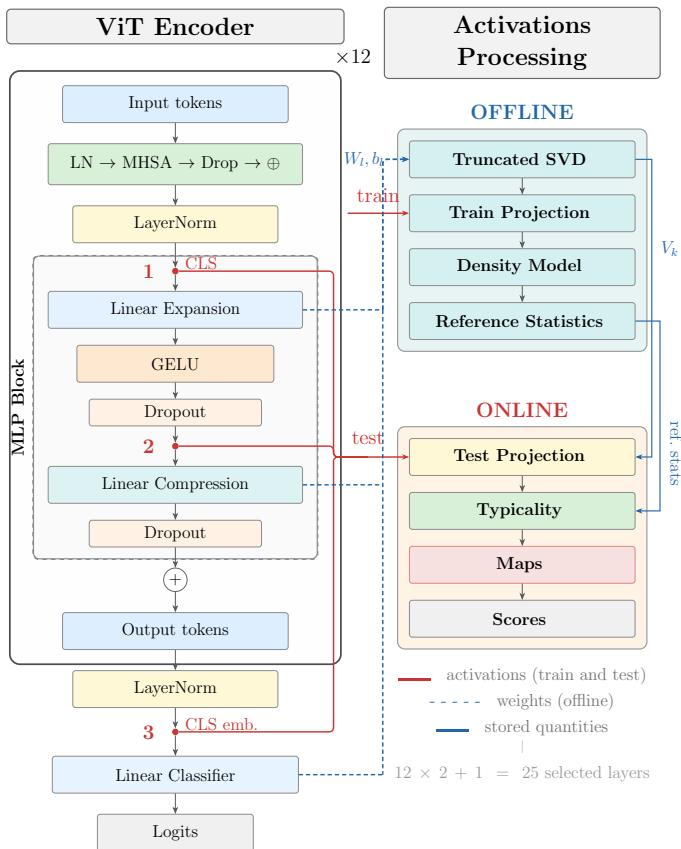
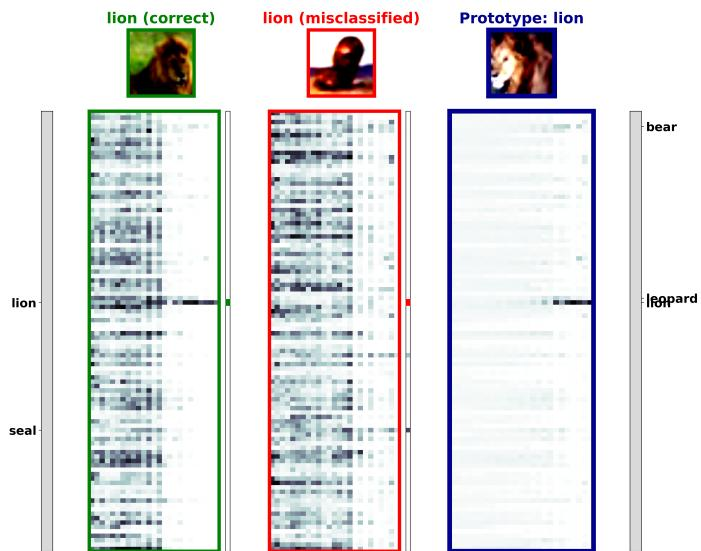
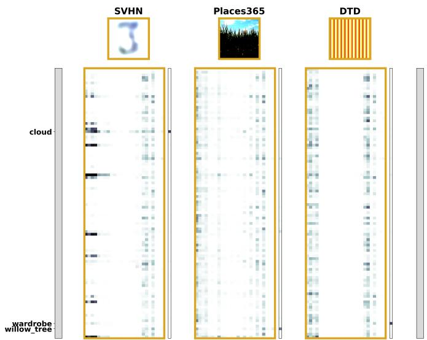
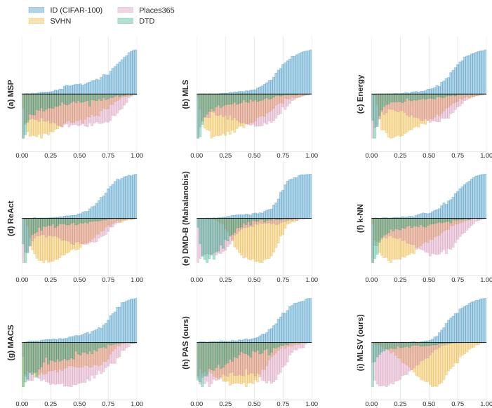

# SVD-Based Typicality Maps for Out-of-Distribution Detection in Vision Transformers

Aldo Sean Sartor∗, Leandro de Souza Rosa∗, Andriy Enttsel∗, Mauro Mangia∗†, Riccardo Rovatti∗† ∗DEI, †ARCES, University of Bologna, Italy; contact author: aldosean.sartor@unibo.it

Abstract—We present a method for analyzing the internal representations of Vision Transformers (ViTs) exploiting the geometry of their learned parameters. Each affine layer’s weight matrix is factored via Singular Value Decomposition (SVD), and activations are projected onto the leading right singular vectors to obtain compact, layer-intrinsic representations. A classconditional density model is then fitted at each layer, producing per-class typicality scores that are stacked across depth into typicality maps: two-dimensional summaries of how class-specific evidence evolves through the network. From these maps, we derive two post-hoc scores for Out-Of-Distribution (OOD) detection: a Prototype Alignment Score (PAS), measuring agreement with class reference prototype patterns, and a Multi-Layer Soft Voting (MLSV) score, capturing cross-layer consensus without stored prototypes. On ViT-B/16 fine-tuned on CIFAR-100, the proposed scores achieve competitive detection performance without retraining or OOD exposure.

Index Terms—Singular Value Decomposition, Vision Transformer, Out-of-Distribution Detection, Feature Geometry.

## I. INTRODUCTION

Deep neural networks construct high-dimensional internal representations through cascades of learned linear transfor mations and nonlinearities. While these representations are[ central to a model’s performance, their geometry and evolution across depth remain difficult to characterize, especially for modern deep architectures. In this work, we focus on Vision Transformer (ViT) [1] classifiers, where information is progressively transformed by alternating self-attention and multilayer perceptron (MLP) blocks acting on token embeddings. A principled, layer-wise view of how class-relevant structure emerges is important both for interpretability and for reliability tasks such as detecting inputs that fall outside the training distribution [2].

An increasing number of post-hoc methods address these questions by analyzing intermediate activations of a frozen, pretrained network, rather than relying solely on the outputlayer’s scores [3], [4]. Methods based on distances in activation space, such as Deep Mahalanobis Distance (DMD) [5] and Deep k-Nearest Neighbors (k-NN) [6], capture distributional information beyond the logits. However, they typically operate on a single layer or require task-specific supervision, such as Out-Of-Distribution (OOD) validation data for the logisticregression step in DMD.

More recently, a multi-layer confidence framework called MACS (Multi-layer Analysis for Confidence Scoring) [7] has shown that aggregating layer-wise evidence into structured maps can unify confidence estimation, OOD detection, and adversarial-attack detection. Concretely, MACS probes the internal activations of a trained network via SVD-based projections [8] and aggregates layer-wise information into structured maps, which are then compared against class-specific prototypes. While MACS demonstrates the effectiveness of this representation for confidence and reliability assessment, it relies on unsupervised clustering in the projected activation space, followed by an empirical feature-label association step to obtain layer-wise class estimates.

In this work, we propose a simpler and probabilistic alternative. We preserve the same geometric backbone: we interpret each affine layer as a linear operator, factorize its augmented weight matrix via Singular Value Decomposition (SVD) [9], and project activations onto the directions along which the layer maximally amplifies its input, to obtain compact, layer-intrinsic representations. However, instead of relying on clustering and empirical feature-label association, we adopt class-conditional density modeling in the SVD-projected space. This yields per-layer, per-class typicality scores, which, when stacked across depth, form typicality maps that play the same structural role as MACS classification maps while reducing the number of processing stages and hyperparameters and providing scores with a direct probabilistic interpretation. These maps reveal how class-specific evidence emerges through the network. From these maps, we then derive two scalar scores: the Prototype Alignment Score (PAS), measuring agreement with class-specific reference maps analogous to MACS’s prototype-matching; and the Multi-Layer Soft Voting (MLSV) score, which captures cross-layer consensus without requiring any stored prototypes. Both scores are fully post-hoc and do not require access to OOD data.

We validate the framework on ViT-B/16 fine-tuned on CIFAR-100. PAS and MLSV achieve competitive OOD detection against established baselines while providing a depthresolved representation of the network’s internal dynamics.

Our contributions can be summarized as follows:

• Probabilistic reformulation: We replace MACS’s clustering and feature-label association with class-conditional density modeling in the SVD-projected space, yielding per-layer, per-class typicality scores with a direct probabilistic interpretation.

• Simpler maps: We introduce typicality maps, which play the same role as MACS classification maps but with a simpler pipeline and fewer hyperparameters.

  
Fig. 1: Overview of the proposed pipeline. Left: schematic of a ViT encoder block (repeated 12) with the classification head. Red dots mark the three hook types used to intercept CLStoken activations. Right: the activations processing pipeline, divided into an OFFLINE stage (teal, performed once per model) and an ONLINE stage (orange, applied to each test sample).

• Novel scores: We derive two post-hoc scores: PAS, which simplifies MACS’s prototype-matching score, and MLSV, a new prototype-free score capturing cross-layer consensus.

The remainder of this paper is organized as follows. Section II presents the mathematical models. Section III defines the experimental setup and describes the datasets. Section IV reports and discusses the empirical findings. Section V concludes the paper.

## II. MATHEMATICAL MODEL

The proposed method consists of five stages: i) SVD-based projection of activations, ii) class-conditional density modeling in the projected space, iii) computation of per-layer typicality scores, iv) aggregation of these scores into depth-resolved maps, and v) scalar score computation.

## A. SVD-Based Projection of Internal Activations

Consider a neural network, out of which L affine candidate layers are selected. Focusing on the transformation performed

by a specific layer $\ell \in \{ 1 , \ldots L \}$ , given the input activation $x _ { \ell } \in \mathbb { R } ^ { d _ { \ell } }$ , the output is

$$
y _ { \ell } = W _ { \ell } x _ { \ell } + b _ { \ell } , \qquad W _ { \ell } \in \mathbb { R } ^ { m _ { \ell } \times d _ { \ell } } , \ b _ { \ell } \in \mathbb { R } ^ { m _ { \ell } } .\tag{1}
$$

As in MACS [7], we rewrite this affine transformation using an augmented input:

$$
\begin{array} { r } { \tilde { x } _ { \ell } = \bigg [ \frac { x _ { \ell } } { 1 } \bigg ] \in \mathbb { R } ^ { d _ { \ell } + 1 } , \qquad A _ { \ell } = \big [ W _ { \ell } b _ { \ell } \big ] \in \mathbb { R } ^ { m _ { \ell } \times ( d _ { \ell } + 1 ) } , } \end{array}\tag{2}
$$

so that $y _ { \ell } = A _ { \ell } \tilde { x } _ { \ell }$

We then compute the SVD [9, Ch. 2] of $A _ { \ell } \colon$

$$
\begin{array} { r } { A _ { \ell } = U _ { \ell } \Sigma _ { \ell } V _ { \ell } ^ { \top } , } \end{array}\tag{3}
$$

where $U _ { \ell } \in \mathbb { R } ^ { m _ { \ell } \times m _ { \ell } }$ and $V _ { \ell } ~ \in ~ \mathbb { R } ^ { ( d _ { \ell } + 1 ) \times ( d _ { \ell } + 1 ) }$ are orthonormal matrices, and $\Sigma _ { \ell }$ contains the singular values in non-increasing order. This allows us to define the projected representation at layer ℓ as

$$
z _ { \ell } = V _ { \ell , k } ^ { \top } \tilde { x } _ { \ell } \in \mathbb { R } ^ { k } ,\tag{4}
$$

where $V _ { \ell , k } \in \mathbb { R } ^ { ( d _ { \ell } + 1 ) \times k }$ denotes the matrix formed by the first k right singular vectors. The projection expresses the activation in a coordinate system induced by the layer’s parameters, aligned with the principal directions of the affine operator $A _ { \ell }$ The dimensionality k is chosen such that $k \ll d _ { \ell } + 1 ,$ yielding a compact, geometry-aware representation.

## B. Class-Conditional Density Modeling

Let $\mathcal { D } _ { \mathrm { t r a i n } } = \{ ( \boldsymbol { x } ^ { ( j ) } , \boldsymbol { y } ^ { ( j ) } ) \} _ { j = 1 } ^ { N }$ be the training set, where $y ^ { ( j ) } \in \{ 1 , \ldots , C \}$ denotes the class label. For each selected layer ℓ, we compute the projected representations $z _ { \ell } ^ { ( j ) }$ using (4). Then for each layer ℓ and class $c ,$ we fit a class-conditional probability density $p _ { \ell , c } ( z )$ to the set $\{ z _ { \ell } ^ { ( j ) } | y ^ { ( j ) } = c \}$ Each density is modeled using a Gaussian Mixture Model (GMM) [8, Ch. 9] with M components:

$$
p _ { \ell , c } ( z ) = \sum _ { m = 1 } ^ { M } \pi _ { \ell , c , m } \mathcal { N } ( z ; \mu _ { \ell , c , m } , \Sigma _ { \ell , c , m } ) ,\tag{5}
$$

where $\pi _ { \ell , c , m }$ are the mixture weights and $\left( \mu _ { \ell , c , m } , \Sigma _ { \ell , c , m } \right)$ are the mean and the covariance of each component.

This replaces MACS’s clustering and association pipeline with a single density modeling step, yielding quantities that allow a direct likelihood-based interpretation.

## C. Typicality Scores

Given a test sample x, we obtain its projected representation $z _ { \ell } ( x )$ at each layer ℓ. For a class c, we first evaluate the negative log-likelihood:

$$
s _ { \ell , c } ( x ) = - \log p _ { \ell , c } ( z _ { \ell } ( x ) ) .\tag{6}
$$

Then, to obtain a scale-independent and comparable measure across layers and classes, we normalize these scores using the Empirical Cumulative Distribution Function (ECDF) estimated on the training set for each (ℓ, c) pair:

$$
\widehat { F } _ { \ell , c } ( t ) = \frac { 1 } { N _ { c } } \sum _ { j : y ^ { ( j ) } = c } \mathbf { 1 } \big [ s _ { \ell , c } ( x ^ { ( j ) } ) \leq t \big ] ,\tag{7}
$$

where $N _ { c }$ is the number of training samples of class c.

With this, we define the typicality score as:

$$
\tau _ { \ell , c } ( x ) = 1 - \widehat { F } _ { \ell , c } \big ( s _ { \ell , c } ( x ) \big ) \in [ 0 , 1 ] .\tag{8}
$$

High values of $\tau _ { \ell , c } ( x )$ indicate that the representation of x at layer ℓ is typical for class c, while low values indicate atypical or unlikely behavior. These scores play the same conceptual role as the layer-wise class estimates in MACS, but are obtained through probabilistic modeling and likelihood evaluation rather than clustering and association.

## D. Typicality Maps and Class Prototypes

For a given input x, we collect all typicality scores into a matrix, called the typicality map:

$$
\begin{array} { r } { T ( x ) \in [ 0 , 1 ] ^ { C \times L } , \qquad T ( x ) _ { c , \ell } = \tau _ { \ell , c } ( x ) . } \end{array}\tag{9}
$$

Each row of $T ( x )$ quantifies how typical the sample is with respect to a fixed class across depth, while each column describes the class-wise typicality profile at a given layer. Structurally, $T ( x )$ is analogous to the classification-map in MACS: both encode a depth-resolved, class-wise summary of the network’s internal decision process.

Similarly to MACS proto-maps, we define a prototype map for each class c by averaging the typicality maps of correctly classified training samples:

$$
\overline { { T } } _ { c } = \frac { 1 } { | \mathcal { P } _ { c } | } \sum _ { x \in \mathcal { P } _ { c } } T ( x ) ,\tag{10}
$$

where

$$
\mathcal { P } _ { c } = \{ x \in \mathcal { D } _ { \mathrm { t r a i n } } ~ | ~ y ( x ) = \hat { y } ( x ) = c \} .\tag{11}
$$

These prototype maps represent the expected depth-wise typicality pattern for each class.

## E. Scalar Scores

The map structure allows us to define two compact scalar scores:

a) Prototype Alignment Score (PAS): Given a test sample x with predicted class ${ \hat { y } } ( x )$ , we measure the alignment between its map and the corresponding class prototype using the Frobenius scalar product:

$$
S _ { \mathrm { P A S } } ( x ) = \frac { \langle T ( x ) , \overline { { T } } _ { \hat { y } ( x ) } \rangle _ { F } } { \Vert T ( x ) \Vert _ { F } \Vert \overline { { T } } _ { \hat { y } ( x ) } \Vert _ { F } } \in [ 0 , 1 ] ,\tag{12}
$$

where $\begin{array} { r } { \langle A , B \rangle _ { F } } \end{array} = \sum _ { i , j } A _ { i , j } B _ { i , j }$ and $\| \cdot \| _ { F }$ denotes the Frobenius norm. High values indicate strong agreement with the typical class-specific pattern. This score is a probabilistic reformulation of the MACS scoring function, which compares a classification-map to a class proto-map using the cosine similarity.

b) Multi-Layer Soft Voting (MLSV): First, we normalize each column of $T ( x )$ with a softmax across classes:

$$
\tilde { \tau } _ { \ell , c } ( x ) = \frac { \exp ( \tau _ { \ell , c } ( x ) ) } { \sum _ { c ^ { \prime } = 1 } ^ { C } \exp ( \tau _ { \ell , c ^ { \prime } } ( x ) ) } .\tag{13}
$$

We then aggregate these normalized scores across layers and apply a second softmax:

$$
s _ { c } ( x ) = \frac { \exp \Bigl ( \sum _ { \ell = 1 } ^ { L } \tilde { \tau } _ { \ell , c } ( x ) \Bigr ) } { \sum _ { c ^ { \prime } = 1 } ^ { C } \exp \Bigl ( \sum _ { \ell = 1 } ^ { L } \tilde { \tau } _ { \ell , c ^ { \prime } } ( x ) \Bigr ) } .\tag{14}
$$

The MLSV score is defined as

$$
\begin{array} { r } { S _ { \mathrm { M L S V } } ( x ) = \displaystyle \operatorname* { m a x } _ { c } s _ { c } ( x ) \in \left[ \frac { 1 } { C } , 1 \right] . } \end{array}\tag{15}
$$

High values indicate strong cross-layer consensus toward a single class, while low values indicate disagreement across layers.

The overall five-stage pipeline is summarized in (Fig. 1, right), where we also distinguish between the offline and online phases.

## III. EXPERIMENTAL SETUP

## A. Dataset and Model

We fine-tune a ViT-B/16 pretrained on ImageNet-1k [10] on the CIFAR-100 training set [11]. The resulting model achieves 86.6% top-1 test accuracy.

We apply the proposed framework to the MLP sub-blocks of each ViT encoder layer. Specifically, we intercept CLS-token activations at two points within each MLP: before the linear expansion and before the linear compression (Fig. 1, left), yielding $2 \times 1 2 = 2 4$ intermediate hook points. An additional hook is placed at the input of the classification head, for a total of $L = 2 5$ monitored layers.

For each hooked layer, activations are projected onto the top-k right singular vectors of the corresponding weight matrix. The projection dimension is fixed to $k ~ = ~ 2 0 0$ for intermediate layers and $k = 1 0 0$ for the classification head, matching the number of classes.

Class-conditional densities are modeled by GMMs with M = 4 diagonal-covariance components per class and covariance regularization $\epsilon = 1 0 ^ { - 4 }$ . Unlike MACS, which models the joint representation space, our approach operates in a classconditional setting, allowing a significantly lower number of mixture components. All hyperparameters k, M, ϵ were selected empirically in preliminary experiments, the same configuration is used throughout and no task-specific tuning was performed.

## B. Out-of-Distribution Datasets

Following [12] and [13], we evaluate on three datasets that are semantically disjoint from CIFAR-100 and cover different visual domains:

• SVHN [14]: house-number photographs from Google Street View.

• Places365 [15]: scene photographs depicting indoor and outdoor environments.

  
Fig. 2: Typicality maps for the first correctly classified lion (green border), the first misclassified lion (red border) and the class prototype. Left sidebar indicates ground-truth and predicted labels, right sidebar lists the top-3 classes according to the prototype.

• DTD [16]: the Describable Textures Dataset, with images of natural textures organized into perceptual attribute categories.

## IV. RESULTS

## A. Visualizing Maps

We illustrate the structure of the proposed maps T(x) on a few representative samples in Fig. 2. For correctly classified inputs, typicality tends to concentrate on the ground-truth class as depth increases, while in early layers typicality is spread across multiple classes (Fig. 2, green). By contrast, misclassified samples do not exhibit the same pattern: typicality remains spread across competing classes or fluctuates across layers, even in the last layers (Fig. 2, red). Averaging maps over correctly classified training samples yields class prototypes that summarize a typical depth-wise profile; semantically related classes retain moderate typicality, reflecting inter-class similarity in the network’s representations (Fig. 2, blue).

OOD inputs instead display diffuse, unstructured patterns across all classes and layers (Fig. 3), consistent with their representations falling outside the high-density regions of the class-conditional models.

## B. Out-of-Distribution Detection

We evaluate PAS and MLSV on OOD detection, where test samples from unseen distributions are expected to produce less structured maps (cf. Fig. 3).

We compare against the following post-hoc detectors: MSP [3], the maximum softmax probability; MLS [17], the maximum logit; Energy [4], the log-sum-exp of logits; Re-Act [18], which clips penultimate-layer activations at the

  
Fig. 3: Typicality maps for the first samples of each OOD dataset (SVHN, Places365, DTD). Left sidebar indicates the predicted label.

TABLE I: OOD detection performance reported as AUROC (%) / FPR@95 (%). ID = CIFAR-100, backbone ViT-B/16.
<table><tr><td>Score</td><td>SVHN</td><td>Places365</td><td>DTD</td><td>Mean</td></tr><tr><td>MSP</td><td>89.8 / 44.1</td><td>83.9 / 59.6</td><td>92.2 / 33.1</td><td>88.6 / 45.6</td></tr><tr><td>MLS</td><td>94.9 / 24.2</td><td>91.9 / 39.9</td><td>97.2 / 14.2</td><td>94.6 / 26.1</td></tr><tr><td>Energy</td><td>95.3 / 21.7</td><td>92.7  /  36.4</td><td>97.6 /  11.5</td><td>95.2 / 23.2</td></tr><tr><td>ReAct</td><td>95.1  / 22.4</td><td>93.3 / 33.3</td><td>97.6 / 11.2</td><td>95.3 / 22.3</td></tr><tr><td>k-NN</td><td>95.9 / 22.4</td><td>89.6 / 49.7</td><td>96.7  / 16.6</td><td>94.1 / 29.6</td></tr><tr><td>DMD-B</td><td>90.5 / 67.6</td><td>96.9 /  14.6</td><td>98.6 / 6.6</td><td>95.3 / 29.6</td></tr><tr><td>DMD-A†</td><td>99.0 / 3.9</td><td>99.9 / 0.1</td><td>99.9 / 0.1</td><td>99.6 / 1.4</td></tr><tr><td>MACS</td><td>90.3 / 51.4</td><td>87.6 / 60.4</td><td>94.1 /  36.1</td><td>90.6 / 49.3</td></tr><tr><td>PAS (ours)</td><td>94.9 / 31.3</td><td>90.7  / 44.0</td><td>96.5 / 19.6</td><td>94.0 / 31.6</td></tr><tr><td>MLSV (ours)</td><td>92.3 / 31.4</td><td>99.4 / 1.8</td><td>99.4 / 2.4</td><td>97.0 / 11.9</td></tr></table>

† DMD-A uses OOD validation data for LR; other methods are agnostic.

90th training percentile before computing Energy; DMD-B [5], single-layer Mahalanobis distance computed on the penultimate-layer features, i.e., the input to the classification head; k-NN [6], the negative distance to the k-th nearest training feature (k=50) in the ℓ2-normalised embedding space; and DMD-A [5] as an oracle upper bound, which aggregates per-layer Mahalanobis scores via a logistic regression (LR) fit on OOD validation data.

Table I reports AUROC and FPR@95 for all methods. Among unsupervised detectors, MLSV achieves the highest mean AUROC 97.0% and the lowest mean FPR@95 11.9%, outperforming the strongest baseline by 1.7 percentage points (pp) in AUROC and 10.4 pp in FPR@95. This advantage is most pronounced on Places365 and DTD, where MLSV reaches 99.4% AUROC with FPR@95 below 2.5%, closely approaching the supervised oracle DMD-A†.

PAS attains a mean AUROC of 94.0%, comparable to MLS 94.6% and k-NN 94.1%, while outperforming MACS (90.6%) by 3.4 pp in mean AUROC and 17.7 pp in mean FPR@95, confirming that the simpler PAS formulation is a more effective aggregation of the multi-layer information.

  
Fig. 4: Normalized score distributions: in-distribution (CIFAR-100 test, above axis) vs. OOD (SVHN, Places365, DTD, mirrored below) for all evaluated methods.

The one exception is SVHN, where logit-based scores (Energy 95.3%, ReAct 95.3%, k-NN 95.9%) outperform both MLSV 92.3% and PAS 94.9%. On this dataset the large distributional gap between digit images and CIFAR-100 categories is captured by simple output statistics, leaving limited room for map-based methods. Across the remaining two shifts, however, the ranking reverses: MLSV improves over Energy by 6.7 pp on Places365 and 1.8 pp on DTD in AUROC, with FPR@95 reductions of 34.6 pp and 9.1 pp, respectively.

Fig. 4 provides a distributional view of all evaluated methods after ECDF normalization and per-histogram rescaling to unit peak height. Logit-based scores (MSP, MLS, Energy, ReAct) show moderate overlap between the ID and OOD distributions, particularly on Places365 and DTD where the OOD mass shifts only partially away from the ID peak. DMD-B and k-NN improve separation on specific shifts but remain inconsistent across datasets. MACS, PAS, and MLSV progressively reduce this overlap: MLSV in particular pushes the OOD distributions towards the low-score tail on all three benchmarks, with the ID distribution concentrated at high scores, consistent with the AUROC and FPR@95 results of Table I.

## V. CONCLUSIONS

Building on [7], we presented a framework for analysing the internal representations of Vision Transformers through SVDbased projections and class-conditional density modeling. The resulting typicality maps provide a depth-resolved view of how class-specific evidence consolidates across layers, and serve as the basis for two post-hoc OOD detection scores.

PAS measures alignment with stored class prototype maps and outperforms the closely related MACS score while requiring significantly fewer parameters. MLSV discards stored prototypes entirely and instead leverages cross-layer consensus: by aggregating lightweight per-layer typicality votes without any stored reference, it achieves the best results among all unsupervised detectors considered across all three OOD benchmarks, and approaches the performance of the supervised oracle on two of them.

The reliance on independent per-layer modelling suggests that representational consistency across depth is a strong reliability signal that existing single-layer or logit-based approaches may not fully exploit.

## REFERENCES

[1] A. Dosovitskiy, L. Beyer, A. Kolesnikov, D. Weissenborn, X. Zhai, T. Unterthiner, M. Dehghani, M. Minderer, G. Heigold, S. Gelly, J. Uszkoreit, and N. Houlsby, “An image is worth 16x16 words: Transformers for image recognition at scale,” in International Conference on Learning Representations (ICLR), 2021.

[2] J. Yang, K. Zhou, Y. Li, and Z. Liu, “Generalized out-of-distribution detection: A survey,” International Journal of Computer Vision, vol. 132, no. 12, pp. 5635–5662, 2024.

[3] D. Hendrycks and K. Gimpel, “A baseline for detecting misclassified and out-of-distribution examples in neural networks,” in ICLR, 2017.

[4] W. Liu, X. Wang, J. D. Owens, and Y. Li, “Energy-based out-ofdistribution detection,” in NeurIPS, 2020.

[5] K. Lee, K. Lee, H. Lee, and J. Shin, “A simple unified framework for detecting out-of-distribution samples and adversarial attacks,” in NeurIPS, 2018.

[6] Y. Sun, Y. Ming, X. Zhu, and Y. Li, “Out-of-distribution detection with deep nearest neighbors,” in International conference on machine learning. PMLR, 2022, pp. 20 827–20 840.

[7] L. Capelli, L. de Souza Rosa, G. Setti, M. Mangia, and R. Rovatti, “Multi-layer confidence scoring for detection of out-of-distribution samples, adversarial attacks, and in-distribution misclassifications,” arXiv preprint arXiv:2512.19472, 2025.

[8] C. M. Bishop, Pattern Recognition and Machine Learning. New York, NY, USA: Springer, 2006.

[9] G. H. Golub and C. F. Van Loan, Matrix Computations, 4th ed. Johns Hopkins University Press, 2013.

[10] J. Deng, W. Dong, R. Socher, L.-J. Li, K. Li, and L. Fei-Fei, “Imagenet: A large-scale hierarchical image database,” in 2009 IEEE conference on computer vision and pattern recognition. IEEE, 2009, pp. 248–255.

[11] A. Krizhevsky, “Learning multiple layers of features from tiny images,” University of Toronto, Tech. Rep., 2009.

[12] S. Fort, J. Ren, and B. Lakshminarayanan, “Exploring the limits of outof-distribution detection,” Advances in Neural Information Processing Systems, vol. 34, pp. 7068–7081, 2021.

[13] J. Winkens, R. Bunel, A. G. Roy, R. Stanforth, V. Natarajan, J. R. Ledsam, P. MacWilliams, P. Kohli, A. Karthikesalingam, S. Kohl, T. Cemgil, S. M. A. Eslami, and O. Ronneberger, “Contrastive training for improved out-of-distribution detection,” arXiv preprint arXiv:2007.05566, 2020.

[14] Y. Netzer, T. Wang, A. Coates, A. Bissacco, B. Wu, and A. Y. Ng, “Reading digits in natural images with unsupervised feature learning,” in NIPS Workshop on Deep Learning and Unsupervised Feature Learning, 2011.

[15] B. Zhou, A. Lapedriza, A. Khosla, A. Oliva, and A. Torralba, “Places: A 10 million image database for scene recognition,” IEEE Transactions on Pattern Analysis and Machine Intelligence, vol. 40, no. 6, pp. 1452– 1464, 2018.

[16] M. Cimpoi, S. Maji, I. Kokkinos, S. Mohamed, and A. Vedaldi, “Describing textures in the wild,” in Proceedings of the IEEE Conf. on Computer Vision and Pattern Recognition (CVPR), 2014.

[17] D. Hendrycks, S. Basart, M. Mazeika, A. Zou, J. Kwon, M. Mostajabi, J. Steinhardt, and D. Song, “Scaling out-of-distribution detection for real-world settings,” in Proceedings ofthe 39th International Conference on Machine Learning, 2022, pp. 8759–8773.

[18] Y. Sun, C. Guo, and Y. Li, “React: Out-of-distribution detection with rectified activations,” Advances in Neural Information Processing Systems, vol. 34, pp. 144–157, 2021.