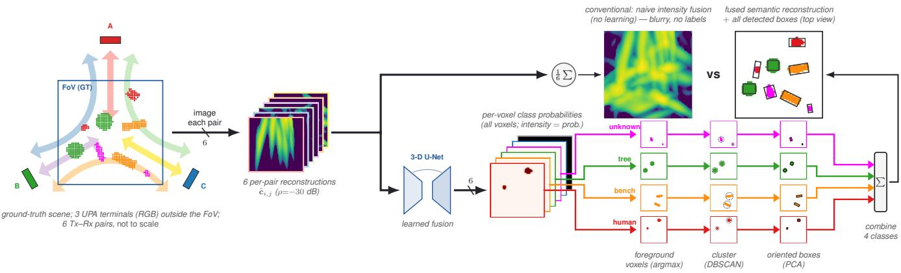
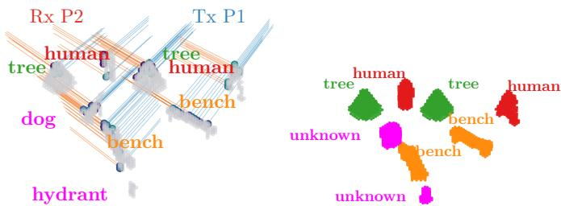
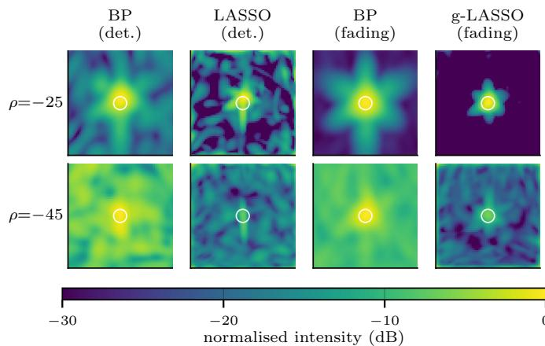
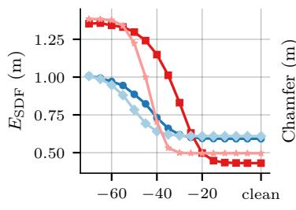
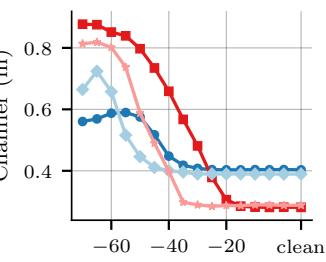
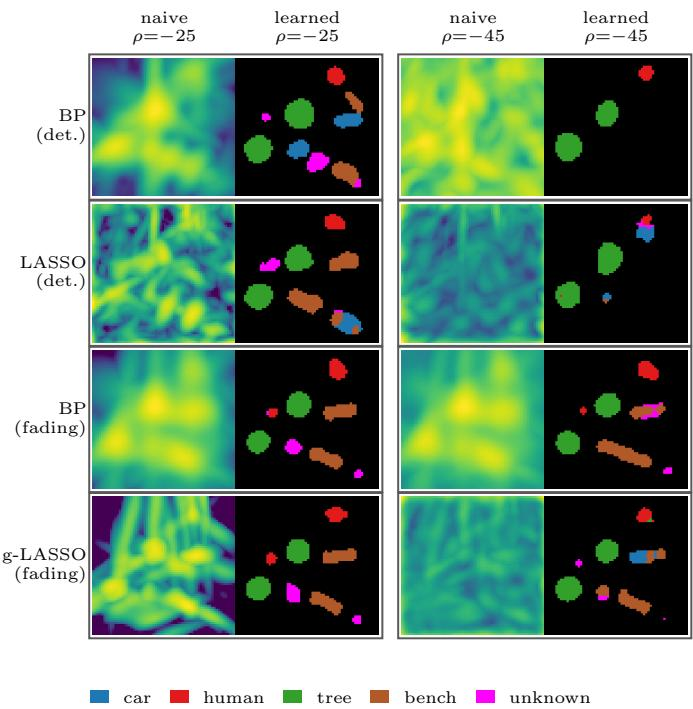
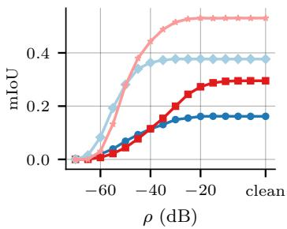
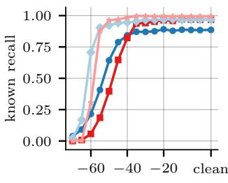
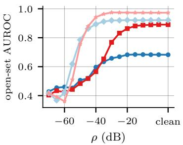
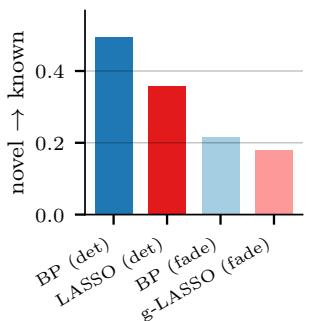

# Semantic Reconstruction and 3-D Detection via Learned Multi-Pair Fusion in RF Imaging

Amir Rezaei, Wen-Xin Pan, Giuseppe Caire

Technische Universitat Berlin, Germany¨

Abstract—We consider a multistatic radio-frequency imaging problem with anisotropy, in which the reflection from a point depends on the positions of the transmit (Tx) and receive (Rx) arrays. The goal is to label the voxels of a field of view by a finite set of semantic classes and to group them into object instances. For the image formation of each Tx–Rx pair we apply a standard inverse-problem solver, and we feed the resulting per-pair reconstructions into a trained three-dimensional (3- D) U-Net that performs the fusion implicitly and the pervoxel classification explicitly. On a controlled, under-determined multistatic setup, we consider the following image formation methods: back-projection (BP) and the least absolute shrinkage and selection operator (LASSO) from a single deterministic snapshot, and incoherent BP and group-LASSO from multiple fading snapshots. For each imaging method we train a separate U-Net that fuses the six Tx–Rx pairs (its input channels) and assigns each voxel a probability vector over the classes. Taking the most probable class gives a labeled volume—the semantic reconstruction. Object instances and their oriented bounding boxes then follow by geometric post-processing (clustering and principal-component analysis). Across a wide range of signal-tonoise ratio, the semantic reconstruction (scored against ground truth by segmentation intersection-over-union) and the resulting 3-D detection degrade far more gracefully than the classical intensity reconstruction: the detection in particular stays reliable well into noise levels at which that reconstruction has dissolved. Because real scenes contain objects of classes the network was not trained on, we add an explicit unknown class trained by outlier exposure, which labels held-out novel objects as unknown instead of mislabeling them as a known class by reconstructed shape.

Index Terms—RF imaging, sparse reconstruction, 3-D segmentation, oriented bounding box, robustness.

## I. INTRODUCTION

Three-dimensional reflectivity imaging from networks of stationary radio-frequency (RF) apertures sits at the intersection of multistatic / multiple-input multiple-output (MIMO) radar [1], [2], integrated sensing and communication (ISAC) [3], and compressed sensing. A multistatic deployment exploits spatial diversity across well-separated transmit–receive (Tx–Rx) pairs, each sampling a different region of the bistatic wavenumber support, so the union of those samples sets the resolution and sidelobe structure of any linear estimator. Reconstructing the reflectivity is ill-posed: sparse priors [4], [5] sharpen the image at high signal-to-noise ratio (SNR) but degrade steeply as noise grows, whereas a conventional matched-filter back-projection (BP) is robust but blurry. The reconstruction and the downstream perception need not, however, break at the same noise level—the gap between the two is the subject of this paper.

Approach. We replace image-then-threshold heuristics by a pipeline (Fig. 1). The multi-pair measurements are imaged by an off-the-shelf solver (BP, LASSO, or group-LASSO). The resulting per-pair reconstructions then form the input channels of a 3-D U-Net that outputs, for every voxel, a probability vector over the semantic classes. Two of these are special: a background class, and an unknown class that—trained by outlier exposure—lets the network reject objects of classes it was never taught, rather than mislabeling them as a known class (Sec. III-B). Finally, the U-Net output is post-processed without further learning—each voxel takes its most probable class, and the foreground voxels are clustered into instances (DBSCAN) and fitted with oriented bounding boxes (OBB) by principal component analysis (PCA), as detailed in Sec. III-B. We call this labeled volume the semantic reconstruction.

Contributions. (i) A controlled, fully specified multistatic RF imaging setup comparing BP and sparse reconstruction across a −70 to 0 dB sweep of the per-antenna-element reference SNR $\rho$ (defined in Sec. II); (ii) a learned multipair fusion that turns the per-pair reconstructions into the semantic reconstruction and geometric oriented-box detection; (iii) an operating-envelope analysis showing that the semantic reconstruction and the detection stay reliable well past the noise level at which the classical intensity reconstruction degrades to noise, with false-positive and open-set sanity checks.

Related work. BP and sparse reconstruction are the classical inverse-problem tools for MIMO / multistatic radar and ISAC imaging [1]–[3], [6], including covariance-based multi-view fusion for networked sensing [7]; we use them as the inputs to a learned fusion and study the semantic reconstruction and its downstream robustness, rather than the (subjective) image quality. Radar semantic perception has been studied on automotive range–angle–Doppler tensors and point clouds—CARRADA [8], multi-view tensor segmentation [9], and RadarScenes [10]; we instead start from a multistatic RF inverse-imaging problem and characterize the reconstruction and detection across SNR.

## II. SYSTEM MODEL

## A. Geometry and forward model

The system observes a 3-D field of view (FoV) $\Omega \subset \mathbb { R } ^ { 3 }$ with n=3 uniform planar array (UPA) panels at positions $\mathbf { s } _ { i }$ on an equilateral triangle of circumradius $R _ { \mathrm { t e r m } } { = } 2 0$ m about the FoV centroid, at heights {10, 15, 20} m for elevation-aperture diversity, each boresighted at the centroid (the geometry is shown schematically in Fig. 1, left). Every panel transmits and receives, so each ordered Tx–Rx pair $( i , j )$ , restricted to i≤j by reciprocity, gives an independent measurement— $\binom { n + 1 } { 2 } = 6$ pairs including the monostatic diagonal [1]. The waveform is orthogonal frequency-division multiplexing (OFDM) with K subcarriers on an equally spaced comb $f _ { k } { = } f _ { 0 } { + } k \Delta f$ $( k { = } 0 , \ldots , K { - } 1 ;$ spacing $\Delta f ,$ bandwidth $B { = } K \Delta f )$ , with carrier $f _ { 0 } { \approx } 9 . 6$ GHz (wavelength $\lambda _ { 0 } { = } 3 . 1$ cm). For imaging we use a single subcarrier, leaving the other $K - 1$ for communication; the measurements are therefore narrowband, with essentially no monostatic delay resolution, so all spatial resolution comes from the multistatic angle diversity (quantified in Sec. II-B). The estimator works on a coarse grid of $Q$ voxels of side $\Delta { = } 4 \lambda _ { 0 } { = } 0 . 1 2 5$ m (centers ${ \bf p } _ { q } ) ;$ the measurements are synthesized on a finer $\lambda _ { 0 }$ grid, and the coarse-grid operator is the volume-weighted (∆v) quadrature of the continuous scattering integral.

  
Fig. 1. End-to-end pipeline on one example scene (schematic). Left: the ground-truth (GT) scene in the field of view (FoV), observed by three uniform planar array (UPA) terminals A, B, C outside the FoV; the six Tx–Rx pairs are the coloured arrows, and the per-pair reconstructions $\hat { \mathbf { c } } _ { i , j }$ form the six input channels. Top branch (conventional): their arithmetic mean is the naive intensity fusion I¯, with no class labels. Bottom branch (learned): a 3-D U-Net fuses the six channels and outputs, per voxel, a probability vector $p _ { c } ( q )$ over the six classes. Right (post-processing, no learning): the voxels of each foreground class are clustered (DBSCAN) and fitted with one oriented bounding box (PCA); combining them gives the fused semantic reconstruction with detected boxes (to view), contrasted (“vs”) with the naive fusion.

Each voxel ${ \bf p } _ { q }$ (surface normal $\mathbf { n } _ { q } )$ carries a complex reflectivity $c _ { q } ,$ but a given Tx–Rx pair sees it through an anisotropic coupling—the visibility and the cosines of the incidence angles to $\mathbf { n } _ { q ^ { - } }$ —that depends on the target’s local surface and is not known to the estimator. We therefore separate what the estimator knows (the geometry) from what it does not (the directivity). Each panel is a UPA of N antennas; the panels transmissions are orthogonal in time–frequency and each spans T OFDM symbols, so on subcarrier $f _ { k }$ transmit panel i emits a space–time pilot matrix $\mathbf { S } _ { i , k } \ \in \ \mathbb { C } ^ { N \times T } ( \mathrm { t r } ( \mathbf { \bar { S } S } ^ { \mathsf { H } } ) / T { = } 1 )$ Stacking the $N { \times } T$ samples received at panel j over the T pilot slots, the measurement on subcarrier k at fading snapshot n is

$$
\mathbf { y } _ { i , j , k } ^ { ( n ) } = \mathbf { A } _ { i , j , k } \mathbf { c } _ { i , j } ^ { ( n ) } + \mathbf { w } _ { i , j , k } ^ { ( n ) } ,\tag{1}
$$

with $\mathbf { A } _ { i , j , k } \ \in \ \mathbb { C } ^ { M \times Q } \ ( M { = } N T )$ and i.i.d. noise $\mathbf { w } _ { i , j , k } ^ { ( n ) } \sim$ $\mathscr { C N } ( 0 , \sigma ^ { 2 } \mathbf { I } )$ . The geometry-only dictionary $\mathbf { A } _ { i , j , k }$ is the same for every snapshot n—only the reflectivity realization $\mathbf { c } _ { i , j } ^ { ( n ) }$ its noise, and hence the measurement change with n (the deterministic case is the single snapshot $N _ { s } { = } 1 )$ . Its q-th column collects the known near-field steering and two-way path loss, $\begin{array} { r l r } { [ { \bf A } _ { i , j , k } ] _ { : , q } } & { = } & { \sqrt { \beta _ { i , j , q } } ( { \bf S } _ { i , k } ^ { \sf H } { \bf a } _ { i , q } ) \otimes { \bf b } _ { j , q } , } \end{array}$ where $\mathbf { a } _ { i , q } , \mathbf { b } _ { j , q }$ are the exact near-field per-element responses, e.g. $[ \mathbf { a } _ { i , q } ] _ { \ell } { = } e ^ { - j 2 \pi \| \mathbf { s } _ { i , \ell } - \mathbf { p } _ { q } \| / \lambda _ { 0 } }$ , and $\beta _ { i , j , q }$ is the two-way channel power gain (it absorbs the round-trip path loss, so a lessattenuated voxel has larger $\beta )$ . Because we image on a single subcarrier, the column carries the full per-element distance phase and no separate delay term: the subcarrier-dependent factor $e ^ { - j 2 \pi ( f _ { k } - \bar { f } _ { 0 } ) \tau _ { i , j , q } }$ reduces to unity at $f _ { k } { = } f _ { 0 }$ . We use the exact near-field model rather than a far-field approximation: the single-panel Fraunhofer distance $2 D ^ { 2 } / \lambda _ { 0 } { \approx } 1 6$ m (aperture $D { \approx } 0 . 5$ m) is comparable to the 20 m array-to-FoV range and the FoV straddles it, while the synthetic aperture spanned by the well-separated panels is far larger—so a plane-wave model would incur range-dependent phase errors across the FoV.

The per-pair anisotropy is carried by the pair-dependent reflectivity vectors $\mathbf { c } _ { i , j } ^ { ( n ) }$ , with q-th component given by

$$
c _ { i , j , q } ^ { ( n ) } = \underbrace { v _ { i , q } v _ { j , q } \left( \cos \theta _ { i , q } \right) _ { + } ( \cos \theta _ { j , q } ) _ { + } } _ { \varepsilon _ { i , j , q } \mathrm { ~ ( d i r e c t i v i t y ) ~ } } \ : g _ { i , j , q } ^ { ( n ) } c _ { q } ,\tag{2}
$$

where $v _ { i , q } ~ \in ~ \{ 0 , 1 \}$ is the ray-traced visibility of ${ \bf p } _ { q }$ from panel $i , \theta _ { i , q }$ is the angle between the panel-i-to-p direction and the surface normal $\mathbf { n } _ { q } ,$ , and $( \cdot ) _ { + } { = } \operatorname* { m a x } \{ \cdot , 0 \}$ zeroes backfaces. The coefficient $g _ { i , j , q } ^ { ( n ) ^ { \ast } }$ is the fading coefficient at snapshot n: with no fading we take a single snapshot with $g { \equiv } 1 \left( N _ { s } { = } 1 \right)$ and under Rayleigh fading $g \sim \mathcal { C N } ( 0 , 1 )$ i.i.d. across pairs, voxels, and snapshots $( N _ { s } { > } 1 )$ , modeling per-voxel speckle from unresolved sub-cell scatterers seen as de-correlated looks (an idealized diversity model, not a measured channel). The directivity $\varepsilon _ { i , j , q }$ (Fig. 2, left) hinges on the unknown target micro-geometry, so it is folded into the per-pair reflectivity that the estimator recovers: the estimator knows only the geometry embedded in $\mathbf { A } _ { i , j , k }$ and does not exploit ε (the isotropic case is recovered by letting $\varepsilon \equiv 1$ , i.e. $c _ { i , j , q } { = } c _ { q } )$ . The right panel of Fig. 2 previews the learned semantic reconstruction of the same scene (Sec. IV-B).

  
Fig. 2. One open-set scene (known human/tree/bench and held-out novel objects), viewed from between the panels of pair (1, 2). Left: the per-pair coupling $\varepsilon _ { 1 , 2 , q }$ 1(Eq. (2)) on the scene surface—bright where the pair sees the surface strongly—with its bistatic ray paths. Right: the learned semantic reconstruction (group-LASSO, $\scriptstyle \rho = - 2 0 { \mathrm { ~ d B } } )$ , voxels coloured by predicted class, novel objects flagged unknown (magenta).

## B. Operating point, SNR, and link budget

Each panel consists of 16×8 elements at λ spacing (an ISAC-style sensing sub-sample of a communication panel [3]). With $T { = } 1 2 8$ pilot slots this gives $M { = } 1 6 3 8 4$ and $Q { = } 6 5 5 3 6$ so each view is 4× under-determined $( M / Q { = } 0 . 2 5 )$ ; the grating lobes from the λ spacing are suppressed by the three-panel diversity and the sparse prior. A single subcarrier gives no range resolution: even the full $B { = } 2 0$ MHz channel resolves only $c / ( 2 B ) { \approx } 7 . 5$ m—comparable to the FoV itself. Hence, the spatial resolution is entirely provided by the panels’ angular (wavenumber) diversity, and the $\Delta { = } 0 . 1 2 5$ m grid is a finer representation grid.

Noise calibration. We calibrate the noise to a per-element reference SNR ρ. With the reflectivity normalized so that ma $\mathbf { \Delta x } _ { i , j , q } | c _ { i , j , q } | ^ { 2 } { = } 1$ and the two-way channel gain $\beta$ carried in A, the noise variance is

$$
\sigma ^ { 2 } = \underset { i , j , q } { \operatorname* { m a x } } \beta _ { i , j , q } / 1 0 ^ { \rho _ { \mathrm { d B } } / 1 0 } .\tag{3}
$$

So $\rho$ is the SNR of a single element-to-element sample of a unit-reflectivity voxel at the least-attenuated (largest-β) point of the FoV. It is deliberately conservative, being measured per element, before any processing gain: the coherent matched filter over $M = N T { = } 1 6 3 8 4$ samples per pair alone contributes ≈42 dB, and the six-pair (and, in the fading regime, $N _ { s ^ { - } }$ snapshot) fusion adds more. A per-element $\rho { = } { - } 4 0$ dB therefore maps to a far higher effective image SNR—it is a hard operating point, not imaging 42 dB below the image-domain noise floor. We sweep $\rho \in \{ - 7 0 , - 6 5 , \ldots , 0 \}$ dB plus the noiseless (clean) case.

## III. RECONSTRUCTION AND LEARNED DETECTION

## A. Per-pair imaging methods

We use four standard inverse-problem solvers, two for each fading regime of Eq. (2). Each is applied to every Tx–Rx pair separately, forming the six input channels of the U-Net. We suppress the pair index $( i , j )$ in the per-pair estimators below. Here $\hat { c } _ { q }$ is the estimate at voxel $q , \mathbf { D } { = } \mathrm { d i a g } ( \| \mathbf { A } _ { : , q } \| ^ { 2 } )$ is the column-energy matrix (so $\overline { { J D _ { q q } } } = \lVert { \bf A } _ { : , q } \rVert$ is the column amplitude, with $\| \mathbf { A } _ { : , q } \| ^ { 2 } \propto N T \beta _ { q } )$ , and $\mathbf { y } ^ { ( n ) }$ is the snapshot-n measurement.

Deterministic regime $( N _ { s } { = } 1 , g { \equiv } 1 )$ : the per-pair reflectivity is a fixed constant, recovered from the single snapshot y. (i) BP is the column-normalized matched filter, dividing the adjoint by the column amplitude:

$$
\hat { \mathbf { c } } ^ { \mathrm { B P } } = \mathbf { D } ^ { - 1 / 2 } \mathbf { A } ^ { \mathsf { H } } \mathbf { y } .\tag{4}
$$

(ii) LASSO adds a voxel-domain $\ell _ { 1 }$ prior [4],

$$
\hat { \mathbf { c } } = \arg \operatorname* { m i n } _ { \mathbf { c } } \ \frac { 1 } { 2 } \| \mathbf { y } - \mathbf { A } \mathbf { c } \| _ { 2 } ^ { 2 } + \lambda \| \mathbf { c } \| _ { 1 } ,\tag{5}
$$

solved by the fast iterative shrinkage-thresholding algorithm (FISTA) [11] with $\lambda { = } { \eta \operatorname* { m a x } _ { q } \left| ( \mathbf { A } ^ { \mathsf { H } } \mathbf { y } ) _ { q } \right| ( \eta { = } 0 . 0 1 ) }$

Fading regime $( N _ { s } { = } 8 , g ^ { ( n ) } \sim \mathcal { C N } ( 0 , 1 )$ i.i.d. across snapshots): the per-pair gain fluctuates independently each snapshot, so its complex mean is zero and the estimand is the reflectivity power $\gamma _ { q } = \rvert c _ { q } \rvert ^ { 2 }$ , recovered by combining the snapshots non-coherently.

(iii) BP (fading) averages the per-snapshot BP intensities, recovering $\gamma _ { q }$ with variance reduced by ${ \approx } 1 / N _ { s }$

$$
\begin{array} { r } { \hat { \gamma } _ { q } = \frac { 1 } { N _ { s } } \sum _ { n = 1 } ^ { N _ { s } } \bigl | ( \mathbf { D } ^ { - 1 / 2 } \mathbf { A } ^ { \sf H } \mathbf { y } ^ { ( n ) } ) _ { q } \bigr | ^ { 2 } . } \end{array}\tag{6}
$$

(iv) group-LASSO (fading) exploits that the object support is common to all snapshots while only the gain $g ^ { \bar { ( n ) } }$ changes. A row- $\cdot \ell _ { 2 , 1 }$ penalty [5] couples the snapshots through this shared support,

$$
\begin{array} { r } { \hat { { \mathbf { C } } } = \arg \operatorname* { m i n } _ { { \mathbf { C } } } \frac { 1 } { 2 } \sum _ { n } \| { \mathbf { y } } ^ { ( n ) } - { \mathbf { A } } { \mathbf { c } } ^ { ( n ) } \| _ { 2 } ^ { 2 } + \lambda \sum _ { q } \| { \mathbf { C } } _ { q , : } \| _ { 2 } , } \end{array}\tag{7}
$$

with rows $\mathbf { C } _ { q , : } = ( c _ { q } ^ { ( 1 ) } , \dots , c _ { q } ^ { ( N _ { s } ) } )$ reported intensity $\begin{array} { r } { \hat { \gamma } _ { q } { = } \frac { 1 } { N _ { \mathrm { s } } } \sum _ { n } | \hat { c } _ { q } ^ { ( n ) } | ^ { 2 } , } \end{array}$ , and $\lambda { = } \eta \operatorname* { m a x } _ { q } \| ( \mathbf { A } ^ { \mathsf { H } } \mathbf { Y } ) _ { q , : } \| _ { 2 } \ ( \eta { = } 0 . 0 5 )$ BP is thus the (linear) matched filter, whereas LASSO and group-LASSO are penalized least-squares estimators that trade data fidelity against sparsity.

For every figure and metric that does not involve the U-Net, the six per-pair reconstructions are combined by a naive intensity fusion: the arithmetic mean of their intensities,

$$
\begin{array} { r } { \bar { I } _ { q } = \frac { 1 } { 6 } \sum _ { ( i , j ) } | \hat { c } _ { i , j , q } | ^ { 2 } . } \end{array}\tag{8}
$$

This is the baseline the learned U-Net fusion (Sec. III-B) replaces, used in Figs. 3, 4, and 5.

The single-sphere point-spread function (Fig. 3) confirms the geometry is well behaved: a localized main lobe and no aliased grating lobes. The sparse group-LASSO focuses tightest when clean but dissolves into noise by −45 dB, whereas the blurrier BP stays the most robust—the same ordering the reconstruction metrics confirm below.

## B. Learned fusion, segmentation, and geometric boxes

A 3-D U-Net [12], [13]—a fully convolutional encoder– decoder with skip connections—fuses the six input channels (one per Tx–Rx pair) and outputs, for every voxel $q ,$ a logit vector $\mathbf { z } ( q ) ~ \in ~ \mathbb { R } ^ { 6 }$ over six classes $c ~ \in ~ \{ 0 , 1 , 2 , 3 , 4 , 5 \}$ background (c=0), the four known object classes {car, human, tree, bench} $( c { = } 1 , \ldots , 4 )$ , and an unknown class $\left( c { = } 5 \right)$ . A softmax maps the logits to a probability vector, $p _ { c } ( q ) \ =$ $e ^ { z _ { c } ( q ) } / \sum _ { c ^ { \prime } } \bar { e } ^ { z _ { c ^ { \prime } } ( q ) }$ . Assigning each voxel its most-probable class $\hat { \ell } ( q ) { = } \arg \operatorname* { m a x } _ { c } p _ { c } ( q )$ gives the semantic reconstruction, a labeled volume; a voxel is background when $p _ { 0 }$ is largest and unknown when $p _ { 5 }$ is largest.

  
Fig. 3. Point-spread function on a single canonical sphere carrying the perpair anisotropy ε (xy cut at $z { = } 1 \ \mathrm { m } ,$ dB relative to peak). Columns are the 1four imaging methods, rows the noise level $\rho { = } { - } 2 5$ and 45 dB. Each panel is the naive intensity fusion (not the U-Net), the sphere footprint marked by the white circle.

Why an explicit unknown class. A test scene contains objects of classes the U-Net was never trained to name. A closedset network—one without class c=5—must map every object voxel onto one of the four known classes, so a novel object is absorbed into whichever known class its reconstructed shape most resembles: a tall, thin traffic light or streetlight is labeled human, a large bus or van a car, a low truck or dog a bench. On objects of classes held out of training this shape-aliasing sends 68% of their voxels to a known class. The error is confident rather than low-confidence, so the standard posthoc rejection scores—maximum softmax probability [14], free energy [15], and evidential uncertainty [16]—cannot separate novel from known objects (the area under the receiveroperating-characteristic curve, AUROC, is only 0.66–0.69), because they read the incorrectly predicted class as highprobability. We therefore make rejection an explicit class and train it by outlier exposure [17]: each training scene also contains objects from a pool of nine exposed-novel classes (van, truck, bicycle, bush, streetlight, traffic sign, trash bin, bollard, traffic cone) whose voxels all carry the single label $c { = } 5 ,$ , so the U-Net learns one decision region for “an object that is none of the four known classes” rather than a per-class confidence threshold. At test time the novel objects are drawn from a disjoint pool of five held-out classes (bus, motorcycle, traffic light, hydrant, dog) that appear in no training scene. Each is a shape relative of an exposed class (e.g. bus/truck, motorcycle/bicycle), so labeling it unknown tests whether the rejection region generalizes across shape rather than recalling a memorized outline.

The backbone is a three-level residual 3-D U-Net (≈ 5.7 M parameters) with GroupNorm [18]. We train for 30 epochs with Adam [19] (learning rate $1 0 ^ { - 3 }$ , batch size 8), drawing each scene at a random $\rho$ from the sweep every epoch (domain randomization [20]). The input $\mathbf { x } { = } \log ( 1 { + } | \hat { \mathbf { c } } | ^ { 2 } )$ (the six per-pair intensity volumes, log-compressed) is standardized per scene by a single mean and variance taken jointly over all six channels (not per channel): a joint scale fixes the dynamic range while preserving the relative intensity between pairs—the anisotropy/visibility cue the fusion must exploit. The loss is a soft-Dice term [21] plus a classweighted cross-entropy: ${ \mathcal { L } } = { \mathcal { L } } _ { \mathrm { D i c e } } + { \textstyle { \frac { 1 } { 2 } } } { \mathcal { L } } _ { \mathrm { C E } }$ , with $\mathcal { L } _ { \mathrm { C E } } ~ =$ $\begin{array} { r l } { - \frac { 1 } { Q } et { } { ' } \sum _ { q } \sum _ { c } w _ { c } y _ { c } ( q ) } \end{array}$ log $p _ { c } ( q )$ , one-hot GT $y _ { c } ( q ) \in \{ 0 , 1 \}$ , and $\begin{array} { r } { \dot { \mathcal { L } } _ { \mathrm { D i c e } } = \dot { 1 } - \frac { 1 } { 6 } \sum _ { c } 2 \sum _ { q } p _ { c } ( q ) y _ { c } ( q ) / ( \sum _ { q } p _ { c } ( q ) + \sum _ { q } y _ { c } ( q ) ) | } \end{array}$ The two are complementary under the heavy background imbalance. We weight only the cross-entropy by $w _ { c } \propto 1 / \sqrt { f _ { c } }$ $( f _ { c }$ the class frequency, $\textstyle \sum _ { c } w _ { c } / 6 = 1 )$ . A separate U-Net is trained per imaging method (identical architecture and recipe, one network across all $\rho )$ , so comparisons isolate the imaging method.

The geometric post-processing adds no learning: object detection reuses the same label map (Fig. 1), so the detected objects and the displayed semantic reconstruction come from the same voxels. For each foreground class $c { \in } \{ 1 , 2 , 3 , 4 , 5 \}$ (the four known classes and the unknown class), the voxels labeled $c$ (those with $\arg \operatorname* { m a x } _ { c ^ { \prime } } p _ { c ^ { \prime } } ( q ) { = } c )$ form that class’s point cloud. DBSCAN [22] (0.4 m radius, minimum 5 points) splits each cloud into instances, and one OBB is fit per instance by PCA: the box axes are the cluster’s principal axes (orientation read from the reconstructed shape) and the extent is the [5, 95] percentile span along each axis. A center-inside NMS removes a box whose center lies inside a stronger one (more cluster voxels), de-duplicating fragmented objects.

Dataset and performance metrics. Each scene contains 6 to 9 non-overlapping objects. We use 1000/200/200 train/validation/test scenes, each reconstructed at 16 levels of $\rho$ (clean and −70:5:0 dB). We evaluate three things. (a) Reconstruction quality of the naive intensity fusion ¯I (Eq. (8)), by two distances in metres to the GT surface—the intensityweighted SDF distance $E _ { \mathrm { s d f } }$ and the symmetric Chamfer distance (CD) $d _ { \mathrm { C D } }$ . With intensity weights $\scriptstyle w _ { q } = \bar { I } _ { q } / \sum _ { q ^ { \prime } } \bar { I } _ { q ^ { \prime } } $ the GT signed-distance function (SDF) $\mathrm { S D F _ { G T } } [ 2 3 ]$ , the GT surface points $\mathcal { G }$ [24], and the reconstructed surface ${ \mathcal { R } } { = } \{ { \bf { x } } _ { q } { : } \bar { I } _ { q } { > } \tau \}$ (the voxels whose fused intensity exceeds a threshold τ): $\begin{array} { r } { E _ { \mathrm { s d f } } ~ = ~ \sum _ { q } w _ { q } | \mathrm { S D F _ { G T } } ( \mathbf { x } _ { q } ) | } \end{array}$ and $d _ { \mathrm { C D } } =$ $\begin{array} { r } { \operatorname { a v g } _ { \mathbf { x } \in { \mathcal { R } } } | \operatorname { S D F } _ { \operatorname { G T } } ( \mathbf { x } ) | + \operatorname { a v g } _ { \mathbf { g } \in { \mathcal { G } } } \operatorname* { m i n } _ { \mathbf { x } \in { \mathcal { R } } } \| \mathbf { g } - \mathbf { x } \| . \ E _ { \operatorname { s d f } } } \end{array}$ is the intensity-weighted mean distance of the reconstructed mass to the true surface (metres, lower is better) and is thresholdfree. The Chamfer term instead needs the surface ${ \mathcal { R } } ,$ , and hence τ. Since the absolute intensity scale is arbitrary, we set $\tau { = } \alpha \ \operatorname* { m a x } _ { q } \bar { I } _ { q }$ (a fraction of the peak) and report the best (minimum) Chamfer over $\alpha \in \{ 0 . 0 5 , 0 . 1 , 0 . 2 \}$ , a best-case threshold. (b) Semantic reconstruction quality, by the mean per-class intersection-over-union (mIoU) of the label map $\hat { \ell } ,$ m $\textstyle \mathrm { 1 o U = \frac { 1 } { 5 } \sum _ { c = 1 } ^ { 5 } | \hat { \mathcal { V } } _ { c } \cap \mathcal { V } _ { c } | / | \hat { \mathcal { V } } _ { c } \cup \mathcal { V } _ { c } | }$ , where $\ell ( q )$ is the groundtruth class label at voxel $q$ (the rasterized object class, the GT counterpart of the prediction ${ \hat { \ell } } ( q ) )$ , so $\mathcal { V } _ { c } { = } \{ q : \ell ( q ) { = } c \}$ and $\hat { \mathcal { V } } _ { c } { = } \{ q ~ : ~ \hat { \ell } ( q ) { = } c \}$ are the GT and predicted voxel sets of class c (background excluded, so the mean runs over the four known classes and the unknown class). (c) Detection, by the recall and precision of the known-class boxes (a box matches a GT object when its center is within 1.5 m of the GT center, commensurate with the resolution cell of Sec. II-B, so it scores identity rather than sub-resolution localization) and false positives per scene. (d) Open-set recognition, against the held-out novel objects, by three object-level quantities. The unknown score of a ground-truth object is the mean of the unknown-class probability $p _ { 5 } ( q )$ over the voxels within 1 m of its center. The open-set AUROC is the AUROC of this score across all ground-truth objects, taking the held-out novel objects as positives and the known objects as negatives. A held-out object is rejected when the nearest box within 1.5 m carries the unknown class and mislabeled as known when that box carries a known class. We report the fraction of held-out objects in each case.

  
ρ (dB)

  
ρ (dB)  
BP (det) LASSO (det) BP (fade) g-LASSO (fade)  
Fig. 4. Reconstruction quality of the naive intensity fusion (Eq. (8)) versus ρ on the test set: the threshold-free $E _ { \mathrm { s d f } }$ and the Chamfer distance (both in 1metres, lower is better; ρ increases left to right toward clean).

## IV. RESULTS

## A. The classical reconstruction breaks at low SNR

The naive fusion’s reconstruction quality splits the methods (Fig. 4): the sparse solvers are sharpest when clean $( E _ { \mathrm { s d f } } { \approx } 0 . 4 3$ m for LASSO and 0.50 m for group-LASSO) but degrade steeply below $\rho \approx - 4 0$ dB (1.3–1.4 m by −60 dB), whereas BP is blurry but nearly flat over the whole range $( 0 . 5 9  0 . 9 7$ m for the deterministic variant) and overtakes the sparse methods at low $\rho .$ The Chamfer distance shows the same crossover. Intuitively, each per-pair view is 4× under-determined $\scriptstyle ( M = Q / 4 )$ , so a single snapshot pins down only part of the surface, whereas the eight fading snapshots share the same object support: pooling them (the $\mathrm { r o w } \not { U } - \not { \ell } _ { 2 , 1 }$ coupling of method (iv)) recovers the support a single snapshot leaves ambiguous, so the fading variants reconstruct more of each object at high ρ. Fig. 5 (the naive columns) shows the corresponding intensity fusions: still legible at −25 dB and degraded by −45 dB.

## B. The learned reconstruction is robust and rejects novel objects

The U-Net label map is scored against the ground-truth labels by per-voxel mIoU (Fig. 6, top left). It follows the same robustness ordering as the classical metrics—group-LASSO has the highest mIoU when clean (0.53, a moderate absolute level set partly by the narrowband single-subcarrier regime) and the robust BP-fading input degrades most gently—but, crucially, the semantic reconstruction stays coherent (correct shapes and classes) down to $\rho { \approx } \mathrm { - } 4 0 ~ \mathrm { d B }$ , where the classical intensity reconstruction has already dissolved into noise. Part of this gap is expected—a coarse per-voxel class label is a lower-precision target than metric surface reconstruction— but that is exactly what keeps perception usable where the reconstruction is not. Fig. 5 contrasts the two end to end: the naive fusion blurs and never says what an object is, whereas the label map stays coherent and classifies every voxel.

Detection follows the quality of its input reconstruction (Fig. 6, top right). The fading inputs detect the known objects almost perfectly when clean—group-LASSO is best, with about 0.3 false positives per scene—and their known recall stays near-perfect down to about −50 dB, whereas the deterministic inputs are weaker and degrade faster. The eight fading snapshots, more than the choice of prior, drive detection robustness, though we do not separate their averaging gain from genuine fading diversity.

The open-set behavior (Fig. 6, bottom row) shows that the explicit unknown class of Sec. III-B does its job on the heldout novel classes the U-Net never saw. The fading inputs separate novel from known objects well (high object-level open-set AUROC), and only 18% of the held-out novel objects are mislabeled as a known class. A closed-set detector has no reject option, so it must assign every novel object to a known class—and even per voxel, 68% of held-out voxels land on a known class by shape-aliasing (Sec. III-B). The deterministic inputs reject far less—roughly a third to a half of held-out objects mislabeled—as their blurrier reconstruction leaves the unknown class less shape to recognize, so the same fading diversity that helps detection also sharpens rejection.

## V. CONCLUSION

We studied semantic 3-D reconstruction and detection from an under-determined multistatic RF imaging system with unknown, anisotropic per-pair coupling: each pair is imaged by a standard solver, the six reconstructions are fused by a 3- D U-Net that labels every voxel, and object instances and oriented boxes are read from its output. The merit is in this pipelined combination of standard components, which keeps the semantic reconstruction and detection coherent well into noise levels at which the classical intensity reconstruction has dissolved, with controlled false positives and boxes oriented from the reconstructed shape (PCA).

The study is a controlled simulation: an idealized forward model (analytic primitives, AWGN, a Born $\scriptstyle \mathbf { y } = \mathbf { A } \mathbf { c }$ model, no material scattering or measured data), an idealized fading model, and a single training run per input—so the ordering, though consistent across all five metrics, is not yet established with error bars.

Future work includes: (i) out-of-FoV scatterers—walls, floor, and side objects add structured interference, curbed by in-sector [25] illumination, delay-gating bandwidth, or environment-aware training; (ii) a measured implementation— the per-pair-then-fuse design needs no cross-pair phase coherence, suiting a switched vector-network-analyzer or softwaredefined-radio rig; (iii) stronger per-pair solvers fed by delay/angle-resolved views, easing the aspect dependence and specular returns the Born model omits; (iv) a calibrated openset head, tuning the known-recall trade-off or an evidence model; and (v) statistical and ablation validation—multiple seeds with error bars, single- and dropped-pair fusions, and a matched classical baseline (the detection pipeline run on the naive fusion).

ρ (dB)  

Fig. 5. Naive intensity fusion versus the learned semantic reconstruction on one open-set test scene. Rows are the four imaging methods, columns the naive and learned reconstructions at $\rho { = } { - } 2 5$ and 45 dB, and each boxed pair shares a method and $\rho .$ Naive: top-down maximum-intensity projection (dB). Learned: the top-down class-labeled map ℓˆ (known classes coloured, novel objects flagged unknown in magenta).  

  
BP (det) LASSO (det) BP (fade) g-LASSO (fade)  
Fig. 6. Learned-fusion performance versus ρ (one U-Net per imaging method, test set): mIoU, known recall, object-level open-set AUROC, and 1the fraction of held-out novel objects mislabeled as a known class (the bar panel “novel known”, at clean SNR).

## REFERENCES

[1] E. Fishler et al., “Spatial diversity in radars—models and detection performance,” IEEE Trans. Signal Process., vol. 54, no. 3, pp. 823–838, 2006.

[2] M. Manzoni et al., “Wavefield networked sensing: Principles, algorithms, and applications,” IEEE Open J. Commun. Soc., vol. 6, pp. 181– 197, 2025.

[3] M. Negosanti, L. Pucci, and A. Giorgetti, “OFDM-based ISAC imaging of extended targets via inverse virtual aperture processing,” in Proc. IEEE JC&S, 2026, pp. 1–6.

[4] R. Tibshirani, “Regression shrinkage and selection via the lasso,” J. Roy. Statist. Soc. B, vol. 58, no. 1, pp. 267–288, 1996.

[5] M. Yuan and Y. Lin, “Model selection and estimation in regression with grouped variables,” J. Roy. Statist. Soc. B, vol. 68, no. 1, pp. 49–67, 2006.

[6] S. K. Dehkordi et al., “Multistatic parameter estimation in the near/far field for integrated sensing and communication,” IEEE Trans. Wireless Commun., vol. 23, no. 12, pp. 17 929–17 944, 2024.

[7] J. Gao et al., “Multi-view imaging in networked sensing systems: A covariance-based approach,” IEEE Trans. Wireless Commun., vol. 25, pp. 16 761–16 777, 2026.

[8] A. Ouaknine et al., “CARRADA dataset: Camera and automotive radar with range-angle-doppler annotations,” in Proc. ICPR, 2021, pp. 5068– 5075.

[9] ——, “Multi-view radar semantic segmentation,” in Proc. IEEE/CVF ICCV, 2021, pp. 15 651–15 660.

[10] O. Schumann et al., “RadarScenes: A real-world radar point cloud data set for automotive applications,” in Proc. FUSION, 2021, pp. 1–8.

[11] A. Beck and M. Teboulle, “A fast iterative shrinkage-thresholding algorithm for linear inverse problems,” SIAM J. Imaging Sci., vol. 2, no. 1, pp. 183–202, 2009.

[12] O. Ronneberger, P. Fischer, and T. Brox, “U-Net: Convolutional networks for biomedical image segmentation,” in Proc. MICCAI, 2015, pp. 234–241.

[13] O. C¸ ic¸ek¨ et al., “3D U-Net: Learning dense volumetric segmentation from sparse annotation,” in Proc. MICCAI, 2016, pp. 424–432.

[14] D. Hendrycks and K. Gimpel, “A baseline for detecting misclassified and out-of-distribution examples in neural networks,” in Proc. ICLR, 2017.

[15] W. Liu et al., “Energy-based out-of-distribution detection,” in Proc. NeurIPS, vol. 33, 2020, pp. 21 464–21 475.

[16] M. Sensoy, L. Kaplan, and M. Kandemir, “Evidential deep learning to quantify classification uncertainty,” in Proc. NeurIPS, vol. 31, 2018, pp. 3183–3193.

[17] D. Hendrycks, M. Mazeika, and T. Dietterich, “Deep anomaly detection with outlier exposure,” in Proc. ICLR, 2019.

[18] Y. Wu and K. He, “Group normalization,” in Proc. ECCV, 2018, pp. 3–19.

[19] D. P. Kingma and J. Ba, “Adam: A method for stochastic optimization,” in Proc. ICLR, 2015.

[20] J. Tobin et al., “Domain randomization for transferring deep neural networks from simulation to the real world,” in Proc. IEEE/RSJ IROS, 2017, pp. 23–30.

[21] F. Milletari, N. Navab, and S.-A. Ahmadi, “V-Net: Fully convolutional neural networks for volumetric medical image segmentation,” in Proc. 3DV, 2016, pp. 565–571.

[22] M. Ester et al., “A density-based algorithm for discovering clusters in large spatial databases with noise,” in Proc. KDD, 1996, pp. 226–231.

[23] J. J. Park et al., “DeepSDF: Learning continuous signed distance functions for shape representation,” in Proc. IEEE/CVF CVPR, 2019, pp. 165–174.

[24] J. Pegoraro et al., “Toward multiband sensing in FR3: Frequency anisotropy characterization and non-contiguous bands aggregation algorithms,” npj Wireless Technol., vol. 2, no. 1, p. 47, 2026.

[25] H. Masoumi, M. Verhaegen, and N. J. Myers, “In-sector compressive beam acquisition for mmWave and THz radios,” IEEE Trans. Commun., vol. 73, no. 4, pp. 2752–2768, 2025.